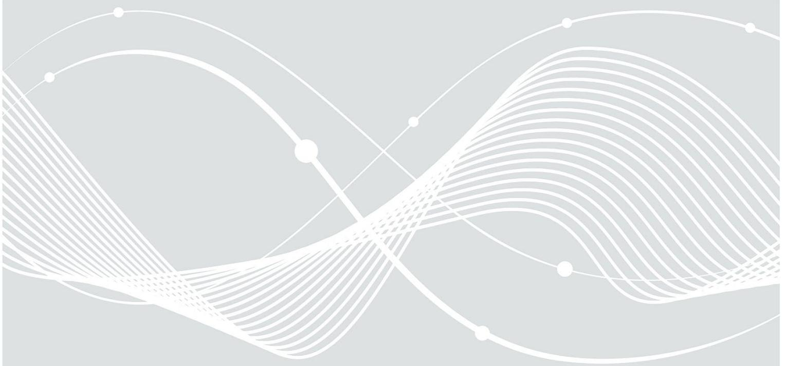
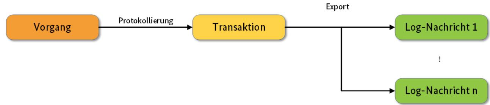
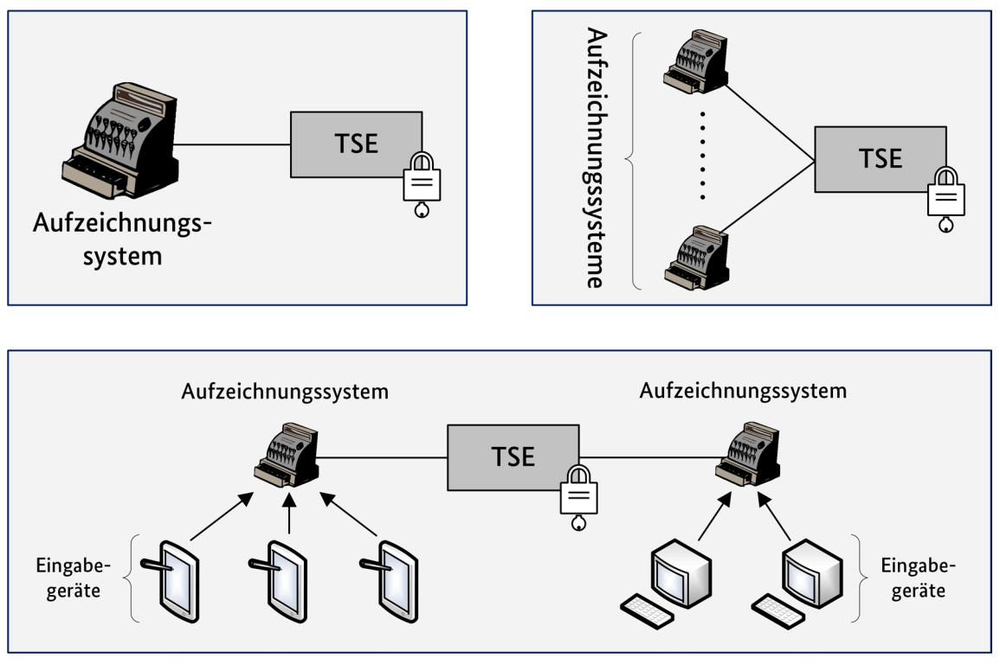
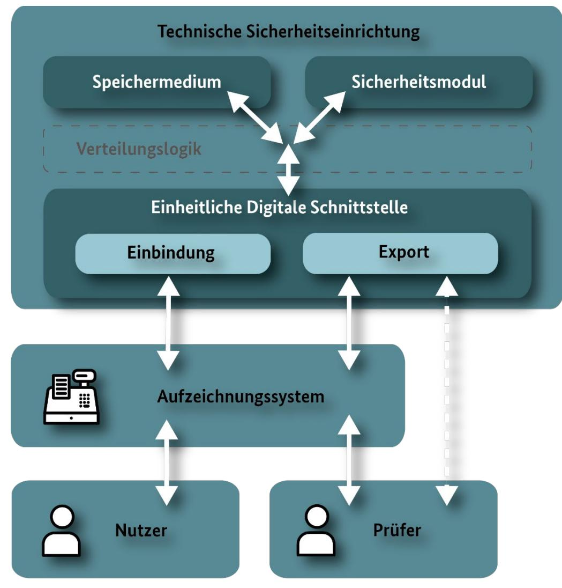
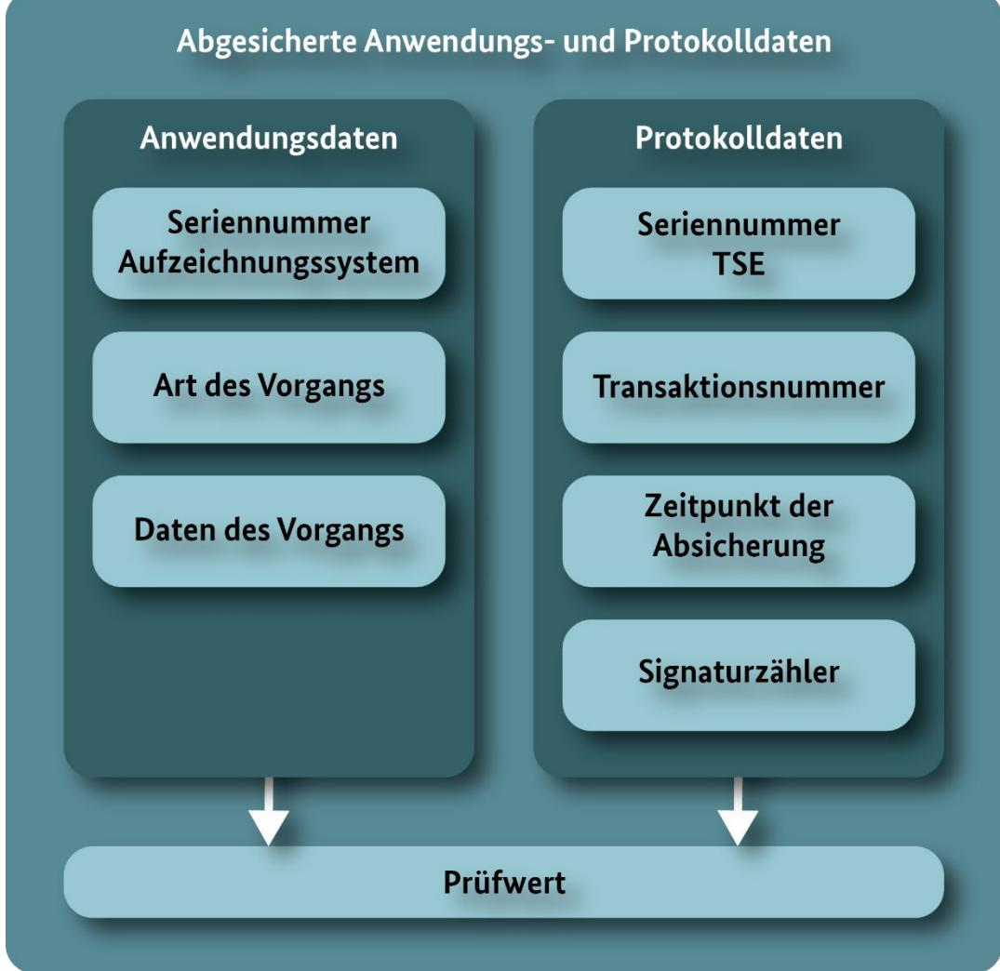
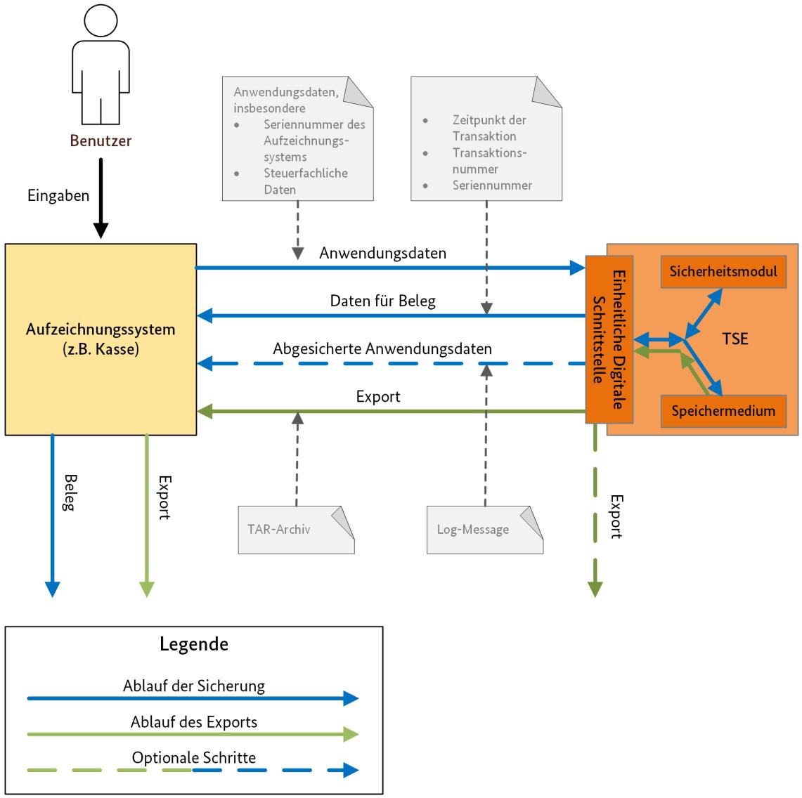
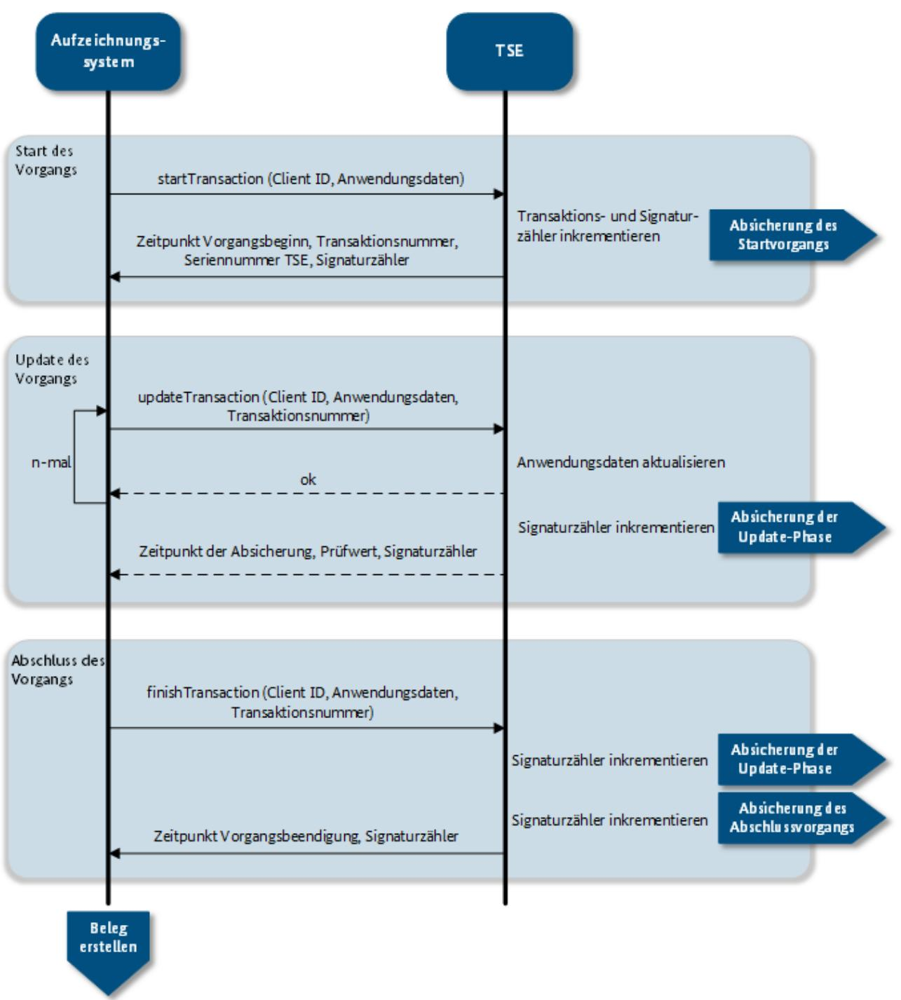
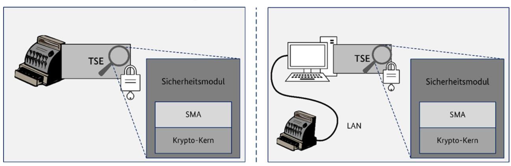

BSI TR-03153-1

# Technische Richtlinie BSI TR-03153 Technische Sicherheitseinrichtung für elektronische Aufzeichnungssysteme

Teil 1: Anforderungen an die Technische Sicherheitseinrichtung

Version 1.1.1 2023-12-19



# Änderungshistorie

| Version | Datum      | Beschreibung                                                                                                     |
|---------|------------|------------------------------------------------------------------------------------------------------------------|
| 1.0.0   | 2018-06-06 | Initiale Version                                                                                                 |
| 1.0.1   | 2018-12-20 | Kleinere Klarstellungen                                                                                          |
| 1.1.0   | 2023-05-30 | Überarbeitung                                                                                                    |
| 1.1.1   | 2023-12-19 | Vorliegende Version, Klarstellung zu setDescription, Entfernung<br>ungenutzter Referenz aus Literaturverzeichnis |

Tabelle 1: Änderungshistorie

Bundesamt für Sicherheit in der Informationstechnik Postfach 20 03 63 53133 Bonn

E-Mail: registrierkassen@bsi.bund.de Internet: https://www.bsi.bund.de © Bundesamt für Sicherheit in der Informationstechnik 2023

# Inhalt

| 1     | EINLEITUNG 7                                                                             |    |
|-------|------------------------------------------------------------------------------------------|----|
|       |                                                                                          |    |
| 1.1   | ÜBERSICHT ÜBER DIE TECHNISCHE SICHERHEITSEINRICHTUNG                                     | 7  |
| 1.2   | INHALT UND ABGRENZUNG DER TECHNISCHEN RICHTLINIE                                         | 8  |
| 1.3   | SCHLÜSSELWORTE                                                                           | 9  |
| 1.4   | ABKÜRZUNGEN                                                                              | 9  |
|       |                                                                                          |    |
| 2     | RECHTLICHE GRUNDLAGEN (INFORMATIV) 11                                                    |    |
|       |                                                                                          |    |
| 2.1   | ABGABENORDNUNG                                                                           | 11 |
| 2.2   | DIE KASSENSICHERUNGSVERORDNUNG                                                           | 12 |
| 2.2.1 | ELEKTRONISCHE AUFZEICHNUNGSSYSTEME                                                       | 13 |
| 2.2.2 | PROTOKOLLIERUNG VON DIGITALEN GRUNDAUFZEICHNUNGEN                                        | 13 |
| 2.2.3 | SPEICHERUNG DER GRUNDAUFZEICHNUNGEN                                                      | 14 |
| 2.2.4 | EINHEITLICHE DIGITALE SCHNITTSTELLE                                                      | 14 |
| 2.2.5 | ANFORDERUNGEN AN DIE TECHNISCHE SICHERHEITSEINRICHTUNG                                   | 14 |
| 2.2.6 | ANFORDERUNGEN AN DEN BELEG                                                               | 15 |
|       |                                                                                          |    |
| 3     | DIE TECHNISCHE SICHERHEITSEINRICHTUNG 16                                                 |    |
|       |                                                                                          |    |
| 3.1   | GRUNDBEGRIFFE                                                                            | 16 |
| 3.2   | VERWENDUNG TECHNISCHER SICHERHEITSEINRICHTUNGEN MIT ELEKTRONISCHEN AUFZEICHNUNGSSYSTEMEN | 17 |
| 3.3   | SYSTEMÜBERSICHT                                                                          | 18 |
| 3.4   | PROTOKOLLIERUNG VON VORGÄNGEN DES AUFZEICHNUNGSSYSTEMS                                   | 20 |
| 3.5   | ABLAUF DER PROTOKOLLIERUNG                                                               | 22 |
|       |                                                                                          |    |
| 3.5.1 | BEGINN DER TRANSAKTION                                                                   | 25 |
| 3.5.2 | AKTUALISIERUNG (UPDATE)<br>DER TRANSAKTION                                               | 25 |
| 3.5.3 | BEENDIGUNG DER TRANSAKTION                                                               | 28 |
| 3.5.4 | ERZEUGUNG DES PRÜFWERTS                                                                  | 29 |
| 3.5.5 | VERIFIKATION DES PRÜFWERTS                                                               | 30 |
| 3.6   | SYSTEM-EVENTS                                                                            | 30 |
| 3.7   | AUDIT-EVENTS                                                                             | 30 |
| 3.8   | DATENEXPORT                                                                              | 31 |
| 3.9   | ANFORDERUNGEN AN LEBENSZYKLUS UND INITIALISIERUNG                                        | 31 |
| 3.9.1 | ANFORDERUNGEN ZUR BESCHLÜSSELUNG DER TSE                                                 | 31 |
| 3.9.2 | ANFORDERUNGEN ZUR INBETRIEBNAHME DER TSE<br>DURCH DEN ENDNUTZER                          | 31 |
| 3.9.3 | ANFORDERUNGEN ZUR NUTZUNG DER TSE                                                        | 33 |
| 3.9.4 | ANFORDERUNGEN ZUR AUßERBETRIEBSETZUNG DER TSE                                            | 33 |
|       |                                                                                          |    |
|       | 3.10 BELEGAUSGABE                                                                        | 34 |
|       |                                                                                          |    |
| 4     | DAS SICHERHEITSMODUL 36                                                                  |    |
|       |                                                                                          |    |
| 4.1   | ALLGEMEINES                                                                              | 36 |
| 4.2   | LOGISCHE ARCHITEKTUR DES SICHERHEITSMODULS                                               | 36 |

| 4.2.1 | TSE-ARCHITEKTUREN                                                                 | 37 |
|-------|-----------------------------------------------------------------------------------|----|
| 4.3   | FUNKTIONALITÄT DES SICHERHEITSMODULS                                              | 39 |
| 5     | DIE EINHEITLICHE DIGITALE SCHNITTSTELLE 40                                        |    |
| 5.1   | EINBINDUNGSSCHNITTSTELLE                                                          | 40 |
| 5.1.1 | ÜBERSICHT DER FUNKTIONEN DER EINBINDUNGSSCHNITTSTELLE                             | 40 |
| 5.1.2 | SEQUENZIELLER AUFRUF DER FUNKTIONEN DER EINBINDUNGSSCHNITTSTELLE                  | 43 |
| 5.1.3 | ANFORDERUNGEN AN DIE RÜCKGABEWERTE DER FUNKTIONEN DER EINBINDUNGSSCHNITTSTELLE    | 44 |
| 5.1.4 | ANFORDERUNGEN AN DIE ERSTELLUNG VON LOG-NACHRICHTEN BEI AUFRUF DER FUNKTIONEN DER |    |
|       | EINBINDUNGSSCHNITTSTELLE                                                          | 44 |
| 5.2   | EXPORTSCHNITTSTELLE                                                               | 44 |
| 5.2.1 | LOG-NACHRICHTEN VON TRANSAKTIONS-ABSICHERUNGSSCHRITTEN                            | 45 |
| 5.2.2 | LOG-NACHRICHTEN FÜR SYSTEM-EVENTS                                                 | 45 |
| 5.2.3 | LOG-NACHRICHTEN FÜR AUDIT-EVENTS                                                  | 46 |
| 5.2.4 | TSE-INFORMATIONEN                                                                 | 46 |
| 5.3   | NUTZERKONZEPT UND BESCHRÄNKUNG DER FUNKTIONEN DER EINBINDUNGSSCHNITTSTELLE        | 47 |
| 5.3.1 | NUTZER-<br>UND ROLLENKONZEPT DER EINBINDUNGSSCHNITTSTELLE DER TSE                 | 47 |
| 5.3.2 | NUTZER /<br>USER DER EINBINDUNGSSCHNITTSTELLE DER TSE                             | 49 |
| 5.3.3 | ZUGRIFFSSCHUTZ FÜR NUTZERKONTEN                                                   | 50 |
| 5.4   | WEITERE ROLLEN DER TSE                                                            | 50 |
| 5.4.1 | SONDERROLLE SMAADMIN                                                              | 50 |
| 5.4.2 | SONDERROLLE CENTRALTIMEADMIN                                                      | 51 |
| 5.4.3 | SONDERROLLE CENTRALOPERATOR                                                       | 51 |
| 6     | DAS SPEICHERMEDIUM 52                                                             |    |
|       |                                                                                   |    |
| 6.1   | ANFORDERUNGEN AN DIE SPEICHERKAPAZITÄT                                            | 52 |
| 6.2   | ANFORDERUNGEN AN DIE ZUVERLÄSSIGKEIT                                              | 52 |
| 6.3   | DATENFORMAT                                                                       | 53 |
| 7     | KRYPTOGRAPHISCHE VORGABEN 54                                                      |    |
|       |                                                                                   |    |
| 7.1   | HASHFUNKTIONEN, VERFAHREN ZUR BERECHNUNG DER PRÜFWERTE UND ZERTIFIKATE            | 54 |
| 7.2   | WEITERE KRYPTOGRAPHISCHE VERFAHREN                                                | 54 |
| 7.3   | PUBLIC KEY INFRASTRUKTUR                                                          | 54 |
| 7.3.1 | (INITIALE)<br>ÜBERGABE DER VERTRAUENSANKER                                        | 54 |
| 7.3.2 | VERZEICHNISDIENST                                                                 | 54 |
| 7.3.3 | SPERRUNG VON ZERTIFIKATEN                                                         | 55 |
| 8     | ZERTIFIZIERUNGEN  56                                                              |    |
|       |                                                                                   |    |
| 8.1   | KONFORMITÄTSZERTIFIZIERUNG DER TSE                                                | 56 |

| 8.1.1 | GÜLTIGKEITSDAUER DER KONFORMITÄTSZERTIFIZIERUNG                                      | 56 |
|-------|--------------------------------------------------------------------------------------|----|
| 8.1.2 | KONFORMITÄT DER BESTANDTEILE UND DER PERIPHERIE DER TSE                              | 56 |
| 8.1.3 | ÜBERGANGSFRIST                                                                       | 56 |
| 8.2   | SICHERHEITSZERTIFIZIERUNGEN DER TSE                                                  | 57 |
| 8.2.1 | SICHERHEITSZERTIFIZIERUNG DES SICHERHEITSMODULS                                      | 57 |
| 8.2.2 | GÜLTIGKEITSDAUER DER SICHERHEITSZERTIFIZIERUNGEN                                     | 57 |
| 8.2.3 | ZU ERBRINGENDE KONZEPTE                                                              | 57 |
| 8.2.4 | ERNEUERUNG DER SICHERHEITSZERTIFIZIERUNGEN                                           | 57 |
| 8.2.5 | REGELUNG ZUR ÜBERGANGSWEISEN AUFRECHTERHALTUNG DER<br>ZERTIFIZIERUNG VON TECHNISCHEN |    |
|       | SICHERHEITSEINRICHTUNGEN IN BEGRÜNDETEN AUSNAHMEFÄLLEN                               | 58 |
| 8.3   | ZERTIFIZIERUNG DER PKI                                                               | 58 |
| 8.3.1 | ERNEUERUNG DER ZERTIFIZIERUNG DER PKI<br>NACH TR-03145<br>TEIL 5                     | 58 |
| 8.3.2 | BETRIEB EINER ÜBERGANGS-PKI                                                          | 59 |
| 8.3.3 | UMWANDLUNG EINER ÜBERGANGS-PKI<br>IN EINE 03145-5<br>ZERTIFIZIERTE PKI               | 61 |
| 8.4   | ZERTIFIZIERUNG VON AKTUALISIERUNGEN DER TSE PER UPDATE                               | 61 |
| 9     | WEITERE ANFORDERUNGEN  62                                                            |    |
|       |                                                                                      |    |
| 9.1   | SIGNATURZÄHLER                                                                       | 62 |
| 9.2   | TRANSAKTIONSZÄHLER                                                                   | 62 |
| 9.3   | SERIENNUMMERN                                                                        | 62 |
| 9.3.1 | SERIENNUMMER DES AUFZEICHNUNGSSYSTEMS                                                | 62 |
| 9.3.2 | SERIENNUMMER DER TECHNISCHEN SICHERHEITSEINRICHTUNG                                  | 62 |
| 9.3.3 | MELDUNG DER SERIENNUMMER DER TECHNISCHEN SICHERHEITSEINRICHTUNG                      | 63 |
| 9.4   | FEHLERBEHANDLUNG                                                                     | 63 |
| 9.5   | ANFORDERUNGEN ZUR ZEITFÜHRUNG                                                        | 63 |
| 9.5.1 | ZEITZONE DER ZEITFÜHRUNG                                                             | 63 |
| 9.5.2 | GRANULARITÄT DER ZEITFÜHRUNG                                                         | 64 |
| 9.5.3 | ART DER ZEITFÜHRUNG                                                                  | 64 |
| 9.5.4 | AKTUALISIERUNG DER ZEIT ÜBER DIE EINBINDUNGSSCHNITTSTELLE                            | 64 |
| 9.5.5 | AKTUALISIERUNGSHÄUFIGKEIT                                                            | 64 |
| 9.5.6 | FEHLERBEHANDLUNG                                                                     | 65 |
| 9.6   | EINSCHRÄNKUNG DER ELEMENTE DES TYPS ALGORITHMIDENTIFIER IN LOG-NACHRICHTEN           | 65 |
| 9.7   | EINSCHRÄNKUNG DER SYSTEM-LOG-NACHRICHTEN                                             | 66 |
| 9.7.1 | BELEGUNG DER FELDER EVENTORIGIN UND EVENTTRIGGEREDBYUSER VON SYSTEM-LOG-NACHRICHTEN  | 66 |
| 9.7.2 | GETDEVICEHEALTH -<br>SYSTEM-LOG                                                      | 66 |
| 9.8   | ERGÄNZENDE SYSTEM-LOGS DER SICHERHEITSMODULANWENDUNG                                 | 66 |
| 9.8.1 | AUTHENTICATESMAADMIN –<br>SYSTEM-LOG                                                 | 67 |
| 9.8.2 | STARTAUDIT –<br>SYSTEM-LOG                                                           | 68 |
| 9.8.3 | ENTERSECURESTATE –<br>SYSTEM-LOG                                                     | 68 |
| 9.8.4 | EXITSECURESTATE –<br>SYSTEM-LOG                                                      | 69 |
| 9.8.5 | SELFTEST –<br>SYSTEM-LOG                                                             | 70 |
| 9.8.6 | CONFIGURELOGGING –<br>SYSTEM-LOG                                                     | 70 |

Inhalt

| 9.9<br>ERGÄNZENDE FUNKTIONALITÄTEN                                                                                          | 71       |
|-----------------------------------------------------------------------------------------------------------------------------|----------|
| 9.9.1<br>ERGÄNZUNG DES FUNKTIONSUMFANGS DER EINBINDUNGSSCHNITTSTELLE                                                        | 71       |
| 9.10 AKTUALISIERUNG (UPDATE) DER TECHNISCHEN SICHERHEITSEINRICHTUNG<br>9.11 TEMPORÄRE SPERRUNG DER TRANSAKTIONSAUFZEICHNUNG | 72<br>72 |
| 9.11.1<br>TEMPORÄRE SPERRUNG DER TRANSAKTIONSAUFZEICHNUNG DURCH EINEN ZENTRALEN TSE-BETREIBER                               | 72       |
| 9.12 DOKUMENTATION                                                                                                          | 72       |
| 9.12.1<br>ANLEITUNG ZUM EXPORT DER DATEN AUS DER TSE<br>9.12.2<br>ANLEITUNG ZUM VERZEICHNISDIENSTABRUF                      | 73<br>73 |
| 9.13 ANFORDERUNGEN AN DEN BETRIEB IN BESTIMMTEN NUTZUNGSSZENARIEN                                                           | 73       |
| 10<br>ANFORDERUNG AN DIE PRÜFUNG VON LOG-NACHRICHTEN  74                                                                    |          |
| 10.1 VORAUSSETZUNGEN ZUR ZULÄSSIGEN PRÜFUNG VON LOG-NACHRICHTEN<br>10.2 VALIDIERUNG DES ZERTIFIKATS DER TSE                 | 74<br>74 |
| 10.2.1<br>ÜBERPRÜFUNG DER ZERTIFIKATSSIGNATUREN                                                                             | 74       |
| 10.2.2<br>ÜBERPRÜFUNG DER ZERTIFIKATSGÜLTIGKEIT                                                                             | 75       |
| 10.2.3<br>ÜBERPRÜFUNG DER SPERRLISTEN                                                                                       | 75       |
| 10.3 PRÜFUNG DER LOG-NACHRICHTEN                                                                                            | 76       |
| 10.4 AUFBEWAHRUNG VON LOG-NACHRICHTEN ÜBER DEN REGULÄREN PRÜFZEITRAUM HINAUS                                                | 76       |
| 10.5 TESTBETRIEB VON TECHNISCHEN SICHERHEITSEINRICHTUNGEN                                                                   | 76       |
| 10.6 TOOL ZUM AUSLESEN DER TECHNISCHEN SICHERHEITSEINRICHTUNG                                                               | 76       |
| APPENDIX A<br>ÜBERSICHTEN 78                                                                                                |          |
| A.1<br>ÜBERSICHT - AUSLÖSEURSPRUNG DER LOG-NACHRICHTEN                                                                      | 78       |
| A.2<br>ÜBERSICHT - QUELLEN DER LOG-NACHRICHTEN-INHALTE                                                                      | 78       |
| A.3<br>ÜBERSICHT - SPERRGRÜNDE (INFORMATIV)                                                                                 | 79       |
| APPENDIX B<br>PRÜFZIFFERNBERECHNUNG  81                                                                                     |          |
| B.1<br>PRÜFZIFFERNBERECHNUNG FÜR DIE SERIENNUMMER – VARIANTE A                                                              | 81       |
| B.2<br>PRÜFZIFFERNBERECHNUNG FÜR DIE SERIENNUMMER – VARIANTE B                                                              | 81       |
| APPENDIX C<br>KASSENSICHERUNGSVERORDNUNG AB 2024 82                                                                         |          |
| LITERATURVERZEICHNIS  87                                                                                                    |          |
|                                                                                                                             |          |

# <span id="page-6-0"></span>1 Einleitung

Im Zuge der Digitalisierung von Geschäftsprozessen und dem verstärkten Einsatz elektronischer Aufzeichnungssysteme (wie elektronischer Kassensysteme und Registrierkassen) werden Geschäftsvorfälle heutzutage immer häufiger digital erfasst und aufgezeichnet. Hierdurch haben sich die technischen Herausforderungen für die Prüfung durch die Finanzbehörden stark verändert. So liefern elektronische Aufzeichnungssysteme zwar gut aufbereitete steuerliche Daten, jedoch sind nachträgliche Manipulationen an den digitalen Aufzeichnungen (digitale Grundaufzeichnungen) ohne ausreichende Schutzmaßnahmen nur mit hohem Aufwand oder gar nicht feststellbar.

Um solche Manipulationen wirksam zu verhindern, müssen die Integrität, Authentizität und Vollständigkeit der digitalen Grundaufzeichnungen sichergestellt werden. Zudem müssen die Daten unmittelbar erfasst und im Rahmen von Prüfungen zeitlich aufgefunden werden können.

Erreicht wird dies durch die Verwendung einer Technischen Sicherheitseinrichtung (TSE). Die Technische Sicherheitseinrichtung wird vom elektronischen Aufzeichnungssystem angesprochen, übernimmt die Absicherung der aufzuzeichnenden Daten und speichert die gesicherten Aufzeichnungen in einem einheitlichen Format. Finanzbehörden können die geschützten Daten dann einfordern und auf Vollständigkeit und Korrektheit prüfen.

Die vorliegende Technische Richtlinie definiert die verbindlichen technischen Anforderungen an die Technische Sicherheitseinrichtung gemäß § 5 der Kassensicherungsverordnung [\[KassenSichV\]](#page-87-0), mit denen die digitalen Grundaufzeichnungen eines elektronischen Aufzeichnungssystems gemäß § 146a Absatz 1 der Abgabenordnung [\[AO\]](#page-86-1) geschützt werden müssen.

Die in dieser Richtlinie gemachten Vorgaben richten sich explizit an alle Technischen Sicherheitseinrichtungen für Aufzeichnungssysteme, welche nach Vorgabe der [\[AO\]](#page-86-1) und der [KassenSichV] Aufzeichnungen mit Hilfe einer Technischen Sicherheitseinrichtungen absichern müssen. Die Vorgaben gelten somit nicht nur für den Anwendungsbereich der Registrierkassen, sondern grundsätzlich auch für alle anderen Anwendungsbereiche, in denen diese Technischen Sicherheitseinrichtungen aktuell wie zukünftig einzusetzen sind, beispielsweise Taxameter und Wegstreckenzähler.

# <span id="page-6-1"></span>1.1 Übersicht über die Technische Sicherheitseinrichtung

Die Technische Sicherheitseinrichtung besteht aus einem Sicherheitsmodul, einem nicht-flüchtigen Speichermedium und einer einheitlichen digitalen Schnittstelle.

Die Aufzeichnung läuft hierbei wie folgt ab:

- Die Vorgangsdaten werden schrittweise über die einheitliche digitale Schnittstelle an die Technische Sicherheitseinrichtung übergeben.
- Das Sicherheitsmodul vergibt eine eindeutige fortlaufende Transaktionsnummer, einen eindeutigen fortlaufenden Signaturzähler, erfasst Beginn und Ende der Transaktion und erzeugt über die Daten der Transaktion einen Prüfwert.

• Die abgesicherten Vorgangsdaten werden auf dem Speichermedium gespeichert.


#### Abbildung 1 Absicherung von digitalen Grundaufzeichnungen

Die Überprüfung der geschützten Aufzeichnungen erfolgt wie im Folgenden beschrieben:

- Die abgesicherten Vorgangsdaten werden über die einheitliche digitale Schnittstelle aus der Technischen Sicherheitseinrichtung exportiert.
- Der Prüfwert wird verifiziert, um die Integrität und Authentizität der abgesicherten Vorgangsdaten sicherzustellen.
- Mit dem aufgezeichneten Beginn und Ende in den abgesicherten Transaktionsdaten kann überprüft werden, zu welchem Zeitpunkt die Daten aufgezeichnet wurden. Mit Hilfe der fortlaufenden Transaktionsnummer und des fortlaufenden Signaturzählers können Lücken in den aufgezeichneten Daten erkannt werden.

# <span id="page-7-0"></span>1.2 Inhalt und Abgrenzung der Technischen Richtlinie

Die vorliegende Technische Richtlinie definiert verbindliche Anforderungen an die Technische Sicherheitseinrichtung gemäß § 5 der Kassensicherungsverordnung.

Folgende Dokumente sind für die vorliegende Technische Richtlinie relevant:

- [\[BSI TR-03151-1\]](#page-86-2) Diese Technische Richtlinie spezifiziert eine einheitliche digitale Schnittstelle. Die Schnittstelle besteht aus den folgenden Komponenten:
	- o Eine standardisierte Einbindungsschnittstelle zur Ansprache der Technischen Sicherheitseinrichtung. Hierüber kann die Technische Sicherheitseinrichtung angesprochen, ihr Daten zugeführt und Daten aus ihr exportiert werden.
	- o Ein einheitliches Datenformat für die Aufzeichnung und Speicherung der abgesicherten elektronischen Aufzeichnungen.

Die Definition einer einheitlichen Einbindungsschnittstelle bietet die Möglichkeit, die Technische Sicherheitseinrichtung unabhängig von deren konkreter Implementierung und ohne Kenntnisse ihres internen Aufbaus an das elektronische Aufzeichnungssystem anzubinden und ansprechen zu können. Hierdurch wird eine technologieoffene und implementierungsunabhängige Kapselung der Sicherheitsfunktionalität der Technischen Sicherheitseinrichtung ermöglicht.

- [\[BSI-CC-PP-0105\]](#page-86-3) / [\[BSI-CC-PP-0105-V2\]](#page-86-4) und [\[BSI-CC-PP-0104\]](#page-86-5) [1](#page-7-1) / [\[BSI-CC-PP-0111\]](#page-86-6) [2](#page-7-2) Die Schutzprofile definieren Mindestanforderungen an die Sicherheitseigenschaften des Sicherheitsmoduls der Technischen Sicherheitseinrichtung.
- [\[BSI TR-03145-5\]](#page-86-7) Teil 5 der Technischen Richtlinie [\[BSI TR-03145\]](#page-86-8) beschreibt Anforderungen an die Public Key Infrastruktur der Technischen Sicherheitseinrichtungen.

<span id="page-7-1"></span><sup>1</sup> in Konfiguration nach [\[BSI-CC-PP-0107\]](#page-86-9) oder [\[BSI-CC-PP-0108\]](#page-86-10) 2 in Konfiguration nach [\[BSI-CC-PP-0113\]](#page-86-11)

<span id="page-7-2"></span>

• [\[BSI TR-03116-5\]](#page-86-12) Diese Technischen Richtlinie enthält die Vorgaben an den Einsatz geeigneter kryptographischer Verfahren zum Schutz der digitalen Grundaufzeichnungen.

Diese Technische Richtlinie macht keine Vorgaben an die konkrete Implementierung der Technischen Sicherheitseinrichtung.

Festlegungen zu Art und Umfang der aufzuzeichnenden Geschäftsvorfälle und anderer Vorgänge sowie die Strukturierung der zugrundeliegenden steuerfachlichen Daten eines Vorgangs liegen nicht im Regelungsbereich dieser Technischen Richtlinie.

## <span id="page-8-0"></span>1.3 Schlüsselworte

Anforderungen als Ausdruck normativer Festlegungen werden durch die in Großbuchstaben geschriebenen deutschen Schlüsselworte MUSS/MÜSSEN, DARF/DÜRFEN NICHT/KEINE, VERPFLICHTEND, SOLLTE/SOLLTEN, EMPFOHLEN, SOLLTE/SOLLTEN NICHT/KEINE, KANN/KÖNNEN/DARF/DÜRFEN, und OPTIONAL gekennzeichnet.

Die verwendeten Schlüsselworte sind auf Basis der folgenden Übersetzungstabelle gemäß [\[RFC 2119\]](#page-87-1) zu interpretieren:

| Deutsch                       | Englisch    |
|-------------------------------|-------------|
| MUSS / MÜSSEN                 | MUST        |
| DARF/DÜRFEN NICHT/KEINE       | MUST NOT    |
| VERPFLICHTEND                 | REQUIRED    |
| SOLLTE / SOLLTEN              | SHOULD      |
| SOLLTE/SOLLTEN NICHT/KEINE    | SHOULD NOT  |
| EMPFOHLEN                     | RECOMMENDED |
| KANN / KÖNNEN / DARF / DÜRFEN | MAY         |
| OPTIONAL                      | OPTIONAL    |

<span id="page-8-1"></span>Tabelle 2 Schlüsselworte 

# 1.4 Abkürzungen

In dieser Technischen Richtlinie werden folgende Abkürzungen verwendet:

| Abkürzung | Erklärung                         | Bemerkung                                                                                                                               |
|-----------|-----------------------------------|-----------------------------------------------------------------------------------------------------------------------------------------|
| API       | Application Programming Interface | Eine Schnittstelle die von einem Softwaresystem<br>anderen Softwaresystemen zur Anbindung an das<br>System zur Verfügung gestellt wird. |
| CA        | Certificate Authority             | Zertifizierungsstelle welche digitale<br>(kryptographische) Zertifikate herausgibt.                                                     |

| Abkürzung | Erklärung                                                            | Bemerkung                                                                                                                                                                                                                                                                                          |  |
|-----------|----------------------------------------------------------------------|----------------------------------------------------------------------------------------------------------------------------------------------------------------------------------------------------------------------------------------------------------------------------------------------------|--|
| CSP       | Cryptographic Service Provider                                       | Als Krypto-Kern der Technischen<br>Sicherheitseinrichtung verwendete Komponente.<br>Ebenfalls Name des Common Criteria Schutzprofils<br>mit dem die Sicherheitsvorgaben für die Komponente<br>beschrieben werden. Teilweise auch synonym als<br>englischer Ausdruck für den Krypto-Kern verwendet. |  |
| MRZ       | Machine Readable Zone                                                | Maschinenlesbarer Bereich. Ein meist gedruckter<br>Textbereich auf Dokumenten, welcher sich besonders<br>gut mit Hilfe von Maschinen erkennen und lesen lässt.<br>Wird meist auf Ausweisen wie z.B. dem Reisepass<br>genutzt.                                                                      |  |
| MSC       | Message Sequence Chart                                               | Eine Darstellungskonvention aus der<br>Kommunikationstechnik.                                                                                                                                                                                                                                      |  |
| PKI       | Public Key Infrastructure                                            | Public-Key-Infrastruktur. System aus verschiedenen<br>Komponenten welches kryptographische digitale<br>Zertifikate ausstellt, verteilt und prüft.                                                                                                                                                  |  |
| RFU       | Reserved for Future Use                                              | Bezeichnet ein Feature, dass für zukünftige<br>Anwendungen reserviert ist und grundsätzlich reaktiv<br>unterstützt werden MUSS, jedoch NICHT aktiv<br>verwendet werden DARF.                                                                                                                       |  |
| SMA       | Sicherheitsmodulanwendung                                            | Der Teil des Sicherheitsmoduls der die<br>anwendungsspezifischen Funktionen bereitstellt.<br>Erweitert den universellen Krypto-Kern (CSP) mit<br>anwendungsspezifischen Funktionen.                                                                                                                |  |
| SMAERS    | Security Module Application for<br>Electronic Record-Keeping Systems | Name des Common Criteria Schutzprofils in dem die<br>Sicherheitsvorgaben für die<br>Sicherheitsmodulanwendung der Technischen<br>Sicherheitseinrichtung beschrieben werden. Teilweise<br>auch synonym als englischer Ausdruck für die<br>Sicherheitsmodulanwendung selbst verwendet.               |  |
| TSE       | Technische Sicherheitseinrichtung                                    | Die in dieser Technischen Richtlinie spezifizierte<br>Technische Sicherheitseinrichtung zur Absicherung<br>von digitalen Aufzeichnungen eines elektronischen<br>Aufzeichnungssystems.                                                                                                              |  |

Tabelle 3 Abkürzungen

# <span id="page-10-0"></span>2 Rechtliche Grundlagen (informativ)

In diesem Kapitel wird ein Überblick über die rechtlichen Grundlagen der Technischen Sicherheitseinrichtung gegeben.

# <span id="page-10-1"></span>2.1 Abgabenordnung

Rechtlich ist der Schutz vor Manipulationen an Aufzeichnungen elektronischer Aufzeichnungssysteme durch die Abgabenordnung [\[AO\]](#page-86-1) geregelt. Diese sieht u.a. eine Kombination von technischen und organisatorischen Maßnahmen vor, um solche Manipulationen digitaler Grundaufzeichnungen wirksam zu verhindern.

#### Aufzeichnungspflicht

§ 146a Absatz 1 Satz 1: "Wer aufzeichnungspflichtige Geschäftsvorfälle oder andere Vorgänge mit Hilfe eines elektronischen Aufzeichnungssystems erfasst, hat ein elektronisches Aufzeichnungssystem zu verwenden, das jeden aufzeichnungspflichtigen Geschäftsvorfall und anderen Vorgang einzeln, vollständig, richtig, zeitgerecht und geordnet aufzeichnet." 

#### Einführung einer zertifizierten Technischen Sicherheitseinrichtung

§ 146a Absatz 1 Sätze 2-5: "Das elektronische Aufzeichnungssystem und die digitalen Aufzeichnungen nach Satz 1 sind durch eine zertifizierte technische Sicherheitseinrichtung zu schützen. Diese zertifizierte technische Sicherheitseinrichtung muss aus einem Sicherheitsmodul, einem Speichermedium und einer einheitlichen digitalen Schnittstelle bestehen. Die digitalen Aufzeichnungen sind auf dem Speichermedium zu sichern und für Nachschauen sowie Außenprüfungen durch elektronische Aufbewahrung verfügbar zu halten. [...]"

#### Meldepflicht

§ 146a Absatz 4: "Wer aufzeichnungspflichtige Geschäftsvorfälle oder andere Vorgänge mit Hilfe eines elektronischen Aufzeichnungssystems im Sinne des Absatzes 1 erfasst, hat dem nach den §§ 18 bis 20 zuständigen Finanzamt nach amtlich vorgeschriebenen Vordruck mitzuteilen: 

- 1. Name des Steuerpflichtigen,
- 2. Steuernummer des Steuerpflichtigen,
- 3. Art der zertifizierten technischen Sicherheitseinrichtung,
- 4. Art des verwendeten elektronischen Aufzeichnungssystems,
- 5. Anzahl der verwendeten elektronischen Aufzeichnungssysteme,
- 6. Seriennummer des verwendeten elektronischen Aufzeichnungssystems,
- 7. Datum der Anschaffung des verwendeten elektronischen Aufzeichnungssystems,
- 8. Datum der Außerbetriebnahme des verwendeten elektronischen Aufzeichnungssystems.

Die Mitteilung nach Satz 1 ist innerhalb eines Monats nach Anschaffung oder Außerbetriebnahme des elektronischen Aufzeichnungssystems zu erstatten." 

#### Belegausgabepflicht

§ 146a Absatz 2: "Wer aufzeichnungspflichtige Geschäftsvorfälle im Sinne des Absatzes 1 Satz 1 erfasst, hat dem an diesem Geschäftsvorfall Beteiligten in unmittelbarem zeitlichem Zusammenhang mit dem Geschäftsvorfall unbeschadet anderer gesetzlicher Vorschriften einen Beleg über den Geschäftsvorfall auszustellen und dem an diesem Geschäftsvorfall Beteiligten zur Verfügung zu stellen (Belegausgabepflicht). Bei Verkauf von Waren an eine Vielzahl von nicht bekannten Personen können die Finanzbehörden nach §

148 aus Zumutbarkeitsgründen nach pflichtgemäßem Ermessen von einer Belegausgabepflicht nach Satz 1 befreien. Die Befreiung kann widerrufen werden." 

#### Einführung einer Kassen-Nachschau

§ 146b Absatz 1: "Zur Prüfung der Ordnungsmäßigkeit der Aufzeichnungen und Buchungen von Kasseneinnahmen und Kassenausgaben können die damit betrauten Amtsträger der Finanzbehörde ohne vorherige Ankündigung und außerhalb einer Außenprüfung während der üblichen Geschäfts- und Arbeitszeiten Geschäftsgrundstücke oder Geschäftsräume von Steuerpflichtigen betreten, um Sachverhalte festzustellen, die für die Besteuerung erheblich sein können (Kassen-Nachschau). Der Kassen-Nachschau unterliegt auch die Prüfung des ordnungsgemäßen Einsatzes des elektronischen Aufzeichnungssystems nach § 146a Absatz 1. [...]"

Die Technische Sicherheitseinrichtung ist hierbei der zentrale technische Baustein zur Sicherung der Grundaufzeichnungen gegen nachträgliche Manipulationen. Die Zertifizierung hat zum Ziel ein einheitliches Mindestniveau an Vertrauen und Sicherheit in die Technische Sicherheitseinrichtung sowie die Einhaltung notwendiger Interoperabilitätsanforderungen sicherzustellen. Eine Zertifizierung des gesamten elektronischen Aufzeichnungssystems (z.B. Kasse oder Kassensoftware) selbst ist nicht zielführend.

#### Verordnungsermächtigung

§ 146a Absatz 3 Satz 1: "Das Bundesministerium der Finanzen wird ermächtigt, durch Rechtsverordnung mit Zustimmung des Bundestages und des Bundesrates und im Einvernehmen mit dem Bundesministerium des Innern und dem Bundesministerium für Wirtschaft und Energie Folgendes zu bestimmen: 

- 1. die elektronischen Aufzeichnungssysteme, die über eine zertifizierte technische Sicherheitseinrichtung verfügen müssen, und
- 2. die Anforderungen an a) das Sicherheitsmodul, b) das Speichermedium, c) die einheitliche digitale Schnittstelle, d) die elektronische Aufbewahrung der Aufzeichnungen, e) die Protokollierung von digitalen Grundaufzeichnungen zur Sicherstellung der Integrität und Authentizität sowie der Vollständigkeit der elektronischen Aufzeichnung, f) den Beleg und g) die Zertifizierung der technischen Sicherheitseinrichtung."

#### Aufgaben des BSI

§ 146a Absatz 3 Sätze 2-3: "Die Erfüllung der Anforderungen nach Satz 1 Nummer 2 Buchstabe a bis c ist durch eine Zertifizierung des Bundesamts für Sicherheit in der Informationstechnik nachzuweisen, die fortlaufend aufrechtzuerhalten ist. Das Bundesamt für Sicherheit in der Informationstechnik kann mit der Festlegung von Anforderungen an die technische Sicherheitseinrichtung im Sinne des Satzes 1 Nummer 2 Buchstabe a bis c beauftragt werden. [...]" 

Die Durchführungsdetails werden gemäß § 146a Absatz 3 Satz 1 [\[AO\]](#page-86-1) in der Kassensicherungsverordnung [\[KassenSichV\]](#page-87-0) des Bundesministeriums der Finanzen präzisiert.

# <span id="page-11-0"></span>2.2 Die Kassensicherungsverordnung

Dieser Abschnitt gibt einen Überblick über die Vorgaben der Kassensicherungsverordnung [\[KassenSichV\]](#page-87-0), um Lesenden eine thematischen Einführung zu ermöglichen.

Hinweis: An dieser Stelle besteht nicht der Anspruch, immer die aktuellste Version der Verordnung widerzugeben, sondern einen grundsätzlichen Einblick zu ermöglichen. Der in diesem Dokument informativ dargestellte Stand entspricht der Kassensicherungsverordnung vom 26. September 2017 (BGBl. I S. 3515), die durch Artikel 2 des Gesetzes vom 30. Juli 2021 (BGBl. I S. 3295) geändert worden ist.

<span id="page-12-0"></span>Eine informative Darstellung des ab dem 1. Januar 2024 gültigen Stands findet sich in [Appendix C.](#page-81-0) 

#### 2.2.1 Elektronische Aufzeichnungssysteme

§ 1 der [\[KassenSichV\]](#page-87-0) legt fest, welche Aufzeichnungssysteme über eine zertifizierte Technische Sicherheitseinrichtung verfügen müssen.

#### Elektronische Aufzeichnungssysteme

§ 1 [KassenSichV]: "Elektronische Aufzeichnungssysteme im Sinne des § 146a Absatz 1 Satz 1 der Abgabenordnung sind elektronische oder computergestützte Kassensysteme oder Registrierkassen. 

Nicht als elektronische Aufzeichnungssysteme gelten

- 1. Fahrscheinautomaten und Fahrscheindrucker,
- 2. Kassen- und Parkscheinautomaten der Parkraumbewirtschaftung sowie Ladepunkte für Elektrooder Hybridfahrzeuge,
- 3. elektronische Buchhaltungsprogramme,
- 4. Waren- und Dienstleistungsautomaten,
- 5. Taxameter und Wegstreckenzähler
- 6. Geldautomaten sowie
- <span id="page-12-1"></span>7. Geld- und Warenspielgeräte"

#### 2.2.2 Protokollierung von digitalen Grundaufzeichnungen

In § 2 der [\[KassenSichV\]](#page-87-0) werden die grundlegenden Anforderungen an die Protokollierung von digitalen Grundaufzeichnungen definiert.

#### Protokollierung von digitalen Grundaufzeichnungen

§ 2 [KassenSichV]: "Für jede Aufzeichnung eines Geschäftsvorfalls oder anderen Vorgangs im Sinne des § 146a Absatz 1 Satz 1 der Abgabenordnung muss von einem elektronischen Aufzeichnungssystem unmittelbar eine neue Transaktion gestartet werden. Die Transaktion hat zu enthalten:

- 1. den Zeitpunkt des Vorgangsbeginns,
- 2. eine eindeutige und fortlaufende Transaktionsnummer,
- 3. die Art des Vorgangs,
- 4. die Daten des Vorgangs,
- 5. die Zahlungsart,
- 6. den Zeitpunkt der Vorgangsbeendigung oder des Vorgangsabbruchs,
- 7. einen Prüfwert sowie
- 8. die Seriennummer des elektronischen Aufzeichnungssystems oder die Seriennummer des Sicherheitsmoduls.

Die Zeitpunkte nach Satz 2 Nummer 1 und 6, die Transaktionsnummer nach Satz 2 Nummer 2 und der Prüfwert nach Satz 2 Nummer 7 werden manipulationssicher durch das Sicherheitsmodul festgelegt. Die Transaktionsnummer muss so beschaffen sein, dass Lücken in Transaktionsaufzeichnungen erkennbar sind."

# <span id="page-13-0"></span>2.2.3 Speicherung der Grundaufzeichnungen

§ 3 der [\[KassenSichV\]](#page-87-0) enthält Anforderungen zur Speicherung und Aufbewahrung der Grundaufzeichnungen.

#### Speicherung der Grundaufzeichnungen

#### § 3 [\[KassenSichV\]](#page-87-0):

- (1) "Die Speicherung der laufenden Geschäftsvorfälle oder anderen Vorgänge im Sinne des § 146a Absatz 1 Satz 1 der Abgabenordnung muss vollständig, unverändert und manipulationssicher auf einem nichtflüchtigen Speichermedium erfolgen.
- (2) Die gespeicherten Geschäftsvorfälle oder andere Vorgänge im Sinne des § 146a Absatz 1 Satz 1 der Abgabenordnung müssen als Transaktionen so verkettet werden, dass Lücken in den Aufzeichnungen erkennbar sind.
- (3) Werden die gespeicherten digitalen Grundaufzeichnungen ganz oder teilweise von einem elektronischen Aufzeichnungssystem in ein externes elektronisches Aufbewahrungssystem übertragen, so muss sichergestellt werden, dass die Verkettung aller Transaktionen nach Absatz 2 und die Anforderungen an die einheitliche digitale Schnittstelle nach § 4 erhalten bleiben.
- (4) Eine Verdichtung von Grundaufzeichnungen in einem elektronischen Aufzeichnungssystem ist für die Dauer der Aufbewahrung nach § 147 Absatz 3 der Abgabenordnung unzulässig, wenn dadurch deren Lesbarkeit nicht mehr gewährleistet ist."

#### <span id="page-13-1"></span>2.2.4 Einheitliche Digitale Schnittstelle

§ 4 der [\[KassenSichV\]](#page-87-0) enthält die Vorgaben an die Einheitliche Digitale Schnittstelle der Technischen Sicherheitseinrichtung.

#### Einheitliche Digitale Schnittstelle

§ 4 [\[KassenSichV\]](#page-87-0): "Die einheitliche digitale Schnittstelle ist eine Datensatzbeschreibung für den standardisierten Datenexport aus dem Speichermedium nach § 3 Absatz 1, der Anbindung an das elektronische Aufzeichnungssystem und dem elektronischen Aufbewahrungssystems zur Übergabe an den mit der Kassen-Nachschau oder Außenprüfung betrauten Amtsträger der Finanzbehörde. Sie stellt eine einheitliche Strukturierung und Bezeichnung der nach § 146a Absatz 1 der Abgabenordnung aufzuzeichnenden Daten in Datenschema und Datenfelderbeschreibung für die Protokollierung nach § 2 und die Speicherung nach § 3 sicher. Dies gilt unabhängig vom Programm des Herstellers.

Die einheitliche digitale Schnittstelle für den standardisierten Export aus dem Speichermedium nach § 3 Absatz 1 und die einheitliche digitale Schnittstelle für den standardisierten Export aus dem elektronischen Aufzeichnungssystem können getrennt voneinander erstellt und veröffentlicht werden." 

## <span id="page-13-2"></span>2.2.5 Anforderungen an die Technische Sicherheitseinrichtung

§ 5 der [\[KassenSichV\]](#page-87-0) regelt die Erstellung der Technischen Richtlinien und Schutzprofile durch das BSI.

#### Anforderungen an die Technische Sicherheitseinrichtung

§ 5 [\[KassenSichV\]](#page-87-0): "Das Bundesamt für Sicherheit in der Informationstechnik legt im Benehmen mit dem Bundesministerium der Finanzen in Technischen Richtlinien und Schutzprofilen die technischen Anforderungen fest an

1. die digitale Schnittstelle, soweit diese den standardisierten Export aus dem Speichermedium und die Anbindung der zertifizierten technischen Sicherheitseinrichtung an das elektronische Aufzeichnungssystem betreffen,

- 2. das Sicherheitsmodul und
- 3. das Speichermedium.

Die jeweils aktuellsten Versionen werden im Bundessteuerblatt Teil 1 und auf der Internetseite des Bundesamtes für Sicherheit in der Informationstechnik veröffentlicht."

<span id="page-14-0"></span>Die Anforderungen des § 5 werden mit der vorliegenden Technischen Richtlinie festgelegt.

### 2.2.6 Anforderungen an den Beleg

§ 6 der [\[KassenSichV\]](#page-87-0) enthält die Anforderungen an den Beleg.

#### Anforderungen an den Beleg

§ 6 [\[KassenSichV\]](#page-87-0): "Ein Beleg muss mindestens enthalten

- 1. den vollständigen Namen und die vollständige Anschrift des leistenden Unternehmers,
- 2. das Datum der Belegausstellung und den Zeitpunkt des Vorgangsbeginns im Sinne des § 2 Satz 2 Nummer 1 sowie den Zeitpunkt der Vorgangsbeendigung im Sinne des § 2 Satz 2 Nummer 6,
- 3. die Menge und die Art der gelieferten Gegenstände oder den Umfang und die Art der sonstigen Leistung,
- 4. die Transaktionsnummer im Sinne des § 2 Satz 2 Nummer 2,
- 5. das Entgelt und den darauf entfallenden Steuerbetrag für die Lieferung oder sonstige Leistung in einer Summe sowie den anzuwendenden Steuersatz oder im Fall einer Steuerbefreiung einen Hinweis darauf, dass für die Lieferung oder sonstige Leistung eine Steuerbefreiung gilt und
- 6. die Seriennummer des elektronischen Aufzeichnungssystems oder die Seriennummer des Sicherheitsmoduls.

Die Angaben nach Satz 1 müssen 

- 1. für jedermann ohne maschinelle Unterstützung lesbar oder
- 2. aus einem QR-Code auslesbar sein.

Der QR-Code nach Satz 2 Nummer 2 hat der digitalen Schnittstelle der Finanzverwaltung (DSFinV), die für die jeweils zugehörige Art des Aufzeichnungssystems vorgeschrieben ist, zu entsprechen. Die digitale Schnittstelle wird auf der Internetseite des Bundeszentralamtes für Steuern in der jeweils geltenden Fassung veröffentlicht. Ein Beleg kann in Papierform oder mit Zustimmung des Belegempfängers elektronisch in einem standardisierten Datenformat ausgegeben werden." 

Die Erstellung und Ausgabe des Belegs sind nicht die Aufgabe der Technischen Sicherheitseinrichtung und fallen daher grundsätzlich in die Zuständigkeit des elektronischen Aufzeichnungssystems. Der Beleg wird in der vorliegenden Technischen Richtlinie nur insofern berücksichtigt, als dass die Technische Sicherheitseinrichtung Daten, die für die Erstellung eines Belegs relevant sind, an das elektronische Aufzeichnungssystem übergibt, vgl. auch Kapite[l 3.](#page-15-0) 

# <span id="page-15-0"></span>3 Die Technische Sicherheitseinrichtung

# <span id="page-15-1"></span>3.1 Grundbegriffe

Diese Technische Richtlinie nutzt die folgenden Grundbegriffe und Bezeichnungen:

- Der Begriff elektronisches Aufzeichnungssystem (oder kurz Aufzeichnungssystem) wird als Oberbegriff für Systeme verwendet, die eine in diesem Dokument spezifizierte Technische Sicherheitseinrichtung zur Absicherung von Aufzeichnungen verwenden. Dies umfasst insbesondere die Systeme aus § 1 [\[KassenSichV\]](#page-87-0).
- Der Begriff aufzuzeichnende oder aufzeichnungspflichtige Vorgänge wird als Oberbegriff für Vorgänge verwendet, welche außersteuerlichen oder steuerlichen Aufzeichnungsverpflichtungen unterliegen. Hierbei wird zwischen den folgenden Kategorien von aufzeichnungspflichtigen Vorgängen unterschieden:
	- o Geschäftsvorfälle sind alle rechtlichen und wirtschaftlichen Vorgänge, die innerhalb eines bestimmten Zeitabschnitts den Gewinn bzw. Verlust oder die Vermögenszusammensetzung in einem Unternehmen dokumentieren oder beeinflussen bzw. verändern (z.B. zu einer Veränderung des Anlage- und Umlaufvermögens sowie des Eigen- und Fremdkapitals führen).
	- o Andere Vorgänge sind Vorgänge, die durch das Aufzeichnungssystem oder die Technische Sicherheitseinrichtung verwaltet werden, die jedoch keinen Geschäftsvorfall im Sinne der [\[AO\]](#page-86-1) bewirken (z.B. Trainingsbuchungen).
- Neben den aufzuzeichnenden Vorgängen des Aufzeichnungssystems gibt es weitere Ereignisse (Events) welche durch die Technische Sicherheitseinrichtung protokolliert werden. Hierzu zählen die Events die hauptsächlich durch den Aufruf von Funktionen zum Management bzw. zur Konfiguration der Technische Sicherheitseinrichtung über deren Einbindungsschnittstelle erzeugt werden (System-Events) und Events welche Ereignisse im Sicherheitsmodul wiedergeben (Audit-Events). Die Ursprünge dieser Events und deren Technische Vorgänge werden in [\[BSI TR-03151-1\]](#page-86-2), [\[BSI-CC-PP-0105\]](#page-86-3) bzw. [\[BSI-](#page-86-4)[CC-PP-0105-V2\]](#page-86-4) (SMAERS) und [\[BSI-CC-PP-0104\]](#page-86-5) (CSP) bzw. [\[BSI-CC-PP-0111\]](#page-86-6) definiert.
- Als Protokollierung wird der Prozess gemäß § 2 [\[KassenSichV\]](#page-87-0) bezeichnet, mit dem die Technische Sicherheitseinrichtung einen aufzuzeichnenden Vorgang des Aufzeichnungssystems bzw. einen Funktionsaufruf oder ein Ereignis der Technischen Sicherheitseinrichtung gegen nachträgliche, unerkannte Veränderungen schützt und die Existenz der Aufzeichnung zu einem bestimmten Zeitpunkt bestätigt.
	- o Jeder aufzuzeichnende Vorgang wird in der Technischen Sicherheitseinrichtung über eine Transaktion gemäß § 2 [\[KassenSichV\]](#page-87-0) abgebildet.
	- o Die Absicherung einer gesamten Transaktion erfolgt grundsätzlich in mehreren Absicherungsschritten (vgl. Kapitel [3.5\)](#page-21-0). Für jede Transaktion gibt es mindestens zwei Absicherungsschritte.
	- o Als Anwendungsdaten werden die Daten bezeichnet, die vom Aufzeichnungssystem über einen aufzuzeichnenden Vorgang erstellt und zur Absicherung an die Technische Sicherheitseinrichtung übermittelt werden. Dies umfasst insbesondere die Art des Vorgangs, die vom Aufzeichnungssystem erzeugten Daten des Vorgangs und die Zahlungsart gemäß § 2 der [KassenSichV]. Diese Technische Richtlinie macht keine Vorgaben an Inhalt und Formatierung der Daten des Vorgangs.
	- o Als Protokolldaten werden die Daten bezeichnet, die im Rahmen der Absicherung der übermittelten Anwendungsdaten vor der Berechnung des Prüfwertes von der Technischen

Sicherheitseinrichtung erzeugt werden. Hierzu zählen insbesondere die Transaktionsnummer oder die Zeitpunkte der Absicherung

- o Anwendungs- und Protokolldaten bilden in geeigneter Strukturierung den Input für die Prüfwertberechnung. Der Prüfwert (digitale Signatur) wird mittels des Schlüssels für die Prüfwertberechnung (privater Signaturschlüssel) der Technischen Sicherheitseinrichtung erzeugt. Die (Anwendungsdaten,) Protokolldaten und der Prüfwert werden zusammen als abgesicherte (Anwendungs- und) Protokolldaten bezeichnet. Durch die Erzeugung der abgesicherten Protokolldaten werden die Anwendungsdaten mit den zugehörigen Protokolldaten abgesichert.
- o Die Transaktionsnummer ist eine eindeutige und fortlaufende Nummer einer Transaktion, welche manipulationssicher vom Sicherheitsmodul der Technischen Sicherheitseinrichtung festgelegt wird. Sie wird mit jedem Start einer Transaktion inkrementiert.
- o Der Signaturzähler ist ein fortlaufender Zähler, der vom Sicherheitsmodul der Technischen Sicherheitseinrichtung festgelegt wird. Im Gegensatz zur Transaktionsnummer wird der Signaturzähler bei jeder erstellten Signatur inkrementiert.
- Eine Log-Nachricht besteht aus den abgesicherten Anwendungs- und Protokolldaten eines einzelnen Absicherungsschritts. Sie ist eine einheitliche Datenstruktur und wird von der Technischen Sicherheitseinrichtung beim Export ausgegeben. Es werden folgende Typen von Log-Nachrichten unterschieden:
	- o Transaktions-Log: Log-Nachrichten eines Vorgangs
	- o System-Log: Log-Nachrichten eines Systemfunktionsaufrufes[3](#page-16-1)
	- o Audit-Log: Log-Nachricht eines Ereignisses innerhalb des Sicherheitsmoduls[4](#page-16-2)



Abbildung 2 Aufzeichnung in Absicherungsschritten

# <span id="page-16-0"></span>3.2 Verwendung Technischer Sicherheitseinrichtungen mit elektronischen Aufzeichnungssystemen

• Ein Aufzeichnungssystem ist (im Normalbetrieb) genau einer TSE zugeordnet. Eine Technische Sicherheitseinrichtung kann von mehreren Aufzeichnungssystemen eines Steuerpflichtigen genutzt werden.

<span id="page-16-1"></span><sup>3</sup> Hinweis: Abweichend von dieser generellen Systematik und Strukturierung, werden einige wenige Ereignisse innerhalb der Sicherheitsmodulanwendung und des Krypto-Kerns ebenfalls als System-Log abgesichert. 4 Hinweis: Abweichend von dieser generellen Systematik und Strukturierung, werden hauptsächlich

<span id="page-16-2"></span>Ereignisse innerhalb des Krypto-Kerns (CSP) als Audit-Log abgesichert.

• Einem Aufzeichnungssystem können zudem mehrere Eingabegeräte zugeordnet sein. Das den Eingabegeräten zugehörige Aufzeichnungssystem übergibt die Transaktionsdaten an die TSE zur Absicherung.



Abbildung 3 Relationen von Aufzeichnungssystemen zu Technischen Sicherheitseinrichtungen

# <span id="page-17-0"></span>3.3 Systemübersicht

Die Technische Sicherheitseinrichtung besteht aus den folgenden Komponenten und ist in [Abbildung 4](#page-19-1) grafisch dargestellt:

- Sicherheitsmodul: Das Sicherheitsmodul gewährleistet die sichere Protokollierung der aufzuzeichnenden Vorgänge. Hierzu generiert es zu den übergebenen Anwendungsdaten eines Vorgangs korrespondierende Protokolldaten. Das Sicherheitsmodul übernimmt die manipulationssichere Festlegung der eindeutigen fortlaufenden Transaktionsnummer, der Zeitpunkte der Absicherung sowie des Prüfwerts. Zusätzlich gewährleistet das Sicherheitsmodul die Protokollierung von Systemfunktionen und Ereignissen der Technischen Sicherheitseinrichtung. Die Technische Sicherheitseinrichtung enthält genau ein Sicherheitsmodul. Das Sicherheitsmodul MUSS die Anforderung aus Kapite[l 4](#page-35-0) erfüllen.
- Einheitliche Digitale Schnittstelle: Die Einheitliche Digitale Schnittstelle ermöglicht die Integration der Technischen Sicherheitseinrichtung und eine reibungslose Datenübertragung für Prüfungszwecke. Hierzu besteht die Schnittstelle der Technischen Sicherheitseinrichtung aus den folgenden Bestandteilen:
	- o Einbindungsschnittstelle: Die Einbindungsschnittstelle dient zur Anbindung der Technischen Sicherheitseinrichtung an das elektronische Aufzeichnungssystem. Hierzu stellt die Einbindungsschnittstelle standardisierte Funktionen bereit, um die Technische Sicherheitseinrichtung unabhängig von der jeweiligen Implementierung und der zugrundeliegenden Hard- und Software vom elektronischen Aufzeichnungssystem auf

einheitliche Art ansprechen und anbinden zu können[5](#page-18-0) . Die Einbindungsschnittstelle MUSS den Vorgaben aus Kapitel [5.1](#page-39-1) entsprechen.

- o Exportschnittstelle: Die Exportschnittstelle besteht aus einer einheitlichen Datensatzbeschreibung für den standardisierten Export der gespeicherten, abgesicherten Grundaufzeichnungen aus der Technischen Sicherheitseinrichtung, etwa für Prüfungszwecke und/oder die Aufbewahrung außerhalb der Technischen Sicherheitseinrichtung. Die Exportschnittstelle MUSS nach den Vorgaben aus Kapitel [5.2 i](#page-43-2)mplementiert werden.
- Speichermedium: Das Speichermedium dient zur Speicherung der aufgezeichneten Anwendungsdaten und der zugehörigen Protokolldaten. Das Speichermedium MUSS den Anforderungen aus Kapitel [6](#page-51-0) genügen.
- Verteilungslogik: Die Technische Sicherheitseinrichtung MUSS eine Verteilungslogik implementieren. Die Verteilungslogik verwaltet den Datenfluss zwischen Einbindungsschnittstelle, dem Sicherheitsmodul und dem Speichermedium.

Der in [Abbildung 4](#page-19-1) dargestellte, grundlegende logische Aufbau der Technischen Sicherheitseinrichtung soll dem grundlegenden Verständnis dienen, eine konkrete Architektur wird hierdurch aber nicht vorgegeben. Insbesondere muss die Technische Sicherheitseinrichtung nicht notwendigerweise in einer einzelnen physikalischen Einheit verbaut sein.

<span id="page-18-0"></span><sup>5</sup> Die Einbindungsschnittstelle ist als Schnittstelle keine aktive Komponente, sondern legt die erlaubten und geforderten Ein- und Ausgabeparameter des dahinterliegenden Systems und deren Logik an dieser Stelle fest. Somit werden durch die Schnittstelle Daten durchgereicht, diese selbst steuert aber nicht.



<span id="page-19-1"></span><span id="page-19-0"></span>Abbildung 4 Grundlegender Aufbau der Technischen Sicherheitseinrichtung

# 3.4 Protokollierung von Vorgängen des Aufzeichnungssystems

Im Rahmen der Protokollierung eines Vorgangs werden die folgenden Anwendungs- und Protokolldaten verwendet, welche zur Übersicht zusätzlich in [Abbildung 5](#page-20-0) dargestellt sind:

- Anwendungsdaten bestehend aus
	- o Seriennummer des Aufzeichnungssystems
	- o Art des Vorgangs
	- o Daten des Vorgangs
- Protokolldaten bestehend aus
	- o Seriennummer der TSE
	- o Transaktionsnummer
	- o Zeitpunkt der Absicherung
	- o Signaturzähler



<span id="page-20-0"></span>Abbildung 5 Übersicht über die Anwendungs- und Protokolldaten

[Abbildung 6](#page-21-1) visualisiert den Datenfluss bei Verwendung der Technischen Sicherheitseinrichtung.



<span id="page-21-1"></span><span id="page-21-0"></span>Abbildung 6 Datenfluss bei der Verwendung der TSE

# 3.5 Ablauf der Protokollierung

Im Laufe eines Vorgangs können zu den bereits erfassten Daten des Vorgangs neue Daten hinzukommen (z.B. ein Kassiervorgang im Geschäft). Je nach Anwendungsszenario können mit demselben Aufzeichnungssystem parallel auch weitere Vorgänge aufgezeichnet werden (z.B. eine Bestellung bei einem Restaurantbesuch). Die Protokollierung eines aufzuzeichnenden Vorgangs mit der Technischen Sicherheitseinrichtung erfolgt daher in mehreren Phasen und Absicherungsschritten. Bei jedem Absicherungsschritt werden jeweils die Anwendungsdaten, welche seit dem letzten Absicherungsschritt hinzugekommen sind, abgesichert. Die Häufigkeit der Absicherungsschritte wird von der Technischen Sicherheitseinrichtung bestimmt und kann zudem vom jeweiligen Anwendungsszenario abhängen (vgl. auch Kapite[l 4\)](#page-35-0).

Im Folgenden wird ein Überblick über den Ablauf der Protokollierung gegeben:

• Phase 1: Beginn der Transaktion (startTransaction):

- o Mit Beginn eines aufzuzeichnenden Vorgangs startet das Aufzeichnungssystem die Protokollierung des Vorgangs in der Technischen Sicherheitseinrichtung.
- o Die Technische Sicherheitseinrichtung erhöht den Transaktionszähler, führt einen Absicherungsschritt mit den beim Beginn der Transaktion übermittelten Daten durch und speichert die abgesicherten Daten (Erstellt also eine signierte Log-Nachricht).

#### • Phase 2: Aktualisierung der Transaktion (updateTransaction)

- o Nach dem Start und vor Beendigung der Transaktion können neue Anwendungsdaten entstehen. Das Aufzeichnungssystem sendet die aktualisierten Daten an die Technische Sicherheitseinrichtung.
- o Die Technische Sicherheitseinrichtung führt eine der folgenden Aktionen durch (vgl. auch Kapitel [3.5.2\)](#page-24-1):
	- Variante A: Die Technische Sicherheitseinrichtung führt einen Absicherungsschritt mit den übernommenen, noch ungesicherten Anwendungsdaten durch und speichert die abgesicherten Daten (Erstellt also direkt eine signierte Log-Nachricht).
	- Variante B: Die Technische Sicherheitseinrichtung übernimmt die Daten für einen späteren Absicherungsschritt (Sammelt also mehrere Updates und erstellt für die gesammelten Updates eine gemeinsame signierte Log-Nachricht).

#### • Phase 3: Beendigung der Transaktion (finishTransaction)

- o Mit Beendigung des Vorgangs schließt das Aufzeichnungssystem die Protokollierung des Vorgangs in der Technischen Sicherheitseinrichtung ab.
- o Die Technische Sicherheitseinrichtung führt einen Absicherungsschritt mit den Anwendungsdaten durch und speichert die abgesicherten Daten (Erstellt also eine signierte Log-Nachricht).

Für jeden Absicherungsschritt der Protokollierung gilt: Das Aufzeichnungssystem darf keine zusätzlichen externen Daten (additionalExternalData) hinzufügen, aber das Sicherheitsmodul MUSS zusätzliche externe Daten (additionalExternalData) hinzufügen, wenn sie übergeben wurden. D.h. bei der TSE MUSS die Funktionalität vorhanden sein, so dass bei einer zukünftigen Verwendung die Daten in die Prüfwertberechnung einfließen.

[Abbildung 7](#page-23-0) illustriert für die Update-Variante B den Ablauf der Protokollierung in Form einer Message Sequence Chart (MSC). Die detaillierte Spezifikation der einzelnen Phasen wird in den folgenden Unterkapiteln gegeben.



<span id="page-23-0"></span>Abbildung 7 Ablauf der Protokollierung eines Vorgangs (Variante B – nicht jedes einzelne Update wird signiert)

Hinweis: Die Aufzeichnungen der Technischen Sicherheitseinrichtung zum Start, zur Aktualisierung und zur Beendigung eines Vorgangs protokollieren den Aufruf der jeweiligen Funktionalität durch eine extern (außerhalb der Technischen Sicherheitseinrichtung) liegende Entität (Nutzer / Steuerpflichtiger). Um die Aussagekraft einer solchen Protokollierung zu erhalten DARF die Technische Sicherheitseinrichtung Transaktionen NICHT selbstständig, also ohne externen Aufruf, starten, aktualisieren oder beenden bzw. die zu diesen Funktionen zugehörigen Log-Nachrichten erstellen, sofern dies nicht explizit in diesem Dokument vorgesehen ist[6](#page-23-1) .

<span id="page-23-1"></span> <sup>6</sup> Zum Beispiel, wenn gemäß [3.5.2.2](#page-26-0) nach MAX\_PROTECTION\_DELAY eine automatische Absicherung der an die TSE übermittelten Daten stattfindet.

#### <span id="page-24-0"></span>3.5.1 Beginn der Transaktion

Das Aufzeichnungssystem MUSS unmittelbar mit Beginn eines aufzuzeichnenden Vorgangs die Protokollierung des Vorgangs in der Technischen Sicherheitseinrichtung starten.

Der Beginn der Transaktion besteht aus den folgenden Schritten, diese MÜSSEN mit jedem Aufruf der Funktion zum Starten der Transaktion durchgeführt werden:

#### startTransaction

- 1. Mit Beginn des Vorgangs startet das elektronische Aufzeichnungssystem eine neue Transaktion in der TSE.
	- a) Das Aufzeichnungssystem muss die Seriennummer des Aufzeichnungssystems, die Art des Vorgangs und die bereits erzeugten Daten des Vorgangs über die Einbindungsschnittstelle an die TSE übermitteln.
	- b) Das Aufzeichnungssystem darf keine zusätzlichen externen Daten (additionalExternalData) an die TSE übermitteln.
- 2. Das Sicherheitsmodul der TSE MUSS unmittelbar die zugehörigen Protokolldaten zum Start der Transaktion erzeugen und die Absicherung über die Anwendungs- und Protokolldaten durchführen:
	- a) Das Sicherheitsmodul MUSS die Transaktionsnummer inkrementieren und die Inkrementierung sofort persistieren.
	- b) Das Sicherheitsmodul MUSS zusätzliche externe Daten (additionalExternalData) hinzufügen, wenn sie übergeben wurden.
	- c) Das Sicherheitsmodul MUSS den Zeitpunkt des Vorgangsbeginns festlegen.
	- d) Das Sicherheitsmodul MUSS den Signaturzähler inkrementieren und die Inkrementierung sofort persistieren.
	- e) Das Sicherheitsmodul DARF KEINE zusätzlichen internen Protokolldaten (additionalInternalData) hinzufügen.
	- f) Das Sicherheitsmodul MUSS den Prüfwert über die Anwendungs- und Protokolldaten berechnen.
- 3. Die TSE MUSS die abgesicherten Anwendungs- und Protokolldaten auf dem Speichermedium speichern.
- 4. Die TSE MUSS folgende Daten über die Einbindungsschnittstelle an das Aufzeichnungssystem zurückgeben:
	- den Zeitpunkt des Vorgangsbeginns
	- die Transaktionsnummer
	- den Signaturzähler
	- die Seriennummer der TSE (vgl. Kapite[l 9.3.2\)](#page-61-5)
	- den Prüfwert (Signatur)

#### <span id="page-24-1"></span>3.5.2 Aktualisierung (Update) der Transaktion

Im Rahmen einer Transaktion ist es möglich, dass nach dem Start und vor Beendigung der Transaktion neue Anwendungsdaten hinzukommen. In diesem Fall muss das Aufzeichnungssystem die Transaktion in der TSE aktualisieren.

Für den Zeitpunkt der Absicherung durch das Sicherheitsmodul der TSE sind die in [3.5.2.1](#page-25-0) und [3.5.2.2](#page-26-0) beschriebenen Varianten A und B erlaubt. Dabei gilt:

In der Variante A MUSS das Sicherheitsmodul der TSE die zugehörigen Protokolldaten für das Update der Transaktion unmittelbar nach dem Aufruf der Update-Funktion erzeugen und eine Absicherung über die neuen Anwendungsdaten sowie über die Protokolldaten erzeugen, also eine signierte Log-Nachricht erstellen. In diesem Fall MUSS der Ablauf des Updates aus den in Kapitel [3.5.2.1](#page-25-0) beschriebenen Schritten bestehen.

In der Variante B KANN das Sicherheitsmodul der TSE vom Ablauf der Variante A abweichen und die von außen der TSE zugesandten Anwendungsdaten vor der Absicherung konkatenieren und eine gesammelte Absicherung für mehrere Aktualisierungen erstellen. Es wird eine Absicherung über mehrere Aktualisierungen der Anwendungsdaten (Updates) sowie über deren Protokolldaten erzeugt und somit eine signierte Log-Nachricht erst nach mehrmaligem Aufruf der Update-Funktion erstellt. In diesem Fall MUSS der Ablauf des Updates aus den in Kapite[l 3.5.2.2](#page-26-0) beschriebenen Schritten bestehen.

#### <span id="page-25-0"></span>3.5.2.1 updateTransaction - Variante A

Das Sicherheitsmodul der TSE erzeugt die zugehörigen Protokolldaten für das Update der Transaktion unmittelbar nach dem Aufruf der Update-Funktion und führt eine Absicherung über die neuen Anwendungsdaten sowie über die Protokolldaten durch. In diesem Fall MUSS das Update aus den folgenden Schritten bestehen:

- 1. Bei der Aktualisierung von Anwendungsdaten ruft das elektronische Aufzeichnungssystem die Funktion der Technischen Sicherheitseinrichtung zur Aktualisierung der Transaktion auf.
	- a) Das Aufzeichnungssystem muss die Seriennummer des Aufzeichnungssystems, die Transaktionsnummer des aktualisierten Vorgangs, die Art des Vorgangs und die neuen Daten des Vorgangs über die Einbindungsschnittstelle an die TSE übermitteln.
	- b) Das Aufzeichnungssystem darf keine zusätzlichen externen Daten (additionalExternalData) an die TSE übermitteln.
- 2. Das Sicherheitsmodul der TSE MUSS den Input für die Prüfwertberechnung aktualisieren und verwalten: Die abzusichernden Anwendungsdaten bestehen aus den beim Aufruf der Update-Funktion übermittelten Anwendungsdaten.
- 3. Das Sicherheitsmodul der TSE MUSS die zugehörigen Protokolldaten für das Update der Transaktion unmittelbar nach dem Aufruf der Update-Funktion wie folgt erzeugen:
	- a) Das Sicherheitsmodul MUSS zusätzliche externe Daten (additionalExternalData) hinzufügen, wenn sie übergeben wurden.
	- b) Das Sicherheitsmodul MUSS den Zeitpunkt des Updates festlegen.
	- c) Das Sicherheitsmodul MUSS den Signaturzähler inkrementieren.
	- d) Das Sicherheitsmodul DARF KEINE zusätzlichen internen Protokolldaten (additionalInternalData) hinzufügen.
	- e) Das Sicherheitsmodul MUSS den Prüfwert über die Anwendungs- und Protokolldaten berechnen.
	- f) Die TSE MUSS die abgesicherten Anwendungs- und Protokolldaten auf dem Speichermedium speichern.
	- g) Die TSE MUSS den Zeitpunkt des Updates der Transaktion sowie den Signaturzähler und den Prüfwert über die Einbindungsschnittstelle an das Aufzeichnungssystem zurückgeben.

#### <span id="page-26-0"></span>3.5.2.2 updateTransaction - Variante B

In dieser Variante besteht ein Aktualisierungsvorgang aus einem oder mehreren updateTransaction - Aufrufen. Das Sicherheitsmodul der Technischen Sicherheitseinrichtung konkateniert die Anwendungsdaten der updateTransaction-Aufrufe und erzeugt die zugehörigen abgesicherten Protokolldaten bei Beendigung des Update-Vorgangs. In diesem Fall MUSS das Update aus den folgenden Schritten bestehen:

- 1. Bei der Aktualisierung von Anwendungsdaten ruft das elektronische Aufzeichnungssystem die Funktion der Technischen Sicherheitseinrichtung zur Aktualisierung der Transaktion auf.
	- a) Das Aufzeichnungssystem muss die Seriennummer des Aufzeichnungssystems, die Transaktionsnummer des aktualisierten Vorgangs, die Art des Vorgangs und die neuen Daten des Vorgangs über die Einbindungsschnittstelle an die TSE übermitteln.
	- b) Das Aufzeichnungssystem darf keine zusätzlichen externen Daten (additionalExternalData) an die TSE übermitteln.
- 2. Mit Hilfe des Sicherheitsmoduls der TSE MUSS der Input für die Prüfwertberechnung aktualisiert und verwaltet werden:
	- a) Beim ersten Update nach einer Absicherung DÜRFEN KEINE noch aus vorherigen Absicherungen vorhandenen Anwendungsdaten oder zusätzliche externe Daten (additionalExternalData) vorhanden sein.
	- b) Die neuen abzusichernden Anwendungsdaten MÜSSEN aus der Konkatenation der bereits vorhandenen Anwendungsdaten mit den beim updateTransaction-Aufruf übermittelten Anwendungsdaten bestehen.[7](#page-26-1) Ebenfalls MÜSSEN die neuen zusätzlichen externen Daten (additionalExternalData) aus der Konkatenation der bereits vorhandenen zusätzlichen externen Daten (additionalExternalData) mit den beim updateTransaction-Aufruf übermittelten zusätzlichen externen Daten (additionalExternalData) bestehen.
- 3. Der Zeitpunkt der Absicherung für den Update-Vorgang der Transaktion ergibt sich wie folgt:
	- a) Erfolgt nach dem Start eines Update-Vorgangs kein weiterer Update-Aufruf der Transaktion, so MUSS die Technische Sicherheitseinrichtung nach MAX\_PROTECTION\_DELAY Sekunden die zugehörigen abgesicherten Protokolldaten gemäß Schritt [4](#page-27-1) (ohne Teilschritt g) für den Update-Vorgang der Transaktion erzeugen. Der aktuelle Wert für MAX\_PROTECTION\_DELAY ist der [\[BSI TR-](#page-86-12)[03116-5\]](#page-86-12) zu entnehmen.
	- b) Erfolgt nach dem Aufruf eines Update-Vorgangs ein weiterer Update-Aufruf der Transaktion, bei welchem sich die Seriennummer des Aufzeichnungssystems von jener Seriennummer des Aufzeichnungssystems des vorherigen Update-Aufrufs der Transaktion unterscheidet, MUSS die TSE die zugehörigen abgesicherten Protokolldaten gemäß Schrit[t 4](#page-27-1) (ohne Teilschritt [g\)](#page-27-2) für die vorherigen Update-Aufrufe der Transaktion erzeugen, bevor mit Schritt 2 fortgefahren wird.
	- c) Erfolgt nach dem Aufruf eines Update-Vorgangs ein weiterer Update-Aufruf der Transaktion, bei welchem sich die Art des Vorgangs von der Art des Vorgangs des vorherigen Update-Aufrufs der Transaktion unterscheidet, MUSS die TSE die zugehörigen abgesicherten Protokolldaten gemäß Schritt 4 (ohne Teilschritt g) für die vorherigen Update-Aufrufe der Transaktion erzeugen, bevor mit Schritt 2 fortgefahren wird.
	- d) Ist der Speicherplatz der Technischen Sicherheitseinrichtung nicht mehr ausreichend um Aktualisierungen / Updates ohne Absicherung zwischenzuspeichern, MUSS die Technische

<span id="page-26-2"></span>

<span id="page-26-1"></span><sup>7</sup> Aufgrund der begrenzten Speicherkapazitäten des Sicherheitsmoduls kann es sinnvoll sein, bereits während der einzelnen Updates mit der Berechnung der Hashfunktion der Prüfwertberechnung zu beginnen und die Hashfunktion bis zum nächsten Absicherungsschritt laufend zu aktualisieren, vgl. [\[BSI TR-03151-1\]](#page-86-2).

Sicherheitseinrichtung die zugehörigen abgesicherten Protokolldaten für die bereits übergebenen Daten gemäß Schritt 4 (ohne Teilschritt g) für den Update-Vorgang der Transaktion erzeugen.

- <span id="page-27-1"></span>4. Mit Hilfe des Sicherheitsmoduls der TSE MÜSSEN die zugehörigen abgesicherten Protokolldaten für den Update-Vorgang der Transaktion zum Zeitpunkt der Absicherung wie folgt erzeugt werden:
	- a) Das Sicherheitsmodul MUSS zusätzliche externe Daten (additionalExternalData) hinzufügen, wenn sie übergeben wurden.
	- b) Das Sicherheitsmodul MUSS den Zeitpunkt der Absicherung festlegen.
	- c) Das Sicherheitsmodul MUSS den Signaturzähler inkrementieren.
	- d) Das Sicherheitsmodul DARF KEINE zusätzlichen internen Protokolldaten (additionalInternalData) hinzufügen.
	- e) Das Sicherheitsmodul MUSS den Prüfwert über die Anwendungs- und Protokolldaten berechnen.
	- f) Die TSE MUSS die abgesicherten Anwendungs- und Protokolldaten auf dem Speichermedium speichern.
	- g) Die TSE MUSS den/die Zeitpunkt/e der Absicherung/en der Transaktion sowie den/der Signaturzähler und den/die Prüfwert/e über die Einbindungsschnittstelle an das Aufzeichnungssystem zurückgeben.

#### <span id="page-27-2"></span>3.5.2.3 Allgemeine Anforderungen an die Aktualisierung

Unabhängig von der jeweiligen Ausführungsvariante müssen bei dem Update von Transaktionen die nachfolgenden Anforderungen gelten:

Um eine zeitnahe Absicherung der Anwendungsdaten im Falle einer Aktualisierung zu gewährleisten, ist die Funktion updateTransaction durch das Aufzeichnungssystem spätestens MAX\_UPDATE\_DELAY Sekunden nach einer Änderung von Anwendungsdaten aufzurufen. Dieser Wert sollte im Aufzeichnungssystem konfigurierbar sein. Ändern sich die aufzuzeichnenden Anwendungsdaten nicht, muss kein "leeres" Update alle MAX\_UPDATE\_DELAY Sekunden durchgeführt werden. Der aktuelle Wert für MAX\_UPDATE\_DELAY ist der [\[BSI TR-03116-5\]](#page-86-12) zu entnehmen.

Es ist zu erwarten, dass das Sicherheitsmodul nur eine begrenzte Menge von parallelen Transaktionen verwalten kann. Daher MUSS die Technische Sicherheitseinrichtung sicherstellen, dass ein Überlaufen des internen Speichers im Sicherheitsmodul verhindert wird und rechtzeitig vor einer Überfüllung des Speichers einen Absicherungsschritt für die noch nicht abgesicherten Daten von updateTransaction-Aufrufen durchführen (siehe Schritt 3 [d\)](#page-26-2) in [3.5.2.2\)](#page-26-0). Alternativ KANN das Sicherheitsmodul für jedes Update der Transaktion einen Absicherungsschritt durchführen.

#### <span id="page-27-0"></span>3.5.3 Beendigung der Transaktion

Das Aufzeichnungssystem MUSS unmittelbar mit der Beendigung oder dem Abbruch des aufzuzeichnenden Vorgangs die Protokollierung des Vorgangs abschließen. Die Beendigung der Transaktion besteht aus den folgenden Schritten:

#### finishTransaction

- 1. Mit Beendigung des Vorgangs leitet das elektronische Aufzeichnungssystem die Beendigung der Transaktion ein.
	- a) Das Aufzeichnungssystem muss die Seriennummer des Aufzeichnungssystems, die Transaktionsnummer, die Art des Vorgangs und die neuen Daten des Vorgangs über die Einbindungsschnittstelle an die TSE übermitteln.
- b) Das Aufzeichnungssystem darf keine zusätzlichen externen Daten (additionalExternalData) an die TSE übermitteln.
- 2. Das Sicherheitsmodul der TSE MUSS unmittelbar den Input für die Prüfwertberechnung aktualisieren.
	- a) Die TSE MUSS für noch nicht gesicherte Anwendungsdaten aus der Update Phase (im Falle der Update-Variante B) die zugehörigen Protokolldaten gemäß Schritt 4 (ohne Teilschritt g) aus Kapitel [3.5.2.2](#page-26-0) für das Update der Transaktion erzeugen und die abgesicherten Anwendungs- und Protokolldaten auf dem Speichermedium speichern.[8](#page-28-1)
	- b) Die abzusichernden Anwendungsdaten des Beendigungsvorgangs einer Transaktion bestehen aus den bei dem Aufruf der Funktion zur Beendigung der Transaktion übermittelten Anwendungsdaten.
- 3. Das Sicherheitsmodul der TSE MUSS unmittelbar die zugehörigen Protokolldaten zur Beendigung der Transaktion erzeugen:
	- a) Das Sicherheitsmodul MUSS zusätzliche externe Daten (additionalExternalData) hinzufügen, wenn sie übergeben wurden.
	- b) Das Sicherheitsmodul MUSS den Zeitpunkt der Vorgangsbeendigung festlegen.
	- c) Das Sicherheitsmodul MUSS den Signaturzähler inkrementieren.
	- d) Das Sicherheitsmodul DARF KEINE zusätzlichen internen Protokolldaten (additionalInternalData) hinzufügen.
	- e) Das Sicherheitsmodul MUSS den Prüfwert über die Anwendungs- und die Protokolldaten berechnen.
	- f) Die TSE MUSS die abgesicherten Protokolldaten sowie die zugehörigen Anwendungsdaten auf dem Speichermedium speichern.
	- g) Die TSE MUSS den/die Zeitpunkt/e der Vorgangsbeendigung, den/die Signaturzähler und den/die Prüfwert/e über die Einbindungsschnittstelle an das Aufzeichnungssystem zurückgeben.

#### <span id="page-28-0"></span>3.5.4 Erzeugung des Prüfwerts

Die Erzeugung des Prüfwerts durch das Sicherheitsmodul MUSS gemäß [\[BSI TR-03151-1\]](#page-86-2) erfolgen. Die Datenfelder des Inputs für die Prüfwertberechnung MÜSSEN hierbei gemäß [Tabelle 4](#page-29-3) belegt werden.

| Daten für die Prüfwertberechnung Bemerkung |                                                                                                                      |  |
|--------------------------------------------|----------------------------------------------------------------------------------------------------------------------|--|
| version                                    | MUSS die Version des Formats der Log-Nachricht repräsentieren.                                                       |  |
| certifiedDataType                          | MUSS den Typen der zu protokollierenden Daten des Vorgangs<br>repräsentieren.                                        |  |
| operationType                              | MUSS Informationen über die Art der Operation (startTransaction,<br>updateTransaction, finishTransaction) enthalten. |  |
| clientId                                   | MUSS die Seriennummer des Aufzeichnungssystems enthalten.                                                            |  |
| processData                                | MUSS die abzusichernden "Daten des Vorgangs" enthalten.                                                              |  |
| processType                                | MUSS die "Art des Vorgangs" enthalten.                                                                               |  |

<span id="page-28-1"></span><sup>8</sup> Es wird somit eine Log-Nachricht vom Typ updateTransaction für alle noch nicht gesicherten Anwendungsdaten der Update-Phase erzeugt. Die Daten, welche beim Aufruf von finishTransaction übermittelt wurden, werden nicht mit den Daten der Update-Phase konkateniert.

| Daten für die Prüfwertberechnung Bemerkung |                                                                                                                                                                                                          |  |
|--------------------------------------------|----------------------------------------------------------------------------------------------------------------------------------------------------------------------------------------------------------|--|
| additionalExternalData                     | RFU9                                                                                                                                                                                                     |  |
| transactionNumber                          | MUSS die Transaktionsnummer der Absicherung enthalten.                                                                                                                                                   |  |
| additionalInternalData                     | DARF NICHT verwendet werden.                                                                                                                                                                             |  |
| serialNumber                               | MUSS die Seriennummer der TSE enthalten (vgl. Kapitel 9.1)                                                                                                                                               |  |
| signatureAlgorithm                         | MUSS Informationen über den Signaturalgorithmus enthalten, der<br>vom Sicherheitsmodul für die Erstellung von Prüfwerten verwendet<br>wird.                                                              |  |
| signatureCounter                           | MUSS den Zählerstand des vom Sicherheitsmodul verwalteten<br>Signaturzählers enthalten.<br>MUSS vom Sicherheitsmodul mit jeder erstellten Signatur<br>inkrementiert werden (vgl. Kapitel 3.5.1 - 3.5.3). |  |
| signatureCreationTime                      | MUSS den Zeitpunkt des Absicherungsschritts enthalten (Zeitpunkt<br>des Vorgangsbeginns, des Updates bzw. der Beendigung).                                                                               |  |

<span id="page-29-3"></span>Tabelle 4 Datenfelder des Inputs für die Prüfwertberechnung

Das Sicherheitsmodul verwaltet Transaktionen intern und KANN Aktualisierungen (Updates) der Anwendungsdaten der verschiedenen Transaktionen zwischenspeichern ohne direkt einen Absicherungsschritt für die jeweiligen Updates durchzuführen (eine Log-Nachricht zu erzeugen). Hierzu MUSS das Sicherheitsmodul den Input für die spätere Prüfwertberechnung mit jedem Aufruf der Update-Funktionalität aktualisieren und intern vorhalten.

## <span id="page-29-0"></span>3.5.5 Verifikation des Prüfwerts

<span id="page-29-1"></span>Die Verifikation des Prüfwerts MUSS gemäß Kapitel 2.1.4 [\[BSI TR-03151-1\]](#page-86-2) erfolgen.

# 3.6 System-Events

Die Technische Sicherheitseinrichtung verfügt, neben den Funktionen zur Protokollierung externer Daten, über eine Reihe von Systemfunktionen. Mit Hilfe dieser Funktionen lässt sich die Technische Sicherheitseinrichtung konfigurieren. Der Aufruf der System-Funktionen löst in den meisten Fällen einen Event aus, welcher in einer System-Log-Nachricht sicher und nachvollziehbar protokolliert wird.

Für die durch die TSE unterstützten Funktionen MÜSSEN immer die in dieser und der [\[BSI TR-03151-1\]](#page-86-2) vorgegeben System-Log-Nachrichten erstellt werden.

# <span id="page-29-2"></span>3.7 Audit-Events

Audit-Events repräsentieren Ereignisse im Sicherheitsmodul der Technischen Sicherheitseinrichtung. Diese werden vom Sicherheitsmodul erzeugt. Diese aufzuzeichnenden Ereignisse werden von [\[BSI-CC-PP-0104\]](#page-86-5)

<span id="page-29-4"></span> <sup>9</sup> Das Aufzeichnungssystem darf keine externen Daten hinzufügen. Bei der TSE MUSS die Funktionalität jedoch vorhanden sein, so dass bei einer zukünftigen Verwendung die Daten in die Prüfwertberechnung einfließen.

bzw. [\[BSI-CC-PP-0111\]](#page-86-6) (CSP) und [\[BSI-CC-PP-0105\]](#page-86-3) (SMAERS) vorgegeben und MÜSSEN durch das in dieser Richtlinie und der [\[BSI TR-03151-1\]](#page-86-2) vorgegebene Format der Audit-Log-Nachrichten[10](#page-30-4) abgesichert werden.

# <span id="page-30-0"></span>3.8 Datenexport

Die Technische Sicherheitseinrichtung MUSS jederzeit und ohne vorherige Authentisierung den Export der gesamten gespeicherten, abgesicherten Daten ermöglichen. Dies beinhaltet die Aufzeichnungen für Systemund Audit-Events, Zertifikate und Informationsdateien der TS[E11.](#page-30-5) Dies MUSS auch nach einer Deaktivierung des Sicherheitsmoduls möglich sein. Hierbei KANN es zusätzlich möglich sein, sowohl alle Aufzeichnungen zu einem konkreten aufgezeichneten Vorgang als auch alle Aufzeichnungen innerhalb eines konkreten Intervalls von Transaktionsnummern bzw. eines konkreten Intervalls von Absicherungszeitpunkten zu exportieren.

Das Format der exportierten Daten MUSS den Anforderungen von Kapite[l 5.2](#page-43-2) entsprechen.

Der Hersteller MUSS Hilfsmittel (beispielsweise in Form von Software) und die passende Anleitung bereitstellen, damit der Export der Aufzeichnungen, zum Beispiel im Rahmen einer Prüfung, auch ohne ein Aufzeichnungssystem durchgeführt werden kann. Diese MÜSSEN im Rahmen des Zertifizierungsverfahrens auf Funktionsfähigkeit getestet und an das BSI übergeben werden, um an die Finanzbehörden weitergeleitet zu werden.

# <span id="page-30-2"></span><span id="page-30-1"></span>3.9 Anforderungen an Lebenszyklus und Initialisierung

## 3.9.1 Anforderungen zur Beschlüsselung der TSE

Um den Beweiswert der abgesicherten Anwendungs- und Protokolldaten sicherzustellen, muss nachvollziehbar sein, dass der zur Sicherung verwendete Schlüssel für die Prüfwertberechnung ausschließlich im Sicherheitsmodul der Technischen Sicherheitseinrichtung vorliegt. Daher MUSS der Schlüssel für die Prüfwertberechnung im Krypto-Kern (CSP) des Sicherheitsmoduls der Technischen Sicherheitseinrichtung erzeugt werden.

Zudem MUSS bei Systemen, welche mehrere Technische Sicherheitseinrichtungen oder die Schlüssel von mehreren Steuerpflichtigen verwalten, sichergestellt werden, dass ein Schlüssel für die Prüfwertberechnung nur von dem jeweiligen Steuerpflichtigen selbst genutzt werden kann.

## <span id="page-30-3"></span>3.9.2 Anforderungen zur Inbetriebnahme der TSE durch den Endnutzer

Die TSE MUSS, bevor sie durch das Aufzeichnungssystem produktiv verwendet wird, initialisiert werden. Die Initialisierung der TSE DARF NICHT mehr als einmal möglich sein.

Neben Informationen, die zum Zeitpunkt der Herstellung in die TSE eingebracht werden, verfügt die TSE über Informationen (z.B. Beschreibung der TSE), die nach der Inbetriebnahme der TSE durch den Endnutzer eingebracht werden.

Die Beschreibung der TSE KANN während der Herstellung oder nach dem Initialisierungsprozess eingebracht werden. Zudem MUSS die Möglichkeit bestehen, die Beschreibung nachträglich zu ändern.

 <sup>10</sup> bzw. in den in dieser TR explizit genannten Fällen als System-Log-Nachricht

<span id="page-30-5"></span><span id="page-30-4"></span><sup>11</sup> Somit müssen vollständige TAR-Dateien mit allen regulären Inhalten erstellt werden können.

| Daten                | Beschreibung                                                                                                          | Herkunft                                                                                                                                                                                                                                                                 |
|----------------------|-----------------------------------------------------------------------------------------------------------------------|--------------------------------------------------------------------------------------------------------------------------------------------------------------------------------------------------------------------------------------------------------------------------|
| Hersteller           | Dieses Datum enthält<br>Informationen über den<br>Hersteller der TSE und die<br>Komponenten des<br>Sicherheitsmoduls. | Dieses Datum MUSS vom Hersteller während<br>der Produktion der TSE eingebracht werden<br>und DARF NICHT vom Aufzeichnungssystem<br>geändert werden können.                                                                                                               |
| Modell               | Dieses Datum enthält<br>Modellinformationen zu der<br>TSE und den Komponenten des<br>Sicherheitsmoduls.               | Dieses Datum MUSS vom Hersteller während<br>der Produktion der TSE eingebracht werden<br>und DARF NICHT vom Aufzeichnungssystem<br>geändert werden können.                                                                                                               |
| Versionsstand        | Dieses Datum enthält<br>Versionsstände der TSE und den<br>Komponenten des<br>Sicherheitsmoduls.                       | Dieses Datum MUSS erstmalig vom Hersteller<br>der TSE während der Produktion eingebracht<br>werden. Bei einem Update der TSE MUSS das<br>Datum durch das Update aktualisiert werden.<br>Das Datum DARF NICHT vom<br>Aufzeichnungssystem geändert werden können.          |
| Zertifizierungs-ID   | Dieses Datum enthält<br>Zertifizierungs-IDs zu der TSE<br>und den Komponenten des<br>Sicherheitsmoduls.               | Dieses Datum MUSS erstmalig vom Hersteller<br>während der Produktion der TSE eingebracht<br>werden. Bei einem Update der TSE MUSS das<br>Datum durch das Update aktualisiert werden.<br>Das Datum DARF NICHT vom<br>Aufzeichnungssystem geändert werden können.          |
| Beschreibung der TSE | Die Beschreibung enthält eine<br>kurze Beschreibung der TSE.                                                          | Dieses Datum KANN vom Hersteller während<br>der Produktion der TSE eingebracht werden.<br>Ansonsten KANN das Datum auch nach der<br>Initialisierung der TSE vom<br>Aufzeichnungssystem, durch die dafür<br>vorgesehene Funktion (setDescription),<br>eingebracht werden. |

<span id="page-31-0"></span>Tabelle 5 Personalisierungsdaten

#### 3.9.2.1 Anforderungen zur Meldung der In- und Außerbetriebnahme

Durch die Meldung der Seriennummer der TSE (welche aus dem öffentlichen Schlüssel des Schlüsselpaares der TSE abgeleitet wird) an die zuständige Finanzbehörde, wird eine Verknüpfung zwischen dem Steuerpflichtigen und der verwendeten TSE (konkret deren Schlüsselpaar) hergestellt. Die Meldung verknüpft somit auch die Aufzeichnungen der TSE mit dem Steuerpflichtigen.

Die Verknüpfung der genutzten TSEn mit dem Steuerpflichtigen durch eine Meldung, und eine damit einhergehende Ablehnung von Aufzeichnungen nicht gemeldeter TSEn, wirkt einer nicht erkennbaren Verwendung von nicht registrierten Sicherheitseinrichtungen entgegen.

Die Meldung der Inbetriebnahme der TSE an die zuständige Finanzbehörde sollte mindestens so früh wie möglich in deren Nutzungszeitraum, im Idealfall aber vor dem Beginn der Nutzung, geschehen.

Gemäß § 146a Absatz 4 Satz 2 [\[AO\]](#page-86-1) muss die Meldung der Inbetriebnahme der Technischen Sicherheitseinrichtung an die zuständige Finanzbehörde spätestens innerhalb der dort genannten Frist erfolgen.

Bei Meldung der In- und Außerbetriebnahme und Weitergabe sollte der aktuelle Zählerstand der TSE mitgemeldet werden.

## <span id="page-32-0"></span>3.9.3 Anforderungen zur Nutzung der TSE

Bei der Nutzung der Technischen Sicherheitseinrichtung muss vom Anwender/Nutzer (Steuerpflichtigem) sichergestellt werden, dass alle Aufzeichnungen unmittelbar mit der TSE abgesichert werden können. Dies gilt insbesondere bei der parallelen Aufzeichnung von Transaktionen, z.B. bei Verwendung von einer TSE mit mehreren angeschlossenen Aufzeichnungssystemen oder Eingabegeräten.

Der Hersteller MUSS in einer Herstellerdokumentation zum Produkt den Anwender/Nutzer (Steuerpflichtigen) darüber informieren, inwieweit die Nutzung mehrerer Aufzeichnungssysteme oder Eingabegeräte mit der TSE zulässig ist.

Zudem MUSS der Hersteller den Anwender/Nutzer (Steuerpflichtigen) in einer Herstellerdokumentation über die Durchführungszeiten und mögliche Verzögerungen bei der Absicherung paralleler Transaktionen aufklären, insbesondere in Bezug auf die Dauer der Signaturerstellung in Abhängigkeit gleichzeitig zu bearbeitender Absicherungen.

## <span id="page-32-1"></span>3.9.4 Anforderungen zur Außerbetriebsetzung der TSE

Möchte ein Nutzer oder Betreiber einer Technische Sicherheitseinrichtung diese außer Betrieb setzen oder entsorgen, muss dieser sicherstellen, dass keine weiteren Signaturen mit dem Schlüsselpaar der TSE erstellt werden können. Hierzu MUSS die TSE die Möglichkeit bieten, das Schlüsselpaar im Sicherheitsmodul permanent zu deaktivieren oder zu löschen.

#### 3.9.4.1 Außerbetriebsetzung in sicherheitsrelevanten Situationen

Liegt die begründete Vermutung nahe, dass die Vertrauenswürdigkeit der TSE nicht mehr gegeben ist, MUSS das Zertifikat der TSE gesperrt werden (siehe Kapitel [7.3.3](#page-54-0) und [\[BSI TR-03145-5\]](#page-86-7)). Dies kann zum Beispiel der Fall sein, wenn eine Schwachstelle bekannt wird, der verwendete Signaturalgorithmus als nicht mehr hinreichend sicher gilt oder der private Schlüssel der TSE kompromittiert sein könnte. Wird ein TSE-Zertifikat gesperrt, dann MUSS – sofern technisch möglich – der private Schlüssel der TSE durch den Betreiber oder den Nutzer der TSE gelöscht werden und die TSE deaktiviert werden[12](#page-32-2). Der Hersteller MUSS dem Nutzer einer Technischen Sicherheitseinrichtung eine Anleitung bereitstellen, wie und unter welcher Kontaktadresse der Nutzer die Sperrung in einem solchen Fall auslösen kann.

#### 3.9.4.2 Außerbetriebsetzung in nicht sicherheitsrelevanten Situationen

Soll eine TSE außer Betrieb gesetzt werden, ohne dass ein sicherheitsrelevanter Vorfall vorliegt, dann DARF das Zertifikat der TSE NICHT gesperrt werden. Beispiele hierfür sind zum Beispiel, Geschäftsaufgabe durch den Steuerpflichtigen oder Aufkündigung des Vertragsverhältnisses zwischen Steuerpflichtigem und Betreiber der TSE. Erfolgt die Außerbetriebsetzung der TSE auf Ansinnen des Steuerpflichtigen, dann SOLLTE das zugehörige Schlüsselpaar aus der TSE gelöscht und die TSE deaktiviert werden. Erfolgt die Außerbetriebsetzung der TSE auf Ansinnen des Betreibers, dann DARF das zugehörige Schlüsselpaar aus der TSE gelöscht und die TSE deaktiviert werden.

<span id="page-32-2"></span><sup>12</sup> Beispielsweise durch den Aufruf der Funktion disableSecureElement der TSE

Bundesamt für Sicherheit in der Informationstechnik 33

#### 3.9.4.3 Aufzeichnung der Außerbetriebsetzung

Immer wenn der private Schlüssel aus der TSE gelöscht und die TSE deaktiviert wird, MUSS eine entsprechende Log-Nachricht mit "disableSecureElement" gemäß der [BSI TR-03151] erstellt werden.

#### 3.9.4.4 Löschung des privaten Schlüssels und Deaktivierung der TSE durch einen zentralen TSE-Betreiber

Bei Löschung des privaten Schlüssels und Deaktivierung der TSE durch einen zentralen Betreiber MÜSSEN die Felder[13](#page-33-1) eventOrigin und eventTriggeredByUser der disableSecureElement-Log-Nachricht wie folgt belegt werden:

- Das Feld eventOrigin der Log-Nachricht MUSS mit dem String "centraloperator" belegt werden[14](#page-33-2).
- Das Feld eventTriggeredByUser der Log-Nachricht MUSS mit dem String "centraloperator" belegt werden.

#### 3.9.4.5 Außerbetriebsetzung durch das Stoppen der Audit-Funktionalität

Sobald die Einstellungen der Audit-Funktionalität der Sicherheitsmodulanwendung nach der initialen Einstellung verändert werden, MUSS das Sicherheitsmodul permanent, im Sinne der [BSI TR-03153] und [BSI TR-03151], deaktiviert werden und dies mit der "disableSecureElement"-System-Log-Nachricht der [BSI TR-03151] quittiert werden.

Die "disableSecureElement"-System-Log-Nachricht ist somit auch die Log-Nachricht für das Stoppen der Audit-Funktion, welche im [\[BSI-CC-PP-0105\]](#page-86-3) bzw. [\[BSI-CC-PP-0105-V2\]](#page-86-4) gefordert wird. Eine weitere/andere Log-Nachricht zu diesem Event DARF NICHT erstellt werden.

Gleichzeitig MUSS der Aufruf der Funktionalität zur Deaktivierung des Sicherheitsmoduls auch ein permanentes Stoppen der Audit-Funktionalität der Sicherheitsmodulanwendung beinhalten.

#### 3.9.4.6 Meldung der Außerbetriebnahme

Im Anschluss an die Außerbetriebnahme der Technischen Sicherheitseinrichtung MUSS der Anwender dessen Außerbetriebnahme gemäß § 146a Absatz 4 [AO] an das zuständige Finanzamt melden. Auf die Mitteilungspflicht nach § 146a Absatz 4 [AO] wird hingewiesen (vgl. Kapitel [2.1\)](#page-10-1).

# <span id="page-33-0"></span>3.10 Belegausgabe

Zur Ausstellung eines Belegs gemäß § 6 [\[KassenSichV\]](#page-87-0) erhält das elektronische Aufzeichnungssystem mindestens folgende Informationen von der Technischen Sicherheitseinrichtung:

- Seriennummer der Technischen Sicherheitseinrichtung (vgl. Kapitel [9.1\)](#page-61-1).
- Zeitpunkt des Vorgangsbeginns (vgl. Kapite[l 3.5\)](#page-21-0)
- Transaktionsnummer (vgl. Kapite[l 3.5\)](#page-21-0).
- Zeitpunkt der Vorgangsbeendigung (vgl. Kapite[l 3.5\)](#page-21-0).

<span id="page-33-2"></span><span id="page-33-1"></span><sup>13</sup> vgl. [\[BSI TR-03151-1\]](#page-86-2) 14 Daraus folgt nicht, dass "centraloperator" eine Komponente gemäß Kapite[l 5.2.4.1](#page-45-2) der TSE ist.

Weitere verpflichtende Informationen, die auf einem Beleg enthalten sein müssen, werden in Vorgaben der Finanzbehörden festgelegt.

Die Seriennummer der Technischen Sicherheitseinrichtung, der Zeitpunkt des Vorgangsbeginns und die Transaktionsnummer werden bei der Protokollierung des Starts einer Transaktion an das Aufzeichnungssystem zurückgegeben (vgl. [Abbildung 7\)](#page-23-0). Die Rückgabe des Zeitpunkts der Vorgangsbeendigung an das Aufzeichnungssystem erfolgt im Rahmen der Protokollierung der Beendigung einer Transaktion (vgl. [Abbildung 7\)](#page-23-0).

# <span id="page-35-0"></span>4 Das Sicherheitsmodul

Dieses Kapitel beschreibt die Anforderungen an das Sicherheitsmodul der Technischen Sicherheitseinrichtung.

# <span id="page-35-1"></span>4.1 Allgemeines

Eine Technische Sicherheitseinrichtung MUSS genau ein Sicherheitsmodul enthalten.

Das Sicherheitsmodul MUSS die folgenden Funktionen bereitstellen:

- 1. Das Sicherheitsmodul MUSS über einen manipulationssicheren Transaktionszähler verfügen, durch den jede Transaktion im Sicherheitsmodul mit einer eindeutigen und fortlaufenden Transaktionsnummer versehen wird. Mit jedem Aufruf der Funktion zum Starten einer Transaktion MUSS der Transaktionszähler inkrementiert und die Inkrementierung persistiert werden. Das Sicherheitsmodul MUSS ein Zurücksetzen des Transaktionszählers für einen Schlüssel verhindern. Ein Fehlen einer Transaktionsnummer weist das Fehlen der entsprechenden Daten nach.
- 2. Der Transaktionszähler MUSS die Größe eines "unsigned Integer" in 32 Bit haben. Das Sicherheitsmodul MUSS darüber hinaus einen Überlauf des Transaktionszählers verhindern und im Falle eines Überlaufs einen Fehler ausgeben.
- 3. Das Sicherheitsmodul MUSS über eine Zeitquelle verfügen. Die Zeit dient dazu, einen Absicherungsschritt eindeutig einem Zeitpunkt zuzuordnen und MUSS in den abgesicherten Protokolldaten enthalten sein.
- 4. Das Sicherheitsmodul MUSS für jeden Absicherungsschritt einer Transaktion abgesicherte Protokolldaten erstellen.
- 5. Darüber hinaus MUSS das Sicherheitsmodul einen manipulationssicheren Signaturzähler führen, der jede ausgestellte Signatur im Sicherheitsmodul mit einer eindeutigen und fortlaufenden Nummer versieht. Das Sicherheitsmodul MUSS ein Zurücksetzen des Signaturzählers für einen Schlüssel verhindern.
- 6. Der Signaturzähler MUSS die Größe eines "unsigned Integer" in 32 Bit haben. Das Sicherheitsmodul MUSS darüber hinaus einen Überlauf des Signaturzählers verhindern und im Falle eines Überlaufs einen Fehler ausgeben.
- 7. Das Sicherheitsmodul MUSS ein Auslesen des privaten Signaturschlüsselmaterials verhindern.

Der Steuerpflichtige DARF KEINEN direkten Zugriff auf die Zähler und das Schlüsselmaterial des Sicherheitsmoduls haben. Der Steuerpflichtige DARF KEINEN indirekten verändernden Zugriff auf die Zähler und das Schlüsselmaterial des Sicherheitsmoduls, außerhalb der regulären Verwendung der Technischen Sicherheitseinrichtung, haben.[15](#page-35-3)

# <span id="page-35-2"></span>4.2 Logische Architektur des Sicherheitsmoduls

Das Sicherheitsmodul jeder Technischen Sicherheitseinrichtung MUSS aus einer Sicherheitsmodulanwendung und einem Krypto-Kern bestehen.

Der Krypto-Kern stellt die allgemeinen kryptographischen Funktionen zur Verfügung. Die Sicherheitsmodulanwendung stellt die sicherheitsrelevanten anwendungsspezifischen Funktionen des Sicherheitsmoduls zur Verfügung, welche zur Absicherung von Grundaufzeichnungen gebraucht werden

Eine nach dem Schutzprofil Security Module Application for Electronic Record-keeping Systems (SMAERS) [BSI-CC-PP-0105] bzw. [\[BSI-CC-PP-0105-V2\]](#page-86-4) zertifizierte Komponente MUSS mindestens eine und KANN

<span id="page-35-3"></span> <sup>15</sup> Umgangssprachlich: Der Steuerpflichtige darf die Zähler und die Schlüssel in der TSE nicht manipulieren können.

mehrere logische Einheiten haben. Eine SMAERS-Einheit repräsentiert dabei die Sicherheitsmodulanwendung des Sicherheitsmoduls einer Technischen Sicherheitseinrichtung.

Eine nach dem Schutzprofil Cryptographic Service Provider (CSP) [BSI-CC-PP-0104] / [BSI-CC-PP-0111] zertifizierte Komponente MUSS mindestens eine und KANN mehrere logische CSP-Einheiten haben. Eine CSP-Einheit repräsentiert dabei den Krypto-Kern des Sicherheitsmoduls einer Technischen Sicherheitseinrichtung.

Somit gilt:

- Die Sicherheitsmodulanwendung des Sicherheitsmoduls einer Technischen Sicherheitseinrichtung MUSS aus genau einer SMAERS-Einheit bestehen, welche über genau einen eindeutigen Transaktionszähler verfügt.
- Der Krypto-Kern des Sicherheitsmoduls einer Technischen Sicherheitseinrichtung MUSS aus genau einer CSP-Einheit bestehen, welche über genau einen Signatur-Schlüssel (inkl. zugehörigem Signaturzähler) verfügt.

Hierbei gelten folgende logische Beziehungen zwischen den Komponenten von Sicherheitsmodulen Technischer Sicherheitseinrichtungen.

- Die SMAERS-Einheiten verschiedener Technischer Sicherheitseinrichtungen KÖNNEN technisch in einer oder mehreren sicherheitseinrichtungsübergreifenden SMAERS zusammengefasst werden. Eine SMAERS KANN also mehrere logische SMAERS-Einheiten haben. Jede SMAERS-Einheit MUSS hierbei einen eigenen Transaktionszähler verwalten.
- Die CSP-Einheiten verschiedener Technischer Sicherheitseinrichtungen KÖNNEN technisch in einem oder mehreren sicherheitseinrichtungsübergreifenden CSP zusammengefasst werden. Ein CSP KANN also mehrere logische CSP-Einheiten haben. Jede CSP-Einheit MUSS hierbei einen eigenen Signaturschlüssel (inkl. zugehörigem Signaturzähler) verwalten.
- Die SMAERS-Einheit einer Technischen Sicherheitseinrichtung MUSS hierbei immer eineindeutig der CSP-Einheit der jeweiligen Technischen Sicherheitseinrichtung zugeordnet sein und umgekehrt. Insbesondere MUSS dem Signaturschlüssel jeder CSP-Einheit eines CSP genau ein Transaktionszähler einer SMAERS-Einheit einer SMAERS zugeordnet sein und umgekehrt.
- Jedes Aufzeichnungssystem ist damit genau einem Signaturschlüssel genau einer CSP-Einheit und genau einem Transaktionszähler genau einer SMAERS-Einheit zugeordnet. Die CSP-Einheiten eines CSP KÖNNEN SMAERS-Einheiten unterschiedlicher SMAERS zugeordnet sein und umgekehrt.
- Verschiedene Aufzeichnungssysteme können dieselbe SMAERS nutzen.

#### <span id="page-36-0"></span>4.2.1 TSE-Architekturen

Technische Sicherheitseinrichtungen dürfen entweder nach dem Plattform-Modell (Kap. [4.2.1.1\)](#page-37-0) oder dem Client-Server-Modell (Kap. [4.2.1.2\)](#page-37-1) implementiert werden.

#### <span id="page-37-0"></span>4.2.1.1 Plattform-Modell

In einem Plattform-Modell laufen die Sicherheitsmodulanwendung und der Krypto-Kern auf derselben Plattform, vgl. [\[BSI-CC-PP-0104\]](#page-86-5). Mögliche Plattform-Architekturen sind in [Abbildung 8](#page-37-2) dargestellt.



<span id="page-37-2"></span><span id="page-37-1"></span>Abbildung 8 Mögliche Plattform-Architekturen

#### 4.2.1.2 Client-Server-Modell

Bei einer Client-Server-Architektur KÖNNEN die Sicherheitsmodulanwendung und der Krypto-Kern auf getrennten Plattformen laufen, vgl. [\[BSI-CC-PP-0104\]](#page-86-5) / [\[BSI-CC-PP-0111\]](#page-86-6).

Im Falle einer Client-Server-Architektur KANN der Krypto-Kern fernverbunden auf einem zentralen CSP in einem Rechenzentrum betrieben werden. Dieser CSP KANN mit mehreren Sicherheitsmodulanwendungen verbunden werden.

Technisch KANN ein CSP als Cluster betrieben werden, so dass der gleiche Signaturschlüssel auf mehreren CSPs gespeichert ist. Zu einem Zeitpunkt MUSS immer nur genau eine CSP-Einheit im Cluster als Master den Signaturschlüssel aktiv verwenden, alle anderen CSP-Einheiten MÜSSEN den Signaturzähler des jeweiligen Masters für den Signaturschlüssel synchronisieren. Bei Verwendung eines CSP-Light im gesicherten Rechenzentrum MUSS ein CSP-Light-Cluster verwendet werden.

Die folgend[e Abbildung 9](#page-38-1) gibt einen beispielhaften Überblick über mögliche Client-Server-Architekturen des Sicherheitsmoduls.

<span id="page-38-1"></span>Abbildung 9 Mögliche Client-Server-Architekturen

Die Technische Sicherheitseinrichtung MUSS stets sicherstellen, dass keine Nachrichten bei der Übertragung zwischen SMAERS-Einheit und CSP-Einheit verloren gehen. Insbesondere DÜRFEN NICHT durch Fehler bei der Übertragung Lücken in der Sequenz der Transaktions- und Signaturzählerstände entstehen.

#### 4.2.1.3 Eignung der Architekturen für Anwendungsfälle

Um eine TSE konform zu den Vorgaben des BSI einzusetzen, MUSS eine Technische Sicherheitseinrichtung verwendet werden, deren Architektur für den tatsächlichen Anwendungsfall geeignet ist, damit ein stabiler und störungsfreier Betrieb möglich ist. Anforderungen für einen stabilen und störungsfreien Betrieb MÜSSEN dem Anwender/Nutzer (Steuerpflichtigen) vom Hersteller in einer Herstellerdokumentation dargelegt werden.

Auf Fernverbindungen basierende Client-Server-Architekturen mit zentralem Krypto-Kern[16](#page-38-2) sind nicht geeignet für Anwendungsfälle, in denen damit gerechnet werden kann, dass keine dauerhaft stabile und störungsfreie Verbindung zwischen den Komponenten bestehen wird.

Die folgende, nicht abschließende, Liste enthält Beispiele für Anwendungsfälle in denen damit zu rechnen ist, dass keine ausreichend störungsfreie Verbindung besteht:

- Anwendung in fahrenden / schwimmenden / fliegenden Objekten
- Anwendung in unterirdischen Lagen ohne eine den Gegebenheiten angepasste Netzwerkanbindung
- Anwendungen in Örtlichkeiten, in denen schon im Regelfall keine vollständige Abdeckung der Netzwerkverbindung gegeben ist

Gleiches gilt für Plattform-Architekturen, bei denen zur Abdeckung der vollen Funktionalität der TSE eine Netzwerkverbindung benötigt wird.

# <span id="page-38-0"></span>4.3 Funktionalität des Sicherheitsmoduls

Das Sicherheitsmodul MUSS über die Funktionalitäten gemäß Kapitel 3 der [\[BSI TR-03151-1\]](#page-86-2) verfügen.

<span id="page-38-2"></span><sup>16</sup> wie beispielsweise sog. "Online-" bzw. "Cloud"-TSEn

Bundesamt für Sicherheit in der Informationstechnik 39

# <span id="page-39-0"></span>5 Die Einheitliche Digitale Schnittstelle

Die Einheitliche Digitale Schnittstelle abstrahiert die Funktion der Technischen Sicherheitseinrichtung und besteht aus einer Einbindungsschnittstelle und einer Exportschnittstelle. Grundlage der Einheitlichen Digitalen Schnittstelle ist die "Secure Element API" gemäß [\[BSI TR-03151-1\]](#page-86-2).

# <span id="page-39-1"></span>5.1 Einbindungsschnittstelle

Die Einbindungsschnittelle dient zur Anbindung der Technischen Sicherheitseinrichtung an das elektronische Aufzeichnungssystem.

Alle Implementierungen der Einbindungsschnittstelle MÜSSEN konform zu den Vorgaben der [\[BSI TR-](#page-86-2)[03151-1\]](#page-86-2) sein.

Es MUSS mindestens eine Implementierung der Einbindungsschnittstelle nach [\[BSI TR-03151-2\]](#page-86-13) vorhanden sein. Die der [\[BSI TR-03151-2\]](#page-86-13) folgende(n) Schnittstelle(n) MÜSSEN den Endnutzern (den Steuerpflichtigen) zur Integration der Technischen Sicherheitseinrichtung in das elektronische Aufzeichnungssystem vom Hersteller der Technischen Sicherheitseinrichtung zur Verfügung gestellt werden.

Zusätzlich zu den Einbindungsschnittstellen nach [\[BSI TR-03151-2\]](#page-86-13) KÖNNEN weitere Implementierungen angeboten werden. Hierfür MÜSSEN diese Schnittstellen zuvor im Rahmen der Zertifizierung positiv als herstellerspezifische Einbindungsschnittstelle getestet worden sein.

Einbindungsschnittstellen in einer von der [\[BSI TR-03151-2\]](#page-86-13) abgedeckten Interface- bzw. Programmiersprache DÜRFEN NICHT angeboten werden, wenn nicht ebenfalls eine zur [\[BSI TR-03151-2\]](#page-86-13) konforme Einbindungsschnittstelle in der selben Sprache angeboten wird.

## <span id="page-39-2"></span>5.1.1 Übersicht der Funktionen der Einbindungsschnittstelle

[Tabelle 6](#page-42-1) gibt eine Übersicht über die Funktionen der Einbindungsschnittstelle, die unterstützt werden MÜSSEN. Darüber hinaus ist i[n Tabelle 6](#page-42-1) (mittlere Spalte) spezifiziert, ob eine Funktion der Einbindungsstelle verpflichtend umzusetzen ist. Ist eine Funktion als verpflichtend gekennzeichnet, MUSS ihre Anwendungslogik vollumfänglich implementiert sein. Ist eine Funktion als nichtverpflichtend gekennzeichnet, MUSS der Aufruf dieser Funktion dennoch von der Einbindungsschnittstelle unterstützt werden. Das heißt, dass für eine optionale aber von der TSE nicht unterstützte Funktion bei Aufruf der Funktion die Exception ("Fehler") "ErrorFunctionNotSupported" zurückgegeben werden MUSS. Die Technische Sicherheitseinrichtung SOLLTE auch die nicht verpflichtenden Funktionen unterstützen.

| Name             | Verpflichtend | Zweck                                                                                                                                                                                  |
|------------------|---------------|----------------------------------------------------------------------------------------------------------------------------------------------------------------------------------------|
| authenticateUser | JA            | Authentifizierung von autorisierten<br>Nutzern bzw. Aufzeichnungssystemen für<br>die Ausführung von Funktionen der<br>Einbindungsschnittstelle, deren<br>Ausführung eingeschränkt ist. |
| logOut           | JA            | Abmelden von authentifizierten Nutzern<br>bzw. Aufzeichnungssystemen.                                                                                                                  |
| unblockPin       | JA            | Entsperren der PIN eines autorisierten<br>Benutzers bzw. Aufzeichnungssystems.                                                                                                         |
| initialize       | JA            | Initialisierung der Technischen<br>Sicherheitseinrichtung.                                                                                                                             |

| Name                      | Verpflichtend | Zweck                                                                                                                                                                              |  |  |
|---------------------------|---------------|------------------------------------------------------------------------------------------------------------------------------------------------------------------------------------|--|--|
| setDescription            | JA            | Erstellen oder Ändern der Beschreibung<br>der TSE.                                                                                                                                 |  |  |
| getDescription            | JA            | Auslesen der Beschreibung der TSE.                                                                                                                                                 |  |  |
| selfTest                  | JA            | Löst einen Selbsttest der TSE aus.                                                                                                                                                 |  |  |
| updateDevice              | NEIN          | Installation von Updates für die Technische<br>Sicherheitseinrichtung oder ihrer<br>Komponenten.                                                                                   |  |  |
| disableSecureElement      | JA            | Außerbetriebnahme des Sicherheitsmoduls<br>der Technischen Sicherheitseinrichtung.                                                                                                 |  |  |
| getTotalMemory            | NEIN          | Ausgabe der Gesamtkapazität des<br>Speichermediums.                                                                                                                                |  |  |
| getUsedMemory             | NEIN          | Ausgabe der aktuell verwendeten<br>Speicherkapazität.                                                                                                                              |  |  |
| getFreeMemory             | NEIN          | Ausgabe der aktuell nicht verwendeten<br>Speicherkapazität.                                                                                                                        |  |  |
| getDeviceHealth           | NEIN          | Ausgabe von Zustandsdaten der<br>Technischen Sicherheitseinrichtung oder<br>ihrer Komponenten.                                                                                     |  |  |
| getComponentVersions      | NEIN          | Ausgabe von Versionsinformationen über<br>die Technische Sicherheitseinrichtung oder<br>ihrer Komponenten.                                                                         |  |  |
| getEndOfUsageDate         | NEIN          | Ausgabe des Datums ab dem die<br>Technische Sicherheitseinrichtung<br>planmäßig nicht mehr zur Sicherung von<br>Transaktionen verwendet werden kann.                               |  |  |
| updateTime                | NEIN          | Aktualisierung der Zeit innerhalb des<br>Sicherheitsmoduls.                                                                                                                        |  |  |
| getTimeSyncVariant        | JA            | Ausgabe der Möglichkeit über die<br>Schnittstelle die Zeit zu stellen                                                                                                              |  |  |
| getCurrentSeTime          | NEIN          | Gibt die aktuelle im Krypto-Kern gestellte<br>Zeit wieder.                                                                                                                         |  |  |
| configureLogging          | NEIN          | Konfiguriert die Logging-Einstellungen der<br>TSE                                                                                                                                  |  |  |
| exportLogMessages         | JA            | Exportiert alle gespeicherten Log-Messages,<br>die zur Verifikation benötigten Zertifikate<br>und Zusatzdateien in einem TAR<br>Container.                                         |  |  |
| exportLoggingCertificates | JA            | Ausgabe der Zertifikate der<br>Zertifikatsketten, die jeweils zu einem<br>öffentlichen Schlüssel korrespondieren, der<br>zur Verifikation der Prüfwertberechnung<br>benötigt wird. |  |  |

| Name                                  | Verpflichtend | Zweck                                                                                                                                                                                                              |  |  |
|---------------------------------------|---------------|--------------------------------------------------------------------------------------------------------------------------------------------------------------------------------------------------------------------|--|--|
| deleteLogMessages                     | NEIN          | Löschen der Log-Nachrichten im Speicher<br>der Technischen Sicherheitseinrichtung.                                                                                                                                 |  |  |
| exportSerialNumbers                   | JA            | Ausgabe der Hashwerte über die<br>öffentlichen Schlüssel der Schlüsselpaare,<br>deren geheime Schlüssel für die Erzeugung<br>von Prüfwerten in den verschiedenen<br>Typen von Log-Nachrichten verwendet<br>werden. |  |  |
| getCurrentLoggingSignatureCounters    | JA            | Gibt den aktuellen Stand des<br>Signaturzählers wieder.                                                                                                                                                            |  |  |
| restoreLogsFromBackup                 | NEIN          | Wiedereinspielung eines vorab erstellten<br>Backups von Log-Nachrichten.                                                                                                                                           |  |  |
| getLastLogMessage                     | JA            | Ausgabe der zuletzt erzeugten Log<br>Nachricht.                                                                                                                                                                    |  |  |
| getLastTransactionLogMessage          | NEIN          | Ausgabe der zuletzt erzeugten<br>Transaktions-Log-Nachricht.                                                                                                                                                       |  |  |
| registerClient                        | JA            | Registrierung der Seriennummer des<br>Aufzeichnungssystems, damit diese für die<br>Aufzeichnung von Transaktionen<br>verwendet werden kann.                                                                        |  |  |
| deregisterClient                      | JA            | Deregistrierung der Seriennummer des<br>Aufzeichnungssystems, damit diese nicht<br>mehr für die Aufzeichnung von<br>Transaktionen verwendet werden kann.                                                           |  |  |
| startTransaction                      | JA            | Start einer neuen Transaktion.                                                                                                                                                                                     |  |  |
| updateTransaction                     | JA            | Update einer bereits gestarteten<br>Transaktion.                                                                                                                                                                   |  |  |
| finishTransaction                     | JA            | Beendigung einer bereits gestarteten<br>Transaktion.                                                                                                                                                               |  |  |
| exportFilteredTransactionLogs         | NEIN          | Exportiert die gespeicherten Log-Messages<br>welche über eine Filter-Funktion<br>ausgewählt wurden, die zur Verifikation<br>benötigten Zertifikate und Zusatzdateien in<br>einem TAR-Container.                    |  |  |
| getSupportedTransactionUpdateVariants | JA            | Ausgabe der möglichen<br>Varianten (vgl.<br>Kapitel<br>3.5.2),<br>wie<br>Updates<br>für<br>Transaktionen<br>durchgeführt<br>werden<br>können.                                                                      |  |  |

| Name                           | Verpflichtend | Zweck                                                                                                                                                                                                                                                         |
|--------------------------------|---------------|---------------------------------------------------------------------------------------------------------------------------------------------------------------------------------------------------------------------------------------------------------------|
| getCurrentNumberOfClients      | NEIN          | Ausgabe der Anzahl von<br>Aufzeichnungssystemen, die zum aktuellen<br>Zeitpunkt Transaktionen in der<br>Technischen Sicherheitseinrichtung<br>gestartet oder geupdatet haben, welche<br>noch nicht mit einem finishTransaction<br>Aufruf beendet worden sind. |
| getMaxNumberOfClients          | NEIN          | Ausgabe der maximalen Anzahl von<br>Aufzeichnungssystemen, die gleichzeitig<br>mit Hilfe der Technischen<br>Sicherheitseinrichtung Transaktionen<br>protokollieren können.                                                                                    |
| getRegisteredClients           | NEIN          | Ausgabe der aktuell bei der TSE zur<br>Aufzeichnung von Transaktionen<br>registrierten Clients                                                                                                                                                                |
| getCurrentNumberOfTransactions | NEIN          | Ausgabe der Anzahl von offenen<br>Transaktionen, die zum aktuellen<br>Zeitpunkt von der Technischen<br>Sicherheitseinrichtung verwaltet werden.                                                                                                               |
| getMaxNumberOfTransactions     | NEIN          | Ausgabe der maximalen Anzahl von<br>offenen Transaktionen, die gleichzeitig von<br>der Technischen Sicherheitseinrichtung<br>verwaltet werden können.                                                                                                         |
| getTransactionState            | NEIN          | Ausgabe in welchem Stadium sich eine<br>Transaktion befindet.                                                                                                                                                                                                 |
| getOpenTransactions            | NEIN          | Ausgabe der Transaktionsnummern aller<br>gestarteten aber nicht beendeten<br>Transaktionen.                                                                                                                                                                   |
| getCurrentTransactionCounter   | JA            | Ausgabe des aktuellen Stands des<br>Transaktionszählers.                                                                                                                                                                                                      |
| lockTransactionLogging         | NEIN          | Unterbindung der Aufzeichnung von<br>Transaktionen.                                                                                                                                                                                                           |
| unlockTransactionLogging       | NEIN          | Ermöglichung der Aufzeichnung von<br>Transaktionen nach einer vorherigen<br>Unterbindung selbiger.                                                                                                                                                            |

<span id="page-42-1"></span><span id="page-42-0"></span>Tabelle 6 Übersicht über die Funktionen der Einbindungsschnittstelle

#### 5.1.2 Sequenzieller Aufruf der Funktionen der Einbindungsschnittstelle

Alle Funktionen der Einbindungsschnittstelle, sofern nicht explizit anders dargestellt, sehen es vor sequenziell ("nacheinander") aufgerufen zu werden. Ein Aufruf einer neuen Funktion kann erst erfolgen, wenn die vorher aufgerufene Funktion erfolgreich oder nicht erfolgreich bzw. ordnungsgemäß oder nichtordnungsgemäß beendet wurde.

Beispielsweise ist der Aufruf zur Aktualisierung einer Transaktion nicht zulässig ehe der Funktionsaufruf zum Start der Transaktion nicht erfolgreich durchgeführt wurde und die Funktion zum Starten der Transaktion erfolgreich beendet wurde. Alle Einbindungsschnittstellen der TSE MÜSSEN ein nicht-sequenzielles Aufrufen von Funktionen verhindern.

### <span id="page-43-0"></span>5.1.3 Anforderungen an die Rückgabewerte der Funktionen der Einbindungsschnittstelle

Beim Aufruf einer Funktion der Einbindungsschnittstelle muss das elektronische Aufzeichnungssystem die entsprechenden Typen, Formate und anderen Restriktionen für die Werte der Eingabeparameter und Rückgabeparameter der [\[BSI TR-03151-1\]](#page-86-2) befolgen.

#### <span id="page-43-1"></span>5.1.4 Anforderungen an die Erstellung von Log-Nachrichten bei Aufruf der Funktionen der Einbindungsschnittstelle

Sieht ein Funktionsaufruf nach [\[BSI TR-03151-1\]](#page-86-2) die Erstellung von Log-Nachrichten vor, MUSS bei Funktionsaufruf die entsprechende Log-Nachricht erstellt werden.

# <span id="page-43-2"></span>5.2 Exportschnittstelle

Die Exportschnittstelle besteht aus einer standardisierten Datensatzbeschreibung für den Export der gespeicherten, abgesicherten Grundaufzeichnungen aus der Technischen Sicherheitseinrichtung.

Der Export der aufgezeichneten Transaktionen MUSS in TAR-Archiven gemäß [\[BSI TR-03151-1\]](#page-86-2) erfolgen. Die TAR-Archive enthalten Log-Nachrichten, gemäß [\[BSI TR-03151-1\]](#page-86-2) und dieser Richtlinie, die zur Verifikation der in den Log-Nachrichten enthaltenen Prüfwerte notwendigen Zertifikate sowie Geräteinformationen.

Alle von der TSE erstellten und durch die Exportschnittstelle exportierten Log-Nachrichten und TSE-Informationen MÜSSEN den Vorgaben der [\[BSI TR-03151-1\]](#page-86-2) und der Erweiterung bzw. Beschränkung dieser Vorgaben durch diese Richtlinie folgen.

Darüber hinaus DÜRFEN KEINE, zum Beispiel herstellerspezifische, Log-Nachrichten erzeugt werden. Das Format und der Umfang der Nachrichten DÜRFEN NICHT von den Vorgaben dieser Richtlinie und der nachgelagerten abweichen. Nicht durch die [\[BSI TR-03151-1\]](#page-86-2) und diese Richtlinie spezifizierte Dateien DÜRFEN NICHT im TAR-Archiv vorhanden sein.

Es DÜRFEN KEINE TAR-Archive mit den Aufzeichnungen mehrerer Sicherheitseinrichtungen / Schlüssel erstellt werden. Dies bedeutet, dass in einem TAR-Archiv immer nur Log-Dateien von genau einem Signaturschlüssel enthalten sein MÜSSEN.

Die Einbindungsschnittstelle MUSS eine Exportfunktion zum Export der abgesicherten Anwendungsdaten bzw. Systemnachrichten und Audit-Daten sowie der korrespondierenden Protokolldaten bereitstellen. Dafür MUSS die Funktion exportLogMessages der Einbindungsschnittstelle gemäß [\[BSI TR-03151-1\]](#page-86-2) verwendet werden.

Um Verwechslungen von Dateien und Daten, die keine konformen Archive darstellen, mit nutzbaren und konformen Archiven durch Prüfende zu verhindern, DARF die TSE KEINE Dateien und Daten bereitstellen oder darstellen, welche den TAR-Archiven – zum Beispiel und insbesondere in ihrer Namensgebung – ähneln aber zeitweise oder dauerhaft keine validen Exporte im Sinne dieser Technischen Richtlinie darstellen.

## <span id="page-44-0"></span>5.2.1 Log-Nachrichten von Transaktions-Absicherungsschritten

Die in der Log-Nachricht enthaltenen Datenfelder der Absicherungsschritte MÜSSEN den in [Tabelle 7](#page-44-2) beschriebenen Anforderungen entsprechen. Details zum Format der Log-Nachricht sind in [\[BSI TR-03151-1\]](#page-86-2) enthalten.

| Datenfeld der Log-Nachricht | Bemerkung                                                                                                                        |  |  |  |
|-----------------------------|----------------------------------------------------------------------------------------------------------------------------------|--|--|--|
| version                     | MUSS den Wert "3" haben                                                                                                          |  |  |  |
|                             | certifiedDataType (OID: id-SE-API-transaction-log) bsi-de (0.4.0.127.0.7) applications (3) sE-API (7) sE-API<br>dataformats(1) 1 |  |  |  |
| operationType               | MUSS Informationen über die Art der Operation<br>(startTransaction, updateTransaction,<br>finishTransaction) enthalten           |  |  |  |
| clientId                    | MUSS die Seriennummer des Aufzeichnungssystems<br>enthalten                                                                      |  |  |  |
| processData                 | MUSS die abzusichernden "Daten des Vorgangs"<br>enthalten                                                                        |  |  |  |
| processType                 | MUSS die "Art des Vorgangs" enthalten                                                                                            |  |  |  |
| additionalExternalData      | RFU - Reserviert für zukünftige Anwendungen                                                                                      |  |  |  |
| transactionNumber           | MUSS die Transaktionsnummer der Absicherung<br>enthalten                                                                         |  |  |  |
| additionalInternalData      | DARF NICHT verwendet werden.                                                                                                     |  |  |  |
| serialNumber                | MUSS die Seriennummer der TSE (vgl. Kapitel 9.1)<br>enthalten                                                                    |  |  |  |
| signatureAlgorithm          |                                                                                                                                  |  |  |  |
| algorithm                   | MUSS den Algorithmus für die Prüfwertberechnung<br>gemäß der Vorgaben von Kapitel 7.1 enthalten                                  |  |  |  |
| parameters                  | KANN die Parameter für den verwendeten<br>Signaturalgorithmus enthalten                                                          |  |  |  |
| signatureCounter            | MUSS den aktuellen Signaturzähler enthalten                                                                                      |  |  |  |
| signatureCreationTime       | MUSS den Zeitpunkt des Absicherungsschritts<br>enthalten (Zeitpunkt des Vorgangsbeginns, des<br>Updates bzw. der Beendigung)     |  |  |  |
| signatureValue              | MUSS den Prüfwert enthalten                                                                                                      |  |  |  |

<span id="page-44-2"></span><span id="page-44-1"></span>Tabelle 7 Belegung der Datenfelder der Log-Nachricht

# 5.2.2 Log-Nachrichten für System-Events

Der detaillierte Aufbau der Log-Nachrichten für System-Events wird in der [\[BSI TR-03151-1\]](#page-86-2) spezifiziert. Diese System-Logs MÜSSEN das dort spezifizierte Format haben.

Im Zuge der Veröffentlichung von [\[BSI-CC-PP-0105-V2\]](#page-86-4) wurden zusätzliche Events (SMAERS-TSF-Events) eingeführt, welche als System-Log-Nachrichten aufgezeichnet werden. Die abschließende Liste der zusätzlich zur [\[BSI TR-03151-1\]](#page-86-2) zu erstellenden System-Logs wird in Kapitel [9.8 d](#page-65-3)efiniert.

Die Liste der System-Logs ist mit den Darstellungen in [\[BSI TR-03151-1\]](#page-86-2) und Kapitel [9.8](#page-65-3) abschließend definiert, d.h. weitere System-Logs DÜRFEN NICHT erzeugt werden.

#### <span id="page-45-0"></span>5.2.3 Log-Nachrichten für Audit-Events

Die Struktur der Log-Nachrichten für Audit-Events ist in [\[BSI TR-03151-1\]](#page-86-2) spezifiziert.

Der konkrete Inhalt des Elements seAuditData, und nur dieses, KANN durch den Hersteller der TSE herstellerspezifisch belegt werden.

Werden spezifische Inhalte für das Elements seAuditData verwendet, so MÜSSEN diese vom Hersteller detailliert dokumentiert werden. Die Dokumentation MUSS insbesondere eine Feinspezifikation des Datenformats der Daten des Elements seAuditData enthalten und dem BSI, den Finanzbehörden und deren Beauftragten sowie den Nutzern zur Verfügung gestellt werden.

Wird ein zentraler Krypto-Kern genutzt, der Teil mehrerer Technischer Sicherheitseinrichtungen ist, so MUSS sichergestellt werden, dass relevante anfallende Audit-Events des Krypto-Kerns auch Teil der zu prüfenden Audit-Log-Messages einer jeden Technischen Sicherheitseinrichtung werden. Ein zur Prüfung einer Technischen Sicherheitseinrichtung relevantes Audit-Event MUSS daher mit den Prüfwerten der jeweils aktiven Signaturschlüssel aller von dem jeweiligen Krypto-Kern verwalteten Technischen Sicherheitseinrichtungen exportiert werden. Welche Events relevant sind, MUSS im Rahmen der Common Criteria-Sicherheitszertifizierungen mit dem BSI abgestimmt werden. Ein singulärer Export, z.B. unter Nutzung eines Administrations-Signaturschlüssels, ist nicht zulässig und DARF NICHT erstellt werden.

Im Plattform-Modell MÜSSEN alle anfallenden Audit-Events durch eine mit dem Krypto-Kern abgesicherte Audit-Log-Nachricht abgesichert werden.

## <span id="page-45-2"></span><span id="page-45-1"></span>5.2.4 TSE-Informationen

#### 5.2.4.1 Bezeichnung von Komponenten der TSE in den Aufzeichnungen der TSE

In den von der [\[BSI TR-03151-1\]](#page-86-2) vorgegebenen Aufzeichnungen, bei denen Bezeichner für Komponenten verwendet werden, MÜSSEN die folgenden standardisierten Bezeichner verwendet werden:

| Beschreibung der Komponente        | Bezeichner / Komponentenname – String<br>(ohne Anführungszeichen!) |  |
|------------------------------------|--------------------------------------------------------------------|--|
| Gesamte TSE                        | "device"                                                           |  |
| Speichermedium                     | "storage"                                                          |  |
| Einbindungsschnittstelle           | "integration-interface"                                            |  |
| Krypto-Kern / CSP                  | "CSP"                                                              |  |
| Sicherheitsmodulanwendung (SMAERS) | "SMA"                                                              |  |

Tabelle 8 Bezeichner der TSE-Komponenten 

#### 5.2.4.2 Inhalte der Datei info.csv

Gemäß [\[BSI TR-03151-1\]](#page-86-2) enthält ein TAR-Archiv eine Datei mit dem Namen "info.csv".

Im Kontext dieser technischen Richtlinie MÜSSEN Inhalte mit nachfolgendem Schema verwendet werden:

"component:","device","manufacturer:",\$2,"model:",\$3,"version:",\$4,"certification-id:",\$5 "component:","storage","manufacturer:",\$2,"model:",\$3,"version:",\$4,"certification-id:",\$5 "component:"," integration-interface","manufacturer:",\$2,"model:",\$3,"version:",\$4,"certification-id:",\$5 "component:","CSP","manufacturer:",\$2,"model:",\$3,"version:",\$4,"certification-id:",\$5 "component:","SMA","manufacturer:",\$2,"model:",\$3,"version:",\$4,"certification-id:",\$5 "description:",\$6,,,,,,,,

- \$2 enthält Herstellerinformationen zu der in dieser Zeile beschriebenen Komponente.
- \$3 enthält Modellinformationen zu der in dieser Zeile beschriebenen Komponente.
- \$4 enthält Versionsinformationen zu der in dieser Zeile beschriebenen Komponente.
- \$5 enthält Zertifizierungs-ID(s) zu der in dieser Zeile beschriebenen Komponente. Mehrfache IDs sind durch Kommata getrennt. Im Fall einer nicht vorhandenen Zertifizierung MUSS das Feld leer sein.
- <span id="page-46-0"></span>• \$6 enthält die Beschreibung der TSE.

# 5.3 Nutzerkonzept und Beschränkung der Funktionen der Einbindungsschnittstelle

#### <span id="page-46-1"></span>5.3.1 Nutzer- und Rollenkonzept der Einbindungsschnittstelle der TSE

Die Einbindungsschnittstelle der Technische Sicherheitseinrichtung MUSS die folgenden Rollen implementieren:

- unauthenticated
- logger
- admin

Kann die Zeitführung der TSE über die Einbindungsschnittstelle der Technischen Sicherheitseinrichtung aktualisiert werden, MUSS die Einbindungsschnittstelle der Technische Sicherheitseinrichtung die folgende Rolle implementieren:

• timeadmin

Weitere Rollen DÜRFEN an der Einbindungsschnittstelle der Technischen Sicherheitseinrichtung NICHT implementiert sein.

#### <span id="page-46-2"></span>5.3.1.1 Rechte der Rollen zur Nutzung der Funktionen der Einbindungsschnittstelle

Die folgende [Tabelle 9](#page-48-1) beschreibt die Zuordnung der Rechte zur Ausführung der Funktionen der Einbindungsschnittstelle zu Rollen.

Ein "X" in der Tabelle zeigt die Berechtigung der Rolle zum Ausführen der Funktion an. Ein Feld ohne "X" symbolisiert die nicht vorhandene Berechtigung und somit auch das Verbot der Nutzung der Funktion durch die Rolle.

Die Vorgaben der [Tabelle 9](#page-48-1) MÜSSEN eingehalten werden. Die TSE MUSS so gestaltet sein, dass die Funktionen nur durch berechtigte Nutzer/User einer Rolle erfolgreich aufgerufen werden können.

| Name                                  | unauthenticated | logger | admin | timeadmin |
|---------------------------------------|-----------------|--------|-------|-----------|
| authenticateUser                      | X               | X      | X     | X         |
| logOut                                | -               | X      | X     | X         |
| unblockPin                            | X               | X      | X     | X         |
| initialize                            | -               | -      | X     | -         |
| setDescription                        | -               | -      | X     | -         |
| getDescription                        | -               | -      | X     | -         |
| selfTest                              | X               | X      | X     | -         |
| updateDevice                          | -               | -      | X     | -         |
| disableSecureElement                  | -               | -      | X     | -         |
| getTotalMemory                        | X               | X      | X     | X         |
| getUsedMemory                         | X               | X      | X     | X         |
| getFreeMemory                         | X               | X      | X     | X         |
| getDeviceHealth                       | X               | X      | X     | X         |
| getComponentVersions                  | X               | X      | X     | X         |
| getEndOfUsageDate                     | X               | X      | X     | X         |
| updateTime                            | -               | -      | X     | X         |
| getTimeSyncVariant                    | X               | X      | X     | X         |
| getCurrentSeTime                      | X               | X      | X     | X         |
| configureLogging                      | -               | -      | -     | -         |
| exportLogMessages                     | X               | X      | X     | -         |
| exportLoggingCertificates             | X               | X      | X     | -         |
| deleteLogMessages                     | -               | -      | X     | -         |
| exportSerialNumbers                   | X               | X      | X     | -         |
| getCurrentLoggingSignatureCounters    | X               | X      | X     | -         |
| restoreLogsFromBackup                 | -               | -      | X     | -         |
| getLastLogMessage                     | X               | X      | X     | -         |
| getLastTransactionLogMessage          | X               | X      | X     | -         |
| registerClient                        | -               | X      | X     | -         |
| deregisterClient                      | -               | X      | X     | -         |
| startTransaction                      | -               | X      | -     | -         |
| updateTransaction                     | -               | X      | -     | -         |
| finishTransaction                     | -               | X      | -     | -         |
| exportFilteredTransactionLogs         | X               | X      | X     | -         |
| getSupportedTransactionUpdateVariants | X               | X      | X     | -         |

| Name                           | unauthenticated | logger | admin | timeadmin |
|--------------------------------|-----------------|--------|-------|-----------|
| getCurrentNumberOfClients      | X               | X      | X     | -         |
| getMaxNumberOfClients          | X               | X      | X     | -         |
| getRegisteredClients           | X               | X      | X     | -         |
| getCurrentNumberOfTransactions | X               | X      | X     | -         |
| getMaxNumberOfTransactions     | X               | X      | X     | -         |
| getTransactionState            | X               | X      | X     | -         |
| getOpenTransactions            | X               | X      | X     | -         |
| getCurrentTransactionCounter   | X               | X      | X     | -         |
| lockTransactionLogging         | -               | -      | X     | -         |
| unlockTransactionLogging       | -               | -      | X     | -         |

<span id="page-48-1"></span><span id="page-48-0"></span>Tabelle 9 Berechtigungen der Rollen zum Aufruf von Funktionen der Einbindungsschnittstelle der TSE

#### 5.3.2 Nutzer / User der Einbindungsschnittstelle der TSE

Ein Nutzer, der die Technische Sicherheitseinrichtung nutzt, wird in dieser Richtlinie auch User genannt. Ein autorisierter User MUSS über eine eindeutige UserId identifiziert werden. Das Sicherheitsmodul MUSS die Authentifizierung von autorisierten Usern sicherstellen. Jedem Nutzer MUSS eine Rolle aus Kapitel [5.3.1](#page-46-1) zugewiesen sein.

#### 5.3.2.1 User unauthenticated

Jeder nicht authentifizierte User der Einbindungsschnittstelle der Technischen Sicherheitseinrichtung MUSS durch die UserId "unauthenticated" repräsentiert werden und MUSS die Berechtigungen und Beschränkungen der Rolle unauthenticated erhalten.

#### 5.3.2.2 User logger

Die Technische Sicherheitseinrichtung MUSS über genau einen User mit der Rolle logger verfügen und deren Berechtigungen und Beschränkungen erhalten. Der User MUSS über die UserId "logger" repräsentiert werden.

#### 5.3.2.3 User admin

Die Technische Sicherheitseinrichtung MUSS über genau einen User mit der Rolle admin verfügen und deren Berechtigungen und Beschränkungen erhalten. Der User MUSS über die UserId "admin" repräsentiert werden.

#### 5.3.2.4 User timeadmin

Wenn die Zeitführung über die Einbindungsschnittstelle der Technischen Sicherheitseinrichtung aktualisiert werden kann,

- MUSS die Technische Sicherheitseinrichtung über genau einen User "timeadmin" mit der Rolle timeadmin verfügen und deren Berechtigungen und Beschränkungen erhalten,
- MUSS der User "timeadmin" über die UserId "timeadmin" repräsentiert werden,
- MUSS der User "timeadmin" an der Einbindungsschnittstelle anmeldbar sein.

Wenn die Zeitführung nicht über die Einbindungsschnittstelle der Technischen Sicherheitseinrichtung aktualisiert werden kann, DARF der User "timeadmin" NICHT in der TSE verwendet werden und nicht vorhanden sein.

Der User "timeadmin" DARF NICHT zur zentralen Zeitstellung genutzt werden können.

#### 5.3.2.5 Weitere User

Weitere User DÜRFEN NICHT über die Einbindungsschnittstelle der Technischen Sicherheitseinrichtung verwendet werden können.

#### <span id="page-49-0"></span>5.3.3 Zugriffsschutz für Nutzerkonten

Die User-Konten "timeadmin" und "admin" MÜSSEN immer PIN-geschützt sein.

<span id="page-49-1"></span>Der User "logger" SOLLTE PIN-geschützt sein.

# 5.4 Weitere Rollen der TSE

Im internen Kontext der Technische Sicherheitseinrichtung existieren weitere Rollen und Rollenkonzepte. Nicht alle werden von dieser Richtlinie erfasst. Bestimmte Vorgänge und Ereignisse in der Technischen Sicherheitseinrichtung müssen aber in den abgesicherten Aufzeichnungen der TSE enthalten sein und festen Rollen und Entitäten zugeordnet werden und werden im Folgenden näher spezifiziert.

#### <span id="page-49-2"></span>5.4.1 Sonderrolle smaadmin

Im internen Kontext des Sicherheitsmoduls existieren weitere Rollen und Rollenkonzepte. Eine dieser Rollen ist die des Administrators der Sicherheitsmodulanwendung. In dieser Richtlinie festgelegte Aktivitäten des Administrators der Sicherheitsmodulanwendung werden in den Log-Nachrichten der TSE festgehalten. In diesen Log-Nachrichten MUSS die Rolle des Administrators durch die Sonderrolle "smaadmin" abgebildet werden.

Die Rolle smaadmin DARF NICHT über standardisierte Funktionen der Einbindungsschnittstelle genutzt werden können. Wie die Rollen des Sicherheitsmoduls angesprochen werden, wird durch diese Technische Richtlinie nicht festgelegt, ist also produktspezifisch.

Andere interne Rollen des Sicherheitsmoduls DÜRFEN NICHT in den System-Log-Nachrichten der TSE verwendet werden.

Bei allen zu loggenden Operationen des Administrators der Sicherheitsmodulanwendungen MUSS in den Log-Nachrichten die UserId "smaadmin" verwendet werden.

Der User "smaadmin" DARF NICHT über die Einbindungsschnittstelle der Technischen Sicherheitseinrichtung angesprochen werden können.

#### <span id="page-50-0"></span>5.4.2 Sonderrolle centraltimeadmin

Wenn die Zeitführung zentral (z.B. im Rechenzentrum für mehrere Technische Sicherheitseinrichtungen) aktualisiert werden kann,

- MUSS die Technische Sicherheitseinrichtung über genau einen User "centraltimeadmin" mit der Rolle timeadmin verfügen und deren Berechtigungen und Beschränkungen erhalten,
- MUSS der User "centraltimeadmin", z.B. in Log-Nachrichten, über die UserId "centraltimeadmin" repräsentiert werden,
- MÜSSEN alle zentralen Zeitstellungen mit dem User "centraltimeadmin" durchgeführt werden.

Der User "centraltimeadmin" DARF NICHT an der Einbindungsschnittstelle anmeldbar sein oder angesprochen werden können und DARF somit auch KEINE Berechtigungen an der Einbindungsschnittstelle haben.

<span id="page-50-1"></span>Der User MUSS nur zur zentralen Zeitstellung genutzt werden können.

#### 5.4.3 Sonderrolle centraloperator

In den Log-Nachrichten

- zur Sperrung der Transaktionsaufzeichnungen der TSE von zentraler Stelle und
- zur Deaktivierung von der Technischen Sicherheitseinrichtung von zentraler Stelle

MUSS das Auslösen der Funktionalitäten durch einen zentralen Betreiber mit der User-ID "centraloperator" kenntlich gemacht werden.

Diese Kennzeichnung stellt keine Rolle der TSE-Einbindungsschnittstelle oder des Sicherheitsmoduls dar.

Die Bezeichnung DARF NICHT in einem anderen als den in [3.9.4](#page-32-1) und [9.11.1](#page-71-2) benannten Fällen genutzt werden.

# <span id="page-51-0"></span>6 Das Speichermedium

Nach der Absicherung der aufzuzeichnenden Daten werden die abgesicherten Anwendungsdaten und Protokolldaten auf dem Speichermedium der Technischen Sicherheitseinrichtung gespeichert. Anschließend MUSS das Speichermedium in Verbindung mit der Technischen Sicherheitseinrichtung sicherstellen, dass sämtliche aufgezeichneten Daten zur Prüfung durch einen Außenprüfer abrufbar sind.

Auf dem Speichermedium gesicherte Daten KÖNNEN grundsätzlich auch in ein externes Aufbewahrungssystem exportiert werden (vgl. Kapitel [3.8\)](#page-30-0) und somit außerhalb der Sicherheitseinrichtung aufbewahrt werden. In jedem Fall MÜSSEN sie bei der Übergabe an den Prüfenden aber in der nach [\[BSI TR-](#page-86-2)[03151-1\]](#page-86-2) festgelegten Kodierung, also dem spezifizierten TAR-Container, übergeben werden. Der TAR-Container selbst und deren Inhalte MÜSSEN den gleichen Anforderungen genügen wie die direkten Exporte aus der TSE.

Festlegungen zu den Eigenschaften des externen Sicherungssystems liegen nicht im Regelungsbereich dieser Technischen Richtlinie.

Das Speichermedium hat somit im Wesentlichen folgende Aufgaben:

- Speicherung von abgesicherten Anwendungs- und Protokolldaten,
- Bereithaltung aller abgesicherten Anwendungs- und Protokolldaten zum Abruf zwecks
	- o Prüfung im Rahmen steuerrechtlicher Prüfungen (z.B. Kassen-Nachschau) und
		- o Export in ein externes Aufbewahrungssystem.

Nach Export der Daten dürfen die exportierten Daten auf dem Speichermedium der TSE gelöscht werden. Auf die steuerlichen Aufbewahrungsfristen nach § 147 [AO] wird hingewiesen.

<span id="page-51-1"></span>Die Technische Richtlinie stellt keine Anforderungen an die konkrete Umsetzung des Speichermediums.

# 6.1 Anforderungen an die Speicherkapazität

Aufgrund der unterschiedlichen Ausprägungen von Aufzeichnungssystemen sind im Rahmen dieser Technischen Richtlinie keine konkreten Angaben der Speicherkapazität möglich. Stattdessen obliegt es dem Kassenhersteller oder dem Implementierer, der das System mit einer Technischen Sicherheitseinrichtung ausstattet bzw. aufrüstet, die Möglichkeiten und die Grenzen des Einsatzes des Aufzeichnungssystems aufzuzeigen.

Der Hersteller der Technischen Sicherheitseinrichtung MUSS Angaben zur Speicherkapazität in Form der Anzahl möglicher Transaktionen bereitstellen. Hierbei MUSS eine Berechnung aus Transaktionen/Absicherungsschritte/Stunden/Jahre im Kontext der auftretenden Datenmenge erkennbar sein.

# <span id="page-51-2"></span>6.2 Anforderungen an die Zuverlässigkeit

Die Anforderungen an die Zuverlässigkeit ergeben sich aus den Anforderungen, die durch den gesetzlichen Rahmen an die Aufbewahrung der gespeicherten Daten gestellt werden. Das Speichermedium MUSS so beschaffen sein, dass auch bei Strom- oder Netzausfall die bereits gespeicherten Daten vollständig erhalten bleiben. Zudem MUSS die Technische Sicherheitseinrichtung sicherstellen, dass Daten vom Speichermedium nicht gelöscht werden können, wenn diese noch nicht exportiert wurden.

Physikalische Grenzen des Speichermediums MÜSSEN durch den Hersteller benannt, berücksichtigt und bei Bedarf kompensiert werden. Der Hersteller MUSS daher – ausgehend von den Eigenschaften der verbauten Speicherkomponenten – ein Konzept bereitstellen, in dem erläutert wird, wie der Anwender des Aufzeichnungssystems die gesetzlichen Anforderungen bzgl. der Aufbewahrungen der Protokolldaten erfüllen kann. Dieses Konzept DARF sich dabei NICHT ausschließlich auf technische Eigenschaften der Technischen Sicherheitseinrichtung stützen, sondern MUSS auch unterstützende Prozesse (insbesondere ein adäquates Backup der Daten) mitberücksichtigen und Hinweise auf notwendige durchzuführende Maßnahmen enthalten.

Im Rahmen einer Zertifizierung/Konformitätsprüfung von Technischen Sicherheitseinrichtungen gemäß dieser Technischen Richtlinie wird die Herstellererklärung dann insbesondere auf Schlüssigkeit geprüft.

# <span id="page-52-0"></span>6.3 Datenformat

Zur einheitlichen Strukturierung und Bezeichnung der aufzuzeichnenden Daten für die Protokollierung und den standardisierten Datenexport aus dem Speichermedium bzw. der elektronischen Aufbewahrung wird ein einheitliches Datenformat definiert, vgl. Kapite[l 5.2.](#page-43-2)

Hierbei KÖNNEN die Daten auf dem Speichermedium grundsätzlich auch in anderer Form abgespeichert werden und die Log-Nachrichten erst im Rahmen des Exports durch die Technische Sicherheitseinrichtung entsprechend dieses Datenformats formatiert werden.

Die Datensätze MÜSSEN aber zuvor entsprechend den Vorgaben dieser Technischen Richtlinie erzeugt werden. Beim Export DÜRFEN KEINE Datensätze hinzugefügt, verändert oder gelöscht werden.

# <span id="page-53-0"></span>7 Kryptographische Vorgaben

# <span id="page-53-1"></span>7.1 Hashfunktionen, Verfahren zur Berechnung der Prüfwerte und Zertifikate

Hashfunktionen und Verfahren zur Berechnung der Prüfwerte und Zertifikate, die zur Verifikation von Prüfwerten eingesetzt werden, MÜSSEN die kryptographischen Anforderungen der Richtlinie [\[BSI TR-03116-](#page-86-12) [5\]](#page-86-12) erfüllen.

# <span id="page-53-2"></span>7.2 Weitere kryptographische Verfahren

Kommen in der Technischen Sicherheitseinrichtung bzw. der Verarbeitung der aufzuzeichnenden Daten, neben der Berechnung von Prüfwerten, weitere kryptographische Verfahren zum Einsatz, zu denen keine konkreten Vorgaben in [\[BSI TR-03116-5\]](#page-86-12) enthalten sind, so MÜSSEN die allgemeinen Empfehlungen der [\[BSI](#page-86-14)  [TR-02102\]](#page-86-14) eingehalten werden.

# <span id="page-53-3"></span>7.3 Public Key Infrastruktur

Der Hersteller der Technischen Sicherheitseinrichtung MUSS dem Steuerpflichtigen ein Zertifikat über den öffentlichen Schlüssel der Technischen Sicherheitseinrichtung für die Prüfwertverifikation bereitstellen. Dieses MUSS Dritten die Erkennung ermöglichen, ob der Schlüssel für die Prüfwertverifikation zu dem Sicherheitsmodul der zertifizierten Technischen Sicherheitseinrichtung gehört und die Authentizität der gesicherten Aufzeichnungen sichergestellt ist.

Anforderungen an die Zertifizierung der Public Key Infrastruktur der Technischen Sicherheitseinrichtungen sind in Kapite[l 8.3](#page-57-1) dieses Dokumentes beschrieben.

## <span id="page-53-4"></span>7.3.1 (Initiale) Übergabe der Vertrauensanker

Das Zertifikat der Root-CA als Vertrauensanker der Public Key Infrastruktur sowie alle von dieser Root-CA ausgestellten Sub-CA Zertifikate MÜSSEN dem Bundesministerium der Finanzen oder einer von selbigem benannten Stelle durch einen Vertreter der Root-CA unter Vorlage eines amtlichen Ausweises persönlich oder über einen äquivalenten vom BSI zugelassenen Weg übergeben werden. Genaueres regelt [\[BSI TR-](#page-86-7)[03145-5\]](#page-86-7).

#### <span id="page-53-5"></span>7.3.2 Verzeichnisdienst

Die Zertifikate unter dem Vertrauensanker SOLLTEN jeweils über einen Verzeichnisdienst bezogen werden können. Falls ein Verzeichnisdienst implementiert ist, MÜSSEN Zertifikate von Technischen Sicherheitseinrichtungen jeweils mittels der Seriennummer der TSE abrufbar sein. Ebenso MUSS in diesem Fall der Hersteller der TSE dem Bundesamt für Sicherheit in der Informationstechnik und dem Bundesministerium der Finanzen folgende Informationen zur Verfügung stellen:

- die Zugangsinformationen zum Verzeichnisdienst
- eine Anleitung zum Abruf der TSE-Zertifikate aus dem Verzeichnisdienst (siehe Kapitel [9.12.2\)](#page-72-1)
- die Kontaktdaten einer Ansprechperson des Betreibers der PKI und falls abweichend, die Kontaktdaten einer Ansprechperson für den Betrieb des zugehörigen Verzeichnisdienstes.

<span id="page-54-0"></span>Nähere Anforderungen an den Verzeichnisdienst ergeben sich aus [\[BSI TR-03145-5\]](#page-86-7).

#### 7.3.3 Sperrung von Zertifikaten

Ist ein Zertifikat innerhalb der Public Key Infrastruktur nicht mehr vertrauenswürdig, MUSS das Zertifikat gesperrt werden. Im Falle der Sperrung des Root-CA Zertifikats der Public Key Infrastruktur MUSS die Sperrung dem Bundesministerium der Finanzen und dem Bundesamt für Sicherheit in der Informationstechnik durch einen Vertreter der Root-CA unverzüglich gemeldet werden. Genaueres regelt [\[BSI TR-03145-5\]](#page-86-7).

# <span id="page-55-0"></span>8 Zertifizierungen

Eine Technische Sicherheitseinrichtung und die damit zusammenhängenden Systeme MÜSSEN nach den in diesem Kapitel aufgeführten Vorgaben zertifiziert sein.

# <span id="page-55-1"></span>8.1 Konformitätszertifizierung der TSE

Die Konformität der Technischen Sicherheitseinrichtung zu den Vorgaben der Technischen Richtlinie [\[BSI](#page-87-2)  [TR-03153-1\]](#page-87-2) (dieses Dokument) MUSS durch eine Zertifizierung nach dieser Technischen Richtlinie bestätigt werden.

## <span id="page-55-2"></span>8.1.1 Gültigkeitsdauer der Konformitätszertifizierung

Im Regelfall wird die zeitliche Gültigkeit der Konformitätszertifizierung nach [\[BSI TR-03153-1\]](#page-87-2) beschränkt auf den spätesten Zeitpunkt zu dem die Zertifikate nach den Schutzprofilen CSP / CSP-L[17](#page-55-5) und SMAERS beide noch gültig sind. Höchstens aber auf einen Gültigkeitszeitraum von 8 Jahren.

In vom Regelfall abweichenden Fällen kann die Gültigkeitsdauer der Konformitätszertifizierung reduziert werden.

Voraussetzung zur Gültigkeit der Konformitätszertifizierung nach [\[BSI TR-03153-1\]](#page-87-2) ist die Aufrechterhaltung der Zertifizierung der PKI nach der Technischen Richtlinie [\[BSI TR-03145-5\]](#page-86-7) bzw. [\[BSI TR-03145-1\]](#page-86-15).

#### <span id="page-55-3"></span>8.1.2 Konformität der Bestandteile und der Peripherie der TSE

Bestandteile der TSE selbst und periphere Komponenten der TSE, von denen der korrekte Betrieb der TSE abhängt, und deren Funktion miteinander nicht im Rahmen der Konformitätszertifizierung getestet wurden, DÜRFEN NICHT miteinander betrieben werden. Dies gilt beispielsweise für den Betrieb von Varianten eines Krypto-Kerns mit Varianten einer Sicherheitsmodulanwendung, welche nicht gemeinsam in einem Verfahren konformitätsgeprüft wurden.

Ein Betrieb von Bestandteilen und peripheren Komponenten der TSE, die in unterschiedlichen Zertifizierungsverfahren geprüft wurden, aber nicht in einem gemeinsamen auf ein korrektes Funktionieren miteinander geprüft wurden, ist daher nicht zulässig. Es MUSS technisch oder organisatorisch verhindert werden, dass nicht miteinander zertifizierte Komponenten zusammen betrieben werden können.

## <span id="page-55-4"></span>8.1.3 Übergangsfrist

Für einen zeitlich beschränkten Übergangszeitraum und unter bestimmten Bedingungen KANN eine bisher noch nicht zertifizierte Technische Sicherheitseinrichtung noch nach der Vorgängerversion dieser Richtlinie zertifiziert werden. Näheres dazu regelt [\[Anhang A\]](#page-86-16).

<span id="page-55-5"></span> <sup>17</sup> sowie deren Konfigurationen

# <span id="page-56-0"></span>8.2 Sicherheitszertifizierungen der TSE

# <span id="page-56-1"></span>8.2.1 Sicherheitszertifizierung des Sicherheitsmoduls

Das Sicherheitsmodul der Technischen Sicherheitseinrichtung MUSS gemäß der Vorgaben von [\[Anhang A\]](#page-86-16) durch eine anerkannte Common-Criteria-Zertifizierungsstelle gemäß SOGIS-MRA / CCRA[18](#page-56-5) evaluiert und zertifiziert sein. Genaueres regelt [\[Anhang A\]](#page-86-16).

#### <span id="page-56-2"></span>8.2.2 Gültigkeitsdauer der Sicherheitszertifizierungen

Die Zertifikate der Sicherheitszertifizierungen gemäß Kapitel [8.2.1](#page-56-1) sind in der Regel auf acht Jahre befristet und beinhalten die Auflage nach fünf Jahren eine Neubewertung (Re-Assessment) im Rahmen des CC-Zertifizierungsschemas durchzuführen.[19](#page-56-6)

Zertifikate, die im Rahmen des SOGIS-MRA oder CCRA ausgestellt wurden, sind aufgrund der Anerkennungsabkommen auf maximal 5 Jahre befristet.

## <span id="page-56-3"></span>8.2.3 Zu erbringende Konzepte

Im Rahmen der Sicherheitszertifizierungen MÜSSEN die in [\[Anhang A\]](#page-86-16) gelisteten Konzepte erbracht und deren Eignung gemäß den Vorgaben in [\[Anhang A\]](#page-86-16) bestätigt worden sein.

Die Konzepte werden für eine potentielle Kontrolle der jeweiligen Einsätze der Technischen Sicherheitseinrichtung durch die Finanzverwaltung an diese weitergegeben.[20](#page-56-7) Hierzu MÜSSEN die Konzepte in Qualität und Erscheinung dazu geeignet sein, dass Außenprüfer sowie eine Kassen-Nachschau Durchführende die Korrektheit des Einsatzes der Technischen Sicherheitseinrichtung einfach nachvollziehen können. Hierfür MÜSSEN die Konzepte Anweisungen für die Durchführung von Prüfungen im Rahmen der Kassen-Nachschau enthalten.

Sofern Inhalte der Konzepte vertraulich und zugleich nicht relevant für eine Überprüfung des korrekten Einsatzes und Betriebs der TSE sind, dann, und nur dann, können die vertraulichen Inhalte, in Abstimmung mit dem BSI, in separate Dokumente ausgegliedert werden.

Die Konzepte müssen zwingend eingehalten und umgesetzt werden. Andernfalls erfüllt die Technische Sicherheitseinrichtung die Vorgaben der Zertifizierung nicht und der Steuerpflichtige nutzt keine gesetzeskonforme Technische Sicherheitseinrichtung.

<span id="page-56-4"></span>Ein Update der Konzepte erfordert zwingend eine Erneuerung der Sicherheitszertifizierung.

## 8.2.4 Erneuerung der Sicherheitszertifizierungen

Die Sicherheitszertifizierungen der Technischen Sicherheitseinrichtung können über sogenannte Rezertifizierungs-, Re-Assessment- und Maintenance-Verfahren erneuert werden. Aus dieser Änderung heraus folgend, MUSS die Konformitätszertifizierung der Technischen Sicherheitseinrichtung ebenfalls über ein Rezertifizierungs- oder Maintenance-Verfahren erneuert werden.

<span id="page-56-6"></span><span id="page-56-5"></span>

<sup>18</sup> zukünftig [\[CSA\]](#page-87-3) 19 Durch Vorgaben im Rahmen des EU Cybersecurity Act [\[CSA\]](#page-87-3) könnte diese Dauer zukünftig auf einen geringeren Zeitraum beschränkt sein.

<span id="page-56-7"></span><sup>20</sup> Die Dokumente müssen also zugleich formal und inhaltlich für den Zertifizierungsprozess als auch für die Weitergabe an die Finanzverwaltung geeignet sein.

## <span id="page-57-0"></span>8.2.5 Regelung zur übergangsweisen Aufrechterhaltung der Zertifizierung von Technischen Sicherheitseinrichtungen in begründeten Ausnahmefällen

In begründeten Ausnahmefällen, können bei im Feld befindlichen Technischen Sicherheitseinrichtungen, bei denen die Sicherheitszertifizierungen gemäß Kapitel [8.2.1](#page-56-1) nicht mehr vollumfänglich gegeben sind (beispielsweise durch das Bekanntwerden von Schwachstellen oder bei im Rahmen der Einführungsphase unter der Übergangsregelung für die Zertifizierung ins Feld gebrachten Technische Sicherheitseinrichtungen), Sicherheitszertifizierungen durch eine Zertifizierung nach Teil 2 dieser Technischen Richtlinie ersetzt werden, um entweder in einen hinreichend zertifizierten Regelbetrieb zurückzukehren oder eine geordnete Außerbetriebnahme der im Feld befindlichen Technischen Sicherheitseinrichtungen zu ermöglichen. Dafür MÜSSEN die Vorgaben und Bedingungen der Technischen Richtlinie [\[BSI TR-03153-2\]](#page-87-4) eingehalten und erfüllt werden.

<span id="page-57-1"></span>Näheres regelt [\[BSI TR-03153-2\]](#page-87-4).

# 8.3 Zertifizierung der PKI

Der Hersteller einer Technischen Sicherheitseinrichtung MUSS dem Steuerpflichtigen ein Zertifikat über den öffentlichen Schlüssel der Technischen Sicherheitseinrichtung für die Prüfwertverifikation bereitstellen. Dieses Zertifikat MUSS für die gesamte Betriebsdauer der Technischen Sicherheitseinrichtung sowie der steuerlichen Aufbewahrungsfristen zur Prüfung der Log-Nachrichten der Technischen Sicherheitseinrichtung nutzbar sein.[21](#page-57-3)

Wurde für eine Technische Sicherheitseinrichtung ein Zertifikat über deren öffentlichen Schlüssel ausgestellt, so DARF für diesen Schlüssel KEIN neues Zertifikat ausgestellt werden, weder von der Zertifizierungsstelle (Certificate Authority) des ursprünglichen Zertifikats noch von einer anderen Zertifizierungsstelle.

Der Hersteller der Technischen Sicherheitseinrichtung MUSS sicherstellen, dass die Zertifikate der gesamten Zertifikatskette (einschließlich des Vertrauensankers) einer Technischen Sicherheitseinrichtung von einer Public Key Infrastruktur ausgestellt werden, welche über eine gültige Zertifizierung nach der Technischen Richtlinie [\[BSI TR-03145-5\]](#page-86-7) verfügt.

Die Zertifizierung der Public Key Infrastruktur MUSS über den gesamten Zeitraum der Nutzung und der möglichen steuerlichen Aufbewahrungsfristen aufrechterhalten werden. Alle für die Prüfung notwendigen Informationen MÜSSEN gemäß der steuerlichen Aufbewahrungsfristen aufbewahrt und den Prüfenden zur Verfügung gestellt werden.

## <span id="page-57-2"></span>8.3.1 Erneuerung der Zertifizierung der PKI nach TR-03145 Teil 5

Die Zertifizierung der Public Key Infrastruktur nach der Technischen Richtlinie [\[BSI TR-03145-5\]](#page-86-7) MUSS über den gesamten Zeitraum der Nutzung und der möglichen steuerlichen Aufbewahrungsfristen durch Zertifizierungs-, Rezertifizierungs- bzw. Maintenanceverfahren aufrechterhalten werden.

Wurden durch die Public Key Infrastruktur bereits Zertifikate für Technische Sicherheitseinrichtungen ausgestellt, DÜRFEN sich durch die Aufrechterhaltung der Zertifizierung der Public Key Infrastruktur KEINE Unterschiede oder Veränderungen ergeben, welche eine eindeutige und zuverlässige Prüfung der Aufzeichnungen dieser Technischen Sicherheitseinrichtungen erschweren, verhindern oder in Frage stellen könnten.

<span id="page-57-3"></span> <sup>21</sup> Ausgenommen sind hier Fälle, in denen ein Zertifikat über den öffentlichen Schlüssel einer Technischen Sicherheitseinrichtung sicherheitsbedingt gesperrt werden muss.

Änderungen an einer Public Key Infrastruktur, welche bereits Zertifikate für eine Technische Sicherheitseinrichtung ausgestellt hat, MÜSSEN durch das BSI freigegeben werden und erfordern die Aktualisierung der Konformitätszertifizierung der Technischen Sicherheitseinrichtung nach dieser Technischen Richtlinie.

Hinweis: Nicht mit dem BSI abgestimmte Änderungen an der Public Key Infrastruktursowie Nichteinhaltung der Zertifizierungsvorgaben im Betrieb der PKI, beispielsweise in Bezug auf die Einhaltung zeitlicher Fristen, führen im Regelfall zur Sperrung der durch die PKI erstellten Zertifikate und somit der Technischen Sicherheitseinrichtungen.

Hinweis: Es ist empfehlenswert, Änderungen in der PKI durch geeignete strukturelle Separierung kenntlich zu machen.

### <span id="page-58-0"></span>8.3.2 Betrieb einer Übergangs-PKI

Abweichend von obiger Regelung KÖNNEN bis zum in [\[Anhang A\]](#page-86-16) genannten Zeitpunkt Zertifikate für dieser Richtlinie entsprechende Technischen Sicherheitseinrichtung durch eine Übergangs-PKI ausgestellt werden. Die Übergangs-PKI SOLLTE so schnell wie möglich in eine PKI mit regulärer Zertifizierung nach [\[BSI TR-](#page-86-7)[03145-5\]](#page-86-7) umgewandelt werden

Nach dem in [\[Anhang A\]](#page-86-16) genannten Zeitpunkt DÜRFEN KEINE neuen TSE-Zertifikate mehr durch die Übergangs-PKI ausgestellt werden.

Hinweis: Die Verwendung einer Übergangs-PKI wird explizit nicht empfohlen. Die direkte Zertifizierung der PKI entsprechend [\[BSI TR-03145-5\]](#page-86-7) ist der bevorzugte Weg.

Die Übergangs-PKI MUSS die folgenden Bedingungen erfüllen:

- Die PKI MUSS über eine Zertifizierung nach Teil 1 der [\[BSI TR-03145\]](#page-86-8) verfügen.
- Die Zertifizierung der Public Key Infrastruktur MUSS über den gesamten Zeitraum der Nutzung und der möglichen steuerlichen Aufbewahrungsfristen aufrechterhalten werden.
- Der Hersteller MUSS über ein mit dem BSI abgestimmtes PKI-Konzept verfügen, welches die in Kapitel [8.3.2.1](#page-58-1) genannten Anforderungen schildert und umsetzt.
- <span id="page-58-1"></span>• Das PKI-Konzept MUSS in der PKI umgesetzt und dauerhaft eingehalten werden.

#### 8.3.2.1 Anforderungen an die Übergangs-PKI

Die folgenden Anforderungen MÜSSEN durch eine Übergangs-PKI erfüllt werden.

Hinweis: Wird eine Umwandlung der Übergangs-PKI in eine nach [\[BSI TR-03145-5\]](#page-86-7) zertifizierte PKI angestrebt (siehe Kap. [8.3.3\)](#page-60-0), dann ist bereits bei der Umsetzung der Übergangs-PKI zusätzlich zu den hier explizit genannten Anforderungen darauf zu achten, dass sich die Übergangs-PKI in eine zu [\[BSI TR-03145-](#page-86-7) [5\]](#page-86-7) konforme PKI überführen lässt, ohne dass sich durch die Umwandlung der Zertifizierung der Public Key Infrastruktur Unterschiede oder Veränderungen ergeben, welche eine eindeutige und zuverlässige Prüfung der Aufzeichnungen der Technischen Sicherheitseinrichtungen erschweren, verhindern oder in Frage stellen könnten.

#### 8.3.2.1.1 Verzeichnisdienst

Für die PKI SOLLTE ein Verzeichnisdienst betrieben werden. Ein Verzeichnisdienst MUSS alle gültigen Zertifikate wie auch Sperrlisten in durchsuchbarer Weise bereitstellen. Ebenso MUSS ein Verzeichnisdienst dem Außenprüfer die für die Kassen-Nachschau und weitere steuerrechtliche Prüfungen relevanten Informationen gemäß [\[BSI TR-03145-5\]](#page-86-7) bereitstellen.

#### 8.3.2.1.2 Sperrung von TSE-Zertifikaten

Im Falle einer Sperrung eines TSE-Zertifikates MÜSSEN von der CA, welche die Sperrung durchführt, folgende Informationen dokumentiert und gemäß der gesetzlichen Aufbewahrungsfristen archiviert werden:

- Person/Institution, welche die Sperrung beantragt hat
- Nachweis über die Legitimität der sperranfragenden Person/Institution (falls anwendbar)
- Nachweis über die Plausibilität der Sperranfrage (falls anwendbar)
- Sperrgrund gemäß [\[BSI TR-03145-5\]](#page-86-7)
- Zeitpunkt der Sperrung (Revocation Date gemäß [\[RFC5280\]](#page-87-5))
- Zeitpunkt, ab wann das gesperrte Zertifikat nicht mehr als vertrauenswürdig angesehen wird (Invalidity Date gemäß [\[RFC5280\]](#page-87-5))
- Stand des Signaturzählers zum Zeitpunkt der Sperrung (falls möglich).

Diese Informationen MÜSSEN den Finanzbehörden auf Nachfrage vollständig, verständlich und ohne zeitliche Verzögerung übergeben werden. Ebenfalls MÜSSEN diese Informationen dem BSI auf Nachfrage vollständig, verständlich, ohne zeitliche Verzögerung und in anonymisierter Form übergeben werden.

Darüber hinaus MÜSSEN im Falle einer Sperrung eines TSE-Zertifikates von der sperrenden CA, die folgenden Informationen vollständig, maschinenlesbar, automatisch abrufbar, ohne zeitliche Verzögerung und gemäß der gesetzlichen Aufbewahrungsfristen bereitgestellt werden:

- RevokingParty gemäß [\[BSI TR-03145-5\]](#page-86-7)
- Sperrgrund gemäß [\[BSI TR-03145-5\]](#page-86-7)
- Zeitpunkt der Sperrung (Revocation Date gemäß [\[RFC5280\]](#page-87-5))
- Zeitpunkt, ab wann das gesperrte Zertifikat nicht mehr als vertrauenswürdig angesehen wird (Invalidity Date gemäß [\[RFC5280\]](#page-87-5))
- Stand des Signaturzählers zum Zeitpunkt der Sperrung gemäß [\[BSI TR-03145-5\]](#page-86-7) (falls möglich).

Eine Sperrung eines Zertifikates DARF dabei nur aus Gründen erfolgen, die die Sicherheit der PKI beeinflussen wie zum Beispiel der Kompromittierung eines privaten Schlüssels.

Näheres zur Kodierung dieser Sperrinformationen mittels Sperrlisten ist in [\[BSI TR-03145-5\]](#page-86-7) spezifiziert.

#### 8.3.2.2 Erneuerung der Zertifizierung der Übergangs-PKI

Die Zertifizierung einer Übergangs-Public Key Infrastruktur nach der Technischen Richtlinie [\[BSI TR-03145-](#page-86-15) [1\]](#page-86-15) MUSS, sofern sie nicht durch eine Zertifizierung nach der Technischen Richtlinie [\[BSI TR-03145-5\]](#page-86-7) ersetzt wird (siehe [8.3.3\)](#page-60-0), über den gesamten Zeitraum der Nutzung und der möglichen steuerlichen Aufbewahrungsfristen aufrechterhalten werden.

Wurden durch die Public Key Infrastruktur bereits Zertifikate für Technische Sicherheitseinrichtungen ausgestellt, DÜRFEN sich durch die Aufrechterhaltung der Zertifizierung der Public Key Infrastruktur KEINE Unterschiede oder Veränderungen ergeben, welche eine eindeutige und zuverlässige Prüfung der Aufzeichnungen dieser Technischen Sicherheitseinrichtungen erschweren, verhindern oder in Frage stellen könnten.

Änderungen an einer Public Key Infrastruktur, welche bereits Zertifikate für eine Technische Sicherheitseinrichtung ausgestellt hat, MÜSSEN durch das BSI freigegeben werden und erfordern die Aktualisierung der Konformitätszertifizierung der Technischen Sicherheitseinrichtung nach dieser Technischen Richtlinie.

Hinweis: Nicht mit dem BSI abgestimmte Änderungen an der Public Key Infrastruktursowie Nichteinhaltung der Zertifizierungsvorgaben im Betrieb der PKI, beispielsweise in Bezug auf die Einhaltung zeitlicher Fristen, führen im Regelfall zur Sperrung der durch die PKI erstellten Zertifikate und somit der Technischen Sicherheitseinrichtungen.

Hinweis: Es ist empfehlenswert, Änderungen in der PKI durch geeignete strukturelle Separierung kenntlich zu machen.

### <span id="page-60-0"></span>8.3.3 Umwandlung einer Übergangs-PKI in eine 03145-5 zertifizierte PKI

Hat ein Hersteller für Technische Sicherheitseinrichtungen Zertifikate durch eine Übergangs-PKI gemäß Kapitel [8.3.2](#page-58-0) ausstellen lassen, dann KÖNNEN die Zertifizierung der PKI nach Teil 1 der Technischen Richtlinie [\[BSI TR-03145\]](#page-86-8) und das abgestimmte PKI-Konzept unter bestimmten Bedingungen durch eine Zertifizierung nach der Technischen Richtlinie [\[BSI TR-03145-5\]](#page-86-7) ersetzt werden.

Für eine Umwandlung der Übergangs-PKI in eine nach der Technischen Richtlinie [\[BSI TR-03145-5\]](#page-86-7) zertifizierte PKI MÜSSEN die folgenden zusätzlichen Bedingungen erfüllt sein:

- Alle Anforderungen der Zertifizierung nach der Technischen Richtlinie [\[BSI TR-03145-5\]](#page-86-7) müssen eingehalten werden.
- Wurden durch die Public Key Infrastruktur bereits Zertifikate für Technische Sicherheitseinrichtungen ausgestellt, DÜRFEN sich durch die Umwandlung der Zertifizierung der Public Key Infrastruktur KEINE Unterschiede oder Veränderungen ergeben, welche eine eindeutige und zuverlässige Prüfung der Aufzeichnungen dieser Technischen Sicherheitseinrichtungen erschweren, verhindern oder in Frage stellen könnten.

Hinweis: Insbesondere auf Grund der bei Umwandlung zu erwartenden Komplikationen wird die Verwendung einer Übergangs-PKI explizit nicht empfohlen. Die direkte Zertifizierung der PKI entsprechend [\[BSI TR-03145-5\]](#page-86-7) stellt den bevorzugten Weg dar.

# <span id="page-60-1"></span>8.4 Zertifizierung von Aktualisierungen der TSE per Update

Die Aufzeichnungen von aktualisierten Technischen Sicherheitseinrichtungen, unter Beibehaltung der bereits verwendeten Signaturschlüssel, DÜRFEN sich NICHT in Art und Weise von den Aufzeichnungen vor der Aktualisierung unterscheiden. Im Rahmen der Konformitätszertifizierung MUSS erfolgreich geprüft werden, dass die Technische Sicherheitseinrichtung sich nach dem Update weiterhin in allen Belangen konform verhält und es keinerlei Unterschiede in Art und Weise der Aufzeichnungen der Technischen Sicherheitseinrichtung im Vergleich zum Versionsstand vor dem Update gibt, unabhängig davon, ob diese vor der Aktualisierung genutzt wurde.

# <span id="page-61-0"></span>9 Weitere Anforderungen

# <span id="page-61-1"></span>9.1 Signaturzähler

Der Signaturzähler des privaten Schlüssels, mit dem die TSE die Prüfwerte der Log-Nachrichten erstellt, MUSS den Wert 0 haben, wenn noch kein Prüfwert (Signatur) erstellt wurde. Analog zur Beschreibung im Abschnitt [3.5](#page-21-0) MUSS der Signaturzähler vor der Erstellung des nächsten Prüfwertes erhöht werden. Daraus folgt, dass eine Log-Nachricht mit dem Signaturzählerwert 1 die erste Signatur enthält, welche von dem privaten Schlüssel, der für die Prüfwertberechnung der Log-Nachrichten benutzt wird, erstellt wurde.

Der Signaturzähler MUSS bei jeder Prüfwerterstellung bzw. jedem Versuch der Prüfwerterstellung erhöht werden, unabhängig davon, ob die Prüfwerterstellung erfolgreich war und in welchem Kontext / welcher Funktionalität der Prüfwert genutzt wird.

Die erste Signatur des privaten Schlüssels, mit dem die TSE die Prüfwerte der Log-Nachrichten erstellt, KANN als Attestierungssignatur für einen Proof of Possession im Rahmen der Personalisierung der TSE genutzt werden. Alle weiteren, auf die erste Signatur folgenden, Signaturen DÜRFEN NICHT für andere Zwecke als die Erstellung von Log-Nachrichten verwendet werden.

# <span id="page-61-2"></span>9.2 Transaktionszähler

Der Transaktionszähler der Technischen Sicherheitseinrichtung MUSS den Wert 0 haben, wenn noch keine Absicherung einer Transaktion an der Technischen Sicherheitseinrichtung gestartet wurde. Analog zur Beschreibung im Abschnitt [3.5](#page-21-0) MUSS der Transaktionszähler beim Start der Absicherung einer Transaktion erhöht werden. Daraus folgt, dass eine Log-Nachricht mit dem Transaktionszählerwert 1 zu der ersten Transaktion gehört, welche von der Technischen Sicherheitseinrichtung (mindestens teilweise) abgesichert wurde.

# <span id="page-61-4"></span><span id="page-61-3"></span>9.3 Seriennummern

## 9.3.1 Seriennummer des Aufzeichnungssystems

Die Seriennummer eines elektronischen Aufzeichnungssystems sollte vom Hersteller herstellerübergreifend eindeutig vergeben werden. Zusammen mit der Information über den Hersteller wird das Aufzeichnungssystem hierdurch eindeutig repräsentiert.

Hinweis: Es ist zu beachten, dass die Übergabe einer Seriennummer des Aufzeichnungssystems an die TSE auf die von der TSE akzeptierten Zeichen, entsprechend des Anhangs "clientId character restriction" der Richtlinie [\[BSI TR-03151-1\]](#page-86-2), beschränkt ist.

## <span id="page-61-5"></span>9.3.2 Seriennummer der Technischen Sicherheitseinrichtung

Als Seriennummer der Technischen Sicherheitseinrichtung MUSS der Hashwert des im Zertifikat enthaltenen Schlüssels, der für die Verifikation der Prüfwerte in Log-Nachrichten notwendig ist, verwendet werden. Der Hashwert MUSS als Octet String codiert sein. Die zu verwendende Hashfunktion wird in [\[BSI](#page-86-12)  [TR-03116-5\]](#page-86-12) festgelegt. Der auf elliptischen Kurven basierende Schlüssel MUSS gemäß [\[BSI TR-03111\]](#page-86-17) im "Uncompressed Encoding" für die Hashwertberechnung verwendet werden. Konkret MUSS auf ein vorgestelltes 0x04 erst die x-Koordinate und dann die y-Koordinate des Schlüssels als Octet String folgen.

Soll die Seriennummer als String dargestellt werden, zum Beispiel zum Zwecke des Druckes oder der Eintragung in Formularen, so sind die einzelnen Bytes als sogenannter Hex-String darzustellen. Aus den hexadezimalen Werten 0xaf 0x3b 0x23 ... wird somit der String "af3b23 ...". [22](#page-62-4)

Eine Darstellung der Seriennummer in einer Base64-kodierten Form ist im Rahmen der Identifizierung und Zuordnung der TSE nicht zulässig.

Es wird EMPFOHLEN in Formularen und Eingabemasken eine Prüfziffernberechnung für die Seriennummer der Technischen Sicherheitseinrichtung gemäß [Appendix B](#page-80-0) dieser Technischen Richtlinie zu verwenden. In den Aufzeichnungen und kryptographischen Zertifikaten der Technischen Sicherheitseinrichtung MUSS die Seriennummer immer ohne Prüfziffer verwendet werden.

### <span id="page-62-0"></span>9.3.3 Meldung der Seriennummer der Technischen Sicherheitseinrichtung

Die Meldung der Seriennummer der Technischen Sicherheitseinrichtung muss entsprechend Kapitel [3.9.2.1](#page-31-0) erfolgen.

## <span id="page-62-1"></span>9.4 Fehlerbehandlung

Falls ein Bearbeitungsschritt durch die Technische Sicherheitseinrichtung fehlschlägt, MUSS das Aufzeichnungssystem den Schritt wiederholen. Dabei kann es notwendig sein, alle Funktionsaufrufe zu wiederholen, die seit dem Ausstellen der letzten Log-Nachricht erfolgt sind. Beispielsweise MUSS die Funktion startTransaction erneut aufgerufen werden, wenn diese nicht erfolgreich, z.B. mit einem Fehler oder keiner Antwort, abgeschlossen wurde. Hierdurch wird durch jeden erneuten Funktionsaufruf eine neue Transaktionsnummer vergeben.

Transaktionsnummern, welche nicht von einem erfolgreichen Aufruf der Funktion startTransaction zurückgegeben wurden, können nicht und DÜRFEN NICHT zur weiteren Absicherung der Anwendungsdaten verwendet werden. Nur erfolgreich gestartete Transaktionen können zur weiteren Absicherung genutzt werden.

Soll oder muss das erneute Zuführen von Daten an die TSE, also das mehrfache Aufrufen von startTransaction, updateTransaction und finishTransaction mit inhaltlich identischen Daten kenntlich gemacht werden, so ist dies in den Daten des Vorgangs (den vom Aufzeichnungssystem kommenden Daten) zu tun.

# <span id="page-62-2"></span>9.5 Anforderungen zur Zeitführung

Alle Zeitangaben in den Aufzeichnungen der Technischen Sicherheitseinrichtung MÜSSEN direkt oder indirekt die Zeitquelle des Sicherheitsmoduls nutzen. Die Zeitquelle des Sicherheitsmoduls MUSS vom Krypto-Kern geführt werden.

Die Sicherheitsmodulanwendung und andere Komponenten der TSE KÖNNEN eine weitere Zeitführung nutzen, wenn diese mit der Zeitquelle des Krypto-Kerns synchronisiert ist. Die Zeit gilt als synchronisiert, wenn die Abweichung der Zeitführung weniger als 1 Sekunde beträgt.

#### <span id="page-62-3"></span>9.5.1 Zeitzone der Zeitführung

Die gestellte Zeit des Sicherheitsmoduls MUSS immer in der Zeitzone UTC-0 (Zulu-Zeit) geführt werden.

<span id="page-62-4"></span> <sup>22</sup> Die dargestellten Punkte dienen der verkürzten Darstellung und sind nicht Teil der Umwandlung.

## <span id="page-63-0"></span>9.5.2 Granularität der Zeitführung

<span id="page-63-1"></span>Die Granularität der Zeitführung MUSS sekundengenau oder feiner (zum Beispiel millisekundengenau) sein.

#### 9.5.3 Art der Zeitführung

Die technische Umsetzung der Technischen Sicherheitseinrichtung kann entweder als Plattform-Modell oder als Client-Server-Modell erfolgen (siehe Kapitel [4.2.1\)](#page-36-0). Bei einer Umsetzung der Technischen Sicherheitseinrichtung als Plattform-Modell MUSS die Zeitführung lokal erfolgen. Das heißt, die Zeitquelle des Sicherheitsmoduls MUSS vom lokal im Sicherheitsmodul integrierten Krypto-Kern geführt werden.

Bei einer Umsetzung der Technischen Sicherheitseinrichtung als Client-Server-Modell, mit fernverbundenem zentralen Krypto-Kern, KANN das Stellen der Zeitführung zentral erfolgen, und ist in den meisten Anwendungsfällen das naheliegende Vorgehen. Das heißt, bei Verwendung von in einem zentralen Rechenzentrum betriebenem Krypto-Kern KANN das Stellen der Zeit zentral innerhalb der Einsatzumgebung des Krypto-Kerns, d.h. des Rechenzentrums, geschehen, und MUSS NICHT lokal über die Einbindungsschnittstelle der Technische Sicherheitseinrichtung erfolgen. Beim zentralen Stellen der Zeit an einem zentralen Krypto-Kern MUSS von der Technischen Sicherheitseinrichtung unmittelbar ein System-Log des Typs "updateTime" gemäß [TR-03151] erzeugt werden. [23](#page-63-4)

## <span id="page-63-2"></span>9.5.4 Aktualisierung der Zeit über die Einbindungsschnittstelle

Vor der ersten Verwendung der Technischen Sicherheitseinrichtung zur Absicherung von Transaktionen MUSS die Zeitführung der Technischen Sicherheitseinrichtung auf die aktuelle Zeit gestellt worden sein.

Bei einer Technischen Sicherheitseinrichtung, bei der die Zeitführung über die Einbindungsschnittstelle aktualisiert wird, MUSS hierzu die Funktion "updateTime" der einheitlichen Einbindungsschnittstelle erfolgreich aufgerufen werden.

Bei einer Technischen Sicherheitseinrichtung mit ausschließlich zentraler Zeitführung MUSS sich die Zeitführung vor der Verwendung in einem gestellten Zustand befinden.

Wie in Kapitel [5.1.1](#page-39-2) beschrieben, MUSS die einheitliche Einbindungsschnittstelle die Funktion "updateTime" unterstützen, auch wenn in der Technischen Sicherheitseinrichtung keine Zeitstellung über die einheitliche Einbindungsschnittstelle möglich ist. Ist Letzteres der Fall, so MUSS von der einheitlichen Einbindungsschnittstelle die Exception "ErrorFunctionNotSupported" zurückgegeben werden.

## <span id="page-63-3"></span>9.5.5 Aktualisierungshäufigkeit

Im Falle der Möglichkeit der Zeitstellung über die Einbindungsschnittstelle MUSS der Hersteller der Technischen Sicherheitseinrichtung dem Entwickler des Aufzeichnungssystems Informationen bereitstellen, wie häufig die Funktion zur Aktualisierung der Zeit im Betrieb der Technischen Sicherheitseinrichtung aufzurufen ist, damit die Zeit nicht unverhältnismäßig von der offiziellen Zeit (UTC-0) abweicht. Hierbei MUSS die zu erwartende Abweichung / der zu erwartende Drift der Zeitführung pro Zeitspanne durch den Hersteller beziffert werden.

<span id="page-63-4"></span> <sup>23</sup> Die Erstellung des "updateTime"-System-Logs durch die Technische Sicherheitseinrichtung kann als Reaktion auf den Erhalt einer entsprechenden Audit-Log-Message des CSP(-Light) geschehen, falls es hierdurch zu keinen relevanten Verzögerungen kommt. Eine nicht relevante Verzögerung liegt vor, wenn die Verzögerung grundsätzlich nicht mehr als 50 Millisekunden mal die Anzahl der vom CSP(-Light) verwalteten TSE-Schlüssel beträgt (Beispielsweise 200 ms bei einer Instanz die 4 TSEn verwaltet).

Die Aktualisierung der Zeitführung MUSS entsprechend der Vorgaben über die Einbindungsschnittstelle umgesetzt werden.

Im Fall der Zeitführung in einem zentralen Krypto-Kern (CSP) MUSS die Zeitführung am CSP so oft aktualisieren, so dass die Zeit nicht unverhältnismäßig von der offiziellen Zeit (UTC-0) abweicht.

#### 9.5.5.1 Clock slewing

Die Zeitführung des Sicherheitsmoduls KANN mittels Be- und Entschleunigung der Frequenz der Zeitquelle ("slew mode", "clock slewing", schleichende Anpassung) angepasst werden, wenn alle der folgenden Punkte eingehalten werden:

- Die Rate der Anpassung ("slew rate") MUSS kleiner-gleich 0.5 ms/s sein.[24](#page-64-2)
- Zeitliche Abweichungen größer als 128 ms DÜRFEN NICHT durch Be- oder Entschleunigung korrigiert werden.
- Abweichungen größer als 128 ms MÜSSEN in einem einzelnen Schritt, ohne Be- oder Entschleunigung, korrigiert werden und eine "updateTime"-System-Log-Nachricht MUSS erstellt werden.

Auf die Erstellung der "updateTime"-System-Log-Nachricht KANN bei Korrekturen von unter 128 ms mittels Be- und Entschleunigung der Zeitquelle, unter Einhaltung der vorgenannten Punkte, verzichtet werden. Wird eine "updateTime"-System-Log-Nachricht erstellt MÜSSEN die Felder slewStepMicroSeconds und slewRateMicroSecondsPerSecond der Log-Nachricht entsprechend [\[BSI TR-03151-1\]](#page-86-2) belegt werden.

#### <span id="page-64-0"></span>9.5.6 Fehlerbehandlung

Nach einer Phase der Stromlosigkeit der Technischen Sicherheitseinrichtung, bei der eine korrekt laufende Zeitführung nicht aufrechterhalten werden konnte, MUSS sichergestellt sein, dass die Zeitführung innerhalb des Sicherheitsmoduls mit einem definierten Wert neu startet, welcher eine "Nicht-Stellung" der Uhrzeit eindeutig erkennbar macht. Der definierte und zulässige Wert ist Unix time 0 ("epoch"), also der 1 Januar 1970 0 Stunden 0 Minuten und 0 Sekunden in der Zeitzone UTC-0.

Ehe die Zeitquelle des Sicherheitsmoduls nicht auf die korrekte aktuelle Zeit gestellt wurde, DARF eine Absicherung von Transaktionen durch die Technische Sicherheitseinrichtung NICHT möglich sein.

# <span id="page-64-1"></span>9.6 Einschränkung der Elemente des Typs AlgorithmIdentifier in Log-Nachrichten

Entsprechend der Vorgaben der Richtlinie [\[BSI TR-03111\]](#page-86-17) DARF das Unterelement parameters der Elemente vom Typ AlgorithmIdentifier in Log-Nachrichten NICHT genutzt werden. Es DARF somit NICHT vorhanden sein.

<span id="page-64-2"></span><sup>24</sup> Dies bedeutet, dass die Korrektur einer Abweichung von 100 Millisekunden über einen Zeitraum von mindestens 200 Sekunden geschehen müsste.

# <span id="page-65-0"></span>9.7 Einschränkung der System-Log-Nachrichten

### <span id="page-65-1"></span>9.7.1 Belegung der Felder eventOrigin und eventTriggeredByUser von System-Log-Nachrichten

#### 9.7.1.1 Element eventOrigin

Das Element eventOrigin von System-Log-Nachrichten MUSS immer, sofern nicht abweichend festgelegt, mit dem Ursprung des Events belegt werden. Hierzu MÜSSEN die Komponenten-Bezeichnungen aus Kapitel [5.2.4.1](#page-45-2) verwendet werden.

Wird eine Funktion über die Einbindungsschnittstelle der TSE aufgerufen und eine System-Log-Nachricht hierzu erstellt, MUSS der Bezeichner der Einbindungsschnittstelle verwendet werden.

#### 9.7.1.2 Element eventTriggeredByUser

Das Element eventTriggeredByUser von System-Log-Nachrichten MUSS immer, sofern nicht abweichend festgelegt, die UserId des auslösenden Users tragen.

Wird eine Funktion über die Einbindungsschnittstelle der TSE aufgerufen und eine System-Log-Nachricht hierzu erstellt, MUSS die UserId des an der Einbindungsschnittstelle auslösenden Users verwendet werden.

Wird eine Funktion selbstständig durch die Technische Sicherheitseinrichtung aufgerufen und eine System-Log-Nachricht hierzu erstellt, DARF das Element eventTriggeredByUser, sofern nicht anders spezifiziert, NICHT vorhanden sein.

Wird eine Funktion direkt am Krypto-Kern eines zentralen CSPs einer Technische Sicherheitseinrichtung aufgerufen und eine System-Log-Nachricht hierzu erstellt, DARF das Element eventTriggeredByUser, sofern nicht anders spezifiziert, NICHT vorhanden sein.

## <span id="page-65-2"></span>9.7.2 getDeviceHealth - System-Log

Die Funktion getDeviceHealth DARF NICHT für andere als in Kapitel [5.2.4.1](#page-45-2) beschriebene Komponenten Zustandsdaten liefern und SOLLTE alle dort beschriebenen Komponenten unterstützen. Die im Kapitel beschriebenen Bezeichner MÜSSEN verwendet werden.

# <span id="page-65-3"></span>9.8 Ergänzende System-Logs der Sicherheitsmodulanwendung

Zusätzlich zu den regulären System-Logs nach [\[BSI TR-03151-1\]](#page-86-2) MÜSSEN die folgenden System-Logs durch die Technische Sicherheitseinrichtung erstellt werden. Log-Nachrichten DÜRFEN generell NICHT mit herstellerspezifischen Feldern ergänzt werden[25](#page-65-4).

<span id="page-65-4"></span><sup>25</sup> Die einzige Ausnahme hiervon ist die inhaltliche Ausgestaltung des Elementes seAuditData von Audit-Log-Nachrichten durch den Hersteller.

### <span id="page-66-0"></span>9.8.1 authenticateSmaAdmin – System-Log

Die Einbindungsschnittstelle der TSE unterstützt keine Anmeldung des Sicherheitsmoduladministrators (SMA-administrator) an der Sicherheitsmodulanwendung (SMA). Dennoch MUSS diese System-Log-Nachricht immer erstellt werden, wenn sich der Sicherheitsmoduladministrator (SMA-administrator) an der Sicherheitsmodulanwendung (SMA) in irgendeiner (produktspezifischen) Form anmeldet.

#### 9.8.1.1 eventType, eventOrigin, eventTriggeredByUser

Die Elemente des System-Logs eventType, eventOrigin, eventTriggeredByUser MÜSSEN Event-spezifisch befüllt werden:

| Element              | Datentyp        | Verpflichtend? Beschreibung |                                                   |
|----------------------|-----------------|-----------------------------|---------------------------------------------------|
| eventType            | PrintableString | JA                          | MUSS mit "authenticateSmaAdmin" belegt<br>werden. |
| eventOrigin          | PrintableString | JA                          | MUSS mit "SMA" belegt werden                      |
| eventTriggeredByUser | PrintableString | JA                          | MUSS mit "smaadmin" belegt werden.                |

Tabelle 10 Log-Elemente – authenticateSmaAdmin

#### 9.8.1.2 eventData

Das Event-spezifische Element AuthenticateSmaAdminEventData ersetzt das Platzhalter-Element "EventSpecificDataPlaceHolder" in der allgemeinen System-Log-Definition.

Das Element AuthenticateSmaAdminEventData wird über den folgenden ASN.1-Ausdruck definiert:

|   | AuthenticateSmaAdminEventData | ::= | SEQUENCE { |           |
|---|-------------------------------|-----|------------|-----------|
|   | role                          |     | Role       | OPTIONAL, |
|   | authenticationResult          |     | BOOLEAN,   |           |
|   | remainingRetries              |     | INTEGER    | OPTIONAL  |
| } |                               |     |            |           |

Role ::= PrintableString

Die Inhalte der ASN.1-Sequenz MÜSSEN wie folgt belegt werden:

| Element              | Datentyp        | Verpflichtend? | Beschreibung                                                                                                                                                                                         |
|----------------------|-----------------|----------------|------------------------------------------------------------------------------------------------------------------------------------------------------------------------------------------------------|
| role                 | PrintableString | KONDITIONAL    | MUSS vorhanden sein, wenn die Rolle des<br>SMA-Admin in Sub-Rollen unterteilt ist.<br>MUSS Informationen über die Sub-Rolle des<br>sich anmeldenden Administrators enthalten.                        |
| authenticationResult | BOOLEAN         | JA             | MUSS das Ergebnis der Anmeldungsprozedur<br>enthalten. Der Wert MUSS "TRUE" sein, wenn<br>die Anmeldung erfolgreich war.<br>Der Wert MUSS "FALSE" sein, wenn die<br>Anmeldung nicht erfolgreich war. |
| remainingRetries     | INTEGER         | OPTIONAL       | KANN die Anzahl der verbleibenden<br>Anmeldungsversuche enthalten.                                                                                                                                   |

<span id="page-67-0"></span>Tabelle 11 Event data - AuthenticateSmaAdminEventData

#### 9.8.2 startAudit – System-Log

Diese System-Log-Nachricht MUSS immer erstellt werden, wenn die Sicherheitsmodulanwendung die Audit-Funktionalität startet vgl. [\[BSI-CC-PP-0105\]](#page-86-3) bzw. [\[BSI-CC-PP-0105-V2\]](#page-86-4). Die Funktionalität DARF nach der initialen Konfiguration der Sicherheitsmodulanwendung NICHT mehr zur Verfügung stehen.

#### 9.8.2.1 eventType, eventOrigin, eventTriggeredByUser

Die Elemente des System-Logs eventType, eventOrigin, eventTriggeredByUser MÜSSEN Event-spezifisch befüllt werden:

| Element              | Datentyp        | Verpflichtend? Beschreibung |                                      |
|----------------------|-----------------|-----------------------------|--------------------------------------|
| eventType            | PrintableString | JA                          | MUSS mit "startAudit" belegt werden. |
| eventOrigin          | PrintableString | JA                          | MUSS mit "SMA" belegt werden         |
| eventTriggeredByUser | PrintableString | NEIN                        | DARF NICHT vorhanden sein.           |

Tabelle 12 Log-Elemente – startAudit

#### 9.8.2.2 eventData

Das Event-spezifische Element StartAuditEventData ersetzt das Platzhalter-Element "EventSpecificDataPlaceHolder" in der allgemeinen System-Log-Definition.

Das Element AuthenticateSmaersAdminEventData wird über den folgenden ASN.1-Ausdruck definiert:

```
StartAuditEventData ::= SEQUENCE { 
     -- left empty intentionally
}
```
<span id="page-67-1"></span>Die ASN.1-Sequenz MUSS leer sein.[26](#page-67-2)

#### 9.8.3 enterSecureState – System-Log

Diese System-Log-Nachricht MUSS immer erstellt werden, wenn die Sicherheitsmodulanwendung beim Vorherrschen von Fehlern, welche in [\[BSI-CC-PP-0105\]](#page-86-3) bzw. [\[BSI-CC-PP-0105-V2\]](#page-86-4) definiert werden, in einen sicheren Zustand eintritt.

Für den Fall, dass die Nachricht zum Zeitpunkt des Auftretens des Events nicht erstellt werden kann, MUSS diese unmittelbar nach der Behebung aller Fehler erstellt werden.

#### 9.8.3.1 eventType, eventOrigin, eventTriggeredByUser

Die Elemente des System-Logs eventType, eventOrigin, eventTriggeredByUser MÜSSEN Event-spezifisch befüllt werden:

<span id="page-67-2"></span><sup>26</sup> Das Längenbyte ist auf den Wert 0x00 gesetzt und es folgen keine weiteren Bytes für dieses Element.

| Element              | Datentyp        | Verpflichtend? Beschreibung |                                            |
|----------------------|-----------------|-----------------------------|--------------------------------------------|
| eventType            | PrintableString | JA                          | MUSS mit "enterSecureState" belegt werden. |
| eventOrigin          | PrintableString | JA                          | MUSS mit "SMA" belegt werden               |
| eventTriggeredByUser | PrintableString | Nein                        | DARF NICHT vorhanden sein.                 |

Tabelle 13 Log-Elemente – enterSecureState

#### 9.8.3.2 eventData

Das Event-spezifische Element EnterSecureStateEventData ersetzt das Platzhalter-Element "EventSpecificDataPlaceHolder" in der allgemeinen System-Log-Definition.

Das Element EnterSecureStateEventData wird über den folgenden ASN.1-Ausdruck definiert:

| EnterSecureStateEventData | ::= | SEQUENCE { |          |
|---------------------------|-----|------------|----------|
| timeOfEvent               |     | Time       | OPTIONAL |
| }                         |     |            |          |

Die Inhalte der ASN.1-Sequenz MÜSSEN wie folgt belegt werden:

| Element     | Datentyp | Verpflichtend? | Beschreibung                                                                                                                                                                                      |
|-------------|----------|----------------|---------------------------------------------------------------------------------------------------------------------------------------------------------------------------------------------------|
| timeOfEvent | Time     | KONDITIONAL    | MUSS vorhanden sein, wenn die Nachricht<br>zum Zeitpunkt des Auftretens des Events nicht<br>erstellt werden konnte.<br>MUSS den Zeitpunkt des Auftretens des<br>Events festlegen, wenn vorhanden. |

<span id="page-68-0"></span>Tabelle 14 Event data - EnterSecureStateEventData

#### 9.8.4 exitSecureState – System-Log

Diese System-Log-Nachricht MUSS immer erstellt werden, wenn die Fehler, die zum Eintritt in den sicheren Zustand führten, nicht mehr vorliegen und der sichere Zustand verlassen wird.

#### 9.8.4.1 eventType, eventOrigin, eventTriggeredByUser

Die Elemente des System-Logs eventType, eventOrigin, eventTriggeredByUser MÜSSEN Event-spezifisch befüllt werden:

| Element              | Datentyp        | Verpflichtend? Beschreibung |                                           |
|----------------------|-----------------|-----------------------------|-------------------------------------------|
| eventType            | PrintableString | JA                          | MUSS mit "exitSecureState" belegt werden. |
| eventOrigin          | PrintableString | JA                          | MUSS mit "SMA" belegt werden              |
| eventTriggeredByUser | PrintableString | Nein                        | DARF NICHT vorhanden sein.                |

Tabelle 15 Log-Elemente – exitSecureState

#### 9.8.4.2 eventData

Das Event-spezifische Element ExitSecureStateEventData ersetzt das Platzhalter-Element "EventSpecificDataPlaceHolder" in der allgemeinen System-Log-Definition.

Das Element ExitSecureStateEventData wird über den folgenden ASN.1-Ausdruck definiert:

```
ExitSecureStateEventData ::= SEQUENCE { 
     -- left empty intentionally
}
```
<span id="page-69-0"></span>Die ASN.1-Sequenz MUSS leer sein.

#### 9.8.5 selfTest – System-Log

Die System-Log-Nachricht des Funktionsaufruf selfTest der Richtlinie [\[BSI TR-03151-1\]](#page-86-2) MUSS auch immer dann, unabhängig von einem Aufruf der Funktion über die Einbindungsschnittstelle, erstellt werden, wenn ein Selbsttest des Sicherheitsmodul fehlschlägt.

Für den Fall, dass die Nachricht zum Zeitpunkt des Auftretens des Events nicht erstellt werden kann, MUSS diese unmittelbar nach der Behebung der Fehler, die eine Nachrichtenerstellung verhindern, erstellt werden.

Die Komponentennamen der Log-Nachricht MÜSSEN entsprechend Kapite[l 5.2.4.1](#page-45-2) verwendet werden.

#### 9.8.5.1 eventType, eventOrigin, eventTriggeredByUser

Die Elemente des System-Logs eventType, eventOrigin, eventTriggeredByUser MÜSSEN im Fall der internen Auslösung wie folgt Event-spezifisch befüllt werden:

| Element              | Datentyp        | Verpflichtend? Beschreibung |                                                                                                                                                                                                                                                                                                          |
|----------------------|-----------------|-----------------------------|----------------------------------------------------------------------------------------------------------------------------------------------------------------------------------------------------------------------------------------------------------------------------------------------------------|
| eventType            | PrintableString | JA                          | MUSS mit "selfTest" belegt werden.                                                                                                                                                                                                                                                                       |
| eventOrigin          | PrintableString | JA                          | MUSS mit "SMA" oder "CSP" belegt werden                                                                                                                                                                                                                                                                  |
| eventTriggeredByUser | PrintableString | Nein                        | DARF NICHT vorhanden sein.                                                                                                                                                                                                                                                                               |
|                      |                 |                             | Hinweis: Diese Vorgaben beziehen sich auf<br>den Aufruf des Selbsttests durch interne<br>Mechanismen der TSE. Bei ein einem Aufruf<br>der Funktion über die<br>Einbindungsschnittstelle MUSS dieses Feld<br>vorhanden sein und mit dem auslösenden<br>User befüllt sein. Vergleiche [BSI TR-03151-<br>1] |

<span id="page-69-1"></span>Tabelle 16 Log-Elemente – selfTest

#### 9.8.6 configureLogging – System-Log

Die System-Log-Nachricht des Funktionsaufruf configureLogging der Richtlinie [\[BSI TR-03151-1\]](#page-86-2) MUSS immer dann erstellt werden, wenn die Audit-Funktionalität der Sicherheitsmodulanwendung konfiguriert wird vgl. [\[BSI-CC-PP-0105\]](#page-86-3) bzw. [\[BSI-CC-PP-0105-V2\]](#page-86-4).

Die Funktion zum Konfigurieren der Audit-Funktionalität DARF nach der initialen Konfiguration NICHT mehr möglich sein.

Die Komponentennamen der Log-Nachricht MÜSSEN entsprechend Kapite[l 5.2.4.1](#page-45-2) verwendet werden.

Hinweis: Ein Aufruf der Funktionalität über die Einbindungsschnittstelle DARF, analog zu den Vorgaben in Kapitel [5.3.1.1,](#page-46-2) NICHT möglich sein.

#### 9.8.6.1 eventType, eventOrigin, eventTriggeredByUser

Die Elemente des System-Logs eventType, eventOrigin, eventTriggeredByUser MÜSSEN im Fall der Konfiguration der Sicherheitsmodulanwendung Event-spezifisch befüllt werden:

| Element              | Datentyp        | Verpflichtend? Beschreibung |                                               |
|----------------------|-----------------|-----------------------------|-----------------------------------------------|
| eventType            | PrintableString | JA                          | MUSS mit "configureLogging" belegt<br>werden. |
| eventOrigin          | PrintableString | JA                          | MUSS mit "SMA" belegt werden                  |
| eventTriggeredByUser | PrintableString | Nein                        | DARF NICHT vorhanden sein.                    |

<span id="page-70-0"></span>Tabelle 17 Log-Elemente – configureLogging

# 9.9 Ergänzende Funktionalitäten

Die Technische Sicherheitseinrichtung MUSS die in den Vorgaben spezifizierten Funktionen implementieren.

Die Technische Sicherheitseinrichtung DARF zusätzliche Funktionen enthalten. Es DÜRFEN KEINE Funktionen durch die TSE oder Schnittstellen implementiert oder angeboten werden, welche den in den Technischen Richtlinien und Schutzprofilen vorgegeben Methoden, Abläufen, Grundideen und Sicherheitsvorgaben nicht entsprechen.

Zusätzliche Funktionen DÜRFEN die regulären Funktionen NICHT dahingehend beeinflussen, dass diese sich von den Vorgaben abweichend verhalten.

Alle zusätzlichen Funktionen MÜSSEN vom Hersteller im Rahmen der Konformitätszertifizierung mit dem BSI abgestimmt worden sein. Alle zusätzlichen Funktionen MÜSSEN vom BSI freigegeben worden sein. Nicht freigegebene Funktionen sind nicht geeignet und DÜRFEN NICHT implementiert sein.

## <span id="page-70-1"></span>9.9.1 Ergänzung des Funktionsumfangs der Einbindungsschnittstelle

Der Funktionsumfang der Einbindungsschnittstelle DARF durch zusätzliche produktspezifische Funktionen erweitert werden. Die bereits vorgegebenen und definierten Funktionen DÜRFEN NICHT abgeändert oder, sofern nicht optional, weggelassen werden.

Alle zusätzlichen Funktionen MÜSSEN von den gemäß [\[BSI TR-03151-1\]](#page-86-2) vorgegebenen Funktionen klar erkennbar abgeteilt und als Zusatzfunktionen ersichtlich sein, zum Beispiel durch die Anordnung in einem separaten, von den regulären Funktionen abgetrennten, Namensraum.

Funktionen die Abwandlungen von Standardfunktionen darstellen (z.B. erweiterte Export-Filterfunktionen), MÜSSEN grundsätzlich gleich den Standardfunktionen funktionieren und MÜSSEN die Fehlermeldungen und Fehlerbezeichnungen der Standardfunktionen unterstützen und nutzen.

# <span id="page-71-0"></span>9.10 Aktualisierung (Update) der Technischen Sicherheitseinrichtung

Bei Aktualisierung der TSE MÜSSEN die Abläufe zur Protokollierung eines Update-Vorgangs entsprechend der Funktion updateDevice der [\[BSI TR-03151-1\]](#page-86-2) erstellt werden, unabhängig davon ob die Funktion updateDevice über die Schnittstelle der TSE aufgerufen wurde oder die Aktualisierung auf anderem Wege erfolgt oder ausgelöst wird. Die updateDevice-System-Log-Nachricht nach [\[BSI TR-03151-1\]](#page-86-2) SOLLTE erstellt werden. Die updateDeviceCompleted-Log-Nachricht nach [\[BSI TR-03151-1\]](#page-86-2) MUSS erstellt werden.

Vor der Aktualisierung der TSE gestartete Transaktionen DÜRFEN nach der Aktualisierung NICHT mehr weiter ergänzt oder geschlossen werden können.

# <span id="page-71-1"></span>9.11 Temporäre Sperrung der Transaktionsaufzeichnung

Wird die Funktion lockTransactionLogging durch die TSE unterstützt, KANN mit dieser die Aufzeichnung von Transaktionen unterbunden werden.

#### <span id="page-71-2"></span>9.11.1 Temporäre Sperrung der Transaktionsaufzeichnung durch einen zentralen TSE-Betreiber

Es ist möglich, dass ein zentraler Betreiber von TSE-Komponenten das legitime Interesse hat, eine Technische Sicherheitseinrichtung von zentraler Stelle temporär zu sperren. Wenn der zentrale Betreiber ein legitimes Interesse an der Sperrung hat und keine gesetzlichen Vorgaben der Sperrung entgegenstehen, DARF die TSE durch Deaktivierung der Transaktionsaufzeichnung gesperrt werden. Der Umfang der Sperrung DARF NICHT größer dem der Sperrung durch die Funktion lockTransactionLogging sein. Somit DÜRFEN KEINE anderen Funktionen als start-, update und finishTransaction gesperrt werden.

Jede Deaktivierung der Transaktionsaufzeichnung MUSS durch die Log-Nachricht der Funktion lockTransactionLogging aufgezeichnet werden.

Jede Reaktivierung der Transaktionsaufzeichnung MUSS durch die Log-Nachricht der Funktion unlockTransactionLogging aufgezeichnet werden.

Das Feld eventOrigin der beiden Log-Nachrichten MUSS mit dem String "centraloperator" belegt werden[27](#page-71-4).

Das Feld eventTriggeredByUser der beiden Log-Nachrichten MUSS mit dem String "centraloperator" belegt werden.

# <span id="page-71-3"></span>9.12 Dokumentation

Im Rahmen der Zertifizierung nach dieser Technischen Richtlinie MÜSSEN alle Dokumente eingereicht werden, welche von Außenprüfern sowie eine Kassen-Nachschau Durchführenden benötigt werden, um die Korrektheit des Einsatzes der Technischen Sicherheitseinrichtung nachzuvollziehen.[28](#page-71-5) Hierzu zählen insbesondere:

• Alle Dokumente aus den Zertifizierungsprozessen der Komponenten der TSE und der TSE selbst aus denen Auflagen und Beschränkungen für das Produkt und deren Einsatz hervorgehen. Dazu zählen unter anderem Zertifikate, Reporte und Konzepte.

<span id="page-71-5"></span><span id="page-71-4"></span><sup>27</sup> Daraus folgt nicht, dass "centraloperator" eine Komponente gemäß Kapitel 5.2.4.1 der TSE ist. 28 Sofern Inhalte der Dokumente vertraulich und zugleich nicht relevant für eine Überprüfung des korrekten Einsatzes und Betriebs der TSE sind, dann, und nur dann, können die vertraulichen Inhalte, in Abstimmung mit dem BSI, in separate Dokumente ausgegliedert werden

Für alle eingereichten Dokumente MUSS eine Übersicht erstellt werden, welche den Inhalt der jeweiligen Dokumente knapp beschreibt. Die Übersicht MUSS in deutscher Sprache verfasst sein und die Versionsnummer und das Datum des jeweiligen aufgelisteten Dokuments enthalten.

Alle eingereichten Dokumente sind unter anderem dafür bestimmt an das Bundesministerium der Finanzen durch das BSI übergeben zu werden, damit dieses die Unterlagen den Prüfenden (indirekt) zur Verfügung stellen kann.

#### <span id="page-72-0"></span>9.12.1 Anleitung zum Export der Daten aus der TSE

Der Hersteller der TSE MUSS eine Anleitung bereitstellen, welche schlüssig und korrekt beschreibt wie die abgesicherten Daten, in Form des TAR-Containers, ohne Hilfe des Aufzeichnungssystems aus der TSE exportiert werden können. Diese Anleitung MUSS für Außenprüfer sowie Kassen-Nachschau-Durchführende geeignet sein

Wird ein Hilfstool (vgl. [10.6\)](#page-75-3) benötigt um die Daten ohne ein Aufzeichnungssystem aus der TSE zu exportieren, MUSS die Anleitung ebenfalls die Inbetriebnahme und Nutzung des Hilfstools beschreiben.

#### <span id="page-72-1"></span>9.12.2 Anleitung zum Verzeichnisdienstabruf

Falls ein Verzeichnisdienst in der zugehörigen PKI implementiert ist (siehe Kapitel [7.3.2\)](#page-53-5), MUSS eine schlüssige und korrekte Anleitung zum Abruf der TSE-Zertifikate aus dem Verzeichnisdienst bereitgestellt werden.

## <span id="page-72-2"></span>9.13 Anforderungen an den Betrieb in bestimmten Nutzungsszenarien

Anforderungen an den ordnungsgemäßen Betrieb der TSE in bestimmten Nutzungsszenarien werden im externen [\[Anhang B\]](#page-86-18) festgelegt.

# <span id="page-73-0"></span>10 Anforderung an die Prüfung von Log-Nachrichten

# <span id="page-73-1"></span>10.1 Voraussetzungen zur zulässigen Prüfung von Log-Nachrichten

Für eine Prüfung von Log-Nachrichten MÜSSEN die folgenden Voraussetzungen erfüllt sein:

- Der Anbieter von Zertifikaten[29](#page-73-4) MUSS bei initialer Registrierung das selbst-signierte Wurzelzertifikat der Zertifizierungsstelle sowie die von dieser Wurzelzertifizierungsstelle ausgestellten Sub CA-Zertifikate gemäß Vorgaben aus Kapitel [7.3.1](#page-53-4) bzw. [BSI TR-03145-5] an das Bundesministerium der Finanzen oder eine von selbigem benannte Stelle übergeben haben.
- Das Wurzelzertifikat aus dem vorherigen Schritt MUSS integritätsgesichert auf den Computer überführt worden sein, welcher für die Prüfung von Log-Nachrichten verwendet wird.
- Es SOLLTE eine Verbindung zur Wurzelzertifizierungsstelle bestehen, mittels derer geprüft werden kann, ob ein Zertifikat widerrufen wurde. Falls eine solche Verbindung nicht möglich ist, MUSS eine signierte Liste der von der Wurzelzertifizierungsstelle gesperrten Zertifikate vorliegen, welche vor weniger als 24 Stunden vom Sperrlistendienst der PKI bezogen wurde.
- Falls eine Sub-Zertifizierungsstelle verwendet wird, SOLLTE auch zu dieser eine Verbindung bestehen, mittels derer geprüft werden kann, ob ein TSE-Zertifikat widerrufen wurde. Falls eine solche Verbindung nicht möglich ist, MUSS eine signierte Liste der von der Sub-Zertifizierungsstelle gesperrten TSE-Zertifikate vorliegen, welche vor weniger als 24 Stunden vom Sperrlistendienst bezogen wurde.

Eine Prüfung von Aufzeichnungen ohne die Überprüfung von aktuellen Sperrlisten (siehe dazu Abschnitt [10.2\)](#page-73-2) DARF NICHT als zulässig gewertet werden.

# <span id="page-73-2"></span>10.2 Validierung des Zertifikats der TSE

Bevor Log-Nachrichten geprüft werden können, MUSS das Zertifikat der TSE zunächst validiert werden. Die Validierung des TSE-Zertifikats beinhaltet sowohl das TSE-Zertifikat als solches als auch die komplette Zertifikatskette. Die Zertifikatskette MUSS dabei alle Zertifikate vom Wurzelzertifikat hin bis zu dem zu validierenden TSE-Zertifikat umfassen. Dabei MÜSSEN alle Zertifikate der Zertifikatskette, auch die, die über die Exportschnittstelle der Technischen Sicherheitseinrichtung exportiert wurden, wie folgt geprüft werden:

# <span id="page-73-3"></span>10.2.1 Überprüfung der Zertifikatssignaturen

Für alle Zertifikate innerhalb der Zertifikatskette MUSS die Zertifikatssignatur wie folgt geprüft werden:

- Der Aussteller des zu prüfenden Zertifikats MUSS mit dem Zertifikatsinhaber im Zertifikat der ausstellenden Zertifizierungsstelle übereinstimmen. Da das Wurzelzertifikat[30](#page-73-5) selbst-signiert ist, entfällt dieser Prüfschritt für das Wurzelzertifikat.
- Die Zertifikatssignatur des zu prüfenden Zertifikats MUSS mit dem zur Zertifikatssignatur zugehörigen, öffentlichen Schlüssel der ausstellenden Zertifizierungsstelle verifiziert werden, welcher über das Attribut AuthorityKeyIdentifier im zu prüfenden Zertifikat referenziert wird (siehe [\[BSI TR-03145-5\]](#page-86-7)).

Da das Wurzelzertifikat selbst-signiert ist, MUSS die Zertifikatssignatur des Wurzelzertifikats mit dem im

<span id="page-73-4"></span> <sup>29</sup> Der in diesem Kapitel [10.1](#page-73-1) verwendete Begriff "Zertifikat" bezieht sich auf kryptographische Zertifikate einer PKI. Es sind nicht die Zertifikate der Sicherheits- und Konformitätszertifizierungen gemeint.

<span id="page-73-5"></span><sup>30</sup> Das Wurzelzertifikat ist der Vertrauensanker, welcher den Prüfenden auf vertrauenswürdigem Weg vorab übermittelt wurde. Vgl. [\[BSI TR-03145-5\]](#page-86-7)

Wurzelzertifikat enthaltenen öffentlichen Schlüssel verifiziert werden. Für das Wurzelzertifikat MUSS zusätzlich verifiziert werden, dass das Wurzelzertifikat identisch zu jenem ist, welches auf einem sicheren Weg auf den Computer überführt wurde, welcher für die Prüfung von Log-Nachrichten verwendet wird.

#### <span id="page-74-0"></span>10.2.2 Überprüfung der Zertifikatsgültigkeit

Für alle Zertifikate der Zertifikatskette MUSS folgendes geprüft werden:

- Der Beginn der Zertifikatsgültigkeit MUSS vor dem Ende der Zertifikatsgültigkeit liegen.
- Die Zertifikatsgültigkeit eines Zertifikats DARF NICHT die Zertifikatsgültigkeit des Zertifikats der ausstellenden Zertifizierungsstelle überschreiten.
- Das zu prüfende Zertifikat MUSS gültig sein. Das heißt gemäß des Hybridmodells MUSS das zu prüfende Zertifikate zum Zeitpunkt der Prüfwerterstellung gültig gewesen sein und der Zeitpunkt der Prüfwerterstellung MUSS innerhalb der Gültigkeit des zu prüfenden Zertifikats liegen.

## <span id="page-74-1"></span>10.2.3 Überprüfung der Sperrlisten

Bevor überprüft werden kann, ob ein Zertifikat gesperrt ist/wurde, MUSS zunächst die Sperrliste der zugehörigen Zertifizierungsstelle geprüft werden. KEINE Sperrliste DARF ohne vollständige Prüfung verwendet werden.

Gemäß des Hybridmodells MUSS der Zeitpunkt für die Revokationsprüfung identisch mit dem Zeitpunkt der Gültigkeitsprüfung des Zertifikats sein und somit dem Zeitpunkt der Prüfwerterstellung entsprechen.

Die Validierung, ob ein TSE-Zertifikat gesperrt ist, MUSS für alle Zertifikate der Zertifikatskette erfolgen. Das heißt, dass die im nachfolgenden beschriebenen Prüfschritte von der Wurzelinstanz beginnend für jedes Zertifikat in der Zertifikatskette bis hin zum TSE-Zertifikat wie folgt durchgeführt werden MÜSSEN:

- Es MUSS die aktuellste, verfügbare Sperrliste verwendet werden.
- Die zu verwendende Sperrliste MUSS gültig sein, d.h.
	- o für die zu verwendende Sperrliste MUSS gelten, dass der aktuelle Zeitpunkt nach dem Zeitpunkt der Sperrlistenerstellung (thisUpdate gemäß [\[RFC5280\]](#page-87-5)) und vor dem Zeitpunkt für die nächste, planmäßige Aktualisierung der Sperrliste (nextUpdate gemäß [\[RFC5280\]](#page-87-5)) liegen MUSS.
- Werden Delta-Sperrlisten verwendet, MÜSSEN die zu verwendenden Sperrlisteninformationen vollständig sein. D.h. alle Delta-Sperrlisten mit niedrigeren Sequenznummern als die zu verwendende Delta-Sperrliste bis hin zu der letzten, vollständigen Sperrliste (oder bis hin zur initialen Sperrliste, falls noch keine vollständige Sperrliste erstellt wurde) MÜSSEN vorliegen und verwendet werden.
- Die Zertifizierungsstelle, die die zu verwendende Sperrliste ausgibt, MUSS die zum prüfenden Zertifikat zugehörige Zertifizierungsstelle sein, d.h. der Aussteller des zu prüfenden Zertifikats MUSS mit dem Aussteller der zu verwendenden Sperrliste übereinstimmen
- Die zu verwendende Sperrliste MUSS mit dem zum Zeitpunkt der Sperrlistenerstellung gültigen, privaten Schlüssel der zugehörigen Zertifizierungsstelle signiert sein, d.h. die Korrektheit der Signatur der Sperrliste MUSS mit dem zum Zeitpunkt der Sperrlistenerstellung gültigen, öffentlichen Schlüssel aus dem Zertifikat der zugehörigen Zertifizierungsstelle validiert werden.
- Das zu prüfende Zertifikat DARF zum Zeitpunkt der Revokationsprüfung NICHT gesperrt und NICHT ungültig sein. Ein Zertifikat ist gesperrt, wenn es zum Zeitpunkt der Revokationsprüfung in der zu verwendenden Sperrliste enthalten ist und der Zeitpunkt der Sperrung (revocationDate gemäß [\[RFC5280\]](#page-87-5)) vor dem Zeitpunkt der Revokationsprüfung liegt. Ein Zertifikat ist ungültig, wenn es zum

Zeitpunkt der Revokationsprüfung in der zu verwendenden Sperrliste enthalten und zum Zeitpunkt der Revokationsprüfung als ungültig geführt wird (invalidityDate gemäß [\[RFC5280\]](#page-87-5)).

<span id="page-75-0"></span>Details für die weitere Prüfung der Zertifikatskette sind in [\[RFC4820\]](#page-87-6) zu finden.

# 10.3 Prüfung der Log-Nachrichten

Exporte von Log-Nachrichten sind im Anschluss wie folgt zu prüfen:

- Die Prüfwerte MÜSSEN mit Hilfe des öffentlichen Schlüssels eines validierten TSE-Zertifikats geprüft werden (siehe Kapite[l 10.2\)](#page-73-2).
- Die Seriennummern in den Log-Nachrichten MÜSSEN dem Hash über den öffentlichen Schlüssel aus dem Zertifikat der TSE entsprechen.

Prüfwerte von Log-Nachrichten und Signaturen in Zertifikaten MÜSSEN grundsätzlich mit den in [\[BSI TR-](#page-86-17)[03111\]](#page-86-17) beschriebenen Verifikationsalgorithmen geprüft werden.

Aufzeichnungen der Technischen Sicherheitseinrichtung und Teilen davon DÜRFEN NICHT ohne die Berücksichtigung der zugehörigen Zertifikate geprüft werden. Beispielsweise DÜRFEN Log-Nachrichten-Signaturen NICHT nur anhand eines (zum Beispiel in einem 2D-Bar-Code übergebenen) öffentlichen Schlüssels geprüft werden, da sich daraus keine positive Sicherheitsaussage ableiten lässt.

Die Inhalte und insbesondere das Fortlaufen der Signaturzähler, der Zeitstempel und im Falle der Transaktions-Logs der Transaktionszähler der Log-Nachrichten MÜSSEN auf Plausibilität geprüft werden.

# <span id="page-75-1"></span>10.4 Aufbewahrung von Log-Nachrichten über den regulären Prüfzeitraum hinaus

Sollen Log-Nachrichten über den regulären Prüfzeitraum hinaus beweiswerterhaltend aufbewahrt werden, müssen diese vor Ablauf des regulären Prüfzeitraums nach den Vorgaben der [\[BSI TR-03125\]](#page-86-19) abgesichert werden.

# <span id="page-75-2"></span>10.5 Testbetrieb von Technischen Sicherheitseinrichtungen

Produkte und Produktversionen, die die erforderlichen Zertifizierungen nach den Vorgaben des Bundesamtes für Sicherheit in der Informationstechnik (noch) nicht erhalten haben, erfüllen die Anforderungen an Sicherheit und Konformität des Bundesamtes und somit die gesetzlichen Anforderungen generell nicht.

Somit können auch die Aufzeichnungen aus Testbetrieben nicht den gesetzlichen Anforderungen genügen.

Schlüssel zur Absicherung von Grundaufzeichnungen, welche im nicht zertifizierten Modus (z.B. Testbetrieb) erstellt und oder genutzt wurden, können nicht nachträglich durch eine Zertifizierung "geheilt" und DÜRFEN somit NICHT als für eine steuerliche Prüfung zulässig gewertet werden.

# <span id="page-75-3"></span>10.6 Tool zum Auslesen der Technischen Sicherheitseinrichtung

Wird zum Export der abgesicherten Daten der TSE, in Form des TAR-Archiv, ohne Hilfe eines Aufzeichnungssystems ein Programm bzw. Tool benötigt, so MUSS dieses Programm bzw. Tool in funktionierender Form den Außenprüfern sowie Kassen-Nachschau-Durchführenden kostenfrei zur Verfügung gestellt werden.

Die entsprechende Bedienungsanleitung ist ebenfalls bereitzustellen (vgl. [9.12.1\)](#page-72-0).

# <span id="page-77-0"></span>Appendix A Übersichten

# <span id="page-77-1"></span>A.1 Übersicht - Auslöseursprung der Log-Nachrichten

| Auslöseursprung                                                           | Auslöseursprung                                                                             | Auslöseursprung                                                    |
|---------------------------------------------------------------------------|---------------------------------------------------------------------------------------------|--------------------------------------------------------------------|
| Transaction-Logs                                                          | System-Logs                                                                                 | Audit-Logs                                                         |
| Bedienung des<br>Aufzeichnungssystems<br>(Transaktion / Geschäftsvorfall) | Aufruf von Funktionen der TSE /<br>In der<br>Sicherheitsmodulanwendung<br>ausgelöste Events | Reaktion auf Interaktion mit dem<br>CSP / Im CSP ausgelöste Events |

<span id="page-77-2"></span>Tabelle 18 Auslöseursprung der Log-Nachrichten

# A.2 Übersicht - Quellen der Log-Nachrichten-Inhalte

| Datenfeld der Log<br>Nachricht | Ursprung bei Transaction<br>Logs | Ursprung bei System<br>Logs | Ursprung bei Audit<br>Logs |  |
|--------------------------------|----------------------------------|-----------------------------|----------------------------|--|
| version                        | im Sicherheitsmodul              | im Sicherheitsmodul         | im Sicherheitsmodul        |  |
| certifiedDataType              | im Sicherheitsmodul              | im Sicherheitsmodul         | im Sicherheitsmodul        |  |
| eventType                      |                                  | innerhalb der TSE           |                            |  |
| eventOrigin                    |                                  | innerhalb der TSE           |                            |  |
| eventTriggerdByUser            |                                  | innerhalb der TSE           |                            |  |
| eventData                      |                                  | innerhalb der TSE           |                            |  |
| operationType                  | innerhalb der TSE                |                             |                            |  |
| clientId                       | Aufzeichnungssystem              |                             |                            |  |
| processData                    | Aufzeichnungssystem              |                             |                            |  |
| processType                    | Aufzeichnungssystem              |                             |                            |  |
| additionalExternalData         | RFU – Aufzeichnungssystem        |                             |                            |  |
| transactionNumber              | im Sicherheitsmodul              |                             |                            |  |
| additionalInternalData         | RFU – innerhalb der TSE          | RFU – innerhalb der TSE     |                            |  |
| serialNumber                   | im Sicherheitsmodul              | im Sicherheitsmodul         | im Sicherheitsmodul        |  |
| signatureAlgorithm             | im Sicherheitsmodul              | im Sicherheitsmodul         | im Sicherheitsmodul        |  |
| seAuditData                    |                                  |                             | CSP                        |  |
| signatureCounter               | CSP                              | CSP                         | CSP                        |  |
| signatureCreationTime          | CSP                              | CSP                         | CSP                        |  |
| signatureValue                 | CSP                              | CSP                         | CSP                        |  |

Tabelle 19 Quellen der Log-Nachrichten-Inhalte

# <span id="page-78-0"></span>A.3 Übersicht - Sperrgründe (informativ)

[Tabelle 20](#page-78-1) zeigt eine informative Übersicht von Situationen von Hardware-TSEn und den zugehörigen Vorgehen zur Sperrung von Zertifikaten, Löschung von Schlüsseln und zur Erstellung von disableSecureElement-Log-Nachrichten.

| Situation                                                                                           | Zertifikatssperrung                                            | Schlüssellöschung<br>Log-Erstellung                                         |                                |  |
|-----------------------------------------------------------------------------------------------------|----------------------------------------------------------------|-----------------------------------------------------------------------------|--------------------------------|--|
| Hardware-TSE wurde<br>gestohlen                                                                     | Ja, Sperrantrag von<br>Steuerpflichtigem bei<br>TSE-Hersteller | Nein, nicht möglich                                                         | Nein, nicht möglich            |  |
| Hardware-TSE wurde<br>verkauft / vermietet                                                          | Nein                                                           | Nein                                                                        | Nein                           |  |
| Hardware-TSE wird nicht<br>weiter genutzt                                                           | Nein                                                           | Ja, Steuerpflichtiger sollte<br>disableSecureElement an der<br>TSE aufrufen | disableSecureElement<br>an TSE |  |
| Hardware-TSE ist defekt                                                                             | Nein                                                           | Nein, nicht möglich                                                         | Nein, nicht möglich            |  |
| Hardware-TSE ist unsicher<br>Ja, durch TSE<br>Hersteller / PKI<br>Betreiber / BSI                   |                                                                | Ja, Steuerpflichtiger muss<br>disableSecureElement an der<br>TSE aufrufen   | disableSecureElement<br>an TSE |  |
| Zertifizierung der<br>Hardware-TSE wurde<br>zurückgezogen                                           | Ja, durch TSE<br>Hersteller / PKI<br>Betreiber / BSI           | Ja, Steuerpflichtiger muss<br>disableSecureElement an der<br>TSE aufrufen   | disableSecureElement<br>an TSE |  |
| Zertifizierung der<br>Nein<br>Hardware-TSE wird aus<br>wirtschaftlichen Gründen<br>nicht verlängert |                                                                | Ja, Steuerpflichtiger sollte<br>disableSecureElement an der<br>TSE aufrufen | disableSecureElement<br>an TSE |  |
| Zertifizierung der<br>Hardware-TSE wird aus<br>Sicherheitsgründen nicht<br>verlängert               | Ja, durch TSE<br>Hersteller / PKI<br>Betreiber / BSI           | Ja, Steuerpflichtiger muss<br>disableSecureElement an der<br>TSE aufrufen   | disableSecureElement<br>an TSE |  |

<span id="page-78-1"></span>Tabelle 20 Sperrgründe von Hardware-TSEn

[Tabelle 21](#page-79-0) zeigt eine informative Übersicht von Situationen von Online-TSEn und den zugehörigen Vorgehen zur Sperrung von Zertifikaten, Löschung von Schlüsseln und zur Erstellung von disableSecureElement-Log-Nachrichten.

| Situation                                                                                                             | Zertifikatssperrung                                                               | Schlüssellöschung                                                                       | Log-Erstellung                                     |
|-----------------------------------------------------------------------------------------------------------------------|-----------------------------------------------------------------------------------|-----------------------------------------------------------------------------------------|----------------------------------------------------|
| Zugangsdaten für eine<br>lokale Komponente der<br>Online-TSE<br>kompromittiert                                        | Ja, Sperrantrag von<br>Steuerpflichtigem bei<br>TSE-Betreiber                     | Ja, durch TSE-Betreiber /<br>Server-Komponente                                          | disableSecureElement<br>durch Server<br>Komponente |
| Zugangsdaten für Server<br>Komponente einer Online<br>TSE kompromittiert, und<br>Missbrauch ist möglich<br>(geworden) | Ja, aller potentiell<br>betroffenen TSEn,<br>durch Betreiber bei<br>PKI-Betreiber | Ja, aller potentiell<br>betroffenen TSEn, durch<br>TSE-Betreiber / Server<br>Komponente | disableSecureElement<br>durch Server<br>Komponente |

| Situation                                                                                 | Zertifikatssperrung                                  | Schlüssellöschung                                                                                   | Log-Erstellung                                       |  |
|-------------------------------------------------------------------------------------------|------------------------------------------------------|-----------------------------------------------------------------------------------------------------|------------------------------------------------------|--|
| Steuerpflichtiger kündigt<br>Vertrag einer Online-TSE /<br>zahlt nicht mehr               | Nein                                                 | Ja, durch TSE-Betreiber /<br>Server-Komponente                                                      | disableSecureElement<br>durch Server<br>Komponente   |  |
| Betreiber unterbindet<br>weitere Nutzung einer<br>Online-TSE                              | Nein                                                 | Ja, durch TSE-Betreiber /<br>Server-Komponente                                                      | disableSecureElement<br>durch Server<br>Komponente   |  |
| Eine Online-TSE wird nicht<br>weiter genutzt                                              | Nein                                                 | Ja, Steuerpflichtiger oder<br>Betreiber sollten<br>disableSecureElement oder<br>an der TSE aufrufen | disableSecureElement<br>(durch Server<br>Komponente) |  |
| Zugangsdaten für lokale<br>Komponente eine Online<br>TSE zerstört                         | Nein                                                 | Ja, durch TSE-Betreiber /<br>Server-Komponente                                                      | disableSecureElement<br>durch Server<br>Komponente   |  |
| Online-TSE ist unsicher                                                                   | Ja, durch TSE<br>Hersteller / PKI<br>Betreiber / BSI | Ja, durch TSE-Betreiber /<br>Server-Komponente                                                      | disableSecureElement<br>durch Server<br>Komponente   |  |
| Zertifizierung einer<br>Online-TSE wurde<br>zurückgezogen                                 | Ja, durch TSE<br>Hersteller / PKI<br>Betreiber / BSI | Ja, durch TSE-Betreiber /<br>Server-Komponente                                                      | disableSecureElement<br>durch Server<br>Komponente   |  |
| Zertifizierung der Online<br>TSE wird aus<br>wirtschaftlichen Gründen<br>nicht verlängert | Nein                                                 | Ja, durch TSE-Betreiber /<br>Server-Komponente                                                      | disableSecureElement<br>durch Server<br>Komponente   |  |
| Zertifizierung der Online<br>TSE wird aus<br>Sicherheitsgründen nicht<br>verlängert       | Ja, durch TSE<br>Hersteller / PKI<br>Betreiber / BSI | Ja, durch TSE-Betreiber /<br>Server-Komponente                                                      | disableSecureElement<br>durch Server<br>Komponente   |  |

<span id="page-79-0"></span>Tabelle 21 Sperrgründe von Online-TSEn

# <span id="page-80-0"></span>Appendix B Prüfziffernberechnung

Um Fehler bei der Übermittlung oder Eingabe einer Seriennummer (zum Beispiel in Registrierungsformularen) zu verhindern, wird empfohlen eine Prüfziffer zu verwenden. Hierzu werden im Folgenden zwei Varianten vorgeschlagen:

# <span id="page-80-1"></span>B.1 Prüfziffernberechnung für die Seriennummer – Variante A

Analog zur Prüfziffernberechnung des maschinenlesbaren Bereichs (MRZ) des internationalen Reisepasses wird folgende Berechnung empfohlen:

- Zuerst werden die Buchstaben in einen Zahlenwert umgewandelt. Ein A wird zur 10, ein B zur 11 usw...
- Von links nach rechts, mit der ersten Stelle beginnend, werden die Stellen sich wiederholend mit 7, 3, 1 gewichtet. Es wird hiermit ein Faktor zum jeweiligen Stellenwert gebildet.
- Die jeweiligen Produkte aus Zahlenwert und Gewichtung werden errechnet.
- Die Produkte werden summiert.
- Die Prüfziffer ist der Rest der Division der Summe durch 16 (Modulo 16).
- Ein Ergebnis größer gleich 10 wird dann wieder in A, B, C, D, E oder F umgewandelt.

Beispielhafte Berechnung der Prüfziffer einer 8-stelligen Seriennummer:

| Seriennummer | 3  | 7  | 1 | F   | A  | A  | 0 | 1 | Σ   |
|--------------|----|----|---|-----|----|----|---|---|-----|
| Zahlenwert   | 3  | 7  | 1 | 15  | 10 | 10 | 0 | 1 |     |
| Gewichtung   | 7  | 3  | 1 | 7   | 3  | 1  | 7 | 3 |     |
| Produkt      | 21 | 21 | 1 | 105 | 30 | 10 | 0 | 3 | 191 |
| Modulo 16    |    |    |   |     |    |    |   |   | 15  |
| Prüfziffer   |    |    |   |     |    |    |   |   | F   |

<span id="page-80-2"></span>Tabelle 22 Beispiel Prüfziffernberechnung

# B.2 Prüfziffernberechnung für die Seriennummer – Variante B

Hierzu wird mit Hilfe der Hashfunktion SHA-256 über die Seriennummer (in Form als Octet String) ein Hashwert berechnet. Die letzten beiden Stellen des Ergebnisses ergeben die Prüfziffern.

Beispiel anhand einer Seriennummer einer Technischen Sicherheitseinrichtung:

Aus dem Octet String[31](#page-80-3) 0xa5a6c45f1a133061c9718d413ebee26763e719d635b94cb4954ccd16a883ddc1 und dessen Hashwert 0xe1ae191e2c5d950a5f68400b8c669fe7781133c0e7ac4deb940ac8c61cec989d, ergeben sich aus den letzten zwei Zeichen des Hashes die beiden Prüfziffern 9d.

<span id="page-80-3"></span><sup>31</sup> Die zwei Zeichen "0x" zeigen an, dass es sich bei den folgenden Zeichen ("a5a6…") um eine hexadezimale Darstellung handelt. Die Zeichen "0x" sind nicht teil des Octet Strings oder des Hashwertes.

# <span id="page-81-0"></span>Appendix C Kassensicherungsverordnung ab 2024

Der folgende Abschnitt zeigt die Kassensicherungsverordnung in der ab 01.01.2024 gültigen Form.

Verordnung zur Bestimmung der technischen Anforderungen an elektronische Aufzeichnungs- und Sicherungssysteme im Geschäftsverkehr 

> Kassensicherungsverordnung Stand: Geändert durch Art. 2 G v. 30.7.2021 I 3295

#### Eingangsformel

Auf Grund des § 146a Absatz 3 Satz 1 der Abgabenordnung, der durch Artikel 1 Nummer 3 des Gesetzes vom 22. Dezember 2016 (BGBl. I S. 3152) eingefügt worden ist, verordnet das Bundesministerium der Finanzen im Einvernehmen mit dem Bundesministerium des Innern und dem Bundesministerium für Wirtschaft und Energie und unter Wahrung der Rechte des Bundestages:

#### § 1 Elektronische Aufzeichnungssysteme

(1) Elektronische Aufzeichnungssysteme im Sinne des § 146a Absatz 1 Satz 1 der Abgabenordnung sind elektronische oder computergestützte Kassensysteme oder Registrierkassen. Nicht als elektronische Aufzeichnungssysteme gelten 

- 1. Fahrscheinautomaten und Fahrscheindrucker,
- 2. Kassen- und Parkscheinautomaten der Parkraumbewirtschaftung sowie Ladepunkte für Elektro- oder Hybridfahrzeuge,
- 3. elektronische Buchhaltungsprogramme,
- 4. Waren- und Dienstleistungsautomaten,
- 5. Geldautomaten sowie
- 6. Geld- und Warenspielgeräte.

(2) Als elektronische Aufzeichnungssysteme im Sinne des § 146a Absatz 1 Satz 1 der Abgabenordnung gelten ebenfalls 

- 1. Taxameter im Sinne des Anhangs IX der Richtlinie 2014/32/EU des Europäischen Parlaments und des Rates vom 26. Februar 2014 zur Harmonisierung der Rechtsvorschriften der Mitgliedstaaten über die Bereitstellung von Messgeräten auf dem Markt (ABl. L 96 vom 29.3.2014, S. 149; L 13 vom 20.1.2016, S. 57), die durch die Richtlinie 2015/13 (ABl. L 3 vom 7.1.2015, S. 42) geändert worden ist, in der jeweils geltenden Fassung (EU-Taxameter) und
- 2. Wegstreckenzähler.

#### § 2 Protokollierung von digitalen Grundaufzeichnungen

Für jede Aufzeichnung eines Geschäftsvorfalls oder anderen Vorgangs im Sinne des § 146a Absatz 1 Satz 1 der Abgabenordnung muss von einem elektronischen Aufzeichnungssystem unmittelbar eine neue Transaktion gestartet werden. Die Transaktion hat zu enthalten: 

1. den Zeitpunkt des Vorgangbeginns,

- 2. eine eindeutige und fortlaufende Transaktionsnummer,
- 3. die Art des Vorgangs,
- 4. die Daten des Vorgangs,
- 5. die Zahlungsarten,
- 6. den Zeitpunkt der Vorgangsbeendigung oder des Vorgangsabbruchs,
- 7. einen Prüfwert sowie
- 8. die Seriennummer des elektronischen Aufzeichnungssystems und die Seriennummer des Sicherheitsmoduls.

Die Zeitpunkte nach Satz 2 Nummer 1 und 6, die Transaktionsnummer nach Satz 2 Nummer 2 und der Prüfwert nach Satz 2 Nummer 7 werden manipulationssicher durch das Sicherheitsmodul festgelegt. Die Transaktionsnummer muss so zu beschaffen sein, dass Lücken in Transaktionsaufzeichnungen erkennbar sind. 

#### § 3 Speicherung der Grundaufzeichnungen

(1) Die Speicherung der laufenden Geschäftsvorfälle oder anderen Vorgänge im Sinne des § 146a Absatz 1 Satz 1 der Abgabenordnung muss vollständig, unverändert und manipulationssicher auf einem nichtflüchtigen Speichermedium erfolgen.

(2) Die gespeicherten Geschäftsvorfälle oder anderen Vorgänge im Sinne des § 146a Absatz 1 Satz 1 der Abgabenordnung müssen als Transaktionen so verkettet werden, dass Lücken in den Aufzeichnungen erkennbar sind. 

(3) Werden die gespeicherten digitalen Grundaufzeichnungen ganz oder teilweise von einem elektronischen Aufzeichnungssystem in ein externes elektronisches Aufbewahrungssystem übertragen, so muss sichergestellt werden, dass die Verkettung aller Transaktionen nach Absatz 2 und die Anforderungen an die einheitliche digitale Schnittstelle nach § 4 erhalten bleiben.

(4) Eine Verdichtung von Grundaufzeichnungen in einem elektronischen Aufbewahrungssystem ist für die Dauer der Aufbewahrung nach § 147 Absatz 3 der Abgabenordnung unzulässig, wenn dadurch deren Lesbarkeit nicht mehr gewährleistet ist.

#### § 4 Einheitliche digitale Schnittstelle

Die einheitliche digitale Schnittstelle ist eine Datensatzbeschreibung für den standardisierten Datenexport aus dem Speichermedium nach § 3 Absatz 1, der Anbindung an das elektronische Aufzeichnungssystem und dem elektronischen Aufbewahrungssystem zur Übergabe an den mit der Kassen-Nachschau oder Außenprüfung betrauten Amtsträger der Finanzbehörde. Sie stellt eine einheitliche Strukturierung und Bezeichnung der nach § 146a Absatz 1 der Abgabenordnung aufzuzeichnenden Daten in Datenschema und Datenfelderbeschreibung für die Protokollierung nach § 2 und die Speicherung nach § 3 sicher. Dies gilt unabhängig vom Programm des Herstellers. Die einheitliche digitale Schnittstelle für den standardisierten Export aus dem Speichermedium nach § 3 Absatz 1 und die einheitliche digitale Schnittstelle für den standardisierten Export aus dem elektronischen Aufzeichnungssystem können getrennt voneinander erstellt und veröffentlicht werden.

#### § 5 Anforderungen an die technische Sicherheitseinrichtung

Das Bundesamt für Sicherheit in der Informationstechnik legt im Benehmen mit dem Bundesministerium der Finanzen in Technischen Richtlinien und Schutzprofilen die technischen Anforderungen fest an

- 1. die digitale Schnittstelle, soweit diese den standardisierten Export aus dem Speichermedium und die Anbindung der zertifizierten technischen Sicherheitseinrichtung an das elektronische Aufzeichnungssystem betreffen,
- 2. das Sicherheitsmodul und
- 3. das Speichermedium.

Die jeweils aktuellen Versionen werden im Bundessteuerblatt Teil I und auf der Internetseite des Bundesamts für Sicherheit in der Informationstechnik veröffentlicht.

#### § 6 Anforderungen an den Beleg

Ein Beleg muss mindestens enthalten: 

- 1. den vollständigen Namen und die vollständige Anschrift des leistenden Unternehmers,
- 2. das Datum der Belegausstellung und den Zeitpunkt des Vorgangbeginns im Sinne des § 2 Satz 2 Nummer 1 sowie den Zeitpunkt der Vorgangsbeendigung im Sinne des § 2 Satz 2 Nummer 6,
- 3. die Menge und die Art der gelieferten Gegenstände oder den Umfang und die Art der sonstigen Leistung,
- 4. die Transaktionsnummer im Sinne des § 2 Satz 2 Nummer 2,
- 5. das Entgelt und den darauf entfallenden Steuerbetrag für die Lieferung oder sonstige Leistung in einer Summe sowie den anzuwendenden Steuersatz oder im Fall einer Steuerbefreiung einen Hinweis darauf, dass für die Lieferung oder sonstige Leistung eine Steuerbefreiung gilt,
- 6. die Seriennummer des elektronischen Aufzeichnungssystems sowie die Seriennummer des Sicherheitsmoduls und
- 7. den Prüfwert im Sinne des § 2 Satz 2 Nummer 7 und den fortlaufenden Signaturzähler, der vom Sicherheitsmodul festgelegt wird.

Die Angaben nach Satz 1 müssen 

- 1. für jedermann ohne maschinelle Unterstützung lesbar oder
- 2. aus einem QR-Code auslesbar sein.

Der QR-Code nach Satz 2 Nummer 2 hat der digitalen Schnittstelle der Finanzverwaltung (DSFinV), die für die jeweils zugehörige Art des Aufzeichnungssystems vorgeschrieben ist, zu entsprechen. Die digitale Schnittstelle wird auf der Internetseite des Bundeszentralamtes für Steuern in der jeweils geltenden Fassung veröffentlicht. Ein Beleg kann in Papierform oder mit Zustimmung des Belegempfängers elektronisch in einem standardisierten Datenformat ausgegeben werden. 

#### § 7 Anforderungen an EU-Taxameter

(1) Die §§ 2 und 6 Satz 1 sind auf EU-Taxameter nicht anzuwenden.

(2) Mit dem Umschalten von der Betriebseinstellung "Kasse" auf die Betriebseinstellung "Frei" muss unmittelbar eine neue Transaktion im Sicherheitsmodul gestartet werden. Die Transaktion bei EU-Taxametern hat zu enthalten: 

- 1. die Zählwerksdaten, die allgemeinen Daten, die Preisdaten einer Fahrt und die Tarifdaten im Sinne des Anhangs IX Nummer 4 der Richtlinie 2014/32/EU,
- 2. den Zeitpunkt der Beendigung der Betriebseinstellung "Kasse",
- 3. eine eindeutige und fortlaufende Transaktionsnummer sowie
- 4. einen Prüfwert.

Die Daten nach Satz 2 Nummer 2 bis 4 werden manipulationssicher durch das Sicherheitsmodul festgelegt. Die Transaktionsnummer muss so beschaffen sein, dass Lücken in den Transaktionsaufzeichnungen erkennbar sind. 

(3) Bei EU-Taxametern hat der Beleg mindestens zu enthalten: 

- 1. die allgemeinen Daten und die Preisdaten einer Fahrt im Sinne des Anhangs IX Nummer 4 der Richtlinie 2014/32/EU,
- 2. den Zeitpunkt der Beendigung der Betriebseinstellung "Kasse" nach Absatz 2 Satz 2 Nummer 2,
- 3. die Transaktionsnummer nach Absatz 2 Satz 2 Nummer 3,
- 4. den Prüfwert nach Absatz 2 Satz 2 Nummer 4 und
- 5. die Seriennummer des Sicherheitsmoduls.

§ 6 Satz 2 bis 4 gilt entsprechend. Ein Beleg kann in Papierform oder mit Zustimmung des Belegempfängers elektronisch in einem standardisierten Datenformat ausgegeben werden.

(4) Verfügt ein EU-Taxameter nicht über einen Belegdrucker, so kann der Beleg außerhalb des EU-Taxameters in Papierform oder mit Zustimmung des Belegempfängers elektronisch in einem standardisierten Datenformat ausgegeben werden. Die Ausstellung des Belegs kann zu einem späteren Zeitpunkt nach dem Geschäftsvorfall und gegenüber einem nicht an dem Geschäftsvorfall unmittelbar Beteiligten geschehen. Die umsatzsteuerlichen Anforderungen an eine Rechnung bleiben unberührt.

#### § 8 Anforderungen an Wegstreckenzähler

(1) Die §§ 2 und 6 Satz 1 sind auf Wegstreckenzähler nicht anzuwenden.

(2) Die Transaktion bei Wegstreckenzählern hat 

- 1. die Zählwerksdaten und die allgemeinen Daten nach § 7 Absatz 2 Satz 2 Nummer 1,
- 2. die Preisdaten einer Fahrt nach § 7 Absatz 2 Satz 2 Nummer 1,
- 3. eine eindeutige und fortlaufende Transaktionsnummer sowie
- 4. einen Prüfwert

#### zu enthalten.

Die Daten nach Satz 1 Nummer 1 und 2 sind nur aufzuzeichnen, soweit diese durch den Wegstreckenzähler erzeugt werden. Die Daten nach Satz 1 Nummer 3 und 4 werden manipulationssicher durch das Sicherheitsmodul festgelegt. Die Transaktionsnummer muss so beschaffen sein, dass Lücken in den Transaktionsaufzeichnungen erkennbar sind.

(3) Bei Wegstreckenzählern hat der Beleg mindestens zu enthalten: 

- 1. die allgemeinen Daten und die Preisdaten einer Fahrt nach § 7 Absatz 3 Satz 1 Nummer 1, soweit diese durch den Wegstreckenzähler erzeugt werden,
- 2. die Transaktionsnummer nach Absatz 2 Satz 1 Nummer 3,
- 3. den Prüfwert nach Absatz 2 Satz 1 Nummer 4 und
- 4. die Seriennummer des Sicherheitsmoduls.

2§ Satz 2 bis 4 gilt entsprechend. Ein Beleg kann in Papierform oder mit Zustimmung des Belegempfängers elektronisch in einem standardisierten Datenformat ausgegeben werden.

(4) Bei Wegstreckenzählern kann der Beleg durch eine dem Gesetz entsprechende Aufzeichnung des Geschäftsvorfalls ersetzt werden, wenn keine digitale Schnittstelle vorhanden ist. Ist eine digitale Schnittstelle vorhanden, gilt § 7 Absatz 4 sinngemäß.

#### § 9 Übergangsregelung für EU-Taxameter mit INSIKA-Technik

(1) Soweit ein EU-Taxameter vor dem 1. Januar 2021 mit der INSIKA-Technik ausgerüstet wurde, ist § 7 für dieses EU-Taxameter erst ab dem 1. Januar 2026 anzuwenden. 

(2) Absatz 1 gilt nicht, sofern das EU-Taxameter aus dem Fahrzeug, in das es am 1. Januar 2021 eingebaut war, ausgebaut und in ein neues Fahrzeug eingebaut wird.

(3) Das Vorliegen der Voraussetzungen nach den Absätzen 1 und 2 ist dem zuständigen Finanzamt bis zum 31. Januar 2024 mitzuteilen. Sofern ein Fall des Absatzes 2 nach dem 1. Januar 2024 vorliegt, ist dieser dem zuständigen Finanzamt innerhalb eines Monats mitzuteilen.

#### § 10 Anwendungszeitpunkt für Wegstreckenzähler

Für Wegstreckenzähler ist § 8 ab dem Tag anzuwenden, an dem 

- 1. mindestens drei voneinander unabhängige Unternehmen Wegstreckenzähler am Markt anbieten, die über eine geeignete digitale Schnittstelle im Sinne der Kassensicherungsverordnung verfügen, und
- 2. eine Konformitätsbewertungsstelle nach § 13 oder § 14 des Mess- und Eichgesetzes die Konformität der Wegstreckenzähler nach Nummer 1 mit den Anforderungen des Mess- und Eichgesetzes feststellt.

Der Zeitpunkt nach Satz 1 ist durch das Bundesministerium der Finanzen im Bundessteuerblatt Teil I bekannt zu geben. Die Sätze 1 und 2 gelten für Wegstreckenzähler, die ab dem in Satz 1 veröffentlichten Zeitpunkt neu in den Verkehr gebracht werden.

#### § 1 Zertifizierung

(1) Für die Zertifizierung technischer Sicherheitseinrichtungen gelten § 9 des BSI-Gesetzes sowie die BSI-Zertifizierungs- und -Anerkennungsverordnung vom 17. Dezember 2014 (BGBl. I S. 2231) in der jeweils geltenden Fassung. Die Prüfung und Bewertung kann auch durch vom Bundesamt für Sicherheit in der Informationstechnik anerkannte sachverständige Stellen erfolgen, die zugleich gemäß der Verordnung (EG) Nr. 765/2008 des Europäischen Parlaments und des Rates vom 9. Juli 2008 über die Vorschriften für die Akkreditierung und Marktüberwachung im Zusammenhang mit der Vermarktung von Produkten und zur Aufhebung der Verordnung (EWG) Nr. 339/93 des Rates (ABl. L 218 vom 13.8.2008, S. 30) in der jeweils geltenden Fassung akkreditiert sind.

(2) Die Kosten einer Zertifizierung trägt der Antragsteller. Die Besondere Gebührenverordnung BMI vom 2. September 2019 (BGBl. I S. 1359) in der jeweils geltenden Fassung ist anzuwenden.

#### Schlussformel

Der Bundesrat hat zugestimmt.

# <span id="page-86-0"></span>Literaturverzeichnis

<span id="page-86-19"></span><span id="page-86-18"></span><span id="page-86-17"></span><span id="page-86-16"></span><span id="page-86-15"></span><span id="page-86-14"></span><span id="page-86-13"></span><span id="page-86-12"></span><span id="page-86-11"></span><span id="page-86-10"></span><span id="page-86-9"></span><span id="page-86-8"></span><span id="page-86-7"></span><span id="page-86-6"></span><span id="page-86-5"></span><span id="page-86-4"></span><span id="page-86-3"></span><span id="page-86-2"></span><span id="page-86-1"></span>

| Anhang A       | BSI: Technische Richtlinie BSI TR-03153 Technische Sicherheitseinrichtung für<br>elektronische Aufzeichnungssysteme - Teil 1: Anforderungen an die Technische<br>Sicherheitseinrichtung - Anhang A: Zertifizierungsanforderungen, separates Dokument                                                            |
|----------------|-----------------------------------------------------------------------------------------------------------------------------------------------------------------------------------------------------------------------------------------------------------------------------------------------------------------|
| Anhang B       | BSI: Technische Richtlinie BSI TR-03153 Technische Sicherheitseinrichtung für<br>elektronische Aufzeichnungssysteme - Teil 1: Anforderungen an die Technische<br>Sicherheitseinrichtung - Anhang B: Anforderungen an den ordnungsgemäßen Betrieb<br>der TSE in bestimmten Nutzungsszenarien, separates Dokument |
| AO             | Abgabenordnung                                                                                                                                                                                                                                                                                                  |
| BSI-CC-PP-0104 | BSI: Protection Profile Cryptographic Service Provider (CSP)                                                                                                                                                                                                                                                    |
| BSI-CC-PP-0105 | BSI: Protection Profile Security Module Application for Electronic Record-keeping<br>Systems (SMAERS)                                                                                                                                                                                                           |
|                | BSI-CC-PP-0105-V2 BSI: Protection Profile Security Module Application for Electronic Record-keeping<br>Systems V2 (SMAERS)                                                                                                                                                                                      |
| BSI-CC-PP-0107 | BSI: Protection Profile Configuration Cryptographic Service Provider – Time Stamp<br>Service and Audit                                                                                                                                                                                                          |
| BSI-CC-PP-0108 | BSI: Protection Profile Configuration Cryptographic Service Provider – Time Stamp<br>Service, Audit and Clustering                                                                                                                                                                                              |
| BSI-CC-PP-0111 | BSI: Protection Profile Cryptographic Service Provider Light (CSPL)                                                                                                                                                                                                                                             |
| BSI-CC-PP-0113 | BSI: Protection Profile Time Stamp Service, Audit and Clustering                                                                                                                                                                                                                                                |
| BSI TR-02102   | BSI:<br>Technische<br>Richtlinie<br>Kryptographische<br>Verfahren:<br>Empfehlungen<br>und<br>Schlüssellängen                                                                                                                                                                                                    |
| BSI TR-03111   | BSI: Technical Guideline BSI TR-03111 "Elliptic Curve Cryptography", Version 2.10,<br>2018-06-01                                                                                                                                                                                                                |
| BSI TR-03116-5 | BSI: Technische Richtlinie TR-03116 Kryptographische Vorgaben für Projekte der<br>Bundesregierung - Teil 5: Anwendungen der Secure Element API                                                                                                                                                                  |
| BSI TR-03125   | BSI: BSI TR-03125 Beweiswerterhaltung kryptographisch signierter Dokumente (TR<br>ESOR)                                                                                                                                                                                                                         |
| BSI TR-03145   | BSI: Technical Guideline TR-03145 Secure CA Operation                                                                                                                                                                                                                                                           |
| BSI TR-03145-1 | BSI: Technical Guideline TR-03145 Secure CA Operation – Part 1: Generic requirements<br>for Trust Centers instantiating as Certification Authority (CA) in a Public-Key<br>Infrastructure (PKI) with security level 'high'                                                                                      |
| BSI TR-03145-5 | BSI: Technical Guideline TR-03145 Secure CA Operation - Part 5: Specific requirements<br>for a Public Key Infrastructure for Technical Security Systems                                                                                                                                                         |
| BSI TR-03151-1 | BSI: Technical Guideline TR-03151 Secure Element API (SE API) - Part 1: Interface<br>Definition                                                                                                                                                                                                                 |
| BSI TR-03151-2 | BSI: Technical Guideline TR-03151 Secure Element API (SE API) – Part 2: Interface<br>Mapping                                                                                                                                                                                                                    |
|                |                                                                                                                                                                                                                                                                                                                 |

<span id="page-87-6"></span><span id="page-87-5"></span><span id="page-87-4"></span><span id="page-87-3"></span><span id="page-87-2"></span><span id="page-87-1"></span><span id="page-87-0"></span>

| BSI TR-03153-1    | BSI: Technische Richtlinie BSI TR-03153 Technische Sicherheitseinrichtung für<br>elektronische Aufzeichnungssysteme - Teil 1: Anforderungen an die Technische<br>Sicherheitseinrichtung, dieses Dokument!                                                                                                                                         |
|-------------------|---------------------------------------------------------------------------------------------------------------------------------------------------------------------------------------------------------------------------------------------------------------------------------------------------------------------------------------------------|
| BSI TR-03153-1-TS | BSI: Technische Richtlinie BSI TR-03153 Technische Sicherheitseinrichtung für<br>elektronische Aufzeichnungssysteme – Testspezifikation (TS) zu Teil 1                                                                                                                                                                                            |
| BSI TR-03153-2    | BSI: Technische Richtlinie BSI TR-03153 Technische Sicherheitseinrichtung für<br>elektronische<br>Aufzeichnungssysteme<br>-<br>Teil<br>2:<br>Regelung<br>zur<br>übergangsweisen<br>Aufrechterhaltung der gesetzlich erforderlichen Zertifizierung von Technischen<br>Sicherheitseinrichtungen in begründeten Ausnahmefällen                       |
| CEN EN 419221-5   | CEN: Protection Profiles for TSP Cryptographic Modules - Part 5: Cryptographic Module<br>for Trust Services, 2018                                                                                                                                                                                                                                 |
| CSA               | Verordnung (EU) 2019/881 des Europäischen Parlaments und des Rates vom 17. April<br>2019 über die ENISA (Agentur der Europäischen Union für Cybersicherheit) und über<br>die Zertifizierung der Cybersicherheit von Informations- und Kommunikationstechnik<br>und zur Aufhebung der Verordnung (EU) Nr. 526/2013 (Rechtsakt zur Cybersicherheit) |
| KassenSichV       | Kassensicherungsverordnung                                                                                                                                                                                                                                                                                                                        |
| RFC 2119          | Bradner, S.: Key words for use in RFCs to indicate requirement levels                                                                                                                                                                                                                                                                             |
| RFC4820           | D. Cooper, S. Santesson, S. Farrell, S. Boeyen, R. Housley, W. Polk: RFC 4820 Internet<br>X.509 Public Key Infrastructure Certificate and Certificate Revocation List (CRL) Profile                                                                                                                                                               |
| RFC5280           | D. Cooper, S. Santesson, S. Farrell, S. Boeyen, R. Housley, W. Polk: RFC 5280 Internet<br>X.509 Public Key Infrastructure Certificate and Certificate Revocation List (CRL) Profil                                                                                                                                                                |