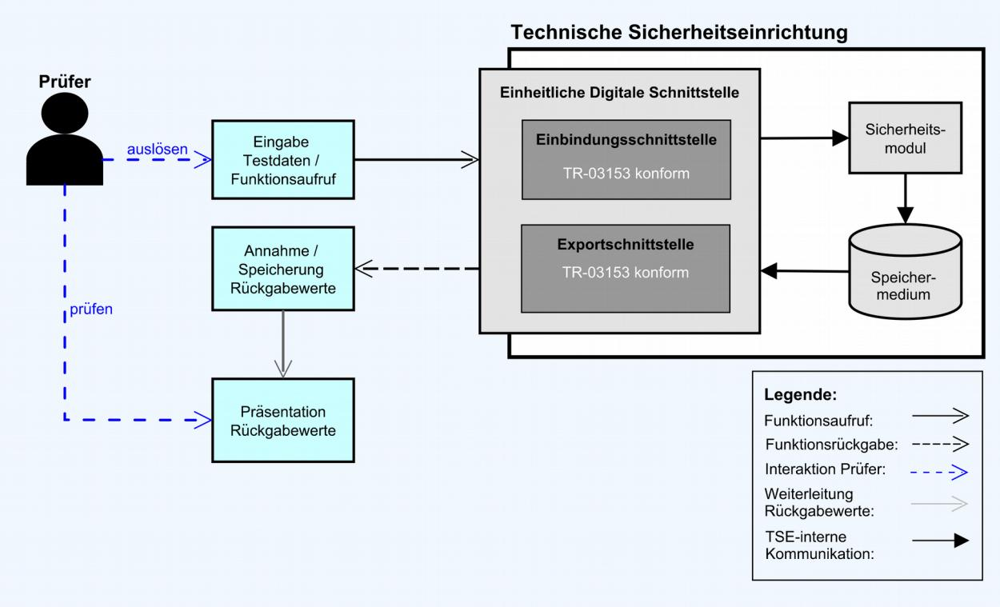
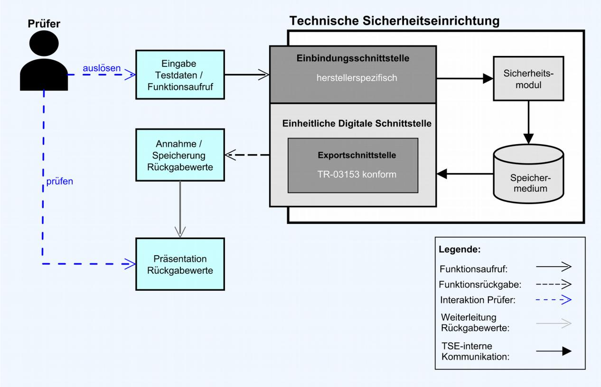
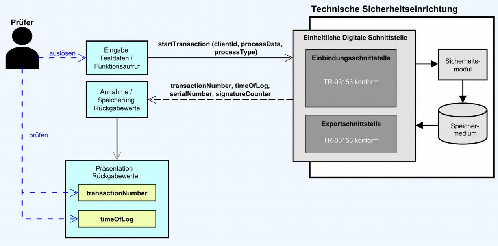
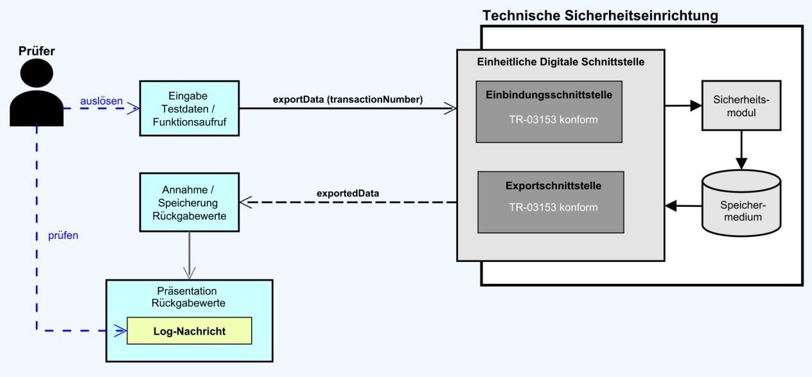

# Technische Richtlinie BSI TR-03153 Technische Sicherheitseinrichtung für elektronische Aufzeichnungssysteme

Testspezifikation (TS)

Version 1.0.1 5. Februar 2019

Bundesamt für Sicherheit in der Informationstechnik Postfach 20 03 63 53133 Bonn

E-Mail: [registrierkassen@bsi.bund.de](mailto:registrierkassen@bsi.bund.de?subject=TR-03153-TS) Internet: [https://www.bsi.bund.de](https://www.bsi.bund.de/) © Bundesamt für Sicherheit in der Informationstechnik 2019

| 1       | Einleitung 7                                                                            |  |
|---------|-----------------------------------------------------------------------------------------|--|
| 1.1     | Motivation und Ziele 7                                                                  |  |
| 1.2     | Inhalt und Abgrenzung 7                                                                 |  |
| 2       | Generelle Anforderungen an die Durchführung von Prüfungen9                              |  |
| 2.1     | Aufbau der praktischen Testdurchführung9                                                |  |
| 2.2     | Aufgaben der Prüfstelle 12                                                              |  |
| 2.2.1   | Erfassung der Ausgangssituation 12                                                      |  |
| 2.2.2   | Konformitätsprüfung 13                                                                  |  |
| 3       | Profile 14                                                                              |  |
| 3.1     | Speichermedium-Profile 14                                                               |  |
| 3.2     | Sicherheitsmodul-Profile 14                                                             |  |
| 3.3     | Schnittstellen-Profile 15                                                               |  |
| 4       | Implementation Conformance Statement17                                                  |  |
| 4.1     | Herstellererklärung 17                                                                  |  |
| 5       | Module 20                                                                               |  |
| 5.1     | Modul Storage – Speichermedium (STO) 20                                                 |  |
| 5.1.1   | Funktionale Prüfungen von Speichermedien (STO_FUN)20                                    |  |
| 5.1.2   | Prüfungen der Speicherkapazität von Speichermedien (STO_CAP)22                          |  |
| 5.1.3   | Prüfungen der Zuverlässigkeit von Speichermedien (STO_REL)22                            |  |
| 5.1.4   | Prüfungen für fernverbundene Speichermedien (STO_REM)22                                 |  |
| 5.2     | Modul Security Module – Sicherheitsmodul (SM)22                                         |  |
| 5.2.1   | Prüfungen zur Konkatenation und Signaturerstellung (SM_CON)22                           |  |
| 5.2.2   | Prüfungen zur Zeitführung im Sicherheitsmodul (SM_TME)25                                |  |
| 5.2.3   | Prüfungen zum Signaturzähler im Sicherheitsmodul (SM_SIG)27                             |  |
| 5.2.4   | Prüfungen zur Transaktionsnummer im Sicherheitsmodul (SM_TRA)28                         |  |
| 5.2.5   | Prüfungen zur Kryptographieanwendung im Sicherheitsmodul (SM_KRY)29                     |  |
| 5.2.6   | Prüfungen der Public-Key-Infrastruktur von Sicherheitsmodulen (SM_PKI)29                |  |
| 5.2.7   | Prüfungen für fernverbundene Sicherheitsmodule (SM_REM)30                               |  |
| 5.3     | Modul Integration Interface – Einbindungsschnittstelle30                                |  |
| 5.3.1   | Basisprüfungen der Einbindungsschnittstelle30                                           |  |
| 5.3.1.1 | Export des Archivs (II_EXP) 31                                                          |  |
| 5.3.1.2 | Initialisierung der Technischen Sicherheitseinrichtung (II_INI)31                       |  |
| 5.3.1.3 | Außerbetriebnahme des Sicherheitsmoduls der Technischen Sicherheitseinrichtung (II_DSE) |  |
| 5.3.1.4 | 33 Starten einer Transaktion (II_STA)35                                              |  |
| 5.3.1.5 | Aktualisierung einer Transaktion (II_UPD)37                                             |  |
| 5.3.1.6 | Beenden einer Transaktion (II_FIN)39                                                    |  |
| 5.3.1.7 | Verwendung der Technischen Sicherheitseinrichtung durch mehrere Clients (II_MCU)41      |  |
| 5.3.2   | Prüfungen der Einbindungsschnittstellen gemäß BSI TR-0315342                            |  |
| 5.3.2.1 | Aktualisierung der Uhrzeit (SDI_UDT)42                                                  |  |
| 5.3.2.2 | Export des Archivs (SDI_EXP) 43                                                         |  |
| 5.3.2.3 | Zertifikatsabruf (SDI_EXC) 52                                                           |  |
| 5.3.2.4 | Wiederherstellung durch ein Backup (SDI_RFB)52                                          |  |
| 5.3.2.5 | Lesen einer Log-Nachricht (SDI_RLM)53                                                   |  |
| 5.3.2.6 | Export von Seriennummern (SDI_ESN)54                                                    |  |
| 5.3.2.7 | Initialisierung der Sicherheitseinrichtung (SDI_INI)54                                  |  |

| 5.3.2.8  | Außerbetriebnahme des Sicherheitsmoduls (SDI_DSE)55                                             |  |
|----------|-------------------------------------------------------------------------------------------------|--|
| 5.3.2.9  | Abfrage der maximalen Anzahl von simultanen Clients der Technischen                             |  |
|          | Sicherheitseinrichtung (SDI_MNC)55                                                              |  |
| 5.3.2.10 | Abfrage der aktuellen Anzahl von Clients der Technischen Sicherheitseinrichtung (SDI_CNC) 56 |  |
| 5.3.2.11 | Abfrage der maximalen Anzahl von parallelen Transaktionen (SDI_MNT)56                           |  |
| 5.3.2.12 | Abfrage der aktuellen Anzahl von parallel geöffneten Transaktionen (SDI_CNT)57                  |  |
| 5.3.2.13 | Abfrage der unterstützten Varianten für die Aktualisierung von Transaktionen (SDI_UTV)57        |  |
| 5.3.2.14 | Löschen von gespeicherten Daten im Speichermedium (SDI_DSD)58                                   |  |
| 5.3.2.15 | Authentifizierung von Benutzern der Technischen Sicherheitseinrichtung (SDI_AUT)58              |  |
| 5.3.2.16 | Abmeldung von Benutzern der Technischen Sicherheitseinrichtung (SDI_LGO)60                      |  |
| 5.3.2.17 | Entsperren von Benutzern (SDI_UBU)60                                                            |  |
| 5.3.3    | Prüfungen für herstellerspezifische Einbindungsschnittstellen (CI)61                            |  |
| 5.3.3.1  | Aktualisierung der Zeit innerhalb des Sicherheitsmoduls (CI_UDT)61                              |  |
| 5.4      | Prüfungen der Exportdaten gemäß BSI TR-0315362                                                  |  |
| 5.4.1.1  | TAR-Format (EXP_TAR) 62                                                                         |  |
| 5.4.1.2  | Initialisierungsdaten (EXP_INI)62                                                               |  |
| 5.4.1.3  | Log-Nachrichten (EXP_LOG) 62                                                                    |  |
| 5.4.1.4  | Zertifikatsexport (EXP_CER) 65                                                                  |  |
| 6        | Testfälle 66                                                                                    |  |
| 6.1      | Notation von Testfällen 66                                                                      |  |
| 6.2      | XML Schema 67                                                                                   |  |
|          | Literaturverzeichnis 69                                                                         |  |
|          | Anhang 70                                                                                       |  |
| 6.3      | XML Schema für die XML-Testfälle der TR-03151-TS70                                              |  |
| 6.4      | XML Beispiele 70                                                                                |  |
| 6.5      | Darstellung von XML-Testfällen in einem Webbrowser73                                            |  |
|          | Abkürzungsverzeichnis 74                                                                        |  |
|          |                                                                                                 |  |

## Abbildungsverzeichnis

| Abbildung 1: Testdurchführung für eine TSE mit Einbindungsschnittstelle nach Kap. 5.2 der [BSI TR-03153] |  |
|----------------------------------------------------------------------------------------------------------|--|
| 10                                                                                                       |  |
| Abbildung 2: Testdurchführung für eine TSE mit einer herstellerspezifischen Einbindungsschnittstelle10   |  |
| Abbildung 3: Erste Phase in Bezug auf das Testen der Funktion startTransaction11                         |  |
| Abbildung 4: Zweite Phase in Bezug auf das Testen der Funktion startTransaction12                        |  |
| Abbildung 5: Darstellung eines XML-Testfalls in einem Webbrowser73                                       |  |

## Tabellenverzeichnis

| Tabelle 1: Profil für das Speichermedium der Technischen Sicherheitseinrichtung14                            |  |
|--------------------------------------------------------------------------------------------------------------|--|
| Tabelle 2: Profile für das Sicherheitsmodul 15                                                               |  |
| Tabelle 3: Profile der Einbindungsschnittstelle gemäß [BSI TR-03153]15                                       |  |
| Tabelle 4: Profil für eine herstellerspezifische Einbindungsschnittstelle15                                  |  |
| Tabelle 5: Profile, die für herstellerspezifische Einbindungsschnittstellen und die Einbindungsschnittstelle |  |
| gemäß [BSI TR-03153] gelten 16                                                                               |  |
| Tabelle 6: Angaben zur verwendeten Kryptographie18                                                           |  |
| Tabelle 7: Zusätzliche Angaben zu den Komponenten der Technischen Sicherheitseinrichtung19                   |  |
| Tabelle 8: Zusätzliche Angaben zum Zeitabstand, in dem das Sicherheitsmodul die intern verwaltete Zeit       |  |
| sichert 19                                                                                                   |  |

| Tabelle 9: Zusätzliche Angaben zu der Anzahl von gleichzeitigen Clients der TSE19                       |  |
|---------------------------------------------------------------------------------------------------------|--|
| Tabelle 10: Zusätzliche Angaben zu der maximalen Anzahl von parallel geöffneten Transaktionen19         |  |
| Tabelle 11: Testfälle zur Funktionalität des Speichermediums22                                          |  |
| Tabelle 12: Prüfungen der Speicherkapazität von Speichermedien22                                        |  |
| Tabelle 13: Prüfungen der Zuverlässigkeit von Speichermedien22                                          |  |
| Tabelle 14: Prüfungen für fernverbundene Speichermedien22                                               |  |
| Tabelle 15: Testfälle zur Konkatenation und Signaturerstellung25                                        |  |
| Tabelle 16: Testfälle zur Zeitführung im Sicherheitsmodul26                                             |  |
| Tabelle 17: Testfälle für Signaturzähler 28                                                             |  |
| Tabelle 18: Testfälle zur Transaktionsnummer im Sicherheitsmodul29                                      |  |
| Tabelle 19: Testfälle der Kryptographieanwendung des Sicherheitsmoduls29                                |  |
| Tabelle 20: Testfälle der Public-Key-Infrastruktur von Sicherheitsmodulen30                             |  |
| Tabelle 21: Testfälle für fernverbundene Sicherheitsmodule30                                            |  |
| Tabelle 22: Testfälle für alle Einbindungsschnittstellen – Export des Archivs31                         |  |
| Tabelle 23: Testfälle für alle Einbindungsschnittstellen – Initialisierung der Technischen              |  |
| Sicherheitseinrichtung 33                                                                               |  |
| Tabelle 24: Testfälle für alle Einbindungsschnittstellen – Außerbetriebnahme des Sicherheitsmoduls34    |  |
| Tabelle 25: Testfälle für alle Einbindungsschnittstellen – Starten einer Transaktion36                  |  |
| Tabelle 26: Testfälle für alle Einbindungsschnittstellen – Aktualisieren einer Transaktion39            |  |
| Tabelle 27: Testfälle für alle Einbindungsschnittstellen – Beenden einer Transaktion41                  |  |
| Tabelle 28: Testfälle für alle Einbindungsschnittstellen – Verwendung der Technischen                   |  |
| Sicherheitseinrichtung durch mehrere Clients41                                                          |  |
| Tabelle 29: Testfälle für Einbindungsschnittstellen gemäß BSI TR-03153 - updateTime42                   |  |
| Tabelle 30: Testfälle für Einbindungsschnittstellen gemäß BSI TR-03153 - exportData52                   |  |
| Tabelle 31: Testfälle für Einbindungsschnittstellen gemäß BSI TR-03153 - exportCertifcates52            |  |
| Tabelle 32: Testfälle für Einbindungsschnittstellen gemäß BSI TR-03153 – restoreFromBackup53            |  |
| Tabelle 33: Testfälle für Einbindungsschnittstellen gemäß BSI TR-03153 – readLogMessage54               |  |
| Tabelle 34: Testfälle für Einbindungsschnittstellen gemäß BSI TR-03153 – exportSerialNumbers54          |  |
| Tabelle 35: Testfälle für Einbindungsschnittstellen gemäß BSI TR-03153 – initialize55                   |  |
| Tabelle 36: Testfälle für Einbindungsschnittstellen gemäß BSI TR-03153 – disableSecureElement55         |  |
| Tabelle 37: Testfälle für Einbindungsschnittstellen gemäß BSI TR-03153 – getMaxNumberOfClients55        |  |
| Tabelle 38: Testfälle für Einbindungsschnittstellen gemäß BSI TR-03153 – getCurrentNumberOfClients56    |  |
| Tabelle 39: Testfälle für Einbindungsschnittstellen gemäß BSI TR-03153 – getMaxNumberOfTransactions56   |  |
| Tabelle 40: Testfälle für Einbindungsschnittstellen gemäß BSI TR-03153 – getCurrentNumberOfTransactions |  |
| 57                                                                                                      |  |
| Tabelle 41: Testfälle für Einbindungsschnittstellen gemäß BSI TR-03153 –                                |  |
| getSupportedTransactionUpdateVariants57                                                                 |  |
| Tabelle 42: Testfälle für Einbindungsschnittstellen gemäß BSI TR-03153 – deleteStoredData58             |  |
| Tabelle 43: Testfälle für Einbindungsschnittstellen gemäß BSI TR-03153 – authenticateUser59             |  |
| Tabelle 44: Testfälle für Einbindungsschnittstellen gemäß BSI TR-03153 – logOut60                       |  |
| Tabelle 45: Testfälle für Einbindungsschnittstellen gemäß BSI TR-03153 – unblockUser61                  |  |
| Tabelle 46: Testfälle für herstellerspezifische Einbindungsschnittstellen – Aktualisierung der Zeit im  |  |
| Sicherheitsmodul 61                                                                                     |  |
| Tabelle 47: Prüfungen der Exportschnittstelle gemäß BSI TR-03153 – TAR-Format62                         |  |
| Tabelle 48: Prüfungen der Exportschnittstelle gemäß BSI TR-03153 – Initialisierungsdaten62              |  |
| Tabelle 49: Prüfungen der Exportschnittstelle gemäß BSI TR-03153 – Log-Nachrichten65                    |  |
| Tabelle 50: Prüfungen der Exportschnittstelle gemäß BSI TR-03153 – Zertifikatsexport65                  |  |
| Tabelle 51: Definition der Informationen für einen Testfall67                                           |  |
| Tabelle 52: Definition der Informationen für einen Testschritt67                                        |  |
| Tabelle 53: Definition der Informationen für einen Testfall der nicht mehr relevant ist68               |  |
|                                                                                                         |  |

## 1 Einleitung

## 1.1 Motivation und Ziele

Die Technische Richtlinie [BSI TR-03153] definiert Anforderungen an Technische Sicherheitseinrichtungen für elektronische Aufzeichnungssysteme.

Diese Anforderungen müssen von Herstellern einer Technischen Sicherheitseinrichtung umgesetzt werden. Die vorliegende Testspezifikation zur [BSI TR-03153] definiert Anforderungen an die Prüfung der Funktionalität einer Technischen Sicherheitseinrichtung.

Anhand des Prüfungsergebnisses kann eine Aussage getroffen werden, ob die Funktionalität einer Technischen Sicherheitseinrichtung konform zur [BSI TR-03153] ist.

Diese Prüfvorschriften ermöglichen eine einheitliche und konsistente Prüfung unterschiedlicher Implementierungen der Technischen Sicherheitseinrichtung durch verschiedene Prüfstellen mit vergleichbaren Prüfergebnissen.

## 1.2 Inhalt und Abgrenzung

Das vorliegende Dokument enthält verbindliche Anforderungen an die Prüfung von **Technischen Sicherheitseinrichtungen (TSE) für Aufzeichnungssysteme** gemäß [BSI TR-03153].

Anhand einer Konformitätsprüfung soll festgestellt werden, ob die bereitgestellte Funktionalität einer Technischen Sicherheitseinrichtung konform zu den entsprechenden Anforderungen in [BSI TR-03153] ist.

Diese Technische Richtlinie **definiert** Anforderungen für die folgenden Prüfungen:

- **•** Konformitätsprüfung in Bezug auf die Funktionalität für die Sicherung von Anwendungsdaten und den korrespondierenden vom Sicherheitsmodul erzeugten Protokolldaten zur Kassenaufzeichnung.
- **•** Konformitätsprüfung der Exportfunktion für abgesicherte Daten. In Bezug auf die ausgegebenen Daten, deren Format verbindlich definiert ist, erfolgt eine Konformitätsprüfung.
- **•** Bei einer Implementierung der Einbindungsschnittstelle gemäß [BSI TR-03153] erfolgt eine Konformitätsprüfung der entsprechenden Funktionalität.
- **•** Prüfung der Vollständigkeit der Funktionalität bei einer herstellerspezifischen Einbindungsschnittstelle.
- **•** Konformitätsprüfung zu den erzeugten Daten der Technischen Sicherheitseinrichtung für den Beleg.

Die Prüfung der Exportschnittstelle erfolgt auf Grundlage von abgesicherten Daten, die aus dem Speichermedium der Technischen Sicherheitseinrichtung exportiert wurden.

Die jeweiligen Prüfungen der Funktionalität der Technischen Sicherheitseinrichtung erfolgen in Form von Black-Box-Tests.

Bedingt durch weitere verbindliche Anforderungen der [BSI TR-03153] sind im Rahmen einer Zertifizierung/Konformitätsprüfung von technischen Sicherheitseinrichtungen ergänzende formelle Prüfungen notwendig. Die hierzu zu erstellenden Herstellererklärungen werden auf Vollständigkeit und Plausibilität geprüft. Dieses gilt speziell für

- **•** die Speicherkapazität des Speichermediums,
- **•** die Zuverlässigkeit des Speichermediums,
- **•** die Umsetzung eines sicheren Kanals (Secure Channel) für die Kommunikation zwischen der jeweiligen Einbindungsschnittstelle einer Technischen Sicherheitseinrichtung und fernverbundenen Speichermedien,
- **•** die Umsetzung eines sicheren Kanals (Secure Channel) für die Kommunikation zwischen der jeweiligen Einbindungsschnittstelle einer Technischen Sicherheitseinrichtung und fernverbundenen Sicherheitsmodulen sowie
- **•** die Public-Key-Infrastructure (PKI).

Folgenden Prüfaspekte werden von dieser Technischen Richtlinie **nicht** betrachtet:

- **•** Prüfung von Komponenten außerhalb der Technischen Sicherheitseinrichtung (z. B. elektronische Aufzeichnungssysteme),
- **•** Prüfung der formalen Sicherheitseigenschaften der Technischen Sicherheitseinrichtung,
- **•** Lebenszyklus der Technischen Sicherheitseinrichtung und Initialisierung durch den Hersteller.

## 2 Generelle Anforderungen an die Durchführung von Prüfungen

Voraussetzung für die Durchführung von Prüfungen ist eine vom Hersteller zur Verfügung zu stellende Einbindungsschnittstelle.

Hierbei kann es sich um die empfohlene Einbindungsschnittstelle gemäß Kap. 5.2 der [BSI TR-03153] oder um eine herstellerspezifische Einbindungsschnittstelle handeln.

Eine manuelle Ablaufsteuerung und eine Parameterveränderung muss möglich sein. Sofern eine herstellerspezifische Einbindungsschnittstelle verwendet wird, muss der Hersteller der Technischen Sicherheitseinrichtung eine ausreichende Dokumentation zu der betreffenden herstellerspezifischen Einbindungsschnittstelle bereitstellen und die Prüfstelle bei der Durchführung der Prüfung geeignet unterstützen. Zusätzlich muss der Hersteller die notwendigen Mittel für das Aufrufen der einzelnen Funktionalitäten der Einbindungsschnittstelle und das Empfangen der zurückgegebenen Werte zur Verfügung stellen.

Die Konformitätsprüfung der Funktionalität einer Technischen Sicherheitseinrichtung erfolgt in Form von Black-Box-Tests über die Einbindungsschnittstelle gemäß [BSI TR-03153] oder die jeweilige herstellerspezifische Einbindungsschnittstelle der Technischen Sicherheitseinrichtung.

Die Validierung findet unter Verwendung von exportierten (abgesicherten) Daten an der Exportschnittstelle statt.

## 2.1 Aufbau der praktischen Testdurchführung

Die Abbildungen [1](#page-9-1) und [2](#page-9-0) zeigen den allgemeinen Aufbau der Testdurchführung. Hierbei repräsentiert die Abbildung [1](#page-9-1) den allgemeinen Aufbau für eine Technische Sicherheitseinrichtung, die eine Einbindungsschnittstelle gemäß Kap. 5.2 der [BSI TR-03153] bereitstellt.

In Abbildung [2](#page-9-0) wird der allgemeine Aufbau in Bezug auf eine Technische Sicherheitseinrichtung mit einer herstellerspezifischen Einbindungsschnittstelle dargestellt.

Im Rahmen der Technischen Richtlinie erfolgen keine konkreten Angaben zum Aufbau der Testdurchführung, da die folgenden Aspekte je nach Hersteller einer Technischen Sicherheitseinrichtung unterschiedlich implementiert sein können (Technologieoffenheit):

- **•** Art des Aufrufs einer Funktion (z. B. lokaler Funktionsaufruf oder entfernter Funktionsaufruf) über die Einbindungsschnittstelle gemäß Kap. 5.2 der [BSI TR-03153] oder eine herstellerspezifische Einbindungsschnittstelle
- **•** verwendete Technologie für den Funktionsaufruf
- **•** Aufbau der Funktion, wenn keine Implementierung der Einbindungsschnittstelle gemäß Kap. 5.2 der [BSI TR-03153] erfolgt ist.

*Abbildung 1: Testdurchführung für eine TSE mit Einbindungsschnittstelle nach Kap. 5.2 der* [BSI TR-03153]

*Abbildung 2: Testdurchführung für eine TSE mit einer herstellerspezifischen Einbindungsschnittstelle*

Im Folgenden wird die allgemeine Ausführung von Konformitätstests für die empfohlene Einbindungsschnittstelle gemäß der [BSI TR-03153] anhand eines Tests in Bezug auf die Funktionalität zum Starten einer Transaktion skizziert. Die entsprechende Funktionalität wird hierbei in Form der Funktion startTransaction bereitgestellt.

Die Abbildung [3](#page-10-0) stellt beispielhaft die erste Phase des Tests für die Funktion startTransaction dar. Der Prüfer löst den Aufruf der Funktion startTransaction aus. Hierbei werden der Funktion die Seriennummer des Aufzeichnungssystems, die Daten des Vorgangs und die Art des Vorgangs über die entsprechenden Eingabeparameter der Funktion übergeben. Innerhalb der Technischen Sicherheitseinrichtung erfolgt nun die Absicherung der übergebenen Daten und der entsprechenden Protokolldaten, wobei die abgesicherten Daten im Speichermedium der Technischen Sicherheitseinrichtung gespeichert werden. Anschließend gibt die Funktion startTransaction die folgenden Werte als Rückgabeparameter zurück:

- Transaktionsnummer
- Zeitpunkt der Protokollierung
- Seriennummer der Technischen Sicherheitseinrichtung
- Signaturzähler

Anschließend kann der Prüfer die Korrektheit dieser Rückgabeparameter überprüfen.

*Abbildung 3: Erste Phase in Bezug auf das Testen der Funktion startTransaction*

Die Abbildung [4](#page-11-0) zeigt die zweite Phase des Tests, in der überprüft werden soll, ob die entsprechenden abgesicherten Daten im Rahmen der Ausführung der Funktion startTransaction korrekt gespeichert wurden. Hierzu löst der Prüfer den Aufruf der Funktion exportData der Einbindungsschnittstelle gemäß [BSI TR-03153] aus, um die entsprechenden abgesicherten Daten in Form einer Log-Nachricht über die Exportschnittstelle zu exportieren. Eine Ausprägung der exportData-Funktion ermöglicht den gezielten Export der Log-Nachrichten für einen bestimmten Vorgang anhand der betreffenden Transaktionsnummer. Die exportierten Daten werden von der Exportschnittstelle in dem vorgegebenen Format exportiert. Anschließend kann eine Prüfung erfolgen, ob

- 1. eine entsprechende Log-Nachricht exportiert wurde.
- 2. die folgenden Daten korrekt in der entsprechenden Log-Nachricht abgebildet werden:
- **•** Anwendungsdaten (Seriennummer des Aufzeichnungssystems, die Daten des Vorgangs und der Typ des Vorgangs), die beim Aufruf der Funktion startTransaction in Phase 1 des Tests (siehe Abbildung [3\)](#page-10-0) übergeben wurden.
- **•** Protokolldaten (Transaktionsnummer, Zeitpunkt der Absicherung, Seriennummer der Technischen Sicherheitseinrichtung, Signaturzähler), die im Rahmen der Ausführung der Funktion startTransaction vom Sicherheitsmodul erzeugt und als Rückgabeparameter von startTransaction zurückgegeben wurden (siehe Abbildung [3\)](#page-10-0).

*Abbildung 4: Zweite Phase in Bezug auf das Testen der Funktion startTransaction*

## 2.2 Aufgaben der Prüfstelle

Die Konformitätsprüfung beginnt mit der Erfassung der Ausgangssituation.

## 2.2.1 Erfassung der Ausgangssituation

Hierzu beschreibt der Hersteller in geeigneter Form die Teilkomponenten des Testobjektes (Technische Sicherheitseinrichtung). Die individuelle Ausführung des Testobjektes bestimmt die, für einen aussagekräftigen Konformitätstest notwendige, Testabgrenzung.

Ergänzend durch Sichtung und Analyse des Implementation Conformance Statement (ICS) werden die Testfälle bestimmt.

Zudem können je nach Ausprägung (portabel, hermetisch abgeschlossene Einheit) die Durchführung der Prüfungen variieren. Sind die Komponenten der Technischen Sicherheitseinrichtung verteilt, so müssen die Komponenten und deren Schnittellen exakt beschrieben werden.

Ist ein Zugriff auf die Technische Sicherheitseinrichtung nur eingeschränkt möglich, so werden Konformitätsprüfungen mit Hilfe der Entwicklungsumgebung des Herstellers durchgeführt. Dabei müssen die Rahmenbedingungen (z. B. simuliertes Aufzeichnungsgerät) genau beschrieben werden und es muss zusätzlich eine Beurteilung erfolgen, ob eine Portierung zum finalen Produkt möglich ist und dass gleiche Testergebnisse zu erwarten sind.

Die Testfälle und die Testdurchführungen werden vor Beginn der Konformitätsprüfungen mit der Zertifizierungsstelle (BSI) abgestimmt.

Die Prüfstelle führt anschließend die Konformitätsprüfung durch.

#### 2.2.2 Konformitätsprüfung

Hierzu gehören neben den funktionalen Tests auch formale Dokumentationsprüfungen der Herstellererklärungen, welche auf Plausibilität geprüft werden.

Alle andere Prüfungen sind Black-Box-Tests und werden durch definierte Eingabeparameter und definierte Ergebnisse validiert. Neben der ordnungsgemäßen Funktionalität der TSE wird auch die Korrektheit der durch die TSE erzeugten Daten überprüft.

Die Ergebnisse werden in einen Testreport zusammengefasst, bewertet und an die Zertifizierungsstelle weitergeleitet.

## 3 Profile

Die Technische Sicherheitseinrichtung besteht aus den folgenden Komponenten:

- **•** Speichermedium
- **•** Sicherheitsmodul
- **•** Exportschnittstelle
- **•** Einbindungsschnittstelle
	- **◦** gemäß Kap. 5.2 [BSI TR-03153]
	- **◦** herstellerspezifisch

Die folgenden Profile dienen zur Auswahl von Testfällen bei unterschiedlichen Ausprägungen der Komponenten der Technischen Sicherheitseinrichtungen.Beispiel: Eine Technische Sicherheitseinrichtung hat ein Sicherheitsmodul, welches über eine Netzwerkverbindung angeschlossen ist. Somit gilt für diese TSE das Profil SM\_REMOTE. Damit sind alle Tests mit dem Profil SM\_REMOTE auszuwählen und zu bestehen.

Eine Kombination von mehreren Profilen führt zur Auswahl der Schnittmenge der beiden Profile.

Beispiel: Einem Testfall sind die Profile SM\_MULTI und SM\_NOAGG zugeordnet. Somit ist der Test nur zu bestehen, wenn es sich um ein Sicherheitsmodul handelt, welches mehrere parallele Transaktionen verwalten kann und keine Aggregierung von Aktualisierungen vornimmt.

## 3.1 Speichermedium-Profile

| Profil ID      | Beschreibung                                                                                                                     |
|----------------|----------------------------------------------------------------------------------------------------------------------------------|
| STORAGE_BASIC  | Tests und formelle Prüfungen, die von allen Speichermedien von Technischen Sicherheitseinrichtungen erfüllt werden müssen. |
| STORAGE_REMOTE | Formelle Prüfungen, die sich ausschließlich auf fernverbundene Speichermedien beziehen.                                       |

*Tabelle 1: Profil für das Speichermedium der Technischen Sicherheitseinrichtung*

## 3.2 Sicherheitsmodul-Profile

| Profil ID | Beschreibung                                                                                                                                                                                                                                              |  |
|-----------|-----------------------------------------------------------------------------------------------------------------------------------------------------------------------------------------------------------------------------------------------------------|--|
| SM_BASIC  | Tests und formelle Prüfungen, die von allen Sicherheitsmodulen von Technischen Sicherheitseinrichtungen erfüllt werden müssen. Tests für Sicherheitsmodule welche Aktualisierungen (Updates) immer direkt signieren und nicht aggregieren. |  |
| SM_NOAGG  |                                                                                                                                                                                                                                                           |  |
| SM_AGG    | Tests für Sicherheitsmodule, welche Aktualisierungen (Updates) aggregieren und zusammengefasst absichern (signieren) können.                                                                                                                        |  |
| SM_MULTI  | Tests für Sicherheitsmodule, welche mehrere Transaktionen parallel verwalten können.1                                                                                                                                                                  |  |

| Profil ID | Beschreibung                                                |
|-----------|-------------------------------------------------------------|
| SM_REMOTE | Formelle Prüfungen für fernverbundene Sicherheitsmodule. |

*Tabelle 2: Profile für das Sicherheitsmodul*

## 3.3 Schnittstellen-Profile

| Profil ID    | Beschreibung                                                                                                                                           |  |  |
|--------------|--------------------------------------------------------------------------------------------------------------------------------------------------------|--|--|
| SDI          | Tests der Einbindungsschnittstelle gemäß [BSI TR 03153], die im Rahmen der Einheitlichen Digitalen Schnittstelle umgesetzt wird.                 |  |  |
|              | Die Tests umfassen alle Funktionen der Einbindungsschnittstelle gemäß [BSI TR-03153], deren Umsetzung verbindlich ist.                           |  |  |
| SDI_RESTORE  | Tests für die optionale Funktion restoreFromBackup der Einbindungsschnittstelle gemäß [BSI TR-03153].                                               |  |  |
| SDI_DELETE   | Tests für die empfohlene Funktion deleteStoredData der Einbindungsschnittstelle gemäß [BSI TR-03153].                                               |  |  |
| TIME_SYNC    | Tests für Technische Sicherheitseinrichtungen, die über einen Mechanismus, zum eigenständigen Stellen der Zeit des Sicherheitsmoduls, verfügen.  |  |  |
|              | Diese Tests sind nur relevant, wenn die Einbindungsschnittstelle gemäß [BSI TR-03153] implementiert ist.                                         |  |  |
| NO_TIME_SYNC | Tests für Technische Sicherheitseinrichtungen, die über keinen Mechanismus, zum eigenständigen Stellen der Zeit des Sicherheitsmoduls, verfügen. |  |  |
|              | Diese Tests sind nur relevant, wenn die Einbindungsschnittstelle gemäß [BSI TR-03153] implementiert ist.                                         |  |  |

*Tabelle 3: Profile der Einbindungsschnittstelle gemäß [BSI TR-03153]*

| Profil ID                    | Beschreibung                                                  |
|------------------------------|---------------------------------------------------------------|
| CUSTOM_INTEGRATION_INTERFACE | Tests für herstellerspezifische Einbindungsschnittstellen. |

*Tabelle 4: Profil für eine herstellerspezifische Einbindungsschnittstelle* 

1 Die maximale Anzahl der parallelen Transaktionen ist auf dem ICS zu nennen.

| Profil ID       | Beschreibung                                                                                                                                     |  |
|-----------------|--------------------------------------------------------------------------------------------------------------------------------------------------|--|
| MULTI_CLIENT    | Tests für Technische Sicherheitseinrichtungen, die eine gleichzeitige Protokollierung von Transaktionen durch mehrere Clients ermöglichen. |  |
| NO_MULTI_CLIENT | Tests für Technische Sicherheitseinrichtungen, die nur eine Protokollierung von Transaktionen durch einen Client ermöglichen.              |  |

*Tabelle 5: Profile, die für herstellerspezifische Einbindungsschnittstellen und die Einbindungsschnittstelle gemäß [BSI TR-03153] gelten*

## 4 Implementation Conformance Statement

Ein Implementation Conformance Statement (ICS) enthält die für die Durchführung der Konformitätsprüfung benötigten Informationen zur Technischen Sicherheitseinrichtung.

In diesem ICS gibt der Antragsteller an, zu welchen Teilen der Testspezifikation der Technischen Richtlinie die betreffende Technische Sicherheitseinrichtung konform sein soll. Darunter fällt auch die Angabe der unterstützen Kryptographie und die Auswahl von den in Kapitel [3](#page-13-0) definierten Profilen.

#### 4.1 Herstellererklärung

In der folgenden Auflistung gibt der Antragsteller für die Zertifizierung an, welche Eigenschaften die zu prüfende Technische Sicherheitseinrichtung hat.

|   |   | Die TSE …                                                                                                                                               | Daraus folgende Profile          |
|---|---|---------------------------------------------------------------------------------------------------------------------------------------------------------|----------------------------------|
| ☑ |   | verfügt über ein Speichermedium.                                                                                                                        | STORAGE_BASIC                    |
|   | ☐ | hat ein fernverbundenes Speichermedium.                                                                                                                 | STORAGE_REMOTE                   |
| ☑ |   | verfügt über ein Sicherheitsmodul.                                                                                                                      | SM_BASIC                         |
|   | ☐ | hat ein fernverbundenes Sicherheitsmodul.                                                                                                               | SM_REMOTE                        |
|   | ☐ | signiert Aktualisierungen (Updates) direkt und aggregiert diese nicht.                                                                               | SM_NOAGG                         |
|   |   | UND/ODER                                                                                                                                                |                                  |
|   | ☐ | aggregiert Aktualisierungen (Updates) und sichert diese zusammengefasst ab (signiert).                                                               | SM_AGG                           |
|   | ☐ | kann mehrere Transaktionen parallel verwalten                                                                                                           | SM_MULTI                         |
| ☐ |   | besitzt eine herstellerspezifische Einbindungsschnittstelle und setzt den Export-Teil der Einheitlichen Digitalen Schnittstelle um. ODER       | CUSTOM_INTEGRATI ON_INTERFACE |
| ☐ |   | implementiert alle verpflichtenden Funktionen der Einheitlichen Digitalen Schnittstelle gemäß der Technischen Richtlinie [BSI TR 03153].          | SDI                              |
|   | ☐ | implementiert die optionale Funktion restoreFromBackup der Einheitlichen Digitalen Schnittstelle gemäß der Technischen Richtlinie [BSI TR-03153]. | SDI_RESTORE                      |

|   | Die TSE …                                                                                                                                               | Daraus folgende Profile |
|---|---------------------------------------------------------------------------------------------------------------------------------------------------------|-------------------------|
| ☐ | implementiert die empfohlene Funktion deleteStoredData der Einheitlichen Digitalen Schnittstelle gemäß der Technischen Richtlinie [BSI TR-03153]. | SDI_DELETE              |
| ☐ | verfügt über einen Mechanismus, zum eigenständigen Stellen der Zeit des Sicherheitsmoduls.                                                           | TIME_SYNC               |
|   | ODER                                                                                                                                                    |                         |
| ☐ | verfügt über keinen Mechanismus, zum eigenständigen Stellen der Zeit des Sicherheitsmoduls.                                                          | NO_TIME_SYNC            |
| ☐ | kann von mehreren Clients gleichzeitig für die Protokollierung von Transaktionen verwendet werden.                                                   | MULTI_CLIENT            |
|   | ODER                                                                                                                                                    |                         |
| ☐ | kann zu einem Zeitpunkt nur von einem Client für die Protokollierung von Transaktionen verwendet werden.                                             | NO_MULTI_CLIENT         |

In Tabelle [6](#page-17-0) macht der Antragssteller Angaben zum Signaturalgorithmus, der vom Sicherheitsmodul der Technischen Sicherheitseinrichtung bei Absicherungsschritten verwendet wird.

| Verwendete Kryptofunktionen        | Angaben des Antragstellers |
|------------------------------------|----------------------------|
| Signaturalgorithmus                |                            |
|                                    |                            |
| Parameter zum                      |                            |
| Signaturalgorithmus (inkl.         |                            |
| Hashfunktion und Schlüssellängen ) |                            |
|                                    |                            |
|                                    |                            |
|                                    |                            |
|                                    |                            |
|                                    |                            |
|                                    |                            |
|                                    |                            |
|                                    |                            |
|                                    |                            |
|                                    |                            |
|                                    |                            |
|                                    |                            |
|                                    |                            |

*Tabelle 6: Angaben zur verwendeten Kryptographie*

Zusätzliche Angaben:

| Gegenstand                                            | Angaben des Antragstellers |
|-------------------------------------------------------|----------------------------|
| Größe des internen Speichers des Sicherheitsmoduls |                            |

*Tabelle 7: Zusätzliche Angaben zu den Komponenten der Technischen Sicherheitseinrichtung*

| Gegenstand                                                                                                                   | Angaben des Antragstellers |
|------------------------------------------------------------------------------------------------------------------------------|----------------------------|
| Zeitlicher Abstand, in dem das Sicherheitsmodul die intern verwaltete Zeit in seinem nichtflüchtigen Speicher sichert. |                            |

*Tabelle 8: Zusätzliche Angaben zum Zeitabstand, in dem das Sicherheitsmodul die intern verwaltete Zeit sichert*

| Gegenstand                                                                                                   | Angaben des Antragstellers |
|--------------------------------------------------------------------------------------------------------------|----------------------------|
| Maximale Anzahl von Clients, die die TSE gleichzeitig zur Absicherung von Transaktionen nutzen können. |                            |

*Tabelle 9: Zusätzliche Angaben zu der Anzahl von gleichzeitigen Clients der TSE*

| Gegenstand                                                                                            | Angaben des Antragstellers |
|-------------------------------------------------------------------------------------------------------|----------------------------|
| Maximale Anzahl der parallel geöffneten Transaktionen, die das Sicherheitsmodul verwalten kann. |                            |

*Tabelle 10: Zusätzliche Angaben zu der maximalen Anzahl von parallel geöffneten Transaktionen* 

Der Antragsteller versichert, dass die TSE

• **keine** Funktionalität bereitstellt, zukünftige, aktuelle oder abgeschlossene Aufzeichnungen zu manipulieren, zu löschen oder eine ordnungsgemäße Verarbeitung zu verhindern.

Datum / Name / Unterschrift Antragsteller

\_\_\_\_\_\_\_\_\_\_\_\_\_\_\_\_\_\_\_\_\_\_\_\_\_\_\_\_\_\_\_\_\_\_\_

## 5 Module

Innerhalb dieser Technischen Richtlinie erfolgt eine Gruppierung von Testfällen durch Module. Hierbei gruppiert ein Modul Testfälle für eine Komponente der Technischen Sicherheitseinrichtung. Die einzelnen Module sind bei Bedarf durch weitere Untermodule strukturiert.

Diese Technische Richtlinie definiert die folgenden Module:

| Modul                                                                     | Komponente               |  |
|---------------------------------------------------------------------------|--------------------------|--|
| Storage                                                                   | Speichermedium           |  |
| Security Module                                                           | Sicherheitsmodul         |  |
| Export                                                                    | Exportschnittstelle      |  |
| Integration Interface                                                     | Einbindungsschnittstelle |  |
| Testfälle können Positivtests (PT) oder Negativtests (NT) repräsentieren. |                          |  |

Herstellererklärungen erfordern eine formale Prüfung (FP) der Plausibilität.

In den folgenden Unterkapiteln erfolgen Kurzbeschreibungen der Testfälle einzelner Module.

## 5.1 Modul Storage – Speichermedium (STO)

Das Speichermedium der Technischen Sicherheitseinrichtung kann verschieden ausgeprägt/konfiguriert sein. Es kann sich um ein

- **•** lokales Speichermedium oder
- **•** fernverbundenes Speichermedium handeln.

Beide Ausprägungen durchlaufen grundlegende Basisprüfungen. Bei einem fernverbundenen Speichermedium wird ergänzend die spezifikationskonforme Verwendung eines abgesicherten Kanals für die Kommunikation geprüft.

## 5.1.1 Funktionale Prüfungen von Speichermedien (STO\_FUN)

| ID         | Zielsetzung                                                                                                                                                                                                                                                                                             | Profile  | Typ |
|------------|---------------------------------------------------------------------------------------------------------------------------------------------------------------------------------------------------------------------------------------------------------------------------------------------------------|----------|-----|
| STO_FUN_01 | Prüfung, ob das Speichermedium Anwendungsdaten und Protokolldaten speichert. Der Test betrachtet Absicherungsschritte einer Transaktion mit den Phasen: • Start der Transaktion • einmalige Aktualisierung der Transaktion Beenden der Transaktion •                            | SM_AGG   | PT  |
| STO_FUN_02 | Prüfung, ob das Speichermedium Anwendungsdaten und Protokolldaten speichert. Der Test betrachtet Absicherungsschritte einer Transaktion mit den Phasen: • Start der Transaktion • einmalige Aktualisierung der Transaktion mit Absicherungsschritt • Beenden der Transaktion | SM_NOAGG | PT  |

| ID         | Zielsetzung                                                                                                                                                                                                                                                                                                                                      | Profile              | Typ |
|------------|--------------------------------------------------------------------------------------------------------------------------------------------------------------------------------------------------------------------------------------------------------------------------------------------------------------------------------------------------|----------------------|-----|
| STO_FUN_03 | Prüfung, ob das Speichermedium Anwendungsdaten und Protokolldaten speichert. Der Test betrachtet Absicherungsschritte einer Transaktion mit den Phasen: • Start der Transaktion • mehrere Aktualisierungen der Transaktion • Beenden der Transaktion                                                                     | SM_AGG               | PT  |
| STO_FUN_04 | Prüfung, ob das Speichermedium Anwendungsdaten und Protokolldaten speichert. Der Test betrachtet Absicherungsschritte einer Transaktion mit den Phasen: Start der Transaktion • mehrere Aktualisierungen der Transaktion mit • Absicherungsschritt • Beenden der Transaktion                                          | SM_NOAGG             | PT  |
| STO_FUN_05 | Prüfung, ob das Speichermedium Anwendungsdaten und Protokolldaten speichert. Der Test betrachtet Absicherungsschritte für mehrere parallele Transaktionen mit den zeitlich versetzten Phasen: Start der Transaktion • mehrere Aktualisierungen der Transaktion • Beenden der Transaktion •                            | SM_AGG SM_MULTI   | PT  |
| STO_FUN_06 | Prüfung, ob das Speichermedium Anwendungsdaten und Protokolldaten speichert. Der Test betrachtet Absicherungsschritte für mehrere parallele Transaktionen mit den zeitlich versetzten Phasen: • Start der Transaktion • mehrere Aktualisierungen der Transaktion mit Absicherungsschritt Beenden der Transaktion • | SM_NOAGG SM_MULTI | PT  |
| STO_FUN_07 | Prüfung, ob das Speichermedium Anwendungsdaten und Protokolldaten speichert. Der Test betrachtet einen Absicherungsschritt nach einer Aktualisierung der Zeitführung innerhalb des Sicherheitsmoduls.                                                                                                                                   | STORAGE_BASIC        | PT  |
| STO_FUN_08 | Prüfung, ob das Speichermedium Anwendungsdaten und Protokolldaten speichert. Der Test betrachtet Absicherungsschritte, nach mehreren Aktualisierungen der Zeitführung im Sicherheitsmodul, während einer Transaktion.                                                                                                                   | STORAGE_BASIC        | PT  |
| STO_FUN_09 | Prüfung, ob das Speichermedium Systemnachrichten und Protokolldaten speichert. Der Test betrachtet den Absicherungsschritt für die Initialisierung der Technischen Sicherheitseinrichtung.                                                                                                                                              | STORAGE_BASIC        | PT  |
| STO_FUN_10 | Prüfung, ob das Speichermedium Systemnachrichten und Protokolldaten speichert. Der Test betrachtet den Absicherungsschritt für die Außerbetriebnahme des Sicherheitsmoduls.                                                                                                                                                             | STORAGE_BASIC        | PT  |

| ID         | Zielsetzung                                                                                                                                                                             | Profile       | Typ |
|------------|-----------------------------------------------------------------------------------------------------------------------------------------------------------------------------------------|---------------|-----|
| STO_FUN_11 | Prüfung, ob das Speichermedium Audit-Daten und Protokolldaten speichert. Der Test betrachtet den Absicherungsschritt für Audit-Daten, die vom Sicherheitsmodul erzeugt wurden. | STORAGE_BASIC | PT  |

*Tabelle 11: Testfälle zur Funktionalität des Speichermediums*

## 5.1.2 Prüfungen der Speicherkapazität von Speichermedien (STO\_CAP)

| ID         | Zielsetzung                                                                                                      | Profile       | Typ |
|------------|------------------------------------------------------------------------------------------------------------------|---------------|-----|
| STO_CAP_01 | Prüfen der Speicherkapazität des Speichermediums. Die Prüfung erfolgt auf Grundlage von Herstellerdokumenten. | STORAGE_BASIC | FP  |

*Tabelle 12: Prüfungen der Speicherkapazität von Speichermedien*

## 5.1.3 Prüfungen der Zuverlässigkeit von Speichermedien (STO\_REL)

| ID         | Zielsetzung                                                                                                    | Profile       | Typ |
|------------|----------------------------------------------------------------------------------------------------------------|---------------|-----|
| STO_REL_01 | Prüfen der Zuverlässigkeit des Speichermediums. Die Prüfung erfolgt auf Grundlage von Herstellerdokumenten. | STORAGE_BASIC | FP  |

*Tabelle 13: Prüfungen der Zuverlässigkeit von Speichermedien*

## 5.1.4 Prüfungen für fernverbundene Speichermedien (STO\_REM)

Bei der Verwendung eines fernverbundenen Speichermediums sind zusätzlich nachfolgend aufgelistete Prüfungen erforderlich.:

| ID         | Zielsetzung                                                                                                                                                                                                                                          | Profile        | Typ |
|------------|------------------------------------------------------------------------------------------------------------------------------------------------------------------------------------------------------------------------------------------------------|----------------|-----|
| STO_REM_01 | Prüfung, ob die Kommunikation zwischen der Einbindungsschnittstelle und dem fernverbundenen Speichermedium über einen abgesicherten Kanal (Secure Channel) stattfindet. Die Prüfung erfolgt auf Grundlage einer Herstellerdokumentation. | STORAGE_REMOTE | FP  |

*Tabelle 14: Prüfungen für fernverbundene Speichermedien*

## 5.2 Modul Security Module – Sicherheitsmodul (SM)

Dieses Modul enthält Prüfungen des Sicherheitsmoduls der Technischen Sicherheitseinrichtung.

## 5.2.1 Prüfungen zur Konkatenation und Signaturerstellung (SM\_CON)

Die folgenden Testfälle prüfen die Konkatenation und Signaturerstellung. Bei den Prüfungen für die Protokollierung von Transaktionen werden **bei allen Testfällen Anwendungsdaten bei Beginn und Ende der Transaktion übergeben.**

| ID        | Zielsetzung                                                                                                                               | Profile              | Typ |
|-----------|-------------------------------------------------------------------------------------------------------------------------------------------|----------------------|-----|
| SM_CON_01 | Prüfung, ob die Protokolldaten korrekt erstellt und die zu signierenden Daten korrekt konkateniert werden.                             | SM_NOAGG             | PT  |
|           | • eine Transaktion • eine Aktualisierung • Aktualisierung erzeugt Absicherung                                              |                      |     |
| SM_CON_02 | Prüfung, ob die Protokolldaten korrekt erstellt und die zu signierenden Daten korrekt konkateniert werden.                             | SM_AGG               | PT  |
|           | • eine Transaktion • eine Aktualisierung • ohne Absicherung                                                                |                      |     |
| SM_CON_03 | Prüfung, ob die Protokolldaten korrekt erstellt und die zu signierenden Daten korrekt konkateniert werden.                             | SM_NOAGG             | PT  |
|           | • eine Transaktion • mehrere Aktualisierungen • Aktualisierung erzeugt Absicherung                                         |                      |     |
| SM_CON_04 | Prüfung, ob die Protokolldaten korrekt erstellt und die zu signierenden Daten korrekt konkateniert werden.                             | SM_AGG               | PT  |
|           | • eine Transaktion • mehrere Aktualisierungen • ohne Absicherung                                                           |                      |     |
| SM_CON_05 | Prüfung, ob die Protokolldaten korrekt erstellt und die zu signierenden Daten korrekt konkateniert werden.                             | SM_AGG               | PT  |
|           | • eine Transaktion • mehrere Aktualisierungen • Aktualisierung bis eine Absicherung erfolgt                                |                      |     |
| SM_CON_06 | Prüfung, ob die Protokolldaten korrekt erstellt und die zu signierenden Daten korrekt konkateniert werden.                             | SM_NOAGG SM_MULTI | PT  |
|           | • mehrere Transaktionen parallel, versetzt • eine Aktualisierung pro Transaktion • Aktualisierung erzeugt Absicherung      |                      |     |
| SM_CON_07 | Prüfung, ob die Protokolldaten korrekt erstellt und die zu signierenden Daten korrekt konkateniert werden.                             | SM_AGG SM_MULTI   | PT  |
|           | • mehrere Transaktionen parallel, versetzt • eine Aktualisierung pro Transaktion • ohne Absicherung                        |                      |     |
| SM_CON_08 | Prüfung, ob die Protokolldaten korrekt erstellt und die zu signierenden Daten korrekt konkateniert werden.                             | SM_NOAGG SM_MULTI | PT  |
|           | • mehrere Transaktionen parallel, versetzt • mehrere Aktualisierungen pro Transaktion • Aktualisierung erzeugt Absicherung |                      |     |

| ID        | Zielsetzung                                                                                                                                                                                                                                                                        | Profile              | Typ |
|-----------|------------------------------------------------------------------------------------------------------------------------------------------------------------------------------------------------------------------------------------------------------------------------------------|----------------------|-----|
| SM_CON_09 | Prüfung, ob die Protokolldaten korrekt erstellt und die zu signierenden Daten korrekt konkateniert werden.                                                                                                                                                                      | SM_AGG SM_MULTI   | PT  |
|           | • mehrere Transaktionen parallel, versetzt • mehrere Aktualisierungen pro Transaktion • ohne Absicherung                                                                                                                                                            |                      |     |
| SM_CON_10 | Prüfung, ob die Protokolldaten korrekt erstellt und die zu signierenden Daten korrekt konkateniert werden.                                                                                                                                                                      | SM_AGG SM_MULTI   | PT  |
|           | • mehrere Transaktionen parallel, versetzt • mehrere Aktualisierungen pro Transaktion • Aktualisierung bis eine Absicherung erfolgt                                                                                                                                 |                      |     |
| SM_CON_11 | Prüfung, ob die Protokolldaten korrekt erstellt und die zu signierenden Daten korrekt konkateniert werden, wenn zwischen den verschiedenen Phasen zur Absicherung von Transaktionen vereinzelte Aktualisierungen der Zeit innerhalb des Sicherheitsmoduls stattfinden. | SM_MULTI SM_AGG   | PT  |
|           | Es werden die Absicherungen von mehreren parallelen Transaktionen betrachtet, wobei die Aktualisierungen der Transaktionen ohne Absicherungsschritte erfolgen.                                                                                                               |                      |     |
| SM_CON_12 | Prüfung, ob die Protokolldaten korrekt erstellt und die zu signierenden Daten korrekt konkateniert werden, wenn zwischen den verschiedenen Phasen zur Absicherung von Transaktionen vereinzelte Aktualisierungen der Zeit innerhalb des Sicherheitsmoduls stattfinden. | SM_MULTI SM_NOAGG | PT  |
|           | Es werden die Absicherungen von mehreren parallelen Transaktionen betrachtet, wobei die Aktualisierungen der Transaktionen mit Absicherungsschritten erfolgen.                                                                                                               |                      |     |
| SM_CON_13 | Prüfung, ob bei dem Absicherungsschritt für die Initialisierung einer Technischen Sicherheitseinrichtung die Protokolldaten korrekt erstellt und die zu signierenden Daten korrekt konkateniert werden.                                                                   | SM_BASIC             | PT  |
| SM_CON_14 | Prüfung, ob bei dem Absicherungsschritt für die Außerbetriebnahme des Sicherheitsmoduls einer Technischen Sicherheitseinrichtung die Protokolldaten korrekt erstellt und die zu signierenden Daten korrekt konkateniert werden.                                        | SM_BASIC             | PT  |
| SM_CON_15 | Prüfung, ob bei dem Absicherungsschritt für die Authentifizierung eines Nutzers die Protokolldaten korrekt erstellt und die zu signierenden Daten korrekt konkateniert werden.                                                                                            | SM_BASIC SDI      | PT  |
| SM_CON_16 | Prüfung, ob bei dem Absicherungsschritt für die Abmeldung eines authentifizierten Nutzers die Protokolldaten für den Absicherungsschritt korrekt erstellt und die zu signierenden Daten korrekt konkateniert werden.                                                      | SM_BASIC SDI      | PT  |

| ID        | Zielsetzung                                                                                                                                                                                                                       | Profile         | Typ |
|-----------|-----------------------------------------------------------------------------------------------------------------------------------------------------------------------------------------------------------------------------------|-----------------|-----|
| SM_CON_17 | Prüfung, ob bei dem Absicherungsschritt für die Entsperrung der PIN-Eingabe für einen autorisierten Nutzer die Protokolldaten korrekt erstellt und die zu signierenden Daten korrekt konkateniert werden.                | SM_BASIC SDI | PT  |
| SM_CON_18 | Prüfung, ob bei dem Absicherungsschritt für die Protokollierung von Audit-Daten, die vom Sicherheitsmodul erzeugt wurden, die Protokolldaten korrekt erstellt und die zu signierenden Daten korrekt konkateniert werden. | SM_BASIC        | PT  |

*Tabelle 15: Testfälle zur Konkatenation und Signaturerstellung* 

## 5.2.2 Prüfungen zur Zeitführung im Sicherheitsmodul (SM\_TME)

| ID        | Zielsetzung                                                                                                                                                                                                                                                                                                                                                           | Profile                  | Typ |
|-----------|-----------------------------------------------------------------------------------------------------------------------------------------------------------------------------------------------------------------------------------------------------------------------------------------------------------------------------------------------------------------------|--------------------------|-----|
| SM_TME_01 | Prüfung, ob das Sicherheitsmodul bei einer Aktualisierung der Zeit im Sicherheitsmodul die Protokolldaten korrekt bereitstellt und die zu signierenden Daten korrekt konkateniert.                                                                                                                                                                              | SM_BASIC                 | PT  |
| SM_TME_02 | Prüfung, ob bei einem Aufruf der Zeitaktualisierungsfunktion die Zeit im Sicherheitsmodul aktualisiert wird.                                                                                                                                                                                                                                                       | SM_BASIC                 | PT  |
| SM_TME_03 | Prüfung, ob das Sicherheitsmodul den Signaturzähler bei mehreren Aktualisierungen der Zeit im Sicherheitsmodul fortlaufend inkrementiert.                                                                                                                                                                                                                       | SM_BASIC                 | PT  |
| SM_TME_04 | Prüfung, ob das Sicherheitsmodul bei einer Aktualisierung der internen Zeit mit einem fehlerhaften Zeitwert • eine gültige Fehlermeldung auslöst und • den Wert für die interne Zeit nicht aktualisiert. Das Format des neuen Zeitwerts ist nicht korrekt.                                                                                          | SM_BASIC NO_TIME_SYNC | NT  |
| SM_TME_05 | Prüfung, das die vom Sicherheitsmodul bereitgestellte Zeit fortlaufend ist. Der Test betrachtet jeweils die folgenden Aktionen für mehrere parallele Transaktionen: • Starten der Transaktion • mehrere Aktualisierungen der Transaktion • Beenden der Transaktion Die Aktionen werden versetzt durchgeführt.                           | SM_MULTI SM_AGG       | PT  |
| SM_TME_06 | Prüfung, ob die vom Sicherheitsmodul bereitgestellte Zeit fortlaufend ist. Der Test betrachtet jeweils die folgenden Aktionen für mehrere parallele Transaktionen: • Starten der Transaktion • mehrere Aktualisierungen der Transaktion mit Absicherungsschritt • Beenden der Transaktion Die Aktionen werden versetzt durchgeführt. | SM_MULTI SM_NOAGG     | PT  |

| ID        | Zielsetzung                                                                                                                                                                                                                                                                                                                                                                                                         | Profile         | Typ |
|-----------|---------------------------------------------------------------------------------------------------------------------------------------------------------------------------------------------------------------------------------------------------------------------------------------------------------------------------------------------------------------------------------------------------------------------|-----------------|-----|
| SM_TME_07 | Prüfung, ob die vom Sicherheitsmodul bereitgestellte Zeit fortlaufend ist.                                                                                                                                                                                                                                                                                                                                       | SM_NOAGG        | PT  |
|           | Der Test betrachtet jeweils die folgenden Aktionen:                                                                                                                                                                                                                                                                                                                                                                 |                 |     |
|           | • Initialisierung der Technischen Sicherheitseinrichtung • mehrmalige Aktualisierung der Zeit innerhalb des Sicherheitsmoduls • Protokollierung einer Transaktion, mit einer Aktualisierung mit Absicherungsschritt • Absicherung von Audit-Daten, die vom Sicherheitsmodul erzeugt wurden Außerbetriebnahme des Sicherheitsmoduls der • Technischen Sicherheitseinrichtung  |                 |     |
| SM_TME_08 | Prüfung, ob die vom Sicherheitsmodul bereitgestellte Zeit fortlaufend ist.                                                                                                                                                                                                                                                                                                                                       | SM_AGG          | PT  |
|           | Der Test betrachtet jeweils die folgenden Aktionen:                                                                                                                                                                                                                                                                                                                                                                 |                 |     |
|           | Initialisierung der Technischen Sicherheitseinrichtung • mehrmalige Aktualisierung der Zeit innerhalb des • Sicherheitsmoduls • Protokollierung einer Transaktion, mit einer Aktualisierung ohne Absicherungsschritt • Absicherung von Audit-Daten, die vom Sicherheitsmodul erzeugt wurden • Außerbetriebnahme des Sicherheitsmoduls der Technischen Sicherheitseinrichtung |                 |     |
| SM_TME_09 | Prüfung, ob die vom Sicherheitsmodul bereitgestellte Zeit fortlaufend ist.                                                                                                                                                                                                                                                                                                                                       | SM_BASIC SDI | PT  |
|           | Der Test betrachtet jeweils die folgenden Aktionen:                                                                                                                                                                                                                                                                                                                                                                 |                 |     |
|           | • erfolgreiche Entsperrung der PIN-Eingabe für einen autorisierten Nutzer • erfolgreiche Authentifizierung eines autorisierten Nutzers erfolgreiche Abmeldung eines authentifizierten Nutzers •                                                                                                                                                                                                |                 |     |
| SM_TME_10 | Prüfung, ob die interne Zeit im Sicherheitsmodul im nichtflüchtigen Speicher des Sicherheitsmoduls gesichert wird.                                                                                                                                                                                                                                                                                               | SM_BASIC        | PT  |
| SM_TME_11 | Prüfung, ob die interne Zeit im Sicherheitsmodul nach der Inbetriebnahme der Technischen Sicherheitseinrichtung auf den vordefinierten initialen Zeitwert aus dem nichtflüchtigen Speicher des Sicherheitsmoduls gesetzt wird.                                                                                                                                                                             | SM_BASIC        | PT  |

*Tabelle 16: Testfälle zur Zeitführung im Sicherheitsmodul*

| ID        | Zielsetzung                                                                                                                                                | Profile              | Typ |
|-----------|------------------------------------------------------------------------------------------------------------------------------------------------------------|----------------------|-----|
| SM_SIG_01 | Prüfung, ob das Sicherheitsmodul einen fortlaufenden Signaturzähler bereitstellt, für                                                                   | SM_NOAGG             | PT  |
|           | • sequentielle Transaktionen • mit mehreren Aktualisierungen • mit Absicherungsschritten                                                    |                      |     |
| SM_SIG_02 | Prüfung, ob das Sicherheitsmodul einen fortlaufenden Signaturzähler bereitstellt, für                                                                   | SM_AGG               | PT  |
|           | • sequentielle Transaktionen • mit mehreren Aktualisierungen • ohne Absicherungsschritte                                                    |                      |     |
| SM_SIG_03 | Prüfung, ob das Sicherheitsmodul einen fortlaufenden Signaturzähler bereitstellt, für                                                                   | SM_NOAGG SM_MULTI | PT  |
|           | • mehrere parallele Transaktionen • mit mehreren Aktualisierungen • mit Absicherungsschritten                                               |                      |     |
| SM_SIG_04 | Prüfung, ob das Sicherheitsmodul einen fortlaufenden Signaturzähler bereitstellt, für                                                                   | SM_AGG SM_MULTI   | PT  |
|           | • mehrere parallele Transaktionen • mit mehreren Aktualisierungen • ohne Absicherungsschritte                                               |                      |     |
| SM_SIG_05 | Prüfung, ob das Sicherheitsmodul einen Überlauf des Signaturzählers verhindert und mit Ausgabe eines Fehlers weitere Signaturerstellungen blockiert. | SM_BASIC             | PT  |
| SM_SIG_06 | Prüfung, ob das Sicherheitsmodul einen fortlaufenden Signaturzähler bereitstellt, für die                                                               | SM_NOAGG             | PT  |
|           | Initialisierung der Technischen Sicherheitseinrichtung • mehrmalige Aktualisierung der Zeit innerhalb des • Sicherheitsmoduls                  |                      |     |
|           | • Protokollierung einer Transaktion, mit einmaliger Aktualisierung mit Absicherungsschritt • Absicherung von Audit-Daten, die vom              |                      |     |
|           | Sicherheitsmodul erzeugt wurden • Außerbetriebnahme des Sicherheitsmoduls der Technischen Sicherheitseinrichtung                                  |                      |     |

#### 5.2.3 Prüfungen zum Signaturzähler im Sicherheitsmodul (SM\_SIG)

| ID        | Zielsetzung                                                                                                                                                                                                                                                                                                                                                                                                              | Profile         | Typ |
|-----------|--------------------------------------------------------------------------------------------------------------------------------------------------------------------------------------------------------------------------------------------------------------------------------------------------------------------------------------------------------------------------------------------------------------------------|-----------------|-----|
| SM_SIG_07 | Prüfung, ob das Sicherheitsmodul einen fortlaufenden Signaturzähler bereitstellt, für die                                                                                                                                                                                                                                                                                                                             | SM_AGG          | PT  |
|           | • Initialisierung der Technischen Sicherheitseinrichtung • mehrmalige Aktualisierung der Zeit innerhalb des Sicherheitsmoduls Protokollierung einer Transaktion, mit einmaliger • Aktualisierung ohne Absicherungsschritt Absicherung von Audit-Daten, die vom • Sicherheitsmodul erzeugt wurden • Außerbetriebnahme des Sicherheitsmoduls der Technischen Sicherheitseinrichtung |                 |     |
| SM_SIG_08 | Prüfung, ob das Sicherheitsmodul einen fortlaufenden Signaturzähler bereitstellt, für die erfolgreiche Entsperrung der PIN-Eingabe für einen • autorisierten Nutzer erfolgreiche Authentifizierung eines autorisierten • Nutzers • erfolgreiche Abmeldung eines authentifizierten Nutzers                                                                                                  | SM_BASIC SDI | PT  |

*Tabelle 17: Testfälle für Signaturzähler*

## 5.2.4 Prüfungen zur Transaktionsnummer im Sicherheitsmodul (SM\_TRA)

| ID        | Zielsetzung                                                                                                                                                                                                                               | Profile  | Typ |
|-----------|-------------------------------------------------------------------------------------------------------------------------------------------------------------------------------------------------------------------------------------------|----------|-----|
| SM_TRA_01 | Prüfung, ob die Transaktionsnummern fortlaufend und lückenlos sind. Alle Transaktionen verlaufen nacheinander.                                                                                                                      | SM_BASIC | PT  |
| SM_TRA_02 | Prüfung, ob die Transaktionsnummern fortlaufend und lückenlos sind. Die Transaktionen starten nacheinander und ohne Beendigung der Transaktionen, bis die maximale Anzahl von offenen Transaktionen (siehe ICS) erreicht ist. | SM_MULTI | PT  |
| SM_TRA_03 | Prüfung, ob eine Fehlermeldung ausgelöst wird, beim Start einer neuen Transaktion, wenn die maximale Anzahl von parallelen Transaktionen bereits erreicht ist.                                                                      | SM_MULTI | NT  |
| SM_TRA_04 | Prüfung, ob eine Fehlermeldung ausgelöst wird, bei Aktualisierung einer Transaktion mit einer Transaktionsnummer für die keine Transaktion gestartet wurde.                                                                      | SM_BASIC | NT  |
| SM_TRA_05 | Prüfung, ob eine Fehlermeldung ausgelöst wird, bei Aktualisierung einer Transaktion mit einer Transaktionsnummer, deren zugehörige Transaktion bereits beendet wurde.                                                            | SM_BASIC | NT  |

| ID        | Zielsetzung                                                                                                                                                          | Profile  | Typ |
|-----------|----------------------------------------------------------------------------------------------------------------------------------------------------------------------|----------|-----|
| SM_TRA_06 | Prüfung, ob eine Fehlermeldung ausgelöst wird, bei Beenden einer Transaktion mit einer Transaktionsnummer, deren zugehörige Transaktion bereits beendet wurde. | SM_BASIC | NT  |
| SM_TRA_07 | Prüfung, ob ein Überlauf der Transaktionsnummer nicht möglich ist und das Sicherheitsmodul mit einer Fehlerausgabe weitere Anfragen blockiert.                 | SM_BASIC | PT  |

*Tabelle 18: Testfälle zur Transaktionsnummer im Sicherheitsmodul*

## 5.2.5 Prüfungen zur Kryptographieanwendung im Sicherheitsmodul (SM\_KRY)

Prüfungen, ob das Sicherheitsmodul die Vorgaben der [BSI TR-03116-5] erfüllt.

| ID        | Zielsetzung                                                                                                                                                                                                                                                                                                                                                                                | Profile  | Typ |
|-----------|--------------------------------------------------------------------------------------------------------------------------------------------------------------------------------------------------------------------------------------------------------------------------------------------------------------------------------------------------------------------------------------------|----------|-----|
| SM_KRY_01 | Formale Prüfung, ob die kryptographischen Angaben aus der Herstellererklärung und dem ICS den Vorgaben der [BSI TR 03116-5] entsprechen bzgl.: Signaturverfahren, • Signaturformat, • Verwendung elliptischer Kurven, • Schlüssellänge • • Hashfunktion, • Hashwertlänge, • EC-Domainparameter, • Klasse des Zufallzahlengenerators. | SM_BASIC | FP  |
| SM_KRY_02 | Prüfung des Signaturverfahrens der Aufzeichnung durch externe Verifizierung der Signatur mit dem angegebenen Signaturverfahren.                                                                                                                                                                                                                                                      | SM_BASIC | PT  |
| SM_KRY_03 | Prüfung der Hashfunktion der Aufzeichnung durch externe Verifizierung der Hashwertberechnung über die Anwendungs und Protokolldaten.                                                                                                                                                                                                                                                 | SM_BASIC | PT  |
| SM_KRY_04 | Prüfung der korrekten erzeugten Seriennummer der TSE durch externe Hashwertbildung aus dem öffentlichen Schlüssel des Signaturverfahrens für Transaktions-Log-Nachrichten.                                                                                                                                                                                                           | SM_BASIC | PT  |

*Tabelle 19: Testfälle der Kryptographieanwendung des Sicherheitsmoduls*

#### 5.2.6 Prüfungen der Public-Key-Infrastruktur von Sicherheitsmodulen (SM\_PKI)

| ID        | Zielsetzung                                                                                                                                                                           | Profile  | Typ |
|-----------|---------------------------------------------------------------------------------------------------------------------------------------------------------------------------------------|----------|-----|
| SM_PKI_01 | Formale Prüfung des sicheren Betriebs der PKI durch einen Nachweis aus der CC-Zertifizierung des Sicherheitsmoduls oder durch Vorlage eines Zertifikats gemäß [BSI TR-03145-1]. | SM_BASIC | FP  |

| ID        | Zielsetzung                                                                                                                                                                                                                                                                                                                          | Profile  | Typ |
|-----------|--------------------------------------------------------------------------------------------------------------------------------------------------------------------------------------------------------------------------------------------------------------------------------------------------------------------------------------|----------|-----|
| SM_PKI_02 | Formale Prüfung, ob die verwendeten Zertifikate aus dem Sicherheitsmodul den Vorgaben der [BSI TR-03116-5] entsprechen bzgl.: • Signaturverfahren, • Verwendung elliptischer Kurven, • Schlüssellänge, • Hashfunktion, • Hashwertlänge, • EC-Domainparameter.                              | SM_BASIC | FP  |
| SM_PKI_03 | Prüfung der Zertifikate durch externe Verifizierung bzgl.: Herausgeber (Issuer) ist plausibel, • • Zertifikatskette bis zur Root-CA ist korrekt, • Gültigkeit (Validity) ist plausibel, • Zertifikat ist nicht zurückgezogen (Revocation List), • Signaturverfahren korrekt, • Hashwert korrekt. | SM_BASIC | PT  |

*Tabelle 20: Testfälle der Public-Key-Infrastruktur von Sicherheitsmodulen*

## 5.2.7 Prüfungen für fernverbundene Sicherheitsmodule (SM\_REM)

Dieses Modul enthält Zusatzprüfungen für fernverbundene Sicherheitsmodule.

| ID        | Zielsetzung                                                                                                                                                                                                   | Profile   | Typ |
|-----------|---------------------------------------------------------------------------------------------------------------------------------------------------------------------------------------------------------------|-----------|-----|
| SM_REM_01 | Prüfung, der Kommunikation zwischen der jeweiligen Einbindungsschnittstelle und dem Sicherheitsmodul. Es wird geprüft, ob die Kommunikation über einen abgesicherten Kanal (Secure Channel) erfolgt. | SM_REMOTE | FP  |

*Tabelle 21: Testfälle für fernverbundene Sicherheitsmodule*

## 5.3 Modul Integration Interface – Einbindungsschnittstelle

Die Einbindungsschnittstelle kann

- herstellerspezifisch oder
- konform zur empfohlenen Implementierung in [BSI TR-03153], die wiederum die [BSI TR-03151] referenziert, sein.

Daher unterscheiden sich die nachfolgenden Module entsprechend der oben genannten Ausprägungen.

## 5.3.1 Basisprüfungen der Einbindungsschnittstelle

Dieses Modul enthält Basisprüfungen für alle Einbindungsschnittstellen. Alle Tests sind über die Einheitliche Digitale Schnittstelle oder die entsprechende Funktionalität der Herstellerspezifischen Schnittstelle aufzurufen.

#### 5.3.1.1 Export des Archivs (II\_EXP)

| ID        | Zielsetzung                                                                                                                                                                                                     | Profile                    | Typ |
|-----------|-----------------------------------------------------------------------------------------------------------------------------------------------------------------------------------------------------------------|----------------------------|-----|
| II_EXP_01 | Prüfung, ob die Export-Funktion einen Datenexport über die Exportschnittstelle anstößt.                                                                                                                      | SM_BASIC                   | PT  |
|           | Es wird geprüft, ob die Rückgabe einer TAR-Datei erfolgt.                                                                                                                                                       |                            |     |
| II_EXP_02 | Prüfung, ob die Funktion für den Datenexport eine Fehlermeldung ausgibt, wenn der folgende Zustand gilt: Die TSE wurde nicht initialisiert.                                                               | SM_BASIC                   | NT  |
| II_EXP_03 | Prüfung, ob die Funktion für den Datenexport eine Fehlermeldung ausgibt, wenn der folgende Zustand gilt: Die Verbindung zwischen der Einbindungsschnittstelle und dem Speichermedium ist unterbrochen. | SM_BASIC STORAGE_REMOTE | NT  |

*Tabelle 22: Testfälle für alle Einbindungsschnittstellen – Export des Archivs*

## 5.3.1.2 Initialisierung der Technischen Sicherheitseinrichtung (II\_INI)

| ID        | Zielsetzung                                                                                                                                                                                                                                                                                                                                                             | Profile  | Typ |
|-----------|-------------------------------------------------------------------------------------------------------------------------------------------------------------------------------------------------------------------------------------------------------------------------------------------------------------------------------------------------------------------------|----------|-----|
| II_INI_01 | Prüfung, ob die Funktion zur Initialisierung der Technischen Sicherheitseinrichtung die folgenden Aktionen durchführt: • Abfragen der Log-Nachricht-Teile vom Sicherheitsmodul • Speichern der Log-Nachricht-Teile im Speichermedium • Speichern der Beschreibung der TSE Der Funktion wird ein Wert für die Beschreibung der TSE übergeben. | SM_BASIC | PT  |
|           | Die Beschreibung der TSE wurde nicht vom Hersteller gesetzt.                                                                                                                                                                                                                                                                                                            |          |     |
| II_INI_02 | Prüfung, ob bei einer wiederholten Initialisierung der Technischen Sicherheitseinrichtung • eine Fehlermeldung ausgegeben wird und die gespeicherte Beschreibung nicht überschrieben wird. • Der Funktion wird ein Wert für die Beschreibung der TSE übergeben. Die Beschreibung der TSE wurde nicht vom Hersteller gesetzt.                    | SM_BASIC | NT  |
| II_INI_03 | Prüfung, ob die Funktion zur Initialisierung der Technischen Sicherheitseinrichtung eine korrekte Fehlermeldung ausgibt. Es wird ein Wert für die Beschreibung der TSE übergeben. Die Beschreibung der TSE wurde vom Hersteller gesetzt.                                                                                                                       | SM_BASIC | NT  |

| ID        | Zielsetzung                                                                                                                                                                                                                                                                                                                                                                                                                                 | Profile  | Typ |
|-----------|---------------------------------------------------------------------------------------------------------------------------------------------------------------------------------------------------------------------------------------------------------------------------------------------------------------------------------------------------------------------------------------------------------------------------------------------|----------|-----|
| II_INI_04 | Prüfung, ob die Funktion zur Initialisierung der Technischen Sicherheitseinrichtung die folgenden Aktionen durchführt: Abfragen der Log-Nachricht-Teile vom Sicherheitsmodul • Speichern der Log-Nachricht-Teile im Speichermedium • keine Durchführung von Veränderungen an der • Beschreibung der TSE, die vom Hersteller gesetzt wurde Der Funktion wird kein Wert für die Beschreibung der TSE übergeben. | SM_BASIC | PT  |
|           | Die Beschreibung der TSE wurde vom Hersteller gesetzt.                                                                                                                                                                                                                                                                                                                                                                                      |          |     |
| II_INI_05 | Prüfung, ob bei einer wiederholten Initialisierung der Technischen Sicherheitseinrichtung • eine Fehlermeldung ausgegeben wird und • keine Veränderungen an der Beschreibung der TSE, die vom Hersteller gesetzt wurde, vorgenommen wird. Der Funktion wird kein Wert für die Beschreibung der TSE übergeben.                                                                                                       | SM_BASIC | NT  |
|           | Die Beschreibung der TSE wurde vom Hersteller gesetzt.                                                                                                                                                                                                                                                                                                                                                                                      |          |     |
| II_INI_06 | Prüfung, ob die Funktion zur Initialisierung der Technischen Sicherheitseinrichtung eine korrekte Fehlermeldung ausgibt. Der Funktion wird kein Wert für die Beschreibung der TSE übergeben.                                                                                                                                                                                                                                       | SM_BASIC | NT  |
|           | Die Beschreibung der TSE wurde nicht vom Hersteller gesetzt.                                                                                                                                                                                                                                                                                                                                                                                |          |     |
| II_INI_07 | Prüfung, ob die Einbindungsschnittstelle bei einem Aufruf der Funktion zum Starten einer Transaktion einen Fehler ausgibt, wenn der folgende Zustand gilt: Die Technische Sicherheitseinrichtung wurde nicht in Betrieb genommen.                                                                                                                                                                                               | SM_BASIC | NT  |
| II_INI_08 | Prüfung, ob die Einbindungsschnittstelle bei einem Aufruf der Funktion zum Starten einer Transaktion einen Fehler ausgibt, wenn der folgende Zustand gilt: Die Zeit innerhalb des Sicherheitsmoduls wurde nach der Inbetriebnahme der Technischen Sicherheitseinrichtung nicht aktualisiert.                                                                                                                                 | SM_BASIC | NT  |
| II_INI_09 | Prüfung, ob die Einbindungsschnittstelle bei einer Aktualisierung der Zeit einen Fehler ausgibt, wenn der folgende Zustand gilt: Die Technische Sicherheitseinrichtung wurde nicht in Betrieb genommen.                                                                                                                                                                                                                         | SM_BASIC | NT  |

| ID        | Zielsetzung                                                                                                                                                                                                                                                                                                                                                                                                                             | Profile                    | Typ |
|-----------|-----------------------------------------------------------------------------------------------------------------------------------------------------------------------------------------------------------------------------------------------------------------------------------------------------------------------------------------------------------------------------------------------------------------------------------------|----------------------------|-----|
| II_INI_10 | Prüfung, ob die Einbindungsschnittstelle bei einem Aufruf der Funktion zum Starten einer Transaktion einen Fehler ausgibt, wenn der folgende Zustand gilt: Nach einer Phase der Stromlosigkeit für die Technische Sicherheitseinrichtung, erfolgte keine Aktualisierung der Zeit im Sicherheitsmodul.                                                                                                                    | SM_BASIC                   | NT  |
| II_INI_11 | Prüfung, ob die Einbindungsschnittstelle bei einem Aufruf der Funktion zur Initialisierung der Technischen Sicherheitseinrichtung einen Fehler ausgibt, wenn der folgende Zustand gilt: Das Zertifikat zu dem öffentlichen Schlüssel des Schlüsselpaares für die Prüfwerterzeugung in System-Log Nachrichten ist abgelaufen.                                                                                          | SM_BASIC                   | NT  |
| II_INI_12 | Prüfung, ob die Einbindungsschnittstelle bei einem Aufruf der Funktion zur Initialisierung der Technischen Sicherheitseinrichtung einen Fehler ausgibt, wenn der folgende Zustand gilt: Das Sicherheitsmodul in der Technischen Sicherheitseinrichtung wurde deaktiviert.                                                                                                                                                | SM_BASIC                   | NT  |
| II_INI_13 | Prüfung, ob die Funktion zur Initialisierung der Technischen Sicherheitseinrichtung eine Fehlermeldung auslöst, wenn die Kommunikationsverbindung zwischen der Einbindungsschnittstelle und dem Sicherheitsmodul unterbrochen ist. Die Fehlermeldung wird ausgelöst, wenn die Funktion versucht, die Erzeugung der Log-Nachricht-Teile für die Protokollierung der Initialisierung im Sicherheitsmodul anzustoßen. | SM_BASIC SM_REMOTE      | NT  |
| II_INI_14 | Prüfung, ob die Funktion zur Initialisierung der Technischen Sicherheitseinrichtung eine Fehlermeldung auslöst, wenn die Kommunikationsverbindung zwischen der Einbindungsschnittstelle und dem Speichermedium unterbrochen ist. Die Fehlermeldung wird ausgelöst, wenn die Funktion versucht, die Log-Nachricht-Teile im Speichermedium zu speichern.                                                                | SM_BASIC STORAGE_REMOTE | NT  |

*Tabelle 23: Testfälle für alle Einbindungsschnittstellen – Initialisierung der Technischen Sicherheitseinrichtung*

### 5.3.1.3 Außerbetriebnahme des Sicherheitsmoduls der Technischen Sicherheitseinrichtung (II\_DSE)

| ID        | Zielsetzung                                                                                                                              | Profile  | Typ |
|-----------|------------------------------------------------------------------------------------------------------------------------------------------|----------|-----|
| II_DSE_01 | Prüfung, ob das Sicherheitsmodul nach einem Aufruf der Funktion für die Außerbetriebnahme des Sicherheitsmoduls deaktiviert wurde. | SM_BASIC | PT  |

| ID        | Zielsetzung                                                                                                                                                                                                                                                                                                                                                                                    | Profile                    | Typ |
|-----------|------------------------------------------------------------------------------------------------------------------------------------------------------------------------------------------------------------------------------------------------------------------------------------------------------------------------------------------------------------------------------------------------|----------------------------|-----|
| II_DSE_02 | Prüfung, ob die Einbindungsschnittstelle bei einem Aufruf der Funktion für die Außerbetriebnahme des Sicherheitsmoduls einen Fehler ausgibt, wenn der folgende Zustand gilt: Das Zertifikat zu dem öffentlichen Schlüssel des Schlüsselpaares für die Prüfwerterzeugung in System-Log Nachrichten ist abgelaufen.                                                               | SM_BASIC                   | NT  |
| II_DSE_03 | Prüfung, ob die Einbindungsschnittstelle bei einem Aufruf der Funktion für die Außerbetriebnahme des Sicherheitsmoduls einen Fehler ausgibt, wenn der folgende Zustand gilt: Die Zeit innerhalb des Sicherheitsmoduls wurde nach der Initialisierung der Technischen Sicherheitseinrichtung oder einer Phase von Stromlosigkeit für das Sicherheitsmodul nicht aktualisiert. | SM_BASIC                   | NT  |
| II_DSE_04 | Prüfung, ob die Einbindungsschnittstelle bei einem Aufruf der Funktion für die Außerbetriebnahme des Sicherheitsmoduls einen Fehler ausgibt, wenn der folgende Zustand gilt: Das Sicherheitsmodul in der Technischen Sicherheitseinrichtung wurde deaktiviert.                                                                                                                     | SM_BASIC                   | NT  |
| II_DSE_05 | Prüfung, ob die Einbindungsschnittstelle bei einem Aufruf der Funktion zum Starten einer Transaktion einen Fehler ausgibt, wenn der folgende Zustand gilt: Das Sicherheitsmodul der Technischen Sicherheitseinrichtung wurde außer Betrieb genommen.                                                                                                                               | SM_BASIC                   | NT  |
| II_DSE_06 | Prüfung, ob die Funktion zur Außerbetriebnahme des Sicherheitsmoduls eine Fehlermeldung auslöst, wenn die Kommunikationsverbindung zwischen der Einbindungsschnittstelle und dem Sicherheitsmodul unterbrochen ist. Die Fehlermeldung wird ausgelöst, wenn die Funktion versucht, die Außerbetriebnahme innerhalb des Sicherheitsmoduls anzustoßen.                          | SM_BASIC SM_REMOTE      | NT  |
| II_DSE_07 | Prüfung, ob die Funktion zur Außerbetriebnahme des Sicherheitsmoduls eine Fehlermeldung auslöst, wenn die Kommunikationsverbindung zwischen der Einbindungsschnittstelle und dem Speichermedium unterbrochen ist. Die Fehlermeldung wird ausgelöst, wenn die Funktion versucht, die Log-Nachricht-Teile im Speichermedium zu speichern.                                      | SM_BASIC STORAGE_REMOTE | NT  |

*Tabelle 24: Testfälle für alle Einbindungsschnittstellen – Außerbetriebnahme des Sicherheitsmoduls*

#### 5.3.1.4 Starten einer Transaktion (II\_STA)

| ID        | Zielsetzung                                                                                                                                                                                                                                                                                                                                                                                                                                                                                                                                                                                                                                                                                                                                                                                                                                   | Profile  | Typ |
|-----------|-----------------------------------------------------------------------------------------------------------------------------------------------------------------------------------------------------------------------------------------------------------------------------------------------------------------------------------------------------------------------------------------------------------------------------------------------------------------------------------------------------------------------------------------------------------------------------------------------------------------------------------------------------------------------------------------------------------------------------------------------------------------------------------------------------------------------------------------------|----------|-----|
| II_STA_01 | Prüfung, ob die Funktion zum Starten einer Transaktion die folgenden Aktionen durchführt: Abfragen der Log-Nachricht-Teile vom Sicherheitsmodul • Speichern der Log-Nachricht-Teile im Speichermedium • Rückgabe der folgenden Daten: • Transaktionsnummer • • Zeitpunkt des Vorgangsbeginns • Hashwert über den öffentlichen Schlüssel des Schlüsselpaares, das für die Prüfwerterzeugung in Transaktions-Log-Nachrichten verwendet wird. • Signaturzähler Der Test übergibt beim Aufruf der Funktion die Seriennummer des Aufzeichnungssystems, • die Daten des Vorgangs und • die Art des Vorgangs. • Es wird keine Referenz auf einen Speicherbereich für eine                                                                                                 | SM_BASIC | PT  |
| II_STA_02 | Rückgabe des Prüfwerts übergeben. Prüfung, ob die Funktion zum Starten einer Transaktion die folgenden Aktionen durchführt: Abfragen der Log-Nachricht-Teile vom Sicherheitsmodul • Speichern der Log-Nachricht-Teile im Speichermedium • Rückgabe der folgenden Daten: • • Transaktionsnummer • Zeitpunkt des Vorgangsbeginns • Hashwert über den öffentlichen Schlüssel des Schlüsselpaares, das für die Prüfwerterzeugung in Transaktions-Log-Nachrichten verwendet wird . • Signaturzähler • Prüfwert Der Test übergibt beim Aufruf der Funktion die Seriennummer des Aufzeichnungssystems, • • die Daten des Vorgangs und • die Art des Vorgangs. Außerdem wird eine Referenz auf einen Speicherbereich für die Rückgabe des Prüfwerts übergeben. | SM_BASIC | PT  |
| II_STA_03 | Prüfung, ob die Funktion zum Starten einer Transaktion eine Fehlermeldung auslöst, wenn keine Referenz auf einen Speicherbereich für die Rückgabe des Zeitpunkts des Vorgangsbeginns übergeben wird.                                                                                                                                                                                                                                                                                                                                                                                                                                                                                                                                                                                                                                 | SM_BASIC | NT  |

| ID        | Zielsetzung                                                                                                                                                                                                                                                                                                                                  | Profile                    | Typ |
|-----------|----------------------------------------------------------------------------------------------------------------------------------------------------------------------------------------------------------------------------------------------------------------------------------------------------------------------------------------------|----------------------------|-----|
| II_STA_04 | Prüfung, ob die Funktion zum Starten einer Transaktion eine Fehlermeldung auslöst, wenn keine Referenz auf einen Speicherbereich für die Rückgabe des Signaturzählers übergeben wird.                                                                                                                                               | SM_BASIC                   | NT  |
| II_STA_05 | Prüfung, ob die Funktion zum Starten einer Transaktion eine Fehlermeldung auslöst, wenn keine Referenz auf einen Speicherbereich für die Rückgabe des Hashwerts über den öffentlichen Schlüssel übergeben wird.                                                                                                                  | SM_BASIC                   | NT  |
| II_STA_06 | Prüfung, ob die Funktion zum Starten einer Transaktion eine Fehlermeldung auslöst, wenn die Kommunikationsverbindung zwischen der Einbindungsschnittstelle und dem Sicherheitsmodul unterbrochen ist. Die Fehlermeldung wird ausgelöst, wenn die Funktion versucht, den Start der Transaktion im Sicherheitsmodul anzustoßen. | SM_BASIC SM_REMOTE      | NT  |
| II_STA_07 | Prüfung, ob die Funktion zum Starten einer Transaktion eine Fehlermeldung auslöst, wenn die Kommunikationsverbindung zwischen der Einbindungsschnittstelle und dem Speichermedium unterbrochen ist. Die Fehlermeldung wird ausgelöst, wenn die Funktion versucht, die Log-Nachricht-Teile im Speichermedium zu speichern.     | SM_BASIC STORAGE_REMOTE | NT  |
| II_STA_08 | Prüfung, ob die Funktion zum Starten einer Transaktion eine Fehlermeldung ausgibt, wenn der folgende Zustand gilt: Das Zertifikat zu dem öffentlichen Schlüssel des Schlüsselpaares für die Prüfwerterzeugung in Transaktions Log-Nachrichten ist abgelaufen.                                                                    | SM_BASIC                   | NT  |
| II_STA_09 | Prüfung, ob die Funktion zum Starten einer Transaktion eine Fehlermeldung ausgibt, wenn der folgende Zustand gilt: Das Sicherheitsmodul in der Technischen Sicherheitseinrichtung wurde deaktiviert.                                                                                                                                | SM_BASIC                   | NT  |

*Tabelle 25: Testfälle für alle Einbindungsschnittstellen – Starten einer Transaktion*

| ID        | Zielsetzung                                                                                                                                                                                                                                                                                                                                                                                                                                                                                                                                                                                                                                               | Profile  | Typ |
|-----------|-----------------------------------------------------------------------------------------------------------------------------------------------------------------------------------------------------------------------------------------------------------------------------------------------------------------------------------------------------------------------------------------------------------------------------------------------------------------------------------------------------------------------------------------------------------------------------------------------------------------------------------------------------------|----------|-----|
| II_UPD_01 | Prüfung, ob die Funktion zum Aktualisieren einer Transaktion die folgenden Aktionen bei einer Aktualisierung mit Absicherungsschritt durchführt: • Abfragen der Log-Nachricht-Teile vom Sicherheitsmodul Speicherung der Log-Nachricht-Teile im Speichermedium • • Rückgabe des • Zeitpunkts der Aktualisierung • Signaturzählers Der Test übergibt beim Funktionsaufruf die • Seriennummer des Aufzeichnungssystems, Transaktionsnummer, • Art des Vorgangs und • Daten des Vorgangs. • Es wird keine Referenz auf einen Speicherbereich für eine Rückgabe des Prüfwerts übergeben. | SM_NOAGG | PT  |
| II_UPD_02 | Prüfung, ob die Funktion zum Aktualisieren einer Transaktion für eine Aktualisierung mit Absicherungsschritt die folgenden Aktionen durchführt: Abfragen der Log-Nachricht-Teile vom Sicherheitsmodul • Speichern der Log-Nachricht-Teile im Speichermedium • • Rückgabe der folgenden Daten • Zeitpunkt der Aktualisierung • Prüfwert • Signaturzähler Der Test übergibt beim Funktionsaufruf die • Seriennummer des Aufzeichnungssystems, • Transaktionsnummer, Art des Vorgangs und • Daten des Vorgangs. • Für die Rückgabe des Prüfwerts wird ein Wert übergeben.            | SM_NOAGG | PT  |
| II_UPD_03 | Prüfung, ob die Funktion zum Aktualisieren einer Transaktion bei einer Aktualisierung ohne Absicherungsschritt keine Werte für • den Zeitpunkt der Aktualisierung den Signaturzähler und • den Prüfwert • zurückgibt. Der Test übergibt beim Funktionsaufruf die Seriennummer des Aufzeichnungssystems, die Transaktionsnummer, die Art des Vorgangs und die Daten des Vorgangs.                                                                                                                                                                                                                                      | SM_AGG   | PT  |

#### 5.3.1.5 Aktualisierung einer Transaktion (II\_UPD)

| ID        | Zielsetzung                                                                                                                                                                                                                                                                                                                                                               | Profile                    | Typ |
|-----------|---------------------------------------------------------------------------------------------------------------------------------------------------------------------------------------------------------------------------------------------------------------------------------------------------------------------------------------------------------------------------|----------------------------|-----|
| II_UPD_04 | Prüfung, ob die Funktion zum Aktualisieren einer Transaktion für eine Aktualisierung mit Absicherungsschritt eine Fehlermeldung auslöst, wenn keine Referenz auf einen Speicherbereich für die Rückgabe des Zeitpunkts der Aktualisierung übergeben wird.                                                                                                     | SM_NOAGG                   | NT  |
| II_UPD_05 | Prüfung, ob die Funktion zum Aktualisieren einer Transaktion eine Fehlermeldung auslöst, wenn die Kommunikationsverbindung zwischen der Einbindungsschnittstelle und dem Sicherheitsmodul unterbrochen ist. Die Fehlermeldung wird ausgelöst, wenn die Funktion versucht, die Aktualisierung der Transaktion im Sicherheitsmodul anzustoßen.            | SM_BASIC SM_REMOTE      | NT  |
| II_UPD_06 | Prüfung, ob die Funktion zum Aktualisieren einer Transaktion eine Fehlermeldung auslöst, wenn die Kommunikationsverbindung zwischen der Einbindungsschnittstelle und dem Speichermedium unterbrochen ist. Die Fehlermeldung wird ausgelöst, wenn die Funktion versucht, die Log-Nachricht-Teile im Speichermedium zu speichern.                         | SM_NOAGG STORAGE_REMOTE | NT  |
| II_UPD_07 | Prüfung, ob die Funktion zum Aktualisieren einer Transaktion mit Absicherungsschritt eine Fehlermeldung auslöst, wenn die Kommunikationsverbindung zwischen der Einbindungsschnittstelle und dem Speichermedium unterbrochen ist. Die Fehlermeldung wird ausgelöst, wenn die Funktion versucht, die Log-Nachricht-Teile im Speichermedium zu speichern. | SM_AGG STORAGE_REMOTE   | NT  |
| II_UPD_08 | Prüfung, ob die Funktion zur Aktualisierung einer Transaktion mit Absicherungsschritt eine Fehlermeldung ausgibt, wenn der folgende Zustand gilt: Das Zertifikat zu dem öffentlichen Schlüssel des Schlüsselpaares für die Prüfwerterzeugung in Transaktions Log-Nachrichten ist abgelaufen.                                                               | SM_BASIC SM_NOAGG       | NT  |
| II_UPD_09 | Prüfung, ob die Funktion zur Aktualisierung einer Transaktion mit Absicherungsschritt eine Fehlermeldung ausgibt, wenn der folgende Zustand gilt: Das Zertifikat zu dem öffentlichen Schlüssel des Schlüsselpaares für die Prüfwerterzeugung in Transaktions Log-Nachrichten ist abgelaufen.                                                               | SM_BASIC SM_AGG         | NT  |
| II_UPD_10 | Prüfung, ob die Funktion zur Aktualisierung einer Transaktion eine Fehlermeldung ausgibt, wenn der folgende Zustand gilt: Die Zeit innerhalb des Sicherheitsmoduls wurde nach der Initialisierung der Technischen Sicherheitseinrichtung oder einer Phase der Stromlosigkeit für das Sicherheitsmodul nicht aktualisiert.                                  | SM_BASIC                   | NT  |

| ID        | Zielsetzung                                                                                                                                                                                                          | Profile  | Typ |
|-----------|----------------------------------------------------------------------------------------------------------------------------------------------------------------------------------------------------------------------|----------|-----|
| II_UPD_11 | Prüfung, ob die Funktion zur Aktualisierung einer Transaktion eine Fehlermeldung ausgibt, wenn der folgende Zustand gilt: Das Sicherheitsmodul in der Technischen Sicherheitseinrichtung wurde deaktiviert. | SM_BASIC | NT  |
| II_UPD_12 | Prüfung, ob die Funktion zur Aktualisierung einer Transaktion eine Fehlermeldung ausgibt, wenn der folgende Zustand gilt: Die TSE wurde nicht initialisiert.                                                   | SM_BASIC | NT  |

*Tabelle 26: Testfälle für alle Einbindungsschnittstellen – Aktualisieren einer Transaktion*

#### 5.3.1.6 Beenden einer Transaktion (II\_FIN)

| ID        | Zielsetzung                                                                                                                                                                                                           | Profile  | Typ |
|-----------|-----------------------------------------------------------------------------------------------------------------------------------------------------------------------------------------------------------------------|----------|-----|
| II_FIN_01 | Prüfung, ob die Funktion zum Beenden einer Transaktion die folgenden Aktionen durchführt:                                                                                                                          | SM_BASIC | PT  |
|           | Abfrage der Log-Nachricht-Teile vom Sicherheitsmodul • Speicherung der Log-Nachricht-Teile im Speichermedium • Rückgabe der folgenden Daten: • Zeitpunkt der Beendigung • • Signaturzähler |          |     |
|           | Der Test übergibt beim Aufruf der Funktion die • Seriennummer des Aufzeichnungssystems, • Transaktionsnummer, • Art des Vorgangs und Daten des Vorgangs. •                                    |          |     |
|           | Es wird keine Referenz auf einen Speicherbereich für eine Rückgabe des Prüfwerts übergeben.                                                                                                                        |          |     |

| ID        | Zielsetzung                                                                                                                                                                                                                                                                                                                                                                                                                                                                                                                                                                                                                   | Profile                    | Typ |
|-----------|-------------------------------------------------------------------------------------------------------------------------------------------------------------------------------------------------------------------------------------------------------------------------------------------------------------------------------------------------------------------------------------------------------------------------------------------------------------------------------------------------------------------------------------------------------------------------------------------------------------------------------|----------------------------|-----|
| II_FIN_02 | Prüfung, ob die Funktion zum Beenden einer Transaktion die folgenden Aktionen durchführt: Abfragen der Log-Nachricht-Teile vom Sicherheitsmodul • Speicherung der Log-Nachricht-Teile im Speichermedium • Rückgabe der folgenden Daten: • Zeitpunkt der Beendigung • • Signaturzähler • Prüfwert Der Test übergibt beim Aufruf der Funktion die • Seriennummer des Aufzeichnungssystems, • Transaktionsnummer, • Daten des Vorgangs und • Art des Vorgangs. Es wird eine Referenz auf einen Speicherbereich für die Rückgabe des Prüfwerts übergeben. | SM_BASIC                   | PT  |
| II_FIN_03 | Prüfung, ob die Funktion zum Beenden einer Transaktion eine Fehlermeldung auslöst, wenn keine Referenz auf einen Speicherbereich für die Rückgabe des Zeitpunkts der Beendigung übergeben wird.                                                                                                                                                                                                                                                                                                                                                                                                                      | SM_BASIC                   | NT  |
| II_FIN_04 | Prüfung, ob die Funktion zum Beenden einer Transaktion eine Fehlermeldung auslöst, wenn keine Referenz auf einen Speicherbereich für die Rückgabe des Signaturzählers übergeben wird.                                                                                                                                                                                                                                                                                                                                                                                                                                | SM_BASIC                   | NT  |
| II_FIN_05 | Prüfung, ob die Funktion zum Beenden einer Transaktion eine Fehlermeldung auslöst, wenn die Kommunikationsverbindung zwischen der Einbindungsschnittstelle und dem Sicherheitsmodul unterbrochen ist. Die Fehlermeldung wird ausgelöst, wenn die Funktion versucht, die Beendigung der Transaktion im Sicherheitsmodul anzustoßen.                                                                                                                                                                                                                                                                             | SM_BASIC SM_REMOTE      | NT  |
| II_FIN_06 | Prüfung, ob die Funktion zum Beenden einer Transaktion eine Fehlermeldung auslöst, wenn die Kommunikationsverbindung zwischen der Einbindungsschnittstelle und dem Speichermedium unterbrochen ist. Die Fehlermeldung wird ausgelöst, wenn die Funktion versucht, die Log-Nachricht-Teile im Speichermedium zu speichern.                                                                                                                                                                                                                                                                                      | SM_BASIC STORAGE_REMOTE | NT  |
| II_FIN_07 | Prüfung, ob die Funktion zum Beenden einer Transaktion eine Fehlermeldung ausgibt, wenn der folgende Zustand gilt: Das Zertifikat zu dem öffentlichen Schlüssel des Schlüsselpaares für die Prüfwerterzeugung in Transaktions Log-Nachrichten ist abgelaufen.                                                                                                                                                                                                                                                                                                                                                     | SM_BASIC                   | NT  |

| ID        | Zielsetzung                                                                                                                                                                                                                                                                                                                       | Profile  | Typ |
|-----------|-----------------------------------------------------------------------------------------------------------------------------------------------------------------------------------------------------------------------------------------------------------------------------------------------------------------------------------|----------|-----|
| II_FIN_08 | Prüfung, ob die Funktion zum Beenden einer Transaktion eine Fehlermeldung ausgibt, wenn der folgende Zustand gilt: Die Zeit innerhalb des Sicherheitsmoduls wurde nach der Initialisierung der Technischen Sicherheitseinrichtung oder einer Phase der Stromlosigkeit für das Sicherheitsmodul nicht aktualisiert. | SM_BASIC | NT  |
| II_FIN_09 | Prüfung, ob die Funktion zum Beenden einer Transaktion eine Fehlermeldung ausgibt, wenn der folgende Zustand gilt: Das Sicherheitsmodul in der Technischen Sicherheitseinrichtung wurde deaktiviert.                                                                                                                     | SM_BASIC | NT  |
| II_FIN_10 | Prüfung, ob die Funktion zum Beenden einer Transaktion eine Fehlermeldung ausgibt, wenn der folgende Zustand gilt: Die TSE wurde nicht initialisiert.                                                                                                                                                                       | SM_BASIC | NT  |

*Tabelle 27: Testfälle für alle Einbindungsschnittstellen – Beenden einer Transaktion*

#### 5.3.1.7 Verwendung der Technischen Sicherheitseinrichtung durch mehrere Clients (II\_MCU)

| ID        | Zielsetzung                                                                                                                                                                                                                                                                                   | Profile                     | Typ |
|-----------|-----------------------------------------------------------------------------------------------------------------------------------------------------------------------------------------------------------------------------------------------------------------------------------------------|-----------------------------|-----|
| II_MCU_01 | Prüfung, ob mehrere Clients parallel jeweils eine Transaktion starten, einmalig mit Absicherungsschritt aktualisieren und beenden können.                                                                                                                                               | MULTI_CLIENT SM_NOAGG    | PT  |
| II_MCU_02 | Prüfung, ob mehrere Clients parallel jeweils eine Transaktion starten, einmalig ohne Absicherungsschritt aktualisieren und beenden können.                                                                                                                                              | MULTI_CLIENT SM_AGG      | PT  |
| II_MCU_03 | Prüfung, ob die maximale Anzahl von Clients parallel jeweils eine Transaktion starten, einmalig mit Absicherungsschritt aktualisieren und beenden können.                                                                                                                               | MULTI_CLIENT SM_NOAGG    | PT  |
| II_MCU_04 | Prüfung, ob die maximale Anzahl von Clients jeweils eine Transaktion starten, einmalig ohne Absicherungsschritt aktualisieren und beenden können.                                                                                                                                       | MULTI_CLIENT SM_AGG      | PT  |
| II_MCU_05 | Prüfung, ob nach dem Starten einer neuen Transaktion durch einen Client eine korrekte Fehlermeldung erfolgt, wenn der folgende Zustand gilt: Die neue Transaktion wird durch einen zusätzlichen Client gestartet, obwohl die maximale Anzahl von Clients bereits erreicht ist. | MULTI_CLIENT SM_BASIC    | NT  |
| II_MCU_06 | Prüfung, ob nach dem Starten einer neuen Transaktion durch einen Client eine korrekte Fehlermeldung erfolgt, wenn der folgende Zustand gilt: Die TSE wird bereits von einem Client für die Protokollierung einer Transaktion verwendet.                                           | NO_MULTI_CLIENT SM_BASIC | NT  |

*Tabelle 28: Testfälle für alle Einbindungsschnittstellen – Verwendung der Technischen Sicherheitseinrichtung durch mehrere Clients*

## 5.3.2 Prüfungen der Einbindungsschnittstellen gemäß BSI TR-03153

Dieses Modul enthält Prüfungen bei Verwendung einer Einbindungsschnittstelle gemäß [BSI TR-03151].

### 5.3.2.1 Aktualisierung der Uhrzeit (SDI\_UDT)

| ID         | Zielsetzung                                                                                                                                                                                                                                                                                              | Profile               | Typ |
|------------|----------------------------------------------------------------------------------------------------------------------------------------------------------------------------------------------------------------------------------------------------------------------------------------------------------|-----------------------|-----|
| SDI_UDT_01 | Prüfung, ob die Funktion updateTime die Zeit mit übergebenen Werten (newDateTime) aktualisiert und ob eine Log-Message erzeugt wird. Zusätzlich erfolgt eine Prüfung, ob der Rückgabewert EXECUTION_OK zurückgegeben wird.                                                                   | SDI NO_TIME_SYNC   | PT  |
| SDI_UDT_02 | Prüfung, ob die Funktion updateTime die Zeit bei einem Sicherheitsmodul mit eigenem Zeitsynchronisations mechanismus (ohne übergebene Zeitwerte) aktualisiert und ob eine Log-Message erzeugt wird. Zusätzlich erfolgt eine Prüfung, ob der Rückgabewert EXECUTION_OK zurückgegeben wird. | SDI TIME_SYNC      | PT  |
| SDI_UDT_03 | Prüfung, ob die Funktion updateTime die Zeit mit übergebenen falschen Werten nicht aktualisiert und ob keine Log-Message erzeugt wird. Zusätzlich wird geprüft, ob eine gültige Fehlermeldung zurückgegeben wird.                                                                               | SDI NO_TIME_SYNC   | NT  |
| SDI_UDT_04 | Prüfung, ob nach einem Aufruf der Funktion updateTime und einer fehlenden Verbindung von der Einbindungsschnittstelle zum Sicherheitsmodul eine gültige Fehlermeldung erfolgt.                                                                                                                     | SDI SM_REMOTE      | NT  |
| SDI_UDT_05 | Prüfung, ob nach einem Aufruf der Funktion updateTime und einer fehlenden Verbindung von der Einbindungsschnittstelle zum Speichermedium eine gültige Fehlermeldung erfolgt.                                                                                                                       | SDI STORAGE_REMOTE | NT  |
| SDI_UDT_06 | Prüfung, ob nach einem Aufruf der Funktion updateTime die Fehlermeldung ErrorCertifcateExpired erfolgt, wenn der folgende Zustand gilt: Das Zertifikat zu dem öffentlichen Schlüssel des Schlüsselpaares für die Prüfwerterzeugung in System-Log Nachrichten ist abgelaufen.              | SDI                   | NT  |
| SDI_UDT_07 | Prüfung, ob nach einem Aufruf der Funktion updateTime durch einen Nutzer, der nicht durch die TSE authentifiziert wurde, die Fehlermeldung ErrorUserNotAuthenticated erfolgt.                                                                                                                      | SDI                   | NT  |

*Tabelle 29: Testfälle für Einbindungsschnittstellen gemäß BSI TR-03153 - updateTime*

### 5.3.2.2 Export des Archivs (SDI\_EXP)

| ID         | Zielsetzung                                                                                                                                                                                                                                                                                                             | Profile | Typ |
|------------|-------------------------------------------------------------------------------------------------------------------------------------------------------------------------------------------------------------------------------------------------------------------------------------------------------------------------|---------|-----|
| SDI_EXP_01 | Prüfung, ob die Funktion exportData bei einem Aufruf mit dem Eingabeparameter transactionNumber die folgende Aktion durchführt: Export von Log-Nachrichten, für die übergebene Transaktionsnummer.                                                                                                          | SDI     | PT  |
|            | In dem Intervall von der Log-Nachricht für den Start der Transaktion und der Log-Nachricht für die Beendigung der Transaktion sind ausschließlich Transaktions-Log Nachrichten enthalten.                                                                                                                      |         |     |
| SDI_EXP_02 | Prüfung, ob die Funktion exportData bei einem Aufruf mit dem Eingabeparameter transactionNumber die folgende Aktion durchführt: Export von Log-Nachrichten für die übergebene Transaktionsnummer.                                                                                                           | SDI     | PT  |
|            | In dem Intervall von der Log-Nachricht für den Start der Transaktion und der Log-Nachricht für die Beendigung der Transaktion sind auch System-Log-Nachrichten und Audit Log-Nachrichten enthalten.                                                                                                            |         |     |
| SDI_EXP_03 | Der Test betrachtet einen Aufruf der Funktion exportData mit dem Eingabeparameter transactionNumber. Es wird geprüft, ob die Fehlermeldung ErrorTransactionNumberNotFound ausgelöst wird, wenn im Speichermedium keine Log-Nachrichten für die Transaktionsnummer gefunden werden.                       | SDI     | NT  |
| SDI_EXP_04 | Der Test betrachtet einen Aufruf der Funktion exportData mit dem Eingabeparameter transactionNumber. Es wird geprüft, ob die Funktion eine Fehlermeldung auslöst, wenn keine Referenz auf einen Speicherbereich für die Rückgabe der Exportdaten über den Rückgabeparameter exportedData übergeben wird. | SDI     | NT  |
| SDI_EXP_05 | Prüfung, dass die Funktion exportData bei einem Aufruf mit den Eingabeparametern transactionNumber und clientId die folgende Aktion durchführt: Export von Log-Nachrichten für die Transaktionsnummer und Client-ID.                                                                                     | SDI     | PT  |
|            | In dem Intervall von der Log-Nachricht für den Start der Transaktion und der Log-Nachricht für die Beendigung der Transaktion sind ausschließlich Transaktions-Log Nachrichten enthalten.                                                                                                                      |         |     |

| ID         | Zielsetzung                                                                                                                                                                                                                                                                                                                                                                                                                                                    | Profile | Typ |
|------------|----------------------------------------------------------------------------------------------------------------------------------------------------------------------------------------------------------------------------------------------------------------------------------------------------------------------------------------------------------------------------------------------------------------------------------------------------------------|---------|-----|
| SDI_EXP_06 | Prüfung, dass die Funktion exportData bei einem Aufruf mit den Eingabeparametern transactionNumber und clientId die folgende Aktion durchführt: Export von Log-Nachrichten für die übergebene Transaktionsnummer und Client-ID. In dem Intervall von der Log-Nachricht für den Start der Transaktion und der Log-Nachricht für die Beendigung der Transaktion sind auch System-Log-Nachrichten und Audit Log-Nachrichten enthalten. | SDI     | PT  |
| SDI_EXP_07 | Der Test betrachtet einen Aufruf der Funktion exportData mit den Eingabeparametern transactionNumber und clientId. Es wird geprüft, ob die Funktion die Fehlermeldung ErrorTransactionNumberNotFound auslöst, wenn keine Log Nachrichten für die Transaktionsnummer gefunden werden.                                                                                                                                                            | SDI     | NT  |
| SDI_EXP_08 | Der Test betrachtet einen Aufruf der Funktion exportData mit den Eingabeparametern transactionNumber und clientId. Es wird geprüft, ob die Funktion die Fehlermeldung ErrorIdNotFound auslöst, wenn keine Log-Nachrichten für die Client-ID gefunden werden.                                                                                                                                                                                    | SDI     | NT  |
| SDI_EXP_09 | Der Test betrachtet einen Aufruf der Funktion exportData mit den Eingabeparametern transactionNumber und clientId. Es wird geprüft, ob die Funktion eine Fehlermeldung auslöst, wenn keine Referenz auf einen Speicherbereich für die Rückgabe der Exportdaten über den Rückgabeparameter exportedData übergeben wird.                                                                                                                          | SDI     | NT  |
| SDI_EXP_10 | Der Test betrachtet einen Aufruf der Funktion exportData mit den Eingabeparametern • startTransactionNumber • endTransactionNumber und • maximumNumberRecords mit dem Wert 0. Es wird geprüft, ob die Funktion nur Log-Nachrichten exportiert, die im Intervall von startTransactionNumber und endTransactionNumber liegen. In dem Intervall sind ausschließlich Transaktions-Log Nachrichten enthalten.                | SDI     | PT  |

| ID         | Zielsetzung                                                                                                                                                                                                                                                                                                                                                                                                                                                                                                                                                                                                                                                       | Profile | Typ |
|------------|-------------------------------------------------------------------------------------------------------------------------------------------------------------------------------------------------------------------------------------------------------------------------------------------------------------------------------------------------------------------------------------------------------------------------------------------------------------------------------------------------------------------------------------------------------------------------------------------------------------------------------------------------------------------|---------|-----|
| SDI_EXP_11 | Der Test betrachtet einen Aufruf der Funktion exportData mit den Eingabeparametern startTransactionNumber • • endTransactionNumber und • maximumNumberRecords mit dem Wert 0. Es wird geprüft, ob die Funktion nur Log-Nachrichten exportiert, die im Intervall von startTransactionNumber und endTransactionNumber liegen. In dem Intervall sind neben den Transaktions-Log-Nachrichten zusätzlich System-Log-Nachrichten und Audit-Log Nachrichten enthalten.                                                                                                                                                         | SDI     | PT  |
| SDI_EXP_12 | Der Test betrachtet einen Aufruf der Funktion exportData mit den Eingabeparametern • startTransactionNumber • endTransactionNumber • clientId und • maximumNumberRecords mit dem Wert 0. Es wird geprüft, ob die Funktion nur Log-Nachrichten exportiert, die im Intervall von startTransactionNumber und endTransactionNumber liegen. In Bezug auf exportierte Transaktions-Log-Nachrichten wird zusätzlich geprüft, ob diese zu der übergebenen clientId korrespondieren. In dem Intervall sind ausschließlich Transaktions-Log Nachrichten enthalten.                                                       | SDI     | PT  |
| SDI_EXP_13 | Der Test betrachtet einen Aufruf der Funktion exportData mit den Eingabeparametern • startTransactionNumber • endTransactionNumber • clientId und • maximumNumberRecords mit dem Wert 0. Es wird geprüft, ob die Funktion nur Log-Nachrichten exportiert, die im Intervall von startTransactionNumber und endTransactionNumber liegen. In Bezug auf exportierte Transaktions-Log-Nachrichten wird zusätzlich geprüft, ob diese zu der übergebenen clientId korrespondieren. In dem Intervall sind neben Transaktions-Log-Nachrichten zusätzlich System-Log-Nachrichten und Audit-Log Nachrichten enthalten. | SDI     | PT  |

| ID         | Zielsetzung                                                                                                                                                                                                                                                                                                                                                                                                                                                              | Profile | Typ |
|------------|--------------------------------------------------------------------------------------------------------------------------------------------------------------------------------------------------------------------------------------------------------------------------------------------------------------------------------------------------------------------------------------------------------------------------------------------------------------------------|---------|-----|
| SDI_EXP_14 | Der Test betrachtet einen Aufruf der Funktion exportData mit den Eingabeparametern startTransactionNumber • • endTransactionNumber und • maximumNumberRecords mit dem Wert 0. Es wird geprüft, ob die Fehlermeldung Error TransactionNumberNotFound ausgelöst wird, wenn keine Log-Nachricht gefunden wird, die im Intervall aus startTransactionNumber und endTransactionNumber enthalten ist.                             | SDI     | NT  |
| SDI_EXP_15 | Der Test betrachtet einen Aufruf der Funktion exportData mit den Eingabeparametern • startTransactionNumber • endTransactionNumber • clientId und • maximumNumberRecords mit dem Wert 0. Es wird geprüft, ob die Fehlermeldung ErrorIdNotFound ausgelöst wird, wenn keine Log-Nachricht zu der übergebenen Client-ID gefunden wird, die im Intervall aus startTransactionNumber und endTransactionNumber enthalten ist.  | SDI     | NT  |
| SDI_EXP_16 | Der Test betrachtet einen Aufruf der Funktion exportData mit den Eingabeparametern startTransactionNumber • endTransactionNumber • • maximumNumberRecords mit einem Wert größer 0. Die Anzahl der angeforderten Log-Nachrichten ist kleiner als der Wert von maximumNumberRecords. Es wird geprüft, ob die Funktion Log-Nachrichten exportiert, die in dem Intervall von startTransactionNumber und endTransactionNumber liegen.  | SDI     | PT  |
| SDI_EXP_17 | Der Test betrachtet einen Aufruf der Funktion exportData mit den Eingabeparametern • startTransactionNumber • endTransactionNumber • maximumNumberRecords mit einem Wert größer 0. Die Anzahl der angeforderten Log-Nachrichten ist gleich dem Wert von maximumNumberRecords. Es wird geprüft, ob die Funktion Log-Nachrichten exportiert, die in dem Intervall von startTransactionNumber und endTransactionNumber liegen. | SDI     | PT  |

| ID         | Zielsetzung                                                                                                                                                                                                                                                                                                                                                                                                                                        | Profile | Typ |
|------------|----------------------------------------------------------------------------------------------------------------------------------------------------------------------------------------------------------------------------------------------------------------------------------------------------------------------------------------------------------------------------------------------------------------------------------------------------|---------|-----|
| SDI_EXP_18 | Der Test betrachtet einen Aufruf der Funktion exportData mit Werten für die Eingabeparameter • startTransactionNumber • endTransactionNumber • maximumNumberRecords mit einem Wert größer 0 Es wird geprüft, ob die Fehlermeldung ErrorTooManyRecords ausgelöst wird, wenn die Anzahl der angeforderten Log Nachrichten größer als der Wert von maxi mumNumberRecords ist.                                        | SDI     | NT  |
| SDI_EXP_19 | Der Test betrachtet einen Aufruf der Funktion exportData mit Werten für die Eingabeparameter: • startTransactionNumber • endTransactionNumber • maximumNumberRecords mit einem Wert von 0 Es wird keine Referenz auf einen Speicherbereich für die Rückgabe der Exportdaten über den Rückgabeparameter exportedData übergeben. Es wird geprüft, ob eine gültige Fehlermeldung ausgelöst wird.                     | SDI     | NT  |
| SDI_EXP_20 | Der Test betrachtet einen Aufruf der Funktion exportData mit Werten für die Eingabeparameter: • startDate endDate • maximumNumberRecords mit dem Wert 0 • Es wird geprüft, ob nur die Log-Nachrichten exportiert werden, die in dem Zeitraum zwischen startDate und endDate liegen. In dem Zeitraum liegen ausschließlich Transaktions-Log Nachrichten.                                                        | SDI     | PT  |
| SDI_EXP_21 | Der Test betrachtet einen Aufruf der Funktion exportData mit Werten für die Eingabeparameter startDate • • endDate • maximumNumberRecords mit dem Wert 0 Es wird geprüft, ob nur die Log-Nachrichten exportiert werden, die in dem Zeitraum zwischen startDate und endDate liegen. In dem Zeitraum liegen zusätzlich zu Transaktions-Log Nachrichten auch System-Log-Nachrichten und Audit-Log Nachrichten. | SDI     | PT  |

| ID         | Zielsetzung                                                                                                                                                                                                                                                                                                                                                                                                                                                                                     | Profile | Typ |
|------------|-------------------------------------------------------------------------------------------------------------------------------------------------------------------------------------------------------------------------------------------------------------------------------------------------------------------------------------------------------------------------------------------------------------------------------------------------------------------------------------------------|---------|-----|
| SDI_EXP_22 | Der Test betrachtet einen Aufruf der Funktion exportData mit Werten für die Eingabeparameter • startDate • endDate • clientId • maximumNumberRecords mit dem Wert 0                                                                                                                                                                                                                                                                                                  | SDI     | PT  |
|            | Es wird geprüft, ob nur die Log-Nachrichten exportiert werden, die in dem Zeitraum zwischen startDate und endDate liegen. Für exportierte Transaktions-Log-Nachrichten wird zusätzlich geprüft, ob diese zu der übergebenen clientId korrespondieren.                                                                                                                                                                                                                               |         |     |
| SDI_EXP_23 | Der Test betrachtet einen Aufruf der Funktion exportData mit Werten für die Eingabeparameter • startDate • maximumNumberRecords mit dem Wert 0 Es wird geprüft, ob nur die Log-Nachrichten exportiert werden,                                                                                                                                                                                                                                                                 | SDI     | PT  |
|            | die in dem Zeitraum zwischen startDate und dem aktuellsten Erstellungsdatum einer Log-Nachricht liegen.                                                                                                                                                                                                                                                                                                                                                                                   |         |     |
| SDI_EXP_24 | Der Test betrachtet einen Aufruf der Funktion exportData mit Werten für die Eingabeparameter startDate • clientId • maximumNumberRecords mit dem Wert 0 • Es wird geprüft, ob nur die Log-Nachrichten exportiert werden, die in dem Zeitraum zwischen startDate und dem aktuellsten Erstellungsdatum einer Log-Nachricht liegen. Für exportierte Transaktions-Log-Nachrichten wird zusätzlich geprüft, ob diese zu                                          | SDI     | PT  |
| SDI_EXP_25 | der übergebenen clientId korrespondieren. Der Test betrachtet einen Aufruf der Funktion exportData mit Werten für die Eingabeparameter • endDate • maximumNumberRecords mit dem Wert 0 Es wird geprüft, ob nur die Log-Nachrichten exportiert werden, die in dem Zeitraum zwischen dem ältesten Erstellungsdatum einer Log-Nachricht und endDate liegen.                                                                                                       | SDI     | PT  |
| SDI_EXP_26 | Der Test betrachtet einen Aufruf der Funktion exportData mit Werten für die Eingabeparameter • endDate • clientId • maximumNumberRecords mit dem Wert 0 Es wird geprüft, ob nur die Log-Nachrichten exportiert werden, die in dem Zeitraum zwischen dem ältesten Erstellungsdatum einer Log-Nachricht und endDate liegen. Für exportierte Transaktions-Log-Nachrichten wird zusätzlich geprüft, ob diese zu der übergebenen clientId korrespondieren. | SDI     | PT  |

| ID         | Zielsetzung                                                                                                                                                                                                                                                                                                                                                                                                                           | Profile | Typ |
|------------|---------------------------------------------------------------------------------------------------------------------------------------------------------------------------------------------------------------------------------------------------------------------------------------------------------------------------------------------------------------------------------------------------------------------------------------|---------|-----|
| SDI_EXP_27 | Der Test betrachtet einen Aufruf der Funktion exportData mit Werten für die Eingabeparameter startDate • endDate • • maximumNumberRecords mit einem Wert größer 0 Es wird geprüft, ob nur die Log-Nachrichten exportiert werden, die in dem Zeitraum zwischen startDate und endDate liegen. Die Anzahl der angeforderten Log-Nachrichten soll kleiner als der Wert für maximumNumberRecords sein. | SDI     | PT  |
| SDI_EXP_28 | Der Test betrachtet einen Aufruf der Funktion exportData mit Werten für die Eingabeparameter startDate • • endDate • maximumNumberRecords mit einem Wert größer 0 Es wird geprüft, ob nur die Log-Nachrichten exportiert werden, die in dem Zeitraum zwischen startDate und endDate liegen. Die Anzahl der angeforderten Log Nachrichten soll gleich dem Wert für maximumNumberRecords sein.      | SDI     | PT  |
| SDI_EXP_29 | Der Test betrachtet einen Aufruf der Funktion exportData mit Werten für die Eingabeparameter: • startDate • endDate • maximumNumberRecords mit dem Wert 0 Es wird geprüft, ob die Fehlermeldung ErrorNoDataAvailable ausgelöst wird, wenn keine Log-Nachricht gefunden wird, die in dem Zeitraum zwischen startDate und endDate liegt.                                                               | SDI     | NT  |
| SDI_EXP_30 | Der Test betrachtet einen Aufruf der Funktion exportData mit Werten für die Eingabeparameter: • startDate • endDate clientId • maximumNumberRecords mit dem Wert 0 • Es wird geprüft, ob die Fehlermeldung ErrorIdNotFound aus gelöst wird, wenn keine Transaktions-Log-Nachricht zu der übergebenen clientId gefunden wird, die in dem Zeitraum zwischen startDate und endDate liegt.   | SDI     | NT  |

| ID         | Zielsetzung                                                                                                                                                                                                                                                                                                                                                                           | Profile | Typ |
|------------|---------------------------------------------------------------------------------------------------------------------------------------------------------------------------------------------------------------------------------------------------------------------------------------------------------------------------------------------------------------------------------------|---------|-----|
| SDI_EXP_31 | Der Test betrachtet einen Aufruf der Funktion exportData mit Werten für die Eingabeparameter: • startDate, • endDate, • maximumNumberRecords mit einem Wert größer 0. Es wird geprüft, ob die Fehlermeldung ErrorTooManyRecords ausgelöst wird, wenn die Anzahl der angeforderten Log Nachrichten größer ist, als der Wert von maximumNumberRecords. | SDI     | NT  |
| SDI_EXP_32 | Der Test betrachtet einen Aufruf der Funktion exportData mit Werten für die Eingabeparameter: • startDate, • endDate, • maximumNumberRecords mit dem Wert 0. Der Wert für startDate liegt zeitlich hinter dem Wert für endDate. Es wird geprüft, ob die Fehlermeldung ErrorParame terMismatch ausgelöst wird.                                        | SDI     | NT  |
| SDI_EXP_33 | Der Test betrachtet einen Aufruf der Funktion exportData, wobei weder dem Eingabeparameter startData noch endDate ein Wert übergeben wird. Es wird geprüft, ob die Fehlermeldung ErrorParameterMismatch ausgelöst wird.                                                                                                                                                   | SDI     | NT  |
| SDI_EXP_34 | Der Test betrachtet einen Aufruf der Funktion exportData mit Werten für die Eingabeparameter: startDate, • endDate, • maximumNumberRecords. • Der Wert für endDate enthält keinen gültigen Zeitpunkt. Es wird geprüft, ob die Fehlermeldung Error ParameterMismatch ausgelöst wird.                                                               | SDI     | NT  |
| SDI_EXP_35 | Der Test betrachtet einen Aufruf der Funktion exportData mit Werten für die Eingabeparameter: startDate, • endDate, • • maximumNumberRecords. Der Wert für startDate enthält keinen gültigen Zeitpunkt. Es wird geprüft, ob die Fehlermeldung Error ParameterMismatch ausgelöst wird.                                                                | SDI     | NT  |

| ID         | Zielsetzung                                                                                                                                                                                                                                                                                                                                                                                          | Profile | Typ |
|------------|------------------------------------------------------------------------------------------------------------------------------------------------------------------------------------------------------------------------------------------------------------------------------------------------------------------------------------------------------------------------------------------------------|---------|-----|
| SDI_EXP_36 | Der Test betrachtet einen Aufruf der Funktion exportData mit Werten für die Eingabeparameter: • startDate, • endDate, • maximumNumberRecords. Es wird keine Referenz auf einen Speicherbereich für die Rückgabe der Exportdaten über den Rückgabeparameter exportedData übergeben. Es wird geprüft, ob die Fehlermeldung Error ParameterMismatch ausgelöst wird. | SDI     | NT  |
| SDI_EXP_37 | Der Test betrachtet einen Aufruf der Funktion exportData mit dem Wert 0 für den Eingabeparameter maximumNumber Records. Es ist eine Log-Nachricht im Speichermedium enthalten. Es wird geprüft, ob alle Log-Nachrichten, die sich im Speichermedium befinden, exportiert werden.                                                                                                      | SDI     | PT  |
| SDI_EXP_38 | Der Test betrachtet einen Aufruf der Funktion exportData mit dem Wert 0 für den Eingabeparameter maximumNumber Records. Es sind mehrere Log-Nachrichten im Speichermedium enthalten. Es wird geprüft, ob alle Log-Nachrichten, die sich im Speichermedium befinden, exportiert werden.                                                                                          | SDI     | PT  |
| SDI_EXP_39 | Der Test betrachtet einen Aufruf der Funktion exportData mit einem Wert größer 0 für den Eingabeparameter maxi mumNumberRecords. Die Anzahl der angeforderten Log-Nachrichten ist kleiner als der Wert für maximumNumberRecords. Es wird geprüft, ob alle Log-Nachrichten, die sich im Speichermedium befinden, exportiert werden.                                                 | SDI     | PT  |
| SDI_EXP_40 | Der Test betrachtet einen Aufruf der Funktion exportData mit einem Wert größer 0 für den Eingabeparameter maxi mumNumberRecords. Die Anzahl der angeforderten Log-Nachrichten ist gleich dem Wert für maximumNumberRecords. Es wird geprüft, ob alle Log-Nachrichten, die sich im Speichermedium befinden, exportiert werden.                                                      | SDI     | PT  |

| ID         | Zielsetzung                                                                                                                                                                                                                                                                                                                                                       | Profile | Typ |
|------------|-------------------------------------------------------------------------------------------------------------------------------------------------------------------------------------------------------------------------------------------------------------------------------------------------------------------------------------------------------------------|---------|-----|
| SDI_EXP_41 | Der Test betrachtet einen Aufruf der Funktion exportData mit einem Wert größer 0 für den Eingabeparameter maximumNumberRecords.                                                                                                                                                                                                                             | SDI     | NT  |
|            | Es wird geprüft, ob die Fehlermeldung ErrorTooManyRecords ausgelöst wird, wenn die Anzahl der angeforderten Log Nachrichten größer ist, als der Wert für maximumNumber Records.                                                                                                                                                                       |         |     |
| SDI_EXP_42 | Der Test betrachtet einen Aufruf der Funktion exportData mit einem Wert für den Eingabeparameter maximumNumberRecords. Es wird keine Referenz auf einen Speicherbereich für die Rückgabe der Exportdaten über den Rückgabeparameter exportedData übergeben. Es wird geprüft, ob die Fehlermeldung Error ParameterMismatch ausgelöst wird. | SDI     | NT  |

*Tabelle 30: Testfälle für Einbindungsschnittstellen gemäß BSI TR-03153 - exportData*

#### 5.3.2.3 Zertifikatsabruf (SDI\_EXC)

| ID         | Zielsetzung                                                                                                                          | Profile | Typ |
|------------|--------------------------------------------------------------------------------------------------------------------------------------|---------|-----|
| SDI_EXC_01 | Prüfung, ob nach einem Aufruf der Funktion exportCertifcates eine TAR-Datei mit den korrekten Zertifikaten exportiert wird. | SDI     | PT  |

*Tabelle 31: Testfälle für Einbindungsschnittstellen gemäß BSI TR-03153 - exportCertifcates*

#### 5.3.2.4 Wiederherstellung durch ein Backup (SDI\_RFB)

| ID         | Zielsetzung                                                                                                                                                                                                                                                                           | Profile     | Typ |
|------------|---------------------------------------------------------------------------------------------------------------------------------------------------------------------------------------------------------------------------------------------------------------------------------------|-------------|-----|
| SDI_RFB_01 | Prüfung, ob nach einem Aufruf der Funktion restoreFromBackup die Daten aus dem übergebenen TAR Archiv nach den vorgegebenen Regeln wiederhergestellt werden.                                                                                                                 | SDI_RESTORE | PT  |
|            | Das TAR-Archiv enthält keine Log-Nachrichten, zu denen bereits Log-Nachrichten mit gleichem Dateinamen im Speichermedium gespeichert sind. Das TAR-Archiv enthält keine Zertifikate, zu denen bereits Zertifikate mit gleichem Dateinamen in der TSE verwaltet werden. |             |     |

| ID         | Zielsetzung                                                                                                                                                                                                                                                        | Profile                       | Typ |
|------------|--------------------------------------------------------------------------------------------------------------------------------------------------------------------------------------------------------------------------------------------------------------------|-------------------------------|-----|
| SDI_RFB_02 | Prüfung, ob nach einem Aufruf der Funktion restoreFromBackup die Daten aus dem übergebenen TAR Archiv nach den vorgegebenen Regeln wiederhergestellt werden.                                                                                              | SDI_RESTORE                   | PT  |
|            | Das TAR-Archiv enthält Log-Nachrichten, zu denen bereits Log-Nachrichten mit gleichem Dateinamen im Speichermedium gespeichert sind. Das Backup enthält Zertifikate, zu denen bereits Zertifikate mit gleichem Dateinamen in der TSE verwaltet werden. |                               |     |
| SDI_RFB_03 | Prüfung, ob nach einem Aufruf der Funktion restoreFromBackup bei einer fehlenden Verbindung von der Einbindungsschnittstelle zum Speichermedium eine gültige Fehlermeldung erfolgt.                                                                    | SDI_RESTORE STORAGE_REMOTE | NT  |
| SDI_RFB_04 | Prüfung, ob nach einem Aufruf der Funktion restoreFromBackup durch einen Nutzer, der nicht durch die TSE authentifiziert wurde, die Fehlermeldung ErrorUserNotAuthenticated erfolgt.                                                                      | SDI_RESTORE                   | NT  |
| SDI_RFB_05 | Prüfung, ob nach einem Aufruf der Funktion restoreFromBackup durch einen authentifizierten Nutzer, der keine Autorisierung für die Durchführung der Funktion besitzt, die Fehlermeldung ErrorUserNotAuthorized erfolgt.                                   | SDI_RESTORE                   | NT  |

*Tabelle 32: Testfälle für Einbindungsschnittstellen gemäß BSI TR-03153 – restoreFromBackup*

#### 5.3.2.5 Lesen einer Log-Nachricht (SDI\_RLM)

| ID | Zielsetzung                                                                                                                                                                                                                                                          | Profile          | Typ |
|----|----------------------------------------------------------------------------------------------------------------------------------------------------------------------------------------------------------------------------------------------------------------------|------------------|-----|
|    | SDI_RLM_01 Prüfung, ob nach Aufruf der Funktion readLogMessage eine vorhandene Log-Nachricht gelesen wird. Das Sicherheitsmodul der Technischen Sicherheitseinrichtung kann Daten des Vorgangs bei Aktualisierungen einer Transaktion nicht aggregieren. | SDI SM_NOAGG  | PT  |
|    | SDI_RLM_02 Prüfung, ob nach Aufruf der Funktion readLogMessage eine vorhandene Log-Nachricht gelesen wird. Das Sicherheitsmodul der Technischen Sicherheitseinrichtung kann Daten des Vorgangs bei Aktualisierungen einer Transaktion aggregieren.       | SDI SM_AGG    | PT  |
|    | SDI_RLM_03 Prüfung, dass nach Aufruf der Funktion readLogMessage und einer fehlenden Verbindung von der Einbindungsschnittstelle zum Sicherheitsmodul eine gültige Fehlermeldung erfolgt.                                                                   | SDI SM_REMOTE | NT  |

*Tabelle 33: Testfälle für Einbindungsschnittstellen gemäß BSI TR-03153 – readLogMessage*

#### 5.3.2.6 Export von Seriennummern (SDI\_ESN)

| ID         | Zielsetzung                                                                                                                                                               | Profile | Typ |
|------------|---------------------------------------------------------------------------------------------------------------------------------------------------------------------------|---------|-----|
| SDI_ESN_01 | Prüfung, ob nach einem Aufruf der Funktion exportSerialNumbers die Seriennummern2 in dem TLV-Format zurückgegeben werden, das in [BSI TR-03151] vorgegeben wird. | SDI     | PT  |
| SDI_ESN_02 | Prüfung, ob nach einem Aufruf der Funktion exportSerialNumbers die korrekte Anzahl von Seriennummern2 zurückgegeben wird.                                        | SDI     | PT  |
| SDI_ESN_03 | Prüfung, ob nach einem Aufruf der Funktion exportSerialNumbers die Hashwerte, die die Seriennummern2 repräsentieren, korrekt sind.                                  | SDI     | PT  |

*Tabelle 34: Testfälle für Einbindungsschnittstellen gemäß BSI TR-03153 – exportSerialNumbers*

#### 5.3.2.7 Initialisierung der Sicherheitseinrichtung (SDI\_INI)

| ID         | Zielsetzung                                                                                                                                                                                                                                                        | Profile | Typ |
|------------|--------------------------------------------------------------------------------------------------------------------------------------------------------------------------------------------------------------------------------------------------------------------|---------|-----|
| SDI_INI_01 | Prüfung, ob nach Aufrufen von Funktionen die Fehlermeldung ErrorSeApiNotInitialized erfolgt, wenn die Technische Sicherheitseinrichtung nicht initialisiert wurde.                                                                                        | SDI     | NT  |
| SDI_INI_02 | Prüfung, ob nach Aufrufen von Funktionen die Fehlermeldung ErrorTimeNotSet erfolgt, wenn der folgende Zustand gilt: Nach der Inbetriebnahme der Technischen Sicherheitseinrichtung, wurde die Zeit innerhalb des Sicherheitsmoduls nicht aktualisiert. | SDI     | NT  |

2 Der Begriff Seriennummer bezeichnet in diesem Zusammenhang die Hashwerte über öffentliche Schlüssel, die zur Verifikation von Log-Nachrichten notwendig sind.

| ID         | Zielsetzung                                                                                                                                                                                                                                                                       | Profile | Typ |
|------------|-----------------------------------------------------------------------------------------------------------------------------------------------------------------------------------------------------------------------------------------------------------------------------------|---------|-----|
| SDI_INI_03 | Prüfung, ob nach Aufrufen von Funktionen die Fehlermeldung ErrorTimeNotSet erfolgt, wenn der folgende Zustand gilt: Nach einer Phase der Stromlosigkeit für die Technische Sicherheitseinrichtung, wurde die Zeit innerhalb des Sicherheitsmoduls nicht aktualisiert. | SDI     | NT  |
| SDI_INI_04 | Prüfung, ob nach einem Aufruf der Funktion initialize durch einen Nutzer, der nicht durch die TSE authentifiziert wurde, die Fehlermeldung ErrorUserNotAuthenticated erfolgt.                                                                                               | SDI     | NT  |
| SDI_INI_05 | Prüfung, ob nach einem Aufruf der Funktion initialize durch einen authentifizierten Nutzer, der keine Autorisierung für die Durchführung der Funktion besitzt, die Fehlermeldung ErrorUserNotAuthorized erfolgt.                                                         | SDI     | NT  |

*Tabelle 35: Testfälle für Einbindungsschnittstellen gemäß BSI TR-03153 – initialize*

#### 5.3.2.8 Außerbetriebnahme des Sicherheitsmoduls (SDI\_DSE)

| ID         | Zielsetzung                                                                                                                                                                                                                         | Profile | Typ |
|------------|-------------------------------------------------------------------------------------------------------------------------------------------------------------------------------------------------------------------------------------|---------|-----|
| SDI_DSE_01 | Prüfung, ob nach Aufrufen von Funktionen die Fehlermeldung ErrorSecureElementDisabled ausgelöst wird, wenn das Sicherheitsmodul der Technischen Sicherheitseinrichtung deaktiviert wurde.                                  | SDI     | NT  |
| SDI_DSE_02 | Prüfung, ob nach einem Aufruf der Funktion disableSecureElement durch einen Nutzer, der nicht durch die TSE authentifiziert wurde, die Fehlermeldung ErrorUserNotAuthenticated erfolgt.                                    | SDI     | NT  |
| SDI_DSE_03 | Prüfung, ob nach einem Aufruf der Funktion disableSecureElement durch einen authentifizierten Nutzer, der keine Autorisierung für die Durchführung der Funktion besitzt, die Fehlermeldung ErrorUserNotAuthorized erfolgt. | SDI     | NT  |

*Tabelle 36: Testfälle für Einbindungsschnittstellen gemäß BSI TR-03153 – disableSecureElement*

#### 5.3.2.9 Abfrage der maximalen Anzahl von simultanen Clients der Technischen Sicherheitseinrichtung (SDI\_MNC)

| ID         | Zielsetzung                                                                                                                                                                      | Profile             | Typ |
|------------|----------------------------------------------------------------------------------------------------------------------------------------------------------------------------------|---------------------|-----|
| SDI_MNC_01 | Prüfung, ob der Wert, den die Funktion getMaxNumberOfClients zurückgibt, dem Wert für die maximale Anzahl von simultanen Clients entspricht, der im ICS angegeben wird. | SDI MULTI_CLIENT | PT  |

*Tabelle 37: Testfälle für Einbindungsschnittstellen gemäß BSI TR-03153 – getMaxNumberOfClients*

#### 5.3.2.10 Abfrage der aktuellen Anzahl von Clients der Technischen Sicherheitseinrichtung (SDI\_CNC)

| ID         | Zielsetzung                                                                                                                                                                                                                                                                                                                                                     | Profile             | Typ |
|------------|-----------------------------------------------------------------------------------------------------------------------------------------------------------------------------------------------------------------------------------------------------------------------------------------------------------------------------------------------------------------|---------------------|-----|
| SDI_CNC_01 | Prüfung, ob der Wert, den die Funktion getCurrentNumberOfClients zurückgibt, dem Wert für die aktuelle Anzahl von Clients der TSE entspricht. Die TSE wird von keinem Client für die Protokollierung von Transaktionen verwendet.                                                                                                                   | SDI MULTI_CLIENT | PT  |
| SDI_CNC_02 | Prüfung, ob der Wert, den die Funktion getCurrentNumberOfClients zurückgibt, dem Wert für die aktuelle Anzahl von Clients der TSE entspricht. Die TSE wird von einem Client für die Protokollierung von Transaktionen verwendet.                                                                                                                    | SDI MULTI_CLIENT | PT  |
| SDI_CNC_03 | Prüfung, ob der Wert, den die Funktion getCurrentNumberOfClients zurückgibt, dem Wert für die aktuelle Anzahl von Clients der TSE entspricht. Die TSE wird von mehreren Clients für die Protokollierung von Transaktionen genutzt. Die Anzahl von Clients ist hierbei kleiner als die maximale Anzahl von Clients, die im ICS angegeben wird. | SDI MULTI_CLIENT | PT  |
| SDI_CNC_04 | Prüfung, ob der Wert, den die Funktion getCurrentNumberOfClients zurückgibt, dem Wert für die aktuelle Anzahl von Clients der TSE entspricht. Die TSE wird von der maximalen Anzahl von Clients, die im ICS angegeben wird, für die Protokollierung von Transaktionen verwendet.                                                                 | SDI MULTI_CLIENT | PT  |

*Tabelle 38: Testfälle für Einbindungsschnittstellen gemäß BSI TR-03153 – getCurrentNumberOfClients*

#### 5.3.2.11 Abfrage der maximalen Anzahl von parallelen Transaktionen (SDI\_MNT)

| ID         | Zielsetzung                                                                                                                                                                                                                                                                                                       | Profile         | Typ |
|------------|-------------------------------------------------------------------------------------------------------------------------------------------------------------------------------------------------------------------------------------------------------------------------------------------------------------------|-----------------|-----|
| SDI_MNT_01 | Prüfung, ob der Wert, den die Funktion getMaxNumberOfTransactions zurückgibt, dem Wert für die maximale Anzahl von parallelen Transaktionen entspricht, die im Sicherheitsmodul verwaltet werden können. Die Prüfung des zurückgegebenen Wertes erfolgt gegen den Wert, der im ICS angegeben wird. | SDI SM_MULTI | PT  |

*Tabelle 39: Testfälle für Einbindungsschnittstellen gemäß BSI TR-03153 – getMaxNumberOfTransactions*

| ID         | Zielsetzung                                                                                                                                                                                                                                                                                                                                                                                                  | Profile         | Typ |
|------------|--------------------------------------------------------------------------------------------------------------------------------------------------------------------------------------------------------------------------------------------------------------------------------------------------------------------------------------------------------------------------------------------------------------|-----------------|-----|
| SDI_CNT_01 | Prüfung, ob der Wert, den die Funktion getCurrentNumberOfTransactions zurückgibt, der aktuellen Anzahl von parallel geöffneten Transaktionen entspricht, die im Sicherheitsmodul verwaltet werden. Es wird keine Transaktion im Sicherheitsmodul verwaltet.                                                                                                                                      | SDI SM_MULTI | PT  |
| SDI_CNT_02 | Prüfung, ob der Wert, den die Funktion getCurrentNumberOfTransactions zurückgibt, der aktuellen Anzahl von parallel geöffneten Transaktionen entspricht, die im Sicherheitsmodul verwaltet werden. Es wird eine offene Transaktion im Sicherheitsmodul verwaltet.                                                                                                                             | SDI SM_MULTI | PT  |
| SDI_CNT_03 | Prüfung, ob der Wert, den die Funktion getCurrentNumberOfTransactions zurückgibt, der aktuellen Anzahl von parallel geöffneten Transaktionen entspricht, die im Sicherheitsmodul verwaltet werden. Es werden mehrere offene Transaktionen im Sicherheitsmodul verwaltet. Die Anzahl der Transaktionen ist kleiner als die maximale Anzahl von Transaktionen, die im ICS angegeben wird. | SDI SM_MULTI | PT  |
| SDI_CNT_04 | Prüfung, ob der Wert, den die Funktion getCurrentNumberOfTransactions zurückgibt, der aktuellen Anzahl von parallel geöffneten Transaktionen entspricht, die im Sicherheitsmodul verwaltet werden. Die Anzahl der offene Transaktionen, die im Sicherheitsmodul verwaltet werden, entspricht der maximalen Anzahl von Transaktionen, die im ICS angegeben wird.                            | SDI SM_MULTI | PT  |

### 5.3.2.12 Abfrage der aktuellen Anzahl von parallel geöffneten Transaktionen (SDI\_CNT)

*Tabelle 40: Testfälle für Einbindungsschnittstellen gemäß BSI TR-03153 – getCurrentNumberOfTransactions*

#### 5.3.2.13 Abfrage der unterstützten Varianten für die Aktualisierung von Transaktionen (SDI\_UTV)

| ID         | Zielsetzung                                                                                                                                                                                                                                                                                               | Profile | Typ |
|------------|-----------------------------------------------------------------------------------------------------------------------------------------------------------------------------------------------------------------------------------------------------------------------------------------------------------|---------|-----|
| SDI_UTV_01 | Prüfung, ob der Wert, den die Funktion getSupportedTransactionUpdateVariants zurückgibt, die unterstützten Varianten für die Aktualisierung von Transaktionen im Sicherheitsmodul repräsentiert. Die Prüfung des zurückgegebenen Wertes erfolgt gegen die angegebenen Varianten im ICS. | SDI     | PT  |

*Tabelle 41: Testfälle für Einbindungsschnittstellen gemäß BSI TR-03153 –* g*etSupportedTransactionUpdateVariants*

| ID         | Zielsetzung                                                                                                                                                                                                                                                                                       | Profile                      | Typ |
|------------|---------------------------------------------------------------------------------------------------------------------------------------------------------------------------------------------------------------------------------------------------------------------------------------------------|------------------------------|-----|
| SDI_DSD_01 | Prüfung, ob nach dem Aufruf der Funktion deleteStoredData alle Daten im Speichermedium gelöscht werden, wenn alle Daten im Speichermedium bereits exportiert wurden.                                                                                                                     | SDI_DELETE                   | PT  |
| SDI_DSD_02 | Prüfung, ob nach dem Aufruf der Funktion deleteStoredData • keine Daten gelöscht werden, die noch nicht exportiert wurden und die Fehlermeldung ErrorUnexportedStoredData ausgelöst • wird, wenn sich Daten im Speichermedium befinden, die noch nicht exportiert wurden. | SDI_DELETE                   | NT  |
| SDI_DSD_03 | Prüfung, ob die Funktion deleteStoredData die Fehlermeldung ErrorDeleteStoredDataFailed auslöst, wenn die Kommunikationsverbindung zwischen der Einbindungsschnittstelle und dem Speichermedium unterbrochen ist.                                                                     | SDI_DELETE STORAGE_REMOTE | NT  |
| SDI_DSD_04 | Prüfung, ob nach einem Aufruf der Funktion deleteStoredData durch einen Nutzer, der nicht durch die TSE authentifiziert wurde, die Fehlermeldung ErrorUserNotAuthenticated erfolgt.                                                                                                      | SDI                          | NT  |
| SDI_DSD_05 | Prüfung, ob nach einem Aufruf der Funktion deleteStoredData durch einen authentifizierten Nutzer, der keine Autorisierung für die Durchführung der Funktion besitzt, die Fehlermeldung ErrorUserNotAuthorized erfolgt.                                                                   | SDI                          | NT  |

### 5.3.2.14 Löschen von gespeicherten Daten im Speichermedium (SDI\_DSD)

*Tabelle 42: Testfälle für Einbindungsschnittstellen gemäß BSI TR-03153 – deleteStoredData*

#### 5.3.2.15 Authentifizierung von Benutzern der Technischen Sicherheitseinrichtung (SDI\_AUT)

| ID         | Zielsetzung                                                                                                                                                                                                                                                                                       | Profile               | Typ |
|------------|---------------------------------------------------------------------------------------------------------------------------------------------------------------------------------------------------------------------------------------------------------------------------------------------------|-----------------------|-----|
| SDI_AUT_01 | Prüfung, ob die Authentifizierung eines Nutzers erfolgreich ist, wenn beim Aufruf der Funktion • eine gültige User-ID und • eine korrekte zugehörige PIN übergeben werden.                                                                                                      | SDI                   | PT  |
| SDI_AUT_02 | Prüfung, ob die Authentifizierung eines Nutzers fehlschlägt, wenn beim Aufruf der Funktion authenticateUser eine ungültige User-ID übergeben wird.                                                                                                                                          | SDI                   | NT  |
| SDI_AUT_03 | Prüfung, ob die Authentifizierung eines Nutzers fehlschlägt, wenn beim Aufruf der Funktion authenticateUser • eine gültige User-ID und • eine ungültige PIN übergeben werden. Vor dem Funktionsaufruf ist der Wert des Wiederholungszählers für die PIN-Eingabe größer 1. | SDI                   | NT  |
| SDI_AUT_04 | Prüfung, ob die Authentifizierung eines Nutzers fehlschlägt, wenn beim Aufruf der Funktion authenticateUser • eine gültige User-ID und • eine ungültige PIN übergeben werden. Vor dem Funktionsaufruf hat der Wiederholungszählers für die PIN-Eingabe den Wert 1.        | SDI                   | NT  |
| SDI_AUT_05 | Prüfung, ob die Authentifizierung eines Nutzers fehlschlägt, wenn die PIN-Eingabe zu einer User-ID gesperrt ist, obwohl beim Aufruf der Funktion authenticateUser • eine gültige User-ID und • eine korrekte zugehörige PIN übergeben werden.                                | SDI                   | NT  |
| SDI_AUT_06 | Prüfung, ob die Funktion authenticateUser die Fehlermeldung ErrorSigningSystemOperationDataFailed auslöst, wenn die Kommunikationsverbindung zwischen der Einbindungsschnittstelle und dem Sicherheitsmodul unterbrochen ist.                                                         | SDI SM_REMOTE      | NT  |
| SDI_AUT_07 | Prüfung, ob die Funktion authenticateUser die Fehlermeldung ErrorStorageFailure auslöst, wenn die Kommunikationsverbindung zwischen der Einbindungsschnittstelle und dem Speichermedium unterbrochen ist.                                                                             | SDI STORAGE_REMOTE | NT  |

*Tabelle 43: Testfälle für Einbindungsschnittstellen gemäß BSI TR-03153 – authenticateUser*

| ID         | Zielsetzung                                                                                                                                                                                                                                            | Profile               | Typ |
|------------|--------------------------------------------------------------------------------------------------------------------------------------------------------------------------------------------------------------------------------------------------------|-----------------------|-----|
| SDI_LGO_01 | Prüfung, ob die Abmeldung für einen authentifizierten Nutzer erfolgreich ist, wenn die Funktion logOut mit der korrekten User-ID aufgerufen wird.                                                                                                | SDI                   | PT  |
| SDI_LGO_02 | Prüfung, ob die Funktion logOut die Fehlermeldung ErrorUserIdNotManaged auslöst, wenn beim Aufruf der Funktion eine ungültige User-ID übergeben wird.                                                                                         | SDI                   | NT  |
| SDI_LGO_03 | Prüfung, ob die Funktion logOut die Fehlermeldung ErrorUserIdNotAuthenticated auslöst, wenn beim Aufruf der Funktion eine gültige User-ID übergeben wird, die innerhalb der TSE den Authentifizierungs Status "nicht authentifiziert" hat. | SDI                   | NT  |
| SDI_LGO_04 | Prüfung, ob die TSE authentifizierte Benutzer, die über einen definierten Zeitraum keine eingeschränkten Funktionen aufrufen, automatisch abmeldet.                                                                                              | SDI                   | PT  |
| SDI_LGO_05 | Prüfung, ob die Funktion logOut die Fehlermeldung ErrorSigningSystemOperationDataFailed auslöst, wenn die Kommunikationsverbindung zwischen der Einbindungsschnittstelle und dem Sicherheitsmodul unterbrochen ist.                        | SDI SM_REMOTE      | NT  |
| SDI_LGO_06 | Prüfung, ob die Funktion logOut die Fehlermeldung ErrorStorageFailure auslöst, wenn die Kommunikationsverbindung zwischen der Einbindungsschnittstelle und dem Speichermedium unterbrochen ist.                                            | SDI STORAGE_REMOTE | NT  |

#### 5.3.2.16 Abmeldung von Benutzern der Technischen Sicherheitseinrichtung (SDI\_LGO)

*Tabelle 44: Testfälle für Einbindungsschnittstellen gemäß BSI TR-03153 – logOut*

#### 5.3.2.17 Entsperren von Benutzern (SDI\_UBU)

| ID         | Zielsetzung                                                                                                                                                                                                                                          | Profile | Typ |
|------------|------------------------------------------------------------------------------------------------------------------------------------------------------------------------------------------------------------------------------------------------------|---------|-----|
| SDI_UBU_01 | Prüfung, ob das Entsperren der PIN-Eingabe für einen Nutzer erfolgreich ist, wenn die Funktion unblockUser mit einer gültigen User-ID, • der korrekten zugehörigen PUK und • einem neuen Wert für die PIN • aufgerufen wird. | SDI     | PT  |
| SDI_UBU_02 | Prüfung, ob das Verhalten der Funktion unblockUser korrekt ist, wenn die Funktion mit einer ungültigen User-ID aufgerufen wird.                                                                                                             | SDI     | NT  |

| ID         | Zielsetzung                                                                                                                                                                                                                          | Profile               | Typ |
|------------|--------------------------------------------------------------------------------------------------------------------------------------------------------------------------------------------------------------------------------------|-----------------------|-----|
| SDI_UBU_03 | Prüfung, ob das Entsperren der PIN-Eingabe eines autorisierten Nutzers fehlschlägt, wenn die Funktion unblockUser mit einer gültigen User-ID und • der falschen PUK • aufgerufen wird.                          | SDI                   | NT  |
| SDI_UBU_04 | Prüfung, ob die Funktion unblockUser Gegenmaßnahmen gegen Angriffe in Bezug auf das Erraten der PUK implementiert.                                                                                                          | SDI                   | PT  |
| SDI_UBU_05 | Prüfung, ob die Funktion unblockUser die Fehlermeldung ErrorSigningSystemOperationDataFailed auslöst, wenn die Kommunikationsverbindung zwischen der Einbindungsschnittstelle und dem Sicherheitsmodul unterbrochen ist. | SDI SM_REMOTE      | NT  |
| SDI_UBU_06 | Prüfung, ob die Funktion unblockUser die Fehlermeldung ErrorStorageFailure auslöst, wenn die Kommunikationsverbindung zwischen der Einbindungsschnittstelle und dem Speichermedium unterbrochen ist.                     | SDI STORAGE_REMOTE | NT  |

*Tabelle 45: Testfälle für Einbindungsschnittstellen gemäß BSI TR-03153 – unblockUser*

### 5.3.3 Prüfungen für herstellerspezifische Einbindungsschnittstellen (CI)

Dieses Modul enthält zusätzliche Prüfungen bei Verwendung einer Einbindungsschnittstelle gemäß [BSI TR-03151].

#### 5.3.3.1 Aktualisierung der Zeit innerhalb des Sicherheitsmoduls (CI\_UDT)

| ID        | Zielsetzung                                                                                                                                                                                                                      | Profile                                            | Typ |
|-----------|----------------------------------------------------------------------------------------------------------------------------------------------------------------------------------------------------------------------------------|----------------------------------------------------|-----|
| CI_UDT_01 | Prüfung, ob bei der Ausführung der Funktionalität für die Aktualisierung der Zeit im Sicherheitsmodul • die Zeit aktualisiert wird und • Log-Nachricht-Teile erzeugt und im Speichermedium gespeichert werden  | CUSTOM_INTEGRAT ION_INTERFACE SM_BASIC       | PT  |
| CI_UDT_02 | Prüfung, ob nach einem Aufruf der Funktion für die Aktualisierung der Zeit im Sicherheitsmodul und einer fehlenden Verbindung von der Einbindungsschnittstelle zum Sicherheitsmodul eine gültige Fehlermeldung erfolgt. | CUSTOM_INTEGRAT ION_INTERFACE SM_REMOTE      | NT  |
| CI_UDT_03 | Prüfung, ob nach einem Aufruf der Funktion für die Aktualisierung der Zeit im Sicherheitsmodul und einer fehlenden Verbindung von der Einbindungsschnittstelle zum Speichermedium eine gültige Fehlermeldung erfolgt.   | CUSTOM_INTEGRAT ION_INTERFACE STORAGE_REMOTE | NT  |

*Tabelle 46: Testfälle für herstellerspezifische Einbindungsschnittstellen – Aktualisierung der Zeit im Sicherheitsmodul*

## 5.4 Prüfungen der Exportdaten gemäß BSI TR-03153

Die Testfälle dieses Moduls beziehen sich auf die exportierten Daten der Exportschnittstelle.

## 5.4.1.1 TAR-Format (EXP\_TAR)

| ID         | Zielsetzung                                                                                                                                    | Profile  | Typ |
|------------|------------------------------------------------------------------------------------------------------------------------------------------------|----------|-----|
| EXP_TAR_01 | Prüfung, ob die Exportschnittstelle bei einem Export eine TAR Datei zurückgibt. Der Test prüft das Format der zurückgegebenen TAR-Datei. | SM_BASIC | PT  |

*Tabelle 47: Prüfungen der Exportschnittstelle gemäß BSI TR-03153 – TAR-Format*

### 5.4.1.2 Initialisierungsdaten (EXP\_INI)

| ID         | Zielsetzung                                                                                                                                                      | Profile  | Typ |
|------------|------------------------------------------------------------------------------------------------------------------------------------------------------------------|----------|-----|
| EXP_INI_01 | Prüfung der exportierten Initialisierungsdaten.                                                                                                                  | SM_BASIC | PT  |
|            | Der Test prüft den Dateinamen.                                                                                                                                   |          |     |
| EXP_INI_02 | Prüfung der exportierten Initialisierungsdaten.                                                                                                                  | SM_BASIC | PT  |
|            | Der Test prüft das Format der Datei.                                                                                                                             |          |     |
| EXP_INI_03 | Prüfung der exportierten Initialisierungsdaten.                                                                                                                  | SM_BASIC | PT  |
|            | Der Test prüft die enthaltenen Daten.                                                                                                                            |          |     |
|            | Die Initialisierungsdaten in Form der Beschreibung der TSE wurden als Eingabeparameter beim Aufruf der Funktion für die Initialisierung der TSE übergeben. |          |     |
| EXP_INI_04 | Prüfung der exportierten Initialisierungsdaten.                                                                                                                  | SM_BASIC | PT  |
|            | Der Test prüft die enthaltenen Daten.                                                                                                                            |          |     |
|            | Die Initialisierungsdaten in Form der Beschreibung der TSE wurden vom Hersteller gesetzt.                                                                     |          |     |

*Tabelle 48: Prüfungen der Exportschnittstelle gemäß BSI TR-03153 – Initialisierungsdaten*

## 5.4.1.3 Log-Nachrichten (EXP\_LOG)

| ID         | Zielsetzung                                                                                                                                                                                                                                                                                                                                    | Profile  | Typ |
|------------|------------------------------------------------------------------------------------------------------------------------------------------------------------------------------------------------------------------------------------------------------------------------------------------------------------------------------------------------|----------|-----|
| EXP_LOG_01 | Prüfung der Dateinamen der Log-Nachrichten für die Protokollierung von Systemfunktionalitäten. Es werden die folgenden Systemfunktionalitäten betrachtet: • Aktualisierung der Zeit innerhalb des Sicherheitsmoduls • Initialisierung der Technischen Sicherheitseinrichtung • Außerbetriebnahme des Sicherheitsmoduls | SM_BASIC | PT  |

| ID         | Zielsetzung                                                                                                                                                                                                                                                                                                                                      | Profile         | Typ |
|------------|--------------------------------------------------------------------------------------------------------------------------------------------------------------------------------------------------------------------------------------------------------------------------------------------------------------------------------------------------|-----------------|-----|
| EXP_LOG_02 | Prüfung der TLV-Struktur der Log-Nachrichten für die Protokollierung von Systemfunktionalitäten. Es werden die folgenden Systemfunktionalitäten betrachtet: • Aktualisierung der Zeit innerhalb des Sicherheitsmoduls • Initialisierung der Technischen Sicherheitseinrichtung • Außerbetriebnahme des Sicherheitsmoduls | SM_BASIC        | PT  |
| EXP_LOG_03 | Prüfung der Dateinamen der Log-Nachrichten für die Protokollierung von Systemfunktionalitäten. Es werden die folgenden Systemfunktionen betrachtet, die ausschließlich von der Einbindungsschnittstelle gemäß [BSI TR-03153] bereitgestellt werden: • authenticateUser • logOut • unblockUser                      | SM_BASIC SDI | PT  |
| EXP_LOG_04 | Prüfung der TLV-Struktur der Log-Nachrichten für die Protokollierung von Systemfunktionen. Es werden die folgenden Systemfunktionalitäten betrachtet, die ausschließlich von der Einbindungsschnittstelle gemäß [BSI TR-03153] bereitgestellt werden: • authenticateUser • logOut • unblockUser                    | SM_BASIC SDI | PT  |
| EXP_LOG_05 | Prüfung der Dateinamen der Log-Nachrichten für die Protokollierung von Audit-Daten, die vom Sicherheitsmodul erzeugt werden.                                                                                                                                                                                                               | SM_BASIC        | PT  |
| EXP_LOG_06 | Prüfung der TLV-Struktur der Log-Nachrichten für die Protokollierung von Audit-Daten, die vom Sicherheitsmodul erzeugt werden.                                                                                                                                                                                                             | SM_BASIC        | PT  |
| EXP_LOG_07 | Prüfung der Dateinamen der Log-Nachrichten für die Protokollierung von Transaktionen. Das Sicherheitsmodul der Technischen Sicherheitseinrichtung kann Daten des Vorgangs bei Aktualisierungen einer Transaktion nicht aggregieren.                                                                                                  | SM_NOAGG        | PT  |
| EXP_LOG_08 | Prüfung der TLV-Struktur der Log-Nachrichten für die Protokollierung von Transaktionen. Das Sicherheitsmodul der Technischen Sicherheitseinrichtung kann Daten des Vorgangs bei Aktualisierungen einer Transaktion nicht aggregieren.                                                                                                | SM_NOAGG        | PT  |
| EXP_LOG_09 | Prüfung der Dateinamen der Log-Nachrichten für die Protokollierung von Transaktionen. Das Sicherheitsmodul der Technischen Sicherheitseinrichtung kann Daten des Vorgangs bei Aktualisierungen einer Transaktion aggregieren.                                                                                                        | SM_AGG          | PT  |

| ID         | Zielsetzung                                                                                                                                                                                                                                                                                                                                                                                                                                                                                                                               | Profile  | Typ |
|------------|-------------------------------------------------------------------------------------------------------------------------------------------------------------------------------------------------------------------------------------------------------------------------------------------------------------------------------------------------------------------------------------------------------------------------------------------------------------------------------------------------------------------------------------------|----------|-----|
| EXP_LOG_10 | Prüfung der TLV-Struktur der Log-Nachrichten für die Protokollierung von Transaktionen. Das Sicherheitsmodul der Technischen Sicherheitseinrichtung kann Daten des Vorgangs bei Aktualisierungen einer Transaktion aggregieren.                                                                                                                                                                                                                                                                                               | SM_AGG   | PT  |
| EXP_LOG_11 | Prüfung, ob bei der Protokollierung von Transaktionen, die zu zertifizierenden Daten den zugehörigen Datenfeldern in den Transaktions-Log-Nachrichten zugeordnet werden. Es werden die Seriennummer des Aufzeichnungssystems und die Art des Vorgangs betrachtet. Die Daten des Vorgangs werden bereits im Rahmen von Tests für das Sicherheitsmodul betrachtet. Das Sicherheitsmodul der Technischen Sicherheitseinrichtung kann Daten des Vorgangs bei Aktualisierungen einer Transaktion nicht aggregieren. | SM_NOAGG | PT  |
| EXP_LOG_12 | Prüfung, ob bei der Protokollierung von Transaktionen, die zu zertifizierenden Daten den zugehörigen Datenfeldern in den Transaktions-Log-Nachrichten zugeordnet werden. Es werden die Seriennummer des Aufzeichnungssystems und die Art des Vorgangs betrachtet. Die Daten des Vorgangs werden bereits im Rahmen von Tests für das Sicherheitsmodul betrachtet. Das Sicherheitsmodul der Technischen Sicherheitseinrichtung kann Daten des Vorgangs bei Aktualisierungen einer Transaktion aggregieren.       | SM_AGG   | PT  |
| EXP_LOG_13 | Prüfung, ob bei der Protokollierung der Initialisierung der Technischen Sicherheitseinrichtung die zu zertifizierenden Daten in Form der Beschreibung dem zugehörigen Datenfeld in der System-Log-Nachricht zugeordnet werden. Die Beschreibung der TSE wurde als Eingabeparameter beim Aufruf der Funktion für die Initialisierung der TSE übergeben.                                                                                                                                                                  | SM_BASIC | PT  |
| EXP_LOG_14 | Prüfung, ob bei der Protokollierung der Initialisierung der Technischen Sicherheitseinrichtung die zu zertifizierenden Daten in Form der Beschreibung dem zugehörigen Datenfeld in der System-Log-Nachricht zugeordnet werden. Die Beschreibung der TSE wurde vom Hersteller gesetzt.                                                                                                                                                                                                                                         | SM_BASIC | PT  |
| EXP_LOG_15 | Prüfung, ob bei der Aktualisierung der Zeit die zu zertifizierenden Daten den korrekten Datenfeldern in der System-Log-Nachricht zugeordnet werden.                                                                                                                                                                                                                                                                                                                                                                                 | SM_BASIC | PT  |
| EXP_LOG_16 | Prüfung, ob bei der Außerbetriebnahme des Sicherheitsmoduls der Zeitpunkt der Außerbetriebnahme dem zugehörigen Datenfeld in der System-Log-Nachricht zugeordnet wird.                                                                                                                                                                                                                                                                                                                                                           | SM_BASIC | PT  |

| ID         | Zielsetzung                                                                                                                                                                                                          | Profile  | Typ |
|------------|----------------------------------------------------------------------------------------------------------------------------------------------------------------------------------------------------------------------|----------|-----|
| EXP_LOG_17 | Prüfung, ob die Audit-Daten, die seit der letzten Absicherung durch eine Log-Nachricht, vom Sicherheitsmodul erzeugt wurden, dem zugehörigen Datenfeld innerhalb der Audit Log-Nachricht zugewiesen werden. | SM_BASIC | PT  |

*Tabelle 49: Prüfungen der Exportschnittstelle gemäß BSI TR-03153 – Log-Nachrichten*

### 5.4.1.4 Zertifikatsexport (EXP\_CER)

| ID         | Zielsetzung                                                                                                                                                                                                                                                                                                                                                                                       | Profile  | Typ |
|------------|---------------------------------------------------------------------------------------------------------------------------------------------------------------------------------------------------------------------------------------------------------------------------------------------------------------------------------------------------------------------------------------------------|----------|-----|
| EXP_CER_01 | Prüfung, ob die Technische Sicherheitseinrichtung alle enthaltenen Zertifikate der Zertifikatsketten exportiert. Diese Zertifikate gehören zu einem öffentlichen Schlüssel eines Schlüsselpaares, das für die Erzeugung von Prüfwerten innerhalb von Log-Nachrichten verwendet wird. Die Technische Sicherheitseinrichtung enthält • nur die aktuell verwendeten Zertifikate | SM_BASIC | PT  |

*Tabelle 50: Prüfungen der Exportschnittstelle gemäß BSI TR-03153 – Zertifikatsexport*

## 6 Testfälle

## 6.1 Notation von Testfällen

Diese Technischen Richtlinie enthält eine Auflistung der verschiedenen Testfälle. Hierbei wird für einen Testfall die folgende Information dargestellt:

- **•** eindeutiger Bezeichner
- **•** kurze Beschreibung der Zielsetzung für den Test
- **•** relevante Profile
- **•** Typ des Tests

Die konkreten Testfälle werden in XML-Dokumenten definiert. Die Spezifikation der logischen Struktur dieser XML-Dokumente erfolgt anhand eines XML Schemas, das in Kapitel [6.2](#page-66-0) näher erläutert wird. Der Anhang dieses Dokumentes enthält Testfallbeispiele (siehe Kapitel [6.4\)](#page-69-1).

Es folgt eine kurze Erläuterung der Informationen, die einen Testfall repräsentieren.

Ein konkreter Testfall enthält die folgenden Informationen:

- **•** eindeutiger Bezeichner des Testfalls
- **•** Titel des Testfalls
- **•** Version des Testfalls
- **•** Zweck des Testfalls
- **•** zugeordnete Profile
- **•** Testschritte, die für den Testfall durchgeführt werden.

Optional kann ein Testfall die folgenden Informationen enthalten:

- Referenzen auf Technische Richtlinien und andere Spezifikationen auf denen der Testfall basiert
- **•** Vorbedingungen für den Test
- **•** Nachbedingungen für den Test

Innerhalb eines Testschritts erfolgen die folgenden Definitionen:

- Die Aktion, die für einen Testschritt durchgeführt wird. Im Rahmen dieser Technischen Richtlinie kann eine Aktion einen Aufruf einer Funktion der jeweiligen Einbindungsschnittstelle darstellen. In diesem Zusammenhang erfolgt eine textuelle Beschreibung des Funktionsaufrufs, wie z. B. *Invoke the function to start a transaction and pass the process data*. Weiterhin kann eine Aktion eine manuelle Aktion beim Prüfen von exportieren Daten darstellen, wie z. B. *Check, if the file names of the exported log messages comply with the reqirements in BSI TR-03151*.
- ein oder mehrere erwartete Resultate für den Testschritt

Optional kann ein Testschritt die folgenden Definitionen enthalten:

- vordefinierte Testdaten
- eine oder mehrere generelle Beschreibungen des Testschritts

Ein Testfall

• der nicht mehr relevant ist beziehungsweise

• dessen Inhalt in einen anderen Testfall übertragen wurde

enthält lediglich den eindeutigen Bezeichner, den Titel und einen beschreibenden Kommentar.

Die XML-Testfälle werden jeweils durch eine separate Datei zu dieser Technischen Richtlinie bereitgestellt.

Auf Grundlage der XML-Testfälle wird ein PDF-Dokument generiert, das die Informationen für die verschiedenen Testfälle beinhaltet.

## 6.2 XML Schema

Die konkreten Testfälle werden mit Hilfe von XML-Dokumenten definiert. Die logische Struktur dieser XML-Dokumente wird durch das XML Schema im Anhang dieses Dokumentes (siehe Kapitel [6.3\)](#page-69-2) spezifiziert. Es folgt eine Erläuterung der Elementtypen, die für die Definition der Testfälle bereitgestellt werden.

Der Elementtyp TestCase spezifiziert die Struktur von Testfällen. Das TestCase-Element ist das Wurzel-Element in XML-Dokumenten für Testfälle. Ein Testfall kann eindeutig über den Wert des id-Attributs von TestCase identifiziert werden. Dieser Wert repräsentiert den eindeutigen Bezeichner eines Testfalls. [Tabelle](#page-66-2) [51](#page-66-2) zeigt die Elementtypen, die die Informationen für einen Testfall innerhalb von TestCase definieren.

| Elementtyp    | Beschreibung                                                                          | Notwendigkeit |
|---------------|---------------------------------------------------------------------------------------|---------------|
| Title         | Titel des Testfalls                                                                   | gefordert     |
| Version       | Version des Testfalls                                                                 | gefordert     |
| Purpose       | Zweck des Testfalls                                                                   | gefordert     |
| Profile       | ein oder mehrere zugeordnete Profile                                                  | gefordert     |
| Reference     | eine oder mehrere Referenzen auf Technische Richtlinien und andere Spezifikationen | optional      |
| Precondition  | eine oder mehrere Vorbedingungen für den Testfall                                     | optional      |
| TestStep      | ein oder mehrere Schritte des Testfalls                                               | gefordert     |
| Postcondition | eine oder mehrere Nachbedingungen für den Testfall                                    | optional      |

*Tabelle 51: Definition der Informationen für einen Testfall*

In der [Tabelle 52](#page-66-1) werden die Elementtypen aufgeführt, die die Informationen für einen Testschritt innerhalb von TestStep spezifizieren.

| Elementtyp        | Beschreibung                                                   | Notwendigkeit |
|-------------------|----------------------------------------------------------------|---------------|
| Command           | Aktion für den Textschritt                                     | gefordert     |
| ExpectedResult    | ein oder mehrere erwartete Resultate für den Testschritt    | gefordert     |
| TestDataReference | vordefinierte Testdaten                                        | optional      |
| Description       | eine oder mehrere optionale Beschreibungen des Testschritts | optional      |

*Tabelle 52: Definition der Informationen für einen Testschritt*

Es kann vorkommen, dass ein Testfall nicht mehr relevant ist, beziehungsweise dessen Inhalt in einen anderen Testfall übertragen wurde. Die Elementtypen für den Inhalt von TestCase bei der Definition eines solchen Testfalls werden in [Tabelle 53](#page-67-0) dargestellt.

| Elementtyp | Beschreibung             | Notwendigkeit |
|------------|--------------------------|---------------|
| Title      | Titel des Testfalls      | gefordert     |
| Comment    | beschreibender Kommentar | gefordert     |

*Tabelle 53: Definition der Informationen für einen Testfall der nicht mehr relevant ist*

## Literaturverzeichnis

| BSI TR-03153   | BSI: TR-03153 Technische Sicherheitseinrichtung für elektronische                 |
|----------------|-----------------------------------------------------------------------------------|
|                | Aufzeichnungssysteme                                                              |
| BSI TR-03116-5 | BSI: TR-03116 Kryptographische Vorgaben für Projekte der Bundesregierung - Teil 5 |
|                | Anwendungen der Secure Element API                                                |
| BSI TR-03145-1 | BSI: TR-03145 Secure CA Operation, Part 1                                         |
| BSI TR-03151   | BSI: TR-03151 Secure Element API                                                  |

# Anhang

## 6.3 XML Schema für die XML-Testfälle der TR-03151-TS

Das XML Schema, das die Struktur der XML-Testfälle definiert, ist in den der Spezifikation zugehörigen Dateien enthalten.

## 6.4 XML Beispiele

Der Text [1](#page-70-0) zeigt die XML-Darstellung des Testfalls STO\_FUN\_07, der in der Tabelle [11](#page-21-0) in Kapitel [5.1.1](#page-19-1) definiert wird.

| <?xml version="1.0" encoding="utf-8"?>                                                         |
|------------------------------------------------------------------------------------------------|
| <?xml-stylesheet type="text/xsl" href="//schema/TestCaseTR03153.xsl"?>                         |
| <TestCase id="STO_FUN_07" xmlns="http://bsi.bund.de/TR03153"                                   |
| xmlns:xsi="http://www.w3.org/2001/XMLSchema-instance"                                          |
| xsi:schemaLocation="http://bsi.bund.de/TR03153 //schema/TR03153Schema.xsd">                    |
| <Title>Test case STO_FUN_07</Title>                                                            |
| <Version>1.0</Version>                                                                         |
| <Purpose>Prüfung, ob das Speichermedium Anwendungsdaten und Protokolldaten speichert. Der Test |
| betrachtet einen Absicherungsschritt nach EINER Aktualisierung der Zeitführung innerhalb       |
| des Sicherheitsmoduls.</Purpose>                                                               |
| <Profile>STORAGE_BASIC</Profile>                                                               |
| <Reference>BSI TR-03153-TS</Reference>                                                         |
| <Precondition>Die Technische Sicherheitseinrichtung wurde initialisiert.</Precondition>        |
| <TestStep>                                                                                     |
| <Command>                                                                                      |
| <Text>Aufruf der Funktion zum Aktualisieren der Zeit innerhalb des Sicherheitsmoduls.</Text>   |
| </Command>                                                                                     |
| <ExpectedResult>                                                                               |
| <Text> Keine Fehlermeldung beim Aufruf der Funktion.</Text>                                    |
| </ExpectedResult>                                                                              |
| </TestStep>                                                                                    |
| <TestStep>                                                                                     |
| <Command>                                                                                      |
| <Text> Start eines Exports.</Text>                                                             |
| </Command>                                                                                     |
| <ExpectedResult>                                                                               |
| <Text> Keine Fehlermeldung beim Aufruf der Funktion.</Text>                                    |
| </ExpectedResult>                                                                              |
| </TestStep>                                                                                    |
| <TestStep>                                                                                     |
| <Command>                                                                                      |
| <Text>Die zugehörige Log-Nachricht wird über ihren Dateinamen identifiziert. </Text>           |
| </Command>                                                                                     |
| <ExpectedResult>                                                                               |
| <Text> Es wurde eine Log-Nachricht für die Aktualisierung der Zeit gespeichert. </Text>        |
| </ExpectedResult>                                                                              |
| </TestStep>                                                                                    |
| </TestCase>                                                                                    |

Text 1: XML-Darstellung des Testfalls STO\_FUN\_07

Der Text [2](#page-71-0) repräsentiert die Spezifikation des Testfalls II\_INI\_01 in XML, der in Tabelle [23](#page-32-0) in Kapitel [5.3.1.2](#page-30-0) definiert wird.

| <?xml version="1.0" encoding="UTF-8"?>                                                                              |  |
|---------------------------------------------------------------------------------------------------------------------|--|
| <?xml-stylesheet type="text/xsl" href="//schema/TestCaseTR03153.xsl"?>                                              |  |
| <TestCase id="II_INI_01" xmlns="http://bsi.bund.de/TR03153" xmlns:xsi="http://www.w3.org/2001/XMLSchema-instance"   |  |
| xsi:schemaLocation="http://bsi.bund.de/TR03153 //schema/TR03153Schema.xsd">                                         |  |
| <Title>Test case II_INI_01</Title>                                                                                  |  |
| <Version>1.0</Version>                                                                                              |  |
| <Purpose>Prüfung, ob die Funktion zur Initialisierung der Technischen Sicherheitseinrichtung die folgenden Aktionen |  |
| durchführt:                                                                                                         |  |
| (i) Abfragen der Log-Nachricht-Teile vom Sicherheitsmodul                                                           |  |
| (ii) Speichern der Log-Nachricht-Teile im Speichermedium                                                            |  |
| (iii) Speichern der Beschreibung                                                                                    |  |
| </Purpose>                                                                                                          |  |
| <Profile>SM_BASIC</Profile>                                                                                         |  |
| <Reference>BSI TR-03153</Reference>                                                                                 |  |
| <Reference>BSI TR-03151</Reference>                                                                                 |  |
| <Precondition>Die Technische Sicherheitseinrichtung wurde noch nicht initialisiert.</Precondition>                  |  |
| <TestStep>                                                                                                          |  |
| <Command>                                                                                                           |  |
| <Text>Ausführung der Funktionalität zur Initialisierung der Technischen Sicherheitseinrichtung.                     |  |
| Als Eingabeparameter wird eine kurze Beschreibung der Technischen Sicherheitseinrichtung übergeben.                 |  |
| </Text>                                                                                                             |  |
| </Command>                                                                                                          |  |
| <ExpectedResult>                                                                                                    |  |
| <Text>Die Funktionaliät wird ohne Fehlermeldung ausgeführt.</Text>                                                  |  |
| </ExpectedResult>                                                                                                   |  |
| </TestStep>                                                                                                         |  |
| <TestStep>                                                                                                          |  |
| <Command>                                                                                                           |  |
| <Text>Aufruf der Funktionalität zur Aktualisierung der Zeit innerhalb des Sicherheitsmoduls.</Text>                 |  |
| </Command>                                                                                                          |  |
| <ExpectedResult>                                                                                                    |  |
| <Text>Die Funktionaliät wird ohne Fehlermeldung ausgeführt.</Text>                                                  |  |
| </ExpectedResult>                                                                                                   |  |
| </TestStep>                                                                                                         |  |
| <TestStep>                                                                                                          |  |
| <Command>                                                                                                           |  |
| <Text>Durchführung eines Exports.</Text>                                                                            |  |
| </Command>                                                                                                          |  |
| <ExpectedResult>                                                                                                    |  |
| <Text>Die Einbindungsschnittstelle gibt eine TAR-Datei zurück.</Text>                                               |  |
| </ExpectedResult>                                                                                                   |  |
| </TestStep>                                                                                                         |  |
| <TestStep>                                                                                                          |  |
|                                                                                                                     |  |
| <Command>                                                                                                           |  |
| <Text>Identifikation der Initialisierungs-Datei innerhalb der TAR-Datei anhand des Dateinamens. </Text>             |  |
| </Command>                                                                                                          |  |
| <ExpectedResult>                                                                                                    |  |
| <Text>Die TAR-Datei enthält eine Initialisierungs-Datei.</Text>                                                     |  |

Anhang

| </ExpectedResult>                                                                                                                                                                               |
|-------------------------------------------------------------------------------------------------------------------------------------------------------------------------------------------------|
| </TestStep>                                                                                                                                                                                     |
| <TestStep>                                                                                                                                                                                      |
| <Command>                                                                                                                                                                                       |
| <Text>Prüfung der Information zur Beschreibung der Technischen Sicherheitseinrichtung in der Initialisiertungs-Datei.</Text>                                                                 |
| </Command>                                                                                                                                                                                      |
| <ExpectedResult>                                                                                                                                                                                |
| <Text>Die Information zur Beschreibung der Technischen Sicherheitseinrichtung in der Initialisierungs-Datei entspricht der Beschreibung, die bei der Initialisierung übergeben wurde.</Text> |
| </ExpectedResult>                                                                                                                                                                               |
| </TestStep>                                                                                                                                                                                     |
| <TestStep>                                                                                                                                                                                      |
| <Command>                                                                                                                                                                                       |
| <Text>Indentifikation der Log-Nachricht für die Initialisierung der Technischen Sicherheitseinrichtung in der                                                                                   |
| TAR-Datei. Die Identifikation erfolgt anhand des Dateinamens.</Text>                                                                                                                            |
| </Command>                                                                                                                                                                                      |
| <ExpectedResult>                                                                                                                                                                                |
| <Text>Die TAR-Datei enthält eine Log-Nachricht für die Initialisierung der Technischen                                                                                                          |
| Sicherheitseinrichtung.</Text>                                                                                                                                                                  |
| </ExpectedResult>                                                                                                                                                                               |
| </TestStep>                                                                                                                                                                                     |
| </TestCase>                                                                                                                                                                                     |

*Text 2: XML-Darstellung des Testfalls II\_INI\_01*

Der Text [3](#page-71-1) repräsentiert die XML-Darstellung des Testfalls II\_INI\_03, der in Tabelle [23](#page-32-0) in Kapitel [5.3.1.2](#page-30-0) definiert wird.

| <?xml version="1.0" encoding="UTF-8"?>                                                                              |
|---------------------------------------------------------------------------------------------------------------------|
| <?xml-stylesheet type="text/xsl" href="//schema/TestCaseTR03153.xsl"?>                                              |
| <TestCase id="II_INI_03" xmlns="http://bsi.bund.de/TR03153" xmlns:xsi="http://www.w3.org/2001/XMLSchema-instance"   |
| xsi:schemaLocation="http://bsi.bund.de/TR03153 //schema/TR03153Schema.xsd">                                         |
| <Title>Test case II_INI_03</Title>                                                                                  |
| <Version>1.0</Version>                                                                                              |
| <Purpose>Prüfung, ob die Einbindungsschnittstelle bei einem Aufruf der Funktion zum Starten einer Transaktion einen |
| Fehler ausgibt, wenn der folgende Zustand gilt:                                                                     |
| Die Technische Sicherheitseinrichtung wurde nicht in Betrieb genommen.</Purpose>                                    |
| <Profile>SM_BASIC</Profile>                                                                                         |
| <Reference>keine</Reference>                                                                                        |
| <Precondition>Die Technische Sicherheitseinrichtung wurde nicht initialisiert.</Precondition>                       |
| <TestStep>                                                                                                          |
| <Command>                                                                                                           |
| <Text>Aufruf der Funktionalität zum Starten einer Transaktion.</Text>                                               |
| </Command>                                                                                                          |
| <ExpectedResult>                                                                                                    |
| <Text>Die Einbindungsschnittstelle gibt eine Fehlermeldung aus.</Text>                                              |
| </ExpectedResult>                                                                                                   |
| </TestStep>                                                                                                         |
| </TestCase>                                                                                                         |
|                                                                                                                     |

*Text 3: XML-Darstellung des Testfalls II\_INI\_03*

## 6.5 Darstellung von XML-Testfällen in einem Webbrowser

Die XML-Testfälle können mit Hilfe des XSLT-Stylesheets "TestCaseTR03153" in Form von HTML in einem Webbrowser angezeigt werden. Die Abbildung [5](#page-72-0) zeigt die HTML-Darstellung des XML-Testfalls STO\_FUN\_07 aus dem Text [1](#page-70-0) in einem Webbrowser.

| Profiles: · STORAGE BASIC                                                   |                                                                            |
|--------------------------------------------------------------------------------|----------------------------------------------------------------------------|
| References: · BSI TR-03153-TS                                               |                                                                            |
| Preconditions: Die Technische Sicherheitseinrichtung wurde initialisiert.   |                                                                            |
| Command                                                                        | ExpectedResult                                                             |
| Aufruf der Fuktion zum Aktualisieren der Zeit innerhalb des Sicherheitsmoduls. | · Keine Fehlermeldung beim Aufruf der Funktion.                            |
| Start eines Exports.                                                           | · Keine Fehlermeldung beim Aufruf der Funktion.                            |
| Die zugehörige Log-Nachricht wird über ihren Dateinamen identifiziert.         | · Es wurde eine Log-Nachricht für die Aktualisierung der Zeit gespeichert. |

*Abbildung 5: Darstellung eines XML-Testfalls in einem Webbrowser*

## Abkürzungsverzeichnis

| BSI  | Bundesamt für Sicherheit in der Informationstechnik |
|------|-----------------------------------------------------|
| ECC  | Ellipic Curve Cryptoraphy                           |
| EDS  | Einheitliche Digitale Schnittstelle                 |
| HTML | Hypertext Markup Language                           |
| ICS  | Implementation Conformance Statement                |
| PKI  | Public-Key-Infrastructure                           |
| SDI  | Standardized Digital Interface                      |
| TAR  | Datencontainer (Tape ARchiver)                      |
| TR   | Technische Richtlinie                               |
| TSE  | Technische Sicherheitseinrichtung                   |
| XLS  | Extensible Stylesheet Language                      |
| XSLT | XSL Transformation                                  |
| XML  | eXtensible Markup Language                          |
| ZIP  | Datencontainer (ZIPper)                             |
|      |                                                     |