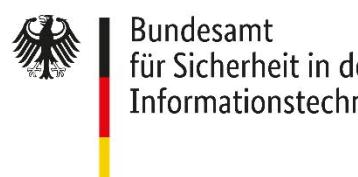
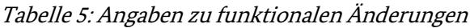

BSI TR-03153-1 Anhang A - TS

# Technische Richtlinie BSI TR-03153 Technische Sicherheitseinrichtung für elektronische Aufzeichnungssysteme

Teil 1: Anforderungen an die Technische Sicherheitseinrichtung Anhang A - TS – Prüfung der Zertifizierungsanforderungen

Version 1.1.0 2023-12-19

## Änderungshistorie

| Version | Datum      | Beschreibung     |
|---------|------------|------------------|
| 1.1.0   | 2023-12-19 | Initiale Version |

Tabelle 1: Änderungshistorie

Bundesamt für Sicherheit in der Informationstechnik Postfach 20 03 63 53133 Bonn

E-Mail: registrierkassen@bsi.bund.de Internet: https://www.bsi.bund.de © Bundesamt für Sicherheit in der Informationstechnik 2023

## Inhalt

| 1   | EINLEITUNG 4                                                 |   |
|-----|--------------------------------------------------------------|---|
|     |                                                              |   |
| 1.1 | SCHLÜSSELWORTE                                               | 4 |
| 1.2 | HINWEIS ZUR PROFILIERUNG                                     | 4 |
|     |                                                              |   |
| 2   | IMPLEMENTATION CONFORMANCE STATEMENT 5                       |   |
|     |                                                              |   |
| 2.1 | HERSTELLERERKLÄRUNG                                          | 5 |
| 2.2 | VERSICHERUNG ZU GEMACHTEN ANGABEN                            | 6 |
| 2.3 | ZUSTIMMUNG ZUR VERÖFFENTLICHUNG DER BESCHRÄNKUNGEN           | 6 |
|     |                                                              |   |
| 3   | PRÜFUNG DER FORMELLEN ANFORDERUNGEN UND RAHMENBEDINGUNGEN  7 |   |
|     |                                                              |   |
| 3.1 | PROFILE                                                      | 7 |
| 3.2 | TESTFÄLLE                                                    | 7 |
|     |                                                              |   |
| 4   | PRÜFUNGEN DER SICHERHEITSZERTIFIZIERUNGEN 9                  |   |
|     |                                                              |   |
| 4.1 | PROFILE                                                      | 9 |
| 4.2 | TESTFÄLLE                                                    | 9 |
|     |                                                              |   |
|     | LITERATURVERZEICHNIS  11                                     |   |
|     |                                                              |   |

## 1 Einleitung

Dieses Dokument ergänzt [\[BSI TR-03153-1-TS\]](#page-10-1) um Prüfanweisungen basierend auf Anhang A [\[BSI TR-03153-1 Anhang A\]](#page-10-2) der Technischen Richtlinie [\[BSI TR-03153-1\]](#page-10-3).

#### 1.1 Schlüsselworte

Anforderungen als Ausdruck normativer Festlegungen werden durch die in Großbuchstaben geschriebenen deutschen Schlüsselworte MUSS/MÜSSEN, DARF/DÜRFEN NICHT/KEINE, VERPFLICHTEND, SOLLTE/SOLLTEN, EMPFOHLEN, SOLLTE/SOLLTEN NICHT/KEINE, KANN/KÖNNEN/DARF/DÜRFEN, und OPTIONAL gekennzeichnet.

Die verwendeten Schlüsselworte sind auf Basis der folgenden Übersetzungstabelle gemäß [\[BSI TR-03153-1](#page-10-2)  [Anhang A\]](#page-10-2) zu interpretieren:

| Deutsch                       | Englisch    |
|-------------------------------|-------------|
| MUSS / MÜSSEN                 | MUST        |
| DARF/DÜRFEN NICHT/KEINE       | MUST NOT    |
| VERPFLICHTEND                 | REQUIRED    |
| SOLLTE / SOLLTEN              | SHOULD      |
| SOLLTE/SOLLTEN NICHT/KEINE    | SHOULD NOT  |
| EMPFOHLEN                     | RECOMMENDED |
| KANN / KÖNNEN / DARF / DÜRFEN | MAY         |
| OPTIONAL                      | OPTIONAL    |

Tabelle 2 Schlüsselworte 

#### 1.2 Hinweis zur Profilierung

Eine Kombination bzw. Zuordnung von mehreren Profilen führt zur Auswahl der Schnittmenge der jeweiligen Profile.

## 2 Implementation Conformance Statement

Das Implementation Conformance Statement (ICS) enthält die für die Durchführung der Konformitätsprüfung benötigten Informationen zur Technischen Sicherheitseinrichtung.

#### 2.1 Herstellererklärung

In der [Tabelle 3](#page-4-2) macht der Antragssteller Angaben zur Sicherheitsmodulanwendung der Technischen Sicherheitseinrichtung.

| Gegenstand                                                                                      | Angaben des Antragstellers |
|-------------------------------------------------------------------------------------------------|----------------------------|
| Hersteller, Modell, Version und Zertifizierungs-ID(s) der Sicherheitsmodulanwendung (SMAERS) |                            |
| Dokumententitel, Version und Datum des Provisionierungskonzepts                              |                            |
| Dokumententitel, Version und Datum des Umgebungsschutzkonzepts                               |                            |
| Dokumententitel, Version und Datum des Updatekonzepts                                        |                            |
| Dokumententitel, Version und Datum des CSP Konfigurationskonzepts                            |                            |

Tabelle 3: Angaben zur Sicherheitsmodulanwendung der TSE

In [Tabelle 4](#page-4-3) macht der Antragssteller Angaben zum Krypto-Kern (CSP) der Technischen Sicherheitseinrichtung. Diese Tabelle ist nur auszufüllen, wenn der Krypto-Kern in einem zentralen Rechenzentrum betrieben wird.

| Gegenstand                                                                                                                                                              | Angaben des Antragstellers |
|-------------------------------------------------------------------------------------------------------------------------------------------------------------------------|----------------------------|
| Hersteller, Modell, Version und Zertifizierungs-ID(s) des Krypto-Kern (CSP)                                                                                          |                            |
| Betreiber des Rechenzentrums, in dem der Krypto-Kern der Technischen Sicherheitseinrichtung betrieben wird.                                                          |                            |
| Zertifizierungs-ID der ISO/IEC 27001-Zertifizierung des Rechenzentrums, in dem der Krypto-Kern der Technischen Sicherheitseinrichtung betrieben wird. |                            |
| Zertifizierungs-ID der Plattform, auf der der Krypto-Kern betrieben wird.                                                                                            |                            |

Tabelle 4: Angaben zum Krypto-Kern bei Betrieb in zentralem Rechenzentrum 

In [Tabelle 5](#page-5-2) macht der Antragssteller Angaben zu funktionalen Änderungen im Vergleich zum vorherigen Zertifizierungsstand. Diese Tabelle ist nur auszufüllen, wenn es sich im aktuellen Zertifizierungsverfahren um eine Aktualisierung einer bereits bestehenden Zertifizierung handelt.

| Gegenstand                                                                                                | Angaben des Antragstellers |
|-----------------------------------------------------------------------------------------------------------|----------------------------|
| Die Technische Sicherheitseinrichtung implementiert funktionale Änderungen im Vergleich zum vorherigen | ☐ Ja ☐ Nein             |
| Zertifizierungsstand.                                                                                     |                            |
| Die an der Technischen Sicherheitseinrichtung im                                           | ☐ Ja                       |
| Vergleich zum vorherigen Zertifizierungsstand durchgeführten Änderungen sind reine   | ☐ Nein                     |
| sicherheitsrelevante Verbesserungen oder rein formelle                                                    |                            |
| Änderungen.                                                                                               |                            |

#### 2.2 Versicherung zu gemachten Angaben

Der Antragsteller versichert, dass die gemachten Angaben vollständig und wahr sind.

Der Antragsteller versichert zusätzlich, dass die TSE

- keine Funktionalität bereitstellt um zukünftige, aktuelle oder abgeschlossene Aufzeichnungen zu manipulieren oder eine ordnungsgemäße Verarbeitung zu verhindern,
- und dass das eingereichte Testobjekt funktionell dem finalen Stand einspricht und höchstens ein anderer Formfaktor gewählt wurde.

Datum / Name / Unterschrift Antragsteller

\_\_\_\_\_\_\_\_\_\_\_\_\_\_\_\_\_\_\_\_\_\_\_\_\_\_\_\_\_\_\_\_\_\_\_

#### 2.3 Zustimmung zur Veröffentlichung der Beschränkungen

Der Antragsteller stimmt der Veröffentlichung aller Beschränkungen, insbesondere der Angaben im ICS, der Technischen Sicherheitseinrichtung durch das BSI und das Bundesministerium der Finanzen zu.

Datum / Name / Unterschrift Antragsteller

\_\_\_\_\_\_\_\_\_\_\_\_\_\_\_\_\_\_\_\_\_\_\_\_\_\_\_\_\_\_\_\_\_\_\_

## 3 Prüfung der formellen Anforderungen und Rahmenbedingungen

Die folgenden Testfälle prüfen, ob die erforderlichen Anforderungen und Rahmenbedingungen erfüllt sind. Die folgenden Testfälle MÜSSEN, in Abhängigkeit der Profilierung, durchgeführt und bestanden werden.

Die Prüfungen werden durch die Zertifizierungsstelle durchgeführt.

#### 3.1 Profile

| Profil-ID          | Beschreibung                                                                                                                                                                                                                                                               |
|--------------------|----------------------------------------------------------------------------------------------------------------------------------------------------------------------------------------------------------------------------------------------------------------------------|
| V1.0.1_ZERT        | Prüfungen, die von allen Produkten bestanden werden MÜSSEN, die nach der Technischen Richtlinie [BSI TR-03153-1] in Version 1.0.1 initial zertifiziert werden sollen.                                                                                                |
| V1.0.1_UPDATEZERT  | Prüfungen, die von allen Produkten bestanden werden MÜSSEN, deren Zertifizierung nach der Technischen Richtlinie [BSI TR-03153-1] in Version 1.0.1 im Rahmen eines Rezertifizierungs- oder Maintenanceverfahrens aktualisiert werden sollen.                      |
| V1.0.1_NOT_TIMELY  | Prüfungen, die von allen Produkten bestanden werden MÜSSEN, deren Abschluss des Zertifizierungs-, Rezertifizierungs- oder Maintenanceverfahrens nach der Technischen Richtlinie [BSI TR-03153-1] in der Version 1.0.1 nach dem 30.04.2025 liegt bzw. liegen wird. |
| V1.0.1_FUN_CHANGES | Prüfungen, die von allen Produkten bestanden werden MÜSSEN, an denen funktionale Änderungen im Vergleich zum vorherigen Zertifizierungsstand durchgeführt worden sind.                                                                                               |

Tabelle 6 Profile für die Konformitätszertifizierung nach [BSI TR-03153-1] in der Version 1.0.1

#### 3.2 Testfälle

| Testfall-ID | Beschreibung                                                                                                                                                                                                                                    | Profile                                 |
|-------------|-------------------------------------------------------------------------------------------------------------------------------------------------------------------------------------------------------------------------------------------------|-----------------------------------------|
|             | FOR_UPD_01 Prüfung, ob der Antrag auf Zertifizierung vor dem Ablauf des 30.04.2024 erfolgreich durch das BSI angenommen wurde.                                                                                                               | V1.0.1_ZERT                             |
|             | FOR_UPD_02 Prüfung, ob der Zeitpunkt des Abschlusses der Zertifizierung nicht nach dem Ablauf des 30.04.2025 liegt.                                                                                                                          | V1.0.1_ZERT                             |
|             | FOR_UPD_03 Prüfung, ob die Technische Sicherheitseinrichtung nach [BSI TR 03153-1] in der Version 1.0.1 zertifiziert ist und ob als Nachweis dessen ein entsprechendes Zertifikat nach [BSI TR-03153-1] in der Version 1.0.1 vorliegt. | V1.0.1_UPDATEZERT                       |
|             | FOR_UPD_04 Prüfung, ob der Zeitpunkt des Abschlusses der Zertifizierung nicht nach dem Ablauf des 30.04.2025 liegt.                                                                                                                          | V1.0.1_UPDATEZERT V1.0.1_FUN_CHANGES |
|             | FOR_UPD_05 Prüfung, ob im Vergleich zum vorherigen Zertifizierungsstand nur Veränderungen durchgeführt worden sind, die reine sicherheitsrelevante Verbesserungen oder rein formelle Änderungen darstellen.                            | V1.0.1_UPDATEZERT V1.0.1_NOT_TIMELY  |

| Testfall-ID | Beschreibung                                                                                                                                                | Profile                                |
|-------------|-------------------------------------------------------------------------------------------------------------------------------------------------------------|----------------------------------------|
|             | FOR_UPD_06 Prüfung, ob das Gültigkeitsende des aktualisierten Zertifikats kleiner oder gleich dem Gültigkeitsende des vorhergehenden Zertifikats ist. | V1.0.1_UPDATEZERT V1.0.1_NOT_TIMELY |

Tabelle 7 Testfälle für die Konformitätszertifizierung nach [BSI TR-03153-1] in der Version 1.0.1

### 4 Prüfungen der Sicherheitszertifizierungen

Die folgenden Testfälle prüfen, ob die geforderten Common Criteria-Sicherheitszertifizierungen und die notwendigen Unterlagen vorliegen. Die folgenden Testfälle MÜSSEN, in Abhängigkeit der Profilierung, von der Prüfstelle durchgeführt und bestanden werden.

#### 4.1 Profile

| Profil-ID | Beschreibung                                                                                                                                              |
|-----------|-----------------------------------------------------------------------------------------------------------------------------------------------------------|
| CC_BASIC  | Prüfungen, die von allen Produkten bestanden werden MÜSSEN, die nach der Technischen Richtlinie [BSI TR-03153-1] zertifiziert werden sollen.           |
| CC_0104   | Prüfung, die von allen Produkten bestanden werden MÜSSEN, die einen Krypto-Kern (CSP) nach dem Schutzprofil [BSI-CC-PP-0104] verwenden.                |
| CC_0111   | Prüfung, die von allen Produkten bestanden werden MÜSSEN, die einen Krypto-Kern (CSP) nach dem Schutzprofil [BSI-CC-PP-0111] (CSP Light) verwenden. |

Tabelle 8 Profil für die Sicherheitszertifizierungen der Technischen Sicherheitseinrichtung

#### 4.2 Testfälle

Die folgenden zusätzlichen Prüfungen MÜSSEN von der Prüfstelle durchgeführt werden:

| Testfall-ID | Beschreibung                                                                                                                                                                                                                                                                                                                                                                                                                                                                      | Profil   |
|-------------|-----------------------------------------------------------------------------------------------------------------------------------------------------------------------------------------------------------------------------------------------------------------------------------------------------------------------------------------------------------------------------------------------------------------------------------------------------------------------------------|----------|
| DOC_CC_01   | Prüfung, ob ein Nachweis über die Eignung der folgend aufgeführten Konzepte der Schutzprofile nach dem Supporting Document [BSI-CC-SUP-SMA] durch die jeweilige Common Criteria-Prüfstelle, oder übergangsweise/ersatzweise durch das BSI, vorliegt: • Provisionierungskonzept • Umgebungsschutzkonzept • Updatekonzept • CSP-Konfigurationskonzept                                                                                           | CC_BASIC |
| DOC_CC_02   | Prüfung, ob die Sicherheitsmodulanwendung der Technischen Sicherheitseinrichtung nach dem Schutzprofil [BSI-CC-PP-0105-V2] durch eine anerkannte Common-Criteria-Zertifizierungsstelle gemäß SOGIS-MRA / CCRA zertifiziert ist und ob als Nachweis dessen ein entsprechendes Zertifikat vorliegt.                                                                                                                                                                     | CC_BASIC |
| DOC_CC_03   | Prüfung, ob der Krypto-Kern (CSP) der Technischen Sicherheitseinrichtung nach dem Schutzprofil [BSI-CC-PP-0104] in der Konfiguration nach dem Schutzprofil [BSI-CC-PP-0107] (Time Stamp Service and Audit) oder dem Schutzprofil [BSI-CC-PP-0108] (Time Stamp Service, Audit and Clustering) durch eine anerkannte Common-Criteria-Zertifizierungsstelle gemäß SOGIS-MRA zertifiziert ist und ob als Nachweis dessen ein entsprechendes Zertifikat vorliegt. | CC_0104  |

| Testfall-ID | Beschreibung                                                                                                                                                                                                                                                                                                                                                                                                                                                                                                                    | Profil  |
|-------------|---------------------------------------------------------------------------------------------------------------------------------------------------------------------------------------------------------------------------------------------------------------------------------------------------------------------------------------------------------------------------------------------------------------------------------------------------------------------------------------------------------------------------------|---------|
| DOC_CC_04   | Prüfung, ob der Krypto-Kern (CSP) der Technischen Sicherheitseinrichtung nach dem Schutzprofil [BSI-CC-PP-0111] (CSP Light) in der Konfiguration nach dem Schutzprofil [BSI-CC-PP 0113] (Time Stamp Service, Audit and Clustering) durch eine anerkannte Common-Criteria-Zertifizierungsstelle gemäß SOGIS MRA zertifiziert ist und ob als Nachweis dessen ein entsprechendes Zertifikat vorliegt.                                                                                                            | CC_0111 |
| DOC_CC_05   | Prüfung, ob • der Krypto-Kern (CSP-Einheit) in einem zentralen Rechenzentrum betrieben wird, • dieses Rechenzentrum nach ISO/IEC 27001 zertifiziert ist als Nachweis für das physikalische und organisatorische Sicherheitsniveau für das Rechenzentrum und • ob als Nachweis dessen ein entsprechendes ISO/IEC 27001- Zertifikat vorliegt.                                                                                                                                                       | CC_0111 |
| DOC_CC_06   | Prüfung, ob die Plattform, auf der der CSPL betrieben wird, über eines der folgenden Zertifikate verfügt: • Ein Zertifikat nach ISO/IEC 19790 Level 3, oder alternativ, • für den Fall, dass sich der CSP-L gemäß der Definition nach dem Schutzprofil [CEN EN 419221-5] als lokale Client-Applikation innerhalb der Hardware-Appliance des CEN 419221-5-TOE befindet, ein Zertifikat nach dem Schutzprofil [CEN EN 419221- 5] oder • ein vergleichbares Zertifikat in Abstimmung mit dem BSI. | CC_0111 |

Tabelle 9 Testfälle für die Sicherheitszertifizierungen der Technischen Sicherheitseinrichtungen

#### Literaturverzeichnis

| BSI-CC-PP-0104    | BSI: BSI-CC-PP-0104-2019 Protection Profile Cryptographic Service Provider (CSP)                                                                                                                                                                                                                                                                     |
|-------------------|---------------------------------------------------------------------------------------------------------------------------------------------------------------------------------------------------------------------------------------------------------------------------------------------------------------------------------------------------------|
| BSI-CC-PP-0105-V2 | BSI: BSI-CC-PP-0105-V2-2020 Protection Profile Security Module Application for Electronic Record-keeping Systems V2 (SMAERS)                                                                                                                                                                                                                         |
| BSI-CC-PP-0107    | BSI: BSI-CC-PP-0107-2019 Protection Profile Configuration Cryptographic Service Provider – Time Stamp Service and Audit                                                                                                                                                                                                                           |
| BSI-CC-PP-0108    | BSI: BSI-CC-PP-0108-2019 Protection Profile Configuration Cryptographic Service Provider – Time Stamp Service, Audit and Clustering                                                                                                                                                                                                               |
| BSI-CC-PP-0111    | BSI: BSI-CC-PP-0111-2019 Protection Profile Cryptographic Service Provider Light (CSPL)                                                                                                                                                                                                                                                              |
| BSI-CC-PP-0113    | BSI: BSI-CC-PP-0113-2020 Protection Profile Time Stamp Service, Audit and Clustering                                                                                                                                                                                                                                                                 |
| BSI-CC-SUP-SMA    | BSI: Supporting Document for Common Criteria Protection Profile SMAERS, Version 1.0                                                                                                                                                                                                                                                                  |
| BSI TR-03153      | BSI: Technische Richtlinie TR-03153 Technische Sicherheitseinrichtung für elektronische Aufzeichnungssysteme, Version 1.0.1, 20. Dezember 2018                                                                                                                                                                                                 |
| BSI TR-03153-1    | BSI: Technische Richtlinie BSI TR-03153 Technische Sicherheitseinrichtung für elektronische Aufzeichnungssysteme - Teil 1: Anforderungen an die Technische Sicherheitseinrichtung                                                                                                                                                                 |
|                   | BSI TR-03153-1 Anhang A BSI: Technische Richtlinie BSI TR-03153 Technische Sicherheitseinrichtung für elektronische Aufzeichnungssysteme – Teil 1: Anforderungen an die Technische Sicherheitseinrichtung, Anhang A - Zertifizierungsanforderungen                                                                                                |
| BSI TR-03153-1-TS | BSI: Technische Richtlinie BSI TR-03153 Technische Sicherheitseinrichtung für elektronische Aufzeichnungssysteme – Teil 1: Anforderungen an die Technische Sicherheitseinrichtung, Testspezifikation (TS)                                                                                                                                         |
| CEN EN 419221-5   | CEN: Protection Profiles for TSP Cryptographic Modules - Part 5: Cryptographic Module for Trust Services, 2018                                                                                                                                                                                                                                       |
| CSA               | Verordnung (EU) 2019/881 des Europäischen Parlaments und des Rates vom 17. April 2019 über die ENISA (Agentur der Europäischen Union für Cybersicherheit) und über die Zertifizierung der Cybersicherheit von Informations- und Kommunikationstechnik und zur Aufhebung der Verordnung (EU) Nr. 526/2013 (Rechtsakt zur Cybersicherheit) |
| RFC 2119          | Bradner, S.: Key words for use in RFCs to indicate requirement levels                                                                                                                                                                                                                                                                                   |