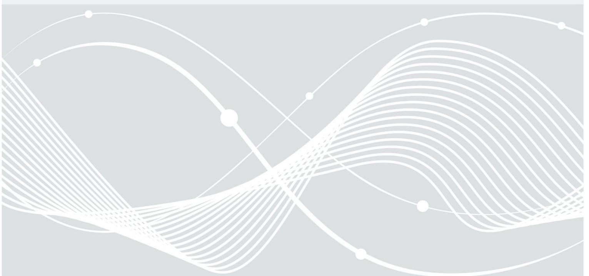
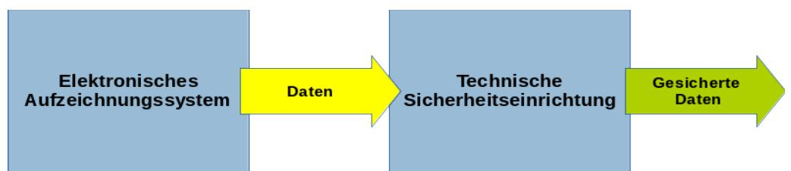
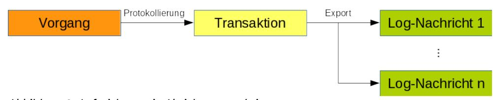
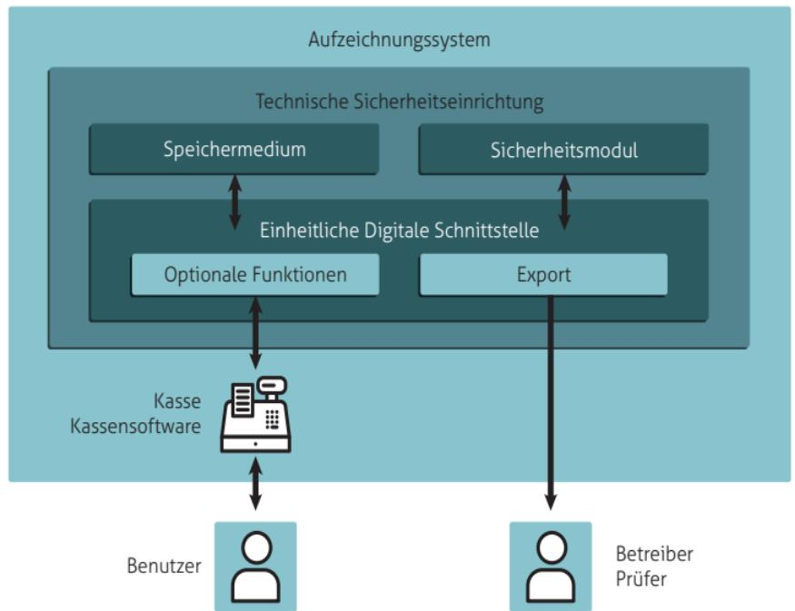
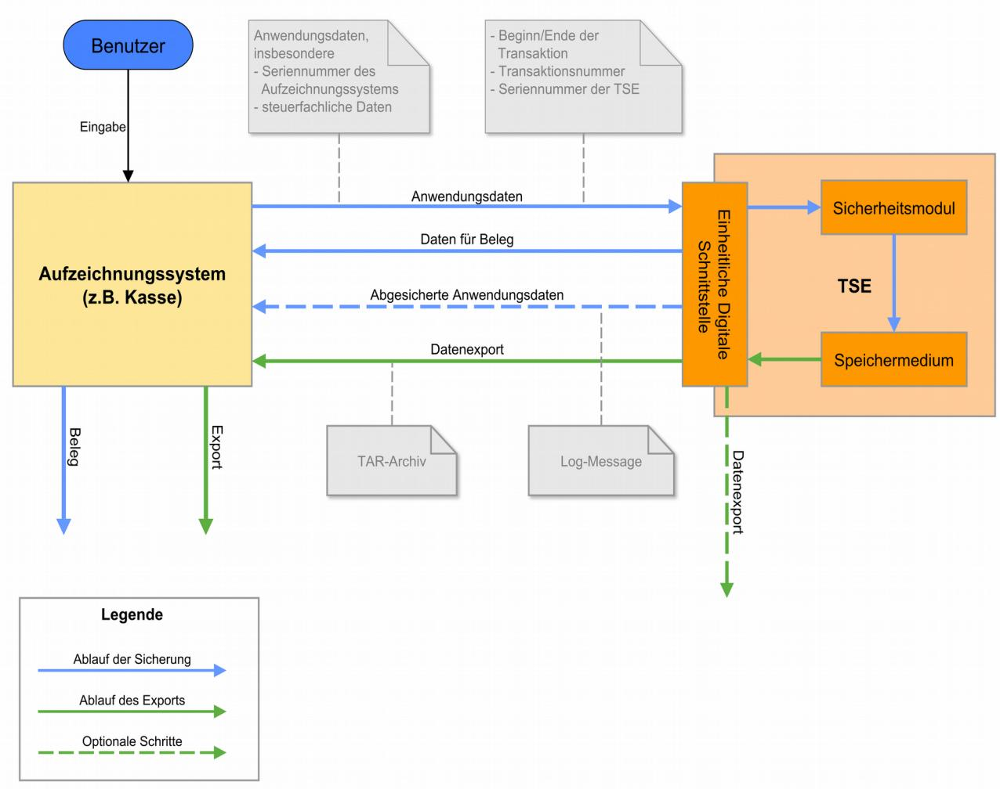
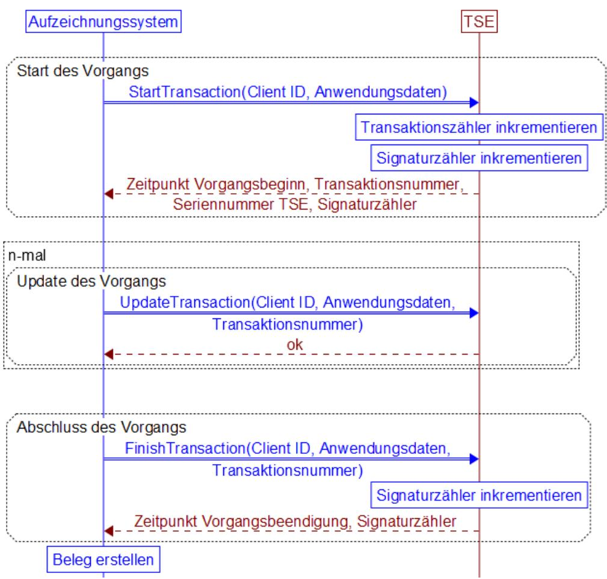

# Technische Richtlinie BSI TR-03153 Technische Sicherheitseinrichtung für elektronische Aufzeichnungssysteme

Version 1.0.1 20. Dezember 2018

Bundesamt für Sicherheit in der Informationstechnik Postfach 20 03 63 53133 Bonn

E-Mail: [registrierkassen@bsi.bund.de](mailto:registrierkassen@bsi.bund.de) Internet: [https://www.bsi.bund.de](https://www.bsi.bund.de/) © Bundesamt für Sicherheit in der Informationstechnik 2019

| 1              | Einleitung 5                                                                              |  |
|----------------|-------------------------------------------------------------------------------------------|--|
| 1.1            | Übersicht über die Technische Sicherheitseinrichtung5                                     |  |
| 1.2            | Inhalt und Abgrenzung der Technischen Richtlinie6                                         |  |
| 1.3            | Schlüsselworte 6                                                                          |  |
| 1.4            | Abkürzungen 7                                                                             |  |
| 2              | Rechtliche Grundlagen (informativ) 8                                                      |  |
| 2.1            | Abgabenordnung 8                                                                          |  |
| 2.2            | Die Kassensicherungsverordnung 9                                                          |  |
| 2.2.1          | Elektronische Aufzeichnungssysteme9                                                       |  |
| 2.2.2          | Protokollierung von digitalen Grundaufzeichnungen10                                       |  |
| 2.2.3          | Speicherung der Grundaufzeichnungen10                                                     |  |
| 2.2.4          | Einheitliche Digitale Schnittstelle11                                                     |  |
| 2.2.5 2.2.6 | Anforderungen an die technische Sicherheitseinrichtung11 Anforderungen an den Beleg 12 |  |
| 3              | Die Technische Sicherheitseinrichtung 13                                                  |  |
| 3.1            | Grundbegriffe 13                                                                          |  |
| 3.2            | Systemübersicht 14                                                                        |  |
| 3.3            | Ablauf der Protokollierung 16                                                             |  |
| 3.3.1          | Beginn der Transaktion 18                                                                 |  |
| 3.3.2          | Update der Transaktion 19                                                                 |  |
| 3.3.3          | Beendigung der Transaktion 20                                                             |  |
| 3.3.4          | Erzeugung des Prüfwerts 20                                                                |  |
| 3.3.5          | Verifikation des Prüfwerts 21                                                             |  |
| 3.4            | Datenexport 22                                                                            |  |
| 3.5            | Lebenszyklus und Initialisierung 22                                                       |  |
| 3.5.1          | Anforderungen an den Hersteller der TSE22                                                 |  |
| 3.5.2          | Inbetriebnahme der TSE durch den Endnutzer22                                              |  |
| 3.5.3          | Außerbetriebsetzung des TSE 23                                                            |  |
| 3.6            | Systemfunktionen 23                                                                       |  |
| 3.7            | Audit-Daten 23                                                                            |  |
| 3.8            | Belegausgabe 23                                                                           |  |
| 4              | Das Sicherheitsmodul 25                                                                   |  |
| 4.1            | Allgemeines 25                                                                            |  |
| 4.2            | Varianten 25                                                                              |  |
| 4.3            | Funktionalität des Sicherheitsmoduls26                                                    |  |
| 5              | Die Einheitliche Digitale Schnittstelle27                                                 |  |
| 5.1            | Exportschnittstelle 27                                                                    |  |
| 5.1.1          | Log-Nachrichten von Absicherungsschritten27                                               |  |
| 5.1.2 5.1.3 | Log-Nachrichten für Systemfunktionen28 Log-Nachrichten für Audit-Daten 28              |  |
| 5.2            | Einbindungsschnittstelle 28                                                               |  |
|                |                                                                                           |  |
| 6 6.1.1     | Das Speichermedium 31 Anforderungen an die Speicherkapazität31                         |  |
|                |                                                                                           |  |

| 6.1.2 | Anforderungen an die Zuverlässigkeit31          |  |
|-------|-------------------------------------------------|--|
| 6.1.3 | Datenformat 32                                  |  |
| 7     | Weitere Anforderungen 33                        |  |
| 7.1   | Fehlerbehandlung 33                             |  |
| 7.2   | Anforderungen zur Aktualisierung der Zeit33     |  |
| 7.3   | Kryptographische Vorgaben 33                    |  |
| 7.4   | Anforderungen an Anbieter von Zertifikaten33    |  |
| 7.5   | Anforderungen an die Vergabe der Seriennummer33 |  |
| 7.6   | Zertifizierung 34                               |  |
|       | Literaturverzeichnis 35                         |  |

| Abbildung 1: Absicherung von digitalen Grundaufzeichnungen5                      |  |
|----------------------------------------------------------------------------------|--|
| Abbildung 2: Aufzeichnung in Absicherungsschritten14                             |  |
| Abbildung 3: Grundlegender Aufbau der Technischen Sicherheitseinrichtung15       |  |
| Abbildung 4: Datenfluss bei der Verwendung der TSE16                             |  |
| Abbildung 5: Ablauf der Protokollierung eines Vorgangs (Updates ohne Signatur)18 |  |

| Tabelle 1: Übersetzungstabelle RFC 2119 7                               |  |
|-------------------------------------------------------------------------|--|
| Tabelle 2: Übersicht über die Anwendungs- und Protokolldaten16          |  |
| Tabelle 3: Datenfelder des Inputs für die Prüfwertberechnung21          |  |
| Tabelle 4: Daten der Initialisierung 23                                 |  |
| Tabelle 5: Belegung der Datenfelder der Log-Nachricht28                 |  |
| Tabelle 6: Übersicht über die Funktionen der Einbindungsschnittstelle30 |  |

# 1 Einleitung

Im Zuge der Digitalisierung von Geschäftsprozessen und dem verstärkten Einsatz *elektronischer Aufzeichnungssysteme* (wie *elektronischer Kassensysteme* und *Registrierkassen*) werden Geschäftsvorfälle heutzutage immer häufiger digital erfasst und aufgezeichnet. Hierdurch haben sich die technischen Herausforderungen für die Steuerprüfung stark verändert. So liefern elektronische Aufzeichnungssysteme zwar gut aufbereitete Steuerdaten, jedoch sind nachträgliche Manipulationen an den digitalen Aufzeichnungen (*digitale Grundaufzeichnungen*) ohne ausreichende Schutzmaßnahmen nur mit hohem Aufwand oder gar nicht feststellbar.

Um solche Manipulationen wirksam zu verhindern, müssen die Integrität, Authentizität und Vollständigkeit der digitalen Grundaufzeichnungen sichergestellt werden. Zudem müssen die Daten unmittelbar erfasst und im Rahmen von Prüfungen zeitlich aufgefunden werden können.

Erreicht wird dies durch die Verwendung einer *Technischen Sicherheitseinrichtung (TSE)*. Die Technische Sicherheitseinrichtung wird vom elektronischen Aufzeichnungssystem angesprochen, übernimmt die Absicherung der aufzuzeichnenden Daten und speichert die gesicherten Aufzeichnungen in einem einheitlichen Format. Finanzbehörden können die geschützten Daten dann einfordern und auf Vollständigkeit und Korrektheit prüfen.

Die vorliegende Technische Richtlinie definiert verbindliche Vorgaben an die Technische Sicherheitseinrichtung**,** mit denen die digitalen Grundaufzeichnungen eines elektronischen Aufzeichnungssystems gemäß § 146a (1) der Abgabenordnung [AO] geschützt werden müssen.

# 1.1 Übersicht über die Technische Sicherheitseinrichtung

Die Technische Sicherheitseinrichtung besteht aus einem Sicherheitsmodul, einem nicht-flüchtigen Speichermedium und einer einheitlichen digitalen Schnittstelle.

Die Aufzeichnung läuft hierbei wie folgt ab:

- Die Vorgangsdaten werden schrittweise über die einheitliche digitale Schnittstelle an die Technische Sicherheitseinrichtung übergeben.
- Das Sicherheitsmodul vergibt eine eindeutige fortlaufende Transaktionsnummer, einen eindeutigen fortlaufenden Signaturzähler, erfasst Beginn und Ende der Transaktion und erzeugt über die Daten der Transaktion einen Prüfwert.
- Die abgesicherten Vorgangsdaten werden auf dem Speichermedium gespeichert.

*Abbildung 1: Absicherung von digitalen Grundaufzeichnungen*

Die Überprüfung der geschützten Aufzeichnungen erfolgt wie im Folgenden beschrieben:

- Die abgesicherten Vorgangsdaten werden über die einheitliche digitale Schnittstelle aus der Technischen Sicherheitseinrichtung exportiert.
- Der Prüfwert wird verifiziert, um die Integrität und Authentizität der abgesicherten Vorgangsdaten sicherzustellen.

• Mit dem aufgezeichneten Beginn und Ende in den abgesicherten Transaktionsdaten kann überprüft werden, zu welchem Zeitpunkt die Daten aufgezeichnet wurden. Mit Hilfe der fortlaufenden Transaktionsnummer und des fortlaufenden Signaturzählers können Lücken in den aufgezeichneten Daten erkannt werden.

### 1.2 Inhalt und Abgrenzung der Technischen Richtlinie

Der Fokus dieser Technischen Richtlinie liegt auf der Definition von Mindestanforderungen an die Interoperabilität.

So legt die Technische Richtlinie ein einheitliches Datenformat für die Absicherung der elektronischen Aufzeichnungen fest. Zudem wird eine standardisierte Schnittstelle für den Export der aufgezeichneten und abgesicherten Daten aus der Technischen Sicherheitseinrichtung definiert.

Die Definition einer einheitlichen Einbindungsschnittstelle soll die Möglichkeit bieten, die technische Sicherheitseinrichtung unabhängig von deren konkreter Implementierung und ohne Kenntnisse ihres internen Aufbaus an das elektronische Aufzeichnungssystem anzubinden und ansprechen zu können.

Die Spezifikation basiert auf der "*Secure Element API"* nach [BSI TR-03151]. Hierdurch wird eine technologieoffene und implementierungsunabhängige Kapselung der Sicherheitsfunktionalität der Technischen Sicherheitseinrichtung ermöglicht.

Daneben enthält die Technische Richtlinie notwendige organisatorische Vorgaben und Verfügbarkeitsanforderungen.

Die Vorgaben an den Einsatz geeigneter kryptographischer Verfahren zum Schutz der digitalen Grundaufzeichnungen sind in Teil 5 der Technischen Richtlinie [BSI TR-03116] enthalten. Mindestanforderungen an die Sicherheitseigenschaften der Technischen Sicherheitseinrichtung werden in den Schutzprofilen [BSI PP-SMAERS] und [BSI PP-CSP] festgelegt.

Diese Technische Richtlinie macht keine Vorgaben an die konkrete Implementierung der Technischen Sicherheitseinrichtung. Die vorliegende Technischen Richtlinie sowie die Schutzprofile [BSI PP-SMAERS] und [BSI PP-CSP] bilden die Grundlage für die von § 146a (3) [AO] vorgegebene Zertifizierung der Technischen Sicherheitseinrichtung.

Festlegungen zu Art und Umfang der aufzuzeichnenden Geschäftsvorfälle und anderen Vorgänge sowie die Strukturierung der zugrundeliegenden steuerfachlichen Daten eines Vorgangs liegen nicht im Regelungsbereich dieser Technischen Richtlinie.

### 1.3 Schlüsselworte

Anforderungen als Ausdruck normativer Festlegungen werden durch die in Großbuchstaben geschriebenen deutschen Schlüsselworte MUSS/MÜSSEN, DARF NICHT/DÜRFEN NICHT, VERPFLICHTEND, SOLLTE/SOLLTEN, EMPFOHLEN, SOLLTE NICHT/SOLLTEN NICHT, KANN/KÖNNEN/DARF/DÜRFEN, und OPTIONAL gekennzeichnet.

Die verwendeten Schlüsselworte sind auf Basis der folgenden Übersetzungstabelle gemäß [RFC2119] zu interpretieren:

| Deutsch                   | Englisch |
|---------------------------|----------|
| MUSS / MÜSSEN             | MUST     |
| DARF NICHT / DÜRFEN NICHT | MUST NOT |
| VERPFLICHTEND             | REQUIRED |
| SOLLTE / SOLLTEN          | SHOULD   |

| Deutsch                       | Englisch    |
|-------------------------------|-------------|
| SOLLTE NICHT / SOLLTEN NICHT  | SHOULD NOT  |
| EMPFOHLEN                     | RECOMMENDED |
| KANN / KÖNNEN / DARF / DÜRFEN | MAY         |
| OPTIONAL                      | OPTIONAL    |

*Tabelle 1: Schlüsselworte*

## 1.4 Abkürzungen

In dieser Technischen Richtlinie werden folgende Abkürzungen verwendet.

| Abkürzung | Erklärung                           | Bemerkung                                                                                                                             |
|-----------|-------------------------------------|---------------------------------------------------------------------------------------------------------------------------------------|
| MSC       | Message Sequence Chart              | Eine Darstellungskonvention aus der Kommunikationstechnik.                                                                         |
| API       | Application Programming Interface,  | Ein Programmteil, der von einem Softwaresystem anderen zur Anbindung an das System zur Verfügung gestellt wird.                 |
| TSE       | Technische Sicherheitseinrichtung,  | Die in dieser Technischen Richtlinie spezifizierte Technische Sicherheitseinrichtung eines elektronischen Aufzeichnungssystems. |
| EDS       | Einheitliche Digitale Schnittstelle | Die von der TSE zur Verfügung gestellte API.                                                                                          |

# 2 Rechtliche Grundlagen (informativ)

In diesem Kapitel wird ein Überblick über die rechtlichen Grundlagen der Technischen Sicherheitseinrichtung gegeben.

# 2.1 Abgabenordnung

Rechtlich ist der Schutz vor Manipulationen an Aufzeichnungen elektronischer Aufzeichnungssysteme durch die Abgabenordnung [AO] geregelt. Diese sieht u.a. eine Kombination von technischen und organisatorischen Maßnahmen vor, um solche Manipulationen digitaler Grundaufzeichnungen wirksam zu verhindern.

#### **Aufzeichnungspflicht**

**§ 146a (1) Satz 1:** *"Wer aufzeichnungspflichtige Geschäftsvorfälle oder andere Vorgänge mit Hilfe eines elektronischen Aufzeichnungssystems erfasst, hat ein elektronisches Aufzeichnungssystem zu verwenden, das jeden aufzeichnungspflichtigen Geschäftsvorfall und anderen Vorgang einzeln, vollständig, richtig, zeitgerecht und geordnet aufzeichnet."*

#### **Einführung einer zertifizierten technischen Sicherheitseinrichtung**

**§ 146a (1) Satz 2-5:** *"Das elektronische Aufzeichnungssystem und die digitalen Aufzeichnungen nach Satz 1 sind durch eine zertifizierte technische Sicherheitseinrichtung zu schützen. Diese zertifizierte technische Sicherheitseinrichtung muss aus einem Sicherheitsmodul, einem Speichermedium und einer einheitlichen digitalen Schnittstelle bestehen. Die digitalen Aufzeichnungen sind auf dem Speichermedium zu sichern und für Nachschauen sowie Außenprüfungen durch elektronische Aufbewahrung verfügbar zu halten. [...]"*

#### **Meldepflicht**

**§146a (4):** *"Wer aufzeichnungspflichtige Geschäftsvorfälle oder andere Vorgänge mit Hilfe eines elektronischen Aufzeichnungssystems im Sinne des Absatzes 1 erfasst, hat dem nach den §§ 18 bis 20 zuständigen Finanzamt nach amtlich vorgeschriebenen Vordruck mitzuteilen:* 

*1. Name des Steuerpflichtigen, 2. Steuernummer des Steuerpflichtigen, 3. Art der zertifizierten technischen Sicherheitseinrichtung, 4. Art des verwendeten elektronischen Aufzeichnungssystems, 5. Anzahl der verwendeten elektronischen Aufzeichnungssysteme, 6. Seriennummer des verwendeten elektronischen Aufzeichnungssystems, 7. Datum der Anschaffung des verwendeten elektronischen Aufzeichnungssystems, 8. Datum der Außerbetriebnahme des verwendeten elektronischen Aufzeichnungssystems.*

*Die Mitteilung nach Satz 1 ist innerhalb eines Monats nach Anschaffung oder Außerbetriebnahme des elektronischen Aufzeichnungssystems zu erstatten."*

#### **Belegpflicht**

**§146a (2):** *"Wer aufzeichnungspflichtige Geschäftsvorfälle im Sinne des Absatzes 1 Satz 1 erfasst, hat dem an diesem Geschäftsvorfall Beteiligten in unmittelbarem zeitlichem Zusammenhang mit dem Geschäftsvorfall unbeschadet anderer gesetzlicher Vorschriften einen Beleg über den Geschäftsvorfall auszustellen und dem an diesem Geschäftsvorfall Beteiligten zur Verfügung zu stellen (Belegausgabepflicht). Bei Verkauf von Waren an eine Vielzahl von nicht bekannten Personen können die Finanzbehörden nach § 148 aus Zumutbarkeitsgründen nach pflichtgemäßem Ermessen von einer Belegausgabepflicht nach Satz 1 befreien. Die Befreiung kann widerrufen werden."*

#### **Einführung einer Kassen-Nachschau**

**§146b (1):** *"Zur Prüfung der Ordnungsmäßigkeit der Aufzeichnungen und Buchungen von Kasseneinnahmen und Kassenausgaben können die damit betrauten Amtsträger der Finanzbehörde ohne vorherige Ankündigung und außerhalb einer Außenprüfung während der üblichen Geschäfts- und Arbeitszeiten Geschäftsgrundstücke oder Geschäftsräume von Steuerpflichtigen betreten, um Sachverhalte festzustellen, die für die Besteuerung erheblich sein können (Kassen-Nachschau). Der Kassen-Nachschau unterliegt auch die Prüfung des ordnungsgemäßen Einsatzes des elektronischen Aufzeichnungssystems nach § 146a Absatz 1. [...]"*

Die Technische Sicherheitseinrichtung ist hierbei der zentrale technische Baustein zur Sicherung der Grundaufzeichnungen gegen nachträgliche Manipulationen. Die Zertifizierung hat zum Ziel ein einheitliches Mindestniveau an Vertrauen und Sicherheit in die Technische Sicherheitseinrichtung sowie die Einhaltung notwendiger Interoperabilitätsanforderungen sicherzustellen. Eine Zertifizierung des gesamten elektronischen Aufzeichnungssystems (z.B. Kasse oder Kassensoftware) selbst ist nicht zielführend .

#### **Verordnungsermächtigung**

**§ 146a (3), Satz 1:** *"Das Bundesministerium der Finanzen wird ermächtigt, durch Rechtsverordnung mit Zustimmung des Bundestages und des Bundesrates und im Einvernehmen mit dem Bundesministerium des Innern und dem Bundesministerium für Wirtschaft und Energie Folgendes zu bestimmen:*

- 1. *die elektronischen Aufzeichnungssysteme, die über eine zertifizierte technische Sicherheitseinrichtung verfügen müssen, und*
- 2. *die Anforderungen an*

*a) das Sicherheitsmodul, b) das Speichermedium, c) die einheitliche digitale Schnittstelle,* 

*d) die elektronische Aufbewahrung der Aufzeichnungen, e) die Protokollierung von digitalen Grundaufzeichnungen zur Sicherstellung der Integrität und Authentizität sowie der Vollständigkeit der elektronischen Aufzeichnung, f) den Beleg und g) die Zertifizierung der technischen Sicherheitseinrichtung."*

#### **Aufgaben des BSI**

**§ 146a (3) Sätze 2-3:** *"Die Erfüllung der Anforderungen nach Satz 1 Nummer 2 Buchstabe a bis c ist durch eine Zertifizierung des Bundesamts für Sicherheit in der Informationstechnik nachzuweisen, die fortlaufend aufrechtzuerhalten ist. Das Bundesamt für Sicherheit in der Informationstechnik kann mit der Festlegung von Anforderungen an die technische Sicherheitseinrichtung im Sinne des Satzes 1 Nummer 2 Buchstabe a bis c beauftragt werden. [...]"*

Die Durchführungsdetails werden gemäß § 146a (3), Satz 1 [AO] in der Kassensicherungsverordnung [KassenSichV] des Bundesministerium der Finanzen präzisiert.

## 2.2 Die Kassensicherungsverordnung

Dieser Abschnitt gibt einen Überblick über die Vorgaben der Kassensicherungsverordnung [KassenSichV].

#### 2.2.1 Elektronische Aufzeichnungssysteme

§1 der [KassenSichV] legt fest, welche Aufzeichnungssysteme über eine zertifizierte Technische Sicherheitseinrichtung verfügen müssen.

#### **Elektronische Aufzeichnungssysteme**

**§ 1 [KassenSichV]:** *"Elektronische Aufzeichnungssysteme im Sinne des § 146a Absatz 1 Satz 1 der Abgabenordnung sind elektronische oder computergestützte Kassensysteme oder Registrierkassen. Fahrscheinautomaten, Fahrscheindrucker, elektronisch Buchhaltungsprogramme, Waren- und Dienstleistungsautomaten, Geldautomaten, Taxameter und Wegstreckenzähler gehören nicht dazu.."*

#### 2.2.2 Protokollierung von digitalen Grundaufzeichnungen

In § 2 der [KassenSichV] werden die grundlegenden Anforderungen an die Protokollierung von digitalen Grundaufzeichnungen definiert.

#### **Protokollierung von digitalen Grundaufzeichnungen**

**§ 2 [KassenSichV]:** *"Für jede Aufzeichnung eines Geschäftsvorfalls oder anderen Vorgangs im Sinne des § 146 Absatz 1 Satz 1 der Abgabenordnung muss von einem elektronischen Aufzeichnungssystem unmittelbar eine neue Transaktion gestartet werden. Die Transaktion hat zu enthalten:*

- 1. *den Zeitpunkt des Vorgangbeginns,*
- 2. *eine eindeutige und fortlaufende Transaktionsnummer,*
- 3. *die Art des Vorgangs,*
- 4. *die Daten des Vorgangs,*
- 5. *die Zahlungsart,*
- 6. *den Zeitpunkt der Vorgangsbeendigung oder des Vorgangsabbruchs,*
- 7. *einen Prüfwert sowie*
- 8. *die Seriennummer des elektronischen Aufzeichnungssystems oder die Seriennummer des Sicherheitsmoduls.*

*Die Zeitpunkte nach Satz 2 Nummer 1 und 6, die Transaktionsnummer nach Satz 2 Nummer 2 und der Prüfwert nach Satz 2 Nummer 7 werden manipulationssicher durch das Sicherheitsmodul festgelegt. Die Transaktionsnummer muss so beschaffen sein, dass Lücken in Transaktionsaufzeichnungen erkennbar sind."*

#### 2.2.3 Speicherung der Grundaufzeichnungen

§ 3 der [KassenSichV] enthält Anforderungen zur Speicherung und Aufbewahrung der Grundaufzeichnungen.

#### **Speicherung der Grundaufzeichnungen**

#### **§3 [KassenSichV]:** *"Speicherung der Grundaufzeichnungen*

- 1. *Die Speicherung der laufenden Geschäftsvorfälle oder anderen Vorgänge im Sinne des § 146a Absatz 1 Satz 1 der Abgabenordnung muss vollständig, unverändert und manipulationssicher auf einem nichtflüchtigen Speichermedium erfolgen.*
- 2. *Die gespeicherten Geschäftsvorfälle oder andere Vorgänge im Sinne des § 146a Absatz 1, Satz 1 der Abgabenordnung müssen als Transaktionen so verkettet sein, dass Lücken in den Aufzeichnungen erkennbar sind.*
- 3. *Werden die gespeicherten digitalen Grundaufzeichnungen ganz oder teilweise von einem elektronischen Aufzeichnungssystem in ein externes elektronisches Aufbewahrungssystem übertragen, so muss sichergestellt werden, dass die Verkettung aller Transaktionen nach Absatz 2 und die Anforderungen an die einheitliche digitale Schnittstelle nach § 4 erhalten bleiben.*
- 4. *Eine Verdichtung von Grundaufzeichnungen in einem elektronischen Aufzeichnungssystem ist für die Dauer der Aufbewahrung nach § 147 Absatz 3 der Abgabenordnung unzulässig, wenn dadurch deren Lesbarkeit nicht mehr gewährleistet ist."*

#### 2.2.4 Einheitliche Digitale Schnittstelle

§4 der [KassenSichV] enthält die Vorgaben an die Einheitliche Digitale Schnittstelle der Technischen Sicherheitseinrichtung.

#### **Einheitliche Digitale Schnittstelle**

**§4 [KassenSichV]:** *"Die einheitliche digitale Schnittstelle ist eine Datensatzbeschreibung für den standardisierten Datenexport aus dem Speichermedium nach § 3 Absatz 1 und dem elektronischen Aufbewahrungssystems zur Übergabe an den mit der Kassen-Nachschau oder Außenprüfung betrauten Amtsträger der Finanzbehörde. Sie stellt eine einheitliche Strukturierung und Bezeichnung der nach § 146a Absatz 1 der Abgabenordnung aufzuzeichnenden Daten in Datenschema und Datenfelderbeschreibung für die Protokollierung nach § 2 und die Speicherung nach § 3 sicher. Dies gilt unabhängig vom Programm des Herstellers."*

#### 2.2.5 Anforderungen an die technische Sicherheitseinrichtung

§ 5 der [KassenSichV] regelt die Erstellung der Technischen Richtlinie und Schutzprofile durch das BSI.

#### **Anforderungen an die Technische Sicherheitseinrichtung**

**§5 [KassenSichV]:** *"Das Bundesamt für Sicherheit in der Informationstechnik legt im Benehmen mit dem Bundesministerium der Finanzen in Technischen Richtlinien und Schutzprofilen die technischen Anforderungen an das Sicherheitsmodul, das Speichermedium und die einheitliche digitale Schnittstelle sowie die organisatorischen Anforderungen zur Vergabe der Seriennummer des elektronischen Aufzeichnungssystems fest. Die jeweils aktuellsten Versionen werden im Bundessteuerblatt Teil 1 und auf der Internetseite des Bundesamtes für Sicherheit in der Informationstechnik veröffentlicht."*

Die Anforderungen des §5 werden mit der vorliegenden Technischen Richtlinie sowie den Schutzprofilen [BSI PP-CSP] und [BSI PP-SMAERS] umgesetzt.

#### 2.2.6 Anforderungen an den Beleg

§6 der [KassenSichV] enthält die Anforderungen an den Beleg.

#### **Anforderungen an den Beleg**

**§6 [KassenSichV]:** *"Ein Beleg muss mindestens enthalten*

- 1. *den vollständigen Namen und die vollständige Anschrift des leistenden Unternehmers,*
- 2. *das Datum der Belegausstellung und Zeitpunkt des Vorgangsbeginns im Sinne des §2 Satz 2 Nummer 1 sowie den Zeitpunkt der Vorgangsbeendigung im Sinne des § 2 Satz 2 Nummer 6,*
- 3. *die Menge und die Art der gelieferten Gegenstände oder den Umfang und die Art der sonstigen Leistung,*
- 4. *die Transaktionsnummer im Sinne des § 2 Satz 2 Nummer 2,*
- 5. *das Entgelt und den darauf enthaltenen Steuerbetrag für die Lieferung oder sonstige Leistung in einer Summe sowie den anzuwendenden Steuersatz oder im Fall einer Steuerbefreiung einen Hinweis darauf, dass für die Lieferung oder sonstige Leistung eine Steuerbefreiung gilt und*
- 6. *die Seriennummer des elektronischen Aufzeichnungssystems oder die Seriennummer des Sicherheitsmoduls.*

*Die Angaben auf einem Beleg müssen für jedermann ohne maschinelle Unterstützung lesbar sein. Ein Beleg kann in Papierform oder mit Zustimmung des Belegempfängers elektronisch in einem standardisierten Datenformat ausgegeben werden."*

Die Erstellung und Ausgabe des Belegs sind nicht die Aufgabe der Technischen Sicherheitseinrichtung und fallen daher grundsätzlich in die Zuständigkeit des elektronischen Aufzeichnungssystems. Der Beleg wird in der vorliegenden Technischen Richtlinie nur insofern berücksichtigt, als dass die Technische Sicherheitseinrichtung Daten, die für die Erstellung eines Belegs relevant sind, an das elektronische Aufzeichnungssystem übergibt, vgl. auch Kapitel [3.](#page-12-0)

# 3 Die Technische Sicherheitseinrichtung

# 3.1 Grundbegriffe

Diese Technische Richtlinie nutzt die folgenden Grundbegriffe und Bezeichnungen:

- Der Begriff **elektronisches Aufzeichnungssystem** (oder kurz **Aufzeichnungssystem**) wird als Oberbegriff für Systeme verwendet, die eine in diesem Dokument spezifizierte Technische Sicherheitseinrichtung zur Absicherung von Aufzeichnungen verwenden. Dies umfasst insbesondere die Systeme aus §1 [KassenSichV].
- Der Begriff **aufzuzeichnende** oder **aufzeichnungspflichtige Vorgänge** wird als Oberbegriff für Vorgänge verwendet, welche außersteuerlichen oder steuerlichen Aufzeichnungsverpflichtungen unterliegen.Hierbei wird zwischen den folgenden Kategorien von aufzeichnungspflichtigen Vorgängen unterschieden:
	- **Geschäftsvorfälle** sind alle rechtlichen und wirtschaftlichen Vorgänge, die innerhalb eines bestimmten Zeitabschnitts den Gewinn bzw. Verlust oder die Vermögenszusammensetzung in einem Unternehmen dokumentieren oder beeinflussen bzw. verändern (z.B. zu einer Veränderung des Anlage- und Umlaufvermögens sowie des Eigen- und Fremdkapitals führen).
	- **Andere Vorgänge** sind Vorgänge, die durch das Aufzeichnungssystem oder die Technische Sicherheitseinrichtung verwaltet werden, die jedoch keinen Geschäftsvorfall im Sinne der [AO] bewirken (z.B. Trainingsbuchungen).
- Neben den aufzuzeichnenden Vorgängen des Aufzeichnungssystems gibt es weitere Funktionsaufrufe (**Systemfunktionen**) und Ereignisse (**Audit-Daten**) der Technischen Sicherheitseinrichtung, welche sich auf technische Prozesse zum Management bzw. zur Konfiguration der Technische Sicherheitseinrichtung selbst beziehen und von dieser aufgezeichnet werden. Beispiele für solche Aufrufe und Ereignisse sind z.B. das Setzen der Uhrzeit oder die Initialisierung der technischen Sicherheitseinrichtung. Technische Vorgänge werden in [BSI TR-03151] und [BSI PP-CSP] definiert.
- Als **Protokollierung** wird der Prozess gemäß §2 [KassenSichV] bezeichnet, mit dem die Technische Sicherheitseinrichtung einen aufzuzeichnenden Vorgang des Aufzeichnungssystems bzw. einen Funktionsaufruf oder ein Ereignis der Technischen Sicherheitseinrichtung gegen nachträgliche, unerkannte Veränderungen schützt und die Existenz der Aufzeichnung zu einem bestimmten Zeitpunkt bestätigt.
	- Jeder aufzuzeichnende Vorgang wird in der Technischen Sicherheitseinrichtung über eine **Transaktion** gemäß §2 [KassenSichV] abgebildet.
	- Die Absicherung einer gesamten Transaktion erfolgt grundsätzlich in mehreren **Absicherungsschritten** (vgl. Kap. [3.3\)](#page-15-0). Für jede Transaktion gibt es mindestens zwei Absicherungsschritte.
		- Als **Anwendungsdaten** werden die Daten bezeichnet, die vom Aufzeichnungssystem über einen aufzuzeichnenden Vorgang erstellt und zur Absicherung an die Technische Sicherheitseinrichtung übermittelt werden. Dies umfasst insbesondere die Art des Vorgangs, die vom Aufzeichnungssystem erzeugten Daten des Vorgangs und die Zahlungsart gemäß §2 der [KassenSichV]. Diese Technische Richtlinie macht keine Vorgaben an Inhalt und Formatierung der Daten des Vorgangs.
	- Als **Protokolldaten** werden die Daten bezeichnet, die im Rahmen der Absicherung der übermittelten Anwendungsdaten vor der Berechnung des Prüfwertes von der Technischen

Sicherheitseinrichtung erzeugt werden. Hierzu zählen insbesondere die Transaktionsnummer oder die Zeitpunkte der Absicherung

• Anwendungs- und Protokolldaten bilden in geeigneter Strukturierung den **Input** für die **Prüfwertberechnung**. Die (Anwendungsdaten,) Protokolldaten und der Prüfwert werden zusammen als **abgesicherte (Anwendungs- und) Protokolldaten** bezeichnet. Durch die Erzeugung der abgesicherten Protokolldaten werden die Anwendungsdaten mit den zugehörigen Protokolldaten **abgesichert.**

•

- Die **Transaktionsnummer** ist eine eindeutige und fortlaufende Nummer einer Transaktion, welche manipulationssicher vom Sicherheitsmodul der Technischen Sicherheitseinrichtung festgelegt wird. Sie wird mit jedem Start einer Transaktion inkrementiert.
- Der **Signaturzähler** ist ein fortlaufender Zähler, der vom Sicherheitsmodul der Technischen Sicherheitseinrichtung festgelegt wird. Im Gegensatz zur Transaktionsnummer wird der Signaturzähler bei jeder erstellten Signatur inkrementiert.
- Eine **Log-Nachricht** besteht aus den abgesicherten Anwendungs- und Protokolldaten eines einzelnen Absicherungsschritts. Sie ist eine einheitliche Datenstruktur und wird von der Technischen Sicherheitseinrichtung beim Export ausgegeben. Es werden folgende Typen von Log-Nachrichten unterschieden
	- **Transaktions-Log**: Log-Nachrichten eines Vorgangs
	- **System-Log:** Log-Nachrichten eines Funktionsaufrufes
	- **Audit-Log**: Log-Nachricht eines Ereignisses innerhalb des Sicherheitsmoduls

*Abbildung 2: Aufzeichnung in Absicherungsschritten*

## 3.2 Systemübersicht

Die Technische Sicherheitseinrichtung besteht aus den folgenden Komponenten und ist in [Abbildung 3](#page-14-0) grafisch dargestellt:

- **Sicherheitsmodul**: Das Sicherheitsmodul gewährleistet die sichere Protokollierung der aufzuzeichnenden Vorgänge. Hierzu generiert es zu den übergebenen Anwendungsdaten eines Vorgangs korrespondierende Protokolldaten. Das Sicherheitsmodul übernimmt die manipulationssichere Festlegung der eindeutigen fortlaufenden Transaktionsnummer, der Zeitpunkte der Absicherung sowie des Prüfwerts. Zusätzlich gewährleistet das Sicherheitsmodul die Protokollierung von Systemfunktion und Ereignissen der Technischen Sicherheitseinrichtung. Das Sicherheitsmodul MUSS die Anforderung aus Kapitel [4](#page-24-0) erfüllen.
- **Einheitliche Digitale Schnittstelle**: Die Einheitliche Digitale Schnittstelle (EDS) ermöglicht die Integration der Technischen Sicherheitseinrichtung und eine reibungslose Datenübertragung für Prüfungszwecke. Hierzu besteht die Schnittstelle der Technischen Sicherheitseinrichtung aus den folgenden Bestandteilen:
	- **Exportschnittstelle**: Die Exportschnittstelle besteht aus einer einheitlichen Datensatzbeschreibung für den standardisierten Export der gespeicherten, abgesicherten Grundaufzeichnungen aus der Technischen Sicherheitseinrichtung, etwa für Prüfungszwecke

und/oder die Aufbewahrung außerhalb der Technischen Sicherheitseinrichtung. Die Exportschnittstelle MUSS nach den Vorgaben aus Kapitel [5.1](#page-26-1) implementiert werden.

- **Einbindungsschnittstelle**: Die Einbindungsschnittstelle dient zur Integration der Technischen Sicherheitseinrichtung in das elektronische Aufzeichnungssystem. Es wird EMPFOHLEN die Einbindungsschnittstelle konform zu Kapitel [5.2](#page-27-0) umzusetzen. Diese stellt einheitliche Funktionen bereit, um die Technische Sicherheitseinrichtung unabhängig von der jeweiligen Implementierung und der zugrundeliegenden Hard- und Software vom elektronischen Aufzeichnungssystem auf einheitliche Art ansprechen und anbinden zu können.
- **Speichermedium**: Das Speichermedium dient zur Speicherung der aufgezeichneten Anwendungsdaten und der zugehörigen Protokolldaten. Das Speichermedium MUSS den Anforderungen aus Kapitel [6](#page-30-0) genügen.

Der in [Abbildung 3](#page-14-0) dargestellte, grundlegende logische Aufbau der Technischen Sicherheitseinrichtung soll dem grundlegenden Verständnis dienen, eine konkrete Architektur wird hierdurch aber nicht vorgegeben[1](#page-14-1) .

*Abbildung 3: Grundlegender Aufbau der Technischen Sicherheitseinrichtung*

Die folgende Tabelle enthält eine Übersicht über die Anwendungs- und Protokolldaten, welche im Rahmen der Protokollierung eines Vorgangs verwendet werden.

|                 | Art der Daten  | Bezeichnungen der Daten               |
|-----------------|----------------|---------------------------------------|
| Anwendungsdaten |                | Seriennummer des Aufzeichnungssystems |
|                 |                | Art des Vorgangs                      |
|                 |                | Daten des Vorgangs                    |
| Abgesicherte    | Protokolldaten | Seriennummer der TSE                  |
| Protokolldaten  |                | Transaktionsnummer                    |

1 Insbesondere muss die Technische Sicherheitseinrichtung nicht notwendigerweise in einer physikalischen Einheit verbaut sein.

| Art der Daten | Bezeichnungen der Daten   |
|---------------|---------------------------|
|               | Optionale Protokolldaten  |
|               | Zeitpunkt der Absicherung |
|               | Signaturzähler            |
| Prüfwert      | Prüfwert                  |

*Tabelle 2: Übersicht über die Anwendungs- und Protokolldaten*

[Abbildung 4](#page-15-1) visualisiert den Datenfluss bei Verwendung der Technischen Sicherheitseinrichtung.

*Abbildung 4: Datenfluss bei der Verwendung der TSE*

# 3.3 Ablauf der Protokollierung

Im Laufe des Vorgangs können zu den bereits erfassten Daten des Vorgangs neue Daten hinzukommen (Beispiel Kassiervorgang im Geschäft). Je nach Anwendungsszenario können mit demselben Aufzeichnungssystem parallel auch weitere Vorgänge aufgezeichnet werden (Beispiel Bestellungen bei einem Restaurantbesuch).Die Protokollierung eines aufzuzeichnenden Vorgangs mit der Technischen Sicherheitseinrichtung erfolgt daher in mehreren Phasen und Absicherungsschritten. Bei jedem Absicherungsschritt werden jeweils die Anwendungsdaten, welche seit dem letzten Absicherungsschritt hinzugekommen sind, abgesichert. Die Häufigkeit der Absicherungsschritte wird von der Technischen Sicherheitseinrichtungbestimmt und kann zudem vom jeweiligen Anwendungsszenario abhängen (vgl. auch Kapitel [4\)](#page-24-0).

Im Folgenden wird ein Überblick über den Ablauf der Protokollierung gegeben:

#### • **Phase 1: Beginn der Transaktion (StartTransaction)**:

- Mit Beginn eines aufzuzeichnenden Vorgangs startet das Aufzeichnungssystem die Protokollierung des Vorgangs in der Technischen Sicherheitseinrichtung.
- Die Technische Sicherheitseinrichtung erhöht den Transaktionszähler, führt einen Absicherungsschritt mit den beim Beginn der Transaktion übermittelten Daten durch und speichert die abgesicherten Daten.
- **Phase 2: Aktualisierung der Transaktion (UpdateTransaction)**
	- Nach dem Start und vor Beendigung der Transaktion können neue Anwendungsdaten entstehen. Das Aufzeichnungssystem sendet die aktualisierten Daten an die Technische Sicherheitseinrichtung.
	- Die Technische Sicherheitseinrichtung führt eine der folgenden Aktionen durch (vgl. auch Kapitel [3.3.2\)](#page-18-0):
		- Die Technische Sicherheitseinrichtung übernimmt die Daten für einen späteren Absicherungsschritt.
		- Die Technische Sicherheitseinrichtung führt einen Absicherungsschritt mit den übernommenen, noch ungesicherten Anwendungsdaten durch und speichert die abgesicherten Daten.

#### • **Phase 3: Beendigung der Transaktion (FinishTransaction)**

- Mit Beendigung des Vorgangs schließt das Aufzeichnungssystem die Protokollierung des Vorgangs in der Technischen Sicherheitseinrichtung ab.
- Die Technische Sicherheitseinrichtung führt einen Absicherungsschritt mit den übernommenen, noch ungesicherten Anwendungsdaten durch und speichert die abgesicherten Daten.

*Abbildung 5: Ablauf der Protokollierung eines Vorgangs (Updates ohne Signatur)* 

[Abbildung 5](#page-17-0) illustriert den Ablauf der Protokollierung in Form einer Message Sequence Chart (MSC). Die detaillierte Spezifikation der einzelnen Phasen wird in den folgenden Unterkapiteln gegeben.

## 3.3.1 Beginn der Transaktion

Das Aufzeichnungssystem MUSS unmittelbar mit Beginn eines aufzuzeichnenden Vorgangs die Protokollierung des Vorgangs in der Technischen Sicherheitseinrichtung starten.

Der Beginn der Transaktion besteht aus den folgenden Schritten:

#### **StartTransaction**

- 1. Mit Beginn des Vorgangs startet das elektronische Aufzeichnungssystem eine neue Transaktion in der TSE.
	- a) Das Aufzeichnungssystem MUSS die Seriennummer des Aufzeichnungssystems, die Art des Vorgangs und die bereits erzeugten Daten des Vorgangs über die Einbindungsschnittstelle an die TSE übermitteln.
- 2. Das Sicherheitsmodul der TSE MUSS unmittelbar die zugehörigen abgesicherten Protokolldaten zum Start der Transaktion erzeugen:
	- a) Das Sicherheitsmodul MUSS die Transaktionsnummer inkrementieren.
	- b) Das Sicherheitsmodul KANN optionale Protokolldaten hinzufügen.
- c) Das Sicherheitsmodul MUSS den Zeitpunkt des Vorgangsbeginns festlegen.
- d) Das Sicherheitsmodul MUSS den Signaturzähler inkrementieren.
- e) Das Sicherheitsmodul MUSS den Prüfwert über die Anwendungs- und Protokolldaten berechnen.
- 3. Die TSE MUSS die abgesicherten Protokolldaten sowie die zugehörigen Anwendungsdaten auf dem Speichermedium speichern.
- 4. Die TSE MUSS den Zeitpunkt des Vorgangsbeginns, die Transaktionsnummer, den Signaturzähler und die Seriennummer der TSE (vgl. Kapitel [7.5\)](#page-32-1) und KANN darüber hinaus den Prüfwert über die Einbindungsschnittstelle an das Aufzeichnungssystem zurückgeben.

#### 3.3.2 Update der Transaktion

Im Rahmen einer Transaktion ist es möglich, dass nach dem Start und vor Beendigung der Transaktion neue Anwendungsdaten hinzukommen. In diesem Fall MUSS das Aufzeichnungssystem die Transaktion in der TSE aktualisieren. Das Update besteht aus den folgenden Schritten:

#### **UpdateTransaction**

- 1. Bei der Aktualisierung von Anwendungsdaten startet das elektronische Aufzeichnungssystem ein Update der Transaktion.
	- a) Das Aufzeichnungssystem MUSS die Seriennummer des Aufzeichnungssystems, die Transaktionsnummer des aktualisierten Vorgangs, die Art des Vorgangs und die neuen Daten des Vorgangs über die Einbindungsschnittstelle an die TSE übermitteln.
- 2. Das Sicherheitsmodul der TSE MUSS den Input für die Prüfwertberechnung aktualisieren und verwalten:
	- a) Beim ersten Update nach einer Absicherung sind die bereits vorhandenen abzusichernden Anwendungsdaten leer.
	- b) Die neuen abzusichernden Anwendungsdaten bestehen aus der Konkatenation der bereits vorhandenen Anwendungsdaten mit den beim Update übermittelten Anwendungsdaten.
- 3. Das Sicherheitsmodul der TSE KANN die zugehörigen abgesicherten Protokolldaten für das Update der Transaktion unmittelbar nach dem Start des Updates erzeugen. In diesem Fall MUSS das Sicherheitsmodul folgende Aktionen durchführen.
	- a) Das Sicherheitsmodul KANN optionale Protokolldaten hinzufügen.
	- b) Das Sicherheitsmodul MUSS den Zeitpunkt des Updates festlegen.
	- c) Das Sicherheitsmodul MUSS den Signaturzähler inkrementieren.
	- d) Das Sicherheitsmodul MUSS den Prüfwert über die Anwendungs- und Protokolldaten berechnen.
	- e) Die TSE MUSS die abgesicherten Protokolldaten sowie die zugehörigen Anwendungsdaten auf dem Speichermedium speichern.
	- f) Die TSE MUSS den Zeitpunkt des Updates der Transaktion sowie den Signaturzähler und KANN den Prüfwert über die Einbindungsschnittstelle an das Aufzeichnungssystem zurückgeben.
- 4. Erfolgt nach dem Start eines Updates kein weiteres Update oder die Beendigung der Transaktion, so MUSS die Technische Sicherheitseinrichtung nach MAX\_PROTECTION\_DELAY Sekunden die zugehörigen abgesicherten Protokolldaten gemäß Schritt 3 für das Update der Transaktion erzeugen.

Um eine zeitnahe Absicherung der Anwendungsdaten im Falle einer Aktualisierung zu gewährleisten, ist die Funktion UpdateTransaction durch das Aufzeichnungssystem spätestens MAX\_UPDATE\_DELAY Sekunden nach einer Änderung von Anwendungsdaten aufzurufen. Dieser Wert sollte im Aufzeichnungssystem konfigurierbar sein.

Der aktuelle Wert MAX\_UPDATE\_DELAY und MAX\_PROTECTION\_DELAY sind der [BSI TR-03116] zu entnehmen.

#### 3.3.3 Beendigung der Transaktion

Das Aufzeichnungssystem MUSS unmittelbar mit der Beendigung oder dem Abbruch des aufzuzeichnenden Vorgangs die Protokollierung des Vorgangs abschließen. Die Beendigung der Transaktion besteht aus den folgenden Schritten:

#### **FinishTransaction**

- 1. Mit Beendigung des Vorgangs leitet das elektronische Aufzeichnungssystem die Beendigung der Transaktion ein.
	- a) Das Aufzeichnungssystem MUSS die Seriennummer des Aufzeichnungssystems, die Transaktionsnummer, die Art des Vorgangs und die neuen Daten des Vorgangs über die Einbindungsschnittstelle an die TSE übermitteln.
- 2. Das Sicherheitsmodul der TSE MUSS unmittelbar den Input für die Prüfwertberechnung aktualisieren.
	- a) Die abzusichernden Anwendungsdaten bestehen aus der Konkatenation der noch nicht gesicherten Anwendungsdaten aus der Update-Phase mit den bei der Beendigung übermittelten Anwendungsdaten.
- 3. Das Sicherheitsmodul der TSE MUSS unmittelbar die zugehörigen abgesicherten Protokolldaten zur Beendigung der Transaktion erzeugen:
	- a) Das Sicherheitsmodul KANN optionale Protokolldaten hinzufügen.
	- b) Das Sicherheitsmodul MUSS den Zeitpunkt der Vorgangsbeendigung festlegen.
	- c) Das Sicherheitsmodul MUSS den Signaturzähler inkrementieren.
	- d) Das Sicherheitsmodul MUSS den Prüfwert über die Anwendungs- und die Protokolldaten berechnen.
- 4. Die TSE MUSS die abgesicherten Protokolldaten sowie die zugehörigen Anwendungsdaten auf dem Speichermedium speichern.
- 5. Die TSE MUSS den Zeitpunkt der Vorgangsbeendigung, den Signaturzähler und KANN den Prüfwert über die Einbindungsschnittstelle an das Aufzeichnungssystem zurückgeben.

#### 3.3.4 Erzeugung des Prüfwerts

Die Erzeugung des Prüfwerts durch das Sicherheitsmodul MUSS gemäß Kapitel 2.4 [BSI TR-03151] erfolgen. Die Datenfelder des Inputs für die Prüfwertberechnung MÜSSEN hierbei gemäß [Tabelle 3](#page-20-0) belegt werden.

| Daten für die Prüfwertberechnung | Bemerkung                                                                                                                                   |
|----------------------------------|---------------------------------------------------------------------------------------------------------------------------------------------|
| version                          | MUSS die Version des Formats der Log-Nachricht repräsentieren.                                                                           |
| certifiedDataType                | MUSS den Typen der zu protokollierenden Daten des Vorgangs repräsentieren.                                                               |
| operationType                    | MUSS Informationen über die Art der Operation (StartTransaction, UpdateTransaction, FinishTransaction) enthalten.                     |
| clientId                         | MUSS die Seriennummer des Aufzeichnungssystems enthalten.                                                                                |
| processData                      | MUSS die Konkatenation aus den abzusichernden "Daten des Vorgangs" enthalten.                                                            |
| processType                      | MUSS die "Art des Vorgangs" enthalten.                                                                                                      |
| additionalExternalData           | Reserviert für zukünftige Anwendungen.                                                                                                      |
| transactionNumber                | MUSS die Transaktionsnummer der Absicherung enthalten.                                                                                   |
| additionalInternalData           | KANN zusätzliche Daten enthalten, die vom Sicherheitsmodul bereitgestellt werden.                                                        |
| serialNumber                     | MUSS die Seriennummer der TSE enthalten (vgl. Kapitel 7.5)                                                                               |
| signatureAlgorithm               | MUSS Informationen über den Signaturalgorithmus enthalten, der vom Sicherheitsmodul für die Erstellung von Prüfwerten verwendet wird. |
| signatureCounter                 | MUSS vom Sicherheitsmodul mit jeder erstellten Signatur inkrementiert werden.                                                            |
| logTime                          | MUSS den Zeitpunkt des Absicherungsschritts enthalten (Zeitpunkt des Vorgangsbeginns, des Updates bzw. der Beendigung).               |

*Tabelle 3: Datenfelder des Inputs für die Prüfwertberechnung*

#### 3.3.4.1 Aktualisierung des Inputs für die Prüfwertberechnung

Im Rahmen der Aktualisierung eines Vorgangs bis zur Beendigung des Vorgangs können Anwendungsdaten aktualisiert werden. Bei jeder Aktualisierung MÜSSEN die neu übermittelten "Daten des Vorgangs" im Sicherheitsmodul mit dem Wert der aus vergangenen noch ungesicherten Updates bereits vorhandenen "Daten des Vorgangs" gemäß Kapitel 2.4 [BSI TR-03151] konkateniert werden[2](#page-20-1) .

#### 3.3.5 Verifikation des Prüfwerts

Die Verifikation des Prüfwerts MUSS gemäß Kapitel 2.5 [BSI TR-03151] erfolgen.

2 Aufgrund der begrenzten Speicherkapazitäten des Sicherheitsmoduls kann es sinnvoll sein, bereits während der einzelnen Updates mit der Berechnung der Hashfunktion der Prüfwertberechnung zu beginnen und die Hashfunktion bis zum nächsten Absicherungsschritt laufend zu aktualisieren, vgl. 2.4 der [BSI TR-03151].

# 3.4 Datenexport

Die Technische Sicherheitseinrichtung MUSS den Export der gespeicherten, abgesicherten Daten ermöglichen. Hierbei MUSS es möglich sein, sowohl alle Aufzeichnungen zu einem konkreten aufgezeichneten Vorgang als auch alle Aufzeichnungen innerhalb eines konkreten Intervalls von Transaktionsnummern bzw. eines konkreten Intervalls von Absicherungszeitpunkten n zu exportieren. Zusätzlich MUSS der Export von Aufzeichnungen für Systemnachrichten und Audit-Daten möglich sein.

Das Format der exportierten Daten MUSS den Anforderungen von Kapitel [5.1](#page-26-1) entsprechen.

# 3.5 Lebenszyklus und Initialisierung

#### 3.5.1 Anforderungen an den Hersteller der TSE

Um den Beweiswert der abgesicherten Anwendungs- und Protokolldaten sicherzustellen, muss nachvollziehbar sein, dass der zur Sicherung verwendete Schlüssel für die Prüfwertberechnung ausschließlich im Sicherheitsmodul der Technischen Sicherheitseinrichtung vorliegt.

Um dies sicherzustellen, MUSS der Schlüssel für die Prüfwertberechnung vom Hersteller bei der Produktion im Sicherheitsmodul erzeugt oder importiert und dann durch organisatorische Maßnahmen sichergestellt werden, dass dieser Schlüssel nur im Sicherheitsmodul vorhanden ist. Zudem MUSS sichergestellt werden, dass ein Schlüssel für die Prüfwertberechnung nur von einem steuerpflichtigen Unternehmen genutzt wird.

Der Hersteller MUSS Steuerpflichtigen ein Zertifikat über den zugehörigen öffentlichen Schlüssel für die Prüfwertverifikation bereitstellen. Dieses MUSS es Dritten ermöglichen, zu erkennen, dass der Schlüssel für die Prüfwertverifikation zu dem Sicherheitsmodul der zertifizierten Technischen Sicherheitseinrichtung gehört und die Authentizität der gesicherten Aufzeichnungen sicherstellen.

Der Hersteller der Technischen Sicherheitseinrichtung MUSS in einem Konzept darlegen, wie die Authentizität des Zertifikats und die Zuordnung zum Steuerpflichtigen sichergestellt wird und von Dritten geprüft werden kann. Die Prüfung des Konzepts ist Bestandteil der CC-Zertifizierung des Sicherheitsmoduls.

#### 3.5.2 Inbetriebnahme der TSE durch den Endnutzer

Die TSE MUSS vor der produktiven Verwendung durch das Aufzeichnungssystem initialisiert werden. Neben Informationen, die im Rahmen der Initialisierung in die TSE eingebracht werden, verfügt die TSE ferner über Informationen, die zum Zeitpunkt der Herstellung eingebracht werden.

| Daten                    | Beschreibung                                                       | Herkunft                                                                                                                                                                                                       |
|--------------------------|--------------------------------------------------------------------|----------------------------------------------------------------------------------------------------------------------------------------------------------------------------------------------------------------|
| Beschreibung der TSE  | Die Beschreibung enthält eine kurze Beschreibung der TSE.       | Dieses Datum KANN vom Hersteller während der Produktion der TSE eingebracht werden . Ansonsten MUSS das Datum im Rahmen der Initialisierung der TSE vom Aufzeichnungssystem eingebracht werden. |
| Hersteller der TSE       | Dieses Datum enthält Informationen über den Hersteller der TSE. | Dieses Datum MUSS vom Hersteller während der Produktion der TSE eingebracht werden und DARF NICHT vom Aufzeichnungssystem geändert werden können.                                                  |
| Versionsstand der TSE | Dieses Datum enthält den Versionsstand der TSE.                 | Dieses Datum MUSS vom Hersteller der TSE während der Produktion eingebracht werden und DARF NICHT vom Aufzeichnungssystem geändert werden können.                                                  |

*Tabelle 4: Daten der Initialisierung.* 

Im Anschluss an die Inbetriebnahme muss der Nutzer des Aufzeichnungssystems dessen Inbetriebnahme gemäß [AO] \$146a (4) an das zuständige Finanzamt melden. Auf die Mitteilungspflicht nach § 146a Abs. 4 AO wird hingewiesen (vgl. Kapitel [2.1\)](#page-7-1).

#### 3.5.3 Außerbetriebsetzung des TSE

Möchte ein Anwender eines Aufzeichnungssystems die Technische Sicherheitseinrichtung außer Betrieb setzen oder entsorgen, muss dieser sicherstellen, dass keine weiteren Signaturen mit dem Schlüsselpaar der TSE erstellt werden können. Hierzu MUSS die TSE die Möglichkeit bieten das Schlüsselpaar im Sicherheitsmodul permanent zu deaktivieren oder zu löschen.

Im Anschluss an die Außerbetriebnahme des elektronischen Aufzeichnungssystems MUSS der Anwender dessen Außerbetriebnahme gemäß [AO] \$146a (4) an das zuständige Finanzamt melden. Auf die Mitteilungspflicht nach § 146a Abs. 4 AO wird hingewiesen (vgl. Kapitel [2.1\)](#page-7-1).

# 3.6 Systemfunktionen

Systemfunktionen dienen dazu Änderungen an der Konfiguration der Technischen Sicherheitseinrichtung und insbesondere dem Sicherheitsmodul erkennbar und nachvollziehbar zu machen. Aufzuzeichnende Systemfunktionen werden von Annex A der [BSI TR-03151] vorgegeben.

## 3.7 Audit-Daten

Audit-Daten repräsentieren Ereignisse im Sicherheitsmodul der Technischen Sicherheitseinrichtung. Diese werden vom Sicherheitsmodul erzeugt. Aufzuzeichnende Ereignisse werden von [BSI PP-CSP] vorgegeben.

#### 3.8 Belegausgabe

Zur Ausstellung eines Belegs gemäß §6 [KassenSichV] erhält das elektronische Aufzeichnungssystem mindestens folgende Informationen von der Technischen Sicherheitseinrichtung:

- Seriennummer der Technischen Sicherheitseinrichtung ( vgl. Kapitel [7.5\)](#page-32-1) .
- Zeitpunkt des Vorgangsbeginns (vgl. Kapitel [3.3\)](#page-15-0)
- Transaktionsnummer (vgl. Kapitel [3.3\)](#page-15-0).
- Zeitpunkt der Vorgangsbeendigung (vgl. Kapitel [3.3\)](#page-15-0).

Die Seriennummer der Technischen Sicherheitseinrichtung, der Zeitpunkt des Vorgangbeginns und die Transaktionsnummer werden bei der Protokollierung des Starts einer Transaktion an das Aufzeichnungssystem zurückgegeben (vgl. Abbildung [5\)](#page-17-0). Die Rückgabe des Zeitpunkts der Vorgangsbeendigung an das Aufzeichnungssystem erfolgt im Rahmen der Protokollierung der Beendigung einer Transaktion (vgl. Abbildung [5\)](#page-17-0).

# 4 Das Sicherheitsmodul

Dieses Kapitel beschreibt die Anforderungen an das Sicherheitsmodul der Technischen Sicherheitseinrichtung. Dabei beschränkt sich diese Technische Richtlinie auf die Vorgaben an die Funktionalität und Interoperabilität. Anforderungen bezüglich der Sicherheitseigenschaften des Sicherheitsmoduls werden in den Schutzprofilen [BSI PP-SMAERS] und [BSI PP-CSP] definiert.

## 4.1 Allgemeines

Das Sicherheitsmodul MUSS die folgenden Funktionen bereitstellen:

- 1. Das Sicherheitsmodul MUSS über einen manipulationssicheren Transaktionszähler verfügen, durch den Transaktionen mit einer eindeutigen und fortlaufenden Transaktionsnummer versehen werden können. Ein Fehlen einer Transaktionsnummer weist das Fehlen der entsprechenden Daten nach.
- 2. Der Transaktionszähler MUSS mindestens die Größe eines "unsigned Integer" in 32 bit haben. Das Sicherheitsmodul MUSS darüber hinaus einen Überlauf des Transaktionszählers verhindern und im Falle eines Überlaufs einen Fehler ausgeben.
- 3. Das Sicherheitsmodul MUSS über eine Zeitquelle verfügen. Die Zeit dient dazu, einen Absicherungsschritt eindeutig einem Zeitpunkt zuzuordnen und MUSS in den abgesicherten Protokolldaten enthalten sein. Die Anforderungen an die Zeitquelle sind in [BSI PP-SMAERS] und [BSI PP-CSP] festgelegt.
- 4. Das Sicherheitsmodul MUSS für jeden Absicherungsschritt einer Transaktion abgesicherte Protokolldaten erstellen. Darüber hinaus MUSS das Sicherheitsmodul einen Signaturzähler führen, der bei jeder ausgestellten Signatur inkrementiert wird.
- 5. Der Signaturzähler MUSS mindestens die Größe eines "unsigned Integer" in 32 bit haben. Das Sicherheitsmodul MUSS darüber hinaus einen Überlauf des Signaturzählers verhindern und im Falle eines Überlaufs einen Fehler ausgeben.

### 4.2 Varianten

Die Protokollierung eines aufzuzeichnenden Vorgangs mit der Technischen Sicherheitseinrichtung erfolgt gemäß Kapitel [3.3](#page-15-0) in Absicherungsschritten. Hierbei kann es sinnvoll sein, wenn das Sicherheitsmodul der Technischen Sicherheitseinrichtung den Status mehrerer Transaktionen intern verwaltet.

Das Sicherheitsmodul kann in verschiedenen Ausprägungen realisiert werden. So KANN das Sicherheitsmodul Aktualisierungen verschiedener Transaktion intern verwalten und die jeweiligen Anwendungsdaten für einen späteren Absicherungsschritt übernehmen. Hierzu MUSS das Sicherheitsmodul den Input für die spätere Prüfwertberechnung gemäß Kapitel [3.3.4.1](#page-20-2) aktualisieren und intern vorhalten.

Andererseits ist zu erwarten, dass das Sicherheitsmodul nur eine begrenzte Menge von parallelen Transaktionen verwalten kann. Daher MUSS die Technische Sicherheitseinrichtung sicherstellen, dass ein Überlaufen des internen Speichers im Sicherheitsmoduls verhindert wird und rechtzeitig vorher einen Absicherungsschritt der offengehaltenen Transaktionen durchführen.

Alternativ KANN das Sicherheitsmodul für jedes Update der Transaktion einen Absicherungsschritt durchführen.

# 4.3 Funktionalität des Sicherheitsmoduls

Das Sicherheitsmodul MUSS über die Funktionalitäten gemäß Kapitel 3 der [BSI TR-03151] verfügen.

# 5 Die Einheitliche Digitale Schnittstelle

Die Einheitliche Digitale Schnittstelle abstrahiert die Funktion der Technischen Sicherheitseinrichtung und besteht aus einer Exportschnittstelle und einer Einbindungsschnittstelle. Grundlage der Einheitlichen Digitalen Schnittstelle ist die "Secure Element API" gemäß [BSI TR-03151].

# 5.1 Exportschnittstelle

Die Exportschnittstelle besteht aus einer standardisierten Datensatzbeschreibung für den Export der gespeicherten, abgesicherten Grundaufzeichnungen aus der Technischen Sicherheitseinrichtung.

Die Exportschnittstelle MUSS eine Exportfunktion zum Export der abgesicherten Anwendungsdaten bzw. Systemnachrichten und Audit-Daten sowie der korrespondierenden Protokolldaten bereitstellen. Es wird EMPFOHLEN, hierfür die Funktion exportData der Einbindungsschnittstelle gemäß Kapitel [5.2](#page-27-0) zu verwenden.

Der Export der aufgezeichneten Transaktionen MUSS in TAR-Archiven gemäß Kapitel 6 der [BSI TR-03151] erfolgen. Die TAR-Archive enthalten Log-Nachrichten gemäß der [BSI TR-03151], die zur Verifikation der in den Log-Nachrichten enthaltenen Prüfwerte notwendigen Zertifikate sowie Initialisierungsdaten.

#### 5.1.1 Log-Nachrichten von Absicherungsschritten

Die in der Log-Nachricht enthaltenen Datenfelder der Absicherungsschritte MÜSSEN den in Tabelle [5](#page-27-1) beschriebenen Anforderungen entsprechen. Details zum Format der Log-Nachricht sind in Kapitel 2 der [BSI TR-03151] enthalten.

| Datenfeld der Log-Nachricht                           | Bemerkung                                                                                                                    |
|-------------------------------------------------------|------------------------------------------------------------------------------------------------------------------------------|
| version                                               | MUSS den Wert "2" haben                                                                                                      |
| certifiedDataType (OID: id-SE-API-transaction log) | bsi-de( 0.4.0.127.0.7) applications (3) sE-API (7) sE-API dataformats(1) 1                                                |
| operationType                                         | MUSS Informationen über die Art der Operation (StartTransaction, UpdateTransaction, FinishTransaction) enthalten       |
| clientId                                              | MUSS die Seriennummer des Aufzeichnungssystems enthalten                                                                  |
| processData                                           | MUSS die Konkatenation aus den abzusichernden "Daten des Vorgangs" enthalten                                              |
| processType                                           | MUSS die "Art des Vorgangs" enthalten                                                                                        |
| additionalExternalData                                | Reserviert für zukünftige Anwendungen                                                                                        |
| transactionNumber                                     | MUSS die Transaktionsnummer der Absicherung enthalten                                                                     |
| additionalInternalData                                | KANN zusätzlich Daten enthalten, die vom Sicherheitsmodul bereitgestellt werden.                                          |
| serialNumber                                          | MUSS die Seriennummer der TSE (vgl. Kapitel 7.5) enthalten                                                                |
| signatureAlgorithm                                    |                                                                                                                              |
| algorithm                                             | MUSS den Algorithmus für die Prüfwertberechnung gemäß der Vorgaben von Kapitel 7.3 enthalten                              |
| parameters                                            | KANN die Parameter für den verwendeten Signaturalgorithmus enthalten                                                      |
| signatureCounter                                      | MUSS den aktuellen Signaturzähler enthalten                                                                                  |
| logTime                                               | MUSS den Zeitpunkt des Absicherungsschritts enthalten (Zeitpunkt des Vorgangsbeginns, des Updates bzw. der Beendigung) |
| signatureValue                                        | MUSS den Prüfwert enthalten                                                                                                  |

*Tabelle 5: Belegung der Datenfelder der Log-Nachricht*

#### 5.1.2 Log-Nachrichten für Systemfunktionen

Die Inhalte der Log-Nachrichten für Systemfunktionen sind in Appendix A der [BSI TR-03151] spezifiziert.

#### 5.1.3 Log-Nachrichten für Audit-Daten

Die Inhalte der Log-Nachrichten für Audit-Daten sind in [BSI TR-03151] spezifiziert.

# 5.2 Einbindungsschnittstelle

Die Einbindungsschnittelle dient zur Integration der Technischen Sicherheitseinrichtung in das elektronische Aufzeichnungssystem.

Die Einbindungsschnitte SOLLTE konform zu den Vorgaben von Kapitel 4 der [BSI TR-03151] implementiert werden. Hierdurch ist es möglich, die Technische Sicherheitseinrichtung, unabhängig von der jeweiligen Umsetzung und der zugrundeliegenden Hard- und Software, über einheitliche Funktionen in das elektronische Aufzeichnungssystem einzubinden und anzusprechen.

Tabelle [6](#page-29-0) gibt eine Übersicht über die zu unterstützenden Funktionen der Einbindungsschnittstelle.

| Name                                      | Zweck                                                                                                                                                                                                      |
|-------------------------------------------|------------------------------------------------------------------------------------------------------------------------------------------------------------------------------------------------------------|
| exportData                                | Export der gesicherten, zu protokollierenden Daten und den korrespondierenden Protokolldaten, der für die Verifikation der Prüfwertberechnung benötigen Zertifikate sowie den Initialisierungsdaten. |
| startTransaction                          | Start einer neuen Transaktion.                                                                                                                                                                             |
| updateTransaction                         | Update einer bereits gestarteten Transaktion.                                                                                                                                                              |
| finishTransaction                         | Beendigung einer bereits gestarteten Transaktion.                                                                                                                                                          |
| updateTime                                | Aktualisierung der Zeit innerhalb des Sicherheitsmoduls.                                                                                                                                                   |
| restoreFromBackup                         | Einspielung eines vorab erstellten Backups.                                                                                                                                                                |
| initialize                                | Initialisierung der Technischen Sicherheitseinrichtung.                                                                                                                                                    |
| disableSecureElement                      | Außerbetriebnahme des Sicherheitsmoduls der Technischen Sicherheitseinrichtung.                                                                                                                         |
| exportCertificates                        | Ausgabe der Zertifikate der Zertifikatsketten, die jeweils zu einem öffentlichen Schlüssel korrespondieren, der zur Verifikation der Prüfwertberechnung benötigt wird.                               |
| exportSerialNumbers                       | Ausgabe der Hashwerte über die öffentlichen Schlüssel der Schlüsselpaare, deren geheime Schlüssel für die Erzeugung von Prüfwerten in den verschiedenen Typen von Log-Nachrichten verwendet werden.  |
| deleteSecuredData                         | Löschen der gesicherten Anwendungsdaten, Systemnachrichten und Audit Daten sowie den korrespondierenden Protokolldaten im Speicher der Technischen Sicherheitseinrichtung.                           |
| readLogMessage                            | Ausgabe der zuletzt erzeugten Log-Nachricht.                                                                                                                                                               |
| getMaxNumberOfClients                     | Ausgabe der maximalen Anzahl von Aufzeichnungssystemen, die gleichzeitig mit Hilfe der Technischen Sicherheitseinrichtung Transaktionen protokollieren können.                                       |
| getCurrentNumberOfClients                 | Ausgabe der Anzahl von Aufzeichnungssystemen, die zum aktuellen Zeitpunkt Transaktionen mit Hilfe der Technischen Sicherheitseinrichtung protokollieren.                                             |
| getMaxNumberOfTransactio ns            | Ausgabe der maximalen Anzahl von offenen Transaktionen, die gleichzeitig von der Technischen Sicherheitseinrichtung verwaltet werden können.                                                            |
| getCurrentNumberOfTransac tions        | Ausgabe der Anzahl von offenen Transaktionen, die zum aktuellen Zeitpunkt von der Technischen Sicherheitseinrichtung verwaltet werden.                                                                  |
| getSupportedTransactionUpd ateVariants | Ausgabe der möglichen Varianten (vgl. Kapitel 4.2), wie Updates für Transaktionen durchgeführt werden können.                                                                                           |
| authenticateUser                          | Authentifizierung von autorisierten Nutzern bzw. Aufzeichnungssystemen für die Ausführung von Funktionen der Einbindungsschnittstelle, deren Ausführung eingeschränkt ist.                           |
| logOut                                    | Abmelden von authentifizierten Nutzern bzw. Aufzeichnungssystemen.                                                                                                                                         |

#### 5 Die Einheitliche Digitale Schnittstelle

| Name                                                                  | Zweck                                                                          |
|-----------------------------------------------------------------------|--------------------------------------------------------------------------------|
| unblockUser                                                           | Entsperren der PIN eines autorisierten Benutzers bzw. Aufzeichnungssystems. |
| Tabelle 6: Übersicht über die Funktionen der Einbindungsschnittstelle |                                                                                |

Beim Aufruf einer Funktion der Einbindungsschnittstelle MUSS das elektronische Aufzeichnungssystem die entsprechenden Typen, Formate und andere Restriktionen für die Werte der Eingabeparameter und Rückgabeparameter der [BSI TR-03151] befolgen.

# 6 Das Speichermedium

Nach der Absicherung der aufzuzeichnenden Daten werden die abgesicherten Anwendungsdaten und Protokolldaten auf dem Speichermedium der Technischen Sicherheitseinrichtung gespeichert. Anschließend muss das Speichermedium in Verbindung mit der Technischen Sicherheitseinrichtung sicherstellen, dass sämtliche aufgezeichneten Daten zur Prüfung durch einen Steuerprüfer abrufbar sind. Auf dem Speichermedium gesicherte Daten können grundsätzlich auch in ein externes Aufbewahrungssystem exportiert werden (vgl. Kapitel [3.4\)](#page-21-0) und somit außerhalb der Sicherheitseinrichtung aufbewahrt werden. Festlegungen zu den Eigenschaften des externen Sicherungssystems liegen nicht im Regelungsbereich dieser Technischen Richtlinie.

Das Speichermedium hat somit im Wesentlichen folgende Aufgabe:

- Speicherung von abgesicherten Anwendungs- und Protokolldaten,
- Bereithaltung aller abgesicherten Anwendungs- und Protokolldaten zum Abruf zwecks
	- Prüfung im Rahmen einer Kassennachschau und
	- Export in ein externes Aufbewahrungssystem.

Nach Export der Daten dürfen die exportierten Daten auf dem Speichermedium der TSE gelöscht werden.

Die Technische Richtlinie stellt keine Anforderungen an die konkrete Umsetzung des Speichermediums.

#### 6.1.1 Anforderungen an die Speicherkapazität

Aufgrund der unterschiedlichen Ausprägungen von Aufzeichnungssystemen sind im Rahmen dieser Technischen Richtlinie keine konkreten Angaben der Speicherkapazität möglich. Stattdessen obliegt es dem Kassenhersteller oder dem Implementierer, der das System mit einer Technischen Sicherheitseinrichtung ausstattet bzw. aufrüstet, die Möglichkeiten und die Grenzen des Einsatzes des Aufzeichnungssystems aufzuzeigen.

Der Hersteller der Technischen Sicherheitseinrichtung MUSS Angaben zur Speicherkapazität in Form der Anzahl möglicher Transaktionen bereitstellen. Hierbei MUSS eine Berechnung aus Transaktionen/Absicherungsschritte/Stunden/Jahre im Kontext der auftretenden Datenmenge erkennbar sein.

#### 6.1.2 Anforderungen an die Zuverlässigkeit

Die Anforderungen an die Zuverlässigkeit ergeben sich aus den Anforderungen, die durch den gesetzlichen Rahmen an die Aufbewahrung der gespeicherten Daten gestellt werden. Das Speichermedium MUSS so beschaffen sein, dass auch bei Strom- oder Netzausfall die bereits gespeicherten Daten vollständig erhalten bleiben. Zudem MUSS die Technische Sicherheitseinrichtung sicherstellen, dass Daten vom Speichermedium nicht gelöscht werden können, wenn diese noch nicht exportiert wurden.

Physikalische Grenzen des Speichermediums MÜSSEN durch den Hersteller benannt, berücksichtigt und bei Bedarf kompensiert werden. Der Hersteller MUSS daher – ausgehend von den Eigenschaften der verbauten Speicherkomponenten – ein Konzept bereitstellen, in dem erläutert wird, wie der Anwender des Aufzeichnungssystems die gesetzlichen Anforderungen bzgl. der Aufbewahrungen der Protokolldaten erfüllen kann. Dieses Konzept darf sich dabei nicht ausschließlich auf technische Eigenschaften der Technischen Sicherheitseinrichtung stützen, sondern MUSS auch unterstützende Prozesse (insbesondere ein

adäquates Backup der Daten) mitberücksichtigen und Hinweise auf notwendige durchzuführende Maßnahmen enthalten.

Im Rahmen einer Zertifizierung/Konformitätsprüfung von technischen Sicherheitseinrichtungen gemäß der Technischen Richtlinie wird die Herstellererklärung dann insbesondere auf Schlüssigkeit geprüft.

#### 6.1.3 Datenformat

Zur einheitlichen Strukturierung und Bezeichnung der aufzuzeichnenden Daten für die Protokollierung und den standardisierten Datenexport aus dem Speichermedium bzw. der elektronischen Aufbewahrung wird ein einheitliches Datenformat definiert, vgl. Kapitel [5.1.](#page-26-1)

Hierbei KÖNNEN die Daten auf dem Speichermedium grundsätzlich auch in anderer Form abgespeichert werden und die Log-Nachricht erst im Rahmen des Exports durch die Technische Sicherheitseinrichtung generiert werden.

# 7 Weitere Anforderungen

# 7.1 Fehlerbehandlung

Falls ein Bearbeitungsschritt durch die Technische Sicherheitseinrichtung fehlschlägt, MUSS das Aufzeichnungssystem den Schritt wiederholen. Dabei kann es notwendig sein, alle Funktionsaufrufe zu wiederholen, die seit dem Ausstellen der letzten Log-Nachricht erfolgt sind.

# 7.2 Anforderungen zur Aktualisierung der Zeit

Das Aufzeichnungssystem MUSS die Funktion, die von der Einbindungsschnittstelle zur Aktualisierung der Zeit bereitgestellt wird, vor der ersten Verwendung der Technischen Sicherheitseinrichtung zur Absicherung von Transaktionen aufrufen. Nach einer Phase der Stromlosigkeit der Technischen Sicherheitseinrichtung MUSS sichergestellt sein, dass die Zeit innerhalb des Sicherheitsmoduls einen definierten Wert repräsentiert. Wenn die Zeit des Sicherheitsmoduls keinen definierten Wert darstellt, DARF eine Absicherung von Transaktionen durch die TSE NICHT möglich sein.

Der Hersteller der TSE MUSS dem Entwickler des Aufzeichnungssystems Informationen bereitstellen, wie häufig die Funktion im Betrieb der TSE aufzurufen ist. Diese Vorgaben MÜSSEN vom Aufzeichnungssystem umgesetzt werden.

# 7.3 Kryptographische Vorgaben

Hashfunktionen, Verfahren zur Berechnung der Prüfwerte und Zertifikate, die zur Verifikation von Prüfwerten eingesetzt werden, MÜSSEN die kryptographischen Anforderungen von Teil 5 der [BSI TR-03116] erfüllen.

Kommen in der Technischen Sicherheitseinrichtung bzw. der Verarbeitung der aufzuzeichnenden Daten, neben der Berechnung von Prüfwerten, weitere kryptographische Verfahren zum Einsatz, zu denen keine konkreten Vorgaben [BSI TR-03116] enthalten sind, so MÜSSEN die allgemeinen Empfehlungen der [BSI TR-02102] eingehalten werden.

## 7.4 Anforderungen an Anbieter von Zertifikaten

Betreibt ein Hersteller einer Technischen Sicherheitseinrichtung eine Public Key Infrastruktur (PKI) zur Sicherstellung der Authentizität der Prüfwerte, so ist der sichere Betrieb der PKI Bestandteil der CC-Zertifizierung des Sicherheitsmoduls.

Externe Anbieter von Zertifikaten, welche zur Verifikation von Prüfwerten verwendet werden, MÜSSEN über ein Zertifikat nach [BSI TR-03145] verfügen.

Die Zertifizierungsstelle MUSS durch geeignete Maßnahmen die Echtheit des Sicherheitsmoduls und die Gültigkeit der Zertifizierung nach [BSI PP-SMAERS] und [BSI PP-CSP] sicherstellen und diese Maßnahmen in ihrer Zertifizierungsrichtlinie (*Certificate Policy*) beschreiben.

# 7.5 Anforderungen an die Vergabe der Seriennummer

Die Seriennummer eines elektronischen Aufzeichnungssystems MUSS vom Hersteller eindeutig vergeben werden. Zusammen mit der Information über den Hersteller wird das Aufzeichnungssystem hierdurch eindeutig repräsentiert.

Als Seriennummer der Technischen Sicherheitseinrichtung MUSS der Hashwert des im Zertifikat enthaltenen Schlüssels, der für die Verifikation der Prüfwerte in Transaktions-Log-Nachrichten notwendig ist, verwendet werden. Der Hashwert MUSS als Octet String codiert sein. Die zu verwendende Hashfunktion wird von [BSI TR-03116] festgelegt.

Die Seriennummer der Technischen Sicherheitseinrichtung MUSS im Rahmen der Meldung der Art der Technischen Sicherheitseinrichtung gemäß §146a (4) [AO] an das zuständige Finanzamt übermittelt werden.

## 7.6 Zertifizierung

Die Konformität der Technische Sicherheitseinrichtung zu den Vorgaben dieser Technischen Richtlinie MUSS durch ein TR-Zertifikat bestätigt werden.

Das Sicherheitsmodul der Technischen Sicherheitseinrichtung MUSS nach den Common Criteria (CC) evaluiert und zertifiziert sein.

Im Rahmen der erforderlichen CC-Zertifizierung MUSS die Konformität zu den Schutzprofilen [BSI PP-CSP] (Hardware und Betriebssystem) und [BSI PP-SMAERS] (Anwendung) nachgewiesen werden. Das CC-Zertifikat MUSS einen Hinweis enthalten, dass die kryptographischen Anforderungen der Technischen Richtlinie [BSI TR-03116] erfüllt sind.

# Literaturverzeichnis

| AO            | Abgabenordnung in der Fassung der Bekanntmachung vom 1. Oktober 2002 (BGBl. I S.            |
|---------------|---------------------------------------------------------------------------------------------|
|               | 3866; 2003 I S. 61), die zuletzt durch Artikel 6 des Gesetzes vom 18. Juli 2017 (BGBl. I S. |
|               | 2745) geändert worden ist                                                                   |
| BSI TR-03151  | BSI: Technical Guideline TR-03151 Secure Element Integration API                            |
| BSI TR-03116  | BSI: Technische Richtlinie TR-03116 Kryptographische Vorgaben für Projekte der              |
|               | Bundesregierung - Teil 5: Anwendungen der Secure Element API                                |
| BSI PP-SMAERS | Bundesamt für Sicherheit in der Informationstechnik: Common Criteria Protection             |
|               | Profile Security Module Application for Electronic Record-keeping Systems                   |
| BSI PP-CSP    | BSI: Protection Profile Cryptographic Service Provider                                      |
| RFC2119       | Bradner, S.: Key words for use in RFCs to indicate requirement levels                       |
| KassenSichV   | Kassensicherungsverordnung vom 26. September 2017 (BGBl. I S. 3515)                         |
| BSI TR-02102  | BSI: Kryptographische Verfahren: Empfehlungen und Schlüssellängen                           |
| BSI TR-03145  | BSI: Technical Guideline TR-03145 Secure CA Operation                                       |