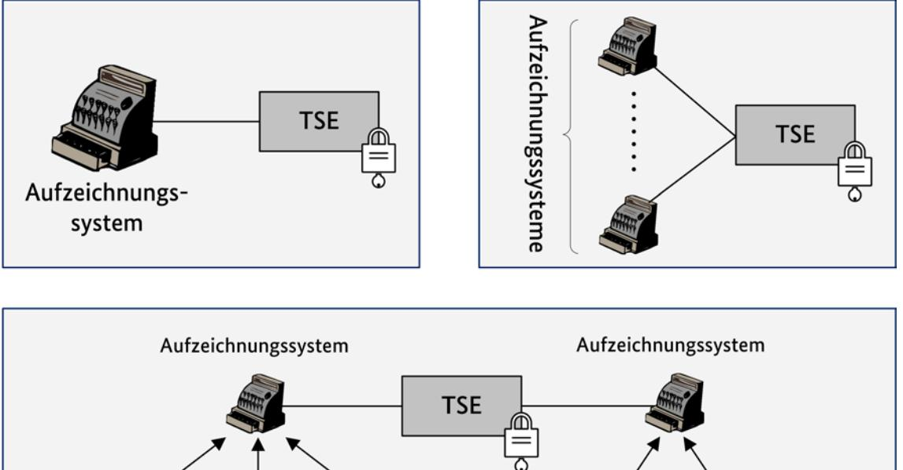
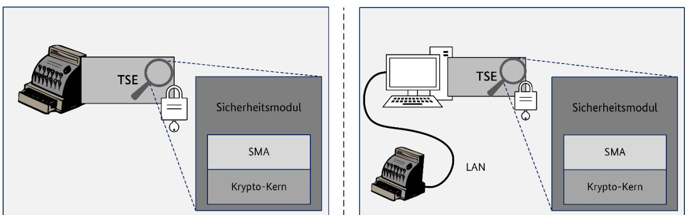
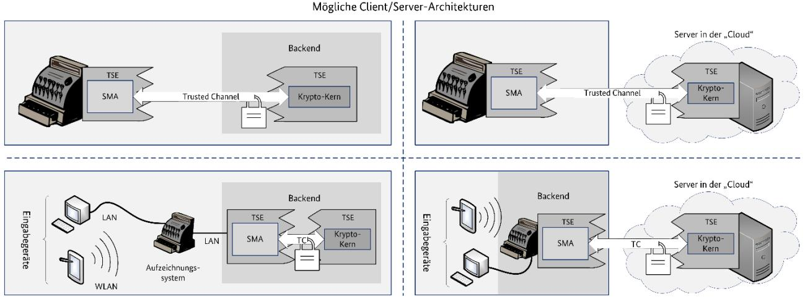

# Klarstellungen und Anwendungshinweise zu BSI TR-03153 und BSI-CC-PP-0105-V2-2020

13. November 2020

# 1 Einleitung

Dieses Dokument gibt Klarstellung und Anwendungshinweise für die Verwendung von BSI TR-03153 v1.0.1, sowie deren nachgelagerte Richtlinien, und BSI-CC-PP-105-V2-2020 gemäß KassenSichV und AO.

# 2 Klarstellungen

#### 2.1 Verwendung mit elektronischen Aufzeichnungssystemen

- Eine Technische Sicherheitseinrichtung (TSE) besitzt genau einen eindeutigen Signaturschlüssel, welcher im Sicherheitsmodul gespeichert ist.
- Ein Aufzeichnungssystem ist (im Normalbetrieb) genau einer TSE zugeordnet. Eine Technische Sicherheitseinrichtung kann von mehreren Aufzeichnungssystemen eines Steuerpflichtigen genutzt werden.
- Einem Aufzeichnungssystem können zudem mehrere Eingabegeräte zugeordnet sein, bei dem Transaktionsdaten vom jeweils zugehörigen Aufzeichnungssystem an die TSE zur Absicherung übergeben werden.

Abbildung 1 Relationen von Aufzeichnungssystemen zu Technischen Sicherheitseinrichtungen

#### 2.2 Logische Architektur des Sicherheitsmoduls

Eine Technische Sicherheitseinrichtung enthält genau ein Sicherheitsmodul. Das Sicherheitsmodul jeder Technischen Sicherheitseinrichtung besteht aus einer Sicherheitsmodulanwendung und einem Krypto-Kern. Hierbei gilt:

- Die Sicherheitsmodulanwendung des Sicherheitsmoduls einer Technischen Sicherheitseinrichtung besteht aus genau einer SMAERS-Einheit, welche über genau einen eindeutigen Transaktionszähler verfügt.
- Der Krypto-Kern des Sicherheitsmoduls einer Technischen Sicherheitseinrichtung besteht aus genau einer CSP-Einheit, welche über genau einen Signatur-Schlüssel (inkl. zugehörigem Signaturzähler) verfügt.

Hierbei gelten folgende logische Beziehungen zwischen den Komponenten von Sicherheitsmodulen Technischer Sicherheitseinrichtungen.

- Die SMAERS-Einheiten verschiedener Technischer Sicherheitseinrichtungen können technisch in einer oder mehreren sicherheitseinrichtungsübergreifenden SMAERS zusammengefasst werden[1](#page-2-0) .
- Die CSP-Einheiten verschiedener Technischer Sicherheitseinrichtung können technisch in einem oder mehreren sicherheitseinrichtungsübergreifenden CSP zusammengefasst werden[2](#page-2-1) .
- Die SMAERS-Einheit einer Technischen Sicherheitseinrichtung ist hierbei immer eineindeutig der CSP-Einheit der jeweiligen Technischen Sicherheitseinrichtung zugeordnet und umgekehrt. Insbesondere ist dem Signaturschlüssel jeder CSP-Einheit eines CSP genau ein Transaktionszähler einer SMAERS-Einheit einer SMAERS zugeordnet und umgekehrt.
- Jedes Aufzeichnungssystem ist damit genau einem Signaturschlüssel genau einer CSP-Einheit und genau einem Transaktionszähler genau einer SMAERS-Einheit zugeordnet. Die CSP-Einheiten eines CSP können SMAERS-Einheiten unterschiedlicher SMAERS zugeordnet sein und umgekehrt.
- Verschiedene Aufzeichnungssysteme können dieselbe SMAERS nutzen.

#### 2.2.1 Technische Umsetzung

In einem Plattform-Modell laufen die Sicherheitsmodulanwendung und der Krypto-Kern auf derselben Plattform, vgl. [PP-CSP]. Die Technische Sicherheitseinrichtung muss hierbei lokal in der Umgebung des Aufzeichnungssystems betrieben werden.

Bei einer Client-Server-Architektur können die Sicherheitsmodulanwendung und der Krypto-Kern auf getrennten Plattformen laufen, vgl. [PP-CSP]/[PP-CSPL].

Im Falle einer Client-Server-Architektur kann der Krypto-Kern fernverbunden auf einem zentralen CSP in einem Rechenzentrum betrieben werden. Dieser CSP kann mit mehreren Sicherheitsmodulanwendungen verbunden werden. Die Sicherheitsmodulanwendung muss jedoch stets lokal in der Einsatzumgebung des Aufzeichnungssystems betrieben werden.

Technisch kann ein CSP als Cluster betrieben werden, so dass der gleiche Signaturschlüssel auf mehreren CSPs gespeichert ist. Zu einem Zeitpunkt darf nur eine CSP-Einheit im Cluster als Master den Signaturschlüssel aktiv verwenden, alle anderen CSP-Einheiten müssen den Signaturzähler des jeweiligen Masters für den Signaturschlüssel synchronisieren. Bei Verwendung eines CSP-Light im gesicherten Rechenzentrum muss ein CSP-Light-Cluster verwendet werden.

Die folgenden Abbildungen [\(Abbildung 2](#page-3-0) und [Abbildung 3\)](#page-3-1) geben einen beispielhaften Überblick über mögliche Aufbauten des Sicherheitsmoduls.

 1 Eine SMAERS kann also mehrere logische SMAERS-Einheiten haben. Von jeder SMAERS-Einheit wird hierbei ein eigener Transaktionszähler verwaltet

2 Ein CSP kann also mehrere logische CSP-Einheiten haben. Von jeder CSP-Einheit wird hierbei ein eigener Signaturschlüssel (inkl. zugehörigem Signaturzähler) verwaltet.

Abbildung 2 Mögliche Plattform-Architekturen

Abbildung 3 Mögliche Client / Server-Architekturen

Die Technische Sicherheitseinrichtung muss stets sicherstellen, dass keine Nachrichten bei der Übertragung zwischen SMAERS-Einheit und CSP-Einheit verloren gehen. Insbesondere dürfen durch Fehler bei der Übertragung keine Lücken in der Sequenz der Transaktions- und Signaturzählerstände entstehen.

#### 2.3 Zertifizierungen

Die SMAERS, welcher von der TSE genutzt wird, muss nach dem Schutzprofil BSI-CC-PP-0105 zertifiziert sein.

Der CSP, welcher von der TSE genutzt wird, muss nach dem Schutzprofil BSI-CC-PP-0104 in der Konfiguration nach BSI-CC-PP-0107 oder BSI-CC-PP-0108 zertifiziert sein. Wird der CSP im Falle einer Client-Server-Architektur in einem zentralen Rechenzentrum betrieben und kann der Betreiber des Rechenzentrums durch eine ISO/IEC 27001-Zertifizierungen physikalisches und organisatorisches Sicherheitsniveau für das Rechenzentrum nachweisen, ist es abweichend von obigen Vorgaben ausreichend, wenn der CSP nach dem Schutzprofil BSI-CC-PP-0111 in der Konfiguration nach BSI-CC-PP-0113 zertifiziert ist. In diesen Fall muss SMAERS nach BSI-CC-PP-105-V2 zertifiziert sein.

Die Konformität der TSE zu den Vorgaben der Technischen Richtlinie TR-03153 muss in allen Fällen durch eine TR-Zertifizierung nach BSI TR-03153-TS bestätigt werden.

## 3 Anwendungshinweise

#### 3.1 System-Logs

Im Zuge der Veröffentlichung von BSI-CC-PP-0105-V2-2020 werden zusätzliche Systemfunktionen (SMAERS-TSF-Events) eingeführt. Die System-Logs MÜSSEN das in Abschnitt 4 spezifizierte Format haben. Bei TSEs, deren Sicherheitsmodul nach einer älteren Version des PP-SMAERS zertifiziert wurde, ist die Unterstützung der ergänzenden System-Logs nicht verpflichtend.

Bei Verwendung von in einem zentralen Rechenzentrum betriebenen CSP-Einheiten kann es sein, dass das Stellen der Zeit nicht über die TSEen geschieht, sondern ebenfalls zentral innerhalb der Einsatzumgebung des CSPs, d.h. des Rechenzentrums.

Daher MUSS beim zentralen Stellen der Zeit an einen zentralen CSP von der TSE unmittelbar ein System-Log des Typs 'updateTime' gemäß [TR-03151] erzeugt werden[3](#page-4-0) .

Die SE-API-Funktion "updateTime" der einheitlichen Einbindungsschnittstelle MUSS auch unterstützt werden, wenn in der TSE keine Zeitstellung über die SE-API möglich ist. In diesem Fall MUSS von der SE-API die Exception "ErrorFunctionNotSupported" zurückgegeben werden.

Die Liste der System-Logs ist in jedem Fall abschließend, d.h. weitere System-Logs DÜRFEN ohne vorherige Abstimmung mit dem BSI NICHT erzeugt werden. Etwaige vorübergehende Abweichungen der Datenformate sind mit dem BSI abzustimmen.

#### 3.2 Audit-Logs

Wird ein zentraler CSP genutzt, der Teil mehrerer TSEen ist, so MUSS sichergestellt werden, dass relevante anfallende Audit-Events des CSPs auch Teil der zu prüfenden Audit-Log-Messages einer jeden TSE werden. Ein zur Prüfung einer TSE relevantes Audit-Event MUSS daher mit den jeweils aktiven Signaturschlüsseln aller von dem jeweiligen CSP verwalteten Technischen Sicherheitseinrichtungen exportiert werden. Welche Events relevant sind, MUSS im Rahmen der CC-Zertifizierungen mit dem BSI abgestimmt werden. Ein singulärer Export, z.B. unter Nutzung eines Administrations-Signaturschlüssels, ist nicht ausreichend.

#### 3.3 additionalInternalData und additionalExternalData

Das Sicherheitsmodul DARF einer Aufzeichnung NICHT additionalInternalData hinzufügen. Das Hinzufügen von additionalExternalData MUSS von der TSE unterstützt werden, darf von einem Aufzeichnungssystem aber nicht genutzt werden.

#### 3.4 Durchführung paralleler Transaktionen

Bei der Nutzung der Technischen Sicherheitseinrichtung muss vom Nutzer sichergestellt werden, dass alle Aufzeichnungen unmittelbar mit der TSE abgesichert werden können. Dies gilt insbesondere bei der Durchführung von parallelen Transaktionen, z.B. bei Verwendung von einer TSE mit mehreren angeschlossenen Aufzeichnungssystemen oder Eingabegeräten. Der Hersteller MUSS den Nutzer in einer Herstellerdokumentation zum Produkt den Anwender / Nutzer (Steuerpflichtigen) darüber informieren, inwieweit die Nutzung mehrerer Aufzeichnungssysteme oder Eingabegeräte mit der TSE zulässig ist. Zudem MUSS der Hersteller den Anwender / Nutzer (Steuerpflichtigen) in einer Herstellerdokumentation über die Durchführungszeiten und mögliche Verzögerungen bei der Absicherung paralleler Transaktionen

 3 Die Erstellung des updateTime-System-Logs durch die Technische Sicherheitseinrichtung kann als Reaktion auf den Erhalt einer entsprechenden Audit-Log-Message des CSP(-Light) geschehen, falls es hierdurch zu keinen relevanten Verzögerungen kommt. Eine nicht relevante Verzögerungen liegt vor, wenn die Verzögerung grundsätzlich nicht mehr als fünf Sekunden beträgt.

aufklären, insbesondere in Bezug auf die Dauer der Signaturerstellung in Abhängigkeit gleichzeitig zu bearbeitender Absicherungen.

#### 3.5 Deaktivierung der TSE / Stoppen der Audit-Funktion von SMAERS

Sobald die Audit-Funktionalität der Sicherheitsmodulanwendung gestoppt wird, MUSS das Sicherheitsmodul permanent im Sinne der TR-03153 und TR-03151 deaktiviert werden und dies mit der "disableSecureElement"-System-Log-Nachricht der TR-03151 quittiert werden.[4](#page-5-0)

Gleichzeitig MUSS der Aufruf der Funktionalität zur Deaktivierung des Sicherheitsmoduls auch ein permanentes Stoppen der Audit-Funktionalität der Sicherheitsmodulanwendung beinhalten.

# 4 Anhang: Ergänzende System-Logs

Dieser Abschnitt spezifiziert basierend auf BSI-TR-03153 und BSI TR-03151 die ergänzenden System-Logs. Log-Nachrichten DÜRFEN generell NICHT mit herstellerspezifischen Feldern ergänzt werden[5](#page-5-1) .

Der jeweilige PrintableString für den operationType ist der in den Unterkapiteln genannte Funktionsname mit kleinem Anfangsbuchstaben zum Beispiel: "authenticateSmaersAdmin". Der gleiche String ist für die Variable TYPE des Dateinamens nach Text 7 und Table 56 der TR-03151 zu verwenden.

#### 4.1 authenticateSmaersAdmin

This message MUST be logged if an SMAERS-administrator authenticates towards the SMAERS unit [cf. PP-SMAERS]. The systemOperationData octet string MUST consist of the following information.

| Data field           | Tag  | Data type         | Mandatory? | Description                                                                                                                                                                                                               |
|----------------------|------|-------------------|------------|---------------------------------------------------------------------------------------------------------------------------------------------------------------------------------------------------------------------------|
| userId               | 0x81 | PrintableString m |            | MUST contain the userId of the authenticating admin                                                                                                                                                                    |
| role                 | 0x82 | PrintableString c |            | MUST be present if the role of the SMA admin is subdivided into subroles. In this case, MUST contain information of the subrole of the authenticating admin                                                      |
| authenticationResult | 0x83 | BOOLEAN           | m          | MUST contain the result of the authentication procedure. The value "TRUE" SHALL indicate that the authentication has been successful. The value "FALSE" SHALL indicate that the authentication has failed. |
| remainingRetries     | 0x84 | INTEGER           | o          | Represents the number of remaining retries for entering a PIN.                                                                                                                                                         |

Tabelle 1 Content of systemOperationData for authenticateSmaersAdmin

 4 Die disableSecureElement-System-Log-Nachricht ist somit auch die Log-Nachricht für das Stoppen der Audit-Funktion, welche im PP-SMAERS gefordert wird. Eine weitere / andere Log-Nachricht zu diesem Event darf nicht erstellt werden.

5 Die einzige Ausnahme hiervon ist die inhaltliche Ausgestaltung des Elementes seAuditData von Audit-Log-Nachrichten durch den Hersteller.

#### 4.2 updateDevice

This message SHOULD be logged if an update or upgrade of the SMAERS component of the TSE was started. This message SHOULD be logged if an update or upgrade of the other components of the TSE was started. The systemOperationData octet string MUST consist of the following information:

| Data field | Tag  | Data type                                                                                                | Mandatory? Description |                                                                                                                                                                                                                                                       |
|------------|------|----------------------------------------------------------------------------------------------------------|------------------------|-------------------------------------------------------------------------------------------------------------------------------------------------------------------------------------------------------------------------------------------------------|
| userId     | 0x81 | PrintableString                                                                                          | m                      | MUST contain the ID of the authenticated user who or the application that triggered the update.                                                                                                                                                 |
| oldVersion | 0x82 | OCTET STRING The data of the octet string SHALL conform to the TLV structure defined in 4.14 | m                      | MUST contain version information about all components to be updated, that together comprise the TSE. That means at least TSE, storage, SMAERS, and CSP. The information MUST reflect the status of those components before the update. |

Tabelle 2 Content of systemOperationData for updateDeviceStarted

#### 4.3 updateDeviceCompleted

The message MUST be logged if an update or upgrade of the SMAERS component has completed[6](#page-6-0) and SHOULD be logged if an update or upgrade of the other components of the TSE has completed. If a failure occurred, this message should be logged as well. The systemOperationData octet string MUST consist of the following information:

| Data field       | Tag  | Data type                                                                                                   | Mandatory? | Description                                                                                                                                                                                                                                                                                   |
|------------------|------|-------------------------------------------------------------------------------------------------------------|------------|-----------------------------------------------------------------------------------------------------------------------------------------------------------------------------------------------------------------------------------------------------------------------------------------------|
| updateResult     | 0x81 | ENUMERATED{ ok (0), failed (1), partlyFailed (2) }                                              | m          | MUST contain the outcome of the update. If the update was successful the parameter SHALL be set to ok. If the updated failed, the parameter SHALL be set to failed. If parts of the update were successful and other parts failed, the parameter SHALL be set to partlyFailed. |
| reasonForFailure | 0x82 | PrintableString                                                                                             | c          | SHOULD contain additional information about why the update failed. SHALL NOT be present if the update was successful.                                                                                                                                                                |
| newVersion       | 0x83 | OCTET STRING The data of the octet string SHALL conform to the TLV structure defined in 4.14 | m          | MUST contain version information about all components that together comprise the TSE. That means: at least TSE, storage, SMAERS, and CSP. The information MUST reflect the status of those components after the update.                                                           |

Tabelle 3 Content of systemOperationData for updateDeviceCompleted

 6 In case of an update / upgrade executed by the platform, without the component being aware of the changes performed on it, the message MUST be logged directly upon first start up after the update / upgrade.

#### 4.4 startAudit

The message MUST be logged if the SMAERS unit starts the audit function [cf. PP-SMAERS]. This functionality MUST NOT be available after initial configuration of the SMAERS unit. The systemOperationData octet string MUST NOT contain any data[7](#page-7-1) :

#### 4.5 configureLogging

The message MUST be logged if the audit functions of the SMAERS unit are configured [cf. PP-SMAERS]. This system function MUST NOT be available for the SMAERS audit functionality after initial configuration of the SMAERS unit. The systemOperationData octet string MUST consist of the following information:

| Data field         | Tag  | Data type       | Mandatory? Description |                                                                                                                                                                                    |
|--------------------|------|-----------------|------------------------|------------------------------------------------------------------------------------------------------------------------------------------------------------------------------------|
| componentName 0x81 |      | PrintableString | m                      | String describing the component of that the logging has been (successfully) configured. MUST be "SMAERS-audit" for SMAERS audit functionality.                            |
| result             | 0x82 | BOOLEAN         | m                      | MUST contain information if the logging configuration of the component was successful.                                                                                          |
| parameters         | 0x83 | OCTET STRING    | c                      | MUST contain information on the configuration of logging parameters according to Tabelle 5. This data field MUST contain the status value of all configurable parameters. |

Tabelle 4 Content of systemOperationData for configureLogging

| Data field          | Tag  | Data type       | Mandatory? |
|---------------------|------|-----------------|------------|
| loggingParameterSet | 0x30 | SEQUENCE OF     | m          |
| loggingParameter    | 0x30 | SEQUENCE        | m          |
| eventName           | 0x80 | PrintableString | m          |
| enabled             | 0x81 | BOOLEAN         | m          |

Tabelle 5 Structure for the logging parameters

#### 4.6 enterSecureState

The message MUST be logged if the SMAERS unit preserves a secure state in the presence of failures defined by [PP-SMAERS].

In case, the message cannot be logged at the time of event, the message MUST be logged immediately after all failures were resolved[8](#page-7-2) .

The systemOperationData octet string MUST consist of the following information:

7 the length byte is set to 0x00.

8 In this case, retroactively logged events must be logged in order of occurrence.

| Data field  | Tag  | Data type | Mandatory? | Description                                                                                                                |
|-------------|------|-----------|------------|----------------------------------------------------------------------------------------------------------------------------|
| timeOfEvent | 0x81 | Time      | c          | MUST be present if the message is logged retroactively. In this case, MUST contain the time when the event occurred. |

Tabelle 6 Content of systemOperationData for secureStateEntered

#### 4.7 exitSecureState

The message MUST be logged if all failures were resolved [cf. PP-SMAERS]. The systemOperationData octet string MUST NOT contain any data[9](#page-8-0) .

#### 4.8 selfTest

The message MUST be logged if any of the self tests of the secure element failed [cf. PP-SMAERS]. In case, the message cannot be logged at the time of event, the message MUST be logged immediately after all failures were resolved[10.](#page-8-1)

| Data field    | Tag  | Data type       | Mandatory? | Description                                                                                                                                                 |
|---------------|------|-----------------|------------|-------------------------------------------------------------------------------------------------------------------------------------------------------------|
| componentName | 0x81 | PrintableString | m          | String describing the component that the self test has been triggered for. MUST be "SMAERS" for SMAERS component. MUST be "CSP" for CSP component. |
| result        | 0x82 | BOOLEAN         | m          | MUST be true for a successful self test. MUST be false for an unsuccessful self test.                                                                    |
| errorMessage  | 0x83 | PrintableString | c          | MUST contain the error, exception or warning message describing the reason why the self test failed11.                                                |
| timeOfEvent   | 0x84 | Time            | c          | MUST be present if the message is logged retroactively. In this case, MUST contain the time when the event occurred.                                  |

The systemOperationData octet string MUST consist of the following information:

Tabelle 7 Content of systemOperationData for selfTest

#### 4.9 deleteStoredData

The message SHOULD be logged if stored data is deleted. The systemOperationData octet string MUST consist of the following information:

| Data field | Tag  | Data type       | Mandatory? | Description                                                                                             |
|------------|------|-----------------|------------|---------------------------------------------------------------------------------------------------------|
| userId     | 0x81 | PrintableString | m          | MUST contain the ID of the authenticated user who or the application that triggered the deletion. |

Tabelle 8 Content of systemOperationData for deleteStoredData

 9 the length byte is set to 0x00

10 In this case, retroactively logged events must be logged in order of occurrence

11 The string can be chosen at the manufacturer's discretion.

### 4.10 lockTransactionLogging

The message SHOULD be logged if logging of transactions is locked. The systemOperationData octet string MUST consist of the following information:

| Data field | Tag  | Data type       | Mandatory? | Description                                                                                                                      |
|------------|------|-----------------|------------|----------------------------------------------------------------------------------------------------------------------------------|
| userId     | 0x81 | PrintableString | m          | MUST contain the ID of the authenticated user who or the application that triggered the locking of transaction logging. |

Tabelle 9 Content of systemOperationData for lockTransactionLogging

#### 4.11 unlockTransactionLogging

The message SHOULD be logged if logging of transactions is unlocked. The systemOperationData octet string MUST consist of the following information:

| Data field | Tag  | Data type       | Mandatory? | Description                                                                                                                     |
|------------|------|-----------------|------------|---------------------------------------------------------------------------------------------------------------------------------|
| userId     | 0x81 | PrintableString | m          | MUST contain the ID of the authenticated user who or the application that triggered the unlocking of transaction logging. |

Tabelle 10 Content of systemOperationData for unlockTransactionLogging

#### 4.12 registerClient

The message SHOULD be logged if a client is successfully registered. The systemOperationData octet string MUST consist of the following information:

| Data field | Tag  | Data type       | Mandatory? | Description                                                                             |
|------------|------|-----------------|------------|-----------------------------------------------------------------------------------------|
| clientId   | 0x81 | PrintableString | m          | MUST contain the ID of the application that shall be able to invoke input functions. |

Tabelle 11 Content of systemOperationData for registerClient

#### 4.13 deregisterClient

The message SHOULD be logged if a client is deregistered. The systemOperationData octet string MUST consist of the following information:

| Data field | Tag  | Data type       | Mandatory? | Description                                                                                          |
|------------|------|-----------------|------------|------------------------------------------------------------------------------------------------------|
| clientId   | 0x81 | PrintableString | m          | MUST contain the ID of the application that shall no longer be able to invoke input functions. |

Tabelle 12 Content of systemOperationData for deregisterClient

#### 4.14 TLV structure for the return of device information

Each component of the TSE may be identifiable by its manufacturer, its model and version information. Additionally some components may be certified and carry a specific certification ID. This octet string

SHALL represent the DER-TLV encoded structure defined in table 13, which is used in section 4.2. This structure SHALL consist of information about one or more component.

| Data field              | Tag  | Data type       | Mandatory? |
|-------------------------|------|-----------------|------------|
| DeviceInformationSet    | 0x30 | SEQUENCE OF     | m          |
| componentInformationSet | 0x30 | SEQUENCE        | m          |
| componentName           | 0x80 | PrintableString | m          |
| manufacturer            | 0x81 | PrintableString | m          |
| model                   | 0x82 | PrintableString | m          |
| version                 | 0x83 | PrintableString | m          |
| certificationId         | 0x84 | PrintableString | o          |

Tabelle 13 Structure for the return of device information

The elements MUST contain the information defined in table 15.

| Data            | Description                                                                                                                                                                                                                                                                                                |
|-----------------|------------------------------------------------------------------------------------------------------------------------------------------------------------------------------------------------------------------------------------------------------------------------------------------------------------|
| componentName   | MUST contain the generic type of the component according to Tabelle 15, whose properties are described in this sequence.                                                                                                                                                                                |
| manufacturer    | MUST contain the manufacturer information of the component that is described in this sequence.                                                                                                                                                                                                          |
| model           | MUST contain model information of the component that is described in this sequence.                                                                                                                                                                                                                     |
| version         | MUST contain the version information of the component that is described in this sequence.                                                                                                                                                                                                               |
| certificationId | MUST contain the certification ID(s) of the component that is described in this sequence. If multiple certification ids exists, they SHALL be separated by commas. If the component that is described in this sequence is not certified, this element SHALL be absent (no tag, length and value). |

Tabelle 14 Description of the elements of the TLV structure for the return of device information

#### 4.15 Component names

The following component names MUST be used to describe TSE components in log-messages:

| Component description       | ComponentName – string (without quotes!) |
|-----------------------------|------------------------------------------|
| TSE / TSS – device in total | "device"                                 |
| CSP                         | "CSP"                                    |
| SMAERS                      | "SMAERS"                                 |
| Storage medium              | "storage"                                |
| Interface towards user      | "integration-interface"                  |

Tabelle 15 Component names