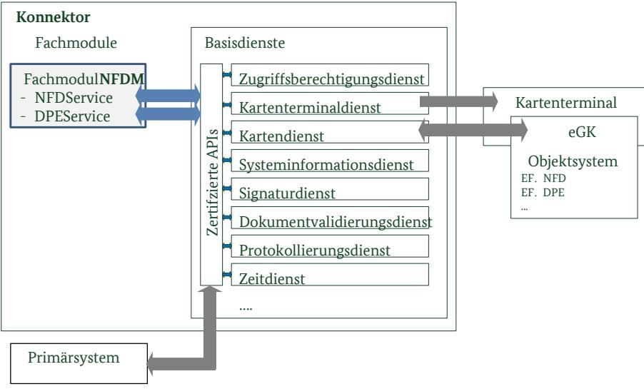

# Konnektor – Prüfspezifikation für das Fachmodul NFDM

Technische Richtlinie BSI TR-03154

Trial Use[1](#page-0-0)

1 Erläuterung in Abschnitt [1.4](#page-8-0)

## Änderungshistorie

| Version | Datum      | Name                                          | Beschreibung                                                                                                                                                                                                                                                                                                  |
|---------|------------|-----------------------------------------------|---------------------------------------------------------------------------------------------------------------------------------------------------------------------------------------------------------------------------------------------------------------------------------------------------------------|
| 1.0     | 19.12.2017 | SRC Security Research & Consulting GmbH | Erste Version                                                                                                                                                                                                                                                                                                 |
| 1.0.1   | 23.05.2018 | BSI                                           | Geringfügige Anpassung in 2.1.2 auf Grund einer Formatierungsänderung in [gemSpec_FM_NFDM]; Aktualisierung der Literaturquellen                                                                                                                                                                         |
| 1.1     | 15.04.2019 | BSI                                           | Anpassungen in Absatz 3.3.1 Funktionale Spezifikationstests des Fachmoduls NFDM Anpassung O.RobustIF und NFDM-TR-RobustIF Malformed um Konsistenz zu T.Attack herzustellen Streichung zweier Anforderungen an die Konnektor-CC-Zertifizierung Einarbeitung Kommentare BSI (u.a. Absatz 4.1) |

Bundesamt für Sicherheit in der Informationstechnik Postfach 20 03 63 53133 Bonn E-Mail: zertifizierung@bsi.bund.de Internet: https://www.bsi.bund.de © Bundesamt für Sicherheit in der Informationstechnik 2019

|                                                  | Änderungshistorie 2                                                                                                                                                                                                       |  |
|--------------------------------------------------|---------------------------------------------------------------------------------------------------------------------------------------------------------------------------------------------------------------------------|--|
| 1                                                | Einleitung 7                                                                                                                                                                                                              |  |
| 1.1                                              | Gegenstand der Technischen Richtlinie 7                                                                                                                                                                                   |  |
| 1.2                                              | Zielsetzung der Technischen Richtlinie 7                                                                                                                                                                                  |  |
| 1.3 1.3.1 1.3.2                            | Übersicht der Technischen Richtlinie 8 Methodik 8 Begriffe 9                                                                                                                                                        |  |
| 1.4                                              | Offene Punkte 9                                                                                                                                                                                                           |  |
| 2                                                | Überblick Notfalldaten-Management10                                                                                                                                                                                       |  |
| 2.1 2.1.1 2.1.2 2.1.3 2.1.4          | Spezifische Konzepte 10 Dienstschnittstellen 10 Zugriffsberechtigungen 10 PINs 11 Audit 12                                                                                                                    |  |
| 2.1.5                                            | Protokollierung 12                                                                                                                                                                                                        |  |
| 2.2                                              | Fachmodul Security Guidance 12                                                                                                                                                                                            |  |
| 2.3 2.3.1 2.3.2 2.3.3                   | Security Problem Definition 13 Bedrohungen 13 Organisatorische Sicherheitspolitiken14 Annahmen 15                                                                                                                |  |
| 3                                                | Zertifizierung des FM NFDM nach Technischer Richtlinie16                                                                                                                                                                  |  |
| 3.1                                              | Prüfgegenstand und –werkzeuge 16                                                                                                                                                                                          |  |
| 3.2                                              | Prüfaspekte 17                                                                                                                                                                                                            |  |
| 3.3 3.3.1 3.3.2 3.3.3 3.3.4 3.3.5 | Prüfaufgaben 18 Funktionale Spezifikationstests des Fachmoduls NFDM18 Common Criteria Zertifizierung des Konnektors19 Sicherheitsziele für den TOE 20 Sicherheitsziele für die TOE Umgebung21 Rationale 22 |  |
| 3.4 3.4.1 3.4.2                            | Prüfschritte 23 Protokollierung der Prüfergebnisse23 Test-Charakteristiken 25                                                                                                                                       |  |
| 4                                                | TR-Prüfbericht zum Fachmodul NFDM30                                                                                                                                                                                       |  |
| 4.1                                              | Zertifizierungsverfahren 30                                                                                                                                                                                               |  |
| 4.2                                              | Prüfaussagen 30                                                                                                                                                                                                           |  |
| 4.3                                              | Konfiguration 30                                                                                                                                                                                                          |  |
| A.                                               | Datenschutz-sensitive Datenelemente 31                                                                                                                                                                                    |  |
| B.                                               | Literaturverzeichnis 32                                                                                                                                                                                                   |  |
| C.                                               | Stichwortverzeichnis 33                                                                                                                                                                                                   |  |
| D.                                               | Abkürzungsverzeichnis 34                                                                                                                                                                                                  |  |

### Abbildungsverzeichnis

|  | Abbildung 1: TOE Scope und Interaktionen des Fachmoduls Notfalldaten-Management (NFDM)16 |  |  |  |
|--|------------------------------------------------------------------------------------------|--|--|--|
|  |                                                                                          |  |  |  |
|  |                                                                                          |  |  |  |
|  |                                                                                          |  |  |  |

### Tabellenverzeichnis

| Tabelle 1: Operationen der Fachmoduldienste 7                                                          |  |
|--------------------------------------------------------------------------------------------------------|--|
| Tabelle 2: Prüfungen in Bezug auf das Fachmodul NFDM8                                                  |  |
| Tabelle 3: Schlüsselworte für Multireferenz Pins im Konnektor Kontext12                                |  |
| Tabelle 4: Überblick vom Fachmodul benutzter Basisdienste mit Schnittstellenname19                     |  |
| Tabelle 5: Abdeckung von Security Problem Definition zu Sicherheitszielen für das Fachmodul und dessen |  |
| Umgebung 23                                                                                            |  |
| Tabelle 6: Definition der Prüftiefen 24                                                                |  |
| Tabelle 7: Definition der Verdicts 24                                                                  |  |
| Tabelle 8: Definition der Test-Charakteristika mit der Zuordnung zu Sicherheitszielen29                |  |

### 1 Einleitung

### 1.1 Gegenstand der Technischen Richtlinie

Das Fachmodul Notfalldaten-Management (FM NFDM) ist ein integraler Bestandteil des Konnektors und nutzt dessen Basisdienste zur Umsetzung aller Anwendungsfälle der Fachanwendung NFDM. Es stellt dem Konnektor Grundfunktionalitäten zur Verwaltung von Notfalldatensätzen (NFD), den NFDService, und von Datensätzen für persönliche Erklärungen (DPE), den DPEService, auf der elektronischen Gesundheitskarte (eGK) zur Verfügung, die durch das Primärsystem genutzt werden.

| Operation | Vorgang                                                   | Datenquelle                                | Datensenke                                   |  |
|-----------|-----------------------------------------------------------|--------------------------------------------|----------------------------------------------|--|
| ReadNFD   | (1) das Lesen eines Notfalldatensatzes von der eGK     | EF.NFD von der eGK                         | Weiterverarbeitung durch das Primärsystem |  |
| WriteNFD  | (2) das Schreiben eines Notfalldatensatzes auf die eGK | NFD erhalten vom Primärsystem           | EF.NFD auf eGK                               |  |
| EraseNFD  | (3) das Löschen des Notfalldatensatzes von der eGK     | -                                          | -                                            |  |
| ReadDPE   | (4) das Lesen der DPE von der eGK                         | EF.DPE von der eGK                         | Weiterverarbeitung im Primärsystem        |  |
| WriteDPE  | (5) das Schreiben der DPE auf die eGK                     | DPE Datensatz erhalten vom Primärsystem | EF.DPE auf eGK                               |  |
| EraseDPE  | (6) das Löschen der DPE von der eGK                       | -                                          | -                                            |  |

Die folgende Tabelle stellt sämtliche Funktionen des Fachmoduls NFDM vor:

Tabelle 1: Operationen der Fachmoduldienste

Das Fachmodul erbringt seine Dienste unter Zuhilfenahme von Basisdiensten des Konnektors, z.B. erfolgen sämtliche Zugriffe auf die eGK über das Kartendienstmodul. Das Fachmodul implementiert an den Schnittstellen genau das Verhalten nach [gemSpec\_FM\_NFDM]. Weitere Dienste und Funktionen sind nicht zulässig. Die Ausnahme bildet eine optionale erweiterte Protokollierung durch das Fachmodul.

#### 1.2 Zielsetzung der Technischen Richtlinie

Die TR beschreibt die Schritte zur fachlichen Prüfung und Zertifzierung des Fachmoduls gemäß Spezifikation [gemSpec\_FM\_NFDM].

Die Technische Richtlinie beschreibt und begründet die Testanforderungen an das Fachmodul Notfalldaten-Management (FM NFDM). Zielsetzung ist eine umfassende Prüfung von explizit formulierten Sicherheitseigenschaften des Fachmoduls, basierend auf Sichtung des Quelltextes, sowie weiteren Design-Dokumentation und gegebenenfalls automatisierten Tests. Im Falle einer erfolgreichen TR-Prüfung erteilt das BSI ein Zertifikat, welches eine der Voraussetzungen für die Zulassung des Fachmoduls durch die gematik ist.

| #  | Bezeichnung                                                                                 | Erläuterung                                                                                                                                                                                                                                                                                                                                                                                                                                                                                                                       |  |
|----|---------------------------------------------------------------------------------------------|-----------------------------------------------------------------------------------------------------------------------------------------------------------------------------------------------------------------------------------------------------------------------------------------------------------------------------------------------------------------------------------------------------------------------------------------------------------------------------------------------------------------------------------|--|
| 1. | Prüfung auf Konformität zur Spezifikation Fachmodul NFDM und Konnektor                | Die Konformitätsprüfung prüft an den Konnektor Außensschnittstellen (Fachmodul Dienste NFDService und DPEService). Sie stellt das Spezifikations-konforme Verhalten nach [gemSpec_FM_NFDM] und [gemSpec_Kon] an den Schnittstellen sicher. Dieser funktionale Test wird zum einen in vollem Umfang als eigenverantwortlicher Test durch den Hersteller und zum anderen zusätzlich in geringerem Umfang durch die gematik durchgeführt (Test der relevantesten Aspekte). Erläuterung in Abschnitt 3.3.1 |  |
| 2. | gematik Zulassung des Konnektors CC-Zertifizierung des Konnektors                        | Die Basisdienste des Konnektors sowie besondere Schnittstellen für die Verwendung im Fachmodul unterliegen einer Common Criteria Evaluation und Zertifizierung.                                                                                                                                                                                                                                                                                                                                                             |  |
| 3. | gematik Zulassung der eGK CC-Zertifizierung des COS TR-Zertifizierung eGK Filesystems | Die elektronische Gesundheitskarte (eGK) wird durch die gematik zugelassen, basierend auf einer Common Criteria untersuchung des COS und der Begutachtung des Filesystems.                                                                                                                                                                                                                                                                                                                                               |  |
| 4. | Prüfspezifikation für das Fachmodul NFDM (vorliegende Technische Richtlinie)          | Es wird die Erbringung der Sicherheitsfunktionalität durch das Fachmodul geprüft (siehe Abschnitt 3.2).                                                                                                                                                                                                                                                                                                                                                                                                                        |  |

Im Umfeld um das Fachmodul NFDM sind folgende Prüfungen, Zertifzierungen und Zulassungen vorgesehen:

Tabelle 2: Prüfungen in Bezug auf das Fachmodul NFDM

### 1.3 Übersicht der Technischen Richtlinie

#### 1.3.1 Methodik

Im Folgenden bezeichnet der Begriff TOE Security Functionality (TSF) die Funktionalität des Fachmoduls, die für die Umsetzung der Sicherheit verantwortlich ist. Der TOE umfasst eine konvexe Hülle dieser Funktionen, d.h. für die Umsetzung notwendige unterstützende Funktionen sind eingeschlossen.

Die Technische Richtlinie formuliert eine Security Problem Definition (SPD), die den Evaluator bei der Test-Abdeckung und der Wahl der Testtiefe für die TSF unterstützt. Aus der SPD werden Sicherheitsziele für den TOE und dessen Umgebung abgeleitet. Für die Sicherheitsziele des TOE wird anhand der Test-Charakteristiken eine fachliche Struktur für die zu erstellenden Prüfberichte vorgegeben.

Die Bedrohungsszenarien entsprechen denen der Common Criteria Konnektor Evaluation nach [PP0098]. Beispielsweise wird Fuzzing auf die im Netzwerk erreichbaren Dienstschnittstellen nicht gefordert, da Umgebungsannahmen des Konnektors Angriffe auf der Anwendungsschicht über die TLS-Client-Authentisierung bzw. ein sicheres Netz ausschließen. Diese Annahme schützt ebenso die Dienstschnittstellen des Fachmoduls.

#### 1.3.2 Begriffe

Diese Technische Richtlinie verwendet folgende Begriffe:

MUSS der Evaluator muss eine bestimmte Prüfung durchführen, die etwas sicherstellt.

DARF NICHT/DÜRFEN NICHT der Evaluator muss eine bestimmte Prüfung durchführen, um etwas auszuschließen.

SOLL der Evaluator soll eine Prüfung durchführen, außer er legt dar, dass durch Auslassen der Prüfung kein Risiko für den sicheren Betrieb besteht.

#### 1.4 Offene Punkte

Die Anwendung der vorliegenden Technischen Richtlinie (TR) ist für die TR-Zertifizierung eines Fachmoduls NFDM verbindlich. Die TR ist im Status "trial-use", d.h. dass Sicherheitsziele festgelegt sind aber noch Erfahrungen mit der Anwendung der Prüfanforderungen der TR während der Evaluierung gesammelt werden sollen. In der "trial-use" Phase unterstützt die TR-Zertifizierungsstelle (in Abstimmung mit der gematik) mittels Interpretation der TR den Evaluator bei konkret auftretenden Problemen. Die so identifizierten Interpretationen fließen in die nächste Version der TR ein.

### 2 Überblick Notfalldaten-Management

Das Fachmodul NFDM stellt einen wichtigen Beitrag zum Erbringen von Sicherheitsleistungen für die Verwaltung des NFD und DPE dar. Ein Überblick zu den Basiskonzepten der Sicherheitsarchitektur ist dargestellt in [FGH+2007]. Das Fachmodul zählt zur Kategorie der technischen Komponenten.

#### 2.1 Spezifische Konzepte

#### 2.1.1 Dienstschnittstellen

Das Fachmodul bietet die Schnittstellen NFDService und DPEService an. Das Systemdesign sieht vor, dass im Konnektor und im Fachmodul keine Authentisierung der Dienstanfragen stattfindet. Statt dessen sind die Dienstschnittstellen durch zwei Maßnahmen vor unbefugten Zugriffen geschützt.

1. Der Konnektor schützt seine Systemschnittstellen vor unbefugten Zugriffen. Dies wird durch eine Transportsicherung zwischen Konnektor und Clientsystem realisiert.

2. In den Konnektor werden nur TR-zertifizierte Fachmodule eingebracht. Die anderen Fachmodule werden bei deren TR-Prüfung auf unzulässige Aufrufe fremder Fachmodule hin untersucht.

**Anwendungshinweis:** Für die TR NFDM wird dies in O.Conformance gefordert und in NFDM-TR-Conformance-Calls umgesetzt.

Daher prüft das Fachmodul die Zugriffsberechtigung an den Dienstschnittstellen nicht.

#### 2.1.2 Zugriffsberechtigungen

Das gematik Zugriffsberechtigungskonzept für Zugriffe auf NFD/DPE verzichtet bewusst auf das Erzwingen der Authentisierung durch den Versicherten, da dieser in einem Notfall nicht dazu in der Lage sein könnte.

"*Da in der Anwendung NFDM personenbezogene medizinische Daten verarbeitet werden, die besonderer Vertraulichkeit unterliegen, ist es im Interesse des Versicherten und des Heilberuflers, den Zugriff auf diese Daten nur berechtigten Akteuren zu gewähren. Das Interesse des Versicherten gilt seiner Privatsphäre und jenes des Heilberuflers der ärztlichen Schweigepflicht. Das Berechtigungskonzept für den Zugriff der einzelnen Akteure der TI (Arzt, Apotheker, Notfallsanitäter etc.) auf den NFD oder den DPE, ist daher ein besonders wichtiger Teil der Anwendung NFDM.*

*Zunächst muss sich die Motivation für das Anlegen eines NFD und eines DPE in Erinnerung gerufen werden. Die Daten sollen in Situationen, in denen sie benötigt werden, ohne Interaktion des Versicherten für bestimmte Heilberufler zugänglich sein, da der Versicherte selbst nicht ansprechbar oder auskunftsfähig ist. Ein übergreifender Zugriffsschutz der Daten durch die PIN des Versicherten – auch indirekt über eine Verschlüsselung der Daten auf der eGK – widerspricht diesem Zweck, obwohl eine solche Maßnahme auf Grund der Vertraulichkeit der Informationen naheliegen mag.*

*Bestimmte Heilberufler müssen also auch ohne Eingabe der PIN des Versicherten Zugriff auf NFD und DPE von der eGK erhalten. Gleichzeitig muss sichergestellt sein, dass die Daten nicht für unberechtigte Personen, die eventuell in Besitz der eGK kommen, zugänglich werden.*" [Zi2014]

Aufgabe des Fachmoduls hinsichtlich der Zugriffsberechtigungskontrolle ist es, Zugriffe durch die ausübenden Heilberufe zu reglementieren und Notfallzugriffe/Updates im Datenzugriffsaudit auf der eGK zu loggen. Diese Aufgabe stellt auch eine Sicherheitsleistung im Sinne dieser TR dar. Setzt die eGK eine zuvor erfolgte Authentisierung durch den Kartenbesitzer mittels PIN voraus, ist diese durch das Fachmodul einzuholen. Dies ist vom Fachmodul funktional umzusetzen, ist jedoch kein Prüfgegenstand, da dies

hinreichend durch die eGK selbst sichergestellt wird. Die Realisierung von NFDService und DPEService MUSS jedoch bestimmte Zugriffsrechte über die Funktionalität der Software der eGK hinaus durchsetzen.

Die betreffenden Zugriffsrechte sind in den Berechtigungstabellen der Spezifikation [gemSpec\_FM\_NFDM], Abschnitte 6.1 und 6.2 jeweils mit "[FM]" markiert:

- NFDM-A\_2112 Berechtigungsregeln ReadNFD
- NFDM-A\_2115 Berechtigungsregeln WriteNFD
- NFDM-A\_2118 Berechtigungsregeln EraseNFD
- NFDM-A\_2122 Berechtigungsregeln ReadDPE
- NFDM-A\_2125 Berechtigungsregeln WriteDPE
- NFDM-A\_2128 Berechtigungsregeln EraseDPE

Es handelt sich - entsprechend der Legende in [gemSpec\_FM\_NFDM], Seite 8 – um abzuwehrende und zulässige Zugriffe, die beispielsweise von der Verifikation der MRPIN.NFD / MRPIN.NFD\_READ / MRPIN.DPE / MRPIN.DPE\_READ abhängen und welche durch das Fachmodul durchgesetzt werden MÜSSEN. Falls vorgegeben, soll das Fachmodul die PIN-Verifikationen beim Kartendienst anfordern (TUC\_KON\_012 "PIN verifizieren").

#### 2.1.3 PINs

Der Zugriff auf Notfalldaten und den Datensatz persönliche Erklärungen muss mittels Eingabe der MRPIN.NFD, der MRPIN\_READ.NFD, MRPIN.DPE und MRPIN\_READ.DPE durch den Versicherten authentisiert werden. Ausnahme sind Notfälle sowie Update-Vorgänge, sofern sie durch die befugten Gruppen von Heilberuflern ausgeführt werden.

In [gemSpec\_FM\_NFDM], Tabellen Tab\_NFDM\_203 etc. wird die PIN Prüfung mit folgenden Schlüsselworten angezeigt:

| Schlüsselwort                    | Bedeutung                                                                                                                                                                                                                                                                                                                                                                                                                                                                                                                                                                                                                                                                                                                                                                                                                                                                                                                                                                                                                                                                                                                                                                                                                                                                                                                          |
|----------------------------------|------------------------------------------------------------------------------------------------------------------------------------------------------------------------------------------------------------------------------------------------------------------------------------------------------------------------------------------------------------------------------------------------------------------------------------------------------------------------------------------------------------------------------------------------------------------------------------------------------------------------------------------------------------------------------------------------------------------------------------------------------------------------------------------------------------------------------------------------------------------------------------------------------------------------------------------------------------------------------------------------------------------------------------------------------------------------------------------------------------------------------------------------------------------------------------------------------------------------------------------------------------------------------------------------------------------------------------|
| MRPIN.NFD MRPIN.DPE           | Die Multireferenz Passwortobjekte MRPIN.NFD und MRPIN.DPE lassen sich für eine eGK individuell ein- bzw. ausschalten [gemSpec_eGK_ObjSys], Abschnitte 5.4.11.3 MF / DF.HCA / DF.NFD / MRPIN.NFD und 5.4.12.3 MF / DF.HCA / DF.DPE / MRPIN.DPE. Der Kartenbesitzer kann den Zugriff auf seine Daten außerhalb von Notfällen und Update-Vorgängen weiter einschränken, indem er den OPTIONALEN MRPIN.NFD Schutz aktiviert. Falls in der eGK ausgeschaltet und nicht durch die Spezifikation verlangt, führt das Fachmodul die Operationen ohne Authentisierung mittels PIN durch. Falls in der eGK eingeschaltet, wird eine Autorisierung des Kartenbesitzers mittels erfolgreicher PIN Authentisierung a) beim Schreiben des entsprechenden Datensatzes durch die eGK erzwungen und b) beim Lesen des entsprechenden Datensatzes durch befugte Heilberufler durch das Fachmodul NFDM erzwungen (Ausnahme Notfall/Aktualisierung). Hinweis: Für Notfall/Aktualisierung lässt das Fachmodul NFDM Zugriffe ohne Authentisierung mittels PIN zu und auditiert diese Zugriffe nachträglich auf der eGK (siehe Abschnitt 2.1.4). Die eGK schränkt dann Schreib-/Lese-/Löschoperationen lediglich aufgrund der Berechtigungen des zugreifenden Heilberuflers (C2C Authentisierung) ein. |
| MRPIN.NFD_READ MRPIN.DPE_READ | Die Multireferenz Passwortobjekte MRPIN.NFD_READ und MRPIN.DPE_READ können nicht deaktiviert werden [gemSpec_eGK_ObjSys], Abschnitte 5.4.11.4 MF / DF.HCA / DF.NFD / MRPIN_READ.NFD und 5.4.11.5 MF / DF.HCA / DF.DPE / MRPIN_READ.DPE, d.h. die eGK lehnt Zugriffe, die durch diese PIN geschützt sind ab, sofern die PIN nicht verifiziert wurde (beispielsweise muss beim Lesen des NFD durch einen Apotheker immer zuvor die PIN des Versicherten verifiziert werden, sonst wird der Zugriff durch die eGK verweigert). Das Fachmodul holt aktiv die Autorisierung mittels erfolgreicher PIN Authentisierung ein. Anmerkung: Das Erzwingen der Autorisierung ist jedoch keine Sicherheitsleistung des Fachmoduls, da die eGK unberechtigte Zugriffe selbst ablehnt. MRPIN_READ.DPE existiert nur im Filesystem für Generation 2.0.                                                                                                                                                                                                                                                                                                                                                                                                                                                               |

Tabelle 3: Schlüsselworte für Multireferenz Pins im Konnektor Kontext

#### 2.1.4 Audit

Im Umfeld des Konnektors und speziell dem Fachmodul Notfalldatenmanagement existieren zwei Arten von Audit und Protokollierung, die sich aufgrund ihrer Aufbewahrungsorte unterscheiden: Auditeinträge auf dem Objektsystem der eGK sowie Protokollierungsdaten auf Fachmodul-Ebene und und Sicherheitsereignisse des Fachmoduls im Protokollierungsdienst des Konnektors. In dieser TR wird das Konzept auf der eGK immer als Audit bezeichnet und damit von der Protokollierung von Anwendungsereignissen und der separaten Protokollierung von Sicherheitsereignissen im Protokollierungsdienst des Konnektors differenziert.

Das Datenzugriffsaudit auf der eGK macht missbräuchliches und unbemerktes Auslesen der Notfalldaten nachvollziehbar. Sämtliche Schreib-/Lese- und Löschvorgänge des Fachmoduls werden mittels des Usecase TUC\_KON\_006 "Datenzugriffsaudit eGK schreiben" auditiert. Falls dabei bestehende Datenzugriffsaudit-Einträge überschrieben werden müssen, wird dies durch die eGK eigenverantwortlich durchgeführt.

Das Datenzugriffsaudit dokumentiert den Versuch des Heilberuflers eine Operation durchzuführen und MUSS vor dem Auslesen oder Ändern eines Datenfelds stattfinden. Das Fachmodul unterbindet das Lesen bzw. den Schreibvorgang der eigentlichen Daten, falls das Datenzugriffsaudit nicht erfolgreich geschrieben werden konnte. Das Primärsystem wird mittels des Rückgabewertes informiert.

#### 2.1.5 Protokollierung

Im Fachmodul festgestellte sicherheitsrelevante Ereignisse werden in das Sicherheitsprotokoll des Konnektors überführt. Daneben nutzt die Protokollierung den Protokollierungsdienst des Konnektors als einzigen Aufbewahrungsort für fachmodulspezifische Protokolldaten.

Der Hersteller MUSS sicherstellen, dass sensible Daten nicht protokolliert werden. Anhang A definiert die sensitiven Attribute. Der Hersteller dokumentiert, wie diese Anforderung sichergestellt wird. In der TR-Prüfung vollzieht der Evaluator nach, dass sensitive Daten in keinem Fall protokolliert (NFDM-TR-Privacy-Protocol) bzw. persistent gemacht werden (NFDM-TR-Privacy-Persistent).

Die Parameter für den Protokollierungsdienst sind für sicherheitsrelevante Protokolleinträge ausgesetzt, diese werden weder gefiltert noch automatisch gelöscht. Daher bestehen keine Abhängigkeiten der Sicherheit zum Protokollierungsdienst und den Konfigurationsparametern.

### 2.2 Fachmodul Security Guidance

Für den sicheren Betrieb des Fachmoduls sind zwei Dokumente notwendig: die Konnektor Security Guidance sowie die Fachmodul Security Guidance. Die erstere wird während Common Criteria Evaluation berücksichtigt und die gültige Fassung wird im CC-Zertifikat identifiziert.

Die Fachmodul Security Guidance beschreibt die sichere Konfiguration und Nutzung des Fachmoduls durch Dritte. Sie wendet sich an den Betreiber des Konnektors. Alternativ kann sie während der Integration in den Konnektor umgesetzt werden. Die Fachmodul Security Guidance umfasst (mindestens) folgende Informationen:

- vollständige Beschreibung des Protokollierungsformats, soweit über die Angaben in [gemSpec\_FM\_NFDM] hinausgehend;
- Versionsangabe des TR-zertifzierten Fachmodules und auf welche Version des Konnektors sich die Ergebnisse der TR-Prüfung beziehen. Es wird beschrieben, wie ein Integrator bzw. Konnektor-Administrator die eingesetzten Versionen prüfen kann.

**Anwendungshinweis:** Die Identifikation des verwendeten Fachmoduls und Konnektors wird durch den Konnektor (vgl. Abschnitt [3.3.2](#page-18-0)) erbracht.

### 2.3 Security Problem Definition

Die Security Problem Definition beschreibt Annahmen, Bedrohungen und organisatorische Sicherheitspolitiken, die für das Fachmodul Notfalldaten-Management zur Erbringung der Sicherheitsleistung relevant sind. Die TR-Prüfung nimmt dazu Stellung, ob die im folgenden ausgeführten Szenarien durch die Implementierung eines begutachteten Fachmoduls hinreichend behandelt werden.

#### 2.3.1 Bedrohungen

T.Access Es findet ein unzulässiger Zugriff auf den NFD oder den DPE statt. Die Bedingungen für zulässige Zugriffe sind in den Tabellen [gemSpec\_FM\_NFDM], Tab\_FM\_NFDM\_023, Tab\_FM\_NFDM\_010, Tab\_FM\_NFDM\_024 und Tab\_FM\_NFDM\_019 verzeichnet.

> **Anwendungshinweis**: Eine Sicherheitsverletzung im Sinne der Bedrohung T.Access stellen nur Zugriffsverletzungen dar, die nicht durch die eGK selbst verhindert wird. Beispiel: Für die Rolle "anderer Heilberuf" erlaubt die eGK

|                 | lesenden Zugriff auf das NFD Datenfeld. Das Fachmodul MUSS den lesenden Zugriff nur im Notfall zulassen und auf der eGK auditieren, ansonsten MUSS das Fachmodul dieser Rolle den Zugriff verweigern.                                       |  |
|-----------------|---------------------------------------------------------------------------------------------------------------------------------------------------------------------------------------------------------------------------------------------------|--|
|                 | Die erfolgreiche C2C-Authentisierung zwischen HBA und eGK ist eine Voraussetzung, damit die eGK Zugriffe durch das Fachmodul überhaupt gewährt. Diese Sicherheitseigenschaft ist über die TR-Zertifizierung des Objektsystems abgedeckt. |  |
| T.Attack        | Die Sicherheitsfunktionen des Fachmoduls werden über die Schnittstelle zur eGK beeinträchtigt.                                                                                                                                                 |  |
|                 | Anwendungshinweis: Die Dienstschnittstellen sind vor Angriffen geschützt (siehe A.FairUse).                                                                                                                                                    |  |
| T.Eavesdropping | Ein Unbefugter erhält Kenntnis von Inhalten der Datenübertragung zwischen Primärsystem und Konnektor.                                                                                                                                          |  |
| T.ManipulateNFD | Eine Manipulation der Notfalldaten auf einer eGK durch Unbefugte kann nicht erkannt werden.                                                                                                                                                    |  |
|                 | Anwendungshinweis: Ein gültiger NFD Datensatz ist mit einer qualifizierten elektronischen Signatur versehen.                                                                                                                                   |  |
| T.Residual      | Zuvor auf der eGK gespeicherte Notfalldaten oder DPE lassen sich nach ihrer Löschung (EraseNFD, EraseDPE) wiederherstellen.                                                                                                                    |  |
| T.Schema        | Ein Angreifer verändert das zur gematik Sicherheitsrichtlinie gehörige XML Schema.                                                                                                                                                             |  |

#### 2.3.2 Organisatorische Sicherheitspolitiken

| OSP.Audit       | Sämtliche Schreib-/Lese-/Löschvorgänge werden im Datenzugriffsaudit der eGK aufgezeichnet.                                                                                               |  |
|-----------------|---------------------------------------------------------------------------------------------------------------------------------------------------------------------------------------------|--|
| OSP.Conformance | Das Fachmodul verhält sich konform zur Konnektor Security Guidance (erforderlich in der CC-Zertifizierung nach [PP0098] ab OPB 2.1):                                                     |  |
|                 | • die Auflagen der Konnektor Security Guidance werden eingehalten;                                                                                                                       |  |
|                 | es werden ausschließlich zertifizierte Schnittstellen des Konnektors • aufgerufen;                                                                                                    |  |
|                 | • es werden keine andere Fachmodule aufgerufen;                                                                                                                                          |  |
|                 | • empfängt der DPEService bzw. NFDService ungültige XML-Daten vom Primärsystem reagiert das Fachmodul nach Spezifikation;                                                             |  |
|                 | • die Rückgabewerte des Fachmoduls informieren das Primärsystem spezifikationskonform über den Ausgang der Operation, insbesondere für EraseDPE, EraseNFD und ReadNFD.             |  |
| OSP.HBA         | Es wird ein zertifizierter Heilberufsausweis (HBA) mit gültigem Zertifikat eingesetzt.                                                                                                   |  |
| OSP.StaticCode  | Das Fachmodul wird systematisch auf Programmierfehler wie Buffer Overflows untersucht, beispielsweise per statischer Code Analyse.                                                       |  |
| OSP.PIN         | Das Fachmodul fordert vor eGK-Zugriffen die Autorisierung durch den Kartenbesitzer an. Hierzu kann je nach Aufrufkontext eine PIN Authentisierung des Kartenbesitzers notwendig sein. |  |

|                 | Anwendungshinweis: Abschnitt 2.1.3 listet die Aufrufkontexte auf, für die eine erfolgreiche PIN Authentisierung zur Autorisierung notwendig ist.                                                              |
|-----------------|------------------------------------------------------------------------------------------------------------------------------------------------------------------------------------------------------------------|
| OSP.Privacy     | Medizinische und personenbezogene Daten, sensitive Daten nach Anhang A sowie kryptographische Schlüssel DÜRFEN im Fachmodul NICHT persistent gespeichert oder in Protokollierungseinträgen erfasst werden. |
| OSP.Protocol    | Das Fachmodul protokolliert Sicherheitsereignisse.                                                                                                                                                               |
|                 | Anwendungshinweis: Die Protokollierung durch das Fachmodul darf über [gemSpec_FM_NFDM] hinausgehen. Die Fachmodul Security Guidance MUSS darüberhinausgehende Einträge definieren.                         |
| OSP.ValidateNFD | Das Fachmodul validiert die qualifizierte elektronische Signatur während der Operation ReadNFD.                                                                                                               |

#### 2.3.3 Annahmen

| A.FairUse   | Es erfolgen nur spezifikationskonforme Zugriffe auf die Dienstschnittstellen des Fachmoduls. Die Betriebsumgebung des Fachmoduls erfüllt alle Forderungen des Schutzprofils [PP0098], Kapitel 3, u.a. den physischen Schutz und ein vertrauenswürdiges Clientsystem. |  |
|-------------|-------------------------------------------------------------------------------------------------------------------------------------------------------------------------------------------------------------------------------------------------------------------------------|--|
| A.Konnektor | Die Basisdienste des Konnektors sind zertifiziert und das Security Target ist um Fachmodul-spezifische Anforderungen ergänzt. Folgende Basisdienste des Konnektors sind einbezogen:                                                                                     |  |
|             | • Dokumentenvalidierungsdienst;                                                                                                                                                                                                                                            |  |
|             | • Kartendienst;                                                                                                                                                                                                                                                            |  |
|             | • Kartenterminaldienst;                                                                                                                                                                                                                                                    |  |
|             | • Protokollierungsdienst;                                                                                                                                                                                                                                                  |  |
|             | • Signaturdienst;                                                                                                                                                                                                                                                          |  |
|             | • Zeitdienst;                                                                                                                                                                                                                                                              |  |
|             | Zugriffsberechtigungsdienst; •                                                                                                                                                                                                                                             |  |
|             | • Gültigkeitsprüfung der eGK und                                                                                                                                                                                                                                           |  |
|             |                                                                                                                                                                                                                                                                               |  |

• Funktionalität zur Transportsicherung zwischen Konnektor und Clientsystem.

### 3 Zertifizierung des FM NFDM nach Technischer Richtlinie

#### 3.1 Prüfgegenstand und –werkzeuge

Der TR-Prüfgegenstand ist das Fachmodul Notfalldaten-Management sowie die Fachmodul Security Guidance. Das Fachmodul wird über die SOAP-Schnittstelle vom Primärsystem aufgerufen.

*Abbildung 1: TOE Scope und Interaktionen des Fachmoduls Notfalldaten-Management (NFDM)*

Das Primärsystem greift über eine SOAP-Schnittstelle auf die Dienste NFDService und DPEService des Fachmoduls NFDM zu. Das Fachmodul NFDM greift für die Realisierung seiner Aufgaben auf Basisdienste des Konnektors zu (vgl. [gemSpec\_FM\_NFDM], Abbildung 1). Folgende Dienste sind involviert:

- Dokumentvalidierungsdienst, vgl. [gemSpec\_Kon], Abschnitt 4.1.2;
- Kartendienst, vgl. [gemSpec\_Kon], Abschnitt 4.1.5;
- Kartenterminaldienst, vgl. [gemSpec\_Kon], Abschnitt 4.1.4;
- Protokollierungsdienst, vgl. [gemSpec\_Kon], Abschnitt 4.1.10;
- Signaturdienst, vgl. [gemSpec\_Kon], Abschnitt 4.1.8;
- Systeminformationsdienst, vgl. [gemSpec\_Kon], Abschnitt 4.1.6;
- Zeitdienst, vgl. [gemSpec\_Kon], Abschnitt 4.2.5;
- Zugriffsberechtigungsdienst, vgl. [gemSpec\_Kon], Abschnitt 4.1.1.

Zusätzlich tragen die Transportsicherung zwischen Clientsystem und Konnektor sowie das Konnektormanagment zur Sicherheitsleistung des Fachmoduls bei.

Die TR-Prüfung des Fachmoduls NFDM erfolgt unter zu Hilfenahme folgender Objekte und Dokumente. Für das Fachmodul:

- Fachmodul Notfalldaten-Management als ausführbare Bibliothek und im Quelltext;
- benutzbare Entwicklungsumgebung des Fachmoduls zum Debuggen einschl. der Testfälle für den Einsatz des Fachmoduls;
- Nachweis mittels statischer Codeanalyse, dass bewährten Entwicklungstechniken (Best Practice) Schwachstellen im Fachmodul vorbeugen;
- Security Guidance des Fachmoduls NFDM (siehe Abschnitt [2.2\)](#page-12-0);
- Spezifikationen der gematik zum Konnektor [gemSpec\_Kon] und Fachmodul NFDM [gemSpec\_FM\_NFDM].

Für die Einsatzumgebung des Fachmoduls:

- Installierter Konnektor (zertifizierte Fassung nach OPB 2.1 oder höher) einschließlich Betriebsumgebung mit einem gematik-zugelassenen stationären eHealth Kartenterminal mit gSMC-KT (für Einsatz in der Test Umgebung);
- Installierte Software des Primärsystems, die auf alle Funktionen des Fachmoduls zugreift;
- eGKs der Generation 2 und 2.1 (für Einsatz in Test Umgebung). Es müssen mit den (TU) eGKs alle Fallvarianten der Bedingungen in [gemSpec\_FM\_NFDM], Tabelle 12: Tab\_FM\_NFDM\_023 abgedeckt werden;
- Heilberufsausweise (HBA, keine Vorläuferkarten, Generation 2 oder 2.1, für Einsatz in Test Umgebung) in verschiedenen Rollen. Es müssen mit den (TU) HBA alle Fallvarianten der Bedingungen in [gemSpec\_FM\_NFDM], Tabelle 12: Tab\_FM\_NFDM\_023 abgedeckt werden;

**Anwendungshinweis:** Für die aktuelle Tabelle bedeutet dies, jeweils ein HBA mit der Rolle Arzt (Zugriffe mit EmergencyIndicator und UpdateIndicator erlaubt) und ein HBA mit der Rolle Rettungsassistent (Zugriff mit EmergencyIndicator erlaubt jedoch sonst verweigert). Weiter ist jeweils eine eGK in Version 2 sowie eine eGK in Version 2.1 für die Abdeckung notwendig.

- Werkzeuge zum Auswerten der Auditdateneinträgen von der eGK (Kartenleser und Software);
- Security Target und Benutzerhandbuch des Konnektors und Konnektor Security Guidance.

Die vorgenannten Objekte und Dokumentation werden der TR-Prüfstelle von den Herstellern des Fachmoduls bzw. Konnektors bereitgestellt. Verantwortlich hierfür ist der Hersteller des Fachmoduls.

#### 3.2 Prüfaspekte

Die Prüfung nach Technischer Richtlinie des Notfalldaten-Managements deckt die ergänzenden Prüfungen der Sicherheitseigenschaften des Fachmoduls ab. Die zu prüfende Sicherheitsfunktionalität des FM NFDM läßt sich in folgende Prüfaspekte gliedern:

(1) Konsistenz zwischen ausgeliefertem Fachmodul und dessen Quelltext prüfen;

(2) Abwesendheit von nicht-spezifizierten Diensten und Schnittstellenfunktionen prüfen;

(3) Durchsetzen von Zugriffskontrolle auf die Datenfelder NFD und DPE, soweit sie nicht durch die eGK selbst durchgesetzt wird,

(4) das Erstellen von Datenzugriffsaudit-Einträgen auf der eGK über versuchte Zugriffe des Fachmoduls auf NFD und DPE, insbesondere für Zugriffe im Notfallbetrieb und bei Updates der Datenfelder NFD und DPE,

(5) das Erstellen von Protokolldaten zu Sicherheitsereignissen und Übergabe an den Protokollierungsdienst,

(6) Veranlassen der QES-Prüfung beim Lesen des Notfalldatensatzes von der eGK (Prüfung erfolgt durch das Konnektor-Modul Signaturdienst),

(7) Konformitäts-Prüfung, d.h. das Fachmodul erfüllt die Security Guidance des jeweiligen Konnektors und es verwendet ausschließlich zertifizierte Schnittstellen und in spezifikationskonformer Weise,

(8) Schutz medizinischer, personenbezogener und sensitiver Datenelemente, d.h. keine persistente Speicherung oder Protokollierung,

(9) korrekte Funktionalität der vorgesehenen Schnittstellen, allgemein Abdeckung sämtlicher Eigenschaften des Fachmoduls, die die Sicherheit des Gesamtsystems gefährden können, insbesondere Aufdeckung von Implementierungsfehlern an den Schnittstellen des Fachmodul NFDM;

(10) Schutz des im Fachmodul gespeicherten zur Signaturrichtlinie gehörenden XML Schemas "gematik:fa:sak:nfdm:r1:v1";

(11) Fachmodul Security Guidance beschreibt die Versionsprüfung des eingesetzten Konnektors und Fachmodul sowie den Abgleich mit den Versionen der TR-Zertifzierung.

Die TR-Konformitätsprüfung des FM NFDM wird durch eine Prüfstelle mit Bewertung der Prüfergebnisse der in Abschnitt [3.4](#page-22-0) dargestellten Teilprüfungen und einer entsprechenden Dokumentation der durchgeführten Teilprüfungen, der zugehörigen Prüfergebnisse und der Bewertung der Prüfergebnisse in Form eines TR-Prüfberichtes abgeschlossen.

#### 3.3 Prüfaufgaben

#### 3.3.1 Funktionale Spezifikationstests des Fachmoduls NFDM

Das Fachmodul Notfalldaten-Management wird Spezifikationstests unterworfen. Dabei findet zum einen eine vollumfängliche Prüfung durch den Hersteller selbst und zum anderen zusätzlich eine Prüfung der wichtigsten Aspekte durch die gematik statt (vgl. [Tabelle 2\)](#page-7-0). Die Spezifikations-Prüfung prüft das Verhalten an den Schnittstellen und erfolgt als reiner Blackbox Test, d.h. ohne Zugriff auf Implementierungsdetails. Die Spezifikationstests der gematik umfassen mindestens folgende Benutzungsszenarien:

- Korrektes Handling der technischen Konsistenz[2](#page-17-1) ,
- Korrektes Handling der Version der NFD-Speicherstruktur[3](#page-17-2) ,
- Korrektes Handling der XML Schema Validierung[4](#page-17-3) ,
- Signaturprüfung vor dem Schreiben[5](#page-17-4) ,
- Anzeigeaufforderungen am Kartenterminal bei der PIN-Eingabe[6](#page-17-5) ,
- Erzeugung von fachmodul-spezifischen Protokolldaten[7](#page-17-6) und
- Auditlog enthält die Parameter EmergencyIndicator / UpdateIndicator[8](#page-17-7) .

Diese - meist funktionalen - Aspekte sind daher in der TR-Prüfung ausgenommen.

2 NFDM-A\_2110 – Operation ReadNFD (Tab\_FM\_NFDM\_025, Schritt "Technische Konsistenz des NFD auf eGK prüfen")

3 NFDM-A\_2110 – Operation ReadNFD (Tab\_FM\_NFDM\_025, Schritt "Version der NFD-Speicherstruktur der eGK prüfen")

4 NFDM-A\_2110 – Operation ReadNFD (Tab\_FM\_NFDM\_025, Schritt "NFD gegen [NFD\_Document.xsd] validieren")

5 NFDM-A\_2113 Operation WriteNFD (Tab\_FM\_NFDM\_026 , Schritt "Signatur des NFD kryptographisch prüfen " und "Signaturzertifikat des NFD auf QES-Konformität prüfen ")

6 NFDM-A\_2108 – Terminalanzeigen für PIN-Eingabe

7 NFDM-A\_2101 – Fachmodulprotokoll (Ablauf)

8 NFDM-A\_2135 – Zugriffsprotokollierung auf der eGK

#### 3.3.2 Common Criteria Zertifizierung des Konnektors

Die TR-Prüfung des Fachmoduls basiert auf einem zuvor zertifizierten Konnektor, d.h. sie beruht auf den während der Konnektor-Evaluation festgestellten Sicherheitseigenschaften. Sofern eine Konnektor-Zertifizierung nach [PP0098] Sicherheitseigenschaften nicht beinhaltet, auf die das Fachmodul zugreift, entsteht eine Argumentationslücke. Dem soll vorgebeugt werden, indem für das Fachmodul relevante Sicherheitseigenschaften des Konnektors zusätzlich in dessen Security Target aufgenommen und Common Criteria-zertifiziert werden, wenn diese im [PP0098] nicht enthalten sind.

Ab OPB 2.1 führt das Konnektor Security Guidance Dokument (als eines der Ergebnisdokumente der Common Criteria Evaluation des Konnektors) sämtliche Schnittstellen für Basisdienste des Konnektors auf, deren Sicherheitseigenschaften in der TR-Zertifizierung des Fachmodul enthalten sind. Laut Spezifikation greift das Fachmodul auf folgende Konnektor Schnittstellen zu bzw. leisten einen Beitrag zur Sicherheitsleistung:

| Dienst                       | Konnektor Schnittstelle                                           |
|------------------------------|-------------------------------------------------------------------|
| Zugriffsberechtigungsdienst  | TUC_KON_000 "Prüfe Zugriffsberechtigung"                          |
| Dokumentenvalidierungsdienst | TUC_KON_080 "Dokument validieren" (indirekt)                      |
| Kartendienst                 | TUC_KON_005 "Card-to-Card authentisieren"                         |
| Kartendienst                 | TUC_KON_006 "Datenzugriffsaudit eGK schreiben"                    |
| Kartendienst                 | TUC_KON_012 "PIN verifizieren"                                    |
| Kartendienst                 | TUC_KON_018 "eGK-Sperrung prüfen"                                 |
| Kartendienst                 | TUC_KON_022 "Liefere PIN-Status"                                  |
| Kartendienst                 | TUC_KON_026 "Liefere CardSession"                                 |
| Kartendienst                 | TUC_KON_036 "Liefere Fachliche Rolle"                             |
| Kartendienst                 | TUC_KON_202 "Lese Datei"                                          |
| Kartendienst                 | TUC_KON_203 "Schreibe Datei"                                      |
| Kartendienst                 | TUC_KON_204 "Lösche Datei Inhalt"                                 |
| Kartenterminaldienst         | TUC_KON_051 "Mit Anwender über Kartenterminal interagieren"       |
| Signaturdienst               | TUC_KON_151 "QES Dokumentensignatur prüfen"                       |
| Signaturdienst               | TUC_KON_162 "Kryptographische Prüfung der XML-Dokumentensignatur" |
| Systeminformationsdienst     | TUC_KON_254 "Liefere Ressourcendetails"                           |
| Protokollierungsdienst       | TUC_KON_271 "Schreibe Protokolleintrag"                           |
| Zeitdienst                   | TUC_KON_351 "Liefere Systemzeit"                                  |
| Zertifikatsdienst            | TUC_KON_034 "Zertifikatsinformationen extrahieren"                |

Tabelle 4: Überblick vom Fachmodul benutzter Basisdienste mit Schnittstellenname

Das Common Criteria Zertifizierung MUSS weiterhin folgende Eigenschaften des Konnektors umfassen:

- Signaturdienst QES-Prüfung von XML-detached Signaturen (nach vorheriger Prüfung gemäß gematik Signaturrichlinie für gematik-vorgegebenem XML Schema);
- Gültigkeitsprüfung der eGK;
- Funktionalität des Konnektors zur Transportsicherung zwischen Konnektor und Clientsystem;
- Auslesbare, eindeutige Version des Konnektors sowie des Fachmoduls NFDM.

#### 3.3.3 Sicherheitsziele für den TOE

Die Sicherheitsziele für das Fachmodul leiten sich aus der Security Problem Definition ab (Abschnitt [2.3](#page-12-1)) und stellen eine Teilmenge der spezifizierten Funktionalität dar.

| O.Access      | Der TOE realisiert eine Zugriffskontrolle gemäß der spezifizierten Berechtigungsregeln (siehe Abschnitt 2.1.2). Sofern eine PIN Eingabe durch den Kartenbesitzer notwendig ist (siehe Abschnitt 2.1.3), verbindet sich das Fachmodul mit dem betreffenden Kartenterminal und prüft anhand des Rückgabewerts des Kartendienstes, ob die PIN Eingabe erfolgreich war. |  |  |
|---------------|---------------------------------------------------------------------------------------------------------------------------------------------------------------------------------------------------------------------------------------------------------------------------------------------------------------------------------------------------------------------------------|--|--|
| O.Audit       | Der TOE erstellt Datenzugriffsaudit-Einträge auf der eGK vor jedem versuchten Schreib-/Lese-/Löschvorgang. Der Datenzugriffsaudit-Eintrag für ReadNFD bzw. ReadDPE MUSS die Parameter EmergencyIndicator und UpdateIndicator umfassen.                                                                                                                                 |  |  |
| O.Conformance | Das Fachmodul verhält sich konform zur Konnektor Security Guidance Dokument:                                                                                                                                                                                                                                                                                                 |  |  |
|               | alle Auflagen der Konnektor Security Guidance werden erfüllt; •                                                                                                                                                                                                                                                                                                              |  |  |
|               | • es werden ausschließlich zertifizierte Schnittstellen des Konnektors durch das Fachmodul aufgerufen. Es findet keine Interaktion mit anderen Fachmodulen statt;                                                                                                                                                                                                      |  |  |
|               | • empfängt der DPEService bzw. NFDService ungültige XML-Daten vom Primärsystem reagiert das Fachmodul nach Spezifikation.                                                                                                                                                                                                                                                 |  |  |
|               | • die Rückgabewerte des Fachmoduls informieren das Primärsystem Fachmodul-spezifikationskonform über den Ausgang der Operation, insbesondere für                                                                                                                                                                                                                       |  |  |
|               | • EraseDPE bzw. EraseNFD (nach Löschen von der eGK mittels TUC_KON_204) sowie                                                                                                                                                                                                                                                                                             |  |  |
|               | • ReadNFD (Rückgabe ungültiger signierter Datenobjekte mit Fehlercode);                                                                                                                                                                                                                                                                                                      |  |  |
|               | • das Fachmodul besitzt das zur gematik Signaturrichtlinie gehörige XML Schema "gematik:fa:sak:nfdm:r1:v1";                                                                                                                                                                                                                                                               |  |  |
|               | bei Aufruf der TUC_KON_151 "QES Dokumentensignatur prüfen" MUSS das • Fachmodul das XML-Schema für NFD an den Signaturdienst übergeben.                                                                                                                                                                                                                                   |  |  |
| O.Integrity   | Das Fachmodul implementiert eine aktive Integritätssicherung einzelner Assets, speziell des zur gematik Sicherheitsrichtlinie gehörigen XML Schemas.                                                                                                                                                                                                                         |  |  |
|               | Anwendungshinweis: Updates des Fachmoduls bzw. Teilen davon dürfen nur durch die zertifzierte Konnektor-Updatefunktionalität erfolgen.                                                                                                                                                                                                                                       |  |  |
| O.Privacy     | Der TOE schützt medizinische, personenbezogene und sensitive Daten sowie kryptographische Schlüssel. Dies umfasst:                                                                                                                                                                                                                                                           |  |  |
|               | • Weitergabe nur im Rahmen der definierten Schnittstellen gemäß [gemSpec_FM_NFDM];                                                                                                                                                                                                                                                                                        |  |  |
|               | Keine persistente Speicherung; •                                                                                                                                                                                                                                                                                                                                             |  |  |
|               | • Zwischengespeicherte Daten werden schnellstmöglich gelöscht;                                                                                                                                                                                                                                                                                                               |  |  |
|               | • Keine Verwendung in Protokolleinträgen.                                                                                                                                                                                                                                                                                                                                    |  |  |

| O.Protocol    | Der TOE zeichnet Sicherheitsereignisse des Fachmoduls im Protokollierungsdienst des Konnektors auf. Datenschutz-sensitive Attribute nach Anhang A werden NICHT protokolliert.                      |  |  |
|---------------|----------------------------------------------------------------------------------------------------------------------------------------------------------------------------------------------------------|--|--|
|               | Anwendungshinweis: Die Struktur von Protokollinformationen ergibt sich nach [gemSpec_FM_NFDM] ergänzt durch Angaben in der Fachmodul Security Guidance.                                            |  |  |
| O.RobustIF    | Das Fachmodul schützt vor Fehlern wie Buffer Overflow an der Schnittstelle zur eGK.                                                                                                                   |  |  |
|               | Anwendungshinweis: Dies umfasst gerade nicht die Dienstschnittstellen NFDService und DPEService, sondern nur den Import von Daten aus der eGK.                                                        |  |  |
|               | Eine Untersuchung mittels Fuzzing wird nicht explizit gefordert (vgl. Abschnitt 1.3.1) und kann vom Evaluator im Zweifelsfall etwa nach statischer Codeuntersuchung hinzugezogen werden.           |  |  |
| O.ValidateQES | Der TOE nutzt den Signaturdienst des Konnektors, um eine Manipulation am Notfalldatensatz zu erkennen. Beim NFD-Lesen prüft der TOE alle Eigenschaften der qualifizierten elektronischen Signatur. |  |  |

#### 3.3.4 Sicherheitsziele für die TOE Umgebung

| OE.HBA       | Für den Betrieb MUSS ein zertifizierter HBA eingesetzt werden. Das Zertifikat des HBA MUSS gültig sein.                                                                                                                                                                                                             |  |  |
|--------------|------------------------------------------------------------------------------------------------------------------------------------------------------------------------------------------------------------------------------------------------------------------------------------------------------------------------|--|--|
| OE.FairUse   | Die Umgebung MUSS sicherstellen, dass nur spezifikationskonforme Zugriffe auf die Dienstschnittstellen des Fachmoduls erfolgen. Die Betriebsumgebung des Fachmoduls MUSS alle Forderungen des Schutzprofils [PP0098], Kapitel 3 erfüllen, u.a. den physischer Schutz und ein vertrauenswürdiges Clientsystem. |  |  |
| OE.Konnektor | Der Konnektor, auf dem das Fachmodul aufsetzt, besitzt eine gültige Common Criteria Zertifizierung. Über die Konformität zum Schutzprofil [PP0098] hinaus MUSS das Zertifikat folgende Basisdienste umfassen (vgl. Abschnitt 3.3.2):                                                                             |  |  |
|              | Dokumentenvalidierungsdienst: syntaktische Prüfung nach XML XSD • Schema (diese findet implizit bei der QES Signaturprüfung statt);                                                                                                                                                                              |  |  |
|              | • Kartendienst: Lese-/Schreib-/Lösch-Zugriffe auf die eGK;                                                                                                                                                                                                                                                          |  |  |
|              | • Kartenterminaldienst: Anzeige auf dem Kartenterminal zur Aufforderung PIN Eingabe;                                                                                                                                                                                                                             |  |  |
|              | • Protokollierungsdienst: nimmt Protokoll-Einträge vom Fachmodul an und versieht diese mit einem korrekten Zeitstempel, filtert Sicherheitsereignisse nach Schwere und entfernt Einträge nach Ihrer Mindestspeicherdauer;                                                                                     |  |  |
|              | • Signaturdienst: Prüfung einer qualifizierten elektronischen Signatur;                                                                                                                                                                                                                                             |  |  |
|              | Systeminformationsdienst: liest Resourcendetails zu einer eGK aus; •                                                                                                                                                                                                                                                |  |  |
|              | • Zeitdienst: stellt eine Zeitbasis für Protokollierung und Auditierung her;                                                                                                                                                                                                                                        |  |  |
|              | • Gültigkeitsprüfung der eGK;                                                                                                                                                                                                                                                                                       |  |  |
|              | Zugriffsberechtigungsdienst: Abfrage der Rollen-bezogenen Berechtigungen • des handelnden Heilberuflers;                                                                                                                                                                                                         |  |  |
|              | • Funktionalität zur Transportsicherung zwischen Konnektor und Clientsystem;                                                                                                                                                                                                                                     |  |  |

**Anwendungshinweis**: Der Konnektor stellt den Schutz für die Übertragung zum Primärsystem sicher. Falls die globale Konfiguration auf das Erzwingen von TLS verzichtet, ist der Schutz des Übertragungskanals in der Verantwortung des Leistungserbringers (siehe [gemSpec\_FM\_NFDM], Absatz 5.4).

#### 3.3.5 Rationale

| Security Problem Definition     | Sicherheitsziel               | Rationale                                                                                                                                                                                                                                                                                                                                                                                                                                                       |
|------------------------------------|-------------------------------|-----------------------------------------------------------------------------------------------------------------------------------------------------------------------------------------------------------------------------------------------------------------------------------------------------------------------------------------------------------------------------------------------------------------------------------------------------------------|
| T.Access OSP.PIN OSP.HBA     | O.Access OE.HBA            | Das Sicherheitsziel wehrt unzulässige Zugriffe ab (T.Access) und setzt die Prüfung der Authentisierung um (OSP.PIN). Die Gültigkeit des HBA wird vorausgesetzt (OE.HBA). Ausgenommen von der Sicherheitsleistung des Fachmoduls ist die Verhinderung von Zugriffen, die bereits durch die Software der eGK selbst unterbunden werden, die erfolgte C2C Authentisierung eines HBA sowie die korrekte Anzeige der Aufforderung zur PIN Eingabe. |
| OSP.Audit                          | O.Audit                       | Das Sicherheitsziel spezifiziert die Datenzugriffsauditierung auf der eGK (OSP.Audit).                                                                                                                                                                                                                                                                                                                                                                       |
| OSP.Conformance                    | O.Conformance                 | Das Sicherheitsziel setzt die Policy für die Erfüllung aller Auflagen aus der Konnektor Security Guidance sowie die korrekte Nutzung von Konnektor-Schnittstellen durch den TOE um. Interaktionen mit anderen Fachmodule finden nicht statt (OSP.Conformance).                                                                                                                                                                                      |
| OSP.Privacy                        | O.Privacy                     | Das Sicherheitsziel verbietet das Protokollieren / Persistieren medizinischer / personenbezogener / sensitiver Daten sowie kryptographischer Schlüssel (OSP.Privacy).                                                                                                                                                                                                                                                                                     |
| OSP.Protocol                       | O.Protocol OE.Konnektor    | Das Sicherheitsziel stellt die Protokollierung im Protokollierungsdienst des Konnektor sicher (OE.Konnektor). Das Fachmodul bereitet die notwendigen Daten für den Konnektor auf (O.Protocol).                                                                                                                                                                                                                                                         |
| T.Attack OSP.StaticCode         | O.RobustIF                    | Die eGK könnte für Angriffe gegen das Fachmodul genutzt werden. Die Schnittstellen zur eGK wird als potentielles Einfallstor für Buffer Overflows betrachtet. Der Code wird mittels statischer Code Analyse untersucht (O.RobustIF).                                                                                                                                                                                                                   |
| T.ManipulateNFD OSP.ValidateNFD | O.ValidateQES                 | Die Signaturprüfung erlaubt, unbefugte Veränderungen am NFD Datensatz zu erkennen (T.ManipulateNFD). Für die Operation ReadNFD ermittelt der TOE die Authentizität der Daten und übergibt einen entsprechenden Rückgabewert (OSP.ValidateNFD).                                                                                                                                                                                                      |
| T.Schema                           | O.Integrity                   | Der aktive Integritätsschutz verhindert unbefugte Manipulation an Bestandteilen der gematik Sicherheitsrichtlinie (O.Integrity).                                                                                                                                                                                                                                                                                                                             |
| T.Residual                         | O.Conformance OE.Konnektor | Das sichere Überschreiben von Daten auf der eGK wird durch TUC_KON_204 (OE.Konnektor) beauftragt und in der eGK realisiert. Sofern beim Löschen durch den Kartendienst kein Fehler auftritt, können NFD/PDE Datensätze nicht wiederhergestellt werden. Der TOE prüft dafür den Rückgabewert (O.Conformance).                                                                                                                                     |

| Security Problem Definition | Sicherheitsziel | Rationale                                                                                                                                                                                                                                                                                                                                                                                                          |
|--------------------------------|-----------------|--------------------------------------------------------------------------------------------------------------------------------------------------------------------------------------------------------------------------------------------------------------------------------------------------------------------------------------------------------------------------------------------------------------------|
| A.FairUse                      | OE.FairUse      | Die Umgebung des Konnektors stellt sicher, dass nur spezifikationsgemäße Zugriffe auf die Dienstschnittstellen erfolgen. Weiterhin erfüllt der Betrieb die Auflagen für den Konnektor [PP0098], Kapitel 3.                                                                                                                                                                                                |
| A.Konnektor T.Eavesdropping | OE.Konnektor    | Der Konnektor stellt dem TOE Basisdienste und Funktionen zur Erbringung von Sicherheitsdienstleistungen zur Verfügung. Alle Aufrufe sind spezifikationskonform (A.Konnektor). Der Konnektor ist versioniert. Der Konnektor erzwingt entweder die Nutzung von TLS Verbindungen vom Primärsystem oder der Leistungserbringer verhindert Angriffe auf den Kommunikationskanal (T.Eavesdropping). |
|                                |                 |                                                                                                                                                                                                                                                                                                                                                                                                                    |

Tabelle 5: Abdeckung von Security Problem Definition zu Sicherheitszielen für das Fachmodul und dessen Umgebung

#### 3.4 Prüfschritte

Die Prüfung nach TR MUSS mit Einsicht in den Quelltext des Fachmoduls durchgeführt werden. Dies ermöglicht den Evaluator und Zertifizierer, die Erfüllung geforderter Eigenschaften anhand seines Einblicks in die konkrete Implementierung zu belegen bzw. zu prüfen. Dazu benennt der Evaluator im Prüfbericht die relevanten Ausschnitte aus dem Quelltext (mit Referenz und geeignetem Zitat) im Prüfbericht. Der Hersteller stellt den Quelltext für die Prüfung in der Prüfstelle zur Verfügung.

Die Analyse des Quelltextes MUSS mitberücksichtigen, welche Vorbedingungen erfüllt sein müssen, damit der Prüfgegenstand sich in der vorgeschriebenen Weise verhält und der Evaluator MUSS deren Plausibilität bewerten. Der Hersteller unterstützt dies, indem er – beispielsweise im Quelltext oder einem zugelieferten Dokument – begründet, in welchen Ausnahmefällen bestimmte Schritte einer Implementierung des Sicherheitsmechanismus nicht eingefordert werden.

Zulässig zur TR-Prüfung sind ebenfalls automatisierte Testfälle, sofern der Evaluator ein gutes Verständnis zur Mächtigkeit des Tools und der Testfälle besitzt und sie durch eine manuelle Analyse ergänzt werden. Die Anlagen eines TR-Prüfberichtes MÜSSEN darlegen, wie die korrekte Verhaltensweise der Implementierung ermittelt wurde: beispielsweise durch Protokollmitschnitte, Aufrufe der Konnektor-API oder die Beschreibung von internen Zustandsänderungen.

Der Evaluator definiert die Prüfschritte selbstständig mit dem Ziel der Abdeckung der Test-Charakteristika in Abschnitt [3.4.2](#page-24-0) für die in Abschnitt [3.3.3](#page-19-0) definierten Sicherheitsziele.

#### 3.4.1 Protokollierung der Prüfergebnisse

Die TR-Prüfung orientiert sich an den Test-Charakteristika im folgenden Abschnitt. Der Hersteller kann dazu Aussagen bereitstellen, in denen er die betreffende Umsetzung skizziert und eine Referenz auf die jeweilige Implementierung (Identifikation des Funktionsmoduls im Quelltext mit Zeilennummer) angibt. Abhängig von der umgesetzten Prüftiefe (definiert in Tabelle [6](#page-23-0)) unterstützen diese Herstelleraussagen die TR-Prüfung des Evaluators. Die folgende Tabelle stellt abstrakt dar, welche Prüfschritte mindestens für die Prüftiefen gefordert sind.

Anmerkung: Leitgedanke bei der Klassifikation der Testcharakteristika ist, dass sicherheitsrelevante Testfälle alleine durch eine Herstellererklärung belegt werden dürfen, sofern sie bereits im Rahmen der funktionalen gematik Spezifikationstests des TOE validiert worden sind.

| Prüftiefe | Mindestsanforderungen an die Prüfung                                                                                                                                                                                                                                                                                                                                                                                                                                                                                                 |
|-----------|--------------------------------------------------------------------------------------------------------------------------------------------------------------------------------------------------------------------------------------------------------------------------------------------------------------------------------------------------------------------------------------------------------------------------------------------------------------------------------------------------------------------------------------|
| Check     | Der Evaluator validiert (englisch check, analog zu Begriffsverwendung in der Common Criteria Evaluation Methodology) die vom Hersteller beschriebene Maßnahme im Hinblick auf Ihre Wirksamkeit und räumt bestehende Zweifel (Plausibilitätsprüfung) aus, ob die Sicherheitsproblematik umfassend durch die beschrieben Maßnahme verhindert wird. Die Validierung KANN weitergehende Schritte umfassen, wie z.B. eine Quelltextanalyse, falls der Evaluator diese für eine umfassende Einschätzung benötigt.           |
| Examine   | Der Evaluator untersucht (englisch examine, analog zu Begriffsverwendung in der Common Criteria Evaluation Methodology) die betreffende Test-Charakteristik. Der Evaluator MUSS in seiner Prüfung über die Mindestanforderungen für "Check" hinausgehen: in der Regel wird dies durch umfassende Quelltextanalyse der relevanten Implementierungsanteile geschehen. Die Unterstützung durch den Hersteller kann genutzt werden. "Examine" erfordert in jedem Fall eine eigenständige Beurteilung durch den Evaluator. |

Tabelle 6: Definition der Prüftiefen

Aus den Prüftiefen folgt auch der Einsatz von Quelltextanalyse bei der Begutachtung. Bei "Check" wählt der Evaluator aus, wie hoch die Abdeckung der Analyse für seine Einschätzung notwendig ist. Für "Examine" MUSS der TR-Prüfer erläutern, inwiefern sämtliche relevante Codezeilen in Betracht gezogen wurden. Besitzt beispielsweise eine Funktion keinen Zugriff auf sensitive Daten, könnte diese aus der Betrachtung von NFDM-TR-Privacy-\* ausgeschlossen werden.

Der Evaluator MUSS für jede Test-Charakteristik darstellen, wie er sein Prüfurteil begründet.

Der Prüfbericht soll die Test-Charakteristiken in sortierter Ordnung enthalten.

| Verdict      | Notwendige Angaben                                                                                                                                                                                                                                                                                                                                                                                         |
|--------------|------------------------------------------------------------------------------------------------------------------------------------------------------------------------------------------------------------------------------------------------------------------------------------------------------------------------------------------------------------------------------------------------------------|
| PASS         | Der Evaluator erläutert sein Verständnis, warum die Hersteller-Implementierung das geforderte Sicherheitsziel erfüllt. Der Prüfbericht führt die durchgeführten Prüfschritte sowie das Prüfergebnis aus.                                                                                                                                                                                             |
| INCONCLUSIVE | Der Prüfbericht spezifiziert/referenziert die fehlenden oder inkonsistenten Informationen, damit der Hersteller die Nicht-Konformität zu dem betreffenden Aspekt des Sicherheitsziel bereinigen kann.                                                                                                                                                                                                |
| FAIL         | Das geprüfte Fachmodul verfehlt das betreffende Sicherheitsziel. Der Evaluator SOLL dokumentieren, inwiefern Angriffe durch Sicherheitsmaßnahmen in der Umgebung des Fachmoduls (z.B. operative Maßnahmen) verhindert werden. Die Erwartung der TR ist, dass die Sicherheitsziele durch den TOE selbst erbracht werden. Ein FAIL gefährdet grundsätzlich die TR-Zertifizierung des Fachmoduls. |

Jedes Test-Charakteristikum soll der Evaluator abschließend in einem Verdict zusammenfassen:

Tabelle 7: Definition der Verdicts

#### 3.4.2 Test-Charakteristiken

Die Test-Charakteristiken brechen die Sicherheitsziele in elementare Prüfschritte auf. Der Evaluator SOLL über die einzelnen Prüfschritte hinaus sicherstellen, dass das betreffende Sicherheitsziel insgesamt erfüllt wird. Dies umfasst möglicherweise weitere, hier nicht aufgeführte Test-Charakteristika.

| # | Test Charakteristika ID    | Kurzfassung des betreffenden Prüfaspekts abgeleitet aus dem Sicherheitsziel                     | Prüftiefe | Bemerkungen, Referenz                                                                                                                                                                                                                                                                                                                                                                                                                                                                                                                                                                                                                                      |
|---|----------------------------------|----------------------------------------------------------------------------------------------------------|-----------|------------------------------------------------------------------------------------------------------------------------------------------------------------------------------------------------------------------------------------------------------------------------------------------------------------------------------------------------------------------------------------------------------------------------------------------------------------------------------------------------------------------------------------------------------------------------------------------------------------------------------------------------------------|
|   | Prüfaspekt (1)                   |                                                                                                          |           |                                                                                                                                                                                                                                                                                                                                                                                                                                                                                                                                                                                                                                                            |
| 1 | NFDM-TR-Build                    | Überstimmung Fachmodul/ Quelltext                                                                     | Examine   | Der Hersteller bietet dem Evaluator einen Weg an, die Übereinstimmung zwischen ausführbarem Fachmodul und Quelltext zu prüfen. 1) Der Evaluator kann dies beispielsweise prüfen, in dem er das Binary selbst in der Entwicklungsumgebung erstellt und mit dem ausgelieferten Fachmodul vergleicht. 2) Alternativ kann der Evaluator beim Hersteller den Build Prozess protokollieren, hierbei sind die Quelltexte sowie die Binärdatei mit kryptographischen Mitteln (z.B. SHA-2) zu identifizieren. Der Evaluator prüft damit, ob die ihm vorliegenden Quelltexte damit übereinstimmen. |
|   | O.Access                         |                                                                                                          |           |                                                                                                                                                                                                                                                                                                                                                                                                                                                                                                                                                                                                                                                            |
| 2 | NFDM-TR-Access AuthResult     | Resultatbehandlung Autorisierung/Authentisieru ng                                                  | Examine   | Schlägt die Authentisierung wiederholt fehl, lehnt das Fachmodul den Zugriff ab.                                                                                                                                                                                                                                                                                                                                                                                                                                                                                                                                                                     |
| 3 | NFDM-TR-Access-Rule              | Umsetzung der Berechtigungsregeln                                                                     | Examine   | Siehe Abschnitt 2.1.2                                                                                                                                                                                                                                                                                                                                                                                                                                                                                                                                                                                                                                      |
| 4 | NFDM-TR-Access SelectTerminal | Die Aufforderung / Authentisierung wird am gleichen Kartenterminal wie der Zugriff durchgeführt | Examine   | Erfolgte Authentisierungen an Kartenterminal A dürfen nicht Operationen an Kartenterminal B freigeben                                                                                                                                                                                                                                                                                                                                                                                                                                                                                                                                             |
|   | O.Audit                          |                                                                                                          |           |                                                                                                                                                                                                                                                                                                                                                                                                                                                                                                                                                                                                                                                            |
| 5 | NFDM-TR-Audit Indicators      | Parameter EmergencyIndicator und UpdateIndicator im Eintrag                                        | Check     | Siehe Abschnitt 2.1.4                                                                                                                                                                                                                                                                                                                                                                                                                                                                                                                                                                                                                                      |

|    |                                        | miterfassen                                                                                                       |         |                                                                                                                                                                                                                      |
|----|----------------------------------------|-------------------------------------------------------------------------------------------------------------------|---------|----------------------------------------------------------------------------------------------------------------------------------------------------------------------------------------------------------------------|
| 6  | NFDM-TR-Audit-Write                    | Eintrag schreiben                                                                                                 | Check   | Siehe Abschnitt 2.1.4                                                                                                                                                                                                |
|    | O.Conformance                          |                                                                                                                   |         |                                                                                                                                                                                                                      |
| 7  | NFDM-TR Conformance-COMP            | Prüfung der Konnektor Composite Requirements                                                                   | Examine | Der Hersteller erläutert, wie die Composition Requirements der Konnektor Security Guidance erfüllt wurden. Der Evaluator stellt sicher, dass diese Auflagen durch das Fachmodul erfüllt werden. |
| 8  | NFDM-TR Conformance ErrorHandler | Behandlung von Fehlern in der Konnektor API                                                                    | Check   | -                                                                                                                                                                                                                    |
| 9  | NFDM-TR Conformance-Interface       | Ausschließlich Nutzung zertifizierter Schnittstellen des Konnektors                                         | Examine | Siehe Abschnitt 3.3.2; zu prüfen sind alle Basisdienst-Aufrufe an den Konnektor; Vergleich mit den Angaben in der Konnektor Security Guidance                                                      |
| 10 | NFDM-TR Conformance-Calls           | Keine Interaktion mit anderen Fachmodulen                                                                      | Examine | Siehe Abschnitt 2.1.1                                                                                                                                                                                                |
| 11 | NFDM-TR Conformance-Result          | Auswertung von Rückgabewerten der Konnektor API                                                             | Check   | -                                                                                                                                                                                                                    |
| 12 | NFDM-TR Conformance ResultErase  | Auswertung bei EraseDPE/EraseNFD                                                                               | Examine | -                                                                                                                                                                                                                    |
| 13 | NFDM-TR Conformance ResultSign   | Auswertung bei ReadNFD                                                                                            | Examine | -                                                                                                                                                                                                                    |
| 14 | NFDM-TR Conformance-XSD             | Auslieferungsbestandteil des Fachmoduls ist das in der gematik Signaturrichtlinie festgelegte XML-Schema | Examine | -                                                                                                                                                                                                                    |
| 15 | NFDM-TR Conformance-PassXSD         | Übergabe der gematik XSD an die vorgelagerte XML-Schema Validierung vor der QES Prüfung                  | Examine |                                                                                                                                                                                                                      |
|    | O.Integrity                            |                                                                                                                   |         |                                                                                                                                                                                                                      |
| 16 | NFDM-TR-Integrity XML               | Das Fachmodul sorgt dafür, dass unbefugte Veränderungen auf dem hinterlegte XML Schema erkannt werden | Examine | Der Hersteller erläutert wie das XML Schema integritätsgesichert ist.                                                                                                                                          |

|    | O.Privacy                     |                                                                                          |         |                                                                                                                                                                                                                             |
|----|-------------------------------|------------------------------------------------------------------------------------------|---------|-----------------------------------------------------------------------------------------------------------------------------------------------------------------------------------------------------------------------------|
| 17 | NFDM-TR-Privacy-IF            | Abfluss nur an definierten Schnittstellen                                             | Examine | Ausschluß, dass sensitive Daten auf abweichenden Schnittstellen erreichbar sind. Der Evaluator bestätigt, dass keinerlei Kommunikation beispielsweise mit der Telematikinfrastruktur eingerichtet ist. |
| 18 | NFDM-TR-Privacy Persistent | Keine persistenter Speicherung durch das Fachmodul von Attributen nach Anhang A | Examine | Alle persistenten Speicheroperationen des Fachmoduls müssen betrachtet werden.                                                                                                                                     |
| 19 | NFDM-TR-Privacy-RIP           | Löschen zwischengespeicherter Daten                                                   | Examine | Insbesondere muss der Evaluator alle sensitiven Werte nach Anhang A untersuchen                                                                                                                                    |
| 20 | NFDM-TR-Privacy Protocol   | Protokollierte Daten sind frei von den in Anhang A definierten Attributen          | Examine | Anhand der Herstellererklärung (siehe Abschnitt 2.1.5) prüft der Evaluator nach, dass sensitive Daten nicht protokolliert werden.                                                                            |
|    | O.Protocol                    |                                                                                          |         |                                                                                                                                                                                                                             |
| 21 | NFDM-TR-Protocol Entry     | Protokollierungsfunktion                                                                 | Check   | Das Fachmodul stellt einen Protokollierungseintrag zusammen. Die Zeit wird durch den Konnektor Protokollierungsdienst angefügt.                                                                              |
| 22 | NFDM-TR-Protocol SecEvent  | Alle auftretenden Sicherheitsereignisse des Fachmoduls werden protokolliert     | Examine | -                                                                                                                                                                                                                           |
| 23 | NFDM-TR-Protocol Spec      | Security Guidance beschreibt Protokollierung des Fachmoduls vollständig            | Examine | Die Beschreibung der Protokollierung in der Security Guidance wird geprüft. Geht die Protokollierung über [gemSpec_FM_NFDM] hinaus, ist dies in der FM Security Guidance beschrieben.                  |
|    | O.RobustIF                    |                                                                                          |         |                                                                                                                                                                                                                             |
| 24 | NFDM-TR-RobustIF Malformed | Malformed Inputs, z.B. Buffer Overflow                                                | Examine | Fehlerbehandlung bzgl. ungültigem Datenformat beim Import von der eGK                                                                                                                                                 |

| 25 | NFDM-TR-RobustIF Static       | Static Code Analysis                                                                                                                                   | Check   | Der Hersteller führt eine statische Source Code Analyse durch. Der Evaluator bewertet mittels statischer Code Analyse die gesamte Code Qualtität und insbesondere die Robustheit sämtlicher Schnittstellen. |
|----|----------------------------------|--------------------------------------------------------------------------------------------------------------------------------------------------------|---------|-------------------------------------------------------------------------------------------------------------------------------------------------------------------------------------------------------------------------------------|
| 26 | NFDM-TR-RobustIF Undocumented | Undocumented Functions                                                                                                                                 | Examine | Der Evaluator stellt sicher, dass im Fachmodul NFDM keine undokumentierten Services und Funktionen und Update Funktionalität existierten.                                                                            |
|    | O.ValidateQES                    |                                                                                                                                                        |         |                                                                                                                                                                                                                                     |
| 27 | NFDM-TR-ValidateQES              | Vollständige QES-Prüfung bei ReadNFD                                                                                                                | Examine | -                                                                                                                                                                                                                                   |
|    | Prüfaspekt (11)                  |                                                                                                                                                        |         |                                                                                                                                                                                                                                     |
| 28 | NFDM-TR-Versioning               | Angabe zur Version im Fachmodul Security Guidance                                                                                                | Check   | Die Fachmodul Security Guidance erläutert den Vergleich der eingesetzten mit der TR-zertifizierten Version des Fachmoduls sowie des Konnektors.                                                                      |
|    | OE.HBA                           |                                                                                                                                                        |         |                                                                                                                                                                                                                                     |
| 29 | NFDM-TR-HBA-PU                   | Die Fachmodul Security Guidance schreibt vor, dass für einen zertifzierten Betrieb eine HBA der Produktiv Umgebung benutzt werden MUSS. | Check   | -                                                                                                                                                                                                                                   |
| 30 | NFDM-TR-HBA-Cert                 | Die Fachmodul Security Guidance instruiert, dass eine HBA mit abgelaufenen Zertifkat NICHT benutzt werden DARF.                            | Check   | -                                                                                                                                                                                                                                   |
|    | OE.FairUse                       |                                                                                                                                                        |         |                                                                                                                                                                                                                                     |
| 31 | NFDM-TR-FairUse Service       | Aufrufe gemäß [gemSpec_FM_NFDM]                                                                                                                     | Check   | Die Fachmodul Security Guidance beschreibt Maßnahmen, dass die Dienstschnittstellen nur spezifikationsgemäß genutzt werden.                                                                                          |

| 32 | NFDM-TR-FairUse SPD            | Fachmodul Security Guidance fordert Erfüllung von [PP0098], Abschnitt 3                                                                                          | Check | Der Hersteller kann auf die in der Konnektor-Zertifzierung geprüften Maßnahmen verweisen.                                                                                           |
|----|-----------------------------------|------------------------------------------------------------------------------------------------------------------------------------------------------------------------|-------|----------------------------------------------------------------------------------------------------------------------------------------------------------------------------------------------|
|    | OE.Konnektor                      |                                                                                                                                                                        |       |                                                                                                                                                                                              |
| 33 | NFDM-TR-Konnektor Basisdienste | Alle durch das Fachmodul genutzten Basisdienste sind zertifiziert und ihre Nutzung ist in der Konnektor Security Guidance beschrieben.                     | Check | Abschnitt 3.3.2 definiert die zertifizierten Basisdienste des Konnektors.                                                                                                              |
| 34 | NFDM-TR-Konnektor Versioning   | Aus dem Konnektor Security Guidance Dokument geht hervor, dass das Fachmodul und seine Versionierung im Konnektor Lebenszyklus mit berücksichtigt wird. | Check | Dokumentation zur Identifikation der Versionen von Konnektor und Fachmodul. Der Evaluator validiert, dass die Versionsprüfung in dieser Weise durchgeführt werden kann. |

Tabelle 8: Definition der Test-Charakteristika mit der Zuordnung zu Sicherheitszielen

### 4 TR-Prüfbericht zum Fachmodul NFDM

#### 4.1 Zertifizierungsverfahren

Die Durchführung von Zertifizierungsverfahren für Fachmodule NFDM erfolgt auf Antrag gemäß dem BSI-Schema zur Zertifizierung von Produkten nach Technischen Richtlinien. Das Verfahren ist im Dokument "Anforderungen für Antragsteller zur Zertifizierung von Produkten nach Technischen Richtlinien, TR-Produkte" festgelegt. Die jeweils aktuell gültige Fassung dieses Dokuments wird auf der Internetseite des BSI veröffentlicht:

[https://www.bsi.bund.de/DE/Themen/ZertifizierungundAnerkennung/Produktzertifizierung/](https://www.bsi.bund.de/DE/Themen/ZertifizierungundAnerkennung/Produktzertifizierung/Produktzertifizierung_node.html) [Produktzertifizierung\\_node.html](https://www.bsi.bund.de/DE/Themen/ZertifizierungundAnerkennung/Produktzertifizierung/Produktzertifizierung_node.html).

Zusätzliche Anforderungen für Zertifizierungsverfahren von Fachmodulen NFDM sind:

- **•** Bei der Durchführung von Zertifizierungsverfahren nach BSI TR-03154 kann bei einem vom BSI festgestellten Bedarf die gematik inhaltlich eingebunden werden. Vom Antragsteller ist diesbezüglich im Rahmen der Antragstellung eine Einverständniserklärung zu unterzeichnen. Eine entsprechende Vorlage ist auf der Internetseite des BSI veröffentlicht: [https://www.bsi.bund.de/DE/Themen/ZertifizierungundAnerkennung/Produktzertifizierung/](https://www.bsi.bund.de/DE/Themen/ZertifizierungundAnerkennung/Produktzertifizierung/ZertifizierungnachTR/Antraege_Kontakt/antraege_kontakt_node.html) [ZertifizierungnachTR/Antraege\\_Kontakt/antraege\\_kontakt\\_node.html.](https://www.bsi.bund.de/DE/Themen/ZertifizierungundAnerkennung/Produktzertifizierung/ZertifizierungnachTR/Antraege_Kontakt/antraege_kontakt_node.html)
- **•** Dem Zertifizierungsantrag ist ein Verweis auf das führende gematik Zulassungsverfahren beizulegen.
- **•** Die von der Prüfstelle für die Konformitätsprüfung eines Fachmoduls NFDM geplanten Prüfschritte/-aktivitäten sind mit dem BSI vor deren Durchführung abzustimmen.

#### 4.2 Prüfaussagen

Der TR-Prüfbericht gliedert sich in

- Prüfaspekte nach Abschnitt [3.2,](#page-16-0) hierin fasst der Evaluator die Ergebnisse aus den Prüfaufgaben und Prüfschritten zu neun Verdicts zusammen. Die TR-Prüfung bewertet letztlich, inwiefern die in der Security Problem Definition (Abschnitt [2.3\)](#page-12-1) aufgeführten Szenarien durch die Implementierung hinreichend behandelt werden;
- Prüfaufgaben nach Abschnitt [3.3](#page-17-8) mit den Prüfschritten nach Abschnitt [3.4](#page-22-0).

Final bewertet der Evaluator in einem einzigen Verdict, ob das untersuchte NFDM Fachmodul die Prüfungen bestanden hat.

Die Prüfergebnisse mit Anlagen werden dem BSI zur Prüfung und Zertifizierung übermittelt.

#### 4.3 Konfiguration

Der TR-Prüfbericht MUSS die begutachtete Version des Fachmoduls identifizieren sowie die Fachmodul Security Guidance, weitere Handbücher und gegebenenfalls genutzte Komponenten außerhalb des Fachmoduls. Weiter identifiziert der Prüfbericht den Konnektor, der zur Prüfung vorlag (anhand eindeutiger Versionierung).

Die TR-Zertifzierung betrifft alleine den Betrieb des Fachmoduls in der untersuchten Version des Konnektors. Der Einsatz des Fachmoduls mit einer abweichenden Version des Konnektors ist mit dem BSI abzustimmen.

### A. Datenschutz-sensitive Datenelemente

Folgende Datenelemente werden als sensitiv betrachtet und DÜRFEN NICHT persistiert werden (NFDM-TR-Privacy-Persistent ) oder in Protokollierungsdatensätze einbezogen sein (NFDM-TR-Privacy-Protocol).

#### **Allgemeine Daten**

- Name des Versicherten
- Geburtsdatum des Versicherten
- Geschlecht des Versicherten
- Adressdaten / Telefon- oder Faxnummern / E-Mail-Adressen des Versicherten
- KVNR des Versicherten
- Gültigkeits- / Ablaufdatum der eGK des Versicherten

#### **Inhalte des Notfalldatensatzes (NFD)**

- Sonstige Hinweise
- Diagnosen
- Medikation
- Allergien / Unverträglichkeiten
- Schwangerschaft
- Implantate
- Kommunikationsstörungen
- Freiwillige Zusatzinformationen
- Weglaufgefährdung
- Name / Adressdaten / Telefon- oder Faxnummern / E-Mail-Adressen zu benachrichtigender Person
- Name / Adressdaten / Telefon- oder Faxnummern / E-Mail-Adressen behandelnder Arzt/ Institution

#### **Inhalte des Datensatz persönliche Erklärungen (DPE)**

• Sämtliche DPE-Freitextdaten

#### **Sonstiges**

• Alle Auditdateneinträge auf der eGK

### B. Literaturverzeichnis

| [FGH+2007]                | F. Fankhauser, T. Grechening, D. Hühnlein, M. Lohmaier: Die Basiskonzepte der Sicherheitsarchitektur bei der Einführung der eGK, veröffentlicht in: D-A-CH Security 2007                  |  |
|---------------------------|-------------------------------------------------------------------------------------------------------------------------------------------------------------------------------------------------|--|
| [gemSpec_COS]             | Spezifikation des Card Operating System (COS), Elektrische Schnittstelle, Version 3.11.0, 14.05.2018, gematik Gesellschaft für Telematikanwendungen der Gesundheitskarte mbH              |  |
| [gemSpec_eGK_Fach_NFDM]   | Speicherstrukturen der eGK für die Fachanwendung NFDM, Version 1.1.0, 02.08.2017, gematik Gesellschaft für Telematikanwendungen der Gesundheitskarte mbH                                  |  |
| [gemSpec_eGK_ObjSys]      | Spezifikation der elektronischen Gesundheitskarte eGK-Objektsystem, Version 3.11.0, 28.10.2016, gematik Gesellschaft für Telematikanwendungen der Gesundheitskarte mbH                    |  |
| [gemSpec_InfoNFDM]        | Informationsmodell Notfalldaten-Management (NFDM), Version 1.4.0, 26.10.2018, gematik Gesellschaft für Telematikanwendungen der Gesundheitskarte mbH                                      |  |
| [gemSpec_Karten_Fach_TIP] | Befüllvorschriften für die Plattformanteile der Karten der TI, v2.6.0, 24.08.2016, gematik Gesellschaft für Telematikanwendungen der Gesundheitskarte mbH                                 |  |
| [gemSpec_Kon]             | Einführung der Gesundheitskarte: Spezifikation Konnektor, Version 5.4.0, 26.10.2018, gematik Gesellschaft für Telematikanwendungen der Gesundheitskarte mbH,                                 |  |
| [gemSpec_FM_NFDM]         | Einführung der Gesundheitskarte: Spezifikation Fachmodul NFDM, Version 1.4.0, 26.10.2018, gematik Gesellschaft für Telematikanwendungen der Gesundheitskarte mbH                          |  |
| [PP0098]                  | Schutzprofil 2: Anforderungen an den Konnektor, Version 1.3, BSI-CC-PP-0098, 09.05.2018                                                                                                      |  |
| [TR-03144]                | eHealth – Konformitätsnachweis für Karten-Produkte der Kartengeneration G2, Technische Richtlinie BSI TR-03144, v1.1, 22.04.2015, BSI Bundesamt für Sicherheit in der Informationstechnik |  |
| [TR-03155]                | Technische Richtlinie Konnektor – Prüfspezifikation für das Fachmodul AMTS, v1.0.2, 17.12.2018, BSI                                                                                          |  |
| [Zi2014]                  | Lars Zimmer: Notfalldaten-Management mit der elektronischen Gesundheitskarte, 6/2014, pp394ff, Springer Datenschutz und Datensicherheit                                                      |  |
|                           |                                                                                                                                                                                                 |  |

### C. Stichwortverzeichnis

Da die TR-Prüfung durch Common Criteria (CC) akkreditierte Prüfstellen erfolgt, wird – der Konsistenz wegen – auf CC eingeführte Begriffe zurückgegriffen.

| Datenzugriffsaudit          | Die Datenzugriffsaudit-Einträge werden als Records in MF / DF.HCA / EF.Logging auf der eGK erfasst. Sie weisen u.a. alle versuchten Operationen mit den NFD und DPE Datensätzen nach, vgl. [gemSpec_eGK_ObjSys], Abschnitt 5.4.3.       |
|-----------------------------|-----------------------------------------------------------------------------------------------------------------------------------------------------------------------------------------------------------------------------------------------|
| Heilberufler                | Unter der Sammelbezeichnung Heilberufler werden die Berechtigten zusammengefasst, die sich mit einem Heilberufs-Ausweis oder einer SMC-B gegenüber der eGK ausweisen.                                                                   |
| Herstellererklärung         | Schriftlich niedergelegte Aussagen des Herstellers zur Erfüllung der Testcharakteristiken, siehe Abschnitt 3.4.2. Der Evaluator kann sich in der Prüfung "check" auf die Aussagen der Herstellererklärung beziehen.                     |
| Persistenz                  | Dauerhaftes Speichern in nicht-flüchtigen Speichern                                                                                                                                                                                           |
| Protocol                    | Die Protokollierung von Informationen und Fehlermeldung aus dem Fachmodul erfolgt über den Protokollierungsdienst des Konnektors, vgl. [gemSpec_FM_NFDM], Abschnitt 5.7.1.                                                              |
| Schnittstellen              | Das Fachmodul besitzt die folgenden Schnittstellen: Services NFDService und DPEService sowie Import / Export von Daten an die eGK.                                                                                                         |
| Security Guidance           | Anforderungen an den sicheren Betrieb. Es sind zwei Dokumente relevant: die Konnektor Security Guidance sowie die Fachmodul Security Guidance                                                                                              |
| Security Problem Definition | Begriff aus der Common Criteria [CCPART1], Anhang A.6; Formuliert trennscharf, vor welchen Bedrohungen der TOE schützen soll, welche Annahmen dem TOE zugrunde liegen und welche Organisatorischen Maßnahmen der TOE umsetzten soll. |
| Target of Evaluation        | Der Untersuchungsgegenstand. Im Rahmen dieser TR die sicherheitsrelevanten Aspekte des Fachmoduls NFDM.                                                                                                                                    |
| Verdict                     | Prüfergebnis: PASS   INCONCLUSIVE   FAIL                                                                                                                                                                                                      |

### D. Abkürzungsverzeichnis

| Abkürzung             | Erläuterung                                                                                                                                                                                                 |
|-----------------------|-------------------------------------------------------------------------------------------------------------------------------------------------------------------------------------------------------------|
| AK                    | Anwendungskonnektor                                                                                                                                                                                         |
| C2C(-Authentisierung) | Card-to-Card(-Authentisierung); meint einen Authentisierungsvorgang zwischen zwei Smartcards auf Basis von Card-Verifiable-Zertifikaten, hier konkret zwischen der eGK und einem HBA oder einer SMC-B |
| CC                    | Common Criteria                                                                                                                                                                                             |
| DPE                   | Datensatz für persönliche Erklärungen                                                                                                                                                                       |
| DPEService            | Grundfunktionalität für die Verwaltung von persönlichen Erklärungen auf einer Gesundheitskarte                                                                                                           |
| gSMC-KT               | Security Module Card Kartenterminal                                                                                                                                                                         |
| HBA                   | Heilberufsausweis                                                                                                                                                                                           |
| NFD                   | Notfalldatensatz                                                                                                                                                                                            |
| NFDM                  | Notfalldaten-Management                                                                                                                                                                                     |
| NFDService            | Grundfunktionalität für die Verwaltung von Notfalldatensätzen auf einer Gesundheitskarte                                                                                                                 |
| SPD                   | Security Problem Definition                                                                                                                                                                                 |
| TSF                   | TOE Security Functionality                                                                                                                                                                                  |