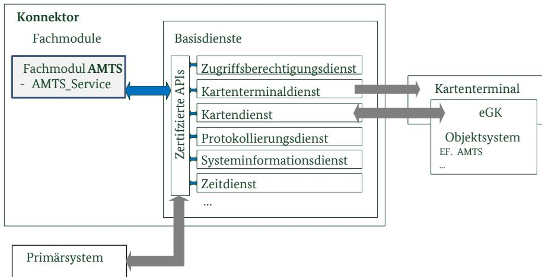

# Konnektor – Prüfspezifikation für das Fachmodul AMTS

Technische Richtlinie BSI TR-03155

Trial Use[1](#page-0-0)

1 Erläuterung in Abschitt [1.4](#page-8-0)

## Änderungshistorie

| Version | Datum      | Name                                          | Beschreibung                                                                                                                                                                                                                  |
|---------|------------|-----------------------------------------------|-------------------------------------------------------------------------------------------------------------------------------------------------------------------------------------------------------------------------------|
| 1.0     | 19.12.2017 | SRC Security Research & Consulting GmbH | Erste Version                                                                                                                                                                                                                 |
| 1.0.1   | 23.05.2018 | BSI                                           | Aktualisierung der Literaturquellen                                                                                                                                                                                           |
| 1.1     | 15.04.2019 | BSI                                           | Anpassungen in Absatz 3.3.1 Funktionale Spezifikationstests des Fachmoduls AMTS Anpassung O.RobustIF und AMTS-TR-RobustIF Malformed um Konsistenz zu T.Attack herzustellen Streichung zweier Anforderungen an die |
|         |            |                                               | Konnektor-CC-Zertifizierung Einarbeitung Kommentare BSI (u.a. Absatz 4.1)                                                                                                                                                  |

Bundesamt für Sicherheit in der Informationstechnik Postfach 20 03 63 53133 Bonn E-Mail: zertifizierung@bsi.bund.de Internet: https://www.bsi.bund.de © Bundesamt für Sicherheit in der Informationstechnik 2019

|                | Änderungshistorie 2                                                                                      |  |
|----------------|----------------------------------------------------------------------------------------------------------|--|
| 1              | Einleitung 7                                                                                             |  |
| 1.1            | Gegenstand der Technischen Richtlinie 7                                                                  |  |
| 1.2            | Zielsetzung der Technischen Richtlinie 7                                                                 |  |
| 1.3            | Übersicht 8                                                                                              |  |
| 1.3.1          | Methodik 8                                                                                               |  |
| 1.3.2          | Begriffe 8                                                                                               |  |
| 1.4            | Offene Punkte 9                                                                                          |  |
| 2              | Funktionalitäten des Fachmoduls AMTS 10                                                                  |  |
| 2.1            | Spezifische Konzepte 10                                                                                  |  |
| 2.1.1          | Dienstschnittstellen 10                                                                                  |  |
| 2.1.2          | Zugriffsberechtigungen 10                                                                                |  |
| 2.1.3          | PINs 10                                                                                                  |  |
| 2.1.4          | Audit 11                                                                                                 |  |
| 2.1.5          | Protokollierung 11                                                                                       |  |
| 2.2            | Fachmodul Security Guidance 11                                                                           |  |
| 2.3            | Security Problem Definition 12                                                                           |  |
| 2.3.1          | Bedrohungen 12                                                                                           |  |
| 2.3.2 2.3.3 | Organisatorische Sicherheitspolitiken13 Annahmen 14                                                   |  |
|                |                                                                                                          |  |
| 3              | Zertifizierung des FM ATMS nach Technischer Richtlinie15                                                 |  |
| 3.1            | Prüfgegenstand und –werkzeuge 15                                                                         |  |
| 3.2            | Prüfaspekte 16                                                                                           |  |
| 3.3            | Prüfaufgaben 17                                                                                          |  |
| 3.3.1 3.3.2 | Funktionale Spezifikationstests des Fachmoduls AMTS17 Common Criteria Zertifizierung des Konnektors17 |  |
| 3.3.3          | Sicherheitsziele für den TOE 18                                                                          |  |
| 3.3.4          | Sicherheitsziele für die TOE Umgebung19                                                                  |  |
| 3.3.5          | Rationale 20                                                                                             |  |
| 3.4            | Prüfschritte 21                                                                                          |  |
| 3.4.1          | Protokollierung der Prüfergebnisse21                                                                     |  |
| 3.4.2          | Test-Charakteristiken 23                                                                                 |  |
| 4              | TR-Prüfbericht zu FM eMP/AMTS 28                                                                         |  |
| 4.1            | Zertifizierungsverfahren 28                                                                              |  |
| 4.2            | Prüfaussagen 28                                                                                          |  |
| 4.3            | Konfiguration 28                                                                                         |  |
|                | A. Datenschutz-sensitive Datenelemente29                                                                 |  |
|                | B. Literaturverzeichnis 30                                                                               |  |
|                | C. Stichwortverzeichnis 31                                                                               |  |
|                | D. Abkürzungsverzeichnis 32                                                                              |  |

### Abbildungsverzeichnis

| Abbildung 1: TOE Scope und Interaktionen des Fachmoduls AMTS15 |  |
|----------------------------------------------------------------|--|

### Tabellenverzeichnis

| Tabelle 1: Operationen des Fachmoduldienstes 7                                                         |  |
|--------------------------------------------------------------------------------------------------------|--|
| Tabelle 2: Prüfungen in Bezug auf das Fachmodul AMTS8                                                  |  |
| Tabelle 3: Schlüsselworte für PINs im Kontext eMP/AMTS11                                               |  |
| Tabelle 4: Überblick vom Fachmodul benutzter Basisdienste mit Schnittstellenname18                     |  |
| Tabelle 5: Abdeckung von Security Problem Definition zu Sicherheitszielen für das Fachmodul und dessen |  |
| Umgebung 21                                                                                            |  |
| Tabelle 6: Definition der Prüftiefen 22                                                                |  |
| Tabelle 7: Definition der Verdicts 22                                                                  |  |
| Tabelle 8: Definition der Test-Charakteristika mit der Zuordnung zu Sicherheitszielen27                |  |

### 1 Einleitung

### 1.1 Gegenstand der Technischen Richtlinie

Das Fachmodul Arzneimitteltherapiesicherheit (FM AMTS) setzt den E-Medikationsplan (eMP) als integraler Bestandteil des Konnektors um und nutzt dessen Basisdienste zur Umsetzung aller Anwendungsfälle . Es stellt dem Konnektor Grundfunktionalitäten zur Verwaltung des E-Medikationsplans zur Verfügung, die durch das Primärsystem genutzt werden. Die folgende Tabelle stellt sämtliche Funktionen des Fachmoduls AMTS vor:

| Operation     | Vorgang                          | Datenquelle                                         | Datensenke                            |
|---------------|----------------------------------|-----------------------------------------------------|---------------------------------------|
| ReadMP        | Auslesen des Medikationsplans    | eMP in EF.AMTS von der eGK                       | Weiterverarbeitung im Primärsystem |
| WriteMP       | Schreiben eines Medikationsplans | eMP vom Primärsystem erhalten                    | EF.AMTS auf der eGK                   |
| ReadConsent   | Auslesen der Einwilligungsdaten  | Einwilligungsdaten in EF.AMTS von der eGK        | Weiterverarbeitung im Primärsystem |
| WriteConsent  | Schreiben der Einwilligungsdaten | Einwilligungsdaten vom Primärsystem übergeben | EF.AMTS auf der eGK                   |
| DeleteConsent | Löschen der Einwilligungsdaten   | -                                                   | -                                     |

Tabelle 1: Operationen des Fachmoduldienstes

Das Fachmodul erbringt seine Dienste unter Zuhilfenahme von Basisdiensten des Konnektors, z.B. erfolgen sämtliche Zugriffe auf die eGK über das Kartendienstmodul. Das Fachmodul implementiert an den Schnittstellen genau das Verhalten nach [gemSpec\_FM\_AMTS]. Weitere Dienste und Funktionen sind nicht zulässig. Die Ausnahme bildet eine optionale erweiterte Protokollierung durch das Fachmodul.

### 1.2 Zielsetzung der Technischen Richtlinie

Die TR beschreibt die Schritte zur fachlichen Prüfung und Zertifzierung des Fachmoduls gemäß Spezifikation [gemSpec\_FM\_AMTS].

Die Technische Richtlinie beschreibt und begründet die Testanforderungen an das Fachmodul Arzneimitteltherapiesicherheit (FM AMTS). Zielsetzung ist eine umfassende Prüfung von explizit formulierten Sicherheitseigenschaften des Fachmoduls, basierend auf Sichtung des Quelltextes sowie auf weiteren Design-Dokumentationen und gegebenenfalls automatisierten Tests. Im Falle einer erfolgreichen TR-Prüfung erteilt das BSI ein Zertifikat, welches eine der Voraussetzungen für die Zulassung des Fachmoduls durch die gematik ist.

| #  | Bezeichnung                                                                                 | Erläuterung                                                                                                                                                                                                                                                                                                                                                                                                                                                                                           |
|----|---------------------------------------------------------------------------------------------|-------------------------------------------------------------------------------------------------------------------------------------------------------------------------------------------------------------------------------------------------------------------------------------------------------------------------------------------------------------------------------------------------------------------------------------------------------------------------------------------------------|
| 1. | Prüfung auf Konformität zur Spezifikation Fachmodul AMTS und Konnektor                | Die Konformitätsprüfung prüft an den Konnektor Außensschnittstellen (Fachmodul Dienst AMTS_Service). Sie stellt das Spezifikations-konforme Verhalten nach [gemSpec_FM_AMTS] und [gemSpec_Kon] an den Schnittstellen sicher. Dieser funktionale Test wird zum einen in vollem Umfang als eigenverantwortlicher Test durch den Hersteller und zum anderen in geringerem Umfang durch die gematik durchgeführt (Test der relevantesten Aspekte). Erläuterung in Abschnitt 3.3.1 |
| 2. | gematik Zulassung des Konnektors CC-Zertifizierung des Konnektors                        | Die Basisdienste des Konnektors sowie besondere Schnittstellen für die Verwendung im Fachmodul unterliegen einer Common Criteria Evaluation und Zertifizierung.                                                                                                                                                                                                                                                                                                                                 |
| 3. | gematik Zulassung der eGK CC-Zertifizierung des COS TR-Zertifizierung eGK Filesystems | Die elektronische Gesundheitskarte (eGK) wird durch die gematik zugelassen, basierend auf einer Common Criteria untersuchung des COS und der Begutachtung des Filesystems.                                                                                                                                                                                                                                                                                                                   |
| 4. | Prüfspezifikation für das Fachmodul AMTS (vorliegende Technische Richtlinie)          | Es wird die Erbringung der Sicherheitsfunktionalität durch das Fachmodul geprüft (siehe Abschnitt 3.2).                                                                                                                                                                                                                                                                                                                                                                                            |

Im Umfeld um das Fachmodul AMTS sind folgende Prüfungen vorgesehen:

Tabelle 2: Prüfungen in Bezug auf das Fachmodul AMTS

#### 1.3 Übersicht

#### 1.3.1 Methodik

Im Folgenden bezeichnet der Begriff TOE Security Functionality (TSF) die Funktionalität des Fachmoduls, die für die Umsetzung der Sicherheit verantwortlich ist. Der TOE umfasst eine konvexe Hülle dieser Funktionen, d.h. für die Umsetzung notwendige unterstützende Funktionen sind eingeschlossen.

Die Technische Richtlinie formuliert eine Security Problem Definition (SPD), die den Evaluator bei der Test-Abdeckung und der Wahl der Testtiefe für die TSF unterstützt. Aus der SPD werden Sicherheitsziele für den TOE und dessen Umgebung abgeleitet. Für die Sicherheitsziele des TOE wird anhand der Test-Charakteristiken eine fachliche Struktur für die zu erstellenden Prüfberichte vorgegeben.

Die Bedrohungsszenarien entsprechen denen der Common Criteria Konnektor Evaluation nach [PP0098]. Beispielsweise wird Fuzzing auf die im Netzwerk erreichbaren Dienstschnittstellen nicht gefordert, da Umgebungsannahmen des Konnektors Angriffe auf der Anwendungsschicht über die TLS-Client-Authentisierung bzw. ein sicheres Netz ausschließen. Diese Annahme schützt ebenso die Dienstschnittstellen des Fachmoduls.

#### 1.3.2 Begriffe

Diese Technische Richtlinie verwendet folgende Begriffe:

MUSS der Evaluator muss eine bestimmte Prüfung durchführen, die etwas sicherstellt

DARF NICHT/DÜRFEN NICHT der Evaluator muss eine bestimmte Prüfung durchführen, um etwas auszuschließen.

SOLL der Evaluator soll eine Prüfung durchführen, außer er legt dar, dass durch Auslassen der Prüfung kein Risiko für den sicheren Betrieb besteht.

#### 1.4 Offene Punkte

Die Anwendung der vorliegenden Technischen Richtlinie (TR) ist für die TR-Zertifizierung eines Fachmoduls AMTS verbindlich. Die TR ist im Status "trial-use", d.h. dass Sicherheitsziele festgelegt sind aber noch Erfahrungen mit der Anwendung der Prüfanforderungen der TR während der Evaluierung gesammelt werden sollen. In der "trial-use" Phase unterstützt die TR-Zertifizierungsstelle (in Abstimmung mit der gematik) mittels Interpretation der TR den Evaluator bei konkret auftretenden Problemen. Die so identifizierten Interpretationen fließen in die nächste Version der TR ein.

### 2 Funktionalitäten des Fachmoduls AMTS

#### 2.1 Spezifische Konzepte

Der Versicherte muss vor der Nutzung der eGK für die Speicherung des E-Medikationsplans (eMP) bzw. der Informationen für die Arzneimitteltherapiesicherheit (AMTS) explizit seine Einwilligung geben. Jeder Zugriff erfordert zudem die Eingabe der MRPIN.AMTS, sofern diese nicht durch den Versicherten deaktiviert wurde (siehe [2.1.3](#page-9-1)). Zugriffe auf die verwalteten medizinischen Informationen können auch durch die Vertreter-PIN legitimiert werden. Das Fachmodul AMTS stellt den spezifikationsgemäßen Zugriff auf die Medikationsdaten einer eGK sicher.

#### 2.1.1 Dienstschnittstellen

Das Fachmodul bietet die Schnittstelle AMTSService an. Das Systemdesign sieht vor, dass im Konnektor und im Fachmodul keine Authentisierung der Dienstanfragen stattfindet. Statt dessen sind die Dienstschnittstellen durch zwei Maßnahmen vor unbefugten Zugriffen geschützt.

1. Der Konnektor schützt seine Systemschnittstellen vor unbefugten Zugriffen. Dies wird durch eine Transportsicherung zwischen Konnektor und Clientsystem realisiert.

2. In den Konnektor werden nur TR-zertifizierte Fachmodule eingebracht. Die anderen Fachmodule werden bei deren TR-Prüfung auf unzulässige Aufrufe fremder Fachmodule hin untersucht.

**Anwendungshinweis:** Für die TR AMTS wird dies in O.Conformance gefordert und in AMTS-TR-Conformance-Calls umgesetzt.

Daher prüft das Fachmodul die Zugriffsberechtigung an den Dienstschnittstellen nicht.

#### 2.1.2 Zugriffsberechtigungen

Vor Zugriffen auf die verwalteten Informationen MUSS das Fachmodul die Berechtigungen durch Aufruf der Operation GrantApproval prüfen [gemSpec\_FM\_AMTS], Abschnitt 6.3.3. Hinsichtlich der Sicherheitsleistung sind folgende Schritte relevant:

1. Falls MRPIN.AMTS aktiv, Einholen der Versicherten-PIN bzw. Einholen der Vertreter-PIN;

2. Einholen der Einwilligungsdatei, danach vorhandene Einwilligung prüfen.

Falls die PIN nicht erfolgreich eingegeben wird, die Einwilligung verweigert wird oder die Einwilligungsdatei nicht lesbar ist, MUSS der Zugriff abgebrochen werden.

#### 2.1.3 PINs

Für Zugriffe auf AMTS muss zwischen folgenden PINs unterschieden werden (siehe [gemILF\_PS\_eMP-AMTS], Abschnitt 4.2):

| Schlüsselwort | Bedeutung                                                                                                                                                                                                                                                                                                                                                                                                    |
|---------------|--------------------------------------------------------------------------------------------------------------------------------------------------------------------------------------------------------------------------------------------------------------------------------------------------------------------------------------------------------------------------------------------------------------|
| MRPIN.AMTS    | Das Multireferenz Passwortobjekt erlaubt den Zugriff auf die Medikationsdaten sowie das Setzen/Löschen der Einwilligung. Die MRPIN.AMTS wird vom Versicherten genutzt (Eingabe der Versicherten-PIN). Sie ist durch den Versicherten deaktivierbar. Im deaktivierten Zustand muss für die Zugriffe auf die Medikations daten weder die Versicherten-PIN noch die Vertreter-PIN eingeholt werden. |
| PIN.AMTS_REP  | Dies ist die Vertreter-PIN, welche den Zugriff auf die Medikationsdaten erlaubt. PIN.AMTS_REP wird entsprechend vom Vertreter genutzt, falls der Versicherte dies eingerichtet hat.                                                                                                                                                                                                                    |
| MRPIN.home    | Die Privat-PIN2 erlaubt keinen Zugriff auf eMP- bzw. AMTS-Informationen. Für das Fachmodul AMTS irrelevant, da die @home-Umgebung nicht auf den Konnektor zurückgreift.                                                                                                                                                                                                                             |

Tabelle 3: Schlüsselworte für PINs im Kontext eMP/AMTS

#### 2.1.4 Audit

Im Umfeld des Konnektors existieren zwei Arten von Audit und Protokollierung, die sich aufgrund ihrer Aufbewahrungsorte unterscheiden: Auditeinträge auf dem Objektsystem der eGK und die Protokollierungsdaten wie Sicherheitsereignisse (auch des Fachmoduls AMTS) im Protokollierungsdienst des Konnektors. In dieser TR wird das Konzept auf der eGK immer als Audit bezeichnet und damit von der "Protokollierung" im Protokollierungsdienst des Konnektors differenziert.

Das Datenzugriffsaudit auf der eGK macht missbräuchliches und unbemerktes Auslesen des Medikationsplanes nachvollziehbar. Sämtliche Schreib-/Lese- und Löschvorgänge werden mittels des Usecase TUC\_KON\_006 "Datenzugriffsaudit eGK schreiben" auditiert.

Das Datenzugriffsaudit dokumentiert den Versuch des Heilberuflers eine Operation durchzuführen und MUSS vor dem Auslesen oder Ändern eines Datenfelds stattfinden. Das Fachmodul unterbindet das Lesen bzw. den Schreibvorgang der eigentlichen Daten, falls das Datenzugriffsaudit nicht erfolgreich geschrieben werden konnte. Das Primärsystem wird mittels des Rückgabewertes informiert.

#### 2.1.5 Protokollierung

Im Fachmodul festgestellte sicherheitsrelevante Ereignisse werden in das Sicherheitsprotokoll des Konnektors überführt. Daneben nutzt die Protokollierung den Protokollierungsdienst des Konnektors als einzigen Aufbewahrungsort für fachmodulspezifische Protokolldaten.

Der Hersteller MUSS sicherstellen, dass sensible Daten nicht protokolliert werden. Anhang A definiert die sensitiven Attribute. Der Hersteller dokumentiert, wie diese Anforderung sichergestellt wird. In der TR-Prüfung vollzieht der Evaluator nach, dass sensitive Daten in keinem Fall protokolliert (AMTS-TR-Privacy-Protocol) bzw. persistent gemacht werden (AMTS-TR-Privacy-Persistent).

Die Parameter für den Protokollierungsdienst sind für sicherheitsrelevante Protokolleinträge ausgesetzt, diese werden weder gefiltert noch automatisch gelöscht. Daher bestehen keine Abhängigkeiten der Sicherheit zum Protokollierungsdienst und den Konfigurationsparametern.

#### 2.2 Fachmodul Security Guidance

Für den sicheren Betrieb des Fachmoduls sind zwei Dokumente notwendig: die Konnektor Security Guidance sowie die Fachmodul Security Guidance. Die erstere wird während Common Criteria Evaluation berücksichtigt und die gültige Fassung wird im CC-Zertifikat identifiziert.

Die Fachmodul Security Guidance beschreibt die sichere Konfiguration und Nutzung des Fachmoduls durch Dritte. Sie wendet sich an den Betreiber des Konnektors. Alternativ kann sie während der Integration in den Konnektor umgesetzt werden. Die Fachmodul Security Guidance umfasst (mindestens) folgende Informationen:

- vollständige Beschreibung des Protokollierungsformats, soweit über die Angaben in [gemSpec\_FM\_AMTS] hinausgehend;
- Versionsangabe des TR-zertifzierten Fachmodules und auf welche Version des Konnektors sich die Ergebnisse der TR-Prüfung beziehen. Es wird beschrieben, wie ein Integrator bzw. Konnektor-Administrator die eingesetzten Versionen prüfen kann.

**Anwendungshinweis:** Die Identifikation des verwendeten Fachmoduls und Konnektors wird durch den Konnektor (vgl. Abschnitt [3.3.2](#page-16-1)) erbracht.

#### 2.3 Security Problem Definition

Die Security Problem Definition beschreibt Annahmen, Bedrohungen und organisatorische Sicherheitspolitiken, die für das Fachmodul Arzneimitteltherapiesicherheit zur Erbringung der Sicherheitsleistung relevant sind. Die TR-Prüfung nimmt dazu Stellung, ob die im folgenden ausgeführten Szenarien durch die Implementierung eines begutachteten Fachmoduls hinreichend behandelt werden.

#### 2.3.1 Bedrohungen

T.Access Eine Anwendung erhält unbefugten Zugriff

- auf das Feld Einwilligung\_Data in EF.AMTS nach Eingabe der Vertreter-PIN[3](#page-11-0) ;
- auf EF.AMTS, obwohl die Einwilligung nicht lesbar oder nicht erteilt ist[4](#page-11-1) ;
- auf EF.AMTS ohne Eingabe der gesetzten MRPIN.AMTS[5](#page-11-2) bzw. das vom aufrufenden System festgelegte PIN-Objekt[6](#page-11-3) .

**Anwendungshinweis:** Eine Sicherheitsverletzung im Sinne der Bedrohung T.Access stellen nur Zugriffsverletzungen dar, die nicht durch die eGK selbst verhindert wird. Beispiel: Für die Rolle "anderer Heilberuf" erlaubt die eGK lesenden Zugriff auf das NFD Datenfeld. Das Fachmodul MUSS den lesenden Zugriff nur im Notfall zulassen und auf der eGK auditieren, ansonsten MUSS das Fachmodul dieser Rolle den Zugriff verweigern.

Die erfolgreiche C2C-Authentisierung zwischen HBA und eGK ist eine Voraussetzung, damit die eGK Zugriffe durch das Fachmodul überhaupt

- 3 AMTS-A\_2204 FM AMTS: ReadConsent – Freischaltung mit AMTS-PIN
- 4 AMTS-A\_2182 FM AMTS: GrantApproval – Prüfung auf Einwilligung beim Zugriff auf die eMP/AMTS-Daten (Einverständnis)
- 5 AMTS-A\_2182 FM AMTS: GrantApproval – Prüfung auf Einwilligung beim Zugriff auf die eMP/AMTS-Daten (Einverständnis)
- 6 AMTS-A\_2192 FM AMTS: ReadMP – PIN zur Freischaltung von EF.AMTS und analog AMTS-A\_2202 FM AMTS: WriteMP – PIN zur Freischaltung von EF.AMTS

|                 |                 | gewährt. Diese Sicherheitseigenschaft ist über die TR-Zertifizierung des Objektsystems abgedeckt.                                                                                                                                                                                                                                                        |
|-----------------|-----------------|-------------------------------------------------------------------------------------------------------------------------------------------------------------------------------------------------------------------------------------------------------------------------------------------------------------------------------------------------------------|
|                 | T.Attack        | Die Sicherheitsfunktionen des Fachmoduls werden über die Schnittstelle zur eGK beeinträchtigt.                                                                                                                                                                                                                                                           |
|                 |                 | Anwendungshinweis: Die Dienstschnittstellen sind vor Angriffen geschützt (siehe A.FairUse).                                                                                                                                                                                                                                                              |
|                 | T.Eavesdropping | Ein Unbefugter erhält Kenntnis von Inhalten der Datenübertragung zwischen Primärsystem und Konnektor.                                                                                                                                                                                                                                                    |
|                 | T.Residual      | Zuvor auf der eGK gespeicherte eMP lassen sich nach ihrer Löschung wiederherstellen.                                                                                                                                                                                                                                                                     |
|                 | 2.3.2           | Organisatorische Sicherheitspolitiken                                                                                                                                                                                                                                                                                                                       |
|                 | OSP.Audit       | Sämtliche Schreib-/Lese-/Löschvorgänge werden im Datenzugriffsaudit der eGK aufgezeichnet.                                                                                                                                                                                                                                                               |
|                 |                 | Anwendungshinweis: Für eine eGK Version 2.0 erzeugt das Fachmodul einen Log-Eintrag für den gesamten Behandlungsverlauf.                                                                                                                                                                                                                                 |
| OSP.Conformance |                 | Das Fachmodul verhält sich konform zur Konnektor Security Guidance (erforderlich in der CC-Zertifizierung nach [PP0098] ab OPB 2.1):                                                                                                                                                                                                                     |
|                 |                 | • die Auflagen der Konnektor Security Guidance werden eingehalten;                                                                                                                                                                                                                                                                                       |
|                 |                 | • es werden ausschließlich zertifizierte Schnittstellen des Konnektors aufgerufen;                                                                                                                                                                                                                                                                    |
|                 |                 | • es werden keine andere Fachmodule aufgerufen;                                                                                                                                                                                                                                                                                                          |
|                 |                 | empfängt der AMTS_Service ungültige XML-Daten vom Primärsystem, • reagiert das Fachmodul nach Spezifikation7 ;                                                                                                                                                                                                                                     |
|                 |                 | • die Rückgabewerte des Fachmoduls informieren das Primärsystem spezifikationskonform über den Ausgang der Operation.                                                                                                                                                                                                                                 |
|                 | OSP.HBA         | Es wird ein zertifizierter Heilberufsausweis (HBA) mit gültigem Zertifikat eingesetzt.                                                                                                                                                                                                                                                                   |
|                 | OSP.StaticCode  | Das Fachmodul wird systematisch auf Programmierfehler wie Buffer Overflows untersucht, beispielsweise per statischer Code Analyse.                                                                                                                                                                                                                       |
|                 | OSP.Privacy     | Medizinische und personenbezogene Daten, sensitive Daten nach Anhang A sowie kryptographische Schlüssel DÜRFEN im Fachmodul NICHT persistent gespeichert oder in Protokollierungseinträgen erfasst werden.8 Zwischengespeicherte sensitive Daten MÜSSEN schnellstmöglichst gelöscht werden.                                                     |
|                 |                 | Anwendungshinweis: Das Caching der Versicherten-ID für Karten der Generation 2.0 ist bis zum Beenden der Karten-Session zulässig.9                                                                                                                                                                                                                       |
| 7 8          |                 | AMTS-A_2159 FM AMTS: Übergreifende Anforderung – Fehlerbehandlung bei falschen Aufrufparametern; AMTS-A_2161 FM AMTS: Übergreifende Anforderung – Fehlerbehandlung bei fehlender Zugriffsberechtigung. AMTS-A_2137 FM AMTS: Verbot von personenbezogenen Daten in Fehlermel-dungen, AMTS-A_2139 FM AMTS: Verbot Protokollierung Schlüsselmaterial, |
| 9               |                 | AMTS-A_2140 FM AMTS: Verbot Protokollierung personenbezogener Daten) AMTS-A_2169 FM AMTS: Übergreifende Anforderung – Versicherten-ID im Cache löschen; AMTS-A_2189 FM AMTS: Übergreifende Anforderung – Löschung von zwischengespeicherten Kein Caching der                                                                                          |

eMP/AMTS-Daten; AMTS-A\_2648 FM AMTS: Übergreifende Anforderung – Löschung von zwischengespeicherten eMP/AMTS-Daten)

| OSP.Protocol      | 10 Das Fachmodul protokolliert Sicherheitsereignisse.                                                                                                                                                                                                                      |
|-------------------|-------------------------------------------------------------------------------------------------------------------------------------------------------------------------------------------------------------------------------------------------------------------------------|
|                   | Anwendungshinweis: Die Protokollierung durch das Fachmodul darf über [gemSpec_FM_AMTS] hinausgehen. Die Fachmodul Security Guidance MUSS darüberhinausgehende Einträge definieren.                                                                                      |
| 2.3.3 Annahmen |                                                                                                                                                                                                                                                                               |
| A.FairUse         | Es erfolgen nur spezifikationskonforme Zugriffe auf die Dienstschnittstellen des Fachmoduls. Die Betriebsumgebung des Fachmoduls erfüllt alle Forderungen des Schutzprofils [PP0098], Kapitel 3, u.a. den physischen Schutz und ein vertrauenswürdiges Clientsystem. |
| A.Konnektor       | Die Basisdienste des Konnektors sind zertifiziert und das Security Target ist um Fachmodul-spezifische Anforderungen ergänzt. Folgende Basisdienste des Konnektors sind einbezogen:                                                                                     |
|                   | • Kartendienst;                                                                                                                                                                                                                                                            |
|                   | Kartenterminaldienst; •                                                                                                                                                                                                                                                    |
|                   | • Protokollierungsdienst;                                                                                                                                                                                                                                                  |
|                   | • Zeitdienst;                                                                                                                                                                                                                                                              |
|                   | Zugriffsberechtigungsdienst; •                                                                                                                                                                                                                                             |
|                   | • Gültigkeitsprüfung der eGK und                                                                                                                                                                                                                                           |

• Funktionalität zur Transportsicherung zwischen Konnektor und Clientsystem.

### 3 Zertifizierung des FM ATMS nach Technischer Richtlinie

#### 3.1 Prüfgegenstand und –werkzeuge

*Abbildung 1: TOE Scope und Interaktionen des Fachmoduls AMTS*

Der TR-Prüfgegenstand ist das Fachmodul AMTS. Sowie die Fachmodul Security Guidance. Das Fachmodul wird über die SOAP-Schnittstelle vom Primärsystem aufgerufen.

Das Primärsystem greift über eine SOAP-Schnittstelle auf den Dienst AMTS\_Service des Fachmoduls AMTS zu. Das Fachmodul AMTS greift für die Realisierung seiner Aufgaben auf Basisdienste des Konnektors zu (vgl. [gemSpec\_FM\_AMTS]). Folgende Dienste sind involviert:

- Kartendienst, vgl. [gemSpec\_Kon], Abschnitt 4.1.5;
- Kartenterminaldienst, vgl. [gemSpec\_Kon], Abschnitt 4.1.4;
- Protokollierungsdienst, vgl. [gemSpec\_Kon], Abschnitt 4.1.10;
- Systeminformationsdienst, vgl. [gemSpec\_Kon], Abschnitt 4.1.6;
- Zeitdienst, vgl. [gemSpec\_Kon], Abschnitt 4.2.5;
- Zugriffsberechtigungsdienst, vgl. [gemSpec\_Kon], Abschnitt 4.1.1.

Zusätzlich tragen die Transportsicherung zwischen Clientsystem und Konnektor sowie das Konnektormanagment zur Sicherheitsleistung des Fachmoduls bei.

Die TR-Prüfung des Fachmoduls AMTS erfolgt unter zu Hilfenahme folgender Objekte und Dokumente Für das Fachmodul:

- Fachmodul ATMS als ausführbare Bibliothek und im Quelltext;
- benutzbare Entwicklungsumgebung des Fachmoduls zum Debuggen einschl. der Testfälle für den Einsatz des Fachmoduls;
- Nachweis mittels statischer Codeanalyse, dass bewährten Entwicklungstechniken (Best Practice) Schwachstellen im Fachmodul vorbeugen;
- Security Guidance des Fachmoduls AMTS (siehe Abschnitt [2.2](#page-11-4));
- Spezifikationen der gematik zum Konnektor [gemSpec\_Kon] und Fachmodul AMTS [gemSpec\_FM\_AMTS].

Für die Einsatzumgebung des Fachmoduls:

- Installierter Konnektor (zertifizierte Fassung nach OPB 2.1 oder höher) einschließlich Betriebsumgebung mit einem gematik-zugelassenen stationären eHealth Kartenterminal mit gSMC-KT (für Einsatz in der Test Umgebung);
- Installierte Software des Primärsystems, die auf alle Funktionen des Fachmoduls zugreift;
- eGKs der Generation 2 und 2.1 (für Einsatz in Test Umgebung);
- Heilberufsausweis (HBA, keine Vorläuferkarten, Generation 2 oder 2.1, für Einsatz in Test Umgebung);
- Werkzeuge zum Auswerten der Auditdateneinträgen von der eGK (Kartenleser und Software);
- Security Target und Benutzerhandbuch des Konnektors und Konnektor Security Guidance.

Die vorgenannten Objekte und Dokumentation werden der TR-Prüfstelle von den Herstellern des Fachmoduls bzw. Konnektors bereitgestellt. Verantwortlich hierfür ist der Hersteller des Fachmoduls.

#### 3.2 Prüfaspekte

Die Prüfung des Fachmoduls Arzneimitteltherapiesicherheit nach Technischer Richtlinie deckt die ergänzenden Prüfungen der Sicherheitseigenschaften des Fachmoduls ab. Die zu prüfende Sicherheitsfunktionalität des FM AMTS lässt sich in folgende Prüfaspekte gliedern:

(1) Konsistenz zwischen ausgeliefertem Fachmodul und dessen Quelltext prüfen;

(2) Abwesendheit von nicht-spezifizierten Diensten und Schnittstellenfunktionen prüfen;

(3) Prüfung auf Eingabe der Versicherten PIN bzw. für bestimmte Operationen ersatzweise die Vertreter PIN;

(4) das Erstellen von Datenzugriffsaudit-Einträgen auf der eGK über versuchte Zugriffe des Fachmoduls auf den eMP;

(5) das Erstellen von Protokolldaten zu Sicherheitsereignissen und Übergabe an den Protokollierungsdienst,

(6) Konformitäts-Prüfung, d.h. das Fachmodul erfüllt die Security Guidance des jeweiligen Konnektors und es verwendet ausschließlich zertifizierte Schnittstellen und in spezifikationskonformer Weise,

(7) Schutz medizinischer, personenbezogener und sensitiver Datenelemente, d.h. keine persistente Speicherung oder Protokollierung,

(8) korrekte Funktionalität der vorgesehenen Schnittstellen, allgemein Abdeckung sämtlicher Eigenschaften des Fachmoduls, die die Sicherheit des Gesamtsystems gefährden können, insbesondere Aufdeckung von Implementierungsfehlern an den Schnittstellen des Fachmodul AMTS;

(9) Fachmodul Security Guidance beschreibt die Versionsprüfung des eingesetzten Konnektors und Fachmodul sowie den Abgleich mit den Versionen der TR-Zertifzierung.

Die TR-Konformitätsprüfung des FM AMTS wird durch eine Prüfstelle mit Bewertung der Prüfergebnisse der in Abschnitt [3.4](#page-20-0) dargestellten Teilprüfungen und einer entsprechenden Dokumentation der durchgeführten Teilprüfungen, der zugehörigen Prüfergebnisse und der Bewertung der Prüfergebnisse in Form eines TR-Prüfberichtes abgeschlossen.

#### 3.3 Prüfaufgaben

#### 3.3.1 Funktionale Spezifikationstests des Fachmoduls AMTS

Das Fachmodul AMTS wird Spezifikationstests unterworfen. Dabei findet zum einen eine vollumfängliche Prüfung durch den Hersteller selbst und zum anderen zusätzlich eine Prüfung der wichtigsten Aspekte durch die gematik statt (vgl. [Tabelle 2\)](#page-7-0). Die Spezifikations-Prüfung prüft das Verhalten an den Schnittstellen und erfolgt als reiner Blackbox Test, d.h. ohne Zugriff auf Implementierungsdetails. Die Spezifikationstests der gematik umfassen mindestens folgende Benutzungsszenarien:

- Korrektes Handling von Fehlern in SOAP, Verletzung der UTF-8 Kodierung, interne Fehler und in aufgerufenen Modulen[11](#page-16-2) ,
- Erzeugung von fachmodul-spezifischen Protokolldaten[12](#page-16-3) ,
- Überprüfung der eingesetzten PIN auf ihren Verwendungszweck[13](#page-16-4) ,
- Rückgabewerte[14](#page-16-5) ,
- Verhalten bei gesperrter Karte, Transaktionsstatus und Inkonsistenz,
- Abweichende Versicherten-ID beim Schreiben[15](#page-16-6) ,
- Kein Überschreiben von vorhandenen Einwilligungsdaten[16](#page-16-7) ,
- Ablehnen konkurrierender Kartenzugriffe[17](#page-16-8) ,
- Korrekte Erzeugung von Auditdaten, speziell des "Type of Access" auf der eGK[18](#page-16-9) ,
- Anzeigeaufforderungen am Kartenterminal bei der PIN-Eingabe[19](#page-16-10) .

Diese - meist funktionalen - Aspekte sind daher in der TR-Prüfung ausgenommen.

#### 3.3.2 Common Criteria Zertifizierung des Konnektors

Die TR-Prüfung des Fachmoduls basiert auf einem zuvor zertifizierten Konnektor, d.h. sie beruht auf den während der Konnektor-Evaluation festgestellten Sicherheitseigenschaften. Sofern eine Konnektor-Zertifizierung nach [PP0098] Sicherheitseigenschaften nicht beinhaltet, auf die das Fachmodul zugreift, entsteht eine Argumentationslücke. Dem soll vorgebeugt werden, indem für das Fachmodul relevante Sicherheitseigenschaften des Konnektors zusätzlich in dessen Security Target aufgenommen und Common Criteria-zertifiziert werden, wenn diese im [PP0098] nicht enthalten sind.

Ab OPB 2.1 führt das Konnektor Security Guidance Dokument (als eines der Ergebnisdokumente der Common Criteria Evaluation des Konnektors) sämtliche Schnittstellen für Basisdienste des Konnektors auf, deren Sicherheitseigenschaften in der TR-Zertifizierung des Fachmoduls enthalten sind. Laut Spezifikation greift das Fachmodul auf folgende Konnektor-Schnittstellen zu bzw. leisten einen Beitrag zur Sicherheitsleistung:

- 11 AMTS-A\_2157 FM AMTS: Übergreifende Anforderung – Fehlerbehandlung bei fehlenden Smartcards,
- AMTS-A\_2158 FM AMTS: Übergreifende Anforderung Fehlerbehandlung bei nicht freigeschalteten Smartcards,
- AMTS-A\_2160 FM AMTS: Übergreifende Anforderung Zugriffsberechtigung auf benötigte Ressourcen
- 12 AMTS-A\_2144 FM AMTS: Fachmodulprotokoll (Ablauf)
- 13 AMTS-A\_2167 FM AMTS: Übergreifende Anforderung – Keine Nutzung der Privat-PIN
- 14 AMTS-A\_2174 FM AMTS: Übergreifende Anforderung – Befüllung des Rückgabeparameters EGKValid
- 15 AMTS-A\_2197 FM AMTS: WriteMP – Fehlerbehandlung bei abweichender Versicherten-ID
- 16 AMTS-A\_2114 FM AMTS: WriteConsent – Kein Überschreiben einer vorhandenen Einwilligungsdaten
- 17 AMTS-A\_2646 FM AMTS: Übergreifende Anforderung – paralleler Zugriff
- 18 Tab\_AMTS\_FM\_001 Werte der Zugriffsprotokolleinträge auf der eGK G2.0, Tabelle 8: Tab\_AMTS\_FM\_020 Werte der Zugriffsprotokolleinträge auf der eGK G2.1
- 19 AMTS-A\_2181 FM AMTS: Terminalanzeige für PIN-Eingaben

Bundesamt für Sicherheit in der Informationstechnik 17

| Dienst                      | Konnektor Schnittstelle                                                        |
|-----------------------------|--------------------------------------------------------------------------------|
| Zugriffsberechtigungsdienst | TUC_KON_000 "Prüfe Zugriffsberechtigung"                                       |
| Kartendienst                | TUC_KON_005 "Card-to-Card authentisieren"                                      |
| Kartendienst                | TUC_KON_006 "Datenzugriffsaudit eGK schreiben"                                 |
| Kartendienst                | TUC_KON_012 "PIN verifizieren"                                                 |
| Kartendienst                | TUC_KON_018 "eGK-Sperrung prüfen"                                              |
| Kartendienst                | TUC_KON_022 "Liefere PIN-Status"                                               |
| Kartendienst                | TUC_KON_026 "Liefere CardSession"                                              |
| Kartendienst                | TUC_KON_036 "Liefere Fachliche Rolle"                                          |
| Kartendienst                | TUC_KON_041 "Einbringen der Endpunktinformationen während der Bootup Phase" |
| Kartendienst                | TUC_KON_202 "LeseDatei"                                                        |
| Kartendienst                | TUC_KON_203 "Schreibe Datei"                                                   |
| Kartendienst                | TUC_KON_204 "Lösche Datei Inhalt"                                              |
| Kartendienst                | TUC_KON_221 "Liefere Anwendungsstatus"                                         |
| Kartenterminaldienst        | TUC_KON_051 "Mit Anwender über Kartenterminal interagieren"                    |
| Protokollierungsdienst      | TUC_KON_271 "Schreibe Protokolleintrag"                                        |
| Systeminformationsdienst    | TUC_KON_254 "Liefere Ressourcendetails"                                        |
| Zeitdienst                  | TUC_KON_351 "Liefere Systemzeit"                                               |

Tabelle 4: Überblick vom Fachmodul benutzter Basisdienste mit Schnittstellenname

Die Common Criteria Zertifzierung MUSS weiterhin folgende Eigenschaften des Konnektors umfassen:

- Gültigkeitsprüfung der eGK;
- Funktionalität des Konnektors zur Transportsicherung zwischen Konnektor und Clientsystem;
- • Auslesbare, eindeutige Version des Konnektors sowie des Fachmoduls AMTS.

#### 3.3.3 Sicherheitsziele für den TOE

Die Sicherheitsziele für das Fachmodul leiten sich aus der Security Problem Definition (Abschnitt [2.3](#page-11-5)) und stellen eine Teilmenge der spezifizierten Funktionalität dar.

| O.Access      | Der TOE realisiert die Berechtigung des Versicherten anhand der PIN Eingabe sicher, sofern die MRPIN.AMTS auf der eGK aktiv gesetzt ist (siehe Abschnitt 2.1.2). Die Vertreter PIN erlaubt Zugriffe auf die Medikationsdaten, allerdings nicht auf die Einwilligung. Die MRPIN.home erlaubt keinen Zugriff. |
|---------------|----------------------------------------------------------------------------------------------------------------------------------------------------------------------------------------------------------------------------------------------------------------------------------------------------------------------|
|               | Für die Verwendung der eGK durch das Fachmodul AMTS ist weiterhin die Einwilligung des Versicherten notwendig. Die auf der eGK gespeicherte Einwilligung wird vor jedem Zugriff geprüft.                                                                                                                       |
| O.Audit       | Der TOE erstellt Datenzugriffsaudit-Einträge auf der eGK vor jedem versuchten Schreib-/Lese-/Löschvorgang.                                                                                                                                                                                                        |
| O.Conformance | Das Fachmodul verhält sich konform zur Konnektor Security Guidance Dokument:                                                                                                                                                                                                                                      |

|            | • alle Auflagen der Konnektor Security Guidance werden erfüllt;                                                                                                                             |
|------------|------------------------------------------------------------------------------------------------------------------------------------------------------------------------------------------------|
|            | • es werden ausschließlich zertifizierte Schnittstellen des Konnektors durch das Fachmodul aufgerufen;                                                                                   |
|            | empfängt der AMTS_Service ungültige XML-Daten vom Primärsystem, • reagiert das Fachmodul nach Spezifikation.                                                                             |
|            | • die Rückgabewerte des Fachmoduls informieren das Primärsystem spezifikationskonform über den Ausgang der Operation.                                                                    |
| O.Privacy  | Der TOE schützt medizinische, personenbezogene und sensitive Daten sowie kryptographische Schlüssel. Dies umfasst:                                                                          |
|            | • Weitergabe nur im Rahmen der definierten Schnittstellen gemäß [gemSpec_FM_AMTS];                                                                                                       |
|            | • Keine persistente Speicherung;                                                                                                                                                            |
|            | Zwischengespeicherte Daten werden schnellstmöglich gelöscht; •                                                                                                                              |
|            | • Keine Verwendung in Protokolleinträgen.                                                                                                                                                   |
| O.Protocol | Der TOE zeichnet Sicherheitsereignisse des Fachmoduls im Protokollierungsdienst des Konnektors auf. Datenschutz-sensitive Attribute nach Anhang A werden NICHT protokolliert.            |
|            | Anwendungshinweis: Die Struktur von Protokollinformationen ergibt sich nach [gemSpec_FM_AMTS] ergänzt durch Angaben in der Fachmodul Security Guidance.                                  |
| O.RobustIF | Das Fachmodul schützt vor Fehlern wie Buffer Overflow an der Schnittstelle zur eGK.                                                                                                         |
|            | Anwendungshinweis: Dies umfasst gerade nicht die Dienstschnittstelle AMTS Service, sondern nur den Import von Daten aus der eGK.                                                            |
|            | Eine Untersuchung mittels Fuzzing wird nicht explizit gefordert (vgl. Abschnitt 1.3.1) und kann vom Evaluator im Zweifelsfall etwa nach statischer Codeuntersuchung hinzugezogen werden. |

#### 3.3.4 Sicherheitsziele für die TOE Umgebung

| OE.HBA       | Für den Betrieb MUSS ein zertifizierter HBA eingesetzt werden. Das Zertifikat des HBA MUSS gültig sein.                                                                                                                                                                                                             |  |  |
|--------------|------------------------------------------------------------------------------------------------------------------------------------------------------------------------------------------------------------------------------------------------------------------------------------------------------------------------|--|--|
| OE.FairUse   | Die Umgebung MUSS sicherstellen, dass nur spezifikationskonforme Zugriffe auf die Dienstschnittstellen des Fachmoduls erfolgen. Die Betriebsumgebung des Fachmoduls MUSS alle Forderungen des Schutzprofils [PP0098], Kapitel 3 erfüllen, u.a. den physischer Schutz und ein vertrauenswürdiges Clientsystem. |  |  |
| OE.Konnektor | Der Konnektor, auf dem das Fachmodul aufsetzt, besitzt eine gültige Common Criteria Zertifizierung. Über die Konformität zum Schutzprofil [PP0098] hinaus MUSS das Zertifikat folgende Basisdienste umfassen (vgl. Abschnitt 3.3.2):                                                                             |  |  |
|              | • Kartendienst: Lese-/Schreib-/Lösch-Zugriffe auf die eGK;                                                                                                                                                                                                                                                          |  |  |
|              | • Kartenterminaldienst: Anzeige auf dem Kartenterminal zur                                                                                                                                                                                                                                                          |  |  |

Aufforderung PIN Eingabe;

- Protokollierungsdienst: Nimmt Protokoll-Einträge vom Fachmodul an und versieht diese mit einem korrekten Zeitstempel, filtert Sicherheitsereignisse nach Schwere und entfernt Einträge nach Ihrer Mindestspeicherdauer;
- Systeminformationsdienst: liest Ressourcendetails zu einer eGK aus;
- Zeitdienst: stellt eine Zeitbasis für Protokollierung und Auditierung her;
- Zugriffsberechtigungsdienst: Abfrage der rollenbezogenen Berechtigungen des handelnden Heilberuflers;
- Gültigkeitsprüfung der eGK;
- Funktionalität zur Transportsicherung zwischen Konnektor und Clientsystem;

**Anwendungshinweis**: Der Konnektor stellt den Schutz für die Übertragung zum Primärsystem sicher. Falls die globale Konfiguration auf das Erzwingen von TLS verzichtet, ist der Schutz des Übertragungskanals in der Verantwortung des Leistungserbringers (siehe [gemSpec\_FM\_AMTS], Absatz 5.2).

#### 3.3.5 Rationale

| Security Problem Definition | Sicherheitsziel            | Rationale                                                                                                                                                                                                                                                                  |  |  |
|--------------------------------|----------------------------|----------------------------------------------------------------------------------------------------------------------------------------------------------------------------------------------------------------------------------------------------------------------------|--|--|
| T.Access OSP.HBA            | O.Access OE.HBA         | Die Zugriffskontrolle führt, falls erforderlich, die PIN Eingabe durch und prüft auf eine erteilte und lesbare Einwilligung (O.Access). Die Gültigkeit des HBA wird vorausgesetzt (OE.HBA).                                                                          |  |  |
| OSP.Audit                      | O.Audit                    | Das Sicherheitsziel spezifiziert die Datenzugriffsauditierung auf der eGK (OSP.Audit).                                                                                                                                                                                  |  |  |
| OSP.Conformance                | O.Conformance              | Das Sicherheitsziel setzt die Policy für die Erfüllung aller Auflagen aus der Konnektor Security Guidance sowie die korrekte Nutzung von Konnektor-Schnittstellen durch den TOE um. Interaktionen mit anderen Fachmodule finden nicht statt (OSP.Conformance). |  |  |
| OSP.Privacy                    | O.Privacy                  | Das Sicherheitsziel verbietet das Protokollieren / Persistieren medizinischer / personenbezogener / sensitiver Daten sowie kryptographischer Schlüssel (OSP.Privacy).                                                                                                |  |  |
| OSP.Protocol                   | O.Protocol OE.Konnektor | Das Sicherheitsziel stellt die Protokollierung im Protokollierungsdienst des Konnektor sicher (OE.Konnektor). Das Fachmodul bereitet die notwendigen Daten für den Konnektor auf (O.Protocol).                                                                    |  |  |
| T.Attack OSP.StaticCode     | O.RobustIF                 | Die eGK könnte für Angriffe gegen das Fachmodul genutzt werden. Die Schnittstellen zur eGK wird als potentielles Einfallstor für Buffer Overflows betrachtet. Der Code wird mittels statischer Code Analyse untersucht (O.RobustIF).                              |  |  |

| Security Problem Definition | Sicherheitsziel               | Rationale                                                                                                                                                                                                                                                                                                                                                                                                          |  |  |
|--------------------------------|-------------------------------|--------------------------------------------------------------------------------------------------------------------------------------------------------------------------------------------------------------------------------------------------------------------------------------------------------------------------------------------------------------------------------------------------------------------|--|--|
| T.Residual                     | O.Conformance OE.Konnektor | Das sichere Überschreiben von Daten auf der eGK wird durch TUC_KON_204 (OE.Konnektor) beauftragt und in der eGK realisiert. Sofern beim Löschen durch den Kartendienst kein Fehler auftritt, kann der eMP Datensatz nicht wiederhergestellt werden. Der TOE prüft dafür den Rückgabewert (O.Conformance).                                                                                           |  |  |
| A.FairUse                      | OE.FairUse                    | Die Umgebung stellt sicher, dass nur spezifikationsgemäße Zugriffe auf die Dienstschnittstellen erfolgen. Weiterhin erfüllt der Betrieb die Auflagen für den Konnektor [PP0098], Kapitel 3.                                                                                                                                                                                                                  |  |  |
| A.Konnektor T.Eavesdropping | OE.Konnektor                  | Der Konnektor stellt dem TOE Basisdienste und Funktionen zur Erbringung von Sicherheitsdienstleistungen zur Verfügung. Alle Aufrufe sind spezifikationskonform (A.Konnektor). Der Konnektor ist versioniert. Der Konnektor erzwingt entweder die Nutzung von TLS Verbindungen vom Primärsystem oder der Leistungserbringer verhindert Angriffe auf den Kommunikationskanal (T.Eavesdropping). |  |  |
|                                |                               |                                                                                                                                                                                                                                                                                                                                                                                                                    |  |  |

Tabelle 5: Abdeckung von Security Problem Definition zu Sicherheitszielen für das Fachmodul und dessen Umgebung

### 3.4 Prüfschritte

Die Prüfung nach TR MUSS mit Einsicht in den Quelltext des Fachmoduls durchgeführt werden. Dies ermöglicht den Evaluator und Zertifizierer, die Erfüllung geforderter Eigenschaften anhand seines Einblicks in die konkrete Implementierung zu belegen bzw. zu prüfen. Dazu benennt der Evaluator im Prüfbericht die relevanten Ausschnitte aus dem Quelltext (mit Referenz und geeignetem Zitat) im Prüfbericht. Der Hersteller stellt den Quelltext für die Prüfung in der Prüfstelle zur Verfügung.

Die Analyse des Quelltextes MUSS mitberücksichtigen, welche Vorbedingungen erfüllt sein müssen, damit der Prüfgegenstand sich in der vorgeschriebenen Weise verhält, und der Evaluator MUSS deren Plausibilität bewerten. Der Hersteller unterstützt dies, indem er – beispielsweise im Quelltext oder einem zugelieferten Dokument – begründet, in welchen Ausnahmefällen bestimmte Schritte einer Implementierung des Sicherheitsmechanismus nicht eingefordert werden.

Zulässig zur TR-Prüfung sind ebenfalls automatisierte Testfälle, sofern der Evaluator ein gutes Verständnis zur Mächtigkeit des Tools und der Testfälle besitzt und sie durch eine manuelle Analyse ergänzt werden. Die Anlagen eines TR-Prüfberichtes MÜSSEN darlegen, wie die korrekte Verhaltensweise der Implementierung ermittelt wurde: beispielsweise durch Protokollmitschnitte, Aufrufe der Konnektor-API oder die Beschreibung von internen Zustandsänderungen.

Der Evaluator definiert die Prüfschritte selbstständig mit dem Ziel der Abdeckung der Test-Charakteristika in Abschnitt [3.4.2](#page-22-0) für die in Abschnitt [3.3.3](#page-17-0) definierten Sicherheitsziele.

#### 3.4.1 Protokollierung der Prüfergebnisse

Die TR-Prüfung orientiert sich an den Test-Charakteristika im folgenden Abschnitt. Der Hersteller kann dazu Aussagen bereitstellen, in denen er die betreffende Umsetzung skizziert und eine Referenz auf die jeweilige Implementierung (Identifikation des Funktionsmoduls im Quelltext mit Zeilennummer) angibt. Abhängig von der umgesetzten Prüftiefe (definiert in Tabelle [6](#page-21-0)) unterstützen diese Herstelleraussagen die TR-Prüfung des Evaluators. Die folgende Tabelle stellt abstrakt dar, welche Prüfschritte mindestens für die Prüftiefen gefordert sind.

Anmerkung: Leitgedanke bei der Klassifikation der Testcharakteristika ist, dass sicherheitsrelevante Testfälle alleine durch eine Herstellererklärung belegt werden dürfen, sofern sie bereits im Rahmen der funktionalen gematik Spezifikationstests des TOE validiert worden sind.

| Prüftiefe | Mindestanforderungen an die Prüfung                                                                                                                                                                                                                                                                                                                                                                                                                                                                                                  |  |  |
|-----------|--------------------------------------------------------------------------------------------------------------------------------------------------------------------------------------------------------------------------------------------------------------------------------------------------------------------------------------------------------------------------------------------------------------------------------------------------------------------------------------------------------------------------------------|--|--|
| Check     | Der Evaluator validiert (englisch check, analog zu Begriffsverwendung in der Common Criteria Evaluation Methodology) die vom Hersteller beschriebene Maßnahme im Hinblick auf Ihre Wirksamkeit und räumt bestehende Zweifel (Plausibilitätsprüfung) aus, ob die Sicherheitsproblematik umfassend durch die beschrieben Maßnahme verhindert wird. Die Validierung KANN weitergehende Schritte umfassen, wie z.B. eine Quelltextanalyse, falls der Evaluator diese für eine umfassende Einschätzung benötigt.           |  |  |
| Examine   | Der Evaluator untersucht (englisch examine, analog zu Begriffsverwendung in der Common Criteria Evaluation Methodology) die betreffende Test-Charakteristik. Der Evaluator MUSS in seiner Prüfung über die Mindestanforderungen für "Check" hinausgehen: in der Regel wird dies durch umfassende Quelltextanalyse der relevanten Implementierungsanteile geschehen. Die Unterstützung durch den Hersteller kann genutzt werden. "Examine" erfordert in jedem Fall eine eigenständige Beurteilung durch den Evaluator. |  |  |

Tabelle 6: Definition der Prüftiefen

Aus den Prüftiefen folgt auch der Einsatz von Quelltextanalyse bei der Begutachtung. Bei "Check" wählt der Evaluator aus, wie hoch die Abdeckung der Analyse für seine Einschätzung notwendig ist. Für "Examine" MUSS der TR-Prüfer erläutern, inwiefern sämtliche relevante Codezeilen in Betracht gezogen wurden. Besitzt beispielsweise eine Funktion keinen Zugriff auf sensitive Daten, könnte diese aus der Betrachtung von AMTS-TR-Privacy-\* ausgeschlossen werden.

Der Evaluator MUSS für jede Test-Charakteristik darstellen, wie er sein Prüfurteil begründet.

Der Prüfbericht soll die Test-Charakteristiken in sortierter Ordnung enthalten.

| Verdict      | Notwendige Angaben                                                                                                                                                                                                                                                                                                                                                                                        |  |  |
|--------------|-----------------------------------------------------------------------------------------------------------------------------------------------------------------------------------------------------------------------------------------------------------------------------------------------------------------------------------------------------------------------------------------------------------|--|--|
| PASS         | Der Evaluator erläutert sein Verständnis, warum die Hersteller-Implementierung das geforderte Sicherheitsziel erfüllt. Der Prüfbericht führt die durchgeführten Prüfschritte sowie das Prüfergebnis aus.                                                                                                                                                                                            |  |  |
| INCONCLUSIVE | Der Prüfbericht spezifiziert/referenziert die fehlenden oder inkonsistenten Informationen, damit der Hersteller die Nicht-Konformität zu dem betreffenden Aspekt des Sicherheitsziel bereinigen kann.                                                                                                                                                                                               |  |  |
| FAIL         | Das geprüfte Fachmodul verfehlt das betreffende Sicherheitsziel. Der Evaluator SOLL dokumentieren, inwiefern Angriffe durch Sicherheitsmaßnahmen in der Umgebung des Fachmoduls (z.B. operative Maßnahmen) verhindert werden. Die Erwartung der TR ist, dass die Sicherheitsziele durch den TOE selbst erbracht werden. Ein FAIL gefährdet grundsätzlich die TR-Zertifzierung des Fachmoduls. |  |  |

Jedes Test-Charakteristikum soll der Evaluator abschließend in einem Verdict zusammenfassen:

Tabelle 7: Definition der Verdicts

#### 3.4.2 Test-Charakteristiken

Die Test-Charakteristiken brechen die Sicherheitsziele in elementare Prüfschritte auf. Der Evaluator SOLL über die einzelnen Prüfschritte hinaus sicherstellen, dass das betreffende Sicherheitsziel insgesamt erfüllt wird. Dies umfasst möglicherweise weitere, hier nicht aufgeführte Test-Charakteristika.

| # | Test Charakteristika ID          | Kurzfassung des betreffenden Prüfaspekts abgeleitet aus dem Sicherheitsziel | Prüftiefe | Bemerkungen, Referenz                                                                                                                                                                                                                                                                                                                                                                                                                                                                                                                                                                                                                                      |  |  |  |  |
|---|----------------------------------------|--------------------------------------------------------------------------------------|-----------|------------------------------------------------------------------------------------------------------------------------------------------------------------------------------------------------------------------------------------------------------------------------------------------------------------------------------------------------------------------------------------------------------------------------------------------------------------------------------------------------------------------------------------------------------------------------------------------------------------------------------------------------------------|--|--|--|--|
|   | Prüfaspekt (1)                         |                                                                                      |           |                                                                                                                                                                                                                                                                                                                                                                                                                                                                                                                                                                                                                                                            |  |  |  |  |
| 1 | AMTS-TR-Build                          | Überstimmung Fachmodul/ Quelltext                                                 | Examine   | Der Hersteller bietet dem Evaluator einen Weg an, die Übereinstimmung zwischen ausführbarem Fachmodul und Quelltext zu prüfen. 1) Der Evaluator kann dies beispielsweise prüfen, in dem er das Binary selbst in der Entwicklungsumgebung erstellt und mit dem ausgelieferten Fachmodul vergleicht. 2) Alternativ kann der Evaluator beim Hersteller den Build Prozess protokollieren, hierbei sind die Quelltexte sowie die Binärdatei mit kryptographischen Mitteln (z.B. SHA-2) zu identifizieren. Der Evaluator prüft damit, ob die ihm vorliegenden Quelltexte damit übereinstimmen. |  |  |  |  |
|   | O.Access                               |                                                                                      |           |                                                                                                                                                                                                                                                                                                                                                                                                                                                                                                                                                                                                                                                            |  |  |  |  |
| 2 | AMTS-TR-Access-Perm                    | Prüfung der PIN abhängig von der aufgerufenen Operation                           | Examine   | Unterscheidung der Versicherten-, Vertreter-PIN und MRPIN.home                                                                                                                                                                                                                                                                                                                                                                                                                                                                                                                                                                                       |  |  |  |  |
|   | O.Audit                                |                                                                                      |           |                                                                                                                                                                                                                                                                                                                                                                                                                                                                                                                                                                                                                                                            |  |  |  |  |
| 3 | AMTS-TR-Audit-Write                    | Eintrag schreiben                                                                    | Check     | Alle Operationen                                                                                                                                                                                                                                                                                                                                                                                                                                                                                                                                                                                                                                           |  |  |  |  |
|   | O.Conformance                          |                                                                                      |           |                                                                                                                                                                                                                                                                                                                                                                                                                                                                                                                                                                                                                                                            |  |  |  |  |
| 4 | AMTS-TR Conformance-COMP            | Prüfung der Konnektor Composite Requirements                                      | Examine   | Der Hersteller erläutert, wie die Composition Requirements der Konnektor Security Guidance erfüllt wurden. Der Evaluator stellt sicher, dass diese Auflagen durch das Fachmodul erfüllt werden.                                                                                                                                                                                                                                                                                                                                                                                                                                       |  |  |  |  |
| 5 | AMTS-TR Conformance ErrorHandler | Behandlung von Fehlern in der Konnektor-API                                       | Check     | -                                                                                                                                                                                                                                                                                                                                                                                                                                                                                                                                                                                                                                                          |  |  |  |  |

| 6  | AMTS-TR Conformance-Interface | Ausschließlich Nutzung zertifizierter Schnittstellen des Konnektors                | Examine | Siehe Abschnitt 3.3.2; Zu prüfen sind alle Basisdienst-Aufrufe an den Konnektor; Vergleich mit den Angaben in der Konnektor Security Guidance                                                                |
|----|----------------------------------|------------------------------------------------------------------------------------------|---------|-----------------------------------------------------------------------------------------------------------------------------------------------------------------------------------------------------------------------------|
| 7  | AMTS-TR Conformance-Calls     | Keine Interaktion mit anderen Fachmodulen                                             | Examine | Siehe Abschnitt 2.1.1                                                                                                                                                                                                       |
| 8  | AMTS-TR Conformance-Result    | Auswertung von Rückgabewerten der Konnektor-API                                    | Check   | -                                                                                                                                                                                                                           |
|    | O.Privacy                        |                                                                                          |         |                                                                                                                                                                                                                             |
| 9  | AMTS-TR-Privacy-IF               | Abfluss nur an definierten Schnittstellen                                             | Examine | Ausschluß, dass sensitive Daten auf abweichenden Schnittstellen erreichbar sind. Der Evaluator bestätigt, dass keinerlei Kommunikation beispielsweise mit der Telematikinfrastruktur eingerichtet ist. |
| 10 | AMTS-TR-Privacy Persistent    | Keine persistenter Speicherung durch das Fachmodul von Attributen nach Anhang A | Examine | Alle persistenten Speicheroperationen des Fachmoduls müssen betrachtet werden.                                                                                                                                     |
| 11 | AMTS-TR-Privacy-RIP              | Löschen zwischengespeicherter Daten                                                   | Examine | Insbesondere muss der Evaluator alle sensitiven Werte nach Anhang A untersuchen                                                                                                                                    |
| 12 | AMTS-TR-Privacy Protocol      | Protokollierte Daten sind frei von den in Anhang A definierten Attributen          | Examine | Anhand der Herstellererklärung (siehe Abschnitt 2.1.5) prüft der Evaluator nach, dass sensitive Daten nicht protokolliert werden.                                                                            |
|    | O.Protocol                       |                                                                                          |         |                                                                                                                                                                                                                             |
| 13 | AMTS-TR-Protocol Entry        | Protokollierungsfunktion                                                                 | Check   | Das Fachmodul stellt einen Protokollierungseintrag zusammen. Die Zeit wird durch den Konnektor Protokollierungsdienst angefügt.                                                                              |
| 14 | AMTS-TR-Protocol SecEvent     | Alle auftretenden Sicherheitsereignisse des Fachmoduls werden protokolliert     | Examine | -                                                                                                                                                                                                                           |

| 15 | AMTS-TR-Protocol Spec         | Security Guidance beschreibt Protokollierung des Fachmoduls vollständig                                                                          | Examine | Die Beschreibung der Protokollierung in der Security Guidance wird geprüft. Geht die Protokollierung über [gemSpec_FM_AMTS] hinaus, ist dies in der FM Security Guidance beschrieben.                          |
|----|----------------------------------|--------------------------------------------------------------------------------------------------------------------------------------------------------|---------|-------------------------------------------------------------------------------------------------------------------------------------------------------------------------------------------------------------------------------------|
|    | O.RobustIF                       |                                                                                                                                                        |         |                                                                                                                                                                                                                                     |
| 16 | AMTS-TR-RobustIF Malformed    | Malformed Inputs, z.B. Buffer Overflow                                                                                                              | Examine | Fehlerbehandlung bzgl. ungültigem Datenformat beim Import von der eGK                                                                                                                                                         |
| 17 | AMTS-TR-RobustIF Static       | Static Code Analysis                                                                                                                                   | Check   | Der Hersteller führt eine statische Source Code Analyse durch. Der Evaluator bewertet mittels statischer Code Analyse die gesamte Code Qualtität und insbesondere die Robustheit sämtlicher Schnittstellen. |
| 18 | AMTS-TR-RobustIF Undocumented | Undocumented Functions                                                                                                                                 | Examine | Der Evaluator stellt sicher, dass im Fachmodul AMTS keine undokumentierten Services und Funktionen und Update Funktionalität existierten.                                                                            |
|    | Prüfaspekt (10)                  |                                                                                                                                                        |         |                                                                                                                                                                                                                                     |
| 19 | AMTS-TR-Versioning               | Angabe zur Version im Fachmodul Security Guidance                                                                                                | Check   | Die Fachmodul Security Guidance erläutert den Vergleich der eingesetzten mit der TR-zertifizierten Version des Fachmoduls sowie des Konnektors.                                                                      |
|    | OE.HBA                           |                                                                                                                                                        |         |                                                                                                                                                                                                                                     |
| 20 | AMTS-TR-HBA-PU                   | Die Fachmodul Security Guidance schreibt vor, dass für einen zertifzierten Betrieb eine HBA der Produktiv Umgebung benutzt werden MUSS. | Check   | -                                                                                                                                                                                                                                   |
| 21 | AMTS-TR-HBA-Cert                 | Die Security Guidance instruiert, dass eine HBA mit abgelaufenen Zertifkat NICHT benutzt werden DARF.                                         | Check   | -                                                                                                                                                                                                                                   |
|    | OE.FairUse                       |                                                                                                                                                        |         |                                                                                                                                                                                                                                     |

| 22 | AMTS-TR-FairUse Service        | Aufrufe gemäß [gemSpec_FM_AMTS]                                                                                                                                     | Check | Die Fachmodul Security Guidance beschreibt Maßnahmen, dass die Dienstschnittstellen nur spezifikationsgemäß genutzt werden.                                                   |
|----|-----------------------------------|------------------------------------------------------------------------------------------------------------------------------------------------------------------------|-------|----------------------------------------------------------------------------------------------------------------------------------------------------------------------------------------------|
| 23 | AMTS-TR-FairUse-SPD               | Fachmodul Security Guidance fordert Erfüllung von [PP0098], Abschnitt 3                                                                                          | Check | Der Hersteller kann auf die in der Konnektor-Zertifzierung geprüften Maßnahmen verweisen.                                                                                           |
|    | OE.Konnektor                      |                                                                                                                                                                        |       |                                                                                                                                                                                              |
| 24 | AMTS-TR-Konnektor Basisdienste | Alle durch das Fachmodul genutzten Basisdienste sind zertifiziert und ihre Nutzung ist in der Konnektor Security Guidance beschrieben.                     | Check | Abschnitt 3.3.2 definiert die zertifizierten Basisdienste des Konnektors.                                                                                                              |
| 25 | AMTS-TR-Konnektor Versioning   | Aus dem Konnektor Security Guidance Dokument geht hervor, dass das Fachmodul und seine Versionierung im Konnektor Lebenszyklus mit berücksichtigt wird. | Check | Dokumentation zur Identifikation der Versionen von Konnektor und Fachmodul. Der Evaluator validiert, dass die Versionsprüfung in dieser Weise durchgeführt werden kann. |

Tabelle 8: Definition der Test-Charakteristika mit der Zuordnung zu Sicherheitszielen

### 4 TR-Prüfbericht zu FM eMP/AMTS

#### 4.1 Zertifizierungsverfahren

Die Durchführung von Zertifizierungsverfahren für Fachmodule AMTS erfolgt auf Antrag gemäß dem BSI-Schema zur Zertifizierung von Produkten nach Technischen Richtlinien. Das Verfahren ist im Dokument "Anforderungen für Antragsteller zur Zertifizierung von Produkten nach Technischen Richtlinien, TR-Produkte" festgelegt. Die jeweils aktuell gültige Fassung dieses Dokuments wird auf der Internetseite des BSI veröffentlicht:

[https://www.bsi.bund.de/DE/Themen/ZertifizierungundAnerkennung/Produktzertifizierung/](https://www.bsi.bund.de/DE/Themen/ZertifizierungundAnerkennung/Produktzertifizierung/Produktzertifizierung_node.html) [Produktzertifizierung\\_node.html](https://www.bsi.bund.de/DE/Themen/ZertifizierungundAnerkennung/Produktzertifizierung/Produktzertifizierung_node.html).

Zusätzliche Anforderungen für Zertifizierungsverfahren von Fachmodulen AMTS sind:

- **•** Bei der Durchführung von Zertifizierungsverfahren nach BSI TR-03155 kann bei einem vom BSI festgestellten Bedarf die gematik inhaltlich eingebunden werden. Vom Antragsteller ist diesbezüglich im Rahmen der Antragstellung eine Einverständniserklärung zu unterzeichnen. Eine entsprechende Vorlage ist auf der Internetseite des BSI veröffentlicht: [https://www.bsi.bund.de/DE/Themen/ZertifizierungundAnerkennung/Produktzertifizierung/](https://www.bsi.bund.de/DE/Themen/ZertifizierungundAnerkennung/Produktzertifizierung/ZertifizierungnachTR/Antraege_Kontakt/antraege_kontakt_node.html) [ZertifizierungnachTR/Antraege\\_Kontakt/antraege\\_kontakt\\_node.html.](https://www.bsi.bund.de/DE/Themen/ZertifizierungundAnerkennung/Produktzertifizierung/ZertifizierungnachTR/Antraege_Kontakt/antraege_kontakt_node.html)
- **•** Dem Zertifizierungsantrag ist ein Verweis auf das führende gematik Zulassungsverfahren beizulegen.
- **•** Die von der Prüfstelle für die Konformitätsprüfung eines Fachmoduls AMTS geplanten Prüfschritte/-aktivitäten sind mit dem BSI vor deren Durchführung abzustimmen.

#### 4.2 Prüfaussagen

Der TR-Prüfbericht gliedert sich in

- Prüfaspekte nach Abschnitt [3.2,](#page-15-0) hierin fasst der Evaluator die Ergebnisse aus den Prüfaufgaben und Prüfschritten zu neun Verdicts zusammen;
- Prüfaufgaben nach Abschnitt [3.3](#page-16-11) mit den Prüfschritten nach Abschnitt [3.4](#page-20-0).

Final bewertet der Evaluator in einem einzigen Verdict, ob das untersuchte AMTS Fachmodul die Prüfungen bestanden hat.

Die Prüfergebnisse mit Anlagen werden dem BSI zur Prüfung und Zertifizierung übermittelt.

#### 4.3 Konfiguration

Der TR-Prüfbericht MUSS die begutachtete Version des Fachmoduls identifizieren sowie die Fachmodul Security Guidance, weitere Handbücher und gegebenenfalls genutzte Komponenten außerhalb des Fachmoduls. Weiter identifiziert der Prüfbericht den Konnektor, der zur Prüfung vorlag (anhand eindeutiger Versionierung).

Die TR-Zertifzierung betrifft alleine den Betrieb des Fachmoduls in der untersuchten Version des Konnektors. Der Einsatz des Fachmoduls mit einer abweichenden Version des Konnektors ist mit dem BSI abzustimmen.

### A. Datenschutz-sensitive Datenelemente

Folgende Datenelemente werden als sensitiv betrachtet und DÜRFEN NICHT persistiert werden (AMTS-TR-Privacy-Persistent ) oder in Protokollierungsdatensätze einbezogen sein (AMTS-TR-Privacy-Protocol).

#### **Allgemeine Daten**

- Name des Versicherten
- Geburtsdatum des Versicherten
- Geschlecht des Versicherten
- Adressdaten / Telefon- oder Faxnummern / E-Mail-Adressen des Versicherten
- KVNR des Versicherten
- Gültigkeits- / Ablaufdatum der eGK des Versicherten

#### alle Inhalte der **eMP/AMTS-Datensätze**

#### **Sonstiges**

• alle Auditdateneinträge der eGK

### B. Literaturverzeichnis

| [gemILF_PS_eMP-AMTS]      | Einführung der Gesundheitskarte: Implementierungsleitfaden Primärsysteme – elektronischer Medikationsplan/AMTS-Datenmanagement (Stufe A), Version 1.2.0, 14.05.2018, gematik Gesellschaft für Telematikanwendungen der Gesundheitskarte mbH |
|---------------------------|------------------------------------------------------------------------------------------------------------------------------------------------------------------------------------------------------------------------------------------------------|
| [gemSpec_COS]             | Spezifikation des Card Operating System (COS), Elektrische Schnittstelle, Version 3.11.0, 14.05.2018, gematik Gesellschaft für Telematikanwendungen der Gesundheitskarte mbH                                                                   |
| [gemSpec_eGK_Fach_AMTS]   | Einführung der Gesundheitskarte: Speicherstrukturen der eGK für die Fachanwendung AMTS, v1.2.0, 26.10.2018, gematik Gesellschaft für Telematikanwendungen der Gesundheitskarte mbH                                                             |
|                           | [gemSpec_eGK_ObjSys] Spezifikation der elektronischen Gesundheitskarte eGK-Objektsystem, Version 3.11.0, 28.10.2016, gematik Gesellschaft für Telematikanwendungen der Gesundheitskarte mbH                                                    |
|                           | [gemSpec_FM_AMTS] Einführung der Gesundheitskarte: Spezifiaktion Fachmodul AMTS, Version 1.3.0, 26.10.2018, gematik Gesellschaft für Telematikanwendungen der Gesundheitskarte mbH                                                             |
| [gemSpec_Info_AMTS]       | Informationsmodell eMP/AMTS-Management, Version 1.3.0, 26.10.2018, gematik Gesellschaft für Telematikanwendungen der Gesundheitskarte mbH                                                                                                         |
| [gemSpec_Karten_Fach_TIP] | Befüllvorschriften für die Plattformanteile der Karten der TI, v2.6.0, 24.08.2016, gematik Gesellschaft für Telematikanwendungen der Gesundheitskarte mbH                                                                                      |
| [gemSpec_Kon]             | Einführung der Gesundheitskarte: Spezifikation Konnektor, Version 5.4.0, 26.10.2018, gematik Gesellschaft für Telematikanwendungen der Gesundheitskarte mbH,                                                                                      |
| [PP0098]                  | Schutzprofil 2: Anforderungen an den Konnektor, Version 1.3, BSI-CC-PP-0098, 09.05.2018                                                                                                                                                           |
| [TR-03144]                | eHealth – Konformitätsnachweis für Karten-Produkte der Kartengeneration G2, Technische Richtlinie BSI TR-03144, v1.1, 22.04.2015, BSI                                                                                                             |
| [TR-03154]                | Technische Richtlinie Konnektor – Prüfspezifikation für das Fachmodul NFDM, v1.0.2, 17.12.2018, BSI                                                                                                                                               |

### C. Stichwortverzeichnis

Da die TR-Prüfung durch Common Criteria (CC) akkreditierte Prüfstellen erfolgt, wird -der Konsistenz wegen- auf CC eingeführte Begriffe zurückgegriffen.

| Datenzugriffsaudit          | Die Datenzugriffsaudit-Einträge werden als Records in MF / DF.HCA / EF.Logging auf der eGK erfasst. Sie weisen u.a. alle versuchten Operationen mit den eMP / AMTS Datensätzen nach, vgl. [gemSpec_eGK_ObjSys], Abschnitt 5.4.3.        |
|-----------------------------|-----------------------------------------------------------------------------------------------------------------------------------------------------------------------------------------------------------------------------------------------|
| Heilberufler                | Unter der Sammelbezeichnung Heilberufler werden die Berechtigten zusammengefasst, die sich mit einem Heilberufs-Ausweis oder einer SMC-B gegenüber der eGK ausweisen.                                                                   |
| Herstellererklärung         | Schriftlich niedergelegte Aussagen des Herstellers zur Erfüllung der Testcharakteristiken, siehe Abschnitt 3.4.2. Der Evaluator kann sich in der Prüfung "check" auf die Aussagen der Herstellererklärung beziehen.                     |
| Persistenz                  | Dauerhaftes Speichern in nicht-flüchtigen Speichern                                                                                                                                                                                           |
| Protocol                    | Die Protokollierung von Informationen und Fehlermeldung aus dem Fachmodul erfolgt über den Protokollierungsdienst des Konnektors                                                                                                           |
| Schnittstellen              | Das Fachmodul besitzt die folgenden Schnittstellen: Services ATMS_Service sowie Import / Export von Daten an die eGK.                                                                                                                      |
| Security Problem Definition | Begriff aus der Common Criteria [CCPART1], Anhang A.6; Formuliert trennscharf, vor welchen Bedrohungen der TOE schützen soll, welche Annahmen dem TOE zugrunde liegen und welche Organisatorischen Maßnahmen der TOE umsetzten soll. |
| Target of Evaluation        | Der Untersuchungsgegenstand. Im Rahmen dieser TR die sicherheitsrelevanten Aspekte des Fachmoduls eMP/AMTS.                                                                                                                                |
| Verdict                     | Prüfergebnis: PASS   INCONCLUSIVE   FAIL                                                                                                                                                                                                      |

### D. Abkürzungsverzeichnis

| Abkürzung    | Erläuterung                                                                                               |
|--------------|-----------------------------------------------------------------------------------------------------------|
| AK           | Anwendungskonnektor                                                                                       |
| C2C          | Card-to-Card Authentication; meint einen Authentisierungsvorgang zwischen HBA oder SMC-B und einer eGK |
| CC           | Common Criteria                                                                                           |
| HBA          | Heilberufsausweis                                                                                         |
| AMTS_Service | Grundfunktionalität für die Verwaltung des E-Medikationsplans für die Arzneimitteltherapiesicherheit   |
| SPD          | Security Problem Definition                                                                               |
| TSF          | TOE Security Functionality                                                                                |