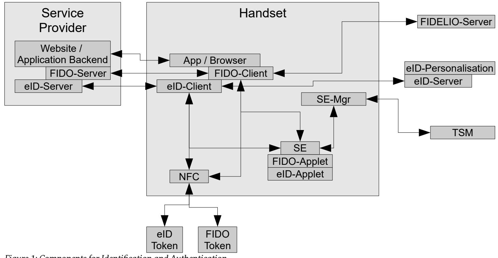
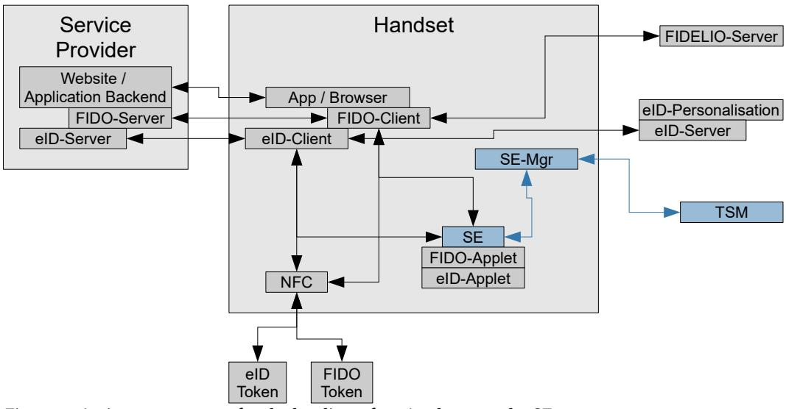
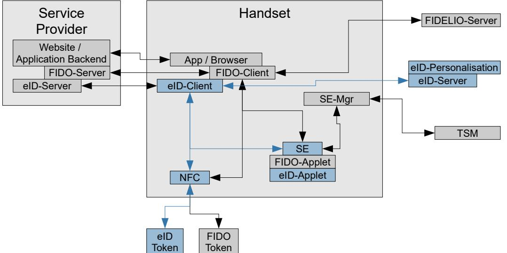
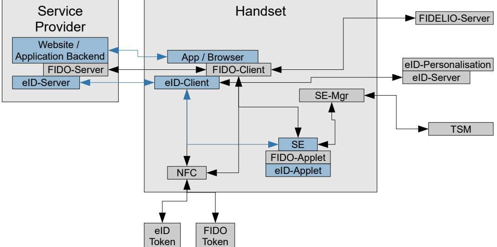
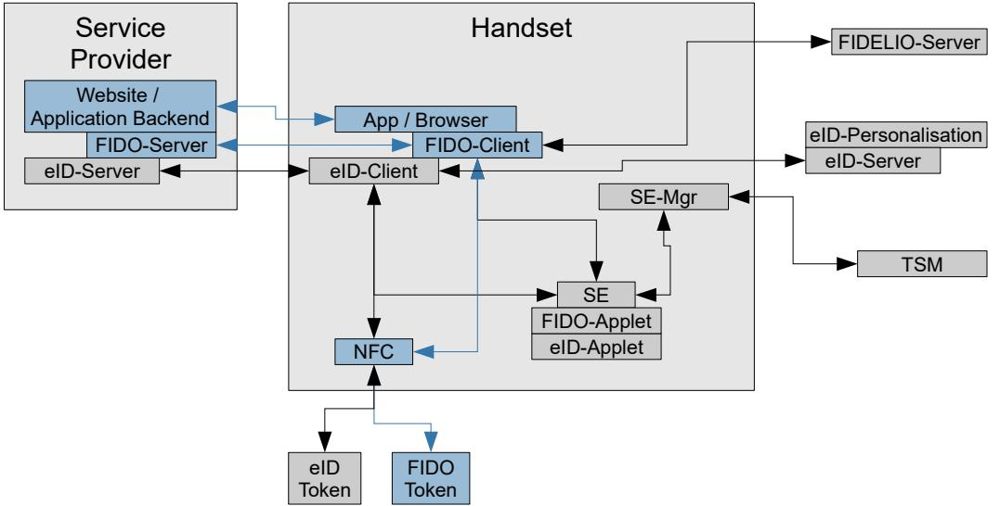
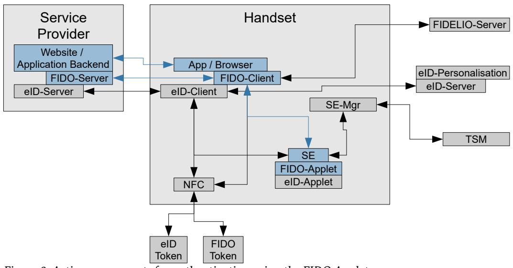
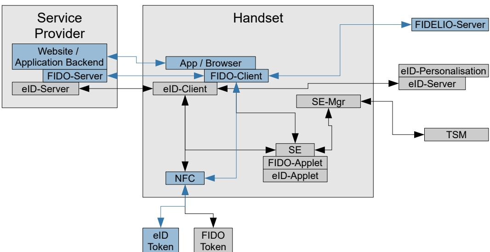

# Technical Guideline TR-03159 Mobile Identities

## Part 2: EAC and FIDO based mobile identities

Version 1.0 Draft 2 26. August 2019

Federal Office for Information Security Post Box 20 03 63 D-53133 Bonn

E-Mail: eid@bsi.bund.de Internet: https://www.bsi.bund.de © Federal Office for Information Security 2019

| 1     | Introduction 5                                          |  |  |  |
|-------|---------------------------------------------------------|--|--|--|
| 2     | Components 7                                            |  |  |  |
| 2.1   | Realm of the Service Provider 7                         |  |  |  |
| 2.2   | Handset 8                                               |  |  |  |
| 2.2.1 | Secure Element 8                                        |  |  |  |
| 2.2.2 | NFC Interface 8                                         |  |  |  |
| 2.2.3 | Secure Element Manager / TSM-API 9                      |  |  |  |
| 2.2.4 | eID-Applet 9                                            |  |  |  |
| 2.2.5 | FIDO-Applet 9                                           |  |  |  |
| 2.2.6 | eID- and FIDO-Client 9                                  |  |  |  |
| 2.3   | External Infrastructure Components10                    |  |  |  |
| 2.3.1 | Trusted Service Manager 10                              |  |  |  |
| 2.3.2 | Personalisation Service 10                              |  |  |  |
| 2.3.3 | FIDELIO Service 11                                      |  |  |  |
| 3     | Processes 12                                            |  |  |  |
| 3.1   | Initialization 12                                       |  |  |  |
| 3.1.1 | Loading an Applet onto the Secure Element12             |  |  |  |
| 3.1.2 | Personalisation of the eID-Applet using the eID Token13 |  |  |  |
| 3.1.3 | Update of PII 15                                        |  |  |  |
| 3.2   | EAC based Identification / Authentication15             |  |  |  |
| 3.2.1 | Identification / Authentication using an eID Token15    |  |  |  |
| 3.2.2 | Identification / Authentication using the eID-Applet16  |  |  |  |
| 3.3   | FIDO based Authentication 16                            |  |  |  |
| 3.3.1 | Authentication using an external FIDO Token17           |  |  |  |
| 3.3.2 | Authentication using the FIDO-Applet17                  |  |  |  |
| 3.3.3 | Authentication based on FIDELIO18                       |  |  |  |
| 3.4   | Connecting FIDO with an Identity / Account Recovery18   |  |  |  |
| 3.5   | Handset as Token 19                                     |  |  |  |
| 4     | Compliance 20                                           |  |  |  |
| 4.1   | Handset 20                                              |  |  |  |
| 4.2   | eID-Applet 20                                           |  |  |  |
| 4.3   | FIDO-Applet 20                                          |  |  |  |
| 4.4   | eID- and FIDO-Client 20                                 |  |  |  |
|       | Reference Documentation 21                              |  |  |  |

| Figure 1: Components for Identification and Authentication7                            |  |
|----------------------------------------------------------------------------------------|--|
| Figure 2: Active components for the loading of an Applet onto the SE12                 |  |
| Figure 3: Active components for the personalization of the eID-Applet13                |  |
| Figure 4: Communication Flow eID-Applet personalisation14                              |  |
| Figure 5: Active components for identification / authentication using an eID Token15   |  |
| Figure 6: Active components for identification / authentication using the eID Applet16 |  |
| Figure 7: Active components for authentication using an external FIDO Token17          |  |
| Figure 8: Active components for authentication using the FIDO Applet17                 |  |
| Figure 9: Active components for authentication based on FIDELIO18                      |  |
|                                                                                        |  |

## Tables

Table 1: Identification / Authentication with EAC and FIDO....................................................................................................6

## 1 Introduction

Following the ubiquitous market penetration of mobile devices, and their use for online government and business, security relevant processes must also be integrated in those devices. This covers identification and authentication of users, and extends further to transaction authorizations, payments and so on.

In the European Union, the eIDAS-Regulation [eIDAS] provides a technology neutral trust framework for identification processes. At the core, the Regulation defines three *Level of Assurance* (*low*, *substantial* and *high*), which govern mutual recognition of electronic identification means. Details of the Level of Assurance are defined in an Implementing Act [eIDAS LoA] and a corresponding "Guidance" [LoAGuidance] drafted and endorsed by the EU Member States. For the German market, the concept of Level of Assurance is detailed and extended beyond identification to authentication, transaction authorization and other process in the BSI Technical Guideline [TR-03107].

This Technical Guideline comprises two parts

- 1. The first part concretizes the requirements from [eIDAS] and [eIDAS LoA] for mobile identification scenarios on LoA *substantial*, while staying generic in terms of concrete implementations.
- 2. The second part defines a concrete implementation scenario for mobile identification based on the generic requirements in the German eID system.

This second part is based on the following premises:

- **•** For processes on Level of Assurance *high*, an external hardware token is used. The implementing act requires the identification means to be resistant against "duplication and tampering" against attackers with high attack potential. According to the Guidance [LoAGuidance] "high attack potential" is to be understood as defined in the Common Criteria Evaluation Methodology [CEM]. Additionally, the electronic identification means is designed so that it can be reliably protected by the person to whom it belongs against use by others.
- **•** For processes on Level of Assurance *substantial*, an internal secure element of the mobile device is used.

In both cases, it is supposed that the token / the secure element is suitably security certified.

For both levels at least two authentication factors from different categories must be utilized, whereby the hardware token or secure element is considered as a possession based factor. The second factor can either be a knowledge factor (PIN) or (in the case of an internal secure element) biometrics, if suitably supported by the mobile device.

This document describes (mainly by referencing suitable standards)

- 1. A generic method to load trusted applets onto a secure element, e.g. an eID-Applet, including requirements for the secure element and the loading process to be able to fulfill the requirement for Level of Assurance *substantial*.
- 2. The use of a secure element and the above generic loading process for integration into an electronic identity system based on Extended Access Control [TR-03110], e.g. the German eID system.
- 3. The use of a secure element and the above generic loading process for FIDO based authentication.

Both EAC as well as FIDO are based on a decentralized architecture, where the user has full control over his authentication means, and uses those to directly identify / authenticate to a service provider, without involvement of a third party, e.g. an Identity Provider. Therefore, the two system fit quite well into a common architecture.

The architecture covers different processes supporting online eGovernment and eBusiness, namely

**• Identification** of users, i.e. transmitting authenticated identity attributes, and

**• Authentication**, i.e. recognizing a user without transmitting identity attributes.

EAC offers both identification and authentication (the latter via the cryptographic Restricted Identification protocol), while FIDO solely offers authentication. While authentication is used to login to an existing account at a service provider, or open an account not connected to a proven identity, identification is necessary to securely attach an account to an identity, or for one-off processes requiring a secure identity. Additionally, identification can be used to attach a new authentication token to an existing account, provided the account is connected to the identity (account recovery).

For the purpose of this Technical Guideline, implementations are not required to implement both EAC and FIDO. For compliance, implementation of the EAC based mechanisms suffices, while FIDO is OPTIONAL.

|                                                          | Identification     | Authentication                                     |                     |
|----------------------------------------------------------|--------------------|----------------------------------------------------|---------------------|
|                                                          | EAC based          | EAC based                                          | FIDO based          |
| LoA High (based on external hardware token)        | eID Token via NFC  | eID Token via NFC / Re stricted Identification  | External FIDO Token |
| LoA Substantial (based on internal secure element) | SE with eID-Applet | SE with eID-Applet / Re stricted Identification | SE with FIDO-Applet |

*Table 1: Identification / Authentication with EAC and FIDO*

Additionally, EAC based authentication can be used by FIDO based services via the FIDELIO mechanism [FI-DELIODoc].

Section [2](#page-6-0) shortly introduces the different components, section [3](#page-11-0) describes the different processes / technical use cases.

**Note that the eIDAS Regulation covers only the process of Identification, i.e. a pure Authentication is out of scope of eIDAS. Therefore, a FIDO based authentication scheme needs to be extended by an identification mechanism if eIDAS compliance is required.**

## 2 Components

The complete picture of the architecture, covering all possibilities for identification / authentication listed in Table [1](#page-5-0), is shown in [1.](#page-6-1) The components are detailed in this section. Not all components are active for all processes / methods. This will be detailed in the next section.

### 2.1 Realm of the Service Provider

In this document, the term **Service Provider** denotes the entity offering an online service to users, e.g. an eGovernment or eBusiness service. The service requires an identification and/or authentication of the user.

Foremost, the service provider operates his service. Depending on the nature of the service, it may be offered as a website accessed by the user via his (mobile) browser. Alternatively, the service may be offered via a mobile App, in which case the service provider operates the application backend for that App.

In order to enable identification / authentication, the service provider operates (or subcontracts) an **eID-Server** (for EAC based processes, see [TR-03130]) and/or a **FIDO-Server** (for FIDO based processes, see [FIDO U2F] or [WebAuthn]). These components deal with the server -side of electronic identification based on EAC, and online authentication based on FIDO, respectively. These components can also be integrated into a single software, offering the service provider a convenient single interface for both variants. In many cases, the operation of these servers is outsourced to third parties, e.g. an eID-Service.

For interoperability, the eID-Server MUST fulfill the requirements from [TR-03130] / the FIDO-Server the requirements from [FIDO U2F] or [WebAuthn]. There are no further specific requirements for the service provider.

*Figure 1: Components for Identification and Authentication*

#### 2.2 Handset

The starting point for all processes / use cases involving Token or Applet based identification / authentication is the Browser of the user, connected to a website provided by the service provider, or a dedicated App of the service provider, connected to the application specific backend. In all cases, the actual identification / authentication process is started by invoking the Client suitable for the process (see section [2.2.6](#page-8-0)) from the browser / app.

#### 2.2.1 Secure Element

A suitable **Secure Element (SE)[1](#page-7-0)** is the basis for identification / authentication on a substantial Level of Assurance according to [TR-03107]/[eIDAS]. The secure element is capable of hosting third party Applets, e.g. for identification, authentication, public transport, payment, etc. The installation of an Applet onto a secure element by a Trusted Service Manager (TSM, section [2.3.1](#page-9-0)) is independent of the concrete applet and described in section [3.1.1.](#page-11-1)

Management of Applets (loading, installation, deletion) shall be implemented on basis of the "Trusted Service Management System" [TSMS], in particular the Secure Element shall support the [TSM-API] to communicate with the Trusted Service Manager (TSM, section [2.3.1](#page-9-0)). For the communication of the FIDO-Client / eID-Client (see section [2.2.6](#page-8-0)) with the Secure Element, [OMAPI] shall be supported by the Secure Element and implemented on the handset.

In principle, the security mechanisms of the applet hosted by the Secure Element shall also be proven by security certification. Generally, Common Criteria demands for a composite certification of the applet in conjunction with the underlying Protection Profile of the underlying Secure Element.

To allow installation of Common Criteria certified applets without the need of a Composite Certification of the Applet on top of each type of Secure Element, the cryptographic functionalities are encapsulated in a Cryptographic Service Provider (CSP), providing secure cryptographic services to the Applet. Since the Cryptographic Service Provider's security services are logically separated and provided through well-defined external interfaces, the operational environment can not affect the security and correctness of the Cryptographic Service Provider. Consequently, the security functionalities of the applet can be certified independently.

The Secure Element shall implement a Cryptographic Service Provider according to [PP-CSP] or a Cryptographic Service Provider Light according to [PP-CSP-light]. In the former, all functionalities are implemented on the Secure Element itself, in the latter case, the Secure Element provides a key store/management back end for a Cryptographic Service Provider implemented outside of the Secure Element. In both cases, the Secure Element itself must certified on at least Assurance Level EAL4+AVA\_VAN.4.

#### 2.2.2 NFC Interface

For support of Level of Assurance high the user may have – in addition to his handset – an **external eID Token** and/or an **external FIDO token**. The eID Token is also necessary for secure personalization of an eID-Applet (see section [3.1.2](#page-12-0)), or to connect an FIDO token (external token or Applet) to a secure identity (see section [3.4\)](#page-17-0).

Both types of token are compliant to [ISO 14443] and communicate with the handset via the NFC interface. The cryptographic protocols are defined in [TR-03110] (for the EAC based eID Token) and in [FIDO U2F] or [WebAuthn] for the FIDO token, respectively.

1 The term Secure Element should not be understood to prescribe a certain technology. The term encompasses embedded secure elements, eUICCs or any other technology fulfilling the requirements laid down in this Technical Guideline.

The **NFC interface** is used for external communication to eID Cards and external FIDO tokens. The NFC interface must be compliant to [FIDO U2F] or [WebAuthn] and programmable from the App-Level.

The NFC interface must fulfill the requirements of [TS 26].

#### 2.2.3 Secure Element Manager / TSM-API

The **Secure Element Manager** or **TSM-API** is provided by the handset manufacturer to interface the Secure Element to the Trusted Service Manager (see section [2.3.1](#page-9-0)).

#### 2.2.4 eID-Applet

The **eID-Applet** is an applet installed by the TSM on the secure element and personalised by a personalisation service (see section [3.1.2\)](#page-12-0), providing the same functionality as a physical eID-Token, i.e. provides EAC based identification / authentication. The Secure Element together with the eID-Applet provides the possession factor of the authentication. The other factor can be provided as a PIN by the eID-Client, or directly tied to the SE using capabilities of the handset (e.g. biometrics verified by the Secure Element or other secure environment separated from the user space of the handsetTEE/Secure Enclave).

Non security relevant functionalities of the eID-Applet MAY be implemented outside of the Secure Element.

To differentiate Applets from external Tokens a different Issuing PKI is used to authenticate the keys (or a different Document Signer in the existing Issuing PKI). Since the cryptographic protocols of the Applet and the Token are the same, integration of Applet based identification / authentication just requires including the separate root certificate / a mechanism to determine the LoA of the applet or token based of the Document Signer certificate into the eID-Server of the service provider.

The eID-Applet MUST implement a suitable mechanism to entangle the second authentication factor with the applet. This MAY be PIN verification via the PACE protocol (see [TR-03110]) or direct PIN verification, or internal security mechanisms (e.g. biometrics) of the handset providing equivalent security.

For the communication to the eID-Server, the eID-Applet MUST implement the following cryptographic protocols as defined in [TR-03110]:

- 1. Chip Authentication Version 2
- 2. Terminal Authentication Version 2
- 3. Restricted Identification

The cryptographic requirements from [TR-03116], Part 2, MUST be fulfilled.

The personalisation profile MUST follow [TR-03127].

#### 2.2.5 FIDO-Applet

A **FIDO-Applet** supports FIDO based authentication. Since FIDO does not provide any personal identity information (PII), no personalisation is necessary.

A FIDO-Applet MUST implement the U2F and the FIDO 2.0 protocol according to [FIDO U2F] and [WebAuthn]. In order to fulfill the requirements for Level of Assurance substantial, the FIDO-Applet in combination with the underlying Secure Element MUST fulfill the requirements of FIDO Level 3+.

#### 2.2.6 eID- and FIDO-Client

The **eID-Client** and the **FIDO-Client** are Apps / software to interface between the service provider (more precisely, his eID-/FIDO-server) and the eID-Token/-Applet or the FIDO-Token/-Applet, respectively. The Clients provide a unified interface for the service provider, in order to not require the provider to separately integrate external Token or SE-based Applets. The Clients can be provided as separate Apps, or can be directly integrated into the browser and/or Apps of the service providers.

Since the Clients provide the user facing interface, usability and ease-of-use for these Clients is of high importance. The eID-Client is specified in [TR-03124], the FIDO-Client-API in [FIDO U2F] or [WebAuthn].

#### 2.3 External Infrastructure Components

Besides the entities directly involved in identification / authentication, i.e. the service provider (and potentially contractors of the service provider) and the user, there are external entities providing supporting services.

#### 2.3.1 Trusted Service Manager

The **Trusted Service Manager** (**TSM**) is responsible for uploading Applets onto a Secure Element. He holds necessary cryptographic keys provided by the SE issuer to gain access to the SE and interfaces to the SE via the TSM-API component on the handset.

The upload of Applets is independent of the concrete Applet, i.e. the TSM acts in an application independent manor. The TSM is not responsible for application specific service, e.g. personalisation of Applets. If personalisation of an Applet is necessary, this is performed by a separate role, e.g. a public transport provider for a Transport-Applet.

Depending on the business model of the Applet provider it might be necessary to interface to the provider in order to manage the eligibility of the user to install a SE-Applet.

During provisioning of the applet the provisioning service (e.g. the Trusted Service Manager or the handsetvendor in case of pre-provisioned applets) has the task to verify that the Secure Element/Cryptographic Service Provider is genuine and is suitable to execute the applet to be provisioned. Therefore, the provisioning service has to support the respective mechanisms/protocols of the Secure Element/Cryptographic Service Provider.

In case of the eID-Applet, the TSM must include an attestation key into the unpersonalised applet that is stored on the Secure Element/Cryptographic Service Provider, which can be used to verify that the applet is genuine and executed on a conforming Secure Element/Cryptographic Service Provider, and which can be verified by the personalisation service according as described in section [3.1.2.](#page-12-0)

After provisioning, the genuineness of the applet is verified by the personalisation service only by mechanisms provided by the applet itself. That approach ensures that the personalisation service is independent from the implementation of the provisioning process of the applet and does not need to understand vendor specific protocols of the underlying Secure Element.

#### 2.3.2 Personalisation Service

Since the TSM only installs the eID-Applet to the SE, the actual personalisation needs to be performed by a separate role, the **eID-Personalisation Service**. Of course, the logically separate roles TSMP and personalisation service can be operated by the same entity and be integrated into a single process.

In order to retrieve personal identity information (PII) from an eID Token, and in order to write PII to the Applet, the personalisation service needs to operate (or subcontract) an eID-Server (see [TR-03130]). The personalisation, i.e. the writing of data to Applet, requires a corresponding extension of the eID-Server.

The Personalisation Service is responsible to correctly personalize the instantiation of the eID-Applet. If the personalisation process described in section [3.1.2](#page-12-0) is used, the requirements for Identity proofing and verification as required by section 2.1.2 of [eIDAS LoA]/Part 1 of this Guideline are fulfilled, provided the operator of the Personalisation Service fulfills the requirements of section 2.4 of [eIDAS LoA]/Part 1 of this Guideline.

#### 2.3.3 FIDELIO Service

By default, EAC based authentication uses the Restricted Identification Protocol for (non-identifying) authentication. Therefore, a Service Provider would require an eID-Server to authenticate its customers. However, to enable EAC based authentication for a Service Provider (that does not demand for identification services) without the need to operate an eID-Serv er, EAC based authentication can be translated into a FIDO based authentication.

The **FIDELIO Service** translates between the Restricted Identification Protocol and the FIDO Authentication Protocols. Subsequently, the Service Provider only has to operate a FIDO compliant server, but still can benefit from the advantages Restricted Identification Protocol, like the option to revoke compromised eID tokens or authenticating against eID tokens in general. Reversely, FIDELIO enables users that only own a EAC based token to interact with Service Providers offering FIDO authentication.

## 3 Processes

In this section, processes / use cases are described on a technical level. Based on the component picture ([1](#page-6-1)), active components for the processes are highlighted in blue, and a short description of the process flow is given.

### 3.1 Initialization

This first subsection describes processes which are necessary to support initializing mobile identification / authentication for subsequent use. These processes are independent of the actual service, i.e. the service provider is not directly involved at this stage. However, the service provides is involved on a business level, since the processes will usually be initiated by the need of a service provider for secure identification / authentication.

The first process (section [3.1.1\)](#page-11-1) is independent of the Applet to be loaded onto the SE, i.e. is the same for all Applets (eID-Applet, FIDO-Applet, Public Transport, …). Therefore, it is possible to have a single Trusted Service Manager which handles uploading Applets in an Applet independent manor.

The eID specific initialization of the eID-Applet is performed as described in section [3.1.2](#page-12-0).

#### 3.1.1 Loading an Applet onto the Secure Element

*Figure 2: Active components for the loading of an Applet onto the SE*

See [TSMS].

#### 3.1.2 Personalisation of the eID-Applet using the eID Token

*Figure 3: Active components for the personalization of the eID-Applet*

The eID-Applet itself does not contain any ID data after loading of the Applet onto the SE. Personalisation is performed as a separate technical process. During personalisation of the eID-Applet the Personalisation Service (PS) must perform three steps. First, the personal identification data has to be read out from an external eID-Token of the user. Second, the PS must verify the genuineness of the eID-Applet. Third, the personal identification data must be augmented by key material and the corresponding certificates and then transformed into a data format suitable for the eID-Applet, which is finally written to the Applet. Hereby, the IDdata read out from the eID-Token must be linked to the attestation of the eID-Applet which must be situated in the same device which is facilitated for the readout. Of course, in order to provide a seamless user experience, these steps can be integrated into one flow.

The process of personalisation of the eID-Applet is performed in the following steps

- 1. The process is initiated by a web application, or by the eID-Client on request by the user. Additionally, the eID-Client may check during every attempt to use the eID-Applet if the eID-Applet has already been personalised and ask the user to perform the personalisation procedure if not.
- 2. The eID-Client connects to the eID-Personalisation Service (PS) service via TLS.
- 3. Next, a remote identification procedure using the eID-Token of the user is performed. The eID-Client on the user's device connects to the eID-Token via NFC and performs PACE, whereby the PIN of the eID-token is verified. Afterwards, EAC is executed between an eID-Server and the eID-Token in order to establish a secure messaging channel between them, which is used the read out the personal identification data of the user. This is a standard EAC based identification process as described in section [3.2.1](#page-14-0), where the Personalisation Service takes the role of the service provider. In contrast to the standard identification process, the communication between the eID-Server and the eID-Client is passed through the Personalisation Service. Hereby, both the Personalisation Service as well as the eID-Client record all messages that are transmitted between the eID-Server and the eID-Client and derive a hash value over the recorded messages.
	- The eID-Server needs to present a Terminal Certificate issued by the CVCA PKI, which grants access to the data stored on the external eID Token.
	- This channel is used to authenticate the user and retrieve the PII from the external eID-Token in order to store them in the eID-Applet.
- The Personalisation Service MUST ensure that both EAC channels are mediated by the same eID-Client, in order to ensure that eID-Applet and eID-Token are under the control of the same user.
- 4. The eID-Client initiates a EAC based authentication between the eID-Applet and the Personalisation Service. Hereby, the genuineness of the eID-Applet is demonstrated by verifying its Chip Authentication key that has been stored in the Applet during its provisioning.
	- **•** Since access to the eID-Applet is restricted, the Personalisation Service needs to present a Terminal Certificate issued by the CVCA PKI in order to gain access to the eID-Applet. In case of the Personalisation Service that certificate has special access rights that allow writing data to the eID-Applet.
	- **•** The secure channel is used to verify that the Applet is installed on a suitable Secure Element (attestation), by verifying its Chip Authentication key.
	- **•** The Terminal Authentication Protocol is extended in order to strongly bind the SM-channel from the initial readout to the SM-channel to the eID-Applet. Hereby, the eID-Client injects the hash value recorded during readout of the eID-Token as an additional auxiliary object into the Terminal Authentication request. Concomitantly, the Personalisation Service includes the same object into the calculation of the Terminal Authentication signature.
- 5. The two channels are used by the personalisation service to
	- **◦** read ID data from the eID Token
	- **◦** write ID data to the eID Applet
	- **◦** generate a Chip Authentication key pair in the eID Applet, which is signed by the Personalisation Service's Document Signer.
	- **◦** generate /store key pairs for Restricted Identification and revocation
- 6. Finally, the revocation information according to [TR-03127] are generated and transmitted to the revocation service.

The personalisation procedure is depicted in figure [4](#page-13-0).

| eID-Applet Personalisation |                                                                     |                                                              |                                              |  |  |
|----------------------------|---------------------------------------------------------------------|--------------------------------------------------------------|----------------------------------------------|--|--|
| External                   | eID-Applet                                                          | eID-Client                                                   | eID-Server                                   |  |  |
|                            | Check Presence & State Open secure channel & verify PIN via PACE | Initiate Process                                             |                                              |  |  |
|                            | Perform Extended Access Control, read PII data                      |                                                              |                                              |  |  |
|                            | verify 2nd factor (PIN, biometrics, )                               |                                                              |                                              |  |  |
|                            |                                                                     | Perform Extended Access Control, check eligibilty via CA key |                                              |  |  |
|                            |                                                                     | Write personalisation data                                   | Generate perso data incl. PII and keys 6) |  |  |

#### 3.1.3 Update of PII

No separate process for updating information is foreseen. If PII stored in the eID-Applet need to be updated (e.g. change of address), the eID-Applet is re-personalised using the process from the previous section.

### 3.2 EAC based Identification / Authentication

"Extended Access Control" (EAC) is a set of protocols that enforces mutual authentication between an eID-Server and an eID-Token or eID-Applet and that manages access permission to data stored on the eID-Token/Applet.

EAC includes several protocols, which are carried out in a certain order, namely "Password Authenticated Connection Establishment (PACE)", "Terminal Authentication Version 2" (TAv2), "Chip Authentication Version 2 (TA2)" and "Restricted Identification" (RI). Hereby, PACE allows the eID-Token/Applet to securely verify the PIN of the user. During TAv2 the eID-Server has to prove its permission to access the eID-Token/ Applet in order to prevent illegitimate readout of the sensitive ID data of the user. Afterwards, the eID-Token/Applet proves its own genuineness and of any data stored on it by performing the CAv2. Finally, the RIprotocol generates an eID-Token/Applet specific secret which can be used for pseudonymous authentication of the user and to verify the revocation status of the eID-Token/Applet.

#### Service Provider Handset App / Browser eID-Client FIDO-Client SE-Mgr NFC SE TSM eID-Applet FIDO-Applet eID-Server FIDO-Server Website / Application Backend FIDELIO-Server eID-Personalisation eID Token FIDO Token eID-Server

#### 3.2.1 Identification / Authentication using an eID Token

*Figure 5: Active components for identification / authentication using an eID Token*

This is the "classical" case of using the NFC interface to access an external eID Token, e.g. a German eID Card. Via the Extended Access Control protocol an end-to-end encrypted and authenticated channel is established between eID Token and eID-Server, which in turn is used to read the PII. The eID-Client is used to dispatch the communication channel between eID-Server and eID-Token, and to integrate the identification / authentication with the application layer.

The process and the integration of the components is described in [TR-03124].

#### 3.2.2 Identification / Authentication using the eID-Applet

*Figure 6: Active components for identification / authentication using the eID Applet*

Except for using the eID-Applet instead of the (external) eID-Token, the processes correspond to the scenario described in Section [3.2.1.](#page-14-0) Especially the communication between service provider, eID-Server and handset is exactly the same for both scenarios, i.e. there is no additional integration effort on the side of the service provider to integrate the eID-Applet if the eID Token is already integrated, or vice versa.

#### 3.3 FIDO based Authentication

The FIDO protocols are based on public key cryptography, whereby the user signs a challenge provided by the Service Provider using their private key. Public key cryptography ensures that all private keys can remain inside the user' s device or token, and thus under the user's control. When a user registers a FIDO token for use with a Service Provider, the user's device or token creates a unique asymmetric key pair which is individual for each Service Provider party. Thus, the FIDO protocols do not provide information that can be used by different online services to collaborate and track a user across services. Since all private keys are stored on the user's devices and are not accessible to the Service Provider, a data breach at a Service Provider cannot leak cryptographic keys. Furthermore, the actual user verification is performed locally by the user's device. Therefore, any personal data that could identify a user, such as a fingerprint pattern, is not shared with the Service Provider.

Every FIDO authentication is initiated by accessing the Service Provider's web service or application backend, which generates an authentication request including a challenge. That request is picked up by the user's browser or mobile app and dispatched to FIDO compliant token's. The browser or app has the task of identifying all available tokens and to offer the user the option to chose between them.

#### 3.3.1 Authentication using an external FIDO Token

*Figure 7: Active components for authentication using an external FIDO Token*

In case of an external FIDO token, the user's private keys are stored in a dedicated device that is distinct from the platform executing the browser or app. The token is communicating with the platform (handset) via NFC, whereby the details of the communication protocols between browser / app and the token are laid down in the FIDO standards [FIDO U2F] or [WebAuthn].

A dedicated token has the advantage that it can be used across different platforms by the user. Furthermore, certification of an external token is easier since the security functionality is well-defined and also the lifetime may be much longer than of a typical user's handset device. However, each token must implement its own user presence verification mechanism.

#### 3.3.2 Authentication using the FIDO-Applet

*Figure 8: Active components for authentication using the FIDO Applet*

Often the user wants to authenticate himself using only their handset device, i.e. the user's private keys are stored directly on the device. To achieve a reasonable level of security, the keys are stored in a FIDO-Applet executed by the Secure Element of the handset device and thus enforcing an isolation of the keys from the handset device's OS. The implementation of a communication path between the FIDO-Client (which may be integrated into the browser or app) and the FIDO applet is up to the handset vendor.

#### 3.3.3 Authentication based on FIDELIO

In a third scenario, where the user wants to authenticate against a Service Provider offering FIDO based authentication, the user does not use a dedicated FIDO token but an eID token instead. Since the eID token is not capable of processing a FIDO authentication request, that request is redirected to a FIDELIO-server instead. Simultaneously, the FIDO-Client on the user's handset device triggers an EAC based authentication between the eID token and the FIDELIO server. If that authentication is successful, the FIDELIO service proves the user's authentication toward Service Provider. The FIDELIO service does not store any user specific data.

Technically, the FIDELIO service operates an eID-Server on its own that is performing the server-side part of the Restricted Identification protocol. As result, the eID token calculates a user-specific identifier and transfers it to the eID server of the FIDELIO service. That identifier together with a Service Provider specific identifier serves as a seed for a deterministic key derivation algorithm, which derives the user's FIDO private key. Finally, the FIDELIO service processes the authentication request using that key and deletes the key afterwards. Since the algorithm is executed for each authentication, the FIDELIO service does not store any private keys but derives them on-the-fly.

### 3.4 Connecting FIDO with an Identity / Account Recovery

FIDO in itself does not convey identity information. Nevertheless, FIDO can be used in conjunction with an identity (Often called "derived identity" or "derived authentication")

A service provider initially enrols the user by personal presence or by using an eID token and thus can create a user account with trusted identity data. During the enrolment, the user account is additionally linked to a FIDO token. Subsequently, the user can use their FIDO token to conveniently log into its user account.

The assurance level of that account is consistently limited by the assurance level of the initial enrolment as well as of the security properties of the FIDO token. In particular, meeting LoA substantial immediately requires the FIDO token to be certified according to that level.In case a FIDO token has gone lost or become compromised or just needs to be replaced, the user can still authenticate himself against the Service Provider using the eID token that has been used for initially registration or registered as a recovery token.

*Figure 9: Active components for authentication based on FIDELIO*

Thus, the eID token can serve as a fallback authentication mechanism which allows a user to still access their account and prevents that the user has to go through the enrolment procedure again or to create a new user account. Subsequently, the user can trigger the revocation of a FIDO token and also register a new FIDO token to their account.

This yields two technical use cases:

- 1. A user account is connected to an identity (e.g. the account is personalized with an eID token), and the user registers his FIDO token or FIDO Applet as an authentication means for this user account.
- 2. A user account is connected to an identity as above, but the registered authentication means is lost or otherwise unavailable. The account can be recovered by registering a new authentication means to the account.

From a technical view, both use cases are mostly identical.

- 1. The user performs a EAC based identification
	- **◦** In the registration scenario, the identification data are used to personalize the account;
	- **◦** in the recovery scenario, the identification data are used to identify the correct account / to identify the user as the owner of the account
- 2. The user performs a FIDO enrolment through the same channel as the previous identification
- 3. The service provider stores the received FIDO public key along the account data.

As a special case, the EAC token can also be registered as an authentication means (either via Restriceted Identification or FIDELIO). In this case, the account recovery can use the EAC based authentication to authenticate the user instead of personal identification data.

#### 3.5 Handset as Token

The personalized eID-Applet can also be used to provide a virtual card via the NFC interface to card readers. In this scenario, the eID-Applet receives APDUs via the NFC interface instead via the [OMAPI] interface. In order to support this functionality, the handset SHALL implement Card Emulation Mode according to [ETSI 102622] and [GPAmdC].

## 4 Compliance

This section lists requirements / certifications components have to fulfill in order to claim compliance to this Technical Guideline.

### 4.1 Handset

Handsets claiming compliance to this specification MUST fulfill the following requirements:

- **•** The handset MUST contain a Secure Element compliant to section [2.2.1](#page-7-2).
	- **◦** The Secure Element MUST be Common Criteria certified either
		- **▪** according to [PP-CSP] for the Secure Element as composite evaluation; or
		- **▪** according to [PP-CSP-light] in combination with a CC-certified Secure Element
	- **◦** The Secure Element MUST be capable of instantiating an eID-Applet according to section [2.2.4](#page-8-1).
- **•** For the communication of the eID-Client / FIDO-Client (see section [2.2.6\)](#page-8-0) or other user space apps with the Secure Element, [OMAPI] SHALL be implemented on the handset.
- **•** The handset MUST have a NFC interface compliant to section [2.2.2](#page-7-1).
	- **◦** The NFC Interface MUST be certified according to [TS 27].

#### 4.2 eID-Applet

An eID-Applet claiming conformance to this specification

- MUST be certified for functional conformance according to [TR-03105], Part 3.3; and
- MUST be Common Criteria certified according to [PP-CSP-eID].

#### 4.3 FIDO-Applet

An FIDO-Applet claiming conformance to this specification

- MUST be certified for functional conformance according to the requirements of the FIDO alliance; and
- MUST be Common Criteria certified against [PP-FIDO-U2F] or [PP-CSP-FIDO].

#### 4.4 eID- and FIDO-Client

The conformance requirements for an eID-Client and a FIDO-Client are covered by the respective specifications for the Clients.

## Reference Documentation

| PP-FIDO-U2F        | BSI: BSI-DSZ-CC-PP-0096-V3-2018, Common Criteria Protection Profile: FIDO Univer sal Second Factor (U2F) Authenticator                                                                                                                                                                                                                                               |
|--------------------|-------------------------------------------------------------------------------------------------------------------------------------------------------------------------------------------------------------------------------------------------------------------------------------------------------------------------------------------------------------------------|
| PP-CSP-light       | BSI: Common Criteria Protection Profile Cryptographic Service Provider Light, BSI-CC PP-0111-2019                                                                                                                                                                                                                                                                    |
| PP-CSP             | BSI: Common Criteria Protection Profile Cryptographic Service Provider, BSI-CC-PP 0104-2019                                                                                                                                                                                                                                                                          |
| PP-CSP-eID         | BSI: Common Criteria Protection Profile, eID based Extended Access Control Version 2 supported by CSP, work in progress                                                                                                                                                                                                                                              |
| PP-CSP-FIDO        | BSI: Common Criteria Protection Profile, FIDO supported by CSP, work in progress                                                                                                                                                                                                                                                                                        |
| TR-03105           | BSI: Technische Richtlinie TR-03105, Conformity Tests for Official Electronic ID Docu ments                                                                                                                                                                                                                                                                          |
| TR-03107           | BSI: Technische Richtlinie TR-03107, Elektronische Identitäten und Vertrauensdienste im E-Government                                                                                                                                                                                                                                                                 |
| TR-03110           | BSI: Technische Richtlinie TR-03110, Advanced Security Mechanisms for Machine Read able Travel Documents and eIDAS Token                                                                                                                                                                                                                                             |
| TR-03116           | BSI: Technische Richtlinie TR-03116, Kryptographische Vorgaben für Projekte der Bun desregierung                                                                                                                                                                                                                                                                     |
| TR-03124           | BSI: Technische Richtlinie TR-03124, eID-Client                                                                                                                                                                                                                                                                                                                         |
| TR-03127           | BSI: Technische Richtlinie TR-03127, eID-Karten mit eID- und eSign-Anwendung basierend auf Extended Access Control                                                                                                                                                                                                                                                   |
| TR-03130           | BSI: Technische Richtlinie TR-03130, eID-Server                                                                                                                                                                                                                                                                                                                         |
| CEM                | CCRA: Common Methodology for Information Technology Security Evaluation, Evalua tion methodology; Version 3.1, Revision 5. CCMB-2017-04-004                                                                                                                                                                                                                          |
| ETSI 102622        | ETSI: TS 102 622                                                                                                                                                                                                                                                                                                                                                        |
| eIDAS LoA eIDAS | European Commission: Commission Implementing Regulation (EU) 2015/1502 European Parliament, Council of the European Union: Regulation (EU) No 910/2014 of the European Parliament and of the Council of 23 July 2014 on electronic identification and trust services for electronic transactions in the internal market and repealing Direc tive 1999/93/EC |
| FIDO U2F           | FIDO Alliance: FIDO Universal 2nd Factor (U2F), v1.2                                                                                                                                                                                                                                                                                                                    |
| GPAmdC             | Global Platform: Contactless Services Card Specification v2.3 - Amendment C v1.2                                                                                                                                                                                                                                                                                        |
| TS 26              | GSM Association: NFC Handset Requirements                                                                                                                                                                                                                                                                                                                               |
| TS 27              | GSM Association: NFC Handset Test Book                                                                                                                                                                                                                                                                                                                                  |
| ISO 14443          | ISO/IEC: ISO/IEC 14443 - Identification cards – Contactless integrated circuit(s) cards – Proximity cards                                                                                                                                                                                                                                                            |
| TSM-API            | OPTIMOS: Trust Service Management-API, work in progress                                                                                                                                                                                                                                                                                                                 |
| TSMS               | OPTIMOS: Trusted Service Management System, work in progress                                                                                                                                                                                                                                                                                                            |
| OMAPI              | SIMAlliance: Open Mobile API Specification v2.05                                                                                                                                                                                                                                                                                                                        |
| WebAuthn           | W3C: Web Authentication: An API for accessing Public Key Credentials Level 1                                                                                                                                                                                                                                                                                            |
| FIDELIODoc         | : FIDELIO Documentation, https://gitlab.com/adessoAG/FIDELIO/Documentation                                                                                                                                                                                                                                                                                              |
| LoAGuidance        | : Guidance for the application of the levels of assurance which support the eIDAS Regula tion                                                                                                                                                                                                                                                                        |