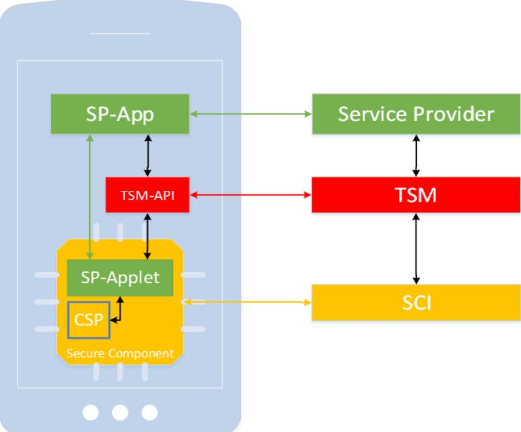
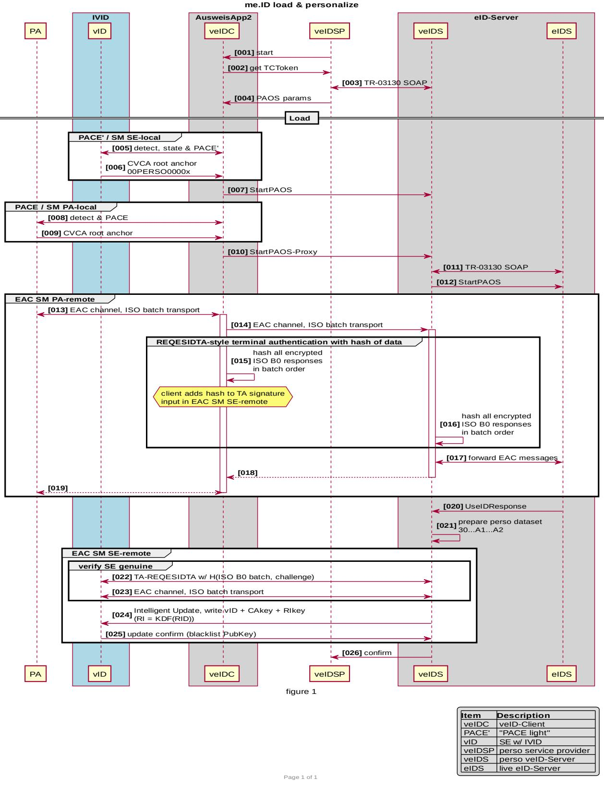

# Technical Guideline TR-03159-2 Mobile Identities

## Amendment A – Provisionierung und Personalisierung

Version 1.0.0 Draft 4. November 2020

Bundesamt für Sicherheit in der Informationstechnik Postfach 20 03 63 53133 Bonn E-Mail: eid@bsi.bund.de Internet: https://www.bsi.bund.de © Bundesamt für Sicherheit in der Informationstechnik 2020

| 1     | Einleitung 5                                                            |  |
|-------|-------------------------------------------------------------------------|--|
| 2     | Beschreibung der Provisionierung 6                                      |  |
| 2.1   | Kurzbeschreibung 6                                                      |  |
| 2.2   | Aufgaben des TSM 7                                                      |  |
| 2.2.1 | TSM Infrastruktur 7                                                     |  |
| 2.2.2 | TSM Service 7                                                           |  |
| 2.2.3 | TSM-API 7                                                               |  |
| 2.3   | Services gegenüber Mobilgeräteherstellern8                              |  |
| 2.4   | Services gegenüber Diensteanbietern 8                                   |  |
| 2.4.1 | Unterstützung bei TSM-konformer Applet-Entwicklung8                     |  |
| 2.4.2 | Testinfrastruktur 8                                                     |  |
| 2.4.3 | Installation von Applets 8                                              |  |
| 2.4.4 | Aktualisierung von Applets 9                                            |  |
| 2.4.5 | Löschung und Sperrung von Applets 9                                     |  |
| 3     | Beschreibung der Personalisierung - Notwendige Komponenten10            |  |
| 3.1   | eID-Applet 10                                                           |  |
| 3.1.1 | Zustände 10                                                             |  |
| 3.1.2 | Übergänge 11                                                            |  |
| 3.1.3 | Echtheitsnachweis und Authentifizierung des Personalisierungsdienstes11 |  |
| 3.1.4 | Personalisierung 12                                                     |  |
| 3.2   | eID-Client 12                                                           |  |
| 3.3   | Personalisierungsdienst 12                                              |  |
| 4     | Beschreibung der Personalisierung Prozessbeschreibung14                 |  |
| 4.1   | Personalisierung 14                                                     |  |
|       | Literaturverzeichnis 17                                                 |  |

## 1 Einleitung

Der am 1. November 2010 eingeführte Personalausweis (PA), sowie der am 1. September 2011 eingeführte Aufenthaltstitel (eAT) ermöglichen mit der Online-Ausweisfunktion im Inland die gegenseitige Authentisierung von Diensteanbietern und Ausweisinhabern im Rahmen von E-Business und E-Government-Anwendungen. Mit der Notifizierung nach Artikel 9 der eIDAS-Verordnung am 26. September 2017 ist die Online-Ausweisfunktion nun auch europaweit als Authentisierungsmittel auf einem hohen Sicherheitsniveau anerkannt. PA und eAT werden im weiteren Verlauf zusammengefasst Ausweiskarte genannt.

Im Folgenden wird ein Verfahren Beschrieben, welches es ermöglicht Identität von einer Ausweiskarte auszulesen, auf handelsüblichen SIM Karten oder sicheren Elementen (SE) in Mobiltelefonen zu speichern und diese anschließend als elektronisches Identifizierungsmittel (eID) zu verwenden.

Hierfür sind drei aufeinander aufbauende Verfahren notwendig.

1. Identifizierung unter Verwendung einer in der SIM-Karte/ im SE gespeicherten Identität:

Die SIM-Karte/dem SE muss hierzu ein eID-Applet bereitstellen, welches die Identitätsdaten sicher speichert, einen Authentifizierungsmechanimus im Zusammenspiel mit dem Mobiltelefon bereitstellt und die kryptographischen Protokolle zur Kommunikation mit einem Dienstanbieter implementiert.

2. Personalisierung einer Identität auf der SIM-Karte / im SE:

Zur Speicherung der Identitätsdaten in einem eID-Applet auf der SIM-Karte / dem SE müssen diese von einem Identitätsmittel mit einem mindestens gleichwertigen oder besser höherem Vertrauensniveau abgeleitet werden, wie zum Beispiel dem Personalausweis. Hierfür muss das Identitätsmittel sicher ausgelesen werden und gleichzeitig sichergestellt werden, dass die Identitätsdaten auf ein eID-Applet geschrieben werden, welches unter Kontrolle der identifizierten Person steht. Außerdem muss das Verfahren prüfen, dass das eID-Applet das notwendige Vertrauensniveau bereitstellt, wofür dieses geeignete Mechanismen bereitstellen muss.

3. Provisionierung einer SIM-Karte / eines Ses:

Im Auslieferungszustand sind SIM-Karten / SEs in der Regel nicht mit einem eID-Applet bespielt. Folglich muss ein Verfahren etabliert werden um dieses auf handelsübliche SIM-Karten / SEs auszurollen. Hierbei muss das Verfahren zum einen Zugang zu den Mechanismen der SIM-Karte / des SEs haben, welche das nachladen eines Applet ermöglichen. Zum anderen muss das Verfahren sicherstellen, dass das eID-Applet nur auf SIM-Karten / SEs geladen wird, welche die notwendigen Sicherheitseigenschaften bereitstellen.

## 2 Beschreibung der Provisionierung

Mit den Ergebnissen des BMWI-Förderprogrammes OPTIMOS 2.0 liegen erste technische Grundlagen und ein breites Anwendungs- und Testportfolio vor, das es gilt fortzuführen und auszubauen. Die im Rahmen von OPTIMOS 2.0 getestete Trusted Service Manager System (TSMS) Infrastruktur soll die Grundlage für die Ausführung von Anwendungen mit besonderen Sicherheitsanforderungen (z.B. der Online-Ausweisfunktion) direkt auf Mobilgeräten ohne den Einsatz weiterer externer Sicherheitsfaktoren wie z.B. Smartcards bieten.

Dabei soll ein Trusted Service Manager (TSM) die technische Verbindung zwischen Diensteanbietern, die sicheren Speicherplatz auf dem Mobilgerät benötigen, mit Eigentümern von Sicherheitsbausteinen (Secure Elements, SE), die eine sichere Plattform anbieten etablieren. Dies umfasst alle Back-Office-Funktionen, die der Diensteanbieter für seine Geschäftsprozesse benötigt.

Im Folgenden wird eine Beschreibung der Aufgaben eines TSM sowie von Aufbau und Abläufen der TSM-Infrastruktur gegeben.

#### 2.1 Kurzbeschreibung

Zum Überblick sind in Abbildung [1](#page-4-1) die wichtigsten Komponenten eines TSMS schematisch dargestellt. Die Kurzbeschreibung der Abläufe lautet wie folgt:

Der Diensteanbieter (Service Provider, SP) pflegt eine App sowie das zugehörige Backend und ein vom TSM im SE des Mobilgerätes abzulegendes Applet. Das Applet wird dem TSM vom Diensteanbieter zur Verfügung gestellt. Die nötigen vertraglichen Beziehungen zu den Mobilgeräteherstellern (Secure Component Issuer, SCI) etabliert der TSM.

Die Installation des Applets wird bei Bedarf von der Diensteanbieter-App über die TSM-API ausgelöst. Der TSM prüft dabei den vorhandenen Sicherheitsbaustein, legt das Applet des Diensteanbieters im SE ab, und

*Abbildung 1: Schematische Darstellung der wichtigsten Komponenten eines TSMS.*

richtet es bis zu der mit dem Diensteanbieter vereinbarten Funktionalität ein. Danach erfolgt die Kommunikation zwischen App und Applet direkt über Mechanismen des Mobilgerätes, d.h. ohne Umweg über die TSM-API. Die Aktualisierung und Löschung von Applets erfolgt auf ähnlichem Weg.

### 2.2 Aufgaben des TSM

#### 2.2.1 TSM Infrastruktur

Der TSM bietet eine Infrastruktur zur Installation, Aktualisierung und Löschung von Applets in den Sicherheitsbausteinen der Mobilgeräte. Er bedient sich dabei der Ergebnisse des OPTIMOS 2.0-Projekts. Die Applets werden von den jeweiligen Diensteanbietern bereitgestellt.

Die TSM Infrastruktur besteht aus mehreren funktionalen Komponenten und zugehörigen Prozessen. Grundlage für die Ausgestaltung der Infrastruktur sind dabei einschlägige Sicherheitsstandards und Normen, sowie die Vorgaben des BSI (insbesondere [TR-03159-2] und dort referenzierte weitere Dokumente).

Die TSM-Infrastruktur soll dabei folgende Sicherheitstechnologien unterstützen:

- 1. embedded secure elements (eSE) mit Cryptographic Service Provider (CSP) entsprechend [TR-03159-2]
- 2. embedded universal integrated circuit cards (eUICC) mit Cryptographic Service Provider (CSP) entsprechend [TR-03159-2]
- 3. weitere Sicherheitstechnologien in Abstimmung mit dem BSI, etwa eSEs/eUICCs/SIM-Karten ohne CSP.

#### 2.2.2 TSM Service

Der TSM ermöglicht die Provisionierung von Applets auf Sicherheitsbausteinen der Mobilgeräte. Dazu gehören insbesondere folgende Schritte:

- 1. Zugang zu den in [2.2.1](#page-5-0) genannten Sicherheitsbausteinen schaffen und die Installation von Applets ermöglichen.
- 2. Implementierung von Prozessen, welche die Sicherheitseigenschaften eines Sicherheitsbausteines vor der Installation eines Applets verifizieren können.
- 3. Implementierung von Schnittstellen, welche die Installation, Aktualisierung und Löschung von Diensteanbieter-Applets über die die TSM-Infrastruktur ermöglichen. Dies beinhaltet Schnittstellen zur Diensteanbieter-App auf den Mobilgeräten (TSM-API), sowie Schnittstellen zwischen TSM und Diensteanbietern zur Pflege von Diensteanbieter-Accounts, zur Bereitstellung von Applets durch die Diensteanbieter und für Dienstleistungen des TSM gegenüber den Diensteanbietern, die nicht über die TSM-API ablaufen.

#### 2.2.3 TSM-API

Als Schnittstelle zur Kommunikation der Diensteanbieter-App mit dem TSM auf dem Mobilgerät dient eine vom TSM bereitgestellte API. Die TSM-API hat hierbei primär die Funktion einen sicheren Kanal zwischen dem Secure Element und dem TSM zu etablieren.

Die Schnittstelle soll folgende Eigenschaften erfüllen:

- 1. Die Spezifizierung der Schnittstelle ergibt sich aus der Technischen Richtlinie des BSI für TSM.
- 2. Die Diensteanbieter (bzw. deren App) benötigen neben der vom TSM bereitgestellten API keine Kenntnisse der konkreten Sicherheitsbausteine / Sicherheitstechnologien.
- 3. Insbesondere soll die TSM-API als Abstraktionsschicht fungieren, die einen einheitlichen Zugang zu den verschiedenen Sicherheitstechnologien aus Sicht der Anwendungs-App bietet.
- 4. Die Verfügbarkeit der Schnittstellen darf von TSM-Anbietern nicht durch NDAs oder ähnliches beschränkt werden, um diskriminierungsfreien Marktzugang für Diensteanbieter zu gewährleisten.
- 5. Rahmenbedingungen in Bezug auf die Sicherheit: Grundsätzlich sind alle einschlägigen TRs des BSI einzuhalten.

Die Schnittstelle soll als Schnittstellenbeschreibung oder SDK zur Integration in Diensteanbieter-Apps zur Verfügung gestellt werden, alternativ kann sie aber auch als eigenständige Anwendung bereitgestellt werden.

### 2.3 Services gegenüber Mobilgeräteherstellern

Der TSM soll die Verwaltung der Nutzung des Zugangs zu den Sicherheitsbausteinen (eSE, eUICC) der verschiedenen Mobilgerätehersteller bzw. MNOs (SIM-Karte) aufgrund der mit diesen abgeschlossenen Verträge übernehmen. Dies beinhaltet das Management eventuell anfallender Gebühren oder anderer vertraglicher und kommerzieller Aspekte im Verhältnis zwischen TSM und Hersteller / MNO (je nach Art des Sicherheitsbausteins).

#### 2.4 Services gegenüber Diensteanbietern

Der TSM soll die im Folgenden beschriebenen Services für Dienteanbieter erbringen. Bei der Ausgestaltung der Services ist neben der Sicherheit insbesondere auch die Nutzerfreundlichkeit und Kosteneffizienz zu beachten.

#### 2.4.1 Unterstützung bei TSM-konformer Applet-Entwicklung

Der TSM soll Diensteanbieter durch geeignete kostenfreie Materialien (z.B. Dokumentation der API; Entwickler-Handreichung, SDKs) und Kommunikationsformen (z.B. Beratungsangebote, Workshops, Online-Forum, Hotline) bei der Entwicklung von Applets, die eine TSM-konforme Anwendung ermöglichen, unterstützen. Die Entwicklungsleistungen selbst sind nicht durch den TSM, sondern durch den Diensteanbieter zu erbringen.

#### 2.4.2 Testinfrastruktur

Der TSM soll das Testen von Applets in Labortests unterstützen und Diensteanbieter im Hinblick auf die Durchführung von Feldtests beraten. Insbesondere soll einen Test-TSM zur Verfügung gestellt werden. Das Testsystem sollte dem Produktivsystem entsprechen, da Tests sonst keine Aussagekraft haben. Insofern sollte das Testsystem ein Stagingsystem sein.

#### 2.4.3 Installation von Applets

Als zentrale Aufgabe führt der TSM die Installation, Aktualisierung und Löschung von Diensteanbieter-Applets über die die TSM-Infrastruktur durch.

- 1 Im Rahmen des Installationsprozesses eines Applets prüft der TSM-Betreiber die Eignung des konkreten Mobilgerätes (Eligibility Check). Dies umfasst
	- a Eine Prüfung der auf dem Mobilgerät vorhandenen Sicherheitsbausteine auf Eignung. Es muss stets die beste auf dem Mobilgerät vorhandene Sicherheitstechnologie genutzt werden.
- b Die Prüfung der auf dem Mobilgerät vorhandenen Hard- und Softwareperipherie, um die Funktionalität der Diensteanbieter-App sicherzustellen, obliegt dem Diensteanbieter.
- c Eine Prüfung, ob auf dem konkreten Mobilgerät das vom Diensteanbieter vorgegebene Sicherheitsniveau für den konkreten Dienst erreicht wird. Die Installation muss abgebrochen werden, wenn in dem Mobilgerät keine Sicherheitstechnologie auf dem von Dienstanbieter benötigtem Niveau verfügbar ist.
- d Eine Prüfung, ob ein zum ausgewählten Sicherheitsbaustein kompatibles Applet des Diensteanbieters vorliegt.
- 2 Der TSM legt das vom Diensteanbieter bereitgestellte Applet auf dem im Zuge des Eligibility Check ausgewählten Sicherheitsbaustein des Endgerätes ab und richtet das Applet bis zur mit dem Diensteanbieter vereinbarten Funktionalität (inklusive Einbringen kryptographischen Schlüsselmaterials, exklusive Personalisierung) ein. Die Bereitstellung eines zum konkreten Sicherheitsbaustein kompatiblen Applets liegt in der Verantwortung des Diensteanbieters. Der Diensteanbieter erhält die Möglichkeit, unterschiedliche Applets für unterschiedliche Sicherheitsbausteine beim TSM-Betreiber zu hinterlegen.

#### 2.4.4 Aktualisierung von Applets

Nach Bereitstellung einer neuen Applet-Version und Aufforderung durch den Diensteanbieter aktualisiert der TSM die entsprechenden in den Mobilgeräten abgelegten Applets.

Aktualisierungen von Applets werden vom TSM so durchgeführt, dass im Applet gespeicherte personalisierte Daten erhalten bleiben, sofern der verwendete Sicherheitsbaustein dies unterstützt.

Sofern nötig, richtet der TSM das aktualisierte Applet bis zur mit dem Diensteanbieter vereinbarten Funktionalität ein (analog zu Installation).

#### 2.4.5 Löschung und Sperrung von Applets

Der TSM ermöglicht dem Diensteanbieter die zentrale Sperrung, Entsperrung und Löschung installierter Applets mit angemessener Frist.

Die Sperrung, Entsperrung oder Löschung installierter Applets (zentral oder auf konkreten Mobilgeräten) auf Initiative des TSM bedarf der Zustimmung des Diensteanbieters.

## 3 Beschreibung der Personalisierung - Notwendige Komponenten

Dieses Kapitel beschreibt detailliert die notwendigen Komponenten für die Personalisierung der elektronischen Identität auf der SIM-Karte / im SE. Hierfür ist es notwendig, dass das eID-Applet für eine SIM-Karte / ein SE die Funktionalität bereitstellt, welche es dem Applet ermöglicht, seine Echtheit nachzuweisen, einen Personalisierungsdienst zu authentifizieren, Identitätsdaten von diesem entgegenzunehmen und selbige im internen Speicher des Applets zu hinterlegen.

Alle Komponenten zusammen müssen Mechanismen bereitstellen, welche sicherstellen, dass die ausgelesene Ausweiskarte und das zu beschreibende eID-Applet unter Kontrolle ein und derselben Person stehen.

#### 3.1 eID-Applet

Das eID-Applet für eine SIM-Karte / ein SE hat die Aufgabe eine elektronische Identitätsdaten sicher zu speichern und diese für eine mobile Identifizierung in Verbindung mit einem Smartphone bereitzustellen.

Das Applet muss hierfür ein Dateiformat für eine elektronische Identität bereitstellen, welches folgende Datenfelder umfasst:

- Alle Datenfelder für persönliche Daten gemäß dem Mindestdatensatz nach [eIDAS].
- Ein Datenfeld zur Speicherung eines CVCA-Zertifikats als Trustpoint zur Terminal Authentication
- Ein Datenfeld zur Speicherung einer Signatur durch einen DocumentSigner, sowie des zugehörigen DocumentSigner-Zertifikats (gemäß [TR-03110-3]).

Damit sich die mobile Identifizierung mit möglichst geringen Anpassungen im Zusammenspiel mit der bestehenden Online-Ausweis-Infrastruktur verwenden lässt, muss sich das Applet nach außen hin identisch wie der deutsche elektronischen Personalausweis verhalten. Hierfür muss das Applet alle Protokolle gemäß [TR-03110-2] unterstützen, welche auch durch den elektronischen Personalausweis unterstützt. werden, insbesondere:

- Terminal Authentication v2,
- Chip Authentication v2,
- Restricted Identification.

Des weiteren muss das Applet Funktionen bereitstellen, um Identitätsdaten von einem Personalisierungs-Dienst entgegennehmen zu können und zu speichern. Außerdem muss es einen Attestierungmechanismus bereitstellen, um seine Echtheit nachzuweisen.

#### 3.1.1 Zustände

Das Applet muss folgende hierfür Zustände unterstützen:

- 1 **Provisioned:** In diesem Zustand enthält das Applet:
	- a keine Identitätsdaten eines Nutzers;
	- b einen Standard-Zugriffsschlüssel zum Aufbau einer Secure-Messaging Verbindung;
	- c einen Standard Chip Authentication Key zum Nachweis seiner Echtheit.
- 2 **Pre-Personalised:** In diesem Zustand enthält das Applet:
- a keine Identitätsdaten eines Nutzers;
- b einen benutzerspezifischen Zugriffsschlüssel zum Aufbau einer Secure-Messaging Verbindung, welcher zur Authentifizierung des Nutzers dient;
- c einen Standard Chip Authentication Key zum Nachweis seiner Echtheit.
- 3 **Personalised:** In diesem Zustand beinhaltet der Speicher des Applets:
	- a Identitätsdaten, welche durch einen Personalisierungsdienst an das Applet übermittelt wurden;

→ der Zugriff auf diese Identitätsdaten muss derart beschränkt werden, dass diese alleinig durch die zur Identität zugehörige Person unter Verwendung von deren Zugriffsschlüssel verwendet werden können.

- b einen benutzerspezifischen Zugriffsschlüssel zum Aufbau einer Secure-Messaging Verbindung, welcher zur Authentifizierung des Nutzers dient, der Standard-Zugriffsschlüssel muss deaktiviert sein;
- c einen personalisierten Chip Authentication Key zum Nachweis seiner Gültigkeit der Identitätsdaten, der Standard Chip Authentication Key muss deaktiviert sein.

#### 3.1.2 Übergänge

Das Applet muss folgende Übergänge zwischen den Zuständen unterstützen:

- 1. **Credential Registration** (von Zustand Provisioned zu Pre-Personalised): Das Applet empfängt einen Zugriffsschlüssel zur Authentifizierung des Nutzers.
- 2. **Personalisisation** (von Zustand Provisioned zu Personalised): Dieser Übergang darf nur durch einen authorisierten Personalisierungsdienst ausgelöst werden. Während des Übergangs muss das Applet vom Personalisierungsdienst Identitätsdaten, sowie einen personalisierten Chip Authentication Key entgegennehmen und intern speichern.
- 3. **Reset** (von Zustand Personalised zu Provisioned UND Pre-Personalised zu Provisioned): Dieser Übergang kann durch den Nutzer oder durch das Applet selber ausgelöst werden. Während des Übergangs muss das Applet sämtliche Identitäts- und Anmeldedaten, sowie den personalisierten Chip Authentication Key sicher löschen.

#### 3.1.3 Echtheitsnachweis und Authentifizierung des Personalisierungsdienstes

Das Applet muss seine Echtheit gegenüber einem Personalisierungsdienst nachweisen können. Gleichzeitig muss dieses den Personalisierungsdienst authentifizieren um sicherzustellen, dass nur ein berechtigter Dienst Identitätsdaten in das Applet schreibt.

Zur Gegenseitigen Authentifizierung wird hierbei das Extended Access Control v2 gemäß [TR-03110-2] Protokoll verwendet, welches bereits im Applet integriert ist.

Zur Authentifizierung des Personalisierungsdiensts muss das Applet einen zusätzliches CVCA Root Anchor Zertifikat speichern können, welcher während des Terminal Authentication zu dessen Authentifizierung verwendet wird.

Für den Echtheitsnachweis muss das Applet einen zusätzlichen privaten Schlüssel speichern können (Chip Authentication Key), welcher während des Chip Authentication Schritts verwendet wird.

Dieser wird im Rahmen des Passive Authentication Schritt unter Verwendung des Zertifikats im Chip Security Object authentifiziert, wobei letzteres optional auch außerhalb des Applet-Speichers hinterlegt werden kann.

#### 3.1.4 Personalisierung

Das eID-Applet muss die notwendigen Funktionen zur Personalisierung gemäß der Beschreibung in Abschnitt [4.1](#page-12-1) implementieren.

Zur Personalisierung muss das eID-Applet in der Lage sein, einen Personalisierungsdatensatz vom Personalisierungdienst zu interpretieren und in seinem internen Speicher zu hinterlegen. Die Struktur des Personalisierungsdatensatzes ist in Abstimmung mit dem BSI zu definieren.

Zur Personalisierung muss das Applet mindestens für folgende Objekte einen internen Speicherbereich bereitstellen:

- Chip Authentication Key;
- 2x Restricted Identification Key.

Das Applet soll internen Speicher bereitstellen für

• Alle Datenfelder für Identitätsdaten gemäß [TR-03110-4], Abschnitt 2.2.3.

Alternativ kann das eID-Applet diese Datenfelder außerhalb des Applets in verschlüsselter Form speichern. In diesem Fall muss das Applet intern Speicher für den entsprechenden Verschlüsselungs-Schlüssel bereitstellen. Dieser Schlüssel darf nur im Zustand "Personalised" existieren und muss während der Übergangs "Personalisation" durch das Applet erzeugt werden.

Das Applet muss intern oder extern Speicher für einer Signatur durch einen DocumentSigner, sowie des zugehörigen DocumentSigner-Zertifikats (gemäß [TR-03110-3]) bereitstellen.

#### 3.2 eID-Client

Der eID Client muss die Anforderungen der Technischen Richtlinie [TR-03124-1] erfüllen.

Zusätzlich muss er in der Lage sein mit dem eID-Applet auf der SIM-Karte / dem SE zu kommunizieren und er muss die notwendigen Funktionen zur Personalisierung gemäß der Beschreibung in Abschnitt [4.1](#page-12-1) implementieren.

Der eID-Client muss dem Benutzer eine UI bereitstellen, welche folgende Funktionen bietet:

- Der Nutzer muss prüfen und erkennen können, ob sein Mobilgerät eine SIM-Karte bzw. ein SE mit einem geigneten eID-Applet enthällt.
- Der Nutzer muss erkennen können ob sich dieses im Zustand "Provisioniert" oder "Personalisiert" befindet.
- Das Applet muss den Nutzer durch den Personaliserungsprozess führen.

#### 3.3 Personalisierungsdienst

Der Personalisierungs-Dienst muss die elektronische Identifizierung des Nutzers anhand seiner Ausweiskarte durchführen und anschließend die ausgelesenen Identitätsdaten auf das eID-Applet des Nutzers schreiben.

Der Personalisierungsdienst muss die notwendigen Funktionen zur Personalisierung gemäß der Beschreibung in Abschnitt [4.1](#page-12-1) implementieren. Dieser muss mit einem CSCA-Vertrauensanker konfiguriert werden, welcher eine Prüfung der DocumentSigner-Signatur des Standard Chip Authentication Key des eID-Applet ermöglicht.

Zusätzlich muss der Personalisierungsdienst einen eID-Server gemäß [TR-03130-1] einbinden, welcher zum Auslesen der Identitätsdaten aus der Ausweiskarte durch den Personalisierungsdienst verwendent wird. Der eID-Server muss mit Terminal-Zertifikaten aus der CVCA-eID-PKI ausgestattet sein.

## 4 Beschreibung der Personalisierung Prozessbeschreibung

Dieses Kapitel beschreibt detailliert die der Prozess der Personalisierung der elektronischen Identität auf der SIM-Karte / im SE.

### 4.1 Personalisierung

Die Personalisierung wird durch den eID-Client initiiert

- 1. Der eID-Client prüft ob ein geeignetes eID-Applet vorliegt und ob dieses sich im Zustand "Provisioniert" befindet.
- 2. Der eID-Client stellt eine TLS-Verbindung (TLS1) zum Personalisierungsdienst her.
- 3. Der Personalisierungsdienst bindet zum Auslesen der Identitätsdaten aus einer Ausweiskarte einen weiteren eID-Dienst ein, welchen er über die TR-03130 SOAP-Schnittstelle ansteuert (Verbindung TR-03130). Der Personalisierungsdienst nimmt in der Folge die Rolle eines eID-Diensteanbieters an.
- 4. Der eID-Client bittet den Nutzer seinen Ausweis aufzulegen und seine PIN einzugeben. Daraufhin stellt der eID-Client via PACE eine via Secure Messaging gesicherte Verbindung zum Ausweis her (Verbindung SM-PA-Local).
- 5. Der Ausweis kommuniziert in der Folge über den eID-Client (SM-PA-local) und den Personalisierungsdienst (TLS1) mit dessen eID-Server (TR-03130). Hierbei wird das EACv2-Protokoll durchlaufen und die Identitätsdaten des Nutzers, sowie das Pseudonym aus dessen Ausweis ausgelesen (Verbindung SM-EAC-Remote).

Während dieser Kommunikation müssen sowohl eID-Client als auch Personalisierungsdienst einen Hash-Wert über sämtliche zwischen Ausweis und eID-Server übertragenen Datenpakete bilden.

- 6. Der eID-Server liefert die ausgelesenen Identitätsdaten via TR-03130 Schnittstelle an den Personalisierungsdienst zurück.
- 7. Der eID-Client fordert den Nutzer auf eine Authentifizierung für die Verwendung des eID-Applets zu erstellen, welche mit einem Schlüssel im KeyStore (Unlock-Key) des Telefons verknüpft wird. Die Nutzung des Schlüssels muss derart konfiguriert werden, dass bei jeder Verwendung des Schlüssels sich der Nutzer erneut authentifizieren muss.

Das eID-Applet geht in den Zustand "Pre-Personalised" über.

- 8. Der eID-Client fordert den Nutzer auf sich zu authentisieren, erhält vom OS des Mobilgerät den benutzerspezifischen Zugriffsschlüssel (Unlock-Key) und stellt mit diesem eine via Secure Messaging gesicherte Verbindung zum eID-Applet her (Verbindung SM-SE-Local).
- 9. Der eID-Client stellt eine Verbindung zwischen eID-Applet und Personalisierungsdienst her (SM-SE-Remote). Über diese Verbindung authentifizieren sich eID-Applet und Personalisierungsdienst gegenseitig unter Verwendung des EACv2-Protokolls:
	- 1. Der Personalisierungsdienst weist seine Berechtigung über ein Terminal-Zertifikat aus der CVCAeID-PKI nach. Dieses muss eine entsprechende Berechtigung in einer Certificate Extension für Personalisierungsdienste enthalten, welche durch das eID-Applet geprüft wird. Das Applet muss eine Kettenprüfung bis zu seinem hinterlegten Vertrauensanker durchführen, welche im Prototypen optional abschaltbar sein muss (im Quellcode).
	- 2. eID-Client und Personalisierungsdienst erzeugen aus dem Hash-Wert aus Schritt [5](#page-12-2) ein Auxiliary-Data-Object zur Transaktions-Autorisierung und Verwenden dieses im Rahmen der Terminal Authentication v2.
- 3. Das eID-Applet weist seine Echtheit durch seinen Standard Chip Authentication Key während Passive Authentication und Chip Authentication v2 nach.
- 10. Der Personalisierungsdienst bereitet die Personalisierungsdaten zur Übertragung an das Applet vor:
	- 1. Der Personalisierungsdienst erzeugt einen Chip Authentication Key und signiert diesen mit seinem Document Signer für mobile Identitäten.
	- 2. Der Personalisierungsdienst leitet zwei asymmetrische Schlüsselpaare zur Restricted Identification aus dem Pseudonym des Ausweisdokuments ab. Der öffentliche des ersten Paars Schlüssel wird zum Rückruf des Applets gesichert.
	- 3. Der Personalisierungsdienst formatiert die Identitätsdaten in ein für das Applet geeignetes Format.
- 11. Der Personalisierungsdienst überträgt diesen Personalisierungsdatensatz an das Applet.
- 12. Das eID-Applet hinterlegt die Personalisierungsdaten in seinem Speicher und geht in den Zustand "Personalised" über.

*Abbildung 2: Flussdiagramm zur Personalisierung des eID-Applets*

V0.1, me.ID, %date%

## Literaturverzeichnis

| eIDAS      | European Parliament, Council of the European Union: Regulation (EU) No 910/2014 of the European Parliament and of the Council of 23 July 2014 on electronic identification and trust services for electronic transactions in the internal market and repealing |
|------------|----------------------------------------------------------------------------------------------------------------------------------------------------------------------------------------------------------------------------------------------------------------------|
|            | Directive 1999/93/EC                                                                                                                                                                                                                                                 |
| TR-03110-3 | BSI: TR-03110-3: Advanced Security Mechanisms for Machine Readable Travel                                                                                                                                                                                            |
|            | Documents and eIDAS token, Part 3: Common Specifications, Version 2.21                                                                                                                                                                                               |
| TR-03110-2 | BSI: TR-03110-2: Advanced Security Mechanisms for Machine Readable Travel                                                                                                                                                                                            |
|            | Documents and eIDAS token, Part 2: Protocols for electronic IDentification,                                                                                                                                                                                          |
|            | Authentication and Trust Services (eIDAS), Version 2.21                                                                                                                                                                                                              |
| TR-03110-4 | BSI: TR-03110-4: Advanced Security Mechanisms for Machine Readable Travel                                                                                                                                                                                            |
|            | Documents and eIDAS token, Part 4: Applications and Document Profiles, Version 2.21                                                                                                                                                                                  |
| TR-03124-1 | BSI: TR-03124-1: eID-Client, Part 1: Specifications, Version 1.3                                                                                                                                                                                                     |
| TR-03130-1 | BSI: TR-03130-1: eID-Server, Part 1: Functional Specification                                                                                                                                                                                                        |