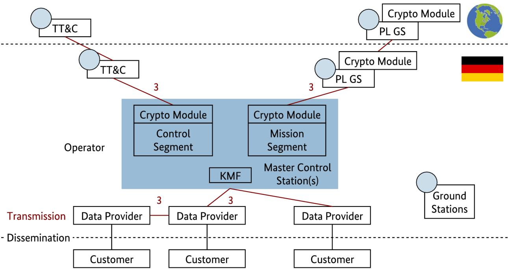

# Technical Guideline SatDSiG

Conformity assessment according to the satellite data security act (SatDSiG)

BSI TR-03140 (TR-SatDSiG) Version 1.0 (2013)


#### **Authors**

This technical guideline was written by:

IABG - Industrieanlagen-Betriebsgesellschaft mbH

- Christian Creter
- Dr. Stefan Baumann

BSI - Federal Office for Information Security

- Dr.-Ing. Andre Braunmandl
- Frank Christophori
- Dr. Manfred Lochter
- Wendel Lohmer
- Michael Krämer

#### **Credits**

We would like to thank all, who contributed to this technical guideline by proofreading and fruitful discussions:

- Dr. Ernst Schulte-Geers, BSI
- Dr. Maximilian Gebhardt, BSI
- Wolfgang Schneider, BMWi
- Anke Reichardt, BAFA
- Thorsten Stahl, DLR
- Dr. Hanjo Kahabka, Infoterra GmbH
- Andreas Frömgen, Infoterra GmbH
- Michael Döberl, EADS Astrium
- Erwin Hirschmüller, EADS Astrium
- Dr. Rainer Rathje, OHB

Federal Office for Information Security Post Box 20 03 63 53133 Bonn Tel.: +49 22899 9582-0 E-Mail: bsi-publikationen@bsi.bund.de Internet: https://www.bsi.bund.de © Federal Office for Information Security 2013 Bundesamt für Sicherheit in der Informationstechnik Postfach 20 03 63 53133 Bonn Tel.: +49 22899 9582-0 E-Mail: bsi-publikationen@bsi.bund.de Internet: https://www.bsi.bund.de © Bundesamt für Sicherheit in der Informationstechnik 2013

| 1              | Introduction 7                                                                              |  |
|----------------|---------------------------------------------------------------------------------------------|--|
| 1.1            | Objectives of this technical guideline 7                                                    |  |
| 1.2            | Structure of this technical guideline 8                                                     |  |
| 1.3            | Target audience 8                                                                           |  |
| 2              | Infrastructures for high grade EOS 9                                                        |  |
| 2.1            | System overview of high grade EOS 9                                                         |  |
| 2.1.1          | Satellite-bus 10                                                                            |  |
| 2.1.2          | Payload 10                                                                                  |  |
| 2.1.3          | Crypto modules 11                                                                           |  |
| 2.1.4          | Key Management Facility 11                                                                  |  |
| 2.1.5          | TT&C 12                                                                                     |  |
| 2.1.6<br>2.1.7 | Payload ground stations 12<br>Operator 12                                                   |  |
| 2.1.8          | Data provider 13                                                                            |  |
| 2.1.9          | Customer 14                                                                                 |  |
| 2.2            | Space segment 14                                                                            |  |
| 2.2.1          | Satellite system overview 14                                                                |  |
| 2.2.2          | Mission operation (TT&C) 15                                                                 |  |
| 2.2.3          | Payload data management 15                                                                  |  |
| 2.3            | Ground segment 15                                                                           |  |
| 2.3.1          | Connection encryption 17                                                                    |  |
| 2.3.2          | Encryption configuration 17                                                                 |  |
| 2.3.3          | External ground stations 17                                                                 |  |
| 3              | Satellite data security act of 2007 19                                                      |  |
| 3.1            | Motivation and authorities 19                                                               |  |
| 3.2            | Applicability 20                                                                            |  |
| 3.3            | License for operation 20                                                                    |  |
| 3.4            | License for dissemination of data 21                                                        |  |
| 3.5            | Licensing conditions 22                                                                     |  |
| 4              | Approach for the conformity evaluation 24                                                   |  |
| 4.1            | Recognition of evaluation facilities  24                                                    |  |
| 4.2            | Concept for the evaluation of the crypto concept24                                          |  |
| 4.2.1          | Planning phase 26                                                                           |  |
| 4.2.2          | Building phase 26                                                                           |  |
| 4.2.3          | Operational phase 27                                                                        |  |
| 4.3            | IT-inspection procedure of the ground segment according to the IT-Grundschutz methodology27 |  |
| 4.3.1          | Overview of the audit process 27                                                            |  |
| 4.3.2<br>4.3.3 | Requirements on the part of the applicant28<br>Objectives and scope of the evaluation29     |  |
| 4.3.4          | Roles and responsibilities 29                                                               |  |
| 4.3.5          | Performance of the conformity evaluation30                                                  |  |
| 4.3.6          | Conformity evaluation report 30                                                             |  |
| 4.3.7          | Conformity statement procedures 30                                                          |  |
| 5              | Part I – Evaluation of the crypto concept31                                                 |  |
| 5.1            | Introduction 31                                                                             |  |

| 5.1.1          | General information  31                                                                                     |  |
|----------------|-------------------------------------------------------------------------------------------------------------|--|
| 5.1.2          | Scope of document  31                                                                                       |  |
| 5.1.3          | Reference documents 31                                                                                      |  |
| 5.1.4          | Terms & abbreviations  31                                                                                   |  |
| 5.2            | System description 32                                                                                       |  |
| 5.2.1          | System overview 32                                                                                          |  |
| 5.2.2          | Relevant system components regarding SatDSiG32                                                              |  |
| 5.2.3          | Involved players and roles 32                                                                               |  |
| 5.2.4          | Security problem description 33                                                                             |  |
| 5.2.5          | Security boundaries 33                                                                                      |  |
| 5.3            | Security objectives 33                                                                                      |  |
| 5.4            | Assumptions on external factors 33                                                                          |  |
| 5.4.1          | Operational environment  33                                                                                 |  |
| 5.4.2          | Organizational security measures 34                                                                         |  |
| 5.5            | Security requirements 34                                                                                    |  |
| 5.5.1          | Cryptographic approach 34                                                                                   |  |
| 5.5.2          | Cryptographic basics 34                                                                                     |  |
| 5.5.3          | Cryptographic implementation35                                                                              |  |
| 6              | Part II – Inspection procedures for the ground segment39                                                    |  |
| 6.1            | Inspection criteria 39                                                                                      |  |
| 6.2            | Audit phase 1: Analysis of the reference documents39                                                        |  |
| 6.2.1          | Overview documentary checks39                                                                               |  |
| 6.2.2          | Verification of the approach and general aspects39                                                          |  |
| 6.2.3          | Reference documents 40                                                                                      |  |
| 6.2.4          | IT-structure analysis 40                                                                                    |  |
| 6.2.5          | Protection requirements determination41                                                                     |  |
| 6.2.6          | Identification of threats and risks 42                                                                      |  |
| 6.2.7          | Result of the tailored security check42                                                                     |  |
| 6.2.8          | Assessment of the satellite-system security concept according to the requirements of the<br>SatDSiG 42      |  |
|                |                                                                                                             |  |
| 6.3            | Preparation of the on-site assessment44                                                                     |  |
| 6.3.1<br>6.3.2 | Create an inspection plan for the OSV audit assessment44<br>Preparation of the assessment procedures44      |  |
| 6.3.3          | Selection of safeguards (sampling) 45                                                                       |  |
|                |                                                                                                             |  |
| 6.4            | Audit phase 2: Inspections on-site 45                                                                       |  |
| 6.4.1          | Overview of the inspection activities46                                                                     |  |
| 6.4.2          | Verification of the network plan 46                                                                         |  |
| 6.4.3          | Verification of the list of IT-systems46                                                                    |  |
| 6.4.4<br>6.4.5 | Verification of the tailored security check46<br>Assessment of the risk treatment/-mitigation/-management46 |  |
| 6.4.6          | Verification of IT-safeguards according to SatDSiG47                                                        |  |
|                |                                                                                                             |  |
| 6.5            | Subsequent improvements/repairs 47                                                                          |  |
| 6.6            | Creation of the evaluation report 48                                                                        |  |
| 6.7            | Final conformity result 48                                                                                  |  |
| 7              | Conformity statement 49                                                                                     |  |
| 8              | Annex for part II – Ground segment inspection 50                                                            |  |
| 8.1            | Manufacturer's evidence of conformity / document lists50                                                    |  |
| 8.2            | Network plan (notes) 51                                                                                     |  |

| Inspection schedule (on-site) template52<br>Outline of the inspection plan  52<br>Outline of the inspection report 56<br>Bibliography 58<br>Glossary 59 |
|---------------------------------------------------------------------------------------------------------------------------------------------------------|

## List of figures

| Figure 1: Time-line of satellite evolution and the two TR-SatDSiG conformity evaluation assessment tasks7 |  |
|-----------------------------------------------------------------------------------------------------------|--|
| Figure 2: High grade EOS - generic system overview9                                                       |  |
| Figure 3: Relevance of space segment elements regarding SatDSiG14                                         |  |
| Figure 4: Ground segment infrastructure 16                                                                |  |
| Figure 5: Sensitivity check procedure (source: BMWi)21                                                    |  |
| Figure 6: Sensitivity check "algorithm" scheme (source: BMWi)23                                           |  |
| Figure 7: Process for the conformity evaluation of the crypto concept25                                   |  |
| Figure 8: Certification process for TR-SatDSiG (ground segment)28                                         |  |

## List of tables

| Table 1: Manufacturer's document lists 51                                                 |  |
|-------------------------------------------------------------------------------------------|--|
| Table 2: Inspection schedule (on-site) template52                                         |  |
| Table 3: Inspection plan (basic template) for safeguard S1 Infrastructure53               |  |
| Table 4: Inspection plan (basic template) for safeguard S2 Organization54                 |  |
| Table 5: Inspection plan (basic template) for safeguard S3 Personnel (not mandatory)54    |  |
| Table 6: Inspection plan (basic template) for safeguard S4 (HW & SW)55                    |  |
| Table 7: Inspection plan (basic template) for safeguard S5 Communication55                |  |
| Table 8: Inspection plan (basic template) for safeguard S6 Contingency planning concept56 |  |
| Table 9: Summary of inspection results 57                                                 |  |

## <span id="page-6-0"></span>1 Introduction

Earth remote sensing data generated by high grade Earth Observations Systems (EOS) is made progressively available for worldwide civilian commercialization. These data have a grade of quality, which was previously produced only by classified military and intelligence service satellites and that was used exclusively in closely defined environments. The distribution of these high value or high grade earth remote sensing data may endanger foreign or security policy interests.

It is therefore of vital interest to establish efficient means to secure the control of these satellites and the distribution of their data products.

The German Satellite Data Security Act (Satellitendatensicherheitsgesetz, SatDSiG) became necessary since highly capable space-based earth remote sensing satellites are constructed in Germany with the intention of the worldwide commercial marketing of the acquired images/data. The act provides legal certainty, establishes binding rules, and ensures their enforcement.

## 1.1 Objectives of this technical guideline

This technical guideline (Technische Richtlinie, TR) gives guidance for conformity evaluation facilities to perform assessments of IT-security measures of high grade EOS.

According to SatDSiG, BSI has to assess certain IT security measures of high grade EOS, their operators and data providers.

An operator or dissemination license for these satellites and the data acquired can only be granted by German Federal Office of Economics and Export Control (Bundesamt für Wirtschaft und Ausfuhrkontrolle, BAFA), if BSI declares these IT security measures as suitable.

This technical guideline describes all necessary steps to obtain the BSI statement:

- It summarizes the approach, methodology and inspection procedures in order to satisfy the tasks to be covered by BSI, as derived from the SatDSiG.
- It bundles the inspection procedures and methodology required for the evaluation of the systems of the operator and the data provider required by the SatDSiG.
- The compliance and fulfillment of these inspection procedures are a base for the licensing and admission requirements for the operation of satellites and ground stations and the dissemination of the satellite mission data.

Figure [1](#page-6-1) shows the two parts of the assessment on a time-scale of the EOS evolution.


<span id="page-6-1"></span>*Figure 1: Time-line of satellite evolution and the two TR-SatDSiG conformity evaluation assessment tasks*

## 1.2 Structure of this technical guideline

This technical guideline consists of the following sections:

Section [2](#page-8-0) lists the relevant elements of satellite infrastructures for high grade EOS giving an overview and describing the space and ground segment in some detail,

Section [3](#page-18-0) summarizes the satellite data security act (SatDSiG) and its ordinance (SatDSiV),

Section [4](#page-23-0) explains the approach for this conformity evaluation and addresses the different scopes for the space and ground segment evaluation,

Section [5](#page-30-0) contains the guidelines for the evaluation of the crypto concept of the space segment,

Section [6](#page-38-0) contains the guidelines for the inspection procedures of the ground segment,

Section [7](#page-48-0) lists important points around the conformity statement,

Section [8](#page-49-0) contains the annex with supplementing information for the ground segment inspection, like document lists, inspection plan templates and outline for reports.

## 1.3 Target audience

This technical guideline shall be applied by conformity evaluation facilities performing the evaluation and by the BSI to assert and confirm, based on the evaluation report (audit report), the conformity to SatDSiG.

Satellite system developers, Satellite operators and data providers shall use this guideline to prepare for the necessary conformity to SatDSiG.

## <span id="page-8-0"></span>2 Infrastructures for high grade EOS

This chapter provides an overview on the space based and terrestrial (either national or international) infrastructures required for the operation of a high grade EOS. First a schematic overview on the generic elements of such a system will be given. Afterwards the elements identified will be described briefly to create a common understanding for the later parts of this technical guideline.

In a second step the data-flows that are relevant for the application of SatDSiG and the corresponding system elements will be discussed in more detail.

## 2.1 System overview of high grade EOS

The following figure provides an overview on the various components of a high grade EOS and their interconnectivities.


#### <span id="page-8-1"></span>*Figure 2: High grade EOS - generic system overview*

The space segment consists mainly of the satellite-bus, which is the platform providing all relevant functionalities for space operations and the application specific payload. Satellite-bus platforms are adopted for the orbital planes used and could therefore be divided into geostationary (GEO), Medium Earth Orbit (MEO) and Low Earth Orbit (LEO) systems.

Satellite payloads could be used e. g. for communication, navigation, earth observation, scientific purposes, etc.. Combinations of different payload types on-board the same satellite are possible. This technical

guideline focuses on high grade EOS, addressed by SatDSiG. Within the domain of earth observation different sensors operating in different electromagnetic frequencies are used.

Crypto modules in the space segment and the ground segment of a high grade EOS are required to protect the communication in both directions between space segment and ground segment.

The crypto modules on-board the satellites have corresponding counter-part crypto modules within the TT&C and the payload ground segement. The generation of keys, cryptographic parameters, etc. will take place in most cases within the Key Management Facility (KMF) of the ground segment of a high grade EOS. The ground segment may consist of multiple TT&Cs and payload ground stations on national and/or international territory and the master control station(s). In general the initial key-fill takes place shortly before the satellite launch under specific security conditions.

The ground segment of the high grade EOS will have interconnections with external data providers, forming the interface to the customers of the data provided by the high grade EOS. This data may also be exchanged between IT-systems of the data-providers. Data providers may operate their own payload ground stations to receive the data directly from the satellite.

#### 2.1.1 Satellite-bus

The satellite-bus represents the platform, which hosts the supply-units of a satellite enabling space operations and operation of user specific payload(s). The structures of the satellite-bus from different manufacturers for specific orbits (LEO, MEO, GEO) are typically generic and are adopted to specific missions and payloads. The satellite-bus is the carrier for different subsystems. Typical subsystems mounted on the structure of the satellite-bus are:

- Energy supply
- Propulsion
- Altitude and orbit control
- Thermal regulation
- On-board computer
- TT&C

#### 2.1.2 Payload

The payload in general is the part of a satellite, which fulfills its mission purpose. A payload may provide e. g. one of the following functions:

- scientific purposes (e. g. observations which are not related to the earth such as astronomy, global observations with low-spatial resolution such as ocean-color measurements, measurements of the ocean surface topography etc. – there are also missions which do not focus on observations in the electromagnetic spectrum such as measurement of the earth's gravity field )
- communication to satellite ground stations (or to other spacecrafts via inter-satellite links), including television
- transmission of navigation signals and/or augmentation data
- observation of the atmosphere for meteorological or climatological purposes
- observation of the earth surface (focus of this technical guideline) using various types of sensors

The following sensor parameters, described in SatDSiV, of a high grade EOS determine, whether the payload is subject to the regulations of SatDSiG:

- geometric resolution
- spectral coverage (depending on which part of the electromagnetic spectrum is observed by the sensor, the edges of the spectral range might be defined in different units: within the visible and infrared range, the use of wavelength-units such as nanometers [nm], or micrometers [µm] are quite common – in the very far infrared and the microwave range of the spectrum, so called wavenumbers or frequency units such as Hertz [THz, GHz or MHz] are more frequently used)
- the number of spectral channels and the spectral resolution
- the radiometric resolution (defined by a combination of S/N-ratio and digitalization quality. As the radiometric resolution of a typical earth observation system is often dominated by the ADC-resolution and is therefore often specified in [bit])
- the temporal resolution (repetition time in h)

The information content of microwave sensors or radar sensors shall also be determined according to

- the polarization characteristics (horizontal, vertical)
- the phase history.

### 2.1.3 Crypto modules

Within a high grade EOS, crypto modules will be used to protect the data-communication between the space segment and the ground segment. This includes TT&C (cf. section [2.1.5\)](#page-11-0) between the satellite bus and the ground control segment as well as the transfer of the payload data to the ground mission segment. Corresponding pairs of the crypto modules are located in the space segment and the related part of the ground segment.

The requirements regarding the crypto modules are described in section [5.](#page-30-0)

#### 2.1.4 Key Management Facility

The Key Management Facility (KMF) within the ground segment of the high grade EOS provides the crypto modules either off- or online with the required keys.

The requirements regarding the key management are described in section [5.](#page-30-0)

The KMF may include for example the following functionalities (the selected functionalities to be implemented shall be coordinated with the BSI):

- interface to ground station crypto module
- interface to key-fill-device (transport of keys to the satellite crypto module(s) and maybe to other ground stations)
- online-interface to other ground stations
- management of crypto modules
- provide PKI for asymmetric cryptological processes
- audit functionalities
- recording and analysis of security events

Special attention of the applicant has to be put on the selection of the Random Number Generator (RNG , component of the KMF) and the subsequent mathematical methods used to generate the randomized data for the generation of the cryptographic keys, nonces and parameters.

### <span id="page-11-0"></span>2.1.5 TT&C

The main components of a satellite Telemetry Tracking & Command system (TT&C) are the

#### • **Telemetry subsystem**

The telemetry subsystem is provided with the satellite housekeeping and payload configuration monitoring data from the on-board computer and transmits them together with the telecommand reception acknowledgment towards the TT&C ground segment. The telemetry data contains e. g. the onboard temperatures, the on/off status of all equipment, pressures and voltages within the satellite, etc.. The telemetry subsystem modulates the data, amplifies it and transmits it via the antenna(s).

#### • **Tracking/Ranging subsystem**

The tracking/ranging subsystem allows the TT&C ground segment to measure the distance between the satellite and the earth using ranging signals. This subsystem receives the ranging signal (tones) from the ground and sends it back to the ground. The echoed tone arrival time at the ground station defines the round-trip time. This information is further post-processed by an orbit determination software, which calculates the distance between the ground station and the satellite.

#### • **Telecommand subsystem**

The telecommand subsystem receives control data from the TT&C ground segment in an encoded form, it decodes this data and transmits it to the on-board computer. The telecommand data initiate maneuvers, change the on-board equipment state and switch the modes of the payload. The telecommand subsystem is also responsible for delivering the telecommand reception acknowledgment to the telemetry subsystem, which relays it to the TT&C ground segment.

Due to the fact, that satellites have to be controlled during their Launch-and-Early-Orbit-Phase (LEOP) and their In-Orbit-Test (IOT) phase almost continuously additional temporary TT&C ground stations are employed during these phases. Later in the operational phase the TT&C ground segment will consist only of those stations, that are required to fulfill the satellite mission.

In general, the TT&C procedures are based on predefined programs, which will be executed on demand. In case of emergency situation predefined contingency programs have to be applied or manually adjusted to the current situation.

### 2.1.6 Payload ground stations

The key objective of the payload ground station is to receive the data transmitted by the payload of the satellite. The type and quality of the used earth observation sensor(s) determines the amount of data to be transmitted. In general earth observation satellites produce a huge amount of data compared to other types of satellite mission. Especially sensors with high spatial resolution or hyperspectral sensors generate huge amounts of data. Typically payload ground stations belong to the satellite operator or have very close contractual connections to the satellite operator. However, especially in case of large commercial customers, payload data may be transmitted directly to ground stations of specific customers. In that case the satellite operator has only limited control over these ground stations.

### 2.1.7 Operator

According to § 2 (1) no. 1 SatDSiG the "Operator" is the legal entity, who is controlling the high grade EOS under its own responsibility. The high grade EOS may be operated by several operators. In general the operation is split into two main activities with multiple sub-activities as outlined below:

- The mission operation (TT&C) includes the following sub-activities:
	- the generation (incl. authentication) of telecommands
- the handling of telemetry data, including
	- the reception of telemetry data
	- the monitoring of telemetry data
	- the processing of telemetry data
	- the archiving of telemetry data
- the monitoring of the satellite's health status
- the control of the orbit and attitude of the satellite (tracking)
- the planning and execution of orbit maneuvers
- the preparation of orbit and location data for the processing of payload data as applicable
- the operation, calibration, monitoring and control of the earth observation payload
- the planning of the data acquisitions taking into account different parameters, e. g.:
	- the required location and time of data collection
	- the available satellite resources
	- the imaging mode of payload
	- the priority of order
- The payload data management at the operator includes the following sub-activities:
	- definition to which payload ground station the data should be transmitted (downlinked)

Depending on the exact workshare between the satellite operator and the data provider, this typically also includes:

- the reception of the payload data (typically called "raw-data" or "level-0 data")
- decryption of the payload data
- the quality control of the data received
- processing of the data to standard data products. This typically includes a chain of processing steps though so called level-1A, -1B and probably -2. This chain represents a primary instrument-specific data processing. At the lower levels this includes steps such as removal of communications artifacts, synchronization frames, communication headers or extraction of ancillary information data, platform ephemerides etc.. During the higher processing levels this typically also includes the application of radiometric calibration coefficients and application of georeferencing parameters. Specifically for Synthetic Aperture Radar (SAR) sensors this primary processing can be very complex as the unprocessed raw data of the sensor does not represent an image.
- the archiving and cataloging of the data received
- the delivery of the data to the data provider.

#### 2.1.8 Data provider

According to § 2 (1) no. 3 SatDSiG the "Data Provider" is is the legal entity, who disseminates the data generated by a high grade EOS to the customer. The payload data management at the data provider typically includes the following sub-activities (again, depending on the exact workshare between satellite operator and data provider):

• the reception of the data from the "Operator" or directly via own ground station(s)

- the processing of the data received into various data/image-products (this typically includes the generation of "ready-to-use" data/image-products of processing level 2 or higher. Processing steps often include conversion to or extraction of geophysical variables and mapping to uniform space (and probably time) grids, application of complex geometrical corrections (such as orthorectification) and standard formatting)
- the archiving and cataloging of the image-products
- the provision of a data-catalog for users
- the operation of an user service and/or help desk
- the receipt and handling of data-orders
- the delivery of the products to the customers.

#### 2.1.9 Customer

The "Customer", which is not defined explicitly by the SatDSiG, receives the data of a high grade EOS from the data provider (in general on a commercial basis) and utilizes this data for customer-specific applications. Typical application domains of high grade earth observation products include e. g. science, geology, hydrology, glaciology, surveying/cartography, agriculture, forestry, environment protection, traffic planning, urban planning, crisis-management, and military.

### 2.2 Space segment

Based on the generic overview of a high grade EOS provided by the previous chapter the following subchapter will identify and briefly describe the system elements, that are relevant regarding SatDSiG.

Based on the prerequisites in section [2.2.2](#page-14-1) and [2.2.3](#page-14-0) a crypto concept according to the requirements described in section [5](#page-30-0) of this technical guideline has to be provided and agreed with BSI prior to the development/manufacturing-phase.

#### 2.2.1 Satellite system overview

SatDSiG is relevant for the elements of the space segment, visualized in figure [3.](#page-13-0) The relevant data-streams are represented by red arrows and the numbers refer to the numbers of § 4 (1) SatDSiG (cf. section [6.2.8\)](#page-41-0).


<span id="page-13-0"></span>*Figure 3: Relevance of space segment elements regarding SatDSiG*

## <span id="page-14-1"></span>2.2.2 Mission operation (TT&C)

According to § 4 (1) no. 2 SatDSiG the applicant has to prove that sequences of instructions to command the orbital or transport system, to control the sensor(s), to control the transmission of data, to control the dissemination of data are produced within Germany and protected against alteration by third parties. The intention of this requirement is to clearly assign the responsibility of all commands going to the satellite to an identifiable entity at the satellite operator.

This requirement will have impact on the following functions of the mission operation:

- generation of telecommands
- operation, calibration, monitoring and control of the earth observation payload
- planning of the data acquisition taking into account different parameters

As defined by § 4 (1) no. 2 SatDSiG a strong authentication of the defined data-streams is required. (*Remark: This automatically includes integrity protection.*)

The command sequences have to be generated by the ground segment within Germany and not by external ground control stations. In case a commanding sequence needs to be uplinked from a TT&C ground station outside Germany, the commanding sequence has to be finalized in Germany and then forwarded to the foreign TT&C ground control station for uplink.

This protection has to be ensured by measures described in the dedicated crypto concept for the high grade EOS, which will be realized in the KMF and the crypto modules.

Confidentiality is not required by SatDSiG, nevertheless the implementation of methods protecting confidentiality of the above mentioned satellite-commands is strongly recommended.

#### <span id="page-14-0"></span>2.2.3 Payload data management

According to § 4 (1) no. 3 SatDSiG the confidentiality of data transmitted from the space segment to the ground segment has to be protected. With respect to SatDSiG the protection of the downlink is vital, because without such a requirement any further measures to protect the data in the ground segment could be bypassed by any unauthorized user by simply "listening" to the downlinked data using his own ground station placed near to the authorized ground station. In addition to the security considerations imposed by SatDSiG, specifically commercial satellite operators and data providers have a strong interest to such a protection of the downlinked data, as it comprises a considerable commercial value.

This requirement will have an impact on the following functions of the payload data management:

- transmission of payload data
- reception of the payload data

As defined by § 4 (1) no. 3 SatDSiG the confidentiality for the defined data-stream is requested.

This protection has to be ensured by dedicated measures, described in the crypto concept for the high grade EOS, that will be realized in the KMF and the crypto modules.

Integrity protection of payload data is not required by SatDSiG, nevertheless it may be recommended.

## 2.3 Ground segment

The ground segment controls the satellite and the data transmission, processes the tasking from the customer-requests to the data provider checks and performs the central processing, archiving and dissemination of the data.

For the ground segment § 4 (1) no. 3 and § 12 SatDSiG are relevant. Figure [4](#page-15-0) shows the schematics. The relevant data-streams are represented by red arrows and the numbers refer to the numbers of § 4 (1) SatDSiG (cf. section [6.2.8\)](#page-41-0).



<span id="page-15-0"></span>*Figure 4: Ground segment infrastructure*

The infrastructure of the ground segment covers e. g. the following elements:

- Master control stations (national, international)
	- Control ground stations (TT&C)
	- Mission control ground stations (Payload)
- Service segments (handling the payload data, data provider role). Depending on the exact layout of the mission, there might be one or several of these service segments (that even might be operated by different organizations). E. g. the TerraSAR-X and TanDEM-X missions are arranged as public-privatepartnerships with two different service segments: both are in the data provider role, however, one service segment is specifically tailored for scientific users, the other service segment is specifically tailored for commercial users.

The following ground stations are distinguished:

- Control stations that produce the commands for the satellite and the sensors (up- & downlink).
	- The satellite control is done by sending TT&C-commands to the EOS and receiving status information (TMTC).
	- The payload control covers mission planning, instrument operations and calibration.
- Data receiving stations (downlink with high capacities), that receive and decrypt the EO-data for further processing and archiving.

The further processing includes the data-processing, the archiving of the large data amount and the distribution of the data (commercial exploitation and science coordination).

• Data receiving stations (downlink) for specific customers, that decrypt the EO-data on their own.

• Data receiving station (downlink) with only relay-like functions (no decryption). (*Remark: The evaluation of these stations is not subjected to this technical guideline.)*

The IT in the ground segment typically includes the following security-relevant system elements:

- computer networks and structure of subnets with network elements
	- e. g. switches, routers, etc.
	- firewalls
- data servers
- Storage Area Network (SAN)-Systems
- end-systems like PCs
- applications (EOS-specific)
- data and information management
	- processing by a data and information management system to handle the large mission data with libraries, catalog servers, disk caches, DBMS, etc.
	- archiving systems

#### 2.3.1 Connection encryption

The connections between the different segments in the ground segment (mission operation, (commercial) service) typically use IP-based network elements (routers, etc.) on top of downlink satellite or terrestrial transmission links that handle IP-based traffic over public communication networks. Since the data transmitted has a need for protection of confidentiality, the transmission is protected by link encryption using appropriate protocols and cipher suites.

#### 2.3.2 Encryption configuration

In order to provide the appropriate level of protection, the security protocols need to be implemented and configured properly (required key-length and strength of algorithm).

The choice of appropriate algorithms and key lengths are subject to change effected by cryptanalytic progress. Concrete recommendations are therefore out of scope of this technical guideline. The actual algorithms and key lengths have to be agreed with BSI (cf. section [5\)](#page-30-0).

Since the complete "chain of transmission links" must be considered for a complete, safe transmission link, all "parts of the chain" need to be secured with a consistent security level.

#### <span id="page-16-0"></span>2.3.3 External ground stations

In order to provide the EOS with the ability to download data adequately quick, also ground stations outside the German territory are required (external ground stations are located in e. g. Sweden, Canada, Mexico and Antarctica).

Only ground stations decrypting or processing decrypted SatDSiG-relevant data are considered here. The evaluation of pure relay stations is not subject to this technical guideline.

The regulations applying for these ground stations are essential for security, since it has to be ensured, that personnel, organization, technical measures and infrastructure meet the same security requirements as ground stations in Germany for the purpose of SatDSiG.

The infrastructure, personnel and organization of these facilities is typically handled by different organizations in the host countries of these ground stations. The evaluation facility must, in addition to the document checks, provide adequate assurance, that the external ground stations meet the same requirements regarding security level as the ground stations in Germany. If possible, a random on-site visit of at minimum one external ground station should be performed.

## <span id="page-18-0"></span>3 Satellite data security act of 2007

The Satellite Data Security Act became effective on 1st of December 2007. The SatDSiV statutory ordinance became effective on April 2008.

## 3.1 Motivation and authorities

The quality of mission data of advanced EOS intended for commercial exploitation, has until recently been achieved by military classified satellites, only. These advanced commercial EOS mission data are therefore security-relevant and must be protected against unauthorized access. This is the background for SatDSiG [SatDSiG BackgroundInfo].

So, SatDSiG has two main purposes. First it is fostering the civil use and commercialization of remote sensing data by creating legal certainty and maximizing the possible data flowing to scientific and commercial users.

Secondly, it safeguards security- and foreign-policy related interests.

#### **Scope**

The area of the act to be applied is limited to commanding such a system from German territory or handling and dissemination of data from such a system:

- by German nationals or by legal persons or associations of persons under German law,
- by foreign legal persons or foreign associations of persons with their head office within the territory of the Federal Republic of Germany, or
- if inalterable sequences of instructions to command the orbital system are transmitted from within the territory of Germany.

It is limited to non-military satellites and high grade earth remote sensing systems, which is derived from the systems' capacity to acquire, and handle high quality, potentially sensitive data. The details are defined in the SatDSiV.

The act is directed to primary data providers, but generally not to data resellers or remote sensing service providers or value-adding companies. Nevertheless, also downstream customers may be affected by the act.

#### **Approach**

SatDSiG defines a transaction-oriented approach.

#### **Authorities**

The main authorities are

- Legislative authority: BMWi (Bundesministerium für Wirtschaft und Technologie, Federal Ministry of Economics and Technology, Div. VII B3, Space Technologies)
- Executive authority: BAFA (Bundesamt für Wirtschaft und Ausfuhrkontrolle, Federal Office of Economics and Export Control, Directorate 41 Part Satellite Data Security, Division 415 Satellite Data Security Reporting)
- Technical authority: BSI (Bundesamt für Sicherheit in der Informationstechnik, Federal Office for Information Security, Section S24 "Conformity assessments and certification")

#### **Licenses**

The following licenses for a high grade EOS are distinguished:

- License for the operation
- License for the dissemination of data

The licensing requirements cover:

- Security of operation (i. e. protection against unauthorized access to satellite and data)
- Sensitivity check (i. e. customer ID, timeliness, area of interest, spatial resolution, etc.)

### 3.2 Applicability

The act does not apply to military systems where access is anyhow classified, and EO systems by EU and other states, which have similar regulations.

Its legal effect is limited to non-military satellites and high grade earth remote sensing systems, depending on the systems' capacity to acquire and handle high data volumes. The details are categorized in § 2 (2) SatDSiG. The technical categorization parameters (discrete values for spectrum range, channels) are defined precisely in the SatDSiV.

As EOS sensor types SAR imaging, superspectral imaging and very high resolution optical mapping are covered.

For the data dissemination SatDSiG principal procedures and checks are required.

The sensitivity check according to § 17 SatDSiG (cf. Figure 6) checks the data request by the customer and the meta data of the individual data request set. This check never includes the payload data itself (data product).

The criteria for the check take into account:

- the information content of the individual data product (operating mode of the sensor, processing (specification of the data product)),
- the target area represented by the data product,
- the time period between the generation of the data and the supply to the customer,
- the ground segments to which the data should be transmitted (country-based),
- the individual customer issuing the data request.

The algorithmic definition combines threshold values and lists, requires only the meta data and can be executed automatically, which ensures, that the output of the sensitivity check (sensitive, not sensitive) is processed fast and effectively.

### 3.3 License for operation

The operation of a high grade EOS requires a license according to § 3 SatDSiG.

A licensee must operate and document reliable and secure procedures. The licensing requirements and obligations address the satellite operator and the data provider.

The commands for the satellite need to be produced in Germany and protected by procedures endorsed by BSI. Changes in organizational structures of the satellite operators, that may affect the security of the system (e. g. foreign takeover of a German commercial operator) are addressed in the act (§ 10 SatDSiG).

The main point of the act is a procedure for the dissemination of data, which clearly defines the licensing requirements and the obligations of satellite operators and data providers.

The following roles are defined in this context:

- operator
- data provider disseminating the data
- customer
- downstream customer

## 3.4 License for dissemination of data

The dissemination of data from high grade EOS requires a license according to §11 SatDSiG.

The approach for the primary dissemination of data from high grade EOS has two layers, the sensitivity check and the permit/refusal by governmental authorities.

#### **Sensitivity check**

For any data request, this check has to be performed for each case and under full responsibility by the data provider. Transparent predefined procedures and criteria are applied (cf. section [1\)](#page-6-0). The case processing must be documented and is recorded for possible audit/inspections.

"Sensitive data requests" require a permit by the BAFA.

"Not sensitive" data request enable the data provider to freely deliver the data.

The flow chart for the sensitivity check is shown in figure [5.](#page-20-0)


<span id="page-20-0"></span>*Figure 5: Sensitivity check procedure (source: BMWi)*

#### **Permit/Refusal by governmental authorities**

The sensitivity check only concerns the data request with the meta data of the individual data set, but never the data set itself. It considers e. g. target areas, the time, when the data was generated, the ground segments to which the data has to be transmitted, the customer itself and the information content. The algorithm for the sensitivity check is defined in the SatDSiV (cf. figure [6\)](#page-22-0).

## 3.5 Licensing conditions

The criteria according to § 2 SatDSiG for a high-grade EOS determining a necessary license to be obtained from governmental authorities are specified in the statutory ordinance SatDSiV.

Security requirements according to SatDSiG must be met by both the responsible persons and by the company in order to obtain a license for operation (§ 4) or dissemination (§ 12). In addition to the operator's reliability, the persons who have access to the essential operational elements of the system must possess a security clearance in accordance with the Security Clearance Act (Sicherheitsüberprüfungsgesetz, SÜG). The operational premises must be adequately secured to prevent unauthorized entry.

The operator and the data provider are subject to detailed documentation and information obligations, allowing the responsible governmental authorities at all times to be informed of the activities of the operator and/or the data provider (§§ 5-7 and/or §§ 13, 14, 18 SatDSiG).

Furthermore, the governmental authorities are authorized to inspect operators' and/or data providers' premises and convince themselves on-site that operators and/or data providers are conducting themselves in accordance with the regulation (§ 8 and/or §15 SatDSiG).

A general clause entitles the responsible governmental authorities to take such measures as are necessary to ensure lawful operations or to prohibit operations (§ 9 and/or § 16 SatDSiG).


<span id="page-22-0"></span>*Figure 6: Sensitivity check "algorithm" scheme (source: BMWi)*

## <span id="page-23-0"></span>4 Approach for the conformity evaluation

The conformity evaluation checks, whether the legal requirements applied on high grade EOS by SatDSiG are fulfilled.

The certification according to this technical guideline is necessary, since the overall evaluation task of BSI, represented by security functional requirements for the operation of this system, must be met.

Upon application the conformity of the high grade EOS system with this technical guideline is confirmed by BSI with a certificate. (The application form can be found on the BSI website.)

Within this process, an independent evaluation facility performs the conformity evaluation based on the evaluation procedures in this technical guideline.

The conformity evaluation is performed under the supervision of the certification authority of BSI and after a successful completion a notification of conformity and a certificate are issued.

Evaluation facilities, that perform these technical conformity evaluations, are commercial entities that have been recognized by BSI according to DIN EN ISO/IEC 17025.

## <span id="page-23-1"></span>4.1 Recognition of evaluation facilities

The preconditions which have to be met by evaluation facilities, that are assessing applicants according to this technical guideline, are defined in this technical guideline itself.

For the eligibility of the evaluation facility to perform conformity evaluations according to this technical guideline, the certification authority of BSI grants the permission and performs the supervision. BSI may request proven competence or perform initial qualification tests in the field of SatDSiG of the evaluators and auditors involved.

The technical competence to perform conformity evaluations according to this technical guideline has to be proven by the evaluation facility (IT-Security Service Provider in the field of IS-Revision and IS-Consulting) recognized by BSI, besides the existence of a Quality Management System according to DIN EN ISO/IEC 17025. Also professional competence in the field of SatDSiG must be ensured by the evaluators/auditors.

#### **Skill requirements**

On the one hand specific skills may require expertise that is necessary to the understanding of the processes of the applicant. On the other hand specific expertise (e. g. for VPN, ground stations) must exist also in fields, which are required for the appraisal of measures/safeguards. If the necessary professional skills in one or more fields are not available, the audit team lead may extend the audit team to one or several auditors.

## 4.2 Concept for the evaluation of the crypto concept

The conformity evaluation of the crypto concept for the high grade EOS follows the generic approach for conformity evaluation described above.

The standard procedures of conformity evaluation have to be adopted for the assessment of the crypto concept due to the following facts/requirements:

- The planning- and building-phases of satellite systems have a long duration with significant different time-lines of the main system elements (very long time-line for the Space Segment and much shorter time-lines for the ground segment components).
- A high grade EOS is not a standard COTS-system, but rather a very individually designed and complex system, containing a high proportion of proprietary and company-confidential know-how.
- The system will usually have an operational phase of approximately 10 years, which means that the crypto concept (developed very early in the development process) will have to cover a period of approximately 15 years (including planning- and building-phases).
- The capabilities to update cryptography on-board the satellite after satellite launch are very limited.
- A high grade EOS consists of multiple space- and ground-based IT systems with different areas of responsibility.
- Huge volumes of data have to be transmitted by the high grade EOS securely by the satellite downlink in short time intervals.

The key-issues, which have to be taken into account are:

- The interaction between the stakeholders of the high grade EOS and the BSI shall take place as early as possible, because the crypto concept will be the basis for many subsequent development-work and later changes to the crypto concept will have significant impact on time and cost.
- The interaction between the stakeholders of the high grade EOS and the BSI can not take place in a standardized form, but has to be adopted to the individual design of the high grade EOS. The process model for the evaluation of the crypto concept described in section [5](#page-30-0) can only provide a generic framework for the evaluation, which has to be adopted to the characteristics of the dedicated high grade EOS. This requires an intensive and detailed interaction between the manufacturer/operator of the high grade EOS and the BSI.
- Due to the mission-specific challenges from a cryptological point of view the crypto concept may not be based only on state-of-the-art technology, but may also include new cryptographic technologies and methods. This requires a very early and intensive interaction between the manufacturer/operator of the high grade EOS and the BSI, too.


The process for the conformity evaluation of the crypto concept is visualized in figure [7.](#page-24-0)

<span id="page-24-0"></span>*Figure 7: Process for the conformity evaluation of the crypto concept*

### <span id="page-25-0"></span>4.2.1 Planning phase

As already explained the first contact to the BSI w. r .t. the evaluation of the crypto concept shall be made as soon as possible. The contact shall be established by one single point of contact for the following stakeholder groups, which may represent further stakeholders:

- manufacturer (system-lead)
	- manufacturer of the satellite-bus
	- manufacturer of the earth observation payload
	- manufacturers of the crypto modules
	- manufacturer of the TT&C
	- manufacturer of the payload ground segment
	- others
- operator
	- potential subcontractors
- data provider(s)

The key-objectives of the first contact between the stakeholders of the high grade EOS and the BSI are the:

- further refinement of requirements of the crypto concept
- further refinement of requirements for the evaluation of the crypto concept
- further refinement of the crypto concept itself
- definition of manufacturer's documents to be provided in the building phase
- definition of time-schedule and milestones

As result of this iteration process the applicant will provide a "Description of the Crypto Concept". The requirements for this document are outlined in section [5.](#page-30-0) This document will be evaluated by the BSI. If the evaluation of the BSI will be positive an endorsement (with or without obligations) will result into a conformity announcement for the crypto concept from the BSI. If the evaluation will not permit the endorsement of the crypto concept, the applicant will receive a request for revision and will have to re-work the crypto concept.

#### 4.2.2 Building phase

During the building-phase the applicant will provide the manufacturer's documents identified in the planning-phase as relevant for the evaluation of the crypto concept to the external evaluation facility (recognized according to section [4.1\)](#page-23-1). The external evaluation facility evaluates the documents according to the following criteria:

- methodology of the documents to be evaluated
- completeness
- consistency and correctness
- compliance to the requirements outlined in section [5](#page-30-0)
- compliance to the requirements and key-objectives specified by section [4.2.1](#page-25-0)

#### **Generation of the evaluation report**

The results of the evaluation will be documented in the evaluation report. This report will be delivered by the external evaluation facility to the BSI. BSI than checks the evaluation report. If the check is successful a conformity announcement for the implementation of the crypto concept will be granted by the BSI. If the evaluation will not permit the endorsement of the implementation of the crypto concept, the applicant will receive a request for revision and will have to re-work the implementation.

#### 4.2.3 Operational phase

After the announcement of the conformity of the implementation of the crypto concept by the BSI, the applicant has to inform the BAFA. No specific intervals for re-evaluation are foreseen. Nevertheless the applicant has to coordinate any later modification of the crypto concept and its implementation with the BSI.

## <span id="page-26-0"></span>4.3 IT-inspection procedure of the ground segment according to the IT-Grundschutz methodology

This section describes the approach and the related requirements for the evaluation procedures in order to certify the conformity of the ground segment of a deployed high grade EOS to SatDSiG.

The evaluation methodology is a best-practice approach, by orienting the approach according to the ISO 27001/BSI IT baseline protection methodology. This methodology audit scheme [BSI AUD] is basically applied and tailored, but not completely applied. It is not the intention to strictly execute the scheme, but to maintain the main steps & orientation.

#### **Application notes**

In addition to the guidance given inside this section [4.3,](#page-26-0) the supplementary document templates in section [8](#page-49-0) should be applied during the conformity evaluation.

#### <span id="page-26-1"></span>4.3.1 Overview of the audit process

The conformity evaluation (audit) covers the entire security process of the ground segment of the satellite system including the network connections from the operator to the data providers.

It analyses the implemented safeguards (measures) within the framework of a sampling on the basis of components from the basic protection catalog.

The audit process starts with the initialization: The POCs within the operator and/or data provider's organization are identified, that cover the security issues, e. g. IT-security managers, IT security officer, security administrators, etc..

The audit process basically is composed of two separate, sequential phases.

Phase 1 shall include the assessment of the reference documents submitted by the applicant.

Phase 2 performs an on-site audit of the satellite system ground segment by the audit team. Here the practical implementation of the security safeguards (measures), which are documented in the reference documents, regarding ISO 27001, IT baseline protection and SatDSiG are checked concerning completeness correctness and effectiveness. This is checked during an on-site visit (OSV).

*Remark: Neither a separate ISO 27001 certificate nor a separate BSI IT-Grundschutz certificate is required.*

As a result of the OSV, the audit team lead creates an evaluation report containing all audit results.

Based on the two phases, the evaluation report is created in two steps:

In the 1st step the evaluation report records for phase 1 of the audit process (document analysis assessment).

In the 2nd step the audit results from phase 2 of the audit process (OSV) are added.

The 1st part of the evaluation report must be completed before preparing and performing the 2nd phase of the audit. The evaluation report should be created according to the separate template "Evaluation report TR-SatDSiG".


*Figure 8: Certification process for TR-SatDSiG (ground segment)*

On the basis of a documentary check (cf. section [6.3\)](#page-43-0) the members of the audit team of the evaluation facility prepare for the on-site check (cf. section [6.4\)](#page-44-0). Then, the on-site check is performed (cf. section [6.4\)](#page-44-0). Deficits detected at the applicant implicate repairs, so that the audit team leader of the evaluation facility can give a positive vote of the total. After submitting the evaluation report to the certification authority (CA, here: BSI), the CA can still have claims to the evaluation facility or the applicant. After a positive acception of the evaluation report, a certificate is granted by the CA.

### <span id="page-27-0"></span>4.3.2 Requirements on the part of the applicant

For each audit, the applicant provides the necessary reference documents according to section [8.1](#page-49-1) ["Manufacturer's evidence of conformity / document lists"](#page-49-1).

The audit requires the implementation of basic protection measures/safeguards according to section [8.4.](#page-51-0) These safeguards refer to the BSI IT-Grundschutz safeguards [BSI IT-GS]. The necessary safeguards are oriented towards BSI IT-Grundschutz, but a full compliance to BSI IT-Grundschutz is not required in order to be consistent with SatDSiG.

The following reference documents (to be marked as Appendix A.x by the evaluation facility) are the basis for the conformity assessment and must be handed out from the applicant to the conformity evaluation facility and the BSI as technical guideline certification facility:

- Information security policy and guidelines (Appendix A.0)
- A security concept with
	- Structure analysis (Network plan, etc.) (Appendix A.1)
	- Determination of the protection requirements (Appendix A.2)
	- Identification of threats and risks (Appendix A.3)
	- Tailored security check (Appendix A.4)
	- Supplementary security analysis: Specific evaluation according to SatDSiG (Appendix A.5)

The security concept shall cover all crypto issues regarding ground based communication. This is in contrast to the crypto concept (cf. section [5.1.2\)](#page-30-1), that covers all crypto issues where the satellite is involved.

The reference documents are the basis for the evaluation report.

*Remark: When the reference documents are submitted to the evaluation facility and BSI, the reference documents should be either structured according to the appendices structure listed above or an adequate mapping to it should be provided.*

The Professional Ethics Chapter of [BSI AUD, section 3] applies.

#### 4.3.3 Objectives and scope of the evaluation

#### **Objectives**

The objective of the evaluation by the evaluation facility

- is to apply the audit process on the relevant IT- and communication-infrastructure of the applicant in order to
- provide sufficient evidence, that the requirements as stated in SatDSiG are fulfilled or to record deviations.

#### **Audit focus**

When analyzing the completeness of the security measures taken, especially IT and the computer networks are in the focus as the main point (according to SatDSiG). The areas organization, infrastructure, personnel are considered as a basis, but are a side-topic for the assessment.

- *Remark: A periodic surveillance audit or re-certification (maintenance audit) is out of scope regarding SatDSiG. But the ability of the IT-security management of the operator and data provider to keep the IT-security on a current state-of-the-art -level must be covered by the audit.*
- *Remark: If incident-driven events would occur, that are SatDSiG security relevant for a given certificate, a case-related monitoring and subsequent actions of BAFA and BSI may be possible.*

#### 4.3.4 Roles and responsibilities

The following roles are defined in the conformity evaluation:

#### • **Evaluation facility**

Independent commercial institution approved by BSI to perform the conformity evaluation according to this technical guideline.

#### • **Certification authority**

Entity, that issues the certificate and that supervises the conformity audit, here: BSI.

#### • **Applicant (Licensee)**

Operator/Licensee or data provider, that needs to obtain a conformity certificate according to SatDSiG from BSI.

• **Auditor**

Persons of the audit team of the evaluation facility, who is performing the conformity evaluation.

#### • **Audit team lead**

Person of the audit team of the evaluation facility, who is leading the audit team.

• **Manufacturer**

Company, that made the EOS or other systems within the space or ground segment.

For a definition of the roles operator or data provider, please refer to the glossary.

#### 4.3.5 Performance of the conformity evaluation

The methods applied for the conformity evaluation are:

- interviews
- analysis of documents of the applicant and related partners
- peering of the premises, IT-infrastructure of the applicant
- recording of all evidence noticed
- cataloging of the evidence for traceability of the evidence and future investigations

#### 4.3.6 Conformity evaluation report

All the recorded evidence should be summarized in an evaluation report. This report is the base for the supervision of the BSI and the confirmation of the conformity.

A template for the evaluation report is provided in section [8.5.](#page-55-0)

The evidences must be archived until end-of-life of the satellite.

#### 4.3.7 Conformity statement procedures

The evaluation report is issued by the evaluation facility.

The conformity statement letter and the certificate are issued by BSI (cf. section [7\)](#page-48-0).

## <span id="page-30-0"></span>5 Part I – Evaluation of the crypto concept

This section lists the relevant content that needs to be covered by the crypto concept. For this purpose a document structure is described and for each chapter of the crypto concept the important relevant points are clarified.

The evaluation of the crypto concept is a document check only, there is no physical implementation check required.

## 5.1 Introduction

The crypto concept shall include an Introduction-chapter containing the following sub-chapters:

### 5.1.1 General information

The crypto concept shall provide at least:

- a short description of applicant (company profile)
- the contact details of the nominated POC of the applicant
- the contact details of the Local Security Officer of the applicant
- a list and short description of involved partners, subcontractors and external support (if applicable)

#### <span id="page-30-1"></span>5.1.2 Scope of document

The scope of the document shall provide the inputs for the endorsement of a dedicated crypto concept for a high grade EOS by BSI. This encompasses a description of all cryptographic measures regarding communication with the satellite. Cryptographic measure regarding purely ground based communication shall be covered by the mission security concept (cf. section [4.3.2\)](#page-27-0).

The applicant shall describe in this sub-chapter his role and the role of involved partners, subcontractors and external support (if applicable) w. r. t.:

- the development
- the manufacturing
- the operation

of the high grade EOS.

This sub-chapter shall include a description of the mission time-schedule (especially the expected mission duration and the validity of crypto concept).

#### 5.1.3 Reference documents

The crypto concept shall include a list with all reference documents used for its development and necessary for its understanding.

#### 5.1.4 Terms & abbreviations

The crypto concept shall include a list with all terms and abbreviations used within the document.

## 5.2 System description

#### 5.2.1 System overview

The crypto concept shall provide a system overview to give the readers an understanding of the overallsystem.

Figure [2](#page-8-1) shall be used for a further refinement of the generic architecture of the high grade EOS. The level of detail shall be appropriate to provide the basic background information, which are required to assess the suitability of the crypto concept.

The system overview shall also address the types of data processed and their level of protection:

- Earth Observation data: sensitive data requiring e. g. a medium level of protection
- TT&C: sensitive data requiring e. g. a high level of protection

#### 5.2.2 Relevant system components regarding SatDSiG

This sub-chapter of the crypto concept shall provide a description of the system-components as described in section [2.](#page-8-0) Figure [3](#page-13-0) shall be addressed for a further refinement.

This sub-chapter shall especially include a description of the storage of relevant data and the transmission of relevant data.

The description shall distinguish between hardware- and software-components. Further, the description of the hardware used shall identify whether the hardware is stationary or mobile.

#### 5.2.3 Involved players and roles

This sub-chapter shall identify all internal and external players involved in:

- commanding of the orbital or transport system
- control of the sensor(s)
- control of the data transmission
- control of the data dissemination directly by the orbital or transport system

The involvement of the identified players includes:

- generation
- modification
- storage
- transmission
- erasure

of the relevant data.

The roles of the identified players w. r. t. security shall be defined, as well as the relationship between these roles.

### 5.2.4 Security problem description

The crypto concept shall include a description of the security problem related to the operation of a high grade EOS. This security problem description aims to facilitate the later assessment whether the resulting security objectives are sufficiently covered by the crypto concept itself or by external factors (assumptions). The description shall include a description of the specific threats and counter measures.

### 5.2.5 Security boundaries

This sub-chapter shall provide a definition which elements have to be considered within the crypto concept and which elements are outside the crypto concept. For elements, which are outside this security boundary, but have interfaces with elements inside the crypto concept, an explanation shall be provided why these elements are excluded.

## 5.3 Security objectives

As regulated by SatDSiG the security objectives for a high grade EOS are twofold:

- Satellite and payload sensor control (as regulated by § 4 (1) no. 2a-d) requires protection by strong authentication. *(Remark: In addition to the requirements defined by SatDSiG BSI strongly recommends confidentiality protection, too.)*
- Payload data transmission (as regulated by § 4 (1) no. 3) requires confidentiality protection. *(Remark: Confidentiality protection does not guarantee integrity protection. So additional integrity protection may be advisable.)*

This chapter shall provide a statement of the applicant how he intends to solve the security problem and to achieve the security objectives imposed by SatDSiG. This statement shall clearly show which parts of this problem are addressed by the crypto concept or external assumptions on operational environment or organizational security measures.

## 5.4 Assumptions on external factors

### 5.4.1 Operational environment

Due to the fact that the satellite will be operated in space (with very limited direct access possibilities for potential threat agents) and that the ground segment will consist of a limited number of (in general) stationary facilities operated by a limited number of staff, the operational environment of a high grade EOS offers favorable security conditions.

Nevertheless in the complete life-cycle of the satellite system, several other terrestrial environments and their security conditions shall be taken into account. For that reason, this sub-chapter shall provide a description of the life-cycle of the high grade EOS, the relevant environments and their security conditions, including:

- design
- development
- manufacturing
- integration & test
- launch
- LEOP
- IOT
- operations
- end-of-life

#### 5.4.2 Organizational security measures

This sub-chapter shall describe all organizational security measures, provided by the applicant and his partners, which apply to the implementation of the crypto concept of the high grade EOS.

Such organizational security measures may include:

- overall IT-security management and measures within the security management to regularly update the IT-security safeguards according to the state of the art in security.
- access regulations to sensitive areas/buildings/rooms
- documentation of access to sensitive areas/buildings/rooms
- handling procedures for sensitive hard- and software
- documentation of handling of sensitive hard- and software
- defined responsibilities, roles, and relationships of staff
- qualification & training of staff
- emergency erasure procedures
- audit procedures (announced, non-announced)
- contingency measures
- etc.

### 5.5 Security requirements

The security requirements outlined in the following sub-chapters shall be coordinated and agreed with BSI. This technical guideline provides guidance, but the selection of security mechanisms and their implementation depends on the specific high grade EOS. Therefore the crypto concept of each satellitesystem has to be endorsed by BSI.

#### 5.5.1 Cryptographic approach

The security mechanisms described in the crypto concept of the high grade EOS may be symmetric, asymmetric or hybrid. The cryptographic method(s) of the applicant and their interplay (how symmetric, asymmetric or hybrid methods will be combined) shall be described within this sub-chapter.

#### 5.5.2 Cryptographic basics

#### 5.5.2.1 Algorithms

This sub-chapter shall describe the algorithms of the security mechanisms.

Only algorithms, which are endorsed by BSI shall be used. The long operational life-time of a high grade EOS from the design-phase until the end of mission (~15 years) has to be taken into account for the selection of the algorithms, as well as the target life time of the encrypted data.

Depending on the design approach topics to be coordinated with BSI may be:

- choice of symmetric algorithms, e. g. block ciphers, their modes of operation, padding-methods
- choice of message authentication codes (MACs)
- choice of stream ciphers
- choice of asymmetric algorithms
- choice of signature methods, e. g. suitability for update-able crypto module by signature methods (e. g. by use of Merkle-signatures)
- choice of hash-functions
- choice of key-agreement methods
- randomization

*Note: It may be the case that BSI provides unpublished algorithms or parameters.*

#### 5.5.2.2 Key-lengths

This sub-chapter shall address the key-lengths requirements for the algorithms.

The topics to be addressed with BSI are:

- key-length for symmetric algorithms
- key-length for asymmetric algorithms
- security level in bit

#### 5.5.2.3 Updates of algorithms after deployment

If applicable, mechanisms should be addressed, that allow an authenticated update of implemented algorithms in the crypto module (e. g. by Merkle-signatures).

#### 5.5.3 Cryptographic implementation

#### 5.5.3.1 Key management

The applicant shall describe how the key management for the high grade EOS will be implemented.

The description shall include:

- key generation, including cryptographic parameters, e. g.
	- initialization vectors
	- nonces
	- others
- key agreement
- key distribution
- key loading (key-fill before launch)
- key storage
- key access
- key change
- key revocation
- key recovery
- key erasure

#### 5.5.3.2 Authentication

The applicant shall describe how the authentication for the high grade EOS will be implemented. The description shall include at least:

- definition of data-streams for authentication
- description of authentication method used per data-stream
- proof that successful authentication ante-cedes any other action
- description of management of unsuccessful authentication attempts
- description of actions to be taken in the event of an authentication failure
- proof that the authentication mechanism detects forged/copied authentication attempts
- proof that the authentication mechanism prevents forged/copied authentication attempts

#### 5.5.3.3 Confidentiality

The applicant shall describe how the confidentiality protection for the high grade EOS will be implemented. The description shall include at least:

- definition of data-streams for confidentiality protection
- description of confidentiality protection method used per data-stream
- proof that successful en- and decryption ante-cedes any other action
- description of management of unsuccessful en- and decryption
- description of actions to be taken in the event of an en- and decryption failure

#### 5.5.3.4 Replay protection

The applicant shall describe how the replay protection for the data streams relevant to § 4 (1) no. 2 SatDSiG for the high grade EOS will be implemented.

The description shall include at least:

- definition of data-streams for replay protection
- replay detection
- replay protection mechanism (e. g. ignoring the replay, requesting confirmation, terminating the subject from which the re-played entity originated, etc.)

#### 5.5.3.5 Time management

The applicant shall describe how a proper timing and order preservation of the command sequences is achieved. Time management is a necessary supporting function.

#### 5.5.3.6 Red/Black separation

The applicant shall describe how the red/black separation for the high grade EOS will be implemented.

The description shall include at least:

- identification of red domains
- identification of black domains
- description of red/black separation
- proof of non-bypassability of red/black separation

#### 5.5.3.7 Physical protection

The applicant shall describe all measures (technical and organizational) to assure confidentiality and cryptographic integrity of the satellite during building and prior launch.

#### 5.5.3.8 Self test of cryptographic components

The applicant shall describe how the self-tests for the cryptographic components of the high grade EOS will be implemented.

The description shall include at least:

- description of the fail-safe design (redundancy)
- identification of components, that have to be self-tested
- purpose of self-test per component
- description of self-test mechanism
- time schedule of self-tests (e. g. at start-up, periodically, on-demand (of an authorized user), based on other conditions, etc.)
- description of self-test output
- assessment of self-test result
- actions resulting from negative self-tests (e. g. generation of alarms)
- archiving of self-test protocols

#### 5.5.3.9 Security audits

The applicant shall describe how the security audits for the high grade EOS will be implemented.

The description shall include at least:

- identification of components, which have to be audited
- purpose of audit per component (security events to be detected)
- description of audit mechanism
- time schedule of audits (e. g. periodically, on-demand (of an authorized user), after special events, etc.)
- description of audit output
- proof that user-driven security events can be assigned to an individual user
- assessment of audit result (e. g. review tools)
- actions resulting from negative audit results
- if applicable: recovery methods implemented
- archiving of audit protocols (including proof of completeness of audit-trail)
- protection of audit results from unauthorized access (e. g. modification, deletion, etc.)

## <span id="page-38-0"></span>6 Part II – Inspection procedures for the ground segment

## 6.1 Inspection criteria

The audit to be performed is a 1st time certification audit according to [BSI AUD, section 2.2]. There is no subsequent monitor audit.

The audit assessment consists of two phases (cf. section [4.3.1\)](#page-26-1): A document check and an on-site audit. The results are summarized in an evaluation report.

The general inspection criteria include methodology, completeness, consistency and correctness and effectiveness of the security services provisions' complexity and interaction (cf. section [6.2.2\)](#page-38-1).

The evaluation report can be based on [BSI AUDREPORT], where appropriate.

## 6.2 Audit phase 1: Analysis of the reference documents

The reference documents to be analyzed are listed in section [8.1.](#page-49-1)

The available documents must be handed out from the applicant to the evaluation facility. The evaluation facility creates a list of documentation evidence presented containing all necessary properties like release date, issuer, version, title, etc..

The main evidence of reference documents to be analyzed are the security concept (cf. section [4.3.2\)](#page-27-0), the LAN/WAN network plan and the configuration description.

*Remark: During the initialization phase, also a Non-Disclosure-Agreement (NDA) typically is required between the applicant and the evaluation facility, before submitting the evidence.*

### 6.2.1 Overview documentary checks

With the document-check the auditor must gain a sufficient understanding of the information network and must determine whether the design of the IT security structure of the information network is conclusive and makes sense.

*Remark: The evaluation facility typically checks the documents at its own site, but in some cases, the inspection of documents for privacy reasons (company confidential) also on-site is possible.*

In phase 1 of the audit, the audit team reviews the reference documents of the applicant, and evaluates them based on the requirements of the inspection criteria. The audit team lead documents the results in the evaluation report. The specifications of the BSI standards ([BSI 100-2] and [BSI 100-3], if necessary) and the IT baseline protection catalogs [BSI IT-GS] form the basis of the assessment of the reference documents.

The audit team lead shall communicate to the applicant within a reasonable period to resolve identified differences in the reference documents. The applicant will thus have the opportunity to resolve identified deviations even before phase 2 of the audit.

### <span id="page-38-1"></span>6.2.2 Verification of the approach and general aspects

The following general inspection criteria apply for the documentary check:

#### • **Methodology**

It should be checked, if the methodology contains all necessary steps. The methodology should be oriented according to BSI IT-Grundschutz in its main structure. The baseline protection must not be followed completely concerning its content.

If the IT-Grundschutz is only partly applied, then a risk analysis is necessary.

The need of protection for the data should be mapped to the applications.

#### • **Completeness**

The IT-security concept should be assessed concerning its completeness (e. g. network plan included).

In phase 2 (OSV), this network plan must be matched to the OSV's evidence. The network plans must have a sufficient level of detail (e. g. also IP-addresses, end system and network names, etc.).

#### • **Consistency and correctness**

It is essential, that safeguards concur and interlock. The necessary safeguards must be implemented correctly.

• **State of the art**

The safeguards must reflect the current state of the art, the devices for network security must be deployed and configured appropriately.

#### • **Effectiveness of the security services provision (complexity and interaction)**

The security services provision and safeguards of the operator and the content provider must operate independently. A possible security-related interaction should be well defined.

When categorizing the defects, a rating scale applies. The rating scale may be defined as follows:

- ++ no defects
- + non significant defects only
- o medium amount of defects or minor defects only
- high number of defects or major defects

#### 6.2.3 Reference documents

It must be stated, if all the necessary reference documents have been submitted and if they are valid and published. The referencing documents of the security-concept have been either handed out or, where necessary, could be investigated on-site.

#### **Security guidelines Appendix A.0 (compare [BSI AUDREPORT, section 3.3])**

It should be checked, if as overall "umbrella" for security, security-guidelines are available and have been adequately referenced to within the security concept.

#### <span id="page-39-0"></span>6.2.4 IT-structure analysis

The sections [6.2.4](#page-39-0)[-6.2.7](#page-41-1) assess the reference documents in Appendix A.1.

The following information must be checked (compare [BSI AUDREPORT, section 3.4]):

- description of the object of investigation and its major parts,
	- the network infrastructure of the applicant for its system's satellite mission
	- the organizational parts of the applicant
- the integration of the investigation object in the overall organizational structure
	- description of the business processes
	- contract handling with archiving and sensitivity analysis, documentation of requests and delivery
- list of relevant IT-applications and related relevant business processes

The relevant applications must be identified by name and the mapping to their business process/description, the IT-systems (server, clients).

- list of sites, buildings and rooms
- the consolidated network plan covering the relevant network segments

The network plan must identify the components with an unique identifier (host name) and its main function and network address.

• the list of sub-networks and communication links

With LANs, Firewalls, network segments for production, archiving, administration, DMZ, etc..

• list of IT-systems

This list must contain unique identifier/host name, description, platform(OS), the site, building, room and the assigned administrator/role.

This list must conform to the consolidated network plan.

It should be checked, if a mapping of applications, IT-systems, rooms and their need for protection is provided adequately.

#### 6.2.5 Protection requirements determination

It should be checked, that the "need for protection"-categories are defined and categorized in Appendix A.2. The data and related applications must be assigned.

The following information must be checked (cf. [BSI AUDREPORT, section 3.5]):

• plausibility of categorization

The protection requirements categories must be categorized. The definitions of categories must be plausible.

• completeness of the protection requirement determination for IT-applications

Those protection requirements, which are relevant for SatDSiG and the satellite system, must be defined, e. g. confidentiality for instrument data, integrity of telecommands.

• completeness and plausibility of the protection requirement determination for IT-systems

The assignments must be plausible and traceable. Grouping must conform to the maximizing principle.

• completeness of the protection requirement determination for communication links

Critical connections (e. g. external connections with a high or very high need for protection) must be indicated.

• completeness of the protection requirement determination for rooms

The protection requirement description for server rooms (IT, networks) must be documented and plausible.

#### 6.2.6 Identification of threats and risks

It must be checked, that risks causing a specific need for protection, and threats, that have to be addressed by countermeasures, are identified in Appendix A.3. The risk analysis may be done in a short and qualitative form, but should be suitable, so that essential risks (e. g. also in the security organization) are addressed. A regular update of the risk analysis should be intended.

The risk analysis needs not to be covered in the complete understanding of the IT-Grundschutz. Risks do not need to be justified and a quantitative risk analysis with a probability and damage estimate does not need be presented.

#### <span id="page-41-1"></span>6.2.7 Result of the tailored security check

The evaluation facility must assess the deployed safeguards described in Appendix A.4 and check these safeguards during the OSV .

The following information must be checked (cf. [BSI AUDREPORT, section 3.7]):

- transparency of interview partners (roles, responsibilities)
	- At the OSVs the relevant POCs must be identified and talked to (e. g. IT-administrators, IT-security representative, Head of Unit). The POCs must provide the requested information to the evaluation facility.
	- Some information can be handed out promptly e. g. by e-mail, or additional telephone conferences may clarify details not resolved yet.
	- A list of POCs and protocols must be generated, that document the OSVs and its inspections. Telephone conferences must be documented by appropriate notes. It must be recognizable, which person makes statements for the implementation status of a safeguard.
- implementation grade of safeguards
	- All identified safeguards in the documentation declared as implemented must be verified during the OSV to be really implemented. For safeguards not implemented the target implementation dates and the responsible roles must be documented.
	- The safeguards analyzed must cover infrastructure, IT networks, personnel, organization and emergency planning.
	- It must be shown, that the safeguards apply to the current state of the art of security and security level (e. g. code length, algorithm type). The algorithm and key lengths configurations for the VPN-tunnels of the communications links must be documented.

#### <span id="page-41-0"></span>6.2.8 Assessment of the satellite-system security concept according to the requirements of the SatDSiG

The evaluation facility has to perform a crypto concept analysis according to section [5](#page-30-0) and inspection procedures according to section [6,](#page-38-0) that are mandatory according to the SatDSiG requirements and its derived BSI requirements.

The evaluation facility must check that the following security requirements are satisfied:

#### • **Requirement A**

"Secure command and control of the satellite" (§ 4 (1) no. 2 SatDSiG, see also figure [3](#page-13-0) path 2a-d)

path 2a): satellite <---(command)---> TT&C (operator)

```
path 2b): satellite payload sensors <--- (control> ----> TT&C, PL GS
path 2c): satellite <---(control)---> operator or data provider 
path 2d): satellite bus <---(control)---> payload
```
#### • **Requirement B.1**

"Secure transmission of data to the ground segment or within the ground segment (operator) by a BSIendorsed suitable method" (§ 4 (1) no. 3 SatDSiG, see also figures [3](#page-13-0) and [4](#page-15-0) path 3)

path 3: satellite <---(data)---> operator or data provider path 3: operator <---(data)---> operator path 3: operator <---(data)---> data provider

#### • **Requirement B.2**

"Secure transmission of data within the ground segment (data provider) by a BSI-endorsed suitable method" (§ 12 (1) no. 3 SatDSiG, see also figure [4](#page-15-0) path 3)

path 3: data provider <---(data)---> data provider

This leads to following evaluation tasks that have to be carried out by the evaluation facility:

#### • **Evaluation task A**

Secure Command and Control of the satellite is required.

Check by the evaluation facility of the requirements' implementation at the ground, as specified in the crypto concept. This includes the trusted generation of the command sequences in Germany and the protection of their integrity. By this checks, the downlink from the ground side, etc. is covered.

#### • **Evaluation task B**

Secure transmission of satellite-originated instrument data according to the requirements of the crypto concept and of the state-of-the-art technology of crypto enforcing components/software, when not defined otherwise within the crypto concept, is required.

Check of the evaluation facility of the protection of confidentiality for the transmission at the ground. The ground segment inspection procedures are oriented towards IT-baseline protection (extract). This covers the earth-bound transmission.

Requirement B.1 refers to the paths between the operators among themselves and between the operators and the data providers.

Requirement B.2 refers to the paths between the data providers.

The transmission data includes recorded instrument data (and derived data products) from the satellite sensors.

#### **Ground segment inspection procedures**

According to evaluation task B the security mechanisms of the transmission links (see paths) have to be analyzed by the evaluation facility.

This includes the

- applied crypto scheme for space-to-ground transmission (for the protection of data)
- communication protocols (e. g. IPSec on VPNs, ftp, sftp)
- properties documented and operated of the current configuration of the communication protocols
	- tunneling mode (header and payload encrypted or only payload encrypted)
- algorithm type, key length of algorithm (*Remark: Due to the level of detail, it may be difficult for the evaluation facility to get this information. It is important, that this information is documented properly, operated as defined and handed out to the evaluation facility before the on-site visit. Here, always documented and confirmed statements concerning the precise configuration are required.*)
- algorithm-suite in the network links used, (e. g. for TLS/IPSEC, e. g. intra-site transmission, external transmission, transmission link by an external provider)

*Remark: Receiving ground stations with a relay-functionality only and without encryption functionality are exempted.*

#### **Statement of conformance to the requirements**

After the evaluation facility has checked that the provided information about the algorithm type and key length conforms to the crypto concept statements, the evaluation facility must state, if the configurations for each implemented safeguard conform to the requirements A and B.

## <span id="page-43-0"></span>6.3 Preparation of the on-site assessment

This section describes the planned inspection procedures for the OSVs to be carried out by the evaluation facility.

During the initialization phase, an inspection schedule must be agreed with the applicant (section [8.3\)](#page-51-1).

After the auditing documentation analysis (phase 1) an inspection plan must be prepared (section [8.4\)](#page-51-0).

Also the necessary preparations for the OSV must be prepared (coordination with POCs, etc.).

A representative sample of the ground stations must be included in the OSV. Adequate assurance has to be provided, that the external ground stations meet the same requirements regarding security level as the ground stations in Germany. If possible, a random OSV of at minimum one external ground station should be performed (cf section [2.3.3\)](#page-16-0).

All main ground stations in Germany must be covered.

#### **OSV cancellation options**

For the audit team lead, the cancellation of the auditing is possible after the document analysis phase, when a completion of the audit by a positive vote appears unfeasible.

This may apply, e. g. if the documentation has serious shortcomings or the audited institution is not willing to participate actively in the certification audit. German authorities will be informed accordingly.

According to the documentation of the audits of phase 1 the audit team lead checks, whether the audit team experts continue the audit with the phase 2.

#### 6.3.1 Create an inspection plan for the OSV audit assessment

To prepare the on-site audit the audit team lead must create an inspection plan (section [8.4\)](#page-51-0), which means he must conclude from the results so far and identify the necessary interviewees and determine the samples for inspecting the implementation of the tailored security checks (cf. [BSI AUDREPORT, section 4]).

#### 6.3.2 Preparation of the assessment procedures

The following audit methods for the check of the implementation state of the safeguards, etc. can be applied:

- D Document check
- I Interviews (telephone conference, OSV)
- P Inspection (OSV)
- O Observation of activities and processes (OSV)

The assessment results can be indicated as follows (section [8.5\)](#page-55-0)

- E Fulfilled
- H Comment, Remark
- D Deficit
- <span id="page-44-1"></span>N Severe deficit, not fulfilled

#### 6.3.3 Selection of safeguards (sampling)

From the safeguards to be checked according to section [8.4,](#page-51-0) a representative amount (sample) must be checked and the implementation state of this safeguards must be assessed.

The sample should be selected in such a way, that different areas of security are covered, but the check must have a focus on the IT (HW/SW) and communications (computer networks, VPN mandatory). From each fields of safeguards, the safeguards are selected indicating which IT-system should be checked against. The evaluation facility auditor must document his selection and focus (SatDSiG (mandatory), IT, Technology, communications) properly.

The safeguards are checked according to the safeguards descriptions and the control questions of the measure.

The IT-safeguards according to the BSI IT-Grundschutz (IT baseline protection) cover the following fields:

- S 1 Infrastructures
- S 2 Organization
- S 3 Personnel
- S 4 HW + SW
- S 5 Communication
- S 6 Emergency management

An inspection plan for the applicant based on the template of section [8.4](#page-51-0) must be prepared and refined, that covers all SatDSiG-relevant safeguards (mandatory) and a sample of the safeguards identified in this technical guideline (section [8.4\)](#page-51-0).

#### <span id="page-44-0"></span>6.4 Audit phase 2: Inspections on-site

The inspections on-site (OSVs) are carried out at the premises of the applicant.

The evaluation facility must list for each site the location name, the abbreviation for the location, the address and the description of what is verified.

Possible items to be verified are the sample of safeguards (section [8.5\)](#page-55-0), the POCs and and the buildings and sites.

For each check, it must be noted in the form, what was checked, who was interviewed and what results are obtained.

### 6.4.1 Overview of the inspection activities

The auditor examines the implementation of the security guideline and other documents and performs intensive discussions with the applicant to be convinced of the effectiveness and efficiency of the safeguards.

The OSV checks for each selected field, whether the implementation status of the safeguards contained in these building blocks identified in the tailored security check are equal to the actual conditions.

The various inspection procedures should be carried out directly at the target object on the ground, not only on the basis of the document situation. In technical aspects, this means a demonstration by the respective administrator or its agent. In addition, the implementation of safeguards, implementing the SatDSiG requirements (e. g. VPN), are checked in detail and are mandatory.

It must also be ensured, that in the structure (Appendix A.1) listed properties of the IT systems match the actual conditions, such as the used operating system and the site. The documented properties of IT systems must comply with the actual properties.

*Note: Due to the variety of different scenarios and possibilities, it is not always useful to implement the safeguards of the IT baseline protection catalogs literally and without adaptation to the application environment. The auditor considers, whether the safeguards are implemented properly in their meaning and purpose. The effectiveness of a measure is important.*

### 6.4.2 Verification of the network plan

The verification of the network plan must be performed according to the detailed network plans on-site and must match the possibly more general consolidated network plan in the security concept.

Then the selected components and communication links (samples) according to the inspection plan are verified, e. g. computing center, archiving center, server rooms with firewalls, network components.

It must be investigated, if the network plans are consistent, up-to-date and if the components are available, are uniquely identified and are configured as documented.

### 6.4.3 Verification of the list of IT-systems

The sample in the "inspection plan" of IT-systems must be checked according to the system, operating system, location and status. The properties of the IT-systems in the list of IT-systems must match to the real systems on-site.

### 6.4.4 Verification of the tailored security check

At the OSV, the deployment of safeguards are checked.

According to the inspection procedure in section [8.4,](#page-51-0) the auditor checks, if the selected safeguard in the inspection plan is implemented or not. He documents the rest results and takes notes about the interview partners (POCs), properties of the safeguards, etc..

Each specified module category (per safeguard) should be checked. Where necessary, the inspection plan can be augmented by additional checks of specific interest, if the time plan is not affected.

### 6.4.5 Assessment of the risk treatment/-mitigation/-management

Since the IT baseline protection is only processed partially, a basic risk assessment may be required.

It should be checked, if the risk assessment, documented in the security concept, is updated regularly and if the listed risk treatment measures are implemented or the mitigation is plausible.

*Note: The risk assessment of a freshly installed system operation might differ from the one in a system, being run since many years.*

#### 6.4.6 Verification of IT-safeguards according to SatDSiG

At the OSVs it should be verified, that on the communication links the identified protocols, as documented, are used (e. g. IPSec, sftp).

The evaluation facility must check the fulfillment of requirements described in Appendix A.5 according to SatDSiG by listing the communication links, the network segment used, indicating the communication protocols used and if these are configured/implemented according to the documentation.

Deviations in the communication protocols, new evidence supplementing the present documentation, algorithm type, key length of the communication links and deficiencies in the security concept of the applicant and additional POCs for obtaining necessary information as subsequent improvement must be documented in the inspection procedure in section [8.5.](#page-55-0)

## 6.5 Subsequent improvements/repairs

According to the findings, improvements may be submitted by the applicant, but their content has to be checked for correctness and performed implementation. Subsequent improvements apply mainly to augmentations of present documents or the OSV evidence but not to new releases of documents.

#### **Deviations and recommendations**

The check of the reference documents and the on-site inspection deviations can result in deviations of the expected results. These cases need to be addressed properly. There are different levels of treatment, when deviations occur:

#### 1. **Serious deviations/defects**

Such deficiency may occur, when basic protection measures are not implemented in essential parts. The issuance of a certificate is not possible in case of serious deviations. Serious defects may only apply to safeguards, that are categorized as "mandatory".

#### 2. **Minor differences**

These must be identified and provided to the applicant with a period of time to resolve. This applies, if only individual aspects/options of a safeguard have not been implemented, while the main objective of the safeguard is in force. This applies also, if selected parts of a concept must be defined or updated. The certificate can still be issued. Several minor differences can however, together, represent a serious deviation.

#### 3. **Imposed requirements on the applicant and recommendations**

The auditor may impose requirements. These are though not binding, but increase the effectiveness and efficiency of the audit. Recommendations are e. g. improvements that should be implemented within the framework of continuous improvement of the process, or at least to be considered. Consequently, a violation will result in a slight deviation.

The auditor decides whether the deviation's discrepancies are of serious or of low relevance. He informs the applicant as early as possible in listing the identified deviations, so that these can be fixed promptly. Deviations implicate a repair period. For this sufficient time should be admitted.

The list of the deviations and the deadline for the repair by corrective measures, as well as the recommendations are documented in the evaluation report.

The auditor checks on the basis of the document checks and the inspection procedures results (filled templates) that all identified serious deviations have been resolved and documents the results in the evaluation report.

## 6.6 Creation of the evaluation report

The evaluation facility has to compile all audit results in an evaluation report (cf. section [8.5](#page-55-0) for an outline). The evaluation report related to phase 1 of the audit is to conclude before the preparation and conduct of the OSV in phase 2 of the audit.

A final vote summary (maximum 2 pages) concludes the report. Here, the evaluation facility must summarize and state the general results and status of the security concept of the applicant first. Then, the results of the status concerning the conformance according to SatDSiG must be stated as fulfilled or not fulfilled.

Deficits must be listed (e. g. safeguards to be improved, criticality issues, etc.). A deadline, until when these deficits must be resolved, must be provided.

Additional information concerning the status of the deficit resolve may be listed.

The final vote must be signed by the head of the evaluation facility/audit team lead and its quality management representative.

*Note: This evaluation report and the final vote of the evaluation facility serve as a basis for the issuing of the certificate by BSI. The evaluation report should be signed in hard copy and this should be included in the electronic version of the report.*

## 6.7 Final conformity result

#### **Final Vote for the issuing of a certificate**

Basis for the decision on the awarding of the SatDSiG conformity certificate statement is the assessment of the audit team lead, whether the evidence conform to the requirements according to SatDSiG. Here, the auditor outlines the areas in which there are deficiencies. He confirms that the estimate of the residual risk is covered by the management and this is acceptable even after his knowledge.

The total vote must be signed by the audit team lead and the audit team including the date.

#### **Claims**

The certification authority informs the audit team lead, if issues need to be further clarified. The audit team lead has a time-frame indicated by the CA (here: BSI), to fix/augment the evaluation report. Claims of the CA to the Auditor can be made more than once.

If the applicant has a different view as the Auditor, he can comment in writing on the variation documented by the evaluation facility. The comment shall be included in the list of the deviations in the evaluation report. The decision whether the issue must be corrected and within what period has to be decided by the CA.

#### **Granting of a certificate**

Once the evaluation report is submitted to BSI, the certification authority checks it for compliance with all requirements of this technical guideline.

## <span id="page-48-0"></span>7 Conformity statement

The conformity statement of BSI consists of:

- a certificate (one page, signed by BSI) and
- a conformity report (larger document).

The certificate lists the Certificate-No., the object of investigation, the applicant, the ID of this technical guideline and a short summary of the confirmation of conformity.

The conformity report has the following document structure:

- 1. Initial remarks
- 2. Base of the certification process
- 3. Remarks for the applicant
- 4. Applicant
- 5. Evaluation field and evaluation guideline
- 6. Subject of evaluation
- 7. Assessment requirements according to BSI TR-03140 (this technical guideline)
- 8. Result of the certification process according to the technical guideline

## <span id="page-49-0"></span>8 Annex for part II – Ground segment inspection

The ground segment inspection procedures cover:

Annex [8.1](#page-49-1) List of the manufacturer's evidence / document lists Annex [8.2](#page-50-0) Network plan (notes and remarks) Annex [8.3](#page-51-1) Inspection schedule on-site template Annex [8.4](#page-51-0) Outline of the inspection plan Annex [8.5](#page-55-0) Outline of the inspection report

## <span id="page-49-1"></span>8.1 Manufacturer's evidence of conformity / document lists

| Document Type                                                                                        | Typical Content<br>Issuer, minimum update cycle,<br>document info |  |  |  |
|------------------------------------------------------------------------------------------------------|-------------------------------------------------------------------|--|--|--|
| Primary/Main documents                                                                               |                                                                   |  |  |  |
| Security concept according to SatDSiG<br>for the mission <satellite name>                            | Operator, annually, -                                             |  |  |  |
| LAN/WAN configuration                                                                                | Operator, annually, -                                             |  |  |  |
| Network Plan                                                                                         | Operator, annually, -                                             |  |  |  |
| Secondary documents (example)                                                                        |                                                                   |  |  |  |
| Technical Notes for the Payload Ground Segment                                                       | Operator, annually, -                                             |  |  |  |
| Technical Note for the security configuration                                                        | Operator, annually, -                                             |  |  |  |
| IT-security policy <operator>                                                                        | Operator, annually, -                                             |  |  |  |
| Firewall/DMZ concept                                                                                 | Operator, annually, -                                             |  |  |  |
| IT-security measures of the <operator> implementing the regulations<br>of the security concept       | Operator, annually, -                                             |  |  |  |
| Concept for the handling of security incidents                                                       |                                                                   |  |  |  |
| Password guideline/policy                                                                            |                                                                   |  |  |  |
| Production infrastructure configuration                                                              |                                                                   |  |  |  |
| Security management plan                                                                             |                                                                   |  |  |  |
| Guidelines and procedures within the operator                                                        |                                                                   |  |  |  |
| Network services description<br>- operating services, service level agreements, monitoring/reporting |                                                                   |  |  |  |
| Server set-up and operations                                                                         |                                                                   |  |  |  |
| Test procedures                                                                                      |                                                                   |  |  |  |
| VPN configuration/Set-up                                                                             |                                                                   |  |  |  |
| (Security) Organization handbook                                                                     |                                                                   |  |  |  |

| Document Type                                                                                      | Typical Content<br>Issuer, minimum update cycle,<br>document info |
|----------------------------------------------------------------------------------------------------|-------------------------------------------------------------------|
| Direct Access terminal<br>- infrastructure specification document<br>- security upgrades           |                                                                   |
| (Detailed) Network plans e. g. system, processing nodes, archives,<br>Container, Buildings, etc.   |                                                                   |
| Installation & configuration documents<br>(especially VPN, Routers, Firewalls)                     |                                                                   |
| Remote maintenance access via VPN                                                                  |                                                                   |
| Design Documents                                                                                   |                                                                   |
| Service Level Agreements concerning the security maintenance of<br>network elements (VPN, Routers) |                                                                   |
|                                                                                                    |                                                                   |

*Table 1: Manufacturer's document lists*

The documents may be structured as follows ("document tree"):

| Main    | Mission security concept<br>Appendix: Crypto concept<br>Appendix: LAN WAN configuration<br>Appendix: Network plan                                        |
|---------|----------------------------------------------------------------------------------------------------------------------------------------------------------|
| Level 1 | Space segment security concept<br>Control ground segment security concept<br>Payload ground segment security concept<br>Service segment security concept |
| Level 2 | Documents as specified in the table above ("secondary documents")                                                                                        |

## <span id="page-50-0"></span>8.2 Network plan (notes)

The network plan can be either a figure only or a figure with a list of components.

In either case the following information must be included:

- unique name or identifier of the device for each of all devices, e. g. IP-No.
- network, sub-network names/purpose (DMZ), IP-ranges
- indication of the device's purpose e. g. router, firewall, client-PCs, server
- indication of communication links and network "clouds"

## <span id="page-51-1"></span>8.3 Inspection schedule (on-site) template

Inspection plan (on-site) template for the on-site inspection procedure of the IT-infrastructure according SatDSiG. It covers locations, schedules and POCs:

| Inspection location<br>Name, address | Site at<br>location | Number of<br>inspection<br>days on<br>site: | Schedule<br>Inspection date, starting<br>time | General Points of Contact<br>Company, Name,<br>Role/Responsibility, Field |
|--------------------------------------|---------------------|---------------------------------------------|-----------------------------------------------|---------------------------------------------------------------------------|
|                                      |                     |                                             |                                               | Main Fields:<br>IT, Communication, Security<br>Management                 |
|                                      |                     |                                             |                                               | Partly:<br>Infrastructure, Organization,<br>Personnel                     |
|                                      |                     |                                             |                                               |                                                                           |
|                                      |                     |                                             |                                               |                                                                           |
|                                      |                     |                                             |                                               |                                                                           |

*Table 2: Inspection schedule (on-site) template*

## <span id="page-51-0"></span>8.4 Outline of the inspection plan

Inspection Plan for the operator (on-site inspection plan).

**The inspection plan (basic template) is listed in the following tables for the safeguard fields S1-S6 (cf. section [6.3.3\)](#page-44-1).**

#### **Planned on-site visits for the inspection plan:**

- inspection of the operator on premises <A> at <date xx.xx.zz>
- inspection of the operator on premises <B> at <date xx.xx.zz>
- ..
- inspection of the data provider on premises <A> at <date xx.yy.zz>
- inspection of the data provider on premises <B> at <date xx.yy.zz>
- ..

#### **A) General inspection on-site**

- survey of the IT-infrastructure (sites, buildings, rooms, especially server locations) at the operator's, data distributor's premises
- interview of the IT-security responsible roles for IT, technology, communication, security organization
- interview of IT-administrators with the analysis of the network infrastructure and VPNs
- for external base stations: also online-access demonstration or video-conferences (if available)
- check of implemented IT-security measures for IT, communication, security organization

#### **B) Inspection plan outline**

For the schedules for premises, POCs (also roles) per organizational units, and (on-site) inspections please refer to section [8.3 "Inspection schedule \(on-site\) template"](#page-51-1).

*Remark: The safeguard lists always apply to the newest published BSI IT-Grundschutz (baseline protection) version, even if an actual/updated English translation by BSI is not available yet. In that case the relevant safeguard is translated here.*

The safeguards marked with "MANDATORY" are mandatory, the other safeguards are subject to the auditors' sampling procedure and selection. Safeguards from each category must be addressed.

#### **Qualification indicator per safeguard:**

A, B, C, Z indicator for "IT-Grundschutz qualification" are annotated for each safeguard. The qualification indicators are BSI-defined and are listed here for informative purposes only. They reflect the general importance of a safeguard. E. g. the general sense is that A is basic, B advanced, C more advanced and Z optional:

- A (Entry)
- B (Continuation level)
- C (Certificate)
- Z (Additional)

#### S 1 Infrastructure

| Safeguard No. | Safeguard Description    | Remark/<br>POC refer to "inspection<br>schedule template" |
|---------------|--------------------------|-----------------------------------------------------------|
| S 1.17 Z      | Entrance Control Service |                                                           |
| S 1.55 Z      | Perimeter Protection     | Operator                                                  |

*Table 3: Inspection plan (basic template) for safeguard S1 Infrastructure*

#### S2 Organization

| Safeguard No.          | Safeguard Description             | Remark/<br>POC refer to "inspection<br>schedule template" |
|------------------------|-----------------------------------|-----------------------------------------------------------|
| S 2.195 A<br>MANDATORY | Drawing up an IT security concept |                                                           |
| S 2.199 A              | Maintenance of IT security        |                                                           |
| S 2.14 A<br>MANDATORY  | Key Management                    | Operator                                                  |
| S 2.17 A               | Entry regulations and controls    | Operator                                                  |
| S 2.96 A               | Locking of protective cabinets    | Operator                                                  |
| S 2.415 A<br>MANDATORY | VPN requirement analysis          | Operator                                                  |

| Safeguard No.          | Safeguard Description                                                               | Remark/<br>POC refer to "inspection<br>schedule template" |
|------------------------|-------------------------------------------------------------------------------------|-----------------------------------------------------------|
| S 2.416 A<br>MANDATORY | Planning of VPN deployment                                                          | Operator                                                  |
| S 2.418 A<br>MANDATORY | Security Guideline for VPN operation                                                | Operator                                                  |
| S 2.3 B                | Data media control                                                                  |                                                           |
| S 2.9 A                | Ban on using non-approved HW & SW                                                   |                                                           |
| S 2.11 A               | Provisions governing the use of passwords                                           |                                                           |
| S 2.12 C               | Servicing and Counseling for IT users                                               |                                                           |
| S 2.41 A               | Employee's commitment to data backup                                                |                                                           |
| S 2.214 A              | Concept of IT operations                                                            |                                                           |
| S 2.216 C              | Approval procedures for IT components                                               |                                                           |
| S 2.217 B              | Careful classification and handling of information,<br>applications and systems     |                                                           |
| S 2.137 A              | Procurement of a suitable data backup system                                        |                                                           |
| S 2.218 C              | Procedures regarding the personal transportation of data<br>media and IT components |                                                           |
| S 2.220 A              | Guidelines for access control                                                       |                                                           |
| S 2.221 A              | Change management                                                                   |                                                           |
| S 2.279 A<br>MANDATORY | Drawing up a security policy for routers and switches                               |                                                           |
| S 2.299 A<br>MANDATORY | Drawing up a security policy for a security gateway                                 |                                                           |
| S 2.204 A<br>MANDATORY | Prevention of Insecure Network Access                                               |                                                           |
| S 2.273 A              | Prompt installation of security-relevant patches and updates                        |                                                           |
| S 2.309 A              | Security policies and rules for the use of mobile IT                                |                                                           |

*Table 4: Inspection plan (basic template) for safeguard S2 Organization*

### S3 Personnel (not mandatory)

| Safeguard No. | Safeguard Description     | Remark/<br>POC refer to "inspection<br>schedule template" |
|---------------|---------------------------|-----------------------------------------------------------|
| S 3.33 Z      | Security vetting of staff | Operator                                                  |

*Table 5: Inspection plan (basic template) for safeguard S3 Personnel (not mandatory)*

### S4 (HW & SW)

| Safeguard No.          | Safeguard Description                                                             | Remark/<br>POC refer to "inspection<br>schedule template" |
|------------------------|-----------------------------------------------------------------------------------|-----------------------------------------------------------|
| S 4.319 A<br>MANDATORY | Secure installation of VPN devices                                                |                                                           |
| S 4.320 A<br>MANDATORY | Secure VPN configuration                                                          |                                                           |
| S 4.321 A<br>MANDATORY | Secure VPN operation                                                              |                                                           |
| S 4.14 A               | Mandatory password protection under Unix                                          |                                                           |
| S 4.15 A               | Secure Log-on                                                                     |                                                           |
| S 4.3 A                | Periodic runs of a virus detection program                                        |                                                           |
| S 4.33 A               | Use of a virus scanning program on exchange of data media<br>during data transfer |                                                           |
| S 4.226 Z              | Integration of virus scanners into a security gateway                             |                                                           |

*Table 6: Inspection plan (basic template) for safeguard S4 (HW & SW)*

### S5 Communication

| Safeguard No.          | Safeguard Description                                       | Remark/<br>POC refer to "inspection<br>schedule template" |
|------------------------|-------------------------------------------------------------|-----------------------------------------------------------|
| S 5.77 A               | Establishing sub-networks                                   |                                                           |
| S 5.111 C              | Configuration of access control lists on routers            |                                                           |
| S 5.149 C<br>MANDATORY | Secure interconnection of an external network with IPSec    | Operator                                                  |
| S 5.68 Z<br>MANDATORY  | Use of encryption procedures for network communications     | Operator                                                  |
| S 5.111 C              | Configuration of access control lists on routers (Firewall) | Operator                                                  |

*Table 7: Inspection plan (basic template) for safeguard S5 Communication*

| Safeguard No.          | Safeguard Description                                                    | Remark/<br>POC refer to "inspection<br>schedule template" |
|------------------------|--------------------------------------------------------------------------|-----------------------------------------------------------|
| S 6.109 Z<br>MANDATORY | Emergency plan for the failure of a VPN                                  |                                                           |
| S 6.59 A               | Specification of responsibilities for dealing with security<br>incidents | Operator, Service provider                                |
| S 6.20 A               | Appropriate storage of backup data media                                 |                                                           |
| S 6.21 C               | Backup copy of software used                                             |                                                           |
| S 6.22 A               | Sporadic checks of the restorability of backups                          |                                                           |
| S 6.32 A               | Regular data backup                                                      |                                                           |
| S 6.33 B               | Development of a data backup policy                                      |                                                           |
| S 6.34 B               | Determining the factors influencing data backup                          |                                                           |
| S 6.37 A               | Documenting data backup procedures                                       |                                                           |
| S 6.41 A               | Training data reconstruction                                             |                                                           |
| S 6.58 A               | Establishment of a management system for handling security<br>incidents  |                                                           |
| S 6.59 A               | Specification of responsibilities for dealing with security<br>incidents |                                                           |

## S6 Contingency planning concept (Emergency preparedness and response)

*Table 8: Inspection plan (basic template) for safeguard S6 Contingency planning concept*

## <span id="page-55-0"></span>8.5 Outline of the inspection report

Inspection report for the <Applicant> (on-site inspections)

The summary of the inspection results are filled in column 4 and 5 (gray marking) in the following table.

#### **Performed on-site visits for the inspection plan**

- inspection of the operator on premises <A> at <date xx.xx.zz>
- inspection of the operator on premises <B> at <date xx.xx.zz>
- ...
- inspection of the data provider on premises <A> at <date xx.yy.zz<
- inspection of the data provider on premises <B> at <date xx.yy.zz<
- ...

### **A) General inspection on-site**

- Inspection of the IT-infrastructure (buildings, rooms, especially server locations) at the operator, data distributor premises
- Interview of the IT-security responsible roles for IT, technology, communication, organisation
- Interview of IT-administrators with the analysis of the network infrastructure and VPNs
- For external base stations: online-access or video-conferences (if available)
- Check of implemented IT-security measures for IT/networks, communication, organization

#### **B) Inspection check outline**

For the schedules for premises, POCs per organizational units, and on-site inspections.

Refer to section [8.3 "Inspection schedule \(on-site\) template"](#page-51-1).

*Remark: The safeguards always apply to the newest BSI baseline protection version, even if an actual translation by BSI is not available (yet). In this case the term is translated here.*

Here the inspection plan of section [8.4](#page-51-0) is augmented with two more columns, that cover the assessment results with a short description and a result category (see "C)").

#### **C) Safeguards, that have been inspected during the assessment evaluation:**

Caption – the results were indicated as follows:

- E Fulfilled.
- H Comment, Remark
- D Deficit
- N Serious deficit, not fulfilled.

#### Sx <Safeguard Field Name>

| Safeguard No.              | Safeguard<br>Description | Remark/<br>POC refer to<br>"inspection<br>schedule template" | Assessment result<br>rating<br>Total | Assessment result<br>(short) |
|----------------------------|--------------------------|--------------------------------------------------------------|--------------------------------------|------------------------------|
| S y.yyy<br>(A   B   C   Z) | >Name of<br>Safeguard<   |                                                              | E   H   D   N                        |                              |

*Table 9: Summary of inspection results*

## <span id="page-57-0"></span>9 Bibliography

SatDSiG BackgroundInfo: BMWi, Background Information for the Act on Satellite Data Security (SatDSiG), National Data Security Policy for Space-Based Earth Remote Sensing Systems, 15.04.2008

BSI AUD: BSI, Auditing scheme, "IT-Grundschutz", "Auditierungsschema, Zertifizierung nach ISO 27001 auf der Basis von IT-Grundschutz", Version 1.0, 11.03.2011

BSI IT-GS: BSI, IT-Grundschutz-Kataloge, 12. Ergänzungslieferung, September 2011

BSI AUDREPORT: BSI, Template audit report, Auditbericht im Rahmen der Zertifizierung nach ISO 27001 auf der Basis von IT-Grundschutz, Muster mit Beispiel, 2011

BSI 100-2: BSI, IT-Grundschutz Methodology, Version 2.0, 2008

BSI 100-3: BSI, Risk Analysis based on IT-Grundschutz, Version 2.5, 2008

RFC 4217: Internet Engineering Task Force (IETF), RFC 4217, Securing FTP with TLS, October 2005

RFC 4251: Internet Engineering Task Force (IETF), RFC 4251, The Secure Shell (SSH) Protocol Architecture, January 2006

## <span id="page-58-0"></span>10 Glossary

| Term/Abbreviation | Explanation                                                                                                                                                                                                                         |
|-------------------|-------------------------------------------------------------------------------------------------------------------------------------------------------------------------------------------------------------------------------------|
| ADC               | Analog to Digital Converter                                                                                                                                                                                                         |
| BAFA              | Federal Office of Economics and Export Control/<br>Bundesamt für Wirtschaft und Ausfuhrkontrolle (BAFA)<br>Referat 415 - Einfuhr, Satellitendatensicherheit, Berichtswesen -<br>Frankfurter Straße 29 – 35, 65760 Eschborn, Germany |
| BMWi              | Federal Ministry of Economics and Technology/<br>Bundesministerium für Wirtschaft und Technologie (BMWi)<br>Div. VII B3, Space Technologies<br>Scharnhorststr. 34-37, 10115 Berlin, Germany<br>Post code: 11019 Berlin              |
| BSI               | Federal Office for Information Security/<br>Bundesamt für Sicherheit in der Informationstechnik (BSI)                                                                                                                               |
| COC               | Certificate of Conformity                                                                                                                                                                                                           |
| Data              | Signals from one or more sensor(s) of an orbital or transport<br>system and all products derived from the same, regardless of their<br>degree of processing and their type of storage or representation                             |
| Data provider     | Organization, that disseminates data generated by a high-grade<br>earth remote-sensing system                                                                                                                                       |
| DBMS              | Data Base Management System                                                                                                                                                                                                         |
| DMZ               | Demilitarized Zone                                                                                                                                                                                                                  |
| DSBeauftr         | Datenschutzbeauftragter (Data-Protection Officer)                                                                                                                                                                                   |
| EO                | Earth Observation                                                                                                                                                                                                                   |
| EOS               | Earth Observation Satellite                                                                                                                                                                                                         |
| FTP               | File Transfer Protocol                                                                                                                                                                                                              |
| FTPS              | FTP over SSL, Extension to the File Transfer Protocol (FTP) that<br>adds support for the Transport Layer Security (TLS) and the Secure<br>Sockets Layer (SSL) cryptographic protocols. [RFC 4217]                                   |
| FW                | Firewall                                                                                                                                                                                                                            |
| GEO               | Geostationary Earth Orbit                                                                                                                                                                                                           |

| Term/Abbreviation | Explanation                                                                                                                                                                                                                                                                                            |
|-------------------|--------------------------------------------------------------------------------------------------------------------------------------------------------------------------------------------------------------------------------------------------------------------------------------------------------|
| GS                | Ground Station                                                                                                                                                                                                                                                                                         |
| IOT               | In Orbit Test                                                                                                                                                                                                                                                                                          |
| IP                | Internet Protocol                                                                                                                                                                                                                                                                                      |
| IPSec             | IP Security Protocol                                                                                                                                                                                                                                                                                   |
| IS                | Information Security                                                                                                                                                                                                                                                                                   |
| IT-SiBe           | IT-Sicherheitsbeauftragter (IT security officer)                                                                                                                                                                                                                                                       |
| IT-GS             | BSI IT-Grundschutz (IT-baseline protection)<br>The "IT-Grundschutz Catalogs" contain modules, threats and<br>safeguards.<br>The "IT-Grundschutz Methodology" [BSI 100-2], "Risk analysis<br>based on IT-Grundschutz" [BSI 100-3], etc. are covered in the BSI<br>Standards 100-1, 100-2, 100-3, 100-4. |
| KEK               | Key Encryption Keys                                                                                                                                                                                                                                                                                    |
| KMF               | Key Management Facility                                                                                                                                                                                                                                                                                |
| LEO               | Low Earth Orbit                                                                                                                                                                                                                                                                                        |
| LEOP              | Low Earth Orbit Phase                                                                                                                                                                                                                                                                                  |
| MAC               | Message Authentication Code                                                                                                                                                                                                                                                                            |
| MEO               | Medium Earth Orbit                                                                                                                                                                                                                                                                                     |
| n/a               | not applicable                                                                                                                                                                                                                                                                                         |
| Operator          | Organization, that has the control of the earth remote sensing<br>system under his own responsibility.                                                                                                                                                                                                 |
| OS                | Operating System                                                                                                                                                                                                                                                                                       |
| OSV               | On-Site Visit                                                                                                                                                                                                                                                                                          |
| PGS               | Payload Ground Segment                                                                                                                                                                                                                                                                                 |
| PKI               | Public Key Infrastructure                                                                                                                                                                                                                                                                              |
| PL                | Payload                                                                                                                                                                                                                                                                                                |
| POC               | Point of Contact                                                                                                                                                                                                                                                                                       |

| Term/Abbreviation | Explanation                                                                                                                                                                                                                                                                                                                                                                                                                                                                                                                                                                                                                                                                  |
|-------------------|------------------------------------------------------------------------------------------------------------------------------------------------------------------------------------------------------------------------------------------------------------------------------------------------------------------------------------------------------------------------------------------------------------------------------------------------------------------------------------------------------------------------------------------------------------------------------------------------------------------------------------------------------------------------------|
| PQM               | Project Quality Management Representative                                                                                                                                                                                                                                                                                                                                                                                                                                                                                                                                                                                                                                    |
| SAN               | Storage Area Network                                                                                                                                                                                                                                                                                                                                                                                                                                                                                                                                                                                                                                                         |
| SAR               | Synthetic Aperature Radar                                                                                                                                                                                                                                                                                                                                                                                                                                                                                                                                                                                                                                                    |
| SatDSiG           | Satellitendatensicherheitsgesetz (Satellite Data Security Act)<br>"Act to give Protection against the Security Risk to the Federal<br>Republic of Germany by the Dissemination of High Grade Earth<br>Remote Sensing Data (Satellite Data Security Act — SatDSiG)"<br>2590 Federal Gazette (BGBl.) Year 2007 Part I No. 58, issued in<br>Bonn on 28 November 2007/<br>"Gesetz zum Schutz vor Gefährdung der Sicherheit der<br>Bundesrepublik Deutschland durch das Verbreiten von<br>hochwertigen Erdfernerkundungsdaten<br>(Satellitendatensicherheitsgesetz — SatDSiG) "<br>2590 Bundesgesetzblatt Jahrgang 2007 Teil I Nr. 58, ausgegeben zu<br>Bonn am 28. November 2007 |
| SatDSiV           | "Statutory Ordinance to give Protection against the Security Risk<br>to the Federal Republic of Germany by the Dissemination of High<br>Grade Earth Remote Sensing Data (Satellite Data Security<br>Ordinance — SatDSiV)"<br>"Verordnung zum Satellitendatensicherheitsgesetz<br>(Satellitendatensicherheitsverordnung — SatDSiV)", V. v.<br>26.03.2008 BGBl. I S. 508 (Nr. 12); Geltung ab 05.04.2008                                                                                                                                                                                                                                                                       |
| SFTP              | SSH File Transfer Protocol, Network protocol that provides file<br>access, file transfer, and file management functionalities over any<br>reliable data stream. [RFC 4251]<br>Not meant:<br>- Simple File Transfer Protocol<br>- Secure File Transfer Protocol (data transmission not encrypted!)                                                                                                                                                                                                                                                                                                                                                                            |
| SiBe              | Sicherheitsbeauftragter (Security Officer)                                                                                                                                                                                                                                                                                                                                                                                                                                                                                                                                                                                                                                   |
| SLA               | Service Level Agreement                                                                                                                                                                                                                                                                                                                                                                                                                                                                                                                                                                                                                                                      |
| S/N               | Signal to Noise ratio                                                                                                                                                                                                                                                                                                                                                                                                                                                                                                                                                                                                                                                        |
| SSL               | Secure Socket Layer                                                                                                                                                                                                                                                                                                                                                                                                                                                                                                                                                                                                                                                          |
| TC                | Telecommand                                                                                                                                                                                                                                                                                                                                                                                                                                                                                                                                                                                                                                                                  |
| TDX               | Project TanDEM-X, (TerraSAR-X Add-oN for Digital Elevation<br>Measurement) is the name of TerraSAR's twin satellite.                                                                                                                                                                                                                                                                                                                                                                                                                                                                                                                                                         |
| TLS               | Transport Layer Security                                                                                                                                                                                                                                                                                                                                                                                                                                                                                                                                                                                                                                                     |

| 10 Glossary |  |
|-------------|--|
|-------------|--|

| Term/Abbreviation | Explanation                                                      |
|-------------------|------------------------------------------------------------------|
| TMTC              | Telemetry, Tracking, Telecommand                                 |
| TN                | Technical Note                                                   |
| TR                | Technische Richtlinie (Technical Guideline)                      |
| TSX               | Project TerraSAR-X, German earth observation satellite using SAR |
| TSXX              | Terra-SAR-X Exploitation                                         |
| TT&C              | Telemetry, Tracking and Command                                  |
| VPN               | Virtual Private Network                                          |

The terms Operator, Data, Data Provider, Sensor, Dissemination refer to the definitions in §2 (1) SatDSiG.