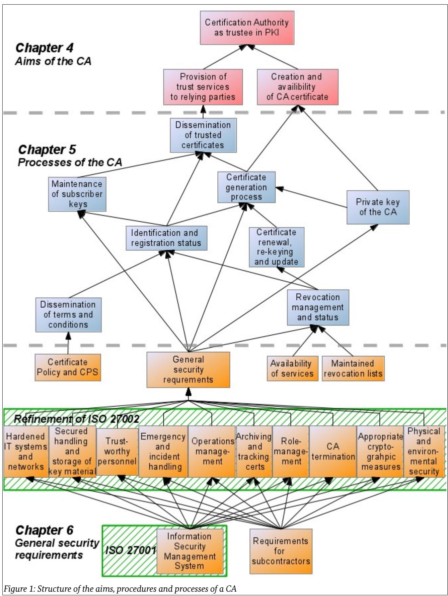

# TR-03145-1

# Secure CA operation, Part 1

Generic requirements for Trust Centers instantiating as Certification Authority (CA) in a Public-Key Infrastructure (PKI) with security level 'high'

Version 1.1 27.03.2017

Bundesamt für Sicherheit in der Informationstechnik Postfach 20 03 63 53133 Bonn Tel.: +49 22899 9582-0 E-Mail: eID@bsi.bund.de Internet: https://www.bsi.bund.de © Bundesamt für Sicherheit in der Informationstechnik 2017

| 1    | Introduction 5                                                       |  |
|------|----------------------------------------------------------------------|--|
| 1.1  | Audit and Certification 5                                            |  |
| 1.2  | Scope and structure of this document 5                               |  |
| 2    | Definitions, abbreviations and notation 7                            |  |
| 3    | Concept and approach 9                                               |  |
| 4    | Certification Authority as trustee in PKI 11                         |  |
| 4.1  | Trustworthy CA certificate 11                                        |  |
| 4.2  | Provision of trust services to relying parties11                     |  |
| 5    | Certificate Management Processes 12                                  |  |
| 5.1  | Private key of the CA 12                                             |  |
| 5.2  | Dissemination of 'Terms and Conditions'17                            |  |
| 5.3  | Identification and registration 19                                   |  |
| 5.4  | Maintenance of subscriber keys 23                                    |  |
| 5.5  | Certificate generation process 34                                    |  |
| 5.6  | Dissemination of trustable certificates (public keys)38              |  |
| 5.7  | Revocation and suspension 41                                         |  |
| 5.8  | Certificate renewal, re-keying and update44                          |  |
| 6    | General security requirements 49                                     |  |
| 6.1  | Information Security Management System49                             |  |
| 6.2  | Certificate Policy and Certification Practice Statement51            |  |
| 6.3  | Emergency management and incident handling54                         |  |
| 6.4  | Process organization 56                                              |  |
| 6.5  | Appropriate cryptographic measures57                                 |  |
| 6.6  | Secured handling and storage of key material58                       |  |
| 6.7  | Role-management 60                                                   |  |
| 6.8  | Trustworthy personnel 63                                             |  |
| 6.9  | Hardened IT systems and networks supporting logging and monitoring65 |  |
| 6.10 | Archiving and tracking 68                                            |  |
| 6.11 | Maintained revocation status 70                                      |  |
| 6.12 | Physical and environmental security 71                               |  |
| 6.13 | Availability of services 74                                          |  |
| 6.14 | CA termination 75                                                    |  |
| 6.15 | Requirements for subcontractors 77                                   |  |
|      | Appendix 79                                                          |  |
|      | Bibliography 82                                                      |  |

# 1 Introduction

The business of Public Key Infrastructures (PKI) is a business of trust.

A PKI is used either to keep information secret or to determine the authenticity and integrity of information. So the question is, how trustworthy are the tools used to reach a certain level of confidentiality, authenticity and integrity? And, is the originator respectively the recipient of the information trustworthy?

In a Public Key Infrastructure the Certification Authority (CA) shall provide the answer to both questions. This requires that the CA itself is trustworthy and trusted by the relying parties.

To achieve trust, two conditions have to be fulfilled. At first a basis has to be built which legitimates the trust. This is achieved by the CA implementing organizational and technical security measures for an appropriate security level and defining rules for all entities participating in a PKI.

In a second step the deployment of the security measures has to be documented in a transparent and comparable way, to build trust with potential customers. That can be achieved by passing an audit based on clear and documented requirements, performed by a trusted, independent auditor and certified by a trusted certification body.

This document aims to support CAs on both steps, as it defines requirements for Certificate Authorities for implementing secure CA operation and it builds a basis for a audit and certification process.

# 1.1 Audit and Certification

It will be possible for CAs to be certified according to ISO/IEC 27001 using this document as sector-specific requirements. This implies that the scope of the ISMS of the CA includes the entire CA operation.

## 1.2 Scope and structure of this document

The document at hand is Part 1 of the 'Secure CA operation' document series compiling requirements for Trust Center instantiating as Certification Authority (CA) in Public Key infrastructures (PKI) with a security level 'high'. It considers generic requirements for secure CA operation. The other documents of the series consider additional or modified requirements for special exemplary business cases of a PKI.

To support comprehensibility and plausibility of the security requirements, and thereby increasing chances to get them accurately and consistently fulfilled, this document is based on a top-down approach. Beginning with the main goal of each CA, namely to provide trust, then regarding the processes of the CA and finally considering general security requirements, such as physical protection of the servers. The dependencies of items are explained in each subchapter: A first table lists the aims, processes and requirements which are maintained by the process or requirement defined in that subchapter, a second table shows the requirements and processes the item of the subchapter is depending on.

In order to show which security requirements are needed, every process or procedure is analyzed and corresponding threats and requirements are stated. This is followed by justifying the requirements as being appropriate for the threats.

To enable the balance between flexibility and precision, so called selections and assignments are used. These are to be filled in by the CA, thereby enforcing a specification of a single procedure, but also allowing different solutions within defined limits. This mechanism is very important to ensure that there are no regulations which are not realizable or just baseless, since this would weaken the whole complex of requirements.

This document is structured in the following way:

- Chapter 2 comprises definitions and abbreviations in PKI and CA context.
- Chapter 3 presents the state-of-the-art approach of a Public-Key Infrastructure (PKI).
- Chapter 4 contains the aims and abstract utilities of a CA.
- Chapter 5 defines the processes involved in the key- and certificate-management life-cycle of a CA.
- Chapter 6 adds general requirements for a secure CA operation.

# 2 Definitions, abbreviations and notation

The definition of terms that are relevant in secure CA operation context are given below. The definitions are based on the descriptions made in standards, e.g. [ETSI TS 102 042] and [RFC3647].

| term                                       | definition                                                                                                                                                                                                                                                                                                             |
|--------------------------------------------|------------------------------------------------------------------------------------------------------------------------------------------------------------------------------------------------------------------------------------------------------------------------------------------------------------------------|
| attribute                                  | Information bound to an entity that specifies a characteristic of an entity, such as a group membership or a role, or other information associated with that entity.                                                                                                                                             |
| certificate                                | The public key of an entity together with information that the entity has been identified, and some other information, rendered unforgeable by a cryp tographic signature with the private key of the certification authority which issued the certificate.                                                   |
| certificate policy (CP)                    | A named set of rules that indicates the applicability of a certificate to a partic ular community and/or class application with common security requirement.                                                                                                                                                        |
| certificate revocation list (CRL)       | Cryptographically signed list indicating a set of certificates that are no longer considered valid by the issuing CA.                                                                                                                                                                                               |
| Certification Authority (CA)               | Authority trusted by one or more entities to create and assign certificates.                                                                                                                                                                                                                                           |
| certification practice state ment (CPS) | Statement of the practices which a certification authority employs in issuing, managing, revoking and renewing or re-keying certificates                                                                                                                                                                            |
| electronic signature                       | Cryptographically generated attachment to electronic data which allows to verify the integrity and authenticity of the data using a corresponding digital key.                                                                                                                                                   |
| encryption                                 | Process of encoding messages (or information) in such a way that only parties knowing the associated secret can decrypt and understand the message.                                                                                                                                                                 |
| fingerprint                                | Short sequence of bytes created by applying a cryptographic hash function to the public key. It can be used by the recipient to check the public key's au thenticity and integrity.                                                                                                                              |
| link certificate                           | Certificate containing the public key corresponding to a new private key of the CA signed with the private key corresponding to the current CA certifi cate.                                                                                                                                                     |
| OCSP                                       | The Online Certificate Status Protocol (OCSP) is an Internet protocol, which can be used for retrieving the revocation status of a certificate following the X.509 standard.                                                                                                                                     |
| Public-Key infrastructure (PKI)         | Set of hardware, software, people, policies, and procedures needed to create, manage, distribute, use, store, and revoke digital certificates.                                                                                                                                                                      |
| Registration Authority (RA)                | The registration authority (RA) or registrar is the entity conducting the iden tification and authentication processes in the key- and certificate-manage ment life-cycle for certificate subjects. Therefore an RA provides these ser vices on behalf of the CA. The RA does not issue or sign certificates. |
| relying party                              | Recipient of a certificate who acts in reliance on that certificate and/or digital signatures verified using that certificate.                                                                                                                                                                                      |

| term              | definition                                                                                                                                                                                             |
|-------------------|--------------------------------------------------------------------------------------------------------------------------------------------------------------------------------------------------------|
| rogue certificate | A certificate which contains incorrect information or is issued wrongfully and might be used by an attacker for crime as e.g. identity theft or manipu lated signatures.                         |
| subject           | Entity identified in a certificate as the holder of the private key associated with the public key given in the certificate (e.g. a person, a network device, a client or server process, etc.). |
| subscriber        | Entity subscribing with a Certification Authority on behalf of one or more subjects.                                                                                                                |
| token             | Signature-creation module, generating and handling cryptographic keys in a secure manner                                                                                                            |

*Table 1: Definitions, abbreviations and notation*

# 3 Concept and approach

The purpose of a Public-Key Infrastructure is to exchange trust, between parties which do not know each other. PKI is based on the concept of having trust in entities because they are trusted by an entity which is trustworthy. In a hierarchically organized PKI[1](#page-7-1) the Certification Authority is the topmost instance and is known and trusted by all other members of the PKI.

The most important tool within the PKI concept is the certificate, it is the certification of trust in the certificate holder by the CA. The certificate contains the unique name of the certificate holder, the electronic verifiable signature of the CA and the public key of the certificate holder, as well as some information on the use of the certificate. The public key can be used to encrypt digital data to be decrypted solely by the certificate holder, or to verify an electronic signature generated by the certificate holder.

A PKI consists of:

- the CA who manages the exchange of trust, defines the rules and checks the observance of the rules;
- the relying parties who trust in or rely on the subscriber certificates disseminated by the CA;
- the subscribers who are the certificate holders and subscribe to the CA, a subscriber can also be a relying party at the same time;
- all other persons, organizations, IT systems, data, buildings and infrastructure needed for the business of the CA.

A CA can either act as a topmost instance (a so called Root-CA) or as a subordinate instance (a so called Sub- -CA). The Root-CA is the anchor of trust within the PKI and signs its own certificates. Furthermore, it either signs and disseminates end entity certificates or, and this is the general case, signs and disseminates one or more Sub-CA certificates. A Sub-CA relies on the Root-CA and usually signs and disseminates end entity certificates. PKI hierarchies can also comprise more than one level of Sub-CA's. This document considers both CA roles.

[Figure 1](#page-8-0) shows the structure of this document, based on the aims, procedures and processes of a CA:

1 Although there are many different structures of PKI, this document only considers hierarchical PKIs.

# 4 Certification Authority as trustee in PKI

The main purpose of a Certification Authority (CA) is to moderate trust between the subscribers and other PKI members. The CA acts as a trustee of trust towards the other involved parties and issues certifications of trust for the subscribers of the CA.

To fulfill its main purpose, the CA shall reach the following objectives:

- CA.Obj.1 **['Trustworthy CA certificate'](#page-9-2):** Every digital certificate, i.e. *certification of trust, issued by the CA is signed with the private key of the CA and shall be verifiable by the relying parties of the* PKI. Therefore the CA shall issue the ['Trustworthy CA certificate'](#page-9-2) corresponding to its private key and disseminate it to the relying parties. The CA certificate is the digital trust anchor of the PKI.
- CA.Obj.2 **['Provision of trust services to relying parties'](#page-9-1)**: A CA shall provide trust services to its relying parties, which consists in ensuring the availability and trustability of the certificates which are issued as certifications of trust to the subscribers.

The Root-CA can issue and disseminate Sub-CA certificates for each Sub-CA controlling a branch of the PKI. As the business of Root-CA and Sub-CA is very similar, almost all objectives, threats and requirements specified in the document at hand apply to both. Therefore, the general term CA is used in this document. For the few aspects which might differ, it will be mentioned explicitly.

### 4.1 Trustworthy CA certificate

The trustworthy CA certificate is the digital trust anchor of the CA. It is used for the verification of every signature generated by the CA, therefore it shall be disseminated to all relying parties.

| Depending on                                       | Rationale                                                                                                                                                                                                                          |
|----------------------------------------------------|------------------------------------------------------------------------------------------------------------------------------------------------------------------------------------------------------------------------------------|
| 'Private key of the CA (cf. sec. 5.1)           | As the CA certificate is the trust anchor of the PKI the generation, usage and storage of the corresponding private key shall be performed in a highly secure manner meeting at least all conditions defined in section 5.1. |
| 'Certificate generation process' (cf. Sec. 5.5) | The CA certificate shall be generated considering a high level of integrity and security meeting at least all conditions defined in section 5.5.                                                                                |

To ensure the objective ['Trustworthy CA certificate'](#page-9-2), the following dependencies shall be fulfilled.

*Table 2: Dependencies of the ['Trustworthy CA certificate'](#page-9-2)* 

## 4.2 Provision of trust services to relying parties

The main trust service provided by the CA to its relying parties is the dissemination of trustable certificates of the subscribers, which is in fact the provision of trust. Other trust services as a revocation service are supporting the security of that main service.

To ensure the ['Provision of trust services to relying parties'](#page-9-1) in a trustworthy manner, the following dependencies shall be fulfilled:

| Depending on                                                         | Rationale                                                                                                  |
|----------------------------------------------------------------------|------------------------------------------------------------------------------------------------------------|
| 'Dissemination of trustable certifi cates (public keys) (cf. 5.6) | To provide trust to the relying parties the availability and trustability of certificates is necessary. |

*Table 3: Dependencies of the ['Provision of trust services to relying parties](#page-9-1)'* 

# 5 Certificate Management Processes

# 5.1 Private key of the CA

An integrity protected, authentic and confidential CA private key forms the basis for a trustworthy Certification Authority in a PKI. The CA private key is used by the Certification Authority to sign certificates in the ['Certificate generation process'](#page-32-0) (cf. section [5.5\)](#page-32-0) or to sign certificate revocation lists or issue OCSP signers during the ['Revocation and suspension'](#page-39-0) process (cf. section [5.7\)](#page-39-0).

Note that a CA may use separate key pairs corresponding to CA certificates to sign certificates, revocation lists and to issue OCSP signers. In this case those public keys should be signed with the private key of the CA[2](#page-10-2) .

The CA shall ensure that a CA key pair (in particular a CA private key) is maintained securely. This implies that the generation, storage and use of CA private keys must be strongly integrity protected, authentic and confidential.

| Maintaining                      | Rationale                                                                       |
|----------------------------------|---------------------------------------------------------------------------------|
| 'Certificate generation process' | An integrity protected, authentic and confidential private key of the CA        |
| (cf. sec. 5.5)                   | shall be used to sign certificates during the 'Certificate generation process'. |
| 'Trustworthy CA certificate'     | Only as long as the private key of the CA is integrity protected, authentic     |
| (cf. sec. 4.1)                   | and confidential a 'Trustworthy CA certificate' can be maintained.              |

The following table lists the processes which are maintained by the '[Private key of the CA](#page-10-1)':

*Table 4: Processes maintained by the ['Private key of the CA](#page-10-1)'*

To ensure that the ['Private key of the CA](#page-10-1)' can be processed in a trustworthy manner, following dependencies shall be fulfilled:

| Depending on                                    | Rationale                                                                                                                                                                                                                                                                                                                                                                           |
|-------------------------------------------------|-------------------------------------------------------------------------------------------------------------------------------------------------------------------------------------------------------------------------------------------------------------------------------------------------------------------------------------------------------------------------------------|
| 'General security requirements' (cf. sec. 6) | The General security requirements for a CA form the basis for a trustful PKI. Therefore, all processes are based on these fundamental security con cept. The 'Private key of the CA' in particular needs integrity protection, confidentiality and authenticity which is based on Appropriate crypto graphic measures and Secured handling and storage of key material. |

*Table 5: Processes on which the ['Private key of the CA](#page-10-1)' process depends*

#### 5.1.1 Objectives

For ['Private key of the CA',](#page-10-1) the following objectives need to be considered in a secure CA operation.

- PRC.Obj.1: A CA key pair shall only be generated with the knowledge of a responsible representative of the certification authority's legal body.
- PRC.Obj.2: A CA private key shall not be compromised.
- PRC.Obj.3: A CA private key shall be usable during the corresponding certificate validity period respectively the private key usage period specified in the 'Terms and Conditions'.

2 respectively the main private key of a sub-ca

- PRC.Obj.4: A CA private key shall not be used and shall therefore be securely deleted after the corresponding certificate validity period respectively the private key usage period specified in the 'Terms and Conditions'. PRC.Obj.5: A CA private key shall be protected from unauthorized access.
- PRC.Obj.6: A CA private key shall be protected from alteration and deletion during the private key usage period.

#### 5.1.2 Threats

For ['Private key of the CA',](#page-10-1) the following threats need to be considered in a secure CA operation.

- PRC.Threat.1: A CA key pair is generated without knowledge of the certificate authority's legal body and can therefore be used by an attacker[3](#page-11-0) undetected. The CA is compromised.
- PRC.Threat.2: The key pair of the CA is eavesdropped during the key generation process. The private key of the CA is compromised.
- PRC.Threat.3: A CA private key can be compromised by cryptographic analysis if it has been generated with vulnerable algorithms or insufficient key length even without knowledge of the private key.
- PRC.Threat.4: A CA private key is copied from the key store by an attacker. The private key of the CA is compromised.
- PRC.Threat.5: The key store is accessible by an attacker and an attacker is able to create electronic signatures pretending they are generated by the CA. The private key of the CA is compromised.
- PRC.Threat.6: A private key backup is accessible by an attacker. The private key of the CA is compromised.
- PRC.Threat.7: The key store hardware or software is damaged so that the private key of the CA is unusable.
- PRC.Threat.8: The CA private key is replaced in the key store by an attacker so that the private key of the CA is unusable and compromised.
- PRC.Threat.9: The CA private key is deleted in the key store by an attacker or by accident so that the private key of the CA is unusable.
- PRC.Threat.10: A CA private key is used after the corresponding certificate validity period respectively the private key usage period specified in the 'Terms and Conditions'. This increases the chance for the private key of the CA of being compromised, makes it difficult to verify certificates signed by the CA and weakens the PKI by the CA not fulfilling its own rules.
- PRC.Threat.11: The new CA certificate is not generated before the private key usage of the previous CA certificate has ended. This might enable the usage and distribution of rogue certificates, even a rogue CA certificate, by an attacker due to the following two reasons: 1. the CA is not able to issue certificates or revocation information within that time gap. 2. This threat also precludes the possibility to issue a link-certificate which enable an integrity and authenticity secured dissemination of the new CA certificate.

#### 5.1.3 Requirements

For the '[Private key of the CA](#page-10-1)', the following requirements are necessary in order to fulfill identified objectives and counter identified threats in a secure CA operation.

3 It shall be considered that the attacker also might be member of the CA personnel.

| PRC.Req.1  | The key pair generation shall be performed during a key ceremony in a four-eyes princi ple under attendance of the key responsible officer .                                                                                                                                                                                                                                                                                                                                                                                                                                                                                                                                              |  |
|------------|----------------------------------------------------------------------------------------------------------------------------------------------------------------------------------------------------------------------------------------------------------------------------------------------------------------------------------------------------------------------------------------------------------------------------------------------------------------------------------------------------------------------------------------------------------------------------------------------------------------------------------------------------------------------------------------------|--|
| PRC.Req.2  | The generation of a new key pair and the corresponding CA certificate shall be done [as signment: number of days more than 2] before the private key usage period of the previ ous CA certificate ends.                                                                                                                                                                                                                                                                                                                                                                                                                                                                                |  |
| PRC.Req.3  | The CA key generation shall be performed in a radiant emission protected environment following the principles of 'Secured handling and storage of key material' (cf. 6.6) to en sure that the CA keys are not compromised.                                                                                                                                                                                                                                                                                                                                                                                                                                                             |  |
| PRC.Req.4  | Key length and cryptographic algorithms of the CA key pairs have to follow the 'Appro priate cryptographic measures' (cf. 6.5).                                                                                                                                                                                                                                                                                                                                                                                                                                                                                                                                                           |  |
| PRC.Req.5  | Software and hardware components used for generation, handling and storage of the pri vate key of the CA shall follow the principles of 'Secured handling and storage of key ma terial' (cf. 6.6) to ensure that algorithms and protection mechanisms are implemented correctly.                                                                                                                                                                                                                                                                                                                                                                                                    |  |
| PRC.Req.6  | It shall be ensured that the CA private key cannot be exported unencrypted or unautho rized from the key store by following the principles of 'Secured handling and storage of key material' (cf. 6.6).                                                                                                                                                                                                                                                                                                                                                                                                                                                                                |  |
| PRC.Req.7  | It shall be ensured that the CA private key cannot be used for cryptographic operations by an attacker by following the principles of 'Secured handling and storage of key mate rial' (cf. 6.6) and 'Hardened IT systems and networks supporting logging and monitoring' (cf. 6.9).                                                                                                                                                                                                                                                                                                                                                                                                 |  |
| PRC.Req.8  | To decrease the chances for misuse of the CA private key used for the certificate signature it shall only be set active for the period necessary, which means the private key shall be deactivated if one of following cases occurs: 1. the key is intended not to be used until a fixed date, e.g. for disseminating the new certificate before it will be used; 2. the key is no longer in use because a new private key has been activated; 3. it is obvious that the key will not be used4 for a period of [assignment: number of days, weeks or months] due to a special use case. For the activation of the key material, smart card technology shall be used. |  |
| PRC.Req.9  | Secure key backups shall be performed following the principles of 'Secured handling and storage of key material' (cf. 6.6).                                                                                                                                                                                                                                                                                                                                                                                                                                                                                                                                                               |  |
| PRC.Req.10 | The key backup shall be performed during a key ceremony in a four-eyes principle under attendance of the key responsible officer.                                                                                                                                                                                                                                                                                                                                                                                                                                                                                                                                                         |  |
| PRC.Req.11 | It shall be ensured that the CA key backup data is stored in a secure manner following the principles of 'Secured handling and storage of key material' (cf. 6.6).                                                                                                                                                                                                                                                                                                                                                                                                                                                                                                                        |  |
| PRC.Req.12 | In case of a defect in the key store hardware or software it shall be ensured that the CA key backup is imported in a secure manner in a four-eyes principle in a new device fol lowing the principles of 'Secured handling and storage of key material' (cf. 6.6).                                                                                                                                                                                                                                                                                                                                                                                                                    |  |
| PRC.Req.13 | It shall be ensured that only trustworthy personnel has access to the CA key store and backup data by following the principles of 'Secured handling and storage of key material' (cf. 6.6).                                                                                                                                                                                                                                                                                                                                                                                                                                                                                            |  |
| PRC.Req.14 | The CA key pair shall be deleted in a key ceremony in a four-eyes principle under atten dance of the key responsible officer after revocation or regular end of validity of the CA certificate.                                                                                                                                                                                                                                                                                                                                                                                                                                                                                        |  |

4 except for incidents, then the private key shall be activated for revocation management

#### 5.1.4 Rationale

| Objective | Covered by                                          | Rationale                                                                                                                                                                                                                                    |
|-----------|-----------------------------------------------------|----------------------------------------------------------------------------------------------------------------------------------------------------------------------------------------------------------------------------------------------|
| PRC.Obj.1 | PRC.Req.1                                           | PRC.Req.1 ensures via a key ceremony that a key pair cannot be generated without knowledge of the responsible officer.                                                                                                                    |
| PRC.Obj.2 | PRC.Req.3 PRC.Req.4 PRC.Req.5 PRC.Req.7    | The requirements PRC.Req.3, PRC.Req.4, PRC.Req.5 and PRC.Req.7 ensure that the environment, the software and hardware components, the crypto graphic measures and operations are tailored to avoid compromising of the private key. |
| PRC.Obj.3 | PRC.Req.9 PRC.Req.10 PRC.Req.11 PRC.Req.12 | Appropriately secured back-up and import of the private is is ensured via PRC.Req.9, PRC.Req.10, PRC.Req.11 and PRC.Req.12. Therefore the usability of the key pair during the corresponding certificate validity period is ensured.   |
| PRC.Obj.4 | PRC.Req.6 PRC.Req.14                             | The complete key deletion after the key usage period is ensured by PRC.Req.14. Since exporting a key is prevented by 6, no unauthorized copy of the key pair exists.                                                                   |
| PRC.Obj.5 | PRC.Req.1 PRC.Req.6 PRC.Req.12                | By PRC.Req.6 the export from the key store is inhibited. The generation (cf. PRC.Req.1) and storage (cf. PRC.Req.12) ensures the unauthorized access.                                                                                     |
| PRC.Obj.6 | PRC.Req.3 PRC.Req.10 PRC.Req.12 PRC.Req.14 | PRC.Req.3 prevents from unknown manipulation of the key pair. The key back-up, import and deletion is safeguarded by PRC.Req.10, PRC.Req.12 and PRC.Req.14.                                                                            |

For the '[Private key of the CA](#page-10-1)' process, the following rationales hold:

*Table 6: Rationale for the objectives of the ['Private key of the CA](#page-10-1)' process*

| Threat       | Covered by               | Rationale                                                                                                                                       |
|--------------|--------------------------|-------------------------------------------------------------------------------------------------------------------------------------------------|
| PRC.Threat.1 | PRC.Req.1                | PRC.Req.1 ensures via a key ceremony that a key pair cannot be generated without knowledge of the responsible officer.                       |
| PRC.Threat.2 | PRC.Req.3                | PRC.Req.3 ensures that the key pair is not generated outside of a radiant emission protected environment.                                    |
| PRC.Threat.3 | PRC.Req.4                | PRC.Req.4 ensures appropriate cryptographic algorithms including sufficient key length.                                                      |
| PRC.Threat.4 | PRC.Req.6                | PRC.Req.6 ensures that the private key cannot by exported from the key stor age.                                                             |
| PRC.Threat.5 | PRC.Req.7                | PRC.Req.7 and PRC.Req.8 ensure that the CA private key cannot be used for cryptographic operations by an attacker.                           |
| PRC.Threat.6 | PRC.Req.11 PRC.Req.12 | PRC.Req.11 ensures that the back-up data is stored in a secured manner. PRC.Req.12 ensures that the back-up is imported in a secured manner. |
| PRC.Threat.7 | PRC.Req.5                | PRC.Req.5 ensures that the software and hardware components are imple mented in a manner that algorithms and protection mechanisms are imple |

| Threat        | Covered by              | Rationale                                                                                                                                                            |  |
|---------------|-------------------------|----------------------------------------------------------------------------------------------------------------------------------------------------------------------|--|
|               |                         | mented correctly.                                                                                                                                                    |  |
| PRC.Threat.8  | PRC.Req.5               | PRC.Req.5 ensures that the software and hardware components are imple mented in a manner that algorithms and protection mechanisms are imple mented correctly. |  |
| PRC.Threat.9  | PRC.Req.9 PRC.Req.12 | PRC.Req.9 and PRC.Req.12 ensure a secured back-up and re-import of the key pair in case of the deletion.                                                          |  |
| PRC.Threat.10 | PRC.Req.14              | PRC.Req.14 ensures the appropriate deletion of the key pair after the period of the key usage ended.                                                              |  |

*Table 7: Rationale for threats of the ['Private key of the CA'](#page-10-1) process*

# 5.2 Dissemination of 'Terms and Conditions'

Within this document, 'Terms and Conditions' are defined as the collectivity of all documents issued by the CA which define the duties and rights of the PKI members. This will at least include the Certificate Policy and may be expanded by additional documents like e.g. conditions on payment. All documents which shall stay secret due to security reasons are not part of the 'Terms and Conditions'.

Terms and Conditions shall be disseminated to the subscribers to inform them about the organizational and security requirements, which the subscribers have to fulfill before and during participation in the PKI, and which duties can be demanded to be fulfilled by the CA and the other subscribers.

The following table lists the processes which are maintained by the '[Dissemination of 'Terms and Conditions'](#page-15-0) process:

| Maintaining                                         | Rationale                                                                                                                                                                                                                                                                           |
|-----------------------------------------------------|-------------------------------------------------------------------------------------------------------------------------------------------------------------------------------------------------------------------------------------------------------------------------------------|
| 'Identification and registration' (cf. sec. 5.3) | The 'Terms and Conditions' have to be delivered by the CA and ac cepted by the subscriber during the Identification and registration process. As only subscribers shall be registered who know the 'Terms and Conditions' and confirm to fulfill their duties out of them. |

*Table 8: Processes maintained by the ['Dissemination of 'Terms and Conditions'](#page-15-0) process*

To ensure the [Dissemination of 'Terms and Conditions'](#page-15-0) in a trustworthy manner, the following dependencies shall be fulfilled:

| Depending on                                                                 | Rationale                                                                                                                                                                                                                                                                                                                                                                                 |
|------------------------------------------------------------------------------|-------------------------------------------------------------------------------------------------------------------------------------------------------------------------------------------------------------------------------------------------------------------------------------------------------------------------------------------------------------------------------------------|
| 'Certificate Policy and Certification Practice Statement.' (cf. sec. 6.2) | The Dissemination of 'Terms and Conditions' in particular is based on the availability of a complete and correct description of all CA services and the duties and security requirements for their subscribers in the Certificate Policy and Certification Practice Statement which are the main part of the 'Terms and Conditions' concerning the security re quirements. |

*Table 9: Processes on which the ['Dissemination of 'Terms and Conditions'](#page-15-0) process depends*

#### 5.2.1 Objectives

For ['Dissemination of 'Terms and Conditions',](#page-15-0) the following objectives need to be considered in a secure CA operation.

DissTC.Obj.1 The CA needs to define limits of certificate usage and the duties of the subscribers and relying parties to make clear in what kind of scope the subscribers are trustworthy. Additionally, the CA needs to declare its liability towards involved parties, i.e. subscribers and relying parties, covering the services the CA offers in key- and certificate management as well as related services (i.e. the validation service) for the PKI. Therefore the CA shall disseminate its current 'Terms and Conditions' to subscribers and relying parties.

#### 5.2.2 Threats

For ['Dissemination of 'Terms and Conditions',](#page-15-0) the following threats need to be considered in a secure CA operation. All threats would lead to a situation in which the observance of the rules of the PKI is not ensured for all subscribers, if they are not encountered. In such a situation the trust in the PKI is weakened and the chances for security incidents within the PKI increase.

| DissTC.Threat.1 | The 'Terms and Conditions' are disseminated in an incorrect or outdated version (e.g. due to an erroneous version control or a manipulation of the document by an attacker).                                               |
|-----------------|-------------------------------------------------------------------------------------------------------------------------------------------------------------------------------------------------------------------------------|
| DissTC.Threat.2 | The latest version of the 'Terms and Conditions' are not disseminated to all subscribers.                                                                                                                                     |
| DissTC.Threat.3 | A change of contents of the 'Terms and Conditions' is not clearly distinguishable for sub scribers and relying parties.                                                                                                    |
| DissTC.Threat.4 | Not all subscribers are willing to accept changes within the 'Terms and Conditions' in a new version of the document and the fulfillment of the duties is not demanded strictly anymore due to contractual resistances. |

#### 5.2.3 Requirements

For the '[Dissemination of 'Terms and Conditions',](#page-15-0) the following requirements are necessary to fulfill identified objectives and counter identified threats in a secure CA operation.

| DissTC.Req.1 | The CA shall make a statement of 'Terms and Conditions' available to subscribers and re lying parties of the PKI the CA operates in. 'Terms and Conditions' shall be made available in a durable way of communication.                                     |
|--------------|------------------------------------------------------------------------------------------------------------------------------------------------------------------------------------------------------------------------------------------------------------------|
| DissTC.Req.2 | In case of relevant changes of the CA structures or processes (e.g. changes in the arrange ment of the CA termination, updates in the CP etc.), the 'Terms and Conditions' shall be updated and provided appropriately to subscribers and relying parties. |
| DissTC.Req.3 | Each new version of the 'Terms and Conditions' shall be identified uniquely (e.g. by a unique version number contained in the text).                                                                                                                          |
| DissTC.Req.4 | The 'Terms and Conditions' acceptance by the subscriber shall be checked during the reg istration process of the subscriber and every time a new version is published.                                                                                        |
| DissTC.Req.5 | The 'Terms and Conditions' shall include regulations for acceptance of updates of the 'Terms and Conditions' by subscribers in conformance with applicable laws.                                                                                              |
| DissTC.Req.6 | The dissemination of 'Terms and Conditions' shall be protected from manipulation by [selection: including a checksum, being reachable over https, signature on paper-form [as signment: other methods]].                                                   |

#### 5.2.4 Rationale

For the '[Dissemination of 'Terms and Conditions'](#page-15-0)' process, the following rationales hold:

| Objective    | Covered by                   | Rationale                                                                                                                                              |
|--------------|------------------------------|--------------------------------------------------------------------------------------------------------------------------------------------------------|
| DissTC.Obj.1 | DissTC.Req.1 DissTC.Req.2 | DissTC.Req.1 ensures the dissemination of the 'Terms and Conditions'. Dis sTC.Req.2 ensures that the recent 'Terms and Conditions' are distributed. |

*Table 10: Rationale for the objectives of the ['Dissemination of 'Terms and Conditions'](#page-15-0) process*

| Threat          | Covered by                                   | Rationale                                                                                                                                                                                                                                                                                                                |
|-----------------|----------------------------------------------|--------------------------------------------------------------------------------------------------------------------------------------------------------------------------------------------------------------------------------------------------------------------------------------------------------------------------|
| DissTC.Threat.1 | DissTC.Req.2 DissTC.Req.3 DissTC.Req.6 | DissTC.Req.2 ensures that the 'Terms and Conditions' are updated and pro vided to the subscribers in case of relevant changes. DissTC.Req.3 ensures that the version number of the 'Terms and Conditions' is unique. Dis sTC.Req.6 ensures that the disseminated 'Terms and Conditions' are not manipulated. |
| DissTC.Threat.2 | DissTC.Req.2                                 | DissTC.Req.2 ensures that the 'Terms and Conditions' are updated and pro vided to all subscribers and relying parties.                                                                                                                                                                                                |

| DissTC.Threat.3 | DissTC.Req.3                 | DissTC.Req.3 ensures that the version number of the 'Terms and Condi tions' is unique.                                                                                                                                                  |
|-----------------|------------------------------|--------------------------------------------------------------------------------------------------------------------------------------------------------------------------------------------------------------------------------------------|
| DissTC.Threat.4 | DissTC.Req.4 DissTC.Req.5 | DissTC.Req.4 ensures that all subscribers, which participate in the PKI, ac cept the recent 'Terms and Conditions'. DissTC.Req.5 ensures that a sub scriber rejecting the recent 'Terms and Conditions' is excluded from the PKI. |

*Table 11: Rationale for threats of the ['Dissemination of 'Terms and Conditions'](#page-15-0) process*

# 5.3 Identification and registration

For a trustworthy environment it is necessary to ensure the correct authentication of subjects in a PKI. This authentication is part of the responsibility of the CA and should precede further processes. Further, it should be specifically done by non-electronic means. This document considers the 'Identification and Registration Service' as one combined service in the process flow.

The 'Identification and Registration Service' involves the contractual agreement between a CA and its subscribers. An applicant shall provide certain documentation for identification to the CA, while the CA checks the identity of this applicant including the name of the applicant.

The ['Identification and registration](#page-17-0)' process is a recurring process since the data collected during this process always needs to be up-to-date. Even after a successful registration, the subscriber shall provide further ['Identification and registration](#page-17-0)' data, whenever maintenance or update reasons demand it. In this case, the data might differ from the initial ['Identification and registration](#page-17-0)' data. At any time however, the ['Identifica](#page-17-0)[tion and registration'](#page-17-0) process shall ensure that the subscriber is unambiguously mapped to her provided data.

| Maintaining                                        | Rationale                                                                                                                                                                                                                                                                                                                                                                                                          |
|----------------------------------------------------|--------------------------------------------------------------------------------------------------------------------------------------------------------------------------------------------------------------------------------------------------------------------------------------------------------------------------------------------------------------------------------------------------------------------|
| 'Maintenance of subscriber keys (cf. sec. 5.4)  | The Identification and registration process comprises IT based and non- -IT based actions to confirm the identification and registration of appli cants to the CA services. It therefore ensures that the received 'Mainte nance of subscriber keys' can be correctly assigned to a subscriber autho rized for certificate application.                                                                |
| 'Certificate generation process' (cf. sec. 5.5) | In order to issue trustable certificates the process of certificate generation shall be applied only for authorized requests. Additionally the informa tion in the newly generated certificate shall be correct and up-to-date concerning the registration data corresponding to the applicant. There fore an appropriate identification and registration process of the sub scribers is necessary. |

The following table lists the processes which are maintained by the '[Identification and registration'](#page-17-0):

*Table 12: Processes maintained by the ['Identification and registration](#page-17-0)' process*

To ensure that the ['Identification and registration'](#page-17-0) can be processed in a trustworthy manner, the following dependencies shall be fulfilled:

| Depending on                                                | Rationale                                                                                                                                                                                                                      |
|-------------------------------------------------------------|--------------------------------------------------------------------------------------------------------------------------------------------------------------------------------------------------------------------------------|
| 'Dissemination of 'Terms and Con ditions' (cf. sec. 5.2) | As part of the registration process, the subscriber shall confirm to fulfill the subscriber's duties of the Terms and Conditions. Only by that state ment the subscriber can be trustworthy within the scope of the PKI. |
|                                                             | The registration process cann only be finalized if the 'Terms and Con                                                                                                                                                          |

| Depending on                                    | Rationale                                                                                                                                                                                                                                                                                                                                                                                                                                                                                                                                                           |
|-------------------------------------------------|---------------------------------------------------------------------------------------------------------------------------------------------------------------------------------------------------------------------------------------------------------------------------------------------------------------------------------------------------------------------------------------------------------------------------------------------------------------------------------------------------------------------------------------------------------------------|
|                                                 | ditions' are accepted by the subscriber.                                                                                                                                                                                                                                                                                                                                                                                                                                                                                                                            |
| 'General security requirements' (cf. sec. 6) | Therefore, all processes are based on these fundamental security con cept. The Identification and registration process is based on the 'Gen eral security requirements'. It depends e.g. on well-defined 'Process or ganization', 'Trustworthy personnel', and 'Hardened IT systems and networks supporting logging and monitoring'. A maintained and integrity secured database of subscribers helps in tracing any misused key material, therefore 'Archiving and tracking' forms a basis for the 'Identification and registration' process. |

*Table 13: Processes on which the ['Identification and registration](#page-17-0)' process depends*

The identified objectives and threats of the '[Identification and registration'](#page-17-0) processes are listed in the following sections. Subsequently, several requirements are defined for the CA. Note, that the process of the ['Identi](#page-17-0)[fication and registration](#page-17-0)' comprises IT-based actions as well as non-IT based actions. A rationale is given below.

#### 5.3.1 Objectives

For the '[Identification and registration'](#page-17-0) process, the following objectives need to be considered for secure CA operation.

| IR.Obj.1 | The CA shall ensure that the identity of subscribers can be traced unambiguously, e.g. in a non-IT manner or by using official identity documents. Further, the correctness of rele vant information provided by the subscribers shall be ensured by the CA. |
|----------|--------------------------------------------------------------------------------------------------------------------------------------------------------------------------------------------------------------------------------------------------------------------|
| IR.Obj.2 | Since the CA may offer its certificates for a critical operation (e.g. in identity management or TLS security), it is important for the CA to ensure the accountability of the provided physical identities.                                                 |
| IR.Obj.3 | The CA shall provide a database of the identities (e.g. the name) and attributes of the sub scribers in a secure manner, maintaining the integrity. Based on this database, the certifi cates can be issued unambiguously to the respective subscribers.     |
| IR.Obj.4 | The CA shall be able to distinguish different roles, for example to distinguish between the role of a subscriber and a subject, if they differ.                                                                                                                 |

#### 5.3.2 Threats

For the '[Identification and registration'](#page-17-0) process, the following threats can be identified for secure CA operation.

| IR.Threat.1 | A subscriber is registered erroneous: For example, the information yielded during regis tration is incorrect or incorrectly linked. If the identification or registration information is incorrect, an impersonation attack might lead into rogue certificates or issued certifi cates are incorrect an useless. |
|-------------|---------------------------------------------------------------------------------------------------------------------------------------------------------------------------------------------------------------------------------------------------------------------------------------------------------------------------|
| IR.Threat.2 | The information, which is transmitted by the subscriber, is eavesdropped during the 'Identification and Registration' process. This is a threat due to privacy reasons, and more over the knowledge of registration data facilitates impersonation attacks.                                                         |
| IR.Threat.3 | A subscriber is registered without fulfilling all criteria defined in the 'Terms and Condi tions'. This might lead into security incidents caused by the subscriber and definitely weakens the trustworthiness of the CA as untrustworthy subscribers are stated to be trustworthy.                              |

| IR.Threat.4 | The information or status of the registration is manipulated by an attacker during the registration process, which leads to a rogue certificate.                                                                                                                  |
|-------------|----------------------------------------------------------------------------------------------------------------------------------------------------------------------------------------------------------------------------------------------------------------------|
| IR.Threat.5 | The information checked at the registration is outdated. Particularly, the faulty informa tion about the reliability of a subscriber can result in rogue certificates.                                                                                            |
| IR.Threat.6 | Subcontractors or personnel of the CA not adhering the CP claimed by the CA might not uphold a security level 'high'. Thus they may facilitate attack scenarios on the life-cycle part they are involved in.                                                   |
| IR.Threat.7 | If a subscriber is registered several times with different identities and these data sets are not linked, the suspension of a subscriber might be executed incompletely and a sub scriber not fulfilling the requirements of the CA gets certificates wrongly. |
| IR.Threat.8 | The registration information set contains no additional information about the registra tion process. Subscriber information might be outdated, not fully checked or incorrect.                                                                                    |

#### 5.3.3 Requirements

For the '[Identification and registration'](#page-17-0) process, the following requirements can be identified to fulfill objectives and counter the threats identified for a secure CA operation.

| IR.Req.1 | The formal process-flow including the interfaces for requesting the registration and/or providing information by the applicant shall be clearly defined and verified by the CA.                                                                                                                                                                                                                                                                                                                                                                                                                                                                                                                                                                                                                                                       |
|----------|------------------------------------------------------------------------------------------------------------------------------------------------------------------------------------------------------------------------------------------------------------------------------------------------------------------------------------------------------------------------------------------------------------------------------------------------------------------------------------------------------------------------------------------------------------------------------------------------------------------------------------------------------------------------------------------------------------------------------------------------------------------------------------------------------------------------------------------|
| IR.Req.2 | The integrity and correctness of the 'Identification and registration' process shall be en sured by trustworthy personnel as defined in section 6.8 ('Trustworthy personnel').                                                                                                                                                                                                                                                                                                                                                                                                                                                                                                                                                                                                                                                        |
| IR.Req.3 | The CA shall ensure that the 'Identification and registration' process is appropriately hardened against eavesdropping and manipulation. Therefore the CA shall define within the 'Terms and Conditions' on which way the subscriber may transfer the registration data. Additionally every transfer of registration and identification data within or outside the CA shall be secured.                                                                                                                                                                                                                                                                                                                                                                                                                                      |
| IR.Req.4 | The CA shall oblige subscribers to provide accurate and complete information to suffi ciently verify validity and authenticity of the subscription in accordance with the re quirements of its 'Terms and conditions' at time of 'Identification and registration'.                                                                                                                                                                                                                                                                                                                                                                                                                                                                                                                                                                |
| IR.Req.5 | The CA shall oblige subscribers to provide updates of their registration data each time data has changed. Additionally, the CA shall require a confirmation of registration data still being valid by the subscriber every [assignment: number of months]:                                                                                                                                                                                                                                                                                                                                                                                                                                                                                                                                                                         |
| IR.Req.6 | The CA shall clearly define different possible roles, namely [selection: subject, subscriber [assignment: further roles]] for the case that subscriber and subject can be different (e.g. the subscriber is allowed to subscribe on behalf of more than one subject), and for the designated applicants [selection: physical person, physical person associated with a legal person, a legal person [assignment: further person]].                                                                                                                                                                                                                                                                                                                                                                                           |
| IR.Req.7 | The CA shall verify the information identifying the applicants and the physical existence directly or indirectly using appropriate measures in accordance with the national law. The physical address or other appropriate attributes for contact shall be verified. The CA shall define clearly the set of information identifying the applicant. Additional to the name of the applicant at the time point of registration, the [selection: no further informa tion, date of birth, place of birth, national identification documents, [assignment: further in formation]] is/are used for identification. If the subject differs from the subscriber, addi tional information shall be provided and checked. In case of a physical person associated with a legal person, this association shall be verified. |
| IR.Req.8 | The CA shall define the minimum set of information gathered from an applicant which is categorized as attributes, and ensure the sufficient evidence of this information.                                                                                                                                                                                                                                                                                                                                                                                                                                                                                                                                                                                                                                                             |

| IR.Req.9  | The CA shall ensure the reliability of the parties involved in the identification and regis tration process. Particularly, the personnel involved in the non-IT and IT-based actions for Identification and registration have to be trustworthy. Therefor the requirements of the sections 6.8 ('Trustworthy personnel') and 6.15 ('Requirements for subcontractors') have to be fulfilled.                                                                                                                                                    |
|-----------|------------------------------------------------------------------------------------------------------------------------------------------------------------------------------------------------------------------------------------------------------------------------------------------------------------------------------------------------------------------------------------------------------------------------------------------------------------------------------------------------------------------------------------------------------------|
| IR.Req.10 | If any subcontractors are providing services to the CA in the 'Identification and Registra tion' process, the CA shall ensure security level 'high' for all subcontractors. Thus there have to be agreements between the CA and those subcontractors to maintain the claimed security level. The signed agreement shall include [selection: agreement of subscribers obligations, confirmation of the correctness of all information provided by the applicant, consent for storing the provided information [assignment: further details]] |
| IR.Req.11 | The CA shall record and archive all relevant information, according to the requirements of section 6.10 ('Archiving and tracking'), to identify the identity of the subscribers such that maintenance and integrity is provided in a secure manner.                                                                                                                                                                                                                                                                                                  |
| IR.Req.12 | The CA shall check its database to determine if a subscriber has registered before so that multiple identities of a subscriber are linked within the registration database and can be suspended at once or prevented totally if required by the terms and conditions.                                                                                                                                                                                                                                                                                |
| IR.Req.13 | The registration information shall contain all relevant information. This shall be [selec tion: type and version of documents send to the subscriber, unique identification number or data of identification documents, signed subscriber agreement, identity of entity registering the subscriber, used verification steps, name of receiving CA and submitting RA if necessary [assignment: further registration information]].                                                                                                              |

#### 5.3.4 Rationale

For the '[Identification and registration'](#page-17-0) process, the following rationales hold:

| Objective | Covered by                                   | Rationale                                                                                                                                                                                                                                                                                                                                                                                                                                                                                                          |
|-----------|----------------------------------------------|--------------------------------------------------------------------------------------------------------------------------------------------------------------------------------------------------------------------------------------------------------------------------------------------------------------------------------------------------------------------------------------------------------------------------------------------------------------------------------------------------------------------|
| IR.Obj.1  | IR.Req.2 IR.Req.4 IR.Req.6 IR.Req.7 | IR.Req.1 makes it necessary that the CA ensures the identity of subscribers. Fur ther, the correctness of the received information shall be ensured. IR.Req.2 ensures the integrity and correctness of the 'Identification and registration' process. IR.Req.4 arranges that the subscribers provide accurate and complete information. IR.Req.6 ensures that the CA verifies the information identifying the applicants in a non-IT manner. The minimum set of information is ensured by IR.Req.7. |
| IR.Obj.2  | IR.Req.2 IR.Req.4 IR.Req.6             | IR.Obj.2 targets the accountability of the provided physical identities. IR.Req.2 en sures the integrity and correctness of the 'Identification and registration' process. IR.Req.4 arranges that the subscribers provide accurate and complete information. IR.Req.6 ensures that the CA verifies the information identifying the applicants in a non-IT manner.                                                                                                                                      |
| IR.Obj.3  | IR.Req.10                                    | IR.Obj.3 provides for a database in a maintained and integrity secured manner. IR.Req.10 ensures that the CA records and archives all relevant information to identify the identity of subscribers in a maintained and integrity secured manner.                                                                                                                                                                                                                                                             |
| IR.Obj.4  | IR.Req.6                                     | IR.Obj.4 makes it necessary that the CA distinguishes different roles. This objective is directly fulfilled by IR.Req.5.                                                                                                                                                                                                                                                                                                                                                                                        |

*Table 14: Rationale for the objectives of the ['Identification and registration](#page-17-0)' process*

| Threat      | Covered by | Rationale                                                                            |
|-------------|------------|--------------------------------------------------------------------------------------|
| IR.Threat.1 | IR.Req.1   | IR.Threat.1 jeopardizes the correct registration of a relying party or a subscriber. |

| Threat      | Covered by                                    | Rationale                                                                                                                                                                                                                                                                                                                                                                                                                                                                                              |
|-------------|-----------------------------------------------|--------------------------------------------------------------------------------------------------------------------------------------------------------------------------------------------------------------------------------------------------------------------------------------------------------------------------------------------------------------------------------------------------------------------------------------------------------------------------------------------------------|
|             | IR.Req.2 IR.Req.4 IR.Req.6 IR.Req.10 | IR.Req.1 ensures that the interfaces for the 'Identification and registration' process are defined and verified by the CA. IR.Req.2 ensures the integrity and correctness of the 'Identification and registration' process. IR.Req.4 obliges the subscriber to bring in correct registration data. Further, IR.Req.6 ensures that the CA verifies the information identifying the applicants. IR.Req.10 requires the CA to record the gathered information.                             |
| IR.Threat.2 | IR.Req.3                                      | IR.Threat.2 endangers the transmitted information provided by the subscriber. Eavesdropping is of particular concern. This threat is directly countered by IR.Req.3 which requires the CA to harden the 'Identification and registration' process against eavesdropping and manipulation.                                                                                                                                                                                                     |
| IR.Threat.3 | IR.Req.4                                      | IR.Threat.3 regards the matter when a subscriber is registered without fulfilling all criteria defined in the 'Terms and Conditions'. This threat is countered by IR.Req.4 which ensures that the CA obliges subscribers to the 'Terms and Condi tions'.                                                                                                                                                                                                                                      |
| IR.Threat.4 | IR.Req.3                                      | IR.Threat.4 endangers the information or status of the registration. This threat is directly countered by IR.Req.3 which requires the CA to harden the 'Identifi cation and registration' process against eavesdropping and manipulation.                                                                                                                                                                                                                                                        |
| IR.Threat.5 | IR.Req.4                                      | IR.Threat.5 regards the matter when the information checked at the registra tion is outdated. IR.Req.4 arranges that the subscribers provide accurate and complete information in a timely manner.                                                                                                                                                                                                                                                                                               |
| IR.Threat.6 | IR.Req.8 IR.Req.9                          | IR.Threat.6 jeopardizes the adherence of the CP. Subcontractors or personnel might not adhere the CP claimed by the CA so that a security level 'high' cannot be uphold. Thus this threat may facilitate attack scenarios on the life-cycle part they are involved in. IR.Req.8 and IR.Req.9 counter IR.Threat.6 since they re quires the CA to arrange agreements between its' subcontractors upholding the security level 'high' and thus ensure the reliability of parties involved. |
| IR.Threat.7 | IR.Req.11 IR.Req.12                        | IR.Threat.7 is countered by the combination of IR.Req.11 and IR.Req.12 by re quiring the CA to have a mechanism to detect multiple registrations of one sub scriber and either prevent them or link them in the registration database to en able the suspension of all identities of the same subscriber at once.                                                                                                                                                                             |
| IR.Threat.8 | IR.Req.13                                     | IR.Req.13 requires additional information on the registration process of a sub scriber.                                                                                                                                                                                                                                                                                                                                                                                                             |

*Table 15: Rationale for threats of the ['Identification and registration](#page-17-0)' process*

# 5.4 Maintenance of subscriber keys

As mentioned within the previous section, the Certification Authority shall ensure that a public key is unambiguously identified to belong to the corresponding subscriber. Such a public key will be included in the generated certificate (see Chapter [5.5\)](#page-32-0) and thus bound to the subscriber's identity during the validity period of the certificate. There are the several alternative ways how the subscriber public key and private key can be provided:

• the key pair is generated at the subscriber's area and the public key is provided by the subscriber during the identification process together with the required identity data (see chapter [5.4.1\)](#page-22-0) or

- the Certification Authority generates a key pair on behalf of the subscriber before certificate generation and delivers it to the subscriber in a secure manner (see chapter [5.4.2\)](#page-25-0),
- the Certification Authority provides the key pair and the certificate stored on a personalized token to the subscriber (see chapter [5.4.3\)](#page-28-0).

These alternatives will be described in the following subsections.

#### 5.4.1 (optional) Public Key provided by the subscriber

In case the public key is provided by the subscriber there are three possible ways of derivation of the corresponding key pair. The key pair can

- be generated in the subscriber's environment by software applications like SSL servers or email clients
- be generated by a cryptographic module (e.g. smart card, HSM) on the subscriber's choice or
- be derived from a cryptographic module storing prefabricated key pairs which is able to generate signatures and perform decryption of encrypted data.

The CA shall define in it's Terms and Conditions which way(s) of key pair derivation are allowed, which technical requirements have to be fulfilled for key generation, and oblige subscribers to follow the requirements of the Terms and Conditions.

The following table lists the processes which are maintained by the '[\(optional\) Public Key provided by the](#page-22-0)  [subscriber'](#page-22-0):

| Maintaining                                                                   | Rationale                                                                                                                                                                                                                                                                                                                                               |
|-------------------------------------------------------------------------------|---------------------------------------------------------------------------------------------------------------------------------------------------------------------------------------------------------------------------------------------------------------------------------------------------------------------------------------------------------|
| 'Dissemination of trustable cer tificates (public keys)' (cf. sec. 5.6) | Only trustable certificates shall be disseminated by the CA which requires that the private keys of the subscribers are generated, used and stored se curely. Also the correct assignment between the public key, the corre sponding private key and the subscriber is of great importance for the dissemination of trustable certificates. |

*Table 16: Processes maintained by the ['\(optional\) Public Key provided by the subscriber](#page-22-0)' process*

To ensure that the ['\(optional\) Public Key provided by the subscriber'](#page-22-0) can be processed in a trustworthy manner, following dependencies shall be fulfilled:

| Depending on                                        | Rationale                                                                                                                                                                                                                                                                                                                                                                                                                                     |
|-----------------------------------------------------|-----------------------------------------------------------------------------------------------------------------------------------------------------------------------------------------------------------------------------------------------------------------------------------------------------------------------------------------------------------------------------------------------------------------------------------------------|
| 'Identification and registration' (cf. sec. 5.3) | The Identification and registration process is the basis for a valid authen tication of a subscriber. If the subscriber's public key is provided by the subscriber himself, key provision shall follow the processes of '(optional) Public Key provided by the subscriber' and needs to be integrated in the Identification and registration process to assign the public key to the sub scribers registration data correctly. |
| 'General security requirements' (cf. sec. 6)     | The (optional) Public Key provided by the subscriber for example depends on 'Hardened IT systems and networks supporting logging and monitor ing' since the keys shall be transmitted in an authentic and integrity pro tected way between the subscriber and the CA.                                                                                                                                                                |

*Table 17: Processes on which the ['\(optional\) Public Key provided by the subscriber'](#page-22-0) process depends*

#### 5.4.1.1 Objectives

For the '[\(optional\) Public Key provided by the subscriber'](#page-22-0) process, the following objectives need to be considered for secure CA operation.

| PKS.Obj.1 | The subscriber's public key shall be available to the CA during the Certificate generation process. |
|-----------|--------------------------------------------------------------------------------------------------------|
| PKS.Obj.2 | A subscriber private key shall not be compromised.                                                     |
| PKS.Obj.3 | A subscriber private key shall be protected from unauthorized access.                                  |
| PKS.Obj.4 | A subscriber private key shall be protected from alteration and deletion.                              |
| PKS.Obj.5 | A subscriber private key shall be assigned to the subscribers registration data correctly.             |

#### 5.4.1.2 Threats

For the '[\(optional\) Public Key provided by the subscriber'](#page-22-0) process, the following threats are identified for secure CA operation.

| PKS.Threat.1 | A public key is provided by an attacker pretending to be the subscriber and the attacker gets a certificate binding the attacker's public key with the subscriber's identity.                |
|--------------|-------------------------------------------------------------------------------------------------------------------------------------------------------------------------------------------------|
| PKS.Threat.2 | The subscriber's public key is altered during transmission to the CA and corresponds to the private key of an attacker afterwards.                                                           |
| PKS.Threat.3 | The registered subscriber's public key is altered in the CA registration database and corre sponds to the private key of an attacker afterwards.                                             |
| PKS.Threat.4 | A subscriber key can be compromised by cryptographic analysis if it has been generated with vulnerable algorithms or insufficient key length (even without knowledge of the private key). |
| PKS.Threat.5 | A subscriber's private key is exported from the subscriber's key store by an attacker.                                                                                                          |
| PKS.Threat.6 | The subscriber's key store is accessible by an attacker and a subscriber's private key can be used by an attacker to perform cryptographic operations.                                       |
| PKS.Threat.7 | A subscriber's key backup is accessible by an attacker.                                                                                                                                         |

#### 5.4.1.3 Requirements

For the '[\(optional\) Public Key provided by the subscriber'](#page-22-0) process, the following requirements can be identified to fulfill the objectives and counter the threats identified for a secure CA operation.

- PKS.Req.1 The certificate enrollment data shall contain the public key together with subscriber attributes that are necessary for the registration process. At least the public key and the subscriber attributes have to be signed with the private key of the subscriber's key pair to avoid alteration and proof possession of the private key. The CA shall verify the signature.
- PKS.Req.2 The CA shall store the certificate enrollment data in a database which is protected against unauthorized access, alteration and deletion.
- PKS.Req.3 The CA shall define subscriber obligations concerning the subscriber operation environment to prevent unauthorized access to or alteration of subscriber keys in the Terms and Conditions.

| PKS.Req.4 | The CA shall verify the required cryptographic features of the subscriber key pair and refuse the certificate enrollment if the requirements are not fulfilled.                                                                                                                                                                                                                                                                                                                                                                                                                                                                                                                                                                                  |
|-----------|-----------------------------------------------------------------------------------------------------------------------------------------------------------------------------------------------------------------------------------------------------------------------------------------------------------------------------------------------------------------------------------------------------------------------------------------------------------------------------------------------------------------------------------------------------------------------------------------------------------------------------------------------------------------------------------------------------------------------------------------------------|
| PKS.Req.5 | The CA shall define subscriber obligations concerning key generation and key storage in the Terms and Conditions.                                                                                                                                                                                                                                                                                                                                                                                                                                                                                                                                                                                                                                |
| PKS.Req.6 | The CA shall determine the security level of the supported subscriber applications by considering a risk analysis of the business case and if applicable legal requirements. The CA shall demand the usage of cryptographic modules (HSM or token) for key generation and key storage at least in subscriber applications with a security level 'high', as e.g. Sub CAs or qualified electronic signatures. For subscriber applications with lower security level, the CA shall at least demand from subscribers to adopt the following security mea sures: use of virus protection, use of software firewall, installation of operating system se curity updates when they occur, [assignment: additional security measures]. |
| PKS.Req.7 | The requirements on hard- and/or software to be used for key generation and storage of subscriber keys shall be specified in the Terms and Conditions.                                                                                                                                                                                                                                                                                                                                                                                                                                                                                                                                                                                           |
| PKS.Req.8 | If cryptographic token are required the CA shall provide technical mechanisms to cor rectly assign the received subscriber's public key to the token and the registration data.                                                                                                                                                                                                                                                                                                                                                                                                                                                                                                                                                                  |

#### 5.4.1.4 Rationale

| Objective | Covered by             | Rationale                                                                                                                                                                                                        |
|-----------|------------------------|------------------------------------------------------------------------------------------------------------------------------------------------------------------------------------------------------------------|
| PKS.Obj.1 | PKS.Req.1              | PKS.Req.1 ensures that the certificate enrollment data includes the subscriber's public key.                                                                                                                  |
| PKS.Obj.2 | PKS.Req.5 PKS.Req.6 | PKS.Req.5 and PKS.Req.6 ensure that the key is generated and stored in a way the subscriber key can not be compromised.                                                                                       |
| PKS.Obj.3 | PKS.Req.2 PKS.Req.3 | PKS.Req.2 ensures the subscriber key is protected against unauthorized access. PKS.Req.3 ensures that the subscriber is obliged to prevent the subscriber opera tion environment from unauthorized access. |
| PKS.Obj.4 | PKS.Req.2 PKS.Req.3 | PKS.Req.2 ensures the subscriber key is protected against alteration and deletion. PKS.Req.3 ensures that the subscriber is obliged to prevent the subscriber opera tion environment from alteration.      |
| PKS.Obj.5 | PKS.Req.8              | PKS.Req.8 ensures that the subscriber public key is correctly assigned to the regis tration data.                                                                                                             |

For the '[\(optional\) Public Key provided by the subscriber'](#page-22-0) process, the following rationales hold:

*Table 18: Rationale for the objectives of the ['\(optional\) Public Key provided by the subscriber](#page-22-0)' process*

| Threat       | Covered by             | Rationale                                                                                                                                                          |
|--------------|------------------------|--------------------------------------------------------------------------------------------------------------------------------------------------------------------|
| PKS.Threat.1 | PKS.Req.1 PKS.Req.8 | PKS.Req.1 and PKS.Req.8 ensure that the certificate enrollment data is defined properly and that the registration data is correctly assigned to the public key. |
| PKS.Threat.2 | PKS.Req.2 PKS.Req.3 | PKS.Req.2 and PKS.Req.3 ensure that the certificate enrollment data is not al tered during transmission to the CA.                                              |
| PKS.Threat.3 | PKS.Req.2              | PKS.Req.2 ensures that the certificate enrollment data is stored in a secured way.                                                                              |
| PKS.Threat.4 | PKS.Req.4              | If cryptographic features like cryptographic algorithms or key length are in                                                                                       |

|              |                        | sufficient, the CA will refuse the subscriber key following PKS.Req.4.                                                                                                                        |
|--------------|------------------------|-----------------------------------------------------------------------------------------------------------------------------------------------------------------------------------------------|
| PKS.Threat.5 | PKS.Req.5              | PKS.Req.5 ensures that the subscriber's private key is stored in a secured way.                                                                                                               |
| PKS.Threat.6 | PKS.Req.5              | PKS.Req.5 ensures that the subscriber's key pair is stored in a secured way.                                                                                                                  |
| PKS.Threat.7 | PKS.Req.5 PKS.Req.6 | PKS.Req.5 and PKS.Req.6 ensure via obligations concerning the key storage and proper usage of cryptographic modules that the subscriber's key back-up is not accessible by an attacker. |

*Table 19: Rationale for threats of the ['\(optional\) Public Key provided by the subscriber](#page-22-0)' process*

#### 5.4.2 (optional) Subscriber's key pair generation and dissemination

The second alternative to provide the subscriber's key pair is that the Certification Authority generates the subscriber's key pair and distributes it to the subscriber. Additionally, the CA could offer a subscriber key backup service.

Note, that these methods are in conflict with the requirement that the sole control over subscriber private keys shall be on the subscriber, which is demanded in many PKI use cases.

In PKI use cases where the method is applicable, the objectives and requirements of the present subchapter shall be fulfilled.

The following table lists the processes which are maintained by the '[\(optional\) Subscriber's key pair genera](#page-25-0)[tion and dissemination](#page-25-0)':

| Maintaining                                                                   | Rationale                                                                                                                                                                                                                                                                                                                                               |
|-------------------------------------------------------------------------------|---------------------------------------------------------------------------------------------------------------------------------------------------------------------------------------------------------------------------------------------------------------------------------------------------------------------------------------------------------|
| 'Dissemination of trustable certifi cates (public keys)' (cf. sec. 5.6) | Only trustable certificates shall be disseminated by the CA which re quires that the private keys of the subscribers are generated, used and stored securely. Also the correct assignment between the public key, the corresponding private key and the subscriber is of great impor tance for the dissemination of trustable certificates. |

*Table 20: Processes maintained by the ['\(optional\) Subscriber's key pair generation and dissemination](#page-25-0)' process*

To ensure that the ['\(optional\) Subscriber's key pair generation and dissemination](#page-25-0)' can be processed in a trustworthy manner, the following dependencies of the '[\(optional\) Subscriber's key pair generation and dissemi](#page-25-0)[nation'](#page-25-0) process shall be fulfilled:

| Depending on                                        | Rationale                                                                                                                                                                                                                                                                                                                                                                                                                              |  |
|-----------------------------------------------------|----------------------------------------------------------------------------------------------------------------------------------------------------------------------------------------------------------------------------------------------------------------------------------------------------------------------------------------------------------------------------------------------------------------------------------------|--|
| 'Identification and registration' (cf. sec. 5.3) | The Identification and registration process is the basis for a valid au thentication of a subscriber. Only after this process is finalized the '(op tional) Subscriber's key pair generation and dissemination' process can disseminate the key pair to the corresponding subscriber.                                                                                                                                         |  |
| 'General security requirements' (cf. sec. 6)     | The (optional) Subscriber's key pair generation and dissemination is based on the 'General security requirements' especially on the require ments of the subchapters 'Appropriate cryptographic measures', Se cured handling and storage of key material', 'Trustworthy personnel' and 'Hardened IT systems and networks supporting logging and moni toring' since the keys shall be generated adequately and securely. |  |

*Table 21: Processes on which the ['\(optional\) Subscriber's key pair generation and dissemination'](#page-25-0) process depends*

#### 5.4.2.1 Objectives

For the '[\(optional\) Subscriber's key pair generation and dissemination'](#page-25-0) process, the following objectives need to be considered for secure CA operation.

| KGD.Obj.1 | The subscriber key pair shall not be compromised.                                                                                   |
|-----------|-------------------------------------------------------------------------------------------------------------------------------------|
| KGD.Obj.2 | The key pair shall be disseminated to the correct subscriber.                                                                       |
| KGD.Obj.3 | The key pair shall be disseminated to the correct subscriber in a secure way protected from unauthorized access or alteration.   |
| KGD.Obj.4 | The subscriber key pair shall never be accessed and used for cryptographic operations by any other instance than the subscriber. |

#### 5.4.2.2 Threats

For the '[\(optional\) Subscriber's key pair generation and dissemination'](#page-25-0) process, the following threats can be identified for secure CA operation.

| KGD.Threat.1 |  | The key pair of the CA is eavesdropped during the key generation process. |  |
|--------------|--|---------------------------------------------------------------------------|--|
|--------------|--|---------------------------------------------------------------------------|--|

- KGD.Threat.2 A subscriber private key can be compromised by cryptographic analysis if it has been generated with vulnerable algorithms or insufficient key length (even without knowledge of the private key).
- KGD.Threat.3 The key pair is disseminated to the wrong subscriber.
- KGD.Threat.4 The key pair is copied or altered by an attacker during the dissemination data transfer.
- KGD.Threat.5 A subscriber private key is copied or altered by an attacker in the CA operational environment before or after dissemination.
- KGD.Threat.6 A subscriber private key is exported from the subscriber key store by an attacker.
- KGD.Threat.7 The subscriber key store is accessible by an attacker and a subscriber private key can be used by an attacker to perform cryptographic operations.
- KGD.Threat.8 A subscriber key backup is accessible by an attacker.

#### 5.4.2.3 Requirements

For the '[\(optional\) Subscriber's key pair generation and dissemination'](#page-25-0) process, the following requirements can be identified to fulfill objectives and counter the threats identified for a secure CA operation.

| KGD.Req.1 | The CA IT systems and networks have to fulfill all requirements made in 'Hardened IT systems and networks supporting logging and monitoring' (cf. sec. 6.9) to ensure a se cured IT infrastructure.      |
|-----------|----------------------------------------------------------------------------------------------------------------------------------------------------------------------------------------------------------------|
| KGD.Req.2 | The cryptographic measures used for subscriber key generation have to fulfill all require ments made in 'Appropriate cryptographic measures' (cf. sec. 6.5) and stated in the CA's Terms and Conditions. |
| KGD.Req.3 | The CA shall ensure that the subscriber public key will be inserted in the subscriber cer tificate during the 'Certificate generation process' (cf. sec. 5.5) correctly.                                    |
| KGD.Req.4 | The CA shall ensure that the key pair is disseminated to the correct subscriber using the subscriber registration data determined during the 'Identification and registration' (cf. sec. 5.3) process.   |

| KGD.Req.5  | The CA shall ensure that the confidentiality of the key pair is strongly secured during dis semination. This can be done by one of the following methods [selection: protecting the key pair by a secret individually generated by the CA for the subscriber/key pair distributed separately, [assignment: via a secure connection], [assignment: other methods protecting the confidentiality]].                                                                                                                                      |
|------------|----------------------------------------------------------------------------------------------------------------------------------------------------------------------------------------------------------------------------------------------------------------------------------------------------------------------------------------------------------------------------------------------------------------------------------------------------------------------------------------------------------------------------------------------------|
| KGD.Req.6  | The CA shall describe the key dissemination procedure in the CA 'Terms and Conditions'.                                                                                                                                                                                                                                                                                                                                                                                                                                                            |
| KGD.Req.7  | The CA shall ensure that the private keys generated are handled correctly as long as in premise of the CA, concerning liability of the CA for its operation in key- and certificate life-cycle. Therefore the CA shall ensure that access or manipulation of subscriber private keys is not possible before, during and after the dissemination process following the re quirements of chapters 6.6 ('Secured handling and storage of key material) and 6.9 ('Hard ened IT systems and networks supporting logging and monitoring). |
| KGD.Req.8  | In case that the CA does not provide a subscriber key backup service the CA shall delete the subscriber private key (including all copies) immediately after key pair dissemination.                                                                                                                                                                                                                                                                                                                                                            |
| KGD.Req.9  | In case the CA provides a subscriber key backup service the CA shall store the key pair solely as encoded data protected by a secret individually generated by the CA for that spe cific key pair. The secret shall itself be encoded appropriately and stored separately from the key pair following the requirements of chapters 6.6 ('Secured handling and storage of key material) and 6.9 ('Hardened IT systems and networks supporting logging and moni toring).                                                              |
| KGD.Req.10 | The CA shall apply appropriate means to identify the correct subscriber unambiguously in case of a requested subscriber key backup following the 'Identification and registration' (cf. sec. 5.3) procedures.                                                                                                                                                                                                                                                                                                                                |
| KGD.Req.11 | The CA shall disseminate the subscriber backup key pair following the same require ments as for the dissemination of the original key pair.                                                                                                                                                                                                                                                                                                                                                                                                     |
| KGD.Req.12 | The CA shall define subscriber obligations concerning the subscribers operational envi ronment to prevent unauthorized access to or alteration of subscriber keys in the Terms and Conditions: the subscriber shall [selection: install security updates for the operational environment provided by the software vendor and use virus protection, [assignment: further security measures to be fulfilled by the subscriber]].                                                                                                         |
| KGD.Req.13 | The CA shall define subscriber obligations concerning key storage in the Terms and Con ditions: the subscriber shall [selection: protect the private key by a secret and store the se cret distinct from the private key, [assignment: further security measures to be fulfilled by the subscriber]].                                                                                                                                                                                                                                     |

#### 5.4.2.4 Rationale

For the '[\(optional\) Subscriber's key pair generation and dissemination'](#page-25-0) process, the following rationales hold:

| Objective | Covered by             | Rationale                                                                                                                                                             |
|-----------|------------------------|-----------------------------------------------------------------------------------------------------------------------------------------------------------------------|
| KGD.Obj.1 | KGD.Req.1              | KGD.Req.1 ensures that the IT systems and networks are hardened. Together with other requirements, this ensures that the subscriber key pair is not compromised.   |
| KGD.Obj.2 | KGD.Req.3 KGD.Req.4 | KGD.Req.3 and KGD.Req.4 ensure that the public key is inserted in the certificate correctly and that the key pair is disseminated to the correct subscriber.       |
| KGD.Obj.3 | KGD.Req.5 KGD.Req.6 | KGD.Req.5 ensures that the key pair is strongly secured during dissemination. In detail, KGD.Req.7 ensures that access or manipulation is not possible before, dur |

|           | KGD.Req.7                                         | ing and after the dissemination process. KGD.Req.6 ensures that the CA has de scribed the key dissemination process in the 'Terms and Conditions' before.                                                                                                                                                                                                                                           |
|-----------|---------------------------------------------------|--------------------------------------------------------------------------------------------------------------------------------------------------------------------------------------------------------------------------------------------------------------------------------------------------------------------------------------------------------------------------------------------------------|
| KGD.Obj.4 | KGD.Req.7 KGD.Req.8 KGD.Req.9 KGD.Req.12 | KGD.Req.7 ensures the correct handing of the private keys as long as being in the premise of the CA. KGD.Req.8 and KGD.Req.9 ensure the deletion or secured stor age of the private key. KGD.Req.12 defines obligations concerning the operation environment of the subscriber. Taken all together, the unauthorized access or use for non-indented cryptographic operations is prevented. |

*Table 22: Rationale for the objectives of the ['\(optional\) Subscriber's key pair generation and dissemination](#page-25-0)' process*

| Threat       | Covered by                                        | Rationale                                                                                                                                                                                                                                                                                                                                                                                                   |
|--------------|---------------------------------------------------|-------------------------------------------------------------------------------------------------------------------------------------------------------------------------------------------------------------------------------------------------------------------------------------------------------------------------------------------------------------------------------------------------------------|
| KGD.Threat.1 | KGD.Req.2                                         | KGD.Req.2 ensures that the cryptographic measures used for subscriber key generation are appropriate. This includes that the key pair is generated in a radiant emission protected environment.                                                                                                                                                                                                       |
| KGD.Threat.2 | KGD.Req.2                                         | KGD.Req.2 ensures that the cryptographic measures used for subscriber key generation are appropriate. Therefore a generated key pair is generated with appropriate cryptographic algorithms and sufficient key length.                                                                                                                                                                                |
| KGD.Threat.3 | KGD.Req.3                                         | KGD.Req.3 ensures that the key pair is disseminated to the correct subscriber.                                                                                                                                                                                                                                                                                                                              |
| KGD.Threat.4 | KGD.Req.5 KGD.Req.6 KGD.Req.7               | KGD.Req.5 ensures that the key pair is strongly secured during dissemination. In detail, KGD.Req.7 ensures that access or manipulation is not possible be fore, during and after the dissemination process. KGD.Req.6 ensures that the CA has described the key dissemination process in the 'Terms and Conditions' before.                                                                     |
| KGD.Threat.5 | KGD.Req.7                                         | KGD.Req.7 ensures that access or manipulation is not possible before, during and after the dissemination process.                                                                                                                                                                                                                                                                                        |
| KGD.Threat.6 | KGD.Req.13                                        | KGD.Req.13 defines obligations concerning the key storage of the subscriber.                                                                                                                                                                                                                                                                                                                                |
| KGD.Threat.7 | KGD.Req.7 KGD.Req.8 KGD.Req.9 KGD.Req.12 | KGD.Req.7 ensures the correct handing of the private keys as long as being in the premise of the CA. KGD.Req.8 and KGD.Req.9 ensure the deletion or se cured storage of the private key. KGD.Req.12 defines obligations concerning the operation environment of the subscriber. Taken all together, the unau thorized access or use for non-indented cryptographic operations is pre vented. |
| KGD.Threat.8 | KGD.Req.10 KGD.Req.11                          | KGD.Req.10 and KGD.Req.11 ensure that the back-up of a subscriber key is not accessible by an attacker.                                                                                                                                                                                                                                                                                                  |

*Table 23: Rationale for threats of the ['\(optional\) Subscriber's key pair generation and dissemination](#page-25-0)' process*

#### 5.4.3 (optional) Token management and dissemination

The third method of provision of subscriber keys is to provide "personalized" token storing subscriber key pairs and certificate by the CA and disseminate them to the subscribers.

If token are used for key dissemination the trustworthy management of the token is an essential process to ensure the integrity of the subscriber certificates. The key pair can either be loaded to the token by the CA or is generated by the token itself. If desired, the keys generated by the token can be identified by using a serial number or a token-specific certificate. The secure functioning and correct preparation of the cryptographic hardware prevent the certificates from being compromised.

The following table lists the processes which are maintained by the '[\(optional\) Token management and dis](#page-28-0)[semination'](#page-28-0) process:

| Maintaining                                                                   | Rationale                                                                                                                                                                                                                                                                                                                                               |
|-------------------------------------------------------------------------------|---------------------------------------------------------------------------------------------------------------------------------------------------------------------------------------------------------------------------------------------------------------------------------------------------------------------------------------------------------|
| 'Dissemination of trustable certifi cates (public keys)' (cf. sec. 5.6) | Only trustable certificates shall be disseminated by the CA which re quires that the private keys of the subscribers are generated, used and stored securely. Also the correct assignment between the public key, the corresponding private key and the subscriber is of great impor tance for the dissemination of trustable certificates. |

*Table 24: Processes maintained by the ['\(optional\) Token management and dissemination](#page-28-0)' process*

To ensure the ['\(optional\) Token management and dissemination](#page-28-0)' in a trustworthy manner, the following dependencies shall be fulfilled:

| Depending on                                        | Rationale                                                                                                                                                                                                                                                                                                                                                                                         |
|-----------------------------------------------------|---------------------------------------------------------------------------------------------------------------------------------------------------------------------------------------------------------------------------------------------------------------------------------------------------------------------------------------------------------------------------------------------------|
| 'Identification and registration' (cf. sec. 5.3) | The integrity of the applicants shall be ensured before token are dis seminated. The permission of requesting a token shall be checked. The propriety of the Identification and registration process is fundamental for the correct authentication of the applicants.                                                                                                                    |
| 'General security requirements' (cf. sec. 6)     | The (optional) Token management and dissemination process is based on the General security requirements, in particular on 'Trustworthy personnel' that handles the token securely and 'Physical and environ mental security' for the storage of the token, 'Appropriate crypto graphic measures' shall be considered to determine the quality of key pairs generated by the token. |

*Table 25: Processes on which the ['\(optional\) Token management and dissemination](#page-28-0)' process depends*

#### 5.4.3.1 Objectives

TM.Obj.1 The token shall be installed and disseminated in a secure manner prevent the token from being compromised.

#### 5.4.3.2 Threats

- TM.Threat.1: The token is disseminated to the wrong subscriber, meaning subscriber identification and request data and the personalized token are not correlated correctly by the CA.
- TM.Threat.2: The token is disseminated in a way allowing an attacker to intercept an activated token.
- TM.Threat.3: The cryptographic hardware of the token is not appropriate to the security requirements of the PKI. An attacker could use a vulnerability of the token to compromise certificates.
- TM.Threat.4: A subscriber private key can be compromised by cryptographic analysis if it has been generated with vulnerable algorithms or insufficient key length (even without knowledge of the private key).
- TM.Threat.5: The preparation of the token can be compromised by an attacker manipulating a token which can be misused to compromise the certificate of a subscriber. Also, a faulty preparation of the token can lead to a leakage of protected information (e.g. the private key).
- TM.Threat.6: The public key is not assigned correctly to the token and a certificate is therefore issued corresponding to a private key of an attacker.
- TM.Threat.7: The subscribers key pair is not generated within the token and the private key is eavesdropped by an attacker.

#### 5.4.3.3 Requirements

- TM.Req.1: The CA shall define the cryptographic characteristics of the subscriber keys following ['Appropriate cryptographic measures'](#page-55-0) (cf. sec. [6.5\)](#page-55-0)in the Certificate Policy (cf. sec. [6.2\)](#page-49-0).
- TM.Req.2: The CA shall ensure that the cryptographic hardware used as a token is appropriate to the security requirements of the certificates throughout its life-cycle and as defined in the-Certificate Policy (cf. sec. [6.2\)](#page-49-0).
- TM.Req.3: The IT systems and networks of the CA have to fulfill all requirements made in [Hardened](#page-63-0) [IT systems and networks supporting logging and monitoring](#page-63-0) (cf. sec. [6.9\)](#page-63-0) to ensure that the token is prepared in a secured IT infrastructure.
- TM.Req.4: The key pair is [selection: *generated and loaded to the token by the CA, generated by the token itself*]. It is strongly recommended that the key pair is generated by the token to prevent the private key from being compromised outside the token.
- TM.Req.5: In case the key pair is generated and loaded to the token by the CA, the CA shall ensure that the private key generated is handled correctly as long as in premise of the CA, concerning liability of the CA for its operation in key- and certificate life-cycle. Therefore the CA shall ensure that access or manipulation of subscriber private keys is not possible before, during and after the dissemination process following the requirements of chapter[s](#page-56-0) [6.6](#page-56-0) ('[Secured handling and storage of key material\)](#page-56-0) and [6.9](#page-63-0) (['Hardened IT systems and](#page-63-0)  [networks supporting logging and monitoring\)](#page-63-0).
- TM.Req.6: In case that the CA does not provide a subscriber key backup service the CA shall delete the subscriber private key (including all copies) immediately after storing the key pair on the token.
- TM.Req.7: In case the CA provides a subscriber key backup service the CA shall store the key pair solely as encoded data protected by a secret individually generated by the CA for that specific key pair. The secret shall itself be encoded appropriately and stored separately from the key pair following the requirements of chapters [6.6](#page-56-0) (['Secured handling and storage of](#page-56-0)  [key material\)](#page-56-0) and [6.9](#page-63-0) (['Hardened IT systems and networks supporting logging and moni](#page-63-0)[toring\)](#page-63-0).
- TM.Req.8: The CA shall correlate the token and the public key from the token with the subscriber identification and registration data determined during the '[Identification and registra](#page-17-0)[tion'](#page-17-0) (cf. sec. [5.3\)](#page-17-0) process.
- TM.Req.9: The CA shall ensure that the public key will be inserted in the subscriber certificate during the ['Certificate generation process'](#page-32-0) (cf. sec. [5.5\)](#page-32-0) using the subscriber registration data determined during the '[Identification and registration'](#page-17-0) (cf. sec. [5.3\)](#page-17-0) process. The certificate shall be stored on the token.
- TM.Req.10: The CA shall describe the token dissemination procedure in the CA's Terms and Conditions.
- TM.Req.11: The CA shall ensure that the token is disseminated to the correct subscriber using the subscriber registration data determined during the ['Identification and registration'](#page-17-0) (cf. sec. [5.3\)](#page-17-0) process.

| TM.Req.12: | The CA shall prevent the token from being intercepted by an attacker, e.g. by requiring an activation procedure which can only be performed by the subscriber.                                                                                                                                                                                            |
|------------|--------------------------------------------------------------------------------------------------------------------------------------------------------------------------------------------------------------------------------------------------------------------------------------------------------------------------------------------------------------|
| TM.Req.13: | If the token requires an activation by the subscriber (e.g. via a PIN code), the information for activation shall be disseminated separately from the token. The separation shall be ensured by delivery via a different route. The subscriber shall be enabled to detect a com promise of the PIN code, e.g. by having a seal on the PIN envelope. |
| TM.Req.14: | When detecting a compromise of the PIN code during the activation procedure, the sub scriber shall be obliged by the CA's Terms and Conditions to inform the CA which will lead to a certificate revocation.                                                                                                                                           |
| TM.Req.15: | The CA shall provide technical mechanisms to correctly assign the subscriber's public key to the token and the registration data (cf. sec. 5.3, 'Identification and registration').                                                                                                                                                                       |

#### 5.4.3.4 Rationale

For the '[\(optional\) Token management and dissemination'](#page-28-0) process, the following rationales hold:

| Objective | Covered by                       | Rationale                                                                                                                                                                                                                                                 |
|-----------|----------------------------------|-----------------------------------------------------------------------------------------------------------------------------------------------------------------------------------------------------------------------------------------------------------|
| TM.Obj.1  | TM.Req.3 TM.Req.5 TM.Req.6 | TM.Req.5 ensures that the key pair and the token is handled in a secure way dur ing generation and loading. This is supported by TM.Req.3 appropriate IT envi ronment and TM.Req.6 ensuring the deletion of the key after storing on the to ken. |

| Threat      | Covered by                                                  | Rationale                                                                                                                                                                                                                                                                                                          |
|-------------|-------------------------------------------------------------|--------------------------------------------------------------------------------------------------------------------------------------------------------------------------------------------------------------------------------------------------------------------------------------------------------------------|
| TM.Threat.1 | TM.Req.8 TM.Req.9 TM.Req.10 TM.Req.11 TM.Req.15 | TM.Req.8, TM.Req.9, TM.Req.11 and TM.Req.15 ensure that the assignment be tween key pair, certificate and token is correct and that the token is dissemi nated to the assigned subscriber. TM.Req.10 ensures that the token dissemina tion procedure is described by the CA and public to the subscriber. |
| TM.Threat.2 | TM.Req.12 TM.Req.13 TM.Req.14                         | TM.Req.12, TM.Req.13 and TM.Req.14 ensure that the is disseminate in a way that an activated token cannot be intercepted by an attacker.                                                                                                                                                                        |
| TM.Threat.3 | TM.Req.2                                                    | TM.Req.2 ensures that the cryptographic hardware of the toke is appropriate to the requirements of the CA.                                                                                                                                                                                                      |
| TM.Threat.4 | TM.Req.1                                                    | TM.Req.1 ensures that the cryptographic characteristics (i.e. key length or algo rithms) are appropriate and prevent from compromising the key pair.                                                                                                                                                            |
| TM.Threat.5 | TM.Req.4                                                    | TM.Req.4 states that the manipulation of a key pair can be avoided by generat ing the key pair in a well prepared token.                                                                                                                                                                                        |
| TM.Threat.6 | TM.Req.8 TM.Req.9                                        | TM.Req.8 and TM.Req.9 ensure that the assignment between key pair, certifi cate and that the token is correct and the token is disseminated to the assigned subscriber.                                                                                                                                      |
| TM.Threat.7 | TM.Req.7                                                    | TM.Req.5 ensures that the private key is not eavesdropped during the key gen eration process outside the token and TM.Req.7 ensures back-ups of the private key (if any) are handled securely.                                                                                                               |

*Table 27: Rationale for threats of the ['\(optional\) Token management and dissemination](#page-28-0)' process*

### 5.5 Certificate generation process

Within the certificate generation process certificates are generated by signing the public key and additional information of the subscriber with the private key of the CA. This does rely on the preceding generation of key-material (cf. Section [5.4\)](#page-21-0) and of course the generation and secure handling of the CA's private key.

By signing the certificates with its private key the CA provides trust in the certificates of subscribers since it confirms that those have been unambiguously identified during the '[Identification and registration](#page-17-0)' (cf. Section [5.3\)](#page-17-0) process, that they are in possession of the private key corresponding to the public key in the certificate and that they have accepted the disseminated 'Terms and Conditions' (cf. Section [5.2\)](#page-15-0). The CA's corresponding public key is used by the relying parties to verify the signature (cf. Section [4.1\)](#page-9-2).

The following table lists the processes which are maintained by the '[Certificate generation process'](#page-32-0):

| Maintaining                                                                   | Rationale                                                                                                               |
|-------------------------------------------------------------------------------|-------------------------------------------------------------------------------------------------------------------------|
| 'Dissemination of trustable certifi cates (public keys)' (cf. sec. 5.6) | A secure 'Certificate generation process' is needed for the dissemina tion of trustable certificates.                |
| 'Trustworthy CA certificate' (cf. sec. 4.1)                                | The CA certificate generation shall meet at least all security require ments defined for the certificate generation. |

*Table 28:Processes maintained by the ['Certificate generation process'](#page-32-0) process*

To ensure that the ['Certificate generation process'](#page-32-0) can be processed in a trustworthy manner, the following dependencies shall be fulfilled:

| Depending on                                                  | Rationale                                                                                                                                                                                                                                                                                                                                                 |
|---------------------------------------------------------------|-----------------------------------------------------------------------------------------------------------------------------------------------------------------------------------------------------------------------------------------------------------------------------------------------------------------------------------------------------------|
| 'Private key of the CA' (cf. sec. 5.1)                        | Since subscriber certificates are signed with the private key of the CA certificate, the confidentiality and integrity of this private key is neces sary for the security of the issued certificates.                                                                                                                                               |
| 'Identification and registration' (cf. sec. 5.3)           | The process of certificate generation shall be applied only for autho rized requests comprising correct information about the subscriber which shall be assured by appropriate identification and registration of the subscribers. Additionally, it shall be checked whether the sub scriber is suspended or not.                             |
| 'Certificate renewal, re-keying and update' (cf. sec. 5.8) | For the certificate generation process it is necessary to decide if a cer tificate shall be based on a newly generated key pair and if the sub scriber information contained in the certificate may/shall be changed. The requirements for certificate renewal, re-keying and update define the basis for these decisions.                    |
| 'General security requirements' (cf. sec. 6)               | The Certificate generation process is based on the 'General security re quirements' in detail for example on 'Appropriate cryptographic mea sures', 'Archiving and tracking', 'Secured handling and storage of key material' and 'Hardened IT systems and networks supporting logging and monitoring' that handles the certificates securely. |

| Depending on | Rationale                                                                                                                                                                                                                                                 |
|--------------|-----------------------------------------------------------------------------------------------------------------------------------------------------------------------------------------------------------------------------------------------------------|
|              | The security of issued certificates depends on the measures taken by the CA to secure the key- and certificate-management life-cycle related processes (i.e. by physical, logical and procedural aspects and by means of operations management). |

*Table 29: Processes on which the ['Certificate generation process](#page-32-0)' depends*

Specifically for the key handling during the 'Certificate generation' the following is of concern.

#### 5.5.1 Objectives

- CG.Obj.1 The CA needs to ensure correct and secure generation of certificates. The certificate generation is the most critical part of the certification life-cycle and concerns the trust the CA provides. Therefore a successful attack on the applied key material or a misuse of such material shall be prevented.
- CG.Obj.2 The CA shall ensure that the cryptographic measures, which are applied during the process of certificate generation, are state-of-the-art and based on well-known standards.
- CG.Obj.3 The certificate shall only be created if the subscriber has requested it. Furthermore, the CA shall ensure that the subscriber is entitled to request this certificate and the request is correct.

#### 5.5.2 Threats

- CG.Threat.1 Utilization of weak cryptographic algorithms might facilitate a compromise of the certificates, allowing forged signatures.
- CG.Threat.2 The strength of the cryptographic algorithms used for certificate generation get weakened (which will happen over time) because the validity period of the certificate is not limited or chosen too long.
- CG.Threat.3 The chance to compromise the certificate's key pair is increased because the validity period of the certificate is not limited.
- CG.Threat.4 The attacker manipulates the information encoded in the certificate during or before the certificate generation process.
- CG.Threat.5 The information encoded in the certificate has not been checked to be correct according to the registration data of the subscriber before the certificate is generated.
- CG.Threat.6 The limitations for the usage of the certificate and the corresponding private key are not encoded correctly within the certificate. Then an attacker might use the certificate for purposes he/she is not allowed to according to the Terms and Conditions.

#### 5.5.3 Requirements

- CG.Req.1 The CA shall ensure, that the requesting subscriber is authorized to request the certificate, before starting the certificate generation process. Therefore the CA shall check the status of the following information: 1.) if the previous certificate of the subscriber has been revoked (cf. sec. [5.7\)](#page-39-0) 2.) if 'Terms and Conditions' have been changed and was disseminated to the subscriber appropriately (cf. sec [5.6\)](#page-35-0) 4.) if attributes (e.g. the name) of the subscriber [assignment: *list of certified attributes of the subscriber*] have changed 5.) if the subscriber has been suspended or not.
- CG.Req.2 The CA shall not issue a certificate to a suspended subscriber.

| CG.Req.3  | The CA shall ensure, that the requesting subscriber is identified unambiguously , before starting the certificate generation process. Therefore the CA shall check the following in formation, which shall be included in the certificate: 1.) identification of the CA, 2.) name of the subscriber or the identifiable subject, 3.) specific attribute for the signatory if rele vant, 4.) public key corresponding to the private key under the subscriber control, 5.) pe riod of validity, 6.) the certificate serial number, 7.) the electronic signature of the issuing authority, 8.) limitation of the scope of the certificate, 9.) limitations on transactions, 10.) information about the cryptographic algorithms of the issuing authority's signature and of the public key of the subscriber. |
|-----------|-------------------------------------------------------------------------------------------------------------------------------------------------------------------------------------------------------------------------------------------------------------------------------------------------------------------------------------------------------------------------------------------------------------------------------------------------------------------------------------------------------------------------------------------------------------------------------------------------------------------------------------------------------------------------------------------------------------------------------------------------------------------------------------------------------------------------------------|
| CG.Req.4  | The CA shall determine the validity period to be applied to a certificate. If a differentia tion between private key usage and validity period of the public key is possible, which de pends on the business case, the CA shall use this opportunity. The CA shall consider the following issues for each different validity/usage period: 1.) need of business case (mini mum period), 2.) legal requirements, 3.) security measures required for the keys (token or software storage), 3.) risk of getting compromised, 4.) amount of damage in case of com promise, 5.) strength of algorithm and key length used, 5.) date until the algorithm/key length is recommended to be secure.                                                                                                                     |
| CG.Req.5  | The software component running on the CA servers should not allow issuance of identi cal certificate attributes for two different key pairs.                                                                                                                                                                                                                                                                                                                                                                                                                                                                                                                                                                                                                                                                                     |
| CG.Req.6  | To decrease the chances for misuse of the CA private key used for the certificate signature it shall only be set active for the period necessary, which means the private key shall be deactivated if one of following cases occurs: 1.) the key is intended not to be used until a fixed date, e.g. for disseminating the new certificate before it will be used; 2.) the key is no longer in use because a new private key has been activated; 3.) it is obvious that the key will not be used5 for a period of [assignment: number of days, weeks or months] due to a special use case. For the activation of the key material, smart card technology shall be used.                                                                                                                                     |
| CG.Req.7  | The CA shall ensure that no information used for the generation of certificates (e.g. name or attributes of the subscriber) has been manipulated before. This includes that the com plete process chain is reliable and that the integrity of the information shall be checked before starting the generation of the certificate. This shall be done by fulfilling the re quirements of 'Hardened IT systems and networks supporting logging and monitoring' (cf. sec. 6.9), 'Process organization' (cf. sec. 6.4) and 'Trustworthy personnel' (cf. sec. 6.8).                                                                                                                                                                                                                                                       |
| CG.Req.8  | Before the process of the certificate generation is terminated, the CA shall ensure, that all generated certificates or parts of them are stored securely and/or passed to the dissemi nation service in a secure way.                                                                                                                                                                                                                                                                                                                                                                                                                                                                                                                                                                                                        |
| CG.Req.9  | The cryptographic measures used for certificate generation have to fulfill all require ments made in 'Appropriate cryptographic measures' (cf. sec. 6.5).                                                                                                                                                                                                                                                                                                                                                                                                                                                                                                                                                                                                                                                                        |
| CG.Req.10 | The CA shall ensure that the generation of certificates is processed in a secure environ ment and on secure IT systems and networks. This shall be done by fulfilling the require ments of 'Physical and environmental security' (cf. sec. 6.9) , 'Process organization' (cf. sec. 6.4) and 'Trustworthy personnel' (cf. sec. 6.8).                                                                                                                                                                                                                                                                                                                                                                                                                                                                                        |

#### 5.5.4 Rationale

For the '[Certificate generation process](#page-32-0)', the following rationales hold:

5 except for incidents, then the private key shall be activated for revocation management

| Objective | Covered by                                    | Rationale                                                                                                                                                                                                                                                                                                                                                                                                                                                                                                                                                                                                                                                        |
|-----------|-----------------------------------------------|------------------------------------------------------------------------------------------------------------------------------------------------------------------------------------------------------------------------------------------------------------------------------------------------------------------------------------------------------------------------------------------------------------------------------------------------------------------------------------------------------------------------------------------------------------------------------------------------------------------------------------------------------------------|
| CG.Obj.1  | CG.Req.7 CG.Req.8 CG.Req.9 CG.Req.10 | CG.Obj.1 makes it necessary to ensure the correct and secure generation of cer tificates since the 'Certificate generation process' is the most critical part of the certification life-cycle. CG.Req.8 ensures that the information used to generate the certificate was not manipulated. CG.Req.9 ensures the secure storage of the certificates and/or the secure pass to the dissemination service. CG.Req.10 en sures that appropriate cryptographic measures are used for the certificate genera tion. CG.Req.7 further minimizes the risk of issuance of any rogue certificates by setting the private key only active if necessary. |
| CG.Obj.2  | CG.Req.9                                      | CG.Obj.2 targets the used cryptographic measures. CG.Req.9 ensures that appro priate cryptographic measures are used for the certificate generation.                                                                                                                                                                                                                                                                                                                                                                                                                                                                                                          |
| CG.Obj.3  | CG.Req.1 CG.Req.2 CG.Req.3              | CG.Obj.3 targets that a certificate is only generated when a certificate request was sent by a valid subscriber. If CG.Req.1, CG.Req.2 and CG.Req.3 are fulfilled CG.Obj.3 is ensured.                                                                                                                                                                                                                                                                                                                                                                                                                                                                     |

| Table 30: Rationale for objectives of the 'Certificate generation process' |  |
|----------------------------------------------------------------------------|--|
|----------------------------------------------------------------------------|--|

| Threat      | Covered by                                   | Rationale                                                                                                                                                                                                                                                                                                                                                                                     |
|-------------|----------------------------------------------|-----------------------------------------------------------------------------------------------------------------------------------------------------------------------------------------------------------------------------------------------------------------------------------------------------------------------------------------------------------------------------------------------|
| CG.Threat.1 | CG.Req.9                                     | CG.Req.9 ensures that the weak cryptographic algorithms are not used by us ing appropriate cryptographic measures.                                                                                                                                                                                                                                                                         |
| CG.Threat.2 | CG.Req.3 CG.Req.4 CG.Req.6 CG.Req.9 | CG.Req.3, CG.Req.4 and CG.Req.6 ensure a period of validity for which the cryptographic strength of the used algorithms is appropriate. This is supported by the definitions of the algorithms following CG.Req.9.                                                                                                                                                                      |
| CG.Threat.3 | CG.Req.4                                     | CG.Req.4 defines an appropriate time of validity as a trade of between security of the key and the necessary period of a certificate without renewal/re-keying.                                                                                                                                                                                                                            |
| CG.Threat.4 | CG.Req.5 CG.Req.7 CG.Req.10            | CG.Req.10 ensures that the generation of certificates is processed on a secure environment and therefore a manipulation of a attacker before the generation process is prevented. A manipulation of information by an attacker before cer tificate generation process is prevented by CG.Req.7. Particularly, the genera tion of identical certificates is prevented by CG.Req.5. |
| CG.Threat.5 | CG.Req.1                                     | Following CG.Req.1, the information encoded in the certificate shall be checked.                                                                                                                                                                                                                                                                                                           |
| CG.Threat.6 | CG.Req.3                                     | CG.Req.3 ensures that the status of information needed to issue a certificate is correct including the 'Terms and Conditions'.                                                                                                                                                                                                                                                             |

*Table 31: Rationale for threats of the ['Certificate generation process'](#page-32-0)*

# 5.6 Dissemination of trustable certificates (public keys)

The dissemination of trustable certificates is the main part of providing trust for other PKI participants. Therefore it shall be ensured that the CA only disseminates valid and correct certificates. Due to privacy reasons the CA shall only disseminate certificates with the consent of the certificate holder which shall be regulated in the 'Terms and Conditions'.

The following table lists the processes which are maintained by the '[Dissemination of trustable certificates](#page-35-0)  [\(public keys\)](#page-35-0)' process:

| Maintaining                          | Rationale                                                             |
|--------------------------------------|-----------------------------------------------------------------------|
| 'Provision of trust services to rely | The CA attests through the dissemination of certificates that in line |
| ing parties' (cf. sec. 4.2)          | with the rules of a PKI a certificate owner can be trusted.           |

*Table 32: Processes maintained by the ['Dissemination of trustable certificates \(public keys\)](#page-35-0)' process*

To ensure the ['Dissemination of trustable certificates \(public keys\)'](#page-35-0) in a trustworthy manner, the following dependencies shall be fulfilled:

| Depending on                                       | Rationale                                                                                                                                                                                                                                                                                                                                                        |
|----------------------------------------------------|------------------------------------------------------------------------------------------------------------------------------------------------------------------------------------------------------------------------------------------------------------------------------------------------------------------------------------------------------------------|
| 'Certificate generation process' (cf. sec. 5.5) | As long as the CA has not generated a trustable certificate in the 'Cer tificate generation process', the certificate cannot be disseminated. Cer tificates can only be trustable if they are generated correctly.                                                                                                                                         |
| 'Maintenance of subscriber keys' (cf. sec. 5.4) | Only trustable certificates shall be disseminated by the CA, which re quires that the private keys of the subscribers are generated, used, stored and deleted securely. Also the correct assignment between the public key, the corresponding private key and the subscriber is of great importance for the dissemination of trustable certificates. |
| 'General security requirements' (cf. sec. 6)    | The General security requirements for a CA form the basis for a trust ful PKI. Therefore, all processes are based on these fundamental secu rity concept.                                                                                                                                                                                                  |

*Table 33: Processes on which the ['Dissemination of trustable certificates \(public keys\)](#page-35-0) process depends*

#### 5.6.1 Objectives

For the '[Dissemination of trustable certificates \(public keys\)](#page-35-0)', the following objectives need to be considered in a secure CA operation.

DissCert.Obj.1 The CA shall disseminate trustable certificates to the relying parties and the certificate holder.

DissCert.Obj.2 A certificate shall unambiguously be disseminated to the requesting subscriber. The mapping of the certificate and requesting subscriber shall be checked before dissemination.

#### 5.6.2 Threats

For the '[Dissemination of trustable certificates \(public keys\)](#page-35-0)', the following threats need to be considered in a secure CA operation.

- DissCert.Threat.1 Non-trustable certificates are disseminated. This would damage the trustworthiness of the CA and the certificates might be used as rogue certificates by an attacker for crime.
- DissCert.Threat.2 A certificate is disseminated without knowledge of the subscriber/certificate holder. Therefore the subscriber does not protect the corresponding private key appropriately and/or does not report relevant incidents, as the private key is not considered to be the secret of a certificate.
- DissCert.Threat.3 The certificates are disseminated without consent of the subscriber (or subject) or the certificates are disseminated to a wrong user (e.g. caused by a fault-prone dissemination procedure).

DissCert.Threat.4 The dissemination of a rogue or wrongful certificate stays undetected and is used by an attacker for crime.

#### 5.6.3 Requirements

For the '[Dissemination of trustable certificates \(public keys\)](#page-35-0)', the following requirements are necessary in order to fulfill identified objectives and counter identified threats in a secure CA operation.

- DissCert.Req.1 The CA shall provide the complete and accurate certificate to the subscriber it was generated for. The dissemination process shall be supported by the ['General security require](#page-47-0)[ments](#page-47-0)' (cf. sec. [6\)](#page-47-0).
- DissCert.Req.2 The CA shall ensure that certificates are only retrieved with consent of an authenticated subscriber. This consent can e.g. be given by accepting the 'Terms and Conditions' by the subscriber.
- DissCert.Req.3 The CA shall ensure that only trustable certificates are disseminated by fulfilling the requirements of ['Certificate generation process](#page-32-0)' (cf. sec. [5.5\)](#page-32-0) and ['Maintenance of subscriber](#page-21-0)  [keys](#page-21-0)' (cf. sec. [5.4\)](#page-21-0).
- DissCert.Req.4 The public key fingerprint of a CA certificate generated by ['Appropriate cryptographic](#page-55-0)  [measures](#page-55-0)' (cf. sec. [6.5\)](#page-55-0) shall be disseminated to the relying parties on a different channel than the corresponding CA certificate in order to enable relying parties to validate the CA certificate. By using a trustable CA certificate the relying parties are able to validate the subscriber certificates.
- DissCert.Req.5 The CA shall oblige the subscribers and advises the relying parties within the Certificate Policy (cf. sec. [6,](#page-47-0) ['CP Requirements](#page-49-1)') to validate the CA certificate and the subscriber certificates.

#### 5.6.4 Rationale

For ['Dissemination of trustable certificates \(public keys\)](#page-35-0)', the following rationales hold:

| Objective      | Covered by                       | Rationale                                                                                                                                                                                                                                                                                                                                  |
|----------------|----------------------------------|--------------------------------------------------------------------------------------------------------------------------------------------------------------------------------------------------------------------------------------------------------------------------------------------------------------------------------------------|
| DissCert.Obj.1 | DissCert.Req.3                   | DissCert.Obj.1 makes it necessary to ensure that a certificate is unambigu ously disseminated to the requesting subscriber. The mapping of the cer tificate and requesting subscriber shall be checked before dissemination. DissCert.Req.3 ensures that a certificate is disseminated to the subscriber it was generated for. |
| DissCert.Obj.2 | DissCert.Req.1 DissCert.Req.3 | DissCert.Obj.2 requires the dissemination of trustable certificates, which is fulfilled by DissCert.Req.3 and DissCert.Req.1.                                                                                                                                                                                                           |

*Table 34: Rationale for the objectives of the ['Dissemination of trustable certificates \(public keys\)](#page-35-0)'*

| Threats           | Covered by | Rationale                                                                                                                                                                                                                               |
|-------------------|------------|-----------------------------------------------------------------------------------------------------------------------------------------------------------------------------------------------------------------------------------------|
| DissCert.Threat.1 |            | DissCert.Req.3 The trustworthiness of the CA and the certificates might be used as rogue certificates by an attacker for crime.                                                                                                      |
| DissCert.Threat.2 |            | DissCert.Req.1 The reputation of the CA and its subscriber are seriously jeopardized.                                                                                                                                                   |
| DissCert.Threat.3 |            | DissCert.Req.2 DissCert.Threat.3 jeopardizes that the certificates are not disseminated without consent of the subscriber. DissCert.Req.2 ensures that certifi cates are only retrieved with consent of an authenticated subject. |
| DissCert.Threat.4 |            | DissCert.Req.4 DissCert.Req.4 requires validation of the CA certificate by using a well generated and distributed fingerprint of that certificate.                                                                                   |

*Table 35: Rationale for the threats of the 'Dissemination of trustable certificates (public keys)'*

# 5.7 Revocation and suspension

An absolute and enduring reliability of issued certificates cannot be ensured by hardening IT-Systems, having secure processes, and having clear requirements for subscribers, i.e. there is no 100% security. In order to counter the hopefully few cases, where a certificate has been issued wrongfully, a private key has been compromised, or a subscriber is no longer trustworthy, it shall be possible to revoke trust in certificates or suspend subscribers. For that purpose, a revocation management process shall be installed and the revocation status of certificates and and the suspension status of subscribers shall be held available.

- suspension of certificates: if a certificate is suspended, it is temporarily not trustable; a suspension will either be turned into a revocation or discarded. In the last case the certificate is again valid and trustable;
- revocation of certificates: revoked certificates are not trustable any more;
- subscriber suspension: a subscriber will be suspended, if he is assumed or known to no longer fulfill his duties within the PKI, e.g. due to a key compromise or certificate misuse. In the case of suspension the subscriber will not get any new certificates and every certificate of the subscriber issued before is revoked or at least suspended;

The suspension status information is used for internal purposes, such as determining the subscriber authorization within the certificate generation process, and external purposes such as providing revocation information for relying parties on single certificates.

| Maintaining                                                   | Rationale                                                                                                                                                                                                                                                                                                                 |
|---------------------------------------------------------------|---------------------------------------------------------------------------------------------------------------------------------------------------------------------------------------------------------------------------------------------------------------------------------------------------------------------------|
| 'Certificate renewal, re-keying and update' (cf. sec. 5.8) | For the decision if a certificate shall be renewed, re-keyed or updated the 'Revocation and suspension' status of a certificate or its owner shall be determined. Trustable certificates can only be disseminated if revo cation or suspension in cases of incidents or compromises are possible.                |
| 'Identification and registration' (cf. sec. 5.3)           | The 'Identification and registration' process shall confirm the sub scriber's identity and trustworthy state prior to certificate generation. The subscribers state of suspension shall be part of his/her registration data, as those data shall be considered within the 'Certificate genera tion process'. |

The following table lists the processes which are maintained by the '[Revocation and suspension'](#page-39-0) process:

*Table 37: Processes maintained by the ['Revocation and suspension'](#page-39-0) process*

To ensure the ['Revocation and suspension'](#page-39-0) in a trustworthy manner, the following dependencies shall be fulfilled:

| Depending on                                      | Rationale                                                                                                                                                                                                                                                                                                                     |
|---------------------------------------------------|-------------------------------------------------------------------------------------------------------------------------------------------------------------------------------------------------------------------------------------------------------------------------------------------------------------------------------|
| 'General security requirements' (cf. sec. 6)   | The receipt and processing of revocation and suspension information need to be provided highly available and securely which makes it part of the General security requirements, especially 'Hardened IT systems and networks supporting logging and monitoring' and 'Availability of services'.                      |
| 'Maintained revocation status' (cf. sec. 6.11) | The information on the revocation and suspension status of certificates and subscribers, respectively, must be maintained and made available for relying parties as well as internal purposes like the 'Certificate generation process', therefore the requirements of 'Maintained revocation status' are needed. |

| Depending on                                  | Rationale                                                                                                                                                                                                                                                   |
|-----------------------------------------------|-------------------------------------------------------------------------------------------------------------------------------------------------------------------------------------------------------------------------------------------------------------|
| 'Availability of services' (cf. sec. 6.13) | Revocation and suspension contribute to the Availability of services, be cause the receipt of revocation/suspension requests as well as publishing the information for relying parties shall be highly available in order to ful fill its purpose. |

*Table 38: Processes on which the ['Revocation and suspension](#page-39-0)' process depends*

#### 5.7.1 Objectives

| RM.Obj.1: | The Revocation and suspension processes ensure that compromised certificates are re voked in a timely manner close to an authorized request or report of a security incident or other valid reason for revocation/suspension reported by a subscriber or a third party.                            |
|-----------|----------------------------------------------------------------------------------------------------------------------------------------------------------------------------------------------------------------------------------------------------------------------------------------------------------|
| RM.Obj.2: | The Revocation and suspension processes ensure that subscribers which are not longer trustworthy (e.g. due to incidents in their IT systems) are suspended by the CA, that their certificates will be revoked, and they will not receive any certificates as long as the sus pension is active. |
| RM.Obj.3: | The revocation management process shall ensure reliable and timely processing of the authorized revocation or suspension requests including the maintenance of the revoca tion lists and suspension status of a subscriber in the registration data.                                               |
| RM.Obj.4: | The revocation status process shall provide the information to the relying parties based upon certificate revocation lists or a real time service which provides status information on an individual basis.                                                                                        |

#### 5.7.2 Threats

| RM.Threat.1: | Despite a correct revocation or suspension request, the revocation/suspension status is |
|--------------|-----------------------------------------------------------------------------------------|
|              | not updated by the revocation and suspension management process due to incorrect re     |
|              | vocation handling or incomplete information on the compromised certificate or untrust   |
|              | worthy subscriber.                                                                      |

- RM.Threat.2: The revocation and suspension management process does not provide the revocation status information in a timely manner or incomplete status information to the relying parties.
- RM.Threat.3: The revocation or suspension status is updated with an erroneous revocation of a correct certificate or a still trustworthy subscriber (e.g. due to an unauthorized but processed request of report of a revoke, an authorized request or a report of a revoke with faulty requirements ,or a faulty request or report of a revocation appended by an attacker to a correct request or report).
- RM.Threat.4: The attacker prevents the publication of the revocation of his certificate by circumventing the new revocation list or status information to be reached by the relying parties, e.g. by providing the old revocation list at the download address.

#### 5.7.3 Requirements

- RM.Req.1: The CA shall provide a service receiving the revocation or suspension request by subscribers or third parties. This service shall be available [assignment: *from hour to hour / days per week*].
- RM.Req.2: The CA shall define an appropriate procedure for the revocation and suspension started by an authorized certificate revocation or subscriber suspension. The involved parties and

|           | revocation/suspension reasons have to be clearly defined. The CA shall ensure: 1.) the identification of persons/institutions with legitimate claim to apply for revocation of a certificate or suspension of a subscriber: the subscriber/certificate holder, [assignment: list of further persons/institutions], 2.) the identification of reasons for a revocation: private key of certificate compromised, incorrect information on certificate, security incident on the IT systems of the certificate holder/subscriber, subscriber not fulfilling Terms and Conditions of the CA, [assignment: other reasons for revocation], 3.) [assignment: the transmission path and record of the revocation] 4.) [assignment: additional requirements for a successful revocation] 5.) After the revocation of a certificate, it shall not be reinstated 6.) The suspension of a subscriber may only be canceled, if the cause for the suspension has been solved |  |
|-----------|----------------------------------------------------------------------------------------------------------------------------------------------------------------------------------------------------------------------------------------------------------------------------------------------------------------------------------------------------------------------------------------------------------------------------------------------------------------------------------------------------------------------------------------------------------------------------------------------------------------------------------------------------------------------------------------------------------------------------------------------------------------------------------------------------------------------------------------------------------------------------------------------------------------------------------------------------------------------------------------------|--|
| RM.Req.3: | Additional to updates of the revocation list in case of revocation requests or incidents, the CA shall ensure that the revocation status information is republished with a new timestamp and signature in a period of [assignment: number of hours or days up to 90 days]. This period shall be defined within the Terms and Conditions of the CA, so the rely ing parties are able to discover at least at the end of this time frame if an attacker pro vides outdated revocation information.                                                                                                                                                                                                                                                                                                                                                                                                                                                                              |  |
| RM.Req.4: | The revocation status information shall be provided by the revocation status process to all relying parties in a available and dependable manner protecting the integrity and au thenticity of the status information. Revocation status information reachable via [selec tion: Revocation lists signed by a published certificate of the CA, OCSP, other method]                                                                                                                                                                                                                                                                                                                                                                                                                                                                                                                                                                                                                   |  |
| RM.Req.5: | The CA shall ensure: 1.) the revocation status information shall be available for [assign ment: number of hours] hours per day of [assignment: number of days] days per week. 2.) the revocation status information shall be available to [refinement: constrained parties or publicity].                                                                                                                                                                                                                                                                                                                                                                                                                                                                                                                                                                                                                                                                                           |  |
| RM.Req.6: | The CA shall maintain the revocation list in a timely manner (cf. 6.11). The complete Re vocation and suspension process (i.e. the delay between a revocation request or report and the availability of the revocation status information to all relying parties) should be at most [assignment: number of minutes].                                                                                                                                                                                                                                                                                                                                                                                                                                                                                                                                                                                                                                                                |  |
| RM.Req.7: | The revocation lists or information shall be signed with a CA's private key corresponding to a published certificate of the CA to ensure the authenticity of the provided informa tion.                                                                                                                                                                                                                                                                                                                                                                                                                                                                                                                                                                                                                                                                                                                                                                                                |  |
|           | Application Note 1: The signing key for the revocation information may be a private key of the CA corre sponding to the root certificate but may be also corresponding to a extra revocation sign                                                                                                                                                                                                                                                                                                                                                                                                                                                                                                                                                                                                                                                                                                                                                                                         |  |

5.7.4 Rationale

| Objective | Covered by                       | Rational                                                                                                                                                                                                                                                                                            |
|-----------|----------------------------------|-----------------------------------------------------------------------------------------------------------------------------------------------------------------------------------------------------------------------------------------------------------------------------------------------------|
| RM.Obj.1  | RM.Req.2 RM.Req.3 RM.Req.6 | RM.Obj.1 makes it necessary that compromised certificates are revoked in a timely manner. RM.Req.2 ensures that an appropriate procedure of the revoca tion is defined. RM.Req.3 and RM.Req.6 ensure that the revocation list is updated in a timely manner.                               |
| RM.Obj.2  | RM.Req.2 RM.Req.3 RM.Req.6 | RM.Obj.2 targets the reasonable processing of the authorized requests including the maintenance of the revocation lists. RM.Req.2 ensures that an appropriate procedure of the revocation is defined. RM.Req.3 and RM.Req.6 ensure that the revocation list is updated in a timely manner. |

ing certificate which is signed by the private key of the CA .

For ['Revocation and suspension'](#page-39-0), the following rationales hold:

| Objective | Covered by                                   | Rational                                                                                                                                                                                                                        |
|-----------|----------------------------------------------|---------------------------------------------------------------------------------------------------------------------------------------------------------------------------------------------------------------------------------|
| RM.Obj.3  | RM.Req.6                                     | RM.Obj.3 makes it necessary to provide certificate revocation lists to the relying parties based upon a real time service which provides status information on an individual basis. This is directly covered by RM.Req.6. |
| RM.Obj.4  | RM.Req.1 RM.Req.4 RM.Req.5 RM.Req.7 | The revocation information shall be made available to third parties as soon as possible. To ensure reliability and authenticity of the information it shall be signed with a private key.                                 |

| Threats     | Covered by                       | Rationale                                                                                                                                                                                                                                                                                                                                                                                                                                                                                                                                                                                                                                                                               |
|-------------|----------------------------------|-----------------------------------------------------------------------------------------------------------------------------------------------------------------------------------------------------------------------------------------------------------------------------------------------------------------------------------------------------------------------------------------------------------------------------------------------------------------------------------------------------------------------------------------------------------------------------------------------------------------------------------------------------------------------------------------|
| RM.Threat.1 | RM.Req.2                         | RM.Threat.1 endangers the correct revocation of certificates due to incorrect revocation handling or incomplete information of the compromised certificate. RM.Req.2 ensures that an appropriate procedure of the revocation is defined.                                                                                                                                                                                                                                                                                                                                                                                                                                          |
| RM.Threat.2 | RM.Req.3 RM.Req.5 RM.Req.6 | RM.Threat.2 endangers the timely provision of revocation information due to e.g. denial of service attacks. The complete avoidance of endangering the ser vice by DoS attacks however lies without the scope of threads amendable by practical requests.                                                                                                                                                                                                                                                                                                                                                                                                                       |
| RM.Threat.3 | RM.Req.2                         | RM.Threat.3 endangers the correct revocation of certificates due to erroneous revocation of correct certificates. RM.Req.2 ensures that an appropriate proce dure of the revocation is defined.                                                                                                                                                                                                                                                                                                                                                                                                                                                                                   |
| RM.Threat.4 | RM.Req.3 RM.Req.4 RM.Req.7 | RM.Threat.4 regards the matter that an attacker is able to prevent the dissemi nation of revocation lists to the relying parties. RM.Req.7 requires the CA to sign its revocation lists. Therefore, an attacker is not able to provide its' own re vocation list. RM.Req.3 requires a periodic update of the published revocation information known by the relying parties which enables the relying parties to discover outdated revocation information at least at the end of each period. RM.Req.4 ensures that the revocation status information is provided by the re vocation status process to all relying parties in a available and dependable manner. |

*Table 41: Rationale for threats of the ['Revocation and suspension](#page-39-0)' process*

## 5.8 Certificate renewal, re-keying and update

The processes of renewal, re-keying or update of a certificate can be provided by the CA to subscribers, which have been registered by appropriately fulfilling section [5.3.](#page-17-0)

The **renewal of a certificate** is defined as extending the validity period of a certificate. The public key of the subscriber and the subscriber information of the certificate are not modified. The certificate may be signed with a different private key of the CA than the one used originally.

**Re-keying of a certificate** is defined as issuing a new certificate based on a newly generated subscriber's key pair and a new validity period. The remaining content of the certificate (i.e. the attributes of the subscriber) stays usually unchanged.

The **update of a certificate** is defined as issuing a new certificate with updated attributes of the subscriber and a newly generated key pair.

The following table lists the processes which are maintained by the '[Certificate renewal, re-keying and up](#page-42-0)[date'](#page-42-0) process:

| Maintaining                                        | Rationale                                                                                                                                                                                                          |
|----------------------------------------------------|--------------------------------------------------------------------------------------------------------------------------------------------------------------------------------------------------------------------|
| 'Certificate generation process' (cf. sec. 5.5) | Since the period of validity is limited, the certificates have to be renewed periodically. Therefore the concept of a limited period of validity is based on re-keying, updates and renewal of certificates. |

*Table 42: Processes maintained by the ['Certificate renewal, re-keying and update](#page-42-0)' process*

To ensure the ['Certificate renewal, re-keying and update](#page-42-0) ' in a trustworthy manner, the following dependencies shall be fulfilled:

| Depending on                                    | Rationale                                                                                                                                                                                                                                                                                                                                                                                                                                     |
|-------------------------------------------------|-----------------------------------------------------------------------------------------------------------------------------------------------------------------------------------------------------------------------------------------------------------------------------------------------------------------------------------------------------------------------------------------------------------------------------------------------|
| 'Revocation and suspension' (cf. sec. 5.7)   | The 'Certificate renewal, re-keying and update' process depends on the 'Revocation and suspension' process as the decision if the re-keying, up date or renewal of a certificate is allowed, depends on the revocation sta tus of the certificate and the suspension status of the requesting sub scriber.                                                                                                                        |
| 'General security requirements' (cf. sec. 6) | The Certificate renewal, re-keying and update is based on the 'General se curity requirements' for example on 'Maintained revocation status' and 'Hardened IT systems and networks supporting logging and monitoring'. The IT infrastructure (i.e. networks, servers and databases) have to be thor oughly secured to prevent unnoticed intrusion and misuse of the mecha nisms for certificate renewal, re-keying and update. |

*Table 43: Processes on which the ['Certificate renewal, re-keying and update'](#page-42-0) process depends*

#### 5.8.1 Objectives

Renew.Obj.1: The CA shall provide an appropriate process for renewal, re-keying and/or update of a certificate if the process is requested by the subscriber or started by the CA. The CA shall ensure that the request is processed in a timely manner.

#### 5.8.2 Threats

- Renew.Threat.1: The security of a certificate is compromised, if it is renewed, re-keyed or updated without checking before whether the certificate has been revoked or the subscriber has been suspended.
- Renew.Threat.2: A renewal of a certificate is processed and the validity period of the key pair is extended, though an appropriate strength of the used cryptographic algorithm and key length is not ensured for the whole validity period of the key-pair. Additionally, the chance to compromise the private key by a brute-force attack increases with the validity period.
- Renew.Threat.3: A renewal of a certificate is processed and despite of the algorithm used for the key-pair of the certificate has been broken or the key lengths are too short concerning actual cryptographic and technical tools. An attacker can easily compromise the private key.
- Renew.Threat.4: The re-keying or the update of a certificate is processed by using the old key pair, this facilitates brute force attacks, and might lead to the use of weak cryptography for the certificate.
- Renew.Threat.5: The re-keying or the update of a certificate is processed by using the same key lengths and cryptographic algorithms for the new key-pair as for the old one. This might lead to the use of weak cryptography for the certificate.
- Renew.Threat.6: The re-keying or renewal of a certificate is done, although the subscriber's registration data have changed. This leads to an incorrect certificate which might be used as an rogue certificate.
- Renew.Threat.7: The re-keying, renewal or update of the trustworthy CA certificate is processed and an attacker succeeds to disseminate an own rogue certificate as new CA certificate. In this situation the whole PKI is compromised.
- Renew.Threat.8: The re-keying, renewal or update of the trustworthy CA certificate is not finished before the validity period of the old CA certificate has expired. In such a situation the trust anchor of the PKI is not existing for that time gap. Certificates can not be revoked – which is the most critical problem in this case –, signatures can not be checked correctly and subscriber certificate can not be issued. Additionally, generating a cryptographic link between old and new CA certificate, which could be a countermeasure for Renew.Threat[.7,](#page-44-0) is not possible.
- Renew.Threat.9: The security of a certificate is weakened if certificates are renewed, re-keyed or updated for a public key without checking that the corresponding certificate has been revoked.

#### 5.8.3 Requirements

| Renew.Req.1: | For the case of expiring certificates, the CA shall define in the 'Certificate Policy and Certi fication Practice Statement' (cf. sec. 6.2) that a request for the renewal, re-keying or up date of a certificate shall be submitted at least [assignment: number of days or weeks] be fore the previous certificate expires. Additionally the CA shall be able to generate the new certificate within the defined timeframe in compliance with the 'Certificate generation process' (cf. sec. 5.5).                                                                                                                                                                                |  |
|--------------|----------------------------------------------------------------------------------------------------------------------------------------------------------------------------------------------------------------------------------------------------------------------------------------------------------------------------------------------------------------------------------------------------------------------------------------------------------------------------------------------------------------------------------------------------------------------------------------------------------------------------------------------------------------------------------------------------|--|
| Renew.Req.2: | In case of re-keying or update the CA shall enforce the use of a newly generated key pair.                                                                                                                                                                                                                                                                                                                                                                                                                                                                                                                                                                                                         |  |
| Renew.Req.3: | In case of re-keying , renewal or update the CA shall check whether cryptographic algo rithms and key lengths used for the key-pair are still appropriate according to section 6.5. If cryptographic algorithms or key lengths are outdated, the CA shall require the generat ing of a new key pair with appropriate algorithms and key lengths.                                                                                                                                                                                                                                                                                                                                          |  |
| Renew.Req.4: | The CA shall check carefully, if the renewal of a certificate is appropriate. Therefore the need for a renewal instead of re-keying demanded by the business case shall be balanced with the security risk of the weakened key pair, the validity period of the certificate and the used algorithms. In case of doubt, a re-keying of the certificate shall be done.                                                                                                                                                                                                                                                                                                                      |  |
| Renew.Req.5: | If the renewal of a certificate is allowed, the CA shall consider the extended validity pe riod of the key-pair when determining the required cryptographic algorithm and key length.                                                                                                                                                                                                                                                                                                                                                                                                                                                                                                        |  |
| Renew.Req.6: | The existence and validity of the requested/ revoked/ expiring certificate shall be checked.                                                                                                                                                                                                                                                                                                                                                                                                                                                                                                                                                                                                    |  |
| Renew.Req.7: | The CA shall check that the information used for the renewal, re-keying or update of the certificate has not been manipulated and is up-to-date. If the integrity of the information of the requested certificate is compromised or the certificate has been revoked before or the subscriber is suspended, the CA shall refuse the renewal, re-keying or update. The CA shall define additional processes for the dissemination of the requested certificate if the validity was compromised. The processes shall be [selection: repetitive or new registration, new dissemination of 'Terms and Conditions', generation of new key-pair, [assignment: fur ther processes]]. |  |

| Renew.Req.8:  | The CA shall ensure that the re-keying and/or update of the CA certificate is processed in a timely manner, so that the creation of a link certificate between old and new CA certifi cate is possible and the ability to issue revocation information signed by the CA is always guaranteed.                                                                                                              |
|---------------|---------------------------------------------------------------------------------------------------------------------------------------------------------------------------------------------------------------------------------------------------------------------------------------------------------------------------------------------------------------------------------------------------------------------|
| Renew.Req.9:  | The CA shall ensure that the new CA certificate is disseminated securing the authenticity of the certificate by [selection: requiring certificate handover in person, generating a link certificate, sending the certificate within a signed message, [assignment: other authenticity ensuring method]]. The dissemination method shall be clearly defined within the 'Terms and Conditions' of the CA. |
| Renew.Req.10: | The CA shall define clearly in its Terms and Conditions in which cases renewal, re-keying and/or update shall be allowed.                                                                                                                                                                                                                                                                                        |

#### 5.8.4 Rationale

For the '[Certificate renewal, re-keying and update](#page-42-0)', the following rationales hold:

| Objective   | Covered by                                                | Rationale                                                                                                                                                                                                                                                                                                                                                                                                                                                                                    |
|-------------|-----------------------------------------------------------|----------------------------------------------------------------------------------------------------------------------------------------------------------------------------------------------------------------------------------------------------------------------------------------------------------------------------------------------------------------------------------------------------------------------------------------------------------------------------------------------|
| Renew.Obj.1 | Renew.Req.1 Renew.Req.8 Renew.Req.4 Renew.Req.10 | Renew.Obj.1 requires the CA to provide an appropriate and timely process for renewal, re-keying and/or update of a certificate. Renew.Req.1 and Re new.Req.8 require that the certificate can be renewed, re-keyed or updated in a secure and timely manner. Renew.Req.4 ensures balanced compro mises between renewal and re-keying (or update) of certificates. Re new.Req.10 ensures transparency about the CA's renewal policies for sub scribers and relying parties. |

| Threats        | Covered by                                               | Rationale                                                                                                                                                                                                                                          |
|----------------|----------------------------------------------------------|----------------------------------------------------------------------------------------------------------------------------------------------------------------------------------------------------------------------------------------------------|
| Renew.Threat.1 | Renew.Req.6 Renew.Req.7 Renew.Req.1                | Renewal of revoked certificates always calls for examination and ap proval in order to determine that the reason for revocation is consistent with the renewal of the certificate.                                                           |
| Renew.Threat.2 | Renew.Req.1 Renew.Req.2 Renew.Req.3 Renew.Req.5 | Generation of certificates shall comply with the strength of algorithms according to the state of the art. As time passes by, new methods of attack are developed and brute forcing accelerates with the development of re cent hardware. |
| Renew.Threat.3 | Renew.Req.3 Renew.Req.5                               | Security mechanisms used to generate key pairs shall be under constant survey to avoid exploits in recent vulnerabilities. Special care shall be taken for key renewal.                                                                      |
| Renew.Threat.4 | Renew.Req.2                                              | In case of doubt certificate keys shall be renewed rather than being relied upon without sufficient confidence.                                                                                                                                 |
| Renew.Threat.5 | Renew.Req.3                                              | The consideration of appropriate key lengths and algorithms according to recent standards shall precede any re-keying decision in order to avoid recent attacks.                                                                             |
| Renew.Threat.6 | Renew.Req.7                                              | The credentials and identity information of the subscriber shall be cor rectly reflected in the certificate in order to avoid bogus certificates.                                                                                               |
| Renew.Threat.7 | Renew.Req.8 Renew.Req.9                               | The dissemination of CA certificates is vital for the correct operation of the CA. They shall be disseminated on trustworthy ways to avoid bogus                                                                                                |

*Table 44: Rationale for objectives of the ['Certificate renewal, re-keying and update](#page-42-0)' processes*

| Threats        | Covered by                 | Rationale                                                                                                                                                                                     |
|----------------|----------------------------|-----------------------------------------------------------------------------------------------------------------------------------------------------------------------------------------------|
|                |                            | CA's with fatal impact.                                                                                                                                                                       |
| Renew.Threat.8 | Renew.Req.8 Renew.Req.9 | The CA is operational only if a continuous availability of CA certificates is implicit. There should be sufficient overlap between confiscation of old and issuing of new certificates. |
| Renew.Threat.9 | Renew.Req.1                | The cause of revocation might prevent the renewal of certificates for rea sons in favor of an attacker.                                                                                    |

*Table 45: Rationale for threats of the 'Certificate renewal, re-keying and update' processes*

# 6 General security requirements

A CA provides services in a Public-Key Infrastructure (PKI) comprising all necessary key and certificate management life-cycle processes. Therefore the CA shall be considered trustworthy by subscribers and relying parties for any of its services.

To ensure trustworthiness for the processes identified in chapter [5,](#page-10-6) various aspects (e.g. operational, infrastructure, physical and personnel related) have to be considered. Each of the following subsections covers such general security requirements. Objectives, threats and requirements are provided focusing on secure operation of a CA at security level 'high'.

The following subsections have inter-dependencies which are left out of the scope of this document. Depending on the viewpoint one subsection might condition the other. Changing the perspective might change the perceived dependencies. As a consequence, all these requirements shall be fulfilled to provide security level 'high' of a CA.

# 6.1 Information Security Management System

A CA shall implement an Information Security Management System (ISMS) according to [ISO 27001].

In [ISO 27001] information security is defined as 'preservation of confidentiality, integrity and availability of information; in addition, other properties such as authenticity, accountability, non-repudiation and reliability can also be involved'. Further, ISMS are defined as 'that part of the overall management system, based on a business risk approach, to establish, implement, operate, monitor, review, maintain and improve information security'.

The ISMS maintains all general security requirements by requiring and supporting their design to be well-defined and secure, and demanding the regularly processed review of the implementation.

### 6.1.1 Objectives

For ['Information Security Management System](#page-47-1)', the following objectives are identified for secure CA operation.

SecMgmt.Obj.1: A CA shall implement and continuously maintain an Information Security Management System (ISMS) according to [ISO 27001] with security level 'high'.

SecMgmt.Obj.2: The ISMS shall cover all aspects necessary for a trustworthy operation of CA services.

### 6.1.2 Threats

For ['Information Security Management System](#page-47-1)', the following threats are identified for secure CA operation. SecMgmt.Threat.1: The ISMS is not maintained continuously, the infrastructure either will not be secured

against new security risks in a proper form or changes on e.g. software might result in security gaps.

SecMgmt.Threat.2: The ISMS is incomplete concerning the provided CA services, security gaps might stay undetected and will be misused by an attacker.

### 6.1.3 Requirements

The following describes the requirements to Security Management at a CA, specifically considering security level 'high'.

SecMgmt.Req.1: The CA shall implement system(s) for quality and information security management appropriate for the provided certification services.

| SecMgmt.Req.2: | The information security infrastructure necessary to manage security within the CA shall be maintained at all times. Any changes (e.g. on IT systems, hardware, organization, etc.), that will have impact on security level 'high', shall be approved by the security manage ment of the CA. |
|----------------|--------------------------------------------------------------------------------------------------------------------------------------------------------------------------------------------------------------------------------------------------------------------------------------------------------|
| SecMgmt.Req.3: | The CA shall check relevant sources [assignment: defined sources for news on security risks] on being applicable for the CA at least [selection:once per day, [assignment: other defined periods]] and shall incorporate them within the ISMS and the CA's operations.                           |
| SecMgmt.Req.4: | The CA shall be certified by an independent external ISO27001 auditor on a regular basis [selection:once per year, [assignment: other defined periods]]. The audit process shall in clude the ISMS and the further requirements of the "Secure CA Operation".                                    |
| SecMgmt.Req.5: | The CA shall provide appropriate measures for the case of an incident particularly con sidering the compromise of the private key of the CA, the compromise of an algorithm or the breakdown of the system.                                                                                      |
| SecMgmt.Req.6: | The CA shall carry out risk assessment [selection:once per year, [assignment: other defined periods]] to evaluate business risk and determine recent security requirements and opera tional procedures. The risk analysis shall be revised if necessary.                                         |
| SecMgmt.Req.7: | The Certificate Policy and Certification Practice Statement shall be part of the documen tation which is maintained within the ISMS.                                                                                                                                                                |

#### 6.1.4 Rationale

| Objective     | Covered by                                      | Rationale                                                                                                                                                                                  |
|---------------|-------------------------------------------------|--------------------------------------------------------------------------------------------------------------------------------------------------------------------------------------------|
| SecMgmt.Obj.1 | SecMgmt.Req.1                                   | SecMgmt.Req.1 ensures that a ISMS is implemented and maintained with security level 'high'.                                                                                             |
| SecMgmt.Obj.2 | SecMgmt.Req.4 SecMgmt.Req.5 SecMgmt.Req.7 | SecMgmt.Req.5 and SecMgmt.Req.7 ensure that the ISMS cover all as pects for trustworthy operation of the CA. Particularly SecMgmt.Req.4 ensures trustworthiness by external reviews. |

*Table 47: Rationale for objectives of the ['Information Security Management System'](#page-47-1)*

| Threat           | Covered by                     | Rationale                                                                                                                       |
|------------------|--------------------------------|---------------------------------------------------------------------------------------------------------------------------------|
| SecMgmt.Threat.1 | SecMgmt.Req.2                  | SecMgmt.Req.2 ensures that the ISMS is continuously maintained and the infrastructure secured against new risks and attacks. |
| SecMgmt.Threat.2 | SecMgmt.Req.3 SecMgmt.Req.6 | SecMgmt.Req.3 and SecMgmt.Req.6 ensure that the ISMS is not in complete and that no security gaps stay undetected.           |

*Table 48: Rationale for threats of the ['Information Security Management System](#page-47-1)'*

# 6.2 Certificate Policy and Certification Practice Statement

Concerning the security aspects of the CA operation, the Certificate Policy (CP) is the most important basis to be referenced in the CA's 'Terms and Conditions'.

According to [RFC3647] a Certificate Policy (CP) is a 'named set of rules that indicates applicability of a certificate to a particular community and/or class application with common security requirements'. The purpose of the certificate policy states "what is to be adhered to".

A Certification Practice Statement (CPS) is issued by a CA and defines the implementation of measures at the CA to accommodate requirements as defined in the Certificate Policy. In this context, a CPS is more refined than the CP it conforms to, considering individual measures to secure key and certificate management lifecycle and their technical realization. A certification practice statement states "how it is adhered to",

#### 6.2.1 Objectives

For ['Certificate Policy and Certification Practice Statement](#page-49-0)', the following objectives are identified for secure CA operation.

- CP.Obj.1: The CA shall provide a CP defining the scope of the PKI and the rules for the PKI participants. The CP shall be available to all PKI subscribers and relying parties. The CP constitutes the basis for the CA's 'Terms and Conditions'.
- CP.Obj.2: The CPS represents the PKI application specific part of the CA security concepts and documents maintained by the CA ISMS. The CPS may be made (partially) available to subscribers or relying parties at the CA's discretion.

#### 6.2.2 Threats

For ['Certificate Policy and Certification Practice Statement](#page-49-0)', the following threats are identified for secure CA operation.

| CP.Threat.1: | The requirements and/or definitions within the CP are incomprehensible, conflicting, outdated, incomplete or not satisfiable, so the security measures to be fulfilled by the sub scribers will not be adhered.                                           |
|--------------|-----------------------------------------------------------------------------------------------------------------------------------------------------------------------------------------------------------------------------------------------------------------|
| CP.Threat.2: | The CP can not be clearly identified, so the subscribers are not able to determine, if they consider the correct document (version) and may follow an outdated version so the secu rity measures to be fulfilled by the subscribers might not be adhered. |
| CP.Threat.3: | The requirements and/or definitions within the CP are not appropriate to the security level 'high' of the CA, so the security of the CA will be weakened.                                                                                                    |
| CP.Threat.4: | There is no information how to contact the CA available for subscribers, so the subscriber                                                                                                                                                                      |

#### 6.2.3 CP Requirements

The following requirements shall be fulfilled by the CA to provide an adequate '[Certificate Policy and Certifi](#page-49-0)[cation Practice Statement'](#page-49-0):

CP.Req.1: The CP shall include a reference to a contact person of the CA.

is not able to clarify questions on the CP.

CP.Req.2: The CP shall include a section with document identification of the CP for further reference, i.e. by exact document title, version and unique policy identifier for reference in certificates issued by the CA.

- CP.Req.3: It is strongly recommended to support the 'certificate policies' extension in X.509 subscriber certificates which identifies the CP via the unique policy identifier (object identifier) and optionally provides a URL pointing to the CP document.
- CP.Req.4: Each new version of the CP shall be identified uniquely (e.g. by a unique version number contained in the text).
- CP.Req.5: In case of relevant changes of the CA structures or processes the CP shall be updated and provided appropriately to subscribers and relying parties.
- CP.Req.6: The CP shall specify the scope and applicability of the PKI as well as the key- and certificate management life-cycle processes of the CA completely, comprehensively and adequate to the security level 'high'. The following aspects shall be covered at a minimum:
	- reference to a document owner and contact person for document management related issues
	- document identification for further reference, i.e. by exact document title, version and unique policy identifier for reference in certificates issued by the CA
	- limitations concerning subscribers of the PKI (e.g. company or administration specific PKIs)
	- application context of the PKI
	- description of subscriber registration procedures including specification of registration data, requirements for data transmission, and description of verification procedures of the RA
	- subscriber obligations (e.g. requirements on subscriber key stores and application environment)
	- specification of certificate profiles
	- validation model of the PKI, need of certificate validation by checking signature and fingerprints
	- certificate enrollment protocols and data formats (if required)
	- certificate status information services (if available)
	- directory services (if available)
	- procedures in case of a key compromise
	- certificate revocation procedures including revocation reasons, revocation authorization, revocation application mechanisms (if available)
	- certificate revocation lists (if available)
	- certificate renewal procedures
	- CA termination
	- CP update procedures

#### 6.2.4 Requirements to a CPS

The following requirements shall be fulfilled by the CA to provide an adequate '[Certificate Policy and Certifi](#page-49-0)[cation Practice Statement'](#page-49-0):

CP.Req.7: The CPS shall include a reference to a document owner responsible for the document management. CP.Req.8: The CPS shall include a section with document identification of the CPS for further reference, i.e. by exact document title, version and unique policy identifier of the CP which the CPS is corresponding to. CP.Req.9: Each new version of the CPS shall be identified uniquely (e.g. by a unique version number contained in the text). CP.Req.10: The CPS shall reflect all PKI aspects and processes which are specified in the CP. It shall describe on a technical level, how the requirements from the CP are satisfied on security level 'high'. The CPS may reference further security related documents of the CA operation (e. g. emergency management concept, operation organization concept, role allocation concept, etc.) which are maintained within the ISMS. CP.Req.11: In case of any changes in the CP or other (e. g. pure technical) changes in the processes described within, the CPS shall be checked and updated if necessary.

#### 6.2.5 Rationale

| For 'Certificate Policy and Certification Practice Statement', the following rationales hold: |  |  |  |
|-----------------------------------------------------------------------------------------------|--|--|--|
|                                                                                               |  |  |  |
|                                                                                               |  |  |  |

| Objective | Covered by                                                 | Rationale                                                                                                                                                                                                                                                                                                                                                                  |
|-----------|------------------------------------------------------------|----------------------------------------------------------------------------------------------------------------------------------------------------------------------------------------------------------------------------------------------------------------------------------------------------------------------------------------------------------------------------|
| CP.Obj.1  | CP.Req.6                                                   | CP.Req.6 defines a minimal set of aspects a CP shall cover. Further, CP.Req.6 ensures that the CP defines the scope of the PKI and the rules for the PKI par ticipants.                                                                                                                                                                                              |
| CP.Obj.2  | CP.Req.7 CP.Req.8 CP.Req.9 CP.Req.10 CP.Req.11 | CP.Req.7, CP.Req.8, CP.Req.9, CP.Req.10 and CP.Req.11 ensure that the CPS represents the PKI application specific part if the CA security concepts. The following aspects shall be covered: Reference to document management, doc ument identification, version control, reflecting all PKI aspects defined in the CP, updating the CPS for changes in the CP. |

|  |  |  | Table 49: Rationale for objectives of the 'Certificate Policy and Certification Practice Statement', |
|--|--|--|------------------------------------------------------------------------------------------------------|
|  |  |  |                                                                                                      |

| Threat      | Covered by                                               | Rationale                                                                                                                                                                                                                                                                                                                                                                                           |
|-------------|----------------------------------------------------------|-----------------------------------------------------------------------------------------------------------------------------------------------------------------------------------------------------------------------------------------------------------------------------------------------------------------------------------------------------------------------------------------------------|
| CP.Threat.1 | CP.Req.6                                                 | CP.Req.6 defines a minimal set of aspects a CP shall cover.                                                                                                                                                                                                                                                                                                                                         |
| CP.Threat.2 | CP.Req.1 CP.Req.2 CP.Req.3 CP.Req.4 CP.Req.5 | CP.Req.1, CP.Req.2, CP.Req.3, CP.Req.4 and CP.Req.5 ensure that requirements and definitions within the CP are comprehensible, non-conflicting, up-to date and satisfiable by ensuring the CP is unambiguously control by docu ment management, contact persons are clearly defined and relevant changes to the CP are transparent and provided to the subscribers and relying parties. |
| CP.Threat.3 | CP.Req.6                                                 | CP.Req.6 defines a minimal set of aspects a CP shall cover to reach a security level 'high'.                                                                                                                                                                                                                                                                                                     |
| CP.Threat.4 | CP.Req.1                                                 | CP.Req.1 requires a reference on a contact person to the CA in the CP.                                                                                                                                                                                                                                                                                                                              |

*Table 50: Rationale for threats of the ['Certificate Policy and Certification Practice Statement',](#page-49-0)*

# 6.3 Emergency management and incident handling

This section covers the service responsible for incidents, such as state of emergency or compromise of the CA. Therefore requirements for business continuity and incident handling are the focus of this section.

#### 6.3.1 Objectives

For ['Emergency management and incident handling](#page-52-0)', the following objectives can be identified for secure CA operation.

| IM.Obj.1 | The CA needs to ensure timely, appropriate reaction to incidents to limit the damage to its business operation, while ensuring continuous liability and obligation towards sub scribers. |
|----------|------------------------------------------------------------------------------------------------------------------------------------------------------------------------------------------------|
| IM.Obj.2 | After a severe incident, the CA shall ensure a timely restart of the services for the case that the CA systems data needed to be recovered from the back up.                                |
| IM.Obj.3 | The CA shall prepare and realize an appropriate reaction if security relevant algorithms or processes are broken/insecure.                                                                  |

### 6.3.2 Threats

For ['Emergency management and incident handling](#page-52-0)' process, the following requirements can be identified to fulfill objectives and counter the threats identified for a secure CA operation.

IM.Threat.1 A compromised key is still used after a serious compromise. Particularly, if the private key of the certificate of the CA is compromised, the damage can be maximal.

- IM.Threat.2 A security incident might be not appropriately countered and the attacker might subsequently obtain access to additional and more critical systems. Specifically, if the reporting is not sufficiently and timely towards responsible roles, in case of misuse of the CA servers and software, the attacker might continue to produce rogue certificates in the meantime.
- IM.Threat.3 An emergency (e.g. fire, flood) or incident (e.g. compromise of private key) occurs that makes data, CA keys and working aids (Hard- and Software) unusable.

#### 6.3.3 Requirements

- IM.Req.1: The CA needs to ensure timely, appropriate reaction to incidents to limit the damage to its business operation ensuring continuous liability and obligation towards subscribers. IM.Req.2: The CA shall prepare and realize an appropriate reaction if security relevant algorithms or processes are broken/ insecure, including a migration plan, using key generation hardand software prepared for further algorithms. IM.Req.3: If key material is susceptible or suspected to be compromised, the CA shall not continue to utilize that key material. IM.Req.4: The CA shall prepare an appropriate reaction to minimize risk and damage, by [assignment: *list of reactions*]. IM.Req.5: The CA shall prepare appropriate measures to determine reasons for emergencies or incidents and to prevent them in future cases, by [assignment: *list of measures*].
- IM.Req.6: The CA shall prepare emergency plans to reactivate itself after emergency or incident handling, considering the following processes [assignment: *list of processes*].
- IM.Req.7: The CA shall have backups of data, its keys and working aids (hard- and software), including registration information, issued certificates, revocation information, [assignment: *list of data and hard-/software*].
- IM.Req.8: After a severe incident, the CA shall first of all ensure that the security vulnerability, which caused the incident being harmful, is closed. Then a timely restart of the services for the case that the CA systems data needed to be recovered from the back up shall be processed.

#### 6.3.4 Rationale

| Objective | Covered by                                   | Rationale                                                                                                                                                                                                                                                                                                                                                                                                                                                 |
|-----------|----------------------------------------------|-----------------------------------------------------------------------------------------------------------------------------------------------------------------------------------------------------------------------------------------------------------------------------------------------------------------------------------------------------------------------------------------------------------------------------------------------------------|
| IM.Obj.1  | IM.Req.1 IM.Req.3 IM.Req.4             | IM.Obj.1 requires timely, appropriate reaction to incidents. IM.Req.1 directly addresses that objective. IM.Req.4 requires to prepare specific reactions appro priate to possible incidents. IM.Req.3 specifically requires appropriate reactions in case of actually or potentially compromised keys.                                                                                                                                           |
| IM.Obj.2  | IM.Req.7 IM.Req.6 IM.Req.8 IM.Req.5 | IM.Obj.2 makes it necessary that after a severe incident, the CA is timely restarted. IM.Req.7 and IM.Req.6 ensure that the necessary backups and emer gency plans, respectively, have to be available for that purpose. IM.Req.8 en sures that any vulnerability causing the need for a restart is fixed before the restart is performed. IM.Req.5 ensures that measures are implemented for pre venting similar incidents in the future. |
| IM.Obj.3  | IM.Req.2                                     | IM.Obj.3 requires that appropriate reactions on broken/ insecure security rele vant algorithms or processes are prepared and realized. IM.Req.2 stipulates the necessary provisions for a migration plan and its implementation.                                                                                                                                                                                                                    |

For ['Emergency management and incident handling](#page-52-0)', the following rationales hold:

| Table 51: Rationale for objectives of the 'Emergency management and incident handling' |  |  |  |  |
|----------------------------------------------------------------------------------------|--|--|--|--|
|                                                                                        |  |  |  |  |

| Threat      | Covered by                       | Rationale                                                                                                                                                                                                                                                                                      |
|-------------|----------------------------------|------------------------------------------------------------------------------------------------------------------------------------------------------------------------------------------------------------------------------------------------------------------------------------------------|
| IM.Threat.1 | IM.Req.1 IM.Req.3             | IM.Threat.1 regards the incident when a compromised key is still used. In par ticular, the compromise of the root-CA private key is of concern. IM.Req.3 en sures that a private key which is susceptible to be compromised is not used.                                                 |
| IM.Threat.2 | IM.Req.3 IM.Req.4             | IM.Threat.2 considers a security incident where the attacker obtains access to more critical systems than already. This threat is countered with IM.Req.3 and IM.Req.4. These requirements ensure that appropriate measures are taken to handle incidents and prevent them in future. |
| IM.Threat.3 | IM.Req.3 IM.Req.4 IM.Req.5 | IM.Threat.3 jeopardizes data, CA keys and working aids (Hard- and Software) and renders them unusable. IM.Req.4 directly covers this threat. IM.Req.5 en sures that measures are implemented for preventing similar incidents in the future.                                          |

*Table 52: Rationale for threats of the ['Emergency management and incident handling](#page-52-0)'*

# 6.4 Process organization

The CA operations need several processes which are done (partly) manual, e.g. checking the subscriber's information during the registration process. For a secure CA operation these manual processes shall also be well-defined and secured.

#### 6.4.1 Objectives

| PrO.Obj.1: | Each (manual) process is unambiguously well defined and robust with respect to misin |  |  |  |  |
|------------|--------------------------------------------------------------------------------------|--|--|--|--|
|            | terpretation.                                                                        |  |  |  |  |

#### PrO.Obj.2: Each (manual) process is sufficiently secured in order to prevent escaping from its scope.

#### 6.4.2 Threats

PrO.Threat.1: Circumvention of processes is possible unintentionally by misinterpretation.

PrO.Threat.2: Without a well-defined process organization, security gaps within the processes might stay unseen, adoption and separation of roles is not possible and tasks are unclear. Each of this weakens the security of the CA.

#### 6.4.3 Requirements

The CA shall ensure restricted several risk related operational measures, i.e. the following:

- PrO.Req.1: Every (partly) manual process within CA operations shall be explicitly defined for every single task, interfaces to IT processes shall be determined and the necessary roles shall be stated.
- PrO.Req.2: The CA needs to implement audit trail with the intend to identify evidence of malicious activity. There shall be responsible roles [assignment: *responsible roles*] monitoring and reviewing these audit logs regularly [assignment: *number of days, weeks or months*].
- PrO.Req.3: The CA security operations relating to the process for the certificate-management as described in chapter [5](#page-10-6) shall be separated from all other business related activity of the CA.
- PrO.Req.4: The CA needs to ensure that any security breach is responded by an appropriate countermeasure to limit the impact of any in a timely and co-ordinated manner. Responsible roles shall be enabled to act quickly on the respective issue.
- PrO.Req.5: The process organization shall provide a contingency plan for the PKI in case of the termination of the CA. Particularly the CA shall provide agreements with successor instances prior to it's termination.

### 6.4.4 Rationale

| Objective | Covered by                          | Rationale                                      |
|-----------|-------------------------------------|------------------------------------------------|
| PrO.Obj.1 | PrO.Req.1 PrO.Req.3 PrO.Req.5 | PrO.Obj.1 requires properly defined processes. |
| PrO.Obj.2 | PrO.Req.2 PrO.Req.4              | PrO.Obj.2 requires properly secured processes. |

For ['Process organization,](#page-54-0) the following rationales hold:

*Table 54: Rationale for objectives of the ['Process organization](#page-54-0)'*

| Threat       | Covered by                          | Rationale                                                                                                                                                                |
|--------------|-------------------------------------|--------------------------------------------------------------------------------------------------------------------------------------------------------------------------|
| PrO.Threat.1 | PrO.Req.1 PrO.Req.3 PrO.Req.5 | PrO.Threat.1 considers the possibility of misinterpretation in process under standing and exploits the course of events with respect to an unintentional behavior. |
| PrO.Threat.2 | PrO.Req.2 PrO.Req.4              | PrO.Threat.2 threatens the intended behavior by deliberate process manipu lation and circumvention.                                                                   |

*Table 55: Rationale for threats of the ['Process organization'](#page-54-0)*

### 6.5 Appropriate cryptographic measures

The use of inappropriate key material facilitates the compromise of certificates, signatures and/or hash algorithms.

The CA ensures that subscriber keys are generated using an algorithm recognized being fit for use as key material. This also covers the key length and use of the random number generator. The algorithms and parameters shall comply to demands of technical guidelines and standards.

#### 6.5.1 Objectives

- ACM.Obj.1: Generation of subscriber keys is accomplished by using algorithms according to the state of the art with appropriate parameters such as key length and sufficient entropy.
- ACM.Obj.2: The algorithms and parameters shall comply to demands of technical guidelines and standards.

#### 6.5.2 Threats

ACM.Threat.1: Inappropriate algorithms or parameters exhibit vulnerabilities which render the certificates prone to exploits.

ACM.Threat.2: If recent exploits are not considered sufficiently, an attack might succeed despite diligent individual research.

#### 6.5.3 Requirements

ACM.Req.1: For the cryptographic algorithms and their parameters used the CA is advised to refer to the newest editions of the following documents [assignment: *technical guidelines or standards for cryptographic algorithms and recommended key lengths*], which shall be chosen depending on the business case of the CA. The CA shall check to the cryptographic algorithms and their parameters referring to the newest editions: 1.) Each time a cryptographic algorithm is newly implemented. 2.) When an incident of a used algorithm becomes public. 3.) Regularly, in a period of [assignment: *number of days, weeks or months*].

#### 6.5.4 Rationale

For [Appropriate cryptographic measures,](#page-55-0) the following rationales hold:

| Objective | Covered by | Rationale                                                                                                                                  |
|-----------|------------|--------------------------------------------------------------------------------------------------------------------------------------------|
| ACM.Obj.1 | ACM.Req.1  | ACM.Obj.1 requires algorithms according to the state of the art with ap propriate parameters such as key length and sufficient entropy. |
| ACM.Obj.2 | ACM.Req.1  | ACM.Obj.2 requires algorithms and parameters complying to demands of technical guidelines and standards                                 |

*Table 56: Rationale for objectives of the ['Appropriate cryptographic measures'](#page-55-0)*

| Threat       | Covered by | Rationale                                                                                                                                                                |
|--------------|------------|--------------------------------------------------------------------------------------------------------------------------------------------------------------------------|
| ACM.Threat.1 | ACM.Req.1  | ACM.Threat.1considers the possibility of misinterpretation in process un derstanding and exploits the course of events with respect to an uninten tional behavior. |
| ACM.Threat.2 | ACM.Req.1  | ACM.Threat.2threatens the intended behavior by deliberate process ma nipulation and circumvention.                                                                    |

*Table 57: Rationale for objectives of the ['Appropriate cryptographic measures'](#page-55-0)*

# 6.6 Secured handling and storage of key material

The secured storage of key material is essential to maintain the integrity of the certificates. Enforcing the secured storage, the CA maintains the confidentially and integrity of the key material.

#### 6.6.1 Objectives

| SHKM.Obj.1: | Key material used to sign CA- or subscriber certificates or generated on a subscriber's be |
|-------------|--------------------------------------------------------------------------------------------|
|             | half shall be stored and handled as to provide confidentiality of the key material.        |

SHKM.Obj.2: Key material used to sign CA- or subscriber certificates or generated on a subscriber's behalf shall be stored and handled as to provide integrity of the key material.

#### 6.6.2 Threats

SHKM.Threat.1: The private key is eavesdropped by an attacker during the key generation process or handling of the key, e.g. via side channels.

- SHKM.Threat.2: The key pair is generated with insufficient entropy leading to the possibility of guessing the key by an attacker.
- SHKM.Threat.3: The attacker gets access to the key storage device.

#### 6.6.3 Requirements

- SHKM.Req.1: Private key of the CA and, if applicable, of subscribers shall be [selection: *generated, held, used*] in a security device following the standards [selection: *FIPS PUB 140-2, ISO/IEC 15408, other*] with security level [assignment: *level of security product*] or higher ensuring the claimed security features, including tamper resistance, side channel freeness, suitable access control, random number generator and security of cryptographic operations.
- SHKM.Req.2 If private keys of the CA and, if applicable, of subscribers are stored outside the security device (e.g. as backup), the private keys shall be processed with the same level of protection as provided during the signature generation using physical security measures or an

|             | appropriate encryption. If the security device is realized as a hardware module, an appro priate access control shall ensure that the keys are not accessible from outside.                                                                                                             |  |
|-------------|--------------------------------------------------------------------------------------------------------------------------------------------------------------------------------------------------------------------------------------------------------------------------------------------|--|
| SHKM.Req.3: | The storage media shall be secured against non-authorized usage, damage by persons and further threats (e.g. fire).                                                                                                                                                                     |  |
| SHKM.Req.4: | The storage media shall be located in a physically and logically, highly secured area. The access control shall be restricted to a appropriate set of persons which is clearly defined by their functions as defined in sec. 6.7 Role-management.                                    |  |
| SHKM.Req.5: | The private key of the CA shall be generated, stored, used for signatures and/or recovered only by personnel in a trusted roles [assignment: set of roles] consistent with the practices defined in sections 6.7 Role-management and 6.8 'Trustworthy personnel'.                    |  |
| SHKM.Req.6: | A treatment for the waste management shall be implemented to prevent the waste from unauthorized use, access or release of confidential data as stated in 6.12 ('Physical and en vironmental security').                                                                             |  |
| SHKM.Req.7: | The CA should ensure that all relevant requirements made in section 6.9 ('Hardened IT systems and networks supporting logging and monitoring') and section 6.12 ('Physical and environmental security') are fulfilled particularly in respect to the storage of the key material. |  |

#### 6.6.4 Rationale

| For Secured handling and storage of key material, the following rationales hold: |  |
|----------------------------------------------------------------------------------|--|
|----------------------------------------------------------------------------------|--|

| Objective  | Covered by                                           | Rationale                                                                                                                                           |
|------------|------------------------------------------------------|-----------------------------------------------------------------------------------------------------------------------------------------------------|
| SHKM.Obj.1 | SHKM.Req.1 SHKM.Req.2 SHKM.Req.4 SHKM.Req.6 | SHKM.Obj.1 requires key material to be handled in order to provide suf ficient confidentiality necessary to protect the subscribers credentials. |
| SHKM.Obj.2 | SHKM.Req.3 SHKM.Req.5 SHKM.Req.7               | SHKM.Obj.2 requires key material to be handled in order to provide suf ficient integrity necessary to protect the subscribers credentials.       |

*Table 59: Rationale for objectives of the [Secured handling and storage of key material](#page-56-0)*

| Threat        | Covered by                                                         | Rationale                                                                                                                                                                                                    |
|---------------|--------------------------------------------------------------------|--------------------------------------------------------------------------------------------------------------------------------------------------------------------------------------------------------------|
| SHKM.Threat.1 | SHKM.Req.1 SHKM.Req.2 SHKM.Req.4 SHKM.Req.6               | The confidentiality of key material must be ensured during the complete life-cycle of the key. The cited requirements cover the life-cycle from key generation to the destruction of security devices. |
| SHKM.Threat.2 | SHKM.Req.1                                                         | Security devices following the applicable security standards perform se cure key generation including providing sufficient entropy to avoid key guessing.                                              |
| SHKM.Threat.3 | SHKM.Req.3 SHKM.Req.4 SHKM.Req.5 SHKM.Req.6 SHKM.Req.7 | Physical access to security devices/storage media must be restricted dur ing the complete life-cycle of the devices/media. The cited requirements cover the life-cycle of the devices/media.           |

*Table 60: Rationale for threats of the ['Secured handling and storage of key material](#page-56-0)*

### 6.7 Role-management

#### 6.7.1 Objectives

Role.Obj.1: The CA operation shall rely on a robust organization supporting the critical processes in a secure CA operational environment.

- Role.Obj.2: The responsibilities for all relevant aspects in the CA process-flows shall be conducted by individuals according to the statement of the CA considering its secure operation.
- Role.Obj.3: According to the aspects supported by different roles, the individuals shall consider the respective obligations in their roles.

#### 6.7.2 Threats

- Role.Threat.1: If roles are not defined properly to distribute responsibilities with respect to different roles with a substitution procedure, there might be situations that are critical to the process-flow which depend on availability of a single individual.
- Role.Threat.2: If the boundaries for the tasks in the certificate-management life-cycle are not effectively clarified and the tasks, comprising incidents, are not associated with individual roles considering a daily operation, this could evolve into situations where the responsibilities are questionable for the involved persons and do effectively weaken the CA's flexibility to react in case of incidents or emergency.
- Role.Threat.3: If there is no escalation procedure for cases not covered by the standard procedures of a role, incidents may not be countered effectively or critical tasks of the CA are not fulfilled.
- Role.Threat.4: If access to assets critical to the certificate-management life-cycle is handled by only a single individual, then this individual might be exposed to bribery attempts or other forms of threat resulting in disproportionate danger for the individual and possible violation of critical assets in the secure CA operation.

#### 6.7.3 Requirements

The roles of the CA shall fulfill the following requirements.

- Role.Req.1: The CA operation shall rely on a robust organization supporting the critical processes in a secure CA operational environment.
- Role.Req.2: The responsibilities for all relevant aspects in the CA process-flows shall be conducted by individuals according to the statement of the CA considering its secure operation.
- Role.Req.3: According to the aspects supported by different roles, the individuals shall consider the respective obligations in their roles.
- Role.Req.4: For each defined role there shall be at least one substitute to limit negative effects on the process-flow conducted at the CA if an individual might be unavailable to fulfill his or her role. There shall also be escalation procedures for any occurring incident to formalize reporting towards the management of departments. This needs to be balanced with Role.Req[.10.](#page-59-1)
- Role.Req.5: For the responsibilities of the individuals conducting the roles at the CA, the boundaries to each of these responsibilities shall be well-defined in a matter enabling to provide clear structure in personnel organization at the CA and RA conducting its services.
- Role.Req.6: For any role in the certificate-management life-cycle non-disclosure agreements shall obligate the individuals to handle the assets involved with care.
- Role.Req.7: Critical access to assets shall require four-eyes principle to distribute the responsibilities towards two responsible personnel for the respective asset.
- Role.Req.8: As basis for a role management considering a CA operation, at least the following roles shall be considered necessary:

| Roles                | Responsibilities                                                                                                                                                                                                        |
|----------------------|-------------------------------------------------------------------------------------------------------------------------------------------------------------------------------------------------------------------------|
|                      | Head of CA operations Fully responsible for the whole CA business                                                                                                                                                       |
| CA Operator          | generating key pairs, issuing certificates and revocation lists                                                                                                                                                         |
| RA Operator          | management of registration data including suspension and revoca tion information,                                                                                                                                    |
| IT Security Officer  | planning and monitoring the implementation of security measures concerning the whole CA operations, including technical, organiza tional and physical measures                                                    |
| System Administrator | configuration and maintenance of the IT structure, including net works, databases and server                                                                                                                         |
| Access Manager       | adopting roles, access rights (technical and organizational) and per sons                                                                                                                                            |
| Revisor              | internal auditor, checking log-data, databases and paper-based doc umentation of the CA business regularly, which means every [as signment: number of days or months to maximum of 6 months] on inconstancies. |

#### Role.Req.9: The CA/RA shall identify roles that have particular importance for the processes in the certificate-management process-flow in its Certificate Policy towards the relying parties.

Role.Req.10: The number of personnel authorized to carry out security relevant or critical functions shall be minimized. This needs to be balanced with Role.Req[.4.](#page-59-0)

Role.Req.11: The set of roles defined for actions conducted by the CA shall be separated from the set of roles defined for actions conducted by the RA. The separation shall ensure, that the persons who are responsible for maintaining registration information of applicants registered do not additionally handle the certificate generation process vice versa.

Role.Req.12: The CA shall strictly follow the principle of separation of roles for the following combinations ('X' means roles shall not be fulfilled by the same individual):

|                          | RA oper ator | CA oper ator | System admin istrator | Access manager | Revisor |
|--------------------------|-----------------|-----------------|--------------------------|-------------------|---------|
| RA operator              |                 | X               | X                        | X                 | X       |
| CA operator              | X               |                 | X                        | X                 | X       |
| System admin istrator | X               | X               |                          | X                 | X       |
| Access manager X         |                 | X               | X                        |                   | X       |
| Revisor                  | X               | X               | X                        | X                 |         |

That is, the roles of RA operator, CA operator, System administrator, access manager and revisor shall be separated and any two of the roles shall not fulfilled by the same individual.

Role.Req.13: The CA/RA shall identify roles that have particular importance for the processes in the certificate-management process-flow in its Term and Conditions towards the relying parties.

Role.Req.14: There shall be a well defined and unambiguous escalation management.

#### 6.7.4 Rationale

For the '[Role-management](#page-58-0)', the following rationales hold:

| Objective  | Covered by                              | Rationale                                                                                                                                                                                                                                                                                                                                                                                                                     |
|------------|-----------------------------------------|-------------------------------------------------------------------------------------------------------------------------------------------------------------------------------------------------------------------------------------------------------------------------------------------------------------------------------------------------------------------------------------------------------------------------------|
| Role.Obj.1 | Role.Req.1 Role.Req.8                | Role.Obj.1 requires the CA to operate in secure CA operational environment. This objective is directly addressed by Role.Req.1. Role.Req.8 defines some es sential roles required for a robust organization of critical CA processes.                                                                                                                                                                                   |
| Role.Obj.2 | Role.Req.2 Role.Req.9 Role.Req.13 | Role.Obj.2 requires that all aspects relevant in the CA process-flow are con ducted by individuals according to the statement of the CA considering its secure operation. This objective is directly covered by Role.Req.2. Specifically, Role.Req.9 and Role.Req.13 ensure that the particularly important roles for the RA and CA process-flows are communicated to and transparent for the relying parties. |
| Role.Obj.3 | Role.Req.3                              | Role.Obj.3 ensures that individuals consider respective obligations in their roles. This objective is directly covered by Role.Req.3.                                                                                                                                                                                                                                                                                      |

*Table 61: Rationale for objectives of the ['Role-management'](#page-58-0)*

| Threat        | Covered by                                                            | Rationale                                                                                                                                                                                                                                                                                                                                                                                                                                                                                                                                                                                                                                                                                                                                                      |
|---------------|-----------------------------------------------------------------------|----------------------------------------------------------------------------------------------------------------------------------------------------------------------------------------------------------------------------------------------------------------------------------------------------------------------------------------------------------------------------------------------------------------------------------------------------------------------------------------------------------------------------------------------------------------------------------------------------------------------------------------------------------------------------------------------------------------------------------------------------------------|
| Role.Threat.1 | Role.Req.1 Role.Req.4                                              | Role.Threat.1 regards the matter that the process flow is threatened according to wrong substitution of roles. This threat is in general addressed by Role.Req.1 and specifically by Role.Req.4.                                                                                                                                                                                                                                                                                                                                                                                                                                                                                                                                                         |
| Role.Threat.2 | Role.Req.3 Role.Req.5 Role.Req.14                               | Role.Threat.2 regards the matter that the process flow is threatened according to an ineffective or unclear setting of task boundaries. This threat is directly countered by Role.Req.5. In addition, Role.Req.3considers that the defined roles are properly fulfilled. Role.Req.14 provides for procedures in case of any remaining need for ad-hoc clarifications.                                                                                                                                                                                                                                                                                                                                                                              |
| Role.Threat.3 | Role.Req.14                                                           | Role.Threat.3 regards the matter that no escalation procedure for non-stan dard situations exists. This is directly addressed by Role.Req.14.                                                                                                                                                                                                                                                                                                                                                                                                                                                                                                                                                                                                               |
| Role.Threat.4 | Role.Req.6 Role.Req.7 Role.Req.10 Role.Req.11 Role.Req.12 | Role.Threat.4 endangers assets critical to the certificate-management life-cy cle that are only carried out by a single individual. Role.Req.6 ensures that any individual is obligated to a non-disclosure agreement. ensures a four-eyes principle for critical accesses. Further, Role.Req.10 ensures that only a mini mum number of individuals carries out each critical task and Role.Req.7 en sures that critical tasks are carried out according to the four-eyes principle. Role.Req.11 ensures that RA and CA roles are separated, Role.Req.12 defines specific roles that must be fulfilled by different individuals. If all these re quirements are fulfilled the remaining roles administrate specifics of Role.Req.4. |

*Table 62: Rationale for threats of the ['Role-management'](#page-58-0)*

## 6.8 Trustworthy personnel

The CA shall ensure that the responsible employees and managers are trustworthy to ensure the integrity of the PKI. As a 'trustee', the CA shall ensure that all employees are trustworthy particularly if working at critical processes.

#### 6.8.1 Objectives

| TwP.Obj.1: | The CA shall employ sufficient personnel who possesses expert knowledge, experience and qualifications necessary for the offered services and appropriate to the job function.                                                                                                                                                                                                                  |
|------------|----------------------------------------------------------------------------------------------------------------------------------------------------------------------------------------------------------------------------------------------------------------------------------------------------------------------------------------------------------------------------------------------------|
| TwP.Obj.2: | CA personnel (both temporary and permanent) shall have job descriptions defined from the view point of separation of duties and least privileges, determining position sensitiv ity based on the duties and access levels, background screening and employee training and awareness. Where appropriate, these shall differentiate between general functions and CA specific functions. |
| TwP.Obj.3: | Personnel shall exercise administrative and management procedures and processes that are in line with the ISMS of the CA.                                                                                                                                                                                                                                                                       |

#### 6.8.2 Threats

TwP.Threat.1: Personnel violating CA policies or procedures. Personnel might be convicted for a crime or offense affecting his/her suitability for the position.

#### 6.8.3 Requirements

The employees of the CA shall fulfill the following requirements.

| TwP.Req.1: | The CA shall employ sufficient personnel who possess expert knowledge, experience and qualifications necessary for the offered services and appropriate to the job function.                                                                                                                                                                                                                    |
|------------|----------------------------------------------------------------------------------------------------------------------------------------------------------------------------------------------------------------------------------------------------------------------------------------------------------------------------------------------------------------------------------------------------|
| TwP.Req.2: | Appropriate disciplinary sanctions shall be applied to personnel violating CA policies or procedures. Personnel shall not be convicted for a crime or offense affecting his/her suit ability for the position. These checks shall be conducted prior to appointments.                                                                                                                        |
| TwP.Req.3: | The CA shall ensure that personnel, which are employed for working at critical and secu rity relevant processes, have passed a security check successfully.                                                                                                                                                                                                                                     |
| TwP.Req.4: | Security roles and responsibilities have to be documented and described by the Role- -managementprocess (cf. 6.7). Regarding critical job functions relating to key- and certifi cate management Life-cycle the responsibilities for each process shall be clearly defined.                                                                                                                  |
| TwP.Req.5: | CA personnel (both temporary and permanent) shall have job descriptions defined from the view point of separation of duties and least privileges, determining position sensitiv ity based on the duties and access levels, background screening and employee training and awareness. Where appropriate, these shall differentiate between general functions and CA specific functions. |
| TwP.Req.6: | Personnel shall exercise administrative and management procedures and processes that are in line with the ISMS of the CA.                                                                                                                                                                                                                                                                       |

#### 6.8.4 Rationale

For ['Role-management',](#page-58-0) the following rationales hold:

| Objective | Covered by | Rationale                                                                                                                                                                                                                                                |
|-----------|------------|----------------------------------------------------------------------------------------------------------------------------------------------------------------------------------------------------------------------------------------------------------|
| TwP.Obj.1 | TwP.Req.1  | TwP.Obj.1 ensures that the CA employs sufficient personnel who possesses ex pert knowledge, experience and qualifications necessary for the offered ser vices and appropriate to the job function. TwP.Obj.1 is directly covered by Tw P.Req.1. |
| TwP.Obj.2 | TwP.Req.5  | TwP.Obj.2 ensures the separation of duties and least privileges. TwP.Obj.2 is di rectly covered by TwP.Req.5.                                                                                                                                         |
| TwP.Obj.3 | TwP.Req.6  | TwP.Obj.3 ensures that personnel exercises administrative and management procedures and processes in line with the ISMS of the CA TwP.Obj.3 is directly covered by TwP.Req.6.                                                                      |

*Table 65: Rationale for the objectives of ['Role-management](#page-58-0)'*

| Threat       | Covered by             | Rationale                                                                                                                                                                                                                       |
|--------------|------------------------|---------------------------------------------------------------------------------------------------------------------------------------------------------------------------------------------------------------------------------|
| TwP.Threat.1 | TwP.Req.2 TwP.Req.3 | TwP.Threat.1 jeopardizes CA operation by personnel violating CA policies or procedures. TwP.Req.2 and TwP.Req.3 ensure that sanctions are applied and personnel is gone through a security check to counter TwP.Threat.1. |

*Table 66: Rationale for the threats of ['Role-management'](#page-58-0)*

# 6.9 Hardened IT systems and networks supporting logging and monitoring

If the IT systems (e.g. specifically the servers) used for critical stages in the key and certificate life-cycle management are not secured, an intrusion by hackers might be successful resulting in compromise of the signing process, manipulation of revocation lists and in worst case undetected rogue certificates. If an attacker succeeds to manipulate the log files, then such an attack might not be traceable at all. This would result in lost of trust into any service provided by the CA. The CA is liable to ensure the necessary measures for the services under its premises including the subcontractors.

#### 6.9.1 Objectives

- IT.Obj.1: The IT systems and networks shall be hardened against attacks. This includes logging of the IT systems and monitoring by an intrusion-detection-system .
- IT.Obj.2: The IT systems shall be separated for levels with lower and higher security demands (e.g. by properly defined firewalls). Particularly, the CA server should be separated from other parts of the IT network.
- IT.Obj.3: The functionality of all system components shall be tailored (i.e. restricted) exactly to the demands for the CA operation and be highly secured against viruses and other unauthorized software.

#### 6.9.2 Threats

IT.Threat.1: If the logging of the IT system by an intrusion-detection-system is not implemented properly, an attacker could succeed manipulating the log files. Therefore, an attack could not be traceable. IT.Threat.2: If the log files is not reviewed regularly, a manipulation by an attacker might not be detected. IT.Threat.3: If the security measures for the IT system (e.g. software of the CA server) is not reviewed regularly, an attacker might use recent and public vulnerabilities of software components for a manipulation. IT.Threat.4: If the user and account management not implemented properly, an attacker could use faulty defined accounts with a low security level to access to highly sensitive areas. IT.Threat.5: If the security measures, server and network configuration is not written down properly, security gaps might stay unseen or necessary configuration changes cannot be implemented.

#### 6.9.3 Requirements

The CA shall ensure that the IT systems and servers used for the processes and databases of the CA are hardened by several means, i.e. the following requirements for system-access management.

- IT.Req.1: The CA shall implement controls (e.g. firewall) to protect and separate the CA internal network domains from unauthorized access.
- IT.Req.2: The Implementation of an intrusion-detection-system (IDS) covering the secure network segment shall be considered. If an IDS is used, the log files recorded by the IDS shall be monitored for each incident but a least in a period of [assignment: *number of days, weeks or months*].

| IT.Req.3:  | The secure network of the CA shall be regularly, in a period of [assignment: number of days, weeks or months], reviewed concerning settings and configuration options. Also penetration testing shall be conducted regularly, in a period of [assignment: number of days, weeks or months].                                                                                                                                                                                                                                                                                            |
|------------|-------------------------------------------------------------------------------------------------------------------------------------------------------------------------------------------------------------------------------------------------------------------------------------------------------------------------------------------------------------------------------------------------------------------------------------------------------------------------------------------------------------------------------------------------------------------------------------------------|
| IT.Req.4:  | The CA servers used for certificate generation shall be hardened. This covers configura tion and setting of utilized hardware and software components (i.e. operating systems, CA server software or firewall components).                                                                                                                                                                                                                                                                                                                                                                |
| IT.Req.5:  | The configuration options and settings shall be individually reviewed considering mini mal set of allowed functionality as needed for CA operation.                                                                                                                                                                                                                                                                                                                                                                                                                                          |
| IT.Req.6:  | The CA servers should only provide a limited set of services as needed for their proposed operation. Specifically unintended installations of unnecessary proxy or web server func tionality shall be avoided. Installation of such should be prohibited if not regarded as necessary for the operation.                                                                                                                                                                                                                                                                               |
| IT.Req.7:  | The network, in which the CA servers are located, shall be secured with respect to net work separation. The separation of the network should rely on an apropriate physical or logical separation from untrusted networks (i.e. the Internet). For example, appropriate firewall, switch and routing capability shall be utilized.                                                                                                                                                                                                                                                     |
| IT.Req.8:  | The CA server software shall be updated regularly, in a period of [assignment: number of days, weeks or months], onto the state-of-the-art level. This should comprise all software components used for certificate generation and life-cycle.                                                                                                                                                                                                                                                                                                                                            |
| IT.Req.9:  | The CA shall protect sensitive data against unauthorized access or modification (encryp tion and integrity measures), specifically when connected to non-secure networks. This shall also cover the audit trail (cf. sec. Archiving and tracking). The log files for the audit have to be stored on a server different from the system under audit. The log file storage should [selection: not allow deletion of log files; only allow automated deletion of log files after [assignment: number of days]; allow deletion of log files only by [assignment: list of roles]]. |
| IT.Req.10: | Log files and audit trail, namely [assignment: list of log files or trails], shall be reviewed regularly, in a period of [assignment: number of days, weeks or months], and automated measures shall trigger notifications when a deviation from intended operation is deter mined. The audit trail shall not be stored on the server the audit is conducted for. The storage size of the log files and audit trails shall be tailored appropriately.                                                                                                                               |
| IT.Req.11: | The log files and audit trail should not be stored on the CA servers used for the manage ment of the certificates only. They should be exported via a secured connection on servers dedicated for storage of log files. The database for the audit trail shall be append only.                                                                                                                                                                                                                                                                                                         |
| IT.Req.12: | The CA shall implement proper user administration and account management. All appli cations need proper authentication measures implemented.                                                                                                                                                                                                                                                                                                                                                                                                                                                 |
| IT.Req.13: | The CA shall limit access to system functions, utility programs as necessary. The set of software, particularly running on the servers with CA software, shall be limited to the needs of their operation and be listed in the CPS.                                                                                                                                                                                                                                                                                                                                                       |
| IT.Req.14: | The integrity of CA system components and information shall be protected against viruses, malicious and unauthorized software.                                                                                                                                                                                                                                                                                                                                                                                                                                                               |
| IT.Req.15: | Security measures, server and network configuration shall be written down properly in the CPS.                                                                                                                                                                                                                                                                                                                                                                                                                                                                                               |

### 6.9.4 Rationale

For ['Hardened IT systems and networks supporting logging and monitoring](#page-63-0)', the following rationales hold:

| Objective | Covered by                                     | Rationale                                                                                                                                                                                                                                                                                                                                                                                    |
|-----------|------------------------------------------------|----------------------------------------------------------------------------------------------------------------------------------------------------------------------------------------------------------------------------------------------------------------------------------------------------------------------------------------------------------------------------------------------|
| IT.Obj.1  | IT.Req.1 IT.Req.2 IT.Req.4               | IT.Req.1 ensures that the CA implements controls (e.g. firewall) to protect and separate the CA internal network domains from unauthorized access. IT.Req.2 ensures that an intrusion-detection-system, logging of the system is imple mented and parts of the system are separated. IT.Req.4 ensures in particular hardening of the CA servers used for certificate generation. |
| IT.Obj.2  | IT.Req.1 IT.Req.3 IT.Req.7               | IT.Req.1 and IT.Req.2 ensure the separation of different networks of the IT sys tems and the separation between intranet and Internet. IT.Req.7 ensures in particular the separation of the CA servers from the Internet and intranet parts with lower security measures.                                                                                                           |
| IT.Obj.3  | IT.Req.5 IT.Req.6 IT.Req.13 IT.Req.14 | IT.Req.6 and IT.Req.13 ensures that only a limited set of functionality and ser vices, which are explicitly needed for CA operation, are allowed on the IT sys tems and network. IT.Req.5 ensures that the set of allowed functionality and services is reviewed regularly. IT.Req.14 ensures an appropriate protection against malware and viruses.                             |

*Table 67: Rationale for Objectives of the ['Hardened IT systems and networks supporting logging and monitoring](#page-63-0)'*

| Threat      | Covered by                        | Rationale                                                                                                                                   |
|-------------|-----------------------------------|---------------------------------------------------------------------------------------------------------------------------------------------|
| IT.Threat.1 | IT.Req.1 IT.Req.9 IT.Req.11 | IT.Req.1, IT.Req.9 and IT.Req.11 ensure the proper implementation of the log ging and intrusion-detection-system.                        |
| IT.Threat.2 | IT.Req.1 IT.Req.10             | IT.Req.1 and IT.Req.10 ensure the regularly review of audit trail and log files.                                                            |
| IT.Threat.3 | IT.Req.3                          | IT.Req.3 ensures that the network security is reviewed regularly, IT.Req.8 en sures that the software of CA server is updated regularly. |
| IT.Threat.4 | IT.Req.12                         | An properly implemented user and account management is ensured by IT.Req.12.                                                             |
| IT.Threat.5 | IT.Req.15                         | IT.Threat.5 is directly addressed by IT.Req.15.                                                                                             |

*Table 68: Rationale for Threats of the ['Hardened IT systems and networks supporting logging and monitoring](#page-63-0)'*

# 6.10 Archiving and tracking

Archiving and tracking of certificates and registration data shall be implemented by a CA to provide the possibility of controlling or recovering disseminated certificates and registration data. Therefore a well-defined set of necessary information shall be defined by the CA.

#### 6.10.1 Objectives

ArchC.Obj.1: The CA shall implement the archiving and tracking of disseminated certificates and registration data. The set of information, which shall be archived and tracked, shall be clearly defined, unambiguously mappable to certificates, registration information and subscriber. Further, the set of information shall contain all relevant information.

#### 6.10.2 Threats

- ArchC.Threat.1: If certificates shall be recovered from the archiving or tracking files, the mapping to the subscribers or the archived information can be fragmentary. For this case, the certificates cannot be renewed, re-keyed or updated.
- ArchC.Threat.2: If the archived or tracked data was manipulated, a rogue certificate could be disseminated during a renewal, re-keying or updating process.

#### 6.10.3 Requirements

The following requirements shall be fulfilled by the CA to provide a trustworthy basis for [Archiving and](#page-65-0)  [tracking:](#page-65-0)

| ArchC.Req.1  | The CA shall ensure that a complete set of information concerning a certificate is archived. This set shall be clearly and a priori defined, containing the information rele vant for the certificate and be stored for an appropriate time.                                                                                                                                                                                                                                                                                              |
|--------------|-------------------------------------------------------------------------------------------------------------------------------------------------------------------------------------------------------------------------------------------------------------------------------------------------------------------------------------------------------------------------------------------------------------------------------------------------------------------------------------------------------------------------------------------------|
| ArchC.Req.2: | The CA shall be able to associate unambiguously all disseminated certificates to the regis tered applicant the respective certificate has been disseminated to as a subject.                                                                                                                                                                                                                                                                                                                                                                 |
| ArchC.Req.3: | Using an appropriate archiving of clearly defined data of the disseminated certificates, the availability of services by the complete recovering shall be ensured.                                                                                                                                                                                                                                                                                                                                                                           |
| ArchC.Req.4: | The databases shall be maintained with up-to-date consistency between the database rel evant for the certificate dissemination (CA) and the database used for the registered ap plicants (RA specific). The integrity and confidentiality of the databases shall be ensured by the measures provided by 'Physical and environmental security' (cf. sec. 6.12) and 'Hardened IT systems and networks supporting logging and monitoring' (cf. sec. 6.9).                                                                              |
| ArchC.Req.5: | The set of information, which is archived with respect to the tracking and recovering of disseminated certificates, shall be clearly defined and unambiguously be referred to a cer tificate. The appropriate back-up in terms of IT-services is covered by the section 'Hard ened IT systems and networks supporting logging and monitoring'.                                                                                                                                                                                         |
| ArchC.Req.6: | The set of information shall contain [selection: registration information, essential CA events (e.g. certificate generation), key management and certification events, [assignment: further information]]. For each event, the time point shall be recorded precisely. The pe riod of time for keeping the archived information shall be defined and stored for [selec tion: each distinct certificate, for distinct classes of certificates or for all certificates] as indi cated in the 'Terms and Conditions'.               |
| ArchC.Req.7: | The essential CA events, which are archived, shall be clearly defined: [selection: certificate generation relating to the life-cycle of the CA key or the certificates, re-keying, renewal and update of certificates, emergency management or incident handling if relevant for the cer tificate [assignment: further CA events]].                                                                                                                                                                                                    |
| ArchC.Req.8: | If data relevant for disseminated certificate shall be recovered, the archived set of infor mation, the mapping onto certificates and to the registered subscribers shall be sufficient for certificate renewal, re-keying or update processes. The archiving and tracking shall ensure that no rogue or manipulated certificate are disseminated. The proper implemen tation of the data storage shall be ensured by the requirements following the section Hardened IT systems and networks supporting logging and monitoring. |

For ['Maintained revocation status](#page-67-0)', the following rationales hold:

| Objective   | Covered by                                                                                            | Rationale                                                                                                                                                                                                                                                                                                                                                                                                                                                                                                               |
|-------------|-------------------------------------------------------------------------------------------------------|-------------------------------------------------------------------------------------------------------------------------------------------------------------------------------------------------------------------------------------------------------------------------------------------------------------------------------------------------------------------------------------------------------------------------------------------------------------------------------------------------------------------------|
| ArchC.Obj.1 | ArchC.Req.1 ArchC.Req.2 ArchC.Req.4 ArchC.Req.5 ArchC.Req.6 ArchC.Req.7 ArchC.Req.8 | ArchC.Req.1, ArchC.Req.2, ArchC.Req.4, ArchC.Req.5, ArchC.Req.6, ArchC.Req.7 and ArchC.Req.8 ensure that he archiving and tracking of disseminated certificates is properly implemented by the CA. Therefore, the complete set of information, the unambiguous association between certificates and subscribers, a clearly and unambiguously defined set of information including a temporal information, defined essential CA events and defined roles for RA and CA shall be implemented by the CA. |

*Table 69: Rationale for Objectives of the ['Maintained revocation status](#page-67-0)'*

| Threat         | Covered by                 | Rationale                                                                                                                                         |
|----------------|----------------------------|---------------------------------------------------------------------------------------------------------------------------------------------------|
| ArchC.Threat.1 | ArchC.Req.3 ArchC.Req.8 | ArchC.Req.3 and ArchC.Req.8 ensure that the archived and tracked set of information is appropriate to renewal, re-key or update a certificate. |
| ArchC.Threat.2 | ArchC.Req.8                | ArchC.Req.8 ensures that the archived and tracked information is not ma nipulated.                                                             |

*Table 70: Rationale for Threats of the ['Maintained revocation status](#page-67-0)'*

# 6.11 Maintained revocation status

A core requirement for the CA instantiating as anchor of confidence in the PKI is, that the revocation information are up-to-date and in order, so that relying parties can check if the certificate to a signature in validation is revoked or still valid. Therefore the CA shall provide the technical infrastructure to provide such service for the relying parties in the PKI to use the service.

#### 6.11.1 Objectives

MRS.Obj.1: The CA shall ensure that revocation information are accessible to the relying parties and up-to-date. The technical infrastructure provided by the CA shall be tailored for the estimated traffic.

#### 6.11.2 Threats

- MRS.Threat.1: If the maintained revocation information are not secured against data loss and hardened against manipulation, an attacker could remove compromised certificates from the revocation information.
- MRS.Threat.2: If the servers are not hardened against failure or not appropriately tailored for the traffic, the revocation information are not accessible. During the period of the non-accessibility, relying parties could falsely rely on a revoked certificate.
- MRS.Threat.3 If the servers are not hardened against manipulation, an attacker can replace revocation information with outdated information.

#### 6.11.3 Requirements

MRS.Req.1: The CA shall ensure that the maintained revocation information is secured against data lost, hardened against manipulation and updated in a period of [assignment: *number of hours*] hours in case of a revocation.

Application Note 2: The maintained revocation lists need to be backed up to a physically separated server to avoid the loss of sensitive data (cf. sec. [6.9\)](#page-63-0). To ensure the integrity, the revocation information shall be secured by cryptographic measures like appropriate hash checksums (cf. sec. [6.5\)](#page-55-0).

- MRS.Req.2: The CA shall ensure that the maintained revocation information are accessible continuously to the relying parties and up to date.
- MRS.Req.3: The server hosting the maintained revocation information shall be hardened against failure and attacks. The CA shall analyze the risk of a server failure and attacks against the server, taking the assumed traffic to the server into account. If necessary, the IT infrastructure shall be deployed redundantly.
- MRS.Req.4: The revocation information available to the relying parties shall be renewed in regular intervals, which are known to the relying parties; revocation information shall be connected to a expiration date checkable by relying parties.

#### 6.11.4 Rationale

For ['Maintained revocation status](#page-67-0)', the following rationales hold:

| Objective | Covered by                          | Rationale                                                                                                                                                                 |
|-----------|-------------------------------------|---------------------------------------------------------------------------------------------------------------------------------------------------------------------------|
| MRS.Obj.1 | MRS.Req.1 MRS.Req.2 MRS.Req.3 | MRS.Req.1 and MRS.Req. 2 ensure that the revocation list are accessible and up to date. MRS.Req.3 ensures that the servers are tailored for the es timated traffic. |

*Table 71: Rationale for Objectives of the ['Maintained revocation status](#page-67-0)'*

| Threat       | Covered by             | Rationale                                                                                                                                                                      |
|--------------|------------------------|--------------------------------------------------------------------------------------------------------------------------------------------------------------------------------|
| MRS.Threat.1 | MRS.Req.1              | MRS.Req.1 ensures that the revocation lists are hardened against remov ing or manipulating the revocation list by an attacker.                                              |
| MRS.Threat.2 | MRS.Req.3              | MRS.Req.3 ensures that the servers are designed to guarantee the access to the revocation lists.                                                                            |
| MRS.Threat.3 | MRS.Req.3 MRS.Req.4 | MRS.Req.3 ensures suitable security of the server hosting information. MRS.Req.4 ensures a limited window of opportunity for replaying out dated revocation information. |

*Table 72: Rationale for Threats of the ['Maintained revocation status](#page-67-0)'*

## 6.12 Physical and environmental security

The CA shall ensure restricted access to its premises, specifically those areas where critical servers and or equipment for key and certificate life-cycle management is located.

#### 6.12.1 Objectives

PhyE.Obj.1: The CA shall ensure physically separated areas by implementing different security levels, defining security perimeters, authorizing persons the different levels and controlling the physical access properly.

PhyE.Obj.2: The CA shall implement measures against breakdown of services and against the misuse of sensitive information or media.

#### 6.12.2 Threats

- PhyE.Threat.1: If critical services are not available, the security and operation of a CA is jeopardized.
- PhyE.Threat.2: If sensitive information or media is used uninterestedly, handled without protection against damage, lost, unauthorized access or obsolescence or used outside the secure environment, a possible leakage could be used by an attacker to compromise the CA.

#### 6.12.3 Requirements

| PhyE.Req.1: | The CA shall run in a physically secured environment with physical access control. The physical access to facilities concerned with sensitive services (from key- and certificate management life-cycle) shall be limited to properly authorized persons. The premises of the CA, CA facilities, supplying facilities and/or parts of them shall be assigned to differ ent security levels: [assignment: list of security levels in combination with the operational function (e.g. certificate generation) and the physical location]. For the access to the most critical security levels [assignment: list of critical levels], shall be clearly defined by a access list reviewed in the period of [assignment: number of days, weeks or months]. The access list shall include information about [assignment: information provided by access list]. |  |  |
|-------------|----------------------------------------------------------------------------------------------------------------------------------------------------------------------------------------------------------------------------------------------------------------------------------------------------------------------------------------------------------------------------------------------------------------------------------------------------------------------------------------------------------------------------------------------------------------------------------------------------------------------------------------------------------------------------------------------------------------------------------------------------------------------------------------------------------------------------------------------------------------------------------|--|--|
| PhyE.Req.2: | The physical protection shall be ensured by clearly defined security perimeters [assign ment: list of security perimeters] for the defined critical security levels. All premises share with external organizations shall be outside of the defined perimeter.                                                                                                                                                                                                                                                                                                                                                                                                                                                                                                                                                                                                             |  |  |
| PhyE.Req.3: | Controls and countermeasures shall be implemented to avoid loss, damage or compro mise of assets and interruption to business activities. A continuous power supply shall be ensured by a USV system. Particularly the maintaining time [assignment: number of hours ensured by USP] of the defined critical security levels have to be guaranteed.                                                                                                                                                                                                                                                                                                                                                                                                                                                                                                                     |  |  |
| PhyE.Req.4: | The CA shall address environmental threats [selection: fire, natural disaster, water, flood, structure collapse [assignment: further threats]] by appropriate countermeasures. A threat analysis shall be performed for the defined critical security levels.                                                                                                                                                                                                                                                                                                                                                                                                                                                                                                                                                                                                              |  |  |
| PhyE.Req.5: | A threat analysis shall be performed for rating the failure of supporting entities [assign ment: list of supporting entities]. If necessary, appropriate countermeasures shall be im plemented.                                                                                                                                                                                                                                                                                                                                                                                                                                                                                                                                                                                                                                                                            |  |  |
| PhyE.Req.6: | Restrictions, controls and countermeasures shall be implemented to avoid compromise or theft of information and information processing facilities. The CA shall address threats by intentional misuse [selection: theft, damage, unauthorized access and obsolescence [as signment: further threats]] by appropriate countermeasures. Further, a threat analysis shall be performed for the defined critical security levels.                                                                                                                                                                                                                                                                                                                                                                                                                                        |  |  |
| PhyE.Req.7: | Controls shall be implemented to protecting against unintended usage of CA relevant media [selection: equipment, information, software, hardware] outside the secured envi ronment. These measures need to consider the retention period of the media if applica ble. All media shall be handled securely in accordance with requirements of the informa tion classification scheme. Media containing sensitive data shall be securely disposed of when no longer needed.                                                                                                                                                                                                                                                                                                                                                                                         |  |  |
| PhyE.Req.8: | Media used within the CA shall be securely handled to protect media from damage, theft, unauthorized access and obsolescence. These measures need to consider the retention period of the media if applicable. All media shall be handled securely in accordance with requirements of the information classification scheme. Media containing sensitive data shall be securely disposed of when no longer needed.                                                                                                                                                                                                                                                                                                                                                                                                                                                    |  |  |

#### 6.12.4 Rationale

| Objective  | Covered by                                                                       | Rationale                                                                                                                                                                                                                                                         |
|------------|----------------------------------------------------------------------------------|-------------------------------------------------------------------------------------------------------------------------------------------------------------------------------------------------------------------------------------------------------------------|
| PhyE.Obj.1 | PhyE.Req.1 PhyE.Req.2                                                         | PhyE.Req.1 and PhyE.Req.2 cover the arrangements to ensure that only authorized persons have physical access to sensible areas.                                                                                                                                |
| PhyE.Obj.2 | PhyE.Req.3 PhyE.Req.4 PhyE.Req.5 PhyE.Req.6 PhyE.Req.7 PhyE.Req.8 | PhyE.Req.3, PhyE.Req.4 and PhyE.Req.5 ensure that the CA implements controls and countermeasures to maintain operation of the CA. PhyE.Req.6, PhyE.Req.7 and PhyE.Req.8 ensure that a leakage or misuse of sensitive information and media is prevented. |

For ['Physical and environmental security](#page-68-0)', the following rationales hold:

*Table 73: Rationale for Objectives of the ['Physical and environmental security'](#page-68-0)*

| Threat        | Covered by                             | Rationale                                                                                                                            |
|---------------|----------------------------------------|--------------------------------------------------------------------------------------------------------------------------------------|
| PhyE.Threat.1 | PhyE.Req.3 PhyE.Req.4 PhyE.Req.5 | PhyE.Req.3, PhyE.Req.4 and PhyE.Req.5 ensure that the CA implements controls and countermeasures to maintain operation of the CA. |
| PhyE.Threat.2 | PhyE.Req.6 PhyE.Req.7 PhyE.Req.8 | PhyE.Req.6, PhyE.Req.7 and PhyE.Req.8 ensure that a leakage or misuse of sensitive information and media is prevented.            |

*Table 74: Rationale for Threats of the ['Physical and environmental security](#page-68-0)'*

# 6.13 Availability of services

A high degree of availability of the services is central for the correct operation of a CA. The availability of the services shall provided towards subscribers and relying parties.

#### 6.13.1 Objectives

For the '[Availability of services](#page-71-0)', the following objectives need to be considered for secure CA operation.

AS.Obj.1: The CA shall provide a high degree of availability of his services towards subscribers and relying parties. To avoid the misuse of rogue certificates, the availability is highly critical for the service treating the revocation of certificates (cf. [5.7 'Revocation and suspension'](#page-39-0)).

#### 6.13.2 Threats

For the '[Availability of services](#page-71-0)', the following threats can be identified for secure CA operation.

AS.Threat.1: If the CA does not provide high degree of availability of its services towards the relying parties in the PKI, this does weaken its role as a anchor of confidence for the PKI it operates in. This holds especially for critical services like the availability of revocation information.

#### 6.13.3 Requirements

The following requirements shall be fulfilled by the CA to provide a trustworthy basis for [Availability of ser](#page-71-0)[vices:](#page-71-0)

| AS.Req.1: | The CA shall define the maximal down time of each service and tailor the services appro priately. Particularly the service treating the revocation of certificates shall ensure to process inquiries and updates within [assignment: number of hours] hours. Further, the revocation lists provided to the relying parties shall be available continuously.           |
|-----------|--------------------------------------------------------------------------------------------------------------------------------------------------------------------------------------------------------------------------------------------------------------------------------------------------------------------------------------------------------------------------------|
| AS.Req.2: | The measures defined in the sec. 6.9 'Hardened IT systems and networks supporting log ging and monitoring' shall be implemented to minimize the risk of an outage of the ser vices.                                                                                                                                                                                      |
| AS.Req.3: | The performance of the technical infrastructure shall be sufficiently tailored for the re quirements and scalable without interrupting the continuous operation. Therefore a analysis of service usage shall be performed before setting-up the technical infrastructure to estimate the traffic.                                                                     |
| AS.Req.4: | The performance of the cryptographic modules shall be tailored for the anticipated traf fic. Relevant parameters include the number of subscribers, the lifecycle of subscriptions and the cost of cryptographic operations per subscriber.                                                                                                                              |
| AS.Req.5: | The CA shall implement appropriate measures against a failure or breakdown of the con tinuous operation.                                                                                                                                                                                                                                                                    |
| AS.Req.6: | Sensitive technical infrastructure of the operational systems processing services main taining services necessary for CA operation [assignment: list of services for CA operation (i.e. certificate generation )] shall be implemented repetitively in dependency of their high damage potential.                                                                     |
| AS.Req.7: | A backup of data regarding CA operation [assignment: list of type of CA relevant data (i.e. root-certificate) ] in case emergency shall be implemented. This backup shall ensure the operation of the CA in case of an emergency. The backup and restore of the CA shall be operated by reliable personnel fulfilling the requirements stated in sec. 6.8. The backup |

especially of critical data shall be realized physically separated with respect to requirements stated in [6.9.](#page-63-0)

#### 6.13.4 Rationale

For ['Availability of services',](#page-71-0) the following rationales hold:

| Objective | Covered by                                                                       | Rationale                                                                                                                                                                                                                                                                                                                                                                                                    |
|-----------|----------------------------------------------------------------------------------|--------------------------------------------------------------------------------------------------------------------------------------------------------------------------------------------------------------------------------------------------------------------------------------------------------------------------------------------------------------------------------------------------------------|
| AS.Obj.1  | AS.Req.1 AS.Req.2 AS.Req.3 AS.Req.4 AS.Req.5 AS.Req.6 AS.Req.7 | Further, AS.Req.1, AS.Req.2, AS.Req.3, AS.Req.4, AS.Req.5, AS.Req.6 and AS.Req.7 supports to ensure AS.Obj.1 through tailoring of service, defini tion of maximum traffic, breakdown procedures, performance of crypto graphic modules, appropriate measures against failure or breakdown, repetitively implementation of sensitive services and back-up of data needed for the CA operation. |

*Table 75: Rationale for Objectives of the ['Availability of services'](#page-71-0)*

| Threat      | Covered by                                                                       | Rationale                                                                                                                                                                                                                                                                                                                                                                                                    |
|-------------|----------------------------------------------------------------------------------|--------------------------------------------------------------------------------------------------------------------------------------------------------------------------------------------------------------------------------------------------------------------------------------------------------------------------------------------------------------------------------------------------------------|
| AS.Threat.1 | AS.Req.1 AS.Req.2 AS.Req.3 AS.Req.4 AS.Req.5 AS.Req.6 AS.Req.7 | Further, AS.Req.1, AS.Req.2, AS.Req.3, AS.Req.4, AS.Req.5, AS.Req.6 and AS.Req.7 supports to ensure AS.Obj.1 through tailoring of service, defini tion of maximum traffic, breakdown procedures, performance of crypto graphic modules, appropriate measures against failure or breakdown, repetitively implementation of sensitive services and back-up of data needed for the CA operation. |

*Table 76: Rationale for Threats of the ['Availability of services'](#page-71-0)*

# 6.14 CA termination

This section does describe the cessation of CA operation and it's implications on the respective requirements.

#### 6.14.1 Objectives

- CT.Obj.1: In case of a CA termination, required obligations and liabilities of the CA shall be preserved by a successor instance for a transition period or a secure termination of all services shall be guaranteed.
- CT.Obj.2: The CA shall inform subscribers, subjects and relying parties as well as other entities the CA has agreements with successor instances (i.e. third party service providers) prior to it's termination. Therefore the process of the CA termination shall be described in the 'Terms and Conditions' according to sec. [5.2.](#page-15-0)
- CT.Obj.3: The CA shall transfer obligations to a reliable party for maintaining all information necessary to provide evidence of the operation of the CA terminating for a reasonable retention time.

CT.Obj.4: The CA shall have arrangements (e.g. insurance) to cover all costs to fulfill the minimum requirements in case the CA operator becomes bankrupt or, for any other reason, is unable to cover the costs by itself within constraints of applicable legislation.

#### 6.14.2 Threats

- CT.Threat.1: The CA deviates from the standardized handling (e.g. due to an unmaintained role-management) in the termination phase. Subsequently security measures could be affected negatively resulting in lower security level and possibly facilitating several attack paths.
- CT.Threat.2: If operational actions relating to the key- and certificate life-cycle management are not orderly ended, then private key material or certificates might be retained at the CA infrastructure. An attacker might get access to private key material, certification key material, or certificates and customer data from the registrar.

#### 6.14.3 Requirements

The following requirements shall be fulfilled by the CA to provide a trustworthy basis for [CA termination:](#page-72-3)

| CT.Req.1: | In case of a CA termination, required obligations and liability of the CA shall be preserved by a successor instance for a transition period or a secure termination of all services shall be guaranteed.                                                                                                                     |
|-----------|-------------------------------------------------------------------------------------------------------------------------------------------------------------------------------------------------------------------------------------------------------------------------------------------------------------------------------------|
| CT.Req.2: | The CA shall inform subscribers, subjects and relying parties as well as other entities the CA has agreements with successor instances (i.e. third party service providers) prior to it's termination. Therefore the process of the CA termination shall be described in the 'Terms and Conditions' as following sec. 5.2. |
| CT.Req.3: | The CA shall transfer obligations to a reliable party for maintaining all information nec essary to provide evidence of the operation of the CA terminating for a reasonable reten tion time. This includes provisioning of revocation information for the remaining life time of issued certificates.                     |
| CT.Req.4: | The CA shall have arrangements to cover all costs to fulfill the minimum requirements in case the CA operator becomes bankrupt or, for any other reason, is unable to cover the costs by itself within constraints of applicable legislation.                                                                                 |
| CT.Req.5: | The CA shall destroy any private keys, including backup copies on its premise or they should be withdrawn in manner such that private keys cannot be retrieved. Further it shall delete certification key material or certificates and customer data.                                                                         |

#### 6.14.4 Rationale

| Objective | Covered by | Rationale                                                                                                                                                                                             |
|-----------|------------|-------------------------------------------------------------------------------------------------------------------------------------------------------------------------------------------------------|
| CT.Obj.1  | CT.Req.1   | CT.Obj.1 ensures that if a CA is terminated its services are transferred to a suc cessor instance or a secure termination of all services is guaranteed. CT.Req.1 di rectly addresses CT.Obj.1. |
| CT.Obj.2  | CT.Req.2   | CT.Obj.2 ensures that if a CA is terminated its services are transferred to a suc cessor instance or a secure termination of all services is guaranteed. CT.Req.2 di rectly addresses CT.Obj.2. |
| CT.Obj.3  | CT.Req.3   | CT.Obj.3 ensures that if a CA is terminated its services are transferred to a suc cessor instance or a secure termination of all services is guaranteed. CT.Req.3 di rectly addresses CT.Obj.3. |

For ['CA termination'](#page-72-3), the following rationales hold:

| CT.Obj.4 | CT.Req.4 | CT.Obj.4 ensures that if a CA is terminated its services are transferred to a suc  |
|----------|----------|------------------------------------------------------------------------------------|
|          |          | cessor instance or a secure termination of all services is guaranteed. CT.Req.4 di |
|          |          | rectly addresses CT.Obj.4.                                                         |

*Table 77: Rationale for Objectives of the ['CA termination](#page-72-3)'*

| Threat      | Covered by | Rationale                                                                                                                                                                                                                                                                                                                                                                                                                                |
|-------------|------------|------------------------------------------------------------------------------------------------------------------------------------------------------------------------------------------------------------------------------------------------------------------------------------------------------------------------------------------------------------------------------------------------------------------------------------------|
| CT.Threat.1 | CT.Req.1   | CT.Threat.1 jeopardizes the termination phase of a CA and negatively affects security measures resulting in lower security level and possibly facilitating several attack paths. CT.Req.1 requires a successor instance to provide CA ser vices or a secure termination of the CA. Therefore, the successor or the CA it self by a secure termination ensure that security measures are in place coun tering CT.Threat.1. |
| CT.Threat.2 | CT.Req.5   | CT.Threat.2 endangers the private key and other confidential material of a CA. CT.Req.5 ensures the deletion of private keys and other confidential data.                                                                                                                                                                                                                                                                             |

*Table 78: Rationale for Threats of the ['CA termination](#page-72-3)'*

# 6.15 Requirements for subcontractors

Subcontractors may be used by the CA for certain processes (e.g. as registrar). Therefore certain requirements have to be fulfilled by the subcontractors to uphold the security standard as provided by the CA itself.

The ['Requirements for subcontractors'](#page-74-0) are based on the ['General security requirements'](#page-47-0). If a subcontractor is used to provide a service, it shall have at least the same level of security as the CA. Therefore, if applicable, all requirements defined in all other subsections of chapter [6](#page-47-0) shall also be met by the subcontractor. The CA can influence this by committing the subcontractor to the disseminated Terms and Conditions.

#### 6.15.1 Objectives

- SubC.Obj.1: The requirements for subcontractors shall be fulfilled to uphold the security standard as provided by the CA itself.
- SubC.Obj.2: If subcontractors are utilized, the related processes and services shall remain under the control of the CA. The CA shall clearly define the relevant practices to all subcontractors.

#### 6.15.2 Threats

- SubC.Threat.1: If the responsibilities of subcontractors are not defined clearly, relevant security measures might not be implemented by neither the CA nor the subcontractor.
- SubC.Threat.2: Security measures in the area of responsibility of the subcontractor are not implemented or implemented insufficiently, leading to the risk of compromise of the CA operation.

#### 6.15.3 Requirements

The CA shall ensure following requirements:

SubC.Req.1: The CA should be aware that it has liability also for the services offered by the subcontractor. The CA shall retain responsibility for all aspects of the provision of services within the scope of its service policy, whether or not functions are outsourced to subcontractors.

| SubC.Req.2: | Responsibilities of third parties shall be clearly defined by the CA and appropriate ar rangements made to ensure that subcontractors are bound to implement any controls re quired by the CA.                                                                              |
|-------------|-----------------------------------------------------------------------------------------------------------------------------------------------------------------------------------------------------------------------------------------------------------------------------------|
| SubC.Req.3: | The CA shall retain responsibility for the disclosure of relevant practices to all subcon tractors.                                                                                                                                                                            |
| SubC.Req.4: | The operations of the subcontractor must be subject to an audit against the requirements from this TR to the same extend as the operations would be audited if they were provided by the CA itself. This requirement must be a contractual obligation of the subcontractor. |

#### 6.15.4 Rationale

For ['Requirements for subcontractors](#page-74-0)', the following rationales hold:

| Objective  | Covered by               | Rationale                                                                                                                                                                                                               |
|------------|--------------------------|-------------------------------------------------------------------------------------------------------------------------------------------------------------------------------------------------------------------------|
| SubC.Obj.1 | SubC.Req.1               | SubC.Req.1 ensures that the subcontractors shall fulfill all requirements to up hold the defined security standard.                                                                                                  |
| SubC.Obj.2 | SubC.Req.1 SubC.Req.3 | SubC.Req.1 and SubC.Req.3 ensure that the responsibilities of the subcontrac tors are clearly defined and the CA shall retain the responsibility for the disclo sure of relevant practices to all subcontractors. |

| Threat        | Covered by | Rationale                                                                                                                                                |
|---------------|------------|----------------------------------------------------------------------------------------------------------------------------------------------------------|
| SubC.Threat1  | SubC.Req.2 | SubC.Req.2 ensures that all responsibilities of third parties are clearly de fined.                                                                   |
| SubC.Threat.2 | SubC.Req.4 | SubC.Req.4 ensures that the security level of the operations of a subcon tractor is the same as the security level of the operation of the CA itself. |

*Table 79: Rationale for Objectives of the ['Requirements for subcontractors'](#page-74-0)*

*Table 80: Rationale for Threats of the ['Requirements for subcontractors'](#page-74-0)*

# Appendix

The following table provides a cross-reference for the ETSI document "Policy requirements for certification authorities issuing public key certificates" ([ETSI TS 102 042]) to this document.

| Section in [ETSI TS 102 042]                                      | Section in this document                                                                                         |
|-------------------------------------------------------------------|------------------------------------------------------------------------------------------------------------------|
| 4 General concepts                                                | 4 'Certification Authority as trustee in PKI' 4.1 'Trustworthy CA certificate'                                |
| 4.1 Certification authority                                       | 4 'Certification Authority as trustee in PKI' 4.1 'Trustworthy CA certificate'                                |
| 4.2 Certification services                                        | 4.2 'Provision of trust services to relying parties'                                                             |
| 4.3 Certificate policy and certification practice state ment   | 6.2 'Certificate Policy and Certification Practice Statement'                                                 |
| 4.4 Subscriber and subject                                        | 5.3 'Identification and registration'                                                                            |
| 5 Introduction to certificate policies                            | 6.2 'Certificate Policy and Certification Practice Statement'                                                 |
| 6 Obligations, warranties and liability                           | 5.2 'Dissemination of 'Terms and Conditions''                                                                    |
| 6.1 Certification authority obligations and warranties            | 5.2 'Dissemination of 'Terms and Conditions''                                                                    |
| 6.2 Subscriber obligations                                        | 5.2 'Dissemination of 'Terms and Conditions'' 5.4 'Maintenance of subscriber keys'                            |
| 6.3 Information for relying parties                               | 5.2 'Dissemination of 'Terms and Conditions''                                                                    |
| 6.4 Liability                                                     | 5.2 'Dissemination of 'Terms and Conditions'' 6.15 'Requirements for subcontractors'                          |
| 7 Requirements on CA practice                                     | 6 'General security requirements'                                                                                |
| 7.1 Certification practice statement                              | 6.2.3 'CP Requirements'                                                                                          |
| 7.2 Public key infrastructure – Key management life cycle      | 5.1 'Private key of the CA' 5.7'Revocation and suspension' 5.8 'Certificate renewal, re-keying and update' |
| 7.2.1 Certification authority key generation                      | 5.5 'Certificate generation process' 6.6 'Secured handling and storage of key material'                       |
| 7.2.2 Certification authority key storage, backup and recovery | 6.5 'Appropriate cryptographic measures' 6.6 'Secured handling and storage of key material'                   |
| 7.2.3 Certification authority public key distribution             | 5.6 'Dissemination of trustable certificates (public keys)'                                                   |
| 7.2.4 Key escrow                                                  | 5.4 'Maintenance of subscriber keys'                                                                             |
| 7.2.5 Certification authority key usage                           | 5.1 'Private key of the CA'                                                                                      |

| Section in [ETSI TS 102 042]                                                        | Section in this document                                                                                                                                                        |
|-------------------------------------------------------------------------------------|---------------------------------------------------------------------------------------------------------------------------------------------------------------------------------|
| 7.2.6 End of CA key life cycle                                                      | 6.14 'CA termination'                                                                                                                                                           |
| 7.2.7 Life cycle management of cryptographic hard ware used to sign certificates | 6.6 'Secured handling and storage of key material' 6.9 'Hardened IT systems and networks supporting logging and monitoring'                                               |
| 7.2.8 CA provided subject key management services                                   | 5.6 'Dissemination of trustable certificates (public keys)'                                                                                                                  |
| 7.2.9 Secure user device preparation                                                | 5.6 'Dissemination of trustable certificates (public keys)'                                                                                                                  |
| 7.3 Public key infrastructure – Certificate manage ment life cycle               | 6.6 'Secured handling and storage of key material'                                                                                                                              |
| 7.3.1 Subject registration                                                          | 5.3 'Identification and registration' 5.4 'Maintenance of subscriber keys'                                                                                                   |
| 7.3.2 Certificate renewal, rekey and update                                         | 5.8 'Certificate renewal, re-keying and update'                                                                                                                                 |
| 7.3.3 Certificate generation                                                        | 5.6 'Dissemination of trustable certificates (public keys)' 6.6 'Secured handling and storage of key material'                                                            |
| 7.3.4 Dissemination of terms and conditions                                         | 5.2 'Dissemination of 'Terms and Conditions'' 6.15 'Requirements for subcontractors'                                                                                         |
| 7.3.5 Certificate dissemination                                                     | 6.14 'CA termination'                                                                                                                                                           |
| 7.3.6 Certificate revocation and suspension                                         | 5.7'Revocation and suspension' 6.11 'Maintained revocation status'                                                                                                           |
| 7.4 CA management and operation                                                     | 5 'Certificate Management Processes' 6.14 'CA termination'                                                                                                                   |
| 7.4.1 Security management                                                           | 6.1 'Information Security Management System'                                                                                                                                    |
| 7.4.2 Asset classification and management                                           | 6.1 'Information Security Management System'                                                                                                                                    |
| 7.4.3 Personnel security                                                            | 6.7 'Role-management' 6.8 'Trustworthy personnel'                                                                                                                            |
| 7.4.4 Physical and environmental security                                           | 6.12 'Physical and environmental security'                                                                                                                                      |
| 7.4.5 Operations management                                                         | 6.13 'Availability of services'                                                                                                                                                 |
| 7.4.6 System access management                                                      | 6.3 'Emergency management and incident han dling' 6.7 'Role-management'                                                                                                   |
| 7.4.7 Trustworthy systems deployment and mainte nance                            | 6.3 'Emergency management and incident han dling' 6.5 'Appropriate cryptographic measures' 6.9 'Hardened IT systems and networks supporting logging and monitoring' |

| Section in [ETSI TS 102 042]                                  | Section in this document                                                                                                    |
|---------------------------------------------------------------|-----------------------------------------------------------------------------------------------------------------------------|
| 7.4.8 Business continuity management and incident handling | 6.3 'Emergency management and incident han dling'                                                                        |
| 7.4.9 CA termination                                          | 6.14 'CA termination'                                                                                                       |
| 7.4.10 Compliance with legal requirements                     | 4 'Certification Authority as trustee in PKI' 4.1 'Trustworthy CA certificate' 6.15 'Requirements for subcontractors' |
| 7.4.11 Recording of information concerning certifi cates   | 6.10 'Archiving and tracking'                                                                                               |
| 7.5 Organizational                                            | 4.2 'Provision of trust services to relying parties' 6.4 'Process organization'                                          |
| 7.6.1 Additional testing                                      | 6.9 'Hardened IT systems and networks supporting logging and monitoring'                                                 |
| 7.6.2 Cross certificates                                      | Not applicable                                                                                                              |

*Table 81: Cross-Reference to [ETSI TS 102 042]*

# Bibliography

- ETSI TS 102 042 European Telecommunications Standards Institute: TS 102 042: "Electronic Signatures and Infrastructures (ESI): Policy requirements for certification authorities issuing public key certificates", Version 2.4.1, (2013-02)
- ISO 27001 ISO/IEC: ISO/IEC 27001:2005 'Information technology Security techniques Information security management systems requirements specification', ISO/IEC JTC1/SC27
- RFC3647 S. Chokhani, W. Ford, R. Sabett, C. Merrill, S. Wu: RFC 3647 Internet X.509 Public Key Infrastructure Policy and Certification Practices Framework, ,