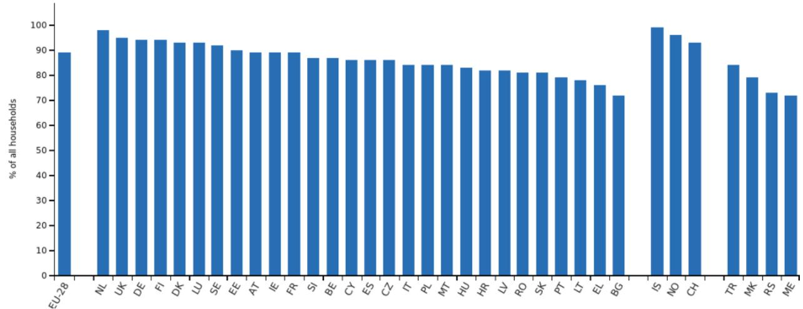
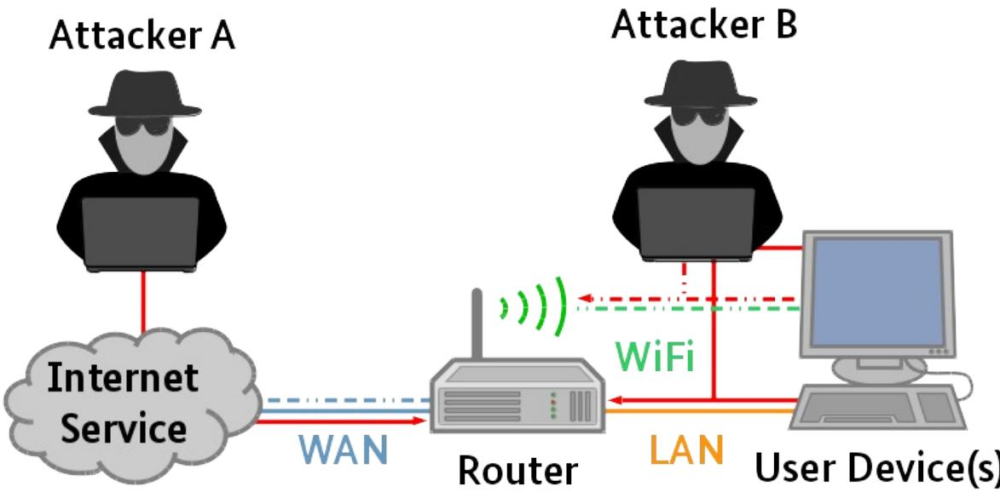
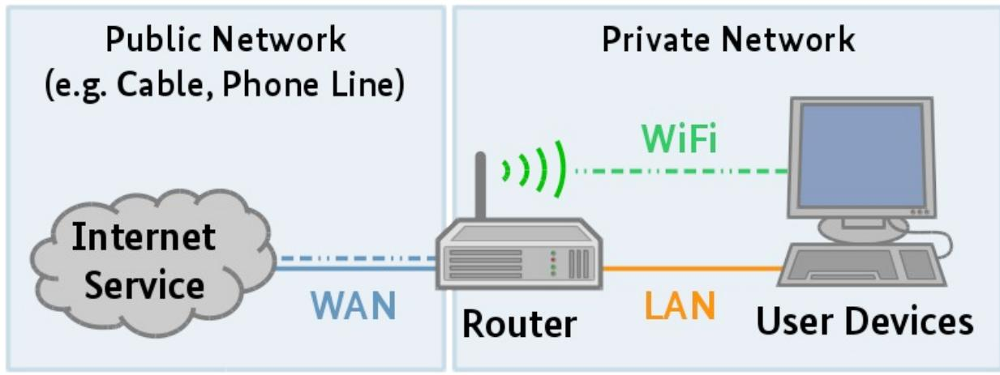

# BSI TR-03148: Secure Broadband Router

Requirements for secure Broadband Routers

Version: 1.2 Date: 16.01.2023

## Document History

| Version | Date       | Editor | Description                                                                                            |
|---------|------------|--------|--------------------------------------------------------------------------------------------------------|
| 1.0     | 02.11.2018 | BSI    | Initial public release version                                                                         |
| 1.1     | 30.04.2020 | BSI    | Adjusted version for Test Specification including minor fixes and updates                           |
| 1.2     | 16.01.2023 | BSI    | Minor fixes and updates resulting from experiences with first certifications and IT security labels |

Federal Office for Information Security Post Box 20 03 63 D-53133 Bonn Phone: +49 22899 9582-0 E-Mail: router-tr@bsi.bund.de Internet: https://www.bsi.bund.de © Federal Office for Information Security 2022

## Executive Summary

This Technical Guideline defines mandatory and optional security requirements on routing devices designed for end-users. These devices are commonly found in Small Office and Home Office (SOHO) environments.

The primary addressees of the Technical Guideline are manufacturers of such routing devices, but it may be of interest to retailers and end-users as well. The Technical Guideline provides guidance to manufacturers on designing and implementing a product with adequate state-of-the -art security features. Retailers and end-users may use this Technical Guideline to compare the security features of specific products with the requirements defined in this Technical Guideline.

In this Technical Guideline only security relevant aspects concerning the core functionality of the router providing a gateway between the Internet and the private end-user network as well as network management functionalities are considered. Additional features provided by the router are out of scope. The requirements in this Technical Guideline are aimed at securing the router in a way that makes it resilient.

## Definitions and abbreviations

This section defines terms and abbreviations that will be frequently be used in this Technical Guideline.

| Term                    | Definition                                                                                                                                                                                                                                                                                                                                                                                                                                                                                                                                                                                           |  |  |
|-------------------------|------------------------------------------------------------------------------------------------------------------------------------------------------------------------------------------------------------------------------------------------------------------------------------------------------------------------------------------------------------------------------------------------------------------------------------------------------------------------------------------------------------------------------------------------------------------------------------------------------|--|--|
| Applicant               | Organization on behalf a specific DUT should be tested according to [TR-03148] and the corresponding Test Specification [TR-03148-P]. The applicant does not necessarily have to be the manufacturer.                                                                                                                                                                                                                                                                                                                                                                                          |  |  |
| Application             | A computer program that is designed for a particular purpose or task                                                                                                                                                                                                                                                                                                                                                                                                                                                                                                                                 |  |  |
| Broadband               | A term for various modern high speed internet access technologies unspecified in this document, in opposition to former internet access technologies such as dial up modems                                                                                                                                                                                                                                                                                                                                                                                                                    |  |  |
| Client software         | An application executed on the router providing client functionalities. Using this software the router is able to connect to services provided by other IT systems in the WAN or LAN network environment. A typical client software implemented on a router is represented by a web-client using openssl to connect to an internet service providing firmware update packages.                                                                                                                                                                                                           |  |  |
| Community WLAN          | A WLAN used by a larger user group with participants unknown to the end-user and logically separated from the private WLAN.                                                                                                                                                                                                                                                                                                                                                                                                                                                                       |  |  |
| Customized (state)      | A state of the DUT. The end-user has changed the configuration of the DUT to his personal needs differing from the initialized state and thus left the initialized state.                                                                                                                                                                                                                                                                                                                                                                                                                      |  |  |
| DUT                     | Device Under Test is a term used for the router, when it is subject to testing.                                                                                                                                                                                                                                                                                                                                                                                                                                                                                                                      |  |  |
| End-User                | The primary user of the router's functionalities                                                                                                                                                                                                                                                                                                                                                                                                                                                                                                                                                     |  |  |
| Factory Setting (state) | A state of the DUT. The DUT is assembled and a firmware with manufacturer settings is installed on the DUT. The DUT offers an interface for a third party (e.g. IAP) or the end-user to put the DUT into operation. In this state the DUT may however contain inactive presets for the connection to the infrastructure of common IAPs and a pre-configured WLAN interface according to [BSI TR-03148], Section 3.1.2: WLAN Interface. If the DUT is automatically configured by the first boot (e.g. TR069), the device changes its state from factory setting to initialized. |  |  |
| Firewall                | A rule based packet filter enhancing the gateway functionality of a router to filtering the incoming and outgoing data traffic in a network. Thus the packet filter protects the devices in a network from unwanted access.                                                                                                                                                                                                                                                                                                                                                                    |  |  |
| Firmware                | A complete collection of software running on the router, including the operating system and the installed applications                                                                                                                                                                                                                                                                                                                                                                                                                                                                            |  |  |
| Firmware Package        | A packed version of the firmware that is provided by the manufacturer (see above)                                                                                                                                                                                                                                                                                                                                                                                                                                                                                                                 |  |  |
| Gateway                 | A device functionality that allows two separate devices that share no interface to communicate via their shared interfaces with the device acting as gateway. Further it is a network device that interconnects networks with different network protocol technologies and performs the necessary protocol conversions.                                                                                                                                                                                                                                                                      |  |  |
| Guest WLAN              | A WLAN used by guests of the end-user with explicit allowance to do so and logically separated from the private WLAN.                                                                                                                                                                                                                                                                                                                                                                                                                                                                             |  |  |

| Term                                | Definition                                                                                                                                                                                                                                                                                                                                                                            |  |  |
|-------------------------------------|---------------------------------------------------------------------------------------------------------------------------------------------------------------------------------------------------------------------------------------------------------------------------------------------------------------------------------------------------------------------------------------|--|--|
| Initialized (state)                 | A state of the DUT. The DUT has been put into operation by the end-user. This state is often reached by performing an assisted initial configuration of the DUT (e.g. using a configuration wizard) including the selection of a preset for the connection to the infrastructure of the end-users IAP. This state is also referenced by the words "after initialization". |  |  |
| Interface                           | A shared technological boundary that connects external and/ or internal subsystems implemented in hardware (e.g. LAN interface) or software (i.e. protocol interface)                                                                                                                                                                                                           |  |  |
| Internet                            | A globally interconnected network infrastructure coordinated by the Internet Assigned Numbers Authority (IANA)                                                                                                                                                                                                                                                                     |  |  |
| Internet Access                     | A connection to the Internet and the possibility of a device to connect to other entities through the Internet                                                                                                                                                                                                                                                                     |  |  |
| Internet Access Provider         | A service provider offering Internet Access to end-users                                                                                                                                                                                                                                                                                                                              |  |  |
| Internet Gateway Functionality   | An Internet gateway's functionality is to establish a connection to the infrastructure of an Internet Access Provider (IAP) to provide Internet access for the end-user                                                                                                                                                                                                         |  |  |
| LAN                                 | A data communications system that lies within a limited spatial area, has a specific user group and is not a public telecommunications network                                                                                                                                                                                                                                     |  |  |
| Manufacturer                        | Assembles the router as a hardware component or has a third party assemble the router in his name or trade mark and provides the firmware and applications necessary for the operation of the router                                                                                                                                                                            |  |  |
| Network Management Functionality | Functionalities for the management of the end-user's private network containing (but not limited to) administration features of the network, management features for devices in the network and network separation.                                                                                                                                                             |  |  |
| Port                                | A number that is always associated with an IP address and the protocol type of the communication in order to communicate to end points                                                                                                                                                                                                                                             |  |  |
| Private Network                     | A network that is only privately accessed (as opposed to public) as described in [TR-03148], Section 3.1: Private Network                                                                                                                                                                                                                                                          |  |  |
| Private WLAN                        | A WLAN used by the end-user and others with explicit allowance by the end user.                                                                                                                                                                                                                                                                                                    |  |  |
| Public Network                      | A network that is publicly accessible (as opposed to privately) as described in [TR 03148], Section 3.2: Public Network                                                                                                                                                                                                                                                            |  |  |
| Router                              | A device that connects two networks, offering access to a WAN (and to the Internet using a modem) for the local user devices in the private network via a LAN and/ or WLAN (this covers integrated devices, i.e., devices encapsulating various components such as a modem, switch and access point in a single physical entity)                                          |  |  |
| Service                             | An application (usually permanently) executed on the router providing a certain functionality on a defined interface. A typical service implemented on a router is represented by a web server listening on TCP port 80. Please note that client services are defined as "client software" (see above).                                                                      |  |  |
| VPN                                 | A network that is virtually not physically made private (encrypted) and therefore limited to a specific user group, but may use public networks as a physical basis                                                                                                                                                                                                                |  |  |

| Term  | Definition                                                                                                                                                                                                          |
|-------|---------------------------------------------------------------------------------------------------------------------------------------------------------------------------------------------------------------------|
| WAN   | In opposition to LAN, a public telecommunications network that extends over a large geographical distance                                                                                                        |
| Wi-Fi | Wi-Fi is a trademark of the Wi-Fi Alliance, which restricts the use of the term Wi Fi Certified to products that successfully complete interoperability certification testing according to [IEEE-802.11].     |
| WLAN  | A wireless radio communications access technology based on specification [IEEE 802.11i] used in short range. Also known as RLAN. A WLAN interface does not have to be necessarily a Wi-Fi Certified solution. |

*Table 1: Definitions*

## Conventions

The keywords "MUST", "MUST NOT", "REQUIRED", "SHALL", "SHALL NOT", "SHOULD", "SHOULD NOT", "RECOMMENDED", "MAY", and "OPTIONAL" in this document are to be interpreted as described in [IETF RFC 2119]. The keywords "CONDITIONAL" and "IF" mean that the usage of an item is dependent on the usage of other items. It is therefore further qualified under which conditions the item is REQUIRED or RECOMMENDED.

|       | Document History 2                           |  |
|-------|----------------------------------------------|--|
|       | Executive Summary 3                          |  |
|       | Definitions and abbreviations 4              |  |
|       | Conventions 7                                |  |
| 1     | Introduction 11                              |  |
| 1.1   | Usage 11                                     |  |
| 2     | Scope 13                                     |  |
| 2.1   | Out-of-Scope 13                              |  |
| 2.2   | Various States of a Router 13                |  |
| 2.3   | Threat Model 14                              |  |
| 3     | Networks and Interfaces 15                   |  |
| 3.1   | Private Network 15                           |  |
| 3.1.1 | Local Area Network (LAN) Interface16         |  |
| 3.1.2 | WLAN Interface 16                            |  |
| 3.2   | Public Network 17                            |  |
| 3.2.1 | Wide Area Network (WAN) Interface18          |  |
| 4     | Functionalities 19                           |  |
| 4.1   | Configuration and Information 19             |  |
| 4.1.1 | User Access to Configuration 19              |  |
| 4.1.2 | Providing Information 20                     |  |
| 4.2   | Firmware Updates 21                          |  |
| 4.3   | Firewall 22                                  |  |
| 4.4   | Domain Name System (DNS) 22                  |  |
| 4.5   | Dynamic Host Configuration Protocol (DHCP)23 |  |
| 4.6   | Factory Reset 23                             |  |
| 4.7   | Option: Internet Protocol version 6 (IPv6)23 |  |
| 4.8   | Option: Remote Configuration 24              |  |
| 4.9   | Option: Voice over IP (VoIP) 24              |  |
| 4.10  | Option: Virtual Private Network (VPN)24      |  |
|       | Abbreviations 25                             |  |
|       | References 27                                |  |
|       |                                              |  |

| Figure 1: Households with broadband access, 2019 (as % of all households) Source: Eurostat11 |  |
|----------------------------------------------------------------------------------------------|--|
| Figure 2: Threat model 14                                                                    |  |
| Figure 3: Infrastructure overview 15                                                         |  |

| Table 1: Definitions 6         |  |
|--------------------------------|--|
| Table 2: States of a router 13 |  |

| Table 3: Common services offered to the private network by the router16 |  |
|-------------------------------------------------------------------------|--|
| Table 4: Common services offered to the public network by the router18  |  |
| Table 5: Password strength classification 20                            |  |
| Table 6: Information provided to the end-user 21                        |  |
| Table 7: ICMPv6 message types 24                                        |  |
| Table 8: Abbreviations 26                                               |  |
|                                                                         |  |

## 1 Introduction

In the last decade nearly all households in Germany and Europe with Internet access have been switched to a high speed Internet connection (Germany: 94%, Europe: 89%, 2019), making a broadband router the standard access point and gateway to the Internet for a household with Internet access today. The following *[Figure 1: Households with broadband access, 2019 \(as % of all households\) Source: Eurostat](#page-9-1)* [1](#page-9-2) shows the ratio of households in Europe and its countries that do have high speed Internet access.

At the same time the number of devices per household that uses or even requires Internet access to be fully functional increases. This trend is predicted to continue and leads to more and more everyday things being equipped with networking and Internet capabilities.

This allows countless new possibilities, but also opens the gate for risks, which didn't exist before or at least didn't exist to today's extent. Not only are devices being attacked to harm the assets of its owner, but also to be hijacked and become part of botnets, controlled by the attackers. These botnets may then be used to harm infrastructures of others as described in *The State of IT Security in Germany 2019, Section 1.2.5: Botnets*.

A router in its role as the access point and gateway connecting a private network of a household to a public network i.e. Internet (see *Section [3](#page-13-0): [Networks and Interfaces](#page-13-0)*) should implement state-of-the-art security features to prevent such attacks. These security features should be available by design and by default. In the past, a lack of security in some routers has been existing and vulnerabilities might be used for attacks in the future (See *The State of IT Security in Germany 2016, Section 1.1.4 Hardware: Broadband router vulnerability*).

This Technical Guideline describes a manageable level of security that should be fulfilled by routers targeted to be used by end-users in Small Office and Home Office (SOHO) environments. It does not concern the manufacturing process of the router itself. The router is referred to as an integrated device, meaning it encapsulates various components such as a modem, switch and access point required for its functionality and providing all the necessary interfaces.

#### 1.1 Usage

This Technical Guideline describes requirements on a defined set of interfaces and functionalities implemented by the router to offer it's Internet gateway functionality and network management functionalities. All interfaces in scope are listed and described in *Section [3](#page-13-0): [Networks and Interfaces](#page-13-0)*. The functionalities in *Section [4](#page-17-0): [Functionalities](#page-17-0)* are provided by the router using those interfaces and are described in the context

1 <https://ec.europa.eu/eurostat/databrowser/view/tin00073/default/table?lang=en>

of the interfaces. Features that may optionally be provided by the router, but MUST fulfill certain requirements, IF they are provided are marked with the word "Option" in the headline of the corresponding section.

## 2 Scope

In scope of this Technical Guideline are requirements on a router as a hardware component with an installed operating system and services provided to an end-user. The router serves the purpose of establishing a connection to the infrastructure of an Internet Access Provider (IAP) to gain Internet access. From the end-user's perspective the router offers a gateway to the Internet as well as management functionalities for the end-user's private network. The Technical Guideline describes requirements on the router that should be implemented to offer a secure operation of the router for the end-user. As it is not possible and necessary to draw a line between private end-users and professional users in small businesses, the Technical Guideline is applicable for routers in Small Offices and Home Office (SOHO) environments. The Technical Guideline covers attacks on the interfaces defined in *Section [3: Networks and Interfaces](#page-13-0)*.

### 2.1 Out-of-Scope

This Technical Guideline does not consider additional hardware components offering network features (e.g. a secondary HotSpot that is connected via the LAN interface). Routers only used by non-consumer endusers (e.g. broadband remote access router in IAP backbones or industry routers) are out of scope. No requirements on the hardware being used as a component of the router itself are defined in this Technical Guideline. All functionalities (e.g. NAS or Smart Home Gateway) that do not affect the Internet gateway and network management functionality of the router (See *Section [2](#page-11-0): [Scope](#page-11-0)*) and thus do not affect IT-security of the routers for end-users are out of scope, but must be deactivated per default (see *Section [4](#page-17-0): [Functionalities](#page-17-0)*). The security of devices that are connected to the router (e.g. Computer or Smartphone) are out of scope. Internal interfaces of the router and components encapsulated in the router (e.g. modem, switch) are out of scope unless they are part of the functionalities according to *Section [4](#page-17-0): [Functionalities](#page-17-0)* or the shared interfaces according to *Section [3: Networks and Interfaces](#page-13-0)*.

### 2.2 Various States of a Router

During its life cycle a router passes through different states. The various states being used in this Technical Guideline are defined in the following *[Table 2: States of a router](#page-11-1)*. The defined states of the router will be written in *italics* throughout the whole document when used according to *[Table 2: States of a router](#page-11-1)*.

| State                                     | Description                                                                                                                                                                                                                                                                                                                                                                                                                   |
|-------------------------------------------|-------------------------------------------------------------------------------------------------------------------------------------------------------------------------------------------------------------------------------------------------------------------------------------------------------------------------------------------------------------------------------------------------------------------------------|
| factory setting                           | The router is assembled and a firmware with manufacturer settings is installed on the router. The router offers an interface for a third party (e.g. IAP) or the end-user to put the router into operation. In this state the router may however contain inactive presets for the connection to the infrastructure of common IAPs and a pre-configured WLAN interface according to Section 3.1.2: WLAN Interface. |
| initialized, (after initialization) | The router has been put into operation by the end-user. This state is often reached by performing an assisted initial configuration of the router (e.g. using a configuration wizard) including the selection of a preset for the connection to the infrastructure of the end-users IAP. This state is also referenced by the words "after initialization".                                                          |
| (end-user) customized                  | The end-user has changed the configuration of the router to his personal needs differing from the initialized state and thus left the initialized state.                                                                                                                                                                                                                                                                   |

*Table 2: States of a router*

This Technical Guideline focuses on the *factory settings* and *initialized* state, because the latter is the state most commonly used by end-users to operate the router and the *end-user customized* state is only within limited control of the manufacturer. Nevertheless, requirements regarding the *customization* of the router configuration are part of this Technical Guideline.

#### 2.3 Threat Model

The attacker, in the threat model addressed by this Technical Guideline, tries to manipulate the behavior of the router, obtain information or access to resources within the private network of the end-user or access to the public network through the router without authorization or harm a third party with the help of a compromised router. Two types of attackers are differentiated as shown in *[Figure 2: Threat model](#page-12-0)*.

#### Figure 2: Threat model

Attacker A is connected to the Internet and is trying to access the router through its WAN interface as described in *Section [3.2.1](#page-16-0): [Wide Area Network \(WAN\) Interface.](#page-16-0)* The attacker only has as much information as the attacker is able to obtain on the WAN interface of the router. The goal of Attacker A is to manipulate the router and/or devices connected to the router at the Local Area Network (LAN) or WLAN interface as described in *Section [3.1.1](#page-14-1): [Local Area Network \(LAN\) Interface](#page-14-1) and [3.1.2](#page-14-0): [WLAN Interface](#page-14-0)* in a way to get full or partial control over its functionalities and/or gain access to sensitive data (e.g. credentials of the end-user).

Attacker B is within reach of the WLAN interface and tries to use the WLAN of the end-user as described in *Section [3.1.2](#page-14-0): [WLAN Interface](#page-14-0)* to access the resources of the router. Attacker B wants to use the WLAN interface to gain unauthorized access to the Internet and/ or user devices connected to the router. The goal of Attacker B may also be to manipulate the router and/ or devices connected to the router in a way to get full or partial control over its functionalities and/ or gain access to sensitive data (e.g. credentials of the enduser). The attacker may also use the LAN interface as described in *Section [3.1.1: Local Area Network \(LAN\)](#page-14-1) [Interface](#page-14-1)* to gain unauthorized access to the router, but does not have physical access to the router itself (e.g. isn't able to push buttons on the device). Attacks on Internet Access as well as on unprotected resources within the Private Network from an Attacker B with access to the LAN interface are out of scope.

In an extended scenario Attacker A or B could also attack the router through the local interfaces described in *Section [3.1](#page-13-1): [Private Network](#page-13-1)* by using previously gained access to a compromised user device or an additional device that is part of the private network of the end-user using the WAN interface (Extended Attacker A) of the router to access this device. This variation of the attack scenarios is only represented by Attacker B in *[Figure 2: Threat model](#page-12-0)*, but applies to Attacker A as well.

## 3 Networks and Interfaces

A router MUST offer a Local Area Network (LAN) or WLAN interface to offer access to the Internet for the local user devices in the private network. To offer Internet access the router MUST have access to an Internet Service provided by an Internet Access Provider (IAP) through a Wide Area Network (WAN) interface after *initialization*.

This section describes physical interfaces offered and used by the router as well as the end-users Private Network and the Public Network i.e. Internet. Logical interfaces on an application level are part of the functionalities and will be described in the corresponding *Section [4](#page-17-0): [Functionalities](#page-17-0)*.

Figure 3: Infrastructure overview

This Technical Guideline does not differentiate between the router being connected to an IAP via cable, phone line, mobile or other techniques. Scenarios where the router is connected to more than one Internet Service are also in scope, but do not require further differentiation. The requirements to the corresponding interface MUST be fulfilled by all instances of the interface in such scenarios.

To prevent attacks on secured connections and on the router itself all (private) cryptographic keys and secrets MUST NOT be shared by multiple devices in the *factory setting* and *initialized* state.

#### 3.1 Private Network

In *factory settings* the router SHOULD restrict access to a defined list of services provided to devices connected on the LAN and WLAN interface by the router. The services are provided on one or more dedicated TCP and/ or UDP ports or by the network stack itself.

Only a minimal selection of services SHOULD be available on the LAN and WLAN interface of the router. Services contained in the minimal selection may be found in *[Table 3: Common services offered to the private](#page-14-2) [network by the router](#page-14-2)*. They are needed for the Internet gateway and network management functionality of the router. They allow the connected user devices to access the Internet through the router and to communicate with one another. All services provided by the router MUST be documented by the manufacturer including the port(s) or port ranges used . If one of the services offered by the router is deactivated during operation of the router the corresponding port MUST be closed and therefore no longer be available.

| Service | Port | Protocol | Description |
|---------|------|----------|-------------|
| DNS     | 53   | TCP      | DNS proxy   |

| Service | Port | Protocol | Description                                                                            |
|---------|------|----------|----------------------------------------------------------------------------------------|
| DNS     | 53   | UDP      | DNS proxy                                                                              |
| HTTP    | 80   | TCP      | Web server (config)                                                                    |
| HTTPS   | 443  | TCP      | Web server (config)                                                                    |
| DHCP    | 67   | UDP      | DHCP server                                                                            |
| DHCPv6  | 547  | UDP      | DHCPv6 server                                                                          |
| ICMPv6  |      |          | ICMPv6 messages (See Section 4.7: Option: Internet Protocol version 6 (IPv6)) |

Table 3: Common services offered to the private network by the router

#### 3.1.1 Local Area Network (LAN) Interface

The wired Local Area Network (LAN) interface requires a cable connection to the router or more often to the integrated switch. To gain access to this interface an attacker would need to have physical access to the LAN infrastructure. According to the threat model defined in *Section [2.3:](#page-12-1) [Threat Model](#page-12-1)* attacks aiming on gaining physical access to the private network or devices connected to the private network of the end-user are out of scope. For this reason no dedicated security requirements are defined for access to the cable connected (wired) LAN interface itself.

#### 3.1.2 WLAN Interface

The WLAN interface, also called Wireless Local Area Network (WLAN) or Radio Local Area Network (RLAN) interface, of a router works with radio frequencies and is not bound to a wired connection. For this reason security measures for the usage of WLAN MUST be implemented by the router to prevent attackers from gaining access to resources within the private network of the end-user, to the public network through the router and its gateway functionality and configuration of the router. The WLAN interface in scope of this Technical Guideline MUST at least be implemented according to [IEEE 802.11i] to offer a wireless connection.

The following sections define requirements on a **private WLAN** that is offered by the router and used by the end-user and others who obtained the permission to use the WLAN by the end-user.

In addition to the private WLAN, which MUST fulfill the requirements described in the following sections the router MAY offer a user-configured **guest WLAN**, which SHOULD fulfill these requirements as well. The guest WLAN SHOULD be deactivated using *factory settings* and MUST NOT allow communication with devices that are connected to the private WLAN or LAN interface. The guest WLAN allows Internet access for guest users and MAY allow communication between devices connected to the guest WLAN after *initialization*. The guest WLAN MUST NOT allow access to the configuration of the router as described in *Section [4.1.1](#page-17-1): [User Access to Configuration](#page-17-1)*.

In addition to the private WLAN and the user-configured guest WLAN the router MAY offer a WLAN used by a larger user group (e.g. wireless community network/HotSpot, **community WLAN**). A community WLAN MUST be restricted to allowing Internet Access to the devices connected to this WLAN. Connection to other devices connected to the LAN interface, private WLAN or guest WLAN and/or access to the configuration of the router as described in *Section [4.1.1:](#page-17-1) [User Access to Configuration](#page-17-1)* MUST NOT be allowed by the router.

#### 3.1.2.1 Extended Service Set Identifier (ESSID)

In *factory settings* the Extended Service Set Identifier (ESSID) SHOULD NOT contain information that consists of or is derived from data or parts of data that depend on the router model itself (e.g. model name). This requirement does not apply to the Basic Service Set Identifier (BSSID) used by the router. The router MUST allow an authenticated end-user (see *Section [4.1.1:](#page-17-1) [User Access to Configuration](#page-17-1)*) to change the ESSID. The router MAY offer an option to hide the broadcast of the ESSID.

#### 3.1.2.2 WLAN Encryption

The router MUST support encryption according to Wi-Fi Protected Access II (WPA2) based on [IEEE 802.11i] or more up to date versions for every private or guest WLAN (See *Section [3.1.2](#page-14-0): [WLAN Interface](#page-14-0)*) and it MUST be activated in *factory settings*, IF WLAN is activated in *factory settings*. The passphrase configured in *factory settings* SHOULD have a length of at least 20 digits and MUST NOT contain information that consists of or is derived from data or parts of data that depend on the router itself (e.g. manufacturer, model name, Media Access Control (MAC) address). The router MUST allow an authenticated end-user (see *Section [4.1.1](#page-17-1): [User](#page-17-1) [Access to Configuration](#page-17-1)*) to set the passphrase to a different value. This procedure SHOULD be supported by a mechanism showing the strength of the new desired passphrase based on the number of digits and classes of digits (e.g. numbers, letters) with a mechanism comparable to the given example mechanism for passwords described in *Section [4.1.1](#page-17-1): [User Access to Configuration](#page-17-1)*.

#### 3.1.2.3 Option: Wi-Fi Protected Setup (WPS)

The router MAY implement Wi-Fi Simple Configuration (WSC) according to [WSC2] to provide an easier way of registering user devices at the router. Push Button Configuration (PBC) and USB Flash Drive (UFD) MAY be offered. Personal Identification Number (PIN) based WPS MAY only be used, IF the feature is deactivated in the *initialized* state and a new PIN is generated for each newly registered device. Performing WPS based on Near Field Communication (NFC) SHOULD be deactivated in the *initialized* state as well.

### 3.2 Public Network

One of the core functionalities of the router is to offer access to a public network i.e. Internet access. This access is established with the WAN interface described in *Section [3.2.1](#page-16-0): [Wide Area Network \(WAN\) Interface](#page-16-0)*. Access to the Internet may also be offered through a virtual network within the IAPs infrastructure. In this scenarios the same requirements apply, but are rather bound to a virtual and not a physical interface.

After *initialization* the router MUST restrict access on the WAN interface to a defined list of services provided by the router. The services are provided on one or more dedicated TCP and/ or UDP ports or by the network stack itself.

Only a minimal selection of services MUST be available to the public network. A minimal selection of services may be found in *[Table 4: Common services offered to the public network by the router](#page-16-1)*. These services are needed for the Internet access functionality of the router and additional services such as VoIP. They allow the router to connect to the IAPs infrastructure. The services used for Voice over IP (VoIP) telephony (marked with \*) MUST only be available, IF the router is already configured to use VoIP. The services MUST NOT be available, IF VoIP is deactivated on the router. For details on VoIP see *Section [4.9](#page-22-1): [Option: Voice over](#page-22-1) [IP \(VoIP\)](#page-22-1)*. The services used for remote configuration (marked with \*\*) MUST only be available, IF the router is configured to use remote configuration. The services MUST NOT be available, IF remote configuration is deactivated on the router. For details on Remote Configuration see *Section [4.8](#page-22-0): [Option: Remote](#page-22-0) [Configuration](#page-22-0)*. All services provided by the router MUST be documented by the manufacturer including the port(s) or port ranges used. If one of the services offered by the router is deactivated during operation of the router the corresponding port MUST be closed and no longer be available.

| Service | Port | Protocol | Description                                                                            |
|---------|------|----------|----------------------------------------------------------------------------------------|
| CWMP**  | 7547 | TCP      | TR-069                                                                                 |
| CWMP**  | 7547 | UDP      | TR-069                                                                                 |
| SIP*    | 5060 | TCP      | VoIP                                                                                   |
| SIP*    | 5060 | UDP      | VoIP                                                                                   |
| SIPS*   | 5061 | TCP      | VoIP                                                                                   |
| SIPS*   | 5061 | UDP      | VoIP                                                                                   |
| ICMPv6  |      |          | ICMPv6 messages (See Section 4.7: Option: Internet Protocol version 6 (IPv6)) |

Table 4: Common services offered to the public network by the router

#### 3.2.1 Wide Area Network (WAN) Interface

The Wide Area Network (WAN) interface is used by the router to establish and maintain a connection to an IAP. The router sends and receives information on this interface to gain access to the global Internet infrastructure. Parts of the communication on this interface is not described any further in this Technical Guideline, because security mechanisms on this level are specific to the technology being used and can not be part of the set of general requirements. This refers to all communication on the network layer 1 (physical) and 2 (data link) as described in the Open Systems Interconnection model (OSI model). Requirements on the communication in scope are listed in *Section [3.2](#page-15-0): [Public Network](#page-15-0)*.

## 4 Functionalities

The router MAY offer a broad variety of functionalities (e.g. Network Attached Storage (NAS), eMail, web or print server). In this Technical Guideline only security relevant functionalities concerning the main function of providing a gateway between the Internet and the private network as well as network managing functionalities are considered. To minimize possible vectors for an attacker it is RECOMMENDED, to only have a minimum set of functionalities activated in *factory settings* and after *initialization*. Functionalities, which are deactivated as a *factory setting* MUST be made transparent to the end-user IF they become activated during *initialization*. Functionalities MUST NOT be hidden fromthe end-user.

### 4.1 Configuration and Information

This section focuses on the functionalities allowing the end-user to configure the router and access information from the current or past state of the router and its services. In most cases access to both, configu ration and information, will be provided through a dedicated web server running on the router, which is accessible by the end-user through a web browser. Access to configuration and information MAY also be provided through other means (e.g. MobileApp). In both cases the same requirements apply.

#### 4.1.1 User Access to Configuration

Access to the configuration of the router MUST at least be secured by a password in the *initialized* and *customized* state. The router MAY offer a higher level of security by providing alternative authentication mechanisms that offer a higher level of security like requiring the usage of One Time Passwords (OTP), hardware token or similar techniques to realize 2-Factor-Authentication. IF the router offers configuration through a web interface (local website provided by the router and accessed with a browser by the user) the complete communication to access the configuration SHOULD be secured using HTTP over Transport Layer Security (TLS) support according to [TR-02102-2] *Section 3: Recommendations*. If a password is the designated factor for user authentication the preset password MUST fulfill the following requirements:

- MUST contain at least 8 characters
- MUST be a combination of at least 2 of the following kinds of characters
	- uppercase letters [A-Z]
	- lowercase letters [a-z]
	- special characters[2](#page-17-2) [e.g. ?, !, \$, etc.]
	- numeric characters [0-9]

IF a preset password is used with *factory settings*, it MUST NOT contain information that consists of or is derived from data or parts of data that depend on the router itself (e.g. manufacturer, model name, Media Access Control (MAC) address). The preset password used with *factory settings* MUST NOT be shared by multiple devices of the same manufacturer.

The router MUST allow an authenticated end-user to change the password after entering the previous password. This procedure SHOULD be supported by a mechanism indicating the password strength that is based on the entropy of the password entered by the user. The entropy may be estimated by considering the password length and combination of different kind of characters used. The mechanism MUST prevent the user from selecting a weak password without being warned about doing so.

The following *[Table 5: Password strength classification](#page-18-0)* shows an example for a mechanism that fulfills this requirement. It shows the strength of the desired user password based on the number of digits and kinds of

2 The list of special characters available on the router login is specific to the system and the character set it uses.

#### 4 Functionalities

characters (e.g. numbers, letters). The requirements that also apply to the preset password (see previous paragraph) represent a *good* password strength. If these requirements are not met (e.g. password is too short, password only consists of numeric characters) the password strength is *weak.* If the password fulfills more than at least one requirement (e.g. password is even longer, consists of more than 2 kinds of characters) while still fulfilling the other requirement the password strength is *high*.

| Password strength | Password length | Kinds of characters |
|-------------------|-----------------|---------------------|
| weak              | 1-7             | 1                   |
| good              | 8               | 2                   |
| high              | > 8             | > 2                 |

*Table 5: Password strength classification*

Password based authentication MUST be protected against brute force attacks. A suitable solution is reducing the amount of login attempts in a certain time span (e.g. tarpit) or equivalent techniques. After authentication the session of the authenticated end-user MUST be protected against session hijacking attacks. Minimal requirements for such a protection are a session time out and the use of a CSRF token. The router MUST NOT be *initialized* with accounts undocumented to the end-user.

In *factory setting* the router MUST allow end-user access to the configuration only using the LAN or WLAN interface. If the router allows to access the configuration over the WAN interface (e.g. Webserver, App) as a *customization* feature this communication MUST be encrypted using TLS according to [TR-02102-2] *Section 3: Recommendations* and this feature MUST be deactivated in *factory setting*. The end-user SHOULD be able to configure the port to be used for access to the configuration via the WAN interface. For access to the configuration over the WLAN and LAN interface the communication SHOULD be encrypted as well (as stated above).

The router MAY offer an option to save the current configuration of the router to a file. This backup can be used to easily restore a previously running configuration on the same router model. The configuration file SHOULD only be exported in an encrypted way and SHOULD be protected by a user selected password. The end-user SHOULD be assisted upon setting the password by a mechanism indicating the strength of the password by a mechanism similar to the one described for access to the configuration (see above). To export and/ or import the router settings the end-user MUST be successfully authenticated at the device.

#### 4.1.2 Providing Information

To maintain a secure operation of the router the device MUST provide the necessary security relevant information to the authenticated end-user. The following *[Table 6: Information provided to the end-user](#page-19-0)* shows this information. The information in *[Table 6: Information provided to the end-user](#page-19-0)* does not have to be permanently saved on the router and made available by the router after reboot. The information on the state of the various functionalities of the router listed in *[Table 6: Information provided to the end-user](#page-19-0)* SHOULD be made available at a central source of information (e.g. on a specific site on the configuration interface).

The router SHOULD provide a functionality to send (push) notifications of security relevant events (e.g. changes to the configuration, protocols of observed attacks on the firewall, firmware updates) to the enduser additionally to providing the information on request. This functionality MAY be provided through eMail, an App or with similar techniques, but MUST always be encrypted, IF the distant communication endpoint supports encryption. If the distant communication endpoint supports TLS this encryption method MUST be used. For TLS the requirements of [TR-02102-2], *Section 3: Recommendations*, are mandatory. The router MUST restrict the supported cipher suites for alternative encryption methods to the suites listed in [TR-02102-2] section 3. The functionality to send (push) notifications MUST only be activated upon the endusers request.

| Information           | Description                                                                                                                                                                                                                                                                                                                                                                                                                                                                                                                                                                                                                                                                                                                                                                                                                       |
|-----------------------|-----------------------------------------------------------------------------------------------------------------------------------------------------------------------------------------------------------------------------------------------------------------------------------------------------------------------------------------------------------------------------------------------------------------------------------------------------------------------------------------------------------------------------------------------------------------------------------------------------------------------------------------------------------------------------------------------------------------------------------------------------------------------------------------------------------------------------------|
| Firmware Status       | The router MUST allow the end-user to display the version number of the firmware currently installed on the router. The router MAY additionally show an estimate date of the firmware such as the release date, compilation date or the date of the installation of the firmware on the router. If the router has obtained knowledge that the firmware installed on it is currently out-of-date the router MUST inform the end-user about this with a meaningful message (e.g. display Pop-Up after Log-In). As soon as a decision is made by the manufacturer to not support (release firmware updates) for the router anymore the same mechanism MUST be used by the manufacturer to inform the end-user about the End of Service (EoS) of the router as described in Section 4.2: Firmware Updates. |
| Firewall Status       | The router MUST allow the end-user to display the current state (active/ inactive) of the firewall as well as it MUST display the rule set currently set up by the end user (e.g. port forwarding configuration). The functionalities required according to Section 4.3: Firewall remain unchanged by this scenario.                                                                                                                                                                                                                                                                                                                                                                                                                                                                                                     |
| Remote Configuration  | IF the router offers remote configuration according to Section 4.8: Option: Remote Configuration the status of this functionality (active/ inactive) MUST be made available to the end-user.                                                                                                                                                                                                                                                                                                                                                                                                                                                                                                                                                                                                                                |
| Login Attempt(s)/ Log | The router MUST allow the end-user to retrieve information about the last or more login attempt(s). This information MUST consist of the time and date of the login attempt, the IP address and the MAC address of the device from which the login attempt was made from, IF the login attempt was made after initialization.                                                                                                                                                                                                                                                                                                                                                                                                                                                                                            |
| Running Services      | The router MUST display a summary page for the currently active services on all interfaces (LAN, WLAN(s) and WAN). This especially refers to those services optionally provided by the router. The router SHOULD display exact details on the services running (e.g. service and port(s) being used). A rough estimate on the level of detail to be used for the list of running services are services listed in Table 3: Common services offered to the private network by the router and Table 4: Common services offered to the public network by the router.                                                                                                                                                                                                                                                |
| Connected Devices     | The router SHOULD display information of the devices that are currently connected to the router and the interface (LAN, WLAN(s) or WAN) being used for this connection. This information MUST include the devices IP address, MAC address and SHOULD contain information on the duration of the connection.                                                                                                                                                                                                                                                                                                                                                                                                                                                                                                              |
| System Status/ Log    | The router SHOULD allow the end-user to display general information of security relevant events concerning the router itself including detected attacks on the secure operation or attempts to manipulate the router. This information SHOULD consist of the time and date of the login attempt, the IP address and the MAC address of the device the login attempt was made from, IF the login attempt was made after initialization.                                                                                                                                                                                                                                                                                                                                                                             |

Table 6: Information provided to the end-user

#### 4.2 Firmware Updates

To be able to react to newly appearing exploits of soft- or hardware vulnerabilities of the router or any of its components the router MUST have a functionality to update the firmware (operating system and applications) using a firmware package. The router MUST allow the end-user to fully control such a firmware update and determine to initiate an online update (router retrieves firmware package from the Internet (WAN

interface)) and/ or manually update the firmware through the configuration interface (user provides firmware package) described in *Section [4.1: Configuration and Information](#page-17-3)*.

The router SHOULD offer an option to automatically retrieve security relevant firmware updates from a trustworthy source over the Internet (WAN interface). If the router offers this functionality it SHOULD be activated by default, but MUST be possible for the end-user to deactivate it when using *customized* settings.

In both scenarios (manual and automated update) the firmware update function of the router MUST check the authenticity of the firmware package (file) before it is installed on the router. This SHOULD be done by a digital signature that is applied to the firmware package by the manufacturer and checked by the router itself. For this purpose only signature schemes in accordance to [SOG-IS] *Section 5.2: Digital Signatures* MUST be used. The router MUST NOT automatically install any unsigned firmware. The router MAY allow the installation of unsigned firmware (i.e. custom firmware) IF a meaningful warning message has been shown to the authenticated end-user and the end-user accepts the installation of the unsigned firmware.

The manufacturer of the router MUST provide information on how long firmware updates fixing common vulnerabilities and exposures that have a high severity (i.e. a CVSS combined score higher than or equal to 7.0 according to the Common Vulnerability Scoring System[3](#page-20-1) assigned to the specific device or a component used by the device) will be made available. This information SHOULD be available on the manufacturer website. Additionally it MAY be made available on the router configuration interface described in *Section [4.1.2: Providing Information](#page-18-1)*. The manufacturer MUST provide information if the router has reached the End of its Support (EoS) and will not receive firmware updates by the manufacturer anymore. This information (EoS) MUST be made available on the router configuration as described in *Section [4.1.2: Providing](#page-18-1) [Information](#page-18-1)*.

The manufacturer MUST provide firmware updates to fix common vulnerabilities and exposures of a high severity without culpable delay (without undue delay) after the manufacturer obtains knowledge.

It is RECOMMENDED that the router has a redundant firmware storage in addition to the currently active firmware. In this case the router can start from the redundant firmware storage, if an error occurs during a firmware update process or if the router doesn't start properly after the firmware update.

#### 4.3 Firewall

The router MUST contain firewall functionalities that include the basic monitoring and controlling of how IP packets between the private network of the end-user (WLAN and LAN interface) on the one side and the public network i.e. Internet (WAN interface) on the other side are exchanged. The firewall MUST enforce rules for this kind of network traffic by implementing a packet filter (i.e. stateful packet inspection).

The end-user MUST be able to configure the set of rules being used to adjust it to the specific (security) needs of the respective network. The firewall MUST NOT contain any port forwarding rules configured *initially*.

 The router MUST allow the end-user to define rules for incoming network traffic (public to private network) as well as outgoing (private to public network) network traffic. To support an easier configuration a list of ports used by common Internet services MAY be provided by the router configuration. The firewall functionalities of the router MUST be enabled after *initialization*. After *initialization* the firewall SHOULD allow all outgoing communication from the private network and deny all not requested incoming communication from the public network.

#### 4.4 Domain Name System (DNS)

The Domain Name System (DNS) is one of the central components for access to the Internet. The DNS server translates easily human-readable domain names (e.g. www.example.com) into machine-readable IP addresses allowing the user devices to connect to a host or to a resource. In most cases the DNS server of the

3 Link: https://www.first.org/cvss/v3.1/specification-document

Internet Access Provider (IAP) will be used by the router. The router SHOULD however allow the end-user to configure a different DNS server to be used by entering its IPv4 or IPv6 address. For a higher level of security the router SHOULD implement mechanisms to prevent so called rebind attacks. To prevent DNS spoofing the source ports and Transaction-IDs MUST be selected randomly by the router. The router MUST support forwarding of DNSSEC packets according to [IETF RFC 6781] and DANE packets according to [IETF RFC 6698].

### 4.5 Dynamic Host Configuration Protocol (DHCP)

The router MUST support using DHCP for devices connected on the LAN and WLAN interface. The router SHOULD provide an option to manually set the DNS server being used by all devices connected to the router via Dynamic Host Configuration Protocol (DHCP). The DNS server configured in option 6 SHOULD be the DNS server manually configured or the DNS server provided by the IAP as described in *Section [4.4](#page-20-2): [Domain Name System \(DNS\)](#page-20-2)*. This feature enables the end-user to configure DNSSEC verifying DNS servers manually, if the DNS servers of the IAP do not offer DNSSEC verification.

#### 4.6 Factory Reset

The router MUST allow an authenticated end-user according to *Section [4.1.1: User Access to Configuration](#page-17-1)* to reset the router back to *factory settings* from an *initialized* or *end-user customized* state according to *Section [2.2](#page-11-2): [Various States of a Router](#page-11-2)* by deleting the personal data and settings of the end-user from the router.

### 4.7 Option: Internet Protocol version 6 (IPv6)

The router SHOULD implement Internet Protocol version 6 (IPv6) and offer its services accordingly. Due to the importance of the Internet Control Message Protocol (ICMP) when using IPv6 it is RECOMMENDED that the router only supports the types of messages marked with an "X" in *[Table 7: ICMPv6 message types](#page-22-2)*. The router MUST NOT forward inbound IPv6 traffic, IF it does not belong to a known connection.

| ICMPv6 message type                  | In the private network | From the public network | To the public network |
|--------------------------------------|------------------------|----------------------------|-----------------------|
| Destination unreachable (1)          | X                      | X                          | X                     |
| Packet too big (2)                   | X                      | X                          | X                     |
| Time exceeded (3)                    | X                      | X                          | X                     |
| Parameter Problem (4)                | X                      | X                          | X                     |
| Echo-Request (128)                   | X (1)                  |                            | X (1)                 |
| Echo-Response (129)                  | X (2)                  | X (2)                      |                       |
| Multicast (130-132, 143, 151-153) | X (3)                  | X (3)                      | X (3)                 |
| Router (133, 134)                    | X (3)                  |                            |                       |
| Neighbor (135,136)                   | X (3)                  | X (3)                      | X (3)                 |
| Redirect (137)                       | X (3/ 4)               |                            |                       |
| ICMP-Information (139)               | X (1)                  |                            |                       |
| ICMP-Information (140)               | X (2)                  |                            |                       |
| Reverse-Neighbor (141)               | X (1)                  |                            |                       |

| ICMPv6 message type    | In the private network | From the public network | To the public network |
|------------------------|------------------------|----------------------------|-----------------------|
| Reverse-Neighbor (142) | X (2)                  |                            |                       |

*Table 7: ICMPv6 message types*

The following annotations to *[Table 7: ICMPv6 message types](#page-22-2)* apply.

- (1) From the management station
- (2) To the management station
- (3) Without forwarding
- (4) From the router

#### 4.8 Option: Remote Configuration

The router MAY offer remote configuration of the device either by the IAP or the manufacturer. For retail devices that are not pre-configured with end-user specific settings no remote configuration MUST be active before *initialization*. Remote configuration MUST be allowed with an encrypted and (server-) authenticated connection according to [TR-02102-2] *Section 3 Recommendations* or other techniques fulfilling the same security requirements. It MUST be visible to the end-user, if remote configuration is currently activated.

#### 4.9 Option: Voice over IP (VoIP)

A router MAY support the use of Voice over IP (VoIP) for IP based communication. If the router provides this kind of functionality it SHOULD be implemented in a way that the end-user can turn off the functionality completely and certain phone numbers can be blocked in a dedicated black list. The router MUST NOT respond to SIP requests to unknown communication partners on the WAN interface according to *Section [3.2.1](#page-16-0) [Wide Area Network \(WAN\) Interface](#page-16-0)*. The WAN interface according to *Section [3.2.1](#page-16-0) [Wide Area](#page-16-0) [Network \(WAN\) Interface](#page-16-0)* does not have extensions that do not require an authentication (noauth). The services providing VoIP functionalities on the WAN interface MUST only be running as long as IP based communication on the WAN interface is activated.

#### 4.10 Option: Virtual Private Network (VPN)

A Virtual Private Network (VPN) is able to offer a higher level of security during communication between devices connected through the Internet. IF the router offers a VPN feature it SHOULD allow the end-user to configure it as a VPN server. RECOMMENDED protocols are IPsec, L2TP over IPsec and OpenVPN.

Suitable cryptographic parameters for IPsec are defined in [TR-02102-3] and SHOULD be used accordingly.

## Abbreviations

| Abbreviation | Meaning                                           |
|--------------|---------------------------------------------------|
| 2FA          | two-factor authentication                         |
| AES          | Advanced Encryption Standard                      |
| AH           | Authentication Header                             |
| CBC          | Cipher Block Chaining                             |
| CCMP         | Counter-Mode/ CBC-MAC Protocol                    |
| CSRF         | Cross-Site-Request-Forgery (CXRF or XSRF)         |
| CVSS         | Common Vulnerability Scoring System               |
| DANE         | DNS-based Authentication of Named Entities        |
| DHCP         | Dynamic Host Configuration Protocol               |
| DNS          | Domain Name System                                |
| DNSSEC       | Domain Name System Security Extensions            |
| DUT          | Device Under Test                                 |
| EoS          | End of Service                                    |
| ESP          | Encapsulated Security Payload                     |
| FTP          | File Transfer Protocol                            |
| FTTH         | Fibre-to-the-Home                                 |
| HTTP         | Hypertext Transfer Protocol                       |
| HTTPS        | Hypertext Transfer Protocol Secure                |
| ICMP         | Internet Control Message Protocol                 |
| IKE          | Internet Key Exchange                             |
| IMAP         | Internet Message Access Protocol                  |
| IP           | Internet Protocol                                 |
| IPsec        | Internet Protocol Security                        |
| MAC          | Media Access Control; Message Authentication Code |
| MSD          | Mass Storage Device (e.g. USB MSD)                |
| NFC          | Near Field Communication                          |
| L2TP         | Layer 2 Tunneling Protocol                        |
| LAN          | Local Area Network                                |
| NAS          | Network Attached Storage                          |
| NAT          | Network Address Translation                       |
| PRF          | pseudorandom functions                            |
| PSK          | pre-shared key                                    |
| rDNS         | Reverse DNS Lookup                                |
| SMTP         | Simple Mail Transfer Protocol                     |

| SSH  | Secure Shell                  |
|------|-------------------------------|
| TCP  | Transmission Control Protocol |
| TLS  | Transport Layer Security      |
| UDP  | User Datagram Protocol        |
| VPN  | Virtual Private Network       |
| WAN  | Wide Area Network             |
| WPS  | Wi-Fi Protected Setup         |
| WSC4 | Wi-Fi Simple Configuration    |

*Table 8: Abbreviations*

4 "Wi-Fi Simple Configuration" (WSC) refers to the protocol version 2 (WSC2), certified in the Wi-Fi Protected Setup program (WPS). Early in 2006 the "Wi-Fi Protected Setup", shortcut also WPS, refers to the former version 1 of the WSC protocol. The acronym WPS is still commonly used to refer to the connection techniques like WPS PIN, WPS push button or WPS NFC specified in the WSC protocol. In this test specification WSC/ WSC2 is used to refer to the protocol in general and WPS PIN, WPS push button or WPS NFC to refer to the connection techniques (specified in the WSC protocol).

## References

| IEEE 802.11i  | IEEE: Wireless LAN Medium Access Control(MAC) and Physical Layer (PHY) specifications |
|---------------|------------------------------------------------------------------------------------------|
| IETF RFC 2119 | IETF: Key words for use in RFCs to Indicate Requirement Levels                           |
| IETF RFC 6698 | IETF: The DNS-Based Authentication of Named Entities (DANE)                              |
| IETF RFC 6781 | IETF: DNSSEC Operational Practices, Version 2                                            |
| SOG-IS        | SOG-IS Crypto working Group: Crypto Evaluation Scheme Agreed Cryptographic               |
|               | Mechanisms, current version (https://www.sogis.eu/uk/supporting_doc_en.html)             |
| TR-02102-2    | BSI: TR-02102-2; Cryptographic Mechanisms: Recommandations and Key Lengths: Use          |
|               | of Transport Layer Security (TLS)                                                        |
| TR-02102-3    | BSI: TR-02102-3; Kryptographische Verfahren: Verwendung von Internet Protocol            |
|               | Security (IPsec) und Internet Key Exchange (IKEv2)                                       |
| WSC2          | Wi-Fi Alliance: Wi-Fi Simple Configuration Technical Specification v2.0.2                |