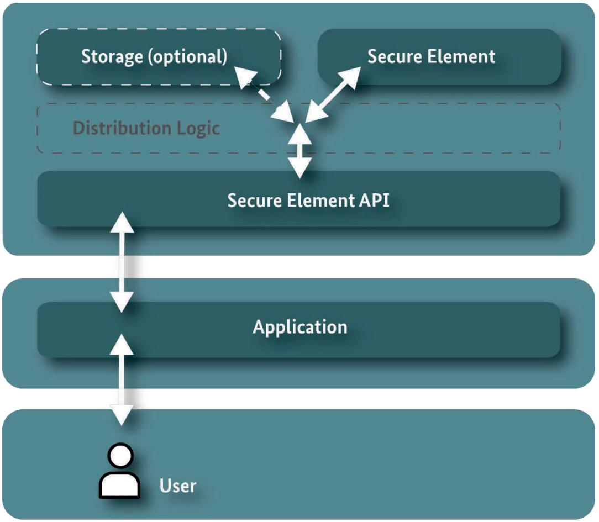
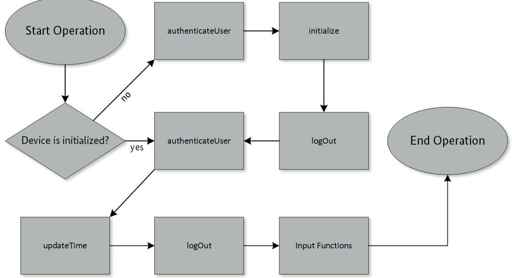

BSI TR-03151-1

# Technical Guideline BSI TR-03151 Secure Element API (SE API)

Part 1: Interface Definition

Version 1.1.1 2024-01-08


# Version history

| Version | Date       | Description                                |
|---------|------------|--------------------------------------------|
| 1.0.1   | 2018-12-20 | Initial version                            |
| 1.1.0   | 2023-05-30 | Updated Version                            |
| 1.1.1   | 2024-01-08 | Minor clarifications on exception handling |

Table 1 Version history

Federal Office for Information Security Post Box 20 03 63 D-53133 Bonn

E-Mail: registrierkassen@bsi.bund.de Internet: https://www.bsi.bund.de © Federal Office for Information Security 2024

| 1     | INTRODUCTION 5                                            |    |
|-------|-----------------------------------------------------------|----|
|       |                                                           |    |
| 1.1   | MOTIVATION                                                | 5  |
| 1.2   | PURPOSE AND GENERAL FUNCTIONALITY OF THE API              | 5  |
| 1.3   | SCOPE OF THIS TECHNICAL GUIDELINE                         | 6  |
| 1.4   | REFERENCING AND RESTRICTING THIS TECHNICAL GUIDELINE      | 6  |
| 1.5   | KEY WORDS                                                 | 7  |
|       |                                                           |    |
| 2     | LOGGING OF EVENTS  8                                      |    |
|       |                                                           |    |
| 2.1   | LOGGING INTRODUCTION                                      | 8  |
| 2.1.1 | COMMON LOG MESSAGE STRUCTURE<br>8                         |    |
| 2.1.2 | CONTENTS OF LOG MESSAGES<br>9                             |    |
| 2.1.3 | LOG MESSAGE ENCODING<br>                                  | 10 |
| 2.1.4 | LOG MESSAGE SIGNATURE<br>                                 | 11 |
| 2.1.5 | LOG MESSAGES OBJECT IDENTIFIERS<br>                       | 12 |
| 2.1.6 | LOG MESSAGE TIME SOURCE<br>                               | 13 |
| 2.2   | LOGGING OF SYSTEM LOGS                                    | 13 |
| 2.2.1 | SYSTEM LOG MESSAGE FORMAT                                 | 13 |
| 2.3   | LOGGING OF AUDIT LOGS                                     | 15 |
| 2.3.1 | AUDIT LOG MESSAGE FORMAT                                  | 16 |
| 2.4   | LOGGING OF NOT SPECIFIED LOGS                             | 17 |
| 2.5   | EXPORT FORMAT FOR LOG MESSAGES AND ADDITIONAL INFORMATION | 17 |
| 2.5.1 | TAR<br>CONTAINER                                          | 17 |
| 2.5.2 | TAR<br>CONTAINER FILE NAMES                               | 18 |
| 2.5.3 | DEVICE INFORMATION FILE                                   | 19 |
| 2.5.4 | CERTIFICATE FILE NAMES<br>                                | 20 |
| 2.5.5 | LOG MESSAGE FILE NAMES                                    | 21 |
|       |                                                           |    |
| 3     | API FUNCTIONALITY 27                                      |    |
|       |                                                           |    |
| 3.1   | ERROR HANDLING                                            | 27 |
| 3.1.1 | LIST<br>OF ALL EXCEPTIONS                                 | 27 |
| 3.1.2 | COMMON EXCEPTIONS                                         | 32 |
| 3.2   | AUTHORIZATION AND AUTHENTICATION OF USERS                 | 34 |
| 3.2.1 | RESTRICTED USAGE OF FUNCTIONS<br>                         | 34 |
| 3.2.2 | AUTHENTICATION OF USERS<br>                               | 34 |
| 3.2.3 | AUTHENTICATEUSER –<br>FUNCTION<br>                        | 36 |
| 3.2.4 | LOGOUT –<br>FUNCTION<br>                                  | 39 |
| 3.2.5 | UNBLOCKPIN –<br>FUNCTION                                  | 42 |
| 3.3   | CORE FUNCTIONALITY                                        | 46 |
| 3.3.1 | INITIALIZE –<br>FUNCTION                                  | 46 |
| 3.3.2 | SETDESCRIPTION –<br>FUNCTION<br>                          | 48 |
| 3.3.3 | GETDESCRIPTION –<br>FUNCTION                              | 50 |
| 3.3.4 | SELFTEST –<br>FUNCTION<br>                                | 51 |
| 3.3.5 | UPDATEDEVICE –<br>FUNCTION<br>                            | 54 |
| 3.3.6 | DISABLESECUREELEMENT –<br>FUNCTION<br>                    | 60 |

| 3.4   |                                 | DEVICE INFORMATION                                    | 62  |
|-------|---------------------------------|-------------------------------------------------------|-----|
| 3.4.1 |                                 | GETTOTALMEMORY –<br>FUNCTION                          | 63  |
| 3.4.2 |                                 | GETUSEDMEMORY –<br>FUNCTION                           | 64  |
| 3.4.3 |                                 | GETFREEMEMORY –<br>FUNCTION                           | 65  |
| 3.4.4 |                                 | GETDEVICEHEALTH –<br>FUNCTION                         | 66  |
| 3.4.5 |                                 | GETCOMPONENTVERSIONS –<br>FUNCTION                    | 68  |
| 3.4.6 |                                 | GETENDOFUSAGEDATE –<br>FUNCTION<br>                   | 69  |
| 3.5   |                                 | TIME ADJUSTMENT                                       | 70  |
| 3.5.1 |                                 | TIME FORMATS                                          | 70  |
| 3.5.2 |                                 | UPDATETIME –<br>FUNCTION                              | 71  |
| 3.5.3 |                                 | GETTIMESYNCVARIANT–<br>FUNCTION                       | 74  |
| 3.5.4 |                                 | GETCURRENTSETIME –<br>FUNCTION<br>                    | 76  |
| 3.6   |                                 | LOGGING UTILITY FUNCTIONS                             | 77  |
| 3.6.1 |                                 | CONFIGURELOGGING –<br>FUNCTION<br>                    | 77  |
| 3.6.2 |                                 | EXPORTLOGMESSAGES –<br>FUNCTION                       | 80  |
| 3.6.3 |                                 | EXPORTLOGGINGCERTIFICATES –<br>FUNCTION 82            |     |
| 3.6.4 |                                 | DELETELOGMESSAGES –<br>FUNCTION<br>                   | 84  |
| 3.6.5 |                                 | EXPORTSERIALNUMBERS –<br>FUNCTION<br>                 | 86  |
| 3.6.6 |                                 | GETCURRENTLOGGINGSIGNATURECOUNTERS –<br>FUNCTION<br>  | 88  |
| 3.6.7 |                                 | RESTORELOGSFROMBACKUP –<br>FUNCTION                   | 90  |
| 3.6.8 |                                 | GETLASTLOGMESSAGE –<br>FUNCTION                       | 92  |
| 3.7   |                                 | LOGGING OF EXTERNAL DATA                              | 93  |
| 3.7.1 |                                 | CREATION OF TRANSACTION LOGS                          | 93  |
| 3.7.2 |                                 | TRANSACTION LOG FORMAT                                | 95  |
| 3.7.3 |                                 | REGISTERCLIENT –<br>FUNCTION                          | 98  |
| 3.7.4 |                                 | DEREGISTERCLIENT –<br>FUNCTION<br>                    | 101 |
| 3.7.5 |                                 | STARTTRANSACTION –<br>FUNCTION<br>                    | 103 |
| 3.7.6 |                                 | UPDATETRANSACTION –<br>FUNCTION                       | 107 |
| 3.7.7 |                                 | FINISHTRANSACTION –<br>FUNCTION                       | 115 |
| 3.7.8 |                                 | EXPORTFILTEREDTRANSACTIONLOGS –<br>FUNCTION           | 119 |
| 3.7.9 |                                 | UTILITY FUNCTIONS<br>                                 | 127 |
|       |                                 |                                                       |     |
|       |                                 |                                                       |     |
|       | APPENDIX A                      | CLIENTID CHARACTER RESTRICTION  146                   |     |
|       |                                 |                                                       |     |
|       | APPENDIX B                      | THE TAR FILE FORMAT  147                              |     |
|       |                                 |                                                       |     |
|       | APPENDIX C                      | TYPICAL SEQUENCE OF FUNCTION CALLS (INFORMATIVE)  150 |     |
|       |                                 |                                                       |     |
|       | APPENDIX D                      | DER ENCODING INTRODUCTION - INFORMATIVE  151          |     |
|       |                                 |                                                       |     |
|       |                                 |                                                       |     |
|       | APPENDIX E                      | ASN.1 DEFINITIONS  153                                |     |
|       |                                 |                                                       |     |
| E.1   |                                 | ALGORITHM IDENTIFIER                                  | 153 |
| E.2   | GENERAL LOG MESSAGE DEFINITIONS |                                                       | 154 |
| E.3   | SYSTEM LOG EVENTS               |                                                       | 156 |
| E.4   |                                 | COMMON DEFINITIONS                                    | 158 |
|       |                                 |                                                       |     |
|       |                                 | REFERENCES 161                                        |     |

# 1 Introduction

### 1.1 Motivation

In the course of digitalisation, many applications nowadays rely on digital signatures in order to protect the authenticity and integrity of information. Due to legal or organisational requirements, such applications need a certain level of protection of their signature keys, i.e. private signature keys must be protected from unauthorized usage and disclosure via a suitable secure component. Such a level of protection can be achieved by the usage of a Secure Element (SE).

This Technical Guideline specifies the Secure Element Application Programming Interface (SE API). The SE API is a digital interface that wraps functionality of a device containing a Secure Element and allows access to security functionalities by an application in a standardized way, regardless of the specific type of Secure Element in use (see Figure 1). In the context of particular use cases, it can also be necessary to include a storage medium.



Figure 1 General system architecture in the SE API context

## 1.2 Purpose and general functionality of the API

Currently, the main purpose of the device that implements this interface is to secure authenticity and integrity of information by creating digital signatures over them. The functionality of this API might grow to provide a broader set of cryptographic functions at a later point in time, but for the moment is restricted to the creation of signatures over externally provided data. The interface additionally provides functionalities to authenticate users, manage the device, create signature protected logs, and to export logs.

### 1.3 Scope of this Technical Guideline

The Technical Guideline BSI TR-03151 is split into multiple parts:

- Part 1 describes the creation and structure of log messages, their export, utility functions, and the specification of the integration interfaces towards the application.
- Part 2, the Technical Guideline [BSI TR-03151-2], describes and defines the mapping of the functionality and data types provided in part 1 to different programming and interface languages.

The integration interface is defined in the OMG Interface Definition Language (IDL) - a generic interface description language. The OMG IDL [OMG2017a] is a text based, language independent definition language for interfaces.

The descriptions in this document are designed to be independent of any concrete implementation. Possible implementations of an API as described in this document include (but are not limited to) a REST-API or the direct exposition of a classical API from the programming language that the API is developed in.

Neither the physical interface, by which the SE API is exposed, nor any other layers in terms of the ISO/OSI reference model are defined by this Technical Guideline. This allows a maximum degree of flexibility for a Secure Element application developer.

The functions of the SE API are described regarding their function parameters, their behavior, and the exceptions. The interaction between the API and the Secure Element is only considered in an abstract, technologically independent way.

The system that implements the interface and functions described in this document is in the following referred to as device for short.

## 1.4 Referencing and restricting this Technical Guideline

This Technical Guideline is written with the intent for it to be referenced by a superordinate guideline. This referencing guideline may provide narrower requirements and restrictions e.g. specifying the hardware requirements or the location of the time source.

When describing functionalities, this Technical Guideline assumes the usage of a Secure Element 'behind' the API. But the uage of a specific Secure Element is, by the sole perspective of this guideline, not restricted. Any 'security module' (hard or software based) could be used. This might, as stated above, of course be limited or forbidden by a guideline referencing this document. For the purpose of textual simplification the term Secure Element is used (as a place holder) throughout the whole document.

In addition, this Technical Guideline provides a functionality to restrict the usage of functions to certain roles or users. The actual restriction or permission of the usage of a function (user permission) is not regulated by this document and it is therefore assumed that a referencing guideline provides a limiting rule set.

The Technical Guideline does not regulate which functions of the API are to be implemented. It is therefore assumed that a referencing guideline provides information about the sets of mandatory and optional functions and functionalities.

### 1.5 Key words

The key words "MUST", "MUST NOT", "REQUIRED", "SHALL", "SHALL NOT", "SHOULD", "SHOULD NOT", "RECOMMENDED", "MAY", and "OPTIONAL" in this document SHALL be interpreted as described in [RFC 2119].

The key word "CONDITIONAL" is to be interpreted as follows: The usage of an item is dependent on the usage of other items. It is therefore further qualified under which conditions the item is REQUIRED or RECOMMENDED.

When used in tables (profiles), the key words are abbreviated as shown in Table 2.

| word / phrase        | alternative wording | abbreviation |
|----------------------|---------------------|--------------|
| MUST / SHALL         | REQUIRED            | m            |
| MUST NOT / SHALL NOT | -                   | x            |
| SHOULD               | RECOMMENDED         | r            |
| MAY                  | OPTIONAL            | o            |
| -                    | CONDITIONAL         | c            |

Table 2 Key words

# 2 Logging of events

### 2.1 Logging introduction

Log messages created by the device document events that happened during the usage / life cycle of the device. They can also document externally provided information fed to the device.

Opposed to a simple log file, the device creates cryptographically signed log messages.

The log messages contain:

- data (information) to be protected,
- protocol data that is generated by a Secure Element during the logging process,
- and a signature created by the Secure Element protecting this data.

The following two core types of log messages and types of data are distinguished within this Technical Guideline:

- System logs:
	- o MUST be used to protect information (system events) e.g. of the invocation of a system operation of the API.
- Audit logs:
	- o MUST be used to protect data of auditable events (audit data) created by the Secure Element.

The third type of log messages and type of data is the transaction log:

- Transaction logs
	- o MUST be used to protect external data (transaction data) that is passed to the Secure Element via the API.

The two core log message types system log and audit log are described in chapters 2.2 and 2.3. The description of transaction logs can be found in chapter 3.7.

### 2.1.1 Common log message structure

Log messages created by the device follow a basic structure, which can be expressed by the following ASN.1 statement:

| LogMessage<br>::=                                                                              | SEQUENCE {                                                                                                               |
|------------------------------------------------------------------------------------------------|--------------------------------------------------------------------------------------------------------------------------|
| version<br>certifiedDataType                                                                   | INTEGER (3),<br>OBJECT IDENTIFIER (<br>id-SE-API-transaction-log  <br>id-SE-API-system-log  <br>id-SE-API-SE-audit-log), |
| certifiedData                                                                                  | ANY DEFINED BY certifiedDataType,                                                                                        |
| serialNumber<br>signatureAlgorithm<br>seAuditData<br>signatureCounter<br>signatureCreationTime | OCTET STRING (SIZE (32)),<br>AlgorithmIdentifier,<br>OCTET STRING OPTIONAL,<br>INTEGER,<br>Time,                         |

signatureValue OCTET STRING

This structure is the same for all derived log message types, with one exception:

• The element "certifiedData" is replaced by one or more log message type specific elements. Therefore the element shown is a mere placeholder.

Disclaimer: Even if individual elements of log messages may be categorized as not mandatory, it is possible that the usage of this structure is further refined in this document or by the respective requirements given by a Technical Guideline referencing this document.

#### 2.1.2 Contents of log messages

}

| Data               | Description                                                                                                                                                                                                                                                                                                                                                                                                                                                                                                                                                                                                                                                                           | Origin of data                                                |
|--------------------|---------------------------------------------------------------------------------------------------------------------------------------------------------------------------------------------------------------------------------------------------------------------------------------------------------------------------------------------------------------------------------------------------------------------------------------------------------------------------------------------------------------------------------------------------------------------------------------------------------------------------------------------------------------------------------------|---------------------------------------------------------------|
| version            | MUST be present.<br>MUST contain the version of the log message format.<br>The value SHALL be set to "3".                                                                                                                                                                                                                                                                                                                                                                                                                                                                                                                                                                             | Provided by the device                                        |
| certifiedDataType  | MUST be present.<br>MUST identify the type of log message and the type of the<br>certified data (if any) provided by the device.<br>The possible values are defined in section 2.1.5.                                                                                                                                                                                                                                                                                                                                                                                                                                                                                                 | Provided by the device                                        |
| certifiedData      | Note: The element certifiedData is a placeholder for log<br>type specific elements! Hence the element "certifiedData"<br>itself MUST never be present, only its log type specific<br>replacements! Further details can be found in chapters<br>2.2, 2.3 and 3.7.<br>MUST be replaced for transaction logs and system logs.<br>In this case, MUST be replaced by the log message specific<br>elements defined in the log message definitions for<br>system and transaction logs.<br>In case of audit logs the placeholder MUST NOT be<br>replaced or be present: The element certifiedData MUST<br>NOT be present and there MUST NOT be any other<br>element instead of certifiedData. | Provided by the<br>external application<br>and/or the device. |
| serialNumber       | MUST be present.<br>MUST identify the serial number of the Secure Element<br>consisting of the hash value of the public key of the<br>certificate used to verify transaction logs encoded as an<br>octet string.                                                                                                                                                                                                                                                                                                                                                                                                                                                                      | Provided by the device                                        |
| signatureAlgorithm | MUST be present.<br>MUST contain information about the signature creation.                                                                                                                                                                                                                                                                                                                                                                                                                                                                                                                                                                                                            | Provided by the device                                        |

The elements of the log message structure MUST contain the following information:

| Data                  | Description                                                                                                                                                                                                                                                                                                             | Origin of data                    |
|-----------------------|-------------------------------------------------------------------------------------------------------------------------------------------------------------------------------------------------------------------------------------------------------------------------------------------------------------------------|-----------------------------------|
| algorithm             | MUST be present.<br>MUST identify the signature algorithm used by the Secure<br>Element to generate the signature of the log message.<br>The value MUST be configured in the Secure Element<br>according to [BSI TR-03116].                                                                                             | Provided by the device            |
| parameters            | MAY be present.<br>If present, the log message MUST contain the associated<br>parameters of the signature algorithm employed.<br>The structure and the value of the parameters depend on<br>the particular algorithm employed.                                                                                          | Provided by the device            |
| seAuditData           | MUST be present for an audit log.<br>In this case, the log message MUST contain audit data<br>created by the Secure Element.<br>MUST NOT be present for other log message types.                                                                                                                                        | Provided by the Secure<br>Element |
| signatureCounter      | MUST be present.<br>MUST contain the signature counter of the signing<br>private key.<br>The value SHALL contain the current count of signatures<br>created with the log message signing key protected by the<br>Secure Element. Note: This counter includes the signature<br>created for this very log message itself. | Provided by the Secure<br>Element |
| signatureCreationTime | MUST be present.<br>MUST contain the point in time of the Secure Element<br>when the log message was signed. See 3.5.1 for more<br>information on permitted formats.                                                                                                                                                    | Provided by the Secure<br>Element |
| signatureValue        | MUST be present.<br>MUST contain the result of the signature computation as<br>defined by section 2.1.4 encoded as an octet string.                                                                                                                                                                                     | Provided by the Secure<br>Element |

Table 3 Description of the elements of the log message

### 2.1.3 Log message encoding

All log messages described in this document MUST be encoded in the ASN.1 DER format specified in [X690], unless specified otherwise.

In addition the following rules MUST be obliged:

- Elements denoted as OPTIONAL in the ASN.1 description MUST NOT be present in the encoded representation (log message) if
	- o this or a referencing guideline prohibits them from being used in a certain situation or
	- o this or a referencing guideline allows them to be absent and they contain no content.
- Mandatory elements that are empty MUST be present and encode the empty value by setting the length element to 0x00. The content element (the V in TLV) SHALL NOT be present (contain any octets)

Note: A simplified introduction into the DER encoding can be found in Appendix D.

If an element is implicitly tagged (e.g. 0x81) it SHALL NOT be explicitly tagged in addition e.g. with the universal class tags. For example, a sequence tagged 0xA1 SHALL NOT be appended by a 0x30.

#### 2.1.4 Log message signature

To protect the integrity and authenticity of log messages they MUST be cryptographically signed with a private key protected by the Secure Element.

The private key MUST NOT be used for purposes other than signing log messages. The first signature created by a private key MAY be used to sign a certificate request.

#### 2.1.4.1 Elements protected by the signature

Every log message consists of a sequence of elements (It is an ASN.1 sequence as well). The last element in the sequence is a cryptographic signature. This signature MUST be calculated over all preceding elements in this sequence.

Therefore, the input to the signature generation and verification process consists of the concatenation of all the signature preceding log message elements, i.e. the following elements (if present):

- version
- certifiedDataType
- eventType1
- eventData1
- serialNumber
- signatureAlgorithm
- signatureCounter
- signatureCreationTime

#### 2.1.4.2 Signature computation

All elements MUST be concatenated with tag and length values present and no additional data interlaced, therefore building the same pattern as if present in the encoded log message (without the leading outer sequence and ending with the last element before signatureValue).

For signature calculation, all elements MUST be DER encoded except for the field processData of a transaction log, when indefinite length encoding applies (cf. section 3.7.2.3).

The signature MUST be computed using the private key that belongs to the certificate to be used for the verification of the corresponding log message type. The key pair MUST be managed by the Secure Element.

The details of the signature computation depend on the particular signature algorithm employed.

#### 2.1.4.3 Signature verification

The log message signature verification SHALL be performed analogue to the signature creation using the public key of the certificate for the verification of the given log message type.

<sup>1</sup> In this example eventType and eventData replaced the placeholder certifiedData.

Federal Office for Information Security 11

The validity of the provided certificate chain MUST be verified using a trust anchor, which is obtained from a trusted source. The certificate used to verify a signature MUST be verified using the certificate chain provided.

The serial number contained in the log message MUST be compared to the hash of the public key included in the certificate.

#### 2.1.5 Log messages object identifiers

As stated above, the device can produce three different types of log messages. Each type of log message can be identified by a unique object identifier (a number string) present in the second element of a log message, the element certifiedDataType.

#### 2.1.5.1 System log object identifier

A system log MUST be identified by the following object identifier id-SE-API-system-log using the field certifiedDataType of a log message:

• bsi-de (0.4.0.127.0.7) applications (3) id-SE-API (7) id-SE-API-dataformats (1) 2

The ASN.1 definition is:

| id-SE-API             | OBJECT IDENTIFIER ::= | {bsi-de applications (3) 7} |
|-----------------------|-----------------------|-----------------------------|
| id-SE-API-dataformats | OBJECT IDENTIFIER ::= | {id-SE-API 1}               |
| id-SE-API-system-log  | OBJECT IDENTIFIER ::= | {id-SE-API-dataformats 2}   |

#### 2.1.5.2 Transaction log object identifier

A transaction log MUST be identified by the following object identifier id-SE-API-transaction-log using the field certifiedDataType of a log message:

• bsi-de (0.4.0.127.0.7) applications (3) id-SE-API (7) id-SE-API-dataformats (1) 1

The ASN.1 definition is:

| id-SE-API                 | OBJECT IDENTIFIER ::= | {bsi-de applications (3) 7} |
|---------------------------|-----------------------|-----------------------------|
| id-SE-API-dataformats     | OBJECT IDENTIFIER ::= | {id-SE-API 1}               |
| id-SE-API-transaction-log | OBJECT IDENTIFIER ::= | {id-SE-API-dataformats 1}   |

#### 2.1.5.3 Audit log object identifier

An audit log MUST be identified by the following object identifier id-SE-API-SE-audit-log using the field certifiedDataType of a log message:

• bsi-de (0.4.0.127.0.7) applications (3) id-SE-API (7) id-SE-API-dataformats (1) 3

The ASN.1 definition is:

```
id-SE-API OBJECT IDENTIFIER ::= {bsi-de applications (3) 7} 
id-SE-API-dataformats OBJECT IDENTIFIER ::= {id-SE-API 1} 
id-SE-API-SE-audit-log OBJECT IDENTIFIER ::= {id-SE-API-dataformats 3}
```
#### 2.1.6 Log message time source

If additional time-stamps (in addition to the signature creation time) are present in a log message they MUST be encoded in the same format as the signature creation time. In addition the time source for those additional time-stamps MUST be either the same as for the signature creation time or a time source that is synced to the time source for the signature creation time. A synced time source MUST adhere to the specifications in 3.5.1 an MUST therefore NOT differ in time zone.

### 2.2 Logging of system logs

### 2.2.1 System log message format

#### 2.2.1.1 System log ASN.1 Definition

The following text provides the ASN.1 definition of the system log pattern:

| SystemLogMessage ::=                                             | SEQUENCE {                                                                                                                                                                             |                                               |
|------------------------------------------------------------------|----------------------------------------------------------------------------------------------------------------------------------------------------------------------------------------|-----------------------------------------------|
| version<br>certifiedDataType                                     | INTEGER (3),<br>OBJECT IDENTIFIER ( id-SE-API-system-log ),                                                                                                                            |                                               |
| eventType<br>eventOrigin<br>eventTriggeredByUser<br>eventData    | [0] IMPLICIT PrintableString,<br>[1] IMPLICIT PrintableString<br>[2] IMPLICIT UserId<br>[3] IMPLICIT EventSpecificDataPlaceholder,<br>additionalInternalData [4] IMPLICIT OCTET STRING | OPTIONAL,<br>OPTIONAL,<br>OPTIONAL,<br>-- RFU |
| serialNumber<br>signatureAlgorithm                               | OCTET STRING (SIZE (32)),<br>AlgorithmIdentifier,                                                                                                                                      |                                               |
| signatureCounter<br>signatureCreationTime<br>signatureValue<br>} | INTEGER,<br>Time,<br>OCTET STRING                                                                                                                                                      |                                               |

System log messages MUST adhere to this definition. Further restrictions may be made in this or a referencing guideline.

#### 2.2.1.2 Contents of system log messages

The elements of the log message structure MUST contain the following information:

| Data    | Description                                         | Origin of data         |
|---------|-----------------------------------------------------|------------------------|
| Version | MUST be present.                                    | Provided by the device |
|         | MUST contain the version of the log message format. |                        |
|         | The value SHALL be set to "3".                      |                        |

| Data                   | Description                                                                                                                                                                                                                                                     | Origin of data         |
|------------------------|-----------------------------------------------------------------------------------------------------------------------------------------------------------------------------------------------------------------------------------------------------------------|------------------------|
| certifiedDataType      | MUST be present.<br>MUST be set to the OID id-SE-API-system-log.                                                                                                                                                                                                | Provided by the device |
| eventType              | MUST be present.<br>MUST be set to the name of the event.<br>In case of a called API function, MUST be set to the name<br>of the called API function e.g. "updateTime".                                                                                         | Provided by the device |
| eventOrigin            | MAY be set to the name of the component of the device<br>where the event originated.<br>MUST NOT be present if the origin is not set with a valid<br>component name.<br>Note: A referencing guideline may further specify or<br>restrict usage of this element. | Provided by the device |
| eventTriggerdByUser    | MAY be set to the userId of the user that triggered the<br>event.<br>MUST NOT be present if the userId can not be<br>determined.<br>Note: A referencing guideline may further specify or<br>restrict usage of this element.                                     | Provided by the device |
| eventData              | MUST be present.<br>MUST be filled with the event specific data (eventData).<br>The eventData of an event is usually defined within each<br>function specification in this guideline.                                                                           | Provided by the device |
| additionalInternalData | MUST NOT be present. Reserved for future use.                                                                                                                                                                                                                   | -                      |
| serialNumber           | MUST be present.<br>MUST identify the serial number of the Secure Element<br>consisting of the hash value of the public key of the<br>certificate used to verify transaction logs encoded as an<br>octet string.                                                | Provided by the device |
| signatureAlgorithm     | MUST be present.<br>MUST contain information about the signature creation.                                                                                                                                                                                      | Provided by the device |
| algorithm              | MUST be present.<br>MUST identify the signature algorithm used by the Secure<br>Element to generate the signature of the log message.<br>The value MUST be configured in the Secure Element<br>according to [BSI TR-03116].                                     | Provided by the device |
| parameters             | MAY be present.<br>If present, the log message MUST contain the associated<br>parameters of the signature algorithm employed.<br>The structure and the value of the parameters depend on<br>the particular algorithm employed.                                  | Provided by the device |

| Data                  | Description                                                                                                                                                                                                                      | Origin of data                    |
|-----------------------|----------------------------------------------------------------------------------------------------------------------------------------------------------------------------------------------------------------------------------|-----------------------------------|
| signatureCounter      | MUST be present.<br>MUST contain the signature counter of the signing private<br>key.<br>The value SHALL contain the current count of signatures<br>created with the log message signing key protected by the<br>Secure Element. | Provided by the Secure<br>Element |
| signatureCreationTime | MUST be present.<br>MUST contain the point in time of the Secure Element<br>when the log message was signed.                                                                                                                     | Provided by the Secure<br>Element |
| signatureValue        | MUST be present.<br>MUST contain the result of the signature computation as<br>defined by section 2.1.4 encoded as an octet string.                                                                                              | Provided by the Secure<br>Element |

Table 4 Description of the elements of a system log message

Other elements MUST NOT be present.

#### 2.2.1.3 Example of the correct (re-)placement of the eventData field

The following example shows how the eventData placeholder element has been properly replaced by the type specific element, in this case AuthenticateUserEventData in an authenticateUser system log:

```
AuthenticateUserSystemLogMessage ::= SEQUENCE {
```

```
version INTEGER (3),
certifiedDataType OBJECT IDENTIFIER ( id-SE-API-system-log ), 

eventType [0] IMPLICIT PrintableString ( "authenticateUser" ), 
eventOrigin [1] IMPLICIT PrintableString OPTIONAL, 
eventTriggerdByUser [2] IMPLICIT UserId OPTIONAL, 
eventData [3] IMPLICIT AuthenticateUserEventData, 
serialNumber OCTET STRING (SIZE (32)), 
signatureAlgorithm AlgorithmIdentifier, 
signatureCounter INTEGER, 
signatureCreationTime Time, 
signatureValue OCTET STRING 
}
```
### 2.3 Logging of audit logs

Audit logs are used to protect data of auditable events (audit data) created by the Secure Element.

The specification of auditable events and the corresponding seAuditData depend on the particular Secure Element used and is out of scope of this Technical Guideline.

### 2.3.1 Audit log message format

#### 2.3.1.1 Audit log ASN.1 Definition

The following text provides the ASN.1 definition of the audit log pattern:

| AuditLogMessage       | ::= SEQUENCE {                                |
|-----------------------|-----------------------------------------------|
| version               | INTEGER (3),                                  |
| certifiedDataType     | OBJECT IDENTIFIER ( id-SE-API-SE-audit-log ), |
| serialNumber          | OCTET STRING (SIZE (32)),                     |
| signatureAlgorithm    | AlgorithmIdentifier,                          |
| seAuditData           | OCTET STRING,                                 |
| signatureCounter      | INTEGER,                                      |
| signatureCreationTime | Time,                                         |
| signatureValue        | OCTET STRING                                  |
| }                     |                                               |

Audit log messages MUST adhere to this definition. Further restrictions may be made in this or a referencing guideline.

#### 2.3.1.2 Contents of audit log messages

The elements of the log message structure MUST contain the following information:

| Data               | Description                                                                                                                                                                                                                 | Origin of data         |
|--------------------|-----------------------------------------------------------------------------------------------------------------------------------------------------------------------------------------------------------------------------|------------------------|
| version            | MUST be present.<br>MUST contain the version of the log message format.<br>The value SHALL be set to "3".                                                                                                                   | Provided by the device |
| certifiedDataType  | MUST be present.<br>MUST be set to the OID id-SE-API-SE-audit-log.                                                                                                                                                          | Provided by the device |
| serialNumber       | MUST be present.<br>MUST identify the serial number of the Secure Element<br>consisting of the hash value of the public key of the<br>certificate used to verify transaction logs encoded as an<br>octet string.            | Provided by the device |
| signatureAlgorithm | MUST be present.<br>MUST contain information about the signature creation.                                                                                                                                                  | Provided by the device |
| algorithm          | MUST be present.<br>MUST identify the signature algorithm used by the Secure<br>Element to generate the signature of the log message.<br>The value MUST be configured in the Secure Element<br>according to [BSI TR-03116]. | Provided by the device |

| Data                  | Description                                                                                                                             | Origin of data         |
|-----------------------|-----------------------------------------------------------------------------------------------------------------------------------------|------------------------|
| parameters            | MAY be present.                                                                                                                         | Provided by the device |
|                       | If present, the log message MUST contain the associated<br>parameters of the signature algorithm employed.                              |                        |
|                       | The structure and the value of the parameters depend on<br>the particular algorithm employed.                                           |                        |
| seAuditData           | MUST be present.                                                                                                                        | Provided by the Secure |
|                       | MUST contain the audit data provided by the Secure<br>Element.                                                                          | Element                |
|                       | Contents MUST be encoded in ASN.1 DER encoding.                                                                                         |                        |
| signatureCounter      | MUST be present.                                                                                                                        | Provided by the Secure |
|                       | MUST contain the signature counter of the signing private<br>key.                                                                       | Element                |
|                       | The value SHALL contain the current count of signatures<br>created with the log message signing key protected by the<br>Secure Element. |                        |
| signatureCreationTime | MUST be present.                                                                                                                        | Provided by the Secure |
|                       | MUST contain the point in time of the Secure Element<br>when the log message was signed.                                                | Element                |
| signatureValue        | MUST be present.                                                                                                                        | Provided by the Secure |
|                       | MUST contain the result of the signature computation as<br>defined by section 2.1.4 encoded as an octet string.                         | Element                |

Table 5 Description of the elements of an audit log message

Additional elements MUST NOT be present.

### 2.4 Logging of not specified logs

All log messages created by the device MUST adhere to this specification. The format MUST NOT be altered. Additional log messages MUST NOT be created.

A referencing guideline MAY define and allow the creation and export of additional log messages.

## 2.5 Export format for log messages and additional information

### 2.5.1 TAR container

If the export of information (e.g. logs) is requested, the requested information SHALL be exported into a [POSIX.1-2001] compliant TAR archive that in turn contains the following files:

- the initialization information
- the log messages
- the certificate(s) that are needed to verify the log messages

Only files that are defined by this or a referencing guideline and are specified to be exported SHALL be contained in the TAR container. There SHALL be no additional files.

Further definitions regarding the TAR archive are contained in Appendix B.

### 2.5.2 TAR container file names

The TAR archive SHALL have file names that conform to the structure defined in Text 1.

The capitalized parts of the file name that are separated by an underscore represent particular information from the export (see Text 1). These parts SHALL be replaced by the corresponding values according to Table 6. If the name for a file name part or a predefined value consists of several terms, these terms are connected by a hyphen-minus.

A TAR archive file SHALL have the file extension tar or tar.n where n is an integer between 001 and 999. The file extension SHALL be separated by a point from the rest of the file name.

#### Export\_DATE-FORMAT\_DATE.tar[.FILE-COUNTER]

Text 1 Structure of file names for TAR archives

The specifications in the square brackets are CONDITIONAL (see Table 6).

| Part of file name | Description                                                                                                                                                                                                                                                                                                                                                                                                                                                                                                                                                                                                        |
|-------------------|--------------------------------------------------------------------------------------------------------------------------------------------------------------------------------------------------------------------------------------------------------------------------------------------------------------------------------------------------------------------------------------------------------------------------------------------------------------------------------------------------------------------------------------------------------------------------------------------------------------------|
| DATE-FORMAT       | SHALL represent the type of the value for DATE conforming to the formats<br>defined in chapter 3.5.1. These time formats SHALL be represented by the<br>following values:                                                                                                                                                                                                                                                                                                                                                                                                                                          |
|                   | - Gent: ASN. 1 GeneralizedTime<br>- Utc: ASN.1 UTCTime                                                                                                                                                                                                                                                                                                                                                                                                                                                                                                                                                             |
|                   | - Unixt: Unix Time                                                                                                                                                                                                                                                                                                                                                                                                                                                                                                                                                                                                 |
| DATE              | SHALL represent the date/time of the creation of the TAR archive file. The<br>format SHALL be conform to a format from chapter 3.5.1 and it SHALL be the<br>same format as denoted by DATE-FORMAT in the file name.                                                                                                                                                                                                                                                                                                                                                                                                |
|                   | The Unix Time SHALL be encoded as decimal number without leading zeros.                                                                                                                                                                                                                                                                                                                                                                                                                                                                                                                                            |
| FILE-COUNTER      | The presence of this part of the file name is CONDITIONAL.<br>It MUST be present, if the TAR archive is split into more than one file. FILE<br>COUNTER SHALL be a three digit integer between 001 and 999, encoded as<br>decimal number with leading zeros. FILE-COUNTER SHALL be named in a<br>way that the concatenation of the individual files with ascending counters,<br>starting at 001 and ending at the highest value of FILE-COUNTER,<br>corresponds to the archive that would be exported as one file.<br>FILE-COUNTER MUST NOT be present, if the tar archive is not split into more<br>than one file. |

Table 6 Parts of the file names of TAR archives

Text 2 shows an example for the name of a TAR archive file. The value 20181109084236Z represents the time value for the creation of the tar archive that replaced DATE. In the example, the value Gent for DATE-FORMAT indicates that the date/time value is formatted in the ASN.1 type GeneralizedTime (see chapter 3.5.1). The placeholder FILE-COUNTER is not used, as only one file is exported.

Export\_Gent\_20181109084236Z.tar

Text 2 Example for a file name of a single tar archive

Text 3 shows an example for the names of a TAR archive that is split in three files. The value 20181109084236Z represents the time value for the creation of the TAR archive that replaced DATE. In the example, the value Gent for DATE-FORMAT indicates that the date/time value is formatted in the ASN.1 type GeneralizedTime (see 3.5.1). The placeholder FILE-COUNTER is used. The concatenation of the three files "Export\_[...].001 || Export\_[...].002 || Export\_[...].003" forms the tar archive that would be exported, if only one archive file were created.2

Export\_Gent\_20181109084236Z.tar.001 Export\_Gent\_20181109084236Z.tar.002 Export\_Gent\_20181109084236Z.tar.003

Text 3 Example for file names of a TAR archive that is split in three files

#### 2.5.2.1 TAR container file names for exported certificates

File names of TAR containers SHALL adhere to the specifications made in 2.5.2 with the alteration that the preceding string "Export" of the filename SHALL be replaced by the string "CertificateExport". Therefore the TAR archive SHALL have file names that conform to the structure defined in Text 4.

CertificateExport\_DATE-FORMAT\_DATE.tar[.FILE-COUNTER]

Text 4 Structure of file names for TAR archives exporting certificates

### 2.5.3 Device Information File

The TAR archive SHALL contain a file named info.csv. This comma separated value (CSV) text file SHALL follow the structure shown in Text 5.

```
"component:",$1,"manufacturer:",$2,"model:",$3,"version:",$4,"certification-id:",$5[
"component:",$1,"manufacturer:",$2,"model:",$3,"version:",$4,"certification-id:",$5] 
"description:",$6,,,,,,,,
```
Text 5 Content of info.csv

<sup>2</sup> Such a concatenation may be done using the Unix command "cat Export\_Gent\_20181109084236Z.tar.001 Export\_Gent\_20181109084236Z.tar.002 Export\_Gent\_20181109084236Z.tar.003 > Export\_Gent\_20181109084236Z.tar".

The specifications in the square brackets are OPTIONAL and MAY appear zero or more times. The seven commas have been inserted at the end so that there is the same number of entries in each line.

The variables \$1 to \$6 SHALL be replaced with the following values:

- \$1 is to be replaced by the generic type of the component, whose properties are described in this line.
- \$2 is to be replaced by the manufacturer information of the component that is described in this line.
- \$3 is to be replaced by the model information of the component that is described in this line.
- \$4 is to be replaced by the version information of the component that is described in this line.
- \$5 is to be replaced by the certification id(s) of the component that is described in this line, separated by commas. For cases where there are no certifications in the context of the device, \$5 SHALL be empty.
- \$6 is to be replaced by the description of the device, set by the manufacturer or using the function setDescription. If the data for the description has not been set by the manufacturer and the function setDescription was not executed, \$6 SHALL be empty.

Line endings in the text file SHALL be encoded in UNIX style, i.e. new lines are indicated by a line feed character (LF / 0x0A). A carriage return character ( CR / 0x0D) SHALL NOT be used. The delimiter SHALL be a comma character ( , / 0x2C).

All information in Text 5 SHALL be encapsulated in double quotes. As the values (\$1, \$2, \$3, \$4, \$5, \$6) are encapsulated in double quotes, the values may contain commas. If a value contains double quotes, it SHALL be escaped according to [RFC 4180].

The file "info.csv" SHALL NOT provide any additional information.

### 2.5.4 Certificate file names

The TAR archive SHALL contain all certificates needed to verify the exported log messages. These certificates SHALL be encoded as X.509 certificates according to [X509].

#### SERIAL\_TYPE.EXTENSION

Text 6 Structure of file name for certificates

Each certificate SHALL be included in the TAR archive as a separate file. The structure of file names of certificates SHALL conform to the definition in Text 6. The capitalized parts of the file name structure SHALL be replaced by values defined in Table 7.

| Part of file name | Description                                                                                                                                                                |
|-------------------|----------------------------------------------------------------------------------------------------------------------------------------------------------------------------|
| SERIAL            | This part of the file name SHALL be the hash of the public key used in the<br>certificate.<br>It SHALL NOT be base64 encoded. The string of the serial number SHALL be the |
|                   | representation of hex values such as aaff99.                                                                                                                               |
| TYPE              | SHALL represent the type of a certificate.                                                                                                                                 |
|                   | The certificate type is indicated by the following value:                                                                                                                  |
|                   | - X509 corresponds to X.509 certificates                                                                                                                                   |

| Part of file name | Description                                                                       |
|-------------------|-----------------------------------------------------------------------------------|
| EXTENSION         | SHALL represent the file extensions for the different certificate types.          |
|                   | The file extensions SHALL conform to the following values:                        |
|                   | - X.509: The extension SHALL be cer, CER, crt, CRT, pem, PEM, der or DER          |
|                   | The extension of the file name SHALL be separated by a point from the rest of the |
|                   | file name.                                                                        |

Table 7 Parts of the file names of certificates in export TAR archives

Text 7 shows an example for the file name of a certificate. The value X509 for TYPE indicates that the certificate is an X.509 certificate. The serial number is represented by the value ca54f563941228305fa4c772fa9427b31464f439d7b2907fb0fdca9571fde1ed that replaced SERIAL. The file extension is cer.

ca54f563941228305fa4c772fa9427b31464f439d7b2907fb0fdca9571fde1ed\_X509.cer

Text 7 Example for a file name of an X.509 certificate

#### 2.5.5 Log message file names

#### 2.5.5.1 System log file names

System log message files in a TAR archive SHALL have file names that conform to the structure defined in Text 8.

The capitalized parts of the file name that are separated by an underscore represent particular information of a system log message (see Text 8). These parts SHALL be replaced by the corresponding values according to Table 8.

DATE-FORMAT\_DATE\_Sig-SIGNATURE-COUNTER\_LOG\_TYPE[\_Fc-FILE-COUNTER].log

Text 8 Structure of file names for system log messages. The specifications in the square brackets are CONDITIONAL (see Table 8).

If the name for a file name part or a predefined value consists of several terms, these terms are connected by a hyphen-minus sign.

To facilitate the identification of the values for the signature counter and an optional file counter in the file name, this information SHALL be marked by the prefix Sig or Fc, respectively (see italic content in Text 8). A prefix SHALL be connected by a hyphen-minus sign to the corresponding value. A system log message file SHALL have the file extension log. The file extension SHALL be separated by a point from the rest of the file name.

| Part of file name | Description                                                                                                                                                                                                                                                                                                                                                                                                                                                                                                                                                                                                                 |  |
|-------------------|-----------------------------------------------------------------------------------------------------------------------------------------------------------------------------------------------------------------------------------------------------------------------------------------------------------------------------------------------------------------------------------------------------------------------------------------------------------------------------------------------------------------------------------------------------------------------------------------------------------------------------|--|
| DATE-FORMAT       | SHALL represent the type of the value for DATE conforming to the formats<br>defined in chapter 3.5.1. These time formats SHALL be represented by one of<br>the following values:<br>- Gent: ASN. 1 GeneralizedTime<br>- Utc: ASN.1 UTCTime                                                                                                                                                                                                                                                                                                                                                                                  |  |
| DATE              | - Unixt: Unix Time<br>SHALL represent the date/time of the creation of the log message file.                                                                                                                                                                                                                                                                                                                                                                                                                                                                                                                                |  |
|                   | The format SHALL conform to a format from chapter 3.5.1 and it SHALL be<br>the same format as denoted by DATE-FORMAT in the file name.                                                                                                                                                                                                                                                                                                                                                                                                                                                                                      |  |
|                   | The Unix Time SHALL be encoded as decimal number without leading zeros.                                                                                                                                                                                                                                                                                                                                                                                                                                                                                                                                                     |  |
| SIGNATURE-COUNTER | SHALL represent the value of the signature counter when the signature value<br>of the log message has been created.                                                                                                                                                                                                                                                                                                                                                                                                                                                                                                         |  |
|                   | The signature counter SHALL be encoded as decimal number without leading<br>zeros.                                                                                                                                                                                                                                                                                                                                                                                                                                                                                                                                          |  |
|                   | The signature counter value SHALL be marked by the prefix Sig (see Text 8).                                                                                                                                                                                                                                                                                                                                                                                                                                                                                                                                                 |  |
|                   | This prefix SHALL be connected to the signature counter value by a hyphen<br>minus sign.                                                                                                                                                                                                                                                                                                                                                                                                                                                                                                                                    |  |
| LOG               | SHALL constitute the information that the log message has been created for<br>logging the execution of an event. This information SHALL be represented by<br>the predefined value Log-Sys.                                                                                                                                                                                                                                                                                                                                                                                                                                  |  |
| TYPE              | This part of the file name SHALL identify the function call or event that has<br>been logged.                                                                                                                                                                                                                                                                                                                                                                                                                                                                                                                               |  |
|                   | For example, if a log message corresponds to the functionality for                                                                                                                                                                                                                                                                                                                                                                                                                                                                                                                                                          |  |
|                   | - the initialization of the device, the value of TYPE SHALL be initialize                                                                                                                                                                                                                                                                                                                                                                                                                                                                                                                                                   |  |
|                   | - updating the time that is managed by the Secure Element, the value of<br>TYPE SHALL be updateTime                                                                                                                                                                                                                                                                                                                                                                                                                                                                                                                         |  |
|                   | - etc…                                                                                                                                                                                                                                                                                                                                                                                                                                                                                                                                                                                                                      |  |
| FILE-COUNTER      | The presence of this part of the file name is CONDITIONAL.                                                                                                                                                                                                                                                                                                                                                                                                                                                                                                                                                                  |  |
|                   | It MUST be present, if one or more files of the same name already exist. In this<br>context, file names are compared without considering values for FILE<br>COUNTER. In the case of equal file names, a value for FILE-COUNTER SHALL<br>be contained in the file name. This value SHALL represent the number of<br>already existing files of the same name. The value for FILE-COUNTER SHALL<br>be marked by the prefix Fc. This prefix SHALL be connected to the FILE<br>COUNTER value by a hyphen-minus sign (see Text 8). If no file of the same<br>name already exists, this part of the file name MUST NOT be present. |  |

Table 8 Parts of the file names of system log messages in export TAR archive

Text 9 shows an example for the name of a system log message file. Thus, the file name part LOG has been replaced by the value Log-Sys. The value updateTime for the file name part TYPE indicates that the system log message corresponds to an update of the time managed by the Secure Element. It can be seen that the value 1743 for the signature counter is marked by the prefix Sig. The prefix is connected to the signature counter value by a hyphen-minus sign. The value 20181109084236Z represents the time value for the creation of the system log message that replaced DATE. In the example, the value Gent for DATE-FORMAT indicates that the date/time value is formatted in the ASN.1 type GeneralizedTime (see chapter 3.5.1).

Gent\_20181109084236Z\_Sig-1743\_Log-Sys\_updateTime.log

Text 9 Example for a file name of a system log message

#### 2.5.5.2 Audit log file names

In a TAR archive, audit log message files SHALL have file names that conform to the structure defined in Text 10.

#### DATE-FORMAT\_DATE\_Sig-SIGNATURE-COUNTER\_LOG[\_Fc-FILE-COUNTER].log

Text 10 Structure of file names for audit log messages. The specifications in the square brackets are CONDITIONAL (see Table 9.).

The capitalized parts of the file name that are separated by an underscore represent particular information of an audit log message (see Text 10). These parts SHALL be replaced by the corresponding values according to Table 9.

To facilitate the identification of the values for the signature counter and an optional file counter in the file name, these values SHALL be marked by a prefix (see italic content in Text 10). A prefix SHALL be connected by a hyphen-minus sign to the corresponding value. An audit log message file SHALL have the file extension log. The file extension SHALL be separated by a point from the rest of the file name.

| Part of file name | Description                                                                                                                                                                                                                                                                                                                                                                        |  |
|-------------------|------------------------------------------------------------------------------------------------------------------------------------------------------------------------------------------------------------------------------------------------------------------------------------------------------------------------------------------------------------------------------------|--|
| DATE-FORMAT       | SHALL represent the type of the value for DATE conforming to the formats<br>defined in chapter 3.5.1. These time formats SHALL be represented by the<br>following values:                                                                                                                                                                                                          |  |
|                   | - Gent: ASN. 1 GeneralizedTime                                                                                                                                                                                                                                                                                                                                                     |  |
|                   | - Utc: ASN.1 UTCTime                                                                                                                                                                                                                                                                                                                                                               |  |
|                   | - Unixt: Unix Time                                                                                                                                                                                                                                                                                                                                                                 |  |
| DATE              | SHALL represent the date/time of the creation of the log message file. The<br>format SHALL conform to a format from chapter 3.5.1 and it SHALL be the<br>same format as denoted by DATE-FORMAT in the file name.<br>The Unix Time SHALL be encoded as decimal number without leading zeros.                                                                                        |  |
| SIGNATURE-COUNTER | SHALL represent the value of the signature counter when the signature value<br>of the log message has been created. The signature counter value SHALL be<br>marked by the prefix Sig (see Text 10). This prefix SHALL be connected to the<br>signature counter value by a hyphen-minus sign.<br>The signature counter SHALL be encoded as decimal number without leading<br>zeros. |  |
|                   |                                                                                                                                                                                                                                                                                                                                                                                    |  |
| LOG               | SHALL indicate that the log message has been created for logging audit data.<br>This information SHALL be represented by the predefined value Log-Aud.                                                                                                                                                                                                                             |  |

| Part of file name | Description                                                                                                                                                                                                                                                                                                                                                                                                                                                                                                                                                                                                                  |
|-------------------|------------------------------------------------------------------------------------------------------------------------------------------------------------------------------------------------------------------------------------------------------------------------------------------------------------------------------------------------------------------------------------------------------------------------------------------------------------------------------------------------------------------------------------------------------------------------------------------------------------------------------|
| FILE-COUNTER      | The presence of this part of the file name is CONDITIONAL.                                                                                                                                                                                                                                                                                                                                                                                                                                                                                                                                                                   |
|                   | It MUST be present, if one or more files of the same name already exist. In this<br>context, file names are compared without considering values for FILE<br>COUNTER. In the case of equal file names, a value for FILE-COUNTER SHALL<br>be contained in the file name. This value SHALL represent the number of<br>already existing files of the same name. The value for FILE-COUNTER SHALL<br>be marked by the prefix Fc. This prefix SHALL be connected to the FILE<br>COUNTER value by a hyphen-minus sign (see text 13). If no file of the same<br>name already exists, this part of the file name MUST NOT be present. |

Table 9 Parts of the file names of audit log messages in export TAR archive

In Text 11 an example for the name of an audit log message file is shown. The audit log message file can be identified by the value Log-Aud that has replaced LOG. It can be seen that the value 1853 for the signature counter is marked by the prefix Sig. The prefix is connected to the signature counter value by a hyphen-minus sign. The value 1543565694 represents the time value for the creation of the audit log message that replaced DATE. In the example, the value Unixt for DATE-FORMAT indicates that the date/time value is formatted in Unix Time (see 3.5.1). The value represents the date/time 9 hours, 14 minutes and 54 seconds at the 30th of November in the year 2018. The value for the FILE-COUNTER indicates that one file of the same name is already existing. The value for FILE-COUNTER is marked by the prefix Fc.

Unixt\_1543565694\_Sig-1853\_Log-Aud\_Fc-1.log

Text 11 Example for a file name of an audit log message

#### 2.5.5.3 Transaction log file names

In a TAR archive, the names of transaction log message files SHALL conform to the structure defined in Text 12.

DATE-FORMAT\_DATE\_Sig-SIGNATURE-COUNTER\_LOG\_No-TRANSACTION\_TYPE\_Client-CLIENT-ID[\_Fc-FILE-COUNTER].log

Text 12 Structure of file names for transaction log messages. The specifications in the square brackets are CONDITIONAL (see Table 10).

The capitalized parts of the file name that are separated by an underscore represent particular information of a log message (see Text 12). These parts SHALL be replaced by the corresponding values according to Table 10. If the name for a file name part or a predefined value consists of several terms, these terms are connected by a hyphen-minus sign. To facilitate the identification of the values for the signature counter, transaction number, client id and an optional file counter in the file name, this information SHALL be marked by an explaining prefix (see italic content in Text 12). A prefix SHALL be connected by a hyphen-minus sign to the corresponding information. A transaction log message file SHALL have the file extension log. The file extension SHALL be separated by a point from the rest of the file name.

| Part of file name | Description                                                                                                                                                                                                                                                                                                                                                                                                                                                                                                                                                                                                                  |  |
|-------------------|------------------------------------------------------------------------------------------------------------------------------------------------------------------------------------------------------------------------------------------------------------------------------------------------------------------------------------------------------------------------------------------------------------------------------------------------------------------------------------------------------------------------------------------------------------------------------------------------------------------------------|--|
| DATE-FORMAT       | SHALL represent the type of the value for DATE conforming to the formats<br>defined in chapter 3.5.1. These time formats SHALL be represented by the<br>following values:                                                                                                                                                                                                                                                                                                                                                                                                                                                    |  |
|                   | - Gent: ASN. 1 GeneralizedTime                                                                                                                                                                                                                                                                                                                                                                                                                                                                                                                                                                                               |  |
|                   | - Utc: ASN.1 UTCTime                                                                                                                                                                                                                                                                                                                                                                                                                                                                                                                                                                                                         |  |
|                   | - Unixt: Unix Time                                                                                                                                                                                                                                                                                                                                                                                                                                                                                                                                                                                                           |  |
| DATE              | SHALL represent the creation date/time of the log message file. The format<br>SHALL conform to a format from chapter 3.5.1 and it SHALL be the same<br>format as denoted by DATE-FORMAT in the file name.                                                                                                                                                                                                                                                                                                                                                                                                                    |  |
|                   | The Unix Time SHALL be encoded as decimal number without leading zeros.                                                                                                                                                                                                                                                                                                                                                                                                                                                                                                                                                      |  |
| SIGNATURE-COUNTER | SHALL represent the value of the signature counter when the signature value of<br>the log message has been created. The signature counter value SHALL be<br>marked by the prefix Sig (see Text 12). This prefix SHALL be connected to the<br>signature counter value by a hyphen-minus sign. The signature counter SHALL<br>be encoded as decimal number without leading zeros.                                                                                                                                                                                                                                              |  |
| LOG               | SHALL constitute the information that the log message has been created for<br>logging a phase of a transaction. This information SHALL be represented by the<br>predefined value Log-Tra.                                                                                                                                                                                                                                                                                                                                                                                                                                    |  |
| TRANSACTION       | SHALL represent the number of the transaction that has been assigned by the<br>Secure Element. The transaction number value SHALL be marked by the prefix<br>No (see Text 12). This prefix SHALL be connected to the transaction number<br>value by a hyphen-minus sign. The transaction counter SHALL be encoded as<br>decimal number without leading zeros.                                                                                                                                                                                                                                                                |  |
| TYPE              | This part of the file name SHALL indicate by predefined values whether the log<br>message in the file is of type start, update or finish.                                                                                                                                                                                                                                                                                                                                                                                                                                                                                    |  |
|                   | - Start SHALL be used if the file corresponds to the start of a transaction<br>(logging in the context of the function startTransaction)                                                                                                                                                                                                                                                                                                                                                                                                                                                                                     |  |
|                   | - Update SHALL be used if the file corresponds to a signed update of a<br>transaction (logging in the context of the function updateTransaction)                                                                                                                                                                                                                                                                                                                                                                                                                                                                             |  |
|                   | - Finish SHALL be used if the file corresponds to the finalization of a<br>transaction (logged in the context of the function finishTransaction)                                                                                                                                                                                                                                                                                                                                                                                                                                                                             |  |
| CLIENT-ID         | This part of the file name SHALL identify the client that has initiated the<br>logging of a transaction phase. The value for the clientId SHALL be marked by<br>the prefix Client. This prefix SHALL be connected to the CLIENT-ID value by a<br>hyphen-minus sign (see Text 12).                                                                                                                                                                                                                                                                                                                                            |  |
| FILE-COUNTER      | The presence of this part of the file name is CONDITIONAL.                                                                                                                                                                                                                                                                                                                                                                                                                                                                                                                                                                   |  |
|                   | It MUST be present, if one or more files of the same name already exist. In this<br>context, file names are compared without considering values for FILE<br>COUNTER. In the case of equal file names, a value for FILE-COUNTER SHALL<br>be contained in the file name. This value SHALL represent the number of<br>already existing files of the same name. The value for FILE-COUNTER SHALL<br>be marked by the prefix Fc. This prefix SHALL be connected to the FILE<br>COUNTER value by a hyphen-minus sign (see Text 12). If no file of the same<br>name already exists, this part of the file name MUST NOT be present. |  |

Table 10 Parts of the file names for transaction log messages in export tar archive

Text 13 provides an example for the file name of a transaction log message for the start of a transaction. Thus, the file name part LOG has been replaced by the predefined value Log-Tra (see Table 10). TYPE has been substituted by the predefined value Start. The creation date/time of the log message is represented by the value 181109153045Z. The value Utc for DATE\_FORMAT indicates that the format of this date/time value conforms to the type UTCTime from ASN.1 (see chapter 3.5.1). The value 1572 for the signature counter is marked by the prefix Sig. The transaction number has the value 713 that is marked by the prefix No. The client id has the value 03. It is marked by the prefix Client. The absence of a value for FILE-COUNTER indicates that no files of the same name are existing.

Utc\_181109153045Z\_Sig-1572\_Log-Tra\_No-713\_Start\_Client-03.log

Text 13 Example for a file name of a transaction log message

# 3 API functionality

The SE API serves as a wrapper around the functionality of a Secure Element. However, the specification of the API assumes that the Secure Element provides a certain set of functionality.

Table 11 provides a generic overview over parts of this functionality. The Secure Element SHALL provide these functionalities.

| Functionality          | Description                                                                                         |
|------------------------|-----------------------------------------------------------------------------------------------------|
| Authenticate a user    | This functionality serves to authenticate a user                                                    |
| Log system events      | This functionality logs system events with the Secure<br>Element.                                   |
| Log audit events       | This functionality logs audit events of the Secure Element<br>with the Secure Element.              |
| Start a transaction    | This functionality starts the logging of an external data<br>transaction with the Secure Element.   |
| Update a transaction   | This functionality updates the logging of an external data<br>transaction with the Secure Element.  |
| Finish a transaction   | This functionality finishes the logging of an external data<br>transaction with the Secure Element. |
| Sign log messages      | This functionality allows to cryptographically sign log<br>messages.                                |
| Retrieve a log message | This functionality retrieves the protected log messages<br>from the Secure Element.                 |
| Set time               | This functionality sets the time that is maintained by the<br>Secure Element.                       |
| Disable Secure Element | This functionality disables the functionalities of the<br>Secure Element.                           |
| Update the device      | This functionality updates the device or components<br>thereof.                                     |

Table 11 Functionality of the Secure Element

### 3.1 Error handling

If an application receives any kind of error from the API, it is the responsibility of the application to react appropriately to this error. Depending on the concrete function that raised ("threw") the error and depending on the concrete error, the application may:

- decide to do nothing at all,
- simply repeat the last function call,
- repeat a larger amount of steps.

### 3.1.1 List of all exceptions

The following table provides a list of all exceptions that can be raised ("thrown") when calling an API function:

| Exception                                 | Meaning                                                                                                                                                                                                      |  |
|-------------------------------------------|--------------------------------------------------------------------------------------------------------------------------------------------------------------------------------------------------------------|--|
| ErrorCertificateExpired                   | The certificate corresponding to the key that is used<br>for signing the log message expired. The exception<br>ErrorCertificateExpired SHALL be raised after the<br>data of the log message has been stored. |  |
| ErrorClientAlreadyRegistered              | The passed clientId is already registered.                                                                                                                                                                   |  |
| ErrorClientLimitReached                   | The maximum number of registrable clients has<br>been reached.                                                                                                                                               |  |
| ErrorClientNotRegistered                  | The passed clientId is not registered.                                                                                                                                                                       |  |
| ErrorConfigureLoggingFailed               | The configuration of the logging of device events<br>failed.                                                                                                                                                 |  |
| ErrorCurrentNumberOfClientsNotTracked     | The device does not track the current number of<br>(registered) clients.                                                                                                                                     |  |
| ErrorDeleteLogMessagesFailed              | The deletion of the log messages from the storage<br>failed.                                                                                                                                                 |  |
| ErrorDeregisterClientFailed               | The deregistration of the client failed.                                                                                                                                                                     |  |
| ErrorDeviceInitializationFailed           | The initialization of the device failed.                                                                                                                                                                     |  |
| ErrorDeviceIsInitialized                  | The function initialize has already been invoked<br>before.                                                                                                                                                  |  |
| ErrorDeviceNotInitialized                 | The function is invoked although the device has not<br>been initialized.                                                                                                                                     |  |
| ErrorDisableSecureElementFailed           | The deactivation of the Secure Element failed.                                                                                                                                                               |  |
| ErrorExportLoggingCertificateFailed       | The collection of the certificates for the export<br>failed.                                                                                                                                                 |  |
| ErrorExportSerialNumbersFailed            | The collection of the serial number(s) failed.                                                                                                                                                               |  |
| ErrorFunctionFailed                       | A critical error happened and the function could<br>not be executed properly.                                                                                                                                |  |
| ErrorFunctionNotSupported                 | The function is invoked although its functionality is<br>not implemented.                                                                                                                                    |  |
| ErrorGetComponentVersionsFailed           | The determination of the version information<br>failed.                                                                                                                                                      |  |
| ErrorGetCurrentNumberOfClientsFailed      | The determination of the current number of clients<br>using the device failed.                                                                                                                               |  |
| ErrorGetCurrentNumberOfTransactionsFailed | The determination of the number of open<br>transactions that are currently managed by the<br>device failed.                                                                                                  |  |
| ErrorGetCurrentSeTimeFailed               | The determination of the current time set in the SE<br>failed.                                                                                                                                               |  |
| ErrorGetCurrentSignatureCounterFailed     | The determination of the current signature counter<br>failed.                                                                                                                                                |  |

| Exception                                                                                         | Meaning                                                                                                                    |
|---------------------------------------------------------------------------------------------------|----------------------------------------------------------------------------------------------------------------------------|
| ErrorGetCurrentTransactionCounterFailed                                                           | The determination of the current transaction<br>counter failed.                                                            |
| ErrorGetDescriptionFailed                                                                         | The determination of the short description of the<br>device failed.                                                        |
| ErrorGetDeviceHealthFailed                                                                        | The determination of the health information failed.                                                                        |
| ErrorGetEndOfUsageDateFailed                                                                      | The determination of the date after which the input<br>functions can no longer be used failed.                             |
| ErrorGetFreeMemoryFailed                                                                          | The determination of the amount of the currently<br>free memory failed.                                                    |
| ErrorGetMaxNumberOfClientsFailed                                                                  | The determination of the maximum number of<br>clients that could use the device simultaneously<br>failed.                  |
| ErrorGetMaxNumberTransactionsFailed                                                               | The determination of the maximum number of<br>transactions that can be managed simultaneously<br>failed.                   |
| ErrorGetOpenTransactionsFailed                                                                    | The determination of open transactions that are<br>currently managed by the device failed.                                 |
| ErrorGetRegisteredClientsFailed                                                                   | The determination of the currently registered<br>clients failed.                                                           |
| ErrorGetSupportedUpdateVariantsFailed                                                             | The identification of the supported variant(s) for<br>updating transactions failed.                                        |
| ErrorGetTimeSyncVariantFailed                                                                     | The identification of the supported variant for<br>updating the current date/time failed.                                  |
| ErrorGetTotalMemoryFailed                                                                         | The determination of the capacity of the storage<br>medium failed.                                                         |
| ErrorGetTransactionStateFailed                                                                    | The determination of the state of the transaction<br>failed.                                                               |
| ErrorGetUsedMemoryFailed                                                                          | The determination of the amount of memory<br>currently in use failed.                                                      |
| ErrorClientIdNotFound                                                                             | No data found for the provided clientId.                                                                                   |
| ErrorIncorrectPin                                                                                 | The passed PIN is not correct                                                                                              |
| ErrorIncorrectPuk                                                                                 | The passed PUK is not correct                                                                                              |
| ErrorInvalidClientIdCharacter                                                                     | The provided clientId contains invalid characters.<br>See Appendix A for more information on the<br>allowed character set. |
| ErrorInvalidTime                                                                                  | The time value is invalid (e.g. year out of bounds)                                                                        |
| ErrorLimitOfSimultaneousOpenTransactionsReached The limit of simultaneously open transactions has | been reached.                                                                                                              |
| ErrorLockTransactionLoggingFailed                                                                 | The locking of the input functions failed.                                                                                 |

| Exception                           | Meaning                                                                                                                   |  |
|-------------------------------------|---------------------------------------------------------------------------------------------------------------------------|--|
| ErrorLoggingOfEventNotConfigurable  | The logging of the specified event is not<br>configurable.                                                                |  |
| ErrorNoDataAvailable                | No data found for the provided selection.                                                                                 |  |
| ErrorNoLogMessageFound              | No log message (parts) found.                                                                                             |  |
| ErrorOpenTransactionFound           | At least one transaction needs to be finished before<br>the functionality can be performed.                               |  |
| ErrorParameterMismatch              | Mismatch in parameters of function.                                                                                       |  |
| ErrorParameterTooLong               | At least one parameter is too long.                                                                                       |  |
| ErrorParameterSyntax                | At least one parameter is of invalid type.                                                                                |  |
| ErrorPinBlocked                     | The PIN is blocked.                                                                                                       |  |
| ErrorPukTemporarilyBlocked          | The PUK is temporarily blocked.                                                                                           |  |
| ErrorReadingLogMessage              | Error while retrieving the (parts of the) log message.                                                                    |  |
| ErrorRegisterClientFailed           | The registration of the client failed.                                                                                    |  |
| ErrorResettingRetryCounterFailed    | The reset of the retry counter failed.                                                                                    |  |
| ErrorRestoreFailed                  | The restore process has failed.                                                                                           |  |
| ErrorRetrieveLogMessageFailed       | The execution of the Secure Element functionality<br>to retrieve log message parts has failed.                            |  |
| ErrorSecureElementDisabled          | The Secure Element has been disabled.                                                                                     |  |
| ErrorSecureElementPartsDisconnected | Logical or physical parts of the Secure Element are<br>not connected anymore.                                             |  |
| ErrorSelfTestFailed                 | The execution of the selftests of the device<br>components failed.                                                        |  |
| ErrorSettingNewPinFailed            | Setting the new PIN failed.                                                                                               |  |
| ErrorSignatureCounterExhausted      | The physical memory of the signature counter can<br>no longer guarantee error-free operation of the<br>signature counter. |  |
| ErrorSignatureCounterOverflow       | The signature counter reached its logical<br>maximum.                                                                     |  |
| ErrorSigningEventDataFailed         | The determination of the log message parts for the<br>event data by the Secure Element failed.                            |  |
| ErrorStorageMediumDisconnected      | The storage medium is disconnected / not<br>available.                                                                    |  |
| ErrorStorageMemoryFull              | The memory of the storage medium of the device is<br>full.                                                                |  |
| ErrorStoringLogMessageFailed        | Storing of data of the log message has failed.                                                                            |  |
| ErrorStoringDataFailed              | Storing of the data failed. (E.g. storing of the device<br>description failed)                                            |  |

| Exception                           | Meaning                                                                                                                               |  |
|-------------------------------------|---------------------------------------------------------------------------------------------------------------------------------------|--|
| ErrorTimeNotSet                     | The function is invoked although the time<br>managed by the Secure Element has no defined<br>value.                                   |  |
| ErrorTooManyRecords                 | The amount of requested records exceeds the<br>parameter maximumNumberRecords.                                                        |  |
| ErrorTransactionCounterExhausted    | The physical memory of the transaction counter<br>can no longer guarantee error-free operation of the<br>transaction counter.         |  |
| ErrorTransactionCounterOverflow     | The transaction counter reached its logical<br>maximum.                                                                               |  |
| ErrorTransactionLoggingLocked       | Transaction logging functionality is currently<br>locked.                                                                             |  |
| ErrorTransactionLoggingNotLocked    | The logging of transactions is not locked.                                                                                            |  |
| ErrorTransactionNumberNotFound      | No data found for the provided transactionNumber<br>or no transaction is known to be open with the<br>provided transaction number.    |  |
| ErrorUnblockingPinFailed            | Unblocking the PIN failed.                                                                                                            |  |
| ErrorUnexportedLogMessages          | The deletion of the log messages from the storage<br>failed because the storage contains log messages<br>that have not been exported. |  |
| ErrorUnknownUserId                  | The passed User-ID is not known to the device.                                                                                        |  |
| ErrorUnlockTransactionLoggingFailed | The unlocking of the input functions failed.                                                                                          |  |
| ErrorUnsupportedTimeSyncVariant     | The function was called with an unsupported time<br>synchronization variant.                                                          |  |
| ErrorUpdateDeviceFailed             | The update of the device failed.                                                                                                      |  |
| ErrorUpdateTimeFailed               | The execution of the Secure Element functionality<br>to set the time failed.                                                          |  |
| ErrorUpdateTransactionFailed        | The execution of the Secure Element functionality<br>to update a transaction failed.                                                  |  |
| ErrorUserNotAuthenticated           | The user who has invoked the function has not the<br>status authenticated.                                                            |  |
| ErrorUserNotAuthorized              | The user who has invoked the function is not<br>authorized to execute this function.                                                  |  |

Table 12 List of exceptions

Every function description within this document will provide further details on exceptions that are to be expected when calling the function. The specific exceptions MUST be provided by each function.

### 3.1.2 Common exceptions

The following subchapters further refine and/or explain exceptions that are relevant for several of the API functions. Each exception, except of ErrorFunctionNotSupported, SHALL be supported by all functions that list this exception in the subchapter "Exceptions" of their function description.

If not stated otherwise in the following subchapters or in the detailed description of a function, the check leading to the raising of an exception MAY be performed at discretion of the device developer.

### 3.1.2.1 ErrorFunctionFailed

The exception ErrorFunctionFailed SHALL be raised whenever a critical error occurs during the execution of the called function and the error is not covered by any other defined exception. A critical error in this context is any error that actually prevents the function from executing the defined process and from producing the expected and defined results.

#### 3.1.2.2 ErrorDeviceNotInitialized

The exception ErrorDeviceNotInitialized SHALL be implemented by all functions that require the device to be initialized before a correct usage of the function.

#### 3.1.2.3 ErrorTimeNotSet

The exception ErrorTimeNotSet SHALL be implemented by all functions of the API that require a correctly set time source in the Secure Element.

This exception SHALL be raised if a function is invoked although the time managed by the Secure Element has not been set.

#### 3.1.2.4 ErrorCertificateExpired

The exception SHALL be raised if a function isinvoked and the certificate corresponding to a private key used to create log messages is expired. Even if a certificate is expired, the log message SHALL be created by the Secure Element and stored by the device. In this case, the exception ErrorCertificateExpired SHALL be raised only after the data of the log message has been stored.

The exception ErrorCertificateExpired MAY be implemented by the API function initialize.

#### 3.1.2.5 ErrorSecureElementDisabled

This exception SHALL be raised by functions which depend on a non-disabled Secure Element when the Secure Element has been disabled.

#### 3.1.2.6 ErrorParameterTooLong

The exception ErrorParameterTooLong SHALL be implemented by all functions of the API that expect input parameters.

The exception SHALL be raised if at least one of the passed parameters is too long.

#### 3.1.2.7 ErrorParameterSyntax

The exception ErrorParameterSyntax SHALL be implemented by all functions of the API that expect input or output parameters.

The exception SHALL be raised if the passed parameters are not of valid type. Especially, the exception SHALL be raised if no memory area is passed or the passed parameter is of a wrong type.

#### 3.1.2.8 ErrorSignatureCounterOverflow

The exception ErrorSignatureCounterOverflow SHALL be implemented by all functions which create a log message during their execution.

The exception ErrorSignatureCounterOverflow SHALL be raised if the signature counter provided by the secure element has reached its maximal value.

#### 3.1.2.9 ErrorSignatureCounterExhausted

The exception ErrorSignatureCounterExhausted SHALL be implemented by all functions which create a log message during their execution.

The exception ErrorSignatureCounterExhausted SHALL be raised if the physical memory of the signature counter can no longer guarantee error-free operation of the counter.

#### 3.1.2.10 ErrorFunctionNotSupported

The exception ErrorFunctionNotSupported SHALL be implemented by all functions defined in this document, if the functionality of the function is not fully or correctly implemented. It SHALL be raised when the function is invoked.

It SHALL be raised instantly after invoking the function. There SHALL be no other functionality performed by the device except of raising the exception when calling an unsupported function.

Note: Whether the implementation of a function is to be considered optional may depend on restrictions and specifications made by a referencing document / guideline.

#### 3.1.2.11 ErrorStorageMediumDisconnected

The exception ErrorStorageMedium SHALL be implemented by all functions that write data to the storage medium of the device or expect the storage medium to be available.

The check for availability of the storage medium SHALL be performed before the core functionality of the called function is performed.

The exception SHALL only be raised if other condition checks before the core functionality of the function did not fail before. For example, in case of access restricted functions the exception SHALL only be raised after a successful authentication check.

### 3.1.2.12 ErrorStorageMemoryFull

The exception ErrorStorageMemoryFull SHALL be implemented by all functions that write data to the storage medium of the device or expect a certain amount of available free space on the storage medium. The function deleteLogMessages is except from this requirement and SHALL NOT implement this exception.

The exception SHALL be raised when the storage memory is filled to a degree that the device is dangerously close to not being able to store data (e.g. log messages). To prevent deadlocks the device SHALL preserve a sufficient amount of buffer memory to store logs created by the device for events not triggered by an external user (e.g. audit logs) and to allow the usage of the function deleteLogMessages.

The exception SHALL only be raised if other condition checks before the core functionality of the function did not fail before. For example, in case of access restricted functions the exception SHALL only be raised after a successful authentication check.

In general the check for full storage memory SHALL be performed before the core functionality of the called function is performed.

For the following functions the check for full storage memory SHALL be raised only after the regular functionality has been performed (e.g. the regular log messages have been stored):

- authenticateUser
- logOut
- unblockPin
- initialize
- selfTest
- updateTime

### 3.2 Authorization and authentication of users

### 3.2.1 Restricted usage of functions

The usage of the API functions SHOULD be and usually isrestricted to authorized users (e.g. an administrator). In most cases the guideline that references this guideline restricts the usage of functions and functionalities to certain users assuming a specific role3 . The topic of user and role management is not covered in this specification.

In the following the term "user" is used synonymously for human users and applications.

An authorized user SHALL be identified by the device by a unique identifier (userId).

### 3.2.2 Authentication of Users

This chapter provides the description of basic functions to authenticate and log out users as well as to change their passwords.

The following functionalities are not provided / specified in this document:

• Manage and display users

 <sup>3</sup> The referencing guideline might grant the role of an unauthenticated user further rights than to a certain authenticated user.

- Manage and display the authorization of a user
- Manage and display rights profiles of a user
- Manage and display roles that are granted to a user
- Role management (creation, deletion, attribution)

The device SHALL manage the status of the authentication of authorized users. Additionally, the device SHALL manage the assignment of roles (e.g. admin) to authorized users.

The API description provided by this guideline assumes and expects that only one user at a time can use the API. The API is not designed to handle multiple logged in users simultaneously using an API instance, as it can not determine which user called which function. Therefore, the device SHALL NOT allow more than one user per API instance to have the status "authenticated" at any time. For the purpose of this technical guideline, the possibility of different users using distinguished API instances is not taken into account.

#### 3.2.2.1 PIN authentication

Users of the device authenticate against the device by using a PIN.

The following requirements and assumptions for the authentication of users with a PIN are made:

- The device SHALL authenticate an authorized user by a PIN.
- A limit for successive entries of a wrong PIN by a user SHALL be defined. In this context, the Secure Element SHALL manage a PIN retry counter for every authorized user.
- If the limit for the successive entries of incorrect PINs for a user is reached, the Secure Element SHALL block that user's PIN entry.
- The authentication of authorized users by the device is implemented by the function authenticateUser (see chapter 3.2.3).
- In addition to the PIN, a user SHALL have a Personal Unblocking Key (PUK) that enables an unblocking of the PIN entry.
- Countermeasures against password guessing attacks SHALL be implemented.
- If a correct PUK has been entered, the user SHALL be unblocked and the user SHALL be able to change the PIN.
- The unblocking of a user is implemented by the function unblockPin (see chapter 3.2.5).
- After authorized users have finished their current usage of the restricted functions, they SHALL log out from the device. This log-out is implemented by the function logOut (see chapter 4.7.2).
- If an authenticated user does not invoke a function for an appropriate period of time, the device SHALL log out the user automatically.
- After the log out of an authenticated user, the device SHALL set the corresponding status for the user to "not authenticated".

General requirement:

• The combinations of UserID, PIN, PUK and role for the authorized users SHALL be managed by the Secure Element.

#### 3.2.2.2 Automatic log out

In the case of an automatic log out, a log message as described in chapter 3.2.4.3 MUST be created. The device SHALL determine the userId to be logged out by itself as well as the logout cause, without a need to call the API function logOut. An automatic log out uses the functionality of the Secure Element to determine the log message parts for the event data regarding the log out, retrieving the parts of the log message determined by the Secure Element, and storing the data of the previously retrieved log message parts on the storage medium. If the automatic log out was triggered by the execution of another API function, the device SHALL forward the common exceptions ErrorSigningEventDataFailed, ErrorRetrieveLogMessageFailed, and ErrorStoringLogMessageFailed to that other function, if the conditions under which those exceptions are commonly thrown apply (see p.e. chapter 3.2.4.5).

### 3.2.3 authenticateUser – Function

The function authenticateUser enables an authorized user or system to authenticate to the device for the usage of restricted API functions (see chapter 3.2.1).

The Secure Element MAY create (signed) log messages for authentication functions, even if it has not been initialized.4

#### 3.2.3.1 authenticateUser – Input parameters

| Name   | Type (OMG IDL) | Required? | Meaning                                                                             |
|--------|----------------|-----------|-------------------------------------------------------------------------------------|
| userId | string         | REQUIRED  | Represents the ID of the user who or<br>application that wants to be authenticated. |
| pin    | octet [ ]      | REQUIRED  | Represents the PIN for the authentication.                                          |

Table 13 Input parameters for authenticateUser function

#### 3.2.3.2 authenticateUser – Output parameters

None.

#### 3.2.3.3 authenticateUser – Log message

The log message created by this event MUST be logged as a system log message.

#### 3.2.3.3.1 eventType, eventOrigin, eventTriggeredByUser

Within system logs the elements eventType, eventOrigin, eventTriggeredByUser SHALL be filled in an event specific way.

|  | The event specific elements of this system log MUST to be set in the following way: |
|--|-------------------------------------------------------------------------------------|
|  |                                                                                     |

| Element     | Data type       | Required?   | Description                                                                                                                                                                  |
|-------------|-----------------|-------------|------------------------------------------------------------------------------------------------------------------------------------------------------------------------------|
| eventType   | PrintableString | REQUIRED    | MUST be set to "authenticateUser"                                                                                                                                            |
| eventOrigin | PrintableString | CONDITIONAL | SHOULD contain the name of the<br>component the event was triggered from.<br>Further restrictions or specifications may<br>be made by a referencing document /<br>guideline. |

 4 This may be restriced / forbidden by a referencing guideline!

| Element              | Data type       | Required?   | Description                                                                                                                                                      |
|----------------------|-----------------|-------------|------------------------------------------------------------------------------------------------------------------------------------------------------------------|
| eventTriggeredByUser | PrintableString | CONDITIONAL | SHOULD contain the name of the user that<br>triggered the event. Further restrictions or<br>specifications may be made by a<br>referencing document / guideline. |

Table 14 Common system log elements – authenticateUser

#### 3.2.3.3.2 eventData

The event specific element AuthenticateUserEventData replaces the place holder element "EventSpecificDataPlaceHolder" in the general system-log definition (The tagging is kept as it is defined in the system-log definition).

The element AuthenticateUserEventData is defined by the following ASN.1 statement:

| AuthenticateUserEventData<br>userId<br>role<br>authenticationResult                    | ::= | SEQUENCE {<br>PrintableString,<br>Role,<br>PinAuthenticationResult, |
|----------------------------------------------------------------------------------------|-----|---------------------------------------------------------------------|
| remainingRetries                                                                       |     | INTEGER                                                             |
| }                                                                                      |     |                                                                     |
| PinAuthenticationResult<br>success<br>unknownUserId<br>incorrectPin<br>pinBlocked<br>} | ::= | ENUMERATED {<br>(0),<br>(1),<br>(2),<br>(3)                         |

The contents of the sequence MUST be filled in the following way:

| Element              | Data type       | Required? | Description                                                                                                                                                                   |
|----------------------|-----------------|-----------|-------------------------------------------------------------------------------------------------------------------------------------------------------------------------------|
| userId               | PrintableString | REQUIRED  | MUST contain the ID of the user who or<br>application that has invoked the<br>authentication function, as represented by<br>the input parameter "userId".                     |
| role                 | PrintableString | REQUIRED  | MUST contain the role of the user who or<br>application that has invoked the<br>authentication function.<br>If the userId is unknown, this string MUST<br>be set to "unknown" |
| authenticationResult | ENUMERATED      | REQUIRED  | MUST be set to the authentication result<br>value specified in the detailed description<br>in 3.2.3.5                                                                         |
| remainingRetries     | INTEGER         | REQUIRED  | Represents the number of remaining<br>retries for entering a PIN.                                                                                                             |

Table 15 Event data - authenticateUser

#### 3.2.3.4 authenticateUser – Exceptions

The following exceptions can occur when calling the function authenticateUser:

- ErrorFunctionFailed
- ErrorFunctionNotSupported
- ErrorIncorrectPin
- ErrorParameterSyntax
- ErrorParameterTooLong
- ErrorPinBlocked
- ErrorRetrieveLogMessageFailed
- ErrorSecureElementDisabled
- ErrorSecureElementPartsDisconnected
- ErrorSignatureCounterOverflow
- ErrorSignatureCounterExhausted
- ErrorSigningEventDataFailed
- ErrorStorageMediumDisconnected
- ErrorStorageMemoryFull
- ErrorStoringLogMessageFailed
- ErrorUnknownUserId

#### 3.2.3.5 authenticateUser – Detailed description

The following description specifies the behaviour of the function authenticateUser in detail:

- 1. The function SHALL check if the value for the passed userId is managed by the device. If the passed userId is not managed by the device, the function SHALL perform the tasks defined in chapter 3.2.3.5.1 to log the failed authentication attempt. The element authenticationResult SHALL be set to the value "unkownUserId". Afterwards the function SHALL raise the exception ErrorUnknownUserId and exit the function.
- 2. The function SHALL check for the userId if the corresponding PIN retry counter has a value greater than 0. The PIN retry counter SHALL represent the number of remaining attempts for entering a wrong PIN. If the value is not greater than 0, the function SHALL perform the tasks defined in chapter 3.2.3.5.1 to log the failed authentication attempt. The element authenticationResult SHALL be set to the value "pinBlocked". Afterwards the function SHALL raise the exception ErrorPinBlocked and exit the function.
- 3. If the PIN retry counter is greater than 0, the function SHALL decrement the value of the PIN retry counter.
- 4. The function SHALL check the passed PIN. If the PIN is not correct, the function SHALL perform the tasks defined in chapter 3.2.3.5.1 to log the failed authentication attempt. The element authenticationResult SHALL be set to the value "incorrectPin". Afterwards the function SHALL raise the exception ErrorIncorrectPin and exit the function. The function SHOULD provide additional information on the PIN retry counter value alongside the exception.
- 5. If the PIN is correct, the function SHALL check if another user (a user with a different userId than the one attempting to authenticate themselves) currently has the status "authenticated". If another user has the status "authenticated", the function SHALL perform an automatic log out as described in chapter 3.2.2.2 before continuing the execution of authenticateUser. If an exception is raised during the creation of the log message for the automatic log out, the function authenticateUser SHALL raise that exception as well and exit the function.
- 6. The function SHALL set the authentication status for the userId to "authenticated". Additionally, the function SHALL set the value for the PIN retry counter to the defined maximum value for retries.
- 7. The function SHALL invoke the functionality of the Secure Element to determine the log message parts for the event data of the successful authentication attempt. The element authenticationResult SHALL be set to the value "success". If the execution of this Secure Element functionality fails, the function authenticateUser SHALL raise the exception ErrorSigningEventDataFailed and exit the function.
- 8. The function SHALL retrieve the parts of the log message determined by the Secure Element. If the retrieval of the log message parts fails, the function SHALL raise the exception ErrorRetrieveLogMessageFailed and exit the function.
- 9. The function SHALL store the data of the previously retrieved log message parts on the storage medium. If the data has not been stored successfully, the function SHALL raise the exception ErrorStoringLogMessageFailed and exit the function.
- 10. The function SHALL return without raising an exception to indicate that the execution of the function has been successful.

#### 3.2.3.5.1 Detailed description of actions to log a failed authentication attempt

The following tasks SHALL be performed by the function authenticateUser to log a failed authentication attempt:

- 1. The function SHALL invoke the functionality of the Secure Element to determine the log message parts for the event data for the failed authentication attempt. If the execution of this Secure Element functionality fails, the function authenticateUser SHALL raise the exception ErrorSigningEventDataFailed and exit the function.
- 2. The function SHALL retrieve the parts of the log message determined by the Secure Element. If the retrieval of the log message parts fails, the function SHALL raise the exception ErrorRetrieveLogMessageFailed.
- 3. The function SHALL store the data of the previously retrieved log message parts on the storage medium. If the data has not been stored successfully, the function SHALL raise the exception ErrorStoringLogMessageFailed and exit the function.

#### 3.2.4 logOut – Function

The function logOut enables the log out of an authenticated user or application from the device.

#### 3.2.4.1 logOut – Input parameters

None.

#### 3.2.4.2 logOut – Output parameters

None.

#### 3.2.4.3 logOut – Log message

The log message created by this event MUST be logged as a system log message.

#### 3.2.4.3.1 eventType, eventOrigin, eventTriggeredByUser

Within system logs the elements eventType, eventOrigin, eventTriggeredByUser SHALL be filled in an event specific way.

The event specific elements of this system log MUST to be set in the following way:

| Element              | Data type       | Required?   | Description                                                                                                                                                                                                                                                                                                              |
|----------------------|-----------------|-------------|--------------------------------------------------------------------------------------------------------------------------------------------------------------------------------------------------------------------------------------------------------------------------------------------------------------------------|
| eventType            | PrintableString | REQUIRED    | MUST be set to "logOut"                                                                                                                                                                                                                                                                                                  |
| eventOrigin          | PrintableString | CONDITIONAL | SHOULD contain the name of the<br>component the event was triggered from.<br>Further restrictions or specifications may<br>be made by a referencing document /<br>guideline.                                                                                                                                             |
| eventTriggeredByUser | PrintableString | CONDITIONAL | MUST contain the name of the user that<br>triggered the event.<br>If an authenticated user called the function<br>authenticateUser to change the<br>authenticated user into another user, the<br>logOut log message created by the<br>automatic log out SHALL be created<br>without the element<br>eventTriggeredByUser. |

Table 16 Common system log elements – logOut

#### 3.2.4.3.2 eventData

The event specific element LogOutEventData replaces the place holder element "EventSpecificDataPlaceHolder" in the general system-log definition (The tagging is kept as it is defined in the system-log definition).

The element LogOutEventData is defined by the following ASN.1 statement:

|   | LogOutEventData                  | ::= | SEQUENCE {   |
|---|----------------------------------|-----|--------------|
|   | loggedOutUserId                  |     | UserId,      |
|   | logOutCause                      |     | LogOutCause  |
| } |                                  |     |              |
|   |                                  |     |              |
|   |                                  |     |              |
|   |                                  |     |              |
|   | LogOutCause                      | ::= | ENUMERATED { |
|   | userCalledLogOut                 |     | (0),         |
|   | differentUserLoggedIn<br>timeout |     | (1),<br>(2)  |

The contents of the sequence MUST be filled in the following way:

| Element         | Data type       | Required? | Description                                                                                                                                                       |
|-----------------|-----------------|-----------|-------------------------------------------------------------------------------------------------------------------------------------------------------------------|
| loggedOutUserId | PrintableString | REQUIRED  | MUST be set to the ID of the user that has<br>been logged out.                                                                                                    |
| logOutCause     | ENUMERATED      | REQUIRED  | MUST be set to 0, if a user called the log out<br>function, to log himself out.<br>MUST be set to 1, if a different user called<br>the authenticateUser function. |
|                 |                 |           | MUST be set to 2, if a system function timed<br>out and triggered the log out.                                                                                    |

Table 17 Event data - logOut

#### 3.2.4.4 logOut – Exceptions

The following exceptions can occur when calling the function logOut:

- ErrorFunctionFailed
- ErrorFunctionNotSupported
- ErrorRetrieveLogMessageFailed
- ErrorSecureElementDisabled
- ErrorSecureElementPartsDisconnected
- ErrorSignatureCounterOverflow
- ErrorSignatureCounterExhausted
- ErrorSigningEventDataFailed
- ErrorStorageMediumDisconnected
- ErrorStorageMemoryFull
- ErrorStoringLogMessageFailed
- ErrorUserNotAuthenticated

#### 3.2.4.5 logOut – Detailed description

The following description specifies the behaviour of the function logOut in detail:

- 1. The function SHALL check if the user that has invoked the function has the status authenticated. If the status is not authenticated, the function SHALL raise the exception ErrorUserNotAuthenticated and exit the function.
- 2. If the user has the status authenticated, the status for the userId of the user calling the function SHALL be set to "not authenticated".
- 3. The function SHALL invoke the functionality of the Secure Element to determine the log message parts for the event data regarding the log-out. If the execution of this Secure Element functionality fails, the function SHALL raise the exception ErrorSigningEventDataFailed and exit the function.
- 4. The function SHALL retrieve the parts of the log message determined by the Secure Element. If the retrieval of the log message parts fails, the function SHALL raise the exception ErrorRetrieveLogMessageFailed and exit the function.
- 5. The function SHALL store the data of the previously retrieved log message parts on the storage medium. If the data has not been stored successfully, the function SHALL raise the exception ErrorStoringLogMessageFailed and exit the function.

6. The function SHALL return without raising an exception to indicate that the execution of the function has been successful.

### 3.2.5 unblockPin – Function

The function unblockPin enables an unblocking of a PIN used for the authentication of authorized users (see chapter 3.2.2). Before the start of the unblocking process, users that want to change their own PIN SHALL be authenticated by the device by their PUK. After a successful authentication, users SHALL be able to change their PIN.

#### 3.2.5.1 unblockPin – Input parameters

| Name   | Type (OMG IDL) | Required? | Meaning                                                                                                 |
|--------|----------------|-----------|---------------------------------------------------------------------------------------------------------|
| userId | string         | REQUIRED  | Represents the ID of the user who or the<br>application that wants to unblock the<br>corresponding PIN. |
| puk    | octet [ ]      | REQUIRED  | Represents the PUK of the user/application.                                                             |
| newPin | octet [ ]      | REQUIRED  | Represents the new PIN for the<br>user/application.                                                     |

Table 18 Input parameters for unblockPin function

#### 3.2.5.2 unblockPin – Output parameters

None.

#### 3.2.5.3 unblockPin – Log message

The log message created by this event MUST be logged as a system log message.

#### 3.2.5.3.1 eventType, eventOrigin, eventTriggeredByUser

Within system logs the elements eventType, eventOrigin, eventTriggeredByUser SHALL be filled in an event specific way.

The event specific elements of this system log MUST to be set in the following way:

| Element     | Data type       | Required?   | Description                                                                                                                                                                  |
|-------------|-----------------|-------------|------------------------------------------------------------------------------------------------------------------------------------------------------------------------------|
| eventType   | PrintableString | REQUIRED    | MUST be set to "unblockPin"                                                                                                                                                  |
| eventOrigin | PrintableString | CONDITIONAL | SHOULD contain the name of the<br>component the event was triggered<br>from. Further restrictions or<br>specifications may be made by a<br>referencing document / guideline. |

| Element              | Data type       | Required?   | Description                                                                                                                                                         |
|----------------------|-----------------|-------------|---------------------------------------------------------------------------------------------------------------------------------------------------------------------|
| eventTriggeredByUser | PrintableString | CONDITIONAL | SHOULD contain the name of the user<br>that triggered the event. Further<br>restrictions or specifications may be<br>made by a referencing document /<br>guideline. |

Table 19 Common system log elements – unblockPin

#### 3.2.5.3.2 eventData

The event specific element UnblockPinEventData replaces the place holder element "EventSpecificDataPlaceHolder" in the general system-log definition (The tagging is kept as it is defined in the system-log definition).

The element UnblockPinEventData is defined by the following ASN.1 statement:

|                          | UnblockPinEventData              | ::= | SEQUENCE {    |      |
|--------------------------|----------------------------------|-----|---------------|------|
|                          | userToUnblock                    |     | UserId,       |      |
|                          | unblockResult                    |     | UnblockResult |      |
| }                        |                                  |     |               |      |
|                          | UnblockResult                    | ::= | ENUMERATED {  |      |
|                          | success                          |     |               | (0), |
|                          | unknownUserId                    |     |               | (1), |
|                          | incorrectPuk                     |     |               | (2), |
|                          | unblockingTemporarilyBlocked     |     |               | (3), |
|                          | resettingError                   |     |               | (4), |
| errorSettingNewPinFailed |                                  |     | (5),          |      |
|                          | errorResettingRetryCounterFailed |     |               | (6)  |
| }                        |                                  |     |               |      |

The contents of the sequence MUST be filled in the following way:

| Element       | Data type       | Required? | Description                                                                                    |
|---------------|-----------------|-----------|------------------------------------------------------------------------------------------------|
| userToUnblock | PrintableString | REQUIRED  | MUST contain the ID of the user who<br>has been (un-) successfully unblocked.                  |
| unblockResult | ENUMERATED      | REQUIRED  | MUST be set to the unblock result<br>value specified in the detailed<br>description in 3.2.5.5 |

Table 20 Event data - unblockPin

#### 3.2.5.4 unblockPin – Exceptions

The following exceptions can occur when calling the function unblockPin:

- ErrorFunctionFailed
- ErrorFunctionNotSupported
- ErrorIncorrectPuk
- ErrorParameterSyntax
- ErrorParameterTooLong
- ErrorPukTemporarilyBlocked
- ErrorResettingRetryCounterFailed
- ErrorRetrieveLogMessageFailed
- ErrorSecureElementDisabled
- ErrorSecureElementPartsDisconnected
- ErrorSettingNewPinFailed
- ErrorSignatureCounterOverflow
- ErrorSignatureCounterExhausted
- ErrorSigningEventDataFailed
- ErrorStorageMediumDisconnected
- ErrorStorageMemoryFull
- ErrorStoringLogMessageFailed
- ErrorUnblockingPinFailed
- ErrorUnknownUserId
- ErrorUserNotAuthenticated
- ErrorUserNotAuthorized

#### 3.2.5.5 unblockPin – Detailed description

The following description specifies the behaviour of the function unblockPin in detail:

- 1. If the referencing guideline limits the access to the functionality solely to authenticated users, the function SHALL check if the user that has invoked the function has the status authenticated. If the status is not authenticated, the function SHALL raise the exception ErrorUserNotAuthenticated and exit the function.
- 2. If the referencing guideline limits the access to the functionality to certain roles, the function SHALL check in the corresponding role if the (unauthenticated) user is authorized to execute the function. If the user is not authorized, the function SHALL raise the exception ErrorUserNotAuthorized and exit the function.
- 3. The function SHALL check if the value for the passed userId is managed by the device. If the passed userId is not managed by the device, the function SHALL perform the tasks defined in chapter 3.2.5.5.1 to log the failed unblocking attempt. The element unblockResult SHALL be set to the value "unkownUserId". Afterwards the function SHALL raise the exception ErrorUnknownUserId and exit the function.
- 4. The function SHALL perform countermeasures against password guessing attacks. These countermeasures MAY be realized by delaying subsequent invocations of the function. If a password guessing attack is detected and the PUK is temporarily blocked as a countermeasure, the function SHALL perform the tasks defined in chapter 3.2.5.5.1 to log the failed unblocking attempt. The element unblockResult SHALL be set to the value "unblockingTemporarilyBlocked". Afterwards the function SHALL raise the exception ErrorPukTemporarilyBlocked and exit the function.
- 5. The function SHALL check if the passed PUK is correct for the passed userId. If the PUK is not correct, the function SHALL perform the actions defined in chapter 3.2.5.5.1 to log the failed unblocking attempt. The element unblockResult SHALL be set to the value "incorrectPuk". Afterwards the function SHALL raise the exception ErrorIncorrectPuk and exit the function.
- 6. If the passed PUK is correct, the function SHALL perform the following tasks within one atomic transaction:
- 1. The function SHALL substitute the current PIN for the userId with the newPin. If this substitution fails, the function SHALL perform the actions defined in chapter 3.2.5.5.1 to log the failed unblocking attempt. The element unblockResult SHOULD be set to the value "errorSettingNewPinFailed" otherwise the element unblockResult SHALL be set to the generic value "resettingError". Afterwards the the function SHOULD raise the exception ErrorSettingNewPinFailed and exit the function otherwise it SHALL raise the exception ErrorUnblockingPinFailed and exit the function. It SHALL be ensured that the device is left in a consistent state.
- 2. The function SHALL set the PIN retry counter to the defined maximum value for retries. If the setting of this value fails, the function SHALL perform the actions defined in chapter 3.2.5.5.1 to log the failed unblocking attempt. The element unblockResult SHOULD be set to the value "errorResettingRetryCounterFailed" otherwise the element unblockResult SHALL be set to the generic value "resettingError". Afterwards the the function SHOULD raise the exception ErrorResettingRetryCounterFailed and exit the function otherwise it SHALL raise the exception ErrorUnblockingPinFailed and exit the function. It SHALL be ensured that the device is left in a consistent state.
- 7. The function SHALL invoke the functionality of the Secure Element to create the log message parts for the event data for the successful unblocking attempt. The element unblockResult SHALL be set to the value "success". If the execution of this Secure Element functionality fails, the function unblockPin SHALL raise the exception ErrorSigningEventDataFailed and exit the function.
- 8. The function SHALL retrieve the parts of the log message determined by the Secure Element. If the retrieval of the log message parts fails, the function SHALL raise the exception ErrorRetrieveLogMessageFailed and exit the function.
- 9. The function SHALL store the data of the previously retrieved log message parts on the storage medium. If the data has not been stored successfully, the function SHALL raise the exception ErrorStoringLogMessageFailed and exit the function.
- 10. The function SHALL return without raising an exception to indicate that the execution of the function unblockPin has been successful.

#### 3.2.5.5.1 Detailed description of actions for logging a failed unblocking attempt

The following actions SHALL be performed by the function unblockPin to log a failed unblocking attempt:

- 1. The function SHALL invoke the functionality of the Secure Element for creating the log message parts for the event data regarding a failed unblocking attempt. If the execution of this Secure Element functionality fails, the function unblockPin SHALL raise the exception ErrorSigningEventDataFailed and exit the function.
- 2. The function SHALL retrieve the parts of the log message determined by the Secure Element. If the retrieval of the log message parts fails, the function SHALL raise the exception ErrorRetrieveLogMessageFailed and exit the function.
- 3. The function SHALL store the data of the previously retrieved log message parts on the storage medium. If the data has not been stored successfully, the function SHALL raise the exception ErrorStoringLogMessageFailed and exit the function.

## 3.3 Core functionality

#### 3.3.1 initialize – Function

The function initialize MUST be used to start the initialization of the device.

#### 3.3.1.1 initialize – Input parameters

None.

#### 3.3.1.2 initialize – Output parameters

None.

#### 3.3.1.3 Initialize – Log message

The log message created by this event MUST be logged as a system log message.

#### 3.3.1.3.1 eventType, eventOrigin, eventTriggeredByUser

Within system logs the elements eventType, eventOrigin, eventTriggeredByUser SHALL be filled in an event specific way.

The event specific elements of this system log MUST to be set in the following way:

| Element              | Data type       | Required?   | Description                                                                                                                                                                  |
|----------------------|-----------------|-------------|------------------------------------------------------------------------------------------------------------------------------------------------------------------------------|
| eventType            | PrintableString | REQUIRED    | MUST be set to "initialize"                                                                                                                                                  |
| eventOrigin          | PrintableString | CONDITIONAL | SHOULD contain the name of the<br>component the event was triggered<br>from. Further restrictions or<br>specifications may be made by a<br>referencing document / guideline. |
| eventTriggeredByUser | PrintableString | CONDITIONAL | SHOULD contain the name of the user<br>that triggered the event. Further<br>restrictions or specifications may be<br>made by a referencing document /<br>guideline.          |

Table 21 Common system log elements - initialize

#### 3.3.1.3.2 eventData

The event specific element initializeEventData replaces the place holder element "EventSpecificDataPlaceHolder" in the general system-log definition (The tagging is kept as it is defined in the system-log definition).

The element initializeEventData is defined by the following ASN.1 statement:

```
InitializeEventData ::= SEQUENCE { 
 -- left empty intentionally 
}
```
The element is an empty sequence, with no further contents.

#### 3.3.1.4 initialize – Exceptions

The following exceptions can occur when calling the function initialize:

- ErrorFunctionFailed
- ErrorCertificateExpired
- ErrorDeviceInitializationFailed
- ErrorDeviceIsInitialized
- ErrorFunctionNotSupported
- ErrorRetrieveLogMessageFailed
- ErrorSecureElementDisabled
- ErrorSecureElementPartsDisconnected
- ErrorSignatureCounterOverflow
- ErrorSignatureCounterExhausted
- ErrorSigningEventDataFailed
- ErrorStorageMediumDisconnected
- ErrorStorageMemoryFull
- ErrorStoringLogMessageFailed
- ErrorUserNotAuthenticated
- ErrorUserNotAuthorized

#### 3.3.1.5 initialize – Detailed description

The following description specifies the behaviour of the initialize function in detail:

- 1. If the referencing guideline limits the access to the functionality solely to authenticated users, the function SHALL check if the user that has invoked the function has the status authenticated. If the status is not authenticated, the function SHALL raise the exception ErrorUserNotAuthenticated and exit the function.
- 2. If the referencing guideline limits the access to the functionality to certain roles, the function SHALL check in the corresponding role if the (unauthenticated) user is authorized to execute the function. If the user is not authorized, the function SHALL raise the exception ErrorUserNotAuthorized and exit the function.
- 3. If the function initialize has already been successfully executed, the function SHALL raise the exception ErrorDeviceIsInitialized and exit the function.
- 4. The function SHALL perform all necessary actions to initialize the device. If the initialization fails, the function SHALL raise the exception ErrorDeviceInitializationFailed and exit the function.
- 5. The function SHALL invoke the functionality of the Secure Element to create the log message parts for the initialization. If the execution of this Secure Element functionality fails, the function initialize SHALL raise the exception ErrorSigningEventDataFailed and exit the function.
- 6. The function SHALL retrieve the parts of the log message determined by the Secure Element. If the retrieval of the log message parts fails, the function SHALL raise the exception ErrorRetrieveLogMessageFailed and exit the function.
- 7. The function SHALL store the data of the previously retrieved log message parts on the storage medium. If the data has not been stored successfully, the function SHALL raise the exception ErrorStoringLogMessageFailed and exit the function.
- 8. The function SHALL return without raising an exception to indicate that the execution of the function has been successful.

#### 3.3.2 setDescription – Function

The function setDescription can be used to set the short description of the device that is also provided in the file described in chapter 2.5.3.

#### 3.3.2.1 setDescription – Input parameters

| Name        | Type (OMG IDL) | Required? | Meaning                                                                       |
|-------------|----------------|-----------|-------------------------------------------------------------------------------|
| description | string<64>     | REQUIRED  | This parameter presents a short (64<br>characters) description of the device. |

Table 22 Input parameters for setDescription function

#### 3.3.2.2 setDescription – Output parameters

None.

#### 3.3.2.3 setDescription – Log message

The log message created by this event MUST be logged as a system log message.

#### 3.3.2.3.1 eventType, eventOrigin, eventTriggeredByUser

Within system logs the elements eventType, eventOrigin, eventTriggeredByUser SHALL be filled in an event specific way.

The event specific elements of this system log MUST to be set in the following way:

| Element     | Data type       | Required?   | Description                                                                                                                                                                  |
|-------------|-----------------|-------------|------------------------------------------------------------------------------------------------------------------------------------------------------------------------------|
| eventType   | PrintableString | REQUIRED    | MUST be set to "setDescription"                                                                                                                                              |
| eventOrigin | PrintableString | CONDITIONAL | SHOULD contain the name of the<br>component the event was triggered<br>from. Further restrictions or<br>specifications may be made by a<br>referencing document / guideline. |

| Element              | Data type       | Required?   | Description                                                                                                                                                         |
|----------------------|-----------------|-------------|---------------------------------------------------------------------------------------------------------------------------------------------------------------------|
| eventTriggeredByUser | PrintableString | CONDITIONAL | SHOULD contain the name of the user<br>that triggered the event. Further<br>restrictions or specifications may be<br>made by a referencing document /<br>guideline. |

Table 23 Common system log elements – setDescription

#### 3.3.2.3.2 eventData

}

The event specific element SetDescriptionEventData replaces the place holder element "EventSpecificDataPlaceHolder" in the general system-log definition (The tagging is kept as it is defined in the system-log definition).

The element SetDescriptionEventData is defined by the following ASN.1 statement:

```
SetDescriptionEventData ::= SEQUENCE { 
 newDeviceDescription PrintableString (SIZE(0..64))
```
The contents of the sequence MUST be filled in the following way:

| Element              | Data type       | Required? | Description                                   |
|----------------------|-----------------|-----------|-----------------------------------------------|
| newDeviceDescription | PrintableString | REQUIRED  | MUST be set to the new device<br>description. |

Table 24 Event data - setDescription

#### 3.3.2.4 setDescription – Exceptions

The following exceptions can occur when calling the function setDescription:

- ErrorCertificateExpired
- ErrorDeviceNotInitialized
- ErrorFunctionFailed
- ErrorFunctionNotSupported
- ErrorParameterSyntax
- ErrorParameterTooLong
- ErrorRetrieveLogMessageFailed
- ErrorSecureElementDisabled
- ErrorSecureElementPartsDisconnected
- ErrorSignatureCounterOverflow
- ErrorSignatureCounterExhausted
- ErrorSigningEventDataFailed
- ErrorStorageMediumDisconnected
- ErrorStorageMemoryFull
- ErrorStoringLogMessageFailed
- ErrorStoringDataFailed
- ErrorTimeNotSet
- ErrorUserNotAuthenticated
- ErrorUserNotAuthorized

#### 3.3.2.5 setDescription – Detailed description

The following description specifies the behaviour of the function setDescription in detail:

- 1. If the referencing guideline limits the access to the functionality solely to authenticated users, the function SHALL check if the user that has invoked the function has the status authenticated. If the status is not authenticated, the function SHALL raise the exception ErrorUserNotAuthenticated and exit the function.
- 2. If the referencing guideline limits the access to the functionality to certain roles, the function SHALL check in the corresponding role if the (unauthenticated) user is authorized to execute the function. If the user is not authorized, the function SHALL raise the exception ErrorUserNotAuthorized and exit the function.
- 3. If the current time in the SE is not set, the function SHALL raise the exception ErrorTimeNotSet and exit the function.
- 4. If the passed description exceeds the allowed limit the function SHALL raise the exception ErrorParameterTooLong and exit the function.
- 5. The function SHALL store the passed description data. If the description data is not stored successfully, the function SHALL set back the description of the device to the state before storing the provided description data. Furthermore, the function SHALL raise the exception ErrorStoringDataFailed and exit the function.
- 6. The function SHALL invoke the functionality of the Secure Element to create the log message parts for setting the description of the device. In this context, the function SHALL pass the data for the description of the device to the Secure Element. If the execution of this Secure Element functionality fails, the function SHALL raise the exceptionErrorSigningEventDataFailed and exit the function.
- 7. The function SHALL retrieve the parts of the log message determined by the Secure Element. If the retrieval of the log message parts fails, the function SHALL raise the exception ErrorRetrieveLogMessageFailed and exit the function.
- 8. The function SHALL store the data of the previously retrieved log message parts on the storage medium. If the data has not been stored successfully, the function SHALL raise the exception ErrorStoringLogMessageFailed and exit the function.
- 9. The function SHALL return without raising an exception to indicate that the execution of the function has been successful.

### 3.3.3 getDescription – Function

The function getDescription can be used to obtain the short description of the device that is set using the function setDescription and also provided in the file described in chapter 2.5.3.

#### 3.3.3.1 getDescription – Input parameters

None.

#### 3.3.3.2 getDescription – Output parameters

| Name        | Type (OMG IDL) | Required? | Meaning                                                                       |
|-------------|----------------|-----------|-------------------------------------------------------------------------------|
| description | string<64>     | REQUIRED  | This parameter presents a short (64<br>characters) description of the device. |

Table 25 Output parameters for the getDescription function

#### 3.3.3.3 getDescription– Exceptions

The following exceptions can occur when calling the function getDescription:

- ErrorDeviceNotInitialized
- ErrorFunctionFailed
- ErrorFunctionNotSupported
- ErrorGetDescriptionFailed
- ErrorParameterSyntax
- ErrorStorageMediumDisconnected
- ErrorUserNotAuthenticated
- ErrorUserNotAuthorized

#### 3.3.3.4 getDescription – Detailed description

The following description specifies the behaviour of the function getDescription in detail:

- 1. If the referencing guideline limits the access to the functionality solely to authenticated users, the function SHALL check if the user that has invoked the function has the status authenticated. If the status is not authenticated, the function SHALL raise the exception ErrorUserNotAuthenticated and exit the function.
- 2. If the referencing guideline limits the access to the functionality to certain roles, the function SHALL check in the corresponding role if the (unauthenticated) user is authorized to execute the function. If the user is not authorized, the function SHALL raise the exception ErrorUserNotAuthorized and exit the function.
- 3. The function SHALL determine information needed to populate the variable \$6 as defined in chapter 2.5.3. A not set description SHALL be represented by an empty string. If the determination of the description fails, the function SHALL raise the exception ErrorGetDescriptionFailed and exit the function.
- 4. If the determination of all information needed to populate the variable \$6 as defined in chapter 2.5.3 is successful, the function SHALL return this information using the output parameter description. Additionally, the function SHALL return without raising an exception to indicate that the execution of the function has been successful.

### 3.3.4 selfTest – Function

The function selfTest can be used to trigger a self-test of the device.

#### 3.3.4.1 selfTest – Input parameters

None.

#### 3.3.4.2 selfTest – Output parameters

| Name            | Type (OMG IDL) | Required? | Meaning                                                                                                            |
|-----------------|----------------|-----------|--------------------------------------------------------------------------------------------------------------------|
| selfTestResults | OCTET[]        | REQUIRED  | MUST contain the element<br>selfTestResults of type<br>SelfTestResultSet as it is written into<br>the log message. |

Table 26 Output parameters for the selfTest function

#### 3.3.4.3 selfTest – Log message

The log message created by this event MUST be logged as a system log message.

#### 3.3.4.3.1 eventType, eventOrigin, eventTriggeredByUser

Within system logs the elements eventType, eventOrigin, eventTriggeredByUser SHALL be filled in an event specific way.

The event specific elements of this system log MUST to be set in the following way:

| Element              | Data type       | Required?   | Description                                                                                                                                                                  |
|----------------------|-----------------|-------------|------------------------------------------------------------------------------------------------------------------------------------------------------------------------------|
| eventType            | PrintableString | REQUIRED    | MUST be set to "selfTest"                                                                                                                                                    |
| eventOrigin          | PrintableString | CONDITIONAL | SHOULD contain the name of the<br>component the event was triggered<br>from. Further restrictions or<br>specifications may be made by a<br>referencing document / guideline. |
| eventTriggeredByUser | PrintableString | CONDITIONAL | SHOULD contain the name of the user<br>that triggered the event. Further<br>restrictions or specifications may be<br>made by a referencing document /<br>guideline.          |

Table 27 Common system log elements – selfTest

#### 3.3.4.3.2 eventData

The event specific element SelfTestEventData replaces the place holder element "EventSpecificDataPlaceHolder" in the general system-log definition (The tagging is kept as it is defined in the system-log definition).

The element SelfTestEventData is defined by the following ASN.1 statement:

SelfTestEventData ::= SEQUENCE {

```
 selfTestResults SelfTestResultSet, 
 allTestsArePositive BOOLEAN
```
}

The sequence contains the element selfTestResults which can contain multiple elements of the type SelfTestResult and a boolean element allTestsArePositive, which if set to true indicates that all tests passed successfully. The element allTestsArePositive MUST be set to false, if one or more of the self tests failed.

#### SelfTestResultSet ::= SEQUENCE OF SelfTestResult

An element SelfTestResult contains information about the tested component and the test result:

| SelfTestResult | ::= | SEQUENCE {       |           |
|----------------|-----|------------------|-----------|
| componentName  |     | PrintableString, |           |
| testIsPositive |     | BOOLEAN,         |           |
| errorMessage   |     | PrintableString  | OPTIONAL, |
| timeOfEvent    |     | Time             | OPTIONAL  |
| }              |     |                  |           |

The contents of the sequences MUST be filled in the following way:

| Element             | Data type       | Required?   | Description                                                                                                                                                               |
|---------------------|-----------------|-------------|---------------------------------------------------------------------------------------------------------------------------------------------------------------------------|
| allTestsArePositive | BOOLEAN         | REQUIRED    | MUST be set to false, if one or more of<br>the self tests failed. Otherwise MUST<br>be set to true.                                                                       |
| componentName       | PrintableString | REQUIRED    | MUST contain the name of the tested<br>component.5                                                                                                                        |
| testIsPositive      | BOOLEAN         | REQUIRED    | MUST be true for a successful self-test.<br>MUST be false for an unsuccessful<br>self-test.                                                                               |
| errorMessage        | PrintableString | CONDITIONAL | In case of a negative self-test, MUST<br>contain the error, exception or<br>warning message describing the<br>reason why the self-test failed in<br>human readable form.6 |
| timeOfEvent         | Time            | CONDITIONAL | MUST be present if the message is<br>logged retroactively. In this case,<br>MUST contain the time when the<br>event occurred.                                             |

Table 28 Event data - selfTest

#### 3.3.4.4 selfTest – Exceptions

The following exceptions can occur when calling the function selfTest:

- ErrorCertificateExpired
- ErrorDeviceNotInitialized
- ErrorFunctionFailed

<sup>5</sup> Component names might be specified and restricted in a referencing guideline.

<sup>6</sup> The string can be chosen at the manufacturer's discretion.

- ErrorFunctionNotSupported
- ErrorParameterSyntax
- ErrorRetrieveLogMessageFailed
- ErrorSecureElementDisabled
- ErrorSecureElementPartsDisconnected
- ErrorSelfTestFailed
- ErrorSignatureCounterOverflow
- ErrorSignatureCounterExhausted
- ErrorSigningEventDataFailed
- ErrorStorageMediumDisconnected
- ErrorStorageMemoryFull
- ErrorStoringLogMessageFailed
- ErrorUserNotAuthenticated
- ErrorUserNotAuthorized

#### 3.3.4.5 selfTest – Detailed description

The following description specifies the behaviour of the function selfTest in detail:

- 1. If the referencing guideline limits the access to the functionality solely to authenticated usersto the functionality solely to authenticated users, the function SHALL check if the user that has invoked the function has the status authenticated. If the status is not authenticated, the function SHALL raise the exception ErrorUserNotAuthenticated and exit the function.
- 2. If the referencing guideline limits the access to the functionality to certain roles, the function SHALL check in the corresponding role if the (unauthenticated) user is authorized to execute the function. If the user is not authorized, the function SHALL raise the exception ErrorUserNotAuthorized and exit the function.
- 3. The function SHALL perform all applicable tests of all device components that support a self-test. If the execution of the self test functionality failed, the exception ErrorSelfTestFailed SHALL be raised.
- 4. The function SHALL invoke the functionality of the Secure Element to determine the log message parts for the event data of self-tests. If the execution of this Secure Element functionality fails, the function selfTest SHALL raise the exception ErrorSigningEventDataFailed and exit the function.
- 5. The function SHALL retrieve the parts of the log message determined by the Secure Element. If the retrieval of the log message parts fails, the function SHALL raise the exception ErrorRetrieveLogMessageFailed and exit the function.
- 6. The function SHALL store the data of the previously retrieved log message parts on the storage medium. If the data has not been stored successfully, the function SHALL raise the exception ErrorStoringLogMessageFailed and exit the function.
- 7. The function SHALL return without raising an exception to indicate that the execution of the function has been successful.

#### 3.3.5 updateDevice – Function

The function updateDevice can be used to update single or multiple components of the device.

Please note that this function creates up to two different log messages, one at the start of the update (updateDevice) and one after the completion of the update (updateDeviceCompleted).

In case of performing device updates by using an external update mechanism (e.g. update of a component by a mobile phone store / market place / repository) the updateDevice log SHOULD be logged. In any case the updateDeviceCompleted log MUST be created after the completion of the update.

#### 3.3.5.1 updateDevice – Input parameters

| Name   | Type (OMG IDL) | Required? | Meaning                                                                                        |
|--------|----------------|-----------|------------------------------------------------------------------------------------------------|
| update | octet []       | REQUIRED  | A single update file. The encoding and<br>content of this file is left to the<br>manufacturer. |

Table 29 Input parameters for updateDevice function

#### 3.3.5.2 updateDevice – Output parameters

None.

#### 3.3.5.3 updateDevice – Log message

The log message created by this event MUST be logged as a system log message.

This message SHOULD be logged if an update or upgrade of one or multiple device components was started by an entity or function that is not governed by the device itself.7

This message MUST be logged if an update or upgrade of one or multiple device components was started by the API function call to update the device.

#### 3.3.5.3.1 eventType, eventOrigin, eventTriggeredByUser

Within system logs the elements eventType, eventOrigin, eventTriggeredByUser SHALL be filled in an event specific way.

The event specific elements of this system log MUST to be set in the following way:

| Element              | Data type       | Required?   | Description                                                                                                                                                                  |
|----------------------|-----------------|-------------|------------------------------------------------------------------------------------------------------------------------------------------------------------------------------|
| eventType            | PrintableString | REQUIRED    | MUST be set to "updateDevice"                                                                                                                                                |
| eventOrigin          | PrintableString | CONDITIONAL | SHOULD contain the name of the<br>component the event was triggered<br>from. Further restrictions or<br>specifications may be made by a<br>referencing document / guideline. |
| eventTriggeredByUser | PrintableString | CONDITIONAL | SHOULD contain the name of the user<br>that triggered the event. Further<br>restrictions or specifications may be<br>made by a referencing document /<br>guideline.          |

7 E.g. mobile phone store / market place / repository

Table 30 Common system log elements – updateDevice

#### 3.3.5.3.2 eventData

The event specific element UpdateDeviceEventData replaces the place holder element "EventSpecificDataPlaceHolder" in the general system-log definition (The tagging is kept as it is defined in the system-log definition).

The element UpdateDeviceEventData is defined by the following ASN.1 statement:

UpdateDeviceEventData ::= SEQUENCE { deviceInformationBeforeUpdate DeviceInformationSet }

The data type DeviceInformationSet can hold multiple instances of the type ComponentInformationSet and MUST contain the information describing the components in their current form. In the context of the creation of an updateDevice log message it MUST contain the information describing the components before the update.

```
DeviceInformationSet ::= SEQUENCE OF ComponentInformationSet
```
Each ComponentInformationSet contains information of on a singular component of the device:

| ComponentInformationSet | ::= | SEQUENCE {               |
|-------------------------|-----|--------------------------|
| componentName           |     | PrintableString,         |
| manufacturer            |     | PrintableString,         |
| model                   |     | PrintableString,         |
| version                 |     | PrintableString,         |
| certificationId         |     | PrintableString OPTIONAL |
| }                       |     |                          |

The contents of the sequence MUST be filled in the following way:

| Element       | Data type       | Required? | Description                                                                                          |
|---------------|-----------------|-----------|------------------------------------------------------------------------------------------------------|
| componentName | PrintableString | REQUIRED  | MUST contain the generic type of<br>the component whose properties are<br>described in this sequence |
| manufacturer  | PrintableString | REQUIRED  | MUST contain the manufacturer<br>information of the component that<br>is described in this sequence. |
| model         | PrintableString | REQUIRED  | MUST contain model information of<br>the component that is described in<br>this sequence.            |
| version       | PrintableString | REQUIRED  | MUST contain the version<br>information of the component that<br>is described in this sequence.      |

| Element         | Data type       | Required?   | Description                                                                                                                                                                                                                                                                                                                                                                                  |
|-----------------|-----------------|-------------|----------------------------------------------------------------------------------------------------------------------------------------------------------------------------------------------------------------------------------------------------------------------------------------------------------------------------------------------------------------------------------------------|
| certificationId | PrintableString | CONDITIONAL | MAY contain the certification ID(s)<br>of the component that is described<br>in this sequence. If multiple<br>certification IDs exist, they SHALL<br>be separated by commas. If the<br>component that is described in this<br>sequence is not certified, this<br>element SHALL be absent. Further<br>restrictions or specifications may be<br>made by a referencing document /<br>guideline. |

Table 31 Event data – updateDevice

#### 3.3.5.4 updateDeviceCompleted – Log message

The log message created by this event MUST be logged as a system log message.

The message MUST be logged if an update or upgrade of a device component has completed8 . If a failure occurred, this message MUST be logged as well.

#### 3.3.5.4.1 eventType, eventOrigin, eventTriggeredByUser

Within system logs the elements eventType, eventOrigin, eventTriggeredByUser SHALL be filled in an event specific way.

| Element              | Data type       | Required?   | Description                                                                                                                                                                  |
|----------------------|-----------------|-------------|------------------------------------------------------------------------------------------------------------------------------------------------------------------------------|
| eventType            | PrintableString | REQUIRED    | MUST be set to<br>"updateDeviceCompleted"                                                                                                                                    |
| eventOrigin          | PrintableString | CONDITIONAL | SHOULD contain the name of the<br>component the event was triggered from.<br>Further restrictions or specifications may<br>be made by a referencing document /<br>guideline. |
| eventTriggeredByUser | PrintableString | CONDITIONAL | SHOULD contain the name of the user<br>that triggered the event. Further<br>restrictions or specifications may be<br>made by a referencing document /<br>guideline.          |

The event specific elements of this system log MUST to be set in the following way:

Table 32 Common system log elements – updateDeviceCompleted

<sup>8</sup> In case of an update / upgrade executed by the platform, without the component being aware of the changes performed on it, the message MUST be logged directly upon first start up after the update / upgrade.

#### 3.3.5.4.2 eventData

The event specific element UpdateDeviceCompletedEventData replaces the place holder element "EventSpecificDataPlaceHolder" in the general system-log definition (The tagging is kept as it is defined in the system-log definition).

The element UpdateDeviceCompletedEventData is defined by the following ASN.1 statement:

| UpdateDeviceCompletedEventData<br>updateOutcome<br>reasonForFailure<br>deviceInformationAfterUpdate<br>} | ::= | SEQUENCE {<br>UpdateOutcome,<br>PrintableString<br>DeviceInformationSet | OPTIONAL, |
|----------------------------------------------------------------------------------------------------------|-----|-------------------------------------------------------------------------|-----------|
| UpdateOutcome<br>success<br>failed<br>partlyFailed                                                       | ::= | ENUMERATED {<br>(0),<br>(1),<br>(2)                                     |           |
| }                                                                                                        |     |                                                                         |           |

The contents of the sequence MUST be filled in the following way:

| Element                                           | Data type       | Required?   | Description                                                                                                                                                                                                                                                                                                               |
|---------------------------------------------------|-----------------|-------------|---------------------------------------------------------------------------------------------------------------------------------------------------------------------------------------------------------------------------------------------------------------------------------------------------------------------------|
| updateOutcome                                     | ENUMERATED      | REQUIRED    | MUST contain the outcome of<br>the update. If the update was<br>successful the parameter<br>SHALL be set to success (0). If<br>the update failed, the parameter<br>SHALL be set to failed (1). If<br>parts of the update were<br>successful and other parts<br>failed, the parameter SHALL be<br>set to partlyFailed (2). |
| reasonForFailure                                  | PrintableString | CONDITIONAL | SHOULD contain additional<br>information about the reason<br>why the update failed.<br>SHALL NOT be present if the<br>update was successful.                                                                                                                                                                              |
| deviceInformationAfterUpdate DeviceInformationSet |                 | REQUIRED    | MUST contain the information<br>describing the components<br>after the update. For details<br>about this data type see 3.3.5.3.2                                                                                                                                                                                          |

Table 33 Event data – updateDevice

#### 3.3.5.5 updateDevice – Exceptions

The following exceptions can occur when calling the function updateDevice:

- ErrorCertificateExpired
- ErrorDeviceNotInitialized
- ErrorFunctionFailed
- ErrorFunctionNotSupported
- ErrorOpenTransactionFound
- ErrorParameterSyntax
- ErrorParameterTooLong
- ErrorRetrieveLogMessageFailed
- ErrorSecureElementDisabled
- ErrorSecureElementPartsDisconnected
- ErrorSignatureCounterOverflow
- ErrorSignatureCounterExhausted
- ErrorSigningEventDataFailed
- ErrorStorageMediumDisconnected
- ErrorStorageMemoryFull
- ErrorStoringLogMessageFailed
- ErrorTimeNotSet
- ErrorUpdateDeviceFailed
- ErrorUserNotAuthenticated
- ErrorUserNotAuthorized

#### 3.3.5.6 updateDevice – Detailed description

The following description specifies the behaviour of the function updateDevice in detail:

- 1. If the referencing guideline limits the access to the functionality solely to authenticated users , the function SHALL check if the user that has invoked the function has the status authenticated. If the status is not authenticated, the function SHALL raise the exception ErrorUserNotAuthenticated and exit the function.
- 2. If the referencing guideline limits the access to the functionality to certain roles, the function SHALL check in the corresponding role if the (unauthenticated) user is authorized to execute the function. If the user is not authorized, the function SHALL raise the exception ErrorUserNotAuthorized and exit the function.
- 3. The function SHALL check if there are open transactions that are currently managed by the Secure Element. If at least one transaction was started but is not finished and not classified abandoned, the function SHOULD raise the exception ErrorOpenTransactionFound and exit the function.
- 4. If the current time in the SE is not set, the function SHALL raise the exception ErrorTimeNotSet and exit the function.
- 5. The function SHALL invoke the functionality of the Secure Element to create the log message parts to log the start of the update.
- 6. The function SHALL retrieve the parts of the log message determined by the Secure Element. If the retrieval of the log message parts fails, the function SHALL raise the exception ErrorRetrieveLogMessageFailed and exit the function.
- 7. The function SHALL store the data of the retrieved log message parts. If the data has not been stored successfully, the function SHALL raise the exception ErrorStoringLogMessageFailed and exit the function.
- 8. The function SHALL update the device.

The following steps MUST be performed, but MAY be performed after the initial function call to updateDevice has been terminated – for example because of a reboot of the device which is part of the update process. The steps are in any case still logically considered part of the updateDevice function.

- 9. If the update process fails, the function SHALL perform the steps described in 3.3.5.6.1 to log the failed update attempt. This includes the termination of the function updateDevice.
- 10. The function SHALL invoke the functionality of the Secure Element to create the log message parts to log the completion of the update.
- 11. The function SHALL retrieve the parts of the log message determined by the Secure Element. If the retrieval of the log message parts fails, the function SHOULD raise the exception ErrorRetrieveLogMessageFailed and exit the function.
- 12. The function SHALL store the data of the retrieved log message parts. If the data has not been stored successfully, the function SHOULD raise the exception ErrorStoringLogMessageFailed and exit the function.
- 13. The function SHOULD return without raising an exception to indicate that the execution of the function updateDevice has been successful.

#### 3.3.5.6.1 Detailed description of actions to log a failed update attempt

The following tasks SHALL be performed by the function updateDevice to log a failed update attempt:

- 1. The function SHALL invoke the functionality of the Secure Element to determine the log message parts for the event data for the failed update attempt. If the execution of this Secure Element functionality fails, the function updateDevice SHOULD raise the exception ErrorSigningEventDataFailed and exit the function.
- 2. The function SHALL retrieve the parts of the log message determined by the Secure Element. If the retrieval of the log message parts fails, the function SHOULD raise the exception ErrorRetrieveLogMessageFailed and exit the function.
- 3. The function SHALL store the data of the previously retrieved log message parts on the storage medium. If the data has not been stored successfully, the function SHOULD raise the exception ErrorStoringLogMessageFailed and exit the function.
- 4. The function SHOULD raise the exception ErrorUpdateDeviceFailed and exit the function.

### 3.3.6 disableSecureElement – Function

This function SHALL disable the Secure Element in a way that none of its functionality can be used anymore.

With this command only the Secure Element is deactivated. The execution of the export function SHALL still be possible.

#### 3.3.6.1 disableSecureElement – Input parameters

None.

#### 3.3.6.2 disableSecureElement– Output parameters

None.

#### 3.3.6.3 disableSecureElement – Log message

The log message created by this event MUST be logged as a system log message.

#### 3.3.6.3.1 eventType, eventOrigin, eventTriggeredByUser

Within system logs the elements eventType, eventOrigin, eventTriggeredByUser SHALL be filled in an event specific way.

The event specific elements of this system log MUST to be set in the following way:

| Element              | Data type       | Required?   | Description                                                                                                                                                                  |
|----------------------|-----------------|-------------|------------------------------------------------------------------------------------------------------------------------------------------------------------------------------|
| eventType            | PrintableString | REQUIRED    | MUST be set to<br>"disableSecureElement"                                                                                                                                     |
| eventOrigin          | PrintableString | CONDITIONAL | SHOULD contain the name of the<br>component the event was triggered<br>from. Further restrictions or<br>specifications may be made by a<br>referencing document / guideline. |
| eventTriggeredByUser | PrintableString | CONDITIONAL | SHOULD contain the name of the user<br>that triggered the event. Further<br>restrictions or specifications may be<br>made by a referencing document /<br>guideline.          |

Table 34 Common system log elements - disableSecureElement

#### 3.3.6.3.2 eventData

The event specific element DisableSecureElementEventData replaces the place holder element "EventSpecificDataPlaceHolder" in the general system-log definition (The tagging is kept as it is defined in the system-log definition).

The element DisableSecureElementEventData is defined by the following ASN.1 statement:

```
DisableSecureElementEventData ::= SEQUENCE { 
 -- left empty intentionally
```
}

The element is an empty sequence, with no further contents.

#### 3.3.6.4 disableSecureElement – Exceptions

The following exceptions can occur when calling the function disableSecureElement:

- ErrorDeviceNotInitialized
- ErrorDisableSecureElementFailed
- ErrorFunctionFailed
- ErrorFunctionNotSupported
- ErrorRetrieveLogMessageFailed
- ErrorSecureElementDisabled
- ErrorSecureElementPartsDisconnected
- ErrorSignatureCounterOverflow
- ErrorSignatureCounterExhausted
- ErrorSigningEventDataFailed
- ErrorStorageMediumDisconnected
- ErrorStorageMemoryFull
- ErrorStoringLogMessageFailed
- ErrorTimeNotSet
- ErrorUserNotAuthenticated
- ErrorUserNotAuthorized

#### 3.3.6.5 disableSecureElement – Detailed description

The following description specifies the behaviour of the function disableSecureElement in detail:

- 1. If the referencing guideline limits the access to the functionality solely to authenticated usersto the functionality solely to authenticated users, the function SHALL check if the user that has invoked the function has the status authenticated. If the status is not authenticated, the function SHALL raise the exception ErrorUserNotAuthenticated and exit the function.
- 2. If the referencing guideline limits the access to the functionality to certain roles, the function SHALL check in the corresponding role if the user is authorized to execute the function. If the (unauthenticated) user is not authorized, the function SHALL raise the exception ErrorUserNotAuthorized and exit the function.
- 3. If the current time in the SE is not set, the function SHALL raise the exception ErrorTimeNotSet and exit the function.
- 4. The function SHALL invoke the functionality of the Secure Element to create the log message parts to log its deactivation. If the execution of this Secure Element functionality fails, the function disableSecureElement SHALL raise the exception ErrorSigningEventDataFailed and exit the function.
- 5. The function SHALL retrieve the parts of the log message determined by the Secure Element. If the retrieval of the log message parts fails, the function SHALL raise the exception ErrorRetrieveLogMessageFailed and exit the function.
- 6. The function SHALL invoke the functionality of the Secure Element for its deactivation. If the deactivation of the Secure Element fails, the function SHALL raise the exception ErrorDisableSecureElementFailed and exit the function.
- 7. If the deactivation of the Secure Element has been successful, the data of the retrieved log message parts SHALL be stored. If the data has not been stored successfully, the function SHALL raise the exception ErrorStoringLogMessageFailed and exit the function.
- 8. If the data has been stored successfully, the function SHALL return without raising an exception to indicate that the execution of the function disableSecureElement has been successful.

Note: Functions in which the Secure Element is not involved can still be executed (e.g. Export).

### 3.4 Device information

This chapter describes several functions of the API to gather information about used memory, the used device components and component health.

### 3.4.1 getTotalMemory – Function

The function getTotalMemory can be used to get the total capacity of the storage medium.

#### 3.4.1.1 getTotalMemory – Input parameters

None.

#### 3.4.1.2 getTotalMemory – Output parameters

| Name        | Type (OMG IDL) | Required? | Meaning                                                                                         |
|-------------|----------------|-----------|-------------------------------------------------------------------------------------------------|
| totalMemory | unsigned long  | REQUIRED  | The value of this parameter represents<br>the total capacity of the storage<br>medium in bytes. |

Table 35 Output parameters for the getTotalMemory function

#### 3.4.1.3 getTotalMemory – Exceptions

The following exceptions can occur when calling the function getTotalMemory:

ErrorGetTotalMemoryFailed

- ErrorDeviceNotInitialized
- ErrorFunctionFailed
- ErrorFunctionNotSupported
- ErrorGetTotalMemoryFailed
- ErrorParameterSyntax
- ErrorStorageMediumDisconnected
- ErrorUserNotAuthenticated
- ErrorUserNotAuthorized

#### 3.4.1.4 getTotalMemory – Detailed description

The following description specifies the behaviour of the function getTotalMemory in detail:

- 1. If the referencing guideline limits the access to the functionality solely to authenticated usersto the functionality solely to authenticated users, the function SHALL check if the user that has invoked the function has the status authenticated. If the status is not authenticated, the function SHALL raise the exception ErrorUserNotAuthenticated and exit the function.
- 2. If the referencing guideline limits the access to the functionality to certain roles, the function SHALL check in the corresponding role if the (unauthenticated) user is authorized to execute the function. If the user is not authorized, the function SHALL raise the exception ErrorUserNotAuthorized and exit the function.
- 3. The function SHALL determine the capacity of the storage medium. If the determination of the capacity of the storage medium fails, the function SHALL raise the exception ErrorGetTotalMemoryFailed and exit the function.

4. If the determination of the capacity of the storage medium has been successful, the function SHALL return the capacity of the storage medium by usage of the output parameter totalMemory. Additionally, the function SHALL return without raising an exception to indicate that the execution of the function has been successful.

#### 3.4.2 getUsedMemory – Function

The function getUsedMemory can be used to get the used storage space.

#### 3.4.2.1 getUsedMemory – Input parameters

None.

#### 3.4.2.2 getUsedMemory – Output parameters

| Name       | Type (OMG IDL) | Required? | Meaning                                                                                      |
|------------|----------------|-----------|----------------------------------------------------------------------------------------------|
| usedMemory | unsigned long  | REQUIRED  | The value of this parameter represents<br>the used memory of the storage<br>medium in bytes. |

Table 36 Output parameters for the getUsedMemory function

#### 3.4.2.3 getUsedMemory – Exceptions

The following exceptions can occur when calling the function getUsedMemory:

- ErrorFunctionFailed
- ErrorFunctionNotSupported
- ErrorGetUsedMemoryFailed
- ErrorDeviceNotInitialized
- ErrorParameterSyntax
- ErrorStorageMediumDisconnected
- ErrorUserNotAuthenticated
- ErrorUserNotAuthorized

#### 3.4.2.4 getUsedMemory – Detailed description

The following description specifies the behaviour of the function getUsedMemory in detail:

- 1. If the referencing guideline limits the access to the functionality solely to authenticated usersto the functionality solely to authenticated users, the function SHALL check if the user that has invoked the function has the status authenticated. If the status is not authenticated, the function SHALL raise the exception ErrorUserNotAuthenticated and exit the function.
- 2. If the referencing guideline limits the access to the functionality to certain roles, the function SHALL check in the corresponding role if the (unauthenticated) user is authorized to execute the

function. If the user is not authorized, the function SHALL raise the exception ErrorUserNotAuthorized and exit the function.

- 3. The function SHALL determine the amount of memory currently in use. If the determination of the amount of memory currently in use fails, the function SHALL raise the exception ErrorGetUsedMemoryFailed and exit the function.
- 4. If the determination of the amount of memory currently in use has been successful, the function SHALL return the amount of memory currently in use by usage of the output parameter usedMemory. Additionally, the function SHALL return without raising an exception to indicate that the execution of the function getUsedMemory has been successful.

### 3.4.3 getFreeMemory – Function

The function getFreeMemory can be used to get the amount of the currently free memory.

#### 3.4.3.1 getFreeMemory – Input parameters

None.

#### 3.4.3.2 getFreeMemory – Output parameters

| Name       | Type (OMG IDL) | Required? | Meaning                                                                                        |
|------------|----------------|-----------|------------------------------------------------------------------------------------------------|
| freeMemory | unsigned long  | REQUIRED  | The value of this parameter represents<br>the amount of the currently free<br>memory in bytes. |

Table 37 Output parameters for the getFreeMemory function

#### 3.4.3.3 getFreeMemory – Exceptions

The following exceptions can occur when calling the function getFreeMemory:

- ErrorDeviceNotInitialized
- ErrorFunctionFailed
- ErrorFunctionNotSupported
- ErrorGetFreeMemoryFailed
- ErrorParameterSyntax
- ErrorStorageMediumDisconnected
- ErrorUserNotAuthenticated
- ErrorUserNotAuthorized

#### 3.4.3.4 getFreeMemory – Detailed description

The following description specifies the behaviour of the function getFreeMemory in detail:

1. If the referencing guideline limits the access to the functionality solely to authenticated usersto the functionality solely to authenticated users, the function SHALL check if the user that has invoked

the function has the status authenticated. If the status is not authenticated, the function SHALL raise the exception ErrorUserNotAuthenticated and exit the function.

- 2. If the referencing guideline limits the access to the functionality to certain roles, the function SHALL check in the corresponding role if the (unauthenticated) user is authorized to execute the function. If the user is not authorized, the function SHALL raise the exception ErrorUserNotAuthorized and exit the function.
- 3. The function SHALL determine the amount of the currently free memory. If the determination of the amount of the currently free memory fails, the function SHALL raise the exception ErrorGetFreeMemoryFailed and exit the function.
- 4. If the determination of the amount of the currently free memory has been successful, the function SHALL return the amount of the currently free memory by usage of the output parameter freeMemory. Additionally, the function SHALL return without raising an exception to indicate that the execution of the function getFreeMemory has been successful.

### 3.4.4 getDeviceHealth – Function

Electrical devices may be subject to aging or wear and tear. Sometimes this process is observable or predictable. The API function getDeviceHealth can be used to get information about the current health of the device or the components within.

#### 3.4.4.1 getDeviceHealth – Input parameters

None.

### 3.4.4.2 getDeviceHealth – Output parameters

| Name                 | Type (OMG IDL)                                                                                                 | Required? | Meaning                                                   |
|----------------------|----------------------------------------------------------------------------------------------------------------|-----------|-----------------------------------------------------------|
| healthInformationSet | octet []<br>The data of the octet array<br>SHALL conform to the<br>ASN.1 definition of<br>HealthInformationSet | REQUIRED  | Health information about the<br>device or its components. |

Table 38 Output parameters for the getDeviceHealth function

The value for the output parameter of this function is an octet string. This octet string SHALL represent the ASN.1 DER encoded structure HealthInformationSet. This structure SHALL contain health information about at least one component or the device itself.

| HealthInformationSet                                                                  | ::= | SEQUENCE OF HealthInformationRecord                               |          |
|---------------------------------------------------------------------------------------|-----|-------------------------------------------------------------------|----------|
| HealthInformationRecord<br>componentName<br>healthLevel<br>additionalDescription<br>} | ::= | SEQUENCE {<br>PrintableString,<br>HealthLevel,<br>PrintableString | OPTIONAL |

| HealthLevel | ::= | ENUMERATED { |
|-------------|-----|--------------|
| ok          |     | (0),         |
| warning     |     | (1),         |
| error       |     | (2),         |
| fatal       |     | (3)          |
| }           |     |              |

The contents of the sequence HealthInformationRecord MUST be filled in the following way:

| Element               | Data type       | Required? | Description                                                                                                                |
|-----------------------|-----------------|-----------|----------------------------------------------------------------------------------------------------------------------------|
| componentName         | PrintableString | REQUIRED  | MUST contain the name of the<br>component whose status is attested.                                                        |
| healthLevel           | ENUMERATED      | REQUIRED  | MUST contain the health level of the<br>component.                                                                         |
|                       |                 |           | SHALL be set to ok (0) if component is<br>in good condition.                                                               |
|                       |                 |           | SHALL be set to warning (1) if first<br>signs of degradation occurred but<br>normal operation can be maintained.           |
|                       |                 |           | SHALL be set to error (2) if errors<br>occurred that could not be<br>compensated.                                          |
|                       |                 |           | SHALL be set to fatal (3) if the<br>component ceased operation or can't<br>maintain proper operation for further<br>input. |
| additionalDescription | PrintableString | OPTIONAL  | MAY contain further human readable<br>information about the reasons for the<br>health level classification.                |

Table 39 Health information record

#### 3.4.4.3 getDeviceHealth – Exceptions

The following exceptions can occur when calling the function getDeviceHealth:

- ErrorDeviceNotInitialized
- ErrorFunctionFailed
- ErrorFunctionNotSupported
- ErrorGetDeviceHealthFailed
- ErrorParameterSyntax
- ErrorStorageMediumDisconnected
- ErrorUserNotAuthenticated
- ErrorUserNotAuthorized

#### 3.4.4.4 getDeviceHealth – Detailed description

The following description specifies the behaviour of the function getDeviceHealth in detail:

- 1. If the referencing guideline limits the access to the functionality solely to authenticated usersto the functionality solely to authenticated users, the function SHALL check if the user that has invoked the function has the status authenticated. If the status is not authenticated, the function SHALL raise the exception ErrorUserNotAuthenticated and exit the function.
- 2. If the referencing guideline limits the access to the functionality to certain roles, the function SHALL check in the corresponding role if the (unauthenticated) user is authorized to execute the function. If the user is not authorized, the function SHALL raise the exception ErrorUserNotAuthorized and exit the function.
- 3. The function SHALL determine the health of the device or the components that form the device. If the determination of the health information fails, the function SHALL raise the exception ErrorGetDeviceHealthFailed and exit the function.
- 4. If the determination of the health information has been successful, the function SHALL return the information by usage of the output parameter healthInformationSet. Additionally, the function SHALL return without raising an exception to indicate that the execution of the function has been successful.

### 3.4.5 getComponentVersions – Function

The function getComponentVersions can be used to obtain information about the underlying device.

#### 3.4.5.1 getComponentVersions – Input parameters

None.

#### 3.4.5.2 getComponentVersions – Output parameters

| Name                 | Type (OMG IDL) | Required? | Meaning                                                                                                                                |
|----------------------|----------------|-----------|----------------------------------------------------------------------------------------------------------------------------------------|
| deviceInformationSet | octet []       | REQUIRED  | DER encoded element of the type<br>DeviceInformationSet as defined in<br>chapter 3.3.5.3.2, providing<br>information about the device. |

Table 40 Output parameters for the getComponentVersions function

#### 3.4.5.3 getComponentVersions – Exceptions

The following exceptions can occur when calling the function getComponentVersions:

- ErrorDeviceNotInitialized
- ErrorFunctionFailed
- ErrorFunctionNotSupported
- ErrorGetComponentVersionsFailed
- ErrorParameterSyntax
- ErrorSecureElementDisabled
- ErrorStorageMediumDisconnected
- ErrorUserNotAuthenticated

• ErrorUserNotAuthorized

### 3.4.5.4 getComponentVersions – Detailed description

The following description specifies the behaviour of the function getComponentVersions in detail:

- 1. If the referencing guideline limits the access to the functionality solely to authenticated usersto the functionality solely to authenticated users, the function SHALL check if the user that has invoked the function has the status authenticated. If the status is not authenticated, the function SHALL raise the exception ErrorUserNotAuthenticated and exit the function.
- 2. If the referencing guideline limits the access to the functionality to certain roles, the function SHALL check in the corresponding role if the (unauthenticated) user is authorized to execute the function. If the user is not authorized, the function SHALL raise the exception ErrorUserNotAuthorized and exit the function.
- 3. The function SHALL determine all device information. This includes information such as the manufacturer and the model number mapped to a specific component. If the determination of this fails, the function SHALL raise the exception ErrorGetComponentVersionsFailed and exit the function.
- 4. If the determination of the device information is successful, the function SHALL return this information by usage of the output parameter deviceInformationSet. Additionally, the function SHALL return without raising an exception to indicate that the execution of the function has been successful.

### 3.4.6 getEndOfUsageDate – Function

The function getEndOfUsageDate can be used to get the earliest date after which the input functions can no longer be used. This may be caused by a necessary certificate being due to expire.

#### 3.4.6.1 getEndOfUsageDate – Input parameters

None.

#### 3.4.6.2 getEndOfUsageDate – Output parameters

| Name           | Type (OMG IDL) | Required? | Meaning                                                                 |
|----------------|----------------|-----------|-------------------------------------------------------------------------|
| endOfUsageDate | DateTime       | REQUIRED  | Earliest date after which the input<br>functions can no longer be used. |

Table 41 Output parameters for the getEndOfUsageDate function

#### 3.4.6.3 getEndOfUsageDate – Exceptions

The following exceptions can occur when calling the function getEndOfUsageDate:

- ErrorDeviceNotInitialized
- ErrorFunctionFailed
- ErrorFunctionNotSupported
- ErrorGetEndOfUsageDateFailed
- ErrorParameterSyntax
- ErrorSecureElementDisabled
- ErrorUserNotAuthenticated
- ErrorUserNotAuthorized

#### 3.4.6.4 getEndOfUsageDate – Detailed description

The following description specifies the behavior of the function getEndOfUsageDate in detail:

- 1. If the referencing guideline limits the access to the functionality solely to authenticated usersto the functionality solely to authenticated users, the function SHALL check if the user that has invoked the function has the status authenticated. If the status is not authenticated, the function SHALL raise the exception ErrorUserNotAuthenticated and exit the function.
- 2. If the referencing guideline limits the access to the functionality to certain roles, the function SHALL check in the corresponding role if the (unauthenticated) user is authorized to execute the function. If the user is not authorized, the function SHALL raise the exception ErrorUserNotAuthorized and exit the function.
- 3. The function SHALL determine the earliest date after which the input functions can no longer be used. Possible invocations of the functions disableSecureElement and lockTransactionLogging SHALL NOT be taken into account. If the determination of this date fails, the function SHALL raise the exception ErrorGetEndOfUsageDateFailed and exit the function.
- 4. If the determination of the earliest date after which the input functions can no longer be used has been successful, the function SHALL return this date by usage of the output parameter endOfUsageDate. Additionally, the function SHALL return without raising an exception to indicate that the execution of the function has been successful.

### 3.5 Time adjustment

#### 3.5.1 Time formats

The Secure Element manages the date/time that is used for the creation of time-stamps in log messages. This time SHALL be represented by one of the formats in Table 42:

| Type                               | Description                                                                |
|------------------------------------|----------------------------------------------------------------------------|
| ASN.1 UTCTime (see [X680])         | UTCTime according to [X680] SHALL be used in UTC±0 / zulu<br>time.         |
|                                    | Format: YYMMDDhhmmssZ9                                                     |
| ASN.1 GeneralizedTime (see [X680]) | GeneralizedTime according to [X680] SHALL be used in<br>UTC±0 / zulu time. |
|                                    | Format: YYYYMMDDhhmmss[.fff]Z10                                            |

<sup>9</sup> Usage of the elements denoting seconds ('ss') MUST be used / The records MUST be accurate to the second. 10 The additional details in the square brackets are OPTIONAL.

| Type      | Description                                                                |
|-----------|----------------------------------------------------------------------------|
| Unix Time | Unix Time SHALL conform to the definition in [IEEECS2018].                 |
|           | The Unix Time SHALL be represented by a 64-bit integer<br>number.          |
|           | The Unix Time SHALL be encoded as decimal number without<br>leading zeros. |

Table 42 Formats for date/time values

The element Time is defined by the following ASN.1 statement:

| Time |                 | ::= | CHOICE {         |
|------|-----------------|-----|------------------|
|      | utcTime         |     | UTCTime,         |
|      | generalizedTime |     | GeneralizedTime, |
|      | unixTime        |     | INTEGER          |
| }    |                 |     |                  |

The chosen format SHALL be the same for all logs of the device. The device SHALL NOT use more than one of the permitted time formats during its lifetime in its records and logs.

#### 3.5.2 updateTime – Function

The function updateTime can be used to update the current date/time that is maintained by the Secure Element.

#### 3.5.2.1 updateTime – Input Parameters

The following parameters can be passed with the function call:

| Name                            | Type (OMG IDL) | Required?   | Meaning                                                                                                                                                                             |
|---------------------------------|----------------|-------------|-------------------------------------------------------------------------------------------------------------------------------------------------------------------------------------|
| newDateTime                     | DateTime       | CONDITIONAL | The new time value for the date/time<br>maintained by the Secure Element.<br>The new time SHALL correspond to<br>the current coordinated universal<br>time (UTC±00:00 / Zulu time). |
| no input parameter is<br>passed | none           | CONDITIONAL | If the underlying Secure Element<br>supports time synchronization, this<br>feature is utilized.                                                                                     |

#### 3.5.2.2 updateTime – Output Parameters

None.

#### 3.5.2.3 updateTime – Log message

The log message created by this event MUST be logged as a system log message.

#### 3.5.2.3.1 eventType, eventOrigin, eventTriggeredByUser

Within system logs the elements eventType, eventOrigin, eventTriggeredByUser SHALL be filled in an event specific way.

| Element              | Data type       | Required?   | Description                                                                                                                                                                  |
|----------------------|-----------------|-------------|------------------------------------------------------------------------------------------------------------------------------------------------------------------------------|
| eventType            | PrintableString | REQUIRED    | MUST be set to "updateTime"                                                                                                                                                  |
| eventOrigin          | PrintableString | CONDITIONAL | SHOULD contain the name of the<br>component the event was triggered<br>from. Further restrictions or<br>specifications may be made by a<br>referencing document / guideline. |
| eventTriggeredByUser | PrintableString | CONDITIONAL | SHOULD contain the name of the user<br>that triggered the event. Further<br>restrictions or specifications may be<br>made by a referencing document /<br>guideline.          |

The event specific elements of this system log MUST to be set in the following way:

Table 43 Common system log elements – updateTime

#### 3.5.2.3.2 eventData

The event specific element UpdateTimeEventData replaces the place holder element "EventSpecificDataPlaceHolder" in the general system logs definition (The tagging is kept as it is defined in the system logs definition).

The element UpdateTimeEventData is defined by the following ASN.1 statement:

```
UpdateTimeEventData ::= SEQUENCE { 
    seTimeBeforeUpdate Time, 
 seTimeAfterUpdate Time, 
 slewSettings SlewSettings OPTIONAL 
} 
SlewSettings ::= SEQUENCE { 
 slewStepMicroSeconds INTEGER, 
 slewRateMicroSecondsPerSecond INTEGER 
}
```
The contents of the sequence MUST be filled in the following way:

| Element            | Data type | Required? | Description                                                                                                                                                                                                                                                                |
|--------------------|-----------|-----------|----------------------------------------------------------------------------------------------------------------------------------------------------------------------------------------------------------------------------------------------------------------------------|
| seTimeBeforeUpdate | Time      | REQUIRED  | MUST contain the current time<br>of the Secure Element (before the<br>update). If the time of the Secure<br>Element has not been set,<br>seTimeBeforeUpdate is set to the<br>last time value that has been<br>secured in the non-volatile<br>memory of the Secure Element. |

| Element                       | Data type | Required?   | Description                                                                                                                                                                                             |
|-------------------------------|-----------|-------------|---------------------------------------------------------------------------------------------------------------------------------------------------------------------------------------------------------|
| seTimeAfterUpdate             | Time      | REQUIRED    | MUST contain the new reference<br>time of the Secure Element.                                                                                                                                           |
| slewStepMicroSeconds          | INTEGER   | CONDITIONAL | SHOULD be used if clock slewing<br>is applied. If used, MUST contain<br>the adjustment step in<br>microseconds. MUST only be<br>used in connection with the<br>element<br>slewRateMicroSecondsPerSecond |
| slewRateMicroSecondsPerSecond | INTEGER   | CONDITIONAL | SHOULD be used if clock slewing<br>is applied. If used, MUST contain<br>the adjustment slew rate in<br>microseconds. MUST only be<br>used in connection with the<br>element slewStepMicroSeconds.       |

Table 44 Event data - updateTime

#### 3.5.2.4 updateTime – Exceptions

The following exceptions can occur when calling the function updateTime:

- ErrorCertificateExpired
- ErrorDeviceNotInitialized
- ErrorFunctionFailed
- ErrorFunctionNotSupported
- ErrorInvalidTime
- ErrorParameterSyntax
- ErrorRetrieveLogMessageFailed
- ErrorSecureElementDisabled
- ErrorSecureElementPartsDisconnected
- ErrorSignatureCounterOverflow
- ErrorSignatureCounterExhausted
- ErrorSigningEventDataFailed
- ErrorStorageMediumDisconnected
- ErrorStorageMemoryFull
- ErrorStoringLogMessageFailed
- ErrorUnsupportedTimeSyncVariant
- ErrorUpdateTimeFailed
- ErrorUserNotAuthenticated
- ErrorUserNotAuthorized

#### 3.5.2.5 updateTime – Detailed Description

The following description specifies the behavior of the updateTime function in detail:

1. If the referencing guideline limits the access to the functionality solely to authenticated usersto the functionality solely to authenticated users, the function SHALL check if the user that has invoked

the function has the status authenticated. If the status is not authenticated, the function SHALL raise the exception ErrorUserNotAuthenticated and exit the function.

- 2. If the referencing guideline limits the access to the functionality to certain roles, the function SHALL check in the corresponding role if the (unauthenticated) user is authorized to execute the function. If the user is not authorized, the function SHALL raise the exception ErrorUserNotAuthorized and exit the function.
- 3. If the function updateTime is invoked
	- 1. without an input parameter, the function SHALL instruct the Secure Element to use its time synchronization mechanism to update the local time. If the API implementation of the function allows to call the function without parameters even though no time synchronization function is implemented, the function shall raise the exception ErrorUnsupportedTimeSyncVariant and exit the function. If the execution fails for any other reason, the function SHALL raise the exception ErrorUpdateTimeFailed and exit the function.
	- 2. with a value for the input parameter newDateTime, the function SHALL invoke the functionality of the Secure Element to set the time with the provided newDateTime. If the API implementation of the function allows to call the function with parameters even though it does not implement the direct update of the time by passing parameters, the function shall raise the exception ErrorUnsupportedTimeSyncVariant and exit the function. If the execution fails for any other reason, the function SHALL raise the exception ErrorUpdateTimeFailed and exit the function.
- 4. The function SHALL invoke the functionality of the Secure Element to create the log message parts to log the time change and to pass the relevant data to the Secure Element. If the execution fails, the function SHALL raise the exception ErrorSigningEventDataFailed and exit the function.
- 5. The function SHALL retrieve the parts of the log message determined by the Secure Element. If the retrieval of the log message parts fails, the function SHALL raise the exception ErrorRetrieveLogMessageFailed and exit the function.
- 6. The function SHALL store the data of the previously retrieved log message parts on the storage medium. If the data has not been stored successfully, the function SHALL raise the exception ErrorStoringLogMessageFailed and exit the function.
- 7. The function SHALL return without raising an exception to indicate that the execution of the function updateTime has been successful.

### 3.5.3 getTimeSyncVariant– Function

The function getTimeSyncVariant can be used to obtain information how updates of the current date/time are performed. The following variants for updating the current date/time can be supported:

- 1. The time of the Secure Element is centrally managed or automatically adjusted and can not be adjusted via the API.
- 2. The time can be set via the API and needs to be provided manually in a format supported by the API (OMG IDL DateTime).

#### 3.5.3.1 getTimeSyncVariant – Input parameters

None.

| Name                 | Type (OMG IDL)                                                                      | Required? | Meaning                                                                                                                                                                                                                                                                                                                                                                                  |
|----------------------|-------------------------------------------------------------------------------------|-----------|------------------------------------------------------------------------------------------------------------------------------------------------------------------------------------------------------------------------------------------------------------------------------------------------------------------------------------------------------------------------------------------|
| supportedSyncVariant | enum SyncVariants {<br>automaticSync,<br>manualSync,<br>automaticAndManualSync<br>} | REQUIRED  | Represents the supported variant for<br>updating the current date/time.<br>automaticSync: The time of the<br>Secure Element is centrally managed<br>or automatically adjusted and can not<br>be adjusted via the API. This value<br>SHALL be returned if the API<br>function updateTime is not<br>supported by the device or if it can<br>only be invoked without an input<br>parameter. |
|                      |                                                                                     |           | manualSync: The time of the Secure<br>Element can be set via the API<br>automaticAndManualSync: The time<br>of the Secure Element is centrally<br>managed or automatically adjusted                                                                                                                                                                                                      |
|                      |                                                                                     |           | and can also be adjusted via the API.                                                                                                                                                                                                                                                                                                                                                    |

#### 3.5.3.2 getTimeSyncVariant – Output parameters

Table 45 Output parameters for the getTimeSyncVariant function

#### 3.5.3.3 getTimeSyncVariant – Exceptions

The following exceptions can occur when calling the function getTimeSyncVariant:

- ErrorDeviceNotInitialized
- ErrorFunctionFailed
- ErrorFunctionNotSupported
- ErrorGetTimeSyncVariantFailed
- ErrorParameterSyntax
- ErrorSecureElementDisabled
- ErrorUserNotAuthenticated
- ErrorUserNotAuthorized

#### 3.5.3.4 getTimeSyncVariant – Detailed description

The function getTimeSyncVariant SHALL identify the supported variants to update the current date/time. The following description specifies the behaviour of the function getTimeSyncVariant in detail:

1. If the referencing guideline limits the access to the functionality solely to authenticated usersto the functionality solely to authenticated users, the function SHALL check if the user that has invoked the function has the status authenticated. If the status is not authenticated, the function SHALL raise the exception ErrorUserNotAuthenticated and exit the function.

- 2. If the referencing guideline limits the access to the functionality to certain roles, the function SHALL check in the corresponding role if the (unauthenticated) user is authorized to execute the function. If the user is not authorized, the function SHALL raise the exception ErrorUserNotAuthorized and exit the function.
- 3. If the identification of the supported update variant(s) fails, the function SHALL raise the exception ErrorGetTimeSyncVariantFailed and exit the function.
- 4. If the identification of the supported update variant has been successful, the function SHALL return the information regarding the supported update variants over the output parameter supportedSyncVariant. Additionally, the function SHALL return without raising an exception to indicate that the execution of the function has been successful.

#### 3.5.4 getCurrentSeTime – Function

The function returns the current time set in the Secure Element.

#### 3.5.4.1 getCurrentSeTime – Input parameters

None.

#### 3.5.4.2 getCurrentSeTime – Output parameters

| Name          | Type (OMG IDL) | Required? | Meaning                                                                                                                                                |
|---------------|----------------|-----------|--------------------------------------------------------------------------------------------------------------------------------------------------------|
| currentSeTime | DateTime       | REQUIRED  | MUST return the current time set in<br>the time source of the Secure Element<br>that is used to attest the signature<br>creation time of log messages. |

Table 46 Output parameters for the getCurrentSeTime function

#### 3.5.4.3 getCurrentSeTime – Exceptions

The following exceptions can occur when calling the function getCurrentSeTime:

- ErrorFunctionFailed
- ErrorFunctionNotSupported
- ErrorGetCurrentSeTimeFailed
- ErrorParameterSyntax
- ErrorSecureElementDisabled
- ErrorTimeNotSet
- ErrorUserNotAuthenticated
- ErrorUserNotAuthorized

#### 3.5.4.4 getCurrentSeTime – Detailed description

The function getCurrentSeTime SHALL gather and return the current time set in the time source of the Secure Element that is used to attest the signature creation time of log messages. The following description specifies the behaviour of the function getCurrentSeTime in detail:

- 1. If the referencing guideline limits the access to the functionality solely to authenticated usersto the functionality solely to authenticated users, the function SHALL check if the user that has invoked the function has the status authenticated. If the status is not authenticated, the function SHALL raise the exception ErrorUserNotAuthenticated and exit the function.
- 2. If the referencing guideline limits the access to the functionality to certain roles, the function SHALL check in the corresponding role if the (unauthenticated) user is authorized to execute the function. If the user is not authorized, the function SHALL raise the exception ErrorUserNotAuthorized and exit the function.
- 3. If the current time in the SE is not set, the function SHALL raise the exception ErrorTimeNotSet and exit the function.
- 4. If the current time set in the SE could not be obtained, the function SHALL raise the exception ErrorGetCurrentSeTimeFailed and exit the function.
- 5. If the current time in the SE was successfully obtained, the function SHALL return the time. Additionally, the function SHALL return without raising an exception to indicate that the execution of the function has been successful.

### 3.6 Logging utility functions

### 3.6.1 configureLogging – Function

The function configureLogging can be used to enable and disable the logging of specific events.

#### 3.6.1.1 configureLogging – Input parameters

| Name          | Type (OMG IDL) | Required? | Meaning                                                                                                                     |
|---------------|----------------|-----------|-----------------------------------------------------------------------------------------------------------------------------|
| componentName | string         | REQUIRED  | MUST contain the name of the<br>component that triggers the event and<br>is therefore configured.                           |
| eventName     | string         | REQUIRED  | MUST contain the name of the event<br>that is configured                                                                    |
| eventEnabled  | boolean        | REQUIRED  | MUST be set to true, to enable the<br>logging of the event.<br>MUST be set to false to disable the<br>logging of the event. |

Table 47 Input parameters for configureLogging function

#### 3.6.1.2 configureLogging – Output parameters

None.

#### 3.6.1.3 configureLogging – Log message

The log message created by this event MUST be logged as a system log message.

#### 3.6.1.3.1 eventType, eventOrigin, eventTriggeredByUser

Within system logs the elements eventType, eventOrigin, eventTriggeredByUser SHALL be filled in an event specific way.

The event specific elements of this system log MUST to be set in the following way:

| Element              | Data type       | Required?   | Description                                                                                                                                                                  |
|----------------------|-----------------|-------------|------------------------------------------------------------------------------------------------------------------------------------------------------------------------------|
| eventType            | PrintableString | REQUIRED    | MUST be set to "configureLogging"                                                                                                                                            |
| eventOrigin          | PrintableString | CONDITIONAL | SHOULD contain the name of the<br>component the event was triggered<br>from. Further restrictions or<br>specifications may be made by a<br>referencing document / guideline. |
| eventTriggeredByUser | PrintableString | CONDITIONAL | SHOULD contain the name of the user<br>that triggered the event. Further<br>restrictions or specifications may be<br>made by a referencing document /<br>guideline.          |

Table 48 Common system log elements – configureLogging

#### 3.6.1.3.2 eventData

The event specific element ConfigureLoggingEventData replaces the place holder element "EventSpecificDataPlaceHolder" in the general system-log definition (The tagging is kept as it is defined in the system-log definition).

The element ConfigureLoggingEventData is defined by the following ASN.1 statement:

| ConfigureLoggingEventData<br>configuredComponents<br>}                                         | ::= | SEQUENCE {<br>ConfiguredComponents                                |
|------------------------------------------------------------------------------------------------|-----|-------------------------------------------------------------------|
| ConfiguredComponents                                                                           | ::= | SEQUENCE OF ConfiguredComponent                                   |
| ConfiguredComponent<br>componentName<br>configurationWasSuccessful<br>loggingParameterSet<br>} | ::= | SEQUENCE {<br>PrintableString,<br>BOOLEAN,<br>LoggingParameterSet |
| LoggingParameterSet                                                                            | ::= | SEQUENCE OF LoggingParameter                                      |

| LoggingParameter | ::= | SEQUENCE {       |
|------------------|-----|------------------|
| eventName        |     | PrintableString, |
| eventEnabled     |     | BOOLEAN          |
| }                |     |                  |

The contents of the sequence (that are not sequences themself) MUST be filled in the following way:

| Element                    | Data type       | Required? | Description                                                                                                                        |
|----------------------------|-----------------|-----------|------------------------------------------------------------------------------------------------------------------------------------|
| componentName              | PrintableString | REQUIRED  | MUST be set to the name of the<br>component that triggers the event<br>that has been configured.                                   |
| configurationWasSuccessful | BOOLEAN         | REQUIRED  | MUST be set to true, if the<br>configuration was susccessful.<br>MUST be set to false, if the<br>configuration was not successful. |
| eventName                  | PrintableString | REQUIRED  | MUST be set to the name of a<br>configurable event.                                                                                |
| eventEnabled               | BOOLEAN         | REQUIRED  | MUST be set to true, if the logging<br>of the event specified in the<br>element eventName is enabled.                              |
|                            |                 |           | MUST be set to false, if the logging<br>of the event specified in the<br>element eventName is disabled.                            |

Table 49 Event data – configureLogging

The structure ConfigureLoggingEventData SHALL only contain information about the component namend in the input parameter componentName. The sequence loggingParameterSet SHALL contain all configurable events of the selected component.

#### 3.6.1.4 configureLogging – Exceptions

The following exceptions can occur when calling the function configureLogging:

- ErrorDeviceIsInitialized
- ErrorCertificateExpired
- ErrorConfigureLoggingFailed
- ErrorDeviceNotInitialized
- ErrorFunctionFailed
- ErrorFunctionNotSupported
- ErrorLoggingOfEventNotConfigurable
- ErrorParameterSyntax
- ErrorParameterTooLong
- ErrorRetrieveLogMessageFailed
- ErrorSecureElementDisabled
- ErrorSecureElementPartsDisconnected
- ErrorSignatureCounterExhausted
- ErrorSignatureCounterOverflow
- ErrorSigningEventDataFailed
- ErrorStorageMediumDisconnected
- ErrorStorageMemoryFull
- ErrorStoringLogMessageFailed
- ErrorUserNotAuthenticated
- ErrorUserNotAuthorized

#### 3.6.1.5 configureLogging – Detailed description

The following description specifies the behaviour of the function configureLogging in detail:

- 1. If the referencing guideline limits the access to the functionality solely to authenticated usersto the functionality solely to authenticated users, the function SHALL check if the user that has invoked the function has the status authenticated. If the status is not authenticated, the function SHALL raise the exception ErrorUserNotAuthenticated and exit the function.
- 2. If the referencing guideline limits the access to the functionality to certain roles, the function SHALL check in the corresponding role if the (unauthenticated) user is authorized to execute the function. If the user is not authorized, the function SHALL raise the exception ErrorUserNotAuthorized and exit the function.
- 3. If a referencing guideline prohibits the usage of the function after the initialization and the device is already initialized, the function SHALL raise the exeception ErrorDeviceIsInitialized and exit the function.
- 4. The function SHALL check if the logging of the event specified by the function input parameter eventName in the component specified by function input parameter componentName is configurable. If the logging of the event is not configurable, the function SHALL raise the exception ErrorLoggingOfEventNotConfigurable and exit the function.
- 5. The function SHALL set the logging of the event specified by the function input parameter eventName in the component specified by function input parameter componentName to the value of the boolean input parameter eventEnabled. If the execution fails, the function SHALL raise the exception ErrorConfigureLoggingFailed and exit the function.
- 6. The function SHALL invoke the functionality of the Secure Element to create the log message parts to log the logging configuration and to pass the relevant data to the Secure Element. If the execution fails, the function SHALL raise the exception ErrorSigningEventDataFailed and exit the function.
- 7. The function SHALL retrieve the parts of the log message determined by the Secure Element. If the execution of this function fails, the function SHALL raise the exception ErrorRetrieveLogMessageFailed and exit the function.
- 8. The data sent to the Secure Element and the data of the log message parts retrieved from the Secure Element (together forming the log message contents) SHALL be stored. If the data has not been stored successfully, the function SHALL raise the exception ErrorStoringLogMessageFailed and exit the function.
- 9. The function SHALL return without raising an exception to indicate that the execution of the function has been successful.

#### 3.6.2 exportLogMessages – Function

This function is used to export

• all signed log messages,

- certificates that are necessary for the verification of the log messages and
- the device information.

#### 3.6.2.1 exportLogMessages – Input parameters

None.

#### 3.6.2.2 exportLogMessages – Output parameters

| Name         | Type (OMG IDL)                                                                                                                                                                                                                                                                                                                                                                                                                                                                                                                                                                                                                     | Required? | Meaning                                                                                                                                                                                                                                   |
|--------------|------------------------------------------------------------------------------------------------------------------------------------------------------------------------------------------------------------------------------------------------------------------------------------------------------------------------------------------------------------------------------------------------------------------------------------------------------------------------------------------------------------------------------------------------------------------------------------------------------------------------------------|-----------|-------------------------------------------------------------------------------------------------------------------------------------------------------------------------------------------------------------------------------------------|
| exportedData | octet []<br>The content of the octet array SHALL represent<br>a TAR archive conforming to chapter 2.5.1. This<br>TAR archive SHALL contain the following data:<br>- all ASN.1 DER encoded log messages (see<br>chapter 2)<br>- device information encoded in a comma<br>separated values (CSV) file format (see<br>chapter 2.5.3)<br>- certificates of the certificate chains that<br>belong to the public keys of key pairs that<br>are currently used or have been used for the<br>creation of signature values in log messages.<br>The encoding of the certificates SHALL<br>conform to the specifications in chapter<br>2.5.4. |           | REQUIRED TAR archive that contains all<br>log messages as well as the<br>certificates that are needed<br>for the verification of the log<br>messages.<br>Additionally, the TAR<br>archive contains a CSV file<br>with device information. |
| fileName     | string<br>The string SHALL represent the file name of the<br>TAR archive, conforming to chapter 2.5.2. It<br>SHALL NOT contain the conditional FILE<br>COUNTER.                                                                                                                                                                                                                                                                                                                                                                                                                                                                    |           | REQUIRED File name of the TAR archive<br>under which it SHOULD be<br>saved by the external system<br>receiving the exported data.                                                                                                         |

Table 50 Output parameters for the exportLogMessages function

#### 3.6.2.3 exportLogMessages – Exceptions

The following exceptions can occur when calling the function exportLogMessages:

- ErrorDeviceNotInitialized
- ErrorFunctionFailed
- ErrorFunctionNotSupported
- ErrorNoDataAvailable
- ErrorParameterSyntax
- ErrorStorageMediumDisconnected
- ErrorUserNotAuthenticated
- ErrorUserNotAuthorized

#### 3.6.2.4 exportLogMessages – Detailed description

The following description specifies the behaviour of the exportLogMessages function in detail.

- 1. If the referencing guideline limits the access to the functionality solely to authenticated usersto the functionality solely to authenticated users, the function SHALL check if the user that has invoked the function has the status authenticated. If the status is not authenticated, the function SHALL raise the exception ErrorUserNotAuthenticated and exit the function.
- 2. If the referencing guideline limits the access to the functionality to certain roles, the function SHALL check in the corresponding role if the (unauthenticated) user is authorized to execute the function. If the user is not authorized, the function SHALL raise the exception ErrorUserNotAuthorized and exit the function.
- 3. If no data is available, the function SHALL raise the exception ErrorNoDataAvailable and exit the function.
- 4. The function SHALL return all the stored data (as an output parameter) by exportLogMessages. The function SHALL return the file name for the TAR archive by fileName. Additionally, the function SHALL return without raising an exception to indicate that the execution of the function has been successful.

#### 3.6.3 exportLoggingCertificates – Function

The function exportLoggingCertificates exports all certificates belonging to the public keys of the key pairs that are used for the creation of signature values in log messagesstored on the device. This includes the higher level certificates that form the complete certificate chain.

#### 3.6.3.1 exportLoggingCertificates – Input parameters

None.

| Name                 | Type (OMG IDL)                                                                                                                                                                                                                                                                                                                                                                                                                                                                                                                   | Required? | Meaning                                                                                                                                                                |
|----------------------|----------------------------------------------------------------------------------------------------------------------------------------------------------------------------------------------------------------------------------------------------------------------------------------------------------------------------------------------------------------------------------------------------------------------------------------------------------------------------------------------------------------------------------|-----------|------------------------------------------------------------------------------------------------------------------------------------------------------------------------|
| certificates octet[] | The content of the octet array SHALL<br>represent a TAR archive. The TAR<br>archive SHALL conform to chapter<br>2.5.1. The TAR archive SHALL contain<br>the certificate files of the public keys<br>of key pairs that are currently used or<br>have been used for the creation of<br>signature values in log messages. The<br>TAR archive SHALL contain the file<br>info.csv. The TAR archive SHALL NOT<br>contain any other files. The encoding<br>of the certificates SHALL conform to<br>the specifications in chapter 2.5.4. | REQUIRED  | This parameter SHALL represent a<br>TAR archive that contains the file<br>info.csv and all certificates that are<br>necessary for the verification of log<br>messages. |
| fileName             | string<br>The string SHALL represent the file<br>name of the TAR archive, conforming<br>to chapter 2.5.2.1. It SHOULD NOT<br>contain the conditional FILE<br>COUNTER.                                                                                                                                                                                                                                                                                                                                                            | REQUIRED  | File name of the TAR archive under<br>which it SHOULD be saved by the<br>external system receiving the<br>exported data.                                               |

#### 3.6.3.2 exportLoggingCertificates – Output parameters

Table 51 Output parameters for the exportLoggingCertificates function

#### 3.6.3.3 exportLoggingCertificates – Exceptions

The following exceptions can occur when calling the function exportLoggingCertificates:

- ErrorDeviceNotInitialized
- ErrorExportLoggingCertificateFailed
- ErrorFunctionFailed
- ErrorFunctionNotSupported
- ErrorParameterSyntax
- ErrorStorageMediumDisconnected
- ErrorUserNotAuthenticated
- ErrorUserNotAuthorized

#### 3.6.3.4 exportLoggingCertificates – Detailed description

1. If the referencing guideline limits the access to the functionality solely to authenticated usersto the functionality solely to authenticated users, the function SHALL check if the user that has invoked the function has the status authenticated. If the status is not authenticated, the function SHALL raise the exception ErrorUserNotAuthenticated and exit the function.

- 2. If the referencing guideline limits the access to the functionality to certain roles, the function SHALL check in the corresponding role if the (unauthenticated) user is authorized to execute the function. If the user is not authorized, the function SHALL raise the exception ErrorUserNotAuthorized and exit the function.
- 3. This function SHALL collect the certificates of the certificate chains. These certificates belong to the key pairs that are used to create signature values contained in log messages. If the collection of the certificates fails, the function SHALL raise the exception ErrorExportLoggingCertificateFailed and exit the function.
- 4. The function SHALL return the collected certificates in a TAR archive by the output parameter certificates. The function SHALL return the file name for the TAR archive by fileName. Additionally, the function SHALL return without raising an exception to indicate that the execution of the function has been successful.

### 3.6.4 deleteLogMessages – Function

The function deleteLogMessages deletes all log message files that are stored in the storage.

#### 3.6.4.1 deleteLogMessages – Input parameters

None.

#### 3.6.4.2 deleteLogMessages – Output parameters

None.

#### 3.6.4.3 deleteLogMessages – Log message

The log message created by this event MUST be logged as a system log message.

#### 3.6.4.3.1 eventType, eventOrigin, eventTriggeredByUser

Within system logs the elements eventType, eventOrigin, eventTriggeredByUser SHALL be filled in an event specific way.

The event specific elements of this system log MUST to be set in the following way:

| Element              | Data type       | Required?   | Description                                                                                                                                                                  |
|----------------------|-----------------|-------------|------------------------------------------------------------------------------------------------------------------------------------------------------------------------------|
| eventType            | PrintableString | REQUIRED    | MUST be set to "deleteLogMessages"                                                                                                                                           |
| eventOrigin          | PrintableString | CONDITIONAL | SHOULD contain the name of the<br>component the event was triggered<br>from. Further restrictions or<br>specifications may be made by a<br>referencing document / guideline. |
| eventTriggeredByUser | PrintableString | CONDITIONAL | MUST contain the name of the user<br>that triggered the event.                                                                                                               |

Table 52 Common system log elements – deleteLogMessages

#### 3.6.4.3.2 eventData

The event specific element DeleteLogMessagesEventData replaces the place holder element "EventSpecificDataPlaceHolder" in the general system-log definition (The tagging is kept as it is defined in the system-log definition).

The element DeleteLogMessagesEventData is defined by the following ASN.1 statement:

```
DeleteLogMessagesEventData ::= SEQUENCE { 
 -- left empty intentionally
}
```
The sequence is empty.

#### 3.6.4.4 deleteLogMessages – Exceptions

The following exceptions can occur when calling the function deleteLogMessages:

- ErrorDeleteLogMessagesFailed
- ErrorDeviceNotInitialized
- ErrorFunctionFailed
- ErrorFunctionNotSupported
- ErrorRetrieveLogMessageFailed
- ErrorSecureElementDisabled
- ErrorSecureElementPartsDisconnected
- ErrorSignatureCounterOverflow
- ErrorSignatureCounterExhausted
- ErrorSigningEventDataFailed
- ErrorStorageMediumDisconnected
- ErrorStoringLogMessageFailed
- ErrorTimeNotSet
- ErrorUnexportedLogMessages
- ErrorUserNotAuthenticated
- ErrorUserNotAuthorized

#### 3.6.4.5 deleteLogMessages – Detailed description

The following description specifies the behaviour of the function deleteLogMessages in detail:

- 1. If the referencing guideline limits the access to the functionality solely to authenticated usersto the functionality solely to authenticated users, the function SHALL check if the user that has invoked the function has the status authenticated. If the status is not authenticated, the function SHALL raise the exception ErrorUserNotAuthenticated and exit the function.
- 2. If the referencing guideline limits the access to the functionality to certain roles, the function SHALL check in the corresponding role if the (unauthenticated) user is authorized to execute the function. If the user is not authorized, the function SHALL raise the exception ErrorUserNotAuthorized and exit the function.
- 3. If the current time in the SE is not set, the function SHALL raise the exception ErrorTimeNotSet and exit the function.
- 4. If the storage contains data that has not been exported, the function SHALL raise the exception ErrorUnexportedLogMessages and exit the function.
- 5. The function SHALL invoke the functionality of the Secure Element to create the log message parts to log the deletion of data. If the execution fails, the function SHALL raise the exception ErrorSigningEventDataFailed and exit the function.
- 6. The function SHALL retrieve the parts of the log message determined by the Secure Element. If the retrieval of the log message parts fails, the function SHALL raise the exception ErrorRetrieveLogMessageFailed and exit the function.
- 7. The data of the retrieved log message parts SHALL be stored. If the data has not been stored successfully, the function SHALL raise the exception ErrorStoringLogMessageFailed and exit the function.
- 8. The function SHALL delete all stored log messages from the storage, except of log messages that have not been exported yet. This includes the just created deleteLogMessages-log message. The function MAY keep ("not delete") log messages that are part of un-finished ("open") transactions, that are not considered abandoned transactions. The function SHALL ensure that only such data is deleted that has already been exported. If the deletion of the data fails, the function SHALL raise the exception ErrorDeleteLogMessagesFailed and exit the function.
- 9. If all log messages, with exception of the just stored deleteLogMessages-log message and remaining transaction log messages of open transactions, have been deleted, the function SHALL return without raising an exception to indicate that the execution of the function has been successful.

### 3.6.5 exportSerialNumbers – Function

The function exportSerialNumbers exports the serial number(s) of the device. A serial number is a hash value of a public key that belongs to a key pair, whose private key is used to create signature values of log messages.

It MAY be possible that different private keys are used for the signature creation regarding different types of log messages. These different types include transaction logs, system logs and audit logs.

Note: A referencing guideline may prohibit the use of different keys for different log message types therefore all log messages might need to be logged with the same key!

#### 3.6.5.1 exportSerialNumbers – Input parameters

None.

#### 3.6.5.2 exportSerialNumbers – Output parameters

| Name          | Type (OMG IDL)                                                                                                  | Required? | Meaning                            |
|---------------|-----------------------------------------------------------------------------------------------------------------|-----------|------------------------------------|
| serialNumbers | octet []<br>The data of the octet array SHALL<br>conform to the DER encoded ASN.1<br>structure SerialNumberSet. | REQUIRED  | Serial number(s) of the<br>device. |

Table 53 Output parameters for the exportSerialNumbers function

The set of serial numbers of end entitiy / client certificates used by the device can be obtained from the returned parameter serialNumbers which is an ASN.1 DER encoded sequence of the type SerialNumberSet.

This structure SHALL contain one or more serial numbers and the types of log messages whose signature values are created by using the corresponding key pair.

The ASN.1 definition of the SerialNumberSet is:

```
SerialNumberSet ::= SEQUENCE OF SerialNumberRecord 
SerialNumberRecord ::= SEQUENCE { 
 serialNumber OCTET STRING, 
 usage LogMessageUsageTypes 
} 
LogMessageUsageTypes ::= SEQUENCE { 
    systemLog BOOLEAN, 
    auditLog BOOLEAN, 
    transactionLog BOOLEAN 
}
```
The elements MUST contain the following information:

| Element            | Description                                                                                                                                                 |
|--------------------|-------------------------------------------------------------------------------------------------------------------------------------------------------------|
| SerialNumberRecord | MUST contain a pair of a serial number and the types of log messages whose<br>signature values are created by using the corresponding key pair.             |
| serialNumber       | MUST represent a serial number.                                                                                                                             |
| usage              | MUST contain the information for which types of log messages the signatures are<br>created by using the key pair that corresponds to the serialNumber.      |
| systemLog          | MUST contain the information that indicates if the key pair that corresponds to the<br>serialNumber is used for the signature creation in system logs.      |
|                    | The value TRUE SHALL indicate that this key pair is used for the signature creation<br>in system logs.                                                      |
|                    | The value FALSE SHALL indicate that this key pair is not used for signature creation<br>in system logs.                                                     |
| auditLog           | MUST contain the information that indicates if the key pair that corresponds to the<br>serialNumber is used for the signature creation in audit logs.       |
|                    | The value TRUE SHALL indicate that this key pair is used for the signature creation<br>in audit logs.                                                       |
|                    | The value FALSE SHALL indicate that this key pair is not used for signature creation<br>in audit logs.                                                      |
| transactionLog     | MUST contain the information that indicates if the key pair that corresponds to the<br>serialNumber is used for the signature creation in transaction logs. |
|                    | The value TRUE SHALL indicate that this key pair is used for the signature creation<br>in transaction logs.                                                 |
|                    | The value FALSE SHALL indicate that this key pair is not used for signature creation<br>in transaction logs.                                                |

Table 54 Elements of SerialNumberSet

Each serial number SHALL only be listed once.

#### 3.6.5.3 exportSerialNumbers – Exceptions

The following exceptions can occur when calling the function exportSerialNumbers:

- ErrorDeviceNotInitialized
- ErrorExportSerialNumbersFailed
- ErrorFunctionFailed
- ErrorFunctionNotSupported
- ErrorParameterSyntax
- ErrorStorageMediumDisconnected
- ErrorUserNotAuthenticated
- ErrorUserNotAuthorized

#### 3.6.5.4 exportSerialNumbers – Detailed description

The following description specifies the behaviour of the function exportSerialNumbers in detail:

- 1. If the referencing guideline limits the access to the functionality solely to authenticated usersto the functionality solely to authenticated users, the function SHALL check if the user that has invoked the function has the status authenticated. If the status is not authenticated, the function SHALL raise the exception ErrorUserNotAuthenticated and exit the function.
- 2. If the referencing guideline limits the access to the functionality to certain roles, the function SHALL check in the corresponding role if the (unauthenticated) user is authorized to execute the function. If the user is not authorized, the function SHALL raise the exception ErrorUserNotAuthorized and exit the function.
- 3. The function exportSerialNumbers SHALL collect the serial number(s) of the device. If the collection of serial numbers fails, the function SHALL raise the exception ErrorExportSerialNumbersFailed and exit the function.
- 4. If the collection of the serial number(s) has been successful, the function SHALL return the determined serial number(s) over the output parameter serialNumbers. Additionally, the function SHALL return without raising an exception to indicate that the execution of the function has been successful.

#### 3.6.6 getCurrentLoggingSignatureCounters – Function

The function getCurrentLoggingSignatureCounters can be used to get the current signature counter values of the keys utilized in the Secure Element for signing log messages.

#### 3.6.6.1 getCurrentLoggingSignatureCounters – Input parameters

None.

#### 3.6.6.2 getCurrentLoggingSignatureCounters – Output parameters

| Name              | Type (OMG IDL)                                                                                                | Required? | Meaning                                                                                                                                                                    |
|-------------------|---------------------------------------------------------------------------------------------------------------|-----------|----------------------------------------------------------------------------------------------------------------------------------------------------------------------------|
| signatureCounters | octet []<br>The data of the octet array<br>SHALL conform to the ASN.1<br>definition of<br>SignatureCounterSet | REQUIRED  | The value of this parameter represents<br>a list of serial numbers for the keys<br>utilized by the Secure Element for<br>signing log messages and their current<br>values. |

Table 55 Output parameters for the getCurrentLoggingSignatureCounters function

The value for the output parameter of this function is an octet string. This octet string SHALL represent the ASN.1 DER encoded structure SignatureCounterSet. This structure SHALL contain a list of key serial numbers for the keys utilized by the Secure Elemen for signing log messages and their current values.

| SignatureCounterSet                                      | ::= | SEQUENCE OF SignatureCounter           |
|----------------------------------------------------------|-----|----------------------------------------|
| SignatureCounter<br>keySerialNumber<br>counterValue<br>} | ::= | SEQUENCE {<br>OCTET STRING,<br>INTEGER |

The contents of the sequence SignatureCounter MUST be filled in the following way:

| Element         | Data type    | Required? | Description                                                                                                                   |
|-----------------|--------------|-----------|-------------------------------------------------------------------------------------------------------------------------------|
| keySerialNumber | OCTET STRING | REQUIRED  | MUST contain the serial number of<br>the key (pair) the signature counter<br>value is returned for.                           |
| counterValue    | INTEGER      | REQUIRED  | MUST contain the current value of the<br>signature counter of the key (pair)<br>referenced in the element<br>keySerialNumber. |

Table 56 Signature counter record

### 3.6.6.3 getCurrentLoggingSignatureCounters – Exceptions

The following exceptions can occur when calling the function getCurrentSignatureCounter:

- ErrorDeviceNotInitialized
- ErrorFunctionFailed
- ErrorFunctionNotSupported
- ErrorGetCurrentSignatureCounterFailed
- ErrorParameterSyntax
- ErrorSecureElementDisabled
- ErrorUserNotAuthenticated
- ErrorUserNotAuthorized

#### 3.6.6.4 getCurrentLoggingSignatureCounters – Detailed description

The following description specifies the behaviour of the function getCurrentLoggingSignatureCounters in detail:

- 1. If the referencing guideline limits the access to the functionality solely to authenticated users, the function SHALL check if the user that has invoked the function has the status authenticated. If the status is not authenticated, the function SHALL raise the exception ErrorUserNotAuthenticated and exit the function.
- 2. If the referencing guideline limits the access to the functionality to certain roles, the function SHALL check in the corresponding role if the (unauthenticated) user is authorized to execute the function. If the user is not authorized, the function SHALL raise the exception ErrorUserNotAuthorized and exit the function.
- 3. The function SHALL, for each private key utilized in the secure element for signing log messages, determine the signature counter that was provided by the secure element with the last signature. If the determination of the current signature counters fails, the function SHALL raise the exception ErrorGetCurrentSignatureCounterFailed and exit the function.
- 4. If the determination of all current signature counters has been successful, the function SHALL return the current signature counters (as an output parameter) by signatureCounters. Additionally, the function SHALL return without raising an exception to indicate that the execution of the function has been successful.

### 3.6.7 restoreLogsFromBackup – Function

This function enables the restoring of backed up logsinto the storage. The backup data includes log messages and certificates that have been exported by using the exportLogMessages function (see chapter 3.6.2). Log messages and certificates SHALL be passed to the restoreLogsFromBackup function contained in the TAR archive that has been returned during the export of the log messages and certificates. The information data that is also contained in such a TAR archive SHALL NOT be considered in the restoring process.

#### 3.6.7.1 restoreLogsFromBackup – Input parameters

| Name        | Type (OMG IDL)                                                                                                                                                                                                                                                                                                                                                                                       | Required? | Meaning                                                                                        |
|-------------|------------------------------------------------------------------------------------------------------------------------------------------------------------------------------------------------------------------------------------------------------------------------------------------------------------------------------------------------------------------------------------------------------|-----------|------------------------------------------------------------------------------------------------|
| restoreData | octet []<br>The content of the octet array SHALL<br>represent a TAR archive that has been<br>exported by the exportLogMessages function.<br>Thus, the TAR archive SHALL conform to the<br>specifications in chapter 2.5.1. The contained<br>log messages SHALL conform to the<br>specifications in chapter 2. The contained<br>certificates SHALL conform to the<br>specifications in chapter 2.5.4. | REQUIRED  | TAR archive that contains the<br>log messages and certificates<br>for the restoration process. |

Table 57 Input parameters for restoreLogsFromBackup function

#### 3.6.7.2 restoreLogsFromBackup – Output parameters

None.

#### 3.6.7.3 restoreLogsFromBackup – Exceptions

The following exceptions can occur when calling the function restoreLogsFromBackup:

- ErrorDeviceNotInitialized
- ErrorFunctionFailed
- ErrorFunctionNotSupported
- ErrorParameterSyntax
- ErrorParameterTooLong
- ErrorRestoreFailed
- ErrorStorageMediumDisconnected
- ErrorStorageMemoryFull
- ErrorUserNotAuthenticated
- ErrorUserNotAuthorized

#### 3.6.7.4 restoreLogsFromBackup – Detailed description

The following description specifies the behaviour of the restoreLogsFromBackup function in detail:

- 1. If the referencing guideline limits the access to the functionality solely to authenticated users, the function SHALL check if the user that has invoked the function has the status authenticated. If the status is not authenticated, the function SHALL raise the exception ErrorUserNotAuthenticated and exit the function.
- 2. If the referencing guideline limits the access to the functionality to certain roles, the function SHALL check in the corresponding role if the (unauthenticated) user is authorized to execute the function. If the user is not authorized, the function SHALL raise the exception ErrorUserNotAuthorized and exit the function.
- 3. The function SHALL process the passed data and store the data of the passed log messages in the storage. If the passed data contains log messages not created by the device, the function SHALL reject the import of the logs, raise the exception ErrorRestoreFailed, and exit the function. In case file names of log files are stored by the device prior to an export and an imported log message has a file name that already exists in the storage, a counter SHALL be appended to the file name of the imported log message (see chapter 2.5.5). If the storing of the passed log message data fails, the function SHALL raise the exception ErrorRestoreFailed and exit the function.
- 4. If no certificate of the same file name already exists, the function SHALL store the passed certificates. If a certificate has not been stored successfully, the function SHALL raise the exception ErrorRestoreFailed and exit the function.
- 5. If the restoring has been successful, the function SHALL return without raising an exception to indicate that the execution of the function has been successful.

Note: In any case, it SHALL be ensured that the storage is left in a consistent state, even if the restore functionality failed.

### 3.6.8 getLastLogMessage – Function

This function returns the last log message that has been produced and processed by the Secure Element.

#### 3.6.8.1 getLastLogMessage – Input parameters

None.

#### 3.6.8.2 getLastLogMessage – Output parameters

| Name               | Type (OMG IDL) | Required? | Meaning                                                                                                                                 |
|--------------------|----------------|-----------|-----------------------------------------------------------------------------------------------------------------------------------------|
| logMessageFileName | string         | REQUIRED  | MUST contain the file name of the log<br>message, as it would be exported into<br>a TAR container by the function<br>exportLogMessages. |
| logMessageContent  | octet []       | REQUIRED  | MUST contain the content of the last<br>log message that the Secure Element<br>has determined.                                          |

Table 58 Output parameters for the getLastLogMessage function

#### 3.6.8.3 getLastLogMessage – Exceptions

The following exceptions can occur when calling the function getLastLogMessage:

- ErrorDeviceNotInitialized
- ErrorFunctionFailed
- ErrorFunctionNotSupported
- ErrorNoLogMessageFound
- ErrorParameterSyntax
- ErrorReadingLogMessage
- ErrorSecureElementDisabled
- ErrorStorageMediumDisconnected
- ErrorUserNotAuthenticated
- ErrorUserNotAuthorized

#### 3.6.8.4 getLastLogMessage – Detailed description

The following description specifies the behavior of the getLastLogMessage function in detail:

- 1. If the referencing guideline limits the access to the functionality solely to authenticated users, the function SHALL check if the user that has invoked the function has the status authenticated. If the status is not authenticated, the function SHALL raise the exception ErrorUserNotAuthenticated and exit the function.
- 2. If the referencing guideline limits the access to the functionality to certain roles, the function SHALL check in the corresponding role if the (unauthenticated) user is authorized to execute the

function. If the user is not authorized, the function SHALL raise the exception ErrorUserNotAuthorized and exit the function.

- 3. The function SHALL retrieve the parts of the log message determined by the Secure Element most recently. If no log message parts are found in the Secure Element, the exception ErrorNoLogMessageFound SHALL be raised and the function SHALL be exited. If the retrieving of the log message parts fails, the exception ErrorReadingLogMessage SHALL be raised and the function SHALL be exited.
- 4. The retrieved log message parts SHALL be combined into a complete log message. This log message SHALL be returned to the application over the output parameter logMessageContent and logMessageFileName. Additionally, the function SHALL return without raising an exception to indicate that the execution of the function has been successful.

### 3.7 Logging of external data

The API supports the protection of externally provided data by adding a unique transaction number, a timestamp, and a signature to it. The time-stamp provides information about the point in time when the signature creation was performed. Furthermore, a signature counter that is increased with every signature allows to easily detect the absence of a signature. The externally provided data and the two additional parameters time and counter are protected by the signature against unnoticed manipulation.

The device or system that implements the API works in the following way:

- 1. Externally provided data flows via the API into the system.
- 2. In the system, the data is forwarded to the Secure Element.
- 3. If required, the Secure Element creates a new transaction number for the current transaction.
- 4. The Secure Element creates a signature over the data and the additional self-provided data (a timestamp, a signature counter and other information).
- 5. Then, the device composes and returns a log message. The log message contains the signature and all additional data that was used in the signature creation process (and is needed to verify the signature).

The set of log messages can be used to verify the completeness of transactions. Furthermore, it is ensured that the contained externally provided data was signed at a certain time (and has not been altered since) and that the signature creation happened in succession to a signature creation over data containing a smaller signature counter value.

### 3.7.1 Creation of transaction logs

Every transaction SHALL be started and finished by calling the corresponding API functions. Additionally, every transaction MAY be updated between start and finish.

#### 3.7.1.1 Start of a transaction

The result of a started transaction SHALL be a log message. The structure of this log message SHALL follow the definitions in chapter 3.7.2. All externally provided process data SHALL be contained in the log message.

A transaction SHALL only be considered 'open' or 'started' if the execution if the functionality to start a transaction executed successfully and without errors.

### 3.7.1.2 Update of a transaction

During the first execution of the transaction update, the process data SHALL be managed by the Secure Element. On every subsequent call the passed process data SHALL be added to the value of concatenated process data from previous calls of the function to update the transaction.

Note: The process data already signed by the transaction start log message are not included in the update process data. The same holds true for additional external data (if present).

Text 14 shows the concatenation of process data during a transaction update (without log message creation in between):

| Input                                                                        |                                                                                                                                                        |  |
|------------------------------------------------------------------------------|--------------------------------------------------------------------------------------------------------------------------------------------------------|--|
| From application:                                                            | clientId, processDatainput                                                                                                                             |  |
| From Secure Element:                                                         | initialization of processDataupdate i-1<br>with an empty value during the first<br>call of updateTransaction, otherwise previous processDataupdate i-1 |  |
| Action<br>processDataupdate i = processDataupdate i-1<br>   processDatainput |                                                                                                                                                        |  |
| Output                                                                       |                                                                                                                                                        |  |
| nothing / status message                                                     |                                                                                                                                                        |  |

Text 14 Concatenation of process data in the context of a transaction update

Due to the limited memory capacity of some Secure Elements, the process data passed with every update MAY already be fed into the hash function of the signature algorithm. After this, the Secure Element can discard the passed process data from its internal memory. Only the hash function of the signature algorithm SHALL be used for this. The signature hash function SHALL remain open to add additional data in subsequent updates. The hash function SHALL be closed and a signed update log SHALL be created before the finish of the transaction.

If necessary, the Secure Element MAY sign not yet secured process data and additional external data received during the update process. In this case, the signature SHALL be calculated over alldata that has been received so far and that has not yet been secured.

#### 3.7.1.3 Log message signature creation with signed updates

Due to limited capacities of a Secure Element, it might be required to not only create log messages for the start, end of the update phase, and finish of a transaction, but also for every process data update. By implementing this technique, no intermediate data needs to be stored on the Secure Element, as every input is directly signed. The result of a signed update of a transaction SHALL be a log message. The structure of this log message SHALL follow the definitions from chapter 3.7.2.

#### 3.7.1.4 Finish of a transaction

If process data from the update phase has not been protected yet by an update log message, the unprotected process data of the update phase MUST fed into and protected by an update log message.

The result of a finished transaction SHALL be a log message. The structure of this log message SHALL follow the definitions in chapter 3.7.2. All externally provided process data and additional external data (if present) passed with the finish transaction function call SHALL be contained in the log message.

#### 3.7.1.5 Abandoned transactions

The device MAY concider a started and not finished transaction 'abandoned' when it is not to be expected that the started transaction will be finished e.g. a "very long" time passed since the last start or update of the transaction. This guideline does not state any criteria for the classification of a transaction with the status 'abandoned'. If not further declared by a referencing guideline, the classification is up to the device manufacturer.

#### 3.7.2 Transaction log format

Transaction logs are, as well as system logs, derived from the common log message structure defined in chapter 2.1.1. For transaction logs the placeholder certifiedData is replaced with transaction specific elements:

- 1. An element which indicates the start, update or the end of the recording of the externally provided data (operationType)
- 2. An element which logs the ID of the external client which feeds information into the logging device (clientId)
- 3. An element containing the raw data that has been fed into the device to be protected (processData)
- 4. An element describing the type of external process that is protected by this log message (processType)
- 5. An element for additional data to be fed into the protection (additionalExternalData)11
- 6. An element with a unique transaction number (transactionNumber)
- 7. An element where the device can add device internal data into the log (additionalInternalData).12

#### 3.7.2.1 Transaction log ASN.1 Definition

The following text provides the ASN.1 definition of the transaction log pattern:

| TransactionLogMessage ::=    | SEQUENCE {                                                                                                     |
|------------------------------|----------------------------------------------------------------------------------------------------------------|
| version<br>certifiedDataType | INTEGER (3),<br>OBJECT IDENTIFIER ( id-SE-API-transaction-log),                                                |
| operationType                | [0] IMPLICIT PrintableString (<br>"startTransaction"<br> <br>"updateTransaction"<br> <br>"finishTransaction"), |
| clientId                     | [1] IMPLICIT ClientId,                                                                                         |
| processData                  | [2] IMPLICIT OCTET STRING,                                                                                     |
| processType                  | [3] IMPLICIT PrintableString (SIZE (0100)),                                                                    |

11 Note: A referencing document / guideline may restrict the usage of this element. 12 Note: This element is reserved for future use and MUST NOT be created by the device.

| additionalExternalData<br>transactionNumber                                                            | [4] IMPLICIT OCTET STRING<br>[5] IMPLICIT INTEGER,                                     | OPTIONAL,       |
|--------------------------------------------------------------------------------------------------------|----------------------------------------------------------------------------------------|-----------------|
| additionalInternalData                                                                                 | [6] IMPLICIT OCTET STRING                                                              | OPTIONAL,-- RFU |
| serialNumber<br>signatureAlgorithm<br>signatureCounter<br>signatureCreationTime<br>signatureValue<br>} | OCTET STRING (SIZE (32)),<br>AlgorithmIdentifier,<br>INTEGER,<br>Time,<br>OCTET STRING |                 |

#### 3.7.2.2 Contents of transaction log messages

| Data                   | Description                                                | Origin of data         |
|------------------------|------------------------------------------------------------|------------------------|
| version                | MUST be present.                                           | Provided by the device |
|                        | MUST contain the version of the log message format.        |                        |
|                        | The value SHALL be set to "3".                             |                        |
| certifiedDataType      | MUST be present.                                           | Provided by the device |
|                        | MUST be set to the OID id-SE-API-transaction-log.          |                        |
| operationType          | MUST be present.                                           | Provided by the device |
|                        | MUST contain the name of the API function, according to    |                        |
|                        | this specification, whose execution is recorded by the log |                        |
|                        | message. E.g. "startTransaction"                           |                        |
| clientId               | MUST be present.                                           | External application   |
|                        | MUST represent the ID of the application that has          |                        |
|                        | initiated the logging of a transaction phase.              |                        |
| processData            | MUST be present.                                           | External application   |
|                        | MUST contain the process data.                             |                        |
| processType            | MUST be present.                                           | External application   |
|                        | MUST contain information about the type of process.        |                        |
| additionalExternalData | MAY be present.                                            | External application   |
|                        | If present, MUST contain additional data encoded as an     |                        |
|                        | octet string.                                              |                        |
| transactionNumber      | MUST be present.                                           | Provided by the device |
|                        | MUST contain the transaction number generated by the       |                        |
|                        | Secure Element at the start of the transaction.            |                        |
| additionalInternalData | MUST NOT be present.                                       | -                      |

The elements of the transaction log message structure MUST contain the following information:

| Data                  | Description                                                                                                                                                                                  | Origin of data         |  |
|-----------------------|----------------------------------------------------------------------------------------------------------------------------------------------------------------------------------------------|------------------------|--|
| serialNumber          | MUST be present.                                                                                                                                                                             | Provided by the device |  |
|                       | MUST identify the serial number of the Secure Element<br>consisting of the hash value of the public key of the<br>certificate used to verify transaction logs encoded as an<br>octet string. |                        |  |
| signatureAlgorithm    | MUST be present.                                                                                                                                                                             | Provided by the device |  |
|                       | MUST contain information about the signature creation.                                                                                                                                       |                        |  |
| algorithm             | MUST be present.                                                                                                                                                                             | Provided by the device |  |
|                       | MUST identify the signature algorithm used by the Secure<br>Element to generate the signature of the log message.                                                                            |                        |  |
|                       | The value MUST be configured in the Secure Element<br>according to [BSI TR-03116].                                                                                                           |                        |  |
| parameters            | MAY be present.                                                                                                                                                                              | Provided by the device |  |
|                       | If present, the log message MUST contain the associated<br>parameters of the signature algorithm employed.                                                                                   |                        |  |
|                       | The structure and the value of the parameters depend on<br>the particular algorithm employed.                                                                                                |                        |  |
| signatureCounter      | MUST be present.                                                                                                                                                                             | Provided by the Secure |  |
|                       | MUST contain the signature counter of the signing private<br>key.                                                                                                                            | Element                |  |
|                       | The value SHALL contain the current count of signatures<br>created with the log message signing key protected by the<br>Secure Element.                                                      |                        |  |
| signatureCreationTime | MUST be present.                                                                                                                                                                             | Provided by the Secure |  |
|                       | MUST contain the point in time of the Secure Element<br>when the log message was signed.                                                                                                     | Element                |  |
| signatureValue        | MUST be present.                                                                                                                                                                             | Provided by the Secure |  |
|                       | MUST contain the result of the signature computation as<br>defined by section 2.1.4 encoded as octet string.                                                                                 | Element                |  |

Table 59 Description of the elements of a transaction log message

Additional elements MUST NOT be present.

#### 3.7.2.3 Indefinite length encoding of process data

The length encoding of the element processData in transaction logs is CONDITIONAL.

- If the process data is transmitted to the Secure Element in more than one step (cf. section 3.7.1.2 for details), indefinite length encoding according to [X690], MAY be used. This has the advantage that the length of the process data being signed needs not to be known in advance of the signature generation process. Note that each individual processData element inside the indefinite length encoding MUST be encoded using definite length encoding.
- Otherwise, definite length encoding according to [X690] MUST be used.

The following Text 15 shows an example of indefinite length encoding for process data. The characters "LL" are thereby used as a placeholder for the definite length encoding of the following process data according to [X690].

## A2 80 04 LL processData(1) 04 LL processData(2) … 04 LL processData(n) 00 00

Text 15 Indefinite length encoding for processData element in transaction logs.

### 3.7.3 registerClient – Function

The function registerClient can be used to register the ID of a client application. If this function is implemented, the input functions startTransaction, updateTransaction and finishTransaction raise an exception if they are invoked with an unregistered ID as input for the parameter clientId.

#### 3.7.3.1 registerClient – Input parameters

| Name     | Type (OMG IDL) | Required? | Meaning                                                                                  |
|----------|----------------|-----------|------------------------------------------------------------------------------------------|
| clientId | string13       | REQUIRED  | Represents the ID of the application<br>that shall be able to invoke input<br>functions. |

Table 60 Input parameters for registerClient function

#### 3.7.3.2 registerClient – Output parameters

None.

#### 3.7.3.3 registerClient – Log message

The log message created by this event MUST be logged as a system log message.

#### 3.7.3.3.1 eventType, eventOrigin, eventTriggeredByUser

Within system logs the elements eventType, eventOrigin, eventTriggeredByUser SHALL be filled in an event specific way.

The event specific elements of this system log MUST to be set in the following way:

<sup>13</sup> The character set of this string is reduced to a smaller subset as shown in Appendix A

| Element              | Data type       | Required?   | Description                                                                                                                                                                  |
|----------------------|-----------------|-------------|------------------------------------------------------------------------------------------------------------------------------------------------------------------------------|
| eventType            | PrintableString | REQUIRED    | MUST be set to "registerClient"                                                                                                                                              |
| eventOrigin          | PrintableString | CONDITIONAL | SHOULD contain the name of the<br>component the event was triggered<br>from. Further restrictions or<br>specifications may be made by a<br>referencing document / guideline. |
| eventTriggeredByUser | PrintableString | CONDITIONAL | SHOULD contain the name of the user<br>that triggered the event. Further<br>restrictions or specifications may be<br>made by a referencing document /<br>guideline.          |

Table 61 Common system log elements – registerClient

#### 3.7.3.3.2 eventData

The event specific element RegisterClientEventData replaces the place holder element "EventSpecificDataPlaceHolder" in the general system-log definition (The tagging is kept as it is defined in the system-log definition).

The element RegisterClientEventData is defined by the following ASN.1 statement:

| RegisterClientEventData<br>clientId<br>} | ::= | SEQUENCE {<br>ClientId |
|------------------------------------------|-----|------------------------|
| ClientId                                 | ::= | PrintableString        |

The contents of the sequence MUST be filled in the following way:

| Element  | Data type       | Required? | Description                                              |
|----------|-----------------|-----------|----------------------------------------------------------|
| clientId | PrintableString | REQUIRED  | MUST be set to the ID of the newly<br>registered client. |

Table 62 Event data - registerClient

#### 3.7.3.4 registerClient – Exceptions

The following exceptions can occur when calling the function registerClient:

- ErrorCertificateExpired
- ErrorClientAlreadyRegistered
- ErrorClientLimitReached
- ErrorDeviceNotInitialized
- ErrorFunctionFailed
- ErrorFunctionNotSupported
- ErrorInvalidClientIdCharacter
- ErrorParameterSyntax
- ErrorParameterTooLong
- ErrorRegisterClientFailed
- ErrorRetrieveLogMessageFailed
- ErrorSecureElementDisabled
- ErrorSecureElementPartsDisconnected
- ErrorSignatureCounterOverflow
- ErrorSignatureCounterExhausted
- ErrorSigningEventDataFailed
- ErrorStorageMediumDisconnected
- ErrorStorageMemoryFull
- ErrorStoringLogMessageFailed
- ErrorTimeNotSet
- ErrorUserNotAuthenticated
- ErrorUserNotAuthorized

#### 3.7.3.5 registerClient – Detailed description

The following description specifies the behaviour of the function registerClient in detail:

- 1. If the referencing guideline limits the access to the functionality solely to authenticated users, the function SHALL check if the user that has invoked the function has the status authenticated. If the status is not authenticated, the function SHALL raise the exception ErrorUserNotAuthenticated and exit the function.
- 2. If the referencing guideline limits the access to the functionality to certain roles, the function SHALL check in the corresponding role if the (unauthenticated) user is authorized to execute the function. If the user is not authorized, the function SHALL raise the exception ErrorUserNotAuthorized and exit the function.
- 3. If the current time in the SE is not set, the function SHALL raise the exception ErrorTimeNotSet and exit the function.
- 4. The function SHALL check if the devices maximum number of clients has been reached. If the number has been reached, the function SHALL raise the exception ErrorClientLimitReached and exit the function.
- 5. The function SHALL check if the passed clientId consists only of valid characters. If the passed clientId contains invalid characters, the function SHALL raise the exception ErrorInvalidClientIdCharacter and exit the function.
- 6. The function SHALL check if the passed clientId is already registered. If the passed clientId is already registered, the function SHALL raise the exception ErrorClientAlreadyRegistered and exit the function.
- 7. The function SHALL invoke the functionality of the Secure Element to create the log message parts to log the registration of the client. If the execution fails, the function SHALL raise the exception ErrorSigningEventDataFailed and exit the function.
- 8. The function SHALL retrieve the parts of the log message determined by the Secure Element. If the retrieval of the log message parts fails, the function SHALL raise the exception ErrorRetrieveLogMessageFailed and exit the function.
- 9. The function SHALL enable the invocation of the functions startTransaction, updateTransaction and finishTransaction using the passed ID as input parameter clientId until the function deregisterClient is invoked. If the enabling of the function invocation using the ID fails, the function SHALL raise the exception ErrorRegisterClientFailed and exit the function.
- 10. If the registration of the client has been successful, the data of the retrieved log message parts SHALL be stored. If the data has not been stored successfully, the function SHALL raise the exception ErrorStoringLogMessageFailed and exit the function.
- 11. If the data has been stored successfully, the function SHALL return without raising an exception to indicate that the execution of the function has been successful.

#### 3.7.4 deregisterClient – Function

The function deregisterClient can be used to deregister the ID of a client application. If this function is implemented, the input functions startTransaction, updateTransaction and finishTransaction raise an exception if they are invoked with an unregistered ID as input parameter clientId.

#### 3.7.4.1 deregisterClient – Input parameters

| Name     | Type (OMG IDL) | Required? | Meaning                                                                                            |
|----------|----------------|-----------|----------------------------------------------------------------------------------------------------|
| clientId | string14       | REQUIRED  | Represents the ID of the application<br>that shall no longer be able to invoke<br>input functions. |

Table 63 Input parameters for deregisterClient function

#### 3.7.4.2 deregisterClient – Output parameters

None.

#### 3.7.4.3 deregisterClient – Log message

The log message created by this event MUST be logged as a system log message.

#### 3.7.4.3.1 eventType, eventOrigin, eventTriggeredByUser

Within system logs the elements eventType, eventOrigin, eventTriggeredByUser SHALL be filled in an event specific way.

The event specific elements of this system log MUST to be set in the following way:

| Element     | Data type       | Required?   | Description                                                                                                                                                                  |
|-------------|-----------------|-------------|------------------------------------------------------------------------------------------------------------------------------------------------------------------------------|
| eventType   | PrintableString | REQUIRED    | MUST be set to "deregisterClient"                                                                                                                                            |
| eventOrigin | PrintableString | CONDITIONAL | SHOULD contain the name of the<br>component the event was triggered<br>from. Further restrictions or<br>specifications may be made by a<br>referencing document / guideline. |

<sup>14</sup> The character set of this string is reduced to a smaller subset as shown in Appendix A.

| Element              | Data type       | Required?   | Description                                                                                                                                                         |
|----------------------|-----------------|-------------|---------------------------------------------------------------------------------------------------------------------------------------------------------------------|
| eventTriggeredByUser | PrintableString | CONDITIONAL | SHOULD contain the name of the user<br>that triggered the event. Further<br>restrictions or specifications may be<br>made by a referencing document /<br>guideline. |

Table 64 Common system log elements – deregisterClient

#### 3.7.4.3.2 eventData

The event specific element DeregisterClientEventData replaces the place holder element "EventSpecificDataPlaceHolder" in the general system-log definition (The tagging is kept as it is defined in the system-log definition).

The element DeregisterClientEventData is defined by the following ASN.1 statement:

| DeregisterClientEventData<br>clientId<br>} | ::= | SEQUENCE {<br>ClientId |
|--------------------------------------------|-----|------------------------|
| ClientId                                   | ::= | PrintableString        |

The contents of the sequence MUST be filled in the following way:

| Element  | Data type       | Required? | Description                                                                                     |
|----------|-----------------|-----------|-------------------------------------------------------------------------------------------------|
| clientId | PrintableString | REQUIRED  | MUST contain the ID of the client that<br>shall no longer be able to invoke input<br>functions. |

Table 65 Event data - deregisterClient

#### 3.7.4.4 deregisterClient – Exceptions

The following exceptions can occur when calling the function deregisterClient:

- ErrorCertificateExpired
- ErrorClientNotRegistered
- ErrorDeregisterClientFailed
- ErrorDeviceNotInitialized
- ErrorFunctionFailed
- ErrorFunctionNotSupported
- ErrorParameterSyntax
- ErrorParameterTooLong
- ErrorRetrieveLogMessageFailed
- ErrorSecureElementDisabled
- ErrorSecureElementPartsDisconnected
- ErrorSignatureCounterOverflow
- ErrorSignatureCounterExhausted
- ErrorSigningEventDataFailed
- ErrorStorageMediumDisconnected
- ErrorStorageMemoryFull
- ErrorStoringLogMessageFailed
- ErrorTimeNotSet
- ErrorUserNotAuthenticated
- ErrorUserNotAuthorized

#### 3.7.4.5 deregisterClient – Detailed description

The following description specifies the behaviour of the function deregisterClient in detail:

- 1. If the referencing guideline limits the access to the functionality solely to authenticated users, the function SHALL check if the user that has invoked the function has the status authenticated. If the status is not authenticated, the function SHALL raise the exception ErrorUserNotAuthenticated and exit the function.
- 2. If the referencing guideline limits the access to the functionality to certain roles, the function SHALL check in the corresponding role if the (unauthenticated) user is authorized to execute the function. If the user is not authorized, the function SHALL raise the exception ErrorUserNotAuthorized and exit the function.
- 3. If the current time in the SE is not set, the function SHALL raise the exception ErrorTimeNotSet and exit the function.
- 4. The function SHALL check if the passed clientId is already registered. If the passed clientId is not registered, the function SHALL raise the exception ErrorClientNotRegistered and exit the function.
- 5. The function SHALL invoke the functionality of the Secure Element to create the log message parts to log the deregistration of the client. If the execution fails, the function SHALL raise the exception ErrorSigningEventDataFailed and exit the function.
- 6. The function SHALL retrieve the parts of the log message determined by the Secure Element. If the retrieval of the log message parts fails, the function SHALL raise the exception ErrorRetrieveLogMessageFailed and exit the function.
- 7. The function SHALL disable the invocation of the functions startTransaction, updateTransaction and finishTransaction using the passed ID as input parameter clientId. If the disabling of the function invocation using the ID fails, the function SHALL raise the exception ErrorDeregisterClientFailed and exit the function.
- 8. If the deregistration of the client has been successful, the data of the retrieved log message parts SHALL be stored. If the data has not been stored successfully, the function SHALL raise the exception ErrorStoringLogMessageFailed and exit the function.
- 9. If the data has been stored successfully, the function SHALL return without raising an exception to indicate that the execution of the function has been successful.

### 3.7.5 startTransaction – Function

This function provides the functionality to start a new transaction.

#### 3.7.5.1 startTransaction – Input parameters

| Name                   | Type (OMG IDL) | Required? | Meaning                                                                                                                                                        |  |
|------------------------|----------------|-----------|----------------------------------------------------------------------------------------------------------------------------------------------------------------|--|
| clientId               | string15       | REQUIRED  | Represents the ID of the application<br>that has invoked the function.                                                                                         |  |
| processData            | octet []       | REQUIRED  | This parameter represents all the<br>necessary information regarding the<br>initial state of the process.16                                                    |  |
| processType            | string<100>    | REQUIRED  | This parameter is used to identify the<br>type of the transaction as defined by<br>the application.                                                            |  |
| additionalExternalData | octet []       | OPTIONAL  | The application may send additional<br>external data to the device. Note: This<br>might be considered to be a non-valid<br>process by a referencing guideline. |  |

Table 66 Input parameters for startTransaction function

#### 3.7.5.2 startTransaction – Output parameters

| Name                  | Type (OMG IDL) | Required? | Meaning                                                                                                                                       |  |
|-----------------------|----------------|-----------|-----------------------------------------------------------------------------------------------------------------------------------------------|--|
| transactionNumber     | unsigned long  | REQUIRED  | The value of this parameter represents<br>a transaction number that has been<br>assigned to the process by the Secure<br>Element.             |  |
| signatureCreationTime | DateTime       | REQUIRED  | The value represents the point in time<br>of the Secure Element when the log<br>message was signed.                                           |  |
| serialNumber          | octet[]        | REQUIRED  | This field contains the hash value over<br>the public key of the key pair that is<br>used for the signature creation for<br>transaction logs. |  |
| signatureCounter      | unsigned long  | REQUIRED  | The value of the signature counter of<br>the created log message.                                                                             |  |
| signatureValue        | octet[]        | REQUIRED  | The signature value of the created log<br>message.                                                                                            |  |

Table 67 Output parameters for the startTransaction function

<sup>15</sup> Note: The character set of this string is reduced to a smaller subset as shown in Appendix A

<sup>16</sup> Note: Passing an "empty" octet string is a technically valid option. See chapter 2.1.3 for further information on encoding empty values.

#### 3.7.5.3 startTransaction – Log message

The log message created by this event is a log of the type "transaction-log". The event specific elements of this transaction log MUST to be set in the following way:

| Element                | Data type       | Required?    | Description                                                                                                                  |  |
|------------------------|-----------------|--------------|------------------------------------------------------------------------------------------------------------------------------|--|
| operationType          | PrintableString | REQUIRED     | MUST be set to "startTransaction".                                                                                           |  |
| clientId               | PrintableString | REQUIRED     | MUST represent the ID of the application<br>that started the transaction.                                                    |  |
| processData            | OCTET STRING    | REQUIRED     | MUST contain the process data passed by<br>the external application.                                                         |  |
| processType            | PrintableString | REQUIRED     | MUST contain information about the type of<br>process.                                                                       |  |
|                        |                 |              | The value is defined by the external<br>application.                                                                         |  |
| additionalExternalData | OCTET STRING    | CONDITIONIAL | MUST be present if the external application<br>sent additional data to the device. MUST<br>NOT be present in any other case. |  |
|                        |                 |              | Note: A referencing guideline may prohibit<br>the usage of this functionality.                                               |  |
| transactionNumber      | INTEGER         | REQUIRED     | MUST contain the transaction number<br>generated by the Secure Element at the start<br>of the transaction.                   |  |
| additionalInternalData | OCTET STRING    | -            | RFU. MUST NOT be present.                                                                                                    |  |

Table 68 Transaction log elements – startTransaction

#### 3.7.5.4 startTransaction – Exceptions

The following exceptions can occur when calling the function startTransaction:

- ErrorCertificateExpired
- ErrorClientNotRegistered
- ErrorDeviceNotInitialized
- ErrorFunctionFailed
- ErrorFunctionNotSupported
- ErrorInvalidClientIdCharacter
- ErrorLimitOfSimultaneousOpenTransactionsReached
- ErrorParameterSyntax
- ErrorParameterTooLong
- ErrorRetrieveLogMessageFailed
- ErrorSecureElementDisabled
- ErrorSecureElementPartsDisconnected
- ErrorSignatureCounterOverflow
- ErrorSignatureCounterExhausted
- ErrorSigningEventDataFailed
- ErrorStorageMediumDisconnected
- ErrorStorageMemoryFull
- ErrorStoringLogMessageFailed
- ErrorTimeNotSet
- ErrorTransactionCounterExhausted
- ErrorTransactionCounterOverflow
- ErrorTransactionLoggingLocked
- ErrorUserNotAuthenticated
- ErrorUserNotAuthorized

#### 3.7.5.5 startTransaction – Detailed description

The following description specifies the behaviour of the startTransaction function in detail:

- 1. If the referencing guideline limits the access to the functionality solely to authenticated users, the function SHALL check if the user that has invoked the function has the status authenticated. If the status is not authenticated, the function SHALL raise the exception ErrorUserNotAuthenticated and exit the function.
- 2. If the referencing guideline limits the access to the functionality to certain roles, the function SHALL check in the corresponding role if the (unauthenticated) user is authorized to execute the function. If the user is not authorized, the function SHALL raise the exception ErrorUserNotAuthorized and exit the function.
- 3. If the current time in the SE is not set, the function SHALL raise the exception ErrorTimeNotSet and exit the function.
- 4. If the function lockTransactionLogging is implemented, the function SHALL check if transaction logging is currently locked. If transaction logging is locked, the function SHALL raise the exception ErrorTransactionLoggingLocked and exit the function.
- 5. If the the maximum number of simultaneously open transactions that can be managed by the device is limited and the limit has been reached, the function SHALL raise the exception ErrorLimitOfSimultaneousOpenTransactionsReached and exit the function.
- 6. If the function registerClient is not implemented, the function SHALL check if the passed clientId consists only of valid characters. If the passed clientId contains invalid characters, the function SHALL raise the exception ErrorInvalidClientIdCharacter and exit the function.
- 7. If the function registerClient is implemented, the function SHALL check if the ID passed as parameter clientId is registered using the function registerClient. If the ID is not registered, the function SHALL raise the exception ErrorClientNotRegistered and exit the function.
- 8. If the Secure Element consists of multiple logical or physical parts that need to be connected in order to perform the whole function startTransaction without errors the function shall check that the needed parts are connected. If one or more of the mandatory connections is lost, the function SHALL raise the exception ErrorSecureElementPartsDisconnected and exit the function.
- 9. The function SHALL invoke the functionality of the Secure Element to start a transaction and SHALL pass all data that is to be secured, and not created or determined by Secure Element itself, to the Secure Element. In this step, the Secure Element will generate a transaction number for the transaction. If the execution fails, the function SHALL raise the exception ErrorSigningEventDataFailed and exit the function.
- 10. Next, the function SHALL retrieve the parts of the log message determined by the Secure Element from it. If the retrieval of the log message parts fails, the function SHALL raise the exception ErrorRetrieveLogMessageFailed and exit the function.
- 11. The data sent to the Secure Element and the data of the log message parts retrieved from the Secure Element (together forming the log message contents) SHALL be stored. If the data has not been stored successfully, the function SHALL raise the exception ErrorStoringLogMessageFailed and exit the function.
- 12. After the data has been stored successfully, the function SHALL return the current transaction number (as an output parameter) by transactionNumber, the current signature counter by signatureCounter, the time of the log message creation by signatureCreationTime, the hash value over the used public key by serialNumber and the created signature value by signatureValue. Additionally, the function SHALL return without raising an exception to indicate that the execution of the function startTransaction has been successful.

### 3.7.6 updateTransaction – Function

This function updates an existing transaction.

| Name                   | Type (OMG IDL) | Required? | Meaning                                                                                                                                                                                                                         |  |
|------------------------|----------------|-----------|---------------------------------------------------------------------------------------------------------------------------------------------------------------------------------------------------------------------------------|--|
| clientId               | string17       | REQUIRED  | Represents the ID of the application<br>that has invoked the function.                                                                                                                                                          |  |
| transactionNumber      | unsigned long  | REQUIRED  | This parameter is used to<br>unambiguously identify the<br>transaction to be updated.                                                                                                                                           |  |
| processData            | octet []       | REQUIRED  | This parameter represents all the<br>necessary information about the<br>process since the invocation of the<br>startTransaction function or in case of<br>a preceding updateTransaction<br>invocation, since its last update.18 |  |
| processType            | string<100>    | REQUIRED  | The field MUST contain information<br>about the type of process.<br>The value is defined by the external<br>application.                                                                                                        |  |
| additionalExternalData | octet []       | OPTIONAL  | The application may send additional<br>external data to the device. Note: This<br>might be considered to be a non-valid<br>process by a referencing guideline.                                                                  |  |

#### 3.7.6.1 updateTransaction – Input parameters

<sup>17</sup> Note: The character set of this string is reduced to a smaller subset as shown in Appendix A

<sup>18</sup> Note: Passing an "empty" octet string is a technically valid option. See chapter 2.1.3 for further information on encoding empty values.

| Name           | Type (OMG IDL) | Required? | Meaning                                                                                                                                                                                                                                                                                                                                                                                                 |
|----------------|----------------|-----------|---------------------------------------------------------------------------------------------------------------------------------------------------------------------------------------------------------------------------------------------------------------------------------------------------------------------------------------------------------------------------------------------------------|
| forceSignature | boolean        | OPTIONAL  | This parameter is used to force a<br>"signed update", for cases where<br>"signed" and "unsigned updates" are<br>supported. If unsigned updates are not<br>supported this parameter SHALL be<br>ignored. Note: If the device supports<br>"signed" and "unsigned updates" and<br>forceSignature is not set to the value<br>"true", the device MAY decide by itself<br>whether it creates a signed update. |

Table 69 Input parameters for updateTransaction function

#### 3.7.6.2 updateTransaction – Output parameters

| Name                          | Type (OMG IDL)                                                                                            | Required? | Meaning                                                                                                                                                                                  |
|-------------------------------|-----------------------------------------------------------------------------------------------------------|-----------|------------------------------------------------------------------------------------------------------------------------------------------------------------------------------------------|
| performedUpdate<br>Protection | enum<br>updateProtectionVariants {<br>noPrevPassedInMem,<br>noPrevPassedProtected,<br>prevAndPassedInMem, | REQUIRED  | Represents the performed<br>protective action.<br>noPrevPassedInMem<br>This value SHALL be returned<br>• if no previous data to be                                                       |
|                               | prevAndPassedProtected,<br>prevProtectedPassedInMem,<br>prevProtectedPassedProtected<br>}                 |           | protected was stored in<br>memory and<br>• the passed data is now stored<br>in memory and<br>• no log message has been<br>created.                                                       |
|                               |                                                                                                           |           | noPrevPassedProtected<br>This value SHALL be returned<br>• if no previous data to be<br>protected was stored in<br>memory and<br>• the passed data is now<br>protected by a log message. |
|                               |                                                                                                           |           | prevAndPassedInMem<br>This value SHALL be returned<br>• if previous data to be<br>protected was stored in<br>memory and                                                                  |

| Name | Type (OMG IDL) | Required? | Meaning                                                                                                     |
|------|----------------|-----------|-------------------------------------------------------------------------------------------------------------|
|      |                |           | • the passed data is appended<br>to the data in memory and<br>stored in memory<br>• no log message has been |
|      |                |           | created.                                                                                                    |
|      |                |           | prevAndPassedProtected<br>This value SHALL be returned                                                      |
|      |                |           | • if previous data to be<br>protected was stored in<br>memory and                                           |
|      |                |           | • the passed data is appended<br>to the data in memory and                                                  |
|      |                |           | • a single log message<br>containing previous and<br>passed data is created.                                |
|      |                |           | prevProtectedPassedInMem                                                                                    |
|      |                |           | This value SHALL be returned                                                                                |
|      |                |           | • if previous data to be<br>protected was stored in<br>memory and is now protected<br>by a log message and  |
|      |                |           | • the passed data is now stored<br>in memory and                                                            |
|      |                |           | • only one log message has<br>been created.                                                                 |
|      |                |           | prevProtectedPassedProtected                                                                                |
|      |                |           | This value SHALL be returned                                                                                |
|      |                |           | • if previous data to be<br>protected was stored in<br>memory and is now protected<br>by a log message and  |
|      |                |           | • if the passed data is                                                                                     |
|      |                |           | protected by a second log<br>message.                                                                       |

| Name                                | Type (OMG IDL) | Required?   | Meaning                                                                                                                                                             |
|-------------------------------------|----------------|-------------|---------------------------------------------------------------------------------------------------------------------------------------------------------------------|
| firstLog19<br>SignatureCreationTime | DateTime       | CONDITIONAL | If one or two log messages<br>were created, the value<br>represents the point in time of<br>the Secure Element when the<br>log message created first was<br>signed. |
| firstLog<br>SignatureValue          | octet[]        | CONDITIONAL | If one or two log messages<br>were created, the value<br>represents the signature value<br>of the log message created<br>first.                                     |
| firstLog<br>SignatureCounter        | unsigned long  | CONDITIONAL | If one or two log messages<br>were created, the value<br>represents the value of the<br>signature counter of the log<br>message created first.                      |
| secondLog<br>SignatureCreationTime  | DateTime       | CONDITIONAL | If two log messages were<br>created, the value represents<br>the point in time of the Secure<br>Element when the log<br>message created second was<br>signed.       |
| secondLog<br>SignatureValue         | octet[]        | CONDITIONAL | If two log messages were<br>created, the value represents<br>the signature value of the log<br>message created second.                                              |
| secondLog<br>SignatureCounter       | unsigned long  | CONDITIONAL | If two log messages were<br>created, the value represents<br>the value of the signature<br>counter of the log message<br>created second.                            |

Table 70 Output parameters for the updateTransaction function

#### 3.7.6.3 updateTransaction – Log message

The log message created by this event is a log of the type "transaction-log". The event specific elements of this transaction log MUST to be set in the following way:

| Element       | Data type       | Required? | Description                         |
|---------------|-----------------|-----------|-------------------------------------|
| operationType | PrintableString | REQUIRED  | MUST be set to "updateTransaction". |

 <sup>19</sup> Names in this column might be split into two rows for readability, but are to be considered as one single string without seperating characters. For example the two lines "firstLog" and "SignatureCreationTime" are to be considered one string "firstLogSignatureCreationTime".

| Element                | Data type       | Required?   | Description                                                                                                                      |
|------------------------|-----------------|-------------|----------------------------------------------------------------------------------------------------------------------------------|
| clientId               | PrintableString | REQUIRED    | MUST represent the ID of the application that<br>called the update function (multiple times).                                    |
| processData            | OCTET STRING    | REQUIRED    | MUST contain (the concatenation of) the<br>process data passed by the external<br>application.                                   |
| processType            | PrintableString | REQUIRED    | MUST contain information about the type of<br>process.                                                                           |
|                        |                 |             | The value is defined by the external<br>application.                                                                             |
| additionalExternalData | OCTET STRING    | CONDITIONAL | MUST be present if the external application<br>has sent additional data to the device.<br>MUST NOT be present in any other case. |
|                        |                 |             | Note: A referencing guideline may prohibit<br>the usage of this functionality.                                                   |
| transactionNumber      | INTEGER         | REQUIRED    | MUST contain the transaction number<br>generated by the Secure Element at the start<br>of the transaction.                       |
| additionalInternalData | OCTET STRING    | -           | RFU. MUST NOT be present.                                                                                                        |

Table 71 Transaction log elements – updateTransaction

#### 3.7.6.4 updateTransaction – Exceptions

The following exceptions can occur when calling the function updateTransaction:

- ErrorCertificateExpired
- ErrorClientNotRegistered
- ErrorDeviceNotInitialized
- ErrorFunctionFailed
- ErrorFunctionNotSupported
- ErrorInvalidClientIdCharacter
- ErrorParameterSyntax
- ErrorParameterTooLong
- ErrorRetrieveLogMessageFailed
- ErrorSecureElementDisabled
- ErrorSecureElementPartsDisconnected
- ErrorSignatureCounterOverflow
- ErrorSignatureCounterExhausted
- ErrorSigningEventDataFailed
- ErrorStorageMediumDisconnected
- ErrorStorageMemoryFull
- ErrorStoringLogMessageFailed
- ErrorTimeNotSet
- ErrorTransactionLoggingLocked
- ErrorTransactionNumberNotFound
- ErrorUpdateTransactionFailed
- ErrorUserNotAuthenticated
- ErrorUserNotAuthorized

#### 3.7.6.5 updateTransaction – Detailed description

The following description specifies the two permitted variants of the updateTransaction function behaviour in detail:

Variant A: The device always immediately creates a transaction log message to secure and save the externally provided data:

- 1. If the referencing guideline limits the access to the functionality solely to authenticated users, the function SHALL check if the user that has invoked the function has the status authenticated. If the status is not authenticated, the function SHALL raise the exception ErrorUserNotAuthenticated and exit the function.
- 2. If the referencing guideline limits the access to the functionality to certain roles, the function SHALL check in the corresponding role if the (unauthenticated) user is authorized to execute the function. If the user is not authorized, the function SHALL raise the exception ErrorUserNotAuthorized and exit the function.
- 3. If the current time in the SE is not set, the function SHALL raise the exception ErrorTimeNotSet and exit the function.
- 4. If the function lockTransactionLogging is implemented, the function SHALL check if transaction logging is currently locked. If transaction logging is locked, the function SHALL raise the exception ErrorTransactionLoggingLocked and exit the function.
- 5. If the function registerClient is not implemented, the function SHALL check if the passed clientId consists only of valid characters. If the passed clientId contains invalid characters, the function SHALL raise the exception ErrorInvalidClientIdCharacter and exit the function.
- 6. If the function registerClient is implemented, the function SHALL check if the ID passed as parameter clientId is registered using the function registerClient. If the ID is not registered, the function SHALL raise the exception ErrorClientNotRegistered and exit the function.
- 7. The Secure Element SHALL check whether the transactionNumber belongs to an open transaction. If this is not the case, the function SHALL raise the exception ErrorTransactionNumberNotFound and exit the function.
- 8. If the Secure Element consists of multiple logical or physical parts that need to be connected in order to perform the whole function updateTransaction without errors the function shall check that the needed parts are connected. If one or more of the mandatory connections is lost, the function SHALL raise the exception ErrorSecureElementPartsDisconnected and exit the function.
- 9. The function SHALL invoke the functionality of the Secure Element to update a transaction and SHALL pass all data that is to be secured, and not created or determined by Secure Element itself, to the Secure Element. If the execution fails, the function SHALL raise the exception ErrorSigningEventDataFailed and exit the function.
- 10. The function SHALL retrieve the parts of the log message determined by the Secure Element from it. If the retrieval of the log message parts fails, the function SHALL raise the exception ErrorRetrieveLogMessageFailed and exit the function.
- 11. The data sent to the Secure Element and the data of the log message parts retrieved from the Secure Element (together forming the log message contents) SHALL be stored. If the data has not been

stored successfully, the function SHALL raise the exception ErrorStoringLogMessageFailed and exit the function.

12. After the data has been stored successfully, the function SHALL return the type of performed protection on the data by performedUpdateProtection with a value of noPrevPassedProtected, the time of the log message creation by firstLogsignatureCreationTime, the signature counter by firstLogsignatureCounter and the signature value by firstLogsignatureValue. Additionally, the function SHALL return without raising an exception to indicate that the execution of the function updateTransaction has been successful.

Variant B: The device collects several updates, keeps the externally provided data in memory, concatenates the data and creates fewer transaction log messages for the updates (Fewer signatures are created and this method might perform better on certain devices):

- 1. If the referencing guideline limits the access to the functionality solely to authenticated users, the function SHALL check if the user that has invoked the function has the status authenticated. If the status is not authenticated, the function SHALL raise the exception ErrorUserNotAuthenticated and exit the function.
- 2. If the referencing guideline limits the access to the functionality to certain roles, the function SHALL check in the corresponding role if the (unauthenticated) user is authorized to execute the function. If the user is not authorized, the function SHALL raise the exception ErrorUserNotAuthorized and exit the function.
- 3. If the current time in the SE is not set, the function SHALL raise the exception ErrorTimeNotSet and exit the function.
- 4. If the function lockTransactionLogging is implemented, the function SHALL check if transaction logging is currently locked. If transaction logging is locked, the function SHALL raise the exception ErrorTransactionLoggingLocked and exit the function.
- 5. If the function registerClient is not implemented, the function SHALL check if the passed clientId consists only of valid characters. If the passed clientId contains invalid characters, the function SHALL raise the exception ErrorInvalidClientIdCharacter and exit the function.
- 6. If the function registerClient is implemented, the function SHALL check if the ID passed as parameter clientId is registered using the function registerClient. If the ID is not registered, the function SHALL raise the exception ErrorClientNotRegistered and exit the function.
- 7. The Secure Element SHALL check whether the transactionNumber belongs to an open transaction. If this is not the case, the function SHALL raise the exception ErrorTransactionNumberNotFound and exit the function.
- 8. If the Secure Element consists of multiple logical or physical parts that need to be connected in order to perform the whole function updateTransaction without errors the function shall check that the needed parts are connected. If one or more of the mandatory connections is lost, the function SHALL raise the exception ErrorSecureElementPartsDisconnected and exit the function.
- 9. If an update of the transaction without log message creation was performed before and the function is invoked with a clientId/processType value that differs from the clientId/processType value of the preceding update, all previously submitted and not yet protected data MUST be directly saved and secured with a transaction log:
	- 1. The function SHALL invoke the functionality of the Secure Element to create the secured parts of a transaction log message for the preceding updates that have not yet been secured. The function SHALL pass all data that is to be secured, and not created or determined by Secure Element itself, including the unprotected update data that has been collected before

the current updateTransaction call to the Secure Element. The passed data SHALL include the "old" clientId and "old" processType. If the execution of the functionality fails, the function SHALL raise the exception ErrorSigningEventDataFailed SHALL and exit the function.

- 2. The function SHALL retrieve the parts of the log message determined by the Secure Element. If the retrieval of the log message parts fails, the function SHALL raise the exception ErrorRetrieveLogMessageFailed and exit the function.
- 3. The input data and the data of the retrieved log message parts (together forming a log message) SHALL be stored on the storage medium. If the data has not been stored successfully, the function SHALL raise the exception ErrorStoringLogMessageFailed and exit the function.
- 10. If the parameter forceSignature contains the value TRUE, the function SHALL invoke the functionality of the Secure Element to perform a signed update of a transaction (create an update transaction log message):
	- 1. The function SHALL invoke the functionality of the Secure Element to create the secured parts of a transaction log message. The function SHALL pass all data that is to be secured, and not created or determined by Secure Element itself, including the so far collected and unprotected update data, passed with previous and the current updateTransaction call, to the Secure Element. If the execution of the functionality fails, the function SHALL raise the exception ErrorSigningEventDataFailed and exit the function.
	- 2. Next, the function SHALL retrieve the parts of the log message determined by the Secure Element from it. If the retrieval of the log message parts fails, the function SHALL raise the exception ErrorRetrieveLogMessageFailed and exit the function.
	- 3. The data sent to the Secure Element and the data of the log message parts retrieved from the Secure Element (together forming the log message contents) SHALL be stored. If the data has not been stored successfully, the function SHALL raise the exception ErrorStoringLogMessageFailed and exit the function.
	- 4. After the data has been stored successfully, the function SHALL return the time of the log message creation, the signature counter and the signature value. If so far only one log messages has been created, the return values firstLogSignatureCreationTime, firstLogSignatureCounter and firstLogSignatureValue SHALL be used to return the log message details. If two log messages have been created, the output parameters firstLogSignatureCreationTime, firstLogSignatureCounter and firstLogSignatureValue SHALL be used to return details for the log message created first in time, the parameters secondLogSignatureCreationTime, secondLogSignatureCounter and secondLogSignatureValue SHALL be used for the log message details of the log message created second. The return value performedUpdateProtection SHALL be used to return the type of protection performed on the data. Additionally, the function SHALL return without raising an exception to indicate that the execution of the function updateTransaction has been successful.
- 11. If the parameter forceSignature contains the value FALSE, the function SHALL invoke the functionality of the Secure Element to update a transaction and store the clientId, processData , processType, additionalExternalData (if present) and the transactionNumber for further updates. If the execution of the function fails, the function SHALL raise the exception ErrorUpdateTransactionFailed and exit the function.
- 12. If a log messag has been created in step 7, the output parameters firstLogSignatureCreationTime, firstLogSignatureCounter and firstLogSignatureValue SHALL be used to return the log message details of the created log message. The return value performedUpdateProtection SHALL be used to

return the type of protection performed on the data. The function SHALL return without raising an exception to indicate that the execution of the function updateTransaction has been successful.

- 13. If no further update is performed after a reasonable amount of time20 after the last update, the function SHALL create a log message with the previously unprotected (unsigned) data21:
	- 1. The function SHALL invoke the functionality of the Secure Element to update a transaction and SHALL pass all data that is to be secured, and not created or determined by Secure Element itself, including the previously unprotected (unsigned) data, to the Secure Element. If the execution of the function fails, the function SHOULD raise the exception ErrorSigningEventDataFailed and exit the function.
	- 2. The function SHALL retrieve the parts of the log message determined by the Secure Element from it. If the retrieval of the log message parts fails, the function SHOULD raise the exception ErrorRetrieveLogMessageFailed and exit the function.
	- 3. The data sent to the Secure Element and the data of the log message parts retrieved from the Secure Element (together forming the log message contents) SHALL be stored. If the data has not been stored successfully, the function SHOULD raise the exception ErrorStoringLogMessageFailed and exit the function.

### 3.7.7 finishTransaction – Function

This function finalizes an existing transaction.

| Name                            | Type (OMG IDL) | Required? | Meaning                                                                                                                                                        |
|---------------------------------|----------------|-----------|----------------------------------------------------------------------------------------------------------------------------------------------------------------|
| clientId                        | string22       | REQUIRED  | Represents the ID of the application that<br>has invoked the function.                                                                                         |
| transactionNumber               | unsigned long  | REQUIRED  | This parameter is used to unambiguously<br>identify the transaction to be finished.                                                                            |
| processData                     | octet []       | REQUIRED  | This parameter represents all the necessary<br>information regarding the final state of the<br>process.23                                                      |
| processType                     | string<100>    | REQUIRED  | The field MUST contain information about<br>the type of process.<br>The value is defined by the external<br>application.                                       |
| additionalExternalData octet [] |                | OPTIONAL  | The application may send additional<br>external data to the device. Note: This<br>might be considered to be a non-valid<br>process by a referencing guideline. |

#### 3.7.7.1 finishTransaction – Input parameters

<sup>20</sup> This amount of time is usally referenced as MAX\_UPDATE\_DELAY by referencing guidelines.

<sup>21</sup> The values for signature creation time, signature counter, and signature value are not returned in this case 22 Note: The character set of this string is reduced to a smaller subset as shown in Appendix A

<sup>23</sup> Note: Passing an "empty" octet string is a technically valid option. See chapter 2.1.3 for further information

on encoding empty values.

Table 72 Input parameters for finishTransaction function

| Name                                | Type (OMG IDL)                             | Required?   | Meaning                                                                                                                                                                                            |
|-------------------------------------|--------------------------------------------|-------------|----------------------------------------------------------------------------------------------------------------------------------------------------------------------------------------------------|
| performedFinish<br>Protection       | enum<br>finishProtectionVariants<br>{      | REQUIRED    | Represents the performed<br>protective action.                                                                                                                                                     |
|                                     | updateLogNotCreated,<br>updateLogCreated } |             | updateLogNotCreated<br>This value SHALL be returned<br>• if no previous update data to be<br>protected was stored in memory<br>and<br>• only a finsishTransaction log<br>message has been created. |
|                                     |                                            |             | updateLogCreated<br>This value SHALL be returned<br>• if previous update data to be<br>protected was stored in memory<br>and<br>• two log messages (update and<br>finish) were created             |
| firstLog24<br>SignatureCreationTime | DateTime                                   | REQUIRED    | The value represents the point in<br>time of the Secure Element when<br>the log message created first was<br>signed.                                                                               |
| firstLog<br>SignatureValue          | octet[]                                    | REQUIRED    | The value represents the<br>signature value of the log message<br>created first.                                                                                                                   |
| firstLog<br>SignatureCounter        | unsigned long                              | REQUIRED    | The value represents the value of<br>the signature counter of the log<br>message created first.                                                                                                    |
| secondLog<br>SignatureCreationTime  | DateTime                                   | CONDITIONAL | If two log messages were created,<br>the value represents the point in<br>time of the Secure Element when<br>the log message created second<br>was signed.                                         |

#### 3.7.7.2 finishTransaction – Output parameters

<sup>24</sup> Names in this colums might be split into two rows for readability, but are to be considered as one single string without seperating characters. For example the two lines "firstLog" and "SignatureCreationTime" are to be considered one string "firstLogSignatureCreationTime".

| Name                          | Type (OMG IDL) | Required?   | Meaning                                                                                                                               |
|-------------------------------|----------------|-------------|---------------------------------------------------------------------------------------------------------------------------------------|
| secondLog<br>SignatureValue   | octet[]        | CONDITIONAL | If two log messages were created,<br>the value represents the signature<br>value of the log message created<br>second.                |
| secondLog<br>SignatureCounter | unsigned long  | CONDITIONAL | If two log messages were created,<br>the value represents the value of<br>the signature counter of the log<br>message created second. |

Table 73 Output parameters for the finishTransaction function

#### 3.7.7.3 finishTransaction – Log message

The log message created by this event is a log of the type "transaction-log". The event specific elements of this transaction log MUST to be set in the following way:

| Element                | Data type       | Required? | Description                                                                                                |
|------------------------|-----------------|-----------|------------------------------------------------------------------------------------------------------------|
| operationType          | PrintableString | REQUIRED  | MUST be set to "finishTransaction".                                                                        |
| clientId               | PrintableString | REQUIRED  | MUST represent the ID of the application<br>called the finish function.                                    |
| processData            | OCTET STRING    | REQUIRED  | MUST contain the process data passed by the<br>external application.                                       |
| processType            | PrintableString | REQUIRED  | The field MUST contain information about<br>the type of process.                                           |
|                        |                 |           | The value is defined by the external<br>application.                                                       |
| additionalExternalData | OCTET STRING    |           | CONDITIONAL MUST be present if the external application<br>has sent additional data to the device.         |
|                        |                 |           | MUST NOT be present in any other case.                                                                     |
|                        |                 |           | Note: A referencing guideline may prohibit<br>the usage of this functionality.                             |
| transactionNumber      | INTEGER         | REQUIRED  | MUST contain the transaction number<br>generated by the Secure Element at the start<br>of the transaction. |
| additionalInternalData | OCTET STRING    | -         | RFU. MUST NOT be present.                                                                                  |

Table 74 Transaction log elements – finishTransaction

#### 3.7.7.4 finishTransaction – Exceptions

The following exceptions can occur when calling the function finishTransaction:

- ErrorCertificateExpired
- ErrorClientNotRegistered
- ErrorDeviceNotInitialized
- ErrorFunctionFailed
- ErrorFunctionNotSupported
- ErrorInvalidClientIdCharacter
- ErrorParameterSyntax
- ErrorParameterTooLong
- ErrorRetrieveLogMessageFailed
- ErrorSecureElementDisabled
- ErrorSecureElementPartsDisconnected
- ErrorSignatureCounterOverflow
- ErrorSignatureCounterExhausted
- ErrorSigningEventDataFailed
- ErrorStorageMediumDisconnected
- ErrorStorageMemoryFull
- ErrorStoringLogMessageFailed
- ErrorTimeNotSet
- ErrorTransactionLoggingLocked
- ErrorTransactionNumberNotFound
- ErrorUserNotAuthenticated
- ErrorUserNotAuthorized

#### 3.7.7.5 finishTransaction – Detailed description

The following description specifies the behaviour of the finishTransaction function in detail:

- 1. If the referencing guideline limits the access to the functionality solely to authenticated users, the function SHALL check if the user that has invoked the function has the status authenticated. If the status is not authenticated, the function SHALL raise the exception ErrorUserNotAuthenticated and exit the function.
- 2. If the referencing guideline limits the access to the functionality to certain roles, the function SHALL check in the corresponding role if the (unauthenticated) user is authorized to execute the function. If the user is not authorized, the function SHALL raise the exception ErrorUserNotAuthorized and exit the function.
- 3. If the current time in the SE is not set, the function SHALL raise the exception ErrorTimeNotSet and exit the function.
- 4. If the function lockTransactionLogging is implemented, the function SHALL check if transaction logging is currently locked. If transaction logging is locked, the function SHALL raise the exception ErrorTransactionLoggingLocked and exit the function.
- 5. If the function registerClient is not implemented, the function SHALL check if the passed clientId consists only of valid characters. If the passed clientId contains invalid characters, the function SHALL raise the exception ErrorInvalidClientIdCharacter and exit the function.
- 6. If the function registerClient is implemented, the function SHALL check if the ID passed as parameter clientId is registered using the function registerClient. If the ID is not registered, the function SHALL raise the exception ErrorClientNotRegistered and exit the function.
- 7. The Secure Element SHALL check whether the transactionNumber belongs to an open transaction. If this is not the case, the function SHALL raise the exception ErrorTransactionNumberNotFound and exit the function.
- 8. If the Secure Element consists of multiple logical or physical parts that need to be connected in order to perform the whole function finishTransaction without errors the function shall check that the needed parts are connected. If one or more of the mandatory connections is lost, the function SHALL raise the exception ErrorSecureElementPartsDisconnected and exit the function.
- 9. If the transaction was updated using the function updateTransaction and the last update was not signed, the function SHALL perform the tasks defined in chapter 3.7.6.5 "updateTransaction – Detailed description" to log the previously unsigned update.
- 10. The function SHALL invoke the functionality of the Secure Element to finish a transaction and to pass the relevant data to the Secure Element. If the execution fails, the function SHALL raise the exception ErrorSigningEventDataFailed and exit the function.
- 11. The function SHALL retrieve the parts of the log message determined by the Secure Element. If the execution of this function fails, the function SHALL raise the exception ErrorRetrieveLogMessageFailed and exit the function.
- 12. The process data, created since the start or the last signed update of the transaction and the data of the retrieved log message parts SHALL be stored. If the data has not been stored successfully, the function SHALL raise the exception ErrorStoringLogMessageFailed and exit the function.
- 13. The function SHALL return the time of the log message creation, the signature counter and the signature value. If so far only the finishTransaction log message has been created, the return values firstLogSignatureCreationTime, firstLogSignatureCounter and firstLogSignatureValue SHALL be used to return the log message details. If also an update log message has been created, the output parameters firstLogSignatureCreationTime, firstLogSignatureCounter and firstLogSignatureValue SHALL be used to return details for the update log message (created first in time), the parameters secondLogSignatureCreationTime, secondLogSignatureCounter and secondLogSignatureValue SHALL be used for the log message details of the finishTransation log message (created second). The return value performedFinishProtection SHALL be used to return the type of protection performed on the data. Additionally, the function SHALL return without raising an exception to indicate that the execution of the function finishTransaction has been successful.

### 3.7.8 exportFilteredTransactionLogs – Function

This function can be used to export the

- log messages containing the certified data and protocol data,
- certificates that are necessary for the verification of the log messages and
- device information

#### filtered by

- client ID,
- transaction number, and
- date.

### 3.7.8.1 exportFilteredTransactionLogs – Input parameters

| Name              | Type (OMG IDL) Required? |          | Meaning                                                                                                                                                                                                                                   |
|-------------------|--------------------------|----------|-------------------------------------------------------------------------------------------------------------------------------------------------------------------------------------------------------------------------------------------|
| clientId          | string                   | OPTIONAL | ID of a client application that has used<br>the API to log transactions.                                                                                                                                                                  |
|                   |                          |          | This filter parameter can be useful if the<br>Secure Element is used by more than one<br>client application. If clientId is present,<br>the function SHALL only return<br>transaction log messages associated with<br>the given clientId. |
|                   |                          |          | Additionally, the function SHALL return<br>all system log messages and audit log<br>messages whose signature counters are<br>contained in the following interval:                                                                         |
|                   |                          |          | Signature counter of the first transaction<br>log message associated with the clientId<br>and signature counter of the last<br>transaction log message associated with<br>the clientId (both inclusive).                                  |
| transactionNumber | unsigned long            | OPTIONAL | If present, the function SHALL only<br>return the transaction log messages<br>associated with the given transaction<br>number and, if present, clientId.                                                                                  |
|                   |                          |          | Additionally, the function SHALL return<br>all system log messages and audit log<br>messages whose signature counters are<br>contained in the following interval:                                                                         |
|                   |                          |          | Signature counter of the transaction log<br>message for the start of the transaction<br>and the signature counter of the last<br>transaction log message of the<br>transaction (both inclusive).                                          |

| Name                   | Type (OMG IDL) Required? |             | Meaning                                                                                                                                                                                                                                                                                                                                |
|------------------------|--------------------------|-------------|----------------------------------------------------------------------------------------------------------------------------------------------------------------------------------------------------------------------------------------------------------------------------------------------------------------------------------------|
| firstTransactionNumber | unsigned long25          | CONDITIONAL | If present, lastTransactionNumber MUST<br>be present, too.                                                                                                                                                                                                                                                                             |
|                        |                          |             | If, present the function SHALL return all<br>transaction logs that contain a<br>transaction number equal to or greater<br>than the value of<br>firstTransactionNumber and smaller<br>than or equal to the value of                                                                                                                     |
|                        |                          |             | lastTransactionNumber.                                                                                                                                                                                                                                                                                                                 |
|                        |                          |             | Of those transaction logs the smallest and<br>greatest signature counter is taken and all<br>transaction logs, system logs and audit<br>logs that have signature counters that lie<br>in between those signature counter<br>values SHALL be exported, too.                                                                             |
|                        |                          |             | If the parameter clientId is also provided,<br>the initial selection of transaction logs<br>SHALL additionally be restricted to those<br>transaction logs that match the client-ID<br>provided by the parameter clientId and<br>only those transaction logs where the<br>clientId matches the parameter clientId<br>SHALL be exported. |

<sup>25</sup> This optional value allows the client to ensure that only a specific number of log messages is returned by the export function. If the function returns an error, the calling application can restructure the call and e.g. only ask for a smaller number of data records next time.

| Name                  | Type (OMG IDL) Required? |             | Meaning                                                                                                                                                                                                                                                                                                                                                                                                                                                                                                                                                                                                                                                                                                                                                                                                                                                                                                             |
|-----------------------|--------------------------|-------------|---------------------------------------------------------------------------------------------------------------------------------------------------------------------------------------------------------------------------------------------------------------------------------------------------------------------------------------------------------------------------------------------------------------------------------------------------------------------------------------------------------------------------------------------------------------------------------------------------------------------------------------------------------------------------------------------------------------------------------------------------------------------------------------------------------------------------------------------------------------------------------------------------------------------|
| lastTransactionNumber | unsigned long25          | CONDITIONAL | If present, firstTransactionNumber<br>MUST be present, too.<br>If, present the function SHALL return all<br>transaction logs that contain a<br>transaction number equal to or greater<br>than the value of<br>firstTransactionNumber and smaller<br>than or equal to the value of<br>lastTransactionNumber.<br>Of those transaction logs the smallest and<br>greatest signature counter is taken and all<br>transaction logs, system logs and audit<br>logs that have signature counters that lie<br>in between those signature counter<br>values SHALL be exported, too.<br>If the parameter clientId is also provided,<br>the initial selection of transaction logs<br>SHALL additionally be restricted to those<br>transaction logs that match the client-ID<br>provided by the parameter clientId and<br>only those transaction logs where the<br>clientId matches the parameter clientId<br>SHALL be exported. |
| startDate             | DateTime25               | OPTIONAL    | If this parameter is provided, the<br>function SHALL only return the log<br>messages between<br>- startDate and, if present, endDate<br>(both inclusive)<br>or<br>- startDate and the most current date<br>(both inclusive).<br>If the parameter clientId is also provided,<br>the transaction log messages to be<br>returned SHALL additionally correspond<br>to the clientId.<br>Additionally, the function SHALL return<br>all system log messages and audit log<br>messages in the interval defined above.                                                                                                                                                                                                                                                                                                                                                                                                      |

| Name                 | Type (OMG IDL) Required? |          | Meaning                                                                                                                                                                                                                                        |
|----------------------|--------------------------|----------|------------------------------------------------------------------------------------------------------------------------------------------------------------------------------------------------------------------------------------------------|
| endDate              | DateTime25               | OPTIONAL | If this parameter is provided, the<br>function SHALL only return the log<br>messages between                                                                                                                                                   |
|                      |                          |          | - if present, startDate and endDate<br>(both inclusive)                                                                                                                                                                                        |
|                      |                          |          | or                                                                                                                                                                                                                                             |
|                      |                          |          | - the oldest date and endDate (both<br>inclusive).                                                                                                                                                                                             |
|                      |                          |          | If the parameter clientId is also provided,<br>the transaction log messages to be<br>returned SHALL additionally correspond<br>to the clientId.                                                                                                |
|                      |                          |          | Additionally, the function SHALL return<br>all system log messages and audit log<br>messages in the interval defined above.                                                                                                                    |
| maximumNumberRecords | long                     | OPTIONAL | If this parameter is provided, and its<br>value is not 0, the function SHALL only<br>return the log messages if the number of<br>relevant records is less or equal to the<br>number of maximum records. Else, an<br>error SHALL be returned.25 |
|                      |                          |          | If this parameter is provided and its value<br>is 0, the function SHALL return all stored<br>log messages.                                                                                                                                     |

Table 75 Input parameters for exportFilteredTransactionLogs function

| Name         | Type (OMG IDL)                                                                                                                                                                                                                                                                                                                                                                                                                                                                                                                                                                                                                                                               | Required? | Meaning                                                                                                                                                                                                                                   |
|--------------|------------------------------------------------------------------------------------------------------------------------------------------------------------------------------------------------------------------------------------------------------------------------------------------------------------------------------------------------------------------------------------------------------------------------------------------------------------------------------------------------------------------------------------------------------------------------------------------------------------------------------------------------------------------------------|-----------|-------------------------------------------------------------------------------------------------------------------------------------------------------------------------------------------------------------------------------------------|
| exportedData | octet []<br>The content of the octet array SHALL<br>represent a TAR archive conforming to<br>chapter 2.5.1.<br>This TAR archive SHALL contain the<br>following data:<br>- The ASN.1 DER encoded log messages<br>selected by the filter parameters (see<br>chapter 2)<br>- device information encoded in a comma<br>separated values (CSV) file format (see<br>chapter 2.5.3)<br>-certificates of the certificate chains that<br>belong to the public keys of key pairs<br>that are currently used or have been used<br>for the creation of signature values in log<br>messages. The encoding of the<br>certificates SHALL conform to the<br>specifications in chapter 2.5.4. | REQUIRED  | TAR archive that contains the<br>selected log messages as well<br>as the certificates that are<br>needed for the verification of<br>the log messages.<br>Additionally, the TAR archive<br>contains a CSV file with device<br>information. |
| fileName     | string<br>The string SHALL represent the file name of<br>the TAR archive, conforming to chapter<br>2.5.2. It SHOULD NOT contain the<br>conditional FILE-COUNTER.                                                                                                                                                                                                                                                                                                                                                                                                                                                                                                             | REQUIRED  | File name of the TAR archive<br>under which it SHOULD be<br>saved by the external system<br>receiving the exported data.                                                                                                                  |

#### 3.7.8.2 exportFilteredTransactionLogs – Output parameters

Table 76 Output parameters for the exportFilteredTransactionLogs function

#### 3.7.8.3 exportFilteredTransactionLogs – Exceptions

The following exceptions can occur when calling the function exportFilteredTransactionLogs:

- ErrorDeviceNotInitialized
- ErrorFunctionFailed
- ErrorFunctionNotSupported
- ErrorClientIdNotFound
- ErrorNoDataAvailable
- ErrorParameterMismatch
- ErrorParameterSyntax
- ErrorParameterTooLong
- ErrorStorageMediumDisconnected
- ErrorTooManyRecords
- ErrorTransactionNumberNotFound
- ErrorUserNotAuthenticated

#### • ErrorUserNotAuthorized

#### 3.7.8.4 exportFilteredTransactionLogs – Detailed description

The following description specifies the behaviour of the exportFilteredTransactionLogs function in detail.

- 1. If the referencing guideline limits the access to the functionality solely to authenticated users, the function SHALL check if the user that has invoked the function has the status authenticated. If the status is not authenticated, the function SHALL raise the exception ErrorUserNotAuthenticated and exit the function.
- 2. If the referencing guideline limits the access to the functionality to certain roles, the function SHALL check in the corresponding role if the (unauthenticated) user is authorized to execute the function. If the user is not authorized, the function SHALL raise the exception ErrorUserNotAuthorized and exit the function.
- 3. The function SHALL check the input parameters for validity. If any of the checks fails, the function SHALL raise the exception ErrorParameterMismatch and exit the function. This specifically includes the following checks:
	- 1. If transactionNumber has been provided, neither startDate nor endDate SHALL be provided.
	- 2. If firstTransactionNumber and lastTransactionNumber have been provided, neither startDate nor endDate SHALL be provided.
	- 3. If firstTransactionNumber has beein provided, lastTransactionNumber must have been provided as well and vice versa.
	- 4. If provided, startDate and/or endDate MUST be valid date/time values.
	- 5. If startDate and endDate have been provided, endDate MUST lay after startDate.
	- 6. If a startDate and/or endDate have been provided, transactionNumber MUST NOT be provided.
	- 7. If clientId has been provided, only transactions should be exported, in which the clientId was involved. The device MAY export the complete transaction, or just the transaction log message files, where the clientId is identical to the provided one.
- 4. If transactionNumber has been provided, the function SHALL check whether any data has been stored regarding this transactionNumber and, if present, clientId.
	- 1. If no data is available for the transactionNumber, the function SHALL raise the exception ErrorTransactionNumberNotFound and exit the function. If no data is available for the clientId, the function SHALL raise the exception ErrorClientIdNotFound and exit the function.
	- 2. Else, the function SHALL return the data that corresponds to the provided transactionNumber and, if provided, clientId (as an output parameter by exportedData). Additionally, the function SHALL return all system log messages and audit log messages whose signature counters are contained in the following interval:

Signature counter of the transaction log message for the start of the transaction and the signature counter of the last transaction log message of the transaction (both inclusive).

The function SHALL return the file name for the TAR archive by fileName.

3. The function SHALL return without raising an exception to indicate that the execution of the function has been successful.

- 5. If firstTransactionNumber and lastTransactionNumber have been provided, the function SHALL check whether any data has been stored for the interval of these two transaction numbers and, if present, clientId.
	- 1. If no data is available for the interval of firstTransactionNumber and lastTransactionNumber, the function SHALL raise the exception ErrorTransactionNumberNotFound and exit the function. If no data is available for the clientId, the function SHALL raise the exception ErrorClientIdNotFound.
	- 2. If maximumNumberRecords has been provided and its value is not 0, the function SHALL check whether the amount of records that have been found is less than or equal to maximumNumberRecords. If this is not the case, the function SHALL raise the exception ErrorTooManyRecords and exit the function.
	- 3. Else, the function SHALL return all transaction logs that contain a transaction number equal to or greater than the value of firstTransactionNumber and smaller than or equal to the value of lastTransactionNumber. Of those transaction logs the smallest and greatest signature counter is taken and all transaction logs, system logs and audit logs that have signature counters that lie in between those signature counter values SHALL be exported, too. If the parameter clientId is also provided, the initial selection of transaction logs SHALL additionally be restricted to those transaction logs that match the client-ID provided by the parameter clientId. The data SHALL be exported by exportedData. The function SHALL return the file name for the TAR archive by fileName. Additionally, the function SHALL return without raising an exception to indicate that the execution of the function has been successful.
- 6. If startDate and/or endDate have been provided, the function SHALL check whether any data has been stored for the resulting period26 and, if present, clientId. Depending on the provision of startDate and/or endDate, one of the following periods SHALL be considered:
	- If a startDate and endDate have been provided, the period between startDate and endDate (both inclusive) SHALL be considered.
	- If only startDate has been provided, the period between startDate and the most current date (both inclusive) SHALL be considered.
	- If only endDate has been provided, the period between the oldest date and endDate (both inclusive) SHALL be considered.
	- 1. If no data is available for the provided period of time, the function SHALL raise the exception ErrorNoDataAvailable. If no data is available for the clientId, the function SHALL raise the exception ErrorClientIdNotFound and exit the function.
	- 2. If maximumNumberRecords has been provided and its value is not 0, the function SHALL check whether the amount of records that have been found is less than or equal to maximumNumberRecords. If this is not the case, the function SHALL raise ErrorTooManyRecords and exit the function.
	- 3. Else, the function SHALL return the data that corresponds to the provided period of time (as an output parameter) by exportedData. If the clientId is provided, the returned transaction log messages SHALL correspond to the clientId. The function SHALL return the file name for the TAR archive by fileName. Additionally, the function SHALL return without raising an exception to indicate that the execution of the function has been successful.

<sup>26</sup> The check SHALL include the endpoints of the period or interval.

- 7. If neither a transactionNumber nor startDate and endDate have been provided, the function SHALL check if any data has been stored.
	- 1. If no data is available, the function SHALL raise the exception ErrorNoDataAvailable and exit the function.
	- 2. If maximumNumberRecords has been provided and its value is not 0, the function SHALL check whether the amount of records that have been found is less than or equal to maximumNumberRecords. If this is not the case, the function SHALL raise ErrorTooManyRecords and exit the function.
	- 3. Else, the function SHALL return all the stored data (as an output parameter) by exportedData. The function SHALL return the file name for the TAR archive by fileName. Additionally, the function SHALL return without raising an exception to indicate that the execution of the function has been successful.

### 3.7.9 Utility functions

The following functions provide useful functionalities and information in the context of logging of external data.

### 3.7.9.1 getSupportedTransactionUpdateVariants – Function

The function getSupportedTransactionUpdateVariants can be used to obtain information on how updates of transactions are performed. In this context, the following variants for updating transactions can be supported:

- 1. Creation of a signature value for the application data and protocol data during every update of a transaction.
- 2. No creation of a signature value for the application data and protocol data during an update of a transaction. The data of the process is concatenated during the updates and the signature value is created directly before the finalization of the transaction or after forced log message creation (e.g. after a timeout)
- 3. Support of both update variants, mentioned above.

#### 3.7.9.1.1 getSupportedTransactionUpdateVariants – Input parameters

None.

#### 3.7.9.1.2 getSupportedTransactionUpdateVariants – Output parameters

| Name                    | Type (OMG IDL)                                                                           | Required? | Meaning                                                               |
|-------------------------|------------------------------------------------------------------------------------------|-----------|-----------------------------------------------------------------------|
| supportedUpdateVariants | enum UpdateVariants{<br>alwaysSigned,<br>aggregating,<br>alwaysSignedAndAggregating<br>} | REQUIRED  | Represents the supported<br>variant(s) for updating a<br>transaction. |

Table 77 Output parameters for the getSupportedTransactionUpdateVariants function

#### 3.7.9.1.3 getSupportedTransactionUpdateVariants – Exceptions

The following exceptions can occur when calling the function getSupportedTransactionUpdateVariants:

- ErrorDeviceNotInitialized
- ErrorFunctionFailed
- ErrorFunctionNotSupported
- ErrorGetSupportedUpdateVariantsFailed
- ErrorParameterSyntax
- ErrorSecureElementDisabled
- ErrorUserNotAuthenticated
- ErrorUserNotAuthorized

#### 3.7.9.1.4 getSupportedTransactionUpdateVariants – Detailed description

The following description specifies the behaviour of the function getSupportedTransactionUpdateVariants in detail:

- 1. If the referencing guideline limits the access to the functionality solely to authenticated users, the function SHALL check if the user that has invoked the function has the status authenticated. If the status is not authenticated, the function SHALL raise the exception ErrorUserNotAuthenticated and exit the function.
- 2. If the referencing guideline limits the access to the functionality to certain roles, the function SHALL check in the corresponding role if the (unauthenticated) user is authorized to execute the function. If the user is not authorized, the function SHALL raise the exception ErrorUserNotAuthorized and exit the function.
- 3. The function getSupportedTransactionUpdateVariants SHALL identify the supported variants to update transactions.
- 4. If the identification of the supported update variant(s) fails, the function SHALL raise the exception ErrorGetSupportedUpdateVariantsFailed and exit the function.
- 5. If the identification of the supported update variant(s) has been successful, the function SHALL return the information regarding the supported update variants over the output parameter supportedUpdateVariants. Additionally, the function SHALL return without raising an exception to indicate that the execution of the function has been successful.

#### 3.7.9.2 getCurrentNumberOfClients – Function

The function getCurrentNumberOfClients can be used to get the number of distinct clients that started or updated transactions that have not been finished yet ("are currently involved in open transactions"). E.g. if only one transaction is open, a first client started it and a second updated the transaction, the current number of clients would be two. Note: The device MAY disregard transactions it considers abandoned for the count.

#### 3.7.9.2.1 getCurrentNumberOfClients – Input parameters

None.

#### 3.7.9.2.2 getCurrentNumberOfClients – Output parameters

| Name                 | Type (OMG IDL) | Required? | Meaning                                                                                                                  |
|----------------------|----------------|-----------|--------------------------------------------------------------------------------------------------------------------------|
| currentNumberClients | unsigned long  | REQUIRED  | Represents the number of distinct<br>clients that started or updated<br>transactions that have not been<br>finished yet. |

Table 78 Output parameters for the getCurrentNumberOfClients function

#### 3.7.9.2.3 getCurrentNumberOfClients – Exceptions

The following exceptions can occur when calling the function getCurrentNumberOfClients:

- ErrorCurrentNumberOfClientsNotTracked
- ErrorDeviceNotInitialized
- ErrorFunctionFailed
- ErrorFunctionNotSupported
- ErrorGetCurrentNumberOfClientsFailed
- ErrorParameterSyntax
- ErrorSecureElementDisabled
- ErrorUserNotAuthenticated
- ErrorUserNotAuthorized

#### 3.7.9.2.4 getCurrentNumberOfClients – Detailed description

The following description specifies the behaviour of the function getCurrentNumberOfClients in detail:

- 1. If the referencing guideline limits the access to the functionality solely to authenticated users, the function SHALL check if the user that has invoked the function has the status authenticated. If the status is not authenticated, the function SHALL raise the exception ErrorUserNotAuthenticated and exit the function.
- 2. If the referencing guideline limits the access to the functionality to certain roles, the function SHALL check in the corresponding role if the (unauthenticated) user is authorized to execute the function. If the user is not authorized, the function SHALL raise the exception ErrorUserNotAuthorized and exit the function.
- 3. If the device supports a practically unlimited number of clients simultaneously and at the same time does not track the current number of clients, the function SHALL raise the exception ErrorCurrentNumberOfClientsNotTracked and exit the function.
- 4. The function SHALL determine the number of current clients that started or updated transactions that have not been finished yet. If the determination of the current number of clients fails, the function SHALL raise the exception ErrorGetCurrentNumberOfClientsFailed and exit the function.
- 5. If the determination of the current number of clients has been successful, the function SHALL return the number by usage of the output parameter currentNumberClients. Additionally, the function SHALL return without raising an exception to indicate that the execution of the function has been successful.

#### 3.7.9.3 getMaxNumberOfClients – Function

The function getMaxNumberOfClients can be used to get the maximum number of clients that can use the functionality for logging transactions of the device simultaneously.

#### 3.7.9.3.1 getMaxNumberOfClients – Input parameters

None.

#### 3.7.9.3.2 getMaxNumberOfClients – Output parameters

| Name             | Type (OMG IDL) | Required? | Meaning                                                                                                     |
|------------------|----------------|-----------|-------------------------------------------------------------------------------------------------------------|
| maxNumberClients | unsigned long  | REQUIRED  | Represents the maximum number of<br>clients that can use the functionality<br>of the device simultaneously. |

Table 79 Output parameters for the getMaxNumberOfClients function

#### 3.7.9.3.3 getMaxNumberOfClients – Exceptions

The following exceptions can occur when calling the function getMaxNumberOfClients:

- ErrorDeviceNotInitialized
- ErrorFunctionFailed
- ErrorFunctionNotSupported
- ErrorGetMaxNumberOfClientsFailed
- ErrorParameterSyntax
- ErrorSecureElementDisabled
- ErrorUserNotAuthenticated
- ErrorUserNotAuthorized

#### 3.7.9.3.4 getMaxNumberOfClients – Detailed description

The following description specifies the behaviour of the function getMaxNumberOfClients in detail:

- 1. If the referencing guideline limits the access to the functionality solely to authenticated users, the function SHALL check if the user that has invoked the function has the status authenticated. If the status is not authenticated, the function SHALL raise the exception ErrorUserNotAuthenticated and exit the function.
- 2. If the referencing guideline limits the access to the functionality to certain roles, the function SHALL check in the corresponding role if the (unauthenticated) user is authorized to execute the function. If the user is not authorized, the function SHALL raise the exception ErrorUserNotAuthorized and exit the function.
- 3. The function SHALL determine the maximum number of clients that could use the device simultaneously.
- 4. If the determination of the number of clients fails, the function SHALL raise the exception ErrorGetMaxNumberOfClientsFailed and exit the function.
- 5. If the determination of the number of clients has been successful, the function SHALL return the number by usage of the output parameter maxNumberClients. If the device supports a practically unlimited number of clients, the function SHALL return the highest value that can be stored in the

output parameter maxNumberClients. Additionally, the function SHALL return without raising an exception to indicate that the execution of the function has been successful.

#### 3.7.9.4 getRegisteredClients - Function

The function getRegisteredClients can be used to get the list of currently registered transaction logging clients.

#### 3.7.9.4.1 getRegisteredClients – Input parameters

None.

#### 3.7.9.4.2 getRegisteredClients – Output parameters

| Name              | Type (OMG IDL)                                                                                                | Required? | Meaning                                                         |
|-------------------|---------------------------------------------------------------------------------------------------------------|-----------|-----------------------------------------------------------------|
| registeredClients | octet []<br>The data of the octet array SHALL conform<br>to the DER encoded ASN.1 structure<br>ClientInfoSet. | REQUIRED  | List of registered clients<br>(and their registration<br>time). |

Table 80 Output parameters for the getRegisteredClients function

The set of client infos of registered clients can be obtained from the returned parameter registeredClients which is a DER encoded sequence of the type ClientInfoSet. The structure ClientInfoSet SHALL contain none or more ClientInfo elements and MUST always be present as return value.

The ASN.1 definition of the ClientInfoSet is:

| ClientInfoSet                                     | ::= |                                 | SEQUENCE OF ClientInfo |
|---------------------------------------------------|-----|---------------------------------|------------------------|
| ClientInfo<br>clientId<br>timeOfRegistration<br>} | ::= | SEQUENCE {<br>ClientId,<br>Time | OPTIONAL               |

Whereas the contents of ClientInfo are defined as follows:

| Element            | (ASN.1) Data type Required? |          | Description                                             |
|--------------------|-----------------------------|----------|---------------------------------------------------------|
| clientId           | PrintableString             | REQUIRED | MUST represent a registered clientId.                   |
| timeOfRegistration | Time                        | OPTIONAL | MAY contain the time when the client was<br>registered. |

Table 81 Elements of ClientInfoSet

Each client SHALL only be listed once.

#### 3.7.9.4.3 getRegisteredClients – Exceptions

The following exceptions can occur when calling the function getRegisteredClients:

- ErrorDeviceNotInitialized
- ErrorFunctionFailed
- ErrorFunctionNotSupported
- ErrorGetRegisteredClientsFailed
- ErrorParameterSyntax
- ErrorSecureElementDisabled
- ErrorUserNotAuthenticated
- ErrorUserNotAuthorized

#### 3.7.9.4.4 getRegisteredClients – Detailed description

The following description specifies the behaviour of the function getRegisteredClients in detail:

- 1. If the referencing guideline limits the access to the functionality solely to authenticated users, the function SHALL check if the user that has invoked the function has the status authenticated. If the status is not authenticated, the function SHALL raise the exception ErrorUserNotAuthenticated and exit the function.
- 2. If the referencing guideline limits the access to the functionality to certain roles, the function SHALL check in the corresponding role if the (unauthenticated) user is authorized to execute the function. If the user is not authorized, the function SHALL raise the exception ErrorUserNotAuthorized and exit the function.
- 3. The function SHALL determine all registered clients. If the determination of this fails, the function SHALL raise the exception ErrorGetRegisteredClientsFailed and exit the function.
- 4. If the determination of the registered clients was successful, the function SHALL return client information of all currently registered clients by usage of the output parameter registeredClients. Additionally, the function SHALL return without raising an exception to indicate that the execution of the function has been successful.

#### 3.7.9.5 getCurrentNumberOfTransactions – Function

The function getCurrentNumberOfTransactions can be used to obtain the number of open transactions that are currently managed by the device.

#### 3.7.9.5.1 getCurrentNumberOfTransactions – Input parameters

None.

#### 3.7.9.5.2 getCurrentNumberOfTransactions – Output parameters

| Name                                    | Type (OMG IDL) Required? |          | Meaning                                                                                    |
|-----------------------------------------|--------------------------|----------|--------------------------------------------------------------------------------------------|
| currentNumberTransactions unsigned long |                          | REQUIRED | Represents the number of open<br>transactions that are currently<br>managed by the device. |

Table 82 Output parameters for the getCurrentNumberOfTransactions function

#### 3.7.9.5.3 getCurrentNumberOfTransactions – Exceptions

The following exceptions can occur when calling the function getCurrentNumberOfTransactions:

- ErrorDeviceNotInitialized
- ErrorFunctionFailed
- ErrorFunctionNotSupported
- ErrorGetCurrentNumberOfTransactionsFailed
- ErrorParameterSyntax
- ErrorSecureElementDisabled
- ErrorUserNotAuthenticated
- ErrorUserNotAuthorized

#### 3.7.9.5.4 getCurrentNumberOfTransactions – Detailed description

The following description specifies the behavior of the function getCurrentNumberOfTransactions in detail:

- 1. If the referencing guideline limits the access to the functionality solely to authenticated users, the function SHALL check if the user that has invoked the function has the status authenticated. If the status is not authenticated, the function SHALL raise the exception ErrorUserNotAuthenticated and exit the function.
- 2. If the referencing guideline limits the access to the functionality to certain roles, the function SHALL check in the corresponding role if the (unauthenticated) user is authorized to execute the function. If the user is not authorized, the function SHALL raise the exception ErrorUserNotAuthorized and exit the function.
- 3. The function SHALL determine the number of transactions that are currently opened. If the determination of this number fails, the function SHALL raise the exception ErrorGetCurrentNumberOfTransactionsFailed and exit the function.
- 4. If the determination of the number of currently opened transactions is successful, the function SHALL return the number by usage of the output parameter currentNumberTransactions. Additionally, the function SHALL return without raising an exception to indicate that the execution of the function has been successful.

#### 3.7.9.6 getMaxNumberOfTransactions– Function

The function getMaxNumberOfTransactions can be used to obtain the maximum number of simultaneously open transactions that can be managed by the device.

#### 3.7.9.6.1 getMaxNumberOfTransactions – Input parameters

None.

#### 3.7.9.6.2 getMaxNumberOfTransactions – Output parameters

| Name                  | Type (OMG<br>IDL) | Required? | Meaning                                                                                     |
|-----------------------|-------------------|-----------|---------------------------------------------------------------------------------------------|
| maxNumberTransactions | unsigned long     | REQUIRED  | Maximum number of simultaneously open<br>transactions that can be managed by the<br>device. |

Table 83 Output parameters for the getMaxNumberOfTransactions function

#### 3.7.9.6.3 getMaxNumberOfTransactions – Exceptions

The following exceptions can occur when calling the function getMaxNumberOfTransactions:

- ErrorDeviceNotInitialized
- ErrorFunctionFailed
- ErrorFunctionNotSupported
- ErrorGetMaxNumberTransactionsFailed
- ErrorParameterSyntax
- ErrorSecureElementDisabled
- ErrorUserNotAuthenticated
- ErrorUserNotAuthorized

#### 3.7.9.6.4 getMaxNumberOfTransactions – Detailed description

The following description specifies the behaviour of the function getMaxNumberOfTransactions in detail:

- 1. If the referencing guideline limits the access to the functionality solely to authenticated users, the function SHALL check if the user that has invoked the function has the status authenticated. If the status is not authenticated, the function SHALL raise the exception ErrorUserNotAuthenticated and exit the function.
- 2. If the referencing guideline limits the access to the functionality to certain roles, the function SHALL check in the corresponding role if the (unauthenticated) user is authorized to execute the function. If the user is not authorized, the function SHALL raise the exception ErrorUserNotAuthorized and exit the function.
- 3. The function SHALL determine the maximum number of transactions that can be managed by the device simultaneously. If the device supports a practically unlimited number of transactions, the function SHALL return the highest value that can be stored in the output parameter maxNumberTransactions. If the determination of the maximum number of transactions fails, the function SHALL raise the exception ErrorGetMaxNumberTransactionsFailed and exit the function.
- 4. If the determination of the maximal number of transaction is successful, the function SHALL return the number by the output parameter maxNumberTransactions. Additionally, the function SHALL return without raising an exception to indicate that the execution of the function has been successful.

#### 3.7.9.7 getTransactionState – Function

The function getTransactionState can be used to obtain the current state of a transaction.

#### 3.7.9.7.1 getTransactionState – Input parameters

| Name              | Type (OMG IDL) | Required? | Meaning                                                     |
|-------------------|----------------|-----------|-------------------------------------------------------------|
| transactionNumber | unsigned long  | REQUIRED  | Represents the number of the<br>transaction to be querried. |

Table 84 Input parameters for getTransactionState function

| Name | Type (OMG IDL)                           | Required? | Meaning                                                                                                              |
|------|------------------------------------------|-----------|----------------------------------------------------------------------------------------------------------------------|
|      | transactionState enum TransactionState { |           | REQUIRED Represents the current state of transaction.                                                                |
|      | started,                                 |           |                                                                                                                      |
|      | updated,                                 |           | started: This value SHALL be returned if                                                                             |
|      | updatedWithUnprotectedData,              |           | - the transaction was started and                                                                                    |
|      | finished,<br>abandoned                   |           | - no updateTransaction or<br>finishTransaction was called on the                                                     |
|      | }                                        |           | transaction and                                                                                                      |
|      |                                          |           | - the transaction is not considered<br>abandoned by the device.                                                      |
|      |                                          |           | updated: This value SHALL be returned if                                                                             |
|      |                                          |           | - the transaction was started and updated<br>and                                                                     |
|      |                                          |           | - no unprotected update data is handeled<br>by the device (= all updates have been<br>protected by log messages) and |
|      |                                          |           | - the transaction is not considered<br>abandoned by the device.                                                      |
|      |                                          |           | updatedWithUnprotectedData: This value<br>SHALL be returned if                                                       |
|      |                                          |           | - the transaction was started and updated<br>and                                                                     |
|      |                                          |           | - there is still unprotected data handeled<br>by the device that is not protected by<br>log messages, yet.           |
|      |                                          |           | finished: This value SHALL be returned if                                                                            |
|      |                                          |           | - the transaction was finished.                                                                                      |
|      |                                          |           | abandoned: This value SHALL be returned<br>if                                                                        |
|      |                                          |           | - the transaction is considered<br>abandoned by the device.                                                          |

#### 3.7.9.7.2 getTransactionState – Output parameters

Table 85 Output parameters for the getTransactionState function

#### 3.7.9.7.3 getTransactionState – Exceptions

The following exceptions can occur when calling the function getTransactionState:

- ErrorDeviceNotInitialized
- ErrorFunctionFailed
- ErrorFunctionNotSupported
- ErrorGetTransactionStateFailed
- ErrorParameterSyntax
- ErrorSecureElementDisabled
- ErrorStorageMediumDisconnected
- ErrorTransactionNumberNotFound
- ErrorUserNotAuthenticated
- ErrorUserNotAuthorized

#### 3.7.9.7.4 getTransactionState – Detailed description

The following description specifies the behaviour of the function getTransactionState in detail:

- 1. If the referencing guideline limits the access to the functionality solely to authenticated users, the function SHALL check if the user that has invoked the function has the status authenticated. If the status is not authenticated, the function SHALL raise the exception ErrorUserNotAuthenticated and exit the function.
- 2. If the referencing guideline limits the access to the functionality to certain roles, the function SHALL check in the corresponding role if the (unauthenticated) user is authorized to execute the function. If the user is not authorized, the function SHALL raise the exception ErrorUserNotAuthorized and exit the function.
- 3. The function getTransactionState SHALL determine the current state of the transaction identified by the passed parameter transactionNumber. If the passed transaction number is not managed by the device the function SHALL raise the exception ErrorTransactionNumberNotFound and exit the function.
- 4. If the determination of transaction state fails, the function SHALL raise the exception ErrorGetTransactionStateFailed and exit the function.
- 5. If the determination of transaction state has been successful, the function SHALL return the information regarding the state by the output parameter transactionState. Additionally, the function SHALL return without raising an exception to indicate that the execution of the function has been successful.

#### 3.7.9.8 getOpenTransactions – Function

The function getOpenTransactions can be used to obtain the transaction numbers of open transactions that are currently managed by the device.

#### 3.7.9.8.1 getOpenTransactions – Input parameters

None.

#### 3.7.9.8.2 getOpenTransactions – Output parameters

| Name             | Type (OMG IDL)                                                                                                     | Required? | Meaning                                                                                                                                                                                                  |
|------------------|--------------------------------------------------------------------------------------------------------------------|-----------|----------------------------------------------------------------------------------------------------------------------------------------------------------------------------------------------------------|
| openTransactions | octet []<br>The data of the octet array SHALL conform<br>to the DER encoded ASN.1 structure<br>TransactionInfoSet. | REQUIRED  | List of open transactions<br>that are currently managed<br>by the device (and their<br>start time).<br>Note: Transactions<br>considered abandoned by<br>the device MUST NOT be<br>returned in this list. |

Table 86 Output parameters for the getOpenTransactions function

The set of transaction infos of open transactions that are currently managed by the device can be obtained from the returned parameter openTransactions which is a DER encoded sequence of the type TransactionInfoSet. The structure TransactionInfoSet SHALL contain none or more transaction numbers and MUST always be present as return value.

The ASN.1 definition of the TransactionInfoSet is:

| TransactionInfoSet                   | ::= |                        | SEQUENCE OF TransactionInfo |
|--------------------------------------|-----|------------------------|-----------------------------|
| TransactionInfo<br>transactionNumber | ::= | SEQUENCE {<br>INTEGER, |                             |
| lastInput<br>}                       |     | Time                   | OPTIONAL                    |

Whereas the contents of TransactionInfo are defined as follows:

| Element           | (ASN.1) Data type Required? |          | Description                                                                                               |
|-------------------|-----------------------------|----------|-----------------------------------------------------------------------------------------------------------|
| transactionNumber | INTEGER                     | REQUIRED | MUST represent a transaction number of an<br>open transaction that is currently managed by<br>the device. |
| lastInput         | Time                        | OPTIONAL | MAY contain the time when the transaction<br>was fed with external data for the last time.                |

Table 87 Elements of TransactionInfoSet

Each transaction number SHALL only be listed once.

#### 3.7.9.8.3 getOpenTransactions – Exceptions

The following exceptions can occur when calling the function getOpenTransactions:

- ErrorDeviceNotInitialized
- ErrorFunctionFailed
- ErrorFunctionNotSupported
- ErrorGetOpenTransactionsFailed
- ErrorParameterSyntax
- ErrorSecureElementDisabled
- ErrorStorageMediumDisconnected
- ErrorUserNotAuthenticated

• ErrorUserNotAuthorized

#### 3.7.9.8.4 getOpenTransactions – Detailed description

The following description specifies the behaviour of the function getOpenTransactions in detail:

- 1. If the referencing guideline limits the access to the functionality solely to authenticated users, the function SHALL check if the user that has invoked the function has the status authenticated. If the status is not authenticated, the function SHALL raise the exception ErrorUserNotAuthenticated and exit the function.
- 2. If the referencing guideline limits the access to the functionality to certain roles, the function SHALL check in the corresponding role if the (unauthenticated) user is authorized to execute the function. If the user is not authorized, the function SHALL raise the exception ErrorUserNotAuthorized and exit the function.
- 3. The function SHALL determine all transactions that are currently open. If the determination of this fails, the function SHALL raise the exception ErrorGetOpenTransactionsFailed and exit the function.
- 4. If the determination of the currently opened transactions is successful, the function SHALL return information on all currently opened transactions by usage of the output parameter openTransactions. Additionally, the function SHALL return without raising an exception to indicate that the execution of the function has been successful.

#### 3.7.9.9 getCurrentTransactionCounter – Function

The function getCurrentTransactionCounter can be used to get the transaction number of the last transaction that was started using the function startTransaction.

#### 3.7.9.9.1 getCurrentTransactionCounter – Input parameters

None.

#### 3.7.9.9.2 getCurrentTransactionCounter – Output parameters

| Name              | Type (OMG IDL) | Required? | Meaning                                                                                                          |
|-------------------|----------------|-----------|------------------------------------------------------------------------------------------------------------------|
| transactionNumber | unsigned long  | REQUIRED  | The value of this parameter represents<br>the current value of the transaction<br>counter of the Secure Element. |

Table 88 Output parameters for the getCurrentTransactionCounter function

#### 3.7.9.9.3 getCurrentTransactionCounter – Exceptions

The following exceptions can occur when calling the function getCurrentTransactionCounter:

- ErrorDeviceNotInitialized
- ErrorFunctionFailed
- ErrorFunctionNotSupported
- ErrorGetCurrentTransactionCounterFailed
- ErrorParameterSyntax
- ErrorSecureElementDisabled
- ErrorUserNotAuthenticated
- ErrorUserNotAuthorized

#### 3.7.9.9.4 getCurrentTransactionCounter – Detailed description

The following description specifies the behaviour of the function getCurrentTransactionCounter in detail:

- 1. If the referencing guideline limits the access to the functionality solely to authenticated users, the function SHALL check if the user that has invoked the function has the status authenticated. If the status is not authenticated, the function SHALL raise the exception ErrorUserNotAuthenticated and exit the function.
- 2. If the referencing guideline limits the access to the functionality to certain roles, the function SHALL check in the corresponding role if the (unauthenticated) user is authorized to execute the function. If the user is not authorized, the function SHALL raise the exception ErrorUserNotAuthorized and exit the function.
- 3. The function SHALL determine the transaction number of the last opened transaction. If the determination of the current transaction number fails, the function SHALL raise the exception ErrorGetCurrentTransactionCounterFailed and exit the function.
- 4. If the determination of the current transaction number has been successful, the function SHALL return the current transaction number (as an output parameter) by transactionNumber. The function SHALL return without raising an exception to indicate that the execution of the function has been successful.

#### 3.7.9.10 getLastTransactionLogMessage – Function

This function returns the last transaction log message that has been produced and processed by the Secure Element.

| Name              | Type (OMG IDL) | Required? | Meaning                                                                                                                                       |
|-------------------|----------------|-----------|-----------------------------------------------------------------------------------------------------------------------------------------------|
| transactionNumber | unsigned long  | OPTIONAL  | If not present, the function SHALL return<br>the last transaction log message created by<br>the device.                                       |
|                   |                |           | If present, the function SHALL return the<br>last transaction log message of the<br>transaction indicated by the given<br>transaction number. |

#### 3.7.9.10.1 getLastTransactionLogMessage – Input parameters

Table 89 Input parameters for the getLastTransactionLogMessage function

#### 3.7.9.10.2 getLastTransactionLogMessage – Output parameters

| Name               | Type (OMG IDL) | Required? | Meaning                                                                                                                                             |
|--------------------|----------------|-----------|-----------------------------------------------------------------------------------------------------------------------------------------------------|
| logMessageFileName | string         | REQUIRED  | MUST contain the file name of the<br>transaction log message, as it would be<br>exported into a TAR container by the<br>function exportLogMessages. |
| logMessageContent  | octet []       | REQUIRED  | MUST contain the content of the last<br>transaction log message that the<br>Secure Element has determined.                                          |

Table 90 Output parameters for the getLastTransactionLogMessage function

#### 3.7.9.10.3 getLastTransactionLogMessage – Exceptions

The following exceptions can occur when calling the function getLastLogMessage:

- ErrorDeviceNotInitialized
- ErrorFunctionFailed
- ErrorFunctionNotSupported
- ErrorNoLogMessageFound
- ErrorParameterSyntax
- ErrorReadingLogMessage
- ErrorSecureElementDisabled
- ErrorStorageMediumDisconnected
- ErrorUserNotAuthenticated
- ErrorUserNotAuthorized

#### 3.7.9.10.4 getLastTransactionLogMessage – Detailed description

The following description specifies the behavior of the getLastLogMessage function in detail:

- 1. If the referencing guideline limits the access to the functionality solely to authenticated users, the function SHALL check if the user that has invoked the function has the status authenticated. If the status is not authenticated, the function SHALL raise the exception ErrorUserNotAuthenticated and exit the function.
- 2. If the referencing guideline limits the access to the functionality to certain roles, the function SHALL check in the corresponding role if the (unauthenticated) user is authorized to execute the function. If the user is not authorized, the function SHALL raise the exception ErrorUserNotAuthorized and exit the function.
- 3. The function SHALL dertmine the log message to be returned.
	- 1. If the function is invoked with the parameter transactionNumber, the transaction log to be exported SHALL be the last transaction log created for the transaction number passed by the parameter. If no transaction log for the provided transaction number is found on the device, the exception ErrorNoLogMessageFound SHALL be raised and the function SHALL be exited.
	- 2. If the function is invoked without the parameter transactionNumber the transaction log to be exported SHALL be the most recent transaction log message created by the device. If no transaction log messages are found on the device, the exception ErrorNoLogMessageFound SHALL be raised and the function SHALL be exited.
- 4. The function SHALL retrieve the transaction log message determined by the function. If the retrieval of the transaction log message fails, the exception ErrorReadingLogMessage SHALL be raised and the function SHALL be exited.
- 5. The retrieved transaction log message SHALL be returned to the application by the output parameter logMessageContent and logMessageFileName. The function SHALL return without raising an exception to indicate that the execution of the function has been successful.

#### 3.7.9.11 lockTransactionLogging – Function

The function lockTransactionLogging can be used to prevent logging of transactions until the function unlockTransactionLogging is invoked.

#### 3.7.9.11.1 lockTransactionLogging – Input parameters

None.

3.7.9.11.2 lockTransactionLogging – Output parameters

None.

#### 3.7.9.11.3 lockTransactionLogging – Log message

The log message created by this event MUST be logged as a system log message.

3.7.9.11.3.1 eventType, eventOrigin, eventTriggeredByUser

Within system logs the elements eventType, eventOrigin, eventTriggeredByUser SHALL be filled in an event specific way.

| The event specific elements of this system log MUST to be set in the following way: |  |  |  |  |
|-------------------------------------------------------------------------------------|--|--|--|--|
|                                                                                     |  |  |  |  |

| Element              | Data type       | Required?   | Description                                                                                                                                                                  |
|----------------------|-----------------|-------------|------------------------------------------------------------------------------------------------------------------------------------------------------------------------------|
| eventType            | PrintableString | REQUIRED    | MUST be set to "lockTransactionLogging"                                                                                                                                      |
| eventOrigin          | PrintableString | CONDITIONAL | SHOULD contain the name of the<br>component the event was triggered from.<br>Further restrictions or specifications may<br>be made by a referencing document /<br>guideline. |
| eventTriggeredByUser | PrintableString | REQUIRED    | MUST contain the name of the user that<br>triggered the event.                                                                                                               |

Table 91 Common system log elements – lockTransactionLogging

#### 3.7.9.11.3.2 eventData

The event specific element LockTransactionLoggingEventData replaces the place holder element "EventSpecificDataPlaceHolder" in the general system-log definition (The tagging is kept as it is defined in the system-log definition).

The element LockTransactionLoggingEventData is defined by the following ASN.1 statement:

LockTransactionLoggingEventData ::= SEQUENCE {

}

#### -- left empty intentionally

The sequence is empty.

#### 3.7.9.11.4 lockTransactionLogging – Exceptions

The following exceptions can occur when calling the function lockTransactionLogging:

- ErrorCertificateExpired
- ErrorDeviceNotInitialized
- ErrorFunctionFailed
- ErrorFunctionNotSupported
- ErrorLockTransactionLoggingFailed
- ErrorOpenTransactionFound
- ErrorRetrieveLogMessageFailed
- ErrorSecureElementDisabled
- ErrorSecureElementPartsDisconnected
- ErrorSignatureCounterOverflow
- ErrorSignatureCounterExhausted
- ErrorSigningEventDataFailed
- ErrorStorageMediumDisconnected
- ErrorStorageMemoryFull
- ErrorStoringLogMessageFailed
- ErrorTimeNotSet
- ErrorUserNotAuthenticated
- ErrorUserNotAuthorized

#### 3.7.9.11.5 lockTransactionLogging – Detailed description

The following description specifies the behaviour of the function lockTransactionLogging in detail:

- 1. If the referencing guideline limits the access to the functionality solely to authenticated users, the function SHALL check if the user that has invoked the function has the status authenticated. If the status is not authenticated, the function SHALL raise the exception ErrorUserNotAuthenticated and exit the function.
- 2. If the referencing guideline limits the access to the functionality to certain roles, the function SHALL check in the corresponding role if the (unauthenticated) user is authorized to execute the function. If the user is not authorized, the function SHALL raise the exception ErrorUserNotAuthorized and exit the function.
- 3. The function SHOULD check if there are open transactions that are currently managed by the device. If at least one transaction was started but not finished and is not classified abandoned by the device, the function SHALL raise the exception ErrorOpenTransactionFound and exit the function.
- 4. If the current time in the SE is not set, the function SHALL raise the exception ErrorTimeNotSet and exit the function.
- 5. The function SHALL invoke the functionality of the Secure Element to create the log message parts to log the locking of transaction logging. If the execution fails, the function SHALL raise the exception ErrorSigningEventDataFailed and exit the function.
- 6. The function SHALL retrieve the parts of the log message determined by the Secure Element. If the retrieval of the log message parts fails, the function SHALL raise the exception ErrorRetrieveLogMessageFailed and exit the function.
- 7. The function SHALL prevent the execution of the functions startTransaction, updateTransaction and finishTransaction. If the locking of the input functions fails, the function SHALL raise the exception ErrorLockTransactionLoggingFailed and exit the function.
- 8. If the locking of the input functions has been successful, the data of the retrieved log message parts SHALL be stored. If the data has not been stored successfully, the function SHALL raise the exception ErrorStoringLogMessageFailed and exit the function.
- 9. If the data has been stored successfully, the function SHALL return without raising an exception to indicate that the execution of the function lockTransactionLogging has been successful.

#### 3.7.9.12 unlockTransactionLogging – Function

The function unlockTransactionLogging can be used to enable the logging of transactions that has been disabled by invocation of the function lockTransactionLogging.

3.7.9.12.1 unlockTransactionLogging – Input parameters

None.

3.7.9.12.2 unlockTransactionLogging – Output parameters

None.

3.7.9.12.3 unlockTransactionLogging – Log message

The log message created by this event MUST be logged as a system log message.

3.7.9.12.3.1 eventType, eventOrigin, eventTriggeredByUser

Within system logs the elements eventType, eventOrigin, eventTriggeredByUser SHALL be filled in an event specific way.

|  | The event specific elements of this system log MUST to be set in the following way: |
|--|-------------------------------------------------------------------------------------|
|  |                                                                                     |

| Element                              | Data type       | Required?   | Description                                                                                                                                                               |
|--------------------------------------|-----------------|-------------|---------------------------------------------------------------------------------------------------------------------------------------------------------------------------|
| eventType                            | PrintableString | REQUIRED    | MUST be set to "unlockTransactionLogging"                                                                                                                                 |
| eventOrigin                          | PrintableString | CONDITIONAL | SHOULD contain the name of the component<br>the event was triggered from. Further<br>restrictions or specifications may be made by<br>a referencing document / guideline. |
| eventTriggeredByUser PrintableString |                 | REQUIRED    | MUST contain the name of the user that<br>triggered the event.                                                                                                            |

Table 92 Common system log elements – unlockTransactionLogging

#### 3.7.9.12.3.2 eventData

The event specific element UnlockTransactionLoggingEventData replaces the place holder element "EventSpecificDataPlaceHolder" in the general system-log definition (The tagging is kept as it is defined in the system-log definition).

The element UnlockTransactionLoggingEventData is defined by the following ASN.1 statement:

}

```
UnlockTransactionLoggingEventData ::= SEQUENCE { 
 -- left empty intentionally
```
The sequence is empty.

#### 3.7.9.12.4 unlockTransactionLogging – Exceptions

The following exceptions can occur when calling the function unlockTransactionLogging:

- ErrorCertificateExpired
- ErrorDeviceNotInitialized
- ErrorFunctionFailed
- ErrorFunctionNotSupported
- ErrorRetrieveLogMessageFailed
- ErrorSecureElementDisabled
- ErrorSecureElementPartsDisconnected
- ErrorSignatureCounterOverflow
- ErrorSignatureCounterExhausted
- ErrorSigningEventDataFailed
- ErrorStorageMediumDisconnected
- ErrorStorageMemoryFull
- ErrorStoringLogMessageFailed
- ErrorTimeNotSet
- ErrorTransactionLoggingNotLocked
- ErrorUnlockTransactionLoggingFailed
- ErrorUserNotAuthenticated
- ErrorUserNotAuthorized

#### 3.7.9.12.5 unlockTransactionLogging – Detailed description

The following description specifies the behavior of the function unlockTransactionLogging in detail:

- 1. If the referencing guideline limits the access to the functionality solely to authenticated users, the function SHALL check if the user that has invoked the function has the status authenticated. If the status is not authenticated, the function SHALL raise the exception ErrorUserNotAuthenticated and exit the function.
- 2. If the referencing guideline limits the access to the functionality to certain roles, the function SHALL check in the corresponding role if the (unauthenticated) user is authorized to execute the function. If the user is not authorized, the function SHALL raise the exception ErrorUserNotAuthorized and exit the function. The function SHOULD provide additional information on the user who locked the transaction logging alongside the exception.
- 3. The function SHALL check if the logging of transactions is currently locked. If transaction logging is not locked, the function SHALL raise the exception ErrorTransactionLoggingNotLocked and exit the function.
- 4. If the current time in the SE is not set, the function SHALL raise the exception ErrorTimeNotSet and exit the function.
- 5. The function SHALL invoke the functionality of the Secure Element to create the log message parts to log the unlocking of transaction logging. If the execution fails, the function SHALL raise the exception ErrorSigningEventDataFailed and exit the function.
- 6. The function SHALL retrieve the parts of the log message determined by the Secure Element. If the retrieval of the log message parts fails, the function SHALL raise the exception ErrorRetrieveLogMessageFailed and exit the function.
- 7. The function SHALL enable the execution of the functions startTransaction, updateTransaction and finishTransaction. If the unlocking of the input functions fails, the function SHALL raise the exception ErrorUnlockTransactionLoggingFailed and exit the function.
- 8. If the unlocking of the input functions has been successful, the data of the retrieved log message parts SHALL be stored. If the data has not been stored successfully, the function SHALL raise the exception ErrorStoringLogMessageFailed and exit the function.
- 9. If the data has been stored successfully, the function SHALL return without raising an exception to indicate that the execution of the function unlockTransactionLogging has been successful.

# Appendix A clientId character restriction

To prevent the creation of log message file names that are considered illegal by the operating system of the inspection software, only the following characters of the ASN.1 PrintableString character set MUST be used as clientId:

| Description           | Character    |
|-----------------------|--------------|
| Latin capital letters | A, B, C, … Z |
| Latin small letters   | a, b, c, … z |
| Digits                | 0, 1, 2, … 9 |
| SPACE                 | (space)      |
| APOSTROPHE            | '            |
| LEFT PARENTHESIS      | (            |
| RIGHT PARENTHESIS     | )            |
| PLUS SIGN             | +            |
| HYPHEN-MINUS          | -            |
| COMMA                 | ,            |
| FULL STOP             |              |
| EQUAL SIGN            | =            |

Table 93 clientId character set restriction

# Appendix B The TAR file format

The TAR file format allows it to combine multiple files into one. It also allows the analysis of the TAR file on all common operating systems (i.e. the TAR file can be easily unpacked and the content can be viewed).

This document references the format specified in [POSIX.1-2001].

A TAR archive consists of a series of file objects. Figure 2 shows that the original information of each file that is contained in the tar archive stays unchanged.

| file header (512 byte) | file data | padding (zeros) | <br>end of archive block 1<br>(512 byte zeros) | end of archive block 2<br>(512 byte zeros) |
|------------------------|-----------|-----------------|------------------------------------------------|--------------------------------------------|
|                        |           |                 |                                                |                                            |
|                        |           | tar archive     |                                                | color scheme                               |
|                        |           |                 |                                                | unchanged information                      |
|                        |           |                 |                                                | metadata                                   |

#### Figure 2 TAR file format

Each file object included in the tar archive is preceded by a 512-byte header record. The file data is written unaltered directly following the header, but is rounded up to a multiple of 512 bytes (denoted as padding in Figure 2). As most modern implementations use a padding of zeros, implementations following this document SHALL also use zeros for this padding.

The end of an archive is marked by at least two consecutive zero-filled records of 512 byte. The final block of an archive is padded out to full length with zeros.

The TAR format according to [POSIX.1-2001] extends the [POSIX.1-1988] format by allowing arbitrary attributes to be stored as special archive members before the actual file entry. This provides for unlimited length path names, file sizes, unlimited precision timestamps, etc.

The TAR standard as defined in [POSIX.1-2001] allows certain options for the headers that are explained and restricted in this chapter as follows:

- 1. In addition to entries describing archive members, an archive MAY contain entries which TAR itself uses to store information. The implementation MAY use such entries but their use is not mandatory.
- 2. The file header of each file in the TAR file SHALL conform to [POSIX.1-2001] with restrictions as explained in Table 94. Entries not contained in Table 94 SHALL conform to [POSIX.1-2001] without further restrictions.
- 3. All characters in the header logical record SHALL be represented by ASCII characters that are contained in the coded character set of [ISO646] (cf. [OpenGroup2004]).

The extended header which is defined in [POSIX.1-2001] SHALL NOT contain other keywords than atime, mtime and path. The value following the keyword "path" SHALL consist of characters from the character set shown in Appendix A.

| Header part | Data type   | Description                                                                                                                                                                                                                                                                                                                                                                                                                                                                                                                                                                                                         |
|-------------|-------------|---------------------------------------------------------------------------------------------------------------------------------------------------------------------------------------------------------------------------------------------------------------------------------------------------------------------------------------------------------------------------------------------------------------------------------------------------------------------------------------------------------------------------------------------------------------------------------------------------------------------|
| name        | char[100]27 | This field contains the name of the file, with directory names (if any)<br>preceding the file name, separated by slashes.<br>The implementation MUST not use any directory names, all files SHALL<br>be stored in the root of the tar file.                                                                                                                                                                                                                                                                                                                                                                         |
| mode        | char[8]     | The mode field provides nine bits to specify the file permissions and<br>three bits to specify the Set UID, Set GID, and Save Text (sticky) modes.<br>This field MAY be used at the discretion of the developer.                                                                                                                                                                                                                                                                                                                                                                                                    |
| uid         | char[8]     | The uid and gid fields are the numeric user and group ID of the file owners,<br>respectively. If the operating system does not support numeric user or<br>group IDs, these fields should be ignored.                                                                                                                                                                                                                                                                                                                                                                                                                |
|             |             | This field MAY be used at the discretion of the developer.                                                                                                                                                                                                                                                                                                                                                                                                                                                                                                                                                          |
|             |             | If the developer does not use these fields for a certain purpose, the field<br>SHOULD be set to '0'.                                                                                                                                                                                                                                                                                                                                                                                                                                                                                                                |
| gid         | char[8]     | The uid and gid fields are the numeric user and group ID of the file owners,<br>respectively. If the operating system does not support numeric user or<br>group IDs, these fields should be ignored.                                                                                                                                                                                                                                                                                                                                                                                                                |
|             |             | This field MAY be used at the discretion of the developer.                                                                                                                                                                                                                                                                                                                                                                                                                                                                                                                                                          |
|             |             | If the developer does not use these fields for a certain purpose, the field<br>SHOULD be set to '0'.                                                                                                                                                                                                                                                                                                                                                                                                                                                                                                                |
| size        | char[12]    | The size field SHALL indicate the amount of data that follows the header.<br>This value SHALL be represented by a decimal number that is encoded as<br>an octal number in ASCII.                                                                                                                                                                                                                                                                                                                                                                                                                                    |
| mtime       | char[12]    | The mtime field is the data modification time of the file at the time it was<br>archived. It is the ASCII representation of the octal value of the last time<br>the file's contents were modified, represented as an integer number of<br>seconds since January 1, 1970, 00:00 Coordinated Universal Time.The API<br>SHOULD use the date and time of the tar archive creation for this entry.<br>To achieve this, the API SHALL try to obtain the current time from the<br>Secure Element. If this is impossible, the API SHALL assume the current<br>time to be January 1, 1970, 00:00 Coordinated Universal Time. |
| typeflag    | char        | The typeflag field specifies the type of file archived. If a particular<br>implementation does not recognize or permit the specified type, the file will<br>be extracted as if it were a regular file.                                                                                                                                                                                                                                                                                                                                                                                                              |
|             |             | The implementation SHALL set this character to '0' which represents a<br>regular file or to 'x' which represents an extended header record for the<br>following file in the archive (which shall have its own ustar header block).                                                                                                                                                                                                                                                                                                                                                                                  |
| devmajor    | char[8]     | As the implementation shall only use regular files within the tar file, this<br>field SHALL stay empty.                                                                                                                                                                                                                                                                                                                                                                                                                                                                                                             |
| devminor    | char[8]     | As the implementation shall only use regular files within the tar file, this<br>field SHALL stay empty.                                                                                                                                                                                                                                                                                                                                                                                                                                                                                                             |

 <sup>27</sup> Note: The size limitiation of the header element 'name' to 100 characters is not a restriction of the filename to 100 characters, as the filename can be extended by the ustar header field 'prefix' to 255 characters or the pax header field 'path' to unlimited characters.

| Header part | Data type | Description                                                                                                   |
|-------------|-----------|---------------------------------------------------------------------------------------------------------------|
| pad         | char[12]  | This field SHALL represent the padding. It SHALL contain Nul bytes<br>encoded by the ASCII character for NUL. |

Table 94 TAR file members header

# Appendix C Typical sequence of function calls (informative)

The following Figure 3 shows a typical sequence of function calls to use the input functions. After initialization and update of time, the input functions may be called multiple times.



Figure 3 Sequence of function calls during normal operation of the device.

# Appendix D DER encoding introduction - informative

This section aims to provide a short introduction to the Abstract Syntax Notation 1 (ASN.1) DER encoding format.

For further and binding information regarding ASN.1, please refer to the official specifications [X680] and [X690]. For an intermediate introduction, information wise situated between the official standard and this paragraph, one might want to have a look at the web page "A Layman's Guide to a Subset of ASN.1, BER, and DER" [LAYMAN].

ASN.1 is an abstract language that allows users to define a variety of data types and encode data in a manner that can easily be parsed given the underlying definition of the data structure. It relies on the notation of tag (payload identifier), length (payload length), and value (payload value) and therefore creates so-called TLVobjects.

ASN.1 subdivides its messages into chunks of eight bits. Instead of calling those 'byte', ASN.1 calls them 'octet'.

A TLV object can be described as follows:

- Tag: similar to keywords like "int", "bool" or "char" in common programming languages the tag indicates which kind of data to expect inside the current TLV object. There are standardized ("universal class") and custom tags.
- Length: this field indicates the length of the value element (the payload) of this TLV-object.
- Value: the data (payload).

ASN.1 offers several encoding rulesets. This Technical Guideline uses the Distinguished Encoding Rules (DER) ruleset. In ASN.1 DER, there is no ambiguity on how to encode and decode data, thus leaving only one correct way for encoding.

Listed below are some examples for encoding data:

| Element | Element value                       | Encoding (Hex) | Meaning                                                                                                                                      |
|---------|-------------------------------------|----------------|----------------------------------------------------------------------------------------------------------------------------------------------|
| Tag     | OCTET STRING<br>(universal class 4) | 04             | The data in the payload is of type OCTET<br>STRING (a "byte array"). The type OCTET<br>STRING is encoded by the universal class<br>number 4. |
| Length  | 2                                   | 02             | The payload is two bytes long                                                                                                                |
| Value   | EFAC                                | EFAC           | Payload are the two bytes 0xEF and 0xAC                                                                                                      |

#### OCTET STRING

Encoded representation (hex) of the above example: 0403EFAC

#### INTEGER

| Element | Element value                  | Encoding (Hex) | Meaning                                                                                                        |
|---------|--------------------------------|----------------|----------------------------------------------------------------------------------------------------------------|
| Tag     | INTEGER<br>(universal class 2) | 02             | The data in the payload is of type INTEGER.<br>The type INTEGER is encoded by the<br>universal class number 2. |
| Length  | 1                              | 01             | The payload is one byte long                                                                                   |

| Element | Element value | Encoding (Hex) | Meaning                                           |
|---------|---------------|----------------|---------------------------------------------------|
| Value   | 99            | 63             | Payload is the number 99, encoded in hex:<br>0x63 |

Encoded representation (hex) of the above example: 020163

#### SEQUENCE

| Element | Element value    | Encoding (Hex) | Meaning                                                                                                                                                                                                                                                                                                      |
|---------|------------------|----------------|--------------------------------------------------------------------------------------------------------------------------------------------------------------------------------------------------------------------------------------------------------------------------------------------------------------|
| Tag     | SEQUENCE         | 30             | The data in the payload is a SEQUENCE of<br>elements. It is a constructed data type that<br>contains one or more data types, primitive<br>or constructed. This means, a sequence may<br>contain another sequence which itself<br>contains another sequence. The sequence is<br>here encoded by the tag 0x30. |
| Length  | 7                | 07             | The payload is 7 bytes long.                                                                                                                                                                                                                                                                                 |
| Value   | 0x0403EFAC020163 | 0403EFAC020163 | Payload are the encoded values of the two<br>examples above.                                                                                                                                                                                                                                                 |

Encoded representation (hex) of the above example: 30070403EFAC020163

Disclaimer: The examples above are simplified and only examples of the essential encoding concepts. They do not define nor endorse a certain way of encoding. Therefore this chapter is only of informative character.

# Appendix E ASN.1 definitions

### E.1 Algorithm identifier

| bsi-de | OBJECT IDENTIFIER ::= {            |
|--------|------------------------------------|
|        | itu-t(0)                           |
|        | identified-organization(4)         |
|        | etsi(0)                            |
|        | reserved(127)                      |
|        | etsi-identified-organization(0) 7} |

| id-ecc | OBJECT IDENTIFIER ::= {  |
|--------|--------------------------|
|        | bsi-de algorithms(1) 1 } |

|                      | ecdsa-plain-signatures OBJECT IDENTIFIER ::= {      |  |
|----------------------|-----------------------------------------------------|--|
|                      | id-ecc signatures(4) 1 }                            |  |
|                      |                                                     |  |
| ecdsa-plain-SHA224   | OBJECT IDENTIFIER ::= { ecdsa-plain-signatures 2 }  |  |
| ecdsa-plain-SHA256   | OBJECT IDENTIFIER ::= { ecdsa-plain-signatures 3 }  |  |
| ecdsa-plain-SHA384   | OBJECT IDENTIFIER ::= { ecdsa-plain-signatures 4 }  |  |
| ecdsa-plain-SHA512   | OBJECT IDENTIFIER ::= { ecdsa-plain-signatures 5 }  |  |
| ecdsa-plain-SHA3-224 | OBJECT IDENTIFIER ::= { ecdsa-plain-signatures 8 }  |  |
| ecdsa-plain-SHA3-256 | OBJECT IDENTIFIER ::= { ecdsa-plain-signatures 9 }  |  |
| ecdsa-plain-SHA3-384 | OBJECT IDENTIFIER ::= { ecdsa-plain-signatures 10 } |  |
| ecdsa-plain-SHA3-512 | OBJECT IDENTIFIER ::= { ecdsa-plain-signatures 11 } |  |
|                      |                                                     |  |

ecsdsa-plain-signatures OBJECT IDENTIFIER ::= { id-ecc signatures(4) 4 } ecsdsa-plain-SHA224 OBJECT IDENTIFIER ::= { ecsdsa-plain-signatures 1 } ecsdsa-plain-SHA256 OBJECT IDENTIFIER ::= { ecsdsa-plain-signatures 2 } ecsdsa-plain-SHA384 OBJECT IDENTIFIER ::= { ecsdsa-plain-signatures 3 }

| ecsdsa-plain-SHA3-224 | OBJECT IDENTIFIER ::= { ecsdsa-plain-signatures 5 } |
|-----------------------|-----------------------------------------------------|
| ecsdsa-plain-SHA3-256 | OBJECT IDENTIFIER ::= { ecsdsa-plain-signatures 6 } |
| ecsdsa-plain-SHA3-384 | OBJECT IDENTIFIER ::= { ecsdsa-plain-signatures 7 } |
| ecsdsa-plain-SHA3-512 | OBJECT IDENTIFIER ::= { ecsdsa-plain-signatures 8 } |

ecsdsa-plain-SHA512 OBJECT IDENTIFIER ::= { ecsdsa-plain-signatures 4 }

AlgorithmIdentifier ::= SEQUENCE {

algorithm OBJECT IDENTIFIER( ecdsa-plain-SHA224 | ecdsa-plain-SHA256 | ecdsa-plain-SHA384 | ecdsa-plain-SHA512 | ecdsa-plain-SHA3-224 |

|            | ecdsa-plain-SHA3-256              |
|------------|-----------------------------------|
|            | ecdsa-plain-SHA3-384              |
|            | ecdsa-plain-SHA3-512              |
|            | ecsdsa-plain-SHA224               |
|            | ecsdsa-plain-SHA256               |
|            | ecsdsa-plain-SHA384               |
|            | ecsdsa-plain-SHA512               |
|            | ecsdsa-plain-SHA3-224             |
|            | ecsdsa-plain-SHA3-256             |
|            | ecsdsa-plain-SHA3-384             |
|            | ecsdsa-plain-SHA3-512 ),          |
| parameters | ANY DEFINED BY algorithm OPTIONAL |
|            |                                   |

}

### E.2 General log message definitions

| id-SE-API                                                                   | OBJECT IDENTIFIER ::= { bsi-de applications (3) 7}                                                                                                         |
|-----------------------------------------------------------------------------|------------------------------------------------------------------------------------------------------------------------------------------------------------|
| id-SE-API-dataformats                                                       | OBJECT IDENTIFIER ::= { id-SE-API 1}#                                                                                                                      |
| id-SE-API-transaction-log<br>id-SE-API-system-log<br>id-SE-API-SE-audit-log | OBJECT IDENTIFIER ::= { id-SE-API-dataformats 1}<br>OBJECT IDENTIFIER ::= { id-SE-API-dataformats 2 }<br>OBJECT IDENTIFIER ::= { id-SE-API-dataformats 3 } |

| LogMessage                                                                                                            | ::= | SEQUENCE {                                                                                                               |
|-----------------------------------------------------------------------------------------------------------------------|-----|--------------------------------------------------------------------------------------------------------------------------|
| version<br>certifiedDataType                                                                                          |     | INTEGER (3),<br>OBJECT IDENTIFIER (<br>id-SE-API-transaction-log  <br>id-SE-API-system-log  <br>id-SE-API-SE-audit-log), |
| certifiedData                                                                                                         |     | ANY DEFINED BY certifiedDataType,                                                                                        |
| serialNumber<br>signatureAlgorithm<br>seAuditData<br>signatureCounter<br>signatureCreationTime<br>signatureValue<br>} |     | OCTET STRING (SIZE (32)),<br>AlgorithmIdentifier,<br>OCTET STRING OPTIONAL,<br>INTEGER,<br>Time,<br>OCTET STRING         |
|                                                                                                                       |     |                                                                                                                          |
| SystemLogMessage                                                                                                      | ::= | SEQUENCE {                                                                                                               |
| version<br>certifiedDataType                                                                                          |     | INTEGER (3),<br>OBJECT IDENTIFIER ( id-SE-API-system-log ),                                                              |

| eventOrigin<br>eventTriggeredByUser | [2] IMPLICIT UserId  | [1] IMPLICIT PrintableString               | OPTIONAL, | OPTIONAL,       |  |
|-------------------------------------|----------------------|--------------------------------------------|-----------|-----------------|--|
| eventData                           |                      | [3] IMPLICIT EventSpecificDataPlaceholder, |           |                 |  |
| additionalInternalData              |                      | [4] IMPLICIT OCTET STRING                  |           | OPTIONAL,-- RFU |  |
| serialNumber                        |                      | OCTET STRING (SIZE (32)),                  |           |                 |  |
| signatureAlgorithm                  | AlgorithmIdentifier, |                                            |           |                 |  |
| signatureCounter                    | INTEGER,             |                                            |           |                 |  |
| signatureCreationTime               | Time,                |                                            |           |                 |  |
| signatureValue                      | OCTET STRING         |                                            |           |                 |  |
| }                                   |                      |                                            |           |                 |  |
| EventSpecificDataPlaceholder ::=    |                      | SEQUENCE OF EventSpecificData              |           |                 |  |
| EventSpecificData                   | ::=<br>ANY           |                                            |           |                 |  |
|                                     |                      |                                            |           |                 |  |

| TransactionLogMessage<br>::= | SEQUENCE {                                     |
|------------------------------|------------------------------------------------|
| version                      | INTEGER (3),                                   |
| certifiedDataType            | OBJECT IDENTIFIER (id-SE-API-transaction-log), |
| operationType                | [0] IMPLICIT PrintableString (                 |
|                              | "startTransaction"                             |
|                              | "updateTransaction"                            |
|                              | "finishTransaction"),                          |
| clientId                     | [1] IMPLICIT ClientId,                         |
| processData                  | [2] IMPLICIT OCTET STRING,                     |
| processType                  | [3] IMPLICIT PrintableString (SIZE(0100)),     |
| additionalExternalData       | [4] IMPLICIT OCTET STRING<br>OPTIONAL,         |
| transactionNumber            | [5] IMPLICIT INTEGER,                          |
| additionalInternalData       | [6] IMPLICIT OCTET STRING<br>OPTIONAL, -- RFU  |
| serialNumber                 | OCTET STRING (SIZE (32)),                      |
| signatureAlgorithm           | AlgorithmIdentifier,                           |
| signatureCounter             | INTEGER,                                       |
| signatureCreationTime        | Time,                                          |
| signatureValue               | OCTET STRING                                   |
| }                            |                                                |

| AuditLogMessage                                                                                                  | ::= | SEQUENCE {                                                                                              |
|------------------------------------------------------------------------------------------------------------------|-----|---------------------------------------------------------------------------------------------------------|
| version<br>certifiedDataType                                                                                     |     | INTEGER (3),<br>OBJECT IDENTIFIER ( id-SE-API-SE-audit-log ),                                           |
| serialNumber<br>signatureAlgorithm<br>seAuditData<br>signatureCounter<br>signatureCreationTime<br>signatureValue |     | OCTET STRING (SIZE (32)),<br>AlgorithmIdentifier,<br>OCTET STRING,<br>INTEGER,<br>Time,<br>OCTET STRING |

```
}
```
### E.3 System log events

```
InitializeEventData ::= SEQUENCE { 
 -- left empty intentionally
}
```

```
SetDescriptionEventData ::= SEQUENCE { 
 newDeviceDescription PrintableString (SIZE (0..64)) 
}
```

```
DisableSecureElementEventData ::= SEQUENCE { 
 -- left empty intentionally
```

| } |  |
|---|--|
|   |  |

| UpdateTimeEventData                                          | ::= | SEQUENCE {                              |
|--------------------------------------------------------------|-----|-----------------------------------------|
| seTimeBeforeUpdate<br>seTimeAfterUpdate<br>slewSettings<br>} |     | Time,<br>Time,<br>SlewSettings OPTIONAL |
| SlewSettings                                                 | ::= | SEQUENCE {                              |
| slewStepMicroSeconds<br>slewRateMicroSecondsPerSecond<br>}   |     | INTEGER,<br>INTEGER                     |

| AuthenticateUserEventData                                                              | ::= | SEQUENCE {                                                       |
|----------------------------------------------------------------------------------------|-----|------------------------------------------------------------------|
| userId<br>role<br>authenticationResult<br>remainingRetries<br>}                        |     | PrintableString,<br>Role,<br>PinAuthenticationResult,<br>INTEGER |
| PinAuthenticationResult<br>success<br>unknownUserId<br>incorrectPin<br>pinBlocked<br>} | ::= | ENUMERATED {<br>(0),<br>(1),<br>(2),<br>(3)                      |

| LogOutEventData | ::= | SEQUENCE { |
|-----------------|-----|------------|
|-----------------|-----|------------|

| loggedOutUserId<br>logOutCause<br>}                                                                      |     | UserId,<br>LogOutCause                                                  |           |
|----------------------------------------------------------------------------------------------------------|-----|-------------------------------------------------------------------------|-----------|
| LogOutCause<br>userCalledLogOut<br>differentUserLoggedIn<br>timeout<br>}                                 | ::= | ENUMERATED {<br>(0),<br>(1),<br>(2)                                     |           |
|                                                                                                          |     |                                                                         |           |
| UpdateDeviceEventData                                                                                    | ::= | SEQUENCE {                                                              |           |
| deviceInformationBeforeUpdate<br>}                                                                       |     | DeviceInformationSet                                                    |           |
|                                                                                                          |     |                                                                         |           |
| UpdateDeviceCompletedEventData<br>updateOutcome<br>reasonForFailure<br>deviceInformationAfterUpdate<br>} | ::= | SEQUENCE {<br>UpdateOutcome,<br>PrintableString<br>DeviceInformationSet | OPTIONAL, |
| UpdateOutcome<br>success<br>failed<br>partlyFailed<br>}                                                  | ::= | ENUMERATED {<br>(0),<br>(1),<br>(2)                                     |           |
|                                                                                                          |     |                                                                         |           |
| RegisterClientEventData                                                                                  | ::= | SEQUENCE {                                                              |           |
| clientId<br>}                                                                                            |     | ClientId                                                                |           |
|                                                                                                          |     |                                                                         |           |
| DeregisterClientEventData                                                                                | ::= | SEQUENCE {                                                              |           |
| clientId<br>}                                                                                            |     | ClientId                                                                |           |
|                                                                                                          |     |                                                                         |           |
| DeleteLogMessagesEventData<br>-- left empty intentionally<br>}                                           | ::= | SEQUENCE {                                                              |           |
|                                                                                                          |     |                                                                         |           |
| LockTransactionLoggingEventData<br>-- left empty intentionally<br>}                                      | ::= | SEQUENCE {                                                              |           |

```
UnlockTransactionLoggingEventData ::= SEQUENCE { 
-- left empty intentionally
```
}

| UnblockPinEventData                 | ::= | SEQUENCE {               |
|-------------------------------------|-----|--------------------------|
| userToUnblock<br>unblockResult<br>} |     | UserId,<br>UnblockResult |
| UnblockResult                       | ::= | ENUMERATED {             |
|                                     |     |                          |
| success                             |     | (0),                     |
| unknownUserId                       |     | (1),                     |
| incorrectPuk                        |     | (2),                     |
| unblockingTemporarilyBlocked        |     | (3),                     |
| resettingError                      |     | (4),                     |
| errorSettingNewPinFailed            |     | (5),                     |
| errorResettingRetryCounterFailed    |     | (6)                      |
| }                                   |     |                          |

| SelfTestEventData                                                   | ::= | SEQUENCE {                                              |                       |
|---------------------------------------------------------------------|-----|---------------------------------------------------------|-----------------------|
| selfTestResults<br>allTestsArePositive<br>}                         |     | SelfTestResultSet,<br>BOOLEAN                           |                       |
| SelfTestResultSet                                                   | ::= | SEQUENCE OF SelfTestResult                              |                       |
| SelfTestResult                                                      | ::= | SEQUENCE {                                              |                       |
| componentName<br>testIsPositive<br>errorMessage<br>timeOfEvent<br>} |     | PrintableString,<br>BOOLEAN,<br>PrintableString<br>Time | OPTIONAL,<br>OPTIONAL |

### E.4 Common definitions

| Time            | ::= | CHOICE {         |
|-----------------|-----|------------------|
| utcTime         |     | UTCTime,         |
| generalizedTime |     | GeneralizedTime, |
| unixTime        |     | INTEGER          |
| }               |     |                  |
|                 |     |                  |
|                 |     |                  |
| UserId          | ::= | PrintableString  |

| Role                    | ::= | PrintableString                     |          |
|-------------------------|-----|-------------------------------------|----------|
|                         |     |                                     |          |
| DeviceInformationSet    | ::= | SEQUENCE OF ComponentInformationSet |          |
| ComponentInformationSet | ::= | SEQUENCE {                          |          |
| componentName           |     | PrintableString,                    |          |
| manufacturer            |     | PrintableString,                    |          |
| model                   |     | PrintableString,                    |          |
| version                 |     | PrintableString,                    |          |
| certificationId         |     | PrintableString                     | OPTIONAL |

}

| HealthInformationSet                                       | ::= | SEQUENCE OF HealthInformationRecord                             |
|------------------------------------------------------------|-----|-----------------------------------------------------------------|
| HealthInformationRecord                                    | ::= | SEQUENCE {                                                      |
| componentName<br>healthLevel<br>additionalDescription<br>} |     | PrintableString,<br>HealthLevel,<br>PrintableString<br>OPTIONAL |
| HealthLevel<br>ok<br>warning<br>error<br>fatal<br>}        | ::= | ENUMERATED {<br>(0),<br>(1),<br>(2),<br>(3)                     |

| TransactionInfoSet                  | ::= |                  | SEQUENCE OF TransactionInfo |
|-------------------------------------|-----|------------------|-----------------------------|
| TransactionInfo                     | ::= | SEQUENCE {       |                             |
| transactionNumber<br>lastInput<br>} |     | INTEGER,<br>Time | OPTIONAL                    |

| ClientInfoSet                       | ::= | SEQUENCE OF ClientInfo        |
|-------------------------------------|-----|-------------------------------|
| ClientInfo                          | ::= | SEQUENCE {                    |
| clientId<br>timeOfRegistration<br>} |     | ClientId,<br>Time<br>OPTIONAL |
| ClientId                            | ::= | PrintableString               |

| SerialNumberSet            | ::= | SEQUENCE OF SerialNumberRecord        |
|----------------------------|-----|---------------------------------------|
| SerialNumberRecord         | ::= | SEQUENCE {                            |
| serialNumber<br>usage<br>} |     | OCTET STRING,<br>LogMessageUsageTypes |

LogMessageUsageTypes ::= SEQUENCE { systemLog BOOLEAN, auditLog BOOLEAN, transactionLog BOOLEAN }

| SignatureCounterSet                  | ::= | SEQUENCE OF SignatureCounter |
|--------------------------------------|-----|------------------------------|
| SignatureCounter                     | ::= | SEQUENCE {                   |
| keySerialNumber<br>counterValue<br>} |     | OCTET STRING,<br>INTEGER     |

| ConfigureLoggingEventData                                               | ::= | SEQUENCE {                                          |
|-------------------------------------------------------------------------|-----|-----------------------------------------------------|
| configuredComponents<br>}                                               |     | ConfiguredComponents                                |
| ConfiguredComponents                                                    | ::= | SEQUENCE OF ConfiguredComponent                     |
| ConfiguredComponent                                                     | ::= | SEQUENCE {                                          |
| componentName<br>configurationWasSuccessful<br>loggingParameterSet<br>} |     | PrintableString,<br>BOOLEAN,<br>LoggingParameterSet |
| LoggingParameterSet                                                     | ::= | SEQUENCE OF LoggingParameter                        |
| LoggingParameter                                                        | ::= | SEQUENCE {                                          |
| eventName<br>eventEnabled<br>}                                          |     | PrintableString,<br>BOOLEAN                         |

# References

- BSI TR-03116 BSI: Technische Richtlinie TR-03116 Kryptographische Vorgaben für Projekte der Bundesregierung - Teil 5: Anwendungen der Secure Element API
- BSI TR-03151-2 BSI: Technical Guideline BSI TR-03151-2 Secure Element API (SE API) Part 2 Interface Mapping
- IEEECS2018 IEEE Computer Society: The Open Group Base Specifications Issue 7, 2018 Edition, 2018
- ISO646 ISO/ICE: Information technology -- ISO 7-bit coded character set for information interchange, 1991
- LAYMAN Burton S. Kaliski Jr.: A Layman's Guide to a Subset of ASN.1, BER, and DER, 1993 http://luca.ntop.org/Teaching/Appunti/asn1.html].
- OMG2017a OMG: Interface Definition Language, Version 4.1, 2017
- OpenGroup2004 OpenGroup: The Open Group Base Specifications Issue 6, 2004, https://pubs.opengroup.org/onlinepubs/009695399/utilities/pax.html#tagtcjh\_15
- POSIX.1-1988 The Open Group: POSIX.1-1988 -Portable Operating System Interface, 1988
- POSIX.1-2001 The Open Group, POSIX.1-2001 -Portable Operating System Interface, 2001
- RFC 2119 Bradner, S.: Key words for use in RFCs to indicate requirement levels
- RFC 4180 Shafranovich, Y.: Common Format and MIME Type for Comma-Separated Values (CSV) Files
- X509 D. Cooper, S. Santesson, S. Farrell, S. Boeyen, R. Housley, T. Polk: RFC 5280 Internet X.509 Public Key Infrastructure Certificate and Certificate Revocation List (CRL) Profile, 2008
- X680 International Telecommunication Union: X.680 Information technology Abstract Syntax Notation One (ASN.1): Specification of basic notation, 2015
- X690 International Telecommunication Union: X.690 Information technology ASN.1 encoding rules: Specification of Basic Encoding Rules (BER), Canonical Encoding Rules (CER) and Distinguished Encoding Rules (DER), 2015