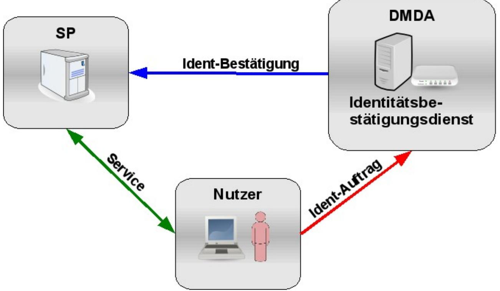
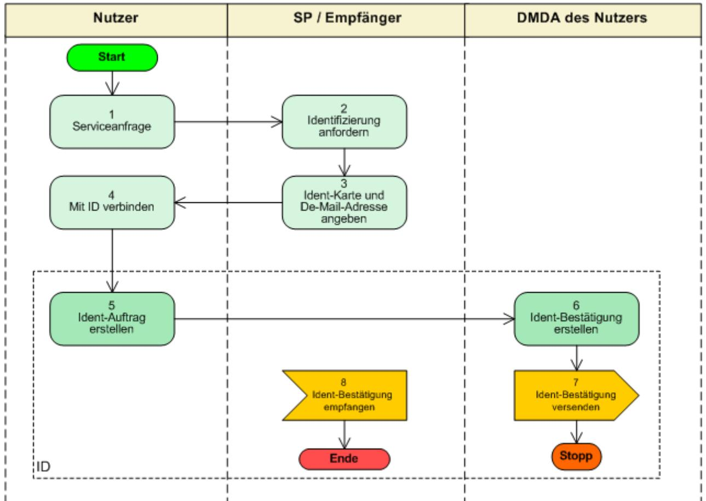
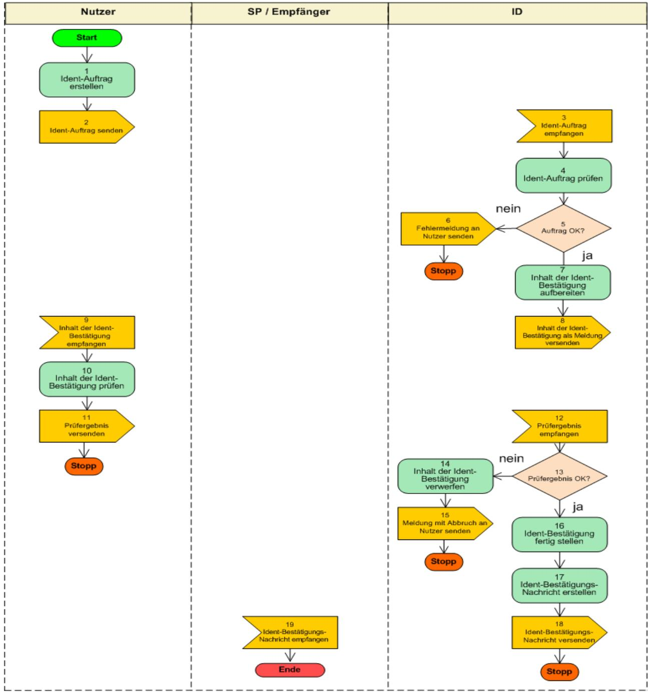

# BSI – Technische Richtlinie

| Bezeichnung:       | Identitätsbestätigungsdienst Funktionalitätsspezifikation |
|--------------------|--------------------------------------------------------------|
| Anwendungsbereich: | De-Mail                                                      |
| Kürzel:            | BSI TR 01201 Teil 4.1                                        |
| Version:           | 1.8                                                          |

Bundesamt für Sicherheit in der Informationstechnik Postfach 20 03 63 53133 Bonn Tel.: +49 22899 9582-0 E-Mail: [de-mail@bsi.bund.de](mailto:de-mail@bsi.bund.de) Internet: [https://www.bsi.bund.de](https://www.bsi.bund.de/) © Bundesamt für Sicherheit in der Informationstechnik 2024

| 1   | Einleitung5                                   |  |
|-----|-----------------------------------------------|--|
| 2   | Gesamtüberblick6                              |  |
| 3   | Funktionale Anforderungen8                    |  |
| 3.1 | Ident-Karten8                                 |  |
| 3.2 | Ident-Auftrag9                                |  |
| 3.3 | Ident-Bestätigung10                           |  |
| 3.4 | Ident-Bestätigungsnachricht10                 |  |
| 3.5 | Meldungen11                                   |  |
| 3.6 | System-Adressen11                             |  |
| 4   | Ablauf des Verfahrens12                       |  |
| 5   | Aktivitätsdiagramm14                          |  |
| 6   | Funktionale Beschreibung15                    |  |
| 6.1 | Einbindung des ID beim SP15                   |  |
| 6.2 | Identitätsbestätigung erstellen15             |  |
| 7   | Anhang23                                      |  |
| 7.1 | Legende zum Aktivitätsdiagramm23              |  |
| 7.2 | Legende zu Schritten der Ablaufbeschreibung24 |  |

### **Abbildungsverzeichnis**

| Abbildung 1: Gesamtüberblick ID6          |  |
|-------------------------------------------|--|
| Abbildung 2: Funktionaler Ablauf des ID12 |  |
| Abbildung 3: Aktivitätsdiagramm des ID14  |  |

### **Tabellenverzeichnis**

| Tabelle 1: Liste der im ID verwendeten System-Adressen11                 |  |
|--------------------------------------------------------------------------|--|
| Tabelle 2: Ablaufbeschreibung ID13                                       |  |
| Tabelle 3: Schritte zum Erstellen eines Ident-Auftrages16                |  |
| Tabelle 4: Schritte zum Prüfen eines Ident-Auftrages durch DMDA18        |  |
| Tabelle 5: Schritte zur Prüfung der Ident-Bestätigung durch den Nutzer19 |  |
| Tabelle 6: Schritte zum Erstellen und Versenden der Ident-Bestätigung22  |  |
| Tabelle 7: Legende zum Aktivitätsdiagramm24                              |  |
| Tabelle 8: Legende zu Schritten25                                        |  |

# **1 Einleitung**

Dieses Modul beinhaltet die funktionalen Spezifikationen des Identitätsbestätigungsdienstes und ist Bestandteil von [TR DM ID M].

In diesem Modul werden die zwingenden Anforderungen an den ID von De-Mail technikneutral beschrieben, sofern dieser angeboten wird. Eine Spezifikation von Protokollen und zugehörigen Parametern erfolgt nur dort, wo dies aus funktionaler Sicht explizit erforderlich ist.

# **2 Gesamtüberblick**

Der ID ermöglicht es allen Nutzern von De-Mail-Konten und insbesondere Service Provider (SP), wie bspw. einem Web-Shop oder Auktionsportal, zuverlässig die Identitätsdaten eines De-Mail-Nutzers zu erhalten. Der ID übermittelt, die im De-Mail-Konto des Nutzers hinterlegten und vom Nutzer explizit für diese Zwecke freigegebenen Identitätsattribute. Der Zeitpunkt der Verifikation wird immer zusammen mit den Identitätsdaten übertragen, sodass der Empfänger entscheiden kann, ob die Aktualität der Daten für seinen Geschäftsvorfall ausreichend ist.

Folgende Rollen sind beim ID involviert:

- **•** Ein Nutzer von De-Mail ist eine bei einem DMDA registrierte natürliche Person oder Institution. Wenn er seinen DMDA beauftragt, seine Identitätsdaten über den ID einem SP zu übermitteln, wird er auch als Ident-Auftraggeber bezeichnet.
- **•** Ein SP ist i. d. R. ein Anbieter von Produkten oder Dienstleistungen im Internet. Er ist selbst als De-Mail-Nutzer bei einem DMDA registriert. Im Zusammenhang mit dem ID treten SP in erster Linie als diejenigen auf, die den ID zur Feststellung der Identität eines anderen De-Mail-Nutzers verwenden. Neben den SP können aber auch andere natürliche Personen oder Institutionen Empfänger der Identitätsdaten sein.

#### *Abbildung 1: Gesamtüberblick ID*

Im Folgenden wird die Anwendung des ID kurz beschrieben:

Ein Nutzer will einen Dienst eines SP (linker, dunkelgrüner Pfeil in [Abbildung 1](#page-5-1)) nutzen. Der SP benötigt zur Erbringung des Dienstes zuverlässige Informationen über den Nutzer, wie bspw. Name, Vorname, Adresse oder Alter. Sofern der SP eine Identifizierung des Nutzers via De-Mail akzeptiert, teilt der SP dem Nutzer mit, welche Identitätsinformationen er vom Nutzer benötigt und an welche De-Mail-Adresse diese Informationen gesendet werden sollen.

Der Nutzer meldet sich an seinem De-Mail-Konto zwingend mit Authentisierungsniveau "hoch" an und veranlasst einen Ident-Auftrag (rechter, roter Pfeil in [Abbildung 1](#page-5-1)), mit dem er auswählt, welche Identitätsinformationen an den SP gesendet werden sollen.

Der DMDA des Nutzers erstellt im Rahmen des Ident-Auftrags eine sogenannte Ident-Bestätigung (vgl. Abschnitt [3.3\)](#page-9-0), die anschließend in einer Nachricht (Ident-Bestätigungsnachricht) über d[en](#page-5-1)  PVD von De-Mail (siehe [TR DM PVD FU]) zum SP übermittelt wird (oberer, blauer Pfeil in [Abbildung 1](#page-5-1)). Der SP prüft die erhaltene Ident-Bestätigung.

Eine detaillierte Beschreibung des Ablaufs erfolgt in Abschnitt [4](#page-11-0).

# **3 Funktionale Anforderungen**

Die Definition und Beschreibung der relevanten Datenstrukturen erfolgen [TR DM ID IO].

### **3.1 Ident-Karten**

Bei De-Mail existiert eine Mindestanzahl an Ident-Karten, die einheitlich von allen DMDA umgesetzt werden müssen. Ident-Karten können Identitäts- oder Adresskarten sein. Jede Ident-Karte enthält unterschiedliche Identitätsattribute. Zu jedem Identitätsattribut muss das dazugehörige Meta-Attribut Datum und Uhrzeit der letzten Verifikation (vgl. [TR DM ACM FU]) angegeben werden.

Im Folgenden werden die Ident-Karten definiert, die mindestens vom DMDA umgesetzt werden müssen. Der DMDA kann weitere definieren und anbieten.

#### **3.1.1 De-Mail-Adresskarte**

Die De-Mail-Adresskarte enthält nur die vom Nutzer verwendete De-Mail-Adresse und kann eingesetzt werden, um die De-Mail-Adresse gegenüber einem SP als valide zu bestätigen. Diese De-Mail-Adresse ist identisch zu der Adresse, die der Ident-Bestätigung durch den ID hinzugefügt wird (vgl. Abschnitt [3.3\)](#page-9-0). Als De-Mail-Adresse kann hierbei auch eine Pseudonym-Adresse angegeben werden.

#### **3.1.2 Identitätskarte einer natürlichen Person**

Die Identitätskarte beinhaltet alle Attribute, die zur vollständigen Beschreibung der Identität einer natürlichen Person erforderlich sind:

- **•** Name,
- **•** Vorname,
- **•** Straße,
- **•** Hausnummer,
- **•** Ort,
- **•** Plz,
- **•** Staat,
- **•** Geburtsdatum,
- **•** Geburtsort.

#### **3.1.3 Adresskarte einer natürlichen Person**

Die Adresskarte beinhaltet alle Attribute, die zur vollständigen Beschreibung der Adresse einer natürlichen Person erforderlich sind:

- **•** Name,
- **•** Vorname,
- **•** Straße,
- **•** Hausnummer,
- **•** Ort,
- **•** Plz,
- **•** Staat.

#### **3.1.4 Alters-Karte einer natürlichen Person**

Die Alters-Karte existiert in folgenden drei Ausprägungen:

- **•** Genaue Altersangabe in Jahren (z. B. 43 Jahre),
- **•** Alterskategorie 16 Jahre oder älter,
- **•** Alterskategorie 18 Jahre oder älter.

Die Alterskategorie-Karten dürfen dem Nutzer im Rahmen der Ident-Auftragserstellung nur dann zur Auswahl angeboten werden, wenn das aktuelle Alter des Nutzers tatsächlich innerhalb des jeweiligen Kategorieintervalles liegt.

Nicht bei allen natürlichen Personen ist das Geburtsdatum vollständig bekannt. Für die spezielle Funktion Alters-Karte muss in diesen Fällen das gemäß der bekannten Teildaten späteste mögliche Datum als Vergleichsdatum abgebildet werden (z. B. falls vom Geburtsdatum nur das Jahr bekannt ist der 31.12. des Jahres). So wird sichergestellt, dass auch im Falle unvollständiger Geburtsdaten eine Altersberechnung so erfolgt, dass das jüngste Alter berechnet wird.

#### **3.1.5 Adresskarte einer Institution**

Die Adresskarte einer Institution beinhaltet alle Attribute, die zur vollständigen Beschreibung dieser erforderlich sind:

- **•** Name der Institution,
- **•** Straße,
- **•** Hausnummer,
- **•** Ort,
- **•** Plz,
- **•** Staat.

## **3.2 Ident-Auftrag**

Um einen Ident-Auftrag zu erteilen, ist zwingend eine Authentisierung mit Authentisierungsniveau "hoch"erforderlich.

Für einen Ident-Auftrag ist zum einen die De-Mail-Adresse des Empfängers notwendig, an die die Ident-Bestätigung geschickt werden soll, und zum anderen die Ident-Karte, die die Identitätsattribute spezifiziert, die in der Ident-Bestätigung ausgewiesen werden sollen.

Hat der Nutzer für Identitätsattribute, die von der ausgewählten Ident-Karte referenziert werden, verschiedene Angaben im De-Mail-Konto hinterlegt, so muss er bei der Erstellung des Ident-Auftrages auswählen können, welche konkreten Daten in der Ident-Bestätigung ausgewiesen werden sollen.

Weiterhin ist die De-Mail-Adresse des Ident-Auftraggebers erforderlich, die in der Ident-Bestätigung hinterlegt wird. Anstelle der primären De-Mail-Adresse, die seinen Namen im Klartext enthält (siehe [TR DM ACM FU]), kann dies auch eine Pseudonym-De-Mail-Adresse sein. In diesem Fall kann keine Ident-Karte ausgewählt werden, die einen Namen, einen Teil oder die vollständige postalische Adresse des Ident-Auftraggebers als Attribut enthält.

Der Ident-Auftraggeber muss die Möglichkeit haben, die Inhalte der zu erstellenden Ident-Bestätigung zu überprüfen, bevor er den Ident-Auftrag bestätigt.

### **3.3 Ident-Bestätigung**

Unmittelbar nach Erhalt eines Ident-Auftrages erstellt der DMDA für die gewünschte De-Mail-Adresse eine Ident-Bestätigung. Dazu werden vom DMDA die auf der Ident-Karte vorgegebenen Attribute mit den konkreten Identitätsdaten des Ident-Auftraggebers ausgefüllt, um Metadaten ergänzt und anschließend mit einer qualifizierten elektronischen Signatur signiert.

Die Ident-Bestätigung wird vom DMDA signiert, um einerseits die Korrektheit aller Daten zu bestätigen, und um andererseits zu versichern, dass der Nutzer mit Authentisierungsniveau "hoch" an seinem De-Mail-Konto angemeldet war, als er den Ident-Auftrag gestellt hat.

Die Ident-Bestätigung enthält neben dem Meta-Attribut "Verifikationszeitpunkt der Identitätsdaten" für jedes Identitätsattribut (vgl. [TR DM ACM FU]) folgende Metadaten:

- **•** die spezifische System-Adresse für den ID,
- **•** die vom Ident-Auftraggeber verwendete De-Mail-Adresse,
- **•** die De-Mail-Adresse des Empfängers, für den die Bestätigung ausgestellt wird,
- **•** den Ausstellungszeitpunkt der Ident-Bestätigung.

### **3.4 Ident-Bestätigungsnachricht**

Die Ident-Bestätigungsnachricht ist eine Nachricht, die der DMDA ausschließlich aufgrund eines Ident-Auftrages an den angegebenen Empfänger über den PVD sendet.

Absender der Ident-Bestätigungsnachricht ist jeweils die System-Adresse des ID. Empfänger der Nachricht ist der SP, der über seine De-Mail-Adresse adressiert wird. Der Ident-Auftraggeber wird in Kopie gesetzt. Der Betreff der Nachricht ist auf "Ident-Bestätigung" zu setzen Und der entsprechende "Nachrichten-Typ" zu setzen. Die Nachricht wird weiterhin mit der Versandoption "Persönlich" versendet (vgl. [TR DM PVD FU]), um sicherzustellen, dass keine unautorisierten Personen die Identitätsattribute einsehen können.

Die vom DMDA des Nutzers erstellte und signierte Ident-Bestätigung wird als Anhang der Nachricht über den PVD an die De-Mail-Adresse des SPs und in Kopie an den Ident-Auftraggeber zugestellt. Anhand der speziellen Absender-Adresse, die eine System-Adresse ist, kann der SP bzw. der Empfänger erkennen, ob die Nachricht tatsächlich im Rahmen eines Ident-Auftrages durch den DMDA erstellt wurde.

Ident-Bestätigungsnachrichten müssen einen Hinweis zur Verwendung und Interpretation der Anhänge in Textform enthalten. Des Weiteren müssen diese Hinweise die wesentlichen Informationen aus der signierten Bestätigung referenzieren, wie z. B. die De-Mail-Adresse des Ident-Auftraggebers oder des SPs.

### **3.5 Meldungen**

Meldungen sind Informationen des ID an den Nutzer und können in Abhängigkeit der Benutzerschnittstelle, die der Nutzer verwendet, unterschiedlich dargestellt und bekannt gemacht werden. Bspw. können sie in einem Webbrowser dargestellt oder auch als Meldungsnachricht (siehe [TR DM PVD FU]) übermittelt werden. Es muss sichergestellt werden, dass der Nutzer Meldungen über die von ihm verwendete Benutzerschnittstelle unmittelbar zur Kenntnis nehmen kann.

### **3.6 System-Adressen**

In der nachfolgenden Tabelle werden die System-Adressen (siehe [TR DM ACM FU]) aufgelistet, die innerhalb des ID verwendet werden.

| Verwendungszweck    | De-Mail-Adresse           |
|---------------------|---------------------------|
| Ident-Bestätigungen | Ident-Bestaetigung@<DMDA> |
| Meldungen           | Ident-Meldung@<DMDA>      |

*Tabelle 1: Liste der im ID verwendeten System-Adressen*

# **4 Ablauf des Verfahrens**

In der nachfolgenden [Abbildung 2](#page-11-1) ist der funktionale und zeitliche Ablauf für die Erstellung und den Versand einer Ident-Bestätigung zwischen Nutzer, d. h. dem Ident-Auftraggeber, dem SP und dem DMDA des Nutzers dargestellt. Die eigentliche Funktionalität des ID ist dabei mit einem Rahmen gekennzeichnet und wird in den nachfolgenden Abschnitten näher spezifiziert.

*Abbildung 2: Funktionaler Ablauf des ID*

| Schritt | Bezeichnung                                   | Übermittlung | Beschreibung                                                                                                                                                             |
|---------|-----------------------------------------------|--------------|--------------------------------------------------------------------------------------------------------------------------------------------------------------------------|
| 1       | Serviceanfrage                                | Web          | Der Nutzer möchte bspw. einen Warenkorb füllen und bestellen oder ein Konto beim SP einrichten.                                                                    |
| 2       | Identifizierung anfordern                  | Web          | Die dazu notwendige Identifizierung soll via ID eines DMDA geschehen.                                                                                                 |
| 3       | Ident-Karte und De Mail-Adresse angeben | Web          | Der SP nennt dem Nutzer eine De-Mail Adresse, an die der DMDA die Ident Bestätigung sendet. Ferner teilt der SP dem Nutzer mit, welche Ident-Karte er benötigt. |
| 4       | Mit Ident-Dienst                              | Web          | Der Benutzer verbindet sich mit dem                                                                                                                                      |

| Schritt | Bezeichnung                    | Übermittlung | Beschreibung                                                                                                                                                                                                                                                     |
|---------|--------------------------------|--------------|------------------------------------------------------------------------------------------------------------------------------------------------------------------------------------------------------------------------------------------------------------------|
|         | verbinden                      |              | Authentisierungsniveau "hoch" mit dem ID seines DMDA.                                                                                                                                                                                                         |
| 5       | Ident-Auftrag erstellen     | Web          | Der Nutzer veranlasst die Erstellung einer Ident-Nachricht. Dabei teilt der Nutzer dem DMDA die De-Mail-Adresse des SP, die zu verwendende Ident-Karte und seine eigene De-Mail-Adresse mit, die für die Kommunikation mit dem SP verwendet wird. |
| 6       | Ident-Bestätigung erstellen |              | Der ID erstellt eine Ident-Bestätigung.                                                                                                                                                                                                                          |
| 7       | Ident-Bestätigung versenden | Nachricht    | Der ID versendet die Ident-Bestätigung mittels einer Nachricht über den PVD zum SP. Eine Kopie der Nachricht erhält der Nutzer.                                                                                                                            |
| 8       | Ident-Bestätigung empfangen | Nachricht    | Der SP empfängt die Ident-Bestätigung vom ID mittels des PVD.                                                                                                                                                                                                 |

*Tabelle 2: Ablaufbeschreibung ID*

# **5 Aktivitätsdiagramm**

In [Abbildung 3](#page-13-1) wird der funktionale Ablauf des ID von der Erstellung eines Ident-Auftrages durch einen Nutzer bis zum Versenden einer Ident-Bestätigung an einen SP über den PVD (siehe [TR DM PVD FU]) in einem Aktivitätsdiagramm[1](#page-13-2) dargestellt. Eine detaillierte technisch-funktionale Beschreibung der einzelnen Aktionen und Schritte des Aktivitätsdiagramms erfolgt in Abschnitt [6.](#page-14-0)

*Abbildung 3: Aktivitätsdiagramm des ID*

1 Eine Legende zu den Symbolen des Aktivitätsdiagramms findet sich in Abschnitt [7.1](#page-22-1).

# **6 Funktionale Beschreibung**

Im Folgenden werden die einzelnen Schritte des Aktivitätsdiagramms aus Abschnitt [5](#page-13-0) von der Erstellung eines Ident-Auftrages durch einen Nutzer bis zum Versenden einer Ident-Bestätigung an einen SP über den PVD von De-Mail beschrieben. Die referenzierten Funktionen des Account- und Zeitdienstes werden in [TR DM ACM FU] und in [TR DM IT-BInfra] erläutert. Eine Beschreibung, wie die einzelnen Schritte strukturiert sind, findet sich in diesem Abschnitt.

### **6.1 Einbindung des ID beim SP**

Der SP muss dem Nutzer im Vorfeld in geeigneter Form (z. B. auf seiner Website) eine De-Mail-Adresse und die geforderte Ident-Karte angeben, damit der Nutzer den Ident-Auftrag stellen kann, auf dessen Grundlage die Ident-Bestätigung vom DMDA erstellt wird.

### **6.2 Identitätsbestätigung erstellen**

|  | 6.2.1 | Ident-Auftrag erstellen |  |
|--|-------|-------------------------|--|
|--|-------|-------------------------|--|

| Schritt 1        | Ident-Auftrag erstellen                                                                                                                         |  |
|------------------|-------------------------------------------------------------------------------------------------------------------------------------------------|--|
| Kurzbeschreibung | Der Nutzer erstellt einen Ident-Auftrag.                                                                                                        |  |
| Akteure          | Nutzer                                                                                                                                          |  |
| Auslöser         | Nutzer                                                                                                                                          |  |
| Vorbedingung     | De-Mail-Adresse vom SP erhalten •                                                                                                            |  |
|                  | SP hat Ident-Karte mit benötigten Attributen mitgeteilt •                                                                                    |  |
|                  | Anmeldung am De-Mail-Konto mit Authentisierungsniveau "hoch" •                                                                               |  |
| Input            | De-Mail-Adresse des SP                                                                                                                          |  |
|                  | Typ der benötigten Ident-Karte                                                                                                                  |  |
| Ergebnis         | Ident-Auftrag ist erstellt                                                                                                                      |  |
| Nachbedingung    |                                                                                                                                                 |  |
| Ablauf           | Ident-Auftrag-Maske aufrufen •                                                                                                               |  |
|                  | De-Mail-Adresse des SP eingeben •                                                                                                            |  |
|                  | Ident-Karte auswählen •                                                                                                                      |  |
|                  | ggf. Spezifikation, welche im De-Mail-Konto hinterlegten ◦ Daten in der Ident-Bestätigung verwendet werden müssen (vgl. Abschnitt 3.2) |  |
|                  | Auftrag ausführen •                                                                                                                          |  |

| Fehlerfälle      | FC-01: Nutzer nicht am De-Mail-Konto mit Authentisierungsniveau "hoch" angemeldet |
|------------------|--------------------------------------------------------------------------------------|
| Schritt 2        | Ident-Auftrag senden                                                                 |
| Kurzbeschreibung | Der Nutzer sendet den Ident-Auftrag zum ID.                                          |
| Akteure          | Nutzer, ID                                                                           |
| Auslöser         | Nutzer                                                                               |
| Vorbedingung     |                                                                                      |
| Input            | Ident-Auftrag                                                                        |
| Ergebnis         | Ident-Auftrag zum ID versendet                                                       |
| Nachbedingung    |                                                                                      |
| Ablauf           | Ident-Auftrag zum ID senden                                                          |
| Fehlerfälle      | FC-01: Ident-Auftrag wird nicht angenommen                                           |

*Tabelle 3: Schritte zum Erstellen eines Ident-Auftrages*

#### **6.2.2 Ident-Auftrag durch DMDA prüfen**

| Schritt 3        | Ident-Auftrag empfangen                                                              |
|------------------|--------------------------------------------------------------------------------------|
| Kurzbeschreibung | Der ID empfängt den Ident-Auftrag.                                                   |
| Akteure          | Nutzer, ID                                                                           |
| Auslöser         | Nutzer                                                                               |
| Vorbedingung     | Sicherer Kanal zwischen den Kommunikationspartnern aufgebaut •                    |
|                  | Authentisierungsniveau des Nutzers "hoch" •                                       |
| Input            | Ident-Auftrag                                                                        |
| Ergebnis         | Ident-Auftrag vom ID empfangen                                                       |
| Nachbedingung    |                                                                                      |
| Ablauf           | Ident-Auftrag empfangen                                                              |
| Fehlerfälle      | FC-01: Nutzer nicht am De-Mail-Konto mit Authentisierungsniveau "hoch" angemeldet |
| Schritt 4        | Ident-Auftrag prüfen                                                                 |
| Kurzbeschreibung | Der ID prüft den Ident-Auftrag.                                                      |
| Akteure          | ID, Account-Dienst                                                                   |
| Auslöser         | ID                                                                                   |
| Vorbedingung     |                                                                                      |

| Input            | Ident-Auftrag                                                                                                        |
|------------------|----------------------------------------------------------------------------------------------------------------------|
|                  | Aktuelles Authentisierungsniveau des Nutzers                                                                         |
| Ergebnis         | Ident-Auftrag geprüft                                                                                                |
| Nachbedingung    |                                                                                                                      |
| Ablauf           | De-Mail-Adresse des SP syntaktisch prüfen •                                                                       |
|                  | Ident-Karte prüfen, ob der Nutzer sie auswählen darf (z.B. bei • Alterskategorie-Karte)                        |
|                  | Prüfen, ob explizit referenzierte Identitätsdaten für Ident-Karte • genutzt werden dürfen (vgl. Abschnitt 3.2) |
| Fehlerfälle      | FC-01: De-Mail-Adresse des SP ist syntaktisch fehlerhaft                                                             |
|                  | FC-02: Ident-Karte (für Nutzer) nicht vorhanden                                                                      |
|                  | FC-03: Referenzierte Identitätsdaten nicht erlaubt/nicht gültig                                                      |
| Schritt 5        | Entscheidungsknoten: Auftrag OK?                                                                                     |
| Kurzbeschreibung | Auswertung durch ID, ob der Ident-Auftrag korrekt gestellt wurde.                                                    |
| ja               | Schritt 7                                                                                                            |
| nein             | Schritt 6                                                                                                            |
| Schritt 6        | Fehlermeldung an Nutzer senden                                                                                       |
| Kurzbeschreibung | Der ID sendet eine Fehlermeldung an den Nutzer (vgl. Abschnitt 3.4).                                                 |
| Akteure          | ID                                                                                                                   |
| Auslöser         | ID                                                                                                                   |
| Vorbedingung     |                                                                                                                      |
| Input            | Fehlerfälle aus Schritt 4                                                                                            |
| Ergebnis         | Meldung an Nutzer gesendet                                                                                           |
| Nachbedingung    | Stopp                                                                                                                |
| Ablauf           | Fehlerfälle aus Schritt 4 zu einer Meldung verarbeiten •                                                          |
|                  | Meldung an Nutzer senden •                                                                                        |
| Fehlerfälle      | FC-01: Meldung konnte nicht abgesendet/dargestellt werden                                                            |
| Schritt 7        | Inhalt der Ident-Bestätigung aufbereiten                                                                             |
| Kurzbeschreibung | Der ID erstellt die Inhalte der späteren Ident-Bestätigung                                                           |
| Akteure          | ID, Account-Dienst, Zeitdienst                                                                                       |
| Auslöser         | ID                                                                                                                   |
| Vorbedingung     |                                                                                                                      |
| Input            | Ident-Karte •                                                                                                     |

| Nutzerkennung des Ident-Auftraggebers (De-Mail-Adresse des • Nutzers)                                                                           |
|-------------------------------------------------------------------------------------------------------------------------------------------------------|
| Nutzerkennung des Empfängers (De-Mail-Adresse des SP) •                                                                                            |
| Nutzerkennung des Ausstellers (De-Mail-Adresse des DMDA) •                                                                                         |
| Authentisierungsniveau des Nutzers •                                                                                                               |
| Ausstellungszeitpunkt (gesetzliche Zeit) •                                                                                                         |
| Inhalte der Ident-Bestätigung erstellt                                                                                                                |
|                                                                                                                                                       |
| Anfrage an Account-Dienst (Attribute von Ident-Karte). •                                                                                           |
| Identitätsdaten und deren Metadaten in die Ident-Bestätigung • einfügen.                                                                        |
| Nutzerkennung des Ident-Auftraggebers (De-Mail-Adresse des • Nutzers) in die Ident-Bestätigung einfügen.                                        |
| Nutzerkennung des Empfängers (De-Mail-Adresse des SP) in die • Ident-Bestätigung einfügen.                                                      |
| Nutzerkennung des Ausstellers (De-Mail-Adresse des DMDA) in • die Ident-Bestätigung einfügen.                                                   |
| Authentisierungsniveau des Nutzers in die Ident-Bestätigung • einfügen.                                                                         |
| Ausstellungszeitpunkt in die Ident-Bestätigung einfügen. •                                                                                         |
| FC-01: Identitätsattribut für Nutzer nicht vorhanden                                                                                                  |
| Inhalt der Ident-Bestätigung als Meldung versenden                                                                                                    |
| Der ID erstellt eine Meldung an den Nutzer, der den Ident-Auftrag erstellt hat. Die Meldung beinhaltet die Inhalte der späteren Ident-Bestätigung. |
| ID, Nutzer                                                                                                                                            |
| ID                                                                                                                                                    |
|                                                                                                                                                       |
| Inhalte der Ident-Bestätigung                                                                                                                         |
| Inhalt der Ident-Bestätigung zum Nutzer versendet                                                                                                     |
|                                                                                                                                                       |
| Meldung mit Informationen aus Schritt 7 erstellen •                                                                                                |
| Meldung zum Nutzer senden •                                                                                                                        |
| FC-01: Meldung wird nicht angenommen                                                                                                                  |
|                                                                                                                                                       |

*Tabelle 4: Schritte zum Prüfen eines Ident-Auftrages durch DMDA*

| Schritt 9        | Inhalt der Ident-Bestätigung empfangen                                                                                                                              |
|------------------|---------------------------------------------------------------------------------------------------------------------------------------------------------------------|
| Kurzbeschreibung | Der Nutzer empfängt den Inhalt der (späteren) Ident-Bestätigung.                                                                                                    |
| Akteure          | ID, Nutzer                                                                                                                                                          |
| Auslöser         | ID                                                                                                                                                                  |
| Vorbedingung     |                                                                                                                                                                     |
| Input            | Ident-Auftrag                                                                                                                                                       |
| Ergebnis         | Inhalt der Ident-Bestätigung vom ID empfangen                                                                                                                       |
| Nachbedingung    |                                                                                                                                                                     |
| Ablauf           | Inhalt der Ident-Bestätigung empfangen                                                                                                                              |
| Fehlerfälle      |                                                                                                                                                                     |
| Schritt 10       | Inhalt der Ident-Bestätigung prüfen                                                                                                                                 |
| Kurzbeschreibung | Der Nutzer prüft die Richtigkeit der Inhalte der späteren Ident-Bestätigung. Im Anschluss an die Prüfung kann er den Ident-Auftrag bestätigen oder abbrechen. |
| Akteure          | Nutzer                                                                                                                                                              |
| Auslöser         | Nutzer                                                                                                                                                              |
| Vorbedingung     |                                                                                                                                                                     |
| Input            | Inhalt der Ident-Bestätigung                                                                                                                                        |
| Ergebnis         | Ident-Auftrag geprüft                                                                                                                                               |
| Nachbedingung    |                                                                                                                                                                     |
| Ablauf           | Darstellung des Inhalts •                                                                                                                                        |
|                  | Bestätigung oder Abbrechen des initiierten Ident-Auftrages •                                                                                                     |
| Fehlerfälle      |                                                                                                                                                                     |
| Schritt 11       | Prüfergebnis senden                                                                                                                                                 |
| Kurzbeschreibung | Das Prüfergebnis des Nutzers wird zum ID gesendet.                                                                                                                  |
| Akteure          | Nutzer, ID                                                                                                                                                          |
| Auslöser         | Nutzer                                                                                                                                                              |
| Vorbedingung     |                                                                                                                                                                     |
| Input            | Prüfergebnis (Bestätigung oder Abbrechen)                                                                                                                           |
| Ergebnis         | Prüfergebnis zum ID versendet                                                                                                                                       |
| Nachbedingung    |                                                                                                                                                                     |
| Ablauf           | Prüfergebnis zum ID senden                                                                                                                                          |

#### **6.2.3 Inhalte der Ident-Bestätigung durch Nutzer prüfen**

| Fehlerfälle | FC-01: Prüfergebnis wird nicht angenommen |
|-------------|-------------------------------------------|
|             |                                           |

*Tabelle 5: Schritte zur Prüfung der Ident-Bestätigung durch den Nutzer*

#### **6.2.4 Ident-Bestätigung erstellen und versenden**

| Schritt 12       | Prüfergebnis empfangen                                                                     |
|------------------|--------------------------------------------------------------------------------------------|
| Kurzbeschreibung | Der ID empfängt das Prüfergebnis für den Ident-Auftrag.                                    |
| Akteure          | Nutzer, ID                                                                                 |
| Auslöser         | Nutzer                                                                                     |
| Vorbedingung     |                                                                                            |
| Input            | Prüfergebnis                                                                               |
| Ergebnis         | Prüfergebnis vom ID empfangen                                                              |
| Nachbedingung    | Wenn kein Prüfergebnis empfangen wurde: Schritt 14.                                        |
| Ablauf           | Prüfergebnis empfangen                                                                     |
| Fehlerfälle      |                                                                                            |
| Schritt 13       | Entscheidungsknoten: Prüfergebnis OK?                                                      |
| Kurzbeschreibung | Auswertung, ob der Nutzer den Ident-Auftrag bestätigt (ja) oder abgebrochen (nein) hat. |
| ja               | Schritt 16                                                                                 |
| nein             | Schritt 14                                                                                 |
| Schritt 14       | Inhalt der Ident-Bestätigung verwerfen                                                     |
| Kurzbeschreibung | Der Inhalt der Ident-Bestätigung wird vom ID verworfen.                                    |
| Akteure          | ID                                                                                         |
| Auslöser         | ID                                                                                         |
| Vorbedingung     |                                                                                            |
| Input            | Inhalt der Ident-Bestätigung                                                               |
| Ergebnis         | Inhalt der Ident-Bestätigung gelöscht                                                      |
| Nachbedingung    |                                                                                            |
| Ablauf           | Löschen der Inhalte der Ident-Bestätigung                                                  |
| Fehlerfälle      |                                                                                            |
| Schritt 15       | Meldung mit Abbruch an Nutzer senden                                                       |
| Kurzbeschreibung | Der ID sendet eine Meldung an den Nutzer, dass der Ident-Auftrag abgebrochen wurde.     |

| Akteure          | ID                                                                                                                                                           |
|------------------|--------------------------------------------------------------------------------------------------------------------------------------------------------------|
| Auslöser         | ID                                                                                                                                                           |
| Vorbedingung     |                                                                                                                                                              |
|                  |                                                                                                                                                              |
| Input            |                                                                                                                                                              |
| Ergebnis         | Meldung an Nutzer gesendet                                                                                                                                   |
| Nachbedingung    | Stopp                                                                                                                                                        |
| Ablauf           | Meldung mit Abbruch an Nutzer senden                                                                                                                         |
| Fehlerfälle      | FC-01: Meldung konnte nicht abgesendet/dargestellt werden                                                                                                    |
| Schritt 16       | Ident-Bestätigung fertig stellen                                                                                                                             |
| Kurzbeschreibung | Die in Schritt 7 erstellen Inhalte werden zur Ident-Bestätigung zusammengestellt und vom ID mit einer qualifizierten elektronischen Signatur signiert. |
| Akteure          | ID                                                                                                                                                           |
| Auslöser         | ID                                                                                                                                                           |
| Vorbedingung     |                                                                                                                                                              |
| Input            | Inhalte der Ident-Bestätigung aus Schritt 7                                                                                                                  |
| Ergebnis         | Ident-Bestätigung fertig erstellt                                                                                                                            |
| Nachbedingung    |                                                                                                                                                              |
| Ablauf           | - Inhalte der Ident-Bestätigung aus Schritt 7 in das Format für eine Ident-Bestätigung strukturieren.                                                  |
|                  | - Die Ident-Bestätigung mit einer qualifizierten elektronischen Signatur versehen                                                                      |
| Fehlerfälle      |                                                                                                                                                              |
| Schritt 17       | Ident-Bestätigungsnachricht erstellen                                                                                                                        |
| Kurzbeschreibung | Der ID erstellt eine Ident-Bestätigungsnachricht.                                                                                                            |
| Akteure          | ID                                                                                                                                                           |
| Auslöser         | ID                                                                                                                                                           |
| Vorbedingung     |                                                                                                                                                              |
| Input            | Ident-Bestätigung •                                                                                                                                       |
|                  | Nutzerkennung des Absenders (De-Mail-Adresse des DMDA) •                                                                                                  |
|                  | Nutzerkennung des Empfängers SP (De-Mail-Adresse des SP) •                                                                                                |
|                  | Nutzerkennung des Empfängers Nutzer (De-Mail-Adresse des • Nutzers)                                                                                    |
| Ergebnis         | Ident-Bestätigungsnachricht erstellt                                                                                                                         |

| Nachbedingung    |                                                                                                                                            |
|------------------|--------------------------------------------------------------------------------------------------------------------------------------------|
| Ablauf           | Ident-Bestätigung in Ident-Bestätigungsnachricht einfügen •                                                                             |
|                  | Nutzerkennung des Ausstellers als Absender-Adresse der Ident • Bestätigungsnachricht einfügen                                        |
|                  | Nutzerkennung des SP als Empfänger-Adresse der Ident • Bestätigungsnachricht einfügen                                                |
|                  | Nutzerkennung des Ident-Auftraggebers in Kopie (Carbon Copy, • CC) als Empfänger-Adresse der Ident-Bestätigungsnachricht einfügen |
|                  | Versandoption "Persönlich" wählen •                                                                                                     |
| Fehlerfälle      |                                                                                                                                            |
| Schritt 18       | Ident-Bestätigungsnachricht versenden                                                                                                      |
| Kurzbeschreibung | Der ID sendet die Ident-Bestätigungsnachricht über den PVD an den SP und Nutzer.                                                        |
| Akteure          | ID, Postfachdienst des Ausstellers                                                                                                         |
| Auslöser         | ID                                                                                                                                         |
| Vorbedingung     | Sicheren Kanal mit PVD aufgebaut                                                                                                           |
| Input            | Ident-Bestätigungsnachricht                                                                                                                |
| Ergebnis         | Ident-Bestätigungsnachricht an SP und Nutzer gesendet                                                                                      |
| Nachbedingung    |                                                                                                                                            |
| Ablauf           | Ident-Bestätigungsnachricht über den PVD versenden                                                                                         |
| Fehlerfälle      | FC-01: Ident-Bestätigungsnachricht wurde nicht angenommen                                                                                  |

*Tabelle 6: Schritte zum Erstellen und Versenden der Ident-Bestätigung*

# **7 Anhang**

#### **7.1 Legende zum Aktivitätsdiagramm**

|                           | Startknoten                                                                                                                                                                                                                                                                                                                                                                                                                     |
|---------------------------|---------------------------------------------------------------------------------------------------------------------------------------------------------------------------------------------------------------------------------------------------------------------------------------------------------------------------------------------------------------------------------------------------------------------------------|
| Startknoten               | Der Startknoten ist der Startpunkt eines Prozesses. Ein Prozess darf mehrere Startknoten haben, in diesem Fall beginnen beim Start des Prozesses mehrere Abläufe. Es ist möglich, dass ein Prozess keinen Startknoten besitzt, sondern von einem Ereignis angestoßen wird.                                                                                                                                          |
| Endknoten                 | Endknoten                                                                                                                                                                                                                                                                                                                                                                                                                       |
|                           | Der Endknoten gibt an, dass die Ausführung des Prozesses abgeschlossen ist. Es kann in einem Prozessdiagramm mehrere Ausgänge in Form dieser Endknoten geben. Gibt es zum Zeitpunkt des Erreichens des Endknotens mehrere parallele Abläufe innerhalb des Prozesses, werden beim Erreichen eines Endknotens alle Abläufe gestoppt.                                                                               |
|                           | Ablaufende                                                                                                                                                                                                                                                                                                                                                                                                                      |
| Stopp                     | Das Ablaufende terminiert einen Ablauf. Im Unterschied zum Endknoten, der einen ganzen Prozess beendet, hat das Erreichen des Ablaufendes keinen Effekt auf andere parallele Abläufe, die zu diesem Zeitpunkt innerhalb des Prozesses abgearbeitet werden. Auf diese Weise lassen sich parallele Abläufe gezielt und einzeln beenden.                                                                            |
|                           | Kante                                                                                                                                                                                                                                                                                                                                                                                                                           |
|                           | Die als Pfeile dargestellten Kanten verbinden die einzelnen Komponenten des Diagramms und stellen den Kontrollfluss dar.                                                                                                                                                                                                                                                                                                     |
|                           | Aktion                                                                                                                                                                                                                                                                                                                                                                                                                          |
| Aktion                    | Eine Aktion ist ein einzelner Schritt innerhalb eines Prozesses, der nicht mehr weiter zerlegt wird. Das bedeutet nicht unbedingt, dass die Aktion in der realen Welt nicht mehr weiter zerlegbar wäre, sondern dass die Aktion in diesem Diagramm nicht mehr weiter verfeinert wird. Die Aktion kann Ein- und Ausgabeinformationen besitzen. Der Output einer Aktion kann der Input einer Folge-Aktion sein. |
| Aufruf einer Aktivität | Aufruf einer Aktivität                                                                                                                                                                                                                                                                                                                                                                                                          |
|                           | Mit diesem Symbol kann aus einer Aktivität (Prozess) heraus eine weitere Aktivität aufgerufen werden. Der Aufruf selbst ist eine Aktion, der aufgerufene Ablauf eine weitere Aktivität.                                                                                                                                                                                                                                   |

| Ereignis empfangen | Empfang eines Ereignisses Diese Aktion wartet auf das Eintreten eines Ereignisses. Nach dem Empfang des Ereignisses wird der im Aktivitätsdiagramm definierte, von dieser Aktion ausgehende Ablauf abgearbeitet.                                                                |
|-----------------------|------------------------------------------------------------------------------------------------------------------------------------------------------------------------------------------------------------------------------------------------------------------------------------------|
| Signal senden         | Senden von Signalen Das Senden von Signalen bedeutet, dass ein Signal an eine empfangende Aktivität gesendet wird. Die empfangende Aktivität nimmt das Signal mit der Aktion "Ereignis empfangen" entgegen und kann entsprechend darauf reagieren.                           |
| Entscheidungsknoten   | Entscheidungsknoten Die Raute stellt eine Verzweigung im Kontrollfluss dar. Eine Verzweigung hat einen Eingang und zwei oder mehrere Ausgänge. Jeder Ausgang wird mit einer Bedingung versehen. Trifft eine Bedingung zu, wird am entsprechenden Ausgang weiterverfahren. |
| Datenobjekt           | Datenobjekt Datenobjekte gehören üblicherweise nicht zum Symbolumfang in UML-Aktivitätsdiagrammen. Sie sind hier jedoch eingeführt worden, um an entscheidender Stelle zu verdeutlichen, welche Datenobjekte, insbesondere im Fokus der Schutzbedarfsanalyse, vorliegen.  |

*Tabelle 7: Legende zum Aktivitätsdiagramm*

# **7.2 Legende zu Schritten der Ablaufbeschreibung**

Schritte im Aktivitätsdiagramm bezeichnen im Kontrollfluss eingebundene einmalig ablaufende Aktionen, wie z. B. einen vom Nutzer erstellten Ident-Auftrag zu prüfen ([Schritt 4](#page-15-0) in Abschnitt [4\)](#page-11-0).

| Schritt <Nr.>    | Eindeutiger Name der Aktion                                                                                                                                                                                                                                                                                                                                                   |
|------------------|-------------------------------------------------------------------------------------------------------------------------------------------------------------------------------------------------------------------------------------------------------------------------------------------------------------------------------------------------------------------------------|
| Kurzbeschreibung | Innerhalb der Kurzbeschreibung erfolgt eine verbale Beschreibung der wesentlichen Funktionalität der Aktion.                                                                                                                                                                                                                                                               |
| Akteure          | Alle Rollen bzw. Dienste, die innerhalb der Aktion in irgendeiner Weise beteiligt sind, werden aufgezählt.                                                                                                                                                                                                                                                                 |
| Auslöser         | Der Auslöser ist ein Akteur, durch den die Aktion aufgerufen bzw. initialisiert wird.                                                                                                                                                                                                                                                                                      |
| Vorbedingung     | Unter Vorbedingungen werden die Bedingungen verstanden, die nicht aus einer unmittelbar vorhergehenden Aktion folgen, sondern asynchron erzielt werden müssen. Diese Aktivitäten sind nicht unbedingt in diesem Dokument beschrieben, die Ergebnisse sind jedoch als Vorbedingungen für die Ausführung der hier beschriebenen Aktion notwendig. Auf die Erfüllung |

Schritte werden in diesem Modul als Aktionen auf folgende Art und Weise beschrieben:

|  | 7 Anhang |
|--|----------|
|--|----------|

| Schritt <Nr.> | Eindeutiger Name der Aktion                                                                                                                                                                                                                                                                                                                                                                                                                                                                                                                                                       |
|---------------|-----------------------------------------------------------------------------------------------------------------------------------------------------------------------------------------------------------------------------------------------------------------------------------------------------------------------------------------------------------------------------------------------------------------------------------------------------------------------------------------------------------------------------------------------------------------------------------|
|               | dieser Vorbedingungen muss sich die nutzende Aktion verlassen können.                                                                                                                                                                                                                                                                                                                                                                                                                                                                                                             |
| Input         | Der Auslöser muss bei Initialisierung der Aktion die entsprechenden Informationen an diese übergeben oder durch die Aktion abfragen lassen, so dass eine Verarbeitung der Informationen innerhalb der Aktion erfolgen kann.                                                                                                                                                                                                                                                                                                                                              |
| Ergebnis      | Nach Beendigung der Aktion muss eine bestimmte Information als Resultat erarbeitet bzw. bereitgestellt werden.                                                                                                                                                                                                                                                                                                                                                                                                                                                                 |
| Nachbedingung | Unter Nachbedingungen werden Bedingungen verstanden, die innerhalb dieser Aktion nicht betrachtet werden und durch unmittelbar nachfolgende Aktionen aufgegriffen und dort behandelt werden müssen.                                                                                                                                                                                                                                                                                                                                                                         |
| Ablauf        | Für die innerhalb der Aktion definierte Logik wird ein konkreter Ablauf beschrieben. Die definierte Abfolge muss innerhalb der Aktion durchgeführt und abgeschlossen werden.                                                                                                                                                                                                                                                                                                                                                                                                |
| Fehlerfälle   | Als Fehlerfall wird ein Ergebnis einer Funktion bezeichnet, der innerhalb der Funktionsspezifikation liegt, aber kein Standard-Ergebnis darstellt.                                                                                                                                                                                                                                                                                                                                                                                                                             |
|               | Die konkrete Behandlung eines Fehlerfalls ist implementierungsabhängig. Je nach Fall können unterschiedliche Lösungsstrategien verwendet werden, bspw. kann eine Aktion zu einem späteren Zeitpunkt wiederholt oder die Aktion abgebrochen werden. Bei Abbruch einer Aktion ist der Nutzer mindestens darüber zu informieren und alle bis zu diesem Schritt generierten temporären Daten müssen gelöscht werden. In den Beschreibungen der Fehlerfälle der Aktionen werden nur mögliche Fehler beschrieben, die innerhalb der Funktionsspezifikation liegen. |

*Tabelle 8: Legende zu Schritten*