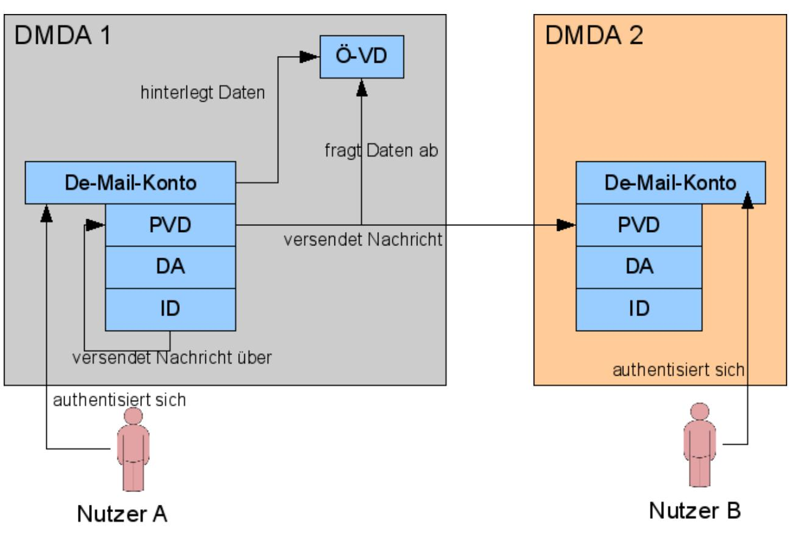
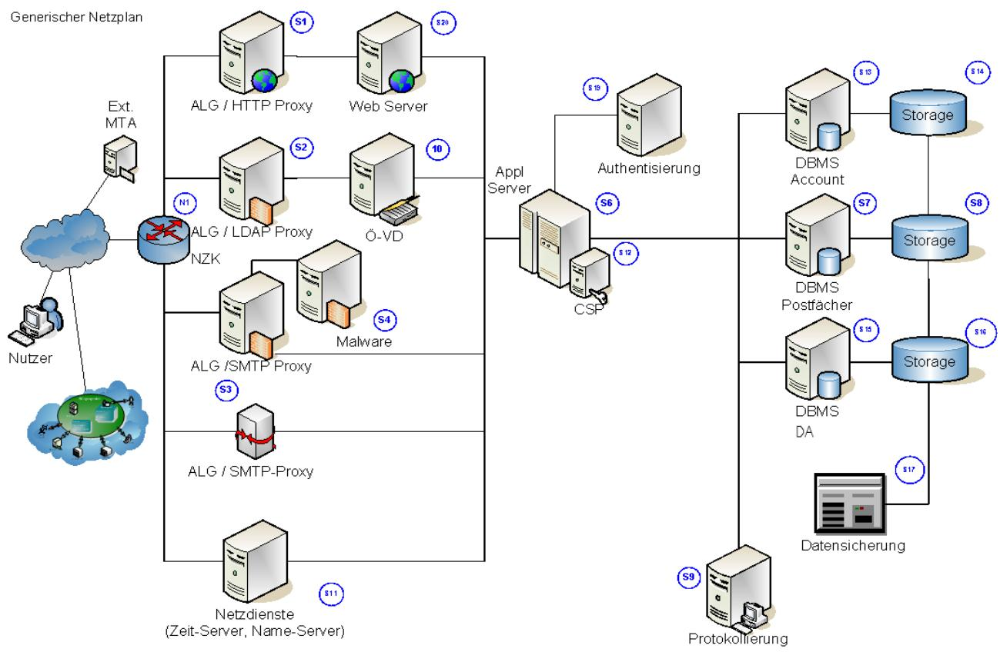
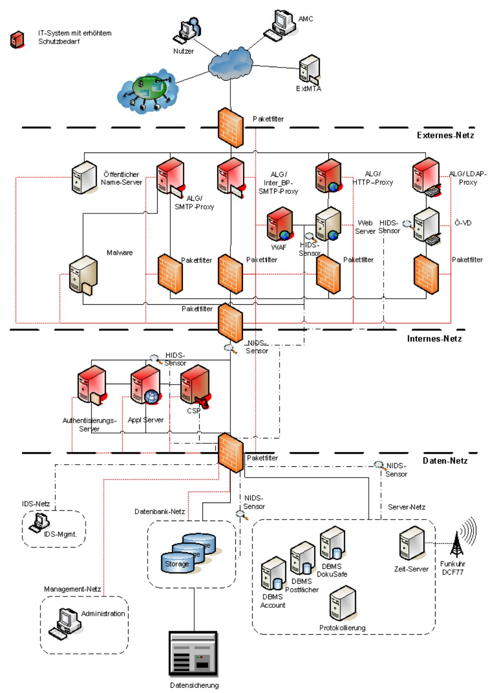

# BSI – Technische Richtlinie

| Bezeichnung:       | Informationssicherheit nach ISO27001 auf der Basis von IT-Grundschutz |
|--------------------|--------------------------------------------------------------------------|
| Anwendungsbereich: | De-Mail                                                                  |
| Kürzel:            | BSI TR 01201 Teil 6.1                                                    |
| Version:           | 1.8                                                                      |

Bundesamt für Sicherheit in der Informationstechnik Postfach 20 03 63 53133 Bonn Tel.: +49 22899 9582-0 E-Mail: [de-mail@bsi.bund.de](mailto:de-mail@bsi.bund.de) Internet: [https://www.bsi.bund.de](https://www.bsi.bund.de/) © Bundesamt für Sicherheit in der Informationstechnik 2024

| 1      | Aufbau dieses Dokumentes6                                   |  |
|--------|-------------------------------------------------------------|--|
| 2      | IT-Strukturanalyse7                                         |  |
| 2.1    | Erfassung des IT-Verbundes7                                 |  |
| 2.2    | Analyse der Geschäftsprozesse7                              |  |
| 2.3    | Generische Netzarchitektur8                                 |  |
| 2.4    | Generische IT-Systeme10                                     |  |
| 2.5    | IT-Anwendungen12                                            |  |
| 2.6    | Generische Räume13                                          |  |
| 2.7    | Kommunikationsverbindungen13                                |  |
|        |                                                             |  |
| 3      | Schutzbedarfsfeststellung15                                 |  |
| 4      | Bedrohungen16                                               |  |
| 4.1    | Verlust der Vertraulichkeit16                               |  |
| 4.2    | Verlust der Integrität16                                    |  |
| 4.3    | Verlust der Verfügbarkeit16                                 |  |
| 4.4    | Unberechtigte Nutzung der Dienste17                         |  |
| 5      | Sicherheitsziele18                                          |  |
| 5.1    | Vorbemerkungen18                                            |  |
| 5.2    | Übergreifende Aspekte19                                     |  |
| 5.2.1  | Wahrung der Vertraulichkeit19                               |  |
| 5.2.2  | Sicherstellung der Integrität19                             |  |
| 5.2.3  | Sicherstellung der Verfügbarkeit19                          |  |
| 5.2.4  | Aufrechterhaltung des IT-Sicherheitsniveaus19               |  |
| 5.2.5  | Korrekte Authentisierung19                                  |  |
| 6      | Anforderungen20                                             |  |
| 6.1    | Übergreifende Aspekte20                                     |  |
| 6.1.1  | Archivierungskonzept20                                      |  |
| 6.1.2  | Rollenkonzept20                                             |  |
| 6.1.3  | Fachkunde und Zuverlässigkeit des Personals21               |  |
| 6.1.4  | Changemanagement22                                          |  |
| 6.1.5  | Verfügbarkeitskonzept22                                     |  |
| 6.1.6  | Notfallkonzept22                                            |  |
| 6.1.7  | Datensicherungskonzept22                                    |  |
| 6.1.8  | Kryptokonzept22                                             |  |
| 6.1.9  | Dokumentation der Administrationsprozesse23                 |  |
| 6.1.10 | Anforderungen an einzusetzende Hard- und Software24         |  |
| 6.2    | Infrastruktur24                                             |  |
| 6.2.1  | Gebäude24                                                   |  |
| 6.2.2  | De-Mail-spezifische Sicherheitsbereiche im Rechenzentrum24  |  |
| 6.2.3  | Zutrittsschutz24                                            |  |
| 6.3    | IT-Systeme25                                                |  |
| 6.3.1  | Einsatz eines Management-Netzes25                           |  |
| 6.3.2  | Anforderungen an die Remote-Administration der IT-Systeme25 |  |
| 6.3.3  | Aktualität der Software25                                   |  |

| 6.3.4 | Sichere Installation und sicherer Betrieb der eingesetzten IT-Systeme25                    |  |
|-------|--------------------------------------------------------------------------------------------|--|
| 6.3.5 | Schadsoftwareschutz26                                                                      |  |
| 6.3.6 | Integritätsschutz für IT-Systeme26                                                         |  |
| 6.3.7 | Betriebshandbücher26                                                                       |  |
| 6.3.8 | Protokollierung27                                                                          |  |
| 6.3.9 | Regelmäßige Penetrationstests27                                                            |  |
| 6.4   | Netze27                                                                                    |  |
| 6.4.1 | Sicherheitszonen27                                                                         |  |
| 6.4.2 | Firewall-System (Sicherheitsgateway)29                                                     |  |
| 6.4.3 | Kommunikationsverbindungen29                                                               |  |
| 6.4.4 | Intrusion Detection System29                                                               |  |
| 6.5   | Web-Applikationen29                                                                        |  |
| 6.5.1 | Schutz der Web-Applikation29                                                               |  |
| 6.5.2 | Web-Applikations-Firewall30                                                                |  |
| 6.6   | Datenbanken30                                                                              |  |
| 6.6.1 | Anforderungen an die Datenbank30                                                           |  |
| 7     | Empfohlene Maßnahmen31                                                                     |  |
| 7.1   | Empfehlungen Übergreifende Komponenten31                                                   |  |
| 7.1.1 | Rollenkonzept31                                                                            |  |
| 7.1.2 | Empfehlungen zum Changemanagement33                                                        |  |
| 7.1.3 | Empfehlungen zum Kryptokonzept33                                                           |  |
| 7.2   | Empfehlungen Infrastruktur34                                                               |  |
| 7.2.1 | Zutrittsschutz34                                                                           |  |
| 8     | Gegenüberstellung Bedrohungen/Sicherheitsziele35                                           |  |
| 9     | Gegenüberstellung Sicherheitsziele/Anforderungen36                                         |  |
| 10    | Anbindung des Postfach- und Versanddienstes über ein Gateway37                             |  |
|       | 10.1. Bedrohungen37                                                                        |  |
|       | 10.1.1. Unberechtigte Nutzung der De-Mail-Dienste37                                        |  |
|       | 10.1.2. Versand unter falschem Konto37                                                     |  |
|       | 10.1.3. Versand von einer für einen De-Mail-Empfänger bestimmten Nachricht in das Internet |  |
|       | 37                                                                                         |  |
|       | 10.2 Anforderungen für Gegenmaßnahmen38                                                    |  |
|       | 10.2.1. Autorisierung zur Nutzung der Gateway-Dienste38                                    |  |
|       | 10.2.2. Korrekte Zuordnung eines Mandanten zu seinem De-Mail-Konto38                       |  |
|       | 10.2.2.1. Sperrung des Tokens bei Missbrauch38                                             |  |
|       | 10.2.2.2. Verpflichtung des Mandanten zur sicheren Anbindung an das Gateway38              |  |

| Abbildung 1: Komponenten eines De-Mail-Dienstes8 |  |
|--------------------------------------------------|--|
| Abbildung 2: Generischer Netzplan9               |  |
| Abbildung 3: Sicherheitsnetzarchitektur28        |  |
|                                                  |  |

| Tabelle 1: Erhebung der IT-Systeme11     |  |
|------------------------------------------|--|
| Tabelle 2: Erhebung der IT-Anwendungen12 |  |

| Tabelle 3: Erhebung der Räume13                                        |  |
|------------------------------------------------------------------------|--|
| Tabelle 4: Kommunikationsverbindungen14                                |  |
| Tabelle 5: Gegenüberstellung von Bedrohungen und Sicherheitszielen35   |  |
| Tabelle 6: Gegenüberstellung von Sicherheitszielen und Anforderungen36 |  |
|                                                                        |  |

# **1 Aufbau dieses Dokumentes**

Dieses Dokument beschreibt die wesentlichen Anforderungen an einen DMDA, der sich dazu entschieden hat, ISO 27001 auf Basis von IT-Grundschutz anzuwenden und den geforderten Nachweis zur Informationssicherheit mit einer Grundschutz-Zertifizierung zu erbringen.

Für einen DMDA, der hingegen eine ISO 27001 "nativ" Zertifizierung anstrengt, ist dieser Teil nicht verbindlich, sondern der Teil [TR DM IS 27001] "Technische Richtlinie De-Mail Informationssicherheit auf Basis von ISO/IEC 27001".

Dieser vorliegende Teil der [TR DM] enthält eine generische IT-Strukturanalyse mit einem generischen Netzplan für einen De-Mail-Dienst.

Kapitel [3](#page-14-0) enthält eine Schutzbedarfsfeststellung für IT-Anwendungen, IT-Systeme, Kommunikationsverbindungen und Räume. Kapitel [4](#page-15-0) beschreibt die Bedrohungen, die der Ableitung von Sicherheitszielen zugrunde gelegt werden.

Die Sicherheitsziele sind in Kapitel [5](#page-17-0) dargelegt, während Kapitel [6](#page-19-0) die bei der Erstellung eines konkreten IT-Sicherheitskonzepts zu berücksichtigenden Anforderungen enthält. In Kapitel [7](#page-30-0) werden schließlich Empfehlungen ausgesprochen, die bei der Erstellung eines Sicherheitskonzeptes Berücksichtigung finden sollten, von denen aber auch abgewichen werden kann. Kapitel [8](#page-34-0) enthält eine Gegenüberstellung der Bedrohungen zu den IT-Sicherheitszielen, in Kapitel [9](#page-35-0) werden diese den Anforderungen gegenübergestellt.

# **2 IT-Strukturanalyse**

Für die Erstellung des Moduls Informationssicherheit [TR DM IS M] wurde eine generische IT-Strukturanalyse durchgeführt. Sie dient dem Zweck, Sicherheitsziele, Anforderungen und Empfehlungen zu formulieren, die eine Basis für die Erstellung des jeweils konkreten IT-Sicherheitskonzepts für den jeweiligen De-Mail-Dienst darstellen. In der Praxis kann die konkrete Ausgestaltung der eingesetzten Informationstechnik von den hier gemachten generischen Annahmen abweichen. Bei der Erstellung des konkreten IT-Sicherheitskonzepts sind dann die entsprechenden Anforderungen auf die eingesetzte Infrastruktur abzubilden.

# **2.1 Erfassung des IT-Verbundes**

Die durch De-Mail-Dienste transportierten, verarbeiteten und gespeicherten Daten der potentiellen Benutzer werden zur Ermittlung des Schutzbedarfs herangezogen.

Hinsichtlich der Netzarchitektur, der IT-Systeme und der IT-Räume werden entsprechend der Vorgehensweise im IT-Grundschutz Annahmen für einen typischen De-Mail-Dienst getroffen.

Im Fall der Erstellung eines konkreten IT-Sicherheitskonzepts muss der DMDA:

- **•** die Netzplanerhebung,
- **•** die Erhebung der IT-Systeme und
- **•** die Erfassung der IT-Räume

selbst erstellen.

### **2.2 Analyse der Geschäftsprozesse**

Die hier dargestellten Geschäftsprozesse sind die De-Mail-Prozesse und -funktionen innerhalb eines De-Mail-Dienstes.

Die [Abbildung 1: Komponenten eines De-Mail-Dienstes](#page-7-0) gibt einen Überblick über die Komponenten, beteiligten Rollen und funktionellen Kommunikationsverbindungen eines De-Mail-Dienstes.

#### 2 IT-Strukturanalyse

*Abbildung 1: Komponenten eines De-Mail-Dienstes*

# **2.3 Generische Netzarchitektur**

Die nachfolgende Abbildung zeigt den generischen Netzplan eines typischen De-Mail-Dienstes aufgrund von hier getroffenen Annahmen. Eine Beschreibung der Komponenten erfolgt im Rahmen der Erhebung der generischen IT-Systeme. Es handelt sich bei dem generischen Netzplan um eine beispielhafte Architektur. Anhand dieser wird die allgemeine Vorgehensweise im IT-Grundschutz skizziert und die generischen Sicherheitsanforderungen abgeleitet. Die konkrete technische Umsetzung bei einem DMDA darf von der hier Dargestellten abweichen, muss aber die wesentlichen Aspekte abdecken.

Die dargestellte Netzarchitektur ist exemplarisch und kann so umgesetzt werden.

*Abbildung 2: Generischer Netzplan*

### **2.4 Generische IT-Systeme**

In diesem Abschnitt werden alle typischen IT-Systeme für einen generischen De-Mail-Dienst erhoben. Die Erhebung beruht auf dem generischen Netzplan.

| Nr. | Beschreibung                          | Aufstellung s-ort | Verwendungszweck                                                                                                              | Anwender/Admin. |  |
|-----|---------------------------------------|----------------------|-------------------------------------------------------------------------------------------------------------------------------|-----------------|--|
| S1  | ALG / HTTP Proxy                      | SR-DMDA              | Schnittstelle zum Nutzer für den Zugriff auf Webserver                                                                     | Nutzer/Admin    |  |
| S2  | ALG / LDAP Proxy                      | SR-DMDA              | Schnittstelle zum Nutzer für den Zugriff auf den LDAP-Server                                                               |                 |  |
| S3  | ALG / Mail Proxy (Anwender)        | SR-DMDA              | Schnittstelle zum Nutzer für den Zugriff auf einen Mailserver                                                              |                 |  |
| S4  | ALG / SMTP Proxy (InterDM Gateway) | SR-DMDA              | Schnittstelle zu anderen DMDA für den Nachrichtenaustausch                                                                 | Nutzer/Admin    |  |
| S5  | Web-Server                            | SR-DMDA              | Server zum Ausliefern der Webseiten                                                                                        | Admin           |  |
| S6  | ÖVD                                   | SR-DMDA              | Speicherung der öffentlich zugänglichen Verzeichnisdienst Informationen                                                 | Admin           |  |
| S7  | Netzdienste                           | SR-DMDA              | Allgemeine Dienste wie z. B. DNS, Zeitserver                                                                            | Admin           |  |
| S8  | Malware-Scanner                       | SR-DMDA              | Überprüfung des Datenflusses nach schadhaften Inhalten wie z. B. Viren, Trojaner, Würmer und andere Schadsoftware | Admin           |  |
| S9  | Applicationserver                     | SR-DMDA              | Aufnahme der Anwendungs und/oder Geschäftslogik und Vermittlung zu den Backend Systemen z. B. DBMS                | Admin           |  |
| S10 | Crypto Service Provider            | SR-DMDA              | Bereitstellung von kryptographischen Funktionen zum Verschlüsseln und Signieren von Transaktionen                    | Admin           |  |
| S11 | Authentisierung                       | SR-DMDA              | Server zur Authentisierung der Nutzer                                                                                      | Admin           |  |
| S12 | DBMS ACM                              | SR-DMDA              | Datenbank zur Speicherung der Konten                                                                                       | Admin           |  |
| S13 | DBMS PVD                              | SR-DMDA              | Datenbank zur Speicherung des PVD                                                                                          | Admin           |  |

#### 2 IT-Strukturanalyse

| Nr. | Beschreibung                        | Aufstellung s-ort | Verwendungszweck                                         | Anwender/Admin.     |
|-----|-------------------------------------|----------------------|----------------------------------------------------------|---------------------|
| S14 | DBMS DA                             | SR-DMDA              | Datenbank zur Speicherung der DA                      | Admin               |
| S15 | Datensicherung                      | Backup DMDA       | System zur Verwaltung und Ablage der Datensicherungen | Admin               |
| S16 | Administration / Protokollierung | BR-DMDA              | Clients zum Administration und Protokollierung        | Admin               |
| S17 | AMC                                 | extern               | Externer Client für die Identifizierung               | DMDA Mitarbeiter |
| NZK | Netzzugangsknoten                   |                      |                                                          | Nutzer/Admin        |

*Tabelle 1: Erhebung der IT-Systeme*

### **2.5 IT-Anwendungen**

Es werden hier alle Anwendungen zusammengefasst, die zur Administration benötigt werden. Bei der konkreten Ausgestaltung sind die jeweiligen Anwendungen aufzuführen.

| Erhebung der IT-Anwendungen        |                                |                         |    |    |    |    |    |    |    |    |    |         |         |         |         |         |         |         |         |
|------------------------------------|--------------------------------|-------------------------|----|----|----|----|----|----|----|----|----|---------|---------|---------|---------|---------|---------|---------|---------|
| Beschreibung der IT Anwendungen | IT-Systeme                     |                         |    |    |    |    |    |    |    |    |    |         |         |         |         |         |         |         |         |
| Anw.- Nr.                       | IT-Anwendung/ Informationen | Pers.- bez. Daten | S1 | S2 | S3 | S4 | S5 | S6 | S7 | S8 | S9 | S1 0 | S1 1 | S1 2 | S1 3 | S1 4 | S1 5 | S1 6 | S1 7 |
| A1                                 | Webserver                      | X                       |    |    |    |    | X  |    |    |    |    |         |         |         |         |         |         |         |         |
| A2                                 | ÖVD                            | X                       |    |    |    |    |    | X  |    |    |    |         |         |         |         |         |         |         |         |
| A3                                 | Mailserver                     | X                       |    |    | X  | X  |    |    |    |    |    |         |         |         |         |         |         |         |         |
| A4                                 | DNS                            |                         |    |    |    |    |    |    | X  |    |    |         |         |         |         |         |         |         |         |
| A5                                 | Zeitserver                     |                         |    |    |    |    |    |    | X  |    |    |         |         |         |         |         |         |         |         |
| A6                                 | Malware-Scanner                |                         |    |    |    |    |    |    |    | X  |    |         |         |         |         |         |         |         |         |
| A7                                 | Spam-Filter                    |                         |    |    | X  | X  |    |    |    |    |    |         |         |         |         |         |         |         |         |
| A8                                 | Application Container       | X                       |    |    |    |    |    |    |    |    | X  | X       | X       |         |         |         |         |         |         |
| A9                                 | Datenbankserver                | X                       |    |    |    |    |    |    |    |    |    |         |         | X       | X       | X       |         |         |         |
| A10                                | Administrations anwendungen | X                       |    |    |    |    |    |    |    |    |    |         |         |         |         |         |         | X       |         |
| A11                                | Web-Browser1                   | X                       |    |    |    |    |    |    |    |    |    |         |         |         |         |         |         |         | X       |

*Tabelle 2: Erhebung der IT-Anwendungen*

### **2.6 Generische Räume**

Hier sind die typischen IT-Räume für einen generischen De-Mail-Dienst dargestellt:

| Erhebung der Räume |               |                              |  |  |  |  |  |  |
|--------------------|---------------|------------------------------|--|--|--|--|--|--|
|                    | Raum          | IT / Informationen           |  |  |  |  |  |  |
| Bezeichnung        | Art           | IT-Systeme /Datenträger      |  |  |  |  |  |  |
| RZ-DMDA            | Rechenzentrum | Diese Zuordnung kann nur bei |  |  |  |  |  |  |

1 Dies gilt für den Fall, dass die Kontoverwaltung über eine Weboberfläche durchgeführt wird. Ansonsten handelt es sich um eine andere Client-Anwendung.

| SR-DMDA     | Serverraum                               |                                 |
|-------------|------------------------------------------|---------------------------------|
| BR-Admin    | Büroraum                                 | der Betrachtung eines konkreten |
| Backup-DMDA | Datenarchiv für Nutzerdaten              | DMDA erfolgen.                  |
| Archiv-DMDA | Archiv für die langfristige Aufbewahrung |                                 |

*Tabelle 3: Erhebung der Räume*

# **2.7 Kommunikationsverbindungen**

Diese Tabelle zeigt die typischen Kommunikationsverbindungen für einen generischen De-Mail-Dienst. Die Auflistung der Kommunikationsverbindungen erfolgt anhand des generischen Netzplans und stellt alle Verbindungen zwischen den beschriebenen Systemen dar.

| Kommunikations verbindung | Dienste     | Art    | IT-Systeme        |
|------------------------------|-------------|--------|-------------------|
| V1                           | PVD, DA, ID | extern | Nutzer - S1       |
| V2                           | B-Infra     | extern | Nutzer - S2       |
| V3                           | PVD         | extern | Nutzer - S3       |
| V4                           | PVD         | extern | ExtMTA - S3       |
| V5                           | PVD         | extern | DMDA - S4         |
| V6                           | B-Infra     | extern | Nutzer, DMDA - S7 |
| V7                           | PVD, DA, ID | intern | S1 - S5           |
| V8                           | PVD         | intern | S2 - S6           |
| V9                           | PVD         | intern | S3 - S8           |
| V10                          | PVD         | intern | S4 - S8           |
| V11                          | PVD, DA, ID | intern | S5 - S9           |
| V12                          | PVD         | intern | S6 - S9           |
| V13                          | PVD         | intern | S3 - S9           |
| V14                          | PVD         | intern | S4 - S9           |
| V15                          | PVD, DA, ID | intern | S9 - S10          |
| V16                          | PVD, DA, ID | intern | S9 - S11          |
| V17                          | PVD, DA, ID | intern | S9 - S12          |
| V18                          | PVD         | intern | S9 - S13          |
| V19                          | DA          | intern | S9 - S14          |
| V20                          | PVD, DA, ID | intern | S12 - S15         |
| V21                          | PVD         | intern | S13 - S15         |

#### 2 IT-Strukturanalyse

| Kommunikations verbindung | Dienste     | Art    | IT-Systeme |
|------------------------------|-------------|--------|------------|
| V22                          | DA          | intern | S14 - S15  |
| V23                          | PVD, DA, ID | intern | S16 - S9   |

*Tabelle 4: Kommunikationsverbindungen*

# **3 Schutzbedarfsfeststellung**

Mit der Schutzbedarfsfeststellung stellt der DMDA den Schutzbedarf für die zu schützende Objekte fest. Die Schutzbedarfsfeststellung beruht auf einer Analyse der Schutzbedürftigkeit der zu übermittelnden Informationen.

Der Schutzbedarf der IT-Anwendungen ergibt sich aus der Schutzbedürftigkeit der übertragenen und gespeicherten Daten. Die IT-Systeme "erben" den Schutzbedarf von den darauf installierten IT-Anwendungen. Der Schutzbedarf der Räume ergibt sich aus dem Schutzbedarf der darin betriebenen IT-Systeme. Die Kritikalität der Verbindungen ergibt sich aus dem Schutzbedarf der übertragenen Daten. Bei den Festlegungen der Schutzbedürftigkeit findet das Maximumprinzip Anwendung.

Angesichts der regelmäßig bei den De-Mail-Diensten verwendeten Daten ist grundsätzlich von einem hohen Schutzbedarf für die drei Grundwerte Vertraulichkeit, Integrität und Verfügbarkeit auszugehen.

# **4 Bedrohungen**

Nachfolgend werden die angenommenen generischen Bedrohungen für De-Mail-Dienste dargestellt:

# **4.1 Verlust der Vertraulichkeit**

Verlust der Vertraulichkeit bedeutet, dass Unbefugte Kenntnis von schützenswerten Informationen erlangen. Gründe dafür können sein:

- **•** Unbefugter Zutritt zu den Betriebsräumen
- **•** Unbefugter Zugang zu den Systemen
- **•** Unbefugter Zugriff auf Daten
- **•** Einsatz unsicherer kryptografischer Funktionen und Verfahren
- **•** Nicht bestimmungsgemäßer Einsatz kryptografischer Komponenten
- **•** Abhören der Kommunikation inner- oder außerhalb des DMDA

Bei mangelnder Vertraulichkeit können vertrauliche Daten unbefugt von Dritten eingesehen werden.

### **4.2 Verlust der Integrität**

Verlust der Integrität bedeutet, dass Daten unbefugt verändert werden. Gründe dafür können sein:

- **•** Technisches Versagen
- **•** Unbefugter Zugriff auf Daten

Integrität im Sinne des IT-Grundschutzes umfasst auch die Authentizität einer Nachricht, da in einer Gesamtbetrachtung auch Metadaten, wie z. B. die Information, wer eine Nachricht verfasst hat, zur Nachricht selbst gehören. Ein Verlust der Integrität ist auch dadurch möglich, dass die Urheberschaft nicht mehr sicher festgestellt werden kann.

Die Sicherstellung der Integrität der Nachrichten bezieht sich dabei nicht nur auf die beim DMDA gespeicherten Daten, sondern auch auf die zwischen den DMDA übertragenen Daten, sowie auf die Bestätigungen und Nachweise, die durch den DMDA ausgestellt werden.

# **4.3 Verlust der Verfügbarkeit**

Geht die Verfügbarkeit der Systeme verloren, ist der bestimmungsgemäße Betrieb und der damit verbundenen Dienst nicht mehr möglich. Gründe dafür können sein:

- **•** Technisches Versagen
- **•** Bewusste Manipulation (z. B. Veränderung oder Löschung)
- **•** Unbefugte Eingriffe (z. B. Viren oder unbefugter Zugriff)
- **•** Katastrophale Ereignisse
- **•** Terroristische Angriffe

Bei Verfügbarkeitsverlust sind die Nutzer während eines Ausfalls nicht mehr in der Lage, die De-Mail-Dienste bestimmungsgerecht zu nutzen.

# **4.4 Unberechtigte Nutzung der Dienste**

Durch eine unzureichende oder fehlerhafte Authentisierung kann es möglich sein, dass Dienste durch nicht dazu berechtigte Personen genutzt werden.

# **5 Sicherheitsziele**

# **5.1 Vorbemerkungen**

Der Leitgedanke der De-Mail-Konzeption ist die Bereitstellung eines sicheren Kommunikationsraumes. Ein De-Mail-Dienst muss eine sichere Anmeldung, Nutzung eines PVD für sichere elektronische Post sowie die Nutzung eines ÖVD ermöglichen.

Innerhalb des Kommunikationsraumes sind insbesondere folgende Grundwerte zu gewährleisten:

- **•** Verfügbarkeit
	- **◦** von Dienstleistungen, Funktionen eines IT-Systems, IT-Anwendungen oder IT-Netzen oder auch von Informationen ist vorhanden, wenn diese den Benutzern jederzeit stets wie gewünscht (mit Ausnahme zumutbarer Ausfallzeiten) zur Verfügung stehen.
- **•** Vertraulichkeit
	- **◦** ist der Schutz vor unbefugter Preisgabe von Informationen. Vertrauliche Daten und Informationen dürfen ausschließlich Befugten in der zulässigen Weise zugänglich gemacht werden.
- **•** Integrität
	- **◦** im engeren Sinne bezeichnet die Sicherstellung der Korrektheit (Unversehrtheit) von Daten und der korrekten Funktionsweise von Systemen. Wenn der Begriff Integrität auf "Daten" angewendet wird, drückt er aus, dass die Daten vollständig und unverändert sind. In der Informationstechnik wird er in der Regel aber weiter gefasst und auf "Informationen" angewendet. Der Begriff "Informationen" wird dabei für Daten verwendet, denen je nach Zusammenhang bestimmte Attribute wie z. B. Autor oder Zeitpunkt der Erstellung zugeordnet werden können. Der Verlust der Integrität von Informationen kann daher bedeuten, dass diese unerlaubt verändert, Angaben zum Autor verfälscht oder Zeitangaben zur Erstellung manipuliert wurden.

Bei De-Mail ist eine nutzerorientierte Datenhaltung zu realisieren. Eine strikte Trennung der Nutzer ist erforderlich, um zu verhindern, dass diese gegenseitigen Einblick in ihre Daten erhalten können.

Den Sicherheitsanker in De-Mail bildet das De-Mail-Konto. Ein De-Mail-Konto ist ein Bereich in einem De-mail-Dienst, der einem Nutzer so zugeordnet ist, dass er nur von ihm genutzt werden kann. Der DMDA hat durch technische Mittel sicherzustellen, dass nur der diesem De-Mail-Konto zugeordnete Nutzer Zugang zu dem ihm zugeordneten De-Mail-Konto erlangen kann. Das De-Mail-Konto verwaltet die Zugangsberechtigung zum De-Mail-Dienst und damit die Berechtigung, die weiteren De-Mail-Dienste zu nutzen und auf Nutzerdaten zugreifen zu können. Sämtliches Handeln eines Nutzers ist unmittelbar mit dem De-Mail-Konto verbunden und lässt sich immer darauf zurückführen.

Um im De-Mail-Verbund handeln zu können, muss ein Nutzer sich am De-Mail-Dienst anmelden.

# **5.2 Übergreifende Aspekte**

Daraus ergeben sich die im folgenden beschriebenen übergreifenden Sicherheitsziele. Diese Ziele gelten für De-Mail mit allen Diensten, die darin betrieben werden. Ergänzend sind die zu den einzelnen Diensten spezifisch definierten Anforderungen zu berücksichtigen.

#### **5.2.1 Wahrung der Vertraulichkeit**

Die Wahrung der Vertraulichkeit der gespeicherten und zu übertragenden Daten ist durch geeignete organisatorische und technische Maßnahmen sicherzustellen.

Dies beinhaltet insbesondere:

- **•** Vermeidung unbefugten Zutritts,
- **•** Verhinderung des unbefugten Zugangs,
- **•** Verhinderung des unbefugten Zugriffs auf sensible Daten und
- **•** verschlüsselte Speicherung und Transport der Daten.

#### **5.2.2 Sicherstellung der Integrität**

Durch geeignete Maßnahmen ist sicherzustellen, dass Daten nicht unbemerkt verändert werden können. Dies betrifft die Daten, die beim DMDA gespeichert sind und die Daten, die zwischen zwei DMDA übertragen werden. Sofern unbefugte Veränderungen erfolgen, müssen diese feststellbar sein. Die Konfiguration von Diensten und Systemen darf ebenfalls nicht unbefugt verändert werden.

#### **5.2.3 Sicherstellung der Verfügbarkeit**

Durch geeignete Maßnahmen ist sicherzustellen, dass eine Verfügbarkeit von 99,5 % pro Jahr gewährleistet wird. Ein Ausfall bis zu 24 Stunden, im Falle eines katastrophalen Ereignisses bis zu 72 Stunden ist hinnehmbar.

Bei längerfristigen geplanten Ausfallzeiten von mehr als drei Stunden sind die Nutzer rechtzeitig im voraus zu informieren.

#### **5.2.4 Aufrechterhaltung des IT-Sicherheitsniveaus**

Die Aufrechterhaltung des notwendigen IT-Sicherheitsniveaus ist durch den DMDA geeignet sicherzustellen. Zu diesem Zweck ist die Einhaltung und Fortschreibung des IT-Sicherheitskonzepts sicherzustellen.

#### **5.2.5 Korrekte Authentisierung**

Der DMDA muss sicherstellen, dass die Authentisierung der Nutzer gemäß den Anforderungen aus [TR DM ACM FU] zuverlässig und mit dem jeweils vorgegebenen Authentisierungsniveau erfolgt.

# **6 Anforderungen**

Die nachfolgend formulierten Anforderungen resultieren aus den ermittelten Bedrohungen sowie dem angenommenen hohen Schutzbedarf der durch De-Mail-Dienste verarbeiteten, transportierten und gespeicherten Nutzerdaten.

Die den Anforderungen zugrunde liegende Sicherheitsarchitektur basiert dabei insbesondere auf den folgenden Eckpunkten:

- **•** Zugriffsschutz der Nutzerdaten durch eine verschlüsselte Speicherung,
- **•** Zugriffsschutz der Nutzerdaten durch Transportverschlüsselung,
- **•** Zugriffsschutz der Nutzerdaten auf IT-Systemen mit Klartext-Verarbeitung durch Zutrittsschutz,
- **•** Zugriffsschutz der Nutzerdaten durch Rollen- und Funktionstrennung,
- **•** Integritätssicherung der Nutzerdaten durch elektronische Signaturen,
- **•** Verfügbarkeit der De-Mail-Dienste durch Datensicherungs-, Verfügbarkeits-, und Notfallkonzept,
- **•** Einsatz sicherer Authentisierungsmechanismen.

Sofern bereits etablierte Sicherheitsprozesse bei dem DMDA vorliegen, können diese Anforderungen auch entsprechend referenziert werden.

# **6.1 Übergreifende Aspekte**

#### **6.1.1 Archivierungskonzept**

Der DMDA hat ein Archivierungskonzept zu erstellen, in dem insbesondere die dauerhafte Archivierung von Protokollen und anderen Betriebsdaten, die durch einen De-Mail-Dienst entstehen, berücksichtigt werden muss.

#### **6.1.2 Rollenkonzept**

Es muss ein Rollenkonzept entwickelt und dokumentiert werden, das den Grundsätzen der Funktionstrennung und nur den berechtigten Personen den Zugriff erlaubt genügt.

Es sind dabei folgende Anforderungen zu erfüllen:

#### **6.1.2.1 Zutrittskonzept**

Der DMDA muss ein Zutrittskonzept erstellen. Die Anzahl der Zutrittsberechtigten muss dabei auf das notwendige Minimum beschränkt werden. Es ist sicherzustellen, dass sich in Räumen, in denen IT-Systeme mit vertraulichen Daten betrieben werden, niemals nur ein Mitarbeiter des DMDA allein aufhält (strikte Einhaltung des Vier-Augen-Prinzips).

#### **6.1.2.2 Zugangskonzept**

Zugang meint hier den Aufbau einer Verbindung zwischen einem IT-System und einem Nutzer, der ihm die Benutzung von Funktionen des IT-Systems ermöglicht.

Das Zugangskonzept muss festlegen, dass jedes IT-System des DMDA durch Mechanismen der Zugangskontrolle vor unberechtigtem Zugang geschützt sein muss. Es sind geeignete Mechanismen zur Authentisierung einzusetzen.

Der Zugang zu Systemen, auf denen unverschlüsselte Daten der Nutzer verarbeitet werden, muss strikt beschränkt und kontrolliert werden. Es sind Mechanismen vorzusehen, die das unbefugte Ausleiten von Daten unterbinden.

#### **6.1.2.3 Zugriffskonzept**

Zugriff ist der Vorgang, der einem Nutzer eines IT-Systems Informationen zugänglich macht, die als Daten in einem IT-System gespeichert sind. Dieser Vorgang kann beispielsweise lesend, schreibend oder ausführend erfolgen.

Das Zugriffskonzept muss die Realisierung des Zugriffschutzes auf schützenswerte Daten darlegen.

Das Zugriffskonzept ist so zu gestalten, dass Schlüsselinhaber keinen Zugriff auf IT-Systeme bekommen, auf denen die verschlüsselten Daten gespeichert werden.

Das Zugriffskonzept muss Mechanismen beschreiben, die sicherstellen, dass nur der berechtigte Benutzer Zugriff auf die für ihn gespeicherten Daten (z. B. De-Mails) erhält.

Des Weiteren müssen innerhalb des Zugriffskonzepts die Zugriffsberechtigungen auf den einzelnen Systemen im Sinne des Rollenkonzepts festgelegt werden, d. h. der System-Administrator darf über volle Zugriffsrechte auf das entsprechende System verfügen. Für alle Anwendungen auf den IT-Systemen werden durch den System-Administrator separate Verzeichnisse angelegt und entsprechend des Rollenkonzepts die Zugriffsrechte für die weiteren Administratoren festgelegt.

#### **6.1.2.4 Rollenausschlüsse**

Rollenausschlüsse ergeben sich dabei aus den folgenden grundsätzlichen Einschränkungen:

- 1. Keine Leitungsfunktion darf operative oder administrative Aufgaben übernehmen.
- 2. Keine Kontrollfunktion darf operative oder administrative Aufgaben übernehmen (Überwachung des Logging / Monitoring).
- 3. Die vollen Administrationsrechte müssen auf wenige Personen reduziert werden.
- 4. Rollen mit Zugriff auf gespeicherte Daten oder Daten, die übertragen werden, dürfen keinen Zugriff auf die verwendeten Schlüssel haben.
- 5. Der Zugang zu Hardware und Netzwerkinfrastruktur darf in einer Rolle abgebildet werden. Der direkte Zugriff auf die Hardware muss im 4-Augen-Prinzip erfolgen. Aktivitäten sind mittels Logging zu protokollieren.
- 6. Die Aktivitäten zur Identitätserfassung und -verwaltung müssen für ein De-Mail-Konto von verschiedenen Personen ausgeführt werden.

Die Kontrollfunktion bezieht sich auf die Auswertung von kumulierten Sicherheitslogs. Logging und Monitoringinformationen, die zum Betrieb und Wartung notwendig sind, sind hiervon nicht betroffen.

#### **6.1.3 Fachkunde und Zuverlässigkeit des Personals**

Der DMDA muss die für den Betrieb von De-Mail-Diensten erforderliche Zuverlässigkeit und Fachkunde besitzen. In diesem Zusammenhang ist von besonderer Bedeutung, dass die Mitarbeiter des DMDA vor Aufnahme der Tätigkeit ausreichend geschult werden. Die Schulung beinhaltet u. a. eine Einarbeitung/Einweisung in die auszuübende Tätigkeit und eine Sensibilisierung der

#### 6 Anforderungen

Mitarbeiter hinsichtlich der Sicherheitsrelevanz ihrer Arbeit sowie der datenschutzrechtlichen Rahmenbedingungen. Die Mitarbeiter müssen vom für De-Mail verantwortlichen Vorgesetzten (beispielsweise Leiter des Bereichs De-Mail) im laufenden Betrieb auf ihre Fachkunde hin beurteilt werden. Ggf. müssen durch den Vorgesetzten Nachschulungen veranlasst werden.

#### **6.1.4 Changemanagement**

Es ist ein Changemanagement zu etablieren. Insbesondere müssen Regelungen für den Lebenszyklus der eingesetzten Hard- und Software erstellt und umgesetzt werden. Dieses muss ebenso ein Freigabeverfahren für neue Hard- und Software enthalten, wie Regelungen zum Umgang mit Updates. Außerdem müssen Regelungen etabliert werden, die die Aussonderung von Hard- und Software betreffen. Hierbei ist ein besonderes Augenmerk auf den Umgang mit Datenträgern (insbesondere auch Festplatten) zu legen.

#### **6.1.5 Verfügbarkeitskonzept**

Gemäß [TR DM IS GS] sind die Architektur und die De-Mail-Infrastruktur so auszulegen, dass die Vorgaben an die Verfügbarkeit erfüllt werden. Dazu muss der DMDA ein entsprechendes Verfügbarkeitskonzept erstellen. Das Verfügbarkeitskonzept muss Fehlerintoleranz und Fehlertoleranz berücksichtigen. Der DMDA muss darstellen, wie er durch geeignete Maßnahmen diese Anforderungen erfüllt.

#### **6.1.6 Notfallkonzept**

Es muss ein Notfallkonzept erstellt werden. Als Notfälle werden alle Ereignisse betrachtet, die die Verfügbarkeit der bestehenden materiellen und technischen Infrastruktur derart bedrohen, dass besondere Maßnahmen zur Sicherung oder Wiederaufnahme des Betriebs notwendig sind. Das Notfallkonzept führt die Maßnahmen auf, die bei bestimmten Notsituationen durchzuführen sind, nennt weiterhin die entsprechenden Verantwortlichen und definiert die einzuleitenden Schritte nach dem Notfall zur Wiedererlangung des Wirkbetriebs. Die "max. tolerierbare Ausfallzeit" darf 24 Stunden, bei katastrophalen Ereignissen 72 Stunden nicht überschreiten.

#### **6.1.7 Datensicherungskonzept**

Der DMDA hat zur Sicherung von Informationen ein Datensicherungskonzept zu erarbeiten, das die Sicherung von in den Speichersystemen befindlichen Daten festlegt. Die Wiederherstellung von Daten, die durch den berechtigten Nutzer gelöscht wurden, ist nicht verpflichtend.

Die Datensicherung muss folgende Anforderungen erfüllen:

- **•** Es darf nicht zu Datenverlust von Nutzerdaten kommen.
- **•** Soweit die Daten im Speicher verschlüsselt vorliegen, sind diese auch verschlüsselt in die Datensicherung zu übernehmen.

#### **6.1.8 Kryptokonzept**

Der DMDA muss ein Kryptokonzept unter Festlegung der folgenden Anforderungen erstellen.

#### **6.1.8.1 Allgemeines**

Das Kryptokonzept muss die aktuell geltenden Standards hinsichtlich der verwendeten Techniken, Algorithmen und Schlüssellängen berücksichtigen. In [TR 03116-4] sind die zurzeit geltenden Standards aufgeführt. Es ist regelmäßig zu prüfen, ob die Sicherheitseigenschaften der verwendeten Verfahren weiterhin gegeben sind. Dazu kann auf den Algorithmenkatalog für qualifizierte elektronische Signaturen zurückgegriffen werden, sowie [TR 03116-4].

Im Kryptokonzept ist weiter darzulegen, auf welche Weise bei Wechsel der Schlüssel die vorhandenen Datenbestände mit den neuen Schlüsseln verschlüsselt werden.

#### **6.1.8.2 Transportverschlüsselung Nutzer - De-Mail-Dienst**

Bei der Kommunikation zwischen den Nutzern und dem De-Mail-Dienst können vertrauliche Daten ausgetauscht werden. Diese Daten müssen einerseits vor dem Einblick Dritter geschützt sein, andererseits muss die Authentizität und Integrität dieser Daten gesichert sein.

Die Kommunikationsverbindungen zwischen Nutzer und De-Mail-Dienst müssen verschlüsselt erfolgen.

Die Systeme des DMDA müssen sich gegenüber dem Nutzer authentisieren. Der DMDA muss dem Nutzer den/die Fingerprints des/der verwendeten Zertifikats/Zertifikate in geeigneter Weise zur Kenntnis bringen.

#### **6.1.8.3 Transportverschlüsselung DMDA-DMDA**

Die Kommunikation von einem DMDA zu einem anderen muss über einen verschlüsselten gegenseitig authentisierten Kanal erfolgen (TLS-Verbindung siehe [TR DM IT-BInfra IO]). Bei dem Kanalaufbau hat eine gegenseitige Authentisierung stattzufinden. Die verwendeten Zertifikate sind in einer Access Control List (ACL) zu hinterlegen.

Die Sperrlisten sind regelmäßig zu prüfen. Im Falle einer Revozierung eines SSL-Zertifikates muss dieses unverzüglich aus den ACLs entfernt werden.

Der DMDA hat Regelungen zur Kontrolle der kryptografischen Schlüssel für die gesicherte Verbindung im IT-Sicherheitskonzept zu treffen.

#### **6.1.8.4 Transportverschlüsselung DMDA-intern**

Die Kommunikation zwischen den Systemen des DMDA sollte verschlüsselt erfolgen. Es ist dabei nach Möglichkeit eine gegenseitige Authentisierung vorzusehen.

#### **6.1.8.5 Schlüsselwechsel**

Die verwendeten asymmetrischen Schlüssel für gespeicherte Inhalte und für die Transportverschlüsselung zwischen den DMDA sind nach drei Jahren auszutauschen.

#### **6.1.8.6 Schlüsselaufbewahrung**

Bei der Schlüsselaufbewahrung muss gewährleistet werden, dass kein unbefugter Zugriff auf die Schlüssel erfolgen kann.

Bei der Verwendung von Softwareschlüsseln (Soft-PSE) z. B. für die TLS-Verbindung ist mit geeigneten Mitteln sicherzustellen, dass keine unberechtigten Kopien der Schlüssel erstellt werden können.

#### **6.1.9 Dokumentation der Administrationsprozesse**

Die Prozesse im Umgang mit den IT-Systemen des DMDA (Installation, Konfiguration, Administration) sind zu dokumentieren und nachzuweisen. Entsprechend der Dokumentation hat die sichere Installation, Konfiguration und Administration der eingesetzten IT-Systeme zu erfolgen. Die für die Mitarbeiter verfügbaren Dokumente zur Durchführung von Prozessen, Checklisten und Verfahrensanweisungen, sowie Handbücher sind in Zusammenarbeit mit den Mitarbeitern und insbes. des IT-Sicherheitsbeauftragten zu erstellen. Die Dokumentation muss möglichst einfach nachzuvollziehen zu sein.

#### **6.1.10 Anforderungen an einzusetzende Hard- und Software**

Der eingesetzte Authentisierungsserver muss im Hinblick auf die korrekte Implementierung der Authentisierungsverfahren und der Kryptoalgorithmen dem Stand von Wissenschaft und Technik entsprechen.

Der DMDA muss sich in geeigneter Weise von der Korrektheit der Implementierung der o.g. Verfahren und Algorithmen überzeugen.

Die eingesetzte Firewall-Technik muss im Hinblick auf den Aspekt Informationsflusskontrolle und korrekte Umsetzung eines Regelwerks zur Informationsflusskontrolle möglichst mindestens nach CC EAL 3 evaluiert und zertifiziert sein.

Der CSP des DMDA muss im Hinblick auf die korrekte Implementierung der verwendeten Kryptoalgorithmen und den Zugriffsschutz auf geheime Schlüssel dem Stand von Wissenschaft und Technik entsprechen.

### **6.2 Infrastruktur**

Um eine Infrastruktur mit einer hohen Sicherheit zu realisieren, muss der DMDA mindestens die nachfolgend aufgeführten Anforderungen umsetzen:

#### **6.2.1 Gebäude**

Die zum Betrieb von De-Mail erforderlichen technischen Einrichtungen müssen in einem Rechenzentrum untergebracht sein (RZ-DMDA).

Die bauliche Anordnung und die Bausubstanz müssen den gängigen Richtlinien und Anordnung wie z. B: DIN, ISO, VDE, VDMA und Richtlinien des VdS entsprechen.

#### **6.2.2 De-Mail-spezifische Sicherheitsbereiche im Rechenzentrum**

Alle IT-Systeme, auf denen Klartextverarbeitung stattfinden, müssen in einem separaten Sicherheitsbereich (SR-DMDA) im Rechenzentrum (RZ-DMDA) aufgestellt und betrieben werden. Der Sicherheitsbereich muss zutrittsgeschützt und mit einer Zutrittskontrolltechnik versehen sein.

Alle weiteren IT-Systeme müssen im Raum SR-RZ aufgestellt und betrieben werden. Der Raum SR-RZ muss zutrittsgeschützt und mit einer Zutrittskontrolltechnik versehen sein.

Für die Administration der IT-Systeme und Anwendungen muss ein separate Sicherheitsbereich (BR-Admin) im Rechenzentrum (RZ-DMDA) eingerichtet werden. Der Sicherheitsbereich muss zutrittsgeschützt und mit einer Zutrittskontrolltechnik versehen sein.

Das Datensicherungsarchiv (Backup-DMDA) muss im Rechenzentrum in einem weiteren Brandabschnitt untergebracht sein. Der Sicherheitsbereich muss zutrittsgeschützt und mit einer Zutrittskontrolltechnik versehen sein.

#### **6.2.3 Zutrittsschutz**

IT- und Infrastrukturräume sind gegen unberechtigten Zutritt zu schützen. Dabei ist durch geeignete bauliche Maßnahmen oder auch die Verwendung anderer materieller Sicherungstechnik sicherzustellen, dass ein Zutritt Unbefugter hinreichend sicher ausgeschlossen werden kann.

Im Bezug auf externe Täter bedeutet dies, dass die eingesetzte Infrastruktur einen so hohen Widerstandswert haben muss, dass der Versuch des unbefugten Zutritts mindestens so lange abgewehrt wird, wie es dauert, bis alarmierte Einsatzkräfte eintreffen.

Es ist mindestens eine Gefahrenmeldeanlage zu betreiben ist, die dem Stand von Wissenschaft und Technik entspricht. Auf Alarmmeldungen muss unverzüglich und angemessen reagiert werden können.

Es müssen hinreichende Zutrittskontrolltechniken zum Einsatz kommen.

Der Zutritt zu und der Aufenthalt in IT- und Infrastrukturräumen muss kontrolliert, überwacht und dokumentiert werden.

# **6.3 IT-Systeme**

#### **6.3.1 Einsatz eines Management-Netzes**

Die sicherheitskritischen IT-Systeme (vgl. [Tabelle 1: Erhebung der IT-Systeme](#page-10-0)) dürfen nur über ein separates Management-Netz administriert werden.

#### **6.3.2 Anforderungen an die Remote-Administration der IT-Systeme**

Die Remote-Administration der IT-Systeme in den verschiedenen Sicherheitszonen und des Firewall-Systems selbst dürfen nur über einen gesicherten Weg erfolgen. Der Kanal, durch den die Administration der IT-Systeme und Applikationen erfolgt, muss durch starke Verschlüsselung und starke Authentisierung geschützt werden.

Sofern die Remote-Administration aus Räumen erfolgt, die zu der gleichen Liegenschaft wie das Rechenzentrum des jeweiligen De-Mail-Dienstes gehören, muss der administrative Remote-Zugriff auf die IT-Systeme mindestens durch ein sicheres Passwort geschützt sein.

Sofern die Remote-Administration aus einem – in Bezug auf das Rechenzentrum – externen Gebäude erfolgt, hat eine Zwei-Faktor-Authentisierung zu erfolgen. Für die Administration der Benutzerdaten von Remote besteht ein "hoher" Schutzbedarf. Bei der Absicherung dieses Zugangs hat der DMDA diesem Rechnung zu tragen.

#### **6.3.3 Aktualität der Software**

Es ist sicherzustellen, dass alle relevanten Sicherheitspatches installiert werden. Vor der Installation sind die im Rahmen des Changemanagements entwickelten Regeln zu beachten.

Sofern sicherheitszertifizierte IT-Systeme zum Einsatz kommen gilt folgendes:

- **•** Sofern ein relevanter Patch bereits Gegenstand einer Re-Evaluierung war, so hat auch hier nach erfolgtem Freigabeverfahren die unverzügliche Installation zu erfolgen.
- **•** Sofern ein Sicherheitspatch noch nicht Gegenstand der Re-Evaluierung war, ist durch das IT-Management zu entscheiden, wie zu verfahren ist. Dabei sind die möglichen Risiken gegeneinander abzuwägen. Das Ergebnis dieser Abwägung ist zu dokumentieren und umzusetzen.

#### **6.3.4 Sichere Installation und sicherer Betrieb der eingesetzten IT-Systeme**

Neben den allgemeinen Anforderungen analog der IT-Grundschutzkataloge sind die folgenden Anforderungen für alle sicherheitskritischen IT-Systeme (s. [Tabelle 1: Erhebung der IT-Systeme](#page-10-0)), die im Bereich von De-Mail eingesetzt werden, mit geeigneten Maßnahmen umzusetzen:

Die eingesetzten IT-Systeme sind sicher zu installieren und zu betreiben. Dabei sind insbesondere die Hinweise des jeweiligen Herstellers zu berücksichtigen.

Soweit zertifizierte IT-Systeme zum Einsatz kommen, sind die Auflagen hinsichtlich der Anforderungen an die Einsatzumgebung einzuhalten.

Alle IT-Systeme sind auf der Grundlage gehärteter Betriebssysteme zu installieren und zu betreiben. Hinsichtlich der verwendeten Betriebssysteme bedeutet dies, dass diese minimal zu installieren sind. Insbesondere sind alle nicht benötigten Dienste zu deaktivieren. Sie sind zudem zu deinstallieren, sofern dies das jeweilige Betriebssystem zulässt. Alle nicht benötigte Software darf nicht installiert werden bzw. ist zuverlässig zu deinstallieren.

Vor Inbetriebnahme sind die Systeme ausgiebig auf Funktionalität zu testen. Ein besonderer Fokus muss dabei auf den Sicherheitsfunktionen liegen. Hierzu ist ein gesondertes Testkonzept zu erstellen. Die Ergebnisse der Tests sind nachvollziehbar zu dokumentieren. Dies gilt entsprechend nach der Installation von Patches und Updates.

Es gilt der Grundsatz der minimalen Rechtevergabe für Benutzer; d. h. es dürfen nur die für die Aufgabenerfüllung absolut notwendigen Rechte vergeben werden. Die Rechtevergabe ist zu dokumentieren und zu begründen.

Durch geeignete Maßnahmen (beispielsweise Einstellung im BIOS) ist zu erzwingen, dass ein Systemstart nur vom Standard-Laufwerk aus erfolgt.

Das Betriebssystem oder die jeweilige Applikation müssen so konfiguriert werden, dass die im Rahmen des IT-Sicherheitskonzepts festgelegten Authentisierungsmechanismen genutzt werden müssen.

Durch geeignete technische Maßnahmen ist sicherzustellen, dass die Anmeldung eines Berechtigten an einem für De-Mail betriebenen IT-Systems nicht durch einen Unbefugten missbraucht werden kann. Daher ist sicherzustellen, dass, sofern der angemeldete Berechtigte seinen Arbeitsplatz auch nur kurzfristig verlässt, das betroffene IT-System für weitere Zugriffe gesperrt wird. Die Sperre darf nur aufgehoben werden, wenn eine erneute Authentisierung gegenüber dem IT-System erfolgt.

#### **6.3.5 Schadsoftwareschutz**

Alle IT-Systeme sind mit geeigneten Mitteln gegen Angriffe mit Schadsoftware zu schützen. Es ist sicherzustellen, dass Infektionen mit Schadprogrammen zuverlässig erkannt und die Schadsoftware unverzüglich beseitigt wird.

#### **6.3.6 Integritätsschutz für IT-Systeme**

Alle für De-Mail betriebenen sicherheitskritischen IT-Systeme (s. [Tabelle 1: Erhebung der IT-](#page-10-0)[Systeme](#page-10-0)) sind regelmäßig, mindestens einmal wöchentlich, mit geeigneten technischen Maßnahmen auf Integrität zu prüfen. Die Prüfung und das Ergebnis sind zuverlässig zu dokumentieren.

Sofern bei einer solchen Prüfung festgestellt wird, dass die Integrität des Systems verletzt wurde, sind unverzüglich geeignete Gegenmaßnahmen zu ergreifen. Hierzu ist präventiv ein entsprechender Ablaufplan, beispielsweise in Form einer Checkliste, zu erstellen.

#### **6.3.7 Betriebshandbücher**

Für jedes sicherheitskritische IT-System für De-Mail (s. [Tabelle 1: Erhebung der IT-Systeme](#page-10-0)) ist ein Betriebshandbuch zu führen. Dieses muss die aktuelle Konfiguration und Parametrisierung des Betriebssystems, der Dienste und der darauf installierten Applikationen enthalten. Änderungen an der Konfiguration sind zu vermerken und zu begründen.

#### **6.3.8 Protokollierung**

Alle sicherheitskritischen IT-Systeme (s. [Tabelle 1: Erhebung der IT-Systeme](#page-10-0)) müssen für den administrativen Zugriff und für Änderungen an der Konfiguration eine Protokollierungskomponente enthalten, die in der Lage ist, jedes der folgenden Ereignisse revisionsfähig zu protokollieren:

- **•** Anmeldevorgänge am System (erfolgreiche und nicht erfolgreiche),
- **•** versuchter Zugriff auf eine der Rechteverwaltung unterliegende Komponente,
- **•** alle Administrations-Verbindungsversuche.

Bei nicht erlaubten Verbindungsversuchen muss eine fest definierte Alarmmeldung ausgegeben werden.

Um unbefugtes teilweises oder komplettes Löschen von Daten zu verhindern und um entsprechende Nachweise zu führen, ist sicherzustellen, dass entsprechende Zugriffe durch das mit der Administration betraute Personal zuverlässig protokolliert werden.

#### **6.3.9 Regelmäßige Penetrationstests**

Die IT-Systeme eines jeden De-Mail-Dienstes sind regelmäßigen, anlassbezogenen, mindestens aber jährlichen, Penetrationstests zu unterziehen. Sie sind nach folgendem Schema aufzubauen:

- **•** Recherche nach Informationen über das Zielsystem,
- **•** Scan der Zielsysteme auf angebotene Dienste,
- **•** System- und Anwendungserkennung,
- **•** Recherche nach Schwachstellen,
- **•** Ausnutzen der Schwachstellen.

### **6.4 Netze**

#### **6.4.1 Sicherheitszonen**

Das DMDA-Netzwerk muss in Sicherheitszonen eingeteilt werden. Das externe Netz ist vom internen Netz zu trennen und in bedarfsorientierte Netzbereichen aufzuteilen:

- **•** Daten-Netz
- **•** Internes Netz
- **•** Externes Netz

Für das Management der sicherheitskritischen Komponenten ist ein separates Management-Netz einzurichten. Das Management-Netz muss vor Zugriffen aus anderen Netzen geschützt sein. Aufgrund dieser Anforderung ergibt sich die folgende grundlegende Netzarchitektur. Diese baut auf dem generischen Netzplan aus [2.3](#page-7-1) auf und stellt eine beispielhafte Architektur dar:

#### Anforderungen

*Abbildung 3: Sicherheitsnetzarchitektur*

### **6.4.2 Firewall-System (Sicherheitsgateway)**

Die Trennung der Sicherheitszonen muss durch ein Firewall-System erfolgen. Das Firewall-System muss dem Stand von Wissenschaft und Technik entsprechen. Es muss aus einer Kombination von Paktetfiltern und Applikation-Level-Gateway bestehen.

Das Firewallsystem ist so sicher zu betreiben, dass unbefugte Zugriffe auf die dahinter liegenden IT-Systeme von außerhalb wirksam unterbunden werden.

Für das System ist ein Betriebshandbuch zu führen. Die Konfiguration sowie das Patchlevel sind zu dokumentieren. Änderungen an der Hard- und Software dürfen erst in Betrieb genommen werden, wenn zuvor die Funktionalität entsprechend getestet wurde.

Die anfallenden Protokolle sind regelmäßig, mindestens aber einmal täglich, zu überprüfen. Auf erkannte Angriffsversuche ist angemessen zu reagieren.

Die Wirksamkeit des Firewall-Systems ist regelmäßig durch Pentetrationstests zu überprüfen.

Empfohlene Einzelanforderungen sind in [WebAppsec] zu finden.

#### **6.4.3 Kommunikationsverbindungen**

Nicht authentifizierte sowie direkte Verbindungsversuche auf interne Systeme sind zu blockieren.

#### **6.4.4 Intrusion Detection System**

Der DMDA hat durch den Betrieb eines Intrusion Detection Systems (IDS), das dem Stand von Wissenschaft und Technik entspricht, sicherzustellen, dass Angriffe auf das De-Mail-Portal zuverlässig entdeckt werden. Es ist zudem durch geeignete organisatorische und technische Maßnahmen sicherzustellen, dass bei sicherheitskritischen Angriffen eine zuverlässige unverzügliche Alarmierung erfolgt und unverzüglich angemessen auf einen solchen Angriff reagiert wird.

# **6.5 Web-Applikationen**

#### **6.5.1 Schutz der Web-Applikation**

Die Web-Applikation ist durch geeignete Maßnahmen gegen unbefugte Zugriffe aus dem Internet und dem Intranet zu schützen. Zudem ist den aktuell bekannten Angriffen auf Web-Applikationen (z. B. SQL-Injection, Shell-Injection, Cross-Site-Scripting) durch geeignete Maßnahmen zu begegnen.

Es müssen alle Ein- und Ausgaben durch die Web-Applikation validiert werden. So muss vermieden werden, dass Metazeichen zu den Subsystemen weitergeleitet werden.

Zudem dürfen von der Web-Applikation keine detaillierten, systemspezifischen Fehlermeldungen an den Nutzer-Client weitergegeben werden. Interne Zustandsinformationen sollen ebenfalls an den Nutzer nicht übermittelt werden.

Zudem ist durch geeignete Maßnahmen sicherzustellen, dass durch Nutzer nur auf die öffentlichen Verzeichnisse des Webservers zugegriffen werden kann.

Ein Angreifer soll zudem keine Informationen über den verwendeten Webserver bekommen. Daher ist die Webserver-Identifizierung abzuschalten.

Die vom BSI herausgegebenen Best Practices [WebAppSec] sind zu berücksichtigen.

#### **6.5.2 Web-Applikations-Firewall**

Die Web-Applikation selbst ist durch eine hoch stabile Sicherheitskomponente für die Web-Applikationssicherheit, die in den gesamten Datenverkehr zwischen den Nutzern und der Web-Applikation eingefügt wird, zu schützen. Dabei wird der gesamte Datenverkehr überwacht. Die Web-Applikations-Firewall gewährleistet einen zusätzlichen Schutz auf Web-Applikationsebene. Damit entsteht hinter der Firewall ein zusätzlicher Sicherheitsbereich. Sämtliche Datenverbindungen in Richtung Portal- oder Web-Applikation werden in dieser Sicherheitsschleuse unterbrochen. Zugelassene Verbindungen werden permanent auf spezifische Datenstrukturen hin untersucht. Werden Angriffe erkannt, so erfolgt eine unmittelbare Unterbrechung der bestehenden Verbindung. Dies ist zu protokollieren.

### **6.6 Datenbanken**

#### **6.6.1 Anforderungen an die Datenbank**

Für den Datenbankserver gelten neben den allgemeinen Anforderungen aus Abschnitt [6.1](#page-19-1) folgende Mindestanforderungen:

- **•** Der Datenbank-Server muss im Datenbank-Netz des DMDA installiert werden.
- **•** Die Kommunikationsverbindungen zum Datenbank-Server müssen durch die Firewall, insbesondere durch ein Application-Level-Gateway entsprechend abgesichert werden.
- **•** Die Administration des Datenbankrechners, des Datenbanksystems und die Pflege der Daten in der Datenbank dürfen nur über das Management-Netz erfolgen.
- **•** Auf der Ebene der Datenbank sind nur die unabdingbar notwendigen Berechtigungen einzurichten.
- **•** Zugriffe aus anderen Datenbanken auf die betrachtete Datenbank sind wirksam zu unterbinden.
- **•** Die Datenbankanwendung muss über geeignete Mechanismen eine sichere Identifikation und Authentisierung der Benutzer ermöglichen.
- **•** Der unbefugte Zugriff auf vertrauliche Daten ist wirksam zu unterbinden.
- **•** Die Datenbank-Anwendung muss eine Rollentrennung zwischen Administrator und Revisor unterstützen. Der Revisor darf als Einziger über die Berechtigung verfügen, die Protokolldateien auszuwerten und zu löschen.
- **•** Zum Schutz der Datenbankintegrität muss die Datenbank-Software über ein vollständiges Transaktionssystem verfügen, welches dem ACID-Prinzip genügt.
- **•** Die Datenbank ist in das Datensicherungskonzept mit einzubeziehen.
- **•** Die Regelungen für die Überwachungs- und Kontrollmechanismen sind explizit im IT-Sicherheitskonzept festzulegen.

# **7 Empfohlene Maßnahmen**

# **7.1 Empfehlungen Übergreifende Komponenten**

#### **7.1.1 Rollenkonzept**

Für die Umsetzung des Rollenkonzepts und der in [6.1.2](#page-19-2) formulierten Rollenausschlüsse bietet sich die folgende Aufteilung der Rollen und Abbildung der Aufgaben an:

- **•** Leiter DMDA
	- **◦** ist der Gesamtverantwortliche für den Betrieb.
- **•** IT-Sicherheitbeauftragter (IT-SiBe)
	- **◦** übernimmt die Aufgaben des IT-SiBe nach ISO 27001 auf Basis von IT-Grundschutz
- **•** Datenschutzbeauftragter (DSB)
	- **◦** übernimmt die Aufgabe des Datenschutzbeauftragten für den Bereich De-Mail und damit insbesondere für die Erfüllung der Anforderungen aus dem [DSKritKat]
- **•** Rechenzentrumsadministrator (RZ-Admin)
	- **◦** hat Zugang zum Rechenzentrum und Zugriff auf die Hardwarekomponenten
	- **◦** ist zuständig für alle Hardwareaufgaben
	- **◦** begleitet andere Administratoren bei der Arbeit an Hardwarekomponenten
	- **◦** hat Zugriff auf die zum Betrieb und Wartung notwendigen Logdaten
	- **◦** hat keinen Zugriff auf das Sicherheitslogging
	- **◦** hat keinen Zugriff auf Schlüsselmaterial
- **•** Log-Administrator
	- **◦** hat alleinigen Zugriff auf die Sicherheitslogging.
	- **◦** überwacht die System und Aktivitäten anhand des Logging und Monitoring
	- **◦** ist alleinig dem Leiter der Organisation unterstellt
	- **◦** hat keinen Zugang zum Rechenzentrum
	- **◦** hat keinen Zugriff auf Schlüsselmaterial
- **•** Systemadministrator (Sys-Admin)
	- **◦** leistet halbautomatische Arbeiten zur Applikationssteuerung
	- **◦** hat keinen Zugriff auf das Logging
	- **◦** hat keinen Zugang zum Rechenzentrum
	- **◦** hat keinen Zugriff auf Schlüsselmaterial
- **•** Anwendungsadministrator (Appl-Admin)
	- **◦** betreut die Anwendungen (z. B. Webserver, E-Mailserver, usw.) und das Betriebssystem

#### 7 Empfohlene Maßnahmen

- **◦** führt Softwareupdates, Patches, Konfigurationsänderungen durch
- **◦** hat keinen Zugriff auf das Sicherheitslogging
- **◦** hat keinen Zugang zum Rechenzentrum
- **◦** hat keinen Zugriff auf Schlüsselmaterial
- **•** Schlüsseladministrator (Key-Admin)
	- **◦** ist zuständig für die Verwaltung von allen Schlüsseln und Zertifikaten
	- **◦** hat keinen Zugriff auf das Sicherheitslogging
	- **◦** hat keinen Zugang zum Rechenzentrum
	- **◦** hat keinen Zugriff auf verschlüsselte Daten
- **•** Netzwerkadministrator (Net-Admin)
	- **◦** hat Zugriff auf Netzwerk- und Firewallsysteme
	- **◦** konfiguriert Firewall, Netzwerkdienst (z. B. DNS, usw.) und ähnliches
	- **◦** hat keinen Zugriff auf das Sicherheitslogging
	- **◦** hat keinen Zugriff auf Schlüsselmaterial
- **•** Storageadministrator (Storage-Admin)
	- **◦** zuständig für den Betrieb der Datenbanken bzw. anderer Speichersysteme
	- **◦** hat keinen Zugriff auf das Sicherheitslogging
	- **◦** hat keinen Zugang zum Rechenzentrum
	- **◦** hat keinen Zugriff auf Schlüsselmaterial

Die wesentlichen Aktivitäten der Administratoren werden zuverlässig im Sicherheitslogging erfasst.

Die Rollen schließen einander aus. Das bedeutet, dass eine Person nicht gleichzeitig zwei Rollen einnehmen darf.

Die Rollen des Leiter DMDA, der Datenschutzbeauftragte und des IT-Sibe sind organisatorische Rollen, die keine operative Tätigkeit ausüben.

Die anderen Rollen sind für den Betrieb der Technik zuständig. Es ist hier abhängig vom DMDA, welche Personen für einen korrekten Betrieb anwesend sein müssen, um einen korrekten und den Sicherheitsbestimmungen entsprechenden Betrieb zu gewährleisten. Damit ist gemeint, welche Personen z. B. 24/7 verfügbar sein oder nur Rufbereitschaft gewährleisten müssen.

#### **7.1.1.1 Empfohlene Einzelregelungen für ein Zutrittskonzept**

Es wird empfohlen, folgende beispielhafte Anforderungen im Rahmen der Erstellung des Zutrittskonzepts umzusetzen; Anpassungen können, sofern aufgrund der lokalen Verhältnisse erforderlich, vorgenommen werden:

- **•** Das Zutrittskonzept soll die Zutrittsregelungen wie folgt definieren:
	- **◦** Zutritt zum Serverraum SR-DMDA nur für den SysAdmin des DMDA.
	- **◦** Zutritt für alle DMDA-Rollen zum Serverraum SR-DMDA nur gemeinsam mit SysAdmin.
- **◦** Der KeyAdmin darf keinen Zutritt zum Serverraum SR-RZ und zum Backup-DMDA haben.
- **◦** Zutritt von Besuchern im RZ-DMDA nur in Begleitung von zutrittsberechtigten DMDA-MA.
- **◦** Zutritt von Wartungspersonal zum Serverraum SR-DMDA nur in Begleitung des SysAdmin des DMDA.
- **◦** Zutritt von Reinigungspersonal zum Serverraum SR-DMDA nur in Begleitung des SysAdmin des DMDA.
- **◦** Es muss eine Zutrittskontrolltechnik verwendet werden, die durch einen ZKA-Admin administriert wird.
- **◦** Außer in Notfällen ist es verboten, die Türen mit dem Schlüssel zu öffnen. Dazu ist ein Schlüsselkonzept zu erstellen, insbesondere für den Serverraum SR-DMDA, so dass unkontrollierter Zutritt einzelner Personen unterbunden wird.

#### **7.1.1.2 Empfohlene Einzelregelungen für ein Zugangskonzept**

Der Zugang zum System darf nur im 4-Augen-Prinzip mit dem SysAdmin erfolgen

Im Zugangskonzept muss eine Passwortrichtlinie erstellt werden (vgl. [IT-GS-Kompendium]).

#### **7.1.2 Empfehlungen zum Changemanagement**

Es wird empfohlen, folgende Regelungen im Rahmen des Changemanagements umzusetzen:

Auf allen Systemen des DMDA darf nur freigegebene Software installiert werden. Gleiches gilt für die einzusetzende Hardware. Die Freigabe erfolgt durch den IT-Sicherheitsbeauftragten nach definierten Kriterien und nach erfolgreicher Durchführung von Tests, soweit diese erforderlich sind. Das Changemanagement unterliegt dem IT-Sicherheitsbeauftragten. Der IT-Sicherheitsbeauftragte lagert zugriffsgeschützt die Original-Datenträger der eingesetzten Software. Hardware, die vor dem Einsatz beim DMDA bereits genutzt wurde, muss vor dem Einsatz von beeinflussenden Restdaten befreit werden.

#### **7.1.3 Empfehlungen zum Kryptokonzept**

#### **7.1.3.1 Einsatz der qualifizierten elektronischen Signatur**

Es wird empfohlen, in die Zertifikate, die zur qualifizierten elektronischen Signatur eingesetzt werden, eine Einschränkung hinsichtlich ihres Verwendungszwecks zu integrieren. Eine mögliche Einschränkung kann z.B. lauten: "Nur zur Erfüllung von DMDA-Diensten". Damit soll klargestellt werden, dass sich der DMDA den Inhalt der Nachricht nicht zueigen macht, sondern lediglich den Transport der Nachricht bestätigt.

#### **7.1.3.2 Verwendung von Krypto-Hardware**

Es wird empfohlen Krypto-Hardware (HSM) einzusetzen. Diese bietet den Vorteil, dass kein Zugriff auf den privaten Schlüssel erfolgen kann und somit ggf. der organisatorische Aufwand für die Verwaltung/Administration reduziert werden kann. Es sind jedoch Maßnahmen zu treffen, die die Verfügbarkeit der Dienste bei einem defekt der Hardware sicherstellen. Dies ist im Sicherheitskonzept zu berücksichtigen.

### **7.2 Empfehlungen Infrastruktur**

#### **7.2.1 Zutrittsschutz**

Für die Infrastruktur der Räume, in denen die Systeme für De-Mail betrieben werden, wird empfohlen, die nachfolgenden Mindestanforderungen umzusetzen. Dort, wo dies aufgrund baulicher Gegebenheiten nicht möglich erscheint, sollte untersucht werden, ob ggf. der Einsatz entsprechender Schutzschränke in Betracht kommt.

- **•** RZ-DMDA
	- **◦** Außenhaut mindestens Widerstandsklasse WK 5 (DIN V ENV 1627 bis 1630).
	- **◦** Türen und Fenster analog zur Außenhaut.
- **•** SR-DMDA
	- **◦** Wände mindestens Widerstandsklasse WK 3 (DIN V ENV 1627 bis 1630).
	- **◦** Türen analog zu Wänden.
- **•** SR-DMDA, BR-Admin
	- **◦** Wände mindestens Widerstandsklasse WK 1 (DIN V ENV 1627 bis 1630).
	- **◦** Türen analog zu Wänden.
- **•** Backup-DMDA
	- **◦** Wände mindestens Widerstandsklasse WK 1 (DIN V ENV 1627 bis 1630).
	- **◦** Türen analog zu Wänden.

# **8 Gegenüberstellung Bedrohungen/Sicherheitsziele**

| Sicherheitsziele / Bedrohungen | 4.1 | 4.2 | 4.3 | 4.4 |
|-----------------------------------|-----|-----|-----|-----|
| 5.2.1                             | X   |     |     |     |
| 5.2.2                             |     | X   |     |     |
| 5.2.3                             |     |     | X   |     |
| 5.2.4                             | X   |     |     |     |
| 5.2.5                             |     |     |     | X   |

*Tabelle 5: Gegenüberstellung von Bedrohungen und Sicherheitszielen*

# **9 Gegenüberstellung Sicherheitsziele/Anforderungen**

| Sicherheitsziel / Anforderungen | 5.2.1 | 5.2.2 | 5.2.3 | 5.2.4 | 5.2.5 |
|------------------------------------|-------|-------|-------|-------|-------|
| 6.1.1                              |       | X     | X     |       |       |
| 6.1.2                              | X     | X     |       |       |       |
| 6.1.3                              |       |       | X     | X     |       |
| 6.1.4                              |       |       | X     | X     |       |
| 6.1.5                              |       |       | X     |       |       |
| 6.1.6                              |       |       | X     |       |       |
| 6.1.7                              | X     | X     | X     |       |       |
| 6.1.8                              | X     | X     |       |       | X     |
| 6.1.9                              | X     |       | X     |       |       |
| 6.1.10                             | X     |       |       |       |       |
| 6.2.1                              |       |       | X     |       |       |
| 6.2.2                              |       |       | X     |       |       |
| 6.2.3                              | X     |       |       |       |       |
| 6.3.1                              |       |       |       | X     |       |
| 6.3.2                              |       |       |       | X     |       |
| 6.3.3                              |       |       |       | X     |       |
| 6.3.4                              | X     |       |       |       |       |
| 6.3.6                              |       | X     |       |       |       |
| 6.3.7                              |       |       | X     |       |       |
| 6.3.8                              |       |       |       | X     |       |
| 6.3.9                              | X     |       |       | X     |       |
| 6.4.1                              |       |       | X     |       |       |
| 6.4.2                              |       |       | X     |       |       |
| 6.4.3                              | X     |       |       | X     |       |
| 6.4.4                              |       |       |       | X     |       |
| 6.5.1                              |       |       |       | X     |       |
| 6.5.2                              |       |       |       | X     |       |
| 6.6.1                              |       |       |       | X     |       |

*Tabelle 6: Gegenüberstellung von Sicherheitszielen und Anforderungen*

# **10 Anbindung des Postfach- und Versanddienstes über ein Gateway**

Die Anbindung von Unternehmen oder Institutionen an De-Mail ist auch über ein Gateway möglich (in diesem Zusammenhang "Mandanten"). Dabei übernimmt das Gateway die Authentisierung gegenüber dem DMDA für das Authentisierungsniveau "hoch".

Die Authentisierung des Gateways für das Authentisierungsniveau "hoch" muss mit nicht kopierbarem Besitz und Wissen in Form eines Tokens erfolgen. Einem Token können mehrere De-Mail-Konten zugeordnet werden.

Es werden für diese Konstellation nun die Bedrohungen und Anforderungen beschrieben.

# **10.1. Bedrohungen**

Im Folgenden werden die potentiellen Bedrohungen für die Sicherheit des De-Mail-Verbundes bei Anbindung von Nutzern über ein Gateway dargestellt.

### **10.1.1. Unberechtigte Nutzung der De-Mail-Dienste**

Erlangt eine unberechtigte Person Zugriff auf die hinter dem Gateway liegende Infrastruktur, so kann diese über das Gateway die De-Mail-Dienste der angeschlossenen Konten nutzen und die Identität eines Kommunikationspartners im De-Mail-Verbund vortäuschen. Dies gilt es unbedingt zu vermeiden..

Folgende Möglichkeiten des Zugriffs auf Daten sind hierbei denkbar:

- **•** Das Gateway bietet die Möglichkeit, dass von allen an der dahinter liegenden Infrastruktur angeschlossenen Nutzern, Nachrichten versendet werden können, die per De-Mail zugestellt werden.
- **•** Das Gateway bietet die Möglichkeit, eingehende De-Mails einschließlich Versand-, Abholund Eingangs-Bestätigungen sowie Ident-Bestätigungsnachrichten vom Postfach abzurufen bzw. zu empfangen.
- **•** Das Gateway bietet die Möglichkeit, Ident-Nachrichten zu versenden.
- **•** Das Gateway bietet die Möglichkeit, den ÖVD der DMDA abzufragen.
- **•** Das Gateway bietet die Möglichkeit, auf Inhalte der DA zuzugreifen bzw. zu ändern oder auch löschen zu können.

#### **10.1.2. Versand unter falschem Konto**

Bei der Vereinigung von mehreren Konten auf einem Gateway besteht die Gefahr, dass bei dem DMDA keine eindeutige Zuordnung der Nachrichten zu einem De-Mail-Konto mehr möglich ist. Es ist möglich, dass über ein De-Mail-Konto im Namen einer anderen Identität Nachrichten versendet werden.

#### **10.1.3. Versand von einer für einen De-Mail-Empfänger bestimmten Nachricht in das Internet**

Nachrichten, die als De-Mail versandt werden sollen, könnten über das Internet versendet und dadurch im Internet mitlesbar werden bzw. könnten nicht dem adressierten Empfänger zugestellt werden. Grund dafür kann sein, dass einfache E-Mails, die als De-Mail versendet werden sollen ggf. keinem Konto zugeordnet werden können und fälschlicherweise als E-Mail eingestuft werden.

# **10.2 Anforderungen für Gegenmaßnahmen**

Im Folgenden wird dargestellt, welche Gegenmaßnahmen zum Schutz der soeben dargestellten Bedrohungen ergriffen werden müssen.

#### **10.2.1. Autorisierung zur Nutzung der Gateway-Dienste**

Im Gateway muss eine Prüfung des Nutzers auf eine Berechtigung zur Nutzung der De-Mail-Dienste in Verbindung mit dem Zugriff über das Gateway stattfinden. Dies kann auf unterschiedliche Art und Weise erfolgen.

Beispiele hierfür sind:

- **–** Durchgängige sichere Identifizierung des Nutzers von der Anwendung bis zum Gateway u. a. durch Prüfung der Absender-Adresse bei ausgehenden Nachrichten,
- **–** Autorisierung des Gateway-nutzenden Systems (z. B. Fachanwendung),
- **–** Autorisierung des Nutzers auf Basis eines im Gateway etablierten Identitäts- und Access Management-Systems.

#### **10.2.2. Korrekte Zuordnung eines Mandanten zu seinem De-Mail-Konto**

Durch den DMDA muss sichergestellt werden, dass bei mehreren Mandanten, die gemeinsam ein Gateway nutzen, eine korrekte Zuordnung der einzelnen Nutzer zu dem jeweiligen De-Mail-Konto erfolgt.

### **10.2.2.1. Sperrung des Tokens bei Missbrauch**

Wenn ein Missbrauch des De-Mail-Kontos durch den DMDA festgestellt oder durch einen Kontoinhaber oder einen Gatewaybetreiber gemeldet wird, muss eine Zugangssperre für das Konto bzw. das Gateway eingerichtet werden.

#### **10.2.2.2. Verpflichtung des Mandanten zur sicheren Anbindung an das Gateway**

Der Mandant muss über die möglichen Gefahren, die bei der Anbindung über ein Gateway entstehen können, durch den DMDA hingewiesen werden. Der Gateway-Betreiber muss durch den DMDA zu einem sicheren Betrieb der Infrastruktur und Anbindung der Mandanten und Nutzer verpflichtet werden. Als Nachweis dafür kann u. a. ein Sicherheitskonzept zum Betrieb des Gateways und der Infrastruktur dienen.