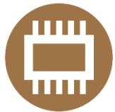

# **IND.2.2 Speicherprogrammierbare Steuerung (SPS)**

## **1. Beschreibung**

## **1.1. Einleitung**

Eine Speicherprogrammierbare Steuerung (SPS, englisch Programmable Logic Controller, PLC) ist eine ICS-Komponente. Sie übernimmt Steuerungs- und Regelaufgaben in der Betriebstechnik (englisch Operational Technology, OT). Die Grenzen zwischen verschiedenen Geräteklassen und Bauformen sind fließend, so kann z. B. auch ein Fernwirkgerät (englisch Remote Terminal Unit, RTU) die Funktionen einer SPS übernehmen oder ein Programmable Automation Controller (PAC) kann versuchen, die Vorteile einer SPS und eines Industrie-PCs zu vereinen. Jedoch ist die SPS immer noch das klassische Automatisierungsgerät, sodass in diesem Baustein die Begriffe SPS, RTU und PAC synonym verwendet werden.

Eine SPS verfügt über digitale Ein- und Ausgänge, ein Echtzeitbetriebssystem (Firmware) sowie weitere Schnittstellen für Ethernet oder Feldbusse. Die Verbindung zu Sensoren und Aktoren erfolgt über die analogen oder digitalen Ein- bzw. Ausgänge oder über einen Feldbus. Die Kommunikation mit Prozessleitsystemen erfolgt meist über die Ethernet-Schnittstelle und IP-basierte Netze.

Die möglichen Realisierungen sind vielfältig, eine Speicherprogrammierbare Steuerung kann als Baugruppe, Einzelgerät, PC-Einsteckkarte (Slot-SPS) oder als Software-Emulation (Soft-SPS) eingesetzt werden. Am häufigsten anzutreffen sind modulare Speicherprogrammierbare Steuerungen, die aus verschiedenen funktionalen Steckmodulen zusammengesetzt werden. Zunehmend werden auch weitere Funktionen wie das Visualisieren, Alarmieren und Protokollieren durch die SPS übernommen.

Aufgrund der im OT-Umfeld typischen hohen Verfügbarkeitsanforderungen und der oft extremen Umgebungsbedingungen wie Hitze oder Kälte, Staub, Vibration oder Korrosion wurden ICS-Komponenten schon immer als robuste Geräte mit hoher Zuverlässigkeit und langer Lebensdauer konstruiert.

Eine SPS wird normalerweise über Spezialsoftware des jeweiligen herstellenden Unternehmens konfiguriert bzw. programmiert. Das wird entweder über sogenannte Programmiergeräte, z. B. als Anwendung unter Windows oder Linux, oder über eine Engineering-Station durchgeführt, welche die Daten über ein Netz verteilt.

## **1.2. Zielsetzung**

Ziel dieses Bausteins ist es, alle Arten von Speicherprogrammierbaren Steuerungen abzusichern, unabhängig von herstellenden Unternehmen, Bauart, Einsatzzweck und -ort.

#### **1.3. Abgrenzung und Modellierung**

Der Baustein IND.2.2 *Speicherprogrammierbare Steuerung (SPS)* ist auf jede SPS-Komponente einmal anzuwenden.

Der vorliegende Baustein ist anzuwenden, um alle Arten von Speicherprogrammierbaren Steuerungen und Geräten mit ähnlicher Funktion abzusichern. Er ergänzt den Baustein IND.2.1 *Allgemeine ICS-Komponente*. Dieser ist bei der Anwendung ebenfalls zu berücksichtigen.

Der Baustein enthält keine organisatorischen Anforderungen zur Absicherung einer ICS-Komponente. Dafür müssen die Anforderungen des Bausteins IND.1 *Prozessleit- und Automatisierungstechnik* umgesetzt werden. Ebenso wird der Bereich funktionale Sicherheit nicht behandelt. Hierfür ist der Baustein IND.2.7 *Safety Instrumented Systems* anzuwenden.

# **2. Gefährdungslage**

Da IT-Grundschutz-Bausteine nicht auf individuelle Informationsverbünde eingehen können, werden zur Darstellung der Gefährdungslage typische Szenarien zugrunde gelegt. Die folgenden spezifischen Bedrohungen und Schwachstellen sind für den Baustein IND.2.2 *Speicherprogrammierbare Steuerung (SPS)* von besonderer Bedeutung.

## **2.1. Unvollständige Dokumentation**

Speicherprogrammierbare Steuerungen sind oft unvollständig dokumentiert, sodass nicht alle Produktfunktionen bekannt sind. Besonders lückenhaft sind häufig die Angaben über die verwendeten Dienste, Protokolle und Kommunikationsports sowie zur Berechtigungsverwaltung. Das erschwert jedoch die Gefährdungsanalyse, denn dadurch werden Schnittstellen, Funktionen sowie sicherheitsrelevante Mechanismen übersehen. Potenzielle Gefährdungen können dann nicht berücksichtigt werden. Zudem kann nicht oder nur eingeschränkt auf neue Schwachstellen reagiert werden, wenn diese nicht erfasst sind.

## **3. Anforderungen**

Im Folgenden sind die spezifischen Anforderungen des Bausteins IND.2.2 *Speicherprogrammierbare Steuerung (SPS)* aufgeführt. Der oder die Informationssicherheitsbeauftragte (ISB) ist dafür zuständig, dass alle Anforderungen gemäß dem festgelegten Sicherheitskonzept erfüllt und überprüft werden. Bei strategischen Entscheidungen ist der oder die ISB stets einzubeziehen.

Im IT-Grundschutz-Kompendium sind darüber hinaus weitere Rollen definiert. Sie sollten besetzt werden, insofern dies sinnvoll und angemessen ist.

| Zuständigkeit           | Rolle                                   |
|-------------------------|-----------------------------------------|
| Grundsätzlich zuständig | ICS-Informationssicherheitsbeauftragte  |
| Weitere Zuständigkeiten | OT-Betrieb (Operational Technology, OT) |

Genau eine Rolle sollte *Grundsätzlich zuständig* sein. Darüber hinaus kann es noch *Weitere Zuständigkeiten* geben. Falls eine dieser weiteren Rollen für die Erfüllung einer Anforderung vorrangig zuständig ist, dann wird diese Rolle hinter der Überschrift der Anforderung in eckigen Klammern aufgeführt. Die Verwendung des Singulars oder Plurals sagt nichts darüber aus, wie viele Personen diese Rollen ausfüllen sollen.

#### **3.1. Basis-Anforderungen**

Für diesen Baustein sind keine Basis-Anforderungen definiert.

#### **3.2. Standard-Anforderungen**

Gemeinsam mit den Basis-Anforderungen entsprechen die folgenden Anforderungen dem Stand der Technik für diesen Baustein. Sie SOLLTEN grundsätzlich erfüllt werden.

#### **IND.2.2.A1 Erweiterte Systemdokumentation für Speicherprogrammierbare Steuerungen (S) [OT-Betrieb (Operational Technology, OT)]**

Steuerungsprogramme und Konfigurationen SOLLTEN immer gesichert werden, bevor an ihnen etwas verändert wird. Änderungen an der Konfiguration oder der Tausch von Komponenten SOLLTEN vollständig dokumentiert werden.

#### **IND.2.2.A2 ENTFALLEN (S)**

Diese Anforderung ist entfallen.

#### **IND.2.2.A3 Zeitsynchronisation (S) [OT-Betrieb (Operational Technology, OT)]**

Die Systemzeit SOLLTE automatisch über eine zentrale automatisierte Zeitsynchronisation eingestellt werden.

#### **3.3. Anforderungen bei erhöhtem Schutzbedarf**

Für diesen Baustein sind keine Anforderungen für einen erhöhten Schutzbedarf definiert.

## **4. Weiterführende Informationen**

#### **4.1. Wissenswertes**

Zum Baustein IND.2.2 *Speicherprogrammierbare Steuerung (SPS)* liegen keine weiteren Informationen vor.