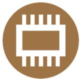

# **IND.2.4 Maschine**

# **1. Beschreibung**

# **1.1. Einleitung**

Eine Maschine ist eine technische Vorrichtung, die automatisierte Aufgaben durchführt. Ein typisches Beispiel dafür ist eine Werkzeugmaschine, die Werkstücke auf eine vorgegebene Art bearbeitet. Dabei wird sie von einem IT-System gesteuert, das die entsprechenden Arbeitsanweisungen und -schritte vorgibt. Solche Maschinen werden auch als Automaten bezeichnet.

Meistens werden Maschinen von Maschinenbauende konstruiert und mit bestimmten vordefinierten Funktionen ausgestattet. Der oder die Betreibende der Maschine kann allerdings auch die Parameter bestimmen, nach denen sie arbeiten soll. So lassen sich beispielsweise Formen, die gefräst werden sollen, oder Kalibrierungen für bestimmte Materialien einstellen. Damit die Betreibenden die Parameter verändern können, verfügen Maschinen über verschiedene Schnittstellen, z. B. für Wechseldatenträger, spezialisierte Programmiergeräte oder Netzzugriffe.

Häufig werden von Maschinenbauenden auch Fernwartungsdienstleistungen angeboten, um frühzeitigen Verschleiß zu erkennen oder in Problemsituationen schnell reagieren zu können.

# **1.2. Zielsetzung**

Dieser Baustein beschreibt, wie elektronisch gesteuerte, halb- oder vollautomatische Maschinen (z. B. CNC-Maschinen) unabhängig von herstellenden Unternehmen, Bauart, speziellem Einsatzzweck und ort abgesichert werden können.

# **1.3. Abgrenzung und Modellierung**

Der Baustein IND.2.4 *Maschine* ist auf jede Maschine einmal anzuwenden.

Der vorliegende Baustein ergänzt den übergeordneten Baustein IND.2.1 *Allgemeine ICS-Komponente*  und setzt voraus, dass dieser umgesetzt wurde. Darüber hinaus werden nur Anforderungen für Maschinen definiert, auf deren interne Strukturen eine Institution nicht zugreifen kann.

Auch werden keine Sicherheitsanforderungen für Prozessleit- und Automatisierungstechnik beschrieben. Dafür muss der Baustein IND.1 *Prozessleit- und Automatisierungstechnik* umgesetzt werden. Ebenso wird der Bereich der funktionalen Sicherheit nicht behandelt. Näheres dazu findet sich im Baustein IND.2.7 *Safety Instrumented Systems*.

# **2. Gefährdungslage**

Da IT-Grundschutz-Bausteine nicht auf individuelle Informationsverbünde eingehen können, werden zur Darstellung der Gefährdungslage typische Szenarien zugrunde gelegt. Die folgenden spezifischen Bedrohungen und Schwachstellen sind für den Baustein IND.2.4 *Maschine* von besonderer Bedeutung.

# **2.1. Ausfall oder Störung durch ungenügende Wartung**

Werden Maschinen nicht regelmäßig gewartet, können sie frühzeitig nicht mehr korrekt funktionieren oder ganz ausfallen. Durch Fehlfunktionen können z. B. Mitarbeitende gefährdet werden oder die Produktion könnte erheblich beeinträchtigt werden.

# **2.2. Gezielte Manipulationen**

Sind die Schnittstellen einer Maschine ungenügend geschützt, kann die Maschine manipuliert werden, z. B. über lokale Programmiergeräte oder Netzdienste. Dadurch können Werkstücke beschädigt werden oder ganze Produktreihen fehlerhaft sein. Bei einem Angriff könnte aber auch die Maschine selbst beschädigt werden, sodass auch dadurch ein wirtschaftlicher Verlust entsteht.

# **3. Anforderungen**

Im Folgenden sind die spezifischen Anforderungen des Bausteins IND.2.4 *Maschine* aufgeführt. Der oder die Informationssicherheitsbeauftragte (ISB) ist dafür zuständig, dass alle Anforderungen gemäß dem festgelegten Sicherheitskonzept erfüllt und überprüft werden. Bei strategischen Entscheidungen ist der oder die ISB stets einzubeziehen.

Im IT-Grundschutz-Kompendium sind darüber hinaus weitere Rollen definiert. Sie sollten besetzt werden, insofern dies sinnvoll und angemessen ist.

| Zuständigkeit           | Rolle                                   |
|-------------------------|-----------------------------------------|
| Grundsätzlich zuständig | ICS-Informationssicherheitsbeauftragte  |
| Weitere Zuständigkeiten | OT-Betrieb (Operational Technology, OT) |

Genau eine Rolle sollte *Grundsätzlich zuständig* sein. Darüber hinaus kann es noch *Weitere Zuständigkeiten* geben. Falls eine dieser weiteren Rollen für die Erfüllung einer Anforderung vorrangig zuständig ist, dann wird diese Rolle hinter der Überschrift der Anforderung in eckigen Klammern aufgeführt. Die Verwendung des Singulars oder Plurals sagt nichts darüber aus, wie viele Personen diese Rollen ausfüllen sollen.

# **3.1. Basis-Anforderungen**

Die folgenden Anforderungen MÜSSEN für diesen Baustein vorrangig erfüllt werden.

#### **IND.2.4.A1 Fernwartung durch Maschinen- und Anlagenbauende (B) [OT-Betrieb (Operational Technology, OT)]**

Für die Fernwartung einer Maschine MUSS es eine zentrale Richtlinie geben. Darin MUSS geregelt werden, wie die jeweiligen Fernwartungslösungen einzusetzen sind. Die Richtlinie MUSS auch festlegen, wie Kommunikationsverbindungen geschützt werden sollen. Hierüber hinaus MUSS sie auch beschreiben, welche Aktivitäten während der Fernwartung überwacht werden sollen.

Außerdem SOLLTE NICHT möglich sein, dass über die Fernwartung einer Maschine auf andere IT-Systeme oder Maschinen der Institution zugegriffen werden kann.

Mit Dienstleistenden MUSS vereinbart werden, wie sie die in der Maschine gespeicherten Informationen verwerten dürfen.

#### **IND.2.4.A2 Betrieb nach Ende der Gewährleistung (B) [OT-Betrieb (Operational Technology, OT)]**

Es MUSS ein Prozess etabliert werden, der gewährleistet, dass die Maschine auch über den Gewährleistungszeitraum hinaus sicher weiterbetrieben werden kann. Hierzu MÜSSEN mit den Liefernden weitere Unterstützungsleistungen vertraglich vereinbart werden.

### **3.2. Standard-Anforderungen**

Für diesen Baustein sind keine Standard-Anforderungen definiert.

### **3.3. Anforderungen bei erhöhtem Schutzbedarf**

Für diesen Baustein sind keine Anforderungen für einen erhöhten Schutzbedarf definiert.

# **4. Weiterführende Informationen**

#### **4.1. Wissenswertes**

Zum Baustein IND.2.4 *Maschine* liegen keine weiterführenden Informationen vor.