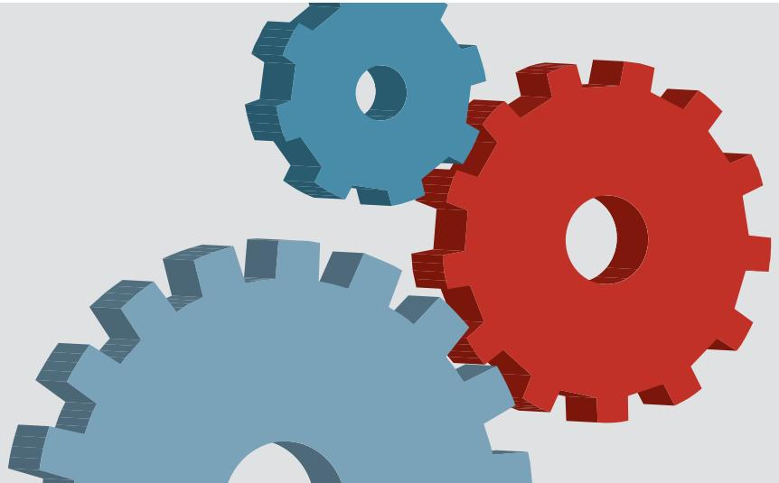
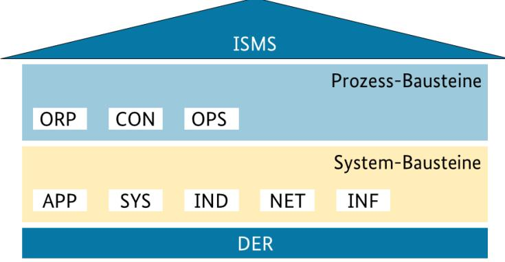
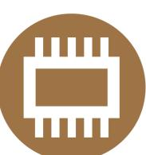
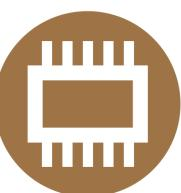
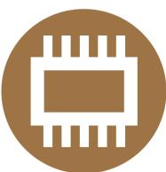
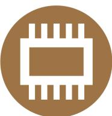
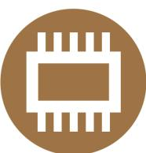
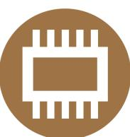

# **IT-Grundschutz-Kompendium**

IT-Grundschutz-Kompendium\_einsteck\_A4.indd 4 08.01.2020 13:33:25

#### **Bibliografische Information der Deutschen Nationalbibliothek**

Die Deutsche Nationalbibliothek verzeichnet diese Publikation in der Deutschen Nationalbibliografie; detaillierte bibliografische Daten sind im Internet über http://dnb.d-nb.de abrufbar.

Reguvis Fachmedien GmbH Amsterdamer Str. 192 50735 Köln

#### **www.reguvis.de**

Beratung und Bestellung: E-Mail: wirtschaft@reguvis.de

ISBN (Print): 978-3-8462-0906-6

© 2023 Reguvis Fachmedien GmbH

© 2023 Bundesamt für Sicherheit in der Informationstechnik, Bonn

Alle Rechte vorbehalten. Das Werk einschließlich seiner Teile ist urheberrechtlich geschützt. Jede Verwertung außerhalb der Grenzen des Urheberrechtsgesetzes bedarf der vorherigen Zustimmung des Verlags. Dies gilt auch für die fotomechanische Vervielfältigung (Fotokopie/Mikrokopie) und die Einspeicherung und Verarbeitung in elektronischen Systemen. Hinsichtlich der in diesem Werk ggf. enthaltenen Texte von Normen weisen wir darauf hin, dass rechtsverbindlich allein die amtlich verkündeten Texte sind.

Herausgeber: Bundesamt für Sicherheit in der Informationstechnik, Bonn

Gesamtverantwortung und Chefredaktion: Holger Schildt

Redaktion: Stefanie Förster, Brigitte Hoffmann, Johannes Oppelt und Jessika Welticke

Erstellung und Aktualisierung von IT-Grundschutz-Bausteinen: Petra Bottenberg, Alex Didier Essoh, Stefanie Förster, Daniel Gilles, Florian Göhler, Florian Hillebrand, Brigitte Hoffmann, Cäcilia Jung, Birger Klein, Alexander Nöhles, Johannes Oppelt und Christoph Wiemers

Herstellung: Günter Fabritius Satz: Cicero Computer GmbH, Bonn Druck und buchbinderische Verarbeitung: Plump Druck & Medien GmbH, Rheinbreitbach

Printed in Germany

# **Vorwort**

Der IT-Grundschutz des BSI beleuchtet inzwischen seit fast 30 Jahren Themen und Entwicklungen in der Informationssicherheit und leitet daraus praktikable Sicherheitsempfehlungen ab. Institutionen, die in Zeiten der Digitalisierung ihre Prozesse und Projekte nach dem Stand der Technik absichern wollen, finden hier ein umfangreiches Instrumentarium. Eine erfolgreiche und nachhaltige Digitalisierung kann nur gelingen, wenn Sicherheitsanforderungen – wie sie im IT-Grundschutz des BSI beschrieben sind – frühzeitig mitgedacht und erfüllt werden. Damit ist diese bewährte BSI-Methode sowohl Voraussetzung als auch leichter Einstieg und Nachschlagewerk, um den Herausforderungen der Digitalisierung zu begegnen.

Da ist es wenig verwunderlich, dass es in immer mehr Anwendungsfeldern IT-Grundschutz-Profile gibt, wie zum Beispiel für Weltrauminfrastrukturen. Es beschreibt Mindestanforderungen an die Cyber-Sicherheit für Satelliteninfrastrukturen. Eine Arbeitsgruppe bestehend aus Expertinnen und Experten von BSI, OHB Digital Connect, Airbus Defence and Space und von der Deutschen Raumfahrtagentur im Deutschen Zentrum für Luft- und Raumfahrt (DLR) erstellte das Profil. Weitere Beispiele sind IT-Grundschutz-Profile zur Absicherung von 5G-Campusnetzen oder für Verkehrssteuerungs- und Leitsysteme der Bundesautobahn, die alle auf den Bausteinen des IT-Grundschutz-Kompendiums basieren. Anwenderinnen und Anwender aus Wirtschaft und Verwaltung erhalten darin praxisnahe Empfehlungen und Informationen.

Mit der vorliegenden Ausgabe des IT-Grundschutz-Kompendiums steht Zuständigen in Behörden und Unternehmen erneut ein fundiertes Werkzeug mit einer breiten, aktuellen und geprüften Expertise zu allen Facetten der Informationssicherheit zur Verfügung. So können Sie die relevanten Aufgaben angehen: Erste Schritte zur Absicherung von Gebäuden, IT-Systemen und Datennetzen, der Aufbau eines Managementsystems zur Informationssicherheit oder der Schutz von besonders sensiblen Informationen. Mit den bewährten und praxistauglichen Empfehlungen des IT-Grundschutzes im IT-Grundschutz-Kompendium sind Sie gut gerüstet.

Das IT-Grundschutz-Kompendium wurde überarbeitet und um wichtige, neue Themen, wie Virtualisierung, ergänzt, die nun anhand von praxisbewährten Anforderungen in eigenständigen Bausteinen behandelt werden. Vorhandene Bausteine, wie zum Outsourcing, wurden grundlegend überarbeitet. Hinzu kommen zahlreiche weitere Ergänzungen und Aktualisierungen, die auf der Grundlage des Anwenderbedarfs erarbeitet wurden.

Ich wünsche Ihnen viel Erfolg bei der Anwendung des IT-Grundschutzes.

Dr. Gerhard Schabhüser Vize-Präsident des Bundesamtes für Sicherheit in der Informationstechnik

# **Dankesworte**

Die Inhalte des IT-Grundschutz-Kompendiums sind aufgrund der rasanten Entwicklungen in der Informationstechnik sowie immer kürzer werdenden Produktzyklen ständigen Veränderungen ausgesetzt. Neben dem BSI leisten viele Personen einen wertvollen Beitrag, indem sie Texte bis hin zu ganzen Bausteinen für den IT-Grundschutz erstellen, Bausteine kommentieren oder neue Themen anregen.

Folgende Institutionen und Personen haben bei der Bausteinerstellung und -überarbeitung ihr Fachwissen in das IT-Grundschutz-Kompendium einfließen lassen.

## **IT-Grundschutz-Anwender und -Anwenderinnen**

Für die Mitarbeit an der Edition 2023 des IT-Grundschutz-Kompendiums sei an dieser Stelle den zahlreichen IT-Grundschutz-Anwendern und -Anwenderinnen gedankt. Sie haben einzelne IT-Grundschutz-Bausteine kommentiert und ihr Fachwissen in die neue Edition eingebracht.

## **Mitarbeitende des Bundesamts für Sicherheit in der Informationstechnik**

In die aktuelle Überarbeitung des IT-Grundschutz-Kompendiums ist zudem das Fachwissen von zahlreichen BSI-Mitarbeitern und Mitarbeiterinnen eingeflossen. Ihnen gebührt an dieser Stelle besonderer Dank:

Stefan Ahlers, Daniel Balzien, Markus de Brün, Thorsten Dietrich, Dr. Melanie Göbel, Klaus Hunsänger, Vera Lange, Marc Meyer, Andreas Neth, Dr. Frank Niedermeyer, Dr. Harald Niggemann, Detlef Nuß, Dirk Steffes-Enn, Frank Weber, Dr. Dietmar Wippig.

## **Fortschreibung und Weiterentwicklung vorhergehender Editionen**

Auch bei der Fortschreibung und Weiterentwicklung vorhergehender Editionen des IT-Grundschutz-Kompendiums haben zahlreiche Institutionen sowie Personen aus der öffentlichen Verwaltung, Wirtschaft, Wissenschaft und dem BSI mitgewirkt. Auch ihnen sei hiermit Dank ausgesprochen.

# **Gesamtinhaltsverzeichnis**

[Vorwort](#page-2-0) [Dankesworte](#page-4-0) [Inhaltsverzeichnis](#page-6-0) [Neues im IT-Grundschutz-Kompendium](#page-12-0) [IT-Grundschutz – Basis für Informationssicherheit](#page-16-0) [Schichtenmodell und Modellierung](#page-24-0) [Rollen](#page-30-0) [Glossar](#page-34-0)

### **[Elementare Gefährdungen](#page-44-0)**

- [G 0.1 Feuer](#page-46-0)
- [G 0.2 Ungünstige klimatische Bedingungen](#page-47-0)
- [G 0.3 Wasser](#page-48-0)
- [G 0.4 Verschmutzung, Staub, Korrosion](#page-49-0)
- [G 0.5 Naturkatastrophen](#page-50-0)
- [G 0.6 Katastrophen im Umfeld](#page-51-0)
- [G 0.7 Großereignisse im Umfeld](#page-52-0)
- [G 0.8 Ausfall oder Störung der Stromversorgung](#page-53-0)
- [G 0.9 Ausfall oder Störung von Kommunikationsnetzen](#page-54-0)
- [G 0.10 Ausfall oder Störung von Versorgungsnetzen](#page-55-0)
- [G 0.11 Ausfall oder Störung von Dienstleistungsunternehmen](#page-56-0)
- [G 0.12 Elektromagnetische Störstrahlung](#page-57-0)
- [G 0.13 Abfangen kompromittierender Strahlung](#page-58-0)
- [G 0.14 Ausspähen von Informationen \(Spionage\)](#page-59-0)
- [G 0.15 Abhören](#page-60-0)
- [G 0.16 Diebstahl von Geräten, Datenträgern oder Dokumenten](#page-61-0)
- [G 0.17 Verlust von Geräten, Datenträgern oder Dokumenten](#page-62-0)
- [G 0.18 Fehlplanung oder fehlende Anpassung](#page-63-0)
- [G 0.19 Offenlegung schützenswerter Informationen](#page-64-0)
- [G 0.20 Informationen oder Produkte aus unzuverlässiger Quelle](#page-65-0)
- [G 0.21 Manipulation von Hard- oder Software](#page-66-0)
- [G 0.22 Manipulation von Informationen](#page-67-0)
- [G 0.23 Unbefugtes Eindringen in IT-Systeme](#page-68-0)
- [G 0.24 Zerstörung von Geräten oder Datenträgern](#page-69-0)
- [G 0.25 Ausfall von Geräten oder Systemen](#page-70-0)
- [G 0.26 Fehlfunktion von Geräten oder Systemen](#page-71-0)
- [G 0.27 Ressourcenmangel](#page-72-0)
- [G 0.28 Software-Schwachstellen oder -Fehler](#page-73-0)
- [G 0.29 Verstoß gegen Gesetze oder Regelungen](#page-74-0)
- [G 0.30 Unberechtigte Nutzung oder Administration von Geräten und Systemen](#page-75-0)
- [G 0.31 Fehlerhafte Nutzung oder Administration von Geräten und Systemen](#page-76-0)
- [G 0.32 Missbrauch von Berechtigungen](#page-77-0)
- [G 0.33 Personalausfall](#page-78-0)
- [G 0.34 Anschlag](#page-79-0)
- [G 0.35 Nötigung, Erpressung oder Korruption](#page-80-0)
- [G 0.36 Identitätsdiebstahl](#page-81-0)
- [G 0.37 Abstreiten von Handlungen](#page-82-0)
- [G 0.38 Missbrauch personenbezogener Daten](#page-83-0)

## **Gesamtinhaltsverzeichnis**

- [G 0.39 Schadprogramme](#page-84-0)
- [G 0.40 Verhinderung von Diensten \(Denial of Service\)](#page-85-0)
- [G 0.41 Sabotage](#page-86-0)
- [G 0.42 Social Engineering](#page-87-0)
- [G 0.43 Einspielen von Nachrichten](#page-88-0)
- [G 0.44 Unbefugtes Eindringen in Räumlichkeiten](#page-89-0)
- [G 0.45 Datenverlust](#page-90-0)
- [G 0.46 Integritätsverlust schützenswerter Informationen](#page-91-0)
- [G 0.47 Schädliche Seiteneffekte IT-gestützter Angriffe](#page-92-0)

#### **[Prozess-Bausteine](#page-94-0)**

[ISMS: Sicherheitsmanagement](#page-94-0)

[• ISMS.1 Sicherheitsmanagement](#page-96-0)

[ORP: Organisation und Personal](#page-104-0)

- [ORP.1 Organisation](#page-106-0)
- [ORP.2 Personal](#page-112-0)
- [ORP.3 Sensibilisierung und Schulung zur Informationssicherheit](#page-116-0)
- [ORP.4 Identitäts- und Berechtigungsmanagement](#page-122-0)
- [ORP.5 Compliance Management \(Anforderungsmanagement\)](#page-128-0)

[CON: Konzepte und Vorgehensweisen](#page-132-0)

- [CON.1 Kryptokonzept](#page-134-0)
- [CON.2 Datenschutz](#page-142-0)
- [CON.3 Datensicherungskonzept](#page-148-0)
- [CON.6 Löschen und Vernichten](#page-156-0)
- [CON.7 Informationssicherheit auf Auslandsreisen](#page-162-0)
- [CON.8 Software-Entwicklung](#page-170-0)
- [CON.9 Informationsaustausch](#page-178-0)
- [CON.10 Entwicklung von Webanwendungen](#page-182-0)
- [CON.11.1 Geheimschutz VS-NUR FÜR DEN DIENSTGEBRAUCH](#page-188-0) [\(VS-NfD\)](#page-188-0)
- [OPS: Betrieb](#page-198-0)
	- [OPS.1 Eigener Betrieb](#page-200-0)

[OPS.1.1 Kern-IT-Betrieb](#page-200-0)

- [OPS.1.1.1 Allgemeiner IT-Betrieb](#page-200-0)
- [OPS.1.1.2 Ordnungsgemäße IT-Administration](#page-210-0)
- [OPS.1.1.3 Patch- und Änderungsmanagement](#page-220-0)
- [OPS.1.1.4 Schutz vor Schadprogrammen](#page-226-0)
- [OPS.1.1.5 Protokollierung](#page-232-0)
- [OPS.1.1.6 Software-Tests und -Freigaben](#page-238-0)
- [OPS.1.1.7 Systemmanagement](#page-244-0)
- [OPS.1.2 Weiterführende Aufgaben](#page-252-0)
- [OPS.1.2.2 Archivierung](#page-252-0)
- [OPS.1.2.4 Telearbeit](#page-260-0)
- [OPS.1.2.5 Fernwartung](#page-264-0)
- [OPS.1.2.6 NTP-Zeitsynchronisation](#page-270-0)

[OPS.2 Betrieb von Dritten](#page-276-0)

- [OPS.2.2 Cloud-Nutzung](#page-276-0)
- [OPS.2.3 Nutzung von Outsourcing](#page-284-0) [OPS.3 Betrieb für Dritte](#page-294-0)
- [OPS.3.2 Anbieten von Outsourcing](#page-294-0)

[DER: Detektion und Reaktion](#page-302-0)

- [DER.1 Detektion von sicherheitsrelevanten Ereignissen](#page-304-0) [DER.2 Security Incident Management](#page-310-0)
	- [DER.2.1 Behandlung von Sicherheitsvorfällen](#page-310-0)
	- [DER.2.2 Vorsorge für die IT-Forensik](#page-318-0)
	- [DER.2.3 Bereinigung weitreichender Sicherheitsvorfälle](#page-324-0)

[DER.3 Sicherheitsprüfungen](#page-330-0)

- [DER.3.1 Audits und Revisionen](#page-330-0)
- [DER.3.2 Revisionen auf Basis des Leitfadens IS-Revision](#page-336-0)
- [DER.4 Notfallmanagement](#page-344-0)

#### **[System-Bausteine](#page-350-0)**

[APP: Anwendungen](#page-350-0)

[APP.1 Client-Anwendungen](#page-352-0)

- [APP.1.1 Office-Produkte](#page-352-0)
- [APP.1.2 Webbrowser](#page-358-0)
- [APP.1.4 Mobile Anwendungen \(Apps\)](#page-364-0)
- [APP.2 Verzeichnisdienst](#page-370-0)
- [APP.2.1 Allgemeiner Verzeichnisdienst](#page-370-0)
- [APP.2.2 Active Directory Domain Services](#page-376-0)
- [APP.2.3 OpenLDAP](#page-384-0)
- [APP.3 Netzbasierte Dienste](#page-388-0)
- [APP.3.1 Webanwendungen und Webservices](#page-388-0)
- [APP.3.2 Webserver](#page-394-0)
- [APP.3.3 Fileserver](#page-400-0)
- [APP.3.4 Samba](#page-406-0)
- [APP.3.6 DNS-Server](#page-412-0)
- [APP.4 Business-Anwendungen](#page-418-0)
- [APP.4.2 SAP-ERP-System](#page-418-0)
- [APP.4.3 Relationale Datenbanken](#page-426-0)
- [APP.4.4 Kubernetes](#page-432-0)
- [APP.4.6 SAP ABAP-Programmierung](#page-440-0)
- [APP.5 E-Mail/Groupware/Kommunikation](#page-446-0)
- [APP.5.2 Microsoft Exchange und Outlook](#page-446-0)
- [APP.5.3 Allgemeiner E-Mail-Client und -Server](#page-452-0)
- [APP.5.4 Unified Communications und Collaboration \(UCC\)](#page-458-0)
- [APP.6 Allgemeine Software](#page-468-0)
- [APP.7 Entwicklung von Individualsoftware](#page-474-0)

#### [SYS: IT-Systeme](#page-480-0)

[SYS.1 Server](#page-482-0)

- [SYS.1.1 Allgemeiner Server](#page-482-0)
- [SYS.1.2 Windows Server](#page-492-0)
	- [◦](#page-492-0) [SYS.1.2.2 Windows Server 2012](#page-492-0)
	- [◦](#page-498-0) [SYS.1.2.3 Windows Server](#page-498-0)
- [SYS.1.3 Server unter Linux und Unix](#page-504-0)
- [SYS.1.5 Virtualisierung](#page-508-0)
- [SYS.1.6 Containerisierung](#page-516-0)
- [SYS.1.7 IBM Z](#page-524-0)
- [SYS.1.8 Speicherlösungen](#page-532-0)
- [SYS.1.9 Terminalserver](#page-540-0)

[SYS.2 Desktop-Systeme](#page-550-0)

- [SYS.2.1 Allgemeiner Client](#page-550-0)
- [SYS.2.2 Windows-Clients](#page-560-0)
	- [◦](#page-560-0) [SYS.2.2.3 Clients unter Windows](#page-560-0)
- [SYS.2.3 Clients unter Linux und Unix](#page-566-0)
- [SYS.2.4 Clients unter macOS](#page-572-0)
- [SYS.2.5 Client-Virtualisierung](#page-576-0)
- [SYS.2.6 Virtual Desktop Infrastructure](#page-584-0)
- [SYS.3 Mobile Devices](#page-590-0)
- [SYS.3.1 Laptops](#page-590-0)
- [SYS.3.2 Tablet und Smartphone](#page-594-0)
	- [◦](#page-594-0) [SYS.3.2.1 Allgemeine Smartphones und Tablets](#page-594-0)
	- [◦](#page-602-0) [SYS.3.2.2 Mobile Device Management \(MDM\)](#page-602-0)
	- [◦](#page-608-0) [SYS.3.2.3 iOS \(for Enterprise\)](#page-608-0)
	- [◦](#page-614-0) [SYS.3.2.4 Android](#page-614-0)
- [SYS.3.3 Mobiltelefon](#page-618-0)
- [SYS.4 Sonstige Systeme](#page-624-0)
- [SYS.4.1 Drucker, Kopierer und Multifunktionsgeräte](#page-624-0)
- [SYS.4.3 Eingebettete Systeme](#page-632-0)
- [SYS.4.4 Allgemeines IoT-Gerät](#page-638-0)
- [SYS.4.5 Wechseldatenträger](#page-644-0)

### [IND: Industrielle IT](#page-650-0)

- [IND.1 Prozessleit- und Automatisierungstechnik](#page-652-0) [IND.2 ICS-Komponenten](#page-662-0)
	- [IND.2.1 Allgemeine ICS-Komponente](#page-662-0)
	- [IND.2.2 Speicherprogrammierbare Steuerung \(SPS\)](#page-668-0)
	- [IND.2.3 Sensoren und Aktoren](#page-672-0)
	- [IND.2.4 Maschine](#page-676-0)
	- [IND.2.7 Safety Instrumented Systems](#page-678-0)
	- [IND.3 Produktionsnetze](#page-684-0)
	- [IND.3.2 Fernwartung im industriellen Umfeld](#page-684-0)
- [NET: Netze und Kommunikation](#page-692-0)

[NET.1 Netze](#page-694-0)

- [NET.1.1 Netzarchitektur und -design](#page-694-0)
- [NET.1.2 Netzmanagement](#page-704-0)

[NET.2 Funknetze](#page-712-0)

- [NET.2.1 WLAN-Betrieb](#page-712-0)
- [NET.2.2 WLAN-Nutzung](#page-718-0)

[NET.3 Netzkomponenten](#page-722-0)

- [NET.3.1 Router und Switches](#page-722-0)
- [NET.3.2 Firewall](#page-730-0)
- [NET.3.3 VPN](#page-738-0)
- [NET.3.4 Network Access Control](#page-742-0)
- [NET.4: Telekommunikation](#page-752-0)
- [NET.4.1 TK-Anlagen](#page-752-0)
- [NET.4.2 VoIP](#page-758-0)
- [NET.4.3 Faxgeräte und Faxserver](#page-764-0)

[INF: Infrastruktur](#page-770-0)

- [INF.1 Allgemeines Gebäude](#page-772-0)
- [INF.2 Rechenzentrum sowie Serverraum](#page-780-0)
- [INF.5 Raum sowie Schrank für technische Infrastruktur](#page-790-0)
- [INF.6 Datenträgerarchiv](#page-796-0)
- [INF.7 Büroarbeitsplatz](#page-800-0)
- [INF.8 Häuslicher Arbeitsplatz](#page-804-0)
- [INF.9 Mobiler Arbeitsplatz](#page-808-0)
- [INF.10 Besprechungs-, Veranstaltungs- und Schulungsräume](#page-814-0)
- [INF.11 Allgemeines Fahrzeug](#page-818-0)
- [INF.12 Verkabelung](#page-826-0)
- [INF.13 Technisches Gebäudemanagement](#page-832-0)
- [INF.14 Gebäudeautomation](#page-844-0)

# **Neues im IT-Grundschutz-Kompendium**

Die Edition 2023 des IT-Grundschutz-Kompendiums enthält insgesamt 111 IT-Grundschutz-Bausteine. Darunter sind zehn neue IT-Grundschutz-Bausteine sowie 101 Bausteine aus der Edition 2022. Drei Bausteine aus der Edition 2022 sind entfallen. Aus der Edition 2022 wurden 21 Bausteine für die Edition 2023 überarbeitet.

## **Neue Bausteine**

Die folgenden 10 neuen IT-Grundschutz-Bausteine sind in fünf unterschiedlichen Schichten hinzugekommen:

- CON.11.1 *Geheimschutz VS-NUR FÜR DEN DIENSTGEBRAUCH (VS-NfD)*
- OPS.1.1.1 *Allgemeiner IT-Betrieb*
- OPS.2.3 *Nutzung von Outsourcing* (dieser Baustein ersetzt OPS.2.1 *Outsourcing für Kunden*)
- OPS.3.2 *Anbieten von Outsourcing* (dieser Baustein ersetzt OPS.3.1 *Outsourcing für Dienstleister*)
- APP.5.4 *Unified Communications und Collaboration (UCC)*
- SYS.1.2.3 *Windows Server*
- SYS.1.9 *Terminalserver*
- SYS.2.5 *Client-Virtualisierung*
- SYS.2.6 *Virtual Desktop Infrastructure*
- NET.3.4 *Network Access Control*

## **Entfallene Bausteine**

Die folgenden Bausteine sind in der Edition 2023 entfallen:

- SYS.2.2.2 *Clients unter Windows 8.1*: Der Support für das Betriebssystem endete am 10.01.2023. Windows 8.1 sollte daher nicht mehr eingesetzt werden.
- OPS.2.1 *Outsourcing für Kunden*: Der Baustein wird durch OPS.2.3 *Nutzung von Outsourcing* ersetzt
- OPS.3.1 *Outsourcing für Dienstleister*: Der Baustein wird durch OPS.3.2 *Anbieten von Outsourcing* ersetzt

## **Überarbeitete Bausteine**

Nach der Veröffentlichung der letzten Edition des IT-Grundschutz-Kompendiums im Februar 2022 hat das IT-Grundschutz-Team zahlreiche wertvolle Rückmeldungen von IT-Grundschutz-Anwendern und -Anwenderinnen erhalten. Hinweise zu einzelnen Aspekten und Erfahrungswerte aus der beruflichen Praxis von Informationssicherheitsbeauftragten sowie weiteren erfahrenen Anwendenden tragen dazu bei, die Inhalte noch aktueller und praxistauglicher aufzubereiten. Die einzelnen Bausteintexte wurden daraufhin gesichtet und überarbeitet, sodass in der Edition 2023 21 IT-Grundschutz-Bausteine aktualisiert wurden.

Die IT-Grundschutz-Bausteine sind in einem unterschiedlichen Umfang überarbeitet worden. Die Änderungen sind wie folgt klassifiziert:

- **Umfangreiche Änderungen**, die Auswirkungen auf Zertifizierungsverfahren oder bestehende Sicherheitskonzepte haben können, sind in separaten Änderungsdokumenten aufgeführt. Dies betrifft 21 Bausteine aus der Edition 2022. Die "Änderungsdokumente (Edition 2023)" sind auf der BSI-Webseite in der Rubrik IT-Grundschutz-Kompendium veröffentlicht.
- **Geringfügige sprachliche und redaktionelle Änderungen** sowie Überarbeitungen aus Gründen der besseren Verständlichkeit werden nicht in einem separaten Änderungsdokument aufgeführt. Bei IT-Grundschutz-Bausteinen, die entsprechend geringfügig bearbeitet wurden, ist lediglich das Datum in der Fußzeile auf die aktuelle Edition gesetzt worden. Dies betrifft alle Bausteine aus der Edition 2022, die nicht umfangreich geändert wurden.

IT-Grundschutz-Bausteine aus der Edition 2022, die überarbeitet wurden und zu denen ein Änderungsdokument verfügbar ist:

- ORP.1 *Organisation*
- CON.1 *Kryptokonzept*
- CON.2 *Datenschutz*
- OPS.1.1.2 *Ordnungsgemäße IT-Administration*
- OPS.1.1.3 *Patch- und Änderungsmanagement*
- OPS.1.2.5 *Fernwartung*
- APP.1.2 *Webbrowser*
- APP.2.1 *Allgemeiner Verzeichnisdienst*
- APP.2.2 *Active Directory*: Der Baustein wurde in "*Active Directory Domain Services*" umbenannt
- APP.2.3 *OpenLDAP*
- APP.5.3 *Allgemeiner E-Mail-Client und -Server*
- SYS.1.1 *Allgemeiner Server*
- SYS.2.1 *Allgemeiner Client*
- SYS.2.3 *Clients unter Linux und Unix*
- SYS.2.2.3 *Clients unter Windows 10*: Der Baustein wurde in "*Clients unter Windows*" umbenannt und behandelt nun mit Windows 10 und 11 die einzigen beiden Versionen von Windows für Client-Systeme, die durch Microsoft Support erhalten.
- SYS.4.3 *Eingebettete Systeme*
- SYS.4.5 *Wechseldatenträger*
- IND.3.2 *Fernwartung im industriellen Umfeld*
- INF.1 *Allgemeines Gebäude*
- INF.2 *Rechenzentrum sowie Serverraum*
- INF.10 *Besprechungs-, Veranstaltungs- und Schulungsraum*

## **Überarbeitung von Rollen**

Folgende Rollen wurden mit der Edition 2023 umbenannt:

| Alte Rollenbezeichnung                    | Neue Rollenbezeichnung                   |
|-------------------------------------------|------------------------------------------|
| Anforderungsmanager (Compliance Manager)  | Compliance-Beauftragte                   |
| Bauleiter                                 | Bauleitung                               |
| Benutzer                                  | Benutzende                               |
| Bereichssicherheitsbeauftragter           | Bereichssicherheitsbeauftragte           |
| Brandschutzbeauftragter                   | Brandschutzbeauftragte                   |
| Datenschutzbeauftragter                   | Datenschutzbeauftragte                   |
| Entwickler                                | Entwickelnde                             |
| ICS-Informationssicherheitsbeauftragter   | ICS-Informationssicherheitsbeauftragte   |
| Informationssicherheitsbeauftragter (ISB) | Informationssicherheitsbeauftragte (ISB) |
| Mitarbeiter                               | Mitarbeitende                            |
| Notfallbeauftragter                       | Notfallbeauftragte                       |
| OT-Leiter                                 | OT-Leitung                               |
| Planer                                    | Planende                                 |
| Tester                                    | Testende                                 |

Die Verwendung des Singulars oder Plurals sagt nichts darüber aus, wie viele Personen diese Rollen ausfüllen sollen.

## **Aktualisierungen aller Kreuzreferenztabellen und strukturelle Anpassung der Bausteine**

Alle Bausteine der Edition 2022 wurden für die Edition 2023 strukturell überarbeitet.

Die Kreuzreferenztabellen, die die Anforderungen jedes Bausteins den elementaren Gefährdungen gegenüberstellen, wurden geprüft und überarbeitet. Zukünftig zeigen diese nur noch direkte Gefährdungen, die unmittelbar auf das Zielobjekt einwirken und die durch die Anforderungen aus dem Baustein behandelt werden. Hierbei werden nur noch direkte Beziehungen zwischen Elementaren Gefährdungen und Anforderungen aufgeführt. Indirekte Beziehungen, die aus direkten Beziehungen folgen, wurden entfernt. Dadurch steigt die Übersicht und der eindeutige Fokus wird auf die für das Zielobjekt relevanten Gefährdungen gesetzt. Durch die Überarbeitung entsteht weniger Aufwand, wenn die Kreuzreferenztabellen für eine Risikoanalyse genutzt werden.

Die Elementaren Gefährdungen, die für den jeweiligen Baustein relevant sind, werden nun nur noch in den Kreuzreferenztabellen aufgeführt. Diese werden separat auf den Webseiten des BSI veröffentlicht. Die Anlage "Kreuzreferenztabelle zu elementaren Gefährdungen" wurde in den einzelnen Bausteinen entfernt.

## **Errata und überarbeitete Bausteine**

Trotz einer sorgfältigen, mehrstufigen Qualitätssicherung lassen sich Fehler und Unschärfen bei einem Werk vom Umfang des IT-Grundschutz-Kompendiums nicht immer vermeiden. Auch können aufgrund der schnellen Entwicklungszyklen in der Informationstechnik Konzepte und Anforderungen aus dem IT-Grundschutz zum Erscheinungsdatum der jeweiligen Edition nicht mehr vollständig zutreffen.

Anwendende, denen Fehler oder Probleme auffallen, sind dazu eingeladen, diese an *it-grundschutz@bsi.bund.de* zu melden. Alle Anmerkungen werden durch das IT-Grundschutz-Team geprüft und fließen geeignet in die nächste Edition des IT-Grundschutz-Kompendiums ein.

Im Jahresverlauf können außerdem Drafts von überarbeiteten Bausteinen erscheinen, die bereits entsprechend aktualisiert sind.

Notwendige Korrekturen, die nach Redaktionsschluss der aktuellen Edition auftreten, werden (falls vorhanden) in den "Errata zur Edition 2023" auf den IT-Grundschutz-Webseiten unter https://bsi.bund.de/grundschutz in der Rubrik "IT-Grundschutz-Kompendium" veröffentlicht. Sie ersetzen anderslautende Aussagen im IT-Grundschutz-Kompendium.

## **Geschlechtergerechtere Sprache**

Im Sinne der Gleichbehandlung wurden für die Edition 2023 alle Bausteine des IT-Grundschutz-Kompendiums in eine geschlechtergerechtere Sprache überführt.

# **IT-Grundschutz – Basis für Informationssicherheit**

## **Warum ist Informationssicherheit wichtig?**

Informationen sind ein wesentlicher Wert für Unternehmen und Behörden und müssen daher angemessen geschützt werden. Die meisten Geschäftsprozesse und Fachaufgaben sind heute in Wirtschaft und Verwaltung ohne IT-Unterstützung längst nicht mehr vorstellbar. Eine zuverlässig funktionierende Informationsverarbeitung ist ebenso wie die zugehörige Technik für die Aufrechterhaltung des Betriebes unerlässlich. Unzureichend geschützte Informationen stellen einen häufig unterschätzten Risikofaktor dar, der sogar existenzbedrohend werden kann. Dabei ist ein vernünftiger Informationsschutz ebenso wie eine Grundsicherung der IT schon mit verhältnismäßig geringen Mitteln zu erreichen. Mit dem IT-Grundschutz bietet das BSI eine praktikable Methode an, um die Informationen einer Institution angemessenen zu schützen. Die Kombination aus den IT-Grundschutz-Vorgehensweisen Basis-, Kern- und Standard-Absicherung sowie dem IT-Grundschutz-Kompendium bieten für unterschiedliche Einsatzumgebungen Sicherheitsanforderungen zum Aufbau eines ISMS und somit für den sicheren Umgang mit Informationen. IT-Grundschutz kann sowohl von kleinen und mittleren (KMU) als auch großen Institutionen zum Aufbau eines Managementsystems für Informationssicherheit eingesetzt werden. Dabei setzt eine erfolgreiche Umsetzung des IT-Grundschutz-Kompendiums jedoch voraus, dass eine Organisationseinheit (IT-Betrieb) etabliert wird, die die interne IT einrichtet, betreibt, überwacht und wartet.

Aufgrund der skizzierten Abhängigkeit steigt bei Sicherheitsvorfällen auch die Gefahr für Institutionen, einen Imageschaden zu erleiden. Die verarbeiteten Daten und Informationen müssen adäquat geschützt, Sicherheitsmaßnahmen sorgfältig geplant, umgesetzt und kontrolliert werden. Hierbei ist es aber wichtig, sich nicht nur auf die Sicherheit von IT-Systemen zu konzentrieren, da Informationssicherheit ganzheitlich betrachtet werden muss. Sie hängt auch stark von infrastrukturellen, organisatorischen und personellen Rahmenbedingungen ab. Die Sicherheit der Betriebsumgebung, die ausreichende Schulung der Mitarbeitenden, die Verlässlichkeit von Dienstleistungen, der richtige Umgang mit zu schützenden Informationen und viele andere wichtige Aspekte dürfen auf keinen Fall vernachlässigt werden.

Mängel im Bereich der Informationssicherheit können zu erheblichen Problemen führen. Die potenziellen Schäden lassen sich verschiedenen Kategorien zuordnen:

### • **Verlust der Verfügbarkeit**

Wenn grundlegende Informationen nicht vorhanden sind, fällt dies meistens schnell auf, vor allem, wenn Aufgaben ohne diese nicht weitergeführt werden können. Funktioniert ein IT-System nicht, können beispielsweise keine Geldtransaktionen durchgeführt werden, Online-Bestellungen sind nicht möglich, Produktionsprozesse stehen still. Auch wenn die Verfügbarkeit von bestimmten Informationen lediglich eingeschränkt ist, können die Geschäftsprozesse bzw. Fachaufgaben einer Institution beeinträchtigt werden.

## • **Verlust der Vertraulichkeit von Informationen**

Jede Person möchte, dass mit seinen oder ihren personenbezogenen Daten vertraulich umgegangen wird, unabhängig davon, ob sie von einer Behörde oder einem Unternehmen verarbeitet werden. Jedes Unternehmen sollte wissen, dass interne, vertrauliche Daten über Umsatz, Marketing, Forschung und Entwicklung die Konkurrenz interessieren. Die ungewollte Offenlegung von Informationen kann in vielen Bereichen schwere Schäden nach sich ziehen.

### • **Verlust der Integrität (Korrektheit) von Informationen**

Gefälschte oder verfälschte Daten können beispielsweise zu Fehlbuchungen, falschen Lieferungen oder fehlerhaften Produkten führen. Auch der Verlust der Authentizität (Echtheit und Überprüfbarkeit) hat, als ein Teilbereich der Integrität, eine hohe Bedeutung. Daten werden beispielsweise einer falschen Person zugeordnet. So können Zahlungsanweisungen oder Bestellungen zu Lasten einer dritten Person verarbeitet werden, ungesicherte digitale Willenserklärungen können falschen Personen zugerechnet werden, die "digitale Identität" wird gefälscht.

Informations- und Kommunikationstechnik spielt in fast allen Bereichen des täglichen Lebens eine bedeutende Rolle, dabei ist das Innovationstempo seit Jahren unverändert hoch. Besonders erwähnenswert sind dabei folgende Entwicklungen:

### • **Steigender Vernetzungsgrad**

Menschen, aber auch IT-Systeme, arbeiten heutzutage nicht mehr isoliert voneinander, sondern immer stärker vernetzt. Dies ermöglicht es, auf gemeinsame Datenbestände zuzugreifen und intensive Formen der Kooperation über geographische, politische oder institutionelle Grenzen hinweg zu nutzen. Damit entsteht nicht nur eine Abhängigkeit von einzelnen IT-Systemen, sondern in starkem Maße auch von Datennetzen. Sicherheitsmängel können dadurch schnell globale Auswirkungen haben.

## • **IT-Verbreitung und Durchdringung**

Immer mehr Bereiche werden durch Informationstechnik unterstützt, häufig ohne, dass dies den Menschen, die diese nutzen, auffällt. Die erforderliche Hardware wird zunehmend kleiner und günstiger, sodass kleine und kleinste IT-Einheiten in alle Bereiche des Alltags integriert werden können. So gibt es beispielsweise Bekleidung mit integrierten Gesundheitssensoren, mit dem Internet vernetzte Glühbirnen sowie IT-gestützte Sensorik in Autos, um automatisch auf veränderte Umgebungsverhältnisse reagieren zu können oder sogar selbstfahrende Fahrzeuge. Die Kommunikation der verschiedenen IT-Komponenten untereinander findet dabei zunehmend drahtlos statt. Alltagsgegenstände werden dadurch über das Internet lokalisierbar und steuerbar.

#### • **Verschwinden der Netzgrenzen**

Bis vor Kurzem ließen sich Geschäftsprozesse und Anwendungen eindeutig auf IT-Systeme und Kommunikationsstrecken lokalisieren. Ebenso ließ sich sagen, an welchen Standorten und bei welcher Institution diese angesiedelt waren. Durch die zunehmende Verbreitung von Cloud-Diensten sowie der Kommunikation über das Internet verschwinden diese Grenzen zunehmend.

#### • **Kürzere Angriffszyklen**

Die beste Vorbeugung gegen Schadprogramme oder andere Angriffe auf IT-Systeme, Anwendungsprogramme und Protokolle ist, sich frühzeitig über Sicherheitslücken und deren Beseitigung, z. B. durch Einspielen von Patches und Updates, zu informieren. Die Zeitspanne zwischen dem Bekanntwerden einer Sicherheitslücke und den ersten Angriffen in der Breite ist mittlerweile sehr kurz, so dass es immer wichtiger wird, ein gut aufgestelltes Informationssicherheitsmanagement und Warnsystem zu haben.

#### • **Höhere Interaktivität von Anwendungen**

Bereits vorhandene Techniken werden immer stärker miteinander kombiniert, um so neue Anwendungs- und Nutzungsmodelle zu erschaffen. Darunter finden sich unterschiedliche Anwendungsbereiche wie soziale Kommunikationsplattformen, Portale für die gemeinsame Nutzung von Informationen, Bildern und Videos oder interaktive Web-Anwendungen. Dies führt aber auch zu einer höheren Verquickung unterschiedlicher Geschäftsprozesse und höherer Komplexität, wodurch die IT-Systeme insgesamt schwieriger abzusichern sind.

### • **Verantwortung der Benutzenden**

Die beste Technik und solide Sicherheitsmaßnahmen können keine ausreichende Informationssicherheit gewährleisten, wenn der Mensch als Akteur nicht angemessen berücksichtigt wird. Dabei geht es vor allem um das verantwortungsvolle Handeln des Einzelnen. Dazu ist es notwendig, aktuelle Informationen über Sicherheitsrisiken und Verhaltensregeln im Umgang mit der IT zu beachten.

## **IT-Grundschutz: Ziel, Idee und Konzeption**

Im IT-Grundschutz-Kompendium werden standardisierte Sicherheitsanforderungen für typische Geschäftsprozesse, Anwendungen, IT-Systeme, Kommunikationsverbindungen, Gebäude und Räume in IT-Grundschutz-Bausteinen beschrieben. Ziel des IT-Grundschutzes ist es, einen angemessenen Schutz für alle Informationen einer Institution zu erreichen. Die IT-Grundschutz-Methodik zeichnet sich dabei durch einen ganzheitlichen Ansatz aus. Durch die geeignete Kombination von organisatorischen, personellen, infrastrukturellen und technischen Sicherheitsanforderungen wird ein Sicherheitsniveau erreicht, das für den jeweiligen Schutzbedarf angemessen und ausreichend ist, um institutionsrelevante Informationen zu schützen. Darüber hinaus bilden die Anforderungen des IT-Grundschutz-Kompendiums nicht nur eine Basis für hochschutzbedürftige Geschäftsprozesse, Anwendungen, IT-Systeme, Kommunikationsverbindungen, Gebäude und Räume, sondern erläutern an vielen Stellen, wie ein höheres Sicherheitsniveau erreichbar ist.

Der IT-Grundschutz nutzt das Baukastenprinzip, um den heterogenen Bereich der Informationstechnik einschließlich der Einsatzumgebung besser strukturieren und planen zu können. Die einzelnen Bausteine thematisieren typische Abläufe von Geschäftsprozessen und Bereiche des IT-Einsatzes, wie beispielsweise Notfallmanagement, Client-Server-Netze, bauliche Einrichtungen sowie Kommunikations- und Applikationskomponenten.

Die Bausteine des IT-Grundschutz-Kompendiums bilden den Stand der Technik ab, basierend auf den Erkenntnissen zum Zeitpunkt der Veröffentlichung. Die dort formulierten Anforderungen beschreiben, was generell umzusetzen ist, um mit geeigneten Sicherheitsmaßnahmen den Stand der Technik zu erreichen. Anforderungen und Maßnahmen, die den Stand der Technik abbilden, entsprechen dem, was zum jeweiligen Zeitpunkt einerseits technisch fortschrittlich und andererseits in der Praxis als geeignet erwiesen haben.

### **Analyseaufwand reduzieren**

Die Methodik nach IT-Grundschutz ermöglicht es, Sicherheitskonzepte einfach und arbeitsökonomisch zu erstellen. Bei der traditionellen Risikoanalyse werden zunächst die Bedrohungen und Schwachstellen ermittelt und mit Eintrittswahrscheinlichkeiten bewertet, um dann die geeigneten Sicherheitsmaßnahmen auszuwählen und anschließend das noch verbleibende Restrisiko bewerten zu können. Diese Schritte sind beim IT-Grundschutz bereits für jeden Baustein durchgeführt worden. Es wurden die für typische Einsatzszenarien passenden standardisierten Sicherheitsanforderungen ausgewählt, die dann in Sicherheitsmaßnahmen überführt werden können, die zu den individuellen Rahmenbedingungen passen. Bei der IT-Grundschutz-Methodik reduziert sich die Analyse auf einen Soll-Ist-Vergleich zwischen den im IT-Grundschutz-Kompendium empfohlenen und den bereits umgesetzten Sicherheitsanforderungen. Die noch offenen Anforderungen zeigen die Sicherheitsdefizite auf, die es zu beheben gilt. Erst bei einem höheren Schutzbedarf muss zusätzlich zu den Anforderungen aus den IT-Grundschutz-Bausteinen eine individuelle Risikoanalyse unter Beachtung von Kosten- und Wirksamkeitsaspekten durchgeführt werden. Hierbei reicht es dann aber in der Regel aus, die auf Basis des IT-Grundschutz-Kompendiums ausgewählten Maßnahmen durch entsprechende individuelle, qualitativ höherwertige Maßnahmen zu ergänzen. Eine Vorgehensweise hierzu ist im BSI-Standard 200-3 *Risikoanalyse auf der Basis von IT-Grundschutz* beschrieben.

Auch wenn besondere Komponenten oder Einsatzumgebungen vorliegen, die im IT-Grundschutz-Kompendium nicht hinreichend behandelt werden, bietet das IT-Grundschutz-Kompendium eine wertvolle Arbeitshilfe. Bei der erforderlichen individuellen Risikoanalyse kann der Fokus auf die spezifischen Gefährdungen und Sicherheitsmaßnahmen gelegt werden.

### **Anforderungen für jedes Sicherheitsbedürfnis**

Die im IT-Grundschutz-Kompendium aufgeführten Anforderungen sollten erfüllt werden, um ein angemessenes Sicherheitsniveau zu erreichen. Die Anforderungen sind in Basis- und Standard-Anforderungen sowie Anforderungen für erhöhten Schutzbedarf unterteilt. Die Basis-Anforderungen stellen das Minimum dessen dar, was vernünftigerweise an Sicherheitsvorkehrungen umzusetzen ist. Als Einstieg kann sich die umsetzende Institution auf die Basis-Anforderungen beschränken, um so zeitnah die wirkungsvollsten Anforderungen zu erfüllen. Eine angemessene Sicherheit nach dem Stand der Technik wird allerdings erst mit der Umsetzung der Standard-Anforderungen erreicht. Die exemplarischen Anforderungen für einen erhöhten Schutzbedarf haben sich ebenfalls in der Praxis bewährt und zeigen auf, wie eine Institution sich bei erhöhten Sicherheitsanforderungen zusätzlich absichern kann. Zudem enthalten die Umsetzungshinweise, die ergänzend zu den meisten Bausteinen veröffentlicht werden, Best Practices sowie ergänzende Hinweise, wie die Anforderungen erfüllt werden können. Für eine Zertifizierung nach ISO 27001 auf der Basis von IT-Grundschutz müssen für den ausgewählten Geltungsbereich die Basis- und Standard-Anforderungen erfüllt werden. Da die Teilanforderungen mit dem Modalverb MUSS uneingeschränkte Anforderungen sind, die vorrangig erfüllt werden müssen, ist eine Zertifizierung nach ISO 27001 auf der Basis von IT-Grundschutz nur möglich, wenn alle diese Teilanforderungen erfüllt sind.

Die IT-Grundschutz-Bausteine und die zugehörigen Umsetzungshinweise werden wie die meisten Informationen rund um IT-Grundschutz in elektronischer Form zur Verfügung gestellt. Die IT-Grundschutz-Texte können daher auch als Grundlage benutzt werden, um Sicherheitskonzepte zu erstellen. Zudem stehen Hilfsmittel und Musterlösungen zur Verfügung, die dabei unterstützen können, die Anforderungen geeignet zu erfüllen.

Da der IT-Grundschutz auch international großen Anklang findet, werden das IT-Grundschutz-Kompendium und weitere Veröffentlichungen auch in englischer Sprache online zur Verfügung gestellt.

#### **Weiterentwicklung des IT-Grundschutz-Kompendiums**

Die Inhalte des IT-Grundschutz-Kompendiums sind aufgrund der rasanten Entwicklungen in der Informationstechnik sowie immer kürzer werdender Produktzyklen ständigen Veränderungen ausgesetzt. Struktur und Inhalt des IT-Grundschutz-Kompendiums sind daher danach angelegt, dass einzelne Veröffentlichungen wie Bausteine zügig aktualisiert und neue Themen aufgenommen werden können. Neben dem BSI können auch Anwendende des IT-Grundschutzes ihren Beitrag leisten, indem sie Texte bis hin zu ganzen Bausteinen für den IT-Grundschutz erstellen, Bausteine kommentieren oder neue Themen anregen. Ziel ist es, das IT-Grundschutz-Kompendium auf einem aktuellen Stand zu halten.

Aktuelle Informationen zum IT-Grundschutz liefert der IT-Grundschutz-Newsletter, für den Interessierte sich auf der BSI-Webseite kostenfrei anmelden können. Über den Newsletter werden die Anwendenden auch immer wieder auf Mitwirkungsmöglichkeiten hingewiesen, wie beispielsweise auf Umfragen zu einzelnen aktuellen Themen. Die Rückmeldungen der Anwendenden liefern wertvolle Anregungen und Hinweise für die Weiterentwicklung des IT-Grundschutzes. Die Erfahrungen aus der Alltagspraxis sind sehr wichtig, damit Anforderungen und Empfehlungen stets geprüft und an den aktuellen Bedarf angepasst werden können.

## **Aufbau des IT-Grundschutz-Kompendiums**

Das IT-Grundschutz-Kompendium lässt sich in unterschiedliche Bereiche untergliedern, die zum besseren Verständnis hier kurz erläutert werden:

#### **Einstieg**

In diesem einleitenden Teil wird kurz die Idee, Ziel und Struktur des IT-Grundschutz-Kompendiums erläutert. Eine ausführliche Beschreibung der IT-Grundschutz-Methodik ist im BSI-Standard 200-2 nachzulesen.

#### **Hinweise zum Schichtenmodell und zur Modellierung**

Um einen komplexen Informationsverbund nach IT-Grundschutz zu modellieren, müssen die passenden Bausteine des IT-Grundschutz-Kompendiums ausgewählt und umgesetzt werden. Um die Auswahl zu erleichtern, sind die Bausteine im IT-Grundschutz-Kompendium zunächst in prozess- und systemorientierte Bausteine aufgeteilt. Prozess-Bausteine gelten in der Regel für sämtliche oder große Teile des Informationsverbunds gleichermaßen, System-Bausteine lassen sich in der Regel auf einzelne Objekte oder Gruppen von Objekten anwenden. Die Prozess- und System-Bausteine bestehen wiederum aus weiteren Teilschichten.

In den Hinweisen zum Schichtenmodell und zur Modellierung wird beschrieben, wann ein einzelner Baustein sinnvollerweise eingesetzt werden soll und auf welche Zielobjekte er anzuwenden ist. Außerdem sind die Bausteine danach gekennzeichnet, ob sie vor- oder nachrangig umgesetzt werden sollten.

#### **Beschreibung der Rollen**

In den Anforderungen der Bausteine werden die Rollen genannt, die für die jeweilige Umsetzung zuständig sind. Hieraus können die geeigneten Personen für die jeweilige Thematik in der Institution identifiziert werden. Da die Bezeichnungen der im IT-Grundschutz-Kompendium als zuständig genannten Personen oder Rollen nicht in allen Institutionen einheitlich sind, wird für eine leichtere Zuordnung in Kapitel 3 *Rollen* eine kurze Beschreibung der wesentlichen Rollen dargestellt.

#### **Glossar**

Im Glossar zum IT-Grundschutz-Kompendium werden die wichtigsten Begriffe rund um Informationssicherheit und IT-Grundschutz erläutert. Ein hierzu ergänzendes Glossar zur Cyber-Sicherheit ist auf den Webseiten des BSI zu finden.

#### **Elementare Gefährdungen**

Das BSI hat aus vielen spezifischen Einzelgefährdungen generelle Aspekte herausgearbeitet und in 47 sogenannte elementare Gefährdungen überführt. Diese sind im IT-Grundschutz-Kompendium aufgeführt. Bei der Erstellung der Übersicht der elementaren Gefährdungen wurden die im Folgenden beschriebenen Ziele verfolgt. Elementare Gefährdungen sind

- für die Verwendung bei der Risikoanalyse optimiert,
- produktneutral (immer), technikneutral (möglichst, bestimmte Techniken prägen so stark den Markt, dass sie auch die abstrahierten Gefährdungen beeinflussen),
- kompatibel mit vergleichbaren internationalen Katalogen und Standards und
- nahtlos in den IT-Grundschutz integriert.

#### **IT-Grundschutz-Bausteine**

Die Bausteine des IT-Grundschutz-Kompendiums enthalten jeweils eine Beschreibung der betrachteten Komponente, Vorgehensweisen und IT-Systeme, gefolgt von einem kurzen Überblick über spezifische Gefährdungen sowie konkreter Anforderungen, um das Zielobjekt abzusichern.

## **Aufbau der Bausteine**

Die zentrale Rolle des IT-Grundschutz-Kompendiums spielen die einzelnen Bausteine, deren Aufbau jeweils gleich ist. Zunächst wird jeweils das betrachtete Zielobjekt allgemein beschrieben. Die folgende Zielsetzung formuliert, welcher Sicherheitsgewinn mit der Umsetzung des IT-Grundschutz-Bausteins erreicht werden soll. Danach folgt das Kapitel *Abgrenzung und Modellierung.* Hier erfolgt eine Abgrenzung der Aspekte, die nicht im jeweiligen Baustein behandelt werden, sowie Verweise auf andere Bausteine, die diese Aspekte aufgreifen. Neben der Abgrenzung werden in diesem Kapitel auch Modellierungshinweise für den konkreten Baustein aufgeführt.

Im Anschluss werden spezifische Gefährdungen aufgeführt. Sie erheben keinen Anspruch auf Vollständigkeit, liefern aber ein Bild über die Sicherheitsprobleme, die ohne Gegenmaßnahmen beim Einsatz der betrachteten Komponente, Vorgehensweise oder des betrachteten IT-Systems entstehen können. Die Erläuterung der möglichen Risiken kann noch stärker für das Thema sensibilisieren. Bei der Risikoanalyse, die jedem Baustein zugrunde liegt, wurden die spezifischen Gefährdungen aus den elementaren Gefährdungen abgeleitet. Anforderungen, die gegen diese Gefährdungen wirken, sind in der Regel im selben Baustein zu finden, in einigen Fällen sind aber zusätzliche Anforderungen aus anderen Bausteinen zu berücksichtigen.

Auf die spezifischen Gefährdungen folgen in der Bausteinstruktur die Anforderungen. Diese sind in drei Kategorien gegliedert: Basis- und Standard-Anforderungen sowie Anforderungen bei erhöhtem Schutzbedarf. Basis-Anforderungen sind vorrangig umzusetzen, da sie mit geringem Aufwand den größtmöglichen Nutzen erzielen. Gemeinsam mit den Basis-Anforderungen erfüllen die Standard-Anforderungen den Stand der Technik und adressieren den normalen Schutzbedarf. Ergänzend dazu bieten die Bausteine des IT-Grundschutz-Kompendiums Vorschläge für Anforderungen bei erhöhtem Schutzbedarf. Zur Referenzierung sind die Anforderungen bausteinübergreifend eindeutig nummeriert, z. B. SYS.3.4.A2. Über dieses Schema wird zunächst die Schicht (im Beispiel "SYS") benannt, dann die Nummern der jeweiligen Teilschichten und des Bausteins (im Beispiel "3.4") und schließlich die Anforderung selbst (im Beispiel "A2"). Gibt es passende Umsetzungshinweise, trägt die dort aufgeführte Maßnahme zu einer Anforderung "A" die gleiche Nummer mit einem vorangestellten Buchstaben "M", im Beispiel also "SYS.3.4.M2".

In jedem Baustein wird beschrieben, wer für dessen Umsetzung zuständig ist. Es ist immer eine grundsätzlich zuständige Rolle benannt. Daneben kann es weitere Rollen geben, die für die Umsetzung von Anforderungen zuständig sind. Diese werden dann jeweils im Titel der Anforderung in eckigen Klammern genannt. Der oder die Informationssicherheitsbeauftragte (ISB) ist bei strategischen Entscheidungen stets einzubeziehen. Außerdem ist der oder die ISB dafür zuständig, dass alle Anforderungen gemäß dem festgelegten Sicherheitskonzept erfüllt und überprüft werden.

In den Überschriften der Anforderungen werden die Anforderungstitel neben den zu beteiligenden Rollen um ein Kürzel ergänzt, um auch außerhalb des Kontexts des jeweiligen Bausteins direkt ersichtlich zu machen, ob es sich um eine "Basis-Anforderung" (B), eine "Standard-Anforderung" (S) oder eine "Anforderung bei erhöhtem Schutzbedarf" (H) handelt.

Am Ende der Bausteine sind weiterführende Informationen und Verweise aufgeführt. Ergänzt werden die Bausteine zudem in einem Anhang um eine sogenannte Kreuzreferenztabelle, in der den Anforderungen die betreffenden elementaren Gefährdungen zugeordnet werden. Diese Zuordnung kann für eine Risikoanalyse genutzt werden.

#### **Modalverben**

In den Bausteinen des IT-Grundschutz-Kompendiums werden die Prüfaspekte in den Anforderungen mit den in Versalien geschriebenen Modalverben MUSS und SOLLTE sowie den zugehörigen Verneinungen formuliert, um die jeweiligen Anforderungen eindeutig zu kennzeichnen. Die Modalverben werden entsprechend den sprachlichen Erfordernissen konjugiert. Bei Verneinungen ist auch eine Trennung der beiden Worte zulässig.

Die hier genutzte Definition basiert auf RFC 2119 (Key words for use in RFCs to Indicate Requirement Levels), Stand 1997 sowie DIN 820-2:2012, Anhang H.

MUSS / DARF NUR:

Dieser Ausdruck bedeutet, dass es sich um eine Anforderung handelt, die unbedingt erfüllt werden muss (uneingeschränkte Anforderungen, für die keine Risikoübernahme möglich ist).

#### DARF NICHT / DARF KEIN:

Dieser Ausdruck bedeutet, dass etwas in keinem Fall getan werden darf (uneingeschränktes Verbot).

#### SOLLTE:

Dieser Ausdruck bedeutet, dass eine Anforderung normalerweise erfüllt werden muss, es aber Gründe geben kann, dies doch nicht zu tun. Dies muss aber sorgfältig abgewogen und stichhaltig begründet werden.

#### SOLLTE NICHT / SOLLTE KEIN:

Dieser Ausdruck bedeutet, dass etwas normalerweise nicht getan werden sollte, es aber Gründe gibt, dies doch zu tun. Dies muss aber sorgfältig abgewogen und stichhaltig begründet werden.

#### **Kreuzreferenztabellen**

Die Kreuzreferenztabellen werden separat auf den Webseiten des BSI veröffentlicht.

Alle Kreuzreferenztabellen haben einen einheitlichen Aufbau. In der Kopfzeile sind die im dazugehörigen Baustein aufgelisteten elementaren Gefährdungen mit ihren Nummern eingetragen. In der ersten Spalte finden sich entsprechend die Nummern der Anforderungen wieder.

Die übrigen Spalten beschreiben, wie die Anforderungen des Bausteins und die elementaren Gefährdungen konkret zueinander stehen. Ist in einem Feld ein "X" eingetragen, so bedeutet dies, dass die korrespondierende Anforderung gegen die entsprechende Gefährdung wirksam ist. Dies kann Schäden vorbeugen oder mindern.

Zu beachten ist, dass eine Anforderung nicht automatisch hinfällig wird, wenn alle in der Tabelle zugeordneten Gefährdungen in einem bestimmten Anwendungsfall nicht relevant sind. Ob auf eine Anforderung verzichtet werden kann, muss immer im Einzelfall anhand der vollständigen Sicherheitskonzeption und nicht nur anhand der Kreuzreferenztabelle geprüft und dokumentiert werden.

#### **Überarbeitung von IT-Grundschutz-Bausteinen**

Der IT-Grundschutz wird permanent weiterentwickelt. Hierbei wird das IT-Grundschutz-Kompendium nicht nur um Bausteine zu neuen Themen ergänzt, sondern die bestehenden werden regelmäßig überarbeitet, damit die Inhalte dem Stand der Technik entsprechen.

Wenn sich bei einem Baustein einzelne Anforderungen ändern, kann es notwendig sein, dass Institutionen, die den Baustein bereits umgesetzt haben, bestehende Sicherheitskonzepte anpassen müssen. Um diesen Arbeitsschritt zu erleichtern, stellt das BSI jeweils Änderungsdokumente zur Vorjahres-Edition des IT-Grundschutz-Kompendiums bereit. Diese listen alle Änderungen an Bausteinen auf, die über geringfügige sprachliche oder redaktionelle Änderungen hinausgehen. Alle Änderungen sind im Kapitel "Neues im IT-Grundschutz-Kompendium" zu finden.

**Hinweis:** Die initial vergebene Nummerierung der einzelnen Anforderungen bleibt bei der Überarbeitung der Bausteine für folgende Editionen bestehen. Hierdurch wird gewährleistet, dass z. B. Sicherheitskonzepte oder IT-Grundschutz-Profile, die auf konkrete Anforderungen verweisen, auch nach einer Aktualisierung des Bausteins weiterhin korrekt referenzieren. Wenn innerhalb eines Bausteins Anforderungen ergänzt, entfernt oder verschoben werden, kann daher keine aufsteigende sowie durchgehende Nummerierung der Anforderungen gewährleistet werden. Besteht beispielsweise ein Baustein in seiner bisherigen Fassung aus fünf Basis- ("A1" bis "A5") und zehn Standard-Anforderungen ("A6" bis "A15"), die um eine neue Basis-Anforderung ergänzt werden, so erhält diese die Nummer "A16" und wird am Ende des Kapitels "3.1 Basis-Anforderungen" zwischen "A5" und "A6" platziert.

## **Umsetzungshinweise**

Zu vielen Bausteinen des IT-Grundschutz-Kompendiums gibt es detaillierte Umsetzungshinweise. Diese beschreiben, wie die Anforderungen der Bausteine umgesetzt werden können und erläutern im Detail geeignete Sicherheitsmaßnahmen. Die Maßnahmen können als Grundlage für Sicherheitskonzeptionen verwendet werden, sie sollten aber an die Rahmenbedingungen der jeweiligen Institution angepasst werden.

Die Umsetzungshinweise adressieren jeweils die Personengruppen, die für die Umsetzung der Baustein-Anforderungen zuständig sind, beispielsweise den IT-Betrieb oder die Haustechnik. Die Umsetzungshinweise sind nicht Bestandteil des IT-Grundschutz-Kompendiums, sondern werden als Hilfsmittel zu den Bausteinen veröffentlicht.

Ein Umsetzungshinweis kann Maßnahmen für mehrere Bausteine enthalten, denn in der Regel werden viele Sicherheitsanforderungen bereits durch übergreifende Bausteine abgedeckt. Beispielsweise stellt der Baustein SYS.3.2.1 *Allgemeine Smartphones und Tablets* eine Anforderung für die Verwendung eines Zugriffsschutzes auf. Diese gilt gleichermaßen für alle Smartphones und Tablets unabhängig vom Betriebssystem. Der Umsetzungshinweis zu SYS.3.2.3 *iOS (for Enterprise)* beschreibt daher konkrete Maßnahmen für iOS, um diese allgemeingültige Anforderung aus SYS.3.2.1 zu erfüllen.

Die Maßnahmen in den Umsetzungshinweisen sind aufsteigend nummeriert, wobei eine eindeutige Zuordnung zwischen den Maßnahmen (gekennzeichnet mit M) und den Anforderungen (gekennzeichnet mit A) besteht. In Umsetzungshinweisen wird nicht nach Anforderungskategorie unterschieden.

## **Anwendungsweise des IT-Grundschutz-Kompendiums**

Für eine erfolgreiche Etablierung eines ISMS bietet der BSI-Standard 200-2 *IT-Grundschutz-Methodik* gemeinsam mit dem IT-Grundschutz-Kompendium viele Hinweise zu den Vorgehensweisen Basis-, Kern- und Standard-Absicherung sowie praktische Umsetzungshilfen. Hinzu kommen Lösungsansätze für verschiedene, die Informationssicherheit betreffende Aufgabenstellungen, beispielsweise Sicherheitskonzeption, Revision und Zertifizierung. Je nach vorliegender Aufgabenstellung sind dabei unterschiedliche Anwendungsweisen des IT-Grundschutzes zweckmäßig.

# **Schichtenmodell und Modellierung**

Bei der Umsetzung von IT-Grundschutz muss der betrachtete Informationsverbund mit Hilfe der vorhandenen Bausteine nachgebildet werden, es müssen also die relevanten Sicherheitsanforderungen aus dem IT-Grundschutz-Kompendium zusammengetragen werden. Dafür müssen alle Prozesse, Anwendungen und IT-Systeme erfasst sein, beziehungsweise die Strukturanalyse und in der Regel eine Schutzbedarfsfeststellung vorliegen. Darauf aufbauend wird ein IT-Grundschutz-Modell des Informationsverbunds erstellt, das aus verschiedenen, gegebenenfalls auch mehrfach verwendeten IT-Grundschutz-Bausteinen besteht und eine Abbildung zwischen den Bausteinen und den sicherheitsrelevanten Aspekten des Informationsverbunds beinhaltet.

Das erstellte IT-Grundschutz-Modell ist unabhängig davon, ob der Informationsverbund aus bereits im Einsatz befindlichen IT-Systemen besteht oder ob es sich um einen Informationsverbund handelt, der sich erst im Planungsstadium befindet. Das Modell kann daher unterschiedlich verwendet werden:

- Das IT-Grundschutz-Modell eines *bereits realisierten* Informationsverbunds identifiziert über die verwendeten Bausteine die relevanten Sicherheitsanforderungen. Es kann in Form eines Prüfplans benutzt werden, um einen Soll-Ist-Vergleich durchzuführen.
- Das IT-Grundschutz-Modell eines *geplanten* Informationsverbunds stellt hingegen ein Entwicklungskonzept dar. Es beschreibt über die ausgewählten Bausteine, welche Sicherheitsanforderungen bei der Realisierung des Informationsverbunds erfüllt werden müssen.

Typischerweise wird ein im Einsatz befindlicher Informationsverbund sowohl bereits realisierte als auch in Planung befindliche Anteile umfassen. Das resultierende IT-Grundschutz-Modell beinhaltet dann sowohl einen Prüfplan wie auch Anteile eines Entwicklungskonzepts. Alle im Prüfplan bzw. im Entwicklungskonzept vorgesehenen Sicherheitsanforderungen bilden gemeinsam die Basis für die Erstellung des Sicherheitskonzeptes.

Um einen im Allgemeinen komplexen Informationsverbund nach IT-Grundschutz zu modellieren, müssen die passenden Bausteine des IT-Grundschutz-Kompendiums ausgewählt und umgesetzt werden. Um diese Auswahl zu erleichtern, sind die Bausteine im IT-Grundschutz-Kompendium zunächst in Prozess- und System-Bausteine aufgeteilt und diese jeweils in einzelne Schichten untergliedert:

### **Prozess-Bausteine:**

Die Prozess-Bausteine, die in der Regel für sämtliche oder große Teile eines Informationsverbunds gleichermaßen gelten, unterteilen sich in die folgenden Schichten, die wiederum aus weiteren Teilschichten bestehen können.

- Die Schicht ISMS enthält als Grundlage für alle weiteren Aktivitäten im Sicherheitsprozess den Baustein *Sicherheitsmanagement.*
- Die Schicht ORP befasst sich mit organisatorischen und personellen Sicherheitsaspekten. In diese Schicht fallen beispielsweise die Bausteine *Organisation* und *Personal*.
- Die Schicht CON enthält Bausteine, die sich mit Konzepten und Vorgehensweisen befassen. Typische Bausteine der Schicht CON sind unter anderem *Kryptokonzept* und *Datenschutz*.
- Die Schicht OPS umfasst alle Sicherheitsaspekte betrieblicher Art. Insbesondere sind dies die Sicherheitsaspekte des operativen IT-Betriebs, sowohl bei einem Betrieb im Haus, als auch bei einem IT-Betrieb, der in Teilen oder komplett durch Dritte betrieben wird. Ebenso enthält er die Sicherheitsaspekte, die bei einem IT-Betrieb für

Dritte zu beachten sind. Beispiele für die Schicht OPS sind die Bausteine *Schutz vor Schadprogrammen* und *Outsourcing für Kunden.*

• In der Schicht DER finden sich alle Bausteine, die für die Überprüfung der umgesetzten Sicherheitsmaßnahmen, die Detektion von Sicherheitsvorfällen sowie die geeigneten Reaktionen darauf relevant sind. Typische Bausteine der Schicht DER sind *Behandlung von Sicherheitsvorfällen* und *Vorsorge für IT-Forensik*.

Neben den Prozess-Bausteinen beinhaltet das IT-Grundschutz-Kompendium auch System-Bausteine. Diese werden in der Regel auf einzelne Zielobjekte oder Gruppen von Zielobjekten angewendet. Die System-Bausteine unterteilen sich in die folgenden Schichten. Ähnlich wie die Prozess-Bausteine können auch die System-Bausteine aus weiteren Teilschichten bestehen.

### **System-Bausteine:**

- Die Schicht APP beschäftigt sich mit der Absicherung von Anwendungen und Diensten, unter anderem in den Bereichen Kommunikation, Verzeichnisdienste, netzbasierte Dienste sowie Business- und Client-Anwendungen. Typische Bausteine der Schicht APP sind *Allgemeiner E-Mail-Client und -Server*, *Office-Produkte*, *Webserver* und *Relationale Datenbanken*.
- Die Schicht SYS betrifft die einzelnen IT-Systeme des Informationsverbunds, die gegebenenfalls in Gruppen zusammengefasst wurden. Hier werden die Sicherheitsaspekte von Servern, Desktop-Systemen, Mobile Devices und sonstigen IT-Systemen wie Druckern und TK-Anlagen behandelt. Zur Schicht SYS gehören beispielsweise Bausteine zu konkreten Betriebssystemen, *Allgemeine Smartphones und Tablets* sowie *Drucker, Kopierer und Multifunktionsgeräte*.
- Die Schicht IND befasst sich mit Sicherheitsaspekten industrieller IT. In diese Schicht fallen beispielsweise die Bausteine *Prozessleit- und Automatisierungstechnik*, *Allgemeine ICS-Komponente* und *Speicherprogrammierbare Steuerung (SPS)*.
- Die Schicht NET betrachtet die Vernetzungsaspekte, die sich nicht primär auf bestimmte IT-Systeme, sondern auf die Netzverbindungen und die Kommunikation beziehen. Dazu gehören zum Beispiel die Bausteine *Netz-Management*, *Firewall* und *WLAN-Betrieb*.
- Die Schicht INF befasst sich mit den baulich-technischen Gegebenheiten, hier werden Aspekte der infrastrukturellen Sicherheit zusammengeführt. Dies betrifft unter anderem die Bausteine *Allgemeines Gebäude* und *Rechenzentrum*.

## **Modellierung**

Die Modellierung nach IT-Grundschutz besteht darin, für die Bausteine jeder Schicht zu entscheiden, ob und wie sie zur Abbildung des Informationsverbunds herangezogen werden können. Je nach betrachtetem Baustein kann es sich um unterschiedliche Zielobjekte handeln, beispielsweise um Anwendungen, IT-Systeme, Gruppen von Komponenten, Räume und Gebäude.

In den einzelnen Bausteinen ist in Kapitel 1.3 "Abgrenzung und Modellierung" detailliert beschrieben, wann ein Baustein eingesetzt werden soll und auf welche Zielobjekte er anzuwenden ist.

Bei der Modellierung eines Informationsverbunds nach IT-Grundschutz kann es Zielobjekte geben, die mit den vorliegenden Bausteinen nicht hinreichend abgebildet werden können. In diesem Fall muss eine Risikoanalyse durchgeführt werden, wie sie in der IT-Grundschutz-Methodik beschrieben ist.

In vielen Teilschichten gibt es allgemeine Bausteine, die grundlegende Aspekte übergreifend für die spezifischen Bausteine beschreiben. Beispielsweise enthält SYS.2.1 *Allgemeiner Client* Anforderungen für *alle* Client-Betriebssysteme, die dann für macOS-, Windows- und Unix/Linux-Clients in den entsprechenden Bausteinen konkretisiert und ergänzt werden. Weitere Beispiele sind APP.2.1 *Allgemeiner Verzeichnisdienst* oder SYS.3.2.1 *Allgemeine Smartphones und Tablets*. Spezifische Bausteine sind stets in Verbindung mit den allgemeinen Bausteinen anzuwenden. Weiterhin stellen allgemeine Bausteine eine gute Grundlage für die Modellierung und Risikoanalyse dar, wenn für ein konkretes Zielobjekt kein spezifischer Baustein existiert.

Die nachfolgende Tabelle gibt einen ersten Überblick, auf welche Zielobjekttypen die Bausteine jeweils anzuwenden sind und in welcher Reihenfolge die Umsetzung der Bausteine erfolgen kann (Erläuterung zu R1, R2 und R3 in Kapitel 2.2 *Bearbeitungsreihenfolge der Bausteine*).

Dabei gibt es Bausteine, die eindeutig zu Zielobjekttypen wie IT-System, Anwendung oder Informationsverbund/ übergeordnete Aspekte zuzuordnen sind, d. h. diese Aspekte *ausschließlich* oder *mehrheitlich* behandeln. Einige Bausteine, wie z. B. OPS.1.2.4 *Telearbeit* oder INF.9 *Mobiler Arbeitsplatz*, lassen sich *nicht* eindeutig zu Zielobjekttypen zuordnen, da sie verschiedene Aspekte behandeln. Telearbeit behandelt z. B. Aspekte von IT-Systemen, Kommunikationsverbindungen, Informationsfluss, Datensicherung usw. Diese Bausteine haben somit Auswirkungen auf den gesamten Informationsverbund und werden daher dem Zielobjekttyp "Informationsverbund/übergeordnete Aspekte" zugeordnet.

Die Zuordnung zu den Zielobjekten ist exemplarisch und dient zur besseren Einordnung und einfacherem Verständnis. In der individuellen Umsetzung von IT-Grundschutz bedeutet z. B. eine Zuordnung eines Bausteins zu "Informationsverbund/übergeordnete Aspekte" nicht, dass dieser Zielobjekttyp angelegt werden muss. Vielmehr ist damit gemeint, dass der Baustein Auswirkungen auf den gesamten Informationsverbund und damit gegebenenfalls mehrere Zielobjekte haben kann.

| Baustein                                                            | Reihenfolge | Anzuwenden auf Zielobjekttyp              |
|---------------------------------------------------------------------|-------------|-------------------------------------------|
| ISMS.1 Sicherheitsmanagement                                        | R1          | Informationsverbund/übergeordnete Aspekte |
| ORP.1 Organisation                                                  | R1          | Informationsverbund/übergeordnete Aspekte |
| ORP.2 Personal                                                      | R1          | Informationsverbund/übergeordnete Aspekte |
| ORP.3 Sensibilisierung und Schulung zur Infor- mationssicherheit | R1          | Informationsverbund/übergeordnete Aspekte |
| ORP.4 Identitäts- und Berechtigungsmanage- ment                  | R1          | Informationsverbund/übergeordnete Aspekte |
| ORP.5 Compliance Management (Anforde- rungsmanagement)           | R3          | Informationsverbund/übergeordnete Aspekte |
| CON.1 Kryptokonzept                                                 | R3          | Informationsverbund/übergeordnete Aspekte |
| CON.2 Datenschutz                                                   | R2          | Informationsverbund/übergeordnete Aspekte |
| CON.3 Datensicherungskonzept                                        | R1          | Informationsverbund/übergeordnete Aspekte |
| CON.6 Löschen und Vernichten                                        | R1          | Informationsverbund/übergeordnete Aspekte |
| CON.7 Informationssicherheit auf Auslands- reisen                | R3          | Informationsverbund/übergeordnete Aspekte |
| CON.8 Software-Entwicklung                                          | R3          | Informationsverbund/übergeordnete Aspekte |
| CON.9 Informationsaustausch                                         | R3          | Informationsverbund/übergeordnete Aspekte |
| CON.10 Entwicklung von Webanwendungen                               | R2          | Informationsverbund/übergeordnete Aspekte |
| CON.11.1 Geheimschutz VS-NUR FÜR DEN DIENSTGEBRAUCH (VS-NfD)     | R3          | Informationsverbund/übergeordnete Aspekte |
| OPS.1.1.1 Allgemeiner IT-Betrieb                                    | R1          | Informationsverbund/übergeordnete Aspekte |
| OPS.1.1.2 Ordnungsgemäße IT-Administra- tion                     | R1          | Informationsverbund/übergeordnete Aspekte |
| OPS.1.1.3 Patch- und Änderungsmanage- ment                       | R1          | Informationsverbund/übergeordnete Aspekte |
| OPS.1.1.4 Schutz vor Schadprogrammen                                | R1          | Informationsverbund/übergeordnete Aspekte |
| OPS.1.1.5 Protokollierung                                           | R1          | Informationsverbund/übergeordnete Aspekte |
| OPS.1.1.6 Software-Tests und -Freigaben                             | R1          | Informationsverbund/übergeordnete Aspekte |
| OPS.1.1.7 Systemmanagement                                          | R2          | Informationsverbund/übergeordnete Aspekte |
| OPS.1.2.2 Archivierung                                              | R3          | Informationsverbund/übergeordnete Aspekte |
| OPS.1.2.4 Telearbeit                                                | R2          | Informationsverbund/übergeordnete Aspekte |
| OPS.1.2.5 Fernwartung                                               | R3          | Informationsverbund/übergeordnete Aspekte |
| OPS.1.2.6 NTP -Zeitsynchronisation                                  | R2          | Anwendung                                 |

## **Schichtenmodell und Modellierung**

| Baustein                                                    | Reihenfolge | Anzuwenden auf Zielobjekttyp              |
|-------------------------------------------------------------|-------------|-------------------------------------------|
| OPS.2.2 Cloud-Nutzung                                       | R2          | Informationsverbund/übergeordnete Aspekte |
| OPS.2.3 Nutzung von Outsourcing                             | R2          | Informationsverbund/übergeordnete Aspekte |
| OPS.3.2 Anbieten von Outsourcing                            | R3          | Informationsverbund/übergeordnete Aspekte |
| DER.1 Detektion von sicherheitsrelevanten Ereignissen    | R1          | Informationsverbund/übergeordnete Aspekte |
| DER.2.1 Behandlung von Sicherheitsvorfällen                 | R1          | Informationsverbund/übergeordnete Aspekte |
| DER.2.2 Vorsorge für die IT-Forensik                        | R3          | Informationsverbund/übergeordnete Aspekte |
| DER.2.3 Bereinigung weitreichender Sicher- heitsvorfälle | R3          | Informationsverbund/übergeordnete Aspekte |
| DER.3.1 Audits und Revisionen                               | R3          | Informationsverbund/übergeordnete Aspekte |
| DER.3.2 Revisionen auf Basis des Leitfadens IS-Revision  | R3          | Informationsverbund/übergeordnete Aspekte |
| DER.4 Notfallmanagement                                     | R3          | Informationsverbund/übergeordnete Aspekte |
| APP.1.1 Office-Produkte                                     | R2          | Anwendung                                 |
| APP.1.2 Webbrowser                                          | R2          | Anwendung                                 |
| APP.1.4 Mobile Anwendungen (Apps)                           | R2          | Anwendung                                 |
| APP.2.1 Allgemeiner Verzeichnisdienst                       | R2          | Anwendung                                 |
| APP.2.2 Active Directory Domain Services                    | R2          | Anwendung                                 |
| APP.2.3 OpenLDAP                                            | R2          | Anwendung                                 |
| APP.3.1 Webanwendungen und Webservices                      | R2          | Anwendung                                 |
| APP.3.2 Webserver                                           | R2          | Anwendung                                 |
| APP.3.3 Fileserver                                          | R2          | Anwendung                                 |
| APP.3.4 Samba                                               | R2          | Anwendung                                 |
| APP.3.6 DNS-Server                                          | R2          | Anwendung                                 |
| APP.4.2 SAP-ERP-System                                      | R2          | Anwendung                                 |
| APP.4.3 Relationale Datenbanken                             | R2          | Anwendung                                 |
| APP.4.4 Kubernetes                                          | R2          | Anwendung                                 |
| APP.4.6 SAP ABAP-Programmierung                             | R2          | Anwendung                                 |
| APP.5.2 Microsoft Exchange und Outlook                      | R2          | Anwendung                                 |
| APP.5.3 Allgemeiner E-Mail-Client und -Server               | R2          | Anwendung                                 |
| APP.5.4 Unified Communications und Collaboration (UCC)   | R2          | Anwendung                                 |
| APP.6 Allgemeine Software                                   | R2          | Anwendung                                 |
| APP.7 Entwicklung von Individualsoftware                    | R3          | Informationsverbund/übergeordnete Aspekte |
| SYS.1.1 Allgemeiner Server                                  | R2          | IT-System                                 |
| SYS.1.2.2 Windows Server 2012                               | R2          | IT-System                                 |
| SYS.1.2.3 Windows Server                                    | R2          | IT-System                                 |
| SYS.1.3 Server unter Linux und Unix                         | R2          | IT-System                                 |
| SYS.1.5 Virtualisierung                                     | R2          | IT-System                                 |
| SYS.1.6 Containerisierung                                   | R2          | IT-System                                 |
| SYS.1.7 IBM Z                                               | R2          | IT-System                                 |
| SYS.1.8 Speicherlösungen                                    | R2          | IT-System                                 |

| Baustein                                                | Reihenfolge | Anzuwenden auf Zielobjekttyp              |
|---------------------------------------------------------|-------------|-------------------------------------------|
| SYS.1.9 Terminalserver                                  | R2          | IT-System                                 |
| SYS.2.1 Allgemeiner Client                              | R2          | IT-System                                 |
| SYS.2.2.3 Clients unter Windows                         | R2          | IT-System                                 |
| SYS.2.3 Clients unter Linux und Unix                    | R2          | IT-System                                 |
| SYS.2.4 Clients unter macOS                             | R2          | IT-System                                 |
| SYS.2.5 Client-Virtualisierung                          | R2          | IT-System                                 |
| SYS.2.6 Virtual Desktop Infrastructure                  | R2          | IT-System                                 |
| SYS.3.1 Laptops                                         | R2          | IT-System                                 |
| SYS.3.2.1 Allgemeine Smartphones und Tablets         | R2          | IT-System                                 |
| SYS.3.2.2 Mobile Device Management (MDM)             | R2          | Informationsverbund/übergeordnete Aspekte |
| SYS.3.2.3 iOS (for Enterprise)                          | R2          | IT-System                                 |
| SYS.3.2.4 Android                                       | R2          | IT-System                                 |
| SYS.3.3 Mobiltelefon                                    | R2          | IT-System                                 |
| SYS.4.1 Drucker, Kopierer und Multifunktions- geräte | R2          | IT-System                                 |
| SYS.4.3 Eingebettete Systeme                            | R2          | IT-System                                 |
| SYS.4.4 Allgemeines IoT-Gerät                           | R2          | IT-System                                 |
| SYS.4.5 Wechseldatenträger                              | R2          | IT-System                                 |
| NET.1.1 Netzarchitektur und -design                     | R2          | Netz                                      |
| NET.1.2 Netzmanagement                                  | R2          | IT-System                                 |
| NET.2.1 WLAN-Betrieb                                    | R2          | Netz                                      |
| NET.2.2 WLAN-Nutzung                                    | R2          | IT-System                                 |
| NET.3.1 Router und Switches                             | R2          | IT-System                                 |
| NET.3.2 Firewall                                        | R2          | IT-System                                 |
| NET.3.3 VPN                                             | R2          | IT-System                                 |
| NET.3.4 Network Access Control                          | R2          | IT-System                                 |
| NET.4.1 TK-Anlagen                                      | R2          | IT-System                                 |
| NET.4.2 VoIP                                            | R2          | Netz                                      |
| NET.4.3 Faxgeräte und Faxserver                         | R2          | IT-System                                 |
| IND.1 Prozessleit- und Automatisierungs- technik     | R2          | Informationsverbund/übergeordnete Aspekte |
| IND.2.1 Allgemeine ICS-Komponente                       | R2          | IT-System                                 |
| IND.2.2 Speicherprogrammierbare Steuerung (SPS)      | R2          | IT-System                                 |
| IND.2.3 Sensoren und Aktoren                            | R2          | IT-System                                 |
| IND.2.4 Maschine                                        | R2          | IT-System                                 |
| IND.2.7 Safety Instrumented Systems                     | R2          | IT-System                                 |
| IND.3.2 Fernwartung im industriellen Umfeld             | R2          | IT-System                                 |
| INF.1 Allgemeines Gebäude                               | R2          | Gebäude/Raum                              |
| INF.2 Rechenzentrum sowie Serverraum                    | R2          | Gebäude/Raum                              |

| Baustein                                                    | Reihenfolge | Anzuwenden auf Zielobjekttyp              |
|-------------------------------------------------------------|-------------|-------------------------------------------|
| INF.5 Raum sowie Schrank für technische Infrastruktur    | R2          | Gebäude/Raum                              |
| INF.6 Datenträgerarchiv                                     | R2          | Gebäude/Raum                              |
| INF.7 Büroarbeitsplatz                                      | R2          | Gebäude/Raum                              |
| INF.8 Häuslicher Arbeitsplatz                               | R2          | Gebäude/Raum                              |
| INF.9 Mobiler Arbeitsplatz                                  | R2          | Informationsverbund/übergeordnete Aspekte |
| INF.10 Besprechungs-, Veranstaltungs- und Schulungsräume | R2          | Gebäude/Raum                              |
| INF.11 Allgemeines Fahrzeug                                 | R3          | Gebäude/Raum                              |
| INF.12 Verkabelung                                          | R2          | Gebäude/Raum                              |
| INF.13 Technisches Gebäudemanagement                        | R2          | Gebäude/Raum                              |
| INF.14 Gebäudeautomatisierung                               | R2          | Gebäude/Raum                              |

## **Bearbeitungsreihenfolge der Bausteine**

Um grundlegende Risiken abzudecken und eine ganzheitliche Informationssicherheit aufzubauen, müssen die essenziellen Sicherheitsanforderungen frühzeitig erfüllt und entsprechende Sicherheitsmaßnahmen umgesetzt werden. Daher wird im IT-Grundschutz mit R1, R2 und R3 eine Reihenfolge für die umzusetzenden Bausteine vorgeschlagen (siehe Kapitel 2.1 *Modellierung*).

- R1: Diese Bausteine sollten vorrangig umgesetzt werden, da sie die Grundlage für einen effektiven Sicherheitsprozess bilden.
- R2: Diese Bausteine sollten als nächstes umgesetzt werden, da sie in wesentlichen Teilen des Informationsverbundes für nachhaltige Sicherheit erforderlich sind.
- R3: Diese Bausteine werden zur Erreichung des angestrebten Sicherheitsniveaus ebenfalls benötigt und müssen umgesetzt werden. Es wird empfohlen, diese erst nach den anderen Bausteinen zu betrachten.

Diese Kennzeichnung zeigt eine sinnvolle zeitliche Reihenfolge für die Umsetzung der Anforderungen des jeweiligen Bausteins auf und stellt keine Gewichtung der Bausteine untereinander dar. Grundsätzlich müssen alle für den jeweiligen Informationsverbund relevanten Bausteine des IT-Grundschutz-Kompendiums umgesetzt werden.

# **Rollen**

## **Auditteam**

Das Auditteam besteht aus Auditoren und Auditorinnen sowie Fachleuten, die die Auditteamleitung insbesondere fachlich während eines Audits unterstützen.

### **Bauleitung**

Die Bauleitung ist für die Umsetzung von Baumaßnahmen zuständig.

### **Benutzende**

Die Benutzenden sind die Mitarbeitenden einer Institution, die informationstechnische Systeme im Rahmen der Erledigung ihrer Aufgaben benutzen. IT-Benutzende und Benutzende sind hierbei als Synonyme zu betrachten, da heutzutage nahezu alle Mitarbeitenden eines Unternehmens bzw. einer Behörde informationstechnische Systeme während der Erledigung ihrer Aufgaben verwenden.

### **Bereichssicherheitsbeauftragte**

Die Bereichssicherheitsbeauftragten sind für alle Sicherheitsbelange der Geschäftsprozesse, Anwendungen und IT-Systeme in ihren Bereichen (z. B. Abteilung oder Außenstelle) zuständig. Je nach Größe des zu betreuenden Bereichs kann die Aufgabe der Bereichssicherheitsbeauftragten von Personen übernommen werden, die bereits mit ähnlichen Aufgaben betraut sind.

#### **Beschaffungsstelle**

Die Beschaffungsstelle initiiert und überwacht Beschaffungen. Öffentliche Einrichtungen wickeln ihre Beschaffungen nach vorgeschriebenen Verfahren ab. Die Rolle schließt die zuständige Leitung der Organisationseinheit mit ein.

#### **Brandschutzbeauftragte**

Brandschutzbeauftragte sind für alle Fragen des Brandschutzes zuständig und stehen dafür als Ansprechperson zur Verfügung. Sie sind unter anderem zuständig für die Erstellung von Brandrisikoanalysen, Aus- und Fortbildung der Beschäftigten, teilweise auch für Wartung und Instandhaltung der Brandschutzeinrichtungen.

### **Datenschutzbeauftragte**

Datenschutzbeauftragte sind von der Behörden- bzw. Unternehmensleitung bestellte Personen, die auf den datenschutzrechtlich korrekten bzw. gesetzeskonformen Umgang mit personenbezogenen Daten im Unternehmen bzw. in der Behörde hinwirken.

### **Compliance-Beauftragte**

Die Compliance-Beauftragten sind dafür zuständig, die für die Institution relevanten gesetzlichen, vertraglichen und sonstigen Vorgaben zu identifizieren und deren Einhaltung zu prüfen.

### **Entwickelnde**

Als Entwickelnde werden im Kontext des IT-Grundschutzes die Personen bezeichnet, die bei der Planung, Entwicklung oder Pflege von Software, Hardware oder ganzen Systemen mitarbeiten. Im IT-Grundschutz werden unter dieser Rolle verschiedene weitere Rollen aus verschiedenen Bereichen zusammengefasst, wie z. B. aus Software-Architektur, Software-Design, Software-Entwicklung, Programmierung und Test. Die Rolle schließt die zuständige Leitung der Organisationseinheit mit ein.

### **Errichterfirma**

Es handelt sich hierbei um ein Unternehmen, das Gewerke oder aber auch Gebäude errichtet.

### **Fachabteilung**

Eine Fachabteilung ist ein Teil einer Behörde bzw. eines Unternehmens, das fachspezifische Aufgaben zu erledigen hat. Bei Bundes- und Landesbehörden ist eine Abteilung die übergeordnete Organisationsform mehrerer Referate, die inhaltlich zusammengehören.

### **Fachverantwortliche**

Fachverantwortliche sind inhaltlich für ein oder mehrere Geschäftsprozesse oder Fachverfahren zuständig. Im IT-Grundschutz werden unter dieser Rolle verschiedene weitere Rollen zusammengefasst. Beispiele hierfür sind Rollen für das Änderungsmanagement oder die Archivverwaltung.

### **Haustechnik**

Haustechnik bezeichnet die Organisationseinheit, die sich um die Einrichtungen der Infrastruktur in einem Gebäude oder in einer Liegenschaft kümmert. Betreute Gewerke können dabei z. B. Elektrotechnik, Melde- und Steuerungstechnik, Sicherungstechnik, IT-Netze (physischer Teil), Heizungs- und Sanitärtechnik oder Aufzüge sein. Die Rolle Haustechnik schließt die zuständige Leitung der Organisationseinheit mit ein.

#### **ICS-Informationssicherheitsbeauftragte**

ICS-Informationssicherheitsbeauftragte (oft auch Industrial Security Officer genannt) sind von der Institutionsleitung benannte Personen, die im Auftrag der Leitungsebene dafür sorgen, dass die speziellen Anforderungen im Bereich der industriellen Steuerung abgedeckt sind und die Sicherheitsorganisation aus dem Bereich ICS in das gesamte ISMS der Institution eingebunden ist.

#### **Informationssicherheitsbeauftragte (ISB)**

Informationssicherheitsbeauftragte sind von der Institutionsleitung ernannte Personen, die im Auftrag der Leitungsebene die Aufgabe Informationssicherheit koordinieren und innerhalb der Behörde bzw. des Unternehmens vorantreiben.

### **Institution**

Mit dem Begriff Institution werden im IT-Grundschutz Unternehmen, Behörden und sonstige öffentliche oder private Organisationen bezeichnet.

#### **Institutionsleitung**

Dies bezeichnet die Leitungsebene der Institution bzw. der betrachteten Organisationseinheit.

#### **IS-Revisionsteam**

Das IS-Revisionsteam besteht aus IS-Revisoren und IS-Revisorinnen sowie Fachleuten, die die verantwortliche Leitung für die IS-Revision insbesondere fachlich während der IS-Revision unterstützen.

#### **IT-Betrieb**

Als IT-Betrieb wird die Organisationseinheit bezeichnet, die die interne IT einrichtet, betreibt, überwacht und wartet. Die Rolle IT-Betrieb schließt die zuständige Leitung der Organisationseinheit mit ein.

#### **Mitarbeitende**

Die Mitarbeitenden sind Teil einer Institution.

### **Notfallbeauftragte**

Notfallbeauftragte steuern alle Aktivitäten rund um das Notfallmanagement. Sie sind für die Erstellung, Umsetzung, Pflege und Betreuung des institutionsweiten Notfallmanagements und der zugehörigen Dokumente, Regelungen und Maßnahmen zuständig. Sie analysieren den Gesamtablauf der Notfallbewältigung nach einem Schadensereignis.

### **OT-Betrieb (Operational Technology, OT)**

Der OT-Betrieb ist für Einrichtung, Betrieb, Überwachung und Wartung der ICS-Systeme zuständig.

### **OT-Leitung**

Die OT-Leitung bezeichnet die Leitung des Bereichs Produktion und Fertigung bzw. die verantwortliche Person für die industriellen Steuerungssysteme (ICS), die von der Institution eingesetzt werden.

Die OT-Leitung ist dafür zuständig, Risiken aus der Informationssicherheit für die Integrität der SIS (Safety Instrumented Systems) zu beurteilen und dem Stand der Technik entsprechende Maßnahmen zu ergreifen. Insbesondere ist die OT-Leitung dafür zuständig, die Belegschaft für die Belange der Informationssicherheit zu schulen.

### **Personalabteilung**

Die Personalabteilung ist unter anderem für folgende Aufgaben zuständig:

- personalwirtschaftliche Grundfragen
- Personalbedarfsplanung
- Personalangelegenheiten der Mitarbeitenden
- soziale Betreuung der Mitarbeitenden
- allgemeine Zusammenarbeit mit der Personalvertretung.

Die Rolle Personalabteilung schließt die zuständige Leitung der Organisationseinheit mit ein.

#### **Planende**

Mit dem allgemeinen Begriff Planende werden Rollen zur Planung unterschiedlicher Aspekte zusammengefasst. Gemeint sind also Personen, die für die Planung und Konzeption bestimmter Aufgaben zuständig sind.

#### **Testende**

Testende sind Personen, die gemäß einem Testplan nach vorher festgelegten Verfahren und Kriterien eine neue oder veränderte Software bzw. Hardware testen und die Testergebnisse mit den erwarteten Ergebnissen vergleichen.

### **Vorgesetzte**

Als Vorgesetzte werden die Mitarbeitenden einer Institution bezeichnet, die gegenüber anderen, ihnen zugeordneten Mitarbeitenden weisungsbefugt sind.

#### **Wartungspersonal**

Beim Wartungspersonal handelt es sich um Mitarbeitende von Dienstleistenden, die mit der Wartung von technischen Systemen (z. B. ICS- oder IT-Systeme) im Informationsverbund beauftragt wurden. Hierbei ist es in der Regel notwendig, dass das Wartungspersonal Zugriff auf die betroffenen Systeme erhält.

### **Zentrale Verwaltung**

Die Rolle bezeichnet die Organisationseinheit, die den allgemeinen Betrieb regelt und überwacht sowie alle Verwaltungsdienstleistungen plant, organisiert und durchführt. Die Rolle Zentrale Verwaltung schließt die zuständige Leitung der Organisationseinheit mit ein.

# **Glossar**

In diesem Glossar werden die wichtigsten Begriffe rund um Informationssicherheit und IT-Grundschutz erläutert. Ein hierzu ergänzendes Glossar zur Cyber-Sicherheit ist auf den Webseiten des BSI unter https://www.bsi.bund.de/ cyberglossar zu finden.

### **Anforderung bei erhöhtem Schutzbedarf**

Siehe Sicherheitsanforderung.

### **Angriff**

Ein Angriff ist eine vorsätzliche Form der Gefährdung, nämlich eine unerwünschte oder unberechtigte Handlung mit dem Ziel, sich Vorteile zu verschaffen bzw. einer dritten Person zu schädigen. Ein Angriff kann auch im Auftrag von Dritten, die sich Vorteile verschaffen wollen, erfolgen.

### **Assets**

Als Assets werden Bestände von Objekten bezeichnet, die für einen bestimmten Zweck, besonders zur Erreichung von Geschäftszielen, benötigt werden. Der englische Begriff "asset" wird häufig mit "Wert" übersetzt. Wert ist allerdings im Deutschen ein mit vielen Bedeutungen belegter Begriff, von der gesellschaftlichen Bedeutung, die einer Sache zukommt, bis hin zur inneren Qualität eines Objekts. Im IT-Grundschutz wird der Begriff "Assets" in der Bedeutung von "werthaltigen bzw. wertvollen Zielobjekten" verwendet.

### **Authentisierung (englisch "authentication")**

Authentisierung bezeichnet den Nachweis oder die Überprüfung der Authentizität. Die Authentisierung einer Identität kann u.a. durch Passwort-Eingabe, Chipkarte oder Biometrie erfolgen, die Authentisierung von Daten z. B. durch kryptographische Signaturen.

### **Authentizität**

Mit dem Begriff Authentizität wird die Eigenschaft bezeichnet, die gewährleistet, dass eine Kommunikationsstelle tatsächlich diejenige ist, der sie vorgibt zu sein. Bei authentischen Informationen ist sichergestellt, dass sie von der angegebenen Quelle erstellt wurden. Der Begriff wird nicht nur verwendet, wenn die Identität von Personen geprüft wird, sondern auch bei IT-Komponenten oder Anwendungen.

### **Autorisierung**

Bei einer Autorisierung wird geprüft, ob eine Person, IT-Komponente oder Anwendung zur Durchführung einer bestimmten Aktion berechtigt ist.

### **Basis-Absicherung**

Die Basis-Absicherung ermöglicht es, als Einstieg in den IT-Grundschutz zunächst eine breite, grundlegende Erst-Absicherung über alle Geschäftsprozesse bzw. Fachverfahren einer Institution vorzunehmen.

### **Basis-Anforderung**

Siehe Sicherheitsanforderung.

#### **Bausteine**

Das IT-Grundschutz-Kompendium enthält für unterschiedliche Vorgehensweisen, Komponenten und IT-Systeme Erläuterungen zur Gefährdungslage, Sicherheitsanforderungen und weiterführende Informationen, die jeweils in einem Baustein zusammengefasst sind. Das IT-Grundschutz-Kompendium ist aufgrund der Baustein-Struktur modular aufgebaut und legt einen Fokus auf die Darstellung der wesentlichen Sicherheitsanforderungen in den Bausteinen. Die grundlegende Struktur des IT-Grundschutz-Kompendiums unterteilt die Bausteine in prozess- und systemorientierte Bausteine, zudem sind sie nach Themen in ein Schichtenmodell einsortiert.

### **Beauftragte für IT-Sicherheit**

Personen mit Fachkompetenz zur IT-Sicherheit, die in großen Institutionen für Aspekte rund um die IT-Sicherheit zuständig sind, in enger Abstimmung mit dem IT-Betrieb. Der oder die Informationssicherheitsbeauftragte (ISB) gestaltet das Informationssicherheitsmanagement und erstellt die generellen Sicherheitsziele und -vorgaben, ein Beauftragter oder eine Beauftragte für die IT-Sicherheit sorgt dafür, dass diese technisch umgesetzt werden. Diese für die IT-Sicherheit zuständigen Personen sind somit typischerweise im IT-Betrieb tätig, während der oder die ISB unmittelbar der Leitungsebene zuarbeitet.

### **Bedrohung (englisch "threat")**

Eine Bedrohung ist ganz allgemein ein Umstand oder Ereignis, durch den oder das ein Schaden entstehen kann. Der Schaden bezieht sich dabei auf einen konkreten Wert wie Vermögen, Wissen, Gegenstände oder Gesundheit. Übertragen in die Welt der Informationstechnik ist eine Bedrohung ein Umstand oder Ereignis, der oder das die Verfügbarkeit, Integrität oder Vertraulichkeit von Informationen beeinträchtigen kann, wodurch der Person, die die Informationen besitzt oder benutzt, ein Schaden entstehen kann. Beispiele für Bedrohungen sind höhere Gewalt, menschliche Fehlhandlungen, technisches Versagen oder vorsätzliche Handlungen. Trifft eine Bedrohung auf eine Schwachstelle (insbesondere technische oder organisatorische Mängel), so entsteht eine Gefährdung.

### **BIA (Business Impact Analyse)**

Eine Business Impact Analyse (Folgeschädenabschätzung) ist eine Analyse zur Ermittlung von potenziellen direkten und indirekten Folgeschäden für eine Institution, die durch das Auftreten eines Notfalls oder einer Krise und Ausfall eines oder mehrerer Geschäftsprozesse verursacht werden. Es ist ein Verfahren, um kritische Ressourcen und Wiederanlaufanforderungen sowie die Auswirkungen von ungeplanten Geschäftsunterbrechungen zu identifizieren.

### **Business Continuity Management**

Business Continuity Management (BCM) bezeichnet alle organisatorischen, technischen und personellen Maßnahmen, die zur Fortführung des Kerngeschäfts einer Behörde oder eines Unternehmens nach Eintritt eines Notfalls bzw. eines Sicherheitsvorfalls dienen. Weiterhin unterstützt BCM die sukzessive Fortführung der Geschäftsprozesse bei länger anhaltenden Ausfällen oder Störungen.

### **Cyber-Sicherheit**

Cyber-Sicherheit befasst sich mit allen Aspekten der Sicherheit in der Informations- und Kommunikationstechnik. Das Aktionsfeld der Informationssicherheit wird dabei auf den gesamten Cyber-Raum ausgeweitet. Dieser umfasst sämtliche mit dem Internet und vergleichbaren Netzen verbundene Informationstechnik und schließt darauf basierende Kommunikation, Anwendungen, Prozesse und verarbeitete Informationen mit ein. Häufig wird bei der Betrachtung von Cyber-Sicherheit auch ein spezieller Fokus auf Angriffe aus dem Cyber-Raum gelegt.

#### **Datenschutz**

Datenschutz soll einzelne Personen davor schützen, dass diese durch den Umgang mit ihren personenbezogenen Daten in ihren Persönlichkeitsrechten beeinträchtigt werden. Mit Datenschutz wird daher der Schutz personenbezogener Daten vor etwaigem Missbrauch durch Dritte bezeichnet (nicht zu verwechseln mit Datensicherheit).

Für den Begriff "Datenschutz" existieren zwei englische Übersetzungen: Dabei bezeichnet "Data Protection" den Datenschutz als Rechtsbegriff. "Privacy" zielt dagegen auf die gesellschaftliche Lebensweise ab (Schutz der Privatsphäre) und wird überwiegend im amerikanischen Sprachumfeld und mittlerweile auch im EU-Raum vermehrt genutzt.

#### **Datenschutz-Management**

Mit Datenschutz-Management werden die Prozesse bezeichnet, die notwendig sind, um die Umsetzung der gesetzlichen Anforderungen des Datenschutzes bei der Planung, Einrichtung, dem Betrieb und nach Außerbetriebnahme von Verfahren zur Informationsverarbeitung sicher zu stellen.

### **Datensicherheit**

Mit Datensicherheit wird der Schutz von Daten hinsichtlich gegebener Anforderungen an deren Vertraulichkeit, Verfügbarkeit und Integrität bezeichnet. Ein modernerer Begriff dafür ist "Informationssicherheit".

### **Fachaufgabe**

Fachaufgaben sind Aufgaben, die aus der Zweckbestimmung einer Institution bzw. deren Auftrag folgen. Als Fachaufgaben werden im IT-Grundschutz Geschäftsprozesse in Behörden bezeichnet.

### **Gefahr**

"Gefahr" wird oft als übergeordneter Begriff gesehen, wohingegen unter "Gefährdung" eine genauer beschriebene Gefahr (räumlich und zeitlich nach Art, Größe und Richtung bestimmt) verstanden wird. Die Gefahr ist beispielsweise ein Datenverlust. Datenverlust kann unter anderem durch eine defekte Festplatte oder Personen entstehen, der die Festplatte stehlen. Die Gefährdungen sind dann "defekter Datenträger" und "Diebstahl von Datenträgern". Diese Unterscheidung wird aber in der Literatur nicht durchgängig gemacht und ist eher von akademischer Bedeutung, so dass es sinnvoll ist, "Gefahr" und "Gefährdung" als gleichbedeutend aufzufassen.

### **Gefährdung (englisch "applied threat")**

Eine Gefährdung ist eine Bedrohung, die konkret über eine Schwachstelle auf ein Objekt einwirkt. Eine Bedrohung wird somit erst durch eine vorhandene Schwachstelle zur Gefährdung für ein Objekt.

Sind beispielsweise Schadprogramme eine Bedrohung oder eine Gefährdung für Personen, die im Internet surfen? Nach der oben gegebenen Definition lässt sich feststellen, dass alle Anwendenden prinzipiell durch Schadprogramme im Internet bedroht sind. Die Person, die eine mit Schadprogrammen infizierte Datei herunterlädt, wird von dem Schadprogramm gefährdet, wenn das IT-System anfällig für diesen Typ des Schadprogramms ist. Für Anwendende mit einem wirksamen Virenschutz, einer Konfiguration, die das Funktionieren des Schadprogramms verhindert, oder einem Betriebssystem, das den Code des Schadprogramms nicht ausführen kann, bedeutet das geladene Schadprogramm hingegen keine Gefährdung.

### **Geschäftsprozess**

Ein Geschäftsprozess ist eine Menge logisch verknüpfter Einzeltätigkeiten (Aufgaben, Arbeitsabläufe), die ausgeführt werden, um ein bestimmtes geschäftliches oder betriebliches Ziel zu erreichen.

#### **Grundwerte der Informationssicherheit**

Der IT-Grundschutz betrachtet die drei Grundwerte der Informationssicherheit: Vertraulichkeit, Verfügbarkeit und Integrität.

Jedem Anwendenden des IT-Grundschutzes steht es natürlich frei, bei der Schutzbedarfsfeststellung weitere Grundwerte zu betrachten, wenn dies in seinem oder ihrem individuellen Anwendungsfall hilfreich ist. Weitere generische Oberbegriffe der Informationssicherheit sind zum Beispiel Authentizität, Verbindlichkeit, Zuverlässigkeit und Nichtabstreitbarkeit.

### **Industrial Control System (ICS)**

ICS ist ein Oberbegriff für Automatisierungslösungen zur Steuerung technischer Prozesse.

Ein industrielles Steuerungssystem (Industrial Control System, ICS, IACS) ist eine integrierte Hard- und Software-Lösung zur Automatisierung, dazu gehören Sensoren, Aktoren und deren Vernetzung, sowie Verfahren zur Auswertung und Steuerung von vorwiegend industriellen Prozessen. Durch kontinuierliches Messen und Steuern werden Abläufe für den Betrieb von Maschinen automatisiert.

### **Informationssicherheit**

Informationssicherheit hat den Schutz von Informationen als Ziel. Dabei können Informationen sowohl auf Papier, in IT-Systemen oder auch in Köpfen gespeichert sein. Die Schutzziele oder auch Grundwerte der Informationssicherheit sind Vertraulichkeit, Integrität und Verfügbarkeit. Viele Anwendende ziehen in ihre Betrachtungen weitere Grundwerte mit ein.

### **Informationssicherheitsbeauftragte (ISB)**

Der oder die Informationssicherheitsbeauftragte (kurz ISB oder seltener IS-Beauftragte) ist für die operative Erfüllung der Aufgabe "Informationssicherheit" zuständig. Andere Bezeichnungen sind CISO (Chief Information Security Officer) oder Informationssicherheitsmanager oder -managerin (ISM). Die Rolle des oder der ISB sollte von einer Person mit eigener Fachkompetenz zur Informationssicherheit in einer Stabsstelle eines Unternehmens oder einer Behörde wahrgenommen werden.

### **Informationssicherheitsmanagement (IS-Management)**

Die Planungs-, Lenkungs- und Kontrollaufgabe, die erforderlich ist, um einen durchdachten und wirksamen Prozess zur Herstellung von Informationssicherheit aufzubauen und kontinuierlich umzusetzen, wird als Informationssicherheitsmanagement bezeichnet. Dabei handelt es sich um einen kontinuierlichen Prozess, dessen Strategien und Konzepte ständig auf ihre Leistungsfähigkeit und Wirksamkeit zu überprüfen und bei Bedarf fortzuschreiben sind.

### **Informationssicherheitsmanagement-Team (IS-Management-Team)**

In größeren Institutionen ist es sinnvoll, ein IS-Management-Team (häufig auch IT-Sicherheitsmanagement-Team) aufzubauen, das den oder die ISB unterstützt, beispielsweise indem es übergreifende Maßnahmen in der Gesamtorganisation koordiniert, Informationen zusammenträgt und Kontrollaufgaben durchführt.

### **Informationssicherheitsrevision (IS-Revision)**

Informationssicherheitsrevision (IS-Revision) ist ein Bestandteil eines jeden erfolgreichen Informationssicherheitsmanagements. Nur durch die regelmäßige Überprüfung der etablierten Sicherheitsmaßnahmen und des Informationssicherheits-Prozesses können Aussagen über deren wirksame Umsetzung, Aktualität, Vollständigkeit und Angemessenheit und damit über den aktuellen Zustand der Informationssicherheit getroffen werden. Die IS-Revision ist somit ein Werkzeug zum Feststellen, Erreichen und Aufrechterhalten eines angemessenen Sicherheitsniveaus in einer Institution.

### **Informationsverbund**

Unter einem Informationsverbund ist die Gesamtheit von infrastrukturellen, organisatorischen, personellen und technischen Objekten zu verstehen, die der Aufgabenerfüllung in einem bestimmten Anwendungsbereich der Informationsverarbeitung dienen. Ein Informationsverbund kann dabei als Ausprägung die gesamte Institution oder auch einzelne Bereiche, die durch organisatorische Strukturen (z. B. Abteilungen) oder gemeinsame Geschäftsprozesse bzw. Anwendungen (z. B. Personalinformationssystem) gegliedert sind, umfassen.

### **Infrastruktur**

Beim IT-Grundschutz werden unter Infrastruktur die für die Informationsverarbeitung und die IT genutzten Gebäude, Räume, Energieversorgung, Klimatisierung und die Verkabelung verstanden. Die IT-Systeme und Netzkoppelelemente gehören nicht dazu.

### **Institution**

Mit dem Begriff Institution werden im IT-Grundschutz Unternehmen, Behörden und sonstige öffentliche oder private Organisationen bezeichnet.

### **Integrität**

Integrität bezeichnet die Sicherstellung der Korrektheit (Unversehrtheit) von Daten und der korrekten Funktionsweise von Systemen. Wenn der Begriff Integrität auf "Daten" angewendet wird, drückt er aus, dass die Daten vollständig und unverändert sind. In der Informationstechnik wird er in der Regel aber weiter gefasst und auf "Informationen" angewendet. Der Begriff "Information" wird dabei für "Daten" verwendet, denen je nach Zusammenhang bestimmte Attribute wie z. B. Autorenschaft oder Zeitpunkt der Erstellung zugeordnet werden können. Der Verlust der Integrität von Informationen kann daher bedeuten, dass diese unerlaubt verändert, Angaben zur verfassenden Person verfälscht oder Zeitangaben zur Erstellung manipuliert wurden.

### **IT-Grundschutz-Check**

Der Begriff bezeichnet im IT-Grundschutz die Überprüfung, ob die nach IT-Grundschutz empfohlenen Anforderungen in einer Institution bereits erfüllt sind und welche grundlegenden Sicherheitsanforderungen noch fehlen (früher: Basis-Sicherheitscheck).

### **IT-Grundschutz-Kompendium**

Die Bausteine des IT-Grundschutzes sind im IT-Grundschutz-Kompendium zusammengefasst. Es stellt den Nachfolger der bis zur 15. Ergänzungslieferung verfügbaren IT-Grundschutz-Kataloge dar.

## **IT-System**

IT-Systeme sind technische Anlagen, die der Informationsverarbeitung dienen und eine abgeschlossene Funktionseinheit bilden. Typische IT-Systeme sind Server, Clients, Mobiltelefone, Smartphones, Tablets, IoT-Komponenten, Router, Switches und Firewalls.

#### **Kern-Absicherung**

Im Fokus der Kern-Absicherung stehen zunächst die besonders gefährdeten Geschäftsprozesse und Assets.

#### **Komponenten**

Eine Komponente ist in der Softwarearchitektur eine eigenständig einsetzbare Einheit mit Schnittstellen nach außen, die mit anderen Komponenten verbunden werden kann. Sie ist sowohl fachlich als auch technisch unabhängig und besitzt eine gewisse Größe (im Sinne eines wirtschaftlichen Wertes).

Als Komponenten werden im IT-Grundschutz technische Zielobjekte (siehe dort) oder Teile von Zielobjekten bezeichnet.

#### **Kronjuwelen**

Als Kronjuwelen werden solche Assets bezeichnet, deren Diebstahl, Zerstörung oder Kompromittierung einen existenzbedrohenden Schaden für die Institution bedeuten würde.

### **Kumulationseffekt**

Der Kumulationseffekt beschreibt, dass sich der Schutzbedarf eines IT-Systems erhöhen kann, wenn durch Kumulation mehrerer (z. B. kleinerer) Schäden auf einem IT-System ein insgesamt höherer Gesamtschaden entstehen kann. Ein Auslöser kann auch sein, dass mehrere IT-Anwendungen bzw. eine Vielzahl sensitiver Informationen auf einem IT-System verarbeitet werden, so dass durch Kumulation von Schäden der Gesamtschaden höher sein kann.

#### **Leitlinie zur Informationssicherheit**

Die Leitlinie ist ein zentrales Dokument für die Informationssicherheit einer Institution. In ihr wird beschrieben, für welche Zwecke, mit welchen Mitteln und mit welchen Strukturen Informationssicherheit innerhalb der Institution hergestellt werden soll. Sie beinhaltet die von der Institution angestrebten Informationssicherheitsziele sowie die verfolgte Sicherheitsstrategie. Die Sicherheitsleitlinie beschreibt damit auch über die Sicherheitsziele das angestrebte Sicherheitsniveau in einer Behörde oder einem Unternehmen.

#### **Maximumprinzip**

Nach dem Maximumprinzip bestimmt der Schaden bzw. die Summe der Schäden mit den schwerwiegendsten Auswirkungen den Schutzbedarf eines Geschäftsprozesses, einer Anwendung bzw. eines IT-Systems.

#### **Modellierung**

Bei den Vorgehensweisen nach IT-Grundschutz wird bei der Modellierung der betrachtete Informationsverbund eines Unternehmens oder einer Behörde mit Hilfe der Bausteine aus dem IT-Grundschutz-Kompendium nachgebildet. Hierzu enthalten die Bausteine des IT-Grundschutz-Kompendiums im Kapitel "Abgrenzung und Modellierung" einen Hinweis, auf welche Zielobjekte er anzuwenden ist und welche Voraussetzungen dabei gegebenenfalls zu beachten sind.

#### **Netzplan**

Ein Netzplan ist eine graphische Übersicht über die Komponenten eines Netzes und ihrer Verbindungen.

#### **Nichtabstreitbarkeit (englisch "non repudiation")**

Hierbei liegt der Schwerpunkt auf der Nachweisbarkeit gegenüber Dritten. Ziel ist es zu gewährleisten, dass der Versand und Empfang von Daten und Informationen nicht in Abrede gestellt werden kann. Es wird unterschieden zwischen

- Nichtabstreitbarkeit der Herkunft: Es soll einer absendenden Stelle (Person oder IT-System) einer Nachricht unmöglich sein, das Absenden einer bestimmten Nachricht nachträglich zu bestreiten.
- Nichtabstreitbarkeit des Erhalts: Es soll einer empfangenden Stelle (Person oder IT-System) einer Nachricht unmöglich sein, den Erhalt einer gesendeten Nachricht nachträglich zu bestreiten.

#### **Risiko**

Risiko wird häufig definiert als die Kombination (also dem Produkt) aus der Häufigkeit, mit der ein Schaden auftritt und dem Ausmaß dieses Schadens. Der Schaden wird häufig als Differenz zwischen einem geplanten und ungeplanten Ergebnis dargestellt. Risiko ist eine spezielle Form der Unsicherheit oder besser Unwägbarkeit.

In der ISO wird Risiko auch als das Ergebnis von Unwägbarkeiten auf Zielobjekte definiert. In diesem Sinne wird daher auch von Konsequenzen statt von Schaden gesprochen, wenn Ereignisse anders eintreten als erwartet. Hierbei kann eine Konsequenz negativ (Schaden) oder positiv (Chance) sein. Die obige Definition hat sich allerdings als gängiger in der Praxis durchgesetzt.

Im Unterschied zu "Gefährdung" umfasst der Begriff "Risiko" bereits eine Bewertung, inwieweit ein bestimmtes Schadensszenario im jeweils vorliegenden Fall relevant ist.

#### **Risikoanalyse**

Als Risikoanalyse wird der komplette Prozess bezeichnet, um Risiken zu beurteilen (identifizieren, einschätzen und bewerten) sowie zu behandeln. Risikoanalyse bezeichnet nach den einschlägigen ISO-Normen ISO 31000 und ISO 27005 nur einen Schritt im Rahmen der Risikobeurteilung, die aus den folgenden Schritten besteht:

- Identifikation von Risiken (Risk Identification)
- Analyse von Risiken (Risk Analysis)
- Evaluation oder Bewertung von Risiken (Risk Evaluation)

Im deutschen Sprachgebrauch hat sich allerdings der Begriff Risikoanalyse für den kompletten Prozess der Risikobeurteilung und Risikobehandlung etabliert. Daher wird auch in den Dokumenten zum IT-Grundschutz weiter der Begriff Risikoanalyse für den umfassenden Prozess benutzt.

#### **Risikoappetit (auch Risikoneigung oder Risikobereitschaft)**

Risikoappetit bezeichnet die durch kulturelle, interne, externe oder wirtschaftliche Einflüsse entstandene Neigung einer Institution, wie sie Risiken bewertet und mit ihnen umgeht.

#### **Risikobehandlungsplan**

Die vollständige Erfüllung der im IT-Grundschutz geforderten Basis- und Standard-Anforderungen und gegebenenfalls die Anforderungen bei erhöhtem Schutzbedarf ist ein hoher Anspruch an jede Institution. In der Praxis lassen sich nicht alle Anforderungen erfüllen, sei es, dass Umstände vorliegen, die eine Erfüllung nicht sinnvoll erscheinen lassen (Neubeschaffung von Informationstechnik, Umzugspläne oder Ähnliches) oder dass eine Anforderung aus organisatorischen oder technischen Rahmenbedingungen nicht möglich ist (IT-System oder Anwendung werden nicht eingesetzt oder Ähnliches). Bestehende Defizite bei der Umsetzung von Sicherheitsmaßnahmen, die aus den Sicherheitsanforderungen resultieren und die damit verbundenen Risiken müssen in Form eines Managementberichtes dokumentiert werden, einschließlich einer Umsetzungsplanung für die weitere Behandlung der bestehenden Risiken. Der Risikobehandlungsplan sollte eine Beschreibung der geplanten Ressourcen und zeitliche Vorgaben enthalten. Er wird durch Unterschrift der Institutionsleitung genehmigt.

Die einzelnen Anforderungen aus dem Risikobehandlungsplan sollten mindestens einmal pro Jahr überprüft werden. Eine dauerhafte und unbefristete Übernahme von Risiken durch die Institutionsleitung muss vermieden werden, da sich im Bereich der Informationssicherheit die Risiken in kurzer Zeit verändern können. Eine unbefristete Übernahme von Risiken birgt die Gefahr, dass diese Risiken nur zu einem Stichtag geprüft und bewertet werden und eine erneute Betrachtung ausgeschlossen bleibt.

#### **Risikomanagement**

Als Risikomanagement werden alle Aktivitäten mit Bezug auf die strategische und operative Behandlung von Risiken bezeichnet, also alle Tätigkeiten, um Risiken für eine Institution zu identifizieren, zu steuern und zu kontrollieren.

Das strategische Risikomanagement beschreibt die wesentlichen Rahmenbedingungen, wie die Behandlung von Risiken innerhalb einer Institution, die Kultur zum Umgang mit Risiken und die Methodik ausgestaltet sind. Diese Grundsätze für die Behandlung von Risiken innerhalb eines ISMS müssen mit den Rahmenbedingungen des organisationsweiten Risikomanagements übereinstimmen bzw. aufeinander abgestimmt sein.

Die Rahmenbedingungen des operativen Risikomanagements umfassen den Regelprozess aus

- Identifikation von Risiken,
- Einschätzung und Bewertung von Risiken,
- Behandlung von Risiken,
- Überwachung von Risiken und
- Risikokommunikation.

### **Schaden / Konsequenz**

Eine Abweichung von einem erwarteten Ergebnis führt zu einer Konsequenz (häufig "Schaden" genannt). Hierbei kann es sich grundsätzlich um eine positive oder negative Abweichung handeln.

Eine positive Konsequenz beziehungsweise positiver Schaden im Sinne der Chancen- und Risikoanalyse wird auch als Chance bezeichnet. Meistens werden in der Risikoanalyse jedoch die negativen Konsequenzen, also die Schäden, betrachtet.

Das Ausmaß eines Schadens wird als Schadenshöhe definiert und kann als bezifferbar oder nicht direkt bezifferbar betitelt werden. Die bezifferbaren Schäden können in der Regel mit direkten Aufwänden (z. B. finanzieller Art) dargestellt werden. Zu den nicht direkt bezifferbaren Schäden gehören z. B. Imageschäden oder Opportunitätskosten. Bei diesen lässt sich die tatsächliche Schadenshöhe häufig nur vermuten oder schätzen. Alle Angaben werden in der Regel aufgrund von Erfahrungs- oder Branchenwerten in Kategorien klassifiziert.

### **Schutzbedarf**

Der Schutzbedarf beschreibt, welcher Schutz für die Geschäftsprozesse, die dabei verarbeiteten Informationen und die eingesetzte Informationstechnik ausreichend und angemessen ist.

#### **Schutzbedarfsfeststellung**

Bei der Schutzbedarfsfeststellung wird der Schutzbedarf der Geschäftsprozesse, der verarbeiteten Informationen, der IT-Systeme, Räume und Kommunikationsverbindungen bestimmt. Hierzu werden für jede Anwendung und die verarbeiteten Informationen die zu erwartenden Schäden betrachtet, die bei einer Beeinträchtigung der Grundwerte der Informationssicherheit (Vertraulichkeit, Integrität oder Verfügbarkeit) entstehen können. Wichtig ist es dabei auch, die möglichen Folgeschäden realistisch einzuschätzen. Bewährt hat sich eine Einteilung in die drei Schutzbedarfskategorien "normal", "hoch" und "sehr hoch".

#### **Schwachstelle (englisch "vulnerability")**

Eine Schwachstelle ist ein sicherheitsrelevanter Fehler eines IT-Systems oder einer Institution. Ursachen können in der Konzeption, den verwendeten Algorithmen, der Implementation, der Konfiguration, dem Betrieb sowie der Organisation liegen. Eine Schwachstelle kann dazu führen, dass eine Bedrohung wirksam wird und eine Institution oder ein System geschädigt wird. Durch eine Schwachstelle wird ein Objekt (eine Institution oder ein System) anfällig für Bedrohungen.

#### **Sicherheitsanforderung**

Als Sicherheitsanforderung werden Anforderungen für den organisatorischen, personellen, infrastrukturellen und technischen Bereich bezeichnet, deren Erfüllung zur Erhöhung der Informationssicherheit notwendig ist bzw. dazu beiträgt. Eine Sicherheitsanforderung beschreibt also, was getan werden muss, um ein bestimmtes Niveau bezüglich der Informationssicherheit zu erreichen. Wie die Anforderungen im konkreten Fall erfüllt werden können, ist in entsprechenden Sicherheitsmaßnahmen beschrieben (siehe dort). Im englischen Sprachraum wird für Sicherheitsanforderungen häufig der Begriff "control" verwendet.

Der IT-Grundschutz unterscheidet zwischen Basis-Anforderungen, Standard-Anforderungen und Anforderungen bei erhöhtem Schutzbedarf. Basis-Anforderungen sind fundamental und vorrangig umzusetzen, sofern nicht gravierende Gründe dagegen sprechen. Standard-Anforderungen sind für den normalen Schutzbedarf grundsätzlich umzusetzen, sofern sie nicht durch mindestens gleichwertige Alternativen oder die bewusste Akzeptanz des Restrisikos ersetzt werden. Anforderungen bei erhöhtem Schutzbedarf sind exemplarische Vorschläge, was bei entsprechendem Schutzbedarf zur Absicherung sinnvoll umzusetzen ist.

#### **Sicherheitskonzept**

Ein Sicherheitskonzept dient zur Umsetzung der Sicherheitsstrategie und beschreibt die geplante Vorgehensweise, um die gesetzten Sicherheitsziele einer Institution zu erreichen. Das Sicherheitskonzept ist das zentrale Dokument im Sicherheitsprozess eines Unternehmens bzw. einer Behörde. Jede konkrete Sicherheitsmaßnahme muss sich letztlich darauf zurückführen lassen.

### **Sicherheitskonzeption**

Die Sicherheitskonzeption ist eine der zentralen Aufgaben des Informationssicherheitsmanagements. Aufbauend auf den Ergebnissen von Strukturanalyse und Schutzbedarfsfeststellung werden hier die erforderlichen Sicherheitsmaßnahmen identifiziert und im Sicherheitskonzept dokumentiert.

### **Sicherheitsmaßnahme**

Mit Sicherheitsmaßnahme (kurz Maßnahme) werden alle Aktionen bezeichnet, die dazu dienen, um Sicherheitsrisiken zu steuern und um diesen entgegenzuwirken. Dies schließt sowohl organisatorische, als auch personelle, technische oder infrastrukturelle Sicherheitsmaßnahmen ein. Sicherheitsmaßnahmen dienen zur Erfüllung von Sicherheitsanforderungen (siehe dort). Als englische Übersetzung wurde "safeguard", "security measure" oder "measure" gewählt.

### **Sicherheitsrichtlinie (englisch "Security Policy")**

In einer Sicherheitsrichtlinie werden Schutzziele und allgemeine Sicherheitsanforderungen im Sinne offizieller Vorgaben eines Unternehmens oder einer Behörde formuliert. Detaillierte Sicherheitsmaßnahmen sind in einem umfangreicheren Sicherheitskonzept enthalten.

#### **Standard-Absicherung**

Die Standard-Absicherung entspricht im Wesentlichen der klassischen IT-Grundschutz-Vorgehensweise des BSI-Standards 100-2. Mit der Standard-Absicherung kann der oder die ISB die Assets und Prozesse einer Institution sowohl umfassend als auch in der Tiefe absichern.

#### **Standard-Anforderung**

Siehe Sicherheitsanforderung.

#### **Starke Authentisierung**

Starke Authentisierung bezeichnet die Kombination von zwei oder mehr Authentisierungstechniken, wie Passwort plus Transaktionsnummern (Einmalpasswörter) oder plus Chipkarte. Daher wird dies auch häufig als Zwei- oder Mehr-Faktor-Authentisierung bezeichnet.

#### **Strukturanalyse**

In einer Strukturanalyse werden die erforderlichen Informationen über den ausgewählten Informationsverbund, die Geschäftsprozesse, Anwendungen, IT-Systeme, Netze, Räume, Gebäude und Verbindungen erfasst und so aufbereitet, dass sie die weiteren Schritte gemäß IT-Grundschutz unterstützen.

#### **Verbindlichkeit**

Unter Verbindlichkeit werden die Sicherheitsziele Authentizität und Nichtabstreitbarkeit zusammengefasst. Bei der Übertragung von Informationen bedeutet dies, dass die Informationsquelle ihre Identität bewiesen hat und der Empfang der Nachricht nicht in Abrede gestellt werden kann.

#### **Verfügbarkeit**

Die Verfügbarkeit von Dienstleistungen, Funktionen eines IT-Systems, IT-Anwendungen oder IT-Netzen oder auch von Informationen ist vorhanden, wenn diese von den Anwendenden stets wie vorgesehen genutzt werden können.

### **Verteilungseffekt**

Der Verteilungseffekt kann sich auf den Schutzbedarf relativierend auswirken, wenn zwar eine Anwendung einen hohen Schutzbedarf besitzt, ihn aber deshalb nicht auf ein betrachtetes IT-System überträgt, weil auf diesem IT-System nur unwesentliche Teilbereiche der Anwendung ausgeführt werden.

#### **Vertraulichkeit**

Vertraulichkeit ist der Schutz vor unbefugter Preisgabe von Informationen. Vertrauliche Daten und Informationen dürfen ausschließlich Befugten in der zulässigen Weise zugänglich sein.

### **Wert (englisch "asset")**

Werte sind alles, was wichtig für eine Institution ist (Vermögen, Wissen, Gegenstände, Gesundheit).

### **Zertifikat**

Der Begriff Zertifikat wird in der Informationssicherheit in verschiedenen Bereichen mit unterschiedlichen Bedeutungen verwendet. Zu unterscheiden sind vor allem:

- ISO 27001-Zertifikate: Der ISO-Standard 27001 "Information technology Security techniques Information security management systems requirements specification" ermöglicht eine Zertifizierung des Informationssicherheitsmanagements.
- ISO 27001-Zertifikate auf der Basis von IT-Grundschutz: Damit kann dokumentiert werden, dass für den betrachteten Informationsverbund alle relevanten Sicherheitsanforderungen gemäß IT-Grundschutz realisiert wurden. Voraussetzung für die Vergabe eines ISO 27001-Zertifikats auf der Basis von IT-Grundschutz ist eine Überprüfung durch einen vom BSI zertifizierten ISO 27001-IT-Grundschutz-Auditor. Zu den Aufgaben eines ISO 27001-IT-Grundschutz-Auditors gehören eine Sichtung der von der Institution erstellten Referenzdokumente, die Durchführung einer Vor-Ort-Prüfung und die Erstellung eines Audit-Reports. Die Zertifizierungsstelle BSI stellt aufgrund des Audit-Reports fest, ob die notwendigen Sicherheitsanforderungen umgesetzt sind, erteilt im positiven Falle ein Zertifikat und veröffentlicht es auf Wunsch des Antragstellers.
- Schlüsselzertifikat: Ein Schlüsselzertifikat ist eine elektronische Bescheinigung, mit der Signaturprüfschlüssel einer Person zugeordnet werden. Bei digitalen Signaturen wird ein Zertifikat als Bestätigung einer vertrauenswürdigen dritten Partei benötigt, um nachzuweisen, dass die zur Erzeugung der Digitalen Signatur eingesetzten kryptographischen Schlüssel wirklich zu dem Unterzeichnenden gehören.
- Zertifikate für IT-Produktsicherheit: Zertifiziert wird nach international anerkannten Sicherheitskriterien, wie z. B. den Common Criteria (ISO/IEC 15408). Auf dieser Basis können Produkte unterschiedlichster Art evaluiert werden. Eine wesentliche Voraussetzung ist jedoch, dass die am Ende des Verfahrens im Zertifikat zu bestätigenden Sicherheitseigenschaften im Zusammenhang mit der Wahrung von Vertraulichkeit, Verfügbarkeit und Integrität stehen.

Ein digitales Zertifikat ist ein Datensatz, der bestimmte Eigenschaften von Personen oder Objekten bestätigt und dessen Authentizität und Integrität durch kryptografische Verfahren geprüft werden kann. Ein digitales Zertifikat ermöglicht unter anderem die Verwendung elektronischer Signaturen.

### **Zielobjekt**

Zielobjekte sind Teile des Informationsverbunds, denen im Rahmen der Modellierung ein oder mehrere Bausteine aus dem IT-Grundschutz-Kompendium zugeordnet werden können. Zielobjekte können dabei physische Objekte sein, z. B. IT-Systeme. Häufig sind Zielobjekte jedoch logische Objekte, wie beispielsweise Organisationseinheiten, Anwendungen oder der gesamte Informationsverbund.

### **Zugang**

Mit Zugang wird die Nutzung von IT-Systemen, System-Komponenten und Netzen bezeichnet. Zugangsberechtigungen erlauben somit einer Person, bestimmte Ressourcen wie IT-Systeme oder System-Komponenten und Netze zu nutzen.

### **Zugriff**

Mit Zugriff wird die Nutzung von Informationen oder Daten bezeichnet. Über Zugriffsberechtigungen wird geregelt, welche Personen im Rahmen ihrer Funktionen oder welche IT-Anwendungen bevollmächtigt sind, Informationen, Daten oder auch IT-Anwendungen, zu nutzen oder Transaktionen auszuführen.

#### **Zutritt**

Mit Zutritt wird das Betreten von abgegrenzten Bereichen wie z. B. Räumen oder geschützten Arealen in einem Gelände bezeichnet. Zutrittsberechtigungen erlauben somit Personen, bestimmte Umgebungen zu betreten, also beispielsweise ein Gelände, ein Gebäude oder definierte Räume eines Gebäudes.

**Elementare Gefährdungen**

# **G 0.1 Feuer**

Feuer können schwere Schäden an Menschen, Gebäuden und deren Einrichtung verursachen. Neben direkten durch Feuer verursachten Schäden lassen sich Folgeschäden aufzeigen, die insbesondere für die Informationstechnik in ihrer Schadenswirkung ein katastrophales Ausmaß erreichen können. Löschwasserschäden treten beispielsweise nicht nur an der Brandstelle auf. Sie können auch in tiefer liegenden Gebäudeteilen entstehen. Bei der Verbrennung von PVC entstehen Chlorgase, die zusammen mit der Luftfeuchtigkeit und dem Löschwasser Salzsäure bilden. Werden die Salzsäuredämpfe über die Klimaanlage verteilt, können auf diese Weise Schäden an empfindlichen elektronischen Geräten entstehen, die in einem vom Brandort weit entfernten Teil des Gebäudes stehen. Aber auch "normaler" Brandrauch kann auf diesem Weg beschädigend auf die IT-Einrichtung einwirken.

Ein Brand entsteht nicht nur durch den fahrlässigen Umgang mit Feuer (z. B. durch unbeaufsichtigte offene Flammen, Schweiß- und Lötarbeiten), sondern auch durch unsachgemäße Benutzung elektrischer Einrichtungen (z. B. unbeaufsichtigte Kaffeemaschine, Überlastung von Mehrfachsteckdosen). Technische Defekte an elektrischen Geräten können ebenfalls zu einem Brand führen.

Die Ausbreitung eines Brandes kann unter anderem begünstigt werden durch:

- Aufhalten von Brandabschnittstüren durch Keile,
- unsachgemäße Lagerung brennbarer Materialien (z. B. Altpapier),
- Nichtbeachtung der einschlägigen Normen und Vorschriften zur Brandvermeidung,
- fehlende Brandmeldeeinrichtungen (z. B. Rauchmelder),
- fehlende oder nicht einsatzbereite Handfeuerlöscher oder automatische Löscheinrichtungen (z. B. Gaslöschanlagen),
- mangelhaften vorbeugenden Brandschutz (z. B. Fehlen von Brandabschottungen auf Kabeltrassen oder Verwendung ungeeigneter Dämmmaterialien zur Wärme- und Schallisolierung).

- Anfang der 90er Jahre erlitt im Frankfurter Raum ein Großrechenzentrum einen katastrophalen Brandschaden, der zu einem kompletten Ausfall führte.
- Immer wieder kommt es vor, dass elektrische Kleingeräte, wie z. B. Kaffeemaschinen oder Tischleuchten, unsachgemäß installiert oder aufgestellt sind und dadurch Brände verursachen.

# **G 0.2 Ungünstige klimatische Bedingungen**

Ungünstige klimatische Bedingungen wie Hitze, Frost oder hohe Luftfeuchtigkeit können zu Schäden verschiedenster Art führen, beispielsweise zu Fehlfunktionen in technischen Komponenten oder zur Beschädigung von Speichermedien. Häufige Schwankungen der klimatischen Bedingungen verstärken diesen Effekt. Ungünstige klimatische Bedingungen können auch dazu führen, dass Menschen nicht mehr arbeiten können oder sogar verletzt oder getötet werden.

Jeder Mensch und jedes technische Gerät hat einen Temperaturbereich, innerhalb dessen seine normale Arbeitsweise bzw. ordnungsgemäße Funktion gewährleistet ist. Überschreitet die Umgebungstemperatur die Grenzen dieses Bereiches nach oben oder unten, kann es zu Arbeitsausfällen, Betriebsstörungen oder zu Geräteausfällen kommen.

Zu Lüftungszwecken werden oft unerlaubt Fenster von Serverräumen geöffnet. In der Übergangszeit (Frühjahr, Herbst) kann das bei großen Temperaturschwankungen dazu führen, dass durch starke Abkühlung die zulässige Luftfeuchte überschritten wird.

- Bei hochsommerlichen Temperaturen und unzureichender Kühlung kann es bei IT-Geräten zu temperaturbedingten Ausfällen kommen.
- Zu viel Staub in IT-Systemen kann zu einem Hitzestau führen.
- Durch zu hohe Temperaturen können magnetische Datenträger entmagnetisiert werden.

# **G 0.3 Wasser**

Durch Wasser kann die Integrität und Verfügbarkeit von Informationen beeinträchtigt werden, die auf analogen und digitalen Datenträgern gespeichert sind. Auch Informationen im Arbeitsspeicher von IT-Systemen sind gefährdet. Der unkontrollierte Eintritt von Wasser in Gebäude oder Räume kann beispielsweise bedingt sein durch:

- Störungen in der Wasser-Versorgung oder Abwasser-Entsorgung,
- Defekte der Heizungsanlage,
- Defekte an Klimaanlagen mit Wasseranschluss,
- Defekte in Sprinkleranlagen,
- Löschwasser bei der Brandbekämpfung und
- Wassersabotage z. B. durch Öffnen der Wasserhähne und Verstopfen der Abflüsse.

Unabhängig davon, auf welche Weise Wasser in Gebäude oder Räume gelangt, besteht die Gefahr, dass Versorgungseinrichtungen oder IT-Komponenten beschädigt oder außer Betrieb gesetzt werden (Kurzschluss, mechanische Beschädigung, Rost etc.). Besonders wenn zentrale Einrichtungen der Gebäudeversorgung (Hauptverteiler für Strom, Telefon, Daten) in Kellerräumen ohne selbsttätige Entwässerung untergebracht sind, kann eindringendes Wasser sehr hohe Schäden verursachen.

Probleme können außerdem durch Frost entstehen. Beispielsweise können Rohre in frostgefährdeten Bereichen undicht werden, wenn darin Wasser bei anhaltendem Frost stillsteht. Auch eine vorhandene Wärmedämmung wird mit der Zeit vom Frost überwunden.

Beispiel:

• In einem Serverraum verlief eine Wasserleitung unterhalb der Decke, die mit Gipskartonelementen verkleidet war. Als eine Verbindung der Wasserleitung undicht wurde, wurde dies nicht rechtzeitig erkannt. Das austretende Wasser sammelte sich zunächst an der tiefsten Stelle der Verkleidung, bevor es dort austrat und im darunter angebrachten Stromverteiler einen Kurzschluss verursachte. Dies führte dazu, dass bis zur endgültigen Reparatur sowohl die Wasser- als auch die Stromversorgung des betroffenen Gebäudeteils komplett abgeschaltet werden musste.

# **G 0.4 Verschmutzung, Staub, Korrosion**

Viele IT-Geräte enthalten neben der Elektronik auch mechanisch arbeitende Komponenten, wie z. B. bei Fest- und Wechselplatten, DVD-Laufwerken, Druckern, Scannern etc., aber auch Lüftern von Prozessoren und Netzteilen. Mit steigenden Anforderungen an die Qualität und die Schnelligkeit müssen diese Geräte immer präziser arbeiten. Bereits geringfügige Verunreinigungen können zu einer Störung eines Gerätes führen. Staub und Verschmutzungen können beispielsweise durch folgende Tätigkeiten in größerem Maße entstehen:

- Arbeiten an Wänden, Doppelböden oder anderen Gebäudeteilen,
- Umrüstungsarbeiten an der Hardware bzw.
- Entpackungsaktionen von Geräten (z. B. aufwirbelndes Styropor).

Vorhandene Sicherheitsschaltungen in den Geräten führen meist zu einem rechtzeitigen Abschalten. Das hält zwar den direkten Schaden am Gerät, die Instandsetzungskosten und die Ausfallzeiten klein, führt aber dazu, dass das betroffene Gerät nicht verfügbar ist.

Die Geräte und die Infrastruktur können außerdem durch Korrosion angegriffen werden. Dies kann sich nicht nur auf die IT, sondern sogar auf die Sicherheit von Gebäuden negativ auswirken.

Durch Korrosion können auch indirekt weitere Gefährdungen entstehen. So kann beispielsweise Wasser aus korrodierten Stellen austreten (siehe G 0.3 Wasser).

Insgesamt können Verschmutzung, Staub oder Korrosion somit zu Ausfällen oder Beschädigungen von IT-Komponenten und Versorgungseinrichtungen führen. Als Folge kann die ordnungsgemäße Informationsverarbeitung beeinträchtigt werden.

- Bei der Aufstellung eines Servers in einem Medienraum, zusammen mit einem Kopierer und einem Faxgerät, traten nacheinander die Lähmung des Prozessor-Lüfters und des Netzteil-Lüfters aufgrund der hohen Staubbelastung des Raumes auf. Der Ausfall des Prozessor-Lüfters führte zu sporadischen Server-Abstürzen. Der Ausfall des Netzteil-Lüfters führte schließlich zu einer Überhitzung des Netzteils mit der Folge eines Kurzschlusses, was schließlich einen Totalausfall des Servers nach sich zog.
- Um eine Wandtafel in einem Büro aufzuhängen, wurden von der Haustechnik Löcher in die Wand gebohrt. Die Mitarbeitenden hatten hierzu ihr Büro für kurze Zeit verlassen. Nach Rückkehr an den Arbeitsplatz funktionierte ein PC nicht mehr. Ursache hierfür war Bohrstaub, der durch die Lüftungsschlitze in das PC-Netzteil eingedrungen war.

# **G 0.5 Naturkatastrophen**

Unter Naturkatastrophen werden natürliche Veränderungen verstanden, die verheerende Auswirkungen auf Menschen und Infrastrukturen haben. Ursachen für eine Naturkatastrophe können seismische, klimatische oder vulkanische Phänomene sein, wie beispielsweise Erdbeben, Hochwasser, Erdrutsche, Tsunamis, Lawinen und Vulkanausbrüche. Beispiele für extreme meteorologische Phänomene sind Unwetter, Orkane oder Zyklone. Je nach Standort der Institution ist diese den Risiken durch die verschiedenen Arten von Naturkatastrophen unterschiedlich stark ausgesetzt.

Beispiele:

- Für Rechenzentren in Hochwasser-gefährdeten Gebieten besteht oft in besonderem Maße die Gefahr, dass unkontrolliert Wasser in das Gebäude eindringt (Überschwemmungen oder Anstieg des Grundwasserspiegels).
- Die Häufigkeit von Erdbeben und somit auch das damit verbundene Risiko hängen stark von der geografischen Lage ab.

Unabhängig von der Art der Naturkatastrophe besteht auch in nicht unmittelbar betroffenen Gebieten die Gefahr, dass Versorgungseinrichtungen, Kommunikationsverbindungen oder IT-Komponenten beschädigt oder außer Betrieb gesetzt werden. Besonders der Ausfall zentraler Einrichtungen der Gebäudeversorgung (Hauptverteiler für Strom, Telefon, Daten) kann sehr hohe Schäden nach sich ziehen. Betriebs- und Service-Personal kann aufgrund von großflächig eingerichteten Sperrbereichen der Zutritt zur Infrastruktur verwehrt werden.

- Viele Gewerbebetriebe, auch große Unternehmen, tragen der Hochwassergefährdung nicht hinreichend Rechnung. So wurde ein Unternehmen bereits mehrere Male durch Hochwasserschäden am Rechenzentrum "überrascht". Das Rechenzentrum schwamm im wahrsten Sinne des Wortes innerhalb von 14 Monaten zum zweiten Mal davon. Der entstandene Schaden belief sich auf mehrere hunderttausend Euro und ist von keiner Versicherung gedeckt.
- Ein IT-System wird an einem Standort untergebracht, dessen geografische Lage für vulkanische Aktivität bekannt ist (zeitweilig aussetzendes Phänomen, bei dem die Emissionsphasen mit zum Teil langen Ruhephasen abwechseln).

# **G 0.6 Katastrophen im Umfeld**

Eine Behörde bzw. ein Unternehmen kann Schaden nehmen, wenn sich im Umfeld ein schwerer Unglücksfall ereignet, zum Beispiel ein Brand, eine Explosion, die Freisetzung giftiger Substanzen oder das Austreten gefährlicher Strahlung. Gefahr besteht dabei nicht nur durch das Ereignis selbst, sondern auch durch die häufig daraus resultierenden Aktivitäten, beispielsweise Sperrungen oder Rettungsmaßnahmen.

Die Liegenschaften einer Institution können verschiedenen Gefährdungen aus dem Umfeld ausgesetzt sein, unter anderem durch Verkehr (Straßen, Schiene, Luft, Wasser), Nachbarbetriebe oder Wohngebiete.

Vorbeugungs- oder Rettungsmaßnahmen können die Liegenschaften dabei direkt betreffen. Solche Maßnahmen können auch dazu führen, dass Mitarbeitende ihre Arbeitsplätze nicht erreichen können oder Personal evakuiert werden muss. Durch die Komplexität der Haustechnik und der IT-Einrichtungen kann es aber auch zu indirekten Problemen kommen.

Beispiel:

• Bei einem Brand in einem chemischen Betrieb in unmittelbarer Nähe eines Rechenzentrums (ca. 1000 m Luftlinie) entstand eine mächtige Rauchwolke. Das Rechenzentrum besaß eine Klima- und Lüftungsanlage, die über keine Außenluftüberwachung verfügte. Nur durch die Aufmerksamkeit eines Mitarbeitenden (der Unfall geschah während der Arbeitszeit), der die Entstehung und Ausbreitung verfolgte, konnte die Außenluftzufuhr rechtzeitig manuell abgeschaltet werden.

# **G 0.7 Großereignisse im Umfeld**

Großveranstaltungen aller Art können zu Behinderungen des ordnungsgemäßen Betriebs einer Behörde bzw. eines Unternehmens führen. Hierzu gehören unter anderem Straßenfeste, Konzerte, Sportveranstaltungen, Arbeitskämpfe oder Demonstrationen. Ausschreitungen im Zusammenhang mit solchen Veranstaltungen können zusätzliche Auswirkungen, wie die Einschüchterung von Mitarbeitenden bis hin zur Gewaltanwendung gegen das Personal oder das Gebäude, nach sich ziehen.

- Während der heißen Sommermonate fand eine Demonstration in der Nähe eines Rechenzentrums statt. Die Situation eskalierte und es kam zu Gewalttätigkeiten. In einer Nebenstraße stand noch ein Fenster des Rechenzentrumsbereiches auf, durch das ein Demonstrant eindrang und die Gelegenheit nutzte, Hardware mit wichtigen Daten zu entwenden.
- Beim Aufbau einer Großkirmes wurde aus Versehen eine Stromleitung gekappt. Dies führte in einem hierdurch versorgten Rechenzentrum zu einem Ausfall, der jedoch durch die vorhandene Netzersatzanlage abgefangen werden konnte.

# **G 0.8 Ausfall oder Störung der Stromversorgung**

Trotz hoher Versorgungssicherheit kommt es immer wieder zu Unterbrechungen der Stromversorgung seitens der Verteilungsnetzbetreiber (VNB) bzw. Energieversorgungsunternehmen (EVU). Die größte Zahl dieser Störungen ist mit Zeiten unter einer Sekunde so kurz, dass der Mensch sie nicht bemerkt. Aber schon Unterbrechungen von mehr als 10 ms sind geeignet, den IT-Betrieb zu stören. Neben Störungen im Versorgungsnetz können jedoch auch Abschaltungen bei nicht angekündigten Arbeiten oder Kabelbeschädigungen bei Tiefbauarbeiten dazu führen, dass die Stromversorgung ausfällt.

Von der Stromversorgung sind nicht nur die offensichtlichen, direkten Stromverbraucher (PC, Beleuchtung usw.) abhängig. Viele Infrastruktur-Einrichtungen sind heute vom Strom abhängig, z. B. Aufzüge, Klimatechnik, Gefahrenmeldeanlagen, Sicherheitsschleusen, automatische Türschließanlagen und Sprinkleranlagen. Selbst die Wasserversorgung in Hochhäusern ist wegen der zur Druck-Erzeugung in den oberen Etagen erforderlichen Pumpen stromabhängig. Bei längeren Stromausfällen kann der Ausfall der Infrastruktur-Einrichtungen dazu führen, dass keinerlei Tätigkeiten mehr in den betroffenen Räumlichkeiten durchgeführt werden können.

Neben Ausfällen können auch andere Störungen der Stromversorgung den Betrieb beeinträchtigen. Überspannung kann beispielsweise zu Fehlfunktionen oder sogar zu Beschädigungen von elektrischen Geräten führen.

Zu beachten ist außerdem, dass durch Ausfälle oder Störungen der Stromversorgung in der Nachbarschaft unter Umständen auch die eigenen Geschäftsprozesse betroffen sein können, beispielsweise wenn Zufahrtswege blockiert werden.

- Durch einen Fehler in der USV eines Rechenzentrums schaltete diese nach einem kurzen Stromausfall nicht auf Normalbetrieb zurück. Nach Entladung der Batterien (nach etwa 40 Minuten) fielen alle Rechner im betroffenen Server-Saal aus.
- Anfang 2001 gab es über 40 Tage einen Strom-Notstand in Kalifornien. Die Stromversorgungslage war dort so angespannt, dass die Kalifornische Netzüberwachungsbehörde rotierende Stromabschaltungen anordnete. Von diesen Stromabschaltungen, die bis zu 90 Minuten andauerten, waren nicht nur Haushalte, sondern auch die High-Tech-Industrie betroffen. Weil mit dem Stromausfall auch Alarmanlagen und Überwachungskameras ausgeschaltet wurden, hielten die energieversorgenden Unternehmen ihre Abschaltpläne geheim.
- Im November 2005 waren nach heftigen Schneefällen in Niedersachsen und Nordrhein-Westfalen viele Gemeinden tagelang ohne Stromversorgung, weil viele Hochspannungsmasten unter der Schnee- und Eislast umgestürzt waren. Die Wiederherstellung der Stromversorgung dauerte einige Tage.

# **G 0.9 Ausfall oder Störung von Kommunikationsnetzen**

Für viele Geschäftsprozesse werden heutzutage zumindest zeitweise intakte Kommunikationsverbindungen benötigt, sei es über Telefon, Fax, E-Mail oder andere Dienste über Nah- oder Weitverkehrsnetze. Fallen einige oder mehrere dieser Kommunikationsverbindungen über einen längeren Zeitraum aus, kann dies beispielsweise dazu führen, dass

- Geschäftsprozesse nicht mehr weiterbearbeitet werden können, weil benötigte Informationen nicht abgerufen werden können,
- die Kundschaft die Institution nicht mehr für Rückfragen erreichen kann,
- Aufträge nicht abgegeben oder beendet werden können.

Werden auf IT-Systemen, die über Weitverkehrsnetze verbunden sind, zeitkritische Anwendungen betrieben, sind die durch einen Netzausfall möglichen Schäden und Folgeschäden entsprechend hoch, wenn keine Ausweichmöglichkeiten (z. B. Anbindung an ein zweites Kommunikationsnetz) vorhanden sind.

Zu ähnlichen Problemen kann es kommen, wenn die benötigten Kommunikationsnetze gestört sind, ohne jedoch vollständig auszufallen. Kommunikationsverbindungen können beispielsweise eine erhöhte Fehlerrate oder andere Qualitätsmängel aufweisen. Falsche Betriebsparameter können ebenfalls zu Beeinträchtigungen führen.

- Das Internet ist heute für viele Institutionen zu einem unverzichtbaren Kommunikationsmedium geworden, unter anderem zum Abruf wichtiger Informationen, zur Außendarstellung sowie zur Kommunikation mit der Kundschaft und sonstigen Personen. Unternehmen, die sich auf Internet-basierte Dienstleistungen spezialisiert haben, sind natürlich in besonderem Maße von einer funktionierenden Internet-Anbindung abhängig.
- Im Zuge der Konvergenz der Netze werden Sprach- und Datendienste häufig über die gleichen technischen Komponenten transportiert (z. B. VoIP). Dadurch steigt jedoch die Gefahr, dass bei einer Störung der Kommunikationstechnik die Sprachdienste und die Datendienste gleichzeitig ausfallen.

# **G 0.10 Ausfall oder Störung von Versorgungsnetzen**

Es gibt in einem Gebäude eine Vielzahl von Netzen, die der grundlegenden Ver- und Entsorgung und somit als Basis für alle Geschäftsprozesse einer Institution einschließlich der IT dienen. Beispiele für solche Versorgungsnetze sind:

- Strom,
- Telefon,
- Kühlung,
- Heizung bzw. Lüftung,
- Wasser und Abwasser,
- Löschwasserspeisungen,
- Gas,
- Melde- und Steueranlagen (z. B. für Einbruch, Brand, Hausleittechnik) und
- Sprechanlagen.

Der Ausfall oder die Störung eines Versorgungsnetzes kann unter anderem dazu führen, dass Menschen nicht mehr im Gebäude arbeiten können oder dass der IT-Betrieb und somit die Informationsverarbeitung beeinträchtigt wird.

Die Netze sind in unterschiedlich starker Weise voneinander abhängig, so dass sich Betriebsstörungen in jedem einzelnen Netz auch auf andere auswirken können.

- Ein Ausfall von Heizung oder Lüftung kann zur Folge haben, dass alle Mitarbeitenden die betroffenen Gebäude verlassen müssen. Dies kann unter Umständen hohe Schäden nach sich ziehen.
- Der Ausfall der Stromversorgung wirkt nicht nur auf die IT direkt, sondern auch auf alle anderen Netze, die mit elektrisch betriebener Steuer- und Regeltechnik ausgestattet sind. Selbst in Abwasserleitungen sind unter Umständen elektrische Hebepumpen vorhanden.
- Der Ausfall der Wasserversorgung beeinträchtigt eventuell die Funktion von Klimaanlagen.

# **G 0.11 Ausfall oder Störung von Dienstleistungsunternehmen**

Kaum eine Institution arbeitet heute noch ohne Outsourcing-Anbietende, Dienstleistungs- oder Zulieferunternehmen. Wenn Organisationseinheiten von Dienstleistungsunternehmen abhängig sind, kann durch Ausfälle externer Dienstleistungen die Aufgabenbewältigung beeinträchtigt werden. Der teilweise oder vollständige Ausfall von Outsourcing-Dienstleistenden oder Zulieferunternehmen kann sich erheblich auf die betriebliche Kontinuität auswirken, insbesondere bei kritischen Geschäftsprozessen. Es gibt verschiedene Ursachen für solche Ausfälle, beispielsweise Insolvenz, einseitige Kündigung des Vertrags durch die Dienstleistungs- oder Zulieferunternehmen, betriebliche Probleme beispielsweise durch Naturgewalten oder Personalausfall. Probleme können auch entstehen, wenn die von den Dienstleistungsunternehmen erbrachten Leistungen nicht den Qualitätsanforderungen der Auftraggebenden entsprechen.

Zu beachten ist außerdem, dass Dienstleistungsunternehmen ebenfalls häufig auf Subunternehmen zurückgreifen, um ihre Leistungen gegenüber den Auftraggebenden zu erbringen. Störungen, Qualitätsmängel und Ausfälle seitens der Subunternehmen können dadurch indirekt zu Beeinträchtigungen bei den Auftraggebenden führen.

Auch durch Ausfälle von IT-Systemen bei den Dienstleistungsunternehmen oder der Kommunikationsanbindungen zu diesen können Geschäftsprozesse bei den Auftraggebenden beeinträchtigt werden.

Eine gegebenenfalls notwendige Rückholung ausgelagerter Prozesse kann stark erschwert sein, beispielsweise weil die ausgelagerten Verfahren nicht hinreichend dokumentiert sind oder weil die bisherigen Dienstleistungsunternehmen die Rückholung nicht unterstützen.

- Ein Unternehmen hat seine Server in einem Rechenzentrum eines externen Dienstleistungsunternehmens installiert. Nach einem Brand in diesem Rechenzentrum war die Finanzabteilung des Unternehmens nicht mehr handlungsfähig. Es entstanden erhebliche finanzielle Verluste für das Unternehmen.
- Die Just-in-Time-Produktion eines Unternehmens war von der Zulieferung von Betriebsmitteln externer Dienstleistungsunternehmen abhängig. Nachdem ein LKW durch einen Defekt beim Dienstleistungsunternehmen ausfiel, verzögerte sich die Lieferung dringend benötigter Teile drastisch. Ein großer Teil der Kundschaft konnte dadurch nicht fristgerecht beliefert werden.
- Ein Bankinstitut wickelte alle Geldtransporte mit einem Werttransportunternehmen ab. Das Werttransportunternehmen meldete überraschend Konkurs an. Die Vereinbarung und Tourenplanung mit einem neuen Werttransportunternehmen dauerte mehrere Tage. Als Folge kam es zu erheblichen Problemen und Zeitverzögerungen bei der Geldversorgung und -entsorgung der Bankfilialen.

# **G 0.12 Elektromagnetische Störstrahlung**

Informationstechnik setzt sich heute zu einem großen Teil aus elektronischen Komponenten zusammen. Zwar wird zunehmend auch optische Übertragungstechnik eingesetzt, dennoch enthalten beispielsweise Computer, Netzkoppelelemente und Speichersysteme in der Regel sehr viele elektronische Bauteile. Durch elektromagnetische Störstrahlung, die auf solche Bauteile einwirkt, können elektronische Geräte in ihrer Funktion beeinträchtigt oder sogar beschädigt werden. Als Folge kann es unter anderem zu Ausfällen, Störungen, falschen Verarbeitungsergebnissen oder Kommunikationsfehlern kommen.

Auch drahtlose Kommunikation kann durch elektromagnetische Störstrahlung beeinträchtigt werden. Hierzu reicht unter Umständen eine ausreichend starke Störung der verwendeten Frequenzbänder.

Weiterhin können Informationen, die auf bestimmten Arten von Datenträgern gespeichert sind, durch elektromagnetische Störstrahlung gelöscht oder verfälscht werden. Dies betrifft insbesondere magnetisierbare Datenträger (Festplatten, Magnetbänder etc.) und Halbleiter-Speicher. Auch eine Beschädigung solcher Datenträger durch elektromagnetische Störstrahlung ist möglich.

Es gibt viele unterschiedliche Quellen elektromagnetischer Felder oder Strahlung, zum Beispiel Funknetze wie WLAN, Bluetooth, GSM, UMTS etc., Dauermagnete und kosmische Strahlung. Außerdem strahlt jedes elektrische Gerät mehr oder weniger starke elektromagnetische Wellen ab, die sich unter anderem durch die Luft und entlang metallischer Leiter (z. B. Kabel, Klimakanäle, Heizungsrohre etc.) ausbreiten können.

In Deutschland enthält das Gesetz über die elektromagnetische Verträglichkeit von Betriebsmitteln (EMVG) Regelungen zu diesem Thema.

# **G 0.13 Abfangen kompromittierender Strahlung**

Elektrische Geräte strahlen elektromagnetische Wellen ab. Bei Geräten, die Informationen verarbeiten (z. B. Computer, Bildschirme, Netzkoppelelemente, Drucker), kann diese Strahlung auch die gerade verarbeiteten Informationen mit sich führen. Derartige informationstragende Abstrahlung wird bloßstellende oder kompromittierende Abstrahlung genannt. Angreifende, die sich beispielsweise in einem Nachbarhaus oder in einem in der Nähe abgestellten Fahrzeug befinden, können versuchen, diese Abstrahlung zu empfangen und daraus die verarbeiteten Informationen zu rekonstruieren. Die Vertraulichkeit der Informationen ist damit in Frage gestellt. Eine mögliche Zielsetzung eines solchen Angriffes ist Industriespionage.

Die Grenzwerte des Gesetzes über die elektromagnetische Verträglichkeit von Betriebsmitteln (EMVG) reichen im Allgemeinen nicht aus, um das Abfangen der bloßstellenden Abstrahlung zu verhindern. Falls dieses Risiko nicht akzeptiert werden kann, müssen deshalb in aller Regel zusätzliche Schutzmaßnahmen getroffen werden.

Bloßstellende Abstrahlung ist nicht auf elektromagnetische Wellen beschränkt. Auch aus Schallwellen, zum Beispiel bei Druckern oder Tastaturen, können unter Umständen nützliche Informationen gewonnen werden.

Zu beachten ist außerdem, dass bloßstellende Abstrahlung in bestimmten Fällen auch durch äußere Manipulation von Geräten verursacht oder verstärkt werden kann. Wird zum Beispiel ein Gerät mit elektromagnetischen Wellen bestrahlt, kann es passieren, dass die reflektierten Wellen vertrauliche Informationen mit sich führen.

# **G 0.14 Ausspähen von Informationen (Spionage)**

Mit Spionage werden Angriffe bezeichnet, die das Ziel haben, Informationen über Unternehmen, Personen, Produkte oder andere Zielobjekte zu sammeln, auszuwerten und aufzubereiten. Die aufbereiteten Informationen können dann beispielsweise eingesetzt werden, um einem anderen Unternehmen bestimmte Wettbewerbsvorteile zu verschaffen, Personen zu erpressen oder ein Produkt nachbauen zu können.

Neben einer Vielzahl technisch komplexer Angriffe gibt es oft auch viel einfachere Methoden, um an wertvolle Informationen zu kommen, beispielsweise indem Informationen aus mehreren öffentlich zugänglichen Quellen zusammengeführt werden, die einzeln unverfänglich aussehen, aber in anderen Zusammenhängen kompromittierend sein können. Da vertrauliche Daten häufig nicht ausreichend geschützt werden, können diese oft auf optischem, akustischem oder elektronischem Weg ausgespäht werden.

- Viele IT-Systeme sind durch Identifikations- und Authentisierungsmechanismen gegen eine unberechtigte Nutzung geschützt, z. B. in Form von Kontoname- und Passwort-Prüfung. Wenn das Passwort allerdings unverschlüsselt über die Leitung geschickt wird, ist unter Umständen möglich, dieses auszulesen.
- Um Geld an einem Geldausgabeautomaten abheben zu können, muss die korrekte PIN für die verwendete ecoder Kreditkarte eingegeben werden. Leider ist der Sichtschutz an diesen Geräten häufig unzureichend, so dass Angreifende der Kundschaft bei der Eingabe der PIN ohne Mühe über die Schulter schauen können. Wenn Angreifende hinterher die Karte stehlen, können sie damit das Konto plündern.
- Um Zugriffsrechte auf einem PC zu erhalten oder diesen anderweitig zu manipulieren, können Angreifende den Benutzenden ein Trojanisches Pferd schicken, das sie als vorgeblich nützliches Programm einer E-Mail beigefügt haben. Neben unmittelbaren Schäden können über Trojanische Pferde vielfältige Informationen nicht nur über den einzelnen Rechner, sondern auch über das lokale Netz ausgespäht werden. Insbesondere verfolgen viele Trojanische Pferde das Ziel, Passwörter oder andere Zugangsdaten auszuspähen.
- In vielen Büros sind die Arbeitsplätze akustisch nicht gut gegeneinander abgeschirmt. Dadurch können andere Mitarbeitende und auch Besuchende eventuell Gespräche mithören und dabei Kenntnis von Informationen erlangen, die nicht für sie bestimmt oder sogar vertraulich sind.

# **G 0.15 Abhören**

Mit Abhören werden gezielte Angriffe auf Kommunikationsverbindungen, Gespräche, Geräuschquellen aller Art oder IT-Systeme zur Informationssammlung bezeichnet. Dies beginnt beim unbemerkten, heimlichen Belauschen eines Gesprächs und reicht bis zu hoch technisierten komplexen Angriffen, um über Funk oder Leitungen gesendete Signale abzufangen, z. B. mit Hilfe von Antennen oder Sensoren.

Nicht nur wegen des geringen Entdeckungsrisikos ist das Abhören von Leitungen oder Funkverbindungen eine nicht zu vernachlässigende Gefährdung der Informationssicherheit. Grundsätzlich gibt es keine abhörsicheren Kabel. Lediglich der erforderliche Aufwand zum Abhören unterscheidet die Kabel. Ob eine Leitung tatsächlich abgehört wird, ist nur mit hohem messtechnischen Aufwand feststellbar.

Besonders kritisch ist die ungeschützte Übertragung von Authentisierungsdaten bei Klartextprotokollen wie HTTP, FTP oder Telnet, da diese durch die klare Strukturierung der Daten leicht automatisch zu analysieren sind.

Der Entschluss, irgendwo Informationen abzuhören, wird im Wesentlichen durch die Frage bestimmt, ob die Informationen den technischen bzw. den finanziellen Aufwand und das Risiko der Entdeckung wert sind. Die Beantwortung dieser Frage ist sehr von den individuellen Möglichkeiten und Interessen der Angreifenden abhängig.

- Bei Telefonaten kann für Angreifende nicht nur das Abhören von Gesprächen interessant sein. Auch die Informationen, die bei der Signalisierung übertragen werden, können von Dritten missbraucht werden, z. B. falls durch eine fehlerhafte Einstellung im Endgerät das Passwort bei der Anmeldung im Klartext übertragen wird.
- Bei ungeschützter oder unzureichend geschützter Funkübertragung (z. B. wenn ein WLAN nur mit WEP abgesichert wird), kann leicht die gesamte Kommunikation abgehört werden.
- E-Mails können während ihres gesamten Weges durch das Netz gelesen werden, wenn sie nicht verschlüsselt sind. Unverschlüsselte E-Mails sollten daher nicht mit klassischen Briefen, sondern mit Postkarten verglichen werden.

# **G 0.16 Diebstahl von Geräten, Datenträgern oder Dokumenten**

Durch den Diebstahl von Datenträgern, IT-Systemen, Zubehör, Software oder Daten entstehen einerseits Kosten für die Wiederbeschaffung sowie für die Wiederherstellung eines arbeitsfähigen Zustandes, andererseits Verluste aufgrund mangelnder Verfügbarkeit. Wenn durch den Diebstahl vertrauliche Informationen offengelegt werden, kann dies weitere Schäden nach sich ziehen. Neben Servern und anderen teuren IT-Systemen werden auch mobile IT-Systeme, die unauffällig und leicht zu transportieren sind, häufig gestohlen. Es gibt aber auch Fälle, in denen gezielt Datenträger, wie Dokumente oder USB-Sticks, entwendet wurden, um an die darauf gespeicherten vertraulichen Informationen zu gelangen.

- Im Frühjahr 2000 verschwand ein Notebook aus dem amerikanischen Außenministerium. In einer offiziellen Stellungnahme wurde nicht ausgeschlossen, dass das Gerät vertrauliche Informationen enthalten könnte. Ebenso wenig war bekannt, ob das Gerät kryptographisch oder durch andere Maßnahmen gegen unbefugten Zugriff gesichert war.
- In einem deutschen Bundesamt wurde mehrfach durch die gleichen ungesicherten Fenster eingebrochen. Neben anderen Wertsachen verschwanden auch mobile IT-Systeme. Ob Akten kopiert oder manipuliert wurden, konnte nicht zweifelsfrei ausgeschlossen werden.
- In Großbritannien gab es eine Reihe von Datenpannen, bei denen vertrauliche Unterlagen offengelegt wurden, weil Datenträger gestohlen wurden. In einem Fall wurden bei der britischen Luftwaffe mehrere Computer-Festplatten gestohlen, die sehr persönliche Informationen enthielten, die zur Sicherheitsüberprüfung von Mitarbeitenden erfasst worden waren.
- Mehrere Mitarbeitende eines Call-Centers erstellten, kurz bevor sie das Unternehmen verlassen mussten, Kopien einer großen Menge von vertraulichen Kundendaten. Nach dem Ausscheiden aus dem Unternehmen wurden diese Daten von den Mitarbeitenden an Konkurrenzunternehmen verkauft. Da anschließend Details über den Vorfall an die Presse gelangten, verlor das Call-Center viele wichtige Kunden und Kundinnen.

# **G 0.17 Verlust von Geräten, Datenträgern oder Dokumenten**

Es gibt eine Vielzahl von Ursachen, die zu einem Verlust von Geräten, Datenträgern und Dokumenten führen können. Hierdurch ist unmittelbar die Verfügbarkeit betroffen, es können aber auch vertrauliche Informationen in fremde Hände gelangen, wenn die Datenträger nicht komplett verschlüsselt sind. Durch die Wiederbeschaffung von Geräten oder Datenträgern entstehen Kosten, aber auch, wenn diese wieder auftauchen, können Informationen offengelegt oder unerwünschte Programme aufgespielt worden sein.

Besonders mobile Endgeräte und mobile Datenträger können leicht verloren gehen. Auf kleinen Speicherkarten können heute riesige Datenmengen gespeichert werden. Es kommt aber auch immer wieder vor, dass Dokumente in Papierform versehentlich liegen gelassen werden, beispielsweise in Gaststätten oder Verkehrsmitteln.

- Mitarbeitende nutzen in der Straßenbahn die Fahrt zum Arbeitsplatz, um einige Unterlagen zu sichten. Als sie hektisch an der Zielhaltestelle aussteigen, lassen sie die Papiere versehentlich auf dem Nachbarplatz liegen. Zwar sind die Unterlagen nicht vertraulich, in der Folge müssen jedoch mehrere Unterschriften hochrangiger Führungskräfte erneut eingeholt werden.
- Auf einer Großveranstaltung fällt einem Mitarbeitenden beim Suchen in seiner Aktentasche versehentlich und unbemerkt eine Speicherkarte mit vertraulichen Kalkulationen auf den Boden. Die Person, die die Speicherkarte gefunden hat, sichtet den Inhalt auf seinem Laptop und verkauft die Informationen an die Konkurrenz.
- Ein Unternehmen sendet CDs mit Software-Updates zur Fehlerbehebung per Post an seine Kundschaft. Einige dieser CDs gehen auf dem Versandweg verloren, ohne dass das Unternehmen oder die Kundschaft darüber informiert werden. In der Folge kommt es bei der betroffenen Kundschaft zu Fehlfunktionen der Software.

# **G 0.18 Fehlplanung oder fehlende Anpassung**

Wenn organisatorische Abläufe, die direkt oder indirekt der Informationsverarbeitung dienen, nicht sachgerecht gestaltet sind, kann dies zu Sicherheitsproblemen führen. Obwohl jeder einzelne Prozessschritt korrekt durchgeführt wird, kommt es oft zu Schäden, weil Prozesse insgesamt fehlerhaft definiert sind.

Eine weitere mögliche Ursache für Sicherheitsprobleme sind Abhängigkeiten mit anderen Prozessen, die selbst keinen offensichtlichen Bezug zur Informationsverarbeitung haben. Solche Abhängigkeiten können bei der Planung leicht übersehen werden und dadurch Beeinträchtigungen während des Betriebes auslösen.

Sicherheitsprobleme können außerdem dadurch entstehen, dass Aufgaben, Rollen oder Verantwortung nicht eindeutig zugewiesen sind. Unter anderem kann es dadurch passieren, dass Abläufe verzögert, Sicherheitsmaßnahmen vernachlässigt oder Regelungen missachtet werden.

Gefahr besteht auch, wenn Geräte, Produkte, Verfahren oder andere Mittel zur Realisierung der Informationsverarbeitung nicht sachgerecht eingesetzt werden. Die Auswahl eines ungeeigneten Produktes oder Schwachstellen beispielsweise in der Anwendungsarchitektur oder im Netzdesign können zu Sicherheitsproblemen führen.

Beispiele:

- Wenn Wartungs- oder Reparaturprozesse nicht auf die fachlichen Anforderungen abgestimmt sind, kann es dadurch zu inakzeptablen Ausfallzeiten kommen.
- Es kann ein erhöhtes Risiko durch Angriffe auf die eigenen IT-Systeme entstehen, wenn sicherheitstechnische Anforderungen bei der Beschaffung von Informationstechnik nicht berücksichtigt werden.
- Wenn benötigtes Verbrauchsmaterial nicht zeitgerecht zur Verfügung gestellt wird, können die davon abhängigen IT-Verfahren ins Stocken geraten.
- Es können Schwachstellen entstehen, wenn bei der Planung eines IT-Verfahrens ungeeignete Übertragungsprotokolle ausgewählt werden.

Die Informationstechnik und das gesamte Umfeld einer Behörde bzw. eines Unternehmens ändern sich ständig. Sei es, dass Mitarbeitende ausscheiden oder hinzukommen, neue Hard- oder Software beschafft wird oder ein Zulieferbetrieb Konkurs anmeldet. Werden die dadurch notwendigen organisatorischen und technischen Anpassungen nicht oder nur ungenügend berücksichtigt, können sich Gefährdungen ergeben.

- Durch bauliche Änderungen im Gebäude werden bestehende Fluchtwege verändert. Da die Mitarbeitenden nicht ausreichend unterrichtet wurden, kann das Gebäude nicht in der erforderlichen Zeit geräumt werden.
- Bei der Übermittlung elektronischer Dokumente wird nicht darauf geachtet, ein für die empfangende Seite lesbares Datenformat zu benutzen.

# **G 0.19 Offenlegung schützenswerter Informationen**

Vertrauliche Daten und Informationen dürfen nur den zur Kenntnisnahme berechtigten Personen zugänglich sein. Neben der Integrität und der Verfügbarkeit gehört die Vertraulichkeit zu den Grundwerten der Informationssicherheit. Für vertrauliche Informationen (wie Passwörter, personenbezogene Daten, Firmen- oder Amtsgeheimnisse, Entwicklungsdaten) besteht die inhärente Gefahr, dass diese durch technisches Versagen, Unachtsamkeit oder auch durch vorsätzliche Handlungen offengelegt werden.

Dabei kann auf diese vertraulichen Informationen an unterschiedlichen Stellen zugegriffen werden, beispielsweise

- auf Speichermedien innerhalb von Rechnern (Festplatten),
- auf austauschbaren Speichermedien (USB-Sticks, CDs oder DVDs),
- in gedruckter Form auf Papier (Ausdrucke, Akten) und
- auf Übertragungswegen während der Datenübertragung.

Auch die Art und Weise, wie Informationen offengelegt werden, kann sehr unterschiedlich sein, zum Beispiel:

- unbefugtes Auslesen von Dateien,
- unbedachte Weitergabe, z. B. im Zuge von Reparaturaufträgen,
- unzureichende Löschung oder Vernichtung von Datenträgern,
- Diebstahl des Datenträgers und anschließendes Auswerten,
- Abhören von Übertragungsleitungen,
- Infektion von IT-Systemen mit Schadprogrammen,
- Mitlesen am Bildschirm oder Abhören von Gesprächen.

Werden schützenswerte Informationen offengelegt, kann dies schwerwiegende Folgen für eine Institution haben. Unter anderem kann der Verlust der Vertraulichkeit zu folgenden negativen Auswirkungen für eine Institution führen:

- Verstoß gegen Gesetze, zum Beispiel Datenschutz, Bankgeheimnis,
- Negative Innenwirkung, zum Beispiel Demoralisierung der Mitarbeitenden,
- Negative Außenwirkung, zum Beispiel Beeinträchtigung der Beziehungen zu Geschäftspartnern und -partnerinnen, verlorenes Vertrauen der Kundschaft,
- Finanzielle Auswirkungen, zum Beispiel Schadensersatzansprüche, Bußgelder, Prozesskosten,
- Beeinträchtigung des informationellen Selbstbestimmungsrechtes.

Ein Verlust der Vertraulichkeit wird nicht immer sofort bemerkt. Oft stellt sich erst später heraus, z. B. durch Presseanfragen, dass Unbefugte sich Zugang zu vertraulichen Informationen verschafft haben.

Beispiel:

• Käufer und Käuferinnen von gebrauchten Rechnern, Festplatten, Mobiltelefonen oder ähnlichen Geräten finden darauf immer wieder höchst vertrauliche Informationen wie Daten von erkrankten Personen oder Kontonummern.

# **G 0.20 Informationen oder Produkte aus unzuverlässiger Quelle**

Wenn Informationen, Software oder Geräte verwendet werden, die aus unzuverlässigen Quellen stammen oder deren Herkunft und Korrektheit nicht ausreichend geprüft wurden, kann der Einsatz hohe Gefahren mit sich bringen. Dies kann unter anderem dazu führen, dass geschäftsrelevante Informationen auf einer falschen Datenbasis beruhen, dass Berechnungen falsche Ergebnisse liefern oder dass falsche Entscheidungen getroffen werden. Ebenso können aber auch Integrität und Verfügbarkeit von IT-Systemen beeinträchtigt werden.

- Eine Person kann durch E-Mails, deren Herkunft er oder sie nicht geprüft hat, dazu verleitet werden, bestimmte Aktionen durchzuführen, die sich für sie oder andere nachteilig auswirken. Beispielsweise kann die E-Mail interessante Anhänge oder Links enthalten, die beim Anklicken dazu führen, dass Schadsoftware installiert wird. Die Absendeadresse der E-Mail kann dabei gefälscht oder der einer (persönlich) bekannten Person nachgeahmt sein.
- Die Annahme, dass eine Angabe wahr ist, weil es "in der Zeitung steht" oder "im TV ausgestrahlt wurde", ist nicht immer gerechtfertigt. Dadurch können falsche Aussagen in institutionskritische Berichte eingearbeitet werden.
- Die Zuverlässigkeit von Informationen, die über das Internet verbreitet werden, ist sehr unterschiedlich. Wenn Ausführungen ohne weitere Quellenprüfungen aus dem Internet übernommen werden, können daraus Fehlentscheidungen resultieren.
- Wenn Updates oder Patches aus nicht vertrauenswürdigen Quellen eingespielt werden, kann dies zu unerwünschten Nebenwirkungen führen. Wenn die Herkunft von Software nicht überprüft wird, besteht ein erhöhtes Risiko, dass IT-Systeme mit schädlichem Code infiziert werden.

# **G 0.21 Manipulation von Hard- oder Software**

Als Manipulation wird jede Form von gezielten, aber heimlichen Eingriffen bezeichnet, um Zielobjekte aller Art unbemerkt zu verändern. Manipulationen an Hard- oder Software können unter anderem aus Rachegefühlen, um einen Schaden mutwillig zu erzeugen, zur Verschaffung persönlicher Vorteile oder zur Bereicherung vorgenommen werden. Im Fokus können dabei Geräte aller Art, Zubehör, Datenträger (z. B. DVDs, USB-Sticks), Applikationen, Datenbanken oder Ähnliches stehen.

Manipulationen an Hard- und Software führen nicht immer zu einem unmittelbaren Schaden. Wenn jedoch die damit verarbeiteten Informationen beeinträchtigt werden, kann dies alle Arten von Sicherheitsauswirkungen nach sich ziehen (Verlust von Vertraulichkeit, Integrität oder Verfügbarkeit). Die Manipulationen können dabei umso wirkungsvoller sein, je später sie entdeckt werden, je umfassender die Kenntnisse der Angreifenden sind und je tiefgreifender die Auswirkungen auf einen Arbeitsvorgang sind. Die Auswirkungen reichen von der unerlaubten Einsichtnahme in schützenswerte Daten bis hin zur Zerstörung von Datenträgern oder IT-Systemen. Manipulationen können dadurch auch erhebliche Ausfallzeiten nach sich ziehen.

- In einem Schweizer Finanzunternehmen hatten Mitarbeitende die Einsatzsoftware für bestimmte Finanzdienstleistungen manipuliert. Dadurch war es ihnen möglich, sich illegal größere Geldbeträge zu verschaffen.
- Durch Manipulationen an Geldausgabeautomaten ist es Angreifenden mehrfach gelungen, die auf Zahlungskarten gespeicherten Daten unerlaubt auszulesen. In Verbindung mit ausgespähten PINs wurden diese Daten dann später missbraucht, um Geld zulasten der Karteninhaber und -inhaberinnen abzuheben.

# **G 0.22 Manipulation von Informationen**

Informationen können auf vielfältige Weise manipuliert werden, z. B. durch fehlerhaftes oder vorsätzlich falsches Erfassen von Daten, inhaltliche Änderung von Datenbank-Feldern oder von Schriftverkehr. Grundsätzlich betrifft dies nicht nur digitale Informationen, sondern beispielsweise auch Dokumente in Papierform. Angreifende können allerdings nur die Informationen manipulieren, auf die sie Zugriff haben. Je mehr Zugriffsrechte eine Person auf Dateien und Verzeichnisse von IT-Systemen besitzt bzw. je mehr Zugriffsmöglichkeiten auf Informationen sie hat, desto schwerwiegendere Manipulationen kann sie vornehmen. Falls die Manipulationen nicht frühzeitig erkannt werden, kann der reibungslose Ablauf von Geschäftsprozessen und Fachaufgaben dadurch empfindlich gestört werden.

Archivierte Dokumente stellen meist schützenswerte Informationen dar. Die Manipulation solcher Dokumente ist besonders schwerwiegend, da sie unter Umständen erst nach Jahren bemerkt wird und eine Überprüfung dann oft nicht mehr möglich ist.

Beispiel:

• Eine Mitarbeitende hat sich über die Beförderung ihrer Zimmergenossin in der Buchhaltung dermaßen geärgert, dass sie sich während einer kurzen Abwesenheit der Kollegin unerlaubt Zugang zu deren Rechner verschafft hat. Hier hat sie durch einige Zahlenänderungen in der Monatsbilanz enormen negativen Einfluss auf das veröffentlichte Jahresergebnis des Unternehmens genommen.

# **G 0.23 Unbefugtes Eindringen in IT-Systeme**

Grundsätzlich beinhaltet jede Schnittstelle an einem IT-System nicht nur die Möglichkeit, darüber bestimmte Dienste des IT-Systems berechtigt zu nutzen, sondern auch das Risiko, dass darüber unbefugt auf das IT-System zugegriffen wird.

- Wenn Zugangsdaten ausgespäht werden, ist eine unberechtigte Nutzung der damit geschützten Anwendungen oder IT-Systeme denkbar.
- Über unzureichend gesicherte Fernwartungszugänge könnten Angreifende unerlaubt auf IT-Systeme zugreifen.
- Bei unzureichend gesicherten Schnittstellen von aktiven Netzkomponenten ist es denkbar, dass Angreifende einen unberechtigten Zugang zur Netzkomponente erlangen. Wenn es ihnen außerdem gelingt, die lokalen Sicherheitsmechanismen zu überwinden, also z. B. an administrative Berechtigungen gelangt sind, könnten sie alle Administrationstätigkeiten ausüben.
- Viele IT-Systeme haben Schnittstellen für den Einsatz austauschbarer Datenspeicher, wie z. B. Zusatzspeicherkarten oder USB-Speichermedien. Bei einem unbeaufsichtigten IT-System mit der entsprechenden Hard- und Software besteht die Gefahr, dass hierüber große Datenmengen unbefugt ausgelesen oder Schadprogramme eingeschleust werden können.

# **G 0.24 Zerstörung von Geräten oder Datenträgern**

Durch Fahrlässigkeit, unsachgemäße Verwendung aber auch durch ungeschulten Umgang kann es zu Zerstörungen an Geräten und Datenträgern kommen, die den Betrieb des IT-Systems empfindlich stören können.

Es besteht außerdem die Gefahr, dass durch die Zerstörung wichtige Informationen verloren gehen, die nicht oder nur mit großem Aufwand rekonstruiert werden können.

- In einem Unternehmen nutzte ein Innentäter seine Kenntnis darüber, dass ein wichtiger Server empfindlich auf zu hohe Betriebstemperaturen reagiert, und blockierte die Lüftungsschlitze für den Netzteillüfter mit einem hinter dem Server versteckt aufgestellten Gegenstand. Zwei Tage später erlitt die Festplatte im Server einen temperaturbedingten Defekt, und der Server fiel für mehrere Tage aus.
- Ein Mitarbeitender hatte sich über das wiederholte Abstürzen des Systems so stark geärgert, dass er seine Wut an seinem Arbeitsplatzrechner ausließ. Hierbei wurde die Festplatte durch Fußtritte gegen den Rechner so stark beschädigt, dass sie unbrauchbar wurde. Die hier gespeicherten Daten konnten nur teilweise wieder durch ein Backup vom Vortag rekonstruiert werden.
- Durch umgestoßene Kaffeetassen oder beim Blumengießen eindringende Feuchtigkeit kann in einem IT-System Kurzschlüsse hervorrufen.

# **G 0.25 Ausfall von Geräten oder Systemen**

Werden auf einem IT-System zeitkritische Anwendungen betrieben, sind die Folgeschäden nach einem Systemausfall entsprechend hoch, wenn es keine Ausweichmöglichkeiten gibt.

- Es wird eine Firmware in ein IT-System eingespielt, die nicht für diesen Systemtyp vorgesehen ist. Das IT-System startet daraufhin nicht mehr fehlerfrei und muss von den Herstellenden wieder betriebsbereit gemacht werden.
- Bei einem Internet Service Provider (ISP) führte ein Stromversorgungsfehler in einem Speichersystem dazu, dass dieses abgeschaltet wurde. Obwohl der eigentliche Fehler schnell behoben werden konnte, ließen sich die betroffenen IT-Systeme anschließend nicht wieder hochfahren, da Inkonsistenzen im Dateisystem auftraten. Als Folge waren mehrere vom ISP betriebene Webserver tagelang nicht erreichbar.

# **G 0.26 Fehlfunktion von Geräten oder Systemen**

Geräte und Systeme, die der Informationsverarbeitung dienen, haben heute häufig viele Funktionen und sind deshalb entsprechend komplex aufgebaut. Grundsätzlich betrifft dies sowohl Hardware- als auch Software-Komponenten. Durch die Komplexität gibt es in solchen Komponenten viele unterschiedliche Fehlerquellen. Als Folge kommt es immer wieder dazu, dass Geräte und Systeme nicht wie vorgesehen funktionieren und dadurch Sicherheitsprobleme entstehen.

Ursachen für Fehlfunktionen gibt es viele, zum Beispiel Materialermüdung, Fertigungstoleranzen, konzeptionelle Schwächen, Überschreitung von Grenzwerten, nicht vorgesehene Einsatzbedingungen oder fehlende Wartung. Da es keine perfekten Geräte und Systeme gibt, muss eine gewisse Restwahrscheinlichkeit für Fehlfunktionen ohnehin immer akzeptiert werden.

Durch Fehlfunktionen von Geräten oder Systemen können alle Grundwerte der Informationssicherheit (Vertraulichkeit, Integrität, Verfügbarkeit) beeinträchtigt werden. Hinzu kommt, dass Fehlfunktionen unter Umständen auch über einen längeren Zeitraum unbemerkt bleiben können. Dadurch kann es beispielsweise passieren, dass Berechnungsergebnisse verfälscht und nicht rechtzeitig korrigiert werden.

- Aufgrund eines verstopften Lüftungsgitters kommt es zur Überhitzung eines Speichersystems, das daraufhin nicht komplett ausfällt, sondern nur sporadische Fehlfunktionen aufweist. Erst einige Wochen später wird bemerkt, dass die gespeicherten Informationen unvollständig sind.
- Eine wissenschaftliche Standard-Anwendung wird genutzt, um eine statistische Analyse für einen vorab erhobenen Datenbestand durchzuführen, der in einer Datenbank gespeichert ist. Laut Dokumentation ist die Anwendung jedoch für das eingesetzte Datenbank-Produkt nicht freigegeben. Die Analyse scheint zwar zu funktionieren, durch Stichproben stellt sich allerdings heraus, dass die berechneten Ergebnisse falsch sind. Als Ursache wurden Kompatibilitätsprobleme zwischen der Anwendung und der Datenbank identifiziert.

# **G 0.27 Ressourcenmangel**

Wenn die vorhandenen Ressourcen in einem Bereich unzureichend sind, kann es zu Engpässen in der Versorgung mit diesen Ressourcen bis hin zu Überlastungen und Ausfällen kommen. Je nach Art der betroffenen Ressourcen kann durch ein kleines Ereignis, dessen Eintritt zudem vorhersehbar war, im Endeffekt eine Vielzahl von Geschäftsprozessen beeinträchtigt werden. Ressourcenmangel kann im IT-Betrieb und bei Kommunikationsverbindungen auftreten, aber auch in anderen Bereichen einer Institution. Werden für bestimmte Aufgaben nur unzureichende personelle, zeitliche und finanzielle Ressourcen zur Verfügung gestellt, kann das vielfältige negative Auswirkungen haben. Es kann beispielsweise passieren, dass die in Projekten notwendigen Rollen nicht mit geeigneten Personen besetzt werden. Wenn Betriebsmittel wie Hard- oder Software nicht mehr ausreichen, um den Anforderungen gerecht zu werden, können Fachaufgaben unter Umständen nicht erfolgreich bearbeitet werden.

Häufig können personelle, zeitliche, finanzielle, technische und sonstige Mängel im Regelbetrieb für einen begrenzten Zeitraum noch ausgeglichen werden. Unter hohem Zeitdruck werden sie jedoch, beispielsweise in Notfall-Situationen, umso deutlicher.

Ressourcen können auch absichtlich überlastet werden, wenn jemand einen intensiven Bedarf an einem Betriebsmittel vorsätzlich generiert und dadurch eine intensive und dauerhafte Störung des Betriebsmittels provoziert, siehe auch G 0.40 *Verhinderung von Diensten (Denial of Service)*.

- Überlastete Elektroleitungen erhitzen sich, dies kann bei ungünstiger Verlegung zu einem Schwelbrand führen.
- Werden neue Anwendungen mit einem höheren als zum Planungszeitpunkt berücksichtigten Bandbreitenbedarf auf dem Netz betrieben, kann dies zu einem Verlust der Verfügbarkeit des gesamten Netzes führen, wenn die Netzinfrastruktur nicht ausreichend skaliert werden kann.
- Wenn der IT-Betrieb wegen Überlastung die Protokoll-Dateien der von ihm betreuten IT nur sporadisch kontrolliert, werden eventuell Angriffe nicht zeitnah erkannt.
- Webserver können durch eine hohe Menge zeitgleich eintreffender Anfragen so überlastet werden, dass ein geregelter Zugriff auf Daten fast unmöglich wird.
- Wenn sich ein Unternehmen in einem Insolvenzverfahren befindet, kann es passieren, dass kein Geld für dringend benötigte Ersatzteile vorhanden ist oder dass wichtige Dienstleistende nicht bezahlt werden können.

# **G 0.28 Software-Schwachstellen oder -Fehler**

Für jede Software gilt: je komplexer sie ist, desto häufiger treten Fehler auf. Auch bei intensiven Tests werden meist nicht alle Fehler vor der Auslieferung an die Kundschaft entdeckt. Werden Software-Fehler nicht rechtzeitig erkannt, können die bei der Anwendung entstehenden Abstürze oder Fehler zu weitreichenden Folgen führen. Beispiele hierfür sind falsche Berechnungsergebnisse, Fehlentscheidungen der Institutionsleitung und Verzögerungen beim Ablauf der Geschäftsprozesse.

Durch Software-Schwachstellen oder -Fehler kann es zu schwerwiegenden Sicherheitslücken in einer Anwendung, einem IT-System oder allen damit vernetzten IT-Systemen kommen. Solche Sicherheitslücken können unter Umständen von Angreifenden ausgenutzt werden, um Schadsoftware einzuschleusen, unerlaubt Daten auszulesen oder Manipulationen vorzunehmen.

- Die meisten Warnmeldungen der Computer Emergency Response Teams (CERTs) in den letzten Jahren bezogen sich auf sicherheitsrelevante Programmierfehler. Dies sind Fehler, die bei der Erstellung von Software entstehen und dazu führen, dass diese Software missbraucht werden kann. Ein großer Teil dieser Fehler wurde durch Speicherüberläufe (Buffer Overflow) hervorgerufen.
- Internet-Browser sind heute eine wichtige Software-Komponente auf Clients. Browser werden häufig nicht nur zum Zugriff auf das Internet, sondern auch für interne Web-Anwendungen in Unternehmen und Behörden genutzt. Software-Schwachstellen oder -Fehler in Browsern können deshalb die Informationssicherheit insgesamt besonders stark beeinträchtigen.

# **G 0.29 Verstoß gegen Gesetze oder Regelungen**

Wenn Informationen, Geschäftsprozesse und IT-Systeme einer Institution unzureichend abgesichert sind (beispielsweise durch ein unzureichendes Sicherheitsmanagement), kann dies zu Verstößen gegen Rechtsvorschriften mit Bezug zur Informationsverarbeitung oder gegen bestehende Verträge mit Geschäftspartnern oder -partnerinnen führen. Welche Gesetze jeweils zu beachten sind, hängt von der Art der Institution bzw. ihrer Geschäftsprozesse und Dienstleistungen ab. Je nachdem, wo sich die Standorte einer Institution befinden, können auch verschiedene nationale Vorschriften zu beachten sein. Folgende Beispiele verdeutlichen dies:

- Der Umgang mit personenbezogenen Daten ist in Deutschland über eine Vielzahl von Vorschriften geregelt. Dazu gehören das Bundesdatenschutzgesetz und die Landesdatenschutzgesetze, aber auch eine Vielzahl bereichsspezifischer Regelungen.
- Die Geschäftsführung eines Unternehmens ist dazu verpflichtet, bei allen Geschäftsprozessen eine angemessene Sorgfalt anzuwenden. Hierzu gehört auch die Beachtung anerkannter Sicherheitsmaßnahmen. In Deutschland gelten verschiedene Rechtsvorschriften wie KonTraG (Gesetz zur Kontrolle und Transparenz im Unternehmensbereich), GmbHG (Gesetz betreffend die Gesellschaften mit beschränkter Haftung) oder AktG (Aktiengesetz), aus denen sich zu Risikomanagement und Informationssicherheit entsprechende Handlungs- und Haftungsverpflichtungen der Geschäftsführung bzw. des Vorstands eines Unternehmens ableiten lassen.
- Die ordnungsmäßige Verarbeitung von buchungsrelevanten Daten ist in verschiedenen Gesetzen und Vorschriften geregelt. In Deutschland sind dies unter anderem das Handelsgesetzbuch (z. B. HGB §§ 238 ff.) und die Abgabenordnung (AO). Die ordnungsmäßige Verarbeitung von Informationen umfasst natürlich deren sichere Verarbeitung. Beides muss in vielen Ländern regelmäßig nachgewiesen werden, beispielsweise durch Wirtschaftsprüfer oder Wirtschaftsprüferinnen im Rahmen der Prüfung des Jahresabschlusses. Falls hierbei gravierende Sicherheitsmängel festgestellt werden, kann kein positiver Prüfungsbericht erstellt werden.
- In vielen Branchen (z. B. der Automobil-Industrie) ist es üblich, dass die herstellenden Unternehmen ihre Zulieferunternehmen zur Einhaltung bestimmter Qualitäts- und Sicherheitsstandards verpflichten. In diesem Zusammenhang werden zunehmend auch Anforderungen an die Informationssicherheit gestellt. Verstößt ein Vertragspartner oder eine Vertragspartnerin gegen vertraglich geregelte Sicherheitsanforderungen, kann dies Vertragsstrafen, aber auch Vertragsauflösungen bis hin zum Verlust von Geschäftsbeziehungen nach sich ziehen.

Nur wenige Sicherheitsanforderungen ergeben sich unmittelbar aus Gesetzen. Die Gesetzgebung orientiert sich jedoch im Allgemeinen am Stand der Technik als allgemeine Bewertungsgrundlage für den Grad der erreichbaren Sicherheit. Stehen bei einer Institution die vorhandenen Sicherheitsmaßnahmen in keinem gesunden Verhältnis zu den zu schützenden Werten und dem Stand der Technik, kann dies gravierende Folgen haben.

# **G 0.30 Unberechtigte Nutzung oder Administration von Geräten und Systemen**

Ohne geeignete Mechanismen zur Zutritts-, Zugriffs- und Zugangskontrolle kann eine unberechtigte Nutzung von Geräten und Systemen praktisch nicht verhindert oder erkannt werden. Bei IT-Systemen ist der grundlegende Mechanismus die Identifikation und Authentisierung von Benutzenden. Aber selbst bei IT-Systemen mit einer starken Identifikations- und Authentisierungsfunktion ist eine unberechtigte Nutzung denkbar, wenn die entsprechenden Sicherheitsmerkmale (Passwörter, Chipkarten, Token etc.) in falsche Hände gelangen. Auch bei der Vergabe und Pflege von Berechtigungen können viele Fehler gemacht werden, beispielsweise wenn Berechtigungen zu weitreichend oder an unautorisierte Personen vergeben oder nicht zeitnah aktualisiert werden.

Unbefugte Personen können durch die unberechtigte Nutzung von Geräten und Systemen an vertrauliche Informationen gelangen, Manipulationen vornehmen oder Störungen verursachen.

Ein besonders wichtiger Spezialfall der unberechtigten Nutzung ist die unberechtigte Administration. Wenn unbefugte Personen die Konfiguration oder die Betriebsparameter von Hardware- oder Software-Komponenten ändern, können daraus schwere Schäden resultieren.

Beispiel:

• Bei der Kontrolle von Protokollierungsdaten stieß der IT-Betrieb auf zunächst unerklärliche Ereignisse, die an verschiedenen Tagen, aber häufig am frühen Morgen und am Nachmittag aufgetreten sind. Bei näherer Untersuchung stellte sich heraus, dass ein WLAN-Router unsicher konfiguriert war. Wartende Personen an der Bushaltestelle vor dem Firmengebäude haben diesen Zugang genutzt, um während der Wartezeit mit ihren mobilen Endgeräten im Internet zu surfen.

# **G 0.31 Fehlerhafte Nutzung oder Administration von Geräten und Systemen**

Eine fehlerhafte oder nicht ordnungsgemäße Nutzung von Geräten, Systemen und Anwendungen kann deren Sicherheit beeinträchtigen, vor allem, wenn vorhandene Sicherheitsmaßnahmen missachtet oder umgangen werden. Dies führt häufig zu Störungen oder Ausfällen. Je nachdem, welche Arten von Geräten oder Systemen falsch genutzt werden, können aber auch Vertraulichkeit und Integrität von Informationen verletzt werden.

Ein besonders wichtiger Spezialfall der fehlerhaften Nutzung ist die fehlerhafte Administration. Fehler bei der Installation, Konfiguration, Wartung und Pflege von Hardware- oder Software-Komponenten können schwere Schäden nach sich ziehen.

Beispielsweise können zu großzügig vergebene Rechte, leicht zu erratende Passwörter, nicht ausreichend geschützte Datenträger mit Sicherungskopien oder bei vorübergehender Abwesenheit nicht gesperrte Terminals zu Sicherheitsvorfällen führen.

Gleichermaßen können durch die fehlerhafte Bedienung von IT-Systemen oder Anwendungen auch Daten versehentlich gelöscht oder verändert werden. Dadurch könnten aber auch vertrauliche Informationen an die Öffentlichkeit gelangen, beispielsweise wenn Zugriffsrechte falsch gesetzt werden.

Wenn Strom- oder Netzkabel ungeschützt verlegt werden, können sie unbeabsichtigt beschädigt werden, wodurch Verbindungen ausfallen können. Geräteanschlussleitungen können herausgerissen werden, wenn Personen darüber stolpern.

# **G 0.32 Missbrauch von Berechtigungen**

Abhängig von ihren Rollen und Aufgaben erhalten Personen entsprechende Zutritts-, Zugangs- und Zugriffsberechtigungen. Auf diese Weise soll einerseits der Zugang zu Informationen gesteuert und kontrolliert werden, und andererseits soll es den Personen ermöglicht werden, bestimmte Aufgaben zu erledigen. Beispielsweise benötigen Personen oder Gruppen bestimmte Berechtigungen, um Anwendungen ausführen zu können oder Informationen bearbeiten zu können.

Eine missbräuchliche Nutzung von Berechtigungen liegt vor, wenn vorsätzlich recht- oder unrechtmäßig erworbene Möglichkeiten außerhalb des vorgesehenen Rahmens genutzt werden. Ziel dabei ist häufig, sich persönliche Vorteile zu verschaffen oder einer Institution oder bestimmten Personen zu schaden.

In nicht wenigen Fällen verfügen Personen aus historischen, systemtechnischen oder anderen Gründen über höhere oder umfangreichere Zutritts-, Zugangs- oder Zugriffsrechte, als sie für ihre Tätigkeit benötigen. Diese Rechte können unter Umständen für Angriffe missbraucht werden.

- Je feingranularer die Zugriffsrechte auf Informationen gestaltet werden, desto größer ist oft auch der Pflegeaufwand, um diese Berechtigungen auf dem aktuellen Stand zu halten. Es besteht deshalb die Gefahr, dass bei der Vergabe der Zugriffsrechte zu wenig zwischen den unterschiedlichen Rollen differenziert wird und dadurch der Missbrauch der Berechtigungen erleichtert wird.
- Bei verschiedenen Anwendungen werden Zugriffsberechtigungen oder Passwörter in Systembereichen gespeichert, auf die auch andere Benutzende zugreifen können. Dadurch könnten Angreifende die Berechtigungen ändern oder Passwörter auslesen.
- Personen mit zu großzügig vergebenen Berechtigungen könnten versucht sein, auf fremde Dateien zuzugreifen, beispielsweise eine fremde E-Mail einzusehen, weil bestimmte Informationen dringend benötigt werden.

# **G 0.33 Personalausfall**

Der Ausfall von Personal kann erhebliche Auswirkungen auf eine Institution und deren Geschäftsprozesse haben. Personal kann beispielsweise durch Krankheit, Unfall, Tod oder Streik unvorhergesehen ausfallen. Des Weiteren ist auch der vorhersagbare Personalausfall bei Urlaub, Fortbildung oder einer regulären Beendigung des Arbeitsverhältnisses zu berücksichtigen, insbesondere wenn die Restarbeitszeit z. B. durch einen Urlaubsanspruch verkürzt wird. Ein Personalausfall kann auch durch einen internen Wechsel des Arbeitsplatzes verursacht werden.

- Aufgrund längerer Krankheit blieb die für die Netzadministration zuständige Person einer Firma vom Dienst fern. In der betroffenen Firma lief das Netz zunächst fehlerfrei weiter. Nach zwei Wochen jedoch war nach einem Systemabsturz niemand in der Lage, den Fehler zu beheben, da es nur diesen in den Netzbetrieb eingearbeiteten Mitarbeitenden gab. Dies führte zu einem Ausfall des Netzes über mehrere Tage.
- Während des Urlaubs eines Mitarbeitenden des IT-Betriebs musste in einer Institution auf die Backup-Medien im Datensicherungstresor zurückgegriffen werden. Der Zugangscode zum Tresor wurde erst kurz zuvor geändert und war nur diesem Mitarbeitenden bekannt. Erst nach mehreren Tagen konnte die Datenrestaurierung durchgeführt werden, da der Mitarbeitende nicht eher im Urlaub erreichbar war.
- Im Falle einer Pandemie fällt nach und nach längerfristig immer mehr Personal aus, sei es durch die Krankheit selbst, durch die notwendige Pflege von Angehörigen oder durch die Betreuung von Kindern. Auch aus Angst vor Ansteckung in öffentlichen Verkehrsmitteln oder in der Institution bleiben einige Mitarbeitende vom Dienst fern. Als Folge können nur noch die notwendigsten Arbeiten erledigt werden. Die erforderliche Wartung der Systeme, sei es der zentrale Server oder die Klimaanlage im Rechenzentrum, ist nicht mehr zu leisten. Nach und nach fallen dadurch immer mehr Systeme aus.

# **G 0.34 Anschlag**

Durch einen Anschlag können eine Institution, bestimmte Bereiche der Institution oder einzelne Personen bedroht werden. Die technischen Möglichkeiten, einen Anschlag zu verüben, sind vielfältig: geworfene Ziegelsteine, Explosion durch Sprengstoff, Schusswaffengebrauch, Brandstiftung. Ob und in welchem Umfang eine Institution der Gefahr eines Anschlages ausgesetzt ist, hängt neben der Lage und dem Umfeld des Gebäudes stark von ihren Aufgaben und vom politisch-sozialen Klima ab. Unternehmen und Behörden, die in politisch kontrovers diskutierten Bereichen agieren, sind stärker bedroht als andere. Institutionen in der Nähe üblicher Demonstrationsaufmarschgebiete sind stärker gefährdet als solche in abgelegenen Orten. Für die Einschätzung der Gefährdung oder bei Verdacht auf Bedrohungen durch politisch motivierte Anschläge können in Deutschland die Landeskriminalämter oder das Bundeskriminalamt beratend hinzugezogen werden.

- In den 1980er-Jahren wurde ein Sprengstoffanschlag auf das Rechenzentrum einer großen Bundesbehörde in Köln verübt. Durch die große Durchschlagskraft des Sprengkörpers wurden nicht nur Fenster und Wände, sondern auch viele IT-Systeme im Rechenzentrum zerstört.
- Bei dem Anschlag auf das World-Trade-Center in New York am 11. September 2001 wurden nicht nur viele Menschen getötet, sondern es wurden auch zahlreiche IT-Einrichtungen zerstört. Als Folge hatten mehrere Unternehmen erhebliche Schwierigkeiten, ihre Geschäftstätigkeiten fortzusetzen.

# **G 0.35 Nötigung, Erpressung oder Korruption**

Nötigung, Erpressung oder Korruption können dazu führen, dass die Sicherheit von Informationen oder Geschäftsprozessen beeinträchtigt wird. Durch Androhung von Gewalt oder anderen Nachteilen kann eine angreifende Person beispielsweise versuchen, das Opfer zur Missachtung von Sicherheitsrichtlinien oder zur Umgehung von Sicherheitsmaßnahmen zu bringen (Nötigung).

Anstatt zu drohen, können Angreifende auch gezielt Geld oder andere Vorteile anbieten, um Mitarbeitende oder andere Personen zum Instrument für Sicherheitsverletzungen zu machen (Korruption). Beispielsweise besteht die Gefahr, dass bestechliche Mitarbeitende vertrauliche Dokumente an unbefugte Personen weiterleiten.

Durch Nötigung oder Korruption können grundsätzlich alle Grundwerte der Informationssicherheit beeinträchtigt werden. Angriffe können unter anderem darauf abzielen, vertrauliche Informationen an unbefugte Personen zu leiten, geschäftskritische Informationen zu manipulieren oder den reibungslosen Ablauf von Geschäftsprozessen zu stören.

Besondere Gefahr besteht, wenn sich solche Angriffe gegen hochrangige Führungskräfte oder Personen in besonderen Vertrauensstellungen richten.

# **G 0.36 Identitätsdiebstahl**

Beim Identitätsdiebstahl täuschen Angreifende eine falsche Identität vor, sie benutzen also Informationen über eine andere Person, um in deren Namen aufzutreten. Hierfür werden Daten wie beispielsweise Geburtsdatum, Anschrift, Kreditkarten- oder Kontonummern benutzt, um sich beispielsweise auf fremde Kosten bei einem Internet Service Provider (ISP) anzumelden oder sich auf andere Weise zu bereichern. Identitätsdiebstahl führt häufig auch direkt oder indirekt zur Rufschädigung, aber verursacht auch einen hohen Zeitaufwand, um die Ursachen aufzuklären und negative Folgen für die betroffenen Personen abzuwenden. Einige Formen des Identitätsbetrugs werden auch als Maskerade bezeichnet.

Identitätsdiebstahl tritt besonders dort häufig auf, wo die Identitätsprüfung zu nachlässig gehandhabt wird, vor allem, wenn hierauf teure Dienstleistungen basieren.

Eine Person, die über die Identität des Gegenübers getäuscht wurde, kann leicht dazu gebracht werden, schutzbedürftige Informationen zu offenbaren.

- Bei verschiedenen E-Mail-Providern und Auktionsplattformen im Internet reichte es zur Anmeldung anfangs, sich einen Phantasienamen auszudenken und diesen mit einer passenden Adresse aus dem Telefonbuch zu unterlegen. Zunächst konnten sich Angreifende auch unter erkennbar ausgedachten Namen anmelden, beispielsweise von Comicfiguren. Als dann schärfere Plausibilitätstests eingeführt wurden, sind hierfür auch Namen, Adressen und Kontonummern von echten Personen verwendet worden. Die Betroffenen haben hiervon erst erfahren, als die ersten Zahlungsaufforderungen bei ihnen eintrafen.
- Die Adressen von E-Mails lassen sich leicht fälschen. Es passiert immer wieder, dass Anwendenden auf diese Weise vorgetäuscht wird, dass eine E-Mail von einem vertrauenswürdigen Gegenüber stammt. Ähnliche Angriffe sind durch die Manipulation der Rufnummernanzeige bei Sprachverbindungen oder durch die Manipulation der Faxkennung bei Faxverbindungen möglich.
- Angreifende können durch eine Maskerade versuchen, sich in eine bereits bestehende Verbindung einzuhängen, ohne sich selber authentisieren zu müssen, da dieser Schritt bereits von den originären Teilnehmenden der Kommunikation durchlaufen wurde.

# **G 0.37 Abstreiten von Handlungen**

Personen können aus verschiedenen Gründen abstreiten, bestimmte Handlungen begangen zu haben, beispielsweise weil diese Handlungen gegen Anweisungen, Sicherheitsvorgaben oder sogar Gesetze verstoßen. Sie könnten aber auch leugnen, eine Benachrichtigung erhalten zu haben, zum Beispiel weil sie einen Termin vergessen haben. Im Bereich der Informationssicherheit wird daher häufig die Verbindlichkeit hervorgehoben, eine Eigenschaft, über die sichergestellt werden soll, dass erfolgte Handlungen nicht unberechtigt abgestritten werden können. Im englischen Sprachraum wird dafür der Begriff Non-Repudiation (Nichtabstreitbarkeit) verwendet.

Bei Kommunikation wird zusätzlich unterschieden, ob Kommunikationsteilnehmende den Nachrichtenempfang ableugnen (Repudiation of Receipt) oder den Versand (Repudiation of Origin). Den Nachrichtenempfang abzuleugnen kann unter anderem bei finanziellen Transaktionen von Bedeutung sein, z. B. wenn jemand bestreitet, eine Rechnung fristgemäß erhalten zu haben. Ebenso kann es passieren, dass Kommunikationsteilnehmende den Nachrichtenversand ableugnen, z. B. also eine getätigte Bestellung abstreiten. Nachrichtenversand oder -empfang kann beim Postversand ebenso abgeleugnet werden wie bei Fax- oder E-Mail-Nutzung.

Beispiel:

• Ein dringend benötigtes Ersatzteil wird elektronisch bestellt. Nach einer Woche wird das Fehlen reklamiert, inzwischen sind durch den Produktionsausfall hohe Kosten entstanden. Das liefernde Unternehmen leugnet, je eine Bestellung erhalten zu haben.

# **G 0.38 Missbrauch personenbezogener Daten**

Personenbezogene Daten sind fast immer besonders schützenswerte Informationen. Typische Beispiele sind Angaben über persönliche oder sachliche Verhältnisse einer bestimmten oder bestimmbaren natürlichen Person. Wenn der Schutz personenbezogener Daten nicht ausreichend gewährleistet ist, besteht die Gefahr, dass die betroffenen Personen in ihrer gesellschaftlichen Stellung oder in ihren wirtschaftlichen Verhältnissen beeinträchtigt werden.

Ein Missbrauch personenbezogener Daten kann beispielsweise vorliegen, wenn eine Institution zu viele personenbezogene Daten sammelt, sie ohne Rechtsgrundlage oder Einwilligung erhoben hat, sie zu einem anderen als dem bei der Erhebung zulässigen Zweck nutzt, personenbezogene Daten zu spät löscht oder unberechtigt weitergibt.

- Personenbezogene Daten dürfen nur für den Zweck verarbeitet werden, für den sie erhoben oder erstmals gespeichert worden sind. Es ist daher unzulässig, Protokolldateien, in denen die An- und Abmeldung von Benutzenden an IT-Systemen ausschließlich für die Zugriffskontrolle festgehalten werden, zur Anwesenheits- und Verhaltenskontrolle zu nutzen.
- Personen, die Zugriff auf personenbezogene Daten haben, könnten diese unbefugt weitergeben. Beispielsweise könnten die Mitarbeitenden am Empfang eines Hotels die Anmeldedaten von Gästen an Werbefirmen verkaufen.

# **G 0.39 Schadprogramme**

Ein Schadprogramm ist eine Software, die mit dem Ziel entwickelt wurde, unerwünschte und meistens schädliche Funktionen auszuführen. Zu den typischen Arten von Schadprogrammen gehören unter anderem Viren, Würmer und Trojanische Pferde. Schadprogramme werden meist heimlich, ohne Wissen und Einwilligung der Benutzenden aktiv.

Schadprogramme bieten heutzutage den Angreifenden umfangreiche Kommunikations- und Steuerungsmöglichkeiten und besitzen eine Vielzahl von Funktionen. Unter anderem können Schadprogramme gezielt Passwörter ausforschen, Systeme fernsteuern, Schutzsoftware deaktivieren und Daten ausspionieren.

Als Schaden ist hier insbesondere der Verlust oder die Verfälschung von Informationen oder Anwendungen von größter Tragweite. Aber auch der Imageverlust und der finanzielle Schaden, der durch Schadprogramme entstehen kann, sind von großer Bedeutung.

- In der Vergangenheit verbreitete sich das Schadprogramm W32/Bugbear auf zwei Wegen: Es suchte in lokalen Netzen nach Computern mit Freigaben, auf die schreibender Zugriff möglich war, und kopierte sich darauf. Zudem schickte es sich selbst als HTML-E-Mail an die E-Mail-Adressen im Adressbuch von befallenen Computern. Durch einen Fehler in der HTML-Routine bestimmter E-Mail-Programme wurde das Schadprogramm dort beim Öffnen der Nachricht ohne weiteres Zutun der empfangenden Person ausgeführt.
- Das Schadprogramm W32/Klez verbreitete sich in verschiedenen Varianten. Befallene Computer schickten den Virus an alle E-Mail-Adressen im Adressbuch des Computers. Hatte dieser Virus einen Computer befallen, verhinderte er durch fortlaufende Manipulationen am Betriebssystem die Installation von Viren-Schutzprogrammen und erschwerte so die Desinfektion der befallenen Computer erheblich.

# **G 0.40 Verhinderung von Diensten (Denial of Service)**

Es gibt eine Vielzahl verschiedener Angriffsformen, die darauf abzielen, die vorgesehene Nutzung bestimmter Dienstleistungen, Funktionen oder Geräte zu verhindern. Der Oberbegriff für solche Angriffe ist "Verhinderung von Diensten" (englisch: "Denial of Service"). Häufig wird auch die Bezeichnung "DoS-Angriff" verwendet.

Solche Angriffe können unter anderem von verärgerten Mitarbeitenden, der Kundschaft oder von Konkurrenzunternehmen ausgehen. Aber auch Erpressung oder politische Motive können Grund für diese Angriffe sein. Das Ziel der Angriffe können geschäftsrelevante Werte aller Art sein. Typische Ausprägungen von DoS-Angriffen sind

- Störungen von Geschäftsprozessen, z. B. durch Überflutung der Auftragsannahme mit fehlerhaften Bestellungen,
- Beeinträchtigungen der Infrastruktur, z. B. durch Blockieren der Türen der Institution,
- Herbeiführen von IT-Ausfällen, indem z. B. Dienste eines Servers im Netz gezielt überlastet werden.

Diese Art von Angriffen steht häufig im Zusammenhang mit verteilten Ressourcen, indem diese Ressourcen so stark in Anspruch genommen werden, dass sie den eigentlichen Benutzenden nicht mehr zur Verfügung stehen. Bei ITbasierten Angriffen können z. B. die folgenden Ressourcen künstlich verknappt werden: Prozesse, CPU-Zeit, Arbeitsspeicher, Plattenplatz, Übertragungskapazität.

Beispiel:

• Im Frühjahr 2007 fanden über einen längeren Zeitraum starke DoS-Angriffe auf zahlreiche Internet-Angebote in Estland statt. Dadurch kam es in Estland zu erheblichen Beeinträchtigungen bei der Nutzung von Informationsangeboten und Dienstleistungen im Internet.

# **G 0.41 Sabotage**

Sabotage bezeichnet die mutwillige Manipulation oder Beschädigung von Sachen oder Prozessen mit dem Ziel, dem Opfer dadurch Schaden zuzufügen. Besonders attraktive Ziele können Rechenzentren oder Kommunikationsanbindungen von Behörden bzw. Unternehmen sein, da hier mit relativ geringen Mitteln eine große Wirkung erzielt werden kann.

Die komplexe Infrastruktur eines Rechenzentrums kann durch gezielte Beeinflussung wichtiger Komponenten, gegebenenfalls durch Täter oder Täterinnen von außen, vor allem aber durch Innentäter oder Innentäterinnen, punktuell manipuliert werden, um Betriebsstörungen hervorzurufen. Besonders bedroht sind hierbei nicht ausreichend geschützte gebäudetechnische oder kommunikationstechnische Infrastruktur sowie zentrale Versorgungspunkte, die organisatorisch oder technisch gegebenenfalls auch nicht überwacht werden und für Externe leicht und unbeobachtet zugänglich sind.

- In einem großen Rechenzentrum führte die Manipulation an der USV zu einem vorübergehenden Totalausfall. Dazu wurde die USV wiederholt von Hand auf Bypass geschaltet und dann die Hauptstromversorgung des Gebäudes manipuliert. Insgesamt fanden in drei Jahren vier Ausfälle statt. Teilweise kam es sogar zu Hardware-Schäden. Die Betriebsunterbrechungen dauerten zwischen 40 und 130 Minuten.
- Innerhalb eines Rechenzentrums waren auch sanitäre Einrichtungen untergebracht. Durch Verstopfen der Abflüsse und gleichzeitiges Öffnen der Wasserzufuhr drang Wasser in zentrale Technikkomponenten ein. Die auf diese Weise verursachten Schäden führten zu Betriebsunterbrechungen des Produktivsystems.
- Für elektronische Archive stellt Sabotage ein besonderes Risiko dar, da hier meist auf kleinem Raum viele schützenswerte Dokumente verwahrt werden. Dadurch kann unter Umständen durch gezielte, wenig aufwendige Manipulationen ein großer Schaden verursacht werden.

# **G 0.42 Social Engineering**

Social Engineering ist eine Methode, um unberechtigten Zugang zu Informationen oder IT-Systemen durch soziale Handlungen zu erlangen. Beim Social Engineering werden menschliche Eigenschaften wie z. B. Hilfsbereitschaft, Vertrauen, Angst oder Respekt vor Autorität ausgenutzt. Dadurch können Mitarbeitende so manipuliert werden, dass sie unzulässig handeln. Ein typischer Fall von Angriffen mit Hilfe von Social Engineering ist das Manipulieren von Mitarbeitenden per Telefonanruf, bei dem sich die Angreifenden z. B. ausgeben als:

- Vorzimmerkraft, deren Führungskraft schnell noch etwas erledigen will, aber ihr Passwort vergessen hat und es jetzt dringend braucht,
- eine Person aus dem IT-Betrieb, die wegen eines Systemfehlers anruft, für dessen Fehlerbehebung noch das Passwort benötigt wird.

Wenn kritische Rückfragen kommen, ist der oder die Neugierige angeblich "nur eine Aushilfe" oder eine "wichtige" Persönlichkeit.

Eine weitere Strategie beim systematischen Social Engineering ist der Aufbau einer längeren Beziehung zum Opfer. Durch viele unwichtige Telefonate im Vorfeld können Angreifende Wissen sammeln und Vertrauen aufbauen, das später ausgenutzt werden kann.

Solche Angriffe können auch mehrstufig sein, indem in weiteren Schritten auf Wissen und Techniken aufgebaut wird, die in vorhergehenden Stufen erworben wurden.

Viele Anwendende wissen, dass sie Passwörter an niemanden weitergeben dürfen. Social Engineers wissen dies und müssen daher über andere Wege an das gewünschte Ziel gelangen. Beispiele hierfür sind:

- Angreifende können das Opfer bitten, ihm unbekannte Befehle oder Applikationen auszuführen, z. B. weil dies bei einem IT-Problem helfen soll. Dies kann eine versteckte Anweisung für eine Änderung von Zugriffsrechten sein. So können Angreifende an sensible Informationen gelangen.
- Viele Benutzende verwenden zwar starke Passwörter, aber dafür werden diese für mehrere Konten genutzt. Wenn Angreifende einen nützlichen Netzdienst (wie ein E-Mail-Adressensystem) betreiben, an dem die Anwendenden sich authentisieren müssen, können sie an die gewünschten Passwörter und Logins gelangen. Viele Benutzende werden die Anmeldedaten, die sie für diesen Dienst benutzen, auch bei anderen Diensten verwenden.

Wenn sich Angreifende unerlaubt Passwörter oder andere Authentisierungsmerkmale verschaffen, beispielsweise mit Hilfe von Social Engineering, wird dies häufig auch als "Phishing" (Kunstwort aus "Password" und "Fishing") bezeichnet.

Beim Social Engineering treten Angreifende nicht immer sichtbar auf. Oft erfährt das Opfer niemals, dass es ausgenutzt wurde. Ist dies erfolgreich, müssen die Angreifenden nicht mit einer Strafverfolgung rechnen und besitzen außerdem eine Quelle, um später an weitere Informationen zu gelangen.

# **G 0.43 Einspielen von Nachrichten**

Angreifende senden bei dieser Angriffsform speziell vorbereitete Nachrichten an Systeme oder Personen mit dem Ziel, für sich selbst einen Vorteil oder einen Schaden für das Opfer zu erreichen. Um die Nachrichten geeignet zu konstruieren, werden beispielsweise Schnittstellenbeschreibungen, Protokollspezifikationen oder Aufzeichnungen über das Kommunikationsverhalten in der Vergangenheit genutzt.

Es gibt zwei in der Praxis wichtige Spezialfälle des Einspielens von Nachrichten:

- Bei einer "Replay-Attacke" (Wiedereinspielen von Nachrichten) werden gültige Nachrichten aufgezeichnet und zu einem späteren Zeitpunkt (nahezu) unverändert wieder eingespielt. Es kann auch ausreichen, nur Teile einer Nachricht, wie beispielsweise ein Passwort, zu benutzen, um unbefugt in ein IT-System einzudringen.
- Bei einer "Man-in-the-Middle-Attacke" nehmen Angreifende unbemerkt eine Vermittlungsposition in der Kommunikation zwischen verschiedenen Teilnehmenden ein. In der Regel wird hierzu der absendenden Stelle einer Nachricht vorgetäuscht, die eigentliche empfangende Stelle zu sein. Anschließend wird der empfangenden Stelle vorgetäuscht, die eigentliche absendende Stelle zu sein. Wenn dies gelingt, können Angreifende dadurch Nachrichten, die nicht für sie bestimmt sind, entgegennehmen und vor der Weiterleitung an der eigentlichen empfangenden Stelle auswerten und gezielt manipulieren.

Eine Verschlüsselung der Kommunikation bietet keinen Schutz vor Man-in-the-Middle-Attacken, wenn keine sichere Authentisierung der an der Kommunikation Teilnehmenden stattfindet.

- Angreifende zeichnen die Authentisierungsdaten (z. B. Kontoname und Passwort) während des Anmeldevorgangs der Benutzenden auf und verwenden diese Informationen, um sich Zugang zu einem System zu verschaffen. Bei rein statischen Authentisierungsprotokollen kann damit auch ein verschlüsselt übertragenes Passwort benutzt werden, um unbefugt auf ein fremdes System zuzugreifen.
- Um finanziellen Schaden beim Unternehmen zu verursachen, geben die Mitarbeitenden eine genehmigte Bestellung mehrmals auf.

# **G 0.44 Unbefugtes Eindringen in Räumlichkeiten**

Wenn Unbefugte in ein Gebäude oder einzelne Räumlichkeiten eindringen, kann dies verschiedene andere Gefahren nach sich ziehen. Dazu gehören beispielsweise Diebstahl oder Manipulation von Informationen oder IT-Systemen. Bei qualifizierten Angriffen ist die Zeitdauer entscheidend, in der die Angreifenden ungestört ihr Ziel verfolgen können.

Häufig wollen die Angreifenden wertvolle IT-Komponenten oder andere Waren, die leicht veräußert werden können, stehlen. Ziel eines Einbruchs kann es jedoch unter anderem auch sein, an vertrauliche Informationen zu gelangen, Manipulationen vorzunehmen oder Geschäftsprozesse zu stören.

Durch das unbefugte Eindringen in Räumlichkeiten können somit mehrere Arten von Schäden entstehen:

- Schon durch das unbefugte Eindringen können Sachschäden entstehen. Fenster sowie Türen werden gewaltsam geöffnet und dabei beschädigt, sie müssen repariert oder ersetzt werden.
- Entwendete, beschädigte oder zerstörte Geräte oder Komponenten müssen repariert oder ersetzt werden.
- Es können Schäden durch die Verletzung der Vertraulichkeit, Integrität oder Verfügbarkeit von Informationen oder Anwendungen entstehen.

- Vandalismus
- Bei einem Einbruch in ein Unternehmen an einem Wochenende wurde nur Bagatellschaden durch Aufhebeln eines Fensters angerichtet, lediglich eine Kaffeekasse und kleinere Einrichtungsgegenstände wurden entwendet. Bei einer Routinekontrolle wurde jedoch später festgestellt, dass ein zentraler Server genau zum Zeitpunkt des Einbruchs geschickt manipuliert wurde.

# **G 0.45 Datenverlust**

Ein Datenverlust ist ein Ereignis, das dazu führt, dass ein Datenbestand nicht mehr wie erforderlich genutzt werden kann (Verlust der Verfügbarkeit). Eine häufige Form des Datenverlustes ist, dass Daten unbeabsichtigt oder unerlaubt gelöscht werden, zum Beispiel durch Fehlbedienung, Fehlfunktionen, Stromausfälle, Verschmutzung oder Schadsoftware.

Ein Datenverlust kann jedoch auch durch Beschädigung, Verlust oder Diebstahl von Geräten oder Datenträgern entstehen. Dieses Risiko ist bei mobilen Endgeräten und mobilen Datenträgern häufig besonders hoch.

Weiterhin ist zu beachten, dass viele mobile IT-Systeme nicht immer online sind. Die auf diesen Systemen gespeicherten Daten befinden sich daher nicht immer auf dem aktuellsten Stand. Wenn Datenbestände zwischen mobilen IT-Systemen und stationären IT-Systemen synchronisiert werden, kann es durch Unachtsamkeit oder Fehlfunktion zu Datenverlusten kommen.

- Das Smartphone fällt aus der Hemdtasche und zerschellt auf den Fliesen, ein Tablet wird statt der Zeitung vom Hund apportiert, leider mit Folgen. Solche und ähnliche Ereignisse sind die Ursachen von vielen Totalverlusten der Daten mobiler Endgeräte.
- Es gibt Schadprogramme, die gezielt Daten auf infizierten IT-Systemen löschen. Bei einigen Schädlingen wird die Löschfunktion nicht sofort bei der Infektion ausgeführt, sondern erst, wenn ein definiertes Ereignis eintritt, zum Beispiel wenn die Systemuhr ein bestimmtes Datum erreicht.
- Viele Internet-Dienste können genutzt werden, um online Informationen zu speichern. Wenn das Passwort vergessen wird und nicht hinterlegt ist, kann es passieren, dass auf die gespeicherten Informationen nicht mehr zugegriffen werden kann, wenn über den Internet-Dienst kein geeignetes Verfahren zum Zurücksetzen des Passwortes angeboten wird.
- Festplatten und andere Massenspeichermedien haben nur eine begrenzte Lebensdauer. Wenn keine geeigneten Redundanzmaßnahmen getroffen sind, kann es durch technische Defekte zu Datenverlusten kommen.

# **G 0.46 Integritätsverlust schützenswerter Informationen**

Die Integrität von Informationen kann durch verschiedene Ursachen beeinträchtigt werden, z. B. durch Manipulationen, Fehlverhalten von Personen, Fehlbedienung von Anwendungen, Fehlfunktionen von Software oder Übermittlungsfehler.

- Durch die Alterung von Datenträgern kann es zu Informationsverlusten kommen.
- Übertragungsfehler: Bei der Datenübertragung kann es zu Übertragungsfehlern kommen.
- Schadprogramme: Durch Schadprogramme können ganze Datenbestände verändert oder zerstört werden.
- Fehleingaben: Durch Fehleingaben kann es zu so nicht gewünschten Transaktionen kommen, die häufig lange Zeit nicht bemerkt werden.
- Angreifende können versuchen, Daten für ihre Zwecke zu manipulieren, z. B. um Zugriff auf weitere IT-Systeme oder Datenbestände zu erlangen.
- Durch Manipulation der Index-Datenbank können elektronische Archive veranlasst werden, gefälschte Dokumente zu archivieren oder wiederzugeben.

Wenn Informationen nicht mehr integer sind, kann es zu einer Vielzahl von Problemen kommen:

- Informationen können im einfachsten Fall nicht mehr gelesen, also weiterverarbeitet werden.
- Daten können versehentlich oder vorsätzlich so verfälscht werden, dass dadurch falsche Informationen weitergegeben werden. Hierdurch können beispielsweise Überweisungen in falscher Höhe oder an die falschen Empfangenden ausgelöst werden, die Absendeangaben von E-Mails könnten manipuliert werden oder vieles mehr.
- Wenn verschlüsselte oder komprimierte Datensätze ihre Integrität verlieren (hier reicht die Änderung eines Bits), können sie unter Umständen nicht mehr entschlüsselt bzw. entpackt werden.
- Dasselbe gilt auch für kryptographische Schlüssel, auch hier reicht die Änderung eines Bits, damit die Schlüssel unbrauchbar werden. Dies führt dann ebenfalls dazu, dass Daten nicht mehr entschlüsselt oder auf ihre Authentizität überprüft werden können.
- Dokumente, die in elektronischen Archiven gespeichert sind, verlieren an Beweiskraft, wenn ihre Integrität nicht nachgewiesen werden kann.

# **G 0.47 Schädliche Seiteneffekte IT-gestützter Angriffe**

IT-gestützte Angriffe können Auswirkungen haben, die

- von den Angreifenden nicht beabsichtigt sind oder
- nicht die unmittelbar angegriffenen Zielobjekte betreffen oder
- unbeteiligte Dritte schädigen.

Ursächlich hierfür sind die hohe Komplexität und Vernetzung moderner Informationstechnik sowie die Tatsache, dass die Abhängigkeiten der angegriffenen Zielobjekte und der zugehörigen Prozesse in der Regel nicht offenkundig sind.

Dadurch kann es unter anderem dazu kommen, dass der tatsächliche Schutzbedarf von Zielobjekten falsch eingeschätzt wird oder dass die Verantwortlichen für die Zielobjekte kein Eigeninteresse an der Behebung von Mängeln dieser Zielobjekte haben.

- Auf IT-Systemen installierte Bots, mit denen die Angreifenden verteilte Denial-of-Service-Angriffe (DDoS-Angriffe) durchführen können, stellen für die infizierten IT-Systeme selbst oft keine direkte Gefahr dar, weil sich die DDoS-Angriffe in der Regel gegen IT-Systeme Dritter richten.
- Schwachstellen von IoT-Geräten in WLANs können von Tätern und Täterinnen als Einfallstor genutzt werden, um andere wichtigere Geräte im gleichen WLAN anzugreifen. Deshalb müssen solche IoT-Geräte auch dann geschützt werden, wenn sie selbst nur einen geringen Schutzbedarf haben.
- Ransomware-Angriffe auf IT-Systeme können unter Umständen Kettenreaktionen auslösen und damit auch Kritische Infrastrukturen treffen. Dies wiederum könnte zu Versorgungsengpässen der Bevölkerung führen, auch wenn die Angreifenden dies möglicherweise gar nicht beabsichtigt haben.

# **ISMS: Sicherheitsmanagement**

# **ISMS.1 Sicherheitsmanagement**

## **1. Beschreibung**

## **1.1. Einleitung**

Mit (Informations-)Sicherheitsmanagement wird die Planungs-, Lenkungs- und Kontrollaufgabe bezeichnet, die erforderlich ist, um einen durchdachten und wirksamen Prozess zur Herstellung von Informationssicherheit aufzubauen und kontinuierlich umzusetzen. Ein funktionierendes Sicherheitsmanagement muss in die existierenden Managementstrukturen jeder Institution eingebettet werden. Daher ist es praktisch nicht möglich, eine für jede Institution unmittelbar anwendbare Organisationsstruktur für das Sicherheitsmanagement anzugeben. Vielmehr werden häufig Anpassungen an spezifische Gegebenheiten erforderlich sein.

## **1.2. Zielsetzung**

Ziel dieses Bausteins ist es aufzuzeigen, wie ein funktionierendes Managementsystem für Informationssicherheit (ISMS) eingerichtet und im laufenden Betrieb weiterentwickelt werden kann. Der Baustein beschreibt dazu Schritte eines systematischen Sicherheitsprozesses und gibt Anleitungen zur Erstellung eines Sicherheitskonzeptes.

## **1.3. Abgrenzung und Modellierung**

Der Baustein ISMS.1 *Sicherheitsmanagement* ist auf den Informationsverbund einmal anzuwenden.

Der Baustein baut auf den BSI-Standards 200-1 "Managementsysteme für Informationssicherheit" und 200-2 "IT-Grundschutz-Methodik" auf. Er fasst daraus die wichtigsten Aspekte zum Sicherheitsmanagement zusammen.

In der Institution sollten regelmäßig Sicherheitsrevisionen durchgeführt werden. Ausführliche Anforderungen dazu sind nicht in diesem Baustein, sondern im Baustein DER 3.1 *Audits und Revisionen* zu finden. Außerdem sollten alle Mitarbeitenden der Institution sowie alle relevanten Externen systematisch und zielgruppengerecht zu Sicherheitsrisiken sensibilisiert und zu Fragen der Informationssicherheit geschult werden. Ausführliche Anforderungen dazu sind im Baustein ORP.3 *Sensibilisierung und Schulung zur Informationssicherheit* zu finden.

Dieser Baustein behandelt ebenso keine spezifischen Aspekte zu Personal oder zum Bereich Organisation. Diese Anforderungen werden in den Bausteinen ORP.2 *Personal* bzw. ORP.1 *Organisation* behandelt.

## **2. Gefährdungslage**

Da IT-Grundschutz-Bausteine nicht auf individuelle Informationsverbünde eingehen können, werden zur Darstellung der Gefährdungslage typische Szenarien zugrunde gelegt. Die folgenden spezifischen Bedrohungen und Schwachstellen sind für den Baustein ISMS.1 *Sicherheitsmanagement* von besonderer Bedeutung.

## **2.1. Fehlende persönliche Verantwortung im Sicherheitsprozess**

Sind in einer Institution die Rollen und Zuständigkeiten im Sicherheitsprozess nicht eindeutig festgelegt, dann ist es wahrscheinlich, dass viele Mitarbeitende ihre Verantwortung für die Informationssicherheit mit dem Verweis auf übergeordnete Hierarchie-Ebenen ablehnen oder vergessen. Als Folge werden Sicherheitsmaßnahmen nicht umgesetzt, da diese zunächst fast immer einen Mehraufwand im gewohnten Arbeitsablauf darstellen.

## **2.2. Mangelnde Unterstützung durch die Institutionsleitung**

Werden die Sicherheitsverantwortlichen nicht uneingeschränkt durch die Institutionsleitung unterstützt, kann es schwierig werden, die notwendigen Maßnahmen einzufordern. Dies gilt insbesondere für Personen, die in der Linienstruktur über den Sicherheitsverantwortlichen stehen. In diesem Fall ist der Sicherheitsprozess nicht vollständig durchführbar.

## **2.3. Unzureichende strategische und konzeptionelle Vorgaben**

In vielen Institutionen wird zwar ein Sicherheitskonzept erstellt, dessen Inhalt ist dann aber häufig nur wenigen Personen in der Institution bekannt. Dies führt dazu, dass Vorgaben an Stellen, an denen organisatorischer Aufwand zu betreiben wäre, bewusst oder unbewusst nicht eingehalten werden.

Auch wenn das Sicherheitskonzept strategische Zielsetzungen enthält, werden diese von der Institutionsleitung vielfach als bloße Sammlung von Absichtserklärungen betrachtet. Häufig werden dann keine ausreichenden Ressourcen zur Umsetzung zur Verfügung gestellt. Oft wird fälschlicherweise auch davon ausgegangen, dass in einer automatisierten Umgebung Sicherheit automatisch hergestellt wird.

Ohne strategische Vorgaben wird bei Schadensfällen häufig unstrukturiert vorgegangen. Dadurch können bestenfalls Teilaspekte verbessert werden.

## **2.4. Unzureichende oder fehlgeleitete Investitionen**

Wenn die Institutionsleitung nicht ausreichend über den Sicherheitszustand sämtlicher Geschäftsprozesse, IT-Systeme und Anwendungen sowie über vorhandene Mängel unterrichtet ist, werden nicht genügend Ressourcen für den Sicherheitsprozess bereitgestellt oder diese nicht sachgerecht eingesetzt. In letzterem Fall kann dies dazu führen, dass einem übertrieben hohen Sicherheitsniveau in einem Teilbereich schwerwiegende Mängel in einem anderen gegenüberstehen.

Häufig ist auch zu beobachten, dass teure technische Sicherheitslösungen falsch eingesetzt werden und somit unwirksam sind oder sogar selbst zur Gefahrenquelle werden.

## **2.5. Unzureichende Durchsetzbarkeit von Sicherheitsmaßnahmen**

Um ein durchgehendes und angemessenes Sicherheitsniveau zu erreichen, müssen unterschiedliche Zuständigkeitsbereiche innerhalb einer Institution miteinander kooperieren. Fehlende strategische Leitaussagen und unklare Zielsetzungen führen mitunter aber zu unterschiedlichen Interpretationen der Bedeutung von Informationssicherheit. Dies kann zur Folge haben, dass die notwendige Kooperation nicht zustande kommt, etwa weil die Aufgabe "Informationssicherheit" als unnötig angesehen wird oder zumindest keine Priorität hat. Somit könnten Sicherheitsmaßnahmen nicht umgesetzt werden.

## **2.6. Fehlende Aktualisierung im Sicherheitsprozess**

Neue Geschäftsprozesse, Anwendungen und IT-Systeme sowie neue Bedrohungen beeinflussen permanent den Status der Informationssicherheit innerhalb einer Institution. Fehlt ein effektives Revisionskonzept, das auch das Bewusstsein für neue Bedrohungen stärkt, verringert sich das Sicherheitsniveau. Aus der realen Sicherheit wird dann schleichend eine gefährliche Scheinsicherheit.

## **2.7. Verstoß gegen gesetzliche Regelungen und vertragliche Vereinbarungen**

Wenn Informationen, Geschäftsprozesse und IT-Systeme einer Institution unzureichend abgesichert sind, beispielsweise durch ein unzureichendes Sicherheitsmanagement, kann gegen Rechtsvorschriften mit Bezug zur Informationsverarbeitung oder gegen bestehende Verträge mit Geschäftspartnern und -partnerinnen verstoßen werden. Welche Gesetze jeweils zu beachten sind, hängt von der Art der Institution beziehungsweise ihrer Geschäftsprozesse und Dienstleistungen ab.

Je nachdem, wo sich die Standorte einer Institution befinden, können auch verschiedene nationale und internationale Vorschriften zu beachten sein. Verfügt eine Institution über unzureichende Kenntnisse hinsichtlich internationaler Gesetzesvorgaben, z. B. zu Datenschutz, Informationspflicht, Insolvenzrecht, Haftung oder Informationszugriff für Dritte, erhöht dies das Risiko entsprechender Verstöße. Dann drohen rechtliche Konsequenzen.

In vielen Branchen ist es üblich, dass Anwendende ihre Zuliefer- und Dienstleistungsunternehmen dazu verpflichten, bestimmte Qualitäts- und Sicherheitsstandards einzuhalten. Verstößt ein Vertragspartner oder -partnerin gegen vertraglich geregelte Sicherheitsanforderungen, kann dies Vertragsstrafen, Vertragsauflösungen oder sogar den Verlust von Geschäftsbeziehungen nach sich ziehen.

## **2.8. Störung der Geschäftsabläufe aufgrund von Sicherheitsvorfällen**

Sicherheitsvorfälle können durch ein einzelnes Ereignis oder eine Verkettung unglücklicher Umstände ausgelöst werden. Sie können dazu führen, dass die Vertraulichkeit, Integrität oder Verfügbarkeit von Informationen und IT-Systemen beeinträchtigt werden. Dies wirkt sich dann schnell negativ auf wesentliche Fachaufgaben und Geschäftsprozesse der betroffenen Institution aus. Auch wenn nicht alle Sicherheitsvorfälle in der Öffentlichkeit bekannt werden, können sie trotzdem zu negativen Auswirkungen in den Beziehungen zu Geschäftspartnern und -partnerinnen sowie Kunden und Kundinnen führen. Auch könnten gesetzliche Vorgaben missachtet werden. Dabei ist es nicht so, dass die schwersten und weitreichendsten Sicherheitsvorfälle durch die größten Sicherheitsschwachstellen ausgelöst wurden. In vielen Fällen führt die Verkettung kleiner Ursachen zu großen Schäden.

## **2.9. Unwirtschaftlicher Umgang mit Ressourcen durch unzureichendes Sicherheitsmanagement**

Ein unzureichendes Sicherheitsmanagement kann dazu führen, dass falsche Prioritäten gesetzt werden und nicht an denjenigen Stellen investiert wird, die den größten Mehrwert für die Institution bringen. Dies kann zu folgenden Fehlern führen:

- Es wird in teure Sicherheitslösungen investiert, ohne dass eine Basis an notwendigen organisatorischen Regelungen vorhanden ist. Nicht geklärte Zuständigkeiten und Verantwortlichkeiten können trotz teurer Investitionen zu schweren Sicherheitsvorfällen führen.
- Es wird in den Bereichen einer Institution in Informationssicherheit investiert, die für Informationssicherheit besonders sensibilisiert sind. Andere Bereiche, die vielleicht für die Erfüllung der Fachaufgaben und die Erreichung der Geschäftsziele wichtiger sind, werden aufgrund von knappen Mitteln oder Desinteresse der Verantwortlichen vernachlässigt. Es wird dann unausgewogen in Teilbereiche investiert, während für das Gesamtsystem besonders bedeutsame Sicherheitsrisiken unbeachtet bleiben.
- Durch die einseitige Erhöhung des Schutzes einzelner Grundwerte kann sich der Gesamtschutz sogar verringern, beispielsweise indem eine Verschlüsselung von Informationen die Vertraulichkeit zwar erhöht, aber die Verfügbarkeit verringern kann.
- Ein inhomogener und unkoordinierter Einsatz von Sicherheitsprodukten kann zu hohem finanziellen und personellen Ressourceneinsatz führen.

## **3. Anforderungen**

Im Folgenden sind die spezifischen Anforderungen des Bausteins ISMS.1 *Sicherheitsmanagement* aufgeführt. Der oder die Informationssicherheitsbeauftragte (ISB) ist dafür zuständig, dass alle Anforderungen gemäß dem festgelegten Sicherheitskonzept erfüllt und überprüft werden. Bei strategischen Entscheidungen ist der oder die ISB stets einzubeziehen.

Im IT-Grundschutz-Kompendium sind darüber hinaus weitere Rollen definiert. Sie sollten besetzt werden, insofern dies sinnvoll und angemessen ist.

| Zuständigkeiten         | Rollen                                   |
|-------------------------|------------------------------------------|
| Grundsätzlich zuständig | Informationssicherheitsbeauftragte (ISB) |
| Weitere Zuständigkeiten | Vorgesetzte, Institutionsleitung         |

Genau eine Rolle sollte *Grundsätzlich zuständig* sein. Darüber hinaus kann es noch *Weitere Zuständigkeiten* geben. Falls eine dieser weiteren Rollen für die Erfüllung einer Anforderung vorrangig zuständig ist, dann wird diese Rolle hinter der Überschrift der Anforderung in eckigen Klammern aufgeführt. Die Verwendung des Singulars oder Plurals sagt nichts darüber aus, wie viele Personen diese Rollen ausfüllen sollen.

## **3.1. Basis-Anforderungen**

Die folgenden Anforderungen MÜSSEN für diesen Baustein vorrangig erfüllt werden.

### **ISMS.1.A1 Übernahme der Gesamtverantwortung für Informationssicherheit durch die Leitung (B) [Institutionsleitung]**

Die Institutionsleitung MUSS die Gesamtverantwortung für Informationssicherheit in der Institution übernehmen. Dies MUSS für alle Beteiligten deutlich erkennbar sein. Die Institutionsleitung MUSS den Sicherheitsprozess initiieren, steuern und kontrollieren. Die Institutionsleitung MUSS Informationssicherheit vorleben.

Die Institutionsleitung MUSS die Zuständigkeiten für Informationssicherheit festlegen. Die zuständigen Mitarbeitenden MÜSSEN mit den erforderlichen Kompetenzen und Ressourcen ausgestattet werden.

Die Institutionsleitung MUSS sich regelmäßig über den Status der Informationssicherheit informieren lassen. Insbesondere MUSS sich die Institutionsleitung über mögliche Risiken und Konsequenzen aufgrund fehlender Sicherheitsmaßnahmen informieren lassen.

### **ISMS.1.A2 Festlegung der Sicherheitsziele und -strategie (B) [Institutionsleitung]**

Die Institutionsleitung MUSS den Sicherheitsprozess initiieren und etablieren. Dafür MUSS die Institutionsleitung angemessene Sicherheitsziele sowie eine Strategie für Informationssicherheit festlegen und dokumentieren. Es MÜSSEN konzeptionelle Vorgaben erarbeitet und organisatorische Rahmenbedingungen geschaffen werden, um den ordnungsgemäßen und sicheren Umgang mit Informationen innerhalb aller Geschäftsprozesse des Unternehmens oder Fachaufgaben der Behörde zu ermöglichen.

Die Institutionsleitung MUSS die Sicherheitsstrategie und die Sicherheitsziele tragen und verantworten. Die Institutionsleitung MUSS die Sicherheitsziele und die Sicherheitsstrategie regelmäßig dahingehend überprüfen, ob sie noch aktuell und angemessen sind und wirksam umgesetzt werden können.

#### **ISMS.1.A3 Erstellung einer Leitlinie zur Informationssicherheit (B) [Institutionsleitung]**

Die Institutionsleitung MUSS eine übergeordnete Leitlinie zur Informationssicherheit verabschieden. Diese MUSS den Stellenwert der Informationssicherheit, die Sicherheitsziele, die wichtigsten Aspekte der Sicherheitsstrategie sowie die Organisationsstruktur für Informationssicherheit beschreiben. Für die Sicherheitsleitlinie MUSS ein klarer Geltungsbereich festgelegt sein. In der Leitlinie zur Informationssicherheit MÜSSEN die Sicherheitsziele und der Bezug der Sicherheitsziele zu den Geschäftszielen und Aufgaben der Institution erläutert werden.

Die Institutionsleitung MUSS die Leitlinie zur Informationssicherheit allen Mitarbeitenden und sonstigen Mitgliedern der Institution bekannt geben. Die Leitlinie zur Informationssicherheit SOLLTE regelmäßig aktualisiert werden.

#### **ISMS.1.A4 Benennung eines oder einer Informationssicherheitsbeauftragten (B) [Institutionsleitung]**

Die Institutionsleitung MUSS einen oder eine ISB benennen. Der oder die ISB MUSS die Informationssicherheit in der Institution fördern und den Sicherheitsprozess mitsteuern und koordinieren.

Die Institutionsleitung MUSS den oder die ISB mit angemessenen Ressourcen ausstatten. Die Institutionsleitung MUSS dem oder der ISB die Möglichkeit einräumen, bei Bedarf direkt an sie selbst zu berichten.

Der oder die ISB MUSS bei allen größeren Projekten sowie bei der Einführung neuer Anwendungen und IT-Systeme frühzeitig beteiligt werden.

#### **ISMS.1.A5 Vertragsgestaltung bei Bestellung eines oder einer externen Informationssicherheitsbeauftragten (B) [Institutionsleitung]**

Die Institutionsleitung MUSS einen externen oder eine externe ISB bestellen, wenn die Rolle des oder der ISB nicht durch einen internen Mitarbeitenden besetzt werden kann. Der Vertrag mit einem oder einer externen ISB MUSS alle Aufgaben des oder der ISB sowie die damit verbundenen Rechte und Pflichten umfassen. Der Vertrag MUSS eine geeignete Vertraulichkeitsvereinbarung umfassen. Der Vertrag MUSS eine kontrollierte Beendigung des Vertragsverhältnisses, einschließlich der Übergabe der Aufgaben an die Auftraggebenden, gewährleisten.

### **ISMS.1.A6 Aufbau einer geeigneten Organisationsstruktur für Informationssicherheit (B) [Institutionsleitung]**

Eine geeignete übergreifende Organisationsstruktur für Informationssicherheit MUSS vorhanden sein. Dafür MÜS-SEN Rollen definiert sein, die konkrete Aufgaben übernehmen, um die Sicherheitsziele zu erreichen. Außerdem MÜSSEN qualifizierte Personen benannt werden, denen ausreichend Ressourcen zur Verfügung stehen, um diese Rollen zu übernehmen. Die Aufgaben, Rollen, Verantwortungen und Kompetenzen im Sicherheitsmanagement MÜSSEN nachvollziehbar definiert und zugewiesen sein. Für alle wichtigen Funktionen der Organisation für Informationssicherheit MUSS es wirksame Vertretungsregelungen geben.

Kommunikationswege MÜSSEN geplant, beschrieben, eingerichtet und bekannt gemacht werden. Es MUSS für alle Aufgaben und Rollen festgelegt sein, wer wen informiert und wer bei welchen Aktionen in welchem Umfang informiert werden muss.

Es MUSS regelmäßig geprüft werden, ob die Organisationsstruktur für Informationssicherheit noch angemessen ist oder ob sie an neue Rahmenbedingungen angepasst werden muss.

### **ISMS.1.A7 Festlegung von Sicherheitsmaßnahmen (B)**

Im Rahmen des Sicherheitsprozesses MÜSSEN für die gesamte Informationsverarbeitung ausführliche und angemessene Sicherheitsmaßnahmen festgelegt werden. Alle Sicherheitsmaßnahmen SOLLTEN systematisch in Sicherheitskonzepten dokumentiert werden. Die Sicherheitsmaßnahmen SOLLTEN regelmäßig aktualisiert werden.

#### **ISMS.1.A8 Integration der Mitarbeitenden in den Sicherheitsprozess (B) [Vorgesetzte]**

Alle Mitarbeitenden MÜSSEN in den Sicherheitsprozess integriert sein. Hierfür MÜSSEN sie über Hintergründe und die für sie relevanten Gefährdungen informiert sein. Sie MÜSSEN Sicherheitsmaßnahmen kennen und umsetzen, die ihren Arbeitsplatz betreffen.

Alle Mitarbeitenden MÜSSEN in die Lage versetzt werden, Sicherheit aktiv mitzugestalten. Daher SOLLTEN die Mitarbeitenden frühzeitig beteiligt werden, wenn Sicherheitsmaßnahmen zu planen oder organisatorische Regelungen zu gestalten sind.

Bei der Einführung von Sicherheitsrichtlinien und Sicherheitswerkzeugen MÜSSEN die Mitarbeitenden ausreichend informiert sein, wie diese anzuwenden sind.

Die Mitarbeitenden MÜSSEN darüber aufgeklärt werden, welche Konsequenzen eine Verletzung der Sicherheitsvorgaben haben kann.

### **ISMS.1.A9 Integration der Informationssicherheit in organisationsweite Abläufe und Prozesse (B) [Institutionsleitung]**

Informationssicherheit MUSS in alle Geschäftsprozesse sowie Fachaufgaben integriert werden. Es MUSS dabei gewährleistet sein, dass nicht nur bei neuen Prozessen und Projekten, sondern auch bei laufenden Aktivitäten alle erforderlichen Sicherheitsaspekte berücksichtigt werden. Der oder die Informationssicherheitsbeauftragte (ISB) MUSS an sicherheitsrelevanten Entscheidungen ausreichend beteiligt werden.

Informationssicherheit SOLLTE außerdem mit anderen Bereichen in der Institution, die sich mit Sicherheit und Risikomanagement beschäftigen, abgestimmt werden.

## **3.2. Standard-Anforderungen**

Gemeinsam mit den Basis-Anforderungen entsprechen die folgenden Anforderungen dem Stand der Technik für diesen Baustein. Sie SOLLTEN grundsätzlich erfüllt werden.

### **ISMS.1.A10 Erstellung eines Sicherheitskonzepts (S)**

Für den festgelegten Geltungsbereich (Informationsverbund) SOLLTE ein angemessenes Sicherheitskonzept als das zentrale Dokument im Sicherheitsprozess erstellt werden. Es SOLLTE entschieden werden, ob das Sicherheitskonzept aus einem oder aus mehreren Teilkonzepten bestehen soll, die sukzessive erstellt werden, um zunächst in ausgewählten Bereichen das erforderliche Sicherheitsniveau herzustellen.

Im Sicherheitskonzept MÜSSEN aus den Sicherheitszielen der Institution, dem identifizierten Schutzbedarf und der Risikobewertung konkrete Sicherheitsmaßnahmen passend zum betrachteten Informationsverbund abgeleitet werden. Sicherheitsprozess und Sicherheitskonzept MÜSSEN die individuell geltenden Vorschriften und Regelungen berücksichtigen.

Die im Sicherheitskonzept vorgesehenen Maßnahmen MÜSSEN zeitnah in die Praxis umgesetzt werden. Dies MUSS geplant und die Umsetzung MUSS kontrolliert werden.

## **ISMS.1.A11 Aufrechterhaltung der Informationssicherheit (S)**

Der Sicherheitsprozess, die Sicherheitskonzepte, die Leitlinie zur Informationssicherheit und die Organisationsstruktur für Informationssicherheit SOLLTEN regelmäßig auf Wirksamkeit und Angemessenheit überprüft und aktualisiert werden. Dazu SOLLTEN regelmäßig Vollständigkeits- bzw. Aktualisierungsprüfungen des Sicherheitskonzeptes durchgeführt werden.

Ebenso SOLLTEN regelmäßig Sicherheitsrevisionen durchgeführt werden. Dazu SOLLTE geregelt sein, welche Bereiche und Sicherheitsmaßnahmen wann und von wem zu überprüfen sind. Überprüfungen des Sicherheitsniveaus SOLLTEN regelmäßig (mindestens jährlich) sowie anlassbezogen durchgeführt werden.

Die Prüfungen SOLLTEN von qualifizierten und unabhängigen Personen durchgeführt werden. Die Ergebnisse der Überprüfungen SOLLTEN nachvollziehbar dokumentiert sein. Darauf aufbauend SOLLTEN Mängel beseitigt und Korrekturmaßnahmen ergriffen werden.

## **ISMS.1.A12 Management-Berichte zur Informationssicherheit (S) [Institutionsleitung]**

Die Institutionsleitung SOLLTE sich regelmäßig über den Stand der Informationssicherheit informieren, insbesondere über die aktuelle Gefährdungslage sowie die Wirksamkeit und Effizienz des Sicherheitsprozesses. Dazu SOLL-TEN Management-Berichte geschrieben werden, welche die wesentlichen relevanten Informationen über den Sicherheitsprozess enthalten, insbesondere über Probleme, Erfolge und Verbesserungsmöglichkeiten. Die Management-Berichte SOLLTEN klar priorisierte Maßnahmenvorschläge enthalten. Die Maßnahmenvorschläge SOLLTEN mit realistischen Abschätzungen zum erwarteten Umsetzungsaufwand versehen sein. Die Management-Berichte SOLLTEN revisionssicher archiviert werden.

Die Management-Entscheidungen über erforderliche Aktionen, den Umgang mit Restrisiken und mit Veränderungen von sicherheitsrelevanten Prozessen SOLLTEN dokumentiert sein. Die Management-Entscheidungen SOLLTEN revisionssicher archiviert werden.

## **ISMS.1.A13 Dokumentation des Sicherheitsprozesses (S)**

Der Ablauf des Sicherheitsprozesses SOLLTE dokumentiert werden. Wichtige Entscheidungen und die Arbeitsergebnisse der einzelnen Phasen wie Sicherheitskonzept, Richtlinien oder Untersuchungsergebnisse von Sicherheitsvorfällen SOLLTEN ausreichend dokumentiert werden.

Es SOLLTE eine geregelte Vorgehensweise für die Erstellung und Archivierung von Dokumentationen im Rahmen des Sicherheitsprozesses geben. Regelungen SOLLTEN existieren, um die Aktualität und Vertraulichkeit der Dokumentationen zu wahren. Von den vorhandenen Dokumenten SOLLTE die jeweils aktuelle Version kurzfristig zugänglich sein. Außerdem SOLLTEN alle Vorgängerversionen zentral archiviert werden.

## **ISMS.1.A14 ENTFALLEN (S)**

Diese Anforderung ist entfallen.

## **ISMS.1.A15 Wirtschaftlicher Einsatz von Ressourcen für Informationssicherheit (S)**

Die Sicherheitsstrategie SOLLTE wirtschaftliche Aspekte berücksichtigen. Werden Sicherheitsmaßnahmen festgelegt, SOLLTEN die dafür erforderlichen Ressourcen beziffert werden. Die für Informationssicherheit eingeplanten Ressourcen SOLLTEN termingerecht bereitgestellt werden. Bei Arbeitsspitzen oder besonderen Aufgaben SOLLTEN zusätzliche interne Mitarbeitenden eingesetzt oder externe Expertise hinzugezogen werden.

## **3.3. Anforderungen bei erhöhtem Schutzbedarf**

Im Folgenden sind für diesen Baustein exemplarische Vorschläge für Anforderungen aufgeführt, die über dasjenige Schutzniveau hinausgehen, das dem Stand der Technik entspricht. Die Vorschläge SOLLTEN bei erhöhtem Schutzbedarf in Betracht gezogen werden. Die konkrete Festlegung erfolgt im Rahmen einer individuellen Risikoanalyse.

### **ISMS.1.A16 Erstellung von zielgruppengerechten Sicherheitsrichtlinien (H)**

Neben den allgemeinen SOLLTE es auch zielgruppenorientierte Sicherheitsrichtlinien geben, die jeweils bedarfsgerecht die relevanten Sicherheitsthemen abbilden.

### **ISMS.1.A17 Abschließen von Versicherungen (H)**

Es SOLLTE geprüft werden, ob für Restrisiken Versicherungen abgeschlossen werden können. Es SOLLTE regelmäßig überprüft werden, ob die bestehenden Versicherungen der aktuellen Lage entsprechen.

## **4. Weiterführende Informationen**

## **4.1. Wissenswertes**

Der BSI-Standard 200-1 definiert allgemeine Anforderungen an ein Managementsystem für Informationssicherheit (ISMS). Er ist außerdem kompatibel zum ISO-Standard 27001 und berücksichtigt die Empfehlungen vieler anderer ISO-Standards.

Der BSI-Standard 200-2 bildet die Basis der bewährten BSI-Methodik zum Aufbau eines soliden Informationssicherheitsmanagements (ISMS). Er etabliert drei neue Vorgehensweisen bei der Umsetzung des IT-Grundschutzes. Aufgrund der ähnlichen Struktur der beiden Standards 200-1 und 200-2 können Anwendende sich gut in beiden Dokumenten zurechtfinden.

Die ISO/IEC 27000 (Information security management systems – Overview and vocabulary) gibt einen Überblick über Managementsysteme für Informationssicherheit (ISMS) und über die Zusammenhänge der verschiedenen Normen der ISO/IEC 2700x-Familie. Hier finden sich außerdem die grundlegenden Begriffe und Definitionen für ISMS.

Die ISO/IEC 27001 (Information security management systems – Requirements) ist eine internationale Norm zum Management von Informationssicherheit, die auch eine Zertifizierung ermöglicht.

Die ISO/IEC 27002 (Code of practice for information security controls) unterstützt bei der Auswahl und Umsetzung von den in der ISO/IEC 27001 beschriebenen Maßnahmen, um ein funktionierendes Sicherheitsmanagement aufzubauen und in der Institution zu verankern.

# **ORP: Organisation und Personal**

# **ORP.1 Organisation**

## **1. Beschreibung**

## **1.1. Einleitung**

Jede Institution benötigt eine hierfür zuständige Dienststelle, um den allgemeinen Betrieb zu steuern und zu regeln sowie um Verwaltungsdienstleistungen zu planen, zu organisieren und durchzuführen. Die meisten Institutionen haben hierfür eine Organisationseinheit, die dieses Zusammenspiel der verschiedenen Rollen und Einheiten mit den entsprechenden Geschäftsprozessen und Ressourcen steuert. Bereits auf dieser übergreifenden Ebene sind Aspekte der Informationssicherheit einzubringen und verbindlich festzulegen.

## **1.2. Zielsetzung**

Mit diesem Baustein werden allgemeine und übergreifende Anforderungen im Bereich Organisation aufgeführt, die dazu beitragen, das Niveau der Informationssicherheit zu erhöhen und zu erhalten. In diesem Zusammenhang sind Informationsflüsse, Prozesse, Rollenverteilungen sowie die Aufbau- und Ablauforganisation zu regeln.

## **1.3. Abgrenzung und Modellierung**

Der Baustein ORP.1 *Organisation* ist auf den Informationsverbund mindestens einmal anzuwenden. Wenn Teile des Informationsverbunds einer anderen Organisationseinheit zugeordnet sind und daher anderen Rahmenbedingungen unterliegen, sollte der Baustein auf jede Einheit separat angewandt werden.

Der Baustein bildet die übergeordnete Basis, um Informationssicherheit in einer Institution umzusetzen. Er behandelt keine spezifischen Aspekte zu Personal, Schulung von Mitarbeitenden, Verwaltung von Identitäten und Berechtigungen sowie Anforderungsmanagement. Diese Aspekte werden in den Bausteinen ORP.2 *Personal,* ORP.3 *Sensibilisierung und Schulung zur Informationssicherheit,* ORP.4 *Identitäts- und Berechtigungsmanagement* und ORP.5 *Compliance Management (Anforderungsmanagement)* behandelt.

## **2. Gefährdungslage**

Da IT-Grundschutz-Bausteine nicht auf individuelle Informationsverbünde eingehen können, werden zur Darstellung der Gefährdungslage typische Szenarien zugrunde gelegt. Die folgenden spezifischen Bedrohungen und Schwachstellen sind für den Baustein ORP.1 *Organisation* von besonderer Bedeutung.

## **2.1. Fehlende oder unzureichende Regelungen**

Fehlende Regelungen können zu massiven Sicherheitslücken führen, wenn beispielsweise Mitarbeitende nicht wissen, wie sie bei Vorfällen reagieren sollen. Probleme können auch dadurch entstehen, dass Regelungen veraltet, unpraktikabel oder unverständlich formuliert sind.

Die Bedeutung dieser übergreifenden organisatorischen Regelungen nimmt mit der Komplexität der Geschäftsprozesse und dem Umfang der Informationsverarbeitung, aber auch mit dem Schutzbedarf der zu verarbeitenden Informationen zu.

## **2.2. Nichtbeachtung von Regelungen**

Allen Mitarbeitenden müssen die geltenden Regelungen bekannt gemacht werden und zum Nachlesen zur Verfügung stehen. Die Erfahrung zeigt, dass es nicht ausreicht, Sicherheitsregeln lediglich festzulegen. Ihre Kommunikation an die Mitarbeitenden ist elementar wichtig, damit die Vorgaben auch von allen Betroffenen im Arbeitsalltag gelebt werden können.

Werden Regelungen von Mitarbeitenden missachtet, können beispielsweise folgende Sicherheitslücken entstehen:

- Vertrauliche Informationen werden in Hörweite fremder Personen diskutiert, beispielsweise in Pausengesprächen von Besprechungen oder über Mobiltelefonate in öffentlichen Umgebungen.
- Dokumente werden auf einem Webserver veröffentlicht, ohne dass geprüft wurde, ob diese tatsächlich zur Veröffentlichung vorgesehen und freigegeben sind.
- Aufgrund von fehlerhaft administrierten Zugriffsrechten können Mitarbeitende Daten ändern, ohne die Brisanz dieser Integritätsverletzung einschätzen zu können.

## **2.3. Fehlende, ungeeignete oder inkompatible Betriebsmittel**

Wenn benötigte Betriebsmittel in zu geringer Menge vorhanden sind oder nicht termingerecht bereitgestellt werden, können in der Institution Störungen eintreten. Ebenso kann es vorkommen, dass ungeeignete oder sogar inkompatible Betriebsmittel beschafft werden, die infolgedessen nicht eingesetzt werden können.

**Beispiel:** Der Speicherplatz von Festplatten bei Clients und Servern sowie mobiler Datenträger steigt ständig. Dabei wird häufig vergessen, IT-Komponenten und Datenträger zu beschaffen, die für eine regelmäßige Datensicherung ausreichend Kapazität bieten.

Ebenso muss die Funktionsfähigkeit der eingesetzten Betriebsmittel gewährleistet sein. Wenn Wartungsarbeiten nicht oder nur unzureichend durchgeführt werden, können daraus hohe Schäden entstehen.

### **Beispiele:**

- Die Kapazität der Batterien einer unterbrechungsfreien Stromversorgung (USV-Anlage) wurde nicht rechtzeitig überprüft. Ist die Kapazität bzw. der Säuregehalt zu gering, kann die USV-Anlage einen Stromausfall nicht mehr ausreichend lange überbrücken.
- Die Feuerlöscher wurden nicht rechtzeitig gewartet und verfügen deshalb nicht mehr über einen ausreichenden Druck. Ihre Löschleistung ist somit im Brandfall nicht mehr gewährleistet.

## **2.4. Gefährdung durch Institutionsfremde**

Bei Institutionsfremden kann grundsätzlich nicht vorausgesetzt werden, dass sie mit ihnen zugänglichen Informationen und der Informationstechnik entsprechend den Vorgaben der besuchten Institution umgehen.

Besuchende, Reinigungs- und Fremdpersonal können interne Informationen, Geschäftsprozesse und IT-Systeme auf verschiedene Arten gefährden, angefangen von der unsachgemäßen Behandlung der technischen Einrichtungen über den Versuch des "Spielens" an IT-Systemen bis hin zum Diebstahl von Unterlagen oder IT-Komponenten.

### **Beispiele:**

- Unbegleitete Besuchende können auf Unterlagen und Datenträger zugreifen oder Zugang zu Geräten haben, diese beschädigen oder schützenswerte Informationen ausspähen.
- Reinigungskräfte können versehentlich Steckverbindungen lösen, Wasser in Geräte laufen lassen, Unterlagen verlegen oder mit dem Abfall entsorgen.

## **3. Anforderungen**

Im Folgenden sind die spezifischen Anforderungen des Bausteins ORP.1 *Organisation* aufgeführt. Der oder die Informationssicherheitsbeauftragte (ISB) ist dafür zuständig, dass alle Anforderungen gemäß dem festgelegten Sicherheitskonzept erfüllt und überprüft werden. Bei strategischen Entscheidungen ist der oder die ISB stets einzubeziehen.

Im IT-Grundschutz-Kompendium sind darüber hinaus weitere Rollen definiert. Sie sollten besetzt werden, insofern dies sinnvoll und angemessen ist.

| Zuständigkeiten         | Rollen                                                                  |
|-------------------------|-------------------------------------------------------------------------|
| Grundsätzlich zuständig | Zentrale Verwaltung                                                     |
| Weitere Zuständigkeiten | Mitarbeitende, Benutzende, IT-Betrieb, Haustechnik, Institutionsleitung |

Genau eine Rolle sollte *Grundsätzlich zuständig* sein. Darüber hinaus kann es noch *Weitere Zuständigkeiten* geben. Falls eine dieser weiteren Rollen für die Erfüllung einer Anforderung vorrangig zuständig ist, dann wird diese Rolle hinter der Überschrift der Anforderung in eckigen Klammern aufgeführt. Die Verwendung des Singulars oder Plurals sagt nichts darüber aus, wie viele Personen diese Rollen ausfüllen sollen.

## **3.1. Basis-Anforderungen**

Die folgenden Anforderungen MÜSSEN für diesen Baustein vorrangig erfüllt werden.

### **ORP.1.A1 Festlegung von Verantwortlichkeiten und Regelungen (B) [Institutionsleitung]**

Innerhalb einer Institution MÜSSEN alle relevanten Aufgaben und Funktionen klar definiert und voneinander abgegrenzt sein. Es MÜSSEN verbindliche Regelungen für die Informationssicherheit für die verschiedenen betrieblichen Aspekte übergreifend festgelegt werden. Die Organisationsstrukturen sowie verbindliche Regelungen MÜSSEN anlassbezogen überarbeitet werden. Die Änderungen MÜSSEN allen Mitarbeitenden bekannt gegeben werden.

### **ORP.1.A2 Zuweisung der Zuständigkeiten (B) [Institutionsleitung]**

Für alle Geschäftsprozesse, Anwendungen, IT-Systeme, Räume und Gebäude sowie Kommunikationsverbindungen MUSS festgelegt werden, wer für diese und deren Sicherheit zuständig ist. Alle Mitarbeitenden MÜSSEN darüber informiert sein, insbesondere wofür sie zuständig sind und welche damit verbundenen Aufgaben sie wahrnehmen.

#### **ORP.1.A3 Beaufsichtigung oder Begleitung von Fremdpersonen (B) [Mitarbeitende]**

Institutionsfremde Personen MÜSSEN von Mitarbeitenden zu den Räumen begleitet werden. Die Mitarbeitenden der Institution MÜSSEN institutionsfremde Personen in sensiblen Bereichen beaufsichtigen. Die Mitarbeitenden SOLLTEN dazu angehalten werden, institutionsfremde Personen in den Räumen der Institution nicht unbeaufsichtigt zu lassen.

#### **ORP.1.A4 Funktionstrennung zwischen unvereinbaren Aufgaben (B)**

Die Aufgaben und die hierfür erforderlichen Rollen und Funktionen MÜSSEN so strukturiert sein, dass unvereinbare Aufgaben wie operative und kontrollierende Funktionen auf verschiedene Personen verteilt werden. Für unvereinbare Funktionen MUSS eine Funktionstrennung festgelegt und dokumentiert sein. Auch Vertreter MÜSSEN der Funktionstrennung unterliegen.

### **ORP.1.A5 ENTFALLEN (B)**

Diese Anforderung ist entfallen.

### **ORP.1.A15 Ansprechperson zu Informationssicherheitsfragen (B)**

In jeder Institution MUSS es Ansprechpersonen für Sicherheitsfragen geben, die sowohl scheinbar einfache wie auch komplexe oder technische Fragen beantworten können. Die Ansprechpersonen MÜSSEN allen Mitarbeitenden der Institution bekannt sein. Diesbezügliche Informationen MÜSSEN in der Institution für alle verfügbar und leicht zugänglich sein.

### **3.2. Standard-Anforderungen**

Gemeinsam mit den Basis-Anforderungen entsprechen die folgenden Anforderungen dem Stand der Technik für diesen Baustein. Sie SOLLTEN grundsätzlich erfüllt werden.

### **ORP.1.A6 ENTFALLEN (S)**

## **ORP.1.A7 ENTFALLEN (S)**

Diese Anforderung ist entfallen.

### **ORP.1.A8 Betriebsmittel- und Geräteverwaltung (S) [IT-Betrieb]**

Alle Geräte und Betriebsmittel, die Einfluss auf die Informationssicherheit haben und die zur Aufgabenerfüllung und zur Einhaltung der Sicherheitsanforderungen erforderlich sind, SOLLTEN in ausreichender Menge vorhanden sein. Es SOLLTE geeignete Prüf- und Genehmigungsverfahren vor Einsatz der Geräte und Betriebsmittel geben. Geräte und Betriebsmittel SOLLTEN in geeigneten Bestandsverzeichnissen aufgelistet werden. Um den Missbrauch von Daten zu verhindern, SOLLTE die zuverlässige Löschung oder Vernichtung von Geräten und Betriebsmitteln geregelt sein (siehe hierzu CON.6 *Löschen und Vernichten*).

### **ORP.1.A9 ENTFALLEN (S)**

Diese Anforderung ist entfallen.

### **ORP.1.A10 ENTFALLEN (S)**

Diese Anforderung ist entfallen.

### **ORP.1.A11 ENTFALLEN (S)**

Diese Anforderung ist entfallen.

### **ORP.1.A12 ENTFALLEN (S)**

Diese Anforderung ist entfallen.

#### **ORP.1.A13 Sicherheit bei Umzügen (S) [IT-Betrieb, Haustechnik]**

Vor einem Umzug SOLLTEN frühzeitig Sicherheitsrichtlinien erarbeitet bzw. aktualisiert werden. Alle Mitarbeitenden SOLLTEN über die vor, während und nach dem Umzug relevanten Sicherheitsmaßnahmen informiert werden. Nach dem Umzug SOLLTE überprüft werden, ob das transportierte Umzugsgut vollständig und unbeschädigt bzw. unverändert angekommen ist.

#### **ORP.1.A16 Richtlinie zur sicheren IT-Nutzung (S) [Benutzende]**

Es SOLLTE eine Richtlinie erstellt werden, in der für alle Mitarbeitenden transparent beschrieben wird, welche Rahmenbedingungen bei der IT-Nutzung eingehalten werden müssen und welche Sicherheitsmaßnahmen zu ergreifen sind. Die Richtlinie SOLLTE folgende Punkte abdecken:

- Sicherheitsziele der Institution,
- wichtige Begriffe,
- Aufgaben und Rollen mit Bezug zur Informationssicherheit,
- Ansprechperson zu Fragen der Informationssicherheit sowie
- von den Mitarbeitenden umzusetzende und einzuhaltende Sicherheitsmaßnahmen.

Die Richtlinie SOLLTE allen Benutzenden zur Kenntnis gegeben werden. Jeder neue Benutzende SOLLTE die Kenntnisnahme und Beachtung der Richtlinie schriftlich bestätigen, bevor er die Informationstechnik nutzen darf. Benutzende SOLLTEN die Richtlinie regelmäßig oder nach größeren Änderungen erneut bestätigen. Die Richtlinie sollte zum Nachlesen für alle Mitarbeitenden frei zugänglich abgelegt werden, beispielsweise im Intranet.

### **3.3. Anforderungen bei erhöhtem Schutzbedarf**

Im Folgenden sind für diesen Baustein exemplarische Vorschläge für Anforderungen aufgeführt, die über dasjenige Schutzniveau hinausgehen, das dem Stand der Technik entspricht. Die Vorschläge SOLLTEN bei erhöhtem Schutzbedarf in Betracht gezogen werden. Die konkrete Festlegung erfolgt im Rahmen einer individuellen Risikoanalyse.

### **ORP.1.A14 ENTFALLEN (H)**

Diese Anforderung ist entfallen.

### **ORP.1.A17 Mitführverbot von Mobiltelefonen (H)**

Mobiltelefone SOLLTEN NICHT zu vertraulichen Besprechungen und Gesprächen mitgeführt werden. Falls erforderlich, SOLLTE dies durch Mobilfunk-Detektoren überprüft werden.

## **4. Weiterführende Informationen**

## **4.1. Wissenswertes**

Für den Baustein ORP.1 *Organisation* sind keine weiterführenden Informationen vorhanden.

# **ORP.2 Personal**

## **1. Beschreibung**

## **1.1. Einleitung**

Das Personal eines Unternehmens bzw. einer Behörde hat einen entscheidenden Anteil am Erfolg oder Misserfolg der Institution. Die Mitarbeitenden haben dabei die wichtige Aufgabe, Informationssicherheit umzusetzen. Die aufwendigsten Sicherheitsvorkehrungen können ins Leere laufen, wenn sie im Arbeitsalltag nicht gelebt werden. Die elementare Bedeutung von Informationssicherheit für eine Institution und ihre Geschäftsprozesse muss daher für das Personal transparent und nachvollziehbar aufbereitet sein.

## **1.2. Zielsetzung**

Ziel dieses Bausteins ist es aufzuzeigen, welche "personellen" Sicherheitsmaßnahmen die Personalabteilung oder Vorgesetzten ergreifen müssen, damit die Mitarbeitenden verantwortungsbewusst mit den Informationen der Institution umgehen und sich so gemäß den Vorgaben verhalten.

## **1.3. Abgrenzung und Modellierung**

Der Baustein ORP.2 *Personal* ist für den Informationsverbund einmal anzuwenden.

Der Baustein beschäftigt sich mit den Anforderungen, die durch die Personalabteilung oder die Vorgesetzten einer Institution zu beachten und zu erfüllen sind. Personelle Anforderungen, die an eine bestimmte Funktion gebunden sind, wie z. B. die Ernennung des oder der Systemadministrierenden eines LAN, werden in den Bausteinen angeführt, die sich mit dem jeweiligen Themengebiet beschäftigen. Der Baustein ORP.2 *Personal* behandelt keine spezifischen Aspekte zu Schulung von Mitarbeitenden oder Verwaltung von Identitäten und Berechtigungen. Diese Aspekte werden in den Bausteinen ORP.3 *Sensibilisierung und Schulung zur Informationssicherheit* und ORP.4 I*dentitäts- und Berechtigungsmanagement* behandelt.

## **2. Gefährdungslage**

Da IT-Grundschutz-Bausteine nicht auf individuelle Informationsverbünde eingehen können, werden zur Darstellung der Gefährdungslage typische Szenarien zugrunde gelegt. Die folgenden spezifischen Bedrohungen und Schwachstellen sind für den Baustein ORP.2 *Personal* von besonderer Bedeutung.

## **2.1. Personalausfall**

Der Ausfall von Personal kann dazu führen, dass bestimmte Aufgaben nicht mehr oder nicht zeitnah wahrgenommen werden können.

## **2.2. Unzureichende Kenntnis über Regelungen**

Regelungen festzulegen allein garantiert noch nicht, dass diese auch beachtet werden und der Betrieb störungsfrei funktionieren kann. Allen Mitarbeitenden müssen die geltenden Regelungen bekannt sein, vor allem den Funktionsträgern. Ein Schaden, der entsteht, weil bestehende Regelungen nicht bekannt sind, sollte sich nicht mit den Aussagen entschuldigen lassen: "Ich habe nicht gewusst, dass ich dafür zuständig bin." oder "Ich habe nicht gewusst, wie ich zu verfahren hatte."

## **2.3. Sorglosigkeit im Umgang mit Informationen**

Häufig ist zu beobachten, dass es in Institutionen zwar viele organisatorische und technische Sicherheitsverfahren gibt, diese jedoch durch den sorglosen Umgang der Mitarbeitenden wieder umgangen werden. Ein typisches Beispiel hierfür sind etwa Zettel am Monitor, auf denen Zugangspasswörter notiert sind.

## **2.4. Unzureichende Qualifikationen der Mitarbeitenden**

Im täglichen IT-Betrieb einer Institution können viele Störungen und Fehler auftreten. Sind die verantwortlichen Mitarbeitenden nicht ausreichend qualifiziert, sensibilisiert und geschult, haben sie z. B. einen veralteten Wissensstand für ihre Aufgabenerfüllung, könnten sie sicherheitsrelevante Ereignisse nicht als solche identifizieren und so Angriffe unerkannt bleiben. Auch wenn die Mitarbeitenden ausreichend für die Belange der Informationssicherheit qualifiziert, sensibilisiert bzw. geschult sind, kann trotzdem nicht ausgeschlossen werden, dass sie Sicherheitsvorfälle nicht erkennen. In manchen Situationen, wie bei Personalmangel oder Kündigungen, kann es passieren, dass Mitarbeitende die Aufgaben anderer Mitarbeitenden vorübergehend übernehmen müssen. Hierbei können Fehler entstehen, wenn Mitarbeitende nicht die notwendigen Qualifikationen haben oder unzureichend geschult sind, um die Aufgabe zu übernehmen.

## **3. Anforderungen**

Im Folgenden sind die spezifischen Anforderungen des Bausteins ORP.2 *Personal* aufgeführt. Der oder die Informationssicherheitsbeauftragte (ISB) ist dafür zuständig, dass alle Anforderungen gemäß dem festgelegten Sicherheitskonzept erfüllt und überprüft werden. Bei strategischen Entscheidungen ist der oder die ISB stets einzubeziehen.

Im IT-Grundschutz-Kompendium sind darüber hinaus weitere Rollen definiert. Sie sollten besetzt werden, insofern dies sinnvoll und angemessen ist.

| Zuständigkeiten         | Rollen                  |
|-------------------------|-------------------------|
| Grundsätzlich zuständig | Personalabteilung       |
| Weitere Zuständigkeiten | IT-Betrieb, Vorgesetzte |

Genau eine Rolle sollte *Grundsätzlich zuständig* sein. Darüber hinaus kann es noch *Weitere Zuständigkeiten* geben. Falls eine dieser weiteren Rollen für die Erfüllung einer Anforderung vorrangig zuständig ist, dann wird diese Rolle hinter der Überschrift der Anforderung in eckigen Klammern aufgeführt. Die Verwendung des Singulars oder Plurals sagt nichts darüber aus, wie viele Personen diese Rollen ausfüllen sollen.

## **3.1. Basis-Anforderungen**

Die folgenden Anforderungen MÜSSEN für diesen Baustein vorrangig erfüllt werden.

### **ORP.2.A1 Geregelte Einarbeitung neuer Mitarbeitender (B) [Vorgesetzte]**

Die Personalabteilung sowie die Vorgesetzten MÜSSEN dafür sorgen, dass Mitarbeitende zu Beginn ihrer Beschäftigung in ihre neuen Aufgaben eingearbeitet werden. Die Mitarbeitenden MÜSSEN über bestehende Regelungen, Handlungsanweisungen und Verfahrensweisen informiert werden. Eine Checkliste und ein direkter Ansprechpartner oder Ansprechpartnerin ("Pate oder Patin") kann hierbei hilfreich sein und SOLLTE etabliert werden.

### **ORP.2.A2 Geregelte Verfahrensweise beim Weggang von Mitarbeitenden (B) [Vorgesetzte, IT-Betrieb]**

Verlassen Mitarbeitende die Institution, MUSS der oder die Nachfolgende rechtzeitig eingewiesen werden. Dies SOLLTE idealerweise durch den oder die ausscheidenden Mitarbeitenden erfolgen. Ist eine direkte Übergabe nicht möglich, MUSS von den ausscheidenden Mitarbeitenden eine ausführliche Dokumentation angefertigt werden.

Außerdem MÜSSEN von ausscheidenden Mitarbeitenden alle im Rahmen ihrer Tätigkeit erhaltenen Unterlagen, Schlüssel und Geräte sowie Ausweise und Zutrittsberechtigungen eingezogen werden.

Vor der Verabschiedung MUSS noch einmal auf Verschwiegenheitsverpflichtungen hingewiesen werden. Es SOLLTE besonders darauf geachtet werden, dass keine Interessenkonflikte auftreten. Um nach einem Stellenwechsel Interessenkonflikte zu vermeiden, SOLLTEN Konkurrenzverbote und Karenzzeiten vereinbart werden.

Weiterhin MÜSSEN Notfall- und andere Ablaufpläne aktualisiert werden. Alle betroffenen Stellen innerhalb der Institution, wie z. B. das Sicherheitspersonal oder die IT-Abteilung, MÜSSEN über das Ausscheiden des oder der Mitarbeitenden informiert werden. Damit alle verbundenen Aufgaben, die beim Ausscheiden des oder der Mitarbeitenden anfallen, erledigt werden, SOLLTE hier ebenfalls eine Checkliste angelegt werden. Zudem SOLLTE es einen festen Ansprechpartner oder Ansprechpartnerin der Personalabteilung geben, der den Weggang von Mitarbeitenden begleitet.

## **ORP.2.A3 Festlegung von Vertretungsregelungen (B) [Vorgesetzte]**

Die Vorgesetzten MÜSSEN dafür sorgen, dass im laufenden Betrieb Vertretungsregelungen umgesetzt werden. Dafür MUSS sichergestellt werden, dass es für alle wesentlichen Geschäftsprozesse und Aufgaben praktikable Vertretungsregelungen gibt. Bei diesen Regelungen MUSS der Aufgabenumfang der Vertretung im Vorfeld klar definiert werden. Es MUSS sichergestellt werden, dass die Vertretung über das dafür nötige Wissen verfügt. Ist dies nicht der Fall, MUSS überprüft werden, wie der Vertretenden zu schulen ist oder ob es ausreicht, den aktuellen Verfahrens- oder Projektstand ausreichend zu dokumentieren. Ist es im Ausnahmefall nicht möglich, für einzelne Mitarbeitende einen kompetenten Vertretenden zu benennen oder zu schulen, MUSS frühzeitig entschieden werden, ob externes Personal dafür hinzugezogen werden kann.

### **ORP.2.A4 Festlegung von Regelungen für den Einsatz von Fremdpersonal (B)**

Wird externes Personal beschäftigt, MUSS dieses wie alle eigenen Mitarbeitenden dazu verpflichtet werden, geltende Gesetze, Vorschriften und interne Regelungen einzuhalten. Fremdpersonal, das kurzfristig oder einmalig eingesetzt wird, MUSS in sicherheitsrelevanten Bereichen beaufsichtigt werden. Bei längerfristig beschäftigtem Fremdpersonal MUSS dieses wie die eigenen Mitarbeitenden in seine Aufgaben eingewiesen werden. Auch für diese Mitarbeitende MUSS eine Vertretungsregelung eingeführt werden. Verlässt das Fremdpersonal die Institution, MÜSSEN Arbeitsergebnisse wie bei eigenem Personal geregelt übergeben und eventuell ausgehändigte Zugangsberechtigungen zurückgegeben werden.

### **ORP.2.A5 Vertraulichkeitsvereinbarungen für den Einsatz von Fremdpersonal (B)**

Bevor externe Personen Zugang und Zugriff zu vertraulichen Informationen erhalten, MÜSSEN mit ihnen Vertraulichkeitsvereinbarungen in schriftlicher Form geschlossen werden. In diesen Vertraulichkeitsvereinbarungen MÜS-SEN alle wichtigen Aspekte zum Schutz von institutionsinternen Informationen berücksichtigt werden.

### **ORP.2.A14 Aufgaben und Zuständigkeiten von Mitarbeitenden (B) [Vorgesetzte]**

Alle Mitarbeitenden MÜSSEN dazu verpflichtet werden, geltende Gesetze, Vorschriften und interne Regelungen einzuhalten. Den Mitarbeitenden MUSS der rechtliche Rahmen ihre Tätigkeit bekannt sein. Die Aufgaben und Zuständigkeiten von Mitarbeitenden MÜSSEN in geeigneter Weise dokumentiert sein. Außerdem MÜSSEN alle Mitarbeitenden darauf hingewiesen werden, dass alle während der Arbeit erhaltenen Informationen ausschließlich zum internen Gebrauch bestimmt sind. Den Mitarbeitenden MUSS bewusst gemacht werden, die Informationssicherheit der Institution auch außerhalb der Arbeitszeit und außerhalb des Betriebsgeländes zu schützen.

## **ORP.2.A15 Qualifikation des Personals (B) [Vorgesetzte]**

Mitarbeitende MÜSSEN regelmäßig geschult bzw. weitergebildet werden. In allen Bereichen MUSS sichergestellt werden, dass kein Mitarbeitende mit veralteten Wissensstand arbeitet. Weiterhin SOLLTE den Mitarbeitenden während ihrer Beschäftigung die Möglichkeit gegeben werden, sich im Rahmen ihres Tätigkeitsfeldes weiterzubilden.

Werden Stellen besetzt, MÜSSEN die erforderlichen Qualifikationen und Fähigkeiten genau formuliert sein. Anschließend SOLLTE geprüft werden, ob diese bei den Bewerbenden für die Stelle tatsächlich vorhanden sind. Es MUSS sichergestellt sein, dass Stellen nur von Mitarbeitenden besetzt werden, für die sie qualifiziert sind.

## **3.2. Standard-Anforderungen**

Gemeinsam mit den Basis-Anforderungen entsprechen die folgenden Anforderungen dem Stand der Technik für diesen Baustein. Sie SOLLTEN grundsätzlich erfüllt werden.

Diese Anforderung ist entfallen.

### **ORP.2.A7 Überprüfung der Vertrauenswürdigkeit von Mitarbeitenden (S)**

Neue Mitarbeitende SOLLTEN auf ihre Vertrauenswürdigkeit hin überprüft werden, bevor sie eingestellt werden. Soweit möglich, SOLLTEN alle an der Personalauswahl Beteiligten kontrollieren, ob die Angaben der Bewerbenden, die relevant für die Einschätzung ihrer Vertrauenswürdigkeit sind, glaubhaft sind. Insbesondere SOLLTE sorgfältig geprüft werden, ob der vorgelegte Lebenslauf korrekt, plausibel und vollständig ist. Dabei SOLLTEN auffällig erscheinende Angaben überprüft werden.

### **ORP.2.A8 ENTFALLEN (S)**

Diese Anforderung ist entfallen.

### **ORP.2.A9 ENTFALLEN (S)**

Diese Anforderung ist entfallen.

### **ORP.2.A10 ENTFALLEN (S)**

Diese Anforderung ist entfallen.

## **3.3. Anforderungen bei erhöhtem Schutzbedarf**

Im Folgenden sind für diesen Baustein exemplarische Vorschläge für Anforderungen aufgeführt, die über dasjenige Schutzniveau hinausgehen, das dem Stand der Technik entspricht. Die Vorschläge SOLLTEN bei erhöhtem Schutzbedarf in Betracht gezogen werden. Die konkrete Festlegung erfolgt im Rahmen einer individuellen Risikoanalyse.

### **ORP.2.A11 ENTFALLEN (H)**

Diese Anforderung ist entfallen.

### **ORP.2.A12 ENTFALLEN (H)**

Diese Anforderung ist entfallen.

### **ORP.2.A13 Sicherheitsüberprüfung (H)**

Im Hochsicherheitsbereich SOLLTE eine zusätzliche Sicherheitsüberprüfung zusätzlich zur grundlegenden Überprüfung der Vertrauenswürdigkeit von Mitarbeitenden durchgeführt werden.

Arbeiten Mitarbeitende mit nach dem Geheimschutz klassifizierten Verschlusssachen, SOLLTEN sich die entsprechenden Mitarbeitenden einer Sicherheitsüberprüfung nach dem Sicherheitsüberprüfungsgesetz (SÜG) unterziehen. Diesbezüglich SOLLTE der oder die Informationssicherheitsbeauftragte den Geheimschutzbeauftragten oder die Geheimschutzbeauftragte bzw. Sicherheitsbevollmächtigten oder Sicherheitsbevollmächtigte der Institution einbeziehen.

## **4. Weiterführende Informationen**

### **4.1. Wissenswertes**

Die International Organization for Standardization (ISO) gibt in der Norm ISO/IEC 27001:2013 "Information technology – Security techniques – Information security management systems – Requirements" im Anhang A.7 Personalsicherheit Vorgaben für die Personalsicherheit.

Das Information Security Forum (ISF) macht in seinem Standard "The Standard of Good Practice for Information Security" im Kapitel PM: People Management Vorgaben für die Personalsicherheit.

# **ORP.3 Sensibilisierung und Schulung zur Informationssicherheit**

## **1. Beschreibung**

## **1.1. Einleitung**

Mitarbeitende sind ein wichtiger Erfolgsfaktor für ein hohes Maß an Informationssicherheit in einer Institution. Daher ist es wichtig, dass sie die Sicherheitsziele kennen, die Sicherheitsmaßnahmen verständlich sind und jeder einzelne Mitarbeitende bereit ist, diese umzusetzen. Die Voraussetzung dafür ist, dass es ein Sicherheitsbewusstsein innerhalb der Institution gibt. Darüber hinaus sollte eine Sicherheitskultur aufgebaut und im Arbeitsalltag mit Leben gefüllt werden.

Mitarbeitende müssen für relevante Gefährdungen sensibilisiert werden und wissen, wie sich diese auf ihre Institution auswirken können. Ihnen muss bekannt sein, was von ihnen im Hinblick auf Informationssicherheit erwartet wird und wie sie in sicherheitskritischen Situationen reagieren sollen.

## **1.2. Zielsetzung**

In diesem Baustein wird beschrieben, wie ein effektives Sensibilisierungs- und Schulungsprogramm zur Informationssicherheit aufgebaut und aufrechterhalten werden kann. Ziel des Programms ist es, die Wahrnehmung der Mitarbeitenden für Sicherheitsrisiken zu schärfen und ihnen die notwendigen Kenntnisse und Kompetenzen für sicherheitsbewusstes Verhalten zu vermitteln.

## **1.3. Abgrenzung und Modellierung**

Der Baustein ORP.3 *Sensibilisierung und Schulung zur Informationssicherheit* ist für den Informationsverbund einmal anzuwenden.

Dieser Baustein formuliert Anforderungen an die Sensibilisierung und Schulung zur Informationssicherheit, die das Arbeitsumfeld in der Institution, den Telearbeitsplatz und die mobile Arbeit betreffen.

Der Baustein ORP.3 *Sensibilisierung und Schulung zur Informationssicherheit* beschreibt die prozessualen, technischen, methodischen und organisatorischen Anforderungen an die Sensibilisierung und Schulung von Informationssicherheit. Weitere Schulungsthemen werden durch die Personalabteilung oder das Weiterbildungsmanagement geplant, gestaltet und durchgeführt.

In vielen der anderen IT-Grundschutz-Bausteine werden konkrete Schulungsinhalte zu den dort betrachteten Themen beschrieben. Der vorliegende Baustein beschäftigt sich damit, wie in den Bereichen Sensibilisierung und Schulung zur Informationssicherheit ein planvolles Vorgehen effizient gestaltet werden kann.

## **2. Gefährdungslage**

Da IT-Grundschutz-Bausteine nicht auf individuelle Informationsverbünde eingehen können, werden zur Darstellung der Gefährdungslage typische Szenarien zugrunde gelegt. Die folgenden spezifischen Bedrohungen und Schwachstellen sind für den Baustein ORP.3 *Sensibilisierung und Schulung zur Informationssicherheit* von besonderer Bedeutung.

## **2.1. Unzureichende Kenntnis über Regelungen**

Regelungen zur Informationssicherheit lediglich festzulegen, garantiert nicht, dass sie auch beachtet werden. Allen Mitarbeitenden, insbesondere die in Funktion gewählten Personen, müssen die geltenden Regelungen auch bekannt sein. Bei vielen Sicherheitsvorfällen ist die Nichtbeachtung von Regelungen zwar nicht der alleinige Auslöser des Vorfalls, aber mit ein Grund dafür, dass er auftritt. Sicherheitslücken aufgrund unzureichender Kenntnisse über Regelungen können die Vertraulichkeit, Verfügbarkeit und Integrität der Informationen, mit denen gearbeitet wird, gefährden. Die Aufgabenerfüllung und die Abwicklung von Geschäftsprozessen und Fachaufgaben können dadurch eingeschränkt werden.

## **2.2. Unzureichende Sensibilisierung für Informationssicherheit**

Die Erfahrung zeigt, dass es nicht genügt, Sicherheitsmaßnahmen lediglich anzuordnen. Die Mitarbeitenden sollten die Bedeutung und den Zweck der Maßnahmen kennen, da diese ansonsten im Arbeitsalltag ignoriert werden könnten. Werden Mitarbeitende unzureichend zu Informationssicherheitsthemen sensibilisiert, können die Sicherheitskultur, die Sicherheitsziele und die Sicherheitsstrategie der Institution gefährdet sein.

## **2.3. Unwirksame Aktivitäten zur Sensibilisierung und Schulung**

Nicht immer sind die zur Sensibilisierung und Schulung durchgeführten Aktivitäten so erfolgreich wie gewünscht. Ursachen dafür können sein:

- eine fehlende Management-Unterstützung,
- unklare Ziele,
- schlechte Planung,
- mangelnde Erfolgskontrolle,
- fehlende Kontinuität sowie
- zu geringe finanzielle oder personelle Ressourcen.

Werden keine geeigneten Maßnahmen ergriffen, um den Erfolg der durchgeführten Aktivitäten sicherzustellen, kann das Ziel der jeweiligen Schulungsaktivität häufig nicht erreicht werden. Wenn die Institution unzureichende Aktivitäten zur Sensibilisierung und Schulung der Mitarbeitenden durchführt, können Aspekte der Informationssicherheit gefährdet sein, was direkt die Aufgabenerfüllung einschränkt.

## **2.4. Unzureichende Schulung der Mitarbeitenden zu Sicherheitsfunktionen**

Häufig wenden Mitarbeitende neu eingeführte Sicherheitsprogramme und -funktionen deswegen nicht an, weil sie nicht wissen, wie sie bedient werden, und sie es als zu zeitaufwendig ansehen, sich im täglichen Arbeitsablauf selbstständig darin einzuarbeiten. Darüber hinaus können fehlende Schulungen nach Einführung einer neuen Software dazu führen, dass Mitarbeitende diese falsch bedienen oder falsch konfigurieren und Arbeitsabläufe sich unnötig verzögern. Daher reicht die Beschaffung und Installation einer (Sicherheits-)Software nicht aus. Besonders bei kritischen IT-Systemen und -Anwendungen kann eine Fehlbedienung existenzbedrohende Auswirkungen nach sich ziehen.

## **2.5. Nicht erkannte Sicherheitsvorfälle**

Im täglichen Betrieb von IT- und ICS-Komponenten können viele Störungen und Fehler auftreten. Dabei könnten Sicherheitsvorfälle durch das Personal nicht als solche identifiziert werden und auch Cyber-Angriffe bzw. Angriffsversuche unerkannt bleiben. Sicherheitsvorfälle und technische Fehler sind mitunter nicht einfach zu unterscheiden. Werden Benutzende und Administrierende nicht gezielt darin geschult und dafür sensibilisiert, Sicherheitsvorfälle zu erkennen und auf diese angemessen zu reagieren, können Sicherheitslücken unentdeckt bleiben und ausgenutzt werden. Falls Sicherheitsvorfälle zu spät oder gar nicht erkannt werden, können wirksame Gegenmaßnahmen nicht rechtzeitig ergriffen werden. Kleine Sicherheitslücken der Institution können zu kritischen Gefährdungen für die Integrität, Vertraulichkeit und Verfügbarkeit heranwachsen. Dies kann Geschäftsprozesse behindern, finanzielle Schäden hervorrufen oder regulatorische und gesetzliche Sanktionen nach sich ziehen.

## **2.6. Nichtbeachtung von Sicherheitsmaßnahmen**

Verschiedenste Gründen, wie Unachtsamkeit oder Hektik, können dazu führen, dass beispielsweise vertrauliche Dokumente an Arbeitsplätzen offen herumliegen oder E-Mails nicht verschlüsselt werden. Durch solche vermeintlich kleinen Nachlässigkeiten können Schäden entstehen, die gut geschulten Mitarbeitenden in der Regel nicht passieren.

## **2.7. Sorglosigkeit im Umgang mit Informationen**

Häufig ist zu beobachten, dass in Institutionen zwar eine Vielzahl von organisatorischen und technischen Sicherheitsverfahren festgelegt sind, diese jedoch durch den sorglosen Umgang der Mitarbeitenden umgangen werden. Ein typisches Beispiel hierfür sind die fast schon berühmten Zettel am Monitor, auf denen Zugangspasswörter notiert sind. Ebenso schützt eine Festplattenverschlüsselung einen Laptop unterwegs nicht davor, dass vertrauliche Informationen etwa vom Sitznachbarn im Zug einfach mitgelesen werden können. Die besten technischen Sicherheitslösungen helfen nicht, wenn Ausdrucke mit vertraulichen Informationen am Drucker liegenbleiben oder in frei zugänglichen Altpapiercontainern landen.

Wenn die Mitarbeitenden sorglos mit Informationen umgehen, werden festgelegte Prozesse der Informationssicherheit unwirksam. Unbefugte könnten z. B. Nachlässigkeiten im Umgang mit Informationen ausnutzen, um gezielt Wirtschaftsspionage zu betreiben.

## **2.8. Fehlende Akzeptanz von Informationssicherheitsvorgaben**

Es kann unterschiedliche Gründe dafür geben, warum Mitarbeitende die Vorgaben zur Informationssicherheit nicht umsetzen. Dazu zählen beispielsweise eine fehlende Sicherheitskultur der Institution oder eine fehlende Vorbildfunktion durch die Institutionsleitung. Aber auch übertriebene Sicherheitsanforderungen können dazu führen, dass Mitarbeitende Sicherheitsmaßnahmen ablehnen. Probleme können außerdem dadurch entstehen, dass bestimmte Berechtigungen oder auch die Ausstattung mit bestimmter Hard- oder Software als Statussymbol gesehen werden. Einschränkungen in diesen Bereichen können auf großen Widerstand stoßen.

## **2.9. Social Engineering**

Social Engineering ist eine Methode, um unberechtigten Zugriff auf Informationen oder Zugang zu IT-Systemen durch "Aushorchen" von Mitarbeitenden zu erlangen. Beim Social Engineering baut der oder die Angreifende meistens einen direkten Kontakt zu einem Opfer auf, z. B. per Telefon, E-Mail oder auch über Soziale Netzwerke. Angriffe über Social Engineering sind häufig mehrstufig. Indem der oder die Angreifende Insiderwissen vorgibt und gleichzeitig an die Hilfsbereitschaft appelliert, kann er oder sie sein oder ihr Wissen in weiteren Schritten ausbauen. Wenn Mitarbeitende für diese Art von Angriffen nicht ausreichend sensibilisiert sind, könnten sie durch geschickte Kommunikation so manipuliert werden, dass sie unzulässig handeln. Dies kann dazu führen, dass sie interne Informationen weitergeben, ihre IT-Systeme sich mit Schadsoftware infizieren oder sogar Geld an angebliche Geschäftspartner und Geschäftspartnerin überweisen.

So wird beispielsweise beim sogenannten "CEO Fraud" Mitarbeitenden, die Geld im Namen der Institution transferieren dürfen, ein fiktiver Auftrag der Leitung vorgegaukelt. Sie sollen für ein angeblich dringendes und vertrauliches Geschäft Transaktionen durchführen, die für das weitere Bestehen der Institution äußerst wichtig sind.

## **3. Anforderungen**

Im Folgenden sind die spezifischen Anforderungen des Bausteins ORP.3 *Sensibilisierung und Schulung zur Informationssicherheit* aufgeführt. Der oder die Informationssicherheitsbeauftragte (ISB) ist dafür zuständig, dass alle Anforderungen gemäß dem festgelegten Sicherheitskonzept erfüllt und überprüft werden. Bei strategischen Entscheidungen ist der oder die ISB stets einzubeziehen.

Im IT-Grundschutz-Kompendium sind darüber hinaus weitere Rollen definiert. Sie sollten besetzt werden, insofern dies sinnvoll und angemessen ist.

| Zuständigkeiten         | Rollen                                                          |
|-------------------------|-----------------------------------------------------------------|
| Grundsätzlich zuständig | Informationssicherheitsbeauftragte (ISB)                        |
| Weitere Zuständigkeiten | IT-Betrieb, Vorgesetzte, Personalabteilung, Institutionsleitung |

Genau eine Rolle sollte *Grundsätzlich zuständig* sein. Darüber hinaus kann es noch *Weitere Zuständigkeiten* geben. Falls eine dieser weiteren Rollen für die Erfüllung einer Anforderung vorrangig zuständig ist, dann wird diese Rolle hinter der Überschrift der Anforderung in eckigen Klammern aufgeführt. Die Verwendung des Singulars oder Plurals sagt nichts darüber aus, wie viele Personen diese Rollen ausfüllen sollen.

## **3.1. Basis-Anforderungen**

Die folgenden Anforderungen MÜSSEN für diesen Baustein vorrangig erfüllt werden.

### **ORP.3.A1 Sensibilisierung der Institutionsleitung für Informationssicherheit (B) [Vorgesetzte, Institutionsleitung]**

Die Institutionsleitung MUSS ausreichend für Sicherheitsfragen sensibilisiert werden. Die Sicherheitskampagnen und Schulungsmaßnahmen MÜSSEN von der Institutionsleitung unterstützt werden. Vor dem Beginn eines Sensibilisierungs- und Schulungsprogramms zur Informationssicherheit MUSS die Unterstützung der Institutionsleitung eingeholt werden.

Alle Vorgesetzten MÜSSEN die Informationssicherheit unterstützen, indem sie mit gutem Beispiel vorangehen. Führungskräfte MÜSSEN die Sicherheitsvorgaben umsetzen. Hierüber hinaus MÜSSEN sie ihre Mitarbeitenden auf deren Einhaltung hinweisen.

### **ORP.3.A2 ENTFALLEN (B)**

Diese Anforderung ist entfallen.

### **ORP.3.A3 Einweisung des Personals in den sicheren Umgang mit IT (B) [Vorgesetzte, Personalabteilung, IT-Betrieb]**

Alle Mitarbeitenden und externen Benutzenden MÜSSEN in den sicheren Umgang mit IT-, ICS- und IoT-Komponenten eingewiesen und sensibilisiert werden, soweit dies für ihre Arbeitszusammenhänge relevant ist. Dafür MÜSSEN verbindliche, verständliche und aktuelle Richtlinien zur Nutzung der jeweiligen Komponenten zur Verfügung stehen. Werden IT-, ICS- oder IoT-Systeme oder -Dienste in einer Weise benutzt, die den Interessen der Institution widersprechen, MUSS dies kommuniziert werden.

## **3.2. Standard-Anforderungen**

Gemeinsam mit den Basis-Anforderungen entsprechen die folgenden Anforderungen dem Stand der Technik für diesen Baustein. Sie SOLLTEN grundsätzlich erfüllt werden.

### **ORP.3.A4 Konzeption und Planung eines Sensibilisierungs- und Schulungsprogramms zur Informationssicherheit (S)**

Sensibilisierungs- und Schulungsprogramme zur Informationssicherheit SOLLTEN sich an den jeweiligen Zielgruppen orientieren. Dazu SOLLTE eine Zielgruppenanalyse durchgeführt werden. Hierbei SOLLTEN Schulungsmaßnahmen auf die speziellen Anforderungen und unterschiedlichen Hintergründe fokussiert werden können.

Es SOLLTE ein zielgruppenorientiertes Sensibilisierungs- und Schulungsprogramm zur Informationssicherheit erstellt werden. Dieses Schulungsprogramm SOLLTE den Mitarbeitenden alle Informationen und Fähigkeiten vermitteln, die erforderlich sind, um in der Institution geltende Sicherheitsregelungen und -maßnahmen umsetzen zu können. Es SOLLTE regelmäßig überprüft und aktualisiert werden.

## **ORP.3.A5 ENTFALLEN (S)**

Diese Anforderung ist entfallen.

### **ORP.3.A6 Durchführung von Sensibilisierungen und Schulungen zur Informationssicherheit (S)**

Alle Mitarbeitenden SOLLTEN entsprechend ihren Aufgaben und Verantwortlichkeiten zu Informationssicherheitsthemen geschult werden.

### **ORP.3.A7 Schulung zur Vorgehensweise nach IT-Grundschutz (S)**

Informationssicherheitsbeauftragte SOLLTEN mit dem IT-Grundschutz vertraut sein. Wurde ein Schulungsbedarf identifiziert, SOLLTE eine geeignete IT-Grundschutz-Schulung geplant werden. Für die Planung einer Schulung SOLLTE der Online-Kurs des BSI zum IT-Grundschutz berücksichtigt werden. Innerhalb der Schulung SOLLTE die Vorgehensweise anhand praxisnaher Beispiele geübt werden. Es SOLLTE geprüft werden, ob der oder die Informationssicherheitsbeauftragte sich zu einem BSI IT-Grundschutz-Praktiker qualifizieren lassen sollten.

## **ORP.3.A8 Messung und Auswertung des Lernerfolgs (S) [Personalabteilung]**

Die Lernerfolge im Bereich Informationssicherheit SOLLTEN zielgruppenbezogen gemessen und ausgewertet werden, um festzustellen, inwieweit die in den Sensibilisierungs- und Schulungsprogrammen zur Informationssicherheit beschriebenen Ziele erreicht sind. Die Messungen SOLLTEN sowohl quantitative als auch qualitative Aspekte der Sensibilisierungs- und Schulungsprogramme zur Informationssicherheit berücksichtigen. Die Ergebnisse SOLL-TEN bei der Verbesserung des Sensibilisierungs- und Schulungsangebots zur Informationssicherheit in geeigneter Weise einfließen.

Der oder die Informationssicherheitsbeauftragte SOLLTE sich regelmäßig mit der Personalabteilung und den anderen für die Sicherheit relevanten Ansprechpartnern (Datenschutz, Gesundheits- und Arbeitsschutz, Brandschutz etc.) über die Effizienz der Aus- und Weiterbildung austauschen.

## **3.3. Anforderungen bei erhöhtem Schutzbedarf**

Im Folgenden sind für diesen Baustein exemplarische Vorschläge für Anforderungen aufgeführt, die über dasjenige Schutzniveau hinausgehen, das dem Stand der Technik entspricht. Die Vorschläge SOLLTEN bei erhöhtem Schutzbedarf in Betracht gezogen werden. Die konkrete Festlegung erfolgt im Rahmen einer individuellen Risikoanalyse.

### **ORP.3.A9 Spezielle Schulung von exponierten Personen und Institutionen (H)**

Besonders exponierte Personen SOLLTEN vertiefende Schulungen in Hinblick auf mögliche Gefährdungen sowie geeignete Verhaltensweisen und Vorsichtsmaßnahmen erhalten.

## **4. Weiterführende Informationen**

### **4.1. Wissenswertes**

Die International Organization for Standardization (ISO) gibt in der Norm ISO/IEC 27001:2013 im Kapitel 7.2 Vorgaben für die Sensibilisierung und Schulung von Beschäftigten.

Das Information Security Forum (ISF) definiert in seinem Standard "The Standard of Good Practice for Information Security" unter PM2 verschiedene Anforderungen an Sensibilisierung und Schulung von Beschäftigten.

Das BSI bietet unter https://www.bsi.bund.de/grundschutzkurs einen Online-Kurs zum IT-Grundschutz an, der die Methodik des IT-Grundschutzes vorstellt.

Das BSI bietet ein zweistufiges Schulungskonzept zum Thema IT-Grundschutz an. Bei dem Schulungskonzept kann man einen Nachweis eines IT-Grundschutz-Praktikers erwerben und sich weiter zum IT-Grundschutz-Berater vom BSI zertifizieren lassen.

Eine Liste der Schulungsanbieter, die die BSI Schulung zum IT-Grundschutz-Praktiker und IT-Grundschutz-Berater [anbieten, ist unter https://www.bsi.bund.de/DE/Themen/Unternehmen-und-Organisationen/Standards-und-Zerti](https://www.bsi.bund.de/DE/Themen/Unternehmen-und-Organisationen/Standards-und-Zertifizierung/IT-Grundschutz/Zertifizierte-Informationssicherheit/Personenzertifizierung-IT-Grundschutzberater/Schulungen-zum-IT-Grundschutz-Praktiker-und-IT-Grundschutzberater/schulungen-zum-it-grundschutz-praktiker-und-it-grundschutzberater_node.html) fizierung/IT-Grundschutz/Zertifizierte-Informationssicherheit/Personenzertifizierung-IT-Grundschutzberater/Schu lungen-zum-IT-Grundschutz-Praktiker-und-IT-Grundschutzberater/schulungen-zum-it-grundschutz-praktiker-undit-grundschutzberater\_node.html zu finden.

# **ORP.4 Identitäts- und Berechtigungsmanagement**

## **1. Beschreibung**

## **1.1. Einleitung**

Der Zugang zu schützenswerten Ressourcen einer Institution ist auf berechtigte Benutzende und berechtigte IT-Komponenten einzuschränken. Benutzende und IT-Komponenten müssen zweifelsfrei identifiziert und authentisiert werden. Die Verwaltung der dafür notwendigen Informationen wird als Identitätsmanagement bezeichnet.

Beim Berechtigungsmanagement geht es darum, ob und wie Benutzende oder IT-Komponenten auf Informationen oder Dienste zugreifen und diese benutzen dürfen, ihnen also basierend auf ihren Rechten Zutritt, Zugang oder Zugriff zu gewähren oder zu verweigern ist. Berechtigungsmanagement bezeichnet die Prozesse, die für Zuweisung, Entzug und Kontrolle der Rechte erforderlich sind.

Die Übergänge zwischen den beiden Begriffen sind fließend, daher wird in diesem Baustein der Begriff Identitätsund Berechtigungsmanagement (englisch Identity and Access Management, IAM) benutzt. Zur besseren Verständlichkeit wird in diesem Baustein der Begriff "Benutzendenkennung" bzw. "Kennung" synonym für "Benutzendenkonto", "Konto", "Login" und "Account" verwendet. In diesem Baustein wird der Begriff "Passwort" als allgemeine Bezeichnung für "Passphrase", "PIN" oder "Kennwort" verwendet.

## **1.2. Zielsetzung**

Ziel des Bausteins ist es, dass Benutzende oder auch IT-Komponenten ausschließlich auf die IT-Ressourcen und Informationen zugreifen können, die sie für ihre Arbeit benötigen und für die sie autorisiert sind, und unautorisierten Benutzenden oder IT-Komponenten den Zugriff zu verwehren. Dazu werden Anforderungen formuliert, mit denen Institutionen ein sicheres Identitäts- und Berechtigungsmanagement aufbauen sollten.

## **1.3. Abgrenzung und Modellierung**

Der Baustein ORP.4 *Identitäts- und Berechtigungsmanagement* ist für den Informationsverbund einmal anzuwenden.

In diesem Baustein werden grundsätzliche Anforderungen für den Aufbau eines Identitäts- und Berechtigungsmanagements beschrieben.

Anforderungen, die Komponenten eines Identitäts- und Berechtigungsmanagement betreffen, wie Betriebssysteme oder Verzeichnisdienste, sind in den entsprechenden Bausteinen zu finden (z. B. SYS.1.3 *Server unter Linux und Unix*, SYS.1.2.3 *Windows Server*, APP.2.1 *Allgemeiner Verzeichnisdienst*, APP.2.2 *Active Directory Domain Services*).

## **2. Gefährdungslage**

Da IT-Grundschutz-Bausteine nicht auf individuelle Informationsverbünde eingehen können, werden zur Darstellung der Gefährdungslage typische Szenarien zugrunde gelegt. Die folgenden spezifischen Bedrohungen und Schwachstellen sind für den Baustein ORP.4 *Identitäts- und Berechtigungsmanagement* von besonderer Bedeutung.

## **2.1. Fehlende oder unzureichende Prozesse beim Identitäts- und Berechtigungsmanagement**

Sind Prozesse beim Identitäts- und Berechtigungsmanagement unzureichend definiert oder implementiert, ist nicht gewährleistet, dass Zugriffe auf das erforderliche Maß eingeschränkt sind und so gegen die Prinzipien Need-toKnow bzw. Least-Privilege verstoßen wird. Der IT-Betrieb erhält möglicherweise keine Informationen über personelle Veränderungen, so dass beispielsweise Konten von ausgeschiedenen Mitarbeitenden nicht gelöscht werden. Diese können somit weiterhin auf schützenswerte Informationen zugreifen.

Auch ist es möglich, dass Mitarbeitende, die in eine neue Abteilung versetzt wurden, ihre alten Berechtigungen behalten und dadurch mit der Zeit umfangreiche Gesamtberechtigungen ansammeln.

## **2.2. Fehlende zentrale Deaktivierungsmöglichkeit von Konten**

In Institutionen haben Mitarbeitende oft Konten für diversen IT-Systemen, wie Produktiv-, Test-, Qualitätssicherungs- oder Projekt-Systeme. Diese befinden sich meist in unterschiedlichen Zuständigkeitsbereichen und werden oft von unterschiedlichen Administrierenden verwaltet. Das führt unter Umständen dazu, dass nicht auf allen IT-Systemen eine gleiche und eindeutige Kennung verwendet wird und es auch keine zentrale Übersicht über die Konten auf den einzelnen IT-Systemen gibt. In einem solchen Szenario ist es nicht möglich, bei einem Angriff oder einem Passwortdiebstahl in einem Arbeitsschritt alle Konten der betroffenen Mitarbeitenden zu deaktivieren. Auch können in diesem Szenario bei Ausscheiden von Mitarbeitenden aus der Institution nicht in einem Arbeitsschritt alle Zugänge gesperrt werden.

## **2.3. Ungeeignete Verwaltung von Zutritts-, Zugangs- und Zugriffsrechten**

Wenn die Vergabe von Zutritts-, Zugangs- und Zugriffsrechten schlecht geregelt ist, führt das schnell zu gravierenden Sicherheitslücken, z. B. durch Wildwuchs in der Rechtevergabe. Bei der Einführung von Identitätsmanagement-Systemen oder Revisionen stellt sich häufig heraus, dass verschiedene Personen in unterschiedlichsten Organisationseinheiten für die Vergabe von Berechtigungen zuständig sind. Dies führt unter Umständen dazu, dass Benutzende Berechtigungen auf Zuruf erhalten oder umgekehrt nur über unnötig komplizierte Wege an diese kommen. Dadurch können einerseits fehlende Berechtigungen die tägliche Arbeit behindern, andererseits können so Berechtigungen ohne Erfordernis vergeben werden und so ein Sicherheitsrisiko darstellen.

## **3. Anforderungen**

Im Folgenden sind die spezifischen Anforderungen des Bausteins ORP.4 *Identitäts- und Berechtigungsmanagement* aufgeführt. Der oder die Informationssicherheitsbeauftragte (ISB) ist dafür zuständig, dass alle Anforderungen gemäß dem festgelegten Sicherheitskonzept erfüllt und überprüft werden. Bei strategischen Entscheidungen ist der oder die ISB stets einzubeziehen.

Im IT-Grundschutz-Kompendium sind darüber hinaus weitere Rollen definiert. Sie sollten besetzt werden, insofern dies sinnvoll und angemessen ist.

| Zuständigkeiten         | Rollen                                   |
|-------------------------|------------------------------------------|
| Grundsätzlich zuständig | Informationssicherheitsbeauftragte (ISB) |
| Weitere Zuständigkeiten | Benutzende, IT-Betrieb                   |

Genau eine Rolle sollte *Grundsätzlich zuständig* sein. Darüber hinaus kann es noch *Weitere Zuständigkeiten* geben. Falls eine dieser weiteren Rollen für die Erfüllung einer Anforderung vorrangig zuständig ist, dann wird diese Rolle hinter der Überschrift der Anforderung in eckigen Klammern aufgeführt. Die Verwendung des Singulars oder Plurals sagt nichts darüber aus, wie viele Personen diese Rollen ausfüllen sollen.

## **3.1. Basis-Anforderungen**

Die folgenden Anforderungen MÜSSEN für diesen Baustein vorrangig erfüllt werden.

### **ORP.4.A1 Regelung für die Einrichtung und Löschung von Benutzenden und Benutzendengruppen (B) [IT-Betrieb]**

Es MUSS geregelt werden, wie Benutzendenkennungen und -gruppen einzurichten und zu löschen sind. Jede Benutzendenkennung MUSS eindeutig einer Person zugeordnet werden können. Benutzendenkennungen, die längere Zeit inaktiv sind, SOLLTEN deaktiviert werden. Alle Benutzenden und Benutzendengruppen DÜRFEN NUR über separate administrative Rollen eingerichtet und gelöscht werden. Nicht benötigte Benutzendenkennungen, wie z. B. standardmäßig eingerichtete Gastkonten oder Standard-Administrierendenkennungen, MÜSSEN geeignet deaktiviert oder gelöscht werden.

## **ORP.4.A2 Einrichtung, Änderung und Entzug von Berechtigungen (B) [IT-Betrieb]**

Benutzendenkennungen und Berechtigungen DÜRFEN NUR aufgrund des tatsächlichen Bedarfs und der Notwendigkeit zur Aufgabenerfüllung vergeben werden (Prinzip der geringsten Berechtigungen, englisch Least Privileges und Erforderlichkeitsprinzip, englisch Need-to-know). Bei personellen Veränderungen MÜSSEN die nicht mehr benötigten Benutzendenkennungen und Berechtigungen entfernt werden. Beantragen Mitarbeitende Berechtigungen, die über den Standard hinausgehen, DÜRFEN diese NUR nach zusätzlicher Begründung und Prüfung vergeben werden. Zugriffsberechtigungen auf Systemverzeichnisse und -dateien SOLLTEN restriktiv eingeschränkt werden. Alle Berechtigungen MÜSSEN über separate administrative Rollen eingerichtet werden.

## **ORP.4.A3 Dokumentation der Benutzendenkennungen und Rechteprofile (B) [IT-Betrieb]**

Es MUSS dokumentiert werden, welche Benutzendenkennungen, angelegte Benutzendengruppen und Rechteprofile zugelassen und angelegt wurden. Die Dokumentation der zugelassenen Benutzendenkennungen, angelegten Benutzendengruppen und Rechteprofile MUSS regelmäßig daraufhin überprüft werden, ob sie den tatsächlichen Stand der Rechtevergabe widerspiegelt. Dabei MUSS auch geprüft werden, ob die Rechtevergabe noch den Sicherheitsanforderungen und den aktuellen Aufgaben der Benutzenden entspricht. Die Dokumentation MUSS vor unberechtigtem Zugriff geschützt werden. Sofern sie in elektronischer Form erfolgt, SOLLTE sie in das Datensicherungsverfahren einbezogen werden.

### **ORP.4.A4 Aufgabenverteilung und Funktionstrennung (B) [IT-Betrieb]**

Die von der Institution definierten unvereinbaren Aufgaben und Funktionen (siehe Baustein ORP.1 *Organisation)* MÜSSEN durch das Identitäts- und Berechtigungsmanagement getrennt werden.

### **ORP.4.A5 Vergabe von Zutrittsberechtigungen (B) [IT-Betrieb]**

Es MUSS festgelegt werden, welche Zutrittsberechtigungen an welche Personen im Rahmen ihrer Funktion vergeben bzw. ihnen entzogen werden. Die Ausgabe bzw. der Entzug von verwendeten Zutrittsmittel wie Chipkarten MUSS dokumentiert werden. Wenn Zutrittsmittel kompromittiert wurden, MÜSSEN sie ausgewechselt werden. Die Zutrittsberechtigten SOLLTEN für den korrekten Umgang mit den Zutrittsmitteln geschult werden. Bei längeren Abwesenheiten SOLLTEN berechtigte Personen vorübergehend gesperrt werden.

### **ORP.4.A6 Vergabe von Zugangsberechtigungen (B) [IT-Betrieb]**

Es MUSS festgelegt werden, welche Zugangsberechtigungen an welche Personen im Rahmen ihrer Funktion vergeben bzw. ihnen entzogen werden. Werden Zugangsmittel wie Chipkarten verwendet, so MUSS die Ausgabe bzw. der Entzug dokumentiert werden. Wenn Zugangsmittel kompromittiert wurden, MÜSSEN sie ausgewechselt werden. Die Zugangsberechtigten SOLLTEN für den korrekten Umgang mit den Zugangsmitteln geschult werden. Bei längeren Abwesenheiten SOLLTEN berechtigte Personen vorübergehend gesperrt werden.

## **ORP.4.A7 Vergabe von Zugriffsrechten (B) [IT-Betrieb]**

Es MUSS festgelegt werden, welche Zugriffsrechte an welche Personen im Rahmen ihrer Funktion vergeben bzw. ihnen entzogen werden. Werden im Rahmen der Zugriffskontrolle Chipkarten oder Token verwendet, so MUSS die Ausgabe bzw. der Entzug dokumentiert werden. Die Anwendenden SOLLTEN für den korrekten Umgang mit Chipkarten oder Token geschult werden. Bei längeren Abwesenheiten SOLLTEN berechtigte Personen vorübergehend gesperrt werden.

### **ORP.4.A8 Regelung des Passwortgebrauchs (B) [Benutzende, IT-Betrieb]**

Die Institution MUSS den Passwortgebrauch verbindlich regeln (siehe auch ORP.4.A22 *Regelung zur Passwortqualität* und *ORP.4.A23 Regelung für passwortverarbeitende Anwendungen und IT-Systeme*). Dabei MUSS geprüft werden, ob Passwörter als alleiniges Authentisierungsverfahren eingesetzt werden sollen, oder ob andere Authentisierungsmerkmale bzw. -verfahren zusätzlich zu oder anstelle von Passwörtern verwendet werden können.

Passwörter DÜRFEN NICHT mehrfach verwendet werden. Für jedes IT-System bzw. jede Anwendung MUSS ein eigenständiges Passwort verwendet werden. Passwörter, die leicht zu erraten sind oder in gängigen Passwortlisten geführt werden, DÜRFEN NICHT verwendet werden. Passwörter MÜSSEN geheim gehalten werden. Sie DÜRFEN NUR den Benutzenden persönlich bekannt sein. Passwörter DÜRFEN NUR unbeobachtet eingegeben werden. Passwörter DÜRFEN NICHT auf programmierbaren Funktionstasten von Tastaturen oder Mäusen gespeichert werden. Ein Passwort DARF NUR für eine Hinterlegung für einen Notfall schriftlich fixiert werden. Es MUSS dann sicher aufbewahrt werden. Die Nutzung eines Passwort-Managers SOLLTE geprüft werden. Bei Passwort-Managern mit Funktionen oder Plug-ins, mit denen Passwörter über Onlinedienste Dritter synchronisiert oder anderweitig an Dritte übertragen werden, MÜSSEN diese Funktionen und Plug-ins deaktiviert werden. Ein Passwort MUSS gewechselt werden, wenn es unautorisierten Personen bekannt geworden ist oder der Verdacht dazu besteht.

### **ORP.4.A9 Identifikation und Authentisierung (B) [IT-Betrieb]**

Der Zugriff auf alle IT-Systeme und Dienste MUSS durch eine angemessene Identifikation und Authentisierung der zugreifenden Benutzenden, Dienste oder IT-Systeme abgesichert sein. Vorkonfigurierte Authentisierungsmittel MÜSSEN vor dem produktiven Einsatz geändert werden.

## **ORP.4.A22 Regelung zur Passwortqualität (B) [IT-Betrieb]**

In Abhängigkeit von Einsatzzweck und Schutzbedarf MÜSSEN sichere Passwörter geeigneter Qualität gewählt werden. Das Passwort MUSS so komplex sein, dass es nicht leicht zu erraten ist. Das Passwort DARF NICHT zu kompliziert sein, damit Benutzende in der Lage sind, das Passwort mit vertretbarem Aufwand regelmäßig zu verwenden.

### **ORP.4.A23 Regelung für passwortverarbeitende Anwendungen und IT-Systeme (B) [IT-Betrieb]**

IT-Systeme oder Anwendungen SOLLTEN nur mit einem validen Grund zum Wechsel des Passworts auffordern. Reine zeitgesteuerte Wechsel SOLLTEN vermieden werden. Es MÜSSEN Maßnahmen ergriffen werden, um die Kompromittierung von Passwörtern zu erkennen. Ist dies nicht möglich, so SOLLTE geprüft werden, ob die Nachteile eines zeitgesteuerten Passwortwechsels in Kauf genommen werden können und Passwörter in gewissen Abständen gewechselt werden.

Standardpasswörter MÜSSEN durch ausreichend starke Passwörter ersetzt werden. Vordefinierte Kennungen MÜS-SEN geändert werden. Es SOLLTE sichergestellt werden, dass die mögliche Passwortlänge auch im vollen Umfang von verarbeitenden IT-Systemen geprüft wird. Nach einem Passwortwechsel DÜRFEN alte Passwörter NICHT mehr genutzt werden. Passwörter MÜSSEN so sicher wie möglich gespeichert werden. Bei Kennungen für technische Konten, Dienstkonten, Schnittstellen oder Vergleichbares SOLLTE ein Passwortwechsel sorgfältig geplant und gegebenenfalls mit den Anwendungsverantwortlichen abgestimmt werden.

Bei der Authentisierung in vernetzten Systemen DÜRFEN Passwörter NICHT unverschlüsselt über unsichere Netze übertragen werden. Wenn Passwörter in einem Intranet übertragen werden, SOLLTEN sie verschlüsselt werden. Bei erfolglosen Anmeldeversuchen SOLLTEN die passwortverarbeitenden Anwendungen oder die IT-Systeme keinen Hinweis darauf geben, ob Passwort oder Kennung falsch sind.

## **3.2. Standard-Anforderungen**

Gemeinsam mit den Basis-Anforderungen entsprechen die folgenden Anforderungen dem Stand der Technik für diesen Baustein. Sie SOLLTEN grundsätzlich erfüllt werden.

### **ORP.4.A10 Schutz von Benutzendenkennungen mit weitreichenden Berechtigungen (S) [IT-Betrieb]**

Benutzendenkennungen mit weitreichenden Berechtigungen SOLLTEN mit einer Mehr-Faktor-Authentisierung, z. B. mit kryptografischen Zertifikaten, Chipkarten oder Token, geschützt werden.

## **ORP.4.A11 Zurücksetzen von Passwörtern (S) [IT-Betrieb]**

Für das Zurücksetzen von Passwörtern SOLLTE ein angemessenes sicheres Verfahren definiert und umgesetzt werden. Die Mitarbeitenden des IT-Betriebs, die Passwörter zurücksetzen können, SOLLTEN entsprechend geschult werden. Bei höherem Schutzbedarf des Passwortes SOLLTE eine Strategie definiert werden, falls Mitarbeitende des IT-Betriebs aufgrund fehlender sicherer Möglichkeiten der Übermittlung des Passwortes die Verantwortung nicht übernehmen können.

### **ORP.4.A12 Entwicklung eines Authentisierungskonzeptes für IT-Systeme und Anwendungen (S) [IT-Betrieb]**

Es SOLLTE ein Authentisierungskonzept erstellt werden. Darin SOLLTE für jedes IT-System und jede Anwendung definiert werden, welche Funktions- und Sicherheitsanforderungen an die Authentisierung gestellt werden. Authentisierungsinformationen MÜSSEN kryptografisch sicher gespeichert werden. Authentisierungsinformationen DÜR-FEN NICHT unverschlüsselt über unsichere Netze übertragen werden.

## **ORP.4.A13 Geeignete Auswahl von Authentisierungsmechanismen (S) [IT-Betrieb]**

Es SOLLTEN dem Schutzbedarf angemessene Identifikations- und Authentisierungsmechanismen verwendet werden. Authentisierungsdaten SOLLTEN durch das IT-System bzw. die IT-Anwendungen bei der Verarbeitung jederzeit gegen Ausspähung, Veränderung und Zerstörung geschützt werden. Das IT-System bzw. die IT-Anwendung SOLLTE nach jedem erfolglosen Authentisierungsversuch weitere Anmeldeversuche zunehmend verzögern (Time Delay). Die Gesamtdauer eines Anmeldeversuchs SOLLTE begrenzt werden können. Nach Überschreitung der vorgegebenen Anzahl erfolgloser Authentisierungsversuche SOLLTE das IT-System bzw. die IT-Anwendung die Benutzendenkennung sperren.

## **ORP.4.A14 Kontrolle der Wirksamkeit der Benutzendentrennung am IT-System bzw. an der Anwendung (S) [IT-Betrieb]**

In angemessenen Zeitabständen SOLLTE überprüft werden, ob die Benutzenden von IT-Systemen bzw. Anwendungen sich regelmäßig nach Aufgabenerfüllung abmelden. Ebenso SOLLTE kontrolliert werden, dass nicht mehrere Benutzende unter der gleichen Kennung arbeiten.

### **ORP.4.A15 Vorgehensweise und Konzeption der Prozesse beim Identitäts- und Berechtigungsmanagement (S) [IT-Betrieb]**

Für das Identitäts- und Berechtigungsmanagement SOLLTEN folgenden Prozesse definiert und umgesetzt werden:

- Richtlinien verwalten,
- Identitätsprofile verwalten,
- Benutzendenkennungen verwalten,
- Berechtigungsprofile verwalten sowie
- Rollen verwalten.

## **ORP.4.A16 Richtlinien für die Zugriffs- und Zugangskontrolle (S) [IT-Betrieb]**

Es SOLLTE eine Richtlinie für die Zugriffs- und Zugangskontrolle von IT-Systemen, IT-Komponenten und Datennetzen erstellt werden. Es SOLLTEN Standard-Rechteprofile benutzt werden, die den Funktionen und Aufgaben der Mitarbeitenden entsprechen. Für jedes IT-System und jede IT-Anwendung SOLLTE eine schriftliche Zugriffsregelung existieren.

## **ORP.4.A17 Geeignete Auswahl von Identitäts- und Berechtigungsmanagement-Systemen (S) [IT-Betrieb]**

Beim Einsatz eines Identitäts- und Berechtigungsmanagement-Systems SOLLTE dieses für die Institution und deren jeweilige Geschäftsprozesse, Organisationsstrukturen und Abläufe sowie deren Schutzbedarf geeignet sein. Das Identitäts- und Berechtigungsmanagement-System SOLLTE die in der Institution vorhandenen Vorgaben zum Umgang mit Identitäten und Berechtigungen abbilden können. Das ausgewählte Identitäts- und Berechtigungsmanagement-System SOLLTE den Grundsatz der Funktionstrennung unterstützen. Das Identitäts- und Berechtigungsmanagement-System SOLLTE angemessen vor Angriffen geschützt werden.

## **ORP.4.A18 Einsatz eines zentralen Authentisierungsdienstes (S) [IT-Betrieb]**

Um ein zentrales Identitäts- und Berechtigungsmanagement aufzubauen, SOLLTE ein zentraler netzbasierter Authentisierungsdienst eingesetzt werden. Der Einsatz eines zentralen netzbasierten Authentisierungsdienstes SOLLTE sorgfältig geplant werden. Dazu SOLLTEN die Sicherheitsanforderungen dokumentiert werden, die für die Auswahl eines solchen Dienstes relevant sind.

### **ORP.4.A19 Einweisung aller Mitarbeitenden in den Umgang mit Authentisierungsverfahren und -mechanismen (S) [Benutzende, IT-Betrieb]**

Alle Mitarbeitende SOLLTEN in den korrekten Umgang mit dem Authentisierungsverfahren eingewiesen werden. Es SOLLTE verständliche Richtlinien für den Umgang mit Authentisierungsverfahren geben. Die Mitarbeitenden SOLLTEN über relevante Regelungen informiert werden.

## **3.3. Anforderungen bei erhöhtem Schutzbedarf**

Im Folgenden sind für diesen Baustein exemplarische Vorschläge für Anforderungen aufgeführt, die über dasjenige Schutzniveau hinausgehen, das dem Stand der Technik entspricht. Die Vorschläge SOLLTEN bei erhöhtem Schutzbedarf in Betracht gezogen werden. Die konkrete Festlegung erfolgt im Rahmen einer individuellen Risikoanalyse.

### **ORP.4.A20 Notfallvorsorge für das Identitäts- und Berechtigungsmanagement-System (H) [IT-Betrieb]**

Es SOLLTE geprüft werden, inwieweit ein ausgefallenes Identitäts- und Berechtigungsmanagement-System sicherheitskritisch für die Geschäftsprozesse ist. Es SOLLTEN Vorkehrungen getroffen werden, um bei einem ausgefallenen Identitäts- und Berechtigungsmanagement-System weiterhin arbeitsfähig zu sein. Insbesondere SOLLTE das im Notfallkonzept vorgesehene Berechtigungskonzept weiterhin anwendbar sein, wenn das Identitäts- und Berechtigungsmanagement-System ausgefallen ist.

### **ORP.4.A21 Mehr-Faktor-Authentisierung (H) [IT-Betrieb]**

Es SOLLTE eine sichere Mehr-Faktor-Authentisierung, z. B. mit kryptografischen Zertifikaten, Chipkarten oder Token, zur Authentisierung verwendet werden.

### **ORP.4.A24 Vier-Augen-Prinzip für administrative Tätigkeiten (H) [IT-Betrieb]**

Administrative Tätigkeiten SOLLTEN nur durch zwei Personen durchgeführt werden können. Dazu SOLLTEN bei Mehr-Faktor-Authentisierung die Faktoren auf die zwei Personen verteilt werden. Bei der Nutzung von Passwörtern SOLLTEN diese in zwei Teile zerlegt werden und jede der zwei Personen enthält einen Teil.

## **4. Weiterführende Informationen**

## **4.1. Wissenswertes**

Die International Organization for Standardization (ISO) gibt in der Norm ISO/IEC 27001:2013 "Information technology – Security techniques – Information security management systems – Requirements" im Anhang A.9 Zugangssteuerung Vorgaben für die Identitäts- und Berechtigungsmanagement.

Die International Organization for Standardization (ISO) gibt in der Norm ISO/IEC 29146:2016 "Information technology – Security techniques – A framework for access management" Vorgaben für die Identitäts- und Berechtigungsmanagement.

Das Information Security Forum (ISF) macht in seinem Standard "The Standard of Good Practice for Information Security" im Kapitel TS1.4 Identity and Access Management Vorgaben für die Identitäts- und Berechtigungsmanagement.

Das National Institute of Standards and Technology (NIST) gibt in der NIST Special Publication 800-53A, insbesondere Bereiche AC und IA, Hinweise für Identitäts- und Berechtigungsmanagement.

# **ORP.5 Compliance Management (Anforderungsmanagement)**

## **1. Beschreibung**

## **1.1. Einleitung**

In jeder Institution gibt es relevante gesetzliche, vertragliche und sonstige Vorgaben, wie z. B. interne Richtlinien, die beachtet werden müssen. Viele dieser Vorgaben haben direkte oder indirekte Auswirkungen auf das Informationssicherheitsmanagement.

Die Anforderungen unterscheiden sich dabei je nach Branche, Land und anderen Rahmenbedingungen. Darüber hinaus unterliegt beispielsweise eine Behörde anderen externen Regelungen als eine Aktiengesellschaft. Die Leitungsebene der Institution muss die Einhaltung der Anforderungen ("Compliance") durch angemessene Überwachungsmaßnahmen sicherstellen.

Je nach Größe einer Institution kann diese verschiedene Managementprozesse haben, die sich mit unterschiedlichen Aspekten des Risikomanagements beschäftigen. Dazu zählen beispielsweise Informationssicherheitsmanagement, Datenschutzmanagement, Compliance Management und Controlling. Die verschiedenen Einheiten sollten vertrauensvoll zusammenarbeiten, um Synergieeffekte zu nutzen und Konflikte frühzeitig auszuräumen.

## **1.2. Zielsetzung**

Ziel des Bausteins ist es, aufzuzeigen, wie sich Zuständige einen Überblick über die verschiedenen Anforderungen an die einzelnen Bereiche einer Institution verschaffen können. Dazu sind geeignete Sicherheitsanforderungen zu identifizieren und umzusetzen, um Verstöße gegen diese Vorgaben zu vermeiden.

## **1.3. Abgrenzung und Modellierung**

Der Baustein ORP.5 *Compliance Management (Anforderungsmanagement)* ist für den gesamten Informationsverbund einmal anzuwenden.

Die Verpflichtung der Mitarbeitenden zur Einhaltung der in diesem Baustein identifizierten gesetzlichen, vertraglichen und sonstigen Vorgaben ist nicht Bestandteil dieses Bausteins, sondern wird im Baustein ORP.2 *Personal* behandelt.

In diesem Baustein wird nicht auf spezifische Gesetze, vertragliche Regelungen oder sonstige Richtlinien eingegangen.

## **2. Gefährdungslage**

Da IT-Grundschutz-Bausteine nicht auf individuelle Informationsverbünde eingehen können, werden zur Darstellung der Gefährdungslage typische Szenarien zugrunde gelegt. Die folgenden spezifischen Bedrohungen und Schwachstellen sind für den Baustein ORP.5 *Compliance Management (Anforderungsmanagement)* von besonderer Bedeutung.

## **2.1. Verstoß gegen rechtliche Vorgaben**

Wird Informationssicherheit fehlerhaft oder nur spärlich umgesetzt, können Institutionen gegen gesetzliche Regelungen oder vertragliche Vereinbarungen verstoßen. Institutionen müssen außerdem viele verschiedene branchenspezifische, nationale und internationale rechtliche Rahmenbedingungen beachten. Da dies sehr komplex sein kann, können Anwendende unabsichtlich gegen rechtliche Vorgaben verstoßen oder dies sogar vorsätzlich in Kauf nehmen. So bieten z. B. viele Cloud-Dienstleistende ihre Services in einem internationalen Umfeld an. Damit unter-

## **2.2. Unzulässige Weitergabe von Informationen**

Durch falsches Verhalten von Mitarbeitenden kann es dazu kommen, dass schützenswerte Informationen unzulässig weitergegeben werden. So können beispielsweise vertrauliche Informationen in Hörweite fremder Personen diskutiert werden, etwa in Pausengesprächen von Konferenzen oder über Mobiltelefonate in öffentlichen Umgebungen. Ebenso denkbar ist, dass der oder die Vorgesetzte einer Fachabteilung Mitarbeitende verdächtigt, mit der Konkurrenz zusammenzuarbeiten. Um ihm dies nachzuweisen, bittet er oder sie den IT-Betrieb, "auf dem kleinen Dienstweg" einen Einblick in die E-Mails dieser Mitarbeitenden zu erhalten. Der IT-Betrieb kommt der Bitte nach, ohne die hierfür notwendigen Zustimmungen einzuholen.

## **2.3. Unzureichende Identifikationsprüfung von Kommunikationspartnern und -partnerinnen**

In persönlichen Gesprächen, am Telefon oder auch in E-Mails sind viele Mitarbeitende bereit, weit mehr Informationen preiszugeben, als sie das in z. B. in einem Brief oder in größerer Runde tun würden. Darüber hinaus wird die Identität der Kommunikationspartner und -partnerinnen in der Regel nicht hinterfragt, da dies als unhöflich empfunden wird. Ebenso werden häufig Berechtigungen nicht ausreichend geprüft, sondern aus der (behaupteten) Rolle implizit abgeleitet. So können Mitarbeitende eine E-Mail von angeblichen Bekannten ihrer Vorgesetzten erhalten, mit der vermeintlich die schnelle Überweisung eines ausstehenden Betrages vereinbart wurde. Oder eine fremde Person in Arbeitskleidung mit Montagekoffer erhält Zutritt zum Rechenzentrum, nachdem er etwas von "Wasserrohren" erwähnt.

## **2.4. Unbeabsichtigte Weitergabe interner Informationen**

Bei der Weitergabe von Informationen kommt es immer wieder vor, dass neben den gewünschten Inhalten versehentlich auch andere Angaben übermittelt werden. Dadurch können vertrauliche Informationen in die falschen Hände geraten. Dabei kann es sich z. B. um alte Dateien oder Restinformationen auf weitergegebenen Datenträgern handeln. Auch könnten Benutzende falsche Daten übermitteln oder sie an falsche Empfänger versenden.

## **3. Anforderungen**

Im Folgenden sind die spezifischen Anforderungen des Bausteins ORP.5 *Compliance Management (Anforderungsmanagement)* aufgeführt. Der oder die Informationssicherheitsbeauftragte (ISB) ist dafür zuständig, dass alle Anforderungen gemäß dem festgelegten Sicherheitskonzept erfüllt und überprüft werden. Bei strategischen Entscheidungen ist der oder die ISB stets einzubeziehen.

Im IT-Grundschutz-Kompendium sind darüber hinaus weitere Rollen definiert. Sie sollten besetzt werden, insofern dies sinnvoll und angemessen ist.

| Zuständigkeiten         | Rollen                                                |
|-------------------------|-------------------------------------------------------|
| Grundsätzlich zuständig | Compliance-Beauftragte                                |
| Weitere Zuständigkeiten | Zentrale Verwaltung, Vorgesetzte, Institutionsleitung |

Genau eine Rolle sollte *Grundsätzlich zuständig* sein. Darüber hinaus kann es noch *Weitere Zuständigkeiten* geben. Falls eine dieser weiteren Rollen für die Erfüllung einer Anforderung vorrangig zuständig ist, dann wird diese Rolle hinter der Überschrift der Anforderung in eckigen Klammern aufgeführt. Die Verwendung des Singulars oder Plurals sagt nichts darüber aus, wie viele Personen diese Rollen ausfüllen sollen.

## **3.1. Basis-Anforderungen**

Die folgenden Anforderungen MÜSSEN für diesen Baustein vorrangig erfüllt werden.

## **ORP.5.A1 Identifikation der Rahmenbedingungen (B) [Zentrale Verwaltung, Institutionsleitung]**

Alle gesetzlichen, vertraglichen und sonstigen Vorgaben mit Auswirkungen auf das Informationssicherheitsmanagement MÜSSEN identifiziert und dokumentiert werden. Die für die einzelnen Bereiche der Institution relevanten gesetzlichen, vertraglichen und sonstigen Vorgaben SOLLTEN in einer strukturierten Übersicht herausgearbeitet werden. Die Dokumentation MUSS auf dem aktuellen Stand gehalten werden.

## **ORP.5.A2 Beachtung der Rahmenbedingungen (B) [Vorgesetzte, Zentrale Verwaltung, Institutionsleitung]**

Die als sicherheitsrelevant identifizierten Anforderungen MÜSSEN bei der Planung und Konzeption von Geschäftsprozessen, Anwendungen und IT-Systemen oder bei der Beschaffung neuer Komponenten einfließen.

Führungskräfte, die eine rechtliche Verantwortung für die Institution tragen, MÜSSEN für die Einhaltung der gesetzlichen, vertraglichen und sonstigen Vorgaben sorgen. Die Verantwortlichkeiten und Zuständigkeiten für die Einhaltung dieser Vorgaben MÜSSEN festgelegt sein.

Es MÜSSEN geeignete Maßnahmen identifiziert und umgesetzt werden, um Verstöße gegen relevante Anforderungen zu vermeiden. Wenn solche Verstöße erkannt werden, MÜSSEN sachgerechte Korrekturmaßnahmen ergriffen werden, um die Abweichungen zu beheben.

## **ORP.5.A3 ENTFALLEN (B)**

Diese Anforderung ist entfallen.

## **3.2. Standard-Anforderungen**

Gemeinsam mit den Basis-Anforderungen entsprechen die folgenden Anforderungen dem Stand der Technik für diesen Baustein. Sie SOLLTEN grundsätzlich erfüllt werden.

### **ORP.5.A4 Konzeption und Organisation des Compliance Managements (S) [Institutionsleitung]**

In der Institution SOLLTE ein Prozess aufgebaut werden, um alle relevanten gesetzlichen, vertraglichen und sonstigen Vorgaben mit Auswirkungen auf das Informationssicherheitsmanagement zu identifizieren. Es SOLLTEN geeignete Prozesse und Organisationsstrukturen aufgebaut werden, um basierend auf der Identifikation und Beachtung der rechtlichen Rahmenbedingungen, den Überblick über die verschiedenen rechtlichen Anforderungen an die einzelnen Bereiche der Institution zu gewährleisten. Dafür SOLLTEN Zuständige für das Compliance Management festgelegt werden.

Compliance-Beauftragte und Informationssicherheitsbeauftragte SOLLTEN sich regelmäßig austauschen. Sie SOLL-TEN gemeinsam Sicherheitsanforderungen ins Compliance Management integrieren, sicherheitsrelevante Anforderungen in Sicherheitsmaßnahmen überführen und deren Umsetzung kontrollieren.

### **ORP.5.A5 Ausnahmegenehmigungen (S) [Vorgesetzte]**

Ist es in Einzelfällen erforderlich, von getroffenen Regelungen abzuweichen, SOLLTE die Ausnahme begründet und durch eine autorisierte Stelle nach einer Risikoabschätzung genehmigt werden. Es SOLLTE ein Genehmigungsverfahren für Ausnahmegenehmigungen geben. Es SOLLTE eine Übersicht über alle erteilten Ausnahmegenehmigungen erstellt und gepflegt werden. Ein entsprechendes Verfahren für die Dokumentation und ein Überprüfungsprozess SOLLTE etabliert werden. Alle Ausnahmegenehmigungen SOLLTEN befristet sein.

### **ORP.5.A6 ENTFALLEN (S)**

Diese Anforderung ist entfallen.

## **ORP.5.A7 ENTFALLEN (S)**

Es SOLLTE ein Verfahren etabliert sein, wie das Compliance Management und die sich daraus ergebenden Anforderungen und Maßnahmen regelmäßig auf ihre Effizienz und Effektivität überprüft werden (siehe auch DER.3.1 *Audits und Revisionen*). Es SOLLTE regelmäßig geprüft werden, ob die Organisationsstruktur und die Prozesse des Compliance Managements angemessen sind.

## **3.3. Anforderungen bei erhöhtem Schutzbedarf**

Im Folgenden sind für diesen Baustein exemplarische Vorschläge für Anforderungen aufgeführt, die über dasjenige Schutzniveau hinausgehen, das dem Stand der Technik entspricht. Die Vorschläge SOLLTEN bei erhöhtem Schutzbedarf in Betracht gezogen werden. Die konkrete Festlegung erfolgt im Rahmen einer individuellen Risikoanalyse.

## **ORP.5.A9 ENTFALLEN (H)**

Diese Anforderung ist entfallen.

## **ORP.5.A10 ENTFALLEN (H)**

Diese Anforderung ist entfallen.

### **ORP.5.A11 ENTFALLEN (H)**

Diese Anforderung ist entfallen.

## **4. Weiterführende Informationen**

## **4.1. Wissenswertes**

Die International Organization for Standardization (ISO) gibt in der Norm ISO 19600:2014 "Compliance management systems – Guidelines" Richtlinien für ein Compliance Management System.

Ebenso geht die ISO in der Norm ISO/IEC 27001:2013 "Information technology – Security technique – Code of practice for information security controls" im Kapitel 18 auf Anforderungsmanagement ein.

Das Institut der Wirtschaftsprüfer (IDW) definiert in der IDW Verlautbarung IDW PS 980 "Grundsätze ordnungsmäßiger Prüfung von Compliance Management Systemen" Anhaltspunkte für die Prüfung von Compliance Management Systemen.

# **CON: Konzepte und Vorgehensweisen**

# **CON.1 Kryptokonzept**

## **1. Beschreibung**

## **1.1. Einleitung**

Kryptografie ist ein weit verbreitetes Mittel, um Informationssicherheit in den Schutzzielen Vertraulichkeit, Integrität und Authentizität zu gewährleisten. Damit ist es beispielsweise möglich, Informationen so zu verschlüsseln, dass deren Inhalt ohne den zugehörigen Schlüssel nicht lesbar ist. Bei symmetrischen Verfahren wird derselbe Schlüssel zum Ver- und Entschlüsseln verwendet, bei asymmetrischen Verfahren ein Schlüssel zum Verschlüsseln und ein anderer zum Entschlüsseln.

In den unterschiedlichsten IT-Umgebungen, wie beispielsweise Client-Server-Umgebungen, können lokal gespeicherte Informationen und auch die zu übertragenden Informationen zwischen Kommunikationspartnern und -partnerinnen wirkungsvoll durch kryptografische Verfahren geschützt werden. Kryptografische Verfahren können dabei in Hard- oder Software-Komponenten implementiert sein (im Folgenden als Hard- oder Software mit kryptografischen Funktionen zusammengefasst).

Der alleinige technische Einsatz von kryptografischen Verfahren genügt nicht, um die Vertraulichkeit, Integrität und Authentizität der Informationen zu gewährleisten. Darüber hinaus werden organisatorische Maßnahmen benötigt. Um Informationen effektiv zu schützen, ist es erforderlich, das Thema Kryptografie ganzheitlich im Rahmen eines Kryptokonzepts zu behandeln.

## **1.2. Zielsetzung**

Dieser Baustein beschreibt, wie ein Kryptokonzept erstellt werden sollte und wie damit Informationen in Institutionen kryptografisch abgesichert werden können.

## **1.3. Abgrenzung und Modellierung**

Der Baustein CON.1 *Kryptokonzept* ist einmal auf den Informationsverbund anzuwenden. In diesem Baustein werden organisatorische und technische Anforderungen für Hard- oder Software mit kryptografischen Funktionen sowie kryptografische Verfahren behandelt. Die mit dem Betrieb von Hard- oder Software mit kryptografischen Funktionen zusammenhängenden Kern-IT-Aufgaben werden nicht thematisiert. Dafür müssen die Anforderungen der Bausteine aus der Schicht OPS.1.1 *Kern-IT-Betrieb* erfüllt werden.

Wie Anwendungen (z. B. Ende-zu-Ende-Verschlüsselung bei E-Mails), einzelne IT-Systeme (z. B. Laptops) oder Kommunikationsverbindungen kryptografisch abgesichert werden können, ist ebenfalls nicht Gegenstand dieses Bausteins. Diese Themen werden in den entsprechenden Bausteinen der Schichten APP *Anwendungen*, SYS *IT-Systeme* und NET *Netze und Kommunikation* behandelt.

## **2. Gefährdungslage**

Da IT-Grundschutz-Bausteine nicht auf individuelle Informationsverbünde eingehen können, werden zur Darstellung der Gefährdungslage typische Szenarien zugrunde gelegt. Die folgenden spezifischen Bedrohungen und Schwachstellen sind für den Baustein CON.1 *Kryptokonzept* von besonderer Bedeutung.

## **2.1. Unzureichendes Schlüsselmanagement bei Verschlüsselung**

Durch ein unzureichendes Schlüsselmanagement könnten bei Angriffen unverschlüsselte Informationen offengelegt werden. So kann es beispielsweise sein, dass sich aufgrund fehlender Regelungen verschlüsselte Informationen mit den dazugehörigen Schlüsseln auf demselben Datenträger befinden oder über denselben Kommunikationskanal unverschlüsselt übertragen werden. In diesen Fällen kann bei symmetrischen Verfahren jede Person, die auf den Datenträger oder den Kommunikationskanal zugreifen kann, die Informationen entschlüsseln.

Ein unzureichendes oder fehlendes Schlüsselmanagement kann auch die Verfügbarkeit von Anwendungen bedrohen, wenn zum Beispiel kryptographische Funktionen nicht mehr benutzbar sind, nachdem die Gültigkeitsdauer von Schlüsseln oder Zertifikaten abgelaufen ist.

## **2.2. Verstoß gegen rechtliche Rahmenbedingungen beim Einsatz von Hard- oder Software mit kryptografischen Funktionen**

Wenn Institutionen Hard- oder Software mit kryptografischen Funktionen einsetzen, müssen sie diverse gesetzliche Rahmenbedingungen beachten. In einigen Ländern dürfen beispielsweise kryptografische Verfahren nur mit staatlicher Genehmigung eingesetzt werden, sodass der Einsatz von Hard- oder Software mit starken kryptografischen Funktionen erheblich eingeschränkt ist. Das kann dazu führen, dass Empfänger oder Empfängerinnen in solchen Ländern verschlüsselte Datensätze nicht lesen können, da sie die benötigte Hard- oder Software mit kryptografischen Funktionen nicht einsetzen dürfen. Im ungünstigsten Fall würden Empfänger oder Empfängerinnen sich sogar strafbar machen, wenn sie die benötigte Hard- oder Software mit kryptografischen Funktionen ungenehmigt einsetzen würden. Oder diese Situation verleitet die an der Kommunikation beteiligten Personen dazu, die Informationen unverschlüsselt auszutauschen, was wiederum zu einer Vielzahl von Gefährdungen der Vertraulichkeit, Integrität und Authentizität der ausgetauschten Informationen führen kann.

Es kann sogar die Situation auftreten, dass die rechtlichen Bestimmungen eines Landes festlegen, dass angemessene Kryptografie einzusetzen ist, während die Bestimmungen eines anderen Landes dies genau verbieten oder eine staatliche Möglichkeit zur Entschlüsselung vorsehen. So können beispielsweise europäische Datenschutzbestimmungen vorschreiben, dass angemessene kryptografische Verfahren eingesetzt werden müssen, um personenbezogene Daten zu schützen. Soll nun aus einem entsprechenden europäischen Land in ein anderes Land kommuniziert werden, in dem der Einsatz von Kryptografie stark reglementiert ist und in dem konkreten Fall nicht genehmigt ist, dann ist eine legale Kommunikation zwischen zwei Personen aus den jeweiligen Ländern nicht möglich.

## **2.3. Vertraulichkeits- oder Integritätsverlust von Informationen durch Fehlverhalten**

Werden kryptographische Funktionen nicht oder nicht richtig verwendet, so können sie den damit beabsichtigten Schutz von Informationen nicht gewährleisten. Setzt eine Institution beispielsweise Hard- oder Software mit kryptografischen Funktionen ein, die sehr kompliziert zu bedienen ist, könnten die Benutzenden auf Verschlüsselung der Information verzichten und sie stattdessen im Klartext übertragen. Dadurch können die übertragenen Informationen bei einem Angriff mitgelesen werden.

Wird Hard- oder Software mit kryptografischen Funktionen falsch bedient, kann dies auch dazu führen, dass vertrauliche Informationen bei Angriffen abgegriffen werden, etwa, wenn diese im Klartext übertragen werden, weil versehentlich der Klartext-Modus aktiviert wurde.

## **2.4. Schwachstellen oder Fehler in Hard- oder Software mit kryptografischen Funktionen**

Schwachstellen oder Fehler in Hard- oder Software mit kryptografischen Funktionen beeinträchtigen die Sicherheit der eingesetzten kryptografischen Verfahren. Sie können etwa dazu führen, dass die damit geschützten Informationen mitgelesen werden.

So setzt eine Vielzahl von kryptografischen Verfahren auf Zufallsgeneratoren, um sichere Schlüssel z. B. für eine Kommunikationsverbindung zu generieren. Auch wenn ein solches Verfahren als prinzipiell und konzeptionell sicher gilt, kann ein Fehler in der Hard- oder Software-Implementierung dazu führen, dass z. B. vorhersagbare Zufallszahlen generiert werden und somit auch die damit verbundenen kryptografischen Schlüssel rekonstruiert werden können. Dadurch können verschlüsselte Informationen ausgespäht werden, was wiederum weitreichende Folgen nach sich ziehen kann.

## **2.5. Ausfall von Hardware mit kryptografischen Funktionen**

Hardware mit kryptografischen Funktionen (z. B. Chipkarten zur Laufwerksverschlüsselung) kann durch technische Defekte, Stromausfälle oder absichtliche Zerstörung ausfallen. Dadurch könnten bereits verschlüsselte Informationen nicht mehr entschlüsselt werden, solange die erforderliche Hardware nicht verfügbar ist. Als Folge können ganze Prozessketten stillstehen, z. B. wenn weitere Anwendungen auf die Informationen angewiesen sind.

## **2.6. Unsichere kryptografische Algorithmen**

Unsichere oder veraltete kryptografische Algorithmen lassen sich bei einem Angriff mit geringem Aufwand brechen. Bei Verschlüsselungsalgorithmen bedeutet dies, dass es gelingt, aus dem verschlüsselten Text den ursprünglichen Klartext zu ermitteln, ohne dass bei dem Angriff zusätzliche Informationen zur Verfügung stehen, wie z. B. den verwendeten kryptografischen Schlüssel. Werden unsichere kryptografische Algorithmen eingesetzt, können Angreifende den kryptografischen Schutz unterlaufen und somit auf schützenswerte Informationen der Institution zugreifen. Selbst wenn in einer Institution ausschließlich sichere (z. B. zertifizierte) Hard- oder Software mit kryptografischen Funktionen eingesetzt wird, kann die Kommunikation trotzdem unsicher werden. Das ist beispielsweise der Fall, wenn der Kommunikationspartner oder die Kommunikationspartnerin kryptografische Verfahren einsetzt, die nicht dem Stand der Technik entsprechen.

## **2.7. Fehler in verschlüsselten Informationen oder kryptografischen Schlüsseln**

Werden Informationen verschlüsselt und die Chiffrate im Anschluss verändert, lassen sich die verschlüsselten Informationen eventuell nicht mehr korrekt entschlüsseln. Je nach Betriebsart der Verschlüsselungsroutinen kann dies bedeuten, dass nur wenige Bytes oder sämtliche Informationen verloren sind. Ist keine Datensicherung vorhanden, sind solche Informationen verloren. Dieser Umstand kann auch bei Angriffen ausgenutzt werden, indem nur ein minimaler Anteil der Chiffrate verändert wird und dadurch die verschlüsselten Informationen vollständig verloren gehen.

Noch kritischer kann sich ein Fehler in den verwendeten kryptografischen Schlüsseln auswirken. Schon die Änderung eines einzigen Bits eines kryptografischen Schlüssels führt dazu, dass sämtliche damit verschlüsselten Informationen nicht mehr entschlüsselt werden können.

## **2.8. Kompromittierung kryptografischer Schlüssel**

Die Sicherheit kryptografischer Verfahren hängt entscheidend davon ab, wie vertraulich die verwendeten kryptografischen Schlüssel bleiben. Daher wird bei einem Angriff in der Regel versucht, die verwendeten Schlüssel zu erlangen oder zu ermitteln. Das könnte z. B. gelingen, indem flüchtige Speicher ausgelesen oder ungeschützte Schlüssel gefunden werden, die beispielsweise in einer Datensicherung oder einer Konfigurationsdatei hinterlegt sind. Sind die verwendeten Schlüssel und das eingesetzte Kryptoverfahren bekannt, dann können die Informationen relativ leicht entschlüsselt werden.

## **2.9. Gefälschte Zertifikate**

Zertifikate dienen dazu, einen öffentlichen kryptografischen Schlüssel an eine Person, ein IT-System oder eine Institution zu binden. Diese Bindung des Schlüssels wird wiederum kryptografisch mittels einer digitalen Signatur häufig von einer vertrauenswürdigen dritten Stelle abgesichert.

Die Zertifikate werden von Dritten benutzt, um digitale Signaturen der im Zertifikat ausgewiesenen Person, des IT-Systems oder der Institution zu prüfen. Alternativ kann der im Zertifikat hinterlegte Schlüssel für ein asymmetrisches Verschlüsselungsverfahren benutzt werden, um die Informationen für den Zertifikatsinhaber oder die Zertifikatsinhaberin zu verschlüsseln.

Ist ein solches Zertifikat gefälscht, dann werden digitale Signaturen fälschlicherweise als korrekt geprüft und der Person, dem IT-System oder der Institution im Zertifikat zugeordnet. Oder es werden Informationen mit einem möglicherweise unsicheren Schlüssel verschlüsselt und versandt.

## **3. Anforderungen**

Im Folgenden sind die spezifischen Anforderungen des Bausteins CON.1 *Kryptokonzept* aufgeführt. Der oder die Informationssicherheitsbeauftragte (ISB) ist dafür zuständig, dass alle Anforderungen gemäß dem festgelegten Sicherheitskonzept erfüllt und überprüft werden. Bei strategischen Entscheidungen ist der oder die ISB stets einzubeziehen.

Im IT-Grundschutz-Kompendium sind darüber hinaus weitere Rollen definiert. Sie sollten besetzt werden, insofern dies sinnvoll und angemessen ist.

| Zuständigkeiten         | Rollen                                      |
|-------------------------|---------------------------------------------|
| Grundsätzlich zuständig | Informationssicherheitsbeauftragte (ISB)    |
| Weitere Zuständigkeiten | Fachverantwortliche, IT-Betrieb, Benutzende |

Genau eine Rolle sollte *Grundsätzlich zuständig* sein. Darüber hinaus kann es noch *Weitere Zuständigkeiten* geben. Falls eine dieser weiteren Rollen für die Erfüllung einer Anforderung vorrangig zuständig ist, dann wird diese Rolle hinter der Überschrift der Anforderung in eckigen Klammern aufgeführt. Die Verwendung des Singulars oder Plurals sagt nichts darüber aus, wie viele Personen diese Rollen ausfüllen sollen.

## **3.1. Basis-Anforderungen**

Die folgenden Anforderungen MÜSSEN für diesen Baustein vorrangig erfüllt werden.

## **CON.1.A1 Auswahl geeigneter kryptografischer Verfahren (B) [Fachverantwortliche]**

Es MÜSSEN geeignete kryptografische Verfahren ausgewählt werden. Dabei MUSS sichergestellt sein, dass etablierte Algorithmen verwendet werden, die von der Fachwelt intensiv untersucht wurden und von denen keine Sicherheitslücken bekannt sind. Ebenso MÜSSEN aktuell empfohlene Schlüssellängen verwendet werden. Um eine geeignete Schlüssellänge auszuwählen, SOLLTE berücksichtigt werden, wie lange das kryptografische Verfahren eingesetzt werden soll. Bei einer längeren Einsatzdauer SOLLTEN entsprechend längere Schlüssellängen eingesetzt werden.

## **CON.1.A2 Datensicherung beim Einsatz kryptografischer Verfahren (B) [IT-Betrieb]**

In Datensicherungen MÜSSEN kryptografische Schlüssel vom IT-Betrieb derart gespeichert oder aufbewahrt werden, dass Unbefugte nicht darauf zugreifen können. Langlebige kryptografische Schlüssel MÜSSEN offline, außerhalb der eingesetzten IT-Systeme, aufbewahrt werden.

Bei einer Langzeitspeicherung verschlüsselter Informationen SOLLTE regelmäßig geprüft werden, ob die verwendeten kryptografischen Algorithmen und die Schlüssellängen noch für die jeweiligen Informationen geeignet sind. Der IT-Betrieb MUSS sicherstellen, dass auf verschlüsselt gespeicherte Informationen auch nach längeren Zeiträumen noch zugegriffen werden kann. Verwendete Hard- oder Software mit kryptografischen Funktionen SOLLTE archiviert werden.

## **CON.1.A4 Geeignetes Schlüsselmanagement (B)**

In einem geeigneten Schlüsselmanagement für kryptografische Hard oder Software MUSS festgelegt werden, wie Schlüssel und Zertifikate erzeugt, gespeichert, ausgetauscht und wieder gelöscht oder vernichtet werden. Es MUSS ferner festgelegt werden, wie die Integrität und Authentizität der Schlüssel sichergestellt wird.

Kryptografische Schlüssel SOLLTEN immer mit geeigneten Schlüsselgeneratoren und in einer sicheren Umgebung erzeugt werden. In Hard- oder Software mit kryptografischen Funktionen SOLLTEN voreingestellte Schlüssel (ausgenommen öffentliche Zertifikate) ersetzt werden. Ein Schlüssel SOLLTE möglichst nur einem Einsatzzweck dienen. Insbesondere SOLLTEN für die Verschlüsselung und Signaturbildung unterschiedliche Schlüssel benutzt werden. Kryptografische Schlüssel SOLLTEN mit sicher geltenden Verfahren ausgetauscht werden.

Wenn öffentliche Schlüssel von Dritten verwendet werden, MUSS sichergestellt sein, dass die Schlüssel authentisch sind und die Integrität der Schlüsseldaten gewährleistet ist.

Geheime Schlüssel MÜSSEN sicher gespeichert und vor unbefugtem Zugriff geschützt werden. Alle kryptografischen Schlüssel SOLLTEN hinreichend häufig gewechselt werden. Grundsätzlich SOLLTE geregelt werden, wie mit abgelaufenen Schlüsseln und damit verbundenen Signaturen verfahren wird. Falls die Gültigkeit von Schlüsseln oder Zertifikaten zeitlich eingeschränkt wird, dann MUSS durch die Institution sichergestellt werden, dass die zeitlich eingeschränkten Zertifikate oder Schlüssel rechtzeitig erneuert werden.

Eine Vorgehensweise SOLLTE für den Fall festgelegt werden, dass ein privater Schlüssel offengelegt wird. Alle erzeugten kryptografischen Schlüssel SOLLTEN sicher aufbewahrt und verwaltet werden.

## **3.2. Standard-Anforderungen**

Gemeinsam mit den Basis-Anforderungen entsprechen die folgenden Anforderungen dem Stand der Technik für diesen Baustein. Sie SOLLTEN grundsätzlich erfüllt werden.

### **CON.1.A3 ENTFALLEN (S)**

Diese Anforderung ist entfallen.

### **CON.1.A5 Sicheres Löschen und Vernichten von kryptografischen Schlüsseln (S) [IT-Betrieb, Benutzende]**

Nicht mehr benötigte private Schlüssel SOLLTEN sicher gelöscht oder vernichtet werden. Die Vorgehensweisen und eingesetzten Methoden, um nicht mehr benötigte private Schlüssel zu löschen oder zu vernichten, SOLLTEN im Kryptokonzept dokumentiert werden.

### **CON.1.A6 ENTFALLEN (S)**

Diese Anforderung ist entfallen.

### **CON.1.A7 ENTFALLEN (S)**

Diese Anforderung ist entfallen.

### **CON.1.A8 ENTFALLEN (S)**

Diese Anforderung ist entfallen.

#### **CON.1.A9 Festlegung von Kriterien für die Auswahl von Hard- oder Software mit kryptografischen Funktionen (S) [Fachverantwortliche]**

Im Kryptokonzept SOLLTE festgelegt werden, anhand welcher Kriterien und Anforderungen Hard- oder Software mit kryptografischen Funktionen ausgesucht wird. Hierbei SOLLTEN Aspekte wie

- Funktionsumfang,
- Interoperabilität,
- Wirtschaftlichkeit,
- Fehlbedienungs- und Fehlfunktionssicherheit,
- technische Aspekte,
- personelle und organisatorische Aspekte,
- Lebensdauer von kryptografischen Verfahren und der eingesetzten Schlüssellängen sowie
- gesetzliche Rahmenbedingungen
- internationale rechtliche Aspekte wie Export- und Importbeschränkungen für Hard- oder Software mit kryptografischen Funktionen, wenn die kryptografischen Verfahren auch im Ausland eingesetzt werden
- Datenschutz

berücksichtigt und im Kryptokonzept dokumentiert werden. Dabei SOLLTE grundsätzlich zertifizierte Hard- oder Software mit kryptografischen Funktionen, deren Zertifizierung die jeweils relevanten Aspekte der Kryptografie umfasst, bevorzugt ausgewählt werden.

### **CON.1.A10 Erstellung eines Kryptokonzepts (S)**

Ausgehend von dem allgemeinen Sicherheitskonzept der Institution SOLLTE ein Kryptokonzept für Hard- oder Software mit kryptografischen Funktionen erstellt werden. Im Kryptokonzept SOLLTE beschrieben werden,

- wie die Datensicherungen von kryptografischen Schlüsseln durchgeführt werden,
- wie das Schlüsselmanagement von kryptografischen Schlüsseln ausgestaltet ist sowie
- wie das Krypto-Kastaster erhoben wird.

Weiterhin SOLLTE im Kryptokonzept beschrieben werden, wie sichergestellt wird, dass kryptografische Funktionen von Hard- oder Software sicher konfiguriert und korrekt eingesetzt werden. Im Kryptokonzept SOLLTEN alle technischen Vorgaben für Hard- und Software mit kryptografischen Funktionen beschrieben werden (z. B. Anforderungen, Konfiguration oder Parameter). Um geeignete kryptografische Verfahren auszuwählen, SOLLTE die BSI TR 02102 berücksichtigt werden.

Wird das Kryptokonzept verändert oder von ihm abgewichen, SOLLTE dies mit dem oder der ISB abgestimmt und dokumentiert werden. Das Kryptokonzept SOLLTE allen bekannt sein, die kryptografische Verfahren einsetzen. Außerdem SOLLTE es bindend für ihre Arbeit sein. Insbesondere der IT-Betrieb SOLLTE die kryptografischen Vorgaben des Kryptokonzepts umsetzen.

### **CON.1.A15 Reaktion auf praktische Schwächung eines Kryptoverfahrens (S)**

Die Institution SOLLTE mindestens jährlich anhand des Krypto-Katasters überprüfen, ob die eingesetzten kryptografischen Verfahren und die zugehörigen Parameter noch ausreichend sicher sind und keine bekannten Schwachstellen aufweisen.

Im Kryptokonzept SOLLTE ein Prozess für den Fall definiert und dokumentiert werden, dass Schwachstellen in kryptografischen Verfahren auftreten. Dabei SOLLTE sichergestellt werden, dass das geschwächte kryptografische Verfahren entweder abgesichert oder durch eine geeignete Alternative abgelöst wird, sodass hieraus kein Sicherheitsrisiko entsteht.

## **CON.1.A19 Erstellung eines Krypto-Katasters (S) [IT-Betrieb]**

Für jede Gruppe von IT-Systemen SOLLTEN folgende Informationen im Krypto-Kataster festgehalten werden:

- Einsatzzweck (z. B. Festplattenverschlüsselung oder Verschlüsselung einer Kommunikationsverbindung)
- Zuständige
- eingesetztes kryptografische Verfahren
- eingesetzte Hard- oder Software mit kryptografischen Funktionen
- eingesetzte sicherheitsrelevante Parameter (z. B. Schlüssellängen)

## **3.3. Anforderungen bei erhöhtem Schutzbedarf**

Im Folgenden sind für diesen Baustein exemplarische Vorschläge für Anforderungen aufgeführt, die über dasjenige Schutzniveau hinausgehen, das dem Stand der Technik entspricht. Die Vorschläge SOLLTEN bei erhöhtem Schutzbedarf in Betracht gezogen werden. Die konkrete Festlegung erfolgt im Rahmen einer individuellen Risikoanalyse

### **CON.1.A11 Test von Hardware mit kryptografischen Funktionen (H) [IT-Betrieb]**

Im Kryptokonzept SOLLTEN Testverfahren für Hardware mit kryptografischen Funktionen festgelegt werden. Bevor Hardware mit kryptografischen Funktionen eingesetzt wird, sollte getestet werden, ob die kryptografischen Funktionen korrekt funktionieren.

Wenn ein IT-System geändert wird, SOLLTE getestet werden, ob die eingesetzte kryptografische Hardware noch ordnungsgemäß funktioniert. Die Konfiguration der kryptografischen Hardware SOLLTE regelmäßig überprüft werden.

### **CON.1.A12 ENTFALLEN (H)**

Diese Anforderung ist entfallen.

### **CON.1.A13 ENTFALLEN (H)**

Diese Anforderung ist entfallen.

### **CON.1.A14 ENTFALLEN (H)**

## **CON.1.A16 Physische Absicherung von Hardware mit kryptografischen Funktionen (H) [IT-Betrieb]**

Im Kryptokonzept SOLLTE festgelegt werden, wie der IT-Betrieb sicherstellt, dass nicht unautorisiert physisch auf Hardware mit kryptografischen Funktionen zugegriffen werden kann.

### **CON.1.A17 Abstrahlsicherheit (H) [IT-Betrieb]**

Es SOLLTE geprüft werden, ob zusätzliche Maßnahmen hinsichtlich der Abstrahlsicherheit notwendig sind. Dies SOLLTE insbesondere dann geschehen, wenn staatliche Verschlusssachen (VS) der Geheimhaltungsgrade VS-VER-TRAULICH und höher verarbeitet werden. Getroffene Maßnahmen hinsichtlich der Abstrahlsicherheit SOLLTEN im Kryptokonzept dokumentiert werden.

### **CON.1.A18 Kryptografische Ersatzhardware (H) [IT-Betrieb]**

Hardware mit kryptografischen Funktionen (z. B. Hardware-Token für Zwei-Faktor-Authentifizierung) SOLLTE vorrätig sein. Im Kryptokonzept SOLLTE dokumentiert werden, für welche Hardware mit kryptografischen Funktionen Ersatzhardware zur Verfügung steht und wie diese ausgetauscht werden kann.

### **CON.1.A20 Manipulationserkennung für Hard- oder Software mit kryptografischen Funktionen (H)**

Hard- und Software mit kryptografischen Funktionen SOLLTE auf Manipulationsversuche hin überwacht werden.

## **4. Weiterführende Informationen**

## **4.1. Wissenswertes**

Die International Organization for Standardization (ISO) behandelt das Thema Kryptografie in der Norm ISO/IEC 27001:2013 im Annex A.10 anhand von zwei Richtlinien.

Für die Auswahl von Verschlüsselungsverfahren und Schlüssellängen sollte die technische Richtlinie "BSI-TR-02102: Kryptographische Verfahren: Empfehlungen und Schlüssellängen" des BSI beachtet werden.

Das Information Security Forum (ISF) hat in seinem Standard "The Standard of Good Practice for Information Security" in der "Area TS2 Cryptography" Anforderungen an Kryptokonzepte erarbeitet.

# **CON.2 Datenschutz**

## **1. Beschreibung**

## **1.1. Einleitung**

Im Gegensatz zur Informationssicherheit, die primär dem Schutz der datenverarbeitenden Institution dient, ist es Aufgabe des Datenschutzes, natürliche Personen davor zu schützen, dass Institutionen oder Stellen mit ihren Verarbeitungstätigkeiten zu intensiv in die Grundrechte und Grundfreiheiten der Personen eingreifen. Das Grundgesetz für die Bundesrepublik Deutschland gewährleistet das Recht von Bürgerinnen und Bürgern, grundsätzlich selbst über die Verwendung ihrer personenbezogenen Daten zu bestimmen. Die Datenschutzgesetze des Bundes und der Bundesländer nehmen darauf Bezug, wenn sie den Schutz des Rechts auf informationelle Selbstbestimmung hervorheben. Die EU-Grundrechtecharta formuliert in Artikel 8 unmittelbar das Recht auf den Schutz personenbezogener Daten (Absatz 1), hebt die Notwendigkeit einer Rechtsgrundlage zur Datenverarbeitung hervor (Absatz 2) und schreibt die Überwachung der Einhaltung von Datenschutzvorschriften durch eine unabhängige Stelle vor (Absatz 3). Die Datenschutz-Grundverordnung (DSGVO) führt diese Anforderungen der Grundrechtecharta näher aus. Von zentraler Bedeutung ist dabei der Artikel 5 DSGVO, der die Grundsätze für die Verarbeitung personenbezogener Daten auflistet, die teilweise auch als Schutzziele verstanden werden können. Neben der DSGVO sind das Bundesdatenschutzgesetz (BDSG) und die Datenschutzgesetze der Bundesländer sowie weitere bereichsspezifische Regelungen wie beispielsweise das Telekommunikation-Telemedien-Datenschutz-Gesetz (TTDSG) zu berücksichtigen.

Zugespitzt sind im Rahmen des operativen Datenschutzes vier Typen von Risiken, die mit unterschiedlichen Ausprägungen von Schutzmaßnahmen zu verringern sind, zu unterscheiden:

- Risikotyp A: Der Grundrechtseingriff bei natürlichen Personen durch die Verarbeitung ist nicht hinreichend milde gestaltet.
- Risikotyp B: Die Maßnahmen zur Verringerung der Eingriffsintensität einer Verarbeitung sind, in Bezug auf die Gewährleistungsziele, nicht vollständig oder werden nicht hinreichend wirksam betrieben oder nicht in einem ausreichenden Maße stetig kontrolliert, geprüft und beurteilt.
- Risikotyp C: Die Maßnahmen, die nach der Informationssicherheit geboten sind (vgl. z. B. IT-Grundschutz nach BSI), sind nicht vollständig oder werden nicht hinreichend wirksam betrieben oder werden nicht in einem ausreichenden Maße stetig kontrolliert, geprüft und beurteilt.
- Risikotyp D: Die Maßnahme der Informationssicherheit werden nicht ausreichend datenschutzgerecht, im Sinne des Risikotyp A und Risikotyp B, betrieben.

Die Prüfung der Verhältnismäßigkeit des Grundrechtseingriffs einer Verarbeitung ist nicht vom SDM umfasst. Diese rechtliche Prüfung sowie die Prüfung der Rechtsgrundlage (vergleiche insbesondere Art. 6 und 9 DS-GVO) und des Verarbeitungszwecks müssen vor der Anwendung des SDM erfolgen. Somit ist die Behandlung des zuvor genannten Risikotyps A nicht unmittelbar Gegenstand der Anwendung des SDM. Wird ein oder werden mehrere Risikotypen nicht betrachtet oder nicht hinreichend zwischen den Risiko-Typen differenziert, dann besteht die Gefahr, dass das informationelle Selbstbestimmungsrecht der betroffenen Person nicht gesetzeskonform gewährleistet werden kann.

Die Konferenz der unabhängigen Datenschutzaufsichtsbehörden des Bundes und der Länder (kurz: Datenschutzkonferenz, DSK) hat mit dem Standard-Datenschutzmodell (SDM) eine Methode entwickelt, welche die in den deutschen und europäischen Rechtsvorschriften genannten technischen und organisatorischen Maßnahmen auf der Basis von sieben Schutz- beziehungsweise Gewährleistungszielen systematisiert. Damit dient das Modell den für die Datenverarbeitung verantwortlichen und als Auftragsverarbeiter beteiligten Stellen, erforderliche Maßnahmen systematisch zu planen sowie umzusetzen. Es fördert somit die datenschutzgerechte Ausgestaltung und Organisation von informationstechnischen Verfahren, Anwendungen und Infrastrukturen. Andererseits bietet das Modell den Datenschutzaufsichtsbehörden eine Möglichkeit, mit einer einheitlichen Systematik zu einem transparenten, nachvollziehbaren und belastbaren Gesamturteil über eine Verarbeitung zu gelangen. Das SDM ist als Methode geeignet, die Wirksamkeit der technischen und organisatorischen Maßnahmen einer Datenverarbeitung auf der Grundlage und nach den Kriterien der DSGVO regelmäßig zu überprüfen und fachgerecht zu bewerten.

Das SDM nimmt bei der Auswahl geeigneter technischer und organisatorischer Maßnahmen die Perspektive der Betroffenen und deren Grundrechtsausübung ein und unterscheidet sich daher grundlegend von der Sicht des IT-Grundschutzes. Dieser legt den Schwerpunkt vorrangig auf die Informationssicherheit und soll die datenverarbeitenden Institutionen schützen. Für die Risikobeurteilung und die anschließende Auswahl von Maßnahmen nach dem SDM ist hingegen die Beeinträchtigung maßgeblich, die Betroffene durch die Datenverarbeitung der Institution hinnehmen müssen.

Vor diesem Hintergrund ist zwischen der Auswahl von Maßnahmen zur Gewährleistung der Informationssicherheit für Institutionen und der Auswahl von Maßnahmen zur Gewährleistung des Datenschutzes zu unterscheiden: Die IT-Grundschutz-Methodik dient vorrangig der Informationssicherheit, das Standard-Datenschutzmodell dient der Umsetzung der datenschutzrechtlichen Anforderungen (insbesondere der Grundsätze aus Artikel 5 DSGVO und der Betroffenenrechte aus Kapitel III DSGVO). Das SDM hat daher die folgenden Ansprüche:

- Es überführt datenschutzrechtliche Anforderungen in einen Katalog von Gewährleistungszielen.
- Es gliedert die betrachteten Verfahren in die Komponenten Daten, Systeme und Dienste (inkl. Schnittstellen) sowie Prozesse.
- Es berücksichtigt die Einordnung von Verarbeitungstätigkeiten basierend auf den Risikostufen "kein oder gering", "normal" und "hoch" gemäß DSGVO in die Schutzbedarfsstufen "normal" und "hoch", insbesondere mit Auswirkungen auf der Ebene der Sachbearbeitung mit ihren Fachverfahren, die von Anwendungen und IT-Infrastruktur unterstützt werden.
- Es bietet einen Katalog mit standardisierten Schutzmaßnahmen.

Der Referenzmaßnahmen-Katalog des SDM umfasst Maßnahmen, die auf Informationsverbünde oder Verfahren (Verarbeitungen) sowie auf die gesamte Institution im Rahmen eines Datenschutzmanagementprozesses anzuwenden sind.

Die Prüfung der Verhältnismäßigkeit des Grundrechtseingriffs einer Verarbeitung ist nicht vom SDM umfasst. Diese rechtliche Prüfung sowie die Prüfung der Rechtsgrundlage nach Artikel 6 und gegebenenfalls des Artikels 9 DSGVO müssen erfolgen, bevor das SDM angewendet wird. Somit wird der Risikotyp A nicht im Rahmen des SDM selbst behandelt.

## **1.2. Zielsetzung**

Ziel des Bausteins ist es, die Verbindung der Anforderungen des Datenschutzes, die durch das Standard-Datenschutzmodell operationalisiert werden, zum IT-Grundschutz darzustellen.

## **1.3. Abgrenzung und Modellierung**

Der Baustein CON.2 *Datenschutz* ist für den Informationsverbund einmal anzuwenden, wenn personenbezogene Daten unter deutschem oder europäischem Recht verarbeitet werden. Der Baustein CON.2 *Datenschutz* und insbesondere die umfangreichen Erläuterungen in der Einleitung unterstützen somit Anwendende in Deutschland und Europa bei der Orientierung, wenn in der Schutzbedarfsfeststellung Komponenten identifiziert werden, bei denen personenbezogene oder -beziehbare Daten verarbeitet oder sonstig genutzt werden. Dabei sollte dann geprüft werden, ob der Baustein nicht nur auf einzelne Informationsverbünde oder Verfahren, sondern auf die gesamte Institution anzuwenden ist.

## **2. Gefährdungslage**

Da IT-Grundschutz-Bausteine nicht auf individuelle Informationsverbünde eingehen können, werden zur Darstellung der Gefährdungslage typische Szenarien zugrunde gelegt. Die folgenden spezifischen Bedrohungen und Schwachstellen sind für den Baustein CON.2 *Datenschutz* von besonderer Bedeutung.

## **2.1. Missachtung von Datenschutzgesetzen oder Nutzung eines unvollständigen Risikomodells**

Nach der DSGVO ist die Verarbeitung personenbezogener Daten grundsätzlich verboten. Die Verarbeitung dieser Daten ist nur dann rechtmäßig, wenn die Voraussetzungen des Artikels 6 DSGVO erfüllt sind, also beispielsweise eine Einwilligung der betroffenen Person vorliegt oder eine Rechtsvorschrift die Datenverarbeitung erlaubt. Nicht rechtskonform ist eine Verarbeitung z. B. auch dann, wenn eine Institution eine Datenverarbeitung nicht hinreichend zweckbestimmt, den Zweck überdehnt oder gänzlich zweckungebunden durchführt. Dasselbe gilt, wenn die entsprechende Institution die personenbezogenen Daten intransparent oder ohne integritätssichernde Maßnahmen und ohne Eingriffsmöglichkeiten durch Betroffene verarbeitet.

Aus der Sicht des Datenschutzes ist eine Institution, die personenbezogene Daten verarbeitet (beispielsweise erhebt, speichert, übermittelt oder löscht), grundsätzlich ein Risiko für die davon betroffenen Personen. Dieses Risiko besteht auch dann, wenn die Datenverarbeitung einer Institution rechtskonform ausgestaltet ist.

Ein in der Praxis häufig auftretendes Risiko ist der Zugriff auf Daten, die nicht dem Zweck der ursprünglichen Datenverarbeitung dienen. Dabei kann es sich typischerweise um Zugriffe von ausländischen Konzernmüttern, Sicherheitsbehörden, Banken und Versicherungen, öffentlichen Leistungsverwaltungen, IT-Herstellenden und IT-Dienstleistenden oder Forschungsinstitutionen handeln. Oftmals wird in diesen Kontexten nicht geprüft, ob der Zugriff befugt ist, weil beispielsweise eine langjährig eingefahrene Praxis fortgesetzt wird. Eine andere Möglichkeit ist, dass nachrangige Mitarbeitende das persönliche Risiko scheuen, zu hinterfragen, ob eine hinreichende Rechtsgrundlage vorliegt. Ferner werden aus (teilweise) negativen Prüfergebnissen durch eine Rechtsabteilung oder eine Datenschutzbeauftragte oder einen Datenschutzbeauftragten oft seitens der Verantwortlichen keine Konsequenzen gezogen. Ignorieren Verantwortliche Prüf- oder Beratungsergebnisse, so können sich dadurch Fragen zur Haftung ergeben.

Ein weiteres Risiko sowohl für Personen als auch für verantwortliche Institutionen besteht, wenn für rechtmäßig erfolgte Zugriffe auf IT-Dienste oder die Übermittlung von Datenbeständen durch Dritte keine Standardprozesse vorgesehen sind. Dasselbe gilt, wenn keine Nachweise über die Ordnungsmäßigkeit in Form von Protokollen und Dokumentationen erbracht werden können.

Eine große Gefahr für Personen oder Beschäftigte ist auch eine mangelhafte Datensicherheit. Erwägungsgrund 75 der DSGVO beschreibt die mit der Verarbeitung personenbezogener Daten einhergehenden Risiken und damit die Gefährdungslage durch unbefugten Zugriff wie folgt: "Die Risiken für die Rechte und Freiheiten natürlicher Personen, mit unterschiedlicher Eintrittswahrscheinlichkeit und Schwere, können aus einer Verarbeitung personenbezogener Daten hervorgehen, die zu einem physischen, materiellen oder immateriellen Schaden führen könnte, insbesondere wenn die Verarbeitung zu einer Diskriminierung, einem Identitätsdiebstahl oder -betrug, einem finanziellen Verlust, einer Rufschädigung, einem Verlust der Vertraulichkeit von dem Berufsgeheimnis unterliegenden personenbezogenen Daten, der unbefugten Aufhebung der Pseudonymisierung oder anderen erheblichen wirtschaftlichen oder gesellschaftlichen Nachteilen führen kann, wenn die betroffenen Personen um ihre Rechte und Freiheiten gebracht oder daran gehindert werden, die sie betreffenden personenbezogenen Daten zu kontrollieren, wenn personenbezogene Daten, aus denen die rassische oder ethnische Herkunft, politische Meinungen, religiöse oder weltanschauliche Überzeugungen oder die Zugehörigkeit zu einer Gewerkschaft hervorgehen, und genetische Daten, Gesundheitsdaten oder das Sexualleben oder strafrechtliche Verurteilungen und Straftaten oder damit zusammenhängende Sicherungsmaßregeln betreffende Daten verarbeitet werden, wenn persönliche Aspekte bewertet werden, insbesondere wenn Aspekte, die die Arbeitsleistung, wirtschaftliche Lage, Gesundheit, persönliche Vorlieben oder Interessen, die Zuverlässigkeit oder das Verhalten, den Aufenthaltsort oder Ortswechsel betreffen, analysiert oder prognostiziert werden, um persönliche Profile zu erstellen oder zu nutzen, wenn personenbezogene Daten schutzbedürftiger natürlicher Personen, insbesondere Daten von Kindern, verarbeitet werden oder wenn die Verarbeitung eine große Menge personenbezogener Daten und eine große Anzahl von betroffenen Personen betrifft."

## **2.2. Festlegung eines zu niedrigen Schutzbedarfs**

Eine weitere Gefahr für Personen bzw. Beschäftigte ist ein falsch angesetzter Schutzbedarf ihrer personenbezogenen Daten. Dieser Schutzbedarf, der typischerweise durch die Institution, die verantwortlich personenbezogene Daten verarbeitet, selbst festgelegt wird, kann aus verschiedenen Gründen falsch oder zu niedrig angesetzt sein:

- Die Institution hat den gegenüber der Informationssicherheit erweiterten Schutzzielkatalog des Datenschutzes nicht berücksichtigt.
- Die Institution hat bei der Schutzbedarfsermittlung nicht zwischen den Risiken für die Umsetzung der Grundrechte der Betroffenen und den Risiken für die Institution unterschieden.
- Die Institution hat zwar die beiden Schutzinteressen unterschieden, aber die Funktionen des Verfahrens und der Schutzmaßnahmen zugunsten der Institution bzw. zu Ungunsten betroffener Personen gestaltet.

## **3. Anforderungen**

Im Folgenden sind die spezifischen Anforderungen des Bausteins CON.2 *Datenschutz* aufgeführt. Die Institutionsleitung ist dafür verantwortlich, dass die datenschutzrechtlichen Bestimmungen eingehalten werden. Die Umsetzung der zur Sicherstellung des Datenschutzes erforderlichen Maßnahmen kann sie an eine Organisationseinheit delegieren. Hiervon abzugrenzen ist die Rolle der oder des Datenschutzbeauftragten. Zu ihren Aufgaben gemäß Artikel 39 DSGVO gehört es, die Verantwortlichen, die Auftragsverarbeiter und deren jeweilige Mitarbeitende über ihre datenschutzrechtlichen Pflichten zu unterrichten und zu beraten. Ferner gehört es zu ihren Aufgaben, zu überwachen, ob die datenschutzrechtlichen Bestimmungen eingehalten werden. Die Verantwortung für die Wahrung des Datenschutzes verbleibt hingegen bei den Verantwortlichen bzw. den Auftragsverarbeitern. Der oder die Informationssicherheitsbeauftragte (ISB) ist bei strategischen Entscheidungen stets einzubeziehen. Außerdem ist der oder die ISB dafür zuständig, dass alle Anforderungen gemäß dem festgelegten Sicherheitskonzept erfüllt und überprüft werden.

Im IT-Grundschutz-Kompendium sind darüber hinaus weitere Rollen definiert. Sie sollten besetzt werden, insofern dies sinnvoll und angemessen ist.

| Zuständigkeiten         | Rollen                 |
|-------------------------|------------------------|
| Grundsätzlich zuständig | Institutionsleitung    |
| Weitere Zuständigkeiten | Datenschutzbeauftragte |

Genau eine Rolle sollte *Grundsätzlich zuständig* sein. Darüber hinaus kann es noch *Weitere Zuständigkeiten* geben. Falls eine dieser weiteren Rollen für die Erfüllung einer Anforderung vorrangig zuständig ist, dann wird diese Rolle hinter der Überschrift der Anforderung in eckigen Klammern aufgeführt. Die Verwendung des Singulars oder Plurals sagt nichts darüber aus, wie viele Personen diese Rollen ausfüllen sollen.

## **3.1. Basis-Anforderungen**

Die folgenden Anforderungen MÜSSEN für diesen Baustein vorrangig erfüllt werden.

## **CON.2.A1 Umsetzung Standard-Datenschutzmodell (B)**

Die gesetzlichen Bestimmungen zum Datenschutz (DSGVO, BDSG, die Datenschutzgesetze der Bundesländer und gegebenenfalls einschlägige bereichsspezifische Datenschutzregelungen) MÜSSEN eingehalten werden. Wird die SDM-Methodik nicht berücksichtigt, die Maßnahmen also nicht auf der Basis der Gewährleistungsziele systematisiert und mit dem Referenzmaßnahmen-Katalog des SDM abgeglichen, SOLLTE dies begründet und dokumentiert werden.

## **3.2. Standard-Anforderungen**

Für diesen Baustein sind keine Standard-Anforderungen definiert.

## **3.3. Anforderungen bei erhöhtem Schutzbedarf**

Für diesen Baustein sind keine Anforderungen für einen erhöhten Schutzbedarf definiert.

## **4. Weiterführende Informationen**

## **4.1. Wissenswertes**

Die EU-Datenschutz-Grundverordnung: "Verordnung (EU) 2016/679 des Europäischen Parlaments und des Rates vom 27. April 2016 zum Schutz natürlicher Personen bei der Verarbeitung personenbezogener Daten, zum freien Datenverkehr und zur Aufhebung der Richtlinie 95/46/EG (Datenschutz-Grundverordnung)" (DSGVO) stellt grundlegende, europaweite gesetzliche Anforderungen an die Einhaltung des Datenschutzes.

Das Standard-Datenschutzmodell (SDM) – "Eine Methode zur Datenschutzberatung und -prüfung auf der Basis einheitlicher Gewährleistungsziele" des Arbeitskreises "Technik" der Konferenz der unabhängigen Datenschutzbehörden des Bundes und der Länder bietet eine Methode, um gesetzliche Datenschutzvorschriften umzusetzen.

# **CON.3 Datensicherungskonzept**

## **1. Beschreibung**

## **1.1. Einleitung**

Institutionen speichern immer mehr Daten und sind gleichzeitig immer stärker auf sie angewiesen. Gehen Daten verloren, z. B. durch defekte Hardware, Malware oder versehentliches Löschen, können gravierende Schäden entstehen. Dies kann klassische IT-Systeme, wie Server oder Clients betreffen. Aber auch Router, Switches oder IoT-Geräte können schützenswerte Informationen, wie Konfigurationen, speichern. Deswegen umfasst der Begriff IT-System in diesem Baustein alle Formen von IT-Komponenten, die schützenswerte Informationen speichern.

Durch regelmäßige Datensicherungen lassen sich Auswirkungen von Datenverlusten minimieren. Eine Datensicherung soll gewährleisten, dass durch einen redundanten Datenbestand der Betrieb der Informationstechnik kurzfristig wiederaufgenommen werden kann, wenn Teile des aktiv genutzten Datenbestandes verloren gehen. Das Datensicherungskonzept nimmt somit auch eine zentrale Rolle in der Notfallplanung ein. Die wesentlichen Anforderungen der Notfallplanung, wie der maximal zulässige Datenverlust (Recovery Point Objective, RPO), sollten in dem Datensicherungskonzept berücksichtigt werden.

Zu einem vollständigen Datensicherungskonzept gehört nicht nur der Aspekt, wie Datensicherungen präventiv erstellt werden (Backup), sondern auch, wie angefertigte Datensicherungen auf dem Ursprungssystem wiederhergestellt werden (Restore). Für eine Datensicherung können die unterschiedlichsten Lösungen eingesetzt werden, wie beispielsweise:

- Storage-Systeme,
- Bandlaufwerke,
- mobile Wechseldatenträger (USB-Sticks oder externe Festplatten),
- optische Datenträger sowie
- Online-Lösungen.

Diese Lösungen werden im Folgenden als Speichermedien für die Datensicherung zusammengefasst. Dem gegenüber werden Datenspiegelungen über RAID-Systeme nicht als Datensicherung verstanden, da die gespiegelten Daten simultan verändert werden. Das bedeutet, dass eine Datenspiegelung über ein RAID-System zwar einem Ausfall durch einen Hardwaredefekt einzelner Datenträger vorbeugen kann, sie kann jedoch nicht vor einem unbeabsichtigten Überschreiben oder einer Infektion mit Schadsoftware schützen.

## **1.2. Zielsetzung**

Ziel dieses Bausteins ist es, aufzuzeigen, wie Institutionen ein Datensicherungskonzept erstellen können und wie sie anhand dessen ihre Daten angemessen gegen einen Datenverlust absichern können.

## **1.3. Abgrenzung und Modellierung**

Der Baustein CON.3 *Datensicherungskonzept* ist einmal auf den gesamten Informationsverbund anzuwenden.

Der Baustein beschreibt grundsätzliche Anforderungen, die zu einem angemessenen Datensicherungskonzept beitragen. Nicht behandelt werden Anforderungen an die Aufbewahrung und Erhaltung von elektronischen Dokumenten für die Langzeitspeicherung. Diese finden sich im Baustein OPS.1.2.2 *Archivierung*.

Dieser Baustein behandelt auch keine systemspezifischen und anwendungsspezifischen Eigenschaften von Datensicherungen. Die systemspezifischen und anwendungsspezifischen Anforderungen an das Datensicherungskonzept werden in den entsprechenden Bausteinen der Schichten NET *Netze und Kommunikation*, SYS *IT-Systeme* und APP *Anwendungen* ergänzt.

Für das Löschen und Vernichten von Datensicherungen muss der Baustein CON.6 *Löschen und Vernichten* berücksichtigt werden.

## **2. Gefährdungslage**

Da IT-Grundschutz-Bausteine nicht auf individuelle Informationsverbünde eingehen können, werden zur Darstellung der Gefährdungslage typische Szenarien zugrunde gelegt. Die folgenden spezifischen Bedrohungen und Schwachstellen sind für den Baustein CON.3 *Datensicherungskonzept* von besonderer Bedeutung.

## **2.1. Fehlende Datensicherung**

Wenn Daten verloren gehen und sie nicht vorher gesichert wurden, kann das existenzbedrohende Folgen für eine Institution haben. Daten können z. B. durch Malware, technische Fehlfunktionen oder einen Brand verloren gehen, aber auch, wenn Mitarbeitende Daten absichtlich oder unabsichtlich löschen.

## **2.2. Fehlende Wiederherstellungstests**

Werden Daten regelmäßig gesichert, gewährleistet dies nicht automatisch, dass diese auch problemlos wiederhergestellt werden können. Wenn nicht regelmäßig getestet wird, ob sich Daten wiederherstellen lassen, kann es sein, dass die gesicherten Daten nicht wiederhergestellt werden können.

## **2.3. Ungeeignete Aufbewahrung der Speichermedien für die Datensicherungen**

Auf den Speichermedien für die Datensicherungen befinden sich zahlreiche schützenswerte Informationen der Institution, egal ob es sich um klassische Bänder oder moderne Storage-Systeme handelt. Werden die Speichermedien für die Datensicherungen an einem unsicheren Ort aufbewahrt, kann bei einem Angriff eventuell darauf zugegriffen und schützenswerte Informationen gestohlen oder manipuliert werden. Ebenso können Speichermedien für die Datensicherungen durch ungünstige Lagerung oder klimatische Raumbedingungen unbrauchbar werden. Dann sind die auf ihnen abgespeicherten Informationen nicht mehr verfügbar.

## **2.4. Fehlende oder unzureichende Dokumentation**

Wenn Datensicherungsmaßnahmen und besonders die Maßnahmen zur Wiederherstellung nicht oder nur mangelhaft dokumentiert sind, kann dies die Wiederherstellung erheblich verzögern. Dadurch können sich in der Folge auch wichtige Prozesse verzögern, z. B. in der Produktion. Zudem ist es möglich, dass sich eine Datensicherung gar nicht mehr einspielen lässt und die Daten damit verloren sind.

Wenn die Information zur Wiederherstellung nur digital vorliegt, besteht die Gefahr, dass diese bei Großschäden (wie Ransomware) ebenfalls verloren geht, und die Wiederherstellung dann gefährdet ist.

## **2.5. Missachtung gesetzlicher Vorschriften**

Wenn bei der Datensicherung gesetzliche Vorgaben, wie beispielsweise Datenschutzgesetze, nicht beachtet werden, können gegen die Institution Bußgelder verhängt oder Schadenersatzansprüche geltend gemacht werden.

## **2.6. Unsichere Anbieter für Online-Datensicherungen**

Lagern Institutionen ihre Datensicherung online zu einer fremden Institution aus, können Angriffe auf diese auch die Daten der eigenen Institution betreffen. In der Folge kann dies dazu führen, dass schützenswerte Daten abfließen.

Des Weiteren besteht die Gefahr, dass ungünstige vertragliche Konditionen dazu führen, dass Datensicherungen nicht kurzfristig verfügbar sind. Im Notfall können sie nicht in einer definierten Zeitspanne wiederhergestellt werden.

## **2.7. Ungenügende Speicherkapazitäten**

Verfügen Speichermedien für die Datensicherung nicht über genügend freie Kapazität, werden aktuellere Daten eventuell nicht mehr gesichert. Auch kann es sein, dass die eingesetzte Software zur Datensicherung automatisch alte und möglicherweise noch benötigte Datensicherungen überschreibt. Werden die Zuständigen darüber nicht informiert, weil z. B. das Monitoring unzureichend ist, können Daten eventuell ganz verlorengehen. Es wäre zudem möglich, dass im Notfall lediglich veraltete Versionen verfügbar sind.

## **2.8. Unzureichendes Datensicherungskonzept**

Wenn für Datensicherungsmaßnahmen kein angemessenes Konzept erstellt wird, könnten die fachlichen Anforderungen an die betroffenen Geschäftsprozesse unberücksichtigt bleiben. Werden beispielsweise die Wiederherstellungszeit oder die Datensicherungsintervalle nicht beachtet, könnte dies dazu führen, dass die Datensicherungen bei einem Datenverlust nicht dazu geeignet sind, die verlorenen Daten in angemessener Weise wiederherzustellen.

Zudem kann ein Speichermedium für eine Datensicherung selbst zu einem bevorzugten Angriffsziel werden, wenn konzentriert wertvolle Daten aus allen Geschäftsprozessen der Institution darauf gespeichert werden.

Darüber hinaus können organisatorische Mängel dazu führen, dass die Datensicherung unbrauchbar wird. Wird diese beispielsweise verschlüsselt, und ist bei einem Datenverlust auch der Schlüssel zum Entschlüsseln der Datensicherung betroffen, können die Daten nicht wiederhergestellt werden. Das könnte dann der Fall sein, wenn nicht daran gedacht wurde, den Schlüssel getrennt aufzubewahren.

## **2.9. Ungenügende Datensicherungsgeschwindigkeit**

Neben dem benötigten Speicherplatz für die Datensicherung steigt auch die Zeit, die benötigt wird, um eine Datensicherung durchzuführen. Dies kann im ungünstigsten Fall dazu führen, dass eine Datensicherung noch nicht beendet ist, wenn eine neue Datensicherung beginnt. Hieraus können wiederum unterschiedliche Probleme folgen. Unter Umständen wird die noch nicht abgeschlossene Datensicherung beendet. Somit würden fortan keine vollständigen Datensicherungen mehr angefertigt. Alternativ könnte die Datensicherungslösung versuchen, parallel die neue Datensicherung zusammen mit der alten durchzuführen. In der Folge könnte dies dazu führen, dass das Datensicherungssystem am Ende unter der zunehmenden Last ausfällt.

## **2.10. Ransomware**

Eine spezielle Form von Schadprogrammen ist Ransomware, bei der Daten auf den infizierten IT-Systemen verschlüsselt werden. Nach der Verschlüsselung wird ein Lösegeld gefordert, damit das Opfer die Daten wieder entschlüsseln kann. Ohne Datensicherungen sind die verschlüsselten Daten in vielen Fällen verloren oder können nur durch das geforderte Lösegeld freigekauft werden. Es ist jedoch auch nach der Zahlung eines Lösegelds nicht gewährleistet, dass die Daten wiederhergestellt werden können.

Viele Ausprägungen von Ransomware suchen nach Netzlaufwerken mit Schreibzugriff, auf denen alle Daten ebenfalls verschlüsselt werden. Damit können alle verschlüsselten Informationen seit der letzten Datensicherung verloren sein, auch wenn ein Lösegeld gezahlt wurde. Nicht nur das ursprünglich infizierte IT-System wäre hiervon betroffen, sondern auch zentral abgelegte Informationen, auf die viele IT-Systeme zugreifen dürfen.

Sind die Speichermedien für die Datensicherung nicht hinreichend abgesichert, dann besteht die zusätzliche Gefahr, dass sie selbst von einem Ransomware-Angriff betroffen sind und die auf ihnen gespeicherten Informationen (Datensicherungen) selbst verschlüsselt werden.

## **3. Anforderungen**

Im Folgenden sind die spezifischen Anforderungen des Bausteins CON.3 *Datensicherungskonzept* aufgeführt. Der oder die Informationssicherheitsbeauftragte (ISB) ist dafür zuständig, dass alle Anforderungen gemäß dem festgelegten Sicherheitskonzept erfüllt und überprüft werden. Bei strategischen Entscheidungen ist der ISB stets einzubeziehen.

Im IT-Grundschutz-Kompendium sind darüber hinaus weitere Rollen definiert. Sie sollten besetzt werden, insofern dies sinnvoll und angemessen ist.

| Zuständigkeiten         | Rollen                                         |
|-------------------------|------------------------------------------------|
| Grundsätzlich zuständig | Informationssicherheitsbeauftragte (ISB)       |
| Weitere Zuständigkeiten | Fachverantwortliche, IT-Betrieb, Mitarbeitende |

Genau eine Rolle sollte *Grundsätzlich zuständig* sein. Darüber hinaus kann es noch *Weitere Zuständigkeiten* geben. Falls eine dieser weiteren Rollen für die Erfüllung einer Anforderung vorrangig zuständig ist, dann wird diese Rolle hinter der Überschrift der Anforderung in eckigen Klammern aufgeführt. Die Verwendung des Singulars oder Plurals sagt nichts darüber aus, wie viele Personen diese Rollen ausfüllen sollen.

## **3.1. Basis-Anforderungen**

Die folgenden Anforderungen MÜSSEN für diesen Baustein vorrangig erfüllt werden.

## **CON.3.A1 Erhebung der Einflussfaktoren für Datensicherungen (B) [Fachverantwortliche, IT-Betrieb]**

Der IT-Betrieb MUSS für jedes IT-System und darauf ausgeführten Anwendungen die Rahmenbedingungen für die Datensicherung erheben. Dazu MÜSSEN die Fachverantwortlichen für die Anwendungen ihre Anforderungen an die Datensicherung definieren. Der IT-Betrieb MUSS mindestens die nachfolgenden Rahmenbedingungen mit den Fachverantwortlichen abstimmen:

- zu sichernde Daten,
- Speichervolumen,
- Änderungsvolumen,
- Änderungszeitpunkte,
- Verfügbarkeitsanforderungen,
- Vertraulichkeitsanforderungen,
- Integritätsbedarf,
- rechtliche Anforderungen,
- Anforderungen an das Löschen und Vernichten der Daten sowie
- Zuständigkeiten für die Datensicherung.

Die Einflussfaktoren MÜSSEN nachvollziehbar und auf geeignete Weise festgehalten werden. Neue Anforderungen MÜSSEN zeitnah berücksichtigt werden.

### **CON.3.A2 Festlegung der Verfahrensweisen für die Datensicherung (B) [Fachverantwortliche, IT-Betrieb]**

Der IT-Betrieb MUSS Verfahren festlegen, wie die Daten gesichert werden.

Für die Datensicherungsverfahren MÜSSEN Art, Häufigkeit und Zeitpunkte der Datensicherungen bestimmt werden. Dies MUSS wiederum auf Basis der erhobenen Einflussfaktoren und in Abstimmung mit den jeweiligen Fachverantwortlichen geschehen. Auch MUSS definiert sein, welche Speichermedien benutzt werden und wie die Transport- und Aufbewahrungsmodalitäten ausgestaltet sein müssen. Datensicherungen MÜSSEN immer auf separaten Speichermedien für die Datensicherung gespeichert werden. Besonders schützenswerte Speichermedien für die Datensicherung SOLLTEN nur während der Datensicherung und Datenwiederherstellung mit dem Netz der Institution oder dem Ursprungssystem verbunden werden.

In virtuellen Umgebungen sowie für Storage-Systeme SOLLTE geprüft werden, ob das IT-System ergänzend durch Snapshot-Mechanismen gesichert werden kann, um hierdurch mehrere schnell wiederherstellbare Zwischenversionen zwischen den vollständigen Datensicherungen zu erstellen.

## **CON.3.A3 ENTFALLEN (B)**

Der IT-Betrieb MUSS Datensicherungspläne je IT-System oder Gruppe von IT-Systemen auf Basis der festgelegten Verfahrensweise für die Datensicherung erstellen. Diese MÜSSEN festlegen, welche Anforderungen für die Datensicherung mindestens einzuhalten sind. Die Datensicherungspläne MÜSSEN mindestens eine kurze Beschreibung dazu enthalten:

- welche IT-Systeme und welche darauf befindlichen Daten durch welche Datensicherung gesichert werden,
- in welcher Reihenfolge IT-System und Anwendungen wiederhergestellt werden,
- wie die Datensicherungen erstellt und wiederhergestellt werden können,
- wie lange Datensicherungen aufbewahrt werden,
- wie die Datensicherungen vor unbefugtem Zugriff und Überschreiben gesichert werden,
- welche Parameter zu wählen sind sowie
- welche Hard- und Software eingesetzt wird.

### **CON.3.A5 Regelmäßige Datensicherung (B) [IT-Betrieb, Mitarbeitende]**

Regelmäßige Datensicherungen MÜSSEN gemäß den Datensicherungsplänen erstellt werden. Alle Mitarbeitenden MÜSSEN über die Regelungen zur Datensicherung informiert sein. Auch MÜSSEN sie darüber informiert werden, welche Aufgaben sie bei der Erstellung von Datensicherungen haben.

### **CON.3.A12 Sichere Aufbewahrung der Speichermedien für die Datensicherungen (B) [IT-Betrieb]**

Die Speichermedien für die Datensicherung MÜSSEN räumlich getrennt von den gesicherten IT-Systemen aufbewahrt werden. Sie SOLLTEN in einem anderen Brandabschnitt aufbewahrt werden. Der Aufbewahrungsort SOLLTE so klimatisiert sein, dass die Datenträger entsprechend der zeitlichen Vorgaben des Datensicherungskonzepts aufbewahrt werden können.

#### **CON.3.A14 Schutz von Datensicherungen (B) [IT-Betrieb]**

Die erstellten Datensicherungen MÜSSEN in geeigneter Weise vor unbefugtem Zugriff geschützt werden. Hierbei MUSS insbesondere sichergestellt werden, dass Datensicherungen nicht absichtlich oder unbeabsichtigt überschrieben werden können. IT-Systeme, die für die Datensicherung eingesetzt werden, SOLLTEN einen schreibenden Zugriff auf die Speichermedien für die Datensicherung nur für autorisierte Datensicherungen oder autorisierte Administrationstätigkeiten gestatten. Alternativ SOLLTEN die Speichermedien für die Datensicherung nur für autorisierte Datensicherungen oder autorisierte Administrationstätigkeiten mit den entsprechenden IT-Systemen verbunden werden.

#### **CON.3.A15 Regelmäßiges Testen der Datensicherungen (B) [IT-Betrieb]**

Es MUSS regelmäßig getestet werden, ob die Datensicherungen wie gewünscht funktionieren, vor allem, ob gesicherte Daten einwandfrei und in angemessener Zeit zurückgespielt werden können.

## **3.2. Standard-Anforderungen**

Gemeinsam mit den Basis-Anforderungen entsprechen die folgenden Anforderungen dem Stand der Technik für diesen Baustein. Sie SOLLTEN grundsätzlich erfüllt werden.

### **CON.3.A6 Entwicklung eines Datensicherungskonzepts (S) [Fachverantwortliche, IT-Betrieb]**

Die Institution SOLLTE ein Datensicherungskonzept erstellen, dass mindestens die nachfolgenden Punkte umfasst:

- Definitionen zu wesentlichen Aspekten der Datensicherung (z. B. unterschiedliche Verfahrensweisen zur Datensicherung),
- Gefährdungslage,
- Einflussfaktoren je IT-System oder Gruppe von IT-Systemen,
- Datensicherungspläne je IT-System oder Gruppe von IT-Systemen sowie
- relevante Ergebnisse des Notfallmanagements/BCM, insbesondere die Recovery Point Objective (RPO) je IT-System oder Gruppe von IT-Systemen.

Der IT-Betrieb SOLLTE das Datensicherungskonzept mit den jeweiligen Fachverantwortlichen der betreffenden Anwendungen abstimmen. Wird ein zentrales Datensicherungssystem für die Sicherung der Daten eingesetzt, SOLLTE beachtet werden, dass sich aufgrund der Konzentration der Daten ein höherer Schutzbedarf ergeben kann. Datensicherungen SOLLTEN regelmäßig gemäß dem Datensicherungskonzept durchgeführt werden.

Das Datensicherungskonzept selbst SOLLTE auch in einer Datensicherung enthalten sein. Die im Datensicherungskonzept enthaltenen technischen Informationen, um Systeme und Datensicherungen wiederherzustellen (Datensicherungspläne), SOLLTEN in der Art gesichert werden, dass sie auch verfügbar sind, wenn die Datensicherungssysteme selbst ausfallen.

Die Mitarbeitenden SOLLTEN über den Teil des Datensicherungskonzepts unterrichtet werden, der sie betrifft. Regelmäßig SOLLTE kontrolliert werden, ob das Datensicherungskonzept korrekt umgesetzt wird.

### **CON.3.A7 Beschaffung eines geeigneten Datensicherungssystems (S) [IT-Betrieb]**

Bevor ein Datensicherungssystem beschafft wird, SOLLTE der IT-Betrieb eine Anforderungsliste erstellen, nach der die am Markt erhältlichen Produkte bewertet werden. Die angeschafften Datensicherungssysteme SOLLTEN die Anforderungen des Datensicherungskonzepts der Institution erfüllen.

## **CON.3.A8 ENTFALLEN (S)**

Diese Anforderung ist entfallen.

### **CON.3.A9 Voraussetzungen für die Online-Datensicherung (S) [IT-Betrieb]**

Wenn für die Datensicherung ein Online-Speicher genutzt werden soll, SOLLTEN mindestens folgende Punkte vertraglich geregelt werden:

- Gestaltung des Vertrages,
- Ort der Datenspeicherung,
- Vereinbarungen zur Dienstgüte (SLA), insbesondere in Hinsicht auf die Verfügbarkeit,
- geeignete Authentisierungsmethoden für den Zugriff,
- Verschlüsselung der Daten auf dem Online-Speicher sowie
- Verschlüsselung auf dem Transportweg.

Zudem SOLLTEN Sicherungssystem und Netzanbindung so beschaffen sein, dass die zulässigen Sicherungs- bzw. Wiederherstellungszeiten nicht überschritten werden.

### **CON.3.A10 ENTFALLEN (S)**

Diese Anforderung ist entfallen.

### **CON.3.A11 ENTFALLEN (S)**

Diese Anforderung ist entfallen.

## **3.3. Anforderungen bei erhöhtem Schutzbedarf**

Im Folgenden sind für diesen Baustein exemplarische Vorschläge für Anforderungen aufgeführt, die über dasjenige Schutzniveau hinausgehen, das dem Stand der Technik entspricht. Die Vorschläge SOLLTEN bei erhöhtem Schutzbedarf in Betracht gezogen werden. Die konkrete Festlegung erfolgt im Rahmen einer individuellen Risikoanalyse.

## **CON.3.A13 Einsatz kryptografischer Verfahren bei der Datensicherung (H) [IT-Betrieb]**

Um die Vertraulichkeit der gesicherten Daten zu gewährleisten, SOLLTE der IT-Betrieb alle Datensicherungen verschlüsseln. Es SOLLTE sichergestellt werden, dass sich die verschlüsselten Daten auch nach längerer Zeit wieder einspielen lassen. Verwendete kryptografische Schlüssel SOLLTEN mit einer getrennten Datensicherung geschützt werden.

## **4. Weiterführende Informationen**

## **4.1. Wissenswertes**

Die International Organization for Standardization (ISO) nennt in der Norm ISO/IEC 27002:2013 unter "12.3 Backup" Anforderungen an ein Datensicherungskonzept.

Der Bundesverband Informationswirtschaft, Telekommunikation und neue Medien e. V. (Bitkom) hat eine Anleitung zur Durchführung von Datensicherungen in seiner Publikation "Leitfaden Backup / Recovery / Disaster Recovery" erstellt.

Das Information Security Forum (ISF) macht in seinem Standard "The Standard of Good Practice for Information Security" im Kapitel "SY2.3 Backup" Vorgaben für Datensicherungen.

Das National Institute of Standards and Technology stellt Anforderungen an Backups in der "CP-9 Information System Backup" der Veröffentlichung "NIST Special Publication 800-53" zur Verfügung.

# **CON.6 Löschen und Vernichten**

## **1. Beschreibung**

## **1.1. Einleitung**

Das Löschen und Vernichten stellt einen essentiellen Bestandteil im Lebenszyklus von Informationen auf Datenträgern dar. Unter dem Begriff Datenträger werden in diesem Baustein analoge Datenträger wie Papier oder Filme, sowie digitale Datenträger wie Festplatten, SSDs oder CDs zusammengefasst.

Werden Datenträger ausgesondert, könnten die darauf enthaltenen Informationen offengelegt werden, wenn die Datenträger zuvor nicht sicher gelöscht bzw. vollständig vernichtet worden sind. Dies kann neben Clients und Server alle IT-Systeme, wie IoT-Geräte (z. B. Smart-TVs) betreffen, auf denen vermeintlich nur unbedeutende Informationen abgespeichert sind. IoT-Geräte sind jedoch häufig über ein WLAN verbunden und speichern die hierfür erforderlichen Zugangsdaten. Diese Zugangsdaten können wiederum selbst eine schützenswerte Information sein und dürfen nicht an Unbefugte gelangen.

Gewöhnliche Löschvorgänge über die Funktionen des Betriebssystems bewirken in der Regel kein sicheres Löschen der Informationen, das verhindert, dass die Daten wieder rekonstruiert werden können. Um Informationen sicher zu löschen, bedarf es daher spezieller Verfahren. Datenträger können jedoch nur effektiv in ihrer Gesamtheit sicher gelöscht werden und dies ist bei einzelnen Dateien meist nur mit Einschränkungen möglich.

Zusätzlich existieren gesetzlichen Bestimmungen, wie das Handelsgesetzbuch oder Datenschutzgesetze, die weitreichende Konsequenzen für das Löschen und Vernichten von Dokumenten nach sich ziehen. Einerseits ergeben sich hieraus Aufbewahrungsfristen für beispielsweise Geschäftsabschlüsse, Bilanzen oder Verträge, die ein frühzeitiges Löschen verbieten. Andererseits leiten sich aus diesen gesetzlichen Bestimmungen Rechtsansprüche auf das sichere und zeitnahe Löschen von Daten ab, wenn z. B. personenbezogene Daten betroffen sind.

## **1.2. Zielsetzung**

In diesem Baustein wird beschrieben, wie Informationen in Institutionen sicher gelöscht und vernichtet werden und wie ein entsprechendes, ganzheitliches Konzept dazu erstellt wird.

## **1.3. Abgrenzung und Modellierung**

Der Baustein CON.6 *Löschen und Vernichten* ist für den gesamten Informationsverbund einmal anzuwenden. Der Baustein beinhaltet allgemeine prozessuale, technische und organisatorische Anforderungen an das Löschen und Vernichten. Der Baustein behandelt nur das sichere Löschen und Vernichten vollständiger Datenträger, da das sichere Löschen einzelner Dateien in den meisten Fällen nur eingeschränkt möglich ist.

## **2. Gefährdungslage**

Da IT-Grundschutz-Bausteine nicht auf individuelle Informationsverbünde eingehen können, werden zur Darstellung der Gefährdungslage typische Szenarien zugrunde gelegt. Die folgenden spezifischen Bedrohungen und Schwachstellen sind für den Baustein CON.6 *Löschen und Vernichten* von besonderer Bedeutung.

## **2.1. Fehlende oder unzureichend dokumentierte Regelungen beim Löschen und Vernichten**

Wenn es keine sicheren Prozesse und Verfahrensweisen für das Löschen und Vernichten von Informationen und Datenträgern gibt oder diese nicht korrekt angewendet werden, ist nicht sichergestellt, dass vertrauliche Informationen sicher gelöscht bzw. vernichtet werden. Damit ist nicht absehbar, wo diese Informationen verbleiben und ob diese für Dritte zugänglich sind. Diese Gefahr ist bei digitalen Datenträgern und IT-Systemen, die ausgesondert werden sollen, besonders hoch, da nicht immer sofort ersichtlich ist, welche (Rest-) Informationen sich auf diesen befinden. Diese Informationen könnten durch unbefugte Dritte ausgelesen werden. Handelt es sich hierbei um besonders schützenswerte Informationen, wie z. B. schützenswerte personenbezogene Daten nach Artikel 9 DSGVO oder Geschäftsgeheimnisse, kann dies hohe Geldstrafen nach sich ziehen.

## **2.2. Vertraulichkeitsverlust durch Restinformationen auf Datenträgern**

Die meisten Anwendungen und Betriebssysteme löschen Dateien standardmäßig nicht sicher und vollständig irreversibel. Es werden lediglich die Verweise auf die Dateien aus den Verwaltungsinformationen des Dateisystems entfernt und die zu den Dateien gehörenden Blöcke als frei markiert. Der tatsächliche Inhalt der Blöcke auf den Datenträgern bleibt jedoch erhalten und kann mit entsprechenden Werkzeugen rekonstruiert werden. Dadurch kann weiterhin auf die Dateien zugegriffen werden, z. B. wenn diese Datenträger an Dritte weitergegeben oder ungeeignet entsorgt werden. So könnten vertrauliche Informationen an Unberechtigte gelangen.

Auch in Auslagerungsdateien, Auslagerungspartitionen oder "Hibernatefiles" (Dateien für den Ruhezustand) befinden sich mitunter vertrauliche Daten, wie Passwörter oder kryptografische Schlüssel. Diese Daten und deren Inhalte sind jedoch oft nicht geschützt. Sie können z. B. ausgelesen werden, wenn die Datenträger ausgebaut und in einem anderen IT-Systemen wieder eingebaut werden.

Auch fallen im laufenden Betrieb vieler Anwendungen Dateien an, die nicht für den produktiven Betrieb benötigt werden, wie die Browser-Historie. Auch diese Dateien können sicherheitsrelevante Informationen enthalten. Werden Auslagerungsdateien oder temporäre Dateien nicht sicher gelöscht, können schützenswerte Informationen, Passwörter und Schlüssel von Unbefugten missbraucht werden, um sich einen Zugang zu weiteren IT-Systemen und Daten zu verschaffen, Wettbewerbsvorteile auf dem Markt zu erlangen oder gezielt Benutzendenverhalten auszuspionieren.

## **2.3. Ungeeignete Einbindung externer Dienstleistende in das Löschen und Vernichten**

Wenn Datenträger durch externe Dienstleistende gelöscht oder vernichtet werden, könnten die darauf befindlichen Informationen offengelegt werden, wenn nicht hinreicht geregelt ist, wie die externen Dienstleistenden in den Prozess des Löschens und Vernichtens eingebunden wird.

So können Angreifende z. B. Datenträger aus unzureichend gesicherten Sammelstellen stehlen oder an Restinformationen gelangen, wenn Dienstleistende Datenträger nicht hinreichend sicher löschen bzw. vernichten.

## **2.4. Ungeeigneter Umgang mit defekten Datenträgern oder IT-Geräten**

Tritt ein Defekt bei Datenträgern auf, bedeutet dies nicht unbedingt, dass die darauf befindlichen Daten irreversibel beschädigt sind. In vielen Fällen können die Daten, oder zumindest Teile davon, mit Spezialwerkzeugen wiederhergestellt werden. Werden nun defekte Datenträger oder IT-Geräte einfach entsorgt, ohne dass die darauf befindlichen Daten gelöscht bzw. vernichtet worden sind, könnten die Daten bei dem Entsorgungsvorgang offengelegt werden.

Auch in Garantie- bzw. Gewährleistungsfällen oder bei Reparaturaufträgen könnten die Daten von den defekten Datenträgern offengelegt werden. So kann z. B. eine defekte Festplatte zum herstellenden Unternehmen als Garantiefall übersendet werden. Dieses stellt einen Defekt des Controllers fest und ersetzt dem Kunden oder der Kundin das defekte Modell durch ein Neues. Gleichzeitig wird der defekte Controller durch einen Neuen ersetzt und die ursprünglich defekte Festplatte nur schnell und somit unsicher gelöscht. Anschließend gelangt die Festplatte wieder in den Handel. Hierbei können über den gesamten Prozess schützenswerte Informationen offengelegt werden, da sich diese nach wie vor auf der Festplatte befinden.

## **3. Anforderungen**

Im Folgenden sind die spezifischen Anforderungen des Bausteins CON.6 *Löschen und Vernichten* aufgeführt. Der oder die Informationssicherheitsbeauftragte (ISB) ist dafür zuständig, dass alle Anforderungen gemäß dem festgelegten Sicherheitskonzept erfüllt und überprüft werden. Bei strategischen Entscheidungen ist der oder die ISB stets einzubeziehen.

| Zuständigkeiten         | Rollen                                                                                          |
|-------------------------|-------------------------------------------------------------------------------------------------|
| Grundsätzlich zuständig | Informationssicherheitsbeauftragte (ISB)                                                        |
| Weitere Zuständigkeiten | Mitarbeitende, Fachverantwortliche, Datenschutzbeauftragte, Zentrale Ver waltung, IT-Betrieb |

Im IT-Grundschutz-Kompendium sind darüber hinaus weitere Rollen definiert. Sie sollten besetzt werden, insofern dies sinnvoll und angemessen ist.

Genau eine Rolle sollte *Grundsätzlich zuständig* sein. Darüber hinaus kann es noch *Weitere Zuständigkeiten* geben. Falls eine dieser weiteren Rollen für die Erfüllung einer Anforderung vorrangig zuständig ist, dann wird diese Rolle hinter der Überschrift der Anforderung in eckigen Klammern aufgeführt. Die Verwendung des Singulars oder Plurals sagt nichts darüber aus, wie viele Personen diese Rollen ausfüllen sollen.

## **3.1. Basis-Anforderungen**

Die folgenden Anforderungen MÜSSEN für diesen Baustein vorrangig erfüllt werden.

### **CON.6.A1 Regelung für die Löschung und Vernichtung von Informationen (B) [Zentrale Verwaltung, Fachverantwortliche, Datenschutzbeauftragte, IT-Betrieb]**

Die Institution MUSS das Löschen und Vernichten von Informationen regeln. Dabei MÜSSEN die Fachverantwortlichen für jedes Fachverfahren bzw. Geschäftsprozess regeln, welche Informationen unter welchen Voraussetzungen gelöscht und entsorgt werden müssen.

Hierbei MÜSSEN die gesetzlichen Bestimmungen beachtet werden,

- die einerseits minimale Aufbewahrungsfristen bestimmen sowie
- anderseits maximale Aufbewahrungszeiten und ein Anrecht auf das sichere Löschen von personenbezogenen Daten garantieren.

Sind personenbezogene Daten betroffen, dann MÜSSEN die Regelungen zum Löschen und Vernichten mit Bezug zu personenbezogenen Daten mit dem oder der Datenschutzbeauftragten abgestimmt werden.

Das Löschen und Vernichten von Informationen MUSS dabei für Fachverfahren, Geschäftsprozesse und IT-Systeme geregelt werden, bevor diese produktiv eingeführt worden sind.

### **CON.6.A2 Ordnungsgemäßes Löschen und Vernichten von schützenswerten Betriebsmitteln und Informationen (B)**

Bevor schutzbedürftigen Informationen und Datenträger entsorgt werden, MÜSSEN sie sicher gelöscht oder vernichtet werden. Zu diesem Zweck MUSS der Prozess klar geregelt werden. Einzelne Mitarbeitende MÜSSEN darüber informiert werden, welche Aufgaben sie zum sicheren Löschen und Vernichten erfüllen müssen. Der Prozess zum Löschen und Vernichten von Datenträgern MUSS auch Datensicherungen, wenn erforderlich, berücksichtigen.

Der Standort von Vernichtungseinrichtungen auf dem Gelände der Institution MUSS klar geregelt sein. Dabei MUSS auch berücksichtigt werden, dass Informationen und Betriebsmittel eventuell erst gesammelt und erst später gelöscht oder vernichtet werden. Eine solche zentrale Sammelstelle MUSS vor unbefugten Zugriffen abgesichert werden.

### **CON.6.A11 Löschung und Vernichtung von Datenträgern durch externe Dienstleistende (B)**

Wenn externe Dienstleistende beauftragt werden, MUSS der Prozess zum Löschen und Vernichten ausreichend sicher und nachvollziehbar sein. Die von externen Dienstleistenden eingesetzten Verfahrensweisen zum sicheren Löschen und Vernichten MÜSSEN mindestens die institutionsinternen Anforderungen an die Verfahrensweisen zur Löschung und Vernichtung erfüllen.

Die mit der Löschung und Vernichtung beauftragten Unternehmen SOLLTEN regelmäßig daraufhin überprüft werden, ob der Lösch- bzw. Vernichtungsvorgang noch korrekt abläuft.

Die Institution MUSS mindestens die nachfolgenden Verfahren zum Löschen und Vernichten von schützenswerten Datenträgern einsetzen. Diese Verfahren SOLLTEN in Abhängigkeit des Schutzbedarfs der verarbeiteten Daten überprüft und, falls erforderlich, angepasst werden:

- Digitale wiederbeschreibbare Datenträger MÜSSEN vollständig mit einem Datenstrom aus Zufallswerten (z. B. PRNG Stream) überschrieben werden, wenn sie nicht verschlüsselt eingesetzt werden.
- Wenn digitale Datenträger verschlüsselt eingesetzt werden, MÜSSEN sie durch ein sicheres Löschen des Schlüssels unter Beachtung des Kryptokonzepts gelöscht werden.
- Optische Datenträger MÜSSEN mindestens nach Sicherheitsstufe O-3 entsprechend der ISO/IEC 21964-2 vernichtet werden.
- Smartphones oder sonstige Smart Devices SOLLTEN entsprechend des Kryptokonzepts verschlüsselt werden. Smartphones oder sonstige Smart Devices MÜSSEN auf die Werkseinstellung (Factory Reset) zurückgesetzt werden. Anschließend SOLLTE der Einrichtungsvorgang zum Abschluss des Löschvorgangs durchgeführt werden.
- IoT Geräte MÜSSEN auf den Werkszustand zurückgesetzt werden. Anschließend MÜSSEN alle in den IoT-Geräten hinterlegten Zugangsdaten geändert werden.
- Papier MUSS mindestens nach Sicherheitsstufe P-3 entsprechend der ISO/IEC 21964-2 vernichtet werden.
- In sonstigen Geräten integrierte Datenträger MÜSSEN über die integrierten Funktionen sicher gelöscht werden. Ist das nicht möglich, MÜSSEN die Massenspeicher ausgebaut und entweder wie herkömmliche digitale Datenträger von einem separatem IT-System aus sicher gelöscht werden oder mindestens nach Sicherheitsstufe E-3 bzw. H-3 entsprechend der ISO/IEC 21964-2 vernichtet werden.

## **3.2. Standard-Anforderungen**

Gemeinsam mit den Basis-Anforderungen entsprechen die folgenden Anforderungen dem Stand der Technik für diesen Baustein. Sie SOLLTEN grundsätzlich erfüllt werden.

## **CON.6.A3 ENTFALLEN (S)**

Diese Anforderung ist entfallen.

### **CON.6.A4 Auswahl geeigneter Verfahren zur Löschung oder Vernichtung von Datenträgern (S)**

Die Institution SOLLTE überprüfen, ob die Mindestanforderungen an die Verfahrensweisen zur Löschung und Vernichtung (siehe dazu CON.6.A12 *Mindestanforderungen an Verfahren zur Löschung und Vernichtung*) für die tatsächlich eingesetzten Datenträger und darauf befindlichen Informationen ausreichend sicher sind. Auf diesem Ergebnis aufbauend SOLLTE die Institution geeignete Verfahren zur Löschung und Vernichtung je Datenträger bestimmen.

Für alle eingesetzten Datenträgerarten, die von der Institution selbst vernichtet bzw. gelöscht werden, SOLLTE es geeignete Geräte und Werkzeuge geben, mit denen die zuständigen Mitarbeitenden die gespeicherten Informationen löschen oder vernichten können. Die ausgewählten Verfahrensweisen SOLLTEN allen verantwortlichen Mitarbeitenden bekannt sein.

Die Institution SOLLTE regelmäßig kontrollieren, ob die gewählten Verfahren noch dem Stand der Technik entsprechen und für die Institution noch ausreichend sicher sind.

## **CON.6.A5 ENTFALLEN (S)**

Diese Anforderung ist entfallen.

### **CON.6.A6 ENTFALLEN (S)**

Diese Anforderung ist entfallen.

### **CON.6.A7 ENTFALLEN (S)**

### **CON.6.A8 Erstellung einer Richtlinie für die Löschung und Vernichtung von Informationen (S) [Mitarbeitende, IT-Betrieb, Datenschutzbeauftragte]**

Die Regelungen der Institution zum Löschen und Vernichten SOLLTEN in einer Richtlinie dokumentiert werden. Die Richtlinie SOLLTE allen relevanten Mitarbeitenden der Institution bekannt sein und die Grundlage für ihre Arbeit und ihr Handeln bilden. Inhaltlich SOLLTE die Richtlinie alle eingesetzten Datenträger, Anwendungen, IT-Systeme und sonstigen Betriebsmittel und Informationen enthalten, die vom Löschen und Vernichten betroffen sind. Es SOLLTE regelmäßig und stichprobenartig überprüft werden, ob die Mitarbeitenden sich an die Richtlinie halten. Die Richtlinie SOLLTE regelmäßig aktualisiert werden.

## **CON.6.A9 ENTFALLEN (S)**

Diese Anforderung ist entfallen.

## **CON.6.A13 Vernichtung defekter digitaler Datenträger (S)**

Können digitale Datenträger mit schützenswerten Informationen aufgrund eines Defekts nicht sicher entsprechend der Verfahren zur Löschung von Datenträgern gelöscht werden, dann SOLLTEN diese mindestens entsprechend der Sicherheitsstufe 3 nach ISO/IEC 21964-2 vernichtet werden.

Alternativ SOLLTE für den Fall, dass defekte Datenträger ausgetauscht oder repariert werden, vertraglich mit den hierzu beauftragten Dienstleistenden vereinbart werden, dass diese Datenträger durch die Dienstleistenden sicher vernichtet oder gelöscht werden. Die Verfahrensweisen der Dienstleistenden SOLLTEN hierbei mindestens die institutionsinternen Anforderungen an die Verfahrensweisen zur Löschung und Vernichtung erfüllen.

## **3.3. Anforderungen bei erhöhtem Schutzbedarf**

Im Folgenden sind für diesen Baustein exemplarische Vorschläge für Anforderungen aufgeführt, die über dasjenige Schutzniveau hinausgehen, das dem Stand der Technik entspricht. Die Vorschläge SOLLTEN bei erhöhtem Schutzbedarf in Betracht gezogen werden. Die konkrete Festlegung erfolgt im Rahmen einer individuellen Risikoanalyse.

## **CON.6.A10 ENTFALLEN (H)**

Diese Anforderung ist entfallen.

## **CON.6.A14 Vernichten von Datenträgern auf erhöhter Sicherheitsstufe (H)**

Die Institution SOLLTE die erforderliche Sicherheitsstufe zur Vernichtung von Datenträgern entsprechend der ISO/ IEC 21964-1 anhand des Schutzbedarf der zu vernichtenden Datenträger bestimmen. Die Datenträger SOLLTEN entsprechend der zugewiesenen Sicherheitsstufe nach ISO/IEC 21964-2 vernichtet werden.

## **4. Weiterführende Informationen**

## **4.1. Wissenswertes**

Die International Organization for Standardization (ISO) macht in der Norm ISO/IEC 27001:2013 im Annex A "A.8.3 Media handling" Vorgaben für die Behandlung von Medien und Informationen, die auch das Löschen und Vernichten umfassen.

Die International Organisation for Standardization (ISO) hat mit der Normenreihe ISO/IEC 21964 "Information technology – Destruction of data carriers", die auf der DIN Normenreihe DIN 66399 "Büro- und Datentechnik – Vernichtung von Datenträgern" aufbaut, Publikationen zum Vernichten von Datenträgern veröffentlicht:

- Part 1: Principles and definitions
- Part 2: Requirements for equipment for destruction of data carriers
- Part 3: Process of destruction of data carriers

Das National Institute of Standards and Technology stellt Richtlinien zum Löschen und Vernichten in der NIST Special Publication 800-88 "Guidelines for Media Sanitization" zur Verfügung.

# **CON.7 Informationssicherheit auf Auslandsreisen**

## **1. Beschreibung**

## **1.1. Einleitung**

Berufsbedingte Reisen gehören mittlerweile zum Alltag in vielen Institutionen. Um auch außerhalb des regulären Arbeitsumfeldes arbeiten zu können, ist es dabei nötig, neben Unterlagen in Papierform auch Informationstechnik mitzuführen, wie beispielsweise Notebooks, Smartphones, Tablets, Wechselfestplatten oder USB-Sticks. Bei Geschäftsreisen, vor allem ins Ausland, gibt es jedoch eine Vielzahl an Bedrohungen und Risiken für die Informationssicherheit, die im normalen Geschäftsbetrieb nicht existieren.

Jede Reise ist individuell zu bewerten, da sich aufgrund der Kombination aus Reisezweck (geschäftliche Besprechung, Tagung, Kongress etc.), Reisedauer und Reiseziel jeweils eine neue Bedrohungslage ergibt, auch in Bezug auf den Schutz geschäftskritischer Informationen.

Die Bedrohungslage ist auf Reisen besonders erhöht. Dies ergibt sich z. B. aus der Kommunikation über öffentliche Netze, die nicht unter der Kontrolle der eigenen Institution stehen. Dadurch werden etwa Gefahren erneut relevant, gegen die sich die Institution vielleicht schon abgesichert hat. Hinzu kommt, dass das Risiko auf Auslandsreisen abhängig vom Zielland oftmals deutlich höher ist als bei Reisen im Inland.

Der Schutz betrieblicher und dienstlicher Informationen ist aufgrund ständig wechselnder Reiseziele, sowie regulatorischer und gesetzlicher Anforderungen, nicht immer einfach zu realisieren. So können z. B. gesetzliche Anforderungen die Einreisekontrolle verschärfen und somit den Schutz der Vertraulichkeit von Daten beeinflussen. Damit ergeben sich abhängig von Art und Dauer der Reise, sowie dem Reiseziel, individuelle Anforderungen an die Informationssicherheit. Politische, gesellschaftliche, religiöse, geografische, klimatische, gesetzliche und regulatorische Besonderheiten einzelner Reiseziele spielen hier eine maßgebliche Rolle.

## **1.2. Zielsetzung**

Dieser Baustein beschreibt den Schutz aller Informationen, die auf Auslandsreisen sowohl in elektronischer als auch in physischer Form mitgeführt werden, in Bezug auf Vertraulichkeit, Integrität und Verfügbarkeit. Vertrauliche Informationen, die reisende Mitarbeitende im Kopf mitführen, sind ebenfalls Gegenstand dieses Bausteines. Es werden angemessene Regelungen und Maßnahmen für den Umgang mit schützenswerten Informationen und Daten auf Auslandsreisen aufgezeigt. Zu berücksichtigen sind dabei grundsätzliche Rahmenbedingungen, etwa aus den Bereichen IT, Datenschutz und Recht.

In diesem Baustein werden Gefährdungen und Anforderungen spezifischer Szenarien herausgestellt, die in direktem Zusammenhang mit dem sicheren Einsatz von Informationstechnik, den Informationen und den eingesetzten Geräten auf Auslandsreisen stehen.

Dieser Baustein dient den Verantwortlichen einer Institution als Orientierungshilfe, um angemessene Sicherheitsmaßnahmen im Rahmen der Informationssicherheit auf Auslandsreisen zu etablieren. Dabei werden die wesentlichen Grundsätze aufgezeigt, die in diesem Zusammenhang zu berücksichtigen sind. Viele der genannten Gefährdungen gelten auch bei Reisen im Inland oder grundsätzlich bei der Verarbeitung von Informationen in Umgebungen, die nicht unter Kontrolle der eigenen Institution stehen.

## **1.3. Abgrenzung und Modellierung**

Der Baustein CON.7 *Informationssicherheit auf Auslandsreisen* ist für den Informationsverbund anzuwenden, wenn Mitarbeitende ins Ausland reisen oder zeitweise im Ausland tätig sind und dabei besonders schutzbedürftige Informationen mitgeführt oder verarbeitet werden.

Der Baustein umfasst grundsätzlich die Anforderungen, die zu einem angemessenen Schutz von Informationen auf Auslandsreisen beitragen. Dabei hat der Schutz der Vertraulichkeit und der Integrität von schützenswerten Informationen auf Reisen den gleichen Stellenwert wie am Sitz der Institution.

Gefährdungen und Anforderungen, die den lokalen Informationsverbund betreffen, werden hier nicht betrachtet.

Da im Baustein CON.7 *Informationssicherheit auf Auslandsreisen* speziell die prozessualen, technischen und organisatorischen Anforderungen betrachtet werden, die spezifisch für die geschäftliche Arbeit auf Reisen sind, werden Anforderungen der Schichten NET *Netze und Kommunikation*, SYS *IT-Systeme* und APP *Anwendungen* nicht betrachtet. Alle notwendigen Bausteine, vor allem SYS.2.1 *Allgemeiner Client*, NET.3.3 *VPN* und SYS.3.2.2 *Mobile Device Management (MDM)*, müssen gesondert berücksichtigt werden.

Zudem sind die Anforderungen aus den thematisch ähnlichen Bausteinen INF.9 *Mobiler Arbeitsplatz* und OPS.1.2.4 *Telearbeit* zu beachten und umzusetzen.

Innerhalb dieses Bausteins kommt es außerdem zu Überschneidungen mit weiteren Bausteinen und Themenfeldern, die hier nicht betrachtet werden:

- Erfüllung der Datenschutzanforderungen,
- Präventive Maßnahmen zum Schutz von Informationen (auch technische Anforderungen, die an tragbare IT-Systeme gestellt werden, z. B. Abstrahl- oder Abhörschutz) sowie
- Personelle Sicherheit.

## **2. Gefährdungslage**

Da IT-Grundschutz-Bausteine nicht auf individuelle Informationsverbünde eingehen können, werden zur Darstellung der Gefährdungslage typische Szenarien zugrunde gelegt. Die folgenden spezifischen Bedrohungen und Schwachstellen sind für den Baustein CON.7 *Informationssicherheit auf Auslandsreisen* von besonderer Bedeutung.

## **2.1. Abhören und Ausspähen von Informationen/Wirtschaftsspionage**

Mit Spionage werden Angriffe bezeichnet, die das Ziel haben, Informationen über Institutionen, Personen, Produkte oder andere Zielobjekte zu sammeln, auszuwerten und aufzubereiten. Insbesondere bei Reisen ins Ausland gibt es unbekannte Gefahrenquellen, auf die das Informationssicherheitsmanagement der eigenen Institution keinen Einfluss hat. Grundsätzlich bestehen in fremden Räumen und fremden IT-Umgebungen viele Gefahren durch das gezielte Abhören von Unterhaltungen, Leitungen, Telefongesprächen oder Datenübertragungen. Dies kann vor allem im Ausland durch entsprechende rechtliche Möglichkeiten problematisch und für die Reisenden nur schwer einschätzbar sein.

Die Gefährdungen können öffentliche Plätze und Räume betreffen, Gegebenheiten in anderen Institutionen, aber auch institutionseigene Repräsentanzen im Ausland. Auch Geräte, wie z. B. Mobiltelefone, können dazu benutzt werden, unbemerkt Gespräche aufzuzeichnen oder abzuhören. Zudem sind viele IT-Systeme standardmäßig mit Mikrofon und Kameras ausgestattet, die angegriffen und dann ausgenutzt werden können.

Darüber hinaus kann es bei bestimmten Ländern Restriktionen bei der Ein- und Ausreise geben, die regulatorische Vorgaben des Herkunftslandes und Anforderungen der Institution an die Sicherheit außer Kraft setzen bzw. diesen widersprechen. Zum Beispiel kann Einsicht in Daten verlangt werden, die auf Notebooks und anderen tragbaren IT-Systemen gespeichert sind. Hierbei können zum Teil vertrauliche und personenbezogene Daten nicht nur eingesehen, sondern auch kopiert und gespeichert werden. Da es sich bei diesen Informationen z. B. auch um Strategiepapiere oder streng vertrauliche Entwürfe einer Institution handeln könnte, muss bei einer Einsichtnahme immer mit einem potenziellen Missbrauch gerechnet werden (Wirtschaftsspionage).

Auf Auslandsreisen besteht nicht nur die Gefahr, dass Informationen auf technisch komplexem Weg abgehört werden können. Oft können schützenswerte Daten auf optischem, akustischem oder elektronischem Weg einfacher ausgespäht werden, da im Ausland häufig nicht die gewohnten Ansprüche an informationssicherheitstechnische Bestimmungen gestellt werden können. Dies betrifft z. B. das allgemeine Sicherheitslevel eines Landes sowie die Gegebenheiten vor Ort, die Reisende zwangsläufig nutzen müssen.

## **2.2. Offenlegung und Missbrauch schützenswerter Informationen (elektronisch und physisch)**

Beim Austausch von Informationen kann es vorkommen, dass neben den gewünschten Informationen auch ungewollt schutzbedürftige Informationen übermittelt werden. Das kann sowohl beim elektronischen Versenden von Informationen als auch während eines Telefonats oder bei der persönlichen Übergabe von Datenträgern geschehen. Auf Auslandsreisen wird der sichere Informationsaustausch aufgrund von technisch unsicheren Gegebenheiten zum Teil noch weiter erschwert. Zudem kann es vorkommen, dass Geschäftsreisende vertrauliche Dokumente sowohl physischer als auch elektronischer Art in öffentlichen Räumen oder im Hotelzimmer aus Unachtsamkeit offen einsehbar liegen lassen.

Die Kommunikation mit unbekannten IT-Systemen und Netzen birgt immer ein Gefährdungspotenzial für das eigene Endgerät. So können z. B. auch vertrauliche Informationen kopiert werden.

Auf der anderen Seite können fremde Datenträger auch Schadprogramme enthalten. Hier besteht die Gefahr, dass wichtige Daten gestohlen, manipuliert, verschlüsselt oder vernichtet werden. Ebenso können aber auch Integrität und Verfügbarkeit von IT-Systemen beeinträchtigt werden. Dieser Aspekt wird durch die Tatsache begünstigt, dass ein Datenaustausch im Ausland häufig über unsichere Medien stattfindet. Dieser wichtige Aspekt ist den Mitarbeitenden jedoch nicht immer bewusst.

## **2.3. Vortäuschen einer falschen Identität**

Im Rahmen von Kommunikation auf Reisen besteht eine erhöhte Gefahr, dass bei Angriffen sowohl persönlich als auch elektronisch versucht wird, eine falsche Identität vorzutäuschen oder eine autorisierte Identität zu übernehmen, z. B. durch Maskerade, Spoofing-Arten, Hijacking oder Man-in-the-Middle-Angriffe. Hierbei können Benutzende über die Identität ihres Kommunikationspartners oder ihrer Kommunikationspartnerin so getäuscht werden, dass sie schützenswerte Informationen preisgeben. Eine falsche digitale Identität erlangt die angreifende Person z. B. durch das Ausspähen von Benutzenden-ID und Passwort, die Manipulation des Absenderfeldes einer Nachricht oder durch die Manipulation einer Adresse im Netz.

Mitarbeitende kennen bei ausländischen Geschäftsbeziehungen ihre Kontaktpersonen nicht immer persönlich. Daher kann es passieren, dass sich fremde Personen mit dem Namen der Kontaktpersonen vorstellen und die Mitarbeitenden ihnen vertrauen und wertvolle Informationen weitergeben.

Die Sicherheitsanforderungen an Vertraulichkeit und Integrität können in institutionsfremden, vor allem ausländischen Gebäuden und Räumen, nie vollständig erfüllt werden. Daher besteht immer ein Restrisiko, dass auch Geräte manipuliert sein könnten, die normalerweise als sicher eingestuft würden. Dazu gehört etwa die Rufnummernanzeige am Telefon oder die Faxkennung eines Faxabsenders, durch die eine falsche Identität vorgetäuscht und Informationen erlangt werden können.

## **2.4. Fehlendes Sicherheitsbewusstsein und Sorglosigkeit im Umgang mit Informationen**

Häufig ist zu beobachten, dass es in Institutionen zwar organisatorische Regelungen und technische Sicherheitsverfahren für tragbare IT-Systeme und mobile Datenträger gibt, diese jedoch von den Beschäftigten nicht ausreichend beachtet und umgesetzt werden. Zum Beispiel lassen Mitarbeitende mobile Datenträger oft unbeaufsichtigt im Besprechungsraum oder auch im Zugabteil zurück.

Darüber hinaus werden Geschenke in Form von Datenträgern, wie etwa USB-Sticks, von Mitarbeitenden angenommen und unüberlegt an das eigene Notebook angeschlossen. Hier besteht dann die Gefahr, dass das Notebook mit Schadsoftware infiziert wird und dadurch schützenswerte Daten gestohlen, manipuliert oder verschlüsselt werden.

In öffentlichen Verkehrsmitteln oder auch während Geschäftsessen ist zudem immer wieder zu beobachten, dass Menschen offene Gespräche über geschäftskritische Informationen führen. Diese können dann von Außenstehenden leicht mitgehört und möglicherweise zum schwerwiegenden Nachteil der Mitarbeitenden oder ihrer Institution verwendet werden.

## **2.5. Verstoß gegen lokale Gesetze oder Regelungen**

Bei Reisen ins Ausland sind insbesondere abweichende Gesetze und Regularien der Zieldestination zu berücksichtigen, da sich diese massiv von der nationalen Rechtslage unterscheiden können. Einschlägige Gesetze und Verordnungen des Ziellandes, z. B. zu Datenschutz, Informationspflichten, Haftung oder Informationszugriffe für Dritte, sind Reisenden häufig unbekannt oder werden falsch eingeschätzt. Dadurch kann nicht nur im Ausland, sondern auch im Inland gegen eine Vielzahl von Gesetzen verstoßen werden, beispielsweise wenn im Ausland personenbezogene Daten inländischer Kundschaft bei einer Auslandsdienstreise ungeschützt über öffentliche Netze übertragen werden.

## **2.6. Nötigung, Erpressung, Entführung und Korruption**

Im Ausland gelten oft andere Sicherheitsrisiken aufgrund politischer und gesellschaftlicher Umstände. Die Sicherheit von Informationen, aber auch die Sicherheit der Reisenden selbst, könnte bei Auslandsreisen etwa durch Nötigung, Erpressung oder Entführung gefährdet werden. Mitarbeitende könnte zum Beispiel Gewalt angedroht werden, um sie zur Herausgabe von schützenswerten Daten zu zwingen. Dabei werden sie dann genötigt, Sicherheitsrichtlinien und -maßnahmen zu umgehen bzw. zu missachten. Im Fokus stehen hierbei oftmals hochrangige Führungskräfte oder Mitarbeitende, die eine besondere Vertrauensstellung genießen.

Angriffe verfolgen vor allem das Ziel, schützenswerte Informationen zu stehlen oder zu manipulieren, um den Ablauf der Geschäftsprozesse zu beeinträchtigen oder sich und andere zu bereichern. Hier spielen vor allem politische, ideologische und wirtschaftliche Ziele der Angreifenden eine Rolle.

Neben der Androhung von Gewalt besteht auch die Möglichkeit der Bestechung oder Korruption. Reisenden werden etwa gezielt Geld oder andere Vorteile angeboten, um sie zur Herausgabe von vertraulichen Informationen an Unbefugte bzw. zu Sicherheitsverletzungen zu bewegen.

Generell werden durch Nötigung, Erpressung, Entführung und Korruption die Regelungen zur Informationssicherheit gestört bzw. ausgehebelt.

## **2.7. Informationen aus unzuverlässiger Quelle**

Im Rahmen einer Auslandstätigkeit können den Reisenden absichtlich falsche oder irreführende Informationen zugespielt werden, um sie zu täuschen. In Folge dieser Täuschung könnten falsche Aussagen in geschäftskritische Berichte einfließen. Dies kann unter anderem dazu führen, dass geschäftsrelevante Informationen auf einer falschen Datenbasis beruhen, Berechnungen falsche Ergebnisse liefern und darauf basierend falsche Entscheidungen getroffen werden.

## **2.8. Diebstahl oder Verlust von Geräten, Datenträgern und Dokumenten**

Insbesondere auf Reisen im Ausland ist damit zu rechnen, dass mobile Endgeräte leicht verloren gehen oder gestohlen werden. Je kleiner und begehrter diese Geräte sind, desto höher ist dieses Risiko. Neben dem rein materiellen Schaden durch den unmittelbaren Verlust des mobilen Gerätes kann durch die Offenlegung schützenswerter Daten, z. B. E-Mails, Notizen von Besprechungen oder Adressen, weiterer finanzieller Schaden entstehen. Außerdem kann der Ruf der Institution geschädigt werden.

## **3. Anforderungen**

Im Folgenden sind die spezifischen Anforderungen des Bausteins CON.7 *Informationssicherheit auf Auslandsreisen* aufgeführt. Der oder die Informationssicherheitsbeauftragte (ISB) ist dafür zuständig, dass alle Anforderungen gemäß dem festgelegten Sicherheitskonzept erfüllt und überprüft werden. Bei strategischen Entscheidungen ist der oder die ISB stets einzubeziehen.

Im IT-Grundschutz-Kompendium sind darüber hinaus weitere Rollen definiert. Sie sollten besetzt werden, insofern dies sinnvoll und angemessen ist.

| Zuständigkeiten         | Rollen                                    |
|-------------------------|-------------------------------------------|
| Grundsätzlich zuständig | Informationssicherheitsbeauftragte (ISB)  |
| Weitere Zuständigkeiten | Benutzende, IT-Betrieb, Personalabteilung |

Genau eine Rolle sollte *Grundsätzlich zuständig* sein. Darüber hinaus kann es noch *Weitere Zuständigkeiten* geben. Falls eine dieser weiteren Rollen für die Erfüllung einer Anforderung vorrangig zuständig ist, dann wird diese Rolle hinter der Überschrift der Anforderung in eckigen Klammern aufgeführt. Die Verwendung des Singulars oder Plurals sagt nichts darüber aus, wie viele Personen diese Rollen ausfüllen sollen.

## **3.1. Basis-Anforderung**

Die folgenden Anforderungen MÜSSEN für diesen Baustein vorrangig erfüllt werden.

### **CON.7.A1 Sicherheitsrichtlinie zur Informationssicherheit auf Auslandsreisen (B)**

Alle für die Informationssicherheit relevanten Aspekte, die in Verbindung mit den Tätigkeiten im Ausland stehen, MÜSSEN betrachtet und geregelt werden. Die Sicherheitsmaßnahmen, die in diesem Zusammenhang ergriffen werden, MÜSSEN in einer Sicherheitsrichtlinie zur Informationssicherheit auf Auslandsreisen dokumentiert werden. Diese Sicherheitsrichtlinie oder ein entsprechendes Merkblatt mit zu beachtenden Sicherheitsmaßnahmen MÜS-SEN transnational agierenden Mitarbeitenden ausgehändigt werden.

Erweiternd MUSS ein Sicherheitskonzept zum Umgang mit tragbaren IT-Systemen auf Auslandsreisen erstellt werden, das alle Sicherheitsanforderungen und -maßnahmen angemessen detailliert beschreibt. Die Umsetzung des Sicherheitskonzeptes MUSS regelmäßig überprüft werden.

## **CON.7.A2 Sensibilisierung der Mitarbeitenden zur Informationssicherheit auf Auslandsreisen (B)**

Benutzende MÜSSEN im verantwortungsvollen Umgang mit Informationstechnik bzw. tragbaren IT-Systemen auf Auslandsreisen sensibilisiert und geschult werden. Benutzende MÜSSEN die Gefahren kennen, die durch den unangemessenen Umgang mit Informationen, die unsachgemäße Vernichtung von Daten und Datenträgern oder durch Schadsoftware und den unsicheren Datenaustausch entstehen können. Außerdem MÜSSEN die Grenzen der eingesetzten Sicherheitsmaßnahmen aufgezeigt werden. Die Benutzenden MÜSSEN dazu befähigt und darin bestärkt werden, einem Verlust oder Diebstahl vorzubeugen bzw. bei Ungereimtheiten fachliche Beratung einzuholen. Außerdem SOLLTEN Mitarbeitende auf gesetzliche Anforderungen einzelner Reiseziele in Bezug auf die Reisesicherheit hingewiesen werden. Hierzu MUSS sich der oder die Informationssicherheitsbeauftragte über die gesetzlichen Anforderungen im Rahmen der Informationssicherheit (z. B. Datenschutz, IT-Sicherheitsgesetz) informieren und die Mitarbeitenden sensibilisieren.

### **CON.7.A3 Identifikation länderspezifischer Regelungen, Reise- und Umgebungsbedingungen (B) [Personalabteilung]**

Vor Reiseantritt MÜSSEN die jeweils geltenden Regelungen der einzelnen Länder durch das Informationssicherheitsmanagement bzw. die Personalabteilung geprüft und an die entsprechenden Mitarbeitenden kommuniziert werden.

Die Institution MUSS geeignete Regelungen und Maßnahmen erstellen, umsetzen und kommunizieren, die den angemessenen Schutz interner Daten ermöglichen. Dabei MÜSSEN die individuellen Reise- und Umgebungsbedingungen berücksichtigt werden.

Außerdem MÜSSEN sich Mitarbeitende vor Reiseantritt mit den klimatischen Bedingungen des Reiseziels auseinandersetzen und abklären, welche Schutzmaßnahmen er für sich benötigt, z. B. Impfungen, und welche Schutzmaßnahmen für die mitgeführte Informationstechnik nötig sind.

### **CON.7.A4 Verwendung von Sichtschutz-Folien (B) [Benutzende]**

Benutzende MÜSSEN insbesondere im Ausland darauf achten, dass bei der Arbeit mit mobilen IT-Geräten keine schützenswerten Informationen ausgespäht werden können. Dazu MUSS ein angemessener Sichtschutz verwendet werden, der den gesamten Bildschirm des jeweiligen Gerätes umfasst und ein Ausspähen von Informationen erschwert.

## **CON.7.A5 Verwendung der Bildschirm-/Code-Sperre (B) [Benutzende]**

Eine Bildschirm- bzw. Code-Sperre, die verhindert, dass Dritte auf die Daten mobiler Endgeräte zugreifen können, MUSS verwendet werden. Die Benutzenden MÜSSEN dazu einen angemessenen Code bzw. ein sicheres Gerätepasswort verwenden. Die Bildschirmsperre MUSS sich nach einer kurzen Zeit der Inaktivität automatisch aktivieren.

### **CON.7.A6 Zeitnahe Verlustmeldung (B) [Benutzende]**

Mitarbeitende MÜSSEN ihrer Institution umgehend melden, wenn Informationen, IT-Systeme oder Datenträger verloren gegangen sind oder gestohlen wurden. Hierfür MUSS es klare Meldewege und Kontaktpersonen innerhalb der Institution geben. Die Institution MUSS die möglichen Auswirkungen des Verlustes bewerten und geeignete Gegenmaßnahmen ergreifen.

## **CON.7.A7 Sicherer Remote-Zugriff auf das Netz der Institution (B) [IT-Betrieb, Benutzende]**

Um Beschäftigten auf Auslandsreisen einen sicheren Fernzugriff auf das Netz der Institution zu ermöglichen, MUSS zuvor vom IT-Betrieb ein sicherer Remote-Zugang eingerichtet worden sein, z. B. ein Virtual Private Network (VPN). Der VPN-Zugang MUSS kryptografisch abgesichert sein. Außerdem MÜSSEN Benutzende über angemessen sichere Zugangsdaten verfügen, um sich gegenüber dem Endgerät und dem Netz der Institution erfolgreich zu authentisieren. Mitarbeitende MÜSSEN den sicheren Remote-Zugriff für jegliche darüber mögliche Kommunikation nutzen. Es MUSS sichergestellt werden, dass nur autorisierte Personen auf IT-Systeme zugreifen dürfen, die über einen Fernzugriff verfügen. Mobile IT-Systeme MÜSSEN im Rahmen der Möglichkeiten vor dem direkten Anschluss an das Internet durch eine restriktiv konfigurierte Personal Firewall geschützt werden.

### **CON.7.A8 Sichere Nutzung von öffentlichen WLANs (B) [Benutzende]**

Grundsätzlich MUSS geregelt werden, ob mobile IT-Systeme direkt auf das Internet zugreifen dürfen.

Für den Zugriff auf das Netz der Institution über öffentlich zugängliche WLANs MÜSSEN Benutzende ein VPN oder vergleichbare Sicherheitsmechanismen verwenden (siehe CON.7.A7 *Sicherer Remote-Zugriff* und NET.2.2 *WLAN-Nutzung*). Bei der Benutzung von WLAN-Hotspots MÜSSEN ebenfalls Sicherheitsmaßnahmen getroffen werden, siehe auch INF.9 *Mobiler Arbeitsplatz*.

### **CON.7.A9 Sicherer Umgang mit mobilen Datenträgern (B) [Benutzende]**

Werden mobile Datenträger verwendet, MÜSSEN Benutzende vorab gewährleisten, dass diese nicht mit Schadsoftware infiziert sind. Vor der Weitergabe mobiler Datenträger MÜSSEN Benutzende außerdem sicherstellen, dass keine schützenswerten Informationen darauf enthalten sind. Wird er nicht mehr genutzt, MUSS der Datenträger sicher gelöscht werden, insbesondere wenn er an andere Personen weitergegeben wird. Dazu MUSS der Datenträger mit einem in der Institution festgelegten, ausreichend sicheren Verfahren überschrieben werden.

### **CON.7.A10 Verschlüsselung tragbarer IT-Systeme und Datenträger (B) [Benutzende, IT-Betrieb]**

Damit schützenswerte Informationen nicht durch unberechtigte Dritte eingesehen werden können, MÜSSEN Mitarbeitende vor Reiseantritt sicherstellen, dass alle schützenswerten Informationen entsprechend den internen Richtlinien abgesichert sind. Mobile Datenträger und IT-Systeme SOLLTEN dabei vor Reiseantritt durch Benutzende oder den IT-Betrieb verschlüsselt werden. Die kryptografischen Schlüssel MÜSSEN getrennt vom verschlüsselten Gerät aufbewahrt werden. Bei der Verschlüsselung von Daten SOLLTEN die gesetzlichen Regelungen des Ziellandes beachtet werden. Insbesondere landesspezifische Gesetze zur Herausgabe von Passwörtern und zur Entschlüsselung von Daten SOLLTEN berücksichtigt werden.

### **CON.7.A12 Sicheres Vernichten von schutzbedürftigen Materialien und Dokumenten (B) [Benutzende]**

Die Institution MUSS den Beschäftigten Möglichkeiten aufzeigen, schutzbedürftige Dokumente angemessen und sicher zu vernichten. Benutzende MÜSSEN diese Regelungen einhalten. Sie DÜRFEN interne Unterlagen der Institution NICHT entsorgen, bevor diese sicher vernichtet worden sind. Ist dies vor Ort nicht möglich oder handelt es sich um Dokumente bzw. Datenträger mit besonders schützenswerten Informationen, MÜSSEN diese bis zur Rückkehr behalten und anschließend angemessen vernichtet werden.

## **3.2. Standard-Anforderungen**

Gemeinsam mit den Basis-Anforderungen entsprechen die folgenden Anforderungen dem Stand der Technik für diesen Baustein. Sie SOLLTEN grundsätzlich erfüllt werden.

## **CON.7.A11 Einsatz von Diebstahl-Sicherungen (S) [Benutzende]**

Zum Schutz der mobilen IT-Systeme außerhalb der Institution SOLLTEN Benutzende Diebstahl-Sicherungen einsetzen, vor allem dort, wo ein erhöhter Publikumsverkehr herrscht oder die Fluktuation von Benutzenden sehr hoch ist. Die Beschaffungs- und Einsatzkriterien für Diebstahl-Sicherungen SOLLTEN an die Prozesse der Institution angepasst und dokumentiert werden.

### **CON.7.A13 Mitnahme notwendiger Daten und Datenträger (S) [Benutzende]**

Vor Reiseantritt SOLLTEN Benutzende prüfen, welche Daten während der Reise nicht unbedingt auf den IT-Systemen gebraucht werden. Ist es nicht notwendig, diese Daten auf den Geräten zu lassen, SOLLTEN diese sicher gelöscht werden. Ist es nötig, schützenswerte Daten mit auf Reisen zu nehmen, SOLLTE dies nur in verschlüsselter Form erfolgen. Darüber hinaus SOLLTE schriftlich geregelt sein, welche mobilen Datenträger auf Auslandsreisen mitgenommen werden dürfen und welche Sicherheitsmaßnahmen dabei zu berücksichtigen sind (z. B. Schutz vor Schadsoftware, Verschlüsselung geschäftskritischer Daten, Aufbewahrung mobiler Datenträger). Die Mitarbeitenden SOLLTEN diese Regelungen vor Reiseantritt kennen und beachten.

Diese sicherheitstechnischen Anforderungen SOLLTEN sich nach dem Schutzbedarf der zu bearbeitenden Daten im Ausland und der Daten, auf die zugegriffen werden soll, richten.

## **CON.7.A14 Kryptografisch abgesicherte E-Mail-Kommunikation (S) [Benutzende, IT-Betrieb]**

Die E-Mail-basierte Kommunikation SOLLTEN Benutzende entsprechend den internen Vorgaben der Institution kryptografisch absichern. Die E-Mails SOLLTEN ebenfalls geeignet verschlüsselt bzw. digital signiert werden. Öffentliche IT-Systeme, etwa in Hotels oder Internetcafés, SOLLTEN NICHT für den Zugriff auf E-Mails genutzt werden.

Bei der Kommunikation über E-Mail-Dienste, z. B. Webmail, SOLLTE durch den IT-Betrieb vorab geklärt werden, welche Sicherheitsmechanismen beim Provider umgesetzt werden und ob damit die internen Sicherheitsanforderungen erfüllt werden. Hierzu SOLLTE z. B. der sichere Betrieb der Server, der Aufbau einer verschlüsselten Verbindung und die Dauer der Datenspeicherung zählen.

## **3.3. Anforderungen bei erhöhtem Schutzbedarf**

Im Folgenden sind für diesen Baustein exemplarische Vorschläge für Anforderungen aufgeführt, die über dasjenige Schutzniveau hinausgehen, das dem Stand der Technik entspricht. Die Vorschläge SOLLTEN bei erhöhtem Schutzbedarf in Betracht gezogen werden. Die konkrete Festlegung erfolgt im Rahmen einer individuellen Risikoanalyse.

### **CON.7.A15 Abstrahlsicherheit tragbarer IT-Systeme (H)**

Es SOLLTE vor Beginn der Reise festgelegt werden, welchen Schutzbedarf die einzelnen Informationen haben, die auf dem mobilen Datenträger bzw. Client der Mitarbeitenden im Ausland verarbeitet werden. Die Institution SOLLTE prüfen, ob die mitgeführten Informationen einen besonderen Schutzbedarf haben, und entsprechend abstrahlarme bzw. -sichere Datenträger und Clients einsetzen.

### **CON.7.A16 Integritätsschutz durch Check-Summen oder digitale Signaturen (H) [Benutzende]**

Benutzende SOLLTEN Check-Summen im Rahmen der Datenübertragung und Datensicherung verwenden, um die Integrität der Daten überprüfen zu können. Besser noch SOLLTEN digitale Signaturen verwendet werden, um die Integrität von schützenswerten Informationen zu bewahren.

### **CON.7.A17 Verwendung vorkonfigurierter Reise-Hardware (H) [IT-Betrieb]**

Damit schützenswerte Informationen der Institution auf Auslandsreisen nicht von Dritten abgegriffen werden können, SOLLTE der IT-Betrieb den Mitarbeitenden vorkonfigurierte Reise-Hardware zur Verfügung stellen. Diese Reise-Hardware SOLLTE auf Basis des Minimalprinzips nur die Funktionen und Informationen bereitstellen, die zur Durchführung der Geschäftstätigkeit unbedingt erforderlich sind.

### **CON.7.A18 Eingeschränkte Berechtigungen auf Auslandsreisen (H) [IT-Betrieb]**

Vor Reiseantritt SOLLTE geprüft werden, welche Berechtigungen Mitarbeitende wirklich brauchen, um ihrem Alltagsgeschäft im Ausland nachgehen zu können. Dabei SOLLTE geprüft werden, ob Zugriffsrechte für die Reisedauer der Benutzenden durch den IT-Betrieb entzogen werden können, um einen unbefugten Zugriff auf Informationen der Institution zu verhindern.

## **4. Weiterführende Informationen**

## **4.1. Wissenswertes**

Die "Initiative Wirtschaftsschutz" gibt auf ihrer Website unter https://www.wirtschaftsschutz.info weiterführende Informationen zur Sicherheit auf Geschäftsreisen.

# **CON.8 Software-Entwicklung**

## **1. Beschreibung**

## **1.1. Einleitung**

Viele Institutionen stehen vor Herausforderungen, die sie nicht mehr hinreichend mit einem fertigen, unangepassten Softwareprodukt lösen können. Sie benötigen hierzu Software-Lösungen, die auf ihre individuellen Anforderungen hin angepasst sind. Beispiele hierfür sind hochspezifische Software-Lösungen für branchenspezialisierte (wie zur Steuerung von Produktionsanlagen) oder an die eigenen Geschäftsprozesse angepasste IT-Anwendungen (wie Content-Management-Systeme oder Identity-Management-Systeme). Aber auch Altsysteme, die nicht mehr vom ursprünglichen herstellendem Unternehmen weitergepflegt werden, können individuell weiterentwickelt werden.

Hierbei kann (Individual-) Software durch die Institution selbst oder von einem Dritten entwickelt werden. Die Software-Entwicklung nimmt dabei eine zentrale Rolle ein, wenn aus den Anforderungen der Institution ein Programm-Code entwickelt bzw. angepasst wird. Hierbei ist es von essentieller Bedeutung, dass die Informationssicherheit über den gesamten Software-Entwicklungsprozess hinweg berücksichtigt wird und nicht erst in einer späteren Phase. Nur auf diese Weise kann die Informationssicherheit der zu entwickelnden Software-Lösung nachhaltig gewährleistet werden.

Software kann dabei im Rahmen von klassischen, in sich abgeschlossenen Projekten entwickelt werden, oder aber als kontinuierliche Tätigkeit ohne festes Ende. In beiden Fällen werden in der Praxis sehr häufig Werkzeuge aus dem Projektmanagement benutzt, um die Software-Entwicklung zu koordinieren und zu steuern. Deswegen wird in diesem Baustein der Begriff Projekt vermehrt verwendet und auch nicht durchgehend zwischen einer projektbasierten und kontinuierlichen Entwicklung unterschieden, da sich die damit verbundenen Vorgehensweisen und Werkzeuge ähneln.

## **1.2. Zielsetzung**

Der Baustein beschäftigt sich mit allen relevanten Sicherheitsaspekten, die von Institutionen bei der Eigenentwicklung von Software zu beachten sind. Hierzu wird betrachtet, wie eine Institution die Software-Entwicklung vorbereiten und durchführen kann. Es werden entsprechende Gefährdungen identifiziert und Anforderungen formuliert.

## **1.3. Abgrenzung und Modellierung**

Der Baustein CON.8 *Software-Entwicklung* ist für jedes Entwicklungsvorhaben im Informationsverbund anzuwenden, wenn Software entwickelt werden soll.

Wird Software entwickelt, liegt sehr häufig ein auftraggebendes und auftragnehmendes Verhältnis vor. Im IT-Grundschutz spiegelt sich dieser Sachverhalt wider, indem der Baustein APP.7 *Entwicklung von Individualsoftware* die auftraggebende Seite und der Baustein CON.8 *Software-Entwicklung* die auftragnehmende Seite umfassen. Die Anforderungen dieses Bausteins sind somit von Auftragnehmenden zu erfüllen. Die für die Software-Entwicklung relevanten Anforderungen (funktionale und nicht-funktionale Anforderungen, Anforderungen an die sichere Vorgehensweise sowie das Sicherheitsprofil) werden vom Auftraggebenden im Rahmen des Bausteins APP.7 *Entwicklung von Individualsoftware* erhoben.

Der Baustein stellt keine vollständige Anleitung oder generelle Vorgehensweise für die Entwicklung von Software dar, sondern er konzentriert sich auf die relevanten Aspekte der Informationssicherheit bei der Software-Entwicklung. Der Baustein umfasst ferner keine Aspekte zum Patch- und Änderungsmanagement. Hierzu ist der Baustein OPS.1.1.3 *Patch- und Änderungsmanagement* anzuwenden.

Die Abnahme und hiermit verbundenen Tests von eigenentwickelter bzw. beauftragter Software werden in dem Baustein OPS.1.1.6 *Software-Tests und Freigaben* geregelt. Darüber hinaus gehende Aspekte zu Tests im Rahmen der Software-Entwicklung werden in diesem Baustein CON.8 *Software-Entwicklung* behandelt.

Der Baustein ORP.5 *Compliance Management (Anforderungsmanagement)* muss mit betrachtet werden, da über diesen Baustein geregelt wird, wie die gesetzlichen und institutsinterne Vorgaben, sowie Anforderungen der Kundschaft berücksichtigt werden.

Umfasst die Software-Entwicklung kryptographische Aspekte, dann sind die relevanten Anforderungen aus dem Baustein CON.1 *Kryptokonzept* zu berücksichtigen.

## **2. Gefährdungslage**

Da IT-Grundschutz-Bausteine nicht auf individuelle Informationsverbünde eingehen können, werden zur Darstellung der Gefährdungslage typische Szenarien zugrunde gelegt. Die folgenden spezifischen Bedrohungen und Schwachstellen sind für den Baustein CON.8 *Software-Entwicklung* von besonderer Bedeutung.

## **2.1. Auswahl eines ungeeigneten Vorgehensmodells**

Vorgehensmodelle strukturieren und planen den Ablauf der Software-Entwicklung, indem bestimmte Handlungsschritte und deren Abfolge vorgegeben werden. Wird ein ungeeignetes Vorgehensmodell bei der Software-Entwicklung ausgewählt, kann der Verlauf der Entwicklung und das damit verbundene Entwicklungsprojekt erheblich gestört werden. Je nachdem, wie das gewählte Modell ausgeprägt und wie umfangreich das Entwicklungsvorhaben ist, könnten entweder wichtige Aspekte vernachlässigt oder irrelevante Aspekte übermäßig fokussiert werden. Beide genannten Probleme erhöhen den Arbeitsaufwand im Projektmanagement und schränken die produktive Arbeit ein.

Wird gar kein Vorgehensmodell verwendet, erhöht sich die Gefahr, dass relevante Aspekte, die insbesondere die Informationssicherheit betreffen, in der Software-Entwicklung nicht in geeigneter Art und Weise berücksichtigt werden. Dies kann dazu führen, dass relevante Sicherheitsfunktionen überhaupt nicht implementiert oder getestet werden, sodass die entwickelte Software nicht den Sicherheitsanforderungen entspricht.

## **2.2. Auswahl einer ungeeigneten Entwicklungsumgebung**

Wird eine Entwicklungsumgebung ungeeignet oder von den Mitarbeitenden individuell ausgewählt, können dringend benötigte Funktionen fehlen oder nicht in ausreichender Form implementiert sein. Weiterhin kann eine ungeeignete Entwicklungsumgebung auch Fehler oder Schwachstellen aufweisen, die erhebliche Störungen im Verlauf der Software-Entwicklung verursachen können.

Wenn keine bestimmte Entwicklungsumgebung ausgewählt und vorgegeben wird, arbeiten verschiedene Entwickelnde möglicherweise mit unterschiedlichen, selbst gewählten Werkzeugen an der Software und können dadurch Kompatibilitätsprobleme verursachen. Beispielweise können unterschiedliche Compiler solche Kompatibilitätsprobleme auslösen.

## **2.3. Fehlende oder unzureichende Qualitätssicherung des Entwicklungsprozesses**

Durch eine fehlende oder unzureichende Qualitätssicherung während der Software-Entwicklung kann sich das Entwicklungsvorhaben verzögern oder sogar gänzlich scheitern. Wenn nicht geprüft wird, ob die eigenentwickelte Software sicher implementiert wird, drohen Schwachstellen in der ausgelieferten Software.

Ist die Qualitätssicherung nicht fest im Entwicklungsprozess verankert, können Fehler und Manipulationen in der Konzeption oder Implementierung unter Umständen nicht erkannt werden. Dabei sollte die Aufmerksamkeit nicht nur selbst entwickelten Bestandteilen, sondern gerade auch externen Beiträgen und übernommenen Bestandteilen gelten.

## **2.4. Fehlende oder unzureichende Dokumentation**

Wird die Software in der Konzeptions- oder Entwicklungsphase nicht oder nur unzureichend dokumentiert, kann dies dazu führen, dass eventuelle Fehler nur verzögert oder gar nicht diagnostiziert und behoben werden können. Wird die Entwicklung ungeeignet dokumentiert, kann die Software außerdem später nur mit hohem Aufwand aktualisiert, angepasst oder erweitert werden.

Bei unzureichender Administrations- oder Benutzendendokumentation könnte die Software im produktiven Betrieb fehlerhaft verwaltet oder bedient werden. Dies kann beispielsweise den IT-Betrieb stören, falsche Arbeitsergebnisse verursachen oder den Arbeitsablauf verzögern.

## **2.5. Unzureichend gesicherter Einsatz von Entwicklungsumgebungen**

Wenn die Entwicklungsumgebung unzureichend gesichert wird, kann die zu produzierende Software möglicherweise manipuliert werden. Solche Manipulationen können dadurch nachträglich nur schwer erkannt werden.

Wenn nicht bekannt ist, welche Benutzenden zu welchem Zeitpunkt auf die Entwicklungsumgebung zugreifen können und konnten, kann die Software anonym manipuliert werden. Sofern die manipulierten Teile der Software entdeckt werden, kann dann unter Umständen nicht nachvollzogen werden, welche Benutzenden sie manipuliert haben.

Bei einer fehlenden oder unzureichenden Versionsverwaltung des Quellcodes ist es nicht möglich, Änderungen zuverlässig nachzuvollziehen sowie vorherige und bereits funktionierende Versionen der Software wiederherzustellen.

Wenn Quellcodes unzureichend vor versehentlichen oder absichtlichen Änderungen geschützt werden, können Teile eines Quellcodes oder sogar der gesamte Quellcode beschädigt werden und die bereits eingebrachte Arbeitsleistung verloren gehen.

Wird der Quellcode bzw. die Versionsverwaltung nicht hinreichend vor einem Datenverlust geschützt, folgen daraus verschiedene Gefährdungen, unabhängig davon, ob der Datenverlust z. B. durch einen technischen Defekt oder durch menschliches Versagen ausgelöst wird. Möglicherweise kann die Software überhaupt nicht mehr weiterentwickelt werden, da der Datenbestand gänzlich fehlt, oder es ist nur ein veralteter und möglicherweise fehlerhafter Zwischenstand verfügbar, der nur mit sehr hohen Aufwänden verwendet werden kann.

## **2.6. Software-Konzeptionsfehler**

Je umfangreicher eine Software vom Funktionsumfang wird, umso umfangreicher wird häufig auch ihr Programm-Code. Wenn der Programm-Code nicht durch geeignete Maßnahmen strukturiert wird und wenn er nicht auf einer angemessenen Software-Architektur basiert, dann kann er zumeist nur sehr schwer gewartet werden. So können Sicherheitslücken nur schwer geschlossen oder veraltete Programm-Teile nur mit sehr hohen Aufwand ausgetauscht werden, wenn sich z. B. der Schutzbedarf der verarbeiteten Daten ändert und somit auch die Sicherheitsanforderungen an die Software.

Software-Konzeptionsfehler erschweren hierbei nicht nur die Wartung der Software, sondern sie können selbst zu Sicherheitslücken und Gefährdungen führen. Ist der Programm-Code nicht sinnvoll strukturiert und die Software-Architektur nicht nachvollziehbar dokumentiert, dann können konzeptionelle Fehler in Software-Tests nur sehr schwer identifiziert werden. In Folge dessen können auf den unterschiedlichsten Ebenen der Software Sicherheitslücken bestehen.

Software-Konzeptionsfehler sind in der Praxis häufig historisch bedingt, indem z. B. Altsysteme für Aufgaben und Umgebungen eingesetzt werden, für diese sie zuerst gar nicht konzeptioniert worden sind. Auch wurden bei der Software-Entwicklung von sehr alten Anwendungen Aspekte wie Wartbarkeit und Modifizierbarkeit nicht in dem erforderlichen Maße berücksichtigt, wie es heute dem Stand der Technik entspricht.

## **2.7. Fehlendes oder unzureichendes Test- und Freigabeverfahren**

Wird neue Software nicht ausreichend getestet und freigegeben, können Fehler in der Software nicht erkannt werden. Solche Fehler gefährden nicht nur den produktiven Einsatz und die Informationssicherheit der neuen Software selbst, sondern unter Umständen auch andere Anwendungen und IT-Systeme in der Produktivumgebung.

Werden Sicherheitsfunktionen bzw. die grundlegenden Sicherheitsanforderungen nicht getestet, ist nicht sichergestellt, dass die entwickelte Software den Sicherheitsanforderungen der einsetzenden Institution genügt. In Folge dessen könnten schützenswerte Informationen offengelegt, manipuliert oder zerstört werden, indem z. B. unbefugte Dritte aufgrund mangelhafter Authentifizierungsfunktionen auf die Software zugreifen.

## **2.8. Software-Tests mit Produktivdaten**

Wenn neue Software mit Produktivdaten getestet wird, könnten eventuell nicht befugte Personen hierbei vertrauliche Informationen einsehen, wie besonders schützenswerte personenbezogene Daten.

Wird nicht mit Kopien der Produktivdaten getestet, sondern mit den Originalen (z. B. bei Datenbanksystemen) entstehen noch umfangreichere Gefährdungen:

- Fehlfunktionen von Software während des Testens können dazu führen, dass neben der Vertraulichkeit der Produktivdaten auch deren Integrität oder Verfügbarkeit beeinträchtigt wird.
- Ungewollte Veränderungen an Produktivdaten können auch dadurch entstehen, dass die Software fehlerhaft getestet oder bedient wird. Möglicherweise wird diese Veränderung nicht zeitnah festgestellt. Solche Fehler können sich auch auf andere IT-Anwendungen auswirken, die auf die gleichen Datenbestände zugreifen.

Diese Umstände werden sehr häufig dadurch verschärft, dass während die Software getestet wird, nicht der Schutz der Testdaten im Vordergrund steht, sondern, ob die Software sich wie gewünscht, bzw. durch die Anforderungen definiert, verhält.

## **3. Anforderungen**

Im Folgenden sind die spezifischen Anforderungen des Bausteins CON.8 *Software-Entwicklung* aufgeführt. Der oder die Informationssicherheitsbeauftragte (ISB) ist dafür zuständig, dass alle Anforderungen gemäß dem festgelegten Sicherheitskonzept erfüllt und überprüft werden. Bei strategischen Entscheidungen ist der oder die ISB stets einzubeziehen.

Im IT-Grundschutz-Kompendium sind darüber hinaus weitere Rollen definiert. Sie sollten besetzt werden, insofern dies sinnvoll und angemessen ist.

| Zuständigkeiten         | Rollen                                                  |
|-------------------------|---------------------------------------------------------|
| Grundsätzlich zuständig | Fachverantwortliche                                     |
| Weitere Zuständigkeiten | Testende, Zentrale Verwaltung, IT-Betrieb, Entwickelnde |

Genau eine Rolle sollte *Grundsätzlich zuständig* sein. Darüber hinaus kann es noch *Weitere Zuständigkeiten* geben. Falls eine dieser weiteren Rollen für die Erfüllung einer Anforderung vorrangig zuständig ist, dann wird diese Rolle hinter der Überschrift der Anforderung in eckigen Klammern aufgeführt. Die Verwendung des Singulars oder Plurals sagt nichts darüber aus, wie viele Personen diese Rollen ausfüllen sollen.

## **3.1. Basis-Anforderungen**

Die folgenden Anforderungen MÜSSEN für diesen Baustein vorrangig erfüllt werden.

## **CON.8.A2 Auswahl eines Vorgehensmodells (B)**

Ein geeignetes Vorgehensmodell zur Software-Entwicklung MUSS festgelegt werden. Anhand des gewählten Vorgehensmodells MUSS ein Ablaufplan für die Software-Entwicklung erstellt werden. Die Sicherheitsanforderungen der Auftraggebenden an die Vorgehensweise MÜSSEN im Vorgehensmodell integriert werden.

Das ausgewählte Vorgehensmodell, einschließlich der festgelegten Sicherheitsanforderungen, MUSS eingehalten werden.

Das Personal SOLLTE in der Methodik des gewählten Vorgehensmodells geschult sein.

### **CON.8.A3 Auswahl einer Entwicklungsumgebung (B)**

Eine Liste der erforderlichen und optionalen Auswahlkriterien für eine Entwicklungsumgebung MUSS von Fachverantwortlichen für die Software-Entwicklung erstellt werden. Die Entwicklungsumgebung MUSS anhand der vorgegebenen Kriterien ausgewählt werden.

### **CON.8.A4 ENTFALLEN (B)**

Diese Anforderung ist entfallen.

### **CON.8.A5 Sicheres Systemdesign (B)**

Folgende Grundregeln des sicheren Systemdesigns MÜSSEN in der zu entwickelnden Software berücksichtigt werden:

- Grundsätzlich MÜSSEN alle Eingabedaten vor der Weiterverarbeitung geprüft und validiert werden.
- Bei Client-Server-Anwendungen MÜSSEN die Daten grundsätzlich auf dem Server validiert werden.
- Die Standardeinstellungen der Software MÜSSEN derart voreingestellt sein, dass ein sicherer Betrieb der Software ermöglicht wird.
- Bei Fehlern oder Ausfällen von Komponenten des Systems DÜRFEN NICHT schützenswerte Informationen preisgegeben werden.
- Die Software MUSS mit möglichst geringen Privilegien ausgeführt werden können.
- Schützenswerte Daten MÜSSEN entsprechend der Vorgaben des Kryptokonzepts verschlüsselt übertragen und gespeichert werden.
- Zur Benutzenden-Authentisierung und Authentifizierung MÜSSEN vertrauenswürdige Mechanismen verwendet werden, die den Sicherheitsanforderungen an die Anwendung entsprechen.
- Falls zur Authentifizierung Passwörter gespeichert werden, MÜSSEN diese mit einem sicheren Hashverfahren gespeichert werden.
- Sicherheitsrelevante Ereignisse MÜSSEN in der Art protokolliert werden, dass sie im Nachgang ausgewertet werden können.
- Informationen, die für den Produktivbetrieb nicht relevant sind (z. B. Kommentare mit Zugangsdaten für die Entwicklungsumgebung), SOLLTEN in ausgeliefertem Programmcode und ausgelieferten Konfigurationsdateien entfernt werden.

Das Systemdesign MUSS dokumentiert werden. Es MUSS überprüft werden, ob alle Sicherheitsanforderungen an das Systemdesign erfüllt wurden.

## **CON.8.A6 Verwendung von externen Bibliotheken aus vertrauenswürdigen Quellen (B)**

Wird im Rahmen des Entwicklungs- und Implementierungsprozesses auf externe Bibliotheken zurückgegriffen, MÜSSEN diese aus vertrauenswürdigen Quellen bezogen werden. Bevor externe Bibliotheken verwendet werden, MUSS deren Integrität sichergestellt werden.

### **CON.8.A7 Durchführung von entwicklungsbegleitenden Software-Tests (B) [Testende, Entwickelnde]**

Schon bevor die Software im Freigabeprozess getestet und freigegeben wird, MÜSSEN entwicklungsbegleitende Software-Tests durchgeführt und der Quellcode auf Fehler gesichtet werden. Hierbei SOLLTEN bereits die Fachverantwortlichen des Auftraggebenden oder der beauftragenden Fachabteilung beteiligt werden.

Die entwicklungsbegleitenden Tests MÜSSEN die funktionalen und nichtfunktionalen Anforderungen der Software umfassen. Die Software-Tests MÜSSEN dabei auch Negativtests abdecken. Zusätzlich MÜSSEN auch alle kritischen Grenzwerte der Eingabe sowie der Datentypen überprüft werden.

Testdaten SOLLTEN dafür sorgfältig ausgewählt und geschützt werden. Darüber hinaus SOLLTE eine automatische statische Code-Analyse durchgeführt werden.

Die Software MUSS in einer Test- und Entwicklungsumgebung getestet werden, die getrennt von der Produktionsumgebung ist. Außerdem MUSS getestet werden, ob die Systemvoraussetzungen für die vorgesehene Software ausreichend dimensioniert sind.

## **CON.8.A8 Bereitstellung von Patches, Updates und Änderungen (B) [Entwickelnde]**

Es MUSS sichergestellt sein, dass sicherheitskritische Patches und Updates für die entwickelte Software zeitnah durch die Entwickelnden bereitgestellt werden. Werden für verwendete externe Bibliotheken sicherheitskritische Updates bereitgestellt, dann MÜSSEN die Entwickelnden ihre Software hierauf anpassen und ihrerseits entsprechende Patches und Updates zur Verfügung stellen.

Für die Installations-, Update- oder Patchdateien MÜSSEN vom Entwickelnden Checksummen oder digitale Signaturen bereitgestellt werden.

### **CON.8.A9 ENTFALLEN (B)**

Diese Anforderung ist entfallen.

### **CON.8.A10 Versionsverwaltung des Quellcodes (B) [Entwickelnde]**

Der Quellcode des Entwicklungsprojekts MUSS über eine geeignete Versionsverwaltung verwaltet werden. Die Institution MUSS den Zugriff auf die Versionsverwaltung regeln und festlegen, wann Änderungen am Quellcode durch die Entwickelnden als eigene Version in der Versionsverwaltung gespeichert werden sollen. Es MUSS sichergestellt sein, dass durch die Versionsverwaltung alle Änderungen am Quellcode nachvollzogen und rückgängig gemacht werden können.

Die Versionsverwaltung MUSS in dem Datensicherungskonzept berücksichtigt werden. Die Versionsverwaltung DARF NICHT ohne Datensicherung erfolgen.

### **CON.8.A20 Überprüfung von externen Komponenten (B)**

Unbekannte externe Komponenten (bzw. Programm-Bibliotheken), deren Sicherheit nicht durch etablierte und anerkannte Peer-Reviews oder vergleichbares sichergestellt werden kann, MÜSSEN auf Schwachstellen überprüft werden. Alle externen Komponenten MÜSSEN auf potentielle Konflikte überprüft werden.

Die Integrität von externen Komponenten MUSS durch Prüfsummen oder kryptographische Zertifikate überprüft werden.

Darüber hinaus SOLLTEN keine veralteten Versionen von externen Komponenten in aktuellen Entwicklungsprojekten verwendet werden.

## **3.2. Standard-Anforderungen**

Gemeinsam mit den Basis-Anforderungen entsprechen die folgenden Anforderungen dem Stand der Technik für diesen Baustein. Sie SOLLTEN grundsätzlich erfüllt werden.

### **CON.8.A1 Definition von Rollen und Zuständigkeiten (S) [Zentrale Verwaltung]**

Für den Software-Entwicklungsprozess SOLLTE eine gesamtzuständige Person ein benannt werden. Außerdem SOLLTEN die Rollen und Zuständigkeiten für alle Aktivitäten im Rahmen der Software-Entwicklung festgelegt werden. Die Rollen SOLLTEN dabei fachlich die nachfolgenden Themen abdecken:

- Requirements-Engineering (Anforderungsmanagement) und Änderungsmanagement,
- Software-Entwurf und -Architektur,
- Informationssicherheit in der Software-Entwicklung,
- Software-Implementierung in dem für das Entwicklungsvorhaben relevanten Bereichen, sowie
- Software-Tests.

Für jedes Entwicklungsvorhaben SOLLTE eine zuständige Person für die Informationssicherheit benannt werden.

### **CON.8.A11 Erstellung einer Richtlinie für die Software-Entwicklung (S)**

Es SOLLTE eine Richtlinie für die Software-Entwicklung erstellt und aktuell gehalten werden. Die Richtlinie SOLLTE neben Namenskonventionen auch Vorgaben zu Elementen beinhalten, die verwendet bzw. nicht verwendet werden dürfen. Die relevanten Anforderungen aus diesem Baustein SOLLTEN in die Richtlinie aufgenommen werden. Die Richtlinie SOLLTE für die Entwickelnden verbindlich sein.

### **CON.8.A12 Ausführliche Dokumentation (S)**

Es SOLLTEN ausreichende Projekt-, Funktions- und Schnittstellendokumentationen erstellt und aktuell gehalten werden. Die Betriebsdokumentation SOLLTE konkrete Sicherheitshinweise für die Installation und Konfiguration für Administration, sowie für die Benutzung des Produktes beinhalten.

Die Software-Entwicklung SOLLTE so dokumentiert sein, dass Fachleute mithilfe der Dokumentation den Programm-Code nachvollziehen und weiterentwickeln können. Die Dokumentation SOLLTE dabei auch die Software-Architektur und Bedrohungsmodellierung umfassen.

Die Aspekte zur Dokumentation SOLLTEN im Vorgehensmodell zur Software-Entwicklung berücksichtigt werden.

## **CON.8.A13 ENTFALLEN (S)**

Diese Anforderung ist entfallen.

#### **CON.8.A14 Schulung des Entwicklungsteams zur Informationssicherheit (S)**

Die Entwickelnden und die übrigen Mitglieder des Entwicklungsteams SOLLTEN zu generellen Informationssicherheitsaspekten und zu den jeweils speziell für sie relevanten Aspekten geschult sein:

- Anforderungsanalyse,
- Projektmanagement allgemein sowie speziell bei der Software-Entwicklung,
- Risikomanagement bzw. Bedrohungsmodellierung in der Software-Entwicklung,
- Qualitätsmanagement und Qualitätssicherung,
- Modelle und Methoden für die Software-Entwicklung,
- Software-Architektur,
- Software-Tests,
- Änderungsmanagement sowie
- Informationssicherheit, Sicherheitsvorgaben in der Institution und Sicherheitsaspekte in speziellen Bereichen.

### **CON.8.A15 ENTFALLEN (S)**

Diese Anforderung ist entfallen.

### **CON.8.A16 Geeignete Steuerung der Software-Entwicklung (S)**

Bei einer Software-Entwicklung SOLLTE ein geeignetes Steuerungs- bzw. Projektmanagementmodell auf Basis des ausgewählten Vorgehensmodells verwendet werden. Das Steuerungs- bzw. Projektmanagementmodell SOLLTE in die Richtlinie zur Software Entwicklung integriert werden. Dabei SOLLTEN insbesondere die benötigten Qualifikationen beim Personal und die Abdeckung aller relevanten Phasen während des Lebenszyklus der Software berücksichtigt werden. Für das Vorgehensmodell SOLLTE ein geeignetes Risikomanagement festgelegt werden. Außerdem SOLLTEN geeignete Qualitätsziele für das Entwicklungsprojekt definiert werden.

#### **CON.8.A21 Bedrohungsmodellierung (S)**

In der Entwurfsphase der Software-Entwicklung SOLLTE eine Bedrohungsmodellierung durchgeführt werden. Hierzu SOLLTEN auf Basis des Sicherheitsprofils, des Anforderungskatalogs und der geplanten Einsatzumgebung bzw. Einsatzszenarios potentielle Bedrohungen identifiziert werden. Die Bedrohungen SOLLTEN hinsichtlich ihrer Eintrittswahrscheinlichkeit und Auswirkung bewertet werden.

### **CON.8.A22 Sicherer Software-Entwurf (S)**

Der Software-Entwurf SOLLTE den Anforderungskatalog, das Sicherheitsprofil und die Ergebnisse der Bedrohungsmodellierung berücksichtigen. Im Rahmen des sicheren Software-Entwurfs SOLLTE eine sichere Software-Architektur entwickelt werden, auf deren Grundlage der Quellcode der Anwendung zu entwickeln ist. Hierbei SOLLTEN möglichst zukünftige Standards und Angriffstechniken berücksichtigt werden, damit die zu entwickelnde Software auch zukünftig leicht gewartet werden kann.

## **3.3. Anforderungen bei erhöhtem Schutzbedarf**

Im Folgenden sind für diesen Baustein exemplarische Vorschläge für Anforderungen aufgeführt, die über dasjenige Schutzniveau hinausgehen, das dem Stand der Technik entspricht. Die Vorschläge SOLLTEN bei erhöhtem Schutzbedarf in Betracht gezogen werden. Die konkrete Festlegung erfolgt im Rahmen einer individuellen Risikoanalyse.

### **CON.8.A17 Auswahl vertrauenswürdiger Entwicklungswerkzeuge (H)**

Zur Entwicklung der Software SOLLTEN nur Werkzeuge mit nachgewiesenen Sicherheitseigenschaften verwendet werden. An die herstellenden Unternehmen von Hardware oder Software SOLLTEN hinreichende Anforderungen zur Sicherheit ihrer Werkzeuge gestellt werden.

### **CON.8.A18 Regelmäßige Sicherheitsaudits für die Entwicklungsumgebung (H)**

Es SOLLTEN regelmäßige Sicherheitsaudits der Software-Entwicklungsumgebung und der Software-Testumgebung durchgeführt werden.

### **CON.8.A19 Regelmäßige Integritätsprüfung der Entwicklungsumgebung (H) [IT-Betrieb]**

Die Integrität der Entwicklungsumgebung SOLLTE regelmäßig mit kryptographischen Mechanismen entsprechend dem Stand der Technik geprüft werden. Die Prüfsummendateien und das Prüfprogramm selbst SOLLTEN ausreichend vor Manipulationen geschützt sein. Wichtige Hinweise auf einen Integritätsverlust SOLLTEN nicht in einer Fülle irrelevanter Warnmeldungen (false positives) untergehen.

## **4. Weiterführende Informationen**

## **4.1. Wissenswertes**

Die International Organization for Standardization (ISO) stellt Anforderungen zur Software-Entwicklung unter anderem in diesen Normen:

- ISO/IEC 27001:2013 Apendix A.14.2 "Security in development and support processes" Anforderungen an die Sicherheit in Entwicklungs- und Unterstützungsprozessen,
- ISO/IEC 25000:2014 "Systems and software Quality Requirements and Evaluation Guide to SQuaRE" ein genereller Überlick über die SQuaRE-Normen-Reihe,
- ISO/IEC 25001:2014 "Planning and management" Anforderungen an die Planung und das Management" sowie
- ISO/IEC 25010:2011 "System and software quality models" Anforderungen an ein Qualitätsmodell und Leitlinien.

Das Information Security Forum (ISF) macht in seinem Standard "The Standard of Good Practice for Information Security" im Kapitel "SD System Development" Vorgaben an die sichere Software-Entwicklung.

Das National Institute of Standards and Technologie gibt in seiner Special Publication 800-160 "Systems Security Engineering, Considerations for a Multidisciplinary Approach in the Engineering of Trustworthy Secure Systems" Anforderungen an ein sicheres Systemdesign.

Die Fachgruppe "Vorgehensmodelle für die betriebliche Anwendungsentwicklung" der Gesellschaft für Informatik gibt in ihren Publikationen einen Überblick über aktuelle Informationen zur Anwendungsentwicklung.

Weiterführende Informationen zur Bedrohungsmodellierung können dem wissenschaftlichen Artikel "Bedrohungsmodellierung (Threat Modeling) in der Softwareentwicklung" entnommen werden. Der Artikel wurde zu der Konferenz "Sicherheit 2010: Sicherheit, Schutz und Zuverlässigkeit)" der Gesellschaft für Information veröffentlicht.

# **CON.9 Informationsaustausch**

## **1. Beschreibung**

## **1.1. Einleitung**

Informationen werden zwischen Sendenden und Empfangenden über unterschiedliche Kommunikationswege übertragen, wie z. B. persönliche Gespräche, Telefonate, Briefpost, Wechseldatenträger oder Datennetze. Regeln zum Informationsaustausch stellen sicher, dass vertrauliche Informationen nur an berechtigte Personen weitergegeben werden. Solche Regelungen sind besonders dann notwendig, wenn Informationen über externe Datennetze übermittelt werden.

## **1.2. Zielsetzung**

Ziel dieses Bausteins ist es, den Informationsaustausch zwischen verschiedenen Kommunikationspartnern abzusichern. Mithilfe dieses Bausteins lässt sich ein Konzept zum sicheren Informationsaustausch erstellen.

## **1.3. Abgrenzung und Modellierung**

Der Baustein CON.9 *Informationsaustausch* ist einmal auf den gesamten Informationsverbund anzuwenden, wenn Informationen mit Kommunikationspartnern, die nicht dem Informationsverbund angehören, ausgetauscht werden sollen.

Die Absicherung von Netzverbindungen wird in anderen Bausteinen des IT-Grundschutz-Kompendiums behandelt, siehe Schicht NET *Netze und Kommunikation.* Anforderungen an Wechseldatenträger (siehe Baustein SYS.4.5 *Wechseldatenträger*) und die Weiterverarbeitung in IT-Systemen außerhalb des Informationsverbunds werden ebenfalls nicht in diesem Baustein berücksichtigt.

## **2. Gefährdungslage**

Da IT-Grundschutz-Bausteine nicht auf individuelle Informationsverbünde eingehen können, werden zur Darstellung der Gefährdungslage typische Szenarien zugrunde gelegt. Die folgenden spezifischen Bedrohungen und Schwachstellen sind für den Baustein CON.9 *Informationsaustausch* von besonderer Bedeutung.

## **2.1. Nicht fristgerecht verfügbare Informationen**

Der Informationsaustausch kann gestört, verzögert oder unterbrochen werden.

Informationen treffen verzögert oder nicht vollständig ein oder werden zu langsam verarbeitet, wenn die eingesetzte Technik Übertragungsfehler erzeugt. Unter Umständen endet der Austausch von Informationen vollständig, weil Schnittstellen oder Betriebsmittel nicht leistungsfähig genug sind oder ausfallen.

Geschäftsprozesse können erheblich beeinträchtigt werden, wenn erforderliche Fristen zur Lieferung von Informationen nicht eingehalten werden. Im Extremfall werden vertraglich vereinbarte Fristen gebrochen, weil eine Datenübertragung durch technisches oder menschliches Versagen scheitert.

## **2.2. Ungeregelte Weitergabe von Informationen**

Schutzbedürftige Informationen können in die Hände unbefugter Personen gelangen.

Es kann nicht beeinflusst werden, wer eine Information erhält und nutzt, wenn z. B. im Vorfeld eines Informationsaustauschs versäumt wurde, eine Vertraulichkeitsvereinbarung abzuschließen. Das Risiko des Datenmissbrauchs erhöht sich ebenfalls, wenn die Vertraulichkeitsvereinbarung unpräzise oder lückenhaft formuliert wurde.

## **2.3. Weitergabe falscher oder interner Informationen**

Schutzbedürftige Informationen können an unbefugte Empfangende versendet werden.

Schutzbedürftige Informationen können versehentlich in falsche Hände gelangen, falls das Personal nicht ausreichend sensibilisiert und geschult wird. So werden können z. B. Datenträger weitergegeben werden, auf denen sich Restinformationen wie unzureichend gelöschte Alt-Daten befinden. Andere Restinformationen sind ungelöschte interne Kommentare, die versehentlich in einem elektronischen Dokument, z. B. als E-Mail-Anhang, übermittelt werden. In weiteren Fällen werden z. B. vertrauliche Unterlagen versehentlich an die falsche Person verschickt, weil klare Handlungsvorgaben für den Umgang mit vertraulichen Unterlagen fehlen.

## **2.4. Unberechtigtes Kopieren oder Verändern von Informationen**

Informationen und Daten können unbemerkt durch Angriffe abgegriffen oder beeinflusst werden.

Bei Angriffen können Informationen vorsätzlich gestohlen werden, wenn sie nicht ausreichend geschützt werden. So kann bei einem Angriff z. B. ein Datenträger auf dem Postweg abfangen oder unbemerkt der Inhalt einer ungeschützt versendeter E-Mails gelesen werden. Außerdem können bei Angriffen ungeschützte Informationen verändert werden, während sie übertragen werden und so beispielsweise Schadsoftware in Dateien eingespielt werden.

## **2.5. Unzulängliche Anwendung von Verschlüsselungsverfahren**

Der Schutz von Informationen während der Übertragung mithilfe kryptographischer Verfahren kann durch Angriffe unterlaufen werden.

Falls das kryptographische Verfahren bei einem Angriff bekannt ist, können die verschlüsselten Daten und der zugehörige Schlüssel abfangen werden, wenn die Verschlüsselungsverfahren nicht sachgerecht anwendet werden. Mitarbeitende, die nicht ausreichend geschult wurden, könnten z. B. den Schlüssel gemeinsam mit den Daten auf demselben Datenträger verschicken. Darüber hinaus werden beispielsweise oft Schlüssel verwendet, die zu leicht zu erraten sind.

## **3. Anforderungen**

Im Folgenden sind die spezifischen Anforderungen des Bausteins CON.9 *Informationsaustausch* aufgeführt. Der oder die Informationssicherheitsbeauftragte (ISB) ist dafür zuständig, dass alle Anforderungen gemäß dem festgelegten Sicherheitskonzept erfüllt und überprüft werden. Bei strategischen Entscheidungen ist der oder die ISB stets einzubeziehen.

Im IT-Grundschutz-Kompendium sind darüber hinaus weitere Rollen definiert. Sie sollten besetzt werden, insofern dies sinnvoll und angemessen ist.

| Zuständigkeiten         | Rollen                                               |
|-------------------------|------------------------------------------------------|
| Grundsätzlich zuständig | Informationssicherheitsbeauftragte (ISB)             |
| Weitere Zuständigkeiten | Fachverantwortliche, Benutzende, Zentrale Verwaltung |

Genau eine Rolle sollte *Grundsätzlich zuständig* sein. Darüber hinaus kann es noch *Weitere Zuständigkeiten* geben. Falls eine dieser weiteren Rollen für die Erfüllung einer Anforderung vorrangig zuständig ist, dann wird diese Rolle hinter der Überschrift der Anforderung in eckigen Klammern aufgeführt. Die Verwendung des Singulars oder Plurals sagt nichts darüber aus, wie viele Personen diese Rollen ausfüllen sollen.

## **3.1. Basis-Anforderungen**

Die folgenden Anforderungen MÜSSEN für diesen Baustein vorrangig erfüllt werden.

## **CON.9.A1 Festlegung zulässiger Empfangender (B) [Zentrale Verwaltung]**

Die zentrale Verwaltungsstelle MUSS sicherstellen, dass durch die Weitergabe von Informationen nicht gegen rechtliche Rahmenbedingungen verstoßen wird.

Die zentrale Verwaltungsstelle MUSS festlegen, wer welche Informationen erhalten und weitergeben darf. Es MUSS festgelegt werden, auf welchen Wegen die jeweiligen Informationen ausgetauscht werden dürfen. Alle Beteiligten MÜSSEN vor dem Austausch von Informationen sicherstellen, dass die empfangende Stelle die notwendigen Berechtigungen für den Erhalt und die Weiterverarbeitung der Informationen besitzt.

## **CON.9.A2 Regelung des Informationsaustausches (B)**

Bevor Informationen ausgetauscht werden, MUSS die Institution festlegen, wie schutzbedürftig die Informationen sind. Sie MUSS festlegen, wie die Informationen bei der Übertragung zu schützen sind.

Falls schutzbedürftige Daten übermittelt werden, MUSS die Institution die Empfangenden darüber informieren, wie schutzbedürftig die Informationen sind. Falls die Informationen schutzbedürftig sind, MUSS die Institution die Empfangenden darauf hingewiesen werden, dass diese die Daten ausschließlich zu dem Zweck nutzen dürfen, zu dem sie übermittelt wurden.

### **CON.9.A3 Unterweisung des Personals zum Informationsaustausch (B) [Fachverantwortliche]**

Fachverantwortliche MÜSSEN die Mitarbeitenden über die Rahmenbedingungen jedes Informationsaustauschs informieren. Die Fachverantwortlichen MÜSSEN sicherstellen, dass die Mitarbeitenden wissen, welche Informationen sie wann, wo und wie weitergeben dürfen.

## **3.2. Standard-Anforderungen**

Gemeinsam mit den Basis-Anforderungen entsprechen die folgenden Anforderungen dem Stand der Technik für diesen Baustein. Sie SOLLTEN grundsätzlich erfüllt werden.

### **CON.9.A4 Vereinbarungen zum Informationsaustausch mit Externen (S) [Zentrale Verwaltung]**

Bei einem regelmäßigen Informationsaustausch mit anderen Institutionen SOLLTE die Institution die Rahmenbedingungen für den Informationsaustausch formal vereinbaren. Die Vereinbarung für den Informationsaustausch SOLLTE Angaben zum Schutz aller vertraulichen Informationen enthalten.

### **CON.9.A5 Beseitigung von Restinformationen vor Weitergabe (S) [Benutzende]**

Zusätzlich zu den allgemeinen Schulungsmaßnahmen SOLLTE die Institution über die Gefahren von Rest- und Zusatzinformationen in Dokumenten und Dateien informieren. Es SOLLTE vermittelt werden, wie sie Rest- und Zusatzinformationen in Dokumenten und Dateien vermeiden werden können.

Die Institution SOLLTE Anleitungen bereitstellen, die vorgeben wie unerwünschte Restinformationen vom Austausch auszuschließen sind.

Jede Datei und jedes Dokument SOLLTE vor der Weitergabe auf unerwünschte Restinformationen überprüft werden. Unerwünschte Restinformationen SOLLTEN vor der Weitergabe aus Dokumenten und Dateien entfernt werden.

### **CON.9.A6 Kompatibilitätsprüfung des Sende- und Empfangssystems (S)**

Vor einem Informationsaustausch SOLLTE überprüfen werden, ob die eingesetzten IT-Systeme und Produkte kompatibel sind.

### **CON.9.A7 Sicherungskopie der übermittelten Daten (S)**

Die Institution SOLLTE eine Sicherungskopie der übermittelten Informationen anfertigen, falls die Informationen nicht aus anderen Quellen wiederhergestellt werden können.

## **CON.9.A8 Verschlüsselung und digitale Signatur (S)**

Die Institution SOLLTE prüfen, ob Informationen während des Austausches kryptografisch gesichert werden können. Falls die Informationen kryptografisch gesichert werden, SOLLTEN dafür ausreichend sichere Verfahren eingesetzt werden.

## **3.3. Anforderungen bei erhöhtem Schutzbedarf**

Im Folgenden sind für diesen Baustein exemplarische Vorschläge für Anforderungen aufgeführt, die über dasjenige Schutzniveau hinausgehen, das dem Stand der Technik entspricht. Die Vorschläge SOLLTEN bei erhöhtem Schutzbedarf in Betracht gezogen werden. Die konkrete Festlegung erfolgt im Rahmen einer individuellen Risikoanalyse.

### **CON.9.A9 Vertraulichkeitsvereinbarungen (H) [Zentrale Verwaltung]**

Bevor vertrauliche Informationen an andere Institutionen weitergeben werden, SOLLTE die zentrale Verwaltung informiert werden. Die zentrale Verwaltung SOLLTE eine Vertraulichkeitsvereinbarung mit der empfangenden Institution abschließen. Die Vertraulichkeitsvereinbarung SOLLTE regeln, wie die Informationen durch die empfangende Institution aufbewahrt werden dürfen. In der Vertraulichkeitsvereinbarung SOLLTE festgelegt werden, wer bei der empfangenden Institution Zugriff auf welche übermittelten Informationen haben darf.

## **4. Weiterführende Informationen**

## **4.1. Wissenswertes**

Die International Organization for Standardization (ISO) beschreibt in ihrem Standard *ISO/IEC 27001:2013*, Kap. 13.2 Anforderungen an den Austausch von Informationen.

# **CON.10 Entwicklung von Webanwendungen**

## **1. Beschreibung**

## **1.1. Einleitung**

Webanwendungen bieten bestimmte Funktionen und dynamische (sich verändernde) Inhalte. Dazu stellen Webanwendungen auf einem Server Dokumente und Bedienoberflächen, z. B. in Form von Eingabemasken, bereit und liefern diese auf Anfrage an entsprechende Programme auf den Clients aus, z. B. an Webbrowser. Webanwendungen werden gewöhnlich auf der Grundlage von Frameworks (Rahmenstrukturen) entwickelt. Frameworks sind wiederverwendbare Programmschablonen für häufig wiederkehrende Aufgaben. Auch für Sicherheitskomponenten gibt es Frameworks.

Webanwendungen müssen Sicherheitsmechanismen umsetzen, die den Schutz der verarbeiteten Informationen gewährleisten und deren Missbrauch verhindern. Typische Sicherheitskomponenten bzw. -mechanismen sind Authentisierung, Autorisierung, Eingabevalidierung, Ausgabekodierung, Session-Management, Fehlerbehandlung und Protokollierung.

Die Entwickelnden müssen mit den relevanten Sicherheitsmechanismen einer Webanwendung vertraut sein. Aus diesem Grund hat der Entwicklungsprozess einen entscheidenden Einfluss auf die Sicherheit der späteren Software.

## **1.2. Zielsetzung**

Ziel dieses Bausteins ist es, sichere Webanwendungen zu entwickeln sowie Informationen zu schützen, die durch eine Webanwendung verarbeitet werden.

## **1.3. Abgrenzung und Modellierung**

Der Baustein ist auf jedes Entwicklungsvorhaben im Informationsverbund anzuwenden, bei dem Webanwendungen entwickelt werden.

In diesem Baustein werden die spezifischen Gefährdungen und Anforderungen betrachtet, die bei der Entwicklung von Webanwendungen relevant sind. Anforderungen an den sicheren Einsatz von Webanwendungen werden nicht in diesem Baustein betrachtet. Sie sind im Baustein APP.3.1 *Webanwendungen und Webservices* zu finden. Ebenso werden allgemeine Anforderungen an die sichere Entwicklung von Software an anderer Stelle behandelt. Sie werden im Baustein CON.8 *Software-Entwicklung* behandelt.

## **2. Gefährdungslage**

Da IT-Grundschutz-Bausteine nicht auf individuelle Informationsverbünde eingehen können, werden zur Darstellung der Gefährdungslage typische Szenarien zugrunde gelegt. Die folgenden spezifischen Bedrohungen und Schwachstellen sind für den Baustein CON.10 *Entwicklung von Webanwendungen* von besonderer Bedeutung.

## **2.1. Umgehung der Autorisierung bei Webanwendungen**

Bei einem Angriff wird häufig versucht, auf Funktionen oder Daten von Webanwendungen zuzugreifen, die nur mit bestimmten Zugriffsrechten verfügbar sind. Ist die Autorisierung fehlerhaft umgesetzt, können unter Umständen die Berechtigungen eines anderen Kontos mit umfangreicheren Rechten erlangt werden und somit auf geschützte Bereiche und Daten zugegriffen werden. Dies geschieht beispielsweise, indem Eingaben gezielt manipuliert werden.

## **2.2. Unzureichende Eingabevalidierung und Ausgabekodierung**

Verarbeitet eine Webanwendung ungeprüfte Eingabedaten, können möglicherweise Schutzmechanismen umgangen werden. Dieses Risiko erhöht sich, wenn gleichzeitig die Ausgabedaten der Webanwendung ohne ausreichende Kodierung direkt an den Webbrowser, die aufrufende Anwendung oder an nachgelagerte IT-Systeme übermittelt werden. Solche Ausgabedaten können Schadcode enthalten, der auf den Zielsystemen interpretiert oder ausgeführt wird. Beispielsweise kann bei einem Angriff Javascript Code in Formulardaten eingeben werden. Dieser Schadcode wird dann ungewollt vom IT-System ausgeführt, das die Webanwendung mit den Daten verarbeitet.

## **2.3. Fehlende oder mangelhafte Fehlerbehandlung durch Webanwendungen**

Wenn während des Betriebs einer Webanwendung Fehler auftreten, die nicht korrekt behandelt werden, können sowohl der Betrieb einer Webanwendung als auch der Schutz ihrer Funktionen und Daten beeinträchtigt werden. Beispielsweise kann ein Fehler dazu führen, dass die Webanwendung nicht mehr korrekt ausgeführt wird und für Clients nicht mehr erreichbar ist. Außerdem werden unter Umständen Aktionen nur noch unvollständig durchgeführt, zwischengespeicherte Aktionen und Daten gehen verloren oder Sicherheitsmechanismen fallen aus.

## **2.4. Unzureichende Protokollierung von sicherheitsrelevanten Ereignissen**

Wenn sicherheitsrelevante Ereignisse von der Webanwendung unzureichend protokolliert werden, können Sicherheitsvorfälle zu einem späteren Zeitpunkt nur schwer nachvollzogen werden. Die Ursachen für einen Vorfall sind dann möglicherweise nicht mehr ermittelbar. Beispielsweise können Konfigurationsfehler übersehen werden, wenn sie nicht zu Fehlermeldungen in den Log-Dateien führen. Auch Schwachstellen sind bei unzureichender Protokollierung schwer oder gar nicht zu erkennen und zu beheben.

## **2.5. Offenlegung sicherheitsrelevanter Informationen durch Webanwendungen**

Webseiten und Daten, die von einer Webanwendung generiert und ausgeliefert werden, können Informationen zu den Hintergrundsystemen enthalten, z. B. Angaben zu Datenbanken oder Versionsständen von Frameworks. Diese Informationen können es erleichtern, gezielte Angriffe auf die Webanwendung durchzuführen.

## **2.6. Missbrauch einer Webanwendung durch automatisierte Nutzung**

Wenn Funktionen einer Webanwendung automatisiert benutzt werden, können zahlreiche Vorgänge in kurzer Zeit ausgeführt werden. Mithilfe eines wiederholt durchgeführten Login-Prozesses kann bei einem Angriff z. B. versucht werden, gültige Kombinationen von Konten und Passwörtern zu erraten (Brute-Force). Außerdem können Listen mit gültigen Konten erzeugt werden (Enumeration), falls die Webanwendung Informationen über vorhandene Konten zurückgibt. Darüber hinaus können wiederholte Aufrufe von ressourcenintensiven Funktionen wie z. B. komplexen Datenbankabfragen für Denial-of-Service-Angriffe auf Anwendungsebene missbraucht werden.

## **2.7. Unzureichendes Session-Management von Webanwendungen**

Unzureichendes Session-Management kann es ohne spezielle Zugriffsrechte ermöglichen, die Session-ID von Konten mit umfangreichen Zugriffsrechten zu ermitteln. Anschließend kann bei einem Angriff mit dieser ID auf geschützte Funktionen und Ressourcen der Webanwendung zugegriffen werden, z. B. in Form eines Session-Fixation-Angriffs. Hier wird zunächst eine Session-ID mit eingeschränkten Rechten von der Webanwendung beschafft. Diese ID wird, z. B. über einen Link in einer E-Mail, an höher legitimierte Personen übermittelt. Falls die höher legitimierten Personen diesem Link folgen und sich gegenüber der Webanwendung unter der Session-ID authentisieren, können Angreifende die Anwendung anschließend mit den vollen Zugriffsrechten der legitimen Konten verwenden.

## **3. Anforderungen**

Im Folgenden sind die spezifischen Anforderungen des Bausteins CON.10 *Entwicklung von Webanwendungen* aufgeführt. Der oder die Informationssicherheitsbeauftragte (ISB) ist dafür zuständig, dass alle Anforderungen gemäß dem festgelegten Sicherheitskonzept erfüllt und überprüft werden. Bei strategischen Entscheidungen ist der oder die ISB stets einzubeziehen.

Im IT-Grundschutz-Kompendium sind darüber hinaus weitere Rollen definiert. Sie sollten besetzt werden, insofern dies sinnvoll und angemessen ist.

| Zuständigkeiten         | Rollen       |
|-------------------------|--------------|
| Grundsätzlich zuständig | Entwickelnde |
| Weitere Zuständigkeiten | Keine        |

Genau eine Rolle sollte *Grundsätzlich zuständig* sein. Darüber hinaus kann es noch *Weitere Zuständigkeiten* geben. Falls eine dieser weiteren Rollen für die Erfüllung einer Anforderung vorrangig zuständig ist, dann wird diese Rolle hinter der Überschrift der Anforderung in eckigen Klammern aufgeführt. Die Verwendung des Singulars oder Plurals sagt nichts darüber aus, wie viele Personen diese Rollen ausfüllen sollen.

## **3.1. Basis-Anforderungen**

Die folgenden Anforderungen MÜSSEN für diesen Baustein vorrangig erfüllt werden.

### **CON.10.A1 Authentisierung bei Webanwendungen (B)**

Die Entwickelnden MÜSSEN sicherstellen, dass sich die Benutzenden gegenüber der Webanwendung sicher und angemessen authentisieren, bevor diese auf geschützte Funktionen oder Inhalte zugreifen können. Es MUSS eine angemessene Authentisierungsmethode ausgewählt werden. Der Auswahlprozess MUSS dokumentiert werden.

Eine zentrale Authentisierungskomponente MUSS verwendet werden. Die zentrale Authentisierungskomponente SOLLTE mit etablierten Standardkomponenten (z. B. aus Frameworks oder Programmbibliotheken) umgesetzt werden. Falls eine Webanwendung Authentisierungsdaten auf einem Client speichert, MUSS explizit auf die Risiken der Funktion hingewiesen werden und zustimmen ("Opt-In").

Die Webanwendung MUSS die Möglichkeit bieten, Grenzwerte für fehlgeschlagene Anmeldeversuche festzulegen. Die Webanwendung MUSS Benutzende sofort informieren, wenn deren Passwort zurückgesetzt wurde.

### **CON.10.A2 Zugriffskontrolle bei Webanwendungen (B)**

Die Entwickelnden MÜSSEN mittels einer Autorisierungskomponente sicherstellen, dass die Benutzenden ausschließlich solche Aktionen durchführen können, zu denen sie berechtigt sind. Jeder Zugriff auf geschützte Inhalte und Funktionen MUSS kontrolliert werden, bevor er ausgeführt wird.

Die Autorisierungskomponente MUSS sämtliche Ressourcen und Inhalte berücksichtigen, die von der Webanwendung verwaltet werden. Ist die Zugriffskontrolle fehlerhaft, MÜSSEN Zugriffe abgelehnt werden. Es MUSS eine Zugriffskontrolle bei URL-Aufrufen und Objekt-Referenzen geben.

### **CON.10.A3 Sicheres Session-Management (B)**

Session-IDs MÜSSEN geeignet geschützt werden. Session-IDs MÜSSEN zufällig und mit ausreichender Entropie erzeugt werden. Falls das Framework der Webanwendung sichere Session-IDs generieren kann, MUSS diese Funktion des Frameworks verwendet werden. Sicherheitsrelevante Konfigurationsmöglichkeiten des Frameworks MÜSSEN berücksichtigt werden. Wenn Session-IDs übertragen und von den Clients gespeichert werden, MÜSSEN sie ausreichend geschützt übertragen werden.

Eine Webanwendung MUSS die Möglichkeit bieten, eine bestehende Sitzung explizit zu beenden. Nachdem ein Konto angemeldet wurde, MUSS eine bereits bestehende Session-ID durch eine neue ersetzt werden. Sitzungen MÜSSEN eine maximale Gültigkeitsdauer besitzen (Timeout). Inaktive Sitzungen MÜSSEN automatisch nach einer bestimmten Zeit ungültig werden. Nachdem die Sitzung ungültig ist, MÜSSEN alle Sitzungsdaten ungültig und gelöscht sein.

### **CON.10.A4 Kontrolliertes Einbinden von Inhalten bei Webanwendungen (B)**

Es MUSS sichergestellt werden, dass eine Webanwendung ausschließlich vorgesehene Daten und Inhalte einbindet ausliefert.

Die Ziele der Weiterleitungsfunktion einer Webanwendung MÜSSEN ausreichend eingeschränkt werden, sodass ausschließlich auf vertrauenswürdige Webseiten weitergeleitet wird. Falls die Vertrauensdomäne verlassen wird, MUSS ihn die Webanwendung darüber informieren.

## **CON.10.A5 Upload-Funktionen (B)**

Die Entwickelnden MÜSSEN sicherstellen, dass die Benutzenden Dateien nur im vorgegebenen Pfad speichern können. Die Entwickelnden MÜSSEN sicherstellen, dass die Benutzenden den Ablageort der Uploads nicht beeinflussen kann. Die Entwickelnden MÜSSEN Funktionen in die Webanwendung integrieren, mit denen die Uploads während des Betriebs der Webanwendung konfiguriert werden können.

### **CON.10.A6 Schutz vor unerlaubter automatisierter Nutzung von Webanwendungen (B)**

Die Entwickelnden MÜSSEN Sicherheitsmechanismen implementieren, die die Webanwendung vor automatisierten Zugriffen schützen. Bei der Implementierung der Sicherheitsmechanismen MUSS berücksichtigt werden, wie sich diese auf die Nutzungsmöglichkeiten der berechtigten Konten auswirken.

### **CON.10.A7 Schutz vertraulicher Daten (B)**

Die Entwickelnden MÜSSEN sicherstellen, dass vertrauliche Daten von den Clients zu den Servern nur mit der HTTP-Post-Methode übertragen werden.

Entwickelnde MÜSSEN durch Direktiven in der Webanwendung gewährleisten, dass clientseitig keine schützenswerten Daten zwischengespeichert werden. Entwickelnde MÜSSEN sicherstellen, dass in Formularen keine vertraulichen Formulardaten im Klartext angezeigt werden. Die Webanwendung SOLLTE verhindern, dass vertrauliche Daten vom Webbrowser unerwartet gespeichert werden. Sämtliche Zugangsdaten der Webanwendung MÜSSEN serverseitig mithilfe von sicheren kryptografischen Algorithmen vor unbefugtem Zugriff geschützt werden (Salted Hash). Die Dateien mit den Quelltexten der Webanwendung MÜSSEN vor unerlaubten Abrufen geschützt werden.

### **CON.10.A8 Umfassende Eingabevalidierung und Ausgabekodierung (B)**

Die Entwickelnden MÜSSEN sämtliche an eine Webanwendung übergebenen Daten als potenziell gefährlich behandeln und geeignet filtern. Sämtliche Eingabedaten sowie Datenströme und Sekundärdaten, wie z. B. Session-IDs, MÜSSEN serverseitig validiert werden.

Fehleingaben SOLLTEN möglichst nicht automatisch behandelt werden (Sanitizing). Lässt es sich jedoch nicht vermeiden, MUSS Sanitizing sicher umgesetzt werden.

Ausgabedaten MÜSSEN so kodiert werden, dass schadhafter Code auf dem Zielsystem nicht interpretiert oder ausgeführt wird.

### **CON.10.A9 Schutz vor SQL-Injection (B)**

Falls Daten an ein Datenbankmanagementsystem (DBMS) weitergeleitet werden, MÜSSEN Stored Procedures bzw. Prepared SQL Statements eingesetzt werden. Falls Daten an ein DBMS weitergeleitet werden und weder Stored Procedures noch Prepared SQL Statements von der Einsatzumgebung unterstützt werden, MÜSSEN die SQL-Queries separat abgesichert werden.

### **CON.10.A10 Restriktive Herausgabe sicherheitsrelevanter Informationen (B)**

Die Entwickelnden MÜSSEN sicherstellen, dass Webseiten, Rückantworten und Fehlermeldungen von Webanwendungen keine Informationen enthalten, die Angreifenden Hinweise darauf geben, wie er Sicherheitsmechanismen umgehen kann.

## **3.2. Standard-Anforderungen**

Gemeinsam mit den Basis-Anforderungen entsprechen die folgenden Anforderungen dem Stand der Technik für diesen Baustein. Sie SOLLTEN grundsätzlich erfüllt werden.

### **CON.10.A11 Softwarearchitektur einer Webanwendung (S)**

Die Entwickelnden SOLLTEN die Softwarearchitektur der Webanwendung mit allen Bestandteilen und Abhängigkeiten dokumentieren. Die Dokumentation SOLLTE bereits während des Entwicklungsverlaufs aktualisiert und angepasst werden. Die Dokumentation SOLLTE so gestaltet sein, dass sie schon in der Entwicklungsphase benutzt werden kann und Entscheidungen nachvollziehbar sind. In der Dokumentation SOLLTEN alle für den Betrieb notwendigen Komponenten gekennzeichnet werden, die nicht Bestandteil der Webanwendung sind. In der Dokumentation SOLLTE beschrieben sein, welche Komponenten welche Sicherheitsmechanismen umsetzen, wie die Webanwendung in eine bestehende Infrastruktur integriert wird und welche kryptografischen Funktionen und Verfahren eingesetzt werden.

### **CON.10.A12 Verifikation essenzieller Änderungen (S)**

Falls wichtige Einstellungen mit der Anwendung geändert werden sollen, dann SOLLTEN die Entwickelnden sicherstellen, dass die Änderungen durch die Eingabe eines Passworts erneut verifiziert werden. Falls dies nicht möglich ist, dann SOLLTE die Webanwendung auf andere geeignete Weise sicherstellen, dass sich die Benutzenden authentisieren. Die Benutzenden SOLLTEN über Änderungen mithilfe von Kommunikationswegen außerhalb der Webanwendung informiert werden.

### **CON.10.A13 Fehlerbehandlung (S)**

Treten während der Laufzeit einer Webanwendung Fehler auf, SOLLTEN diese so behandelt werden, dass die Webanwendung weiter in einem konsistenten Zustand bleibt.

Die Webanwendung SOLLTE Fehlermeldungen protokollieren. Falls eine veranlasste Aktion einen Fehler verursacht, SOLLTE die Webanwendung diese Aktion abbrechen. Die Webanwendung SOLLTE im Fehlerfall den Zugriff auf eine angeforderte Ressource oder Funktion verweigern.

Zuvor reservierte Ressourcen SOLLTEN im Rahmen der Fehlerbehandlung wieder freigegeben werden. Der Fehler SOLLTE möglichst von der Webanwendung selbst behandelt werden.

### **CON.10.A14 Sichere HTTP-Konfiguration bei Webanwendungen (S)**

Zum Schutz vor Clickjacking, Cross-Site-Scripting und anderen Angriffen SOLLTEN geeignete HTTP-Response-Header gesetzt werden. Es SOLLTEN mindestens die folgenden HTTP-Header verwendet werden: Content-Security-Policy, Strict-Transport-Security, Content-Type, X-Content-Type-Options sowie Cache-Control. Die verwendeten HTTP-Header SOLLTEN auf die Webanwendung abgestimmt werden. Die verwendeten HTTP-Header SOLLTEN so restriktiv wie möglich sein.

Cookies SOLLTEN grundsätzlich mit den Attributen *secure*, *SameSite* und *httponly* gesetzt werden.

### **CON.10.A15 Verhinderung von Cross-Site-Request-Forgery (S)**

Die Entwickelnden SOLLTEN die Webanwendung mit solchen Sicherheitsmechanismen ausstatten, die eine Unterscheidung zwischen beabsichtigten Seitenaufrufen und unbeabsichtigt weitergeleiteten Befehlen Dritter ermöglichen. Dabei SOLLTE mindestens geprüft werden, ob neben der Session-ID ein geheimes Token für den Zugriff auf geschützte Ressourcen und Funktionen benötigt wird.

### **CON.10.A16 Mehr-Faktor-Authentisierung (S)**

Es SOLLTE eine Mehr-Faktor-Authentisierung implementiert werden.

## **3.3. Anforderungen bei erhöhtem Schutzbedarf**

Im Folgenden sind für diesen Baustein exemplarische Vorschläge für Anforderungen aufgeführt, die über dasjenige Schutzniveau hinausgehen, das dem Stand der Technik entspricht. Die Vorschläge SOLLTEN bei erhöhtem Schutzbedarf in Betracht gezogen werden. Die konkrete Festlegung erfolgt im Rahmen einer individuellen Risikoanalyse.

### **CON.10.A17 Verhinderung der Blockade von Ressourcen (H)**

Zum Schutz vor Denial-of-Service (DoS)-Angriffen SOLLTEN ressourcenintensive Operationen vermieden werden. Falls ressourcenintensive Operationen notwendig sind, dann SOLLTEN diese besonders abgesichert werden. Bei Webanwendungen SOLLTE ein möglicher Überlauf von Protokollierungsdaten überwacht und verhindert werden.

### **CON.10.A18 Kryptografische Absicherung vertraulicher Daten (H)**

Vertrauliche Daten einer Webanwendung SOLLTEN durch sichere, kryptografische Algorithmen abgesichert werden.

## **4. Weiterführende Informationen**

## **4.1. Wissenswertes**

Das Open Web Application Security Projekt stellt auf seiner Webseite Hinweise zur Absicherung von Webanwendungen zur Verfügung.

Das Bundesamt für Sicherheit in der Informationstechnik (BSI) stellt im Dokument "Kryptographische Verfahren: Empfehlungen und Schlüssellängen: BSI TR-02102" Hinweise zur Anwendung kryptografischer Verfahren zur Verfügung.

Das Bundesamt für Sicherheit in der Informationstechnik (BSI) stellt im Dokument "Entwicklung sicherer Webanwendungen" Hinweise zur Entwicklung sicherer Webanwendungen zur Verfügung.

Das Bundesamt für Sicherheit in der Informationstechnik (BSI) stellt im Dokument "Leitfaden zur Entwicklung sicherer Webanwendungen" Hinweise zur Entwicklung sicherer Webanwendungen durch Unternehmen zur Verfügung.

# **CON.11.1 Geheimschutz VS-NUR FÜR DEN DIENSTGEBRAUCH (VS-NfD)**

## **1. Beschreibung**

## **1.1. Einleitung**

Der staatliche Geheimschutz umfasst alle Maßnahmen zur Geheimhaltung von Informationen, die durch eine staatliche Stelle oder auf deren Veranlassung als Verschlusssachen (VS) eingestuft worden sind. VS sind im öffentlichen Interesse, insbesondere zum Schutz des Wohles des Bundes oder eines Landes, geheimhaltungsbedürftige Tatsachen, Gegenstände oder Erkenntnisse, unabhängig von ihrer Darstellungsform.

Der staatliche Geheimschutz wird durch Vorschriften des Bundes- und des Landesrechts geregelt. Rechtliche Grundlage für den staatlichen Geheimschutz des Bundes ist das Sicherheitsüberprüfungsgesetz (SÜG). Für den materiellen Geheimschutz des Bundes ist die Allgemeine Verwaltungsvorschrift zum materiellen Geheimschutz (Verschlusssachenanweisung, VSA) maßgeblich. Diese richtet sich an Bundesbehörden oder bundesunmittelbare öffentlich-rechtliche Einrichtungen (Dienststellen), die mit VS arbeiten.

Wird Informationstechnik zur Handhabung von VS (VS-IT) eingesetzt, dann sind die Anforderungen der VSA zu beachten. Voraussetzung für den Einsatz von VS-IT ist ein Informationssicherheitskonzept nach den BSI-Standards des IT-Grundschutzes des Bundesamtes für Sicherheit in der Informationstechnik in der jeweils geltenden Fassung. Hinzu kommen die in diesem Baustein beschriebenen Anforderungen des Geheimschutzes, die über den IT-Grundschutz hinausgehen.

Unter Zusammenschaltung von VS-IT wird die direkte oder kaskadierte Verbindung von zwei oder mehr VS-IT-Systemen für die gemeinsame Nutzung von Daten und anderen Informationsressourcen (beispielsweise Kommunikation) bezeichnet.

## **1.2. Zielsetzung**

Ziel dieses Bausteins ist es, dass die Anforderungen des Geheimschutzes frühzeitig in den Informationssicherheitskonzepten berücksichtigt werden (Security-by-Design). Dieser Baustein soll die Geheimschutzbeauftragten dabei unterstützen, die Anforderungen der VSA für die elektronische Verarbeitung von VS bis zum Geheimhaltungsgrad VS-NUR FÜR DEN DIENSTGEBRAUCH (VS-NfD) festzulegen und gemeinsam mit den Informationssicherheitsbeauftragten in das Informationssicherheitskonzept zu integrieren.

## **1.3. Abgrenzung und Modellierung**

Der Baustein CON.11.1 *Geheimschutz VS-NUR FÜR DEN DIENSTGEBRAUCH (VS-NfD)* ist einmal auf den gesamten Informationsverbund der VS-IT anzuwenden, falls VS des Geheimhaltungsgrades VS-NfD verarbeitet werden oder werden sollen. Dieser Baustein richtet sich an Bundesbehörden oder bundesunmittelbare öffentlich-rechtliche Einrichtungen, die der VSA unterliegen.

Falls der Baustein angewendet werden soll, dann ist zu beachten, dass dieser Baustein kein eigenständiges Regelwerk darstellt, sondern lediglich unterstützen soll, die VSA umzusetzen. Grundsätzlich ist zwischen Anforderungen zur Gewährleistung der Informationssicherheit und des Geheimschutzes zu unterscheiden. Der IT-Grundschutz dient der Umsetzung der Informationssicherheit und die VSA der Umsetzung des Geheimschutzes. Aus diesem Grund ersetzt eine ISO27001-Zertifizierung auf Basis von IT-Grundschutz nicht die Freigaben nach VSA. Um einen durchgehenden Geheimschutz umzusetzen, müssen die Anforderungen der VSA beachtet werden.

Die Anforderungen dieses Bausteins sind aus der VSA abgeleitet und behandeln folgende Aspekte:

- allgemeine Grundsätze der VSA,
- Zugang von Personen zu VS,
- VS-IT-Dokumentation,
- Handhabung elektronischer VS,
- Einsatz von VS-IT sowie
- Wartung und Instandhaltung von VS-IT.

Dabei bauen die Anforderungen dieses Bausteins auf den Anforderungen der Informationssicherheit auf und erweitern diese um die Anforderungen des Geheimschutzes. Um den betrachteten Informationsverbund mit VS-IT abzusichern und zu gewährleisten, dass die Informationssicherheit umgesetzt ist, muss grundsätzlich die Gesamtheit aller Bausteine betrachtet werden. Neben den relevanten System-Bausteinen wird unter anderem die Umsetzung der folgenden Prozess-Bausteine durch diesen Baustein vorausgesetzt, da diese um die Anforderungen des Geheimschutzes erweitert werden:

- ORP.1 *Organisation*,
- ORP.2 *Personal*,
- CON.6 *Löschen und Vernichten* sowie
- OPS.1.2.5 *Fernwartung.*

Dieser Baustein behandelt nicht:

- die Anforderungen der VSA, um VS-IT abzusichern, die für die Verarbeitung von VS der Geheimhaltungsgrade VS-VERTRAULICH oder höher eingesetzt werden sollen,
- die bauliche und technische Absicherung von Gebäuden und Räumen, in denen VS des Geheimhaltungsgrades VS-NfD verarbeitet werden, diese werden in den entsprechenden Bausteinen der Schicht INF *Infrastruktur* behandelt,
- die allgemeinen Anforderungen der VSA, die keinen unmittelbaren Bezug zu VS-IT haben sowie
- den Freigabeprozess für VS-IT.

## **2. Gefährdungslage**

Da IT-Grundschutz-Bausteine nicht auf individuelle Informationsverbünde eingehen können, werden zur Darstellung der Gefährdungslage typische Szenarien zugrunde gelegt. Die folgenden spezifischen Bedrohungen und Schwachstellen sind für den Baustein CON.11.1 *Geheimschutz VS-NUR FÜR DEN DIENSTGEBRAUCH (VS-NfD)* von besonderer Bedeutung.

### **2.1. Unbefugte Kenntnisnahme**

Eine wesentliche Gefährdung des Geheimschutzes stellt die Kenntnisnahme von VS durch unbefugte Personen dar. Diese kann sich ergeben, wenn die Vorgaben der VSA nicht beachtet werden.

#### **Beispiele**:

- Die Einstufung und Kennzeichnung von VS unterbleibt, erfolgt falsch oder unvollständig.
- VS werden durch IT-Produkte gelöscht, die keine Zulassungsaussage besitzen.
- Die VS-IT-Dokumentation fehlt oder wird nur mangelhaft gepflegt.

Werden die Vorgaben der VSA nicht beachtet, kann dies dazu führen, dass

- bei einer fehlerhaften Handhabung von VS einige Geheimschutzmaßnahmen fälschlicherweise als nicht notwendig erachtet werden, wodurch diese nicht oder nicht im notwendigen Maße umgesetzt werden,
- VS so gelöscht werden, dass der Inhalt der VS wiederherstellbar ist,
- aufgrund einer fehlenden oder mangelhaften VS-IT-Dokumentation nicht nachvollzogen werden kann, ob ein erforderliches Geheimschutzniveau erreicht wird, in der Vergangenheit schon notwendige Maßnahmen zum Schutz der VS-IT getroffen wurden oder aktuell geplante Maßnahmen zu bereits umgesetzten Maßnahmen passen,
- VS mit einer IT verarbeitet werden, die keine ausreichenden Schutzmaßnahmen bietet.

Durch Anwendungen können Daten unbemerkt gespeichert oder vervielfältigt werden.

### **Beispiele**:

- In Auslagerungsdateien oder Auslagerungspartitionen befinden sich mitunter schützenswerte Daten, z. B. Passwörter oder kryptografische Schlüssel.
- Bei der Verarbeitung von VS mit einem Textverarbeitungsprogramm können temporäre Arbeitskopien erzeugt werden, die unter bestimmten Umständen, beispielsweise nach einem Absturz des Programms, nicht gelöscht wurden.
- Auch fallen im laufenden Betrieb vieler Anwendungen Dateien an, die nicht für den produktiven Betrieb benötigt werden (z. B. Browserhistorie). Diese Dateien können sicherheitsrelevante Informationen enthalten.

Als Folge können solche Dateien ausgelesen werden, wenn die Datenträger ausgebaut und in ein anderes IT-System eingebaut werden. Wurden die Auslagerungs- oder Anwendungsdateien oder temporäre Dateien nicht sicher gelöscht, können Unbefugte Kenntnis von VS erlangen. Passwörter und Schlüssel können missbraucht werden, um unberechtigt auf VS-IT oder VS zuzugreifen.

Die Auswirkungen einer unbefugten Kenntnisnahme von VS des Geheimhaltungsgrad VS-NfD können für die Bundesrepublik Deutschland oder eines ihrer Länder von Nachteil sein. Diese können je nach Art der als VS eingestuften Informationen unterschiedlich ausfallen. Wenn beispielsweise eingestufte Netzpläne oder Informationssicherheitskonzepte offengelegt werden, dann können diese Informationen genutzt werden, um in IT-Systeme einzudringen. Erhalten Unbefugte beispielsweise Kenntnis von diplomatischen Informationen über ein anderes Land, dann kann dies die diplomatischen Beziehungen zwischen Deutschland und diesem Land belasten.

## **2.2. Konspirative Angriffe**

Als konspirativer Angriff wird eine Form der Spionage bezeichnet, bei der Informationen verdeckt von nicht öffentlich zugänglichen Informationen durch ausländische Nachrichtendienste gewonnen werden. Bei konspirativen Angriffen möchten Nachrichtendienste möglichst unbemerkt an für sie interessante Informationen, wie z. B. VS, gelangen.

Bei konspirativen Beschaffungsaktivitäten verschleiern die Nachrichtendienste ihre wahren Absichten. Die Informationen werden über den Einsatz menschlicher Quellen (z. B. Social Engineering), durch technische Mittel (z. B. Abhörmaßnahmen oder Cyber-Angriffe, bei denen Hintertüren ausgenutzt oder Schadsoftware eingesetzt wird) oder durch eine Kombination beider Möglichkeiten beschafft.

In der Folge können ausländische Nachrichtendienste auf VS zugreifen und sich einen strategischen Vorteil gegenüber der Bundesrepublik Deutschland oder eines ihrer Länder verschaffen. Beispielsweise könnten andere Staaten diese Informationen nutzen, um ihre Verhandlungsposition gegenüber der Bundesrepublik Deutschland zu stärken. Auch andere Gruppierungen, wie beispielsweise terroristische Organisationen oder die organisierte Kriminalität, können mit den aus konspirativen Angriffen erlangten Informationen mögliche Aktivitäten effektiver planen und durchführen.

## **2.3. Angriffe durch Innentäter und -täterinnen**

Bei einem Angriff durch sogenannte Innentäter und -täterinnen werden interne Informationen, wie z. B. VS, durch interne oder externe Mitarbeitende bewusst entwendet und gegebenenfalls an Dritte verkauft oder veröffentlicht. Innentäter und -täterinnen erfügen über ein breites Wissen über interne Prozesse und Arbeitsabläufe ihrer Institutionen. Darüber hinaus verfügen sie über Zutritts-, Zugangs- und Zugriffsrechte, über die Außenstehende nicht verfügen. Dieses Wissen und die ihnen für ihre dienstlichen Aufgaben erteilten Rechte können sie einsetzen, um die Erfolgswahrscheinlichkeit eines Angriffs zu erhöhen. Weiterhin können sie den Zeitpunkt des Angriffs so steuern, dass dieser durchgeführt wird, wenn dieser nur schwer erkannt werden kann, beispielsweise in Wartungsfenstern.

Die Ursachen, warum sich Mitarbeitende dazu entschließen Informationen zu entwenden, sind individuell unterschiedlich.

## **Beispiele**:

- Die Innentäter und -täterinnen fühlen sich moralisch dazu verpflichtet, Informationen, die als VS eingestuft sind, zu veröffentlichen, um damit beispielsweise Missstände aufzudecken.
- Die Innentäter und -täterinnen wurden von einem Nachrichtendienst angeworben.
- Die Innentäter und -täterinnen möchten sich mit dem Verkauf von Informationen bereichern.

In der Folge können Dritte unberechtigt Zugang zu VS erlangen. Dies kann für die Interessen der Bundesrepublik Deutschland oder eines ihrer Länder nachteilig sein. Die Voraussetzungen, unter denen ein Innentäter oder eine Innentäterin agiert, erschweren den Schutz vor einem solchen Angriff. Viele der zum Schutz vor Angriffen eingesetzten Maßnahmen sind gegen den Angriff durch einen Innentäter oder eine Innentäterin nicht wirksam.

## **3. Anforderungen**

Im Folgenden sind die spezifischen Anforderungen des Bausteins CON.11.1 *Geheimschutz VS-NUR FÜR DEN DIENSTGEBRAUCH (VS-NfD)* aufgeführt. Die Gesamtverantwortung für den Geheimschutz trägt die jeweilige Dienststellenleitung. Die damit verbundenen Aufgaben nimmt, sofern bestellt, der oder die jeweilige Geheimschutzbeauftragte war. Dieser oder diese ist für die Umsetzung der VSA zuständig. Wurde kein oder keine Geheimschutzbeauftragte bestellt, nimmt die Dienststellenleitung diese Aufgaben wahr. Der oder die Informationssicherheitsbeauftragte (diese Rolle entspricht der in der VSA und im UP Bund definierten Rolle der IT-Sicherheitsbeauftragten) unterstützt und berät den oder die Geheimschutzbeauftragte in allen Fragen zum Einsatz von VS-IT.

| Zuständigkeiten         | Rollen                  |
|-------------------------|-------------------------|
| Grundsätzlich zuständig | Geheimschutzbeauftragte |
| Weitere Zuständigkeiten | Keine                   |

Genau eine Rolle sollte *Grundsätzlich zuständig* sein. Darüber hinaus kann es noch *Weitere Zuständigkeiten* geben. Falls eine dieser weiteren Rollen für die Erfüllung einer Anforderung vorrangig zuständig ist, dann wird diese Rolle hinter der Überschrift der Anforderung in eckigen Klammern aufgeführt. Die Verwendung des Singulars oder Plurals sagt nichts darüber aus, wie viele Personen diese Rollen ausfüllen sollen.

**Hinweis:** Bei der Anwendung dieses Bausteins sind folgende Regelungen zu beachten:

- Dieser Baustein hat **keinerlei** Regelungscharakter. Es handelt sich **nicht** um ein eigenständiges Regelwerk, sondern die Anforderungen ergeben sich aus der VSA.
- Allgemeine Regelungen der VSA, die keine spezifischen Vorgaben zu VS-IT enthalten, sind **nicht** Bestandteil dieses Bausteins. Diese Regelungen sind der VSA zu entnehmen.

## **3.1. Basis-Anforderungen**

Die folgenden Anforderungen MÜSSEN für diesen Baustein vorrangig erfüllt werden.

## **CON.11.1.A1 Einhaltung der Grundsätze zur VS-Verarbeitung mit IT nach § 3, 4 und 6 und Nr. 1 Anlage V zur VSA (B)**

VS des Geheimhaltungsgrades VS-NfD DÜRFEN NUR mit VS-IT verarbeitet, die hierfür freigegeben ist. Private IT DARF NICHT für die Verarbeitung von Verschlusssachen eingesetzt werden. Bei der Verarbeitung von VS mit VS-IT MUSS der Grundsatz "Kenntnis nur, wenn nötig" eingehalten werden. Es DÜRFEN NUR Personen Kenntnis von einer VS erhalten, die auf Grund ihrer Aufgabenerfüllung von ihr Kenntnis erhalten müssen. Personen DÜRFEN NICHT umfassender oder eher über eine VS unterrichtet werden, als dies aus Gründen der Aufgabenerfüllung notwendig ist.

Die Einhaltung des Grundsatzes "Kenntnis nur, wenn nötig" SOLLTE, insbesondere falls die VS-IT durch mehrere Benutzende verwendet wird, primär über technische Maßnahmen sichergestellt werden.

Nach dem Grundsatz der mehrschichtigen Sicherheit MÜSSEN personelle, organisatorische, materielle und technische Maßnahmen getroffen werden, die in ihrem Zusammenwirken

- Risiken eines Angriffs reduzieren (Prävention),
- Angriffe erkennbar machen (Detektion) und
- im Falle eines erfolgreichen Angriffs die negativen Folgen begrenzen (Reaktion).

Bei der Erfüllung der Anforderungen des vorliegenden Bausteins MÜSSEN die relevanten Technischen Leitlinien des BSI (BSI TL) beachtet werden. Falls von den BSI TL abgewichen werden soll, dann DARF dies NUR in Ausnahmefällen und im Einvernehmen mit dem BSI erfolgen.

### **CON.11.1.A2 Erstellung und Fortschreibung der VS-IT-Dokumentation nach § 12 und Nr. 2.2 Anlage II zur VSA (B)**

Jede Dienststelle, die VS-IT einsetzt, MUSS als Teil der Geheimschutzdokumentation eine VS-IT-Dokumentation erstellen. Die VS-IT-Dokumentation MUSS alle Dokumente beinhalten, welche in Nr. 2.2 Anlage II zur VSA aufgeführt sind.

Die VS-IT-Dokumentation MUSS bei allen geheimschutzrelevanten Änderungen aktualisiert werden. Sie MUSS zudem mindestens alle drei Jahre auf Aktualität, Vollständigkeit und Erforderlichkeit bestehender und noch zu treffender Geheimschutzmaßnahmen überprüft werden.

#### **CON.11.1.A3 Einsatz von IT-Sicherheitsprodukten nach §§ 51, 52 VSA (B)**

Auf Basis der im VS-Produktkatalog für einzelne Produkttypen vom BSI festgelegten Zulassungsrelevanz und insbesondere basierend auf den Ergebnissen der Strukturanalyse MÜSSEN alle für die geplante VS-IT relevanten IT-Sicherheitsfunktionen identifiziert werden. Diese lassen sich den folgenden Kategorien gemäß § 52 VSA zuordnen:

- Zugangs- und Zugriffskontrolle,
- Identifikation und Authentisierung,
- kryptographische Unterstützung,
- Sicherheitsmanagement,
- Informationsflusskontrolle,
- interner Schutz der Benutzerdaten,
- Selbstschutz der Sicherheitsfunktionen und ihrer Daten,
- Netztrennung,
- Schutz der Unversehrtheit,
- Verfügbarkeitsüberwachung oder
- Sicherheitsprotokollierung und Nachweisführung.

Anschließend MÜSSEN die identifizierten IT-Sicherheitsfunktionen den jeweiligen Teilkomponenten der VS-IT unter Berücksichtigung des VS-Produktkataloges des BSI zugeordnet werden. Jede identifizierte und für den Schutz von VS wesentlich verantwortliche Teilkomponente MUSS als IT-Sicherheitsprodukt gemäß VSA festgelegt und behandelt werden

Sofern das identifizierte IT-Sicherheitsprodukt einem Produkttyp angehört für das eine Zulassungsaussage gemäß BSI TL – IT 01 erforderlich ist, MUSS ein entsprechendes Produkt gemäß BSI Schrift 7164 (Liste der zugelassenen Produkte) verwendet werden. Sofern dort keine IT-Sicherheitsprodukte gelistet sind, MUSS Kontakt mit der Zulassungsstelle des BSI aufgenommen werden. Bei der Verwendung von IT-Sicherheitsprodukten mit Zulassungsaussage MÜSSEN zusätzlich die Bestimmungen des BSI für den Einsatz und Betrieb (SecOPs) des jeweiligen Produktes eingehalten werden.

### **CON.11.1.A4 Beschaffung von VS-IT nach § 49 VSA (B)**

Bevor VS-IT beschafft wird, MUSS sichergestellt werden, dass deren Sicherheit während des gesamten Lebenszyklus ab dem Zeitpunkt, zu dem fest steht, dass die IT zur VS-Verarbeitung eingesetzt werden soll, bis zur Aussonderung kontinuierlich gewährleistet wird. Um einen durchgehenden Geheimschutz sicherzustellen, MÜSSEN die Vergabeunterlagen so formuliert werden, dass die Anforderungen der VSA vollständig erfüllt werden können.

Bei Beschaffungsaufträgen für VS-IT MÜSSEN die notwendigen IT-Sicherheitsfunktionen der jeweiligen IT-Produkte vorab festgelegt werden. Bei der Formulierung der Vergabeunterlagen MÜSSEN insbesondere die

- Aufbewahrung,
- Archivierung und
- Löschung von elektronischer VS sowie
- Aussonderung,
- Wartung und Instandsetzung von VS-IT

berücksichtigt werden. Sofern einem zu beschaffenden IT-Produkt eine IT-Sicherheitsfunktion zugeordnet ist, SOLLTE ein IT-Produkt aus der Liste der zugelassenen IT-Sicherheitsprodukte beschafft werden. Wird stattdessen ein Produkt ohne Zulassungsaussage ausgewählt, dann SOLLTE im Vorhinein mit dem BSI abgeklärt werden, ob es zugelassen werden kann. Zusätzlich SOLLTE in der Ausschreibung aufgenommen werden, dass der Hersteller an einem Zulassungsverfahren mitwirken muss (siehe BSI TL – IT 01). Verträge MÜSSEN derart gestaltet werden, dass bei einer Rückgabe von defekten oder geleasten IT-Produkten deren Datenträger oder sonstige Komponenten, auf denen VS gespeichert sein könnten, im Besitz der Dienststelle verbleiben.

### **CON.11.1.A5 Verpflichtung bei Zugang zu VS nach § 4 VSA und Anlage V zur VSA (B)**

Bevor eine Person Zugang zu VS des Geheimhaltungsgrades VS-NfD erhält, MUSS sie auf Anlage V verpflichtet werden. Ein Exemplar der Anlage V zur VSA MUSS jeder Person gegen Empfangsbestätigung zugänglich gemacht werden.

Wird Personal von nichtöffentlichen Stellen Zugang zu VS gewährt, so MUSS Nr. 6.6 Anlage V zur VSA beachtet werden. Von der Verpflichtung einer Person DARF NUR abgesehen werden, falls an VS-IT nur kurzzeitig gearbeitet und währenddessen ein Zugriff auf VS ausgeschlossen werden kann.

### **CON.11.1.A6 Beaufsichtigung und Begleitung von Fremdpersonal für VS-IT nach §§ 3, 4 VSA (B)**

Nicht verpflichtetes Fremdpersonal, das an VS-IT arbeitet, MUSS während der gesamten Zeit begleitet und beaufsichtigt werden. Die begleitenden Personen MÜSSEN über die notwendigen Fachkenntnisse verfügen, um die Tätigkeiten kontrollieren zu können.

### **CON.11.1.A7 Kennzeichnung von elektronischen VS und Datenträgern nach §§ 20, 54 und Anlage III, V und VIII zur VSA (B)**

Elektronische VS MÜSSEN nach den Vorgaben der VSA gekennzeichnet werden. Die Kennzeichnung MUSS bei der Verarbeitung von VS mit VS-IT während der gesamten Dauer ihrer Einstufung jederzeit erkennbar sein. Die Kennzeichnung MUSS auch bei kopierten, elektronisch versendeten oder ausgedruckten VS erhalten bleiben. Falls die Beschaffenheit elektronischer VS eine Kennzeichnung nach VSA nicht zulässt, dann MÜSSEN VS sinngemäß gekennzeichnet werden.

Der Dateiname einer elektronischen VS SOLLTE eine Kennzeichnung enthalten, die den VS-Charakter des Inhalts erkennen lässt, ohne die VS öffnen zu müssen. E-Mails MÜSSEN entsprechend des Musters 11 der Anlage VIII zur VSA gekennzeichnet werden.

Falls eine elektronische Kennzeichnung von VS (im Sinne von Metadaten) verwendet werden soll, dann MUSS geprüft werden, ob diese IT-Sicherheitsfunktionen übernimmt (siehe CON.11.1.A3 *Einsatz von IT-Sicherheitsprodukten nach §§ 51, 52 VSA)*.

Datenträger, auf denen elektronische VS des Geheimhaltungsgrades VS-NfD durch Produkte ohne Zulassungsaussage verschlüsselt gespeichert sind, MÜSSEN mit dem Geheimhaltungsgrad der darauf gespeicherten VS gekennzeichnet werden. Falls sich durch die Zusammenstellung der VS auf dem Datenträger ein Datenbestand ergibt, welcher eine höhere Einstufung erforderlich macht, dann MUSS der Datenträger selbst als VS des Geheimhaltungsgrades VS-VERTRAULICH behandelt und gekennzeichnet werden.

### **CON.11.1.A8 Verwaltung und Nachweis von elektronischen VS nach § 21 VSA (B)**

Für die Verwaltung von elektronischen VS MÜSSEN die Grundsätze ordnungsgemäßer Aktenführung (gemäß Registraturrichtlinie für das Bearbeiten und Verwalten von Schriftgut in Bundesministerien) und die Vorgaben der VSA zur Verwaltung und Nachweisführung von VS eingehalten werden (keine Nachweisführung für VS des Geheimhaltungsgrades VS-NfD erforderlich). Elektronische VS, die als VS-NfD eingestuft sind, DÜRFEN NUR unter Einhaltung des Grundsatzes "Kenntnis nur, wenn nötig" in offenen (elektronischen) Registraturen verwaltet werden.

### **CON.11.1.A9 Speicherung elektronischer VS nach § 23 und Nr. 5 Anlage V zur VSA (B)**

Elektronische VS MÜSSEN mit einem IT-Sicherheitsprodukt mit Zulassungsaussage verschlüsselt gespeichert oder entsprechend den Vorgaben der VSA materiell gesichert werden (siehe CON.11.1.A15 *Handhabung von Datenträgern und IT-Produkten nach § 54 und Anlage V zur VSA*).

### **CON.11.1.A10 Elektronische Übertragung von VS nach §§ 24, 53, 55 und Nr. 6.2 Anlage V zur VSA (B)**

Falls VS elektronisch übertragen werden sollen, MÜSSEN die Regelungen der VSA zur Weitergabe von VS (§ 24 VSA) eingehalten werden. Für die Weitergabe an Parlamente, Landesbehörden und nicht öffentliche Stellen MÜS-SEN zusätzlich die besonderen Regelungen nach §§ 25 und 26 VSA beachtet werden.

Die VS-IT aller Kommunikationspartner MUSS für die Verarbeitung von VS des Geheimhaltungsgrads VS-NfD freigegeben sein. Werden VS elektronisch übertragen, MÜSSEN sie grundsätzlich durch ein IT-Sicherheitsprodukt mit Zulassungsaussage verschlüsselt werden. Auf eine Verschlüsselung DARF NUR verzichtet werden, falls:

- VS ausschließlich leitungsgebunden übertragen werden und die Übertragungseinrichtungen, einschließlich Kabel und Verteiler, gegen unbefugten Zugriff geschützt sind, oder
- neben den Hausnetzen zusätzlich das Transportnetz für die Verarbeitung von VS freigegeben ist.

Es DARF NUR innerhalb von Räumen und Bereichen, die gegen unkontrollierten Zutritt geschützt sind, von einem Zugriffsschutz ausgegangen werden.

VS DÜRFEN NUR in Ausnahmefällen nach § 55 Abs. 2-4 VSA unter Einhaltung der dort genannten Anforderungen und Vorsichtsmaßnahmen auf anderem Wege elektronisch übertragen werden. Falls im Vorhinein zu erwarten ist, dass VS elektronisch übertragen werden könnten, DARF die Ausnahmeregelung nach § 55 VSA NICHT angewendet werden.

### **CON.11.1.A11 Mitnahme elektronischer VS nach § 28 VSA und Nr. 7 Anlage V zur VSA (B)**

Elektronische VS DÜRFEN NUR auf Dienstreisen und zu Dienstbesprechungen mitgenommen werden, soweit dies dienstlich notwendig ist und sie angemessen gegen unbefugte Kenntnisnahme gesichert werden. Werden diese persönlich mitgenommen, MÜSSEN diese folgendermaßen gespeichert werden:

- auf hierfür freigegebener VS-IT,
- auf einem Datenträger, der in einem verschlossenen Umschlag transportiert wird,
- auf einem Datenträger, der mit einem IT-Sicherheitsprodukt mit Zulassungsaussage verschlüsselt wurde, oder
- durch ein IT-Sicherheitsprodukt mit Zulassungsaussage verschlüsselt, falls der Datenträger selbst nicht durch ein IT-Sicherheitsprodukt mit Zulassungsaussage verschlüsselt wurde.

Falls VS des Geheimhaltungsgrades VS-NfD in Privatwohnungen verarbeitet werden sollen, dann DÜRFEN diese NUR elektronisch mit hierfür freigegebener VS-IT verarbeitet werden.

### **CON.11.1.A12 Archivierung elektronischer VS nach §§ 30, 31 VSA (B)**

VS MÜSSEN entsprechend dem Bundesarchivgesetz wie nicht eingestufte Informationen ausgesondert werden. Schon bei Einführung von Systemen zur elektronischen Schriftgutverwaltung und Vorgangsbearbeitung MÜSSEN die technischen Verfahren zur Aussonderung frühzeitig mit dem zuständigen Archiv abgesprochen werden. Falls das zuständige Archiv VS nicht übernehmen möchte, MÜSSEN VS gemäß CON.11.1.A13 *Löschung elektronischer VS, Vernichtung von Datenträgern und IT-Produkten nach §§ 32, 56 VSA* sicher gelöscht bzw. vernichtet werden*.*

### **CON.11.1.A13 Löschung elektronischer VS, Vernichtung von Datenträgern und IT-Produkten nach §§ 32, 56 und Nr. 8 Anlage V zur VSA (B)**

Um VS oder Datenträger zu löschen, die mit einem IT-Sicherheitsprodukt mit Zulassungsaussage verschlüsselt wurden, MUSS der Schlüssel unter Beachtung der SecOPs gelöscht werden.

Sollen elektronische VS gelöscht werden, die nicht durch ein IT-Sicherheitsprodukt mit Zulassungsaussage verschlüsselt wurden, dann MUSS der gesamte Datenträger oder das IT-Produkt, auf dem VS gespeichert sind, mittels eines IT-Sicherheitsprodukts mit Zulassungsaussage gelöscht werden.

Die Datenträger oder IT-Produkte MÜSSEN gelöscht werden, bevor sie die gesicherte Einsatzumgebung dauerhaft verlassen. Sie MÜSSEN physisch vernichtet werden, falls sie nicht gelöscht werden können. Für die Vernichtung MÜSSEN Produkte oder Verfahren eingesetzt oder Dienstleister beauftragt werden, die die Anforderungen der BSI TL – M 50 erfüllen.

Die zuvor beschriebenen Teilanforderungen MÜSSEN auch bei defekten Datenträgern und IT-Produkten eingehalten werden.

## **CON.11.1.A14 Zugangs- und Zugriffsschutz nach § 3 VSA (B)**

VS-IT, die für VS-NfD eingestufte VS eingesetzt wird, MUSS so geschützt werden, dass ein Zugang zur VS-IT und ein Zugriff auf VS nur für verpflichtete Personen (siehe CON.11.1.A5 *Verpflichtung bei Zugang zu VS nach § 4 und Anlage V zur VSA*) möglich ist. Der Schutz der VS MUSS sichergestellt werden über:

- IT-Sicherheitsprodukte mit Zulassungsaussage,
- materielle,
- organisatorische oder
- personelle Maßnahmen.

Für den Zugangs- und Zugriffsschutz SOLLTE eine Mehr-Faktor-Authentisierung genutzt werden.

### **CON.11.1.A15 Handhabung von Datenträgern und IT-Produkten nach § 54 und Anlage V zur VSA (B)**

Datenträger und IT-Produkte MÜSSEN bei Nichtgebrauch in verschlossenen Behältern oder Räumen aufbewahrt werden, falls:

- der Datenträger bzw. das IT-Produkt selbst als VS-NfD eingestuft ist,
- auf dem Datenträger bzw. IT-Produkt unverschlüsselte VS des Geheimhaltungsgrades VS-NfD gespeichert sind oder
- auf dem Datenträger bzw. IT-Produkt VS des Geheimhaltungsgrades VS-NfD durch ein Produkt ohne Zulassungsaussage verschlüsselt gespeichert sind.

### **CON.11.1.A16 Zusammenschaltung von VS-IT nach § 58 VSA (B)**

Bevor VS-IT mit anderer VS-IT zusammengeschaltet werden darf, MUSS geprüft werden, ob und inwieweit Informationen zwischen der zusammengeschalteten VS-IT ausgetauscht werden dürfen. Bei der Prüfung MUSS das jeweilige Schutzniveau und der Grundsatz "Kenntnis nur, wenn nötig" berücksichtigt werden.

Abhängig vom Ergebnis der Prüfung MÜSSEN IT-Sicherheitsfunktionen zum Schutz der Systemübergänge implementiert werden (siehe CON.11.1.A3 *Einsatz von IT-Sicherheitsprodukten nach §§ 51, 52 VSA*). Vor der Zusammenschaltung der VS-IT MUSS bewertet und dokumentiert werden, ob diese für das angestrebte Szenario zwingend erforderlich ist und ob durch die Zusammenschaltung eine besondere Gefährdung der einzelnen Teilsysteme entsteht. Es MUSS geprüft werden, ob der durch die Zusammenschaltung von VS-IT entstandene Gesamtbestand der Daten höher einzustufen ist und weitere Geheimschutzmaßnahmen notwendig werden.

Wird VS-IT für die Verarbeitung von VS des Geheimhaltungsgrads VS-NfD direkt oder kaskadiert mit VS-IT für die Verarbeitung von VS des Geheimhaltungsgrades STRENG GEHEIM gekoppelt, dann MUSS sichergestellt werden, dass keine Verbindungen zu ungeschützten oder öffentlichen Netzen hergestellt werden.

#### **CON.11.1.A17 Wartungs- und Instandsetzungsarbeiten von VS-IT nach § 3 Abs. 3 VSA (B)**

Wartungs- und Instandsetzungsarbeiten an Komponenten der VS-IT SOLLTEN innerhalb der eigenen Dienstliegenschaft durchgeführt werden. Ist dies nicht möglich, MUSS sichergestellt werden, dass die Anforderungen der VSA sowohl während des Transports als auch bei den Wartungs- und Instandsetzungsarbeiten erfüllt werden.

Während der Wartungs- und Instandsetzungsarbeiten SOLLTE die Verarbeitung von VS in dem von der Wartung betroffenen Bereich der VS-IT eingestellt werden. Ist dies nicht möglich, MUSS während des Zeitraums der Wartungs- und Instandsetzungsarbeiten lückenlos sichergestellt werden, dass keine VS abfließen können.

Nach Abschluss der Wartungs- und Instandsetzungsarbeiten MUSS der oder die Geheimschutzbeauftragte bewerten, ob sich geheimschutzrelevante Änderungen an der VS-IT ergeben haben.

### **CON.11.1.A18 Fernwartung von VS-IT nach § 3 Abs. 3 VSA (B)**

Wird VS-IT ferngewartet, dann MUSS die Fernwartungsverbindung verschlüsselt sein. Für die Verschlüsselung MÜSSEN IT-Sicherheitsprodukte mit Zulassungsaussage eingesetzt werden.

Die IT, mit der die Fernwartung durchgeführt wird, sowie die Übertragungsstrecken MÜSSEN als VS-IT behandelt und als Schutzobjekte definiert werden.

Die Fernwartungsverbindung MUSS durch die Dienststelle auf- und abgebaut werden. Die Dienststelle MUSS in der Lage sein, die Verbindung bei Auffälligkeiten auch während der Wartung zu unterbrechen.

Für die Fernwartung von VS-IT MUSS ein Informationssicherheitskonzept erstellt werden, das alle Komponenten, die an der Fernwartung beteiligt sind, berücksichtigt. Hierbei MÜSSEN insbesondere die Netzübergänge und die VS-IT, aus dem die Fernwartung gesteuert wird, betrachtet werden.

### **3.2. Standard-Anforderungen**

Für diesen Baustein sind keine Standard-Anforderungen definiert.

## **3.3. Anforderungen bei erhöhtem Schutzbedarf**

Für diesen Baustein sind keine Anforderungen für einen erhöhten Schutzbedarf definiert.

## **4. Weiterführende Informationen**

#### **4.1. Wissenswertes**

Gesetzliche Grundlage für den Geheimschutz bildet das "Gesetz über die Voraussetzungen und das Verfahren von Sicherheitsüberprüfungen des Bundes und den Schutz von Verschlusssachen (Sicherheitsüberprüfungsgesetz – SÜG).

Die auf der Grundlage des SÜG erlassene "Allgemeine Verwaltungsvorschrift zum materiellen Geheimschutz (Verschlusssachenanweisung – VSA)" enthält die Vorgaben für den materiellen Geheimschutz in der Bundesverwaltung.

Das BMWK veröffentlicht für den nichtöffentlichen Bereich das Geheimschutzhandbuch der Wirtschaft (GHB).

Das BSI gibt zur Umsetzung der VSA Technische Leitlinien heraus.

Das BSI gibt mit der "BSI-Schrift 7164" eine Liste heraus, die alle IT-Sicherheitsprodukte mit gültiger Zulassungsaussage auflistet.

Weitergehende Informationen zur Zulassung von IT-Sicherheitsprodukten und einer genaueren Beschreibung der einzelnen IT-Sicherheitsfunktionen bietet das Dokument "VS-Produktkatalog des BSI".

Die Grundsätze ordnungsgemäßer Aktenführung sind in der "Registraturrichtlinie für das Bearbeiten und Verwalten von Schriftgut in Bundesministerien", die vom BMI herausgegeben wird, festgelegt.

# **OPS: Betrieb**

# **OPS.1.1.1 Allgemeiner IT-Betrieb**

## **1. Beschreibung**

## **1.1. Einleitung**

Der IT-Betrieb (engl. IT Operations) stellt eine Organisationseinheit und den zugehörigen Geschäftsprozess innerhalb der Informationstechnik dar. Der Prozess beschreibt die Aufgaben mit allen Tätigkeiten, die durch die Organisationseinheit IT-Betrieb umgesetzt werden. Die IT umfasst alle IT-Komponenten einer Institution, insbesondere IT-Systeme, -Dienste, -Anwendungen, -Plattformen und Netze. Zum IT-Betrieb zählen unter anderem die folgenden Aufgaben:

- die Verwaltung, inklusive Inventarisierung und Dokumentation
- die Mitwirkung bei der Beschaffung
- die In- und Außerbetriebnahme, inklusive Austausch von IT
- die IT-Administration
- das IT-Monitoring
- das IT Incident Management

Die ordnungsgemäße, sichere und korrekte Ausführung des IT-Betriebs ist unabdingbar, um die Funktionsfähigkeit der IT zu gewährleisten. Hierzu legt der IT-Betrieb Rahmenbedingungen beispielsweise für die Prozessgestaltung fest und stellt sicher, dass diese eingehalten werden.

Außerdem muss der IT-Betrieb auch die eigenen verwendeten Betriebsmittel, also die spezifischen IT-Komponenten, die für betriebliche Zwecke des IT-Betriebs eingesetzt werden, in angemessenem Umfang zur Verfügung stellen und deren Funktionsfähigkeit gewährleisten. Die betriebene IT umfasst also immer auch die Betriebsmittel des IT-Betriebs selbst. Diesen Betriebsmitteln kommt aus Sicherheitsperspektive eine besondere Bedeutung zu. Auf ihnen werden viele für die IT-Komponenten und deren Funktionsfähigkeit wichtige Informationen vorgehalten, die ein attraktives Ziel für einen Angriff bieten und daher geschützt werden müssen. Außerdem ist ihre Verfügbarkeit für den IT-Betrieb wesentlich.

## **1.2. Zielsetzung**

Ziel dieses Bausteins ist es, die Informationssicherheit als integralen Bestandteil bei allen allgemein gültigen Aspekten des IT-Betriebs zu etablieren. Mit der Umsetzung dieses Bausteins sorgt die Institution dafür, dass die Tätigkeiten des allgemeinen IT-Betriebs, durch die die Funktionsfähigkeit der IT sichergestellt wird, ordnungsgemäß und systematisch durchgeführt werden.

## **1.3. Abgrenzung und Modellierung**

Der Baustein OPS.1.1.1 *Allgemeiner IT-Betrieb* ist einmal auf den gesamten Informationsverbund anzuwenden.

Um ein IT-Grundschutz-Modell für einen konkreten Informationsverbund zu erstellen, muss grundsätzlich die Gesamtheit aller Bausteine betrachtet werden. In der Regel sind mehrere Bausteine auf das Thema bzw. Zielobjekt anzuwenden.

Dieser Baustein behandelt übergreifende Aspekte des IT-Betriebs. In größeren Institutionen ist es sinnvoll, darüber hinaus den IT-Betrieb in das Service-Management der Institution einzubetten. Hierzu können Standardwerke, wie z. B. die "Information Technology Infrastructure Library" (ITIL), herangezogen werden. Ein solches Service Management ist nicht auf die IT beschränkt (IT-Service-Management), sondern adressiert auch Geschäftsprozesse und Fachaufgaben wie "Portfolio Management".

Folgende Inhalte sind ebenfalls von Bedeutung und werden an anderer Stelle behandelt:

- spezielle Aspekte des IT-Betriebs aus weiteren Bausteinen der Schicht OPS.1.1 *Kern-IT-Betrieb,* insbesondere die Durchführung der Administration (siehe OPS.1.1.2 *Ordnungsgemäße IT-Administration*) und Tätigkeiten im Patch- und Änderungsmanagement (siehe OPS.1.1.3 *Patch- und Änderungsmanagement*)
- Aspekte des Netz- und Systemmanagements (siehe NET.1.2 *Netzmanagement* und OPS.1.1.7 *Systemmanagement*)
- die ordnungsgemäße Verwaltung von Benutzenden und Rechten (siehe ORP.4 *Identitäts- und Berechtigungsmanagement*)
- Aspekte der Datensicherung und Archivierung (siehe CON.3 *Datensicherungskonzept* und OPS.1.2.2 *Archivierung*)
- Aspekte, die sich nicht auf den Regelbetrieb, sondern auf Ausnahmesituationen beziehen, insbesondere auf einen IT-Angriff und die Kompromittierung von IT-Systemen (Incident Management, siehe Baustein DER.1 *Detektion von sicherheitsrelevanten Ereignissen* sowie Bausteine aus dem Bereich DER.2 *Security Incident Management* und Baustein DER.4 *Notfallmanagement*)
- besondere Anforderungen für den Fall, dass der IT-Betrieb durch Dritte erfolgt (siehe OPS.2.3 *Nutzung von Outsourcing* und OPS.3.2 *Anbieten von Outsourcing*)

Dieser Baustein behandelt **nicht**

- den Teil des Betriebs von IT-Komponenten, für den nicht der IT-Betrieb, sondern z. B. eine Fachabteilung zuständig ist,
- spezielle Aspekte von DevOps,
- Aspekte, die kennzeichnend für den IT-Service sind, beispielsweise die Schnittstelle zu Benutzenden oder die Bereitstellung einer Hotline, sowie
- die Umsetzung von IT-Projekten.

## **2. Gefährdungslage**

Da IT-Grundschutz-Bausteine nicht auf individuelle Informationsverbünde eingehen können, werden zur Darstellung der Gefährdungslage typische Szenarien zugrunde gelegt. Die folgenden spezifischen Bedrohungen und Schwachstellen sind für den Baustein OPS.1.1.1 *Allgemeiner IT-Betrieb* von besonderer Bedeutung.

### **2.1. Unzureichende Personalkapazitäten**

Das Betriebspersonal ist dafür zuständig, dass die gesamte IT funktionsfähig ist, ohne die Institutionen häufig nicht mehr operabel sind. Die IT ist besonders gefährdet, falls der IT-Betrieb nicht über ausreichende Kapazitäten verfügt.

Herrscht Personalmangel, z. B. aufgrund fehlerhafter oder unzureichender Personalplanung, können Prozesse des IT-Betriebs nicht ordnungsgemäß ausgeführt werden. Dabei können neben der Verfügbarkeit auch die Vertraulichkeit und Integrität des Informationsverbundes eingeschränkt werden, z. B. wenn aufgrund von Personalmangel kein geeignetes IT-Monitoring oder Security Monitoring erfolgt.

Ist das benötigte Know-how beim Betriebspersonal nicht ausreichend redundant verfügbar, da weiteres Personal beispielsweise nur unzureichend geschult wurde, kann die Abhängigkeit von einzelnen Personen dazu führen, dass die Verfügbarkeit des IT-Betriebs nicht mehr vollständig gewährleistet ist.

### **2.2. Verlust betriebsrelevanter Informationen**

Prozesse, die durch den IT-Betrieb unzureichend ausgeführt werden, können dazu führen, dass betriebsrelevante Informationen veraltet sind oder gar verloren gehen.

Führt der IT-Betrieb Tätigkeiten aus, die auf einer unzureichenden oder manipulierten Dokumentation basieren, kann dies zu Störungen der IT-Funktionalität führen. Sind darüber hinaus die Informationen, die benötigt werden um einen Störfall zu beheben, nur unzureichend vorhanden, können diese Störungen nicht oder nur fehlerhaft behoben werden. Als Folge unzureichender Dokumentation kann sowohl die Verfügbarkeit der IT-Komponenten als auch die Vertraulichkeit der Informationen beeinträchtigt werden.

Werden die betriebsrelevanten Informationen unzureichend abgesichert, z. B. indem sie offengelegt oder leicht zugänglich sind, ist deren Vertraulichkeit nicht mehr gewährleistet.

Eine Ursache für den Verlust betriebsrelevanter Informationen kann z. B. eine unzureichende Abstimmung mit den beauftragten Dienstleistenden über die zu liefernde Dokumentation sein, was in den oben genannten Konsequenzen resultieren kann.

## **2.3. Eingeschränkte Verfügbarkeit von Betriebsmitteln**

Betriebsmittel, worunter sämtliche IT-Komponenten zusammengefasst werden, mit denen die Tätigkeiten des IT-Betriebs erbracht werden, haben einen erheblichen Einfluss darauf, dass IT-Betriebsprozesse effizient durchgeführt werden können.

Sind die Betriebsmittel unzureichend redundant ausgelegt, nur eingeschränkt gehärtet oder überlastet, kann hierdurch die Verfügbarkeit eingeschränkt sein. Falls Betriebsmittel nicht ausreichend verfügbar sind, können z. B. aufgetretene Fehler an betriebenen IT-Komponenten nicht behoben werden, wodurch die Verfügbarkeit, Integrität oder Vertraulichkeit der betriebenen IT-Komponenten gefährdet wird.

## **2.4. Missbrauch betriebsrelevanter Informationen und privilegierter Rechte durch berechtigte Personen**

Privilegierte Rechte des Betriebspersonals ermöglichen weitreichende Auswirkungen auf die gesamte IT. Werden betriebsrelevante Informationen und privilegierte Rechte durch berechtigte Personen missbraucht, um zu sabotieren, zu manipulieren oder Informationen auszuspähen, sind alle Schutzziele der Informationssicherheit für die betriebenen IT-Komponenten und für die Informationen der Institution gefährdet. Diese Ausgangslage kann mehrere Ursachen haben.

Verfügt das Betriebspersonal über zu weit gefasste privilegierte Rechte, können diese Berechtigungen für Angriffe missbraucht werden. Auch kann durch Nötigung, Phishing oder Social Engineering erzwungen werden, dass weitreichende Rechte freigegeben oder betriebsrelevante Informationen preisgegeben werden.

Wenn internes oder externes Betriebspersonal ausscheidet und die entsprechenden Prozesse unzureichend ausgeführt werden, können solche Personen weiterhin die privilegierten Rechte nutzen. Ebenso können Sammel-Accounts bewirken, dass z. B. beim Wechsel des Arbeitsfeldes weiterhin Zugang zu betriebsrelevanten Informationen und Betriebsmitteln gewährt wird.

Betriebsrelevante Informationen können auch durch menschliche Fehler preisgegeben werden, indem beispielsweise Regelungen nicht umgesetzt werden, die Ausspähung oder Diebstahl verhindern.

## **2.5. Erreichbarkeit oder Ausspähen von Betriebsmitteln und betriebsrelevanten Informationen durch Unbefugte**

Besteht kein ausreichender Schutz gegen unbefugte Zutritte zu Räumlichkeiten, in denen Betriebsmittel positioniert sind, kann dies als Ausgangspunkt für jede Art von Angriffen bzw. Missbrauch ausgenutzt werden. Folglich können alle Schutzziele der Informationssicherheit beeinträchtigt werden.

Schnittstellen bzw. Zugänge des IT-Betriebs, die unzureichend abgesichert werden, können begünstigen, dass unbefugte Personen Betriebsmittel und betriebsrelevante Informationen erreichen oder ausspähen können.

## **2.6. Fehlleiten des IT-Betriebs**

Spiegeln interne oder externe Personen dem IT-Betrieb bewusst falsche Tatsachen vor, indem sich diese z. B. fälschlicherweise als andere Person ausgeben, kann der IT-Betrieb zu falschen Reaktionen verleitet werden. Dabei können z. B. Phishing E-Mails, die an den IT-Betrieb gesendet werden, inkorrekte Tätigkeiten auslösen. Abhängig davon, wie der IT-Betrieb fehlgeleitet wird, können alle Schutzziele der Informationssicherheit erheblich gefährdet werden. Die Verfügbarkeit kann eingeschränkt werden, wenn zum Beispiel die Administrierenden dazu verleitet werden, IT-Systeme auszuschalten.

## **2.7. Verhinderung von Betriebsprozessen**

Werden die Tätigkeiten des IT-Betriebs blockiert und somit nicht ordnungsgemäß ausgeführt, kann hierdurch die Verfügbarkeit und die Integrität der gesamten IT beeinträchtigt werden.

Eine mögliche Ursache kann eine unzureichende Konzeptionierung und Beschaffung von IT-Komponenten sein, indem z. B. nicht berücksichtigt wurde, ob die Anwendungen gut betrieben werden können. Ebenso kann die Fehlplanung von Prozessen, z. B. durch unklare Schnittstellen oder Zuständigkeiten, dazu führen, dass der IT-Betrieb nur unzureichend ausgeführt wird.

Auch inkorrekt ausgeführte Tätigkeiten des Betriebspersonals, die z. B. auf unzureichendes Know-how über Betriebsprozesse zurückzuführen sind, können bewirken, dass Betriebsprozesse verhindert werden und dadurch die gesamte IT nur noch eingeschränkt verfügbar bzw. funktionstüchtig ist.

Ebenso kann das Verhalten des Betriebspersonals oder die Tätigkeiten von verschiedenen Dienstleistenden mit nicht klar abgegrenzten Schnittstellen verhindern, dass Betriebsprozesse korrekt ausgeführt werden.

## **3. Anforderungen**

Im Folgenden sind die spezifischen Anforderungen des Bausteins OPS.1.1.1 *Allgemeiner IT-Betrieb* aufgeführt. Der oder die Informationssicherheitsbeauftragte (ISB) ist dafür zuständig, dass alle Anforderungen gemäß dem festgelegten Sicherheitskonzept erfüllt und überprüft werden. Bei strategischen Entscheidungen ist der oder die ISB stets einzubeziehen.

Im IT-Grundschutz-Kompendium sind darüber hinaus weitere Rollen definiert. Sie sollten besetzt werden, insofern dies sinnvoll und angemessen ist.

| Zuständigkeiten         | Rollen     |
|-------------------------|------------|
| Grundsätzlich zuständig | IT-Betrieb |
| Weitere Zuständigkeiten | Keine      |

Genau eine Rolle sollte *Grundsätzlich zuständig* sein. Darüber hinaus kann es noch *Weitere Zuständigkeiten* geben. Falls eine dieser weiteren Rollen für die Erfüllung einer Anforderung vorrangig zuständig ist, dann wird diese Rolle hinter der Überschrift der Anforderung in eckigen Klammern aufgeführt. Die Verwendung des Singulars oder Plurals sagt nichts darüber aus, wie viele Personen diese Rollen ausfüllen sollen.

## **3.1. Basis-Anforderungen**

Die folgenden Anforderungen MÜSSEN für diesen Baustein vorrangig erfüllt werden.

## **OPS.1.1.1.A1 Festlegung der Aufgaben und Zuständigkeiten des IT-Betriebs (B)**

Für alle betriebenen IT-Komponenten MUSS festgelegt werden, welche Aufgaben für den IT-Betrieb anfallen und wer dafür zuständig ist. Hierfür MÜSSEN die entsprechenden Rechte, Pflichten, Aufgaben mit den hierfür erforderlichen Tätigkeiten, Befugnisse und zugehörigen Prozesse geregelt werden. Weiterhin MÜSSEN die Schnittstellen und Meldewege sowie das Eskalationsmanagement zwischen verschiedenen Betriebseinheiten und gegenüber anderen organisatorischen Einheiten der Institution festgelegt werden.

## **OPS.1.1.1.A2 Festlegung von Rollen und Berechtigungen für den IT-Betrieb (B)**

Für alle betriebenen IT-Komponenten MUSS das jeweilige Rollen- und Berechtigungskonzept auch Rollen und zugehörige Berechtigungen für den IT-Betrieb festlegen. Für die Betriebsmittel MUSS ebenfalls ein Rollen- und Berechtigungskonzept erstellt werden.

Das Rollen- und Berechtigungskonzept für den IT-Betrieb MUSS die IT-Nutzung von IT-Betriebsaufgaben trennen. Administrationsaufgaben und sonstige Betriebsaufgaben MÜSSEN durch unterschiedliche Rollen getrennt werden. Grundsätzlich SOLLTE der IT-Betrieb für unterschiedliche Betriebstätigkeiten unterschiedliche Rollen festlegen, die für die jeweiligen Tätigkeiten die erforderlichen Berechtigungen besitzen. Sammel-Accounts DÜRFEN NUR in begründeten Ausnahmefällen eingerichtet werden.

Die Rollen und Berechtigungen MÜSSEN regelmäßig geprüft und auf die aktuellen Gegebenheiten angepasst werden. Insbesondere MÜSSEN die Berechtigungen von ausgeschiedenem Personal auf den IT-Komponenten entfernt werden. Ebenso MÜSSEN die Rollen und Berechtigungen gelöscht werden, wenn IT-Komponenten außer Betrieb genommenen werden.

## **3.2. Standard-Anforderungen**

Gemeinsam mit den Basis-Anforderungen entsprechen die folgenden Anforderungen dem Stand der Technik für diesen Baustein. Sie SOLLTEN grundsätzlich erfüllt werden.

### **OPS.1.1.1.A3 Erstellen von Betriebshandbüchern für die betriebene IT (S)**

Für alle betriebenen IT-Komponenten SOLLTEN die Betriebsaufgaben geplant und in Betriebshandbüchern erfasst werden. Die Betriebshandbücher SOLLTEN stets verfügbar sein und mindestens die folgenden Themen adressieren:

- relevante System- und Kontaktinformationen
- erforderliche und zulässige Betriebsmittel
- allgemeine Konfigurationsvorgaben
- Konfigurationsvorgaben zur Härtung von Spezialsystemen
- Rollen- und Berechtigungen
- IT-Monitoring, Protokollierung und Alarmierung
- Datensicherung und Notfallkonzepte
- IT Incident Management
- Vorgaben für alle regelmäßigen und außerplanmäßigen Tätigkeiten

Die Betriebshandbücher SOLLTEN regelmäßig und anlassbezogen geprüft und angepasst werden.

#### **OPS.1.1.1.A4 Bereitstellen ausreichender Personal- und Sachressourcen (S)**

Der IT-Betrieb SOLLTE über ausreichende Personal-Ressourcen verfügen, um einen ordnungsgemäßen IT-Betrieb gewährleisten zu können. Hierfür SOLLTE der Aufwand für alle Tätigkeiten des IT-Betriebs ermittelt werden. Die Personal-Ressourcen SOLLTEN mit angemessenen Redundanzen und Reserven geplant werden und auch kurzfristige Personalausfälle sowie temporär erhöhte Personalbedarfe berücksichtigen.

Ebenfalls SOLLTEN geeignete Sach-Ressourcen bereitstehen. Hierfür SOLLTE für jede Tätigkeit des IT-Betriebs identifiziert werden, welche Betriebsmittel erforderlich sind.

Die Ressourcenplanung SOLLTE regelmäßig und anlassbezogen überprüft und an die aktuellen Erfordernisse angepasst werden.

### **OPS.1.1.1.A5 Festlegen von gehärteten Standardkonfigurationen (S)**

Der IT-Betrieb SOLLTE die betriebenen IT-Komponenten kategorisieren und für diese Kategorien gehärtete Standardkonfigurationen festlegen und bereitstellen.

Für IT-Plattformen wie Virtualisierungshosts, auf denen weitere IT-Komponenten bereitgestellt und betrieben werden, SOLLTE eine abgestimmte Härtung entwickelt und umgesetzt werden, die alle Elemente der IT-Komponenten berücksichtigt. Hierbei SOLLTEN verschiedene Ausprägungen der IT-Komponenten berücksichtigt und erlaubte Abweichungen spezifiziert werden.

Die Konfigurationsvorgaben SOLLTEN die Sicherheitsanforderungen der Institution umsetzen und die Empfehlungen der jeweiligen Herstellenden berücksichtigen. Die gehärteten Standard-Konfigurationen SOLLTEN in den jeweiligen Betriebshandbüchern dokumentiert werden.

Jede Standardkonfiguration SOLLTE vor Bereitstellung getestet werden. Die gehärteten Standardkonfigurationen SOLLTEN regelmäßig und anlassbezogen geprüft und gemäß der verfügbaren Informationen an den aktuellen Stand der Technik angepasst werden.

Der IT-Betrieb SOLLTE gewährleisten, dass die aktuellen Konfigurationsvorgaben stets verfügbar sind und über eine Versionierung und eine Beschreibung identifizierbar sind.

## **OPS.1.1.1.A6 Durchführung des IT-Asset-Managements (S)**

Der IT-Betrieb SOLLTE eine Übersicht aller vorhandenen IT-Assets erstellen, regelmäßig prüfen und aktuell halten.

Im IT-Asset-Management (ITAM) SOLLTEN alle produktiven IT-Komponenten, Test-Instanzen und IT-Komponenten der Reservevorhaltung erfasst werden. Auch vorhandene, aber nicht mehr genutzte IT-Assets SOLLTEN erfasst werden.

Es SOLLTEN ITAM-Tools eingesetzt werden, die eine zentrale Verwaltung der IT-Assets ermöglichen.

### **OPS.1.1.1.A7 Sicherstellung eines ordnungsgemäßen IT-Betriebs (S)**

Der IT-Betrieb SOLLTE für alle IT-Komponenten Betriebskonzepte entwickeln. Diese Betriebskonzepte SOLLTEN regelmäßig geprüft und angepasst werden.

Die sicherheitsrelevanten Vorgaben zur Konfiguration SOLLTEN umgesetzt werden. Dafür SOLLTEN die gehärteten Standard-Konfigurationen genutzt werden.

Der IT-Betrieb SOLLTE für alle Tätigkeiten Prüfkriterien festlegen, die in ihrer Gesamtheit als Leitfaden für den ordnungsgemäßen IT-Betrieb dienen. Die Freigabe von installierten oder geänderten IT-Komponenten in den produktiven Betrieb SOLLTE über diese Prüfkriterien nachgewiesen werden.

Bei Inbetriebnahme und nach Updates oder Umstrukturierungen SOLLTEN Systemtests für die IT-Komponenten durchgeführt werden. Der IT-Betrieb SOLLTE festlegen, in welcher Umgebung die jeweiligen Systemtests mit welcher Testabdeckung und Testtiefe durchgeführt werden.

Der IT-Betrieb SOLLTE Vorkehrungen für die Ersatzbeschaffung von IT-Komponenten treffen. Hierfür SOLLTEN eine Reservevorhaltung oder Lieferverträge vorgesehen werden.

Alle Tätigkeiten des IT-Betriebs SOLLTEN umfassend und nachvollziehbar erfasst werden. Hierfür SOLLTE der IT-Betrieb ein geeignetes Werkzeug wie ein Ticketsystem nutzen.

Der IT-Betrieb SOLLTE insbesondere die Qualität der Betriebsprozesse, die Einhaltung von SLAs und die Zufriedenheit der Benutzenden systematisch erfassen. Es SOLLTEN regelmäßig Reports erstellt werden, die dem Nachweis eines ordnungsgemäßen IT-Betriebs dienen.

### **OPS.1.1.1.A8 Regelmäßiger Soll-Ist-Vergleich (S)**

Der IT-Betrieb SOLLTE regelmäßig und anlassbezogen für alle betriebenen IT-Komponenten sowie für die Betriebsmittel prüfen, ob die aktuelle Konfiguration dem Sollzustand entspricht. Darüber hinaus SOLLTE geprüft werden, ob die gelebten Prozesse die festgelegten Prozesse des IT-Betriebs umsetzen.

### **OPS.1.1.1.A9 Durchführung von IT-Monitoring (S)**

Alle IT-Komponenten SOLLTEN in ein einheitliches IT-Monitoring eingebunden werden, das alle relevanten Parameter der IT-Komponenten beinhaltet. Das IT-Monitoring SOLLTE mit dem übergeordneten Service-Management abgestimmt werden.

Der IT-Betrieb SOLLTE das IT-Monitoring entsprechend eines vorher festgelegten Monitoring-Plans durchführen. Je IT-Komponente SOLLTEN angemessene Schwellwerte ermittelt werden, die eine Meldung oder einen Alarm auslösen.

Der IT-Betrieb SOLLTE für das IT-Monitoring spezifizieren, welche Meldewege genutzt werden und welche Konsequenzen aus den Meldungen oder Alarmen gezogen werden. Auf Basis von Monitoring-Ergebnissen SOLLTE überprüft werden, ob die Infrastruktur erweitert oder angepasst wird. Über die gewonnenen Erkenntnisse SOLLTEN regelmäßig Reports erstellt werden, die das aktuelle Lagebild der betriebenen IT und die zeitliche Entwicklung sowie Trends darstellen.

Die Konzeption des IT-Monitorings SOLLTE regelmäßig und anlassbezogen geprüft und aktualisiert werden, um dem aktuellen Stand der Technik und der betriebenen Infrastruktur zu entsprechen.

Die Monitoring-Daten SOLLTEN nur über sichere Kommunikationswege übertragen werden.

### **OPS.1.1.1.A10 Führen eines Schwachstelleninventars (S)**

Der IT-Betrieb SOLLTE ein Schwachstelleninventar führen, in dem die Schwachstellen aller betriebenen IT-Komponenten und der Umgang mit diesen zentral erfasst und gepflegt werden.

Der IT-Betrieb SOLLTE die Behandlung der Schwachstellen initiieren, nachhalten und sicherstellen. Es SOLLTE ein Prozess definiert werden, der den Umgang mit den Schwachstellen festlegt. Mindestens SOLLTE spezifiziert werden,

- bis wann ein verfügbares Update, in dem die Schwachstelle behoben ist, zu installieren ist,
- in welchen Fällen und bis wann IT-Komponenten mit Schwachstellen außer Betrieb genommen oder ersetzt werden und
- ob und wie solche IT-Komponenten separiert werden, falls weder ein Ersatz noch ein Update möglich ist.

### **OPS.1.1.1.A11 Festlegung und Einhaltung von SLAs (S)**

Für alle IT-Komponenten und alle Tätigkeiten SOLLTE der IT-Betrieb Service Level Agreements (SLAs) definieren und überwachen, die dem Schutzbedarf der IT-Komponenten entsprechen und innerhalb der Institution abgestimmt sind. Die festgelegten SLAs SOLLTEN die Rollen und Berechtigungen sowie eventuelle Abhängigkeiten der jeweiligen Tätigkeit von anderen Organisationseinheiten berücksichtigen.

### **OPS.1.1.1.A12 Spezifikation und Umsetzung klarer Betriebsprozesse (S)**

Der IT-Betrieb SOLLTE für alle Aufgaben Betriebsprozesse spezifizieren, die für die jeweilige Aufgabe alle Tätigkeiten und Abhängigkeiten umfassen und gewährleisten, dass die Tätigkeiten des IT-Betriebs nachvollziehbar sind.

Es SOLLTE für jeden Prozess festgelegt werden, wer den Prozess initiieren darf und wer diesen umsetzt. Für jeden Prozess SOLLTEN die organisatorischen Schnittstellen zu anderen Gruppen des IT-Betriebs oder anderen Organisationseinheiten spezifiziert werden.

Das Personal des IT-Betriebs SOLLTE für die relevanten Betriebsprozesse eingewiesen werden.

Wenn Prozesse durchlaufen wurden, SOLLTE dies protokolliert werden. Das Ergebnis des Durchlaufs SOLLTE protokolliert werden. Für jeden Prozessschritt SOLLTE festgelegt werden, ob dokumentiert werden muss, dass er bearbeitet wurde. Darüber hinaus SOLLTE festgelegt werden, wann der Prozess erfolgreich abgeschlossen ist.

Der IT-Betrieb SOLLTE einen Prozess spezifizieren, der grundsätzlich beschreibt, wie mit Situationen umzugehen ist, die nicht in den regulären Betriebsprozessen enthalten sind. Mindestens SOLLTEN Fallback-Prozesse definiert sein und beschrieben werden, wie bei fehlerhaftem oder manipuliertem Betrieb vorzugehen ist.

### **OPS.1.1.1.A13 Absicherung der Betriebsmittel und der Dokumentation (S)**

Auf die Betriebsmittel, die Dokumentation und die Betriebshandbücher SOLLTEN nur berechtigte Personen des IT-Betriebs zugreifen können. Der IT-Betrieb SOLLTE sicherstellen, dass die Betriebsmittel und die Dokumentation zu jeder Zeit verfügbar sind.

Falls die IT-Systeme und -Anwendungen der Betriebsmittel über die produktive Infrastruktur kommunizieren, SOLL-TEN sichere Protokolle verwendet werden. Vertrauliche Daten SOLLTEN ausschließlich über sichere Protokolle übertragen werden.

Die Betriebsmittel SOLLTEN in das Schwachstellenmanagement und das IT-Monitoring eingebunden werden.

### **OPS.1.1.1.A14 Berücksichtigung der Betreibbarkeit bei Konzeption und Beschaffung (S)**

Für die IT-Komponenten SOLLTEN Anforderungen für einen effizienten und sicheren Betrieb bereits bei der Konzeption und der Beschaffung berücksichtigt werden. Hierfür SOLLTEN die Anforderungen des IT-Betriebs erhoben und berücksichtigt werden. Der IT-Betrieb SOLLTE dabei auch die Komplexität der IT berücksichtigen.

### **OPS.1.1.1.A15 Planung und Einsatz von Betriebsmitteln (S)**

Der IT-Betrieb SOLLTE für alle IT-Komponenten die Betriebsmittel bedarfsgerecht planen, beschaffen und einsetzen. Der IT-Betrieb SOLLTE die Anforderungen an die jeweiligen Betriebsmittel ermitteln und diese mit den anderen betroffenen Organisationseinheiten der Institution abstimmen.

Die Netze, in denen die Betriebsmittel positioniert sind, SOLLTEN von den sonstigen Netzen der Institution mindestens logisch getrennt werden (siehe Baustein NET.1.1 *Netzarchitektur und -design*). Das Netz für die Betriebsmittel SOLLTE abhängig von Sicherheitsrichtlinie und Funktionsabhängigkeiten weiter unterteilt werden. Als Basis für die weitere Segmentierung SOLLTEN die unterschiedlichen Betriebsgruppen und Zielsysteme verwendet werden.

### **OPS.1.1.1.A16 Schulung des Betriebspersonals (S)**

Für den IT-Betrieb SOLLTE durch einen Schulungsplan sichergestellt werden, dass für alle IT-Komponenten und Betriebsmittel jeweils mehrere Personen die erforderlichen Fähigkeiten und Qualifikationen besitzen. In den Schulungsmaßnahmen SOLLTEN insbesondere die folgenden Themen adressiert werden:

- Härtung und Standard-Konfigurationen
- spezifische Sicherheitseinstellungen für die betriebenen IT-Komponenten und eingesetzten Betriebsmittel
- mögliche Interferenzen zwischen den genutzten Betriebsmitteln
- Abhängigkeiten und Schnittstellen der Prozesse des IT-Betriebs

Wenn neue IT-Komponenten beschafft werden, SOLLTE ein Budget für entsprechende Schulungsmaßnahmen des IT-Betriebs eingeplant werden.

### **OPS.1.1.1.A17 Planung des IT-Betriebs unter besonderer Berücksichtigung von Mangel- und Notsituationen (S)**

Der IT-Betrieb SOLLTE für die betriebenen IT-Komponenten definieren, wann eine Mangel- oder eine Notsituation vorliegt. Für diese Situationen SOLLTE nach den Vorgaben des allgemeinen Notfallmanagements festgelegt werden, welche IT-Komponenten vorrangig betrieben werden oder für einen Mindestbetrieb benötigt werden. Die Notfallplanung SOLLTE die folgenden Punkte beinhalten:

- Disaster-Recovery-Plan
- Notfallhandbuch für die IT-Komponenten unter Einbeziehung der gesamten Infrastruktur
- Umgang mit kritischen und längerfristigen betriebsbehindernden Störungen

## **OPS.1.1.1.A18 Planung des Einsatzes von Dienstleistenden (S)**

Der IT-Betrieb SOLLTE den Einsatz von Dienstleistenden koordinieren und diese unter anderem über SLAs so steuern, dass die Dienstleistung in ausreichendem Maße erbracht wird. Der Einsatz von verschiedenen Dienstleistenden SOLLTE aufeinander abgestimmt werden, insbesondere falls diese für den gleichen Tätigkeitsbereich vorgesehen sind. Für solche Situationen SOLLTE jeweils eine eindeutige Kommunikationsschnittstelle festgelegt werden.

Der IT-Betrieb SOLLTE die Festlegungen zum Dienstleistendenmanagement sowie die für die Dienstleistenden vorgesehenen Tätigkeiten festhalten, regelmäßig prüfen und anpassen.

## **OPS.1.1.1.A19 Regelungen für Wartungs- und Reparaturarbeiten (S)**

IT-Komponenten SOLLTEN regelmäßig gewartet werden. Es SOLLTE geregelt sein, welche Sicherheitsaspekte bei Wartungs- und Reparaturarbeiten zu beachten sind. Es SOLLTE festgelegt werden, wer für die Wartung oder Reparatur von IT-Komponenten zuständig ist. Durchgeführte Wartungs- und Reparaturarbeiten SOLLTEN dokumentiert werden.

Es SOLLTE sichergestellt werden, dass Wartungs- und Reparaturarbeiten, die durch Dritte ausgeführt werden, mit den Beteiligten abgestimmt sind. Es SOLLTEN interne Mitarbeitende des IT-Betriebs bestimmt werden, die solche Arbeiten autorisieren, gegebenenfalls beobachten oder unterstützen und abnehmen.

## **OPS.1.1.1.A20 Prüfen auf Schwachstellen (S)**

Der IT-Betrieb SOLLTE regelmäßig Informationen über bekannt gewordene Schwachstellen bezüglich der IT-Plattformen, Firmware, Betriebssysteme, eingesetzter IT-Anwendungen und Dienste einholen, diese für die konkreten Gegebenheiten analysieren und berücksichtigen.

Die IT-Komponenten SOLLTEN regelmäßig und anlassbezogen auf Schwachstellen getestet werden. Für jede IT-Komponente SOLLTEN die angemessene Test-Abdeckung, -Tiefe und -Methode festgelegt werden.

Die Tests und identifizierten Schwachstellen SOLLTEN nachvollziehbar erfasst werden. Die Schwachstellen SOLLTEN so schnell wie möglich behoben werden. Solange keine entsprechenden Patches zur Verfügung stehen, MÜSSEN für schwerwiegende Schwachstellen und Bedrohungen andere Maßnahmen zum Schutz der IT-Komponente getroffen werden. Falls dies für eine IT-Komponente nicht möglich ist, SOLLTE diese nicht weiter betrieben werden.

## **3.3. Anforderungen bei erhöhtem Schutzbedarf**

Im Folgenden sind für diesen Baustein exemplarische Vorschläge für Anforderungen aufgeführt, die über dasjenige Schutzniveau hinausgehen, das dem Stand der Technik entspricht. Die Vorschläge SOLLTEN bei erhöhtem Schutzbedarf in Betracht gezogen werden. Die konkrete Festlegung erfolgt im Rahmen einer individuellen Risikoanalyse.

### **OPS.1.1.1.A21 Einbinden der Betriebsmittel in das Sicherheitsmonitoring (H)**

Die IT-Systeme und -Anwendungen, die als Betriebsmittel genutzt werden, SOLLTEN in ein Sicherheitsmonitoring eingebunden werden.

Falls die Institution ein System zur zentralen Detektion und automatisierten Echtzeitüberprüfung von Ereignismeldungen einsetzt, SOLLTEN die Betriebsmittel darin eingebunden werden. Betriebsmittel wie IT-Management- und IT-Monitoring-Systeme SOLLTEN als Datenquelle für das Sicherheitsmonitoring genutzt werden.

## **OPS.1.1.1.A22 Automatisierte Tests auf Schwachstellen (H)**

Alle IT-Komponenten SOLLTEN regelmäßig und automatisiert auf Schwachstellen getestet werden. Die Ergebnisse der Tests SOLLTEN automatisiert protokolliert und anderen Werkzeugen im Sicherheitsmonitoring bereitgestellt werden.

Bei kritischen Schwachstellen SOLLTE eine automatisierte Alarmierung erfolgen.

### **OPS.1.1.1.A23 Durchführung von Penetrationstests (H)**

Für alle IT-Komponenten SOLLTEN Penetrationstests durchgeführt werden. Hierfür SOLLTE ein Konzept erstellt und umgesetzt werden, das neben den zu verwendenden Testmethoden und Testtiefen auch die Erfolgskriterien festlegt.

### **OPS.1.1.1.A24 Umfassendes Protokollieren der Prozessschritte im IT-Betrieb (H)**

Für die Betriebsprozesse SOLLTE jeder Prozessschritt nachvollziehbar protokolliert werden.

### **OPS.1.1.1.A25 Sicherstellen von autark funktionierenden Betriebsmitteln (H)**

Für die Betriebsmittel SOLLTE sichergestellt werden, dass diese auch bei äußeren Störungen genutzt werden können. Insbesondere SOLLTE eine ausgefallende Internet-Anbindung nicht zu einer Störung der Betriebsmittel führen.

Die Betriebsmittel SOLLTEN so konfiguriert und verortet werden, dass die Abhängigkeiten zwischen den verschiedenen Betriebsmitteln minimiert wird. Es SOLLTE verhindert werden, dass der Ausfall eines Betriebsmittels zu einer betriebsverhindernden Störung eines anderen Betriebsmittels führt.

### **OPS.1.1.1.A26 Proaktive Instandhaltung im IT-Betrieb (H)**

Für die IT-Systeme SOLLTE eine proaktive Instandhaltung durchgeführt werden, in der in festgelegten Intervallen vorbeugende Instandhaltungsmaßnahmen durchgeführt werden.

Ergänzend zu der regelmäßigen Wartung und der proaktiven Instandhaltung SOLLTE je IT-Komponente abgewogen werden, ob eine vorausschauende Instandhaltung (engl. Predictive Maintenance) genutzt wird.

## **4. Weiterführende Informationen**

## **4.1. Abgrenzung betriebsspezifischer Begriffe**

### **Betriebshandbuch**

Ein Betriebshandbuch (BHB) beschreibt je IT-Komponente alle relevanten Maßnahmen und Daten, die für den Betrieb der IT-Komponente notwendig sind. Ein BHB basiert auf dem entsprechenden Betriebskonzept und ist als lebendes Dokument zu betrachten, das fortwährender Aktualisierung und Ergänzung unterliegt.

### **Betriebskonzept**

Ein Betriebskonzept beschreibt für eine gleichartige Gruppe von IT-Komponenten die Betriebsorganisation und die Betriebsprozesse. Das Betriebskonzept bildet die Grundlage für das Betriebshandbuch.

#### **Betriebsprozesse**

Ein Betriebsprozess spezifiziert die Tätigkeiten, die zur Erfüllung einer Betriebsaufgabe notwendig sind. Komponentenspezifische Betriebsprozesse können auch als Teil des Betriebshandbuchs definiert werden.

## **4.2. Wissenswertes**

Die Information Technology Infrastructure Library (ITIL) gibt Hinweise (Best Practices) zur Einrichtung und Umsetzung des Service Management einer Institution.

Die International Organization for Standardization (ISO) spezifiziert in der Norm ISO/IEC 20000 die Mindestanforderungen an Prozesse des IT Service Management, um einen messbaren Qualitätsstandard der IT-Services zu gewährleisten. Die Norm ISO/IEC 20000 ist an ITIL ausgerichtet und ergänzt deren Best Practices.

# **OPS.1.1.2 Ordnungsgemäße IT-Administration**

## **1. Beschreibung**

## **1.1. Einleitung**

Unter IT-Administration werden Tätigkeiten hauptsächlich innerhalb des IT-Betriebs verstanden, für die administrative Rechte benötigt werden und die die Konfiguration von IT-Komponenten verändern. Administrierende sorgen nicht nur dafür, dass die IT-Komponenten verfügbar bleiben, sondern setzen auch Maßnahmen für die Informationssicherheit um und überprüfen, ob diese wirksam sind.

Zu den Tätigkeitsbereichen der Administrierenden gehört es unter anderem, die IT einer Institution einzurichten, zu konfigurieren, zu überprüfen und bestehende IT zu ändern. Hierzu zählt ebenfalls die Fachadministration, also die IT-Administration von Anwendungen, für deren Betrieb der entsprechende Fachbereich statt der Organisationseinheit IT-Betrieb zuständig ist.

Administrative Rechte für IT-Komponenten (also insbesondere für IT-Systeme, IT-Dienste, Anwendungen, IT-Plattformen und Netze) sind privilegierte Rechte, die neben den Zugängen auch Zugriffe über das Netz sowie physikalische Zutritte umfassen können. Daher sind sowohl die administrativen Rechte auf organisatorischer Ebene als auch die Administrationswerkzeuge selber ein attraktives Ziel für Angreifer. Wesentlich für die Sicherheit der IT-Administration sind die ordnungsgemäße und nachvollziehbare Durchführung aller administrativen Tätigkeiten und die Absicherung der dafür benötigten Hilfsmittel.

## **1.2. Zielsetzung**

Ziel dieses Bausteins ist es, die Informationssicherheit als integralen Bestandteil bei der ordnungsgemäßen IT-Administration zu etablieren. Mit der Umsetzung dieses Bausteins sorgt die Institution einerseits dafür, dass die für die Sicherheit des Informationsverbunds erforderlichen Tätigkeiten der IT-Administration ordnungsgemäß und systematisch durchgeführt werden. Andererseits reagiert die Institution damit auch auf die besonderen Gefährdungen, die sich aus dem Umgang mit privilegierten Rechten und aus dem Zugang zu schützenswerten Bereichen der Institution zwangsläufig ergeben.

## **1.3. Abgrenzung und Modellierung**

Der Baustein OPS.1.1.2 *Ordnungsgemäße IT-Administration* ist einmal auf den gesamten Informationsverbund anzuwenden.

Um ein IT-Grundschutz-Modell für einen konkreten Informationsverbund zu erstellen, muss grundsätzlich die Gesamtheit aller Bausteine betrachtet werden. In der Regel sind mehrere Bausteine auf das Thema bzw. Zielobjekt anzuwenden.

Dieser Baustein behandelt

- übergreifende Anforderungen an den Administrationsprozess, sowohl für den IT-Betrieb als auch in der Fachadministration,
- Anforderungen an administrative Tätigkeiten sowie
- Anforderungen an den Umgang mit administrativen Berechtigungen, also privilegierten Zutritten, Zugängen und Zugriffen.

Folgende Inhalte sind ebenfalls von Bedeutung und werden an anderer Stelle behandelt:

• Fernadministration von IT-Systemen über externe Schnittstellen sowie Fernwartung von Geräten und Komponenten durch die Herstellungs- oder Zulieferunternehmen (siehe OPS.1.2.5 *Fernwartung*)

- Patch- und Änderungsmanagement (siehe OPS.1.1.3 *Patch- und Änderungsmanagement*)
- die Absicherung von Administrationswerkzeugen (siehe NET.1.2 *Netzmanagement* und OPS.1.1.7 *Systemmanagement*)
- die ordnungsgemäße Verwaltung von Benutzenden und Berechtigungen (siehe ORP.4 *Identitäts- und Berechtigungsmanagement*)
- besondere Anforderungen für den Fall, dass die IT-Administration durch Dritte erfolgt (siehe OPS.2.3 *Nutzung von Outsourcing* und OPS.3.2 *Anbieten von Outsourcing*)
- Aspekte für die IT-Administration von industrieller IT (siehe Bausteine aus dem Bereich IND *Industrielle IT*)

Dieser Baustein behandelt **nicht**

- die allgemeinen Aspekte des IT-Betriebs wie Inventarisierung, In- und Außerbetriebnahme von IT-Komponenten sowie die grundsätzlichen Rahmenbedingungen für Administrierende (siehe OPS.1.1.1 *Allgemeiner IT-Betrieb*)
- die Einweisung des Personals in einzuhaltende allgemeine Sicherheitsbestimmungen der IT (siehe ORP.3 *Sensibilisierung und Schulung zur Informationssicherheit*)
- die kontinuierliche Schulung des Personals sowie die damit einhergehende Sensibilisierung für Gefährdungen und Sicherheitsmaßnahmen (siehe ORP.2 *Personal* und ORP.3 *Sensibilisierung und Schulung zur Informationssicherheit*)

## **2. Gefährdungslage**

Da IT-Grundschutz-Bausteine nicht auf individuelle Informationsverbünde eingehen können, werden zur Darstellung der Gefährdungslage typische Szenarien zugrunde gelegt. Die folgenden spezifischen Bedrohungen und Schwachstellen sind für den Baustein OPS.1.1.2 *Ordnungsgemäße IT-Administration* von besonderer Bedeutung.

## **2.1. Unzureichend geregelte Zuständigkeiten**

Die IT-Administration umfasst diverse Aufgaben auf verschiedensten Komponenten unterschiedlicher Bereiche. Fehlen Regelungen über Zuständigkeiten oder Prozesse oder sind die Regelungen und Prozesse den Zuständigen nicht bekannt, kann dies verschiedene mögliche Folgen haben. Gegebenenfalls werden erforderliche Administrationsaufgaben gar nicht oder durch den falschen Bereich erledigt, der gegebenenfalls nicht alle zu beachtenden Einzelheiten kennt. Womöglich werden auch gegenwirkende Maßnahmen von verschiedenen Bereichen durchgeführt. Dies kann bewirken, dass IT-Systeme nur eingeschränkt oder gar nicht mehr verfügbar sind.

Wird bei der Festlegung von Zuständigkeiten nicht beachtet, dass verschiedene Administrationstätigkeiten, z. B. zwischen Applikationsbetrieb und Systembetrieb, untrennbar miteinander verbunden sind, können zusammengehörende Aufgaben gegebenenfalls nicht ordnungsgemäß durchgeführt werden.

Erhalten Administrierende zu viele Rechte, weil Zuständigkeiten nicht geregelt sind, können sie eventuell vertrauliche Informationen einsehen, die sie nicht einsehen dürfen. Dies ist insbesondere der Fall, wenn aus Bequemlichkeit zu viele administrative Konten mit zu weitreichenden Rechten eingerichtet sind, im schlimmsten Fall sogar über Organisationseinheiten hinweg.

Außerdem kann eine zu hohe Anzahl Administrierender zu einem Kontrollverlust führen, wenn nicht klar geregelt ist, wer für welche Aufgaben zuständig ist. In diesem Fall sind alle Schutzziele der Informationssicherheit gefährdet.

## **2.2. Unzureichende Dokumentation**

Die Dokumentation kann unzureichend sein, wenn Informationen über IT-Komponenten (z. B. über Konfiguration oder Zugriffsrechte) nicht oder nur unvollständig erfasst wurden. Auch wenn die Dokumentation im Rahmen von Administrationstätigkeiten nicht aktualisiert wird, ist die Dokumentation unzureichend, weil sie nicht mehr dem Ist-Zustand entspricht.

Unzureichende Dokumentation kann zu Fehlkonfigurationen oder allgemein fehlerhafter IT-Administration führen. Dadurch können alle Schutzziele der Informationssicherheit erheblich gefährdet werden.

Außerdem kann auch das Notfallmanagement erheblich beeinträchtigt werden, weil für zeitkritische Aufgaben erst Informationen gesammelt werden müssen oder die Aufgaben aufgrund der Diskrepanz zwischen Dokumentation und Ist-Zustand nicht wie geplant durchgeführt werden können. Dies kann dazu führen, dass ein Notfall nicht schnell genug behandelt und die Verfügbarkeit von IT-Komponenten länger beeinträchtigt wird.

## **2.3. Missbrauch von privilegierten Berechtigungen durch Administrierende**

Zu weit gefasste administrative Berechtigungen können genutzt werden, um zu sabotieren oder Informationen auszuspähen, die als Ausgangspunkt für Angriffe verwendet werden können. Dadurch werden alle Schutzziele der Informationssicherheit gefährdet.

Privilegierte Zutritte, Zugänge und Zugriffe können auch missbraucht werden, wenn die Prozesse beim Ausscheiden von internen oder externen Administrierenden unzureichend sind und dadurch ausgeschiedene Personen weiterhin auf IT-Komponenten zugreifen können. Auch in diesem Fall sind alle Schutzziele der Informationssicherheit gefährdet.

## **2.4. Preisgabe von schützenswerten Informationen an unberechtigte Personen**

Über Zugänge der IT-Administration kann auf schützenswerte Informationen zugegriffen werden, z. B. auf die Dokumentation, die für die IT-Administration benötigt wird, oder auf die Konfigurationen von IT-Systemen. Werden die Zugänge der IT-Administration unzureichend abgesichert, können auch unberechtigte Personen an schützenswerte Informationen gelangen. Über den Verlust der Vertraulichkeit hinaus können diese Informationen auch manipuliert oder für weitergehende Angriffe genutzt werden, wodurch alle Schutzziele der Informationssicherheit erheblich gefährdet sind.

## **2.5. Personalausfall von Kernkompetenzträgern**

Sind die benötigten Kenntnisse bei den Administrierenden nicht auf allen Gebieten redundant vorhanden, könnte eine entsprechende Administrationstätigkeit nicht durchgeführt werden, wenn Kernkompetenztragende ausfallen. Wenn zusätzlich die Dokumentation für durchzuführende Arbeitsschritte unzureichend ist, kann die Administrationstätigkeit nicht von anderen Administrierenden ohne weitere Risiken durchgeführt werden. Dies kann dazu führen, dass Fehlfunktionen nicht behoben werden können. In der Folge ist die Verfügbarkeit von IT-Systemen nicht (ausreichend) gewährleistet und Schwachstellen können nicht behoben werden, wodurch Angriffe begünstigt werden.

Diese Situation kann auch dadurch entstehen, dass es für Administrationstätigkeiten keine festgelegten Vertretenden mit entsprechenden Berechtigungen gibt oder dass festgelegte Vertretende oder sogar der Notfallzugang nicht über die erforderlichen administrativen Berechtigungen verfügen.

## **2.6. Unzureichende Verfügbarkeit von Administrierenden**

Herrscht bei den Administrierenden Personalmangel, z. B. durch unzureichende Personalplanung, Überbuchung oder Pandemie, können gegebenenfalls erforderliche Administrationsaufgaben nicht durchgeführt werden, falls dazu keine Zeit ist. Unter Umständen werden aufgrund von Zeitmangel auch Fehler bei der IT-Administration gemacht. Beides kann zu unzureichender Verfügbarkeit von IT-Systemen oder zu einer erhöhten Angriffsfläche und damit zur Gefährdung aller Schutzziele der Informationssicherheit führen.

Personalmangel kann zusätzlich zur Folge haben, dass Administrierende aus Zeitmangel für ihre Aufgaben unzureichend geschult werden, was ebenfalls dazu führen kann, dass im Bedarfsfall bzw. im Notfall bestimmte Administrationstätigkeiten nicht korrekt durchgeführt werden.

## **2.7. Unzureichende Absicherung von Administrationswerkzeugen**

Administrationswerkzeuge ermöglichen einen weitreichenden Zugriff auf die IT einer Institution. Werden diese Werkzeuge unzureichend abgesichert, kann das dazu führen, dass die Administrationswerkzeuge als solche bezüglich aller Schutzziele der Informationssicherheit gefährdet sind. Über sie kann die IT-Administration sabotiert werden oder es kann eine unberechtigte IT-Administration ermöglicht werden.

Wird bei einem Angriff Zugriff auf Administrationswerkzeuge erlangt, können weitreichende Berechtigungen erhalten werden. Diese Berechtigungen können für Angriffe aller Art missbraucht werden, wodurch ebenfalls alle Schutzziele der Informationssicherheit gefährdet sind.

Eine Ursache für die unzureichende Absicherung von Administrationswerkzeugen kann z. B. dadurch entstehen, dass sie unzureichend von anderen Anwendungen getrennt sind. Diese unzureichende Trennung ist auf allen Ebenen möglich. Sie kann z. B. dadurch entstehen, dass Texteditoren oder SSH-Clients zur IT-Administration genutzt werden, die auch im nicht-administrativen Kontext verwendet werden.

## **2.8. Ausfall der Administrationsmöglichkeit**

Wenn Administrationsmöglichkeiten ausfallen und es aufgrund von Fehlplanungen keine Redundanz oder andere Alternativen gibt, können Administrationstätigkeiten dieser Art nicht durchgeführt werden, bis der Ausfall behoben ist. Dadurch ist im schlimmsten Fall die gesamte IT eingeschränkt oder nicht verfügbar bzw. funktionstüchtig.

Administrationswerkzeuge können auch durch die Administration des Werkzeuges selbst ausfallen, z. B. durch eine Fehladministration, durch einen eingespielten Patch oder eine Änderung, die durch eine Administrationstätigkeit herbeigeführt wird.

## **2.9. Fehlgeleitete Administration**

Wird die IT-Administration fehlgeleitet, indem z. B. falsche Informationen eingeschleust werden, kann die IT-Administration zu falschen Reaktionen verleitet werden. Beispielsweise können Administrierende außerhalb des geregelten Prozesses fälschlicherweise darüber informiert werden, dass ein IT-System ausgefallen ist, was sie zu einem Neustart verleitet. Hierdurch können Informationen, Hard- oder Software manipuliert werden, wodurch deren Verfügbarkeit und Integrität nicht mehr gewährleistet ist. Zudem können auf diese Weise auch schützenswerte Informationen offengelegt werden.

## **2.10. Fehlerhafte Administration**

Menschliche Fehler können nie ausgeschlossen werden und können bei der IT-Administration weitreichende Folgen haben. Zusätzlich werden sie durch einige der bisher genannten Gefährdungen begünstigt.

Die in der IT-Administration verwendeten Werkzeuge erlauben mit wenig Aufwand sehr weitreichende Änderungen an IT-Komponenten. Je nach Fehler können damit alle Schutzziele der Informationssicherheit erheblich gefährdet sein. Fehler werden insbesondere durch parallele Arbeiten an unterschiedlichen Themen begünstigt, bei denen beispielsweise unterschiedliche Eingabefenster oder Konsolenausgaben verwechselt werden können.

## **2.11. Störung der IT durch Administrationstätigkeiten**

Selbst wenn Administrationstätigkeiten fehlerfrei durchgeführt werden, kann dabei trotzdem die IT der Institution gestört werden. Werden z. B. vorgegebene Wartungsfenster für Administrationstätigkeiten nicht eingehalten, kann die Verfügbarkeit der administrierten IT gestört werden. Zudem können auch korrekt im Wartungsfenster durchgeführte Administrationstätigkeiten später zu Störungen führen, z. B. wenn die Administrierbarkeit der entsprechenden Komponenten durch nicht vorhergesehene Wechselwirkungen beeinträchtigt wird.

## **3. Anforderungen**

Im Folgenden sind die spezifischen Anforderungen des Bausteins OPS.1.1.2 *Ordnungsgemäße IT-Administration* aufgeführt. Der oder die Informationssicherheitsbeauftragte (ISB) ist dafür zuständig, dass alle Anforderungen gemäß dem festgelegten Sicherheitskonzept erfüllt und überprüft werden. Bei strategischen Entscheidungen ist der oder die ISB stets einzubeziehen.

Im IT-Grundschutz-Kompendium sind darüber hinaus weitere Rollen definiert. Sie sollten besetzt werden, insofern dies sinnvoll und angemessen ist.

| Zuständigkeiten         | Rollen     |
|-------------------------|------------|
| Grundsätzlich zuständig | IT-Betrieb |
| Weitere Zuständigkeiten | Keine      |

Genau eine Rolle sollte *Grundsätzlich zuständig* sein. Darüber hinaus kann es noch *Weitere Zuständigkeiten* geben. Falls eine dieser weiteren Rollen für die Erfüllung einer Anforderung vorrangig zuständig ist, dann wird diese Rolle hinter der Überschrift der Anforderung in eckigen Klammern aufgeführt. Die Verwendung des Singulars oder Plurals sagt nichts darüber aus, wie viele Personen diese Rollen ausfüllen sollen.

## **3.1. Basis-Anforderungen**

Die folgenden Anforderungen MÜSSEN für diesen Baustein vorrangig erfüllt werden.

## **OPS.1.1.2.A1 ENTFALLEN (B)**

Diese Anforderung ist entfallen.

### **OPS.1.1.2.A2 Vertretungsregelungen (B)**

Für jede Administrationsaufgabe MUSS eine Vertretung benannt werden. Die Vertretung MUSS über die notwendigen administrativen Berechtigungen (organisatorisch und technisch) verfügen, um die Tätigkeit durchführen zu können. Eine benannte Vertretung MUSS über die im Kontext der Administrationsaufgabe notwendigen Kenntnisse verfügen.

Die Regelung der Vertretung MUSS Mangel- und Notfallsituationen berücksichtigen.

### **OPS.1.1.2.A3 ENTFALLEN (B)**

Diese Anforderung ist entfallen.

### **OPS.1.1.2.A4 Beendigung der Tätigkeit in der IT-Administration (B)**

Falls eine Person von Administrationsaufgaben entbunden wird, MÜSSEN ihr alle damit zusammenhängenden privilegierten Berechtigungen auf organisatorischer und technischer Ebene entzogen werden. Insbesondere MÜSSEN persönliche administrative Konten gesperrt und Passwörter aller administrativer Konten geändert werden, die der Person bekannt sind. Weiterhin MÜSSEN alle betroffenen Parteien darauf hingewiesen werden, dass diese Person von den entsprechenden Aufgaben entbunden ist und daher keine administrativen Berechtigungen mehr haben darf.

Es MUSS geregelt werden unter welchen Rahmenbedingungen geprüft wird, ob sich zusätzliche nicht dokumentierte administrative Rechte verschafft wurden. Diese Prüfung SOLLTE insbesondere erfolgen, falls die Entscheidung eine Person von Administrationsaufgaben zu entbinden nicht im Einvernehmen mit der entsprechenden Person getroffen wurde. Falls solche administrativen Rechte gefunden wurden, MÜSSEN diese wieder entzogen werden.

### **OPS.1.1.2.A5 Nachweisbarkeit von administrativen Tätigkeiten (B)**

Administrative Tätigkeiten MÜSSEN nachweisbar sein. Dafür MUSS mindestens festgehalten werden,

- welche Änderung bei einer Tätigkeit durchgeführt wurde,
- wer eine Tätigkeit durchgeführt hat und
- wann eine Tätigkeit durchgeführt wurde.

Die Institution MUSS jederzeit nachweisen können, welche Person welche administrativen Tätigkeiten durchgeführt hat. Dazu SOLLTEN alle Administrierenden über eine eigene Zugangskennung verfügen. Auch Vertretungen von Administrierenden SOLLTEN eigene Zugangskennungen erhalten. Jeder Anmeldevorgang (Login) über eine Administrationskennung MUSS protokolliert werden.

### **OPS.1.1.2.A6 Schutz administrativer Tätigkeiten (B)**

Administrative Schnittstellen und Funktionen DÜRFEN NUR berechtigten Personen zur Verfügung stehen. Für diese Schnittstellen und Funktionen MÜSSEN geeignete Verfahren zur Authentisierung festgelegt werden. Es MUSS sichergestellt sein, dass Administrationstätigkeiten nur durchgeführt werden können, falls vorher eine dementsprechende Authentisierung erfolgt ist.

Es MUSS festgelegt werden, welche Protokolle für Administrationsschnittstellen verwendet werden dürfen, so dass die bei der Administration stattfindende Kommunikation abgesichert ist.

### **OPS.1.1.2.A21 Regelung der IT-Administrationsrollen (B)**

Es MÜSSEN Rollen definiert werden, die ausschließlich zur IT-Administration vergeben werden. Administrationsrollen MÜSSEN aufgrund des tatsächlichen Bedarfs im Aufgabenbereich der IT-Administration nachvollziehbar vergeben werden. Alle notwendigen Administrationstätigkeiten MÜSSEN durch Berechtigungen in den Administrationsrollen nach dem Minimalprinzip abgedeckt sein.

Die IT-Administration unterschiedlicher Ebenen der IT-Komponenten, z. B. die Trennung von Betriebssystem- und Anwendungsadministration, MUSS bei der Konzeption der Administrationsrollen berücksichtigt werden.

### **OPS.1.1.2.A22 Trennung von administrativen und anderen Tätigkeiten (B)**

Die durchführende Person MUSS wissen, bei welchem Teil ihrer Aufgabe es sich um administrative Tätigkeiten handelt. Aufgaben, die keine Administrationsrechte benötigen, DÜRFEN NICHT mit Administrationsrechten ausgeführt werden.

Es MUSS sichergestellt werden, dass Administrationswerkzeuge klar als solche erkennbar sind. Wenn eine Anwendung zur Erfüllung einer Administrationsaufgabe benutzt wird, DARF NICHT dieselbe Instanz dieser Anwendung für andere Aufgaben verwendet werden. Dies SOLLTE auf technischer Ebene sichergestellt werden. Die Zugangskennungen, die zur IT-Administration genutzt werden, SOLLTEN sich von Zugangskennungen unterscheiden, die in anderem Kontext genutzt werden.

## **3.2. Standard-Anforderungen**

Gemeinsam mit den Basis-Anforderungen entsprechen die folgenden Anforderungen dem Stand der Technik für diesen Baustein. Sie SOLLTEN grundsätzlich erfüllt werden.

## **OPS.1.1.2.A7 Regelung der IT-Administrationstätigkeit (S)**

Jede IT-Administrationstätigkeit SOLLTE einer klar definierten Aufgabe zugeordnet sein. Für diese Aufgaben SOLLTE geregelt werden,

- durch wen diese Aufgabe ausgeführt werden darf und
- durch wen diese Aufgabe beauftragt werden darf.

Es SOLLTE nachvollziehbar sein, in welchen Prozessen sich Administrationsaufgaben einfügen. IT-Administrationstätigkeiten SOLLTEN nur mit denjenigen Berechtigungen durchgeführt werden, die zur Erfüllung der entsprechenden Aufgabe notwendig sind. Es SOLLTE festgelegt werden, wie IT-Administrationstätigkeiten auszuführen sind.

Die Regelungen für IT-Administrationstätigkeiten SOLLTEN regelmäßig und anlassbezogen überprüft und aktualisiert werden.

Für jede IT-Administrationstätigkeit SOLLTE sichergestellt werden, dass diese bei Bedarf auch im Notfall ausgeführt werden kann.

## **OPS.1.1.2.A8 Administration von Fachanwendungen (S)**

Es SOLLTE geregelt und dokumentiert werden, welche Administrationsaufgaben für Fachanwendungen vom IT-Betrieb und welche durch die Fachadministration durchgeführt werden.

Für Fachanwendungen SOLLTE identifiziert werden, welche Zugriffe der IT-Betrieb auf Systemebene benötigt.

Alle Schnittstellen und Abhängigkeiten zwischen der Fachadministration und der Administration durch den IT-Betrieb SOLLTEN identifiziert werden. Immer wenn Administrationsprozesse erstellt und gepflegt werden, SOLLTEN die Zuständigkeiten und Abhängigkeiten dieser Schnittstellen berücksichtigt werden.

## **OPS.1.1.2.A9 ENTFALLEN (S)**

Diese Anforderung ist entfallen.

## **OPS.1.1.2.A10 ENTFALLEN (S)**

Diese Anforderung ist entfallen.

### **OPS.1.1.2.A11 Dokumentation von IT-Administrationstätigkeiten (S)**

Durchgeführte Administrationstätigkeiten SOLLTEN nachvollziehbar dokumentiert werden. Es SOLLTE geprüft werden, welche grundsätzlichen Anforderungen an die Dokumentation der Administrationstätigkeiten existieren. Es SOLLTE identifiziert werden, welche Ziele mit der Dokumentation erreicht werden sollen. Aufgrund dieser Anforderungen und Ziele SOLLTE verbindlich festgelegt werden, welche Schritte in welchem Detailierungsgrad dokumentiert werden. Aus der Dokumentation SOLLTE mindestens hervorgehen,

- welche Änderungen erfolgten,
- wann die Änderungen erfolgten,
- wer die Änderungen durchgeführt hat,
- auf welcher Grundlage bzw. aus welchem Anlass die Änderungen erfolgt sind und
- inwiefern und aus welchem Grund gegebenenfalls von vorgegebenen Standards oder Konfigurationen abgewichen wurde.

Dokumentation im Kontext einer Administrationstätigkeit SOLLTE in Standard-Arbeitsabläufen enthalten sein. Es SOLLTE geregelt werden, welche Möglichkeiten zu nutzen sind, falls Administrationstätigkeiten außerplanmäßig durchgeführt werden.

Es SOLLTE identifiziert werden, unter welchen Umständen ein Zugriff auf die Dokumentation notwendig ist. Der Zugriff SOLLTE dementsprechend gewährleistet sein.

#### **OPS.1.1.2.A12 ENTFALLEN (S)**

Diese Anforderung ist entfallen.

### **OPS.1.1.2.A13 ENTFALLEN (S)**

Diese Anforderung ist entfallen.

#### **OPS.1.1.2.A16 Erweiterte Sicherheitsmaßnahmen für Administrationszugänge (S)**

Der Zugang zu administrativen Oberflächen und Schnittstellen SOLLTE auf IT-Systeme, die zur IT-Administration verwendet werden, beschränkt sein. Daher SOLLTEN Netze, die zur IT-Administration verwendet werden, durch Filterund Segmentierungsmaßnahmen von produktiven Netzen zu administrierender Komponenten getrennt werden (Out-of-Band-Management). Wo kein Out-of-Band-Management möglich ist, SOLLTEN Software-Schnittstellen und physische Schnittstellen zur IT-Administration durch zusätzliche Maßnahmen abgesichert werden und nur für Personen erreichbar sein, die für deren Nutzung berechtigt sind. Hierzu SOLLTE eine Zwei-Faktor-Authentisierung verwendet werden.

#### **OPS.1.1.2.A20 ENTFALLEN (S)**

Diese Anforderung ist entfallen.

#### **OPS.1.1.2.A23 Rollen- und Berechtigungskonzept für administrative Zugriffe (S)**

Es SOLLTE ein angemessenes Rollen- und Berechtigungskonzept für administrative Zugriffe existieren. Darin SOLL-TEN grundsätzliche Vorgaben gemacht werden, mindestens darüber,

- wie Administrationsrollen beantragt und zugewiesen werden,
- welche Arten von Administrationsrollen existieren,
- welche Arten von Berechtigungen im Kontext der Administrationsrollen vergeben werden,
- wie für die IT-Administration notwendige Berechtigungen vergeben werden.

#### **OPS.1.1.2.A24 Prüfen von Administrationstätigkeiten (S)**

Bevor eine Administrationstätigkeit durchgeführt wird, SOLLTE geprüft werden, ob der Anlass und die Art der Tätigkeit im Kontext der zugrundeliegenden Aufgabe plausibel sind. Nachdem eine Administrationstätigkeit an einer Komponente durchgeführt wurde, SOLLTE geprüft werden, ob die Konfiguration und der Status der Komponente dem gewünschten Zielzustand entspricht.

Falls eine zusätzliche Qualitätssicherung der ausgeführten Administrationsaufgabe notwendig ist, SOLLTE diese nicht durch dieselbe Person durchgeführt werden, die die entsprechenden Tätigkeiten durchgeführt hat.

Für Administrationstätigkeiten mit potenziell weitreichenden Folgen SOLLTE geprüft werden, ob diese Tätigkeiten die Verfügbarkeit der IT-Administration selbst einschränken könnten. In diesem Fall SOLLTEN entsprechende Vorkehrungen getroffen werden, um einen Rollback der Administrationstätigkeiten zu ermöglichen.

### **OPS.1.1.2.A25 Zeitfenster für schwerwiegende Administrationstätigkeiten (S)**

Für Administrationstätigkeiten mit potenziell weitreichenden Folgen SOLLTEN durch den IT-Betrieb Wartungsfenster abgestimmt werden. Falls der IT-Betrieb für Administrationstätigkeiten Vorgaben zu Zeitfenstern macht, MÜS-SEN diese eingehalten werden.

### **OPS.1.1.2.A26 Backup der Konfiguration (S)**

Alle Konfigurationen SOLLTEN durch regelmäßige Backups auf Anwendungsebene und auf IT-Systemebene gesichert werden. Vor Administrationstätigkeiten mit potenziell weitreichenden Folgen SOLLTE ein zusätzliches Backup gemacht werden. Für Backups SOLLTE gewährleistet sein, dass sie im Fehlerfall wieder eingespielt werden können.

#### **OPS.1.1.2.A27 Ersatz für zentrale IT-Administrationswerkzeuge (S)**

Für zentrale IT-Administrationswerkzeuge SOLLTEN Alternativen zur Verfügung stehen, mit denen im Bedarfsfall administriert werden kann. Hierzu SOLLTEN Sprungsysteme mit Zugriff auf entsprechende Administrationsnetze zur Verfügung stehen. Falls solche Alternativen nicht zur Verfügung stehen, SOLLTE zur IT-Administration der Zugang und der direkte Zugriff auf die zu administrierende IT möglich sein.

### **OPS.1.1.2.A28 Protokollierung administrativer Tätigkeiten (S)**

Administrative Tätigkeiten SOLLTEN protokolliert werden. Die Protokolldateien SOLLTEN für eine angemessene Zeitdauer geschützt aufbewahrt werden. Die ausführenden Administrierenden SOLLTEN keine Möglichkeiten haben, die aufgezeichneten Protokolldateien zu verändern oder zu löschen. Protokolldaten SOLLTEN regelmäßig geprüft werden.

## **3.3. Anforderungen bei erhöhtem Schutzbedarf**

Im Folgenden sind für diesen Baustein exemplarische Vorschläge für Anforderungen aufgeführt, die über dasjenige Schutzniveau hinausgehen, das dem Stand der Technik entspricht. Die Vorschläge SOLLTEN bei erhöhtem Schutzbedarf in Betracht gezogen werden. Die konkrete Festlegung erfolgt im Rahmen einer individuellen Risikoanalyse.

### **OPS.1.1.2.A14 ENTFALLEN (H)**

Diese Anforderung ist entfallen.

### **OPS.1.1.2.A15 ENTFALLEN (H)**

Diese Anforderung ist entfallen.

#### **OPS.1.1.2.A17 IT-Administration im Vier-Augen-Prinzip (H)**

Es SOLLTE geregelt werden, welche Administrationsaufgaben eine zusätzliche Person erfordern, die die Ausführung überwacht. Diese Person SOLLTE im Kontext der durchzuführenden Administrationstätigkeiten auch über die zur Ausführung notwendigen Qualifikationen verfügen.

### **OPS.1.1.2.A18 Durchgängige Protokollierung administrativer Tätigkeiten (H)**

Bei IT-Komponenten mit hohem Schutzbedarf SOLLTEN alle administrativen Tätigkeiten in sämtlichen Bereichen protokolliert werden. Dabei SOLLTE jede administrative Aktion vollständig nachvollzogen werden. Die ausführenden Administrierenden SOLLTEN keinen Einfluss auf Art und Umfang der Protokollierung nehmen können.

#### **OPS.1.1.2.A19 Nutzung hochverfügbarer IT-Administrationswerkzeuge (H)**

Administrationswerkzeuge SOLLTEN redundant ausgelegt werden. Es SOLLTE sichergestellt werden, dass im Störungsfall weiterhin alle Administrationsaufgaben ohne wesentliche Einschränkungen ausgeführt werden können.

### **OPS.1.1.2.A29 Monitoring der IT-Administrationswerkzeuge (H)**

Für IT-Administrationswerkzeuge SOLLTEN Kenngrößen zur Verfügbarkeit identifiziert werden. Diese Kenngrößen SOLLTEN kontinuierlich überwacht werden. Es SOLLTEN tolerierbare Grenzwerte dieser Kenngrößen festgelegt werden. Werden diese nicht eingehalten, SOLLTEN die zuständigen Teams automatisch benachrichtigt werden.

### **OPS.1.1.2.A30 Sicherheitsmonitoring administrativer Tätigkeiten (H)**

Falls ein IT-System zur zentralen Detektion und automatisierten Echtzeitüberprüfung von Ereignismeldungen genutzt wird, SOLLTEN dort Ereignisdaten zu administrativen Tätigkeiten ausgewertet werden. Hierzu SOLLTEN bestehende Monitoring-Systeme der IT sowie kritische Administrationswerkzeuge in dieses IT-System eingebunden werden.

## **4. Weiterführende Informationen**

## **4.1. Wissenswertes**

Die International Organization for Standardization (ISO) stellt in Anhang A der Norm ISO/IEC 27001:2013 unter anderem im Kontext der Themen Zugangssteuerung (A.9) und IT-Betrieb (A.12) Anforderungen an die ordnungsgemäße IT-Administration.

Das BSI spezifiziert unter anderem für den Bereich der sicheren Administration Anforderungen im Dokument "Konkretisierung der Anforderungen an die gemäß § 8a Absatz 1 BSIG umzusetzenden Maßnahmen".

# **OPS.1.1.3 Patch- und Änderungsmanagement**

## **1. Beschreibung**

## **1.1. Einleitung**

Es ist eine große Herausforderung, die in einer Institution eingesetzten Komponenten der Informationstechnik korrekt und zeitnah zu aktualisieren. So zeigt sich in der Praxis, dass vorhandene Sicherheitslücken oder Betriebsstörungen häufig auf mangelhafte oder fehlende Patches und Änderungen zurückzuführen sind. Ein fehlendes oder vernachlässigtes Patch- und Änderungsmanagement führt daher schnell zu möglichen Angriffspunkten.

Aufgabe des Patch- und Änderungsmanagements ist es allgemein, verändernde Eingriffe in Anwendungen, Infrastruktur, Dokumentationen, Prozesse und Verfahren steuer- und kontrollierbar zu gestalten.

## **1.2. Zielsetzung**

In diesem Baustein wird aufgezeigt, wie ein funktionierendes Patchmanagement in einer Institution aufgebaut und wie der entsprechende Prozess kontrolliert und optimiert werden kann.

Über das Patchmanagement hinaus beinhaltet der Baustein jedoch auch einige Kernaspekte eines Änderungsmanagements, die für die Informationssicherheit relevant sind. Mit Änderungsmanagement wird die Aufgabe bezeichnet, Änderungen zu planen und zu steuern.

## **1.3. Abgrenzung und Modellierung**

Der Baustein OPS.1.1.3 *Patch- und Änderungsmanagement* ist für den gesamten Informationsverbund anzuwenden.

Die Beschreibungen in diesem Baustein konzentrieren sich auf den IT-Betrieb, und dort insbesondere auf das Patchmanagement, mit dem Software aktualisiert wird (z. B. durch Sicherheitskorrekturen, Service Packs und Hot Fixes). In den einzelnen Bausteinen der Schichten SYS *IT-Systeme* und APP *Anwendungen* finden sich gegebenenfalls spezifischere Anforderungen bezüglich des Patch- und Änderungsmanagements.

Dieser Baustein beinhaltet kein vollständiges Änderungsmanagement, sondern lediglich die Kernaspekte zur Informationssicherheit. In größeren Institutionen ist es sinnvoll, darüber hinaus ein Änderungsmanagement systematisch zu strukturieren. Hierzu können Standardwerke, wie z. B. der Change-Management-Prozess der "IT Infrastructure Library" (ITIL), herangezogen werden. Ein solches Änderungsmanagement muss nicht auf die IT beschränkt sein, sondern kann auch Geschäftsprozesse und Fachaufgaben selbst umfassen. Unter Änderung wird in diesem Baustein alles inbegriffen, was damit einhergeht, IT-Komponenten anzupassen, wie z. B. "Changes", "Patches", "Updates", "Upgrades", "Einbau", "Ausbau", etc. Software Entwicklung hingegen wird im Baustein CON.8 *Software-Entwicklung* betrachtet.

Anforderungen zu Test und Freigabe von Patches und Software werden in diesem Baustein nicht im Detail behandelt. Sie finden sich im Baustein OPS.1.1.6 *Software-Tests und -Freigaben.*

## **2. Gefährdungslage**

Da IT-Grundschutz-Bausteine nicht auf individuelle Informationsverbünde eingehen können, werden zur Darstellung der Gefährdungslage typische Szenarien zugrunde gelegt. Die folgenden spezifischen Bedrohungen und Schwachstellen sind für den Baustein OPS.1.1.3 *Patch- und Änderungsmanagement* von besonderer Bedeutung.

## **2.1. Mangelhaft festgelegte Zuständigkeiten**

Durch mangelhaft festgelegte, sich überschneidende oder ungeklärte Zuständigkeiten können beispielsweise Änderungsanforderungen langsamer kategorisiert und priorisiert werden. Dadurch kann sich insgesamt die Verteilung von Patches und Änderungen verzögern. Auch wenn Patches und Änderungen vorschnell ohne Testlauf und Berücksichtigung aller (fachlichen) Aspekte freigegeben werden, kann sich das gravierend auf die Sicherheit auswirken.

Im Extremfall können mangelhaft festgelegte Zuständigkeiten die gesamte Institution komplett oder in großem Umfang beeinträchtigen. Störungen im Betrieb wirken sich negativ auf die Verfügbarkeit aus. Werden sicherheitsrelevante Patches nicht oder verspätet verteilt, können die Vertraulichkeit und Integrität gefährdet werden.

## **2.2. Mangelhafte Kommunikation beim Änderungsmanagement**

Wenn das Patch- und Änderungsmanagement innerhalb der Institution wenig akzeptiert wird oder die beteiligten Personen mangelhaft kommunizieren, kann das dazu führen, dass Änderungsanforderungen verzögert bearbeitet werden oder über eine Änderungsanforderung falsch entschieden wird. Dadurch kann das Sicherheitsniveau insgesamt verringert und der IT-Betrieb ernsthaft gestört werden. In jedem Fall wird bei mangelhafter Kommunikation der Änderungsprozess ineffizient, da zu viel Zeit und Ressourcen investiert werden müssen. Dies wirkt sich negativ auf die Reaktionsfähigkeit der Institution aus und kann im Extremfall dazu führen, dass Sicherheitslücken entstehen oder wichtige Ziele der Institution nicht erreicht werden.

## **2.3. Mangelhafte Berücksichtigung von Geschäftsprozessen und Fachaufgaben**

Ungeeignete Änderungen können unter anderem den reibungslosen Ablauf der Geschäftsprozesse oder Fachaufgaben beeinträchtigen oder gar dazu führen, dass die beteiligten IT-Systeme komplett ausfallen. Auch ein noch so umfangreiches Testverfahren kann nicht vollkommen ausschließen, dass sich eine Änderung im späteren Produktivbetrieb als fehlerhaft erweist.

Wird im Änderungsprozess die Auswirkung, Kategorie oder Priorität einer eingereichten Änderungsanforderung hinsichtlich der Geschäftsprozesse beziehungsweise Fachaufgaben falsch eingeschätzt, kann sich das angestrebte Sicherheitsniveau verringern. Solche Fehleinschätzungen treten überwiegend auf, wenn sich die für die IT zuständigen Personen und die zuständigen Fachabteilungen nicht ausreichend abstimmen.

## **2.4. Unzureichende Ressourcen beim Patch- und Änderungsmanagement**

Für ein wirkungsvolles Patch- und Änderungsmanagement sind angemessene personelle, zeitliche und finanzielle Ressourcen erforderlich. Sind diese nicht vorhanden, könnten beispielsweise die notwendigen Rollen mit ungeeigneten Personen besetzt werden. Auch können so keine Schnittstellen für bestimmte Informationen geschaffen werden, beispielsweise zwischen der IT und den entsprechenden Ansprechpartnern und Ansprechpartnerinnen in den Fachbereichen. Auch die erforderlichen Kapazitäten für die Infrastruktur der Test- und Verteilungsumgebungen könnten nicht bereitgestellt werden. Können die personellen, zeitlichen und finanziellen Mängel im Regelbetrieb häufig noch ausgeglichen werden, zeigen sie sich unter hohem Zeitdruck umso deutlicher, beispielsweise wenn Notfallpatches eingespielt werden müssen.

## **2.5. Probleme bei der automatisierten Verteilung von Patches und Änderungen**

Häufig werden Patches und Änderungen nicht manuell, sondern zentral softwareunterstützt verteilt. Wird eine solche Software benutzt, können fehlerhafte Patches und Änderungen automatisiert im gesamten Informationsverbund verteilt werden, wodurch große Sicherheitsprobleme entstehen können. Besonders gravierend ist es, wenn auf vielen IT-Systemen gleichzeitig Software installiert wird, die Sicherheitslücken enthält.

Treten nur vereinzelte Fehler auf, lassen sie sich oft per Hand beheben. Problematisch wird es aber, wenn IT-Systeme über einen längeren Zeitraum nicht erreichbar sind. Ein Beispiel sind Mitarbeitende im Außendienst, die ihre IT-Systeme nur selten und unregelmäßig an das LAN der Institution anschließen. Wenn das Werkzeug so konfiguriert wird, dass die Aktualisierungen nur innerhalb eines bestimmten Zeitraums verteilt werden, und dann nicht alle IT-Systeme erreichbar sind, können diese IT-Systeme nicht aktualisiert werden.

## **2.6. Mangelhafte Wiederherstellungsoptionen beim Patch- und Änderungsmanagement**

Wenn Patches oder Änderungen verteilt werden, ohne dass eine Wiederherstellungsoption vorgesehen ist, oder wenn die Wiederherstellungsroutinen der eingesetzten Software nicht oder nicht angemessen wirken, kann fehlerhaft aktualisierte Software nicht zeitnah korrigiert werden. Dadurch können wichtige IT-Systeme ausfallen und hohe Folgeschäden entstehen. Neben dem Verlust der Daten sind vor allem die Verfügbarkeit und Integrität der Daten und der betroffenen IT-Systeme gefährdet.

## **2.7. Fehleinschätzung der Relevanz von Patches und Änderungen**

Werden Änderungen falsch priorisiert, könnten beispielsweise zuerst unwichtige Patches installiert werden. Wichtige Patches hingegen werden dann zu spät installiert. Sicherheitslücken bleiben so länger bestehen. Das Patchund Änderungsmanagement wird oft durch softwarebasierte Werkzeuge unterstützt. Auch diese Werkzeuge können Softwarefehler enthalten und dadurch unzureichende oder fehlerhafte Angaben über eine Änderung machen. Werden die Angaben, die ein solches Tool über eine Änderung macht, nicht überprüft und auf Plausibilität getestet, kann die tatsächliche von der angenommenen Umsetzung von Änderungen abweichen.

## **2.8. Manipulation von Daten und Werkzeugen beim Änderungsmanagement**

Das Patch- und Änderungsmanagement agiert oft von zentraler Stelle aus. Aufgrund seiner exponierten Stellung ist es besonders gefährdet. Wenn es bei einem Angriff gelingen sollte, die beteiligten Server zu übernehmen, könnten über diesen zentralen Punkt manipulierte Softwareversionen gleichzeitig auf eine Vielzahl von IT-Systemen verteilt werden. Oft entstehen weitere Angriffspunkte dadurch, dass diese IT-Systeme von externen Partnerinstitutionen betrieben werden (Outsourcing). Es könnte auch Wartungszugänge geben, die ermöglichen, auf den zentralen Server zur Verteilung von Änderungen zuzugreifen. Auch diese könnten für Angriffe genutzt werden.

## **3. Anforderungen**

Im Folgenden sind die spezifischen Anforderungen des Bausteins OPS.1.1.3 *Patch- und Änderungsmanagement* aufgeführt. Der oder die Informationssicherheitsbeauftragte (ISB) ist dafür zuständig, dass alle Anforderungen gemäß dem festgelegten Sicherheitskonzept erfüllt und überprüft werden. Bei strategischen Entscheidungen ist der oder die ISB stets einzubeziehen.

Im IT-Grundschutz-Kompendium sind darüber hinaus weitere Rollen definiert. Sie sollten besetzt werden, insofern dies sinnvoll und angemessen ist.

| Zuständigkeiten         | Rollen              |
|-------------------------|---------------------|
| Grundsätzlich zuständig | IT-Betrieb          |
| Weitere Zuständigkeiten | Fachverantwortliche |

Genau eine Rolle sollte *Grundsätzlich zuständig* sein. Darüber hinaus kann es noch *Weitere Zuständigkeiten* geben. Falls eine dieser weiteren Rollen für die Erfüllung einer Anforderung vorrangig zuständig ist, dann wird diese Rolle hinter der Überschrift der Anforderung in eckigen Klammern aufgeführt. Die Verwendung des Singulars oder Plurals sagt nichts darüber aus, wie viele Personen diese Rollen ausfüllen sollen.

## **3.1. Basis-Anforderungen**

Die folgenden Anforderungen MÜSSEN für diesen Baustein vorrangig erfüllt werden.

### **OPS.1.1.3.A1 Konzept für das Patch- und Änderungsmanagement (B) [Fachverantwortliche]**

Wenn IT-Komponenten, Software oder Konfigurationsdaten geändert werden, MUSS es dafür Vorgaben geben, die auch Sicherheitsaspekte berücksichtigen. Diese MÜSSEN in einem Konzept für das Patch- und Änderungsmanagement festgehalten und befolgt werden. Alle Patches und Änderungen MÜSSEN geeignet geplant, genehmigt und dokumentiert werden. Patches und Änderungen SOLLTEN vorab geeignet getestet werden (siehe hierzu auch OPS.1.1.6 *Software-Tests und Freigaben*). Wenn Patches installiert und Änderungen durchgeführt werden, MÜS-SEN Rückfall-Lösungen vorhanden sein. Bei größeren Änderungen MUSS zudem der oder die ISB beteiligt sein. Insgesamt MUSS sichergestellt werden, dass das angestrebte Sicherheitsniveau während und nach den Änderungen erhalten bleibt. Insbesondere SOLLTEN auch die gewünschten Sicherheitseinstellungen erhalten bleiben.

## **OPS.1.1.3.A2 Festlegung der Zuständigkeiten (B)**

Für alle Organisationsbereiche MÜSSEN Zuständige für das Patch- und Änderungsmanagement festgelegt werden. Die definierten Zuständigkeiten MÜSSEN sich auch im Berechtigungskonzept widerspiegeln.

### **OPS.1.1.3.A3 Konfiguration von Autoupdate-Mechanismen (B)**

Innerhalb der Strategie zum Patch- und Änderungsmanagement MUSS definiert werden, wie mit integrierten Update-Mechanismen (Autoupdate) der eingesetzten Software umzugehen ist. Insbesondere MUSS festgelegt werden, wie diese Mechanismen abgesichert und passend konfiguriert werden. Außerdem SOLLTEN neue Komponenten daraufhin überprüft werden, welche Update-Mechanismen sie haben.

### **OPS.1.1.3.A15 Regelmäßige Aktualisierung von IT-Systemen und Software (B)**

IT-Systeme und Software SOLLTEN regelmäßig aktualisiert werden.

Grundsätzlich SOLLTEN Patches zeitnah nach Veröffentlichung eingespielt werden. Basierend auf dem Konzept für das Patch- und Änderungsmanagement MÜSSEN Patches zeitnah nach Veröffentlichung bewertet und entsprechend priorisiert werden. Für die Bewertung SOLLTE geprüft werden, ob es zu diesem Patch bekannte Schwachstellen gibt. Es MUSS entschieden werden, ob der Patch eingespielt werden soll. Wenn ein Patch eingespielt wird, SOLLTE kontrolliert werden, ob dieser auf allen relevanten Systemen zeitnah erfolgreich eingespielt wurde. Wenn ein Patch nicht eingespielt wird, MÜSSEN die Entscheidung und die Gründe dafür dokumentiert werden.

Falls Hardware- oder Software-Produkte eingesetzt werden sollen, die nicht mehr von den Herstellenden unterstützt werden oder für die kein Support mehr vorhanden ist, MUSS geprüft werden, ob diese dennoch sicher betrieben werden können. Ist dies nicht der Fall, DÜRFEN diese Hardware- oder Software-Produkte NICHT mehr verwendet werden.

### **OPS.1.1.3.A16 ENTFALLEN (B)**

Diese Anforderung ist entfallen.

## **3.2. Standard-Anforderungen**

Gemeinsam mit den Basis-Anforderungen entsprechen die folgenden Anforderungen dem Stand der Technik für diesen Baustein. Sie SOLLTEN grundsätzlich erfüllt werden.

### **OPS.1.1.3.A4 ENTFALLEN (S)**

Diese Anforderung ist entfallen.

#### **OPS.1.1.3.A5 Umgang mit Änderungsanforderungen (S) [Fachverantwortliche]**

Alle Änderungsanforderungen (Request for Changes, RfCs) SOLLTEN erfasst und dokumentiert werden. Die Änderungsanforderungen SOLLTEN von den jeweiligen Fachverantwortlichen für das Patch- und Änderungsmanagement daraufhin kontrolliert werden, ob die Aspekte der Informationssicherheit ausreichend berücksichtigt wurden.

#### **OPS.1.1.3.A6 Abstimmung von Änderungsanforderungen (S)**

Der zu einer Änderung zugehörige Abstimmungsprozess SOLLTE alle relevanten Zielgruppen und die Auswirkungen auf die Informationssicherheit berücksichtigen. Die von der Änderung betroffenen Zielgruppen SOLLTEN sich nachweisbar dazu äußern können. Auch SOLLTE es ein festgelegtes Verfahren geben, wodurch wichtige Änderungsanforderungen beschleunigt werden können.

#### **OPS.1.1.3.A7 Integration des Änderungsmanagements in die Geschäftsprozesse (S)**

Der Änderungsmanagementprozess SOLLTE in die Geschäftsprozesse beziehungsweise Fachaufgaben integriert werden. Bei geplanten Änderungen SOLLTE die aktuelle Situation der davon betroffenen Geschäftsprozesse berücksichtigt werden. Alle relevanten Fachabteilungen SOLLTEN über anstehende Änderungen informiert werden. Auch SOLLTE es eine Eskalationsebene geben, deren Mitglieder der Leitungsebene der Institution angehören. Die Mitglieder dieser Eskalationsebene SOLLTEN in Zweifelsfällen über Priorität und Terminplanung einer Hard- oder Software-Änderung entscheiden.

### **OPS.1.1.3.A8 Sicherer Einsatz von Werkzeugen für das Patch- und Änderungsmanagement (S)**

Anforderungen und Rahmenbedingungen SOLLTEN definiert werden, nach denen Werkzeuge für das Patch- und Änderungsmanagement ausgewählt werden. Außerdem SOLLTE eine spezifische Sicherheitsrichtlinie für die eingesetzten Werkzeuge erstellt werden.

### **OPS.1.1.3.A9 Test- und Abnahmeverfahren für neue Hardware (S)**

Wenn neue Hardware ausgewählt wird, SOLLTE geprüft werden, ob die eingesetzte Software und insbesondere die relevanten Betriebssysteme mit der Hardware und deren Treibersoftware kompatibel sind. Neue Hardware SOLLTE getestet werden, bevor sie eingesetzt wird. Diese SOLLTE ausschließlich in einer isolierten Umgebung getestet werden.

Für IT-Systeme SOLLTE es ein Abnahmeverfahren und eine Freigabeerklärung geben. Die Zuständigen SOLLTEN die Freigabeerklärungen an geeigneter Stelle schriftlich hinterlegen. Für den Fall, dass trotz der Abnahme- und Freigabeverfahren im laufenden Betrieb Fehler festgestellt werden, SOLLTE es ein Verfahren zur Fehlerbehebung geben.

## **OPS.1.1.3.A10 Sicherstellung der Integrität und Authentizität von Softwarepaketen (S)**

Während des gesamten Patch- oder Änderungsprozesses SOLLTE die Authentizität und Integrität von Softwarepaketen sichergestellt werden. Dazu SOLLTE geprüft werden, ob für die eingesetzten Softwarepakete Prüfsummen oder digitale Signaturen verfügbar sind. Falls ja, SOLLTEN diese vor der Installation des Pakets überprüft werden. Ebenso SOLLTE darauf geachtet werden, dass die notwendigen Programme zur Überprüfung vorhanden sind.

Software und Updates SOLLTEN grundsätzlich nur aus vertrauenswürdigen Quellen bezogen werden.

### **OPS.1.1.3.A11 Kontinuierliche Dokumentation der Informationsverarbeitung (S)**

Änderungen SOLLTEN in allen Phasen, allen Anwendungen und allen Systemen dokumentiert werden. Dazu SOLL-TEN entsprechende Regelungen erarbeitet werden.

## **3.3. Anforderungen bei erhöhtem Schutzbedarf**

Im Folgenden sind für diesen Baustein exemplarische Vorschläge für Anforderungen aufgeführt, die über dasjenige Schutzniveau hinausgehen, das dem Stand der Technik entspricht. Die Vorschläge SOLLTEN bei erhöhtem Schutzbedarf in Betracht gezogen werden. Die konkrete Festlegung erfolgt im Rahmen einer individuellen Risikoanalyse.

### **OPS.1.1.3.A12 Einsatz von Werkzeugen beim Änderungsmanagement (H)**

Bevor ein Werkzeug zum Änderungsmanagement benutzt wird, SOLLTE sorgfältig geprüft werden, ob damit die Änderungen angemessen im Informationsverbund verteilt werden können. Zusätzlich SOLLTEN Unterbrechungspunkte definiert werden können, an denen die Verteilung einer fehlerhaften Änderung gestoppt wird.

### **OPS.1.1.3.A13 Erfolgsmessung von Änderungsanforderungen (H) [Fachverantwortliche]**

Um zu überprüfen, ob eine Änderung erfolgreich war, SOLLTEN die jeweiligen Fachverantwortlichen für das Patchund Änderungsmanagement sogenannte Nachtests durchführen. Dazu SOLLTEN sie geeignete Referenzsysteme als Qualitätssicherungssysteme auswählen. Die Ergebnisse der Nachtests SOLLTEN im Rahmen des Änderungsprozesses dokumentiert werden.

#### **OPS.1.1.3.A14 Synchronisierung innerhalb des Änderungsmanagements (H)**

Im Änderungsmanagementprozess SOLLTE durch geeignete Mechanismen sichergestellt werden, dass auch zeitweise oder längerfristig nicht erreichbare Geräte die Patches und Änderungen erhalten.

## **4. Weiterführende Informationen**

### **4.1. Wissenswertes**

Die International Organization for Standardization (ISO) gibt in der Norm ISO/IEC 27001:2013 im Kapitel 12.1.2 Change Management Vorgaben, die für das Patch- und Änderungsmanagement relevant sind.

Die IT Infrastructure Library (ITIL) gibt Hinweise zum Aufbau eines Change-Management-Prozesses.

# **OPS.1.1.4 Schutz vor Schadprogrammen**

## **1. Beschreibung**

## **1.1. Einleitung**

Schadprogramme sind Programme, die in der Regel ohne Wissen und Einwilligung der Benutzenden schädliche Funktionen auf einem IT-System ausführen. Diese Schadfunktionen können ein breites Feld abdecken, das von Spionage über Erpressung (sogenannte Ransomware) bis hin zur Sabotage und Zerstörung von Informationen oder gar Geräten reicht.

Schadprogramme können grundsätzlich auf allen Betriebssystemen und IT-Systemen ausgeführt werden. Dazu gehören neben klassischen IT-Systemen wie Clients und Servern auch mobile Geräte wie Smartphones. Netzkomponenten wie Router, Industriesteuerungsanlagen und sogar IoT-Geräte wie vernetzte Kameras sind heutzutage ebenfalls vielfach durch Schadprogramme gefährdet.

Schadprogramme verbreiten sich auf klassischen IT-Systemen zumeist über E-Mail-Anhänge, manipulierte Webseiten (Drive-by-Downloads) oder Datenträger. Smartphones werden in der Regel über die Installation von schädlichen Apps infiziert, auch Drive-by-Downloads sind möglich. Darüber hinaus sind offene Netzschnittstellen, fehlerhafte Konfigurationen und Softwareschwachstellen häufige Einfallstore auf allen IT-Systemen.

In diesem Baustein wird der Begriff "Virenschutzprogramm" verwendet. "Viren" stehen dabei als Synonym für alle Arten von Schadprogrammen. Gemeint ist mit "Virenschutzprogramm" demnach ein Programm zum Schutz vor jeglicher Art von Schadprogrammen.

## **1.2. Zielsetzung**

Dieser Baustein beschreibt Anforderungen, die zu erfüllen und umzusetzen sind, um eine Institution effektiv gegen Schadprogramme zu schützen.

## **1.3. Abgrenzung und Modellierung**

Der Baustein OPS.1.1.4 *Schutz vor Schadprogrammen* ist einmal auf den Informationsverbund anzuwenden.

In diesem Baustein werden die allgemeinen Anforderungen für den Schutz gegen Schadprogramme beschrieben. Spezifische Anforderungen, um bestimmte IT-Systeme der Institution vor Schadprogrammen zu schützen, finden sich bei Bedarf in den jeweiligen Bausteinen der Schicht SYS *IT-Systeme.* Führt ein identifiziertes Schadprogramm zu einem Sicherheitsvorfall, sollten die Anforderungen des Bausteins DER.2.1 *Behandlung von Sicherheitsvorfällen* berücksichtigt werden. Die Anforderungen des Bausteins DER.2.3 *Bereinigung weitreichender Sicherheitsvorfälle* helfen dabei, identifizierte Schadprogramme zu entfernen und einen bereinigten Zustand wiederherzustellen.

Die im Rahmen dieses Bausteins eingesetzten Virenschutzprogramme sollten grundsätzlich auch im Patch- und Änderungsmanagement (OPS.1.1.3 *Patch- und Änderungsmanagement*) berücksichtigt werden. Weiterhin sollte das Thema Schutz vor Schadprogrammen im Rahmen des Bausteins ORP.3 *Sensibilisierung und Schulung zur Informationssicherheit* und CON.3 *Datensicherungskonzept* mit berücksichtigt werden.

## **2. Gefährdungslage**

Da IT-Grundschutz-Bausteine nicht auf individuelle Informationsverbünde eingehen können, werden zur Darstellung der Gefährdungslage typische Szenarien zugrunde gelegt. Die folgenden spezifischen Bedrohungen und Schwachstellen sind für den Baustein OPS.1.1.4 *Schutz vor Schadprogrammen* von besonderer Bedeutung.

## **2.1. Softwareschwachstellen und Drive-by-Downloads**

Sind IT-Systeme nicht ausreichend vor Schadprogrammen geschützt, können Softwareschwachstellen bei Angriffen ausgenutzt werden, um Schadcode auszuführen. Dies kann unter anderem passieren, wenn Patches nicht zeitnah eingespielt und Schutzmechanismen von Anwendungsprogrammen, wie Browsern, nicht richtig konfiguriert sind. Bei den sogenannten Drive-by-Downloads reicht es beispielsweise aus, eine mit Schadcode behaftete Website zu besuchen. Eine Schwachstelle im Browser oder in einem installierten Plug-in, wie Java oder Adobe Flash, kann dann ausgenutzt werden, um das IT-System zu infizieren und Angreifenden umfangreiche Kontrolle sowie einen Zugang zum Netz einer Institution zu verschaffen. Besonders gefährdet sind hier IT-Systeme, die nicht regelmäßig aktualisiert werden, z. B. viele Smartphones.

## **2.2. Erpressung durch Ransomware**

Eine weitverbreitete Art von Schadprogrammen ist die sogenannte Ransomware. Diese verschlüsselt die Daten des infizierten IT-Systems sowie häufig auch weitere Daten, die etwa über Netzfreigaben erreichbar sind. In der Regel verwenden die Angreifenden dabei Verschlüsselungsmethoden, die ohne Kenntnis des Schlüssels nicht umkehrbar sind, und erpressen damit ihre Opfer um hohe Geldsummen. Besteht kein wirksamer Schutz gegen Schadprogramme und sind keine ergänzenden Vorkehrungen, wie Datensicherungen, getroffen, kann die Verfügbarkeit von Informationen erheblich eingeschränkt werden, Daten können verloren gehen, sowie massive finanzielle und Image-Schäden können eintreten.

## **2.3. Gezielte Angriffe und Social Engineering**

Institutionen werden häufig mit maßgeschneiderten Schadprogrammen angegriffen. Dabei werden z. B. Führungskräfte über Methoden des Social Engineerings dazu verleitet, schädliche E-Mail-Anhänge zu öffnen. Maßgeschneiderte Schadprogramme können zudem häufig nicht unmittelbar von Virenschutzprogrammen erkannt werden. Auch die Personalabteilung einer Institution kann beispielsweise ein Angriffsziel sein, indem etwa mit Schadsoftware infizierte Bewerbungsunterlagen auf elektronischem Wege zugesendet werden. Konnten die Angreifenden auf diese Weise ein IT-System infizieren, so können sie sich innerhalb der Institution ausbreiten und beispielsweise Informationen einsehen, manipulieren oder zerstören.

## **2.4. Botnetze**

Über Schadprogramme können IT-Systeme einer Institution Teil von sogenannten Botnetzen werden. Angreifende, die in einem solchen Botnetz häufig tausende von Systemen kontrollieren, können diese beispielsweise einsetzen, um Spam zu versenden oder verteilte Denial-of-Service (DDoS)-Angriffe auf Dritte zu starten. Auch wenn die eigene Institution möglicherweise nicht unmittelbar geschädigt wird, kann sich dies trotzdem negativ bezüglich der Verfügbarkeit und Integrität der eigenen Dienste und IT-Systeme auswirken und sogar rechtliche Probleme nach sich ziehen. Wenn z. B. der E-Mail-Server einer Institution auf eine Blockliste gelangt, ist möglicherweise kein Versand und Empfang von E-Mails mehr möglich.

## **2.5. Infektion von Produktionssystemen und IoT-Geräten**

Neben klassischen IT-Systemen werden vermehrt auch Geräte durch Schadprogramme angegriffen, die auf den ersten Blick nicht wie offensichtliche Ziele aussehen. Bei einem Angriff könnte beispielsweise eine über das Internet erreichbare Überwachungskamera infiziert werden, um in der Institution zu spionieren. Aber auch eine vernetzte Glühbirne oder eine Kaffeemaschine mit App-Steuerung kann als Eintrittspunkt in das Netz der Institution oder als Teil eines Botnetzes dienen, wenn diese Geräte nicht ausreichend vor Schadprogrammen geschützt werden. Vernetzte Produktionssysteme oder Industriesteuerungen können ebenfalls durch Schadprogramme manipuliert oder sogar zerstört werden, was Ausfälle und viele weitere Gefährdungen für die Institution und ihre Mitarbeitenden, z. B. durch Brände, nach sich ziehen kann.

## **3. Anforderungen**

Im Folgenden sind die spezifischen Anforderungen des Bausteins OPS.*1.1.4 Schutz vor Schadprogrammen* aufgeführt. Der oder die Informationssicherheitsbeauftragte (ISB) ist dafür zuständig, dass alle Anforderungen gemäß dem festgelegten Sicherheitskonzept erfüllt und überprüft werden. Bei strategischen Entscheidungen ist der oder die ISB stets einzubeziehen.

Im IT-Grundschutz-Kompendium sind darüber hinaus weitere Rollen definiert. Sie sollten besetzt werden, insofern dies sinnvoll und angemessen ist.

| Zuständigkeiten         | Rollen     |
|-------------------------|------------|
| Grundsätzlich zuständig | IT-Betrieb |
| Weitere Zuständigkeiten | Benutzende |

Genau eine Rolle sollte *Grundsätzlich zuständig* sein. Darüber hinaus kann es noch *Weitere Zuständigkeiten* geben. Falls eine dieser weiteren Rollen für die Erfüllung einer Anforderung vorrangig zuständig ist, dann wird diese Rolle hinter der Überschrift der Anforderung in eckigen Klammern aufgeführt. Die Verwendung des Singulars oder Plurals sagt nichts darüber aus, wie viele Personen diese Rollen ausfüllen sollen.

## **3.1. Basis-Anforderungen**

Die folgenden Anforderungen MÜSSEN für diesen Baustein vorrangig erfüllt werden.

### **OPS.1.1.4.A1 Erstellung eines Konzepts für den Schutz vor Schadprogrammen (B)**

Es MUSS ein Konzept erstellt werden, das beschreibt, welche IT-Systeme vor Schadprogrammen geschützt werden müssen. Hierbei MÜSSEN auch IoT-Geräte und Produktionssysteme berücksichtigt werden. Außerdem MUSS festgehalten werden, wie der Schutz zu erfolgen hat. Ist kein verlässlicher Schutz möglich, so SOLLTEN die identifizierten IT-Systeme NICHT betrieben werden. Das Konzept SOLLTE nachvollziehbar dokumentiert und aktuell gehalten werden.

### **OPS.1.1.4.A2 Nutzung systemspezifischer Schutzmechanismen (B)**

Es MUSS geprüft werden, welche Schutzmechanismen die verwendeten IT-Systeme sowie die darauf genutzten Betriebssysteme und Anwendungen bieten. Diese Mechanismen MÜSSEN genutzt werden, sofern es keinen mindestens gleichwertigen Ersatz gibt oder gute Gründe dagegen sprechen. Werden sie nicht genutzt, MUSS dies begründet und dokumentiert werden.

### **OPS.1.1.4.A3 Auswahl eines Virenschutzprogrammes (B)**

Abhängig vom verwendeten Betriebssystem, anderen vorhandenen Schutzmechanismen sowie der Verfügbarkeit geeigneter Virenschutzprogramme MUSS für den konkreten Einsatzzweck ein entsprechendes Schutzprogramm ausgewählt und installiert werden. Für Gateways und IT-Systeme, die dem Datenaustausch dienen, MUSS ein geeignetes Virenschutzprogramm ausgewählt und installiert werden.

Es DÜRFEN NUR Produkte für den Enterprise-Bereich mit auf die Institution zugeschnittenen Service- und Supportleistungen eingesetzt werden. Produkte für die reine Heimanwendung oder Produkte ohne Support DÜRFEN NICHT im professionellen Wirkbetrieb eingesetzt werden.

Cloud-Dienste zur Verbesserung der Detektionsleistung der Virenschutzprogramme SOLLTEN genutzt werden. Falls Cloud-Funktionen solcher Produkte verwendet werden, MUSS sichergestellt werden, dass dies nicht im Widerspruch zum Daten- oder Geheimschutz steht. Neben Echtzeit- und On-Demand-Scans MUSS eine eingesetzte Lösung die Möglichkeit bieten, auch komprimierte Daten nach Schadprogrammen zu durchsuchen.

### **OPS.1.1.4.A4 ENTFALLEN (B)**

Diese Anforderung ist entfallen.

### **OPS.1.1.4.A5 Betrieb und Konfiguration von Virenschutzprogrammen (B)**

Das Virenschutzprogramm MUSS für seine Einsatzumgebung geeignet konfiguriert werden. Die Erkennungsleistung SOLLTE dabei im Vordergrund stehen, sofern nicht Datenschutz- oder Leistungsgründe im jeweiligen Einzelfall dagegen sprechen. Wenn sicherheitsrelevante Funktionen des Virenschutzprogramms nicht genutzt werden, SOLLTE dies begründet und dokumentiert werden. Bei Schutzprogrammen, die speziell für die Desktop-Virtualisierung optimiert sind, SOLLTE nachvollziehbar dokumentiert sein, ob auf bestimmte Detektionsverfahren zugunsten der Leistung verzichtet wird. Es MUSS sichergestellt werden, dass die Benutzenden keine sicherheitsrelevanten Änderungen an den Einstellungen der Antivirenprogramme vornehmen können.

## **OPS.1.1.4.A6 Regelmäßige Aktualisierung der eingesetzten Virenschutzprogramme (B)**

Auf den damit ausgestatteten IT-Systemen MÜSSEN die Virenschutzprogramme nach Empfehlung der herstellenden Institution regelmäßig und zeitnah aktualisiert werden.

## **OPS.1.1.4.A7 Sensibilisierung und Verpflichtung der Benutzenden (B) [Benutzende]**

Benutzende MÜSSEN regelmäßig über die Bedrohung durch Schadprogramme aufgeklärt werden. Sie MÜSSEN die grundlegenden Verhaltensregeln einhalten, um die Gefahr eines Befalls durch Schadprogramme zu reduzieren. Dateien, E-Mails, Webseiten usw. aus nicht vertrauenswürdigen Quellen SOLLTEN NICHT geöffnet werden. Sie MÜS-SEN entsprechenden Kontaktpersonen für den Fall eines Verdacht auf eine Infektion mit einem Schadprogramm bekannt sein. Sie MÜSSEN sich an die ihnen benannten Kontaktpersonen wenden, wenn der Verdacht auf eine Infektion mit einem Schadprogramm besteht.

## **3.2. Standard-Anforderungen**

Gemeinsam mit den Basis-Anforderungen entsprechen die folgenden Anforderungen dem Stand der Technik für diesen Baustein. Sie SOLLTEN grundsätzlich erfüllt werden.

## **OPS.1.1.4.A8 ENTFALLEN (S)**

Diese Anforderung ist entfallen.

## **OPS.1.1.4.A9 Meldung von Infektionen mit Schadprogrammen (S) [Benutzende]**

Das eingesetzte Virenschutzprogramm SOLLTE eine Infektion mit einem Schadprogramm automatisch blockieren und melden. Die automatische Meldung SOLLTE an einer zentralen Stelle angenommen werden. Dabei SOLLTEN die zuständigen Mitarbeitenden je nach Sachlage über das weitere Vorgehen entscheiden. Das Vorgehen bei Meldungen und Alarmen der Virenschutzprogramme SOLLTE geplant, dokumentiert und getestet werden. Es SOLLTE insbesondere geregelt sein, was im Falle einer bestätigten Infektion geschehen soll.

## **3.3. Anforderungen bei erhöhtem Schutzbedarf**

Im Folgenden sind für diesen Baustein exemplarische Vorschläge für Anforderungen aufgeführt, die über dasjenige Schutzniveau hinausgehen, das dem Stand der Technik entspricht. Die Vorschläge SOLLTEN bei erhöhtem Schutzbedarf in Betracht gezogen werden. Die konkrete Festlegung erfolgt im Rahmen einer individuellen Risikoanalyse.

## **OPS.1.1.4.A10 Nutzung spezieller Analyseumgebungen (H)**

Automatisierte Analysen in einer speziellen Testumgebung (basierend auf Sandboxen bzw. separaten virtuellen oder physischen Systemen) SOLLTEN für eine Bewertung von verdächtigen Dateien ergänzend herangezogen werden.

## **OPS.1.1.4.A11 Einsatz mehrerer Scan-Engines (H)**

Zur Verbesserung der Erkennungsleistung SOLLTEN für besonders schutzwürdige IT-Systeme, wie Gateways und IT-Systeme zum Datenaustausch, Virenschutzprogramme mit mehreren alternativen Scan-Engines eingesetzt werden.

## **OPS.1.1.4.A12 Einsatz von Datenträgerschleusen (H)**

Bevor insbesondere Datenträger von Dritten mit den IT-Systemen der Institution verbunden werden, SOLLTEN diese durch eine Datenträgerschleuse geprüft werden.

## **OPS.1.1.4.A13 Umgang mit nicht vertrauenswürdigen Dateien (H)**

Ist es notwendig, nicht vertrauenswürdige Dateien zu öffnen, SOLLTE dies nur auf einem isolierten IT-System geschehen. Die betroffenen Dateien SOLLTEN dort z. B. in ein ungefährliches Format umgewandelt oder ausgedruckt werden, wenn sich hierdurch das Risiko einer Infektion durch Schadsoftware verringert.

### **OPS.1.1.4.A14 Auswahl und Einsatz von Cyber-Sicherheitsprodukten gegen gezielte Angriffe (H)**

Der Einsatz sowie der Mehrwert von Produkten und Services, die im Vergleich zu herkömmlichen Virenschutzprogrammen einen erweiterten Schutzumfang bieten, SOLLTE geprüft werden. Solche Sicherheitsprodukte gegen gezielte Angriffe SOLLTEN z. B. bei der Ausführung von Dateien in speziellen Analyseumgebungen, bei der Härtung von Clients oder bei der Kapselung von Prozessen eingesetzt werden. Vor einer Kaufentscheidung für ein Sicherheitsprodukt SOLLTEN Schutzwirkung und Kompatibilität zur eigenen IT-Umgebung getestet werden.

### **OPS.1.1.4.A15 ENTFALLEN (H)**

Diese Anforderung ist entfallen.

## **4. Weiterführende Informationen**

## **4.1. Wissenswertes**

Die International Organization for Standardization (ISO) gibt in der Norm ISO/IEC 27001:2013, insbesondere in Annex A, A.12.2 "protection from malware", Vorgaben für den Schutz vor Schadprogrammen.

Das Information Security Forum (ISF) macht in seinem Standard "The Standard of Good Practice for Information Security", insbesondere Area TS1 Security Solutions, Vorgaben für den Schutz vor Schadprogrammen.

# **OPS.1.1.5 Protokollierung**

## **1. Beschreibung**

## **1.1. Einleitung**

Damit ein verlässlicher IT-Betrieb gewährleistet ist, sollten IT-Systeme und Anwendungen entweder alle oder zumindest ausgewählte betriebs- und sicherheitsrelevante Ereignisse protokollieren, d. h. sie automatisch speichern und für die Auswertung bereitstellen. Eine Protokollierung wird in vielen Institutionen eingesetzt, um Hard- und Softwareprobleme sowie Ressourcenengpässe rechtzeitig entdecken zu können. Aber auch Sicherheitsprobleme und Angriffe auf die betriebenen Netzdienste können anhand von Protokollierungsdaten nachvollzogen werden. Ebenso können mit solchen Daten durch forensische Untersuchungen Beweise gesichert werden, nachdem ein Angriff auf IT-Systeme oder Anwendungen bekannt wurde.

In jedem Informationsverbund werden lokal Protokollierungsdaten von einer Vielzahl von IT-Systemen und Anwendungen generiert. Um jedoch einen Gesamtüberblick über einen Informationsverbund zu erhalten, können die von verschiedenen IT-Systemen und Anwendungen generierten Protokollierungsereignisse an eine dedizierte Protokollierungsinfrastruktur gesendet und dort zentral gespeichert werden. Nur so lassen sich die Protokollierungsdaten an einer zentralen Stelle auswählen, filtern und systematisch auswerten.

## **1.2. Zielsetzung**

Ziel des Bausteins ist es, alle relevanten Daten sicher zu erheben, zu speichern und geeignet für die Auswertung bereitzustellen, damit möglichst alle sicherheitsrelevanten Ereignisse protokolliert werden können.

## **1.3. Abgrenzung und Modellierung**

Der Baustein OPS.1.1.5 *Protokollierung* ist einmal auf den gesamten Informationsverbund anzuwenden.

Im vorliegenden Baustein werden ausschließlich übergreifende Aspekte betrachtet, die für eine angemessene Protokollierung erforderlich sind. Die Protokollierung spezifischer IT-Systeme oder Anwendungen wird hier nicht behandelt, sondern in den jeweiligen Bausteinen des IT-Grundschutz-Kompendiums beschrieben.

In vielen Betriebssystemen oder Anwendungen sind Protokollierungsfunktionen bereits vorhanden oder können dort mittels Zusatzprodukten integriert werden. Um diese Funktionen und die gespeicherten Protokollierungsdaten abzusichern, muss das zugrundeliegende Betriebssystem geschützt sein. Das ist jedoch nicht Bestandteil dieses Bausteins. Dafür sind die betriebssystemspezifischen Bausteine umzusetzen, z. B. SYS.1.2.3 *Windows Server*.

Im Vorfeld der Protokollierung von sicherheitsrelevanten Ereignissen ist es wichtig, dass Zuständigkeiten und Kompetenzen klar definiert und zugewiesen werden. Es sollte insbesondere auf den Grundsatz der Funktionstrennung geachtet werden. Dieses Thema ist nicht Bestandteil dieses Bausteins, sondern wird im Baustein ORP.1 *Organisation* behandelt.

Auch ist dieser Baustein abzugrenzen von der Detektion von sicherheitsrelevanten Ereignissen (siehe DER.1 *Detektion von sicherheitsrelevanten Ereignissen*) sowie der Reaktion auf Sicherheitsvorfälle (siehe DER.2.1 *Behandlung von Sicherheitsvorfällen*). Beide Aspekte werden im vorliegenden Baustein nicht oder nur am Rande behandelt.

Ebenfalls an anderer Stelle beschrieben werden die Auswertung von Protokollierungsdaten sowie deren langfristige, sichere, unveränderbare und reproduzierbare Speicherung (siehe DER.1 *Detektion von sicherheitsrelevanten Ereignissen* bzw. OPS.1.2.2 *Archivierung*).

Vorgaben, wie mit personenbezogenen Daten umzugehen ist, werden im Baustein CON.2 *Datenschutz* beschrieben.

## **2. Gefährdungslage**

Da IT-Grundschutz-Bausteine nicht auf individuelle Informationsverbünde eingehen können, werden zur Darstellung der Gefährdungslage typische Szenarien zugrunde gelegt. Die folgenden spezifischen Bedrohungen und Schwachstellen sind für den Baustein OPS.1.1.5 *Protokollierung* von besonderer Bedeutung.

## **2.1. Fehlende oder unzureichende Protokollierung**

In einem Informationsverbund gibt es häufig IT-Systeme oder Anwendungen, bei denen die Protokollierung in der Grundeinstellung nicht aktiviert wurde. Auch können einzelne IT-Systeme oder Anwendungen manchmal gar nicht protokollieren. In beiden Fällen können wichtige Informationen verloren gehen und Angriffe nicht rechtzeitig erkannt werden. Das ist auch dann möglich, wenn die Protokollierung bei einzelnen IT-Systemen oder Anwendungen zwar genutzt wird, aber die Protokollierungsdaten nicht an einer zentralen Stelle zusammengeführt werden. In Informationsverbünden ohne zentrale Protokollierung lässt sich schwer sicherstellen, dass die relevanten Protokollinformationen aller IT-Systeme und Anwendungen erhalten bleiben und ausgewertet werden.

Weiterhin müssen Protokollierungsdaten aussagekräftige Informationen enthalten. Welche Ereignisse protokolliert werden, hängt unter anderem auch vom Schutzbedarf der jeweiligen IT-Systeme oder Anwendungen ab. Wird dieser missachtet, indem beispielsweise bei der Protokollierung nur auf Standard-Einstellungen der IT-Systeme bzw. Anwendungen zurückgegriffen wird, kann dies dazu führen, dass besonders relevante Sicherheitsereignisse nicht protokolliert werden. Somit werden Angriffe eventuell nicht erkannt.

## **2.2. Fehlerhafte Auswahl von relevanten Protokollierungsdaten**

Protokollierungsdaten liefern oft wichtige Informationen, die dabei helfen, Sicherheitsvorfälle zu erkennen. Eine besondere Herausforderung ist es, die relevanten Meldungen aus der großen Menge der verschiedenen Protokollierungsereignisse herauszufiltern. Denn viele Protokollierungsereignisse haben nur informativen Charakter und lenken von den wirklich wichtigen Meldungen ab. Werden zu viele Protokollierungsereignisse ausgewählt, lässt sich die Fülle an Informationen nur schwer und mit hohem Zeitaufwand auswerten.

Des Weiteren können Protokollierungsereignisse verworfen oder überschrieben werden, wenn der Arbeitsspeicher oder die Festplattenkapazität des IT-Systems bzw. der Protokollierungsinfrastruktur nicht ausreichen. Werden dadurch zu wenige oder nicht ausreichend relevante Protokollierungsereignisse aufgezeichnet, dann könnten sicherheitskritische Vorfälle unerkannt bleiben.

## **2.3. Fehlende oder fehlerhafte Zeitsynchronisation bei der Protokollierung**

Wenn in einem Informationsverbund die Zeit nicht auf allen IT-Systemen synchronisiert wird, können die Protokollierungsdaten eventuell nicht miteinander korreliert werden bzw. kann die Korrelation eventuell zu fehlerhaften Aussagen führen. Grund dafür ist, dass die unterschiedlichen Zeitstempel von Ereignissen keine gemeinsame Basis aufweisen. Eine fehlende Zeitsynchronisation erschwert es somit, erhobene Protokollierungsdaten auszuwerten, insbesondere, wenn diese auf einem zentralen Logserver gespeichert werden. Weiterhin kann eine fehlerhafte oder fehlende Zeitsynchronisation dazu führen, dass die Protokollierung nicht zur Beweissicherung herangezogen werden kann.

## **2.4. Fehlplanung bei der Protokollierung**

Wird die Protokollierung nicht ausreichend geplant, dann kann dies dazu führen, dass IT-Systeme oder Anwendungen nicht überwacht und sicherheitsrelevante Ereignisse somit nicht erkannt und angemessen behandelt werden. Datenschutzverstöße könnten ebenfalls nicht nachvollzogen werden.

## **2.5. Vertraulichkeits- und Integritätsverlust von Protokollierungsdaten**

Einige IT-Systeme in einem Informationsverbund generieren Protokollierungsdaten wie Anmeldenamen, IP-Adressen, E-Mail-Adressen und Rechnernamen, die konkreten Personen zugeordnet werden können. Solche Informationen lassen sich kopieren, abhören und manipulieren, wenn sie nicht verschlüsselt übertragen und gesichert gespeichert werden. Dies kann dazu führen, dass Angreifende auf vertrauliche Informationen zugreifen oder dass, durch manipulierte Protokollierungsdaten, Sicherheitsvorfälle bewusst verschleiert werden. Ebenso können Angreifende, wenn sie an eine größere Menge von Protokollierungsdaten gelangen, diese Informationen nutzen, um die interne Struktur des Informationsverbunds aufzudecken und dadurch ihre Angriffe gezielter ausrichten.

## **2.6. Falsch konfigurierte Protokollierung**

Wenn die Protokollierung in IT-Systemen falsch konfiguriert ist, werden wichtige Informationen entweder fehlerhaft oder gar nicht aufgezeichnet. Auch kann es sein, dass zu viele oder falsche Informationen protokolliert werden. So können z. B. personenbezogene Daten unberechtigt protokolliert und gespeichert werden. Die Institution könnte dadurch gegen gesetzliche Anforderungen verstoßen.

Durch eine falsch konfigurierte Protokollierung ist es ebenso möglich, dass die Protokollierungsdaten in inkonsistenten oder proprietären Formaten vorliegen. Dadurch lassen sich die Protokolle eventuell nur schwer auswerten und Sicherheitsvorfälle bleiben unentdeckt.

## **2.7. Ausfall von Datenquellen für Protokollierungsdaten**

Liefern IT-Systeme in einem Informationsverbund nicht mehr die notwendigen Protokollierungsdaten, lassen sich Sicherheitsvorfälle nicht mehr angemessen detektieren. Ursache für solche Ausfälle von Datenquellen können Fehler in der Hard- und Software oder auch fehlerhaft administrierte IT-Systeme sein. Besonders, wenn nicht bemerkt wird, dass Datenquellen ausgefallen sind, kann dies zu einem falschen Bild der Sicherheitslage in der Institution führen. Dadurch können Angreifende z. B. sehr lange unbemerkt bleiben und institutionskritische Informationen abgreifen oder Produktionssysteme manipulieren.

## **2.8. Ungenügend dimensionierte Protokollierungsinfrastruktur**

Aufgrund der komplexen Informationsverbünde und der vielfältigen Angriffsszenarien steigen die Anforderungen an die Protokollierung, da sehr viele Protokollierungsdaten gespeichert und verarbeitet werden müssen. Weiterhin ist es bei Sicherheitsvorfällen üblich, die Intensität der Protokollierung zu erhöhen. Ist die Protokollierungsinfrastruktur dafür jedoch nicht ausgelegt, kann es passieren, dass Protokollierungsdaten unvollständig gespeichert werden. Somit lassen sich sicherheitsrelevante Ereignisse nicht mehr oder nur unzureichend auswerten und Sicherheitsvorfälle bleiben unentdeckt.

## **3. Anforderungen**

Im Folgenden sind die spezifischen Anforderungen des Bausteins OPS.1.1.5 *Protokollierung* aufgeführt. Der oder die Informationssicherheitsbeauftragte (ISB) ist dafür zuständig, dass alle Anforderungen gemäß dem festgelegten Sicherheitskonzept erfüllt und überprüft werden. Bei strategischen Entscheidungen ist der oder die ISB stets einzubeziehen.

Im IT-Grundschutz-Kompendium sind darüber hinaus weitere Rollen definiert. Sie sollten besetzt werden, insofern dies sinnvoll und angemessen ist.

| Zuständigkeiten         | Rollen              |
|-------------------------|---------------------|
| Grundsätzlich zuständig | IT-Betrieb          |
| Weitere Zuständigkeiten | Fachverantwortliche |

Genau eine Rolle sollte *Grundsätzlich zuständig* sein. Darüber hinaus kann es noch *Weitere Zuständigkeiten* geben. Falls eine dieser weiteren Rollen für die Erfüllung einer Anforderung vorrangig zuständig ist, dann wird diese Rolle hinter der Überschrift der Anforderung in eckigen Klammern aufgeführt. Die Verwendung des Singulars oder Plurals sagt nichts darüber aus, wie viele Personen diese Rollen ausfüllen sollen.

## **3.1. Basis-Anforderungen**

Die folgenden Anforderungen MÜSSEN für diesen Baustein vorrangig erfüllt werden.

### **OPS.1.1.5.A1 Erstellung einer Sicherheitsrichtlinie für die Protokollierung (B) [Fachverantwortliche]**

Ausgehend von der allgemeinen Sicherheitsrichtlinie der Institution MUSS eine spezifische Sicherheitsrichtlinie für die Protokollierung erstellt werden. In dieser Sicherheitsrichtlinie MÜSSEN nachvollziehbar Anforderungen und Vorgaben beschrieben sein, wie die Protokollierung zu planen, aufzubauen und sicher zu betreiben ist. In der spezifischen Sicherheitsrichtlinie MUSS geregelt werden, wie, wo und was zu protokollieren ist. Dabei SOLLTEN sich Art und Umfang der Protokollierung am Schutzbedarf der Informationen orientieren.

Die spezifische Sicherheitsrichtlinie MUSS von dem oder der ISB gemeinsam mit den Fachverantwortlichen erstellt werden. Sie MUSS allen für die Protokollierung zuständigen Mitarbeitenden bekannt und grundlegend für ihre Arbeit sein. Wird die spezifische Sicherheitsrichtlinie verändert oder wird von den Anforderungen abgewichen, MUSS dies mit dem oder der ISB abgestimmt und dokumentiert werden. Es MUSS regelmäßig überprüft werden, ob die spezifische Sicherheitsrichtlinie noch korrekt umgesetzt ist. Die Ergebnisse der Überprüfung MÜSSEN dokumentiert werden.

## **OPS.1.1.5.A2 ENTFALLEN (B)**

Diese Anforderung ist entfallen.

### **OPS.1.1.5.A3 Konfiguration der Protokollierung auf System- und Netzebene (B)**

Alle sicherheitsrelevanten Ereignisse von IT-Systemen und Anwendungen MÜSSEN protokolliert werden. Sofern die in der Protokollierungsrichtlinie als relevant definierten IT-Systeme und Anwendungen über eine Protokollierungsfunktion verfügen, MUSS diese benutzt werden. Wenn die Protokollierung eingerichtet wird, MÜSSEN dabei die Vorgaben des herstellenden Unternehmens für die jeweiligen IT-Systeme oder Anwendungen beachtet werden.

In angemessenen Intervallen MUSS stichpunktartig überprüft werden, ob die Protokollierung noch korrekt funktioniert. Die Prüfintervalle MÜSSEN in der Protokollierungsrichtlinie definiert werden.

Falls betriebs- und sicherheitsrelevante Ereignisse nicht auf einem IT-System protokolliert werden können, MÜSSEN zusätzliche IT-Systeme zur Protokollierung (z. B. von Ereignissen auf Netzebene) integriert werden.

### **OPS.1.1.5.A4 Zeitsynchronisation der IT-Systeme (B)**

Die Systemzeit aller protokollierenden IT-Systeme und Anwendungen MUSS immer synchron sein. Es MUSS sichergestellt sein, dass das Datums- und Zeitformat der Protokolldateien einheitlich ist.

### **OPS.1.1.5.A5 Einhaltung rechtlicher Rahmenbedingungen (B)**

Bei der Protokollierung MÜSSEN die Bestimmungen aus den aktuellen Gesetzen zum Bundes- sowie Landesdatenschutz eingehalten werden (siehe CON.2 *Datenschutz*).

Darüber hinaus MÜSSEN eventuelle Persönlichkeitsrechte bzw. Mitbestimmungsrechte der Mitarbeitendenvertretungen gewahrt werden.

Ebenso MUSS sichergestellt sein, dass alle weiteren relevanten gesetzlichen Bestimmungen beachtet werden.

Protokollierungsdaten MÜSSEN nach einem festgelegten Prozess gelöscht werden. Es MUSS technisch unterbunden werden, dass Protokollierungsdaten unkontrolliert gelöscht oder verändert werden.

## **3.2. Standard-Anforderungen**

Gemeinsam mit den Basis-Anforderungen entsprechen die folgenden Anforderungen dem Stand der Technik für diesen Baustein. Sie SOLLTEN grundsätzlich erfüllt werden.

### **OPS.1.1.5.A6 Aufbau einer zentralen Protokollierungsinfrastruktur (S)**

Alle gesammelten sicherheitsrelevanten Protokollierungsdaten SOLLTEN an einer zentralen Stelle gespeichert werden. Dafür SOLLTE eine zentrale Protokollierungsinfrastruktur im Sinne eines Logserver-Verbunds aufgebaut und in einem hierfür eingerichteten Netzsegment platziert werden (siehe NET.1.1 *Netzarchitektur und -design*).

Zusätzlich zu sicherheitsrelevanten Ereignissen (siehe OPS.1.1.5.A3 *Konfiguration der Protokollierung auf Systemund Netzebene*) SOLLTE eine zentrale Protokollierungsinfrastruktur auch allgemeine Betriebsereignisse protokollieren, die auf einen Fehler hindeuten.

Die Protokollierungsinfrastruktur SOLLTE ausreichend dimensioniert sein. Die Möglichkeit einer Skalierung im Sinne einer erweiterten Protokollierung SOLLTE berücksichtigt werden. Dafür SOLLTEN genügend technische, finanzielle und personelle Ressourcen verfügbar sein.

### **OPS.1.1.5.A7 ENTFALLEN (S)**

### **OPS.1.1.5.A8 Archivierung von Protokollierungsdaten (S)**

Protokollierungsdaten SOLLTEN archiviert werden. Dabei SOLLTEN die gesetzlich vorgeschriebenen Regelungen berücksichtigt werden.

### **OPS.1.1.5.A9 Bereitstellung von Protokollierungsdaten für die Auswertung (S)**

Die gesammelten Protokollierungsdaten SOLLTEN gefiltert, normalisiert, aggregiert und korreliert werden. Die so bearbeiteten Protokollierungsdaten SOLLTEN geeignet verfügbar gemacht werden, damit sie ausgewertet werden können.

Damit sich die Daten automatisiert auswerten lassen, SOLLTEN die Protokollanwendungen über entsprechende Schnittstellen für die Auswertungsprogramme verfügen.

Es SOLLTE sichergestellt sein, dass bei der Auswertung von Protokollierungsdaten die Sicherheitsanforderungen eingehalten werden, die in der Protokollierungsrichtlinie definiert sind. Auch wenn die Daten bereitgestellt werden, SOLLTEN betriebliche und interne Vereinbarungen berücksichtigt werden.

Die Protokollierungsdaten SOLLTEN zusätzlich in unveränderter Originalform aufbewahrt werden.

### **OPS.1.1.5.A10 Zugriffsschutz für Protokollierungsdaten (S)**

Es SOLLTE sichergestellt sein, dass die ausführenden Administrierenden selbst keine Berechtigung haben, die aufgezeichneten Protokollierungsdaten zu verändern oder zu löschen.

## **3.3. Anforderungen bei erhöhtem Schutzbedarf**

Im Folgenden sind für diesen Baustein exemplarische Vorschläge für Anforderungen aufgeführt, die über dasjenige Schutzniveau hinausgehen, das dem Stand der Technik entspricht. Die Vorschläge SOLLTEN bei erhöhtem Schutzbedarf in Betracht gezogen werden. Die konkrete Festlegung erfolgt im Rahmen einer individuellen Risikoanalyse.

### **OPS.1.1.5.A11 Steigerung des Protokollierungsumfangs (H)**

Bei erhöhtem Schutzbedarf von Anwendungen oder IT-Systemen SOLLTEN grundsätzlich mehr Ereignisse protokolliert werden, sodass sicherheitsrelevante Vorfälle möglichst lückenlos nachvollziehbar sind.

Um die Protokollierungsdaten in Echtzeit auswerten zu können, SOLLTEN sie in verkürzten Zeitabständen von den protokollierenden IT-Systemen und Anwendungen zentral gespeichert werden. Die Protokollierung SOLLTE eine Auswertung über den gesamten Informationsverbund ermöglichen. Anwendungen und IT-Systeme, mit denen eine zentrale Protokollierung nicht möglich ist, SOLLTEN bei einem erhöhten Schutzbedarf NICHT eingesetzt werden.

#### **OPS.1.1.5.A12 Verschlüsselung der Protokollierungsdaten (H)**

Um Protokollierungsdaten sicher übertragen zu können, SOLLTEN sie verschlüsselt werden. Alle gespeicherten Protokolle SOLLTEN digital signiert werden. Auch archivierte und außerhalb der Protokollierungsinfrastruktur gespeicherte Protokollierungsdaten SOLLTEN immer verschlüsselt gespeichert werden.

### **OPS.1.1.5.A13 Hochverfügbare Protokollierungsinfrastruktur (H)**

Eine hochverfügbare Protokollierungsinfrastruktur SOLLTE aufgebaut werden.

## **4. Weiterführende Informationen**

### **4.1. Wissenswertes**

Das Bundesamt für Sicherheit in der Informationstechnik (BSI) regelt in seinem Mindeststandard "Mindeststandard des BSI zur Protokollierung und Detektion von Cyber-Angriffen" die Protokollierung und Detektion von sicherheitsrelevanten Ereignissen (SRE). Die Mindeststandards sind von den in § 8 Abs. 1 Satz 1 BSIG genannten Stellen der Bundesverwaltung umzusetzen.

Die International Organization for Standardization (ISO) macht in der Norm ISO/IEC 27001:2013 im Kapitel A.12.4 "Protokollierung und Überwachung" Vorgaben zur Protokollierung.

Das Information Security Forum (ISF) macht in seinem Standard "The Standard of Good Practice for Information Security" in Kapitel TM1.2 – Security Event Logging – Vorgaben zur Protokollierung.

Das National Institute of Standards and Technology (NIST) beschreibt in seiner Special Publication 800-92 "Guide to Computer Security Log Management", wie Protokollierung sicher eingesetzt werden kann.

# **OPS.1.1.6 Software-Tests und -Freigaben**

## **1. Beschreibung**

## **1.1. Einleitung**

Der Einsatz von IT in Institutionen setzt voraus, dass die maschinelle Datenverarbeitung soweit wie möglich fehlerfrei funktioniert, da die Einzelergebnisse in den meisten Fällen nicht mehr kontrolliert werden können. Deswegen muss Software jeglicher Art schon vor Inbetriebnahme im Rahmen von Software-Tests überprüft werden. In diesen Tests muss nachgewiesen werden, dass die Software die erforderlichen Funktionen zuverlässig bereitstellt und darüber hinaus keine unerwünschten Nebeneffekte aufweist. Mit der anschließenden Freigabe der Software durch die fachlich zuständige Organisationseinheit wird die grundsätzliche Erlaubnis erteilt, die Software produktiv in der Institution zu nutzen. Gleichzeitig übernimmt diese Organisationseinheit damit auch die Verantwortung für das IT-Verfahren, das durch die Software unterstützt wird.

Software kann an unterschiedlichen Stellen ihres Lebenszyklus getestet werden. So können Software-Tests bereits bei der Entwicklung, vor der Freigabe für den Produktivbetrieb oder im Zuge des Patch- und Änderungsmanagements notwendig werden. Dies betrifft sowohl Individualsoftware als auch standardisierte Software. Eine besondere Rolle nehmen hierbei Regressionstests ein, denn selbst wenn nur kleinere Aspekte der Software geändert werden, besteht die Möglichkeit, dass sich dies auf ganz andere Aspekte und Funktionen der Software auswirkt. Regressionstests überprüfen Software genau auf diese Auswirkungen hin.

Dieser Baustein beschreibt den Test- und Freigabeprozess für jegliche Art von Software. Der Test- und Freigabeprozess zeichnet sich dadurch aus, dass dieser je nach Ergebnis mehrmals durchlaufen werden kann.

## **1.2. Zielsetzung**

Mit der Umsetzung dieses Bausteins sorgt die Institution dafür, dass die eingesetzte Software den technischen und organisatorischen Anforderungen sowie dem vorliegenden Schutzbedarf der gesamten Institution oder einzelner Organisationseinheiten entspricht. Ein wesentlicher Teilaspekt ist dabei, dass sicherheitskritische Software auf bestehende Schwachstellen systematisch und methodisch überprüft wird.

## **1.3. Abgrenzung und Modellierung**

Der Baustein OPS.1.1.6 *Software-Tests und Freigaben* ist auf den Informationsverbund einmal anzuwenden.

Während der Baustein CON.8 *Software-Entwicklung* auf den Softwareentwicklungsprozess und die darin enthaltenen Software-Tests, die während des Entwicklungsprozesses notwendig sind, eingeht, beschreibt dieser Baustein die speziellen Anforderungen, die an ein Test- und Freigabemanagement gestellt werden. Dabei bezieht sich dieses Test- und Freigabemanagement nicht ausschließlich auf selbst oder im Auftrag der Kundschaft entwickelte Software, sondern auch auf das Testen und die Freigabe von jeglicher Software, wie sie in APP.6 *Allgemeine Software* beschrieben wird, sowie alle weiteren Softwareprodukten der Schicht APP *Anwendungen*.

Software-Tests können auch Bestandteil des Patch- oder Änderungsmanagements oder der Software-Entwicklung werden. Entsprechende Anforderungen sind im Baustein OPS.1.1.3 *Patch- und Änderungsmanagement* sowie CON.8 *Software-Entwicklung* näher spezifiziert.

## **2. Gefährdungslage**

Da IT-Grundschutz-Bausteine nicht auf individuelle Informationsverbünde eingehen können, werden zur Darstellung der Gefährdungslage typische Szenarien zugrunde gelegt. Die folgenden spezifischen Bedrohungen und Schwachstellen sind für den Baustein OPS.*1.1.6 Software-Tests und -Freigaben* von besonderer Bedeutung.

## **2.1. Software-Tests mit Produktivdaten**

Werden Software-Tests mit Produktivdaten durchgeführt, können hierdurch Sicherheitsprobleme entstehen. Insbesondere vertrauliche Produktivdaten könnten dabei von unbefugten Mitarbeitenden oder Dritten eingesehen werden, die mit dem jeweiligen Software-Test beauftragt wurden. Wird mit den "originalen" Produktivdaten getestet und nicht mit Kopien der Daten, könnten diese ungewollt geändert oder gelöscht werden.

Durch Software-Tests im Produktivbetrieb könnte der gesamte Betrieb massiv gestört werden. Denn Fehlfunktionen der zu testenden Software können sich auch auf andere Anwendungen und IT-Systeme auswirken, die dadurch ebenfalls gestört werden. Hinzu kommt, dass Software-Testende bewusst die Software im Grenzbereich testen und damit beabsichtigen, mögliche Fehler aufzudecken. Dies erhöht wiederum die Gefahr, dass der gesamte Betrieb gestört wird.

## **2.2. Fehlendes oder unzureichendes Testverfahren**

Wird neue Software nicht oder nur unzureichend getestet und ohne Installationsvorschriften freigegeben, können Fehler in der Software unerkannt bleiben. Ebenso ist es möglich, dass dadurch erforderliche und einzuhaltende Installationsparameter nicht erkannt oder nicht beachtet werden.

Diese Software- oder Installationsfehler, die aus einem fehlenden oder unzureichenden Software-Testverfahren resultieren, können den IT-Betrieb der Institution erheblich gefährden. So können beispielsweise wichtige Daten verloren gehen, wenn ein Software-Update eingespielt wird.

## **2.3. Fehlendes oder unzureichendes Freigabeverfahren**

Ein fehlendes oder unzureichendes Freigabeverfahren kann dazu führen, dass Software eingesetzt wird, die von der Fachseite nicht abgenommen wurde. Auf diese Weise kann die Software Funktionen umfassen, die sie nicht enthalten sollte, die nicht wie gewünscht funktionieren oder benötigte Funktionen können fehlen. Außerdem kann die Software zu anderen Anwendungen inkompatibel sein.

## **2.4. Fehlende oder unzureichende Dokumentation der Tests und Testergebnisse**

Software kann in der Regel freigegeben werden, sobald alle Tests durchgeführt wurden und keine Abweichungen gefunden wurden. Sollte die Dokumentation der Software-Tests jedoch unvollständig sein, ist nachträglich nicht erkennbar, was getestet wurde. Wurden erkannte Softwarefehler oder fehlende Funktionen ungenügend dokumentiert und damit bei der Freigabe nicht berücksichtigt, können durch diese Abweichungen die zu verarbeitenden Produktivdaten ungewollt gelöscht oder verändert werden. Außerdem können andere IT-Systeme und Anwendungen gestört werden.

## **2.5. Fehlende oder unzureichende Dokumentation der Freigabekriterien**

Wenn Freigabekriterien nicht klar kommuniziert werden, kann dies dazu führen, dass Software voreilig freigegeben wird oder keine Freigabe erfolgt, obwohl diese erteilt werden könnte. Dadurch könnten zum einen Versionen mit unerkannten Softwarefehlern freigegeben werden, die den Produktivbetrieb stören können. Zum anderen kann eine fehlende oder unzureichende Dokumentation der Freigabekriterien dazu führen, dass sich Projekte verzögern und dadurch finanzielle Schäden entstehen.

## **3. Anforderungen**

Im Folgenden sind die spezifischen Anforderungen des Bausteins OPS.1.1.6 *Software-Tests und -Freigaben* aufgeführt. Der oder die Informationssicherheitsbeauftragte (ISB) ist dafür zuständig, dass alle Anforderungen gemäß dem festgelegten Sicherheitskonzept erfüllt und überprüft werden. Bei strategischen Entscheidungen ist der oder die ISB stets einzubeziehen.

Im IT-Grundschutz-Kompendium sind darüber hinaus weitere Rollen definiert. Sie sollten besetzt werden, insofern dies sinnvoll und angemessen ist.

| Zuständigkeiten         | Rollen                                                                   |
|-------------------------|--------------------------------------------------------------------------|
| Grundsätzlich zuständig | IT-Betrieb                                                               |
| Weitere Zuständigkeiten | Testende, Fachverantwortliche, Datenschutzbeauftragte, Personalabteilung |

Genau eine Rolle sollte *Grundsätzlich zuständig* sein. Darüber hinaus kann es noch *Weitere Zuständigkeiten* geben. Falls eine dieser weiteren Rollen für die Erfüllung einer Anforderung vorrangig zuständig ist, dann wird diese Rolle hinter der Überschrift der Anforderung in eckigen Klammern aufgeführt. Die Verwendung des Singulars oder Plurals sagt nichts darüber aus, wie viele Personen diese Rollen ausfüllen sollen.

## **3.1. Basis-Anforderungen**

Die folgenden Anforderungen MÜSSEN für diesen Baustein vorrangig erfüllt werden.

### **OPS.1.1.6.A1 Planung der Software-Tests (B)**

Die Rahmenbedingungen für Software-Tests MÜSSEN vor den Tests innerhalb der Institution entsprechend der Schutzbedarfe, Organisationseinheiten, technischen Möglichkeiten und Test-Umgebungen festlegt sein. Die Software MUSS auf Basis der Anforderungen des Anforderungskatalogs zu der Software getestet werden. Liegt auch ein Pflichtenheft vor, dann MUSS dieses zusätzlich berücksichtigt werden.

Die Testfälle MÜSSEN so ausgewählt werden, sodass diese möglichst repräsentativ alle Funktionen der Software überprüfen. Zusätzlich SOLLTEN auch Negativ-Tests berücksichtigt werden, die überprüfen, ob die Software keine ungewollten Funktionen enthält.

Die Testumgebung MUSS so ausgewählt werden, sodass diese möglichst repräsentativ alle in der Institution eingesetzten Gerätemodelle und Betriebssystemumgebungen abdeckt. Es SOLLTE dabei getestet werden, ob die Software mit den eingesetzten Betriebssystemen in den vorliegenden Konfigurationen kompatibel und funktionsfähig ist.

### **OPS.1.1.6.A2 Durchführung von funktionalen Software-Tests (B) [Testende]**

Mit funktionalen Software-Tests MUSS die ordnungsgemäße und vollständige Funktion der Software überprüft werden. Die funktionalen Software-Tests MÜSSEN so durchgeführt werden, dass sie den Produktivbetrieb nicht beeinflussen.

## **OPS.1.1.6.A3 Auswertung der Testergebnisse (B) [Testende]**

Die Ergebnisse der Software-Tests MÜSSEN ausgewertet werden. Es SOLLTE ein Soll-Ist-Vergleich mit definierten Vorgaben durchgeführt werden. Die Auswertung MUSS dokumentiert werden.

### **OPS.1.1.6.A4 Freigabe der Software (B) [Fachverantwortliche]**

Die fachlich zuständige Organisationseinheit MUSS die Software freigeben, sobald die Software-Tests erfolgreich durchgeführt wurden. Die Freigabe MUSS in Form einer Freigabeerklärung dokumentiert werden.

Die freigebende Organisationseinheit MUSS überprüfen, ob die Software gemäß den Anforderungen getestet wurde. Die Ergebnisse der Software-Tests MÜSSEN mit den vorher festgelegten Erwartungen übereinstimmen. Auch MUSS überprüft werden, ob die rechtlichen und organisatorischen Vorgaben eingehalten wurden.

## **OPS.1.1.6.A5 Durchführung von Software-Tests für nicht funktionale Anforderungen (B) [Testende]**

Es MÜSSEN Software-Tests durchgeführt werden, die überprüfen, ob alle wesentlichen nichtfunktionalen Anforderungen erfüllt werden. Insbesondere MÜSSEN sicherheitsspezifische Software-Tests durchgeführt werden, wenn die Anwendung sicherheitskritische Funktionen mitbringt. Die durchgeführten Testfälle, sowie die Testergebnisse, MÜSSEN dokumentiert werden.

### **OPS.1.1.6.A11 Verwendung von anonymisierten oder pseudonymisierten Testdaten (B) [Datenschutzbeauftragte, Testende]**

Wenn Produktivdaten für Software-Tests verwendet werden, die schützenswerte Informationen enthalten, dann MÜSSEN diese Testdaten angemessen geschützt werden. Enthalten diese Daten personenbezogene Informationen, dann MÜSSEN diese Daten mindestens pseudonymisiert werden. Falls möglich, SOLLTEN die Testdaten mit Personenbezug vollständig anonymisiert werden. Wenn ein Personenbezug von den Testdaten abgeleitet werden könnte, MUSS der oder die Datenschutzbeauftragte und unter Umständen die Personalvertretung hinzugezogen werden.

## **3.2. Standard-Anforderungen**

Gemeinsam mit den Basis-Anforderungen entsprechen die folgenden Anforderungen dem Stand der Technik für diesen Baustein. Sie SOLLTEN grundsätzlich erfüllt werden.

### **OPS.1.1.6.A6 Geordnete Einweisung der Software-Testenden (S) [Fachverantwortliche]**

Die Software-Testenden SOLLTEN über die durchzuführenden Testarten und die zu testenden Bereiche einer Software von Fachverantwortlichen informiert werden. Darüber hinaus SOLLTEN die Software-Testende über die Anwendungsfälle und mögliche weitere Anforderungen der Software informiert werden.

### **OPS.1.1.6.A7 Personalauswahl der Software-Testenden (S) [Personalabteilung, Fachverantwortliche]**

Bei der Auswahl der Software-Testenden SOLLTEN gesonderte Auswahlkriterien berücksichtigt werden. Die Software-Testenden SOLLTEN die erforderliche berufliche Qualifikation haben.

Wird Individualsoftware auf Quellcode-Ebene überprüft, dann SOLLTEN die Testenden über ausreichendes Fachwissen über die zu testenden Programmiersprache und der Entwicklungsumgebung verfügen. Der Quellcode SOLLTE NICHT ausschließlich von Testenden überprüft werden, die auch an der Erstellung des Quellcodes beteiligt waren.

### **OPS.1.1.6.A8 ENTFALLEN (S)**

Diese Anforderung ist entfallen.

## **OPS.1.1.6.A9 ENTFALLEN (S)**

Diese Anforderung ist entfallen.

### **OPS.1.1.6.A10 Erstellung eines Abnahmeplans (S)**

In einem Abnahmeplan SOLLTEN die durchzuführenden Testarten, Testfälle und die erwarteten Ergebnisse dokumentiert sein. Außerdem SOLLTE der Abnahmeplan die Freigabekriterien beinhalten. Es SOLLTE eine Vorgehensweise für die Situation festgelegt werden, wenn eine Freigabe abgelehnt wird.

### **OPS.1.1.6.A12 Durchführung von Regressionstests (S) [Testende]**

Wenn Software verändert wurde, SOLLTEN Regressionstests durchgeführt werden. Hierbei SOLLTE überprüft werden, ob bisherige bestehende Sicherheitsmechanismen und -einstellungen durch das Update ungewollt verändert wurden. Regressionstests SOLLTEN vollständig durchgeführt werden und hierbei auch Erweiterungen sowie Hilfsmittel umfassen. Werden Testfälle ausgelassen, SOLLTE dies begründet und dokumentiert werden. Die durchgeführten Testfälle und die Testergebnisse SOLLTEN dokumentiert werden.

### **OPS.1.1.6.A13 Trennung der Testumgebung von der Produktivumgebung (S)**

Software SOLLTE nur in einer hierfür vorgesehenen Testumgebung getestet werden. Die Testumgebung SOLLTE von der Produktivumgebung getrennt betrieben werden. Die in der Testumgebung verwendeten Architekturen und Mechanismen SOLLTEN dokumentiert werden. Es SOLLTEN Verfahren dokumentiert werden, wie mit der Testumgebung nach Abschluss des Software-Tests zu verfahren ist.

### **OPS.1.1.6.A15 Überprüfung der Installation und zugehörigen Dokumentation (S) [Testende]**

Die Installation der Software SOLLTE entsprechend der Regelungen zur Installation und Konfiguration von Software (siehe Baustein APP.6 *Allgemeine Software*) überprüft werden. Falls vorhanden, SOLLTE zusätzlich die Installationsund Konfigurationsdokumentation geprüft werden.

## **3.3. Anforderungen bei erhöhtem Schutzbedarf**

Im Folgenden sind für diesen Baustein exemplarische Vorschläge für Anforderungen aufgeführt, die über dasjenige Schutzniveau hinausgehen, das dem Stand der Technik entspricht. Die Vorschläge SOLLTEN bei erhöhtem Schutzbedarf in Betracht gezogen werden. Die konkrete Festlegung erfolgt im Rahmen einer individuellen Risikoanalyse.

### **OPS.1.1.6.A14 Durchführung von Penetrationstests (H) [Testende]**

Für Anwendungen beziehungsweise IT-Systeme mit erhöhtem Schutzbedarf SOLLTEN Penetrationstests als Testmethode durchgeführt werden. Ein Konzept für Penetrationstests SOLLTE erstellt werden. Im Konzept für Penetrationstests SOLLTEN neben den zu verwendenden Testmethoden auch die Erfolgskriterien dokumentiert werden.

Der Penetrationstest SOLLTE nach den Rahmenbedingungen des Penetrationstest-Konzepts erfolgen. Die durch den Penetrationstest aufgefundenen Sicherheitslücken SOLLTEN klassifiziert und dokumentiert sein.

### **OPS.1.1.6.A16 Sicherheitsüberprüfung der Testenden (H)**

Sofern Testende auf besonders schützenswerte Informationen zugreifen müssen, SOLLTE die Institution Nachweise über ihre Integrität und Reputation einholen. Handelt es sich dabei um klassifizierte Verschlusssachen, SOLLTEN sich die Software-Testenden einer Sicherheitsüberprüfung nach dem Sicherheitsüberprüfungsgesetz (SÜG) unterziehen. Hierzu SOLLTE der oder die ISB die Geheimschutzbeauftragten bzw. Sicherheitsbevollmächtigten der Institution einbeziehen.

## **4. Weiterführende Informationen**

## **4.1. Wissenswertes**

Die International Organization for Standardization (ISO) gibt in der Norm ISO/IEC 27001:2013 im Annex A.14 "System Acquisition, Development and maintenance" Anforderungen an die sichere System-Entwicklung, die auch einen Test- und Freigabeprozess erfordert, sowie direkt an Testdaten selbst. Darüber hinaus hat die ISO die Norm ISO/IEC 29119-2:2013 "Software and systems engineering – Software testing – Part 2: Test processes, International Organization for Standardization" veröffentlicht, die ausführlich Anforderungen an Software-Tests behandelt.

Das BSI hat die Studie "Durchführungskonzept für Penetrationstests", die als Grundlage für Penetrationstests verwendet werden kann, sowie den BSI-Leitfäden zur Entwicklung sicherer Webanwendungen, der auch Software-Tests inkludiert, veröffentlicht.

Das Information Security Forum (ISF) führt in "The Standard of Good Practice for Information Security" Aspekte zum Testen und Freigeben zu allen relevanten Anforderungen (Areas) aus.

Das National Institute of Standards and Technology stellt Richtlinien zum Testen von Software in der NIST Publication 800-53 in der SA 11 Developer Security Testing and Evaluation zur Verfügung.

Das Buch "The Art of Software Testing" von Glenford J. Myers, Corey Sandler, Tom Badgett, kann für Software-Tests konsultiert werden.

Das Common Vulnerability Scoring System kann als Scoring-System zur Klassifikation des Schweregrades einer Sicherheitslücke verwendet werden und somit die Ergebnisse von Software-Tests in Bezug auf die Informationssicherheit darstellen.

# **OPS.1.1.7 Systemmanagement**

## **1. Beschreibung**

## **1.1. Einleitung**

Ein zuverlässiges Systemmanagement ist Grundvoraussetzung für den sicheren und effizienten Betrieb moderner vernetzter Systeme. Dazu ist es erforderlich, dass ein Systemmanagement alle relevanten Systeme umfassend integriert. Außerdem müssen geeignete Maßnahmen umgesetzt werden, um die Systemmanagement-Kommunikation und -infrastruktur zu schützen.

Das Systemmanagement umfasst viele wichtige Funktionen wie z. B. die Systemüberwachung, die Konfiguration der Systeme, die Behandlung von Ereignissen und die Protokollierung. Eine weitere wichtige Funktion ist das Reporting, das auch als gemeinsame Plattform für IT-Systeme und Netzkomponenten angelegt werden kann. Alternativ kann es dediziert als einheitliche Plattform oder als Bestandteil der einzelnen Systemmanagement-Komponenten realisiert werden.

Die Systemmanagement-Lösung besteht aus verschiedenen Systemmanagement-Komponenten, zum Beispiel Agenten, die auf einer zugrundeliegenden Systemmanagement-Infrastruktur betrieben werden. Diese Lösung wird genutzt, um die eingebundenen und zu verwaltenden Systeme über die entsprechenden Schnittstellen des Informationsverbundes zu steuern. Die Kombination aus der Lösung, der zugrundeliegenden Infrastruktur, den zu verwaltenden Systemen und dem Betrieb bildet die Gesamtheit des Systemmanagements.

## **1.2. Zielsetzung**

Ziel dieses Bausteins ist es, die Informationssicherheit als integralen Bestandteil des Systemmanagements zu etablieren. Der Baustein beschreibt zum einen, wie das Systemmanagement aufgebaut und abgesichert werden kann, und zum anderen, wie die zugehörige Kommunikation geschützt werden kann.

## **1.3. Abgrenzung und Modellierung**

Der Baustein OPS.1.1.7 *Systemmanagement* ist auf die Systemmanagement-Lösung anzuwenden, die im Informationsverbund eingesetzt wird.

Um ein IT-Grundschutz-Modell für einen konkreten Informationsverbund zu erstellen, muss grundsätzlich die Gesamtheit aller Bausteine betrachtet werden. In der Regel sind mehrere Bausteine auf das Thema bzw. Zielobjekt anzuwenden.

Dieser Baustein behandelt z. B.

- die notwendigen Systemmanagement-Komponenten,
- die konzeptionellen Aufgaben zum Systemmanagement,
- Protokollierung unter dem Gesichtspunkt des Systemmanagements sowie
- die Aktualisierung der Systemmanagement-Lösung.

Folgende Inhalte sind ebenfalls von Bedeutung und werden an anderer Stelle behandelt:

- Anforderungen zum Netzmanagement (siehe NET.1.2 *Netzmanagement)*
- Details bezüglich der Absicherung der zugrundeliegenden Infrastruktur und von zu verwaltenden IT-Systemen, insbesondere deren Management-Schnittstellen (siehe SYS.2 *IT-Systeme)*
- Protokollierungs- und Archivierungskonzepte (siehe OPS.1.1.5 *Protokollierung*, OPS.1.2.2 *Archivierung*)
- Aktualisierung z. B. durch Zusatzsoftware, sogenannte Agenten (siehe OPS.1.1.3 *Patch- und Änderungsmanagement*)
- Zugriffe von Benutzenden auf die Systemmanagement-Lösung (siehe ORP.4 *Identitäts- und Berechtigungsmanagement*, sowie OPS.1.2.5 *Fernwartung* und OPS.1.1.2 *Ordnungsgemäße IT-Administration*).

## **2. Gefährdungslage**

Da IT-Grundschutz-Bausteine nicht auf individuelle Informationsverbünde eingehen können, werden zur Darstellung der Gefährdungslage typische Szenarien zugrunde gelegt. Die folgenden spezifischen Bedrohungen und Schwachstellen sind für den Baustein OPS.1.1.7 *Systemmanagement* von besonderer Bedeutung.

## **2.1. Unberechtigter Zugriff auf die Systemmanagement-Lösung**

Das Systemmanagement ist aufgrund seiner zentralen Stellung und aufgrund der notwendigen Zugriffsrechte auf alle zu verwaltenden Systeme ein vorrangiges Ziel für Angriffe.

Wenn es Angreifenden gelingt auf Systemmanagement-Lösungen zuzugreifen, z. B. durch ungepatchte Sicherheitslücken, dann können diese alle vom Systemmanagement verwalteten Systeme kontrollieren und neu konfigurieren. So können sie z. B. auf schützenswerte Informationen zugreifen oder auch Dienste oder verwaltete Systeme stören. Beispielsweise könnte ein Unternehmen zentral Konfigurationsserver für eine Systemmanagementlösung bereitstellen. Über eine ungepatchte Schwachstelle werden in diesem Beispiel die Konfigurationsdateien so verändert, dass die verwalteten Systeme eine Ransomware installieren. In Folge werden in diesem Beispiel alle Systeme, die von dieser Systemmanagementlösung verwaltet werden, verschlüsselt.

## **2.2. Fehler in Automatisierungsfunktionen für das Systemmanagement**

Alle Schutzziele des zu verwaltenden Informationssysteme können durch fehlerhaft automatisierte Abläufe beeinträchtigt sein.

Durch Fehler in einer oder mehreren Automatisierungsfunktionen wie z. B. Skripte, können die zu verwaltenden Systeme funktionsunfähig oder kompromittiert werden. Wegen der automatisierten Abläufe kann schnell eine große Anzahl von IT-Systemen kompromittiert werden. Auch besonders kritische IT-Systeme können auf diesem Weg schnell kompromittiert werden.

## **2.3. Unberechtigte Eingriffe in die Systemmanagement-Kommunikation**

Versehentliche Eingriffe in oder gezielte Angriffe auf die Kommunikation des Systemmanagements können die Integrität der verwalteten IT-Systeme verletzen und die Verfügbarkeit von Diensten oder IT-Systemen einschränken.

Wird die Systemmanagement-Kommunikation abgehört und manipuliert, dann können auf diesem Weg aktive Systeme kontrolliert werden. Außerdem können die von und zu den Systemen übertragenen Daten mitgeschnitten und eingesehen werden.

## **2.4. Unzureichende Zeitsynchronisation der Systemmanagement-Komponenten**

Fehler in der Zeitsynchronisation können Probleme und Ereignisse verdecken, sodass z. B. die Erkennung von Sicherheitsvorfällen und Datenabflüssen erschwert wird.

Wenn die Systemzeit der Systemmanagement-Komponenten unzureichend synchronisiert wird, dann können (beispielsweise) Protokolle, die unter anderem Zeitstempel zur Evaluierung der Kommunikationsgültigkeit verwenden, durch unterschiedliche Systemzeiten auf den Systemmanagement-Komponenten und den zu verwaltenden Systemen gestört werden.

Zusätzlich können die Protokollierungsdaten zum Systemmanagement unter Umständen eventuell nicht miteinander korreliert werden. Auch kann die Korrelation eventuell zu fehlerhaften Aussagen führen, wenn Zeitstempel aufgrund fehlerhafter Synchronisation nur scheinbar übereinstimmen oder abweichen.

## **2.5. Inkompatibilität zwischen den zu verwaltenden Systemen und der Systemmanagement-Lösung**

Eine nur unvollständig kompatible Systemmanagement-Lösung kann Fehlfunktionen der zu verwaltenden IT-Systeme auslösen und deren Verfügbarkeit einschränken.

Falls die Systemmanagement-Lösung die zu verwaltenden IT-Systeme nicht vollständig unterstützt, können bestimmte Aktionen nicht wie geplant durchgeführt werden. Diese Gefährdung kann auch bei einer Aktualisierung der Systeme auftreten, bei der die Management-Schnittstellen verändert werden.

## **2.6. Verbindungsverlust zwischen Anwendenden und Systemmanagement-Lösung**

Verbindungsabbrüche können die Verfügbarkeit der Systemmanagement-Lösung einschränken.

Wenn die Verbindung zwischen den Administrierenden und der Systemmanagement-Lösung gestört wird, können IT-Systeme ausfallen. Außerdem können eine Fehlerbehebung und die Verwaltung von IT-Systemen erschwert werden.

Wenn eine Verbindung abbricht oder gestört wird, dann können kostenintensive sicherheitsrelevante sowie zeitkritische Arbeiten nicht fristgerecht durchgeführt werden, beispielsweise können Sicherheitsupdates nicht mehr eingespielt werden oder auf Sicherheitsvorfälle nicht angemessen reagiert werden.

## **2.7. Verbindungsverlust zwischen Systemmanagement-Lösung und zu verwaltenden Systemen**

Verbindungsabbrüche zu den zu verwaltenden Systemen können insbesondere die Verfügbarkeit oder Integrität von Diensten im Informationsverbund beeinträchtigen.

Der Umfang und die Konstellation eines solchen Verbindungsverlusts entscheiden darüber, ob Dienste beeinträchtigt werden und welche Schäden entstehen können. Die resultierenden Fehlerbilder sind unter Umständen schwer zu analysieren und die auftretenden Fehler schwer zu beheben.

## **2.8. Unzureichende Abstimmung zwischen Systemmanagement und Netzmanagement**

Nicht abgestimmte Aktionen im Netzmanagement können sich negativ auf das Systemmanagement auswirken. Dadurch können Inkonsistenzen in der Konfiguration zwischen IT-Systemen und verbindenden Netzen entstehen. So können z. B. Verbindungsverluste im Netz eine große Anzahl von Folgeereignissen im Bereich Systemmanagement auslösen. Diese Ereignisse können bis zu Fehlkonfigurationen reichen.

## **3. Anforderungen**

Im Folgenden sind die spezifischen Anforderungen des Bausteins OPS.1.1.7 *Systemmanagement* aufgeführt. Der oder die Informationssicherheitsbeauftragte (ISB) ist dafür zuständig, dass alle Anforderungen gemäß dem festgelegten Sicherheitskonzept erfüllt und überprüft werden. Bei strategischen Entscheidungen ist der oder die ISB stets einzubeziehen.

Im IT-Grundschutz-Kompendium sind darüber hinaus weitere Rollen definiert. Sie sollten besetzt werden, insofern dies sinnvoll und angemessen ist.

| Zuständigkeiten         | Rollen     |
|-------------------------|------------|
| Grundsätzlich zuständig | IT-Betrieb |
| Weitere Zuständigkeiten | Keine      |

Genau eine Rolle sollte *Grundsätzlich zuständig* sein. Darüber hinaus kann es noch *Weitere Zuständigkeiten* geben. Falls eine dieser weiteren Rollen für die Erfüllung einer Anforderung vorrangig zuständig ist, dann wird diese Rolle hinter der Überschrift der Anforderung in eckigen Klammern aufgeführt. Die Verwendung des Singulars oder Plurals sagt nichts darüber aus, wie viele Personen diese Rollen ausfüllen sollen.

## **3.1. Basis-Anforderungen**

Die folgenden Anforderungen MÜSSEN für diesen Baustein vorrangig erfüllt werden.

### **OPS.1.1.7.A1 Anforderungsspezifikation für das Systemmanagement (B)**

Anforderungen an die Systemmanagement-Infrastruktur und -Prozesse MÜSSEN spezifiziert werden. Dabei MÜS-SEN alle wesentlichen Elemente für das Systemmanagement berücksichtigt werden. Auch MÜSSEN die Sicherheitsaspekte für das Systemmanagement von Beginn an beachtet werden.

Zudem MÜSSEN die Schnittstellen der zu verwaltenden IT-Systeme dokumentiert werden, z. B. um die Kompatibilität von Systemmanagement-Lösung und zu verwaltendem System zu gewährleisten.

### **OPS.1.1.7.A2 Planung des Systemmanagements (B)**

Die Systemmanagement-Lösung und die zugrundeliegende Infrastruktur MÜSSEN geeignet geplant werden. Die Planung MUSS mindestens die folgenden Inhalte umfassen:

- eine detaillierte Anforderungsanalyse,
- ein aussagekräftiges Grobkonzept,
- einen umfassenden Umsetzungsplan sowie
- Meilensteine für Qualitätssicherung und Abnahme.

Dabei MÜSSEN alle in der Anforderungsspezifikation genannten Punkte sowie das Rollen- und Berechtigungskonzept berücksichtigt werden. Es MÜSSEN mindestens die folgenden Themen berücksichtigt werden:

- Trennung in geeignete Bereiche für das Systemmanagement,
- Zugriffsmöglichkeiten auf und durch das Systemmanagement,
- Berechtigungen des Systemmanagements auf den zu verwaltenden Systemen,
- Netzverbindungen für den Zugriff auf und durch das Systemmanagement,
- Protokolle für den Zugriff von Benutzenden auf die Systemmanagement-Lösung,
- Protokolle für die Kommunikation zwischen der Systemmanagement-Lösung und den zu verwaltenden Systemen,
- Anforderungen an Systemmanagement-Werkzeuge,
- Schnittstellen, um erfasste Ereignis- oder Alarmmeldungen weiterzuleiten,
- Protokollierung, inklusive erforderlicher Schnittstellen zu einer zentralen Protokollierungslösung,
- Unterstützung durch das herstellende bzw. entwickelnde Unternehmen über den geplanten Einsatzzeitraum,
- Möglichkeiten zum Einspielen von Patches für die Systemmanagement-Lösung sowie für die zu verwaltenden Systeme,
- Reporting und Schnittstellen zu übergreifenden Lösungen sowie
- korrespondierende Anforderungen an die zu verwaltenden Systeme.

### **OPS.1.1.7.A3 Zeitsynchronisation für das Systemmanagement (B)**

Alle Komponenten der Systemmanagement-Lösung, inklusive der zu verwaltenden Systeme, MÜSSEN eine synchrone Uhrzeit nutzen. Die Systemzeit MUSS für jedes zu verwaltende System und für die Systemmanagement-Lösung über geeignete Protokolle synchronisiert werden.

### **OPS.1.1.7.A4 Absicherung der Systemmanagement-Kommunikation (B)**

Sobald die Systemmanagement-Lösung und die zu verwaltenden Systeme über die produktive Infrastruktur kommunizieren, MÜSSEN dafür sichere Protokolle verwendet werden. Falls keine sicheren Protokolle verwendet werden können, dann MUSS ein eigens dafür vorgesehenes Administrationsnetz (Out-of-Band-Management) verwendet werden (siehe NET.1.1 *Netzarchitektur und -design*). Ist auch dies nicht möglich, dann MÜSSEN ergänzende Sicherheitsmechanismen auf anderer Ebene eingesetzt werden, z. B. Tunnelmechanismen über verschlüsseltes VPN oder vergleichbare Lösungen.

### **OPS.1.1.7.A5 Gegenseitige Authentisierung von Systemmanagement-Lösung und zu verwaltenden Systemen (B)**

Die Authentisierung zwischen Systemmanagement-Lösung und zu verwaltenden Systemen MUSS in beide Richtungen erfolgen. Die Authentisierung MUSS in das übergreifende Authentisierungskonzept eingebunden sein. Die Authentisierung MUSS mittels sicherer Protokolle erfolgen.

### **OPS.1.1.7.A6 Absicherung des Zugriffs auf die Systemmanagement-Lösung (B)**

Der Zugriff von Benutzenden auf die Systemmanagement-Lösung MUSS abgesichert werden durch

- eine sichere und angemessene Authentisierung und Autorisierung der Benutzenden sowie
- eine sichere Verschlüsselung der übertragenen Daten.

Eine angemessene Authentisierungsmethode MUSS ausgewählt werden. Der Auswahlprozess MUSS dokumentiert werden. Die Stärke der verwendeten kryptografischen Verfahren und Schlüssel MUSS regelmäßig überprüft und bei Bedarf angepasst werden.

Die Systemmanagement-Lösung MUSS über eine Autorisierungskomponente sicherstellen, dass Benutzende ausschließlich solche Aktionen durchführen können, zu denen sie berechtigt sind.

## **3.2. Standard-Anforderungen**

Die folgenden Anforderungen MÜSSEN für diesen Baustein vorrangig erfüllt werden.

#### **OPS.1.1.7.A7 Festlegung einer Sicherheitsrichtlinie für das Systemmanagement (S)**

Für das Systemmanagement SOLLTE eine Sicherheitsrichtlinie erstellt und nachhaltig gepflegt werden. Die Richtlinie SOLLTE allen Personen, die am Systemmanagement beteiligt sind, bekannt sein. Die Sicherheitsrichtlinie SOLLTE zudem grundlegend für die Arbeit dieser Personen sein. Es SOLLTE regelmäßig und nachvollziehbar überprüft werden, dass die in der Richtlinie geforderten Inhalte umgesetzt werden. Die Ergebnisse SOLLTEN dokumentiert werden.

Die Sicherheitsrichtlinie SOLLTE mindestens das Folgende festlegen:

- die Bereiche des Systemmanagements, die über zentrale Management-Werkzeuge und -Dienste realisiert werden,
- die Aufgaben im Systemmanagement, die automatisiert realisiert werden sollen,
- das Konfigurationsmanagement für die Daten, die von der Systemmanagement-Lösung verwaltet werden, z. B. Versionierung von Konfigurationen,
- Vorgaben für die Netztrennung,
- Vorgaben für die Zugriffskontrolle,
- Vorgaben für die Protokollierung,
- Vorgaben für die Qualitätssicherung beim Einsatz von Automatisierungsfunktionen, z. B. Skripte,
- Vorgaben für den Schutz der Kommunikation,
- die operativen Grundregeln des Systemmanagements sowie
- Vorgaben für die Abstimmung mit dem Netzmanagement, z. B. Vergabe von IP-Adressen oder DNS-Namen.

#### **OPS.1.1.7.A8 Erstellung eines Systemmanagement-Konzepts (S)**

Ausgehend von der Sicherheitsrichtlinie für das Systemmanagement SOLLTE ein Systemmanagement-Konzept erstellt und kontinuierlich gepflegt werden. Dabei SOLLTEN mindestens folgende Aspekte bedarfsgerecht berücksichtigt werden:

- Methoden, Techniken und Werkzeuge für das Systemmanagement,
- Absicherung des Zugangs und der Kommunikation,
- Absicherung auf Ebene des Netzes, insbesondere Zuordnung von Systemmanagement-Komponenten zu Sicherheitszonen,
- Umfang des Monitorings und der Alarmierung für jedes zu verwaltende System,
- Protokollierung,
- Automatisierung, insbesondere die zentrale Verteilung von Konfigurationsdateien auf die zu verwaltenden Systeme,
- Vorgaben an Entwicklung und Test von Automatisierungsfunktionen,
- Meldeketten bei Störungen und Sicherheitsvorfällen,
- Bereitstellung von Systemmanagement-Informationen für andere Betriebsbereiche,
- Einbindung des Systemmanagements in die Notfallplanung, sowie
- benötigten Netzübertragungskapazitäten der Systemmanagement-Lösung.

#### **OPS.1.1.7.A9 Fein- und Umsetzungsplanung für das Systemmanagement (S)**

Eine Fein- und Umsetzungsplanung für die Systemmanagement-Lösung SOLLTE erstellt werden. Dabei SOLLTEN alle in der Sicherheitsrichtlinie und im Systemmanagement-Konzept adressierten Punkte berücksichtigt werden.

#### **OPS.1.1.7.A10 Konzept für den sicheren Betrieb der Systemmanagement-Lösung (S)**

Ausgehend von den Sicherheitsrichtlinien und dem Systemmanagement-Konzept SOLLTE ein Konzept für den sicheren Betrieb der Systemmanagement-Lösung und der zugrundeliegenden Infrastruktur erstellt werden.

Auch SOLLTE geprüft werden, wie sich die Leistungen anderer operativer Einheiten einbinden und steuern lassen.

### **OPS.1.1.7.A11 Regelmäßiger Soll-Ist-Vergleich im Rahmen des Systemmanagements (S)**

Der IT-Betrieb SOLLTE regelmäßig überprüfen, inwieweit die von der Systemmanagement-Lösung verwalteten Daten, Konfigurationen und Skripte dem Sollzustand entsprechen. Mindestens folgende Aspekte SOLLTEN im Soll-Ist-Vergleich geprüft werden:

- die Konfiguration der Systemmanagement-Lösung,
- die Konfiguration der zu verwaltenden Systeme sowie
- die eingesetzten Automatisierungsfunktionen oder Skripte.

Dabei SOLLTE geprüft werden, ob die genannten Aspekte noch die Sicherheitsrichtlinie und Anforderungsspezifikation erfüllen. Weiter SOLLTE verglichen werden, ob die Softwareversion der Systemmanagement-Lösung aktuell ist.

### **OPS.1.1.7.A12 Auslösung von Aktionen durch die zentralen Komponenten der Systemmanagement-Lösung (S)**

Aktionen, die durch das Systemmanagement auf den verwalteten Systemen ausgeführt werden, SOLLTEN ausschließlich von der Systemmanagement-Lösung ausgelöst werden. Dafür SOLLTEN nur diejenigen Management-Funktionen auf der Systemmanagement-Lösung und den zu verwaltenden Systemen aktiviert werden, die tatsächlich benötigt werden.

#### **OPS.1.1.7.A13 Verpflichtung zur Nutzung der vorgesehenen Schnittstellen für das Systemmanagement (S)**

Management-Zugriffe auf zu verwaltende Systeme SOLLTEN ausschließlich über die dafür vorgesehenen Schnittstellen der Systemmanagement-Lösung erfolgen. Falls ein direkter Zugriff auf zu verwaltende Systeme notwendig ist, z. B. nach einem Ausfall eines zu verwaltenden Systems, SOLLTEN sowohl der direkte Zugriff als auch alle in diesem Rahmen vorgenommenen Änderungen dokumentiert und im notwendigen Umfang in die Systemmanagement-Lösung eingepflegt werden.

### **OPS.1.1.7.A14 Zentrale Konfigurationsverwaltung für zu verwaltende Systeme (S)**

Software und Konfigurationsdaten für die zu verwaltenden Systeme SOLLTEN konsequent in einem Konfigurationsmanagement verwaltet werden, das eine Versionierung und Änderungsverfolgung ermöglicht. Die zugehörige Dokumentation zur Konfigurationsverwaltung SOLLTE vollständig und immer aktuell sein. Die benötigten Dokumentationen SOLLTEN an zentraler Stelle sicher verfügbar sein sowie in die Datensicherung eingebunden werden. Die zentrale Konfigurationsverwaltung SOLLTE nachhaltig gepflegt und regelmäßig auditiert werden.

Sämtliche Schnittstellen zwischen Systemmanagement-Lösung und anderen Anwendungen und Diensten SOLL-TEN dokumentiert und vollständig in einem Konfigurationsmanagement verwaltet werden. Zwischen relevanten Betriebsbereichen SOLLTEN funktionale Änderungen an den Schnittstellen frühzeitig abgestimmt und dokumentiert werden.

Die Konfigurationsdaten für die zu verwaltenden Systeme SOLLTEN automatisch über das Netz verteilt und ohne Betriebsunterbrechung installiert und aktiviert werden können.

### **OPS.1.1.7.A15 Statusüberwachung, Protokollierung und Alarmierung bei relevanten Ereignissen im Systemmanagement-Lösung und den zu verwaltenden Systemen (S)**

Die grundlegenden Performance- und Verfügbarkeitsparameter der Systemmanagement-Lösung und der zu verwaltenden Systeme SOLLTEN kontinuierlich überwacht werden. Dafür SOLLTEN vorab die jeweiligen Schwellwerte ermittelt werden (Baselining). Werden definierte Schwellwerte überschritten, SOLLTE das zuständige Personal automatisch benachrichtigt werden.

Zur besseren Fehleranalyse SOLLTEN Informationen aus der Statusüberwachung anderer Bereiche, z. B. aus einem eigenen Bereich "Netze", ebenfalls betrachtet werden, um die genaue Ursache für eine Störung zu finden.

Wichtige Ereignisse auf zu verwaltenden Systemen und auf der Systemmanagement-Lösung SOLLTEN automatisch an eine zentrale Protokollierungsinfrastruktur übermittelt und dort protokolliert werden (siehe OPS.1.1.5 *Protokollierung*).

Wichtige Ereignisse SOLLTEN mindestens für folgende Aspekte definiert werden:

- Ausfall sowie Nichterreichbarkeit von zu verwaltenden Systemen,
- Ausfall sowie Nichterreichbarkeit von Systemmanagement-Komponenten,
- Hardware-Fehlfunktionen,
- Anmeldeversuche an der Systemmanagement-Lösung,
- Anmeldeversuche an zu verwaltenden Systemen,
- kritische Zustände oder Überlastung der Systemmanagement-Lösung sowie
- kritische Zustände oder Überlastung von zu verwaltenden Systemen.

Ereignismeldungen sowie Protokollierungs-Daten SOLLTEN an ein zentrales Logging-System übermittelt werden. Alarmmeldungen SOLLTEN sofort, wenn sie auftreten, übermittelt werden.

### **OPS.1.1.7.A16 Einbindung des Systemmanagements in die Notfallplanung (S)**

Die Systemmanagement-Lösung SOLLTE in die Notfallplanung der Institution eingebunden werden. Dazu SOLLTEN sowohl die Systemmanagement-Lösung als auch die Konfigurationen der zu verwaltenden Systeme gesichert und in die Wiederanlaufpläne integriert sein.

#### **OPS.1.1.7.A17 Kontrolle der Systemmanagement-Kommunikation (S)**

Die Kommunikation zwischen den Benutzenden und der Systemmanagement-Lösung sowie zwischen der Systemmanagement-Lösung und den zu verwaltenden IT-Systemen SOLLTE über geeignete Filtertechniken auf unbedingt notwendige Verbindungen eingeschränkt werden.

### **OPS.1.1.7.A18 Überprüfung des Systemzustands (S)**

Die Konsistenz zwischen realem Systemzustand und dem von der Systemmanagement-Lösung angenommenen Zustand SOLLTE regelmäßig geprüft werden. Werden Abweichungen festgestellt, SOLLTE der in der Systemmanagement-Lösung vorgesehene Zustand wiederhergestellt werden.

### **OPS.1.1.7.A19 Absicherung der Systemmanagement-Kommunikation zwischen der Systemmanagement-Lösung und den zu verwaltenden Systemen (S)**

Die Systemmanagement-Kommunikation zwischen der Systemmanagement-Lösung und den zu verwaltenden Systemen SOLLTE grundsätzlich verschlüsselt sein. Die Stärke der verwendeten kryptografischen Verfahren und Schlüssel SOLLTE regelmäßig überprüft und bei Bedarf angepasst werden.

## **3.3. Anforderungen bei erhöhtem Schutzbedarf**

Im Folgenden sind für diesen Baustein exemplarische Vorschläge für Anforderungen aufgeführt, die über dasjenige Schutzniveau hinausgehen, das dem Stand der Technik entspricht. Die Vorschläge SOLLTEN bei erhöhtem Schutzbedarf in Betracht gezogen werden. Die konkrete Festlegung erfolgt im Rahmen einer individuellen Risikoanalyse.

### **OPS.1.1.7.A20 Hochverfügbare Realisierung der Systemmanagement-Lösung (H)**

Eine zentrale Systemmanagement-Lösung SOLLTE hochverfügbar betrieben werden. Dazu SOLLTEN die für die Systemmanagement-Lösung eingesetzten Server bzw. Werkzeuge inklusive der Netzanbindungen redundant ausgelegt sein.

#### **OPS.1.1.7.A21 Physische Trennung der zentralen Systemmanagementnetze (H)**

Das Managementnetz für das Systemmanagement SOLLTE physisch von den funktionalen, insbesondere produktiven, Netzen getrennt werden.

#### **OPS.1.1.7.A22 Einbindung des Systemmanagements in automatisierte Detektionssysteme (H)**

Die Protokollierung von sicherheitsrelevanten Ereignissen des Systemmanagements SOLLTE in ein Security Information and Event Management (SIEM) eingebunden werden. Dabei SOLLTE nachvollziehbar festgelegt werden, welche Ereignisse an das SIEM weitergeleitet werden.

Im Anforderungskatalog zur Auswahl einer Systemmanagement-Lösung SOLLTEN die erforderlichen Schnittstellen und Übergabeformate spezifiziert werden.

Eine Systemmanagement-Lösung SOLLTE mit einem System zur Erkennung sicherheitsrelevanter Schwachstellen automatisiert überwacht werden.

### **OPS.1.1.7.A23 Standort-übergreifende Zeitsynchronisation für das Systemmanagement (H)**

Die Zeitsynchronisation SOLLTE sowohl für die Systemmanagement-Lösung als auch für die zu verwaltenden Systeme über alle Standorte der Institution sichergestellt werden. Dafür SOLLTE eine gemeinsame Referenzzeit benutzt werden.

### **OPS.1.1.7.A24 Automatisierte Überprüfung von sicherheitsrelevanten Konfigurationen durch geeignete Detektionssysteme (H)**

Sicherheitsrelevante Konfigurationen der Systemmanagement-Lösung und der zu verwaltenden Systeme SOLLTEN durch geeignete Detektionssysteme regelmäßig auf Abweichungen vom Sollzustand sowie auf potenzielle Schwachstellen überprüft werden.

### **OPS.1.1.7.A25 Protokollierung und Reglementierung von Systemmanagement-Sitzungen (H)**

Die Sitzungsinhalte, insbesondere die Aktivitäten von Benutzenden auf der Systemmanagement-Lösung sowie sämtliche direkte Zugriffe auf zu verwaltende Systeme, SOLLTEN kontinuierlich durch eine technische Lösung protokolliert und reglementiert werden. Dabei SOLLTEN die Aktivitäten auf Befehlsebene, d. h. manuelle und automatisierte Befehle, kontrolliert und gegebenenfalls unterbunden werden.

Während der Überwachung SOLLTE nicht nur bei konkreten Regelverstößen, sondern auch bei Anomalien im Benutzendenverhalten eine Alarmierung erfolgen.

### **OPS.1.1.7.A26 Entkopplung von Zugriffen auf die Systemmanagement-Lösung (H)**

Jeder administrative Zugriff auf die Systemmanagement-Lösung SOLLTE durch die Nutzung von Sprungservern abgesichert werden.

## **4. Weiterführende Informationen**

## **4.1. Wissenswertes**

Für den Baustein OPS.1.1.7 *Systemmanagement* sind keine weiterführenden Informationen vorhanden.

# **OPS.1.2.2 Archivierung**

## **1. Beschreibung**

## **1.1. Einleitung**

Die Archivierung spielt im Dokumentenmanagementprozess eine besondere Rolle. Denn es wird einerseits erwartet, dass die digitalen Dokumente bis zum Ablauf einer vorgegebenen Aufbewahrungsfrist verfügbar sind. Andererseits soll ihre Vertraulichkeit und Integrität bewahrt bleiben. Zusätzlich muss der Kontext erhalten werden, damit der jeweilige gespeicherte Vorgang rekonstruierbar ist.

Während der gesamten Dauer der Langzeitspeicherung müssen daher entsprechende Maßnahmen zur Informationserhaltung und, falls erforderlich, Maßnahmen zur Beweiswerterhaltung umgesetzt werden.

Im deutschen informationstechnischen Sprachgebrauch wird mitunter der Begriff "elektronische Archivierung" synonym zum Begriff "elektronische Langzeitspeicherung" verwendet. Zur besseren Verständlichkeit wird in diesem Baustein daher allgemein nur von "Archivierung" oder auch "digitalem Langzeitarchiv" gesprochen. Ein IT-Verfahren zur Aufbewahrung elektronischer Dokumente wird als "Archivsystem" bzw. "digitales Archiv" oder "Langzeitspeicher" bezeichnet. Die Aufbewahrungsdauer der Dokumente bemisst sich nach den rechtlichen und sonstigen Vorgaben sowie dem Anwendungszweck der Daten.

Der in diesem Baustein verwendete Begriff "Dokumente" beinhaltet Daten und digitale Dokumente, sofern sie nicht ausdrücklich in anderer Bedeutung gebraucht werden.

Aus rechtlicher Sicht ist der Begriff "Archivierung" in Deutschland durch die Archivgesetze des Bundes und der Länder konkretisiert und belegt. "Archivierung" im juristisch korrekten Sinne betrifft allein Unterlagen der öffentlichen Verwaltung. Sie bezieht sich darauf, dass Unterlagen einer Behörde, sobald sie für deren Zwecke nicht mehr benötigt werden, ausgesondert und durch eine zuständige staatliche Einrichtung (Bundesarchiv) auf unbegrenzte Zeit verwahrt werden sollen (vergleiche §§ 1 und 2 BarchG). Diese Art der Archivierung ist von der in diesem Baustein betrachteten zeitlich beschränkten Aufbewahrung zu unterscheiden.

## **1.2. Zielsetzung**

Der Baustein beschreibt, wie digitale Dokumente langfristig, sicher, unveränderbar und wieder reproduzierbar archiviert werden können. Dazu werden Anforderungen definiert, mit denen sich ein Archivsystem sicher planen, umsetzen und betreiben lässt.

Die Aufbewahrung von Papierdokumenten wird in diesem Baustein nicht betrachtet, es werden aber Anforderungen gestellt, wie diese digitalisiert und archiviert werden können.

## **1.3. Abgrenzung und Modellierung**

Der Baustein OPS.1.2.2 *Archivierung* ist auf den Informationsverbund einmal anzuwenden, wenn eine Langzeitarchivierung von elektronischen Dokumenten erfolgt. Dabei kann eine Langzeitarchivierung aufgrund von externen oder internen Vorgaben erforderlich sein oder es ist bereits ein System zur Langzeitarchivierung elektronischer Dokumente im Betrieb.

Der Baustein behandelt nicht die zeitlich unbegrenzte Archivierung im Sinne der Archivgesetze des Bundes und der Länder.

Der vorliegende Baustein beschreibt Sicherheitsmaßnahmen, mit denen elektronische Dokumente für die Langzeitspeicherung im Rahmen von geltenden Aufbewahrungsfristen aufbewahrt und erhalten werden können. Maßnahmen für eine operative Datensicherung werden in diesem Baustein nicht behandelt. Anforderungen dazu werden in CON.3 *Datensicherungskonzept* dargestellt.

Ein digitaler Langzeitspeicher besteht aus einzelnen Komponenten, z. B. einer Datenbank. Wie sich solche Komponenten detailliert sicher betreiben lassen, ist jedoch ebenfalls nicht Thema des vorliegenden Bausteins. Dazu sind zusätzlich die Anforderungen aus den entsprechenden Bausteinen, wie APP.4.3 *Relationale Datenbanken*, SYS.1.1 *Allgemeiner Server* sowie SYS.1.8 *Speicherlösungen*, zu berücksichtigen.

## **2. Gefährdungslage**

Da IT-Grundschutz-Bausteine nicht auf individuelle Informationsverbünde eingehen können, werden zur Darstellung der Gefährdungslage typische Szenarien zugrunde gelegt. Die folgenden spezifischen Bedrohungen und Schwachstellen sind für den Baustein OPS.1.2.2 *Archivierung* von besonderer Bedeutung.

## **2.1. Überalterung von Archivsystemen**

Archivierte Daten sollen typischerweise über einen sehr langen Zeitraum gespeichert bleiben. Während dieses Zeitraums können die zugrundeliegenden technischen Systemkomponenten, Speichermedien und Datenformate aber physisch oder technisch altern und dadurch unbrauchbar werden. Es können sich z. B. im Laufe der Zeit Probleme mit der Kompatibilität der verwendeten Datenformate ergeben.

Wird auf den Alterungsprozess nicht reagiert, ist langfristig damit zu rechnen, dass beispielsweise archivierte Rohdaten nicht mehr von den Archivmedien lesbar sind. Auch können archivierte Daten durch physische Fehler an Archivsystem und -medien verändert werden.

## **2.2. Unzureichende Ordnungskriterien für Archive**

Elektronische Archive können sehr große Datenmengen enthalten. Die einzelnen Datensätze werden dabei nach bestimmten Ordnungskriterien abgelegt, die nach Indexdaten der Geschäftsanwendungen und Indexdaten des Archivsystems unterschieden werden. Werden ungeeignete Ordnungskriterien verwendet, können archivierte Dokumente eventuell nicht mehr oder nur sehr aufwändig recherchiert werden. Auch ist es möglich, dass die Semantik der Dokumente nicht eindeutig bestimmbar ist. Durch eine ungeeignete oder begrenzte Auswahl von Ordnungskriterien könnten auch die Ziele der Aufbewahrung verfehlt werden, z. B. die Nachweisfähigkeit gegenüber Dritten.

## **2.3. Unbefugte Archivzugriffe aufgrund unzureichender Protokollierung**

Unbefugte Archivzugriffe werden üblicherweise mithilfe von Protokolldateien aufgedeckt. Wurde jedoch nicht umfangreich genug protokolliert, könnten solche Zugriffe nicht entdeckt werden. In der Folge könnten Angreifende unbemerkt an die dort gespeicherten Informationen gelangen und sie z. B. kopieren oder verändern.

## **2.4. Unzulängliche Übertragung von Papierdaten in ein elektronisches Archiv**

Wenn Dokumente eingescannt werden, kann dabei das Erscheinungsbild oder die Semantik der aufgenommenen Daten verfälscht werden. Auch können dabei Dokumente verloren gehen. Dadurch können die Informationen im Dokument falsch interpretiert und berechnet werden, z. B. wenn wichtige Teile des Dokuments oder des Dokumentenstapels beim Scannen vergessen werden.

## **2.5. Unzureichende Erneuerung von kryptografischen Verfahren bei der Archivierung**

Kryptografische Verfahren, die z. B. bei Signaturen, Siegeln, Zeitstempeln, technischen Beweisdaten (Evidence Records) oder Verschlüsselungen verwendet werden, müssen regelmäßig an den aktuellen Stand der Technik angepasst werden, damit die Schutzwirkung erhalten bleibt. Geschieht dies nicht, kann beispielsweise aufgrund einer veralteten unsicheren Signatur die Integrität des Dokumentes nicht mehr garantiert werden. Darüber hinaus wird die Datei eventuell nicht als Beweismittel vor Gericht zugelassen, selbst wenn das Dokument noch völlig korrekt ist. Auch geht so die Vertraulichkeit eines verschlüsselten Dokumentes verloren.

## **2.6. Unzureichende Revisionen der Archivierung**

Wenn der Archivierungsprozess zu selten oder zu ungenau überprüft wird, kann dies dazu führen, dass die Fehlfunktionen nicht erkannt werden. Damit kann die Integrität der archivierten Dokumente selbst angezweifelt werden. Hieraus können sich für die Institution rechtliche und wirtschaftliche Nachteile ergeben: So kann unter Umständen eine Datei nicht als Beweismittel vor Gericht zugelassen werden, weil nicht ausgeschlossen werden kann, dass sie manipuliert wurde.

## **2.7. Verstoß gegen rechtliche Rahmenbedingungen beim Einsatz von Archivierung**

Bei der Archivierung von elektronischen Dokumenten sind verschiedene rechtliche Rahmenbedingungen zu beachten. Werden diese nicht eingehalten, kann das zivil- oder strafrechtliche Konsequenzen haben, z. B. bei Mindestaufbewahrungsfristen, die sich aus steuerlichen, haushaltsrechtlichen oder sonstigen Gründen ergeben.

## **3. Anforderungen**

Im Folgenden sind die spezifischen Anforderungen des Bausteins OPS.1.2.2 *Archivierung* aufgeführt. Der oder die Informationssicherheitsbeauftragte (ISB) ist dafür zuständig, dass alle Anforderungen gemäß dem festgelegten Sicherheitskonzept erfüllt und überprüft werden. Bei strategischen Entscheidungen ist der oder die ISB stets einzubeziehen.

Im IT-Grundschutz-Kompendium sind darüber hinaus weitere Rollen definiert. Sie sollten besetzt werden, insofern dies sinnvoll und angemessen ist.

| Zuständigkeiten         | Rollen                                      |
|-------------------------|---------------------------------------------|
| Grundsätzlich zuständig | Fachverantwortliche                         |
| Weitere Zuständigkeiten | Benutzende, IT-Betrieb, Institutionsleitung |

Genau eine Rolle sollte *Grundsätzlich zuständig* sein. Darüber hinaus kann es noch *Weitere Zuständigkeiten* geben. Falls eine dieser weiteren Rollen für die Erfüllung einer Anforderung vorrangig zuständig ist, dann wird diese Rolle hinter der Überschrift der Anforderung in eckigen Klammern aufgeführt. Die Verwendung des Singulars oder Plurals sagt nichts darüber aus, wie viele Personen diese Rollen ausfüllen sollen.

## **3.1. Basis-Anforderungen**

Die folgenden Anforderungen MÜSSEN für diesen Baustein vorrangig erfüllt werden.

### **OPS.1.2.2.A1 Ermittlung von Einflussfaktoren für die elektronische Archivierung (B)**

Bevor entschieden wird, welche Verfahren und Produkte für die elektronische Archivierung eingesetzt werden, MÜSSEN die technischen, rechtlichen und organisatorischen Einflussfaktoren ermittelt und dokumentiert werden. Die Ergebnisse MÜSSEN in das Archivierungskonzept einfließen.

### **OPS.1.2.2.A2 Entwicklung eines Archivierungskonzepts (B)**

Es MUSS definiert werden, welche Ziele mit der Archivierung erreicht werden sollen. Hierbei MUSS insbesondere berücksichtigt werden, welche Regularien einzuhalten sind, welche Mitarbeitende zuständig sind und welcher Funktions- und Leistungsumfang angestrebt wird.

Die Ergebnisse MÜSSEN in einem Archivierungskonzept erfasst werden. Die Institutionsleitung MUSS in diesen Prozess einbezogen werden. Das Archivierungskonzept MUSS regelmäßig an die aktuellen Gegebenheiten der Institution angepasst werden.

### **OPS.1.2.2.A3 Geeignete Aufstellung von Archivsystemen und Lagerung von Archivmedien (B) [IT-Betrieb]**

Die IT-Komponenten eines Archivsystems MÜSSEN in gesicherten Räumen aufgestellt werden. Es MUSS sichergestellt sein, dass nur berechtigte Personen die Räume betreten dürfen. Archivspeichermedien MÜSSEN geeignet gelagert werden.

### **OPS.1.2.2.A4 Konsistente Indizierung von Daten bei der Archivierung (B) [IT-Betrieb, Benutzende]**

Alle in einem Archiv abgelegten Daten, Dokumente und Datensätze MÜSSEN eindeutig indiziert werden. Dazu MUSS bereits während der Konzeption festgelegt werden, welche Struktur und welchen Umfang die Indexangaben für ein Archiv haben sollen.

## **OPS.1.2.2.A5 Regelmäßige Aufbereitung von archivierten Datenbeständen (B) [IT-Betrieb]**

Über den gesamten Archivierungszeitraum hinweg MUSS sichergestellt werden, dass

- das verwendete Datenformat von den benutzten Anwendungen verarbeitet werden kann,
- die gespeicherten Daten auch zukünftig lesbar und so reproduzierbar sind, dass Semantik und Beweiskraft beibehalten werden,
- das benutzte Dateisystem auf dem Speichermedium von allen beteiligten Komponenten verarbeitet werden kann,
- die Speichermedien jederzeit technisch einwandfrei gelesen werden können sowie
- die verwendeten kryptografischen Verfahren zur Verschlüsselung und zum Beweiswerterhalt mittels digitaler Signatur, Siegel, Zeitstempel oder technischen Beweisdaten (Evidence Records) dem Stand der Technik entsprechen.

### **OPS.1.2.2.A6 Schutz der Integrität der Indexdatenbank von Archivsystemen (B) [IT-Betrieb]**

Die Integrität der Indexdatenbank MUSS sichergestellt und überprüfbar sein. Außerdem MUSS die Indexdatenbank regelmäßig gesichert werden. Die Datensicherungen MÜSSEN wiederherstellbar sein. Mittlere und große Archive SOLLTEN über redundante Indexdatenbanken verfügen.

### **OPS.1.2.2.A7 Regelmäßige Datensicherung der System- und Archivdaten (B) [IT-Betrieb]**

Alle Archivdaten, die zugehörigen Indexdatenbanken sowie die Systemdaten MÜSSEN regelmäßig gesichert werden (siehe CON.3 *Datensicherungskonzept*).

### **OPS.1.2.2.A8 Protokollierung der Archivzugriffe (B) [IT-Betrieb]**

Alle Zugriffe auf elektronische Archive MÜSSEN protokolliert werden. Dafür SOLLTEN Datum, Uhrzeit, Benutzender, Client und die ausgeführten Aktionen sowie Fehlermeldungen aufgezeichnet werden. Im Archivierungskonzept SOLLTE festgelegt werden, wie lange die Protokolldaten aufbewahrt werden.

Die Protokolldaten der Archivzugriffe SOLLTEN regelmäßig ausgewertet werden. Dabei SOLLTEN die institutionsinternen Vorgaben beachtet werden.

Auch SOLLTE definiert sein, welche Ereignisse welchen Mitarbeitenden angezeigt werden, wie z. B. Systemfehler, Timeouts oder wenn Datensätze kopiert werden. Kritische Ereignisse SOLLTEN sofort nach der Erkennung geprüft und, falls nötig, weiter eskaliert werden.

### **OPS.1.2.2.A9 Auswahl geeigneter Datenformate für die Archivierung von Dokumenten (B) [IT-Betrieb]**

Für die Archivierung MUSS ein geeignetes Datenformat ausgewählt werden. Es MUSS gewährleisten, dass sich Archivdaten sowie ausgewählte Merkmale des ursprünglichen Dokumentmediums langfristig und originalgetreu reproduzieren lassen.

Die Dokumentstruktur des ausgewählten Datenformats MUSS eindeutig interpretierbar und elektronisch verarbeitbar sein. Die Syntax und Semantik der verwendeten Datenformate SOLLTE dokumentiert und von einer Standardisierungsorganisation veröffentlicht sein. Es SOLLTE für eine beweis- und revisionssichere Archivierung ein verlustfreies Bildkompressionsverfahren benutzt werden.

## **3.2. Standard-Anforderungen**

Gemeinsam mit den Basis-Anforderungen entsprechen die folgenden Anforderungen dem Stand der Technik für diesen Baustein. Sie SOLLTEN grundsätzlich erfüllt werden.

### **OPS.1.2.2.A10 Erstellung einer Richtlinie für die Nutzung von Archivsystemen (S) [IT-Betrieb]**

Es SOLLTE sichergestellt werden, dass Mitarbeitende das Archivsystem so benutzen, wie es im Archivierungskonzept vorgesehen ist. Dazu SOLLTE eine Administrations- und eine Benutzungsrichtlinie erstellt werden. Die Administrationsrichtlinie SOLLTE folgende Punkte enthalten:

- Festlegung der Verantwortung für Betrieb und Administration,
- Vereinbarungen über Leistungsparameter beim Betrieb (unter anderem Service Level Agreements),
- Modalitäten der Vergabe von Zutritts- und Zugriffsrechten,
- Modalitäten der Vergabe von Zugangsrechten zu den vom Archiv bereitgestellten Diensten,
- Regelungen zum Umgang mit archivierten Daten und Archivmedien,
- Überwachung des Archivsystems und der Umgebungsbedingungen,
- Regelungen zur Datensicherung,
- Regelungen zur Protokollierung sowie
- Trennung von Produzenten und Konsumenten (OAIS-Modell).

### **OPS.1.2.2.A11 Einweisung in die Administration und Bedienung des Archivsystems (S) [IT-Betrieb, Benutzende]**

Die zuständigen Mitarbeitende des IT-Betriebs und die Benutzenden SOLLTEN für ihren Aufgabenbereich geschult werden.

Die Schulung der Mitarbeitenden des IT-Betriebs SOLLTE folgende Themen umfassen:

- Systemarchitektur und Sicherheitsmechanismen des verwendeten Archivsystems und des darunterliegenden Betriebssystems,
- Installation und Bedienung des Archivsystems und Umgang mit Archivmedien,
- Dokumentation der Administrationstätigkeiten sowie
- Eskalationsprozeduren.

Die Schulung der Benutzende SOLLTE folgende Themen umfassen:

- Umgang mit dem Archivsystem,
- Bedienung des Archivsystems sowie
- rechtliche Rahmenbedingungen der Archivierung.

Die Durchführung der Schulungen sowie die Teilnahme SOLLTEN dokumentiert werden.

### **OPS.1.2.2.A12 Überwachung der Speicherressourcen von Archivmedien (S) [IT-Betrieb]**

Die auf den Archivmedien vorhandene freie Speicherkapazität SOLLTE kontinuierlich überwacht werden. Sobald ein definierter Grenzwert unterschritten wird, MÜSSEN zuständige Mitarbeitende automatisch alarmiert werden. Die Alarmierung SOLLTE rollenbezogen erfolgen. Es MÜSSEN immer ausreichend leere Archivmedien verfügbar sein, um Speicherengpässen schnell vorbeugen zu können.

### **OPS.1.2.2.A13 Regelmäßige Revision der Archivierungsprozesse (S)**

Es SOLLTE regelmäßig überprüft werden, ob die Archivierungsprozesse noch korrekt und ordnungsgemäß funktionieren. Dazu SOLLTE eine Checkliste erstellt werden, die Fragen zu Verantwortlichkeiten, Organisationsprozessen, zum Einsatz der Archivierung, zur Redundanz der Archivdaten, zur Administration und zur technischen Beurteilung des Archivsystems enthält. Die Auditergebnisse SOLLTEN nachvollziehbar dokumentiert und mit dem Soll-Zustand abgeglichen werden. Abweichungen SOLLTE nachgegangen werden.

### **OPS.1.2.2.A14 Regelmäßige Beobachtung des Marktes für Archivsysteme (S) [IT-Betrieb]**

Der Markt für Archivsysteme SOLLTE regelmäßig und systematisch beobachtet werden. Dabei SOLLTEN unter anderem folgende Kriterien beobachtet werden:

- Veränderungen bei Standards,
- Wechsel der Technik bei herstellenden Unternehmen von Hard- und Software,
- veröffentlichte Sicherheitslücken oder Schwachstellen sowie
- der Verlust der Sicherheitseignung bei kryptografischen Algorithmen.

### **OPS.1.2.2.A15 Regelmäßige Aufbereitung von kryptografisch gesicherten Daten bei der Archivierung (S) [IT-Betrieb]**

Es SOLLTE kontinuierlich beobachtet werden, wie sich das Gebiet der Kryptografie entwickelt, um beurteilen zu können, ob ein Algorithmus weiterhin zuverlässig und ausreichend sicher ist (siehe auch OPS.1.2.2.A20 *Geeigneter Einsatz kryptografischer Verfahren bei der Archivierung*).

Archivdaten, die mit kryptografischen Verfahren gesichert wurden, die sich in absehbarer Zeit nicht mehr zur Sicherung eignen werden, SOLLTEN rechtzeitig mit geeigneten Verfahren neu gesichert werden.

## **OPS.1.2.2.A16 Regelmäßige Erneuerung technischer Archivsystem-Komponenten (S) [IT-Betrieb]**

Archivsysteme SOLLTEN über lange Zeiträume auf dem aktuellen technischen Stand gehalten werden. Neue Hardund Software SOLLTE vor der Installation in einem laufenden Archivsystem ausführlich getestet werden. Wenn neue Komponenten in Betrieb genommen oder neue Dateiformate eingeführt werden, SOLLTE ein Migrationskonzept erstellt werden. Darin SOLLTEN alle Änderungen, Tests und erwarteten Testergebnisse beschrieben sein. Die Konvertierung der einzelnen Daten SOLLTE dokumentiert werden (Transfervermerk).

Wenn Archivdaten in neue Formate konvertiert werden, SOLLTE geprüft werden, ob die Daten aufgrund rechtlicher Anforderungen zusätzlich in ihren ursprünglichen Formaten zu archivieren sind.

### **OPS.1.2.2.A17 Auswahl eines geeigneten Archivsystems (S) [IT-Betrieb]**

Ein neues Archivsystem SOLLTE immer auf Basis der im Archivierungskonzept beschriebenen Vorgaben ausgewählt werden. Es SOLLTE die dort formulierten Anforderungen erfüllen.

### **OPS.1.2.2.A18 Verwendung geeigneter Archivmedien (S) [IT-Betrieb]**

Für die Archivierung SOLLTEN geeignete Medien ausgewählt und benutzt werden. Dabei SOLLTEN folgende Aspekte berücksichtigt werden:

- das zu archivierende Datenvolumen,
- die mittleren Zugriffszeiten sowie
- die mittleren gleichzeitigen Zugriffe auf das Archivsystem.

Ebenfalls SOLLTEN die Archivmedien die Anforderungen an eine Langzeitarchivierung hinsichtlich Revisionssicherheit und Lebensdauer erfüllen.

### **OPS.1.2.2.A19 Regelmäßige Funktions- und Recoverytests bei der Archivierung (S) [IT-Betrieb]**

Für die Archivierung SOLLTEN regelmäßige Funktions- und Recoverytests durchgeführt werden. Die Archivierungsdatenträger SOLLTEN mindestens einmal jährlich daraufhin überprüft werden, ob sie noch lesbar und integer sind. Für die Fehlerbehebung SOLLTEN geeignete Prozesse definiert werden.

Weiterhin SOLLTEN die Hardwarekomponenten des Archivsystems regelmäßig auf ihre einwandfreie Funktion hin geprüft werden. Es SOLLTE regelmäßig geprüft werden, ob alle Archivierungsprozesse fehlerfrei funktionieren.

## **3.3. Anforderungen bei erhöhtem Schutzbedarf**

Im Folgenden sind für diesen Baustein exemplarische Vorschläge für Anforderungen aufgeführt, die über dasjenige Schutzniveau hinausgehen, das dem Stand der Technik entspricht. Die Vorschläge SOLLTEN bei erhöhtem Schutzbedarf in Betracht gezogen werden. Die konkrete Festlegung erfolgt im Rahmen einer individuellen Risikoanalyse.

### **OPS.1.2.2.A20 Geeigneter Einsatz kryptografischer Verfahren bei der Archivierung (H) [IT-Betrieb]**

Um lange Aufbewahrungsfristen abdecken zu können, SOLLTEN Archivdaten nur mit kryptografischen Verfahren auf Basis aktueller Standards und Normen gesichert werden.

### **OPS.1.2.2.A21 Übertragung von Papierdaten in elektronische Archive (H)**

Werden z. B. Dokumente auf Papier digitalisiert und in ein elektronisches Archiv überführt, SOLLTE sichergestellt werden, dass die digitale Kopie mit dem Originaldokument bildlich und inhaltlich übereinstimmt.

## **4. Weiterführende Informationen**

## **4.1. Wissenswertes**

Die Bundesnetzagentur (BNetzA) listet in ihrer Veröffentlichung "Bekanntmachung zur elektronischen Signatur nach dem Signaturgesetz und der Signaturverordnung: Auflistung geeigneter Algorithmen und Parameter" als geeignet eingestufte Algorithmen und Parameter auf.

Das Deutsche Institut für Normung e. V. (DIN) definiert in der DIN 31644:2012-04 "Information und Dokumentation – Kriterien für vertrauenswürdige digitale Langzeitarchive" Kriterien für vertrauenswürdige digitale Langzeitarchive. In der DIN 31647:2015-05 "Information und Dokumentation – Beweiswerterhaltung kryptographisch signierter Dokumente" werden technische und sicherheitsrelevante Anforderungen an die langfristige Aufbewahrung von digital signierten Dokumenten unter Wahrung der Rechtskraft der digitalen Signatur definiert.

Das BSI hat in seiner technischen Richtlinie "BSI TR-03138 RESISCAN: Ersetzendes Scannen" die sicherheitsrelevanten technischen und organisatorischen Maßnahmen, die beim ersetzenden Scannen zu berücksichtigen sind, zusammengestellt.

In der technischen Richtlinie "BSI TR-03125 TR-ESOR: Beweiswerterhaltung kryptographisch signierter Dokumente" nebst seinen Anhängen stellt das BSI einen Leitfaden zur Verfügung, der beschreibt, wie elektronisch signierte Daten und Dokumente über lange Zeiträume, bis zum Ende der Aufbewahrungsfristen, im Sinne eines rechtswirksamen Beweiswerterhalts vertrauenswürdig gespeichert werden können.

# **OPS.1.2.4 Telearbeit**

## **1. Beschreibung**

## **1.1. Einleitung**

Unter Telearbeit wird jede auf die Informations- und Kommunikationstechnik gestützte Tätigkeit verstanden, die ganz oder teilweise außerhalb der Geschäftsräume und Gebäude der Institution verrichtet wird. Bei der heimbasierten Telearbeit arbeiten die Mitarbeitenden regelmäßig tages- oder stundenweise abwechselnd an ihrem Arbeitsplatz in den Räumlichkeiten der Institution und am häuslichen Arbeitsplatz.

## **1.2. Zielsetzung**

Das Ziel des Bausteins ist der Schutz von Informationen, die während der Telearbeit gespeichert, verarbeitet und übertragen werden. Dazu werden typische Gefährdungen aufgezeigt und spezielle Anforderungen an die sichere Telearbeit definiert.

## **1.3. Abgrenzung und Modellierung**

Der Baustein OPS.1.2.4 *Telearbeit* ist für jeden Telearbeitsplatz anzuwenden.

Dieser Baustein konzentriert sich auf die Form der Telearbeit, die im häuslichen Umfeld durchgeführt wird (heimbasierte Telearbeit). Es wird davon ausgegangen, dass zwischen dem Telearbeitsplatz und der Institution eine sichere Telekommunikationsverbindung besteht, die es ermöglicht, geeignet Informationen auszutauschen und auf Daten auf dem Server der Institution zuzugreifen. Die Anforderungen dieses Bausteins umfassen die folgenden drei Bereiche:

- die Organisation der Telearbeit,
- den Arbeitsplatz-PCs der Mitarbeitenden und
- die Kommunikationsverbindung zwischen Telearbeitsrechnern und Institution.

Sicherheitsanforderungen an die Infrastruktur des Telearbeitsplatzes werden im vorliegenden Baustein nicht berücksichtigt, sondern sind im Baustein INF.8 *Häuslicher Arbeitsplatz* beschrieben. Anforderungen an einen nicht dauerhaft eingerichteten Arbeitsplatz sind im Baustein INF.9 *Mobiler Arbeitsplatz* zu finden.

Detaillierte Empfehlungen, wie die IT-Systeme konfiguriert und abgesichert werden können, werden nicht im Rahmen dieses Bausteins behandelt. Sie sind in SYS.2.1 *Allgemeiner Client* sowie in den betriebssystemspezifischen System-Bausteinen zu finden. Weitere für die Telearbeit relevante Sicherheitsaspekte, wie z. B. für WLAN, werden in den Bausteinen der Teilschichten NET.2 *Funknetze* oder NET.4 *Telekommunikation* betrachtet.

Sofern Daten, die bei der Telearbeit verändert wurden, nicht unmittelbar auf IT-Systemen der Institution gespeichert werden, muss geregelt werden, wie eine Datensicherung durchgeführt wird. Anforderungen dazu sind im Baustein CON.3 *Datensicherungskonzept* zu finden.

## **2. Gefährdungslage**

Da IT-Grundschutz-Bausteine nicht auf individuelle Informationsverbünde eingehen können, werden zur Darstellung der Gefährdungslage typische Szenarien zugrunde gelegt. Die folgenden spezifischen Bedrohungen und Schwachstellen sind für den Baustein OPS.1.2.4 *Telearbeit* von besonderer Bedeutung.

## **2.1. Fehlende oder unzureichende Regelungen für den Telearbeitsplatz**

Die Nutzung eines Telearbeitsplatzes erfordert ergänzende organisatorische Absprachen zwischen den Mitarbeitenden und den Führungskräften. Zudem brauchen sie Handlungsanweisungen für den Fall, dass sicherheitsrelevante Vorkommnisse am Telearbeitsplatz eintreten. Gelangen beispielsweise vertrauliche Informationen in die Hände Dritter, können schwerwiegende Schäden für die Institution entstehen.

## **2.2. Unerlaubte private Nutzung des dienstlichen Telearbeitsrechners**

Im häuslichen Bereich kann leichter nicht geprüfte und nicht freigegebene Hard- oder Software eingesetzt werden und so durch unbedachtes Handeln beispielsweise Schadsoftware auf den Telearbeitsrechner gelangen. Dadurch könnten vertrauliche Informationen kompromittiert werden.

## **2.3. Verzögerungen durch temporär eingeschränkte Erreichbarkeit der Mitarbeitenden**

Haben die Mitarbeitenden keine festen Arbeitszeiten am Telearbeitsplatz und werden keine festen Zeiten vereinbart, an denen sie erreichbar sein müssen, kann aufgrund dessen der Arbeitsablauf verzögert werden.

## **2.4. Mangelhafte Einbindung der Mitarbeitenden in den Informationsfluss**

Da die Mitarbeitenden nicht täglich in der Institution sind, haben sie weniger Gelegenheit, am direkten Informationsaustausch mit den Führungskräften sowie den Kollegen und Kolleginnen teilzuhaben. Es ist daher möglich, dass Telearbeitende insbesondere mündlich weitergegebene Informationen nicht oder erst verzögert erhalten. Hierdurch können Arbeitsabläufe und betriebliche Prozesse gestört und die Produktivität des oder der Mitarbeitenden eingeschränkt werden.

## **2.5. Nichtbeachtung von Sicherheitsmaßnahmen**

Am Telearbeitsplatz können beispielsweise fehlende Kontrollmöglichkeiten dazu führen, dass Mitarbeitende empfohlene oder angeordnete Sicherheitsmaßnahmen nicht oder nicht in vollem Umfang umsetzen. So können z. B. vertrauliche Informationen in die Hände Dritter geraten.

## **3. Anforderungen**

Im Folgenden sind die spezifischen Anforderungen des Bausteins OPS.1.2.4 *Telearbeit* aufgeführt. Der oder die Informationssicherheitsbeauftragte (ISB) ist dafür zuständig, dass alle Anforderungen gemäß dem festgelegten Sicherheitskonzept erfüllt und überprüft werden. Bei strategischen Entscheidungen ist der oder die ISB stets einzubeziehen.

Im IT-Grundschutz-Kompendium sind darüber hinaus weitere Rollen definiert. Sie sollten besetzt werden, insofern dies sinnvoll und angemessen ist.

| Zuständigkeiten         | Rollen                                                    |
|-------------------------|-----------------------------------------------------------|
| Grundsätzlich zuständig | Informationssicherheitsbeauftragte (ISB)                  |
| Weitere Zuständigkeiten | Mitarbeitende, IT-Betrieb, Vorgesetzte, Personalabteilung |

Genau eine Rolle sollte *Grundsätzlich zuständig* sein. Darüber hinaus kann es noch *Weitere Zuständigkeiten* geben. Falls eine dieser weiteren Rollen für die Erfüllung einer Anforderung vorrangig zuständig ist, dann wird diese Rolle hinter der Überschrift der Anforderung in eckigen Klammern aufgeführt. Die Verwendung des Singulars oder Plurals sagt nichts darüber aus, wie viele Personen diese Rollen ausfüllen sollen.

## **3.1. Basis-Anforderungen**

Die folgenden Anforderungen MÜSSEN für diesen Baustein vorrangig erfüllt werden.

### **OPS.1.2.4.A1 Regelungen für Telearbeit (B) [Vorgesetzte, Personalabteilung]**

Alle relevanten Aspekte der Telearbeit MÜSSEN geregelt werden. Zu Informationszwecken MÜSSEN den Telearbeitenden die geltenden Regelungen oder ein dafür vorgesehenes Merkblatt ausgehändigt werden, das die zu beachtenden Sicherheitsmaßnahmen erläutert. Alle strittigen Punkte MÜSSEN entweder durch Betriebsvereinbarungen oder durch zusätzlich zum Arbeitsvertrag getroffene individuelle Vereinbarungen zwischen dem Mitarbeitenden und der Institution geregelt werden. Die Regelungen MÜSSEN regelmäßig aktualisiert werden.

### **OPS.1.2.4.A2 Sicherheitstechnische Anforderungen an den Telearbeitsrechner (B)**

Es MÜSSEN sicherheitstechnische Anforderungen festgelegt werden, die ein IT-System für die Telearbeit erfüllen muss.

Es MUSS sichergestellt werden, dass nur autorisierte Personen Zugang zu den Telearbeitsrechnern haben. Darüber hinaus MUSS der Telearbeitsrechner so abgesichert werden, dass er nur für autorisierte Zwecke benutzt werden kann.

### **OPS.1.2.4.A3 ENTFALLEN (B)**

Diese Anforderung ist entfallen.

### **OPS.1.2.4.A4 ENTFALLEN (B)**

Diese Anforderung ist entfallen.

### **OPS.1.2.4.A5 Sensibilisierung und Schulung der Mitarbeitenden (B)**

Anhand eines Leitfadens MÜSSEN die Mitarbeitenden für die Gefahren sensibilisiert werden, die mit der Telearbeit verbunden sind. Außerdem MÜSSEN sie in die entsprechenden Sicherheitsmaßnahmen der Institution eingewiesen und im Umgang mit diesen geschult werden. Die Schulungs- und Sensibilisierungsmaßnahmen für Mitarbeitenden SOLLTEN regelmäßig wiederholt werden.

## **3.2. Standard-Anforderungen**

Gemeinsam mit den Basis-Anforderungen entsprechen die folgenden Anforderungen dem Stand der Technik für diesen Baustein. Sie SOLLTEN grundsätzlich erfüllt werden.

### **OPS.1.2.4.A6 Erstellen eines Sicherheitskonzeptes für Telearbeit (S)**

Es SOLLTE ein Sicherheitskonzept für die Telearbeit erstellt werden, das Sicherheitsziele, Schutzbedarf, Sicherheitsanforderungen sowie Risiken beschreibt. Das Konzept SOLLTE regelmäßig aktualisiert und überarbeitet werden. Das Sicherheitskonzept zur Telearbeit SOLLTE auf das übergreifende Sicherheitskonzept der Institution abgestimmt werden.

### **OPS.1.2.4.A7 Regelung der Nutzung von Kommunikationsmöglichkeiten bei Telearbeit (S) [IT-Betrieb, Mitarbeitende]**

Es SOLLTE klar geregelt werden, welche Kommunikationsmöglichkeiten bei der Telearbeit unter welchen Rahmenbedingungen genutzt werden dürfen. Die dienstliche und private Nutzung von Internetdiensten bei der Telearbeit SOLLTE geregelt werden. Dabei SOLLTE auch geklärt werden, ob eine private Nutzung generell erlaubt oder unterbunden wird.

### **OPS.1.2.4.A8 Informationsfluss zwischen Mitarbeitenden und Institution (S) [Vorgesetzte, Mitarbeitende]**

Ein regelmäßiger innerbetrieblicher Informationsaustausch zwischen den Mitarbeitenden und der Institution SOLLTE gewährleistet sein. Alle Mitarbeitenden SOLLTEN zeitnah über geänderte Sicherheitsanforderungen und andere sicherheitsrelevante Aspekte informiert werden. Allen Kollegen und Kolleginnen der jeweiligen Mitarbeitenden SOLLTE bekannt sein, wann und wo diese erreicht werden können. Technische und organisatorische Telearbeitsregelungen zur Aufgabenbewältigung, zu Sicherheitsvorfällen und sonstigen Problemen SOLLTEN geregelt und an die Mitarbeitenden kommuniziert werden.

### **OPS.1.2.4.A9 Betreuungs- und Wartungskonzept für Telearbeitsplätze (S) [IT-Betrieb, Mitarbeitende]**

Für Telearbeitsplätze SOLLTE ein spezielles Betreuungs- und Wartungskonzept erstellt werden. Darin SOLLTEN folgende Aspekte geregelt werden: Kontaktperson des IT-Betriebs, Wartungstermine, Fernwartung, Transport der IT-Geräte und Einführung von Standard-Telearbeitsrechnern. Damit die Mitarbeitenden einsatzfähig bleiben, SOLLTEN für sie Kontaktpersonen für Hard- und Softwareprobleme benannt werden.

## **OPS.1.2.4.A10 Durchführung einer Anforderungsanalyse für den Telearbeitsplatz (S) [IT-Betrieb]**

Bevor ein Telearbeitsplatz eingerichtet wird, SOLLTE eine Anforderungsanalyse durchgeführt werden. Daraus SOLLTE z. B. hervorgehen, welche Hard- und Software-Komponenten für den Telearbeitsplatz benötigt werden. Die Anforderungen an den jeweiligen Telearbeitsplatz SOLLTEN mit den IT-Verantwortlichen abgestimmt werden. Es SOLLTE immer festgestellt und dokumentiert werden, welchen Schutzbedarf die am Telearbeitsplatz verarbeiteten Informationen haben.

## **3.3. Anforderungen bei erhöhtem Schutzbedarf**

Für diesen Baustein sind keine Anforderungen für einen erhöhten Schutzbedarf definiert.

## **4. Weiterführende Informationen**

## **4.1. Wissenswertes**

Die International Organization for Standardization (ISO) gibt in der Norm ISO/IEC 27001:2013, insbesondere in Annex A, A.6.2.1 "Mobile device policy" und A.11.2.6 "Security of equipment and assets off-premises", Informationen zum Umgang mit Telearbeit.

Das Information Security Forum (ISF) macht in seinem Standard "The Standard of Good Practice for Information Security", insbesondere in Area PA2 Mobile Computing, ebenfalls Vorgaben zur Telearbeit.

Das National Institute of Standards and Technology (NIST) hat im Rahmen seiner Special Publications die NIST Special Publication 800-46 als "Guide to Enterprise Telework, Remote Access and Bring Your Own Device (BYOD) Security" veröffentlicht.

# **OPS.1.2.5 Fernwartung**

## **1. Beschreibung**

## **1.1. Einleitung**

Mit dem Begriff Fernwartung wird ein zeitlich begrenzter Zugriff auf IT-Systeme und die darauf laufenden Anwendungen bezeichnet, der von einem anderen IT-System aus erfolgt. Der Zugriff kann z. B. dazu dienen, Konfigurations-, Wartungs- oder Reparaturarbeiten durchzuführen.

Die Fernwartung kann auf unterschiedliche Weise geschehen. Bei der Fernwartung von Clients werden oft die Tastatur- und Maussignale von IT-Systemen von den Administrierenden an ein entferntes IT-System übertragen. Das entfernte IT-System überträgt die Bildschirmausgabe an das IT-System der Administrierenden. Die Administrierenden führen Aktionen auf dem entfernten IT-System so aus, als wenn sie selbst vor Ort wären (aktive Fernwartung). Bei der Fernwartung von Servern wird oft die Ein- und Ausgabe der Konsole übertragen.

Bei der passiven Fernwartung werden nur die Bildschirminhalte eines IT-Systems zu den Administrierenden übertragen. Administrierende erteilen den Benutzenden vor Ort Anweisungen, die von ihnen ausgeführt und von den Administrierenden beobachtet werden. Allerdings erweist sich dieses Vorgehen in der Praxis meist als sehr zeitintensiv und umständlich, weshalb häufig dem IT-Betrieb voller Zugriff über das IT-System zugewiesen wird.

Da sich viele IT-Systeme außerhalb der Reichweite ihrer Administrierenden befinden (z. B. in entfernten Rechenzentren, Industrieanlagen oder einem Außenstandort ohne IT-Personal), wird Fernwartung in vielen Institutionen eingesetzt. Bei der Fernwartung wird oft über unsichere Netze auf interne IT-Systeme und Anwendungen einer Institution zugegriffen. Wegen der dabei bestehenden tiefgreifenden Eingriffsmöglichkeiten in diese IT-Systeme und Anwendungen ist die Absicherung von Fernwartungskomponenten von besonderer Bedeutung.

## **1.2. Zielsetzung**

Ziel dieses Bausteins ist der Schutz der Informationen, die bei der Fernwartung gespeichert, verarbeitet und übertragen werden sowie der Schutz der Fernwartungsschnittstellen von IT-Systemen. Zu diesem Zweck werden Anforderungen an die Fernwartung gestellt, die sich gleichermaßen auf Funktionen der aktiven und passiven Fernwartung beziehen.

## **1.3. Abgrenzung und Modellierung**

Der Baustein ist auf alle Zielobjekte im Informationsverbund anzuwenden, bei denen Fernwartung genutzt wird.

Dieser Baustein betrachtet die Fernwartung überwiegend aus der Sicht des IT-Betriebs und gibt Hinweise für Administrierende, wie Fernwartung eingesetzt werden kann. Die Sicherheitsaspekte der eingesetzten Kommunikationsverbindungen und Authentisierungsmechanismen sowie die Absicherung der Fernwartungszugänge sind wichtige Bestandteile dieses Bausteins. Dennoch werden darin nicht alle relevanten Aspekte der mit einer Fernwartung in Verbindung stehenden Geschäftsprozesse abgedeckt. Vor allem die Bausteine OPS.1.1.3 *Patch- und Änderungsmanagement*, ORP.3 *Sensibilisierung und Schulung zur Informationssicherheit*, CON.1 *Kryptokonzept* und CON.3 *Datensicherungskonzept* sind zusätzlich zu beachten. Ebenso sind die Vorgaben der Bausteinschicht NET *Netze und Kommunikation* umzusetzen, sofern diese direkt mit der Fernwartung in Verbindung stehen.

Wird die Fernwartung von externen Dienstleistenden durchgeführt, muss zudem der Baustein OPS.2.3 *Nutzung von Outsourcing* beachtet werden. Werden cloudbasierte Fernwartungsprodukte verwendet, müssen auch die allgemeinen Anforderungen aus dem Baustein OPS.2.2 *Cloud-Nutzung* erfüllt werden.

Anforderungen zur Absicherung der Fernwartung mittels Firewalls sind nicht Bestandteil dieses Bausteins. Anforderungen dazu sind im Baustein NET.3.2 *Firewall* zu finden.

Grundsätzliche Aspekte der IT-Administration werden ebenfalls nicht in diesem Baustein betrachtet. Sie sind im Baustein OPS.1.1.2 *Ordnungsgemäße IT-Administration* zu finden. Ebenfalls nicht betrachtet werden Anforderungen des Systemmanagements. Diese sind im Baustein OPS.1.1.7 *Systemmanagement* zu finden.

Nicht im Fokus des Bausteins steht die Fernwartung im industriellen Umfeld. Anforderungen dazu sind im Baustein IND.3.2 *Fernwartung im industriellen Umfeld* zu finden.

## **2. Gefährdungslage**

Da IT-Grundschutz-Bausteine nicht auf individuelle Informationsverbünde eingehen können, werden zur Darstellung der Gefährdungslage typische Szenarien zugrunde gelegt. Die folgenden spezifischen Bedrohungen und Schwachstellen sind für den Baustein OPS.1.2.5 *Fernwartung* von besonderer Bedeutung.

## **2.1. Unzureichende Kenntnisse über Regelungen der Fernwartung**

Administrierende, die Fernwartung einrichten und nutzen, sind auf Regelungen angewiesen, die festlegen, wie Fernwartung verwendet werden soll. Beispielsweise ist es notwendig festzulegen, wie Anwendungen zur Fernwartung konfiguriert werden sollen. Ansonsten können mit der Fernwartung zusätzliche Risiken für das interne Netz entstehen. Werden den Beteiligten die Regelungen zur Fernwartung nicht mitgeteilt, ergeben sich Gefahren für den IT-Betrieb. Beispielsweise könnte eine Fernwartungsschnittstelle eingerichtet und dabei ein Authentisierungsverfahren mit unsicherem Passwort erlaubt werden, anstelle eines sicheren, zertifikatbasierten Verfahrens.

## **2.2. Fehlende oder unzureichende Planung und Regelung der Fernwartung**

Wird die Fernwartung nicht sorgfältig geplant, aufgebaut und geregelt, kann die Sicherheit aller IT-Systeme einer Institution beeinträchtigt werden. Werden beispielsweise unsichere Kommunikationsprotokolle, Verschlüsselungsalgorithmen oder Authentisierungsmechanismen eingesetzt, können Sicherheitslücken entstehen. Über unzureichend gesicherte Fernwartungsschnittstellen kann auch ein gekoppeltes Netz eines Dritten kompromittiert werden.

## **2.3. Ungeeignete Nutzung von Authentisierung bei der Fernwartung**

Bei der Fernwartung können unterschiedliche Authentisierungsmechanismen verwendet werden. Wird ein unsicheres Authentisierungsverfahren genutzt, können unberechtigte Dritte administrative Berechtigungen auf Fernwartungssystemen oder für Fernwartungswerkzeuge erlangen. Dadurch können sie auf die IT-Systeme einer Institution zugreifen und weitreichende Schäden verursachen.

Ein Beispiel hierfür ist ein Anmeldeverfahren, das nur ein kurzes Passwort verwendet. Bei einem Angriff kann dieses Passwort in kurzer Zeit erraten und sich so Zugriff auf IT-Systeme der Institution verschafft werden.

## **2.4. Fehlerhafte Fernwartung**

Damit die Sicherheit und Funktionsfähigkeit von IT-Systemen und Anwendungen, auf die nur aus der Ferne zugegriffen werden kann, gewährleistet wird, ist eine professionelle und regelmäßige Fernwartung erforderlich. Werden solche IT-Systeme und Anwendungen nicht ordnungsgemäß per Fernwartung konfiguriert und gewartet, können sie im schlimmsten Fall nicht mehr genutzt werden. Laufen die Fernwartungsprozesse nicht korrekt ab, kann dies zu Fehlfunktionen einzelner Betriebssystemkomponenten führen. Außerdem können durch verspätete oder fehlerhafte IT-Systemwartungen Sicherheitslücken entstehen.

## **2.5. Verwendung unsicherer Protokolle in der Fernwartung**

Die Kommunikation über öffentliche und interne Netze mittels unsicherer Protokolle stellt eine potenzielle Gefahr dar. Werden z. B. veraltete Versionen von IPSec, SSH oder SSL/TLS eingesetzt, um einen Tunnel zwischen zwei Netzen oder Endpunkten herzustellen, kann nicht gewährleistet werden, dass dieser Tunnel ausreichend sicher ist und die darin übertragenen Informationen angemessen geschützt sind. Bei einem Angriff können Schwachstellen dieser Protokolle ausgenutzt werden, um in geschützte Verbindungen eigene Inhalte einzuschleusen. Generell als unsicher gelten Protokolle, bei denen Informationen im Klartext übertragen werden.

## **2.6. Fehlende Regelungen zur Fremdnutzung der Fernwartungszugänge**

Werden IT-Systeme von Dritten ferngewartet, ohne dass es dafür eine vertragliche Grundlage gibt, sind die Zuständigkeiten für die Fernwartung möglicherweise nicht klar geregelt. Dadurch können z. B. Rollentrennungen umgangen werden oder offene Fernwartungszugänge werden nicht dokumentiert.

## **2.7. Nutzung von Online-Diensten für die Fernwartung**

Neben einer Fernwartung, bei der eine direkte Datenverbindung zu der betreffenden Institution aufgebaut wird, können auch Online-Dienste genutzt werden. Hierbei verbinden sich die zu administrierenden IT-Systeme mit den Servern von Online-Diensten und die Administrierenden können z. B. über einen Webbrowser auf die zu administrierenden IT-Systeme zugreifen.

Falls die Kommunikation nicht Ende-zu-Ende verschlüsselt wird, könnten die Online-Dienste den Datenaustausch mitlesen. Zusätzlich könnten auch die IT-Systeme durch unberechtigte Personen administriert werden, indem die Datenverbindung verändert wird. Bauen die IT-Systeme automatisch beim Systemstart eine Datenverbindung zum Online-Dienst auf, könnte direkt auf das IT-System zugegriffen werden, ohne dass dies den Benutzenden des IT-Systems oder den zuständigen Administrierenden bekannt ist.

## **2.8. Unbekannte Fernwartungskomponenten**

Viele IT-Systeme enthalten Komponenten, die integrierte Funktionen zur Fernwartung bieten. Oft sind diese Funktionen aber schlecht dokumentiert und werden bei der Beschaffung sowie beim Betrieb von IT-Systemen nicht berücksichtigt.

Integrierte Fernwartungskomponenten haben weitreichenden Zugriff auf die IT-Systeme, in denen sie verbaut sind. Dieser Zugriff wirkt dabei oft direkt auf andere Komponenten des IT-Systems und kann so die Sicherheitsmechanismen des Betriebssystems umgehen. Zusätzlich können integrierte Fernwartungsfunktionen Schwachstellen enthalten, die einen unberechtigten Zugriff auf das IT-System vereinfachen.

## **3. Anforderungen**

Im Folgenden sind die spezifischen Anforderungen des Bausteins OPS.1.2.5 *Fernwartung* aufgeführt. Der oder die Informationssicherheitsbeauftragte (ISB) ist dafür zuständig, dass alle Anforderungen gemäß dem festgelegten Sicherheitskonzept erfüllt und überprüft werden. Bei strategischen Entscheidungen ist der oder die ISB stets einzubeziehen.

Im IT-Grundschutz-Kompendium sind darüber hinaus weitere Rollen definiert. Sie sollten besetzt werden, insofern dies sinnvoll und angemessen ist.

| Zuständigkeiten         | Rollen     |
|-------------------------|------------|
| Grundsätzlich zuständig | IT-Betrieb |
| Weitere Zuständigkeiten | Benutzende |

Genau eine Rolle sollte *Grundsätzlich zuständig* sein. Darüber hinaus kann es noch *Weitere Zuständigkeiten* geben. Falls eine dieser weiteren Rollen für die Erfüllung einer Anforderung vorrangig zuständig ist, dann wird diese Rolle hinter der Überschrift der Anforderung in eckigen Klammern aufgeführt. Die Verwendung des Singulars oder Plurals sagt nichts darüber aus, wie viele Personen diese Rollen ausfüllen sollen.

## **3.1. Basis-Anforderungen**

Die folgenden Anforderungen MÜSSEN für diesen Baustein vorrangig erfüllt werden.

### **OPS.1.2.5.A1 Planung des Einsatzes der Fernwartung (B)**

Der Einsatz der Fernwartung MUSS an die Institution angepasst werden. Die Fernwartung MUSS hinsichtlich technischer und organisatorischer Aspekte bedarfsgerecht geplant werden. Dabei MUSS mindestens berücksichtigt werden, welche IT-Systeme ferngewartet werden sollen und wer dafür zuständig ist.

### **OPS.1.2.5.A2 Sicherer Verbindungsaufbau bei der Fernwartung von Clients (B) [Benutzende]**

Wird per Fernwartung auf Desktop-Umgebungen von Clients zugegriffen, MUSS die Fernwartungssoftware so konfiguriert sein, dass sie eine Verbindung erst nach expliziter Zustimmung der Benutzenden aufbaut.

### **OPS.1.2.5.A3 Absicherung der Schnittstellen zur Fernwartung (B)**

Die möglichen Zugänge und Kommunikationsverbindungen für die Fernwartung MÜSSEN auf das notwendige Maß beschränkt werden. Alle Fernwartungsverbindungen MÜSSEN nach dem Fernzugriff getrennt werden.

Es MUSS sichergestellt werden, dass Fernwartungssoftware nur auf IT-Systemen installiert ist, auf denen sie benötigt wird.

Fernwartungsverbindungen über nicht vertrauenswürdige Netze MÜSSEN verschlüsselt werden. Alle anderen Fernwartungsverbindungen SOLLTEN verschlüsselt werden.

### **OPS.1.2.5.A4 ENTFALLEN (B)**

Diese Anforderung ist entfallen.

## **3.2. Standard-Anforderungen**

Gemeinsam mit den Basis-Anforderungen entsprechen die folgenden Anforderungen dem Stand der Technik für diesen Baustein. Sie SOLLTEN grundsätzlich erfüllt werden.

### **OPS.1.2.5.A5 Einsatz von Online-Diensten (S)**

Die Institution SOLLTE festlegen, unter welchen Umständen Online-Dienste zur Fernwartung genutzt werden dürfen, bei denen die Verbindung über einen externen Server hergestellt wird. Der Einsatz solcher Dienste SOLLTE generell auf möglichst wenige Fälle beschränkt werden. Die IT-Systeme SOLLTEN keine automatisierten Verbindungen zum Online-Dienst aufbauen. Es SOLLTE sichergestellt werden, dass der eingesetzte Online-Dienst die übertragenen Informationen Ende-zu-Ende-verschlüsselt.

### **OPS.1.2.5.A6 Erstellung einer Richtlinie für die Fernwartung (S)**

Die Institution SOLLTE eine Richtlinie zur Fernwartung erstellen, in der alle relevanten Regelungen zur Fernwartung dokumentiert werden. Die Richtlinie SOLLTE allen Zuständigen bekannt sein, die an der Konzeption, dem Aufbau und dem Betrieb der Fernwartung beteiligt sind.

### **OPS.1.2.5.A7 Dokumentation bei der Fernwartung (S)**

Die Fernwartung SOLLTE geeignet dokumentiert werden. Aus der Dokumentation SOLLTE hervorgehen, welche Fernwartungszugänge existieren und ob diese aktiviert sind. Die Dokumente SOLLTEN an geeigneten Orten und vor unberechtigtem Zugriff geschützt abgelegt werden. Die Dokumente SOLLTEN im Rahmen des Notfallmanagements zur Verfügung stehen.

### **OPS.1.2.5.A8 Sichere Protokolle bei der Fernwartung (S)**

Nur als sicher eingestufte Kommunikationsprotokolle SOLLTEN eingesetzt werden. Dafür SOLLTEN sichere kryptografische Verfahren verwendet werden. Die Stärke der verwendeten kryptografischen Verfahren und Schlüssel SOLLTE regelmäßig überprüft und bei Bedarf angepasst werden.

Wird auf die Fernwartungszugänge von IT-Systemen im internen Netz über ein öffentliches Datennetz zugegriffen, SOLLTE ein abgesichertes Virtuelles Privates Netz (VPN) genutzt werden.

### **OPS.1.2.5.A9 Auswahl und Beschaffung geeigneter Fernwartungswerkzeuge (S)**

Die Auswahl geeigneter Fernwartungswerkzeuge SOLLTE sich aus den betrieblichen, sicherheitstechnischen und datenschutzrechtlichen Anforderungen der Institution ergeben. Alle Beschaffungsentscheidungen SOLLTEN mit den System- und Anwendungsverantwortlichen sowie dem oder der Informationssicherheitsbeauftragten abgestimmt werden.

### **OPS.1.2.5.A10 Umgang mit Fernwartungswerkzeugen (S)**

Es SOLLTEN organisatorische Verwaltungsprozesse zum Umgang mit den ausgewählten Fernwartungswerkzeugen etabliert werden. Es SOLLTE eine Bedienungsanleitung für den Umgang mit den Fernwartungswerkzeugen vorliegen. Ergänzend zu den allgemeinen Schulungsmaßnahmen SOLLTEN Musterabläufe für die passive und die aktive Fernwartung erstellt und kommuniziert werden. Zusätzlich zu den allgemeinen Schulungsmaßnahmen SOLLTE der IT-Betrieb besonders im Umgang mit den Fernwartungswerkzeugen sensibilisiert und geschult werden. Es SOLLTE ein Ansprechpartner oder eine Ansprechpartnerin für alle fachlichen Fragen zu den Fernwartungswerkzeugen benannt werden.

### **OPS.1.2.5.A11 ENTFALLEN (S)**

Diese Anforderung ist entfallen.

### **OPS.1.2.5.A12 ENTFALLEN (S)**

Diese Anforderung ist entfallen.

### **OPS.1.2.5.A13 ENTFALLEN (S)**

Diese Anforderung ist entfallen.

### **OPS.1.2.5.A15 ENTFALLEN (S)**

Diese Anforderung ist entfallen.

## **OPS.1.2.5.A16 ENTFALLEN (S)**

Diese Anforderung ist entfallen.

### **OPS.1.2.5.A17 Authentisierungsmechanismen bei der Fernwartung (S)**

Für die Fernwartung SOLLTEN Mehr-Faktor-Verfahren zur Authentisierung eingesetzt werden. Die Auswahl der Authentisierungsmethode und die Gründe, die zu der Auswahl geführt haben, SOLLTEN dokumentiert werden. Fernwartungszugänge SOLLTEN im Identitäts- und Berechtigungsmanagement der Institution berücksichtigt werden.

### **OPS.1.2.5.A18 ENTFALLEN (S)**

Diese Anforderung ist entfallen.

### **OPS.1.2.5.A19 Fernwartung durch Dritte (S)**

Wird die Fernwartung von Externen durchgeführt, SOLLTEN alle Fernwartungsaktivitäten von internen Mitarbeitenden beobachtet werden. Alle Fernwartungsvorgänge durch Dritte SOLLTEN aufgezeichnet werden.

Mit externem Wartungspersonal MÜSSEN vertragliche Regelungen über die Sicherheit der betroffenen IT-Systeme und Informationen geschlossen werden. Die Pflichten und Kompetenzen des externen Wartungspersonals SOLL-TEN in den vertraglichen Regelungen festgehalten werden.

Sollten Dienstleistende mehrere Kunden und Kundinnen fernwarten, MUSS gewährleistet sein, dass die Netze der Kunden und Kundinnen nicht miteinander verbunden werden. Die Fernwartungsschnittstellen SOLLTEN so konfiguriert sein, dass es Dienstleistenden nur möglich ist, auf die IT-Systeme und Netzsegmente zuzugreifen, die für seine Arbeit benötigt werden.

### **OPS.1.2.5.A20 Betrieb der Fernwartung (S)**

Ein Meldeprozess für Support- und Fernwartungsanliegen SOLLTE etabliert werden.

Es SOLLTEN Mechanismen zur Erkennung und Abwehr von hochvolumigen Angriffen, TCP-State-Exhaustion-Angriffen und Angriffen auf Applikationsebene implementiert sein.

Alle Fernwartungsvorgänge SOLLTEN protokolliert werden.

### **OPS.1.2.5.A21 Erstellung eines Notfallplans für den Ausfall der Fernwartung (S)**

Es SOLLTE ein Konzept entwickelt werden, wie die Folgen eines Ausfalls von Fernwartungskomponenten minimiert werden können. Dieses SOLLTE festhalten, wie im Falle eines Ausfalls zu reagieren ist. Durch den Notfallplan SOLLTE sichergestellt sein, dass Störungen, Schäden und Folgeschäden minimiert werden. Außerdem SOLLTE festgelegt werden, wie eine zeitnahe Wiederherstellung des Normalbetriebs erfolgen kann.

### **OPS.1.2.5.A24 Absicherung integrierter Fernwartungssysteme (S)**

Bei der Beschaffung von neuen IT-Systemen SOLLTE geprüft werden, ob diese IT-Systeme oder einzelne Komponenten der IT-Systeme über Funktionen zur Fernwartung verfügen. Werden diese Funktionen nicht verwendet, SOLL-TEN sie deaktiviert werden. Die Funktionen SOLLTEN ebenfalls deaktiviert werden, wenn sie durch bekannte Sicherheitslücken gefährdet sind.

Werden Fernwartungsfunktionen verwendet, die in die Firmware einzelner Komponenten integriert sind, SOLLTEN deren Funktionen und der Zugriff darauf so weit wie möglich eingeschränkt werden. Die Fernwartungsfunktionen SOLLTEN nur aus einem getrennten Managementnetz erreichbar sein.

#### **OPS.1.2.5.A25 Entkopplung der Kommunikation bei der Fernwartung (S)**

Direkte Fernwartungszugriffe von einem Fernwartungs-Client außerhalb der Managementnetze auf ein IT-System SOLLTEN vermieden werden. Ist ein solcher Zugriff notwendig, SOLLTE die Kommunikation entkoppelt werden. Dazu SOLLTEN Sprungserver verwendet werden. Der Zugriff auf Sprungserver SOLLTE nur von vertrauenswürdigen IT-Systemen aus möglich sein.

## **3.3. Anforderungen bei erhöhtem Schutzbedarf**

Im Folgenden sind für diesen Baustein exemplarische Vorschläge für Anforderungen aufgeführt, die über dasjenige Schutzniveau hinausgehen, das dem Stand der Technik entspricht. Die Vorschläge SOLLTEN bei erhöhtem Schutzbedarf in Betracht gezogen werden. Die konkrete Festlegung erfolgt im Rahmen einer individuellen Risikoanalyse.

#### **OPS.1.2.5.A14 Dedizierte Clients und Konten bei der Fernwartung (H)**

Zur Fernwartung SOLLTEN IT-Systeme eingesetzt werden, die ausschließlich zur Administration von anderen IT-Systemen dienen. Alle weiteren Funktionen auf diesen IT-Systemen SOLLTEN deaktiviert werden. Die Netzkommunikation der Administrationssysteme SOLLTE so eingeschränkt werden, dass nur Verbindungen zu IT-Systemen möglich sind, die administriert werden sollen.

Für Fernwartungszugänge SOLLTEN dedizierte Konten verwendet werden.

### **OPS.1.2.5.A22 Redundante Kommunikationsverbindungen (H)**

Für Fernwartungszugänge SOLLTEN redundante Kommunikationsverbindungen eingerichtet werden. Die Institution SOLLTE Anbindungen zum Out-Of-Band-Management vorhalten.

### **OPS.1.2.5.A23 ENTFALLEN (H)**

Diese Anforderung ist entfallen.

## **4. Weiterführende Informationen**

### **4.1. Wissenswertes**

Das Bundesamt für Sicherheit in der Informationstechnik beschreibt in seiner Veröffentlichung "Grundregeln zur Absicherung von Fernwartungszugängen", wie Fernwartungszugänge sicher betrieben werden können.

Das Bundesamt für Sicherheit in der Informationstechnik beschreibt in seiner Veröffentlichung "Fernwartung im industriellen Umfeld" wie Fernwartungszugänge im Industrieumfeld sicher betrieben werden können.

# **OPS.1.2.6 NTP-Zeitsynchronisation**

## **1. Beschreibung**

## **1.1. Einleitung**

Vernetzte IT-Systeme erfordern oftmals synchrone Zustände. Meist dient die Uhrzeit als Referenz. Die interne Uhr von IT-Systemen kann jedoch von der tatsächlichen Zeit abweichen. Das Network Time Protocol (NTP) wird dazu verwendet, regelmäßig eine Referenzzeit zentraler Zeitgeber über Netzverbindungen zu ermitteln und die interne Uhr entsprechend anzupassen.

In Netzen erlaubt eine genaue Zeitsynchronisation Informationen mit einheitlichen Zeitstempeln zu versehen, z. B. um Daten chronologisch zu ordnen, Daten miteinander abzugleichen oder Zugriffsrechte zu befristen. Nur so lassen sich beispielsweise zeitliche Abläufe aus Protokolldaten verschiedener IT-Systeme miteinander in Beziehung bringen. Auch im Bereich der kryptographischen Protokolle sind genaue Zeitinformationen von Bedeutung. Darüber hinaus ist es in OT-Netzen essenziell, sämtliche Zeitgeber genau zu synchronisieren.

NTP-Clients beziehen Zeitinformationen von NTP-Servern. Die NTP-Server können wiederum als NTP-Clients Zeitinformationen von anderen NTP-Servern beziehen. So entsteht eine hierarchische Zeitverteilung (in sogenannte "Strata"). An der Spitze stehen NTP-Server, die ihre Zeit von genauen Quellen (z. B. einer Atomuhr, einem GPSoder einem DCF77-Empfänger) beziehen. Diese NTP-Server werden als Stratum-1 bezeichnet.

Der NTP-Dienst nutzt Verfahren, um auch bei abweichenden Antworten verschiedener Zeitquellen die Abweichung der Systemuhr zu externen Zeitquellen zu bestimmen. Beispielsweise ignoriert er Zeitangaben einer Zeitquelle, die plötzlich gravierend von der eigenen Systemzeit abweicht.

Steuerungsnachrichten (Control Messages) erlauben es Clients, Statusinformationen abzufragen oder das Verhalten des NTP-Servers auch über das Netz hinweg zu ändern.

NTP-Nachrichten werden meistens ungesichert übertragen. NTP bietet jedoch die Möglichkeit, eine Nachricht mit kryptografischen Schlüsseln zu schützen, damit die Nachricht nicht unberechtigt verändert werden kann.

## **1.2. Zielsetzung**

Ziel dieses Bausteins ist es, NTP-Server und -Clients so abzusichern, dass die IT-Systeme im Informationsverbund verlässlich die Zeit ermitteln und ihre Uhren justieren können.

## **1.3. Abgrenzung und Modellierung**

Der Baustein OPS.1.2.6 *NTP-Zeitsynchronisation* ist auf jedes IT-System des Informationsverbundes anzuwenden, das NTP nutzt.

Um ein IT-Grundschutz-Modell für einen konkreten Informationsverbund zu erstellen, muss grundsätzlich die Gesamtheit aller Bausteine betrachtet werden. In der Regel sind mehrere Bausteine auf das Thema bzw. Zielobjekt anzuwenden.

Dieser Baustein behandelt

- die Planung zum Einsatz des NTP-Protokolls,
- den Betrieb von NTP-Servern sowie
- den Betrieb von NTP-Clients.

Folgende Inhalte sind ebenfalls von Bedeutung und werden an anderer Stelle behandelt:

- Allgemeine Anforderungen an den Betrieb von Servern (siehe SYS.1.1 *Allgemeiner Server*)
- Allgemeine Anforderungen an den Betrieb von Clients (siehe SYS.2.1 *Allgemeiner Client*)

## **2. Gefährdungslage**

Da IT-Grundschutz-Bausteine nicht auf individuelle Informationsverbünde eingehen können, werden zur Darstellung der Gefährdungslage typische Szenarien zugrunde gelegt. Die folgenden spezifischen Bedrohungen und Schwachstellen sind für den Baustein OPS.1.2.6 *NTP-Zeitsynchronisation* von besonderer Bedeutung.

## **2.1. Unzureichende Planung des Einsatzes von NTP**

Unzureichende Planung kann dazu führen, dass nicht alle IT-Systeme eine ausreichend genaue Systemzeit erhalten.

Wenn nicht richtig geplant wird, wie IT-Systeme ihre Systemzeit justieren können, dann können fehlerhafte Zeitinformationen in Anwendungen entstehen. Insbesondere zeitkritische Anwendungen können in der Folge fehlerhafte Zustände aufweisen oder ausfallen.

Beispielsweise kann ein Netz so segmentiert werden, dass NTP-Server und -Clients nicht mehr miteinander kommunizieren können. Zudem kann die unzureichende Planung der Zeitsynchronisation z. B. dazu führen, dass automatisierte Prozesse zu einem falschen Zeitpunkt ausgeführt werden.

## **2.2. Keine oder fehlerhafte Zeitinformationen**

NTP-Server können ausfallen oder falsche Zeitinformationen übermitteln.

Wenn ein IT-System seine NTP-Server nicht mehr erreichen kann, weil diese ausgefallen oder nicht erreichbar sind, dann kann es seine Systemzeit nicht mehr justieren. Dadurch kann die Zeit der internen Uhr ungenau werden.

Falls ein NTP-Server fehlerhafte Zeitinformationen an NTP-Clients übermittelt, justieren diese möglicherweise ihre Systemuhr falsch. Dadurch können fehlerhafte Zeitinformationen in Anwendungen genutzt werden, beispielsweise in Protokolldaten.

Falsche Zeitinformationen können ebenfalls dazu führen, dass zertifikatsbasierte Dienste oder Dienste, die Einmalpasswörter verwenden, nicht mehr funktionieren. Infolgedessen können sich die Benutzenden nicht mehr auf IT-Systemen oder bei Netzdiensten anmelden.

## **2.3. Widersprüchliche Zeitinformationen**

Zeitinformationen verschiedener Quellen können sich widersprechen.

Falls ein IT-System mehrere NTP-Server verwendet, um seine Systemuhr zu justieren, dann können die Zeitinformationen der verschiedenen NTP-Server unterschiedlich sein. Sobald die Zeitinformationen untolerierbar stark voneinander abweichen, kann das IT-System möglicherweise nicht mehr bestimmen, welche der Zeitinformationen die richtige ist. Dadurch kann die Systemzeit falsch justiert werden.

## **2.4. Manipulation der NTP-Kommunikation**

Netzpakete mit Zeitinformationen können manipuliert werden.

Das NTP-Protokoll ist für verschiedene Angriffe anfällig. Bei einem Angriff können beispielsweise die Zeitinformationen manipuliert werden, während sie übertragen werden, oder NTP-Anfragen können zu einem anderen Server umgeleitet werden. So kann bei einem Angriff die Systemzeit der NTP-Clients manipuliert werden, um beispielsweise zeitlich beschränkte Zugriffsrechte zu nutzen, obwohl sie abgelaufen sind.

## **3. Anforderungen**

Im Folgenden sind die spezifischen Anforderungen des Bausteins OPS.1.2.6 *NTP-Zeitsynchronisation* aufgeführt. Der oder die Informationssicherheitsbeauftragte (ISB) ist dafür zuständig, dass alle Anforderungen gemäß dem festgelegten Sicherheitskonzept erfüllt und überprüft werden. Bei strategischen Entscheidungen ist der oder die ISB stets einzubeziehen.

Im IT-Grundschutz-Kompendium sind darüber hinaus weitere Rollen definiert. Sie sollten besetzt werden, insofern dies sinnvoll und angemessen ist.

| Zuständigkeiten         | Rollen     |
|-------------------------|------------|
| Grundsätzlich zuständig | IT-Betrieb |
| Weitere Zuständigkeiten | Keine      |

Genau eine Rolle sollte *Grundsätzlich zuständig* sein. Darüber hinaus kann es noch *Weitere Zuständigkeiten* geben. Falls eine dieser weiteren Rollen für die Erfüllung einer Anforderung vorrangig zuständig ist, dann wird diese Rolle hinter der Überschrift der Anforderung in eckigen Klammern aufgeführt. Die Verwendung des Singulars oder Plurals sagt nichts darüber aus, wie viele Personen diese Rollen ausfüllen sollen.

## **3.1. Basis-Anforderungen**

Die folgenden Anforderungen MÜSSEN für diesen Baustein vorrangig erfüllt werden.

## **OPS.1.2.6.A1 Planung des NTP- Einsatzes (B)**

Der IT-Betrieb MUSS planen, wo und wie NTP eingesetzt wird. Dies SOLLTE vollständig dokumentiert werden. Dabei MUSS ermittelt werden, welche Anwendungen auf eine genaue Zeitinformation angewiesen sind. Die Anforderungen des Informationsverbunds hinsichtlich genauer Zeit der IT-Systeme MÜSSEN definiert und dokumentiert werden.

Der IT-Betrieb MUSS definieren, welche NTP-Server von welchen NTP-Clients genutzt werden sollen.

Es MUSS festgelegt werden, ob NTP-Server im Client-Server- oder im Broadcast-Modus arbeiten.

## **OPS.1.2.6.A2 Sichere Nutzung fremder Zeitquellen (B)**

Falls Zeitinformationen von einem NTP-Server außerhalb des Netzes der Institution bezogen werden, dann MUSS der IT-Betrieb beurteilen, ob der NTP-Server hinreichend verlässlich ist. Der IT-Betrieb MUSS sicherstellen, dass nur als verlässlich eingestufte NTP-Server verwendet werden. Der IT-Betrieb MUSS die Nutzungsregeln des NTP-Servers kennen und beachten.

## **OPS.1.2.6.A3 Sichere Konfiguration von NTP-Servern (B)**

Der IT-Betrieb MUSS den NTP-Server so konfigurieren, dass Clients nur dann Einstellungen des NTP-Servers verändern können, wenn dies explizit vorgesehen ist. Darüber hinaus MUSS sichergestellt werden, dass nur vertrauenswürdige Clients Status-Informationen abfragen können.

Falls die internen NTP-Server der Institution nicht selbst hinreichend genaue Zeitquellen nutzen, dann MUSS der IT-Betrieb diese NTP-Server so konfigurieren, dass sie regelmäßig genaue Zeitinformationen von externen NTP-Servern abfragen.

### **OPS.1.2.6.A4 Nichtberücksichtigung unaufgeforderter Zeitinformationen (B)**

Der IT-Betrieb MUSS alle NTP-Clients so konfigurieren, dass sie Zeitinformationen verwerfen, die sie unaufgefordert von anderen IT-Systemen erhalten.

## **3.2. Standard-Anforderungen**

Gemeinsam mit den Basis-Anforderungen entsprechen die folgenden Anforderungen dem Stand der Technik für diesen Baustein. Sie SOLLTEN grundsätzlich erfüllt werden.

## **OPS.1.2.6.A5 Nutzung des Client-Server-Modus für NTP (S)**

Der IT-Betrieb SOLLTE alle IT-Systeme so konfigurieren, dass sie den NTP-Dienst im Client-Server-Modus nutzen. NTP-Server SOLLTEN Zeitinformationen nur dann an Clients versenden, wenn diese aktiv anfragen.

### **OPS.1.2.6.A6 Überwachung von IT-Systemen mit NTP-Nutzung (S)**

Der IT-Betrieb SOLLTE die Verfügbarkeit, die Kapazität und die Systemzeit der internen NTP-Server überwachen.

Der IT-Betrieb SOLLTE IT-Systeme, die ihre Zeit per NTP synchronisieren, so konfigurieren, dass sie folgende Ereignisse protokollieren:

- unerwartete Neustarts des IT-Systems,
- unerwartete Neustarts des NTP-Dienstes,
- Fehler im Zusammenhang mit dem NTP-Dienst sowie
- ungewöhnliche Zeitinformationen.

Falls der NTP-Server von sich aus regelmäßig Zeitinformationen versendet (Broadcast-Modus), dann SOLLTE der IT-Betrieb die NTP-Clients daraufhin überwachen, ob sie ungewöhnliche Zeitinformationen erhalten.

### **OPS.1.2.6.A7 Sichere Konfiguration von NTP-Clients (S)**

Der IT-Betrieb SOLLTE festlegen, welche Zeitinformationen ein IT-System verwenden soll, wenn es neu gestartet wurde. Der IT-Betrieb SOLLTE festlegen, welche Zeitinformationen ein IT-System verwenden soll, wenn sein NTP-Dienst neu gestartet wurde.

Der IT-Betrieb SOLLTE festlegen, wie NTP-Clients auf stark abweichende Zeitinformationen reagieren. Insbesondere SOLLTE entschieden werden, ob stark abweichende Zeitinformationen von NTP-Servern nach einem Systemneustart akzeptiert werden. Der IT-Betrieb SOLLTE Grenzwerte für stark abweichende Zeitinformationen festlegen.

Der IT-Betrieb SOLLTE sicherstellen, dass NTP-Clients auch dann noch ausreichende Zeitinformationen erhalten, wenn sie von einem NTP-Server aufgefordert werden, weniger oder gar keine Anfragen zu senden.

### **OPS.1.2.6.A8 Einsatz sicherer Protokolle zur Zeitsynchronisation (S)**

Der IT-Betrieb SOLLTE prüfen, ob sichere Protokolle zur Zeitsynchronisation eingesetzt werden können (z. B. Network Time Security (NTS)). Falls dies möglich ist, SOLLTEN sichere Protokolle eingesetzt werden.

## **3.3. Anforderungen bei erhöhtem Schutzbedarf**

Im Folgenden sind für diesen Baustein exemplarische Vorschläge für Anforderungen aufgeführt, die über dasjenige Schutzniveau hinausgehen, das dem Stand der Technik entspricht. Die Vorschläge SOLLTEN bei erhöhtem Schutzbedarf in Betracht gezogen werden. Die konkrete Festlegung erfolgt im Rahmen einer individuellen Risikoanalyse.

#### **OPS.1.2.6.A9 Verfügbarkeit ausreichend vieler genauer Zeitquellen (H)**

Falls korrekte Systemzeiten von erheblicher Bedeutung sind, dann SOLLTE eine Institution über mehrere Stratum-1-NTP-Server in ihrem Netz verfügen. Die IT-Systeme des Informationsverbunds mit NTP-Dienst SOLLTEN die Stratum-1-NTP-Server direkt oder indirekt als Zeitreferenz nutzen. Die Straum-1-Server SOLLTEN jeweils über verschiedene Zeitquellen verfügen.

### **OPS.1.2.6.A10 Ausschließlich interne NTP-Server (H)**

Jedes IT-System des Informationsverbunds mit NTP-Dienst SOLLTE Zeitinformationen ausschließlich von NTP-Servern innerhalb des Netzes der Institution beziehen.

### **OPS.1.2.6.A11 Redundante NTP-Server (H)**

IT-Systeme, bei denen die Genauigkeit der Systemzeit von erheblicher Bedeutung ist, SOLLTEN Zeitinformationen von mindestens vier unabhängigen NTP-Servern beziehen.

## **OPS.1.2.6.A12 NTP-Server mit authentifizierten Auskünften (H)**

NTP-Server SOLLTEN sich bei der Kommunikation gegenüber Clients authentisieren. Dies SOLLTE auch für die Server gelten, von denen der NTP-Server seinerseits Zeitinformationen erhält. Die NTP-Clients SOLLTEN nur authentifizierte NTP-Daten akzeptieren.

## **4. Weiterführende Informationen**

## **4.1. Wissenswertes**

Für den Baustein OPS.1.2.6 *NTP-Zeitsynchronisation* sind keine weiterführenden Informationen vorhanden.

# **OPS.2.2 Cloud-Nutzung**

## **1. Beschreibung**

## **1.1. Einleitung**

Cloud Computing bezeichnet das dynamisch an den Bedarf angepasste Anbieten, Nutzen und Abrechnen von IT-Dienstleistungen über ein Netz. Angebot und Nutzung dieser Dienstleistungen erfolgen dabei ausschließlich über definierte technische Schnittstellen und Protokolle. Die Spannbreite der im Rahmen von Cloud Computing angebotenen Dienstleistungen umfasst das komplette Spektrum der Informationstechnik und beinhaltet unter anderem Infrastruktur (z. B. Rechenleistung, Speicherplatz), Plattformen und Software.

Cloud Computing bietet viele Vorteile: Die IT-Dienste können bedarfsgerecht, skalierbar und flexibel genutzt und je nach Funktionsumfang, Nutzungsdauer und Anzahl der Benutzenden abgerechnet werden. Auch kann auf spezialisierte Kenntnisse und Ressourcen der Cloud-Diensteanbietenden zugegriffen werden, wodurch interne Ressourcen für andere Aufgaben freigesetzt werden können. In der Praxis zeigt sich jedoch häufig, dass sich die Vorteile, die Institutionen von der Cloud-Nutzung erwarten, nicht vollständig auswirken. Die Ursache dafür ist meistens, dass wichtige kritische Erfolgsfaktoren im Vorfeld der Cloud-Nutzung nicht ausreichend betrachtet werden. Daher müssen Cloud-Dienste strategisch geplant sowie (Sicherheits-)Anforderungen, Verantwortlichkeiten und Schnittstellen sorgfältig definiert und vereinbart werden. Auch das Bewusstsein und Verständnis für die notwendigerweise geänderten Rollen, sowohl auf Seiten des IT-Betriebs als auch der Benutzenden der auftraggebenden Institution, ist ein wichtiger Erfolgsfaktor.

Zusätzlich sollte bei der Einführung von Cloud-Diensten auch das Thema Governance berücksichtigt werden (Cloud Governance). Kritische Bereiche sind beispielsweise die Vertragsgestaltung, die Umsetzung von Mandantenfähigkeit, die Sicherstellung von Portabilität unterschiedlicher Services, die Abrechnung genutzter Service-Leistungen, das Monitoring der Service-Erbringung, das Sicherheitsvorfallmanagement und zahlreiche Datenschutzaspekte.

## **1.2. Zielsetzung**

Der Baustein beschreibt Anforderungen, durch die sich Cloud-Dienste sicher nutzen lassen. Er richtet sich an alle Institutionen, die solche Dienste bereits nutzen oder sie zukünftig einsetzen wollen.

## **1.3. Abgrenzung und Modellierung**

Der Baustein OPS.2.2 *Cloud-Nutzung* ist immer auf eine konkrete Cloud-Dienstleistung anzuwenden. Nutzt eine Institution unterschiedliche Cloud-Diensteanbietende, so ist der Baustein für alle Cloud-Diensteanbietenden anzuwenden. Die Schnittstelle zwischen den Cloud-Diensteanbietenden ist ebenfalls Gegenstand des Bausteins und muss für alle Cloud-Dienstleistungen betrachtet werden.

In nahezu allen Bereitstellungsmodellen, abgesehen von der Nutzung einer Private Cloud On-Premise, stellen Cloud-Dienste eine Sonderform des Outsourcings (siehe Baustein OPS.2.3 *Nutzung von Outsourcing*) dar. Die im vorliegenden Baustein beschriebenen Gefährdungen und Anforderungen werden daher häufig auch im Outsourcing angewendet. Bei Cloud-Diensten gibt es jedoch einige Besonderheiten, die sich ausschließlich in diesem Baustein wiederfinden. Der Baustein OPS.2.3 *Nutzung von Outsourcing* ist daher nicht auf Cloud-Dienste anzuwenden.

Die in diesem Baustein beschriebenen Gefährdungen und Anforderungen gelten dabei grundsätzlich unabhängig vom genutzten Service- und Bereitstellungsmodell.

Sicherheitsanforderungen, mit denen Anbietende ihre Cloud-Dienste schützen können, sind nicht Gegenstand dieses Bausteins. Gefährdungen und spezifische Sicherheitsanforderungen, die durch die Anbindung eines Cloudhen sind, werden ebenfalls nicht in diesem Baustein betrachtet.

### **Abgrenzung zum klassischen IT-Outsourcing**

Beim Outsourcing werden Arbeits-, Produktions- oder Geschäftsprozesse einer Institution ganz oder teilweise zu externen Dienstleistenden ausgelagert. Dies ist ein etablierter Bestandteil heutiger Organisationsstrategien. Das klassische IT-Outsourcing ist meist so gestaltet, dass die komplette gemietete Infrastruktur exklusiv von einem Kunden oder einer Kundin genutzt wird (Single Tenant Architektur), auch wenn Anbietende von Outsourcing normalerweise mehrere Kunden oder Kundinnen haben. Zudem werden Outsourcing-Verträge meistens über längere Laufzeiten abgeschlossen.

Die Nutzung von Cloud-Diensten gleicht in vielen Punkten dem klassischen Outsourcing, aber es kommen noch einige Unterschiede hinzu, die zu berücksichtigen sind:

- Aus wirtschaftlichen Gründen teilen sich oft in einer Cloud mehrere Anwendende eine gemeinsame Infrastruktur.
- Cloud-Dienste sind dynamisch und dadurch innerhalb viel kürzerer Zeiträume nach oben und unten skalierbar. So können Cloud-basierte Angebote rascher an den tatsächlichen Bedarf der Anwendenden angepasst werden.
- Die in Anspruch genommenen Cloud-Dienste werden in der Regel mittels einer Webschnittstelle durch die Cloud-Anwendenden selbst gesteuert. So können sie automatisiert die genutzten Dienste auf ihre Bedürfnisse zuschneiden.
- Durch die beim Cloud Computing genutzten Techniken ist es möglich, die IT-Leistung dynamisch über mehrere Standorte zu verteilen, die geographisch sowohl im In- als auch im Ausland weit verstreut sein können.
- Die Anwendenden können die genutzten Dienste und ihre Ressourcen einfach über Web-Oberflächen oder passende Schnittstellen administrieren, wobei wenig Interaktion mit den Cloud-Diensteanbietenden erforderlich ist.

## **2. Gefährdungslage**

Da IT-Grundschutz-Bausteine nicht auf individuelle Informationsverbünde eingehen können, werden zur Darstellung der Gefährdungslage typische Szenarien zugrunde gelegt. Die folgenden spezifischen Bedrohungen und Schwachstellen sind für den Baustein OPS.2.2 *Cloud-Nutzung* von besonderer Bedeutung.

## **2.1. Fehlende oder unzureichende Strategie für die Cloud-Nutzung**

Cloud-Dienste in einer Institution einzusetzen, ist eine strategische Entscheidung. Durch eine fehlende oder unzureichende Strategie für die Cloud-Nutzung ist es z. B. möglich, dass sich eine Institution für ungeeignete Cloud-Dienste oder Cloud-Diensteanbietende entscheidet. Auch könnten die ausgewählten Cloud-Dienste mit der eigenen IT, den internen Geschäftsprozessen oder dem Schutzbedarf nicht kompatibel sein. Dies kann sich organisatorisch, technisch oder auch finanziell negativ auf die Geschäftsprozesse auswirken. Generell kann eine fehlende oder unzureichende Strategie für die Cloud-Nutzung dazu führen, dass die damit verbundenen Ziele nicht erreicht werden oder das Sicherheitsniveau signifikant sinkt.

## **2.2. Abhängigkeit von Cloud-Diensteanbietenden (Kontrollverlust)**

Nutzt eine Institution externe Cloud-Dienste, ist sie mehr oder weniger stark von den Cloud-Diensteanbietenden abhängig. Dadurch kann es passieren, dass die Institution die ausgelagerten Geschäftsprozesse und die damit verbundenen Informationen nicht mehr vollständig kontrollieren kann, insbesondere deren Sicherheit. Auch ist die Institution trotz möglicher Kontrollen ab einem gewissen Punkt darauf angewiesen, dass die Cloud-Diensteanbietenden Sicherheitsmaßnahmen auch korrekt umsetzen. Machen sie das nicht, sind Geschäftsprozesse und geschäftskritische Informationen unzureichend geschützt.

Zudem kann die Nutzung externer Cloud-Dienste dazu führen, dass in der Institution Know-how über Informationssicherheit und -technik verloren geht. Dadurch kann die Institution unter Umständen gar nicht mehr beurteilen, ob die von Anbietenden ergriffenen Schutzmaßnahmen ausreichend sind. Auch ein Wechsel der Cloud-Dienstleistung ist so nur noch sehr schwer möglich. Die Cloud-Diensteanbietenden könnten diese Abhängigkeit zum Beispiel auch ausnutzen, um Preiserhöhungen durchzusetzen oder die Dienstleistungsqualität zu senken.

## **2.3. Mangelhaftes Anforderungsmanagement bei der Cloud-Nutzung**

Wenn sich eine Institution dafür entscheidet, einen Cloud-Dienst zu nutzen, sind daran in der Regel viele Erwartungen geknüpft. So erhoffen sich Mitarbeitende beispielsweise eine höhere Leistungsfähigkeit oder einen größeren Funktionsumfang der ausgelagerten Dienste, während die Institutionsleitung auf geringere Kosten spekuliert. Ein mangelndes Anforderungsmanagement vor der Cloud-Nutzung kann jedoch dazu führen, dass die Erwartungen nicht erfüllt werden und der Dienst nicht den gewünschten Mehrwert, z. B. hinsichtlich der Verfügbarkeit, liefert.

## **2.4. Verstoß gegen rechtliche Vorgaben**

Viele Anbietende bieten ihre Cloud-Dienste in einem internationalen Umfeld an. Damit unterliegen sie oft anderen nationalen Gesetzgebungen. Häufig sieht die Cloud-Kundschaft nur die mit dem Cloud Computing verbundenen Vorteile (z. B. Kostenvorteile) und schätzt die rechtlichen Rahmenbedingungen falsch ein, wie z. B. Datenschutz, Informationspflichten, Insolvenzrecht, Haftung oder Informationszugriff für Dritte. Dadurch könnten geltende Richtlinien und Vorgaben verletzt werden. Auch die Sicherheit der ausgelagerten Informationen könnte beeinträchtigt werden.

## **2.5. Fehlende Mandantenfähigkeit bei Cloud-Diensteanbietenden**

Beim Cloud Computing teilen sich meistens verschiedene Institutionen eine gemeinsame Infrastruktur, wie z. B. IT-Systeme, Netze und Anwendungen. Werden beispielsweise die Ressourcen der verschiedenen Institutionen nicht ausreichend sicher voneinander getrennt, kann eine Institution eventuell auf die Bereiche einer anderen Institution zugreifen und dort Informationen manipulieren oder löschen.

## **2.6. Unzulängliche vertragliche Regelungen mit Cloud-Diensteanbietenden**

Aufgrund von unzulänglichen vertraglichen Regelungen mit Cloud-Diensteanbietenden können vielfältige und auch schwerwiegende Sicherheitsprobleme auftreten. Wenn Verantwortungsbereiche, Aufgaben, Leistungsparameter oder Aufwände ungenügend oder missverständlich beschrieben wurden, kann es passieren, dass die Cloud-Diensteanbietenden unbeabsichtigt oder aufgrund fehlender Ressourcen Sicherheitsmaßnahmen nicht oder nur ungenügend umsetzen.

Auch wenn Situationen eintreten, die nicht eindeutig vertraglich geregelt sind, können Nachteile für die auftraggebende Institution daraus resultieren. So nutzen Cloud-Diensteanbietende für ihre Services häufig die Dienste Dritter. Bestehen hier unzureichende vertragliche Vereinbarungen oder wurden die Abhängigkeiten zwischen den Dienstleistenden und Dritten nicht offengelegt, kann sich dies auch negativ auf die Informationssicherheit und die Serviceleistung der Institution auswirken.

## **2.7. Mangelnde Planung der Migration zu Cloud-Diensten**

Die Migration zu einem Cloud-Dienst ist fast immer eine kritische Phase. Durch mangelhafte Planungen können Fehler auftreten, die sich auf die Informationssicherheit innerhalb der Institution auswirken. Verzichtet eine Institution beispielsweise durch eine ungenügende Planungsphase leichtfertig auf eine stufenweise Migration, kann dies in der Praxis zu erheblichen Problemen führen. Gibt es im Vorfeld etwa keine Testphasen, Pilot-Benutzenden oder einen zeitlich begrenzten Parallelbetrieb von bestehender Infrastruktur und Cloud-Diensten, können wichtige Daten verloren gehen oder Dienste komplett ausfallen.

## **2.8. Unzureichende Einbindung von Cloud-Diensten in die eigene IT**

Es ist erforderlich, dass Cloud-Dienste angemessen in die IT-Infrastruktur der Institution eingebunden werden. Setzen die Zuständigen dies nur unzureichend um, kann es passieren, dass die Benutzenden die beauftragten Cloud-Dienstleistungen nicht in vollem Umfang abrufen können. Die Cloud-Dienste liefern so eventuell nicht die erforderliche und vereinbarte Leistung oder auf sie kann gar nicht oder nur eingeschränkt zugegriffen werden. Dadurch können Geschäftsprozesse verlangsamt werden oder ganz ausfallen. Werden Cloud-Dienste falsch in die eigene IT eingebunden, können auch schwerwiegende Sicherheitslücken entstehen.

## **2.9. Unzureichende Regelungen für das Ende eines Cloud-Nutzungs-Vorhabens**

Unzureichende Regelungen für eine mögliche Kündigung des Vertragsverhältnisses können gravierende Folgen für die Institution haben. Das ist erfahrungsgemäß immer dann besonders problematisch, wenn ein aus Sicht der Institution kritischer Fall unerwartet eintritt, wie beispielsweise die Insolvenz, der Verkauf der Cloud-Diensteanbietenden oder schwerwiegende Sicherheitsbedenken. Ohne eine ausreichende interne Vorsorge sowie genaue Vertragsregelungen kann sich die Institution nur schwer aus dem für die Cloud-Dienstleistung abgeschlossenen Vertrag lösen. In diesem Fall ist es schwierig bis unmöglich, den ausgelagerten Cloud-Dienst zeitnah beispielsweise auf eine andere Cloud-Computing-Plattform zu übertragen oder ihn wieder in die eigene Institution einzugliedern.

Auch kann eine unzureichend geregelte Datenlöschung nach Vertragsende dazu führen, dass unberechtigt auf die Informationen der Institution zugegriffen wird.

## **2.10. Unzureichendes Administrationsmodell für die Cloud-Nutzung**

Werden Cloud-Dienste genutzt, verändert sich häufig das Rollenverständnis innerhalb des IT-Betriebs auf Seiten der nutzenden Institution. So entwickeln sich Administrierende oft weg von der klassischen Systemadministration hin zu Service-Administration. Wird dieser Prozess nicht ausreichend begleitet, kann sich dies negativ auf die Cloud-Nutzung auswirken, etwa, wenn die Administrierenden nicht das nötige Verständnis für die Umstellungen mitbringen oder sie für ihre neue Aufgabe nicht oder nur unzureichend geschult sind. In der Folge sind eventuell die Cloud-Dienste nicht ordnungsgemäß administriert und so nur noch eingeschränkt verfügbar oder sie fallen ganz aus.

## **2.11. Unzureichendes Notfallvorsorgekonzept**

Eine unzureichende Notfallvorsorge hat bei der Cloud-Nutzung schnell gravierende Folgen. Wenn der Cloud-Dienst oder Teile hiervon ausfallen, führen Versäumnisse bei den Notfallvorsorgekonzepten bei Cloud-Diensteanbietenden sowie bei den Schnittstellen immer zu unnötig langen Ausfallzeiten mit entsprechenden Folgen für die Produktivität bzw. Dienstleistung der auftraggebenden Institution. Daneben können mangelhaft abgestimmte Notfallszenarien zwischen auftraggebender Institution und Dienstleistenden zu Lücken in der Notfallvorsorge führen.

## **2.12. Ausfall der IT-Systeme der Cloud-Diensteanbietenden**

Bei Cloud-Diensteanbietenden können die dort betriebenen Prozesse, IT-Systeme und Anwendungen teilweise oder ganz ausfallen, wovon folglich auch die Cloud-Kundschaft betroffen ist. Werden die Institutionen unzureichend voneinander getrennt, kann auch ein ausgefallenes IT-System, das nicht der Institution zugeordnet ist, dazu führen, dass diese Institution ihre vertraglich zugesicherte Dienstleistung nicht mehr abrufen kann. Ähnliche Probleme ergeben sich, wenn die Anbindung zwischen Cloud-Diensteanbietenden und -Kundschaft ausfällt oder wenn die genutzte Cloud-Computing-Plattform erfolgreich angegriffen wird.

## **3. Anforderungen**

Im Folgenden sind die spezifischen Anforderungen des Bausteins OPS.2.2 *Cloud-Nutzung* aufgeführt. Der oder die Informationssicherheitsbeauftragte (ISB) ist dafür zuständig, dass alle Anforderungen gemäß dem festgelegten Sicherheitskonzept erfüllt und überprüft werden. Bei strategischen Entscheidungen ist der oder die ISB stets einzubeziehen.

Im IT-Grundschutz-Kompendium sind darüber hinaus weitere Rollen definiert. Sie sollten besetzt werden, insofern dies sinnvoll und angemessen ist.

| Zuständigkeiten         | Rollen                                                                                  |
|-------------------------|-----------------------------------------------------------------------------------------|
| Grundsätzlich zuständig | IT-Betrieb                                                                              |
| Weitere Zuständigkeiten | Fachverantwortliche, Datenschutzbeauftragte, Institutionsleitung, Personal abteilung |

Genau eine Rolle sollte *Grundsätzlich zuständig* sein. Darüber hinaus kann es noch *Weitere Zuständigkeiten* geben. Falls eine dieser weiteren Rollen für die Erfüllung einer Anforderung vorrangig zuständig ist, dann wird diese Rolle hinter der Überschrift der Anforderung in eckigen Klammern aufgeführt. Die Verwendung des Singulars oder Plurals sagt nichts darüber aus, wie viele Personen diese Rollen ausfüllen sollen.

## **3.1. Basis-Anforderungen**

Die folgenden Anforderungen MÜSSEN für diesen Baustein vorrangig erfüllt werden.

### **OPS.2.2.A1 Erstellung einer Strategie für die Cloud-Nutzung (B) [Fachverantwortliche, Institutionsleitung, Datenschutzbeauftragte]**

Eine Strategie für die Cloud-Nutzung MUSS erstellt werden. Darin MÜSSEN Ziele, Chancen und Risiken definiert werden, die die Institution mit der Cloud-Nutzung verbindet. Zudem MÜSSEN die rechtlichen und organisatorischen Rahmenbedingungen sowie die technischen Anforderungen untersucht werden, die sich aus der Nutzung von Cloud-Diensten ergeben. Die Ergebnisse dieser Untersuchung MÜSSEN in einer Machbarkeitsstudie dokumentiert werden.

Es MUSS festgelegt werden, welche Dienste in welchem Bereitstellungsmodell zukünftig von Cloud-Diensteanbietenden bezogen werden sollen. Zudem MUSS sichergestellt werden, dass bereits in der Planungsphase zur Cloud-Nutzung alle grundlegenden technischen und organisatorischen Sicherheitsaspekte ausreichend berücksichtigt werden.

Für den geplanten Cloud-Dienst SOLLTE eine grobe individuelle Sicherheitsanalyse durchgeführt werden. Diese SOLLTE wiederholt werden, wenn sich technische und organisatorische Rahmenbedingungen wesentlich verändern. Für größere Cloud-Projekte SOLLTE zudem eine Roadmap erarbeitet werden, die festlegt, wann und wie ein Cloud-Dienst eingeführt wird.

### **OPS.2.2.A2 Erstellung einer Sicherheitsrichtlinie für die Cloud-Nutzung (B) [Fachverantwortliche]**

Auf Basis der Strategie für die Cloud-Nutzung MUSS eine Sicherheitsrichtlinie für die Cloud-Nutzung erstellt werden. Sie MUSS konkrete Sicherheitsvorgaben beinhalten, mit denen sich Cloud-Dienste innerhalb der Institution umsetzen lassen. Außerdem MÜSSEN darin spezielle Sicherheitsanforderungen an die Cloud-Diensteanbietenden sowie das festgelegte Schutzniveau für Cloud-Dienste hinsichtlich Vertraulichkeit, Integrität und Verfügbarkeit dokumentiert werden. Wenn Cloud-Dienste von internationalen Anbietenden genutzt werden, MÜSSEN die speziellen länderspezifischen Anforderungen und gesetzlichen Bestimmungen berücksichtigt werden.

### **OPS.2.2.A3 Service-Definition für Cloud-Dienste (B) [Fachverantwortliche]**

Für jeden Cloud-Dienst MUSS eine Service-Definition erarbeitet werden. Zudem SOLLTEN alle geplanten und genutzten Cloud-Dienste dokumentiert werden.

### **OPS.2.2.A4 Festlegung von Verantwortungsbereichen und Schnittstellen (B) [Fachverantwortliche]**

Basierend auf der Service-Definition für Cloud-Dienste MÜSSEN alle relevanten Schnittstellen und Verantwortlichkeiten für die Cloud-Nutzung identifiziert und dokumentiert werden. Es MUSS klar erkennbar sein, wie die Verantwortungsbereiche zwischen Cloud-Diensteanbietenden und der auftraggebenden Institution voneinander abgegrenzt sind.

## **3.2. Standard-Anforderungen**

Gemeinsam mit den Basis-Anforderungen entsprechen die folgenden Anforderungen dem Stand der Technik für diesen Baustein. Sie SOLLTEN grundsätzlich erfüllt werden.

## **OPS.2.2.A5 Planung der sicheren Migration zu einem Cloud-Dienst (S) [Fachverantwortliche]**

Bevor zu einem Cloud-Dienst migriert wird, SOLLTE ein Migrationskonzept erstellt werden. Dafür SOLLTEN zunächst organisatorische Regelungen sowie die Aufgabenverteilung festgelegt werden. Zudem SOLLTEN bestehende Betriebsprozesse hinsichtlich der Cloud-Nutzung identifiziert und angepasst werden. Es SOLLTE sichergestellt werden, dass die eigene IT ausreichend im Migrationsprozess berücksichtigt wird. Auch SOLLTEN die Zuständigen ermitteln, ob die Mitarbeitenden auf Seiten der Institution zusätzlich geschult werden sollten.

### **OPS.2.2.A6 Planung der sicheren Einbindung von Cloud-Diensten (S)**

Bevor ein Cloud-Dienst genutzt wird, SOLLTE sorgfältig geplant werden, wie er in die IT der Institution eingebunden werden soll. Hierfür SOLLTE mindestens geprüft werden, ob Anpassungen der Schnittstellen, der Netzanbindung, des Administrationsmodells sowie des Datenmanagementmodells notwendig sind. Die Ergebnisse SOLLTEN dokumentiert und regelmäßig aktualisiert werden.

## **OPS.2.2.A7 Erstellung eines Sicherheitskonzeptes für die Cloud-Nutzung (S)**

Auf Grundlage der identifizierten Sicherheitsanforderungen (siehe OPS.2.2.A2 *Erstellung einer Sicherheitsrichtlinie für die Cloud-Nutzung*) SOLLTE ein Sicherheitskonzept für die Nutzung von Cloud-Diensten erstellt werden.

### **OPS.2.2.A8 Sorgfältige Auswahl von Cloud-Diensteanbietenden (S) [Institutionsleitung]**

Basierend auf der Service-Definition für den Cloud-Dienst SOLLTE ein detailliertes Anforderungsprofil für Cloud-Diensteanbietende erstellt werden. Eine Leistungsbeschreibung und ein Lastenheft SOLLTEN erstellt werden. Für die Bewertung von Cloud-Diensteanbietenden SOLLTEN auch ergänzende Informationsquellen herangezogen werden. Ebenso SOLLTEN verfügbare Service-Beschreibungen der Cloud-Diensteanbietenden sorgfältig geprüft und hinterfragt werden.

## **OPS.2.2.A9 Vertragsgestaltung mit den Cloud-Diensteanbietenden (S) [Institutionsleitung]**

Die vertraglichen Regelungen zwischen der auftraggebenden Institution und den Cloud-Diensteanbietenden SOLL-TEN in Art, Umfang und Detaillierungsgrad dem Schutzbedarf der Informationen angepasst sein, die im Zusammenhang mit der Cloud-Nutzung stehen. Es SOLLTE geregelt werden, an welchem Standort die Cloud-Diensteanbietenden ihre Leistung erbringen. Zusätzlich SOLLTEN Eskalationsstufen und Kommunikationswege zwischen der Institution und den Cloud-Diensteanbietenden definiert werden. Auch SOLLTE vereinbart werden, wie die Daten der Institution sicher zu löschen sind. Ebenso SOLLTEN Kündigungsregelungen schriftlich fixiert werden. Die Cloud-Diensteanbietenden SOLLTEN alle Subunternehmen offenlegen, die sie für den Cloud-Dienst benötigen.

### **OPS.2.2.A10 Sichere Migration zu einem Cloud-Dienst (S) [Fachverantwortliche]**

Die Migration zu einem Cloud-Dienst SOLLTE auf Basis des erstellten Migrationskonzeptes erfolgen. Während der Migration SOLLTE überprüft werden, ob das Sicherheitskonzept für die Cloud-Nutzung an potenzielle neue Anforderungen angepasst werden muss. Auch SOLLTEN alle Notfallvorsorgemaßnahmen vollständig und aktuell sein.

Die Migration zu einem Cloud-Dienst SOLLTE zunächst in einem Testlauf überprüft werden. Ist der Cloud-Dienst in den produktiven Betrieb übergegangen, SOLLTE abgeglichen werden, ob die Cloud-Diensteanbietenden die definierten Anforderungen der Institution erfüllen.

### **OPS.2.2.A11 Erstellung eines Notfallkonzeptes für einen Cloud-Dienst (S)**

Für die genutzten Cloud-Dienste SOLLTE ein Notfallkonzept erstellt werden. Es SOLLTE alle notwendigen Angaben zu Zuständigkeiten und Kontaktpersonen enthalten. Zudem SOLLTEN detaillierte Regelungen hinsichtlich der Datensicherung getroffen werden. Auch Vorgaben zu redundant auszulegenden Management-Tools und Schnittstellensystemen SOLLTEN festgehalten sein.

### **OPS.2.2.A12 Aufrechterhaltung der Informationssicherheit im laufenden Cloud-Nutzungs-Betrieb (S)**

Alle für die eingesetzten Cloud-Dienste erstellten Dokumentationen und Richtlinien SOLLTEN regelmäßig aktualisiert werden. Es SOLLTE außerdem periodisch kontrolliert werden, ob die vertraglich zugesicherten Leistungen erbracht werden. Auch SOLLTEN sich die Cloud-Diensteanbietenden und die Institution nach Möglichkeit regelmäßig abstimmen. Ebenso SOLLTE geplant und geübt werden, wie auf Systemausfälle zu reagieren ist.

### **OPS.2.2.A13 Nachweis einer ausreichenden Informationssicherheit bei der Cloud-Nutzung (S)**

Die Institution SOLLTE sich von den Cloud-Diensteanbietenden regelmäßig nachweisen lassen, dass die vereinbarten Sicherheitsanforderungen erfüllt sind. Der Nachweis SOLLTE auf einem international anerkannten Regelwerk basieren (z. B. IT-Grundschutz, ISO/IEC 27001, Anforderungskatalog Cloud Computing (C5), Cloud Controls Matrix der Cloud Security Alliance). Die Institution SOLLTE prüfen, ob der Geltungsbereich und Schutzbedarf die genutzten Cloud-Dienste erfasst.

Nutzen Cloud-Diensteanbietende Subunternehmen, um die Cloud-Dienste zu erbringen, SOLLTEN Cloud-Diensteanbietende der Institution regelmäßig nachweisen, dass diese Subunternehmen die notwendigen Audits durchführen.

## **OPS.2.2.A14 Geordnete Beendigung eines Cloud-Nutzungs-Verhältnisses (S) [Fachverantwortliche, Institutionsleitung]**

Wenn das Dienstleistungsverhältnis mit den Cloud-Diensteanbietenden beendet wird, SOLLTE sichergestellt sein, dass dadurch die Geschäftstätigkeit oder die Fachaufgaben der Institution nicht beeinträchtigt wird. Die Verträge mit den Cloud-Diensteanbietenden SOLLTEN regeln, wie das jeweilige Dienstleistungsverhältnis geordnet aufgelöst werden kann.

## **3.3. Anforderungen bei erhöhtem Schutzbedarf**

Im Folgenden sind für diesen Baustein exemplarische Vorschläge für Anforderungen aufgeführt, die über dasjenige Schutzniveau hinausgehen, das dem Stand der Technik entspricht. Die Vorschläge SOLLTEN bei erhöhtem Schutzbedarf in Betracht gezogen werden. Die konkrete Festlegung erfolgt im Rahmen einer individuellen Risikoanalyse.

## **OPS.2.2.A15 Sicherstellung der Portabilität von Cloud-Diensten (H) [Fachverantwortliche]**

Die Institution SOLLTE alle Anforderungen definieren, die es ermöglichen, Cloud-Diensteanbietende zu wechseln oder den Cloud-Dienst bzw. die Daten in die eigene IT-Infrastruktur zurückzuholen. Zudem SOLLTE die Institution regelmäßig Portabilitätstests durchführen. In den Verträgen mit den Cloud-Diensteanbietenden SOLLTEN Vorgaben festgehalten werden, mit denen sich die notwendige Portabilität gewährleisten lässt.

## **OPS.2.2.A16 Durchführung eigener Datensicherungen (H) [Fachverantwortliche]**

Die Institution SOLLTE prüfen, ob, zusätzlich zu den vertraglich festgelegten Datensicherungen der Cloud-Diensteanbietenden, eigene Datensicherungen erstellt werden sollen. Zudem SOLLTE sie detaillierte Anforderungen an einen Backup-Service erstellen.

## **OPS.2.2.A17 Einsatz von Verschlüsselung bei Cloud-Nutzung (H)**

Wenn Daten durch Cloud-Diensteanbietende verschlüsselt werden, SOLLTE vertraglich geregelt werden, welche Verschlüsselungsmechanismen und welche Schlüssellängen eingesetzt werden dürfen. Wenn eigene Verschlüsselungsmechanismen genutzt werden, SOLLTE ein geeignetes Schlüsselmanagement sichergestellt sein. Bei der Verschlüsselung SOLLTEN die eventuellen Besonderheiten des gewählten Cloud-Service-Modells berücksichtigt werden.

## **OPS.2.2.A18 Einsatz von Verbunddiensten (H) [Fachverantwortliche]**

Es SOLLTE geprüft werden, ob bei einem Cloud-Nutzungs-Vorhaben Verbunddienste (Federation Services) eingesetzt werden.

Es SOLLTE sichergestellt sein, dass in einem SAML (Security Assertion Markup Language)-Ticket nur die erforderlichen Informationen an die Cloud-Diensteanbietenden übertragen werden. Die Berechtigungen SOLLTEN regelmäßig überprüft werden, sodass nur berechtigten Benutzenden ein SAML-Ticket ausgestellt wird.

## **OPS.2.2.A19 Sicherheitsüberprüfung von Mitarbeitenden (H) [Personalabteilung]**

Mit externen Cloud-Diensteanbietenden SOLLTE vertraglich vereinbart werden, dass in geeigneter Weise überprüft wird, ob das eingesetzte Personal qualifiziert und vertrauenswürdig ist. Dazu SOLLTEN gemeinsam Kriterien festgelegt werden.

## **4. Weiterführende Informationen**

## **4.1. Wissenswertes**

Das BSI beschreibt in seiner Publikation "Anforderungskatalog Cloud Computing (C5)" Kriterien zur Beurteilung der Informationssicherheit von Cloud-Diensten.

Die Cloud Security Alliance (CSA) gibt in ihrer Publikation "Security Guidance for Critical Areas of Focus in Cloud Computing" Empfehlungen zur Nutzung von Cloud-Diensten.

Das National Institute of Standards and Technology (NIST) gibt in der NIST Special Publication 800-144 "Guidelines on Security and Privacy in Public Cloud Computing" Empfehlungen zur Nutzung von Cloud-Diensten.

Computing veröffentlicht. Das Information Security Forum (ISF) macht in seinem Standard "The Standard of Good Practice for Information Security" in Kapitel SC 2 – Cloud Computing – Vorgaben zur Nutzung von Cloud-Diensten.

ment "Cloud Computing: Benefits, Risks and Recommendations for Information Security" zum Themenfeld Cloud

# **OPS.2.3 Nutzung von Outsourcing**

## **1. Beschreibung**

## **1.1. Einleitung**

Beim Outsourcing lagern Institutionen (Nutzende von Outsourcing) Geschäftsprozesse oder Tätigkeiten ganz oder teilweise zu einem oder mehreren externen Dienstleistungsunternehmen (Anbietende von Outsourcing) aus. Diese sogenannten Anbietenden von Outsourcing betreiben im Rahmen des vereinbarten Outsourcing-Verhältnisses die Geschäftsprozesse oder Tätigkeiten nach festgelegten Kriterien. Allerdings verbleibt die Verantwortung aus Sicht der Informationssicherheit stets bei der auslagernden Institution.

Outsourcing kann die Nutzung und den Betrieb von Hard- und Software betreffen, wobei die Leistung in den Räumlichkeiten der Auftraggebenden oder in einer externen Betriebsstätte der Anbietenden von Outsourcing erbracht werden kann. Typische Beispiele des klassischen "IT-Outsourcings", worauf sich dieser Baustein bezieht, sind der Betrieb eines Rechenzentrums, einer Applikation oder einer Webseite. Outsourcing ist ein Oberbegriff, der oftmals durch weitere Begriffe konkretisiert wird, wie Hosting, Housing oder Colocation.

Ein Outsourcing-Verhältnis betrifft neben den ursprünglichen Nutzenden und Anbietenden von Outsourcing in vielen Fällen weitere, den Anbietenden von Outsourcing nachgelagerte, Sub-Dienstleistende. Werden Teile von Geschäftsprozessen oder Tätigkeiten von Anbietenden von Outsourcing weiter an Sub-Dienstleistende verlagert, so werden die von Nutzenden ausgelagerten Geschäftsprozesse oder Tätigkeiten weiter fragmentiert. Dies wirkt sich auf die Komplexität der Outsourcing-Kette aus, woraus eine schwindende Transparenz für die Nutzenden von Outsourcing folgt. Der Nachweis, dass die an die Anbietenden von Outsourcing gestellten Anforderungen erfüllt werden, erstreckt sich hierbei sowohl auf die Anbietenden von Outsourcing als auch auf die Sub-Dienstleistenden.

Zur besseren Verständlichkeit wird in diesem Baustein der Begriff "Prozess" stellvertretend für Geschäftsprozess, Tätigkeit oder Komponente verwendet, die ausgelagert wird.

## **1.2. Zielsetzung**

Ziel dieses Bausteins ist es, die Grundwerte der Informationssicherheit Vertraulichkeit, Integrität und Verfügbarkeit über den gesamten Lebenszyklus des Outsourcings durch die Nutzenden von Outsourcing sicherzustellen. Mit Outsourcing ist dabei das klassische "IT-Outsourcing" gemeint.

Die Anforderungen des Bausteins OPS.2.3 *Nutzung von Outsourcing* sollen dazu beitragen, dass potenzielle Gefährdungen für den Geschäftsbetrieb erkannt, vorgebeugt und vermindert werden. Risiken für eine Institution sollen hierdurch in einem für die Institution kontrollierbaren Rahmen bleiben. Dies kann durch mehr Transparenz und Steuerungsinstrumenten erreicht werden. Dazu wird die Institution in ihrer Planung, Durchführung und Kontrolle des Outsourcing-Prozesses über den gesamten Lebenszyklus hinsichtlich technischen und nicht-technischen Aspekten der Informationssicherheit unterstützt.

## **1.3. Abgrenzung und Modellierung**

Der Baustein OPS.2.3 *Nutzung von Outsourcing* ist für jede oder jeden Anbietenden von Outsourcing aus Sicht des Nutzenden von Outsourcing einmal anzuwenden.

Dieser Baustein behandelt Gefährdungen und Sicherheitsanforderungen aus Sicht der Nutzenden von Outsourcing-Leistungen und beschränkt sich auf die Anforderungen des Schutzes von Informationen seitens der auslagernden Institution.

Dieser Baustein behandelt nicht die Übertragungswege zu Anbietenden von Outsourcing.

Ebenso wird die Nutzung von Cloud-Diensten nicht in diesem Baustein behandelt, hierzu ist der Baustein OPS.2.2 *Cloud-Nutzung* anzuwenden.

Vom klassischen "IT-Outsourcing" (wie dem Betrieb von Hard- und Software, Hosting, Housing usw.) abweichende Szenarien können mit dem Baustein OPS.2.3 *Nutzung von Outsourcing* mitunter nicht abschließend abgebildet werden und benötigen unter Umständen eine separate Risikoanalyse.

Als Sonderfall zählen Sicherheitsdienste, Reinigungskräfte, Wartungsdienste und Fremdpersonal, für die der Baustein OPS.2.3 *Nutzung von Outsourcing* nicht anzuwenden ist. Diese werden über die Anforderungen zu Sicherheitsdiensten, Reinigungskräften, Wartungsdiensten und Fremdpersonal in den Bausteinen ORP.1 *Organisation* und INF.1 *Allgemeines Gebäude* eingebunden.

Das Pendant zum Baustein OPS.2.3 *Nutzung von Outsourcing* bildet der Baustein OPS.3.2 *Anbieten von Outsourcing*, der das Outsourcing-Verhältnis aus der Sicht der Dienstleistenden behandelt. Zusammen bilden die beiden Bausteine ein ganzheitliches Bild des Outsourcing-Verhältnisses ab und sorgen mit ihren Anforderungen für ein grundlegendes sicheres Outsourcing-Vorhaben.

## **2. Gefährdungslage**

Da IT-Grundschutz-Bausteine nicht auf individuelle Informationsverbünde eingehen können, werden zur Darstellung der Gefährdungslage typische Szenarien zugrunde gelegt. Die folgenden spezifischen Bedrohungen und Schwachstellen sind für den Baustein OPS.2.3 *Nutzung von Outsourcing* von besonderer Bedeutung.

## **2.1. Unzureichende Strategie für das Outsourcing**

Eine unzureichende Strategie führt dazu, dass die Informationssicherheit in Outsourcing-Vorhaben nicht angemessen berücksichtigt wird. Hierdurch wird die Informationssicherheit nicht angemessen in den einzelnen Phasen des Outsourcing-Lebenszyklus beachtet und somit kein ausreichendes Niveau der Informationssicherheit in der eigenen Institution sowie bei Anbietenden von Outsourcing angestrebt und umgesetzt. Dadurch können Prozesse beeinträchtigt, ausfallen und Informationen an unbefugte Dritte abfließen.

## **2.2. Gefahr des Outsourcings von institutionskritischen Prozessen**

Prozesse, die aufgrund ihrer Kritikalität oder des Schutzbedarfs in der Institution verbleiben sollten, werden ausgelagert. Infolgedessen kann die Institution den Prozess, der für den ordentlichen Geschäftsbetrieb notwendig ist, nicht mehr angemessen kontrollieren und steuern. Wenn der Prozess ausfällt oder gestört wird, kann kein ordentlicher Geschäftsbetrieb sichergestellt werden. Darüber hinaus gewinnen die Anbietenden von Outsourcing einen größeren Einfluss. Es droht den Nutzenden von Outsourcing ein Steuerungsverlust.

## **2.3. Abhängigkeit von Anbietenden von Outsourcing**

Entscheidet sich eine Institution für Outsourcing, macht sie sich damit auch von Anbietenden von Outsourcing abhängig. Mit dieser Abhängigkeit kann Wissen verloren gehen und die ausgelagerten Prozesse können nicht mehr vollständig kontrolliert werden. Außerdem könnte der Schutzbedarf der ausgelagerten Geschäftsprozesse und Informationen unterschiedlich eingeschätzt werden. Dies kann dazu führen, dass für den Schutzbedarf entsprechend ungeeignete Sicherheitsmaßnahmen umgesetzt werden. Häufig lagern Institutionen gesamte Geschäftsprozesse an Anbietende von Outsourcing aus. Die Anbietenden von Outsourcing können dadurch die Geschäftsprozesse mit schutzbedürftigen Informationen, Ressourcen und IT-Systemen vollständig kontrollieren. Gleichzeitig nimmt das Wissen über diese Bereiche bei Nutzenden von Outsourcing ab. Als Folge ist es möglich, dass die Nutzenden von Outsourcing Defizite der Informationssicherheit nicht mehr bemerken. Diese Situation könnte von Anbietenden von Outsourcing ausgenutzt werden, z. B. indem sie drastisch die Preise erhöhen oder die Qualität der Dienstleistungen abnimmt.

## **2.4. Unzureichendes Niveau der Informationssicherheit beim Outsourcing**

Ein unzureichendes Niveau an Informationssicherheit kann dazu führen, dass die Informationssicherheit in Outsourcing-Vorhaben nicht angemessen berücksichtigt wird. Die Folge ist, dass die Anbietenden von Outsourcing keinen oder einen nur unzureichenden Standard der Informationssicherheit für den Outsourcing-Prozess aufrechterhalten. Folglich entstehen Schwachstellen, von denen IT-gestützte Angriffe sowie Datenverluste ausgehen können. Darüber hinaus können für die Nutzenden von Outsourcing rechtliche Konsequenzen mit finanziellen Auswirkungen sowie Reputationsverluste entstehen.

## **2.5. Mangelhaftes Auslagerungsmanagement**

Ein nicht vorhandenes oder nur teilweise umgesetztes Auslagerungsmanagement äußert sich dadurch, dass die laufenden ausgelagerten Prozesse unzureichend verwaltet werden. Dadurch verringert oder verliert sich die Transparenz über die ausgelagerten Prozesse. Hierdurch können Nutzende von Outsourcing die Anbietenden von Outsourcing nicht mehr kontrollieren und angemessen steuern. Die Nutzenden von Outsourcing können nicht mehr sicherstellen, dass die Anbietenden von Outsourcing in dem ausgelagerten Prozess die Informationssicherheit sorgfältig behandeln.

## **2.6. Unzulängliche vertragliche Regelungen mit Anbietenden von Outsourcing**

Unzulängliche vertragliche Regelungen mit den Anbietenden von Outsourcing können zu Schwachstellen in der Informationssicherheit entlang des gesamten Outsourcing-Lebenszyklus führen. Die vertraglichen Regelungen definieren den gesamten Outsourcing-Prozess und stellen den Ausgangspunkt für Ansprüche der Nutzenden gegenüber den Anbietenden von Outsourcing dar. Aufgrund von unzulänglichen vertraglichen Regelungen mit den Anbietenden von Outsourcing können vielfältige und auch schwerwiegende Sicherheitsprobleme auftreten. Wenn Aufgaben, Leistungsparameter oder Aufwände ungenügend oder missverständlich beschrieben wurden, können möglicherweise aus Unkenntnis oder wegen fehlender Ressourcen Sicherheitsmaßnahmen nicht umgesetzt werden. Dies kann viele negative Auswirkungen nach sich ziehen, etwa, wenn regulatorische Anforderungen und Pflichten nicht erfüllt oder Auskunftspflichten und Gesetze nicht eingehalten werden. Wird bei der Vertragsgestaltung der Aspekt der Informationssicherheit nicht berücksichtigt, so können Prozesse und Daten der Nutzenden von Outsourcing unzureichend abgesichert werden.

## **2.7. Ungeeignete Verwaltung von Zutritts-, Zugangs- und Zugriffsrechten**

Je nach Outsourcing-Vorhaben kann es erforderlich sein, dass die Mitarbeitenden von Anbietenden von Outsourcing Zutritts-, Zugangs- und Zugriffsrechte zu IT-Systemen, Informationen, Gebäuden oder Räumen der Nutzenden von Outsourcing benötigen. Diese Rechte können ungeeignet vergeben, verwaltet und kontrolliert werden, hierdurch können im Extremfall sogar unautorisiert Rechte vergeben werden. Außerdem kann der notwendige Schutz der Informationen der Nutzenden von Outsourcing nicht mehr gewährleistet werden. Beispielsweise ist es ein gravierendes Sicherheitsrisiko, unkontrolliert administrative Berechtigungen an Mitarbeitende von Anbietenden von Outsourcing zu vergeben. Diese könnten Berechtigungen ausnutzen und sensible Informationen kopieren oder manipulieren.

## **2.8. Kontroll- und Steuerverlust durch Weiterverlagerungen**

Teile von Geschäftsprozessen oder Tätigkeiten werden von Anbietenden von Outsourcing unter Umständen vollständig oder partiell an Sub-Dienstleistende weitergegeben. Da durch die zusätzlichen Beteiligten der Outsourcing-Prozess komplexer wird, wird dieser für die Nutzenden von Outsourcing intransparenter. Durch diese fehlende Transparenz können die Nutzenden von Outsourcing die ausgelagerten Prozesse nicht mehr angemessen kontrollieren und steuern. Darüber hinaus können Anbietende von Outsourcing versäumen, dass von Nutzenden von Outsourcing geforderte Mindestniveau der Informationssicherheit vom Sub-Dienstleistenden einzufordern. Eine Folge ist, dass unter Umständen die vereinbarten informationstechnischen Sicherheitsaspekte von den Sub-Dienstleistenden nicht vollständig umgesetzt werden.

## **2.9. Fehlende und unzulängliche Instrumente zur Steuerung von Anbietenden von Outsourcing**

Damit eine Institution prüfen kann, ob die ausgelagerten Prozesse von Anbietenden von Outsourcing ordnungsgemäß umgesetzt werden, benötigt sie neben entsprechenden Vereinbarungen auch die Instrumente dazu. Dies können beispielsweise qualitative und quantitative Leistungskennzahlen (KPIs) sein. Um auf Minder- und Schlechtleistung reagieren zu können, werden entsprechend festgelegte Leistungskennzahlen benötigt. Fehlende und unzulängliche Instrumente führen dazu, dass die Anbietenden von Outsourcing nicht adäquat kontrolliert und gesteuert werden können. Dadurch kann nicht mehr geprüft und nachvollzogen werden, ob die festgelegten Sicherheitsanforderungen eingehalten werden.

## **2.10. Unzulängliche Regelungen für eine geplante und ungeplante Beendigung eines Outsourcing-Verhältnisses**

Ein Outsourcing-Verhältnis kann ordentlich gekündigt oder auch außerordentlich beendet werden. Hierbei können unzulängliche oder fehlende Regelungen dazu führen, dass Hardware, Daten und Zugänge nicht oder nicht ordnungsgemäß an die Nutzenden von Outsourcing übergeben bzw. übermittelt werden.

## **2.11. Unzureichendes Notfallkonzept**

Im Falle einer Störung, eines Notfalls oder einer Krise kann ein unzureichendes Notfallmanagement dazu führen, dass die ausgelagerten Prozesse ausfallen. Dabei bereitet insbesondere eine unzureichende Notfallvorsorge die Institution in ungenügendem Maße auf eine Not- oder Krisensituation vor. Eine effektive Notfallbewältigung kann auf dieser Grundlage nicht sichergestellt werden. Störungen, Not- und Krisensituationen können nicht kontrolliert werden und zu unmittelbaren wirtschaftlichen Auswirkungen führen. In diesem Fall ist nicht nur die eigene Institution, sondern auch alle angebundenen Institutionen, die in der Notfallvorsorge und Notfallbewältigung berücksichtigt werden müssen, betroffen. Kaskadeneffekte durch vor- und nachgelagerte Dienstleistende führen zu beträchtlichen Auswirkungen auf den Geschäftsbetrieb der Nutzenden von Outsourcing.

## **3. Anforderungen**

Im Folgenden sind die spezifischen Anforderungen des Bausteins OPS.2.3 *Nutzung von Outsourcing* aufgeführt. Der oder die Informationssicherheitsbeauftragte (ISB) ist dafür zuständig, dass alle Anforderungen gemäß dem festgelegten Sicherheitskonzept erfüllt und überprüft werden. Bei strategischen Entscheidungen ist der oder die ISB stets einzubeziehen.

Im IT-Grundschutz-Kompendium sind darüber hinaus weitere Rollen definiert. Sie sollten besetzt werden, insofern dies sinnvoll und angemessen ist.

| Zuständigkeiten         | Rollen                                                                                                  |
|-------------------------|---------------------------------------------------------------------------------------------------------|
| Grundsätzlich zuständig | IT-Betrieb                                                                                              |
| Weitere Zuständigkeiten | Fachverantwortliche, Beschaffungsstelle, Zentrale Verwaltung, Notfallbeauf tragte, Personalabteilung |

Genau eine Rolle sollte *Grundsätzlich zuständig* sein. Darüber hinaus kann es noch *Weitere Zuständigkeiten* geben. Falls eine dieser weiteren Rollen für die Erfüllung einer Anforderung vorrangig zuständig ist, dann wird diese Rolle hinter der Überschrift der Anforderung in eckigen Klammern aufgeführt. Die Verwendung des Singulars oder Plurals sagt nichts darüber aus, wie viele Personen diese Rollen ausfüllen sollen.

## **3.1. Basis-Anforderungen**

Die folgenden Anforderungen MÜSSEN für diesen Baustein vorrangig erfüllt werden.

## **OPS.2.3.A1 Erstellung von Anforderungsprofilen für Prozesse (B) [Fachverantwortliche]**

Falls keine Business-Impact-Analyse (BIA) vorhanden ist, MÜSSEN Anforderungsprofile in Form von Steckbriefen für die Prozesse angefertigt werden, die potenziell ausgelagert werden sollen. Diese Anforderungsprofile MÜSSEN die Funktion, verarbeite Daten, Schnittstellen sowie eine Bewertung der Informationssicherheit enthalten. Insbesondere MÜSSEN die Abhängigkeiten zwischen den Prozessen sowie zu untergeordneten Teilprozessen berücksichtigt werden. Die Anforderungsprofile MÜSSEN die Kritikalität des jeweiligen Prozesses für den ordentlichen Geschäftsbetrieb abbilden.

## **OPS.2.3.A2 Verfolgung eines risikoorientierten Ansatzes im Auslagerungsmanagement (B)**

Für Prozesse, die potenziell ausgelagert werden sollen, MUSS risikoorientiert betrachtet und entschieden werden, ob diese ausgelagert werden können. Für diese Bewertung SOLLTEN die Anforderungsprofile als Grundlage genutzt werden. Wenn der Prozess ausgelagert wird, SOLLTE das Resultat im Auslagerungsregister abgelegt werden. Um Änderungen an Prozessen oder der Gefährdungslage zu berücksichtigen, MÜSSEN in regelmäßigen Abständen sowie anlassbezogen die ausgelagerten Prozesse erneut risikoorientiert betrachtet werden.

### **OPS.2.3.A3 Festlegung von Eignungsanforderungen an Anbietende von Outsourcing (B) [Fachverantwortliche, Institutionsleitung]**

Interne Eignungsanforderungen an potenzielle Anbietende von Outsourcing MÜSSEN festgelegt werden. Diese Eignungsanforderungen MÜSSEN die erforderlichen Kompetenzen, um den Prozess aus Sicht der Informationssicherheit abzusichern, sowie die Reputation hinsichtlich der Vertrauenswürdigkeit und Zuverlässigkeit berücksichtigen. Diese Eignungsanforderungen SOLLTEN auf Basis der Unternehmensstrategie (siehe OPS.2.3.A8 *Erstellung einer Strategie für Outsourcing-Vorhaben*) erstellt werden. Es MUSS geprüft werden, ob potenzielle Interessenkonflikte vorliegen. Ferner SOLLTEN die Anbietenden von Outsourcing regelmäßig gegen die Eignungsanforderungen geprüft werden. Wenn die Anbietenden von Outsourcing nicht die Eignungsanforderungen erfüllen, SOLLTEN Handlungsmaßnahmen getroffen und in einem Maßnahmenkatalog festgehalten werden.

## **OPS.2.3.A4 Grundanforderungen an Verträge mit Anbietenden von Outsourcing (B)**

Einheitliche Grundanforderungen an Outsourcing-Verträge MÜSSEN entwickelt werden. Diese Grundanforderungen MÜSSEN Aspekte der Informationssicherheit, einen Zustimmungsvorbehalt bei Weiterverlagerungen sowie ein Recht auf Prüfung, Revision und Audit beinhalten. Bei der Entwicklung der Grundanforderungen SOLLTEN die Resultate der risikoorientierten Betrachtung sowie Eignungsanforderungen an Anbietende von Outsourcing mit einfließen. Mit den Anbietenden von Outsourcing SOLLTE eine Verschwiegenheitserklärung zum Schutz von sensiblen Daten vereinbart werden. Die Grundanforderungen MÜSSEN in Vereinbarungen und Verträgen einheitlich umgesetzt werden. Auf Basis der Grundanforderungen SOLLTE eine einheitliche Vertragsvorlage erstellt und für alle Outsourcing-Vorhaben genutzt werden.

## **OPS.2.3.A5 Vereinbarung der Mandantenfähigkeit (B)**

In einer Vereinbarung zur Mandantenfähigkeit mit den Anbietenden von Outsourcing MUSS sichergestellt werden, dass die Daten und Verarbeitungskontexte durch den Anbietenden von Outsourcing ausreichend sicher getrennt sind. In dieser Vereinbarung SOLLTE ein Mandantentrennungskonzept von den Anbietenden von Outsourcing gefordert werden. Das Mandantentrennungskonzept SOLLTE zwischen mandantenabhängigen und mandantenübergreifenden Daten und Objekten unterscheiden und darlegen, mit welchen Mechanismen die Anbietenden von Outsourcing trennen.

### **OPS.2.3.A6 Festlegung von Sicherheitsanforderungen und Erstellung eines Sicherheitskonzeptes für das Outsourcing-Vorhaben (B)**

Mit den Anbietenden von Outsourcing MUSS vertraglich vereinbart werden, dass IT-Grundschutz umgesetzt oder mindestens die Anforderungen aus den relevanten Bausteinen geeignet erfüllt werden. Darüber hinaus SOLLTE mit den Anbietenden von Outsourcing vereinbart werden, dass sie ein Managementsystem für Informationssicherheit (ISMS) etablieren. Die Nutzenden von Outsourcing MÜSSEN für jedes Outsourcing-Vorhaben ein Sicherheitskonzept basierend auf den sich aus dem IT-Grundschutz ergebenen Sicherheitsanforderungen erstellen. Dabei MUSS das Sicherheitskonzept der Nutzenden mit den Anbietenden von Outsourcing abgestimmt werden. Ebenso SOLLTE jeder Anbietende ein individuelles Sicherheitskonzept für das jeweilige Outsourcing-Vorhaben vorlegen. Das Sicherheitskonzept der Anbietenden von Outsourcing und dessen Umsetzung SOLLTE zu einem gesamten Sicherheitskonzept zusammengeführt werden. Wenn Risikoanalysen notwendig sind, MÜSSEN Vereinbarungen getroffen werden, wie die Risikoanalyse geprüft und gegebenenfalls in das eigene Risikomanagement überführt werden kann. Die Nutzenden von Outsourcing oder unabhängige Dritte MÜSSEN regelmäßig überprüfen, ob das Sicherheitskonzept wirksam ist.

### **OPS.2.3.A7 Regelungen für eine geplante oder ungeplante Beendigung eines Outsourcing-Verhältnisses (B) [Fachverantwortliche, Institutionsleitung]**

Für geplante sowie ungeplante Beendigungen des Outsourcing-Verhältnisses MÜSSEN Regelungen getroffen werden. Es MUSS festgelegt werden, wie alle Informationen, Daten und Hardware der Nutzenden vom Anbietenden von Outsourcing zurückgegeben werden. Hierbei MÜSSEN gesetzliche Vorgaben zur Aufbewahrung von Daten beachtet werden. Ferner SOLLTE überprüft werden, ob die Zugangs-, Zutritts- und Zugriffsrechte für die Anbietenden von Outsourcing mit der Beendigung des Outsourcing-Verhältnisses aufgehoben wurden.

Gemeinsam mit den Basis-Anforderungen entsprechen die folgenden Anforderungen dem Stand der Technik für diesen Baustein. Sie SOLLTEN grundsätzlich erfüllt werden.

### **OPS.2.3.A8 Erstellung einer Strategie für Outsourcing-Vorhaben (S) [Institutionsleitung]**

Eine Strategie für Outsourcing-Vorhaben SOLLTE erstellt und etabliert werden. In dieser Strategie SOLLTEN die Ziele, Chancen und Risiken der Outsourcing-Vorhaben beschrieben werden. Die Strategie SOLL der Institution einen Rahmen für die Anforderungsprofile, Eignungsanforderung an Anbietende von Outsourcing sowie dem Auslagerungsmanagement vorgeben. Darüber hinaus SOLLTEN neben den wirtschaftlichen, technischen, organisatorischen und rechtlichen Rahmenbedingungen auch die relevanten Aspekte der Informationssicherheit berücksichtigt werden. Es SOLLTE eine Multi-Sourcing Strategie verfolgt werden, um Engpässe sowie Abhängigkeiten von Anbietenden von Outsourcing zu vermeiden. Die Nutzenden von Outsourcing SOLLTEN ausreichend Fähigkeiten, Kompetenzen sowie Ressourcen behalten, um einer Abhängigkeit gegenüber den Anbietenden von Outsourcing vorzubeugen.

## **OPS.2.3.A9 Etablierung einer Richtlinie zur Auslagerung (S) [Institutionsleitung]**

Auf Basis der Strategie für Outsourcing-Vorhaben SOLLTE eine Richtlinie für den Bezug von Outsourcing-Dienstleistungen erstellt und in der Institution etabliert werden. Diese SOLLTE die allgemeinen Anforderungen basierend auf der Anforderung OPS.2.3.A4 *Grundanforderungen an Verträge mit Anbietenden von Outsourcing* sowie weitere Aspekte der Informationssicherheit für Outsourcing-Vorhaben standardisieren. Das Test- und Freigabeverfahren für Outsourcing-Vorhaben SOLLTE in dieser Richtlinie geregelt sein. Darüber hinaus SOLLTEN Maßnahmen berücksichtigt sein, um Compliance-Risiken bei Anbietenden von Outsourcing sowie bei Sub-Dienstleistenden zu bewältigen.

### **OPS.2.3.A10 Etablierung einer zuständigen Person für das Auslagerungsmanagement (S) [Personalabteilung]**

Die verschiedenen Outsourcing-Vorhaben SOLLTEN durch eine zuständige Person für das Auslagerungsmanagement verwaltet werden. Die zuständige Person SOLLTE ernannt und die Befugnisse festgelegt und dokumentiert werden. Die zuständige Person SOLLTE als Schnittstelle in der Kommunikation zwischen den Nutzenden und Anbietenden von Outsourcing eingesetzt werden. Darüber hinaus SOLLTE die zuständige Person Berichte über das Outsourcing in regelmäßigen Abständen und anlassbezogen anfertigen und der Institutionsleitung übergeben. In der Vertragsgestaltung SOLLTE die zuständige Person einbezogen werden. Die zuständige Person SOLLTE ein angemessenes Kontingent von Arbeitstagen für die Aufgaben des Auslagerungsmanagements eingeräumt bekommen. Darüber hinaus SOLLTE die zuständige Person hinsichtlich Informationssicherheit geschult und sensibilisiert sein.

### **OPS.2.3.A11 Führung eines Auslagerungsregisters (S)**

Die zuständige Person für das Auslagerungsmanagement SOLLTE ein Auslagerungsregister erstellen und pflegen, dass die Dokumentation der Outsourcing-Prozesse und Vorhaben in der Institution zentralisiert. Dieses SOLLTE auf der Basis der Anforderungsprofile erstellt werden und Informationen zu den Anbietenden von Outsourcing, Leistungskennzahlen, Kritikalität des Prozesses, abgeschlossenen Verträgen und Vereinbarungen sowie Änderungen enthalten. Änderungen am Auslagerungsregister SOLLTEN geeignet nachgehalten werden.

### **OPS.2.3.A12 Erstellung von Auslagerungsberichten (S)**

Die zuständige Person für das Auslagerungsmanagement SOLLTE regelmäßig interne Auslagerungsberichte auf Basis des Auslagerungsregisters erstellen. Diese Auslagerungsberichte SOLLTEN den aktuellen Status des Outsourcing-Vorhabens mit allgemeinen Problemen und Risiken sowie Aspekte der Informationssicherheit enthalten. Der Auslagerungsbericht SOLLTE der Institutionsleitung vorgelegt werden.

### **OPS.2.3.A13 Bereitstellung der erforderlichen Kompetenzen bei der Vertragsgestaltung (S) [Institutionsleitung]**

Die Verträge SOLLTEN durch verschiedene Vertreter aus unterschiedlichen Bereichen gestaltet werden. Dabei SOLLTE ein Interessenkonflikt zwischen operativem Geschäft und Informationssicherheit vermieden werden.

### **OPS.2.3.A14 Erweiterte Anforderungen an Verträge mit Anbietenden von Outsourcing (S)**

Mit Anbietenden von Outsourcing SOLLTE vereinbart werden, auf welche Bereiche und Dienste die Anbietenden im Netz der Nutzenden von Outsourcing zugreifen dürfen. Der Umgang mit anfallenden Metadaten SOLLTE geregelt werden. Die Nutzenden SOLLTEN Leistungskennzahlen für die Anbietenden von Outsourcing definieren und im Vertrag festlegen. Für den Fall, dass die vereinbarten Leistungskennzahlen unzureichend erfüllt werden, SOLL-TEN mit den Anbietenden von Outsourcing Konsequenzen, wie z. B. Vertragsstrafen, festgelegt werden. Die Verträge SOLLTEN Kündigungsoptionen, um das Outsourcing-Verhältnisses aufzulösen, enthalten. Hierbei SOLLTE auch geregelt sein, wie das Eigentum der Nutzenden von Outsourcing zurückgegeben wird. Im Vertrag SOLLTEN Verantwortlichkeiten hinsichtlich des Notfall- und Krisenmanagements definiert und benannt werden.

### **OPS.2.3.A15 Anbindung an die Netze der Outsourcing-Partner (S)**

Bevor das Datennetz der Nutzenden an das Datennetz der Anbietenden von Outsourcing angebunden wird, SOLL-TEN alle sicherheitsrelevanten Aspekte schriftlich vereinbart werden. Es SOLLTE geprüft und dokumentiert werden, dass die Vereinbarungen für die Netzanbindung eingehalten werden. Das geforderte Sicherheitsniveau SOLLTE nachweislich bei den Anbietenden von Outsourcing umgesetzt und überprüft werden, bevor die Netzanbindung zu den Nutzenden von Outsourcing aktiviert wird. Bevor die Netze angebunden werden, SOLLTE mit Testdaten die Verbindung getestet werden. Gibt es Sicherheitsprobleme auf einer der beiden Seiten, SOLLTE festgelegt sein, wer informiert und wie eskaliert wird.

### **OPS.2.3.A16 Prüfung der Anbietenden von Outsourcing (S)**

Die Anbietenden von Outsourcing SOLLTEN hinsichtlich der vertraglich festgelegten Sicherheitsanforderungen überprüft und die Resultate dokumentiert werden. Die Anbietenden von Outsourcing sind in regelmäßigen Abständen und anlassbezogen zu auditieren.

### **OPS.2.3.A17 Regelungen für den Einsatz des Personals von Anbietenden von Outsourcing (S)**

Die Beschäftigten der Anbietenden von Outsourcing SOLLTEN schriftlich verpflichtet werden, einschlägige Gesetze, Vorschriften sowie die Regelungen der Nutzenden von Outsourcing einzuhalten. Die Beschäftigten der Anbietenden von Outsourcing SOLLTEN geregelt in ihre Aufgaben eingewiesen und über bestehende Regelungen zur Informationssicherheit unterrichtet werden. Für die Beschäftigten der Anbietenden von Outsourcing SOLLTEN Vertretungsregelungen existieren. Es SOLLTE ein geregeltes Verfahren festgelegt werden, das beschreibt, wie das Auftragsverhältnis mit den Beschäftigten der Anbietenden von Outsourcing beendet wird. Fremdpersonal der Anbietenden von Outsourcing, das kurzfristig oder nur einmal eingesetzt wird, SOLLTE wie Besuchende behandelt werden.

### **OPS.2.3.A18 Überprüfung der Vereinbarungen mit Anbietenden von Outsourcing (S)**

Vereinbarungen mit Anbietenden von Outsourcing hinsichtlich der Angemessenheit der festgelegten Sicherheitsanforderungen sowie sonstigen Sicherheitsanforderungen SOLLTEN in regelmäßigen Abständen und anlassbezogen überprüft werden. Vereinbarungen mit Anbietenden von Outsourcing mit unzureichend festgelegten Sicherheitsanforderungen SOLLTEN nachgebessert werden. Die Anbietenden von Outsourcing SOLLTEN dazu verpflichtet werden, bei veränderter Gefährdungs- oder Gesetzeslage, die festgelegten Sicherheitsanforderungen nachzubessern.

### **OPS.2.3.A19 Überprüfung der Handlungsalternativen hinsichtlich einer geplanten oder ungeplanten Beendigung eines Outsourcing-Verhältnisses (S) [Beschaffungsstelle]**

Handlungsalternativen SOLLTEN entwickelt werden für den Fall einer geplanten oder ungeplanten Beendigung des Outsourcing-Verhältnisses. Das Resultat SOLLTE in einem Maßnahmenkatalog für geplante und ungeplante Beendigung des Outsourcing-Verhältnisses dokumentiert werden. Dabei SOLLTEN auch alternative Anbietende von Outsourcing ermittelt werden, die über das notwendige Niveau an Informationssicherheit verfügen, um den Prozess sicher umzusetzen. Dies SOLLTE in regelmäßigen Abständen und anlassbezogen geprüft werden.

### **OPS.2.3.A20 Etablierung sowie Einbeziehung von Anbietenden von Outsourcing im Notfallkonzept (S) [Notfallbeauftragte]**

Ein Notfallkonzept SOLLTE in der Institution etabliert sein. Dies SOLLTE auf einer Business-Impact-Analyse basieren und die Abhängigkeiten der ausgelagerten Prozesse mit den intern verbliebenen Prozessen berücksichtigen. Das Notfallkonzept SOLLTE den Anbietenden von Outsourcing in seiner Notfallvorsorge und -bewältigung berücksichtigen und mit diesem abgestimmt sein. Dabei SOLLTEN die Schnittstellen zu Anbietenden von Outsourcing mit Verantwortlichen benannt und besetzt werden, um einen Informationsaustausch sowie eine effektive Kollaboration in einer Not- oder Krisensituation zu ermöglichen. Gemeinsame Not- und Krisenfallpläne SOLLTEN für eine Störung

## **3.3. Anforderungen bei erhöhtem Schutzbedarf**

Im Folgenden sind für diesen Baustein exemplarische Vorschläge für Anforderungen aufgeführt, die über dasjenige Schutzniveau hinausgehen, das dem Stand der Technik entspricht. Die Vorschläge SOLLTEN bei erhöhtem Schutzbedarf in Betracht gezogen werden. Die konkrete Festlegung erfolgt im Rahmen einer individuellen Risikoanalyse.

## **OPS.2.3.A21 Abschluss von ESCROW-Verträgen bei softwarenahen Dienstleistungen (H)**

Wird Software von Anbietenden von Outsourcing bezogen, SOLLTE ein ESCROW-Vertrag abgeschlossen werden. Dieser SOLLTE Verwertungs- und Bearbeitungsrechte der Software sowie Herausgabefälle des Quellcodes regeln. Darüber hinaus SOLLTE festgelegt werden, wie häufig der Quellcode hinterlegt und dokumentiert wird. Weiterhin SOLLTEN Geheimhaltungspflichten über den hinterlegten Quellcode und die zugehörige Dokumentation geregelt werden.

## **OPS.2.3A22 Durchführung von gemeinsamen Notfall- und Krisenübungen (H) [Notfallbeauftragte]**

Gemeinsame Notfall- und Krisenübungen mit den Anbietenden von Outsourcing SOLLTEN durchgeführt und dokumentiert werden (siehe DER.4 *Notfallmanagement*). Das Resultat der Übung SOLLTE dazu genutzt werden, um das Notfallkonzept sowie insbesondere die gemeinsamen Maßnahmenpläne zu verbessern. Die Notfall- und Krisenübungen SOLLTEN regelmäßig und anlassbezogen durchgeführt werden.

## **OPS.2.3.A23 Einsatz von Verschlüsselungen (H)**

Sensible Daten SOLLTEN angemessen verschlüsselt werden, wenn sie zum Anbietenden von Outsourcing übertragen werden. Die abgelegten Daten SOLLTEN durch eine Datenverschlüsselung selbst oder des Speichermediums geschützt werden. Nach Möglichkeit SOLLTE eine vom BSI geprüfte und freigegebene Verschlüsselungssoftware genutzt werden.

## **OPS.2.3.A24 Sicherheits- und Eignungsüberprüfung von Mitarbeitenden (H) [Personalabteilung]**

Mit externen Anbietenden von Outsourcing SOLLTE vertraglich vereinbart werden, dass die Vertrauenswürdigkeit des eingesetzten Personals geeignet überprüft wird. Dazu SOLLTEN gemeinsam Kriterien festgelegt und dokumentiert werden.

### **OPS.2.3.A25 Errichtung und Nutzung einer Sandbox für eingehende Daten vom Anbietenden von Outsourcing (H)**

Für eingehende Daten vom Anbietenden von Outsourcing SOLLTE eine Sandbox eingerichtet werden. Hierbei SOLL-TEN E-Mail Anhänge in der Sandbox standardisiert geöffnet werden. Updates und Anwendungen eines softwarenahen Anbietenden von Outsourcing SOLLTEN in der Sandbox initial getestet werden.

## **4. Weiterführende Informationen**

## **4.1. Wissenswertes**

Die International Organization for Standardization (ISO) gibt in der Norm ISO/IEC 27001:2013 im Kapitel A.15.2 "Steuerung der Dienstleistungserbringung von Lieferanten" Vorgaben für die Steuerung von Anbietenden von Outsourcing. In der DIN ISO 37500:2015-08 werden im "Leitfaden Outsourcing" weiterführende Informationen zum Umgang mit Anbietenden von Outsourcing aufgeführt.

Des Weiteren wird in der ISO 27002:2021 das Outsourcing-Verhältnis von Kapitel 5.19 bis 5.22 detailliert aufgeführt und spezifiziert somit die Vorgaben der ISO/IEC 27001:2013.

Das Information Security Forum (ISF) definiert in seinem Standard "The Standard of Good Practice for Information Security" verschiedene Anforderungen (SC1) an Anbietende von Outsourcing.

Der "Leitfaden Business Process Outsourcing: BPO als Chance für den Standort Deutschland" des Bundesverband Informationswirtschaft Telekommunikation und neue Medien e.V. (Bitkom) liefert Informationen, wie Geschäftsprozesse an Anbietenden von Outsourcing ausgelagert werden können.

Ebenso hat die Bitkom den "Leitfaden Rechtliche Aspekte von Outsourcing in der Praxis" herausgegeben, die rechtlichen Aspekte von Outsourcing behandelt.

Das National Institute of Standards and Technology (NIST) nennt in der NIST Special Publication 800-53 Anforderungen an Anbietenden von Outsourcing.

# **OPS.3.2 Anbieten von Outsourcing**

## **1. Beschreibung**

## **1.1. Einleitung**

Beim Outsourcing lagern Institutionen (Nutzende von Outsourcing) Geschäftsprozesse oder Tätigkeiten ganz oder teilweise zu einem oder mehreren externen Dienstleistungsunternehmen (Anbietende von Outsourcing) aus. Diese sogenannten Anbietende von Outsourcing betreiben im Rahmen des vereinbarten Outsourcing-Verhältnisses die Geschäftsprozesse oder Tätigkeiten nach festgelegten Kriterien. Allerdings verbleibt die Verantwortung aus Sicht der Informationssicherheit stets bei der auslagernden Institution.

Outsourcing kann die Nutzung und den Betrieb von Hard- und Software betreffen, wobei die Leistung in den Räumlichkeiten der Auftraggebenden oder in einer externen Betriebsstätte der Anbietenden von Outsourcing erbracht werden kann. Typische Beispiele des klassischen "IT-Outsourcings", worauf sich dieser Baustein bezieht, sind der Betrieb eines Rechenzentrums, einer Applikation oder einer Webseite. Outsourcing ist ein Oberbegriff, der oftmals durch weitere Begriffe konkretisiert wird, wie Hosting, Housing oder Colocation.

Ein Outsourcing-Verhältnis betrifft neben den ursprünglichen Nutzenden und Anbietenden von Outsourcing in vielen Fällen weitere, den Anbietenden von Outsourcing nachgelagerte, Sub-Dienstleistende. Werden Teile von Geschäftsprozessen oder Tätigkeiten von Anbietenden von Outsourcing weiter an Sub-Dienstleistende verlagert, so werden die von Nutzenden ausgelagerten Geschäftsprozesse oder Tätigkeiten weiter fragmentiert. Dies wirkt sich auf die Komplexität der Outsourcing-Kette aus, woraus eine schwindende Transparenz für die Nutzenden von Outsourcing folgt. Der Nachweis, dass die an die Anbietenden von Outsourcing gestellten Anforderungen erfüllt werden, erstreckt sich hierbei sowohl auf die Anbietenden von Outsourcing als auch auf die Sub-Dienstleistenden.

Zur besseren Verständlichkeit wird in diesem Baustein der Begriff "Prozess" stellvertretend für Geschäftsprozess, Tätigkeit oder Komponente verwendet, die ausgelagert wird.

## **1.2. Zielsetzung**

Ziel dieses Bausteins ist es, die Grundwerte der Informationssicherheit Vertraulichkeit, Integrität und Verfügbarkeit über den gesamten Lebenszyklus des Outsourcings durch die Anbietenden von Outsourcing sicherzustellen. Der Baustein soll dazu beitragen, dass die Anbietenden von Outsourcing gegenüber den Nutzenden von Outsourcing eine grundlegende Informationssicherheit gewährleistet. Mit Outsourcing ist dabei das klassische "IT-Outsourcing" gemeint.

Die Anforderungen des Bausteins OPS.3.2 *Anbieten von Outsourcing* sollen dazu beitragen, dass potenzielle Gefährdungen aus der Dienstleistung der Anbietenden von Outsourcing nicht die Nutzenden von Outsourcing gefährden. Dementsprechend sind diese Risiken zu mindern und vorzubeugen.

## **1.3. Abgrenzung und Modellierung**

Der Baustein OPS.3.2 *Anbieten von Outsourcing* ist aus Sicht der Anbietenden auf jede oder jeden Nutzenden, der Dienstleistungen vom Anbietenden bezieht, einmal anzuwenden.

Dabei bezieht sich der Baustein auf die Perspektive der Anbietenden von Outsourcing im Outsourcing-Verhältnis. Die Anforderungen des Bausteins stellen sicher, dass fundamentale Sicherheitsstandards gegenüber den Nutzenden von Outsourcing eingehalten werden und dazu beitragen, dass die Anforderungen der Nutzenden von Outsourcing an die Informationssicherheit über den gesamten Outsourcing-Prozess eingehalten werden können.

Der Fall einer Weiterverlagerung wird in dem Baustein OPS.3.2 *Anbieten von Outsourcing* nur bedingt betrachtet, da dies ein weiteres Outsourcing-Verhältnis darstellt und somit die Anbietenden von Outsourcing den Baustein OPS.2.3 *Nutzung von Outsourcing* für diese Sub-Dienstleistenden modellieren müssen.

Vom klassischen "IT-Outsourcing" (wie dem Betrieb von Hard- und Software, Hosting, Housing usw.) abweichende Szenarien können mit dem Baustein OPS.3.2 *Anbieten von Outsourcing* mitunter nicht abschließend abgebildet werden und benötigen unter Umständen eine separate Risikoanalyse.

## **2. Gefährdungslage**

Da IT-Grundschutz-Bausteine nicht auf individuelle Informationsverbünde eingehen können, werden zur Darstellung der Gefährdungslage typische Szenarien zugrunde gelegt. Die folgenden spezifischen Bedrohungen und Schwachstellen sind für den Baustein OPS.3.2 *Anbieten von Outsourcing* von besonderer Bedeutung.

## **2.1. Unzureichendes Informationssicherheitsmanagement bei Anbietenden von Outsourcing**

Ein mangelhaftes Informationssicherheitsmanagement kann dazu führen, dass die Schutzziele der Informationssicherheit durch die Anbietenden von Outsourcing nur unzureichend eingehalten werden. Durch einen Outsourcing-Vertrag sind die Anbietenden von Outsourcing dafür zuständig, das erforderliche Niveau an Informationssicherheit für den Outsourcing-Prozess einzuhalten. Sollten die Anbietenden von Outsourcing ihrer Zuständigkeit nicht nachkommen, so kann dies zu einer Gefahr für alle am Outsourcing-Prozess beteiligten Institutionen führen.

## **2.2. Unzureichendes Notfallmanagement der Anbietenden von Outsourcing**

Wenn Störungen oder Notfälle bei Anbietenden von Outsourcing eintreten, kann dies zu einer Betriebsstörung führen, die auch die ausgelagerten Prozesse der Nutzenden von Outsourcing betreffen können und sich auf deren ordentlichen Geschäftsbetrieb auswirken. Insbesondere die Notfallvorsorge ist im Vorfeld von Not- und Krisensituation von entscheidender Bedeutung. Im Falle einer mangelhaften Notfallvorsorge kann für die Institution keine effektive Notfallbewältigung sichergestellt werden. Somit sind für die einzelnen Institutionen Störungen, Not- und Krisensituationen unter Umständen unkontrollierbar. Es kommt zu einem Kaskadeneffekt, der neben den Anbietenden von Outsourcing auch alle vor- und nachgelagerten Dienstleistenden sowie Kunden beeinträchtigt.

## **2.3. Unzulängliche vertragliche Regelungen mit Nutzenden von Outsourcing**

Unzulänglichkeiten in der Vertragsgestaltung können dazu führen, dass die Informationssicherheit von ausgelagerten Prozessen der Nutzenden von Outsourcing unzureichend abgesichert ist. Vertragliche Regelungen definieren den gesamten Outsourcing-Prozess und stellen die rechtliche Grundlage für Ansprüche der Anbietenden von Outsourcing gegenüber den Nutzenden von Outsourcing dar. Somit übertragen sich die Unzulänglichkeiten aus der Vertragsgestaltung auf den gesamten Outsourcing-Lebenszyklus. Dies ist verbunden mit einer Vielzahl an möglichen Gefährdungsszenarien mit finanziellen und gesellschaftlichen Auswirkungen für die Nutzenden sowie Anbietenden von Outsourcing.

## **2.4. Schwachstellen bei der Anbindung Nutzender von Outsourcing**

Die technische Anbindung der Nutzenden von Outsourcing an die Netze der Anbietenden von Outsourcing kann an den Schnittstellen zu technischen sowie organisatorischen Schwachstellen führen. Die technischen Schwachstellen in der Anbindung können zu Störungen, Datenverlust sowie zum Ausgangspunkt von IT-gestützte Angriffe führen. Dagegen können organisatorische Schwachstellen in Form von unbesetzten Schnittstellen zu Kommunikationsproblemen zwischen den Anbietenden und Nutzenden von Outsourcing führen. Diese können eine Gefahr für die Effizienz von Risikobewältigungsmaßnahmen in Not- und Krisensituationen darstellen.

## **2.5. Abhängigkeit von Sub-Dienstleistenden**

Werden Tätigkeiten von Anbietenden von Outsourcing an Sub-Dienstleistende weiter verlagert, besteht das Risiko, dass die Sub-Dienstleistenden ihre Positionen ausnutzen, um Forderungen durchzusetzen sowie Vorgaben der Vereinbarung zu missachten. Es entsteht eine Abhängigkeit von Dritten, um die Kundenleistung zu erbringen. Sollten die Anbietenden von Outsourcing nicht in der Lage sein, eine Störung oder Ausfall der Sub-Dienstleistenden zu kompensieren, besteht eine zwingende Abhängigkeit. Dies bringt die Sub-Dienstleistenden gegenüber den Anbietenden von Outsourcing in eine vorteilhafte Position. Die Sub-Dienstleistenden können davon absehen, die vertraglich geregelte Qualität sowie das festgelegte Niveau der Informationssicherheit einzuhalten. Dies beeinträchtigt das Outsourcing-Verhältnis mit den Nutzenden von Outsourcing und bedeutet für die Anbietenden von Outsourcing rechtliche und finanzielle Auswirkungen sowie einen Reputationsverlust.

## **2.6. Ungeeignete Konfiguration und Verwaltung von Zutritts-, Zugangs- und Zugriffsrechten**

Eine entweder ungeeignete oder unzureichende Konfiguration eines zentralen Verzeichnisdienstes kann dazu führen, dass Nutzende Rechte erhalten, die sie potenziell dazu befähigen auf sensible oder personenbezogene Daten der Anbietenden von Outsourcing oder anderer Kunden des Anbietenden von Outsourcing zuzugreifen. Unter Umständen erfordern Outsourcing-Vorhaben, dass Nutzende von Outsourcing auf den Informationsverbund der Anbietenden von Outsourcing zugreifen müssen. Dies ist mit entsprechenden Rechten für Zutritt, Zugang und Zugriff verbunden, die ein Risiko für die IT-Systeme, Informationen sowie Gebäude darstellen. Eine Folge ist, dass die Integrität und Vertraulichkeit dieser Daten gefährdet sind. Letztlich kann dies dazu führen, dass Vertragsstrafen von den Nutzenden von Outsourcing gegenüber den Anbietenden von Outsourcing geltend gemacht werden sowie ein Reputationsverlust für die Anbietenden von Outsourcing sowie ihre Kunden eintreten kann.

## **2.7. Unzureichende Mandantenfähigkeit bei Anbietenden von Outsourcing**

Anbietende von Outsourcing haben in der Regel unterschiedliche Kunden, die auf die gleichen Ressourcen wie IT-Systeme, Netze oder Personal zurückgreifen. Sind IT-Systeme und Daten der Nutzenden von Outsourcing unzureichend voneinander getrennt und abgesichert, besteht die Gefahr, dass Nutzende auf die Bereiche anderer Nutzender zugreifen und unberechtigt auf Daten zugreifen können. Dies stellt einen unmittelbaren Verstoß gegen die Vertraulichkeit der jeweiligen Daten der Nutzenden dar. Insbesondere ist dies problematisch bei Nutzenden von Outsourcing, die im Wettbewerb miteinander stehen. Die Auswirkungen wären Reputationsverlust für die Anbietenden von Outsourcing sowie rechtliche Folgen durch die geschädigten Nutzenden von Outsourcing.

## **2.8. Kontroll- und Steuerungsverlust bei der Weiterverlagerung an Sub-Dienstleistende**

Ausgelagerte Prozesse werden von Anbietenden von Outsourcing unter Umständen im Rahmen einer Weiterverlagerung vollständig oder partiell an Sub-Dienstleistende weitergegeben. Eine unzureichende Kontrolle der Sub-Dienstleistenden führt dazu, dass vereinbarte Aspekte der Informationssicherheit von Sub-Dienstleistenden unzureichend eingehalten werden. Dies hat im weiteren Verlauf Konsequenzen für das Outsourcing-Verhältnis mit den Nutzenden von Outsourcing sowie unmittelbare finanzielle Auswirkungen und Reputationsverluste für die Anbietenden von Outsourcing zur Folge.

## **2.9. Unzulängliche Regelungen für eine geplante oder ungeplante Beendigung eines Outsourcing-Verhältnisses**

Unzulängliche Regelungen für das Ende eines Outsourcing-Verhältnisses können dazu führen, dass Hardware sowie Daten abschließend nicht ordnungsgemäß an die Nutzenden von Outsourcing übergeben oder übermittelt werden. Hinzu kommt, dass vorhandene Kundendaten nicht nach Speicherfrist der einschlägigen Gesetze und Vorschriften ordnungsgemäß gelöscht werden. Ein Outsourcing-Verhältnis kann durch eine ordentliche Kündigung sowie durch außerordentliche Gründe beendet werden. Exemplarisch hierfür ist eine Insolvenz von Anbietenden von Outsourcing. Die Anbietenden von Outsourcing schützen unter Umständen nach der Vertragsauflösung die vorhandenen Daten der Nutzenden von Outsourcing nicht angemessen gemäß des Schutzbedarfs des jeweiligen Eigentümers. Die Daten können in die Hand Dritter gelangen und bei Veröffentlichung zu Reputationsverlust führen.

## **3. Anforderungen**

Im Folgenden sind die spezifischen Anforderungen des Bausteins OPS.3.2 *Anbieten von Outsourcing* aufgeführt. Der oder die Informationssicherheitsbeauftragte (ISB) ist dafür zuständig, dass alle Anforderungen gemäß dem festgelegten Sicherheitskonzept erfüllt und überprüft werden. Bei strategischen Entscheidungen ist der oder die ISB stets einzubeziehen.

Im IT-Grundschutz-Kompendium sind darüber hinaus weitere Rollen definiert. Sie sollten besetzt werden, insofern dies sinnvoll und angemessen ist.

| Zuständigkeiten         | Rollen                                                  |
|-------------------------|---------------------------------------------------------|
| Grundsätzlich zuständig | IT-Betrieb                                              |
| Weitere Zuständigkeiten | Institution, Datenschutzbeauftragte, Notfallbeauftragte |

Genau eine Rolle sollte *Grundsätzlich zuständig* sein. Darüber hinaus kann es noch *Weitere Zuständigkeiten* geben. Falls eine dieser weiteren Rollen für die Erfüllung einer Anforderung vorrangig zuständig ist, dann wird diese Rolle hinter der Überschrift der Anforderung in eckigen Klammern aufgeführt. Die Verwendung des Singulars oder Plurals sagt nichts darüber aus, wie viele Personen diese Rollen ausfüllen sollen.

## **3.1. Basis-Anforderungen**

Die folgenden Anforderungen MÜSSEN für diesen Baustein vorrangig erfüllt werden.

### **OPS.3.2.A1 Einhaltung der Schutzziele der Informationssicherheit durch ein Informationssicherheitsmanagement (B)**

Der Schutzbedarf für Vertraulichkeit, Integrität und Verfügbarkeit von Nutzenden von Outsourcing MUSS im Outsourcing-Prozess berücksichtigen werden. Dabei MUSS sichergestellt werden, dass das von den Nutzenden von Outsourcing geforderte Minimum an Informationssicherheit eingehalten wird. Zudem MÜSSEN die geltenden regulatorischen und gesetzlichen Aspekte berücksichtigt werden.

## **OPS.3.2.A2 Grundanforderungen an Verträge mit Nutzenden von Outsourcing (B)**

Einheitliche Grundanforderungen an Outsourcing-Verträge MÜSSEN entwickelt werden. Diese SOLLTEN einheitlich in Verträgen umgesetzt werden. Diese Grundanforderungen MÜSSEN Aspekte der Informationssicherheit und Sicherheitsanforderungen der Nutzenden von Outsourcing beinhalten. Zudem MÜSSEN sie beinhalten, wie mit Weiterverlagerungen durch die Anbietenden umgegangen wird. Die Grundanforderungen MÜSSEN beinhalten, dass die Nutzenden das Recht haben Prüfungen, Revisionen und Auditierungen durchzuführen, um sicherzustellen, dass die vertraglich geregelten Anforderungen an die Informationssicherheit eingehalten werden. Mit den Nutzenden von Outsourcing SOLLTE eine Verschwiegenheitserklärung zum Schutz von sensiblen Daten, Vereinbarungen zum Informationsaustausch und Service-Level-Agreements vereinbart werden. Die Grundanforderungen MÜSSEN in Vereinbarungen und Verträgen einheitlich umgesetzt werden. Auf Basis der Grundanforderungen SOLLTE eine einheitliche Vertragsvorlage erstellt und für alle Outsourcing-Vorhaben genutzt werden.

### **OPS.3.2.A3 Weitergabe der vertraglich geregelten Bestimmungen mit Nutzenden von Outsourcing an Sub-Dienstleistende (B)**

Werden Prozesse von Anbietenden von Outsourcing weiter an Sub-Dienstleistende verlagert, MÜSSEN die vertraglichen Bestimmungen mit den Nutzenden von Outsourcing an die Sub-Dienstleistenden weitergegeben werden. Dies MUSS in den Verträgen mit den Sub-Dienstleistenden entsprechend festlegt und durchgesetzt werden. Auf Nachfrage von Nutzenden von Outsourcing MÜSSEN diese Verträge vorgelegt werden.

## **OPS.3.2.A4 Erstellung eines Mandantentrennungskonzepts (B)**

Es MUSS ein Mandantentrennungskonzept erstellt und umgesetzt werden. Das Mandantentrennungskonzept MUSS sicherstellen, dass Daten und Verarbeitungskontexte verschiedener Nutzender von Outsourcing ausreichend sicher getrennt werden. Dabei MUSS zwischen mandantenabhängigen und mandantenübergreifenden Daten und Objekten unterschieden werden. Es MUSS dargelegt werden, mit welchen Mechanismen die Anbietenden von Outsourcing die Mandanten trennen. Die benötigten Mechanismen zur Mandantentrennung MÜSSEN durch die Anbietenden von Outsourcing ausreichend umgesetzt werden. Das Mandantentrennungskonzept MUSS durch die Anbietenden von Outsourcing erstellt und den Nutzenden von Outsourcing zur Verfügung gestellt werden. Darüber hinaus MUSS es für den Schutzbedarf der Daten der Nutzenden von Outsourcing eine angemessene Sicherheit bieten.

## **OPS.3.2.A5 Erstellung eines Sicherheitskonzepts für die Outsourcing-Dienstleistung (B)**

Die Anbietenden von Outsourcing MÜSSEN für ihre Dienstleistungen ein Sicherheitskonzept erstellen. Für individuelle Outsourcing-Vorhaben MÜSSEN zusätzlich spezifische Sicherheitskonzepte erstellt werden, die auf den Sicherheitsanforderungen der Nutzenden von Outsourcing basieren. Das Sicherheitskonzept für das jeweilige Outsourcing-Vorhaben SOLLTE jedem und jeder Nutzenden von Outsourcing vorgelegt werden. Das Sicherheitskonzept der Anbietenden von Outsourcing und dessen Umsetzung SOLLTE zu einem gesamten Sicherheitskonzept zusammengeführt werden. Anbietende und Nutzende von Outsourcing MÜSSEN gemeinsam Sicherheitsziele erarbeiten und diese dokumentieren. Es MUSS außerdem eine gemeinsame Klassifikation für alle schutzbedürftigen Informationen erstellt werden. Darüber hinaus MÜSSEN die Anbietenden von Outsourcing regelmäßig überprüfen, ob das Sicherheitskonzept umgesetzt wurde.

## **OPS.3.2.A6 Regelungen für eine geplante und ungeplante Beendigung eines Outsourcing-Verhältnisses (B)**

Es MÜSSEN Regelungen getroffen werden, wie verfahren wird, wenn Outsourcing-Verhältnisse geplant oder ungeplant beendet werden. Es MUSS festgelegt werden, wie alle Informationen, Daten und Hardware der Nutzenden von den Anbietenden von Outsourcing zurückgegeben werden. Anschließend MÜSSEN die verbleibenden Datenbestände der Nutzenden von Outsourcing nach Ablauf der gesetzlichen Vorgaben zur Datenaufbewahrung sicher gelöscht werden. Dies MUSS durch die Anbietenden von Outsourcing dokumentiert werden. Ferner SOLLTE überprüft werden, ob die Zugangs-, Zutritts- und Zugriffsrechte für die Nutzenden von Outsourcing aufgehoben wurden, nachdem das Outsourcing-Verhältnis beendet wurde.

## **3.2. Standard-Anforderungen**

Gemeinsam mit den Basis-Anforderungen entsprechen die folgenden Anforderungen dem Stand der Technik für diesen Baustein. Sie SOLLTEN grundsätzlich erfüllt werden.

### **OPS.3.2.A7 Bereitstellung der ausgelagerten Dienstleistung durch multiple Sub-Dienstleistende (S)**

Werden Prozesse von Anbietenden von Outsourcing weiter an Sub-Dienstleistende verlagert, SOLLTEN die Anbietenden von Outsourcing mehrere qualifizierte Sub-Dienstleistende zur Verfügung haben, falls Sub-Dienstleistende ausfallen oder kündigen. Dies SOLLTE gemeinsam mit den Nutzenden von Outsourcing dokumentiert werden.

### **OPS.3.2.A8 Erstellung einer Richtlinie für die Outsourcing-Dienstleistungen (S)**

Es SOLLTE eine Richtlinie für das Anbieten von Outsourcing-Dienstleistungen erstellt und in der Institution etabliert werden. Diese SOLLTE das Test- und Freigabeverfahren regeln. Dabei SOLLTE die Weiterverlagerung an Sub-Dienstleistende berücksichtigt werden. Die Richtlinie SOLLTE Maßnahmen berücksichtigen, um Compliance-Risiken bei Anbietenden von Outsourcing sowie bei Sub-Dienstleistenden zu bewältigen.

#### **OPS.3.2.A9 Überprüfung der Vereinbarung mit Nutzenden von Outsourcing (S)**

Vereinbarungen mit Nutzenden von Outsourcing hinsichtlich der Angemessenheit der festgelegten Sicherheitsanforderungen sowie sonstigen Sicherheitsanforderungen SOLLTEN in regelmäßigen Abständen und anlassbezogen überprüft werden. Vereinbarungen mit Nutzenden von Outsourcing mit unzureichend festgelegten Sicherheitsanforderungen SOLLTEN nachgebessert werden. Bei veränderter Gefährdungs- oder Gesetzeslage SOLLTEN die festgelegten Sicherheitsanforderungen nachgebessert werden. Alle Änderungen SOLLTEN durch die Anbietenden von Outsourcing dokumentiert werden.

### **OPS.3.2.A10 Etablierung eines sicheren Kommunikationskanals und Festlegung der Kommunikationspartner (S)**

Die Anbietenden von Outsourcing SOLLTEN einen sicheren Kommunikationskanal zu den Nutzenden von Outsourcing einrichten. Es SOLLTE dokumentiert sein, welche Informationen über diesen Kommunikationskanal an den Outsourcing-Partner übermittelt werden. Dabei SOLLTE sichergestellt werden, dass an den jeweiligen Enden des Kommunikationskanals entsprechend Zuständige benannt sind. Dabei SOLLTE regelmäßig und anlassbezogen überprüft werden, ob diese Personen noch in ihrer Funktion als dedizierte Kommunikationspartner beschäftigt sind. Zwischen den Outsourcing-Partnern SOLLTE geregelt sein, nach welchen Kriterien welcher Kommunikationspartner welche Informationen erhalten darf.

### **OPS.3.2.A11 Etablierung eines Notfallkonzepts (S) [Notfallbeauftragte]**

Ein Notfallkonzept SOLLTE in der Institution etabliert sein. In diesem Notfallkonzept SOLLTEN Nutzende von Outsourcing sowie Sub-Dienstleistende berücksichtigt werden.

### **OPS.3.2.A12 Durchführung einer risikoorientierten Betrachtung von Prozessen, Anwendungen und IT-Systemen (S)**

Werden Prozesse, Anwendungen oder IT-Systeme neu aufgebaut und Kunden bereitgestellt, SOLLTEN diese regelmäßig und anlassbezogen risikoorientiert betrachtet und dokumentiert werden. Aus den sich daraus ergebenen Ergebnissen SOLLTEN geeignete Maßnahmen festgelegt werden. Darüber hinaus SOLLTEN die Resultate dazu verwendet werden, um das Informationssicherheitsmanagement weiter zu verbessern.

## **OPS.3.2.A13 Anbindung an die Netze der Outsourcing-Partner (S)**

Bevor das Datennetz der Anbietenden an das Datennetz der Nutzenden von Outsourcing angebunden wird, SOLL-TEN alle sicherheitsrelevanten Aspekte schriftlich vereinbart werden. Bevor beide Netze verbunden werden, SOLL-TEN sie auf bekannte Sicherheitslücken analysiert werden. Es SOLLTE geprüft werden, ob die Vereinbarungen für die Netzanbindung eingehalten werden und das geforderte Sicherheitsniveau nachweislich erreicht wird. Bevor die Netze angebunden werden, SOLLTE mit Testdaten die Verbindung getestet werden. Gibt es Sicherheitsprobleme auf einer der beiden Seiten, SOLLTE festgelegt sein, wer informiert und wie eskaliert wird.

### **OPS.3.2.A14 Überwachung der Prozesse, Anwendungen und IT-Systeme (S)**

Die für Kunden eingesetzten Prozesse, Anwendungen und IT-Systeme SOLLTEN kontinuierlich überwacht werden.

## **OPS.3.2.A15 Berichterstattung gegenüber den Nutzenden von Outsourcing (S)**

Die Anbietenden von Outsourcing SOLLTEN den Nutzenden von Outsourcing in festgelegten Abständen Berichte über den ausgelagerten Prozess bereitstellen. Es SOLLTE ein Bericht an die Nutzenden von Outsourcing versendet werden, wenn Änderungen am Prozess durch die Anbietenden von Outsourcing oder Sub-Dienstleistenden stattfanden. Dazu SOLLTEN standardisierte Protokolle zur Berichterstattung etabliert werden.

### **OPS.3.2.A16 Transparenz über die Outsourcing-Kette der ausgelagerten Kundenprozesse (S)**

Die Anbietenden von Outsourcing SOLLTEN ein Auslagerungsregister für die in Kundenprozessen eingesetzten Sub-Dienstleistenden führen. Dieses SOLLTE Informationen zu den Sub-Dienstleistenden, Leistungskennzahlen, Kritikalität der Prozesse, abgeschlossenen Verträgen und Vereinbarung sowie Änderungen enthalten. Änderungen am Auslagerungsregister SOLLTEN nachgehalten werden. Das Auslagerungsregister SOLLTE auch die Weiterverlagerungen durch die Sub-Dienstleistenden behandeln. Die Anbietenden von Outsourcing SOLLTEN das Auslagerungsregister regelmäßig und anlassbezogen überprüfen.

## **OPS.3.2.A17 Zutritts-, Zugangs- und Zugriffskontrolle (S)**

Zutritts-, Zugangs- und Zugriffsberechtigungen SOLLTEN sowohl für das Personal der Anbietenden von Outsourcing als auch für das Personal der Nutzenden von Outsourcing geregelt sein. Ebenfalls SOLLTEN Zutritts-, Zugangsund Zugriffsberechtigungen für Auditoren und andere Prüfer festgelegt werden. Dabei SOLLTEN nur so viele Rechte vergeben werden, wie für die Tätigkeit notwendig ist.

## **OPS.3.2.A18 Regelungen für den Einsatz von Sub-Dienstleistenden (S)**

Personal der Anbietenden von Outsourcing sowie der Sub-Dienstleistenden SOLLTEN in ihre Aufgaben eingewiesen und über bestehende Regelungen zur Informationssicherheit der Anbietenden von Outsourcing unterrichtet werden. Soweit es gefordert ist, SOLLTEN das Personal der Anbietenden von Outsourcing sowie der Sub-Dienstleistenden nach Vorgaben der Nutzenden von Outsourcing überprüft werden, z. B. durch ein Führungszeugnis. Das Personal der Anbietenden von Outsourcing sowie der Sub-Dienstleistenden SOLLTEN schriftlich dazu verpflichtet werden, einschlägige Gesetze und Vorschriften, Vertraulichkeitsvereinbarungen sowie interne Regelungen einzuhalten. Es SOLLTEN Vertretungsregelungen in allen Bereichen existieren.

## **3.3. Anforderungen bei erhöhtem Schutzbedarf**

Im Folgenden sind für diesen Baustein exemplarische Vorschläge für Anforderungen aufgeführt, die über dasjenige Schutzniveau hinausgehen, das dem Stand der Technik entspricht. Die Vorschläge SOLLTEN bei erhöhtem Schutzbedarf in Betracht gezogen werden. Die konkrete Festlegung erfolgt im Rahmen einer individuellen Risikoanalyse.

### **OPS.3.2.A19 Sicherheitsüberprüfung von Beschäftigten (H)**

Die Vertrauenswürdigkeit des Personals der Anbietenden von Outsourcing SOLLTE durch geeignete Nachweise überprüft werden. Es SOLLTEN mit den Nutzenden von Outsourcing vertragliche Kriterien vereinbart werden.

### **OPS.3.2.A20 Verschlüsselte Datenübertragung und -speicherung (H)**

Für die Übertragung von Daten von und zu den Nutzenden von Outsourcing sowie die Speicherung SOLLTE mit den Nutzenden von Outsourcing eine sicheres Verschlüsselungsverfahren festgelegt werden. Dabei SOLLTE sich die eingesetzte Verschlüsselungsmethode am Schutzbedarf der Daten orientieren. Die Verschlüsselungsmethode SOLLTE regelmäßig und anlassbezogen auf ihre Funktionsfähigkeit hin überprüft werden.

### **OPS.3.2.A21 Durchführung von gemeinsamen Notfall- und Krisenübungen (H) [Notfallbeauftragte]**

Gemeinsame Notfall- und Krisenübungen mit den Nutzenden von Outsourcing SOLLTEN durchgeführt und dokumentiert werden (siehe DER.4 *Notfallmanagement*). Das Resultat der Übung SOLLTE dazu genutzt werden, um das Notfallkonzept sowie insbesondere die gemeinsamen Maßnahmenpläne zu verbessern. Die Notfall- und Krisenübungen SOLLTEN regelmäßig und anlassbezogen durchgeführt werden.

## **4. Weiterführende Informationen**

## **4.1. Wissenswertes**

Die International Organization for Standardization (ISO) macht in der Norm ISO/IEC 27001:2013 im Kapitel A.15.2 "Steuerung der Dienstleistungserbringung von Lieferanten" Vorgaben für die Steuerung von Dienstleistenden. In der DIN ISO 37500:2015-08 werden im "Leitfaden Outsourcing" weiterführende Informationen zum Umgang mit Dienstleistenden aufgeführt.

Des Weiteren wird in der ISO 27002:2021 das Outsourcing-Verhältnis von Kapitel 5.19 bis 5.22 detailliert aufgeführt und spezifiziert somit die Vorgaben der ISO/IEC 27001:2013.

Der "Leitfaden zur Umsetzung rechtlicher Rahmenbedingungen" des Bundesverbandes Informationswirtschaft Telekommunikation und neue Medien e.V. (Bitkom) führt Informationen zur Thematik "Compliance" in IT-Outsourcing-Projekten auf und liefert Hilfestellungen zur Umsetzung der rechtlichen Rahmenbedingungen in einem Outsourcing-Verhältnis.

Das National Institute of Standards and Technology (NIST) gibt in der NIST Special Publication 800-53 Anforderungen an Dienstleistende. In einer weiteren Publikation NISTIR 8276 beschreibt NIST die Best-Practices im Risikomanagement einer "Cyber Supply Chain".

Der BSI-Standard 200-4 Notfallmanagement enthält wichtige Informationen sowie Vorlagen zur Erstellung und Etablierung eines funktionsfähigen Notfallkonzepts.

# **DER: Detektion und Reaktion**

# **DER.1 Detektion von sicherheitsrelevanten Ereignissen**

## **1. Beschreibung**

## **1.1. Einleitung**

Um IT-Systeme schützen zu können, müssen sicherheitsrelevante Ereignisse rechtzeitig erkannt und behandelt werden. Dazu ist es notwendig, dass Institutionen im Vorfeld geeignete organisatorische, personelle und technische Maßnahmen planen, implementieren und regelmäßig üben. Denn wenn auf ein vorgegebenes und erprobtes Verfahren aufgesetzt werden kann, lassen sich Reaktionszeiten verkürzen und vorhandene Prozesse optimieren.

Als sicherheitsrelevantes Ereignis wird ein Ereignis bezeichnet, das sich auf die Informationssicherheit auswirkt und die Vertraulichkeit, Integrität oder Verfügbarkeit beeinträchtigen kann. Typische Folgen solcher Ereignisse sind ausgespähte, manipulierte oder zerstörte Informationen. Die Ursachen dafür sind dabei vielfältig. So spielen unter anderem Malware, veraltete IT-Systeminfrastrukturen oder Innentäter und Innentäterinnen eine Rolle. Angreifende nutzen aber auch oft Zero-Day-Exploits aus, also Sicherheitslücken in Programmen, bevor es für diese einen Patch gibt. Eine weitere ernstzunehmende Gefährdung sind sogenannte Advanced Persistent Threats (APTs). Dabei handelt es sich um zielgerichtete Cyber-Angriffe auf ausgewählte Institutionen und Einrichtungen, bei denen sich Angreifende dauerhaften Zugriff zu einem Netz verschaffen und diesen Zugriff in der Folge auf weitere IT-Systeme ausweiten. Die Angriffe zeichnen sich durch einen sehr hohen Ressourceneinsatz und erhebliche technische Fähigkeiten auf Seiten der Angreifenden aus und sind oft schwer zu detektieren.

## **1.2. Zielsetzung**

Dieser Baustein zeigt einen systematischen Weg auf, wie Informationen gesammelt, korreliert und ausgewertet werden können, um sicherheitsrelevante Ereignisse möglichst vollständig und zeitnah zu detektieren. Die aus der Detektion gewonnenen Erkenntnisse sollen die Fähigkeit von Institutionen verbessern, sicherheitsrelevante Ereignisse zu erkennen und angemessen darauf zu reagieren.

## **1.3. Abgrenzung und Modellierung**

Der Baustein DER.1 *Detektion von sicherheitsrelevanten Ereignissen* ist auf den Informationsverbund einmal anzuwenden.

Der Baustein enthält grundsätzliche Anforderungen, die zu beachten und zu erfüllen sind, wenn sicherheitsrelevante Ereignisse detektiert werden sollen. Voraussetzung hierfür ist jedoch, dass umfassend protokolliert wird. Die dafür notwendigen Anforderungen werden nicht im vorliegenden Baustein beschrieben, sondern sind im Baustein OPS.1.1.5 *Protokollierung* enthalten.

Im Vorfeld der Detektion von sicherheitsrelevanten Ereignissen ist es wichtig, dass Zuständigkeiten und Kompetenzen klar definiert und zugewiesen werden. Es sollte insbesondere auf den Grundsatz der Funktionstrennung geachtet werden. Dieses Thema ist nicht Bestandteil dieses Bausteins, sondern wird im Baustein ORP.1 *Organisation* behandelt.

Außerdem beschreibt der Baustein nicht, wie mit sicherheitsrelevanten Ereignissen umzugehen ist, nachdem sie detektiert worden sind. Anforderungen dazu werden in den Bausteinen DER.2.1 *Behandlung von Sicherheitsvorfällen* und DER.2.2 *Vorsorge für die IT-Forensik* aufgeführt. Ebenso wird nicht auf das Thema Datenschutz eingegangen, dieses wird im Baustein CON.2 *Datenschutz* behandelt.

Um sicherheitsrelevante Ereignisse zu erkennen, sind oft zusätzliche Programme erforderlich, z. B. Antivirenprogramme, Firewalls oder Intrusion Detection /Intrusion Prevention Systeme (IDS/IPS). Sicherheitsaspekte dieser Systeme sind ebenfalls nicht Gegenstand des vorliegenden Bausteins. Sie werden z. B. in den Bausteinen OPS.1.1.4 *Schutz vor Schadprogrammen* bzw. NET.3.2 *Firewall* thematisiert.

## **2. Gefährdungslage**

Da IT-Grundschutz-Bausteine nicht auf individuelle Informationsverbünde eingehen können, werden zur Darstellung der Gefährdungslage typische Szenarien zugrunde gelegt. Die folgenden spezifischen Bedrohungen und Schwachstellen sind für den Baustein DER.1 *Detektion von sicherheitsrelevanten Ereignissen* von besonderer Bedeutung.

## **2.1. Missachtung von gesetzlichen Vorschriften und betrieblichen Mitbestimmungsrechten**

Programme, die sicherheitsrelevante Ereignisse detektieren und Protokolldaten auswerten, sammeln oft viele Informationen über die Netzstruktur und die internen Abläufe einer Institution. Darin können schützenswerte Informationen wie personenbezogene Daten, vertrauliche Daten oder Arbeitsabläufe von Mitarbeitenden enthalten sein. Dadurch, dass solche Daten gespeichert werden, können jedoch Persönlichkeitsrechte bzw. Mitbestimmungsrechte verletzt werden. Auch verstößt die Institution unter bestimmten Voraussetzungen eventuell gegen die jeweiligen Datenschutzgesetze.

## **2.2. Unzureichende Qualifikation der Mitarbeitenden**

Im täglichen IT-Betrieb einer Institution können viele Störungen und Fehler auftreten, z. B. könnten ankommende Protokolldaten plötzlich stark zunehmen. Sind die Zuständigen nicht ausreichend sensibilisiert und geschult, kann es passieren, dass sie sicherheitsrelevante Ereignisse nicht als solche identifizieren und so Angriffe unerkannt bleiben. Und auch wenn die Zuständigen ausreichend für die Belange der Informationssicherheit sensibilisiert und geschult sind, kann trotzdem nicht ausgeschlossen werden, dass sie Sicherheitsvorfälle nicht erkennen. Beispiele dafür sind:

- Eine Person, die seit längerer Zeit nicht im lokalen Netz ihrer Institution angemeldet war, stuft es als normal ein, dass ihr Notebook seit einer Woche während des Internetzugangs deutlich langsamer ist. Sie bemerkt nicht, dass ein Schadprogramm im Hintergrund aktiv ist. Sie wurde nicht oder nur unzureichend geschult, bei verdächtigen Auffälligkeiten das Incident Management zu informieren.
- Eine Produktionsleitung bemerkt nicht, dass die Daten in den Produktionssystemen und auch die Steuerungsanzeigesysteme heimlich verändert wurden. Sie schöpft keinen Verdacht, als die SCADA-Steuerung der Produktionsanlage seltsame Werte anzeigt, da dies nur kurzzeitig erfolgte. Der Vorfall wird nicht gemeldet, da alle Werte wieder den erwarteten Anzeigewerten entsprechen. Dass eine Schadsoftware die Anzeigewerte manipuliert hat, fällt somit niemandem auf.

## **2.3. Fehlerhafte Administration der eingesetzten Detektionssysteme**

Fehlerhafte Konfigurationen können dazu führen, dass eingesetzte Detektionssysteme nicht ordnungsgemäß funktionieren. Ist beispielsweise die Alarmierung falsch eingestellt, können vermehrt Fehlalarme auftreten. Die Zuständigen können dann eventuell nicht mehr zwischen einem Fehlalarm und einem sicherheitsrelevanten Ereignis unterscheiden. Auch nehmen sie die Meldungen möglicherweise nicht schnell genug wahr, da zu viele Alarme generiert werden. Dadurch bleiben möglicherweise Angriffe unerkannt. Ebenso steigt der Aufwand stark an, um die Menge der Meldungen auszuwerten.

## **2.4. Fehlende Informationen über den zu schützenden Informationsverbund**

Sind keine oder nur ungenügende Informationen über den zu schützenden Informationsverbund vorhanden, kann es passieren, dass wesentliche Bereiche des Informationsverbunds nicht ausreichend durch Detektionssysteme abgesichert werden. Dadurch können Angreifende leicht in das Netz der Institution eindringen und z. B. schützenswerte Informationen abgreifen. Auch ist es ihnen so möglich, lange unbemerkt im System zu bleiben und dauerhaft auf das Netz zuzugreifen.

## **2.5. Unzureichende Nutzung von Detektionssystemen**

Wenn keine Detektionssysteme eingesetzt werden und auch die in IT-Systemen und Anwendungen vorhandenen Funktionen zur Detektion von sicherheitsrelevanten Ereignissen nicht benutzt werden, können Angreifende leichter unbemerkt in das Netz der Institution eindringen. Dort könnten sie unbefugt auf sensible Informationen zugreifen. Besonders kritisch ist es, wenn die Übergänge zwischen Netzgrenzen nur unzureichend überwacht werden.

## **2.6. Unzureichende personelle Ressourcen**

Ist nicht genügend Personal vorhanden, um Protokolldaten auszuwerten, können sicherheitsrelevante Ereignisse nicht vollständig detektiert werden. So bleiben Angriffe eventuell lange verborgen oder werden erst entdeckt, nachdem z. B. schon sehr viele schützenswerte Informationen abgeflossen sind. Auch wenn durch zu wenig Personal keine externen Informationsquellen ausgewertet werden, bleiben Sicherheitslücken eventuell zu lange offen. Dann können sie ausgenutzt werden, um unerlaubt in die IT-Systeme der Institution einzudringen.

## **3. Anforderungen**

Im Folgenden sind die spezifischen Anforderungen des Bausteins DER.1 *Detektion von sicherheitsrelevanten Ereignissen* aufgeführt. Der oder die Informationssicherheitsbeauftragte (ISB) ist dafür zuständig, dass alle Anforderungen gemäß dem festgelegten Sicherheitskonzept erfüllt und überprüft werden. Bei strategischen Entscheidungen ist der oder die ISB stets einzubeziehen.

Im IT-Grundschutz-Kompendium sind darüber hinaus weitere Rollen definiert. Sie sollten besetzt werden, insofern dies sinnvoll und angemessen ist.

| Zuständigkeiten         | Rollen                                                      |
|-------------------------|-------------------------------------------------------------|
| Grundsätzlich zuständig | IT-Betrieb                                                  |
| Weitere Zuständigkeiten | Mitarbeitende, Fachverantwortliche, Benutzende, Vorgesetzte |

Genau eine Rolle sollte *Grundsätzlich zuständig* sein. Darüber hinaus kann es noch *Weitere Zuständigkeiten* geben. Falls eine dieser weiteren Rollen für die Erfüllung einer Anforderung vorrangig zuständig ist, dann wird diese Rolle hinter der Überschrift der Anforderung in eckigen Klammern aufgeführt. Die Verwendung des Singulars oder Plurals sagt nichts darüber aus, wie viele Personen diese Rollen ausfüllen sollen.

## **3.1. Basis-Anforderungen**

Die folgenden Anforderungen MÜSSEN für diesen Baustein vorrangig erfüllt werden.

## **DER.1.A1 Erstellung einer Sicherheitsrichtlinie für die Detektion von sicherheitsrelevanten Ereignissen (B)**

Ausgehend von der allgemeinen Sicherheitsrichtlinie der Institution MUSS eine spezifische Sicherheitsrichtlinie für die Detektion von sicherheitsrelevanten Ereignissen erstellt werden. In der spezifischen Sicherheitsrichtlinie MÜS-SEN nachvollziehbar Anforderungen und Vorgaben beschrieben werden, wie die Detektion von sicherheitsrelevanten Ereignissen geplant, aufgebaut und sicher betrieben werden kann. Die spezifische Sicherheitsrichtlinie MUSS allen im Bereich Detektion zuständigen Mitarbeitenden bekannt und grundlegend für ihre Arbeit sein. Falls die spezifische Sicherheitsrichtlinie verändert wird oder von den Anforderungen abgewichen wird, dann MUSS dies mit dem oder der verantwortlichen ISB abgestimmt und dokumentiert werden. Es MUSS regelmäßig überprüft werden, ob die spezifische Sicherheitsrichtlinie noch korrekt umgesetzt ist. Die Ergebnisse der Überprüfung MÜSSEN sinnvoll dokumentiert werden.

## **DER.1.A2 Einhaltung rechtlicher Bedingungen bei der Auswertung von Protokollierungsdaten (B)**

Wenn Protokollierungsdaten ausgewertet werden, dann MÜSSEN dabei die Bestimmungen aus den aktuellen Gesetzen zum Bundes- und Landesdatenschutz eingehalten werden. Wenn Detektionssysteme eingesetzt werden, dann MÜSSEN die Persönlichkeitsrechte bzw. Mitbestimmungsrechte der Mitarbeitendenvertretungen gewahrt werden. Ebenso MUSS sichergestellt sein, dass alle weiteren relevanten gesetzlichen Bestimmungen beachtet werden, z. B. das Telemediengesetz (TMG), das Betriebsverfassungsgesetz und das Telekommunikationsgesetz.

## **DER.1.A3 Festlegung von Meldewegen für sicherheitsrelevante Ereignisse (B)**

Für sicherheitsrelevante Ereignisse MÜSSEN geeignete Melde- und Alarmierungswege festgelegt und dokumentiert werden. Es MUSS bestimmt werden, welche Stellen wann zu informieren sind. Es MUSS aufgeführt sein, wie die jeweiligen Personen erreicht werden können. Je nach Dringlichkeit MUSS ein sicherheitsrelevantes Ereignis über verschiedene Kommunikationswege gemeldet werden.

## **DER.1.A4 Sensibilisierung der Mitarbeitenden (B) [Vorgesetzte, Benutzende, Mitarbeitende]**

Alle Benutzenden MÜSSEN dahingehend sensibilisiert werden, dass sie Ereignismeldungen ihrer Clients nicht einfach ignorieren oder schließen. Sie MÜSSEN die Meldungen entsprechend der Alarmierungswege an das verantwortliche Incident Management weitergeben (siehe DER.2.1 *Behandlung von Sicherheitsvorfällen*).

Alle Mitarbeitenden MÜSSEN einen von ihnen erkannten Sicherheitsvorfall unverzüglich dem Incident Management melden.

### **DER.1.A5 Einsatz von mitgelieferten Systemfunktionen zur Detektion (B) [Fachverantwortliche]**

Falls eingesetzte IT-Systeme oder Anwendungen über Funktionen verfügen, mit denen sich sicherheitsrelevante Ereignisse detektieren lassen, dann MÜSSEN diese aktiviert und benutzt werden. Falls ein sicherheitsrelevanter Vorfall vorliegt, dann MÜSSEN die Meldungen der betroffenen IT-Systeme ausgewertet werden. Zusätzlich MÜSSEN die protokollierten Ereignisse anderer IT-Systeme überprüft werden. Auch SOLLTEN die gesammelten Meldungen in verbindlich festgelegten Zeiträumen stichpunktartig kontrolliert werden.

Es MUSS geprüft werden, ob zusätzliche Schadcodescanner auf zentralen IT-Systemen installiert werden sollen. Falls zusätzliche Schadcodescanner eingesetzt werden, dann MÜSSEN diese es über einen zentralen Zugriff ermöglichen, ihre Meldungen und Protokolle auszuwerten. Es MUSS sichergestellt sein, dass die Schadcodescanner sicherheitsrelevante Ereignisse automatisch an die Zuständigen melden. Die Zuständigen MÜSSEN die Meldungen auswerten und untersuchen.

## **3.2. Standard-Anforderungen**

Gemeinsam mit den Basis-Anforderungen entsprechen die folgenden Anforderungen dem Stand der Technik für diesen Baustein. Sie SOLLTEN grundsätzlich erfüllt werden.

### **DER.1.A6 Kontinuierliche Überwachung und Auswertung von Protokollierungsdaten (S)**

Alle Protokollierungsdaten SOLLTEN möglichst permanent aktiv überwacht und ausgewertet werden. Es SOLLTEN Mitarbeitende benannt werden, die dafür zuständig sind.

Falls die zuständigen Mitarbeitenden aktiv nach sicherheitsrelevanten Ereignissen suchen müssen, z. B. wenn sie IT-Systeme kontrollieren oder testen, dann SOLLTEN solche Aufgaben in entsprechenden Verfahrensanleitungen dokumentiert sein.

Für die Detektion von sicherheitsrelevanten Ereignissen SOLLTEN genügend personelle Ressourcen bereitgestellt werden.

## **DER.1.A7 Schulung von Zuständigen (S) [Vorgesetzte]**

Alle Zuständigen, die Ereignismeldungen kontrollieren, SOLLTEN weiterführende Schulungen und Qualifikationen erhalten. Wenn neue IT-Komponenten beschafft werden, SOLLTE ein Budget für Schulungen eingeplant werden. Bevor die Zuständigen Schulungen für neue IT-Komponenten bekommen, SOLLTE ein Schulungskonzept erstellt werden.

## **DER.1.A8 ENTFALLEN (S)**

Diese Anforderung ist entfallen.

### **DER.1.A9 Einsatz zusätzlicher Detektionssysteme (S) [Fachverantwortliche]**

Anhand des Netzplans SOLLTE festgelegt werden, welche Netzsegmente durch zusätzliche Detektionssysteme geschützt werden müssen. Der Informationsverbund SOLLTE um zusätzliche Detektionssysteme und Sensoren ergänzt werden. Schadcodedetektionssysteme SOLLTEN eingesetzt und zentral verwaltet werden. Auch die im Netzplan definierten Übergange zwischen internen und externen Netzen SOLLTEN um netzbasierte Intrusion Detection Systeme (NIDS) ergänzt werden.

## **DER.1.A10 Einsatz von TLS-/SSL-Proxies (S) [Fachverantwortliche]**

An den Übergängen zu externen Netzen SOLLTEN TLS-/SSL-Proxies eingesetzt werden, welche die verschlüsselte Verbindung unterbrechen und es so ermöglichen, die übertragenen Daten auf Malware zu prüfen. Alle TLS-/SSL-Proxies SOLLTEN vor unbefugten Zugriffen geschützt werden. Auf den TLS-/SSL-Proxies SOLLTEN sicherheitsrelevante Ereignisse automatisch detektiert werden. Es SOLLTE eine organisatorische Regelung erstellt werden, unter welchen datenschutzrechtlichen Voraussetzungen die Logdaten manuell ausgewertet werden dürfen.

### **DER.1.A11 Nutzung einer zentralen Protokollierungsinfrastruktur für die Auswertung sicherheitsrelevanter Ereignisse (S) [Fachverantwortliche]**

Die auf einer zentralen Protokollinfrastruktur gespeicherten Ereignismeldungen der IT-Systeme und Anwendungen (siehe OPS.1.1.5 *Protokollierung*) SOLLTEN mithilfe eines Tools abgerufen werden können. Mit dem auswählten Tool SOLLTEN die Meldungen ausgewertet werden können. Die gesammelten Ereignismeldungen SOLLTEN regelmäßig auf Auffälligkeiten kontrolliert werden. Die Signaturen der Detektionssysteme SOLLTEN immer aktuell und auf dem gleichen Stand sein, damit sicherheitsrelevante Ereignisse auch nachträglich erkannt werden können.

## **DER.1.A12 Auswertung von Informationen aus externen Quellen (S) [Fachverantwortliche]**

Um neue Erkenntnisse über sicherheitsrelevante Ereignisse für den eigenen Informationsverbund zu gewinnen, SOLLTEN externe Quellen herangezogen werden. Meldungen über unterschiedliche Kanäle SOLLTEN von den Mitarbeitenden auch als relevant erkannt und an die richtige Stelle weitergeleitet werden. Informationen aus zuverlässigen Quellen SOLLTEN grundsätzlich ausgewertet werden. Alle gelieferten Informationen SOLLTEN danach bewertet werden, ob sie relevant für den eigenen Informationsverbund sind. Ist dies der Fall, SOLLTEN die Informationen entsprechend der Sicherheitsvorfallbehandlung eskaliert werden.

## **DER.1.A13 Regelmäßige Audits der Detektionssysteme (S)**

Die vorhandenen Detektionssysteme und getroffenen Maßnahmen SOLLTEN in regelmäßigen Audits daraufhin überprüft werden, ob sie noch aktuell und wirksam sind. Es SOLLTEN die Messgrößen ausgewertet werden, die beispielsweise anfallen, wenn sicherheitsrelevante Ereignisse aufgenommen, gemeldet und eskaliert werden. Die Ergebnisse der Audits SOLLTEN nachvollziehbar dokumentiert und mit dem Soll-Zustand abgeglichen werden. Abweichungen SOLLTE nachgegangen werden.

## **3.3. Anforderungen bei erhöhtem Schutzbedarf**

Im Folgenden sind für diesen Baustein exemplarische Vorschläge für Anforderungen aufgeführt, die über dasjenige Schutzniveau hinausgehen, das dem Stand der Technik entspricht. Die Vorschläge SOLLTEN bei erhöhtem Schutzbedarf in Betracht gezogen werden. Die konkrete Festlegung erfolgt im Rahmen einer individuellen Risikoanalyse.

## **DER.1.A14 Auswertung der Protokollierungsdaten durch spezialisiertes Personal (H)**

Es SOLLTEN Mitarbeitende speziell damit beauftragt werden, alle Protokollierungsdaten zu überwachen. Die Überwachung der Protokollierungsdaten SOLLTE die überwiegende Aufgabe der beauftragten Mitarbeitenden sein. Die beauftragten Mitarbeitenden SOLLTEN spezialisierte weiterführende Schulungen und Qualifikationen erhalten. Ein Personenkreis SOLLTE benannt werden, der ausschließlich für das Thema Auswertung von Protokollierungsdaten verantwortlich ist.

## **DER.1.A15 Zentrale Detektion und Echtzeitüberprüfung von Ereignismeldungen (H)**

Zentrale Komponenten SOLLTEN eingesetzt werden, um sicherheitsrelevante Ereignisse zu erkennen und auszuwerten. Zentrale, automatisierte Analysen mit Softwaremitteln SOLLTEN eingesetzt werden. Mit diesen zentralen, automatisierten Analysen mit Softwaremitteln SOLLTEN alle in der Systemumgebung anfallenden Ereignisse aufgezeichnet und in Bezug zueinander gesetzt werden. Die sicherheitsrelevanten Vorgänge SOLLTEN sichtbar gemacht werden. Alle eingelieferten Daten SOLLTEN lückenlos in der Protokollverwaltung einsehbar und auswertbar sein. Die Daten SOLLTEN möglichst permanent ausgewertet werden. Werden definierte Schwellwerte überschritten, SOLLTE automatisch alarmiert werden. Das Personal SOLLTE sicherstellen, dass bei einem Alarm unverzüglich eine qualifizierte und dem Bedarf entsprechende Reaktion eingeleitet wird. In diesem Zusammenhang SOLLTEN auch die betroffenen Mitarbeitenden sofort informiert werden.

## **DER.1.A16 Einsatz von Detektionssystemen nach Schutzbedarfsanforderungen (H)**

Anwendungen mit erhöhtem Schutzbedarf SOLLTEN durch zusätzliche Detektionsmaßnahmen geschützt werden. Dafür SOLLTEN z. B. solche Detektionssysteme eingesetzt werden, mit denen sich der erhöhte Schutzbedarf technisch auch sicherstellen lässt.

### **DER.1.A17 Automatische Reaktion auf sicherheitsrelevante Ereignisse (H)**

Bei einem sicherheitsrelevanten Ereignis SOLLTEN die eingesetzten Detektionssysteme das Ereignis automatisch melden und mit geeigneten Schutzmaßnahmen reagieren. Hierbei SOLLTEN Verfahren eingesetzt werden, die automatisch mögliche Angriffe, Missbrauchsversuche oder Sicherheitsverletzungen erkennen. Es SOLLTE möglich sein, automatisch in den Datenstrom einzugreifen, um einen möglichen Sicherheitsvorfall zu unterbinden.

## **DER.1.A18 Durchführung regelmäßiger Integritätskontrollen (H)**

Alle Detektionssysteme SOLLTEN regelmäßig daraufhin überprüft werden, ob sie noch integer sind. Auch SOLLTEN die Berechtigungen der Benutzenden kontrolliert werden. Zusätzlich SOLLTEN die Sensoren eine Integritätskontrolle von Dateien durchführen. Bei sich ändernden Werten SOLLTE eine automatische Alarmierung ausgelöst werden.

## **4. Weiterführende Informationen**

## **4.1. Wissenswertes**

Das Bundesamt für Sicherheit in der Informationstechnik (BSI) regelt in seinem Mindeststandard "Mindeststandard des BSI zur Protokollierung und Detektion von Cyber-Angriffen" die Protokollierung und Detektion von sicherheitsrelevanten Ereignissen (SRE). Die Mindeststandards sind von den in § 8 Abs. 1 Satz 1 BSIG genannten Stellen der Bundesverwaltung umzusetzen.

Das BSI hat das weiterführende Dokument "BSI-Leitfaden zur Einführung von Intrusion-Detection-Systemen, Version 1.0" zum Themenfeld Intrusion Detection veröffentlicht.

Das Information Security Forum (ISF) macht in seinem Standard "The Standard of Good Practice for Information Security" im Kapitel TS1.5 Intrusion Detection Vorgaben für den Einsatz von Intrusion Detection Systemen.

# **DER.2.1 Behandlung von Sicherheitsvorfällen**

## **1. Beschreibung**

## **1.1. Einleitung**

Um Schäden zu begrenzen und um weitere Schäden zu vermeiden, müssen erkannte Sicherheitsvorfälle schnell und effizient bearbeitet werden. Dafür ist es notwendig, ein vorgegebenes und erprobtes Verfahren zur Behandlung von Sicherheitsvorfällen zu etablieren (Security Incident Handling oder auch Security Incident Response).

Ein Sicherheitsvorfall kann sich stark auf eine Institution auswirken und große Schäden nach sich ziehen. Solche Vorfälle sind beispielsweise Fehlkonfigurationen, die dazu führen, dass vertrauliche Informationen offengelegt werden, oder kriminelle Handlungen, wie z. B. Angriffe auf Server, der Diebstahl von vertraulichen Informationen sowie Sabotage oder Erpressung mit IT-Bezug.

Die Ursachen für Sicherheitsvorfälle sind vielfältig, so spielen unter anderem Malware, veraltete Systeminfrastrukturen sowie Innentäter und Innentäterinnen eine Rolle. Angreifende nutzen aber auch oft Zero-Day-Exploits aus, also Sicherheitslücken in Programmen, für die es noch keinen Patch gibt. Eine weitere ernstzunehmende Gefährdung sind sogenannte Advanced Persistent Threats (APT).

Außerdem könnten sich Benutzende, der IT-Betrieb oder externe Dienstleistende falsch verhalten, sodass Systemparameter sicherheitskritisch geändert werden oder sie gegen interne Richtlinien verstoßen. Weiter ist als Ursache denkbar, dass Zugriffsrechte verletzt werden, dass Software und Hardware geändert oder schutzbedürftige Räume und Gebäude unzureichend gesichert werden.

## **1.2. Zielsetzung**

Ziel dieses Bausteins ist es, einen systematischen Weg aufzuzeigen, wie ein Konzept zur Behandlung von Sicherheitsvorfällen erstellt werden kann.

## **1.3. Abgrenzung und Modellierung**

Der Baustein DER.2.1 *Behandlung von Sicherheitsvorfällen* ist für den Informationsverbund einmal anzuwenden.

Der Fokus dieses Bausteins liegt auf der Behandlung von Sicherheitsvorfällen aus Sicht der Informationstechnik. Bevor Sicherheitsvorfälle behandelt werden können, müssen sie jedoch erkannt werden. Sicherheitsanforderungen dazu sind im Baustein DER.1 *Detektion von sicherheitsrelevanten Ereignissen* enthalten und werden im vorliegenden Baustein vorausgesetzt. Die Vorsorgemaßnahmen, die notwendig sind, um IT-forensische Untersuchungen zu ermöglichen, sind im Baustein DER.2.2 *Vorsorge für die IT-Forensik* beschrieben. Die Bereinigung nach einem APT-Vorfall ist Thema im Baustein DER.2.3 *Bereinigung weitreichender Sicherheitsvorfälle*. Ein besonderer Bereich der Behandlung von Sicherheitsvorfällen ist das Notfallmanagement, das im Baustein DER.4 *Notfallmanagement* thematisiert und hier nicht weiter betrachtet wird. Es ist jedoch zu beachten, dass die Entscheidung darüber, ob ein Notfall vorliegt oder nicht, im vorliegenden Baustein getroffen wird.

## **2. Gefährdungslage**

Da IT-Grundschutz-Bausteine nicht auf individuelle Informationsverbünde eingehen können, werden zur Darstellung der Gefährdungslage typische Szenarien zugrunde gelegt. Die folgenden spezifischen Bedrohungen und Schwachstellen sind für den Baustein DER.2.1 *Behandlung von Sicherheitsvorfällen* von besonderer Bedeutung.

## **2.1. Ungeeigneter Umgang mit Sicherheitsvorfällen**

In der Praxis kann nie ausgeschlossen werden, dass Sicherheitsvorfälle auftreten. Das gilt auch dann, wenn viele Sicherheitsmaßnahmen umgesetzt sind. Wird auf akute Sicherheitsvorfälle jedoch nicht oder nicht angemessen reagiert, können daraus große Schäden mit katastrophalen Folgen entstehen. Beispiele hierfür sind:

- In den Protokolldateien einer Firewall finden sich auffällige Einträge. Wird nicht zeitnah untersucht, ob dies erste Anzeichen für einen Einbruchsversuch sind, können Angreifende die Firewall mit einem erfolgreichen Angriff unbemerkt überwinden und in das interne Netz der Institution eindringen.
- Es werden Sicherheitslücken in den verwendeten IT-Systemen bzw. Anwendungen bekannt. Beschafft sich die Institution diese Informationen nicht rechtzeitig und leitet sie die notwendigen Gegenmaßnahmen nicht zügig ein, können diese Sicherheitslücken bei einem Angriff ausgenutzt werden.
- Ein Einbruchdiebstahl in einer Filiale wird für einen Fall von Beschaffungskriminalität gehalten, da Notebooks und Flachbildschirme entwendet wurden. Der Tatsache, dass sich auf den Notebooks vertrauliche Informationen und Zugangsdaten für IT-Systeme im Intranet befunden haben, wird keine größere Bedeutung beigemessen. Der oder die Informationssicherheitsbeauftragte (ISB) wird daher nicht informiert. Auf die nachfolgenden Angriffe auf die IT-Systeme anderer Standorte und der Firmenzentrale ist die Institution daher nicht vorbereitet. Für den Angriff wurden die auf den gestohlenen Notebooks gefundenen Daten verwendet.

Wenn für den Umgang mit Sicherheitsvorfällen keine geeignete Vorgehensweise vorgegeben ist, können in Eile und unter Stress falsche Entscheidungen getroffen werden. Diese können z. B. dazu führen, dass die Presse falsch informiert wird. Außerdem könnten Dritte durch die eigenen IT-Systeme geschädigt werden und Schadenersatz fordern. Auch ist es möglich, dass keinerlei Ausweich- oder Wiederherstellungsmaßnahmen vorgesehen sind und sich somit der Schaden für die Institution deutlich erhöht.

## **2.2. Zerstörung von Beweisspuren bei der Behandlung von Sicherheitsvorfällen**

Wenn nach einem Sicherheitsvorfall unvorsichtig oder nicht nach Vorgaben gehandelt wird, kann das dazu führen, dass wichtige Beweisspuren für die Aufklärung oder die spätere juristische Verfolgung unbeabsichtigt zerstört oder nicht gerichtsverwertbar gemacht werden.

Beispiele hierfür sind:

- Auf einem Client wurde bei einem Angriff eine Schadsoftware platziert, deren Arbeitsweise und Ziel nur im laufenden Zustand analysiert werden kann. Dafür müssten Informationen über die aktiven Prozesse und der Inhalt des Hauptspeichers gesichert und ausgewertet werden. Wird der Client nun voreilig heruntergefahren, können die Informationen nicht mehr für eine Analyse und Aufklärung des Sicherheitsvorfalls herangezogen werden.
- Der IT-Betrieb findet auf einem Server einen laufenden Prozess, der eine überdurchschnittliche CPU-Auslastung verursacht. Zusätzlich erzeugt dieser Prozess temporäre Dateien und versendet unbekannte Informationen über das Internet. Wird der Prozess voreilig beendet und werden die temporären Dateien einfach gelöscht, kann nicht herausgefunden werden, ob vertrauliche Informationen entwendet wurden.
- Ein wichtiger Server wird kompromittiert, weil der IT-Betrieb durch die starke Arbeitsbelastung und ein fehlendes Wartungsfenster die letzten Sicherheitsupdates nicht wie geplant einspielen konnte. Um möglichen disziplinarischen Konsequenzen zu entgehen, spielt der IT-Betrieb die fehlenden Updates ein, bevor ein Sicherheitsteam die Einbruchsursache und den entstandenen Schaden analysieren kann. Eine mangelhafte Fehlerkultur hat somit eine Analyse des Problems verhindert.

## **3. Anforderungen**

Im Folgenden sind die spezifischen Anforderungen des Bausteins DER.2.1 *Behandlung von Sicherheitsvorfällen* aufgeführt. Der oder die Informationssicherheitsbeauftragte (ISB) ist dafür zuständig, dass alle Anforderungen gemäß dem festgelegten Sicherheitskonzept erfüllt und überprüft werden. Bei strategischen Entscheidungen ist der oder die ISB stets einzubeziehen.

Im IT-Grundschutz-Kompendium sind darüber hinaus weitere Rollen definiert. Sie sollten besetzt werden, insofern dies sinnvoll und angemessen ist.

| Zuständigkeiten         | Rollen                                                                                              |
|-------------------------|-----------------------------------------------------------------------------------------------------|
| Grundsätzlich zuständig | Informationssicherheitsbeauftragte (ISB)                                                            |
| Weitere Zuständigkeiten | IT-Betrieb, Institutionsleitung, Fachverantwortliche, Datenschutzbeauftragte, Notfallbeauftragte |

Genau eine Rolle sollte *Grundsätzlich zuständig* sein. Darüber hinaus kann es noch *Weitere Zuständigkeiten* geben. Falls eine dieser weiteren Rollen für die Erfüllung einer Anforderung vorrangig zuständig ist, dann wird diese Rolle hinter der Überschrift der Anforderung in eckigen Klammern aufgeführt. Die Verwendung des Singulars oder Plurals sagt nichts darüber aus, wie viele Personen diese Rollen ausfüllen sollen.

## **3.1. Basis-Anforderungen**

Die folgenden Anforderungen MÜSSEN für diesen Baustein vorrangig erfüllt werden.

## **DER.2.1.A1 Definition eines Sicherheitsvorfalls (B)**

In einer Institution MUSS klar definiert sein, was ein Sicherheitsvorfall ist. Ein Sicherheitsvorfall MUSS so weit wie möglich von Störungen im Tagesbetrieb abgegrenzt sein. Alle an der Behandlung von Sicherheitsvorfällen beteiligten Mitarbeitenden MÜSSEN die Definition eines Sicherheitsvorfalls kennen. Die Definition und die Eintrittsschwellen eines solchen Vorfalls SOLLTEN sich nach dem Schutzbedarf der betroffenen Geschäftsprozesse, IT-Systeme bzw. Anwendungen richten.

## **DER.2.1.A2 Erstellung einer Richtlinie zur Behandlung von Sicherheitsvorfällen (B)**

Eine Richtlinie zur Behandlung von Sicherheitsvorfällen MUSS erstellt werden. Darin MÜSSEN Zweck und Ziel der Richtlinie definiert sowie alle Aspekte der Behandlung von Sicherheitsvorfällen geregelt werden. So MÜSSEN Verhaltensregeln für die verschiedenen Arten von Sicherheitsvorfällen beschrieben sein. Zusätzlich MUSS es für alle Mitarbeitenden zielgruppenorientierte und praktisch anwendbare Handlungsanweisungen geben. Weiterhin SOLLTEN die Schnittstellen zu anderen Managementbereichen berücksichtigt werden, z. B. zum Notfallmanagement.

Die Richtlinie MUSS allen Mitarbeitenden bekannt sein. Sie MUSS mit dem IT-Betrieb abgestimmt und durch die Institutionsleitung verabschiedet sein. Die Richtlinie MUSS regelmäßig geprüft und aktualisiert werden.

## **DER.2.1.A3 Festlegung von Verantwortlichkeiten und Ansprechpersonen bei Sicherheitsvorfällen (B)**

Es MUSS geregelt werden, wer bei Sicherheitsvorfällen wofür verantwortlich ist. Für alle Mitarbeitenden MÜSSEN die Aufgaben und Kompetenzen bei Sicherheitsvorfällen festgelegt werden. Insbesondere Mitarbeitende, die Sicherheitsvorfälle bearbeiten sollen, MÜSSEN über ihre Aufgaben und Kompetenzen unterrichtet werden. Dabei MUSS auch geregelt sein, wer die mögliche Entscheidung für eine forensische Untersuchung trifft, nach welchen Kriterien diese vorgenommen wird und wann sie erfolgen soll.

Die Ansprechpartner oder Ansprechpartnerinnen für alle Arten von Sicherheitsvorfällen MÜSSEN den Mitarbeitenden bekannt sein. Kontaktinformationen MÜSSEN immer aktuell und leicht zugänglich sein.

### **DER.2.1.A4 Benachrichtigung betroffener Stellen bei Sicherheitsvorfällen (B) [Institutionsleitung, IT-Betrieb, Datenschutzbeauftragte, Notfallbeauftragte]**

Von einem Sicherheitsvorfall MÜSSEN alle betroffenen internen und externen Stellen zeitnah informiert werden. Dabei MUSS geprüft werden, ob der oder die Datenschutzbeauftragte, der Betriebs- und Personalrat sowie Mitarbeitende aus der Rechtsabteilung einbezogen werden müssen. Ebenso MÜSSEN die Meldepflichten für Behörden und regulierte Branchen berücksichtigt werden. Außerdem MUSS gewährleistet sein, dass betroffene Stellen über die erforderlichen Maßnahmen informiert werden.

## **DER.2.1.A5 Behebung von Sicherheitsvorfällen (B) [IT-Betrieb]**

Damit ein Sicherheitsvorfall erfolgreich behoben werden kann, MÜSSEN die Zuständigen zunächst das Problem eingrenzen und die Ursache finden. Danach MÜSSEN die erforderlichen Maßnahmen auswählt werden, um das Problem zu beheben. Die Leitung des IT-Betriebs MUSS eine Freigabe erteilen, bevor die Maßnahmen umgesetzt werden. Anschließend MUSS die Ursache beseitigt und ein sicherer Zustand hergestellt werden.

## **DER.2.1.A6 Wiederherstellung der Betriebsumgebung nach Sicherheitsvorfällen (B) [IT-Betrieb]**

Nach einem Sicherheitsvorfall MÜSSEN die betroffenen Komponenten vom Netz genommen werden. Zudem MÜS-SEN alle erforderlichen Daten gesichert werden, die Aufschluss über die Art und Ursache des Problems geben könnten. Auf allen betroffenen Komponenten MÜSSEN das Betriebssystem und alle Applikationen auf Veränderungen untersucht werden.

Die Originaldaten MÜSSEN von schreibgeschützten Datenträgern wieder eingespielt werden. Dabei MÜSSEN alle sicherheitsrelevanten Konfigurationen und Patches mit aufgespielt werden. Wenn Daten aus Datensicherungen wieder eingespielt werden, MUSS sichergestellt sein, dass diese vom Sicherheitsvorfall nicht betroffen waren. Nach einem Angriff MÜSSEN alle Zugangsdaten auf den betroffenen Komponenten geändert werden, bevor sie wieder in Betrieb genommen werden. Die betroffenen Komponenten SOLLTEN einem Penetrationstest unterzogen werden, bevor sie wieder eingesetzt werden.

Bei der Wiederherstellung der sicheren Betriebsumgebung MÜSSEN die Benutzenden in die Anwendungsfunktionstests einbezogen werden. Nachdem alles wiederhergestellt wurde, MÜSSEN die Komponenten inklusive der Netzübergänge gezielt überwacht werden.

## **3.2. Standard-Anforderungen**

Gemeinsam mit den Basis-Anforderungen entsprechen die folgenden Anforderungen dem Stand der Technik für diesen Baustein. Sie SOLLTEN grundsätzlich erfüllt werden.

### **DER.2.1.A7 Etablierung einer Vorgehensweise zur Behandlung von Sicherheitsvorfällen (S) [Institutionsleitung]**

Es SOLLTE eine geeignete Vorgehensweise zur Behandlung von Sicherheitsvorfällen definiert werden. Die Abläufe, Prozesse und Vorgaben für die verschiedenen Sicherheitsvorfälle SOLLTEN dabei eindeutig geregelt und geeignet dokumentiert werden. Die Institutionsleitung SOLLTE die festgelegte Vorgehensweise in Kraft setzen und allen Beteiligten zugänglich machen. Es SOLLTE regelmäßig überprüft werden, ob die Vorgehensweise noch aktuell und wirksam ist. Bei Bedarf SOLLTE die Vorgehensweise angepasst werden.

## **DER.2.1.A8 Aufbau von Organisationsstrukturen zur Behandlung von Sicherheitsvorfällen (S)**

Für den Umgang mit Sicherheitsvorfällen SOLLTEN geeignete Organisationsstrukturen festgelegt werden. Es SOLLTE ein Sicherheitsvorfall-Team aufgebaut werden, dessen Mitglieder je nach Art des Vorfalls einberufen werden können. Auch wenn das Sicherheitsvorfall-Team nur für einen konkreten Fall zusammentritt, SOLLTEN bereits im Vorfeld geeignete Mitglieder benannt und in ihre Aufgaben eingewiesen sein. Es SOLLTE regelmäßig geprüft werden, ob die Zusammensetzung des Sicherheitsvorfall-Teams noch angemessen ist. Gegebenenfalls SOLLTE das Sicherheitsvorfall-Team neu zusammengestellt werden.

## **DER.2.1.A9 Festlegung von Meldewegen für Sicherheitsvorfälle (S)**

Für die verschiedenen Arten von Sicherheitsvorfällen SOLLTEN die jeweils passenden Meldewege aufgebaut sein. Es SOLLTE dabei sichergestellt sein, dass Mitarbeitende Sicherheitsvorfälle über verlässliche und vertrauenswürdige Kanäle schnell und einfach melden können.

Wird eine zentrale Anlaufstelle für die Meldung von Störungen oder Sicherheitsvorfällen eingerichtet, SOLLTE dies an alle Mitarbeitende kommuniziert werden.

Eine Kommunikations- und Kontaktstrategie SOLLTE vorliegen. Darin SOLLTE geregelt sein, wer grundsätzlich informiert werden muss und wer informiert werden darf, durch wen dies in welcher Reihenfolge erfolgt und in welcher Tiefe informiert wird. Es SOLLTE definiert sein, wer Informationen über Sicherheitsvorfälle an Dritte weitergibt. Ebenso SOLLTE sichergestellt sein, dass keine unautorisierten Personen Informationen über den Sicherheitsvorfall weitergeben.

### **DER.2.1.A10 Eindämmen der Auswirkung von Sicherheitsvorfällen (S) [Notfallbeauftragte, IT-Betrieb]**

Parallel zur Ursachenanalyse eines Sicherheitsvorfalls SOLLTE entschieden werden, ob es wichtiger ist, den entstandenen Schaden einzudämmen oder den Vorfall aufzuklären. Um die Auswirkung eines Sicherheitsvorfalls abschätzen zu können, SOLLTEN ausreichend Informationen vorliegen. Für ausgewählte Sicherheitsvorfallszenarien SOLL-TEN bereits im Vorfeld Worst-Case-Betrachtungen durchgeführt werden.

### **DER.2.1.A11 Einstufung von Sicherheitsvorfällen (S) [IT-Betrieb]**

Ein einheitliches Verfahren SOLLTE festgelegt werden, um Sicherheitsvorfälle und Störungen einzustufen. Das Einstufungsverfahren für Sicherheitsvorfälle SOLLTE zwischen Sicherheitsmanagement und der Störungs- und Fehlerbehebung (Incident Management) abgestimmt sein.

### **DER.2.1.A12 Festlegung der Schnittstellen der Sicherheitsvorfallbehandlung zur Störungs- und Fehlerbehebung (S) [Notfallbeauftragte]**

Die Schnittstellen zwischen Störungs- und Fehlerbehebung, Notfallmanagement und Sicherheitsmanagement SOLLTEN analysiert werden. Dabei SOLLTEN auch eventuell gemeinsam benutzbare Ressourcen identifiziert werden.

Die bei der Störungs- und Fehlerbehebung beteiligten Mitarbeitenden SOLLTEN für die Behandlung von Sicherheitsvorfällen sowie für das Notfallmanagement sensibilisiert werden. Das Sicherheitsmanagement SOLLTE lesenden Zugriff auf eingesetzte Incident-Management-Werkzeuge haben.

### **DER.2.1.A13 Einbindung in das Sicherheits- und Notfallmanagement (S) [Notfallbeauftragte]**

Die Behandlung von Sicherheitsvorfällen SOLLTE mit dem Notfallmanagement abgestimmt sein. Falls es in der Institution eine spezielle Rolle für Störungs- und Fehlerbehebung gibt, SOLLTE auch diese mit einbezogen werden.

### **DER.2.1.A14 Eskalationsstrategie für Sicherheitsvorfälle (S) [IT-Betrieb]**

Über die Kommunikations- und Kontaktstrategie hinaus SOLLTE eine Eskalationsstrategie formuliert werden. Diese SOLLTE zwischen den Verantwortlichen für Störungs- und Fehlerbehebung und dem Informationssicherheitsmanagement abgestimmt werden.

Die Eskalationsstrategie SOLLTE eindeutige Handlungsanweisungen enthalten, wer auf welchem Weg bei welcher Art von erkennbaren oder vermuteten Sicherheitsstörungen wann einzubeziehen ist. Es SOLLTE geregelt sein, zu welchen Maßnahmen eine Eskalation führt und wie reagiert werden soll.

Für die festgelegte Eskalationsstrategie SOLLTEN geeignete Werkzeuge wie z. B. Ticket-Systeme ausgewählt werden. Diese SOLLTEN sich auch dafür eignen, vertrauliche Informationen zu verarbeiten. Es SOLLTE sichergestellt sein, dass die Werkzeuge auch während eines Sicherheitsvorfalls bzw. Notfalls verfügbar sind.

Die Eskalationsstrategie SOLLTE regelmäßig überprüft und gegebenenfalls aktualisiert werden. Die Checklisten (Matching Szenarios) für Störungs- und Fehlerbehebung SOLLTEN regelmäßig um sicherheitsrelevante Themen ergänzt bzw. aktualisiert werden. Die festgelegten Eskalationswege SOLLTEN in Übungen erprobt werden.

### **DER.2.1.A15 Schulung der Mitarbeitenden des Service Desks (S) [IT-Betrieb]**

Dem Personal des Service Desks SOLLTEN geeignete Hilfsmittel zur Verfügung stehen, damit sie Sicherheitsvorfälle erkennen können. Sie SOLLTEN ausreichend geschult sein, um die Hilfsmittel selbst anwenden zu können. Die Mitarbeitenden des Service Desks SOLLTEN den Schutzbedarf der betroffenen IT-Systeme kennen.

### **DER.2.1.A16 Dokumentation der Behebung von Sicherheitsvorfällen (S)**

Die Behebung von Sicherheitsvorfällen SOLLTE nach einem standardisierten Verfahren dokumentiert werden. Es SOLLTEN alle durchgeführten Aktionen inklusive der Zeitpunkte sowie die Protokolldaten der betroffenen Komponenten dokumentiert werden. Dabei SOLLTE die Vertraulichkeit bei der Dokumentation und Archivierung der Berichte gewährleistet sein.

Die benötigten Informationen SOLLTEN in die jeweiligen Dokumentationssysteme eingepflegt werden, bevor die Störung als beendet und als abgeschlossen markiert wird. Im Vorfeld SOLLTEN mit dem oder der ISB die dafür erforderlichen Anforderungen an die Qualitätssicherung definiert werden.

## **DER.2.1.A17 Nachbereitung von Sicherheitsvorfällen (S)**

Sicherheitsvorfälle SOLLTEN standardisiert nachbereitet werden. Dabei SOLLTE untersucht werden, wie schnell die Sicherheitsvorfälle erkannt und behoben wurden. Weiterhin SOLLTE untersucht werden, ob die Meldewege funktionierten, ausreichend Informationen für die Bewertung verfügbar und ob die Detektionsmaßnahmen wirksam waren. Ebenso SOLLTE geprüft werden, ob die ergriffenen Maßnahmen und Aktivitäten wirksam und effizient waren.

Die Erfahrungen aus vergangenen Sicherheitsvorfällen SOLLTEN genutzt werden, um daraus Handlungsanweisungen für vergleichbare Sicherheitsvorfälle zu erstellen. Diese Handlungsanweisungen SOLLTEN den relevanten Personengruppen bekanntgegeben und auf Basis neuer Erkenntnisse regelmäßig aktualisiert werden.

Die Institutionsleitung SOLLTE jährlich über die Sicherheitsvorfälle unterrichtet werden. Besteht sofortiger Handlungsbedarf, MUSS die Institutionsleitung umgehend informiert werden.

### **DER.2.1.A18 Weiterentwicklung der Prozesse durch Erkenntnisse aus Sicherheitsvorfällen und Branchenentwicklungen (S) [Fachverantwortliche]**

Nachdem ein Sicherheitsvorfall analysiert wurde, SOLLTE untersucht werden, ob die Prozesse und Abläufe im Rahmen der Behandlung von Sicherheitsvorfällen geändert oder weiterentwickelt werden müssen. Dabei SOLLTEN alle Personen, die an dem Vorfall beteiligt waren, über ihre jeweiligen Erfahrungen berichten.

Es SOLLTE geprüft werden, ob es neue Entwicklungen im Bereich Incident Management und in der Forensik gibt und ob diese in die jeweiligen Dokumente und Abläufe eingebracht werden können.

Werden Hilfsmittel und Checklisten eingesetzt, z. B. für Service-Desk-Mitarbeitende, SOLLTE geprüft werden, ob diese um relevante Fragen und Informationen zu erweitern sind.

## **3.3. Anforderungen bei erhöhtem Schutzbedarf**

Im Folgenden sind für diesen Baustein exemplarische Vorschläge für Anforderungen aufgeführt, die über dasjenige Schutzniveau hinausgehen, das dem Stand der Technik entspricht. Die Vorschläge SOLLTEN bei erhöhtem Schutzbedarf in Betracht gezogen werden. Die konkrete Festlegung erfolgt im Rahmen einer individuellen Risikoanalyse.

### **DER.2.1.A19 Festlegung von Prioritäten für die Behandlung von Sicherheitsvorfällen (H) [Institutionsleitung]**

Es SOLLTEN Prioritäten für die Behandlung von Sicherheitsvorfällen vorab festgelegt und regelmäßig aktualisiert werden. Dabei SOLLTE auch die vorgenommene Einstufung von Sicherheitsvorfällen berücksichtigt werden.

Die Prioritäten SOLLTEN von der Institutionsleitung genehmigt und in Kraft gesetzt werden. Sie SOLLTEN allen Verantwortlichen bekannt sein, die mit der Behandlung von Sicherheitsvorfällen zu tun haben. Die festgelegten Prioritätsklassen SOLLTEN außerdem im Incident Management hinterlegt sein.

### **DER.2.1.A20 Einrichtung einer dedizierten Meldestelle für Sicherheitsvorfälle (H)**

Eine dedizierte Stelle zur Meldung von Sicherheitsvorfällen SOLLTE eingerichtet werden. Es SOLLTE gewährleistet sein, dass die Meldestelle zu den üblichen Arbeitszeiten erreichbar ist. Zusätzlich SOLLTE es möglich sein, dass Sicherheitsvorfälle auch außerhalb der üblichen Arbeitszeiten gemeldet werden können. Die Mitarbeitenden der Meldestelle SOLLTEN ausreichend geschult und für die Belange der Informationssicherheit sensibilisiert sein. Alle Informationen über Sicherheitsvorfälle SOLLTEN bei der Meldestelle vertraulich behandelt werden.

### **DER.2.1.A21 Einrichtung eines Teams von Fachleuten für die Behandlung von Sicherheitsvorfällen (H)**

Es SOLLTE ein Team mit erfahrenen und vertrauenswürdigen Fachleuten zusammengestellt werden. Neben dem technischen Verständnis SOLLTEN die Teammitglieder auch über Kompetenzen im Bereich Kommunikation verfügen. Die Vertrauenswürdigkeit der Mitglieder des Teams SOLLTE überprüft werden. Die Zusammensetzung des Teams SOLLTE regelmäßig überprüft und, wenn nötig, geändert werden.

Die Mitglieder des Teams SOLLTEN in die Eskalations- und Meldewege eingebunden sein. Das Experten- und Expertinnenteam SOLLTE für die Analyse von Sicherheitsvorfällen an den in der Institution eingesetzten Systemen ausgebildet werden. Die Mitglieder des Experten- und Expertinnenteams SOLLTEN sich regelmäßig weiterbilden, sowohl zu den eingesetzten Systemen als auch zur Detektion und Reaktion auf Sicherheitsvorfälle. Dem Experten- und Expertinnenteam SOLLTEN alle vorhandenen Dokumentationen sowie finanzielle und technische Ressourcen zur Verfügung stehen, um Sicherheitsvorfälle schnell und diskret zu behandeln.

Das Experten- und Expertinnenteams SOLLTE in geeigneter Weise in den Organisationsstrukturen berücksichtigt und in diese integriert werden. Die Zuständigkeiten des Teams SOLLTEN vorher mit denen des Sicherheitsvorfall-Teams abgestimmt werden.

## **DER.2.1.A22 Überprüfung der Effizienz des Managementsystems zur Behandlung von Sicherheitsvorfällen (H)**

Das Managementsystem zur Behandlung von Sicherheitsvorfällen SOLLTE regelmäßig daraufhin geprüft werden, ob es noch aktuell und wirksam ist. Dazu SOLLTEN sowohl angekündigte als auch unangekündigte Übungen durchgeführt werden. Die Übungen SOLLTEN vorher mit der Institutionsleitung abgestimmt sein. Es SOLLTEN die Messgrößen ausgewertet werden, die anfallen, wenn Sicherheitsvorfälle aufgenommen, gemeldet und eskaliert werden, z. B. die Zeiträume von der Erstmeldung bis zur verbindlichen Bestätigung eines Sicherheitsvorfalls.

Außerdem SOLLTEN Planspiele zur Behandlung von Sicherheitsvorfällen durchgeführt werden.

## **4. Weiterführende Informationen**

## **4.1. Wissenswertes**

Die International Organization for Standardization (ISO) gibt in der Norm ISO/IEC 27001:2013 "Information technology – Security techniques – Information security management systems – Requirements" im Anhang A16 "Information security incident management" Vorgaben für die Behandlung von Sicherheitsvorfällen.

Die International Organization for Standardization (ISO) gibt in der Norm ISO/IEC 27035:2016 "Information technology – Security techniques – Information security incident management" Vorgaben für die Behandlung von Sicherheitsvorfällen.

Das National Institute of Standards and Technology (NIST) macht in seiner Special Publication 800-61 Revision 2 "Computer Security Incident Handling Guide" generelle Vorgaben zur Behandlung von Sicherheitsvorfällen.

Das National Institute of Standards and Technology (NIST) macht in seiner Special Publication 800-83 Revision 1 "Guide to Malware incident Prevention and Handling for Desktops and Laptops" spezifische Vorgaben zum Umgang mit Malware-Infektionen bei Laptops und Desktops.

Das Information Security Forum (ISF) macht in seinem Standard "The Standard of Good Practice for Information Security" im Kapitel TS1.4 "Technical Security Management; Identity and Access Management" Vorgaben für die Behandlung von Sicherheitsvorfällen.

# **DER.2.2 Vorsorge für die IT-Forensik**

## **1. Beschreibung**

## **1.1. Einleitung**

IT-Forensik ist die streng methodisch vorgenommene Datenanalyse auf Datenträgern und in Datennetzen zur Aufklärung von Sicherheitsvorfällen in IT-Systemen.

IT-Sicherheitsvorfälle forensisch zu untersuchen, ist immer dann notwendig, wenn entstandene Schäden bestimmt, Angriffe abgewehrt, zukünftige Angriffe vermieden und Angreifende identifiziert werden sollen. Ob ein IT-Sicherheitsvorfall forensisch untersucht wird, entscheidet sich, während der Vorfall behandelt wird. Eine IT-forensische Untersuchung im Sinne dieses Bausteins besteht aus den folgenden Phasen:

- Strategische Vorbereitung: In dieser Phase werden Prozesse geplant und aufgebaut, die sicherstellen, dass eine Institution IT-Sicherheitsvorfälle forensisch analysieren kann. Sie ist auch dann notwendig, wenn die Institution über keine eigene Forensik-Expertise verfügt.
- Initialisierung: Nachdem die verantwortlichen Mitarbeitenden entschieden haben, einen IT-Sicherheitsvorfall forensisch zu untersuchen, werden die vorher geplanten Prozesse angestoßen. Des Weiteren wird der Untersuchungsrahmen festgelegt und es werden Erstmaßnahmen durchgeführt.
- Spurensicherung: Hier werden die zu sichernden Beweismittel ausgewählt und die Daten forensisch gesichert. Dabei wird zwischen Live-Forensik und Post-Mortem-Forensik unterschieden: Die Live-Forensik stellt sicher, dass flüchtige Daten, wie z. B. Netzverbindungen oder RAM, von einem laufenden IT-System gesichert werden. Bei der Post-Mortem-Forensik hingegen werden forensische Kopien von Datenträgern erstellt.
- Analyse: Die gesammelten Daten werden forensisch analysiert. Dabei werden die Daten sowohl für sich als auch im Gesamtzusammenhang betrachtet.
- Ergebnisdarstellung: Die relevanten Untersuchungsergebnisse werden zielgruppengerecht aufbereitet und vermittelt.

## **1.2. Zielsetzung**

Der Baustein zeigt auf, welche Vorsorgemaßnahmen notwendig sind, um IT-forensische Untersuchungen zu ermöglichen. Dabei wird vor allem darauf eingegangen, wie die Spurensicherung vorbereitet und durchgeführt werden kann.

Führen Forensik-Dienstleistende Spurensicherungen ganz oder teilweise durch, gelten die Anforderungen auch für die Dienstleistenden. Durch vertragliche Vereinbarungen und Prüfungen kann dabei sichergestellt werden, dass sich die Dienstleistenden auch daran halten.

## **1.3. Abgrenzung und Modellierung**

Der Baustein DER.2.2 *Vorsorge für die IT-Forensik* ist für den gesamten Informationsverbund einmal anzuwenden.

Der Baustein befasst sich mit Vorsorgemaßnahmen, die grundlegend für spätere IT-forensische Untersuchungen sind.

Wie die eigentliche forensische Analyse durchgeführt wird, ist daher nicht Thema dieses Bausteins. Es werden keine Anforderungen beschrieben, die sicherstellen, dass Angriffe erkannt werden. Diese sind im Baustein DER.1 *Detektion von sicherheitsrelevanten Ereignissen* enthalten und werden im vorliegenden Baustein vorausgesetzt. Auch werden keine Kriterien und Prozesse erläutert, anhand derer die Verantwortlichen entscheiden können, ob ein IT- Sicherheitsvorfall forensisch untersucht werden muss oder nicht. Die Entscheidung darüber wird getroffen, während der Sicherheitsvorfall behandelt wird (siehe DER.2.1 *Behandlung von Sicherheitsvorfällen*).

Ebenso bezieht sich der Baustein nicht auf IT-forensische Untersuchungen bei Straftaten.

Letztlich geht der Baustein auch nicht darauf ein, wie sich IT-Infrastrukturen bereinigen lassen, nachdem sie angegriffen worden sind (siehe dazu DER.2.3 *Bereinigung weitreichender Sicherheitsvorfälle*). Die dort beschriebenen Tätigkeiten können jedoch durch die Ergebnisse von IT-forensischen Untersuchungen maßgeblich unterstützt werden.

## **2. Gefährdungslage**

Da IT-Grundschutz-Bausteine nicht auf individuelle Informationsverbünde eingehen können, werden zur Darstellung der Gefährdungslage typische Szenarien zugrunde gelegt. Die folgenden spezifischen Bedrohungen und Schwachstellen sind für den Baustein DER.2.2 *Vorsorge für die IT-Forensik* von besonderer Bedeutung.

## **2.1. Verstoß gegen rechtliche Rahmenbedingungen**

Für IT-forensische Untersuchungen werden oft alle für notwendig befundenen Daten kopiert, sichergestellt und ausgewertet. Darunter befinden sich meistens auch personenbezogene Daten von Mitarbeitenden oder externen Partner und Partnerinnen. Wird darauf z. B. unbegründet und ohne Einbeziehung der oder die Datenschutzbeauftragte zugegriffen, verstößt die Institution gegen gesetzliche Regelungen, etwa wenn dabei die Zweckbindung missachtet wird. Auch ist es möglich, dass aus den erhobenen Daten beispielsweise abgeleitet werden kann, wie sich Mitarbeitende verhalten, oder es kann ein Bezug zu ihnen hergestellt werden. Dadurch besteht die Gefahr, dass auch gegen interne Regelungen verstoßen wird.

## **2.2. Verlust von Beweismitteln durch fehlerhafte oder unvollständige Beweissicherung**

Werden Beweismittel falsch oder nicht schnell genug gesichert, können dadurch wichtige Daten verloren gehen, die später nicht wiederhergestellt werden können. Im ungünstigsten Fall führt das zu einer ergebnislosen forensischen Untersuchung. Mindestens ist jedoch die Beweiskraft eingeschränkt.

Die Gefahr, wichtige Beweismittel zu verlieren, steigt stark an, wenn Mitarbeitende die Werkzeuge zur Forensik fehlerhaft benutzen, Daten zu langsam sichern oder zu wenig üben. Oft gehen auch Beweismittel verloren, wenn die Verantwortlichen flüchtige Daten nicht als relevant erkennen und sichern.

## **3. Anforderungen**

Im Folgenden sind die spezifischen Anforderungen des Bausteins DER.2.2 *Vorsorge für die IT-Forensik* aufgeführt. Der oder die Informationssicherheitsbeauftragte (ISB) ist dafür zuständig, dass alle Anforderungen gemäß dem festgelegten Sicherheitskonzept erfüllt und überprüft werden. Bei strategischen Entscheidungen ist der oder die ISB stets einzubeziehen.

Im IT-Grundschutz-Kompendium sind darüber hinaus weitere Rollen definiert. Sie sollten besetzt werden, insofern dies sinnvoll und angemessen ist.

| Zuständigkeiten         | Rollen                                                           |
|-------------------------|------------------------------------------------------------------|
| Grundsätzlich zuständig | Informationssicherheitsbeauftragte (ISB)                         |
| Weitere Zuständigkeiten | Fachverantwortliche, Datenschutzbeauftragte, Institutionsleitung |

Genau eine Rolle sollte *Grundsätzlich zuständig* sein. Darüber hinaus kann es noch *Weitere Zuständigkeiten* geben. Falls eine dieser weiteren Rollen für die Erfüllung einer Anforderung vorrangig zuständig ist, dann wird diese Rolle hinter der Überschrift der Anforderung in eckigen Klammern aufgeführt. Die Verwendung des Singulars oder Plurals sagt nichts darüber aus, wie viele Personen diese Rollen ausfüllen sollen.

## **3.1. Basis-Anforderungen**

Die folgenden Anforderungen MÜSSEN für diesen Baustein vorrangig erfüllt werden:

### **DER.2.2.A1 Prüfung rechtlicher und regulatorischer Rahmenbedingungen zur Erfassung und Auswertbarkeit (B) [Datenschutzbeauftragte, Institutionsleitung]**

Werden Daten für forensische Untersuchungen erfasst und ausgewertet, MÜSSEN alle rechtlichen und regulatorischen Rahmenbedingungen identifiziert und eingehalten werden (siehe ORP.5 *Compliance Management (Anforderungsmanagement)*). Auch DARF NICHT gegen interne Regelungen und Mitarbeitendenvereinbarungen verstoßen werden. Dazu MÜSSEN der Betriebs- oder Personalrat sowie der oder die Datenschutzbeauftragte einbezogen werden.

## **DER.2.2.A2 Erstellung eines Leitfadens für Erstmaßnahmen bei einem IT-Sicherheitsvorfall (B)**

Es MUSS ein Leitfaden erstellt werden, der für die eingesetzten IT-Systeme beschreibt, welche Erstmaßnahmen bei einem IT-Sicherheitsvorfall durchgeführt werden müssen, um möglichst wenig Spuren zu zerstören. Darin MUSS auch beschrieben sein, durch welche Handlungen potenzielle Spuren vernichtet werden könnten und wie sich das vermeiden lässt.

## **DER.2.2.A3 Vorauswahl von Forensik-Dienstleistenden (B)**

Verfügt eine Institution nicht über ein eigenes Forensik-Team, MÜSSEN bereits in der Vorbereitungsphase mögliche geeignete Forensik-Dienstleistende identifiziert werden. Welche Forensik-Dienstleistenden infrage kommen, MUSS dokumentiert werden.

## **3.2. Standard-Anforderungen**

Gemeinsam mit den Basis-Anforderungen entsprechen die folgenden Anforderungen dem Stand der Technik für diesen Baustein. Sie SOLLTEN grundsätzlich erfüllt werden.

### **DER.2.2.A4 Festlegung von Schnittstellen zum Krisen- und Notfallmanagement (S)**

Die Schnittstellen zwischen IT-forensischen Untersuchungen und dem Krisen- und Notfallmanagement SOLLTEN definiert und dokumentiert werden. Hierzu SOLLTE geregelt werden, welche Mitarbeitenden für welche Aufgaben verantwortlich sind und wie mit ihnen kommuniziert werden soll. Darüber hinaus SOLLTE sichergestellt werden, dass die zuständigen Kontaktpersonen stets erreichbar sind.

### **DER.2.2.A5 Erstellung eines Leitfadens für Beweissicherungsmaßnahmen bei IT-Sicherheitsvorfällen (S)**

Es SOLLTE ein Leitfaden erstellt werden, in dem beschrieben wird, wie Beweise gesichert werden sollen. Darin SOLL-TEN Vorgehensweisen, technische Werkzeuge, rechtliche Rahmenbedingungen und Dokumentationsvorgaben aufgeführt werden.

### **DER.2.2.A6 Schulung des Personals für die Umsetzung der forensischen Sicherung (S)**

Alle verantwortlichen Mitarbeitenden SOLLTEN wissen, wie sie Spuren korrekt sichern und die Werkzeuge zur Forensik richtig einsetzen. Dafür SOLLTEN geeignete Schulungen durchgeführt werden.

### **DER.2.2.A7 Auswahl von Werkzeugen zur Forensik (S)**

Es SOLLTE sichergestellt werden, dass Werkzeuge, mit denen Spuren forensisch gesichert und analysiert werden, auch dafür geeignet sind. Bevor ein Werkzeug zur Forensik eingesetzt wird, SOLLTE zudem geprüft werden, ob es richtig funktioniert. Auch SOLLTE überprüft und dokumentiert werden, dass es nicht manipuliert wurde.

### **DER.2.2.A8 Auswahl und Reihenfolge der zu sichernden Beweismittel (S) [Fachverantwortliche]**

Eine forensische Untersuchung SOLLTE immer damit beginnen, die Ziele bzw. den Arbeitsauftrag zu definieren. Die Ziele SOLLTEN möglichst konkret formuliert sein. Danach SOLLTEN alle notwendigen Datenquellen identifiziert werden. Auch SOLLTE festgelegt werden, in welcher Reihenfolge die Daten gesichert werden und wie genau dabei vorgegangen werden soll. Die Reihenfolge SOLLTE sich danach richten, wie flüchtig (volatil) die zu sichernden Daten sind. So SOLLTEN schnell flüchtige Daten zeitnah gesichert werden. Erst danach SOLLTEN nichtflüchtige Daten wie beispielsweise Festspeicherinhalte und schließlich Backups folgen.

## **DER.2.2.A9 Vorauswahl forensisch relevanter Daten (S) [Fachverantwortliche]**

Es SOLLTE festgelegt werden, welche sekundären Daten (z. B. Logdaten oder Verkehrsmitschnitte) auf welche Weise und wie lange im Rahmen der rechtlichen Rahmenbedingungen für mögliche forensische Beweissicherungsmaßnahmen vorgehalten werden.

### **DER.2.2.A10 IT-forensische Sicherung von Beweismitteln (S) [Fachverantwortliche]**

Datenträger SOLLTEN möglichst komplett forensisch dupliziert werden. Wenn das nicht möglich ist, z. B. bei flüchtigen Daten im RAM oder in SAN-Partitionen, SOLLTE eine Methode gewählt werden, die möglichst wenige Daten verändert.

Die Originaldatenträger SOLLTEN versiegelt aufbewahrt werden. Es SOLLTEN schriftlich dokumentierte kryptografische Prüfsummen von den Datenträgern angelegt werden. Diese SOLLTEN getrennt und in mehreren Kopien aufbewahrt werden. Zudem SOLLTE sichergestellt sein, dass die so dokumentierten Prüfsummen nicht verändert werden können. Damit die Daten gerichtlich verwertbar sind, SOLLTE ein Zeuge bestätigen, wie dabei vorgegangen wurde und die erstellten Prüfsummen beglaubigen.

Es SOLLTE ausschließlich geschultes Personal (siehe DER.2.2.A6 *Schulung des Personals für die Umsetzung der forensischen Sicherung*) oder ein Forensik-Dienstleistender (siehe DER.2.2.A3 *Vorauswahl von Forensik-Dienstleistenden*) eingesetzt werden, um Beweise forensisch zu sichern.

### **DER.2.2.A11 Dokumentation der Beweissicherung (S) [Fachverantwortliche]**

Wenn Beweise forensisch gesichert werden, SOLLTEN alle durchgeführten Schritte dokumentiert werden. Die Dokumentation SOLLTE lückenlos nachweisen, wie mit den gesicherten Originalbeweismitteln umgegangen wurde. Auch SOLLTE dokumentiert werden, welche Methoden eingesetzt wurden und warum sich die Verantwortlichen dafür entschieden haben.

#### **DER.2.2.A12 Sichere Verwahrung von Originaldatenträgern und Beweismitteln (S) [Fachverantwortliche]**

Alle sichergestellten Originaldatenträger SOLLTEN physisch so gelagert werden, dass nur ermittelnde und namentlich bekannte Mitarbeitende darauf zugreifen können. Wenn Originaldatenträger und Beweismittel eingelagert werden, SOLLTE festgelegt werden, wie lange sie aufzubewahren sind. Nachdem die Frist abgelaufen ist, SOLLTE geprüft werden, ob die Datenträger und Beweise noch weiter aufbewahrt werden müssen. Nach der Aufbewahrungsfrist SOLLTEN Beweismittel sicher gelöscht oder vernichtet und Originaldatenträger zurückgegeben werden.

## **3.3. Anforderungen bei erhöhtem Schutzbedarf**

Im Folgenden sind für diesen Baustein exemplarische Vorschläge für Anforderungen aufgeführt, die über dasjenige Schutzniveau hinausgehen, das dem Stand der Technik entspricht. Die Vorschläge SOLLTEN bei erhöhtem Schutzbedarf in Betracht gezogen werden. Die konkrete Festlegung erfolgt im Rahmen einer individuellen Risikoanalyse.

#### **DER.2.2.A13 Rahmenverträge mit externen Dienstleistenden (H)**

Die Institution SOLLTE Abrufvereinbarungen bzw. Rahmenverträge mit Forensik-Dienstleistenden abschließen, damit IT-Sicherheitsvorfälle schneller forensisch untersucht werden können.

### **DER.2.2.A14 Festlegung von Standardverfahren für die Beweissicherung (H)**

Für Anwendungen, IT-Systeme bzw. IT-Systemgruppen mit hohem Schutzbedarf sowie für verbreitete Systemkonfigurationen SOLLTEN Standardverfahren erstellt werden, die es erlauben, flüchtige und nichtflüchtige Daten möglichst vollständig forensisch zu sichern.

Die jeweiligen systemspezifischen Standardverfahren SOLLTEN durch erprobte und möglichst automatisierte Prozesse umgesetzt werden. Sie SOLLTEN zudem durch Checklisten und technische Hilfsmittel unterstützt werden, z. B. durch Software, Software-Tools auf mobilen Datenträgern und IT-forensische Hardware wie Schreibblocker.

### **DER.2.2.A15 Durchführung von Übungen zur Beweissicherung (H)**

Alle an forensischen Analysen beteiligten Mitarbeitenden SOLLTEN regelmäßig in Form von Übungen trainieren, wie Beweise bei einem IT-Sicherheitsvorfall zu sichern sind.

## **4. Weiterführende Informationen**

## **4.1. Wissenswertes**

Das BSI gibt in dem "Leitfaden IT-Forensik" weiterführende Informationen in die Thematik und kann auch als Nachschlagewerk für einzelne praxisbezogene Problemstellungen dienen.

Die International Organization for Standardization (ISO) gibt in der Norm ISO/IEC 27042:2015 und 27043:2015 01:2013 Vorgaben für die Durchführung von forensischen Analysen.

Das Information Security Forum (ISF) macht in seinem Standard "The Standard of Good Practice for Information Security" im Kapitel TM 2.4 Forensik Investigations Vorgaben für die Durchführung von forensischen Analysen.

Der Request for Comments (RFC) 3227 "Guidelines for Evidence Collection and Archiving" gibt in seinem Leitfaden Hinweise zur grundlegenden Vorgehensweise bei einer forensischen Sicherung.

# **DER.2.3 Bereinigung weitreichender Sicherheitsvorfälle**

## **1. Beschreibung**

## **1.1. Einleitung**

Bei Advanced Persistent Threats (APTs) handelt es sich um zielgerichtete Cyber-Angriffe auf ausgewählte Institutionen und Einrichtungen. Dabei verschaffen sich Angreifende dauerhaften Zugriff zu einem Netz und weiten diesen Zugriff auf weitere IT-Systeme aus. Die Angriffe zeichnen sich durch einen sehr hohen Ressourceneinsatz und umfassende technische Fähigkeiten auf Seiten der Angreifenden aus. Angriffe dieser Art sind in der Regel schwierig zu detektieren.

Nachdem ein APT-Angriff entdeckt wurde, stehen die Zuständigen in den betroffenen Institutionen vor großen Herausforderungen. Denn sie müssen eine Bereinigung durchführen, die über das übliche Vorgehen zur Behandlung von IT-Sicherheitsvorfällen hinausgeht. Es ist davon auszugehen, dass die entdeckten Angreifenden bereits seit längerer Zeit auf die betroffene IT-Infrastruktur zugreifen können. Außerdem nutzen sie komplexe Angriffswerkzeuge, um die Standard-Sicherheitsmechanismen zu umgehen und diverse Hintertüren zu etablieren. Zudem besteht die Gefahr, dass die Angreifenden die infizierte Umgebung genau beobachten und auf Versuche zur Bereinigung reagieren, indem sie ihre Spuren verwischen und die Untersuchung sabotieren.

In diesem Baustein wird von einer hohen Bedrohungslage durch einen gezielten Angriff hochmotivierter Personen mit überdurchschnittlichen Ressourcen ausgegangen. In der Praxis ist es üblich, dass bei einem solchen Vorfall immer auch auf (zertifizierte) forensische Dienstleistung zurückgegriffen wird, wenn die Institution selbst nicht über entsprechende eigene forensische Expertise verfügt. Forensikdienstleistende werden dabei bereits in der Phase der forensischen Analyse herangezogen. Die Dienstleistenden werden jedoch auch bei der Bereinigung zumindest beratend einbezogen.

## **1.2. Zielsetzung**

Dieser Baustein beschreibt, wie eine Institution vorgehen sollte, um nach einem APT-Angriff die IT-Systeme zu bereinigen und den regulären und sicheren Betriebszustand des Informationsverbunds wiederherzustellen.

## **1.3. Abgrenzung und Modellierung**

Der Baustein DER.2.3 *Bereinigung weitreichender Sicherheitsvorfälle* ist immer dann anzuwenden, wenn nach einem APT-Vorfall die IT-Systeme bereinigt werden sollen, um den regulären und sicheren Betriebszustand eines Informationsverbunds wiederherzustellen. Der Baustein ist auf den Informationsverbund anzuwenden.

Ein Informationsverbund kann nur bereinigt werden, wenn der APT-Vorfall vorher erfolgreich detektiert und forensisch analysiert wurde. Detektion und Forensik sind jedoch nicht Thema dieses Bausteins. Diese Themen werden in den Bausteinen DER.1 *Detektion von sicherheitsrelevanten Ereignissen* bzw. DER.2.2 *Vorsorge für die IT-Forensik* behandelt.

Im vorliegenden Baustein geht es ausschließlich um die Bereinigung von APT-Vorfällen. Andere Vorfälle werden im Baustein DER.2.1 *Behandlung von Sicherheitsvorfällen* behandelt. Auch beschreibt der Baustein nicht, wie sogenannte Indicators of Compromise (IOCs), also Einbruchsspuren, abzuleiten sind und wie diese benutzt werden können, um wiederkehrende Angreifende zu erkennen. Ebenso wird nicht darauf eingegangen, wie sich eventuell bei der Analyse und Bereinigung übersehene Hintertüren finden lassen.

Es werden ausschließlich Cyber-Angriffe berücksichtigt. Das heißt, es werden keine Angriffe betrachtet, mit denen sich z. B. physischen Zugriff auf den Informationsverbund verschafft wird. So werden Angriffsformen, bei denen in Rechenzentren eingebrochen, Administrierende bestochen, neu beschaffte Hardware abgefangen und manipuliert oder elektromagnetische Strahlung abgehört werden, nicht in diesem Baustein betrachtet.

Bereinigen Forensikdienstleistende die IT-Systeme ganz oder teilweise, gelten die Anforderungen dieses Bausteins auch für diese Dienstleistenden. Durch vertragliche Vereinbarungen und Prüfungen kann dabei sichergestellt werden, dass sich die Dienstleistenden auch daran halten (siehe OPS.2.3 *Nutzung von Outsourcing*).

## **2. Gefährdungslage**

Da IT-Grundschutz-Bausteine nicht auf individuelle Informationsverbünde eingehen können, werden zur Darstellung der Gefährdungslage typische Szenarien zugrunde gelegt. Die folgenden spezifischen Bedrohungen und Schwachstellen sind für den Baustein DER.2.3 *Bereinigung weitreichender Sicherheitsvorfälle* von besonderer Bedeutung.

## **2.1. Unvollständige Bereinigung**

APT-Angreifende wollen üblicherweise einen Informationsverbund dauerhaft infiltrieren. Sie verfügen über die dafür notwendigen Ressourcen und sind in der Lage, langfristige Angriffskampagnen durchzuführen. Dafür benutzen sie Werkzeuge und Methoden, die auf ihr Angriffsziel abgestimmt sind. Auch wenn ein APT-Vorfall entdeckt wird, kann nicht davon ausgegangen werden, dass sämtliche Zugangswege der Angreifenden gefunden, alle Infektionen und Kommunikationswege von Schadsoftware beseitigt und alle Hintertüren entfernt wurden. Bei einer unvollständigen Bereinigung ist es jedoch sehr wahrscheinlich, dass Angreifende zu einem späteren Zeitpunkt, z. B. nach einer längeren Ruhephase, erneut auf die IT-Systeme zugreifen und ihren Zugang wieder ausbauen. Das können sie beispielsweise, indem sie Hintertüren nicht nur in Betriebssystemen und Anwendungssoftware platzieren, sondern auch hardwarenahe Komponenten wie etwa Firmware manipulieren. Solche Modifikationen sind sehr schwer zu identifizieren und das notwendige Wissen, um sie zu extrahieren und zu analysieren, ist nur wenig verbreitet. Versuchen die Zuständigen z. B. die IT-Komponenten zu bereinigen, indem sie die Firmware überschreiben oder aktualisieren, kann es trotzdem passieren, dass die Angreifenden auch die Update-Routinen modifiziert haben. Auf diesem Weg können sie dann wieder auf die IT-Systeme zugreifen.

## **2.2. Vernichtung von Spuren**

Nach einem APT-Vorfall werden IT-Systeme oft neu installiert oder ganz ausgemustert. Wurde jedoch zuvor von den IT-Systemen keine forensische Kopie angefertigt, können Spuren vernichtet werden, die für eine weitere Aufklärung des Vorfalls oder sogar für ein Gerichtsverfahren notwendig wären.

## **2.3. Vorzeitige Alarmierung der Angreifenden**

Üblicherweise wird vor der Bereinigung eines APT-Vorfalls der Angriff über längere Zeit hinweg beobachtet und forensisch analysiert, um so alle Zugangswege sowie die verwendeten Werkzeuge und Methoden zu identifizieren. Bemerken die Angreifenden während dieser Phase, dass sie entdeckt wurden, greifen sie eventuell zu Gegenmaßnahmen. Beispielsweise können sie versuchen, ihre Spuren zu verwischen, oder sie sabotieren noch weitere IT-Systeme. Auch könnten sie den Angriff zunächst abbrechen oder weitere Hintertüren einrichten, um den Angriff später fortzuführen.

Da bei einem APT-Angriff grundsätzlich davon ausgegangen werden muss, dass die gesamte IT-Infrastruktur der Institution kompromittiert wurde, ist das Risiko hoch, dass die Angreifenden die Bereinigungsaktivitäten entdecken. Das gilt insbesondere, wenn die kompromittierte IT-Infrastruktur benutzt wird, um die Bereinigung zu planen und zu koordinieren. Finden die wesentlichen Schritte zur Bereinigung nicht in der korrekten Reihenfolge statt oder werden kritische Maßnahmen nicht gleichzeitig und aufeinander abgestimmt durchgeführt, erhöht sich die Gefahr, dass die Angreifenden alarmiert werden. Isolieren die Zuständigen beispielsweise das Netz schrittweise statt auf einmal, werden die Angreifenden eventuell gewarnt, bevor ihr Zugriff effektiv beendet ist.

## **2.4. Datenverlust und Ausfall von IT-Systemen**

Bei der Bereinigung eines APT-Vorfalls werden verschiedene IT-Systeme neu installiert und auch Netze temporär isoliert. Dadurch fallen zwangsweise IT-Systeme aus und Dienste sind damit z. B. nur noch eingeschränkt oder gar nicht mehr verfügbar. Dauert die Bereinigung sehr lange, kann dadurch die Produktivität der Institution ausfallen. Das kann wiederum signifikante wirtschaftliche Einbußen zur Folge haben, die sogar existenzbedrohend sein können. Dies ist insbesondere dann der Fall, wenn keine oder keine ausreichende Dokumentation für einen Wiederaufbau verfügbar ist.

## **2.5. Fehlender Netzumbau nach einem APT-Angriff**

Bei einem APT-Angriff erlangen die Angreifenden detaillierte Kenntnisse darüber, wie die Zielumgebung aufgebaut und konfiguriert ist. Zum Beispiel kennen sie die existierenden Netzsegmente, Namensschemata für IT-Systeme, Konten sowie eingesetzte Software und Services. Durch dieses Wissen können sich dieselben Angreifenden unter Umständen auch nach einer Bereinigung erneut Zugang zur Zielumgebung verschaffen. Sie können sich sehr gezielt, effizient und unauffällig innerhalb des Netzes bewegen und in kurzer Zeit erneut einen hohen Infektionsgrad erreichen.

## **3. Anforderungen**

Im Folgenden sind die spezifischen Anforderungen des Bausteins DER.2.3 *Bereinigung weitreichender Sicherheitsvorfälle* aufgeführt. Der oder die Informationssicherheitsbeauftragte (ISB) ist dafür zuständig, dass alle Anforderungen gemäß dem festgelegten Sicherheitskonzept erfüllt und überprüft werden. Bei strategischen Entscheidungen ist der oder die ISB stets einzubeziehen.

Im IT-Grundschutz-Kompendium sind darüber hinaus weitere Rollen definiert. Sie sollten besetzt werden, insofern dies sinnvoll und angemessen ist.

| Zuständigkeiten         | Rollen     |
|-------------------------|------------|
| Grundsätzlich zuständig | IT-Betrieb |
| Weitere Zuständigkeiten | Keine      |

Genau eine Rolle sollte *Grundsätzlich zuständig* sein. Darüber hinaus kann es noch *Weitere Zuständigkeiten* geben. Falls eine dieser weiteren Rollen für die Erfüllung einer Anforderung vorrangig zuständig ist, dann wird diese Rolle hinter der Überschrift der Anforderung in eckigen Klammern aufgeführt. Die Verwendung des Singulars oder Plurals sagt nichts darüber aus, wie viele Personen diese Rollen ausfüllen sollen.

## **3.1. Basis-Anforderungen**

Die folgenden Anforderungen MÜSSEN für diesen Baustein vorrangig erfüllt werden.

## **DER.2.3.A1 Einrichtung eines Leitungsgremiums (B)**

Um einen APT-Vorfall zu bereinigen, MUSS ein Leitungsgremium eingerichtet werden, das alle notwendigen Aktivitäten plant, koordiniert und überwacht. Dem Gremium MÜSSEN alle für die Aufgaben erforderlichen Weisungsbefugnisse übertragen werden.

Wenn ein solches Leitungsgremium zu dem Zeitpunkt, als der APT-Vorfall detektiert und klassifiziert wurde, bereits eingerichtet ist, SOLLTE dasselbe Gremium auch die Bereinigung planen und leiten. Wurden schon spezialisierte Forensikdienstleistende hinzugezogen, um den APT-Vorfall zu analysieren, SOLLTEN diese auch bei der Bereinigung des Vorfalls miteinbezogen werden.

Ist die IT zu stark kompromittiert, um weiter betrieben zu werden, oder sind die notwendigen Bereinigungsmaßnahmen sehr umfangreich, SOLLTE geprüft werden, ob ein Krisenstab eingerichtet werden soll. In diesem Fall MUSS das Leitungsgremium die Bereinigungsmaßnahmen überwachen. Das Leitungsgremium MUSS dann dem Krisenstab berichten.

## **DER.2.3.A2 Entscheidung für eine Bereinigungsstrategie (B)**

Bevor ein APT-Vorfall tatsächlich bereinigt wird, MUSS das Leitungsgremium eine Bereinigungsstrategie festlegen. Dabei MUSS insbesondere entschieden werden, ob die Schadsoftware von kompromittierten IT-Systemen entfernt werden kann, ob IT-Systeme neu installiert werden müssen oder ob IT-Systeme inklusive der Hardware komplett ausgetauscht werden sollen. Weiterhin MUSS festgelegt werden, welche IT-Systeme bereinigt werden. Grundlage für diese Entscheidungen MÜSSEN die Ergebnisse einer zuvor durchgeführten forensischen Untersuchung sein.

Es SOLLTEN alle betroffenen IT-Systeme neu installiert werden. Danach MÜSSEN die Wiederanlaufpläne der Institution benutzt werden. Bevor jedoch Backups wieder eingespielt werden, MUSS durch forensische Untersuchungen sichergestellt sein, dass dadurch keine manipulierten Daten oder Programme auf das neu installierte IT-System übertragen werden.

Entscheidet sich eine Institution dagegen, alle IT-Systeme neu zu installieren, MUSS eine gezielte APT-Bereinigung umgesetzt werden. Um das Risiko übersehener Hintertüren zu minimieren, MÜSSEN nach der Bereinigung die IT-Systeme gezielt daraufhin überwacht werden, ob sie noch mit den Angreifenden kommunizieren.

## **DER.2.3.A3 Isolierung der betroffenen Netzabschnitte (B)**

Die von einem APT-Vorfall betroffenen Netzabschnitte MÜSSEN vollständig isoliert werden (Cut-Off). Insbesondere MÜSSEN die betroffenen Netzabschnitte vom Internet getrennt werden. Um die Angreifenden effektiv auszusperren und zu verhindern, dass sie ihre Spuren verwischen oder noch weitere IT-Systeme sabotieren, MÜSSEN die Netzabschnitte auf einen Schlag isoliert werden.

Welche Netzabschnitte isoliert werden müssen, MUSS vorher durch eine forensische Analyse festgelegt werden. Es MÜSSEN dabei sämtliche betroffenen Abschnitte identifiziert werden. Kann das nicht sichergestellt werden, MÜS-SEN alle verdächtigen sowie alle auch nur theoretisch infizierten Netzabschnitte isoliert werden.

Um Netzabschnitte effektiv isolieren zu können, MÜSSEN sämtliche lokalen Internetanschlüsse, z. B. zusätzliche DSL-Anschlüsse in einzelnen Subnetzen, möglichst vollständig erfasst und ebenfalls berücksichtigt werden.

### **DER.2.3.A4 Sperrung und Änderung von Zugangsdaten und kryptografischen Schlüsseln (B)**

Alle Zugangsdaten MÜSSEN geändert werden, nachdem das Netz isoliert wurde. Weiterhin MÜSSEN auch zentral verwaltete Zugangsdaten zurückgesetzt werden, z. B. in Active-Directory-Umgebungen oder wenn das Lightweight Directory Access Protocol (LDAP) benutzt wurde.

Ist der zentrale Authentisierungsserver (Domaincontroller oder LDAP-Server) kompromittiert, MÜSSEN sämtliche dort vorhandenen Zugänge gesperrt und ihre Passwörter ausgetauscht werden. Dies MÜSSEN erfahrene Administrierende umsetzen, falls erforderlich, auch mithilfe interner oder externer Expertise aus dem Bereich Forensik.

Wurden TLS-Schlüssel oder eine interne Certification Authority (CA) durch den APT-Angriff kompromittiert, MÜS-SEN entsprechende Schlüssel, Zertifikate und Infrastrukturen neu erzeugt und verteilt werden. Auch MÜSSEN die kompromittierten Schlüssel und Zertifikate zuverlässig gesperrt und zurückgerufen werden.

### **DER.2.3.A5 Schließen des initialen Einbruchswegs (B)**

Wurde durch eine forensische Untersuchung herausgefunden, dass die Angreifenden durch eine technische Schwachstelle in das Netz der Institution eingedrungen sind, MUSS diese Schwachstelle geschlossen werden. Konnten die Angreifenden die IT-Systeme durch menschliche Fehlhandlungen kompromittieren, MÜSSEN organisatorische, personelle und technische Maßnahmen ergriffen werden, um ähnliche Vorfälle künftig zu verhindern.

## **DER.2.3.A6 Rückführung in den Produktivbetrieb (B)**

Nachdem das Netz erfolgreich bereinigt wurde, MÜSSEN die IT-Systeme geordnet in den Produktivbetrieb zurückgeführt werden. Dabei MÜSSEN sämtliche zuvor eingesetzten IT-Systeme und installierten Programme, mit denen der Angriff beobachtet und analysiert wurde, entweder entfernt oder aber in den Produktivbetrieb überführt werden. Dasselbe MUSS mit Kommunikations- und Kollaborationssystemen erfolgen, die für die Bereinigung angeschafft wurden. Beweismittel und ausgesonderte IT-Systeme MÜSSEN entweder sicher gelöscht bzw. vernichtet oder aber geeignet archiviert werden.

## **3.2. Standard-Anforderungen**

Gemeinsam mit den Basis-Anforderungen entsprechen die folgenden Anforderungen dem Stand der Technik für diesen Baustein. Sie SOLLTEN grundsätzlich erfüllt werden.

## **DER.2.3.A7 Gezielte Systemhärtung (S)**

Nach einem APT-Angriff SOLLTEN alle betroffenen IT-Systeme gehärtet werden. Grundlage hierfür SOLLTEN die Ergebnisse der forensischen Untersuchungen sein. Zusätzlich SOLLTE erneut geprüft werden, ob die betroffene Umgebung noch sicher ist.

Wenn möglich, SOLLTEN IT-Systeme bereits während der Bereinigung gehärtet werden. Maßnahmen, die sich nicht kurzfristig durchführen lassen, SOLLTEN in einen Maßnahmenplan aufgenommen und mittelfristig umgesetzt werden. Der oder die ISB SOLLTE den Plan aufzustellen und prüfen, ob er korrekt umgesetzt wurde.

### **DER.2.3.A8 Etablierung sicherer, unabhängiger Kommunikationskanäle (S)**

Es SOLLTEN sichere Kommunikationskanäle für das Leitungsgremium und die mit der Bereinigung beauftragten Mitarbeitenden etabliert werden. Wird auf Kommunikationsdienste Dritter zurückgegriffen, SOLLTE auch hier darauf geachtet werden, dass ein sicherer Kommunikationskanal ausgewählt wird.

## **3.3. Anforderungen bei erhöhtem Schutzbedarf**

Im Folgenden sind für diesen Baustein exemplarische Vorschläge für Anforderungen aufgeführt, die über dasjenige Schutzniveau hinausgehen, das dem Stand der Technik entspricht. Die Vorschläge SOLLTEN bei erhöhtem Schutzbedarf in Betracht gezogen werden. Die konkrete Festlegung erfolgt im Rahmen einer individuellen Risikoanalyse.

### **DER.2.3.A9 Hardwaretausch betroffener IT-Systeme (H)**

Es SOLLTE erwogen werden, nach einem APT-Vorfall die Hardware komplett auszutauschen. Auch wenn nach einer Bereinigung bei einzelnen IT-Systemen noch verdächtiges Verhalten beobachtet wird, SOLLTEN die betroffenen IT-Systeme ausgetauscht werden.

### **DER.2.3.A10 Umbauten zur Erschwerung eines erneuten Angriffs durch dieselben Angreifenden (H)**

Damit dieselben Angreifenden nicht noch einmal einen APT-Angriff auf die IT-Systeme der Institution durchführen können, SOLLTE der interne Aufbau der Netzumgebung geändert werden. Außerdem SOLLTEN Mechanismen etabliert werden, mit denen sich wiederkehrende Angreifende schnell detektieren lassen.

## **4. Weiterführende Informationen**

## **4.1. Wissenswertes**

Das BSI hat folgende Dokumente zum Themenfeld APT veröffentlicht:

- Advanced Persistent Threats Teil 4 Reaktion Technische und organisatorische Maßnahmen für die Vorfallsbearbeitung
- Common Criteria Protection Profile for Remote-Controlled Browsers Systems (ReCoBS): BSI-PP-0040

Das CERT-EU hat das weiterführende Dokument "CERT-EU Security Whitepaper 2014-007: Kerberos Golden Ticket Protection: Mitigating Pass-the-Ticket on Active Directory" zum Themenfeld APT veröffentlicht.

# **DER.3.1 Audits und Revisionen**

## **1. Beschreibung**

## **1.1. Einleitung**

Audits und Revisionen sind grundlegend für jedes erfolgreiche Managementsystem für Informationssicherheit (ISMS). Nur wenn etablierte Sicherheitsmaßnahmen und -prozesse regelmäßig daraufhin überprüft werden, ob sie noch wirksam, vollständig, angemessen und aktuell sind, lässt sich der Gesamtzustand der Informationssicherheit beurteilen. Audits und Revisionen sind somit ein Werkzeug, um ein angemessenes Sicherheitsniveau festzustellen, zu erreichen und aufrechtzuerhalten. Durch Audits und Revisionen ist es möglich, Sicherheitsmängel und Fehlentwicklungen zu erkennen und entsprechende Gegenmaßnahmen zu ergreifen.

Als Audit (audire = hören, zuhören) wird eine systematische, unabhängige Prüfung von Aktivitäten und deren Ergebnissen bezeichnet. Dabei wird geprüft, ob definierte Anforderungen wie Normen, Standards oder Richtlinien eingehalten werden. In einer Revision (revidieren = kontrollieren, prüfen) wird untersucht, ob Dokumente, Zustände, Gegenstände oder Vorgehensweisen korrekt, wirksam und angemessen sind. Im Gegensatz zum Audit muss die Revision nicht unbedingt unabhängig erfolgen. Zudem kann die Revision im Sinne einer Wartung auch bereits die Nachbesserung umfassen.

## **1.2. Zielsetzung**

Der Baustein DER.3.1 *Audits und Revisionen* definiert Anforderungen an Audits und Revisionen mit dem Ziel, die Informationssicherheit in einer Institution zu verbessern, Fehlentwicklungen auf diesem Gebiet zu vermeiden und Sicherheitsmaßnahmen und -prozesse zu optimieren.

## **1.3. Abgrenzung und Modellierung**

Der Baustein ist auf den gesamten Informationsverbund anzuwenden. Das betrifft interne Audits (Erstparteien-Audits) und Revisionen sowie Audits bei Dienstleistenden der Institution (Zweitparteien-Audits) oder anderen Institutionen, mit denen die Institution eine Partnerschaft eingegangen ist. Zertifizierungsaudits (Drittparteien-Audits) werden in diesem Baustein nicht berücksichtigt.

Ebenso wird die für Bundesbehörden verpflichtende IS-Revision nicht betrachtet. Diese wird im Baustein DER 3.2 *Revisionen auf Basis des Leitfadens IS-Revision* behandelt.

## **2. Gefährdungslage**

Da IT-Grundschutz-Bausteine nicht auf individuelle Informationsverbünde eingehen können, werden zur Darstellung der Gefährdungslage typische Szenarien zugrunde gelegt. Die folgenden spezifischen Bedrohungen und Schwachstellen sind für den Baustein DER.3.1 *Audits und Revisionen* von besonderer Bedeutung.

## **2.1. Unzureichende oder nicht planmäßige Umsetzung von Sicherheitsmaßnahmen**

Das Schutzniveau einer Institution hängt davon ab, dass Sicherheitsmaßnahmen vollständig und korrekt umgesetzt werden. Insbesondere in der kritischen Phase von Projekten oder unter bestimmten Rahmenbedingungen kann es aber vorkommen, dass Sicherheitsmaßnahmen temporär ausgesetzt werden. Wird dann vergessen, sie wieder zu reaktivieren, kann ein zu niedriges Sicherheitsniveau entstehen.

## **2.2. Wirkungslose oder nicht wirtschaftliche Umsetzung von Sicherheitsmaßnahmen**

Werden Sicherheitsmaßnahmen umgesetzt, ohne dabei bestimmte Aspekte aus der Praxis zu berücksichtigen, sind die Maßnahmen eventuell wirkungslos. Beispielsweise ist es sinnlos, den Eingangsbereich mit Drehkreuzen abzusperren, wenn Mitarbeitende das Gebäude einfach durch einen offenen Seiteneingang betreten können.

Ebenso können Einzelmaßnahmen ergriffen werden, die wirtschaftlich nicht sinnvoll sind. So ist für den Schutz von Informationen mit einer normalen Vertraulichkeit ein sauber implementiertes Rechte- und Rollenkonzept besser geeignet und wirtschaftlicher als eine komplexe, zertifikatsbasierte Verschlüsselung des Fileservers.

## **2.3. Unzureichende Umsetzung des ISMS**

In vielen Institutionen überprüft der oder die Informationssicherheitsbeauftragte selbst, ob Sicherheitsmaßnahmen umgesetzt wurden. Oft wird darüber aber die Prüfung des eigentlichen ISMS vergessen, insbesondere da dies durch unabhängige Dritte erfolgen sollte. Dadurch könnten die Prozesse eines ISMS ineffizient oder nicht angemessen umgesetzt sein. In der Folge kann das Sicherheitsniveau der Institution beeinträchtigt werden.

## **2.4. Unzureichende Qualifikation der Prüfenden**

Sind die Personen, die ein Audit oder eine Revision durchführen sollen, nicht ausreichend qualifiziert oder bereiten sich ungenügend auf die Prüfungen vor, schätzen sie den Sicherheitszustand einer Institution möglicherweise falsch ein. Dies könnte zu fehlenden oder sogar falschen Korrekturmaßnahmen im Prüfbericht führen. Im schlimmsten Fall hat dies dann eine zu hohe und damit nicht wirtschaftliche bzw. eine zu niedrige und damit sehr risikobehaftete Absicherung der Informationen zur Folge.

## **2.5. Fehlende langfristige Planung**

Werden Audits und Revisionen nicht langfristig und zentral geplant, kann es passieren, dass einzelne Bereiche sehr häufig und andere überhaupt nicht geprüft werden. Dadurch ist es nur sehr schwer oder gar nicht möglich, den Sicherheitszustand des Informationsverbunds einzuschätzen.

## **2.6. Fehlende Planung und Abstimmung bei der Durchführung eines Audits**

Wenn ein Audit mangelhaft geplant und nicht ausreichend mit der Institution abgestimmt wurde, sind während der Vor-Ort-Prüfung eventuell nicht alle benötigten Personen anwesend. Dadurch lassen sich dann möglicherweise einzelne Bereiche überhaupt nicht auditieren. Auch wenn die Termine für die einzelnen Bereiche zu eng gesetzt wurden, könnte die Untersuchung nur oberflächlich durchgeführt werden, weil zu wenig Zeit eingeplant wurde.

## **2.7. Fehlende Abstimmung mit der Personalvertretung**

In Audits und Revisionen können auch Aspekte geprüft werden, aus denen sich Rückschlüsse auf die Leistung von Mitarbeitenden ziehen lassen. Somit könnten diese Prüfungen als Leistungsbeurteilung gewertet werden. Wird die Personalvertretung nicht beteiligt, kann dies zu Verstößen gegen das geltende Mitbestimmungsrecht führen.

### **2.8. Absichtliches Verschweigen von Abweichungen**

Mitarbeitende könnten befürchten, dass bei der Prüfung ihre Fehler aufgedeckt werden, und darum versuchen, Sicherheitsprobleme zu kaschieren. Dadurch könnte ein falsches Bild über den tatsächlichen Status quo vermittelt werden.

## **3. Anforderungen**

Im Folgenden sind die spezifischen Anforderungen des Bausteins DER.3.1 *Audits und Revisionen* aufgeführt. Der oder die Informationssicherheitsbeauftragte (ISB) ist dafür zuständig, dass alle Anforderungen gemäß dem festgelegten Sicherheitskonzept erfüllt und überprüft werden. Bei strategischen Entscheidungen ist der oder die ISB stets einzubeziehen.

Im IT-Grundschutz-Kompendium sind darüber hinaus weitere Rollen definiert. Sie sollten besetzt werden, insofern dies sinnvoll und angemessen ist.

| Zuständigkeiten         | Rollen                                   |
|-------------------------|------------------------------------------|
| Grundsätzlich zuständig | Informationssicherheitsbeauftragte (ISB) |
| Weitere Zuständigkeiten | Auditteam, Institutionsleitung           |

Genau eine Rolle sollte *Grundsätzlich zuständig* sein. Darüber hinaus kann es noch *Weitere Zuständigkeiten* geben. Falls eine dieser weiteren Rollen für die Erfüllung einer Anforderung vorrangig zuständig ist, dann wird diese Rolle hinter der Überschrift der Anforderung in eckigen Klammern aufgeführt. Die Verwendung des Singulars oder Plurals sagt nichts darüber aus, wie viele Personen diese Rollen ausfüllen sollen.

## **3.1. Basis-Anforderungen**

Die folgenden Anforderungen MÜSSEN für diesen Baustein vorrangig erfüllt werden.

### **DER.3.1.A1 Definition von Verantwortlichkeiten (B) [Institutionsleitung]**

Die Institutionsleitung MUSS eine Person benennen, die dafür zuständig ist, Audits bzw. Revisionen zu planen und zu initiieren. Dabei MUSS die Institutionsleitung darauf achten, dass keine Interessenkonflikte entstehen.

Die Institution MUSS die Ergebnisse der Audits und Revisionen dazu verwenden, um die Sicherheitsmaßnahmen zu verbessern.

### **DER.3.1.A2 Vorbereitung eines Audits oder einer Revision (B)**

Vor einem Audit oder einer Revision MUSS die Institution den Prüfgegenstand und die Prüfungsziele festlegen. Das betroffene Personal MUSS unterrichtet werden. Abhängig vom Untersuchungsgegenstand MUSS die Personalvertretung über das geplante Audit oder die geplante Revision informiert werden.

### **DER.3.1.A3 Durchführung eines Audits (B) [Auditteam]**

Bei einem Audit MUSS das Auditteam prüfen, ob die Anforderungen aus Richtlinien, Normen, Standards und anderen relevanten Vorgaben erfüllt sind. Die geprüfte Institution MUSS die Anforderungen kennen.

Das Auditteam MUSS bei jedem Audit eine Dokumentenprüfung sowie eine Vor-Ort-Prüfung durchführen. Beim Vor-Ort-Audit MUSS das Auditteam sicherstellen, dass es niemals selbst aktiv in Systeme eingreift und keine Handlungsanweisungen zu Änderungen am Prüfgegenstand erteilt.

Das Auditteam MUSS sämtliche Ergebnisse eines Audits schriftlich dokumentieren und in einem Auditbericht zusammenfassen. Der Auditbericht MUSS der zuständigen Stelle in der Institution zeitnah übermittelt werden.

### **DER.3.1.A4 Durchführung einer Revision (B)**

Bei einer Revision MUSS das Revisionsteam prüfen, ob die Anforderungen vollständig, korrekt, angemessen und aktuell umgesetzt sind. Die Institution MUSS festgestellte Abweichungen so schnell wie möglich korrigieren. Die jeweiligen Revisionen MÜSSEN mit einer Änderungsverfolgung dokumentiert werden.

## **3.2. Standard-Anforderungen**

Gemeinsam mit den Basis-Anforderungen entsprechen die folgenden Anforderungen dem Stand der Technik für diesen Baustein. Sie SOLLTEN grundsätzlich erfüllt werden.

### **DER.3.1.A5 Integration in den Informationssicherheitsprozess (S)**

Die Institution SOLLTE eine Richtlinie zur internen ISMS-Auditierung vorgeben. Außerdem sollte sie eine Richtlinie zur Lenkung von Korrekturmaßnahmen erstellen. Die Richtlinien SOLLTEN vorgeben, dass regelmäßige Audits und Revisionen ein Teil des Sicherheitsprozesses sind und durch diesen initiiert werden.

Der oder die ISB SOLLTE sicherstellen, dass die Ergebnisse der Audits und Revisionen in das ISMS zurückfließen und dieses verbessern. Der oder die ISB SOLLTE die durchgeführten Audits und Revisionen und deren Ergebnisse in den regelmäßigen Bericht an die Institutionsleitung aufnehmen. Auch SOLLTE dort festgehalten werden, welche Mängel beseitigt wurden und wie die Qualität verbessert wurde.

### **DER.3.1.A6 Definition der Prüfungsgrundlage und eines einheitlichen Bewertungsschemas (S)**

Die Institution SOLLTE eine einheitliche Prüfungsgrundlage für Audits festlegen. Für die Bewertung der Umsetzung von Anforderungen SOLLTE ein einheitliches Bewertungsschema festgelegt und dokumentiert werden.

### **DER.3.1.A7 Erstellung eines Auditprogramms (S)**

Der oder die ISB SOLLTE ein Auditprogramm für mehrere Jahre aufstellen, das alle durchzuführenden Audits und Revisionen erfasst. Für das Auditprogramm SOLLTEN Ziele definiert werden, die sich insbesondere aus den Institutionszielen sowie aus den Informationssicherheitszielen ableiten.

Der oder die ISB SOLLTE Reserven für unvorhergesehene Ereignisse in der jährlichen Ressourcenplanung vorsehen. Das Auditprogramm SOLLTE einem eigenen kontinuierlichen Verbesserungsprozess unterliegen.

#### **DER.3.1.A8 Erstellung einer Revisionsliste (S)**

Der oder die ISB SOLLTE eine oder mehrere Revisionslisten pflegen, die den aktuellen Stand der Revisionsobjekte sowie die geplanten Revisionen dokumentieren.

#### **DER.3.1.A9 Auswahl eines geeigneten Audit- oder Revionsteams (S)**

Die Institution SOLLTE für jedes Audit bzw. für jede Revision ein geeignetes Team zusammenstellen. Es SOLLTE eine Person benannt werden, die das Audit oder die Revision leitet. Diese SOLLTE die Gesamtverantwortung für die Durchführung der Audits bzw. der Revisionen tragen.

Die Größe des Audit- bzw. Revisionsteams SOLLTE dem Prüfbereich entsprechen. Die Institution SOLLTE insbesondere die Kompetenzanforderungen der Prüfthemen sowie die Größe und die örtliche Verteilung des Prüfbereichs berücksichtigen. Die Mitglieder des Audit- bzw. Revisionsteams SOLLTEN angemessen qualifiziert sein.

Die Neutralität des Auditteams SOLLTE sichergestellt werden. Darüber hinaus SOLLTE auch das Revisionsteam unabhängig sein. Werden externe Dienstleistende mit einem Audit oder einer Revision beauftragt, SOLLTEN diese auf ihre Unabhängigkeit hin überprüft und zur Verschwiegenheit verpflichtet werden.

#### **DER.3.1.A10 Erstellung eines Audit- oder Revisionsplans (S) [Auditteam]**

Vor einem Audit oder einer größeren Revision SOLLTE ein Audit- bzw. Revisionsplan erstellt werden. Bei Audits SOLLTE der Auditplan Teil des abschließenden Auditberichts sein. Der Auditplan SOLLTE während des gesamten Audits fortgeschrieben und bei Bedarf angepasst werden. Kleinere Revisionen SOLLTEN anhand der Revisionsliste geplant werden.

Die Institution SOLLTE genügend Ressourcen für das Audit- bzw. Revisionsteam vorsehen.

### **DER.3.1.A11 Kommunikation und Verhalten während der Prüfungen (S) [Auditteam]**

Das Auditteam bzw. Revisionsteam SOLLTE klare Regelungen dafür aufstellen, wie das Audit- bzw. Revisionsteam und die Mitarbeitenden der zu prüfenden Institution bzw. Abteilung miteinander Informationen austauschen. Das Auditteam SOLLTE durch geeignete Maßnahmen sicherstellen, dass die bei einem Audit ausgetauschten Informationen auch vertraulich und integer bleiben.

Personen, die das Audit begleiten, SOLLTEN NICHT die Prüfungen beeinflussen. Zudem SOLLTEN sie zur Vertraulichkeit verpflichtet werden.

### **DER.3.1.A12 Durchführung eines Auftaktgesprächs (S) [Auditteam]**

Das Auditteam bzw. das Revisionsteam SOLLTE ein Auftaktgespräch mit den betreffenden Ansprechpartnern oder Ansprechpartnerinnen führen. Das Audit- bzw. Revisionsverfahren SOLLTE erläutert und die Rahmenbedingungen der Vor-Ort-Prüfung abgestimmt werden. Die jeweiligen Verantwortlichen SOLLTEN dies bestätigen.

### **DER.3.1.A13 Sichtung und Prüfung der Dokumente (S) [Auditteam]**

Die Dokumente SOLLTEN durch das Auditteam anhand der im Prüfplan festgelegten Anforderungen geprüft werden. Alle relevanten Dokumente SOLLTEN daraufhin geprüft werden, ob sie aktuell, vollständig und nachvollziehbar sind. Die Ergebnisse der Dokumentenprüfung SOLLTEN dokumentiert werden. Die Ergebnisse SOLLTEN auch in die Vor-Ort-Prüfung einfließen, soweit dies sinnvoll ist.

## **DER.3.1.A14 Auswahl von Stichproben (S) [Auditteam]**

Das Auditteam SOLLTE die Stichproben für die Vor-Ort-Prüfung risikoorientiert auswählen und nachvollziehbar begründen. Die ausgewählten Stichproben SOLLTEN dokumentiert werden. Wird das Audit auf der Basis von Baustein-Zielobjekten und Anforderungen durchgeführt, SOLLTEN diese anhand eines vorher definierten Verfahrens ausgewählt werden. Bei der Auswahl von Stichproben SOLLTEN auch die Ergebnisse vorangegangener Audits berücksichtigt werden.

### **DER.3.1.A15 Auswahl von geeigneten Prüfmethoden (S) [Auditteam]**

Das Auditteam SOLLTE für die jeweils zu prüfenden Sachverhalte geeignete Methoden einsetzen. Außerdem SOLLTE darauf geachtet werden, dass alle Prüfungen verhältnismäßig sind.

## **DER.3.1.A16 Ablaufplan der Vor-Ort-Prüfung (S) [Auditteam]**

Das Auditteam SOLLTE den Ablaufplan für die Vor-Ort-Prüfung gemeinsam mit der Institution erarbeiten. Die Ergebnisse SOLLTEN im Auditplan dokumentiert werden.

### **DER.3.1.A17 Durchführung der Vor-Ort-Prüfung (S) [Auditteam]**

Zu Beginn der Vor-Ort-Prüfung SOLLTE das Auditteam ein Eröffnungsgespräch mit der betreffenden Institution führen. Danach SOLLTEN alle im Prüfplan festgelegten Anforderungen mit den vorgesehenen Prüfmethoden kontrolliert werden. Weicht eine ausgewählte Stichprobe vom dokumentierten Status ab, SOLLTE die Stichprobe bedarfsorientiert erweitert werden, bis der Sachverhalt geklärt ist. Nach der Prüfung SOLLTE das Auditteam ein Abschlussgespräch führen. Darin SOLLTE es kurz die Ergebnisse ohne Bewertung sowie die weitere Vorgehensweise darstellen. Das Gespräch SOLLTE protokolliert werden.

### **DER.3.1.A18 Durchführung von Interviews (S) [Auditteam]**

Das Auditteam SOLLTE strukturierte Interviews führen. Die Fragen SOLLTEN knapp, präzise und leicht verständlich formuliert werden. Zudem SOLLTEN geeignete Fragetechniken eingesetzt werden.

### **DER.3.1.A19 Überprüfung des Risikobehandlungsplans (S) [Auditteam]**

Das Auditteam SOLLTE prüfen, ob die verbleibenden Restrisiken für den Informationsverbund angemessen und tragbar sind. Es SOLLTE außerdem prüfen, ob sie verbindlich durch die Institutionsleitung getragen werden. Maßnahmen, die grundlegend zur Informationssicherheit der gesamten Institution beitragen, DÜRFEN NICHT in diese Risikoübernahme einfließen.

Das Auditteam SOLLTE stichprobenartig verifizieren, ob bzw. wie weit die im Risikobehandlungsplan festgelegten Maßnahmen umgesetzt sind.

### **DER.3.1.A20 Durchführung einer Abschlussbesprechung (S) [Auditteam]**

Das Auditteam SOLLTE mit der auditierten Institution eine Abschlussbesprechung durchführen. Darin SOLLTEN die vorläufigen Auditergebnisse dargelegt werden. Die weiteren Tätigkeiten SOLLTEN vorgestellt werden.

## **DER.3.1.A21 Auswertung der Prüfungen (S) [Auditteam]**

Nach der Vor-Ort-Prüfung SOLLTE das Auditteam die gewonnenen Informationen weiter konsolidieren und auswerten. Nachdem auch nachgeforderte Dokumentationen und zusätzliche Informationen ausgewertet wurden, SOLL-TEN die geprüften Maßnahmen endgültig bewertet werden. Um die nachgeforderten Dokumentationen bereitstellen zu können, SOLLTE das Auditteam der Institution ein ausreichendes Zeitfenster gewähren. Dokumente, die bis zum vereinbarten Termin nicht eingegangen sind, SOLLTEN als nicht existent gewertet werden.

## **DER.3.1.A22 Erstellung eines Auditberichts (S) [Auditteam]**

Das Auditteam SOLLTE die gewonnenen Erkenntnisse in einen Auditbericht überführen und dort nachvollziehbar dokumentieren.

Die geprüfte Institution SOLLTE sicherstellen, dass alle betroffenen Stellen innerhalb einer angemessenen Frist die für sie wichtigen und notwendigen Passagen des Auditberichts erhalten.

### **DER.3.1.A23 Dokumentation der Revisionsergebnisse (S)**

Die Ergebnisse einer Revision SOLLTEN einheitlich durch das Revisionsteam dokumentiert werden.

#### **DER.3.1.A24 Abschluss des Audits oder der Revision (S) [Auditteam]**

Nach dem Audit bzw. der Revision SOLLTE das Auditteam alle relevanten Dokumente, Datenträger und IT-Systeme zurückgeben oder vernichten. Das SOLLTE mit der geprüften Institution abgestimmt werden. Aufbewahrungspflichten aus gesetzlichen oder anderen verbindlichen Anforderungen SOLLTEN hierbei entsprechend berücksichtigt werden. Der oder die ISB SOLLTE alle für das Audit- oder Revisionsteam genehmigten Zugriffe wieder deaktivieren oder löschen lassen.

Mit der geprüften Institution SOLLTE vereinbart werden, wie mit den Ergebnissen umzugehen ist. Dabei SOLLTE auch festgelegt werden, dass die Auditergebnisse nicht ohne Genehmigung der geprüften Institution an andere Institutionen weitergeleitet werden dürfen.

### **DER.3.1.A25 Nachbereitung eines Audits (S)**

Die Institution SOLLTE die im Auditbericht oder bei einer Revision festgestellten Abweichungen oder Mängel in einer angemessenen Zeit abstellen. Die durchzuführenden Korrekturmaßnahmen inklusive Zeitpunkt und Zuständigkeiten SOLLTEN dokumentiert werden. Auch abgeschlossene Korrekturmaßnahmen SOLLTEN dokumentiert werden. Die Institution SOLLTE dazu ein definiertes Verfahren etablieren und einsetzen.

Gab es schwerwiegende Abweichungen oder Mängel, SOLLTE das Audit- bzw. Revisionsteam überprüfen, ob die Korrekturmaßnahmen durchgeführt wurden.

### **DER.3.1.A26 Überwachen und Anpassen des Auditprogramms (S)**

Das Auditprogramm SOLLTE kontinuierlich überwacht und angepasst werden, sodass Termine, Auditziele, Auditinhalte und die Auditqualität eingehalten werden.

Mithilfe der bestehenden Anforderungen an das Auditprogramm und mit den Ergebnissen der durchgeführten Audits SOLLTE überprüft werden, ob das Auditprogramm angemessen ist. Bei Bedarf SOLLTE es angepasst werden.

#### **DER.3.1.A27 Aufbewahrung und Archivierung von Unterlagen zu Audits und Revisionen (S)**

Die Institution SOLLTE Auditprogramme sowie Unterlagen zu Audits und Revisionen entsprechend den regulatorischen Anforderungen nachvollziehbar und revisionssicher ablegen und aufbewahren. Dabei SOLLTE sichergestellt werden, dass lediglich berechtigte Personen auf Auditprogramme und Unterlagen zugreifen können. Die Institution SOLLTE die Auditprogramme und Unterlagen nach Ablauf der Aufbewahrungsfrist sicher vernichten.

## **3.3. Anforderungen bei erhöhtem Schutzbedarf**

Im Folgenden sind für diesen Baustein exemplarische Vorschläge für Anforderungen aufgeführt, die über dasjenige Schutzniveau hinausgehen, das dem Stand der Technik entspricht. Die Vorschläge SOLLTEN bei erhöhtem Schutzbedarf in Betracht gezogen werden. Die konkrete Festlegung erfolgt im Rahmen einer individuellen Risikoanalyse.

### **DER.3.1.A28 ENTFALLEN (H)**

Diese Anforderung ist entfallen.

## **4. Weiterführende Informationen**

### **4.1. Wissenswertes**

Die International Organization for Standardization hat in der Norm "ISO 19011:2011" Richtlinien zur Auditierung von Managementsystemen beschrieben.

Die International Organization for Standardization hat in der Norm "ISO ISO/IEC 27007:2011" Richtlinien zur Auditierung eines ISMS beschrieben.

Das Information Security Forum hat im Dokument "The Standard of Good Practice for Information Security" Richtlinien zur Auditierung eines ISMS beschrieben.

# **DER.3.2 Revisionen auf Basis des Leitfadens IS-Revision**

## **1. Beschreibung**

## **1.1. Einleitung**

Eine besondere Form der Revision ist die Informationssicherheitsrevision (IS-Revision) auf Basis des Dokuments *Informationssicherheitsrevision – Ein Leitfaden für die IS-Revision auf Basis von IT-Grundschutz* (kurz "*Leitfaden IS-Revision"*).

Der "Leitfaden IS-Revision" ist ein vom BSI veröffentlichtes Dokument, das die Vorgehensweise der IS-Revision beschreibt. Bundesbehörden sind dazu verpflichtet, ihr Managementsystem für Informationssicherheit (ISMS) durch IS-Revisionen zu überprüfen. Andere Institutionen können, anstelle einer regulären IT-Revision, eine IS-Revision auf Basis des Leitfadens durchführen, wenn sie die Umsetzung ihres ISMS überprüfen wollen.

Die IS-Revision auf Basis des Leitfadens zeichnet sich durch einen ganzheitlichen Ansatz aus. Das bedeutet, dass vom Aufbau einer Informationssicherheitsorganisation über Personalaspekte bis hin zur Konfiguration von IT-Systemen und -Anwendungen alle Ebenen eines ISMS geprüft werden. Dabei werden die Wirtschaftlichkeit und Ordnungsmäßigkeit, die bei klassischen IT-Revisionen im Vordergrund stehen, nur nachrangig betrachtet. Die Informationssicherheit (einschließlich der Angemessenheit der Sicherheitsmaßnahmen) ist somit das wesentliche Prüfkriterium der IS-Revision.

Die IS-Revision ist ein wesentlicher Bestandteil eines erfolgreichen Informationssicherheitsmanagements. Denn nur wenn die etablierten Maßnahmen und die Prozesse zur Informationssicherheit regelmäßig überprüft werden, kann beurteilt werden, ob diese wirksam umgesetzt, vollständig, aktuell und angemessen sind. Die IS-Revision ist somit ein geeignetes Werkzeug, um ein angemessenes Sicherheitsniveau in einer Institution festzustellen, zu erreichen, zu erhalten und kontinuierlich zu verbessern.

Die Hauptaufgabe der IS-Revision ist es, die Leitung der Institution, das IS-Management-Team und insbesondere den oder die ISB so zu unterstützen und zu begleiten, dass diese ein möglichst hohes Niveau der Informationssicherheit in der Institution erreichen können.

## **1.2. Zielsetzung**

Der Baustein definiert Anforderungen an eine IS-Revision mit dem Ziel, die Informationssicherheit in einer Institution zu verbessern, Fehlentwicklungen auf diesem Gebiet zu vermeiden und die Sicherheitsmaßnahmen und -prozesse zu optimieren.

## **1.3. Abgrenzung und Modellierung**

Der Baustein ist immer dann anzuwenden, wenn eine Institution dazu verpflichtet ist, Revisionen auf Basis des "Leitfadens IS-Revision" durchzuführen oder diese freiwillig durchführen will. Der Baustein ist auf den gesamten Informationsverbund anzuwenden.

Es wird nicht berücksichtigt, wie sich die IS-Revision in eine bereits bestehende, übergeordnete Prüforganisation einer Institution (z. B. interne Revision) integrieren lässt. Der Baustein DER.3.2 *Revisionen auf Basis des Leitfadens IS-Revision* ist eine konkrete Ausgestaltung der im Baustein DER.3.1 *Audits und Revisionen* allgemein beschriebenen Anforderungen. Institutionen, die den vorliegenden Baustein umsetzen, müssen den Baustein DER.3.1 *Audits und Revisionen* nicht mehr umsetzen, da dessen Anforderungen vollständig in diesem Baustein enthalten sind.

Die IS-Revision und die Zertifizierung eines ISMS nach ISO 27001 auf der Basis von IT-Grundschutz ergänzen sich gegenseitig. IS-Revisionen können den Weg zur Zertifizierung begleiten und im Gegensatz hierzu bereits bei der Initiierung des Sicherheitsprozesses in der Institution durchgeführt werden. Sie zeigen der Institution auf, wo dringender Handlungsbedarf besteht und welche Sicherheitsmängel vorrangig bearbeitet werden sollten. Sind einzelne Informationsverbünde der Institution nach ISO 27001 auf der Basis von IT-Grundschutz zertifiziert, sollten Re-Zertifizierung und IS-Revision für diese Informationsverbünde nach Möglichkeit zusammen durchgeführt werden. Erkenntnisse aus Überwachungsaudits oder den Zertifizierungsverfahren können für die IS-Revision genutzt werden.

Liegt für die gesamte Institution ein ISO 27001-Zertifikat auf der Basis von IT-Grundschutz vor, lösen die im Zertifizierungsverfahren geforderten Überwachungsaudits die IS-Revisionen ab.

Die Vorschriften des Geheimschutzes und der Verschlusssachenanweisung des Bundes (VSA) bleiben unberührt und gelten unabhängig von den Anforderungen dieses Bausteins.

## **2. Gefährdungslage**

Da IT-Grundschutz-Bausteine nicht auf individuelle Informationsverbünde eingehen können, werden zur Darstellung der Gefährdungslage typische Szenarien zugrunde gelegt. Die folgenden spezifischen Bedrohungen und Schwachstellen sind für den Baustein DER.3.2 *Revisionen auf Basis des Leitfadens* von besonderer Bedeutung.

## **2.1. Verstoß gegen die Vorgaben des UP Bund**

Der "Umsetzungsplan für die Gewährleistung der IT-Sicherheit in der Bundesverwaltung" (UP Bund 2017) ist als Leitlinie für Informationssicherheit in der Bundesverwaltung festgelegt. Somit befinden sich Bundesbehörden in einem ressortübergreifenden Management für Informationssicherheit, bei dem jede Behörde dafür verantwortlich ist, ihr spezifisches Sicherheitskonzept zu erstellen und umzusetzen. Nicht nur die Behörden des Bundes, sondern auch andere Institutionen können durch gesetzliche, vertragliche oder anderweitige Regelungen verpflichtet sein, den UP Bund 2017 umzusetzen. Der UP Bund 2017 legt dabei ausdrücklich fest, dass die Standards des BSI zur Informationssicherheit und zum IT-Grundschutz sowie die darin beschriebene Vorgehensweise der Standard-Absicherung als Mindestanforderung umgesetzt werden müssen. Weiterhin legt der UP Bund 2017 verbindlich fest, dass alle verpflichteten Institutionen den Stand des eigenen ISMS, z. B. durch eine geeignete IS-Revision, regelmäßig überprüfen und dabei den "*Leitfaden für die Informationssicherheitsrevision"* anwenden müssen. Geschieht dies nicht, verstoßen diese Institutionen gegen die Vorgaben des UP Bund.

## **2.2. Aussetzen von Sicherheitsmaßnahmen**

Das Sicherheitsniveau von Institutionen wird davon beeinflusst, ob Sicherheitsmaßnahmen vollständig und korrekt umgesetzt werden. Insbesondere in der kritischen Phase von Projekten oder unter bestimmten Rahmenbedingungen werden Sicherheitsmaßnahmen häufig temporär ausgesetzt. Teilweise wird dann jedoch vergessen, sie wieder zu reaktivieren, sodass ein zu niedriges Sicherheitsniveau bestehen bleibt.

## **2.3. Wirkungslose oder nicht wirtschaftliche Umsetzung von Sicherheitsmaßnahmen**

Werden Sicherheitsmaßnahmen umgesetzt, ohne dabei vorhandene Praxisaspekte zu berücksichtigen, sind diese Maßnahmen unter Umständen wirkungslos. So ist es zum Beispiel sinnlos, einen Eingangsbereich mit Drehkreuzen abzusperren, wenn die Mitarbeitenden das Gebäude stattdessen durch einen offenen Seiteneingang betreten können.

Ebenso kann es passieren, dass Einzelmaßnahmen ergriffen werden, die wirtschaftlich nicht sinnvoll sind. So ist für den Schutz von Informationen mit einem normalen Schutzbedarf bezüglich der Vertraulichkeit ein angemessen implementiertes Rechte- und Rollenkonzept sinnvoller und wirtschaftlicher als der Aufbau einer komplexen, zertifikatsbasierten Verschlüsselung auf dem Fileserver.

## **2.4. Unzureichende Umsetzung des Managementsystems für Informationssicherheit**

In vielen Institutionen überprüft der oder die ISB selbst, ob Sicherheitsmaßnahmen umgesetzt werden. Oft wird in diesem Zusammenhang die Prüfung des eigentlichen ISMS vergessen, da der oder die ISB als Teil des ISMS nicht unparteilich ist. Folglich könnten die Prozesse eines ISMS ineffizient oder nicht angemessen umgesetzt worden sein, was zu einem ungewollt niedrigen Sicherheitsniveau der Institution geführt haben könnte.

## **2.5. Unzureichende Qualifikation des Prüfteams**

Ist das Prüfteam nicht ausreichend qualifiziert oder bereitet sich ungenügend auf die Prüfungen vor, kann es während einer IS-Revision eventuell den Sicherheitszustand einer Institution falsch einschätzen. Unter Umständen empfiehlt es dann in seinem Prüfbericht nicht die nötigen oder sogar die falschen Korrekturmaßnahmen. In diesem Fall kann es passieren, dass die Informationen unwirtschaftlich oder sehr risikobehaftet geschützt werden.

## **2.6. Befangenheit interner IS-Revisionsteams**

Innerhalb von Institutionen können IS-Revisionsteams aus internem Personal gebildet werden. Sind diese Teams nicht ausreichend von anderen Abläufen abgegrenzt, könnten sie beeinflusst oder befangen sein. Dies ist insbesondere dann der Fall, wenn Mitglieder des IS-Revisionsteams an der Planung oder Umsetzung des ISMS beteiligt sind oder waren.

## **2.7. Fehlende langfristige Planung**

Werden IS-Revisionen nicht langfristig und zentral geplant, kann es passieren, dass einzelne Organisationseinheiten einer Institution sehr häufig und andere überhaupt nicht geprüft werden. Auch ist es möglich, dass Veränderungen am ISMS nicht ausreichend untersucht werden, wenn Prüfungen nur unregelmäßig durchgeführt werden. In diesem Fall ist es nur sehr schwer oder gar nicht möglich, den Sicherheitszustand des gesamten Informationsverbunds geeignet zu bewerten.

## **2.8. Mangelhafte Planung und Abstimmung bei der Durchführung von IS-Revisionen**

Wenn eine IS-Revision mangelhaft geplant und nicht mit dem zuständigen Personal der Institution abgestimmt wurde, sind während der Vor-Ort-Prüfung eventuell nicht die richtigen Personen verfügbar. Folglich lassen sich möglicherweise einzelne Bereiche überhaupt nicht prüfen. Auch wenn die Termine für die Prüfung der einzelnen Bereiche zu eng gesetzt wurden und nicht genügend Zeit eingeplant wurde, könnte es passieren, dass die Institution nur oberflächlich geprüft wird.

## **2.9. Fehlende Abstimmung mit der Personalvertretung**

Im Rahmen von IS-Revisionen können auch Aspekte geprüft werden, aus denen Rückschlüsse gezogen werden könnten, wie sich Personen bei ihrer Arbeit verhalten und wie leistungsfähig sie sind. Somit könnten diese Prüfungen als Verhaltens- und Leistungskontrolle gewertet werden. Wird die Personalvertretung nicht mit einbezogen, kann die Vor-Ort-Prüfung verzögert oder sogar abgebrochen werden.

## **2.10. Absichtliches Verschweigen von Abweichungen oder Problemen**

Personen könnten befürchten, dass bei einer IS-Revison ihre eigenen Fehler aufgedeckt werden. Um dies zu vermeiden, könnten sie Sicherheitsprobleme kaschieren und so ein falsches Bild über den tatsächlichen Sicherheitsstand vermitteln. So blieben Sicherheitsmängel unentdeckt und könnten nicht korrigiert werden. Darüber hinaus könnte die Institutionsleitung das mit diesem Sicherheitsmangel einhergehende Risiko falsch einschätzen.

## **2.11. Vertraulichkeitsverlust von schützenswerten Informationen**

Während einer IS-Revision werden vertrauliche Informationen (z. B. Schwachstellen und Angriffsmöglichkeiten) durch das IS-Revisionsteam erhoben. Auch werden gegebenenfalls Defizite in der Informationssicherheit der geprüften Institution benannt. Werden diese Mängel unberechtigten Dritten bekannt, könnten sie dazu benutzt werden, die Institution anzugreifen oder in einen schlechten Ruf zu bringen.

## **3. Anforderungen**

Im Folgenden sind die spezifischen Anforderungen des Bausteins DER.3.2 *Revisionen auf Basis des Leitfadens IS-Revision* aufgeführt. Der oder die Informationssicherheitsbeauftragte (ISB) ist dafür zuständig, dass alle Anforderungen gemäß dem festgelegten Sicherheitskonzept erfüllt und überprüft werden. Bei strategischen Entscheidungen ist der oder die ISB stets einzubeziehen.

Im IT-Grundschutz-Kompendium sind darüber hinaus weitere Rollen definiert. Sie sollten besetzt werden, insofern dies sinnvoll und angemessen ist.

| Zuständigkeiten         | Rollen                                   |
|-------------------------|------------------------------------------|
| Grundsätzlich zuständig | Informationssicherheitsbeauftragte (ISB) |
| Weitere Zuständigkeiten | IS-Revisionsteam, Institutionsleitung    |

Genau eine Rolle sollte *Grundsätzlich zuständig* sein. Darüber hinaus kann es noch *Weitere Zuständigkeiten* geben. Falls eine dieser weiteren Rollen für die Erfüllung einer Anforderung vorrangig zuständig ist, dann wird diese Rolle hinter der Überschrift der Anforderung in eckigen Klammern aufgeführt. Die Verwendung des Singulars oder Plurals sagt nichts darüber aus, wie viele Personen diese Rollen ausfüllen sollen.

## **3.1. Basis-Anforderungen**

Die folgenden Anforderungen MÜSSEN für diesen Baustein vorrangig erfüllt werden.

### **DER.3.2.A1 Benennung von Verantwortlichen für die IS-Revision (B) [Institutionsleitung]**

Die Institution MUSS eine verantwortliche Person für die IS-Revision benennen. Diese MUSS die IS-Revisionen planen, initiieren und die Ergebnisse nachverfolgen.

### **DER.3.2.A2 Erstellung eines IS-Revisionshandbuches (B)**

Für die IS-Revision MUSS ein IS-Revisionshandbuch erstellt werden, das die angestrebten Ziele, einzuhaltende gesetzliche Vorgaben, Informationen über die Organisation, die Ressourcen und die Rahmenbedingungen enthält. Außerdem MUSS darin die Archivierung der Dokumentation beschrieben sein. Das Handbuch MUSS von der Leitungsebene verabschiedet werden.

### **DER.3.2.A3 Definition der Prüfungsgrundlage (B)**

Die BSI-Standards 200-1 bis 200-3 sowie das IT-Grundschutz-Kompendium MÜSSEN die Prüfungsgrundlagen für die IS-Revision sein. Dabei SOLLTE die Standard-Absicherung des IT-Grundschutzes verwendet werden. Diese Prüfungsgrundlagen MÜSSEN allen Beteiligten bekannt sein.

### **DER.3.2.A4 Erstellung einer Planung für die IS-Revision (B)**

Wenn die Institution nicht nach ISO 27001 auf Basis von IT-Grundschutz zertifiziert ist, MUSS sichergestellt werden, dass mindestens alle drei Jahre eine IS-Kurz- oder Querschnitts-Revision durchgeführt wird. Darüber hinaus SOLL-TEN weitere Revisionen eingeplant werden, falls der Informationsverbund wesentlich verändert wird.

Es SOLLTE eine mehrjährige Grobplanung für die Revisionsvorhaben erstellt werden. Diese SOLLTE dann durch eine jährliche Detailplanung konkretisiert werden.

### **DER.3.2.A5 Auswahl eines geeigneten IS-Revisionsteams (B)**

Es MUSS ein aus mindestens zwei Personen bestehendes IS-Revisionsteam zusammengestellt oder beauftragt werden. Dem IS-Revisionsteam MUSS ein uneingeschränktes Informations- und Einsichtnahmerecht für seine Tätigkeit eingeräumt werden. Bei eigenen IS-Revisionsteams MÜSSEN die einzelnen Mitglieder unparteilich sein. Die Mitglieder eines IS-Revisionsteams DÜRFEN NICHT an der Planung oder Umsetzung des ISMS beteiligt sein oder gewesen sein.

### **DER.3.2.A6 Vorbereitung einer IS-Revision (B) [IS-Revisionsteam]**

Es MUSS ein IS-Revisionsteam mit einer IS-Revision beauftragt werden. Das IS-Revisionsteam MUSS festlegen, welche Referenzdokumente für eine IS-Revision benötigt werden. Die zu prüfende Institution MUSS das Sicherheitskonzept und alle weiteren erforderlichen Dokumente an das IS-Revisionsteam übergeben.

## **DER.3.2.A7 Durchführung einer IS-Revision (B) [IS-Revisionsteam]**

Im Rahmen einer IS-Revision MÜSSEN eine Dokumenten- und eine Vor-Ort-Prüfung durch das IS-Revisionsteam durchgeführt werden. Sämtliche Ergebnisse dieser beiden Prüfungen MÜSSEN dokumentiert und in einem IS-Revisionsbericht zusammengefasst werden.

Bevor erstmalig eine IS-Querschnittsrevision durchgeführt wird, MUSS als IS-Revisionsverfahren eine IS-Kurzrevision ausgewählt werden. Die IS-Kurzrevision MUSS mit positivem Votum abgeschlossen werden, bevor eine IS-Querschnittsrevision durchgeführt wird.

## **DER.3.2.A8 Aufbewahrung von IS-Revisionsberichten (B)**

Die Institution MUSS den IS-Revisionsbericht und die diesem zugrundeliegenden Referenzdokumente mindestens für zehn Jahre ab Zustellung des Berichts sicher aufbewahren, sofern keine anders lautenden Gesetze oder Verordnungen gelten. Die Institution MUSS sicherstellen, dass lediglich berechtigte Personen auf die IS-Revisionsberichte und die Referenzdokumente zugreifen können.

## **3.2. Standard-Anforderungen**

Gemeinsam mit den Basis-Anforderungen entsprechen die folgenden Anforderungen dem Stand der Technik für diesen Baustein. Sie SOLLTEN grundsätzlich erfüllt werden.

### **DER.3.2.A9 Integration in den Informationssicherheitsprozess (S)**

Die Institution SOLLTE sicherstellen, dass IS-Revisionen ein Teil des Sicherheitsprozesses sind. Außerdem SOLLTEN die Ergebnisse von IS-Revisionen in das ISMS zurückfließen und zu dessen Verbesserung beitragen.

Weiter SOLLTEN die Ergebnisse der IS-Revisionen sowie die Aktivitäten, um Mängel zu beseitigen und um die Qualität zu verbessern, in den regelmäßigen Bericht des oder der ISB an die Institutionsleitung aufgenommen werden.

### **DER.3.2.A10 Kommunikationsabsprache (S)**

Es SOLLTE klar geregelt werden, wie Informationen zwischen dem IS-Revisionsteam und der zu prüfenden Institution auszutauschen sind. So SOLLTE sichergestellt werden, dass diese Informationen vertraulich und integer bleiben.

### **DER.3.2.A11 Durchführung eines Auftaktgesprächs für eine IS-Querschnittsrevision (S) [IS-Revisionsteam]**

Für eine IS-Querschnittsrevision SOLLTE ein Auftaktgespräch zwischen dem IS-Revisionsteam und der zu prüfenden Institution durchgeführt werden. Darin SOLLTEN folgende Inhalte besprochen werden:

- Die Erläuterung und Darstellung des IS-Revisionsverfahrens,
- die Vorstellung der Institution (Arbeitsschwerpunkte und Überblick der eingesetzten IT) sowie
- die Übergabe der Referenzdokumente an das IS-Revisionsteam.

### **DER.3.2.A12 Erstellung eines Prüfplans (S) [IS-Revisionsteam]**

Vor einer IS-Revision SOLLTE das IS-Revisionsteam einen Prüfplan erstellen. Ist es während der IS-Revision notwendig, die geplanten Abläufe zu erweitern oder anderweitig anzupassen, SOLLTE der Prüfplan entsprechend angepasst werden. Der Prüfplan SOLLTE zudem in den abschließenden IS-Revisionsbericht aufgenommen werden.

Bei der IS-Kurzrevision SOLLTE die verbindlich festgelegte Prüfthemenliste des BSI an die Stelle des Prüfplans treten.

### **DER.3.2.A13 Sichtung und Prüfung der Dokumente (S) [IS-Revisionsteam]**

Bei der Dokumentenprüfung SOLLTE das IS-Revisionsteam die im Prüfplan festgelegten Anforderungen prüfen. Das IS-Revisionsteam SOLLTE überprüfen, ob alle relevanten Dokumente aktuell und vollständig sind. Bei der Prüfung auf Aktualität SOLLTE die Granularität der Dokumente berücksichtigt werden. Es SOLLTE darauf geachtet werden, dass alle wesentlichen Aspekte erfasst und geeignete Rollen zugewiesen wurden.

Weiter SOLLTE geprüft werden, ob die vorliegenden Dokumente und die darin getroffenen Entscheidungen nachvollziehbar sind. Die Ergebnisse der Dokumentenprüfung SOLLTEN dokumentiert werden und, soweit sinnvoll, in die Vor-Ort-Prüfung einfließen.

### **DER.3.2.A14 Auswahl der Zielobjekte und der zu prüfenden Anforderungen (S) [IS-Revisionsteam]**

In einer IS-Querschnittsrevision oder IS-Partialrevision SOLLTE das IS-Revisionsteam anhand der Ergebnisse der Dokumentenprüfung die Baustein-Zielobjekte für die Vor-Ort-Prüfung auswählen. Der Baustein zum Informationssicherheitsmanagement (siehe ISMS.1 *Sicherheitsmanagement*) des IT-Grundschutz-Kompendiums einschließlich aller zugehörigen Anforderungen SOLLTE jedoch immer vollständig geprüft werden. Weitere dreißig Prozent der modellierten Baustein-Zielobjekte SOLLTEN risikoorientiert zur Prüfung ausgewählt werden. Die Auswahl SOLLTE nachvollziehbar dokumentiert werden. Von den so ausgewählten Baustein-Zielobjekten SOLLTEN dreißig Prozent der jeweiligen Anforderungen bei der IS-Revision geprüft werden.

## **DER.3.2.A15 Auswahl von geeigneten Prüfmethoden (S) [IS-Revisionsteam]**

mängeln aus vorhergehenden IS-Revisionen SOLLTEN mit geprüft werden.

Das IS-Revisionsteam SOLLTE sicherstellen, dass geeignete Prüfmethoden eingesetzt werden, um die zu prüfenden Sachverhalte zu ermitteln. Alle Prüfungen SOLLTEN verhältnismäßig sein.

## **DER.3.2.A16 Erstellung eines Ablaufplans für die Vor-Ort-Prüfung (S) [IS-Revisionsteam]**

Gemeinsam mit der zu prüfenden Institution SOLLTE das IS-Revisionsteam einen Ablaufplan für die Vor-Ort-Prüfung erarbeiten. Die Ergebnisse SOLLTEN zusammen mit dem IS-Prüfplan dokumentiert werden.

## **DER.3.2.A17 Durchführung der Vor-Ort-Prüfung (S) [IS-Revisionsteam]**

Bei der Vor-Ort-Prüfung SOLLTE das IS-Revisionsteam untersuchen und feststellen, ob die ausgewählten Maßnahmen die Anforderungen des IT-Grundschutzes angemessen und praxistauglich erfüllen.

Die Prüfung SOLLTE mit einem Eröffnungsgespräch beginnen. Danach SOLLTEN alle für die Prüfung ausgewählten Anforderungen des Prüfplans bzw. alle Themenfelder der Prüfthemenliste überprüft werden. Dafür SOLLTEN die vorgesehenen Prüfmethoden angewandt werden. Werden bei einer ausgewählten Stichprobe Abweichungen zum dokumentierten Status festgestellt, SOLLTE die Stichprobe bedarfsorientiert erweitert werden, bis der Sachverhalt geklärt ist.

Während der Vor-Ort-Prüfung SOLLTEN das IS-Revisionsteam niemals aktiv in IT-Systeme eingreifen und auch keine Handlungsanweisungen zu Änderungen am Revisionsgegenstand erteilen.

Alle wesentlichen Sachverhalte und Angaben zu Quellen-, Auskunfts- und Vorlage-Ersuchen sowie durchgeführten Besprechungen SOLLTEN schriftlich festgehalten werden.

In einem Abschlussgespräch SOLLTE das IS-Revisionsteam der geprüften Institution wesentliche Feststellungen kurz darstellen. Dabei SOLLTE das IS-Revisionsteam die Feststellungen nicht konkret bewerten, sondern Hinweise auf etwaige Mängel und die weitere Verfahrensweise geben. Auch dieses Abschlussgespräch SOLLTE protokolliert werden.

## **DER.3.2.A18 Durchführung von Interviews (S) [IS-Revisionsteam]**

Interviews durch das IS-Revisionsteam SOLLTEN strukturiert erfolgen. Fragen SOLLTEN knapp, präzise und leicht verständlich formuliert werden. Zudem SOLLTEN geeignete Fragetechniken eingesetzt werden.

## **DER.3.2.A19 Überprüfung der gewählten Risikobehandlungsoptionen (S) [IS-Revisionsteam]**

Das IS-Revisionsteam SOLLTE prüfen, ob die verbleibenden Restrisiken für den Informationsverbund angemessen und tragbar sind und ob sie verbindlich durch die Institutionsleitung getragen werden. Das IS-Revisionsteam SOLLTE stichprobenartig verifizieren, ob bzw. inwieweit die gewählten Risikobehandlungsoptionen umgesetzt sind.

## **DER.3.2.A20 Nachbereitung der Vor-Ort-Prüfung (S) [IS-Revisionsteam]**

Nach der Vor-Ort-Prüfung SOLLTEN die erhobenen Informationen weiter durch das IS-Revisionsteam konsolidiert und ausgewertet werden. Nachdem die eventuell nachgeforderten Dokumente, Dokumentationen und zusätzlichen Informationen ausgewertet wurden, SOLLTEN die geprüften Anforderungen endgültig bewertet werden.

## **DER.3.2.A21 Erstellung eines IS-Revisionsberichts (S) [IS-Revisionsteam]**

Das IS-Revisionsteam SOLLTE die gewonnenen Ergebnisse in einen IS-Revisionsbericht überführen und dort nachvollziehbar dokumentieren. Eine Entwurfsversion des Berichts SOLLTE der geprüften Institution vorab übermittelt werden. Es SOLLTE verifiziert werden, ob die durch das IS-Revisionsteam festgestellten Sachverhalte richtig aufgenommen wurden.

Die geprüfte Institution SOLLTE sicherstellen, dass alle betroffenen Stellen in der Institution innerhalb einer angemessenen Frist die für sie wichtigen und notwendigen Passagen des IS-Revisionsberichts erhalten. Insbesondere SOLLTEN die Inhalte an die Institutionsleitung, an die Verantwortlichen für die IS-Revision sowie den oder die ISB kommuniziert werden.

IS-Revisionsberichte SOLLTEN aufgrund der enthaltenen schützenswerten Informationen mit einer geeigneten Vertraulichkeitseinstufung versehen werden.

Es SOLLTE überlegt werden, die Ergebnisse der IS-Revision der Institutionsleitung vom IS-Revisionsteam in Form einer Präsentation vorzustellen.

### **DER.3.2.A22 Nachbereitung einer IS-Revision (S)**

Die im IS-Revisionsbericht festgestellten Abweichungen SOLLTEN in einer angemessenen Zeit durch die Institution korrigiert werden. Die durchzuführenden Korrekturmaßnahmen SOLLTEN mit Zuständigkeiten, Umsetzungstermin und dem jeweiligen Status dokumentiert sein. Die Umsetzung SOLLTE kontinuierlich nachverfolgt und der Umsetzungsstatus fortgeschrieben werden.

Grundsätzlich SOLLTE geprüft werden, ob ergänzende IS-Revisionen notwendig sind. Die Institution SOLLTE die Grob- und Detailplanung zur IS-Revision anpassen.

## **3.3. Anforderungen bei erhöhtem Schutzbedarf**

Im Folgenden sind für diesen Baustein exemplarische Vorschläge für Anforderungen aufgeführt, die über dasjenige Schutzniveau hinausgehen, das dem Stand der Technik entspricht. Die Vorschläge SOLLTEN bei erhöhtem Schutzbedarf in Betracht gezogen werden. Die konkrete Festlegung erfolgt im Rahmen einer individuellen Risikoanalyse.

### **DER.3.2.A23 ENTFALLEN (H)**

Diese Anforderung ist entfallen.

## **4. Weiterführende Informationen**

## **4.1. Wissenswertes**

Das Bundesamt für Sicherheit in der Informationstechnik (BSI) beschreibt in seinem Leitfaden "Informationssicherheitsrevision: Ein Leitfaden für die IS-Revision auf Basis von IT-Grundschutz", wie eine IS-Revision durchgeführt werden muss.

Das Bundesamt für Sicherheit in der Informationstechnik (BSI) beschreibt in seinem Dokument "Verbindliche Prüfthemen für die IS-Kurzrevision", welche Themen bei einer IS-Kurzrevision geprüft werden sollen.

Das Bundesamt für Sicherheit in der Informationstechnik (BSI) stellt mit einem "Revisionshandbuch zur Informationssicherheit nach UP Bund" ein Musterhandbuch für die IS-Revision bereit.

Das Bundesministerium des Inneren (BMI) beschreibt in der Verschlusssachenanweisung (VSA), welche Vorgaben beim Umgang mit Verschlusssachen zu beachten sind.

# **DER.4 Notfallmanagement**

## **1. Beschreibung**

## **1.1. Einleitung**

In Notfällen müssen Institutionen weiter auf Informationen zugreifen können, um einen Geschäftsprozess, ein IT-System oder eine Fachaufgabe wiederherstellen zu können. Um die Informationssicherheit auch in einem Notfall aufrechterhalten zu können, sollten deshalb entsprechende Prozesse geplant, etabliert und überprüft werden.

Nur wenn geplant und organisiert vorgegangen wird, ist eine optimale Notfallvorsorge und Notfallbewältigung möglich. Ein professioneller Prozess zum Notfallmanagement reduziert die Auswirkungen eines Notfalls und sichert somit den Betrieb und Fortbestand der Institution. Es sind geeignete Maßnahmen zu identifizieren und umzusetzen, durch die zeitkritischen Geschäftsprozesse und Fachaufgaben zum einen robuster und ausfallsicherer werden. Zum anderen sollten diese Maßnahmen ermöglichen, einen Notfall schnell und zielgerichtet zu bewältigen.

Die Aufrechterhaltung der Informationssicherheit im Notfall ist in ein übergreifendes Notfallmanagement, idealerweise in ein Notfallmanagementsystem, einzubinden. Das Notfallmanagement hat jedoch einen eigenen Prozessverantwortlichen, den Notfallbeauftragten oder die Notfallbeauftragte, der oder die sich mit dem oder der ISB abstimmt.

## **1.2. Zielsetzung**

Ziel dieses Bausteins ist es, Anforderungen zu beschreiben, um die Informationssicherheit in Institutionen selbst in kritischen Situationen zu gewährleisten. Dazu sind die entsprechenden Maßnahmen in ein ganzheitliches Notfallmanagement einzubetten. Zudem sind alle Aspekte zu betrachten, die erforderlich sind, um die Informationssicherheit auch bei Schadensereignissen oder Notfällen aufrechterhalten zu können. Dies reicht von der Planung bis zur Überprüfung aller Prozesse.

## **1.3. Abgrenzung und Modellierung**

Der Baustein DER.4 *Notfallmanagement* ist immer für den gesamten Informationsverbund einmal anzuwenden.

Tritt ein Schadensereignis ein, müssen die richtigen Informationen vollständig und korrekt zur Verfügung stehen. Im vorliegenden Baustein werden weder Kriterien noch Prozesse erläutert, anhand derer die Verantwortlichen entscheiden können, ob ein Notfall vorliegt oder nicht. Die Entscheidung darüber wird getroffen, während der Sicherheitsvorfall behandelt wird (siehe DER.2.1 *Behandlung von Sicherheitsvorfällen*).

Krisen werden im Rahmen eines eigenen Krisenmanagements betrachtet und in diesem Baustein nur als Schnittstelle behandelt, z. B. im Rahmen der weiteren Eskalation von Notfällen. Weiterführende Informationen zu den einzelnen Phasen des Notfallmanagements sowie der Abgrenzung des Notfallmanagements zum Krisenmanagement sind im BSI-Standard 100-4 "Notfallmanagement" enthalten.

## **2. Gefährdungslage**

Da IT-Grundschutz-Bausteine nicht auf individuelle Informationsverbünde eingehen können, werden zur Darstellung der Gefährdungslage typische Szenarien zugrunde gelegt. Die folgenden spezifischen Bedrohungen und Schwachstellen sind für den Baustein DER.4 *Notfallmanagement* von besonderer Bedeutung.

## **2.1. Personalausfall**

Fällt Personal aus, kann das schnell bedeuten, dass eine Institution ihre Fachaufgaben und Geschäftsprozesse nicht mehr ausführen kann. Die Gründe für einen Personalausfall können vielfältig sein. Durch Keime in der Kantine oder einen Streik können beispielsweise viele Mitarbeitende gleichzeitig ausfallen. Auch der Tod eines Mitarbeitenden kann zu Ausfällen oder Beeinträchtigungen von wichtigen Geschäftsprozessen oder Fachaufgaben führen. Zudem könnten relevante Informationen zum Wiederanlauf des Geschäftsprozesses oder der IT-Systeme nicht mehr zugänglich sein. Oft verfügen einzelne Personen über spezifisches Fachwissen (Kopfmonopole), sodass ein Schaden auch dann eintreten kann, wenn der Personalausfall zahlenmäßig nur sehr gering ist.

## **2.2. Ausfall von IT-Systemen**

Fallen Komponenten eines IT-Systems aus, z. B. durch defekte Hardware oder einen Stromausfall, kann der gesamte IT-Betrieb gestört werden. Dadurch ist die Verfügbarkeit der jeweiligen Informationen und damit auch des jeweiligen Geschäftsprozesses gefährdet. Zudem können wichtige Informationen, die für Wiederanlaufmaßnahmen benötigt werden, nicht zur Verfügung stehen.

## **2.3. Ausfall eines Weitverkehrsnetzes (WAN)**

Die Ursachen für den Ausfall eines Weitverkehrsnetzes (Wide Area Network, WAN) können vielfältig sein. Daher ist es möglich, dass sich ein Netzausfall lediglich auf einzelne Benutzende, einen Anbietenden oder eine bestimmte Region auswirkt. Häufig stören solche Ausfälle nur kurz und betreffen dann nur die Geschäftsprozesse und Fachaufgaben, die eine entsprechend hohe Verfügbarkeit des WAN benötigen. Es gibt aber auch immer wieder längere Ausfälle, die massive Probleme in der Kommunikation und Erreichbarkeit nach sich ziehen können.

## **2.4. Ausfall eines Gebäudes**

Gebäude können unvorhergesehen unbenutzbar werden, z. B. weil sie durch Feuer, Sturm, Hochwasser, Erdbeben oder eine Explosion teilweise oder vollständig zerstört wurden. Ein Gebäude kann aber auch ausfallen, weil die Polizei oder die Feuerwehr das Umfeld sperrt und das Gebäude nicht mehr betreten werden kann oder verlassen werden muss, etwa weil Strom, Wasser, Abwasser, Heizung oder Klimatisierung über einen gewissen Zeitraum nicht mehr funktionieren.

## **2.5. Ausfall einer Lieferung oder Dienstleistung**

Sind Institutionen von Dienstleistungen abhängig, kann dies schnell zu Unterbrechungen der eigenen betrieblichen Kontinuität führen, wenn die dienstleistende oder liefernde Institution teilweise oder vollständig ausfällt. Wird beispielsweise zur Produktion die Lieferung eines bestimmten Werkstoffs benötigt und diese Lieferung fällt aus, so ist möglicherweise die gesamte Produktion gefährdet. Aber auch der Ausfall eines extern bereitgestellten Dienstes, wie z. B. einer Cloud oder auch E-Mail, kann den eigenen Betrieb sehr stark einschränken, bzw. sogar komplett unterbrechen. Dies gefährdet insbesondere kritische Geschäftsprozesse und Fachaufgaben.

## **3. Anforderungen**

Im Folgenden sind die spezifischen Anforderungen des Bausteins DER.4 *Notfallmanagement* aufgeführt. Der oder die Informationssicherheitsbeauftragte (ISB) ist dafür zuständig, dass alle Anforderungen gemäß dem festgelegten Sicherheitskonzept erfüllt und überprüft werden. Bei strategischen Entscheidungen ist der oder die ISB stets einzubeziehen.

Im IT-Grundschutz-Kompendium sind darüber hinaus weitere Rollen definiert. Sie sollten besetzt werden, insofern dies sinnvoll und angemessen ist.

| Zuständigkeiten         | Rollen                                                                                           |
|-------------------------|--------------------------------------------------------------------------------------------------|
| Grundsätzlich zuständig | Notfallbeauftragte                                                                               |
| Weitere Zuständigkeiten | Informationssicherheitsbeauftragte (ISB), Vorgesetzte, Institutionsleitung, Personalabteilung |

Genau eine Rolle sollte *Grundsätzlich zuständig* sein. Darüber hinaus kann es noch *Weitere Zuständigkeiten* geben. Falls eine dieser weiteren Rollen für die Erfüllung einer Anforderung vorrangig zuständig ist, dann wird diese Rolle hinter der Überschrift der Anforderung in eckigen Klammern aufgeführt. Die Verwendung des Singulars oder Plurals sagt nichts darüber aus, wie viele Personen diese Rollen ausfüllen sollen.

## **3.1. Basis-Anforderungen**

Die folgenden Anforderungen MÜSSEN für diesen Baustein vorrangig erfüllt werden.

## **3.2. Standard-Anforderungen**

Gemeinsam mit den Basis-Anforderungen entsprechen die folgenden Anforderungen dem Stand der Technik für diesen Baustein. Sie SOLLTEN grundsätzlich erfüllt werden.

## **DER.4.A1 Erstellung eines Notfallhandbuchs (S)**

Es SOLLTE ein Notfallhandbuch erstellt werden, in dem die wichtigsten Informationen zu

- Rollen,
- Sofortmaßnahmen,
- Alarmierung und Eskalation sowie
- Kommunikations-, grundsätzlichen Geschäftsfortführungs-, Wiederanlauf- und Wiederherstellungsplänen

enthalten sind. Zuständigkeiten und Befugnisse SOLLTEN zugewiesen, kommuniziert und im Notfallhandbuch festgehalten werden. Es SOLLTE sichergestellt sein, dass im Notfall entsprechend geschultes Personal zur Verfügung steht. Es SOLLTE regelmäßig durch Tests und Übungen überprüft werden, ob die im Notfallhandbuch beschriebenen Maßnahmen auch wie vorgesehen funktionieren.

Es SOLLTE regelmäßig geprüft werden, ob das Notfallhandbuch noch aktuell ist. Gegebenenfalls SOLLTE es aktualisiert werden. Es SOLLTE auch im Notfall zugänglich sein. Das Notfallhandbuch SOLLTE um Verhaltensregeln für spezielle Fälle ergänzt werden, z. B. Brand. Die Regeln SOLLTEN allen Mitarbeitenden bekanntgegeben werden.

## **DER.4.A2 Integration von Notfallmanagement und Informationssicherheitsmanagement (S) [Informationssicherheitsbeauftragte (ISB)]**

Die Prozesse im Sicherheitsmanagement SOLLTEN mit dem Notfallmanagement abgestimmt werden (siehe DER.2.1 *Behandlung von Sicherheitsvorfällen*).

## **3.3. Anforderungen bei erhöhtem Schutzbedarf**

Im Folgenden sind für diesen Baustein exemplarische Vorschläge für Anforderungen aufgeführt, die über dasjenige Schutzniveau hinausgehen, das dem Stand der Technik entspricht. Die Vorschläge SOLLTEN bei erhöhtem Schutzbedarf in Betracht gezogen werden. Die konkrete Festlegung erfolgt im Rahmen einer individuellen Risikoanalyse.

## **DER.4.A3 Festlegung des Geltungsbereichs und der Notfallmanagementstrategie (H) [Institutionsleitung]**

Der Geltungsbereich für das Notfallmanagementsystem SOLLTE eindeutig festgelegt werden. Die Institutionsleitung SOLLTE eine Notfallmanagementstrategie festlegen, welche die angestrebten Ziele und das Risikoakzeptanzniveau darlegen.

### **DER.4.A4 Leitlinie zum Notfallmanagement und Übernahme der Gesamtverantwortung durch die Institutionsleitung (H) [Institutionsleitung]**

Die Institutionsleitung SOLLTE eine Leitlinie zum Notfallmanagement verabschieden. Diese SOLLTE die wesentlichen Eckpunkte des Notfallmanagements enthalten. Die Leitlinie zum Notfallmanagement SOLLTE regelmäßig überprüft und gegebenenfalls überarbeitet werden. Sie SOLLTE allen Mitarbeitenden bekanntgegeben werden.

## **DER.4.A5 Aufbau einer geeigneten Organisationsstruktur für das Notfallmanagement (H) [Institutionsleitung]**

Die Rollen für das Notfallmanagement SOLLTEN für die Gegebenheiten der Institution angemessen festgelegt werden. Dies SOLLTE mit den Aufgaben, Pflichten und Kompetenzen der Rollen schriftlich dokumentiert werden. Es SOLLTEN für alle Rollen im Notfallmanagement qualifizierte Mitarbeitende benannt werden. Die Organisationsstruktur im Notfallmanagement SOLLTE regelmäßig darauf überprüft werden, ob sie praxistauglich, effektiv und effizient ist.

## **DER.4.A6 Bereitstellung angemessener Ressourcen für das Notfallmanagement (H) [Institutionsleitung]**

Die finanziellen, technischen und personellen Ressourcen für die angestrebten Ziele des Notfallmanagements SOLLTEN angemessen sein. Der oder die Notfallbeauftragte bzw. das Notfallmanagement-Team SOLLTE über genügend Zeit für die Aufgaben im Notfallmanagement verfügen.

## **DER.4.A7 Erstellung eines Notfallkonzepts (H) [Institutionsleitung]**

Alle kritischen Geschäftsprozesse und Ressourcen SOLLTEN identifiziert werden, beispielsweise mit einer Business-Impact-Analyse (BIA). Es SOLLTEN die wichtigsten relevanten Risiken für die kritischen Geschäftsprozesse und Fachaufgaben sowie deren Ressourcen identifiziert werden. Für jedes identifizierte Risiko SOLLTE entschieden werden, welche Risikostrategien zur Risikobehandlung eingesetzt werden sollen. Es SOLLTEN Kontinuitätsstrategien entwickelt werden, die einen Wiederanlauf und eine Wiederherstellung der kritischen Geschäftsprozesse in der geforderten Zeit ermöglichen. Es SOLLTE ein Notfallkonzept erstellt werden. Es SOLLTEN solche Notfallpläne und Maßnahmen entwickelt und implementiert werden, die eine effektive Notfallbewältigung und eine schnelle Wiederaufnahme der kritischen Geschäftsprozesse ermöglichen. Im Notfallkonzept SOLLTE die Informationssicherheit berücksichtigt und entsprechende Sicherheitskonzepte für die Notfalllösungen entwickelt werden.

## **DER.4.A8 Integration der Mitarbeitenden in den Notfallmanagement-Prozess (H) [Vorgesetzte, Personalabteilung]**

Alle Mitarbeitenden SOLLTEN regelmäßig für das Thema Notfallmanagement sensibilisiert werden. Zum Notfallmanagement SOLLTE es ein Schulungs- und Sensibilisierungskonzept geben. Die Mitarbeitenden im Notfallmanagement-Team SOLLTEN regelmäßig geschult werden, um die benötigten Kompetenzen aufzubauen.

### **DER.4.A9 Integration von Notfallmanagement in organisationsweite Abläufe und Prozesse (H) [Institutionsleitung]**

Es SOLLTE sichergestellt werden, dass Aspekte des Notfallmanagements in allen Geschäftsprozessen und Fachaufgaben der Institution berücksichtigt werden. Die Prozesse, Vorgaben und Verantwortlichkeiten im Notfallmanagement SOLLTEN mit dem Risikomanagement und Krisenmanagement abgestimmt werden.

## **DER.4.A10 Tests und Notfallübungen (H) [Institutionsleitung]**

Alle wesentlichen Sofortmaßnahmen und Notfallpläne SOLLTEN in angemessener Weise regelmäßig und anlassbezogen getestet und geübt werden. Der zeitliche Rahmen und die fachliche Abdeckung aller Übungen SOLLTEN übergreifend in einem Übungsplan dokumentiert werden. Im Notfallmanagement SOLLTEN ausreichend Ressourcen für die Planung, Konzeption, Durchführung und Auswertung der Tests und Übungen bereitgestellt werden.

## **DER.4.A11 ENTFALLEN (H)**

Diese Anforderung ist entfallen.

## **DER.4.A12 Dokumentation im Notfallmanagement-Prozess (H)**

Der Ablauf des Notfallmanagement-Prozesses, die Arbeitsergebnisse der einzelnen Phasen und wichtige Entscheidungen SOLLTEN dokumentiert werden. Ein festgelegtes Verfahren SOLLTE sicherstellen, dass diese Dokumente regelmäßig aktualisiert werden. Darüber hinaus SOLLTE der Zugriff auf die Dokumentation auf autorisierte Personen beschränkt werden.

## **DER.4.A13 Überprüfung und Steuerung des Notfallmanagement-Systems (H) [Institutionsleitung]**

Die Institutionsleitung SOLLTE sich regelmäßig anhand von Managementberichten über den Stand des Notfallmanagements informieren. Sie SOLLTE so das Notfallmanagement-System regelmäßig überprüfen, bewerten und gegebenenfalls korrigieren.

## **DER.4.A14 Regelmäßige Überprüfung und Verbesserung der Notfallmaßnahmen (H) [Institutionsleitung]**

Alle Notfallmaßnahmen SOLLTEN regelmäßig oder bei größeren Änderungen daraufhin überprüft werden, ob sie noch eingehalten und korrekt umgesetzt werden. Es SOLLTE geprüft werden, ob sie sich noch dazu eignen, die definierten Ziele zu erreichen.

Dabei SOLLTE untersucht werden, ob technische Maßnahmen korrekt implementiert und konfiguriert wurden und ob organisatorische Maßnahmen effektiv und effizient umgesetzt sind. Bei Abweichungen SOLLTEN die Ursachen für die Mängel ermittelt und Verbesserungsmaßnahmen veranlasst werden. Diese Ergebnisübersicht SOLLTE von der Institutionsleitung freigegeben werden. Es SOLLTE zudem ein Prozess etabliert werden, der steuert und überwacht, ob und wie die Verbesserungsmaßnahmen umgesetzt werden. Verzögerungen SOLLTEN frühzeitig an die Institutionsleitung gemeldet werden.

Es SOLLTE von der Institutionsleitung festgelegt sein, wie die Überprüfungen koordiniert werden. Die Überprüfungen SOLLTEN so geplant werden, dass kein relevanter Teil ausgelassen wird. Insbesondere SOLLTEN die im Bereich der Revision, der IT, des Sicherheitsmanagements, des Informationssicherheitsmanagements und des Notfallmanagements durchgeführten Überprüfungen miteinander koordiniert werden. Dazu SOLLTE geregelt werden, welche Maßnahmen wann und von wem überprüft werden.

#### **DER.4.A15 Bewertung der Leistungsfähigkeit des Notfallmanagementsystems (H) [Institutionsleitung]**

Es SOLLTE regelmäßig bewertet werden, wie leistungsfähig und effektiv das Notfallmanagement-System ist. Als Grundlage SOLLTEN Mess- und Bewertungskriterien wie z. B. Leistungskennzahlen definiert werden. Diese Messgrößen SOLLTEN regelmäßig ermittelt und mit geeigneten vorangegangenen Werten, mindestens aber mit den Vorjahreswerten, verglichen werden. Weichen die Werte negativ ab, SOLLTEN die Ursachen ermittelt und Verbesserungsmaßnahmen definiert werden. Die Ergebnisse der Bewertung SOLLTEN an die Leitung berichtet werden.

Die Leitung SOLLTE entscheiden, mit welchen Maßnahmen das Notfallmanagement weiterentwickelt werden soll. Alle Entscheidungen der Institutionsleitung SOLLTEN dokumentiert und die bisherigen Aufzeichnungen aktualisiert werden.

### **DER.4.A16 Notfallvorsorge- und Notfallreaktionsplanung für ausgelagerte Komponenten (H) [Institutionsleitung]**

Bei der Notfallvorsorge- und Notfallreaktionsplanung für ausgelagerte Komponenten SOLLTE regelmäßig das Notfallmanagement der liefernden oder dienstleistenden Institution in den unterzeichneten Verträgen geprüft werden. Auch SOLLTEN die Abläufe in Notfalltests und -übungen mit der liefernden oder bereitstellenden Institution abgestimmt und, wenn angemessen, gemeinsam durchgeführt werden.

Die Ergebnisse und Auswertungen SOLLTEN regelmäßig zwischen der Institutionsleitung und den liefernden Institutionen oder Dienstleistenden ausgetauscht werden. In den Auswertungen SOLLTEN auch eventuelle Verbesserungsmaßnahmen enthalten sein.

## **4. Weiterführende Informationen**

### **4.1. Wissenswertes**

Die International Organization for Standardization (ISO) gibt in der Norm ISO/IEC 27001:2013 "Information technology – Security techniques – Information security management systems – Requirements" im Anhang A17 "Information security aspects of business continuity management" Vorgaben für die Sicherstellung der Informationssicherheit im Notfall.

Die International Organization for Standardization (ISO) gibt in der Norm ISO/IEC 22301:2012 "Societal security – Business continuity management systems – Requirements" ein Rahmenwerk für ein Business Contiunity Management (BCM), in das die Anforderungen aus der oben genannten Norm ISO/IEC 27001:2013 beispielsweise integriert werden können.

Der BSI-Standard 100-4 "Notfallmanagement" beschreibt, wie ein BCM etabliert, aufrechterhalten und kontinuierlich verbessert werden kann.

Das vom BSI veröffentlichte Umsetzungsrahmenwerk zum Notfallmanagement nach BSI-Standard 100-4 (UMRA) beinhaltet weitere Hilfsmittel, um die Etablierung eines BCMSs zu erleichtern.

Zusätzlich bietet der Webkurs "Notfallmanagement" nach dem BSI-Standard 100-4 eine Einführung in das Thema.

Das Information Security Forum (ISF) macht in seinem Standard "The Standard of Good Practice for Information Security" in der Kategorie BC – Business Continuity – Vorgaben zur Business Continuity. Es fordert dort unter anderem auch, dass die Kontinuitätsstrategie mit der Informationssicherheitsstrategie abgestimmt sein soll.

Das National Institute of Standards and Technology (NIST) stellt in seiner Special Publication 800-34, Rev. 1, "Contingency Planning Guide for Federal Information Systems", einen Leitfaden zur Erstellung einer Kontinuitätsplanung von (bundesstaatlichen) Informationssystemen zur Verfügung, der auch die Informationssicherheit berücksichtigt. Zusätzlich liefert dieses Dokument auch Informationen über Zusammenhänge zwischen einer solchen Kontinuitätsplanung von Informationssystemen und anderen Arten von sicherheits- und notfallmanagementbezogenen Kontinuitätsplänen, z. B. einem Business Continuity Plan.

# **APP: Anwendungen**

# **APP.1.1 Office-Produkte**

## **1. Beschreibung**

## **1.1. Einleitung**

Die Gruppe der Office-Produkte umfasst in erster Linie Anwendungen, die dazu dienen, Dokumente zu erstellen, zu bearbeiten oder zu betrachten. Dazu zählen unter anderem die freie Anwendung LibreOffice und die proprietäre Anwendung Microsoft Office, die in vielen Institutionen genutzt werden. Office-Produkte gehören für die meisten Institutionen zur notwendigen IT-Grundausstattung. Sie umfassen unter anderem Programme zur Textverarbeitung, Tabellenkalkulation und Erstellung von Präsentationen sowie Zeichenprogramme und einfache Datenbanksysteme.

## **1.2. Zielsetzung**

Ziel des vorliegenden Bausteins ist der Schutz der Informationen, die durch Office-Produkte verarbeitet und genutzt werden. Dazu werden spezielle Anforderungen an die Funktionsweise der Komponenten von Office-Produkten gestellt. Der Baustein zeigt Anforderungen auf, die zur Absicherung von Office-Produkten vor spezifischen Gefährdungen erfüllt werden sollten.

## **1.3. Abgrenzung und Modellierung**

Der Baustein APP.1.1 *Office-Produkte* ist auf jedes Office-Produkt anzuwenden, das lokal installiert ist und mit dem Dokumente betrachtet, bearbeitet oder erstellt werden, außer E-Mail-Anwendungen.

Dieser Baustein betrachtet den Einsatz von Office-Produkten aus Sicht des IT-Betriebs und gibt Hinweise für Benutzende, wie Office-Produkte eingesetzt werden sollten. Ergänzend zu den Anforderungen dieses Bausteins müssen die Anforderungen des übergeordneten Bausteins APP.6 *Allgemeine Software* umgesetzt werden. E-Mail-Anwendungen werden in diesem Baustein nicht berücksichtigt, die entsprechenden Anforderungen sind im Baustein APP.5.3 *Allgemeiner E-Mail-Client und -Server* zu finden. Bei der Verwendung von integrierten Datenbanksystemen wie Base in LibreOffice oder Access in Microsoft Office muss der Baustein APP.4.3 *Relationale Datenbanken* berücksichtigt werden. Ebenfalls im vorliegenden Baustein ausgenommen sind reine Cloud-Office-Anwendungen wie Google Workspace mit den Anwendungen Docs oder Sheets. Anforderungen an Cloud-Anwendungen sind in dem Baustein OPS.2.2 *Cloud-Nutzung* festgelegt.

## **2. Gefährdungslage**

Da IT-Grundschutz-Bausteine nicht auf individuelle Informationsverbünde eingehen können, werden zur Darstellung der Gefährdungslage typische Szenarien zugrunde gelegt. Die folgenden spezifischen Bedrohungen und Schwachstellen sind für den Baustein APP.1.1 *Office-Produkte* von besonderer Bedeutung.

## **2.1. Fehlende Anpassung der Office-Produkte an den Bedarf der Institution**

Werden Office-Produkte beschafft oder angepasst, ohne die Anforderungen an diese Software zu beachten, kann der Betrieb erheblich gestört werden. Es kann beispielsweise sein, dass vorhandene Vorlagen und Dokumente nicht kompatibel sind oder mit Anwendungen von Geschäftspartnern und -partnerinnen nicht interoperabel ist. Sollten Office-Produkte nicht an den Bedarf der Institution angepasst werden, kann dies zu Performance-Verlusten, Störungen oder Fehlern innerhalb der Geschäftsprozesse führen.

## **2.2. Schädliche Inhalte in Office-Dokumenten**

Office-Dokumente können in der Regel verschiedene sogenannte "Aktive Inhalte" oder Makros enthalten, die mitunter für komplexe Automatisierungen genutzt werden. Aktive Inhalte können aber auch Schadcode enthalten, der ausgeführt wird, wenn das Dokument geöffnet wird. Solche Schadfunktionen in Office-Dokumenten können die betroffenen Dokumente selbst, aber auch andere Daten und Programme manipulieren. Darüber hinaus kann sich der Schadcode weiter ausbreiten. Alle betroffenen Geschäftsprozesse der Institution können in ihren Funktionen gestört oder blockiert werden. Im schlimmsten Fall bleibt die Manipulation unerkannt und führt zu Sicherheitslücken und zur Verarbeitung von verfälschten Informationen.

## **2.3. Integritätsverlust von Office-Dokumenten**

Die Integrität von Office-Dokumenten kann verfälscht werden, wenn unbeabsichtigt oder vorsätzlich die Inhalte geändert werden. Durch einen unbedachten Umgang mit Office-Produkten oder durch Unkenntnis der Benutzenden im Umgang mit Office-Dokumenten können Dokumente unerkannt geändert werden. Dies ist dann besonders problematisch, wenn es sich um produktiv eingesetzte Dokumente handelt. Wird mit Dokumenten weitergearbeitet, die unerkannt verfälscht wurden, werden möglicherweise falsche Entscheidungen getroffen oder es kann ein Image-Schaden für die Institution entstehen.

## **3. Anforderungen**

Im Folgenden sind die spezifischen Anforderungen des Bausteins APP.1.1 *Office-Produkte* aufgeführt. Der oder die Informationssicherheitsbeauftragte (ISB) ist bei strategischen Entscheidungen stets einzubeziehen. Außerdem ist der oder die ISB dafür zuständig, dass alle Anforderungen gemäß dem festgelegten Sicherheitskonzept erfüllt und überprüft werden.

Im IT-Grundschutz-Kompendium sind darüber hinaus weitere Rollen definiert. Sie sollten besetzt werden, insofern dies sinnvoll und angemessen ist.

| Zuständigkeiten         | Rollen     |
|-------------------------|------------|
| Grundsätzlich zuständig | IT-Betrieb |
| Weitere Zuständigkeiten | Benutzende |

Genau eine Rolle sollte *Grundsätzlich zuständig* sein. Darüber hinaus kann es noch *Weitere Zuständigkeiten* geben. Falls eine dieser weiteren Rollen für die Erfüllung einer Anforderung vorrangig zuständig ist, dann wird diese Rolle hinter der Überschrift der Anforderung in eckigen Klammern aufgeführt. Die Verwendung des Singulars oder Plurals sagt nichts darüber aus, wie viele Personen diese Rollen ausfüllen sollen.

## **3.1. Basis-Anforderungen**

Die folgenden Anforderungen MÜSSEN für diesen Baustein vorrangig erfüllt werden.

## **APP.1.1.A1 ENTFALLEN (B)**

Diese Anforderung ist entfallen.

## **APP.1.1.A2 Einschränken von Aktiven Inhalten (B)**

Die Funktion, dass eingebettete Aktive Inhalte automatisch ausgeführt werden, MUSS deaktiviert werden. Falls es dennoch notwendig ist, Aktive Inhalte auszuführen, MUSS darauf geachtet werden, dass Aktive Inhalte nur ausgeführt werden, wenn sie aus vertrauenswürdigen Quellen stammen. Alle Benutzenden MÜSSEN hinsichtlich der Funktionen, die Aktive Inhalte einschränken, eingewiesen werden.

## **APP.1.1.A3 Sicheres Öffnen von Dokumenten aus externen Quellen (B) [Benutzende]**

Alle aus externen Quellen bezogenen Dokumente MÜSSEN auf Schadsoftware überprüft werden, bevor sie geöffnet werden. Alle als problematisch eingestuften und alle innerhalb der Institution nicht benötigten Dateiformate MÜSSEN verboten werden. Falls möglich, SOLLTEN sie blockiert werden. Durch technische Maßnahmen SOLLTE erzwungen werden, dass Dokumente aus externen Quellen geprüft werden.

### **APP.1.1.A4 ENTFALLEN (B)**

Diese Anforderung ist entfallen.

### **APP.1.1.A17 Sensibilisierung zu spezifischen Office-Eigenschaften (B)**

Alle Benutzenden MÜSSEN geeignet bezüglich der Gefährdungen durch Aktive Inhalte in Office-Dateien sensibilisiert werden. Die Benutzenden MÜSSEN zum Umgang mit Dokumenten aus externen Quellen geeignet sensibilisiert werden.

Die Benutzenden SOLLTEN über die Möglichkeiten und Grenzen von Sicherheitsfunktionen der eingesetzten Software und der genutzten Speicherformate informiert werden. Den Benutzenden SOLLTE vermittelt werden, mit welchen Funktionen sie Dokumente vor nachträglicher Veränderung und Bearbeitung schützen können.

Benutzende SOLLTEN im Umgang mit den Verschlüsselungsfunktionen in Office-Produkten sensibilisiert werden.

## **3.2. Standard-Anforderungen**

Gemeinsam mit den Basis-Anforderungen entsprechen die folgenden Anforderungen dem Stand der Technik für diesen Baustein. Sie SOLLTEN grundsätzlich erfüllt werden.

### **APP.1.1.A5 ENTFALLEN (S)**

Diese Anforderung ist entfallen.

### **APP.1.1.A6 Testen neuer Versionen von Office-Produkten (S)**

Neue Versionen von Office-Produkten SOLLTEN vor dem produktiven Einsatz auf Kompatibilität mit etablierten Arbeitsmitteln wie Makros, Dokumentenvorlagen oder Formularen der Institution geprüft werden (Siehe hierzu OPS.1.1.6 *Software-Tests und -Freigaben).* Es SOLLTE sichergestellt sein, dass wichtige Arbeitsmittel auch mit der neuen Software-Version einwandfrei funktionieren. Bei entdeckten Inkompatibilitäten SOLLTEN geeignete Lösungen für die betroffenen Arbeitsmittel gefunden werden.

### **APP.1.1.A7 ENTFALLEN (S)**

Diese Anforderung ist entfallen.

### **APP.1.1.A8 ENTFALLEN (S)**

Diese Anforderung ist entfallen.

### **APP.1.1.A9 ENTFALLEN (S)**

Diese Anforderung ist entfallen.

### **APP.1.1.A10 Regelung der Software-Entwicklung durch Endbenutzende (S)**

Für die Software-Entwicklung auf Basis von Office-Anwendungen, z. B. mit Makros, SOLLTEN verbindliche Regelungen getroffen werden (siehe auch APP.1.1.A2 *Einschränken von Aktiven Inhalten)*. Zunächst SOLLTE in jeder Institution die Grundsatzentscheidung getroffen werden, ob solche Eigenentwicklungen überhaupt erwünscht sind. Die Entscheidung SOLLTE in den betroffenen Sicherheitsrichtlinien dokumentiert werden. Werden Eigenentwicklungen erlaubt, SOLLTE ein Verfahren für den Umgang mit entsprechenden Funktionen der Office-Produkte für die Endbenutzenden erstellt werden. Zuständigkeiten SOLLTEN klar definiert werden. Alle notwendigen Informationen über die erstellten Anwendungen SOLLTEN angemessen dokumentiert werden. Aktuelle Versionen der Regelungen SOLLTEN allen betroffenen Benutzenden zeitnah zugänglich gemacht und von diesen beachtet werden.

### **APP.1.1.A11 Geregelter Einsatz von Erweiterungen für Office-Produkte (S)**

Alle Erweiterungen von Office-Produkten, wie Add-ons und Extensions, SOLLTEN vor dem produktiven Einsatz genauso getestet werden wie neue Versionen. Hierbei SOLLTE ausschließlich auf isolierten Testsystemen getestet werden. Die Tests SOLLTEN prüfen, ob Erweiterungen negative Auswirkungen auf die Office-Produkte und die laufenden IT-Systeme haben. Die Tests der eingesetzten Erweiterungen SOLLTEN einem definierten Testplan folgen. Dieser Testplan SOLLTE so gestaltet sein, dass Dritte das Vorgehen nachvollziehen können.

## **APP.1.1.A12 Verzicht auf Cloud-Speicherung (S) [Benutzende]**

Die in einigen Office-Produkten integrierten Funktionen für Cloud-Speicher SOLLTEN grundsätzlich deaktiviert werden. Alle Cloud-Laufwerke SOLLTEN deaktiviert werden. Alle Dokumente SOLLTEN durch die Benutzenden auf zentral verwalteten Fileservern der Institution gespeichert werden. Um Dokumente für Dritte freizugeben, SOLLTEN spezialisierte Anwendungen eingesetzt werden. Diese Anwendungen SOLLTEN mindestens über eine verschlüsselte Datenablage und -versendung sowie ein geeignetes System zur Konten- und Rechteverwaltung verfügen.

### **APP.1.1.A13 Verwendung von Viewer-Funktionen (S) [Benutzende]**

Daten aus potenziell unsicheren Quellen SOLLTEN automatisch in einem geschützten Modus geöffnet werden. Diese Funktion SOLLTE NICHT durch die Benutzenden deaktivierbar sein. Eine Liste vertrauenswürdiger Quellen SOLLTE definiert werden, von denen Inhalte unmittelbar geöffnet und bearbeitet werden können.

In dem geschützten Modus SOLLTEN Daten NICHT unmittelbar bearbeitet werden können. Aktive Inhalte, wie Makros und Skripte, SOLLTEN im geschützten Modus NICHT automatisch ausgeführt werden. Nur eine allgemeine Navigation SOLLTE ermöglicht werden. Wenn die Dokumente lediglich betrachtet werden sollen, SOLLTEN entsprechende Viewer-Anwendungen verwendet werden, wenn diese verfügbar sind.

### **APP.1.1.A14 Schutz gegen nachträgliche Veränderungen von Dokumenten (S) [Benutzende]**

Je nach geplantem Verwendungszweck von Dokumenten SOLLTEN Dokumente geeignet gegen nachträgliche Veränderung geschützt werden.

## **3.3. Anforderungen bei erhöhtem Schutzbedarf**

Im Folgenden sind für diesen Baustein exemplarische Vorschläge für Anforderungen aufgeführt, die über dasjenige Schutzniveau hinausgehen, das dem Stand der Technik entspricht. Die Vorschläge SOLLTEN bei erhöhtem Schutzbedarf in Betracht gezogen werden. Die konkrete Festlegung erfolgt im Rahmen einer individuellen Risikoanalyse.

### **APP.1.1.A15 Einsatz von Verschlüsselung und Digitalen Signaturen (H)**

Daten mit erhöhtem Schutzbedarf SOLLTEN nur verschlüsselt gespeichert bzw. übertragen werden. Bevor ein in ein Office-Produkt integriertes Verschlüsselungsverfahren genutzt wird, SOLLTE geprüft werden, ob es einen ausreichenden Schutz bietet. Zusätzlich SOLLTE ein Verfahren eingesetzt werden, mit dem Makros und Dokumente digital signiert werden können.

### **APP.1.1.A16 Integritätsprüfung von Dokumenten (H)**

Wenn Daten mit erhöhtem Schutzbedarf gespeichert oder übertragen werden, SOLLTEN geeignete Verfahren zur Integritätsprüfung eingesetzt werden. Falls Daten vor Manipulation geschützt werden sollen, SOLLTEN darüber hinaus kryptografische Verfahren eingesetzt werden.

## **4. Weiterführende Informationen**

## **4.1. Wissenswertes**

Das BSI hat in den "BSI-Veröffentlichungen zur Cyber-Sicherheit" folgende Dokumente zur sicheren Konfiguration von Office Produkten veröffentlicht:

- BSI-CS 135: Sichere Konfiguration von Microsoft Office 2013/2016/2019
- BSI-CS 136: Sichere Konfiguration von Microsoft Excel 2013/2016/2019
- BSI-CS 137: Sichere Konfiguration von Microsoft PowerPoint 2013/2016/2019
- BSI-CS 138: Sichere Konfiguration von Microsoft Word 2013/2016/2019
- BSI-CS 139: Sichere Konfiguration von Microsoft Outlook 2013/2016/2019
- BSI-CS 140: Sichere Konfiguration von Microsoft Access 2013/2016/2019
- BSI-CS 141: Sichere Konfiguration von Microsoft Visio 2013/2016/2019
- BSI-CS 146: Sichere Konfiguration von Libre Office Empfehlungen für Unternehmen mit einer verwalteten Umgebung
- BSI-CS 147: Sichere Konfiguration von Libre Office Empfehlungen für Privatanwender und Privatanwenderinnen, kleine Unternehmen

Die International Organization for Standardization (ISO) gibt in der Norm ISO/IEC 27001:2013 im Annex A, A.9.4 System and application access control & A.12.5 Control of operational Software Vorgaben, die auf den Betrieb von Office-Produkten zutreffen.

# **APP.1.2 Webbrowser**

## **1. Beschreibung**

## **1.1. Einleitung**

Webbrowser sind Anwendungsprogramme, die (Hypertext-) Dokumente, Bilder, Video-, Audio- und andere Datenformate aus dem Internet abrufen, verarbeiten, darstellen, ausgeben und auf lokalen IT-Systemen speichern können. Ebenso können Webbrowser auch Daten ins Internet übertragen.

Stationäre und mobile Clients sind heute ohne Webbrowser nicht vorstellbar, weil sehr viele private und geschäftliche Anwendungen entsprechende Inhalte nutzen. Gleichzeitig werden diese Inhalte im Internet immer vielfältiger. Die meisten Webseiten nutzen eingebettete Videos, animierte Elemente und andere aktive Inhalte. Moderne Webbrowser decken zudem eine große Bandbreite an Zusatzfunktionen ab, indem sie Plug-ins und externe Bibliotheken einbinden. Hinzu kommen Erweiterungen für bestimmte Funktionen, Datenformate und Inhalte. Die Komplexität moderner Webbrowser bietet ein hohes Potenzial für gravierende konzeptionelle Fehler und programmtechnische Schwachstellen. Sie erhöht nicht nur die möglichen Gefahren für Angriffe aus dem Internet, sondern birgt zusätzliche Risiken durch Programmier- und Bedienungsfehler.

Die Risiken für die Vertraulichkeit und Integrität von Daten sind erheblich. Ebenso ist die Verfügbarkeit des gesamten IT-Systems durch solche Schwachstellen bedroht. Internetinhalte müssen demzufolge aus Sicht des Webbrowsers grundsätzlich als nicht vertrauenswürdig angesehen werden.

## **1.2. Zielsetzung**

Ziel dieses Bausteins ist es, Sicherheitsanforderungen für Webbrowser, die auf Clients, also auf stationären und mobilen IT-Systemen sowie auch auf Tablets und Smartphones, eingesetzt werden, zu beschreiben.

## **1.3. Abgrenzung und Modellierung**

Der Baustein APP.1.2 *Webbrowser* ist auf jeden Webbrowser einmal anzuwenden.

Er enthält grundsätzliche Sicherheitsanforderungen, die bei der Installation und dem Betrieb von Webbrowsern für den Zugriff auf Daten aus dem Internet zu beachten und zu erfüllen sind.

Webbrowser sind eine der am häufigsten genutzten Anwendungen. Sie greifen auf ungeprüfte, potentiell schädliche Daten im Internet zu und stellen damit ein Einfallstor für Angriffe dar, oft mit dem Ziel, sich weiter auf das Betriebssystem auszubreiten. Um die Betriebssysteme abzusichern, sollten daher die Anforderungen der Bausteine der Schichten SYS.2 *Desktop-Systeme* und SYS.3.2 *Tablet und Smartphone* erfüllt werden.

Mit Browsern genutzte Webanwendungen sowie zuständige Server werden in den Bausteinen APP.3.1 *Webanwendungen und Webservices* und APP.3.2 *Webserver* behandelt.

Allgemeine Anforderungen an den sicheren Einsatz von Software sind in diesem Baustein nicht enthalten. Sie sind im Baustein APP.6 *Allgemeine Software* zu finden, der zusätzlich zu diesem Baustein anzuwenden ist.

## **2. Gefährdungslage**

Da IT-Grundschutz-Bausteine nicht auf individuelle Informationsverbünde eingehen können, werden zur Darstellung der Gefährdungslage typische Szenarien zugrunde gelegt. Die folgenden spezifischen Bedrohungen und Schwachstellen sind für den Baustein APP.1.2 *Webbrowser* von besonderer Bedeutung.

## **2.1. Ausführung von Schadcode durch Webbrowser**

Webbrowser laden regelmäßig Daten aus nicht vertrauenswürdigen Quellen. Solche Daten können ausführbaren Schadcode enthalten, der Schwachstellen ausnutzen kann und das IT-System der Benutzenden ohne deren Kenntnis infiziert.

Dabei kann es sich um Code handeln, der durch den Webbrowser direkt ausgeführt werden kann, wie etwa Java-Script oder WebAssembly. Ebenso kann es auch ausführbarer Code eines Plug-ins oder einer Erweiterung im Kontext des Browsers sein, wie etwa Java oder Bestandteile von PDF-Dokumenten. Schließlich kann es sich auch um Code handeln, der vom Webbrowser auf den Client geladen und dort außerhalb des Browser-Prozesses ausgeführt wird. Werden die grundlegenden Schutzmechanismen moderner Webbrowser nicht ausreichend angewendet, werden die Vertraulichkeit, Integrität oder Verfügbarkeit von Informationen oder Diensten des Clients oder möglicherweise sogar der mit ihm verbundenen Netze bedroht.

## **2.2. Exploit Kits**

Schwachstellenlisten und sogenannte Exploit Kits erleichtern die Entwicklung individueller Schadsoftware erheblich. Cyberangriffe können automatisiert werden, um Drive-by-Downloads oder andere Verbreitungswege leicht und ohne Expertenwissen zu nutzen. Angreifende können ihnen bekannte Schwachstellen der Webbrowser, der verbundenen Ressourcen oder Erweiterungen ausnutzen, um Folgeangriffe vorzubereiten oder Code mit Schadfunktion auf den Clients zu laden und zu installieren. Oft wird durch den so auf den Clients geladenen Schadcode weitere Schadsoftware nachgeladen, die dann auf den Clients mit den Rechten der Benutzenden ausgeführt wird.

## **2.3. Mitlesen der Internetkommunikation**

Die grundlegende Sicherheit der Kommunikation im Internet hängt wesentlich vom eingesetzten Authentisierungsverfahren und von der Verschlüsselung der Daten auf dem Transportweg ab.

Fehlerhafte Implementierungen der entsprechenden Verfahren sind möglich und verhindern eine wirkungsvolle Authentisierung und Verschlüsselung. Viele Webdienste bieten außerdem immer noch veraltete Verschlüsselungsverfahren an. Somit kann bei einem Angriff die Authentisierung von Servern unterlaufen werden oder die Kommunikation bzw. die Daten werden nicht wirkungsvoll verschlüsselt. Hierdurch können Informationen auf dem Übertragungsweg mitgelesen oder verändert werden. In der Vergangenheit wurden außerdem Zertifizierungsstellen kompromittiert. Angreifende könnten so an Zertifikate für fremde Websites gelangen.

## **2.4. Integritätsverlust in Webbrowsern**

Werden Webbrowser, Plug-ins oder Erweiterungen aus nicht vertrauenswürdigen Quellen bezogen, können unabsichtlich und unbemerkt Schadfunktionen ausgeführt werden. Angreifende können beispielsweise Browserkomponenten wie Toolbars fälschen, um die Benutzenden auf manipulierte Kopien von Webseiten zu locken, mit deren Hilfe Phishing-Angriffe durchgeführt werden. Bösartige Erweiterungen können Inhalte der betrachteten Webseiten manipulieren oder Daten ausspionieren und an die Angreifenden senden.

## **2.5. Verlust der Privatsphäre**

Werden Webbrowser unsicher konfiguriert, können vertrauenswürdige Daten zufällig oder böswillig unbefugten Dritten zugänglich gemacht werden. Auch Passwörter können ungewollt weitergegeben werden. Werden Cookies, Passwörter, Historien, Eingabedaten und Suchanfragen gespeichert oder unnötige Erweiterungen aktiviert, können Daten von Dritten oder von Schadprogrammen leichter missbräuchlich ausgelesen werden.

## **3. Anforderungen**

Im Folgenden sind die spezifischen Anforderungen des Bausteins APP.1.2 *Webbrowser* aufgeführt. Der oder die Informationssicherheitsbeauftragte (ISB) ist dafür zuständig, dass alle Anforderungen gemäß dem festgelegten Sicherheitskonzept erfüllt und überprüft werden. Bei strategischen Entscheidungen ist der oder die ISB stets einzubeziehen.

Im IT-Grundschutz-Kompendium sind darüber hinaus weitere Rollen definiert. Sie sollten besetzt werden, insofern dies sinnvoll und angemessen ist.

| Zuständigkeiten         | Rollen     |
|-------------------------|------------|
| Grundsätzlich zuständig | IT-Betrieb |
| Weitere Zuständigkeiten | Benutzende |

Genau eine Rolle sollte *Grundsätzlich zuständig* sein. Darüber hinaus kann es noch *Weitere Zuständigkeiten* geben. Falls eine dieser weiteren Rollen für die Erfüllung einer Anforderung vorrangig zuständig ist, dann wird diese Rolle hinter der Überschrift der Anforderung in eckigen Klammern aufgeführt. Die Verwendung des Singulars oder Plurals sagt nichts darüber aus, wie viele Personen diese Rollen ausfüllen sollen.

## **3.1. Basis-Anforderungen**

Die folgenden Anforderungen MÜSSEN für diesen Baustein vorrangig erfüllt werden.

### **APP.1.2.A1 Verwendung von grundlegenden Sicherheitsmechanismen (B)**

Der eingesetzte Webbrowser MUSS sicherstellen, dass jede Instanz und jeder Verarbeitungsprozess nur auf die eigenen Ressourcen zugreifen kann (Sandboxing). Webseiten MÜSSEN als eigenständige Prozesse oder mindestens als eigene Threads voneinander isoliert werden. Plug-ins und Erweiterungen MÜSSEN ebenfalls in isolierten Bereichen ausgeführt werden.

Der verwendete Webbrowser MUSS die Content Security Policy (CSP) umsetzen. Der aktuell höchste Level der CSP SOLLTE erfüllt werden.

Der Browser MUSS Maßnahmen zur Same-Origin-Policy und Subresource Integrity unterstützen.

### **APP.1.2.A2 Unterstützung sicherer Verschlüsselung der Kommunikation (B)**

Der Webbrowser MUSS Transport Layer Security (TLS) in einer sicheren Version unterstützen. Verbindungen zu Webservern MÜSSEN mit TLS verschlüsselt werden, falls dies vom Webserver unterstützt wird. Unsichere Versionen von TLS SOLLTEN deaktiviert werden. Der Webbrowser MUSS den Sicherheitsmechanismus HTTP Strict Transport Security (HSTS) gemäß RFC 6797 unterstützen und einsetzen.

### **APP.1.2.A3 Verwendung von vertrauenswürdigen Zertifikaten (B)**

Falls der Webbrowser eine eigene Liste von vertrauenswürdigen Wurzelzertifikaten bereitstellt, MUSS sichergestellt werden, dass nur der IT-Betrieb diese ändern kann. Falls dies nicht durch technische Maßnahmen möglich ist, MUSS den Benutzenden verboten werden, diese Liste zu ändern. Außerdem MUSS sichergestellt werden, dass der Webbrowser Zertifikate lokal widerrufen kann.

Der Webbrowser MUSS die Gültigkeit der Server-Zertifikate mithilfe des öffentlichen Schlüssels und unter Berücksichtigung des Gültigkeitszeitraums vollständig prüfen. Auch der Sperrstatus der Server-Zertifikate MUSS vom Webbrowser geprüft werden. Die Zertifikatskette einschließlich des Wurzelzertifikats MUSS verifiziert werden.

Der Webbrowser MUSS den Benutzenden eindeutig und gut sichtbar darstellen, ob die Kommunikation im Klartext oder verschlüsselt erfolgt. Der Webbrowser SOLLTE den Benutzenden auf Anforderung das verwendete Serverzertifikat anzeigen können. Der Webbrowser MUSS den Benutzenden signalisieren, wenn Zertifikate fehlen, ungültig sind oder widerrufen wurden. Der Webbrowser MUSS in diesem Fall die Verbindung abbrechen, bis die Benutzenden diese ausdrücklich bestätigt haben.

### **APP.1.2.A4 ENTFALLEN (B)**

Diese Anforderung ist entfallen.

### **APP.1.2.A6 Kennwortmanagement im Webbrowser (B)**

Wird ein Kennwortmanager im Webbrowser verwendet, MUSS er eine direkte und eindeutige Beziehung zwischen Webseite und hierfür gespeichertem Kennwort herstellen. Der Kennwortspeicher MUSS die Passwörter verschlüsselt speichern. Es MUSS sichergestellt werden, dass auf die im Kennwortmanager gespeicherten Passwörter nur nach Eingabe eines Master-Kennworts zugegriffen werden kann. Außerdem MUSS sichergestellt sein, dass die Authentisierung für den kennwortgeschützten Zugriff nur für die aktuelle Sitzung gültig ist.

Der IT-Betrieb MUSS sicherstellen, dass der verwendete Browser den Benutzenden die Möglichkeit bietet, gespeicherte Passwörter zu löschen.

## **APP.1.2.A13 Nutzung von DNS-over-HTTPS (B)**

Die Institution MUSS entscheiden, ob die verwendeten Browser DNS-over-HTTPS (DoH) verwenden sollen. Die Browser MÜSSEN entsprechend dieser Entscheidung konfiguriert werden.

Falls ein interner DNS-Resolver verwendet wird, MUSS dieser auch vom Browser verwendet werden.

## **3.2. Standard-Anforderungen**

Gemeinsam mit den Basis-Anforderungen entsprechen die folgenden Anforderungen dem Stand der Technik für diesen Baustein. Sie SOLLTEN grundsätzlich erfüllt werden.

### **APP.1.2.A5 ENTFALLEN (S)**

Diese Anforderung ist entfallen.

### **APP.1.2.A7 Datensparsamkeit in Webbrowsern (S) [Benutzende]**

Cookies von fremden Institutionen SOLLTEN im Webbrowser abgelehnt werden. Gespeicherte Cookies SOLLTEN durch die Benutzenden gelöscht werden können.

Die Funktion zur Autovervollständigung von Daten SOLLTE deaktiviert werden. Wird die Funktion dennoch genutzt, SOLLTEN die Benutzenden diese Daten löschen können. Die Benutzenden SOLLTE außerdem die Historiendaten des Webbrowsers löschen können.

Sofern vorhanden, SOLLTE eine Synchronisation des Webbrowsers mit Cloud-Diensten deaktiviert werden. Telemetriefunktionen sowie das automatische Senden von Absturzberichten, URL-Eingaben und Sucheingaben aus der Institution heraus oder an Externe SOLLTEN soweit wie möglich deaktiviert werden.

Peripheriegeräte wie Mikrofon oder Webcam sowie Standortfreigaben SOLLTEN nur für Webseiten aktiviert werden, bei denen sie unbedingt benötigt werden. Der Browser SOLLTE eine Möglichkeit bieten, WebRTC, HSTS und JavaScript zu konfigurieren bzw. abzuschalten.

### **APP.1.2.A8 ENTFALLEN (S)**

Diese Anforderung ist entfallen.

## **3.3. Anforderungen bei erhöhtem Schutzbedarf**

Im Folgenden sind für diesen Baustein exemplarische Vorschläge für Anforderungen aufgeführt, die über dasjenige Schutzniveau hinausgehen, das dem Stand der Technik entspricht. Die Vorschläge SOLLTEN bei erhöhtem Schutzbedarf in Betracht gezogen werden. Die konkrete Festlegung erfolgt im Rahmen einer individuellen Risikoanalyse.

### **APP.1.2.A9 Einsatz einer isolierten Webbrowser-Umgebung (H)**

Die Institution SOLLTE speziell abgesicherte, isolierte Browserumgebungen einsetzen, wie z. B. ReCoBS oder virtualisierte Instanzen.

### **APP.1.2.A10 Verwendung des privaten Modus (H) [Benutzende]**

Der Webbrowser SOLLTE bei erhöhten Anforderungen bezüglich der Vertraulichkeit im sogenannten privaten Modus ausgeführt werden, sodass keine Informationen oder Inhalte dauerhaft auf dem IT-System der Benutzenden gespeichert werden. Der Browser SOLLTE so konfiguriert werden, dass lokale Inhalte beim Beenden gelöscht werden.

### **APP.1.2.A11 Überprüfung auf schädliche Inhalte (H)**

Aufgerufene Internetadressen SOLLTEN durch den Webbrowser auf potenziell schädliche Inhalte geprüft werden. Der Webbrowser SOLLTE die Benutzenden warnen, wenn Informationen über schädliche Inhalte vorliegen. Eine als schädlich klassifizierte Verbindung SOLLTE NICHT aufgerufen werden können. Das verwendete Verfahren zur Überprüfung DARF NICHT gegen Datenschutz- oder Geheimschutz-Vorgaben verstoßen.

## **APP.1.2.A12 Zwei-Browser-Strategie (H)**

Für den Fall von ungelösten Sicherheitsproblemen mit dem verwendeten Webbrowser SOLLTE ein alternativer Browser mit einer anderen Plattform installiert sein, der den Benutzenden als Ausweichmöglichkeit dient.

## **4. Weiterführende Informationen**

## **4.1. Wissenswertes**

- BSI-Veröffentlichung zur Cyber-Sicherheit BSI-CS 047: "Absicherungsmöglichkeiten beim Einsatz von Webbrowsern"
- Mindeststandard des BSI für den Einsatz des SSL/ TLS-Protokoll durch Bundesbehörden nach § 8 Abs. 1 Satz 1 BSIG
- Mindeststandard des BSI für Webbrowser nach § 8 Absatz 1 Satz 1 BSIG
- Common Criteria Protection Profile for Remote-Controlled Browsers Systems (ReCoBS): BSI-PP-0040

Die Mindeststandards sind von den in § 8 Abs. 1 Satz 1 BSIG genannten Stellen der Bundesverwaltung umzusetzen.

# **APP.1.4 Mobile Anwendungen (Apps)**

## **1. Beschreibung**

## **1.1. Einleitung**

Smartphones, Tablets und ähnliche mobile Geräte sind heute auch in Behörden und Unternehmen weit verbreitet. Mitarbeitende können so unabhängig von Ort und Zeit auf Daten der Institution, auf Informationen und Anwendungen zugreifen.

Mobile Anwendungen (Applikationen, kurz Apps) sind Anwendungen, die auf mobil genutzten Betriebssystemen wie iOS oder Android auf entsprechenden Endgeräten installiert und ausgeführt werden. Apps werden üblicherweise aus sogenannten App Stores bezogen. Diese werden oft von den herstellenden Institutionen der mobil genutzten Betriebssysteme und Endgeräte betrieben und gepflegt. Im professionellen Umfeld ist es aber auch üblich, Apps selbst zu entwickeln und z. B. über Mobile-Device-Management-Lösungen (MDM) auf den Endgeräten zu installieren und zu verwalten. Im Vergleich zu Anwendungen auf Desktop-Betriebssystemen unterliegen Apps unter iOS oder Android besonderen Rahmenbedingungen, wie etwa einem durch das Betriebssystem sichergestellten Berechtigungsmanagement.

Für die unterschiedlichen mobilen Betriebssysteme gibt es mittlerweile eine große Auswahl an verfügbaren Apps. Auch gibt es standardisierte Bibliotheken und Entwicklungsumgebungen, mit deren Hilfe sich Apps im Vergleich zu klassischen Anwendungen schnell selbst entwickeln lassen.

## **1.2. Zielsetzung**

Ziel dieses Bausteins ist es, Informationen zu schützen, die auf mobilen Endgeräten mit Apps verarbeitet werden. Auch die Einbindung von Apps in eine bestehende IT-Infrastruktur wird dabei betrachtet. Der Baustein definiert zudem Anforderungen, um Apps richtig auszuwählen und sicher betreiben zu können. Dabei werden die Apps unabhängig von ihrer Quelle (App Store oder eigene Installation) betrachtet.

## **1.3. Abgrenzung und Modellierung**

Der Baustein APP.1.4 *Mobile Anwendungen (Apps)* ist auf alle Anwendungen anzuwenden, die auf mobilen Endgeräten eingesetzt werden.

Der Baustein betrachtet Apps unter mobilen Betriebssystemen wie iOS und Android. Anforderungen, welche die zugrundeliegenden Betriebssysteme betreffen, werden hier nicht berücksichtigt. Diese Anforderungen finden sich beispielsweise in den Bausteinen SYS.3.2.3 *iOS (for Enterprise)* sowie SYS.3.2.4 *Android*. Oft werden Apps zentral über ein Mobile Device Management verwaltet. Anforderungen hierzu können dem Baustein SYS.3.2.2 *Mobile Device Management (MDM)* entnommen werden.

Ebenso sind anwendungsspezifische Aspekte von Apps nicht Gegenstand des Bausteins zu mobilen Anwendungen. Diese werden in den entsprechenden Bausteinen der Schicht APP *Anwendungen, wie z. B.* APP.1.2 *Webbrowser* behandelt.

Apps greifen häufig auf Backend-Systeme oder Server bzw. Anwendungsdienste zurück. Werden die Backend-Systeme oder Server selber betrieben, werden Sicherheitsempfehlungen dazu nicht an dieser Stelle gegeben, sondern in den entsprechenden Bausteinen des IT-Grundschutz-Kompendiums. Dazu gehören beispielsweise APP.3.1 *Webanwendungen und Webservices* oder APP.4.3 *Relationale Datenbanken*. Zusätzlich sollten die Bausteine berücksichtigt werden, die sich mit allgemeinen Aspekten von Anwendungen befassen, etwa OPS.1.1.6 *Software-Tests und -Freigaben* oder APP.6 *Allgemeine Software*, da diese Aspekte nicht im vorliegenden Baustein berücksichtigt werden. Bei der Entwicklung eigener Apps sollten die Anforderungen des Bausteins CON.8 *Software-Entwicklung* berücksichtigt werden.

## **2. Gefährdungslage**

Da IT-Grundschutz-Bausteine nicht auf individuelle Informationsverbünde eingehen können, werden zur Darstellung der Gefährdungslage typische Szenarien zugrunde gelegt. Die folgenden spezifischen Bedrohungen und Schwachstellen sind für den Baustein APP.1.4 *Mobile Anwendungen (Apps)* von besonderer Bedeutung.

## **2.1. Ungeeignete Auswahl von Apps**

Die ausgewählten Apps wirken sich stark auf die damit verarbeiteten Informationen, auf das mobile Endgerät sowie häufig auf die IT-Infrastruktur der Institution aus. Wird dies bei der Auswahl der Apps nicht berücksichtigt, können weitreichende Probleme entstehen. Besonders hoch ist die Gefahr, wenn es sich dabei um Apps handelt, die nicht eigens für die abzubildenden Geschäftsprozesse entwickelt wurden. So könnten beispielsweise die für den Betrieb einer App erforderlichen Voraussetzungen nicht ausreichend betrachtet werden. Möglicherweise ist dann z. B. die mobile Netzanbindung nicht leistungsfähig genug oder die Hardware nicht kompatibel. Apps können auch dann ungeeignet sein, wenn sie keine ausreichende langfristige Einsatzstabilität und -planung bieten oder von den herstellenden Institutionen nicht ausreichend gepflegt werden.

## **2.2. Zu weitreichende Berechtigungen**

Apps benötigen gewisse Berechtigungen, um auf bestimmte Funktionen und Dienste zugreifen zu können. So kann eine App in der Regel immer auf die Internetverbindung des mobilen Endgeräts zugreifen. Der Standort oder das Adressbuch müssen hingegen meist gesondert freigegeben werden. Werden Apps eingesetzt, die zu weitgehende Berechtigungen erfordern, oder werden die Berechtigungen nicht ausreichend eingeschränkt, so kann sich das insbesondere auf die Vertraulichkeit und Integrität der Informationen auf dem Endgerät auswirken. Apps können zudem Informationen an unberechtigte Dritte weitergeben, wie z. B. den Standort, Fotos oder Kontakt- und Kalenderdaten. Außerdem sind Apps in der Lage, lokal abgespeicherte Daten zu verändern oder zu löschen. Schließlich können Apps auch Kosten verursachen, etwa durch Telefonanrufe, versendete SMS oder In-App-Käufe.

## **2.3. Ungewollte Funktionen in Apps**

Zwar prüfen manche App-Store-Betreibende die angebotenen Apps, dennoch können diese Sicherheitslücken oder bewusst eingesetzte Schadfunktionen enthalten. Das Risiko ist insbesondere dann hoch, wenn Apps aus ungeprüften oder unzuverlässigen Quellen bezogen werden. Dann kann die Vertraulichkeit, Integrität und Verfügbarkeit der Informationen gefährdet werden.

## **2.4. Software-Schwachstellen und Fehler in Apps**

Apps können Schwachstellen enthalten, über die sie direkt am Gerät oder über Netzverbindungen angegriffen werden können. Außerdem werden viele Apps nach einiger Zeit von den Entwickelnden nicht mehr weiter gepflegt. Dadurch werden erkannte Sicherheitsmängel nicht mehr durch entsprechende Updates behoben.

## **2.5. Unsichere Speicherung lokaler Anwendungsdaten**

Einige Apps speichern Daten auf dem Endgerät, beispielsweise Profile der Benutzenden oder Dokumente. Falls diese Daten unzureichend geschützt sind, können möglicherweise andere Apps darauf zugreifen. Dies betrifft neben bewusst abgelegten Daten auch temporäre Daten, wie beispielsweise im Cache zwischengespeicherte Informationen. Auch sind sie für Unberechtigte leicht lesbar, z. B. wenn Mitarbeitende ihre Geräte verloren haben. Außerdem werden lokal gespeicherte Informationen oft nicht im Datensicherungskonzept berücksichtigt. Fällt das Endgerät aus oder geht verloren, sind die lokal gespeicherten Informationen ebenfalls nicht mehr verfügbar.

## **2.6. Ableitung vertraulicher Informationen aus Metadaten**

Durch Apps sammeln sich viele Metadaten an. Mithilfe dieser Metadaten können Dritte auf vertrauliche Informationen schließen, z. B. über Telefon- und Netzverbindungen, Bewegungsdaten oder besuchte Webseiten. Daraus lassen sich dann weitere Informationen ableiten, beispielsweise die Organisationsstruktur der Institution, genaue Positionen von Standorten sowie deren personelle Besetzung.

## **2.7. Abfluss von vertraulichen Daten**

Daten werden über verschiedene Wege von und zu einer App übertragen. Dafür stellen mobile Betriebssysteme verschiedene Schnittstellen bereit. Benutzende haben ebenfalls verschiedene Möglichkeiten, Daten mit einer App auszutauschen, etwa lokal über eine Speicherkarte, die Zwischenablage, die Gerätekamera oder andere Anwendungen. Außerdem können Daten über Cloud-Dienste oder Server der App- oder Geräte-anbietenden Institution übertragen werden. Darüber können Dritte Zugriff auf die vertraulichen Daten erlangen. Schließlich kann auch das Betriebssystem selbst Daten für den schnelleren Zugriff zwischenspeichern (Caching). Dabei können Daten versehentlich abfließen oder Angreifende auf vertrauliche Informationen zugreifen.

## **2.8. Unsichere Kommunikation mit Backend-Systemen**

Viele Apps kommunizieren mit Backend-Systemen, über die Daten mit dem Datennetz der Institution ausgetauscht werden. Die Daten werden bei mobilen Geräten zumeist über unsichere Netze wie ein Mobilfunknetz oder WLAN-Hotspots übertragen. Werden für die Kommunikation mit Backend-Systemen aber unsichere Protokolle verwendet, können Informationen abgehört oder manipuliert werden.

## **2.9. Kommunikationswege außerhalb der Infrastruktur der Institution**

Wenn Apps unkontrolliert mit Dritten kommunizieren können, kann dies Kommunikationswege schaffen, die nicht von der Institution erkannt und kontrolliert werden können. So können Benutzende beispielsweise die App eines Cloud-Datenspeicherdienstes nutzen, um Informationen vom Endgerät nach außen zu übertragen. Auch die enge Verzahnung von Social-Media-Diensten mit vielen Apps erschwert die Kontrolle, ob und wie Informationen das Endgerät verlassen. Diese Art von Kommunikationswegen ist nur schwer nachzuvollziehen. Dies kann noch weitere Probleme verursachen, etwa wenn Informationen oder Vorgänge archiviert werden müssen.

## **3. Anforderungen**

Im Folgenden sind die spezifischen Anforderungen des Bausteins APP.1.4 *Mobile Anwendungen (Apps)* aufgeführt. Der oder die Informationssicherheitsbeauftragte (ISB) ist dafür zuständig, dass alle Anforderungen gemäß dem festgelegten Sicherheitskonzept erfüllt und überprüft werden. Bei strategischen Entscheidungen ist der oder die ISB stets einzubeziehen.

Im IT-Grundschutz-Kompendium sind darüber hinaus weitere Rollen definiert. Sie sollten besetzt werden, insofern dies sinnvoll und angemessen ist.

| Zuständigkeiten         | Rollen              |
|-------------------------|---------------------|
| Grundsätzlich zuständig | IT-Betrieb          |
| Weitere Zuständigkeiten | Fachverantwortliche |

Genau eine Rolle sollte *Grundsätzlich zuständig* sein. Darüber hinaus kann es noch *Weitere Zuständigkeiten* geben. Falls eine dieser weiteren Rollen für die Erfüllung einer Anforderung vorrangig zuständig ist, dann wird diese Rolle hinter der Überschrift der Anforderung in eckigen Klammern aufgeführt. Die Verwendung des Singulars oder Plurals sagt nichts darüber aus, wie viele Personen diese Rollen ausfüllen sollen.

## **3.1. Basis-Anforderungen**

Die folgenden Anforderungen MÜSSEN für diesen Baustein vorrangig erfüllt werden.

### **APP.1.4.A1 Anforderungsanalyse für die Nutzung von Apps (B) [Fachverantwortliche]**

In der Anforderungsanalyse MÜSSEN insbesondere Risiken betrachtet werden, die sich aus der mobilen Nutzung ergeben. Die Institution MUSS prüfen, ob ihre Kontroll- und Einflussmöglichkeiten auf die Betriebssystemumgebung mobiler Endgeräte ausreichend sind, um sie sicher nutzen zu können.

## **APP.1.4.A2 ENTFALLEN (B)**

## **APP.1.4.A4 ENTFALLEN (B)**

Diese Anforderung ist entfallen.

### **APP.1.4.A5 Minimierung und Kontrolle von App-Berechtigungen (B) [Fachverantwortliche]**

Sicherheitsrelevante Berechtigungseinstellungen MÜSSEN so fixiert werden, dass sie nicht durch Personen oder Apps geändert werden können. Wo dies technisch nicht möglich ist, MÜSSEN die Berechtigungseinstellungen regelmäßig geprüft und erneut gesetzt werden.

Bevor eine App in einer Institution eingeführt wird, MUSS sichergestellt werden, dass sie nur die minimal benötigten App-Berechtigungen für ihre Funktion erhält. Nicht unbedingt notwendige Berechtigungen MÜSSEN hinterfragt und gegebenenfalls unterbunden werden.

### **APP.1.4.A6 ENTFALLEN (B)**

Diese Anforderung ist entfallen.

### **APP.1.4.A7 Sichere Speicherung lokaler App-Daten (B)**

Wenn Apps auf interne Dokumente der Institution zugreifen können, MUSS sichergestellt sein, dass die lokale Datenhaltung der App angemessen abgesichert ist. Insbesondere MÜSSEN Zugriffsschlüssel verschlüsselt abgelegt werden. Außerdem DÜRFEN vertrauliche Daten NICHT vom Betriebssystem an anderen Ablageorten zwischengespeichert werden.

### **APP.1.4.A8 Verhinderung von Datenabfluss (B)**

Um zu verhindern, dass Apps ungewollt vertrauliche Daten versenden oder aus den gesendeten Daten Profile über die Benutzenden erstellt werden, MUSS die App-Kommunikation geeignet eingeschränkt werden. Dazu SOLLTE die Kommunikation im Rahmen des Test- und Freigabeverfahrens analysiert werden. Weiterhin SOLLTE überprüft werden, ob eine App ungewollte Protokollierungs- oder Hilfsdateien schreibt, die möglicherweise vertrauliche Informationen enthalten.

## **3.2. Standard-Anforderungen**

Gemeinsam mit den Basis-Anforderungen entsprechen die folgenden Anforderungen dem Stand der Technik für diesen Baustein. Sie SOLLTEN grundsätzlich erfüllt werden.

### **APP.1.4.A3 Verteilung schutzbedürftiger Apps (S)**

Interne Apps der Institution und Apps, die schutzbedürftige Informationen verarbeiten, SOLLTEN über einen institutionseigenen App Store oder via MDM verteilt werden.

### **APP.1.4.A9 ENTFALLEN (S)**

Diese Anforderung ist entfallen.

### **APP.1.4.A10 ENTFALLEN (S)**

Diese Anforderung ist entfallen.

### **APP.1.4.A11 ENTFALLEN (S)**

Diese Anforderung ist entfallen.

### **APP.1.4.A12 Sichere Deinstallation von Apps (S)**

Werden Apps deinstalliert, SOLLTEN auch Daten gelöscht werden, die auf externen Systemen, beispielsweise bei den App-Anbietenden, gespeichert wurden.

## **3.3. Anforderungen bei erhöhtem Schutzbedarf**

Im Folgenden sind für diesen Baustein exemplarische Vorschläge für Anforderungen aufgeführt, die über dasjenige Schutzniveau hinausgehen, das dem Stand der Technik entspricht. Die Vorschläge SOLLTEN bei erhöhtem Schutzbedarf in Betracht gezogen werden. Die konkrete Festlegung erfolgt im Rahmen einer individuellen Risikoanalyse.

## **APP.1.4.A13 ENTFALLEN (H)**

Diese Anforderung ist entfallen.

### **APP.1.4.A14 Unterstützung zusätzlicher Authentisierungsmerkmale bei Apps (H)**

Falls möglich, SOLLTE für die Authentisierung in Apps ein zweiter Faktor benutzt werden. Hierbei SOLLTE darauf geachtet werden, dass eventuell benötigte Sensoren oder Schnittstellen in allen verwendeten Geräten vorhanden sind. Zusätzlich SOLLTE bei biometrischen Verfahren berücksichtigt werden, wie resistent die Authentisierung gegen mögliche Fälschungsversuche ist.

### **APP.1.4.A15 Durchführung von Penetrationstests für Apps (H)**

Bevor eine App für den Einsatz freigegeben wird, SOLLTE ein Penetrationstest durchgeführt werden. Dabei SOLL-TEN alle Kommunikationsschnittstellen zu Backend-Systemen sowie die lokale Speicherung von Daten auf mögliche Sicherheitslücken untersucht werden. Die Penetrationstests SOLLTEN regelmäßig und zusätzlich bei größeren Änderungen an der App wiederholt werden.

### **APP.1.4.A16 Mobile Application Management (H)**

Falls möglich, SOLLTE für das zentrale Konfigurieren von dienstlichen Apps ein Mobile Application Management verwendet werden.

## **4. Weiterführende Informationen**

## **4.1. Wissenswertes**

Der Bundesverband Informationswirtschaft, Telekommunikation und neue Medien e. V. (Bitkom) stellt mit dem Leitfaden "Apps & Mobile Services – Tipps für Unternehmen" (2. Auflage, 2014) eine Entscheidungshilfe zum Thema Apps und Mobile Services in Unternehmen bereit.

Das Information Security Forum (ISF) bietet eine Broschüre mit dem Titel "Securing Mobile Apps – Embracing mobile, balancing control" (2018) an.

Auch die "NIST Special Publication 800-163: Vetting the Security of Mobile Applications" (2015) bietet weiterführende Informationen zum Thema Apps.

# **APP.2.1 Allgemeiner Verzeichnisdienst**

## **1. Beschreibung**

## **1.1. Einleitung**

Ein Verzeichnisdienst stellt in einem Datennetz Informationen über beliebige Objekte in einer definierten Art zur Verfügung. In einem Objekt können zugehörige Attribute gespeichert werden, zum Beispiel können zu einer Kennung der Name und Vorname des oder der Benutzenden, die Personalnummer und der Name des IT-Systems abgelegt werden. Diese Daten können dann gleichermaßen von verschiedenen Applikationen verwendet werden. Der Verzeichnisdienst und seine Daten werden in der Regel von zentraler Stelle aus verwaltet.

Einige typische Anwendungsgebiete von Verzeichnisdiensten sind:

- Verwaltung von Adressbüchern, z. B. für Telefonnummern, E-Mail-Adressen und Zertifikate für elektronische Signaturen
- Benutzendenverwaltung, z. B. zur Verwaltung von Konten und Berechtigungen
- Bereitstellung eines Backend-Dienstes für Authentifizierungsfunktionen, z. B. zur Anmeldung an Betriebssystemen oder Anwendungen

Verzeichnisdienste sind auf Lesezugriffe hin optimiert, da Daten aus dem Verzeichnisdienst typischerweise vorwiegend abgerufen werden. Schreibzugriffe, bei denen Einträge erstellt, geändert oder gelöscht werden, sind seltener notwendig.

Wenn ein Verzeichnisdienst eingesetzt wird, können manche Verwaltungsaufgaben innerhalb des Netzes, wie z. B. Kontenerstellung, Passwortänderungen und Zuweisungen von Rollen und Gruppen, an zentraler Stelle durchgeführt werden.

## **1.2. Zielsetzung**

Ziel dieses Bausteins ist es, allgemeine Verzeichnisdienste sicher zu betreiben sowie die damit verarbeiteten Informationen angemessen zu schützen.

## **1.3. Abgrenzung und Modellierung**

Der Baustein APP.2.1 *Allgemeiner Verzeichnisdienst* ist für alle verwendeten Verzeichnisdienste anzuwenden.

Dieser Baustein betrachtet allgemeine Sicherheitsaspekte von Verzeichnisdiensten unabhängig vom eingesetzten Produkt. Für produktspezifische Sicherheitsaspekte gibt es im IT-Grundschutz-Kompendium weitere Bausteine, die zusätzlich auf den jeweiligen Verzeichnisdienst anzuwenden sind. Bausteine zu Server-Betriebssystemen, auf denen Verzeichnisdienste üblicherweise betrieben werden, sind in der Schicht SYS.1 *Server* des IT-Grundschutz-Kompendiums aufgeführt. Grundlegende Anforderungen an Software-Produkte finden sich in APP.6 *Allgemeine Software* und sind ebenfalls zu beachten.

Verzeichnisdienste sollten grundsätzlich im Rahmen der Bausteine ORP.4 *Identitäts- und Berechtigungsmanagement*, OPS.1.1.3 *Patch- und Änderungsmanagement*, CON.3 *Datensicherungskonzept*, OPS.1.2.2 *Archivierung*, OPS.1.1.5 *Protokollierung,* OPS.1.2.5 *Fernwartung* sowie OPS.1.1.2 *Ordnungsgemäße IT-Administration* mitberücksichtigt werden.

## **2. Gefährdungslage**

Da IT-Grundschutz-Bausteine nicht auf individuelle Informationsverbünde eingehen können, werden zur Darstellung der Gefährdungslage typische Szenarien zugrunde gelegt. Die folgenden spezifischen Bedrohungen und Schwachstellen sind für den Baustein APP.2.1 *Allgemeiner Verzeichnisdienst* von besonderer Bedeutung.

## **2.1. Fehlende oder unzureichende Planung des Einsatzes von Verzeichnisdiensten**

Die Sicherheit von Verzeichnisdiensten stützt sich stark auf die Sicherheit des Basisbetriebssystems und dabei vor allem auf die Dateisystemsicherheit. Verzeichnisdienste lassen sich auf vielen Betriebssystemen installieren und betreiben, wodurch sich eine große Vielfalt der vorzunehmenden Sicherheitseinstellungen ergeben kann. Diese Vielfalt erhöht die Anforderungen an die Planung und setzt entsprechende Kenntnisse über das jeweilige Betriebssystem voraus. Sollte die entstehende Gesamtlösung sehr heterogen oder komplex sein, kann ein nicht ausreichend geplanter Einsatz des Verzeichnisdienstes im Wirkbetrieb zu Sicherheitslücken führen.

## **2.2. Fehlerhafte oder unzureichende Planung der Partitionierung und Replizierung im Verzeichnisdienst**

Durch eine Partitionierung können die Verzeichnisdaten eines Verzeichnisdienstes in einzelne Teilbereiche (Partitionen) aufgeteilt werden. Um für eine bessere Lastverteilung zu sorgen, werden Partitionen des Verzeichnisdienstes häufig auf weitere Instanzen repliziert. Außerdem wird durch die redundante Datenhaltung die Ausfallsicherheit verbessert und somit die Verfügbarkeit erhöht. Von entscheidender Bedeutung ist deshalb auch hier eine geeignete Planung, da Partitions- und Replikationseinstellungen zwar nachträglich geändert werden können, dies aber Probleme verursachen kann. Es kann etwa zu Datenverlusten sowie Inkonsistenzen in der Datenhaltung, zu einer mangelhaften Verfügbarkeit des Verzeichnisdienstes und zu einer insgesamt schlechten Systemperformance bis hin zu Ausfällen führen.

## **2.3. Fehlerhafte Administration von Zugangs- und Zugriffsrechten**

Zugangsrechte zu einem IT-System und Zugriffsrechte auf gespeicherte Daten und IT-Anwendungen dürfen nur in dem Umfang eingeräumt werden, wie sie für die durchzuführenden Aufgaben erforderlich sind. Dies gilt auch für die Berechtigungen, die über einen Verzeichnisdienst verwaltete Benutzende und Gruppen erhalten, auch wenn diese für die Informationen *im* Verzeichnisdienst selbst gelten. Werden diese Rechte fehlerhaft administriert, kann einerseits der Betrieb gestört werden, falls erforderliche Rechte nicht zugewiesen wurden. Andererseits können Sicherheitslücken entstehen, falls über die notwendigen Rechte hinaus weitere Rechte vergeben werden. Wenn die Zugriffsrechte im Verzeichnisdienst falsch oder inkonsistent vergeben werden, ist dadurch die Sicherheit des Gesamtsystems erheblich gefährdet. Ein besonders kritischer Punkt sind auch die Administrationsrechte. Werden diese Rechte falsch vergeben, kann das gesamte Administrationskonzept unterlaufen oder unter Umständen sogar die Administration des Verzeichnissystems selbst verhindert oder eine unberechtigte Nutzung ermöglicht werden.

## **2.4. Fehlerhafte Konfiguration des Zugriffs auf Verzeichnisdienste**

In vielen Fällen müssen weitere Applikationen wie Internet- oder Intranet-Anwendungen auf den Verzeichnisdienst zugreifen. Eine Fehlkonfiguration kann dazu führen, dass Zugriffsrechte falsch vergeben werden. Es kann auch passieren, dass unautorisiert auf den Verzeichnisdienst zugegriffen werden kann oder dass Daten zur Authentisierung im Klartext übermittelt werden. In diesem Fall können Informationen während der Übertragung ausgespäht werden.

## **2.5. Ausfall von Verzeichnisdiensten**

Durch technisches Versagen aufgrund von Hardware- oder Software-Problemen können Verzeichnisdienste oder Teile davon ausfallen. Als Folge sind die Daten im Verzeichnis temporär nicht mehr zugänglich. Im Extremfall können auch Daten verloren gehen oder Anmeldungen an vom Verzeichnisdienst bedienten IT-Systemen nicht mehr möglich sein. Dadurch können Geschäftsprozesse und interne Arbeitsabläufe behindert werden. Sind funktionsfähige Kopien der ausgefallenen Systemteile vorhanden, so ist der Zugriff zwar weiterhin möglich, jedoch je nach gewählter Netztopologie nur mit eingeschränkter Leistungsfähigkeit.

## **2.6. Kompromittierung von Verzeichnisdiensten durch unbefugten Zugriff**

Wenn es Angreifenden gelungen ist, eine notwendige Authentisierung gegenüber dem Verzeichnisdienst erfolgreich durchzuführen oder zu umgehen, können sie danach unbefugt auf eine Vielzahl von Daten zugreifen. Somit kann potentiell der gesamte Verzeichnisdienst kompromittiert werden. Dadurch könnte das gesamte betroffene System beeinträchtigt oder gar zerstört werden.

Die Sicherheit eines Verzeichnisdienstes kann ebenfalls gefährdet werden, wenn anonyme Benutzende zugelassen werden. Dadurch, dass deren Identität nicht überprüft wird, können anonyme Benutzende zunächst beliebige Abfragen an den Verzeichnisdienst richten, durch die sie zumindest Teilinformationen über dessen Struktur und Inhalt erlangen. Wenn anonyme Zugriffe zugelassen werden, sind außerdem DoS-Attacken auf den Verzeichnisdienst leichter durchzuführen, da Angreifende mehr Zugriffsmöglichkeiten haben, die nur schlecht kontrollierbar sind.

## **2.7. Fehlerhafte Konfiguration von Verzeichnisdiensten**

Verzeichnisdienste verfügen über zahlreiche Funktionen, sodass der Verzeichnisdienst von Anwendenden mit sehr unterschiedlichen Bedürfnissen genutzt werden kann. Eine Fehlkonfiguration dieser zahlreichen Funktionen kann dazu führen, dass unautorisiert auf den Verzeichnisdienst zugegriffen werden kann. Wenn beispielsweise die Standardkonfiguration nicht ausreichend geprüft und angepasst wird, können die Informationen zur Authentisierung im Klartext oder unzureichend abgesichert übermittelt und damit ausgespäht werden.

## **3. Anforderungen**

Im Folgenden sind die spezifischen Anforderungen des Bausteins APP.2.1 *Allgemeiner Verzeichnisdienst* aufgeführt. Der oder die Informationssicherheitsbeauftragte (ISB) ist dafür zuständig, dass alle Anforderungen gemäß dem festgelegten Sicherheitskonzept erfüllt und überprüft werden. Bei strategischen Entscheidungen ist der oder die ISB stets einzubeziehen.

Im IT-Grundschutz-Kompendium sind darüber hinaus weitere Rollen definiert. Sie sollten besetzt werden, insofern dies sinnvoll und angemessen ist.

| Zuständigkeiten         | Rollen                                      |
|-------------------------|---------------------------------------------|
| Grundsätzlich zuständig | IT-Betrieb                                  |
| Weitere Zuständigkeiten | Fachverantwortliche, Datenschutzbeauftragte |

Genau eine Rolle sollte *Grundsätzlich zuständig* sein. Darüber hinaus kann es noch *Weitere Zuständigkeiten* geben. Falls eine dieser weiteren Rollen für die Erfüllung einer Anforderung vorrangig zuständig ist, dann wird diese Rolle hinter der Überschrift der Anforderung in eckigen Klammern aufgeführt. Die Verwendung des Singulars oder Plurals sagt nichts darüber aus, wie viele Personen diese Rollen ausfüllen sollen.

## **3.1. Basis-Anforderungen**

Die folgenden Anforderungen MÜSSEN für diesen Baustein vorrangig erfüllt werden.

## **APP.2.1.A1 Erstellung einer Sicherheitsrichtlinie für Verzeichnisdienste (B)**

Es MUSS eine Sicherheitsrichtlinie für den Verzeichnisdienst erstellt werden. Diese SOLLTE mit dem übergreifenden Sicherheitskonzept der gesamten Institution abgestimmt sein.

## **APP.2.1.A2 Planung des Einsatzes von Verzeichnisdiensten (B) [Datenschutzbeauftragte, Fachverantwortliche]**

Der Einsatz von Verzeichnisdiensten MUSS sorgfältig geplant werden. Die konkrete Nutzung des Verzeichnisdienstes MUSS festgelegt werden. Es MUSS sichergestellt sein, dass der Verzeichnisdienst und alle ihn verwendenden Anwendungen kompatibel sind. Zudem MUSS ein Konzept für eine Struktur aus Objektklassen und Attributtypen entwickelt werden, dass den Ansprüchen der vorgesehenen Nutzungsarten genügt. Bei der Planung eines Verzeichnisdienstes, der personenbezogene Daten beinhaltet, MÜSSEN Personalvertretung und Datenschutzbeauftragte beteiligt werden. Es MUSS ein bedarfsgerechtes Berechtigungskonzept zum Verzeichnisdienst entworfen werden. Generell SOLLTE die geplante Verzeichnisdienststruktur vollständig dokumentiert und die Dokumentation bei Änderungen fortgeschrieben werden. Maßnahmen SOLLTEN geplant und umgesetzt werden, die es unterbinden, aus dem Verzeichnisdienst unbefugt Daten sammeln zu können.

## **APP.2.1.A3 Einrichtung von Zugriffsberechtigungen auf Verzeichnisdienste (B) [Fachverantwortliche]**

Die Administration des Verzeichnisdienstes selbst und die eigentliche Verwaltung der Daten MÜSSEN getrennt werden. Alle administrativen Aufgabenbereiche und Berechtigungen SOLLTEN ausreichend dokumentiert werden.

Bei einer eventuellen Zusammenführung mehrerer Verzeichnisdienstbäume MÜSSEN die daraus resultierenden effektiven Rechte kontrolliert werden.

## **APP.2.1.A4 ENTFALLEN (B)**

Diese Anforderung ist entfallen.

### **APP.2.1.A5 Sichere Konfiguration und Konfigurationsänderungen von Verzeichnisdiensten (B)**

Der Verzeichnisdienst MUSS sicher konfiguriert werden. Für die sichere Konfiguration einer Verzeichnisdienste-Infrastruktur MÜSSEN neben dem Server auch die Clients (IT-Systeme und Anwendungen) einbezogen werden.

Wird die Konfiguration des Verzeichnisdienstes oder der mit ihm vernetzten IT-Systeme geändert, SOLLTEN die Benutzenden rechtzeitig über Wartungsarbeiten informiert werden.

### **APP.2.1.A6 Sicherer Betrieb von Verzeichnisdiensten (B)**

Die Sicherheit des Verzeichnisdienstes MUSS im Betrieb permanent aufrechterhalten werden. Alle den Betrieb eines Verzeichnisdienst-Systems betreffenden Richtlinien, Regelungen und Prozesse SOLLTEN nachvollziehbar dokumentiert und aktuell gehalten werden. Sofern der Verzeichnisdienst zur Verwaltung von Anmeldedaten verwendet wird, MÜSSEN dedizierte Clients bei der Fernwartung eingesetzt werden. Der Zugriff auf alle Administrationswerkzeuge MUSS für normale Benutzende unterbunden werden.

### **APP.2.1.A17 Absicherung von schutzbedürftigen Anmeldeinformationen (B)**

Für Attribute, die schutzbedürftige Anmeldeinformationen wie beispielsweise Passwörter enthalten, MUSS der Zugriff stark eingeschränkt werden.

### **3.2. Standard-Anforderungen**

Gemeinsam mit den Basis-Anforderungen entsprechen die folgenden Anforderungen dem Stand der Technik für diesen Baustein. Sie SOLLTEN grundsätzlich erfüllt werden.

### **APP.2.1.A7 ENTFALLEN (S)**

Diese Anforderung ist entfallen.

### **APP.2.1.A8 Planung einer Partitionierung im Verzeichnisdienst (S)**

Sofern eine Partitionierung geplant ist, SOLLTE sich diese an den Schutzzielen des Verzeichnisdienstes orientieren und diese geeignet unterstützen. Eine Partitionierung SOLLTE so geplant werden, dass sie die Schadensauswirkungen bei Sicherheitsvorfällen begrenzt, die unabhängige Administration verschiedener Partitionen ermöglicht und organisatorischen bzw. Sicherheitsgrenzen folgt.

### **APP.2.1.A9 Geeignete Auswahl von Komponenten für Verzeichnisdienste (S) [Fachverantwortliche]**

Für den Einsatz eines Verzeichnisdienstes SOLLTEN geeignete Komponenten identifiziert werden. Es SOLLTE unter Berücksichtigung von APP.6 *Allgemeine Software* ein Anforderungskatalog erstellt werden, nach dem die Komponenten für den Verzeichnisdienst ausgewählt und beschafft werden. Im Rahmen der Planung und Konzeption des Verzeichnisdienstes SOLLTEN passend zum Einsatzzweck Anforderungen an dessen Sicherheit formuliert werden. Insbesondere SOLLTE bereits bei der Produktauswahl berücksichtigt werden, wie weitere Sicherheitsanforderungen unter Einsatz der jeweiligen Komponente umgesetzt werden können.

### **APP.2.1.A10 ENTFALLEN (S)**

## **APP.2.1.A11 Einrichtung des Zugriffs auf Verzeichnisdienste (S)**

Der Zugriff auf den Verzeichnisdienst SOLLTE entsprechend der Sicherheitsrichtlinie konfiguriert werden. Wird der Verzeichnisdienst als Server im Internet eingesetzt, SOLLTE er entsprechend durch ein Sicherheitsgateway geschützt werden.

### **APP.2.1.A12 Überwachung von Verzeichnisdiensten (S)**

Verzeichnisdienste SOLLTEN gemeinsam mit dem Server beobachtet und protokolliert werden, auf dem sie betrieben werden. Insbesondere Änderungen innerhalb des Verzeichnisdienstes sowie Konfigurationsänderungen des Verzeichnisdienstes SOLLTEN vorrangig protokolliert werden.

### **APP.2.1.A13 Absicherung der Kommunikation mit Verzeichnisdiensten (S)**

Werden vertrauliche Informationen übertragen, SOLLTE die gesamte Kommunikation mit dem Verzeichnisdienst über ein sicheres Protokoll entsprechend der Technischen Richtlinie TR-02102 des BSI (z. B. TLS) verschlüsselt werden. Der Datenaustausch zwischen Client und Verzeichnisdienst-Server SOLLTE abgesichert werden. Es SOLLTE definiert werden, auf welche Daten zugegriffen werden darf.

### **APP.2.1.A14 Geregelte Außerbetriebnahme eines Verzeichnisdienstes (S) [Fachverantwortliche]**

Bei einer Außerbetriebnahme des Verzeichnisdienstes SOLLTE sichergestellt sein, dass weiterhin benötigte Rechte bzw. Informationen in ausreichendem Umfang zur Verfügung stehen. Alle anderen Rechte und Informationen SOLLTEN gelöscht werden. Zudem SOLLTEN die Benutzenden darüber informiert werden, wenn ein Verzeichnisdienst außer Betrieb genommen wird. Bei der Außerbetriebnahme einzelner Partitionen eines Verzeichnisdienstes SOLLTE darauf geachtet werden, dass dadurch andere Partitionen nicht beeinträchtigt werden.

### **APP.2.1.A15 Migration von Verzeichnisdiensten (S)**

Bei einer geplanten Migration von Verzeichnisdiensten SOLLTE vorab ein Migrationskonzept erstellt werden. In dem Migrationskonzept SOLLTE berücksichtigt werden, ob das Berechtigungsmanagement von altem und neuem Verzeichnisdienst analog funktioniert oder ob neue Berechtigungsstrukturen erforderlich sind. Die Schema-Änderungen, die am Verzeichnisdienst vorgenommen wurden, SOLLTEN vor der Migration analysiert und dokumentiert werden. Weitreichende Berechtigungen, die dazu verwendet wurden, die Migration des Verzeichnisdienstes durchzuführen, SOLLTEN wieder zurückgesetzt werden. Bei der Migration SOLLTE berücksichtigt werden, dass IT-Systeme, die auf den Verzeichnisdienst zugreifen, gegebenenfalls lokale Caches vorhalten oder aus anderen Gründen dort eine Aktualisierung der migrierten Verzeichnisdienstinhalte initiiert werden muss.

### **APP.2.1.A18 Planung einer Replikation im Verzeichnisdienst (S)**

Bei jeder Replikation MUSS festgelegt werden, welches Ziel diese Replikation verfolgt. Dafür SOLLTEN eine Replikationstopologie und -strategie gewählt werden, die zum Ziel bzw. Einsatzszenario passen. Bei Replikationen, die nicht der Hochverfügbarkeit des Dienstes dienen, MUSS der replizierte Inhalt des Verzeichnisdienstes auf die erforderlichen Objekte beschränkt werden. Um die Replikationen zeitgerecht ausführen zu können, SOLLTE eine ausreichende Bandbreite sichergestellt werden.

### **APP.2.1.A19 Umgang mit anonymen Zugriffen auf Verzeichnisdienste (S)**

Sollen anonymen Benutzenden auf einzelne Teilbereiche des Verzeichnisbaums Zugriffe eingeräumt werden, so SOLLTE hierfür ein Proxy-Dienst vorgelagert werden. Dieser Proxy-Dienst SOLLTE über ein gesondertes Konto, einen sogenannten Proxy-User, auf den eigentlichen Verzeichnisdienst zugreifen. Die Zugriffsrechte für diesen Proxy-User SOLLTEN hinreichend restriktiv vergeben werden. Sie SOLLTEN zudem wieder komplett entzogen werden, wenn der Account nicht mehr gebraucht wird. Damit nicht versehentlich schutzbedürftige Informationen herausgegeben werden, SOLLTE die Suchfunktion des Verzeichnisdienstes dem Einsatzzweck angemessen eingeschränkt werden.

## **3.3. Anforderungen bei erhöhtem Schutzbedarf**

Im Folgenden sind für diesen Baustein exemplarische Vorschläge für Anforderungen aufgeführt, die über dasjenige Schutzniveau hinausgehen, das dem Stand der Technik entspricht. Die Vorschläge SOLLTEN bei erhöhtem Schutzbedarf in Betracht gezogen werden. Die konkrete Festlegung erfolgt im Rahmen einer individuellen Risikoanalyse.

### **APP.2.1.A16 Erstellung eines Notfallplans für den Ausfall eines Verzeichnisdienstes (H)**

Im Rahmen der Notfallvorsorge SOLLTE es eine bedarfsgerechte Notfallplanung für Verzeichnisdienste geben. Für den Ausfall wichtiger Verzeichnisdienst-Systeme SOLLTEN Notfallpläne vorliegen. Alle Notfall-Prozeduren für die gesamte Systemkonfiguration der Verzeichnisdienst-Komponenten SOLLTEN dokumentiert werden.

### **APP.2.1.A20 Absicherung der Replikation (H)**

Replikationen von vertraulichen Inhalten SOLLTEN zusätzlich zu einer Verschlüsselung auf Applikations- oder Transportebene durch z. B. IPsec gesichert werden. Für die Authentisierung im Rahmen der Replikation SOLLTEN möglichst starke Authentisierungsverfahren verwendet werden.

#### **APP.2.1.A21 Hochverfügbarkeit des Verzeichnisdienstes (H)**

Es SOLLTE eine geeignete Strategie zur Hochverfügbarkeit gewählt werden. Hierbei SOLLTE entschieden werden, ob eine Master-Master-Replikation oder Master-Replica-Replikation (früher als Master-Slave-Replikation bezeichnet) geeigneter ist. Es SOLLTEN auch Randbedingungen wie verteilte Standorte oder Verhalten bei Inkonsistenzen berücksichtigt werden.

## **4. Weiterführende Informationen**

### **4.1. Wissenswertes**

Für den Baustein APP.2.1 *Allgemeiner Verzeichnisdienst* sind keine weiterführenden Informationen vorhanden.

# **APP.2.2 Active Directory Domain Services**

## **1. Beschreibung**

## **1.1. Einleitung**

Active Directory (AD) ist ein Sammelbegriff für verschiedene von Microsoft für Windows Server entwickelte Serverrollen. Die Serverrolle Active Directory Domain Services (AD DS) aggregiert sowohl Funktionalitäten eines Verzeichnis-, als auch Authentifizierungs- und Autorisierungsdienstes sowie einer zentralen Konfigurationsverwaltung für Windows-Infrastrukturen.

Active Directory Domain Services wird hauptsächlich in Netzen eingesetzt, die vorrangig von Microsoft-basierten Betriebssystemen geprägt sind. Ein AD DS speichert und verwaltet Informationen zu Netzressourcen (z. B. Benutzende, Computer und Geräte). Bei Bedarf können diese Informationen, wie in LDAP-Verzeichnisdiensten üblich, auch um anwendungsspezifische Daten erweitert werden. Es dient Anwendenden und Administrierenden dazu, diese Informationen in einer hierarchischen Struktur zu organisieren, bereitzustellen und zu nutzen. Dabei strukturiert AD DS die Objekte in Namensräumen, die als Gesamtstrukturen, Domänen und Organisationseinheiten bezeichnet werden. Eine Gesamtstruktur bildet eine hierarchische Sammlung von Domänen, die jeweils mehrere Organisationseinheiten enthalten können. Die erste und damit in der Hierarchie oben angeordnete Domäne, die in einer Gesamtstruktur angelegt wird, übernimmt systembedingt die Rolle der "Gesamtstruktur Stammdomäne" (englisch "forest root domain") und beinhaltet die administrativen Gruppen, die für gesamtstrukturweite Verwaltungsaufgaben wie beispielsweise das Hinzufügen weiterer Domänen oder Schemaänderungen zuständig sind. Alle Domänen innerhalb einer Gesamtstruktur sind implizit durch bidirektionale, transitive Vertrauensstellungen miteinander verknüpft, so dass die Gesamtstruktur eine logische Sicherheitsgrenze darstellt.

Als Authentisierungsprotokoll nutzt AD DS im Standard Kerberos v5 (in einer durch Microsoft erweiterten Implementierung). Zusätzlich steht weiterhin auch noch das Protokoll NTLM (New Technology LAN Manager) zur Verfügung. NTLM kann dabei einfacher von Angreifenden ausgenutzt werden. Windows Server mit der Serverrolle AD DS werden als Domänencontroller bezeichnet. Aus Verfügbarkeitsgründen werden häufig mehrere Domänencontroller verteilt eingesetzt. Das AD DS bietet außerdem die Möglichkeit eines "Read-Only-Betriebs" eines Domänencontrollers, der für Standorte mit erhöhtem Risiko für die physische Sicherheit vorgesehen ist.

## **1.2. Zielsetzung**

Das Ziel dieses Bausteins ist es, Active Directory Domain Services im Regelbetrieb einer Institution abzusichern, die AD DS zur Verwaltung von Windows-Systemen (Client und Server) sowie zur zentralen Authentifizierung und Autorisierung einsetzt.

## **1.3. Abgrenzung und Modellierung**

Der Baustein APP.2.2 *Active Directory Domain Services* ist für alle verwendeten Verzeichnisdienste anzuwenden, die auf Microsoft Active Directory Domain Services basieren. Er kann zusätzlich für die Modellierung von Active Directory Lightweight Directory Services (AD LDS), die einen reduzierten Funktionsumfang von AD DS bieten, in Teilen verwendet werden.

In diesem Baustein werden die für Active Directory Domain Services spezifischen Gefährdungen und Anforderungen betrachtet. Allgemeine Sicherheitsempfehlungen zu Verzeichnisdiensten finden sich im Baustein APP.2.1 *Allgemeiner Verzeichnisdienst*. Die dort beschriebenen allgemeinen Anforderungen werden im vorliegenden Baustein konkretisiert und ergänzt. Dieser Baustein wiederholt nicht die Anforderungen zur Absicherung der Betriebssysteme der Server und Clients, die für den Betrieb und die Verwaltung des AD DS genutzt werden, wie z. B. SYS.1.2.3 *Windows Server* oder SYS.2.2.3 *Clients unter Windows*. Dieser Baustein geht auch nicht erneut auf die Anforderungen der zugrundeliegenden Netzinfrastruktur ein.

Active Directory Domain Services sollte nicht losgelöst von den Bausteinen ORP.4 *Identitäts- und Berechtigungsmanagement*, OPS.1.1.3 *Patch- und Änderungsmanagement,* CON.3 *Datensicherungskonzept*, OPS.1.2.2 *Archivierung*, OPS.1.1.5 *Protokollierung,* sowie OPS.1.1.2 *Ordnungsgemäße IT-Administration,* OPS.1.2.5 *Fernwartung*, DER.1 *Detektion von sicherheitsrelevanten Ereignissen,* DER.2 *Security Incident Management,* DER.4 *Notfallmanagement* und APP.3.6 *DNS-Server* modelliert werden. Es ist davon auszugehen, dass sich die Anforderungen dieser Bausteine wechselseitig beeinflussen.

## **2. Gefährdungslage**

Da IT-Grundschutz-Bausteine nicht auf individuelle Informationsverbünde eingehen können, werden zur Darstellung der Gefährdungslage typische Szenarien zugrunde gelegt. Die folgenden spezifischen Bedrohungen und Schwachstellen sind für den Baustein APP.2.2 *Active Directory Domain Services* von besonderer Bedeutung.

## **2.1. Unzureichende Planung der Sicherheitsgrenzen**

In AD DS existieren verschiedene Arten von Grenzen. Diese Grenzen definieren die Gesamtstruktur (englisch Forest), die Domäne, die Standorttopologie und die Zuweisung von Rechten. Eine AD-DS-Instanz erzeugt zunächst eine Gesamtstruktur (engl. Forest) als Container auf höchster Ebene für alle Domänen dieser Instanz. Eine Gesamtstruktur kann ein oder mehrere Domänen-Containerobjekte enthalten, die über eine gemeinsame logische Struktur, einen Global Catalog, ein Schema und automatische bidirektionale, transitive Vertrauensbeziehungen verfügen. Dies bedeutet, dass zwischen Domänen innerhalb einer Gesamtstruktur sowohl das Vertrauen zueinander, also auch der Zugriff aufeinander, beidseitig möglich ist. Die Gesamtstruktur stellt also systembedingt die Sicherheitsgrenze dar, innerhalb derer Informationen standardmäßig im AD DS weitergegeben werden. Eine Domäne bildet dabei nur eine Verwaltungsgrenze. Werden Sicherheitsgrenzen nicht entlang der Gesamtstrukturgrenzen realisiert, kann eine Kompromittierung ein höheres Schadensausmaß als erwartet erzeugen, da sie zu einer Kompromittierung aller IT-Systeme in der Gesamtstruktur führen kann. Diese Gefährdung ist eine Besonderheit beim AD DS, da sich die Planung einer Partitionierung im Verzeichnisdienst produktbedingt nicht vollständig umsetzen lässt. Eine vollständige Kompromittierung einer Gesamtstruktur bedeutet, dass Angreifende Kontrolle über alle Objekte, die zu den enthaltenen Domänen gehören, also unter anderem alle Konten und alle IT-Systeme, haben. Damit haben diese potentiell auch Kontrolle über die zugehörigen IT-Systeme und Dienste.

## **2.2. Zu viele oder nachlässige Vertrauensbeziehungen**

Vertrauensbeziehungen zwischen Domänen und zwischen Gesamtstrukturen ermöglichen es, Konten einer anderen Domäne oder Gesamtstruktur Zugriff auf Ressourcen innerhalb der eigenen Domäne oder Gesamtstruktur zu gewähren. Werden die Vertrauensbeziehungen zwischen Gesamtstrukturen und zwischen Domänen nicht initial und regelmäßig daraufhin evaluiert, ob sie benötigt werden und ob die Sicherheitskontrollen rund um diese Vertrauensbeziehungen ausreichend sind, können Probleme mit Berechtigungen auftreten und Informationen abfließen. Insbesondere wenn die standardmäßig aktive SID-(Security Identifier)-Filterung deaktiviert wird, können komplexe, schwer zu durchschauende Konfigurationsfehler, die zu einer missbräuchlich Nutzung der Vertrauensstellung und zu weitreichenden Zugriffsrechten führen können, auftreten. Gleiches gilt, wenn auf "Selective Authentication" bei Vertrauensbeziehungen zwischen Gesamtstrukturen verzichtet wird.

## **2.3. Fehlende Sicherheitsfunktionen durch ältere Betriebssysteme und Domänen- und Gesamtstruktur-Funktionsebenen**

Bis einschließlich Windows Server 2016 bringt jede neue Generation des Betriebssystems Windows Server zusätzliche Sicherheitsfunktionen und -erweiterungen in Bezug auf AD DS in Form von Domänen- bzw. Gesamtstruktur-Funktionsebenen mit. Werden ältere Betriebssysteme als Domänencontroller bzw. veraltete Domänen- oder Gesamtstruktur-Funktionsebenen eingesetzt, können zeitgemäße Sicherheitsfunktionen nicht genutzt werden. Dies erhöht die Gefahr unsicherer Standardeinstellungen. Eine unsicher konfigurierte Gesamtstruktur oder Domäne gefährdet die darin verarbeiteten Informationen und erleichtert Angriffe durch Dritte.

## **2.4. Betrieb weiterer Rollen und Dienste auf Domänencontrollern**

Werden neben AD DS auf einem Domänencontroller noch weitere Dienste betrieben, erhöht dies, neben den durch AD DS sowieso schon stark kumulierten Diensten, zusätzlich die Angriffsfläche dieser zentralen Komponente durch mögliche zusätzliche Schwachstellen und Fehlkonfigurationen. Solche Dienste können bewusst oder unbewusst missbraucht werden, um z. B. Informationen unberechtigt zu kopieren, zu verändern oder, im Fall von Schwachstellen oder Fehlkonfigurationen, die zur Kompromittierung des Domänencontrollers führen, die Domäne oder Gesamtstruktur zu übernehmen.

## **2.5. Unzureichende Überwachung und Dokumentation von delegierten Rechten**

Wenn die Bildung unternehmensspezifischer Gruppen und die Delegation von Rechten an diese Gruppen- oder an einzelne Benutzendenobjekte nicht systematisch geplant und umgesetzt wird, kann die Delegation nur noch schwer kontrolliert werden. Sie könnte dann etwa viel mehr Zugriffe einräumen als vorgesehen, was durch Dritte missbraucht werden kann. Eine fehlende regelmäßige Auditierung der Zugriffsrechte von Gruppen- und einzelnen Benutzendenobjekte kann das Problem zusätzlich verschärfen. Auch wenn Standardgruppen genutzt und ihre Rechte an eigene Gruppen delegiert werden, etwa bei der Delegation von "Account Operators" / "Konten-Operatoren" an Helpdesk-Mitarbeitende, werden in der Regel mehr Rechte gewährt als tatsächlich benötigt werden.

## **2.6. Unsichere Authentisierung**

Sogenannte "Legacy"- (also historische) Authentisierungsmechanismen im Bereich AD DS wie LAN Manager (LM) und NT LAN Manager (NTLM) v1 sind unsicher und können bei Angriffen unter bestimmten Bedingungen missbraucht werden. Angreifende können beispielsweise ohne Kenntnis der Klartextpasswörter Rechte erhalten und missbrauchen und so Teile der Domäne, die Domäne selbst oder sogar die Gesamtstruktur kompromittieren.

## **2.7. Zu mächtige oder schwach gesicherte Konten**

Anwendungssoftware setzt manchmal Rechte hochprivilegierter Gruppen (beispielsweise von sogenannten *Domänenadministratoren*) für Dienstkonten voraus, um die Produkte einfacher testen und ausbringen zu können, obwohl für den Betrieb deutlich weniger Rechte notwendig sind. Ein besonderes Risiko besteht, wenn diese Dienstkonten mit schwachen Passwörtern gesichert sind. Auch Konten, die nicht Mitglied einer hoch privilegierten Gruppe sind, können administrative Berechtigungen beispielsweise auf einer großen Anzahl von Servern und Clients zugewiesen sein. Damit besitzen sie ähnlich umfangreiche Rechte wie Mitglieder hoch privilegierten Gruppen im AD DS. Die weitreichenden Rechte dieser Konten können von Angreifenden missbraucht werden, um sich in der Domäne weiterzubewegen.

## **2.8. Nutzung desselben lokalen Administrierendenpassworts auf mehreren IT-Systemen**

Auch bei Domänenzugehörigkeit eines IT-Systems ist eine Anmeldung mit lokalen Konten an diesem IT-System weiterhin möglich. Werden dieselben lokalen Anmeldeinformationen auf mehreren IT-Systemen verwendet, kann eine Anmeldung mit diesen unter anderem mit dem lokalen Built-In-Konto *Administrator* auf mehreren IT-Systemen erfolgen. Dies erleichtert Angreifenden die laterale Bewegung und damit die Ausbreitung in der Infrastruktur. Damit steigt das Risiko, dass Angreifende auf einem der IT-Systeme Anmeldeinformationen eines Domänenkontos mit höheren Rechten finden und diese missbrauchen können, um die Domäne und potentiell die Gesamtstruktur zu kompromittieren.

## **2.9. Unsichere Speicherung von Passwörtern**

Die Speicherung der Passwörter erfolgt in der zentralen AD-DS-Datenbank (*ntds.dit*) auf dem Domänencontroller produktbedingt unter anderem mittels MD4-Hashfunktion ohne Salt. Diese Hashfunktion erfüllt nicht die Anforderungen der Technischen Richtlinie TR-02102-1 "Kryptografische Verfahren: Empfehlungen und Schlüssellängen" des BSI. Unautorisierte lesende Zugriffe auf die gespeicherten Passwörter sind daher besonders kritisch. Aufgrund der weiten Verbreitung von AD DS existieren viele Werkzeuge, um die Hashes der Passwörter zu extrahieren. Die AD-DS-Datenbank kann beispielsweise unter Verwendung weiterer auf dem Domänencontroller hinterlegter Schlüssel offline entschlüsselt werden und den Zugriff auf die Hashes ermöglichen. Zudem ist durch die schwache Hashfunktion ein Ermitteln der Klartextpasswörter möglich.

## **2.10. Unzureichende Absicherung von Domänencontrollern**

Jeder (Read-Write)-Domänencontroller einer Domäne hält ein vollständiges Replikat der zentralen AD-DS-Datenbank (*ntds.dit*) vor, in der die Passwörter unsicher gespeichert sind. Neben dem unzureichenden Schutz vor Zugriff durch Dritte auf die Domänencontroller im Betrieb kann auch ein ungeeignetes Backupverfahren zum Abgreifen der zentralen AD-DS-Datenbank und in Folge zum Abfluss von Informationen und der Kompromittierung der Domäne und potentiell der Gesamtstruktur führen. Auch der Betrieb von virtualisierten Domänencontrollern gemeinsam mit weniger schützenswerten virtuellen Maschinen auf einem physischen Virtualisierungshost kann zu einer Kompromittierung des AD DS führen. Dies gilt auch, wenn die administrativen Konten des Virtualisierungshosts, die durch ihre administrativen Tätigkeiten Vollzugriff auf AD DS besitzen, nicht angemessen geschützt werden.

## **2.11. Hinterlassen von hochprivilegierten Anmeldeinformationen auf Domänenmitgliedsservern und -clients**

Erfolgt eine Anmeldung oder Dienstnutzung mit hochprivilegierten Konten auf einem Server oder Client der Domäne, so werden die zugehörigen Anmeldeinformationen auf diesem zwischengespeichert (z. B. im Speicher des Local Security Authority Subsystem / LSASS). Im Fall einer Kompromittierung können Angreifende diese dort extrahieren. Dadurch kann die Kompromittierung eines einzelnen Servers oder Clients der Domäne dazu führen, dass die gesamte Domäne und potentiell die Gesamtstruktur kompromittiert wird.

## **2.12. Hinzufügen nicht vertrauenswürdiger IT-Systemen zur Windows-Domäne**

In den voreingestellten Konfigurationen dürfen alle im AD DS authentifizierten Benutzenden bis zu zehn IT-Systeme zu der Domäne hinzufügen, auch, wenn sie keine administrativen Berechtigungen im AD DS besitzen. Dadurch können sie IT-Systeme in die Domäne hinzufügen, auf denen sie hohe Privilegien besitzen. Diese Privilegien können als Ausgangspunkt für weitere Angriffe verwendet werden. Da das Hinzufügen von IT-Systemen zu einer Domäne eine Verwaltungsaufgabe ist, die typischerweise in einen IT-Prozess eingebettet ist, können hier schwer vorhersehbare Seiteneffekt entstehen, wenn IT-Systeme unkontrolliert der Domäne beitreten, ohne diesen Prozess korrekt zu durchlaufen.

## **2.13. Vermaschung von administrativen Privilegien durch Integration von weiteren Anwendungen**

Werden Anwendungen mit einer Integration in AD DS eingesetzt (beispielsweise Microsoft Exchange), können den durch diese Anwendungen angelegten AD-DS-Konten administrative Berechtigungen in AD DS zugewiesen sein. Dadurch können Sicherheitslücken in diesen Anwendungen dazu führen, dass Angreifende weitreichende Administrationsrechte bei IT-Systemen innerhalb der Gesamtstruktur erhalten. Ein Beispiel hierfür ist die Sicherheitslücke CVE-2019-0686 (PrivExchange) in Microsoft Exchange.

## **3. Anforderungen**

Im Folgenden sind die spezifischen Anforderungen des Bausteins APP.2.2 *Active Directory Domain Services* aufgeführt. Der oder die Informationssicherheitsbeauftragte (ISB) ist dafür zuständig, dass alle Anforderungen gemäß dem festgelegten Sicherheitskonzept erfüllt und überprüft werden. Bei strategischen Entscheidungen ist der oder die ISB stets einzubeziehen.

Im IT-Grundschutz-Kompendium sind darüber hinaus weitere Rollen definiert. Sie sollten besetzt werden, insofern dies sinnvoll und angemessen ist.

| Zuständigkeiten         | Rollen              |
|-------------------------|---------------------|
| Grundsätzlich zuständig | IT-Betrieb          |
| Weitere Zuständigkeiten | Fachverantwortliche |

Genau eine Rolle sollte *Grundsätzlich zuständig* sein. Darüber hinaus kann es noch *Weitere Zuständigkeiten* geben. Falls eine dieser weiteren Rollen für die Erfüllung einer Anforderung vorrangig zuständig ist, dann wird diese Rolle hinter der Überschrift der Anforderung in eckigen Klammern aufgeführt. Die Verwendung des Singulars oder Plurals sagt nichts darüber aus, wie viele Personen diese Rollen ausfüllen sollen.

## **3.1. Basis-Anforderungen**

Die folgenden Anforderungen MÜSSEN für diesen Baustein vorrangig erfüllt werden.

## **APP.2.2.A1 Planung von Active Directory Domain Services (B) [Fachverantwortliche]**

Es MUSS eine Funktionsebene für die Domäne(n) und die Gesamtstruktur von mindestens Windows Server 2016 gewählt werden. Ein bedarfsgerechtes Berechtigungskonzept für die Domäne(n) und die Gesamtstruktur MUSS entworfen werden. Dabei MUSS berücksichtigt werden, dass zwischen den einzelnen Domänen einer Gesamtstruktur produktbedingt keine Sicherheitsgrenzen bestehen und daher keine sichere Begrenzung der administrativen Bereiche innerhalb einer Gesamtstruktur möglich ist. Administrative Delegationen MÜSSEN mit restriktiven und bedarfsgerechten Berechtigungen ausgestattet sein. Die geplante Struktur einschließlich etwaiger Schema-Änderungen MUSS nachvollziehbar dokumentiert sein.

## **APP.2.2.A3 Planung der Gruppenrichtlinien unter Windows (B)**

Es MUSS ein Konzept zur Einrichtung von Gruppenrichtlinien vorliegen. Mehrfachüberdeckungen MÜSSEN beim Gruppenrichtlinienkonzept möglichst vermieden werden. In der Dokumentation des Gruppenrichtlinienkonzepts MÜSSEN Ausnahmeregelungen erkannt werden können. Alle Gruppenrichtlinienobjekte MÜSSEN durch restriktive Zugriffsrechte geschützt sein. Für die Parameter in allen Gruppenrichtlinienobjekten MÜSSEN sichere Vorgaben festgelegt sein.

### **APP.2.2.A4 ENTFALLEN (B)**

Diese Anforderung ist entfallen.

### **APP.2.2.A5 Absicherung des Domänencontrollers (B)**

Aufgrund der zentralen Rolle und der Schadensauswirkung bei Kompromittierung des AD DS für die Infrastruktur SOLLTE eine Risikobetrachtung durchgeführt werden. Der Notfallzugriff auf den Domänencontroller mit dem lokalen Restore-Konto DSRM (Directory Services Restore Mode) MUSS im Rahmen des Notfallmanagements geplant werden.

Auf dem Domänencontroller MUSS eine ausreichende Größe für das Sicherheitsprotokoll auf Grundlage des in DER.1 *Detektion von sicherheitsrelevanten Ereignissen* festgelegten Zeitraums eingestellt sein. Aufgrund der zentralen Bedeutung des Domänencontrollers SOLLTEN auf diesem Server keine weiteren Dienste betrieben werden, sofern diese nicht zwingend auf dem *gleichen* Server zum Betrieb des AD DS erforderlich sind.

### **APP.2.2.A6 Sichere Konfiguration von Vertrauensbeziehungen (B)**

Alle Vertrauensbeziehungen zwischen Domänen und zwischen Gesamtstrukturen MÜSSEN regelmäßig auf ihre Notwendigkeit und Absicherungsmaßnahmen evaluiert werden. Dabei MUSS geprüft werden, ob eine bidirektionale Vertrauensbeziehung notwendig ist. Wenn eine Domäne keine bidirektionale Vertrauensbeziehung zu anderen Domänen in der Gesamtstruktur benötigt, SOLLTE diese Domäne in eine eigene Gesamtstruktur ausgelagert werden, da innerhalb einer Gesamtstruktur produktbedingt keine Anpassung der Vertrauensbeziehungen möglich ist.

Die SID-(Security Identifier)-Filterung bei Vertrauensstellungen zwischen Gesamtstrukturen DARF NICHT deaktiviert werden. Die voreingestellten SIDs DÜRFEN NICHT entfernt werden. Hat der in der Gesamtstruktur abgebildete Informationsverbund, dem vertraut wird, kein ausreichendes Sicherheitsniveau, MUSS für die Vertrauensbeziehung zu dieser Gesamtstruktur "Selective Authentication" verwendet werden.

### **APP.2.2.A7 Umsetzung sicherer Verwaltungsmethoden für Active Directory (B) [Fachverantwortliche]**

Es MUSS sichergestellt sein, dass die Konten von Dienste-Administrierenden ausschließlich von Mitgliedern der Gruppe der Dienste-Administrierenden verwaltet werden. Bevor Konten vordefinierten AD-DS-Gruppen hinzugefügt werden, SOLLTE geprüft werden, ob alle der Gruppe zugehörigen Rechte für die mit den Konten verbundenen Tätigkeiten erforderlich sind. Den Gruppen "Schema-Admins" / "Schema-Administratoren" sowie der Gruppe "Enterprise Admins" / "Organisations-Administratoren" und "Domain Admins" / "Domänen-Administratoren" SOLLTEN neben dem AD-DS-Built-In-Konto für Administrierende weitere administrative Konten nur temporär für den Zeitraum zugewiesen werden, in dem sie diese Berechtigungen benötigen.

## **APP.2.2.A16 Härtung der AD-DS-Konten (B)**

Built-in-AD-DS-Konten MÜSSEN mit komplexen Passwörtern versehen werden. Sie DÜRFEN NUR als Notfallkonten dienen. Das Built-in "Guest"- / "Gast"-Konto MUSS deaktiviert werden. Die Berechtigungen für die Gruppe "Everyone" / "Jeder" MUSS beschränkt werden. Privilegierte Konten MÜSSEN Mitglied der Gruppe "Protected Users" / "Geschütze Benutzer" sein. Für Dienstkonten MÜSSEN (Group) Managed Service Accounts verwendet werden. Vor dem Löschen nicht mehr verwendeter Konten MUSS geprüft werden, nach welcher Aufbewahrungsfrist diese gelöscht werden können. Dabei MÜSSEN die Auswirkungen auf die Detektion und gesetzliche Aufbewahrungs- und Löschfristen berücksichtigt werden. Der Zugriff auf das AdminSDHolder-Objekt SOLLTE zum Schutz der Berechtigungen besonders geschützt sein.

### **APP.2.2.A17 Anmelderestriktionen für hochprivilegierte Konten der Gesamtstruktur auf Clients und Servern (B)**

Die Anmeldung von hochpriviligierten Domänen- und Gesamtstruktur-Konten und Gruppen MUSS technisch auf die minimal notwendigen IT-Systeme einschränkt werden. Insbesondere die Anmeldung von Mitgliedern der Gruppen "Schema Admins" / "Schema-Administratoren", "Enterprise Admins" / "Enterprise-Administratoren" und "Domain Admins" / "Domänen-Administratoren" SOLLTE technisch auf den Domänencontroller beschränkt werden, eine Anmeldung an anderen IT-Systemen ist für diese Gruppen also zu unterbinden.

### **APP.2.2.A18 Einschränken des Hinzufügens neuer Computer-Objekte zur Domäne (B)**

Die Berechtigung, in der Domäne neue Computer-Objekte hinzuzufügen, MUSS auf die notwendigen administrativen Konten beschränkt werden.

## **3.2. Standard-Anforderungen**

Gemeinsam mit den Basis-Anforderungen entsprechen die folgenden Anforderungen dem Stand der Technik für diesen Baustein. Sie SOLLTEN grundsätzlich erfüllt werden.

### **APP.2.2.A8 Absicherung des "Sicheren Kanals" (S)**

Der "Sichere Kanal" SOLLTE so konfiguriert sein, dass alle übertragenen Daten immer verschlüsselt und signiert werden.

### **APP.2.2.A9 Schutz der Authentisierung beim Einsatz von AD DS (S)**

In der Gesamtstruktur SOLLTE konsequent das Authentisierungsprotokoll Kerberos eingesetzt werden. Dabei SOLLTE für die Absicherung AES128\_HMAC\_SHA1 oder AES256\_HMAC\_SHA1 verwendet werden. Wenn aus Kompatibilitätsgründen übergangsweise NTLMv2 eingesetzt wird, SOLLTE die Migration auf Kerberos geplant und terminiert werden. Die LM-Authentisierung und NTLMv1 MÜSSEN deaktiviert sein. Der SMB-Datenverkehr MUSS signiert sein. SMBv1 MUSS deaktiviert sein. Anonyme Zugriffe auf Domänencontroller SOLLTEN unterbunden sein. LDAP-Sitzungen SOLLTEN nur signiert und mit konfiguriertem Channel Binding Token (CBT) erfolgen.

## **APP.2.2.A10 ENTFALLEN (S)**

Diese Anforderung ist entfallen.

## **APP.2.2.A11 ENTFALLEN (S)**

Diese Anforderung ist entfallen.

### **APP.2.2.A12 Datensicherung für Domänencontroller (S)**

Aufgrund der besonderen Gefährdung der unsicher gespeicherten Passwörter SOLLTE der Zugriff auf die Backups des Domänencontrollers vergleichbar dem Zugriff auf den Domänencontroller selbst abgesichert sein.

## **3.3. Anforderungen bei erhöhtem Schutzbedarf**

Im Folgenden sind für diesen Baustein exemplarische Vorschläge für Anforderungen aufgeführt, die über dasjenige Schutzniveau hinausgehen, das dem Stand der Technik entspricht. Die Vorschläge SOLLTEN bei erhöhtem Schutzbedarf in Betracht gezogen werden. Die konkrete Festlegung erfolgt im Rahmen einer individuellen Risikoanalyse.

### **APP.2.2.A13 ENTFALLEN (H)**

Diese Anforderung ist entfallen.

## **APP.2.2.A14 ENTFALLEN (H)**

Diese Anforderung ist entfallen.

### **APP.2.2.A15 Auslagerung der Administration in eine eigene Gesamtstruktur (H)**

Besonders kritische IT-Systeme und Konten zur Administration der Domänen oder der Gesamtstruktur SOLLTEN in eine eigene Gesamtstruktur (häufig als "Red Forest" bezeichnet) ausgegliedert werden, zu der von der zu verwaltenden Gesamtstruktur eine einseitige Vertrauensstellung besteht. Dies SOLLTE im Rahmen des Notfallmanagements bei der Erstellung des Notfallhandbuchs besonders berücksichtigt werden.

### **APP.2.2.A19 Betrieb von virtualisierten Domänencontrollern (H)**

Virtualisierte Domänencontroller SOLLTEN nicht gemeinsam mit weiteren virtuell betriebenen IT-Systemen auf dem gleichen physischen Host betrieben werden. Bei der Absicherung der administrativen Konten für den Zugriff über die Virtualisierungsschicht SOLLTE berücksichtigt werden, dass diese Vollzugriffe auf den Domänencontroller haben und dieser dann vergleichbar mit dem der Gruppe "Domain Admins" / "Domänen-Administratoren" ist. Der Virtualisierungshost, die IT-Systeme, die am Virtualisierungsmanagement beteiligt sind sowie die Administrationskonten für die Virtualisierungsschicht SOLLTEN NICHT zur Gesamtstruktur gehören, zu der der virtualisierte Domänencontroller gehört.

### **APP.2.2.A20 Trennung von Organisationseinheiten (H)**

Organisationseinheiten, die aus IT-Sicherheitsgründen oder sonstigen Gründen Unabhängigkeit voneinander gewährleisten müssen, SOLLTEN sich nicht in der gleichen Gesamtstruktur befinden.

#### **APP.2.2.A21 Konfiguration eines Schichtenmodells (H)**

Die Berechtigungsstruktur innerhalb der Gesamtstruktur SOLLTE in Schichten, die sich am Schutzbedarf der Konten, IT-Systeme und Anwendungen orientieren, entworfen werden. Bei dieser Strukturierung SOLLTEN alle Konten, IT-Systeme und Anwendungen innerhalb einer Gesamtstruktur eindeutig einer Schicht zugeordnet werden können. Konten einer höheren Schicht SOLLTEN sich nicht auf Ressourcen einer niedrigeren Schicht anmelden können. Konten einer niedrigeren Schicht SOLLTEN keine Kontrollmöglichkeit über Konten und Ressourcen höherer Schichten besitzen.

### **APP.2.2.A22 Zeitlich befristete Berechtigungen für die Administration (H)**

Konten, die für die Administration verwendet werden, SOLLTEN nur bei Bedarf auf das benötigte Zeitfenster befristet die für die administrative Aufgabe notwendigen Berechtigungen zugewiesen werden.

### **APP.2.2.A23 Regelmäßige Analyse von Berechtigungen und resultierenden Angriffspfaden (H)**

Aufgrund der Komplexität von Berechtigungen, die nicht immer unmittelbar ersichtlich sind, SOLLTE eine regelmäßige Analyse der Berechtigungsstrukturen im AD DS vorgenommen werden. Insbesondere Berechtigungen, die durch die Integration von Anwendungen in AD DS entstehen (beispielsweise Microsoft Exchange) SOLLTEN kritisch auf ihre Notwendigkeit hin geprüft und auf die minimal notwendigen Berechtigungen reduziert werden. Aktualisierungen können ebenfalls auch Berechtigungsstrukturen im AD DS ändern, daher SOLLTE die Analyse auch nach entsprechenden Aktualisierungen durchgeführt werden. Mögliche Angriffspfade über die Berechtigungen der AD-DS-Konten, die beispielsweise bei Kompromittierung von Konten zur Kompromittierung der Domäne bzw. der vollständigen Gesamtstruktur führen, SOLLTEN möglichst gering sein. Die Aktivitäten der verbleibenden, als kritisch identifizierten Konten SOLLTEN besonders überwacht werden.

## **4. Weiterführende Informationen**

## **4.1. Wissenswertes**

Die Website "Active Directory Security" (https://adsecurity.org) enthält viele weiterführende Informationen zu AD-Sicherheit.

Der Hersteller Microsoft bietet weitergehende Informationen zu Active Directory und dessen Sicherheitsaspekten:

- Einstiegspunkt Active Directory Domain Services https://docs.microsoft.com/en-us/windows-server/identity/ ad-ds/active-directory-domain-services
- Dokumentation zum "Implementieren von Verwaltungsmodellen der geringsten Rechte" https://docs.microsoft.com/de-de/windows-server/identity/ad-ds/plan/security-best-practices/implementingleast-privilege-administrative-models
- Übersicht zu Domänen und Gesamtstrukturen https://docs.microsoft.com/de-de/previous-versions/windows/it-pro/windows-server-2003/cc759073(v=ws.10)
- Sicherheitsaspekte bei Vertrauensstellungen https://docs.microsoft.com/de-de/previous-versions/windows/it-pro/windows-server-2003/cc755321(v=ws.10)
- Dokumentation zum Schichtenmodell https://web.archive.org/web/20171205072455/https:/docs.microsoft.com/en-us/windows-server/identity/ securing-privileged-access/securing-privileged-access-reference-material

# **APP.2.3 OpenLDAP**

## **1. Beschreibung**

## **1.1. Einleitung**

OpenLDAP ist ein frei verfügbarer Verzeichnisdienst, der in einem Datennetz Informationen über beliebige Objekte, beispielsweise Konten, IT-Systeme oder Konfigurationen, in einer standardisierten und definierten Art zur Verfügung stellt. Die Informationen können einfache Attribute wie die Namen oder Nummern von Objekten oder auch komplexe Formate wie Fotos oder Zertifikate für elektronische Signaturen umfassen. Typische Einsatzgebiete sind zum Beispiel Adressbücher oder Kontenverwaltungen, aber auch Konfigurationen.

OpenLDAP stellt eine Referenz-Implementierung für einen Server-Dienst im Rahmen des Lightweight Directory Access Protocols (LDAP) dar. Als Open-Source-Software kann OpenLDAP auf einer Vielzahl von Betriebssystemen installiert werden und gilt als einer der am meisten verbreiteten Verzeichnisdienste. Zur Besonderheit von OpenLDAP gehören die *Overlays*. Overlays erweitern den Funktionsumfang von OpenLDAP um zahlreiche Funktionen und werden auch für grundlegende Funktionen wie Protokollierung, Replikation und die Wahrung der Integrität verwendet.

## **1.2. Zielsetzung**

Ziel dieses Bausteins ist es, auf OpenLDAP basierende Verzeichnisdienste sicher zu betreiben sowie die damit verarbeiteten Informationen geeignet zu schützen.

## **1.3. Abgrenzung und Modellierung**

Der Baustein APP.2.3 *OpenLDAP* ist auf jedes OpenLDAP-Verzeichnis anzuwenden.

In diesem Baustein werden die für OpenLDAP spezifischen Gefährdungen und Anforderungen betrachtet. Dabei wird die Version 2.4 von OpenLDAP zugrunde gelegt. Allgemeine Sicherheitsempfehlungen zu Verzeichnisdiensten gibt es im Baustein APP.2.1 *Allgemeiner Verzeichnisdienst.* Diese müssen zusätzlich berücksichtigt werden. Die dort beschriebenen Anforderungen werden im vorliegenden Baustein konkretisiert und ergänzt.

OpenLDAP sollte grundsätzlich im Rahmen der Bausteine ORP.4 *Identitäts- und Berechtigungsmanagement*, OPS.1.1.3 *Patch- und Änderungsmanagement,* CON.3 *Datensicherungskonzept*, OPS.1.2.2 *Archivierung*, OPS.1.1.5 *Protokollierung* sowie OPS.1.1.2 *Ordnungsgemäße IT-Administration* mitberücksichtigt werden.

## **2. Gefährdungslage**

Da IT-Grundschutz-Bausteine nicht auf individuelle Informationsverbünde eingehen können, werden zur Darstellung der Gefährdungslage typische Szenarien zugrunde gelegt. Die folgenden spezifischen Bedrohungen und Schwachstellen sind für den Baustein APP.2.3 *OpenLDAP* von besonderer Bedeutung.

## **2.1. Fehlende oder unzureichende Planung von OpenLDAP**

OpenLDAP kann in Verbindung mit zahlreichen anderen Anwendungen genutzt werden. Diese Anwendungen können auf die Informationen des Verzeichnisdienstes zugreifen und diese in der Regel auch ändern. Wird der Einsatz von OpenLDAP nicht oder unzureichend geplant, können folgende Probleme auftreten:

• Werden die Backends und die zugehörigen Direktiven und Parameter falsch ausgewählt, beeinflussen diese ungewollt die Funktionen, die OpenLDAP anbieten kann. Wird beispielsweise das Backend "back-ldif" zur Datenspeicherung verwendet, um die Installation einer zusätzlichen Datenbank zu umgehen, stehen nur rudimentäre Funktionen des Verzeichnisdienstes zur Verfügung. Eine große Menge von Benutzenden oder anderen Objekten kann dann nicht geeignet verwaltet werden.

- Wenn der Einsatz von Overlays mangelhaft geplant wird, können in OpenLDAP nicht benötigte Operationen ausgeführt oder sonstige Funktionen beeinträchtigt werden. Beispielsweise werden Zugriffe auf den Verzeichnisdienst nicht oder falsch protokolliert, wenn die Debug-Funktion des slapd-Servers selbst und die Overlays "auditlog" und "accesslog" unzureichend geplant werden.
- OpenLDAP kann in einer ungeeigneten Systemumgebung ausgeführt werden. Wird ein verteiltes Dateisystem wie Network File System (NFS) verwendet, um die OpenLDAP-Daten abzuspeichern, könnten Dateifunktionen von OpenLDAP nicht verwendet werden. Ein Beispiel dafür ist die von vielen Datenbanken verwendete Locking-Funktion, die es ermöglicht, die Datenbank des Verzeichnisdienstes zu sperren, wenn mehrere Benutzende parallel schreibend auf die Datenbank zugreifen möchten.
- Es könnten inkompatible Versionen einer oder mehrerer Anwendungen auf die von OpenLDAP verwendeten Datenbanken zugreifen. Beispielsweise werden die Spezifikationen des Protokolls LDAPv3 nicht von OpenLDAP ohne zusätzliche Erweiterungen erfüllt. Zudem können auch Verbindungsprobleme mit den Anwendungen entstehen, wenn die falsche Version eines oder mehrerer Programme eingesetzt wird, die mit OpenLDAP nicht kompatibel sind.

## **2.2. Unzureichende Trennung von Offline- und Online-Zugriffen auf OpenLDAP**

Auf die durch OpenLDAP verwalteten Daten (Objekte im Verzeichnisdienst ebenso wie Konfigurationseinstellungen) kann über verschiedene Möglichkeiten zugegriffen werden. Die Offline- und Online-Zugriffe erfüllen dabei ganz oder teilweise identische Funktionen. Bei einem Online-Zugriff wird über das Protokoll LDAP und den slapd auf die Daten zugegriffen. Beim Offline-Zugriff wird direkt auf die Datenbankdateien zugegriffen, bzw. es wird ein ldif-Export des Verzeichnisses editiert und anschließend wieder zurück in die Datenbank geladen. Werden diese Möglichkeiten vermischt oder wird die jeweilige Wirkungsweise vom Offline- oder Online-Zugriff fehlinterpretiert, können zahlreiche Fehler auftreten. In der Folge ist die resultierende Datenbank für OpenLDAP inkonsistent und kann somit nicht mehr fehlerfrei genutzt werden.

## **3. Anforderungen**

Im Folgenden sind die spezifischen Anforderungen des Bausteins APP.2.3 *OpenLDAP* aufgeführt. Der oder die Informationssicherheitsbeauftragte (ISB) ist dafür zuständig, dass alle Anforderungen gemäß dem festgelegten Sicherheitskonzept erfüllt und überprüft werden. Bei strategischen Entscheidungen ist der oder die ISB stets einzubeziehen.

Im IT-Grundschutz-Kompendium sind darüber hinaus weitere Rollen definiert. Sie sollten besetzt werden, insofern dies sinnvoll und angemessen ist.

| Zuständigkeiten         | Rollen     |
|-------------------------|------------|
| Grundsätzlich zuständig | IT-Betrieb |
| Weitere Zuständigkeiten | Keine      |

Genau eine Rolle sollte *Grundsätzlich zuständig* sein. Darüber hinaus kann es noch *Weitere Zuständigkeiten* geben. Falls eine dieser weiteren Rollen für die Erfüllung einer Anforderung vorrangig zuständig ist, dann wird diese Rolle hinter der Überschrift der Anforderung in eckigen Klammern aufgeführt. Die Verwendung des Singulars oder Plurals sagt nichts darüber aus, wie viele Personen diese Rollen ausfüllen sollen.

## **3.1. Basis-Anforderungen**

Die folgenden Anforderungen MÜSSEN für diesen Baustein vorrangig erfüllt werden.

## **APP.2.3.A1 Planung und Auswahl von Backends und Overlays für OpenLDAP (B)**

Der Einsatz von OpenLDAP in einer Institution MUSS sorgfältig geplant werden. Soll OpenLDAP gemeinsam mit anderen Anwendungen verwendet werden, so MÜSSEN die Planung, Konfiguration und Installation der Anwendungen mit OpenLDAP aufeinander abgestimmt werden. Für die zur Datenhaltung verwendete Datenbank MUSS sichergestellt werden, dass die verwendete Version kompatibel ist. Backends und Overlays für OpenLDAP MÜSSEN restriktiv selektiert werden. Dazu MUSS sichergestellt werden, dass die OpenLDAP-Overlays in der korrekten Reihenfolge eingesetzt werden. Bei der Planung von OpenLDAP MÜSSEN die auszuwählenden und unterstützten Client-Anwendungen berücksichtigt werden.

## **APP.2.3.A2 ENTFALLEN (B)**

Diese Anforderung ist entfallen.

### **APP.2.3.A3 Sichere Konfiguration von OpenLDAP (B)**

Für die sichere Konfiguration von OpenLDAP MUSS der slapd-Server korrekt konfiguriert werden. Es MÜSSEN auch die verwendeten Client-Anwendungen sicher konfiguriert werden. Bei der Konfiguration von OpenLDAP MUSS darauf geachtet werden, dass im Betriebssystem die Berechtigungen korrekt gesetzt sind. Die Vorgabewerte aller relevanten Konfigurationsdirektiven von OpenLDAP MÜSSEN geprüft und gegebenenfalls angepasst werden. Die Backends und Overlays von OpenLDAP MÜSSEN in die Konfiguration einbezogen werden. Für die Suche innerhalb von OpenLDAP MÜSSEN angemessene Zeit- und Größenbeschränkungen festgelegt werden. Die Konfiguration am slapd-Server MUSS nach jeder Änderung geprüft werden.

### **APP.2.3.A4 Konfiguration der durch OpenLDAP verwendeten Datenbank (B)**

Die Zugriffsrechte für neu angelegte Datenbankdateien MÜSSEN auf die Kennung beschränkt werden, in deren Kontext der slapd-Server betrieben wird. Die Standard-Einstellungen der von OpenLDAP genutzten Datenbank MÜSSEN angepasst werden.

### **APP.2.3.A5 Sichere Vergabe von Zugriffsrechten auf dem OpenLDAP (B)**

Die in OpenLDAP geführten globalen und datenbankspezifischen Zugriffskontrolllisten (Access Control Lists) MÜS-SEN beim Einsatz von OpenLDAP korrekt berücksichtigt werden. Datenbank-Direktiven MÜSSEN Vorrang vor globalen Direktiven haben.

### **APP.2.3.A6 Sichere Authentisierung gegenüber OpenLDAP (B)**

Wenn der Verzeichnisdienst zwischen verschiedenen Benutzenden unterscheiden soll, MÜSSEN sich diese geeignet authentisieren. Die Authentisierung zwischen dem slapd-Server und den Kommunikationsbeteiligten MUSS verschlüsselt werden. Es SOLLTEN nur die Hashwerte von Passwörtern auf den Clients und Servern abgespeichert werden. Es MUSS ein geeigneter Hashing-Algorithmus verwendet werden.

## **3.2. Standard-Anforderungen**

Gemeinsam mit den Basis-Anforderungen entsprechen die folgenden Anforderungen dem Stand der Technik für diesen Baustein. Sie SOLLTEN grundsätzlich erfüllt werden.

### **APP.2.3.A7 ENTFALLEN (S)**

Diese Anforderung ist entfallen.

### **APP.2.3.A8 Einschränkungen von Attributen bei OpenLDAP (S)**

Anhand von Overlays SOLLTEN die Attribute in OpenLDAP eingeschränkt werden. OpenLDAP SOLLTE so angepasst werden, dass Werte im Verzeichnisdienst nur einem bestimmten regulären Ausdruck entsprechen. Zudem SOLLTE mit Hilfe von Overlays sichergestellt werden, das ausgesuchte Werte nur einmal im Verzeichnisbaum vorhanden sind. Solche Restriktionen SOLLTEN ausschließlich auf Daten von Nutzenden angewendet werden.

### **APP.2.3.A9 Partitionierung und Replikation bei OpenLDAP (S)**

Bei einer Partitionierung oder Replikation von OpenLDAP SOLLTE die Aufteilung geeignet für die Sicherheitsziele ausgewählt werden. Dabei SOLLTEN Veränderungen an den Daten durch Replikation zwischen den Servern ausgetauscht werden. Ein Replikationsmodus SOLLTE in Abhängigkeit von Netzverbindungen und Verfügbarkeitsanforderungen gewählt werden.

## **APP.2.3.A10 Sichere Aktualisierung von OpenLDAP (S)**

Bei Updates SOLLTE darauf geachtet werden, ob die Änderungen eingesetzte Backends oder Overlays sowie Softwareabhängigkeiten betreffen. Beim Update auf neue Releases SOLLTE geprüft werden, ob die verwendeten Overlays und Backends in der neuen Version weiterhin zur Verfügung stehen. Ist dies nicht der Fall, SOLLTEN geeignete Migrationspfade ausgewählt werden.

Setzen Administrierende eigene Skripte ein, SOLLTEN sie daraufhin überprüft werden, ob sie mit der aktualisierten Version von OpenLDAP problemlos zusammenarbeiten. Die Konfiguration und die Zugriffsrechte SOLLTEN nach einer Aktualisierung sorgfältig geprüft werden.

## **APP.2.3.A11 Einschränkung der OpenLDAP-Laufzeitumgebung (S)**

Die Laufzeitumgebung des slapd-Servers SOLLTE, möglichst mit Mitteln des Betriebssystems, auf die minimal benötigten Dateien, Verzeichnisse und vom Betriebssystem bereitgestellten Funktionen eingeschränkt werden. Werden hierfür Containerisierungstechniken eingesetzt, SOLLTEN diese unter Berücksichtigung von SYS.1.6 *Containerisierung* genutzt werden. Wird der slapd-Server als exklusiver Dienst auf einem dedizierten Server betrieben, SOLLTE dieser ausreichend gehärtet sein.

### **APP.2.3.A12 ENTFALLEN (S)**

Diese Anforderung ist entfallen.

### **APP.2.3.A13 ENTFALLEN (S)**

Diese Anforderung ist entfallen.

## **3.3. Anforderungen bei erhöhtem Schutzbedarf**

Für diesen Baustein sind keine Anforderungen für einen erhöhten Schutzbedarf definiert.

## **4. Weiterführende Informationen**

### **4.1. Wissenswertes**

Für den Baustein APP.2.3 *OpenLDAP* sind keine weiterführenden Informationen vorhanden.

# **APP.3.1 Webanwendungen und Webservices**

## **1. Beschreibung**

## **1.1. Einleitung**

Webanwendungen bieten bestimmte Funktionen und dynamische (sich verändernde) Inhalte. Dazu nutzen Webanwendungen die Internetprotokolle HTTP (Hypertext Transfer Protocol) oder HTTPS. Bei HTTPS wird die Verbindung durch das Protokoll TLS (Transport Layer Security) kryptografisch abgesichert. Webanwendungen stellen auf einem Server Dokumente und Bedienoberflächen, z. B. in Form von Eingabemasken, bereit und liefern diese auf Anfrage an entsprechende Programme auf den Clients aus, wie z. B. an Webbrowser.

Webservices sind Anwendungen, die das HTTP(S)-Protokoll verwenden, um Daten für andere Anwendungen bereitzustellen. In der Regel werden sie nicht unmittelbar durch Benutzende angesteuert.

Um eine Webanwendung oder einen Webservice zu betreiben, sind in der Regel mehrere Komponenten notwendig. Üblich sind Webserver, um Daten auszuliefern und Applikationsserver, um die eigentliche Anwendung oder den Webservice zu betreiben. Außerdem werden zusätzliche Hintergrundsysteme benötigt, die oft als Datenquellen über unterschiedliche Schnittstellen angebunden sind, z. B. Datenbanken oder Verzeichnisdienste.

Webanwendungen und Webservices werden sowohl in öffentlichen Datennetzen als auch in lokalen Netzen einer Institution (Intranet) eingesetzt, um Daten und Anwendungen bereitzustellen. In der Regel müssen sich Clients authentisieren, um auf eine Webanwendung oder einen Webservice zugreifen zu können.

## **1.2. Zielsetzung**

Ziel dieses Bausteins ist es, Webanwendungen und Webservices sicher einzusetzen sowie Informationen zu schützen, die durch sie verarbeitet werden.

## **1.3. Abgrenzung und Modellierung**

Der Baustein ist auf jede Webanwendung und jeden Webservice anzuwenden, die im Informationsverbund eingesetzt werden.

Anforderungen an Webserver und an die redaktionelle Planung eines Webauftritts werden in diesem Baustein nicht behandelt. Sie sind im Baustein APP.3.2 *Webserver* zu finden. Die Entwicklung von Webanwendungen wird im Baustein CON.10 *Entwicklung von Webanwendungen* behandelt.

Webservice-Schnittstellen werden oft via Representational State Transfer (REST) und Simple Object Access Protocol (SOAP) realisiert. In diesem Baustein werden nur REST-basierte Webservices betrachten. Der Fokus liegt dabei auf der Lebenszyklusphase "Betrieb". Sicherheitsanforderungen, die sich beispielsweise aus der Planung und Konzeption sowie Aussonderung und Notfallvorsorge ergeben, werden in diesem Baustein nicht betrachtet, sondern müssen gesondert im Rahmen einer Risikoanalyse ermittelt werden.

Allgemeine Anforderungen an die Auswahl von Software werden im Baustein APP.6 *Allgemeine Software* betrachtet.

## **2. Gefährdungslage**

Da IT-Grundschutz-Bausteine nicht auf individuelle Informationsverbünde eingehen können, werden zur Darstellung der Gefährdungslage typische Szenarien zugrunde gelegt. Die folgenden spezifischen Bedrohungen und Schwachstellen sind für den Baustein APP.3.1 *Webanwendungen und Webservices* von besonderer Bedeutung.

## **2.1. Unzureichende Protokollierung von sicherheitsrelevanten Ereignissen**

Wenn sicherheitsrelevante Ereignisse von der Webanwendung oder dem Webservice unzureichend protokolliert werden, können diese unter Umständen zu einem späteren Zeitpunkt nur schwer nachvollzogen werden. Die Ursachen für ein Ereignis sind dann möglicherweise nicht mehr ermittelbar. So können z. B. kritische Fehler oder unerlaubte Änderungen in der Konfiguration der Webanwendung übersehen werden.

## **2.2. Offenlegung sicherheitsrelevanter Informationen bei Webanwendungen und Webservices**

Webseiten und Daten, die von einer Webanwendung oder einem Webservice generiert und ausgeliefert werden, können Informationen zu den Hintergrundsystemen enthalten, z. B. Angaben zu Datenbanken oder Versionsständen von Frameworks. Diese Informationen können es bei Angriffen erleichtern, gezielt Webanwendungen oder Webservices anzugreifen.

## **2.3. Missbrauch einer Webanwendung durch automatisierte Nutzung**

Wenn Funktionen einer Webanwendung oder eines Webservices automatisiert genutzt werden, können so zahlreiche Vorgänge in kurzer Zeit ausgeführt werden. Mithilfe eines wiederholt durchgeführten Login-Prozesses kann so z. B. versucht werden, gültige Kombinationen von Konten und Passwörtern zu erraten (Brute-Force). Außerdem kann eine Liste mit gültigen Konten erzeugt werden (Enumeration), falls die Webanwendung oder der Webservice Informationen über vorhandene Konten zurück gibt. Darüber hinaus können wiederholte Aufrufe von ressourcenintensiven Funktionen wie z. B. komplexen Datenbankabfragen für Denial-of-Service-Angriffe auf Anwendungsebene missbraucht werden.

## **2.4. Unzureichende Authentisierung**

Oft sollen spezielle Funktionen einer Webanwendung oder eines Webservices nur bestimmten Gruppen vorbehalten bleiben. Die entsprechenden Personen erhalten dann z. B. Konten, die exklusiv mit den notwendigen Zugriffsrechten ausgestattet sind. Unter diesen Konten authentisieren sich die Benutzenden zu Beginn jeder Sitzung in der Webanwendung oder dem Webservice, z. B. mit Kontoname und Passwort. Wird diese Authentisierung nicht korrekt konfiguriert, kann sie möglicherweise umgangen werden. Außerdem kann eine Webanwendung oder ein Webservice so konfiguriert werden, dass Zugangsdaten auf dem Webserver unsicher gespeichert werden. Im Falle eines erfolgreichen Angriffs verfügen Angreifende dann über große Mengen von Zugangsdaten, die sie auch an anderen Stellen einsetzen könnten.

## **3. Anforderungen**

Im Folgenden sind die spezifischen Anforderungen des Bausteins APP.3.1 *Webanwendungen und Webservice* aufgeführt. Der oder die Informationssicherheitsbeauftragte (ISB) ist dafür zuständig, dass alle Anforderungen gemäß dem festgelegten Sicherheitskonzept erfüllt und überprüft werden. Bei strategischen Entscheidungen ist der oder die ISB stets einzubeziehen.

Im IT-Grundschutz-Kompendium sind darüber hinaus weitere Rollen definiert. Sie sollten besetzt werden, insofern dies sinnvoll und angemessen ist.

| Zuständigkeiten         | Rollen             |
|-------------------------|--------------------|
| Grundsätzlich zuständig | IT-Betrieb         |
| Weitere Zuständigkeiten | Beschaffungsstelle |

Genau eine Rolle sollte *Grundsätzlich zuständig* sein. Darüber hinaus kann es noch *Weitere Zuständigkeiten* geben. Falls eine dieser weiteren Rollen für die Erfüllung einer Anforderung vorrangig zuständig ist, dann wird diese Rolle hinter der Überschrift der Anforderung in eckigen Klammern aufgeführt. Die Verwendung des Singulars oder Plurals sagt nichts darüber aus, wie viele Personen diese Rollen ausfüllen sollen.

## **3.1. Basis-Anforderungen**

Die folgenden Anforderungen MÜSSEN für diesen Baustein vorrangig erfüllt werden.

## **APP.3.1.A1 Authentisierung (B)**

Der IT-Betrieb MUSS Webanwendungen und Webservices so konfigurieren, dass sich Clients gegenüber der Webanwendung oder dem Webservice authentisieren müssen, wenn diese auf geschützte Ressourcen zugreifen wollen. Dafür MUSS eine angemessene Authentisierungsmethode ausgewählt werden. Der Auswahlprozess SOLLTE dokumentiert werden.

Der IT-Betrieb MUSS geeignete Grenzwerte für fehlgeschlagene Anmeldeversuche festlegen.

## **APP.3.1.A2 ENTFALLEN (B)**

Diese Anforderung ist entfallen.

## **APP.3.1.A3 ENTFALLEN (B)**

Diese Anforderung ist entfallen.

### **APP.3.1.A4 Kontrolliertes Einbinden von Dateien und Inhalten (B)**

Falls eine Webanwendung oder ein Webservice eine Upload-Funktion für Dateien anbietet, MUSS diese Funktion durch den IT-Betrieb so weit wie möglich eingeschränkt werden. Insbesondere MÜSSEN die erlaubte Dateigröße, erlaubte Dateitypen und erlaubte Speicherorte festgelegt werden. Es MUSS festgelegt werden, welche Clients die Funktion verwenden dürfen. Auch MÜSSEN Zugriffs- und Ausführungsrechte restriktiv gesetzt werden. Zudem MUSS sichergestellt werden, dass Clients Dateien nur im vorgegebenen erlaubten Speicherort speichern können.

### **APP.3.1.A5 ENTFALLEN (B)**

Diese Anforderung ist entfallen.

### **APP.3.1.A6 ENTFALLEN (B)**

Diese Anforderung ist entfallen.

### **APP.3.1.A7 Schutz vor unerlaubter automatisierter Nutzung (B)**

Der IT-Betrieb MUSS sicherstellen, dass Webanwendungen und Webservices vor unberechtigter automatisierter Nutzung geschützt werden. Dabei MUSS jedoch berücksichtigt werden, wie sich die Schutzmechanismen auf die Nutzungsmöglichkeiten berechtigter Clients auswirken. Wenn die Webanwendung RSS-Feeds oder andere Funktionen enthält, die explizit für die automatisierte Nutzung vorgesehen sind, MUSS dies ebenfalls bei der Konfiguration der Schutzmechanismen berücksichtigt werden.

### **APP.3.1.A14 Schutz vertraulicher Daten (B)**

Der IT-Betrieb MUSS sicherstellen, dass Zugangsdaten zur Webanwendung oder zum Webservice serverseitig mithilfe von sicheren kryptografischen Algorithmen vor unbefugtem Zugriff geschützt werden. Dazu MÜSSEN Salted Hash-Verfahren verwendet werden.

Die Dateien mit den Quelltexten der Webanwendung oder des Webservices MÜSSEN vor unerlaubten Abrufen geschützt werden.

### **APP.3.1.A16 ENTFALLEN (B)**

Diese Anforderung ist entfallen.

### **APP.3.1.A19 ENTFALLEN (B)**

## **3.2. Standard-Anforderungen**

Gemeinsam mit den Basis-Anforderungen entsprechen die folgenden Anforderungen dem Stand der Technik für diesen Baustein. Sie SOLLTEN grundsätzlich erfüllt werden.

### **APP.3.1.A8 Systemarchitektur (S) [Beschaffungsstelle]**

Sicherheitsaspekte SOLLTEN bereits während der Planung von Webanwendungen und Webservices betrachtet werden. Auch SOLLTE darauf geachtet werden, dass die Architektur der Webanwendung oder des Webservice die Geschäftslogik der Institution exakt erfasst und korrekt umsetzt.

### **APP.3.1.A9 Beschaffung von Webanwendungen und Webservices (S)**

Zusätzlich zu den allgemeinen Aspekten der Beschaffung von Software SOLLTE die Institution mindestens folgendes bei der Beschaffung von Webanwendungen und Webservices berücksichtigen:

- sichere Eingabevalidierung und Ausgabekodierung,
- sicheres Session-Management,
- sichere kryptografische Verfahren,
- sichere Authentisierungsverfahren,
- sichere Verfahren zum serverseitigen Speichern von Zugangsdaten,
- geeignetes Berechtigungsmanagement,
- ausreichende Protokollierungsmöglichkeiten,
- regelmäßige Sicherheitsupdates durch den Entwickelnden der Software,
- Schutzmechanismen vor verbreiteten Angriffen auf Webanwendungen und Webservices sowie
- Zugriff auf den Quelltext der Webanwendung oder des Webservices.

### **APP.3.1.A10 ENTFALLEN (S)**

Diese Anforderung ist entfallen.

### **APP.3.1.A11 Sichere Anbindung von Hintergrundsystemen (S)**

Der Zugriff auf Hintergrundsysteme, auf denen Funktionen und Daten ausgelagert werden, SOLLTE ausschließlich über definierte Schnittstellen und von definierten IT-Systemen aus möglich sein. Bei der Kommunikation über Netzund Standortgrenzen hinweg SOLLTE der Datenverkehr authentisiert und verschlüsselt werden.

### **APP.3.1.A12 Sichere Konfiguration (S)**

Webanwendungen und Webservices SOLLTEN so konfiguriert sein, dass auf ihre Ressourcen und Funktionen ausschließlich über die vorgesehenen, abgesicherten Kommunikationspfade zugegriffen werden kann. Der Zugriff auf nicht benötigte Ressourcen und Funktionen SOLLTE deaktiviert werden. Falls dies nicht möglich ist, SOLLTE der Zugriff soweit wie möglich eingeschränkt werden. Folgendes SOLLTE bei der Konfiguration von Webanwendungen und Webservices umgesetzt werden:

- Deaktivieren nicht benötigter HTTP-Methoden,
- Konfigurieren der Zeichenkodierung,
- Vermeiden von sicherheitsrelevanten Informationen in Fehlermeldungen und Antworten,
- Speichern von Konfigurationsdateien außerhalb des Web-Root-Verzeichnisses sowie
- Festlegen von Grenzwerten für Zugriffsversuche.

### **APP.3.1.A13 ENTFALLEN (S)**

### **APP.3.1.A15 ENTFALLEN (S)**

Diese Anforderung ist entfallen.

## **APP.3.1.A17 ENTFALLEN (S)**

Diese Anforderung ist entfallen.

## **APP.3.1.A18 ENTFALLEN (S)**

Diese Anforderung ist entfallen.

### **APP.3.1.A21 Sichere HTTP-Konfiguration bei Webanwendungen (S)**

Zum Schutz vor Clickjacking, Cross-Site-Scripting und anderen Angriffen SOLLTE der IT-Betrieb geeignete HTTP-Response-Header setzen. Dazu SOLLTEN mindestens die folgenden HTTP-Header verwendet werden:

- Content-Security-Policy,
- Strict-Transport-Security,
- Content-Type,
- X-Content-Type-Options sowie
- Cache-Control.

Die verwendeten HTTP-Header SOLLTEN so restriktiv wie möglich sein.

Cookies SOLLTEN grundsätzlich mit den Attributen *secure*, *SameSite* und *httponly* gesetzt werden.

### **APP.3.1.A22 Penetrationstest und Revision (S)**

Webanwendungen und Webservices SOLLTEN regelmäßig auf Sicherheitsprobleme hin überprüft werden. Insbesondere SOLLTEN regelmäßig Revisionen durchgeführt werden. Die Ergebnisse SOLLTEN nachvollziehbar dokumentiert, ausreichend geschützt und vertraulich behandelt werden. Abweichungen SOLLTE nachgegangen werden. Die Ergebnisse SOLLTEN dem ISB vorgelegt werden.

### **APP.3.1.A23 ENTFALLEN (S)**

Diese Anforderung ist entfallen.

## **3.3. Anforderungen bei erhöhtem Schutzbedarf**

Im Folgenden sind für diesen Baustein exemplarische Vorschläge für Anforderungen aufgeführt, die über dasjenige Schutzniveau hinausgehen, das dem Stand der Technik entspricht. Die Vorschläge SOLLTEN bei erhöhtem Schutzbedarf in Betracht gezogen werden. Die konkrete Festlegung erfolgt im Rahmen einer individuellen Risikoanalyse.

### **APP.3.1.A20 Einsatz von Web Application Firewalls (H)**

Institutionen SOLLTEN Web Application Firewalls (WAF) einsetzen. Die Konfiguration der eingesetzten WAF SOLLTE auf die zu schützende Webanwendung oder den Webservice angepasst werden. Nach jedem Update der Webanwendung oder des Webservices SOLLTE die Konfiguration der WAF geprüft werden.

### **APP.3.1.A24 ENTFALLEN (H)**

Diese Anforderung ist entfallen.

### **APP.3.1.A25 ENTFALLEN (H)**

## **4. Weiterführende Informationen**

## **4.1. Wissenswertes**

Das Open Web Application Security Projekt (OWASP) stellt auf seiner Webseite Hinweise zur Absicherung von Webanwendungen und Webservices zur Verfügung.

Das Bundesamt für Sicherheit in der Informationstechnik (BSI) stellt im Dokument "Kryptographische Verfahren: Empfehlungen und Schlüssellängen: BSI TR-02102" Hinweise zur Anwendung kryptografischer Verfahren zur Verfügung.

# **APP.3.2 Webserver**

## **1. Beschreibung**

## **1.1. Einleitung**

Ein Webserver ist die Kernkomponente jedes Webangebotes, er nimmt Anfragen der Clients entgegen und liefert die entsprechenden Inhalte zurück. Die Daten werden in der Regel über das Hypertext Transfer Protocol (HTTP) oder dessen mit Transport Layer Security (TLS) verschlüsselte Variante HTTP Secure (HTTPS) transportiert. Da Webserver eine einfache Schnittstelle zwischen Serveranwendungen und Clients bieten, werden sie auch häufig für interne Informationen und Anwendungen in Institutionsnetzen, wie dem Intranet, eingesetzt.

Webserver sind in der Regel direkt im Internet verfügbar und bieten somit eine exponierte Angriffsfläche. Deswegen müssen sie durch geeignete Schutzmaßnahmen abgesichert werden.

## **1.2. Zielsetzung**

Ziel dieses Bausteins ist der Schutz des Webservers und der Informationen, die durch den Webserver bereitgestellt oder damit verarbeitet werden.

## **1.3. Abgrenzung und Modellierung**

Der Baustein muss auf alle Webserver des Informationsverbunds angewendet werden.

Die Bezeichnung Webserver wird sowohl für die Software verwendet, welche die HTTP-Anfragen beantwortet, als auch für die IT-Systeme, auf denen diese Software ausgeführt wird. In diesem Baustein wird vorrangig die Webserver-Software betrachtet. Sicherheitsaspekte des IT-Systems, auf dem die Webserver-Software installiert ist, werden im Baustein SYS.1.1 *Allgemeiner Server* sowie den jeweiligen betriebssystemspezifischen Bausteinen betrachtet.

Empfehlungen, wie Webserver in die Netzarchitektur zu integrieren und mit Firewalls abzusichern sind, finden sich in den Bausteinen NET.1.1 *Netzarchitektur und -design* bzw. NET.3.2 *Firewall*.

Der Baustein behandelt grundsätzliche Aspekte, die für die Bereitstellung von Webinhalten wichtig sind. Dynamische Inhalte, die durch Webanwendungen bereitgestellt werden, sind nicht Gegenstand des vorliegenden Bausteins. Diese werden im Baustein APP.3.1 *Webanwendungen und Webservices* behandelt. Ebenso werden hier keine Webservices betrachtet.

Webbrowser werden in diesem Baustein nicht betrachtet. Anforderungen dazu sind im Baustein APP.1.2 *Webbrowser* zu finden.

In der Regel werden die Verbindungen zu Webservern verschlüsselt. Der Baustein CON.1 *Kryptokonzept* beschreibt, wie die dazu notwendigen kryptografischen Schlüssel sicher verwaltet werden können.

Werden Webserver nicht selbst betrieben, sondern über einen Hosting-Anbieter bereitgestellt, ist der Baustein OPS.2.3 *Nutzung von Outsourcing* zu beachten.

Oft werden Authentisierungsmechanismen für Webserver verwendet. Ergänzende Anforderungen dazu finden sich im Baustein ORP.4 *Identitäts- und Berechtigungsmanagement*.

## **2. Gefährdungslage**

Da IT-Grundschutz-Bausteine nicht auf individuelle Informationsverbünde eingehen können, werden zur Darstellung der Gefährdungslage typische Szenarien zugrunde gelegt. Die folgenden spezifischen Bedrohungen und Schwachstellen sind für den Baustein APP.3.2 *Webserver* von besonderer Bedeutung.

Gelingt es bei einem Angriff mit administrativen Rechten auf einen Webserver zuzugreifen, kann darüber eine manipulierte Webseite ausgeliefert werden (Defacement). So kann die Reputation der Institution geschädigt werden. Ebenso kann die Veröffentlichung falscher Informationen, wie zum Beispiel fehlerhafter Produktbeschreibungen, dazu führen, dass die Reputation der Institution in der Öffentlichkeit leidet. Auch kann die Institution abgemahnt werden, wenn auf ihrer Webseite Inhalte veröffentlicht werden, die gegen gesetzliche Vorschriften verstoßen. Ein Schaden kann auch entstehen, wenn die Webseite nicht verfügbar ist und potenzielle Kunden und Kundinnen deshalb zu Mitbewerbern wechseln.

## **2.2. Manipulation des Webservers**

Bei einem Angriff könnten sich unberechtigte Personen Zugriff auf einen Webserver verschaffen und dessen Dateien manipulieren. Es könnte beispielsweise die Konfiguration der Webserver-Software geändert werden, Schadsoftware verbreitet oder Webinhalte modifiziert werden.

## **2.3. Denial of Service (DoS)**

Durch DoS-Angriffe lässt sich die Verfügbarkeit eines Webangebotes gezielt beeinträchtigen, indem beispielsweise einzelne Accounts durch fehlerhafte Anmeldungen gesperrt werden.

Durch DDoS (Distributed Denial of Service)-Angriffe kann ein Webserver teilweise oder auch ganz ausfallen. Für Clients ist das Webangebot dann nur noch sehr langsam oder gar nicht mehr verfügbar. Für viele Institutionen kann ein solcher Ausfall schnell geschäftskritisch werden, z. B. für Online-Shops.

## **2.4. Verlust vertraulicher Daten**

Viele Webserver verwenden noch veraltete kryptografische Verfahren wie RC4 oder SSL. Eine unzureichende Authentisierung bzw. eine ungeeignete Verschlüsselung kann dazu führen, dass die Kommunikation zwischen den Clients und den Webservern mitgelesen oder manipuliert werden kann. Das gleiche gilt für die Kommunikation zwischen dem Webserver und anderen Servern, wie z. B. Load Balancern.

## **2.5. Verstoß gegen Gesetze oder Regelungen**

Für die Veröffentlichung von Webinhalten gibt es verschiedene regulatorische Anforderungen. Neben den Regelungen der Telemedien- und Datenschutzgesetze, sind auch die Regeln des Urheberrechts zu beachten. Verstöße gegen diese Gesetze können rechtliche Konsequenzen nach sich ziehen.

## **2.6. Fehlende oder mangelhafte Fehlerbehebung**

Treten während des Betriebs eines Webservers Fehler auf, kann sich das z. B. auf dessen Verfügbarkeit auswirken. Auch werden eventuell Inhalte unvollständig dargestellt oder Sicherheitsmechanismen fallen aus. Werden Fehler nicht korrekt behandelt, sind sowohl der Betrieb als auch der Schutz der Funktionen und Daten eines Webservers nicht mehr gewährleistet.

## **3. Anforderungen**

Im Folgenden sind die spezifischen Anforderungen des Bausteins APP.3.2 *Webserver* aufgeführt. Der oder die Informationssicherheitsbeauftragte (ISB) ist dafür zuständig, dass alle Anforderungen gemäß dem festgelegten Sicherheitskonzept erfüllt und überprüft werden. Bei strategischen Entscheidungen ist der oder die ISB stets einzubeziehen.

Im IT-Grundschutz-Kompendium sind darüber hinaus weitere Rollen definiert. Sie sollten besetzt werden, insofern dies sinnvoll und angemessen ist.

| Zuständigkeiten         | Rollen                                                           |
|-------------------------|------------------------------------------------------------------|
| Grundsätzlich zuständig | IT-Betrieb                                                       |
| Weitere Zuständigkeiten | Fachverantwortliche, Compliance-Beauftragte, Zentrale Verwaltung |

Genau eine Rolle sollte *Grundsätzlich zuständig* sein. Darüber hinaus kann es noch *Weitere Zuständigkeiten* geben. Falls eine dieser weiteren Rollen für die Erfüllung einer Anforderung vorrangig zuständig ist, dann wird diese Rolle hinter der Überschrift der Anforderung in eckigen Klammern aufgeführt. Die Verwendung des Singulars oder Plurals sagt nichts darüber aus, wie viele Personen diese Rollen ausfüllen sollen.

## **3.1. Basis-Anforderungen**

Die folgenden Anforderungen MÜSSEN für diesen Baustein vorrangig erfüllt werden.

### **APP.3.2.A1 Sichere Konfiguration eines Webservers (B)**

Nachdem der IT-Betrieb einen Webserver installiert hat, MUSS er eine sichere Grundkonfiguration vornehmen. Dazu MUSS er insbesondere den Webserver-Prozess einem Konto mit minimalen Rechten zuweisen. Der Webserver MUSS in einer gekapselten Umgebung ausgeführt werden, sofern dies vom Betriebssystem unterstützt wird. Ist dies nicht möglich, SOLLTE jeder Webserver auf einem eigenen physischen oder virtuellen Server ausgeführt werden.

Dem Webserver-Dienst MÜSSEN alle nicht notwendige Schreibberechtigungen entzogen werden. Nicht benötigte Module und Funktionen des Webservers MÜSSEN deaktiviert werden.

### **APP.3.2.A2 Schutz der Webserver-Dateien (B)**

Der IT-Betrieb MUSS alle Dateien auf dem Webserver, insbesondere Skripte und Konfigurationsdateien, so schützen, dass sie nicht unbefugt gelesen und geändert werden können.

Es MUSS sichergestellt werden, dass Webanwendungen nur auf einen definierten Verzeichnisbaum zugreifen können (WWW-Wurzelverzeichnis). Der Webserver MUSS so konfiguriert sein, dass er nur Dateien ausliefert, die sich innerhalb des WWW-Wurzelverzeichnisses befinden.

Der IT-Betrieb MUSS alle nicht benötigten Funktionen, die Verzeichnisse auflisten, deaktivieren. Vertrauliche Daten MÜSSEN vor unberechtigtem Zugriff geschützt werden. Insbesondere MUSS der IT-Betrieb sicherstellen, dass vertrauliche Dateien nicht in öffentlichen Verzeichnissen des Webservers liegen. Der IT-Betrieb MUSS regelmäßig überprüfen, ob vertrauliche Dateien in öffentlichen Verzeichnissen gespeichert wurden.

### **APP.3.2.A3 Absicherung von Datei-Uploads und -Downloads (B)**

Alle mithilfe des Webservers veröffentlichten Dateien MÜSSEN vorher auf Schadprogramme geprüft werden. Es MUSS eine Maximalgröße für Datei-Uploads spezifiziert sein. Für Uploads MUSS genügend Speicherplatz reserviert werden.

#### **APP.3.2.A4 Protokollierung von Ereignissen (B)**

Der Webserver MUSS mindestens folgende Ereignisse protokollieren:

- erfolgreiche Zugriffe auf Ressourcen,
- fehlgeschlagene Zugriffe auf Ressourcen aufgrund von mangelnder Berechtigung, nicht vorhandenen Ressourcen und Server-Fehlern sowie
- allgemeine Fehlermeldungen.

Die Protokollierungsdaten SOLLTEN regelmäßig ausgewertet werden.

### **APP.3.2.A5 Authentisierung (B)**

Wenn sich Clients mit Hilfe von Passwörtern am Webserver authentisieren, MÜSSEN diese kryptografisch gesichert und vor unbefugtem Zugriff geschützt gespeichert werden.

#### **APP.3.2.A6 ENTFALLEN (B)**

Werden über den Webserver Inhalte für Dritte publiziert oder Dienste angeboten, MÜSSEN dabei die relevanten rechtlichen Rahmenbedingungen beachtet werden. Die Institution MUSS die jeweiligen Telemedien- und Datenschutzgesetze sowie das Urheberrecht einhalten.

## **APP.3.2.A11 Verschlüsselung über TLS (B)**

Der Webserver MUSS für alle Verbindungen durch nicht vertrauenswürdige Netze eine sichere Verschlüsselung über TLS anbieten (HTTPS). Falls es aus Kompatibilitätsgründen erforderlich ist, veraltete Verfahren zu verwenden, SOLLTEN diese auf so wenige Fälle wie möglich beschränkt werden.

Wenn eine HTTPS-Verbindung genutzt wird, MÜSSEN alle Inhalte über HTTPS ausgeliefert werden. Sogenannter Mixed Content DARF NICHT verwendet werden.

## **3.2. Standard-Anforderungen**

Gemeinsam mit den Basis-Anforderungen entsprechen die folgenden Anforderungen dem Stand der Technik für diesen Baustein. Sie SOLLTEN grundsätzlich erfüllt werden.

## **APP.3.2.A8 Planung des Einsatzes eines Webservers (S)**

Es SOLLTE geplant und dokumentiert werden, für welchen Zweck der Webserver eingesetzt und welche Inhalte er bereitstellen soll. In der Dokumentation SOLLTEN auch die Informationen oder Dienstleistungen des Webangebots und die jeweiligen Zielgruppen beschrieben werden. Für den technischen Betrieb und die Webinhalte SOLLTEN geeignete Zuständige festgelegt werden.

## **APP.3.2.A9 Festlegung einer Sicherheitsrichtlinie für den Webserver (S)**

Es SOLLTE eine Sicherheitsrichtlinie erstellt werden, in der die erforderlichen Maßnahmen und Zuständigkeiten benannt sind. Weiterhin SOLLTE geregelt werden, wie Informationen zu aktuellen Sicherheitslücken besorgt werden. Auch SOLLTE geregelt werden, wie Sicherheitsmaßnahmen umgesetzt werden und wie vorgegangen werden soll, wenn Sicherheitsvorfälle eintreten.

## **APP.3.2.A10 Auswahl eines geeigneten Webhosters (S)**

Betreibt die Institution den Webserver nicht selbst, sondern nutzt Angebote externer Unternehmen im Rahmen von Webhosting, SOLLTE die Institution bei der Auswahl eines geeigneten Webhosters auf folgende Punkte achten:

- Es SOLLTE vertraglich geregelt werden, wie die Dienste zu erbringen sind. Dabei SOLLTEN Sicherheitsaspekte innerhalb des Vertrags schriftlich in einem Service Level Agreement (SLA) festgehalten werden.
- Die eingesetzten IT-Systeme SOLLTEN vom Webhoster regelmäßig kontrolliert und gewartet werden. Der Webhoster SOLLTE dazu verpflichtet werden, bei technischen Problemen oder einer Kompromittierung von Kundschaftssystemen zeitnah zu reagieren.
- Der Webhoster SOLLTE grundlegende technische und organisatorische Maßnahmen umsetzen, um seinen Informationsverbund zu schützen.

## **APP.3.2.A12 Geeigneter Umgang mit Fehlern und Fehlermeldungen (S)**

Aus den HTTP-Informationen und den angezeigten Fehlermeldungen SOLLTEN weder der Produktname noch die verwendete Version des Webservers ersichtlich sein. Fehlermeldungen SOLLTEN keine Details zu Systeminformationen oder Konfigurationen ausgeben. Der IT-Betrieb SOLLTE sicherstellen, dass der Webserver ausschließlich allgemeine Fehlermeldungen ausgibt, die Clients darauf hinweisen, dass ein Fehler aufgetreten ist. Die Fehlermeldung SOLLTE ein eindeutiges Merkmal enthalten, das es dem IT-Betrieb ermöglicht, den Fehler nachzuvollziehen. Bei unerwarteten Fehlern SOLLTE sichergestellt sein, dass der Webserver nicht in einem Zustand verbleibt, in dem er anfällig für Angriffe ist.

## **APP.3.2.A13 Zugriffskontrolle für Webcrawler (S)**

Der Zugriff von Webcrawlern SOLLTE nach dem Robots-Exclusion-Standard geregelt werden. Inhalte SOLLTEN mit einem Zugriffsschutz versehen werden, um sie vor Webcrawlern zu schützen, die sich nicht an diesen Standard halten.

### **APP.3.2.A14 Integritätsprüfungen und Schutz vor Schadsoftware (S)**

Der IT-Betrieb SOLLTE regelmäßig prüfen, ob die Konfigurationen des Webservers und die von ihm bereitgestellten Dateien noch integer sind und nicht durch Angriffe verändert wurden. Die zur Veröffentlichung vorgesehenen Dateien SOLLTEN regelmäßig auf Schadsoftware geprüft werden.

### **APP.3.2.A16 Penetrationstest und Revision (S)**

Webserver SOLLTEN regelmäßig auf Sicherheitsprobleme hin überprüft werden. Auch SOLLTEN regelmäßig Revisionen durchgeführt werden. Die Ergebnisse SOLLTEN nachvollziehbar dokumentiert, ausreichend geschützt und vertraulich behandelt werden. Abweichungen SOLLTE nachgegangen werden. Die Ergebnisse SOLLTEN dem ISB vorgelegt werden.

### **APP.3.2.A20 Benennung von Anzusprechenden (S) [Zentrale Verwaltung]**

Bei umfangreichen Webangeboten SOLLTE die Institution zentrale Anzusprechende für die Webangebote bestimmen. Es SOLLTEN Prozesse, Vorgehensweisen und Zuständige für Probleme oder Sicherheitsvorfälle benannt werden.

Die Institution SOLLTE eine Kontaktmöglichkeit auf ihrer Webseite veröffentlichen, über die Sicherheitsprobleme an die Institution gemeldet werden können. Für die Behandlung von externen Sicherheitsmeldungen SOLLTE die Institution Prozesse definieren.

## **3.3. Anforderungen bei erhöhtem Schutzbedarf**

Im Folgenden sind für diesen Baustein exemplarische Vorschläge für Anforderungen aufgeführt, die über dasjenige Schutzniveau hinausgehen, das dem Stand der Technik entspricht. Die Vorschläge SOLLTEN bei erhöhtem Schutzbedarf in Betracht gezogen werden. Die konkrete Festlegung erfolgt im Rahmen einer individuellen Risikoanalyse.

### **APP.3.2.A15 Redundanz (H)**

Webserver SOLLTEN redundant ausgelegt werden. Auch die Internetanbindung des Webservers und weiterer IT-Systeme, wie etwa der Webanwendungsserver, SOLLTEN redundant ausgelegt sein.

### **APP.3.2.A17 ENTFALLEN (H)**

Diese Anforderung ist entfallen.

#### **APP.3.2.A18 Schutz vor Denial-of-Service-Angriffen (H)**

Der Webserver SOLLTE ständig überwacht werden. Des Weiteren SOLLTEN Maßnahmen definiert und umgesetzt werden, die DDoS-Angriffe verhindern oder zumindest abschwächen.

### **APP.3.2.A19 ENTFALLEN (H)**

## **4. Weiterführende Informationen**

## **4.1. Wissenswertes**

Das Bundesamt für Sicherheit in der Informationstechnik hat folgende weiterführende Dokumente veröffentlicht, die für den Betrieb von Webservern relevant sein können:

- Migration auf TLS 1.2 Handlungsleitfaden
- Sicheres Webhosting: Handlungsempfehlung für Webhoster
- Sicheres Bereitstellen von Webangeboten (ISi-Webserver)

Das National Institute of Standards and Technology (NIST) stellt in seinem Dokument "Guideline on Securing Public Web Servers" Hinweise zur Absicherung von Webservern zur Verfügung.

# **APP.3.3 Fileserver**

## **1. Beschreibung**

## **1.1. Einleitung**

Ein Fileserver (oder auch Dateiserver) ist ein Server in einem Netz, der Dateien von (internen) Festplatten oder Netzfestplatten für alle zugriffsberechtigten Personen sowie Clients zentral bereitstellt. Die Datenbestände können von den Zugriffsberechtigten genutzt werden, ohne sie z. B. auf Wechseldatenträgern zu transportieren oder per E-Mail zu verteilen. Dadurch, dass die Daten zentral vorgehalten werden, können sie strukturiert und in verschiedenen Verzeichnissen und Dateien bereitgestellt werden. Bei Fileservern können Zugriffsrechte auf die Dateien zentral vergeben werden. Auch die Datensicherung kann vereinfacht werden, wenn sich alle Informationen an einer zentralen Stelle befinden.

Ein Fileserver verwaltet meistens Massenspeicher, die mit ihm über Schnittstellen wie SCSI (Small Computer System Interface) oder SAS (Serial Attached SCSI) verbunden sind. Die Speicher befinden sich entweder direkt im Gehäuse des Fileservers oder sind extern angeschlossen. Letzteres wird oft als Directly Attached Storage (DAS) bezeichnet. Ein Fileserver kann auf herkömmlicher Server-Hardware oder einer dedizierten Appliance betrieben werden. Oft können bei großen Datenmengen auch zentrale Storage-Area-Network (SAN)-Speicher über Host-Bus-Adapter (HBA) im Server und an SAN-Switches angebunden werden.

## **1.2. Zielsetzung**

In diesem Baustein werden wesentliche, für einen Fileserver spezifischen Gefährdungen und die sich daraus ergebenden Anforderungen für einen sicheren Einsatz beschrieben.

## **1.3. Abgrenzung und Modellierung**

Der Baustein APP.3.3.*Fileserver* ist auf jeden Fileserver im Informationsverbund einmal anzuwenden.

Der vorliegende Baustein enthält grundsätzliche Anforderungen, die beim Einsatz von Fileservern zu beachten und zu erfüllen sind. Allgemeine und betriebssystemspezifische Aspekte eines Servers sind nicht Gegenstand des vorliegenden Bausteins, sondern werden im Baustein SYS1.1 *Allgemeiner Server* bzw. in den entsprechenden betriebssystemspezifischen Bausteinen der Schicht SYS *IT-Systeme* behandelt, z. B. in SYS.1.3 *Server unter Linux und Unix* oder SYS.1.2.3 *Windows Server*. Es werden keine Anforderungen an netzbasierte Speichersysteme bzw. Speichernetze beschrieben. Diese sind im Baustein SYS.1.8 *Speicherlösungen* zu finden. Auch wird nicht auf dedizierte Dienste eingegangen, mit denen ein Fileserver betrieben werden kann, wie z. B. Samba. Der Dienst Samba wird im Baustein APP.3.4 *Samba* behandelt.

Ein wichtiger Schwerpunkt bei der Absicherung eines Fileservers ist es, Zugriffsrechte auf Dateien nur restriktiv zu vergeben. Weitergehende Anforderungen hierzu sind in dem Baustein ORP.4 *Identitäts- und Berechtigungsmanagement* zu finden. Auch die Sicherung der auf einem Fileserver abgelegten Informationen wird in diesem Baustein nicht behandelt. Hierzu sind die Anforderungen des Bausteins CON.3 *Datensicherungskonzept* zu erfüllen.

## **2. Gefährdungslage**

Da IT-Grundschutz-Bausteine nicht auf individuelle Informationsverbünde eingehen können, werden zur Darstellung der Gefährdungslage typische Szenarien zugrunde gelegt. Die folgenden spezifischen Bedrohungen und Schwachstellen sind für den Baustein APP.3.3 *Fileserver* von besonderer Bedeutung.

## **2.1. Ausfall eines Fileservers**

Fällt ein Fileserver aus, kann der gesamte Informationsverbund davon betroffen sein und damit auch wichtige Geschäftsprozesse und Fachaufgaben der Institution. Nicht nur Benutzende, sondern auch Anwendungen können auf Daten vom Fileserver angewiesen sein, um ordnungsgemäß zu funktionieren. Ist die Verfügbarkeit von Daten und Diensten nicht gegeben, können z. B. Fristen nicht eingehalten oder essenzielle Geschäftsprozesse unterbrochen werden. Ist zudem kein Notfallmanagementkonzept vorhanden, können sich Wiederanlaufzeiten weiter erhöhen. In vielen Fällen führt dies zu finanziellen Einbußen. Außerdem kann sich der Ausfall auf andere Institutionen auswirken.

## **2.2. Unzureichende Dimensionierung des Fileservers**

Ist die Leitungsanbindung oder die Speicherkapazität des Fileservers unzureichend, können sich die Zugriffszeiten erhöhen oder Speicherengpässe können auftreten. Dadurch können beispielsweise Mitarbeitende aufgrund der längeren Wartezeiten frustriert werden und damit beginnen, Daten lokal zu speichern. So kann nicht mehr nachvollzogen werden, wo Daten gespeichert sind und wer im Besitz der Daten ist. Auch Applikationen, die auf eine korrekte (Zwischen-)Speicherung von Informationen angewiesen sind, können nicht mehr zuverlässig funktionieren.

## **2.3. Unzureichende Überprüfung von abgelegten Dateien**

Ist ein Fileserver unzureichend in das Konzept zum Schutz vor Schadprogrammen der Institution einbezogen, kann es passieren, dass unbemerkt Schadsoftware auf dem Fileserver abgelegt wird. Alle IT-Systeme und Anwendungen, die auf die Daten des Fileservers zugreifen, können mit der Schadsoftware infiziert werden, wodurch sich die Schadsoftware sehr schnell in der gesamten Institution ausbreitet.

## **2.4. Fehlendes oder unzureichendes Zugriffsberechtigungskonzept**

Werden Zugriffsberechtigungen und Freigaben nicht ordnungsgemäß konzipiert und vergeben, können eventuell Dritte unbefugt auf Daten zugreifen. Dadurch können Unberechtigte Daten verändern, löschen oder kopieren.

## **2.5. Unstrukturierte Datenhaltung**

Wird die Speicherstruktur nicht vorgegeben bzw. halten sich die Mitarbeitenden nicht daran, können Daten unübersichtlich und unkoordiniert auf dem Fileserver gespeichert werden. Das führt zu verschiedenen Problemen, wie zum Beispiel Speicherplatzverschwendung durch das mehrmalige Ablegen derselben Datei. Auch können unterschiedliche Versionen einer Datei abgelegt werden. Außerdem sind unbefugte Zugriffe möglich, wenn sich z. B. Dateien in Verzeichnissen oder Dateisystemen befinden, die Dritten zugänglich gemacht werden.

## **2.6. Verlust von auf Fileservern abgespeicherten Daten**

Fällt ein Fileserver komplett aus oder sind einzelne Komponenten defekt, können ohne eine Dateisynchronisierung oder ein funktionierendes Backup wichtige Informationen verloren gehen. Das gleiche gilt, wenn Mitarbeitende Dateien unbeabsichtigt löschen. Sollte zudem keine ausreichende Redundanz, etwa durch ein geeignetes Redundant Array of Independent Disks (RAID), eingesetzt werden, können weitere Probleme folgen. So wirkt sich der Ausfall eines einzelnen Datenträgers direkt auf den laufenden Betrieb aus, da die Dateien nicht mehr verfügbar sind.

## **2.7. Ransomware**

Eine spezielle Form von Schadprogrammen ist Ransomware, bei der Daten auf den infizierten IT-Systemen verschlüsselt werden. Angreifende verlangen im Nachgang die Zahlung eines Lösegelds, damit das Opfer die Daten wieder entschlüsseln kann. Es ist jedoch auch nach der Zahlung eines Lösegelds nicht gewährleistet, dass die Daten wiederhergestellt werden können.

Nicht nur die lokalen Daten des infizierten IT-Systems werden hierbei verschlüsselt. Viele Ausprägungen von Ransomware suchen nach Netzlaufwerken mit Schreibzugriff, auf denen alle Daten ebenfalls verschlüsselt werden.

Damit können alle verschlüsselten Informationen seit der letzten Datensicherung verloren sein, auch wenn ein Lösegeld gezahlt wurde. Nicht nur das ursprünglich infizierte IT-System wäre hiervon betroffen, sondern auch zentral abgelegte Informationen, auf die viele IT-Systeme zugreifen dürfen.

## **3. Anforderungen**

Im Folgenden sind die spezifischen Anforderungen des Bausteins APP.3.3 *Fileserver* aufgeführt. Der oder die Informationssicherheitsbeauftragte (ISB) ist dafür zuständig, dass alle Anforderungen gemäß dem festgelegten Sicherheitskonzept erfüllt und überprüft werden. Bei strategischen Entscheidungen ist der oder die ISB stets einzubeziehen.

Im IT-Grundschutz-Kompendium sind darüber hinaus weitere Rollen definiert. Sie sollten besetzt werden, insofern dies sinnvoll und angemessen ist.

| Zuständigkeiten         | Rollen     |
|-------------------------|------------|
| Grundsätzlich zuständig | IT-Betrieb |
| Weitere Zuständigkeiten | Benutzende |

Genau eine Rolle sollte *Grundsätzlich zuständig* sein. Darüber hinaus kann es noch *Weitere Zuständigkeiten* geben. Falls eine dieser weiteren Rollen für die Erfüllung einer Anforderung vorrangig zuständig ist, dann wird diese Rolle hinter der Überschrift der Anforderung in eckigen Klammern aufgeführt. Die Verwendung des Singulars oder Plurals sagt nichts darüber aus, wie viele Personen diese Rollen ausfüllen sollen.

## **3.1. Basis-Anforderungen**

Die folgenden Anforderungen MÜSSEN für diesen Baustein vorrangig erfüllt werden.

## **APP.3.3.A1 ENTFALLEN (B)**

Diese Anforderung ist entfallen.

## **APP.3.3.A2 Einsatz von RAID-Systemen (B)**

Der IT-Betrieb MUSS festlegen, ob im Fileserver ein RAID-System eingesetzt werden soll. Eine Entscheidung gegen ein solches System MUSS nachvollziehbar dokumentiert werden. Falls ein RAID-System eingesetzt werden soll, MUSS der IT-Betrieb entscheiden:

- welches RAID-Level benutzt werden soll,
- wie lang die Zeitspanne für einen RAID-Rebuild-Prozess sein darf und
- ob ein Software- oder ein Hardware-RAID eingesetzt werden soll.

In einem RAID SOLLTEN Hotspare-Festplatten vorgehalten werden.

### **APP.3.3.A3 Einsatz von Viren-Schutzprogrammen (B)**

Alle Daten MÜSSEN durch ein Viren-Schutzprogramm auf Schadsoftware untersucht werden, bevor sie auf dem Fileserver abgelegt werden.

## **APP.3.3.A4 ENTFALLEN (B)**

Diese Anforderung ist entfallen.

### **APP.3.3.A5 ENTFALLEN (B)**

Diese Anforderung ist entfallen.

### **APP.3.3.A15 Planung von Fileservern (B)**

Bevor eine Institution einen oder mehrere Fileserver einführt, SOLLTE sie entscheiden, wofür die Fileserver genutzt und welche Informationen darauf verarbeitet werden. Die Institution SOLLTE jede benutzte Funktion eines Fileservers einschließlich deren Sicherheitsaspekte planen. Arbeitsplatzrechner DÜRFEN NICHT als Fileserver eingesetzt werden.

Der Speicherplatz des Fileservers MUSS ausreichend dimensioniert sein. Auch ausreichende Speicherreserven SOLL-TEN vorgehalten werden. Es SOLLTE ausschließlich Massenspeicher verwendet werden, der für einen Dauerbetrieb ausgelegt ist. Die Geschwindigkeit und die Anbindung der Massenspeicher MUSS für den Einsatzzweck angemessen sein.

## **3.2. Standard-Anforderungen**

Gemeinsam mit den Basis-Anforderungen entsprechen die folgenden Anforderungen dem Stand der Technik für diesen Baustein. Sie SOLLTEN grundsätzlich erfüllt werden.

## **APP.3.3.A6 Beschaffung eines Fileservers und Auswahl eines Dienstes (S)**

Die Fileserver-Software SOLLTE geeignet ausgewählt werden. Der Fileserver-Dienst SOLLTE den Einsatzzweck des Fileservers unterstützen, z. B. Einbindung von Netzlaufwerken in den Clients, Streaming von Multimedia-Inhalten, Übertragung von Boot-Images von festplattenlosen IT-Systemen oder ausschließliche Dateiübertragung über FTP. Die Leistung, die Speicherkapazität, die Bandbreite sowie die Anzahl der Benutzenden, die den Fileserver nutzen, SOLLTEN bei der Beschaffung des Fileservers berücksichtigt werden.

## **APP.3.3.A7 Auswahl eines Dateisystems (S)**

Der IT-Betrieb SOLLTE eine Anforderungsliste erstellen, nach der die Dateisysteme des Fileservers bewertet werden. Das Dateisystem SOLLTE den Anforderungen der Institution entsprechen. Das Dateisystem SOLLTE eine Journaling-Funktion bieten. Auch SOLLTE es über einen Schutzmechanismus verfügen, der verhindert, dass mehrere Benutzende oder Anwendungen gleichzeitig schreibend auf eine Datei zugreifen.

## **APP.3.3.A8 Strukturierte Datenhaltung (S) [Benutzende]**

Es SOLLTE eine Struktur festgelegt werden, nach der Daten abzulegen sind. Die Benutzenden SOLLTEN regelmäßig über die geforderte strukturierte Datenhaltung informiert werden. Die Dateien SOLLTEN ausschließlich strukturiert auf den Fileserver abgelegt werden. Es SOLLTE schriftlich festgelegt werden, welche Daten lokal und welche auf dem Fileserver gespeichert werden dürfen. Programm- und Arbeitsdaten SOLLTEN in getrennten Verzeichnissen gespeichert werden. Die Institution SOLLTE regelmäßig überprüfen, ob die Vorgaben zur strukturierten Datenhaltung eingehalten werden.

## **APP.3.3.A9 Sicheres Speichermanagement (S)**

Der IT-Betrieb SOLLTE regelmäßig überprüfen, ob die Massenspeicher des Fileservers noch wie vorgesehen funktionieren. Es SOLLTEN geeignete Ersatzspeicher vorgehalten werden.

Wurde eine Speicherhierarchie (Primär-, Sekundär- bzw. Tertiärspeicher) aufgebaut, SOLLTE ein (teil-)automatisiertes Speichermanagement verwendet werden. Werden Daten automatisiert verteilt, SOLLTE regelmäßig manuell überprüft werden, ob dies korrekt funktioniert.

Es SOLLTEN mindestens nicht-autorisierte Zugriffsversuche auf Dateien und Änderungen von Zugriffsrechten protokolliert werden.

## **APP.3.3.A10 ENTFALLEN (S)**

Diese Anforderung ist entfallen.

## **APP.3.3.A11 Einsatz von Speicherbeschränkungen (S)**

Der IT-Betrieb SOLLTE bei mehreren Benutzenden auf dem Fileserver prüfen, Beschränkungen des Speicherplatzes für einzelne Benutzende (Quotas) einzurichten. Alternativ SOLLTEN Mechanismen des verwendeten Datei- oder Betriebssystems genutzt werden, um die Benutzenden bei einem bestimmten Füllstand der Festplatte zu warnen oder in diesem Fall nur noch dem IT-Betrieb Schreibrechte einzuräumen.

## **APP.3.3.A14 Einsatz von Error-Correction-Codes (S)**

Der IT-Betrieb SOLLTE ein fehlererkennendes bzw. fehlerkorrigierendes Dateisystem einsetzen. Hierfür SOLLTE genügend Speicherplatz vorgehalten werden. Der IT-Betrieb SOLLTE beachten, dass, je nach eingesetztem Verfahren, Fehler nur mit einer gewissen Wahrscheinlichkeit erkannt und auch nur in begrenzter Größenordnung behoben werden können.

## **3.3. Anforderungen bei erhöhtem Schutzbedarf**

Im Folgenden sind für diesen Baustein exemplarische Vorschläge für Anforderungen aufgeführt, die über dasjenige Schutzniveau hinausgehen, das dem Stand der Technik entspricht. Die Vorschläge SOLLTEN bei erhöhtem Schutzbedarf in Betracht gezogen werden. Die konkrete Festlegung erfolgt im Rahmen einer individuellen Risikoanalyse.

## **APP.3.3.A12 Verschlüsselung des Datenbestandes (H)**

Die Massenspeicher des Fileservers SOLLTEN auf Dateisystem- oder Hardwareebene verschlüsselt werden. Falls Hardwareverschlüsselung eingesetzt wird, SOLLTEN Produkte verwendet werden, deren Verschlüsselungsfunktion zertifiziert wurde. Es SOLLTE sichergestellt werden, dass der Virenschutz die verschlüsselten Daten auf Schadsoftware prüfen kann.

## **APP.3.3.A13 Replikation zwischen Standorten (H)**

Für hochverfügbare Fileserver SOLLTE eine angemessene Replikation der Daten auf mehreren Massenspeichern stattfinden. Daten SOLLTEN zudem zwischen unabhängigen Fileservern repliziert werden, die sich an unabhängigen Standorten befinden. Dafür SOLLTE vom IT-Betrieb ein geeigneter Replikationsmechanismus ausgewählt werden. Damit die Replikation wie vorgesehen funktionieren kann, SOLLTEN hinreichend genaue Zeitdienste genutzt und betrieben werden.

## **4. Weiterführende Informationen**

## **4.1. Wissenswertes**

Für den Baustein APP.3.3 *Fileserver* sind keine weiterführenden Informationen vorhanden.

# **APP.3.4 Samba**

## **1. Beschreibung**

## **1.1. Einleitung**

Samba ist ein frei verfügbarer und vollwertiger Active Directory Domain Controller (ADDC), der Authentisierungs-, Datei- und Druckdienste bereitstellen kann und dadurch die Interoperabilität zwischen der Windows- und der Unix-Welt ermöglicht. Samba führt viele unterschiedliche Protokolle und Techniken zusammen. Dazu gehört beispielsweise das Server-Message-Block (SMB)-Protokoll. Als Samba-Server werden Server bezeichnet, auf denen Samba betrieben wird. In der Regel sind das Unix-Server.

Wurde der Einsatz von Samba korrekt konzipiert und geeignet konfiguriert, interagiert Samba mit einem Windows-Client oder -Server, als ob es selbst ein Windows-System wäre.

## **1.2. Zielsetzung**

Ziel des Bausteins ist es darzustellen, wie Samba in Institutionen sicher eingesetzt werden kann und wie sich die durch Samba bereitgestellten Informationen schützen lassen.

## **1.3. Abgrenzung und Modellierung**

Der Baustein APP.3.4.*Samba* ist auf jeden Samba-Server des betrachteten Informationsverbunds anzuwenden.

Dieser Baustein betrachtet Samba als Authentisierungs-, Datei- und Druckdienst. Da Samba in der Regel auf Unix-Servern eingesetzt wird und dort aus der Windows-Server-Welt bekannte Dienste bereitstellt, sind die Sicherheitsaspekte der Bausteine SYS.1.1 *Allgemeiner Server* und SYS.1.3 *Server unter Linux und Unix* zu berücksichtigen.

Ein wichtiger Schwerpunkt bei der Absicherung eines Samba-Servers ist es, Zugriffsrechte auf Dateien nur restriktiv zu vergeben. Vertiefende Informationen zum Identitäts- und Berechtigungsmanagement sind nicht in diesem Baustein, sondern in ORP.4 *Identitäts- und Berechtigungsmanagement* zu finden.

Generelle Sicherheitsanforderungen für Drucker, Fileserver oder Verzeichnisdienste sind nicht Bestandteil dieses Bausteins. Diese werden in den Bausteinen SYS.4.1 *Drucker, Kopierer und Multifunktionsgeräte*, APP.3.3 *Fileserver* und APP.2.1 *Allgemeiner Verzeichnisdienst* sowie APP.2.3 *OpenLDAP* beschrieben.

## **2. Gefährdungslage**

Da IT-Grundschutz-Bausteine nicht auf individuelle Informationsverbünde eingehen können, werden zur Darstellung der Gefährdungslage typische Szenarien zugrunde gelegt. Die folgenden spezifischen Bedrohungen und Schwachstellen sind für den Baustein APP.3.4 *Samba* von besonderer Bedeutung.

## **2.1. Abhören ungeschützter Kommunikationsverbindungen von Samba**

Wenn ungeschützte Kommunikationsverbindungen von Samba abgehört werden, können vertrauliche Informationen abgefangen und missbraucht werden. Beim Dateitransfer zwischen Unix-Servern, Windows-Servern und Clients werden oftmals Protokolle ohne umfangreiche Sicherheitseigenschaften eingesetzt, sodass sowohl Authentisierungs- als auch Nutzungsdaten für Dritte zugänglich sind und von Unberechtigten missbraucht werden könnten. Das kann dazu führen, dass schützenswerte Informationen der Institution in die falschen Hände gelangen.

## **2.2. Unsichere Standardeinstellungen auf Samba-Servern**

Um einige Fähigkeiten des Samba-Servers zu zeigen und um den Administrierenden einen schnellen Einstieg zu ermöglichen, wird während der Installation des Samba-Servers die Konfigurationsdatei smb.conf mit Standardeinstellungen erzeugt. Mit den in dieser Datei voreingestellten Optionen kann der Samba-Server im Anschluss gestartet werden. Wird diese Datei unbedacht ohne weitere Anpassungen benutzt, kann das zu erheblichen Sicherheitslücken führen. Werden die beispielhaft vorgenommenen Dateifreigaben nicht auskommentiert, können in diesen unerwünschten Freigaben sensible Informationen eingesehen werden.

## **2.3. Unberechtigte Nutzung oder Administration von Samba**

Unbefugte können durch die Nutzung von Anwendungen oder IT-Systemen an vertrauliche Informationen gelangen, diese manipulieren oder Störungen verursachen. So ist es möglich, dass sie Samba unberechtigt administrieren können. Besonders kritisch ist es, wenn veraltete und nicht mehr aktualisierte Konfigurationswerkzeuge eingesetzt werden, wie z. B. das Samba Web Administration Tool (SWAT).

## **2.4. Fehlerhafte Administration von Samba**

Sind die Administrierenden mit den umfangreichen Komponenten, Funktionen, Optionen und Konfigurationseinstellungen von Samba zu wenig vertraut, kann dies zu weitreichenden Komplikationen führen. So können Fehlkonfigurationen des DNS oder des Berechtigungsmanagements dazu führen, dass Unbefugte auf Ressourcen zugreifen können. Des Weiteren kann dies zu Betriebsunterbrechungen führen oder es können schützenswerte Informationen offengelegt werden.

## **2.5. Datenverlust bei Samba**

Ein Datenverlust wirkt sich erheblich auf den IT-Einsatz aus. Wenn institutionsrelevante Informationen zerstört oder verfälscht werden, können dadurch Geschäftsprozesse und Fachaufgaben verzögert oder gar nicht mehr ausgeführt werden. Bei Samba ist beispielsweise zu beachten, dass sich die Eigenschaften der Dateisysteme unter Windows und Unix erheblich voneinander unterscheiden. Deswegen ist nicht immer sichergestellt, dass die Zugriffsrechte unter Windows aufrechterhalten bleiben, unter Umständen können so wichtige Dateieigenschaften verloren gehen. Auch können dadurch Informationen zu sogenannten Alternate Data Streams (ADS) und DOS-Attributen verloren gehen.

## **2.6. Integritätsverlust schützenswerter Informationen bei Samba**

Samba selbst legt wichtige Betriebsdaten in Datenbanken im Trivial-Database-(TDB)-Format ab. Sollten diese Datenbanken vom Betriebssystem nicht ausreichend leistungsfähig und konsistent behandelt werden, können sie Probleme verursachen, wenn Samba-Dienste genutzt werden.

## **3. Anforderungen**

Im Folgenden sind die spezifischen Anforderungen des Bausteins APP.3.4 *Samba* aufgeführt. Der oder die Informationssicherheitsbeauftragte (ISB) ist dafür zuständig, dass alle Anforderungen gemäß dem festgelegten Sicherheitskonzept erfüllt und überprüft werden. Bei strategischen Entscheidungen ist der oder die ISB stets einzubeziehen.

Im IT-Grundschutz-Kompendium sind darüber hinaus weitere Rollen definiert. Sie sollten besetzt werden, insofern dies sinnvoll und angemessen ist.

| Zuständigkeiten         | Rollen     |
|-------------------------|------------|
| Grundsätzlich zuständig | IT-Betrieb |
| Weitere Zuständigkeiten | Keine      |

Genau eine Rolle sollte *Grundsätzlich zuständig* sein. Darüber hinaus kann es noch *Weitere Zuständigkeiten* geben. Falls eine dieser weiteren Rollen für die Erfüllung einer Anforderung vorrangig zuständig ist, dann wird diese Rolle hinter der Überschrift der Anforderung in eckigen Klammern aufgeführt. Die Verwendung des Singulars oder Plurals sagt nichts darüber aus, wie viele Personen diese Rollen ausfüllen sollen.

## **3.1. Basis-Anforderungen**

Die folgenden Anforderungen MÜSSEN für diesen Baustein vorrangig erfüllt werden.

### **APP.3.4.A1 Planung des Einsatzes eines Samba-Servers (B)**

Der IT-Betrieb MUSS die Einführung eines Samba-Servers sorgfältig planen und regeln. Der IT-Betrieb MUSS abhängig vom Einsatzszenario definieren, welche Aufgaben der Samba-Server zukünftig erfüllen soll und in welcher Betriebsart er betrieben wird. Außerdem MUSS festgelegt werden, welche Komponenten von Samba und welche weiteren Komponenten dafür erforderlich sind.

Soll die Cluster-Lösung CTDB (Cluster Trivia Data Base) eingesetzt werden, MUSS der IT-Betrieb diese Lösung sorgfältig konzeptionieren. Falls Samba die Active-Directory-(AD)-Dienste auch für Linux- und Unix-Systeme bereitstellen soll, MÜSSEN diese Dienste ebenfalls sorgfältig geplant und getestet werden. Des Weiteren MUSS das Authentisierungsverfahren für das AD sorgfältig konzipiert und implementiert werden. Die Einführung und die Reihenfolge, in der die Stackable-Virtual-File-System-(VFS)-Module ausgeführt werden, MUSS sorgfältig konzipiert werden. Die Umsetzung SOLLTE dokumentiert werden.

Soll IPv6 unter Samba eingesetzt werden, MUSS auch dies sorgfältig geplant werden. Zudem MUSS in einer betriebsnahen Testumgebung überprüft werden, ob die Integration fehlerfrei funktioniert.

### **APP.3.4.A2 Sichere Grundkonfiguration eines Samba-Servers (B)**

Der IT-Betrieb MUSS den Samba-Server sicher konfigurieren. Hierfür MÜSSEN unter anderem die Einstellungen für die Zugriffskontrollen angepasst werden. Das gleiche SOLLTE auch für Einstellungen gelten, welche die Leistungsfähigkeit des Servers beeinflussen.

Samba MUSS vom IT-Betrieb so konfiguriert werden, dass Verbindungen nur von sicheren Hosts und Netzen entgegengenommen werden. Änderungen an der Konfiguration SOLLTEN sorgfältig dokumentiert werden, sodass zu jeder Zeit nachvollzogen werden kann, wer aus welchem Grund was geändert hat. Dabei MUSS nach jeder Änderung überprüft werden, ob die Syntax der Konfigurationsdatei noch korrekt ist.

Zusätzliche Softwaremodule wie SWAT DÜRFEN NICHT installiert werden.

## **3.2. Standard-Anforderungen**

Gemeinsam mit den Basis-Anforderungen entsprechen die folgenden Anforderungen dem Stand der Technik für diesen Baustein. Sie SOLLTEN grundsätzlich erfüllt werden.

### **APP.3.4.A3 Sichere Konfiguration eines Samba-Servers (S)**

Datenbanken im Trivial-Database-(TDB)-Format SOLLTEN NICHT auf einer Partition gespeichert werden, die ReiserFS als Dateisystem benutzt. Wird eine netlogon-Freigabe konfiguriert, SOLLTEN unberechtigte Benutzende KEINE Dateien in dieser Freigabe modifizieren können.

Das Betriebssystem eines Samba-Servers SOLLTE Access Control Lists (ACLs) in Verbindung mit dem eingesetzten Dateisystem unterstützen. Zusätzlich SOLLTE sichergestellt werden, dass das Dateisystem mit den passenden Parametern eingebunden wird.

Die Voreinstellungen von SMB Message Signing SOLLTEN beibehalten werden, sofern sie nicht im Widerspruch zu den existierenden Sicherheitsrichtlinien im Informationsverbund stehen.

### **APP.3.4.A4 Vermeidung der NTFS-Eigenschaften auf einem Samba-Server (S)**

Wird eine Version von Samba eingesetzt, die im New Technology File System (NTFS) keine ADS abbilden kann und sollen Dateisystemobjekte über Systemgrenzen hinweg kopiert oder verschoben werden, SOLLTEN Dateisystemobjekte KEINE ADS mit wichtigen Informationen enthalten.

### **APP.3.4.A5 Sichere Konfiguration der Zugriffssteuerung bei einem Samba-Server (S)**

Die von Samba standardmäßig verwendeten Parameter, mit denen DOS-Attribute auf das Unix-Dateisystem abgebildet werden, SOLLTEN NICHT verwendet werden. Stattdessen SOLLTE Samba so konfiguriert werden, dass es DOS-Attribute und die Statusindikatoren zur Vererbung (Flag) in Extended Attributes speichert. Die Freigaben SOLLTEN ausschließlich über die Samba-Registry verwaltet werden.

Ferner SOLLTEN die effektiven Zugriffsberechtigungen auf die Freigaben des Samba-Servers regelmäßig überprüft werden.

### **APP.3.4.A6 Sichere Konfiguration von Winbind unter Samba (S)**

Für jedes Domänen-Konto einer Windows-Domäne SOLLTE im Betriebssystem des Servers ein Konto mit allen notwendigen Gruppenmitgliedschaften vorhanden sein. Falls das nicht möglich ist, SOLLTE Winbind eingesetzt werden, um Domänen-Konten in Unix-Konten umsetzen. Beim Einsatz von Winbind SOLLTE sichergestellt werden, dass Kollisionen zwischen lokalen Benutzenden in Unix und Benutzenden in der Domäne verhindert werden.

Des Weiteren SOLLTEN die PAM (Pluggable Authentication Modules) eingebunden werden.

### **APP.3.4.A7 Sichere Konfiguration von DNS unter Samba (S)**

Wenn Samba als DNS-Server eingesetzt wird, SOLLTE die Einführung sorgfältig geplant und die Umsetzung vorab getestet werden. Da Samba verschiedene AD-Integrationsmodi unterstützt, SOLLTE der IT-Betrieb die DNS-Einstellungen entsprechend dem Verwendungsszenario von Samba vornehmen.

### **APP.3.4.A8 Sichere Konfiguration von LDAP unter Samba (S)**

Werden die Benutzenden unter Samba mit LDAP verwaltet, SOLLTE die Konfiguration sorgfältig vom IT-Betrieb geplant und dokumentiert werden. Die Zugriffsberechtigungen auf das LDAP SOLLTEN mittels ACLs geregelt werden.

## **APP.3.4.A9 Sichere Konfiguration von Kerberos unter Samba (S)**

Zur Authentisierung SOLLTE das von Samba implementierte Heimdal Kerberos Key Distribution Center (KDC) verwendet werden. Es SOLLTE darauf geachtet werden, dass die von Samba vorgegebene Kerberos-Konfigurationsdatei verwendet wird. Es SOLLTEN nur sichere Verschlüsselungsverfahren für Kerberos-Tickets benutzt werden.

Wird mit Kerberos authentisiert, SOLLTE der zentrale Zeitserver lokal auf dem Samba-Server installiert werden. Der NTP-Dienst SOLLTE so konfiguriert werden, dass nur autorisierte Clients die Zeit abfragen können.

### **APP.3.4.A10 Sicherer Einsatz externer Programme auf einem Samba-Server (S)**

Vom IT-Betrieb SOLLTE sichergestellt werden, dass Samba nur auf schadhafte Funktionen überprüfte und vertrauenswürdige externe Programme aufruft.

## **APP.3.4.A11 ENTFALLEN (S)**

Diese Anforderung ist entfallen.

### **APP.3.4.A12 Schulung der Administrierenden eines Samba-Servers (S)**

Die Administrierenden SOLLTEN zu den genutzten spezifischen Bereichen von Samba wie z. B. Benutzendenauthentisierung, Windows- und Unix-Rechtemodelle, aber auch zu NTFS ACLs und NTFS ADS geschult werden.

### **APP.3.4.A13 Regelmäßige Sicherung wichtiger Systemkomponenten eines Samba-Servers (S)**

Es SOLLTEN alle Systemkomponenten in das institutionsweite Datensicherungskonzept eingebunden werden, die erforderlich sind, um einen Samba-Server wiederherzustellen. Auch die Kontoinformationen aus allen eingesetzten Backends SOLLTEN berücksichtigt werden. Ebenso SOLLTEN alle TDB-Dateien gesichert werden. Des Weiteren SOLLTE die Samba-Registry mit gesichert werden, falls sie für Freigaben eingesetzt wurde.

### **APP.3.4.A14 ENTFALLEN (S)**

Diese Anforderung ist entfallen.

## **3.3. Anforderungen bei erhöhtem Schutzbedarf**

Im Folgenden sind für diesen Baustein exemplarische Vorschläge für Anforderungen aufgeführt, die über dasjenige Schutzniveau hinausgehen, das dem Stand der Technik entspricht. Die Vorschläge SOLLTEN bei erhöhtem Schutzbedarf in Betracht gezogen werden. Die konkrete Festlegung erfolgt im Rahmen einer individuellen Risikoanalyse.

### **APP.3.4.A15 Verschlüsselung der Datenpakete unter Samba (H)**

Um die Sicherheit der Datenpakete auf dem Transportweg zu gewährleisten, SOLLTEN die Datenpakete mit den ab SMB Version 3 integrierten Verschlüsselungsverfahren verschlüsselt werden.

## **4. Weiterführende Informationen**

## **4.1. Wissenswertes**

Für den Baustein APP.3.4 *Samba* sind keine weiterführenden Informationen vorhanden.

# **APP.3.6 DNS-Server**

## **1. Beschreibung**

## **1.1. Einleitung**

Domain Name System (DNS) ist ein Netzdienst, der dazu eingesetzt wird, Hostnamen von IT-Systemen in IP-Adressen umzuwandeln. DNS kann mit einem Telefonbuch verglichen werden, das Namen nicht in Telefonnummern, sondern in IP-Adressen auflöst. Üblicherweise wird über DNS zu einem Hostnamen die entsprechende IP-Adresse gesucht (Vorwärtsauflösung). Ist hingegen die IP-Adresse bekannt und der Hostname wird gesucht, wird dies als Rückwärtsauflösung bezeichnet.

Welche Hostnamen zu welchen IP-Adressen gehören, wird im Domain-Namensraum verwaltet. Dieser ist hierarchisch aufgebaut und wird von DNS-Servern zur Verfügung gestellt. Die Bezeichnung DNS-Server steht im eigentlichen Sinne für die verwendete Software, wird jedoch meist auch als Synonym für das IT-System benutzt, auf dem diese Software betrieben wird.

DNS-Server verwalten den Domain-Namensraum im Internet, werden aber auch häufig im internen Netz einer Institution eingesetzt. Auf den IT-Systemen der Benutzenden sind standardmäßig sogenannte Resolver installiert. Über den Resolver werden die Anfragen an DNS-Server gestellt. Als Antwort liefern die DNS-Server Informationen über den Domain-Namensraum zurück.

DNS-Server können nach ihren Aufgaben unterschieden werden. Dabei gibt es grundsätzlich zwei verschiedenen Typen: Advertising DNS-Server und Resolving DNS-Server. Advertising DNS-Server sind üblicherweise dafür zuständig, Anfragen aus dem Internet zu verarbeiten. Resolving DNS-Server hingegen verarbeiten Anfragen aus dem internen Netz einer Institution.

Der Ausfall eines DNS-Servers kann sich gravierend auf den Betrieb einer IT-Infrastruktur auswirken. Dabei ist nicht das ausgefallene DNS-System an sich problematisch, sondern die DNS-basierten Dienste, die daraus eingeschränkt werden. Unter Umständen sind Webserver oder E-Mail-Server nicht mehr erreichbar oder die Fernwartung funktioniert nicht mehr. Da DNS von sehr vielen Netzanwendungen benötigt wird, müssen laut Spezifikation (RFC 1034) mindestens zwei autoritative DNS-Server (Advertising DNS-Server) für jede Zone betrieben werden.

## **1.2. Zielsetzung**

In diesem Baustein werden die für einen DNS-Server spezifischen Gefährdungen und die sich daraus ergebenden Anforderungen für einen sicheren Einsatz beschrieben.

## **1.3. Abgrenzung und Modellierung**

Der Baustein APP.3.6 *DNS-Server* ist auf jeden im Informationsverbund eingesetzten DNS-Server anzuwenden.

Der vorliegende Baustein enthält grundsätzliche Anforderungen, die zu beachten und zu erfüllen sind, wenn eine Institution DNS-Server einsetzt. Der Fokus liegt dabei auf der Verfügbarkeit von DNS-Servern und der Integrität der übertragenen Informationen. Außerdem werden Probleme behandelt, die auftreten können, wenn DNS-Server eingesetzt werden.

Allgemeine und betriebssystemspezifische Aspekte eines Servers sind nicht Gegenstand dieses Bausteins. Diese werden im Baustein SYS1.1 *Allgemeiner Server* und in den entsprechenden betriebssystemspezifischen Bausteinen der Schicht SYS *IT-Systeme* behandelt, z. B. SYS.1.3 *Server unter Linux und Unix* oder SYS.1.2.3 *Windows Server.*

## **2. Gefährdungslage**

Da IT-Grundschutz-Bausteine nicht auf individuelle Informationsverbünde eingehen können, werden zur Darstellung der Gefährdungslage typische Szenarien zugrunde gelegt. Die folgenden spezifischen Bedrohungen und Schwachstellen sind für den Baustein APP.3.6 *DNS-Server* von besonderer Bedeutung.

## **2.1. Ausfall des DNS-Servers**

Fällt ein DNS-Server aus, kann der gesamte IT-Betrieb davon betroffen sein. Da Clients und andere Server der Institution dann nicht mehr in der Lage sind, interne und externe Adressen auf Basis der Hostnamen aufzulösen, können keine Datenverbindungen mehr aufgebaut werden. Auch externe IT-Systeme, z. B. von mobilen Mitarbeitenden, der Kundschaft sowie Geschäftspartnern und Geschäftspartnerinnen, können nicht auf die Server der Institution zugreifen. Dadurch sind in der Regel essenzielle Geschäftsprozesse gestört.

## **2.2. Unzureichende Leitungskapazitäten**

Reichen die Leitungskapazitäten für einen DNS-Server nicht aus, können sich die Zugriffszeiten auf interne und externe Dienste erhöhen. Dadurch sind diese eventuell nur eingeschränkt oder gar nicht mehr nutzbar. Auch kann der DNS-Server dann leichter durch einen Denial-of-Service-(DoS)-Angriff überlastet werden.

## **2.3. Fehlende oder unzureichende Planung des DNS-Einsatzes**

Fehler in der Planung stellen sich oft als besonders schwerwiegend heraus, da leicht flächendeckende Sicherheitslücken geschaffen werden können. Wird der DNS-Einsatz nicht oder nur unzureichend geplant, kann dies zu Problemen und Sicherheitslücken im laufenden Betrieb führen. Sind beispielsweise die Firewall-Regeln, die den DNS-Verkehr steuern, zu freizügig definiert, kann dies unter Umständen einen Angriff zur Folge haben. Sind die Regeln jedoch zu restriktiv formuliert, können legitime Clients keine Anfragen an die DNS-Server stellen und werden beeinträchtigt, wenn sie etwa Dienste wie E-Mail oder FTP benutzen.

## **2.4. Fehlerhafte Domain-Informationen**

Selbst wenn der DNS-Einsatz sorgfältig geplant und somit alle sicherheitsrelevanten Punkte berücksichtigt wurden, ist das nicht ausreichend, wenn semantisch sowie syntaktisch fehlerhafte Domain-Informationen erstellt werden. Dies gilt beispielsweise dann, wenn einem Hostnamen eine falsche IP-Adresse zugeordnet wird, Daten fehlen, nicht erlaubte Zeichen verwendet werden oder die Vorwärts- und Rückwärtsauflösung inkonsistent sind. Enthalten Domain-Informationen Fehler, funktionieren Dienste, die diese Informationen benutzen, aufgrund der Falschinformationen nur eingeschränkt.

## **2.5. Fehlerhafte Konfiguration eines DNS-Servers**

Sicherheitskritische Standardeinstellungen, selbst konfigurierte sicherheitskritische Einstellungen oder fehlerhafte Konfigurationen können dazu führen, dass ein DNS-Server nicht ordnungsgemäß funktioniert. Ist beispielsweise ein Resolving DNS-Server so konfiguriert, dass er rekursive Anfragen uneingeschränkt entgegennimmt, also sowohl aus dem internen Datennetz als auch aus dem Internet, kann aufgrund der erhöhten Last die Verfügbarkeit des Servers stark beeinträchtigt sein. Zusätzlich könnte er dadurch anfällig für DNS-Reflection-Angriffe werden.

Ebenso besteht bei fehlerhaft konfigurierten DNS-Servern die Gefahr, dass die Zonentransfers nicht auf berechtigte DNS-Server beschränkt sind. Damit kann jeder Host, der die Möglichkeit hat, eine Anfrage an die DNS-Server zu stellen, die gesamten Domain-Informationen dieser Server auslesen. Die so gewonnenen Daten können spätere Angriffe erleichtern.

## **2.6. DNS-Manipulation**

Mit einem DNS-Cache-Poisoning-Angriff wird das Ziel verfolgt, dass das angegriffene IT-System falsche Zuordnungen von IP-Adressen und Namen speichert. Dabei wird ausgenutzt, dass DNS-Server erhaltene Domain-Informationen für einen gewissen Zeitraum im Cache zwischenspeichern. So können sich gefälschte Daten weiträumig verbreiten. Werden dann entsprechende Anfragen an den manipulierten DNS-Server gestellt, liefert dieser als Antwort die gefälschten Daten. Das IT-System, das diese Antwort empfängt, speichert diese zwischen und sein Cache ist somit ebenfalls "vergiftet". Die gespeicherten Daten haben eine definierte Haltbarkeit (Time-To-Live, TTL). Wird der Resolving DNS-Server nach einer manipulierten Adresse gefragt, so wird er erst dann wieder einen anderen DNS-Server anfragen, wenn die Haltbarkeit abgelaufen ist. So können sich manipulierte DNS-Informationen lange halten, obwohl sie auf dem ursprünglich angegriffenen DNS-Server bereits wieder korrigiert sind. Gelingt es Angreifenden beispielsweise, die Namensauflösung für eine Domain zu übernehmen, indem sie die Einträge so manipulieren, dass ihre DNS-Server befragt werden, sind alle Subdomains automatisch mitbetroffen. DNS-Cache-Poisoning-Angriffe werden oft mit dem Ziel geführt, Anfragen auf bösartige Server umzuleiten.

## **2.7. DNS-Hijacking**

DNS-Hijacking ist eine Angriffsmethode, die verwendet wird, um die Kommunikation zwischen Advertising DNS-Servern und Resolvern über das IT-System der Angreifenden zu leiten. Den Angreifenden ist es mit dieser Man-inthe-Middle-Attacke möglich, die Kommunikation zwischen den Servern abzuhören und aufzuzeichnen. Die weitaus größere Gefahr besteht jedoch darin, dass bei einem erfolgreichen Angriff jeglicher Datenverkehr zwischen den beiden IT-Systemen beliebig verändert werden kann. Wird nach einem erfolgreichen DNS-Hijacking-Angriff vom Resolver eines Clients eine Anfrage an einen DNS-Server gesendet, können Angreifende beispielsweise die Zuordnung von Namen und IP-Adresse ändern. DNS-Hijacking lässt sich auch mit anderen Angriffen kombinieren, zum Beispiel mit Phishing.

## **2.8. DNS-DoS**

Bei einem DoS-Angriff auf einen DNS-Server werden so viele Anfragen an ihn gesendet, dass die Netzverbindung zum DNS-Server bzw. der DNS-Server selbst überlastet wird. In der Regel werden die Anfragen über Botnetze versendet, um die notwendige Datenrate zu erreichen. Ein auf diese Weise überlasteter DNS-Server kann keine legitimen Anfragen mehr beantworten.

## **2.9. DNS-Reflection**

Bei einem DNS-Reflection-Angriff handelt es sich um einen DoS-Angriff, bei dem nicht der DNS-Server, an den die Anfragen gestellt werden, das Ziel ist, sondern das IT-System, das die Antworten empfängt. Dabei wird ausgenutzt, dass bestimmte Anfragen eine verhältnismäßig große Antwortdatenmenge erzeugen. Es ist dabei möglich, einen Verstärkungsfaktor von 100 und mehr zu erreichen. Das bedeutet, dass die Antwort, gemessen in Bytes, mindestens einhundert Mal größer ist als die Anfrage. Durch die Anzahl und Größe der Antworten wird die Netzbandbreite bzw. das empfangende IT-System selbst über seine Leistungskapazität hinaus überlastet. Somit kann jede beliebige technische IT-Komponente das Angriffsziel sein. DNS-Reflection-Angriffe werden durch Open Resolver begünstigt.

## **3. Anforderungen**

Im Folgenden sind die spezifischen Anforderungen des Bausteins APP.3.6 *DNS-Server* aufgeführt. Der oder die Informationssicherheitsbeauftragte (ISB) ist dafür zuständig, dass alle Anforderungen gemäß dem festgelegten Sicherheitskonzept erfüllt und überprüft werden. Bei strategischen Entscheidungen ist der oder die ISB stets einzubeziehen.

Im IT-Grundschutz-Kompendium sind darüber hinaus weitere Rollen definiert. Sie sollten besetzt werden, insofern dies sinnvoll und angemessen ist.

| Zuständigkeiten         | Rollen              |
|-------------------------|---------------------|
| Grundsätzlich zuständig | IT-Betrieb          |
| Weitere Zuständigkeiten | Zentrale Verwaltung |

Genau eine Rolle sollte *Grundsätzlich zuständig* sein. Darüber hinaus kann es noch *Weitere Zuständigkeiten* geben. Falls eine dieser weiteren Rollen für die Erfüllung einer Anforderung vorrangig zuständig ist, dann wird diese Rolle hinter der Überschrift der Anforderung in eckigen Klammern aufgeführt. Die Verwendung des Singulars oder Plurals sagt nichts darüber aus, wie viele Personen diese Rollen ausfüllen sollen.

## **3.1. Basis-Anforderungen**

Die folgenden Anforderungen MÜSSEN für diesen Baustein vorrangig erfüllt werden.

### **APP.3.6.A1 Planung des DNS-Einsatzes (B)**

Der Einsatz von DNS-Servern MUSS sorgfältig geplant werden. Es MUSS zuerst festgelegt werden, wie der Netzdienst DNS aufgebaut werden soll. Es MUSS festgelegt werden, welche Domain-Informationen schützenswert sind. Es MUSS geplant werden, wie DNS-Server in das Netz des Informationsverbunds eingebunden werden sollen. Die getroffenen Entscheidungen MÜSSEN geeignet dokumentiert werden.

### **APP.3.6.A2 Einsatz redundanter DNS-Server (B)**

Advertising DNS-Server MÜSSEN redundant ausgelegt werden. Für jeden Advertising DNS-Server MUSS es mindestens einen zusätzlichen Secondary DNS-Server geben.

### **APP.3.6.A3 Verwendung von separaten DNS-Servern für interne und externe Anfragen (B)**

Advertising DNS-Server und Resolving DNS-Server MÜSSEN serverseitig getrennt sein. Die Resolver der internen IT-Systeme DÜRFEN NUR die internen Resolving DNS-Server verwenden.

### **APP.3.6.A4 Sichere Grundkonfiguration eines DNS-Servers (B)**

Ein Resolving DNS-Server MUSS so konfiguriert werden, dass er ausschließlich Anfragen aus dem internen Netz akzeptiert. Wenn ein Resolving DNS-Server Anfragen versendet, MUSS er zufällige Source Ports benutzen. Sind DNS-Server bekannt, die falsche Domain-Informationen liefern, MUSS der Resolving DNS-Server daran gehindert werden, Anfragen dorthin zu senden. Ein Advertising DNS-Server MUSS so konfiguriert werden, dass er Anfragen aus dem Internet immer iterativ behandelt.

Es MUSS sichergestellt werden, dass DNS-Zonentransfers zwischen Primary und Secondary DNS-Servern funktionieren. Zonentransfers MÜSSEN so konfiguriert werden, dass diese nur zwischen Primary und Secondary DNS-Servern möglich sind. Zonentransfers MÜSSEN auf bestimmte IP-Adressen beschränkt werden. Die Version des verwendeten DNS-Server-Produktes MUSS verborgen werden.

### **APP.3.6.A5 ENTFALLEN (B)**

Diese Anforderung ist entfallen.

### **APP.3.6.A6 Absicherung von dynamischen DNS-Updates (B)**

Es MUSS sichergestellt werden, dass nur legitimierte IT-Systeme Domain-Informationen ändern dürfen. Es MUSS festgelegt werden, welche Domain-Informationen die IT-Systeme ändern dürfen.

#### **APP.3.6.A7 Überwachung von DNS-Servern (B)**

DNS-Server MÜSSEN laufend überwacht werden. Es MUSS überwacht werden, wie ausgelastet die DNS-Server sind, um rechtzeitig die Leistungskapazität der Hardware anpassen zu können. DNS-Server MÜSSEN so konfiguriert werden, dass mindestens die folgenden sicherheitsrelevanten Ereignisse protokolliert werden:

- Anzahl der DNS-Anfragen,
- Anzahl der Fehler bei DNS-Anfragen,
- EDNS-Fehler (EDNS Extension Mechanisms for DNS),
- auslaufende Zonen sowie
- fehlgeschlagene Zonentransfers.

#### **APP.3.6.A8 Verwaltung von Domainnamen (B) [Zentrale Verwaltung]**

Es MUSS sichergestellt sein, dass die Registrierungen für alle Domains, die von einer Institution benutzt werden, regelmäßig und rechtzeitig verlängert werden. Eine Person MUSS bestimmt werden, die dafür zuständig ist, die Internet-Domainnamen zu verwalten. Falls Dienstleistende mit der Domainverwaltung beauftragt werden, MUSS darauf geachtet werden, dass die Institution die Kontrolle über die Domains behält.

## **APP.3.6.A9 Erstellen eines Notfallplans für DNS-Server (B)**

Ein Notfallplan für DNS-Server MUSS erstellt werden. Der Notfallplan für DNS-Server MUSS in die bereits vorhandenen Notfallpläne der Institution integriert werden. Im Notfallplan für DNS-Server MUSS ein Datensicherungskonzept für die Zonen- und Konfigurationsdateien beschrieben sein. Das Datensicherungskonzept für die Zonen- und Konfigurationsdateien MUSS in das existierende Datensicherungskonzept der Institution integriert werden. Der Notfallplan für DNS-Server MUSS einen Wiederanlaufplan für alle DNS-Server im Informationsverbund enthalten.

## **3.2. Standard-Anforderungen**

Gemeinsam mit den Basis-Anforderungen entsprechen die folgenden Anforderungen dem Stand der Technik für diesen Baustein. Sie SOLLTEN grundsätzlich erfüllt werden.

## **APP.3.6.A10 Auswahl eines geeigneten DNS-Server-Produktes (S)**

Wird ein DNS-Server-Produkt beschafft, dann SOLLTE darauf geachtet werden, dass es sich in der Praxis ausreichend bewährt hat. Das DNS-Server-Produkt SOLLTE die aktuellen RFC-Standards unterstützen. Das DNS-Server-Produkt SOLLTE die Zuständigen dabei unterstützen, syntaktisch korrekte Master Files zu erstellen.

### **APP.3.6.A11 Ausreichende Dimensionierung der DNS-Server (S)**

Die Hardware des DNS-Servers SOLLTE ausreichend dimensioniert sein. Die Hardware des DNS-Servers SOLLTE ausschließlich für den Betrieb dieses DNS-Servers benutzt werden. Die Netzanbindungen sämtlicher DNS-Server im Informationsverbund SOLLTEN ausreichend bemessen sein.

## **APP.3.6.A12 ENTFALLEN (S)**

Diese Anforderung ist entfallen.

### **APP.3.6.A13 Einschränkung der Sichtbarkeit von Domain-Informationen (S)**

Der Namensraum eines Informationsverbunds SOLLTE in einen öffentlichen und einen institutionsinternen Bereich aufgeteilt werden. Im öffentlichen Teil SOLLTEN nur solche Domain-Informationen enthalten sein, die von Diensten benötigt werden, die von extern erreichbar sein sollen. IT-Systeme im internen Netz SOLLTEN selbst dann keinen von außen auflösbaren DNS-Namen erhalten, wenn sie eine öffentliche IP-Adresse besitzen.

## **APP.3.6.A14 Platzierung der Nameserver (S)**

Primary und Secondary Advertising DNS-Server SOLLTEN in verschiedenen Netzsegmenten platziert werden.

### **APP.3.6.A15 Auswertung der Logdaten (S)**

Die Logdateien des DNS-Servers SOLLTEN regelmäßig überprüft werden. Die Logdateien des DNS-Servers SOLLTEN regelmäßig ausgewertet werden. Mindestens die folgenden sicherheitsrelevanten Ereignisse SOLLTEN ausgewertet werden:

- Anzahl der DNS-Anfragen,
- Anzahl der Fehler bei DNS-Anfragen,
- EDNS-Fehler,
- auslaufende Zonen,
- fehlgeschlagene Zonentransfers sowie
- Veränderungen im Verhältnis von Fehlern zu DNS-Anfragen.

### **APP.3.6.A16 Integration eines DNS-Servers in eine "P-A-P"-Struktur (S)**

Die DNS-Server SOLLTEN in eine "Paketfilter – Application-Level-Gateway – Paketfilter"-(P-A-P)-Struktur integriert werden (siehe auch NET.1.1 *Netzarchitektur und -design*). Der Advertising DNS-Server SOLLTE in diesem Fall in einer demilitarisierten Zone (DMZ) des äußeren Paketfilters angesiedelt sein. Der Resolving DNS-Server SOLLTE in einer DMZ des inneren Paketfilters aufgestellt sein.

Die DNS-Protokollerweiterung DNSSEC SOLLTE sowohl auf Resolving DNS-Servern als auch auf Advertising DNS-Servern aktiviert werden. Die dabei verwendeten Schlüssel Key-Signing-Keys (KSK) und Zone-Signing-Keys (ZSK) SOLLTEN regelmäßig gewechselt werden.

### **APP.3.6.A18 Erweiterte Absicherung von Zonentransfers (S)**

Um Zonentransfers stärker abzusichern, SOLLTEN zusätzlich Transaction Signatures (TSIG) eingesetzt werden.

### **APP.3.6.A19 Aussonderung von DNS-Servern (S)**

Der DNS-Server SOLLTE sowohl aus dem Domain-Namensraum als auch aus dem Netzverbund gelöscht werden.

## **3.3. Anforderungen bei erhöhtem Schutzbedarf**

Im Folgenden sind für diesen Baustein exemplarische Vorschläge für Anforderungen aufgeführt, die über dasjenige Schutzniveau hinausgehen, das dem Stand der Technik entspricht. Die Vorschläge SOLLTEN bei erhöhtem Schutzbedarf in Betracht gezogen werden. Die konkrete Festlegung erfolgt im Rahmen einer individuellen Risikoanalyse.

### **APP.3.6.A20 Prüfung des Notfallplans auf Durchführbarkeit (H)**

Es SOLLTE regelmäßig überprüft werden, ob der Notfallplan für DNS-Server durchführbar ist.

### **APP.3.6.A21 Hidden Master (H)**

Um Angriffe auf den primären Advertising DNS-Server zu erschweren, SOLLTE eine sogenannte Hidden-Master-Anordnung vorgenommen werden.

### **APP.3.6.A22 Anbindung der DNS-Server über unterschiedliche Provider (H)**

Extern erreichbare DNS-Server SOLLTEN über unterschiedliche Provider angebunden werden.

## **4. Weiterführende Informationen**

## **4.1. Wissenswertes**

Das BSI hat folgende weiterführende Dokumente zum Themenfeld DNS veröffentlicht:

- BSI-Veröffentlichung zur Cyber-Sicherheit BSI-CS 055: "Sichere Bereitstellung von DNS-Diensten: Handlungsempfehlungen für Internet-Service-Provider (ISP) und große Unternehmen"
- BSI-Veröffentlichung zur Cyber-Sicherheit BSI-CS 121: "Umsetzung von DNSSEC: Handlungsempfehlungen zur Einrichtung und zum Betrieb der Domain Name Security Extensions"
- Sichere Anbindung von lokalen Netzen an das Internet (ISi-LANA)

Das National Institute of Standards and Technology (NIST) gibt in der NIST Special Publication 800-81-2 "Secure Domain Name System (DNS) – Deployment Guide" Empfehlungen zum Einsatz von DNS.

Im Request for Comments (RFC) bietet der RFC 1034 "Domain Names – Concepts and Facilities" weiterführende Informationen zu DNS.

# **APP.4.2 SAP-ERP-System**

## **1. Beschreibung**

## **1.1. Einleitung**

Enterprise-Resource-Planning-Systeme von SAP (kurz SAP-ERP-Systeme) werden eingesetzt, um interne und externe Geschäftsabläufe zu automatisieren und technisch zu unterstützen. SAP-ERP-Systeme verarbeiten daher typischerweise vertrauliche Informationen, sodass alle Komponenten und Daten geeignet geschützt werden müssen.

SAP-ERP-Systeme sind aktuell unter den Produktbezeichnungen SAP Business Suite und SAP S/4HANA auf dem Markt. Ein SAP-ERP-System setzt sich aus verschiedenen Modulen zusammen, mit denen die Organisationsstruktur einer Institution abgebildet werden kann. Zu den Modulen eines SAP-ERP-Systems zählen unter anderem Rechnungswesen, Personalwirtschaft und Logistik. Die Kernkomponenten des SAP-ERP-Systems sind SAP NetWeaver (Applikationsserver-Middleware) und SAP HANA (Applikationsserver und Datenbank). SAP NetWeaver ermöglicht es, SAP-ABAP- und SAP-JAVA-Anwendungen anzubinden und Prozesse systemweit zu steuern. SAP HANA kann in Echtzeit große Datenmengen für alle Geschäftsbereiche analysieren.

## **1.2. Zielsetzung**

Der Baustein beschreibt, welche Gefährdungen für SAP-ERP-Systeme zu beachten sind und wie diese Systeme sicher installiert, konfiguriert und betrieben werden können. Er richtet sich an Informationssicherheitsbeauftragte und Administrierende, die dafür zuständig sind, SAP-ERP-Systeme zu planen und umzusetzen.

## **1.3. Abgrenzung und Modellierung**

Der Baustein APP.4.2 *SAP-ERP-System* ist auf jedes SAP-ERP-System anzuwenden.

Der Baustein beschränkt sich auf die Kerninstallation eines SAP-ERP-Systems und fokussiert die spezifischen Merkmale des darunterliegenden SAP-NetWeaver-Applikationsservers. Auch werden in diesem Baustein nicht alle verfügbaren SAP-Produkte detailliert beschrieben. Die folgenden Darstellungen beschränken sich auf die Konfiguration der SAP-Basis und gehen nicht auf Module oder Applikationen ein.

Anforderungen an die Entwicklung von ABAP-Programmen finden sich im Baustein APP.4.6 *SAP ABAP-Programmierung*. Darüber hinaus werden keine angrenzenden IT-Systeme, Betriebssysteme oder Datenbanken näher betrachtet. Dazu sind die spezifischen Bausteine wie SYS1.2.2 *Windows Server 2012*, SYS.1.3 *Server unter Linux und Unix* oder APP.4.3 *Relationale Datenbanken* anzuwenden. Ebenso geht der vorliegende Baustein nicht auf SAP HANA ein. Auf aktuelle Bezeichnungen der Produkte wird bewusst verzichtet, da sich diese häufig ändern.

## **2. Gefährdungslage**

Da IT-Grundschutz-Bausteine nicht auf individuelle Informationsverbünde eingehen können, werden zur Darstellung der Gefährdungslage typische Szenarien zugrunde gelegt. Die folgenden spezifischen Bedrohungen und Schwachstellen sind für den Baustein APP.4.2 *SAP-ERP-System* von besonderer Bedeutung:

## **2.1. Fehlende Berücksichtigung der Sicherheitsempfehlungen von SAP**

Wird ein SAP-ERP-System aufgebaut, ohne dabei die empfohlenen Sicherheitsleitfäden von SAP zu berücksichtigen, kann das zu schweren Sicherheitsproblemen im System führen. Das ist z. B. der Fall, wenn SAP-Empfehlungen für das Konten- und Berechtigungsmanagement nicht korrekt umgesetzt werden. Auch wenn solche SAP-Empfehlungen ignoriert werden, welche die Kommunikation oder den Schnittstellenbetrieb mittels RFC und Webservices schützen, können Schwachstellen auftreten. Dadurch kann das gesamte System angreifbar sein.

## **2.2. Fehlendes oder nicht zeitnahes Einspielen von Patches und SAP-Sicherheitshinweisen**

SAP-ERP-Systeme bestehen aus unterschiedlichen Modulen und Komponenten und sind komplexe Systeme, die meist sensible Daten verarbeiten. SAP veröffentlicht daher regelmäßig Patches und Sicherheitshinweise, um Softwarefehler und bekannt gewordene Schwachstellen zu beheben. Wenn neue Patches oder SAP-Sicherheitshinweise nicht zeitnah oder gar nicht eingespielt werden, könnten offene Sicherheitslücken von Angreifenden ausgenutzt werden. Dadurch könnten Angreifende SAP-ERP-Systeme manipulieren. Dann könnten vertrauliche Daten abfließen, Dienste ausfallen oder ganze Geschäftsprozesse stillstehen.

## **2.3. Mangelnde Planung, Umsetzung und Dokumentation eines SAP-Berechtigungskonzeptes**

SAP-Berechtigungskonzepte sind fachlich und technisch komplex. Aufgrund dieser hohen Anforderungen werden sie in vielen Institutionen kaum oder nur ungenügend geplant und umgesetzt. Fehlt jedoch ein durchdachtes Berechtigungskonzept, werden z. B. Konten oft mehr Berechtigungen als notwendig zugewiesen. Diese Konten könnten dann das SAP-ERP-System vorsätzlich manipulieren oder versehentlich beschädigen. Somit ist die Integrität, Vertraulichkeit und Verfügbarkeit gefährdet.

Darüber hinaus muss das Design der Berechtigungen in S/4HANA-Systemen zwischen den integrierten Komponenten ABAP, HANA und NetWeaver Gateway (für Fiori-Anwendungen) genau abgestimmt und synchronisiert werden, da ansonsten widersprüchliche Berechtigungen vergeben werden könnten.

Wird das SAP-Berechtigungskonzept nicht ausreichend dokumentiert, können vergebene Berechtigungen nicht mehr nachvollzogen und somit gepflegt werden. So ist es z. B. möglich, dass bereits ausgeschiedene oder mit neuen Aufgaben betraute Mitarbeitende immer noch auf SAP-ERP-Systeme zugreifen können.

## **2.4. Fehlende SAP-Dokumentation und fehlende Notfallkonzepte**

Gibt es keine Dokumentation für das SAP-ERP-System oder wird diese nicht gepflegt, lässt sich nicht mehr nachvollziehen, wie das SAP-ERP-System mit welchen Einstellungen aufgebaut wurde. Dadurch verzögern sich z. B. im Notfall die Wiederanlaufzeiten und geschäftskritische Prozesse fallen eventuell komplett aus. Diese Gefahr besteht auch, wenn es keine Notfallpläne gibt, die detailliert beschreiben, wie die Verantwortlichen im Ernstfall vorgehen sollen.

## **3. Anforderungen**

Im Folgenden sind die spezifischen Anforderungen des Bausteins APP.4.2 *SAP-ERP-System* aufgeführt. Der oder die Informationssicherheitsbeauftragte (ISB) ist dafür zuständig, dass alle Anforderungen gemäß dem festgelegten Sicherheitskonzept erfüllt und überprüft werden. Bei strategischen Entscheidungen ist der oder die ISB stets einzubeziehen.

Im IT-Grundschutz-Kompendium sind darüber hinaus weitere Rollen definiert. Sie sollten besetzt werden, insofern dies sinnvoll und angemessen ist.

| Zuständigkeiten         | Rollen                                          |
|-------------------------|-------------------------------------------------|
| Grundsätzlich zuständig | IT-Betrieb                                      |
| Weitere Zuständigkeiten | Fachabteilung, Notfallbeauftragte, Entwickelnde |

Genau eine Rolle sollte *Grundsätzlich zuständig* sein. Darüber hinaus kann es noch *Weitere Zuständigkeiten* geben. Falls eine dieser weiteren Rollen für die Erfüllung einer Anforderung vorrangig zuständig ist, dann wird diese Rolle hinter der Überschrift der Anforderung in eckigen Klammern aufgeführt. Die Verwendung des Singulars oder Plurals sagt nichts darüber aus, wie viele Personen diese Rollen ausfüllen sollen.

## **3.1. Basis-Anforderungen**

Die folgenden Anforderungen MÜSSEN für diesen Baustein vorrangig erfüllt werden:

### **APP.4.2.A1 Sichere Konfiguration des SAP-ABAP-Stacks (B)**

Der SAP-ABAP-Stack MUSS sicher konfiguriert werden. Dazu MÜSSEN die jeweiligen Profilparameter gesetzt werden, z. B. für die Passwortsicherheit, Authentisierung und Verschlüsselung. Auch MÜSSEN die Systemänderbarkeit und die Mandanten konfiguriert, das IMG-Customizing durchgeführt und die Betriebssystemkommandos abgesichert werden.

### **APP.4.2.A2 Sichere Konfiguration des SAP-JAVA-Stacks (B)**

Der SAP-JAVA-Stack MUSS sicher konfiguriert werden, falls dieser eingesetzt wird. Dafür MÜSSEN andere Sicherheitsmechanismen und -konzepte erstellt werden als für den SAP-ABAP-Stack. Deshalb MÜSSEN Administrierende die Architektur des JAVA-Stacks kennen und wissen, wie er administriert wird. Zudem MÜSSEN nicht benötigte Dienste abgeschaltet, Standardinhalte entfernt, HTTP-Dienste geschützt und Zugriffe auf Administrationsschnittstellen eingeschränkt werden.

### **APP.4.2.A3 Netzsicherheit (B)**

Um die Netzsicherheit zu gewährleisten, MÜSSEN entsprechende Konzepte unter Berücksichtigung des SAP-ERP-Systems erstellt und Einstellungen am System durchgeführt werden.

Weiterhin SOLLTEN der SAP-Router und SAP Web Dispatcher eingesetzt werden, um ein sicheres SAP-Netz zu implementieren und aufrechtzuerhalten.

Um Sicherheitslücken aufgrund von Fehlinterpretationen oder Missverständnissen zu vermeiden, MÜSSEN sich die Bereiche IT-Betrieb, Firewall-Betrieb, Portalbetrieb und SAP-Betrieb miteinander abstimmen.

### **APP.4.2.A4 Absicherung der ausgelieferten SAP-Standard-Konten (B)**

Direkt nach der Installation eines SAP-ERP-Systems MÜSSEN die voreingestellten Passwörter der SAP-Standard-Konten geändert werden. Auch MÜSSEN die eingerichteten SAP-Standard-Konten mithilfe geeigneter Maßnahmen abgesichert werden. Bestimmte SAP-Standard-Konten DÜRFEN NICHT benutzt werden, z. B. für RFC-Verbindungen und Background-Jobs.

### **APP.4.2.A5 Konfiguration und Absicherung der SAP-Konten-Verwaltung (B)**

Die SAP-Konten-Verwaltung für ABAP-Systeme MUSS sorgfältig und sicher administriert werden. Aktivitäten, wie Konten anlegen, ändern und löschen, Passwörter zurücksetzen und entsperren sowie Rollen und Profile zuordnen, MÜSSEN zu den Aufgaben der Konto-Administration gehören.

### **APP.4.2.A6 Erstellung und Umsetzung eines Konten- und Berechtigungskonzeptes (B) [Fachabteilung, Entwickelnde]**

Für SAP-ERP-Systeme MUSS ein Konten- und Berechtigungskonzept ausgearbeitet und umgesetzt werden. Dabei MÜSSEN folgende Punkte berücksichtigt werden:

- Identitätsprinzip, Minimalprinzip, Stellenprinzip, Belegprinzip der Buchhaltung, Belegprinzip der Berechtigungsverwaltung, Funktionstrennungsprinzip (Segregation of Duties, SoD), Genehmigungsprinzip, Standardprinzip, Schriftformprinzip und Kontrollprinzip MÜSSEN berücksichtigt werden.
- Konto-, Berechtigungs- und gegebenenfalls Profiladministrierender MÜSSEN getrennte Verantwortlichkeiten und damit Berechtigungen haben.
- Vorgehensweisen im Rahmen der Berechtigungsadministration für *Rollen anlegen, ändern, löschen, transportieren und SU24 Vorschlagswerte transportieren* MÜSSEN definiert werden. Dabei SOLLTEN Berechtigungsrollen nur im Entwicklungssystem angelegt und gepflegt werden. Sie SOLLTEN mit Hilfe des Transport-Management-Systems (TMS) transportiert werden. Berechtigungen SOLLTEN in Berechtigungsrollen (PFCG-Rollen) angelegt, gespeichert und den Konten zugeordnet werden (rollenbasiertes Berechtigungskonzept). Da sich einzelne kritische Aktionen in den Rollen nicht immer vermeiden lassen, SOLLTEN sie von kompensierenden Kontrollen (mitigation controls) abgedeckt werden.
- Vorgehensweisen im Rahmen der Berechtigungsvergabe für *Konten und Berechtigungen beantragen, genehmigen, ändern und löschen* MÜSSEN definiert werden.
- Namenskonventionen für Konten-Kennungen und technische Rollennamen MÜSSEN definiert werden.
- Vorschlagswerte und Prüfkennzeichen SOLLTEN in der Transaktion SU24 gepflegt werden. Die Vorgehensweise dazu SOLLTE im Konten- und Berechtigungskonzept beschrieben sein.
- Gesetzliche und interne Rahmenbedingungen wie die Grundsätze ordnungsgemäßer Buchführung (GoB), das Handelsgesetzbuch (HGB) oder interne Vorgaben der Institution MÜSSEN berücksichtigt werden. Das Kontenund Berechtigungskonzept SOLLTE auch den Betrieb technischer Konten abdecken, also auch die Berechtigung von Hintergrund- und Schnittstellenkonten.

Es SOLLTEN geeignete Kontrollmechanismen angewandt werden, um SoD-Konfliktfreiheit von Rollen und die Vergabe von kritischen Berechtigungen an Konten zu überwachen.

Werden neben dem ABAP-Backend weitere Komponenten wie SAP HANA und SAP NetWeaver Gateway (für Fiori-Anwendungen) verwendet, MUSS das Design der Berechtigungen zwischen den Komponenten abgestimmt und synchronisiert werden.

## **APP.4.2.A7 Absicherung der SAP-Datenbanken (B)**

Der Zugriff auf SAP-Datenbanken MUSS abgesichert werden. Administrierende SOLLTEN möglichst nur mit SAP-Tools auf die Datenbanken zugreifen können. Wird dazu Software von fremden Institutionen benutzt, MÜSSEN zusätzliche Sicherheitsmaßnahmen umgesetzt werden. Es DARF dann kein Schema-Konto des SAP Systems für die Verbindung zur Datenbank genutzt werden. Außerdem MÜSSEN Standardpasswörter geändert und bestimmte Datenbanktabellen (z. B. USR\* Tabellen) besonders geschützt werden.

## **APP.4.2.A8 Absicherung der SAP-RFC-Schnittstelle (B)**

Zum Schutz der Remote-Function-Call (RFC)-Schnittstelle MÜSSEN RFC-Verbindungen, RFC-Berechtigungen und die RFC-Gateways sicher konfiguriert werden.

Es MÜSSEN für alle RFC-Verbindungen einheitliche Verwaltungsrichtlinien erstellt und umgesetzt werden. Dazu SOLLTEN die benötigten RFC-Verbindungen definiert und dokumentiert werden. Verbindungen mit hinterlegtem Passwort SOLLTEN nicht von niedriger privilegierten auf höher privilegierte Systeme (z. B. von *Dev* nach *Prod*) konfiguriert sein. Nicht mehr benutzte RFC-Verbindungen MÜSSEN gelöscht werden.

Alle RFC-Gateways MÜSSEN sicher administriert werden. Dazu MÜSSEN geeignete Profilparameter gesetzt werden, z. B. *gw/monitor, gw/reg\_no\_conn\_info* und *snc/permit\_insecure\_start*. Alle Verbindungen über ein Gateway MÜSSEN unter dem Sicherheitsaspekt analysiert und bewertet werden. Außerdem MUSS die Protokollierung aktiv sein. Es MÜSSEN Zugriffssteuerungslisten (ACLs) definiert werden.

## **APP.4.2.A9 Absicherung und Überwachung des Message-Servers (B)**

Der Message-Server MUSS durch geeignete Einstellungen in den Profilparametern abgesichert werden. Es MUSS unter anderem entschieden werden, ob für den internen Message-Server noch ACLs aufgebaut werden. Der Message-Server MUSS mithilfe von geeigneten Mechanismen überwacht werden, damit z. B. Systemausfälle des Message-Servers schnell erkannt werden.

## **APP.4.2.A10 ENTFALLEN (B)**

Diese Anforderung ist entfallen.

## **3.2. Standard-Anforderungen**

Gemeinsam mit den Basis-Anforderungen entsprechen die folgenden Anforderungen dem Stand der Technik für diesen Baustein. Sie SOLLTEN grundsätzlich erfüllt werden.

### **APP.4.2.A11 Sichere Installation eines SAP-ERP-Systems (S)**

Bei der Installation eines SAP-ERP-Systems SOLLTEN aktuelle SAP-Sicherheitsleitfäden und -Dokumentationen berücksichtigt werden. Außerdem SOLLTEN die Sicherheitsrichtlinien der Institution eingehalten werden. Ebenso SOLLTE gewährleistet sein, dass das SAP-ERP-System auf einem abgesicherten Betriebssystem installiert wird.

## **APP.4.2.A12 SAP-Berechtigungsentwicklung (S) [Fachabteilung, Entwickelnde]**

Die technischen Berechtigungen SOLLTEN aufgrund fachlicher Vorgaben entwickelt werden. Des Weiteren SOLL-TEN SAP-Berechtigungen auf dem Entwicklungssystem der SAP-Landschaft angepasst oder neu erstellt werden. Das SOLLTE auch bei S/4HANA die Berechtigungsentwicklung auf HANA-Datenbanken mit einschließen. Hier SOLL-TEN Repository-Rollen aufgebaut und transportiert werden. Datenbankprivilegien SOLLTEN NICHT direkt an Konten vergeben werden.

Bei Eigenentwicklungen für z. B. Transaktionen oder Berechtigungsobjekte SOLLTE die Transaktion SU24 gepflegt werden (Zuordnungen von Berechtigungsobjekten zu Transaktionen). Die Gesamtberechtigung *\** oder Intervalle in Objektausprägungen SOLLTEN vermieden werden.

Die Berechtigungsentwicklung SOLLTE im Rahmen eines Änderungsmanagements durchgeführt werden.

Es SOLLTE sichergestellt sein, dass das Produktivsystem ausreichend vor Berechtigungsänderungen geschützt ist und keine Entwicklerschlüssel vergeben werden. Das Qualitätssicherungssystem SOLLTE bei der Berechtigungsvergabe und ergänzenden Einstellungen analog zum Produktivsystem betrieben werden.

### **APP.4.2.A13 SAP-Passwortsicherheit (S)**

Um eine sichere Anmeldung am SAP-ERP-System zu gewährleisten, SOLLTEN Profilparameter, Customizing-Schalter oder Sicherheitsrichtlinien geeignet eingestellt werden.

Die eingesetzten Hash-Algorithmen für die gespeicherten Hashwerte der Passwörter in einem SAP-ERP-System SOLLTEN den aktuellen Sicherheitsstandards entsprechen. Zugriffe auf Tabellen mit Hashwerten SOLLTEN eingeschränkt werden.

### **APP.4.2.A14 Identifizierung kritischer SAP-Berechtigungen (S) [Fachabteilung]**

Der Umgang mit kritischen Berechtigungen SOLLTE streng kontrolliert werden. Es SOLLTE darauf geachtet werden, dass diese Berechtigungen, Rollen und Profile nur restriktiv vergeben werden. Dies SOLLTE auch für kritische Rollenkombinationen und additive Effekte wie z. B. Kreuzberechtigungen sichergestellt sein.

Kritische Berechtigungen SOLLTEN regelmäßig identifiziert, überprüft und bewertet werden. Die SAP-Profile *SAP\_ ALL* und *SAP\_NEW\** sowie das SAP-Berechtigungsobjekt *S\_DEVELOP* (mit Änderungsberechtigungen *ACTVT 01* und *02*) SOLLTEN im Produktivsystem nicht vergeben werden. Notfall-Konten SOLLTEN von dieser Vorgabe ausgeschlossen sein.

### **APP.4.2.A15 Sichere Konfiguration des SAP-Routers (S)**

Der SAP-Router SOLLTE den Zugang zum Netz regeln und die bestehende Firewall-Architektur zweckmäßig ergänzen. Auch SOLLTE er den Zugang zum SAP-ERP-System kontrollieren.

#### **APP.4.2.A16 Umsetzung von Sicherheitsanforderungen für das Betriebssystem Windows (S)**

Das SAP-ERP-System SOLLTE NICHT auf einem Windows-Domaincontroller installiert werden. Die SAP-spezifischen Konten wie *<sid>adm* oder *SAPService <sid>* SOLLTEN abgesichert werden. Nach der Installation SOLLTE das Konto *<db><sid>* gesperrt werden.

Das Konto SAPService *<sid>* SOLLTE KEINE Rechte zur interaktiven Anmeldung besitzen. In Bezug auf diese Berechtigungen SOLLTEN die zum SAP-ERP-System dazugehörigen Systemressourcen wie Dateien, Prozesse und gemeinsam genutzte Speicher geschützt werden.

Die spezifischen Berechtigungen der vom SAP-ERP-System angelegten Konten *Guest, System, SAP system users = <sapsid>adm, SAPService<SAPSID>* und *Database users = <database-specific users>* und Benutzendengruppen SOLLTEN mithilfe geeigneter Einstellungen abgesichert werden.

#### **APP.4.2.A17 Umsetzung von Sicherheitsanforderungen für das Betriebssystem Unix (S)**

Für die SAP-ERP-Systemverzeichnisse unter Unix SOLLTEN Zugriffsberechtigungen festgelegt werden. Auch SOLL-TEN die Passwörter der systemspezifischen Konten *<sid>adm* und *<db><sid>* geändert werden. Nach der Installation SOLLTE das Konto *<db><sid>* gesperrt werden.

### **APP.4.2.A18 Abschaltung von unsicherer Kommunikation (S)**

Die Kommunikation mit und zwischen SAP-ERP-Systemen SOLLTE mit SNC abgesichert werden. Sofern Datenbank und SAP-Applikationsserver auf verschiedenen Systemen betrieben werden, SOLLTE die Datenbankverbindung in geeigneter Weise verschlüsselt werden. Die internen Dienste des SAP-Applikationsservers SOLLTEN nur mittels TLS miteinander kommunizieren.

## **APP.4.2.A19 Definition der Sicherheitsrichtlinien für Konten (S)**

Für die jeweiligen Konten und Kontengruppen SOLLTEN spezifische Sicherheitsrichtlinien für Passwörter und Anmelderestriktionen erstellt werden. So SOLLTEN beispielsweise Konten mit kritischen Berechtigungen durch starke Passwortregeln abgesichert sein (Transaktion SECPOL). Die Sicherheitsrichtlinien SOLLTEN den Konten korrekt zugeordnet und regelmäßig überprüft werden.

### **APP.4.2.A20 Sichere SAP-GUI-Einstellungen (S)**

Die SAP GUI SOLLTE auf allen Clients installiert und regelmäßig aktualisiert werden. Auch SOLLTEN SAP GUI ACLs aktiviert sowie angemessene Administrationsregeln verteilt und aktiviert werden.

## **APP.4.2.A21 ENTFALLEN (S)**

Diese Anforderung ist entfallen.

## **APP.4.2.A22 Schutz des Spools im SAP-ERP-System (S) [Entwickelnde]**

Es SOLLTE sichergestellt sein, dass auf Daten der sequenziellen Datenverarbeitung wie Spool oder Druck nur eingeschränkt zugegriffen werden kann. Auch SOLLTE verhindert werden, dass unberechtigte Konten auf die vom SAP-Spoolsystem benutzte Datenablage TemSe zugreifen können. Die hierfür vergebenen Berechtigungen SOLLTEN regelmäßig überprüft werden.

### **APP.4.2.A23 Schutz der SAP-Hintergrundverarbeitung (S) [Entwickelnde]**

Die SAP-Hintergrundverarbeitung SOLLTE vor unberechtigten Zugriffen geschützt werden. Dafür SOLLTEN für Batch-Jobs verschiedene System-Konten nach ihren Funktionsbereichen definiert und angelegt werden. Der so genannte Benutzertyp Dialog SOLLTE dafür grundsätzlich NICHT zugelassen werden.

### **APP.4.2.A24 Aktivierung und Absicherung des Internet Communication Frameworks (S)**

Es SOLLTE darauf geachtet werden, dass nur notwendige ICF-Dienste aktiviert werden. Alle ICF-Dienste, die unter einem ICF-Objekt sind, SOLLTEN nur einzeln aktiviert werden. ICF-Berechtigungen SOLLTEN restriktiv vergeben werden. Die Kommunikation SOLLTE verschlüsselt erfolgen.

### **APP.4.2.A25 Sichere Konfiguration des SAP Web Dispatchers (S)**

Der SAP Web Dispatcher SOLLTE nicht der erste Einstiegspunkt aus dem Internet zum SAP-ERP-System sein. Der SAP Web Dispatcher SOLLTE auf dem aktuellen Stand sein. Er SOLLTE sicher konfiguriert sein.

### **APP.4.2.A26 Schutz von selbstentwickeltem Code im SAP-ERP-System (S)**

Es SOLLTE ein Custom-Code-Managementprozess definiert werden, damit selbstentwickelter Code ausgetauscht oder entfernt wird, falls er durch SAP-Standard-Code ersetzt werden kann oder er nicht mehr benutzt wird. Ferner SOLLTEN die Anforderungen aus der Richtlinie für die Entwicklung von ABAP-Programmen berücksichtigt werden.

## **APP.4.2.A27 Audit des SAP-ERP-Systems (S) [Fachabteilung]**

Damit sichergestellt ist, dass alle internen und externen Richtlinien sowie Vorgaben eingehalten werden, SOLLTEN alle SAP-ERP-Systeme regelmäßig auditiert werden. Dafür SOLLTE der Security Optimization Service im SAP Solution Manager benutzt werden. Die Ergebnisse des Audits SOLLTEN ausgewertet und dokumentiert werden.

### **APP.4.2.A28 Erstellung eines Notfallkonzeptes (S) [Notfallbeauftragte]**

Für SAP-ERP-Systeme SOLLTE ein Notfallkonzept erstellt und betrieben werden. Es SOLLTE die Geschäftsaktivitäten absichern und mit den Vorgaben aus dem Krisenmanagement oder dem Business-Continuity-Management übereinstimmen. Im Notfallkonzept SOLLTEN folgende Punkte beschrieben und definiert werden:

- Detektion von und Reaktion auf Zwischenfälle,
- Datensicherungs- und Wiederherstellungskonzept sowie
- Notfalladministration.

Das Notfallkonzept SOLLTE regelmäßig aktualisiert werden.

### **APP.4.2.A29 Einrichten von Notfall-Konten (S)**

Es SOLLTEN Notfall-Konten angelegt werden. Die eingerichteten Konten und Berechtigungen SOLLTEN stark kontrolliert und genau dokumentiert werden. Außerdem SOLLTEN alle von Notfall-Konten durchgeführten Aktivitäten protokolliert werden.

### **APP.4.2.A30 Implementierung eines kontinuierlichen Monitorings der Sicherheitseinstellungen (S)**

Es SOLLTE ständig überwacht werden, ob alle Sicherheitseinstellungen des SAP-ERP-Systems korrekt sind. Außerdem SOLLTE überwacht werden, ob alle Patches und Updates ordnungsgemäß eingespielt wurden. Das SAP-Monitoring SOLLTE in die allgemeine Systemüberwachung der Institution integriert werden.

### **APP.4.2.A31 Konfiguration von SAP Single-Sign-On (S)**

Sind mehrere SAP-ERP-Systeme vorhanden, SOLLTEN die Benutzenden auf die Systeme mit SAP Single-Sign-On (SAP SSO) zugreifen. Es SOLLTE in der Planungsphase entschieden werden, zwischen welchen SAP-ERP-Systemen der SSO-Mechanismus benutzt wird. Das SSO SOLLTE sicher konfiguriert und betrieben werden.

## **3.3. Anforderungen bei erhöhtem Schutzbedarf**

Im Folgenden sind für diesen Baustein exemplarische Vorschläge für Anforderungen aufgeführt, die über dasjenige Schutzniveau hinausgehen, das dem Stand der Technik entspricht. Die Vorschläge SOLLTEN bei erhöhtem Schutzbedarf in Betracht gezogen werden. Die konkrete Festlegung erfolgt im Rahmen einer individuellen Risikoanalyse.

### **APP.4.2.A32 Echtzeiterfassung und Alarmierung von irregulären Vorgängen (H)**

Die wichtigsten Sicherheitsaufzeichnungsfunktionen der SAP-ERP-Systeme wie Security Audit Log oder System Log SOLLTEN kontinuierlich überwacht werden. Bei verdächtigen Vorgängen SOLLTEN automatisch die zuständigen Mitarbeitenden alarmiert werden. Um SAP-spezifische Sicherheitsvorfälle analysieren und Falschmeldungen von echten Sicherheitsvorfällen abgrenzen zu können, SOLLTEN entweder Mitarbeitende geschult oder entsprechende Serviceleistungen von Drittanbietenden genutzt werden.

## **4. Weiterführende Informationen**

## **4.1. Wissenswertes**

Das SAP Help Portal (https://www.help.sap.com/viewer/index) ist der zentrale Einstieg in die SAP Hilfe. Sie bietet zu vielfältigen Themen umfangreiche Informationen und Anleitungen. Im Folgenden wird eine Auswahl an Themen, die im Kontext SAP-ERP-Systeme interessant sind, aufgelistet:

- SAP Audit Management, https://help.sap.com/saphelp\_fra110/helpdata/de/ab/ce1b52bd543c3ae10000000a 441470/frameset.htm und https://help.sap.com/saphel\_erp60\_sp/helpdata/de/f9/558f40f3b19920e10000000 a1550b0/content.htm
- Benutzerverwaltung mit AS Java, https://help.sap.com/saphelp\_nw73/helpdata/de/45/b90177cf2252f8e10000 000a1553f7/content.htm?no\_cache=true
- Zentrale Benutzerverwaltung (ZBV), https://help.sap.com/doc/erp2005\_ehp\_07/6.07/de-DE/8d/270bea613d24 43bad6ce0524f08ca0/frameset.htm

Detaillierte Best-Practice-Empfehlungen für die Prüfungen von SAP-ERP-Systemen, bietet der Prüfleitfaden SAP ERP 6.0: Best Practice – Empfehlungen der Deutschsprachigen SAP Anwendergruppe e. V. (DSAG).

# **APP.4.3 Relationale Datenbanken**

## **1. Beschreibung**

## **1.1. Einleitung**

Datenbanksysteme (DBS) sind ein oft genutztes Hilfsmittel, um IT-gestützt große Datensammlungen zu organisieren, zu erzeugen, zu verändern und zu verwalten. Ein DBS besteht aus dem so genannten Datenbankmanagementsystem (DBMS) und einer oder mehreren Datenbanken. Eine Datenbank ist eine Zusammenstellung von Daten samt ihrer Beschreibung (Metadaten), die dauerhaft im Datenbanksystem abgelegt werden. Da Datenbanksysteme oft eine zentrale Bedeutung in einer IT-Infrastruktur einnehmen, ergeben sich an sie wesentliche Sicherheitsanforderungen. Meist sind Kernprozesse einer Institution von den Informationen aus den Datenbanken abhängig. Dadurch ergeben sich entsprechende Verfügbarkeitsanforderungen. Zusätzlich bestehen oft hohe Anforderungen an die Vertraulichkeit und Integrität der in den Datenbanken gespeicherten Informationen.

## **1.2. Zielsetzung**

Ziel dieses Bausteins ist es, relationale Datenbanksysteme sicher betreiben zu können sowie die Informationen, die in Datenbanken verarbeitet und gespeichert werden, angemessen zu schützen. Dazu werden Anforderungen beschrieben, mit denen sich Datenbanksysteme sicher planen, umsetzen und betreiben lassen und durch die Gefährdungen reduziert werden können.

## **1.3. Abgrenzung und Modellierung**

Der Baustein APP.4.3 *Relationale Datenbanken* ist auf jedes relationale Datenbanksystem einmal anzuwenden.

In diesem Baustein werden Anforderungen an relationale Datenbanksysteme beschrieben. Sicherheitsanforderungen an nicht-relationale Datenbanksysteme sind nicht Gegenstand des vorliegenden Bausteins.

Um die Informationen in den Datenbanken durchgängig zu schützen, sollten bereits in der Anwendungsentwicklung Sicherheitsanforderungen an den Aufbau der Datenbanktabellen und den Zugriff auf die Datenbank beachtet werden. Anforderungen zu diesen Themen werden jedoch nicht in diesem Baustein aufgeführt.

Ebenso geht der Baustein nicht auf Gefährdungen und Anforderungen ein, die das Betriebssystem und die Hardware betreffen, auf denen das Datenbanksystem installiert ist. Aspekte dazu finden sich in den entsprechenden betriebssystemspezifischen Bausteinen der Schicht SYS *IT-Systeme*, z. B. SYS.1.3 *Server unter Linux und Unix* oder SYS.1.2.3 *Windows Server*.

Relationale Datenbanksysteme sollten grundsätzlich im Rahmen der Bausteine OPR.4 *Identitäts- und Berechtigungsmanagement,* OPS.1.1.3 *Patch- und Änderungsmanagement*, CON.3 *Datensicherungskonzept*, OPS.1.2.2 *Archivierung*, OPS.1.1.5 *Protokollierung* sowie OPS.1.1.2 *Ordnungsgemäße IT-Administration* mit berücksichtigt werden.

## **2. Gefährdungslage**

Da IT-Grundschutz-Bausteine nicht auf individuelle Informationsverbünde eingehen können, werden zur Darstellung der Gefährdungslage typische Szenarien zugrunde gelegt. Die folgenden spezifischen Bedrohungen und Schwachstellen sind für den Baustein APP.4.3 *Relationale Datenbanken* von besonderer Bedeutung.

## **2.1. Unzureichende Dimensionierung der Systemressourcen**

Verfügt die Hardware eines Datenbanksystems nicht über genügend Systemressourcen, kann die Datenbank ganz ausfallen oder fehlerhaft arbeiten. Dadurch können beispielsweise Daten nicht gespeichert werden. Auch können zu Stoßzeiten die Ressourcen stark ausgelastet werden. Dadurch kann sich die Performance verschlechtern. Dies wiederum kann dazu führen, dass Anwendungen nicht oder nicht fehlerfrei ausgeführt werden.

## **2.2. Aktivierte Standard-Konten**

Bei der Erstinstallation bzw. im Auslieferungszustand eines Datenbankmanagementsystems sind Standard-Konten (Konten der Benutzenden und Administrierenden) häufig nicht oder nur mit Passwörtern gesichert, die öffentlich bekannt sind. Dadurch kann es passieren, dass diese Konten missbräuchlich genutzt werden. Beispielsweise können sich Angreifende mit den öffentlich bekannten Anmeldedaten am Datenbankmanagementsystem als Benutzende oder sogar als Administrierende anmelden. Danach können sie die Konfiguration oder die gespeicherten Daten auslesen, manipulieren oder löschen.

## **2.3. Unverschlüsselte Datenbankanbindung**

In der Standardkonfiguration verbinden sich viele Datenbankmanagementsysteme unverschlüsselt mit den Anwendungen. Wird zwischen Anwendungen und Datenbankmanagementsystem unverschlüsselt kommuniziert, können übertragene Daten und Zugangsinformationen mitgelesen oder auf dem Transportweg manipuliert werden.

## **2.4. Datenverlust in der Datenbank**

Durch Hardware- oder Softwarefehler sowie durch menschliches Versagen können Daten in der Datenbank verloren gehen. Da in Datenbanken meist wichtige Informationen für Anwendungen gespeichert sind, können Dienste ausfallen oder ganze Produktionsprozesse stillstehen.

## **2.5. Integritätsverlust der gespeicherten Daten**

Durch falsch konfigurierte Datenbanken, Softwarefehler oder manipulierte Daten kann die Integrität der Informationen in der Datenbank verletzt werden. Wird dies nicht oder erst spät bemerkt, können Kernprozesse der Institution stark beeinträchtigt werden. Werden beispielsweise die Integritätsbeziehungen (referenzielle Integrität) zwischen den Tabellen nicht korrekt definiert, kann dies dazu führen, dass die Daten in der Datenbank fehlerhaft sind. Wird dieser Fehler erst im Produktivbetrieb oder gar nicht bemerkt, müssen nicht nur die inkonsistenten Daten aufwändig bereinigt und rekonstruiert werden. Es kann mit der Zeit auch ein großer Schaden entstanden sein, beispielsweise wenn es sich um kritische Daten, zum Beispiel steuerrelevante Daten, Rechnungsdaten oder gar um Steuerungsdaten für ganze Produktionssysteme handelt.

## **2.6. SQL-Injections**

Eine häufige Angriffsmethode auf Datenbanksysteme sind SQL-Injections. Greift eine Anwendung auf die Daten einer SQL-Datenbank zu, so werden Befehle in Form von SQL-Anweisungen an das DBMS übermittelt. Werden Eingabedaten innerhalb der Anwendung unzureichend validiert, können Angreifende eigene SQL-Befehle in die Anwendung einschleusen, die dann mit der Berechtigung des Dienstkontos der Anwendung bearbeitet werden. Angreifende können so Daten lesen, manipulieren, löschen, neue Daten hinzufügen oder auch Systembefehle aufrufen. Obwohl SQL-Injections primär die Anwendungen im Frontend betreffen, wirken sie sich auch erheblich auf das Datenbanksystem selbst und die damit verbundene Infrastruktur aus.

## **2.7. Unsichere Konfiguration des Datenbankmanagementsystems**

Häufig sind in der Standardkonfiguration des Datenbankmanagementsystems nicht benötigte Funktionen aktiviert, die es bei einem potenziellen Angriff erleichtern, Informationen aus der Datenbank auszulesen oder zu manipulieren. Beispielsweise können sich Angreifende aufgrund einer unveränderten Standardinstallation mit einer von der Institution nicht benutzten Programmierschnittstelle verbinden, um das DBMS zu administrieren, ohne sich dafür authentifizieren zu müssen. Dadurch können sie unerlaubt auf die Datenbanken der Institution zugreifen.

## **2.8. Malware und unsichere Datenbank-Skripte**

Bei vielen Datenbankmanagementsystemen ist es möglich, bestimmte Aktionen über Skripte zu automatisieren, die im Kontext der Datenbank ausgeführt werden, z. B. mithilfe der Procedural Language/Structured Query Language (PL/SQL). Dazu gehören unter anderem auch sogenannte Datenbanktrigger. Werden diese jedoch von den Zuständigen ungeprüft benutzt, könnten die Datenbankskripte nicht den Anforderungen an die Softwareentwicklung der Institution genügen.

Ebenfalls können bei Angriffen Kernfunktionen einer Datenbank, wie z. B. Data Dictionary Tables manipuliert werden, beispielsweise mithilfe von Schadprogrammen oder Datenbank-Skripten. Diese Art von Angriffen ist nur schwer zu entdecken. Qualitätsmängel in diesen Skripten und Malware können sowohl die Vertraulichkeit als auch die Integrität und die Verfügbarkeit der in den Datenbanken abgelegten Daten gefährden.

## **3. Anforderungen**

Im Folgenden sind die spezifischen Anforderungen des Bausteins APP.4.3 *Relationale Datenbanken* aufgeführt. Der oder die Informationssicherheitsbeauftragte (ISB) ist dafür zuständig, dass alle Anforderungen gemäß dem festgelegten Sicherheitskonzept erfüllt und überprüft werden. Bei strategischen Entscheidungen ist der oder die ISB stets einzubeziehen.

Im IT-Grundschutz-Kompendium sind darüber hinaus weitere Rollen definiert. Sie sollten besetzt werden, insofern dies sinnvoll und angemessen ist.

| Zuständigkeiten         | Rollen                            |
|-------------------------|-----------------------------------|
| Grundsätzlich zuständig | IT-Betrieb                        |
| Weitere Zuständigkeiten | Fachverantwortliche, Entwickelnde |

Genau eine Rolle sollte *Grundsätzlich zuständig* sein. Darüber hinaus kann es noch *Weitere Zuständigkeiten* geben. Falls eine dieser weiteren Rollen für die Erfüllung einer Anforderung vorrangig zuständig ist, dann wird diese Rolle hinter der Überschrift der Anforderung in eckigen Klammern aufgeführt. Die Verwendung des Singulars oder Plurals sagt nichts darüber aus, wie viele Personen diese Rollen ausfüllen sollen.

## **3.1. Basis-Anforderungen**

Die folgenden Anforderungen MÜSSEN für diesen Baustein vorrangig erfüllt werden.

### **APP.4.3.A1 Erstellung einer Sicherheitsrichtlinie für Datenbanksysteme (B)**

Ausgehend von der allgemeinen Sicherheitsrichtlinie der Institution MUSS eine spezifische Sicherheitsrichtlinie für Datenbanksysteme erstellt werden. Darin MÜSSEN nachvollziehbar Anforderungen und Vorgaben beschrieben sein, wie Datenbanksysteme sicher betrieben werden sollen. Die Richtlinie MUSS allen im Bereich Datenbanksysteme zuständigen Mitarbeitenden bekannt sein. Sie MUSS grundlegend für ihre Arbeit sein. Wird die Richtlinie verändert oder wird von den Anforderungen abgewichen, MUSS dies mit dem oder der ISB abgestimmt und dokumentiert werden. Es MUSS regelmäßig überprüft werden, ob die Richtlinie noch korrekt umgesetzt ist. Die Ergebnisse MÜSSEN sinnvoll dokumentiert werden.

## **APP.4.3.A2 ENTFALLEN (B)**

Diese Anforderung ist entfallen.

### **APP.4.3.A3 Basishärtung des Datenbankmanagementsystems (B)**

Das Datenbankmanagementsystem MUSS gehärtet werden. Hierfür MUSS eine Checkliste mit den durchzuführenden Schritten zusammengestellt und abgearbeitet werden. Passwörter DÜRFEN NICHT im Klartext gespeichert werden. Die Basishärtung MUSS regelmäßig überprüft und, falls erforderlich, angepasst werden.

## **APP.4.3.A4 Geregeltes Anlegen neuer Datenbanken (B)**

Neue Datenbanken MÜSSEN nach einem definierten Prozess angelegt werden. Wenn eine neue Datenbank angelegt wird, MÜSSEN Grundinformationen zur Datenbank nachvollziehbar dokumentiert werden.

### **APP.4.3.A5 ENTFALLEN (B)**

Diese Anforderung ist entfallen.

## **APP.4.3.A6 ENTFALLEN (B)**

Diese Anforderung ist entfallen.

## **APP.4.3.A7 ENTFALLEN (B)**

Diese Anforderung ist entfallen.

## **APP.4.3.A8 ENTFALLEN (B)**

Diese Anforderung ist entfallen.

### **APP.4.3.A9 Datensicherung eines Datenbanksystems (B)**

Es MÜSSEN regelmäßig Systemsicherungen des DBMS und der Daten durchgeführt werden. Auch bevor eine Datenbank neu erzeugt wird, MUSS das Datenbanksystem gesichert werden. Hierfür SOLLTEN die dafür zulässigen Dienstprogramme benutzt werden.

Alle Transaktionen SOLLTEN so gesichert werden, dass sie jederzeit wiederherstellbar sind. Wenn die Datensicherung die verfügbaren Kapazitäten übersteigt, SOLLTE ein erweitertes Konzept erstellt werden, um die Datenbank zu sichern, z. B. eine inkrementelle Sicherung. Abhängig vom Schutzbedarf der Daten SOLLTEN die Wiederherstellungsparameter vorgegeben werden (siehe CON.3 *Datensicherungskonzept)*.

## **3.2. Standard-Anforderungen**

Gemeinsam mit den Basis-Anforderungen entsprechen die folgenden Anforderungen dem Stand der Technik für diesen Baustein. Sie SOLLTEN grundsätzlich erfüllt werden.

### **APP.4.3.A10 ENTFALLEN (S)**

Diese Anforderung ist entfallen.

### **APP.4.3.A11 Ausreichende Dimensionierung der Hardware (S) [Fachverantwortliche]**

Datenbankmanagementsysteme SOLLTEN auf ausreichend dimensionierter Hardware installiert werden. Die Hardware SOLLTE über genügend Reserven verfügen, um auch eventuell steigenden Anforderungen gerecht zu werden. Zeichnen sich trotzdem während des Betriebs Ressourcenengpässe ab, SOLLTEN diese frühzeitig behoben werden. Wenn die Hardware dimensioniert wird, SOLLTE das erwartete Wachstum für den geplanten Einsatzzeitraum berücksichtigt werden.

### **APP.4.3.A12 Einheitlicher Konfigurationsstandard von Datenbankmanagementsystemen (S)**

Für alle eingesetzten Datenbankmanagementsysteme SOLLTE ein einheitlicher Konfigurationsstandard definiert werden. Alle Datenbankmanagementsysteme SOLLTEN nach diesem Standard konfiguriert und einheitlich betrieben werden. Falls es bei einer Installation notwendig ist, vom Konfigurationsstandard abzuweichen, SOLLTEN alle Schritte von dem oder der ISB freigegeben und nachvollziehbar dokumentiert werden. Der Konfigurationsstandard SOLLTE regelmäßig überprüft und, falls erforderlich, angepasst werden.

### **APP.4.3.A13 Restriktive Handhabung von Datenbank-Links (S)**

Es SOLLTE sichergestellt sein, dass nur Zuständige dazu berechtigt sind, Datenbank-Links (DB-Links) anzulegen. Werden solche Links angelegt, MÜSSEN so genannte Private DB-Links vor Public DB-Links bevorzugt angelegt werden. Alle von den Zuständigen angelegten DB-Links SOLLTEN dokumentiert und regelmäßig überprüft werden. Zudem SOLLTEN DB-Links mitberücksichtigt werden, wenn das Datenbanksystem gesichert wird (siehe APP.4.3.A9 *Datensicherung eines Datenbanksystems*).

## **APP.4.3.A14 ENTFALLEN (S)**

## **APP.4.3.A15 ENTFALLEN (S)**

Diese Anforderung ist entfallen.

### **APP.4.3.A16 Verschlüsselung der Datenbankanbindung (S)**

Das Datenbankmanagementsystem SOLLTE so konfiguriert werden, dass Datenbankverbindungen immer verschlüsselt werden. Die dazu eingesetzten kryptografischen Verfahren und Protokolle SOLLTEN den internen Vorgaben der Institution entsprechen (siehe CON.1 *Kryptokonzept*).

### **APP.4.3.A17 Datenübernahme oder Migration (S) [Fachverantwortliche]**

Es SOLLTE vorab definiert werden, wie initial oder regelmäßig Daten in eine Datenbank übernommen werden sollen. Nachdem Daten übernommen wurden, SOLLTE geprüft werden, ob sie vollständig und unverändert sind.

### **APP.4.3.A18 Überwachung des Datenbankmanagementsystems (S)**

Die für den sicheren Betrieb kritischen Parameter, Ereignisse und Betriebszustände des Datenbankmanagementsystems SOLLTEN definiert werden. Diese SOLLTEN mithilfe eines Monitoring-Systems überwacht werden. Für alle kritischen Parameter, Ereignisse und Betriebszustände SOLLTEN Schwellwerte festgelegt werden. Wenn diese Werte überschritten werden, MUSS geeignet reagiert werden. Hierbei SOLLTEN die zuständigen Mitarbeitenden alarmiert werden. Anwendungsspezifische Parameter, Ereignisse, Betriebszustände und deren Schwellwerte SOLLTEN mit den Zuständigen für die Fachanwendungen abgestimmt werden.

### **APP.4.3.A19 Schutz vor schädlichen Datenbank-Skripten (S) [Entwickelnde]**

Werden Datenbank-Skripte entwickelt, SOLLTEN dafür verpflichtende Qualitätskriterien definiert werden (siehe CON.8 *Software-Entwicklung*). Datenbank-Skripte SOLLTEN ausführlichen Funktionstests auf gesonderten Testsystemen unterzogen werden, bevor sie produktiv eingesetzt werden. Die Ergebnisse SOLLTEN dokumentiert werden.

### **APP.4.3.A20 Regelmäßige Audits (S)**

Bei allen Komponenten des Datenbanksystems SOLLTE regelmäßig überprüft werden, ob alle festgelegten Sicherheitsmaßnahmen umgesetzt und diese korrekt konfiguriert sind. Dabei SOLLTE geprüft werden, ob der dokumentierte Stand dem Ist-Zustand entspricht und ob die Konfiguration des Datenbankmanagementsystems der dokumentierten Standardkonfiguration entspricht. Zudem SOLLTE geprüft werden, ob alle Datenbank-Skripte benötigt werden. Auch SOLLTE geprüft werden, ob sie dem Qualitätsstandard der Institution genügen. Zusätzlich SOLLTEN die Protokolldateien des Datenbanksystems und des Betriebssystems nach Auffälligkeiten untersucht werden (siehe DER.1 *Detektion von sicherheitsrelevanten Ereignissen*). Die Auditergebnisse SOLLTEN nachvollziehbar dokumentiert sein. Sie SOLLTEN mit dem Soll-Zustand abgeglichen werden. Abweichungen SOLLTE nachgegangen werden.

## **3.3. Anforderungen bei erhöhtem Schutzbedarf**

Im Folgenden sind für diesen Baustein exemplarische Vorschläge für Anforderungen aufgeführt, die über dasjenige Schutzniveau hinausgehen, das dem Stand der Technik entspricht. Die Vorschläge SOLLTEN bei erhöhtem Schutzbedarf in Betracht gezogen werden. Die konkrete Festlegung erfolgt im Rahmen einer individuellen Risikoanalyse.

### **APP.4.3.A21 Einsatz von Datenbank Security Tools (H)**

Es SOLLTEN Informationssicherheitsprodukte für Datenbanken eingesetzt werden. Die eingesetzten Produkte SOLL-TEN folgende Funktionen bereitstellen:

- Erstellung einer Übersicht über alle Datenbanksysteme,
- erweiterte Konfigurationsmöglichkeiten und Rechtemanagement der Datenbanken,
- Erkennung und Unterbindung von möglichen Angriffen (z. B. Brute Force Angriffe auf Konten, SQL-Injection) und
- Auditfunktionen (z. B. Überprüfung von Konfigurationsvorgaben).

## **APP.4.3.A22 Notfallvorsorge (H)**

Für das Datenbankmanagementsystem SOLLTE ein Notfallplan erstellt werden, der festlegt, wie ein Notbetrieb realisiert werden kann. Die für den Notfallplan notwendigen Ressourcen SOLLTEN ermittelt werden. Zusätzlich SOLLTE der Notfallplan definieren, wie aus dem Notbetrieb der Regelbetrieb wiederhergestellt werden kann. Der Notfallplan SOLLTE die nötigen Meldewege, Reaktionswege, Ressourcen und Reaktionszeiten der Fachverantwortlichen festlegen. Auf Basis eines Koordinationsplans zum Wiederanlauf SOLLTEN alle von der Datenbank abhängigen IT-Systeme vorab ermittelt und berücksichtigt werden.

### **APP.4.3.A23 Archivierung (H)**

Ist es erforderlich, Daten eines Datenbanksystems zu archivieren, SOLLTE ein entsprechendes Archivierungskonzept erstellt werden. Es SOLLTE sichergestellt sein, dass die Datenbestände zu einem späteren Zeitpunkt wieder vollständig und konsistent verfügbar sind.

Im Archivierungskonzept SOLLTEN sowohl die Intervalle der Archivierung als auch die Vorhaltefristen der archivierten Daten festgelegt werden. Zusätzlich SOLLTE dokumentiert werden, mit welcher Technik die Datenbanken archiviert wurden. Mit den archivierten Daten SOLLTEN regelmäßig Wiederherstellungstests durchgeführt werden. Die Ergebnisse SOLLTEN dokumentiert werden.

### **APP.4.3.A24 Datenverschlüsselung in der Datenbank (H)**

Die Daten in den Datenbanken SOLLTEN verschlüsselt werden. Dabei SOLLTEN vorher unter anderem folgende Faktoren betrachtet werden:

- Einfluss auf die Performance,
- Schlüsselverwaltungsprozesse und -verfahren, einschließlich separater Schlüsselaufbewahrung und -sicherung,
- Einfluss auf Backup-Recovery-Konzepte,
- funktionale Auswirkungen auf die Datenbank, beispielsweise Sortiermöglichkeiten.

#### **APP.4.3.A25 Sicherheitsprüfungen von Datenbanksystemen (H)**

Datenbanksysteme SOLLTEN regelmäßig mithilfe von Sicherheitsprüfungen kontrolliert werden. Bei den Sicherheitsprüfungen SOLLTEN die systemischen und spezifischen Aspekte des herstellenden Unternehmens der eingesetzten Datenbank-Infrastruktur (z. B. Verzeichnisdienste) sowie des eingesetzten Datenbankmanagementsystems betrachtet werden.

## **4. Weiterführende Informationen**

## **4.1. Wissenswertes**

Das BSI hat im Rahmen der Allianz für Cybersicherheit zum Themenfeld Datenbanksicherheit folgende Partnerbeiträge veröffentlicht:

- Oracle: Datenbank-Sicherheit Grundüberlegungen
- McAfee: Datenbanksicherheit in Virtualisierungs- und Cloud-Computing-Umgebungen

Die Deutsche Telekom Gruppe hat im Rahmen ihres Privacy and Security Assessment Verfahrens (PSA-Verfahren) das Dokument "Sicherheitsanforderung Datenbanksysteme"zum Themenfeld Datenbanken veröffentlicht.

Das Information Security Forum (ISF) macht in seinem Standard "The Standard of Good Practice for Information Security" im Kapitel BA2.3 Protection of Databases Vorgaben für die Absicherung von relationalen Datenbanksystemen.

# **APP.4.4 Kubernetes**

## **1. Beschreibung**

## **1.1. Einleitung**

Kubernetes hat sich als De-Facto-Standard für die Orchestrierung von Containern in der Public und Private Cloud etabliert. Auch für IoT und andere Anwendungsfälle ist Kubernetes im Einsatz, mit K3S gibt es beispielsweise eine Edition, die für sehr kleine Server wie Einplatinencomputer gedacht ist. Auch der sogenannte Cloud Native Stack, der aus vielen verschiedenen Komponenten besteht, baut auf dem von Kubernetes etablierten Standard auf.

Der Begriff *Container* bezeichnet eine Technik, bei der ein Host-System Anwendungen parallel in separierten Umgebungen ausführt (Operating System Level Virtualization). In den meisten Fällen erfolgt die Überwachung, das Starten und Beenden und die weitere Verwaltung der Container durch eine Verwaltungssoftware, die somit die sogenannte *Orchestrierung* übernimmt. Kubernetes fasst dabei einen oder mehrere zusammengehörige Container in einem *Pod* zusammen. Da der Fokus des Bausteins auf Kubernetes liegt, wird im Weiteren nur von Pods und nicht von einzelnen Containern gesprochen. Die Orchestrierung erfolgt dabei zumeist in Gruppen von gemeinsam verwalteten Kubernetes-Nodes in einem oder mehreren sogenannten *Clustern*.

Um die Orchestrierung von Pods zu betreiben und diese zu verwalten, haben sich mehrere Produkte etabliert, die es erlauben, auch sehr große Umgebungen zu bedienen. In ihrem Kern setzen allerdings alle auf Kubernetes auf. Bei der Betrachtung ist zwischen der *Runtime*, die die Prozesse auf den Kubernetes-Nodes betreibt, und der *Orchestrierung*, die die Runtimes auf mehreren Kubernetes-Nodes steuert, zu unterscheiden.

Zusätzlich zu diesen beiden zentralen Komponenten besteht der Betrieb von Kubernetes in den meisten Fällen noch aus einer spezialisierten Infrastruktur, zu der z. B. Registries, Code-Versionierung und -Speicherung, Automatisierungswerkzeuge, Verwaltungsserver, Speichersysteme oder virtuelle Netze gehören.

Die folgenden Begriffe werden im Baustein in dieser Bedeutung verwendet:

- *Anwendung* bezeichnet eine Zusammenstellung mehrerer Programme, die gemeinsam eine Aufgabe erfüllen
- *Cluster* sind Betriebsumgebungen für Container mit mehreren Nodes
- *Container* sind aus einem Image gestartete Prozesse, die innerhalb von Betriebssystem-Namespaces laufen
- *Container Network Interface (CNI)* bezeichnet die Schnittstelle zur Verwaltung der virtuellen Netze im Cluster
- *Container Storage Interface* (CSI) bezeichnet die Schnittstelle zu den zumeist externen Speichersystemen, die Kubernetes den Pods bereitstellen kann
- *Control Plane* bezeichnet alle für die Verwaltung, also Orchestrierung der Nodes, Runtimes und Cluster eingesetzten Anwendungen
- *Images* sind alle der Open Container Initiative (OCI) entsprechenden Software-Pakete, diese umfassen sowohl Basis-Images für eigene Images als auch solche Images, die unverändert im Einsatz sind
- *Node* bezeichnet einen Server, der für den Betrieb der Runtime installiert und optimiert ist
- *Pod* bezeichnet eine Sammlung mehrerer Container, die innerhalb der gleichen Betriebssystem-Namespaces laufen
- *Registry* ist der Oberbegriff für die Code-Verwaltung und die Speicherung der Images
- *Runtime* bezeichnet die Software, die die Software im Image als Container startet

## **1.2. Zielsetzung**

Ziel dieses Bausteins ist der Schutz von Informationen, die in Kubernetes-Clustern verarbeitet, angeboten oder darüber übertragen werden.

## **1.3. Abgrenzung und Modellierung**

Der Baustein APP.4.4 *Kubernetes* ist immer zusammen mit dem Baustein SYS.1.6 *Containerisierung* anzuwenden. Dabei ist es bezogen auf den Fokus des vorliegenden Bausteins nicht relevant, welche Container-Runtime im Einsatz ist oder welche zusätzlichen Anwendungen Teil der Control Plane sind.

Der Baustein enthält grundsätzliche Anforderungen zur Einrichtung, zum Betrieb und zur Orchestrierung mit Kubernetes sowie zur spezialisierten Infrastruktur, die zum Betrieb notwendig ist. Letzteres beinhaltet Registries, CSI/ CNI, Nodes und Automatisierungssoftware, soweit sie direkt mit dem Cluster interagieren. Die Anforderungen für diese Anwendungen beziehen sich zumeist auf die Schnittstellen, enthalten aber auch Anforderungen, die den Betrieb dieser Anwendungen betreffen, sofern sie direkt die Sicherheit des Clusters berühren. Weitere im Kubernetes-Umfeld übliche Dienste, wie z. B. Automatisierung für CI/CD-Pipelines und Codeverwaltung in z. B. Git, behandelt der Baustein nicht in der Tiefe.

Der Baustein modelliert umfassend einen Cluster. Die Anwendungen der Control Plane, Dienste zur Automatisierung und die Nodes, sind hier als eine Gruppe zu sehen und zu behandeln.

Sicherheitsanforderungen für die in Kubernetes-Clustern betriebenen Dienste, wie z. B. Webserver (APP.3.2 *Webserver*) oder E-Mail-Server (siehe APP.5.3 *Allgemeiner E-Mail-Client und -Server*), sind Gegenstand eigener Bausteine.

## **2. Gefährdungslage**

Da IT-Grundschutz-Bausteine nicht auf individuelle Informationsverbünde eingehen können, werden zur Darstellung der Gefährdungslage typische Szenarien zugrunde gelegt. Die folgenden spezifischen Bedrohungen und Schwachstellen sind für den Baustein APP.4.4 *Kubernetes* von besonderer Bedeutung.

## **2.1. Mangelhafte Authentisierung und Autorisierung in der Control Plane**

Um Runtimes, Nodes und auch Kubernetes selbst zu verwalten, benötigen sowohl Administrierende als auch die toolgestützte Bereitstellung administrative Zugänge. Diese Zugänge sind entweder als Unix-Sockets oder Netzports ausgeführt. Mechanismen zur Authentisierung und Verschlüsselung der administrativen Zugänge sind häufig vorhanden, aber nicht bei allen Produkten standardmäßig aktiviert.

Wenn Unbefugte auf das Datennetz oder auf die Nodes zugreifen, können sie über ungeschützte administrative Zugänge Befehle ausführen, die der Verfügbarkeit, Vertraulichkeit und Integrität der verarbeiteten Daten schaden können.

## **2.2. Vertraulichkeitsverlust von Zugangsdaten**

Oft benötigen Pods Zugangsdaten (Access Token) für Kubernetes. Über einen Angriff auf den Pod können diese Zugangsdaten in unbefugte Hände gelangen. Mit diesen Zugangsdaten ist es bei Angriffen möglich, mit der Control Plane authentifiziert zu interagieren und, sofern die Berechtigungen ausreichen, auch Veränderungen an der Orchestrierung vorzunehmen.

## **2.3. Ressourcenkonflikte auf Nodes**

Einzelne Pods können den Node oder auch die Orchestrierung überlasten und so die Verfügbarkeit aller anderen Pods auf dem Node oder auch den Betrieb des Nodes selbst gefährden.

## **2.4. Unautorisierte Änderungen an Clustern**

Die Automatisierung mit CI/CD und die daraus folgende Notwendigkeit, den Werkzeugen privilegierte Zugangsberechtigungen zu erteilen, birgt das Risiko, dass nicht autorisierte Änderungen an Clustern erfolgen. So kann z. B. eine neue Version einer Anwendung auf dem Cluster aufgebracht werden, die nicht ausreichend getestet ist oder die den Freigabeprozess nicht durchlaufen hat. Auch ist es bei Fehlern in den Berechtigungen auf der CI/CD-Umgebung möglich, dass Schadsoftware in die Cluster eindringen und dort Daten auslesen, löschen oder verändern kann.

## **2.5. Unberechtigte Kommunikation**

Alle Pods in einem Cluster sind grundsätzlich in der Lage, miteinander, mit den Nodes im eigenen Cluster sowie beliebigen anderen IT-Systemen zu kommunizieren. Sofern diese Kommunikation nicht eingeschränkt ist, kann dies ausgenutzt werden, um z. B. die Control Plane, andere Pods oder die Nodes anzugreifen.

Auch besteht die Gefahr, dass Pods im Cluster unerwünscht von außen erreichbar sind. So kann ein Angriff gegen Dienste, die eigentlich nur innerhalb des Clusters erreichbar sein sollten, von außen erfolgen. Diese Gefährdung wird durch die geringere Aufmerksamkeit verschlimmert, die internen Diensten oft entgegengebracht wird. Wird z. B. eine Verwundbarkeit auf einem nur intern eingesetzten Dienst toleriert und ist dieser auch von außen erreichbar, gefährdet dies den gesamten Cluster erheblich.

## **3. Anforderungen**

Im Folgenden sind die spezifischen Anforderungen des Bausteins APP.4.4 *Kubernetes* aufgeführt. Der oder die Informationssicherheitsbeauftragte (ISB) ist dafür zuständig, dass alle Anforderungen gemäß dem festgelegten Sicherheitskonzept erfüllt und überprüft werden. Bei strategischen Entscheidungen ist der oder die ISB stets einzubeziehen.

Im IT-Grundschutz-Kompendium sind darüber hinaus weitere Rollen definiert. Sie sollten besetzt werden, insofern dies sinnvoll und angemessen ist.

| Zuständigkeiten         | Rollen     |
|-------------------------|------------|
| Grundsätzlich zuständig | IT-Betrieb |
| Weitere Zuständigkeiten | Keine      |

Genau eine Rolle sollte *Grundsätzlich zuständig* sein. Darüber hinaus kann es noch *Weitere Zuständigkeiten* geben. Falls eine dieser weiteren Rollen für die Erfüllung einer Anforderung vorrangig zuständig ist, dann wird diese Rolle hinter der Überschrift der Anforderung in eckigen Klammern aufgeführt. Die Verwendung des Singulars oder Plurals sagt nichts darüber aus, wie viele Personen diese Rollen ausfüllen sollen.

## **3.1. Basis-Anforderungen**

Die folgenden Anforderungen MÜSSEN für diesen Baustein vorrangig erfüllt werden.

### **APP.4.4.A1 Planung der Separierung der Anwendungen (B)**

Vor der Inbetriebnahme MUSS geplant werden, wie die in den Pods betriebenen Anwendungen und deren unterschiedlichen Test- und Produktions-Betriebsumgebungen separiert werden. Auf Basis des Schutzbedarfs der Anwendungen MUSS festgelegt werden, welche Architektur der Namespaces, Meta-Tags, Cluster und Netze angemessen auf die Risiken eingeht und ob auch virtualisierte Server und Netze zum Einsatz kommen sollen.

Die Planung MUSS Regelungen zu Netz-, CPU- und Festspeicherseparierung enthalten. Die Separierung SOLLTE auch das Netzzonenkonzept und den Schutzbedarf beachten und auf diese abgestimmt sein.

Anwendungen SOLLTEN jeweils in einem eigenen Kubernetes-Namespace laufen, der alle Programme der Anwendung umfasst. Nur Anwendungen mit ähnlichem Schutzbedarf und ähnlichen möglichen Angriffsvektoren SOLL-TEN einen Kubernetes-Cluster teilen.

### **APP.4.4.A2 Planung der Automatisierung mit CI/CD (B)**

Wenn eine Automatisierung des Betriebs von Anwendungen in Kubernetes mithilfe von CI/CD stattfindet, DARF diese NUR nach einer geeigneten Planung erfolgen. Die Planung MUSS den gesamten Lebenszyklus von Inbetriebbis Außerbetriebnahme inklusive Entwicklung, Tests, Betrieb, Überwachung und Updates umfassen. Das Rollenund Rechtekonzept sowie die Absicherung von Kubernetes Secrets MÜSSEN Teil der Planung sein.

### **APP.4.4.A3 Identitäts- und Berechtigungsmanagement bei Kubernetes (B)**

Kubernetes und alle anderen Anwendungen der Control Plane MÜSSEN jede Aktion eines Benutzenden oder, im automatisierten Betrieb, einer entsprechenden Software authentifizieren und autorisieren, unabhängig davon, ob die Aktionen über einen Client, eine Weboberfläche oder über eine entsprechende Schnittstelle (API) erfolgt. Administrative Handlungen DÜRFEN NICHT anonym erfolgen.

Benutzende DÜRFEN NUR die unbedingt notwendigen Rechte erhalten. Berechtigungen ohne Einschränkungen MÜSSEN sehr restriktiv vergeben werden.

Nur ein kleiner Kreis von Personen SOLLTE berechtigt sein, Prozesse der Automatisierung zu definieren. Nur ausgewählte Administrierende SOLLTEN in Kubernetes das Recht erhalten, Freigaben für Festspeicher (Persistent Volumes) anzulegen oder zu ändern.

## **APP.4.4.A4 Separierung von Pods (B)**

Der Betriebssystem-Kernel der Nodes MUSS über Isolationsmechanismen zur Beschränkung von Sichtbarkeit und Ressourcennutzung der Pods untereinander verfügen (vergleiche Linux Namespaces und cgroups). Die Trennung MUSS dabei mindestens IDs von Prozessen sowie Benutzenden, Inter-Prozess-Kommunikation, Dateisystem und Netz inklusive Hostname umfassen.

### **APP.4.4.A5 Datensicherung im Cluster (B)**

Es MUSS eine Datensicherung des Clusters erfolgen. Die Datensicherung MUSS umfassen:

- Festspeicher (Persistent Volumes),
- Konfigurationsdateien von Kubernetes und den weiteren Programmen der Control Plane,
- den aktuellen Zustand des Kubernetes-Clusters inklusive der Erweiterungen,
- Datenbanken der Konfiguration, namentlich hier *etcd*,
- alle Infrastrukturanwendungen, die zum Betrieb des Clusters und der darin befindlichen Dienste notwendig sind und
- die Datenhaltung der Code und Image Registries.

Es SOLLTEN auch Snapshots für den Betrieb der Anwendungen betrachtet werden. Snapshots DÜRFEN die Datensicherung NICHT ersetzen.

## **3.2. Standard-Anforderungen**

Gemeinsam mit den Basis-Anforderungen entsprechen die folgenden Anforderungen dem Stand der Technik für diesen Baustein. Sie SOLLTEN grundsätzlich erfüllt werden.

### **APP.4.4.A6 Initialisierung von Pods (S)**

Sofern im Pod zum Start eine Initialisierung z. B. einer Anwendung erfolgt, SOLLTE diese in einem eigenen Init-Container stattfinden. Es SOLLTE sichergestellt sein, dass die Initialisierung alle bereits laufenden Prozesse beendet. Kubernetes SOLLTE nur bei erfolgreicher Initialisierung die weiteren Container starten.

#### **APP.4.4.A7 Separierung der Netze bei Kubernetes (S)**

Die Netze für die Administration der Nodes, der Control Plane sowie die einzelnen Netze der Anwendungsdienste SOLLTEN separiert werden.

Es SOLLTEN nur die für den Betrieb notwendigen Netzports der Pods in die dafür vorgesehenen Netze freigegeben werden. Bei mehreren Anwendungen auf einem Kubernetes-Cluster SOLLTEN zunächst alle Netzverbindungen zwischen den Kubernetes-Namespaces untersagt und nur benötigte Netzverbindungen gestattet sein (Whitelisting). Die zur Administration der Nodes, der Runtime und von Kubernetes inklusive seiner Erweiterungen notwendigen Netzports SOLLTEN nur aus dem Administrationsnetz und von Pods, die diese benötigen, erreichbar sein.

Nur ausgewählte Administrierende SOLLTEN in Kubernetes berechtigt sein, das CNI zu verwalten und Regeln für das Netz anzulegen oder zu ändern.

### **APP.4.4.A8 Absicherung von Konfigurationsdateien bei Kubernetes (S)**

Die Konfigurationsdateien des Kubernetes-Clusters, inklusive aller Erweiterungen und Anwendungen, SOLLTEN versioniert und annotiert werden.

Zugangsrechte auf die Verwaltungssoftware der Konfigurationsdateien SOLLTEN minimal vergeben werden. Zugriffsrechte für lesenden und schreibenden Zugriff auf die Konfigurationsdateien der Control Plane SOLLTEN besonders sorgfältig vergeben und eingeschränkt sein.

### **APP.4.4.A9 Nutzung von Kubernetes Service-Accounts (S)**

Pods SOLLTEN NICHT den "default"-Service-Account nutzen. Dem "default"-Service-Account SOLLTEN keine Rechte eingeräumt werden. Pods für unterschiedliche Anwendungen SOLLTEN jeweils unter eigenen Service-Accounts laufen. Berechtigungen für die Service-Accounts der Pods der Anwendungen SOLLTEN auf die unbedingt notwendigen Rechte beschränkt werden.

Pods, die keinen Service-Account benötigen, SOLLTEN diesen nicht einsehen können und keinen Zugriff auf entsprechende Token haben.

Nur Pods der Control Plane und Pods, die diese unbedingt benötigen, SOLLTEN privilegierte Service-Accounts nutzen.

Programme der Automatisierung SOLLTEN jeweils eigene Token erhalten, auch wenn sie aufgrund ähnlicher Aufgaben einen gemeinsamen Service-Account nutzen.

### **APP.4.4.A10 Absicherung von Prozessen der Automatisierung (S)**

Alle Prozesse der Automatisierungssoftware, wie CI/CD und deren Pipelines, SOLLTEN nur mit unbedingt notwendigen Rechten arbeiten. Wenn unterschiedliche Gruppen von Benutzenden die Konfiguration über die Automatisierungssoftware verändern oder Pods starten können, SOLLTE dies für jede Gruppe durch eigene Prozesse durchgeführt werden, die nur die für die jeweilige Gruppe notwendigen Rechte besitzen.

### **APP.4.4.A11 Überwachung der Container (S)**

In Pods SOLLTE jeder Container einen Health Check für den Start und den Betrieb ("readiness" und "liveness") definieren. Diese Checks SOLLTEN Auskunft über die Verfügbarkeit der im Pod ausgeführten Software geben. Die Checks SOLLTEN fehlschlagen, wenn die überwachte Software ihre Aufgaben nicht ordnungsgemäß wahrnehmen kann. Für jede dieser Kontrollen SOLLTE eine dem im Pod betriebenen Dienst angemessene Zeitspanne definieren. Auf Basis dieser Checks SOLLTE Kubernetes die Pods löschen oder neu starten.

### **APP.4.4.A12 Absicherung der Infrastruktur-Anwendungen (S)**

Sofern eine eigene Registry für Images oder eine Software zur Automatisierung, zur Verwaltung des Festspeichers, zur Speicherung von Konfigurationsdateien oder ähnliches im Einsatz ist, SOLLTE deren Absicherung mindestens betrachten:

- Verwendung von personenbezogenen und Service-Accounts für den Zugang,
- verschlüsselte Kommunikation auf allen Netzports,
- minimale Vergabe der Berechtigungen an Benutzende und Service Accounts,
- Protokollierung der Veränderungen und
- regelmäßige Datensicherung.

## **3.3. Anforderungen bei erhöhtem Schutzbedarf**

Im Folgenden sind für diesen Baustein exemplarische Vorschläge für Anforderungen aufgeführt, die über dasjenige Schutzniveau hinausgehen, das dem Stand der Technik entspricht. Die Vorschläge SOLLTEN bei erhöhtem Schutzbedarf in Betracht gezogen werden. Die konkrete Festlegung erfolgt im Rahmen einer individuellen Risikoanalyse.

### **APP.4.4.A13 Automatisierte Auditierung der Konfiguration (H)**

Es SOLLTE ein automatisches Audit der Einstellungen der Nodes, von Kubernetes und der Pods der Anwendungen gegen eine definierte Liste der erlaubten Einstellungen und gegen standardisierte Benchmarks erfolgen.

Kubernetes SOLLTE die aufgestellten Regeln im Cluster durch Anbindung geeigneter Werkzeuge durchsetzen.

### **APP.4.4.A14 Verwendung dedizierter Nodes (H)**

In einem Kubernetes-Cluster SOLLTEN die Nodes dedizierte Aufgaben zugewiesen bekommen und jeweils nur Pods betreiben, welche der jeweiligen Aufgabe zugeordnet sind.

Bastion Nodes SOLLTEN alle ein- und ausgehenden Datenverbindungen der Anwendungen zu anderen Netzen übernehmen.

Management Nodes SOLLTEN die Pods der Control Plane betreiben und sie SOLLTEN nur die Datenverbindungen der Control Plane übernehmen.

Sofern eingesetzt, SOLLTEN Speicher-Nodes nur die Pods der Festspeicherdienste im Cluster betreiben.

### **APP.4.4.A15 Trennung von Anwendungen auf Node- und Cluster-Ebene (H)**

Anwendungen mit einem sehr hohen Schutzbedarf SOLLTEN jeweils eigene Kubernetes-Cluster oder dedizierte Nodes nutzen, die nicht für andere Anwendungen bereitstehen.

### **APP.4.4.A16 Verwendung von Operatoren (H)**

Die Automatisierung von Betriebsaufgaben in Operatoren SOLLTE bei besonders kritischen Anwendungen und den Programmen der Control Plane zum Einsatz kommen.

### **APP.4.4.A17 Attestierung von Nodes (H)**

Nodes SOLLTEN eine kryptografisch und möglichst mit einem TPM verifizierte gesicherte Zustandsmeldung an die Control Plane senden. Die Control Plane SOLLTE nur Nodes in den Cluster aufnehmen, die erfolgreich ihre Unversehrtheit nachweisen konnten.

### **APP.4.4.A18 Verwendung von Mikro-Segmentierung (H)**

Die Pods SOLLTEN auch innerhalb eines Kubernetes-Namespace nur über die notwendigen Netzports miteinander kommunizieren können. Es SOLLTEN Regeln innerhalb des CNI existieren, die alle bis auf die für den Betrieb notwendigen Netzverbindungen innerhalb des Kubernetes-Namespace unterbinden. Diese Regeln SOLLTEN Quelle und Ziel der Verbindungen genau definieren und dafür mindestens eines der folgenden Kriterien nutzen: Service-Name, Metadaten ("Labels"), die Kubernetes Service Accounts oder zertifikatsbasierte Authentifizierung.

Alle Kriterien, die als Bezeichnung für diese Verbindung dienen, SOLLTEN so abgesichert sein, dass sie nur von berechtigten Personen und Verwaltungs-Diensten verändert werden können.

### **APP.4.4.A19 Hochverfügbarkeit von Kubernetes (H)**

Der Betrieb SOLLTE so aufgebaut sein, dass bei Ausfall eines Standortes die Cluster und damit die Anwendungen in den Pods entweder ohne Unterbrechung weiterlaufen oder in kurzer Zeit an einem anderen Standort neu anlaufen können.

Für den Wiederanlauf SOLLTEN alle notwendigen Konfigurationsdateien, Images, Nutzdaten, Netzverbindungen und sonstige für den Betrieb benötigten Ressourcen inklusive der zum Betrieb nötigen Hardware bereits an diesem Standort verfügbar sein.

Für den unterbrechungsfreien Betrieb des Clusters SOLLTEN die Control Plane von Kubernetes, die Infrastruktur-Anwendungen der Cluster sowie die Pods der Anwendungen anhand von Standort-Daten der Nodes über mehrere Brandabschnitte so verteilt werden, dass der Ausfall eines Brandabschnitts nicht zum Ausfall der Anwendung führt.

### **APP.4.4.A20 Verschlüsselte Datenhaltung bei Pods (H)**

Die Dateisysteme mit den persistenten Daten der Control Plane (hier besonders *etcd*) und der Anwendungsdienste SOLLTEN verschlüsselt werden.

## **APP.4.4.A21 Regelmäßiger Restart von Pods (H)**

Bei einem erhöhten Risiko für Fremdeinwirkung und einem sehr hohen Schutzbedarf SOLLTEN Pods regelmäßig gestoppt und neu gestartet werden. Kein Pod SOLLTE länger als 24 Stunden laufen. Dabei SOLLTE die Verfügbarkeit der Anwendungen im Pod sichergestellt sein.

## **4. Weiterführende Informationen**

## **4.1. Wissenswertes**

Weiterführende Informationen zu Gefährdungen und Sicherheitsmaßnahmen im Bereich Container finden sich unter anderem in folgenden Veröffentlichungen:

- NIST 800-190 https://nvlpubs.nist.gov/nistpubs/specialpublications/nist.sp.800-190.pdf
- CIS Benchmark Kubernetes https://www.cisecurity.org/benchmark/kubernetes/
- OCI Open Container Initiative https://www.opencontainers.org/
- CNCF Cloud Native Computing Foundation https://www.cncf.io/

# **APP.4.6 SAP ABAP-Programmierung**

## **1. Beschreibung**

## **1.1. Einleitung**

Häufig werden in SAP-Systemen Eigenentwicklungen programmiert. Die Gründe dafür sind vielfältig, so können Geschäftsprozesse oder Anforderungen an das Reporting mit Hilfe von Eigenentwicklungen individuell an die Institution angepasst werden. Außerdem ist es möglich, spezielle Funktionen zu erstellen, die in der Standard-Auslieferung nicht vorhanden sind.

Eigenentwicklungen werden von Entwickelnden der Institution oder von beauftragten Entwickelnden programmiert. Im SAP-Umfeld wird dazu häufig ABAP (Advanced Business Application Programming) verwendet.

ABAP ist eine proprietäre, plattformunabhängige Programmiersprache des Unternehmens SAP. Sie wurde für die Programmierung kommerzieller Anwendungen im SAP-Umfeld entwickelt und ähnelt in ihrer Grundstruktur entfernt der Sprache COBOL. Wichtige Merkmale sind:

- Integration eines Authentisierungs-, Rollen- und Berechtigungskonzepts,
- Verwendung eines proprietären, datenbankunabhängigen SQL-Derivats (Open SQL),
- Unterstützung der Kommunikation zwischen verschiedenen SAP-Systemen sowie
- Integration von Audit-Optionen.

## **1.2. Zielsetzung**

Der Baustein zeigt ABAP-Entwickelnden und Sicherheitstestenden relevante technische Risiken auf, die sich durch ABAP-Eigenentwicklungen ergeben können. Außerdem werden Anforderungen definiert, die aufzeigen, wie ABAP-Programme sicher entwickelt und eingesetzt werden können.

Der Baustein setzt grundlegende Kenntnisse in ABAP und im Umgang mit ABAP-Entwicklungswerkzeugen voraus.

## **1.3. Abgrenzung und Modellierung**

Der Baustein APP.4.6 *SAP ABAP-Programmierung* ist auf jedes SAP-System einmal anzuwenden, wenn Eigenentwicklungen in der Programmiersprache ABAP erstellt werden.

Mit diesem Baustein werden die Bausteine CON.8 *Software-Entwicklung*, APP.6 *Allgemeine Software* und APP.7 *Entwicklung von Individualsoftware* um konkrete Aspekte zur Entwicklung von ABAP-Programmen erweitert.

Der Baustein stellt keine vollständige Anleitung dar, um ABAP-Programme zu entwickeln, sondern beschreibt die generellen Risiken der Programmiersprache ABAP. Im Baustein werden Anforderungen definiert, die bei der Entwicklung von ABAP-Programmen aus Sicherheitssicht erfüllt werden sollten.

Da Webanwendungen nur einen sehr geringen Anteil aller ABAP-Anwendungen in SAP-Implementierungen ausmachen, stehen Web-Schwachstellen nicht im Fokus dieses Dokuments.

## **2. Gefährdungslage**

Da IT-Grundschutz-Bausteine nicht auf individuelle Informationsverbünde eingehen können, werden zur Darstellung der Gefährdungslage typische Szenarien zugrunde gelegt. Die folgenden spezifischen Bedrohungen und Schwachstellen sind für den Baustein APP.4.6 *SAP ABAP-Programmierung* von besonderer Bedeutung.

## **2.1. Fehlende Berechtigungsprüfungen**

In SAP werden Berechtigungen nur dann geprüft, wenn eine entsprechende Berechtigungsprüfung von Entwickelnden im Programm implementiert wurde. Ohne eine solche Prüfung im Programm-Code wird also nicht getestet, ob Benutzende auch wirklich berechtigt sind eine Aktion auszuführen. In selbst entwickeltem Programm-Code werden Berechtigungsprüfungen aber häufig vergessen. Somit greift das gesamte Berechtigungskonzept oftmals nicht und unberechtigte Personen können auf die im SAP-System gespeicherten Daten zugreifen. Dadurch kann etwa auch gegen Compliance-Anforderungen verstoßen werden. Dies kann besonders bei Wirtschaftsprüfungen schwerwiegende Folgen nach sich ziehen.

## **2.2. Verlust von Vertraulichkeit oder Integrität von kritischen Daten**

SAP-Systeme enthalten viele institutionskritische Informationen. Der SAP-Standard sieht verschiedene Mechanismen vor, diese Daten zu schützen. Allerdings könnte durch fehlerhafte ABAP-Eigenentwicklungen unerlaubt auf institutionskritische Informationen zugegriffen werden. Mitarbeitende oder Angreifende könnten die Daten so in eine nicht mehr kontrollierbare Umgebung transferieren. Ebenso könnten mit Hilfe von ABAP-Programmen kritische Daten manipuliert werden, indem die Sicherheitsmechanismen des SAP-Standards umgangen werden.

## **2.3. Injection-Schwachstellen**

Injection-Schwachstellen entstehen dadurch, dass Angreifende Steuerzeichen bzw. Kommandos über das Eingabefeld in eine Anwendung einschleust. Ein erfolgreicher Angriff kann den geplanten Programmablauf durch unerwartete Kommandos stören.

Injection-Schwachstellen stellen für Eigenentwicklungen das größte Sicherheitsrisiko dar. Durch fehlerhaften Code in einer ABAP-Anwendung können Angreifende ein SAP-System mitunter vollständig kontrollieren. Da solche Angriffe sehr komplex sind und es viele Varianten davon gibt, lassen sie sich ohne spezielle Schulungen kaum erkennen und beheben.

## **2.4. Umgehung von vorhandenen SAP-Sicherheitsmechanismen**

Der SAP-Standard stellt verschiedene Schutzmechanismen für Daten zur Verfügung. Dazu gehören unter anderem die Mandantentrennung, Identity-Management sowie Rollen und Berechtigungen. Diese Sicherheitsmechanismen können im Code jedoch bewusst umgangen oder ungewollt weggelassen werden.

## **3. Anforderungen**

Im Folgenden sind die spezifischen Anforderungen des Bausteins APP.4.6 *SAP ABAP-Programmierung* aufgeführt. Der oder die Informationssicherheitsbeauftragte (ISB) ist dafür zuständig, dass alle Anforderungen gemäß dem festgelegten Sicherheitskonzept erfüllt und überprüft werden. Bei strategischen Entscheidungen ist der oder die ISB stets einzubeziehen.

Im IT-Grundschutz-Kompendium sind darüber hinaus weitere Rollen definiert. Sie sollten besetzt werden, insofern dies sinnvoll und angemessen ist.

| Zuständigkeiten         | Rollen       |
|-------------------------|--------------|
| Grundsätzlich zuständig | Entwickelnde |
| Weitere Zuständigkeiten | Keine        |

Genau eine Rolle sollte *Grundsätzlich zuständig* sein. Darüber hinaus kann es noch *Weitere Zuständigkeiten* geben. Falls eine dieser weiteren Rollen für die Erfüllung einer Anforderung vorrangig zuständig ist, dann wird diese Rolle hinter der Überschrift der Anforderung in eckigen Klammern aufgeführt. Die Verwendung des Singulars oder Plurals sagt nichts darüber aus, wie viele Personen diese Rollen ausfüllen sollen.

## **3.1. Basis-Anforderungen**

Die folgenden Anforderungen MÜSSEN für diesen Baustein vorrangig erfüllt werden:

### **APP.4.6.A1 Absicherung von Reports mit Berechtigungsprüfungen (B)**

Es MUSS sichergestellt sein, dass nur berechtigte Personen selbst programmierte Auswertungen (Reports) starten können. Deswegen MUSS jeder Report explizite, zum Kontext passende Berechtigungsprüfungen durchführen.

### **APP.4.6.A2 Formal korrekte Auswertung von Berechtigungsprüfungen (B)**

Jede Berechtigungsprüfung im Code MUSS durch Abfrage des Rückgabewertes *SY-SUBRC* ausgewertet werden.

### **APP.4.6.A3 Berechtigungsprüfung vor dem Start einer Transaktion (B)**

Wenn Entwickelnde den Befehl *CALL TRANSACTION* verwenden, MUSS vorher immer eine Startberechtigungsprüfung durchgeführt werden.

### **APP.4.6.A4 Verzicht auf proprietäre Berechtigungsprüfungen (B)**

Jede Berechtigungsprüfung MUSS technisch über den dafür vorgesehenen Befehl *AUTHORITY-CHECK* erfolgen. Proprietäre Berechtigungsprüfungen, z. B. basierend auf Konto-Kennungen, DÜRFEN NICHT benutzt werden.

## **3.2. Standard-Anforderungen**

Gemeinsam mit den Basis-Anforderungen entsprechen die folgenden Anforderungen dem Stand der Technik für diesen Baustein. Sie SOLLTEN grundsätzlich erfüllt werden.

### **APP.4.6.A5 Erstellung einer Richtlinie für die ABAP-Entwicklung (S)**

Es SOLLTE eine Richtlinie für die Entwicklung von ABAP-Programmen erstellt werden. Die Richtlinie SOLLTE neben Namenskonventionen auch Vorgaben zu ABAP-Elementen beinhalten, die verwendet bzw. nicht verwendet werden dürfen. Die Anforderungen aus diesem Baustein SOLLTEN in die Richtlinie aufgenommen werden. Die Richtlinie SOLLTE für die Entwickelnden verbindlich sein.

### **APP.4.6.A6 Vollständige Ausführung von Berechtigungsprüfungen (S)**

Bei einer Berechtigungsprüfung im ABAP-Code (*AUTHORITY-CHECK <OBJECT>*) SOLLTE sichergestellt sein, dass alle Felder des relevanten Berechtigungsobjekts überprüft werden. Wenn einzelne Felder tatsächlich nicht benötigt werden, SOLLTEN sie als *DUMMY* gekennzeichnet werden. Zusätzlich SOLLTE am Feld der Grund für die Ausnahme dokumentiert werden.

### **APP.4.6.A7 Berechtigungsprüfung während der Eingabeverarbeitung (S)**

Funktionscodes und Bildschirmelemente von ABAP-Dynpro-Anwendungen SOLLTEN konsistent sein. Wenn ein Bildschirmelement abgeschaltet wurde, dann SOLLTE eine Anwendung NICHT ohne adäquate Berechtigungsprüfungen auf Ereignisse dieses Elements reagieren. Wenn bestimmte Einträge eines Dynpro-Menüs ausgeblendet oder einzelne Schaltflächen deaktiviert werden, dann SOLLTEN auch die zugehörigen Funktionscodes nicht ausgeführt werden.

### **APP.4.6.A8 Schutz vor unberechtigten oder manipulierenden Zugriffen auf das Dateisystem (S)**

Wenn Zugriffe auf Dateien des SAP-Servers von Eingaben der Benutzenden abhängen, SOLLTEN diese Eingaben vor dem Zugriff validiert werden.

### **APP.4.6.A9 Berechtigungsprüfung in remote-fähigen Funktionsbausteinen (S)**

Es SOLLTE sichergestellt werden, dass alle remote-fähigen Funktionsbausteine im Programmcode explizit prüfen, ob der Aufrufende berechtigt ist, die zugehörige Businesslogik auszuführen.

### **APP.4.6.A10 Verhinderung der Ausführung von Betriebssystemkommandos (S)**

Jedem Aufruf eines erlaubten Betriebssystemkommandos SOLLTE eine entsprechende Berechtigungsprüfung (Berechtigungsobjekt *S\_LOG\_COM*) vorangestellt werden. Eingaben von Benutzenden SOLLTEN NICHT Teil eines Kommandos sein. Deswegen SOLLTEN Betriebssystemaufrufe ausschließlich über dafür vorgesehene SAP-Standardfunktionsbausteine ausgeführt werden.

## **APP.4.6.A11 Vermeidung von eingeschleustem Schadcode (S)**

Die ABAP-Befehle *INSERT REPORT* und *GENERATE SUBROUTINE POOL* SOLLTEN NICHT verwendet werden.

### **APP.4.6.A12 Vermeidung von generischer Modulausführung (S)**

Transaktionen, Programme, Funktionsbausteine und Methoden SOLLTEN NICHT generisch ausführbar sein. Sollte es wichtige Gründe für eine generische Ausführung geben, SOLLTE detailliert dokumentiert werden, wo und warum dies geschieht. Zusätzlich SOLLTE eine Allowlist definiert werden, die alle erlaubten Module enthält. Bevor ein Modul aufgerufen wird, SOLLTE die Eingabe von Benutzenden mit der Allowlist abgeglichen werden.

## **APP.4.6.A13 Vermeidung von generischem Zugriff auf Tabelleninhalte (S)**

Tabelleninhalte SOLLTEN NICHT generisch ausgelesen werden. Sollte es wichtige Gründe dafür geben, dies doch zu tun, SOLLTE detailliert dokumentiert werden, wo und warum dies geschieht. Außerdem SOLLTE dann gewährleistet sein, dass sich der dynamische Tabellenname auf eine kontrollierbare Liste von Werten beschränkt.

### **APP.4.6.A14 Vermeidung von nativen SQL-Anweisungen (S)**

Die Schnittstelle ABAP Database Connectivity (ADBC) SOLLTE NICHT verwendet werden. Eingaben von Benutzenden SOLLTEN NICHT Teil von ADBC-Befehlen sein.

### **APP.4.6.A15 Vermeidung von Datenlecks (S)**

Es SOLLTE eine ausreichend sichere Berechtigungsprüfung durchgeführt werden, bevor geschäftskritische Daten angezeigt, übermittelt oder exportiert werden. Vorgesehene (gewollte) Möglichkeiten des Exports SOLLTEN dokumentiert werden.

### **APP.4.6.A16 Verzicht auf systemabhängige Funktionsausführung (S)**

ABAP-Programme SOLLTEN NICHT systemabhängig programmiert werden, so dass sie nur auf einem bestimmten SAP-System ausgeführt werden können. Sollte dies jedoch unbedingt erforderlich sein, SOLLTE es detailliert dokumentiert werden. Außerdem SOLLTE der Code dann manuell überprüft werden.

### **APP.4.6.A17 Verzicht auf mandantenabhängige Funktionsausführung (S)**

ABAP-Programme SOLLTEN NICHT mandantenabhängig programmiert werden, so dass sie nur von einem bestimmten Mandanten ausgeführt werden können. Sollte dies jedoch unbedingt erforderlich sein, SOLLTE es detailliert dokumentiert werden. Außerdem SOLLTEN dann zusätzliche Sicherheitsmaßnahmen ergriffen werden, wie beispielsweise eine manuelle Code-Überprüfung (manuelles Code-Review) oder eine Qualitätssicherung auf dem entsprechenden Mandanten.

### **APP.4.6.A18 Vermeidung von Open-SQL-Injection-Schwachstellen (S)**

Dynamisches Open SQL SOLLTE NICHT verwendet werden. Falls Datenbankzugriffe mit dynamischen SQL-Bedingungen notwendig sind, SOLLTEN KEINE Eingaben von Benutzenden in der jeweiligen Abfrage übertragen werden. Wenn das dennoch der Fall ist, SOLLTEN die Eingaben von Benutzenden zwingend geprüft werden (Output Encoding).

## **APP.4.6.A19 Schutz vor Cross-Site-Scripting (S)**

Auf selbst entwickeltes HTML in Business-Server-Pages-(*BSP*)-Anwendungen oder HTTP-Handlern SOLLTE möglichst verzichtet werden.

### **APP.4.6.A20 Keine Zugriffe auf Daten eines anderen Mandanten (S)**

Die automatische Mandantentrennung SOLLTE NICHT umgangen werden. Auf Daten anderer Mandanten SOLLTE NICHT mittels *EXEC SQL* oder der Open SQL Option *CLIENT SPECIFIED* zugegriffen werden.

### **APP.4.6.A21 Verbot von verstecktem ABAP-Quelltext (S)**

Der Quelltext eines selbst erstellten ABAP-Programms SOLLTE immer lesbar sein. Techniken, die das verhindern (Obfuskation), SOLLTEN NICHT verwendet werden.

## **3.3. Anforderungen bei erhöhtem Schutzbedarf**

Im Folgenden sind für diesen Baustein exemplarische Vorschläge für Anforderungen aufgeführt, die über dasjenige Schutzniveau hinausgehen, das dem Stand der Technik entspricht. Die Vorschläge SOLLTEN bei erhöhtem Schutzbedarf in Betracht gezogen werden. Die konkrete Festlegung erfolgt im Rahmen einer individuellen Risikoanalyse.

## **APP.4.6.A22 Einsatz von ABAP-Codeanalyse Werkzeugen (H)**

Zur automatisierten Überprüfung von ABAP-Code auf sicherheitsrelevante Programmierfehler, funktionale und technische Fehler sowie auf qualitative Schwachstellen SOLLTE ein ABAP-Codeanalyse-Werkzeug eingesetzt werden.

## **4. Weiterführende Informationen**

## **4.1. Wissenswertes**

Im "Best Practice Guide: Leitfaden Development ABAP 2.0" der Deutschsprachigen SAP Anwendergruppe e.V. (DSAG) finden sich vertiefende Informationen zur ABAP-Programmierung.

Weitere Informationen und Best Practices zur sicheren ABAP-Programmierung finden sich im Buch "Sichere ABAP-Programmierung" von Wiegenstein, Schuhmacher, Schinzel, Weidemann aus dem SAP Press Verlag.

# **APP.5.2 Microsoft Exchange und Outlook**

## **1. Beschreibung**

## **1.1. Einleitung**

Microsoft Exchange Server (im Folgenden "Exchange") ist eine Groupware-Lösung für mittlere bis große Institutionen. Mit ihr können elektronisch Nachrichten übermittelt werden und sie verfügt über weitere Dienste, um Workflows zu unterstützen. Nachrichten, wie E-Mails, können mit Exchange zentral verwaltet, zugestellt, gefiltert und versendet werden. Ebenso können typische Groupware-Anwendungen, wie Notizen, Kontaktlisten, Kalender und Aufgabenlisten angeboten und verwaltet werden. Um die Funktionen von Exchange nutzen zu können, ist neben dem Server-Dienst eine zusätzliche Client-Software oder ein Webbrowser nötig.

Microsoft Outlook (im Folgenden "Outlook") ist ein Client für Exchange, der durch die Installation des Office-Pakets von Microsoft oder durch Integration in die Betriebssysteme von mobilen Geräten direkt zur Verfügung gestellt wird. Darüber hinaus ermöglicht die Webanwendung "Outlook im Web" (ehemals "Outlook Web App") über den Browser z. B. auf E-Mails, Kontakte und den Kalender zuzugreifen. Diese Funktion ist in Exchange bereits enthalten.

Die Kombination aus Exchange-Servern und Outlook-Clients wird in diesem Baustein als Exchange-System bezeichnet.

## **1.2. Zielsetzung**

Das Ziel dieses Bausteins ist es, über typische Gefährdungen für Exchange und Outlook zu informieren sowie aufzuzeigen, wie Exchange und Outlook sicher in Institutionen eingesetzt werden.

## **1.3. Abgrenzung und Modellierung**

Der Bausteine ist auf alle Exchange-Systeme im Informationsverbund anzuwenden.

Allgemeine Anforderungen an die Sicherheit von E-Mail-Systemen sind im Baustein APP.5.3 *Allgemeiner E-Mail-Client und -Server* zu finden. Er ist zusätzlich auf jedes E-Mail-System anzuwenden, das auf Exchange bzw. Outlook basiert.

Der Baustein enthält spezifische Gefährdungen und Anforderungen für Exchange-Systeme. Spezifische Anforderungen an Serverplattformen und Betriebssysteme sind nicht Bestandteil des Bausteins. Diese sind in den Bausteinen SYS.1.1 *Allgemeiner Server* sowie SYS.2.1 *Allgemeiner Client* und in den jeweiligen betriebssystemspezifischen Bausteinen zu finden.

## **2. Gefährdungslage**

Da IT-Grundschutz-Bausteine nicht auf individuelle Informationsverbünde eingehen können, werden zur Darstellung der Gefährdungslage typische Szenarien zugrunde gelegt. Die folgenden spezifischen Bedrohungen und Schwachstellen sind für den Baustein APP.5.2 *Microsoft Exchange und Outlook* von besonderer Bedeutung.

## **2.1. Fehlende oder unzureichende Regelungen für Exchange und Outlook**

Übergreifende Regelungen und Vorgaben für Exchange und Outlook sind notwendig, damit die Sicherheit der Informationen, die mit Exchange und Outlook verarbeitet werden, gewährleistet wird. Beispielsweise können Daten verloren gehen, ungewollt verändert oder gelöscht werden, wenn Exchange fehlerhaft und ungeregelt in das Active Directory eingebunden wird. Ähnliches gilt, wenn Postfachdatenbanken ungeregelt depubliziert werden und Exchange unzureichend in der Sicherheitsrichtlinie berücksichtigt wird. Gleiches gilt, wenn die Outlook-Clients ungeregelt auf die Exchange-Server zugreifen können.

## **2.2. Fehlerhafte Migration von Exchange**

Exchange-Systeme werden in der Praxis häufiger migriert als neu installiert. Um auf eine neue Version des Exchange Servers zu migrieren, muss in einigen Fällen das Betriebssystem auf eine neuere Version aktualisiert werden. Neue Versionen der Betriebssysteme stellen ihrerseits oft Anforderungen an das bestehende Domänenkonzept und die existierenden Verzeichnisdienste.

Wenn die Migration nicht sorgfältig geplant und durchgeführt wird, kann die interne Kommunikation über Exchange in der Institution massiv gestört werden, was in der Folge die Produktivität verringern könnte. Während der Migration können Probleme bei der Konfiguration auftreten, indem sich z. B. die Konfigurationseinstellungen für die unterschiedlichen Versionen oder die Möglichkeiten zur Anbindung an Verzeichnisdienste geändert haben. Des Weiteren können fehlerhafte Protokolleinstellungen zu Unregelmäßigkeiten bei der Informationsübermittlung, Authentisierung und Verschlüsselung führen.

## **2.3. Unzulässiger Browserzugriff auf Exchange**

Mit Exchange können Anwendende über einem Browser auf das eigene E-Mail-Konto zugreifen. Hierzu werden die Internet Information Services (IIS) verwendet, die Bestandteil des Windows-Betriebssystems sind. Wenn diese Funktion unsachgemäß geplant und fehlerhaft konfiguriert wird, kann unter Umständen unkontrolliert von außen auf das interne Netz zugegriffen werden.

Wenn über das Internet mit einem Browser auf die E-Mails zugegriffen werden soll, birgt dies ein großes Gefahrenpotenzial. Ohne direkten Zugriff auf das Netz der Institution könnten Angreifende auf die E-Mails zugreifen und so unter anderem E-Mail-Adressen und -Inhalte ausspähen, E-Mail-Funktionen missbrauchen, Spam-Mails verschicken sowie Zugang zu institutionsinternen Informationen erhalten.

## **2.4. Unerlaubte Anbindung anderer Systeme an Exchange**

Exchange-Systeme sind eng mit dem Betriebssystem Windows verzahnt und arbeiten durch sogenannte Konnektoren (auch Connectors genannt) mit Fremdsystemen zusammen. Mithilfe der Konnektoren ist es anderen E-Mail-Systemen möglich, über bestimmte Protokolle (z. B. POP3) E-Mails von Exchange-Servern abzurufen.

Wenn bei der Installation oder einer Migration von Exchange die Konnektoren nicht mit berücksichtigt werden, können die vorhandenen Konnektoren inkompatibel zu der migrierten Exchange-Version sein. Hierdurch können E-Mails verloren gehen oder ungewollt verändert werden.

Außerhalb des homogenen Microsoft-Umfelds sind Sicherheitseinstellungen, die sich auf das Exchange-System beziehen, ungültig.

Wenn verschiedene Teilsysteme separat administriert werden, können stets Inkonsistenzen auftreten. Unsachgemäß angebundene Fremdsysteme können zudem zur Folge haben, dass Daten verloren gehen oder das Exchange-System blockiert wird.

## **2.5. Fehlerhafte Administration von Zugangs- und Zugriffsrechten unter Exchange und Outlook**

Werden Zugangsrechte zu einem Outlook-Client bzw. auf innerhalb von Exchange und Outlook gespeicherte Daten fehlerhaft angelegt und administriert, können Sicherheitslücken entstehen. Dies ist beispielsweise der Fall, wenn über die notwendigen Rechte hinaus zusätzliche Rechte vergeben werden und dadurch unberechtigte Personen auf vertrauliche Informationen zugreifen können.

## **2.6. Fehlerhafte Konfiguration von Exchange**

Eine häufige Ursache für erfolgreiche Angriffe auf Dienste wie Exchange sind fehlerhaft konfigurierte Exchange-Systeme. Da ein Exchange-System sehr komplex ist, können durch diverse Konfigurationseinstellungen und durch die sich gegenseitig beeinflussenden Parameter zahlreiche Sicherheitsprobleme entstehen. Die möglichen Fehlkonfigurationen erstrecken sich von der Installation und dem Betrieb der Exchange-Komponenten auf ungeeigneten IT-Systemen über nicht getätigte Verschlüsselungen und unzureichende Zugriffsbeschränkungen auf Exchange-Servern bis hin zur fehlerhaften Rechtevergabe bei der Erzeugung oder Initialisierung einer Exchange-Datenbank.

## **2.7. Fehlerhafte Konfiguration von Outlook**

Der E-Mail-Client Outlook ist ein wichtiger Teil des Exchange-Systems. Für die Gesamtsicherheit des Exchange-Systems ist es wichtig, dass die Clients korrekt konfiguriert sind. Schon das ausgewählte Kommunikationsprotokoll kann spezielle Sicherheitsprobleme nach sich ziehen. Ebenso könnten private Schlüssel kompromittiert werden, mit denen E-Mails verschlüsselt und signiert werden. Wird auf Netzebene verschlüsselt, z. B. durch IPSec oder TLS, kann dieser Verschlüsselungsmechanismus bei einem fehlerhaft konfigurierten Client unwirksam werden. Durch Fehlkonfiguration können Sicherheitsprobleme entstehen, z. B. der Verlust der Vertraulichkeit durch unbefugten Zugriff.

## **2.8. Fehlfunktionen und Missbrauch selbst entwickelter Makros sowie Programmierschnittstellen unter Outlook**

Viele Softwareherstellende sehen in ihren Tools und Anwendungen Programmierschnittstellen vor, sogenannte Application Programming Interfaces (APIs). Diese erlauben es, bestimmte Funktionen auch aus anderen Programmen heraus zu nutzen oder den Funktionsumfang der Anwendung zu erweitern. Solche Funktionen in Outlook können missbraucht werden, um Schadsoftware zu verbreiten. Zu den Schadsoftwarevarianten zählen z. B. bösartige Tools und Makros, die direkt Outlook und die damit verbundenen E-Mail-Funktionen ausnutzen, um Informationen abzugreifen, zu verändern oder zu löschen. Makros wiederum können dazu genutzt werden, Nachrichten, Termine oder Aufgaben weiterzuleiten oder zu verschieben. Dabei können Fehler in Makros ein erhöhtes Risiko darstellen. Indexfehler innerhalb von Makros können zu falschen Ergebnissen und zu möglicherweise unwirtschaftlichen Entscheidungen in der Institution führen. Spezifische Folgen können unnötige Kosten oder ein automatisierter Datenabfluss sein.

## **3. Anforderungen**

Im Folgenden sind die spezifischen Anforderungen des Bausteins APP.5.2 *Microsoft Exchange und Outlook* aufgeführt. Der oder die Informationssicherheitsbeauftragte (ISB) ist dafür zuständig, dass alle Anforderungen gemäß dem festgelegten Sicherheitskonzept erfüllt und überprüft werden. Bei strategischen Entscheidungen ist der oder die ISB stets einzubeziehen.

Im IT-Grundschutz-Kompendium sind darüber hinaus weitere Rollen definiert. Sie sollten besetzt werden, insofern dies sinnvoll und angemessen ist.

| Zuständigkeiten         | Rollen     |
|-------------------------|------------|
| Grundsätzlich zuständig | IT-Betrieb |
| Weitere Zuständigkeiten | Keine      |

Genau eine Rolle sollte *Grundsätzlich zuständig* sein. Darüber hinaus kann es noch *Weitere Zuständigkeiten* geben. Falls eine dieser weiteren Rollen für die Erfüllung einer Anforderung vorrangig zuständig ist, dann wird diese Rolle hinter der Überschrift der Anforderung in eckigen Klammern aufgeführt. Die Verwendung des Singulars oder Plurals sagt nichts darüber aus, wie viele Personen diese Rollen ausfüllen sollen.

## **3.1. Basis-Anforderungen**

Die folgenden Anforderungen MÜSSEN für diesen Baustein vorrangig erfüllt werden.

## **APP.5.2.A1 Planung des Einsatzes von Exchange und Outlook (B)**

Bevor Exchange und Outlook eingesetzt werden, MUSS die Institution deren Einsatz sorgfältig planen. Dabei MUSS sie mindestens folgende Punkte beachten:

- Aufbau der E-Mail-Infrastruktur,
- einzubindende Clients beziehungsweise Server,
- Nutzung von funktionalen Erweiterungen sowie
- die zu verwendenden Protokolle.

## **APP.5.2.A2 Auswahl einer geeigneten Exchange-Infrastruktur (B)**

Der IT-Betrieb MUSS auf Basis der Planung des Einsatzes von Exchange entscheiden, mit welchen IT-Systemen und Anwendungskomponenten sowie in welcher hierarchischen Abstufung die Exchange-Infrastruktur realisiert wird. Im Rahmen der Auswahl MUSS auch entschieden werden, ob die Exchange-Systeme als Cloud- oder lokaler Dienst betrieben werden sollen.

### **APP.5.2.A3 Berechtigungsmanagement und Zugriffsrechte (B)**

Zusätzlich zum allgemeinen Berechtigungskonzept MUSS die Institution ein Berichtigungskonzept für die Systeme der Exchange-Infrastruktur erstellen, geeignet dokumentieren und anwenden.

Der IT-Betrieb MUSS serverseitige Benutzendenprofile für einen rechnerunabhängigen Zugriff der Benutzenden auf Exchange-Daten verwenden. Er MUSS die Standard-NTFS-Berechtigungen für das Exchange-Verzeichnis so anpassen, dass nur autorisierte Administrierende und Systemkonten auf die Daten in diesem Verzeichnis zugreifen können.

### **APP.5.2.A4 ENTFALLEN (B)**

Diese Anforderung ist entfallen.

### **APP.5.2.A5 Datensicherung von Exchange (B)**

Exchange-Server MÜSSEN vor Installationen und Konfigurationsänderungen sowie in zyklischen Abständen gesichert werden. Dabei MÜSSEN insbesondere die Exchange-Server-Datenbanken gesichert werden.

Gelöschte Exchange-Objekte SOLLTEN erst nach einiger Zeit aus der Datenbank entfernt werden.

## **3.2. Standard-Anforderungen**

Gemeinsam mit den Basis-Anforderungen entsprechen die folgenden Anforderungen dem Stand der Technik für diesen Baustein. Sie SOLLTEN grundsätzlich erfüllt werden.

### **APP.5.2.A6 ENTFALLEN (S)**

Diese Anforderung ist entfallen.

### **APP.5.2.A7 Migration von Exchange-Systemen (S)**

Der IT-Betrieb SOLLTE alle Migrationsschritte gründlich planen und dokumentieren. Der IT-Betrieb SOLLTE dabei Postfächer, Objekte, Sicherheitsrichtlinien, Active-Directory-Konzepte sowie die Anbindung an andere E-Mail-Systeme berücksichtigen. Außerdem SOLLTE er Funktionsunterschiede zwischen verschiedenen Versionen von Exchange beachten. Das neue Exchange-System SOLLTE, bevor es installiert wird, in einem separaten Testnetz geprüft werden.

### **APP.5.2.A8 ENTFALLEN (S)**

Diese Anforderung ist entfallen.

### **APP.5.2.A9 Sichere Konfiguration von Exchange-Servern (S)**

Der IT-Betrieb SOLLTE Exchange-Server entsprechend der Vorgaben aus der Sicherheitsrichtlinie installieren und konfigurieren. Konnektoren SOLLTEN sicher konfiguriert werden. Der IT-Betrieb SOLLTE die Protokollierung des Exchange-Systems aktivieren. Für vorhandene benutzendenspezifische Anpassungen SOLLTE ein entsprechendes Konzept erstellt werden.

Bei der Verwendung von funktionalen Erweiterungen SOLLTE sichergestellt sein, dass die definierten Anforderungen an die Schutzziele Vertraulichkeit, Integrität und Verfügbarkeit weiterhin erfüllt sind.

### **APP.5.2.A10 Sichere Konfiguration von Outlook (S)**

Der IT-Betrieb SOLLTE für jeden Benutzenden ein eigenes Outlook-Profil mit benutzendenspezifischen Einstellungen anlegen.

Der IT-Betrieb SOLLTE Outlook so konfigurieren, dass nur notwendige Informationen an andere Benutzende übermittelt werden. Der IT-Betrieb SOLLTE die Benutzenden darüber informieren, welche Informationen automatisiert an andere Benutzende übermittelt werden. Lesebestätigungen und Informationen, die auf die interne Struktur der Institution schließen lassen, SOLLTEN NICHT an Externe übermittelt werden.

### **APP.5.2.A11 Absicherung der Kommunikation zwischen Exchange-Systemen (S)**

Der IT-Betrieb SOLLTE nachvollziehbar entscheiden, mit welchen Schutzmechanismen die Kommunikation zwischen Exchange-Systemen abgesichert wird. Insbesondere SOLLTE der IT-Betrieb festlegen, wie die Kommunikation zu folgenden Schnittstellen abgesichert wird:

- Administrationsschnittstellen,
- Client-Server-Kommunikation,
- vorhandene Web-based-Distributed-Authoring-and-Versioning-(WebDAV)-Schnittstellen,
- Server-Server-Kommunikation und
- Public-Key-Infrastruktur, auf der die E-Mail-Verschlüsselung von Outlook basiert.

## **APP.5.2.A12 Einsatz von Outlook Anywhere, MAPI over HTTP und Outlook im Web (S)**

Der IT-Betrieb SOLLTE Outlook Anywhere, MAPI over HTTP und Outlook im Web entsprechend den Sicherheitsanforderungen der Institution konfigurieren. Der Zugriff auf Exchange über das Internet SOLLTE auf die notwendigen Benutzenden beschränkt werden.

### **APP.5.2.A13 ENTFALLEN (S)**

Diese Anforderung ist entfallen.

## **APP.5.2.A14 ENTFALLEN (S)**

Diese Anforderung ist entfallen.

### **APP.5.2.A15 ENTFALLEN (S)**

Diese Anforderung ist entfallen.

## **APP.5.2.A16 ENTFALLEN (S)**

Diese Anforderung ist entfallen.

### **APP.5.2.A19 ENTFALLEN (S)**

Diese Anforderung ist entfallen.

## **3.3. Anforderungen bei erhöhtem Schutzbedarf**

Im Folgenden sind für diesen Baustein exemplarische Vorschläge für Anforderungen aufgeführt, die über dasjenige Schutzniveau hinausgehen, das dem Stand der Technik entspricht. Die Vorschläge SOLLTEN bei erhöhtem Schutzbedarf in Betracht gezogen werden. Die konkrete Festlegung erfolgt im Rahmen einer individuellen Risikoanalyse.

### **APP.5.2.A17 Verschlüsselung von Exchange-Datenbankdateien (H)**

Der IT-Betrieb SOLLTE ein Konzept für die Verschlüsselung von PST-Dateien und Informationsspeicher-Dateien erstellen. Die Institution SOLLTE die Benutzenden über die Funktionsweise und die Schutzmechanismen bei der Verschlüsselung von PST-Dateien informieren. Weitere Aspekte für lokale PST-Dateien, die berücksichtigt werden SOLL-TEN, wenn Exchange-Systemdatenbanken verschlüsselt werden, sind:

- eigene Verschlüsselungsfunktionen,
- Verschlüsselungsgrade sowie
- Mechanismen zur Absicherung der Daten in einer PST-Datei.

Mechanismen wie z. B. Encrypting File System oder Windows BitLocker Laufwerkverschlüsselung SOLLTEN zur Absicherung der PST-Dateien genutzt werden.

## **APP.5.2.A18 ENTFALLEN (H)**

Diese Anforderung ist entfallen.

## **4. Weiterführende Informationen**

## **4.1. Wissenswertes**

Microsoft stellt auf seiner Webseite "Microsoft Technet" (https://technet.microsoft.com/de-de) umfangreiche Informationen zur Administration von Microsoft Exchange zur Verfügung.

# **APP.5.3 Allgemeiner E-Mail-Client und -Server**

## **1. Beschreibung**

## **1.1. Einleitung**

E-Mail ist eine der am häufigsten genutzten und ältesten Internetanwendungen. E-Mails werden dazu verwendet, Texte und angehängte Dateien zu versenden. Dazu wird eine E-Mail-Adresse benötigt.

Um E-Mail nutzen zu können, werden E-Mail-Server benötigt, die elektronische Nachrichten empfangen und versenden. In der Regel rufen E-Mail-Clients, mit denen auf E-Mail-Dienste zugegriffen wird, Nachrichten, die für sie bestimmt sind, mittels der Protokolle POP3 oder IMAP vom E-Mail-Server ab und senden mit dem Protokoll SMTP selbst Nachrichten an den E-Mail-Server, der diese bei Bedarf an einen anderen E-Mail-Server weiterleitet.

Da E-Mail insbesondere in Unternehmen und Behörden weit verbreitet ist, sind E-Mail-Server häufig das Ziel von Angriffen.

Auch E-Mail-Clients stehen im Fokus von Angriffen. Sie werden angegriffen, indem beispielsweise Schadsoftware per E-Mail versendet wird. Zusätzlich werden E-Mails auch oft als Werkzeug für Social-Engineering-Angriffe eingesetzt.

Aus diesen Gründen kommt dem sicheren Betrieb und der sicheren Nutzung von E-Mail-Anwendungen eine besondere Bedeutung zu.

## **1.2. Zielsetzung**

Ziel dieses Bausteins ist es, die Informationen zu schützen, die mit E-Mail-Clients bzw. auf E-Mail-Servern verarbeitet werden.

## **1.3. Abgrenzung und Modellierung**

Der Baustein APP.5.3 *Allgemeiner E-Mail-Client und -Server* ist auf jeden E-Mail-Client und -Server im Informationsverbund anzuwenden.

Der Baustein enthält Anforderungen für allgemeine E-Mail-Clients und -Server. Anforderungen für Serverplattformen, Betriebssysteme und Clients sind nicht Bestandteil des Bausteins. Diese sind in den Bausteinen SYS.1.1 *Allgemeiner Server* sowie SYS.2.1 *Allgemeiner Client* und in den jeweiligen betriebssystemspezifischen Bausteinen zu finden.

Der Baustein APP.5.3 *Allgemeiner E-Mail-Client und -Server* wird in einem Informationsverbund meist in Verbindung mit einem weiteren spezifischen Baustein der Schicht APP.5 *E-Mail/Groupware/Kommunikation* genutzt. Diese müssen ebenfalls separat umgesetzt werden. Zu diesen Bausteinen zählt unter anderem APP.5.2 *Microsoft Exchange und Outlook*.

Anforderungen für die Protokollierung und Datensicherung finden sich in den Bausteinen OPS.1.1.5 *Protokollierung* und CON.3 *Datensicherungskonzept*.

Nicht in diesem Baustein behandelt werden Groupware-Funktionen, die neben E-Mail auch noch weitere Funktionen wie die Verwaltung von Kontaktdaten und Kalendern bieten. Ebenso werden keine reinen Cloud-Lösungen behandelt, wie sie etwa als Teil von Microsoft 365 oder Google G Suite zu finden sind. Allgemeine Anforderungen dazu sind im Baustein OPS.2.2 *Cloud-Nutzung* zu finden. Ebenfalls nicht betrachtet werden Webbrowser, mit denen über Webseiten auf Webmail-Dienste zugegriffen wird. Anforderungen an Webbrowser sind im Baustein APP.1.2 *Webbrowser* zu finden.

## **2. Gefährdungslage**

Da IT-Grundschutz-Bausteine nicht auf individuelle Informationsverbünde eingehen können, werden zur Darstellung der Gefährdungslage typische Szenarien zugrunde gelegt. Die folgenden spezifischen Bedrohungen und Schwachstellen sind für den Baustein APP.5.3 *Allgemeiner E-Mail-Client und -Server* von besonderer Bedeutung.

## **2.1. Unzureichende Planung der E-Mail-Nutzung**

E-Mail-Anwendungen können ohne entsprechend dokumentierte Regelungen und ein definiertes Sicherheitsverfahren in der Institution nicht sicher genutzt werden. Falls in der Planung der E-Mail-Systeme die prozessualen, organisatorischen und technischen Regelungen vernachlässigt werden, könnte dies interne sowie externe Angriffe zur Folge haben.

Beispielsweise kann ein zu klein dimensionierter E-Mail-Server durch eine große Zahl von eingehenden E-Mails ausfallen. Werden keine ausreichenden Sicherheitsmaßnahmen geplant, ist es auch möglich, dass die E-Mail-Clients anfälliger für E-Mails sind, die Schadsoftware enthalten.

## **2.2. Fehlerhafte Einstellung von E-Mail-Clients und -Servern**

Da eine E-Mail-Infrastruktur sehr komplex sein kann, können durch die vielen möglichen Einstellungen und durch die sich gegenseitig beeinflussenden Parameter zahlreiche Sicherheitsprobleme entstehen.

Beispielsweise kann ein E-Mail-Server durch eine fehlerhafte Konfiguration legitime E-Mails von anderen Servern ablehnen. Zusätzlich wäre es möglich, dass essenzielle Einstellungen ignoriert oder missachtet werden, z. B. die Transportverschlüsselung von E-Mails.

Außerdem kann eine falsche Konfiguration in E-Mail-Clients dazu führen, dass diese Schadcode in E-Mails ausführen. Diese Sicherheitslücken können zu einem signifikanten Verlust der Verfügbarkeit, Integrität und Vertraulichkeit von Informationen führen.

Viele Institutionen setzen keine Sicherheitsmechanismen ein, die es anderen E-Mail-Servern ermöglichen, zu überprüfen, ob eine E-Mail tatsächlich von der angegebenen Absendeadresse stammt. Außerdem kann ein falsch eingestellter E-Mail-Server dazu missbraucht werden, um Spam-E-Mails zu versenden.

## **2.3. Unzuverlässigkeit von E-Mail**

Über E-Mail-Anwendungen lassen sich schnell und komfortabel Daten austauschen. Das ist jedoch nicht immer zuverlässig. Zum Beispiel können durch fehlerhafte E-Mail-Server oder gestörte Übertragungswege Nachrichten verloren gehen. Ursachen dafür sind beispielsweise Spam-Filter, die legitime Nachrichten herausfiltern und verwerfen. E-Mails können auch verloren gehen, wenn die Zieladresse nicht korrekt angegeben wurde. Im schlimmsten Fall können vertrauliche Informationen an falsche Zieladressen gesendet worden sein.

## **2.4. Schadsoftware in E-Mails**

Es gibt verschiedene Wege, wie bei einem Angriff Schadsoftware mit Hilfe von E-Mails verbreitet werden kann. Einerseits kann schädlicher Code direkt in einer E-Mail enthalten sein. Ist der E-Mail-Client nicht richtig konfiguriert, wird der Code beim Öffnen der E-Mail ausgeführt.

Eine weitere Möglichkeit besteht darin, dass Dateien mit Schadsoftware als Anhang von E-Mails versendet werden. Falls solche E-Mails nicht durch Spam- oder Virenfilter aussortiert werden und die Anhänge geöffnet werden, wird die Schadsoftware ausgeführt. Diese kann zu weitreichenden Schäden auch für andere IT-Systeme führen, wenn beispielsweise Ransomware (oft als "Erpressungstrojaner" bezeichnet) ausgeführt wird.

## **2.5. Social Engineering**

E-Mails werden oft bei Angriffen dazu eingesetzt, um vertrauliche Informationen zu erhalten oder Personal zu anderem schädlichen Verhalten zu verleiten. Beispielsweise kann bei einem Angriff eine E-Mail gesendet werden, die vermeintlich von Vorgesetzten stammt und Anweisungen enthält, die der Institution schaden (sogenannter CEO-Fraud). Häufig wird dabei angewiesen, dass Geld auf Konten im Ausland überwiesen werden soll.

Möglich ist auch, dass eine gefälschte E-Mail einer eigentlich vertrauenswürdigen Quelle dazu auffordert, Zugangsdaten auf einer Webseite einzugeben (Phishing). Die so gewonnenen Zugangsdaten können dann bei einem Angriff für weitere Aktionen verwendet werden.

Verstärkt wird die Gefahr von Social Engineering, wenn die Institution nicht regelmäßig zu diesen Gefährdungen schult und sensibilisiert.

## **2.6. Mitlesen und Manipulieren von E-Mails**

E-Mails werden in der Regel unverschlüsselt und ohne digitale Signatur versendet. Deswegen können bei einem Angriff E-Mails mitgelesen und sogar beliebig verändert werden. Auf diesem Weg können vertrauliche Informationen offengelegt oder falsche Informationen verteilt werden. Es ist auch möglich, dass auf diesem Weg Schadsoftware eingespielt wird.

## **3. Anforderungen**

Im Folgenden sind die spezifischen Anforderungen des Bau*steins* APP.5.3 *Allgemeiner E-Mail-Client und -Server* aufgeführt. Der oder die Informationssicherheitsbeauftragte (ISB) ist dafür zuständig, dass alle Anforderungen gemäß dem festgelegten Sicherheitskonzept erfüllt und überprüft werden. Bei strategischen Entscheidungen ist der oder die ISB stets einzubeziehen.

Im IT-Grundschutz-Kompendium sind darüber hinaus weitere Rollen definiert. Sie sollten besetzt werden, insofern dies sinnvoll und angemessen ist.

| Zuständigkeiten         | Rollen                  |
|-------------------------|-------------------------|
| Grundsätzlich zuständig | IT-Betrieb              |
| Weitere Zuständigkeiten | Benutzende, Vorgesetzte |

Genau eine Rolle sollte *Grundsätzlich zuständig* sein. Darüber hinaus kann es noch *Weitere Zuständigkeiten* geben. Falls eine dieser weiteren Rollen für die Erfüllung einer Anforderung vorrangig zuständig ist, dann wird diese Rolle hinter der Überschrift der Anforderung in eckigen Klammern aufgeführt. Die Verwendung des Singulars oder Plurals sagt nichts darüber aus, wie viele Personen diese Rollen ausfüllen sollen.

## **3.1. Basis-Anforderungen**

Die folgenden Anforderungen MÜSSEN für diesen Baustein vorrangig erfüllt werden.

## **APP.5.3.A1 Sichere Konfiguration der E-Mail-Clients (B)**

Die Institution MUSS eine sichere Konfiguration für die E-Mail-Clients vorgeben. Die E-Mail-Clients MÜSSEN den Benutzenden vorkonfiguriert zur Verfügung gestellt werden.

Die Institution SOLLTE sicherstellen, dass sicherheitsrelevante Teile der Konfiguration nicht von Benutzenden geändert werden können. Ist dies nicht möglich, MUSS die Institution darauf hinweisen, dass die Konfiguration nicht selbstständig geändert werden darf.

Bevor Dateianhänge aus E-Mails geöffnet werden, MÜSSEN sie auf Schadsoftware überprüft werden. Die Dateianhänge MÜSSEN auf dem Client oder auf dem E-Mail-Server überprüft werden. E-Mail-Clients MÜSSEN so konfiguriert werden, dass sie eventuell vorhandenen HTML-Code und andere aktive Inhalte in E-Mails nicht automatisch interpretieren. Vorschaufunktionen für Datei-Anhänge MÜSSEN so konfiguriert werden, dass sie Dateien nicht automatisch interpretieren. E-Mail-Filterregeln sowie die automatische Weiterleitung von E-Mails MÜSSEN auf notwendige Anwendungsfälle beschränkt werden.

E-Mail-Clients MÜSSEN für die Kommunikation mit E-Mail-Servern über nicht vertrauenswürdige Netze eine sichere Transportverschlüsselung einsetzen.

## **APP.5.3.A2 Sicherer Betrieb von E-Mail-Servern (B)**

Für den E-Mail-Empfang über nicht vertrauenswürdige Netze MÜSSEN E-Mail-Server eine sichere Transportverschlüsselung anbieten. Der Empfang von E-Mails über unverschlüsselte Verbindungen SOLLTE deaktiviert werden. Versenden E-Mail-Server von sich aus E-Mails an andere E-Mail-Server, SOLLTEN sie eine sichere Transportverschlüsselung nutzen. Der IT-Betrieb SOLLTE den E-Mail-Versand durch unsichere Netze über unverschlüsselte Verbindungen deaktivieren.

Der IT-Betrieb MUSS den E-Mail-Server so konfigurieren, dass E-Mail-Clients nur über eine sichere Transportverschlüsselung auf Postfächer zugreifen können, wenn dies über nicht vertrauenswürdige Netze passiert.

Die Institution MUSS alle erlaubten E-Mail-Protokolle und Dienste festlegen. Der IT-Betrieb MUSS Schutzmechanismen gegen Denial-of-Service (DoS)-Attacken ergreifen. Werden Nachrichten auf einem E-Mail-Server gespeichert, MUSS der IT-Betrieb eine geeignete Größenbeschränkung für das serverseitige Postfach einrichten und dokumentieren. Außerdem MUSS der IT-Betrieb den E-Mail-Server so einstellen, dass er nicht als Spam-Relay missbraucht werden kann.

### **APP.5.3.A3 Datensicherung und Archivierung von E-Mails (B)**

Der IT-Betrieb MUSS die Daten der E-Mail-Server und -Clients regelmäßig sichern. Dafür MUSS die Institution regeln, wie die gesendeten und empfangenen E-Mails der E-Mail-Clients sowie die E-Mails auf den Servern gesichert werden. Die Institution SOLLTE ebenfalls bei der Archivierung beachten, dass E-Mails möglicherweise nur lokal auf Clients gespeichert sind.

### **APP.5.3.A4 Spam- und Virenschutz auf dem E-Mail-Server (B)**

Der IT-Betrieb MUSS sicherstellen, dass auf E-Mail-Servern eingehende und ausgehende E-Mails, insbesondere deren Anhänge, auf Spam-Merkmale und schädliche Inhalte überprüft werden. Die Einführung und Nutzung von E-Mail-Filterprogrammen MUSS mit den Datenschutzbeauftragten und der Personalvertretung abgestimmt werden.

Die Institution MUSS festlegen, wie mit verschlüsselten E-Mails zu verfahren ist, wenn diese nicht durch das Virenschutzprogramm entschlüsselt werden können.

## **3.2. Standard-Anforderungen**

Gemeinsam mit den Basis-Anforderungen entsprechen die folgenden Anforderungen dem Stand der Technik für diesen Baustein. Sie SOLLTEN grundsätzlich erfüllt werden.

### **APP.5.3.A5 Festlegung von Vertretungsregelungen bei E-Mail-Nutzung (S) [Vorgesetzte]**

Die Institution SOLLTE Vertretungsregelungen für die Bearbeitung von E-Mails festlegen. Werden E-Mails weitergeleitet, SOLLTEN die Vertretenen mindestens darüber informiert werden. Bei der Weiterleitung von E-Mails MÜSSEN datenschutzrechtliche Aspekte berücksichtigt werden. Die Institution SOLLTE für Autoreply-Funktionen in E-Mail-Programmen Regelungen etablieren, die beschreiben, wie diese Funktionen sicher verwendet werden können. Wenn die Autoreply-Funktion benutzt wird, SOLLTEN keine internen Informationen weitergegeben werden.

## **APP.5.3.A6 Festlegung einer Sicherheitsrichtlinie für E-Mail (S)**

Die Institution SOLLTE eine Sicherheitsrichtlinie für die Nutzung von E-Mails erstellen und regelmäßig aktualisieren. Die Institution SOLLTE alle Benutzenden und Administrierenden über neue oder veränderte Sicherheitsvorgaben für E-Mail-Anwendungen informieren. Die E-Mail-Sicherheitsrichtlinie SOLLTE konform zu den geltenden übergeordneten Sicherheitsrichtlinien der Institution sein. Die Institution SOLLTE prüfen, ob die Sicherheitsrichtlinie korrekt angewendet wird.

Die E-Mail-Sicherheitsrichtlinie für Benutzende SOLLTE vorgeben,

- welche Zugriffsrechte es gibt,
- wie E-Mails auf gefälschte Absendeadressen überprüft werden,
- wie sich übermittelte Informationen absichern lassen,
- wie die Integrität von E-Mails überprüft werden soll,
- welche offenen E-Mail-Verteiler verwendet werden dürfen,
- ob E-Mails privat genutzt werden dürfen,
- wie mit E-Mails und Postfächern ausscheidender Personen umgegangen werden soll,
- ob und wie Webmail-Dienste genutzt werden dürfen,
- wer für Gruppenpostfächer zuständig ist,
- wie mit Datei-Anhängen umgegangen werden soll und
- ob Benutzende die HTML-Darstellung von E-Mails aktivieren dürfen.

Die E-Mail-Sicherheitsrichtlinie SOLLTE ergänzend für die Administrierenden die Einstellungsoptionen der E-Mail-Anwendungen beinhalten, außerdem die Vorgaben für mögliche Zugriffe von anderen Servern auf einen E-Mail-Server. Auch Angaben zu berechtigten Zugriffspunkten, von denen aus auf einen E-Mail-Server zugegriffen werden darf, SOLLTEN in der Richtlinie enthalten sein.

Die E-Mail-Sicherheitsrichtlinie SOLLTE den Umgang mit Newsgroups und Mailinglisten regeln.

#### **APP.5.3.A7 Schulung zu Sicherheitsmechanismen von E-Mail-Clients für Benutzende (S)**

Die Institution SOLLTE das Personal darüber aufklären, welche Risiken entstehen, wenn E-Mail-Anwendungen benutzt werden und wie sicher mit E-Mails umgegangen werden kann. Dies SOLLTE zusätzlich zur allgemeinen Schulung und Sensibilisierung geschehen. Die Institution SOLLTE zu den Gefahren sensibilisieren, die entstehen können, wenn E-Mail-Anhänge geöffnet werden. Die Schulungen SOLLTEN ebenfalls darauf eingehen, wie E-Mails von gefälschten Absendeadressen erkannt werden können.

Die Institution SOLLTE davor warnen, an E-Mail-Kettenbriefen teilzunehmen oder zu viele Mailinglisten zu abonnieren.

#### **APP.5.3.A8 Umgang mit Spam durch Benutzende (S) [Benutzende]**

Grundsätzlich SOLLTEN die Benutzenden alle Spam-E-Mails ignorieren und löschen. Die Benutzenden SOLLTEN auf unerwünschte E-Mails nicht antworten. Sie SOLLTEN Links in diesen E-Mails nicht folgen. Falls die Institution über ein zentrales Spam-Management verfügt, SOLLTEN die Benutzenden Spam-E-Mails an dieses weiterleiten und die E-Mails danach löschen.

#### **APP.5.3.A9 Erweiterte Sicherheitsmaßnahmen auf dem E-Mail-Server (S)**

Die E-Mail-Server einer Institution SOLLTEN eingehende E-Mails mittels des Sender Policy Framework (SPF) und mit Hilfe von DomainKeys Identified Mail (DKIM) überprüfen. Die Institution SOLLTE selbst DKIM und SPF einsetzen, um von ihr versendete E-Mails zu authentisieren.

Wird SPF verwendet, SOLLTEN alle sendeberechtigten E-Mail-Server für eine Domain im SPF-Eintrag angegeben werden. Der SPF-Eintrag SOLLTE den "-all" Parameter enthalten. Der Softfail-Parameter ("~") SOLLTE nur zu Testzwecken verwendet werden.

Die Institution SOLLTE Domain-based Message Authentication, Reporting and Conformance (DMARC) nutzen, um festzulegen, wie von ihr versendete E-Mails durch den empfangenden E-Mail-Server überprüft werden sollen. DMARC-Einträge SOLLTEN vorgeben, dass E-Mails im Fehlerfall abgewiesen werden. DMARC-Reporte SOLLTEN regelmäßig ausgewertet werden. Die Institution SOLLTE festlegen, ob DMARC-Reporte über empfangene E-Mails an andere Institutionen versendet werden.

Die Institution SOLLTE die E-Mail-Kommunikation über DANE und MTA-STS absichern.

## **3.3. Anforderungen bei erhöhtem Schutzbedarf**

Im Folgenden sind für diesen Baustein exemplarische Vorschläge für Anforderungen aufgeführt, die über dasjenige Schutzniveau hinausgehen, das dem Stand der Technik entspricht. Die Vorschläge SOLLTEN bei erhöhtem Schutzbedarf in Betracht gezogen werden. Die konkrete Festlegung erfolgt im Rahmen einer individuellen Risikoanalyse.

### **APP.5.3.A10 Ende-zu-Ende-Verschlüsselung und Signatur (H)**

Die Institution SOLLTE eine Ende-zu-Ende-Verschlüsselung sowie digitale Signaturen für E-Mails einsetzen. Es SOLL-TEN nur Protokolle zur Verschlüsselung und Signatur genutzt werden, die dem aktuellen Stand der Technik entsprechen.

### **APP.5.3.A11 Einsatz redundanter E-Mail-Server (H)**

Die Institution SOLLTE redundante E-Mail-Server betreiben. Die redundanten E-Mail-Server SOLLTEN mit geeigneter Priorität in den MX-Records der betroffenen Domains hinterlegt werden. Die Institution SOLLTE festlegen, wie E-Mails zwischen den E-Mail-Servern synchronisiert werden.

### **APP.5.3.A12 Überwachung öffentlicher Block-Listen (H)**

Der IT-Betrieb SOLLTE regelmäßig überprüfen, ob die E-Mail-Server der Institution auf öffentlichen Spam- oder Block-Listen aufgeführt sind.

### **APP.5.3.A13 TLS-Reporting (H)**

Die Institution SOLLTE TLS-Reporting einsetzen. Es SOLLTE festgelegt werden, ob TLS-Reports an andere Institutionen versendet werden.

## **4. Weiterführende Informationen**

## **4.1. Wissenswertes**

Die International Organization for Standardization (ISO) macht in der Norm ISO/IEC 27001:2013 im Kapitel 13.2.3 Vorgaben für den Betrieb von E-Mail-Diensten.

Das Information Security Forum (ISF) macht in seinem Standard "The Standard of Good Practice for Information Security" im Kapitel CF2.3.3 Vorgaben für den Betrieb von E-Mail-Diensten.

Das National Institute of Standards and Technology (NIST) beschreibt in seinen "Guidelines on Electronic Mail Security" wie E-Mail-Anwendungen sicher betrieben werden können.

Das Bundesamt für Sicherheit in der Informationstechnik (BSI) stellt im Dokument "BSI TR-03108 Sicherer E-Mail-Transport" Informationen darüber zur Verfügung, wie E-Mails sicher versendet werden können.

# **APP.5.4 Unified Communications und Collaboration (UCC)**

## **1. Beschreibung**

## **1.1. Einleitung**

Unified Communications bezeichnet einen Dienst, der verschiedene Kommunikationsdienste in einer Anwendung und in der Regel auch einem Softclient vereint. Damit wird der Anteil der traditionellen Telefonie in der persönlichen digitalen Kommunikation reduziert. Die möglichen Kommunikationswege werden um zusätzliche Dienste wie Video, diverse Formen von Chats und Erreichbarkeitsanzeigen erweitert.

Eine Kommunikationsbeziehung zwischen zwei oder mehr Teilnehmenden wird unabhängig vom benutzten Dienst als Konversation bezeichnet.

Die häufig bei Unified Communications und Collaboration (UCC) genannte Zusammenarbeit (Collaboration) geht noch einen Schritt weiter. Während damit in der Vergangenheit häufig nur Dienste wie Screen Sharing und (digitales) Whiteboarding bezeichnet wurden, stellen UCC-Dienste viele weitere Funktionen zur Verfügung. Insbesondere beim Zusammenarbeiten von Teams hat sich eine Anzahl von Anwendungen etabliert, die häufig als Cloud-Dienst benutzt werden und neben Telefonie, Erreichbarkeitsanzeige, klassischen Chats, Video-Anrufen und Konferenzen auch Team-Chatbereiche sowie gemeinsame Dateiablagen beinhalten. Hinzukommen (offene) Schnittstellen, wodurch zusätzliche Anwendungen integriert werden können, so dass der Gesamtdienst funktional gegebenenfalls sehr umfangreich wird.

## **1.2. Zielsetzung**

Ziel dieses Bausteins ist es, die Informationssicherheit als integralen Bestandteil beim erweiterten Kommunikationsspektrum von UCC-Diensten zu etablieren, ein Bewusstsein für die potenzielle Gefährdungslage dieser Anwendungen zu schaffen und Ansätze zur Vermeidung von Gefährdungen anzubieten.

## **1.3. Abgrenzung und Modellierung**

Der Baustein APP.5.4 *Unified Communications und Collaboration (UCC)* ist auf alle IT-Systeme und Kommunikationsnetze sowie Anwendungen anzuwenden, mit denen UCC-Dienste betrieben werden. Da UCC über Datennetze betrieben wird, sind zusätzlich zu diesem Baustein die Anforderungen der Bausteine NET.1.1 *Netzarchitektur- und Design* und NET.3.2 *Firewall* zu berücksichtigen.

Da sich der Geltungsbereich von Kommunikationsdiensten durch UCC zunehmend erweitert, gibt es eine besonders große Zahl von Überschneidungen mit anderen Bausteinen.

Dieser Baustein behandelt die folgenden Inhalte:

- die UCC-Dienste sowie Interaktion und Wechselwirkungen unterschiedlicher Dienste
- die (Soft-) Clients, die bereitgestellt werden, um diese Dienste zu benutzen und deren Funktionsumfang
- die zugehörigen Infrastrukturkomponenten, sofern diese nicht bereits durch andere Bausteine abgedeckt sind
- Themen, die sich aus dem (aus Sicht der Benutzenden) fließenden Übergang zwischen der UCC-Umgebung und weiteren Anwendungen ergeben

Folgende Inhalte sind ebenfalls von Bedeutung und werden an anderer Stelle behandelt:

- Falls über eine dedizierte TK-Anlage telefoniert wird, muss der Baustein NET.4.1 *TK-Anlagen* angewendet werden.
- Für Voice over IP (VoIP) als ein elementarer Dienst bei UCC-Diensten muss der Baustein NET.4.2 *VoIP* angewendet werden.
- Für die zentralen Server sowie diverse Endgeräte und Clients müssen die Bausteine SYS.1.1 *Allgemeiner Server* und SYS.2.1 *Allgemeiner Client* sowie gegebenenfalls spezifische Bausteine angewendet werden.
- Für die zugrundeliegenden Netze muss der Baustein NET.1.1 *Netzarchitektur und -design* angewendet werden.
- Falls UCC-Dienste aus der Cloud bereitgestellt werden, ist der Baustein OPS.2.2 *Cloud-Nutzung* anzuwenden.
- Um Dateiablagen abzusichern, die im Rahmen der UCC-Dienste bereitgestellt werden, sind insbesondere die Bausteine APP.3.3 *Fileserver* und SYS.1.8 *Speicherlösungen* anzuwenden.

Dieser Baustein behandelt **nicht** die folgenden Inhalte:

• Der E-Mail-Dienst ist in der Regel nicht Teil der UCC-Dienste. Hier ist der Baustein APP.5.3 *Allgemeiner E-Mail-Client und -Server* anzuwenden.

## **2. Gefährdungslage**

Da IT-Grundschutz-Bausteine nicht auf individuelle Informationsverbünde eingehen können, werden zur Darstellung der Gefährdungslage typische Szenarien zugrunde gelegt. Die folgenden spezifischen Bedrohungen und Schwachstellen sind für den Baustein APP.5.4 *Unified Communications und Collaboration (UCC*) von besonderer Bedeutung.

## **2.1. Eingeschränkte Verfügbarkeit von UCC-Diensten**

UCC-Dienste unterliegen häufig erhöhten Anforderungen an die Verfügbarkeit und gleichzeitig hängt die Funktionstüchtigkeit von UCC-Diensten von weiteren IT-Systemen und Anwendungen ab.

Falls die Datennetze, die von UCC-Diensten verwendet werden, nicht voll funktionsfähig sind, kann das die Verfügbarkeit der UCC-Dienste beeinträchtigen. So können beispielsweise Störungen im Datennetz oder bei der Internetverbindung die Qualität der Kommunikation einschränken, was eine verzögerte Sprachverständigung, Artefakte im Videobild oder den Abbruch der Verbindung verursachen kann.

Abhängigkeiten zwischen kritischen IT-Systemen können auch die Funktionsfähigkeit von weiteren Diensten oder Organisationseinheiten behindern. Wenn beispielsweise UCC als Kommunikationsplattform zwingend erforderlich ist, um das Netz wiederaufzubauen, das Netz aber benötigt wird, damit die UCC-Dienste funktionieren, dann blockieren sich beide und können nicht wiederhergestellt werden.

Häufig werden UCC-Dienste als Cloud-Dienst benutzt oder bei einem Dienstleistungsunternehmen betrieben, wodurch Störungen bei externen Netzen oder beim Dienstleistungsunternehmen zu eingeschränkter Verfügbarkeit der UCC-Dienste führen können. Gleiches gilt für den Authentisierungsdienst, über den sich die Benutzenden an den UCC-Diensten anmelden. Fällt der Authentisierungsdienst aus, können die UCC-Dienste oft nicht mehr verwendet werden.

## **2.2. Unzureichende Planung von UCC**

Wenn UCC nicht so geplant wird, wie es auch tatsächlich benutzt werden soll, kann dies Auswirkungen auf die Funktionalität aller UCC-Dienste haben. Werden UCC-Komponenten verändert oder vermehrt benutzt, z. B. durch eine erhöhte Anzahl von Benutzenden, kann eine ursprünglich geeignete Planung unzureichend werden.

Je nach Bereitstellungsart und benutzten Diensten können sich die Anforderungen der UCC-Komponenten an die Netze stark unterscheiden. Eine auf Sprachkommunikation fokussierte UCC-Komponente im eigenen Netz kann beispielsweise andere Anforderungen an Internet- und WAN-Verbindungen stellen als ein Cloud-Dienst, der auch mobil benutzt werden soll. Werden die Netze nicht so geplant, dass sie UCC-Dienste berücksichtigen, sind die UCC-Dienste nicht ausreichend benutzbar.

Entsprechende Gefährdungen gibt es auch für die zu berücksichtigenden Endgeräte. Besonders die Videokommunikation und die zugehörigen Funktionen stellen zum Teil sehr hohe Anforderungen an die Clients. Insbesondere bei Thin Clients kann dies zu Problemen führen, da UCC-Dienste häufig ganz oder teilweise auf dem Endgerät ausgeführt werden, um Kommunikationsdatenströme zu optimieren. Clients mit unzureichender Rechenleistung können beispielsweise Aussetzer oder Artefakte bei der Videokommunikation bedingen.

## **2.3. Fehlerhafte Konfiguration von UCC**

Eine große Zahl von Funktionen und Diensten bedeutet oft auch eine Vielzahl von Konfigurationsmöglichkeiten. Dabei können Fehlkonfigurationen auftreten.

Benutzende können oder müssen ihre UCC-Clients teilweise selbst konfigurieren. Dies kann Benutzende aufgrund der Vielzahl von Konfigurationsmöglichkeiten überfordern und fehlerhafte Konfigurationen verursachen. Wenn beispielsweise im Büro und im Homeoffice verschiedene Headsets verwendet werden, muss die Konfiguration gegebenenfalls angepasst werden. Fehlkonfigurationen können dazu führen, dass Benutzende in Besprechungen nicht hör- oder sichtbar sind oder selbst keinen Ton hören. Darüber hinaus können ungewollt Informationen preisgegeben werden, wenn Raumsysteme so konfiguriert sind, dass eingehende Kommunikationsanfragen automatisch angenommen werden.

Ebenso können durch ein unzureichendes Identitäts- und Berechtigungskonzept Fehler auftreten, wenn UCC-Dienste konfiguriert werden. Administrierende, die im Rahmen der Einrichtung von neuen Konten ebenfalls zentrale Routing-Einstellungen ändern, können hierdurch eine gravierende Fehlkonfiguration verursachen. Diese kann dazu führen, dass Daten verloren gehen, oder der UCC-Dienst ausfällt.

Zu den Fehlkonfigurationen durch ein unzureichendes Identitäts- und Berechtigungskonzept gehören auch unzureichend eingeschränkte Berechtigungen von externen Teilnehmenden. Können diese beispielsweise unberechtigt auf Inhalte von Konversationen zugreifen, so können Informationen abfließen oder manipuliert werden.

## **2.4. Unbefugte oder missbräuchliche Benutzung der Administrationsrechte eines UCC-Dienstes**

Durch die zugewiesenen Administrationsrechte können Administrierende die UCC-Dienste gegebenenfalls tiefgreifend ändern. Werden Administrationsrechte unbefugt oder missbräuchlich benutzt, kann dies weitreichende Folgen haben. Beispielsweise können Administrationsrechte dazu benutzt werden, um einen privaten Bereich, wie einen Chat oder eine Dateiablage, der ursprünglich nur für einen begrenzten Personenkreis zugänglich war, für alle Benutzenden des UCC-Dienstes freizugeben. Hierdurch können schützenswerte Informationen durch unbefugte Personen eingesehen und gegebenenfalls verändert werden.

Weiterhin können durch vorsätzlich veränderte Routing-Konfigurationen die UCC-Dienste nicht oder nur eingeschränkt zur Verfügung stehen. Falls beispielsweise sämtliche ausgehende Anrufe durch zentrale IT-Systeme blockiert werden, kann der Dienst Telefonie nicht mehr benutzt werden.

## **2.5. Preisgabe von schützenswerten Informationen**

Moderne UCC-Clients verfügen über eine Vielfalt an Funktionen und sind daher für viele Benutzende unübersichtlich. Dies begünstigt Fehlbedienungen, die dazu führen können, dass Informationen nicht regelkonform weitergegeben werden. Wird versehentlich ein falscher Kontakt ausgewählt, erhält dieser gegebenenfalls per Chat ungewollt schützenswerte Informationen. Ein weiteres Szenario ist, ungewollt Informationen bei einer Bildschirmfreigabe preiszugeben, wenn beispielsweise versehentlich der E-Mail-Client statt der vorgesehenen Präsentation freigegeben wird.

Vielen Benutzenden ist nicht bewusst, dass die UCC-Dienste Daten, die beispielsweise innerhalb von privaten Chats gesendet werden, in einer Cloud abspeichern. So können unbewusst Ablagerichtlinien der Institution verletzt werden. Gleiches gilt für Dateien, in denen Konversationen aufgezeichnet wurden.

Teambereiche verfügen zwar in der Regel über einen definierten Kreis von Benutzenden und entsprechende Zugriffsbeschränkungen, jedoch ist vielen Benutzenden nicht bewusst, dass die Zugriffsrechte und Mitgliedschaften nachträglich modifiziert werden können. Dadurch können weitere Personen auf alle zuvor dort abgelegten Dateien zugreifen. Darüber hinaus werden häufig öffentliche Teambereiche erstellt, denen weitere Personen ohne explizite Erlaubnis beitreten können. Dadurch können gegebenenfalls Daten von unberechtigten Personen eingesehen werden. Beispielsweise kann ein Teambereich eines Projekts ausschließlich aus internen Benutzenden bestehen. Teilnehmende laden nun interne Dokumente hoch, da alle Teammitglieder intern sind. Wenn im weiteren Projektverlauf externe Personen in den Bereich eingeladen werden, können sie auf alle bisherigen Dokumente zugreifen.

## **2.6. Preisgabe von personenbezogenen Informationen**

UCC-Dienste erheben an vielen Stellen Daten, die auch anderen Benutzenden angezeigt werden. Dies kann dazu führen, dass personenbezogene Informationen ungewollt preisgegeben werden.

Unter anderem kann die Verfügbarkeit von Benutzenden sichtbar sein. Auch Zeitstempel an Beiträgen in Chats bis hin zu umfangreichen Auswertungen über Gespräche, Aktivitäten oder Inhalte für einzelne Benutzende können Teil einer UCC-Komponente sein. Dabei können sogar Personenprofile durch die UCC-Dienste gebildet werden. Auch Personen ohne erweiterte Berechtigungen erhalten häufig Zugriff auf diese Auswertungen. Dadurch können sie Rückschlüsse auf Arbeitszeiten und -inhalte sowie persönliche Beziehungen anderer Personen ziehen und diese beispielsweise zur Leistungsüberwachung verwenden.

Werden bei mobilem Arbeiten virtuelle Konferenzen benutzt, können ungewollt private Informationen an die Teilnehmenden der Konferenz übermittelt werden. Dazu zählen beispielsweise Personen, die durch das Videobild laufen, persönliche Gegenstände im Hintergrund einer Videoübertragung oder Geräusche und Stimmen aus dem privaten Umfeld.

## **2.7. Wechselwirkungen bei UCC-Diensten**

UCC-Dienste können untereinander Wechselwirkungen verursachen, welche die Funktionalität einschränken.

Um das Benutzungserlebnis zu verbessern, werden verschiedene Dienste häufig in einer Benutzungsoberfläche verknüpft. Dies kann jedoch zu Abhängigkeiten zwischen den Diensten führen. Wird beispielsweise der Videokonferenzdienst in eine Oberfläche zur Teamkollaboration integriert, kann der Videodienstes nicht mehr verwendet werden, falls die Oberfläche ausfällt.

UCC-Dienste benutzen häufig gemeinsame Ressourcen. Dies kann zu Konflikten führen, welche die Funktionalität beeinträchtigen. Werden Headsets beispielsweise von einer Telefonie- und einer Videokonferenzanwendung gleichzeitig verwendet, können die Headsets durch eine Anwendung blockiert werden und dann nicht mehr für die andere Anwendung zur Verfügung stehen.

Manche Anwendungen haben sehr hohe Ressourcenanforderungen. Wenn mehrere UCC-Dienste gleichzeitig auf einem IT-System ausgeführt werden, kann dies dazu führen, dass der Client überfordert ist und das IT-System ausfällt oder abstürzt. Wenn beispielsweise mehrere Videokonferenzanwendungen parallel im Hintergrund ausgeführt werden, kann die resultierende Auslastung des Arbeitsspeichers den Client stark beeinträchtigen.

## **2.8. Zugriff auf Applikationen oder Ressourcen durch Freigabe der Steuerung**

Werden den Teilnehmenden innerhalb einer Konversation Desktop- oder Bildschirminhalte angezeigt, kann die Steuerung durch den Freigebenden an andere Benutzende übertragen werden. Dies kann jedoch dazu führen, dass der Freigebende die Kontrolle über weitere Handlungen verliert.

Da die Funktion zwar häufig vorhanden ist, in der Regel aber nur selten benutzt wird, sind viele Benutzende mit der Bedienung nicht vertraut, akzeptieren die Freigabe und verlieren dann die Kontrolle über ihren Client. Beispielsweise können Benutzende die Steuerung ihrer Maus freigeben, ohne zu wissen, wie die Freigabe beendet werden kann. Dadurch können Teilnehmende der Konversation möglicherweise auf weitere Anwendungen des Clients zugreifen.

## **2.9. Vorspiegelung falscher Identitäten**

Dadurch, dass neue UCC-Dienste eingeführt werden und Externe neue Möglichkeiten erhalten, Kontakt aufzunehmen, ergeben sich neue Wege für Angreifende, die sich als vertrauenswürdige Kommunikationspartner und -partnerin ausgeben wollen, um so an vertrauliche Informationen zu gelangen.

Die Komplexität von UCC-Diensten erhöht die Wahrscheinlichkeit für Fehlbedienungen oder unbewusste Verletzungen von Sicherheitsrichtlinien durch die Benutzenden. Hyperlinks zu schädlichen Inhalten können beispielsweise geöffnet werden, weil die UCC-Dienste als interne Plattform mit erhöhter Vertrauenswürdigkeit wahrgenommen werden.

Häufig sind sich die Benutzenden nicht darüber bewusst, dass sie auch von unbekannten Externen kontaktiert werden können. Dadurch sind sie anfälliger für Social Engineering, beispielsweise über einen Chat oder eine Einladung zu einer Konversation.

Weiterhin können Angreifende ihre angezeigten Namen, ihre Stimme oder ihr Aussehen manipulieren. Dadurch kann sich zum Beispiel eine externe Person über die vermeintlich interne Kommunikationsplattform als vorgesetzte Person ausgeben, um so vertrauliche Informationen oder Dokumente direkt über den Chat zu erhalten.

## **3. Anforderungen**

Im Folgenden sind die spezifischen Anforderungen des Bausteins APP.5.4 *Unified Communications und Collaboration (UCC)* aufgeführt. Der oder die Informationssicherheitsbeauftragte (ISB) ist dafür zuständig, dass alle Anforderungen gemäß dem festgelegten Sicherheitskonzept erfüllt und überprüft werden. Bei strategischen Entscheidungen ist der oder die ISB stets einzubeziehen.

Im IT-Grundschutz-Kompendium sind darüber hinaus weitere Rollen definiert. Sie sollten besetzt werden, insofern dies sinnvoll und angemessen ist.

| Zuständigkeiten         | Rollen     |
|-------------------------|------------|
| Grundsätzlich zuständig | IT-Betrieb |
| Weitere Zuständigkeiten | Keine      |

Genau eine Rolle sollte *Grundsätzlich zuständig* sein. Darüber hinaus kann es noch *Weitere Zuständigkeiten* geben. Falls eine dieser weiteren Rollen für die Erfüllung einer Anforderung vorrangig zuständig ist, dann wird diese Rolle hinter der Überschrift der Anforderung in eckigen Klammern aufgeführt. Die Verwendung des Singulars oder Plurals sagt nichts darüber aus, wie viele Personen diese Rollen ausfüllen sollen.

## **3.1. Basis-Anforderungen**

Die folgenden Anforderungen MÜSSEN für diesen Baustein vorrangig erfüllt werden.

## **APP.5.4.A1 Planung von UCC (B)**

Es MUSS umfassend und detailliert geplant werden, wie und für welchen Zweck UCC eingesetzt werden soll. Die Planung MUSS insbesondere die Wechselwirkungen der UCC-Dienste berücksichtigen und mindestens folgende Aspekte beinhalten:

- Einsatzzwecke der vorgesehenen UCC-Dienste
- Funktionale Anforderungen an UCC als Gesamtheit und an die einzelnen UCC-Dienste
- Anforderungen zur Absicherung von UCC
- Festlegung zu Informationen und Daten, die über UCC übertragen werden dürfen
- Analyse der Kommunikation und der Abhängigkeiten von UCC-Diensten untereinander
- Produkt- und Dienstauswahl ausgehend von den definierten Anforderungen
- Aufstellen von organisatorischen Regelungen, um die UCC-Dienste zu benutzen

Bei der Planung MUSS berücksichtigt werden, wie UCC in die IT-Infrastruktur der Institution integriert wird. Hierbei MUSS insbesondere betrachtet werden, ob und wie die Systeme der UCC-Dienste innerhalb des Netzes separiert werden sollen und welche Schnittstellen zu weiteren benutzten Anwendungen notwendig sind.

## **APP.5.4.A2 Berücksichtigung von UCC in der Netzplanung (B)**

Bevor UCC-Dienste eingeführt werden, MUSS geprüft werden, ob das Netz die UCC-spezifischen Leistungsparameter erfüllt. Falls die Leistungsparameter nicht erfüllt werden, MUSS festgelegt werden, wie hiermit umgegangen wird.

Sollen UCC-Dienste benutzt werden, SOLLTEN im Rahmen der allgemeinen Netzplanung insbesondere folgende Aspekte berücksichtigt werden:

- Erfüllung der UCC-spezifischen Leistungsparameter wie Paketverlust, Jitter und Latenz
- Netzkapazitäten (Bandbreite) für die festgelegte Benutzung der UCC-Dienste wie Videokonferenzen
- Berücksichtigung von Power over Ethernet (PoE) für stationäre Endgeräte
- Verfügbarkeit von WLAN für mobile Endgeräte

Falls die UCC-Dienste erweitert werden, SOLLTEN diese Aspekte erneut geprüft werden.

## **APP.5.4.A3 Initiales und regelmäßiges Testen der UCC-Dienste (B)**

Für die UCC-Dienste MÜSSEN initial Tests durchgeführt werden, die verifizieren, dass die UCC-Komponenten untereinander und mit anderen UCC-Diensten interferenzfrei funktionieren. Ebenfalls MÜSSEN Tests mit ausgewählten Benutzenden durchgeführt werden, um insbesondere Wechselwirkungen mit anderen Anwendungen zu überprüfen.

Diese Tests SOLLTEN wiederholt werden, wenn die UCC-Dienste erweitert oder verändert werden.

Zusätzlich SOLLTE die Konfiguration der UCC-Dienste in regelmäßigen Abständen auf Plausibilität und Konformität für die festgelegten Einsatzzwecke überprüft werden.

### **APP.5.4.A4 Deaktivierung nicht benötigter Funktionen und Dienste (B)**

UCC-Dienste DÜRFEN NUR mit dem geringsten notwendigen Funktionsumfang betrieben werden. Die verfügbaren Funktionen und Dienste MÜSSEN entsprechend der definierten Einsatzzwecke ausgewählt werden. Dabei MÜSSEN gegebenenfalls auftretende Wechselwirkungen zwischen den verschiedenen Komponenten eines UCC-Dienstes berücksichtigt werden. Außerdem MÜSSEN insbesondere die folgenden Dienste und Funktionen auf Notwendigkeit geprüft und gegebenenfalls deaktiviert oder eingeschränkt werden:

- Speicherung von personenbezogenen Daten durch die UCC-Komponenten
- Zugriff und Verarbeitung von personenbezogenen Daten durch Benutzende und den UCC-Dienst
- Benutzbarkeit von Funktionen wie Chat, Erreichbarkeitsstatus, Dateiablagen oder Team-Bereiche durch externe Teilnehmende
- Senden von Daten und Dateien an externe UCC-Dienste

Konversationsbezogene Log-Daten DÜRFEN NUR in minimal notwendigem Umfang gespeichert werden. Funktionen und Dienste, die auf (dauerhaft) gespeicherte Log-Daten zugreifen, MÜSSEN auf ihre Notwendigkeit geprüft und gegebenenfalls deaktiviert werden.

### **APP.5.4.A5 Rollen- und Berechtigungskonzept für UCC (B)**

Das Rollen- und Berechtigungskonzept MUSS um UCC-spezifische Definitionen von Rollen und Berechtigungen ergänzt werden. Solche Definitionen MÜSSEN sowohl für alle internen Benutzenden als auch für die externen Benutzenden getroffen werden. Es MÜSSEN folgende Aspekte berücksichtigt werden:

- Berechtigungen zur zielgerichteten Benutzung von UCC-Diensten gemäß festgelegter Einsatzzwecke
- Berechtigungen zur Anpassung der Konfiguration von Konversationen
- Berechtigungen für spezielle Funktionen von UCC-Diensten wie Aufzeichnung von Konversationen und Zugriff auf Dateiablagen eines UCC-Dienstes

Darüber hinaus MÜSSEN die Berechtigungen der Konten ebenfalls auf das notwendige Minimum reduziert werden. Dienste, die nur für einen Teil der Benutzenden zur Verfügung stehen, DÜRFEN NICHT für die restlichen Benutzenden zugänglich sein.

Zudem SOLLTEN nur Benutzende mit einer entsprechenden Berechtigung auf Daten wie Aufzeichnungen oder Dateiablagen zugreifen können.

Die Festlegungen MÜSSEN festgehalten, regelmäßig und anlassbezogen geprüft und aktualisiert werden.

### **APP.5.4.A6 Verschlüsselung von UCC-Daten (B)**

Sämtliche Kommunikation über unzureichend vertrauenswürdige Netze MUSS mit sicheren Verfahren verschlüsselt werden, sofern dies durch die jeweilige UCC-Komponente unterstützt wird. Falls eine Verschlüsselung für einzelne UCC-Komponenten oder einzelne Konversationen nicht möglich ist, MUSS die Festlegung, welche Informationen über diese UCC-Komponenten übertragen werden dürfen, geprüft und gegebenenfalls angepasst werden.

Insbesondere MUSS bei anwendungsübergreifender Kommunikation festgelegt werden, für welche Konversationen die Medienströme und die Signalisierung und welche weiteren Daten wie Chat oder Dateitransfer verschlüsselt übertragen werden müssen.

Dateiablagen, die persistente personenbezogene oder vertrauliche Daten enthalten, MÜSSEN mit Hilfe von sicheren Verschlüsselungsmechanismen abgesichert werden. Hierbei MÜSSEN sowohl interne Dateiablagen der UCC-Dienste als auch über Schnittstellen angebundene externe Dateiablagen berücksichtigt werden.

Die Benutzenden MÜSSEN zudem über den Status der Verschlüsselung innerhalb von Konversationen informiert werden.

### **APP.5.4.A7 Regelungen für eine sichere Benutzung der UCC-Dienste (B)**

Konversationen, die mit Hilfe von UCC durchgeführt werden, MÜSSEN abgesichert werden. Hierbei MÜSSEN folgende Aspekte berücksichtigt werden:

- Auswahl der Teilnehmenden entsprechend dem Inhalt der Konversation
- zusätzliche Absicherung von geplanten Konversationen über Mechanismen wie PIN oder ein Passwort
- Zuweisung von Moderationsrechten an ausgewählte Benutzende der einladenden Institution
- Regelungen zum Umgang mit Aufzeichnungen von Konversationen
- Regelungen für Endgeräte, die von mehreren Benutzenden verwendet werden

Die Benutzenden MÜSSEN über Funktionen informiert werden, über die Konversationen abgesichert werden können. Ebenso MÜSSEN die Benutzenden dafür sensibilisiert werden, wie die UCC-Dienste sicher benutzt werden, insbesondere für externe Chats oder Videokonferenzen.

## **3.2. Standard-Anforderungen**

Gemeinsam mit den Basis-Anforderungen entsprechen die folgenden Anforderungen dem Stand der Technik für diesen Baustein. Sie SOLLTEN grundsätzlich erfüllt werden.

### **APP.5.4.A8 Einsatz eines Session Border Controller am Provider-Übergang (S)**

Für die UCC-Kommunikation über eingeschränkt vertrauenswürdige Netze SOLLTE mindestens für Sprachdienste ein Session Border Controller (SBC) am Netzübergang bzw. beim Übergang zum SIP-Provider eingesetzt werden. Der SBC SOLLTE als Verschlüsselungsendpunkt die Signalisierung und die Medienströme terminieren. Der SBC SOLLTE für die Signalisierung und die Medienströme Filterfunktionen unterstützen, die die jeweiligen Konversationen zusätzlich absichern.

### **APP.5.4.A9 Sichere Konfiguration von UCC (S)**

Um UCC sicher zu konfigurieren, SOLLTEN mindestens die folgenden Aspekte berücksichtigt werden:

- Verschlüsselung von Signalisierungs- und Mediendaten auch auf vertrauenswürdigen Übertragungsstrecken
- Absicherung von gespeicherten Daten, insbesondere Festlegung für Zugriffsberechtigung auf Aufzeichnungen von Konversationen
- Einschränkung der zur Verfügung stehenden Dienste auf ausschließlich interne Benutzende
- Einschränkung der Übertragung von Erreichbarkeitsinformationen

Gespeicherte Daten SOLLTEN verschlüsselt werden. Auf gespeicherte Daten SOLLTEN Benutzende nur nach vorheriger Authentisierung zugreifen können.

Der IT-Betrieb SOLLTE sichere Einstellungen vorgeben, die verwendet werden, wenn Konversationen erstellt werden. Für textbasierte Konversationen SOLLTE ein Malware-Schutz aktiviert werden.

Die Umsetzung SOLLTE festgehalten, regelmäßig und anlassbezogen auf Einhaltung der Vorgaben geprüft und angepasst werden.

### **APP.5.4.A10 Absicherung und Einschränkung von Auswertungen von Inhalten (S)**

Die Art einer (automatischen) Auswertung von Konversationsinhalten SOLLTE schon im Vorfeld sorgfältig geprüft werden und ihr Nutzen gegen den Schutzbedarf abgewogen werden. Es SOLLTE die Möglichkeit bestehen, entsprechende Funktionen entweder vollständig oder pro Konversation zu deaktivieren und eine inhaltliche Auswertung der Kommunikation zu verhindern. Besondere Beachtung SOLLTEN KI-Funktionen und die Übertragung von Daten an Onlinedienste erhalten.

Werden Inhalte über den Zweck der Konversation hinausgehend ausgewertet, MUSS dazu auch eine Zustimmung der an der Konversation teilnehmenden Personen eingeholt werden.

Werden während der Auswertung von Konversationen persistente Daten erzeugt, SOLLTEN für diese geeignete Schutzmaßnahmen umgesetzt werden.

## **3.3. Anforderungen bei erhöhtem Schutzbedarf**

Im Folgenden sind für diesen Baustein exemplarische Vorschläge für Anforderungen aufgeführt, die über dasjenige Schutzniveau hinausgehen, das dem Stand der Technik entspricht. Die Vorschläge SOLLTEN bei erhöhtem Schutzbedarf in Betracht gezogen werden. Die konkrete Festlegung erfolgt im Rahmen einer individuellen Risikoanalyse.

### **APP.5.4.A11 Sicherstellung der Verfügbarkeit von Kommunikationsdiensten (H)**

Die Verfügbarkeit von UCC-Diensten SOLLTE insbesondere durch folgende technische Maßnahmen sichergestellt werden:

- redundante Auslegung zentraler Server und Dienste
- Benutzung von Call Admission Control (CAC) zur Qualitätssicherung von Telefonie und Video-Diensten
- möglichst autark funktionierende UCC-Dienste

Darüber hinaus SOLLTE bei Cloud-basierten UCC-Diensten der Cloud-Provider sowie der Internet-Provider ausfallsicher an das eigene Netz angebunden werden.

Zudem SOLLTE ein SIP-Provider, der Rufnummern bereitstellt und den Übergang ins öffentliche Telefonnetz bildet, hochverfügbar an das eigene Netz angebunden werden.

Die Verfügbarkeit SOLLTE durch ein Monitoring der UCC-Dienste überwacht werden.

### **APP.5.4.A12 Einbindung von UCC in die Notfallplanung (H)**

Ausgehend von einer Business Impact Analyse SOLLTE geprüft werden, welche UCC-Dienste in der Notfallplanung berücksichtigt werden sollen. Hierbei SOLLTEN in Notfallsituationen für einzelne UCC-Dienste alternative Anwendungen bereitgestellt werden. Insbesondere SOLLTE für die Benutzenden die Erreichbarkeit von wichtigen Diensten wie der Notruf gewährleistet werden.

Zudem SOLLTE ein Notfallplan für die UCC-Dienste erstellt werden, in dem notwendige Konfigurationen sowie Routing-Anpassungen, die über den Telefonie-Provider realisiert werden, behandelt werden.

Ebenso SOLLTE der Wiederanlauf der UCC-Komponenten und –Dienste unter Berücksichtigung der Wechselwirkungen innerhalb der UCC-Dienste festgelegt werden.

### **APP.5.4.A13 Sichere Administration von SIP-Trunks (H)**

Wenn SIP-Trunks administriert werden, SOLLTE für folgende Tätigkeiten ein 4-Augen-Prinzip angewendet werden:

- Änderungen an Routing-Konfigurationen
- Änderungen an Parametern, die im Rahmen von Call Admission Control benutzt werden
- Änderungen hinsichtlich der Verschlüsselung sowohl in Richtung des eigenen Netzes als auch in Richtung des Provider-Netzes
- Änderungen an weiteren sicherheitsrelevanten Konfigurationen wie der lokalen Speicherung von Verbindungsdaten

### **APP.5.4.A14 Ende-zu-Ende-Verschlüsselung (H)**

Für UCC-Kommunikation SOLLTE eine sichere Ende-zu-Ende-Verschlüsselung benutzt werden. Die Ende-zu-Ende-Verschlüsselung SOLLTE sich sowohl auf die Signalisierung als auch auf die Mediendaten von Audio- und Videokommunikation mit zwei oder mehr Teilnehmenden erstrecken.

Bei Konversationen zwischen UCC-Diensten von verschiedenen Herstellenden SOLLTEN die übertragenen Informationen eingeschränkt werden, sofern eine Ende-zu-Ende-Verschlüsselung nach Stand der Technik nicht möglich ist.

### **APP.5.4.A15 Einschränkung von KI-Funktionen (H)**

Die Benutzung von KI-Funktionen SOLLTE deaktiviert oder auf ein Minimum reduziert werden. Ist eine permanente Deaktivierung nicht möglich oder erwünscht, SOLLTE festgelegt werden, dass Benutzende der UCC-Dienste zu Beginn einer Konversation zielgerichtet KI-Funktionen deaktivieren, falls dies möglich ist.

### **APP.5.4.A16 Einsatz eines SBC an weiteren Netzübergängen (H)**

Ergänzend zu einem SBC am Netzübergang zum Provider, SOLLTEN weitere SBC an internen Netzübergängen eingesetzt werden. Hierbei SOLLTEN insbesondere Netzübergänge zwischen Netzsegmenten mit unterschiedlichem Schutzbedarf berücksichtigt werden.

Der SBC SOLLTE sicherstellen, dass die Verschlüsselungsmechanismen an den SBC-gesicherten Netzsegmentübergängen anforderungskonform realisiert werden.

### **APP.5.4.A17 Einschränkung der Benutzung von UCC-Diensten (H)**

Folgende Aspekte SOLLTEN mindestens berücksichtigt werden, um die UCC-Dienste sowie die übertragenen Daten zusätzlich abzusichern:

- Einschränkung der Dienste entsprechend des Schutzbedarfs der übertragenen Informationen
- Benutzung einer Multi-Faktor-Authentisierung für Benutzende
- Deaktivierung von Funktionen für externe Benutzende
- Deaktivierung der Speicherung von Metadaten
- Einschränkung der Sichtbarkeit von kommunikationsbezogenen Daten für Administrierende

Darüber hinaus SOLLTEN zusätzliche technische und organisatorische Vorkehrungen getroffen werden, um Konversationen über die Vergabe von PINs bzw. Passwörtern hinaus abzusichern.

### **APP.5.4.A18 Einbindung von UCC in ein Sicherheitsmonitoring (H)**

Die zentralen UCC-Komponenten SOLLTEN durch ein Sicherheitsmonitoring überwacht werden. Dies SOLLTE mindestens für Komponenten umgesetzt werden, die wie Multipoint Control Units Verschlüsselungsendpunkte realisieren oder die wie SBCs an Vertrauensgrenzen positioniert sind.

Wird für die IT der Institution ein System zur zentralen Detektion und automatisierten Echtzeitüberprüfung von Ereignismeldungen eingesetzt, SOLLTEN die zentralen UCC-Komponenten hierin eingebunden werden.

## **4. Weiterführende Informationen**

### **4.1. Wissenswertes**

Für die Auswahl von Verschlüsselungsverfahren und Schlüssellängen sollte die technische Richtlinie "BSI-TR-02102: Kryptographische Verfahren: Empfehlungen und Schlüssellängen" des BSI beachtet werden.

# **APP.6 Allgemeine Software**

## **1. Beschreibung**

## **1.1. Einleitung**

Dieser Baustein fasst jegliche Software unter dem Begriff Allgemeine Software zusammen, unabhängig davon, ob es sich um eine Textverarbeitung, ein Betriebssystem, eine mobile Kommunikations-App, eine individuell entwickelte Software oder ein verteiltes Content-Management-System handelt.

Dabei durchläuft in der Regel jegliche Software einen Lebenszyklus, der die Planung, Anforderungserhebung, Beschaffung, Software-Tests inklusive Freigabe, Installation in Produktivumgebung, Schulung, Betrieb, Updates und Änderungsmanagement sowie Außerbetriebnahme mitsamt Deinstallation umfasst. Dieser Lebenszyklus kann je nach Anwendungskontext variieren, sodass bei einzelnen Anwendungen noch weitere individuelle Zwischenschritte dazu kommen können und auch der Umfang der einzelnen Schritte schwankt.

Allerdings treten bei den aufgeführten Zwischenschritten immer wiederkehrende Aspekte der Informationssicherheit auf, die auf jegliche Art von Software angewendet werden können.

## **1.2. Zielsetzung**

Der Baustein zeigt auf, welche Sicherheitsanforderungen zu erfüllen sind, damit allgemeine Software über den gesamten Lebenszyklus hinweg sicher eingesetzt werden kann. Übergeordnetes Ziel ist dabei, die Software und die hiermit verarbeiteten Informationen zu schützen.

## **1.3. Abgrenzung und Modellierung**

Der Baustein APP.6 *Allgemeine Software* ist grundsätzlich für jede Software, die im Informationsverbund eingesetzt wird, anzuwenden. Ausgenommen hiervon sind Betriebssysteme, die auf geschlossenen Systemen wie IoT-Geräten, Routern, Druckern oder eingebetteten Systemen ausgeführt werden. Häufig wird Software gebündelt ausgeliefert (z. B. Office Suites oder Betriebssysteme mit umfangreich integrierten Boardwerkzeugen) oder um Plug-ins, Add-ons oder vergleichbares erweitert. In solchen Fällen kann der Baustein auf das gesamte Softwarebündel einmal angewendet werden.

Dieser Baustein befasst sich nur mit standardisierten und generischen Verfahrensweisen im Lebenszyklus von Software. Es werden keine konkreten Empfehlungen beschrieben, wie Software im Einzelnen konfiguriert und wie sie durch individuelle Schutzmechanismen auf den eingesetzten IT-Systemen abgesichert werden soll. Hierzu sind die spezifischen Bausteine der APP-Schicht anzuwenden.

Die Zwischenschritte Freigabe (inklusive Software-Tests) sowie Patch- und Änderungsmanagement werden nicht in diesem Baustein behandelt, sondern in den Bausteinen OPS.1.1.6 *Software-Tests und -Freigaben* sowie OPS.1.1.3 *Patch- und Änderungsmanagement.*

Können Anforderungen an Software nicht von einem fertigen Softwareprodukt erfüllt werden, indem z. B. die Konfiguration angepasst wird, sondern es wird ein individuell entwickeltes Produkt benötigt, dann muss der Baustein APP.7 *Entwicklung von Individualsoftwar*e ergänzend modelliert werden.

Software und die damit verbundenen Daten müssen häufig auch in Notfällen verfügbar sein. Erste Überlegungen hierzu zeigt der Baustein DER.4 *Notfallmanagement* auf.

## **2. Gefährdungslage**

Da IT-Grundschutz-Bausteine nicht auf individuelle Informationsverbünde eingehen können, werden zur Darstellung der Gefährdungslage typische Szenarien zugrunde gelegt. Die folgenden spezifischen Bedrohungen und Schwachstellen sind für den Baustein APP.6 *Allgemeine Software* von besonderer Bedeutung.

## **2.1. Ungeeignete Auswahl von Software**

Für viele Anwendungszwecke und Einsatzmöglichkeiten werden die unterschiedlichsten Software-Lösungen auf dem Markt angeboten. Wird eine unpassende Software, die nicht den Anforderungen der Institution entspricht, ausgewählt, dann kann der Betrieb erheblich gestört werden. Dateiformate könnten zum Beispiel nicht mit bereits eingesetzten Programmen kompatibel sein oder neue Produkte einen zu geringen Funktionsumfang haben. Das kann zu Leistungsverlusten, Störungen oder Fehlern innerhalb der Geschäftsprozesse führen.

Insbesondere wenn die Software nicht die Sicherheitsanforderungen der Institution erfüllt, könnten die mit der Software verarbeiteten Daten offengelegt oder manipuliert werden, z. B. wenn Login-Funktionen von Anwendungen nicht für die geplante Einsatzumgebung in einem offenen Datennetz konzeptioniert worden sind.

## **2.2. Offenlegung schützenswerter Informationen durch fehlerhafte Konfiguration**

Ist eine Software fehlerhaft konfiguriert, können unbeabsichtigt schützenswerte Informationen offengelegt werden, z. B. wenn nicht benötigte Funktionen noch aktiviert sind, wie Cloud-Backup-Funktionen, die Daten ungewollt in eine Cloud synchronisieren. Hierdurch könnten sensible Daten von unbefugten Dritten eingesehen und offengelegt werden.

Das kann zu finanziellen Einbußen führen oder die Reputation einer Institution schädigen. Zusätzlich könnte die Institution auch gegen geltendes Recht verstoßen, z. B. wenn personenbezogene Daten offengelegt werden.

## **2.3. Bezug von Software aus unzuverlässiger Quelle**

Wird Software aus unzuverlässigen Quellen bezogen, ist nicht sichergestellt, dass eine unveränderte Originalversion der Software eingesetzt wird. Anstelle dessen könnte eine defekte oder kompromittierte Version der Software bezogen worden sein. Dies gilt auch für Erweiterungen, wie Plug-ins oder Add-ons. Wird kompromittierte Software installiert, kann Schadcode in der Institution verteilt werden. Außerdem ist es möglich, dass die Software nicht wie vorgesehen funktioniert. Darüber hinaus kann die Integrität und Verfügbarkeit von IT-Systemen beeinträchtigt werden.

## **2.4. Sicherheitslücken durch mangelhafte Wartung**

Sicherheitslücken und Software-Schwachstellen können prinzipiell über den gesamten Nutzungszeitraum von Software auftreten. Das kann dazu führen, dass die Informationssicherheit der mit der Software verarbeiten Daten gefährdet ist, indem z. B. Login-Funktionen umgangen oder Verschlüsselungen gebrochen werden können.

Sicherheitslücken und Schwachstellen können insbesondere dann nicht zeitnah behoben werden, wenn kein geeigneter Wartungsvertrag mit dem herstellenden oder anbietenden Unternehmen geschlossen wurde oder die Software schlicht über den Wartungszeitraum hinaus verwendet wird. Auch können Verstöße gegen die Lizenzbestimmungen dazu führen, dass z. B. (Auto-)Update-Mechanismen deaktiviert werden und somit die Software nicht mehr gewartet wird.

## **2.5. Datenverlust durch fehlerhafte Nutzung von Software**

Durch falsch benutzte Software können Mitarbeitende Daten versehentlich löschen oder so verändern, dass diese unbrauchbar werden. Dadurch können ganze Geschäftsprozesse blockiert werden. Auch wenn Funktionen zur Verschlüsselung fehlerhaft benutzt werden, könnten die Daten zwar noch vorhanden sein, aber nicht mehr entschlüsselt werden. In diesem Fall können die Daten nicht mehr oder nur noch mit erhöhtem Aufwand wiederhergestellt werden.

## **2.6. Mangelhafte Ressourcen für die Ausführung von Software**

Falls IT-Systeme über ungenügend Ressourcen verfügen, um die Software auszuführen, kann das die Bearbeitungsund Reaktionszeit für die Benutzende erheblich erhöhen. Im schlimmsten Fall kann die Software auf solch einem System nicht ausgeführt werden. Das kann Geschäftsprozesse erheblich unterbrechen.

## **2.7. Nichtbeachtung von Anforderungen der Benutzenden**

Unabhängig davon, ob eine Software die funktionalen Anforderungen erfüllt, kann sie von den Benutzenden nicht akzeptiert werden, wenn sie z. B. umständlich und kompliziert zu bedienen ist. Dies kann wiederum dazu führen, dass Benutzende auf alternative Formen der Bearbeitung zurückgreifen und dafür anderweitige IT-Systeme oder Software zweckentfremden. So könnten z. B. private IT-Systeme ohne Abstimmung mit dem IT-Betrieb eingesetzt werden. Diese alternativen Formen der Bearbeitung entstehen dabei selten unter Gesichtspunkten der Informationssicherheit und stellen somit ein erhöhtes Risiko dar.

## **3. Anforderungen**

Im Folgenden sind die spezifischen Anforderungen des Bausteins APP.6 *Allgemeine Software* aufgeführt. Der oder die Informationssicherheitsbeauftragte (ISB) ist dafür zuständig, dass alle Anforderungen gemäß dem festgelegten Sicherheitskonzept erfüllt und überprüft werden. Bei strategischen Entscheidungen ist der oder die ISB stets einzubeziehen.

Im IT-Grundschutz-Kompendium sind darüber hinaus weitere Rollen definiert. Sie sollten besetzt werden, insofern dies sinnvoll und angemessen ist.

| Zuständigkeiten         | Rollen                                  |
|-------------------------|-----------------------------------------|
| Grundsätzlich zuständig | IT-Betrieb                              |
| Weitere Zuständigkeiten | Fachverantwortliche, Beschaffungsstelle |

Genau eine Rolle sollte *Grundsätzlich zuständig* sein. Darüber hinaus kann es noch *Weitere Zuständigkeiten* geben. Falls eine dieser weiteren Rollen für die Erfüllung einer Anforderung vorrangig zuständig ist, dann wird diese Rolle hinter der Überschrift der Anforderung in eckigen Klammern aufgeführt. Die Verwendung des Singulars oder Plurals sagt nichts darüber aus, wie viele Personen diese Rollen ausfüllen sollen.

## **3.1. Basis-Anforderungen**

Die folgenden Anforderungen MÜSSEN für diesen Baustein vorrangig erfüllt werden.

### **APP.6.A1 Planung des Software-Einsatzes (B) [Fachverantwortliche]**

Bevor eine Institution eine (neue) Software einführt, MUSS sie entscheiden,

- wofür die Software genutzt und welche Informationen damit verarbeitet werden sollen,
- wie die Benutzenden bei der Anforderungserhebung beteiligt und bei der Einführung unterstützt werden sollen,
- wie die Software an weitere Anwendungen und IT-Systeme über welche Schnittstellen angebunden wird,
- auf welchen IT-Systemen die Software ausgeführt werden soll und welche Ressourcen zur Ausführung der Software erforderlich sind, sowie
- ob sich die Institution in Abhängigkeit zu einem Hersteller oder einer Herstellerin begibt, wenn sie diese Software einsetzt.

Hierbei MÜSSEN bereits Sicherheitsaspekte berücksichtigt werden. Zusätzlich MUSS die Institution die Zuständigkeiten für fachliche Betreuung, Freigabe und betriebliche Administration schon im Vorfeld klären und festlegen. Die Zuständigkeiten MÜSSEN dokumentiert und bei Bedarf aktualisiert werden.

### **APP.6.A2 Erstellung eines Anforderungskatalogs für Software (B) [Fachverantwortliche]**

Auf Basis der Ergebnisse der Planung MÜSSEN die Anforderungen an die Software in einem Anforderungskatalog erhoben werden. Der Anforderungskatalog MUSS dabei die grundlegenden funktionalen Anforderungen umfassen. Darüber hinaus MÜSSEN die nichtfunktionalen Anforderungen und hier insbesondere die Sicherheitsanforderungen in den Anforderungskatalog integriert werden.

Hierbei MÜSSEN sowohl die Anforderungen von den Fachverantwortlichen als auch vom IT-Betrieb berücksichtigt werden. Insbesondere MÜSSEN auch die rechtlichen Anforderungen, die sich aus dem Kontext der zu verarbeitenden Daten ergeben, berücksichtigt werden.

Der fertige Anforderungskatalog SOLLTE mit allen betroffenen Fachabteilungen abgestimmt werden.

### **APP.6.A3 Sichere Beschaffung von Software (B) [Beschaffungsstelle]**

Wenn Software beschafft wird, MUSS auf Basis des Anforderungskatalogs eine geeignete Software ausgewählt werden. Die ausgewählte Software MUSS aus vertrauenswürdigen Quellen beschafft werden. Die vertrauenswürdige Quelle SOLLTE eine Möglichkeit bereitstellen, die Software auf Integrität zu überprüfen.

Darüber hinaus SOLLTE die Software mit einem geeigneten Wartungsvertrag oder einer vergleichbaren Zusage des herstellenden oder anbietenden Unternehmens beschafft werden. Diese Verträge oder Zusagen SOLLTEN insbesondere garantieren, dass auftretende Sicherheitslücken und Schwachstellen der Software während des gesamten Nutzungszeitraums zeitnah behoben werden.

### **APP.6.A4 Regelung für die Installation und Konfiguration von Software (B) [Fachverantwortliche]**

Die Installation und Konfiguration der Software MUSS durch den IT-Betrieb so geregelt werden, dass

- die Software nur mit dem geringsten notwendigen Funktionsumfang installiert und ausgeführt wird,
- die Software mit den geringsten möglichen Berechtigungen ausgeführt wird,
- die datensparsamsten Einstellungen (in Bezug auf die Verarbeitung von personenbezogenen Daten) konfiguriert werden sowie
- alle relevanten Sicherheitsupdates und -patches installiert sind, bevor die Software produktiv eingesetzt wird.

Hierbei MÜSSEN auch abhängige Komponenten (unter anderem Laufzeitumgebungen, Bibliotheken, Schnittstellen sowie weitere Programme) mitbetrachtet werden. Der IT-Betrieb MUSS in Abstimmung mit den Fachverantwortlichen festlegen, wer die Software wie installieren darf. Idealerweise SOLLTE Software immer zentral durch den IT-Betrieb installiert werden. Ist es erforderlich, dass die Software (teilweise) manuell installiert wird, dann MUSS der IT-Betrieb eine Installationsanweisung erstellen, in der klar geregelt wird, welche Zwischenschritte zur Installation durchzuführen und welche Konfigurationen vorzunehmen sind.

Darüber hinaus MUSS der IT-Betrieb regeln, wie die Integrität der Installationsdateien überprüft wird. Falls zu einem Installationspaket digitale Signaturen oder Prüfsummen verfügbar sind, MÜSSEN mit diesen die Integrität überprüft werden.

Sofern erforderlich, SOLLTE der IT-Betrieb eine sichere Standardkonfiguration der Software festlegen, mit der die Software konfiguriert wird. Die Standardkonfiguration SOLLTE dokumentiert werden.

### **APP.6.A5 Sichere Installation von Software (B)**

Software MUSS entsprechend der Regelung für die Installation auf den IT-Systemen installiert werden. Dabei MÜS-SEN ausschließlich unveränderte Versionen der freigegebenen Software verwendet werden.

Wird von diesen Anweisungen abgewichen, MUSS dies durch Vorgesetzte und den IT-Betrieb genehmigt werden und entsprechend dokumentiert werden.

## **3.2. Standard-Anforderungen**

Gemeinsam mit den Basis-Anforderungen entsprechen die folgenden Anforderungen dem Stand der Technik für diesen Baustein. Sie SOLLTEN grundsätzlich erfüllt werden.

### **APP.6.A6 Berücksichtigung empfohlener Sicherheitsanforderungen (S)**

Die Institution SOLLTE die nachfolgenden Sicherheitsanforderungen im Anforderungskatalog für die Software berücksichtigen:

• Die Software SOLLTE generelle Sicherheitsfunktionen wie Protokollierung und Authentifizierung umfassen, die im Anwendungskontext erforderlich sind.

- Die Software SOLLTE es ermöglichen, die Härtungsfunktionen der Einsatzumgebung zu nutzen. Hierbei SOLL-TEN insbesondere die Härtungsfunktionen des geplanten Betriebssystems und der geplanten Ausführungsumgebung berücksichtigt werden.
- Wenn durch die Software Informationen über ungesicherte, öffentliche Netze übertragen werden, dann SOLLTE die Software sichere Verschlüsselungsfunktionen einsetzen, die dem Stand der Technik entsprechen. Darüber hinaus SOLLTEN die übertragenen Daten auf Integrität überprüft werden, indem Prüfsummen oder digitale Signaturen eingesetzt werden.
- Verwendet die Software Zertifikate, dann SOLLTE sie die Möglichkeit bieten, die Zertifikate transparent darzustellen. Zudem SOLLTE es möglich sein, Zertifikate zu sperren, ihnen das Vertrauen zu entziehen oder eigene Zertifikate zu ergänzen.

Die sich aus den Sicherheitsanforderungen ergebenden Funktionen der Software SOLLTEN im Betrieb verwendet werden.

### **APP.6.A7 Auswahl und Bewertung potentieller Software (S) [Fachverantwortliche, Beschaffungsstelle]**

Anhand des Anforderungskatalogs SOLLTEN die am Markt erhältlichen Produkte gesichtet werden. Sie SOLLTEN mithilfe einer Bewertungsskala miteinander verglichen werden. Danach SOLLTE untersucht werden, ob die Produkte aus der engeren Wahl die Anforderungen der Institution erfüllen. Gibt es mehrere Alternativen für Produkte, SOLLTEN auch die Akzeptanz der Benutzenden und der zusätzliche Aufwand für z. B. Schulungen oder die Migration berücksichtigt werden. Fachverantwortliche SOLLTEN gemeinsam mit dem IT-Betrieb anhand der Bewertungen und Testergebnisse ein geeignetes Softwareprodukt auswählen.

#### **APP.6.A8 Regelung zur Verfügbarkeit der Installationsdateien (S)**

Der IT-Betrieb SOLLTE die Verfügbarkeit der Installationsdateien sicherstellen, um die Installation reproduzieren zu können. Hierzu SOLLTE der IT-Betrieb

- die Installationsdateien geeignet sichern oder
- die Verfügbarkeit der Installationsdateien durch die Bezugsquelle (z. B. App-Store) sicherstellen.

Zusätzlich SOLLTE sichergestellt werden, dass Software reproduzierbar konfiguriert werden kann. Hierzu SOLLTEN die Konfigurationsdateien gesichert werden. Alternativ SOLLTE geeignet dokumentiert werden, wie die Software konfiguriert wird.

Diese Regelung SOLLTE in das Datensicherungskonzept der Institution integriert werden.

### **APP.6.A9 Inventarisierung von Software (S)**

Software SOLLTE inventarisiert werden. In einem Bestandsverzeichnis SOLLTE dokumentiert werden, auf welchen Systemen die Software unter welcher Lizenz eingesetzt wird. Bei Bedarf SOLLTEN zusätzlich die sicherheitsrelevanten Einstellungen miterfasst werden. Software SOLLTE nur mit Lizenzen eingesetzt werden, die dem Einsatzzweck und den vertraglichen Bestimmungen entsprechen. Die Lizenz SOLLTE den gesamten vorgesehenen Benutzungszeitraum der Software abdecken.

Wird von einer Standardkonfiguration abgewichen, SOLLTE dies dokumentiert werden. Das Bestandsverzeichnis SOLLTE anlassbezogen durch den IT-Betrieb aktualisiert werden, insbesondere wenn Software installiert wird.

Das Bestandsverzeichnis SOLLTE so aufgebaut sein, dass bei Sicherheitsvorfällen eine schnelle Gesamtübersicht mit den notwendigen Details ermöglicht wird.

#### **APP.6.A10 Erstellung einer Sicherheitsrichtlinie für den Einsatz der Software (S)**

Die Institution SOLLTE die Regelungen, die festlegen, wie die Software eingesetzt und betrieben wird, in einer Sicherheitsrichtlinie zusammenfassen. Die Richtlinie SOLLTE allen relevanten Verantwortlichen, Zuständigen und Mitarbeitenden der Institution bekannt sein und die Grundlage für ihre Arbeit und ihr Handeln bilden. Inhaltlich SOLLTE die Richtlinie auch ein Benutzenden-Handbuch umfassen, dass erläutert, wie die Software zu benutzen und zu administrieren ist.

Es SOLLTE regelmäßig und stichprobenartig überprüft werden, ob die Mitarbeitenden sich an die Richtlinie halten. Die Richtlinie SOLLTE regelmäßig aktualisiert werden.

### **APP.6.A11 Verwendung von Plug-ins und Erweiterungen (S)**

Es SOLLTEN nur unbedingt notwendige Plug-ins und Erweiterungen installiert werden. Werden Erweiterungen eingesetzt, SOLLTE die Software die Möglichkeit bieten, Erweiterungen zu konfigurieren und abzuschalten.

### **APP.6.A12 Geregelte Außerbetriebnahme von Software (S) [Fachverantwortliche]**

Wenn Software außer Betrieb genommen wird, SOLLTE der IT-Betrieb mit den Fachverantwortlichen regeln, wie dies im Detail durchzuführen ist. Ebenfalls SOLLTE geregelt werden, wie die Benutzenden hierüber zu informieren sind. Hierbei SOLLTE geklärt werden, ob die funktionalen Anforderungen fortbestehen (z. B. zur Bearbeitung von Fachaufgaben). Ist dies der Fall, dann SOLLTE geregelt werden, wie die benötigten Funktionen der betroffenen Software weiter verfügbar sein werden.

### **APP.6.A13 Deinstallation von Software (S)**

Wird Software deinstalliert, SOLLTEN alle angelegten und nicht mehr benötigten Dateien entfernt werden. Alle Einträge in Systemdateien, die für das Produkt vorgenommen wurden und nicht länger benötigt werden, SOLLTEN rückgängig gemacht werden.

## **3.3. Anforderungen bei erhöhtem Schutzbedarf**

Im Folgenden sind für diesen Baustein exemplarische Vorschläge für Anforderungen aufgeführt, die über dasjenige Schutzniveau hinausgehen, das dem Stand der Technik entspricht. Die Vorschläge SOLLTEN bei erhöhtem Schutzbedarf in Betracht gezogen werden. Die konkrete Festlegung erfolgt im Rahmen einer individuellen Risikoanalyse.

### **APP.6.A14 Nutzung zertifizierter Software (H)**

Bei der Beschaffung von Software SOLLTE festgelegt werden, ob Zusicherungen des herstellenden oder anbietenden Unternehmens über implementierte Sicherheitsfunktionen als ausreichend vertrauenswürdig anerkannt werden können. Ist dies nicht der Fall, SOLLTE eine Zertifizierung der Anwendung z. B. nach Common Criteria als Entscheidungskriterium herangezogen werden. Stehen mehrere Produkte zur Auswahl, SOLLTEN insbesondere dann Sicherheitszertifikate berücksichtigt werden, wenn der evaluierte Funktionsumfang die Mindestfunktionalität (weitestgehend) umfasst und die Mechanismenstärke dem Schutzbedarf entspricht.

## **4. Weiterführende Informationen**

## **4.1. Wissenswertes**

Die International Organization for Standardization (ISO) gibt in der Norm ISO/IEC 27001:2013 im Annex A.14 "Security requirements of information systems" Anforderungen an die Informationssicherheit von IT-Systemen, die auch bei der Auswahl und dem Einsatz von Software berücksichtigt werden sollten.

Die Common Criteria for Information Technology Security Evaluation (CC) stellen die Basis für international anerkannte Produktzertifizierungen dar. Eine CC-Zertifizierung kann somit als Nachweis für die Informationssicherheit eines Softwareproduktes herangezogen werden.

Das National Institute of Standardisation and Technology formuliert in der NIST Special Publication 800-53 im Appendix F "Family System and Service Acquisition" unter anderem Anforderungen an die Anschaffung von IT-Produkten, hierunter auch Software.

Das Information Security Forum (ISF) stellt in seinem Standard "The Standard of Good Practice for Information Security" in dem Kapitel "Business Application Management" unter anderem Best Practices zur Absicherung von Software vor.

# **APP.7 Entwicklung von Individualsoftware**

## **1. Beschreibung**

## **1.1. Einleitung**

Viele Institutionen stehen vor Herausforderungen, die sie nicht mehr hinreichend mit unangepasster Software lösen können. Die mit diesen Herausforderungen verbundenen Aufgabenstellungen bedürfen häufig Softwarelösungen, die auf die individuellen Bedürfnisse der Institutionen zugeschnitten sind. Im Folgenden werden diese Softwarelösungen als Individualsoftware bezeichnet. Hierzu können einerseits Basislösungen, die aus einer Grundmenge an typischen Funktionen bestehen, eingesetzt und individualisiert werden. Die Grundfunktionen werden hierbei für den individuellen Einsatzzweck der Institution angepasst und um individuell benötigte Funktionen erweitert. Gängige Beispiele hierfür sind IT-Anwendungen wie ERP- (Enterprise Resource Planning), CMS- (Content Management Systeme) oder IDM-Systeme (Identity Management). Individualsoftware kann auch vollständig neu von der Institution selbst oder von Dritten entwickelt werden. Hierzu gehören Anwendungen zur Geschäftsprozesssteuerung oder individuell angepasste Fachanwendungen, wie Personalverwaltungssoftware, Verfahren zur Verwaltung von Sozialdaten oder Meldedaten.

Von essentieller Bedeutung ist es hierbei, dass bereits bei der Planung und Konzeptionierung der Individualsoftware auch die benötigten Sicherheitsfunktionen bedacht werden und die Informationssicherheit in dem gesamten Lebenszyklus der Individualsoftware berücksichtigt wird. Fehler in der Planung oder fehlende Sicherheitsfunktionen können im laufenden Betrieb nicht oder nur mit hohem zusätzlichem Aufwand ausgeglichen werden.

Individualsoftware wird dabei in der Regel im Rahmen eines Projektes entwickelt. Hierzu haben sich die unterschiedlichsten Vorgehens- bzw. Projektmanagementmodelle etabliert. Während klassische, lineare Vorgehensmodelle, wie der Wasserfallprozess, sehr gut zu Projekten mit zu Beginn feststehenden Anforderungen passen, ermöglichen agile Vorgehensmodelle, wie Scrum, Individualsoftware iterativ und inkrementell zu entwickeln. Agile Vorgehensmodell können sich somit besser an verändernde Gegebenheiten anpassen, insbesondere wenn zu Beginn noch nicht alle Anforderungen feststehen. Allerdings bieten sie nicht dieselbe Kalkulationssicherheit wie lineare Vorgehensmodelle und passen auch in einigen Fällen nicht zu den klassischen Strukturen der Beschaffungsprozesse, die auf ein lineares Vorgehen ausgerichtet sind.

## **1.2. Zielsetzung**

Ziel dieses Bausteins ist es aufzuzeigen, welche grundlegenden Sicherheitsanforderungen bei der Planung und Entwicklung von Individualsoftware zu berücksichtigen sind.

## **1.3. Abgrenzung und Modellierung**

Der Baustein APP.7 *Entwicklung von Individualsoftware* ist für jede Entwicklung einer Individualsoftware einmal anzuwenden.

Aspekte zur Planung, Konzeption und Einsatz von Individualsoftware, wie benötigte Sicherheitsfunktionen festzulegen oder Individualsoftware außer Betrieb zu nehmen, werden im Baustein APP.6 *Allgemeine Software* behandelt. Er ist daher immer zusammen mit diesem Baustein anzuwenden.

Wenn Software entwickelt wird, liegt sehr häufig ein auftragnehmendes und auftraggebendes Verhältnis vor. Im IT-Grundschutz spiegelt sich dieser Sachverhalt wider, indem der Baustein APP.7 *Entwicklung von Individualsoftware* die auftragsgebende Seite und der Baustein CON.8 *Software-Entwicklung* die auftragnehmende Seite behandeln.

Die Freigabe und Tests von Individualsoftware wird im Baustein OPS.1.1.6 *Software-Tests und -Freigaben* behandelt.

Da IT-Grundschutz-Bausteine nicht auf individuelle Informationsverbünde eingehen können, werden zur Darstellung der Gefährdungslage typische Szenarien zugrunde gelegt. Die folgenden spezifischen Bedrohungen und Schwachstellen sind für den Baustein APP.7 *Entwicklung von Individualsoftware* von besonderer Bedeutung.

## **2.1. Unzulängliche vertragliche Regelungen mit externen Dienstleistenden**

Aufgrund von unzulänglichen vertraglichen Regelungen mit externen Dienstleistenden können vielfältige und schwerwiegende Sicherheitsprobleme auftreten. Dies gilt insbesondere, wenn Anwendungen erstellt, eingeführt oder gewartet werden. Sind Aufgaben, Leistungsparameter oder der Aufwand ungenügend oder missverständlich beschrieben, können Sicherheitsmaßnahmen möglicherweise aus Unkenntnis oder aufgrund mangelnder Qualifizierung oder fehlender Ressourcen nicht umgesetzt werden. Dies kann viele negative Auswirkungen nach sich ziehen, etwa wenn regulatorische Anforderungen und Pflichten nicht erfüllt werden, Auskunftspflichten und Gesetze nicht eingehalten werden oder keine Verantwortung übernommen wird, weil Kontroll- und Steuerungsmöglichkeiten fehlen.

## **2.2. Software-Konzeptionsfehler**

Werden Anwendungen, Programme und Protokolle konzeptioniert, können sicherheitsrelevante Konzeptionsfehler entstehen. Diese ergeben sich häufig daraus, dass Anwendungsmodule und Protokolle, die für einen bestimmten Zweck vorgesehen sind, in anderen Einsatzszenarien wiederverwendet werden. Sind dann andere Sicherheitsvorgaben relevant, kann dies zu massiven Sicherheitsproblemen führen, zum Beispiel wenn Anwendungsmodule und Protokolle, die eigentlich für abgeschottete betriebliche Umgebungen vorgesehen sind, an das Internet angebunden werden.

## **2.3. Undokumentierte Funktionen**

Viele Anwendungen enthalten vom herstellenden Unternehmen eingebaute, undokumentierte Funktionen, häufig für die Entwicklung oder zum Support der Anwendung. Diese sind den Benutzenden meistens nicht bekannt. Undokumentierte Funktionen sind dann problematisch, wenn sie es erlauben, dass wesentliche Sicherheitsmechanismen umgangen werden, z. B. zum Zugriffsschutz. Dies kann die Vertraulichkeit, Integrität und Verfügbarkeit der verarbeiteten Daten erheblich beeinträchtigen.

## **2.4. Fehlende oder unzureichende Sicherheitsmaßnahmen in Anwendungen**

Sicherheitsmechanismen oder Sicherheitsfunktionen sollen in der Anwendung sicherstellen, dass bei der Verarbeitung von Informationen die Vertraulichkeit, Integrität und Verfügbarkeit im benötigten Maße gewährleistet werden können. Häufig steht bei der Entwicklung einer Anwendung aber die fachliche Funktionalität oder der Zeitund Kostenrahmen im Vordergrund. So können wichtige Sicherheitsmechanismen zu schwach ausgeprägt sein, sodass sie einfach umgangen werden können oder sogar ganz fehlen.

## **2.5. Mangelhafte Steuerung der Software-Entwicklung**

Wird die Software-Entwicklung vom Auftraggebenden nicht hinreichend gesteuert, bestehen eine Reihe von Gefahren, wie z. B.:

- Es können geforderte Sicherheitsfunktionen fehlen oder nur unzureichend implementiert werden. Hieraus können sich vielfältige Risiken ergeben, die die Verfügbarkeit, Vertraulichkeit und Integrität der mit der Individualsoftware verarbeiteten Daten gefährden.
- Das Entwicklungsprojekt kann sich zeitlich verzögern, sodass die Individualsoftware nicht rechtzeitig verfügbar ist.
- Prioritäten können falsch gesetzt werden, indem z. B. nachrangig benötigte Funktionen umfangreich entwickelt werden und dringend benötigte Sicherheitsfunktionen nur rudimentär implementiert werden. Auch hieraus können Projektverzögerungen und vielseitige Sicherheitsrisiken entstehen.

## **2.6. Beauftragung ungeeigneter Software-Entwickelnder**

Werden ungeeignete Software-Entwickelnde beauftragt, können daraus unterschiedliche Gefährdungen entstehen:

- Aufgrund fehlender fachlicher Expertise, z. B. in der verwendeten Programmiersprache, in den eingesetzten Frameworks oder der geplanten technischen Einsatzumgebung, kann die Software viele vermeidbare Sicherheitslücken umfassen.
- Fehlende Kenntnisse im Bereich des Projektmanagements und Requirements Engineering können zu Reibungsverlusten in Abstimmungsprozessen und somit zu erheblichen Verzögerungen führen. Auch können deswegen Schwerpunkte falsch gesetzt werden und so wesentliche Sicherheitsfunktionen nicht mit der erforderlichen Priorität implementiert werden. Ungeeignete Software-Entwickelnde können beispielsweise aufgrund zu knapper, unrealistischer Kostenkalkulationen beauftragt werden. Auch Fehler, missverständliche Anforderungen und falsche Zielvorstellungen in Ausschreibungen können dazu führen.

## **3. Anforderungen**

Im Folgenden sind die spezifischen Anforderungen des Bausteins APP.7 *Entwicklung von Individualsoftware* aufgeführt. Der oder die Informationssicherheitsbeauftragte (ISB) ist dafür zuständig, dass alle Anforderungen gemäß dem festgelegten Sicherheitskonzept erfüllt und überprüft werden. Bei strategischen Entscheidungen ist der oder die ISB stets einzubeziehen.

Im IT-Grundschutz-Kompendium sind darüber hinaus weitere Rollen definiert. Sie sollten besetzt werden, insofern dies sinnvoll und angemessen ist.

| Zuständigkeiten         | Rollen                         |
|-------------------------|--------------------------------|
| Grundsätzlich zuständig | Fachverantwortliche            |
| Weitere Zuständigkeiten | Beschaffungsstelle, IT-Betrieb |

Genau eine Rolle sollte *Grundsätzlich zuständig* sein. Darüber hinaus kann es noch *Weitere Zuständigkeiten* geben. Falls eine dieser weiteren Rollen für die Erfüllung einer Anforderung vorrangig zuständig ist, dann wird diese Rolle hinter der Überschrift der Anforderung in eckigen Klammern aufgeführt. Die Verwendung des Singulars oder Plurals sagt nichts darüber aus, wie viele Personen diese Rollen ausfüllen sollen.

## **3.1. Basis-Anforderungen**

Die folgenden Anforderungen MÜSSEN für diesen Baustein vorrangig erfüllt werden.

### **APP.7.A1 Erweiterung der Planung des Software-Einsatzes um Aspekte von Individualsoftware (B)**

Die Planung des Software-Einsatzes MUSS um Aspekte von Individualsoftware ergänzt werden, indem definiert wird,

- wer dafür zuständig ist, die Software-Entwicklung bzw. den Auftragnehmenden zu steuern und zu koordinieren, sowie
- in was für einen organisatorischen Rahmen die Software zu entwickeln ist (Projektmanagementmodell).

Individualsoftware SOLLTE im Rahmen eines Entwicklungsprojektes entwickelt werden. Das Entwicklungsprojekt sollte anhand eines Ablaufplans zeitlich grob geplant werden.

### **APP.7.A2 Festlegung von Sicherheitsanforderungen an den Prozess der Software-Entwicklung (B)**

Die Institution MUSS klare Anforderungen an den Prozess der Software-Entwicklung definieren. Aus den Anforderungen MUSS hervorgehen, in was für einer Umgebung die Software entwickelt werden darf und welche technischen und organisatorischen Maßnahmen von Seiten der beauftragten Software-Entwickelnden umzusetzen sind.

## **APP.7.A3 Festlegung der Sicherheitsfunktionen zur Systemintegration (B) [IT-Betrieb]**

Der IT-Betrieb und die zuständigen Fachverantwortlichen MÜSSEN Anforderungen an die technische Einsatzumgebung der geplanten Individualsoftware erstellen und mit der Software-Entwicklung abstimmen. Aus den Anforderungen MUSS klar hervorgehen:

- auf was für einer Hardware-Plattform,
- auf was für einer Software-Plattform (inklusive gesamten Software-Stack),
- mit welchen zur Verfügung stehenden Ressourcen (z. B. CPU-Cluster oder Arbeitsspeicher),
- mit welchen Schnittstellen mit anderen IT-Systemen oder Anwendungen sowie
- mit welchen sich hieraus ergebenen Sicherheitsfunktionen

die Anwendung eingesetzt werden soll. Schnittstellen mit anderen IT-Systemen SOLLTEN in standardisierten technischen Formaten modelliert und definiert werden.

## **APP.7.A4 Anforderungsgerechte Beauftragung (B) [Beschaffungsstelle]**

Wird Individualsoftware durch die eigene Institution entwickelt oder extern beauftragt, dann MÜSSEN neben den bestehenden rechtlichen und organisatorischen Vorgaben insbesondere

- der Anforderungskatalog (siehe hierzu APP.6 *Allgemeine Software*),
- die Sicherheitsanforderungen an den Prozess der Software-Entwicklung, sowie
- die Sicherheitsfunktionen zur Systemintegration

als Grundlage zur Software-Entwicklung verwendet werden.

## **3.2. Standard-Anforderungen**

Gemeinsam mit den Basis-Anforderungen entsprechen die folgenden Anforderungen dem Stand der Technik für diesen Baustein. Sie SOLLTEN grundsätzlich erfüllt werden.

## **APP.7.A5 Geeignete Steuerung der Anwendungsentwicklung (S)**

Bei der Entwicklung von Individualsoftware SOLLTE ein geeignetes Steuerungs- und Projektmanagementmodell verwendet werden. Hierbei SOLLTE das ausgewählte Modell mit dem Auftragnehmenden abgestimmt werden. Bei der Steuerung SOLLTE es berücksichtigt werden.

Es SOLLTE insbesondere berücksichtigt werden, dass das benötigte Personal ausreichend qualifiziert ist. Alle relevanten Phasen SOLLTEN während des Lebenszyklus der Software abgedeckt werden. Außerdem SOLLTE es ein geeignetes Entwicklungsmodell, ein Risikomanagement sowie Qualitätsziele enthalten.

## **APP.7.A6 Dokumentation der Anforderungen an die Individualsoftware (S)**

Die Anforderungen aus den Anforderungskatalog, die Sicherheitsanforderungen an den Prozess der Software-Entwicklung, sowie die Sicherheitsfunktionen zur Systemintegration SOLLTEN umfassend dokumentiert werden. Insbesondere SOLLTE ein Sicherheitsprofil für die Anwendung erstellt werden. Dieses SOLLTE den Schutzbedarf der zu verarbeiteten Daten und Funktionen dokumentieren. Die Dokumentation mitsamt Sicherheitsprofil SOLLTE den Entwickelnden zur Software-Entwicklung zur Verfügung gestellt werden.

Die Dokumentation SOLLTE bei Änderungen an der Individualsoftware sowie bei funktionalen Updates aktualisiert werden.

## **APP.7.A7 Sichere Beschaffung von Individualsoftware (S)**

Das Entwicklungsprojekt SOLLTE im Rahmen des hierfür bestens geeigneten Projektmanagementmodells beauftragt werden. Sicherheitsaspekte SOLLTEN dabei bereits bei der Ausschreibung und Vergabe berücksichtigt werden, sodass

- einerseits nur geeignete Auftragnehmende beauftragt werden,
- andererseits aber keine weitreichenden Rückschlüsse auf die Sicherheitsarchitektur durch die öffentlich verfügbaren Informationen möglich sind.

In der Institution SOLLTEN definierte Prozesse und festgelegte Kontaktpersonen existieren, die sicherstellen, dass die jeweiligen Rahmenbedingungen berücksichtigt werden.

### **APP.7.A8 Frühzeitige Beteiligung der Fachverantwortlichen bei entwicklungsbegleitenden Software-Tests (S)**

Fachverantwortliche SOLLTEN schon vor der endgültigen Abnahme frühzeitig an entwicklungsbegleitenden Tests der Software-Entwickelnden beteiligt werden. Dies SOLLTE in Abstimmung mit dem Auftragnehmenden bereits initial im Projektablaufplan berücksichtigt werden.

## **3.3. Anforderungen bei erhöhtem Schutzbedarf**

Im Folgenden sind für diesen Baustein exemplarische Vorschläge für Anforderungen aufgeführt, die über dasjenige Schutzniveau hinausgehen, das dem Stand der Technik entspricht. Die Vorschläge SOLLTEN bei erhöhtem Schutzbedarf in Betracht gezogen werden. Die konkrete Festlegung erfolgt im Rahmen einer individuellen Risikoanalyse.

### **APP.7.A9 Treuhänderische Hinterlegung (H)**

Für institutionskritische Anwendungen SOLLTE geprüft werden, ob diese gegen Ausfall des herstellenden Unternehmens abgesichert werden. Dafür SOLLTEN nicht zum Lieferumfang der Anwendung gehörende Materialien und Informationen treuhänderisch hinterlegt werden, etwa bei einer Escrow-Agentur. Dokumentierter Code, Konstruktionspläne, Schlüssel oder Passwörter SOLLTEN dazu gehören. Die Pflichten der Escrow-Agentur zur Hinterlegung und Herausgabe SOLLTEN vertraglich geregelt werden. Es SOLLTE geklärt werden, wann das Hinterlegte an wen herausgegeben werden darf.

#### **APP.7.A10 Beauftragung zertifizierter Software-Entwicklungsunternehmen (H)**

Werden besonders sicherheitskritische Anwendungen entwickelt, SOLLTEN hierzu zertifizierte Software-Entwicklungsunternehmen beauftragt werden. Die Zertifizierung SOLLTE Sicherheitsaspekte für relevante Aspekte der Software-Entwicklung umfassen.

## **4. Weiterführende Informationen**

## **4.1. Wissenswertes**

Die International Organization for Standardization (ISO) gibt

- in der Norm ISO/IEC 12207:2008, "System and software engineering Software life cycle process" einen Überblick über alle Bestandteile des Lebenszyklus einer Software,
- in der Norm ISO/IEC 15408-2:2008, "Information technology Security techniques Evaluation criteria for IT security – Part 2: Security functional components" einen Überblick über die Möglichkeiten der Systemabsicherung und
- in der Norm ISO/IEC 27001:2013, "Information technology Security technigues Information security management systems – Requirements" im Annex A, A.14 System acquisition, development and maintenance" Anforderungen an die System-Entwicklung und den -betrieb.

Das Information Security Forum (ISF) macht in seinem Standard "The Standard of Good Practice for Information Security" in der "Area BA Business Application Management" Anforderungen an das Management von Business-Anwendungen.

Das National Institute of Standards and Technology stellt in der "NIST Special Publication 800-53" im Apendix F-SA "Family: System and Services acquisition, Family: System and communications protection and Family: System and information integrity" weitergehende Anforderungen an den Umgang mit Individualsoftware.

# **SYS: IT-Systeme**

# **SYS.1.1 Allgemeiner Server**

## **1. Beschreibung**

## **1.1. Einleitung**

Als "Allgemeiner Server" werden IT-Systeme mit einem beliebigen Betriebssystem bezeichnet, die Benutzenden und anderen IT-Systemen Dienste bereitstellen. Diese Dienste können Basisdienste für das lokale oder externe Netz sein, oder auch den E-Mail-Austausch ermöglichen oder Datenbanken und Druckerdienste anbieten. Server-IT-Systeme haben eine zentrale Bedeutung für die Informationstechnik und damit für funktionierende Arbeitsabläufe einer Institution. Oft erfüllen Server Aufgaben im Hintergrund, ohne dass Benutzende direkt mit ihnen im Austausch stehen. Auf der anderen Seite gibt es Serverdienste, die direkt mit den Benutzenden interagieren und nicht auf den ersten Blick als Serverdienst wahrgenommen werden. Ein bekanntes Beispiel sind X-Server unter Unix.

## **1.2. Zielsetzung**

Ziel dieses Bausteins ist der Schutz von Informationen, die auf Servern verarbeitet, angeboten oder darüber übertragen werden, sowie der Schutz der damit zusammenhängenden Dienste.

## **1.3. Abgrenzung und Modellierung**

Der Baustein SYS.1.1 *Allgemeiner Server* ist auf alle Server-IT-Systeme mit beliebigem Betriebssystem anzuwenden.

In der Regel werden Server unter Betriebssystemen betrieben, bei denen jeweils spezifische Sicherheitsanforderungen zu berücksichtigen sind. Für verbreitete Server-Betriebssysteme sind im IT-Grundschutz-Kompendium eigene Bausteine vorhanden, die auf dem vorliegenden Baustein aufbauen. Der Baustein SYS.1.1 *Allgemeiner Server* bildet die Grundlage für die Bausteine der konkreten Server-Betriebssysteme. Sofern für ein betrachtetes IT-System ein konkreter Baustein existiert, ist dieser zusätzlich zum Baustein SYS.1.1 *Allgemeiner Server* anzuwenden. Falls für eingesetzte Server-Betriebssysteme kein spezifischer Baustein existiert, müssen die Anforderungen des vorliegenden Bausteins geeignet für das Zielobjekt konkretisiert und es muss eine ergänzende Risikobetrachtung durchgeführt werden.

Die jeweils spezifischen Dienste, die vom Server angeboten werden, sind nicht Bestandteil dieses Bausteins. Für diese Serverdienste müssen zusätzlich zu diesem Baustein noch weitere Bausteine umgesetzt werden, gemäß den Ergebnissen der Modellierung nach IT-Grundschutz.

Die Bereitstellung von Benutzendensitzungen durch Terminalserver ist ebenfalls als Dienst zu betrachten. Für Terminalserver ist entsprechend der Baustein SYS.1.9 *Terminalserver* zu modellieren.

Grundsätzlich sind die Anforderungen an das Rollen- und Berechtigungskonzept aus dem Baustein ORP.4 *Identitäts- und Berechtigungsmanagement* zu berücksichtigen. Ebenfalls zu berücksichtigen sind Anforderungen aus dem Baustein DER.4 *Notfallmanagement*.

Server sollten grundsätzlich beim Konzept zum Schutz vor Schadsoftware berücksichtigt werden. Anforderungen dazu finden sich im Baustein OPS.1.1.4 *Schutz vor Schadprogrammen*.

Bei Servern gibt es besondere Anforderungen an die Administration sowie den Umgang mit Patches und Änderungen. Deswegen sind die Anforderungen der Bausteine OPS.1.1.2 *Ordnungsgemäße IT-Administration* und OPS1.1.3 *Patch- und Änderungsmanagement* zu beachten.

Server bieten häufig Dienste für eine Vielzahl von Clients an, oft auch über das Internet. Aus diesem Grund sind sie besonders vom übrigen Netz der Institution zu trennen. Anforderungen dazu gibt es im Baustein NET.1.1 *Netzarchitektur und -design*.

## **2. Gefährdungslage**

Da IT-Grundschutz-Bausteine nicht auf individuelle Informationsverbünde eingehen können, werden zur Darstellung der Gefährdungslage typische Szenarien zugrunde gelegt. Die folgenden spezifischen Bedrohungen und Schwachstellen sind für den Baustein SYS.1.1 *Allgemeiner Server* von besonderer Bedeutung.

## **2.1. Unzureichende Planung**

Server sind komplexe IT-Systeme mit einer großen Anzahl an Funktionen und Konfigurationsoptionen. Auch wenn moderne Server-Betriebssysteme in vielen Bereichen gute Standardeinstellungen mitbringen, ist die Grundkonfiguration immer noch nicht in jedem Fall die sicherste. Dies kann bei unzureichender Planung zu einer Vielzahl von Schwachstellen und Schwächen durch Fehlkonfiguration führen, die von unberechtigten Dritten leicht ausgenutzt werden können. Werden außerdem nicht schon vor der Installation zentrale Entscheidungen getroffen, werden Server oft in einem unsicheren und undefinierten Zustand ausgeführt, der sich nachträglich kaum mehr beheben lässt.

## **2.2. Fehlerhafte Administration von Servern**

Neue Versionen von Server-Betriebssystemen werden im Vergleich zu den Vorgängerversionen regelmäßig um neue Funktionen erweitert. Auch bei bereits vorhandenen Features können sich Teilfunktionen, Parameter oder Standardkonfigurationen in neuen Versionen verändern. Ist der IT-Betrieb der Institution nicht ausreichend in den Besonderheiten der Betriebssysteme geschult, drohen Konfigurationsfehler und menschliche Fehlhandlungen, die neben der Funktionalität auch die Sicherheit des IT-Systems beeinträchtigen können.

Eine besondere Gefahr stellen uneinheitliche Server-Sicherheitseinstellungen dar (z. B. bei SMB, RPC oder LDAP). Wenn die Konfiguration nicht systematisch und zentral geplant, dokumentiert, überprüft und nachgehalten wird, droht ein sogenannter Konfigurationsdrift. Je mehr sich die konkreten Konfigurationen funktional ähnlicher Systeme unbegründet und undokumentiert auseinander bewegen, desto schwieriger wird es, einen Überblick über den Status quo zu behalten und die Sicherheit ganzheitlich und konsequent aufrechtzuerhalten.

## **2.3. Unberechtigtes Erlangen oder Missbrauch von Administrationsrechten**

Die reguläre Arbeit mit Administrationsrechten, wie beispielsweise die Erledigung von Aufgaben und Tätigkeiten, die auf einem Client-System grundsätzlich mit Standardberechtigungen vorgesehen und möglich sind, stellt auf einem Server ein Sicherheitsrisiko dar. Sind gesonderte administrative Konten nicht auf die minimal notwendigen Rechte zur Durchführung administrativer Tätigkeiten beschränkt ("Least Privilege"-Prinzip), können bei Übernahme solcher Konten weitreichende Rechte auf dem Server oder weiteren IT-Systemen erlangt und hoher Schaden verursacht werden. Auch ein Missbrauch von Rechten durch legitime Administrierende ist ein relevantes Schadensszenario. Da die Rollen oft sehr mächtig sind, sind hier die Auswirkungen in der Regel beträchtlich, etwa bei den sogenannten Domänenadministratoren. Auch ohne Passwörter zu erraten oder zu brechen, können z. B. durch sogenannte Pass-the-Hash-Verfahren geeignete Credentials ausgelesen und missbraucht werden, um sich lateral im Netz weiterzubewegen.

## **2.4. Datenverlust**

Der Verlust von Daten kann besonders bei Servern erhebliche Auswirkungen auf Geschäftsprozesse und Fachaufgaben und damit auf die gesamte Institution haben. Sehr viele IT-Systeme wie Clients oder andere Server sind in der Regel darauf angewiesen, dass die dort zentral gespeicherten Daten immer verfügbar sind.

Wenn institutionsrelevante Informationen, egal welcher Art, zerstört oder verfälscht werden, können dadurch Geschäftsprozesse und Fachaufgaben verzögert oder sogar deren Ausführung verhindert werden. Insgesamt kann der Verlust gespeicherter Daten, neben dem Ausfall und den Kosten für die Wiederbeschaffung der Daten, vor allem zu langfristigen Konsequenzen wie Vertrauenseinbußen in Geschäftsbeziehungen, zu juristischen Auswirkungen sowie zu einem negativen Eindruck in der Öffentlichkeit führen. In vielen Institutionen existieren Regelungen, dass keine Daten auf den lokalen Clients gespeichert werden dürfen, sondern stattdessen zentrale Ablagen auf den Servern dazu genutzt werden müssen. Ein Verlust dieser zentral abgelegten Daten hat in einem solchen Fall gravierende Auswirkungen. Durch die verursachten direkten und indirekten Schäden können Institutionen sogar in ihrer Existenz bedroht sein.

## **2.5. Denial-of-Service-Angriffe**

Ein Angriff auf die Verfügbarkeit von Datenbeständen, der "Denial of Service" genannt wird, zielt darauf ab, zu verhindern, dass benötigte und normalerweise verfügbare Funktionen oder Geräte verwendet werden können. Dieser Angriff steht häufig im Zusammenhang mit verteilten Ressourcen. Indem diese Ressourcen bei Angriffen sehr stark in Anspruch genommen werden, kann nicht mehr regulär darauf zugegriffen werden. In der Regel sind IT-Systeme auch stark voneinander abhängig. Somit sind von der Verknappung der Ressourcen eines Servers schnell weitere Server betroffen. Es können zum Beispiel CPU-Zeit, Speicherplatz oder Bandbreite künstlich verknappt werden. Dies kann dazu führen, dass Dienste oder Ressourcen überhaupt nicht mehr genutzt werden können.

## **2.6. Bereitstellung unnötiger Applikationen und Dienste**

Schon bei der Installation des Server-Betriebssystems ist es möglich, mitgelieferte Applikationen und Dienste zu installieren, von denen einige unter Umständen gar nicht genutzt werden. Auch im späteren Betrieb wird oft Software installiert, die kurz getestet, aber danach nicht mehr benötigt wird. Oft ist gar nicht bekannt, dass diese nicht genutzten Anwendungen und Dienste vorhanden sind. Auf diese Weise befinden sich zahlreiche Applikationen und Dienste auf den Servern, die nicht eingesetzt werden und die ihn so unnötig belasten.

Außerdem können diese nicht genutzten Anwendungen und Dienste Schwachstellen enthalten, etwa wenn sie nicht mehr aktualisiert werden. Sind die installierten Anwendungen und Dienste unbekannt, ist der Institution gar nicht bewusst, dass diese ebenfalls aktualisiert werden müssen. Auf diese Weise können sie leicht zum Einfallstor für Angriffe werden.

## **2.7. Überlastung von Servern**

Wenn Server nicht ausreichend dimensioniert sind, ist irgendwann der Punkt erreicht, an dem sie den Anforderungen der Institution nicht mehr gerecht werden. Je nach Art der betroffenen IT-Systeme kann dies eine Vielzahl von negativen Auswirkungen haben. So können die Server oder Dienste beispielsweise vorübergehend nicht verfügbar sein oder es können Datenverluste auftreten. Die Überlastung eines einzelnen Servers kann bei komplexen IT-Landschaften außerdem dazu führen, dass bei weiteren Servern Probleme oder Ausfälle auftreten.

Auslöser für die Überlastung von IT-Systemen kann sein, dass

- installierte Dienste oder Anwendungen falsch konfiguriert sind und so unnötig viel Speicher beanspruchen,
- vorhandene Speicherplatzkapazitäten überschritten werden,
- zahlreiche Anfragen zur gleichen Zeit ein IT-System überbeanspruchen,
- zu viel Rechenleistung von den Diensten beansprucht wird oder
- eine zu große Anzahl an Nachrichten zur gleichen Zeit versendet wird.

## **3. Anforderungen**

Im Folgenden sind die spezifischen Anforderungen des Bausteins SYS.1.1 *Allgemeiner Server* aufgeführt. Der oder die Informationssicherheitsbeauftragte (ISB) ist dafür zuständig, dass alle Anforderungen gemäß dem festgelegten Sicherheitskonzept erfüllt und überprüft werden. Bei strategischen Entscheidungen ist der oder die ISB stets einzubeziehen.

Im IT-Grundschutz-Kompendium sind darüber hinaus weitere Rollen definiert. Sie sollten besetzt werden, insofern dies sinnvoll und angemessen ist.

| Zuständigkeiten         | Rollen      |
|-------------------------|-------------|
| Grundsätzlich zuständig | IT-Betrieb  |
| Weitere Zuständigkeiten | Haustechnik |

Genau eine Rolle sollte *Grundsätzlich zuständig* sein. Darüber hinaus kann es noch *Weitere Zuständigkeiten* geben. Falls eine dieser weiteren Rollen für die Erfüllung einer Anforderung vorrangig zuständig ist, dann wird diese Rolle hinter der Überschrift der Anforderung in eckigen Klammern aufgeführt. Die Verwendung des Singulars oder Plurals sagt nichts darüber aus, wie viele Personen diese Rollen ausfüllen sollen.

## **3.1. Basis-Anforderungen**

Die folgenden Anforderungen MÜSSEN für diesen Baustein vorrangig erfüllt werden.

### **SYS.1.1.A1 Zugriffsschutz und Nutzung (B)**

Physische Server MÜSSEN an Orten betrieben werden, zu denen nur berechtigte Personen Zutritt haben. Physische Server MÜSSEN daher in Rechenzentren, Serverräumen oder abschließbaren Serverschränken aufgestellt beziehungsweise eingebaut werden (siehe hierzu die entsprechenden Bausteine der Schicht INF *Infrastruktur*). Bei virtualisierten Servern MUSS der Zugriff auf die Ressourcen der Instanz und deren Konfiguration ebenfalls auf die berechtigten Personen begrenzt werden.

Server DÜRFEN NICHT als Arbeitsplatzrechner genutzt werden. Server DÜRFEN NICHT zur Erledigung von Aufgaben und Tätigkeiten verwendet werden, die grundsätzlich auf einem Client-System aus- und durchgeführt werden können. Insbesondere DÜRFEN vorhandene Anwendungen, wie Webbrowser, auf dem Server NICHT für das Abrufen von Informationen aus dem Internet oder das Herunterladen von Software, Treibern und Updates verwendet werden.

Als Arbeitsplatz genutzte IT-Systeme DÜRFEN NICHT als Server genutzt werden.

### **SYS.1.1.A2 Authentisierung an Servern (B)**

Für die Anmeldung von Benutzenden und Diensten am Server MÜSSEN Authentisierungsverfahren eingesetzt werden, die dem Schutzbedarf der Server angemessen sind. Dies SOLLTE in besonderem Maße für administrative Zugänge berücksichtigt werden. Soweit möglich, SOLLTE dabei auf zentrale, netzbasierte Authentisierungsdienste zurückgegriffen werden.

### **SYS.1.1.A3 ENTFALLEN (B)**

Diese Anforderung ist entfallen.

### **SYS.1.1.A4 ENTFALLEN (B)**

Diese Anforderung ist entfallen.

### **SYS.1.1.A5 Schutz von Schnittstellen (B)**

Es MUSS gewährleistet werden, dass nur dafür vorgesehene Wechselspeicher und sonstige Geräte an die Server angeschlossen werden können. Alle Schnittstellen, die nicht verwendet werden, MÜSSEN deaktiviert werden.

### **SYS.1.1.A6 Deaktivierung nicht benötigter Dienste (B)**

Alle nicht benötigten Serverrollen, Features und Funktionen, sonstige Software und Dienste MÜSSEN deaktiviert oder deinstalliert werden, vor allem Netzdienste. Auch alle nicht benötigten Funktionen in der Firmware MÜSSEN deaktiviert werden. Die Empfehlungen des Betriebssystemherstellers SOLLTEN hierbei als Orientierung berücksichtigt werden.

Auf Servern SOLLTE der Speicherplatz für die einzelnen Benutzenden, aber auch für Anwendungen, geeignet beschränkt werden.

Die getroffenen Entscheidungen SOLLTEN so dokumentiert werden, dass nachvollzogen werden kann, welche Konfiguration und Softwareausstattung für die Server gewählt wurden.

### **SYS.1.1.A7 ENTFALLEN (B)**

Diese Anforderung ist entfallen.

### **SYS.1.1.A8 ENTFALLEN (B)**

## **SYS.1.1.A9 Einsatz von Virenschutz-Programmen auf Servern (B)**

Abhängig vom installierten Betriebssystem, den bereitgestellten Diensten und von anderen vorhandenen Schutzmechanismen des Servers MUSS geprüft werden, ob Viren-Schutzprogramme eingesetzt werden sollen und können. Soweit vorhanden, MÜSSEN konkrete Aussagen, ob ein Virenschutz notwendig ist, aus den betreffenden Betriebssystem-Bausteinen des IT-Grundschutz-Kompendiums berücksichtigt werden.

### **SYS.1.1.A10 Protokollierung (B)**

Generell MÜSSEN alle sicherheitsrelevanten Systemereignisse protokolliert werden, dazu gehören mindestens:

- Systemstarts und Reboots,
- erfolgreiche und erfolglose Anmeldungen am IT-System (Betriebssystem und Anwendungssoftware),
- fehlgeschlagene Berechtigungsprüfungen,
- blockierte Datenströme (Verstöße gegen ACLs oder Firewallregeln),
- Einrichtung oder Änderungen von Benutzenden, Gruppen und Berechtigungen,
- sicherheitsrelevante Fehlermeldungen (z. B. Hardwaredefekte, Überschreitung von Kapazitätsgrenzen) sowie
- Warnmeldungen von Sicherheitssystemen (z. B. Virenschutz).

## **3.2. Standard-Anforderungen**

Gemeinsam mit den Basis-Anforderungen entsprechen die folgenden Anforderungen dem Stand der Technik für diesen Baustein. Sie SOLLTEN grundsätzlich erfüllt werden.

### **SYS.1.1.A11 Festlegung einer Sicherheitsrichtlinie für Server (S)**

Ausgehend von der allgemeinen Sicherheitsrichtlinie der Institution SOLLTEN die Anforderungen an Server in einer separaten Sicherheitsrichtlinie konkretisiert werden. Diese Richtlinie SOLLTE allen Administrierenden und anderen Personen, die an der Beschaffung und dem Betrieb der Server beteiligt sind, bekannt und Grundlage für deren Arbeit sein. Die Umsetzung der in der Richtlinie geforderten Inhalte SOLLTE regelmäßig überprüft werden. Die Ergebnisse SOLLTEN sinnvoll dokumentiert werden.

### **SYS.1.1.A12 Planung des Server-Einsatzes (S)**

Jedes Server-System SOLLTE geeignet geplant werden. Dabei SOLLTEN mindestens folgende Punkte berücksichtigt werden:

- Auswahl der Plattform (Hardware oder virtualisierte Ressourcen), des Betriebssystems und der Anwendungssoftware,
- Dimensionierung der Hardware (Leistung, Speicher, Bandbreite etc.),
- Art und Anzahl der Kommunikationsschnittstellen,
- Leistungsaufnahme, Wärmelast, Platzbedarf und Bauform,
- administrative Zugänge (siehe SYS.1.1.A5 *Schutz von Schnittstellen*),
- Zugriffe von Benutzenden,
- Protokollierung (siehe SYS.1.1.A10 *Protokollierung*),
- Aktualisierung von Betriebssystem und Anwendungen sowie
- Einbindung ins System- und Netzmanagement, in die Datensicherung und die Schutzsysteme (Virenschutz, IDS etc.).

Alle Entscheidungen, die in der Planungsphase getroffen wurden, SOLLTEN so dokumentiert werden, dass sie zu einem späteren Zeitpunkt nachvollzogen werden können.

### **SYS.1.1.A13 Beschaffung von Servern (S)**

Bevor ein oder mehrere Server beschafft werden, SOLLTE eine Anforderungsliste erstellt werden, anhand derer die am Markt erhältlichen Produkte bewertet werden.

#### **SYS.1.1.A14 ENTFALLEN (S)**

Diese Anforderung ist entfallen.

#### **SYS.1.1.A15 Unterbrechungsfreie und stabile Stromversorgung (S) [Haustechnik]**

Jeder Server SOLLTE an eine unterbrechungsfreie Stromversorgung (USV) angeschlossen werden.

### **SYS.1.1.A16 Sichere Installation und Grundkonfiguration von Servern (S)**

Der vollständige Installations- und Konfigurationsvorgang SOLLTE soweit wie möglich innerhalb einer gesonderten und von Produktivsystemen abgetrennten Installationsumgebung vorgenommen werden. Die Konfiguration des Betriebssystems SOLLTE vor produktiver Inbetriebnahme des Servers bereits vorgenommen sein.

Mehrere wesentliche Funktionen und Rollen SOLLTEN NICHT durch einen einzigen Server erfüllt, sondern geeignet aufgeteilt werden.

Alle sicherheitsrelevanten Einstellungen der aktivierten Dienste und Funktionen (vgl. SYS.1.1.A6 *Deaktivierung nicht benötigter Dienste*) SOLLTEN entsprechend den Vorgaben der Sicherheitsrichtlinie für Server (siehe SYS.1.1.A11 *Festlegung einer Sicherheitsrichtlinie für Server)* konfiguriert, getestet und regelmäßig inhaltlich überprüft werden. Dabei SOLLTE der Server unter Berücksichtigung der Empfehlungen des Betriebssystemherstellers und des voreingestellten Standardverhaltens konfiguriert werden, sofern dies nicht anderen Anforderungen aus dem IT-Grundschutz oder der Organisation widerspricht. Die Entscheidungen SOLLTEN dokumentiert und begründet werden. Konfigurationsoptionen SOLLTEN in jedem Fall gesetzt werden, auch dann, wenn das voreingestellte Standardverhalten dadurch nicht verändert wird.

Sofern der Server eine Verbindung in das Internet benötigt oder aus dem Internet erreichbar sein muss, SOLLTE er erst mit dem Internet verbunden werden, nachdem die Installation und die Konfiguration abgeschlossen sind.

### **SYS.1.1.A17 ENTFALLEN (S)**

Diese Anforderung ist entfallen.

### **SYS.1.1.A18 ENTFALLEN (S)**

Diese Anforderung ist entfallen.

#### **SYS.1.1.A19 Einrichtung lokaler Paketfilter (S)**

Vorhandene lokale Paketfilter SOLLTEN über ein Regelwerk so ausgestaltet werden, dass die eingehende und ausgehende Kommunikation auf die erforderlichen Kommunikationspartner, Kommunikationsprotokolle sowie Ports und Schnittstellen beschränkt wird. Die Identität von Remote-Systemen und die Integrität der Verbindungen mit diesen SOLLTE kryptografisch abgesichert sein.

### **SYS.1.1.A20 ENTFALLEN (S)**

Diese Anforderung ist entfallen.

#### **SYS.1.1.A21 Betriebsdokumentation für Server (S)**

Betriebliche Aufgaben, die an einem Server durchgeführt werden, SOLLTEN nachvollziehbar dokumentiert werden (Wer?, Wann?, Was?). Aus der Dokumentation SOLLTEN insbesondere Konfigurationsänderungen nachvollziehbar sein. Sicherheitsrelevante Aufgaben, z. B. wer befugt ist, neue Festplatten einzubauen, SOLLTEN dokumentiert werden. Alles, was automatisch dokumentiert werden kann, SOLLTE auch automatisch dokumentiert werden. Die Dokumentation SOLLTE gegen unbefugten Zugriff und Verlust geschützt werden.

## **SYS.1.1.A22 Einbindung in die Notfallplanung (S)**

Der Server SOLLTE im Notfallmanagementprozess berücksichtigt werden. Dazu SOLLTEN die Notfallanforderungen an den Server ermittelt und geeignete Notfallmaßnahmen umgesetzt werden, z. B. indem Wiederanlaufpläne erstellt oder Passwörter und kryptografische Schlüssel sicher hinterlegt werden.

### **SYS.1.1.A23 Systemüberwachung und Monitoring von Servern (S)**

Das Server-System SOLLTE in ein geeignetes Systemüberwachungs- oder Monitoringkonzept eingebunden werden. Der Systemzustand sowie die Funktionsfähigkeit des Servers und der darauf betriebenen Dienste SOLLTEN laufend überwacht werden. Fehlerzustände sowie die Überschreitung definierter Grenzwerte SOLLTEN an das Betriebspersonal gemeldet werden.

### **SYS.1.1.A24 Sicherheitsprüfungen für Server (S)**

Server SOLLTEN regelmäßigen Sicherheitstests unterzogen werden, die überprüfen, ob alle Sicherheitsvorgaben eingehalten werden und gegebenenfalls vorhandene Schwachstellen identifizieren. Diese Sicherheitsprüfungen SOLLTEN insbesondere auf Servern mit externen Schnittstellen durchgeführt werden. Um mittelbare Angriffe über infizierte IT-Systeme im eigenen Netz zu vermeiden, SOLLTEN jedoch auch interne Server in festgelegten Zyklen entsprechend überprüft werden. Es SOLLTE geprüft werden, ob die Sicherheitsprüfungen automatisiert, z. B. mittels geeigneter Skripte, realisiert werden können.

### **SYS.1.1.A25 Geregelte Außerbetriebnahme eines Servers (S)**

Bei der Außerbetriebnahme eines Servers SOLLTE sichergestellt werden, dass keine wichtigen Daten, die eventuell auf den verbauten Datenträgern gespeichert sind, verloren gehen und dass keine schutzbedürftigen Daten zurückbleiben. Es SOLLTE einen Überblick darüber geben, welche Daten wo auf dem Server gespeichert sind. Es SOLLTE rechtzeitig sichergestellt werden, dass vom Server angebotene Dienste durch einen anderen Server übernommen werden, wenn dies erforderlich ist.

Es SOLLTE eine Checkliste erstellt werden, die bei der Außerbetriebnahme eines Servers abgearbeitet werden kann. Diese Checkliste SOLLTE mindestens Aspekte zu Datensicherung, Migration von Diensten und dem anschließenden sicheren Löschen aller Daten umfassen.

### **SYS.1.1.A35 Erstellung und Pflege eines Betriebshandbuchs (S)**

Es SOLLTE ein Betriebshandbuch erstellt werden. Darin SOLLTEN alle erforderlichen Regelungen, Anforderungen und Einstellungen dokumentiert werden, die erforderlich sind, um Server zu betreiben. Für jede Art von Server SOLLTE es ein spezifisches Betriebshandbuch geben. Das Betriebshandbuch SOLLTE regelmäßig aktualisiert werden. Das Betriebshandbuch SOLLTE vor unberechtigtem Zugriff geschützt werden. Das Betriebshandbuch SOLLTE in Notfällen zur Verfügung stehen.

#### **SYS.1.1.A37 Kapselung von sicherheitskritischen Anwendungen und Betriebssystemkomponenten (S)**

Um sowohl den unberechtigten Zugriff auf das Betriebssystem oder andere Anwendungen bei Angriffen als auch den Zugriff vom Betriebssystem auf besonders schützenswerte Dateien zu verhindern, SOLLTEN Anwendungen und Betriebssystemkomponenten (wie beispielsweise Authentisierung oder Zertifikatsüberprüfung) ihrem Schutzbedarf entsprechend besonders gekapselt oder anderen Anwendungen und Betriebssystemkomponenten gegenüber isoliert werden. Dabei SOLLTEN insbesondere sicherheitskritische Anwendungen berücksichtigt werden, die mit Daten aus unsicheren Quellen arbeiten (z. B. Webbrowser und Bürokommunikations-Anwendungen).

### **SYS.1.1.A39 Zentrale Verwaltung der Sicherheitsrichtlinien von Servern (S)**

Alle Einstellungen des Servers SOLLTEN durch Nutzung eines zentralen Managementsystems (siehe auch OPS.1.1.7 *Systemmanagement*) verwaltet und entsprechend dem ermittelten Schutzbedarf sowie auf den internen Richtlinien basierend konfiguriert sein. Technisch nicht umsetzbare Konfigurationsparameter SOLLTEN dokumentiert, begründet und mit dem Sicherheitsmanagement abgestimmt werden.

## **3.3. Anforderungen bei erhöhtem Schutzbedarf**

Im Folgenden sind für diesen Baustein exemplarische Vorschläge für Anforderungen aufgeführt, die über dasjenige Schutzniveau hinausgehen, das dem Stand der Technik entspricht. Die Vorschläge SOLLTEN bei erhöhtem Schutzbedarf in Betracht gezogen werden. Die konkrete Festlegung erfolgt im Rahmen einer individuellen Risikoanalyse.

### **SYS.1.1.A26 ENTFALLEN (H)**

Diese Anforderung ist entfallen.

### **SYS.1.1.A27 Hostbasierte Angriffserkennung (H)**

Hostbasierte Angriffserkennungssysteme (Host-based Intrusion Detection Systems, IDS und Intrusion Prevention Systems, IPS) SOLLTEN eingesetzt werden, um das Systemverhalten auf Anomalien und Missbrauch hin zu überwachen. Die eingesetzten IDS/IPS-Mechanismen SOLLTEN geeignet ausgewählt, konfiguriert und ausführlich getestet werden. Bei einer Angriffserkennung SOLLTE das Betriebspersonal in geeigneter Weise alarmiert werden.

Über Betriebssystem-Mechanismen oder geeignete Zusatzprodukte SOLLTEN Veränderungen an Systemdateien und Konfigurationseinstellungen überprüft, eingeschränkt und gemeldet werden.

### **SYS.1.1.A28 Steigerung der Verfügbarkeit durch Redundanz (H)**

Server mit hohen Verfügbarkeitsanforderungen SOLLTEN gegen Ausfälle in geeigneter Weise geschützt sein. Hierzu SOLLTEN mindestens geeignete Redundanzen verfügbar sein sowie Wartungsverträge mit den Lieferanten abgeschlossen werden. Es SOLLTE geprüft werden, ob bei sehr hohen Anforderungen Hochverfügbarkeitsarchitekturen mit automatischem Failover, gegebenenfalls über verschiedene Standorte hinweg, erforderlich sind.

## **SYS.1.1.A29 ENTFALLEN (H)**

Diese Anforderung ist entfallen.

### **SYS.1.1.A30 Ein Dienst pro Server (H)**

Abhängig von der Bedrohungslage und dem Schutzbedarf der Dienste SOLLTE auf jedem Server jeweils nur ein Dienst betrieben werden.

### **SYS.1.1.A31 Einsatz von Ausführungskontrolle (H)**

Es SOLLTE über eine Ausführungskontrolle sichergestellt werden, dass nur explizit erlaubte Programme und Skripte ausgeführt werden können. Die Regeln SOLLTEN so eng wie möglich gefasst werden. Falls Pfade und Hashes nicht explizit angegeben werden können, SOLLTEN alternativ auch zertifikatsbasierte oder Pfad-Regeln genutzt werden.

## **SYS.1.1.A32 ENTFALLEN (H)**

Diese Anforderung ist entfallen.

### **SYS.1.1.A33 Aktive Verwaltung der Wurzelzertifikate (H)**

Im Zuge der Beschaffung und Installation des Servers SOLLTE dokumentiert werden, welche Wurzelzertifikate für den Betrieb des Servers notwendig sind. Auf dem Server SOLLTEN lediglich die für den Betrieb notwendigen und vorab dokumentierten Wurzelzertifikate enthalten sein. Es SOLLTE regelmäßig überprüft werden, ob die vorhandenen Wurzelzertifikate noch den Vorgaben der Institution entsprechen. Es SOLLTEN alle auf dem IT-System vorhandenen Zertifikatsspeicher in die Prüfung einbezogen werden.

### **SYS.1.1.A34 Festplattenverschlüsselung (H)**

Bei erhöhtem Schutzbedarf SOLLTEN die Datenträger des Servers mit einem als sicher geltenden Produkt oder Verfahren verschlüsselt werden. Dies SOLLTE auch für virtuelle Maschinen mit produktiven Daten gelten. Es SOLLTE nicht nur ein TPM allein als Schlüsselschutz dienen. Das Wiederherstellungspasswort SOLLTE an einem geeigneten sicheren Ort gespeichert werden. Bei sehr hohen Anforderungen z. B. an die Vertraulichkeit SOLLTE eine Full Volume oder Full Disk Encryption erfolgen.

## **SYS.1.1.A36 Absicherung des Bootvorgangs (H)**

Bootloader und Betriebssystem-Kern SOLLTEN durch selbstkontrolliertes Schlüsselmaterial signiert beim Systemstart in einer vertrauenswürdigen Kette geprüft werden (Secure Boot). Nicht benötigtes Schlüsselmaterial SOLLTE entfernt werden.

### **SYS.1.1.A38 Härtung des Host-Systems mittels Read-Only-Dateisystem (H)**

Die Integrität des Host-Systems SOLLTE durch ein Read-Only-Dateisystem sichergestellt werden (Immutable OS).

## **4. Weiterführende Informationen**

## **4.1. Wissenswertes**

Das National Institute of Standards and Technology (NIST) stellt das Dokument "Guide to General Server Security: NIST Special Publication 800-123", Juli 2008 zur Verfügung.

# **SYS.1.2.2 Windows Server 2012**

## **1. Beschreibung**

## **1.1. Einleitung**

Mit Windows Server 2012 hat Microsoft im September 2012 ein Betriebssystem für Server auf den Markt gebracht, das diverse Verbesserungen der Sicherheit gegenüber bisherigen Windows-Versionen, insbesondere auch gegenüber dem Vorgänger Windows Server 2008 R2, mitbringt. Technisch wird dabei nicht auf Windows Server 2008 R2 aufgebaut, sondern auf der Codebasis des Client-Betriebssystems Windows 8. Mit dem Release Windows Server 2012 R2 im Oktober 2013 wurde das Betriebssystem nochmals aktualisiert und erweitert, um es zum Server-Äquivalent zu Windows 8.1 auf der Clientseite zu machen.

Dieser Baustein beschäftigt sich mit der Absicherung von Windows Server 2012 und Windows Server 2012 R2 gleichermaßen. Wenn beide Versionen gemeint sind, wird die einheitliche Schreibweise "Windows Server 2012" verwendet. Unterschiede in der Version R2 werden gesondert erwähnt. Das Ablaufdatum für den Mainstream Support bzw. den Extended Support ("End-of-Life", EOL) ist für beide Betriebssysteme der 09.10.2018 bzw. der 10.10.2023.

## **1.2. Zielsetzung**

Das Ziel dieses Bausteins ist der Schutz von Informationen und Prozessen, die durch Server-Systeme auf Basis von Windows Server 2012 im Regelbetrieb verarbeitet bzw. gesteuert werden.

## **1.3. Abgrenzung und Modellierung**

Der Baustein SYS.1.2.2 *Windows Server 2012* ist für alle Server-Systeme anzuwenden, auf denen das Betriebssystem Microsoft Windows Server 2012 eingesetzt wird. Für neuere Versionen von Windows Server gibt es den Baustein SYS.1.2.3 *Windows Server*.

Dieser Baustein konkretisiert und ergänzt die Aspekte, die im Bausteinen SYS.1.1 *Allgemeiner Server* behandelt werden, um Besonderheiten von Windows Server 2012. Dementsprechend sind die beiden Bausteine immer gemeinsam anzuwenden.

Im Rahmen dieses Bausteins wird von einer Standardeinbindung in eine Active-Directory-Domäne ausgegangen, wie sie in Institutionen üblich ist. Besonderheiten von Stand-alone-Systemen werden nur punktuell dort erwähnt, wo die Unterschiede besonders relevant erscheinen. Anforderungen zum Thema Active Directory sind Bestandteil des Bausteins APP.2.2 *Active Directory Domain Services*.

Sicherheitsanforderungen möglicher Serverrollen und -funktionen wie Fileserver (APP.3.3 *Fileserver*), Webserver (APP.3.2 *Webserver*) oder Microsoft Exchange und Outlook (APP.5.2 *Microsoft Exchange und Outlook*) sind Gegenstand eigener Bausteine, genauso wie das Thema Virtualisierung (SYS.1.5 *Virtualisierung*). In diesem Baustein geht es um die grundlegende Absicherung auf Betriebssystemebene mit bordeigenen Mitteln, unabhängig vom Einsatzzweck des Servers.

## **2. Gefährdungslage**

Da IT-Grundschutz-Bausteine nicht auf individuelle Informationsverbünde eingehen können, werden zur Darstellung der Gefährdungslage typische Szenarien zugrunde gelegt. Die folgenden spezifischen Bedrohungen und Schwachstellen sind für den Baustein SYS.1.2.2 *Windows Server 2012* von besonderer Bedeutung.

## **2.1. Unzureichende Planung von Windows Server 2012**

Windows Server 2012 ist ein komplexes Betriebssystem mit einer großen Anzahl an Funktionen und Konfigurationsoptionen. Bei der Einbindung in die Domäne und bei der Vernetzung mit anderen IT-Systemen und Diensten gibt es sehr viele Spielräume. Auch wenn moderne Windows-Versionen in vielen Bereichen gute Standardeinstellungen mitbringen, ist die Grundkonfiguration nicht in jedem Fall die sicherste. Dies kann bei unzureichender Planung zu einer Vielzahl von Angriffsvektoren führen, die von unberechtigten Dritten leicht ausgenutzt werden können. Werden außerdem nicht schon vor der Installation zentrale Entscheidungen getroffen, wird Windows Server 2012 in einem unsicheren und undefinierten Zustand ausgeführt, der sich nachträglich kaum mehr beheben lässt.

## **2.2. Unbedachte Cloud-Nutzung**

Windows Server 2012 bietet an verschiedenen Stellen die Möglichkeit, Cloud-Dienste zu nutzen, ohne dass dafür Drittsoftware installiert werden muss. Hierzu gehören beispielsweise Microsoft Azure Online Backup oder die Online-Speicherung von BitLocker-Wiederherstellungsschlüsseln. Während Cloud-Dienste grundsätzlich Vorteile, beispielsweise hinsichtlich der Verfügbarkeit, bieten können, bestehen bei unbedachtem Einsatz Risiken für die Vertraulichkeit sowie eine zusätzliche Abhängigkeit. So können Daten über Cloud-Dienste in die Hände unberechtigter Personen gelangen. Dabei kann es sich sowohl um kriminell als auch um staatlich Agierende handeln. Wird ein Cloud-Dienst eingestellt, kann dies erhebliche Auswirkungen auf die eigenen Geschäftsprozesse haben.

## **2.3. Fehlerhafte Administration von Windows-Servern**

Windows Server 2012 und Windows Server 2012 R2 haben im Vergleich zu den Vorgängerversionen viele neue sicherheitsrelevante Funktionen hinzubekommen. Bei anderen (bekannten) Features haben sich Teilfunktionen, Parameter oder Standardkonfigurationen verändert. Ist der IT-Betrieb nicht ausreichend in den Besonderheiten der Systeme geschult, drohen Konfigurationsfehler und menschliche Fehlhandlungen, die neben der Funktionalität auch die Sicherheit des Systems beeinträchtigen können.

Eine besondere Gefahr stellen uneinheitliche Windows-Server-Sicherheitseinstellungen dar (z. B. bei SMB, RPC oder LDAP). Wenn die Konfiguration nicht systematisch und zentral geplant, dokumentiert, überprüft und nachgehalten wird, droht ein sogenannter Konfigurationsdrift. Je mehr sich die konkreten Konfigurationen funktional ähnlicher Systeme unbegründet und undokumentiert auseinander bewegen, desto schwieriger wird es, einen Überblick über den Status quo zu behalten und die Sicherheit ganzheitlich und konsequent aufrechtzuerhalten.

## **2.4. Unsachgemäßer Einsatz von Gruppenrichtlinien (GPOs)**

Gruppenrichtlinien (Group Policy Objects, GPOs) sind eine nützliche und mächtige Art, viele (Sicherheits-)Aspekte von Windows Server 2012 zu konfigurieren, insbesondere in einer Domäne. Bei der großen Zahl möglicher Einstellungen passiert es leicht, versehentlich widersprüchliche oder inkompatible Einstellungen zu setzen oder Themenbereiche zu vergessen. Dies führt bei unsystematischer Vorgehensweise mindestens zu Betriebsstörungen, die teilweise nur schwer zu beheben sind, und schlimmstenfalls zu schwerwiegenden Schwachstellen auf dem Server oder auf verbundenen Clients. Insbesondere falsch verstandene Vererbungsregeln und Filter können dazu führen, dass GPOs gar nicht auf ein System angewendet werden.

## **2.5. Integritätsverlust schützenswerter Informationen oder Prozesse**

Windows Server 2012 verfügt über eine Vielzahl von Funktionen, um die Integrität von durch das Betriebssystem verarbeiteten Informationen zu schützen. Jede einzelne dieser Funktionen kann mit Schwachstellen behaftet sein. Zudem mangelt es häufig an einer konsequenten Konfiguration, nicht zuletzt aus Gründen der Bequemlichkeit. Informationen und Prozesse können so durch Unbefugte verfälscht und oftmals sogar die Spuren verwischt werden. Häufig werden auch Schadprogramme eingesetzt, um Informationen aus der Ferne zu manipulieren.

## **2.6. Unberechtigtes Erlangen oder Missbrauch von Administrationsrechten**

Die reguläre Arbeit unter Standardberechtigungen ist inzwischen gängige Praxis. Da Administrierende jedoch an bestimmten Stellen trotzdem ihre Rechte erhöhen müssen, können Angreifende dort potenziell privilegierte Rechte erlangen. Auch ein Missbrauch von Rechten durch legitime Administrierende ist ein relevantes Schadensszenario. Da die Rollen oft sehr mächtig sind, sind hier die Auswirkungen in der Regel beträchtlich, insbesondere bei sogenannten Domänenadministratoren. Auch ohne Passwörter zu erraten oder zu brechen, können z. B. durch sogenannte Pass-the-Hash-Verfahren geeignete Credentials ausgelesen und missbraucht werden, um sich lateral im Netz weiterzubewegen.

## **2.7. Kompromittierung von Fernzugängen**

Da Windows Server 2012 über eine Vielzahl von Möglichkeiten verfügt, aus der Ferne verwaltet zu werden, können diese grundsätzlich auch missbraucht werden. Fernzugänge wie z. B. RDP-Sitzungen können durch unsichere bzw. unsicher verwendete Protokolle, schwache Authentifizierung (z. B. schwache Passwörter) oder fehlerhafte Konfiguration für Dritte erreichbar sein. Hierdurch können der Server und die dort gespeicherten Informationen weitgehend kompromittiert werden. Oft können auf diese Weise auch weitere mit dem Server verbundene IT-Systeme kompromittiert werden.

## **3. Anforderungen**

Im Folgenden sind die spezifischen Anforderungen des Bausteins SYS.1.2.2 *Windows Server 2012* aufgeführt. Der oder die Informationssicherheitsbeauftragte (ISB) ist dafür zuständig, dass alle Anforderungen gemäß dem festgelegten Sicherheitskonzept erfüllt und überprüft werden. Bei strategischen Entscheidungen ist der oder die ISB stets einzubeziehen.

Im IT-Grundschutz-Kompendium sind darüber hinaus weitere Rollen definiert. Sie sollten besetzt werden, insofern dies sinnvoll und angemessen ist.

| Zuständigkeiten         | Rollen     |
|-------------------------|------------|
| Grundsätzlich zuständig | IT-Betrieb |
| Weitere Zuständigkeiten | Keine      |

Genau eine Rolle sollte *Grundsätzlich zuständig* sein. Darüber hinaus kann es noch *Weitere Zuständigkeiten* geben. Falls eine dieser weiteren Rollen für die Erfüllung einer Anforderung vorrangig zuständig ist, dann wird diese Rolle hinter der Überschrift der Anforderung in eckigen Klammern aufgeführt. Die Verwendung des Singulars oder Plurals sagt nichts darüber aus, wie viele Personen diese Rollen ausfüllen sollen.

## **3.1. Basis-Anforderungen**

Die folgenden Anforderungen MÜSSEN für diesen Baustein vorrangig erfüllt werden.

### **SYS.1.2.2.A1 Planung von Windows Server 2012 (B)**

Der Einsatz von Windows Server 2012 MUSS vor der Installation sorgfältig geplant werden. Die Anforderungen an die Hardware MÜSSEN vor der Beschaffung geprüft werden. Es MUSS eine begründete und dokumentierte Entscheidung für eine geeignete Edition des Windows Server 2012 getroffen werden. Der Einsatzzweck des Servers sowie die Einbindung ins Active Directory MÜSSEN dabei spezifiziert werden. Die Nutzung von ins Betriebssystem integrierten Cloud-Diensten MUSS grundsätzlich abgewogen und geplant werden. Wenn nicht benötigt, MUSS die Einrichtung von Microsoft-Konten auf dem Server blockiert werden.

### **SYS.1.2.2.A2 Sichere Installation von Windows Server 2012 (B)**

Es DÜRFEN KEINE anderen als die benötigten Serverrollen und Features bzw. Funktionen installiert werden. Wenn es vom Funktionsumfang her ausreichend ist, MUSS die Server-Core-Variante installiert werden. Andernfalls MUSS begründet werden, warum die Server-Core-Variante nicht genügt. Der Server MUSS bereits während der Installation auf einen aktuellen Patch-Stand gebracht werden.

### **SYS.1.2.2.A3 Sichere Administration von Windows Server 2012 (B)**

Alle Administrierenden, die für das Server-System zuständig sind, MÜSSEN in den sicherheitsrelevanten Aspekten der Administration von Windows Server 2012 geschult sein. Webbrowser auf dem Server DÜRFEN NICHT zum Surfen im Web verwendet werden.

## **3.2. Standard-Anforderungen**

Gemeinsam mit den Basis-Anforderungen entsprechen die folgenden Anforderungen dem Stand der Technik für diesen Baustein. Sie SOLLTEN grundsätzlich erfüllt werden.

### **SYS.1.2.2.A4 Sichere Konfiguration von Windows Server 2012 (S)**

Mehrere wesentliche Funktionen bzw. Rollen SOLLTEN NICHT durch einen einzigen Server erfüllt, sondern geeignet aufgeteilt werden. Vor Inbetriebnahme SOLLTE das System grundlegend gehärtet werden. Dafür SOLLTEN funktionsspezifische und institutionsweite Sicherheitsvorlagen erstellt und gepflegt werden, die auf die Server ausgerollt werden. Der Internet Explorer SOLLTE auf dem Server nur in der Enhanced Security Configuration und im Enhanced Protected Mode genutzt werden.

### **SYS.1.2.2.A5 Schutz vor Schadsoftware auf Windows Server 2012 (S)**

Außer bei IT-Systemen mit Windows Server 2012, die als Stand-alone-Gerät ohne Netzanschluss und Wechselmedien betrieben werden, SOLLTE vor dem ersten Verbinden mit dem Netz oder Wechselmedien ein Virenschutzprogramm installiert werden. Im Konzept zum Schutz vor Schadsoftware SOLLTE vorgesehen werden, dass regelmäßig alle Festplatten vollständig gescannt werden. Es SOLLTEN Alarme für Virenfunde konfiguriert sein.

### **SYS.1.2.2.A6 Sichere Authentisierung und Autorisierung in Windows Server 2012 (S)**

In Windows Server 2012 R2 SOLLTEN alle Konten von Benutzenden Mitglied der Sicherheitsgruppe "Geschützte Nutzer" sein. Konten für Dienste und Computer SOLLTEN NICHT Mitglied von "Geschützte Nutzer" sein. Dienste-Konten in Windows Server 2012 SOLLTEN Mitglied der Gruppe "Managed Service Account" sein. Der PPL-Schutz des Local Credential Store LSA SOLLTE aktiviert werden. Der Einsatz dynamischer Zugriffsregeln auf Ressourcen SOLLTE bevorzugt werden.

### **SYS.1.2.2.A7 ENTFALLEN (S)**

Diese Anforderung ist entfallen.

### **SYS.1.2.2.A8 Schutz der Systemintegrität (S)**

AppLocker SOLLTE aktiviert und möglichst strikt konfiguriert sein.

### **SYS.1.2.2.A9 ENTFALLEN (S)**

Diese Anforderung ist entfallen.

### **3.3. Anforderungen bei erhöhtem Schutzbedarf**

Im Folgenden sind für diesen Baustein exemplarische Vorschläge für Anforderungen aufgeführt, die über dasjenige Schutzniveau hinausgehen, das dem Stand der Technik entspricht. Die Vorschläge SOLLTEN bei erhöhtem Schutzbedarf in Betracht gezogen werden. Die konkrete Festlegung erfolgt im Rahmen einer individuellen Risikoanalyse.

### **SYS.1.2.2.A10 ENTFALLEN (H)**

Diese Anforderung ist entfallen.

### **SYS.1.2.2.A11 Angriffserkennung bei Windows Server 2012 (H)**

Sicherheitsrelevante Ereignisse in Windows Server 2012 SOLLTEN an einem zentralen Punkt gesammelt und ausgewertet werden. Verschlüsselte Partitionen SOLLTEN nach einer definierten Anzahl von Entschlüsselungsversuchen gesperrt werden.

### **SYS.1.2.2.A12 Redundanz und Hochverfügbarkeit bei Windows Server 2012 (H)**

Es SOLLTE geprüft werden, welche Verfügbarkeitsanforderungen durch Betriebssystemfunktionen wie Distributed File System (DFS), ReFS, Failover Cluster und Network Load Balancing bzw. NIC-Teaming (LBFO) erfüllt oder unterstützt werden können. Für Außenstellen SOLLTE BranchCache aktiviert werden.

## **SYS.1.2.2.A13 ENTFALLEN (H)**

Diese Anforderung ist entfallen.

### **SYS.1.2.2.A14 Herunterfahren verschlüsselter Server und virtueller Maschinen (H)**

Um verschlüsselte Daten zu schützen, SOLLTEN nicht benötigte Server (inklusive virtuelle Maschinen) immer heruntergefahren werden. Dies SOLLTE möglichst automatisiert erfolgen. Die Entschlüsselung der Daten SOLLTE einen interaktiven Schritt erfordern oder zumindest im Sicherheitsprotokoll festgehalten werden.

## **4. Weiterführende Informationen**

## **4.1. Wissenswertes**

Der Hersteller Microsoft stellt unter anderem folgende weiterführende Informationen zu Windows Server 2012 bereit:

- Secure Windows (für Windows 8/8.1, gilt größtenteils auch für Windows Server 2012 / 2012 R2): https://tech net.microsoft.com/en-us/library/hh832031.aspx
- Secure Windows Server 2012 R2 and Windows Server 2012: https://technet.microsoft.com/en-us/library/ hh831360.aspx
- Security and Protection: https://technet.microsoft.com/en-us/library/hh831778.aspx
- Liste von Sicherheitsereignissen unter Windows 8.1 und Windows Server 2012: https://www.microsoft.com/ en-us/download/confirmation.aspx?id=50034
- Konfigurieren von zusätzlichem LSA-Schutz: https://docs.microsoft.com/de-de/windows-server/security/creden tials-protection-and-management/configuring-additional-lsa-protection
- Windows Server Guidance to protect against Speculative Execution: https://support.microsoft.com/en-us/help/ 4072698/windows-server-guidance-to-protect-against-speculative-execution

Das Information Security Forum (ISF) macht in seinem Standard "The Standard of Good Practice for Information Security", insbesondere in Area SY1.2 Server Configuration, Vorgaben für den Einsatz von Servern.

Das National Institute of Standards and Technology (NIST) stellt das Dokument ,,Guide to General Server Security: NIST Special Publication 800-123", Juli 2008 zur Verfügung.

# **SYS.1.2.3 Windows Server**

## **1. Beschreibung**

## **1.1. Einleitung**

Mit Windows Server bietet Microsoft ein Betriebssystem für Server an. Bei den Hauptversionen 2016, 2019 und 2022 von Windows Server handelt es sich um sogenannte Langzeit-Versionen (Long-Term Servicing Channel, LTSC), die jeweils auf der Codebasis des Client-Betriebssystems Windows 10 basieren. Wie bei Windows 10 liefert Microsoft auch mit Windows Server zunehmend cloudbasierte Funktionen und Anwendungen sowie Schnittstellen zur Microsoft Azure Cloud-Plattform mit aus.

## **1.2. Zielsetzung**

Das Ziel dieses Bausteins ist der Schutz von Informationen, die durch Server-Systeme auf Basis von Windows Server 2016, 2019 und 2022 im Regelbetrieb verarbeitet, gespeichert und darüber übertragen werden.

## **1.3. Abgrenzung und Modellierung**

Der Baustein SYS.1.2.3 *Windows Server* ist auf alle Server-Systeme anzuwenden, auf denen das Betriebssystem Microsoft Windows Server in den Versionen 2016, 2019 oder 2022 eingesetzt wird. Für Windows Server 2012 ist stattdessen der Baustein SYS.1.2.2 *Windows Server 2012* zu modellieren.

Dieser Baustein konkretisiert und ergänzt die plattformunabhängigen Sicherheitsaspekte für Server, die im Bausteinen SYS.1.1 *Allgemeiner Server* behandelt werden, um Besonderheiten von Windows Server in den genannten Versionen. Dementsprechend sind die beiden Bausteine immer gemeinsam anzuwenden.

In diesem Baustein geht es um die grundlegende Absicherung auf Betriebssystemebene mit bordeigenen Mitteln, unabhängig vom Einsatzzweck des Servers. Sicherheitsanforderungen möglicher Serverrollen und -funktionen wie beispielsweise Fileserver (APP.3.3 *Fileserver*) oder Webserver (APP.3.2 *Webserver*) sind Gegenstand eigener Bausteine, genauso wie das Thema Virtualisierung (SYS.1.5 *Virtualisierung*).

Darüber hinaus sind im Funktionsumfang einiger Betriebssystemvarianten auch weitere Anwendungen vorinstalliert, wie etwa der Microsoft Internet Explorer als Browser. Für diese Anwendungen sind die entsprechenden Bausteine zu modellieren.

Im Rahmen dieses Bausteins wird von einer Aufnahme als "Member Server" in eine Active-Directory-Domäne ausgegangen, wie sie in Institutionen üblich ist. Besonderheiten von Stand-alone-Systemen werden nur punktuell dort erwähnt, wo die Unterschiede besonders relevant erscheinen. Anforderungen zum Thema Active Directory sind Bestandteil des Bausteins APP.2.2 *Active Directory Domain Services*. Für die Nutzung der teils mitgelieferten Funktionen und Anwendungen von Cloud-Diensten sowie Schnittstellen zwischen der Microsoft Azure Cloud-Plattform und Windows Server muss der Baustein OPS.2.2 *Cloud-Nutzung* angewendet werden, in dem auch Gefährdungen und generelle Anforderungen bei der Cloud-Nutzung behandelt werden.

## **2. Gefährdungslage**

Da IT-Grundschutz-Bausteine nicht auf individuelle Informationsverbünde eingehen können, werden zur Darstellung der Gefährdungslage typische Szenarien zugrunde gelegt. Die folgenden spezifischen Bedrohungen und Schwachstellen sind für den Baustein SYS.1.2.3 *Windows Server* von besonderer Bedeutung.

## **2.1. Unbedachte Cloud-Nutzung**

Windows Server bietet an verschiedenen Stellen die Möglichkeit, Cloud-Dienste zu nutzen, ohne dass dafür Drittsoftware installiert werden muss. Hierzu gehören beispielsweise Microsoft Azure Online Backup oder die Online-Speicherung von BitLocker-Wiederherstellungsschlüsseln. Während Cloud-Dienste mögliche Vorteile, beispielsweise hinsichtlich der Verfügbarkeit, bieten können, bestehen bei unbedachtem Einsatz beispielsweise Risiken für die Vertraulichkeit sowie eine Abhängigkeit von Dienstleistenden. So können Daten über Cloud-Dienste in die Hände unberechtigter Dritter gelangen. Dabei kann es sich sowohl um Kriminelle als auch um staatliche Akteure handeln. Wird ein Cloud-Dienst durch den Anbieter beendet, kann dies erhebliche Auswirkungen auf die eigenen Geschäftsprozesse haben.

## **2.2. Kompromittierung von Fernzugängen**

Da Windows Server über eine Vielzahl von Möglichkeiten verfügt, aus der Ferne verwaltet zu werden, können diese grundsätzlich auch missbraucht werden. Fernzugänge wie z. B. RDP- oder WinRM-Ssitzungen können durch unsichere oder unsicher verwendete Protokolle, schwache Authentisierungsverfahren (z. B. schwache Passwörter) oder fehlerhafte Konfiguration für Dritte erreichbar sein. Hierdurch können der Server und die dort gespeicherten Informationen weitgehend kompromittiert werden. Oft können auf diese Weise auch weitere mit dem Server verbundene IT-Systeme kompromittiert werden.

## **2.3. Telemetrie von Windows Server**

Windows Server sendet standardmäßig sogenannte Diagnosedaten an den Hersteller Microsoft. Zusätzlich kann Microsoft über den in Windows Server integrierten Telemetriedienst gezielt Informationen von einem Server abfragen. Abhängig vom Telemetrie-Level schließt dies beispielsweise den Zugriff auf Absturzabbilder des Speichers (sog. "Crash Dumps") sowie den Zugriff auf Betriebssystemereignisse auf dem Server mit ein. Es besteht die Gefahr, dass die Diagnose- und Telemetriedaten schützenswerte Informationen enthalten, die auf diesem Weg an Dritte gelangen können.

## **2.4. Eingeschränkte Forensik bei der Nutzung des Virtual Secure Mode (VSM)**

Durch die Nutzung des Virtual Secure Mode (VSM) werden forensische Untersuchungen, z. B. zur Sicherheitsvorfallbehandlung, eingeschränkt oder erschwert. Prozesse, die durch den Secure Kernel oder den Isolated User Mode (IUM) geschützt werden, sind nicht mehr zugänglich. Beispielsweise können Speicherabbilder dieser Prozesse aufgrund kryptografischer Maßnahmen nicht ausgewertet werden.

## **3. Anforderungen**

Im Folgenden sind die spezifischen Anforderungen des Bausteins SYS.1.2.3 *Windows Server* aufgeführt. Der oder die Informationssicherheitsbeauftragte (ISB) ist dafür zuständig, dass alle Anforderungen gemäß dem festgelegten Sicherheitskonzept erfüllt und überprüft werden. Bei strategischen Entscheidungen ist der oder die ISB stets einzubeziehen.

Im IT-Grundschutz-Kompendium sind darüber hinaus weitere Rollen definiert. Sie sollten besetzt werden, insofern dies sinnvoll und angemessen ist.

| Zuständigkeiten         | Rollen     |
|-------------------------|------------|
| Grundsätzlich zuständig | IT-Betrieb |
| Weitere Zuständigkeiten | Keine      |

Genau eine Rolle sollte *Grundsätzlich zuständig* sein. Darüber hinaus kann es noch *Weitere Zuständigkeiten* geben. Falls eine dieser weiteren Rollen für die Erfüllung einer Anforderung vorrangig zuständig ist, dann wird diese Rolle hinter der Überschrift der Anforderung in eckigen Klammern aufgeführt. Die Verwendung des Singulars oder Plurals sagt nichts darüber aus, wie viele Personen diese Rollen ausfüllen sollen.

## **3.1. Basis-Anforderungen**

Die folgenden Anforderungen MÜSSEN für diesen Baustein vorrangig erfüllt werden.

### **SYS.1.2.3.A1 Planung von Windows Server (B)**

Es MUSS eine begründete und dokumentierte Entscheidung für eine geeignete Edition von Windows Server getroffen werden. Der Einsatzzweck des Servers sowie die Einbindung ins Active Directory MÜSSEN dabei spezifiziert werden. Die Nutzung von mitgelieferten Cloud-Diensten im Betriebssystem MUSS grundsätzlich abgewogen und gründlich geplant werden. Wenn nicht benötigt, MUSS die Einrichtung von Microsoft-Konten auf dem Server blockiert werden.

### **SYS.1.2.3.A2 Sichere Installation von Windows Server (B)**

Wenn vom Funktionsumfang her ausreichend, MUSS die Server-Core-Variante installiert werden. Andernfalls MUSS begründet werden, warum die Server-Core-Variante nicht genügt.

#### **SYS.1.2.3.A3 Telemetrie- und Nutzungsdaten unter Windows Server (B)**

Um die Übertragung von Diagnose- und Nutzungsdaten an Microsoft stark zu reduzieren, MUSS das Telemetrie-Level 0 (Security) auf dem Windows Server konfiguriert werden. Wenn diese Einstellung nicht wirksam umgesetzt wird, dann MUSS durch geeignete Maßnahmen, etwa auf Netzebene, sichergestellt werden, dass die Daten nicht an den Hersteller übertragen werden.

## **3.2. Standard-Anforderungen**

Gemeinsam mit den Basis-Anforderungen entsprechen die folgenden Anforderungen dem Stand der Technik für diesen Baustein. Sie SOLLTEN grundsätzlich erfüllt werden.

#### **SYS.1.2.3.A4 Schutz vor Ausnutzung von Schwachstellen in Anwendungen (S)**

Maßnahmen zum Schutz vor Exploits SOLLTEN für alle Programme und Dienste aktiviert werden, die den Exploit-Schutz von Windows (vgl. Verweis in Kapitel 4.1 *Wissenswertes*) unterstützen.

#### **SYS.1.2.2.A5 Sichere Authentisierung und Autorisierung in Windows Server (S)**

In Windows Server SOLLTEN alle Konten von Benutzenden Mitglied der Sicherheitsgruppe "Protected Users" sein. Konten für Dienste und Computer SOLLTEN NICHT Mitglied von "Protected Users" sein. Dienste-Konten in Windows Server SOLLTEN Mitglied der Gruppe "Managed Service Account" sein.

#### **SYS.1.2.3.A6 Sicherheit beim Fernzugriff über RDP (S)**

Die Auswirkungen auf die Konfiguration der lokalen Firewall SOLLTEN bei der Planung des Fernzugriffs berücksichtigt werden. Die Gruppe der Berechtigten und IT-Systeme für den Remote-Desktopzugriff (RDP) SOLLTE durch die Zuweisung entsprechender Berechtigungen festgelegt werden. Es SOLLTEN Mechanismen des Betriebssystems berücksichtigt werden, um die übertragenen Anmeldeinformationen zu schützen (z. B. *Remote Credential Guard* oder *RestrictedAdmin*). In komplexen Infrastrukturen SOLLTE das RDP-Zielsystem nur durch ein dazwischengeschaltetes RDP-Gateway erreicht werden können. Für die Verwendung von RDP SOLLTE eine Prüfung und deren Umsetzung sicherstellen, dass die nachfolgend aufgeführten Komfortfunktionen im Einklang mit dem Schutzbedarf des Zielsystems stehen:

- die Verwendung der Zwischenablage,
- die Einbindung von Wechselmedien und Netzlaufwerken sowie
- die Nutzung der Dateiablagen, von weiteren Geräten und Ressourcen, wie z. B. Smartcard-Lesegeräten.

Die eingesetzten kryptografischen Protokolle und Algorithmen SOLLTEN den internen Vorgaben der Institution entsprechen.

Sofern der Einsatz von Remote-Desktopzugriffen nicht vorgesehen ist, SOLLTEN diese vollständig deaktiviert werden.

## **3.3. Anforderungen bei erhöhtem Schutzbedarf**

Im Folgenden sind für diesen Baustein exemplarische Vorschläge für Anforderungen aufgeführt, die über dasjenige Schutzniveau hinausgehen, das dem Stand der Technik entspricht. Die Vorschläge SOLLTEN bei erhöhtem Schutzbedarf in Betracht gezogen werden. Die konkrete Festlegung erfolgt im Rahmen einer individuellen Risikoanalyse.

### **SYS.1.2.3.A7 Verwendung der Windows PowerShell (H)**

Die PowerShell-Ausführung SOLLTE zentral protokolliert werden. Die erzeugten Protokolle SOLLTEN geeignet überwacht werden. Die Ausführung von PowerShell-Skripten SOLLTE mit dem Befehl *Set-ExecutionPolicy AllSigned* eingeschränkt werden, um zu verhindern, dass unsignierte Skripte (versehentlich) ausgeführt werden. Ältere Windows PowerShell-Versionen SOLLTEN deaktiviert werden. Der Einsatz des PowerShell Constrained Language Mode SOLLTE geprüft werden. Zur Einschränkung der Windows PowerShell SOLLTE bei Windows Server mithilfe von Just Enough Administration (JEA) eine rollenbasierte Administration implementiert werden.

## **SYS.1.2.3.A8 Nutzung des Virtual Secure Mode (VSM) (H)**

Bei der Nutzung des Virtual Secure Mode (VSM) SOLLTE berücksichtigt werden, dass forensische Untersuchungen, z. B. zur Sicherheitsvorfallbehandlung, eingeschränkt oder erschwert werden.

## **4. Weiterführende Informationen**

## **4.1. Wissenswertes**

Der Hersteller Microsoft stellt unter anderem folgende weiterführende Informationen zu Windows Server bereit:

- Windows Server Dokumentation https://docs.microsoft.com/en-us/windows-server/
- Neuerungen in Windows Server 2019: https://docs.microsoft.com/en-us/windows-server/get-started-19/whats-new-19
- Neuerungen in Windows Server 2022: https://docs.microsoft.com/en-us/windows-server/get-started/whats-new-in-windows-server-2022
- Vergleich der Standard- und Datacenter-Editionen von Windows Server 2019: https://docs.microsoft.com/en-us/windows-server/get-started-19/editions-comparison-19
- Vergleich der Standard- und Datacenter-Editionen von Windows Server 2022: https://docs.microsoft.com/en-us/windows-server/get-started/editions-comparison-windows-server-2022
- Fixed Lifecycle-Richtlinie https://support.microsoft.com/en-us/help/14085/fixed-lifecycle-policy
- Entfernte oder zur Ersetzung vorgesehene Features in Windows Server 2019: https://docs.microsoft.com/en-us/windows-server/get-started-19/removed-features-19
- Security and Assurance (Übersicht): https://docs.microsoft.com/en-us/windows-server/security/security-and-assurance
- Microsoft Security Compliance Toolkit 1.0: https://docs.microsoft.com/en-us/windows/security/threat-protection/security-compliance-toolkit-10
- Anpassen des Exploit-Schutzes https://docs.microsoft.com/en-us/windows/security/threat-protection/microsoft-defender-atp/enable-exploitprotection
- Schutz und Verwaltung von Anmeldeinformationen https://docs.microsoft.com/en-us/windows-server/security/credentials-protection-and-management/ credentials-protection-and-management
- Schützen von Remote Desktop Anmeldeinformationen mit Windows Defender Remote Credential Guard https://docs.microsoft.com/en-us/windows/security/identity-protection/remote-credential-guard
- Konfigurieren von Windows-Diagnosedaten in Ihrer Organisation https://docs.microsoft.com/en-us/windows/privacy/configure-windows-diagnostic-data-in-your-organization
- Liste von Sicherheitsereignissen unter Windows Server: https://docs.microsoft.com/en-us/windows-server/identity/ad-ds/plan/appendix-l--events-to-monitor
- Windows Server Guidance to protect against Speculative Execution: https://support.microsoft.com/en-us/help/4072698/windows-server-guidance-to-protect-against-speculativeexecution
- Übersicht zur Windows-Authentifizierung https://docs.microsoft.com/en-us/windows-server/security/windows-authentication/windows-authenticationoverview

Das Information Security Forum (ISF) macht in seinem Standard "The Standard of Good Practice for Information Security", insbesondere in Area SY1.2 Server Configuration, Vorgaben für den Einsatz von Servern.

Das National Institute of Standards and Technology (NIST) stellt das Dokument ,,Guide to General Server Security: NIST Special Publication 800-123", Juli 2008 zur Verfügung.

Das BSI stellt im Rahmen der Studie zu Systemaufbau, Protokollierung, Härtung und Sicherheitsfunktionen in Windows 10 (SiSyPHuS Win10), Empfehlungen zur sicheren Konfiguration und Deaktivierung von Telemetrie zur Verfügung, die auch auf Windows Server zutreffen:

https://www.bsi.bund.de/DE/Service-Navi/Publikationen/Studien/SiSyPHuS\_Win10/AP4/SiSyPHuS\_AP4\_node.html

# **SYS.1.3 Server unter Linux und Unix**

## **1. Beschreibung**

## **1.1. Einleitung**

Auf Server-Systemen werden häufig die Betriebssysteme Linux oder Unix eingesetzt. Beispiele für klassische Unix-Systeme sind die BSD-Reihe (FreeBSD, OpenBSD und NetBSD), Solaris und AIX. Linux bezeichnet hingegen kein klassisches Unix, sondern ist ein funktionelles Unix-System. Das heißt, dass der Linux-Kernel nicht auf dem ursprünglichen Quelltext basiert, aus dem sich die verschiedenen Unix-Derivate entwickelt haben. In diesem Baustein werden alle Betriebssysteme der Unix-Familie betrachtet, also auch Linux als funktionelles Unix-System. Da sich die Konfiguration und der Betrieb von Linux- und Unix-Servern ähneln, werden in diesem Baustein Linux und Unix sprachlich als "Unix-Server" bzw. "unixartig" zusammengefasst.

Linux ist freie Software, die von der Open-Source-Gemeinschaft entwickelt wird. Das bedeutet, dass sie von jedem genutzt, kopiert, verteilt und verändert werden darf. Daneben gibt es Unternehmen, die die verschiedenen Software-Komponenten zu einer Distribution zusammenfassen und pflegen sowie weitere Dienstleistungen anbieten. Für Linux-Server werden häufig die Distributionen Debian, Red Hat Enterprise Linux / CentOS, SUSE Linux Enterprise / openSUSE oder Ubuntu Server eingesetzt. Darüber hinaus gibt es für spezielle Einsatzzwecke und Geräte zugeschnittene Linux-Distributionen wie OpenWRT für Router.

Die auf einem Unix-Server angebotenen Dienste sind oft zentral und daher in besonderem Maße exponiert. Aus diesem Grund sind Unix-Server nicht nur für Geschäftsprozesse oder Fachaufgaben kritisch, sondern geraten außerdem häufig in den Fokus von Angriffen. Deswegen kommt der Verfügbarkeit und Absicherung von Unix-Servern eine besondere Bedeutung zu.

## **1.2. Zielsetzung**

Ziel des Bausteins ist der Schutz von Informationen, die von Unix-Servern bereitgestellt und verarbeitet werden. Die Anforderungen des Bausteins gelten vorrangig für Linux-Server, können aber generell für Unix-Server adaptiert werden. Es werden Anforderungen formuliert, wie das Betriebssystem unabhängig vom Einsatzzweck des Servers konfiguriert und betrieben werden soll.

## **1.3. Abgrenzung und Modellierung**

Der Baustein SYS.1.3 *Server unter Linux und Unix* ist für alle Server anzuwenden, auf denen Linux- oder Unix-basierte Betriebssysteme eingesetzt werden.

Der Baustein enthält grundsätzliche Anforderungen zur Einrichtung und zum Betrieb von Unix-Servern. Er konkretisiert und ergänzt die Aspekte, die im Baustein SYS.1.1 *Allgemeiner Server* behandelt werden, um Besonderheiten von Unix-Systemen. Dementsprechend sind die beiden Bausteine immer gemeinsam anzuwenden.

Sicherheitsanforderungen möglicher Server-Funktionen wie Webserver (siehe APP.3.2 *Webserver*) oder E-Mail-Server (siehe APP.5.3 *Allgemeiner E-Mail-Client und -Server*) werden nicht in dem vorliegenden Baustein betrachtet, sondern sind Gegenstand eigener Bausteine. Eine Ausnahme ist der Unix-spezifische Server-Dienst SSH, der ebenfalls in diesem Baustein behandelt wird. Das Thema Virtualisierung wird ebenfalls nicht im vorliegenden Baustein beleuchtet, sondern im Baustein SYS.1.5 *Virtualisierung*.

## **2. Gefährdungslage**

Da IT-Grundschutz-Bausteine nicht auf individuelle Informationsverbünde eingehen können, werden zur Darstellung der Gefährdungslage typische Szenarien zugrunde gelegt. Die folgenden spezifischen Bedrohungen und Schwachstellen sind für den Baustein SYS.1.3 *Server unter Linux und Unix* von besonderer Bedeutung.

## **2.1. Ausspähen von Informationen über das System und über Benutzende**

Mit Hilfe verschiedener Unix-Programme ist es möglich, Daten abzufragen, die das IT-System über die Benutzenden speichert. Hiervon sind auch solche Daten betroffen, die Auskunft über das Leistungsprofil von Benutzenden geben können. Zu diesen Informationen zählen sowohl Informationen über weitere angemeldete Benutzende wie auch technische Informationen zur Betriebssysteminstallation und -konfiguration.

Beispielsweise kann mit einem einfachen Programm, das in einem bestimmten Zeitintervall die Informationen auswertet, die der Befehl "who" liefert, jeder Benutzende ein genaues Nutzungsprofil für einen Account erstellen. So lassen sich auf diese Weise die Abwesenheitszeiten von Systemadministrierenden feststellen, um diese Zeiten für unberechtigte Handlungen zu nutzen. Des Weiteren lässt sich feststellen, welche Terminals für einen privilegierten Zugang zugelassen sind. Weitere Programme mit ähnlichen Möglichkeiten zum Datenmissbrauch sind "finger" oder "ruser".

## **2.2. Ausnutzbarkeit der Skriptumgebung**

In Unix-Betriebssystemen werden oft Skriptsprachen genutzt. Skripte sind eine Auflistung von einzelnen Kommandos, die in einer Textdatei gespeichert und beispielsweise in der Kommandozeile aufgerufen werden. Durch den großen Funktionsumfang der Skriptumgebung können Angreifende Skripte umfangreich für ihre Zwecke missbrauchen. Darüber hinaus können aktivierte Skriptsprachen nur sehr schwer eingedämmt werden.

## **2.3. Dynamisches Laden von gemeinsam genutzten Bibliotheken**

Mit der Kommandozeilenoption LD\_PRELOAD wird eine dynamische Bibliothek vor allen anderen Standardbibliotheken, die in einer Anwendung benötigt werden, geladen. Dadurch lassen sich gezielt einzelne Funktionen der Standardbibliotheken durch eigene überschreiben. Angreifende könnten das Betriebssystem beispielsweise so manipulieren, dass Schadfunktionen bei der Nutzung von bestimmten Anwendungen mit ausgeführt werden.

## **2.4. Software aus Drittquellen**

Bei unixartigen IT-Systemen kommt es vor, dass Benutzende Softwarequellcode selbst herunterladen und kompilieren, statt fertige Softwarepakete zu installieren. Wenn fertige Softwarepakete genutzt werden, werden diese außerdem in einigen Fällen aus Drittquellen ohne weitere Prüfung installiert, statt ausschließlich aus den vorhandenen Paketquellen des herstellenden Unternehmens. Jeder dieser alternativen Wege der Softwareinstallation birgt zusätzliche Risiken, da dadurch fehlerhafte oder inkompatible Software sowie Schadsoftware installiert werden kann.

## **3. Anforderungen**

Im Folgenden sind die spezifischen Anforderungen des Bausteins SYS.1.3 *Server unter Linux und Unix* aufgeführt. Der oder die Informationssicherheitsbeauftragte (ISB) ist dafür zuständig, dass alle Anforderungen gemäß dem festgelegten Sicherheitskonzept erfüllt und überprüft werden. Bei strategischen Entscheidungen ist der oder die ISB stets einzubeziehen.

Im IT-Grundschutz-Kompendium sind darüber hinaus weitere Rollen definiert. Sie sollten besetzt werden, insofern dies sinnvoll und angemessen ist.

| Zuständigkeiten         | Rollen     |
|-------------------------|------------|
| Grundsätzlich zuständig | IT-Betrieb |
| Weitere Zuständigkeiten | Keine      |

Genau eine Rolle sollte *Grundsätzlich zuständig* sein. Darüber hinaus kann es noch *Weitere Zuständigkeiten* geben. Falls eine dieser weiteren Rollen für die Erfüllung einer Anforderung vorrangig zuständig ist, dann wird diese Rolle hinter der Überschrift der Anforderung in eckigen Klammern aufgeführt. Die Verwendung des Singulars oder Plurals sagt nichts darüber aus, wie viele Personen diese Rollen ausfüllen sollen.

## **3.1. Basis-Anforderungen**

Die folgenden Anforderungen MÜSSEN für diesen Baustein vorrangig erfüllt werden.

### **SYS.1.3.A1 ENTFALLEN (B)**

Diese Anforderung ist entfallen.

## **SYS.1.3.A2 Sorgfältige Vergabe von IDs (B)**

Jeder Login-Name, jede User-ID (UID) und jede Gruppen-ID (GID) DARF NUR einmal vorkommen. Jedes Konto von Benutzenden MUSS Mitglied mindestens einer Gruppe sein. Jede in der Datei */etc/passwd* vorkommende GID MUSS in der Datei */etc/group* definiert sein. Jede Gruppe SOLLTE nur die Konten enthalten, die unbedingt notwendig sind. Bei vernetzten Systemen MUSS außerdem darauf geachtet werden, dass die Vergabe von Benutzendenund Gruppennamen, UID und GID im Systemverbund konsistent erfolgt, wenn beim systemübergreifenden Zugriff die Möglichkeit besteht, dass gleiche UIDs bzw. GIDs auf den Systemen unterschiedlichen Benutzenden- bzw. Gruppennamen zugeordnet werden könnten.

### **SYS.1.3.A3 Kein automatisches Einbinden von Wechsellaufwerken (B)**

Wechseldatenträger wie z. B. USB-Sticks oder CDs/DVDs DÜRFEN NICHT automatisch eingebunden werden.

### **SYS.1.3.A4 Schutz vor Ausnutzung von Schwachstellen in Anwendungen (B)**

Um die Ausnutzung von Schwachstellen in Anwendungen zu erschweren, MUSS ASLR und DEP/NX im Kernel aktiviert und von den Anwendungen genutzt werden. Sicherheitsfunktionen des Kernels und der Standardbibliotheken, wie z. B. Heap- und Stackschutz, DÜRFEN NICHT deaktiviert werden.

### **SYS.1.3.A5 Sichere Installation von Software-Paketen (B)**

Wenn zu installierende Software aus dem Quellcode kompiliert werden soll, DARF diese NUR unter einem unprivilegierten Konto entpackt, konfiguriert und übersetzt werden. Anschließend DARF die zu installierende Software NICHT unkontrolliert in das Wurzeldateisystem des Betriebssystems installiert werden.

Wird die Software aus dem Quelltext übersetzt, SOLLTEN die gewählten Parameter geeignet dokumentiert werden. Anhand dieser Dokumentation SOLLTE die Software jederzeit nachvollziehbar und reproduzierbar kompiliert werden können. Alle weiteren Installationsschritte SOLLTEN dabei ebenfalls dokumentiert werden.

## **3.2. Standard-Anforderungen**

Gemeinsam mit den Basis-Anforderungen entsprechen die folgenden Anforderungen dem Stand der Technik für diesen Baustein. Sie SOLLTEN grundsätzlich erfüllt werden.

### **SYS.1.3.A6 Verwaltung von Benutzenden und Gruppen (S)**

Zur Verwaltung von Benutzenden und Gruppen SOLLTEN die entsprechenden Verwaltungswerkzeuge genutzt werden. Von einer direkten Bearbeitung der Konfigurationsdateien */etc/passwd, /etc/shadow*, */etc/group* und */etc/sudoers* SOLLTE abgesehen werden.

### **SYS.1.3.A7 ENTFALLEN (S)**

Diese Anforderung ist entfallen.

### **SYS.1.3.A8 Verschlüsselter Zugriff über Secure Shell (S)**

Um eine verschlüsselte und authentisierte, interaktive Verbindung zwischen zwei IT-Systemen aufzubauen, SOLLTE ausschließlich Secure Shell (SSH) verwendet werden. Alle anderen Protokolle, deren Funktionalität durch Secure Shell abgedeckt wird, SOLLTEN vollständig abgeschaltet werden. Für die Authentifizierung SOLLTEN vorrangig Zertifikate anstatt eines Passworts verwendet werden.

### **SYS.1.3.A9 ENTFALLEN (S)**

Diese Anforderung ist entfallen.

### **SYS.1.3.A10 Verhinderung der Ausbreitung bei der Ausnutzung von Schwachstellen (S)**

Dienste und Anwendungen SOLLTEN mit einer individuellen Sicherheitsarchitektur geschützt werden (z. B. mit AppArmor oder SELinux). Auch chroot-Umgebungen sowie LXC- oder Docker-Container SOLLTEN dabei berücksichtigt werden. Es SOLLTE sichergestellt sein, dass mitgelieferte Standardprofile bzw. -regeln aktiviert sind.

### **SYS.1.3.A11 ENTFALLEN (S)**

Diese Anforderung ist entfallen.

### **SYS.1.3.A12 ENTFALLEN (S)**

Diese Anforderung ist entfallen.

## **3.3. Anforderungen bei erhöhtem Schutzbedarf**

Im Folgenden sind für diesen Baustein exemplarische Vorschläge für Anforderungen aufgeführt, die über dasjenige Schutzniveau hinausgehen, das dem Stand der Technik entspricht. Die Vorschläge SOLLTEN bei erhöhtem Schutzbedarf in Betracht gezogen werden. Die konkrete Festlegung erfolgt im Rahmen einer individuellen Risikoanalyse.

## **SYS.1.3.A13 ENTFALLEN (H)**

Diese Anforderung ist entfallen.

#### **SYS.1.3.A14 Verhinderung des Ausspähens von Informationen über das System und über Benutzende (H)**

Die Ausgabe von Informationen über das Betriebssystem und der Zugriff auf Protokoll- und Konfigurationsdateien SOLLTE für Benutzende auf das notwendige Maß beschränkt werden. Außerdem SOLLTEN bei Befehlsaufrufen keine vertraulichen Informationen als Parameter übergeben werden.

### **SYS.1.3.A15 ENTFALLEN (H)**

Diese Anforderung ist entfallen.

#### **SYS.1.3.A16 Zusätzliche Verhinderung der Ausbreitung bei der Ausnutzung von Schwachstellen (H)**

Die Nutzung von Systemaufrufen SOLLTE insbesondere für exponierte Dienste und Anwendungen auf die unbedingt notwendige Anzahl beschränkt werden. Die Standardprofile bzw. -regeln von z. B. SELinux, AppArmor SOLL-TEN manuell überprüft und unter Umständen an die eigenen Sicherheitsrichtlinien angepasst werden. Falls erforderlich, SOLLTEN neue Regeln bzw. Profile erstellt werden.

#### **SYS.1.3.A17 Zusätzlicher Schutz des Kernels (H)**

Es SOLLTEN speziell gehärtete Kernels (z. B. grsecurity, PaX) und geeignete Schutzmaßnahmen wie Speicherschutz oder Dateisystemabsicherung umgesetzt werden, die eine Ausnutzung von Schwachstellen und die Ausbreitung im Betriebssystem verhindern.

## **4. Weiterführende Informationen**

### **4.1. Wissenswertes**

Das National Institute of Standards and Technology (NIST) stellt das Dokument "Guide to General Server Security: NIST Special Publication 800-123", Juli 2008 zur Verfügung.

# **SYS.1.5 Virtualisierung**

## **1. Beschreibung**

## **1.1. Einleitung**

Bei der Virtualisierung von IT-Systemen werden ein oder mehrere virtuelle IT-Systeme auf einem physischen IT-System ausgeführt. Ein solches physisches IT-System wird als "Virtualisierungsserver" bezeichnet. Mehrere Virtualisierungsserver können zu einer virtuellen Infrastruktur zusammengefasst werden. Darin können die Virtualisierungsserver selbst und die auf ihnen betriebenen virtuellen IT-Systeme gemeinsam verwaltet werden.

Die Virtualisierung von IT-Systemen bietet viele Vorteile für den IT-Betrieb in einem Informationsverbund. So können beispielsweise Kosten für Hardwarebeschaffung, Strom und Klimatisierung eingespart werden, wenn die Ressourcen der physischen IT-Systeme effizienter genutzt werden. Allerdings ist die Virtualisierung auch eine Herausforderung für den Betrieb des Informationsverbunds. Da durch die eingesetzte Virtualisierungstechnik unterschiedliche Bereiche und Arbeitsfelder im Informationsverbund berührt werden, müssen Wissen und Erfahrungen aus diesen Bereichen zusammengeführt werden. Zudem können sich Probleme auf einem Virtualisierungsserver auch auf alle anderen virtuellen IT-Systeme, die auf demselben Virtualisierungsserver betrieben werden, auswirken. Ebenso können sich virtuelle IT-Systeme gegenseitig in ihrem Betrieb stören.

## **1.2. Zielsetzung**

Das Ziel dieses Bausteins ist es aufzuzeigen, wie Virtualisierungsserver im Informationsverbund sicher eingeführt und betrieben werden können.

## **1.3. Abgrenzung und Modellierung**

Der Baustein SYS.1.5 *Virtualisierung* ist auf jeden Virtualisierungsserver anzuwenden.

Neben dem vorliegenden Baustein müssen auch die jeweils relevanten Server- oder Client-Bausteine der Schicht SYS *IT-Systeme* auf jeden Virtualisierungsserver angewandt werden. Neben den betriebssystemspezifischen Bausteinen müssen außerdem die Bausteine SYS.1.1 *Allgemeiner Server* bzw. SYS.2.1 *Allgemeiner Client* angewendet werden, da in diesen Bausteinen die plattformunabhängigen Sicherheitsaspekte für Server bzw. Clients zusammengefasst sind.

In diesem Baustein wird nur die Virtualisierung vollständiger IT-Systeme behandelt. Andere Techniken, die teilweise ebenfalls mit dem Wort "Virtualisierung" in Verbindung gebracht werden (z. B. Anwendungsvirtualisierung mittels Terminalservern, Storage-Virtualisierung und Container), sind nicht Gegenstand dieses Bausteins.

Im Bereich der Software-Entwicklung werden die Begriffe *"Virtuelle Maschine"* und *"Virtueller-Maschinen-Monitor"* auch für Laufzeitumgebungen benutzt, z. B. wenn Java oder Microsoft .NET eingesetzt werden. Solche Laufzeitumgebungen werden in diesem Baustein ebenfalls nicht betrachtet.

Virtuelle Infrastrukturen werden in der Regel mit speziellen Managementsystemen verwaltet. Da mit diesen IT-Systemen umfassend auf die Virtualisierungsinfrastruktur zugegriffen werden kann, ist es wichtig, diese ausreichend abzusichern. Das betrifft sowohl den physischen oder virtuellen Server, auf dem die Management-Software ausgeführt wird, als auch das Produkt selber.

Virtualisierungsumgebungen werden meistens gemeinsam mit Speichernetzen (NAS oder SAN) eingesetzt. Die Anbindung und Absicherung dieser Systeme werden in diesem Baustein ebenfalls nicht betrachtet (siehe hierfür Baustein SYS.1.8 *Speicherlösungen*).

Durch die Virtualisierung müssen die Netze der Institution anders strukturiert werden. Dieses Thema wird in diesem Baustein nicht umfassend behandelt. Dafür müssen die Anforderungen des Bausteins NET.1.1 *Netzarchitektur und -design* erfüllt werden. Auch die Netzvirtualisierung wird im vorliegenden Baustein nicht in der notwendigen Tiefe beleuchtet.

## **2. Gefährdungslage**

Da IT-Grundschutz-Bausteine nicht auf individuelle Informationsverbünde eingehen können, werden zur Darstellung der Gefährdungslage typische Szenarien zugrunde gelegt. Die folgenden spezifischen Bedrohungen und Schwachstellen sind für den Baustein SYS.1.5 *Virtualisierung* von besonderer Bedeutung.

## **2.1. Fehlerhafte Planung der Virtualisierung**

Ein Virtualisierungsserver ermöglicht den Betrieb virtueller IT-Systeme, integriert die IT-Systeme in das Rechenzentrum und steuert dabei deren Anbindung an weitere Infrastrukturelemente, z. B. Netze (inklusive Speichernetze). Wird nicht geplant, wie die Virtualisierungsserver technisch und organisatorisch in die bestehende Infrastruktur zu integrieren sind, kann dies dazu führen, dass die Zuständigkeiten für unterschiedliche Bereiche womöglich nicht klar definiert sind, z. B. für Anwendungen, Betriebssysteme und Netzkomponenten. Weiterhin können sich die Zuständigkeiten verschiedener Bereiche überschneiden oder es ist keine passende Rechtestruktur vorhanden, um administrative Zugriffe für die unterschiedlichen Bereiche zu trennen.

## **2.2. Fehlerhafte Konfiguration der Virtualisierung**

Durch Virtualisierung ändert sich die Art und Weise, wie Server provisioniert werden. Ressourcen wie CPU, RAM, Netzanbindung und Speicher werden in der Regel zentral über ein Managementsystem konfiguriert und sind nicht mehr durch Hardware und Verkabelung vorgegeben. Dadurch können schnell Fehler in der Konfiguration entstehen. Wird beispielsweise ein hoch schutzbedürftiges virtuelles IT-System fälschlicherweise in einer externen Demilitarisierten Zone (DMZ) platziert, ist es folglich aus dem Internet erreichbar und somit einem erhöhten Risiko ausgesetzt.

## **2.3. Unzureichende Ressourcen für virtuelle IT-Systeme**

Virtualisierungsserver benötigen für den Betrieb der virtuellen IT-Systeme Speicherplatz, der entweder lokal im Virtualisierungsserver selbst oder in einem Speichernetz bereitgestellt wird. Werden die hierfür benötigten Speicherkapazitäten nicht ausreichend groß geplant, bestehen weitreichende Risiken für die Verfügbarkeit der virtuellen IT-Systeme und die Integrität der in ihnen verarbeiteten Informationen. Das gilt insbesondere dann, wenn spezielle Virtualisierungsfunktionen, wie Snapshots oder die Überbuchung von Speicherplatz, benutzt werden.

Engpässe können nicht nur den Speicherplatz auf Festplatten oder in Speichernetzen betreffen, sondern auch die Prozessorleistung, den Arbeitsspeicher (RAM), oder die Netzanbindung. Außerdem könnten sich durch unzureichende Ressourcen auf dem Virtualisierungsserver die virtuellen Maschinen gegenseitig in ihrem Betrieb stören und letztlich nicht mehr korrekt arbeiten oder ganz ausfallen.

## **2.4. Informationsabfluss oder Ressourcen-Engpass durch Snapshots**

Durch einen Snapshot kann der Zustand einer virtuellen Maschine eingefroren und gesichert werden. Wird ein solcher Snapshot zu einem späteren Zeitpunkt wiederhergestellt, gehen alle in der Zwischenzeit vorgenommenen Änderungen verloren. Dadurch können auch bereits gepatchte Sicherheitslücken wieder offen sein. Weiterhin können durch offene Dateien, Dateitransfers oder Datenbanktransaktionen zum Zeitpunkt des Snapshots inkonsistente Daten entstehen.

Außerdem können Snapshots bei Angriffen dazu missbraucht werden, um unberechtigt auf die Daten eines virtuellen IT-Systems zuzugreifen. Denn wenn der Snapshot im laufenden Betrieb erstellt wurde, ist auch der Inhalt des Hauptspeichers auf der Festplatte gesichert worden und kann auf einer virtuellen Umgebung außerhalb der ursprünglichen IT-Infrastruktur wiederhergestellt und analysiert werden. Ebenso können Snapshots sehr groß werden und dadurch kann die verfügbare Speicherkapazität knapp werden.

## **2.5. Ausfall des Verwaltungsservers für Virtualisierungssysteme**

Da über den Verwaltungsserver sämtliche Funktionen einer virtuellen Infrastruktur gesteuert und administriert werden, führt ein Ausfall dieses Verwaltungssystems dazu, dass keine Konfigurationsänderungen an der virtuellen Infrastruktur durchgeführt werden können. Der IT-Betrieb kann in dieser Zeit nicht auf auftretende Probleme wie Ressourcenengpässe oder den Ausfall einzelner Virtualisierungsserver reagieren und keine neuen Virtualisierungsserver in die Infrastruktur integrieren oder neue virtuelle IT-Systeme anlegen. Auch die Live-Migration und damit die dynamische Zuteilung von Ressourcen für einzelne Gast-Systeme ist ohne Verwaltungsserver nicht möglich.

## **2.6. Missbräuchliche Nutzung von Gastwerkzeugen**

Gastwerkzeuge werden in den virtuellen Maschinen häufig mit sehr hohen Berechtigungen ausgeführt. Dadurch lassen sie sich beispielsweise für Denial-of-Service-Angriffe missbrauchen oder Angreifende übernehmen mit ihnen gleich den ganzen Virtualisierungsserver.

## **2.7. Kompromittierung der Virtualisierungssoftware**

Die Virtualisierungssoftware (auch "Hypervisor") ist die zentrale Komponente eines Virtualisierungsservers. Sie steuert alle auf diesem Server ausgeführten virtuellen Maschinen und teilt ihnen Prozessor- und Speicherressourcen zu. Wird diese Komponente erfolgreich angegriffen, führt dies auch dazu, dass alle virtuellen IT-Systeme, die auf dem Virtualisierungsserver ausgeführt werden, kompromittiert sind.

## **3. Anforderungen**

Im Folgenden sind die spezifischen Anforderungen des Bausteins SYS.1.5 *Virtualisierung* aufgeführt. Der oder die Informationssicherheitsbeauftragte (ISB) ist dafür zuständig, dass alle Anforderungen gemäß dem festgelegten Sicherheitskonzept erfüllt und überprüft werden. Bei strategischen Entscheidungen ist der oder die ISB stets einzubeziehen.

Im IT-Grundschutz-Kompendium sind darüber hinaus weitere Rollen definiert. Sie sollten besetzt werden, insofern dies sinnvoll und angemessen ist.

| Zuständigkeiten         | Rollen     |
|-------------------------|------------|
| Grundsätzlich zuständig | IT-Betrieb |
| Weitere Zuständigkeiten | Planende   |

Genau eine Rolle sollte *Grundsätzlich zuständig* sein. Darüber hinaus kann es noch *Weitere Zuständigkeiten* geben. Falls eine dieser weiteren Rollen für die Erfüllung einer Anforderung vorrangig zuständig ist, dann wird diese Rolle hinter der Überschrift der Anforderung in eckigen Klammern aufgeführt. Die Verwendung des Singulars oder Plurals sagt nichts darüber aus, wie viele Personen diese Rollen ausfüllen sollen.

## **3.1. Basis-Anforderungen**

Die folgenden Anforderungen MÜSSEN für diesen Baustein vorrangig erfüllt werden.

## **SYS.1.5.A1 ENTFALLEN (B)**

Diese Anforderung ist entfallen.

### **SYS.1.5.A2 Sicherer Einsatz virtueller IT-Systeme (B)**

Jede Person, die virtuelle IT-Systeme administriert, MUSS wissen, wie sich eine Virtualisierung auf die betriebenen IT-Systeme und Anwendungen auswirkt. Die Zugriffsrechte für Administrierende auf virtuelle IT-Systeme MÜSSEN auf das tatsächlich notwendige Maß reduziert sein.

Es MUSS gewährleistet sein, dass die für die virtuellen IT-Systeme notwendigen Netzverbindungen in der virtuellen Infrastruktur verfügbar sind. Auch MUSS geprüft werden, ob die Anforderungen an die Isolation und Kapselung der virtuellen IT-Systeme sowie der darauf betriebenen Anwendungen hinreichend erfüllt sind. Weiterhin MÜSSEN die eingesetzten virtuellen IT-Systeme den Anforderungen an die Verfügbarkeit und den Datendurchsatz genügen. Im laufenden Betrieb MUSS die Performance der virtuellen IT-Systeme überwacht werden.

## **SYS.1.5.A3 Sichere Konfiguration virtueller IT-Systeme (B)**

Gast-Systeme DÜRFEN NICHT auf Geräte und Schnittstellen des Virtualisierungsservers zugreifen. Ist eine solche Verbindung jedoch notwendig, MUSS diese exklusiv zugeteilt werden. Sie DARF NUR für die notwendige Dauer von den Administrierenden des Host-Systems hergestellt werden. Dafür MÜSSEN verbindliche Regelungen festgelegt werden.

Virtuelle IT-Systeme SOLLTEN nach den Sicherheitsrichtlinien der Institution konfiguriert und geschützt werden.

### **SYS.1.5.A4 Sichere Konfiguration eines Netzes für virtuelle Infrastrukturen (B)**

Es MUSS sichergestellt werden, dass bestehende Sicherheitsmechanismen (z. B. Firewalls) und Monitoring-Systeme nicht über virtuelle Netze umgangen werden können. Auch MUSS ausgeschlossen sein, dass über virtuelle IT-Systeme, die mit mehreren Netzen verbunden sind, unerwünschte Netzverbindungen aufgebaut werden können.

Netzverbindungen zwischen virtuellen IT-Systemen und physischen IT-Systemen sowie für virtuelle Firewalls SOLL-TEN gemäß den Sicherheitsrichtlinien der Institution konfiguriert werden.

## **SYS.1.5.A5 Schutz der Administrationsschnittstellen (B)**

Alle Administrations- und Management-Zugänge zum Managementsystem und zu den Host-Systemen MÜSSEN eingeschränkt werden. Es MUSS sichergestellt sein, dass aus nicht-vertrauenswürdigen Netzen heraus nicht auf die Administrationsschnittstellen zugegriffen werden kann.

Um die Virtualisierungsserver oder die Managementsysteme zu administrieren bzw. zu überwachen, SOLLTEN als sicher geltende Protokolle eingesetzt werden. Sollte dennoch auf unsichere Protokolle zurückgegriffen werden, MUSS für die Administration ein eigenes Administrationsnetz genutzt werden.

### **SYS.1.5.A6 Protokollierung in der virtuellen Infrastruktur (B)**

Betriebszustand, Auslastung und Netzanbindungen der virtuellen Infrastruktur MÜSSEN laufend protokolliert werden. Werden Kapazitätsgrenzen erreicht, SOLLTEN virtuelle Maschinen verschoben werden. Zudem SOLLTE eventuell die Hardware erweitert werden. Auch MUSS überwacht werden, ob die virtuellen Netze den jeweiligen virtuellen IT-Systemen korrekt zugeordnet sind.

### **SYS.1.5.A7 Zeitsynchronisation in virtuellen IT-Systemen (B)**

Die Systemzeit aller produktiv eingesetzten virtuellen IT-Systeme MUSS immer synchron sein.

## **3.2. Standard-Anforderungen**

Gemeinsam mit den Basis-Anforderungen entsprechen die folgenden Anforderungen dem Stand der Technik für diesen Baustein. Sie SOLLTEN grundsätzlich erfüllt werden.

### **SYS.1.5.A8 Planung einer virtuellen Infrastruktur (S) [Planende]**

Der Aufbau der virtuellen Infrastruktur SOLLTE detailliert geplant werden. Dabei SOLLTEN die geltenden Regelungen und Richtlinien für den Betrieb von IT-Systemen, Anwendungen und Netzen (inklusive Speichernetzen) berücksichtigt werden. Wenn mehrere virtuelle IT-Systeme auf einem Virtualisierungsserver betrieben werden, SOLLTEN KEINE Konflikte hinsichtlich des Schutzbedarfs der IT-Systeme auftreten. Weiterhin SOLLTEN die Aufgaben der einzelnen Gruppen, die für die Administration zuständig sind, festgelegt und klar voneinander abgegrenzt werden. Es SOLLTE auch geregelt werden, wer für den Betrieb welcher Komponente verantwortlich ist.

## **SYS.1.5.A9 Netzplanung für virtuelle Infrastrukturen (S) [Planende]**

Der Aufbau des Netzes für virtuelle Infrastrukturen SOLLTE detailliert geplant werden. Auch SOLLTE geprüft werden, ob für bestimmte Virtualisierungsfunktionen (wie z. B. die Live-Migration) ein eigenes Netz aufgebaut und genutzt werden muss. Es SOLLTE geplant werden, welche Netzsegmente aufgebaut werden müssen (z. B. Managementnetz, Speichernetz). Es SOLLTE festgelegt werden, wie die Netzsegmente sich sicher voneinander trennen und schützen lassen. Dabei SOLLTE sichergestellt werden, dass das produktive Netz vom Managementnetz getrennt ist (siehe SYS.1.5.A11 *Administration der Virtualisierungsinfrastruktur über ein gesondertes Managementnetz*). Auch die Verfügbarkeitsanforderungen an das Netz SOLLTEN erfüllt werden.

## **SYS.1.5.A10 Einführung von Verwaltungsprozessen für virtuelle IT-Systeme (S)**

Für Virtualisierungsserver und virtuelle IT-Systeme SOLLTEN Prozesse für die Inbetriebnahme, die Inventarisierung, den Betrieb und die Außerbetriebnahme definiert und etabliert werden. Die Prozesse SOLLTEN dokumentiert und regelmäßig aktualisiert werden.

Wenn der Einsatz von virtuellen IT-Systemen geplant wird, SOLLTE festgelegt werden, welche Virtualisierungsfunktionen die virtuellen IT-Systeme benutzen dürfen. Test- und Entwicklungsumgebungen SOLLTEN NICHT auf demselben Virtualisierungsserver betrieben werden wie produktive virtuelle IT-Systeme.

### **SYS.1.5.A11 Administration der Virtualisierungsinfrastruktur über ein gesondertes Managementnetz (S)**

Die Virtualisierungsinfrastruktur SOLLTE ausschließlich über ein separates Managementnetz administriert werden (siehe NET.1.1 *Netzarchitektur und -design*). Die verfügbaren Sicherheitsmechanismen der eingesetzten Managementprotokolle zur Authentisierung, Integritätssicherung und Verschlüsselung SOLLTEN aktiviert werden. Alle unsicheren Managementprotokolle SOLLTEN deaktiviert werden (siehe NET.1.2 *Netzmanagement*).

## **SYS.1.5.A12 Rechte- und Rollenkonzept für die Administration einer virtuellen Infrastruktur (S)**

Anhand der in der Planung definierten Aufgaben und Rollen (siehe SYS.1.5.A8 *Planung einer virtuellen Infrastruktur*) SOLLTE für die Administration der virtuellen IT-Systeme und Netze sowie der Virtualisierungsserver und der Managementumgebung ein Rechte- und Rollenkonzept erstellt und umgesetzt werden. Alle Komponenten der virtuellen Infrastruktur SOLLTEN in ein zentrales Identitäts- und Berechtigungsmanagement eingebunden werden. Administrierende von virtuellen Maschinen und Administrierende der Virtualisierungsumgebung SOLLTEN unterschieden werden. Sie SOLLTEN mit unterschiedlichen Zugriffsrechten ausgestattet werden.

Weiterhin SOLLTE die Managementumgebung virtuelle Maschinen zur geeigneten Strukturierung gruppieren können. Die Rollen der Administrierenden SOLLTEN entsprechend zugeteilt werden.

### **SYS.1.5.A13 Auswahl geeigneter Hardware für Virtualisierungsumgebungen (S)**

Die verwendete Hardware SOLLTE kompatibel mit der eingesetzten Virtualisierungslösung sein. Dabei SOLLTE darauf geachtet werden, dass das herstellende Unternehmen der Virtualisierungslösung über den geplanten Einsatzzeitraum auch Support für die betriebene Hardware anbietet.

### **SYS.1.5.A14 Einheitliche Konfigurationsstandards für virtuelle IT-Systeme (S)**

Für die eingesetzten virtuellen IT-Systeme SOLLTEN einheitliche Konfigurationsstandards definiert werden. Die virtuellen IT-Systeme SOLLTEN nach diesen Standards konfiguriert werden. Die Konfigurationsstandards SOLLTEN regelmäßig überprüft werden. Sie SOLLTEN, falls erforderlich, angepasst werden.

### **SYS.1.5.A15 Betrieb von Gast-Betriebssystemen mit unterschiedlichem Schutzbedarf (S)**

Falls virtuelle IT-Systeme mit unterschiedlichem Schutzbedarf gemeinsam auf einem Virtualisierungsserver betrieben werden, SOLLTE dabei sichergestellt sein, dass die virtuellen IT-Systeme ausreichend gekapselt und voneinander isoliert sind. Auch SOLLTE dann die Netztrennung in der eingesetzten Virtualisierungslösung ausreichend sicher sein. Ist das nicht der Fall, SOLLTEN weitergehende Sicherheitsmaßnahmen identifiziert und umgesetzt werden.

### **SYS.1.5.A16 Kapselung der virtuellen Maschinen (S)**

Die Funktionen "Kopieren" und "Einfügen" von Informationen zwischen virtuellen Maschinen SOLLTEN deaktiviert sein.

### **SYS.1.5.A17 Überwachung des Betriebszustands und der Konfiguration der virtuellen Infrastruktur (S)**

Der Betriebszustand der virtuellen Infrastruktur SOLLTE überwacht werden. Dabei SOLLTE unter anderem geprüft werden, ob noch ausreichend Ressourcen verfügbar sind. Es SOLLTE auch geprüft werden, ob es eventuell Konflikte bei gemeinsam genutzten Ressourcen eines Virtualisierungsservers gibt.

Weiterhin SOLLTEN die Konfigurationsdateien der virtuellen IT-Systeme regelmäßig auf unautorisierte Änderungen überprüft werden.

Wird die Konfiguration der Virtualisierungsinfrastruktur geändert, SOLLTEN die Änderungen geprüft und getestet werden, bevor sie umgesetzt werden.

## **SYS.1.5.A18 ENTFALLEN (S)**

Diese Anforderung ist entfallen.

### **SYS.1.5.A19 Regelmäßige Audits der Virtualisierungsinfrastruktur (S)**

Es SOLLTE regelmäßig auditiert werden, ob der Ist-Zustand der virtuellen Infrastruktur dem in der Planung festgelegten Zustand entspricht. Auch SOLLTE regelmäßig auditiert werden, ob die Konfiguration der virtuellen Komponenten die vorgegebene Standardkonfiguration einhält. Die Auditergebnisse SOLLTEN nachvollziehbar dokumentiert werden. Abweichungen SOLLTEN behoben werden.

## **3.3. Anforderungen bei erhöhtem Schutzbedarf**

Im Folgenden sind für diesen Baustein exemplarische Vorschläge für Anforderungen aufgeführt, die über dasjenige Schutzniveau hinausgehen, das dem Stand der Technik entspricht. Die Vorschläge SOLLTEN bei erhöhtem Schutzbedarf in Betracht gezogen werden. Die konkrete Festlegung erfolgt im Rahmen einer individuellen Risikoanalyse.

### **SYS.1.5.A20 Verwendung von hochverfügbaren Architekturen (H) [Planende]**

Die virtuelle Infrastruktur SOLLTE hochverfügbar ausgelegt werden. Alle Virtualisierungsserver SOLLTEN in Clustern zusammengeschlossen werden.

### **SYS.1.5.A21 Sichere Konfiguration virtueller IT-Systeme bei erhöhtem Schutzbedarf (H)**

Für virtuelle IT-Systeme SOLLTEN Überbuchungsfunktionen für Ressourcen deaktiviert werden.

### **SYS.1.5.A22 Härtung des Virtualisierungsservers (H)**

Der Virtualisierungsserver SOLLTE gehärtet werden. Um virtuelle IT-Systeme voreinander und gegenüber dem Virtualisierungsserver zusätzlich zu isolieren und zu kapseln, SOLLTEN Mandatory Access Controls (MACs) eingesetzt werden. Ebenso SOLLTE das IT-System, auf dem die Management-Software installiert ist, gehärtet werden.

### **SYS.1.5.A23 Rechte-Einschränkung der virtuellen Maschinen (H)**

Alle Schnittstellen und Kommunikationskanäle, die es einem virtuellen IT-System erlauben, Informationen über das Host-System auszulesen und abzufragen, SOLLTEN deaktiviert sein oder unterbunden werden. Weiterhin SOLLTE ausschließlich der Virtualisierungsserver auf seine Ressourcen zugreifen können. Virtuelle IT-Systeme SOLLTEN NICHT die sogenannten Pages des Arbeitsspeichers teilen.

### **SYS.1.5.A24 Deaktivierung von Snapshots virtueller IT-Systeme (H)**

Für alle virtuellen IT-Systeme SOLLTE die Snapshot-Funktion deaktiviert werden.

### **SYS.1.5.A25 Minimale Nutzung von Konsolenzugriffen auf virtuelle IT-Systeme (H)**

Direkte Zugriffe auf die emulierten Konsolen virtueller IT-Systeme SOLLTEN auf ein Mindestmaß reduziert werden. Die virtuellen IT-Systeme SOLLTEN möglichst über das Netz gesteuert werden.

### **SYS.1.5.A26 Einsatz einer PKI (H) [Planende]**

Für die mit Zertifikaten geschützte Kommunikation zwischen den Komponenten der IT-Infrastruktur SOLLTE eine Public-Key-Infrastruktur (PKI) eingesetzt werden.

### **SYS.1.5.A27 Einsatz zertifizierter Virtualisierungssoftware (H)**

Es SOLLTE zertifizierte Virtualisierungssoftware der Stufe EAL 4 oder höher eingesetzt werden.

### **SYS.1.5.A28 Verschlüsselung von virtuellen IT-Systemen (H)**

Alle virtuellen IT-Systeme SOLLTEN verschlüsselt werden.

## **4. Weiterführende Informationen**

## **4.1. Wissenswertes**

Das BSI gibt in seiner Veröffentlichung zur Cyber-Sicherheit BSI-CS 113: "Server-Virtualisierung" Empfehlungen zum Einsatz von Virtualisierung.

Das Information Security Forum (ISF) macht in seinem Standard "The Standard of Good Practice for Information Security" im Kapitel SYS.1.3 – Virtual Servers – Vorgaben für den Betrieb von virtuellen Servern.

Das National Institute of Standards and Technology (NIST) gibt in der NIST Special Publication 800-125 "Guide to Security for Full Virtualization Technologie" Empfehlungen zum Einsatz von Virtualisierung.

# **SYS.1.6 Containerisierung**

## **1. Beschreibung**

## **1.1. Einleitung**

Der Begriff *Containerisierung* bezeichnet ein Konzept, bei dem Ressourcen eines Betriebssystems partitioniert werden, um Ausführungsumgebungen für Prozesse zu schaffen. Hierbei können je nach verwendetem Betriebssystem unterschiedliche Techniken zum Einsatz kommen, die sich in Funktionsumfang und Sicherheitseigenschaften unterscheiden. Oft wird auch von einer "Betriebssystemvirtualisierung" gesprochen. Es wird jedoch kein vollständiges Betriebssystem virtualisiert, sondern es werden lediglich bestimmte Ressourcen durch einen geteilten Kernel zur Verfügung gestellt. Allgemein wird der Begriff *Container* verwendet, um das entstehende Konstrukt zu bezeichnen.

Bevor leichtfertig komplexe Container-Umgebungen gebaut und verwendet werden, sollte zunächst gründlich abgewogen werden, ob der Aufwand für die Erstellung und den Betrieb einer Container-Umgebungen in einem geeigneten Verhältnis zum tatsächlichen Nutzen steht. Der sachgerechte Betrieb von Container-Umgebungen ist sehr komplex und es sind viele Anforderungen zu beachten. Container können genutzt werden, um als zusätzlicher Trennungsmechanismus eine Härtung der Umgebung zu erreichen, sofern die Art der Containertechnik und die vorgenommene Konfiguration hierfür sachgerecht und geeignet sind.

Es findet eine Unterscheidung zwischen Applikations-Containern (z. B. nach der Spezifikation der Open Container Initiative / OCI) und System-Containern statt. System-Container sind der älteste Typ von Containern, wie z. B. FreeBSD Jails, Solaris Zones, OpenVZ, LXC und LXD. Sie stellen eine Umgebung zur Verfügung, die sich ähnlich einem eigenständigen Betriebssystem verhält, entsprechende Dienste anbieten und mehrere Anwendungen ausführen kann. Applikations-Container hingegen sind speziell für den Fall gedacht, eine einzelne Anwendung auszuführen. Sie folgen dem Lebenszyklus der Anwendung, bieten aber auch innerhalb des Containers keine betriebssystemspezifischen Dienste an. Aus technischer Sicht setzen diese beiden Typen jedoch auf den gleichen Mechanismus zur Trennung, also die Prozessisolation durch den Kernel.

Beim Beispiel Linux-Container (LXC) werden dazu hauptsächlich die Mechanismen *Namespaces* und *cgroups* verwendet, um die Prozessisolation noch zu ergänzen.

- Über Namespaces wird kontrolliert, welche Ressourcen ein Prozess sehen kann. Es gibt sieben unterschiedliche Namespaces: Mount (mnt), Prozess-ID (pid), Netz (net), Interprozess-Kommunikation (ipc), UTS (uts), User ID (user) und Control Group (cgroup).
- Über cgroups wird kontrolliert, welche Ressourcen bzw. welchen Anteil einer Ressource ein Prozess benutzen kann. Zu Ressourcen zählen insbesondere Memory, CPU, BLKIO oder PIDS.

Bei der Verwendung von Namespaces und cgroups sind viele Einzelheiten zu beachten. Unter anderem spielt die Reihenfolge, in der Namespaces geteilt werden, eine entscheidende Rolle. Für diesen Zweck wurden Container-Runtimes entwickelt, wie etwa *runc*, *crun*, *railcar* oder auch *katacontainers*. Die Hauptaufgabe von Container-Runtimes ist das Erstellen einer besonderen Ausführungsumgebung für Prozesse. Sie kommunizieren mit dem Kernel und rufen Syscalls mit den entsprechenden Parametern sowie in der korrekten Reihenfolge auf, um die gewünschte Ausführungsumgebung zu erhalten.

Üblicherweise benötigen Container analog zu einem Betriebssystem ein Dateisystem, in dem die auszuführenden Programme abgelegt werden. Im Container-Umfeld haben sich bestimmte Dateiformate etabliert, um diese Dateisysteme zu beschreiben. Diese werden als *Image,* fälschlicherweise aber teilweise ebenfalls als Container bezeichnet. Abhängig vom verwendeten Container-Typ kann der Inhalt dieser Images von einer einzelnen statisch kompilierten Anwendung bis hin zum vollständigen Inhalt eines Betriebssystems inklusive diverser Ausführungsumgebungen und sonstiger Abhängigkeiten reichen. Images sind transportable, abgeschlossene Einheiten, die in einer Container-Umgebung ausgebracht werden können und alle Komponenten für die Funktionsfähigkeit enthalten.

Neben der Runtime gibt es Container-Engines wie z. B. *Docker*, *Rocket* oder *CRI-O*, die viele Verwaltungsaufgaben übernehmen. In erster Linie bilden sie die Schnittstelle zu Benutzenden und verarbeiten übergebene Befehle. Sie sorgen dafür, dass die benötigten Images zur Verfügung stehen und entsprechende Metadaten vorbereitet sind. Schließlich ruft die Container-Engine die Container-Runtime mit entsprechenden Parametern auf. Die Container-Engine ist damit nicht Teil des Mechanismus Containerisierung, sondern übernimmt hier eine Verwaltungsfunktion.

Weiterhin gibt es unterschiedliche Arten von Containern. Diese unterscheiden sich anhand des Einsatzszenarios und des Lebenszyklus eines Containers. Als *persistenter* Container wird ein Container bezeichnet, der für einen längeren Einsatz gedacht ist. Es kann durchaus valide Gründe geben, in Containern dauerhaft Daten zu speichern. Besonders im Cloud-Umfeld sind jedoch häufig *volatile* Container anzutreffen. Dort haben Container in der Regel eine viel kürzere Lebensdauer, die zudem oft von Orchestrierungswerkzeugen bestimmt wird.

Aus der OCI gibt es Bestrebungen, Standards und Referenzimplementierung zur Verfügung zu stellen. Beispielsweise ist *runc* die Standard-Referenzimplementierung einer Container-Runtime. Andere Container-Runtimes, die kompatibel zum OCI-Standard sind, können somit weitgehend ausgetauscht und verwendet werden.

## **1.2. Zielsetzung**

Ziel dieses Bausteins ist der Schutz von Informationen, die in, von oder mit Containern verarbeitet, angeboten oder darüber übertragen werden. Der Baustein behandelt, wie Container grundsätzlich abgesichert werden können. Dabei wird unterschieden zwischen den Diensten zum Betrieb der Container, also der Software, die für Konfiguration und Verwaltung der Container zuständig ist, sowie den Applikationen und Diensten, die innerhalb der Container ausgeführt werden.

## **1.3. Abgrenzung und Modellierung**

Der Baustein SYS.1.6 *Containerisierung* ist immer anzuwenden, sobald Dienste oder Anwendungen in Containern betrieben werden.

Dieser Baustein betrachtet Container unabhängig von konkreten Produkten. Die Anforderungen orientieren sich an den Fähigkeiten derzeit am Markt verfügbarer Implementierungen. Bei der Produktauswahl ist der Baustein APP.6 *Allgemeine Software* zu berücksichtigen.

Der Baustein ergänzt die Aspekte, die in den Bausteinen SYS.1.1 *Allgemeiner Server* und SYS.1.3 *Server unter Linux und Unix* behandelt werden, um Spezifika von Containerisierung. Die Anforderungen dieser Bausteine sollten vom Host-System erfüllt werden, unabhängig davon, ob dieses auf physischen Servern ausgeführt wird oder virtualisiert ist. Weiterhin gelten die Anforderungen dieser Bausteine ebenfalls für jede der im Rahmen der Containerisierung erzeugten Userspace-Umgebung. Dabei müssen regelmäßig weitere Bausteine wie z. B. CON.8 *Software-Entwicklung* oder die Bausteine der Teilschicht OPS.1.1 *Kern-IT-Betrieb* berücksichtigt werden. Dies trifft vor allem auf die Erstellung von Images zu.

Typischerweise kommunizieren Container durch virtuelle Netze auf dem Host-System miteinander. Die Bausteine der Teilschichten NET.1 *Netze* und NET.3 *Netzkomponenten* müssen entsprechend berücksichtigt werden.

Sicherheitsanforderungen möglicher Dienste, wie z. B. Webserver (APP.3.2 *Webserver*) oder Webanwendungen (APP.3.1 *Webanwendungen und Webservices*) sind Gegenstand eigener Bausteine, die zusätzlich anzuwenden sind. Sollte das Host-System virtualisiert sein, ist der Baustein SYS.1.5 *Virtualisierung* zu modellieren.

Sollten die Container und die darunterliegende Infrastruktur nicht vollständig selber betrieben und alleinig genutzt werden, sondern werden Teile hiervon durch Dritte bereitgestellt oder von Dritten genutzt, sind zusätzliche Anforderungen der Bausteine OPS.2.3 *Nutzung von Outsourcing* und OPS.2.2 *Cloud-Nutzung* sowie OPS.3.2 *Anbieten v*on *Outsourcing* zu berücksichtigen.

Der Baustein enthält grundsätzliche Anforderungen zur Einrichtung und zum Betrieb von Containerisierung. Die weiteren im Themenumfeld üblichen Dienste, wie z. B. Orchestrierung von Containern, Speichersysteme, virtuelle Netze, Automatisierung für CI/CD-Pipelines oder der Betrieb von Image-Registries, werden hier nicht betrachtet. Ebenso wenig trifft dieser Bausteine Aussagen zu Anforderungen, die für den Bau von Images gelten. Für Anforderungen zur Orchestrierung von Containern mit Kubernetes ist der Baustein APP.4.4 *Kubernetes* zu betrachten.

## **2. Gefährdungslage**

Da IT-Grundschutz-Bausteine nicht auf individuelle Informationsverbünde eingehen können, werden zur Darstellung der Gefährdungslage typische Szenarien zugrunde gelegt. Die folgenden spezifischen Bedrohungen und Schwachstellen sind für den Baustein SYS.1.6 *Containerisierung* von besonderer Bedeutung.

## **2.1. Schwachstellen oder Schadsoftware in Images**

Container werden vorrangig auf Basis von vorgefertigten Images erstellt, die selbst erstellt, aber auch häufig aus dem Internet bezogen werden. Des Weiteren wird Software zunehmend in Form von Images ausgeliefert. Diese Images kann der IT-Betrieb auch für die Erstellung seiner eigenen Images nutzen, indem er Software oder Konfigurationen ergänzt, verändert oder auch entfernt.

Die in den Images enthaltene Software könnte verwundbar und die aus dem Image gestarteten Container könnten dadurch angreifbar sein. Solche Schwachstellen können dem IT-Betrieb auch häufig nicht bekannt sein, da die in den Images enthaltene Software oft nicht in der eigenen Software-Verwaltung erfasst ist. Der IT-Betrieb muss sich grundsätzlich darauf verlassen, dass Updates über den Prozess der Image-Erstellung verfügbar gemacht werden. Von außen betrachtet ist häufig nur aufwendig zu ermitteln, welche Software-Pakete in diesen Images vorhanden sind.

Zudem könnten Images absichtlich integrierte Schadsoftware enthalten, wie z. B. Ransomware oder Kryptominer. Da ein einzelnes Image oft in einer großen Anzahl von Containern ausgebracht wird, kann der resultierende Schaden immens sein.

## **2.2. Administrative Zugänge ohne Absicherung**

Um Container-Dienste auf einem Host zu verwalten, werden administrative Zugänge benötigt. Diese Zugänge sind oft als Dienste realisiert, die entweder lokal oder über das Netz angesprochen werden können. Mechanismen zur Authentisierung und Verschlüsselung der administrativen Zugänge sind häufig vorhanden, aber nicht bei allen Produkten standardmäßig aktiviert.

Wenn Unbefugte auf die Netzsockets oder das Host-System zugreifen können, können sie über ungeschützte administrative Zugänge Befehle ausführen, die zum Verlust der Vertraulichkeit, Integrität und Verfügbarkeit aller auf diesem Host ausgeführten Container führen können.

## **2.3. Ressourcenkonflikte auf dem Host**

Einzelne Container können den Host überlasten und so die Verfügbarkeit aller anderen Container auf dem Host oder auch den Betrieb des Host-Systems selbst gefährden.

## **2.4. Unberechtigte Kommunikation**

Alle Container auf einem Host sind grundsätzlich in der Lage, miteinander, mit dem Host sowie beliebigen anderen Hosts zu kommunizieren. Sofern diese Kommunikation nicht eingeschränkt wird, kann dies ausgenutzt werden, um z. B. andere Container oder Hosts anzugreifen.

Weiterhin besteht die Gefahr, dass Container von außen erreichbar sind, auch wenn dies nicht erwünscht ist. So könnte ein Angriff gegen Dienste, die eigentlich nur intern erreichbar sein sollten, von außen erfolgen. Diese Gefährdung erhöht sich durch die geringere Aufmerksamkeit, die solchen internen Diensten oft entgegengebracht wird. Wird z. B. eine Verwundbarkeit auf einem nur intern eingesetzten Dienst toleriert und ist dieser auch von außen erreichbar, kann dies den gesamten Betrieb erheblich gefährden.

## **2.5. Ausbruch aus dem Container auf das Host-System**

Besteht die Möglichkeit, im Container eigenen Code auszuführen, kann bei einem Angriff möglicherweise die Isolation des Containers gegenüber anderen Containern oder dem Host überwunden und auf andere Container, das Host-System oder die Infrastruktur zugegriffen werden. Es wird auch von einem "Container-Ausbruch" gesprochen. Dieser Angriff kann z. B. über Schwachstellen in Prozessoren, im Betriebssystem-Kernel oder in lokal angebotenen Infrastruktur-Diensten wie z. B. DNS oder SSH erfolgen.

Somit könnte bei einem Angriff die Kontrolle über das Host-System oder andere Systeme aus der Infrastruktur übernommen werden. Es droht der Verlust der Vertraulichkeit, Integrität und Verfügbarkeit aller auf diesem Host ausgeführten Container sowie auf dem Host selbst, falls dort ebenfalls erhöhte Privilegien erlangt werden können.

## **2.6. Datenverluste durch das Container-Management**

Im Rahmen der Verwaltung von Containern können diese ausgeschaltet werden, ohne darin gerade ausgeführter Software die Gelegenheit zu geben, z. B. aktuelle Schreibprozesse abzuschließen (nicht ordnungsgemäßes Herunterfahren). Sollten zu diesen Zeitpunkten Daten durch den Container verarbeitet werden, sind alle diese Daten verloren. Auch Daten, die persistent im Container gespeichert sind, können so dauerhaft verloren gehen.

## **2.7. Vertraulichkeitsverlust von Zugangsdaten**

Die Prinzipien des Aufbaus und der Erstellung von Images für Container setzen voraus, dass Zugangsdaten, z. B. für Datenbanken, im Container verfügbar sind. Über die Images selbst, die Skripte zur Erstellung der Images oder die Versionskontrolle der Skripte können solche Zugangsdaten in unbefugte Hände gelangen.

Oft werden Zugangsdaten auch zum Erstellungszeitpunkt des Containers als Umgebungsvariable verfügbar gemacht. Hier droht ebenfalls der Vertraulichkeitsverlust dieser Daten.

## **2.8. Ungeordnete Bereitstellung und Verteilung von Images**

Im Gegensatz zu klassischen Installationen durch den IT-Betrieb, wo die Kontrolle über die ausgebrachten Anwendungen, Komponenten und Diensten vollständig beim IT-Betrieb selbst liegt, geht diese bei z. B. bei Automatisierung durch CI/CD in Container-Umgebungen verloren. Vielmehr stellt der IT-Betrieb nur eine Plattform bereit, in die Entwickelnde direkt ihre Anwendungen inklusive sämtlicher Abhängigkeiten einbringen und jederzeit verändern können.

## **3. Anforderungen**

Im Folgenden sind die spezifischen Anforderungen des Bausteins SYS.1.6 *Containerisierung* aufgeführt. Der oder die Informationssicherheitsbeauftragte (ISB) ist dafür zuständig, dass alle Anforderungen gemäß dem festgelegten Sicherheitskonzept erfüllt und überprüft werden. Bei strategischen Entscheidungen ist der oder die ISB stets einzubeziehen.

Im IT-Grundschutz-Kompendium sind darüber hinaus weitere Rollen definiert. Sie sollten besetzt werden, insofern dies sinnvoll und angemessen ist.

| Zuständigkeiten         | Rollen     |
|-------------------------|------------|
| Grundsätzlich zuständig | IT-Betrieb |
| Weitere Zuständigkeiten | Keine      |

Genau eine Rolle sollte *Grundsätzlich zuständig* sein. Darüber hinaus kann es noch *Weitere Zuständigkeiten* geben. Falls eine dieser weiteren Rollen für die Erfüllung einer Anforderung vorrangig zuständig ist, dann wird diese Rolle hinter der Überschrift der Anforderung in eckigen Klammern aufgeführt. Die Verwendung des Singulars oder Plurals sagt nichts darüber aus, wie viele Personen diese Rollen ausfüllen sollen.

## **3.1. Basis-Anforderungen**

Die folgenden Anforderungen MÜSSEN für diesen Baustein vorrangig erfüllt werden.

### **SYS.1.6.A1 Planung des Container-Einsatzes (B)**

Bevor Container eingesetzt werden, MUSS zunächst das Ziel des Container-Einsatzes (z. B. Skalierung, Verfügbarkeit, Wegwerf-Container zur Sicherheit oder CI/CD) festgelegt werden, damit alle sicherheitsrelevanten Aspekte der Installation, des Betriebs und der Außerbetriebnahme geplant werden können. Bei der Planung SOLLTE auch der Betriebsaufwand berücksichtigt werden, der durch Container-Einsatz oder Mischbetrieb entsteht. Die Planung MUSS angemessen dokumentiert werden.

## **SYS.1.6.A2 Planung der Verwaltung von Containern (B)**

Die Verwaltung der Container DARF NUR nach einer geeigneten Planung erfolgen. Diese Planung MUSS den gesamten Lebenszyklus von Inbetrieb- bis Außerbetriebnahme inklusive Betrieb und Updates umfassen. Bei der Planung der Verwaltung MUSS berücksichtigt werden, dass Erstellende eines Containers aufgrund der Auswirkungen auf den Betrieb in Teilen wie Administrierende zu betrachten sind.

Start, Stopp und Überwachung der Container MUSS über die eingesetzte Verwaltungssoftware erfolgen.

### **SYS.1.6.A3 Sicherer Einsatz containerisierter IT-Systeme (B)**

Bei containerisierten IT-Systemen MUSS berücksichtigt werden, wie sich eine Containerisierung auf die betriebenen IT-Systeme und Anwendungen auswirkt, dies betrifft insbesondere die Verwaltung und Eignung der Anwendungen.

Es MUSS anhand des Schutzbedarfs der Anwendungen geprüft werden, ob die Anforderungen an die Isolation und Kapselung der containerisierten IT-Systeme und der virtuellen Netze sowie der betriebenen Anwendungen hinreichend erfüllt sind. In diese Prüfung SOLLTEN die betriebssystemeigenen Mechanismen mit einbezogen werden. Für die virtuellen Netze nimmt der Host die Funktion einer Netzkomponente wahr, die Bausteine der Teilschichten NET.1 *Netze* und NET.3 *Netzkomponenten* MÜSSEN entsprechend berücksichtigt werden. Logische und Overlay-Netze MÜSSEN ebenfalls betrachtet und modelliert werden. Weiterhin MÜSSEN die eingesetzten containerisierten IT-Systeme den Anforderungen an die Verfügbarkeit und den Datendurchsatz genügen.

Im laufenden Betrieb SOLLTEN die Performance und der Zustand der containerisierten IT-Systeme überwacht werden (sogenannte Health Checks).

### **SYS.1.6.A4 Planung der Bereitstellung und Verteilung von Images (B)**

Der Prozess zur Bereitstellung und Verteilung von Images MUSS geplant und angemessen dokumentiert werden.

#### **SYS.1.6.A5 Separierung der Administrations- und Zugangsnetze bei Containern (B)**

Die Netze für die Administration des Hosts, die Administration der Container und deren Zugangsnetze MÜSSEN dem Schutzbedarf angemessen separiert werden. Grundsätzlich SOLLTE mindestens die Administration des Hosts nur aus dem Administrationsnetz möglich sein.

Es SOLLTEN nur die für den Betrieb notwendigen Kommunikationsbeziehungen erlaubt werden.

#### **SYS.1.6.A6 Verwendung sicherer Images (B)**

Es MUSS sichergestellt sein, dass sämtliche verwendeten Images nur aus vertrauenswürdigen Quellen stammen. Es MUSS eindeutig identifizierbar sein, wer das Image erstellt hat.

Die Quelle MUSS danach ausgewählt werden, dass die im Image enthaltene Software regelmäßig auf Sicherheitsprobleme geprüft wird und diese behoben sowie dokumentiert werden. Die Quelle MUSS diesen Umgang mit Sicherheitsproblemen zusichern und einhalten.

Die verwendete Version von Basis-Images DARF NICHT abgekündigt ("deprecated") sein. Es MÜSSEN eindeutige Versionsnummern angegeben sein. Wenn ein Image mit einer neueren Versionsnummer verfügbar ist, MUSS im Rahmen des Patch- und Änderungsmanagement geprüft werden, ob und wie dieses ausgerollt werden kann.

#### **SYS.1.6.A7 Persistenz von Protokollierungsdaten der Container (B)**

Die Speicherung der Protokollierungsdaten der Container MUSS außerhalb des Containers, mindestens auf dem Container-Host, erfolgen.

#### **SYS.1.6.A8 Sichere Speicherung von Zugangsdaten bei Containern (B)**

Zugangsdaten MÜSSEN so gespeichert und verwaltet werden, dass nur berechtigte Personen und Container darauf zugreifen können. Insbesondere MUSS sichergestellt sein, dass Zugangsdaten nur an besonders geschützten Orten und nicht in den Images liegen. Die von der Verwaltungssoftware des Container-Dienstes bereitgestellten Verwaltungsmechanismen für Zugangsdaten SOLLTEN eingesetzt werden.

Mindestens die folgenden Zugangsdaten MÜSSEN sicher gespeichert werden:

- Passwörter jeglicher Accounts,
- API-Keys für von der Anwendung genutzte Dienste,
- Schlüssel für symmetrische Verschlüsselungen sowie
- private Schlüssel bei Public-Key-Authentisierung.

## **3.2. Standard-Anforderungen**

Gemeinsam mit den Basis-Anforderungen entsprechen die folgenden Anforderungen dem Stand der Technik für diesen Baustein. Sie SOLLTEN grundsätzlich erfüllt werden.

### **SYS.1.6.A9 Eignung für Container-Betrieb (S)**

Die Anwendung oder der Dienst, die oder der im Container betrieben werden soll, SOLLTE für den Container-Betrieb geeignet sein. Dabei SOLLTE berücksichtigt werden, dass Container häufiger für die darin ausgeführte Anwendung unvorhergesehen beendet werden können. Die Ergebnisse der Prüfung nach SYS.1.6.A3 *Sicherer Einsatz containerisierter IT-Systeme* SOLLTE nachvollziehbar dokumentiert werden.

### **SYS.1.6.A10 Richtlinie für Images und Container-Betrieb (S)**

Es SOLLTE eine Richtlinie erstellt und angewendet werden, die die Anforderungen an den Betrieb der Container und die erlaubten Images festlegt. Die Richtlinie SOLLTE auch Anforderungen an den Betrieb und die Bereitstellung der Images enthalten.

### **SYS.1.6.A11 Nur ein Dienst pro Container (S)**

Jeder Container SOLLTE jeweils nur einen Dienst bereitstellen.

### **SYS.1.6.A12 Verteilung sicherer Images (S)**

Es SOLLTE angemessen dokumentiert werden, welche Quellen für Images als vertrauenswürdig klassifiziert wurden und warum. Zusätzlich SOLLTE der Prozess angemessen dokumentiert werden, wie Images bzw. die im Image enthaltenen Softwarebestandteile aus vertrauenswürdigen Quellen bezogen und schließlich für den produktiven Betrieb bereitgestellt werden.

Die verwendeten Images SOLLTEN über Metadaten verfügen, die die Funktion und die Historie des Images nachvollziehbar machen. Digitale Signaturen SOLLTEN jedes Image gegen Veränderung absichern.

### **SYS.1.6.A13 Freigabe von Images (S)**

Alle Images für den produktiven Betrieb SOLLTEN wie Softwareprodukte einen Test- und Freigabeprozess gemäß dem Baustein OPS.1.1.6 *Software-Test und Freigaben* durchlaufen.

### **SYS.1.6.A14 Aktualisierung von Images (S)**

Bei der Erstellung des Konzeptes für das Patch- und Änderungsmanagement gemäß OPS.1.1.3 *Patch- und Änderungsmanagement* SOLLTE entschieden werden, wann und wie die Updates der Images bzw. der betriebenen Software oder des betriebenen Dienstes ausgerollt werden. Bei persistenten Containern SOLLTE geprüft werden, ob in Ausnahmefällen ein Update des jeweiligen Containers geeigneter ist, als den Container vollständig neu zu provisionieren.

### **SYS.1.6.A15 Limitierung der Ressourcen pro Container (S)**

Für jeden Container SOLLTEN Ressourcen auf dem Host-System, wie CPU, flüchtiger und persistenter Speicher sowie Netzbandbreite, angemessen reserviert und limitiert werden. Es SOLLTE definiert und dokumentiert sein, wie das System im Fall einer Überschreitung dieser Limitierungen reagiert.

## **SYS.1.6.A16 Administrativer Fernzugriff auf Container (S)**

Administrative Zugriffe von einem Container auf den Container-Host und umgekehrt SOLLTEN prinzipiell wie administrative Fernzugriffe betrachtet werden. Aus einem Container SOLLTEN KEINE administrativen Fernzugriffe auf den Container-Host erfolgen. Applikations-Container SOLLTEN keine Fernwartungszugänge enthalten. Administrative Zugriffe auf Applikations-Container SOLLTEN immer über die Container-Runtime erfolgen.

## **SYS.1.6.A17 Ausführung von Containern ohne Privilegien (S)**

Die Container-Runtime und alle instanziierten Container SOLLTEN nur von einem nicht-privilegierten System-Account ausgeführt werden, der über keine erweiterten Rechte für den Container-Dienst und das Betriebssystem des Host-Systems verfügt oder diese Rechte erlangen kann. Die Container-Runtime SOLLTE durch zusätzliche Maßnahmen gekapselt werden, etwa durch Verwendung der Virtualisierungserweiterungen von CPUs.

Sofern Container ausnahmsweise Aufgaben des Host-Systems übernehmen sollen, SOLLTEN die Privilegien auf dem Host-System auf das erforderliche Minimum begrenzt werden. Ausnahmen SOLLTEN angemessen dokumentiert werden.

### **SYS.1.6.A18 Accounts der Anwendungsdienste (S)**

Die System-Accounts innerhalb eines Containers SOLLTEN keine Berechtigungen auf dem Host-System haben. Wo aus betrieblichen Gründen diese Berechtigung notwendig ist, SOLLTE diese nur für unbedingt notwendige Daten und Systemzugriffe gelten. Der Account im Container, der für diesen Datenaustausch notwendig ist, SOLLTE im Host-System bekannt sein.

### **SYS.1.6.A19 Einbinden von Datenspeichern in Container (S)**

Die Container SOLLTEN nur auf die für den Betrieb notwendigen Massenspeicher und Verzeichnisse zugreifen können. Nur wenn Berechtigungen benötigt werden, SOLLTEN diese explizit vergeben werden. Sofern die Container-Runtime für einen Container lokalen Speicher einbindet, SOLLTEN die Zugriffsrechte im Dateisystem auf den Service-Account des Containers eingeschränkt sein. Werden Netzspeicher verwendet, so SOLLTEN die Berechtigungen auf dem Netzspeicher selbst gesetzt werden.

### **SYS.1.6.A20 Absicherung von Konfigurationsdaten (S)**

Die Beschreibung der Container-Konfigurationsdaten SOLLTE versioniert erfolgen. Änderungen SOLLTEN nachvollziehbar dokumentiert sein.

## **3.3. Anforderungen bei erhöhtem Schutzbedarf**

Im Folgenden sind für diesen Baustein exemplarische Vorschläge für Anforderungen aufgeführt, die über dasjenige Schutzniveau hinausgehen, das dem Stand der Technik entspricht. Die Vorschläge SOLLTEN bei erhöhtem Schutzbedarf in Betracht gezogen werden. Die konkrete Festlegung erfolgt im Rahmen einer individuellen Risikoanalyse.

## **SYS.1.6.A21 Erweiterte Sicherheitsrichtlinien (H)**

Erweiterte Richtlinien SOLLTEN die Berechtigungen der Container einschränken. Mandatory Access Control (MAC) oder eine vergleichbare Technik SOLLTE diese Richtlinien erzwingen. Die Richtlinien SOLLTEN mindestens folgende Zugriffe einschränken:

- eingehende und ausgehende Netzverbindungen,
- Dateisystem-Zugriffe und
- Kernel-Anfragen (Syscalls).

Die Runtime SOLLTE die Container so starten, dass der Kernel des Host-Systems alle nicht von der Richtlinie erlaubten Aktivitäten der Container verhindert (z. B. durch die Einrichtung lokaler Paketfilter oder durch Entzug von Berechtigungen) oder zumindest Verstöße geeignet meldet.

## **SYS.1.6.A22 Vorsorge für Untersuchungen (H)**

Um Container im Bedarfsfall für eine spätere Untersuchung verfügbar zu haben, SOLLTE ein Abbild des Zustands nach festgelegten Regeln erstellt werden.

Container SOLLTEN ihr Dateisystem während der Laufzeit nicht verändern können. Dateisysteme SOLLTEN nicht mit Schreibrechten eingebunden sein.

### **SYS.1.6.A24 Hostbasierte Angriffserkennung (H)**

Das Verhalten der Container und der darin betriebenen Anwendungen und Dienste SOLLTE überwacht werden. Abweichungen von einem normalen Verhalten SOLLTEN bemerkt und gemeldet werden. Die Meldungen SOLLTEN im zentralen Prozess zur Behandlung von Sicherheitsvorfällen angemessen behandelt werden.

Das zu überwachende Verhalten SOLLTE mindestens umfassen:

- Netzverbindungen,
- erstellte Prozesse,
- Dateisystem-Zugriffe und
- Kernel-Anfragen (Syscalls).

#### **SYS.1.6.A25 Hochverfügbarkeit von containerisierten Anwendungen (H)**

Bei hohen Verfügbarkeitsanforderungen der containerisierten Anwendungen SOLLTE entschieden werden, auf welcher Ebene die Verfügbarkeit realisiert werden soll (z. B. redundant auf der Ebene des Hosts).

### **SYS.1.6.A26 Weitergehende Isolation und Kapselung von Containern (H)**

Wird eine weitergehende Isolation und Kapselung von Containern benötigt, dann SOLLTEN folgende Maßnahmen nach steigender Wirksamkeit geprüft werden:

- feste Zuordnung von Containern zu Container-Hosts,
- Ausführung der einzelnen Container und/oder des Container-Hosts mit Hypervisoren,
- feste Zuordnung eines einzelnen Containers zu einem einzelnen Container-Host.

## **4. Weiterführende Informationen**

### **4.1. Wissenswertes**

Weiterführende Informationen zu Gefährdungen und Sicherheitsmaßnahmen im Bereich Container finden sich unter anderem in folgenden Veröffentlichungen:

- NIST 800-190 https://nvlpubs.nist.gov/nistpubs/specialpublications/nist.sp.800-190.pdf
- CIS Benchmark Docker https://www.cisecurity.org/benchmark/docker/
- OCI Open Container Initiative https://www.opencontainers.org/
- CNCF Cloud Native Computing Foundation https://www.cncf.io/
- SANS Checkliste https://www.sans.org/reading-room/whitepapers/auditing/checklist-audit-docker-containers-37437
- Docker Security Guide https://docs.docker.com/engine/security/

# **SYS.1.7 IBM Z**

## **1. Beschreibung**

## **1.1. Einleitung**

Systeme vom Typ "IBM Z" gehören zu den Server-Systemen, die allgemein als Großrechner ("Mainframes") bezeichnet werden. Großrechner haben sich von klassischen Einzelsystemen mit Stapelverarbeitung hin zu modernen Client-Server-Systemen entwickelt. Die Z-Architektur ist der Nachfolger der 1964 eingeführten S/360-Architektur und wird bei heutigen Großrechner-Installationen häufig eingesetzt.

## **1.2. Zielsetzung**

Ziel dieses Bausteins ist der Schutz von Informationen, die auf Z-Systemen verarbeitet, angeboten oder darüber übertragen werden.

## **1.3. Abgrenzung und Modellierung**

Der Baustein SYS.1.7 *IBM Z* ist auf jeden Server anzuwenden, der auf der Z-Architektur von IBM basiert.

Der Baustein SYS.1.1 *Allgemeiner Server* bildet die Grundlage für die Absicherung von Servern. Für Z-Systeme müssen sowohl die dort aufgeführten allgemeinen Anforderungen als auch die konkreten Anforderungen im vorliegenden Baustein erfüllt werden.

Für die Z-Hardware sind verschiedene Betriebssysteme verfügbar (z. B. z/OS, z/VM, KVM oder Linux on Z). Die Auswahl erfolgt in der Regel anhand der Parameter Rechnergröße und Einsatzzweck. Die Empfehlungen dieses Bausteins beschränken sich im Wesentlichen auf das Betriebssystem z/OS. Ausgewählte Sicherheitsaspekte von z/VM werden ebenfalls angesprochen. Für das Betriebssystem Linux on Z wird auf den Baustein SYS.1.3 *Server unter Linux und Unix* verwiesen.

Weitere für IBM Z besonders relevante Anforderungen finden sich im Baustein ORP.4 *Identitäts- und Berechtigungsmanagement* sowie in OPS.1.2.5 *Fernwartung*.

Ein wichtiger Bestandteil der Sicherheitskonzeption von Z-Systemen auf technischer Ebene ist das eingesetzte Sicherheitssystem, beispielsweise TopSecret, ACF2 (Access Control Facility) oder RACF (Resource Access Control Facility). Um die Darstellung zu vereinfachen, wird im Folgenden nur auf RACF eingegangen. Die Empfehlungen sind entsprechend anzupassen, wenn ein anderes Sicherheitssystem eingesetzt wird.

Die jeweils spezifischen Dienste, die vom Z-System angeboten werden, sind nicht Bestandteil dieses Bausteins. Für diese Dienste müssen zusätzlich noch weitere Bausteine umgesetzt werden, gemäß den Ergebnissen der IT-Grundschutz-Modellierung.

## **2. Gefährdungslage**

Da IT-Grundschutz-Bausteine nicht auf individuelle Informationsverbünde eingehen können, werden zur Darstellung der Gefährdungslage typische Szenarien zugrunde gelegt. Die folgenden spezifischen Bedrohungen und Schwachstellen sind für den Baustein SYS.1.7 *IBM Z* von besonderer Bedeutung.

## **2.1. Unzureichende oder fehlerhafte Konfiguration der Hardware oder des z/OS-Betriebssystems**

Die Konfiguration eines z/OS-Betriebssystems ist sehr komplex und erfordert an vielen Stellen den Eingriff durch Systemadministrierende. Durch falsche oder unzureichende Konfiguration können Schwachstellen entstehen, die zu entsprechenden Sicherheitsproblemen führen können. SuperVisor Calls (SVCs) sind beispielsweise Aufrufe zu speziellen z/OS-Dienstprogrammen, die im hoch autorisierten Kernel-Modus laufen. Unsichere SVC-Programme können unter Umständen benutzt werden, um z/OS-Sicherheitsmechanismen zu umgehen.

## **2.2. Fehlerhafte Konfiguration des z/OS-Sicherheitssystems RACF**

In einem z/OS-Betriebssystem ist für die Authentisierung von Benutzenden und deren Autorisierung auf Ressourcen ein spezielles Sicherheitssystem zuständig. Hierfür wird häufig RACF eingesetzt. Die Konfiguration von RACF im Auslieferungszustand entspricht in der Regel nicht den Sicherheitsanforderungen im jeweiligen Einsatzszenario. Die Ressourcen und z/OS-System-Kommandos werden beispielsweise über spezielle Klassen im RACF geschützt. Durch unzureichende Definitionen dieser Klassen ist es möglich, dass Benutzende Systembefehle absetzen können, die unter Umständen den stabilen Systembetrieb beeinträchtigen.

## **2.3. Fehlbedienung der z/OS-Systemfunktionen**

Aufgrund der Komplexität eines z/OS-Betriebssystems und seiner Komponenten können Fehlbedienungen nicht vollständig ausgeschlossen werden. Je nach Art der Fehlbedienung können in der Folge einzelne Komponenten oder das gesamte System ausfallen. Verriegeln sich zum Beispiel Ressourcen gegenseitig (Contention), können bestimmte Funktionen so lange nicht verfügbar sein, bis die Verriegelung wieder gelöst wird. Oft sind eine Reihe von Systemabfragen (Displays) und viel Betriebserfahrung notwendig, um gegenseitige Verriegelungen mithilfe der richtigen z/OS-Kommandos wieder aufzulösen.

## **2.4. Manipulation der z/OS-Systemsteuerung**

z/OS-Systeme lassen sich über vielfältige Schnittstellen beeinflussen, zum Beispiel über die Hardware Management Console, lokale sowie entfernte MCS-Konsolen, Automationsverfahren und Fernwartungszugänge. Wenn beispielsweise der physische oder der logische Zugang zu entfernten MCS-Konsolen unzureichend geschützt ist, können die z/OS-Systeme unter Umständen von dort aus unbefugt manipuliert werden.

## **2.5. Angriffe über TCP/IP auf z/OS-Systeme**

Um ein z/OS-System über die Netzanbindung anzugreifen, sind häufig keine Spezialkenntnisse der Netzarchitektur oder von z/OS erforderlich. Durch die TCP/IP-Anbindung an (unter Umständen öffentliche) Netze und die Unix System Services sind viele z/OS-Systeme über Standardprotokolle und Dienste, wie z. B. HTTP oder FTP, für interne bzw. externe Angriffe erreichbar. Bei externen Angriffen können unter Umständen über die TCP/IP-Anbindung an öffentliche Netze Denial-of-Service-Angriffe gegen die angebotenen Dienste durchgeführt oder übertragene Daten unbefugt gelesen oder manipuliert werden. Interne Angreifende können über die TCP/IP-Anbindung an interne Netze versuchen, ihre Berechtigungen zu erhöhen, indem sie etwa Kennung und Passwort von Benutzenden mit SPECIAL-Rechten ausspähen.

## **2.6. Fehlerhafte Zeichensatzkonvertierung beim Einsatz von z/OS**

EBCDIC, ASCII und Unicode sind Zeichensätze, die festlegen, wie Buchstaben, Ziffern und andere Zeichen mithilfe von Bits dargestellt werden. z/OS-Systeme arbeiten mit EBCDIC-Code. Lediglich HFS- und zFS-Dateisysteme, die unter Unix System Services (USS) eingesetzt werden, lassen sowohl ASCII- als auch EBCDIC-Speicherung zu. Beim Datenaustausch zwischen z/OS-Systemen und IT-Systemen, die mit ASCII oder Unicode arbeiten (z. B. auch von USS nach z/OS), besteht die Gefahr, dass Informationen verfälscht werden, wenn fehlerhafte Übersetzungstabellen (Code Page Translation) eingesetzt werden. Besonders häufig betroffen ist dabei die Übersetzung von Sonderzeichen.

## **3. Anforderungen**

Im Folgenden sind die spezifischen Anforderungen des Bausteins SYS.1.7 *IBM Z* aufgeführt. Der oder die Informationssicherheitsbeauftragte (ISB) ist dafür zuständig, dass alle Anforderungen gemäß dem festgelegten Sicherheitskonzept erfüllt und überprüft werden. Bei strategischen Entscheidungen ist der oder die ISB stets einzubeziehen.

Im IT-Grundschutz-Kompendium sind darüber hinaus weitere Rollen definiert. Sie sollten besetzt werden, insofern dies sinnvoll und angemessen ist.

| Zuständigkeiten         | Rollen      |
|-------------------------|-------------|
| Grundsätzlich zuständig | IT-Betrieb  |
| Weitere Zuständigkeiten | Vorgesetzte |

Genau eine Rolle sollte *Grundsätzlich zuständig* sein. Darüber hinaus kann es noch *Weitere Zuständigkeiten* geben. Falls eine dieser weiteren Rollen für die Erfüllung einer Anforderung vorrangig zuständig ist, dann wird diese Rolle hinter der Überschrift der Anforderung in eckigen Klammern aufgeführt. Die Verwendung des Singulars oder Plurals sagt nichts darüber aus, wie viele Personen diese Rollen ausfüllen sollen.

## **3.1. Basis-Anforderungen**

Die folgenden Anforderungen MÜSSEN für diesen Baustein vorrangig erfüllt werden.

### **SYS.1.7.A1 Einsatz restriktiver z/OS-Kennungen (B)**

Berechtigungen mit hoher Autorisierung DÜRFEN NUR an Benutzende vergeben werden, die diese Rechte für ihre Tätigkeiten benötigen. Insbesondere die RACF-Attribute SPECIAL, OPERATIONS, AUDITOR und die entsprechenden GROUP-Attribute sowie die User-ID 0 unter den Unix System Services (USS) MÜSSEN restriktiv gehandhabt werden. Die Vergabe und der Einsatz dieser Berechtigungen MÜSSEN nachvollziehbar sein. Die besondere Kennung IBMUSER DARF NUR bei der Neuinstallation zur Erzeugung von Kennungen mit Attribut SPECIAL benutzt werden. Diese Kennung MUSS danach dauerhaft gesperrt werden. Um zu vermeiden, dass Administrierende sich dauerhaft aussperren, MUSS ein Notfall-User-Verfahren eingerichtet werden.

### **SYS.1.7.A2 Absicherung sicherheitskritischer z/OS-Dienstprogramme (B)**

Sicherheitskritische (Dienst-)Programme und Kommandos sowie deren Alias-Namen MÜSSEN mit Rechten auf entsprechende RACF-Profile so geschützt werden, dass sie nur von den dafür vorgesehenen und autorisierten Personen benutzt werden können. Es MUSS sichergestellt sein, dass (Fremd-)Programme nicht unerlaubt installiert werden können. Außerdem DÜRFEN Programme NUR von gesicherten Quellen und über nachvollziehbare Methoden (z. B. SMP/E) installiert werden.

### **SYS.1.7.A3 Wartung von Z-Systemen (B)**

Die Z-Hardware und -Firmware, das Betriebssystem sowie die verschiedenen Programme MÜSSEN regelmäßig und bei Bedarf gepflegt werden. Die hierfür notwendigen Wartungsaktivitäten MÜSSEN geplant und in das Änderungsmanagement (siehe OPS.1.1.3 *Patch- und Änderungsmanagement*) integriert werden. Insbesondere DÜRFEN Updates durch das herstellende Unternehmen NUR unter Kontrolle der Betreibenden durchgeführt werden, lokal über SE (Support Elements) bzw. HMC (Hardware Management Console) oder remote über die RSF (Remote Support Facility).

### **SYS.1.7.A4 Schulung des z/OS-Bedienungspersonals (B) [Vorgesetzte]**

Administrierende, Bedienende und Prüfende im z/OS-Bereich MÜSSEN entsprechend ihren Aufgaben ausgebildet sein. Insbesondere MÜSSEN RACF-Administrierende mit dem Sicherheitssystem selbst sowie gegebenenfalls mit den weiteren für sie relevanten Funktionen vertraut sein.

### **SYS.1.7.A5 Einsatz und Sicherung systemnaher z/OS-Terminals (B)**

Systemnahe z/OS-Terminals MÜSSEN physisch gegen unbefugten Zutritt und logisch gegen unbefugten Zugang geschützt werden. Insbesondere die Support-Elemente sowie die HMC-, MCS-, SMCS-, Extended MCS- und Monitor-Konsolen MÜSSEN dabei berücksichtigt werden. Voreingestellte Passwörter MÜSSEN geändert werden. Zugänge über Webserver und andere Fernzugänge MÜSSEN durch Verschlüsselung geschützt werden. Nicht benötigte Webserver und Fernzugänge MÜSSEN deaktiviert werden, wenn sie nicht benötigt werden.

### **SYS.1.7.A6 Einsatz und Sicherung der Remote Support Facility (B)**

Es MUSS entschieden werden, ob und gegebenenfalls wie RSF eingesetzt wird. Der Einsatz MUSS im Wartungsvertrag vorgesehen und mit dem Hardware-Support abgestimmt sein. Es MUSS sichergestellt werden, dass die RSF-Konfiguration nur von hierzu autorisierten Personen geändert werden kann. Wartungszugriffe für Firmware-Modifikationen durch das herstellende Unternehmen MÜSSEN von Betreibenden explizit freigegeben und nach Beendigung wieder deaktiviert werden. Die RSF-Kommunikation MUSS über Proxy-Server und zusätzlich über gesicherte Verbindungen (wie TLS) stattfinden.

## **SYS.1.7.A7 Restriktive Autorisierung unter z/OS (B)**

Im Rahmen der Grundkonfiguration MÜSSEN die Autorisierungsmechanismen so konfiguriert werden, dass alle Personen (definierte User-IDs in Gruppen gemäß Rolle) nur die Zugriffsmöglichkeiten erhalten, die sie für ihre jeweiligen Tätigkeiten benötigen. Hierfür MÜSSEN insbesondere APF-Autorisierungen (Authorized Program Facility), SVCs (SuperVisor Calls), Ressourcen des z/OS-Betriebssystems, IPL-Parameter, Parmlib-Definitionen, Started Tasks und JES2/3-Definitionen berücksichtigt werden.

### **SYS.1.7.A8 Einsatz des z/OS-Sicherheitssystems RACF (B)**

Der Einsatz von RACF für z/OS MUSS sorgfältig geplant werden, dazu gehören auch die Auswahl des Zeichensatzes, die Festlegung von Regeln für User-ID und Passwort sowie die Aktivierung der KDFAES-Verschlüsselung. Falls RACF PassTickets verwendet werden, MUSS der Enhanced PassTicket Algorithmus aktiviert werden. Voreingestellte Passwörter für das RVARY-Kommando und für neu angelegte User-IDs MÜSSEN geändert werden. Falls RACF-Exits eingesetzt werden sollen, MUSS deren Einsatz begründet, dokumentiert und regelmäßig überwacht werden.

Für das Anlegen, Sperren, Freischalten und Löschen von RACF-Kennungen MÜSSEN geeignete Vorgehensweisen festgelegt sein. Nach einer festgelegten Anzahl fehlgeschlagener Anmeldeversuche MUSS eine RACF-Kennung gesperrt werden (Ausnahme: Notfall-User-Verfahren). Kennungen von Benutzenden MÜSSEN außerdem nach längerer Inaktivität gesperrt werden, Kennungen von Verfahren hingegen nicht.

Dateien, Started Tasks und sicherheitskritische Programme MÜSSEN mittels RACF-Profilen geschützt werden. Benutzende DÜRFEN darüber NUR die Zugriffsmöglichkeiten erhalten, die sie gemäß ihrer Rolle benötigen. Es MUSS außerdem sichergestellt sein, dass Benutzende ihre Zugriffsmöglichkeiten nicht unerlaubt erweitern können.

### **SYS.1.7.A9 Mandantenfähigkeit unter z/OS (B)**

Falls ein z/OS-System von Mandanten genutzt werden soll, MUSS ein RACF-Konzept zur Mandantentrennung erstellt werden. Die Daten und Anwendungen der Mandanten MÜSSEN durch RACF-Profile getrennt werden. Hohe Berechtigungen im RACF (SPECIAL, OPERATIONS, AUDITOR) und ändernden Zugriff auf Dateien des z/OS-Betriebssystems DÜRFEN NUR Mitarbeitende der Betreibenden haben. Die Wartungsfenster, in denen das z/OS-System nicht zur Verfügung steht, MÜSSEN mit allen Mandanten, die auf dem betroffenen System arbeiten, abgestimmt werden.

## **SYS.1.7.A10 ENTFALLEN (B)**

Diese Anforderung ist entfallen.

### **SYS.1.7.A11 Schutz der Session-Daten (B)**

Session-Daten für die Verbindungen der RACF-Administrierenden und möglichst auch der anderen Mitarbeitenden MÜSSEN verschlüsselt übertragen werden.

## **3.2. Standard-Anforderungen**

Gemeinsam mit den Basis-Anforderungen entsprechen die folgenden Anforderungen dem Stand der Technik für diesen Baustein. Sie SOLLTEN grundsätzlich erfüllt werden.

### **SYS.1.7.A12 ENTFALLEN (S)**

Diese Anforderung ist entfallen.

### **SYS.1.7.A13 ENTFALLEN (S)**

## **SYS.1.7.A14 Berichtswesen zum sicheren Betrieb von z/OS (S)**

Zur Überwachung aller sicherheitsrelevanten Tätigkeiten unter z/OS SOLLTE ein Prozess eingerichtet werden. In diesem SOLLTE festgelegt sein, welche Sicherheitsreports regelmäßig erstellt werden, welche Tools und Datenquellen dabei herangezogen werden (z. B. System Management Facility) und wie mit Abweichungen von den Vorgaben umgegangen wird. Die Sicherheitsreports SOLLTEN bei Überprüfungen als Information verwendet werden.

## **SYS.1.7.A15 ENTFALLEN (S)**

Diese Anforderung ist entfallen.

## **SYS.1.7.A16 Überwachung von z/OS-Systemen (S)**

Während des Betriebs SOLLTE das z/OS-System auf wichtige Meldungen, Ereignisse und die Einhaltung von Grenzwerten überwacht werden. Insbesondere Fehlermeldungen auf der HMC-Konsole, WTOR- und wichtige WTO-Nachrichten (Write To Operator/with Reply), System Tasks, Sicherheitsverletzungen, Kapazitätsgrenzen sowie die Systemauslastung SOLLTEN berücksichtigt werden. Für die Überwachung SOLLTEN außerdem mindestens die MCS-Konsole, die System Management Facility, das SYSLOG und die relevanten Protokolldaten der Anwendungen herangezogen werden. Es SOLLTE gewährleistet sein, dass alle wichtigen Meldungen zeitnah erkannt werden und, falls notwendig, in geeigneter Weise darauf reagiert wird. Systemnachrichten SOLLTEN dabei so gefiltert werden, dass nur die wichtigen Nachrichten dargestellt werden.

### **SYS.1.7.A17 Synchronisierung von z/OS-Passwörtern und RACF-Kommandos (S)**

Falls z/OS-Passwörter oder RACF-Kommandos über mehrere z/OS-Systeme automatisch synchronisiert werden sollen, SOLLTEN die jeweiligen Systeme möglichst weitgehend standardisiert sein. Die Sperrung von Kennungen durch Fehleingaben von Passwörtern SOLLTE NICHT synchronisiert werden. Das Risiko durch Synchronisation sicherheitskritischer RACF-Kommandos SOLLTE berücksichtigt werden. Die Verwaltungsfunktion des Synchronisationsprogramms SOLLTE nur autorisierten Mitarbeitenden im Rahmen ihrer Tätigkeit zur Verfügung stehen.

### **SYS.1.7.A18 Rollenkonzept für z/OS-Systeme (S)**

Mindestens für die Systemverwaltung von z/OS-Systemen SOLLTE ein Rollenkonzept eingeführt werden. Für alle wichtigen Rollen der Systemverwaltung SOLLTEN außerdem Stellvertretungsregelungen vorhanden sein. Die RACF-Attribute SPECIAL, OPERATIONS und AUDITOR SOLLTEN verschiedenen Personen zugeordnet werden (Rollentrennung).

### **SYS.1.7.A19 Absicherung von z/OS-Transaktionsmonitoren (S)**

Falls Transaktionsmonitore oder Datenbanken unter z/OS eingesetzt werden, wie beispielsweise IMS, CICS oder Db2, SOLLTEN diese mittels RACF abgesichert werden. Dies gilt auch für die zugehörigen System-Kommandos und -Dateien. Interne Sicherheitsmechanismen der Transaktionsmonitore und Datenbanken SOLLTEN hingegen nur dort angewandt werden, wo es keine entsprechenden RACF-Funktionen gibt. Benutzende und Administrierende SOLLTEN nur die Zugriffsrechte erhalten, die sie für ihre jeweilige Tätigkeit benötigen.

### **SYS.1.7.A20 Stilllegung von z/OS-Systemen (S)**

Bei der Stilllegung von z/OS-Systemen SOLLTEN andere z/OS-Systeme, Verbünde und Verwaltungssysteme so angepasst werden, dass sie nicht mehr auf das stillgelegte System verweisen. Auch die Auswirkungen auf die Software-Lizenzen SOLLTEN berücksichtigt werden.

Datenträger, die vertrauliche Daten enthalten, SOLLTEN so gelöscht werden, dass ihr Inhalt nicht mehr reproduziert werden kann. Für den Fall, dass defekte Datenträger durch das herstellende Unternehmen ausgetauscht werden, SOLLTE vertraglich vereinbart sein, dass diese Festplatten sicher vernichtet oder so gelöscht werden, dass ihr Inhalt nicht mehr reproduziert werden kann.

### **SYS.1.7.A21 Absicherung des Startvorgangs von z/OS-Systemen (S)**

Die für den Startvorgang eines z/OS-Systems notwendigen Parameter SOLLTEN dokumentiert und dem Operating-Personal bekannt sein. Außerdem SOLLTEN die erforderlichen Hardware-Konfigurationen vorliegen, wie die IOCDS-Datei (Input/Output Configuration Data Set) und die LPARs (Logical Partitions). Eine z/OS-Master-Konsole und eine Backup-Konsole SOLLTEN definiert sein, um Nachrichten kontrollieren zu können. Nach dem Startvorgang SOLLTE anhand einer Prüfliste kontrolliert werden, ob der Systemstatus den Soll-Vorgaben entspricht. Darüber hinaus SOLLTE eine Fallback-Konfiguration vorgehalten werden, mit der das System vor der letzten Änderung erfolgreich gestartet worden ist.

## **SYS.1.7.A22 Absicherung der Betriebsfunktionen von z/OS (S)**

Alle die Produktion beeinflussenden Wartungsarbeiten sowie dynamische und sonstige Änderungen SOLLTEN nur im Rahmen des Änderungsmanagements durchgeführt werden (siehe OPS.1.1.3 *Patch- und Änderungsmanagement*). SDSF (System Display and Search Facility) und ähnliche Funktionen sowie die Prioritäten-Steuerung für Jobs SOLLTEN mittels RACF vor unberechtigtem Zugriff geschützt werden. z/OS-System-Kommandos und besonders sicherheitsrelevante Befehle für dynamische Änderungen SOLLTEN über RACF geschützt werden. Bei der dynamischen Definition von Hardware SOLLTE sichergestellt werden, dass eine Ressource im Wirkbetrieb nicht mehreren Einzelsystemen außerhalb eines Parallel Sysplex zugeordnet wird.

## **SYS.1.7.A23 Absicherung von z/VM (S)**

Falls z/VM eingesetzt wird, SOLLTE das Produkt in das Patch-Management integriert werden. Alle voreingestellten Passwörter SOLLTEN geändert werden. Die Rolle des z/VM-Systemadministrierenden SOLLTE nur an Personen vergeben werden, die diese Berechtigungen benötigen. Die Sicherheitsadministration von z/VM SOLLTE über RACF für z/VM erfolgen. Passwörter von realen *Usern* und *Guest-Usern* SOLLTEN mittels RACF für z/VM verschlüsselt werden. Die sicherheitskritischen Systemkommandos von z/VM SOLLTEN über RACF geschützt werden. Unter z/VM definierte virtuelle Maschinen SOLLTEN nur die für die jeweiligen Aufgaben notwendigen Ressourcen erhalten und strikt voneinander getrennt sein. Unter z/VM SOLLTEN nur die benötigten Dienste gestartet werden. Wenn Überprüfungen durchgeführt werden, SOLLTEN die Journaling-Funktion von z/VM und die Audit-Funktionen von RACF eingesetzt werden.

### **SYS.1.7.A24 Datenträgerverwaltung unter z/OS-Systemen (S)**

Dateien, Programme und Funktionen zur Verwaltung von Datenträgern sowie die Datenträger selbst (Festplatten und Bänder) einschließlich Master-Katalog SOLLTEN mittels RACF-Profilen geschützt werden. Es SOLLTEN Sicherungskopien aller wichtigen Dateien zur Verfügung stehen, die in einer Notfallsituation zurückgespielt werden können. Die Zuordnung von Datenträgern zu den Z-Systemen SOLLTE nachvollziehbar sein. Es SOLLTE gewährleistet werden, dass je nach Volumen und Zeitfenster genügend Bandstationen zur Verfügung stehen. Beim Einsatz des HSM (Hierarchical Storage Manager) SOLLTE festgelegt werden, welche Festplatten gesichert werden sollen und wie die Sicherung erfolgen soll. Bänder, die vom HSM verwaltet werden, SOLLTEN NICHT anderweitig bearbeitet werden.

## **SYS.1.7.A25 Festlegung der Systemdimensionierung von z/OS (S)**

Die Grenzen für die maximale Belastung der Ressourcen (Anzahl der CPUs, Speicher, Bandbreite etc.) SOLLTEN den Hardware-Voraussetzungen entsprechend festgelegt und den zuständigen Administrierenden und Anwendungszuständigen bekannt sein. Die Anzahl der zur Verfügung stehenden Magnetband-Stationen, die Zeiten, zu denen Anwendungen auf Magnetband-Stationen zugreifen und die benötigten Festplattenkapazitäten SOLLTEN mit den Anwendungszuständigen abgestimmt sein. Die Festplattenkapazitäten SOLLTEN außerdem vom Space-Management überwacht werden.

## **SYS.1.7.A26 WorkLoad Management für z/OS-Systeme (S)**

Die Programme, Dateien und Kommandos des WorkLoad Managers (WLM) sowie die dafür notwendigen Couple Data Sets SOLLTEN mittels RACF geschützt werden. Dabei SOLLTE sichergestellt sein, dass die Berechtigungen zum Ändern des WLM über z/OS-Kommandos und über die SDSF-Schnittstelle gleich sind.

### **SYS.1.7.A27 Zeichensatzkonvertierung bei z/OS-Systemen (S)**

Wenn Textdateien zwischen z/OS-Systemen und anderen Systemen übertragen werden, SOLLTE darauf geachtet werden, dass eventuell eine Zeichensatzkonvertierung erforderlich ist. Dabei SOLLTE die korrekte Umsetzungstabelle verwendet werden. Bei der Übertragung von Programm-Quellcode SOLLTE geprüft werden, ob alle Zeichen richtig übersetzt wurden. Bei der Übertragung von Binärdaten SOLLTE hingegen sichergestellt sein, dass keine Zeichensatzkonvertierung stattfindet.

## **SYS.1.7.A28 Lizenzschlüssel-Management für z/OS-Software (S)**

Für Lizenzschlüssel, deren Gültigkeit zeitlich begrenzt ist, SOLLTE ein Verfahren zur rechtzeitigen Erneuerung eingerichtet sein. Die Laufzeiten der Lizenzschlüssel SOLLTEN dokumentiert werden. Die Dokumentation SOLLTE allen betroffenen Administrierenden zur Verfügung stehen.

### **SYS.1.7.A29 Absicherung von Unix System Services bei z/OS-Systemen (S)**

Die Parameter der Unix System Services (USS) SOLLTEN entsprechend der funktionalen und sicherheitstechnischen Vorgaben sowie unter Berücksichtigung der verfügbaren Ressourcen eingestellt werden. HFS- und zFS-Dateien, die USS-Dateisysteme enthalten, SOLLTEN über RACF-Profile abgesichert und in das Datensicherungskonzept einbezogen werden. Außerdem SOLLTE das Root-Dateisystem mit der Option Read-Only gemounted werden. Es SOLLTE im USS-Dateisystem KEINE APF-Autorisierung (Authorized Program Facility) über das File Security Packet (FSP) geben. Stattdessen SOLLTEN die Module von APF-Dateien des z/OS-Betriebssystems geladen werden. Zwischen USS-User-IDs und z/OS-User-IDs SOLLTE es eine eindeutige Zuordnung geben. Berechtigungen unter USS SOLLTEN über die RACF-Klasse UNIXPRIV vergeben werden und NICHT durch Vergabe der UID 0. Für Überprüfungen und das Monitoring der USS SOLLTEN die gleichen Mechanismen wie für z/OS genutzt werden.

## **SYS.1.7.A30 Absicherung der z/OS-Trace-Funktionen (S)**

Die Trace-Funktionen von z/OS wie GTF (Generalized Trace Facility), NetView oder ACF/TAP (Advanced Communication Function/Trace Analysis Program) und die entsprechenden Dateien SOLLTEN so geschützt werden, dass nur die zuständigen und autorisierten Mitarbeitenden darauf Zugriff haben. Die Trace-Funktion von NetView SOLLTE deaktiviert sein und nur im Bedarfsfall aktiviert werden.

### **SYS.1.7.A31 Notfallvorsorge für z/OS-Systeme (S)**

Es SOLLTE ein Verfahren zur Wiederherstellung einer funktionierenden RACF-Datenbank vorgesehen sein. Weiterhin SOLLTEN eine Kopie des z/OS-Betriebssystems als z/OS-Backup-System und, unabhängig von Produktivsystem, ein z/OS-Notfallsystem vorgehalten werden.

## **3.3. Anforderungen bei erhöhtem Schutzbedarf**

Im Folgenden sind für diesen Baustein exemplarische Vorschläge für Anforderungen aufgeführt, die über dasjenige Schutzniveau hinausgehen, das dem Stand der Technik entspricht. Die Vorschläge SOLLTEN bei erhöhtem Schutzbedarf in Betracht gezogen werden. Die konkrete Festlegung erfolgt im Rahmen einer individuellen Risikoanalyse.

### **SYS.1.7.A32 Festlegung von Standards für z/OS-Systemdefinitionen (H)**

Es SOLLTEN Standards und Namenskonventionen für z/OS-Systemdefinitionen festgelegt und dokumentiert werden. Die Dokumentationen SOLLTEN den Administrierenden zur Verfügung stehen. Die Einhaltung der Standards SOLLTE regelmäßig überprüft werden. Standards SOLLTEN insbesondere für Datei-, Datenbank-, Job- und Volume-Namen sowie für Application-, System- und User-IDs definiert werden.

### **SYS.1.7.A33 Trennung von Test- und Produktionssystemen unter z/OS (H)**

Es SOLLTEN technische Maßnahmen ergriffen werden, um Entwicklungs- und Testsysteme von Produktionssystemen unter z/OS zu trennen. Dabei SOLLTEN eventuelle Zugriffsmöglichkeiten über gemeinsame Festplatten und den Parallel Sysplex beachtet werden.

### **SYS.1.7.A34 Batch-Job-Planung für z/OS-Systeme (H)**

Wenn ein z/OS-System eine größere Anzahl von Batch-Jobs verarbeitet, SOLLTE für die Ablaufsteuerung der Batch-Jobs ein Job-Scheduler eingesetzt werden. Der Job-Scheduler sowie die zugehörigen Dateien und Tools SOLLTEN mittels RACF geeignet geschützt werden.

### **SYS.1.7.A35 Einsatz von RACF-Exits (H)**

Falls RACF-Exits eingesetzt werden, SOLLTEN die sicherheitstechnischen und betrieblichen Auswirkungen analysiert werden. Die RACF-Exits SOLLTEN außerdem über das SMP/E (System Modification Program/Enhanced) als USERMOD installiert und überwacht werden.

### **SYS.1.7.A36 Interne Kommunikation von Betriebssystemen (H)**

Die Kommunikation von Betriebssystemen, z/OS oder Linux, die entweder im LPAR-Mode oder unter z/VM auf derselben Z-Hardware installiert sind, SOLLTE über interne Kanäle erfolgen, d. h. über HiperSockets oder virtuelle CTC-Verbindungen (Channel-to-Channel).

### **SYS.1.7.A37 Parallel Sysplex unter z/OS (H)**

Anhand der Verfügbarkeits- und Skalierbarkeitsanforderungen SOLLTE entschieden werden, ob ein Parallel Sysplex (Cluster von z/OS-Systemen) eingesetzt wird und gegebenenfalls welche Redundanzen dabei vorgesehen werden. Bei der Dimensionierung der Ressourcen SOLLTEN die Anforderungen der Anwendungen berücksichtigt werden. Die Software und die Definitionen der LPARs des Sysplex, einschließlich RACF, SOLLTEN synchronisiert oder als gemeinsam benutzte Dateien bereitgestellt sein.

Es SOLLTE sichergestellt sein, dass alle LPARs des Sysplex auf die Couple Data Sets zugreifen können. Die Couple Data Sets sowie alle sicherheitskritischen Programme und Kommandos zur Verwaltung des Sysplex SOLLTEN mittels RACF geschützt werden. Außerdem SOLLTE ein GRS-Verbund (Global Resource Serialization) eingerichtet werden. Die Festplatten des Sysplexes SOLLTEN strikt von den Festplatten anderer Systeme getrennt werden. Der System Logger SOLLTE mit Staging Data Set eingesetzt werden.

### **SYS.1.7.A38 Einsatz des VTAM Session Management Exit unter z/OS (H)**

Falls ein VTAM Session Management Exit eingesetzt werden soll, SOLLTE gewährleistet werden, dass dadurch der sichere und performante Betrieb nicht beeinträchtigt wird. Der Exit SOLLTE mindestens eine nachträgliche Kontrolle der abgewiesenen Login-Versuche ermöglichen. Außerdem SOLLTE sich der Exit dynamisch konfigurieren lassen und das Regelwerk von einer externen Datei nachladen. Funktionen, Kommandos und Dateien im Zusammenhang mit dem Exit SOLLTEN durch RACF geschützt werden.

## **4. Weiterführende Informationen**

## **4.1. Wissenswertes**

Im Umfeld von Z-Systemen sind eine Reihe von Abkürzungen gebräuchlich, die nicht an anderen Stellen im IT-Grundschutz erläutert werden. Hierzu gehören:

- HMC (Hardware Management Console), MCS (Multiple Console Support), SMCS, Extended MCS: Konsolen zur Steuerung und Kontrolle eines Z-Systems bzw. z/OS-Betriebssystems
- HFS: Hierarchical File System, Hierarchisches Dateisystem
- IPL: Initial Program Load, Startvorgang eines Betriebssystems
- RSF: Remote Support Facility
- SE: Support Elements, zur Konfiguration und Kontrolle des Systems
- SMP/E: System Modification Program/Extended, Verfahren zur Software-Installation
- zFS: zSeries File System, Dateisystem, das unter z/OS und Unix System Services (USS) eingesetzt wird.

Der Hersteller IBM gibt weitere Informationen zum Thema IBM Z in "ABC of z/OS System Programming Volume 1-13", IBM Redbooks, https://www.redbooks.ibm.com.

# **SYS.1.8 Speicherlösungen**

## **1. Beschreibung**

## **1.1. Einleitung**

Das stetige Wachstum digitaler Informationen und die zunehmende Menge unstrukturierter Informationen führen dazu, dass innerhalb von Institutionen zentrale Speicherlösungen eingesetzt werden. Dabei unterliegen die Anforderungen an solche Speicherlösungen einem stetigen Wandel, der sich beispielsweise an folgenden Aspekten beobachten lässt:

- Die Daten einer Institution sollen jederzeit, an jedem Ort und für unterschiedliche Anwendungsszenarien verfügbar sein. Dadurch gelten für moderne Speicherlösungen häufig gestiegene Verfügbarkeitsanforderungen.
- Die zunehmende Digitalisierung sämtlicher Informationen in einer Institution macht es notwendig, dass weitreichende rechtliche Vorgaben (Compliance-Anforderungen) beachtet und eingehalten werden müssen.
- Speicherlösungen sollen dynamisch an die sich stetig ändernden Anforderungen anpassbar sein und Speicherplatz zentral bereitstellen können.

In der Vergangenheit wurden Speicherlösungen oft umgesetzt, indem Speichermedien direkt an einen Server angeschlossen wurden. Diese sogenannten Direct-Attached-Storage-(DAS)-Systeme können die aktuellen und zukünftigen Anforderungen jedoch oft nicht mehr erfüllen. Daher sind die heute weitverbreiteten zentralen Speicherlösungen und deren Bestandteile notwendig, die sich wie folgt unterscheiden lassen:

- Speicherlösungen: Eine Speicherlösung besteht aus einem oder mehreren Speichernetzen sowie mindestens einem Speichersystem.
- Speichernetze: Speichernetze ermöglichen einerseits den Zugriff auf die Speichersysteme, andererseits die Replikation von Daten zwischen Speichersystemen.
- Speichersysteme: Als Speichersystem wird die zentrale Instanz bezeichnet, die für andere IT-Systeme Speicherplatz zur Verfügung stellt. Ein Speichersystem erlaubt außerdem den zeitgleichen Zugriff mehrerer IT-Systeme auf den vorhandenen Speicherplatz.

## **1.2. Zielsetzung**

Ziel dieses Bausteins ist es, aufzuzeigen, wie zentrale Speicherlösungen sicher geplant, umgesetzt, betrieben und ausgesondert werden.

## **1.3. Abgrenzung und Modellierung**

Der Baustein SYS.1.8 *Speicherlösungen* ist immer dann anzuwenden, wenn zentrale Speicherlösungen eingesetzt werden. Somit kann er auf Network-Attached-Storage-(NAS)-Systeme, Storage-Area-Networks-(SAN)-Systeme, Hybrid Storage, Objekt Storage oder Cloud Storage angewendet werden. Dabei muss jedoch Folgendes beachtet werden:

• **Network Attached Storage (NAS)** stellt beispielsweise über die Protokolle NFS (Network File System), AFP (Apple Filing Protocol) und CIFS (Common Internet File System) Zugriffe auf die Speichersysteme zur Verfügung. Der Hauptanwendungsfall besteht darin, Fileserver-Dienste zur Verfügung zu stellen. Für NAS-Systeme sind daher auch zusätzlich zu diesem Baustein die Bausteine SYS.1.1 *Allgemeiner Server* sowie APP.3.3 *Fileserver* anzuwenden*.*

- **Storage Area Networks (SAN)** werden in der Regel durch ein dediziertes Speichernetz zwischen Speichersystemen und angeschlossenen IT-Systemen geschaffen. Für SAN-Systeme ist daher der Baustein NET.1.1 *Netzarchitektur und -design* geeignet zu berücksichtigen. Speichersysteme, die sowohl über NAS als auch SAN Daten zur Verfügung stellen können, werden oft unter der Bezeichnung **Hybrid-Storage** oder kombiniertes Speichersystem (Unified Storage) geführt. Für Hybrid-Systeme sind daher auch zusätzlich die Bausteine SYS.1.1 *Allgemeiner Server* sowie APP.3.3 *Fileserver* anzuwenden*.* Darüber hinaus ist der Baustein NET.1.1 *Netzarchitektur und -design* geeignet zu berücksichtigen.
- **Objekt-Storage** (oftmals auch als **Object-based Storage** bezeichnet) ermöglicht gegenüber den traditionellen blockbasierten und dateibasierten Zugriffsmethoden einen objektbasierten Zugriff auf Daten. Der Zugriff auf einen objektbasierenden Speicher erfolgt über eine führende Anwendung. Die Anwendung greift hierbei über eine spezielle Schnittstelle (Application Programming Interface (API)) und deren mögliche Kommandos oder direkt per Internet Protocol (IP) auf den Objekt-Storage zu. Für objektbasierende Speicherlösungen ist daher auch zusätzlich der Baustein SYS.1.1 *Allgemeiner Server* anzuwenden*.* Darüber hinaus müssen Sicherheitsanforderungen mitberücksichtigt werden, die sich dadurch ergeben, dass Webservices eingesetzt werden. Webservices werden im vorliegenden Baustein nicht betrachtet.
- Im Zusammenhang mit Weiterentwicklungen im Speicherumfeld etabliert sich zunehmend auch der Begriff des **Cloud Storage**. Hierunter sind Speicherlösungen als Basis für Cloud-Services zu verstehen. Die Speicherlösung an sich bleibt dabei weitgehend unverändert, jedoch liegt eine von den klassischen SAN- oder NAS-Architekturen abweichende Art des Zugriffs auf die gespeicherten Daten vor. Dieser wird in der Regel mittels Web-Service-Schnittstelle (via Representional State Transfer (REST) und Simple Object Access Protocol (SOAP)) realisiert.

Datensicherungsgeräte, die an das Speichersystem oder an das Speichernetz angeschlossen sind, werden hier nicht betrachtet, sondern im Baustein OPS.1.2.2 *Archivierung* behandelt. Konzeptionelle Aspekte der Datensicherung werden im Baustein CON.3 *Datensicherungskonzept* erläutert.

Oft kann eine Vielzahl von Konten auf Speicherlösungen zugreifen. Deswegen sollten Speicherlösungen geeignet im Rollen- und Rechtekonzept mit berücksichtigt werden. Anforderungen dazu finden sich im Baustein ORP.4 *Identitäts- und Berechtigungsmanagement*.

Falls auf externe Dienstleistung zurückgegriffen wird, um eine Speicherlösung zu betreiben, müssen die Anforderungen des Bausteins OPS.2.3 *Nutzung von Outsourcing* gesondert berücksichtigt werden.

## **2. Gefährdungslage**

Da IT-Grundschutz-Bausteine nicht auf individuelle Informationsverbünde eingehen können, werden zur Darstellung der Gefährdungslage typische Szenarien zugrunde gelegt. Die folgenden spezifischen Bedrohungen und Schwachstellen sind für den Baustein SYS.1.8 *Speicherlösungen* von besonderer Bedeutung.

## **2.1. Unsichere Default-Einstellungen bei Speicherkomponenten**

Häufig werden Speicherkomponenten mit einer Default-Konfiguration ausgeliefert, damit die Geräte schnell und mit möglichst umfassenden Funktionen in Betrieb genommen werden können. So sind in vielen Geräten nicht benötigte Protokolle aktiviert, wie z. B. HTTP, Telnet und unsichere SNMP-Versionen. Werden Speicherkomponenten mit unsicheren Werkseinstellungen produktiv eingesetzt, kann einfacher unberechtigt auf sie zugegriffen werden. Das kann dazu führen, dass z. B. Dienste nicht mehr verfügbar sind oder dass unerlaubt auf vertrauliche Informationen der Institution zugegriffen wird.

## **2.2. Manipulation von Daten über das Speichersystem**

Über ein mangelhaft konfiguriertes Storage Area Network (SAN) können sich ungewollt Netze verbinden. Ist beispielsweise ein Server mit SAN-Anschluss aus dem Internet erreichbar und so von außen kompromittierbar, kann dieser als Einstiegspunkt genutzt werden, um unberechtigt auf schützenswerte Informationen zuzugreifen, die im SAN gespeichert sind. Da auf diese Weise alle Sicherheits- und Überwachungsmaßnahmen, wie Firewalls oder Intrusion Detection Systeme (IDS), in den Netzen einer Institution umgangen werden können, ist das Schadenspotenzial groß.

## **2.3. Verlust der Vertraulichkeit durch storagebasierte Replikationsmethoden**

Storagebasierte Replikationsmethoden haben den Zweck, gespeicherte oder archivierte Daten in Echtzeit über ein Speichernetz zu duplizieren und diese damit zusätzlich redundant abzuspeichern. Hierdurch sollen Datenverluste vermieden werden. Die automatisierte Replikation unverschlüsselter Daten birgt allerdings sowohl im eigenen Netz als auch bei der Nutzung öffentlicher Netze Risiken. So kann unberechtigt auf Replikationsverkehr zugegriffen werden, beispielsweise mittels FC-Analysern (FC-Replikation) oder Sniffern (IP-Replikation).

## **2.4. Zugriff auf Informationen anderer Mandanten durch WWN-Spoofing**

Geräte in einem FC-SAN werden intern über World Wide Names (WWNs) verwaltet und zugeordnet. Sie entsprechen in gewisser Weise den MAC-Adressen von Ethernet-Netzadaptern. Mittels Programmen, die durch das herstellende Unternehmen der Host Bus Adapter (HBA) zur Verfügung gestellt werden, kann der WWN eines HBAs geändert werden. Dadurch kann unberechtigt auf Daten zugegriffen werden. Die Manipulation von WWNs, auch als WWN-Spoofing bezeichnet, birgt für eine Institution erhebliches Gefahrenpotenzial. Insbesondere im Zusammenhang mit mandantenfähigen Speichersystemen können Unberechtigte auf die Informationen anderer Mandanten zugreifen.

## **2.5. Überwindung der logischen Netzseparierung**

Werden die Netzstrukturen unterschiedlicher Mandanten nicht durch physisch getrennte Netze, sondern durch virtuelle Storage Area Networks (VSANs) separiert, kann hierdurch die Informationssicherheit der Institution gefährdet werden. Gelingt es Angreifenden, in das Netz eines anderen Mandanten einzudringen, können sie sowohl auf das virtuelle SAN dieses Mandanten als auch auf die übertragenen Nutzdaten zugreifen.

## **2.6. Ausfall von Komponenten einer Speicherlösung**

Komplexe netzbasierte Speicherlösungen bestehen oft aus vielen Komponenten (z. B. FC-Switches, Storage Controller, Virtualisierungs-Appliance). Fallen einzelne Komponenten einer Speicherlösung aus, kann dies dazu führen, dass wichtige Anwendungen nicht mehr korrekt arbeiten und somit Datenverluste drohen.

## **2.7. Erlangung physischen Zugangs auf SAN-Switches**

Existieren in einer Institution unzureichende Zutritts- und Zugangskontrollen zu den Komponenten eines Speichersystems oder fehlen diese gänzlich, kann es gelingen, sich physischen Zugang zu vorhandenen Switches zu verschaffen bzw. zusätzliche FC-SAN-Switches an das Netz anzuschließen. Ziel bei einem solchen Angriff könnte es sein, auf die verteilte Zoning-Datenbank zuzugreifen, um diese so zu verändern, dass auf die Speichersysteme zugegriffen werden kann.

## **3. Anforderungen**

Im Folgenden sind die spezifischen Anforderungen des Bausteins SYS.1.8 *Speicherlösungen* aufgeführt. Der oder die Informationssicherheitsbeauftragte (ISB) ist dafür zuständig, dass alle Anforderungen gemäß dem festgelegten Sicherheitskonzept erfüllt und überprüft werden. Bei strategischen Entscheidungen ist der oder die ISB stets einzubeziehen.

Im IT-Grundschutz-Kompendium sind darüber hinaus weitere Rollen definiert. Sie sollten besetzt werden, insofern dies sinnvoll und angemessen ist.

| Zuständigkeiten         | Rollen      |
|-------------------------|-------------|
| Grundsätzlich zuständig | IT-Betrieb  |
| Weitere Zuständigkeiten | Haustechnik |

Genau eine Rolle sollte *Grundsätzlich zuständig* sein. Darüber hinaus kann es noch *Weitere Zuständigkeiten* geben. Falls eine dieser weiteren Rollen für die Erfüllung einer Anforderung vorrangig zuständig ist, dann wird diese Rolle hinter der Überschrift der Anforderung in eckigen Klammern aufgeführt. Die Verwendung des Singulars oder Plurals sagt nichts darüber aus, wie viele Personen diese Rollen ausfüllen sollen.

## **3.1. Basis-Anforderungen**

Die folgenden Anforderungen MÜSSEN für diesen Baustein vorrangig erfüllt werden.

### **SYS.1.8.A1 Geeignete Aufstellung von Speichersystemen (B) [Haustechnik]**

Die IT-Komponenten von Speicherlösungen MÜSSEN in verschlossenen Räumen aufgestellt werden. Zu diesen Räumen DÜRFEN NUR Berechtigte Zutritt haben. Zudem MUSS eine sichere Stromversorgung sichergestellt sein. Die Vorgaben des herstellenden Unternehmens zur empfohlenen Umgebungstemperatur und Luftfeuchte MÜSSEN eingehalten werden.

### **SYS.1.8.A2 Sichere Grundkonfiguration von Speicherlösungen (B)**

Bevor eine Speicherlösung produktiv eingesetzt wird, MUSS sichergestellt sein, dass alle eingesetzten Softwarekomponenten und die Firmware aktuell sind. Danach MUSS eine sichere Grundkonfiguration hergestellt werden.

Nicht genutzte Schnittstellen des Speichersystems MÜSSEN deaktiviert werden. Die Dateien zur Default-Konfiguration, zur vorgenommenen Grundkonfiguration und zur aktuellen Konfiguration SOLLTEN redundant und geschützt aufbewahrt werden.

## **SYS.1.8.A3 ENTFALLEN (B)**

Diese Anforderung ist entfallen.

### **SYS.1.8.A4 Schutz der Administrationsschnittstellen (B)**

Alle Administrations- und Management-Zugänge der Speichersysteme MÜSSEN eingeschränkt werden. Es MUSS sichergestellt sein, dass aus nicht-vertrauenswürdigen Netzen heraus nicht auf die Administrationsschnittstellen zugegriffen werden kann.

Es SOLLTEN als sicher geltende Protokolle eingesetzt werden. Sollten dennoch unsichere Protokolle verwendet werden, MUSS für die Administration ein eigenes Administrationsnetz (siehe NET.1.1 *Netzarchitektur und -design*) genutzt werden.

## **SYS.1.8.A5 ENTFALLEN (B)**

Diese Anforderung ist entfallen.

## **3.2. Standard-Anforderungen**

Gemeinsam mit den Basis-Anforderungen entsprechen die folgenden Anforderungen dem Stand der Technik für diesen Baustein. Sie SOLLTEN grundsätzlich erfüllt werden.

### **SYS.1.8.A6 Erstellung einer Sicherheitsrichtlinie für Speicherlösungen (S)**

Ausgehend von der allgemeinen Sicherheitsrichtlinie der Institution SOLLTE eine spezifische Sicherheitsrichtlinie für Speicherlösungen erstellt werden. Darin SOLLTEN nachvollziehbar Vorgaben beschrieben sein, wie Speicherlösungen sicher geplant, administriert, installiert, konfiguriert und betrieben werden können.

Die Richtlinie SOLLTE allen für Speicherlösungen zuständigen Administrierenden bekannt und grundlegend für ihre Arbeit sein. Wird die Richtlinie verändert oder wird von den Vorgaben abgewichen, SOLLTE dies mit dem oder der ISB abgestimmt und dokumentiert werden. Es SOLLTE regelmäßig überprüft werden, ob die Richtlinie noch korrekt umgesetzt ist. Gegebenenfalls SOLLTE sie aktualisiert werden. Die Ergebnisse SOLLTEN sinnvoll dokumentiert werden.

### **SYS.1.8.A7 Planung von Speicherlösungen (S)**

Bevor Speicherlösungen in einer Institution eingesetzt werden, SOLLTE eine Anforderungsanalyse durchgeführt werden. In der Anforderungsanalyse SOLLTEN unter anderem die Themen Performance und Kapazität betrachtet werden. Auf Basis der ermittelten Anforderungen SOLLTE dann eine detaillierte Planung für Speicherlösungen erstellt werden. Darin SOLLTEN folgende Punkte berücksichtigt werden:

- Auswahl von herstellenden Unternehmen und Liefernden,
- Entscheidung für oder gegen zentrale Verwaltungssysteme (Management-Systeme),
- Planung des Netzanschlusses,
- Planung der Infrastruktur sowie
- Integration in bestehende Prozesse.

### **SYS.1.8.A8 Auswahl einer geeigneten Speicherlösung (S)**

Die technischen Grundlagen unterschiedlicher Speicherlösungen SOLLTEN detailliert beleuchtet werden. Die Auswirkungen dieser technischen Grundlagen auf den möglichen Einsatz in der Institution SOLLTEN geprüft werden. Die Möglichkeiten und Grenzen der verschiedenen Speichersystemarten SOLLTEN für die Verantwortlichen der Institution transparent dargestellt werden. Die Entscheidungskriterien für eine Speicherlösung SOLLTEN nachvollziehbar dokumentiert werden. Ebenso SOLLTE die Entscheidung für die Auswahl einer Speicherlösung nachvollziehbar dokumentiert werden.

#### **SYS.1.8.A9 Auswahl von Liefernden für eine Speicherlösung (S)**

Anhand der spezifizierten Anforderungen an eine Speicherlösung SOLLTEN geeignete Liefernde ausgewählt werden. Die Auswahlkriterien und die Entscheidung SOLLTEN nachvollziehbar dokumentiert werden. Außerdem SOLL-TEN Aspekte der Wartung und Instandhaltung schriftlich in sogenannten Service-Level-Agreements (SLAs) festgehalten werden. Die SLAs SOLLTEN eindeutig und quantifizierbar sein. Es SOLLTE genau geregelt werden, wann der Vertrag mit den Liefernden endet.

#### **SYS.1.8.A10 Erstellung und Pflege eines Betriebshandbuchs (S)**

Es SOLLTE ein Betriebshandbuch erstellt werden. Darin SOLLTEN alle Regelungen, Anforderungen und Einstellungen dokumentiert werden, die erforderlich sind, um Speicherlösungen zu betreiben. Das Betriebshandbuch SOLLTE regelmäßig aktualisiert werden.

#### **SYS.1.8.A11 Sicherer Betrieb einer Speicherlösung (S)**

Das Speichersystem SOLLTE hinsichtlich der Verfügbarkeit der internen Anwendungen, der Systemauslastung sowie kritischer Ereignisse überwacht werden. Weiterhin SOLLTEN für Speicherlösungen feste Wartungsfenster definiert werden, in denen Änderungen durchgeführt werden können. Insbesondere Firmware- oder Betriebssystemupdates von Speichersystemen oder den Netzkomponenten einer Speicherlösung SOLLTEN ausschließlich innerhalb eines solchen Wartungsfensters durchgeführt werden.

### **SYS.1.8.A12 ENTFALLEN (S)**

Diese Anforderung ist entfallen.

#### **SYS.1.8.A13 Überwachung und Verwaltung von Speicherlösungen (S)**

Speicherlösungen SOLLTEN überwacht werden. Dabei SOLLTEN alle erhobenen Daten (Nachrichten) vorrangig daraufhin geprüft werden, ob die Vorgaben des Betriebshandbuchs eingehalten werden.

Die wesentlichen Nachrichten SOLLTEN mit Nachrichtenfilter herausgefiltert werden. Einzelne Komponenten der Speicherlösung und des Gesamtsystems SOLLTEN zentral verwaltet werden.

### **SYS.1.8.A14 Absicherung eines SANs durch Segmentierung (S)**

Ein SAN SOLLTE segmentiert werden. Es SOLLTE ein Konzept erarbeitet werden, das die SAN-Ressourcen den jeweiligen Servern zuordnet. Hierfür SOLLTE anhand der Sicherheitsanforderungen und des Administrationsaufwands entschieden werden, welche Segmentierung in welcher Implementierung (z. B. FC-SANs oder iSCSI-Speichernetze) eingesetzt werden soll. Die aktuelle Ressourcenzuordnung SOLLTE mithilfe von Verwaltungswerkzeugen einfach und übersichtlich erkennbar sein. Weiterhin SOLLTE die aktuelle Zoning-Konfiguration dokumentiert werden. Die Dokumentation SOLLTE auch in Notfällen verfügbar sein.

#### **SYS.1.8.A15 Sichere Trennung von Mandanten in Speicherlösungen (S)**

Es SOLLTE definiert und nachvollziehbar dokumentiert werden, welche Anforderungen die Institution an die Mandantenfähigkeit einer Speicherlösung stellt. Die eingesetzten Speicherlösungen SOLLTEN diese dokumentierten Anforderungen erfüllen.

Im Block-Storage-Umfeld SOLLTE *LUN Masking* eingesetzt werden, um Mandanten voneinander zu trennen. In Fileservice-Umgebungen SOLLTE es möglich sein, mit virtuellen Fileservern zu agieren. Dabei SOLLTE jedem Mandanten ein eigener Fileservice zugeordnet werden.

Beim Einsatz von IP oder iSCSI SOLLTEN die Mandanten über eine Segmentierung im Netz voneinander getrennt werden. Wird Fibre Channel eingesetzt, SOLLTE mithilfe von VSANs und Soft-Zoning separiert werden.

### **SYS.1.8.A16 Sicheres Löschen in SAN-Umgebungen (S)**

In mandantenfähigen Speichersystemen SOLLTE sichergestellt werden, dass Logical Unit Numbers (LUNs), die einem bestimmten Mandanten zugeordnet sind, gelöscht werden.

### **SYS.1.8.A17 Dokumentation der Systemeinstellungen von Speichersystemen (S)**

Alle Systemeinstellungen von Speichersystemen SOLLTEN dokumentiert werden. Die Dokumentation SOLLTE die technischen und organisatorischen Vorgaben sowie alle spezifischen Konfigurationen der Speichersysteme der Institution enthalten.

Sofern die Dokumentation der Systemeinstellungen vertrauliche Informationen beinhaltet, SOLLTEN diese vor unberechtigtem Zugriff geschützt werden. Die Dokumentation SOLLTE regelmäßig überprüft werden. Sie SOLLTE immer aktuell sein.

### **SYS.1.8.A18 Sicherheitsaudits und Berichtswesen bei Speichersystemen (S)**

Alle eingesetzten Speichersysteme SOLLTEN regelmäßig auditiert werden. Dafür SOLLTE ein entsprechender Prozess eingerichtet werden. Es SOLLTE geregelt werden, welche Sicherheitsreports mit welchen Inhalten regelmäßig zu erstellen sind. Zudem SOLLTE auch geregelt werden, wie mit Abweichungen von Vorgaben umgegangen wird und wie oft und in welcher Tiefe Audits durchgeführt werden.

### **SYS.1.8.A19 Aussonderung von Speicherlösungen (S)**

Werden ganze Speicherlösungen oder einzelne Komponenten einer Speicherlösung nicht mehr benötigt, SOLLTEN alle darauf vorhandenen Daten auf andere Speicherlösungen übertragen werden. Hierfür SOLLTE eine Übergangsphase eingeplant werden. Anschließend SOLLTEN alle Nutzdaten und Konfigurationsdaten sicher gelöscht werden. Aus allen relevanten Dokumenten SOLLTEN alle Verweise auf die außer Betrieb genommene Speicherlösung entfernt werden.

### **SYS.1.8.A20 Notfallvorsorge und Notfallreaktion für Speicherlösungen (S)**

Es SOLLTE ein Notfallplan für die eingesetzte Speicherlösung erstellt werden. Der Notfallplan SOLLTE genau beschreiben, wie in bestimmten Notfallsituationen vorzugehen ist. Auch SOLLTEN Handlungsanweisungen in Form von Maßnahmen und Kommandos enthalten sein, die die Fehleranalyse und Fehlerkorrektur unterstützen. Um Fehler zu beheben, SOLLTEN geeignete Werkzeuge eingesetzt werden.

Regelmäßige Übungen und Tests SOLLTEN anhand des Notfallplans durchgeführt werden. Nach den Übungen und Tests sowie nach einem tatsächlichen Notfall SOLLTEN die dabei erzeugten Daten sicher gelöscht werden.

## **3.3. Anforderungen bei erhöhtem Schutzbedarf**

Im Folgenden sind für diesen Baustein exemplarische Vorschläge für Anforderungen aufgeführt, die über dasjenige Schutzniveau hinausgehen, das dem Stand der Technik entspricht. Die Vorschläge SOLLTEN bei erhöhtem Schutzbedarf in Betracht gezogen werden. Die konkrete Festlegung erfolgt im Rahmen einer individuellen Risikoanalyse.

### **SYS.1.8.A21 Einsatz von Speicherpools zur Trennung von Mandanten (H)**

Mandanten SOLLTEN Speicherressourcen aus unterschiedlichen sogenannten Speicherpools zugewiesen werden. Dabei SOLLTE ein Speichermedium immer nur einem einzigen Pool zugewiesen werden. Die logischen Festplatten (LUNs), die aus einem solchen Pool generiert werden, SOLLTEN nur einem einzigen Mandanten zugeordnet werden.

### **SYS.1.8.A22 Einsatz einer hochverfügbaren SAN-Lösung (H)**

Eine hochverfügbare SAN-Lösung SOLLTE eingesetzt werden. Die eingesetzten Replikationsmechanismen SOLLTEN den Verfügbarkeitsanforderungen der Institution an die Speicherlösung entsprechen. Auch die Konfiguration der Speicherlösung SOLLTE den Verfügbarkeitsanforderungen gerecht werden. Außerdem SOLLTE ein Test- und Konsolidierungssystem vorhanden sein.

### **SYS.1.8.A23 Einsatz von Verschlüsselung für Speicherlösungen (H)**

Alle in Speicherlösungen abgelegten Daten SOLLTEN verschlüsselt werden. Es SOLLTE festgelegt werden, auf welchen Ebenen (Data-in-Motion und Data-at-Rest) verschlüsselt wird. Dabei SOLLTE beachtet werden, dass die Verschlüsselung auf dem Transportweg auch bei Replikationen und Backup-Traffic relevant ist.

## **SYS.1.8.A24 Sicherstellung der Integrität der SAN-Fabric (H)**

Um die Integrität der SAN-Fabric sicherzustellen, SOLLTEN Protokolle mit zusätzlichen Sicherheitsmerkmalen eingesetzt werden. Bei den folgenden Protokollen SOLLTEN deren Sicherheitseigenschaften berücksichtigt und entsprechende Konfigurationen verwendet werden:

- Diffie Hellman Challenge Handshake Authentication Protocol (DH-CHAP),
- Fibre Channel Authentication Protocol (FCAP) und
- Fibre Channel Password Authentication Protocol (FCPAP).

### **SYS.1.8.A25 Mehrfaches Überschreiben der Daten einer LUN (H)**

In SAN-Umgebungen SOLLTEN Daten gelöscht werden, indem die zugehörigen Speichersegmente einer LUN mehrfach überschrieben werden.

### **SYS.1.8.A26 Absicherung eines SANs durch Hard-Zoning (H)**

Um SANs zu segmentieren, SOLLTE Hard-Zoning eingesetzt werden.

## **4. Weiterführende Informationen**

## **4.1. Wissenswertes**

Die International Organization for Standardization (ISO) gibt in der Norm ISO/IEC 27040:2015 "Information technology – Security techniques – Storage security" Vorgaben für die Absicherung von Speicherlösungen.

Das Information Security Forum (ISF) macht in seinem Standard "The Standard of Good Practice for Information Security" im Kapitel SY1.4 Network Storage Systems Vorgaben für die Absicherung von Speicherlösungen.

# **SYS.1.9 Terminalserver**

## **1. Beschreibung**

## **1.1. Einleitung**

Ein Terminalserver ist ein Server, auf dem Client-Anwendungen (kurz Anwendungen) direkt ausgeführt werden und der nur deren grafische Oberfläche (Bedienoberfläche) an die Clients weiterleitet. Hierfür wird eine Terminalserver-Software verwendet. Der Terminalserver ist dann das zugrundeliegende IT-System, auf dem diese Software ausgeführt wird. Die Eingaben am Client, z. B. über Tastatur und Maus, werden an die Terminalserver-Software übertragen, die diese Eingaben dann dem Terminalserver übergibt. In der bereitgestellten Anwendung auf dem Terminalserver werden daraufhin die Aktionen ausgeführt, die gegebenenfalls durch die Eingaben ausgelöst werden und der Terminalserver ermittelt die neue (möglicherweise geänderte) Bedienoberfläche. Diese Bedienoberfläche wird dann von der Terminalserver-Software an den Client übertragen.

In einer Terminalserver-gestützten Umgebung verbinden sich typischerweise Clients mithilfe einer entsprechenden Terminal-Client-Software mit der Terminalserver-Software auf dem Terminalserver. Hierfür wird über Terminalserver-Protokolle kommuniziert, über die die Ein- und Ausgaben übertragen werden. Beispiele hierfür sind das Remote Desktop Protocol (RDP), Independent Computing Architecture (ICA), PC-over-IP (PCoIP) oder Virtual Network Computing (VNC).

Die Art der auf diese Weise bereitgestellten Anwendungen ist dabei prinzipiell nicht eingeschränkt und kann beispielsweise produktive Anwendungen wie Webbrowser, Office-Anwendungen oder Finanzsoftware, aber auch Administrationswerkzeuge wie SSH-Clients oder Management-Tools umfassen.

In einem typischen Einsatzszenario stellt ein Terminalserver mehreren Clients zentralisiert Anwendungen bereit, die aus organisatorischen oder technischen Gründen nicht lokal auf diesen Clients ausgeführt werden sollen oder können. Ein Beispiel hierfür sind Administrationstools, die nicht direkt auf den Clients der Administrierenden ausgeführt werden sollen. Ein weiteres Beispiel ist Software mit speziellen technischen Anforderungen an die zugrundeliegende Hardware der Clients, wie beispielsweise bestimmte Grafikkarten, die nicht auf allen Clients vorhanden sind.

In einer Terminalserver-gestützten Umgebung können die Clients sogenannte Fat Clients oder Thin Clients sein. Fat Clients sind mit einem vollwertigen Client-Betriebssystem ausgestattet. Thin Clients können dagegen nur genutzt werden, um sich mit dem Terminalserver zu verbinden und diesen zu bedienen.

Auf einem Terminalserver können mehrere Personen gleichzeitig auf demselben Betriebssystem arbeiten und dieselbe oder mehrere unterschiedliche Anwendungen parallel benutzen.

## **1.2. Zielsetzung**

Ziel dieses Bausteins ist es, Informationen zu schützen, die beim Einsatz von Terminalservern gespeichert, verarbeitet und übertragen werden. Hierzu werden spezielle Anforderungen an die beteiligten Anwendungen, IT-Systeme und Netze gestellt.

## **1.3. Abgrenzung und Modellierung**

Der Baustein SYS.1.9 *Terminalserver* ist sowohl auf den Terminalserver selbst als auch auf die zugreifenden Fat Clients und Thin Clients mit Terminal-Client-Software anzuwenden. Hierbei sind für Server und Clients jeweils sowohl die Soft- als auch die Hardwarekomponenten zu berücksichtigen.

Um ein IT-Grundschutz-Modell für einen konkreten Informationsverbund zu erstellen, muss grundsätzlich die Gesamtheit aller Bausteine betrachtet werden. In der Regel sind mehrere Bausteine auf das Thema bzw. Zielobjekt anzuwenden.

Dieser Baustein behandelt die folgenden Inhalte:

- Ein Terminalserver im Sinne dieses Bausteins ist jedes IT-System, auf dem Anwendungen auf die oben beschriebene Weise zentral zur Verfügung gestellt werden. Hierbei muss die Verbindung vom Client aus direkt initiiert werden.
- Der Baustein SYS.1.9 *Terminalserver* ist anzuwenden, wenn durch eine Terminal-Client-Software ausschließlich Eingaben der Benutzenden an den Terminalserver übermittelt werden.
- Dieser Baustein beinhaltet spezifische Anforderungen an die verwendeten Netze, um die Kommunikation zwischen Clients und Terminalserver abzusichern.

Folgende Inhalte sind ebenfalls von Bedeutung und werden an anderer Stelle behandelt:

- Für den Terminalserver und die Clients müssen die Bausteine SYS.1.1 *Allgemeiner Server* bzw. SYS.2.1 *Allgemeiner Client* sowie gegebenenfalls die spezifischen Bausteine für die Server- bzw. Client-Betriebssysteme angewendet werden.
- Auf die Terminalserver-Software müssen der Baustein APP.6 *Allgemeine Anwendung* sowie gegebenenfalls entsprechende weitere Bausteine der Schicht APP *Anwendungen* angewendet werden.
- Für die Anwendungen, die über den Terminalserver bereitgestellt werden, müssen zusätzlich der Baustein APP.6 *Allgemeine Anwendung* sowie gegebenenfalls die entsprechenden spezifischen Bausteine der Schicht APP *Anwendungen* angewendet werden.
- Der Baustein NET.1.1 *Netzarchitektur und –design* muss angewendet werden, um die für die Kommunikation zwischen Clients und Terminalserver verwendeten Netze abzusichern.

Dieser Baustein behandelt **nicht** die folgenden Inhalte:

- Fernwartungswerkzeuge sind keine Terminalserver im Sinne dieses Bausteins. Um diese Werkzeuge abzusichern, ist der Baustein OPS.1.2.5 *Fernwartung* umzusetzen.
- Wenn ein zu administrierendes IT-System über Terminalserver-Protokolle angesprochen wird, stellt dies keine Nutzung des Terminalservers im Sinne dieses Bausteins dar.
- Dieser Baustein adressiert nicht den Fall, dass Clients direkt auf andere Clients über Terminalserver-Protokolle oder Kollaborationswerkzeuge zugreifen.
- Falls der Terminalserver-Dienst über zusätzliche Sicherheitskomponenten wie Application Delivery Controller (ADC, siehe Kapitel 4 *Weiterführende Informationen*) zur Verfügung gestellt wird, sind diese zusätzlichen Komponenten gesondert zu betrachten.

## **2. Gefährdungslage**

Da IT-Grundschutz-Bausteine nicht auf individuelle Informationsverbünde eingehen können, werden zur Darstellung der Gefährdungslage typische Szenarien zugrunde gelegt. Die folgenden spezifischen Bedrohungen und Schwachstellen sind für den Baustein SYS.1.9 *Terminalserver* von besonderer Bedeutung.

## **2.1. Qualitätsverlust der Anwendungsbereitstellung**

Eine vom Terminalserver bereitgestellte Anwendung wird in Echtzeit genutzt. Da die Bedienoberfläche auf dem Terminalserver vorbereitet und an die Clients übertragen wird, kann nur reibungslos gearbeitet werden, wenn die Antwort des Terminalservers auf eine Eingabe ohne merkliche Zeitverzögerung und klar erkennbar bei den Clients ankommt. Empfangen die Clients die Antworten des Terminalservers zeitlich verzögert, kann die Bedienbarkeit soweit einschränkt sein, dass dies einem Ausfall des Dienstes gleichkommt. Sowohl eine konstant hohe Verzögerung als auch häufig auftretende und nicht vorhersehbare Spitzen können diesen Effekt hervorrufen.

Eine zu hohe Verzögerung kann durch eine zu hohe Latenz der Übertragungsstrecken oder Netzkomponenten hervorgerufen werden. Wird die Kommunikation beispielsweise über weitere Sicherheitskomponenten wie VPN-Gateways abgesichert, die möglicherweise unzureichend dimensioniert sind, kann die Verzögerung weiter erhöht werden. Dies kann dazu führen, dass die Anwendung nur noch eingeschränkt genutzt werden kann.

Ist der Terminalserver stark ausgelastet, kann dieser nur verzögert antworten. Ist beispielsweise die CPU oder der Arbeitsspeicher unzureichend dimensioniert, kann der Terminalserver schnell überlasten und schließlich nur verzögert antworten. Ähnliches gilt, wenn der Terminalserver von zu vielen Personen zeitgleich genutzt wird.

Ist der Bildschirminhalt nicht klar genug erkennbar, kann mit dem Terminalserver nicht mehr effizient gearbeitet werden. Beispielsweise können Schrift oder Mauszeiger aufgrund von Kompressionsartefakten schwer zu erkennen sein, falls nicht genügend Leitungskapazität zur Verfügung steht.

All dies kann dazu führen, dass die Benutzenden entweder nicht oder nur noch stark eingeschränkt den Terminalserver nutzen können.

## **2.2. Ausfall der Anwendungsbereitstellung**

In einer Terminalserver-gestützten Umgebung werden Anwendungen zentral ausgeführt und deren Ausgabe an die entsprechenden Clients übertragen. Ist der Terminalserver nicht verfügbar, können keine Eingaben mehr verarbeitet werden und die von dem Terminalserver bereitgestellten Anwendungen versagen unmittelbar ihren Dienst. Beziehen die Clients ihre gesamte Bedienoberfläche vom Terminalserver, fällt aus der Perspektive der Benutzenden das IT-System vollständig aus.

Wenn der Client ausfällt, kann hierüber nicht auf die vom Terminalserver bereitgestellten Anwendungen zugriffen werden, auch wenn diese dort verfügbar sind. Ähnliches gilt, wenn die Verbindung zwischen Client und Terminalserver gestört ist.

Von Ausfällen des Netzes oder des Terminalservers sind in der Regel nicht nur einzelne Clients betroffen. In vielen Fällen sind zahlreiche oder sogar alle Clients einer Institution auf den Terminalserver angewiesen. Fällt der Terminalserver aus, ist in diesem Fall eine große Anzahl von Clients gleichzeitig betroffen.

## **2.3. Unzureichende Netztrennung für Terminalserver**

Auf Terminalservern werden meist Anwendungen bereitgestellt, die als Client fungieren. Hierdurch ähnelt ein Terminalserver von der Vertrauenswürdigkeit her eher einem Client als einem Server.

Wird dies bei der Netztrennung nicht geeignet berücksichtigt, kann unter Umständen über den Terminalserver unberechtigterweise auf weitere Serveranwendungen zugegriffen werden, beispielsweise über einen Webbrowser. Hierdurch kann der Terminalserver als Ausgangspunkt für Angriffe auf weitere IT-Systeme und Anwendungen missbraucht werden.

Durch die Eingaben am Client ist ein hoher Grad an Interaktion mit dem Terminalserver zu erwarten. Hierdurch können mögliche Schwachstellen leichter ausgenutzt werden. Dies ist insbesondere dann relevant, wenn ein Terminalserver Anwendungen für Benutzendengruppen bereitstellt, die unterschiedlichen Netzsegmenten zugeordnet sind. In diesem Fall könnte vom Terminalserver aus unautorisiert auf weitere Anwendungen in diesen Netzsegmenten zugegriffen werden.

## **2.4. Unzureichende Absicherung von Sitzungen auf dem Terminalserver**

Terminalserver können unterschiedlichen Clients dedizierte Anwendungsinstanzen bereitstellen, die auf demselben Betriebssystem ausgeführt werden. Dabei teilen sich die Anwendungen unter anderem gemeinsam genutzte Bibliotheken, den Kernel und die benötigten Ressourcen des Terminalservers (z. B. CPU oder RAM).

Aufgrund von Fehlkonfigurationen oder Software-Schwachstellen können einzelne Anwendungsinstanzen gegebenenfalls miteinander kommunizieren, ohne dass dies ursprünglich vorgesehen war. Werden beispielsweise Sitzungen auf Terminalservern mit zu weitreichenden Berechtigungen ausgeführt, kann unter Umständen aus einer Anwendung heraus auf beliebige Teile des Dateisystems zugegriffen werden. Dies kann beispielsweise über Programmdialoge zum Speichern oder Öffnen von Dateien ausgenutzt werden, über die nicht vorgesehene Bereiche der Festplatte beschrieben oder gelesen werden.

Ein weiteres Beispiel ist das sogenannte RDP Session Hijacking, das auf den Sitzungen des Terminalservers selbst beruht. Bleiben Benutzende weiterhin angemeldet, nachdem ihre Sitzungen am Terminalserver beendet sind, kann dies zu Problemen führen. Sind Angreifende mit entsprechenden Rechten ausgestattet, die sie beispielsweise durch ein unzureichendes Rechtemanagement oder durch Ausnutzen von Software-Schwachstellen zuvor erhalten haben, können sie unter Umständen aus einer anderen Sitzung heraus eine bestehende Sitzung übernehmen. In diesem Fall können Angreifende die Sitzung im Kontext des oder der Benutzenden fortsetzen.

Wird das Betriebssystem von mehreren Anwendungen oder Anwendungsinstanzen gemeinsam genutzt, können gegebenenfalls Sitzungen anderer Benutzenden über CPU oder RAM beeinflusst werden. Hierfür müssen in den entsprechenden Anwendungen entsprechende Sicherheitslücken vorhanden sein, über die die benötigte Schadsoftware ausgeführt werden kann. Beispielsweise kann dann eine spezielle Schadsoftware Passwörter aus dem RAM auslesen. Auch ohne Sicherheitslücken in der Software können durch Sicherheitslücken in der Hardware (z. B. Meltdown) Angreifende beliebige schützenswerte Daten anderer Sitzungen auslesen.

## **2.5. Unzureichende Absicherung des Terminalserver-Protokolls**

Viele Terminalserver-Protokolle bieten die Möglichkeit einer authentisierten und verschlüsselten Kommunikation. Diese Möglichkeit ist jedoch nicht immer ausreichend, um die Kommunikation abzusichern. Nutzt das Terminalserver-Protokoll veraltete und angreifbare Mechanismen oder werden durch Fehlkonfigurationen wichtige Sicherheitsfunktionen abgeschaltet, kann die Kommunikation zwischen Clients und Terminalserver abgehört werden. Informationen, die zwischen dem Terminalserver und den Clients übertragen werden und unter Umständen abgehört oder verändert werden, sind insbesondere:

- Authentisierungsinformationen und Eingaben von Benutzenden, die von den Clients zu den Terminalservern gesendet werden,
- Bildschirminformationen, die auf den Clients ausgegeben werden,
- Daten aus der Zwischenablage,
- Dateitransfers zwischen den lokalen Laufwerken des Clients und dem Server sowie
- Informationen von umgeleiteten Geräten des Clients (z. B. Audiogeräte, serielle- oder parallele Schnittstellen, USB-Geräte und Drucker).

Aber auch wenn die Protokollmechanismen die Kommunikation grundsätzlich stark genug absichern, kann die Implementierung des Protokolls innerhalb eines Terminalservers oder einer Terminal-Client-Software Schwachstellen beinhalten. Dies kann dazu führen, dass der Terminalserver direkt angreifbar wird, ohne dass die Kommunikation ausgespäht werden muss.

## **2.6. Unberechtigte Nutzung von Sammelkonten**

Falls mehrere Personen eine Anwendung auf einem Terminalserver zu unterschiedlichen Zeiten nutzen wollen, werden oft Sammelkonten eingerichtet. Dies kann jedoch internen Regelungen oder den Lizenzbedingungen der über den Terminalserver bereitgestellten Software widersprechen.

Werden Sammelkonten verwendet, verhindert dies auch, dass die auf dem Terminalserver ausgeführten Aktionen konkreten Personen zugeordnet werden können. Hierdurch kann nicht mehr nachvollzogen werden, wer was getan hat. Dies kann insbesondere ein rechtliches Risiko bedeuten, wenn es gesetzliche Anforderungen an die Nachvollziehbarkeit gibt, z. B. falls auf dem Terminalserver personenbezogene Daten verarbeitet werden.

## **2.7. Ungeeignete Einschränkung der Zugriffsrechte der Benutzenden**

Ein Terminalserver kann zeitgleich sowohl als Server und bezogen auf die auf ihm ausgeführten Anwendungen auch als Client fungieren. Dies kann zu Fehlern in der Vergabe der Zugriffsrechte führen.

Sichere Konfigurationen von IT-Systemen und Anwendungen sehen zumeist eine möglichst restriktive Rechtevergabe vor. Dies gilt insbesondere auch für Terminalserver. Werden die Berechtigungen für die Benutzung eines Terminalservers jedoch zu weit eingeschränkt, können die Benutzenden die bereitgestellten Anwendungen nur noch stark eingeschränkt nutzen. Dies kann sowohl aus einer zu strengen Richtlinie als auch aus einer Fehlkonfiguration resultieren.

Wird die Arbeit durch solche Einschränkungen zu sehr erschwert, indem beispielsweise der Schreibzugriff auf lokale Laufwerke komplett verboten wird, kann dies unerwünschte Auswirkungen haben. Beispielsweise könnten Benutzende auf nicht vorgesehene Workarounds ausweichen und Daten z. B. nach einem Export über Datenaustauschplattformen an ungeeigneter Stelle verarbeiten.

## **2.8. Ungeeignete Anwendungen für den Einsatz auf Terminalservern**

Nicht alle Anwendungen lassen sich auf beliebigen Terminalservern bereitstellen. Werden beispielsweise notwendige Funktionen der Graphics Processing Unit (GPU) in der emulierten Grafikeinheit nicht unterstützt, können 3D-Anwendungen über einen Terminalserver nicht oder nur eingeschränkt genutzt werden. Ähnliches gilt, wenn Eingaben von anwendungs- oder branchenspezifischen Peripheriegeräten vom Terminalserver, der Terminal-Client-Software oder dem Terminalserver-Protokoll nicht unterstützt werden.

Werden einzelne Anwendungsfunktionen oder die Anbindung von Peripheriegeräten vor der Beschaffung nicht oder nur unzureichend getestet, werden diese Einschränkungen möglicherweise erst im laufenden Betrieb festgestellt. Dadurch kann die Verfügbarkeit der Anwendung erheblich eingeschränkt sein und der Terminalserver kann möglicherweise nicht wie vorgesehen eingesetzt werden. Gegebenenfalls muss er sogar komplett ersetzt werden.

## **3. Anforderungen**

Im Folgenden sind die spezifischen Anforderungen des Bausteins SYS.1.9 *Terminalserver* aufgeführt. Der oder die Informationssicherheitsbeauftragte (ISB) ist dafür zuständig, dass alle Anforderungen gemäß dem festgelegten Sicherheitskonzept erfüllt und überprüft werden. Bei strategischen Entscheidungen ist der oder die ISB stets einzubeziehen.

Im IT-Grundschutz-Kompendium sind darüber hinaus weitere Rollen definiert. Sie sollten besetzt werden, insofern dies sinnvoll und angemessen ist.

| Zuständigkeiten         | Rollen     |
|-------------------------|------------|
| Grundsätzlich zuständig | IT-Betrieb |
| Weitere Zuständigkeiten | Planende   |

Genau eine Rolle sollte *Grundsätzlich zuständig* sein. Darüber hinaus kann es noch *Weitere Zuständigkeiten* geben. Falls eine dieser weiteren Rollen für die Erfüllung einer Anforderung vorrangig zuständig ist, dann wird diese Rolle hinter der Überschrift der Anforderung in eckigen Klammern aufgeführt. Die Verwendung des Singulars oder Plurals sagt nichts darüber aus, wie viele Personen diese Rollen ausfüllen sollen.

## **3.1. Basis-Anforderungen**

Die folgenden Anforderungen MÜSSEN für diesen Baustein vorrangig erfüllt werden.

### **SYS.1.9.A1 Erstellung einer Sicherheitsrichtlinie für den Einsatz von Terminalservern (B)**

Für den Einsatz von Terminalservern MUSS eine Sicherheitsrichtlinie erstellt werden. Bei der Erstellung der Sicherheitsrichtlinie MÜSSEN mindestens folgende Punkte berücksichtigt werden:

- Anwendungen, die auf Terminalservern bereitgestellt werden dürfen,
- Anwendungen, die gemeinsam auf Terminalservern bereitgestellt werden dürfen,
- Anforderungen an die Sicherheit von Clients, auf denen die Terminal-Client-Software ausgeführt wird,
- physisches Umfeld, in dem die Clients eingesetzt werden dürfen,
- Netze, aus denen heraus Kommunikationsverbindungen zu den Terminalservern initiiert werden dürfen,
- Netze, in die Anwendungen auf den Terminalservern kommunizieren dürfen,
- Kommunikationsprotokolle, die zwischen Clients und Terminalservern erlaubt sind,
- Verschlüsselungsmechanismen und Authentisierungsmethoden, die zwischen Clients und Terminalservern zu benutzen sind,
- Möglichkeiten, wie Dateien und Anwendungsdaten zusätzlich zur Bildschirmausgabe über das Terminalserver-Protokoll übertragen werden dürfen sowie
- Peripheriegeräte, die neben Ein- und Ausgabegeräten zusätzlich an den Client angebunden werden dürfen.

### **SYS.1.9.A2 Planung des Einsatzes von Terminalservern (B)**

Für die Anwendungen, die auf einem Terminalserver bereitgestellt werden sollen, MÜSSEN die Anforderungen an die Funktionalität (Anforderungsprofil) ermittelt werden. Für alle benötigten Funktionen MUSS sichergestellt werden, dass diese tatsächlich auch über den Terminalserver abgerufen werden können. Darüber hinaus MUSS getestet werden, ob die Anwendungen die Anforderungen bei der Bereitstellung über den Terminalserver grundlegend erfüllen.

Die Gesamtzahl der einzurichtenden Benutzenden MUSS prognostiziert werden. Dabei MÜSSEN alle Anwendungen mitgezählt werden, die auf dem Terminalserver bereitgestellt werden.

Die Anzahl der Benutzenden, die den Terminalserver potenziell gleichzeitig benutzen, MUSS prognostiziert werden. Diese Prognosen MÜSSEN den Einsatzzeitraum des Terminalservers abdecken.

Abhängig von der prognostizierten Anzahl der Benutzenden und den Anforderungen der bereitgestellten Anwendungen MÜSSEN die Leistungsanforderungen (z. B. hinsichtlich CPU und Arbeitsspeicher) an den Terminalserver ermittelt werden. Der Terminalserver MUSS anhand dieser Leistungsanforderungen dimensioniert und ausgestattet werden.

Das Lizenzschema der eingesetzten Anwendungen MUSS daraufhin geprüft werden, ob es dafür geeignet ist, diese Anwendungen auf Terminalservern einzusetzen.

### **SYS.1.9.A3 Festlegung der Rollen und Berechtigungen für den Terminalserver (B)**

Auf Terminalservern DÜRFEN KEINE Sammelkonten verwendet werden, wenn dies gegen interne Regelungen oder Lizenzbedingungen verstößt. Bei der Festlegung von Rollen und Berechtigungen für die Benutzung des Terminalservers MÜSSEN alle auf dem Terminalserver bereitgestellten Anwendungen und deren Anforderungen mit ausreichenden Berechtigungen ausgestattet werden.

Die Rollen und Berechtigungen MÜSSEN so vergeben werden, dass zwischen Terminalserver-Sitzungen nur in dem Umfang kommuniziert werden kann, wie es für die Funktionalität der Anwendung erforderlich ist. Mindestens MÜSSEN die Berechtigungen für folgende Tätigkeiten festgelegt werden:

- Ausführen von Anwendungen in fremdem Kontext (insbesondere als "root"),
- Zugriff auf betriebssystemspezifische Funktionen,
- Zugriff auf das Dateisystem des Terminalservers,
- Zugriff auf Schnittstellen und Dateisystem des verwendeten zugreifenden Clients,
- Zugriff der auf dem Terminalserver bereitgestellten Anwendungen auf nachgelagerte Dienste,
- Datei- und Objekttransfer zwischen Clients und Terminalservern (z. B. zum Drucken am Client) sowie
- Anbindung von Peripheriegeräten am Client.

### **SYS.1.9.A4 Sichere Konfiguration des Terminalservers (B)**

Abhängig von den Anforderungen an die Sicherheit und Funktionalität der bereitgestellten Anwendungen MÜS-SEN Vorgaben für die Konfiguration von Terminalservern erstellt werden. Diese Vorgaben MÜSSEN vollständig umgesetzt und dokumentiert werden.

Es MUSS geprüft werden, ob das Unternehmen, das den Terminalserver herstellt, Vorgaben oder Empfehlungen zur sicheren Konfiguration oder Härtung bereitstellt. Ist dies der Fall, MÜSSEN diese für die Erstellung der Konfigurationsvorgaben angemessen berücksichtigt werden. Sowohl die Konfigurationsvorgaben als auch deren Umsetzung MÜSSEN regelmäßig geprüft und gegebenenfalls angepasst werden.

Es MÜSSEN mindestens folgende Punkte für die Konfigurationsvorgaben berücksichtigt werden:

- Rollen und Berechtigungen
- Umfang der Verschlüsselung des Terminalserver-Protokolls
- benötigte Authentisierungsfunktionen des Terminalserver-Protokolls
- Möglichkeit zum Anzeigen der Ausgabe fremder Sitzungen
- Kommunikation zwischen Anwendungen in den Terminalserver-Sitzungen und Anwendungen auf anderen Servern
- Kommunikation zwischen Terminalserver und anderen Servern

### **SYS.1.9.A5 Planung der eingesetzten Clients und Terminal-Client-Software (B)**

Es MUSS festgelegt werden, über welche Terminal-Client-Software auf den Terminalserver zugegriffen werden darf. Zusätzlich MUSS festgelegt werden, auf welchen Clients diese Software ausgeführt werden darf, um sich mit dem Terminalserver zu verbinden. Hierbei MÜSSEN mindestens die folgenden Punkte berücksichtigt werden:

- Einsatz von Thin Clients oder Fat Clients,
- Hardware-Konfiguration der zugreifenden Clients sowie
- Betriebssystem der zugreifenden Clients.

Es MUSS festgelegt werden, welche Software neben der Terminal-Client-Software zusätzlich auf den Clients zugelassen ist. Zusätzlich MUSS festgelegt werden, ob ein Client parallel Anwendungen auf unterschiedlichen Terminalservern benutzen darf.

#### **SYS.1.9.A6 Planung der verwendeten Netze (B) [Planende]**

Die Netze, über die Clients mit Terminalservern kommunizieren, MÜSSEN anhand der Anforderungen der bereitgestellten Anwendungen geplant und gegebenenfalls angepasst werden. Hierbei MÜSSEN mindestens folgende Punkte berücksichtigt werden:

- zu erwartende Anzahl gleichzeitiger Terminalserver-Sitzungen,
- benötigte Übertragungskapazität,
- maximal vertretbarer Paketverlust,
- maximal vertretbarer Jitter sowie
- maximal tolerierbare Latenzzeit des Netzes.

### **SYS.1.9.A7 Sicherer Zugriff auf den Terminalserver (B)**

Es MUSS festgelegt werden, über welche Netze zwischen zugreifendem Client und Terminalserver kommuniziert werden darf. Zusätzlich MUSS festgelegt werden, wie die Kommunikation abgesichert werden soll. Es MUSS festgelegt werden, ob und wie mit dem Terminalserver-Protokoll verschlüsselt werden soll. Falls das Terminalserver-Protokoll in diesem Fall keine ausreichende Verschlüsselung bietet, MUSS die Kommunikation zusätzlich abgesichert werden.

Falls die Clients und der Terminalserver über unzureichend vertrauenswürdige Netze kommunizieren, MÜSSEN sich sowohl die Benutzenden als auch der Terminalserver beim Kommunikationsaufbau authentisieren.

#### **SYS.1.9.A8 Sichere Zuordnung des Terminalservers zu Netzsegmenten (B)**

Der Terminalserver MUSS in dedizierten Netzsegmenten oder in Client-Netzsegmenten positioniert werden. Innerhalb von Client-Netzsegmenten MÜSSEN Terminalserver identifizierbar sein.

Eine bestehende Netztrennung DARF NICHT über einen Terminalserver umgangen werden können.

### **SYS.1.9.A9 Sensibilisierung der Benutzenden (B)**

Alle Benutzenden von Terminalservern MÜSSEN über den sicheren Umgang mit Terminalservern sensibilisiert werden. Den Benutzenden MÜSSEN mindestens die folgenden Inhalte vermittelt werden:

- grundsätzliche Funktionsweise und die Auswirkungen von Latenz und verfügbarer Bandbreite auf die Bedienbarkeit
- mögliche und erlaubte Speicherorte von Daten
- zugelassene Austauschmöglichkeiten von Informationen zwischen dem Betriebssystem des Clients und dem Terminalserver (z. B. Zwischenablage)
- Auswirkung des eigenen Ressourcenverbrauchs auf die zur Verfügung stehenden Ressourcen für andere Benutzende
- eingerichtete Rollen und Berechtigungen für Terminalserver-Zugriffe
- genutzte Authentisierung und Autorisierung der Benutzenden für die zur Verfügung gestellten Anwendungen
- maximale Sitzungsdauer und automatische Abmeldevorgänge

## **3.2. Standard-Anforderungen**

Gemeinsam mit den Basis-Anforderungen entsprechen die folgenden Anforderungen dem Stand der Technik für diesen Baustein. Sie SOLLTEN grundsätzlich erfüllt werden.

### **SYS.1.9.A10 Einsatz eines zentralen Identitäts- und Berechtigungsmanagements für Terminalserver (S)**

Für die Benutzung von Terminalservern SOLLTE ein zentrales System zum Identitäts- und Berechtigungsmanagement eingesetzt werden.

## **SYS.1.9.A11 Sichere Konfiguration von Profilen (S)**

Benutzende SOLLTEN ihre spezifischen Einstellungen (Benutzendenprofile) NICHT derart ändern dürfen, dass die Informationssicherheit oder die Nutzung des Terminalservers eingeschränkt wird. Für die Benutzendenprofile SOLLTE eine geeignete maximale Größe festgelegt werden. Wenn Verbünde aus Terminalservern eingesetzt werden, SOLLTEN die Benutzendenprofile zentral abgelegt werden.

## **SYS.1.9.A12 Automatisches Beenden inaktiver Sitzungen (S)**

Inaktive Sitzungen auf Terminalservern SOLLTEN nach einem vordefinierten Zeitraum beendet werden. Der Zeitraum, während dessen eine Sitzung maximal aktiv bleiben soll, SOLLTE abhängig von der jeweiligen Benutzendengruppe festgelegt werden. Falls eine Sitzung automatisch beendet wird, SOLLTEN die Betroffenen darüber benachrichtigt werden. Wenn eine Sitzung beendet wird, SOLLTE auch der oder die Benutzende automatisch vom Betriebssystem des Terminalservers abgemeldet werden, sofern die Sitzung am Betriebssystem nicht weiterhin für laufende Anwendungen benötigt wird.

## **SYS.1.9.A13 Protokollierung bei Terminalservern (S)**

Für die Terminalserver SOLLTE entschieden werden, welche Ereignisse an eine zentrale Protokollierungsinfrastruktur (siehe OPS.1.1.5 *Protokollierung)* übermittelt werden sollen. Hierbei SOLLTEN mindestens die folgenden spezifischen Ereignisse an Terminalservern protokolliert werden:

- Anbindung von Peripheriegeräten der zugreifenden Clients über das Terminalserver-Protokoll,
- Aktionen auf dem Terminalserver durch zugreifende Clients, die erweiterte Rechte benötigen sowie
- Konfigurationsänderungen mit Auswirkungen auf den Terminalserver-Dienst.

## **SYS.1.9.A14 Monitoring des Terminalservers (S)**

Der Terminalserver SOLLTE zentral überwacht werden. Hierfür SOLLTEN mindestens folgende Parameter überwacht werden:

- Auslastung der Ressourcen des Terminalservers,
- Auslastung der Netzschnittstellen des Terminalservers,
- verfügbare und genutzte Bandbreite der verbundenen Clients sowie
- Latenz an den verbundenen Clients unter Berücksichtigung der jeweiligen Anforderungsprofile.

Für das Monitoring SOLLTEN vorab die jeweiligen Schwellwerte ermittelt werden (Baselining). Diese Schwellwerte SOLLTEN regelmäßig überprüft und bei Bedarf angepasst werden.

### **SYS.1.9.A15 Härtung des Terminalservers (S)**

Nicht benötigte Anwendungen auf dem Terminalserver SOLLTEN entfernt werden. Ist das nicht möglich, SOLLTE deren Ausführung unterbunden werden.

Der Zugriff aus einer Sitzung auf Peripheriegeräte SOLLTE auf die benötigten Geräte eingeschränkt werden.

### **SYS.1.9.A16 Optimierung der Kompression (S)**

Der Grad der Kompression bei der Übertragung der Daten von und zum Terminalserver SOLLTE entsprechend der Anforderungen der jeweiligen Anwendung an die grafische Qualität optimiert werden. Die Anforderungen der bereitgestellten Anwendungen an Genauigkeit von grafischen Elementen, an Farbtreue und die für die Nutzung notwendige Bildrate SOLLTEN berücksichtigt werden.

## **3.3. Anforderungen bei erhöhtem Schutzbedarf**

Im Folgenden sind für diesen Baustein exemplarische Vorschläge für Anforderungen aufgeführt, die über dasjenige Schutzniveau hinausgehen, das dem Stand der Technik entspricht. Die Vorschläge SOLLTEN bei erhöhtem Schutzbedarf in Betracht gezogen werden. Die konkrete Festlegung erfolgt im Rahmen einer individuellen Risikoanalyse.

### **SYS.1.9.A17 Verschlüsselung der Übertragung (H)**

Jegliche Kommunikation zwischen Client und Terminalserver SOLLTE geeignet verschlüsselt werden. Dabei SOLL-TEN sichere Protokolle gemäß BSI TR-02102 verwendet werden.

### **SYS.1.9.A18 Nutzung von Thin Clients (H)**

Physische Thin Clients SOLLTEN verwendet werden. Es SOLLTEN nur Thin Clients eingesetzt werden, die das Unternehmen, das die Terminal-Client-Software herstellt, als kompatibel ausgewiesen hat.

### **SYS.1.9.A19 Erweitertes Monitoring des Terminalservers (H)**

Für den Terminalserver SOLLTE kontinuierlich überwacht werden, ob die in SYS.1.9.A13 *Protokollierung bei Terminalservern* beschriebenen Ereignisse auftreten.

Wird ein Security Information and Event Management (SIEM) genutzt, SOLLTE der Terminalserver darin eingebunden werden. Im SIEM SOLLTEN die überwachten Ereignisse hinsichtlich Anomalien inklusive Angriffsmustern automatisiert analysiert werden.

Der Terminalserver SOLLTE regelmäßig auf Schwachstellen überprüft werden.

### **SYS.1.9.A20 Unterschiedliche Terminalserver für unterschiedliche Gruppen von Benutzenden oder Geschäftsprozesse (H)**

Die Benutzenden von Terminalservern SOLLTEN anhand ähnlicher Berechtigungen und benötigter Anwendungen gruppiert werden. Ein Terminalserver SOLLTE NICHT mehreren Gruppen von Benutzenden zur Verfügung gestellt werden. Ist dies nicht möglich, SOLLTEN dedizierte Terminalserver pro Geschäftsprozess eingesetzt werden.

#### **SYS.1.9.A21 Nutzung hochverfügbarer IT-Systeme (H)**

Der Terminalserver SOLLTE hochverfügbar betrieben werden. Dazu SOLLTEN der Terminalserver sowie dessen Netzanbindung redundant ausgelegt werden. Die verwendeten Terminalserver SOLLTEN im Verbund betrieben werden. Für die zugreifenden Clients SOLLTEN Ersatzgeräte bereitgehalten werden.

#### **SYS.1.9.A22 Unterbinden des Transfers von Anwendungsdaten zwischen Client und Terminalserver (H)**

Der Transfer von Anwendungsdaten zwischen dem Client und dem Terminalserver SOLLTE deaktiviert werden. Auch der Transfer der Zwischenablage SOLLTE deaktiviert werden.

## **4. Weiterführende Informationen**

## **4.1. Wissenswertes**

Das Bundesamt für Sicherheit in der Informationstechnik (BSI) stellt im Dokument "Kryptographische Verfahren: Empfehlungen und Schlüssellängen: BSI TR-02102" Hinweise zur Anwendung kryptografischer Verfahren zur Verfügung.

Das Bundesamt für Sicherheit in der Informationstechnik (BSI) stellt im Dokument "Empfehlungen für den sicheren Einsatz von Application Delivery Controllern (ADC)" Hinweise für den sicheren Einsatz von ADC zur Verfügung.

# **SYS.2.1 Allgemeiner Client**

## **1. Beschreibung**

## **1.1. Einleitung**

Als "Allgemeiner Client" wird ein IT-System mit einem beliebigen Betriebssystem bezeichnet, das die Trennung von Benutzenden zulässt und nicht dazu dient, Server-Dienste bereitzustellen. Auf einem Client sollten mindestens getrennte Umgebungen zur Administration und zur Benutzung eingerichtet werden können. Das IT-System verfügt in der Regel über Laufwerke und Anschlussmöglichkeiten für externe bzw. wechselbare Datenträger, weitere Schnittstellen für den Datenaustausch sowie andere Peripheriegeräte. Typischerweise ist ein solches IT-System in ein Client-Server-Netz eingebunden. Bei dem IT-System kann es sich beispielsweise um einen PC mit oder ohne Festplatte, um ein mobiles oder stationäres Gerät, aber auch um eine Linux-Workstation oder einen Apple Mac handeln.

## **1.2. Zielsetzung**

Ziel dieses Bausteins ist der Schutz von Informationen, die auf jeglicher Art von Clients, unabhängig vom verwendeten Betriebssystem, erstellt, gelesen, bearbeitet, gespeichert oder versendet werden.

## **1.3. Abgrenzung und Modellierung**

Der Baustein SYS.2.1 *Allgemeiner Client* ist für alle Clients unabhängig vom konkreten Betriebssystem anzuwenden.

In der Regel werden Clients unter einem Betriebssystem ausgeführt, das jeweils eigene Sicherheitsmaßnahmen erfordert. Für verbreitete Client-Betriebssysteme sind spezifische Bausteine in der Schicht SYS.2 *Desktop-Systeme* vorhanden, die auf dem vorliegenden Baustein aufbauen und zusätzlich anzuwenden sind. Falls für eingesetzte Clients kein spezifischer Baustein existiert, müssen die Anforderungen des vorliegenden Bausteins geeignet für das Zielobjekt konkretisiert und es muss eine ergänzende Risikobetrachtung durchgeführt werden.

Sicherheitsempfehlungen für mobile Endgeräte mit festem Betriebssystem, wie Smartphones oder Tablets, sind in der Schicht SYS.3 *Mobile Devices* zu finden. Falls ein Client weitere Schnittstellen zum Datenaustausch hat, wie z. B. USB, Bluetooth, LAN oder WLAN, müssen diese gemäß den Sicherheitsvorgaben der Institution so abgesichert werden, wie es in den entsprechenden Bausteinen beschrieben ist. Hierzu sind Anforderungen beispielsweise in SYS.4.5 *Wechseldatenträger* oder NET.2.2 *WLAN-Nutzung* zu finden.

Regelmäßig sind außerdem die Anforderungen der Bausteine OPS.1.1.3 *Patch- und Änderungsmanagement* und CON.3 *Datensicherungskonzept* für Clients zu berücksichtigen. Clients sind oft durch Schadsoftware gefährdet, daher sind die Anforderungen des Bausteins OPS.1.1.4 *Schutz vor Schadprogrammen* bei Clients besonders relevant.

## **2. Gefährdungslage**

Da IT-Grundschutz-Bausteine nicht auf individuelle Informationsverbünde eingehen können, werden zur Darstellung der Gefährdungslage typische Szenarien zugrunde gelegt. Die folgenden spezifischen Bedrohungen und Schwachstellen sind für den Baustein SYS.2.1 *Allgemeiner Client* von besonderer Bedeutung.

Schadprogramme werden mit dem Ziel entwickelt, unerwünschte und schädliche Funktionen auf IT-Systemen auszuführen. Sie werden meist "heimlich" aktiv, d. h. ohne, dass die Benutzenden davon wissen oder darin einwilligen. Je nach Ausprägung bieten sie bei Angriffen umfangreiche Kommunikations- und Steuerungsmöglichkeiten mit vielen unterschiedlichen Funktionen. Unter anderem könnten sie gezielt Passwörter auslesen, IT-Systeme fernsteuern, Schutzsoftware deaktivieren, Daten ausspionieren oder verschlüsseln.

Clients sind besonders anfällig für Schadsoftware. Sie werden direkt von den Benutzenden bedient und sind somit oft das Einfallstor für schädliche Inhalte jeglicher Art. Besuchen die Benutzenden bösartige Webseiten, öffnen E-Mails mit schädlichem Inhalt von privaten Konten oder kopieren Schadsoftware über lokale Datenträger auf den Client, kann sich so die Schadsoftware über die Clients in das Netz der Institution verbreiten. Zentrale Schutzmechanismen, wie z. B. ein Virenschutz auf dem Datei- oder E-Mail-Server, können so oft umgangen werden.

## **2.2. Datenverlust durch lokale Datenhaltung**

Trotz regelmäßiger, gegensätzlicher Empfehlung werden oft auch wichtige Daten ausschließlich lokal abgespeichert. Beispielsweise werden Daten häufig in lokalen Verzeichnissen abgelegt, statt auf einem zentralen Dateiserver. Auch E-Mails werden häufig nur lokal archiviert. So können etwa bei Hardwaredefekten leicht Daten verloren gehen. Werden für die Institution wichtige Daten zerstört oder verfälscht, können dadurch Geschäftsprozesse und Fachaufgaben verzögert oder sogar ganz verhindert werden. Insgesamt kann der Verlust gespeicherter Daten neben einem Arbeitsausfall und den Kosten für eine Wiederbeschaffung auch zu langfristigen Konsequenzen wie beispielsweise Vertrauenseinbußen bei Geschäftsbeziehungen sowie einem negativen Eindruck in der Öffentlichkeit führen. Durch die von den durch Datenverluste verursachten direkten und indirekten Schäden können Institutionen im Extremfall in ihrer Existenz bedroht sein.

Werden wichtige Daten ausschließlich lokal gehalten, können andere Personen außerdem nicht darauf zugreifen, etwa im Vertretungsfall bei Urlaub oder Krankheit.

Auch wenn grundsätzliche Vorgaben zur zentralen Speicherung eingehalten werden, werden oftmals zusätzlich lokale Kopien der zentral gespeicherten Daten angelegt. Dies führt nicht nur häufig zu inkonsistenten Versionsständen, sondern auch dazu, dass Daten entweder vorschnell oder nicht wie notwendig gelöscht werden.

## **2.3. Hardware-Defekte bei Client-Systemen**

Anders als bei zentralen IT-Systemen wie Servern, arbeiten Benutzende bei Clients direkt am oder mit dem Endgerät. Dadurch könnten sie den Client unter Umständen gewollt oder ungewollt beschädigen. Beispielsweise könnten sie gegen auf dem Boden stehende IT-Systeme treten, über Kabel stolpern und damit Schnittstellen beschädigen oder Flüssigkeiten über Geräte verschütten. Gibt es keinen schnellen Ersatz, kann das IT-System bis zum Abschluss der Reparatur nicht bestimmungsgemäß eingesetzt werden. Fällt ein mobiles Gerät wie ein Laptop unterwegs aus, kann die Arbeit oft erst nach der Rückkehr in die Institution fortgesetzt werden.

## **2.4. Unberechtigte Nutzung von Clients**

Die Identifikation und Authentisierung von Personen soll verhindern, dass ein Client unberechtigt verwendet wird. Aber auch IT-Systeme, bei denen sich Benutzende über IDs und Passwörter identifizieren und authentisieren müssen, können unberechtigt genutzt werden, wenn es Angreifenden gelingt, die Zugangsdaten auszuspähen oder zu erraten. Wird keine Bildschirmsperre aktiviert, kann der Client auch bei kurzzeitiger Abwesenheit unberechtigt genutzt werden.

## **2.5. Installation nicht benötigter Betriebssystemkomponenten und Applikationen**

Bei der Installation eines Betriebssystems besteht in der Regel die Möglichkeit, optionale Software zu installieren. Auch im laufenden Betrieb wird regelmäßig Software installiert und getestet. Mit jeder weiteren Anwendung steigen nicht nur Rechen- und Speicherlast eines Clients an, sondern auch die Wahrscheinlichkeit für darin verborgene Schwachstellen. Nicht benötigte Software unterliegt außerdem häufig keinem regelmäßigen Patch-Management, sodass auch bekannte Sicherheitslücken nicht zeitnah geschlossen werden. Dadurch können solche Schwachstellen für Angriffe ausgenutzt werden.

## **2.6. Abhören von Räumen mittels Mikrofon und Kamera**

Viele Clients verfügen über ein Mikrofon und eine Kamera. Diese können prinzipiell von jedem aktiviert und verwendet werden, der über entsprechende Zugriffsrechte verfügt, bei vernetzten Systemen auch von Externen. Werden diese Rechte nicht sorgfältig vergeben, können Unbefugte Mikrofon oder Kamera dazu missbrauchen, um über das Internet Räume abzuhören oder unbemerkt Besprechungen aufzuzeichnen. Hierzu gehören auch Intelligente Persönliche Assistenten (IPA) oder Sprachassistenten, die die Umgebung permanent abhören und nach Nennung eines geräteabhängigen Aktivierungsworts bestimmte Funktionen ausführen, wie Musik abspielen, Kontakte anrufen, die Beleuchtung steuern oder das Raumklima verändern. Werden die Gespräche z. B. von IPAs an Dritte übermittelt, könnten diese unter Umständen von Unbefugten abgehört werden. Die aufgezeichneten Gespräche könnten auch bei den herstellenden Unternehmen von IPAs längerfristig abgespeichert und weiterverarbeitet werden.

## **2.7. Fehlerhafte Administration oder Nutzung von Geräten und Systemen**

Moderne Client-Betriebssysteme sind sehr komplex. Daher können insbesondere Fehlkonfiguration von Komponenten die Sicherheit beeinträchtigen, sodass das IT-System fehlerhaft funktioniert oder kompromittiert werden kann. Grundsätzlich beinhaltet jede Schnittstelle an einem IT-System nicht nur die Möglichkeit, darüber bestimmte Dienste des IT-Systems berechtigt zu nutzen, sondern auch das Risiko, dass Unbefugte auf das IT-System zugreifen. Wenn etwa durch Fehlkonfiguration der Authentisierungsmechanismen Kennungen und zugehörige Passwörter ausgespäht werden können, ist eine unberechtigte Nutzung der damit geschützten Anwendungen oder IT-Systeme denkbar.

Auch eine fehlerhafte oder nicht ordnungsgemäße Nutzung von Geräten, Systemen und Anwendungen kann die Sicherheit beeinträchtigen, vor allem, wenn vorhandene Sicherheitsmaßnahmen missachtet oder umgangen werden. So können beispielsweise zu großzügig vergebene Rechte, leicht zu erratende Passwörter, nicht ausreichend geschützte Datenträger mit Sicherungskopien oder bei vorübergehender Abwesenheit nicht gesperrte Arbeitsplätze zu Sicherheitsvorfällen führen. Eine weitere Folge der fehlerhaften Bedienung von IT-Systemen oder Anwendungen kann das versehentlich Löschen oder Verändern von Daten sein. Dabei ist es ebenfalls möglich, dass vertrauliche Informationen in die Hände Dritter gelangen, beispielsweise wenn Zugriffsrechte falsch gesetzt werden.

## **3. Anforderungen**

Im Folgenden sind die spezifischen Anforderungen des Bausteins SYS.2.1 *Allgemeiner Client* aufgeführt. Der oder die Informationssicherheitsbeauftragte (ISB) ist dafür zuständig, dass alle Anforderungen gemäß dem festgelegten Sicherheitskonzept erfüllt und überprüft werden. Bei strategischen Entscheidungen ist der oder die ISB stets einzubeziehen.

dies sinnvoll und angemessen ist.

Im IT-Grundschutz-Kompendium sind darüber hinaus weitere Rollen definiert. Sie sollten besetzt werden, insofern

| Zuständigkeiten         | Rollen                  |
|-------------------------|-------------------------|
| Grundsätzlich zuständig | IT-Betrieb              |
| Weitere Zuständigkeiten | Benutzende, Haustechnik |

Genau eine Rolle sollte *Grundsätzlich zuständig* sein. Darüber hinaus kann es noch *Weitere Zuständigkeiten* geben. Falls eine dieser weiteren Rollen für die Erfüllung einer Anforderung vorrangig zuständig ist, dann wird diese Rolle hinter der Überschrift der Anforderung in eckigen Klammern aufgeführt. Die Verwendung des Singulars oder Plurals sagt nichts darüber aus, wie viele Personen diese Rollen ausfüllen sollen.

## **3.1. Basis-Anforderungen**

Die folgenden Anforderungen MÜSSEN für diesen Baustein vorrangig erfüllt werden.

### **SYS.2.1.A1 Sichere Authentisierung von Benutzenden (B)**

Um den Client zu nutzen, MÜSSEN sich die Benutzenden gegenüber dem IT-System authentisieren. Benutzende MÜSSEN eine Bildschirmsperre verwenden, wenn sie den Client unbeaufsichtigt betreiben. Die Bildschirmsperre SOLLTE automatisch aktiviert werden, wenn für eine festgelegte Zeitspanne keine Aktion durch Benutzende durchgeführt wurde. Die Bildschirmsperre DARF NUR durch eine erfolgreiche Authentisierung wieder deaktiviert werden können. Benutzende SOLLTEN verpflichtet werden, sich nach Aufgabenerfüllung vom IT-System bzw. von der IT-Anwendung abzumelden.

## **SYS.2.1.A2 ENTFALLEN (B)**

Diese Anforderung ist entfallen.

## **SYS.2.1.A3 Aktivieren von Autoupdate-Mechanismen (B)**

Automatische Update-Mechanismen (Autoupdate) MÜSSEN aktiviert werden, sofern nicht andere Mechanismen wie regelmäßige manuelle Wartung oder ein zentrales Softwareverteilungssystem für Updates eingesetzt werden. Wenn für Autoupdate-Mechanismen ein Zeitintervall vorgegeben werden kann, SOLLTE mindestens täglich automatisch nach Updates gesucht und diese installiert werden.

## **SYS.2.1.A4 ENTFALLEN (B)**

Diese Anforderung ist entfallen.

### **SYS.2.1.A5 ENTFALLEN (B)**

Diese Anforderung ist entfallen.

### **SYS.2.1.A6 Einsatz von Schutzprogrammen gegen Schadsoftware (B)**

Abhängig vom installierten Betriebssystem und von anderen vorhandenen Schutzmechanismen des Clients MUSS geprüft werden, ob Schutzprogramme gegen Schadsoftware eingesetzt werden sollen. Soweit vorhanden, MÜS-SEN konkrete Aussagen, ob ein solcher Schutz notwendig ist, aus den spezifischen Betriebssystem-Bausteinen des IT-Grundschutz-Kompendiums berücksichtigt werden.

Schutzprogramme auf den Clients MÜSSEN so konfiguriert sein, dass Benutzende weder sicherheitsrelevante Änderungen an den Einstellungen vornehmen noch die Schutzprogramme deaktivieren können.

Das Schutzprogramm MUSS nach Schadsoftware suchen, wenn Dateien ausgetauscht oder übertragen werden. Der gesamte Datenbestand eines Clients MUSS regelmäßig auf Schadsoftware geprüft werden. Wenn ein Client infiziert ist, MUSS im Offlinebetrieb untersucht werden, ob ein gefundenes Schadprogramm bereits vertrauliche Daten gesammelt, Schutzfunktionen deaktiviert oder Code aus dem Internet nachgeladen hat.

## **SYS.2.1.A7 ENTFALLEN (B)**

Diese Anforderung ist entfallen.

### **SYS.2.1.A8 Absicherung des Bootvorgangs (B)**

Der Startvorgang des IT-Systems ("Booten") MUSS gegen Manipulation abgesichert werden. Es MUSS festgelegt werden, von welchen Medien gebootet werden darf. Es SOLLTE entschieden werden, ob und wie der Bootvorgang kryptografisch geschützt werden soll. Es MUSS sichergestellt werden, dass nur Administrierende die Clients von einem anderen als den voreingestellten Laufwerken oder externen Speichermedien booten können. NUR Administrierende DÜRFEN von wechselbaren oder externen Speichermedien booten können. Die Konfigurationseinstellungen des Bootvorgangs DÜRFEN NUR durch Administrierende verändert werden können. Alle nicht benötigten Funktionen in der Firmware des Client-Systems MÜSSEN deaktiviert werden.

### **SYS.2.1.A42 Nutzung von Cloud- und Online-Funktionen (B) [Benutzende]**

Es DÜRFEN NUR zwingend notwendige Cloud- und Online-Funktionen des Betriebssystems genutzt werden. Die notwendigen Cloud- und Online-Funktionen SOLLTEN dokumentiert werden. Die entsprechenden Einstellungen des Betriebssystems MÜSSEN auf Konformität mit den organisatorischen Datenschutz- und Sicherheitsvorgaben überprüft und restriktiv konfiguriert bzw. die Funktionen deaktiviert werden.

## **3.2. Standard-Anforderungen**

Gemeinsam mit den Basis-Anforderungen entsprechen die folgenden Anforderungen dem Stand der Technik für diesen Baustein. Sie SOLLTEN grundsätzlich erfüllt werden.

## **SYS.2.1.A9 Festlegung einer Sicherheitsrichtlinie für Clients (S)**

Ausgehend von der allgemeinen Sicherheitsrichtlinie der Institution SOLLTEN die Anforderungen an allgemeine Clients konkretisiert werden. Die Richtlinie SOLLTE allen Benutzenden sowie allen Personen, die an der Beschaffung und dem Betrieb der Clients beteiligt sind, bekannt und Grundlage für deren Arbeit sein. Die Umsetzung der in der Richtlinie geforderten Inhalte SOLLTE regelmäßig überprüft werden. Die Ergebnisse SOLLTEN nachvollziehbar dokumentiert werden.

## **SYS.2.1.A10 Planung des Einsatzes von Clients (S)**

Es SOLLTE im Vorfeld geplant werden, wo und wie Clients eingesetzt werden sollen. Die Planung SOLLTE dabei nicht nur Aspekte betreffen, die typischerweise direkt mit den Begriffen IT- oder Informationssicherheit in Verbindung gebracht werden, sondern auch betriebliche Aspekte, die Anforderungen im Bereich der Sicherheit nach sich ziehen. Alle Entscheidungen, die in der Planungsphase getroffen wurden, SOLLTEN so dokumentiert werden, dass sie zu einem späteren Zeitpunkt nachvollzogen werden können.

## **SYS.2.1.A11 Beschaffung von Clients (S)**

Bevor Clients beschafft werden, SOLLTE eine Anforderungsliste erstellt werden, anhand derer die am Markt erhältlichen Produkte bewertet werden. Die jeweiligen herstellenden Unternehmen von IT- und Betriebssystem SOLLTEN für den gesamten geplanten Nutzungszeitraum Patches für Schwachstellen zeitnah zur Verfügung stellen. Auf Betriebssysteme, die über ein Rolling-Release-Modell aktualisiert werden, SOLLTE verzichtet werden. Die zu beschaffenden Systeme SOLLTEN über eine Firmware-Konfigurationsoberfläche für UEFI SecureBoot und, sofern vorhanden, für das TPM verfügen, die eine Kontrolle durch die Institution gewährleistet und so den selbstverwalteten Betrieb von SecureBoot und des TPM ermöglicht.

## **SYS.2.1.A12 ENTFALLEN (S)**

Diese Anforderung ist entfallen.

## **SYS.2.1.A13 Zugriff auf Ausführungsumgebungen mit unbeobachtbarer Codeausführung (S)**

Der Zugriff auf Ausführungsumgebungen mit unbeobachtbarer Codeausführung (z. B. durch das Betriebssystem speziell abgesicherte Speicherbereiche, Firmwarebereiche etc.) SOLLTE nur mit administrativen Berechtigungen möglich sein. Die entsprechenden Einstellungen im BIOS bzw. der UEFI-Firmware SOLLTEN durch ein Passwort vor unberechtigten Veränderungen geschützt werden. Wird die Kontrolle über die Funktionen an das Betriebssystem delegiert, SOLLTEN auch dort nur mit administrativen Berechtigungen auf die Funktionen zugegriffen werden dürfen.

## **SYS.2.1.A14 ENTFALLEN (S)**

Diese Anforderung ist entfallen.

## **SYS.2.1.A15 Sichere Installation und Konfiguration von Clients (S)**

Es SOLLTE festgelegt werden, welche Komponenten des Betriebssystems, welche Fachanwendungen und welche weiteren Tools installiert werden sollen. Die Installation und Konfiguration der IT-Systeme SOLLTE nur von autorisierten Personen (Administrierende oder vertraglich gebundene Dienstleistende) nach einem definierten Prozess in einer Installationsumgebung durchgeführt werden. Nachdem die Installation und die Konfiguration abgeschlossen sind, SOLLTEN die Grundeinstellungen überprüft werden. Sofern die Installation und Konfiguration den Vorgaben aus der Sicherheitsrichtlinie entsprechen, SOLLTEN die Clients im Anschluss in der Produktivumgebung in Betrieb genommen werden. Alle Installations- und Konfigurationsschritte SOLLTEN so dokumentiert werden, dass diese durch sachkundige Dritte nachvollzogen und wiederholt werden können.

## **SYS.2.1.A16 Deaktivierung und Deinstallation nicht benötigter Komponenten und Kennungen (S)**

Nach der Installation SOLLTE überprüft werden, welche Komponenten der Firmware sowie des Betriebssystems und welche Anwendungen und weiteren Tools auf den Clients installiert und aktiviert sind. Nicht benötigte Module, Programme, Dienste, Aufgaben und Firmwarefunktionen (wie Fernwartung) SOLLTEN deaktiviert oder ganz deinstalliert werden. Nicht benötigte Laufzeitumgebungen, Interpretersprachen und Compiler SOLLTEN deinstalliert werden. Nicht benötigte Kennungen SOLLTEN deaktiviert oder gelöscht werden. Nicht benötigte Schnittstellen und Hardware des IT-Systems (wie z. B. Webcams) SOLLTEN deaktiviert werden. Es SOLLTE verhindert werden, dass diese Komponenten wieder reaktiviert werden können. Die getroffenen Entscheidungen SOLLTEN nachvollziehbar dokumentiert werden.

## **SYS.2.1.A17 ENTFALLEN (S)**

Diese Anforderung ist entfallen.

### **SYS.2.1.A18 Nutzung von verschlüsselten Kommunikationsverbindungen (S)**

Kommunikationsverbindungen SOLLTEN, soweit möglich, durch Verschlüsselung geschützt werden.

Die Clients SOLLTEN kryptografische Algorithmen und Schlüssellängen verwenden, die dem Stand der Technik und den Sicherheitsanforderungen der Institution entsprechen.

Neue Zertifikate von Zertifikatsausstellern SOLLTEN erst nach Überprüfung des Fingerprints aktiviert werden.

### **SYS.2.1.A19 ENTFALLEN (S)**

Diese Anforderung ist entfallen.

### **SYS.2.1.A20 Schutz der Administrationsverfahren bei Clients (S)**

Abhängig davon, ob Clients lokal oder über das Netz administriert werden, SOLLTEN geeignete Sicherheitsvorkehrungen getroffen werden. Die zur Administration verwendeten Verfahren SOLLTEN über die in der Sicherheitsrichtlinie festgelegten Vorgaben erfolgen.

### **SYS.2.1.A21 Verhinderung der unautorisierten Nutzung von Rechnermikrofonen und Kameras (S)**

Der Zugriff auf Mikrofon und Kamera eines Clients SOLLTE nur durch Benutzende selbst möglich sein, solange sie lokal am IT-System arbeiten. Wenn vorhandene Mikrofone oder Kameras nicht genutzt und deren Missbrauch verhindert werden soll, SOLLTEN diese, wenn möglich, ausgeschaltet, abgedeckt (nur Kamera), deaktiviert oder physisch vom Gerät getrennt werden. Es SOLLTE geregelt werden, wie Kameras und Mikrofone in Clients genutzt und wie die Rechte vergeben werden.

### **SYS.2.1.A22 ENTFALLEN (S)**

Diese Anforderung ist entfallen.

### **SYS.2.1.A23 Bevorzugung von Client-Server-Diensten (S)**

Wenn möglich, SOLLTEN zum Informationsaustausch dedizierte Serverdienste genutzt und direkte Verbindungen zwischen Clients vermieden werden. Falls dies nicht möglich ist, SOLLTE festgelegt werden, welche Client-zu-Client-Dienste (oft auch als "Peer-to-Peer" bezeichnet) genutzt und welche Informationen darüber ausgetauscht werden dürfen. Falls erforderlich, SOLLTEN Benutzende für die Nutzung solcher Dienste geschult werden. Direkte Verbindungen zwischen Clients SOLLTEN sich nur auf das LAN beschränken. Auto-Discovery-Protokolle SOLLTEN auf das notwendige Maß beschränkt werden.

### **SYS.2.1.A24 Umgang mit externen Medien und Wechseldatenträgern (S)**

Auf externe Schnittstellen SOLLTE nur restriktiv zugegriffen werden können. Es SOLLTE untersagt werden, dass nicht zugelassene Geräte oder Wechseldatenträger mit den Clients verbunden werden. Es SOLLTE verhindert werden, dass von den Clients auf Wechseldatenträger aus nicht vertrauenswürdigen Quellen zugegriffen werden kann. Die unerlaubte Ausführung von Programmen auf bzw. von externen Datenträgern SOLLTE technisch unterbunden werden. Es SOLLTE verhindert werden, dass über Wechsellaufwerke oder externe Schnittstellen unberechtigt Daten von den Clients kopiert werden können.

### **SYS.2.1.A25 ENTFALLEN (S)**

Diese Anforderung ist entfallen.

### **SYS.2.1.A26 Schutz vor Ausnutzung von Schwachstellen in Anwendungen (S)**

Um die Ausnutzung von Schwachstellen in Anwendungen zu erschweren, SOLLTEN ASLR und DEP/NX im Betriebssystem aktiviert und von den Anwendungen genutzt werden. Sicherheitsfunktionen des Kernels und der Standardbibliotheken wie z. B. Heap- und Stackschutz SOLLTEN aktiviert werden.

## **SYS.2.1.A27 Geregelte Außerbetriebnahme eines Clients (S)**

Bei der Außerbetriebnahme eines Clients SOLLTE sichergestellt werden, dass keine Daten verloren gehen und dass keine schutzbedürftigen Daten zurückbleiben. Es SOLLTE einen Überblick darüber geben, welche Daten wo auf den IT-Systemen gespeichert sind. Es SOLLTE eine Checkliste erstellt werden, die bei der Außerbetriebnahme eines IT-Systems abgearbeitet werden kann. Diese Checkliste SOLLTE mindestens Aspekte zur Datensicherung weiterhin benötigter Daten und dem anschließenden sicheren Löschen aller Daten umfassen.

### **SYS.2.1.A34 Kapselung von sicherheitskritischen Anwendungen und Betriebssystemkomponenten (S)**

Um sowohl den Zugriff auf das Betriebssystem oder andere Anwendungen bei Angriffen als auch den Zugriff vom Betriebssystem auf besonders schützenswerte Dateien zu verhindern, SOLLTEN Anwendungen und Betriebssystemkomponenten (wie beispielsweise Authentisierung oder Zertifikatsüberprüfung) ihrem Schutzbedarf entsprechend besonders gekapselt bzw. anderen Anwendungen und Betriebssystemkomponenten gegenüber isoliert werden. Dabei SOLLTEN insbesondere sicherheitskritische Anwendungen berücksichtigt werden, die mit Daten aus unsicheren Quellen arbeiten (z. B. Webbrowser und Bürokommunikations-Anwendungen).

### **SYS.2.1.A43 Lokale Sicherheitsrichtlinien für Clients (S)**

Alle sicherheitsrelevanten Einstellungen SOLLTEN bedarfsgerecht konfiguriert, getestet und regelmäßig überprüft werden. Dafür SOLLTEN Sicherheitsrichtlinien, unter Berücksichtigung der Empfehlungen des herstellenden Unternehmens und des voreingestellten Standardverhaltens, konfiguriert werden, sofern das Standardverhalten nicht anderen Anforderungen aus dem IT-Grundschutz oder der Organisation widerspricht. Die Entscheidungen SOLLTEN dokumentiert und begründet werden. Sicherheitsrichtlinien SOLLTEN in jedem Fall gesetzt werden, auch dann, wenn das voreingestellte Standardverhalten dadurch nicht verändert wird.

### **SYS.2.1.A44 Verwaltung der Sicherheitsrichtlinien von Clients (S)**

Alle Einstellungen der Clients SOLLTEN durch Nutzung eines Managementsystems verwaltet und entsprechend dem ermittelten Schutzbedarf sowie auf den internen Richtlinien basierend konfiguriert sein. Konfigurationsänderungen SOLLTEN dokumentiert, begründet und mit dem Sicherheitsmanagement abgestimmt werden, sodass der Stand der Sicherheitskonfiguration jederzeit nachvollziehbar ist und Konfigurationsänderungen schnell durchgeführt und zentralisiert verteilt werden können.

## **3.3. Anforderungen bei erhöhtem Schutzbedarf**

Im Folgenden sind für diesen Baustein exemplarische Vorschläge für Anforderungen aufgeführt, die über dasjenige Schutzniveau hinausgehen, das dem Stand der Technik entspricht. Die Vorschläge SOLLTEN bei erhöhtem Schutzbedarf in Betracht gezogen werden. Die konkrete Festlegung erfolgt im Rahmen einer individuellen Risikoanalyse.

### **SYS.2.1.A28 Verschlüsselung der Clients (H)**

Wenn vertrauliche Informationen auf den Clients gespeichert werden, SOLLTEN mindestens die schutzbedürftigen Dateien sowie ausgewählte Dateisystembereiche oder besser die gesamten Datenträger verschlüsselt werden. Hierfür SOLLTE ein eigenes Konzept erstellt und die Details der Konfiguration besonders sorgfältig dokumentiert werden. In diesem Zusammenhang SOLLTEN die Authentisierung (z. B. Passwort, PIN, Token), die Ablage der Wiederherstellungsinformationen, die zu verschlüsselnden Laufwerke und die Schreibrechte auf unverschlüsselte Datenträger geregelt werden. Der Zugriff auf das genutzte Schlüsselmaterial MUSS angemessen geschützt sein.

Benutzende SOLLTEN darüber aufgeklärt werden, wie sie sich bei Verlust eines Authentisierungsmittels zu verhalten haben.

### **SYS.2.1.A29 Systemüberwachung und Monitoring der Clients (H)**

Die Clients SOLLTEN in ein geeignetes Systemüberwachungs- bzw. Monitoringkonzept eingebunden werden, das den Systemzustand und die Funktionsfähigkeit der Clients laufend überwacht und Fehlerzustände sowie die Überbzw. Unterschreitung definierter Grenzwerte an das Betriebspersonal meldet.

### **SYS.2.1.A30 Einrichten einer Referenzumgebung für Clients (H)**

Für Clients SOLLTE eine Referenzinstallation erstellt werden, in der die Grundkonfiguration und alle Konfigurationsänderungen, Updates und Patches vor dem Einspielen auf den Client vorab getestet werden können. Für verschiedene, typische und häufig wiederkehrende Testfälle SOLLTEN Checklisten erstellt werden, die beim Testlauf möglichst automatisiert abgearbeitet werden sollten. Die Testfälle SOLLTEN sowohl die Perspektive der Benutzung als auch die des Betriebs berücksichtigen. Zusätzlich SOLLTEN alle Tests so dokumentiert werden, dass sie zu einem späteren Zeitpunkt nachvollzogen werden können.

## **SYS.2.1.A31 Einrichtung lokaler Paketfilter (H)**

Auf jedem Client SOLLTEN, zusätzlich zu den eingesetzten zentralen Sicherheitsgateways, lokale Paketfilter eingesetzt werden. Es SOLLTE eine Strategie zur Implementierung gewählt werden, die nur benötigte Netzkommunikation explizit erlaubt.

### **SYS.2.1.A32 Einsatz zusätzlicher Maßnahmen zum Schutz vor Exploits (H)**

Auf den Clients SOLLTEN zusätzliche Maßnahmen zum expliziten Schutz vor Exploits (Angriffe, um Systemlücken auszunutzen) getroffen werden. Wenn notwendige Schutzmaßnahmen nicht über Funktionen des Betriebssystems umgesetzt werden können, SOLLTEN zusätzliche geeignete Sicherheitsmaßnahmen umgesetzt werden. Sollte es nicht möglich sein, nachhaltige Maßnahmen umzusetzen, SOLLTEN andere geeignete (in der Regel organisatorische) Sicherheitsmaßnahmen ergriffen werden.

## **SYS.2.1.A33 Einsatz von Ausführungskontrolle (H)**

Es SOLLTE über eine Ausführungskontrolle sichergestellt werden, dass nur explizit erlaubte Programme und Skripte ausgeführt werden können. Die Regeln SOLLTEN so eng wie möglich gefasst werden. Falls Pfade und Hashes nicht explizit angegeben werden können, SOLLTEN alternativ auch zertifikatsbasierte oder Pfad-Regeln genutzt werden.

## **SYS.2.1.A35 Aktive Verwaltung der Wurzelzertifikate (H)**

Im Zuge der Beschaffung und Installation des Clients SOLLTE dokumentiert werden, welche Wurzelzertifikate für den Betrieb des Clients notwendig sind. Auf dem Client SOLLTEN lediglich die für den Betrieb notwendigen und vorab dokumentierten Wurzelzertifikate enthalten sein. Es SOLLTE regelmäßig überprüft werden, ob die vorhandenen Wurzelzertifikate noch den Vorgaben der Institution entsprechen. Es SOLLTEN alle auf dem IT-System vorhandenen Zertifikatsspeicher in die Prüfung einbezogen werden (z. B. UEFI-Zertifikatsspeicher, Zertifikatsspeicher von Webbrowsern etc.).

### **SYS.2.1.A36 Selbstverwalteter Einsatz von SecureBoot und TPM (H)**

Auf UEFI-kompatiblen Systemen SOLLTEN Bootloader, Kernel sowie alle benötigten Firmware-Komponenten durch selbstkontrolliertes Schlüsselmaterial signiert werden. Nicht benötigtes Schlüsselmaterial SOLLTE entfernt werden. Sofern das Trusted Platform Module (TPM) nicht benötigt wird, SOLLTE es deaktiviert werden.

### **SYS.2.1.A37 Verwendung von Mehr-Faktor-Authentisierung (H)**

Es SOLLTE eine sichere Mehr-Faktor-Authentisierung unter Einbeziehung unterschiedlicher Faktoren (Wissen, Besitz, Eigenschaft) für die lokale Anmeldung am Client eingerichtet werden, z. B. Passwort mit Chipkarte oder Token.

## **SYS.2.1.A38 Einbindung in die Notfallplanung (H)**

Die Clients SOLLTEN im Notfallmanagementprozess berücksichtigt werden. Die Clients SOLLTEN hinsichtlich der Geschäftsprozesse oder Fachaufgaben, für die sie benötigt werden, für den Wiederanlauf priorisiert werden. Es SOLLTEN geeignete Notfallmaßnahmen vorgesehen werden, indem mindestens Wiederanlaufpläne erstellt, Bootmedien zur Systemwiederherstellung generiert sowie Passwörter und kryptografische Schlüssel sicher hinterlegt werden.

### **SYS.2.1.A39 Unterbrechungsfreie und stabile Stromversorgung (H) [Haustechnik]**

Clients SOLLTEN an eine unterbrechungsfreie Stromversorgung (USV) angeschlossen werden. Die USV SOLLTE hinsichtlich Leistung und Stützzeit ausreichend dimensioniert sein. Clients SOLLTEN vor Überspannung geschützt werden.

## **SYS.2.1.A40 Betriebsdokumentation (H)**

Die Durchführung betrieblicher Aufgaben an Clients bzw. Clientgruppen SOLLTE nachvollziehbar anhand der Fragen "Wer?", "Wann?" und "Was?" dokumentiert werden. Aus der Dokumentation SOLLTEN insbesondere Konfigurationsänderungen nachvollziehbar sein. Auch sicherheitsrelevante Aufgaben (z. B. wer befugt ist, neue Festplatten einzubauen) SOLLTEN dokumentiert werden. Alles, was automatisch dokumentiert werden kann, SOLLTE auch automatisch dokumentiert werden. Die Dokumentation SOLLTE vor unbefugtem Zugriff und Verlust geschützt werden. Sicherheitsrelevante Aspekte SOLLTEN nachvollziehbar erläutert und hervorgehoben werden.

### **SYS.2.1.A41 Verwendung von Quotas für lokale Datenträger (H)**

Es SOLLTE überlegt werden, Quotas einzurichten, die den verwendeten Speicherplatz auf der lokalen Festplatte begrenzen. Alternativ SOLLTEN Mechanismen des verwendeten Datei- oder Betriebssystems genutzt werden, die Benutzende bei einem bestimmten Füllstand der Festplatte warnen oder nur noch Administrierenden Schreibrechte einräumen.

### **SYS.2.1.A45 Erweiterte Protokollierung (H)**

Es SOLLTE auch Client-Verhalten, das nicht mit der Sicherheit direkt in Verbindung steht, protokolliert und unverzüglich (automatisiert) ausgewertet werden, um verdeckte Aktivitäten mit Bezug zu Angriffen erkennen zu können.

## **4. Weiterführende Informationen**

## **4.1. Wissenswertes**

Für den Baustein SYS.2.1 *Allgemeiner Client* sind keine weiterführenden Informationen vorhanden.

# **SYS.2.2.3 Clients unter Windows**

## **1. Beschreibung**

## **1.1. Einleitung**

Mit Windows 10 hat Microsoft sein Client-Betriebssystem Windows an eine neue Unternehmensstrategie angepasst. Verändert hat sich insbesondere auch die grundlegende Philosophie, weg vom bisherigen Prinzip des "lokalen Betriebssystems" hin zu einer Dienstleistung ("Windows as a Service"). Das bedeutet, dass das Betriebssystem neben den bisherigen Funktionen auch darüber hinausgehende, insbesondere cloudbasierte, Anwendungen enthält und deswegen auf eine enge Anbindung an die Server-Infrastruktur von Microsoft angewiesen ist. Wichtige neue Aspekte im Vergleich zu den bisherigen Windows-Versionen sind vor allem der tief verankerte und teilweise nicht beeinflussbare Datenaustausch zwischen den Clients und der Herstellerinfrastruktur sowie die zunehmende Auslagerung von sicherheitskritischen Kernbestandteilen einer Windows-Infrastruktur (z. B. Authentisierung) in die Cloud.

Mit Windows 11 wurde im Oktober 2021 eine Nachfolgeversion veröffentlicht. Diese enthält neue Funktionen, hat eine überarbeitete Bedienoberfläche und im Vergleich zu Windows 10 deutlich erhöhte Systemvoraussetzungen. Insbesondere setzt Windows 11 offiziell eine 64-Bit-fähige CPU, UEFI SecureBoot sowie ein TPM 2.0 voraus. Windows 11 ist trotz des Versionssprungs jedoch keine komplette Neuentwicklung, sondern basiert auf Windows 10. Dieser Baustein ist daher sowohl für Windows 10 als auch für Windows 11 anwendbar.

## **1.2. Zielsetzung**

Ziel dieses Bausteins ist der Schutz von Informationen, die durch und auf Windows-Clients mit Windows 10 oder 11 verarbeitet werden.

## **1.3. Abgrenzung und Modellierung**

Der Baustein SYS.2.2.3 *Clients unter Windows* ist für alle Clients anzuwenden, auf denen das Betriebssystem Microsoft Windows 10 oder 11 eingesetzt wird.

Dieser Baustein enthält spezifische Anforderungen, die zum sicheren Betrieb von Clients unter dem Betriebssystem Windows zusätzlich zu den Anforderungen aus dem Baustein SYS.2.1 *Allgemeiner Client* zu beachten und zu erfüllen sind. Für Anwendungsprogramme, die auf den Windows-Clients verwendet werden, sind die Anforderungen der entsprechenden Bausteine zu erfüllen, beispielsweise APP.1.1 *Office-Produkte* oder APP.1.2 *Webbrowser*. Beim Einsatz in einer Windows-Domäne sind die Anforderungen der entsprechenden Bausteine wie APP.2.2 *Active Directory Domain Services* zu erfüllen.

## **2. Gefährdungslage**

Da IT-Grundschutz-Bausteine nicht auf individuelle Informationsverbünde eingehen können, werden zur Darstellung der Gefährdungslage typische Szenarien zugrunde gelegt. Die folgenden spezifischen Bedrohungen und Schwachstellen sind für den Baustein SYS.2.2.3 *Clients unter Windows* von besonderer Bedeutung.

## **2.1. Schadprogramme auf Windows-Clients**

Aufgrund der hohen Verbreitung von Windows-Betriebssystemen und der zwischen den Systemgenerationen oftmals vorhandenen Abwärtskompatibilität zu älteren Versionen ist die Gefährdung durch Schadprogramme und unbefugtes Eindringen in IT-Systeme für Windows vergleichsweise hoch.

## **2.2. Integrierte Cloud-Funktionen**

Windows beinhaltet zahlreiche Funktionen, mit denen Daten unter Nutzung der Dienste von Microsoft abgelegt und synchronisiert werden ("Cloud-Dienste"). Dadurch besteht die Gefahr, diese unbewusst, oder zumindest unbedacht, auch für möglicherweise institutionskritische oder personenbezogene Daten zu nutzen. Außerdem können Benutzende gegen die Datenschutzgesetze verstoßen, wenn Daten bei Dritten, in der Regel im Ausland, gespeichert werden. Meldet sich eine Person mit bereits aktiviertem Microsoft-Account an ein neues Gerät an, werden automatisch die von ihm genutzten Microsoft-Cloud-Dienste eingerichtet. So können Daten der Institution ungewollt auf die privaten Geräte der Mitarbeitenden synchronisiert werden. Als weiteres Beispiel bietet Windows als Standardeinstellung die Möglichkeit, den Bitlocker-Recovery-Schlüssel direkt über den Microsoft-Account in der Cloud zu sichern und somit schutzbedürftige kryptografische Geheimnisse in die Hände Dritter zu geben.

## **2.3. Beeinträchtigung von Software-Funktionen durch Kompatibilitätsprobleme**

Software, die auf Vorgängerversionen eines Betriebssystems erfolgreich betrieben werden konnte, muss nicht auch grundsätzlich mit der aktuellen Version von Windows zusammenarbeiten. Mögliche Ursachen sind neue Sicherheitsmerkmale oder Betriebssystemeigenschaften sowie der Wegfall von Funktionen oder Diensten. In der Folge kann die Software nicht oder nur eingeschränkt verwendet werden. Beispiele für aktivierte Sicherheitsmerkmale, die bei neuen Windows-Versionen die Ursache für mögliche Kompatibilitätsprobleme sein können, sind die Benutzerkontensteuerung (UAC) oder, bei 64-Bit-Versionen des Betriebssystems, Kernel Patch Guard. Außerdem könnten signierte Treiber notwendig sein, die möglicherweise für ältere Geräte nicht mehr zur Verfügung stehen.

## **2.4. Telemetrie-Funktionen von Windows**

Windows sendet standardmäßig sogenannte Diagnosedaten an den Hersteller Microsoft. Zusätzlich kann Microsoft über den in Windows integrierten Telemetrie-Dienst gezielt Informationen von einem Client abfragen. Im Telemetrie-Level "Full" bzw. "Vollständig", der in den Windows-Editionen Home und Pro der Standard-Level ist, schließt dies beispielsweise den Zugriff auf die Registry des Clients sowie die Ausführung von bestimmten Diagnosetools auf dem Client mit ein. Es besteht die Gefahr, dass die Diagnose- bzw. Telemetriedaten schützenswerte Informationen enthalten, die auf diesem Weg an Dritte gelangen können.

## **2.5. Eingeschränkte Forensik bei der Nutzung des Virtual Secure Mode (VSM)**

Durch die Nutzung des Virtual Secure Mode (VSM) werden forensische Untersuchungen, z. B. zur Sicherheitsvorfallbehandlung, eingeschränkt bzw. erschwert. Prozesse, die durch den Secure Kernel bzw. dem Isolated User Mode (IUM) geschützt werden, sind nicht mehr zugänglich. Beispielsweise können Speicherabbilder dieser Prozesse aufgrund kryptografischer Maßnahmen nicht ausgewertet werden.

## **3. Anforderungen**

Im Folgenden sind die spezifischen Anforderungen des Bausteins SYS.2.2.3 *Clients unter Windows* aufgeführt. Der oder die Informationssicherheitsbeauftragte (ISB) ist dafür zuständig, dass alle Anforderungen gemäß dem festgelegten Sicherheitskonzept erfüllt und überprüft werden. Bei strategischen Entscheidungen ist der oder die ISB stets einzubeziehen.

Im IT-Grundschutz-Kompendium sind darüber hinaus weitere Rollen definiert. Sie sollten besetzt werden, insofern dies sinnvoll und angemessen ist.

| Zuständigkeiten         | Rollen     |
|-------------------------|------------|
| Grundsätzlich zuständig | IT-Betrieb |
| Weitere Zuständigkeiten | Benutzende |

Genau eine Rolle sollte *Grundsätzlich zuständig* sein. Darüber hinaus kann es noch *Weitere Zuständigkeiten* geben. Falls eine dieser weiteren Rollen für die Erfüllung einer Anforderung vorrangig zuständig ist, dann wird diese Rolle hinter der Überschrift der Anforderung in eckigen Klammern aufgeführt. Die Verwendung des Singulars oder Plurals sagt nichts darüber aus, wie viele Personen diese Rollen ausfüllen sollen.

## **3.1. Basis-Anforderungen**

Die folgenden Anforderungen MÜSSEN für diesen Baustein vorrangig erfüllt werden.

### **SYS.2.2.3.A1 Planung des Einsatzes von Cloud-Diensten unter Windows (B)**

Da Windows-basierte Geräte eng mit den Cloud-Diensten des Herstellers Microsoft verzahnt sind, MUSS vor ihrer Verwendung strategisch festgelegt werden, welche enthaltenen Cloud-Dienste in welchem Umfang genutzt werden sollen bzw. dürfen.

## **SYS.2.2.3.A2 Auswahl und Beschaffung einer geeigneten Windows-Version (B)**

Der Funktionsumfang und die Versorgung mit funktionalen Änderungen einer Windows-Version MÜSSEN unter Berücksichtigung des ermittelten Schutzbedarfs und des Einsatzzwecks ausgewählt werden. Die Umsetzbarkeit der erforderlichen Absicherungsmaßnahmen MUSS bei der Auswahl berücksichtigt werden. Basierend auf dem Ergebnis der Überprüfung MUSS der etablierte Beschaffungsprozess um die Auswahl des entsprechenden Lizenzmodells und "Service Branches" (CB, CBB oder LTSC) erweitert werden.

### **SYS.2.2.3.A3 ENTFALLEN (B)**

Diese Anforderung ist entfallen.

### **SYS.2.2.3.A4 Telemetrie und Datenschutzeinstellungen unter Windows (B)**

Um die Übertragung von Diagnose- und Nutzungsdaten an Microsoft stark zu reduzieren, MUSS das Telemetrie-Level 0 (Security) in der Enterprise-Edition von Windows konfiguriert werden. Wenn diese Einstellung nicht wirksam umgesetzt wird oder bei anderen Windows-Edition umgesetzt werden kann, dann MUSS durch geeignete Maßnahmen, etwa auf Netzebene, sichergestellt werden, dass die Daten nicht an den Hersteller übertragen werden.

#### **SYS.2.2.3.A5 Schutz vor Schadsoftware unter Windows (B)**

Sofern nicht gleich- oder höherwertige Maßnahmen, wie z. B. Ausführungskontrolle, zum Schutz des IT-Systems vor einer Infektion mit Schadsoftware getroffen wurden, MUSS eine spezialisierte Komponente zum Schutz vor Schadsoftware auf Windows-Clients eingesetzt werden.

#### **SYS.2.2.3.A6 Integration von Online-Konten in das Betriebssystem (B) [Benutzende]**

Die Anmeldung am System sowie an der Domäne DARF NUR mit dem Konto eines selbst betriebenen Verzeichnisdienstes möglich sein. Anmeldungen mit lokalen Konten SOLLTEN Administrierenden vorbehalten sein. Online-Konten zur Anmeldung, etwa ein Microsoft-Konto oder Konten anderer Identitätsmanagementsysteme, DÜRFEN NICHT verwendet werden, da hier personenbezogene Daten an die Systeme Dritter übertragen werden.

## **3.2. Standard-Anforderungen**

Gemeinsam mit den Basis-Anforderungen entsprechen die folgenden Anforderungen dem Stand der Technik für diesen Baustein. Sie SOLLTEN grundsätzlich erfüllt werden.

### **SYS.2.2.3.A7 ENTFALLEN (S)**

Diese Anforderung ist entfallen.

### **SYS.2.2.3.A8 ENTFALLEN (S)**

Diese Anforderung ist entfallen.

#### **SYS.2.2.3.A9 Sichere zentrale Authentisierung in Windows-Netzen (S)**

Für die zentrale Authentisierung SOLLTE ausschließlich Kerberos eingesetzt werden. Eine Gruppenrichtlinie SOLLTE die Verwendung älterer Protokolle verhindern. Ist dies nicht möglich, MUSS alternativ NTLMv2 eingesetzt werden. Die Authentisierung mittels LAN-Manager und NTLMv1 DARF NICHT innerhalb der Institution und in einer produktiven Betriebsumgebung erlaubt werden. Die eingesetzten kryptografischen Mechanismen SOLLTEN entsprechend dem ermittelten Schutzbedarf und basierend auf den internen Richtlinien konfiguriert und dokumentiert werden. Abweichende Einstellungen SOLLTEN begründet und mit dem Sicherheitsmanagement abgestimmt sein.

## **SYS.2.2.3.A10 ENTFALLEN (S)**

Diese Anforderung ist entfallen.

## **SYS.2.2.3.A11 ENTFALLEN (S)**

Diese Anforderung ist entfallen.

### **SYS.2.2.3.A12 Datei- und Freigabeberechtigungen unter Windows (S)**

Der Zugriff auf Dateien und Ordner auf dem lokalen System sowie auf Netzfreigaben SOLLTE gemäß einem Berechtigungs- und Zugriffskonzept konfiguriert werden. Auch die standardmäßig vorhandenen administrativen Freigaben auf dem System SOLLTEN hierbei berücksichtigt werden. Die Schreibrechte für Benutzende SOLLTEN auf einen definierten Bereich im Dateisystem beschränkt werden. Insbesondere SOLLTEN Benutzende keine Schreibrechte für Ordner des Betriebssystems oder installierter Anwendungen erhalten.

### **SYS.2.2.3.A13 Einsatz der SmartScreen-Funktion (S)**

Die SmartScreen-Funktion, die aus dem Internet heruntergeladene Dateien und Webinhalte auf mögliche Schadsoftware untersucht und dazu unter Umständen personenbezogene Daten an Microsoft überträgt, SOLLTE deaktiviert werden.

### **SYS.2.2.3.A14 Einsatz des Sprachassistenten Cortana (S) [Benutzende]**

Cortana SOLLTE deaktiviert werden.

### **SYS.2.2.3.A15 Einsatz der Synchronisationsmechanismen unter Windows (S)**

Die Synchronisierung von Benutzendendaten mit Microsoft Cloud-Diensten und das Sharing von WLAN-Passwörtern SOLLTEN vollständig deaktiviert werden.

### **SYS.2.2.3.A16 Anbindung von Windows an den Microsoft-Store (S)**

Die Verwendung des Microsoft-Stores SOLLTE auf die Verträglichkeit mit den Datenschutz- und Sicherheitsvorgaben der Institution überprüft und bewertet werden. Die generelle Installation von Apps auf Windows ist nicht von der Anbindung an den Microsoft-Store abhängig, daher SOLLTE sie, sofern sie nicht benötigt wird, deaktiviert werden.

### **SYS.2.2.3.A17 Keine Speicherung von Daten zur automatischen Anmeldung (S)**

Die Speicherung von Kennwörtern, Zertifikaten und anderen Informationen zur automatischen Anmeldung an Webseiten und IT-Systemen SOLLTE NICHT erlaubt werden.

### **SYS.2.2.3.A18 Einsatz der Windows-Remoteunterstützung (S)**

Die Auswirkungen auf die Konfiguration der lokalen Firewall SOLLTEN bei der Planung der Windows-Remoteunterstützung (hiermit ist nicht RDP gemeint) berücksichtigt werden. Eine Remoteunterstützung SOLLTE nur nach einer expliziten Einladung erfolgen. Bei der Speicherung einer Einladung in einer Datei SOLLTE diese ein Kennwort besitzen. Dem Aufbau einer Sitzung SOLLTE immer explizit zugestimmt werden. Die maximale Gültigkeit der Einladung für eine Unterstützung aus der Ferne SOLLTE in der Dauer angemessen sein. Sofern die Windows-Remoteunterstützung nicht verwendet wird, SOLLTE sie vollständig deaktiviert werden.

### **SYS.2.2.3.A19 Sicherheit beim Fernzugriff über RDP (S) [Benutzende]**

Die Auswirkungen auf die Konfiguration der lokalen Firewall SOLLTEN bei der Planung des Fernzugriffs berücksichtigt werden. Die Gruppe der berechtigten Benutzenden für den Remote-Desktopzugriff (RDP) SOLLTE durch die Zuweisung entsprechender Berechtigungen festgelegt werden. In komplexen Infrastrukturen SOLLTE das RDP-Zielsystem nur durch ein dazwischengeschaltetes RDP-Gateway erreicht werden können. Für die Verwendung von RDP SOLLTE eine Prüfung und deren Umsetzung sicherstellen, dass die nachfolgend aufgeführten Komfortfunktionen im Einklang mit dem Schutzbedarf des Zielsystems stehen:

- die Verwendung der Zwischenablage,
- die Einbindung von Druckern,
- die Einbindung von Wechselmedien und Netzlaufwerken sowie
- die Nutzung der Dateiablagen und von Smartcard-Anschlüssen.

Sofern der Einsatz von Remote-Desktopzugriffen nicht vorgesehen ist, SOLLTEN diese vollständig deaktiviert werden. Die eingesetzten kryptografischen Protokolle und Algorithmen SOLLTEN sicher sein und den internen Vorgaben der Institution entsprechen.

### **SYS.2.2.3.A20 Einsatz der Benutzerkontensteuerung UAC für privilegierte Konten (S)**

Die Konfigurationsparameter der sogenannten Benutzerkontensteuerung (User Account Control, UAC) SOLLTEN für die privilegierten Konten zwischen Bedienbarkeit und Sicherheitsniveau abgewogen eingesetzt werden. Die Entscheidungen für die zu verwendenden Konfigurationsparameter SOLLTEN dokumentiert werden. Darüber hinaus SOLLTE die Dokumentation alle Konten mit Administrationsrechten enthalten sowie regelmäßig geprüft werden, ob es notwendig ist, die Rechte erweitern zu können.

## **3.3. Anforderungen bei erhöhtem Schutzbedarf**

Im Folgenden sind für diesen Baustein exemplarische Vorschläge für Anforderungen aufgeführt, die über dasjenige Schutzniveau hinausgehen, das dem Stand der Technik entspricht. Die Vorschläge SOLLTEN bei erhöhtem Schutzbedarf in Betracht gezogen werden. Die konkrete Festlegung erfolgt im Rahmen einer individuellen Risikoanalyse.

### **SYS.2.2.3.A21 Einsatz des Encrypting File Systems (H)**

Da das Encrypting File System (EFS) die verwendeten Schlüssel mit dem Passwort des jeweiligen Kontos schützt, SOLLTE ein sicheres Passwort verwendet werden. Zusätzlich SOLLTEN restriktive Zugriffsrechte die mit EFS verschlüsselten Dateien schützen. Der Wiederherstellungsagent SOLLTE ein dediziertes Konto und kein Administrationskonto sein. In diesem Zusammenhang SOLLTE der private Schlüssel des Agenten gesichert und aus dem System entfernt werden. Es SOLLTEN von allen privaten Schlüsseln Datensicherungen erstellt werden. Beim Einsatz von EFS mit lokalen Konten SOLLTEN die lokalen Passwortspeicher mittels Syskey verschlüsselt werden. Alternativ kann der Windows Defender Credential Guard genutzt werden. Benutzende SOLLTEN im korrekten Umgang mit EFS geschult werden.

### **SYS.2.2.3.A22 Verwendung der Windows PowerShell (H)**

Die PowerShell und die WPS-Dateien SOLLTEN nur von Administrierenden ausgeführt werden können. Die Power-Shell-Ausführung selbst SOLLTE zentral protokolliert und die Protokolle überwacht werden. Die Ausführung von PowerShell-Skripten SOLLTE mit dem Befehl *Set-ExecutionPolicy AllSigned* eingeschränkt werden, um zu verhindern, dass unsignierte Skripte versehentlich ausgeführt werden.

#### **SYS.2.2.3.A23 Erweiterter Schutz der Anmeldeinformationen unter Windows (H)**

Auf UEFI-basierten Systemen SOLLTE SecureBoot verwendet und der Status des geschützten Modus für den Local Credential Store LSA beim Systemstart überwacht werden. Ist eine Fernwartung der Clients mittels RDP vorgesehen, SOLLTE beim Einsatz von Windows in einer Domäne ab dem Funktionslevel 2012 R2 von der Option "restrictedAdmin" für RDP Gebrauch gemacht werden.

### **SYS.2.2.3.A24 Aktivierung des Last-Access-Zeitstempels (H)**

Es SOLLTE geprüft werden, ob der Last-Access-Zeitstempel im Dateisystem aktiviert werden kann, um die Analyse eines Systemmissbrauchs zu erleichtern. Bei der Prüfung SOLLTEN mögliche Auswirkungen dieser Einstellung, wie Performance-Aspekte oder resultierende Einschränkungen bei inkrementellen Backups, berücksichtigt werden.

### **SYS.2.2.3.A25 Umgang mit Fernzugriffsfunktionen der "Connected User Experience and Telemetry" (H)**

Es SOLLTE berücksichtigt werden, dass die Komponente "Connected User Experience and Telemetry" (CUET) bei Windows fester Bestandteil des Betriebssystems ist und neben der Telemetriefunktion auch eine Fernzugriffsmöglichkeit für den Hersteller Microsoft auf das lokale System erlaubt. Ein solcher Fernzugriff auf den Windows-Client SOLLTE netzseitig geloggt und falls erforderlich geblockt werden.

### **SYS.2.2.3.A26 Nutzung des Virtual Secure Mode (VSM) (H)**

Bei der Nutzung des Virtual Secure Mode (VSM) SOLLTE berücksichtigt werden, dass forensische Untersuchungen, z. B. zur Sicherheitsvorfallbehandlung, eingeschränkt oder erschwert werden.

## **4. Weiterführende Informationen**

## **4.1. Wissenswertes**

Das BSI stellt im Rahmen des Projekts "SiSyPHuS Win10 (**S**tud**i**e zu **Sy**stemintegrität, **P**rotokollierung, **H**ärtung **u**nd **S**icherheitsfunktionen in Windows 10)" eine Analyse der Sicherheitsfunktionen von Windows 10 und darauf aufbauend passende Härtungsempfehlungen bereit: https://www.bsi.bund.de/DE/Themen/Cyber-Sicherheit/Empfehlungen/SiSyPHuS\_Win10/SiSyPHuS\_node.html

Der Hersteller Microsoft stellt unter anderem folgende weiterführende Informationen zu Windows bereit:

- Konfigurieren von zusätzlichem LSA-Schutz: https://docs.microsoft.com/de-de/windows-server/security/credentials-protection-and-management/configuring-additional-lsa-protection
- Credential Guard Überblick: https://docs.microsoft.com/de-de/windows/access-protection/credential-guard/ credential-guard-requirements
- Device Guard Überblick: https://technet.microsoft.com/de-de/library/dn986865.aspx

# **SYS.2.3 Clients unter Linux und Unix**

## **1. Beschreibung**

## **1.1. Einleitung**

Neben Windows werden auf immer mehr Clients Linux- oder seltener Unix-basierte Betriebssysteme installiert. Beispiele für klassische Unix-Systeme sind die BSD-Reihe (FreeBSD, OpenBSD und NetBSD), Solaris und AIX. Linux bezeichnet hingegen kein klassisches, sondern ein funktionelles Unix-System, da der Linux-Kernel nicht auf dem ursprünglichen Quelltext basiert, aus dem sich die verschiedenen Unix-Derivate entwickelt haben. Da sich die Konfiguration und der Betrieb von Linux- und Unix-Clients ähneln, werden in diesem Baustein Linux und Unix sprachlich als "Unix-Client" bzw. "unixartig" zusammengefasst.

Linux ist freie Software, die von der Open-Source-Gemeinschaft entwickelt wird. Das bedeutet, dass sie frei genutzt, kopiert, verteilt und verändert werden darf. Daneben gibt es Unternehmen, die den Linux-Kernel und die verschiedenen Software-Komponenten zu einer Distribution zusammenfassen und pflegen sowie weitere Dienstleistungen anbieten. Häufig werden Derivate der Distributionen Debian, Fedora / Red Hat Enterprise Linux oder openSUSE / SUSE Linux Enterprise eingesetzt. Darüber hinaus gibt es für spezielle Einsatzzwecke und Geräte zugeschnittene Linux-Distributionen. Dazu gehören z. B. Qubes OS, das versucht, ein hohes Maß an Sicherheit durch Virtualisierung zu erreichen, LibreElec für den Einsatz eines Home Theater PCs (HTPC) oder Kali Linux, eine auf Sicherheit, Computerforensik und Penetrationstests spezialisierte Distribution. Außerdem können Clients auch Live-Distributionen starten, ohne dass das auf dem Client installierte Betriebssystem verändert wird. Der Marktanteil des Betriebssystems Linux auf Clients hat in den letzten Jahren zugenommen. In speziellen Einsatzumgebungen werden weiterhin "klassische" Unix-Systeme in verschiedenen Derivaten eingesetzt. Typischerweise ist ein solches IT-System vernetzt und wird als Client in einem Client-Server-Netz betrieben.

Durch die Menge der vorausgewählten Softwarepakete einer Standardinstallation der gängigen Linux-Distributionen beziehungsweise der Unix-Derivate erhöht sich einerseits die Angriffsfläche. Gleichzeitig bieten unixartige Betriebssysteme aber auch umfangreiche Schutzmechanismen.

## **1.2. Zielsetzung**

Ziel dieses Bausteins ist der Schutz von Informationen, die auf Linux- und Unix-Clients erstellt, bearbeitet, gespeichert oder versendet werden. Die Anforderungen des Bausteins gelten vorrangig für Linux-Clients, können aber generell für Unix-Clients adaptiert werden.

## **1.3. Abgrenzung und Modellierung**

Der Baustein SYS.2.3 *Clients unter Linux und Unix* ist für alle Clients anzuwenden, auf denen Linux- oder Unixbasierte Betriebssysteme eingesetzt werden.

Dieser Baustein enthält grundsätzliche Anforderungen zum Betrieb von unixartigen Clients. Er konkretisiert und ergänzt die Aspekte, die im Baustein SYS.2.1 *Allgemeiner Client* behandelt werden, um Besonderheiten von Unix-Systemen. Dementsprechend sind die beiden Bausteine immer gemeinsam anzuwenden.

Auch wenn es sich bei macOS von Apple um ein unixartiges Betriebssystem handelt, wird dieses Betriebssystem nicht in diesem Baustein behandelt. Empfehlungen hierzu sind im Baustein SYS.2.4 *Clients unter macOS* zu finden.

Der Baustein umfasst nur das eigentliche Betriebssystem, das in der Regel bei einer Basisinstallation einer Distribution installiert wird. Darauf aufbauende Software, wie E-Mail-Clients oder Office-Software, wird in diesem Baustein nicht berücksichtigt. Anforderungen hierzu sind z. B. in den Bausteinen der Schicht APP.1 *Client-Anwendungen* des IT-Grundschutz-Kompendiums zu finden.

Dieser Client-Baustein setzt voraus, dass neben Administrierenden dauerhaft nur eine unveränderte Person mit einem interaktiven Konto aktiv ist. Clients, die von mehreren Personen nacheinander oder gleichzeitig genutzt werden, erfordern zusätzliche Maßnahmen, die im Rahmen dieses Bausteins nicht behandelt werden.

## **2. Gefährdungslage**

Da IT-Grundschutz-Bausteine nicht auf individuelle Informationsverbünde eingehen können, werden zur Darstellung der Gefährdungslage typische Szenarien zugrunde gelegt. Die folgenden spezifischen Bedrohungen und Schwachstellen sind für den Baustein SYS.2.3 *Clients unter Linux und Unix* von besonderer Bedeutung.

## **2.1. Software aus Drittquellen**

Bei unixartigen IT-Systemen kommt es vor, dass Benutzende Softwarequellcode selbst herunterladen und kompilieren, statt fertige Softwarepakete zu installieren. Wenn fertige Softwarepakete genutzt werden, werden diese außerdem in einigen Fällen aus Drittquellen ohne weitere Prüfung installiert, statt ausschließlich aus den vorhandenen Paketquellen des herstellenden Unternehmens. Jeder dieser alternativen Wege der Softwareinstallation birgt zusätzliche Risiken, da dadurch fehlerhafte oder inkompatible Software sowie Schadsoftware installiert werden kann.

## **2.2. Ausnutzbarkeit der Skriptumgebung**

Oft werden in unixartigen Betriebssystemen Skriptsprachen genutzt. Skripte sind eine Auflistung von einzelnen Kommandos, die in einer Textdatei gespeichert und beispielsweise in der Kommandozeile aufgerufen werden. Durch den großen Funktionsumfang der Skriptumgebungen können Angreifende Skripte umfangreich für ihre Zwecke missbrauchen. Darüber hinaus können aktivierte Skriptsprachen nur sehr schwer eingedämmt werden.

## **2.3. Dynamisches Laden von gemeinsam genutzten Bibliotheken**

Mit der Kommandozeilenoption LD\_PRELOAD wird eine dynamische Bibliothek vor allen anderen Standardbibliotheken, die in einer Anwendung benötigt werden, geladen. Dadurch lassen sich gezielt einzelne Funktionen der Standardbibliotheken durch eigene überschreiben. Angreifende könnten das Betriebssystem beispielsweise so manipulieren, dass Schadfunktionen bei der Nutzung von bestimmten Anwendungen mit ausgeführt werden.

## **2.4. Fehlerhafte Konfiguration**

Schon in einer Standardinstallation werden bei unixartigen Betriebssystemen zahlreiche Anwendungen installiert, die separat konfiguriert werden müssen. Auch nachinstallierte Anwendungen müssen separat konfiguriert werden, so dass sich schließlich unzählige Konfigurationsdateien auf dem Betriebssystem befinden.

Da viele Anwendungen unabhängig voneinander konfiguriert werden, können die Konfigurationsoptionen im Widerspruch zueinander stehen, ohne dass dies aus den einzelnen Einstellungen ersichtlich ist. Beispielsweise könnte ein Dienst für eine Fernadministration auf einem Port lauschen, der von Paketfilterregeln blockiert wird. Auf diese Weise können die Anwendungen zusätzliche Funktionen bereitstellen, die nicht gewünscht sind, oder wichtige Funktionen nicht anbieten. Das kann dazu führen, dass bestimmte Aufgaben am Client erschwert oder gar nicht erfüllt werden.

## **3. Anforderungen**

Im Folgenden sind die spezifischen Anforderungen des Bausteins SYS.2.3 *Clients unter Linux und Unix* aufgeführt. Der oder die Informationssicherheitsbeauftragte (ISB) ist dafür zuständig, dass alle Anforderungen gemäß dem festgelegten Sicherheitskonzept erfüllt und überprüft werden. Bei strategischen Entscheidungen ist der oder die ISB stets einzubeziehen.

Im IT-Grundschutz-Kompendium sind darüber hinaus weitere Rollen definiert. Sie sollten besetzt werden, insofern dies sinnvoll und angemessen ist.

| Zuständigkeiten         | Rollen     |
|-------------------------|------------|
| Grundsätzlich zuständig | IT-Betrieb |
| Weitere Zuständigkeiten | Benutzende |

Genau eine Rolle sollte *Grundsätzlich zuständig* sein. Darüber hinaus kann es noch *Weitere Zuständigkeiten* geben. Falls eine dieser weiteren Rollen für die Erfüllung einer Anforderung vorrangig zuständig ist, dann wird diese Rolle hinter der Überschrift der Anforderung in eckigen Klammern aufgeführt. Die Verwendung des Singulars oder Plurals sagt nichts darüber aus, wie viele Personen diese Rollen ausfüllen sollen.

## **3.1. Basis-Anforderungen**

Die folgenden Anforderungen MÜSSEN für diesen Baustein vorrangig erfüllt werden.

### **SYS.2.3.A1 Authentisierung von Administrierenden und Benutzenden (B) [Benutzende]**

Personen mit Adminstrationsrechten DÜRFEN sich NICHT im Normalbetrieb als "root" anmelden. Für die Systemadministrationsaufgaben SOLLTE "sudo" oder eine geeignete Alternative mit einer geeigneten Protokollierung genutzt werden. Es SOLLTE verhindert werden, dass sich mehrere Benutzende auf einem Client gleichzeitig einloggen können.

### **SYS.2.3.A2 Auswahl einer geeigneten Distribution (B)**

Auf Grundlage der Sicherheitsanforderungen und des Einsatzzwecks MUSS ein geeignetes Unix-Derivat bzw. eine geeignete Linux-Distribution ausgewählt werden. Es MUSS für die geplante Einsatzdauer des Betriebssystems Support verfügbar sein. Alle benötigten Anwendungsprogramme SOLLTEN als Teil der Distribution direkt verfügbar sein. Sie SOLLTEN nur in Ausnahmefällen aus Drittquellen bezogen werden. Distributionen, bei denen das Betriebssystem selbst kompiliert wird, SOLLTEN NICHT in Produktivumgebungen eingesetzt werden.

### **SYS.2.3.A3 ENTFALLEN (B)**

Diese Anforderung ist entfallen.

### **SYS.2.3.A4 Kernel-Aktualisierungen auf unixartigen Systemen (B)**

Der Client MUSS zeitnah neu gebootet werden, nachdem der Kernel des Betriebssystems aktualisiert wurde. Ist dies nicht möglich, MUSS alternativ Live-Patching des Kernels aktiviert werden.

### **SYS.2.3.A5 Sichere Installation von Software-Paketen (B)**

Wenn zu installierende Software aus dem Quellcode kompiliert werden soll, DARF diese NUR unter einem unprivilegierten Konto entpackt, konfiguriert und übersetzt werden. Anschließend DARF die zu installierende Software NICHT unkontrolliert in das Wurzeldateisystem des Betriebssystems installiert werden.

Wird die Software aus dem Quelltext übersetzt, dann SOLLTEN die gewählten Parameter geeignet dokumentiert werden. Anhand dieser Dokumentation SOLLTE die Software jederzeit nachvollziehbar und reproduzierbar kompiliert werden können. Alle weiteren Installationsschritte SOLLTEN dabei ebenfalls dokumentiert werden.

## **3.2. Standard-Anforderungen**

Gemeinsam mit den Basis-Anforderungen entsprechen die folgenden Anforderungen dem Stand der Technik für diesen Baustein. Sie SOLLTEN grundsätzlich erfüllt werden.

### **SYS.2.3.A6 Kein automatisches Einbinden von Wechsellaufwerken (S) [Benutzende]**

Wechsellaufwerke SOLLTEN NICHT automatisch eingebunden werden. Die Einbindung von Wechsellaufwerken SOLLTE so konfiguriert sein, dass alle Dateien als nicht ausführbar markiert sind (Mount-Option "noexec").

### **SYS.2.3.A7 Restriktive Rechtevergabe auf Dateien und Verzeichnisse (S)**

Es SOLLTE sichergestellt werden, dass Dienste und Anwendungen nur die ihnen zugeordneten Dateien erstellen, verändern oder löschen dürfen. Auf Verzeichnissen, in denen alle Konten Schreibrechte haben (z. B. "/tmp"), SOLLTE das Sticky Bit gesetzt werden.

### **SYS.2.3.A8 Einsatz von Techniken zur Rechtebeschränkung von Anwendungen (S)**

Zur Beschränkung der Zugriffsrechte von Anwendungen auf Dateien, Geräte und Netze SOLLTE App-Armor oder SELinux eingesetzt werden. Es SOLLTEN die von dem jeweiligen Unix-Derivat bzw. der Linux-Distribution am besten unterstützten Lösungen eingesetzt werden. Rechte SOLLTEN grundsätzlich entzogen sein und wo nötig über Positivlisten explizit erteilt werden.

Erweiterungen zur Rechtebeschränkung SOLLTEN im Zwangsmodus (Enforcing Mode) oder mit geeigneten Alternativen verwendet werden.

### **SYS.2.3.A9 Sichere Verwendung von Passwörtern auf der Kommandozeile (S) [Benutzende]**

Passwörter SOLLTEN NICHT als Parameter an Programme übergeben werden.

### **SYS.2.3.A10 ENTFALLEN (S)**

Diese Anforderung ist entfallen.

### **SYS.2.3.A11 Verhinderung der Überlastung der lokalen Festplatte (S)**

Es SOLLTEN Quotas für Konten bzw. Dienste eingerichtet werden, die ausreichend Freiraum für das Betriebssystem lassen. Generell SOLLTEN unterschiedliche Partitionen für Betriebssystem und Daten genutzt werden. Alternativ SOLLTEN auch Mechanismen des verwendeten Dateisystems genutzt werden, die ab einem geeigneten Füllstand nur noch dem Konto "root" Schreibrechte einräumen.

### **SYS.2.3.A12 Sicherer Einsatz von Appliances (S)**

Es SOLLTE sichergestellt werden, dass Appliances ein ähnliches Sicherheitsniveau wie Clients auf Standard-IT-Systemen erfüllen. Es SOLLTE dokumentiert werden, wie entsprechende Sicherheitsanforderungen mit einer eingesetzten Appliance erfüllt werden. Wenn die Anforderungen nicht zweifelsfrei erfüllt werden können, SOLLTE eine Konformitätserklärung von den herstellenden Unternehmen angefordert werden.

## **3.3. Anforderungen bei erhöhtem Schutzbedarf**

Im Folgenden sind für diesen Baustein exemplarische Vorschläge für Anforderungen aufgeführt, die über dasjenige Schutzniveau hinausgehen, das dem Stand der Technik entspricht. Die Vorschläge SOLLTEN bei erhöhtem Schutzbedarf in Betracht gezogen werden. Die konkrete Festlegung erfolgt im Rahmen einer individuellen Risikoanalyse.

### **SYS.2.3.A13 ENTFALLEN (H)**

Diese Anforderung ist entfallen.

### **SYS.2.3.A14 Absicherung gegen Nutzung unbefugter Peripheriegeräte (H)**

Peripheriegeräte SOLLTEN nur nutzbar sein, wenn sie explizit freigegeben sind. Kernelmodule für Peripheriegeräte SOLLTEN nur geladen und aktiviert werden, wenn das Gerät freigegeben ist.

#### **SYS.2.3.A15 Zusätzlicher Schutz vor der Ausführung unerwünschter Dateien (H)**

Partitionen und Verzeichnisse, in denen Benutzende Schreibrechte haben, SOLLTEN so gemountet werden, dass keine Dateien ausgeführt werden können (Mountoption "noexec").

### **SYS.2.3.A16 ENTFALLEN (H)**

Diese Anforderung ist entfallen.

### **SYS.2.3.A17 Zusätzliche Verhinderung der Ausbreitung bei der Ausnutzung von Schwachstellen (H)**

Die Nutzung von Systemaufrufen SOLLTE insbesondere für exponierte Dienste und Anwendungen auf die unbedingt notwendige Anzahl beschränkt werden (z. B. durch seccomp). Die vorhandenen Standardprofile bzw. -regeln von SELinux, AppArmor sowie alternativen Erweiterungen SOLLTEN manuell überprüft und gegebenenfalls an die eigene Sicherheitsrichtlinie angepasst werden. Falls erforderlich, SOLLTEN neue Regeln bzw. Profile erstellt werden.

## **SYS.2.3.A18 Zusätzlicher Schutz des Kernels (H)**

Es SOLLTEN mit speziell gehärteten Kernels (z. B. grsecurity, PaX) geeignete Schutzmaßnahmen wie Speicherschutz, Dateisystemabsicherung und rollenbasierte Zugriffskontrolle umgesetzt werden, die eine Ausnutzung von Schwachstellen und die Ausbreitung im Betriebssystem verhindern.

### **SYS.2.3.A19 Festplatten- oder Dateiverschlüsselung (H)**

Festplatten oder die darauf abgespeicherten Dateien SOLLTEN verschlüsselt werden. Die dazugehörigen Schlüssel SOLLTEN NICHT auf dem IT-System gespeichert werden. Es SOLLTEN AEAD-Verfahren (Authenticated Encryption with Associated Data) bei der Festplatten- und Dateiverschlüsselung eingesetzt werden. Alternativ SOLLTE "dm-crypt" in Kombination mit "dm-verity" genutzt werden.

### **SYS.2.3.A20 Abschaltung kritischer SysRq-Funktionen (H)**

Es SOLLTE festgelegt werden, welche SysRq-Funktionen von den Benutzenden ausgeführt werden dürfen. Generell SOLLTEN keine kritischen SysRq-Funktionen von den Benutzenden ausgelöst werden können.

## **4. Weiterführende Informationen**

## **4.1. Wissenswertes**

Für den Baustein SYS.2.3 *Clients unter Linux und Unix* sind keine weiterführenden Informationen vorhanden.

# **SYS.2.4 Clients unter macOS**

## **1. Beschreibung**

## **1.1. Einleitung**

macOS ist ein Client-Betriebssystem der Firma Apple. macOS basiert auf Darwin, dem frei verfügbaren Unix-Betriebssystem von Apple, das wiederum auf dem Open-Source-Betriebssystem FreeBSD aufbaut. macOS setzt sich im Wesentlichen aus Darwin sowie der proprietären grafischen Bedienoberfläche "Aqua" und weiteren Anwendungen und Diensten zusammen. Gemäß den Lizenzbedingungen von Apple darf macOS nur auf IT-Systemen ("Macs") von Apple installiert werden. Aus diesem Grund sind Eigenheiten dieser Systeme ebenfalls Bestandteil dieses Bausteins.

## **1.2. Zielsetzung**

Das Ziel dieses Bausteins ist der Schutz von Informationen, die auf IT-Systemen unter macOS verarbeitet oder mit diesen übertragen werden. Dazu müssen IT-Systeme unter macOS angemessen abgesichert werden.

## **1.3. Abgrenzung und Modellierung**

Der Baustein SYS.2.4 *Clients unter macOS* ist für alle Client-Systeme anzuwenden, auf denen das Betriebssystem Apple macOS eingesetzt wird.

Der Schwerpunkt liegt in diesem Baustein auf der Absicherung eines Macs mit macOS, der als Stand-alone-System oder als Client in einem Client-Server-Netz betrieben wird. Damit ergänzt der Baustein die allgemeinen Aspekte aus dem zusätzlich anzuwendenden Baustein SYS.2.1 *Allgemeiner Client*. Ein möglicher Einsatz von macOS als Server-Betriebssystem wird im Baustein nicht betrachtet. Im professionellen Einsatz besteht mit dem sogenannten Profilmanager und Mobile Device Management die Möglichkeit, die verwendeten Macs zentral zu verwalten. Diese Lösungen bieten erweiterte Konfigurations- und Verwaltungsfunktionen, werden in diesem Baustein jedoch nicht betrachtet. Entsprechende Sicherheitsaspekte werden im Baustein SYS.3.2.2 *Mobile Device Management (MDM)* behandelt. Außerdem ist zu beachten, dass die beiden Apple-Betriebssysteme macOS (für Macs) und iOS (für iPhones) bzw. iPadOS (für iPads) eng miteinander verzahnt sind. Daher sollte zusätzlich der Baustein SYS.3.2.3 *iOS (for Enterprise)* berücksichtigt werden, wenn neben macOS auch Geräte mit iOS oder iPadOS eingesetzt werden.

## **2. Gefährdungslage**

Da IT-Grundschutz-Bausteine nicht auf individuelle Informationsverbünde eingehen können, werden zur Darstellung der Gefährdungslage typische Szenarien zugrunde gelegt. Die folgenden spezifischen Bedrohungen und Schwachstellen sind für den Baustein SYS.2.4 *Clients unter macOS* von besonderer Bedeutung.

## **2.1. Unkontrollierbarer Zugriff auf ausgelagerte Daten**

macOS bietet eine Reihe von Funktionen, die auf zentralen, von Apple betriebenen Servern ausgeführt werden. Beispielsweise kann Apples iCloud für die Speicherung und für die Synchronisierung von Daten zwischen verschiedenen macOS- und iOS-Geräten verwendet werden. Da hierbei Daten auf Servern Dritter zwischengespeichert werden und damit nicht mehr unter der eigenen Kontrolle stehen, könnten prinzipiell auch Unbefugte auf diese Server zugreifen und die dort gespeicherten oder übertragenen Daten einsehen und für ihre Zwecke missbrauchen.

## **2.2. Missbrauch der Apple-ID als zentrale Zugangsinformation für Apple-Dienste**

Für die Nutzung einiger macOS-Funktionen wird eine eindeutige Apple-ID als Zugangsinformation benötigt. Mit der Apple-ID kann zentral auf verschiedene Apple-Dienste zugegriffen werden, wie beispielsweise auf iCloud, iMessage und den App Store. Falls Unbefugte an die Zugangsinformationen der Apple-ID gelangen, können sie diese Dienste unter Umständen unter einer falschen Identität nutzen und auf Informationen in iCloud zugreifen.

## **2.3. Angriffe auf Funkschnittstellen**

Ein Mac verfügt in der Regel über drahtlose Schnittstellen wie WLAN oder Bluetooth, die zudem von vielen Diensten genutzt werden und entsprechend aktiviert sind. Beispielsweise können damit Dateien unmittelbar zwischen Apple-Geräten ausgetauscht werden (AirDrop). Des Weiteren kann die WLAN- und Bluetooth-Funktion genutzt werden, um macOS- und iOS-Geräte zu synchronisieren (Continuity). Mit AirPlay ist es möglich, Video- und Audiodaten an kompatible Wiedergabegeräte zu senden. Angreifende könnten versuchen, diese Funkschnittstellen für Angriffe zu missbrauchen, um vertrauliche Informationen zwischen Mac, iPhone, iPad und anderen Geräten abzufangen oder die Geräte zu kompromittieren.

## **2.4. Angriffe auf Anwendungen mit Vorschau-Funktion**

Einige der in macOS integrierten Anwendungen unterstützen eine Vorschaufunktion für bestimmte Dateiformate (z. B. Bilddateien). Dazu gehören der Finder, der Browser "Safari" und das in macOS integrierte E-Mail-Programm. Die Vorschaufunktion stellt beispielsweise automatisch den Anhang einer E-Mail auszugsweise dar, wenn das Dateiformat bekannt ist. Angreifende könnte somit versuchen, Schadcode im Anhang einer E-Mail zu verstecken. Die Vorschaufunktion würde den E-Mail-Anhang anzeigen und möglicherweise den Schadcode ausführen, der wiederum den Mac kompromittieren könnte.

## **2.5. Unsichere Protokolle in macOS oder macOS-Anwendungen**

macOS und seine Anwendungen unterstützen verschiedene, zum Teil Apple-eigene Protokolle (z. B. AFP) zur Kommunikation mit zentralen Servern oder anderen Endgeräten. Wenn diese Kommunikationsprotokolle keine ausreichenden Sicherheitsmechanismen aufweisen oder unsicher konfiguriert werden, könnten die darüber übertragenen Daten unerlaubt mitgelesen, verfälscht oder anderweitig missbraucht werden.

## **3. Anforderungen**

Im Folgenden sind die spezifischen Anforderungen des Bausteins SYS.2.4 *Clients unter macOS* aufgeführt. Der oder die Informationssicherheitsbeauftragte (ISB) ist dafür zuständig, dass alle Anforderungen gemäß dem festgelegten Sicherheitskonzept erfüllt und überprüft werden. Bei strategischen Entscheidungen ist der oder die ISB stets einzubeziehen.

Im IT-Grundschutz-Kompendium sind darüber hinaus weitere Rollen definiert. Sie sollten besetzt werden, insofern dies sinnvoll und angemessen ist.

| Zuständigkeiten         | Rollen     |
|-------------------------|------------|
| Grundsätzlich zuständig | IT-Betrieb |
| Weitere Zuständigkeiten | Benutzende |

Genau eine Rolle sollte *Grundsätzlich zuständig* sein. Darüber hinaus kann es noch *Weitere Zuständigkeiten* geben. Falls eine dieser weiteren Rollen für die Erfüllung einer Anforderung vorrangig zuständig ist, dann wird diese Rolle hinter der Überschrift der Anforderung in eckigen Klammern aufgeführt. Die Verwendung des Singulars oder Plurals sagt nichts darüber aus, wie viele Personen diese Rollen ausfüllen sollen.

## **3.1. Basis-Anforderungen**

Die folgenden Anforderungen MÜSSEN für diesen Baustein vorrangig erfüllt werden.

## **SYS.2.4.A1 Planung des sicheren Einsatzes von macOS (B)**

Die Einführung von macOS MUSS sorgfältig geplant werden. Es MUSS entschieden werden, wo und wie Daten abgelegt werden. Es MUSS geplant werden, wie die Datensicherung in das institutionsweite Datensicherungskonzept integriert werden kann. Es MUSS geplant werden, wie Sicherheits- und sonstige Aktualisierungen für macOS und Anwendungen systematisch installiert werden können. Es MUSS ermittelt werden, welche Anwendungen bei einem Plattformwechsel zu macOS benötigt werden. Wird der Mac in einem Datennetz betrieben, MUSS zusätzlich berücksichtigt werden, welche Netzprotokolle eingesetzt werden sollen.

### **SYS.2.4.A2 Nutzung der integrierten Sicherheitsfunktionen von macOS (B)**

Die in macOS integrierten Schutzmechanismen "System Integrity Protection" (SIP), "Xprotect" und "Gatekeeper" MÜSSEN aktiviert sein. Gatekeeper DARF NUR die Ausführung signierter Programme erlauben, sofern unsignierte Programme nicht zwingend notwendig sind.

### **SYS.2.4.A3 Verwendung geeigneter Konten (B) [Benutzende]**

Das bei der Erstkonfiguration von macOS angelegte Konto hat Administrationsrechte und DARF NUR zu administrativen Zwecken verwendet werden. Für die normale Verwendung des Macs MUSS ein Konto mit Standard-Berechtigungen angelegt werden. Sollte der Mac von mehreren Benutzenden verwendet werden, MUSS für jeden Benutzenden ein eigenes Konto angelegt werden. Das Gast-Konto MUSS deaktiviert werden.

## **3.2. Standard-Anforderungen**

Gemeinsam mit den Basis-Anforderungen entsprechen die folgenden Anforderungen dem Stand der Technik für diesen Baustein. Sie SOLLTEN grundsätzlich erfüllt werden.

### **SYS.2.4.A4 Verwendung einer Festplattenverschlüsselung (S)**

Festplatten SOLLTEN, insbesondere bei mobilen Macs (z. B. MacBooks), verschlüsselt werden. Wird dazu die in macOS integrierte Funktion FileVault verwendet, DARF das Schlüsselmaterial NICHT online bei Apple gespeichert werden. Der von FileVault erzeugte Wiederherstellungsschlüssel MUSS an einem sicheren Ort aufbewahrt werden. Es SOLLTE geprüft werden, ob ein institutioneller Wiederherstellungsschlüssel für FileVault verwendet werden soll.

### **SYS.2.4.A5 Deaktivierung sicherheitskritischer Funktionen von macOS (S)**

Die in macOS integrierten Ortungsdienste SOLLTEN deaktiviert werden. Heruntergeladene Daten SOLLTEN NICHT automatisch geöffnet werden. Inhalte von optischen und anderen Medien SOLLTEN NICHT automatisch ausgeführt werden.

### **SYS.2.4.A6 Verwendung aktueller Mac-Hardware (S)**

Werden neue Macs beschafft, SOLLTEN aktuelle Modelle ausgewählt werden. Werden bereits vorhandene Macs eingesetzt, SOLLTE regelmäßig überprüft werden, ob diese sowie das darauf installierte Betriebssystem weiterhin von Apple mit Sicherheits-Updates versorgt werden. Werden die Macs nicht mehr durch Apple unterstützt, SOLL-TEN sie nicht mehr verwendet werden.

### **SYS.2.4.A7 Zwei-Faktor-Authentisierung für Apple-ID (S) [Benutzende]**

Die Zwei-Faktor-Authentisierung für die Verwendung des Apple-ID-Kontos SOLLTE aktiviert werden.

### **SYS.2.4.A8 Keine Nutzung von iCloud für schützenswerte Daten (S) [Benutzende]**

Es SOLLTE verhindert werden, dass schützenswerte Daten zwischen mehreren Geräten über iCloud-Dienste synchronisiert werden. Stattdessen SOLLTEN Daten nur über selbst betriebene Dienste synchronisiert werden. Schützenswerte Daten SOLLTEN NICHT in iCloud gespeichert werden. Entwürfe, beispielsweise von E-Mails oder Dokumenten, SOLLTEN NICHT automatisch in iCloud gespeichert werden.

Bei Bedarf, etwa wenn Macs in einem heterogenen Netz betrieben werden, SOLLTEN neben den integrierten Schutzmechanismen von macOS zusätzlich Virenschutz-Lösungen von Drittanbietern eingesetzt werden.

### **SYS.2.4.A10 Aktivierung der Personal Firewall unter macOS (S)**

Die in macOS integrierte Personal Firewall SOLLTE aktiviert und geeignet konfiguriert werden.

### **SYS.2.4.A11 Geräteaussonderung von Macs (S)**

Bei einer Aussonderung des Macs SOLLTEN der nichtflüchtige Datenspeicher NVRAM (Non Volatile Random Access Memory) sowie der SMC (System Management Controller) zurückgesetzt werden.

## **3.3. Anforderungen bei erhöhtem Schutzbedarf**

Im Folgenden sind für diesen Baustein exemplarische Vorschläge für Anforderungen aufgeführt, die über dasjenige Schutzniveau hinausgehen, das dem Stand der Technik entspricht. Die Vorschläge SOLLTEN bei erhöhtem Schutzbedarf in Betracht gezogen werden. Die konkrete Festlegung erfolgt im Rahmen einer individuellen Risikoanalyse.

### **SYS.2.4.A12 Firmware-Kennwort und Boot-Schutz auf Macs (H) [Benutzende]**

Auf älteren Macs SOLLTE die Abfrage eines sicheren Firmware-Kennworts im sogenannten "Command-Modus" aktiviert werden, um ein unberechtigtes Booten des Macs von einem anderen Startlaufwerk zu verhindern. Es SOLLTE geprüft werden, ob über den "Full-Modus" ein Kennwort bei jedem Startvorgang abgefragt werden sollte.

Auf Macs mit T2-Sicherheitschip SOLLTE ein Firmware-Passwort über das Startsicherheitsdienstprogramm gesetzt werden. Die Option "Sicheres Starten: Volle Sicherheit" SOLLTE aktiviert werden. Die Option "Starten von externen Medien nicht zulassen" SOLLTE aktiviert werden.

## **4. Weiterführende Informationen**

## **4.1. Wissenswertes**

Das National Institute of Standards and Technology (NIST) stellt das Dokument "SP 800-179 Rev. 1 (DRAFT): Guide to Securing Apple macOS 10.12 Systems for IT Professionals: A NIST Security Configuration Checklist" (Oktober 2018) zur Verfügung.

# **SYS.2.5 Client-Virtualisierung**

## **1. Beschreibung**

## **1.1. Einleitung**

Client-Virtualisierung bezeichnet die virtualisierte Bereitstellung von Clients. Sowohl lokal auf einem physischen Client als auch mittels einer (zentralen) Virtualisierungsinfrastruktur können Clients virtualisiert werden. Virtualisierungsinfrastrukturen können genutzt werden, um virtuelle Clients von einem entfernten Arbeitsplatz aus zu bedienen.

Dieser Baustein behandelt den sicheren Einsatz von Client-Virtualisierung mittels einer Virtualisierungsinfrastruktur. Eine Virtualisierungsinfrastruktur umfasst dabei einen oder mehrere physische Virtualisierungsserver gemäß des Bausteins SYS.1.5 *Virtualisierung*. Die einzelnen virtuellen Clients werden auf den jeweiligen Virtualisierungsservern ausgeführt und setzen sich dabei aus den hierfür festgelegten virtuellen Hardware-Ressourcen wie CPU, Arbeitsspeicher und dem zugehörigen Festplatten-Abbild (Image) zusammen. Diese Abbilder werden üblicherweise anhand von Vorlagen (Templates) erzeugt.

Die Benutzenden interagieren hierbei über physische Clients, die sich mittels Terminalserver-Techniken und -Protokollen mit den virtuellen Clients verbinden. Somit ist der virtuelle Client auch ein Terminalserver im Sinne des Bausteins SYS.1.9 *Terminalserver*.

Virtuelle Clients, die auf einer Virtualisierungsinfrastruktur ausgeführt werden, sind in der Regel leichter zu administrieren als physische Clients, die geographisch über die Institution verteilt sind. Weiterhin können virtuelle Clients anhand von Templates einfacher als physische Clients provisioniert werden. Zudem können virtuelle Clients über Snapshots oder geklonte virtuelle Maschinen einfacher aktualisiert werden. Ein anderer typischer Einsatzfall sind virtuelle Clients, die erzeugt werden, um bestimmte Anwendungen zu testen und daher nur für einen kurzen Zeitraum benötigt werden.

## **1.2. Zielsetzung**

Ziel dieses Bausteins ist es, Informationen zu schützen, die bei der Client-Virtualisierung verarbeitet und übertragen werden. Hierzu werden spezielle Anforderungen an die virtuellen Clients und die zugrundeliegende Virtualisierungsinfrastruktur sowie an die verwendeten Netze gestellt.

## **1.3. Abgrenzung und Modellierung**

Der Baustein SYS.2.5 *Client-Virtualisierung* ist auf die Virtualisierungsinfrastruktur sowie alle virtuellen Clients anzuwenden, sofern diese wie oben beschrieben zentral bereitgestellt werden.

Um ein IT-Grundschutz-Modell für einen konkreten Informationsverbund zu erstellen, muss grundsätzlich die Gesamtheit aller Bausteine betrachtet werden. In der Regel sind mehrere Bausteine auf das Thema bzw. Zielobjekt anzuwenden.

Dieser Baustein behandelt die folgenden Inhalte:

- Der Baustein SYS.2.5 *Client-Virtualisierung* thematisiert diejenigen Teile einer Client-Virtualisierung, die spezifisch für die Bereitstellung und den Einsatz von virtuellen Clients sind.
- Dieser Baustein beinhaltet spezifische Anforderungen an die verwendeten Netze, um die Kommunikation zwischen zugreifendem Client und Virtualisierungsinfrastruktur abzusichern.

Folgende Inhalte sind ebenfalls von Bedeutung und werden an anderer Stelle behandelt:

- Zugreifende und virtuelle Clients kommunizieren über eine Terminalserver-Software, die auf den virtuellen Clients ausgeführt wird. Daher ist der Baustein SYS.1.9 *Terminalserver* sowohl auf die virtuellen Clients als auch auf die zugreifenden Clients anzuwenden.
- Um die allgemeinen Aspekte von virtuellen Clients zu adressieren, ist der Baustein SYS.2.1 *Allgemeiner Client* anzuwenden. Weiterhin sind gegebenenfalls die betriebssystemspezifischen Bausteine der Schicht *SYS* anzuwenden.
- Die allgemeinen Aspekte der Virtualisierung, zum Beispiel die Isolation über den Virtualisierungsserver, werden im Baustein SYS.1.5 *Virtualisierung* adressiert.
- Der Baustein NET.1.1 *Netzarchitektur und –design* muss angewendet werden, um die Netze abzusichern, die für die Kommunikation zwischen zugreifendem Client und Virtualisierungsinfrastruktur genutzt werden.

Dieser Baustein behandelt **nicht** die folgenden Inhalte:

• Die lokale Bereitstellung von virtuellen Clients auf physischen Clients.

## **2. Gefährdungslage**

Da IT-Grundschutz-Bausteine nicht auf individuelle Informationsverbünde eingehen können, werden zur Darstellung der Gefährdungslage typische Szenarien zugrunde gelegt. Die folgenden spezifischen Bedrohungen und Schwachstellen sind für den Baustein SYS.2.5 *Client-Virtualisierung* von besonderer Bedeutung.

## **2.1. Unzureichende Dimensionierung der Netzanbindung virtueller Clients**

Werden bei der Planung der virtuellen Clients die Leistungsanforderungen an deren Netzanbindung nicht oder nur unzureichend berücksichtigt, könnten die virtuellen Clients nicht richtig funktionieren. Ist beispielsweise die Netzanbindung an nachgelagerte Dienste (z. B. Videokonferenzlösungen oder Dateiablagen) nicht leistungsfähig genug, können die virtuellen Clients unter Umständen nur noch eingeschränkt auf Informationen zugreifen, z. B. bei latenzkritischen Anwendungen. Ähnliches gilt, wenn die virtuellen Clients nicht mit hinreichender Netzkapazität an die zugreifenden Clients angebunden sind.

## **2.2. Unzureichende Leistung der virtuellen Clients durch Ressourcenknappheit**

Um auf virtuellen Clients möglichst reibungslos arbeiten zu können, ist es wichtig, dass sie leistungsfähig sind. Werden einem virtuellen Client nur unzureichende Ressourcen (z. B. CPU, Arbeitsspeicher oder Grafikleistung) zugewiesen, kann die Verfügbarkeit der auf dem virtuellen Client installierten Anwendungen beeinträchtigt werden. Beispielsweise können bestimmte grafisch anspruchsvolle Programme nicht ohne dedizierte Grafikprozessoren auf dem virtuellen Client ausgeführt werden. Auch ein zu niedriger Prozessortakt führt zu einer langsamen Verarbeitungsgeschwindigkeit.

Verhalten sich die virtuellen Clients unterschiedlich, können hierdurch Ressourcen knapp werden. Führen Benutzende beispielsweise viele Anwendungen dauerhaft und parallel aus, können die virtuellen Clients unter Umständen die erforderliche Leistung nicht mehr erbringen.

## **2.3. Gegenseitiges Stören der virtuellen Clients**

Die Dimensionierung der zugrundeliegenden Virtualisierungsinfrastruktur ist maßgeblich für die tatsächlich abrufbare Leistung mehrerer parallel ausgeführter virtueller Clients. Werden auf einem Virtualisierungsserver zusätzlich zu einem virtuellen Client viele andere virtuelle IT-Systeme gleichzeitig ausgeführt, könnte der Virtualisierungsserver den Ressourcenbedarf nicht mehr decken. Dies wiederum kann dazu führen, dass die tatsächliche Leistung des virtuellen Clients begrenzt und nicht mehr vorhersehbar wird. Prozessorleistung und Arbeitsspeicher spielen dabei die größte Rolle, wenn sie dynamisch zugewiesen werden. Rufen nun zu viele verschiedene Personen zeitgleich Leistung ab, konkurrieren sie um diese.

Besonders wenn virtuelle Clients unsachgemäß benutzt werden und die bereitgestellten Ressourcen stark ausgelastet sind, können andere virtuelle Clients beeinträchtigt werden. Im Extremfall kann der zugrundeliegende Virtualisierungsserver ein virtuelles IT-System aus Ressourcenmangel beenden oder sogar selbst vollständig ausfallen.

## **2.4. Unzureichende Trennung der virtuellen Clients auf Netzebene**

Bei den virtuellen Clients handelt es sich um Clients im Sinne des Bausteins SYS.2.1 *Allgemeiner Client*, die gegebenenfalls einen unterschiedlichen Schutzbedarf haben können. Werden diese Clients auf einer gemeinsamen Virtualisierungsinfrastruktur betrieben, könnte eine bestehende Trennung auf Port-Ebene durch den eingesetzten Virtualisierungsserver aufgehoben werden (auf Ebene der virtuellen Switches).

Werden die virtuellen Clients, z. B. durch Konfigurationsfehler, auf Ebene der virtuellen Switches, VLANs oder physischen Schnittstellen nicht den vorgesehenen Netzsegmenten zugeordnet, könnten diese auf schützenswerte Netze und dort befindliche Informationen zugreifen, für die sie nicht berechtigt sind.

Virtualisierungsserver werden in der Regel in zentralen IT-Betriebsbereichen (Rechenzentren) betrieben, in denen auch weitere zentrale Server positioniert sind. Sind virtuelle Clients und zentrale Server nicht in Netzsegmenten positioniert, die voneinander getrennt sind, können virtuelle Clients unberechtigt oder unbeabsichtigt auf Server zugreifen. Sind in diesen Netzsegmenten virtuelle Clients enthalten, die auf das Internet zugreifen dürfen, vergrößert dies die Angriffsfläche.

## **2.5. Verlust von virtuellen Clients und darauf gespeicherten Daten**

Bei der Client-Virtualisierung werden die Images der virtuellen Clients an zentraler Stelle gespeichert und verwaltet. Durch fehlerhafte Administration oder Fehlbedienung von virtuellen Clients können diese beschädigt oder gelöscht werden. Der Verlust virtueller Clients im laufenden Betrieb kann dazu führen, dass auch Informationen gelöscht werden, die auf diesen virtuellen Clients gespeichert sind. Zusätzlich bedeutet der Verlust virtueller Clients, dass Informationen, die auf diesen virtuellen Clients verarbeitet werden, nicht mehr verfügbar sind.

## **2.6. Nicht-Erreichbarkeit von virtuellen Clients und darauf gespeicherten Daten**

In der Regel können virtuelle Clients nicht von den Benutzenden selber eingeschaltet werden, sondern nur vom IT-Betrieb, der auch die Virtualisierungsinfrastruktur administriert. Bei Updates oder generell Wartungsarbeiten an der Virtualisierungsinfrastruktur ist es üblich, dass virtuelle Clients ausgeschaltet werden. Wird vergessen, sie hinterher wieder einzuschalten, bleiben sie ausgeschaltet und sind somit nicht erreichbar.

Ebenso kann ein Ausfall des zugrundeliegenden Virtualisierungsservers dazu führen, dass virtuelle Clients temporär nicht erreichbar sind. In diesem Fall können die Benutzenden nicht mehr auf den jeweiligen virtuellen Client und die darauf gespeicherten Daten zugreifen.

## **2.7. Software-Schwachstellen auf den virtuellen Clients**

Virtuelle Clients setzen sich aus den festgelegten virtuellen Hardware-Ressourcen wie CPU und Arbeitsspeicher und dem zugehörigen Festplatten-Abbild zusammen. Diese Abbilder werden üblicherweise anhand von Vorlagen erzeugt. Wenn diese Vorlagen erzeugt werden, sind sie in der Regel auf einem aktuellen Software-Stand ohne bekannte Schwachstellen.

Ohne eine regelmäßige Aktualisierung dieser Vorlagen ist es jedoch möglich, dass ein neu erzeugter virtueller Client Schwachstellen aufweist, die bekannt wurden, nachdem die Vorlage erzeugt wurde. Können andere IT-Systeme auf diesen virtuellen Client zugreifen, kann die bekannte Schwachstelle unter Umständen ausgenutzt werden und somit der virtuelle Client kompromittiert werden.

Auch kann es notwendig sein, virtuelle Clients mit bekannten Schwachstellen zu provisionieren, z. B. für Kompatibilitätstests oder für benötigte Software, die nur auf veralteten Betriebssystemen lauffähig ist. Diese Schwachstellen können vorhersehbar auftreten und so leichter ausgenutzt werden.

## **2.8. Umgehen der Isolation zwischen einem virtuellen Client und anderen virtualisierten IT-Systemen**

Virtuelle IT-Systeme werden oft auf einer gemeinsam genutzten Virtualisierungsinfrastruktur eingesetzt, um Ressourcen effizienter zu nutzen und flexibler bereitzustellen. Dadurch können sich die verschiedenen virtualisierten IT-Systeme gegenseitig beeinflussen. Im Gegensatz zu einem virtuellen Server können virtuelle Clients einfacher kompromittiert werden, da die auf den virtuellen Clients ausgeführten Anwendungen vielfältiger und interaktiver sind.

Ein kompromittierter virtueller Client kann die gemeinsam genutzte Virtualisierungsinfrastruktur gefährden, da nicht nur über das Netz erreichbare IT-Systeme, sondern auch andere virtuelle IT-Systeme auf dem Virtualisierungsserver angegriffen werden können. Da das physische IT-System gemeinsam genutzt wird, können beispielsweise Seitenkanalangriffe wie Spectre oder Meltdown durchgeführt oder es kann aus der virtuellen Maschine ausgebrochen werden, um anschließend den zugrundeliegenden Hypervisor oder das zugrundeliegende Betriebssystem zu kompromittieren. In diesem Fall können virtuelle IT-Systeme außer Betrieb genommen oder auch die in ihnen verarbeiteten Daten ausgelesen oder modifiziert werden.

## **3. Anforderungen**

Im Folgenden sind die spezifischen Anforderungen des Bausteins SYS.2.5 *Client-Virtualisierung* aufgeführt. Der oder die Informationssicherheitsbeauftragte (ISB) ist dafür zuständig, dass alle Anforderungen gemäß dem festgelegten Sicherheitskonzept erfüllt und überprüft werden. Bei strategischen Entscheidungen ist der oder die ISB stets einzubeziehen.

Im IT-Grundschutz-Kompendium sind darüber hinaus weitere Rollen definiert. Sie sollten besetzt werden, insofern dies sinnvoll und angemessen ist.

| Zuständigkeiten         | Rollen     |
|-------------------------|------------|
| Grundsätzlich zuständig | IT-Betrieb |
| Weitere Zuständigkeiten | Planende   |

Genau eine Rolle sollte *Grundsätzlich zuständig* sein. Darüber hinaus kann es noch *Weitere Zuständigkeiten* geben. Falls eine dieser weiteren Rollen für die Erfüllung einer Anforderung vorrangig zuständig ist, dann wird diese Rolle hinter der Überschrift der Anforderung in eckigen Klammern aufgeführt. Die Verwendung des Singulars oder Plurals sagt nichts darüber aus, wie viele Personen diese Rollen ausfüllen sollen.

## **3.1. Basis-Anforderungen**

Die folgenden Anforderungen MÜSSEN für diesen Baustein vorrangig erfüllt werden.

## **SYS.2.5.A1 Planung des Einsatzes virtueller Clients (B)**

Es MUSS festgelegt werden, welche Anwendungen auf den virtuellen Clients eingesetzt werden sollen. Die Aufgaben, die mit diesen Anwendungen gelöst werden sollen, MÜSSEN festgelegt werden. Für diese Anwendungen MUSS überprüft und dokumentiert werden, welche Anforderungen an die Virtualisierungsinfrastruktur und deren etwaige Zusatzhardware (z. B. Grafikkarten) gestellt werden. Der genutzte Virtualisierungsserver MUSS die notwendigen Ressourcen hinsichtlich CPU, Arbeitsspeicher und Datenspeicher bereitstellen.

## **SYS.2.5.A2 Planung der verwendeten Netze für virtuelle Clients (B) [Planende]**

Die Netze für die Verbindung zwischen zugreifenden Clients und virtuellen Clients sowie die Netze zur Anbindung nachgelagerter Dienste an die virtuellen Clients (z. B. Verzeichnisdienst, E-Mail oder Internetzugriff) MÜSSEN ausreichend leistungsfähig ausgelegt werden.

Es MUSS geplant werden, welche Netzsegmente für die virtuellen Clients verwendet werden sollen. Die Netzsegmente für virtuelle Clients MÜSSEN von Netzsegmenten für Server getrennt sein. Eine bestehende Netztrennung DARF NICHT mithilfe eines virtuellen Clients oder eines Virtualisierungsservers umgangen werden.

Für virtuelle Clients MUSS festgelegt werden, ob und in welchem Ausmaß die Kommunikation in nicht vertrauenswürdige Netze eingeschränkt werden soll.

## **SYS.2.5.A3 Schutz vor Schadsoftware auf den virtuellen Clients (B)**

Für die virtuellen Clients MUSS ein Schutz vor Schadsoftware gemäß den Bausteinen OPS.1.1.4 *Schutz vor Schadprogrammen* und SYS.2.1 *Allgemeiner Client* sowie unter Berücksichtigung der betriebssystemspezifischen Bausteine umgesetzt werden. Wird ein Virenschutzprogramm eingesetzt, MUSS festgelegt und dokumentiert werden, ob dieser Schutz zentralisiert in der Virtualisierungsinfrastruktur, dezentralisiert auf den virtuellen Clients oder in Mischformen umgesetzt wird. Falls die virtuellen Clients mit zentralen Komponenten geschützt werden sollen, MÜSSEN diese zentralen Komponenten über eine ausreichende Leistung verfügen.

Falls ein Virenschutzprogramm auf den virtuellen Clients ausgeführt wird, MUSS sichergestellt werden, dass die Leistung der Virtualisierungsinfrastruktur ausreicht.

## **3.2. Standard-Anforderungen**

Gemeinsam mit den Basis-Anforderungen entsprechen die folgenden Anforderungen dem Stand der Technik für diesen Baustein. Sie SOLLTEN grundsätzlich erfüllt werden.

### **SYS.2.5.A4 Verwendung einer dedizierten Virtualisierungsinfrastruktur für die virtuellen Clients (S)**

Die virtuellen Clients SOLLTEN auf einer dedizierten Virtualisierungsinfrastruktur betrieben werden. Virtuelle Server SOLLTEN NICHT auf derselben Virtualisierungsinfrastruktur ausgeführt werden.

## **SYS.2.5.A5 Zusätzliche Netzsegmentierung für virtuelle Clients (S)**

Folgende Kriterien SOLLTEN für eine zusätzliche Netztrennung der virtuellen Clients berücksichtigt werden:

- Nutzungsszenario für die virtuellen Clients und Gruppenzugehörigkeit der Benutzenden
- aus der Gruppenzugehörigkeit abgeleitete Berechtigungen der Benutzenden
- auf den virtuellen Clients installierte und den Benutzenden zur Verfügung gestellte Anwendungen
- Schutzbedarf der auf den virtuellen Clients verarbeiteten Informationen
- Vertrauenswürdigkeit der virtuellen Clients
- für die Funktionsfähigkeit der virtuellen Clients notwendige Netzanbindungen

### **SYS.2.5.A6 Keine lokale Datenablage auf virtuellen Clients (S)**

Durch die Benutzenden erstellte oder verarbeitete Daten SOLLTEN zentral gespeichert werden. Die Daten SOLLTEN NICHT dauerhaft auf den virtuellen Clients abgelegt werden.

Benutzende, die sich mit virtuellen Clients verbinden, SOLLTEN NICHT in der Lage sein, Daten aus den virtuellen Clients auf ihre lokalen IT-Systeme zu übertragen. Falls eine solche Übertragung nachvollziehbar notwendig ist, SOLLTE sie auf das notwendige Minimum beschränkt werden.

### **SYS.2.5.A7 Automatische Sperrung von Sitzungen (S)**

Nachdem ein zugreifender Client seine Terminalserver-Sitzung beendet hat, SOLLTE die aktive Sitzung auf dem virtuellen Client gesperrt werden. Nach einer definierten Zeit der Inaktivität SOLLTEN Verbindungen zwischen zugreifendem und virtuellem Client beendet werden. Falls der Einsatzzweck des jeweiligen virtuellen Clients dies zulässt, SOLLTEN die virtuellen Clients in einen inaktiven Zustand versetzt werden, nachdem die Verbindung beendet ist.

### **SYS.2.5.A8 Härtung der virtuellen Clients (S)**

Die virtuellen Clients SOLLTEN gehärtet werden. Hierbei SOLLTEN die folgenden Aspekte berücksichtigt werden:

- Einschränkung der Datenübertragung zwischen zugreifenden und virtuellen Clients
- Weiterleitungen von Peripheriegeräten oder externen Datenträgern von zugreifenden an die virtuellen Clients
- Explizite Freigabe der Ausführung von Anwendungen
- Deaktivierung von Netzdiensten, die in der Virtualisierungsinfrastruktur nicht benötigt werden

### **SYS.2.5.A9 Einbindung der virtuellen Clients in das Patch- und Änderungsmanagement (S)**

Die Client-Anwendungen SOLLTEN zentral provisioniert werden. Dazu SOLLTE eine geeignete zentral verwaltbare Lösung eingesetzt werden. Templates für die virtuellen Clients SOLLTEN regelmäßig aktualisiert und getestet werden.

## **SYS.2.5.A10 Bedarfsgerechte Zuweisung von Ressourcen zu virtuellen Clients und Gruppen (S)**

Anhand von Rollen und Tätigkeiten SOLLTEN die Leistungsanforderungen der einzelnen Benutzendengruppen an die virtuellen Clients identifiziert werden. Anhand dieser Anforderungen SOLLTE entschieden werden, wie viele Ressourcen (z. B. Prozessorkerne oder Arbeitsspeicher) den einzelnen virtuellen Clients zur Verfügung gestellt werden.

Zusätzliche Ressourcen wie GPUs (Graphics Processing Units) SOLLTEN den Benutzenden nur bei Bedarf bereitgestellt werden.

### **SYS.2.5.A11 Vermeidung von verschachtelter Virtualisierung auf virtuellen Clients (S)**

Auf virtuellen Clients SOLLTEN keine weiteren virtuellen IT-Systeme eingerichtet werden. Falls technisch möglich, SOLLTEN in der zugrundeliegenden Virtualisierungsinfrastruktur Funktionen aktiviert werden, die eine verschachtelte Virtualisierung erschweren oder unterbinden.

### **SYS.2.5.A12 Sensibilisierung der Benutzenden (S)**

Alle Benutzenden von virtuellen Clients SOLLTEN über den sicheren Umgang mit virtuellen Clients sensibilisiert werden. Falls die Ressourcen dynamisch anhand der abgerufenen Leistung zwischen mehreren virtuellen Clients aufgeteilt werden, SOLLTEN die Benutzenden darüber aufgeklärt werden, dass ihr Verhalten potenziell andere Benutzende beeinflussen kann.

Falls die Sicherheitsanforderungen der auf virtuellen Clients ausgeführten Anwendungen besonders sind, SOLLTE kommuniziert werden, wie diese gegenüber physischen Clients abweichen. Es SOLLTE auch kommuniziert werden, welche spezifischen Sicherheitsaspekte zu beachten sind.

## **3.3. Anforderungen bei erhöhtem Schutzbedarf**

Im Folgenden sind für diesen Baustein exemplarische Vorschläge für Anforderungen aufgeführt, die über dasjenige Schutzniveau hinausgehen, das dem Stand der Technik entspricht. Die Vorschläge SOLLTEN bei erhöhtem Schutzbedarf in Betracht gezogen werden. Die konkrete Festlegung erfolgt im Rahmen einer individuellen Risikoanalyse.

### **SYS.2.5.A13 Verhinderung der Kommunikation zwischen virtuellen Clients an einem gemeinsam genutzten virtuellen Switch (H)**

Mechanismen SOLLTEN aktiviert werden, die eine unkontrollierte Layer-2-Kommunikation zwischen virtuellen Clients an einem gemeinsam genutzten virtuellen Switch unterbinden.

#### **SYS.2.5.A14 Erweiterte Sicherheitsfunktionen für den Einsatz von virtuellen Clients (H)**

Die virtuellen Clients SOLLTEN mit zusätzlichen Sicherheitsfunktionen geschützt werden. Dabei SOLLTEN mindestens die folgenden Techniken berücksichtigt werden:

- Mikrosegmentierung für die virtuellen Clients
- Intrusion-Detection- oder Intrusion-Prevention-Systeme, die entweder zentralisiert auf der Virtualisierungsinfrastruktur oder dezentral auf den virtuellen Clients bereitgestellt werden

#### **SYS.2.5.A15 Monitoring der virtuellen Clients (H)**

Der Zustand der virtuellen Clients SOLLTE zentral überwacht werden. Folgende Parameter SOLLTEN mindestens überwacht werden:

- Erreichbarkeit der virtuellen Clients über alle vorgesehenen Netzschnittstellen,
- Auslastung von CPU und Arbeitsspeicher der virtuellen Clients,
- freie Festplattenkapazität der virtuellen Clients sowie
- Verfügbarkeit der für den Zugriff eingesetzten Terminalserver-Dienste.

Für das Monitoring SOLLTEN vorab die jeweiligen Schwellwerte ermittelt werden (Baselining). Diese Schwellwerte SOLLTEN regelmäßig überprüft und bei Bedarf angepasst werden.

## **SYS.2.5.A16 Erweiterte Protokollierung für virtuelle Clients (H)**

Für virtuelle Clients SOLLTEN zusätzliche Ereignisse an eine zentrale Protokollierungsinfrastruktur (siehe OPS.1.1.5 *Protokollierung*) übermittelt werden. Hierbei SOLLTEN mindestens die folgenden Ereignisse protokolliert werden:

- Aktionen, die mit administrativen Rechten ausgeführt werden,
- Konfigurationsänderungen,
- Installation von Software,
- erfolgreiche und fehlgeschlagene Updates und
- alle Ereignisse, die durch den Schutz vor Schadsoftware entstehen.

### **SYS.2.5.A17 Erweitertes Monitoring der virtuellen Clients (H)**

Die virtuellen Clients SOLLTEN kontinuierlich darauf überwacht werden, ob die in SYS.2.5.A16 *Erweiterte Protokollierung für virtuelle Clients* beschriebenen Ereignisse auftreten. Wird ein Security Information and Event Management (SIEM) genutzt, SOLLTEN die virtuellen Clients darin eingebunden werden. Im SIEM SOLLTEN die überwachten Ereignisse auf Anomalien inklusive Angriffsmustern automatisiert analysiert werden.

Die virtuellen Clients SOLLTEN automatisch und regelmäßig auf Schwachstellen überprüft werden.

### **SYS.2.5.A18 Hochverfügbare Bereitstellung der Virtualisierungsinfrastruktur (H)**

Die virtuellen Clients SOLLTEN hochverfügbar bereitgestellt werden. Dies SOLLTE durch die zugrundeliegende Virtualisierungsinfrastruktur sichergestellt werden. Die Virtualisierungsserver SOLLTEN redundant an die relevanten Netze angeschlossen werden. Bei Ressourcenknappheit SOLLTEN die virtuellen Clients automatisch zwischen den Virtualisierungsservern migriert werden. Bei Ausfall eines Virtualisierungsservers SOLLTEN die virtuellen Clients automatisiert auf einem anderen Virtualisierungsserver gestartet werden.

## **4. Weiterführende Informationen**

## **4.1. Wissenswertes**

Für den Baustein SYS.2.5 *Client-Virtualisierung* sind keine weiterführenden Informationen vorhanden.

# **SYS.2.6 Virtual Desktop Infrastructure**

## **1. Beschreibung**

## **1.1. Einleitung**

Eine Virtual Desktop Infrastructure (VDI) steuert und verwaltet standardisierte virtuelle Clients. Hierdurch können zentralisiert einzelne Anwendungen (z. B. Office-Programme) oder ganze Desktops zur Verfügung gestellt werden. Virtuelle Clients sind dabei virtualisierte IT-Systeme, auf die über Terminalserver-Protokolle zugegriffen werden kann. Die virtuellen Clients werden auf Virtualisierungsservern ausgeführt, die mit einem Managementsystem zu einer Virtualisierungsinfrastruktur zusammengefasst werden (siehe Bausteine SYS.1.5 *Virtualisierung* und SYS.2.5 *Client-Virtualisierung*).

Je nachdem, welches Produkt eingesetzt wird, besteht eine VDI typischerweise aus Zugangs-, Steuerungs- und Managementkomponenten, die auf einem oder auf mehreren IT-Systemen verteilt betrieben werden. Diese zentralen VDI-Komponenten verwalten unter anderem die Virtualisierungsinfrastruktur und stellen die Verbindungen zwischen zugreifenden und virtuellen Clients her. Daher sind die Virtualisierungsinfrastruktur, die angebundenen Storage-Systeme sowie die virtuellen und zugreifenden Clients ebenfalls impliziter Teil der VDI. In diesem Baustein sind jedoch mit "VDI-Komponenten" immer die folgenden drei zentralen Komponenten einer VDI gemeint:

- Die VDI-Zugangskomponenten authentisieren die Benutzenden und entscheiden anhand ihrer Berechtigungen, ob Zugriffe erlaubt oder nicht erlaubt sowie für welchen Typ von virtuellem Client die Benutzenden autorisiert sind.
- Die VDI-Steuerungskomponenten wählen für die erlaubten Zugänge die entsprechenden virtuellen Clients aus und stellen die Verbindung zwischen zugreifendem und virtuellem Client her.
- Die VDI-Managementkomponenten verwalten die Regeln (z. B. die Zuordnung von Benutzenden zu Clienttypen) und Einstellungen (z. B. die zu nutzenden Protokolle). Außerdem verwalten sie die virtuellen Clients (gemäß SYS.2.5 *Client-Virtualisierung*). Dies umfasst auch die zugewiesenen Ressourcen und deren Provisionierung sowie die Terminalserver-spezifischen Einstellungen der virtuellen Clients.

Außerdem kann es zusätzlich erforderlich sein, dass weitere Infrastrukturdienste angebunden werden, die nicht zur VDI-Lösung selbst gehören (z. B. Verzeichnisdienste, Namensauflösung oder IP-Adress-Management).

VDIs werden in der Regel eingesetzt, um zentral administrierbare standardisierte Arbeitsplätze effizient zur Verfügung zu stellen. Dies wird beispielsweise genutzt, um klassische physische Clients durch Thin Clients zu ersetzen.

## **1.2. Zielsetzung**

Ziel dieses Bausteins ist es, Informationen zu schützen, die beim Einsatz einer VDI gespeichert, verarbeitet und übertragen werden. Hierzu werden spezielle Anforderungen an die in der Einleitung beschriebenen Komponenten einer VDI gestellt.

## **1.3. Abgrenzung und Modellierung**

Der Baustein SYS.2.6 *Virtual Desktop Infrastructure* ist auf jedes IT-System anzuwenden, das als Teil einer VDI-Lösung eingesetzt wird.

Dieser Baustein behandelt die folgenden Inhalte:

Der Baustein SYS.2.6 *Virtual Desktop Infrastructure* behandelt den sicheren Einsatz einer VDI. Dabei wird der Fokus auf die drei zentralen Komponenten einer VDI gelegt.

Dieser Baustein beinhaltet spezifische Anforderungen an die verwendeten Netze, um die Kommunikation zwischen zugreifendem Client und Virtualisierungsinfrastruktur abzusichern.

Folgende Inhalte sind ebenfalls von Bedeutung und werden an anderer Stelle behandelt:

- Die grundlegende Funktionalität der Kommunikation zwischen einem zugreifenden und einem virtuellen Client in einer VDI-Lösung wird mithilfe von Terminalserver-Techniken erfüllt. Daher ist der Baustein SYS.1.9 *Terminalserver* ebenfalls auf die VDI-Lösung anzuwenden, wobei die einzelnen virtuellen Clients die eigentlichen Terminalserver sind.
- Ebenfalls sind die Bausteine SYS.2.5 *Client-Virtualisierung* und SYS.1.5 *Virtualisierung* für die einzelnen virtuellen Clients bzw. die Virtualisierungsinfrastruktur anzuwenden, speziell für die Isolation der virtuellen Clients über den Virtualisierungsserver.
- Grundsätzliche Anforderungen an die einzelnen Server-Komponenten sowie die zugreifenden und virtuellen Clients sind dem Baustein SYS.1.1 *Allgemeiner Server* bzw. SYS.2.1 *Allgemeiner Client* zu entnehmen. Außerdem sind gegebenenfalls betriebssystemspezifische Bausteine anzuwenden.
- Der Baustein NET.1.1 *Netzarchitektur und –design* muss angewendet werden, um die Netze abzusichern, die für die VDI genutzt werden.

Dieser Baustein behandelt **nicht**

- diejenigen IT-Systeme, die im Kontext der VDI zusätzlich zu den oben beschriebenen VDI-Komponenten verwendet werden (z. B. Storage Systeme) sowie
- die Techniken, die bei der Virtualisierung oder für die Kommunikation zwischen zugreifenden und virtuellen Clients eingesetzt werden.

## **2. Gefährdungslage**

Da IT-Grundschutz-Bausteine nicht auf individuelle Informationsverbünde eingehen können, werden zur Darstellung der Gefährdungslage typische Szenarien zugrunde gelegt. Die folgenden spezifischen Bedrohungen und Schwachstellen sind für den Baustein SYS.2.6 *Virtual Desktop Infrastructure* von besonderer Bedeutung.

## **2.1. Qualitätsverlust der Bereitstellung virtueller Clients**

Eine VDI wird in vielen Fällen dazu eingesetzt, um Ressourcen zu optimieren. Werden jedoch viele virtuelle Clients auf einzelnen Virtualisierungsservern platziert, können die verfügbaren Ressourcen überbucht werden. Auch wenn die geplante Anzahl der Benutzenden unzutreffend eingeschätzt wurde, können die Ressourcen überbucht werden.

Hierdurch können virtuelle Clients in der VDI stark um Ressourcen konkurrieren und die Leistung kann unvorhersehbar einbrechen. Das kann dazu führen, dass die virtuellen Clients temporär nicht mehr verfügbar sind.

Die Leistungseinbrüche sind für die Benutzenden meist intransparent, so dass Daten verloren gehen oder ungewollt geändert werden.

## **2.2. Falsche Zuweisung von virtuellen Clients zu Benutzenden**

Den Benutzenden werden virtuelle Clients und deren Ressourcen anhand von Profilen von der VDI zentralisiert zugewiesen. Sollte eine solche Zuweisung fehlerhaft sein, können hierdurch

- hohe Kosten entstehen, wenn leistungsstarke virtuelle Clients an Benutzende ohne großen Ressourcenbedarf zugewiesen werden,
- virtuelle Clients mit geringer Leistung an Benutzende mit hohem Ressourcenbedarf oder besonderen Hardwareanforderungen, z. B. für CAD-Aufgaben, zugewiesen werden,
- Benutzende auf IT-Systeme und Informationen unberechtigt zugreifen oder
- externe USB-Geräte angebunden und Informationen an nicht dafür vorgesehene virtuelle Clients übertragen werden.

## **2.3. Unzureichende Netztrennung durch Fehlkonfiguration in der VDI**

Typischerweise werden in einer VDI-Lösung unterschiedliche virtuelle Clients betrieben, die sich stark in ihren Anwendungsbereichen unterscheiden und entsprechend auch unterschiedlichen Netzen zugeordnet sein können. Die VDI-Managementkomponente verwaltet alle diese Clients. Ist die VDI-Managementkomponente fehlerhaft konfiguriert, kann eine notwendige Netztrennung aufgehoben werden. Unter Umständen können hierdurch virtuelle Clients unerlaubt miteinander kommunizieren.

Diese Situation ergibt sich beispielsweise, wenn die virtuellen Clients den Benutzenden auf Basis von Eigenschaften wie Gruppenzugehörigkeiten zugewiesen und falsch zugeordnet werden. In diesem Fall kann eine Netztrennung umgangen werden, die eigentlich zwischen Clients verschiedener Gruppen bestehen sollte.

## **2.4. Verlust von virtuellen Clients durch Fehlkonfiguration in der VDI**

Eine Stärke von VDI ist es, dass viele verschiedene virtuelle Clients über wenige Vorlagen (Templates) einfach verwaltet werden können. Damit können neue Desktops schnell provisioniert sowie fehlerhafte Desktops repariert oder ausgetauscht werden.

Durch diese zentralisierte Verwaltung können aber durch gelöschte oder korrumpierte Templates virtuelle Clients verloren gehen. Werden bestimmte Daten von Benutzenden ausschließlich auf dem Speicher der virtuellen Clients abgelegt, führt der Verlust eines virtuellen Clients auch zu einem Verlust dieser Daten.

Auch von den Benutzenden geänderte Konfigurationen werden unwiederbringlich gelöscht, wenn der virtuelle Client zurückgesetzt wird.

## **2.5. Ausfall von VDI-Komponenten**

Eine VDI besteht typischerweise aus mehreren Komponenten, die voneinander abhängen. Fällt auch nur eine dieser Komponenten aus, beispielsweise aufgrund von Hard- oder Software-Fehlern oder aufgrund von Fehlkonfigurationen, kann dies die Verfügbarkeit der gesamten VDI-Lösung und damit die Arbeitsfähigkeit der Benutzenden beeinträchtigen.

Ein Ausfall einer oder mehrerer Komponenten kann sehr unterschiedliche Auswirkungen haben. Beispielsweise ist beim Ausfall der VDI-Managementkomponente prinzipiell ein normaler Arbeitsbetrieb möglich, aber es können keine Anpassungen vorgenommen werden. Dies kann unter anderem dazu führen, dass

- neue virtuelle Clients nicht bereitgestellt werden können,
- virtuelle Clients nach Fehlern nicht in einen funktionsfähigen Basiszustand zurückgesetzt werden können,
- das Troubleshooting erschwert wird, da die gesammelten Informationen der Managementfunktionen nicht verfügbar sind oder
- die Ressourcen eines virtuellen Clients nicht angepasst werden können, falls diese für Einzelne nicht ausreichen.

Die Zugangs- oder Steuerungskomponenten mancher VDI-Produkte bieten ohne die Managementkomponente nicht ihren vollen Funktionsumfang.

## **2.6. Unberechtigter Zugriff auf virtuelle Clients**

Eine VDI-Managementkomponente verwaltet alle zugehörigen Clients. Wird die VDI-Managementkomponente kompromittiert (beispielsweise aufgrund ausgenutzter Schwachstellen oder Fehlkonfiguration), kann von dort aus auf die virtuellen Clients zugegriffen werden. In diesem Fall können Verfügbarkeit, Vertraulichkeit oder Integrität der virtuellen Clients beeinträchtigt werden.

Einige VDI-Lösungen bringen eine Agentensoftware mit sich, die innerhalb der virtuellen Clients genutzt und für bestimmte VDI-Funktionen (z. B. Verbindungsaufbau, 3D-Beschleunigung, Optimierung des Speicherverbrauchs) benötigt wird. Wirkt sich eine Fehlkonfiguration auf diese Agentensoftware aus, können die virtuellen Clients gefährdet sein.

Die Agentensoftware und die Managementkomponente der VDI steuern je nach Größe der Umgebung viele Clients. In diesen Fällen kann auf viele verschiedene virtuelle Clients zugegriffen werden.

## **2.7. Nutzung von Templates mit Software-Schwachstellen**

In einer VDI können schnell und zentralisiert virtuelle Clients aus einer definierten Menge von Templates erzeugt werden. Wenn diese Templates erzeugt werden, sind sie in der Regel auf einem aktuellen Software-Stand ohne bekannte Schwachstellen.

Ohne eine regelmäßige Aktualisierung dieser Templates ist es jedoch möglich, dass ein neu erzeugter virtueller Client Schwachstellen aufweist, die bekannt wurden, nachdem das Template erzeugt wurde. Können andere IT-Systeme auf diesen virtuellen Client zugreifen, kann die bekannte Schwachstelle ausgenutzt werden und somit der virtuelle Client kompromittiert werden.

## **3. Anforderungen**

Im Folgenden sind die spezifischen Anforderungen des Bausteins SYS.2.6 *Virtual Desktop Infrastructure* aufgeführt. Der oder die Informationssicherheitsbeauftragte (ISB) ist dafür zuständig, dass alle Anforderungen gemäß dem festgelegten Sicherheitskonzept erfüllt und überprüft werden. Bei strategischen Entscheidungen ist der oder die ISB stets einzubeziehen.

Im IT-Grundschutz-Kompendium sind darüber hinaus weitere Rollen definiert. Sie sollten besetzt werden, insofern dies sinnvoll und angemessen ist.

| Zuständigkeiten         | Rollen     |
|-------------------------|------------|
| Grundsätzlich zuständig | IT-Betrieb |
| Weitere Zuständigkeiten | Planende   |

Genau eine Rolle sollte *Grundsätzlich zuständig* sein. Darüber hinaus kann es noch *Weitere Zuständigkeiten* geben. Falls eine dieser weiteren Rollen für die Erfüllung einer Anforderung vorrangig zuständig ist, dann wird diese Rolle hinter der Überschrift der Anforderung in eckigen Klammern aufgeführt. Die Verwendung des Singulars oder Plurals sagt nichts darüber aus, wie viele Personen diese Rollen ausfüllen sollen.

## **3.1. Basis-Anforderungen**

Die folgenden Anforderungen MÜSSEN für diesen Baustein vorrangig erfüllt werden.

### **SYS.2.6.A1 Planung des Einsatzes einer VDI (B)**

Die Leistungsanforderungen und Anzahl der benötigten virtuellen Clients sowie die daraus resultierenden Anforderungen an die Dimensionierung der VDI MÜSSEN identifiziert werden. Die VDI-Komponenten MÜSSEN anhand dieser Dimensionierungsanforderungen bedarfsgerecht geplant werden. Die VDI-Komponenten und die genutzte Virtualisierungsinfrastruktur MÜSSEN aufeinander abgestimmt geplant werden.

Bei der Dimensionierung der VDI MUSS berücksichtigt werden, ob und wie sich die Anforderungen hieran über den geplanten Einsatzzeitraum der VDI-Lösung ändern. Der Support MUSS für den gesamten geplanten Einsatzzeitraum der VDI-Lösung bei der Planung mitberücksichtig werden.

Die Anzahl virtueller Clients und deren benötigte Leistung pro Virtualisierungsserver MUSS festgelegt werden.

### **SYS.2.6.A2 Sichere Installation und Konfiguration der VDI-Komponenten (B)**

Wenn die VDI-Komponenten installiert und konfiguriert werden, MUSS mindestens berücksichtigt werden, wie:

- auf betrieblich und technisch notwendige Funktionen beschränkt wird,
- die Kommunikation zwischen VDI-Komponenten abgesichert wird sowie
- virtuelle Clients sicher den Benutzenden oder Gruppen hiervon zugewiesen werden.

Empfehlungen von dem herstellenden Unternehmen der VDI-Lösung für die sichere Konfiguration MÜSSEN berücksichtigt werden.

Die Konfigurationen der VDI-Komponenten MÜSSEN geeignet dokumentiert werden.

## **3.2. Standard-Anforderungen**

Gemeinsam mit den Basis-Anforderungen entsprechen die folgenden Anforderungen dem Stand der Technik für diesen Baustein. Sie SOLLTEN grundsätzlich erfüllt werden.

### **SYS.2.6.A3 Sichere Installation und Konfiguration der virtuellen Clients mithilfe der VDI (S)**

Die VDI-Lösung SOLLTE genutzt werden, um die virtuellen Clients zu installieren und zu konfigurieren. Virtuelle Clients SOLLTEN NICHT manuell in die VDI-Lösung integriert werden. In der für die VDI verwendeten Virtualisierungsinfrastruktur SOLLTEN virtuelle Clients NICHT unabhängig von der VDI erzeugt werden.

### **SYS.2.6.A4 Netzsegmentierung der VDI-Komponenten (S) [Planende]**

Die VDI-Komponenten inklusive der virtuellen Clients SOLLTEN bei der Netzsegmentierung gesondert berücksichtigt werden. Netze SOLLTEN dabei mindestens mit Hilfe der Virtualisierungsinfrastruktur getrennt werden. Dedizierte Netzsegmente SOLLTEN mindestens für das Administrationsnetz der VDI-Komponenten und für die Netze der internen Kommunikation zwischen VDI-Komponenten eingerichtet werden.

## **SYS.2.6.A5 Standardisierter Zugriff auf virtuelle Clients (S)**

Die Mechanismen und Dienste der VDI-Lösung SOLLTEN genutzt werden, um die Zugriffe auf die virtuellen Clients zu steuern und abzusichern. Falls eine zusätzliche Software für diese Zugriffe auf den zugreifenden Clients eingesetzt wird, SOLLTE diese Software standardisiert und zentralisiert bereitgestellt werden.

### **SYS.2.6.A6 Verwendung einer dedizierten Infrastruktur für virtuelle VDI-Komponenten (S)**

Falls die VDI-Komponenten virtualisiert betrieben werden, SOLLTEN sie auf einer dedizierten Virtualisierungsinfrastruktur betrieben werden.

### **SYS.2.6.A7 Härtung der virtualisierten Clients durch die VDI-Lösung (S)**

Die Möglichkeiten der VDI-Lösung SOLLTEN für die Härtung der virtuellen Clients entsprechend den Anforderungen des Bausteins SYS.2.5 *Client-Virtualisierung* genutzt werden. Die Betriebssysteme der Clients SOLLTEN ausschließlich über die Managementkomponente der VDI-Lösung konfiguriert werden. Eine individuelle Konfiguration bestehender virtueller Clients über die Virtualisierungsinfrastruktur SOLLTE mit technischen Mitteln unterbunden werden.

### **SYS.2.6.A8 Härtung der VDI-Lösung (S)**

Eine automatische Anmeldung an der VDI SOLLTE nicht möglich sein. Die Authentisierung SOLLTE nur erfolgen, nachdem die Benutzenden mit der VDI interagiert haben.

### **SYS.2.6.A9 Einbindung der virtuellen Clients in das Patch- und Änderungsmanagement (S)**

Die virtuellen Clients SOLLTEN, wenn möglich, zentral über die Managementkomponenten der VDI-Lösung verwaltet werden. Die virtuellen Clients SOLLTEN auch im ausgeschalteten Zustand gepatcht werden, falls dies von der VDI-Lösung unterstützt wird. Die Templates, aus denen virtuelle Clients erzeugt werden, SOLLTEN regelmäßig aktualisiert werden.

### **SYS.2.6.A10 Monitoring von Verfügbarkeit und Nutzungsgrad der VDI (S)**

Der Zustand der VDI-Komponenten SOLLTE zentral überwacht werden. Es SOLLTEN mindestens folgende Parameter für jede VDI-Komponente überwacht werden:

- Erreichbarkeit der benötigten Netzschnittstellen
- Verfügbarkeit der von der VDI-Komponente bereitgestellten Dienste
- Auslastung der CPU und des Arbeitsspeichers

Für die VDI-Komponenten SOLLTEN mindestens die folgenden Ereignisse an ein zentrales Monitoring weitergeleitet werden:

- erfolgreiche und fehlgeschlagene Anmeldeversuche
- Konfigurationsänderungen an VDI-Komponenten oder virtuellen Clients
- erfolgreiche und fehlgeschlagene Updates an VDI-Komponenten
- fehlgeschlagene Updates an virtuellen Clients

Die VDI-Komponenten SOLLTEN regelmäßig auf Schwachstellen überprüft werden.

### **SYS.2.6.A12 Verteilung von virtuellen Clients auf Virtualisierungsservern (S)**

Pro Virtualisierungsserver SOLLTE die maximale Leistung festgelegt werden, die dieser für virtuelle Clients zur Verfügung stellen darf. Diese Grenzwerte SOLLTEN in der VDI-Managementkomponente genutzt werden, um bei hoher Auslastung die virtuellen Clients auf verschiedene Virtualisierungsserver zu verteilen.

## **3.3. Anforderungen bei erhöhtem Schutzbedarf**

Im Folgenden sind für diesen Baustein exemplarische Vorschläge für Anforderungen aufgeführt, die über dasjenige Schutzniveau hinausgehen, das dem Stand der Technik entspricht. Die Vorschläge SOLLTEN bei erhöhtem Schutzbedarf in Betracht gezogen werden. Die konkrete Festlegung erfolgt im Rahmen einer individuellen Risikoanalyse.

### **SYS.2.6.A13 Verwendung getrennter VDI-Lösungen für unterschiedliche Benutzendengruppen (H)**

Es SOLLTE geprüft werden, ob es Benutzendengruppen gibt, die sich in ihren Berechtigungen so stark unterscheiden, dass die Nutzung einer gemeinsamen VDI-Lösung nicht sinnvoll ist. In diesem Fall SOLLTE jeweils eine eigene VDI-Lösung pro Benutzendengruppe verwendet werden.

### **SYS.2.6.A14 Verwendung von nicht-persistenten virtuellen Clients (H)**

Nachdem sie benutzt wurden oder zu einem definierten Zeitpunkt SOLLTEN die virtuellen Clients auf ihren Grundzustand, d. h. auf das zugrundeliegende Template, zurückgesetzt oder bei Bedarf neu provisioniert werden. Diese Zeitfenster SOLLTEN dokumentiert und an die Betroffenen kommuniziert werden. Nicht zurückgesetzte virtuelle Clients SOLLTEN NICHT von mehreren unterschiedlichen Benutzenden verwendet werden.

## **SYS.2.6.A15 Hochverfügbare Bereitstellung der VDI-Komponenten (H)**

Die VDI-Komponenten SOLLTEN redundant ausgelegt werden. Jede Komponente SOLLTE darüber hinaus redundant an die relevanten Netze angeschlossen werden. Falls die VDI-Komponenten auf physischen IT-Systemen betrieben werden, SOLLTEN diese IT-Systeme über redundante Stromversorgung und Datenspeicher verfügen. Falls die VDI-Komponenten virtualisiert betrieben werden, SOLLTEN Mechanismen der Virtualisierungsinfrastruktur für die Hochverfügbarkeit eingesetzt werden.

## **SYS.2.6.A16 Integration der VDI in ein SIEM (H)**

Wird ein Security Information and Event Management (SIEM) genutzt, SOLLTEN die VDI-Komponenten darin eingebunden werden. Im SIEM SOLLTEN die überwachten Ereignisse automatisiert hinsichtlich Anomalien inklusive Angriffsmustern analysiert werden.

## **4. Weiterführende Informationen**

## **4.1. Wissenswertes**

Für den Baustein SYS.2.6 *Virtual Desktop Infrastructure* sind keine weiterführenden Informationen vorhanden.

# **SYS.3.1 Laptops**

## **1. Beschreibung**

## **1.1. Einleitung**

Ein Laptop (auch Notebook genannt) ist ein PC, der mobil genutzt werden kann. Er hat eine kompakte Bauform, integriert Peripheriegeräte wie Tastatur und Bildschirm, ist über Akkus zeitweise unabhängig von einer externen Stromversorgung und besteht oft aus speziell für den mobilen Einsatz konzipierten Hardware-Komponenten. Laptops sind in den meisten Institutionen verbreitet und ersetzen häufig den klassischen Desktop-PC.

Laptops werden in der Regel mit verbreiteten Desktop-Betriebssystemen wie Microsoft Windows, Apple macOS oder Linux betrieben. Die Grenzen zu Tablets und ähnlichen Geräten sind heutzutage fließend. So gibt es Tablets mit Desktop-Betriebssystemen wie Windows 10, aber auch Tastaturzubehör für Mobilgeräte wie iPads mit iPadOS, die so als Laptops genutzt werden können.

Da Laptops häufig auch mobil genutzt werden, sind sie oft nicht permanent am LAN der Institution angeschlossen. Stattdessen können sie sich in der Regel per Virtual Private Network (VPN) z. B. über das Internet mit dem Netz der Institution verbinden. Auch die Infrastruktur einer klassischen Büroumgebung, die kontrollierbare Umwelteinflüsse, eine stabile Stromversorgung oder zutrittsgeschützte Bereiche bietet, kann beim mobilen Einsatz von Laptops nicht vorausgesetzt werden.

## **1.2. Zielsetzung**

Ziel des Bausteins ist es, Institutionen einen sicheren Einsatz von Laptops zu ermöglichen sowie für die spezifischen Gefährdungen dieser Geräteklasse zu sensibilisieren.

## **1.3. Abgrenzung und Modellierung**

Der Baustein SYS.3.1 *Laptops* ist auf alle Laptops anzuwenden, die mobil oder stationär genutzt werden.

Wie bei allen IT-Systemen müssen auch bei Laptops die Betriebssystem- und Software-Komponenten sorgfältig ausgewählt und installiert werden. Die hier zu erfüllenden Anforderungen sind abhängig vom Betriebssystem des Laptops und werden daher in den Client-spezifischen Bausteinen beschrieben, beispielsweise SYS.2.2.3 *Clients unter Windows,* SYS 2.3 *Clients unter Linux und Unix* oder SYS.2.4 *Clients unter macOS*. Ebenso sind Anforderungen, die für alle Arten von Clients gelten, nicht Bestandteil dieses Bausteins. Diese sind im Baustein SYS.2.1 *Allgemeiner Client* zu finden.

Auch wird in diesem Baustein nicht behandelt, wie die jeweilige Datenübertragung einzurichten ist, wie z. B. die WLAN-Konfiguration (siehe NET.2.2 *WLAN-Nutzung*) oder eine VPN-Anbindung (siehe NET.3.3 *VPN*).

Da Laptops oft längere Zeit außerhalb einer Institution eingesetzt werden, müssen sie besonders bei der Datensicherung berücksichtigt werden. Weiterführende Anforderungen dazu finden sich in Baustein CON.3 *Datensicherungskonzept*.

## **2. Gefährdungslage**

Da IT-Grundschutz-Bausteine nicht auf individuelle Informationsverbünde eingehen können, werden zur Darstellung der Gefährdungslage typische Szenarien zugrunde gelegt. Die folgenden spezifischen Bedrohungen und Schwachstellen sind für den Baustein *SYS.3.1 Laptops* von besonderer Bedeutung.

## **2.1. Beeinträchtigung durch wechselnde Einsatzumgebung**

Laptops werden in sehr unterschiedlichen Umgebungen eingesetzt und sind dadurch vielen Gefährdungen ausgesetzt. Dazu gehören beispielsweise schädigende Umwelteinflüsse wie zu hohe oder zu niedrige Temperaturen, ebenso Staub oder Feuchtigkeit. Bei Laptops besteht auch stets die Gefahr von Transportschäden. Außerdem kommunizieren Laptops vor allem unterwegs oft mit unbekannten IT-Systemen oder Netzen, was immer ein Gefährdungspotenzial für das eigene Gerät mit sich bringt. So können dabei beispielsweise Schadprogramme übertragen oder schützenswerte Informationen kopiert werden.

## **2.2. Diebstahl und Verlust von Laptops**

Mitarbeitende nutzen ihre Laptops oftmals auch außerhalb der Institution. Die Geräte werden etwa in privaten Kraftfahrzeugen oder in öffentlichen Verkehrsmitteln transportiert, in fremden Büroräumen in Pausen zurückgelassen oder in Hotelzimmern unbewacht aufgestellt. Somit sind Laptops einem höheren Diebstahlrisiko ausgesetzt und können zudem leicht vergessen oder verloren werden. Kommt ein Laptop abhanden, entstehen Kosten und Aufwand für die Wiederbeschaffung. Nicht gesicherte Daten sind zudem verloren. Ebenso könnten Unbefugte auf schützenswerte Daten zugreifen, wodurch es zu weiteren Schäden kommen kann. Diese wiegen in vielen Fällen deutlich schwerer als der rein materielle Verlust des Laptops.

## **2.3. Ungeordnete Weitergabe von Laptops**

Wenn Mitarbeitende nur in Ausnahmefällen mobile IT-Systeme benötigen, wie beispielsweise für selten durchgeführte Dienstreisen, ist es oft zweckmäßiger, nur wenige Laptops zentral vorzuhalten. Diese können dann untereinander weitergereicht werden. Wird jedoch der Laptop einfach an den nächsten Mitarbeitenden übergeben, besteht die Gefahr, dass noch auf dem Gerät befindliche schutzbedürftige Daten weitergegeben werden. Außerdem ist es möglich, dass der Laptop mit Schadsoftware infiziert ist. Ohne eine geeignete Regelung kann schwer nachvollziehbar sein, wer den Laptop wann benutzt hat oder wer ihn zurzeit benutzt.

## **3. Anforderungen**

Im Folgenden sind die spezifischen Anforderungen des Bausteins SYS.3.1 *Laptops* aufgeführt. Der oder die Informationssicherheitsbeauftragte (ISB) ist dafür zuständig, dass alle Anforderungen gemäß dem festgelegten Sicherheitskonzept erfüllt und überprüft werden. Bei strategischen Entscheidungen ist der oder die ISB stets einzubeziehen.

Im IT-Grundschutz-Kompendium sind darüber hinaus weitere Rollen definiert. Sie sollten besetzt werden, insofern dies sinnvoll und angemessen ist.

| Zuständigkeiten         | Rollen                         |
|-------------------------|--------------------------------|
| Grundsätzlich zuständig | IT-Betrieb                     |
| Weitere Zuständigkeiten | Benutzende, Beschaffungsstelle |

Genau eine Rolle sollte *Grundsätzlich zuständig* sein. Darüber hinaus kann es noch *Weitere Zuständigkeiten* geben. Falls eine dieser weiteren Rollen für die Erfüllung einer Anforderung vorrangig zuständig ist, dann wird diese Rolle hinter der Überschrift der Anforderung in eckigen Klammern aufgeführt. Die Verwendung des Singulars oder Plurals sagt nichts darüber aus, wie viele Personen diese Rollen ausfüllen sollen.

## **3.1. Basis-Anforderungen**

Die folgenden Anforderungen MÜSSEN für diesen Baustein vorrangig erfüllt werden.

## **SYS.3.1.A1 Regelungen zur mobilen Nutzung von Laptops (B)**

Es MUSS klar geregelt werden, was Mitarbeitende bei der mobilen Nutzung von Laptops berücksichtigen müssen. Es MUSS insbesondere festgelegt werden, welche Laptops mobil genutzt werden dürfen, wer sie mitnehmen darf und welche grundlegenden Sicherheitsmaßnahmen dabei zu beachten sind. Die Benutzenden MÜSSEN auf die Regelungen hingewiesen werden.

## **SYS.3.1.A2 ENTFALLEN (B)**

Diese Anforderung ist entfallen.

### **SYS.3.1.A3 Einsatz von Personal Firewalls (B)**

Auf Laptops MUSS eine Personal Firewall aktiv sein, wenn sie außerhalb von Netzen der Institution eingesetzt werden. Die Filterregeln der Firewall MÜSSEN so restriktiv wie möglich sein. Die Filterregeln MÜSSEN regelmäßig getestet werden. Die Personal Firewall MUSS so konfiguriert werden, dass die Benutzenden nicht durch Warnmeldungen belästigt werden, die sie nicht interpretieren können.

### **SYS.3.1.A4 ENTFALLEN (B)**

Diese Anforderung ist entfallen.

## **SYS.3.1.A5 ENTFALLEN (B)**

Diese Anforderung ist entfallen.

### **SYS.3.1.A9 Sicherer Fernzugriff mit Laptops (B)**

Aus öffentlich zugänglichen Netzen DARF NUR über einen sicheren Kommunikationskanal auf das interne Netz der Institution zugegriffen werden.

## **3.2. Standard-Anforderungen**

Gemeinsam mit den Basis-Anforderungen entsprechen die folgenden Anforderungen dem Stand der Technik für diesen Baustein. Sie SOLLTEN grundsätzlich erfüllt werden.

### **SYS.3.1.A6 Sicherheitsrichtlinien für Laptops (S)**

Für Laptops SOLLTE eine Sicherheitsrichtlinie erstellt werden, die regelt, wie die Geräte benutzt werden dürfen. Die Benutzenden SOLLTEN hinsichtlich des Schutzbedarfs von Laptops und der dort gespeicherten Daten sensibilisiert werden. Auch SOLLTEN sie auf die spezifischen Gefährdungen bzw. die entsprechenden Anforderungen für die Nutzung aufmerksam gemacht werden. Sie SOLLTEN außerdem darüber informiert werden, welche Art von Informationen sie auf Laptops verarbeiten dürfen.

### **SYS.3.1.A7 Geregelte Übergabe und Rücknahme eines Laptops (S) [Benutzende]**

Wenn Laptops von verschiedenen Personen abwechselnd genutzt werden, SOLLTE geregelt werden, wie sie sicher übergeben werden können. Auch SOLLTE geregelt werden, wie sie wieder sicher zurückzunehmen sind. Vor der Weitergabe eines Laptops SOLLTEN eventuell vorhandene schützenswerte Daten sicher gelöscht werden. Falls der Laptop vor der Weitergabe nicht neu aufgesetzt wird, SOLLTE sichergestellt sein, dass sich auf dem IT-System und allen damit verbundenen Datenträgern keine Schadsoftware befindet. Gemeinsam mit einem Laptop SOLLTE ein Merkblatt für den sicheren Umgang mit dem Gerät ausgehändigt werden.

### **SYS.3.1.A8 Sicherer Anschluss von Laptops an Datennetze (S) [Benutzende]**

Es SOLLTE geregelt werden, wie Laptops sicher an eigene oder fremde Datennetze und an das Internet angeschlossen werden. Nur zugelassene Laptops SOLLTEN sich am internen Netz der Institution anmelden können.

### **SYS.3.1.A10 Abgleich der Datenbestände von Laptops (S) [Benutzende]**

Es SOLLTE geregelt werden, wie Daten von Laptops in den Informationsverbund der Institution übernommen werden. Wenn ein Synchronisationstool benutzt wird, SOLLTE sichergestellt sein, dass Synchronisationskonflikte aufgelöst werden können. Der Synchronisationsvorgang SOLLTE protokolliert werden. Außerdem SOLLTEN die Benutzenden angewiesen werden, die Synchronisationsprotokolle zu prüfen.

### **SYS.3.1.A11 Sicherstellung der Energieversorgung von Laptops (S) [Benutzende]**

Alle Benutzenden SOLLTEN darüber informiert werden, wie sie die Energieversorgung von Laptops im mobilen Einsatz optimal sicherstellen können. Vorhandene Ersatzakkus SOLLTEN in geeigneten Hüllen gelagert und transportiert werden.

### **SYS.3.1.A12 Verlustmeldung für Laptops (S) [Benutzende]**

Benutzende SOLLTEN umgehend melden, wenn ein Laptop verloren gegangen ist oder gestohlen wurde. Dafür SOLLTE es in der Institution klare Meldewege geben. Wenn verlorene Laptops wieder auftauchen, SOLLTE untersucht werden, ob sie eventuell manipuliert wurden. Die darauf eingesetzte Software inklusive des Betriebssystems SOLLTE komplett neu installiert werden.

### **SYS.3.1.A13 Verschlüsselung von Laptops (S)**

In Laptops verbaute Datenträger wie Festplatten oder SSDs SOLLTEN verschlüsselt werden.

### **SYS.3.1.A14 Geeignete Aufbewahrung von Laptops (S) [Benutzende]**

Alle Benutzenden SOLLTEN darauf hingewiesen werden, wie Laptops außerhalb der Institution sicher aufzubewahren sind. Abhängig vom Schutzbedarf der darauf gespeicherten Daten SOLLTEN Laptops auch in den Räumen der Institution außerhalb der Nutzungszeiten gegen Diebstahl gesichert bzw. verschlossen aufbewahrt werden.

### **SYS.3.1.A15 Geeignete Auswahl von Laptops (S) [Beschaffungsstelle]**

Bevor Laptops beschafft werden, SOLLTE eine Anforderungsanalyse durchgeführt werden. Anhand der Ergebnisse SOLLTEN alle infrage kommenden Geräte bewertet werden. Die Beschaffungsentscheidung SOLLTE mit dem IT-Betrieb abgestimmt sein.

## **3.3. Anforderungen bei erhöhtem Schutzbedarf**

Im Folgenden sind für diesen Baustein exemplarische Vorschläge für Anforderungen aufgeführt, die über dasjenige Schutzniveau hinausgehen, das dem Stand der Technik entspricht. Die Vorschläge SOLLTEN bei erhöhtem Schutzbedarf in Betracht gezogen werden. Die konkrete Festlegung erfolgt im Rahmen einer individuellen Risikoanalyse.

### **SYS.3.1.A16 Zentrale Administration und Verwaltung von Laptops (H)**

Es SOLLTE eine geeignete Regelung definiert werden, wie Laptops zentral zu administrieren und verwalten sind. Ein Tool zum zentralen Laptop-Management SOLLTE möglichst alle eingesetzten Betriebssysteme unterstützen.

### **SYS.3.1.A17 Sammelaufbewahrung von Laptops (H)**

Nicht benutzte Laptops SOLLTEN in einem geeignet abgesicherten Raum vorgehalten werden. Der dafür genutzte Raum SOLLTE den Anforderungen aus dem Baustein INF.5 *Raum sowie Schrank für technische Infrastruktur* entsprechen.

### **SYS.3.1.A18 Einsatz von Diebstahl-Sicherungen (H)**

Es SOLLTE geregelt werden, welche Diebstahlsicherungen für Laptops eingesetzt werden sollen. Bei mechanischen Sicherungen SOLLTE besonders auf ein gutes Schloss geachtet werden.

## **4. Weiterführende Informationen**

## **4.1. Wissenswertes**

Für den Baustein SYS.3.1 *Laptops* sind keine weiterführenden Informationen vorhanden.

# **SYS.3.2.1 Allgemeine Smartphones und Tablets**

## **1. Beschreibung**

## **1.1. Einleitung**

Smartphones sind auf den mobilen Einsatz ausgerichtete IT-Systeme mit einer angepassten Oberfläche, die mit einem großen, üblicherweise berührungsempfindlichen Bildschirm (Touch-Display) bedient werden können. Smartphones vereinen neben der Telefonie beispielsweise Media-Player, Personal Information Manager und Digitalkamera in einem Gerät und bieten den Benutzenden darüber hinaus viele weitere Anwendungen und Funktionen, wie Webbrowser, E-Mail-Client oder Ortung (z. B. über GPS). Zudem sind sie mit Mobilfunk-, WLAN-, Bluetoothsowie NFC-Schnittstellen ausgestattet. Tablets sind, vereinfacht gesagt, Smartphones mit großem Formfaktor, mit denen in der Regel nicht über das Mobilfunknetz telefoniert werden kann.

## **1.2. Zielsetzung**

Ziel dieses Bausteins ist es, den Zuständigen des Sicherheitsmanagements und des IT-Betriebs Informationen zu den typischen Gefährdungen für Smartphones und Tablets zu geben sowie ihnen Anforderungen zu vermitteln, wie diese vermieden bzw. beseitigt werden können. Außerdem sollen den Zuständigen Ansätze aufgezeigt werden, um schutzbedarfsgerechte Konfigurationsprofile zu erstellen. Diese Konfigurationsprofile können über eine zentrale Infrastruktur mit einem Mobile Device Management (MDM) verteilt und verwaltet werden. Es kann jedoch bei der Vielzahl von unterschiedlichen mobilen Betriebssystemen nicht grundsätzlich vorausgesetzt werden, dass die Geräte in ein solches MDM eingebunden werden können.

## **1.3. Abgrenzung und Modellierung**

Der Baustein SYS.3.2.1 *Allgemeine Smartphones und Tablets* ist für alle Smartphones und Tablets anzuwenden, die für dienstliche Zwecke eingesetzt werden.

Dieser Baustein geht nicht darauf ein, wie spezifische Betriebssysteme von Smartphones und Tablets abgesichert werden, da dies detailliert in den Bausteinen für die jeweiligen Systeme beschrieben wird, z. B. in SYS.3.2.3 *iOS (for Enterprise)* oder SYS.3.2.4 *Android*. Sicherheitsanforderungen für den Betrieb eines MDM werden in SYS.3.2.2 *Mobile Device Management (MDM)* beschrieben. Diese Bausteine sind entsprechend zusätzlich anzuwenden, wenn Smartphones und Tablets in Institutionen eingesetzt werden.

Smartphones sind, so wie gewöhnliche Clients, durch Schadprogramme gefährdet. Sie müssen im Konzept zum Schutz vor Schadsoftware berücksichtigt werden. Anforderungen zum Schutz vor Schadprogrammen finden sich im Baustein OPS.1.1.4 *Schutz vor Schadprogrammen*.

Smartphones und Tablets bieten in der Regel die Möglichkeit, mobile Anwendungen (Apps) zu installieren. Damit dabei keine unnötigen Sicherheitsrisiken entstehen, sind die Anforderungen des Bausteins APP.1.4 *Mobile Anwendungen (Apps)* zu berücksichtigen. Darüber hinaus können aus der Schicht APP *Anwendungen* auch andere Bausteine, wie APP.1.2 *Webbrowser,* relevant sein.

Da Smartphones in der Regel über Mobilfunkfunktionen verfügen, sind die relevanten Anforderungen des Bausteins SYS.3.3 *Mobiltelefon* zu berücksichtigen.

## **2. Gefährdungslage**

Da IT-Grundschutz-Bausteine nicht auf individuelle Informationsverbünde eingehen können, werden zur Darstellung der Gefährdungslage typische Szenarien zugrunde gelegt. Die folgenden spezifischen Bedrohungen und Schwachstellen sind für den Baustein SYS.3.2.1 *Allgemeine Smartphones und Tablets* von besonderer Bedeutung.

## **2.1. Fehlende Betriebssystem-Updates**

Es erscheinen regelmäßig neue Versionen und Updates von mobilen Betriebssystemen. Diese müssen bei Geräten, die spezifische Erweiterungen des Betriebssystems der herstellenden Institution haben, erst von diesen in ihre Version integriert und anschließend verteilt werden. Updates werden in der Regel für die neueste Gerätegeneration und für eine Reihe von älteren Gerätegenerationen bereitgestellt. Allerdings werden nicht alle zurückliegenden Betriebssystem-Versionen im gleichen Umfang mit (Sicherheits-) Updates versorgt. Teilweise werden Betriebssysteme auch aus wirtschaftlichen Gründen nicht weiterentwickelt. Nachträglich bekannt gewordene Schwachstellen im Betriebssystem einer bereits abgekündigten Gerätegeneration können dann nicht mehr durch Updates geschlossen und bei einem Angriff besonders leicht ausgenutzt werden.

## **2.2. Software-Schwachstellen in vorinstallierten Anwendungen (Apps)**

Auch bereits vorinstallierte Apps können Schwachstellen enthalten, die für lokale Angriffe oder für Angriffe über Netzverbindungen ausgenutzt werden können. Außerdem werden viele Apps von Drittentwickelnden nach einiger Zeit nicht mehr weiter gepflegt. Folglich können erkannte Sicherheitsmängel dann nicht mehr durch entsprechende Updates behoben werden.

## **2.3. Manipulation von Smartphones und Tablets**

Bei einem Angriff kann sich Zugang zu Smartphones oder Tablets verschafft werden, um gezielt Daten zu manipulieren. So könnte beispielsweise die Konfiguration geändert, zusätzliche Dienste gestartet oder Schadsoftware installiert werden. Dadurch kann auf dem manipulierten System beispielsweise die Kommunikationsverbindungen mitgeschnitten (ungewollter Datenabfluss) oder Sicherheitseinstellungen verändert werden (z. B. Zugriffe aus dem Internet auf das Endgerät erlauben).

## **2.4. Schadprogramme für Smartphones und Tablets**

Wie jedes mit dem Internet verbundene Gerät sind auch mobile Endgeräte von Schadsoftware bedroht. Das Infektionsrisiko ist, verglichen mit Client-Betriebssystemen wie Microsoft Windows, zwar noch geringer, jedoch konzentrieren sich Angreifende immer mehr auf mobile Geräte. Insbesondere wenn Apps aus nicht vertrauenswürdigen Quellen bezogen werden oder keine Updates für bekannte Schwachstellen verfügbar sind, besteht die Gefahr einer Infektion. Wird ein Gerät infiziert, können beispielsweise Daten ausgelesen, verändert, gelöscht oder auf interne IT-Ressourcen der Institution zugegriffen oder im Namen der Institution agiert werden.

## **2.5. Webbasierte Angriffe auf mobile Browser**

Mobile Browser, aber auch viele andere Apps, können Webseiten und Webinhalte anzeigen. Dadurch können die Geräte von Phishing-Angriffen, Drive-by-Exploits und anderen webbasierten Angriffsformen betroffen sein.

## **2.6. Missbrauch von Gesundheits-, Fitness- und Ortungsdaten**

Das Betriebssystem vieler Smartphones und Tablets enthält meist spezielle Funktionen, um Gesundheits-, Fitnessund Ortungsdaten zu verwalten. Diese personenbezogenen Daten stellen ein attraktives Angriffsziel dar und sind besonders schützenswert, insbesondere wenn sie über einen längeren Zeitraum gesammelt und gespeichert werden. Voraussetzung ist, dass diese Funktionen aktiviert wurden.

So kann z. B. der Standort des Gerätes durch einen Angriff auf das Gerät selbst oder auf damit verbundene Cloud-Dienste erkennbar sein. Das kann neben den datenschutzrechtlichen Auswirkungen unter Umständen auch zu weiteren Angriffen führen. So sind beispielsweise Einbrüche bei Mitarbeitenden denkbar, die sich laut Standort auf Reisen befinden.

## **2.7. Missbrauch schutzbedürftiger Daten im Sperrbildschirm**

Viele mobile Betriebssysteme verfügen über eine Funktion, die es ermöglicht, Mitteilungen von aktivierten Widgets und Push-Nachrichten auf dem Sperrbildschirm anzeigen zu lassen. Hierdurch können vertrauliche Informationen unberechtigten Dritten preisgegeben und durch diese ausgenutzt werden. Über Sprachassistenten besteht zudem oft auch im gesperrten Zustand die Möglichkeit, auf Telefonfunktionen und Kontaktdaten zuzugreifen. Auch dies kann dazu führen, dass unberechtigte Dritte an vertrauliche Informationen gelangen können.

Zudem besteht im gesperrten Zustand oft die Möglichkeit, Schnittstellen wie WLAN oder Bluetooth zu konfigurieren. So lässt sich beispielsweise ein zusätzlicher Angriffsvektor aktivieren, wenn die Bluetooth-Schnittstelle durch einen Angreifenden mit physischem Zugriff eingeschaltet wird.

## **2.8. Gefahren durch private Nutzung dienstlicher Smartphones und Tablets**

Wenn Mitarbeitende firmeneigene Smartphones und Tablets privat benutzen, entstehen gleich mehrere Probleme für die Informationssicherheit der Institution. So könnten die Benutzenden etwa selbstständig Apps installieren, die Schadfunktionen enthalten, oder sie besuchen eine Webseite, die das Gerät mit Malware infiziert. Ebenso sind viele privat installierte Apps ein Risiko für die auf dem Gerät gespeicherten Informationen der Institution, da sie z. B. Adressbücher auslesen und zu unbekannten Servern übertragen oder möglicherweise auf E-Mails oder Dokumente zugreifen können. So könnten Daten abfließen oder umgekehrt unkontrolliert in die Institution gelangen. Typische Beispiele für Apps mit solchen Risiken sind Social-Media- und Messenger-Apps.

## **2.9. Gefahren durch Bring Your Own Device (BYOD)**

Werden private Endgeräte dienstlich genutzt, ergeben sich dadurch verschiedene Gefährdungspotentiale. Beispielsweise können bezüglich der Software-Lizenzen rechtliche Probleme eintreten. Wenn im Notfall dienstliche Daten durch das MDM auf dem Gerät gelöscht werden müssen, kann dies auch Auswirkungen auf die privaten Daten auf dem Gerät haben.

Zudem können die IT-Zuständigen nicht jedes einzelne private Gerät daraufhin prüfen, ob es den dienstlichen Anforderungen genügt. Dadurch können Geräte verwendet werden, mit denen die Benutzenden gegen Datenschutzund Sicherheitsanforderungen verstoßen. Zudem sind die Benutzenden oft selbst dafür zuständig, ihre Geräte zu warten und reparieren zu lassen. Bei einer solchen Reparatur könnten beispielsweise Firmendaten unbefugt eingesehen werden. Die gleiche Gefahr besteht, falls nicht geregelt ist, was mit den Daten auf dem Gerät geschehen soll, wenn Mitarbeitende aus der Institution ausscheiden.

## **2.10. Rechteerhöhung durch Schwachstellen**

In Betriebssysteme von Smartphones und Tablets werden immer wieder Schwachstellen entdeckt, die es ermöglichten, das von den herstellenden Institutionen etablierte Sicherheitskonzepte zu umgehen und somit auf Systemprozesse und geschützte Speicherbereiche zuzugreifen. Dadurch können Programme nicht vorgesehene Berechtigungen erlangen, mit denen sie unerlaubte Aktionen ausführen können. Beispielsweise könnten die Programme so auf Daten des Betriebssystems und anderer Apps zugreifen.

Sogenannte Jailbreaks nutzen diese Schwachstellen aus, um beispielsweise alternative App-Stores oder sonstige Erweiterungen nutzen zu können. Jailbreak-Techniken können im Falle eines Angriffs dafür verwendet werden, um Schadprogramme zu installieren oder andere schädliche Manipulationen auf dem Gerät vorzunehmen.

Schadprogramme können auch Schwachstellen ausnutzen, um sich auf einem Gerät zu installieren oder es zu manipulieren. Hierdurch kann das Betriebssystem anders als vorgesehen genutzt und wichtige Sicherheitsfunktionen können übergangen werden.

Insbesondere betroffen sind Daten, die vom mobilen Betriebssystem in geschützten Bereichen gelagert werden, da eine App mit Superuser-Rechten diese unter Umständen auslesen kann.

Durch beabsichtigte Rechteerhöhung ("Rooten") können ähnliche Gefährdungsszenarien entstehen, wenn der Zugriff auf die privilegierten Rechte nicht geschützt wird.

## **3. Anforderungen**

Im Folgenden sind die spezifischen Anforderungen des Bausteins SYS.3.2.1 *Allgemeine Smartphones und Tablets* aufgeführt. Der oder die Informationssicherheitsbeauftragte (ISB) ist dafür zuständig, dass alle Anforderungen gemäß dem festgelegten Sicherheitskonzept erfüllt und überprüft werden. Bei strategischen Entscheidungen ist der oder die ISB stets einzubeziehen.

Im IT-Grundschutz-Kompendium sind darüber hinaus weitere Rollen definiert. Sie sollten besetzt werden, insofern dies sinnvoll und angemessen ist.

| Zuständigkeiten         | Rollen     |
|-------------------------|------------|
| Grundsätzlich zuständig | IT-Betrieb |
| Weitere Zuständigkeiten | Benutzende |

Genau eine Rolle sollte *Grundsätzlich zuständig* sein. Darüber hinaus kann es noch *Weitere Zuständigkeiten* geben. Falls eine dieser weiteren Rollen für die Erfüllung einer Anforderung vorrangig zuständig ist, dann wird diese Rolle hinter der Überschrift der Anforderung in eckigen Klammern aufgeführt. Die Verwendung des Singulars oder Plurals sagt nichts darüber aus, wie viele Personen diese Rollen ausfüllen sollen.

## **3.1. Basis-Anforderungen**

Die folgenden Anforderungen MÜSSEN für diesen Baustein vorrangig erfüllt werden.

### **SYS.3.2.1.A1 Festlegung einer Richtlinie für den Einsatz von Smartphones und Tablets (B)**

Bevor eine Institution Smartphones oder Tablets bereitstellt, betreibt oder einsetzt, MUSS eine generelle Richtlinie für die Nutzung und Kontrolle der Geräte festgelegt werden. Hierbei MUSS unter anderem festgelegt werden, wer mit Smartphones auf welche Informationen der Institution zugreifen darf.

### **SYS.3.2.1.A2 Festlegung einer Strategie für die Cloud-Nutzung (B)**

Die Institution MUSS im Zusammenhang mit Smartphones und Tablets eine generelle Strategie für die Cloud-Nutzung sowie für den Schutz und die Kontrolle der Informationen festlegen. Die erlaubte Nutzung von Cloud-Diensten für Informationen der Institution MUSS geklärt und festgelegt werden. Es MUSS festgelegt werden, ob und in welchem Umfang Cloud-Dienste bei privater Nutzung der Geräte erlaubt sind. Die Benutzenden MÜSSEN regelmäßig bezüglich der Nutzung solcher Cloud-Dienste sensibilisiert werden.

### **SYS.3.2.1.A3 Sichere Grundkonfiguration für mobile Geräte (B)**

Alle mobilen Endgeräte MÜSSEN so konfiguriert sein, dass sie das erforderliche Schutzniveau angemessen erfüllen. Dafür MUSS eine passende Grundkonfiguration der Sicherheitsmechanismen und -einstellungen zusammengestellt und dokumentiert werden. Nicht benötigte Funktionen SOLLTEN deaktiviert werden. Die Freischaltung von Kommunikationsschnittstellen MUSS geregelt und auf das dienstlich notwendige Maß reduziert werden. Nicht benutzte Schnittstellen SOLLTEN deaktiviert werden.

### **SYS.3.2.1.A4 Verwendung eines Zugriffsschutzes (B) [Benutzende]**

Smartphones und Tablets MÜSSEN mit einem angemessen komplexen Gerätesperrcode geschützt werden. Die Bildschirmsperre MUSS genutzt werden. Die Anzeige von vertraulichen Informationen auf dem Sperrbildschirm MUSS deaktiviert sein. Alle mobilen Geräte MÜSSEN nach einer angemessen kurzen Zeitspanne selbsttätig die Bildschirmsperre aktivieren. Diese Zeitspanne MUSS in Abhängigkeit zum angestrebten Schutzniveau stehen.

Bei jedem fehlgeschlagenen Versuch, das Gerät zu entsperren, SOLLTE sich die Wartezeit zu einem neuen Versuch verlängern. Die Anzahl der Gerätesperrcodes, nach der sich ein Code wiederholen darf, SOLLTE festgelegt werden. Nach mehreren fehlgeschlagenen Versuchen, den Bildschirm zu entsperren, SOLLTE sich das mobile Gerät in den Werkszustand zurücksetzen. Es SOLLTEN dabei die Daten oder die Verschlüsselungsschlüssel sicher vernichtet werden. Es SOLLTE vermieden werden, dass die Benutzenden bei einem Passwortwechsel Kennworte nutzen, die erst vor Kurzem verwendet wurden.

### **SYS.3.2.1.A5 Updates von Betriebssystem und Apps (B)**

Bereits bei der Auswahl von zu beschaffenden mobilen Geräten MUSS die Institution darauf achten, dass die herstellende Institution angibt, über welchen geplanten Nutzungszeitraum Sicherheitsaktualisierungen für die Geräte bereitgestellt werden. Ältere Geräte, für die keine Aktualisierungen mehr bereitgestellt werden, MÜSSEN ausgesondert und durch von der herstellenden Institution unterstützte Geräte ersetzt werden. Apps SOLLTEN ebenfalls NICHT mehr eingesetzt werden, wenn sie nicht mehr durch die herstellende Institution unterstützt werden.

## **SYS.3.2.1.A6 Datenschutzeinstellungen und Berechtigungen (B)**

Der Zugriff von Apps und Betriebssystem auf Daten und Schnittstellen MUSS angemessen eingeschränkt werden. Die Datenschutzeinstellungen MÜSSEN so restriktiv wie möglich konfiguriert werden. Insbesondere der Zugriff auf Kamera, Mikrofon sowie Ortungs- und Gesundheits- bzw. Fitnessdaten MUSS auf Konformität mit den organisationsinternen Datenschutz- und Sicherheitsvorgaben überprüft werden. Der Zugriff MUSS restriktiv konfiguriert bzw. deaktiviert werden.

Sicherheitsrelevante Berechtigungseinstellungen MÜSSEN so festgelegt werden, dass sie nicht durch Benutzende oder Apps geändert werden können. Wo dies technisch nicht möglich ist, MÜSSEN die Berechtigungseinstellungen regelmäßig geprüft und erneut gesetzt werden. Dies gilt insbesondere auch nach der Installation von Updates.

### **SYS.3.2.1.A7 Verhaltensregeln bei Sicherheitsvorfällen (B) [Benutzende]**

Gehen Geräte verloren oder werden unberechtigte Änderungen an Gerät und Software festgestellt, MÜSSEN die Benutzenden sofort die Zuständigen informieren.

### **SYS.3.2.1.A8 Installation von Apps (B)**

Die Institution MUSS regeln, ob, wie und welche Apps Benutzende selbst auf ihren Geräten installieren dürfen. Sie SOLLTEN nur freigegebene Apps installieren dürfen. Die Institution MUSS festlegen, aus welchen Quellen Apps installiert werden dürfen. Es MUSS unterbunden werden, dass sich Apps aus nicht zugelassenen Quellen installieren lassen.

## **3.2. Standard-Anforderungen**

Gemeinsam mit den Basis-Anforderungen entsprechen die folgenden Anforderungen dem Stand der Technik für diesen Baustein. Sie SOLLTEN grundsätzlich erfüllt werden.

### **SYS.3.2.1.A9 Restriktive Nutzung von funktionalen Erweiterungen (S)**

Funktionale Erweiterungen SOLLTEN nur restriktiv genutzt werden. Wenn möglich, SOLLTE auf funktionale Erweiterungen verzichtet werden. Die funktionalen Erweiterungen SOLLTEN keinen automatischen Zugriff auf schützenswerte Informationen haben. Sie SOLLTEN die festgelegte Grundkonfiguration nicht umgehen oder ändern können.

### **SYS.3.2.1.A10 Richtlinie für Mitarbeitende zur Benutzung von mobilen Geräten (S) [Benutzende]**

Eine verbindliche Richtlinie für Mitarbeitende zur Benutzung von mobilen Geräten SOLLTE erstellt werden. Diese SOLLTE festlegen, wie mobile Geräte genutzt und gepflegt werden sollen. Die Themen Aufbewahrung und Verlustmeldung SOLLTEN darin behandelt werden. Außerdem SOLLTE verboten werden, Verwaltungssoftware zu deinstallieren, das Gerät zu rooten oder sicherheitsrelevante Konfigurationen zu ändern.

### **SYS.3.2.1.A11 Verschlüsselung des Speichers (S)**

Der nichtflüchtige Speicher des mobilen Geräts SOLLTE verschlüsselt werden. Schützenswerte Daten auf zusätzlich verwendeten Speichermedien, wie SD-Karten, SOLLTEN verschlüsselt werden.

### **SYS.3.2.1.A12 Verwendung nicht personalisierter Gerätenamen (S)**

Der Gerätename SOLLTE keine Hinweise auf die Institution oder die Benutzenden enthalten.

### **SYS.3.2.1.A13 Regelungen zum Screensharing und Casting (S)**

Es SOLLTE entschieden werden, ob und wie Funktionen zur Übertragung von Bildschirminhalten, Audio oder Video (Screensharing oder Casting) eingesetzt werden sollen. Die Funktionen SOLLTEN organisatorisch oder technisch geregelt werden. Hierzu SOLLTE eine entsprechende Vereinbarung mit den Benutzenden getroffen werden.

### **SYS.3.2.1.A14 ENTFALLEN (S)**

## **SYS.3.2.1.A15 ENTFALLEN (S)**

Diese Anforderung ist entfallen.

### **SYS.3.2.1.A16 Deaktivierung nicht benutzter Kommunikationsschnittstellen (S) [Benutzende]**

Kommunikationsschnittstellen SOLLTEN nur bei Bedarf und nur in geeigneten Umgebungen aktiviert werden. Wird ein MDM verwendet, SOLLTEN die Schnittstellen zentral über das MDM verwaltet werden.

### **SYS.3.2.1.A17 ENTFALLEN (S)**

Diese Anforderung ist entfallen.

### **SYS.3.2.1.A18 Verwendung biometrischer Authentisierung (S)**

Wenn biometrische Verfahren zur Authentisierung (z. B. ein Fingerabdrucksensor) genutzt werden sollen, SOLLTE geprüft werden, ob dadurch ein ähnlich hoher oder höherer Schutz im Vergleich zu einem Gerätepasswort erzielt werden kann. Im Zweifelsfall oder bei einem schlechteren Schutz SOLLTEN biometrische Verfahren NICHT genutzt werden. Die Benutzenden SOLLTEN für die Fälschbarkeit von biometrischen Merkmalen sensibilisiert werden.

### **SYS.3.2.1.A19 Verwendung von Sprachassistenten (S)**

Sprachassistenten SOLLTEN nur eingesetzt werden, wenn sie zwingend notwendig sind. Andernfalls SOLLTEN sie deaktiviert werden. Generell SOLLTE ein Sprachassistent nicht genutzt werden können, wenn das Gerät gesperrt ist.

### **SYS.3.2.1.A20 ENTFALLEN (S)**

Diese Anforderung ist entfallen.

### **SYS.3.2.1.A21 ENTFALLEN (S)**

Diese Anforderung ist entfallen.

### **SYS.3.2.1.A22 Einbindung mobiler Geräte in die interne Infrastruktur via VPN (S)**

Mobile Endgeräte SOLLTEN nur mittels eines VPN in die Infrastruktur der Institution integriert werden. Hierzu SOLLTE ein geeignetes Verfahren ausgewählt und eingesetzt werden. Statt durch Passwörter SOLLTEN sich die Geräte über Zertifikate gegenüber der internen Infrastruktur authentisieren.

### **SYS.3.2.1.A28 Verwendung der Filteroption für Webseiten (S)**

Wird in der Institution bereits ein Reputationsdienst oder ein entsprechender Proxy-Server verwendet, SOLLTE dieser als globaler HTTP-Proxy für alle installierten Browser hinterlegt werden. Ist der Proxy nur im internen Netz erreichbar, SOLLTEN die Endgeräte über eine VPN-Verbindung wahlweise permanent oder basierend auf den verwendeten Apps geeignet eingebunden werden.

Sind die mobilen Endgeräte nicht in eine vorhandene Proxy- oder Reputations-Infrastruktur der Institution eingebunden, SOLLTEN für Webbrowser Filteroptionen auf Basis von Allowlists oder Blocklists oder Inhaltsfilter Dritter verwendet werden.

### **SYS.3.2.1.A31 Regelung zu Mobile Payment (S)**

Es SOLLTE geregelt werden, ob Mobile Payment mit dienstlichen Smartphones und Tablets erlaubt wird.

### **SYS.3.2.1.A32 MDM Nutzung (S)**

Smartphones und Tablets SOLLTEN durch ein MDM-System verwaltet werden.

### **SYS.3.2.1.A33 Auswahl und Installation von Sicherheits-Apps (S)**

Alle mobilen Endgeräte SOLLTEN vor Schadprogrammen geschützt werden. Falls möglich, SOLLTEN für das Endgerät geeignete Sicherheits-Apps ausgewählt werden. Die Sicherheits-Apps SOLLTEN automatisch, zum Beispiel durch ein MDM, installiert werden.

## **SYS.3.2.1.A34 Konfiguration des verwendeten DNS-Servers (S)**

Standard-Gateway-Einträge, wie beispielsweise DNS-Server der herstellenden oder entwickelnden Institutionen, SOLLTEN durch die des Providers oder durch eigene ersetzt werden.

Sollte der Provider sogenanntes DNS-over-HTTPS (DoH) anbieten, SOLLTE dieses verwendet werden. Bietet er es noch nicht an, SOLLTE es deaktiviert werden.

## **3.3. Anforderungen bei erhöhtem Schutzbedarf**

Im Folgenden sind für diesen Baustein exemplarische Vorschläge für Anforderungen aufgeführt, die über dasjenige Schutzniveau hinausgehen, das dem Stand der Technik entspricht. Die Vorschläge SOLLTEN bei erhöhtem Schutzbedarf in Betracht gezogen werden. Die konkrete Festlegung erfolgt im Rahmen einer individuellen Risikoanalyse.

## **SYS.3.2.1.A23 ENTFALLEN (H)**

Diese Anforderung ist entfallen.

### **SYS.3.2.1.A24 ENTFALLEN (H)**

Diese Anforderung ist entfallen.

### **SYS.3.2.1.A25 Nutzung von getrennten Arbeitsumgebungen (H)**

Ist es den Mitarbeitenden erlaubt, dienstliche Geräte auch privat zu nutzen, SOLLTEN Lösungen für getrennte Arbeitsumgebungen auf dem Endgerät eingesetzt werden. Wenn möglich, SOLLTEN dafür nur zertifizierte Produkte (z. B. nach Common Criteria) beschafft werden. Dienstliche Daten SOLLTEN ausschließlich in der dienstlichen Umgebung verbleiben.

### **SYS.3.2.1.A26 Nutzung von PIM-Containern (H)**

Informationen auf den mobilen Endgeräten SOLLTEN gekapselt werden, zum Beispiel in einem PIM-Container. Zusätzlich SOLLTEN die Daten durch eine separate Authentisierung und eine vom Betriebssystem unabhängige Datenund Transportverschlüsselung abgesichert werden.

### **SYS.3.2.1.A27 Einsatz besonders abgesicherter Endgeräte (H)**

Institutionen SOLLTEN abhängig vom Schutzbedarf besonders abgesicherte mobile Endgeräte einsetzen, die für die Verarbeitung von Informationen nach gesetzlichen Informationsschutz-Klassifizierungen zertifiziert sind.

### **SYS.3.2.1.A29 Verwendung eines institutionsbezogenen APN (H)**

Es SOLLTE geprüft werden, ob ein institutionsbezogener Zugangspunkt zum Mobilfunknetz (APN, Access Point Name) zur Eingrenzung des erlaubten Geräte-Pools verwendet werden kann. Alle Geräte, die diesen APN verwenden, SOLLTEN vom Mobilfunk-Provider einen mit der Institution abgestimmten IP-Adressbereich erhalten. Für die Authentisierung SOLLTE ein komplexes Passwort mit maximal 64 Stellen mit dem Mobilfunk-Provider vereinbart werden. Beim Einsatz eines institutionsbezogenen APN SOLLTE die Authentisierung auf Basis des Protokolls CHAP realisiert werden.

### **SYS.3.2.1.A30 Einschränkung der App-Installation mittels Allowlist (H)**

Bei erhöhtem Schutzbedarf SOLLTEN auf den mobilen Endgeräten nur freigegebene und geprüfte Apps installiert werden dürfen. Wird ein MDM eingesetzt, SOLLTE es verhindern, dass andere Apps installiert werden oder alternativ unbefugt installierte Apps sofort wieder entfernen.

### **SYS.3.2.1.A35 Verwendung einer Firewall (H)**

Auf Smartphones und Tablets SOLLTE eine Firewall installiert und aktiviert sein.

## **4. Weiterführende Informationen**

## **4.1. Wissenswertes**

Die International Organization for Standardization (ISO) gibt in der Norm ISO/IEC 27001:2013, insbesondere in Annex A, A.6.2 "Mobile devices and teleworking", Vorgaben für den Einsatz von mobilen Endgeräten.

Das Information Security Forum (ISF) macht in seinem Standard "The Standard of Good Practice for Information Security", insbesondere in Area PA2 Mobile Computing, Vorgaben für den Einsatz von mobilen Endgeräten.

Das National Institute of Standards and Technology (NIST) stellt folgende Dokumente im Bereich mobile Endgeräte bereit:

- "Guidelines for Managing the Security of Mobile Devices in the Enterprise: NIST Special Publication 800-124", Revision 1, Juni 2013
- "Security and Privacy Controls for Federal Information Systems and Organizations: NIST Special Publication 800-53", Revision 4, April 2013
- "Securing Electronic Health Record on Mobile Devices: NIST Special Publication 1800-1d", Draft, Juli 2015

# **SYS.3.2.2 Mobile Device Management (MDM)**

## **1. Beschreibung**

## **1.1. Einleitung**

Smartphones, Tablets und Phablets sind für viele Mitarbeitende ein nicht mehr wegzudenkender Teil ihrer Arbeit. Der IT-Betrieb muss jedoch immer mehr solcher Geräte in vielen unterschiedlichen Ausführungen bereitstellen und dabei gleichzeitig für eine angemessene Sicherheit sorgen. Hinzu kommt, dass mobile Endgeräte (Mobile Devices) besonderen Gefahren ausgesetzt sind und die Administration sich in grundlegenden Punkten von anderen IT-Systemen unterscheidet.

Deswegen ist ein Mobile Device Management (MDM) besonders in Institutionen mit einer größeren Anzahl von Smartphones, Tablets und Phablets unabdingbar für einen geregelten und sicheren Betrieb dieser Geräte. Mit einer entsprechenden Software für das MDM können die Endgeräte zentral verwaltet werden, es lassen sich Sicherheitsregeln durchsetzen und es können Notfallaktionen ausgelöst werden. Ein MDM gewährleistet somit auf allen Geräten einen gleichen oder zumindest vergleichbaren Sicherheitsstandard.

## **1.2. Zielsetzung**

Ziel dieses Bausteins ist es, aufzuzeigen, wie mit einem MDM mobile Endgeräte sicher von Institutionen genutzt werden können. Er gibt zudem Hinweise zum Betrieb eines MDM.

## **1.3. Abgrenzung und Modellierung**

Der Baustein SYS.3.2.2 *Mobile Device Management (MDM)* ist für den Informationsverbund einzusetzen, wenn mobile Endgeräte mit einem Mobile Device Management (MDM) verwaltet werden.

Mobile Endgeräte (Mobile Devices) im Sinne dieses Bausteins sind Smartphones, Tablets und Phablets, auf denen mobile Betriebssysteme wie Android oder iOS installiert sind. Die Sicherheitsanforderungen von Smartphones, Tablets, Notebooks und Tablets mit Desktop-Betriebssystemen werden in anderen Bausteinen der Schicht SYS *IT-Systeme* beschrieben. Die Anforderungen aus SYS.3.2.1 *Allgemeine Smartphones und Tablets* müssen ebenfalls berücksichtigt werden, wenn ein MDM verwendet wird. Wie die Smartphones, Tablets und Phablets spezifisch abgesichert werden, wird zusätzlich detailliert in den Bausteinen für die jeweiligen Betriebssysteme beschrieben, z. B. in SYS.3.2.3 *iOS (for Enterprise)* oder SYS.3.2.4 *Android*.

Für das MDM muss ein Berechtigungskonzept erstellt werden. Anforderungen dazu stellt der Baustein ORP.4 *Identitäts- und Berechtigungsmanagement* auf. Eine der ureigensten Aufgaben eines MDM ist die Administration von mobilen Endgeräten. Sicherheitsanforderungen für Administrationen enthält der Baustein OPS.1.1.2 *Ordnungsgemäße IT-Administration*.

Nicht behandelt werden in diesem Baustein Aspekte von "Bring your own device" (BYOD).

## **2. Gefährdungslage**

Da IT-Grundschutz-Bausteine nicht auf individuelle Informationsverbünde eingehen können, werden zur Darstellung der Gefährdungslage typische Szenarien zugrunde gelegt. Die folgenden spezifischen Bedrohungen und Schwachstellen sind für den Baustein SYS.3.2.2 *Mobile Device Management (MDM)* von besonderer Bedeutung:

## **2.1. Keine ausreichende Synchronisation mit dem MDM**

Damit das MDM die von den Zuständigen definierten Regelungen auf den mobilen Endgeräten durchsetzen kann, müssen die Geräte regelmäßig mit dem MDM synchronisiert werden. Wenn ein Gerät über einen längeren Zeitraum nicht mit dem MDM verbunden ist, können beispielsweise neue oder aktualisierte Regelungen nicht aufgespielt werden. Auch können, wenn zu einem verlorenen Gerät keine Verbindung besteht, die Daten nicht mehr aus der Ferne gelöscht werden.

## **2.2. Fehlerhafte Administration des MDM**

MDM-Lösungen sind komplexe Anwendungen mit typischerweise mehreren Hundert unterschiedlichen Regeln. Nicht alle Regeln sind dabei miteinander kombinierbar und umgekehrt hängen viele Regeln voneinander ab. Durch Fehler bei der Administration können sowohl das MDM als auch die Endgeräte diversen Gefahren ausgesetzt sein, die sich direkt oder indirekt auf die Vertraulichkeit, Verfügbarkeit oder Integrität der Daten und Anwendungen auswirken.

## **2.3. Ungeeignetes Rechtemanagement im MDM**

Das Rechtemanagement des MDM entscheidet, welche Benutzenden welche Einstellungen auf den mobilen Geräten vornehmen dürfen und wer auf welche Daten zugreifen darf. Wenn Benutzenden eine falsche Rolle zugeordnet wird, besteht die Gefahr, dass ihnen zu hohe Rechte eingeräumt werden. So könnten sie beispielsweise Daten unbefugt einsehen oder Einstellungen am Gerät verändern. Auch wäre es möglich, dass sie Apps installieren und benutzen, die in der Institution nicht zugelassen sind, beispielsweise zur Nutzung von Cloud-Speicherdiensten. Dadurch können schützenswerte Daten aus der Institution abfließen oder es wird gegen die gesetzlichen Datenschutzbestimmungen verstoßen.

## **2.4. Unberechtigte Erstellung von Bewegungsprofilen durch das MDM**

Mit den meisten MDM-Produkten lässt sich ermitteln, wo sich ein Gerät gerade befindet, und es können standortabhängig Daten oder Apps freigegeben bzw. gesperrt werden (sogenanntes "Geofencing"). Dadurch entstehen detaillierte Bewegungsprofile der Geräte und somit auch der Benutzenden. Werden diese Daten erhoben, ohne die Benutzenden in geeigneter Weise darüber zu informieren, verstoßen die Verantwortlichen unter Umständen gegen datenschutzrechtliche Bestimmungen. Auch besteht die Gefahr, dass im Falle eines Angriffs diese Daten an Unbefugte gelangen. Ebenso kann Geofencing dazu missbraucht werden, um Mitarbeitende unzulässig zu kontrollieren.

## **3. Anforderungen**

Im Folgenden sind die spezifischen Anforderungen des Bausteins SYS.3.2.2 *Mobile Device Management (MDM)* aufgeführt. Der oder die Informationssicherheitsbeauftragte (ISB) ist dafür zuständig, dass alle Anforderungen gemäß dem festgelegten Sicherheitskonzept erfüllt und überprüft werden. Bei strategischen Entscheidungen ist der oder die ISB stets einzubeziehen.

Im IT-Grundschutz-Kompendium sind darüber hinaus weitere Rollen definiert. Sie sollten besetzt werden, insofern dies sinnvoll und angemessen ist.

| Zuständigkeiten         | Rollen     |
|-------------------------|------------|
| Grundsätzlich zuständig | IT-Betrieb |
| Weitere Zuständigkeiten | Keine      |

Genau eine Rolle sollte *Grundsätzlich zuständig* sein. Darüber hinaus kann es noch *Weitere Zuständigkeiten* geben. Falls eine dieser weiteren Rollen für die Erfüllung einer Anforderung vorrangig zuständig ist, dann wird diese Rolle hinter der Überschrift der Anforderung in eckigen Klammern aufgeführt. Die Verwendung des Singulars oder Plurals sagt nichts darüber aus, wie viele Personen diese Rollen ausfüllen sollen.

## **3.1. Basis-Anforderungen**

Die folgenden Anforderungen MÜSSEN für diesen Baustein vorrangig erfüllt werden.

## **SYS.3.2.2.A1 Festlegung einer Strategie für das Mobile Device Management (B)**

Es MUSS eine Strategie erarbeitet werden, die festlegt, wie Mitarbeitende mobile Endgeräte benutzen dürfen und wie die Geräte in die IT-Strukturen der Institution integriert sind. Grundlage MUSS dabei der Schutzbedarf der zu verarbeitenden Informationen sein. Die Strategie MUSS mindestens folgende Aspekte abdecken:

- Darf das MDM als Cloud-Dienst betrieben werden?
- Soll das MDM durch die Institution selbst betrieben werden?
- Soll das MDM alle Apps bereitstellen oder dürfen die Benutzenden selber Apps installieren? Welche Restriktionen gibt die Institution bei bereitgestellten oder selbst installierten Apps vor?
- Soll das MDM in eine weitere Infrastruktur eingebunden werden?
- Welche Anforderungen bezüglich Supportleistungen und Reaktionszeiten sind an die anbietende Institution des MDM zu stellen?
- Welche Compliance-Anforderungen müssen durchgesetzt werden?
- Welche mobilen Geräte und welche Betriebssysteme muss das MDM unterstützen?
- Muss die MDM-Lösung mandantenfähig sein? Gewährleistet sie die notwendige Mandantentrennung?
- Müssen Cloud-Dienste eingebunden werden?
- Müssen Dokumentenmanagementsysteme eingebunden werden?
- Muss das MDM auch Peripheriegeräte einbinden und verwalten?
- Welches Betriebsmodell soll eingesetzt werden: private Endgeräte (Bring Your Own Device, BYOD), personalisierte Endgeräte (Eigentum der Institution) oder nicht personalisierte Endgeräte (Eigentum der Institution, gemeinsam genutzt)?

Die Strategie MUSS schriftlich fixiert und von dem oder der ISB freigegeben werden.

## **SYS.3.2.2.A2 Festlegung erlaubter mobiler Endgeräte (B)**

Es MUSS festgelegt werden, welche mobilen Endgeräte und Betriebssysteme in der Institution zugelassen sind. Alle erlaubten Geräte und Betriebssysteme MÜSSEN den Anforderungen der MDM-Strategie genügen und die technischen Sicherheitsanforderungen der Institution vollständig erfüllen. Das MDM MUSS so konfiguriert werden, dass nur mit freigegebenen Geräten auf Informationen der Institution zugegriffen werden kann. Es DÜRFEN nur von der Institution zugelassene mobile Endgeräte beschafft werden.

## **SYS.3.2.2.A3 Auswahl eines MDM-Produkts (B)**

Wenn eine geeignete MDM-Software beschafft werden soll, MUSS sichergestellt sein, dass sich mit ihr alle in der MDM-Strategie festgelegten Anforderungen erfüllen lassen. Auch MUSS sie sämtliche technischen und organisatorischen Sicherheitsmaßnahmen umsetzen können und alle zugelassenen mobilen Endgeräte unterstützen.

## **SYS.3.2.2.A4 Verteilung der Grundkonfiguration auf mobile Endgeräte (B)**

Alle mobilen Endgeräte MÜSSEN, bevor sie eingesetzt werden, in das MDM integriert werden. Wenn die Geräte die Grundkonfiguration erhalten, MÜSSEN sie sich im Werkszustand befinden. Die Verbindung der mobilen Endgeräte zum MDM MUSS angemessen abgesichert werden. Bei bereits benutzten Geräten MÜSSEN vorher alle institutionsbezogenen Daten gelöscht werden. Ein nicht über MDM konfiguriertes Endgerät DARF NICHT auf Informationen der Institution zugreifen können.

## **SYS.3.2.2.A5 Installation des MDM-Clients (B)**

Wenn mobile Endgeräte an Mitarbeitende übergeben werden, MUSS, wenn vom Betriebssystem nicht bereits bereitgestellt, darauf der MDM-Client installiert und konfiguriert sein.

## **SYS.3.2.2.A20 Regelmäßige Überprüfung des MDM (B)**

Sicherheitseinstellungen MÜSSEN regelmäßig überprüft werden. Bei neuen Betriebssystemversionen der mobilen Endgeräte MUSS vorab geprüft werden, ob das MDM diese vollständig unterstützt und die Konfigurationsprofile und Sicherheitseinstellungen weiterhin wirksam und ausreichend sind. Abweichungen MÜSSEN korrigiert werden. Die zugeteilten Berechtigungen für Benutzende und Administrierende MÜSSEN regelmäßig daraufhin überprüft werden, ob sie weiterhin angemessen sind (Minimalprinzip).

## **3.2. Standard-Anforderungen**

Gemeinsam mit den Basis-Anforderungen entsprechen die folgenden Anforderungen dem Stand der Technik für diesen Baustein. Sie SOLLTEN grundsätzlich erfüllt werden.

### **SYS.3.2.2.A6 Protokollierung des Gerätestatus (S)**

Der Lebenszyklus einschließlich der Konfigurationshistorie eines mobilen Endgerätes SOLLTE ausreichend protokolliert und zentral abrufbar sein. Bei Bedarf SOLLTE der aktuelle Status der verwalteten Endgeräte durch den IT-Betrieb ermittelt werden können (Device Audit).

### **SYS.3.2.2.A7 Installation von Apps (S)**

Apps SOLLTEN gemäß den Anforderungen des geplanten Einsatzszenarios über das MDM installiert, deinstalliert und aktualisiert werden. Das MDM SOLLTE die Installation, Deinstallation und Aktualisierung erzwingen, sobald eine Verbindung zum mobilen Endgerät besteht. Über das MDM installierte Apps SOLLTEN NICHT durch Benutzende deinstalliert werden können. Das MDM SOLLTE eine Block- oder Allow-List für die Installation von Apps ermöglichen.

## **SYS.3.2.2.A8 ENTFALLEN (S)**

Diese Anforderung ist entfallen.

### **SYS.3.2.2.A9 ENTFALLEN (S)**

Diese Anforderung ist entfallen.

### **SYS.3.2.2.A10 ENTFALLEN (S)**

Diese Anforderung ist entfallen.

## **SYS.3.2.2.A11 ENTFALLEN (S)**

Diese Anforderung ist entfallen.

### **SYS.3.2.2.A12 Absicherung der MDM-Betriebsumgebung (S)**

Das MDM selbst SOLLTE durch technische Maßnahmen abgesichert werden, um dem Schutzbedarf der hinterlegten oder verarbeiteten Informationen zu genügen. Das zugrundeliegende Betriebssystem SOLLTE gehärtet werden.

### **SYS.3.2.2.A21 Verwaltung von Zertifikaten (S)**

Zertifikate zur Nutzung von Diensten auf dem mobilen Endgerät SOLLTEN zentral über das MDM installiert, deinstalliert und aktualisiert werden. Die Installation von nicht vertrauenswürdigen und nicht verifizierbaren (Root-) Zertifikaten durch Benutzende SOLLTE durch das MDM verhindert werden. Das MDM SOLLTE Mechanismen unterstützen, um die Gültigkeit von Zertifikaten zu überprüfen.

### **SYS.3.2.2.A22 Fernlöschung und Außerbetriebnahme von Endgeräten (S)**

Das MDM SOLLTE sicherstellen, dass sämtliche dienstliche Daten auf dem mobilen Endgerät aus der Ferne gelöscht werden können (Remote Wipe bei bestehender Datenverbindung). Werden in dem mobilen Endgerät externe Speicher genutzt, SOLLTE geprüft werden, ob diese bei einem Remote Wipe ebenfalls gelöscht werden sollen. Diese Funktion SOLLTE vom MDM unterstützt werden.

Der Prozess zur Außerbetriebnahme des mobilen Endgerätes (Unenrollment) SOLLTE sicherstellen, dass keine schutzbedürftigen Daten auf dem mobilen Endgerät oder eingebundenen Speichermedien verbleiben. Dies SOLLTE insbesondere dann gelten, wenn das Unenrollment aus der Ferne ausgeführt wird.

## **3.3. Anforderungen bei erhöhtem Schutzbedarf**

Im Folgenden sind für diesen Baustein exemplarische Vorschläge für Anforderungen aufgeführt, die über dasjenige Schutzniveau hinausgehen, das dem Stand der Technik entspricht. Die Vorschläge SOLLTEN bei erhöhtem Schutzbedarf in Betracht gezogen werden. Die konkrete Festlegung erfolgt im Rahmen einer individuellen Risikoanalyse.

### **SYS.3.2.2.A13 ENTFALLEN (H)**

Diese Anforderung ist entfallen.

### **SYS.3.2.2.A14 Benutzung externer Reputation-Services für Apps (H)**

Wenn die Administrierenden einer Institution die erlaubten Apps nicht selbst auswählen können und die Benutzenden selbstständig Apps auf ihren Geräten installieren dürfen, SOLLTE ein sogenannter Reputation-Service eingesetzt werden. Das MDM SOLLTE dann mithilfe dieser Informationen aus dem Reputation-Service die Installation von Apps zumindest einschränken.

## **SYS.3.2.2.A15 ENTFALLEN (H)**

Diese Anforderung ist entfallen.

### **SYS.3.2.2.A16 ENTFALLEN (H)**

Diese Anforderung ist entfallen.

### **SYS.3.2.2.A17 Kontrolle der Nutzung von mobilen Endgeräten (H)**

Es SOLLTEN angemessene Kriterien definiert werden, aufgrund derer die Geräte zu überwachen sind, ohne gegen gesetzliche oder interne Regelungen zu verstoßen. Insbesondere SOLLTEN sogenannte Jailbreaks oder sogenanntes Routen erkannt werden.

### **SYS.3.2.2.A18 ENTFALLEN (H)**

Diese Anforderung ist entfallen.

### **SYS.3.2.2.A19 Einsatz von Geofencing (H)**

Durch die Hinterlegung einer Geofencing-Richtlinie SOLLTE sichergestellt werden, dass Geräte mit schutzbedürftigen Informationen nicht außerhalb eines zuvor festgelegten geografischen Bereichs verwendet werden können. Wird der geografische Bereich verlassen, SOLLTEN entsprechend klassifizierte Informationen oder das Gerät vollständig gelöscht werden. Bevor das Gerät selektiv oder vollständig gelöscht wird, SOLLTEN die zuständigen Administrierenden und das Sicherheitsmanagement sowie die Benutzenden informiert werden. Erst mit einer angemessenen zeitlichen Verzögerung SOLLTE das Gerät selektiv oder vollständig gelöscht werden. Die Bereiche, an denen diese zusätzlichen Sicherheitsmaßnahmen nötig sind, SOLLTEN identifiziert werden. Anschließend SOLLTEN die Sicherheitsmaßnahmen unter Beachtung gesetzlicher und interner Regelungen umgesetzt werden.

### **SYS.3.2.2.A23 Durchsetzung von Compliance-Anforderungen (H)**

Verstöße gegen die Regelungen der Institution oder sogar eine Manipulation des Betriebssystems SOLLTEN mit einer geeigneten Lösung erkannt werden. Die folgenden Aktionen SOLLTEN bei Verdacht auf Verstoß gegen Regelungen oder Manipulation des Betriebssystems ausgeführt werden. Hierzu SOLLTEN entsprechende Funktionen bereitgestellt werden:

- 1. selbstständiges Versenden von Warnhinweisen,
- 2. selbstständiges Sperren des Geräts,
- 3. Löschen der vertraulichen Informationen der Institution,
- 4. Löschen des kompletten Geräts,
- 5. Verhindern des Zugangs zu Unternehmens-Apps sowie
- 6. Verhindern des Zugangs zu den Systemen und Informationen der Institution.

Bei Verdacht auf einen Verstoß oder eine Manipulation SOLLTE ein Alarm an die zuständigen Administrierenden und das Sicherheitsmanagement in der Institution gesandt werden.

## **4. Weiterführende Informationen**

## **4.1. Wissenswertes**

Das BSI hat in den "BSI-Veröffentlichungen zur Cyber-Sicherheit" das Dokument BSI-CS 052: "Mobile Device Management" veröffentlicht.

Das BSI hat einen Mindeststandard zum Thema MDM veröffentlicht: "Mindeststandard des BSI für Mobile Device Management nach § 8 Absatz 1 Satz 1 BSIG – Version 1.0 vom 11.05.2017". Die Mindeststandards sind von den in § 8 Abs. 1 Satz 1 BSIG genannten Stellen der Bundesverwaltung umzusetzen.

Das National Institute of Standards and Technology (NIST) stellt das Dokument "Guidelines for Managing the Security of Mobile Devices in the Enterprise: NIST Special Publication 800-124", Revision 1, Juni 2013 zur Verfügung.

# **SYS.3.2.3 iOS (for Enterprise)**

## **1. Beschreibung**

## **1.1. Einleitung**

Aufgrund von modernen, einfachen Bedienkonzepten sowie ihrer hohen Leistungsfähigkeit sind Smartphones und Tablets heutzutage weit verbreitet. Dazu zählen auch die von der Firma Apple produzierten Mobilgeräte iPhone und iPad mit den Betriebssystemen iOS und iPadOS. Da iPadOS auf iOS basiert, werden beide in diesem Baustein zur einfachen Lesbarkeit als "iOS" zusammengefasst. Die beiden Betriebssysteme haben aktuell vor allem funktionale Unterschiede, die den abweichenden Formfaktor der Geräte berücksichtigen.

Ursprünglich wurden diese Geräte für den privaten Gebrauch konzipiert. Durch die Umgestaltung der Infrastrukturen und die Art der Informationserhebung und -verarbeitung werden sie jedoch immer häufiger auch im beruflichen Umfeld verwendet und lösen teilweise sogar Notebooks ab.

Durch die Integration von Business-Funktionen wurde iOS seit der Version 4 schrittweise für den Einsatz in Unternehmen und Behörden ausgebaut und Funktionen für die Verwaltung aus Sicht einer Institution integriert. Hierzu gehören die Möglichkeit zur zentralisierten Geräteregistrierung (Apple Business Manager) sowie Optionen wie Single Sign-On (SSO).

## **1.2. Zielsetzung**

Ziel dieses Bausteins ist es, aufzuzeigen, wie mit iOS (for Enterprise) betriebene Geräte sicher in Institutionen eingesetzt werden können. Dazu werden Anforderungen für Einstellungen der iOS-basierten Endgeräte aufgestellt, die in Form von Konfigurationsprofilen auf den Endgeräten verteilt werden können. iOS-Konfigurationsprofile enthalten einheitlich definierte Einstellungen, z. B. für Sicherheitsrichtlinien oder einzelne Systemaspekte, um iOS-basierte Geräte einheitlich und zentral zu verwalten und automatisch zu konfigurieren.

## **1.3. Abgrenzung und Modellierung**

Der Baustein SYS.3.2.3 *iOS (for Enterprise)* ist auf alle dienstlich verwendeten Smartphones und Tablets mit dem Betriebssystem Apple iOS anzuwenden.

Dieser Baustein enthält grundsätzliche Anforderungen, die beim Betrieb von iOS-basierten Geräten, die in die Prozesse der Institution integriert sind, zu beachten und zu erfüllen sind. Anforderungen an die Integration in die Sicherheits- oder Kollaborationsinfrastruktur der Institution stehen nicht im Fokus dieses Bausteins. Mit einem sogenannten "Mobile Device Management" (MDM) besteht die Möglichkeit, die Geräte zentral zu verwalten und Konfigurationsprofile pro Gruppe von Benutzenden oder Einsatzzweck auszurollen. Über ein MDM lassen sich auch Sicherheitsmaßnahmen einheitlich umsetzen. Dieser Baustein setzt voraus, dass zu verwaltende iOS-Geräte in eine MDM-Infrastruktur integriert sind. Wird eine geringe Anzahl von Geräten verwaltet, können diese aus wirtschaftlichen Gründen ausnahmsweise ohne MDM eingesetzt werden. Anforderungen für den Betrieb von MDM finden sich im Baustein SYS.3.2.2 *Mobile Device Management (MDM)*. Für kleinere Umgebungen kann der Apple Configurator verwendet werden, um die in diesem Baustein aufgeführten Anforderungen auf mehreren Endgeräten einheitlich umzusetzen. Allgemeine und übergreifende Aspekte zum Betrieb von Smartphones und Tablets, unabhängig vom darauf eingesetzten Betriebssystem, finden sich im Baustein SYS.3.2.1 *Allgemeine Smartphones und Tablets* und sind ebenfalls umzusetzen, wenn iOS-basierte Geräte verwendet werden.

Für die Nutzung von biometrischen Authentisierungsmechanismen enthält der Baustein SYS.3.2.1 *Allgemeine Smartphones und Tablets* entsprechende Anforderungen.

## **2. Gefährdungslage**

Da IT-Grundschutz-Bausteine nicht auf individuelle Informationsverbünde eingehen können, werden zur Darstellung der Gefährdungslage typische Szenarien zugrunde gelegt. Die folgenden spezifischen Bedrohungen und Schwachstellen sind für den Baustein SYS.3.2.3 *iOS (for Enterprise)* von besonderer Bedeutung.

## **2.1. Risikokonzentration durch ein Konto (Apple-ID) für alle Apple-Dienste**

Mit der Apple-ID gibt es einen zentralen Zugang zu allen von der Firma Apple zur Verfügung gestellten Diensten (z. B. "iMessage", "FaceTime", "iCloud", "App Store", "iTunes", "iBook-Store", "iPhone-Suche" oder Synchronisationsdienste). Wenn Unbefugte auf eine nicht ausreichend abgesicherte Apple-ID zugreifen können, können sie diese Apple-Dienste unter Umständen nutzen, die Verfügbarkeit der Apple-ID-basierten Dienste stören, iOS-basierte Geräte aus der Ferne lokalisieren oder auf Werkseinstellungen zurücksetzen sowie auf Informationen des Cloud-Dienstes iCloud zugreifen. Insbesondere ist es Angreifenden bei aktivierten iCloud-Backups möglich, die gespeicherten Daten auf ein eigenes iOS-Gerät zu klonen.

## **2.2. Feste Integration von vorinstallierten Apps und deren Funktionen**

Mit iOS liefert Apple bereits fest integrierte und vorinstallierte Apps (z. B. "Mail" und "Safari") aus. Diese Apps werden teilweise mit höheren Berechtigungen als die aus dem App Store herunterladbaren Apps ausgeführt, wodurch sich die Angriffsfläche des iOS-basierten Geräts vergrößert.

## **2.3. Missbräuchlicher Zugriff auf ausgelagerte Daten**

Für eine Reihe iOS-spezifischer Funktionen muss die von der Firma Apple betriebene Infrastruktur verwendet werden. Werden die Funktionen "iCloud-Schlüsselbund", "iMessage", "FaceTime", "Siri", "Continuity", "Spotlight-Vorschläge" sowie Funktionen der iCloud zum Anlegen von Backups oder zum gemeinsamen Arbeiten an Dokumenten verwendet, werden die Daten zwischen unterschiedlichen Geräten oder Benutzenden stets über die Infrastruktur der Firma Apple synchronisiert. Ebenfalls werden Push-Nachrichten für iOS-basierte Geräte über diese Infrastruktur weitergeleitet. Es besteht somit prinzipiell die Gefahr, dass auf Apple-Server zugegriffen wird und die dort gespeicherten oder übertragenen Daten für andere Zwecke missbraucht werden.

## **3. Anforderungen**

Im Folgenden sind die spezifischen Anforderungen des Bausteins SYS.3.2.3 *iOS (for Enterprise)* aufgeführt. Der oder die Informationssicherheitsbeauftragte (ISB) ist dafür zuständig, dass alle Anforderungen gemäß dem festgelegten Sicherheitskonzept erfüllt und überprüft werden. Bei strategischen Entscheidungen ist der oder die ISB stets einzubeziehen.

Im IT-Grundschutz-Kompendium sind darüber hinaus weitere Rollen definiert. Sie sollten besetzt werden, insofern dies sinnvoll und angemessen ist.

| Zuständigkeiten         | Rollen     |
|-------------------------|------------|
| Grundsätzlich zuständig | IT-Betrieb |
| Weitere Zuständigkeiten | Keine      |

Genau eine Rolle sollte *Grundsätzlich zuständig* sein. Darüber hinaus kann es noch *Weitere Zuständigkeiten* geben. Falls eine dieser weiteren Rollen für die Erfüllung einer Anforderung vorrangig zuständig ist, dann wird diese Rolle hinter der Überschrift der Anforderung in eckigen Klammern aufgeführt. Die Verwendung des Singulars oder Plurals sagt nichts darüber aus, wie viele Personen diese Rollen ausfüllen sollen.

## **3.1. Basis-Anforderungen**

Die folgenden Anforderungen MÜSSEN für diesen Baustein vorrangig erfüllt werden.

## **SYS.3.2.3.A1 Strategie für die iOS-Nutzung (B)**

Wird ein MDM eingesetzt, so MÜSSEN die iOS-basierten Geräte über das MDM verwaltet und konfiguriert werden. Hierzu MUSS eine Strategie zur iOS-Nutzung vorliegen, in der Aspekte wie die Auswahl der Endgeräte oder Strategien für Datensicherungen festgelegt werden. Es MUSS geregelt werden, ob zusätzliche Apps von Drittanbietenden genutzt werden sollen bzw. dürfen. Außerdem MÜSSEN Jailbreaks organisatorisch untersagt und nach Möglichkeit technisch verhindert werden.

### **SYS.3.2.3.A2 Planung des Einsatzes von Cloud-Diensten (B)**

Bevor iOS-basierte Geräte verwendet werden, MUSS festgelegt werden, welche Cloud-Services in welchem Umfang genutzt werden sollen bzw. dürfen. Dabei SOLLTE berücksichtigt werden, dass iOS-basierte Geräte grundsätzlich eng mit iCloud-Diensten von Apple verzahnt sind. Außerdem SOLLTE berücksichtigt werden, dass beispielsweise bereits die Aktivierung von Einzelgeräten mit einer Apple-ID hiervon betroffen ist. Daher SOLLTE geprüft werden, ob zur Geräteregistrierung Apple Business Manager (früher Device Enrollment Program, DEP) genutzt werden kann.

### **SYS.3.2.3.A3 ENTFALLEN (B)**

Diese Anforderung ist entfallen.

### **SYS.3.2.3.A4 ENTFALLEN (B)**

Diese Anforderung ist entfallen.

### **SYS.3.2.3.A5 ENTFALLEN (B)**

Diese Anforderung ist entfallen.

### **SYS.3.2.3.A6 ENTFALLEN (B)**

Diese Anforderung ist entfallen.

### **SYS.3.2.3.A7 Verhinderung des unautorisierten Löschens von Konfigurationsprofilen (B)**

Damit Konfigurationsprofile nicht unautorisiert gelöscht werden können, MÜSSEN geeignete technische (z. B. durch den betreuten Modus) oder organisatorische Maßnahmen getroffen und umgesetzt werden. Benutzende von mobilen Endgeräten SOLLTEN für den Sinn und Zweck der Sicherheitsmaßnahmen sensibilisiert werden.

### **SYS.3.2.3.A8 ENTFALLEN (B)**

Diese Anforderung ist entfallen.

### **3.2. Standard-Anforderungen**

Gemeinsam mit den Basis-Anforderungen entsprechen die folgenden Anforderungen dem Stand der Technik für diesen Baustein. Sie SOLLTEN grundsätzlich erfüllt werden.

### **SYS.3.2.3.A9 ENTFALLEN (S)**

Diese Anforderung ist entfallen.

### **SYS.3.2.3.A10 ENTFALLEN (S)**

Diese Anforderung ist entfallen.

### **SYS.3.2.3.A11 ENTFALLEN (S)**

## **SYS.3.2.3.A12 Verwendung von Apple-IDs (S)**

Statt einer persönlichen Apple-ID der Benutzenden SOLLTE eine anonymisierte Apple-ID verwendet werden. Falls möglich, SOLLTE der Apple Business Manager für Volumenlizenzen (früher Volume Purchase Program, VPP) sowie eine zentralisierte Installation von Apps verwendet werden.

### **SYS.3.2.3.A13 Verwendung der Konfigurationsoption "Einschränkungen unter iOS" (S)**

Alle nicht benötigten oder erlaubten Funktionen bzw. Dienste von iOS SOLLTEN deaktiviert werden. Basierend auf dem Einsatzzweck und dem zugrundeliegenden Schutzbedarf SOLLTE geprüft werden, welche der Funktionen "Sperrbildschirm", "Unified Communication", "Siri", "Hintergrundbild", "Verbindung mit Host-Systemen" und "Diagnose- und Nutzungsdaten" einzusetzen sind.

### **SYS.3.2.3.A14 Verwendung der iCloud-Infrastruktur (S)**

Bevor die umfängliche oder selektive Nutzung der iCloud-Infrastruktur für eine dienstliche Nutzung freigegeben wird, SOLLTE bewertet werden, ob die allgemeinen Geschäftsbedingungen der Firma Apple mit den internen Richtlinien hinsichtlich Verfügbarkeit, Vertraulichkeit, Integrität und Datenschutz vereinbar sind. Wird die Nutzung der iCloud-Infrastruktur erlaubt, SOLLTE die Identität am iCloud-Webservice durch eine Zwei-Faktor-Authentisierung geprüft werden. Ansonsten SOLLTE die iCloud-Nutzung für einen rein dienstlichen Bedarf auf ein geringes Maß reduziert oder komplett ausgeschlossen werden.

### **SYS.3.2.3.A15 Verwendung der Continuity-Funktionen (S)**

Wurde die Nutzung der iCloud-Infrastruktur nicht grundsätzlich durch das Sicherheitsmanagement der Institution untersagt, SOLLTE die Vereinbarkeit der Continuity-Funktionen mit den internen Richtlinien unter Berücksichtigung der Aspekte Vertraulichkeit und Integrität bewertet werden. Auf Basis der Bewertungsergebnisse SOLLTE geregelt werden, inwieweit diese Funktionen technisch bzw. organisatorisch eingeschränkt werden.

### **SYS.3.2.3.A16 ENTFALLEN (S)**

Diese Anforderung ist entfallen.

### **SYS.3.2.3.A17 Verwendung der Gerätecode-Historie (S)**

Im Konfigurationsprofil SOLLTE die Anzahl der eindeutigen Codes bis zur ersten Wiederholung auf einen angemessenen Wert festgelegt sein.

#### **SYS.3.2.3.A18 Verwendung der Konfigurationsoption für den Browser Safari (S)**

Die bereits in der Institution etablierten Browserrichtlinien SOLLTEN entsprechend auch für Safari durch technische und organisatorische Maßnahmen umgesetzt werden. Dabei SOLLTEN die bereits etablierten Anforderungen für Browser auf stationären und tragbaren PCs als Grundlage für die Absicherung der iOS-basierten Geräte dienen sowie die Einsatzszenarien. Das Einsatzumfeld der Geräte SOLLTE beachtet werden.

### **SYS.3.2.3.A19 ENTFALLEN (S)**

Diese Anforderung ist entfallen.

### **SYS.3.2.3.A20 ENTFALLEN (S)**

Diese Anforderung ist entfallen.

#### **SYS.3.2.3.A21 Installation von Apps und Einbindung des Apple App Stores (S)**

Um sicherzustellen, dass den autorisierten Benutzenden die benötigten Apps zum notwendigen Zeitpunkt ausreichend zur Verfügung stehen, SOLLTE überlegt werden, den Apple Business Manager in die MDM-Infrastruktur zu integrieren. Zahlungen im App Store SOLLTE NICHT über biometrische Verfahren bestätigt werden.

### **3.3. Anforderungen bei erhöhtem Schutzbedarf**

Im Folgenden sind für diesen Baustein exemplarische Vorschläge für Anforderungen aufgeführt, die über dasjenige Schutzniveau hinausgehen, das dem Stand der Technik entspricht. Die Vorschläge SOLLTEN bei erhöhtem Schutzbedarf in Betracht gezogen werden. Die konkrete Festlegung erfolgt im Rahmen einer individuellen Risikoanalyse.

### **SYS.3.2.3.A22 ENTFALLEN (H)**

Diese Anforderung ist entfallen.

### **SYS.3.2.3.A23 Verwendung der automatischen Konfigurationsprofillöschung (H)**

Geräte, die über einen klar definierten Zeitraum durchgängig offline sind, SOLLTEN ihren Zugang zur internen Infrastruktur verlieren. Nach Ablauf des definierten Zeitraums oder an einem bestimmten Tag, SOLLTE das Konfigurationsprofil ohne Zutun des IT-Betriebs gelöscht werden. Falls Benutzende des Geräts vor Ablauf der Frist auf das interne Netz zugreift, SOLLTE der Zeitraum bis zur automatischen Löschung des Konfigurationsprofils erneuert werden. Falls sicherzustellen ist, ob die Benutzenden noch im Besitz ihres Gerätes sind, SOLLTEN sie aktiv zum Zugriff innerhalb einer Frist aufgefordert werden. Falls die Frist ohne Zugriff verstreicht, sollte das Konfigurationsprofil der entsprechenden Benutzenden automatisch gelöscht werden.

### **SYS.3.2.3.A24 ENTFALLEN (H)**

Diese Anforderung ist entfallen.

### **SYS.3.2.3.A25 Verwendung der Konfigurationsoption für AirPrint (H)**

Freigegebene AirPrint-Drucker SOLLTEN den Benutzenden durch ein Konfigurationsprofil bereitgestellt werden. Um zu vermeiden, dass Informationen auf nicht vertrauenswürdigen Druckern von Benutzenden ausgedruckt werden können, SOLLTEN stets alle Kommunikationsverbindungen über die Infrastruktursysteme der Institution geführt werden.

#### **SYS.3.2.3.A26 Keine Verbindung mit Host-Systemen (H)**

Um zu vermeiden, dass iOS-basierte Geräte unautorisiert mit anderen IT-Systemen verbunden werden, SOLLTEN die Benutzenden iOS-basierte Geräte ausschließlich mit dem MDM verbinden können.

#### **SYS.3.2.3.A27 ENTFALLEN (H)**

Diese Anforderung ist entfallen.

## **4. Weiterführende Informationen**

## **4.1. Wissenswertes**

Das BSI hat in den "BSI-Veröffentlichungen zur Cyber-Sicherheit" das Dokument BSI-CS 074: "iOS-Konfigurationsempfehlung auf Basis betriebssystemeigener Mittel für eine Nutzung mit erhöhter Sicherheit" (Stand 2015) veröffentlicht.

Die Firma Apple stellt im Kontext der Themen dieses Bausteins unter anderem folgende weiterführende Informationen bereit:

- Apple Configurator: https://support.apple.com/de-de/apple-configurator
- Apple Security Updates: https://support.apple.com/en-us/HT1222
- Abgekündigte und Vintage-Produkte: https://support.apple.com/de-de/HT201624
- Apple Business Manager: https://business.apple.com
- Support für Unternehmen und Bildungseinrichtungen: https://www.apple.com/de/support/business-education/

# **SYS.3.2.4 Android**

## **1. Beschreibung**

## **1.1. Einleitung**

Ein oft genutztes Betriebssystem für Smartphones und Tablets ist Android von Google. Seit Version 4 wurde Android schrittweise für den Unternehmenseinsatz ausgebaut. So wurden z. B. Funktionen integriert, die es Institutionen erleichtern, Android-Geräte zu verwalten. Auch steigt die Zahl der von Android unterstützten Verwaltungsrichtlinien mit jeder Version. Zudem ermöglichen spezifische Erweiterungen der herstellenden Institutionen zusätzliche Richtlinien.

## **1.2. Zielsetzung**

Ziel des Bausteins ist es, über typische Gefährdungen im Zusammenhang mit Android zu informieren sowie aufzuzeigen, wie Android-basierte Geräte sicher in Institutionen eingesetzt werden können. Auf Basis der im Baustein aufgeführten Anforderungen können zudem Sicherheitsrichtlinien erstellt werden.

## **1.3. Abgrenzung und Modellierung**

Der Baustein SYS.3.2.4 *Android* ist für alle dienstlich verwendeten Smartphones und Tablets mit dem Betriebssystem Google Android anzuwenden.

Der Baustein enthält grundsätzliche Anforderungen, die beim Betrieb von Android-basierten Geräten zu beachten und zu erfüllen sind. Allgemeine und übergreifende Anforderungen an den Betrieb von Smartphones und Tablets werden nicht in diesem Baustein, sondern in SYS.3.2.1 *Allgemeine Smartphones und Tablets* behandelt und sind ebenfalls umzusetzen, wenn Android-basierte Geräte verwendet werden. Ebenfalls nicht Bestandteil dieses Bausteins sind Anforderungen für den Fall einer zentralen Administration von Android-Geräten über ein MDM. Diese sind im Baustein SYS.3.2.2 *Mobile Device Management (MDM)* aufgeführt.

## **2. Gefährdungslage**

Da IT-Grundschutz-Bausteine nicht auf individuelle Informationsverbünde eingehen können, werden zur Darstellung der Gefährdungslage typische Szenarien zugrunde gelegt. Die folgenden spezifischen Bedrohungen und Schwachstellen sind für den Baustein SYS.3.2.4 *Android* von besonderer Bedeutung.

## **2.1. Deaktivieren von Sicherheitsfunktionen**

Der Bootprozess von Android-basierten Geräten wird mit Hilfe eines Herstellendenzertifikats abgesichert. Dabei wird jeweils der nächste Ausführungsschritt vor dessen Ausführung überprüft. Damit ist sichergestellt, dass das Betriebssystem Android unverändert startet.

Beim Entsperren des Bootloaders wird diese Vertrauenskette unterbrochen, so dass ein verändertes Betriebssystem starten kann. Solche Veränderungen am Bootprozess werden teilweise von der herstellenden Institution unterstützt, teilweise werden Bootloader auch über Schwachstellen entsperrt.

Das Android-Sicherheitskonzept wird hierbei umgangen oder außer Kraft gesetzt und es entstehen neue Gefährdungen, die anderweitig abgesichert werden müssen.

## **2.2. Schadsoftware für das Android-Betriebssystem**

Aufgrund der hohen Verbreitung und der offenen Architektur sind Geräte mit Android-Betriebssystem ein beliebtes Ziel für Schadsoftware, die oft von Benutzenden selbst installiert wird. Unter Android ist es relativ einfach möglich, Apps nicht nur aus dem Playstore von Google, sondern auch aus alternativen Quellen oder per direktem Download zu installieren. Neben den überwachten App Stores von Google, Geräteherstellenden und anderen Anbietenden werden Apps auch über eher zweifelhafte Quellen zur Installation angeboten. Da es unter Android nicht zwingend erforderlich ist, Apps aus dem offiziellen Google Playstore zu installieren, könnten Angreifende beispielsweise eine beliebte App mit einer Schadsoftware infizieren und anschließend wieder zum Download zur Verfügung stellen.

## **2.3. Fehlende Updates für das Android-Betriebssystem**

Einige herstellende Institutionen liefern Smartphones und Tablets mit veralteten Versionen von Android aus oder stellen keine regelmäßigen oder sogar überhaupt keine Updates zur Verfügung. Da regelmäßig Schwachstellen in Android entdeckt werden, sind solche Geräte besonders gefährdet. Als Konsequenz können bekannte Schwachstellen dieser Geräte nicht beseitigt und entsprechend leicht von Angreifenden ausgenutzt werden.

## **2.4. Risiko durch Konten (Google-ID) für Google-Dienste**

Mit der Google-ID können Benutzende zentral auf alle Google-Dienste zugreifen, z. B. auf die Geräteverwaltung, die aufgezeichneten geographischen Positionen, Chatsoftware, Cloud-Speicher, den Play Store, Musik-, Buch- und Filmangebote, Datensicherung, Bookmarks oder Password-Speicher für Webseiten und Synchronisationsdienste. Auch viele andere Anbietende von Diensten im Internet verwenden die Google-ID, um Benutzende zu authentisieren.

Können sich Angreifende über die Google-ID authentisieren, können alle hiermit verbundenen Dienste unter der gestohlenen Identität benutzt werden. Auch können beispielsweise auf alle dort gespeicherten Daten zugegriffen und Geräte aus der Ferne lokalisiert oder zurückgesetzt, also alle Daten auf dem Gerät gelöscht werden.

## **2.5. Vorinstallierte Apps und integrierte Funktionen bei Android-basierten Geräten**

Mit dem Betriebssystem liefern die herstellenden Institutionen von Android-Geräten oft bereits fest integrierte und vorinstallierte Apps sowie eine Anbindung zu Diensten von Drittanbietenden (Twitter, Facebook, usw.) aus. Diese Apps können Benutzende oft nicht selbst entfernen. Damit vergrößert sich die Angriffsfläche des Android-Betriebssystems. Auch die direkte Anbindung an Dienste von Drittanbietenden ist in Institutionen oft nicht erwünscht.

Insgesamt steigt durch die tiefe Integration von Apps und Schnittstellen von Drittanbietenden die Gefahr, dass das Gerät mit Schadsoftware infiziert wird oder Angreifende unberechtigt auf vertrauliche Informationen zugreifen können.

## **3. Anforderungen**

Im Folgenden sind die spezifischen Anforderungen des Bausteins SYS.3.2.4 *Android* aufgeführt. Der oder die Informationssicherheitsbeauftragte (ISB) ist dafür zuständig, dass alle Anforderungen gemäß dem festgelegten Sicherheitskonzept erfüllt und überprüft werden. Bei strategischen Entscheidungen ist der oder die ISB stets einzubeziehen.

Im IT-Grundschutz-Kompendium sind darüber hinaus weitere Rollen definiert. Sie sollten besetzt werden, insofern dies sinnvoll und angemessen ist.

| Zuständigkeiten         | Rollen     |
|-------------------------|------------|
| Grundsätzlich zuständig | IT-Betrieb |
| Weitere Zuständigkeiten | Keine      |

Genau eine Rolle sollte *Grundsätzlich zuständig* sein. Darüber hinaus kann es noch *Weitere Zuständigkeiten* geben. Falls eine dieser weiteren Rollen für die Erfüllung einer Anforderung vorrangig zuständig ist, dann wird diese Rolle hinter der Überschrift der Anforderung in eckigen Klammern aufgeführt. Die Verwendung des Singulars oder Plurals sagt nichts darüber aus, wie viele Personen diese Rollen ausfüllen sollen.

## **3.1. Basis-Anforderungen**

Die folgenden Anforderungen MÜSSEN für diesen Baustein vorrangig erfüllt werden.

## **SYS.3.2.4.A1 ENTFALLEN (B)**

Diese Anforderung ist entfallen.

## **3.2. Standard-Anforderungen**

Gemeinsam mit den Basis-Anforderungen entsprechen die folgenden Anforderungen dem Stand der Technik für diesen Baustein. Sie SOLLTEN grundsätzlich erfüllt werden.

## **SYS.3.2.4.A2 Deaktivieren des Entwicklermodus (S)**

In allen Android-basierten Geräten SOLLTE der Entwicklermodus deaktiviert sein.

### **SYS.3.2.4.A3 Einsatz des Multi-User- und Gäste-Modus (S)**

Es SOLLTE geregelt sein, ob ein Gerät mit anderen Personen geteilt werden darf. Es SOLLTE festgelegt werden, ob dazu der Multi-User- oder Gäste-Modus verwendet werden muss. Benutzende auf einem Android-basierten Gerät SOLLTEN natürliche Personen sein.

### **SYS.3.2.4.A4 ENTFALLEN (S)**

Diese Anforderung ist entfallen.

## **SYS.3.2.4.A5 Erweiterte Sicherheitseinstellungen (S)**

Es SOLLTEN nur freigegebene Sicherheits-Apps Rechte zur Geräteadministration bekommen oder sich als "Trust Agents" eintragen lassen. Dies SOLLTE regelmäßig überprüft werden.

Weiterhin SOLLTE es nur erlaubten Apps möglich sein, auf Nutzungsdaten und auf Benachrichtigungen zuzugreifen.

## **3.3. Anforderungen bei erhöhtem Schutzbedarf**

Im Folgenden sind für diesen Baustein exemplarische Vorschläge für Anforderungen aufgeführt, die über dasjenige Schutzniveau hinausgehen, das dem Stand der Technik entspricht. Die Vorschläge SOLLTEN bei erhöhtem Schutzbedarf in Betracht gezogen werden. Die konkrete Festlegung erfolgt im Rahmen einer individuellen Risikoanalyse.

### **SYS.3.2.4.A6 ENTFALLEN (H)**

Diese Anforderung ist entfallen.

### **SYS.3.2.4.A7 ENTFALLEN (H)**

Diese Anforderung ist entfallen.

## **4. Weiterführende Informationen**

## **4.1. Wissenswertes**

Für den Baustein SYS.3.2.4 *Android* gibt es keine weiterführenden Informationen.

# **SYS.3.3 Mobiltelefon**

## **1. Beschreibung**

## **1.1. Einleitung**

Die in diesem Baustein betrachteten Mobiltelefone, die auch "Feature-Phones" oder "Dumbphones" genannt werden, besitzen weniger Eigenschaften als ein Smartphone, bieten aber mehr Funktionen als nur die reine Telefonfunktion. So können diese Mobiltelefone zusätzlich mit einer Kamera für Videos und Fotos, einem Terminplaner, E-Mail-Programmen, Spielen, einem MP3-Player oder einem Radioempfänger ausgestattet sein. "Klassische" Mobiltelefone verfügen in der Regel nicht über einen Touchscreen und ein Betriebssystem, auf das zusätzliche Apps installiert werden können. Diese fehlenden Funktionen unterscheidet das Mobiltelefon von einem Smartphone.

Mobiltelefone sind durch eine international eindeutige Seriennummer (International Mobile Equipment Identity, IMEI) gekennzeichnet. Die Identifizierung der Benutzenden des Mobiltelefons erfolgt durch die SIM-Karte, die bei Vertragsabschluss vom Mobilfunkanbietenden zugeteilt wird.

## **1.2. Zielsetzung**

Ziel des Bausteins ist es, typische Gefährdungen aufzuzeigen, die bei der Nutzung von Mobiltelefonen auftreten können, sowie Informationen abzusichern, die auf Mobiltelefonen gespeichert sind oder darüber übermittelt werden.

## **1.3. Abgrenzung und Modellierung**

Der Baustein SYS.3.3 *Mobiltelefon* ist auf alle Mobiltelefone anzuwenden, die für dienstliche Zwecke verwendet werden.

Dieser Baustein beschäftigt sich mit allgemeinen Aspekten von typischen Mobiltelefonen, mit Sicherheitsaspekten zur Telefonie und Nachrichtenübermittlung über das Mobilfunknetz und mit Sicherheitsaspekten zum Umgang mit den Geräten. Damit deckt dieser Baustein ein großes Spektrum unterschiedlicher Geräte ab, die an Mobilfunknetze angeschlossen werden können. Ergänzende Aspekte, die über die Kommunikation über ein Mobilfunknetz und den Umgang mit den Geräten hinausgehen, sind in weiteren Bausteinen des IT-Grundschutz-Kompendiums zu finden. So können Sicherheitsanforderungen zu Smartphones und den darauf genutzten Betriebssystemen ergänzend den Bausteinen der Schicht SYS.3.2 *Tablet und Smartphone* entnommen werden. Aspekte datenbasierter Telefonie werden im Baustein NET.4.2 *VoIP* behandelt. Verwendet das betrachtete Mobiltelefon VPNs, sollte zusätzlich der Baustein NET.3.3 *VPN* berücksichtigt werden. Für Smartphones oder Tablets ist der Baustein SYS.3.2.1 *Allgemeine Smartphones und Tablets* anzuwenden.

## **2. Gefährdungslage**

Da IT-Grundschutz-Bausteine nicht auf individuelle Informationsverbünde eingehen können, werden zur Darstellung der Gefährdungslage typische Szenarien zugrunde gelegt. Die folgenden spezifischen Bedrohungen und Schwachstellen sind für den Baustein SYS.3.3 *Mobiltelefon* von besonderer Bedeutung.

## **2.1. Unzureichende Planung bei der Anschaffung von Mobiltelefonen**

Werden in der Planungsphase relevante Eigenschaften der anzuschaffenden Mobiltelefone nicht ermittelt, könnten dringend benötigte Funktionen nicht verfügbar sein. Werden bestimmte Mobilfunkstandards nicht unterstützt, können die Geräte in bestimmten Ländern nicht verwendet werden. Im schlimmsten Fall entspricht der Funktionsumfang nicht dem Einsatzzweck, sodass diese Geräte überhaupt nicht eingesetzt werden können. Oft gibt es auch weitere Randbedingungen, die erfüllt werden müssen, damit die Geräte eingesetzt werden können. Hierzu gehören beispielsweise Sicherheitsfunktionen, die oft nicht auf den ersten Blick ersichtlich sind, aber zu Problemen bezüglich der Verfügbarkeit und Vertraulichkeit führen können, wenn sie verwendet werden.

## **2.2. Verlust des Mobiltelefons**

Da Mobiltelefone in der Regel klein sind und ständig transportiert werden, können sie leicht verloren gehen, vergessen oder gestohlen werden. Neben dem wirtschaftlichen Schaden wiegt der Verlust der Vertraulichkeit und Integrität der enthaltenen Daten besonders schwer. Denn über ein entwendetes Mobiltelefon könnten Angreifende auf institutionskritische Informationen der Institution zugreifen. Außerdem entstehen Kosten und Aufwände, um einen arbeitsfähigen Zustand wiederherzustellen.

## **2.3. Sorglosigkeit im Umgang mit Informationen bei der Mobiltelefonie**

Durch Unachtsamkeit und Sorglosigkeit der Mitarbeitenden bei der Mobiltelefonie können Dritte an schützenswerte Informationen gelangen. So können beispielsweise Informationen bei Telefongesprächen mitgehört oder aufgenommen sowie Nachrichten beim Verfassen mitgelesen werden.

## **2.4. Unerlaubte private Nutzung des dienstlichen Mobiltelefons**

Firmeneigene Mobiltelefone können unerlaubt für private Zwecke verwendet werden. Durch Unachtsamkeit und sorglosen Umgang können so Probleme bezüglich der Informationssicherheit der Institution entstehen, etwa wenn private und dienstliche Inhalte vermischt werden. Auf diese Weise könnten Unbefugte Kenntnis von Interna der Institution erlangen. Werden dienstliche Mobiltelefone privat genutzt, können außerdem zusätzliche Kosten für die Institution entstehen.

## **2.5. Ausfall des Mobiltelefons**

Der Ausfall eines Mobiltelefons kann mehrere Ursachen haben. So können Benutzende versäumt haben, den Akku des Gerätes aufzuladen, oder der Akku kann seine Fähigkeit, Energie zu speichern, verloren haben. Auch ist es möglich, dass Benutzende das Zugangspasswort oder die PIN vergessen haben und das Gerät nicht mehr nutzen können. So kann sich das Gerät bei mehrfach falscher Eingabe des Zugangscodes selbst sperren. Wird mit dem Telefon nicht sorgfältig umgegangen, kann es beschädigt werden, beispielsweise indem es herunterfällt. In allen genannten Fällen sind die Benutzenden anschließend nicht mehr erreichbar und können wiederum selbst niemanden über das Mobiltelefon erreichen.

## **2.6. Auswertung von Verbindungsdaten bei der Nutzung von Mobiltelefonen**

Aufgrund der Eigenschaften von mobiler Kommunikation kann nicht verhindert werden, dass die übertragenen Signale mit entsprechendem Aufwand unbefugt mitgehört und aufgezeichnet werden. Bei den meisten Funkdiensten müssen außerdem die mobilen Kommunikationsgeräte aus technischen Gründen geortet werden, um erreichbar zu sein. Somit können Standort-Informationen durch Netzbetreibende oder Dienstbetreibende verwendet werden, um Bewegungsprofile zu erstellen.

## **2.7. Abhören von Raumgesprächen über Mobiltelefone**

Mobiltelefone können dazu verwendet werden, unbemerkt Gespräche aufzuzeichnen oder abzuhören. In Besprechungen können über mitgebrachte Mobiltelefone Verbindungen zu unbefugten Mithörenden aufgebaut werden. Viele Mobiltelefone sind mit einer Freisprecheinrichtung ausgestattet, sodass problemlos Gespräche im gesamten Raum erfasst können. Bei vielen Geräten ist nicht sichtbar, ob sie eingeschaltet sind oder nicht. Somit kann nicht direkt erkannt werden, ob Gespräche aufgezeichnet oder abgehört werden.

## **2.8. Einsatz veralteter Mobiltelefone**

Da Smartphones vielfältiger als Mobiltelefone genutzt werden können, bieten viele herstellende Institutionen inzwischen ausschließlich Smartphones an. Damit übersteigt das Angebot an Smartphones deutlich das Angebot an Mobiltelefonen und es werden kaum noch Mobiltelefone produziert. Aufgrund des geringen Angebots werden zahlreiche Mobiltelefone aus Altbeständen verwendet. Altersschwache Komponenten wie Akkus werden oft durch Nachbauten von Drittanbietenden ersetzt, sodass diese Mobiltelefone weiterhin Jahrzehnte nach der Produktion eingesetzt werden können.

Oft sind auf diesen veralteten Mobiltelefonen Betriebssysteme installiert, die nicht mehr weiterentwickelt oder supported werden. Softwareschwachstellen können somit nicht mehr durch Updates beseitigt werden. Häufig gibt es die herstellenden Institutionen der Mobiltelefone nicht mehr, oder sie haben ihr Geschäftsfeld auf andere Märkte verlagert. Originales Zubehör und Ersatzteile können deshalb oft nicht mehr nachgekauft werden. Auch Drittherstellende bieten bei sehr alten Mobiltelefonen oft keine entsprechenden Produkte mehr an. Wenn Drittherstellende dennoch Ersatzteile anbieten, ist nicht gewährleistet, dass diese Komponenten die gleiche Qualität wie die originalen Teile besitzen. So sind beispielsweise nachgebaute Akkus oft weniger leistungsfähig als die Originale. In der Regel können diese Geräte auch oft nicht mehr repariert werden und bei Problemen gibt es kaum noch geeignete Ansprechpersonen, die helfen können.

## **3. Anforderungen**

Im Folgenden sind die spezifischen Anforderungen des Bausteins SYS.3.3 *Mobiltelefon* aufgeführt. Der oder die Informationssicherheitsbeauftragte (ISB) ist dafür zuständig, dass alle Anforderungen gemäß dem festgelegten Sicherheitskonzept erfüllt und überprüft werden. Bei strategischen Entscheidungen ist der oder die ISB stets einzubeziehen.

Im IT-Grundschutz-Kompendium sind darüber hinaus weitere Rollen definiert. Sie sollten besetzt werden, insofern dies sinnvoll und angemessen ist.

| Zuständigkeiten         | Rollen     |
|-------------------------|------------|
| Grundsätzlich zuständig | IT-Betrieb |
| Weitere Zuständigkeiten | Benutzende |

Genau eine Rolle sollte *Grundsätzlich zuständig* sein. Darüber hinaus kann es noch *Weitere Zuständigkeiten* geben. Falls eine dieser weiteren Rollen für die Erfüllung einer Anforderung vorrangig zuständig ist, dann wird diese Rolle hinter der Überschrift der Anforderung in eckigen Klammern aufgeführt. Die Verwendung des Singulars oder Plurals sagt nichts darüber aus, wie viele Personen diese Rollen ausfüllen sollen.

## **3.1. Basis-Anforderungen**

Die folgenden Anforderungen MÜSSEN für diesen Baustein vorrangig erfüllt werden.

## **SYS.3.3.A1 Sicherheitsrichtlinien und Regelungen für die Nutzung von Mobiltelefonen (B)**

Im Hinblick auf die Nutzung und Kontrolle der Geräte MUSS eine Sicherheitsrichtlinie erstellt werden. Jeder benutzenden Person eines Mobiltelefons MUSS ein Exemplar der Sicherheitsrichtlinie ausgehändigt werden. Es MUSS regelmäßig überprüft werden, ob die Sicherheitsrichtlinie eingehalten wird. Die Sicherheitsrichtlinie zur dienstlichen Nutzung von Mobiltelefonen SOLLTE Bestandteil der Schulung zu Sicherheitsmaßnahmen sein.

## **SYS.3.3.A2 Sperrmaßnahmen bei Verlust eines Mobiltelefons (B) [Benutzende]**

Bei Verlust eines Mobiltelefons MUSS die darin verwendete SIM-Karte zeitnah gesperrt werden. Falls möglich, SOLLTEN vorhandene Mechanismen zum Diebstahlschutz, wie Fernlöschung oder -sperrung, genutzt werden. Alle notwendigen Informationen zur Sperrung von SIM-Karte und Mobiltelefon MÜSSEN unmittelbar griffbereit sein.

### **SYS.3.3.A3 Sensibilisierung und Schulung der Mitarbeitenden im Umgang mit Mobiltelefonen (B)**

Mitarbeitende MÜSSEN für die besonderen Gefährdungen der Informationssicherheit durch Mobiltelefone sensibilisiert werden. Sie MÜSSEN in die Sicherheitsfunktion der Mobiltelefone eingewiesen sein. Den Benutzenden MUSS der Prozess bekannt sein, durch den die Mobiltelefone gesperrt werden können. Die Benutzenden MÜSSEN darauf hingewiesen werden, wie die Mobiltelefone sicher und korrekt aufbewahrt werden sollten.

### **SYS.3.3.A4 Aussonderung und ordnungsgemäße Entsorgung von Mobiltelefonen und darin verwendeter Speicherkarten (B)**

Mobiltelefone MÜSSEN vor der Entsorgung auf den Werkszustand zurückgesetzt werden. Es MUSS überprüft werden, ob alle Daten gelöscht wurden. Es SOLLTE zudem sichergestellt werden, dass die Mobiltelefone und eventuell darin verwendete Speicherkarten ordnungsgemäß entsorgt werden. Falls die Mobiltelefone und Speicherkarten erst zu einem späteren Zeitpunkt beziehungsweise in größerer Anzahl entsorgt werden, MÜSSEN die gesammelten Mobiltelefone und Speicherkarten vor unberechtigtem Zugriff geschützt werden.

## **3.2. Standard-Anforderungen**

Gemeinsam mit den Basis-Anforderungen entsprechen die folgenden Anforderungen dem Stand der Technik für diesen Baustein. Sie SOLLTEN grundsätzlich erfüllt werden.

## **SYS.3.3.A5 Nutzung der Sicherheitsmechanismen von Mobiltelefonen (S) [Benutzende]**

Die verfügbaren Sicherheitsmechanismen SOLLTEN auf den Mobiltelefonen genutzt und vorkonfiguriert werden. Die SIM-Karte SOLLTE durch eine sichere PIN geschützt werden. Die Super-PIN/PUK SOLLTE nur im Rahmen der definierten Prozesse von den Zuständigen benutzt werden. Das Mobiltelefon SOLLTE durch einen Geräte-Code geschützt werden. Falls möglich, SOLLTE das Gerät an die SIM-Karte gebunden werden (SIM-Lock).

## **SYS.3.3.A6 Updates von Mobiltelefonen (S) [Benutzende]**

Es SOLLTE regelmäßig geprüft werden, ob es Softwareupdates für die Mobiltelefone gibt. Der Umgang mit Updates SOLLTE geregelt werden. Wenn es neue Softwareupdates gibt, SOLLTE festgelegt werden, wie die Benutzenden darüber informiert werden. Es SOLLTE festgelegt werden, ob die Benutzenden die Updates selber installieren dürfen, oder ob die Mobiltelefone an einer zentralen Stelle hierfür abgegeben werden sollen.

## **SYS.3.3.A7 Beschaffung von Mobiltelefonen (S)**

Bevor Mobiltelefone beschafft werden, SOLLTE eine Anforderungsliste erstellt werden. Anhand der Anforderungsliste SOLLTEN die am Markt erhältlichen Produkte bewertet werden. Das Produkt SOLLTE danach ausgewählt werden, ob die Herstellenden für den geplanten Einsatzzeitraum Updates anbieten. Es SOLLTE gewährleistet werden, dass Ersatzteile wie Akkus und Ladegeräte in ausreichender Qualität nachbeschafft werden können.

## **SYS.3.3.A8 Nutzung drahtloser Schnittstellen von Mobiltelefonen (S) [Benutzende]**

Drahtlose Schnittstellen von Mobiltelefonen wie IrDA, WLAN oder Bluetooth SOLLTEN deaktiviert werden, solange sie nicht benötigt werden.

## **SYS.3.3.A10 Sichere Datenübertragung über Mobiltelefone (S) [Benutzende]**

Es SOLLTE geregelt sein, welche Daten über Mobiltelefone übertragen werden dürfen. Die dafür erlaubten Schnittstellen SOLLTEN festgelegt werden. Außerdem SOLLTE beschlossen werden, wie die Daten bei Bedarf zu verschlüsseln sind.

## **SYS.3.3.A11 Ausfallvorsorge bei Mobiltelefonen (S) [Benutzende]**

Die auf einem Mobiltelefon gespeicherten Daten SOLLTEN in regelmäßigen Abständen auf einem externen Medium gesichert werden. Muss ein defektes Mobiltelefon repariert werden, SOLLTEN zuvor alle Daten gelöscht und das Gerät auf den Werkszustand zurückgesetzt werden. Es SOLLTEN immer Ersatzgeräte vorhanden sein, um ein ausgefallenes Mobiltelefon kurzfristig ersetzen zu können.

## **SYS.3.3.A12 Einrichtung eines Mobiltelefon-Pools (S)**

Bei häufig wechselnden Benutzenden dienstlicher Mobiltelefone SOLLTE eine Sammelaufbewahrung (Pool) eingerichtet werden. Die Ausgabe und Rücknahme von Mobiltelefonen und Zubehör SOLLTE dokumentiert werden. Vor der Ausgabe SOLLTE sichergestellt werden, dass die Mobiltelefone aufgeladen und mit den nötigen Programmen und Daten für die neuen Besitzenden ausgestattet sind. Zudem SOLLTEN die Benutzenden auf die Einhaltung der Sicherheitsleitlinie hingewiesen werden. Nachdem die Geräte wieder zurückgegeben wurden, SOLLTEN sie auf den Werkszustand zurückgesetzt werden.

## **3.3. Anforderungen bei erhöhtem Schutzbedarf**

Im Folgenden sind für diesen Baustein exemplarische Vorschläge für Anforderungen aufgeführt, die über dasjenige Schutzniveau hinausgehen, das dem Stand der Technik entspricht. Die Vorschläge SOLLTEN bei erhöhtem Schutzbedarf in Betracht gezogen werden. Die konkrete Festlegung erfolgt im Rahmen einer individuellen Risikoanalyse.

### **SYS.3.3.A9 Sicherstellung der Energieversorgung von Mobiltelefonen (H) [Benutzende]**

Es SOLLTEN angemessene Maßnahmen getroffen werden, um die dauerhafte Energieversorgung von Mobiltelefonen sicherzustellen. Je nach Bedarf SOLLTEN Wechselakkus oder Powerbanks eingesetzt werden.

### **SYS.3.3.A13 Schutz vor der Erstellung von Bewegungsprofilen bei der Nutzung von Mobilfunk (H) [Benutzende]**

Es SOLLTE geklärt werden, ob sich die Erstellung von Bewegungsprofilen durch Dritte negativ auswirken kann oder als Problem angesehen wird. Um eine Ortung über GPS zu verhindern, SOLLTE diese Funktion abgeschaltet werden. Falls eine Ortung über das Mobilfunknetz verhindert werden soll, SOLLTE das Mobiltelefon abgeschaltet und der Akku entfernt werden.

### **SYS.3.3.A14 Schutz vor Rufnummernermittlung bei der Nutzung von Mobiltelefonen (H) [Benutzende]**

Um zu verhindern, dass die verwendeten Rufnummern bestimmten Personen zugeordnet werden können, SOLL-TEN Rufnummern für ausgehende Anrufe unterdrückt werden. Außerdem SOLLTEN KEINE SMS- und MMS-Nachrichten versendet werden. Rufnummern von Mobiltelefonen SOLLTEN NICHT veröffentlicht oder an unbefugte Dritte weitergegeben werden.

### **SYS.3.3.A15 Schutz vor Abhören der Raumgespräche über Mobiltelefone (H)**

Damit vertrauliche Informationen nicht abgehört werden können, SOLLTE dafür gesorgt werden, dass keine Mobiltelefone zu vertraulichen Besprechungen und Gesprächen in die entsprechenden Räume mitgenommen werden. Falls erforderlich, SOLLTE das Mitführungsverbot durch Mobilfunk-Detektoren überprüft werden.

## **4. Weiterführende Informationen**

## **4.1. Wissenswertes**

Die International Organization for Standardization (ISO) gibt in der Norm ISO/IEC 27001:2013, insbesondere in Annex A, A.6.2.1 *Mobile device policy*, Vorgaben für den Einsatz von mobilen Endgeräten.

Das National Institute of Standards and Technology (NIST) stellt das Dokument "Security and Privacy Controls for Federal Information Systems and Organizations: NIST Special Publication 800-53, Revision 4, Dezember 2014" zur Verfügung.

# **SYS.4.1 Drucker, Kopierer und Multifunktionsgeräte**

## **1. Beschreibung**

## **1.1. Einleitung**

Moderne Drucker, Kopierer und Multifunktionsgeräte sind komplexe Geräte, die neben mechanischen Komponenten eigene Betriebssysteme enthalten und Serverdienste und -funktionen bereitstellen. Da die Geräte oft vertrauliche Informationen verarbeiten, müssen sie bzw. die gesamte Druck- und Scan-Infrastruktur geschützt werden.

Als Multifunktionsgeräte werden Geräte bezeichnet, die mehrere papierverarbeitende Funktionen bieten, etwa Drucken, Kopieren, Scannen sowie auch Versenden und Empfangen von Fax-Dokumenten.

Für viele Geschäftsprozesse und Fachaufgaben wird auch heute noch Papier als Informationsträger benutzt. Damit sind Drucker, Kopierer oder Multifunktionsgeräte wichtige Komponenten in der IT-Infrastruktur. Fallen die Geräte aus oder werden verfälschte Dokumente ausgedruckt, kann sich das mitunter auf kritische Prozesse auswirken und zu erheblichen wirtschaftlichen Schäden führen.

## **1.2. Zielsetzung**

Dieser Baustein beschreibt, wie sich Drucker, Kopierer und Multifunktionsgeräte sicher betreiben lassen, sodass weder Informationen über diese Geräte abfließen können noch durch sie die Sicherheit der übrigen internen IT-Infrastruktur beeinträchtigt wird.

## **1.3. Abgrenzung und Modellierung**

Der Baustein SYS.4.1 *Drucker, Kopierer und Multifunktionsgeräte* ist für jeden Drucker, Kopierer oder jedes Multifunktionsgerät im Informationsverbund anzuwenden.

Der Baustein behandelt die Sicherheit von Druckern, Kopierern und Multifunktionsgeräten. Vernetzte oder lokal an IT-Systemen angeschlossene Dokumentenscanner werden nicht explizit berücksichtigt. Die Risiken und Anforderungen lassen sich jedoch aus denen für Multifunktionsgeräte ableiten. Ebenso werden vernetzte Faxgeräte nicht gesondert betrachtet. Die in diesem Baustein aufgeführten Risiken und Anforderungen für die Faxfunktion gelten deshalb auch für diese Art von Geräten. Ergänzend sind die Anforderungen des Bausteins NET.4.3 *Faxgeräte und Faxserver* zu berücksichtigen.

Drucker, Kopierer und Multifunktionsgeräte werden oft an Datennetze angeschlossen. Neben kabelgebundenen Anschlüssen können einige Geräte auch direkt mit einem WLAN verbunden werden. Empfehlungen hierzu sind in den Bausteinen der Teilschicht NET *Netze und Kommunikatio*n zu finden, wie z. B. im Baustein NET.2.2 *WLAN-Nutzung*.

Auf Druckern, Kopierern und Multifunktionsgeräten sind oft vertrauliche Informationen gespeichert, die nach der Außerbetriebnahme auf den Geräten verbleiben. Geleaste Geräte werden häufig, je nach Vertrag, nach einer vorher festgelegten Nutzungsdauer oder -häufigkeit ausgetauscht. Sie werden spätestens nach Ablauf des Leasingvertrags zurückgegeben. Auch Papier und andere Betriebsmittel können vertrauliche Informationen beinhalten. Bevor diese Geräte und Betriebsmittel ausgesondert, getauscht, instandgesetzt oder zurückgegeben werden, müssen alle sensiblen Informationen von ihnen gelöscht werden. Empfehlungen hierzu sind nicht Gegenstand des vorliegenden Bausteins, sondern sind im Baustein CON.6 *Löschen und Vernichten* zu finden.

Bei Druckservern handelt es sich um IT-Systeme mit Druckwarteschlangen, Druckjobverwaltung und möglichen weiteren Funktionen, z. B. Treiberverteilung oder gesichertes Drucken. Für jeden Druckserver müssen die generellen und betriebssystemspezifischen Sicherheitsanforderungen für Server erfüllt werden. Diese werden nicht in diesem Baustein, sondern in den Bausteinen SYS.1.1 *Allgemeiner Server* und den jeweiligen betriebssystemspezifischen Server-Bausteinen beschrieben.

Ein essentieller Schwerpunkt bei der Absicherung von Druckern, Kopierern und Multifunktionsgeräten ist es, die auf den Geräten installierte Software regelmäßig zu aktualisieren und dadurch Softwareschwachstellen zu schließen. Der vorliegende Baustein behandelt diesen Aspekt allerdings nicht. Anforderungen hierzu sind im Baustein OPS.1.1.3 *Patch- und Änderungsmanagement* zu finden.

## **2. Gefährdungslage**

Da IT-Grundschutz-Bausteine nicht auf individuelle Informationsverbünde eingehen können, werden zur Darstellung der Gefährdungslage typische Szenarien zugrunde gelegt. Die folgenden spezifischen Bedrohungen und Schwachstellen sind für den Baustein SYS.4.1 *Drucker, Kopierer und Multifunktionsgeräte* von besonderer Bedeutung.

## **2.1. Unerlaubte Einsicht in ausgedruckte Dokumente**

Ausgedruckte Dokumente verbleiben oft für eine längere Zeit im Ausgabefach von zentralen Druckern und Multifunktionsgeräten, weil beispielsweise erst mehrere Dateien ausgedruckt und später alle zusammen abgeholt werden. Auch kann es sein, dass am Client ein falscher Drucker ausgewählt wurde und sich die Dokumente nicht am erwarteten Ort befinden. Da Etagen- oder Abteilungsdrucker von vielen Benutzenden verwendet werden, können so auch unberechtigte Personen schützenswerte Informationen einsehen oder mitnehmen.

Auch liegengebliebene Ausdrucke in den Ausgabefächern dezentraler Arbeitsplatzdrucker, die sich in unmittelbarer Nähe in den Büroräumen befinden, sind ein Risiko. Denn Personen, die Zutritt zu diesen Räumen haben, könnten die Ausdrucke ebenso einsehen oder entnehmen.

Eine weitere Gefahr sind im Ausgabefach befindliche Faxdokumente und ausgedruckte Sendeprotokolle, auf denen neben Faxnummer, Datum, Uhrzeit und Seitenzahl mitunter ein verkleinertes Abbild der ersten Seite zu sehen ist. Da solche Protokolle erst ausgegeben werden, nachdem ein Fax verschickt wurde oder ein Sendefehler aufgetreten ist, könnten sie auch über einen längeren Zeitraum im Gerät liegen bleiben oder gar nicht abgeholt werden. Dadurch befinden sich unter Umständen vertrauliche Informationen unbeaufsichtigt im Ausgabefach und können im schlimmsten Fall gestohlen werden.

Zudem werden nicht abgeholte Dokumente irgendwann entsorgt. Das geschieht oft, indem die Ausdrucke wahllos in nahegelegene Papierkörbe geworfen werden, statt Ausdrucke mit schützenswerten Informationen sicher zu vernichten. Dadurch können diese Informationen in die öffentliche Müllentsorgung und so in die Hände Dritter gelangen.

Auch viele Telearbeitsplätze werden mit einem eigenen Drucker oder Multifunktionsgerät ausgestattet. Hierdurch können ebenfalls schützenswerte Informationen offengelegt werden.

## **2.2. Sichtbarkeit von Metadaten**

Zusammen mit einem Druckauftrag werden Metadaten gesendet, die in der Regel die Kennung der Benutzenden, Datum, Uhrzeit und den Namen des Druckauftrages enthalten. Diese Daten werden im Bedienfeld und im Webserver vieler Drucker und Multifunktionsgeräte angezeigt. Der Name des Druckauftrages ergibt sich oft aus dem Namen des digitalen Dokumentes. Falls der Drucker über einen integrierten Webserver verfügt, können über einen Browser oft vertrauliche Vorgänge eingesehen werden. Ebenso sind die Metadaten auf den Druckservern im Klartext sichtbar, sofern sie nicht anonymisiert werden. Damit können Dritte an vertrauliche Informationen gelangen. Viele Geräte erlauben es zudem, Druckaufträge abzuspeichern, um sie später nach Authentisierung über eine PIN auszudrucken. Auch in diesem Fall wird der Name aller vorhandenen Dokumente im Bedienfeld eines Ausgabegerätes angezeigt.

Bestimmte Drucker und Kopierer drucken sogenannte "Yellow Dots" (auch "Machine Identification Code", "Tracking Dots", "Secret Dots") auf das Papier. Diese oft undokumentierten Wasserzeichen können das Datum und die Uhrzeit sowie die Seriennummer des Druckers beinhalten und sind mit dem bloßen Auge kaum zu erkennen. Auf diese Weise kann ein Ausdruck einer Institution oder einer bestimmten Person direkt zugewiesen und so zu der Person zurückverfolgt werden, die den Text verfasst hat. Neben datenschutzrechtlichen Auswirkungen könnten so ungewollt Informationen die Institution verlassen.

Auch Faxprotokolle können bei vielen Multifunktionsgeräten ohne Zugriffsschutz ausgedruckt werden. Selbst wenn nur Telefonnummer, Datum, Uhrzeit und Seitenzahl aufgelistet werden, können damit schon Rückschlüsse auf personenbezogene Daten oder geschäftliche Vorgänge ermöglicht werden.

## **2.3. Ungenügender Schutz gespeicherter Informationen**

Drucker, Kopierer und Multifunktionsgeräte sind oft mit nichtflüchtigen Speichern ausgestattet, auf denen Informationen temporär oder auch längerfristig abgelegt werden. So werden dort z. B. Adressbücher, Dokumente, Fax-Dateien und Druckaufträge abgespeichert. Sind diese Informationen unzureichend geschützt, können Dritte darauf zugreifen und sie auslesen. Unter Umständen können sogar bereits gelöschte Informationen rekonstruiert werden, wenn unsichere Löschmethoden angewendet wurden.

Über Netzprotokolle können Daten im Gerät gespeichert und gelesen werden. Drucker und Multifunktionsgeräte mit Datenträgern sind, wenn diese nicht gesichert werden, oft als nicht autorisierte Fileserver nutzbar. Auf diese Weise können unkontrolliert Informationen dezentral abgespeichert werden, die nicht im Datensicherungskonzept berücksichtigt werden.

## **2.4. Unverschlüsselte Kommunikation**

Druck- und Scandaten werden oft unverschlüsselt über das Netz übertragen. Dadurch können die gesendeten Dokumente mitgelesen werden. Ebenso lassen sich in Druckservern temporär gespeicherte Druckdateien auslesen. Das gilt auch für zentrale Scan- und Dokumentenverarbeitungssysteme.

Weitere Gefahrenquellen sind unverschlüsselte Kommunikationsschnittstellen zur Administration der Geräte. Wird beispielsweise über HTTP, SNMPv2 oder Telnet auf Drucker zugegriffen, werden die Informationen dabei ungeschützt transportiert. Dadurch sind die Zugriffsinformationen inklusive Gerätepasswörter gefährdet.

## **2.5. Unberechtigter Versand von Informationen**

Viele Multifunktionsgeräte können digitalisierte Papierdokumente per E-Mail und Fax verschicken. Ohne besondere Schutzmaßnahmen können dadurch Informationen bewusst oder auch versehentlich an nicht autorisierte Empfänger oder Empfängerinnen gelangen. Benutzende könnten beispielsweise Adressen oder Telefonnummern falsch eingeben. Als Folge werden eventuell schutzbedürftige Daten unbeabsichtigt an falsche Empfänger oder Empfängerinnen gesendet. Außerdem können mithilfe der E-Mail- oder Fax-Funktion vertrauliche Unterlagen schnell nach außen gelangen.

Viele vernetzte Drucker lassen sich so konfigurieren, dass Druckaufträge aus dem Internet per E-Mail empfangen und gescannte Dokumente als E-Mail-Anhang versendet werden können. Dabei lässt sich die freie Eingabe der Absendendenadresse missbrauchen, um E-Mails unter fremden Namen an interne und externe Personen zu versenden.

## **2.6. Unkontrollierter Datenaustausch über Speicherschnittstellen bei Druckern, Kopierern und Multifunktionsgeräten**

Dokumente auf Papier können mithilfe von Multifunktionsgeräten schnell kopiert werden. Durch vorhandene USBoder SD-Anschlüsse ist es zudem möglich, selbst große Mengen an Papierunterlagen direkt und ohne jegliche Kontrolle zu digitalisieren und auf USB-Sticks oder SD-Karten zu speichern. Auch können über die Speicherschnittstellen hierauf abgelegte Dokumente direkt ausgedruckt werden.

Sind die Drucker, Kopierer und Multifunktionsgeräte an ein Datennetz oder direkt an Clients angeschlossen, können IT-Systeme oft auch direkt auf die an Drucker, Kopierer und Multifunktionsgeräte angeschlossenen Speichermedien zugreifen. Auch wenn die Einbindung von Speichermedien an IT-Systeme selbst technisch verhindert wird, können über diesen Umweg unkontrolliert Informationen über die Speicherschnittstellen kopiert werden.

Auf diese Weise kann zum einen über die Speicherschnittstellen (Schad-)Software über die Multifunktionsgeräte auf den hieran angeschlossen Clients oder in das Datennetz der Institution gelangen. Zum anderen können auch vertrauliche (Papier-)Dokumente unbemerkt digitalisiert und unnachvollziehbar gestohlen werden.

## **2.7. Ungenügend abgesicherte Netzzugänge von Druckern, Kopierern und Multifunktionsgeräten**

Firewalls zwischen LAN und Internet werden häufig so konfiguriert, dass ganze Subnetze auf das Internet zugreifen können. Zudem werden Drucker, Kopierer und Multifunktionsgeräte oft dem gleichen Subnetz zugeordnet wie die Clients. Dadurch können z. B. auch die Netzdrucker auf Informationen im Internet zugreifen. Auch wenn die IT-Systeme der Institution nur über einen Proxy auf das Internet zugreifen, können Drucker, Kopierer und Multifunktionsgeräte diesen ebenfalls nutzen. Wenn die Verbindungen von und zu den Druckern aus dem Internet nicht von der Firewall abgewiesen werden, können unter Umständen schützenswerte Informationen unerwünscht das eigene Datennetz verlassen. Umgekehrt könnte ein netzfähiges Gerät unerwünscht Daten aus dem Internet empfangen und weiter verteilen. Ein Netzdrucker kann dadurch z. B. zu einem Einfallstor für Angriffe aus dem Internet werden.

## **2.8. Mangelhafter Zugriffsschutz zur Geräteadministration**

Vernetzte Drucker, Kopierer und Multifunktionsgeräte können über das Bedienfeld und den eingebauten Webserver verwaltet werden. Bei Auslieferung der Geräte haben diese in der Regel kein oder nur ein Standardpasswort. Wird das Passwort nicht gesetzt oder nicht geändert, kann sehr leicht auf die Geräte zugegriffen werden.

In vielen Institutionen werden zudem einheitliche Passwörter für alle Drucker und Multifunktionsgeräte benutzt, die nur selten geändert werden. Dadurch sind sie oft vielen internen und externen Personen bekannt und unbefugte Dritte können somit einfach auf die Geräte zugreifen.

Weiter lassen sich über Bootmenüs Drucker und Multifunktionsgeräte in den Werkszustand zurücksetzen. Davon betroffen sind auch die Sicherheitseinstellungen. So ist beispielsweise das Gerätepasswort oft nicht mehr vorhanden, nachdem der Drucker oder das Multifunktionsgerät auf die Werkseinstellungen zurückgesetzt wurde. Ungesicherte Bootmenüs erleichtern zwar die Administration, verringern aber gleichzeitig die Sicherheit.

Drucker, Kopierer und Multifunktionsgeräte sind mit zahlreichen Netzprotokollen ausgerüstet. Bei Auslieferung sind meistens alle Protokolle aktiviert. Dadurch könnten Angreifende z. B. auf die Geräteeinstellungen zugreifen und diese so verändern, dass schützenswerte Informationen aus dem Netz abfließen.

Viele Geräte können ihr Bedienfeld über das Netz an den Support übertragen. Damit können jedoch auch vertrauliche Eingaben der Benutzenden am Bedienfeld des Gerätes mitgelesen werden.

In größeren Institutionen gibt es meistens sehr viele Drucker, Kopierer und Multifunktionsgeräte. Um diese noch effizient verwalten und überwachen zu können, wird oft eine Gerätemanagementsoftware eingesetzt. Viele Institutionen schützen diese Software jedoch nicht ausreichend vor unberechtigten Zugriffen, da sie als weniger kritisches System wahrgenommen wird. Dadurch können einzelne oder auch alle Geräte unbeabsichtigt oder bewusst verändert werden.

## **3. Anforderungen**

Im Folgenden sind die spezifischen Anforderungen des Bausteins SYS.4.1 *Drucker, Kopierer und Multifunktionsgeräte* aufgeführt. Der oder die Informationssicherheitsbeauftragte (ISB) ist dafür zuständig, dass alle Anforderungen gemäß dem festgelegten Sicherheitskonzept erfüllt und überprüft werden. Bei strategischen Entscheidungen ist der oder die ISB stets einzubeziehen.

Im IT-Grundschutz-Kompendium sind darüber hinaus weitere Rollen definiert. Sie sollten besetzt werden, insofern dies sinnvoll und angemessen ist.

| Zuständigkeiten         | Rollen                                   |
|-------------------------|------------------------------------------|
| Grundsätzlich zuständig | IT-Betrieb                               |
| Weitere Zuständigkeiten | Informationssicherheitsbeauftragte (ISB) |

Genau eine Rolle sollte *Grundsätzlich zuständig* sein. Darüber hinaus kann es noch *Weitere Zuständigkeiten* geben. Falls eine dieser weiteren Rollen für die Erfüllung einer Anforderung vorrangig zuständig ist, dann wird diese Rolle hinter der Überschrift der Anforderung in eckigen Klammern aufgeführt. Die Verwendung des Singulars oder Plurals sagt nichts darüber aus, wie viele Personen diese Rollen ausfüllen sollen.

## **3.1. Basis-Anforderungen**

Die folgenden Anforderungen MÜSSEN für diesen Baustein vorrangig erfüllt werden.

## **SYS.4.1.A1 Planung des Einsatzes von Druckern, Kopierern und Multifunktionsgeräten (B)**

Bevor Drucker, Kopierer und Multifunktionsgeräte beschafft werden, MUSS der sichere Einsatz geplant werden. Dabei SOLLTEN folgende Kriterien berücksichtigt werden:

- Unterstützung sicherer Protokolle zur Datenübertragung und Administration,
- Verschlüsselung der abgespeicherten Informationen,
- Authentisierung der Benutzenden direkt am Gerät,
- Nutzung physischer Schutzmechanismen, wie Ösen zum Diebstahlschutz oder Geräteschlösser,
- Existenz eines zuverlässigen und leistungsfähigen automatischen Seiteneinzugs der Scaneinheit,
- Unterstützung geeigneter Datenformate,
- Bei Bedarf Unterstützung von Patch- sowie Barcodes zur Dokumententrennung und Übergabe von Metainformationen,
- Existenz einer Funktion zum sicheren Löschen des Speichers sowie
- Verfügbarkeit von regelmäßigen Updates und Wartungsverträgen.

Es MUSS festgelegt werden, wo die Geräte aufgestellt werden dürfen. Außerdem MUSS festgelegt sein, wer auf die Drucker, Kopierer und Multifunktionsgeräte zugreifen darf. Die Ergebnisse SOLLTEN in einem Basiskonzept dokumentiert werden.

### **SYS.4.1.A2 Geeignete Aufstellung und Zugriff auf Drucker, Kopierer und Multifunktionsgeräte (B)**

Der IT-Betrieb MUSS Drucker, Kopierer und Multifunktionsgeräte so aufstellen und absichern, dass nur befugte Personen die Geräte verwenden und auf verarbeitete Informationen zugreifen können. Außerdem MUSS sichergestellt sein, dass nur berechtigte Personen die Geräte administrieren, warten und reparieren können. Mit Dienstleistenden (z. B. für die Wartung) MÜSSEN schriftliche Vertraulichkeitsvereinbarungen getroffen werden.

Drucker, Kopierer und Multifunktionsgeräte MÜSSEN mit Gerätepasswörtern versehen sein, um so den Zugriff auf Webserver und Bedienfeld für die Administration zu sperren. Diese MÜSSEN die Vorgaben des Identitäts- und Berechtigungsmanagements der Institution erfüllen.

### **SYS.4.1.A3 ENTFALLEN (B)**

Diese Anforderung ist entfallen.

### **SYS.4.1.A12 ENTFALLEN (B)**

Diese Anforderung ist entfallen.

### **SYS.4.1.A13 ENTFALLEN (B)**

Diese Anforderung ist entfallen.

### **SYS.4.1.A22 Ordnungsgemäße Entsorgung ausgedruckter Dokumente (B)**

Nicht benötigte, aber ausgedruckte Dokumente mit vertraulichen Informationen MÜSSEN in geeigneter Weise vernichtet werden. Sind Heimarbeitsplätze mit Druckern, Kopierern oder Multifunktionsgeräten ausgestattet, SOLLTE gewährleistet werden, dass die ausgedruckten Informationen auch direkt vor Ort geeignet vernichtet werden können, wenn sie nicht mehr benötigt werden.

## **3.2. Standard-Anforderungen**

Gemeinsam mit den Basis-Anforderungen entsprechen die folgenden Anforderungen dem Stand der Technik für diesen Baustein. Sie SOLLTEN grundsätzlich erfüllt werden.

### **SYS.4.1.A4 Erstellung einer Sicherheitsrichtlinie für den Einsatz von Druckern, Kopierern und Multifunktionsgeräten (S)**

Die Institution SOLLTE eine Sicherheitsrichtlinie für Drucker, Kopierer und Multifunktionsgeräte entwickeln. Darin SOLLTE geregelt werden, welche Anforderungen und Vorgaben an die Informationssicherheit der Geräte gestellt und wie diese erfüllt werden sollen. Es SOLLTE auch festgelegt werden, welche Funktionen von welchen Benutzenden unter welchen Bedingungen administriert beziehungsweise genutzt werden dürfen.

### **SYS.4.1.A5 Erstellung von Nutzungsrichtlinien für den Umgang mit Druckern, Kopierern und Multifunktionsgeräten (S) [Informationssicherheitsbeauftragte (ISB)]**

Für die Institution SOLLTE der oder die ISB eine Nutzungsrichtlinie erstellen, auf der alle Sicherheitsvorgaben zum Umgang mit den Geräten übersichtlich und verständlich zusammengefasst sind. Die Nutzungsrichtlinie SOLLTE allen Benutzenden bekannt sein.

## **SYS.4.1.A6 ENTFALLEN (S)**

Diese Anforderung ist entfallen.

### **SYS.4.1.A7 Beschränkung der administrativen Fernzugriffe auf Drucker, Kopierer und Multifunktionsgeräte (S)**

Der IT-Betrieb SOLLTE sicherstellen, dass der administrative Fernzugriff auf Drucker, Kopierer und Multifunktionsgeräte nur einer klar definierten Gruppe des Administrations- und Servicepersonals ermöglicht wird. Das SOLLTE auch dann gewährleistet sein, wenn die Institution eine zentrale Geräteverwaltungssoftware einsetzt.

Es SOLLTE festgelegt werden, ob die Anzeige des Bedienfelds über ein Datennetz eingesehen werden darf. Wenn dies gewünscht ist, SOLLTE es nur an den IT-Betrieb übertragen werden können. Auch SOLLTE dies mit den betroffenen Benutzenden abgestimmt sein.

### **SYS.4.1.A8 ENTFALLEN (S)**

Diese Anforderung ist entfallen.

### **SYS.4.1.A9 ENTFALLEN (S)**

Diese Anforderung ist entfallen.

### **SYS.4.1.A10 ENTFALLEN (S)**

Diese Anforderung ist entfallen.

### **SYS.4.1.A11 Einschränkung der Anbindung von Druckern, Kopierern und Multifunktionsgeräten (S)**

Der IT-Betrieb SOLLTE sicherstellen, dass netzfähige Drucker, Kopierer und Multifunktionsgeräte nicht aus Fremdnetzen erreichbar sind. Wenn Multifunktionsgeräte an das Telefonnetz angeschlossen werden, SOLLTE sichergestellt werden, dass keine unkontrollierten Datenverbindungen zwischen dem Datennetz der Institution und dem Telefonnetz aufgebaut werden können. Netzdrucker und Multifunktionsgeräte SOLLTEN in einem eigenen Netzsegment, das von den Clients und Servern der Institution getrennt ist, betrieben werden.

### **SYS.4.1.A15 Verschlüsselung von Informationen bei Druckern, Kopierern und Multifunktionsgeräten (S)**

Wenn möglich, SOLLTEN alle auf geräteinternen, nichtflüchtigen Speichermedien abgelegten Informationen verschlüsselt werden. Auch Druckaufträge SOLLTEN möglichst verschlüsselt übertragen werden.

### **SYS.4.1.A17 Schutz von Nutz- und Metadaten (S)**

Nutz- und Metadaten wie Druckaufträge und Scandateien SOLLTEN nur so kurz wie möglich auf den Geräten gespeichert werden. Die Daten SOLLTEN nach einer vordefinierten Zeit automatisch gelöscht werden. Dateiserver in den Geräten und Funktionen wie "Scan in den Gerätespeicher" SOLLTEN vom IT-Betrieb abgeschaltet werden. Die dafür benötigten Protokolle und Funktionen SOLLTEN, soweit möglich, gesperrt werden.

Generell SOLLTE vom IT-Betrieb sichergestellt werden, dass alle Metadaten nicht für Unberechtigte sichtbar sind. Es SOLLTE von der Institution geregelt werden, wie mit Metadaten versehene Ausdrucke an Dritte weitergegeben werden.

## **SYS.4.1.A18 Konfiguration von Druckern, Kopierern und Multifunktionsgeräten (S)**

Alle Drucker und Multifunktionsgeräte SOLLTEN nur vom IT-Betrieb konfiguriert werden können. Nicht benötigte Gerätefunktionen SOLLTEN abgeschaltet werden. Insbesondere SOLLTEN alle nicht benötigten Daten- und Netzschnittstellen von Druckern, Kopierern und Multifunktionsgeräten deaktiviert werden.

Die Geräte SOLLTEN ausschließlich über verschlüsselte Protokolle wie HTTPS und SNMPv3 verwaltet werden. Sämtliche Protokolle, mit denen unverschlüsselt auf Drucker und Multifunktionsgeräte zugegriffen werden kann, SOLL-TEN vom IT-Betrieb durch verschlüsselte ersetzt oder abgeschaltet werden. Das SOLLTE insbesondere für Protokolle umgesetzt werden, mit denen sich die Gerätekonfiguration verändern lässt, z. B. SNMP, Telnet und PJL.

## **SYS.4.1.A19 ENTFALLEN (S)**

Diese Anforderung ist entfallen.

## **3.3. Anforderungen bei erhöhtem Schutzbedarf**

Im Folgenden sind für diesen Baustein exemplarische Vorschläge für Anforderungen aufgeführt, die über dasjenige Schutzniveau hinausgehen, das dem Stand der Technik entspricht. Die Vorschläge SOLLTEN bei erhöhtem Schutzbedarf in Betracht gezogen werden. Die konkrete Festlegung erfolgt im Rahmen einer individuellen Risikoanalyse.

### **SYS.4.1.A14 Authentisierung und Autorisierung bei Druckern, Kopierern und Multifunktionsgeräten (H)**

Nur berechtigte Personen SOLLTEN auf die ausgedruckten oder kopierten Dokumente zugreifen können. Es SOLL-TEN möglichst nur zentrale Drucker, Kopierer und Multifunktionsgeräte eingesetzt werden, bei denen sich die Benutzenden am Gerät authentisieren, bevor der Druckauftrag startet ("Secure-Print"). Nachdem sich die Benutzenden authentisiert haben, SOLLTEN ausschließlich nur die eigenen Druckaufträge sichtbar sein. Nur die für die jeweiligen Benutzenden notwendigen Funktionen SOLLTEN freigeschaltet werden.

### **SYS.4.1.A16 Verringerung von Ausfallzeiten bei Druckern, Kopierern und Multifunktionsgeräten (H)**

Um die Ausfallzeiten von Druckern, Kopierern und Multifunktionsgeräten so gering wie möglich zu halten, SOLL-TEN unter anderem

- Ersatzgeräte bereitstehen,
- in Wartungsverträgen auf eine angemessene Reaktionszeit geachtet werden,
- eine Liste mit Fachhandlungen geführt werden, um schnell Ersatzgeräte oder -teile beschaffen zu können und
- falls erforderlich, häufig benötigte Ersatzteile gelagert werden.

### **SYS.4.1.A20 Erweiterter Schutz von Informationen bei Druckern, Kopierern und Multifunktionsgeräten (H)**

Es SOLLTEN auf dem Druckserver die Namen der Druckaufträge nur anonymisiert angezeigt werden. Alle Schnittstellen für externe Speichermedien SOLLTEN gesperrt werden. Weiterhin SOLLTEN geräteinterne Adressbücher deaktiviert und den Benutzenden alternative Adressierungsverfahren (z. B. Adresssuche per LDAP) angeboten werden.

Bei Druckern und Multifunktionsgeräten mit E-Mail-Funktion SOLLTE sichergestellt sein, dass E-Mails ausschließlich mit den E-Mail-Adressen der authentisierten Benutzenden versendet werden können. Auch SOLLTEN Dokumente nur an interne E-Mail-Adressen verschickt werden können.

Eingehende Fax-Dokumente sowie Sendeberichte SOLLTEN nur autorisierten Personen zugänglich sein.

### **SYS.4.1.A21 Erweiterte Absicherung von Druckern, Kopierern und Multifunktionsgeräten (H)**

Der IT-Betrieb SOLLTE die Sicherheitseinstellungen von Druckern, Kopierern und Multifunktionsgeräten regelmäßig kontrollieren und, falls notwendig, korrigieren. Wenn ein automatisiertes Kontroll- und Korrektursystem verfügbar ist, SOLLTE es genutzt werden.

Zudem SOLLTE eingeschränkt werden, dass die Geräte über das Bootmenü auf die Werkseinstellungen zurückgestellt werden können. Es SOLLTE sichergestellt sein, dass keine Firmware oder Zusatzsoftware auf Druckern und Multifunktionsgeräten installiert werden kann, die nicht von den jeweiligen Herstellenden verifiziert und freigegeben wurde.

## **4. Weiterführende Informationen**

## **4.1. Wissenswertes**

Die Allianz für Cybersicherheit (ACS) gibt in den BSI-Empfehlungen "Drucker und Multifunktionsgeräte im Netzwerk BSI-CS 015" sowie "Sichere Passwörter in Embedded Devices (BSI-CS 069)" Hinweise zu den genannten Themen. Auch in dem Whitepaper "Datenschutz und IT-Sicherheit in Druckinfrastrukturen" der ACS-Partnerfirma mc2 management consulting GmbH sind vertiefende Informationen zu Druckern, Kopierern und Multifunktionsgeräten zu finden.

Das National Institute of Standards and Technology (NIST) beschreibt in seiner Special Publication 800-53 "Security and Privacy Controls for Federal Information Systems and Organizations", insbesondere in dem Kapitel "PE-5 Access control for output devices", Anforderungen an Ausgabegeräte wie Drucker, Kopierer und Multifunktionsgeräte.

Das IEEE Standard Schutzprofil für Multifunktionsgeräte im IEEE Std 2600TM-2008 Operational Environment B, "IEEE Std 2600.2TM-2009" wurde von dem IEEE Computer Society, Information Assurance (C/IA) Committee als Basis für die Erstellung von Sicherheitsvorgaben entwickelt, um eine Zertifizierung eines IT-Produkts, des Evaluierungsgegenstands (EVG) durchzuführen.

# **SYS.4.3 Eingebettete Systeme**

## **1. Beschreibung**

## **1.1. Einleitung**

Eingebettete Systeme sind informationsverarbeitende Systeme, die in ein größeres System oder Produkt integriert sind. Sie übernehmen Steuerungs-, Regelungs- und Datenverarbeitungsaufgaben und werden dabei oft nicht direkt von den Benutzenden wahrgenommen. Eingebettete Systeme finden sich sowohl im Bereich der Hochtechnologie wie z. B. der Luft- und Raumfahrt, der Medizintechnik, der Telekommunikation und der Automobiltechnik als auch im Consumer- und Haushaltsgerätebereich.

Ein eingebettetes System bildet aus Soft- und Hardware eine funktionale Einheit, die nur eine definierte Aufgabe erfüllt. Die Software eingebetteter Systeme wird als Firmware bezeichnet und ist zumeist in einem Flash-Speicher, einem EPROM, EEPROM oder ROM gespeichert und durch Anwendende nicht oder nur mit speziellen Mitteln oder Funktionen austauschbar. Sie besteht im Wesentlichen aus dem Bootloader, dem Betriebssystem und der Anwendung. Spezialisierte Systeme können auch auf ein Betriebssystem verzichten. Eingebettete Systeme sind zwar spezialisierte Geräte, aber im Gegensatz zur reinen Hardwareimplementierung (ASIC) universelle Rechner. Als Plattformen kommen unterschiedliche CPU-Architekturen oder flexible hochintegrierte Field-Programmable-Gate-Array-Bausteine (FPGA) infrage.

Eingebettete Systeme haben entweder keine Bedienschnittstelle oder nutzen Spezialperipherie wie z. B. funktionelle Tasten, Drehschalter und auf den jeweiligen Einsatzzweck hin konzipierte Anzeigen. Das Spektrum an Ausgabeeinheiten reicht von einer einfachen Signallampe über LCDs bis hin zu komplexen Cockpit-Anzeigen. Eingebettete Systeme kommunizieren häufig über Datenbusse, die in komplexen Systemen heterogen vernetzt sind. Zusätzlich können über mehrere unterschiedliche und mehrkanalige Ein-/Ausgabeports auch zusätzlich Peripheriekomponenten wie Sensoren und Aktoren angebunden sein. Einige Arten eingebetteter Systeme verfügen darüber hinaus auch über ein Webinterface, über das sie per Browser konfiguriert werden können.

## **1.2. Zielsetzung**

Ziel dieses Bausteins ist es, über typische Gefährdungen für eingebettete Systeme zu informieren sowie aufzuzeigen, wie diese Systeme sicher in Institutionen eingesetzt werden können.

## **1.3. Abgrenzung und Modellierung**

Der Baustein SYS.4.3 *Eingebettete Systeme* ist auf jedes eingebettete System im Informationsverbund einmal anzuwenden.

Dieser Baustein beschäftigt sich allgemein mit eingebetteten Systemen. Er ist für ein großes Spektrum unterschiedlicher eingebetteter Systeme anwendbar. Auf dedizierte Sicherheitseigenschaften, etwa von Bedien- und Anzeigesystemen oder spezifische Hard- und Software-Architekturen, wird nicht näher eingegangen. Ebenso wird nicht speziell auf Sicherheitsaspekte von eingebetteten Systemen eingegangen, die in der industriellen Steuerung eingesetzt werden. Hierfür sind zusätzlich die Bausteine der Schicht IND *Industrielle IT* heranzuziehen. Spezifische Sicherheitsaspekte von IoT-Geräten sind ebenfalls nicht Gegenstand des vorliegenden Bausteins. Als vernetzte Geräte oder Gegenstände mit zusätzlichen smarten Funktionen werden IoT-Geräte im Gegensatz zu eingebetteten Systemen nicht in ein größeres System oder Produkt integriert. Auf Grund ihrer drahtlosen Verbindung zu Datennetzen bestehen hier andere Sicherheitsanforderungen. Sie werden in SYS.4.4 *Allgemeines IoT-Gerät* behandelt.

Eine besondere Anwendung eines eingebetteten Systems sind Chipkarten. Die Karten besitzen in der Regel einen Prozessor, Arbeitsspeicher und I/O-Interfaces. Auch für Chipkarten gilt, dass zwar grundsätzliche Sicherheitsaspekte in diesem Baustein angesprochen werden, allerdings keine spezifischen Aspekte betrachtet werden.

Da IT-Grundschutz-Bausteine nicht auf individuelle Informationsverbünde eingehen können, werden zur Darstellung der Gefährdungslage typische Szenarien zugrunde gelegt. Die folgenden spezifischen Bedrohungen und Schwachstellen sind für den Baustein SYS.4.3 *Eingebettete Systeme* von besonderer Bedeutung:

## **2.1. Unzureichende Sicherheitsanforderungen bei der Entwicklung von eingebetteten Systemen**

Aus Kostengründen spielt die Informationssicherheit bei der Entwicklung von eingebetteten Systemen häufig eine weniger wichtige Rolle als z. B. die Performance oder Zuverlässigkeit. Werden jedoch Sicherheitsanforderungen in einer oder mehreren Entwicklungsphasen nicht ausreichend berücksichtigt, können die eingebetteten Systeme schwerwiegende Schwachstellen aufweisen.

## **2.2. Ungesicherte Ein- und Ausgabe-Schnittstellen bei eingebetteten Systemen**

Die Schnittstellen eingebetteter Systeme sind potenzielle Angriffspunkte. Das betrifft Schnittstellen auf allen Ebenen des OSI-Schichtenmodells und alle eingesetzten Übertragungsmedien. Wird der Zugang über die Schnittstellen nicht kontrolliert oder sind die Kontrollmechanismen zu schwach, könnte bei einem Angriff in das System eingedrungen werden, unbefugt Daten gelesen und manipuliert sowie Folgeangriffe eingeleitet werden. So könnten unbemerkt Spionage- oder Sabotagegeräte angeschlossen werden, z. B. miniaturisierte Steuerungen oder Datenlogger.

Auf Mikrocontroller-Ebene könnten bei Anschluss der Systeme an die I/O-Ports über die I/O-Leitungen Signale in die I/O-Register eingespielt werden oder es könnten Ausgangssignale aufgezeichnet werden.

Ist ein Reset-Eingang vorhanden, könnten Angreifende diesen ansteuern und temporär das System außer Betrieb setzen.

## **2.3. Unzureichende physische Absicherung bei eingebetteten Systemen**

Sind eingebettete Systeme physisch leicht zugänglich, könnten Angreifende die Systeme zerstören oder beschädigen, z. B. durch mechanische Gewalt, Kurzschlüsse oder Überspannungen. Auch könnten sie auf die elektronischen Komponenten zugreifen, z. B. IC-Pins oder Kontaktierungen, und so die elektrischen Signale mit entsprechenden Mess- und Analysewerkzeugen unbemerkt aufzeichnen sowie selbst Signale einspeisen. Gelangen sie in den Besitz eines eingebetteten Systems, können sie mittels physischer Verfahren Daten lesen und manipulieren oder auf nicht sicher gelöschte Daten zugreifen. Das kann dann dazu führen, dass die Vertraulichkeit, Integrität und Verfügbarkeit der auf dem eingebetteten System gespeicherten Informationen verletzt werden.

## **2.4. Hardwareausfall und Hardwarefehler bei eingebetteten Systemen**

Umgebungseinflüsse wie elektromagnetische Interferenz, Temperaturschwankungen, eine instabile Spannungsversorgung, herstellungsbedingte Materialfehler und Fertigungsstreuung können dazu führen, dass eingebettete Systeme ausfallen. Auch ein normaler oder vorzeitiger Verschleiß, der z. B. durch raue Umgebungseinflüsse wie Staub, Sand oder Verschmutzungen entstehen kann, kann einen Ausfall der Systeme zur Folge haben. Auch könnten hierdurch die umgebenden Systeme stark beeinträchtigen werden.

## **2.5. Einspielen (Flashen) von manipulierten Software-Updates bei eingebetteten Systemen**

Viele eingebettete Systeme speichern ihre Software auf Flash-Speichern und EEPROMs und bieten die Möglichkeit, ihre Firmware mit einem Programmiergerät zu aktualisieren, das über eine Datenschnittstelle oder über eine Netzverbindung angeschlossen wird. Darüber können allerdings auch Angreifende manipulierte Software-Updates einspielen und so die Funktion des Systems modifizieren. In der Folge können die ursprünglichen Aufgaben des Systems unterbrochen oder manipuliert werden.

## **2.6. Seitenkanalangriffe auf eingebettete Kryptosysteme**

Angreifende könnten mittels eines Seitenkanalangriffs Verschlüsselungen oder Signaturen brechen, indem sie dazu beobachtbare Eigenschaften der physischen Implementierung eines Kryptosystems ausnutzen. So könnten sie beispielsweise aus dem Energieverbrauch eines Mikroprozessors während kryptographischer Berechnungen Rückschlüsse auf ausgeführte Operationen und auf Schlüssel ziehen. Auch könnten sie Rechenzeitangriffe, mikroarchitekturelle Angriffe oder (semi-) invasive Angriffe durchführen. So konnten Forschende in der Vergangenheit den geheimen Schlüssel eines TLS/SSL-Servers ermitteln, der den Digital Signature Algorithm (DSA) mit Elliptischer Kurven-Kryptografie verwendet. Der Angriff beruhte auf der Tatsache, dass die benötigte Zeit für eine Multiplikation Rückschlüsse auf deren Operanden zulässt.

## **2.7. Eindringen und Manipulation über die Kommunikationsschnittstelle von eingebetteten Systemen**

Eingebettete Systeme sind oft hinsichtlich Codegröße, Zeitverhalten, Energieverbrauch, Kosten sowie Größe und Gewicht eingeschränkt. Sie sind daher häufig nicht mit ausreichenden Sicherheitsfunktionen, wie z. B. starker Kryptografie, ausgestattet. Moderne eingebettete Systeme sind zunehmend durch weitverbreitete Techniken und Protokolle vernetzt und somit potenziell angreifbar.

Bei einem Angriff könnte versucht werden, Daten oder Software auf einem eingebetteten System zu manipulieren, indem versucht wird, die standardmäßig vorgesehenen Kommunikationsschnittstellen und -protokolle für eigene Zwecke zu missbrauchen. Sind z. B. die IP-Kommunikation oder Ethernet-, WLAN-, Bluetooth- und Mobil- oder Digitalfunk-Schnittstellen nicht ausreichend gesichert, können Angreifende Verbindungen übernehmen, Nachrichten fälschen oder in ein System eindringen und Folgeangriffe durchführen. Weiterhin kann ebenso versucht werden, mittels anderer verfügbarer Kommunikationsschnittstellen, z. B. USB-Ports, in das System einzudringen.

## **2.8. Einsatz gefälschter Komponenten**

Im Produktionsprozess oder wenn im Servicefall Komponenten ausgetauscht werden, kann es passieren, dass gefälschte Komponenten in eingebettete Systeme eingebaut werden. Da für viele Bauteile Fälschungen im Umlauf sind, kann dies auch unabsichtlich geschehen. Gefälschte Bauteile arbeiten oft unzuverlässiger als die originalen Bauteile. Hierdurch könnten Funktionen ausfallen oder nur fehlerhaft arbeiten. Angreifende können auch gezielt ein Gerät oder Bauteil entwickeln, das genauso aussieht wie das Original, aber dessen Funktion manipuliert ist. Durch eine derartige Komponente könnten beispielsweise Hintertüren eingebaut, einzelne Funktionen manipuliert oder die Verfügbarkeit eingeschränkt werden.

## **3. Anforderungen**

Im Folgenden sind die spezifischen Anforderungen des Bausteins SYS.4.3 *Eingebettete Systeme* aufgeführt. Der oder die ISB ist dafür zuständig, dass alle Anforderungen gemäß dem festgelegten Sicherheitskonzept erfüllt und überprüft werden. Bei strategischen Entscheidungen ist der ISB stets einzubeziehen.

| Zuständigkeiten         | Rollen                                     |
|-------------------------|--------------------------------------------|
| Grundsätzlich zuständig | IT-Betrieb                                 |
| Weitere Zuständigkeiten | Planende, Beschaffungsstelle, Entwickelnde |

Im IT-Grundschutz-Kompendium sind darüber hinaus weitere Rollen definiert. Sie sollten besetzt werden, insofern dies sinnvoll und angemessen ist.

Genau eine Rolle sollte *Grundsätzlich zuständig* sein. Darüber hinaus kann es noch *Weitere Zuständigkeiten* geben. Falls eine dieser weiteren Rollen für die Erfüllung einer Anforderung vorrangig zuständig ist, dann wird diese Rolle hinter der Überschrift der Anforderung in eckigen Klammern aufgeführt. Die Verwendung des Singulars oder Plurals sagt nichts darüber aus, wie viele Personen diese Rollen ausfüllen sollen.

## **3.1. Basis-Anforderungen**

Die folgenden Anforderungen MÜSSEN für diesen Baustein vorrangig erfüllt werden.

### **SYS.4.3.A1 Regelungen zum Umgang mit eingebetteten Systemen (B)**

Alle Benutzenden und Administrierende MÜSSEN über Verhaltensregeln und Meldewege bei Ausfällen, Fehlfunktionen oder bei Verdacht auf einen Sicherheitsvorfall informiert sein.

Alle eingebetteten Systeme inklusive Schnittstellen MÜSSEN erfasst werden. Die eingebetteten Systeme MÜSSEN sicher vorkonfiguriert werden. Die vorgenommene Konfiguration SOLLTE dokumentiert sein. Weiterhin SOLLTEN Regelungen festgelegt werden, um die Integrität und Funktionsfähigkeit der eingebetteten Systeme zu testen.

### **SYS.4.3.A2 Deaktivieren nicht benutzter Schnittstellen und Dienste bei eingebetteten Systemen (B)**

Es MUSS sichergestellt werden, dass nur auf benötigte Schnittstellen zugegriffen werden kann. Alle anderen Schnittstellen MÜSSEN deaktiviert werden. Zudem DÜRFEN NUR benötigte Dienste aktiviert sein. Der Zugang zu Anwendungsschnittstellen MUSS durch sichere Authentisierung geschützt sein.

### **SYS.4.3.A3 Protokollierung sicherheitsrelevanter Ereignisse bei eingebetteten Systemen (B)**

Sicherheitsverstöße MÜSSEN protokolliert werden (siehe OPS.1.1.5 *Protokollierung*). Ist eine elektronische Protokollierung nicht oder nur sehr begrenzt realisierbar, SOLLTEN alternative, organisatorische Regelungen geschaffen und umgesetzt werden.

## **3.2. Standard-Anforderungen**

Gemeinsam mit den Basis-Anforderungen entsprechen die folgenden Anforderungen dem Stand der Technik für diesen Baustein. Sie SOLLTEN grundsätzlich erfüllt werden.

### **SYS.4.3.A4 Erstellung von Beschaffungskriterien für eingebettete Systeme (S) [Beschaffungsstelle]**

Bevor eingebettete Systeme beschafft werden, SOLLTE eine Anforderungsliste erstellt werden, anhand derer die infrage kommenden Systeme oder Komponenten bewertet werden. Die Anforderungsliste SOLLTE mindestens folgende sicherheitsrelevante Aspekte umfassen:

- Aspekte der materiellen Sicherheit,
- Anforderungen an die Sicherheitseigenschaften der Hardware,
- Anforderungen an die Sicherheitseigenschaften der Software,
- Unterstützung eines Trusted Plattform Module (TPM) durch das Betriebssystem,
- Sicherheitsaspekte der Entwicklungsumgebung sowie
- organisatorische Sicherheitsaspekte.

### **SYS.4.3.A5 Schutz vor schädigenden Umwelteinflüssen bei eingebetteten Systemen (S) [Entwickelnde, Planende]**

Es SOLLTE sichergestellt werden, dass eingebettete Systeme entsprechend ihrer vorgesehenen Einsatzart und des vorgesehenen Einsatzorts angemessen vor schädigenden Umwelteinflüssen geschützt sind. Die Anforderungen hierfür SOLLTEN bereits bei der Planung analysiert werden. Zudem SOLLTE sichergestellt werden, dass die Vorkehrungen, um einzelne Komponenten vor Staub, Hitze, Nässe und Verschmutzung zu schützen, keine Probleme mit den Anforderungen des übergeordneten Systems verursachen.

#### **SYS.4.3.A6 Verhindern von Debugging-Möglichkeiten bei eingebetteten Systemen (S) [Entwickelnde]**

Eventuelle Debugging-Möglichkeiten SOLLTEN möglichst vollständig aus eingebetteten Systemen entfernt werden. Wird On-Chip-Debugging genutzt, MUSS sichergestellt werden, dass Debugging-Funktionen nicht unberechtigt genutzt oder aktiviert werden können.

Weiterhin SOLLTE sichergestellt werden, dass keine Eingabeschnittstellen für Testsignale und Messpunkte zum Anschluss von Analysatoren aktiviert und für Unberechtigte nutzbar sind. Zudem SOLLTEN alle Hardware-Debugging-Schnittstellen deaktiviert sein.

### **SYS.4.3.A7 Hardware-Realisierung von Funktionen eingebetteter Systeme (S) [Entwickelnde, Planende, Beschaffungsstelle]**

Werden eingebettete Systeme selbst entwickelt, SOLLTEN bei der Designentscheidung zur Hardware- und Software-Realisierung Sicherheitsaspekte berücksichtigt werden. Auch bei der Entscheidung, eine bestimmte Hardware-Technik zu implementieren, SOLLTEN Sicherheitsaspekte berücksichtigt werden.

### **SYS.4.3.A8 Einsatz eines sicheren Betriebssystems für eingebettete Systeme (S) [Entwickelnde, Planende, Beschaffungsstelle]**

Das eingesetzte Betriebssystem und die Konfiguration des eingebetteten Systems SOLLTEN für den vorgesehenen Betrieb geeignet sein. So SOLLTE das Betriebssystem für die vorgesehene Aufgabe über ausreichende Sicherheitsmechanismen verfügen. Die benötigten Dienste und Funktionen SOLLTEN aktiviert sein. Das Betriebssystem SOLLTE es unterstützen, ein Trusted Plattform Module (TPM) zu nutzen.

### **SYS.4.3.A9 Einsatz kryptografischer Prozessoren bzw. Koprozessoren bei eingebetteten Systemen (S) [Entwickelnde, Planende, Beschaffungsstelle]**

Wird ein zusätzlicher Mikrocontroller für die kryptografischen Berechnungen verwendet, SOLLTE dessen Kommunikation mit dem System-Mikrocontroller ausreichend abgesichert sein. Für das eingebettete System SOLLTEN die nötigen Vertrauensanker realisiert werden. Auch SOLLTE eine Vertrauenskette (Chain of Trust) implementiert sein.

### **SYS.4.3.A10 Wiederherstellung von eingebetteten Systemen (S)**

Eingebettete Systeme SOLLTEN über Rollback-Fähigkeiten verfügen.

### **SYS.4.3.A11 Sichere Aussonderung eines eingebetteten Systems (S)**

Bevor eingebettete Systeme ausgesondert werden, SOLLTEN sämtliche Daten auf dem System sicher gelöscht werden. Ist dies nicht möglich, SOLLTE das System vernichtet werden. Die Löschung oder Vernichtung SOLLTE dokumentiert werden.

## **3.3. Anforderungen bei erhöhtem Schutzbedarf**

Im Folgenden sind für diesen Baustein exemplarische Vorschläge für Anforderungen aufgeführt, die über dasjenige Schutzniveau hinausgehen, das dem Stand der Technik entspricht. Die Vorschläge SOLLTEN bei erhöhtem Schutzbedarf in Betracht gezogen werden. Die konkrete Festlegung erfolgt im Rahmen einer individuellen Risikoanalyse.

### **SYS.4.3.A12 Auswahl einer vertrauenswürdigen Lieferungs- und Logistikkette sowie qualifizierte herstellende Institutionen für eingebettete Systeme (H) [Beschaffungsstelle]**

Es SOLLTEN in der Logistikkette wirksame Kontrollen durchgeführt werden, sodass sichergestellt ist,

- dass eingebettete Systeme keine manipulierten, gefälschten oder getauschten Komponenten enthalten,
- die Systeme der Spezifikation entsprechen und keine verdeckten Funktionen bei der Herstellung implementiert wurden sowie
- Unbefugte nicht an vertrauliche Informationen über das eingebettete System gelangen können.

Die beteiligten Unternehmen SOLLTEN nachweisbar qualifiziert sein.

### **SYS.4.3.A13 Einsatz eines zertifizierten Betriebssystems (H) [Entwickelnde, Planende, Beschaffungsstelle]**

Das Betriebssystem SOLLTE nach einem anerkannten Standard auf einer angemessenen Stufe evaluiert sein.

### **SYS.4.3.A14 Abgesicherter und authentisierter Bootprozess bei eingebetteten Systemen (H) [Entwickelnde, Planende, Beschaffungsstelle]**

Der Bootprozess eines eingebetteten Systems SOLLTE abgesichert sein, indem der Bootloader die Integrität des Betriebssystems überprüft und es nur dann lädt, wenn es als korrekt eingestuft wurde. Umgekehrt SOLLTE auch das Betriebssystem die Integrität des Bootloaders prüfen.

Es SOLLTE ein mehrstufiges Boot-Konzept mit kryptografisch sicherer Überprüfung der Einzelschritte realisiert werden. Sichere Hardware-Vertrauensanker SOLLTEN verwendet werden. Bei einem ARM-basierten eingebetteten System SOLLTE ARM Secure Boot genutzt werden. Bei einem Unified Extensible Firmware Interface (UEFI) SOLLTE Secure Boot genutzt werden.

### **SYS.4.3.A15 Speicherschutz bei eingebetteten Systemen (H) [Entwickelnde, Planende, Beschaffungsstelle]**

Bereits beim Entwurf eingebetteter Systeme SOLLTEN Speicherschutzmechanismen berücksichtigt werden. Die Art des Speicherschutzes sowie Anzahl und Größe der Schutzräume SOLLTEN für den Einsatzzweck angemessen sein.

#### **SYS.4.3.A16 Tamper-Schutz bei eingebetteten Systemen (H) [Planende]**

Für eingebettete Systeme SOLLTE ein Tamper-Schutz-Konzept entwickelt werden. Es SOLLTEN angemessene Mechanismen etabliert werden, die Tamper-Angriffe erkennen, aufzeichnen und verhindern. Schließlich SOLLTEN angemessene Vorgaben etabliert werden, wie auf einen Tamper-Angriff zu reagieren ist.

### **SYS.4.3.A17 Automatische Überwachung der Baugruppenfunktion (H) [Planende, Beschaffungsstelle]**

Sämtliche Baugruppen eines eingebetteten Systems mit erhöhten Anforderungen an die Verfügbarkeit und Integrität SOLLTEN integrierte Selbsttesteinrichtungen (Built-in Self-Test, BIST) besitzen. Tests SOLLTEN während des Einschaltvorgangs sowie in angemessenen zeitlichen Intervallen während des Betriebs die Integrität des Systems prüfen. Soweit möglich, SOLLTEN die Selbsttestfunktionen auch Sicherheitsfunktionen und Sicherheitseigenschaften der Baugruppe überprüfen.

Regelmäßig SOLLTE die Integrität der Speicher und I/O-Komponenten im Rahmen des BIST geprüft werden. Bestehende BIST-Funktionen SOLLTEN, falls möglich, um die erforderlichen Funktionen ergänzt werden.

### **SYS.4.3.A18 Widerstandsfähigkeit eingebetteter Systeme gegen Seitenkanalangriffe (H) [Entwickelnde, Beschaffungsstelle]**

Es SOLLTEN angemessene Vorkehrungen gegen nicht-invasive und (semi-)invasive Seitenkanalangriffe getroffen werden.

## **4. Weiterführende Informationen**

## **4.1. Wissenswertes**

Das BSI gibt in seinem Dokument "ICS-Security-Kompendium – Testempfehlungen und Anforderungen für Herstellende von Komponenten" Hilfestellungen für den Test der ICS-Komponenten und stellt Maßnahmen vor, um Schwachstellen zu vermeiden und zu erkennen.

# **SYS.4.4 Allgemeines IoT-Gerät**

## **1. Beschreibung**

## **1.1. Einleitung**

Geräte mit Funktionen aus dem Bereich Internet of Things (IoT) sind, im Gegensatz zu klassischen Endgeräten, vernetzte Geräte oder Gegenstände, die zusätzliche "smarte" Funktionen besitzen. IoT-Geräte werden in der Regel drahtlos an Datennetze angeschlossen. Die meisten Geräte können auf Informationen im Internet zugreifen und darüber erreicht werden. Hierdurch können sie Auswirkungen auf die Informationssicherheit des gesamten Informationsverbunds haben.

IoT-Geräte, wie Smartwatches oder andere Wearables, können in Institutionen gelangen, indem sie durch Mitarbeitende oder Externe am Körper getragen werden. In vielen Institutionen werden aber auch IoT-Geräte beschafft und betrieben, darunter etwa Brand-, Gas- und andere Warnmelder, Kaffeemaschinen oder Elemente der Gebäudesteuerung wie Kameras und HVAC (Heating, Ventilation and Air Conditioning).

Generell kann zwischen direkt adressierbaren IoT-Geräten und IoT-Geräten, die eine zentrale Steuereinheit voraussetzen, unterschieden werden. Direkt adressierbare Geräte werden in der Regel mit einer eigenen IP-Adresse an das LAN angeschlossen oder haben einen eigenen direkten Netzanschluss, z. B. mittels Mobilfunk, und können autark agieren oder durch eine zentrale Steuereinheit verwaltet werden. Daneben gibt es IoT-Geräte, die ausschließlich direkt mit Steuereinheiten kommunizieren, z. B. über Funknetze wie Bluetooth oder ZigBee, und somit nicht direkt an bestehende Datennetze angeschlossen werden.

## **1.2. Zielsetzung**

Ziel dieses Bausteins ist es, IoT-Geräte so abzusichern, dass über diese weder die Informationssicherheit der eigenen Institution noch die von Außenstehenden beeinträchtigt wird. Daher sollte sowohl ein unautorisierter Datenabfluss als auch die Manipulation der Geräte verhindert werden, speziell mit Blick auf Angriffe durch Dritte.

## **1.3. Abgrenzung und Modellierung**

Der Baustein SYS.4.4 *Allgemeines IoT-Gerät* ist auf jedes Gerät mit Funktionalitäten aus dem Bereich Internet of Things (IoT) anzuwenden.

Dieser Baustein beschäftigt sich allgemein mit IoT-Geräten und soll für ein großes Spektrum unterschiedlicher IoT-Geräte anwendbar sein. Auf dedizierte Sicherheitseigenschaften, etwa von Bedien- und Anzeigesystemen oder spezifischen Hard- und Software-Architekturen, wird nicht näher eingegangen.

Je nach Ausprägung der IoT-Geräte sind die Übergänge zu industriellen Steuerungssystemen (ICS-Systemen) oder eingebetteten Systemen fließend. Anforderungen an Geräte, die im Bereich Produktion und Fertigung eingesetzt werden, sind in den Bausteinen der Schicht IND *Industrielle IT* zu finden.

Eingebettete Systeme hingegen sind informationsverarbeitende Systeme, die in ein größeres System oder Produkt integriert sind, dort Steuerungs-, Regelungs- und Datenverarbeitungsaufgaben übernehmen und dabei oft nicht direkt von den Benutzenden wahrgenommen werden. Für diese Systeme ist der Baustein SYS.4.3 *Eingebettete Systeme* umzusetzen.

Anforderungen an die häufig im Zusammenhang mit IoT-Geräten eingesetzten Funkstrecken befinden sich in den Bausteinen der Schicht NET.2 *Funknetze*.

Die im betrachteten Informationsverbund eingesetzten IoT-Geräte sind im Identitäts- und Berechtigungsmanagement zu berücksichtigen. Hierfür ist der Baustein ORP.4 *Identitäts- und Berechtigungsmanagement* umzusetzen.

## **2. Gefährdungslage**

Da IT-Grundschutz-Bausteine nicht auf individuelle Informationsverbünde eingehen können, werden zur Darstellung der Gefährdungslage typische Szenarien zugrunde gelegt. Die folgenden spezifischen Bedrohungen und Schwachstellen sind für den Baustein SYS.4.4 *Allgemeines IoT-Gerät* von besonderer Bedeutung.

## **2.1. Ausspähung über IoT-Geräte**

Bei der Entwicklung von IoT-Geräten wird der Aspekt der Informationssicherheit typischerweise nicht oder nur nachrangig beachtet. Das sorgte in der Vergangenheit dafür, dass IoT-Geräte immer wieder dazu missbraucht wurden, um Informationen über die Benutzenden oder den Einsatzbereich zu sammeln. So sind immer wieder Vorfälle mit vernetzten bzw. IP-basierten Überwachungskameras eingetreten:

- 2021 wurden Überwachungskameras durch erneute Registrierung der Kamera-ID gehackt. Es konnte so die Steuerung übernommen werden.
- 2022 wurden Videostreams von Babymonitoren durch eine fehlende Authentisierung bei einem Angriff auf andere Server umgeleitet. Aufgrund der fehlenden Authentisierung war es sogar möglich die Steuerung zu übernehmen.

Ende September 2016 wurde bekannt, dass einige Modelle von Überwachungskameras und Raumsensoren mit Hintertüren ausgestattet sind, die Spionage ermöglichen. Dies betraf insbesondere Überwachungskameras, die in Rechenzentren und Serverräumen eingesetzt wurden. Die Hintertüren ermöglichten offenbar, dass auf die Bildund Videodaten der Kameras zugegriffen werden konnte und dass diese Daten auf Server im Internet kopiert werden konnten. Auf diese Weise konnten z. B. Kennwörter von Benutzenden oder Administrierenden kompromittiert werden oder Gerätekonfigurationen, Infrastrukturdetails und sonstige vertrauliche Informationen Dritten zugänglich werden. Dies erleichterte weitergehende Angriffe, indem die Gewohnheiten der Mitarbeitenden ausgenutzt wurden.

## **2.2. Verwendung von UPnP**

In LANs integrierte IoT-Geräte bauen oftmals selbstständig eine Verbindung zum Internet auf, indem sie Router im Netz per UPnP (Universal Plug and Play) so konfigurieren, dass eine Portweiterleitung entsteht. Die Geräte können dann nicht nur ins lokale Netz kommunizieren, sondern sind auch außerhalb des LANs sicht- und erreichbar. Wenn dann eine Schwachstelle im IoT-Gerät durch einen Angreifer ausgenutzt wird, könnte dieses Gerät Teil eines Botnetzes werden. Außerdem könnte weitere Schadsoftware in den Informationsverbund eingeschleust werden. Diese Sicherheitslücke kann zu einem späteren Zeitpunkt auch für weitere missbräuchliche Aktivitäten ausgenutzt werden.

## **2.3. Übernahme in ein Botnetz**

Wenn IoT-Geräte nicht regelmäßig gepatcht werden, bleiben bekannte Schwachstellen offen und können für umfangreiche Angriffe ausgenutzt werden. Ein Ziel eines Angriffs könnte sein, die IoT-Geräte in ein Botnetz zu integrieren. In diesem Fall könnten sie beispielsweise dazu missbraucht werden, um DDoS-Angriffe (Distributed Denial of Service) auszuführen und die Verfügbarkeit von Diensten einzuschränken.

Häufig werden dazu Botnetze benutzt, die zu großen Teilen aus IoT-Geräten bestehen. Mit der Schadsoftware "Mirai", die es bereits seit 2016 gibt, werden beispielsweise Webcams, Kameras, digitale Videorecorder, Router und Drucker in ein Botnetz integriert. Sie scannen dann selbstständig das Internet nach weiteren Geräten, um sie mit Schadsoftware zu infizieren und dem Botnetz hinzuzufügen. Zusätzlich gibt es auch weitere Varianten einer solchen Schadsoftware wie "Mozi" oder "BotenaGo", die 2019 und 2021 eine ähnliche Vorgehensweise anwendeten.

## **3. Anforderungen**

Im Folgenden sind die spezifischen Anforderungen des Bausteins SYS.4.4 *Allgemeines IoT-Gerät* aufgeführt. Der oder die Informationssicherheitsbeauftragte (ISB) ist dafür zuständig, dass alle Anforderungen gemäß dem festgelegten Sicherheitskonzept erfüllt und überprüft werden. Bei strategischen Entscheidungen ist der oder die ISB stets einzubeziehen.

Im IT-Grundschutz-Kompendium sind darüber hinaus weitere Rollen definiert. Sie sollten besetzt werden, insofern dies sinnvoll und angemessen ist.

| Zuständigkeiten         | Rolle                           |
|-------------------------|---------------------------------|
| Grundsätzlich zuständig | IT-Betrieb                      |
| Weitere Zuständigkeiten | Beschaffungsstelle, Haustechnik |

Genau eine Rolle sollte *Grundsätzlich zuständig* sein. Darüber hinaus kann es noch *Weitere Zuständigkeiten* geben. Falls eine dieser weiteren Rollen für die Erfüllung einer Anforderung vorrangig zuständig ist, dann wird diese Rolle hinter der Überschrift der Anforderung in eckigen Klammern aufgeführt. Die Verwendung des Singulars oder Plurals sagt nichts darüber aus, wie viele Personen diese Rollen ausfüllen sollen.

## **3.1. Basis-Anforderung**

Die folgenden Anforderungen MÜSSEN für diesen Baustein vorrangig erfüllt werden.

### **SYS.4.4.A1 Einsatzkriterien für IoT-Geräte (B)**

IoT-Geräte MÜSSEN Update-Funktionen besitzen. Die herstellenden Unternehmen MÜSSEN einen Update-Prozess anbieten. Die Geräte MÜSSEN eine angemessene Authentisierung ermöglichen. Es DÜRFEN KEINE fest codierten oder herzuleitenden Zugangsdaten in den Geräten enthalten sein.

### **SYS.4.4.A2 Authentisierung (B)**

Eine angemessene Authentisierung MUSS aktiviert sein. IoT-Gerate MÜSSEN in das Identitäts- und Berechtigungsmanagement der Institution integriert werden.

### **SYS.4.4.A3 ENTFALLEN (B)**

Diese Anforderung ist entfallen.

### **SYS.4.4.A4 ENTFALLEN (B)**

Diese Anforderung ist entfallen.

### **SYS.4.4.A5 Einschränkung des Netzzugriffs (B)**

Der Netzzugriff von IoT-Geräten MUSS auf das erforderliche Minimum eingeschränkt werden. Dies SOLLTE regelmäßig kontrolliert werden. Dazu SOLLTEN folgende Punkte beachtet werden:

- Bei Verkehrskontrollen an Netzübergängen, z. B. durch Regelwerke auf Firewalls und Access Control Lists (ACLs) auf Routern, DÜRFEN NUR zuvor definierte ein- und ausgehende Verbindungen erlaubt werden.
- Die Routings auf IoT-Geräten und Sensoren, insbesondere die Unterdrückung von Default-Routen, SOLLTE restriktiv konfiguriert werden.
- Die IoT-Geräte und Sensoren SOLLTEN in einem eigenen Netzsegment betrieben werden, das ausschließlich mit dem Netzsegment für das Management kommunizieren darf.
- Virtual Private Networks (VPNs) zwischen den Netzen mit IoT-Geräten und Sensor-Netzen und den Management-Netzen SOLLTEN restriktiv konfiguriert werden.
- Die UPnP-Funktion MUSS an allen Routern deaktiviert sein.

## **3.2. Standard-Anforderungen**

Gemeinsam mit den Basis-Anforderungen entsprechen die folgenden Anforderungen dem Stand der Technik für diesen Baustein. Sie SOLLTEN grundsätzlich erfüllt werden.

#### **SYS.4.4.A6 Aufnahme von IoT-Geräten in die Sicherheitsrichtlinie der Institution (S)**

In der allgemeinen Sicherheitsrichtlinie der Institution SOLLTEN die Anforderungen an IoT-Geräte konkretisiert werden. Die Richtlinie SOLLTE allen Personen, die IoT-Geräte beschaffen und betreiben, bekannt und Grundlage für deren Arbeit sein. Die Umsetzung der in der Richtlinie geforderten Inhalte SOLLTE regelmäßig überprüft und die Ergebnisse sinnvoll dokumentiert werden.

### **SYS.4.4.A7 Planung des Einsatzes von IoT-Geräten (S)**

Um einen sicheren Betrieb von IoT-Geräten zu gewährleisten, SOLLTE im Vorfeld geplant werden, wo und wie diese eingesetzt werden sollen. Die Planung SOLLTE dabei nicht nur Aspekte betreffen, die klassischerweise mit dem Begriff Informationssicherheit verknüpft werden, sondern auch normale, betriebliche Aspekte, die Anforderungen im Bereich der Sicherheit nach sich ziehen. Alle Entscheidungen, die in der Planungsphase getroffen wurden, SOLLTEN geeignet dokumentiert werden.

### **SYS.4.4.A8 Beschaffungskriterien für IoT-Geräte (S) [Beschaffungsstelle]**

Der oder die ISB SOLLTE bei allen Beschaffungen von IoT-Geräten mit einbezogen werden. Bevor IoT-Geräte beschafft werden, SOLLTE festgelegt werden, welche Sicherheitsanforderungen diese erfüllen müssen. Bei der Beschaffung von IoT-Geräten SOLLTEN Aspekte der materiellen Sicherheit ebenso wie Anforderungen an die Sicherheitseigenschaften der Software ausreichend berücksichtigt werden. Eine Anforderungsliste SOLLTE erstellt werden, anhand derer die am Markt erhältlichen Produkte bewertet werden.

### **SYS.4.4.A9 Regelung des Einsatzes von IoT-Geräten (S)**

Für jedes IoT-Gerät SOLLTE eine zuständige Person für dessen Betrieb benannt werden. Die Zuständigen SOLLTEN ausreichend über den Umgang mit dem IoT-Gerät informiert werden.

### **SYS.4.4.A10 Sichere Installation und Konfiguration von IoT-Geräten (S)**

Es SOLLTE festgelegt werden, unter welchen Rahmenbedingungen IoT-Geräte installiert und konfiguriert werden. Die IoT-Geräte SOLLTEN nur von autorisierten Personen (Zuständige für IoT-Geräte, Administrierende oder vertraglich gebundene Dienstleistende) nach einem definierten Prozess installiert und konfiguriert werden. Alle Installations- und Konfigurationsschritte SOLLTEN so dokumentiert werden, dass die Installation und Konfiguration durch sachkundige Dritte anhand der Dokumentation nachvollzogen und wiederholt werden kann.

Die Grundeinstellungen von IoT-Geräten SOLLTEN überprüft und nötigenfalls entsprechend den Vorgaben der Sicherheitsrichtlinie angepasst werden. Falls möglich, SOLLTEN IoT-Geräte erst mit Datennetzen verbunden werden, nachdem die Installation und die Konfiguration abgeschlossen sind.

### **SYS.4.4.A11 Verwendung von verschlüsselter Datenübertragung (S)**

IoT-Geräte SOLLTEN Daten nur verschlüsselt übertragen.

### **SYS.4.4.A12 ENTFALLEN (S)**

Diese Anforderung ist entfallen.

### **SYS.4.4.A13 Deaktivierung und Deinstallation nicht benötigter Komponenten (S)**

Nach der Installation SOLLTE überprüft werden, welche Protokolle, Anwendungen und weiteren Tools auf den IoT-Geräten installiert und aktiviert sind. Nicht benötigte Protokolle, Dienste, Anmeldekennungen und Schnittstellen SOLLTEN deaktiviert oder ganz deinstalliert werden. Die Verwendung von nicht benötigten Funkschnittstellen SOLLTE unterbunden werden.

Wenn dies nicht am Gerät selber möglich ist, SOLLTEN nicht benötigte Dienste über die Firewall eingeschränkt werden. Die getroffenen Entscheidungen SOLLTEN so dokumentiert werden, dass nachvollzogen werden kann, welche Konfiguration für die IoT-Geräte gewählt wurden.

### **SYS.4.4.A14 ENTFALLEN (S)**

Diese Anforderung ist entfallen.

### **SYS.4.4.A15 Restriktive Rechtevergabe (S)**

Die Zugriffsberechtigungen auf IoT-Geräte SOLLTEN möglichst restriktiv vergeben werden. Wenn dies über die IoT-Geräte selber nicht möglich ist, SOLLTE überlegt werden, dies netzseitig zu regeln.

### **SYS.4.4.A16 Beseitigung von Schadprogrammen auf IoT-Geräten (S)**

Der IT-Betrieb SOLLTE sich regelmäßig informieren, ob sich die eingesetzten IoT-Geräte mit Schadprogrammen infizieren könnten und wie Infektionen beseitigt werden können. Schadprogramme SOLLTEN unverzüglich beseitigt werden. Kann die Ursache für die Infektion nicht behoben bzw. eine Neuinfektion nicht wirksam verhindert werden, SOLLTEN die betroffenen IoT-Geräte nicht mehr verwendet werden.

### **SYS.4.4.A17 Überwachung des Netzverkehrs von IoT-Geräten (S)**

Es SOLLTE überwacht werden, ob die IoT-Geräte oder Sensor-Systeme nur mit IT-Systemen kommunizieren, die für den Betrieb der IoT-Geräte notwendig sind.

### **SYS.4.4.A18 Protokollierung sicherheitsrelevanter Ereignisse bei IoT-Geräten (S)**

Sicherheitsrelevante Ereignisse SOLLTEN automatisch protokolliert werden. Falls dies durch die IoT-Geräte selber nicht möglich ist, SOLLTEN hierfür Router oder Protokollmechanismen anderer IT-Systeme genutzt werden. Die Protokolle SOLLTEN geeignet ausgewertet werden.

### **SYS.4.4.A19 Schutz der Administrationsschnittstellen (S)**

Abhängig davon, ob IoT-Geräte lokal, direkt über das Netz oder über zentrale netzbasierte Tools administriert werden, SOLLTEN geeignete Sicherheitsvorkehrungen getroffen werden. Der Zugriff auf die Administrationsschnittstellen von IoT-Geräten SOLLTE wie folgt eingeschränkt werden:

- Netzbasierte Administrationsschnittstellen SOLLTEN auf berechtigte IT-Systeme bzw. Netzsegmente beschränkt werden.
- Es SOLLTEN bevorzugt lokale Administrationsschnittstellen am IoT-Gerät oder Administrationsschnittstellen über lokale Netze verwendet werden.

Die zur Administration verwendeten Methoden SOLLTEN in der Sicherheitsrichtlinie festgelegt werden. Die IoT-Geräte SOLLTEN entsprechend der Sicherheitsrichtlinie administriert werden.

### **SYS.4.4.A20 Geregelte Außerbetriebnahme von IoT-Geräten (S)**

Es SOLLTE eine Übersicht darüber geben, welche Daten wo auf IoT-Geräten gespeichert sind. Es SOLLTE eine Checkliste erstellt werden, die bei der Außerbetriebnahme von IoT-Geräten abgearbeitet werden kann. Diese Checkliste SOLLTE mindestens Aspekte zur Datensicherung weiterhin benötigter Daten und dem anschließenden sicheren Löschen aller Daten umfassen.

## **3.3. Anforderungen bei erhöhtem Schutzbedarf**

Im Folgenden sind für diesen Baustein exemplarische Vorschläge für Anforderungen aufgeführt, die über dasjenige Schutzniveau hinausgehen, das dem Stand der Technik entspricht. Die Vorschläge SOLLTEN bei erhöhtem Schutzbedarf in Betracht gezogen werden. Die konkrete Festlegung erfolgt im Rahmen einer individuellen Risikoanalyse.

### **SYS.4.4.A21 Einsatzumgebung und Stromversorgung (H) [Haustechnik]**

Es SOLLTE geklärt werden, ob IoT-Geräte in der angedachten Einsatzumgebung betrieben werden dürfen (Schutzbedarf anderer IT-Systeme, Datenschutz). IoT-Geräte SOLLTEN in der Einsatzumgebung vor Diebstahl, Zerstörung und Manipulation geschützt werden.

Es SOLLTE geklärt sein, ob ein IoT-Gerät bestimmte Anforderungen an die physische Einsatzumgebung hat, wie z. B. Luftfeuchtigkeit, Temperatur oder Energieversorgung. Falls erforderlich, SOLLTEN dafür ergänzende Maßnahmen bei der Infrastruktur umgesetzt werden.

Wenn IoT-Geräte mit Batterien betrieben werden, SOLLTE der regelmäßige Funktionstest und Austausch der Batterien geregelt werden.

IoT-Geräte SOLLTEN entsprechend ihrer vorgesehenen Einsatzart und dem vorgesehenen Einsatzort vor Staub und Verschmutzungen geschützt werden.

Die IoT-Geräte SOLLTEN in ein geeignetes Systemüberwachungs- bzw. Monitoringkonzept eingebunden werden. Der Systemzustand und die Funktionsfähigkeit der IoT-Geräte SOLLTEN laufend überwacht werden. Fehlerzustände sowie die Überschreitung definierter Grenzwerte SOLLTEN an das Betriebspersonal gemeldet werden. Es SOLLTE geprüft werden, ob die verwendeten Geräte die Anforderung an die Verfügbarkeit erfüllen. Alternativ SOLLTE geprüft werden, ob weitere Maßnahmen, wie das Einrichten eines Clusters oder die Beschaffung von Standby-Geräten, erforderlich sind.

### **SYS.4.4.A23 Auditierung von IoT-Geräten (H)**

Alle eingesetzten IoT-Geräte SOLLTEN regelmäßig auditiert werden.

### **SYS.4.4.A24 Sichere Konfiguration und Nutzung eines eingebetteten Webservers (H)**

In IoT-Geräten integrierte Webserver SOLLTEN möglichst restriktiv konfiguriert sein. Der Webserver SOLLTE, soweit möglich, NICHT unter einem privilegierten Konto betrieben werden.

## **4. Weiterführende Informationen**

## **4.1. Wissenswertes**

Im Dokument "Sicherheit von Geräten im Internet der Dinge" gibt das BSI einen Überblick über die elementaren Best Practices zum sicheren Betrieb von IoT-Kameras zu geben.

Das Department of Homeland Security (DHS) hat im Dokument "Strategic Principles for securing the Internet of Things (IoT)" strategische Grundsätze für die Sicherheit von IoT-Geräten veröffentlicht.

Das Open Web Application Security Project (OWASP) stellt auf seiner Webseite Hinweise zur Absicherung von IoT-Geräten zur Verfügung.

Der europäische Standard ETSI EN 303 645 "Cyber Security for Consumer Internet of Things: Baseline Requirements" dient als Empfehlung für die sichere Entwicklung von IoT-Geräten (Security by Design). Hierzu gehören unter anderem sichere Authentisierungsmechanismen, ein angemessenes Updatemanagement und die Absicherung der Kommunikation. Er findet unter anderem auch beim IT-Sicherheitskennzeichen des BSI Anwendung in verschiedenen Produktkategorien des IoT.

# **SYS.4.5 Wechseldatenträger**

## **1. Beschreibung**

## **1.1. Einleitung**

Wechseldatenträger werden oft eingesetzt, um Daten zu transportieren, zu speichern oder um mobil auf sie zugreifen zu können. Zu Wechseldatenträgern gehören externe Festplatten, CD-ROMs, DVDs, Speicherkarten, Magnetbänder und USB-Sticks.

Wechseldatenträger sind danach klassifizierbar, ob sie nur lesbar, einmalig beschreibbar oder wiederbeschreibbar sind. Unterschiede gibt es auch bei der Art der Datenspeicherung (analog oder digital) oder ihrer Bauform. So gibt es auswechselbare Datenträger (z. B. verbaute Festplatten) oder externe Datenspeicher (z. B. USB-Sticks).

## **1.2. Zielsetzung**

In diesem Baustein wird aufgezeigt, wie Wechseldatenträger sicher genutzt werden können. Außerdem wird beschrieben, wie verhindert werden kann, dass über Wechseldatenträger unbeabsichtigt Informationen weitergegeben werden.

## **1.3. Abgrenzung und Modellierung**

Der Baustein SYS.4.5 *Wechseldatenträger* ist auf jeden Wechseldatenträger im Informationsverbund anzuwenden.

Dieser Baustein beschäftigt sich mit den Sicherheitseigenschaften von Wechseldatenträgern. Der Schutz der IT-Systeme, an denen die Wechseldatenträger angeschlossen werden können, wird in dem vorliegenden Baustein nicht berücksichtigt. Empfehlungen hierzu sind in den Bausteinen SYS.1.1 *Allgemeiner Server* und SYS.2.1 *Allgemeiner Client* sowie den betriebssystemspezifischen Bausteinen zu finden.

Wechseldatenträger speichern Daten elektronisch, magnetisch oder auf andere, nicht direkt wahrnehmbare Weise. Sie verarbeiten dabei selbst keine Daten. Die Anforderungen an solche Geräte, wie z. B. Smartphones und Tablets, werden im Baustein SYS.3.2.1 *Allgemeine Smartphones und Tablets* aufgeführt. Nicht zu den Wechseldatenträgern zählen auch Cloud-Speicher. Anforderungen an Cloud-Umgebungen sind im Baustein OPS.2.2 *Cloud-Nutzung* zu finden.

Wechseldatenträger können bei persönlichen Treffen oder auch per Versand ausgetauscht werden. Der sichere Austausch der eigentlichen Informationen wird in diesem Baustein nicht betrachtet. Dazu sind die Anforderungen des Bausteins CON.9 *Informationsaustausch* zu erfüllen.

## **2. Gefährdungslage**

Da IT-Grundschutz-Bausteine nicht auf individuelle Informationsverbünde eingehen können, werden zur Darstellung der Gefährdungslage typische Szenarien zugrunde gelegt. Die folgenden spezifischen Bedrohungen und Schwachstellen sind für den Baustein SYS.4.5 *Wechseldatenträger* von besonderer Bedeutung.

## **2.1. Sorglosigkeit im Umgang mit Informationen**

Häufig gibt es in Institutionen zwar organisatorische Regelungen und technische Sicherheitsverfahren für Wechseldatenträger, diese werden jedoch oft durch einen sorglosen Umgang mit den Wechseldatenträgern umgangen. So kommt es etwa vor, dass Wechseldatenträger während einer Pause unbeaufsichtigt im Besprechungsraum zurückoder auch im Zugabteil liegen gelassen werden.

## **2.2. Unzureichende Kenntnis über Regelungen**

Wenn die Regelungen für den korrekten Umgang mit Wechseldatenträgern nicht hinreichend bekannt sind, können sie sich auch nicht eingehalten werden. So können zahlreiche Gefährdungen hinsichtlich der Informationssicherheit eintreten, zum Beispiel, wenn nicht geprüfte USB-Sticks an die IT-Systeme der Institution angeschlossen werden.

## **2.3. Diebstahl oder Verlust von Wechseldatenträgern**

Bei Wechseldatenträgern ist das Risiko von Datenverlusten höher als bei stationären IT-Systemen. Ursachen für Datenverluste sind etwa Diebstahl oder verlorengegangene Geräte. Die auf den Wechseldatenträgern abgelegten Informationen sind in diesen Fällen oft unwiederbringlich verloren. Außerdem können die Informationen Externen in die Hände fallen.

## **2.4. Defekte Datenträger**

Wechseldatenträger sind aufgrund ihrer Größe und Anwendungsbereiche anfällig für Beschädigungen, Fehler oder Ausfälle. Ursache sind beispielsweise ständig wechselnde Einsatzumgebungen oder mechanische Einwirkungen.

## **2.5. Beeinträchtigung durch wechselnde Einsatzumgebung**

Wechseldatenträger werden in sehr unterschiedlichen Umgebungen eingesetzt und sind dadurch vielen Gefährdungen ausgesetzt. Dazu gehören beispielsweise schädigende Umwelteinflüsse wie zu hohe oder zu niedrige Temperaturen und Staub oder Feuchtigkeit. Hinzu kommen beispielsweise Transportschäden. Ein weiterer wichtiger Aspekt ist, dass Wechseldatenträger oft in Bereichen mit unterschiedlichem Sicherheitsniveau benutzt werden.

## **2.6. Verbreitung von Schadsoftware**

Wechseldatenträger werden oft benutzt, um Daten zwischen verschiedenen Geräten und dem Arbeitsplatzrechner auszutauschen. Schadsoftware könnte Daten auf den Wechseldatenträgern kompromittieren und sich so auf die Arbeitsplatzrechner übertragen.

## **3. Anforderungen**

Im Folgenden sind die spezifischen Anforderungen des Bausteins SYS.4.5 *Wechseldatenträger* aufgeführt. Der oder die Informationssicherheitsbeauftragte (ISB) ist dafür zuständig, dass alle Anforderungen gemäß dem festgelegten Sicherheitskonzept erfüllt und überprüft werden. Bei strategischen Entscheidungen ist der oder die ISB stets einzubeziehen.

Im IT-Grundschutz-Kompendium sind darüber hinaus weitere Rollen definiert. Sie sollten besetzt werden, insofern dies sinnvoll und angemessen ist.

| Zuständigkeiten         | Rollen                          |
|-------------------------|---------------------------------|
| Grundsätzlich zuständig | IT-Betrieb                      |
| Weitere Zuständigkeiten | Fachverantwortliche, Benutzende |

Genau eine Rolle sollte *Grundsätzlich zuständig* sein. Darüber hinaus kann es noch *Weitere Zuständigkeiten* geben. Falls eine dieser weiteren Rollen für die Erfüllung einer Anforderung vorrangig zuständig ist, dann wird diese Rolle hinter der Überschrift der Anforderung in eckigen Klammern aufgeführt. Die Verwendung des Singulars oder Plurals sagt nichts darüber aus, wie viele Personen diese Rollen ausfüllen sollen.

## **3.1. Basis-Anforderungen**

Die folgenden Anforderungen MÜSSEN für diesen Baustein vorrangig erfüllt werden.

### **SYS.4.5.A1 Sensibilisierung zum sicheren Umgang mit Wechseldatenträgern (B)**

Alle Benutzenden MÜSSEN für den sicheren Umgang mit Wechseldatenträgern sensibilisiert werden. Die Institution MUSS insbesondere darauf hinweisen, wie die Benutzenden mit Wechseldatenträgern umgehen sollten, um einem Verlust oder Diebstahl vorzubeugen und eine lange Lebensdauer zu gewährleisten.

Die Institution MUSS die Benutzenden darüber informieren, dass sie keine Wechseldatenträger, die aus unbekannten Quellen stammen, an ihre IT-Systeme anschließen dürfen.

### **SYS.4.5.A2 Verlust- und Manipulationsmeldung (B) [Benutzende]**

Die Benutzenden MÜSSEN umgehend melden, wenn ein Wechseldatenträger gestohlen oder verloren wurde oder der Verdacht einer Manipulation besteht. Die Benutzenden MÜSSEN bei ihrer Meldung angeben, welche Informationen auf dem Wechseldatenträger gespeichert sind. Hierfür MUSS es in der Institution klare Meldewege und Zuständigkeiten geben.

Die Institution MUSS festlegen, wie Wechseldatenträger behandelt werden sollen, die nach einem Verlust wiedergefunden wurden. Wiedergefundene Wechseldatenträger DÜRFEN NICHT ohne vorherige Überprüfung auf Manipulation und Schadsoftware verwendet werden.

### **SYS.4.5.A3 ENTFALLEN (B)**

Diese Anforderung ist entfallen.

### **SYS.4.5.A10 Datenträgerverschlüsselung (B)**

Wenn Wechseldatenträger außerhalb eines sicheren Bereiches verwendet oder transportiert werden und dabei schutzbedürftige Daten enthalten, MÜSSEN die Daten mit einem sicheren Verfahren verschlüsselt werden.

## **SYS.4.5.A12 Schutz vor Schadsoftware (B) [Benutzende]**

Die Institution MUSS sicherstellen, dass nur Daten auf Wechseldatenträger übertragen werden, die auf Schadsoftware überprüft wurden. Bevor Daten von Wechseldatenträgern verarbeitet werden, MÜSSEN sie auf Schadsoftware überprüft werden.

## **3.2. Standard-Anforderungen**

Gemeinsam mit den Basis-Anforderungen entsprechen die folgenden Anforderungen dem Stand der Technik für diesen Baustein. Sie SOLLTEN grundsätzlich erfüllt werden.

### **SYS.4.5.A4 Erstellung einer Richtlinie zum sicheren Umgang mit Wechseldatenträgern (S)**

Es SOLLTE eine Richtlinie für den richtigen Umgang mit Wechseldatenträgern erstellt werden. Folgende grundlegenden Aspekte SOLLTEN dabei berücksichtigt werden:

- welche Wechseldatenträger genutzt werden und wer diese einsetzen darf,
- welche Daten auf Wechseldatenträgern gespeichert werden dürfen und welche nicht,
- wie die auf Wechseldatenträgern gespeicherten Daten vor unbefugtem Zugriff, Manipulation und Verlust geschützt werden,
- wie die Daten auf den Wechseldatenträgern gelöscht werden sollen,
- mit welchen externen Institutionen Wechseldatenträger ausgetauscht werden dürfen und welche Sicherheitsregelungen dabei zu beachten sind,
- ob Wechseldatenträger an fremde IT-Systeme angeschlossen werden dürfen und was dabei zu beachten ist,
- wie Wechseldatenträger zu versenden sind sowie
- wie der Verbreitung von Schadsoftware über Wechseldatenträger vorgebeugt wird.

Die Institution SOLLTE in der Sicherheitsrichtlinie festlegen, unter welchen Bedingungen Wechseldatenträger gelagert werden sollen. Insbesondere SOLLTE die Institution vorgeben, dass nur berechtigte Benutzende Zugang zu beschriebenen Wechseldatenträgern haben. Die Institution SOLLTE festlegen, dass Angaben des herstellenden Unternehmens zum Umgang mit Datenträgern berücksichtigt werden müssen.

Die Institution SOLLTE die Verwendung von privaten Wechseldatenträgern untersagen.

Es SOLLTE regelmäßig überprüft werden, ob die Sicherheitsvorgaben für den Umgang mit Wechseldatenträgern aktuell sind.

### **SYS.4.5.A5 Regelung zur Mitnahme von Wechseldatenträgern (S)**

Es SOLLTE klare schriftliche Regeln dazu geben, ob, wie und zu welchen Anlässen Wechseldatenträger mitgenommen werden dürfen. Insbesondere SOLLTE festgelegt sein, welche Wechseldatenträger von wem außer Haus transportiert werden dürfen und welche Sicherheitsmaßnahmen dabei zu beachten sind.

### **SYS.4.5.A6 Datenträgerverwaltung (S) [Fachverantwortliche]**

Es SOLLTE eine Verwaltung für Wechseldatenträger geben. Die Wechseldatenträger SOLLTEN einheitlich gekennzeichnet werden. Die Verwaltung für Wechseldatenträger SOLLTE gewährleisten, dass Wechseldatenträger sachgerecht behandelt und aufbewahrt sowie ordnungsgemäß eingesetzt und transportiert werden.

### **SYS.4.5.A7 Sicheres Löschen der Wechseldatenträger vor und nach der Verwendung (S) [Fachverantwortliche]**

Bevor Wechseldatenträger weitergegeben, wiederverwendet oder ausgesondert werden, SOLLTEN sie in geeigneter Weise sicher gelöscht werden.

### **SYS.4.5.A8 ENTFALLEN (S)**

Diese Anforderung ist entfallen.

### **SYS.4.5.A13 Kennzeichnung der Wechseldatenträger beim Versand (S)**

Wechseldatenträger, die versendet werden sollen, SOLLTEN so gekennzeichnet werden, dass die Absendenden und die Empfangenden sie sofort identifizieren können. Die Kennzeichnung der Wechseldatenträger oder deren Verpackung SOLLTE für die Empfangenden eindeutig sein. Die Kennzeichnung von Wechseldatenträgern mit schützenswerten Informationen SOLLTE für Außenstehende keine Rückschlüsse auf Art und Inhalte der Informationen zulassen.

### **SYS.4.5.A17 Gewährleistung der Integrität und Verfügbarkeit bei Langzeitspeichern (S)**

Falls Wechseldatenträger verwendet werden, um Daten für lange Zeiträume zu speichern, SOLLTE die Institution sicherstellen, dass die verwendeten Wechseldatenträger geeignet sind, um die Integrität und Verfügbarkeit der Daten während des gesamten Nutzungszeitraums sicherzustellen. Die Integrität der Daten SOLLTE regelmäßig überprüft werden.

## **3.3. Anforderungen bei erhöhtem Schutzbedarf**

Im Folgenden sind für diesen Baustein exemplarische Vorschläge für Anforderungen aufgeführt, die über dasjenige Schutzniveau hinausgehen, das dem Stand der Technik entspricht. Die Vorschläge SOLLTEN bei erhöhtem Schutzbedarf in Betracht gezogen werden. Die konkrete Festlegung erfolgt im Rahmen einer individuellen Risikoanalyse.

### **SYS.4.5.A9 ENTFALLEN (H)**

Diese Anforderung ist entfallen.

## **SYS.4.5.A11 Integritätsschutz durch Checksummen oder digitale Signaturen (H)**

Es SOLLTE ein Verfahren zum Schutz gegen zufällige oder vorsätzliche Veränderungen eingesetzt werden, mit dem die Integrität von vertraulichen Informationen sichergestellt wird. Die Verfahren zum Schutz vor Veränderungen SOLLTEN dem aktuellen Stand der Technik entsprechen.

## **SYS.4.5.A14 Sichere Versandart und Verpackung (H)**

Die Institution SOLLTE überprüfen, wie vertrauliche Informationen bei einem Versand angemessen geschützt werden können. Es SOLLTE eine sichere Versandverpackung für Wechseldatenträger verwendet werden, bei der Manipulationen sofort zu erkennen sind. Die Institution SOLLTE alle Beteiligten auf notwendige Versand- und Verpackungsarten hinweisen.

## **SYS.4.5.A15 Verwendung zertifizierter Wechseldatenträger (H)**

Die Institution SOLLTE nur Wechseldatenträger verwenden, die zertifiziert sind. Die Zertifizierung SOLLTE insbesondere eine integere Datenerhaltung sowie möglicherweise vorhandene Verschlüsselungsverfahren umfassen.

### **SYS.4.5.A16 Nutzung dedizierter IT-Systeme zur Datenprüfung (H)**

Die Institution SOLLTE dedizierte IT-Systeme als Datenschleuse verwenden, bei denen Daten von einem Wechseldatenträger auf einen anderen übertragen werden und dabei auf Schadsoftware untersucht werden.

## **4. Weiterführende Informationen**

## **4.1. Wissenswertes**

Die International Organization for Standardization beschreibt in der Norm ISO/IEC 27001:2013 in Kapitel A.8.3 wie Wechseldatenträger sicher eingesetzt werden können.

# **IND: Industrielle IT**

# **IND.1 Prozessleit- und Automatisierungstechnik**

## **1. Beschreibung**

## **1.1. Einleitung**

Prozessleit- und Automatisierungstechnik (Operational Technology, OT) ist Hard- und Software, die physische Geräte, Prozesse und Ereignisse in der Institution überwacht und steuert.

In der Industrie, zu der unter anderem auch die Kritischen Infrastrukturen gehören, zählen dazu insbesondere industrielle Steuerungssysteme (Industrial Control Systems, ICS) und Automationslösungen, die dort Steuerungsund Regelfunktionen aller Art übernehmen. Weitere Beispiele sind Laborgeräte, z. B. automatisierte Mikroskope oder Analysewerkzeuge, Logistiksysteme, wie Barcodescanner mit Kleinrechner, oder Gebäudeleittechnik.

Die in der Vergangenheit übliche physische Trennung der OT von anderen IT-Systemen und Datennetzen in Büroanwendungen ist heute aufgrund zunehmender Integrationsanforderungen nur in Ausnahmefällen bei erhöhtem Schutzbedarf anwendbar. Mehrstufige Produktionsschritte und deren übergreifende Steuerung sowie regulatorische Anforderungen machen es zunehmend notwendig, die OT auch über Organisationsgrenzen hinweg zu öffnen. Diese Entwicklung wird durch den Trend zur Optimierung von Fertigungsprozessen noch beschleunigt, vor allem im Rahmen der Industrie 4.0.

Da in der OT zunehmend auch IT-Komponenten aus der Office-IT eingesetzt werden, ist diese inzwischen ähnlich gefährdet. Gleichzeitig weist die OT gegenüber der klassischen IT aber wesentliche Unterschiede auf, die es erschweren, dort etablierte Sicherheitsverfahren anzuwenden. So kann es aufgrund von Vorgaben der herstellenden Unternehmen oder gesetzlichen Anforderungen Beschränkungen geben, die Veränderungen an Komponenten verhindern oder erschweren, wie zum Beispiel das Einspielen von Sicherheitsupdates oder nachträgliche Härtungsmaßnahmen. Die OT unterliegt zudem in der Regel deutlich längeren Lebenszyklen, auch über die Unterstützung der herstellenden Unternehmen hinaus, sodass Sicherheitsupdates nicht durchgängig verfügbar sind.

Ein wesentlicher Unterschied ergibt sich für die OT auch aus den oft hohen Verfügbarkeits- und Integritätsanforderungen. Denn im Vergleich dazu ist bei der Office-IT die Verfügbarkeit häufig von nachrangiger Bedeutung. Störungen von OT-Systemen können dagegen Gefährdungen von Leib, Leben und Umwelt nach sich ziehen und sind zumeist nicht durch einen Neustart zu beheben.

## **1.2. Zielsetzung**

Ziel dieses Bausteins ist es, geeignete Anforderungen an die Informationssicherheit der OT aufzuzeigen. Er enthält komponentenübergreifende, konzeptionelle und architektonische Sicherheitsanforderungen.

## **1.3. Abgrenzung und Modellierung**

Der Baustein IND.1 *Prozessleit- und Automatisierungstechnik* ist auf jedes IT-System mit Prozessleit- und Automatisierungstechnik innerhalb des Informationsverbunds mindestens einmal anzuwenden.

Der Baustein ist übergreifend umzusetzen. Bestehen in den einzelnen Bereichen mit Prozessleit- und Automatisierungstechnik unterschiedliche Sicherheitsanforderungen an die Informationssicherheit, sollte der Baustein auf jedes IT-System getrennt angewandt werden.

Die Ausgestaltung der OT kann je nach Zweck, Branche, den eingesetzten IT-Systemen und der Technik sowie aufgrund des langen Einsatzzeitraums selbst bei vergleichbaren Anwendungsfällen stark variieren. Werden die Sicherheitsmaßnahmen auf Basis der Anforderungen aus diesem Baustein ausgewählt, sind diese Besonderheiten dabei zu berücksichtigen. Sie können wesentlichen Einfluss auf die Ausgestaltung des Sicherheitskonzepts nehmen. Das Betriebspersonal sollte in Bezug auf relevante Bedrohungen und Gefährdungen geschult und sensibilisiert werden. Hierfür ist der Baustein ORP.3 *Sensibilisierung und Schulung zur Informationssicherheit* umzusetzen.

Zusätzlich zu diesem Baustein ist die umgebende Infrastruktur der OT, also Standorte, Anlagen, Gebäude oder Räume, durch möglichst spezifische Bausteine zu modellieren, um die Schutzwirkung dieses Bausteins zu ergänzen.

Für eine geeignete Protokollierung im Bereich der Prozessleit- und Steuerungstechnik ist der Baustein OPS.1.1.5 *Protokollierung* umzusetzen.

ICS-Systeme sollten grundsätzlich mit berücksichtigt werden, wenn der Baustein ORP.4 *Identitäts- und Berechtigungsmanagement* umgesetzt wird.

## **2. Gefährdungslage**

Da IT-Grundschutz-Bausteine nicht auf individuelle Informationsverbünde eingehen können, werden zur Darstellung der Gefährdungslage typische Szenarien zugrunde gelegt. Die folgenden spezifischen Bedrohungen und Schwachstellen sind für den Baustein IND.1 *Prozessleit- und Automatisierungstechnik* von besonderer Bedeutung.

## **2.1. Beeinträchtigung durch schädliche Umgebungseinflüsse**

ICS-Komponenten sind in industriellen Umgebungen häufig besonderen Bedingungen ausgesetzt, die den sicheren Betrieb beeinträchtigen können. Dazu zählen extreme Wärme, Kälte, Feuchtigkeit, Staub, Vibration oder auch ätzend oder korrodierend wirkende Umgebungen. Häufig treten auch mehrere Faktoren gleichzeitig auf. Durch solche schädlichen Einflüsse können ICS-Komponenten schneller verschleißen und früher ausfallen.

## **2.2. Ungeeignete Einbindung der OT in die Sicherheitsorganisation**

Durch unterschiedliche Rahmenbedingungen, Kenntnisse und Vorgehensweisen in den Bereichen Office-IT und OT können bei übergreifenden Sicherheitsvorgaben Probleme bei der Umsetzung auftreten. Sicherheitsvorgaben aus dem Bereich der Office-IT können einerseits aufgrund technischer oder prozessualer Besonderheiten bei ICS-Systemen nicht umsetzbar sein. Andererseits könnte es sein, dass ICS-spezifische Informationssicherheits- und Safety-Aspekte, also Aspekte der funktionalen Sicherheit, den oder der Informationssicherheitsbeauftragten der Office-IT nicht bekannt sind. So können Reibungsverluste in der Kommunikation und der Umsetzung entstehen. Außerdem könnten Risiken nicht erkannt oder unzureichend behandelt werden.

## **2.3. Ungeeignete Einbindung der OT in betriebliche Abläufe**

Auch wenn sich OT und IT zunehmend annähern, gibt es Besonderheiten, die das Übertragen etablierter betrieblicher Abläufe erschweren. Betriebliche Eingriffe im Rahmen des Change- und Incident-Managements zur sicheren Konfiguration, Störungsbehebung oder zum Einspielen von Sicherheitsupdates können etwa eine erneute behördliche Freigabe oder den Verlust des Supports nach sich ziehen. Nicht autorisierte Änderungen können die Funktion einer Komponente beeinflussen und damit potenziell auch Auswirkungen auf deren Safety-Funktion haben.

Die OT dient der Überwachung, Steuerung und Automatisierung von technischen Abläufen. Störungen dieser Systeme können zu Produktionsausfällen, technischen oder personellen Schäden und Umweltschäden führen. Diese potenziellen Auswirkungen müssen bei betrieblichen Eingriffen berücksichtigt werden.

## **2.4. Unzureichender Zugangsschutz**

Industrielle Steuerungsanlagen werden immer seltener vollständig autark von der Außenwelt betrieben. Moderne Fertigungs- und Erzeugungsprozesse erfordern einen Informationsaustausch mit vor- und nachgelagerten Produktionsschritten und sind häufig an die zentralen Produktionsplanungs- und Steuerungssysteme einer Institution angebunden. Um elektronisch Informationen auszutauschen, müssen die Produktionsanlagen außerdem mit Drittnetzen, wie der Office-IT oder den Netzen von Partnern, Partnerinnen und Dienstleistenden, verbunden sein. Interaktive Zugriffe von Büro- oder Mobilarbeitsplätzen und der betrieblich bedingte elektronische Datenaustausch, etwa zur Bereitstellung von Software und Updates, bedeuten eine weitere Vernetzung mit der Außenwelt. Auch die Einrichtung von Fernzugängen für eine Rufbereitschaft oder für Dienstleistende können den Zugriff von außen ermöglichen.

Werden die erforderlichen Kommunikationskanäle zu weit gefasst oder unzureichend gesichert, können Dritte diese Zugangswege ausnutzen, um auf diese zuzugreifen und um diese zu kompromittieren. Industrielle Steuerungsanlagen können einerseits von zielgerichteten Schadsoftware-Angriffen betroffen sein. Andererseits können sie auch von Schadprogrammen kompromittiert werden, die eigentlich auf die Manipulation der Office-IT abzielen. Durch eine fehlende Segmentierung oder Kontrolle des Datenverkehrs kann Schadsoftware auf die Systeme gelangen.

Aber auch der Einsatz von Virenschutz-Software kann ein Risiko für die OT darstellen. Etwa dann, wenn keine Freigabe des herstellenden Unternehmens für die Umgebung vorliegt oder Fehlerkennungen und aktive Systemeingriffe den Betrieb gefährden. Ein vergleichbares Störungspotenzial kann sich auch aus dem Betrieb netzbasierter Intrusion Prevention Systeme (IPS) ergeben, weil dabei Verbindungen unterbrochen werden können.

## **2.5. Unsicherer Projektierungsprozess/Anwendungsentwicklungsprozess**

Anpassungen und Weiterentwicklungen von IT-Systemen, Anwendungen und Steuerungsprogrammen können einen kritischen Eingriff in die Steuerungsanlage darstellen. Störungen können dabei aus funktionalen Fehlern bei unzureichenden Test- und Validierungsschritten, fehlerhaften oder manipulierten Projektierungsdaten oder Schwachstellen in der Software entstehen. Etwa dann, wenn wichtige Sicherheitsfunktionen wie Ein- und Ausgabe- oder Berechtigungsprüfungen unzureichend umgesetzt werden.

Weitere Gefahren können sich aus unsicheren Entwicklungsumgebungen, der ungeeigneten Ablage von Programmcode, Dokumentations- oder Projektdaten sowie aus den Datentransferschnittstellen ergeben.

## **2.6. Unsicheres Administrationskonzept und Fernadministration**

Die Administration industrieller Steuerungssysteme erfolgt in bestimmten Fällen über Netzzugriffe. Dabei werden unterschiedliche öffentliche und private Netze wie z. B. Telefonnetze, Funknetze, Mobilfunknetze und zunehmend das Internet genutzt. Sind diese Zugänge unzureichend geplant, unsicher konfiguriert oder werden diese nicht überwacht, können Dritte unter Umständen unbefugt auf einzelne OT-Komponenten oder die Infrastruktur zugreifen. So können sie etwa die Sicherheitsmechanismen am Perimeter umgehen.

## **2.7. Unzureichende Überwachungs- und Detektionsverfahren**

Eine wesentliche Funktion industrieller Steuerungssysteme ist es, den Betrieb eines automatisierten Prozesses zu überwachen. So wird etwa bei unterschrittenen Füllständen oder abweichenden Temperaturen oder Ventilstellungen eine entsprechende Warnung ausgegeben. Die unterstützende IT-Infrastruktur wird dagegen häufig nicht ausreichend überwacht.

Werden ungewöhnliche oder sicherheitsrelevante Ereignisse solcher Betriebsumgebungen nicht oder nur unzureichend kontrolliert, können Angriffsversuche, Netzengpässe oder absehbare Ausfälle nicht frühzeitig erkannt werden. Darüber hinaus kann auch eine mangelhafte Auswertung oder eine unübersichtliche Darstellung der Ereignisse dazu führen, dass Warnungen und Fehler verspätet erkannt werden.

## **2.8. Unzureichendes Testkonzept**

Industrielle Steuerungsanlagen unterliegen oft hohen Verfügbarkeitsanforderungen. Denn Störungen oder technische Ausfälle können unter Umständen schwerwiegende Schäden und hohe Folgekosten nach sich ziehen. Aus diesem Grund sind OT-Systeme oft ausfallsicher konzipiert.

Werden Änderungen an einer solchen Umgebung nicht sorgfältig geplant, abgestimmt und in einer realitätsnahen Umgebung getestet, besteht die Gefahr, dass logische oder softwaretechnische Fehler übersehen werden und Störungen in der Anlage auftreten. Selbst vom herstellenden Unternehmen freigegebene Updates können bei der Modifikation oder Anpassung von Parametern Störungen an der Anlage verursachen.

## **2.9. Mangelnde Life-Cycle-Konzepte**

Neben spezifischen ICS-Komponenten werden zunehmend Komponenten und Software aus der Office-IT eingesetzt. Aufgrund der sehr langen Lebenszyklen in der OT werden diese Komponenten in der Regel deutlich länger betrieben als in der Office-IT üblich, teilweise auch über die Support-Zyklen der herstellenden Unternehmen hinaus.

Dies hat zur Folge, dass nach dem Ablauf der Unterstützung der herstellenden Unternehmen keine Updates gegen Schwachstellen mehr zur Verfügung gestellt werden. Dem gegenüber stehen oftmals öffentlich dokumentierte Schwachstellen sowie Werkzeuge, die diese Schwachstellen ausnutzen. Dies ermöglicht auch nicht versierten Angreifenden ein erfolgreiches Eindringen in die OT-Systeme. Das gilt auch, wenn Updates nicht oder nur mit sehr großer Verzögerung eingespielt werden.

Die langen Einsatzzeiten können zudem zu Problemen bei der Beschaffung von Ersatzteilen führen, etwa wenn diese nicht mehr produziert werden. Dies gilt auch für mögliches Know-how zur Pflege und Wartung von Alt-Systemen, über das neue Mitarbeitende nicht mehr verfügen.

Zudem enthalten ICS-Komponenten häufig detaillierte Informationen über den geregelten oder überwachten Prozess. Auch aus sonstigen übertragenen Werten, wie Mess- oder Steuerungsdaten, lassen sich diese Informationen teilweise rekonstruieren. Gleiches gilt für Steuerungsprogramme oder -parameter. Angreifende könnten so an Geschäftsgeheimnisse gelangen.

## **2.10. Unzureichende Sicherheitsanforderungen bei der Beschaffung**

Aufgrund nicht ausreichender Sicherheitsanforderungen und aus Kostengründen wird bei der Beschaffung häufig die Informationssicherheit nicht berücksichtigt. Dadurch können in ICS-Komponenten mitunter schwerwiegende Schwachstellen, z. B. in Hardware oder Software enthalten sein, die sich später nur sehr aufwändig beheben lassen.

## **2.11. Einsatz unsicherer Protokolle**

Die ICS-Komponenten kommunizieren untereinander über verschiedene Netzprotokolle und Standards. Neben Protokollen und Standards aus der Office-IT wie Ethernet, TCP/IP, WLAN oder GSM werden OT-spezifische Protokolle eingesetzt. Diese sind nicht immer unter dem Gesichtspunkt der Informationssicherheit entwickelt worden und bieten demgemäß teilweise keine oder nur eingeschränkte Sicherheitsmechanismen. Informationen werden häufig im Klartext und ohne Integritätssicherung oder Authentisierung übertragen.

Angreifende mit Zugang zum Netz könnte die Inhalte der Kommunikation auslesen oder verändern und auf diese Weise die Prozesse beeinflussen, etwa indem Sensordaten vorgetäuscht oder Steuerungsbefehle gefälscht werden. Dies trifft in besonderem Maße auf Protokolle zu, die für die Kommunikation über frei zugängliche Gebiete eingesetzt werden, etwa bei Funkprotokollen oder im Rahmen der Standortvernetzung.

## **2.12. Unsichere Konfigurationen von ICS-Komponenten**

In der Standardkonfiguration von ICS-Komponenten werden Sicherheitsmaßnahmen nicht immer aktiviert. Dadurch können Unbefugte leicht Zugriff erlangen. Der Betrieb unsicher konfigurierter Komponenten kann darüber hinaus auch die Sicherheit anderer Komponenten der Umgebung bedrohen, etwa wenn Zugangsdaten zu diesen ausgelesen werden können oder sie in einer Vertrauensstellung zu anderen Systemen stehen.

Beispielsweise könnten Standardpasswörter gebraucht, Klartextprotokolle zur Systemverwaltung genutzt, nicht erforderliche Dienste betrieben, ungesicherte Schnittstellen wie z. B. USB- oder Firewire-Ports verwendet oder Sicherheitsfunktionen deaktiviert werden.

## **2.13. Abhängigkeiten der OT von IT-Netzen**

Die OT wird mittlerweile immer weniger völlig autark betrieben. Bestehen Abhängigkeiten zu anderen Systemen, Netzen oder Diensten, wirken sich Ausfälle oder Sicherheitsvorfälle im IT-Netz auch auf die OT aus.

Insbesondere wenn diese Systeme und Netze nicht unter der direkten Kontrolle des Betreibenden stehen, kann die Verfügbarkeit der OT und seiner Prozesse stark beeinträchtigt werden. Darüber hinaus kann ein Vorfall oder Fehler in der Regel nur mit externer Unterstützung behoben werden.

Beispiele für Abhängigkeiten zu anderen Systemen und Netzen sind Internetanbindungen, gemeinsam genutzte Infrastrukturkomponenten, eine Betriebsführung und Überwachung durch Dienstleistende oder die Nutzung von Cloud-Diensten.

## **3. Anforderungen**

Im Folgenden sind die spezifischen Anforderungen des Bausteins IND.1 *Prozessleit- und Automatisierungstechnik* aufgeführt. Der oder die Informationssicherheitsbeauftragte (ISB) ist dafür zuständig, dass alle Anforderungen gemäß dem festgelegten Sicherheitskonzept erfüllt und überprüft werden. Bei strategischen Entscheidungen ist der oder die ISB stets einzubeziehen.

Im IT-Grundschutz-Kompendium sind darüber hinaus weitere Rollen definiert. Sie sollten besetzt werden, insofern dies sinnvoll und angemessen ist.

| Zuständigkeit           | Rolle                                                                           |
|-------------------------|---------------------------------------------------------------------------------|
| Grundsätzlich zuständig | ICS-Informationssicherheitsbeauftragte                                          |
| Weitere Zuständigkeiten | Mitarbeitende, Planende, IT-Betrieb, OT-Betrieb (Operational Technology, OT) |

Genau eine Rolle sollte *Grundsätzlich zuständig* sein. Darüber hinaus kann es noch *Weitere Zuständigkeiten* geben. Falls eine dieser weiteren Rollen für die Erfüllung einer Anforderung vorrangig zuständig ist, dann wird diese Rolle hinter der Überschrift der Anforderung in eckigen Klammern aufgeführt. Die Verwendung des Singulars oder Plurals sagt nichts darüber aus, wie viele Personen diese Rollen ausfüllen sollen.

## **3.1. Basis-Anforderungen**

Die folgenden Anforderungen MÜSSEN für diesen Baustein vorrangig erfüllt werden.

### **IND.1.A1 Einbindung in die Sicherheitsorganisation (B)**

Ein Managementsystem für Informationssicherheit (ISMS) für den Betrieb der OT-Infrastruktur MUSS entweder als selbständiges ISMS oder als Teil eines Gesamt-ISMS existieren.

Eine gesamtverantwortliche Person für die Informationssicherheit im OT-Bereich MUSS benannt werden. Er oder sie MUSS innerhalb der Institution bekannt gegeben werden.

## **IND.1.A2 ENTFALLEN (B)**

Diese Anforderung ist entfallen.

### **IND.1.A3 Schutz vor Schadprogrammen (B)**

Beim Einsatz von Virenschutz-Software auf OT-Komponenten MUSS berücksichtigt werden, ob und in welcher Konfiguration der Betrieb von Virenschutz-Software vom herstellenden Unternehmen unterstützt wird. Ist dies nicht der Fall, MUSS der Bedarf an alternativen Schutzverfahren geprüft werden.

Die Virensignaturen DÜRFEN NICHT von OT-Systemen direkt aus dem Internet bezogen werden.

## **IND.1.A18 Protokollierung (B) [OT-Betrieb (Operational Technology, OT)]**

Jede Änderung an ICS-Komponenten MUSS protokolliert werden. Außerdem MÜSSEN alle Zugriffe auf ICS-Komponenten protokolliert werden.

### **IND.1.A19 Erstellung von Datensicherungen (B) [Mitarbeitende, OT-Betrieb (Operational Technology, OT)]**

Programme und Daten MÜSSEN regelmäßig gesichert werden. Auch nach jeder Systemänderung an OT-Komponenten MUSS eine Sicherung erstellt werden.

## **3.2. Standard-Anforderungen**

Gemeinsam mit den Basis-Anforderungen entsprechen die folgenden Anforderungen dem Stand der Technik für diesen Baustein. Sie SOLLTEN grundsätzlich erfüllt werden.

Alle sicherheitsrelevanten Parameter der OT-Infrastruktur SOLLTEN dokumentiert sein. In einem Bestandsverzeichnis SOLLTEN alle Software- und Systemkomponenten geführt werden. Hieraus SOLLTEN die eingesetzten Produktund Protokollversionen sowie die Zuständigkeiten hervorgehen. Zu den eingesetzten Komponenten SOLLTEN eventuelle Restriktionen der herstellenden Unternehmen oder regulatorische Auflagen bestimmt sein. Diese Dokumentation und ein Systeminventar SOLLTEN beispielsweise in einem Leitsystem geführt werden.

Zusätzlich SOLLTE ein aktueller Netzplan Zonen, Zonenübergänge (Conduits), eingesetzte Kommunikationsprotokolle und -verfahren sowie Außenschnittstellen dokumentieren. Bei den Schnittstellen SOLLTEN aktive Netzkomponenten und manuelle Datentransferverfahren, z. B. durch Wechseldatenträger, berücksichtigt werden. Zonen und Conduits schützen die OT-Infrastrukur, indem die Automatisierungslösung in Zellen und Kommunikationskanälen strukturiert werden SOLLTE.

### **IND.1.A5 Entwicklung eines geeigneten Zonenkonzepts (S) [Planende]**

Die OT-Infrastruktur SOLLTE auch horizontal in unabhängige Funktionsbereiche, wie etwa Anlagen, segmentiert werden. Die einzelnen Zonen SOLLTEN, so weit wie möglich, im Betrieb voneinander unabhängig sein. Insbesondere die Zonen, in denen der technische Prozess gesteuert wird, SOLLTEN bei einem Ausfall der anderen Zonen für einen gewissen Zeitraum weiter funktionstüchtig sein. Auch SOLLTE die Abkopplung nach einem Angriff weiter funktionieren. Dieser Zeitraum SOLLTE geeignet definiert und dokumentiert werden. Das Netz SOLLTE manipulations- und fehlerresistent konzipiert werden.

### **IND.1.A6 Änderungsmanagement im OT-Betrieb (S)**

Für Änderungen an der OT SOLLTE ein eigener Änderungsprozess definiert, dokumentiert und gelebt werden.

### **IND.1.A7 Etablieren einer übergreifenden Berechtigungsverwaltung zwischen der OT und in der Office-IT (S)**

Die Institution SOLLTE einen Prozess zur Verwaltung von Zugängen und zugeordneten Berechtigungen für den Zugriff auf die OT etablieren. Die Berechtigungsverwaltung SOLLTE den Prozess, die Durchführung und die Dokumentation für die Beantragung, Einrichtung und den Entzug von Berechtigungen umfassen.

Die Berechtigungsverwaltung SOLLTE gewährleisten, dass Berechtigungen nach dem Minimalprinzip vergeben und regelmäßig überprüft werden. In der Berechtigungsverwaltung SOLLTEN die Zugriffe auf IT-Systeme für Mitarbeitende, Administrierende und Dritte geregelt sein. Jeder oder jede Beteiligte SOLLTE regelmäßig zu den einzuhaltenden Regelungen sensibilisiert werden. Die Einhaltung SOLLTE überprüft werden. Fehlverhalten SOLLTE sanktioniert werden.

## **IND.1.A8 Sichere Administration (S) [IT-Betrieb]**

Für die Erstkonfiguration, Verwaltung und Fernwartung in der OT SOLLTEN entweder sichere Protokolle oder abgetrennte Administrationsnetze mit entsprechendem Schutzbedarf genutzt werden. Der Zugang zu diesen Schnittstellen SOLLTE auf die Berechtigten eingeschränkt sein. Es SOLLTE nur der Zugriff auf die Systeme und Funktionen gewährt sein, die für die jeweilige Administrationsaufgabe benötigt werden.

Die Systeme und Kommunikationskanäle, mit denen die Administration oder Fernwartung durchgeführt wird, SOLLTEN das gleiche Schutzniveau aufweisen wie die verwaltete OT-Komponente.

## **IND.1.A9 Restriktiver Einsatz von Wechseldatenträgern und mobilen Endgeräten in ICS-Umgebungen (S)**

Für die Nutzung von Wechseldatenträgern und mobilen Endgeräten SOLLTEN Regelungen aufgestellt und bekannt gegeben werden. Der Einsatz von Wechseldatenträgern und mobilen Endgeräten in ICS-Umgebungen SOLLTE beschränkt werden. Für Medien und Geräte von Dienstleistenden SOLLTEN ein Genehmigungsprozess und eine Anforderungsliste existieren. Die Vorgaben SOLLTEN allen Dienstleistenden bekannt sein und von diesen schriftlich bestätigt werden.

Auf den OT-Komponenten SOLLTEN alle nicht benötigten Schnittstellen deaktiviert werden. An den aktiven Schnittstellen SOLLTE die Nutzung auf bestimmte Geräte oder Medien eingeschränkt werden.

## **IND.1.A10 Monitoring, Protokollierung und Detektion (S) [OT-Betrieb (Operational Technology, OT)]**

Betriebs- und sicherheitsrelevante Ereignisse SOLLTEN zeitnah identifiziert werden. Hierzu SOLLTE ein geeignetes Log- und Event-Management entwickelt und umgesetzt werden. Das Log- und Event-Management SOLLTE angemessene Maßnahmen umfassen, um sicherheitsrelevante Ereignisse zu erkennen und zu erheben. Es SOLLTE zudem einen Reaktionsplan (Security Incident Response) enthalten.

Der Reaktionsplan SOLLTE Verfahren zur Behandlung von Sicherheitsvorfällen festlegen. Darin abgedeckt sein SOLLTEN die Klassifizierung von Ereignissen, Meldewege und Festlegung der einzubeziehenden Organisationseinheiten, Reaktionspläne zur Schadensbegrenzung, Analyse und Wiederherstellung von Systemen und Diensten sowie die Dokumentation und Nachbereitung von Vorfällen.

### **IND.1.A11 Sichere Beschaffung und Systementwicklung (S)**

Sollen OT-Systeme beschafft, geplant oder entwickelt werden, SOLLTEN Regelungen zur Informationssicherheit getroffen und dokumentiert werden. Die Unterlagen SOLLTEN Teil der Ausschreibung sein.

Bei Beschaffungen, Planungen oder Entwicklungen SOLLTE die Informationssicherheit in dem gesamten Lebenszyklus berücksichtigt werden. Voraussetzungen und Umsetzungshinweise für einen sicheren Betrieb von ICS-Komponenten von den herstellenden Unternehmen SOLLTEN frühzeitig eingeplant und umgesetzt werden. Für ICS-Komponenten SOLLTEN einheitliche und dem Schutzbedarf angemessene Anforderungen an die Informationssicherheit definiert werden. Diese SOLLTEN berücksichtigt werden, wenn neue ICS-Komponenten beschafft werden. Die Einhaltung und Umsetzung SOLLTE dokumentiert werden.

Die Institution SOLLTE dokumentieren, wie sich das System in die Konzepte für die Zoneneinteilung, das Berechtigungs- und Schwachstellen-Management sowie für den Virenschutz einfügt und diese gegebenenfalls anpassen. Es SOLLTE geregelt sein, wie der Betrieb aufrechterhalten werden kann, falls einer der Kooperationspartner keine Dienstleistungen mehr anbietet.

### **IND.1.A12 Etablieren eines Schwachstellen-Managements (S)**

Für den sicheren Betrieb einer OT-Umgebung SOLLTE die Institution ein Schwachstellen-Management etablieren. Das Schwachstellen-Management SOLLTE Lücken in Software, Komponenten, Protokollen und Außenschnittstellen der Umgebung identifizieren. Außerdem SOLLTEN sich daraus erforderliche Handlungen ableiten, bewerten und umsetzen lassen.

Grundlage dafür SOLLTEN Schwachstellenmeldungen von herstellenden Unternehmen oder öffentlich verfügbare CERT-Meldungen sein. Ergänzend hierzu SOLLTEN organisatorische und technische Audits zur Schwachstellenanalyse durchgeführt werden.

### **IND.1.A20 Systemdokumentation (S) [Mitarbeitende, OT-Betrieb (Operational Technology, OT)]**

Es SOLLTE eine erweiterte Systemdokumentation erstellt werden. Darin SOLLTEN Besonderheiten im Betrieb und die Möglichkeiten zur Systemverwaltung festgehalten werden. Außerdem SOLLTE dokumentiert werden, wenn ICS-Komponenten verändert werden.

### **IND.1.A21 Dokumentation der Kommunikationsbeziehungen (S) [OT-Betrieb (Operational Technology, OT)]**

Es SOLLTE dokumentiert werden, mit welchen Systemen eine ICS-Komponente welche Daten austauscht. Außerdem SOLLTEN die Kommunikationsverbindungen neu integrierter ICS-Komponenten dokumentiert werden.

### **IND.1.A22 Zentrale Systemprotokollierung und -überwachung (S) [OT-Betrieb (Operational Technology, OT)]**

Die Protokollierungsdaten von ICS-Komponenten SOLLTEN zentral gespeichert werden. Bei sicherheitskritischen Ereignissen SOLLTE automatisch alarmiert werden.

### **IND.1.A23 Aussonderung von ICS-Komponenten (S) [OT-Betrieb (Operational Technology, OT)]**

Wenn alte oder defekte ICS-Komponenten ausgesondert werden, SOLLTEN alle schützenswerten Daten sicher gelöscht werden. Es SOLLTE insbesondere sichergestellt sein, dass alle Zugangsdaten nachhaltig entfernt wurden.

## **3.3. Anforderungen bei erhöhtem Schutzbedarf**

Im Folgenden sind für diesen Baustein exemplarische Vorschläge für Anforderungen aufgeführt, die über dasjenige Schutzniveau hinausgehen, das dem Stand der Technik entspricht. Die Vorschläge SOLLTEN bei erhöhtem Schutzbedarf in Betracht gezogen werden. Die konkrete Festlegung erfolgt im Rahmen einer individuellen Risikoanalyse.

### **IND.1.A13 Notfallplanung für OT (H)**

Notfallpläne für den Ausfall und für die Kompromittierung jeder Zone SOLLTEN definiert, dokumentiert, nach jeder größeren Änderung getestet und regelmäßig geübt sein.

Zudem SOLLTE ein wirksames Ersatzverfahren für den Ausfall der (Fern-) Administrationsmöglichkeit definiert, dokumentiert und getestet sein.

### **IND.1.A14 Starke Authentisierung an OT-Komponenten (H)**

Zur sicheren Authentisierung von privilegierten Benutzenden in Steuerungssystemen SOLLTE ein zentraler Verzeichnisdienst eingerichtet werden (siehe Baustein ORP.4 *Identitäts- und Berechtigungsmanagement*). Die Authentisierung SOLLTE durch den Einsatz mehrerer Faktoren wie Wissen, Besitz oder Biometrie zusätzlich abgesichert werden.

Bei der Planung SOLLTE darauf geachtet werden, dass daraus entstehende Abhängigkeiten in der Authentisierung bekannt sind und bei der Umsetzung der Lösung berücksichtigt werden.

Es SOLLTE sichergestellt werden, dass die Authentisierung von betrieblich erforderlichen technischen Konten auch in Notfällen durchgeführt werden kann.

### **IND.1.A15 Überwachung von weitreichenden Berechtigungen (H)**

Die Institution SOLLTE ein Bestandsverzeichnis führen, das alle vergebenen Zutritts-, Zugangs und Zugriffsrechte auf kritische Systeme enthält. Das Verzeichnis SOLLTE beinhalten, welche Rechte ein bestimmter Benutzender oder eine bestimme Benutzende effektiv hat und wer an einem bestimmten System über welche Rechte verfügt.

Alle kritischen administrativen Tätigkeiten SOLLTEN protokolliert werden. Der IT-Betrieb SOLLTE NICHT die Protokolle löschen oder manipulieren können.

### **IND.1.A16 Stärkere Abschottung der Zonen (H)**

Bei hoch schutzbedürftigen oder schlecht absicherbaren ICS-Umgebungen SOLLTEN vorbeugend Schnittstellensysteme mit Sicherheitsprüffunktionen eingesetzt werden.

Durch Realisierung einer oder mehrerer Anbindungszonen (DMZ) in P-A-P-Struktur SOLLTEN durchgängige Außenverbindungen terminiert werden. Erforderliche Sicherheitsprüfungen SOLLTEN so erfolgen, dass die ICS-Anlage nicht angepasst werden muss.

## **IND.1.A17 Regelmäßige Sicherheitsüberprüfung (H)**

Die Sicherheitskonfiguration von OT-Komponenten SOLLTE regelmäßig und bedarfsorientiert bei plötzlich auftretenden neuen, bisher unbekannten Gefährdungen überprüft werden. Die Sicherheitsüberprüfung SOLLTE zumindest die exponierten Systeme mit Außenschnittstellen oder Benutzendeninteraktion umfassen. Auch das realisierte Sicherheitskonzept SOLLTE regelmäßig überprüft werden. Die Sicherheitsüberprüfung SOLLTE als Konfigurationsprüfung oder auch durch automatisierte Konformitätsprüfungen erfolgen.

### **IND.1.A24 Kommunikation im Störfall (H) [Mitarbeitende, OT-Betrieb (Operational Technology, OT)]**

Alternative und unabhängige Kommunikationsmöglichkeiten SOLLTEN aufgebaut und betrieben werden.

## **4. Weiterführende Informationen**

## **4.1. Wissenswertes**

Das BSI hat mit dem Dokument "Empfehlungen für Fortbildungs- und Qualifizierungsmaßnahmen im ICS-Umfeld" entsprechende Hilfestellungen zur Absicherung im ICS-Umfeld veröffentlicht.

Mit dem "ICS Security Kompendium" gibt das Bundesamt für Sicherheit in der Informationstechnik (BSI) Hilfestellungen für den Test der Komponenten und Maßnahmen für die IT-Sicherheit in ICS für Herstellende und Integratoren von ICS.

Die International Organization for Standardization (ISO) macht in der Norm ISO/IEC 27019 "Information technology – Security techniques – Information security controls for the energy utility industry" Vorgaben für die Absicherung von Energieversorgern.

Der Bundesverband der Energie- und Wasserwirtschaft e. V. (BDEW) und Oesterreichs E-Wirtschaft bietet mit dem Dokument "Whitepaper: Anforderungen an sichere Steuerungs- und Telekommunikationssysteme" eine Hilfestellung zum sicheren Betrieb von Steuerungs- und Telekommunikationssystemen.

Die internationale Norm IEC 62443-2-1:2010 "Industrial communication networks – Network and system security: Part 2-1: Establishing an industrial automation and control system security program, International Electrotechnical Commission (IEC)", 2010, legt fest, was zur Einrichtung von IT-Sicherheit in Netzen und Systemen notwendig ist.

# **IND.2.1 Allgemeine ICS-Komponente**

## **1. Beschreibung**

## **1.1. Einleitung**

Eine ICS-Komponente ist eine elektronische Komponente, die eine Maschine oder Anlage steuert oder regelt. Sie ist damit Bestandteil eines industriellen Steuerungssystems (englisch Industrial Control System, ICS) oder allgemeiner einer Betriebstechnik (englisch Operational Technology, OT). Diese Komponenten können Speicherprogrammierbare Steuerungen (SPS) (englisch Programmable Logic Controller, PLC), Sensoren, Aktoren, eine Maschine oder andere Teile eines ICS sein.

Aufgrund der im OT-Umfeld typischen hohen Verfügbarkeitsanforderungen und der oft extremen Umgebungsbedingungen wie Hitze oder Kälte, Staub, Vibration oder Korrosion wurden ICS-Komponenten schon immer als robuste Geräte mit hoher Zuverlässigkeit und langer Lebensdauer konstruiert.

ICS-Komponenten werden normalerweise über Spezialsoftware des jeweiligen herstellenden Unternehmens konfiguriert bzw. programmiert. Das wird entweder über sogenannte Programmiergeräte z. B. als Anwendung unter Windows oder Linux oder über eine Engineering-Station durchgeführt, welche die Anwendungsprogramme in die Speicherprogrammierbaren Steuerungen lädt.

Die Rolle des oder der Informationssicherheitsbeauftragten für den Bereich der industriellen Automatisierung wird je nach Art und Ausrichtung der Institution anders genannt. Eine weitere Bezeichnung neben ICS-Informationssicherheitsbeauftragte (ICS-ISB) ist auch Industrial Security Officer.

## **1.2. Zielsetzung**

Ziel dieses Bausteins ist die Absicherung aller Arten von ICS-Komponenten, unabhängig von herstellenden Unternehmen, Bauart, Einsatzzweck und -ort. Er kann für ein einzelnes Gerät oder ein aus mehreren Komponenten aufgebautes modulares Gerät verwendet werden.

## **1.3. Abgrenzung und Modellierung**

Der Baustein IND.2.1 *Allgemeine ICS-Komponente* ist auf jede im Informationsverbund eingesetzte ICS-Komponente anzuwenden.

Die Anforderungen sind für eine allgemeine ICS-Komponente erarbeitet. Für spezifischere ICS-Komponenten, z. B. Sensoren und Aktoren oder Maschinen, sind zusätzliche Bausteine wie IND.2.3 *Sensoren und Aktoren* bzw. IND.2.4 *Maschine* verfügbar. Dort sind Anforderungen beschrieben, die über die allgemeinen Anforderungen dieses Bausteins hinausgehen und zusätzlich umgesetzt werden müssen.

Der Baustein enthält keine organisatorischen Anforderungen zur Absicherung einer ICS-Komponente. Dafür müssen die Anforderungen des Bausteins IND.1 *Prozessleit- und Automatisierungstechnik* umgesetzt werden.

## **2. Gefährdungslage**

Da IT-Grundschutz-Bausteine nicht auf individuelle Informationsverbünde eingehen können, werden zur Darstellung der Gefährdungslage typische Szenarien zugrunde gelegt. Die folgenden spezifischen Bedrohungen und Schwachstellen sind für den Baustein IND.2.1 *Allgemeine ICS-Komponente* von besonderer Bedeutung.

## **2.1. Unsichere Systemkonfiguration**

Die Standardkonfiguration von ICS-Komponenten ist häufig darauf ausgelegt, dass die Komponenten korrekt funktionieren und sich leicht in Betrieb nehmen lassen. Sicherheitsmechanismen spielen dabei oft eine untergeordnete Rolle. So sind in der Standardeinstellung häufig alle Dienste, Protokolle und Anschlüsse eingeschaltet und bleiben aktiv, auch wenn sie nicht benutzt werden. Ebenso bleiben voreingestellte Berechtigungen häufig unverändert.

Es ist für Angreifende leicht, diese ICS-Komponenten zu übernehmen und zu manipulieren. Ebenso ist es möglich, dass bei einem Angriff die unsichere Systemkonfiguration ausgenutzt wird, um die ICS-Komponente als Ausgangspunkt für weitere Angriffe zu nutzen. In der Folge können institutionskritische Informationen abfließen oder auch der gesamte Betrieb der Institution beeinträchtigt werden.

## **2.2. Unzureichendes Benutzenden- und Berechtigungsmanagement**

Einige ICS-Komponenten verfügen über ein eigenes Benutzenden- und Berechtigungsmanagement. Ist dieses unzureichend konzipiert, kann es passieren, dass Mitarbeitende gemeinsam Konten nutzen oder dass Berechtigungen von ausgeschiedenen Mitarbeitenden oder Dienstleistenden nicht gelöscht werden. Insgesamt können so unberechtigte Personen auf ICS-Komponenten zugreifen.

## **2.3. Unzureichende Protokollierung**

Bei ICS-Komponenten beschränkt sich die Protokollierung häufig auf prozessrelevante Ereignisse. Für die Informationssicherheit relevante Daten werden oft nicht aufgezeichnet. Dadurch lassen sich Sicherheitsvorfälle nur schwer detektieren und hinterher nicht mehr rekonstruieren.

## **2.4. Manipulation und Sabotage einer ICS-Komponente**

Die vielfältigen Schnittstellen von ICS-Komponenten führen zu einem erhöhten Manipulationsrisiko für IT-Systeme, die Software und übertragene Informationen. Je nach Motivation und Kenntnissen der Angreifenden kann sich das lokal, aber auch standortübergreifend auswirken. Zudem können Status- und Alarmmeldungen oder sonstige Messwerte unterdrückt oder verändert werden.

Manipulierte Messwerte können Fehlentscheidungen von ICS-Komponenten bzw. des Bedienpersonals nach sich ziehen. Manipulierte Systeme können dazu genutzt werden, um andere Systeme oder Standorte anzugreifen oder um eine laufende Manipulation zu vertuschen.

## **2.5. Einsatz unsicherer Protokolle**

Die im Umfeld industrieller Steuerungsanlagen eingesetzten Protokolle bieten teilweise keine oder nur eingeschränkte Sicherheitsmechanismen. Technische Informationen wie Mess- und Steuerwerte werden häufig im Klartext und ohne Integritätssicherung oder Authentisierung übertragen. Dritte mit Zugang zum Übertragungsmedium können dann die Inhalte der Kommunikation auslesen und verändern oder Steuerbefehle einschleusen. So können Handlungen provoziert bzw. der Betrieb direkt beeinflusst werden. Ein Angriff auf Protokollebene ist auch dann möglich, wenn die ICS-Komponente ansonsten sicher konfiguriert ist und selbst keine Schwachstellen aufweist.

## **2.6. Denial-of-Service-(DoS)-Angriffe**

Angreifende können den Betrieb von ICS-Komponenten durch DoS-Angriffe beeinträchtigen. Bei Prozessen, die unter Echtzeitbedingungen ablaufen, kann bereits eine kürzere Störung zu Informations- oder Kontrollverlusten führen.

## **2.7. Schadprogramme**

Die Bedrohung durch Schadprogramme verschärft sich auch für industrielle Steuerungsanlagen immer mehr. Infektionsmöglichkeiten ergeben sich durch Schnittstellen zur Office-IT (vertikale Integration) und zur Außenwelt. Aber auch mobile Endgeräte wie Service-Notebooks oder Wechseldatenträger, die bei der Programmierung und Wartung von ICS-Komponenten eingesetzt werden, stellen eine Gefahr dar. Denn durch Letztere können Schadprogramme auch in isolierte Umgebungen eingebracht werden.

## **2.8. Ausspionieren von Informationen**

ICS-Komponenten enthalten häufig detaillierte Informationen über den geregelten oder überwachten Prozess bzw. Vorgang. Auch aus sonstigen übertragenen Werten wie Mess- oder Steuerungsdaten lassen sich diese Informationen teilweise rekonstruieren. Gleiches gilt für Steuerungsprogramme oder -parameter.

Dritte könnten hier im Rahmen von Industriespionage an Geschäftsgeheimnisse gelangen, z. B. an Rezepte, Verfahren oder anderes geistiges Eigentum. Auch können sie Informationen über die Funktionsweise einer ICS-Komponente und ihre Sicherheitsmechanismen gewinnen, die sie für weitere Angriffe benutzen können.

## **2.9. Manipulierte Firmware**

Bei ICS-Komponenten lässt sich neben dem Anwendungsprogramm auch das Betriebssystem (Firmware) verändern. Dadurch kann manipulierte Software in das System gelangen. Die internen Speicher könnten durch ein kompromittiertes Programmiergerät, über eine lokale Datenschnittstelle (z. B. USB) oder über eine andere bestehende Netzverbindung von Angreifenden verändert werden. Ebenso könnte ein Software-Update auf dem Weg vom herstellenden Unternehmen zum Betreibenden manipuliert worden sein. Schließlich könnte eine ICS-Komponente mit bereits kompromittierter Firmware beim Betreibenden eintreffen, etwa bei manipulierter Lieferkette (englisch *supply chain*) oder einem Einkauf aus unsicheren Quellen. Angreifende erhalten dadurch die Möglichkeit, Prozesse und Abläufe zu verändern bzw. zu verfälschen.

## **3. Anforderungen**

Im Folgenden sind die spezifischen Anforderungen des Bausteins IND.2.1 *Allgemeine ICS-Komponente* aufgeführt. Der oder die Informationssicherheitsbeauftragte (ISB) ist dafür zuständig, dass alle Anforderungen gemäß dem festgelegten Sicherheitskonzept erfüllt und überprüft werden. Bei strategischen Entscheidungen ist der oder die ISB stets einzubeziehen.

Im IT-Grundschutz-Kompendium sind darüber hinaus weitere Rollen definiert. Sie sollten besetzt werden, insofern dies sinnvoll und angemessen ist.

| Zuständigkeit           | Rolle                                                                                  |
|-------------------------|----------------------------------------------------------------------------------------|
| Grundsätzlich zuständig | ICS-Informationssicherheitsbeauftragte                                                 |
| Weitere Zuständigkeiten | Mitarbeitende, Planende, Wartungspersonal, OT-Betrieb (Operational Tech nology, OT) |

Genau eine Rolle sollte *Grundsätzlich zuständig* sein. Darüber hinaus kann es noch *Weitere Zuständigkeiten* geben. Falls eine dieser weiteren Rollen für die Erfüllung einer Anforderung vorrangig zuständig ist, dann wird diese Rolle hinter der Überschrift der Anforderung in eckigen Klammern aufgeführt. Die Verwendung des Singulars oder Plurals sagt nichts darüber aus, wie viele Personen diese Rollen ausfüllen sollen.

## **3.1. Basis-Anforderungen**

Die folgenden Anforderungen MÜSSEN für diesen Baustein vorrangig erfüllt werden.

## **IND.2.1.A1 Einschränkung des Zugriffs auf Konfigurations- und Wartungsschnittstellen (B) [OT-Betrieb (Operational Technology, OT)]**

Standardmäßig eingerichtete bzw. vom herstellenden Unternehmen gesetzte Passwörter MÜSSEN gewechselt werden (siehe ORP.4 *Identitäts- und Berechtigungsmanagement)*. Der Wechsel MUSS dokumentiert werden. Die Passwörter MÜSSEN sicher hinterlegt werden.

Es MUSS sichergestellt werden, dass nur berechtigte Mitarbeitende auf Konfigurations- und Wartungsschnittstellen von ICS-Komponenten zugreifen können. Die Konfiguration von ICS-Komponenten DARF NUR nach einer Freigabe durch die verantwortliche Person oder nach einer Authentisierung geändert werden.

### **IND.2.1.A2 Nutzung sicherer Übertragungs-Protokolle für die Konfiguration und Wartung (B) [Wartungspersonal, OT-Betrieb (Operational Technology, OT)]**

Für die Konfiguration und Wartung von ICS-Komponenten MÜSSEN sichere Protokolle eingesetzt werden. Die Informationen MÜSSEN geschützt übertragen werden.

## **IND.2.1.A3 ENTFALLEN (B)**

Diese Anforderung ist entfallen.

### **IND.2.1.A4 Deaktivierung oder Deinstallation nicht genutzter Dienste, Funktionen und Schnittstellen (B) [Wartungspersonal, OT-Betrieb (Operational Technology, OT)]**

Alle nicht genutzten Dienste, Funktionen und Schnittstellen der ICS-Komponenten MÜSSEN deaktiviert oder deinstalliert werden.

### **IND.2.1.A5 ENTFALLEN (B)**

Diese Anforderung ist entfallen.

### **IND.2.1.A6 Netzsegmentierung (B) [OT-Betrieb (Operational Technology, OT), Planende]**

ICS-Komponenten MÜSSEN von der Office-IT getrennt werden. Hängen ICS-Komponenten von anderen Diensten im Netz ab, SOLLTE das ausreichend dokumentiert werden. ICS-Komponenten SOLLTEN so wenig wie möglich mit anderen ICS-Komponenten kommunizieren.

## **3.2. Standard-Anforderungen**

Gemeinsam mit den Basis-Anforderungen entsprechen die folgenden Anforderungen dem Stand der Technik für diesen Baustein. Sie SOLLTEN grundsätzlich erfüllt werden.

### **IND.2.1.A7 Erstellung von Datensicherungen (S) [OT-Betrieb (Operational Technology, OT)]**

Vor jeder Systemänderung an einer ICS-Komponente MÜSSEN Backups erstellt werden.

#### **IND.2.1.A8 Schutz vor Schadsoftware (S) [OT-Betrieb (Operational Technology, OT)]**

ICS-Komponenten SOLLTEN durch geeignete Mechanismen vor Schadprogrammen geschützt werden (siehe OPS.1.1.4 *Schutz vor Schadprogrammen*). Wird dafür ein Virenschutzprogramm benutzt, SOLLTEN das Programm und die Virensignaturen nach der Freigabe durch das herstellende Unternehmen immer auf dem aktuellen Stand sein.

Wenn die Ressourcen auf der ICS-Komponente nicht ausreichend sind oder die Echtzeitanforderung durch den Einsatz von Virenschutzprogrammen gefährdet werden könnte, SOLLTEN alternative Maßnahmen ergriffen werden, etwa die Abschottung der ICS-Komponente oder des Produktionsnetzes.

### **IND.2.1.A9 ENTFALLEN (S)**

Diese Anforderung ist entfallen.

### **IND.2.1.A10 ENTFALLEN (S)**

Diese Anforderung ist entfallen.

### **IND.2.1.A11 Wartung der ICS-Komponenten (S) [Mitarbeitende, OT-Betrieb (Operational Technology, OT), Wartungspersonal]**

Bei der Wartung einer ICS-Komponente SOLLTEN immer die aktuellen und freigegebenen Sicherheitsupdates eingespielt werden. Updates für das Betriebssystem SOLLTEN erst nach Freigabe durch das herstellende Unternehmen einer ICS-Komponente installiert werden. Alternativ SOLLTE die Aktualisierung in einer Testumgebung erprobt werden, bevor diese in einer produktiven ICS-Komponente eingesetzt wird. Für kritische Sicherheitsupdates SOLLTE kurzfristig eine Wartung durchgeführt werden.

### **IND.2.1.A12 ENTFALLEN (S)**

### **IND.2.1.A13 Geeignete Inbetriebnahme von ICS-Komponenten (S) [OT-Betrieb (Operational Technology, OT)]**

Bevor ICS-Komponenten in Betrieb genommen werden, SOLLTEN sie dem aktuellen, intern freigegebenen Firmware-, Software- und Patch-Stand entsprechen.

Neue ICS-Komponenten SOLLTEN in die bestehenden Betriebs-, Überwachungs- und Informationssicherheitsmanagement-Prozesse eingebunden werden.

## **IND.2.1.A14 ENTFALLEN (S)**

Diese Anforderung ist entfallen.

## **IND.2.1.A15 ENTFALLEN (S)**

Diese Anforderung ist entfallen.

### **IND.2.1.A16 Schutz externer Schnittstellen (S) [OT-Betrieb (Operational Technology, OT)]**

Von außen erreichbare Schnittstellen SOLLTEN vor Missbrauch geschützt werden.

### **IND.2.1.A17 Nutzung sicherer Protokolle für die Übertragung von Mess- und Steuerdaten (S) [OT-Betrieb (Operational Technology, OT)]**

Mess- oder Steuerdaten SOLLTEN bei der Übertragung vor unberechtigten Zugriffen oder Veränderungen geschützt werden. Bei Anwendungen mit Echtzeitanforderungen SOLLTE geprüft werden, ob dies umsetzbar ist. Werden Mess- oder Steuerdaten über öffentliche Netze übertragen, SOLLTEN sie angemessen geschützt werden.

## **3.3. Anforderungen bei erhöhtem Schutzbedarf**

Im Folgenden sind für diesen Baustein exemplarische Vorschläge für Anforderungen aufgeführt, die über dasjenige Schutzniveau hinausgehen, das dem Stand der Technik entspricht. Die Vorschläge SOLLTEN bei erhöhtem Schutzbedarf in Betracht gezogen werden. Die konkrete Festlegung erfolgt im Rahmen einer individuellen Risikoanalyse.

### **IND.2.1.A18 Kommunikation im Störfall (H) [OT-Betrieb (Operational Technology, OT), Mitarbeitende]**

Es SOLLTE alternative und unabhängige Kommunikationsmöglichkeiten geben, die bei einem Störfall benutzt werden können, um handlungsfähig zu bleiben.

### **IND.2.1.A19 Security-Tests (H) [OT-Betrieb (Operational Technology, OT)]**

Mithilfe von regelmäßigen Security-Tests SOLLTE geprüft werden, ob die technischen Sicherheitsmaßnahmen noch effektiv umgesetzt sind. Die Security-Tests SOLLTEN nicht im laufenden Anlagenbetrieb erfolgen. Die Tests SOLLTEN auf die Wartungszeiten geplant werden. Die Ergebnisse SOLLTEN dokumentiert werden. Erkannte Risiken SOLLTEN bewertet und behandelt werden.

### **IND.2.1.A20 Vertrauenswürdiger Code (H) [OT-Betrieb (Operational Technology, OT)]**

Firmware-Updates oder neue Steuerungsprogramme SOLLTEN nur eingespielt werden, wenn vorher ihre Integrität überprüft wurde. Sie SOLLTEN nur aus vertrauenswürdigen Quellen stammen.

## **4. Weiterführende Informationen**

## **4.1. Wissenswertes**

Mit dem "ICS Security Kompendium" gibt das Bundesamt für Sicherheit in der Informationstechnik (BSI) Hilfestellungen für den Test der Komponenten und Maßnahmen für die IT-Sicherheit in ICS für herstellende Unternehmen und Integratoren von ICS.

Der Bundesverband der Energie- und Wasserwirtschaft e. V. (BDEW) und Österreichs E-Wirtschaft bietet mit dem Dokument "Whitepaper: Anforderungen an sichere Steuerungs- und Telekommunikationssysteme" eine Hilfestellung zum sicheren Betrieb von Steuerungs- und Telekommunikationssystemen.

In der NIST Special Publication 800-82 – "Guide to Industrial Control Systems (ICS) Security" ist beschrieben, wie IT-Sicherheit für Industrial Control Systems umgesetzt werden kann.

# **IND.2.2 Speicherprogrammierbare Steuerung (SPS)**

## **1. Beschreibung**

## **1.1. Einleitung**

Eine Speicherprogrammierbare Steuerung (SPS, englisch Programmable Logic Controller, PLC) ist eine ICS-Komponente. Sie übernimmt Steuerungs- und Regelaufgaben in der Betriebstechnik (englisch Operational Technology, OT). Die Grenzen zwischen verschiedenen Geräteklassen und Bauformen sind fließend, so kann z. B. auch ein Fernwirkgerät (englisch Remote Terminal Unit, RTU) die Funktionen einer SPS übernehmen oder ein Programmable Automation Controller (PAC) kann versuchen, die Vorteile einer SPS und eines Industrie-PCs zu vereinen. Jedoch ist die SPS immer noch das klassische Automatisierungsgerät, sodass in diesem Baustein die Begriffe SPS, RTU und PAC synonym verwendet werden.

Eine SPS verfügt über digitale Ein- und Ausgänge, ein Echtzeitbetriebssystem (Firmware) sowie weitere Schnittstellen für Ethernet oder Feldbusse. Die Verbindung zu Sensoren und Aktoren erfolgt über die analogen oder digitalen Ein- bzw. Ausgänge oder über einen Feldbus. Die Kommunikation mit Prozessleitsystemen erfolgt meist über die Ethernet-Schnittstelle und IP-basierte Netze.

Die möglichen Realisierungen sind vielfältig, eine Speicherprogrammierbare Steuerung kann als Baugruppe, Einzelgerät, PC-Einsteckkarte (Slot-SPS) oder als Software-Emulation (Soft-SPS) eingesetzt werden. Am häufigsten anzutreffen sind modulare Speicherprogrammierbare Steuerungen, die aus verschiedenen funktionalen Steckmodulen zusammengesetzt werden. Zunehmend werden auch weitere Funktionen wie das Visualisieren, Alarmieren und Protokollieren durch die SPS übernommen.

Aufgrund der im OT-Umfeld typischen hohen Verfügbarkeitsanforderungen und der oft extremen Umgebungsbedingungen wie Hitze oder Kälte, Staub, Vibration oder Korrosion wurden ICS-Komponenten schon immer als robuste Geräte mit hoher Zuverlässigkeit und langer Lebensdauer konstruiert.

Eine SPS wird normalerweise über Spezialsoftware des jeweiligen herstellenden Unternehmens konfiguriert bzw. programmiert. Das wird entweder über sogenannte Programmiergeräte, z. B. als Anwendung unter Windows oder Linux, oder über eine Engineering-Station durchgeführt, welche die Daten über ein Netz verteilt.

## **1.2. Zielsetzung**

Ziel dieses Bausteins ist es, alle Arten von Speicherprogrammierbaren Steuerungen abzusichern, unabhängig von herstellenden Unternehmen, Bauart, Einsatzzweck und -ort.

## **1.3. Abgrenzung und Modellierung**

Der Baustein IND.2.2 *Speicherprogrammierbare Steuerung (SPS)* ist auf jede SPS-Komponente einmal anzuwenden.

Der vorliegende Baustein ist anzuwenden, um alle Arten von Speicherprogrammierbaren Steuerungen und Geräten mit ähnlicher Funktion abzusichern. Er ergänzt den Baustein IND.2.1 *Allgemeine ICS-Komponente*. Dieser ist bei der Anwendung ebenfalls zu berücksichtigen.

Der Baustein enthält keine organisatorischen Anforderungen zur Absicherung einer ICS-Komponente. Dafür müssen die Anforderungen des Bausteins IND.1 *Prozessleit- und Automatisierungstechnik* umgesetzt werden. Ebenso wird der Bereich funktionale Sicherheit nicht behandelt. Hierfür ist der Baustein IND.2.7 *Safety Instrumented Systems* anzuwenden.

Da IT-Grundschutz-Bausteine nicht auf individuelle Informationsverbünde eingehen können, werden zur Darstellung der Gefährdungslage typische Szenarien zugrunde gelegt. Die folgenden spezifischen Bedrohungen und Schwachstellen sind für den Baustein IND.2.2 *Speicherprogrammierbare Steuerung (SPS)* von besonderer Bedeutung.

## **2.1. Unvollständige Dokumentation**

Speicherprogrammierbare Steuerungen sind oft unvollständig dokumentiert, sodass nicht alle Produktfunktionen bekannt sind. Besonders lückenhaft sind häufig die Angaben über die verwendeten Dienste, Protokolle und Kommunikationsports sowie zur Berechtigungsverwaltung. Das erschwert jedoch die Gefährdungsanalyse, denn dadurch werden Schnittstellen, Funktionen sowie sicherheitsrelevante Mechanismen übersehen. Potenzielle Gefährdungen können dann nicht berücksichtigt werden. Zudem kann nicht oder nur eingeschränkt auf neue Schwachstellen reagiert werden, wenn diese nicht erfasst sind.

## **3. Anforderungen**

Im Folgenden sind die spezifischen Anforderungen des Bausteins IND.2.2 *Speicherprogrammierbare Steuerung (SPS)* aufgeführt. Der oder die Informationssicherheitsbeauftragte (ISB) ist dafür zuständig, dass alle Anforderungen gemäß dem festgelegten Sicherheitskonzept erfüllt und überprüft werden. Bei strategischen Entscheidungen ist der oder die ISB stets einzubeziehen.

Im IT-Grundschutz-Kompendium sind darüber hinaus weitere Rollen definiert. Sie sollten besetzt werden, insofern dies sinnvoll und angemessen ist.

| Zuständigkeit           | Rolle                                   |
|-------------------------|-----------------------------------------|
| Grundsätzlich zuständig | ICS-Informationssicherheitsbeauftragte  |
| Weitere Zuständigkeiten | OT-Betrieb (Operational Technology, OT) |

Genau eine Rolle sollte *Grundsätzlich zuständig* sein. Darüber hinaus kann es noch *Weitere Zuständigkeiten* geben. Falls eine dieser weiteren Rollen für die Erfüllung einer Anforderung vorrangig zuständig ist, dann wird diese Rolle hinter der Überschrift der Anforderung in eckigen Klammern aufgeführt. Die Verwendung des Singulars oder Plurals sagt nichts darüber aus, wie viele Personen diese Rollen ausfüllen sollen.

## **3.1. Basis-Anforderungen**

Für diesen Baustein sind keine Basis-Anforderungen definiert.

## **3.2. Standard-Anforderungen**

Gemeinsam mit den Basis-Anforderungen entsprechen die folgenden Anforderungen dem Stand der Technik für diesen Baustein. Sie SOLLTEN grundsätzlich erfüllt werden.

## **IND.2.2.A1 Erweiterte Systemdokumentation für Speicherprogrammierbare Steuerungen (S) [OT-Betrieb (Operational Technology, OT)]**

Steuerungsprogramme und Konfigurationen SOLLTEN immer gesichert werden, bevor an ihnen etwas verändert wird. Änderungen an der Konfiguration oder der Tausch von Komponenten SOLLTEN vollständig dokumentiert werden.

## **IND.2.2.A2 ENTFALLEN (S)**

Diese Anforderung ist entfallen.

## **IND.2.2.A3 Zeitsynchronisation (S) [OT-Betrieb (Operational Technology, OT)]**

Die Systemzeit SOLLTE automatisch über eine zentrale automatisierte Zeitsynchronisation eingestellt werden.

## **3.3. Anforderungen bei erhöhtem Schutzbedarf**

Für diesen Baustein sind keine Anforderungen für einen erhöhten Schutzbedarf definiert.

## **4. Weiterführende Informationen**

## **4.1. Wissenswertes**

Zum Baustein IND.2.2 *Speicherprogrammierbare Steuerung (SPS)* liegen keine weiteren Informationen vor.

# **IND.2.3 Sensoren und Aktoren**

## **1. Beschreibung**

## **1.1. Einleitung**

Sensoren sind als elektronische Komponente mit Mikroprozessor und Software ausgeführte Messumformer, die eine physikalische Größe in einen elektrischen Ausgabewert wandeln. Dieser wird als normiertes Einheitssignal (häufig 4 bis 20mA, 0 bis 10V) an einer seriellen Schnittstelle oder als digitale Informationen, die über einen Feldbus oder Ethernet-Protokolle übertragen werden, bereitgestellt. Messumformer stellen neben den Messwerten häufig noch Schnittstellen bereit, über die eine Diagnose und Parametrierung erfolgt. So kann ein Sensor neben einem elektronischen Ausgabewert auch noch über weitere Schnittstellen verfügen, z. B. WLAN-, Bluetooth- oder Wireless-HART-Schnittstellen für Parametrierung und Diagnose.

Auf dem Markt gibt es viele unterschiedliche Sensoren, z. B. um physikalische Größen zu messen. Je nach Aufgabe variieren der Funktionsumfang und die Leistungsfähigkeit eines Sensors stark. Die Bandbreite umfasst einerseits Sensoren, die lediglich Messwerte liefern und nicht konfiguriert werden müssen. Es gibt aber auch solche, die eine Kalibrierung, Konfiguration oder Vorverarbeitung von Daten bis hin zur vollständigen Signalverarbeitung ermöglichen (intelligente Sensoren, smart sensors).

## **1.2. Zielsetzung**

Ziel dieses Bausteins ist es, alle Arten von Sensoren abzusichern, unabhängig von herstellenden Unternehmen, Bauart, Einsatzzweck und -ort. Er kann für einen einzelnen Sensor oder eine zusammenhängende Sensor-Baugruppe angewendet werden.

## **1.3. Abgrenzung und Modellierung**

Der Baustein IND.2.3 *Sensoren und Aktoren* ist auf Sensoren und Aktoren einmal anzuwenden.

Der vorliegende Baustein ist anzuwenden, um Sensoren abzusichern. Er ergänzt den übergeordneten Baustein IND.2.1 *Allgemeine ICS-Komponente* und setzt diesen voraus.

Einfache Sensoren ohne Konfigurationsschnittstellen oder komplexere Verarbeitungslogik werden durch den Baustein nicht erfasst. Denn bei diesen beschränken sich die möglichen Schutzmaßnahmen lediglich darauf, den Zugang zum Sensor abzusichern und zu überwachen, ob er aktiv ist.

Auch behandelt der Baustein nicht den Schutz komplexer drahtloser Sensornetze. Er beschreibt lediglich, wie sich einzelne Sensoren absichern lassen. Weiterhin werden keine Sicherheitsanforderungen für Prozessleit- und Automatisierungstechnik beschrieben. Dafür muss der Baustein IND.1 *Prozessleit- und Automatisierungstechnik* umgesetzt werden.

## **2. Gefährdungslage**

Da IT-Grundschutz-Bausteine nicht auf individuelle Informationsverbünde eingehen können, werden zur Darstellung der Gefährdungslage typische Szenarien zugrunde gelegt. Die folgenden spezifischen Bedrohungen und Schwachstellen sind für den Baustein IND.2.3 *Sensoren und Aktoren* von besonderer Bedeutung.

## **2.1. Unzureichende Sicherheitsanforderungen bei der Beschaffung**

Sensoren für ICS-Komponenten in industriellen Umgebungen sind häufig besonderen Bedingungen ausgesetzt, die den sicheren Betrieb beeinträchtigen können. Beispiele hierfür sind extreme Wärme, Kälte, Feuchtigkeit, Staub, Vibration oder auch ätzend oder korrodierend wirkende Atmosphären. Häufig treten auch mehrere Faktoren gleichzeitig auf. Durch solche schädlichen Umgebungseinflüsse können die Sensoren von ICS-Komponenten schneller verschleißen und früher ausfallen oder fehlerhafte Werte messen.

Aus mangelndem Bewusstsein für die Risiken und aus Kostengründen wird bei der Beschaffung und Installation häufig die Informationssicherheit nicht berücksichtigt. Dadurch können in Sensoren mitunter schwerwiegende Schwachstellen enthalten sein, die sich später nur sehr aufwändig beheben lassen.

## **3. Anforderungen**

Im Folgenden sind die spezifischen Anforderungen des Bausteins IND.2.3 *Sensoren und Aktoren* aufgeführt. Der oder die Informationssicherheitsbeauftragte (ISB) ist dafür zuständig, dass alle Anforderungen gemäß dem festgelegten Sicherheitskonzept erfüllt und überprüft werden. Bei strategischen Entscheidungen ist der oder die ISB stets einzubeziehen.

Im IT-Grundschutz-Kompendium sind darüber hinaus weitere Rollen definiert. Sie sollten besetzt werden, insofern dies sinnvoll und angemessen ist.

| Zuständigkeit           | Rolle                                                     |
|-------------------------|-----------------------------------------------------------|
| Grundsätzlich zuständig | ICS-Informationssicherheitsbeauftragte                    |
| Weitere Zuständigkeiten | Wartungspersonal, OT-Betrieb (Operational Technology, OT) |

Genau eine Rolle sollte *Grundsätzlich zuständig* sein. Darüber hinaus kann es noch *Weitere Zuständigkeiten* geben. Falls eine dieser weiteren Rollen für die Erfüllung einer Anforderung vorrangig zuständig ist, dann wird diese Rolle hinter der Überschrift der Anforderung in eckigen Klammern aufgeführt. Die Verwendung des Singulars oder Plurals sagt nichts darüber aus, wie viele Personen diese Rollen ausfüllen sollen.

## **3.1. Basis-Anforderungen**

Die folgenden Anforderungen MÜSSEN für diesen Baustein vorrangig erfüllt werden.

## **IND.2.3.A1 Installation von Sensoren (B) [OT-Betrieb (Operational Technology, OT), Wartungspersonal]**

Sensoren MÜSSEN in geeigneter Weise installiert werden. Sensoren MÜSSEN ausreichend robust sein. Sie MÜSSEN zuverlässig unter den vorhandenen Umgebungsbedingungen wie großer Wärme, Kälte, Staub, Vibration oder Korrosion messen können.

## **3.2. Standard-Anforderungen**

Gemeinsam mit den Basis-Anforderungen entsprechen die folgenden Anforderungen dem Stand der Technik für diesen Baustein. Sie SOLLTEN grundsätzlich erfüllt werden.

## **IND.2.3.A2 Kalibrierung von Sensoren (S) [Wartungspersonal]**

Wenn notwendig, SOLLTEN Sensoren regelmäßig kalibriert werden. Die Kalibrierungen SOLLTEN geeignet dokumentiert werden. Der Zugang zur Kalibrierung eines Sensors MUSS geschützt sein.

## **3.3. Anforderungen bei erhöhtem Schutzbedarf**

Im Folgenden sind für diesen Baustein exemplarische Vorschläge für Anforderungen aufgeführt, die über dasjenige Schutzniveau hinausgehen, das dem Stand der Technik entspricht. Die Vorschläge SOLLTEN bei erhöhtem Schutzbedarf in Betracht gezogen werden. Die konkrete Festlegung erfolgt im Rahmen einer individuellen Risikoanalyse.

## **IND.2.3.A3 Drahtlose Kommunikation (H)**

Drahtlose Verwaltungsschnittstellen wie Bluetooth, WLAN oder NFC SOLLTEN NICHT benutzt werden. Alle nicht benutzten Kommunikationsschnittstellen SOLLTEN deaktiviert werden.

## **4. Weiterführende Informationen**

## **4.1. Wissenswertes**

Zum Baustein IND.2.3 *Sensoren und Aktoren* liegen keine weiteren Informationen vor.

# **IND.2.4 Maschine**

## **1. Beschreibung**

## **1.1. Einleitung**

Eine Maschine ist eine technische Vorrichtung, die automatisierte Aufgaben durchführt. Ein typisches Beispiel dafür ist eine Werkzeugmaschine, die Werkstücke auf eine vorgegebene Art bearbeitet. Dabei wird sie von einem IT-System gesteuert, das die entsprechenden Arbeitsanweisungen und -schritte vorgibt. Solche Maschinen werden auch als Automaten bezeichnet.

Meistens werden Maschinen von Maschinenbauende konstruiert und mit bestimmten vordefinierten Funktionen ausgestattet. Der oder die Betreibende der Maschine kann allerdings auch die Parameter bestimmen, nach denen sie arbeiten soll. So lassen sich beispielsweise Formen, die gefräst werden sollen, oder Kalibrierungen für bestimmte Materialien einstellen. Damit die Betreibenden die Parameter verändern können, verfügen Maschinen über verschiedene Schnittstellen, z. B. für Wechseldatenträger, spezialisierte Programmiergeräte oder Netzzugriffe.

Häufig werden von Maschinenbauenden auch Fernwartungsdienstleistungen angeboten, um frühzeitigen Verschleiß zu erkennen oder in Problemsituationen schnell reagieren zu können.

## **1.2. Zielsetzung**

Dieser Baustein beschreibt, wie elektronisch gesteuerte, halb- oder vollautomatische Maschinen (z. B. CNC-Maschinen) unabhängig von herstellenden Unternehmen, Bauart, speziellem Einsatzzweck und -ort abgesichert werden können.

## **1.3. Abgrenzung und Modellierung**

Der Baustein IND.2.4 *Maschine* ist auf jede Maschine einmal anzuwenden.

Der vorliegende Baustein ergänzt den übergeordneten Baustein IND.2.1 *Allgemeine ICS-Komponente* und setzt voraus, dass dieser umgesetzt wurde. Darüber hinaus werden nur Anforderungen für Maschinen definiert, auf deren interne Strukturen eine Institution nicht zugreifen kann.

Auch werden keine Sicherheitsanforderungen für Prozessleit- und Automatisierungstechnik beschrieben. Dafür muss der Baustein IND.1 *Prozessleit- und Automatisierungstechnik* umgesetzt werden. Ebenso wird der Bereich der funktionalen Sicherheit nicht behandelt. Näheres dazu findet sich im Baustein IND.2.7 *Safety Instrumented Systems*.

## **2. Gefährdungslage**

Da IT-Grundschutz-Bausteine nicht auf individuelle Informationsverbünde eingehen können, werden zur Darstellung der Gefährdungslage typische Szenarien zugrunde gelegt. Die folgenden spezifischen Bedrohungen und Schwachstellen sind für den Baustein IND.2.4 *Maschine* von besonderer Bedeutung.

## **2.1. Ausfall oder Störung durch ungenügende Wartung**

Werden Maschinen nicht regelmäßig gewartet, können sie frühzeitig nicht mehr korrekt funktionieren oder ganz ausfallen. Durch Fehlfunktionen können z. B. Mitarbeitende gefährdet werden oder die Produktion könnte erheblich beeinträchtigt werden.

Sind die Schnittstellen einer Maschine ungenügend geschützt, kann die Maschine manipuliert werden, z. B. über lokale Programmiergeräte oder Netzdienste. Dadurch können Werkstücke beschädigt werden oder ganze Produktreihen fehlerhaft sein. Bei einem Angriff könnte aber auch die Maschine selbst beschädigt werden, sodass auch dadurch ein wirtschaftlicher Verlust entsteht.

## **3. Anforderungen**

Im Folgenden sind die spezifischen Anforderungen des Bausteins IND.2.4 *Maschine* aufgeführt. Der oder die Informationssicherheitsbeauftragte (ISB) ist dafür zuständig, dass alle Anforderungen gemäß dem festgelegten Sicherheitskonzept erfüllt und überprüft werden. Bei strategischen Entscheidungen ist der oder die ISB stets einzubeziehen.

Im IT-Grundschutz-Kompendium sind darüber hinaus weitere Rollen definiert. Sie sollten besetzt werden, insofern dies sinnvoll und angemessen ist.

| Zuständigkeit           | Rolle                                   |
|-------------------------|-----------------------------------------|
| Grundsätzlich zuständig | ICS-Informationssicherheitsbeauftragte  |
| Weitere Zuständigkeiten | OT-Betrieb (Operational Technology, OT) |

Genau eine Rolle sollte *Grundsätzlich zuständig* sein. Darüber hinaus kann es noch *Weitere Zuständigkeiten* geben. Falls eine dieser weiteren Rollen für die Erfüllung einer Anforderung vorrangig zuständig ist, dann wird diese Rolle hinter der Überschrift der Anforderung in eckigen Klammern aufgeführt. Die Verwendung des Singulars oder Plurals sagt nichts darüber aus, wie viele Personen diese Rollen ausfüllen sollen.

## **3.1. Basis-Anforderungen**

Die folgenden Anforderungen MÜSSEN für diesen Baustein vorrangig erfüllt werden.

## **IND.2.4.A1 Fernwartung durch Maschinen- und Anlagenbauende (B) [OT-Betrieb (Operational Technology, OT)]**

Für die Fernwartung einer Maschine MUSS es eine zentrale Richtlinie geben. Darin MUSS geregelt werden, wie die jeweiligen Fernwartungslösungen einzusetzen sind. Die Richtlinie MUSS auch festlegen, wie Kommunikationsverbindungen geschützt werden sollen. Hierüber hinaus MUSS sie auch beschreiben, welche Aktivitäten während der Fernwartung überwacht werden sollen.

Außerdem SOLLTE NICHT möglich sein, dass über die Fernwartung einer Maschine auf andere IT-Systeme oder Maschinen der Institution zugegriffen werden kann.

Mit Dienstleistenden MUSS vereinbart werden, wie sie die in der Maschine gespeicherten Informationen verwerten dürfen.

## **IND.2.4.A2 Betrieb nach Ende der Gewährleistung (B) [OT-Betrieb (Operational Technology, OT)]**

Es MUSS ein Prozess etabliert werden, der gewährleistet, dass die Maschine auch über den Gewährleistungszeitraum hinaus sicher weiterbetrieben werden kann. Hierzu MÜSSEN mit den Liefernden weitere Unterstützungsleistungen vertraglich vereinbart werden.

## **3.2. Standard-Anforderungen**

Für diesen Baustein sind keine Standard-Anforderungen definiert.

## **3.3. Anforderungen bei erhöhtem Schutzbedarf**

Für diesen Baustein sind keine Anforderungen für einen erhöhten Schutzbedarf definiert.

## **4. Weiterführende Informationen**

## **4.1. Wissenswertes**

Zum Baustein IND.2.4 *Maschine* liegen keine weiterführenden Informationen vor.

# **IND.2.7 Safety Instrumented Systems**

## **1. Beschreibung**

## **1.1. Einleitung**

Safety Instrumented Systems (SIS) bilden eine Untergruppe der Industrial Control Systems (ICS). SIS werden eingesetzt, um Gefahren für technische Anlagen, die Umwelt und Personen abzuwehren. Der prinzipielle Aufbau von SIS unterscheidet sich kaum von den konventionellen Automatisierungssystemen. Der wesentliche Unterschied liegt in den erhöhten Anforderungen an die Zuverlässigkeit, mit der die von einem SIS auszuführenden Sicherheitsfunktionen (SIF) vollzogen werden. Das Maß an Zuverlässigkeit wird mit Hilfe des vierstufigen Sicherheits-Integritätslevels (SIL) ausgedrückt, diese werden in der IEC 61508 definiert. SIL1 ist hierbei die geringste und SIL4 die höchste Anforderung an die Zuverlässigkeit. Abhängig von der SIL-Stufe gelten unterschiedliche Anforderungen an die zulässige Ausfallrate von Komponenten, die Hardware-Fehlertoleranz der Architektur, die Unabhängigkeit von Prüfenden sowie weitere sicherheitsrelevante Punkte. Der gesamte Lebenszyklus eines SIS ist organisatorisch in ein Functional Safety Management (FSM) eingebettet.

Dieser Baustein ist unabhängig von der jeweiligen SIL-Stufe eines SIS umzusetzen. Die Informationssicherheit ist in jeder Lebensphase zu berücksichtigen, von der Entwicklung der Komponenten bis hin zu deren Anwendung, Betrieb und Außerbetriebnahme. Dabei ist zu beachten, dass die Sicherstellung der Integrität der SIS die höchste Priorität hat.

Ein weiteres wesentliches Merkmal von SIS ist die Unabhängigkeit und die Trennung von umgebenden IT-Systemen und von der Betriebstechnik (Operational Technology, OT). Das bedeutet, dass die Verfügbarkeit und Integrität des SIS nicht von ihnen beeinflusst werden dürfen.

## **1.2. Zielsetzung**

Das Ziel dieses Bausteins besteht darin, geeignete Anforderungen an SIS zu formulieren, die beim Aufbau eines Managementsystems für Informationssicherheit (ISMS) erfüllt werden müssen.

Der Begriff "SIS" umfasst im Sinne dieses Bausteins die Komponenten Sensor, Aktor, die sicherheitsgerichtete speicherprogrammierbare Steuerung (SSPS), auch als Logiksystem bezeichnet, das Anwendungsprogramm sowie auch insbesondere die dazugehörigen Programmiergeräte (Engineering Station, Handhelds für die Sensor-/Aktor-Konfiguration) und Visualisierungseinrichtungen.

## **1.3. Abgrenzung und Modellierung**

Der Baustein IND.2.7 *Safety Instrumented Systems* ist auf jede SIS-Komponente einmal anzuwenden.

Der vorliegende Baustein ergänzt die übergeordneten Bausteine IND.1 *Prozessleit- und Automatisierungstechnik* und IND.2.1 *Allgemeine ICS-Komponente* und setzt voraus, dass diese umgesetzt wurden.

## **2. Gefährdungslage**

Da IT-Grundschutz-Bausteine nicht auf individuelle Informationsverbünde eingehen können, werden zur Darstellung der Gefährdungslage typische Szenarien zugrunde gelegt. Die folgenden spezifischen Bedrohungen und Schwachstellen sind für den Baustein IND.2.7 *Safety Instrumented Systems* von besonderer Bedeutung.

## **2.1. Manipulation des Logiksystems**

Die Manipulation des Anwendungsprogramms auf dem Logiksystem, bei der die Integrität eines SIS verletzt werden kann, stellt das größte Risiko dar. Anders als bei "einfachen" OT-Komponenten, kann dies potenziell schwerste Auswirkungen auf die Sicherheit von Menschen, Umwelt und technischen Anlagen haben. Im Arbeitsblatt NA 163 des internationalen Verbands der Anwender von Automatisierungstechnik der Prozessindustrie NAMUR sind diesbezüglich folgende drei Kategorien zur Risikobeurteilung definiert:

- Unter Kategorie 1 werden Manipulationen zusammengefasst, welche die Sicherheitsfunktion (SIF) auslösen, ohne dass der Anforderungsfall eingetreten ist. Die Auswirkungen sind im Sinne der funktionalen Sicherheit nicht gefährlich, da das SIS den sicheren Zustand herbeigerufen hat. Die Manipulationen führen allerdings zu einer Betriebsunterbrechung. Ursache dafür können beispielsweise Schadsoftware oder menschliche Fehlhandlungen sein.
- Kategorie 2 beschreibt einen Fall, bei dem die Sicherheitsfunktion deaktiviert ist und dadurch kein Schutz mehr geboten ist. Ein inakzeptables Ergebnis wird erst erreicht, wenn der Anforderungsfall eingetreten ist. Die Auswirkungen werden als gefährlich eingestuft, da das SIS seine primäre Aufgabe nicht erfüllen kann. Angriffsszenarien werden als komplex eingestuft, da die Manipulation des Logiksystems allein nicht ausreicht, um einen Schaden zu verursachen.
- Die dritte Kategorie behandelt das gravierendste Szenario, indem eine oder mehrere Sicherheitsfunktionen deaktiviert werden und der Anforderungsfall vorsätzlich herbeigeführt wird. Auch hier werden die Auswirkungen als gefährlich und die Angriffsszenarien als sehr komplex eingestuft. Denn um den Anforderungsfall herbeiführen zu können, müssen Angreifende neben Kenntnissen über die Manipulation des SIS auch über fundierte Kenntnisse zu den physikalischen Prozessen verfügen.

Im Dezember 2017 wurde erstmals über eine Schadsoftware berichtet, die gezielt SIS manipuliert hat. Der Weg des Angriffs führte über die Engineering Station, auf der sich die spezielle Software für die Programmierung und Parametrierung befand. Die dort installierte Malware suchte von dort aus gezielt nach verbundenen Logiksystemen eines bestimmten herstellenden Unternehmens und lud darauf ausführbaren Code, der das Anwendungsprogramm (die Logik) manipulierte. Aufgrund eines Fehlers in diesem Code schlug die Gültigkeitsüberprüfung fehl. Daraufhin löste die Sicherheitsfunktion aus und fuhr die angegriffene Anlage in einen sicheren Zustand herunter. Der Angriff war zwar nicht erfolgreich, hätte aber sowohl aufgrund seiner Auswirkung als auch seiner Komplexität der Kategorie 2 oder 3 zugeordnet werden können.

## **2.2. Unzureichende Überwachungs- und Detektionsverfahren**

Eine wesentliche Funktion von Automatisierungssystemen liegt darin, Betriebszustände des zu automatisierenden Prozesses zu überwachen. So werden für gewöhnlich den Prozess betreffende Warnungen (z. B. bei überschrittenen Füllständen) und technische Parameter (z. B. Temperatur, Ventilstellung) berücksichtigt. Im Gegensatz dazu wird die unterstützende IT-Infrastruktur oft nicht überwacht.

Werden ungewöhnliche oder sicherheitsrelevante Ereignisse nicht oder nur unzureichend überwacht, können Angriffsversuche, Netzengpässe oder absehbare Ausfälle nicht frühzeitig erkannt werden.

## **3. Anforderungen**

Im Folgenden sind die spezifischen Anforderungen des Bausteins IND.2.7 *Safety Instrumented Systems* aufgeführt. Der oder die Informationssicherheitsbeauftragte (ISB) ist dafür zuständig, dass alle Anforderungen gemäß dem festgelegten Sicherheitskonzept erfüllt und überprüft werden. Bei strategischen Entscheidungen ist der oder die ISB stets einzubeziehen.

Im IT-Grundschutz-Kompendium sind darüber hinaus weitere Rollen definiert. Sie sollten besetzt werden, insofern dies sinnvoll und angemessen ist.

| Zuständigkeit           | Rolle                                                              |
|-------------------------|--------------------------------------------------------------------|
| Grundsätzlich zuständig | OT-Leitung                                                         |
| Weitere Zuständigkeiten | Planende, ICS-Informationssicherheitsbeauftragte, Wartungspersonal |

Genau eine Rolle sollte *Grundsätzlich zuständig* sein. Darüber hinaus kann es noch *Weitere Zuständigkeiten* geben. Falls eine dieser weiteren Rollen für die Erfüllung einer Anforderung vorrangig zuständig ist, dann wird diese Rolle hinter der Überschrift der Anforderung in eckigen Klammern aufgeführt. Die Verwendung des Singulars oder Plurals sagt nichts darüber aus, wie viele Personen diese Rollen ausfüllen sollen.

## **3.1. Basis-Anforderungen**

Die folgenden Anforderungen MÜSSEN für diesen Baustein vorrangig erfüllt werden.

### **IND.2.7.A1 Erfassung und Dokumentation (B) [Planende, Wartungspersonal]**

Alle zum SIS gehörenden Hardware- und Softwarekomponenten, relevante Informationen, Verbindungen sowie Rollen und Zuständigkeiten MÜSSEN gesondert erfasst und dokumentiert werden.

#### **IND.2.7.A2 Zweckgebundene Nutzung der Hard- und Softwarekomponenten (B) [Wartungspersonal]**

Die Hard- und Softwarekomponenten, die zum SIS gehören oder im Zusammenhang mit diesem genutzt werden, DÜRFEN NICHT zweckentfremdet werde.

#### **IND.2.7.A3 Änderung des Anwendungsprogramms auf dem Logiksystem (B) [Wartungspersonal]**

Bereits vorhandene Schutzmechanismen am Logiksystem MÜSSEN aktiviert sein. Wenn dies nicht möglich ist, MÜS-SEN alternative Maßnahmen ergriffen werden. Anwendungsprogramme auf den Logiksystemen DÜRFEN NUR von autorisierten Personen geändert oder zur Übertragung freigegeben werden.

## **3.2. Standard-Anforderungen**

Gemeinsam mit den Basis-Anforderungen entsprechen die folgenden Anforderungen dem Stand der Technik für diesen Baustein. Sie SOLLTEN grundsätzlich erfüllt werden.

### **IND.2.7.A4 Verankerung von Informationssicherheit im Functional Safety Management (S) [ICS-Informationssicherheitsbeauftragte]**

Alle Prozesse und Zuständigkeiten bezüglich der Informationssicherheit von SIS SOLLTEN klar definiert sein. Im Functional Safety Management SOLLTEN diese beschrieben und namentlich genannt sein.

#### **IND.2.7.A5 Notfallmanagement von SIS (S) [ICS-Informationssicherheitsbeauftragte]**

Die Behandlung von Sicherheitsvorfällen SOLLTE in einem Vorfallreaktionsplan festgehalten werden. Dieser SOLLTE die Rollen und Zuständigkeiten festhalten und die zu ergreifenden Maßnahmen enthalten.

### **IND.2.7.A6 Sichere Planung und Spezifikation des SIS (S) [Planende, Wartungspersonal, ICS-Informationssicherheitsbeauftragte]**

Versehentliche oder unautorisierte Änderungen an der Spezifikation, Implementierung und an den Engineering-Daten SOLLTEN verhindert werden.

#### **IND.2.7.A7 Trennung und Unabhängigkeit des SIS von der Umgebung (S) [Planende, Wartungspersonal]**

Das SIS SOLLTE rückwirkungsfrei von seiner Umgebung betrieben werden, um seine Sicherheitsfunktionen gewährleisten zu können. Prozesse, die potenziell Auswirkungen auf das SIS haben, SOLLTEN dem Änderungsmanagementprozess des Functional Safety Management unterstellt werden.

### **IND.2.7.A8 Sichere Übertragung von Engineering Daten auf SIS (S) [Planende, Wartungspersonal, ICS-Informationssicherheitsbeauftragte]**

Die Integrität der Engineering-Daten SOLLTE während der Übertragung auf SIS sichergestellt werden.

### **IND.2.7.A9 Absicherung der Daten- und Signalverbindungen (S) [Planende, Wartungspersonal, ICS-Informationssicherheitsbeauftragte]**

Sofern keine Rückwirkungsfreiheit von Daten- und Signalverbindungen (Unidirektionalität) nachgewiesen werden kann, SOLLTEN diese Verbindungen geeignet abgesichert werden.

### **IND.2.7.A10 Anzeige und Alarmierung von simulierten oder gebrückten Variablen (S) [Planende]**

Variablen der SIS, die durch Ersatzwerte besetzt (simuliert) oder von außen gebrückt werden, SOLLTEN in geeigneter Weise überwacht werden. Die Werte SOLLTEN den Benutzenden fortlaufend angezeigt werden. Grenzwerte SOLLTEN definiert werden. Wenn diese Grenzwerte erreicht werden, SOLLTEN die zuständigen Personen in geeigneter Weise alarmiert werden.

### **IND.2.7.A11 Umgang mit integrierten Systemen (S) [Planende, Wartungspersonal, ICS-Informationssicherheitsbeauftragte]**

Für integrierte Systeme SOLLTE eine passende Strategie entwickelt werden, die den Umgang mit Komponenten regelt, welche die funktionale Sicherheit (Safety) betreffen.

## **3.3. Anforderungen bei erhöhtem Schutzbedarf**

Im Folgenden sind für diesen Baustein exemplarische Vorschläge für Anforderungen aufgeführt, die über dasjenige Schutzniveau hinausgehen, das dem Stand der Technik entspricht. Die Vorschläge SOLLTEN bei erhöhtem Schutzbedarf in Betracht gezogen werden. Die konkrete Festlegung erfolgt im Rahmen einer individuellen Risikoanalyse.

### **IND.2.7.A12 Sicherstellen der Integrität und Authentizität von Anwendungsprogrammen und Konfigurationsdaten (H) [Planende]**

Es SOLLTE darauf geachtet werden, dass die herstellenden Unternehmen geeignete Mechanismen entwickeln und integrieren, die die Integrität und Authentizität von Konfigurationsdaten und Anwendungsprogrammen auf dem Logiksystem oder auf den damit verbundenen Sensoren und Aktoren gewährleisten. Jegliche Software, die als Download angeboten wird, SOLLTE vor Manipulation geschützt werden. Verletzungen der Integrität SOLLTEN automatisch erkannt und gemeldet werden.

## **4. Weiterführende Informationen**

## **4.1. Wissenswertes**

Mit dem "ICS Security Kompendium" gibt das Bundesamt für Sicherheit in der Informationstechnik (BSI) Hilfestellungen für den Test der Komponenten und bietet Maßnahmen für die IT-Sicherheit in ICS für Hersteller und Integratoren von ICS.

Die International Organization for Standardization (ISO) gibt in der Norm ISO/IEC 27019 "Information technology – Security techniques – Information security controls for the energy utility industry" Vorgaben für die Absicherung von Energieversorgern.

Der Bundesverband der Energie- und Wasserwirtschaft e. V. (BDEW) und Österreichs E-Wirtschaft bietet mit dem Dokument "Whitepaper: Anforderungen an sichere Steuerungs- und Telekommunikationssysteme" eine Hilfestellung zum sicheren Betrieb von Steuerungs- und Telekommunikationssystemen.

Die internationalen Normen

- IEC 61508-1:2010 "Functional safety of electrical/electronic/programmable electronic safety-related systems, Part 1: General requirements", International Electrotechnical Commission (IEC)
- IEC 61511-1:2016 "Functional safety Safety instrumented systems for the process industry sector", International Electrotechnical Commission (IEC)
- IEC 62443-2-1:2010 "Industrial communication networks Network and system security, Part 2-1: Establishing an industrial automation and control system security program", International Electrotechnical Commission (IEC)
- IEC 62443-2-4:2015 "Security for industrial automation and control systems, Part 2-4: Security program requirements for IACS service providers", International Electrotechnical Commission (IEC)
- IEC 62443-4-1: ENTWURF "Security for industrial automation and control systems Technical security requirements for IACS components, Part 4-1: Secure product development life-cycle requirements", International Electrotechnical Commission (IEC)
- IEC 62443-4-2: ENTWURF "Technical security requirements for IACS components, Part 4-2: Technical security requirements for IACS components", International Electrotechnical Commission (IEC)

stellen weitere Hilfsmittel zur Einrichtung von IT-Sicherheit in Safety Instrumented Systems zur Verfügung.

Der Internationale Verband der Anwender von Automatisierungstechnik der Prozessindustrie Namur hat zur Risikobeurteilung das Dokument "IT-Risikobeurteilung von PLT-Sicherheitseinrichtungen" veröffentlicht.

Im "Guide to Industrial Control Systems (ICS) Security": NIST Special Publication 800-81 wird beschrieben, wie IT-Sicherheit im ICS-Umfeld eingeführt werden kann.

Zur Sicherung von Anlagen der Verfahrenstechnik mit Mitteln der Prozessleittechnik (PLT) wurde die Richtlinie VDI/VDE 2180 veröffentlicht.

Die Richtlinie VDI/VDE 2182

- Blatt 2.3 "Informationssicherheit in der industriellen Automatisierung Anwendungsbeispiel des Vorgehensmodells in der Fabrikautomation für Betreiber – Presswerk" sowie
- Blatt 3.3 "Informationssicherheit in der industriellen Automatisierung Anwendungsbeispiel des Vorgehensmodells in der Prozessautomation für Betreiber – LDPE-Anlage"

bietet ein Vorgehensmodell und Anwendungsbeispiele für Informationssicherheit im ICS-Umfeld.

# **IND.3.2 Fernwartung im industriellen Umfeld**

## **1. Beschreibung**

## **1.1. Einleitung**

Die Betriebstechnik (OT) einer Institution besitzt häufig eine dezentrale Infrastruktur. Verschiedene Bereiche der OT können räumlich weit auseinanderliegen. Zudem bestehen Industrial-Control-Systeme (ICS) meist aus einer Vielzahl von Produkten verschiedener herstellenden Unternehmen, d. h. aus unterschiedlichen ICS-Komponenten und IT-Systemen für OT-Anwendungen. Daher benötigt die Betriebstechnik einer Institution in der Regel zahlreiche Fernwartungszugänge.

Diese Fernwartungszugänge sind häufig Einzellösungen in Form individuell zusammengestellter Hard- und Softwarekomponenten. Infolgedessen wird eine Vielzahl unterschiedlicher Techniken für die OT-Fernwartung eingesetzt. Die Lebenszyklen der Fernwartungslösungen entsprechen dabei meist denjenigen der Produkte, auf die zugegriffen wird, d. h. die Fernwartungslösungen für OT werden unter Umständen wesentlich länger eingesetzt als dies in der IT üblich ist. Verschiedenste Zugänge, Dienste und Schnittstellen sind parallel vorhanden. Die Schnittstellen kommunizieren mittels unterschiedlichster Protokolle.

Manche Anlagenteile in der OT werden auch als geschlossene Einheit von den herstellenden Unternehmen realisiert (sogenannte Package Units). Diese Anlagenteile enthalten häufig mehrere dezentrale Zugänge für die Fernwartung, die die herstellenden Unternehmen von vornherein für ihren eigenen Zugriff betriebsbereit integriert haben.

Fernwartungszugänge im industriellen Umfeld werden in der Regel vom OT-Betrieb und Wartungspersonal genutzt, um OT-Komponenten zu konfigurieren, zu kontrollieren, zu warten und zu reparieren. Nur in Ausnahmefällen, z. B. bei Störungen, nutzen auch weitere Mitarbeitende OT-Fernwartungszugänge.

Auf OT-Komponenten wird via Fernwartung von verschiedenen Institutionen aus zugegriffen. Nicht nur das interne Personal des Betreibenden, sondern auch externes Personal von herstellenden Unternehmen, Integratoren und Dienstleistenden nutzt Fernwartungszugänge.

Grundsätzlich erfolgt ein Fernwartungszugriff in dasjenige Sicherheitssegment eines OT-Netzes, in dem der Fernwartungsdienst bereitgestellt wird. Der Fernwartungsdienst kommuniziert dann aus diesem Segment heraus mit dem zu wartenden Zielsystem, z. B. mit einer ICS-Komponente.

## **1.2. Zielsetzung**

Ziel dieses Bausteins ist es, die Informationssicherheit der Fernwartung im industriellen Umfeld zu gewährleisten.

## **1.3. Abgrenzung und Modellierung**

Der Baustein IND.3.2 *Fernwartung im industriellen Umfeld* ist einmal auf die gesamte OT einer Institution anzuwenden, sobald diese Möglichkeiten zur Fernwartung enthält. Von den jeweiligen Einsatzgebieten der ICS ist abhängig, ob weitere Anforderungen an die Fernwartung im industriellen Umfeld definiert werden müssen, die in diesem Baustein nicht allgemeingültig aufgeführt werden können. Je nach Einsatzgebiet können auch die Maßnahmen unterschiedlich sein, die umgesetzt werden sollten, um die Anforderungen zu erfüllen.

Um ein IT-Grundschutz-Modell für einen konkreten Informationsverbund zu erstellen, muss grundsätzlich die Gesamtheit aller Bausteine betrachtet werden. In der Regel sind mehrere Bausteine auf das Thema bzw. Zielobjekt anzuwenden.

- die spezifischen Aspekte der OT-Fernwartung, die über die allgemeine Verwaltung von Netzkomponenten und IT-Systemen per Fernwartung hinausgehen sowie
- die spezifischen Aspekte der OT-Fernwartung, die von der allgemeinen Verwaltung von Netzkomponenten und IT-Systemen per Fernwartung abweichen.

Folgende Inhalte sind ebenfalls von Bedeutung und werden an anderer Stelle behandelt:

- die allgemeine Verwaltung von Netzkomponenten und IT-Systemen per Fernwartung durch den IT-Betrieb in der Büro- und Gebäude-IT (siehe OPS.1.2.5 *Fernwartung*) (Die diesbezüglichen Anforderungen sind grundsätzlich auch in der OT zu erfüllen*.*)
- die allgemeinen Aspekte zu Netzarchitektur und -design, sowie zu der Segmentierung (siehe NET.1.1 *Netzarchitektur und -design*)
- die individuellen Aspekte der Hard- und Software-Komponenten, aus denen die jeweilige Fernwartungslösung besteht, z. B. Netzkomponenten, Server- und Clientsysteme, OT-Anwendungen (Hier sind die jeweils zutreffenden Bausteine zu modellieren.)
- die allgemeinen Aspekte der Protokollierung (siehe OPS.1.1.5 *Protokollierung*)
- die allgemeinen Aspekte des Outsourcings (siehe OPS.2.3 *Nutzung von Outsourcing*)
- die allgemeinen Aspekte cloudbasierter Fernwartungslösungen (siehe OPS.2.2 *Cloud-Nutzung*)
- die allgemeinen Aspekte webbasierter Fernwartungslösungen (siehe APP.3.1 *Webanwendungen und Webservices*)
- die allgemeinen Aspekte der Absicherung von ICS auf Bedienebene (siehe IND.1 *Prozessleit- und Automatisierungstechnik* und IND.2.7 *Safety Instrumented Systems*)

Dieser Baustein behandelt **nicht**

- die Beobachtung und Bedienung von ICS auf Prozessebene sowie
- steuernde Zugriffe per Fernwartung auf ICS, z. B. Anlaufen oder Stoppen von Anlagen. Solche Zugriffe können grundsätzlich Personen- und Sachschäden vor Ort verursachen!

## **2. Gefährdungslage**

Da IT-Grundschutz-Bausteine nicht auf individuelle Informationsverbünde eingehen können, werden zur Darstellung der Gefährdungslage typische Szenarien zugrunde gelegt. Die folgenden spezifischen Bedrohungen und Schwachstellen sind für den Baustein IND.3.2 *Fernwartung im industriellen Umfeld* von besonderer Bedeutung.

## **2.1. Unvollständig dokumentierte Fernwartungszugänge in der OT**

Die Fernwartungszugänge in der OT einer Institution sind in der Regel zahlreich und vielfältig. Darüber hinaus greift eine große Anzahl von internen und externen Personen darauf zu. Die Verwaltung von Fernwartungszugängen im industriellen Umfeld ist daher grundsätzlich unübersichtlich und fehleranfällig. Es besteht eine größere Gefahr als in der Büro- und Gebäude-IT, dass die diversen Zugänge unzureichend erfasst und dokumentiert werden, d. h. nicht überprüfbar sind.

Wenn unbekannte, offene OT-Fernwartungszugänge nicht dokumentiert sind, können die Betreibenden Zugriffe nicht unterbinden. In der Folge können unautorisierte Benutzende die physischen Abläufe eines ICS direkt beeinflussen, was z. B. zu Fehlverhalten einzelner Komponenten, zum Stillstand einer ganzen Produktionsanlage bis hin zu Gefahren für Leib und Leben von Mitarbeitenden vor Ort führen kann. Werden z. B. Anlagen inklusive dezentraler Komponenten für die Fernwartung als Gesamtsystem (Package Unit) vom herstellenden Unternehmen realisiert, unterliegen diese zunächst keiner ausreichenden Kontrolle durch die Betreibenden. Diese müssen jede OT-Fernwartungskomponente einzeln erfassen und häufig aktiv umkonfigurieren.

Wenn einige OT-Fernwartungszugänge z. B. nur dezentral erfasst und dokumentiert werden, dann besteht auch die Gefahr, dass notwendige Änderungen an einzelnen Zugängen unterbleiben oder durchgeführte Änderungen nicht nachvollziehbar sind.

## **2.2. Unzureichende Verfügbarkeit durch Abhängigkeiten von der Büro- und Gebäude-IT**

ICS sind in Teilen auf einen vollständig unterbrechungsfreien Informationsfluss angewiesen. Dies gilt insbesondere für sämtliche Echtzeit-Datenströme. Bereits sehr kurze Unterbrechungen der Verfügbarkeit von Daten, die in der Büro- und Gebäude-IT toleriert werden können, können in einem ICS kritisch sein. Darüber hinaus können durch Abhängigkeiten von Netzen, Diensten oder IT-Systemen Sicherheitslücken entstehen. Dies wird häufig bei der Planung übersehen, wenn die OT und die Büro- und Gebäude-IT einer Institution miteinander kommunizieren.

Wenn Abhängigkeiten zwischen OT und Büro- und Gebäude-IT nicht beachtet und infolgedessen Sicherheitslücken nicht geschlossen werden, dann können Sicherheitsvorfälle schnell auf die gesamte OT übergreifen.

Wenn zentrale Komponenten und Dienste der Büro- und Gebäude-IT für die Fernwartung der OT genutzt werden (übergreifende Administration), dann kann es auch zu Abstimmungsfehlern zwischen Büro- und Gebäude-IT sowie OT kommen. In der Folge kann die Behebung kritischer Fehler in den ICS der OT verzögert werden. Ein Beispiel ist ein zentrales VPN-Gateway für den Fernzugriff, das durch eine Organisationseinheit außerhalb der OT bereitgestellt und nicht entsprechend abgestimmt betrieben wird, sodass es bei Bedarf nicht schnell genug zur Verfügung steht. Der Stillstand einer Anlage kann sich dann erheblich verlängern.

## **2.3. Unzureichende Regelungen für die Nutzung von OT-Fernwartungszugängen**

OT-Fernwartungszugänge haben einen sehr großen potentiellen Benutzendenkreis außerhalb der betreibenden Institution. Gleichzeitig ist die lückenlose Verfügbarkeit von Echtzeitdaten in einem ICS unerlässlich, während die Verfügbarkeit von Daten der Büro- und Gebäude-IT in der Regel etwas weniger zeitkritisch ist. Allgemeine Regelungen, wie Fernwartungszugänge für die Büro- und Gebäude-IT genutzt werden, sind für die OT häufig unpassend oder lassen zu viel Spielraum.

Wenn die Nutzung von OT-Fernwartungszugängen nur unzureichend vertraglich geregelt ist, dann fehlen klare Vorgaben, wie der Benutzendenkreis jedes einzelnen Zugangs einzuschränken ist. Die Betreibenden können dann nicht kontrollieren, wer ihre OT-Fernwartungszugänge nutzt. So können z. B. Zugangsdaten bei Integratoren, Herstellenden und Wartungsdienstleistenden an Benutzende weitergegeben werden, die den Betreibenden unbekannt sind. Dies ist für ein ICS nicht tolerierbar.

Wenn restriktive Nutzungsregelungen speziell für die OT fehlen, dann können die Betreibenden auch nicht angemessen kontrollieren, wie OT-Fernwartungszugänge genutzt werden. Im Falle eines (Sicherheits-)Vorfalls wird dann z. B. die (forensische) Analyse erschwert, weil Ursachen nicht schnell genug erkannt werden können. Dies kann kostenintensive Produktionsstillstände verlängern.

Wenn OT-Fernwartungszugänge gemeinsam mit oder von der Büro- und Gebäude-IT bereitgestellt und betrieben werden und diese gemeinsame Nutzung der Hard- oder Software des Zugangs nicht eindeutig geregelt ist, dann können inkonsistente Konfigurationen auftreten. Diese erfüllen dann nur die Sicherheitsanforderungen der Büround Gebäude-IT, nicht jedoch abweichende oder zusätzliche Sicherheitsanforderungen der OT.

## **2.4. Unzureichende menschliche Kontrolle über OT-Fernwartungssitzungen**

Die Daten und Konfigurationseinstellungen innerhalb eines ICS sowie Personen, Sachen und Produktionsprozesse vor Ort können durch sämtliche Zugriffe aus anderen Zonen gefährdet sein, die nicht oder nur unzureichend durch internes Personal vor Ort kontrolliert werden. Insbesondere das Personal externer Wartungsdienstleistenden, Integratoren und herstellenden Unternehmen verfügt zwar über die notwendige Spezialkenntnis der zu wartenden Anlage, Maschine oder Komponente, weiß jedoch nicht, welche schädlichen Auswirkungen die konkrete Fernwartungssitzung im Gesamtsystem haben kann.

Wenn die Verläufe und Inhalte von OT-Fernwartungssitzungen von den Betreibenden nicht angemessen kontrolliert werden können, dann können Konfigurationsfehler mit hohem Gefährdungspotential sowie unabsichtliches oder absichtliches Fehlverhalten des Wartungspersonals nicht schnell genug erkannt und nachvollzogen werden. Dann sind Ausfälle oder Manipulationen von Echtzeit-Datenströmen möglich oder Schadsoftware kann sich unbemerkt in der gesamten OT ausbreiten. Schäden an Leib und Leben des Bedienungspersonals vor Ort oder hohe finanzielle Schäden durch Produktionsausfälle bis zur Zerstörung ganzer Anlagen können dann die Folge sein. Auch die Offenlegung von Betriebsgeheimnissen ist möglich. Zudem kann die Integrität der hergestellten Produkte beeinträchtigt werden, z. B. durch Manipulation von Rezepten, sodass Ausschuss produziert wird, der unter Umständen schwer zu erkennen ist. Wenn mangelhafte Produkte nicht als solche erkannt werden, dann kann dies die Reputation der Institution schädigen.

Ein Beispiel sind dezentrale OT-Fernwartungskomponenten innerhalb von Anlagen, die als Gesamtsystem von herstellenden Unternehmen realisiert werden (Package Units). Diese Fernwartungszugänge sind häufig so konstruiert, dass die herstellenden Unternehmen zu jeder Zeit auf die Anlage zugreifen können. Geschieht dies ohne Abstimmung mit dem Personal des oder der Betreibenden, dann können z. B. Gefahrensituationen im aktuellen Produktionsablauf entstehen.

## **2.5. Direkte IP-basierte Zugriffsmöglichkeiten auf ICS aus unsicheren Zonen**

Die Daten innerhalb eines ICS sowie Personen, Sachen und Produktionsprozesse vor Ort sind grundsätzlich durch direkte IP-basierte Zugriffsmöglichkeiten aus anderen Zonen und Netzen gefährdet. Dies gilt z. B. aufgrund der besonderen Patch-Zyklen in der OT, die wesentlich länger sein können als z. B. in der Büro-IT. Gleichzeitig erfolgen Fernwartungszugriffe auf ein ICS in der Regel aus nur eingeschränkt vertrauenswürdigen Netzen. Solche Netze sind nicht nur private Netze fremder Institutionen, sondern auch andere Zonen des eigenen Netzes. Nur eingeschränkt vertrauenswürdige Zonen in der eigenen Institution sind z. B. solche der internen Büro- und Gebäude-IT oder auch weitere Zonen des OT-Netzes (z. B. zur Betriebs- und Produktionsführung mit MES, ERP).

Direktzugriffe aus anderen Zonen und Netzen auf ein ICS, z. B. über eine lokale Verbindung oder über VPN, können Schadprogramme einschleusen und gezielte Angriffe begünstigen. In der Folge können in den zu schützenden OT-Zonen Gefahren für Leib und Leben bestehen, hohe finanzielle Schäden durch Ausfallzeiten drohen oder vertrauliche Informationen wie z. B. Betriebsgeheimnisse in falsche Hände gelangen.

## **2.6. Unsichere alternative OT-Fernwartungszugänge für Störungen**

Insbesondere bei Störungen müssen OT-Fernwartungszugänge zuverlässiger und leistungsfähiger sein als in der Büro- und Gebäude-IT. Im industriellen Umfeld werden daher eigens alternative Fernwartungszugänge für schnelle Zugriffe eingerichtet. Diese stellen die Betriebsfähigkeit des ICS auch dann sicher, wenn der jeweilige primäre Zugang ausfällt oder nicht ausreichend performant ist, um z. B. kritische Fehlerzustände an entfernten Anlagen schnell genug beheben zu können. Solche alternativen Fernwartungszugänge können jedoch besonders verwundbar bei einem Angriff sein.

Wenn ein schneller alternativer Fernwartungszugang, z. B. über Mobilfunk, geschaffen wird, dieser jedoch die Sicherheitsanforderungen der Institution nicht vollständig erfüllt, dann können Angreifende leichter in das OT-Netz eindringen.

## **2.7. Unsichere Konzeption von OT-Fernwartungszugängen**

Häufig besitzt ein ICS eine dezentrale Infrastruktur mit zahlreichen OT-Fernwartungszugängen unterschiedlicher herstellender Unternehmen. Sowohl die unübersichtliche weiträumige Verteilung der Zugänge als auch die vielfältigen proprietären Fernwartungslösungen erschweren eine angemessene zentrale Absicherung sämtlicher OT-Fernwartungszugänge durch die Betreibenden.

Wenn sich OT-Fernwartungszugänge in offen zugänglichen Bereichen befinden, dann können Angreifende über diese Zugänge leicht in OT-Netze eindringen und Manipulationen vornehmen.

Auch wenn OT-Fernwartungszugänge nur durch herstellungsseitig vorgesehene Sicherheitskomponenten geschützt werden und diese die Sicherheitsvorgaben der Institution nicht erfüllen, können Angreifende über diese Zugänge leicht in OT-Netze eindringen und Manipulationen vornehmen.

## **2.8. Veraltete technische Konzeption von OT-Fernwartungszugängen**

Aufgrund der langen Lebenszyklen im industriellen Umfeld gibt es nicht selten OT-Fernwartungslösungen, die zehn Jahre und länger eingesetzt werden und aufgrund ihres Alters Sicherheitslücken aufweisen. Darüber hinaus liegen oft historisch gewachsene spezielle Umgebungsbedingungen vor wie z. B. die Installation von Fernwartungszugängen in offen zugänglichen Bereichen.

Wenn OT-Fernwartungszugänge aufgrund langer Lebenszyklen nicht geeignet abgesichert sind, dann erleichtert dies einen unautorisierten Zugriff in ein ICS und auch in weitere Netze und Systeme innerhalb und außerhalb der OT. So werden Manipulationen möglich, die bis zu Gefährdungen von Leib und Leben führen können.

Darüber hinaus können integrierte Fernwartungszugänge in Anlagen seit vielen Jahren unbekannt sein. Infolge zunehmender Abhängigkeiten von anderen Netzen und Systemen durch jüngere technische Veränderungen können unautorisierte Zugriffe mit kritischen Folgen dann immer wahrscheinlicher werden.

## **3. Anforderungen**

Im Folgenden sind die spezifischen Anforderungen des Bausteins IND.3.2 *Fernwartung im industriellen Umfeld* aufgeführt. Der oder die Informationssicherheitsbeauftragte (ISB) ist dafür zuständig, dass alle Anforderungen gemäß dem festgelegten Sicherheitskonzept erfüllt und überprüft werden. Bei strategischen Entscheidungen ist der oder die ISB stets einzubeziehen.

Im IT-Grundschutz-Kompendium sind darüber hinaus weitere Rollen definiert. Sie sollten besetzt werden, insofern dies sinnvoll und angemessen ist.

| Zuständigkeiten         | Rollen                                                                            |
|-------------------------|-----------------------------------------------------------------------------------|
| Grundsätzlich zuständig | OT-Betrieb                                                                        |
| Weitere Zuständigkeiten | IT-Betrieb, Planende, Wartungspersonal, Datenschutzbeauftragte, Mitarbei tende |

Genau eine Rolle sollte *Grundsätzlich zuständig* sein. Darüber hinaus kann es noch *Weitere Zuständigkeiten* geben. Falls eine dieser weiteren Rollen für die Erfüllung einer Anforderung vorrangig zuständig ist, dann wird diese Rolle hinter der Überschrift der Anforderung in eckigen Klammern aufgeführt. Die Verwendung des Singulars oder Plurals sagt nichts darüber aus, wie viele Personen diese Rollen ausfüllen sollen.

## **3.1. Basis-Anforderungen**

Die folgenden Anforderungen MÜSSEN für diesen Baustein vorrangig erfüllt werden.

### **IND.3.2.A1 Planung des Einsatzes der Fernwartung in der OT (B) [Planende]**

Im industriellen Umfeld MUSS für sämtliche Einrichtungen zur Fernwartung ein einheitliches, zentrales Fernwartungskonzept für die gesamte OT der Institution erstellt werden. In dem OT-Fernwartungskonzept MÜSSEN folgende Aspekte berücksichtigt werden:

- spezifische gesetzliche Vorgaben, z. B. Schutz von Personen,
- spezifische Vorgaben durch anlagenherstellende Unternehmen,
- spezifische Anforderungen durch dezentrale Infrastrukturen,
- spezifische Anforderungen an die Anbindungen für die Fernwartung,
- spezifische Anforderungen an die Verfügbarkeit der Fernwartung,
- spezifische Anforderungen durch Umgebungsbedingungen sowie
- spezifische Anforderungen durch Bestandsanlagen.

Alle diese Aspekte MÜSSEN mit sämtlichen beteiligten internen und externen Stellen abgestimmt werden.

Sämtliche Fernwartungszugänge, über die Zugriffe auf ein ICS der Institution möglich sind, MÜSSEN in einer zentralen Dokumentation erfasst werden.

Für neu anzuschaffende fernwartbare Maschinen MÜSSEN die Anforderungen an die Informationssicherheit mit den Liefernden abgestimmt werden.

Das Ziel SOLLTE eine Standardisierung der verwendeten Fernwartungslösungen sein. Sobald standardisierte Lösungen für die Fernwartung geplant werden, MÜSSEN sich die OT und die Büro- und Gebäude-IT gemeinsam abstimmen.

### **IND.3.2.A2 Konsistente Dokumentation der Fernwartung durch OT sowie Büro- und Gebäude-IT (B) [IT-Betrieb, Wartungspersonal]**

Im industriellen Umfeld MÜSSEN die OT und die Büro- und Gebäude-IT sämtliche OT-Fernwartungszugänge gemeinsam erfassen und dokumentieren.

Insbesondere bei Fernwartungskomponenten, die in Package Units integriert sind, MÜSSEN auch alle deaktivierten Zugänge dokumentiert werden.

### **IND.3.2.A3 Regelmäßige Prüfungen sowie Ausnahmegenehmigungen bestehender OT-Fernwartungszugänge (B) [IT-Betrieb]**

Sämtliche Anlagen MÜSSEN regelmäßig geprüft werden, ob alle ihre Fernwartungszugänge dem Soll-Zustand, d. h. dem aktuellen Fernwartungskonzept für die OT, entsprechen.

Für notwendige Abweichungen vom Konzept MUSS innerhalb der OT ein Genehmigungsprozess etabliert werden.

### **IND.3.2.A4 Verbindliche Regelung der OT-Fernwartung durch Dritte (B)**

Mit sämtlichen externen Benutzenden, d. h. herstellenden Unternehmen, Integratoren und Wartungsdienstleistenden, MÜSSEN angemessen restriktive Regelungen für die OT-Fernwartung vertraglich vereinbart werden. Diese vertraglichen Regelungen MÜSSEN zu jedem Zeitpunkt gewährleisten, dass externe Benutzende jegliche OT-Fernwartungszugänge ausschließlich kontrolliert und abgestimmt nutzen.

Intern MUSS festgelegt werden, über welche Fernwartungszugänge welche Tätigkeiten durch welche externen Benutzenden zulässig sind. Darüber hinaus MUSS festgelegt werden, welche internen Mitarbeitende Fernwartungszugriffe und -tätigkeiten von Externen autorisieren, beobachten und gegebenenfalls unterstützen.

Im industriellen Umfeld MUSS sichergestellt werden, dass Personen an oder in Anlagen und Maschinen weder direkt noch indirekt durch eine aktive Fernwartung gefährdet werden können.

Insbesondere bei Safety-Maschinen MUSS der oder die interne OT-Mitarbeitende sowohl organisatorisch als auch technisch die Hoheit über den Beginn und das Ende der Fernwartung haben. Vertraglich MUSS ausgeschlossen werden, dass der Remote-Zugriff ohne explizite Zustimmung der internen OT-Mitarbeitenden aufgebaut und aufrechterhalten werden kann.

### **IND.3.2.A5 Interne Abstimmung für die OT-Fernwartung mit der Büro- und Gebäude-IT (B) [Planende]**

Die OT, die Büro- und Gebäude-IT sowie alle weiteren beteiligten Organisationseinheiten MÜSSEN angemessen restriktive Regelungen für sämtliche Komponenten und Schnittstellen festlegen, die direkt oder indirekt OT-Fernwartung in der Institution ermöglichen. Diese internen Regelungen MÜSSEN zu jedem Zeitpunkt eine kontrollierte und abgestimmte Nutzung der jeweiligen OT-Fernwartungszugänge gewährleisten. Folgende Aspekte MÜSSEN geregelt werden:

- Prozesse
- Zuständigkeiten
- Berechtigungen

### **IND.3.2.A6 Absicherung jedes Fernwartungszugriffs auf die OT (B) [IT-Betrieb]**

Im industriellen Umfeld MUSS die OT jeden Zugriff auf ein IT-System, das einen Fernwartungsdienst für die OT bereitstellt, selbst steuern können. Hierfür MUSS der Zugriff durch mindestens eine Sicherheitskomponente in der Zuständigkeit der OT abgesichert werden.

Der Zugang zur Fernwartung SOLLTE für alle Zugriffe vereinheitlicht werden. Jeder Zugriff SOLLTE mithilfe zentraler Authentisierungskomponenten kontrolliert und explizit zugelassen werden.

Falls Komponenten von OT-Fernwartungszugängen dezentral liegen oder in Package Units integriert sind, dann MÜSSEN diese Zugänge durch eine zusätzliche Sicherheitskomponente abgesichert werden, die ihrerseits zentral liegt und nicht in eine Package Unit integriert ist.

## **3.2. Standard-Anforderungen**

Gemeinsam mit den Basis-Anforderungen entsprechen die folgenden Anforderungen dem Stand der Technik für diesen Baustein. Sie SOLLTEN grundsätzlich erfüllt werden.

## **IND.3.2.A7 Technische Entkopplung von Zugriffen (S) [Planende]**

Jeder Fernzugriff auf jegliche Komponenten in einer OT-Zone SOLLTE entkoppelt erfolgen. In jedem Fernwartungszugang in die OT SOLLTE ein IT-System positioniert sein, das die Verbindung vor dem Übergang in die OT-Zielzone terminiert und zum Fernwartungsdienst eine neue, überwachte und reglementierte Kommunikation aufbaut.

Alle für die Fernwartung benötigten Werkzeuge und Programme SOLLTEN auf dem IT-System des Fernwartungszugangs installiert und lauffähig sein sowie einen Mehrbenutzendenbetrieb unterstützen. Das IT-System SOLLTE ein Sprungserver oder ein vergleichbares Application Layer Gateway (ALG) sein, das in einem dedizierten Sicherheitssegment, z. B. in einer demilitarisierten Zone (DMZ) positioniert ist.

Für das IT-System zur Entkopplung der Zugriffe SOLLTE die OT zuständig sein, d. h. es liegt idealerweise in einer OT-DMZ.

### **IND.3.2.A8 Explizite Freigabe jeder OT-Fernwartungssitzung (S) [Mitarbeitende]**

Jede Fernwartungssitzung SOLLTE vorab durch einen oder einer OT-Mitarbeitenden der betreibenden Institution, der oder die für das Zielsystem der Sitzung zuständig ist, genehmigt werden. Erst danach SOLLTE der oder die OT-Mitarbeitende den Fernwartungszugang freischalten. Die explizite Freigabe SOLLTE sowohl im Bedarfsfall als auch während abgestimmter Wartungsfenster eingehalten werden. Die Freigabe SOLLTE grundsätzlich nur für einen begrenzten Zeitraum gültig sein, d. h. die zuständigen OT-Mitarbeitenden behalten die Hoheit über den Zeitpunkt der Fernwartung (siehe Anforderung IND.3.2.A3 *Regelmäßige Prüfungen sowie Ausnahmegenehmigungen bestehender OT-Fernwartungszugänge*).

Darüber hinaus SOLLTEN externe Fernwartungszugriffe ausschließlich von innen nach außen, d. h. aus dem OT-Netz heraus, aufgebaut werden.

### **IND.3.2.A9 Sicherer Austausch von Dateien begleitend zur OT-Fernwartung (S) [Planende, IT-Betrieb]**

Für einen Dateiaustausch im Rahmen der OT-Fernwartung, z. B. von Konfigurationsdateien, Updates oder Handbüchern, SOLLTE ein sicheres Vorgehen etabliert werden. Dies MUSS mindestens eine Überprüfung auf Schadsoftware beinhalten.

Der Verbindungsaufbau zwischen einem Datenaustauschsystem und der Dateiquelle SOLLTE nicht automatisiert erfolgen, sondern vor jedem Dateiaustausch von der OT der Institution initiiert und authentisiert werden. Ein Dateiaustausch SOLLTE grundsätzlich protokolliert werden.

### **IND.3.2.A10 Beobachtung und Kontrolle von OT-Fernwartungssitzungen (S) [Mitarbeitende]**

Im industriellen Umfeld MUSS sichergestellt werden, dass weder direkt noch indirekt Personen an oder in Anlagen und Maschinen sowie die Anlagen oder Maschinen selbst durch eine aktive Fernwartung gefährdet werden können. Darüber hinaus MUSS sichergestellt werden, dass eine aktive Fernwartung den Produktionsprozess nicht beeinträchtigt.

Falls Personen- oder Sachschäden möglich sind, MUSS sichergestellt sein, dass die OT-Mitarbeitenden die Fernwartungstätigkeiten vor Ort mitverfolgen können (Vier-Augen-Prinzip). Die OT-Mitarbeitenden SOLLTEN bei Bedarf eingreifen können sowie eine Fernwartungssitzung unterbrechen können.

### **IND.3.2.A11 Zentrale Verwaltung aller Konten für die OT-Fernwartung (S) [IT-Betrieb]**

Für den Fernwartungszugriff in der OT SOLLTEN ausschließlich Konten verwendet werden, die in einem zentralen Verzeichnisdienst der OT oder der Institution verwaltet werden.

## **3.3. Anforderungen bei erhöhtem Schutzbedarf**

Im Folgenden sind für diesen Baustein exemplarische Vorschläge für Anforderungen aufgeführt, die über dasjenige Schutzniveau hinausgehen, das dem Stand der Technik entspricht. Die Vorschläge SOLLTEN bei erhöhtem Schutzbedarf in Betracht gezogen werden. Die konkrete Festlegung erfolgt im Rahmen einer individuellen Risikoanalyse.

### **IND.3.2.A12 Dedizierte Fernwartungslösung in der OT (H) [Planende]**

Für die Fernwartung im industriellen Umfeld SOLLTE eine dedizierte OT-Fernwartungslösung eingesetzt werden, die unabhängig von der Büro- und Gebäude-IT ist. Alle weiteren Funktionen auf den IT-Systemen zur OT-Fernwartung, insbesondere auch Funktionen zur Administration von IT-Systemen und Netzen außerhalb der OT, SOLLTEN deaktiviert bzw. unterbunden werden.

Falls eine maximale Unabhängigkeit realisiert werden soll, SOLLTE auch ein dedizierter Internet-Zugang für die OT-Fernwartung genutzt werden.

## **IND.3.2.A13 Protokollierung der Inhalte von Fernwartungszugriffen in der OT (H) [Planende, Datenschutzbeauftragte]**

Für die Fernwartung von OT-Anwendungen oder -Systemen SOLLTE die Protokollierung so ausgeweitet werden, dass sämtliche Tätigkeiten lückenlos und umgehend nachvollziehbar sind. Hierzu SOLLTEN ergänzend zur Protokollierung von Ereignissen und Sitzungsdaten auch die Inhalte von Fernwartungszugriffen protokolliert werden.

## **IND.3.2.A14 Technische Kontrolle von Fernwartungssitzungen (H) [Planende, Datenschutzbeauftragte]**

OT-Fernwartungssitzungen SOLLTEN ergänzend zu IND.3.2.A10 *Beobachtung und Kontrolle von OT-Fernwartungssitzungen* kontinuierlich durch eine technische Lösung reglementiert werden. Dabei SOLLTEN die Aktivitäten auf Befehlsebene, d. h. manuelle und automatisierte Befehle, technisch überwacht und gegebenenfalls automatisch unterbunden werden.

Zusätzlich SOLLTEN Sitzungen komponentenübergreifend überwacht werden. Falls technisch überwacht wird, dann SOLLTE nicht nur bei konkreten Regelverstößen, sondern auch bei Anomalien im Benutzungsverhalten ein Alarm ausgelöst werden, z. B. sobald ein plötzlich erhöhtes Kommunikationsvolumen erkannt wird.

## **4. Weiterführende Informationen**

## **4.1. Wissenswertes**

Das Bundesamt für Sicherheit in der Informationstechnik beschreibt in seiner Veröffentlichung "Fernwartung im industriellen Umfeld" im Überblick, wie Fernwartungszugänge im Industrieumfeld sicher betrieben werden können.

Das Bundesamt für Sicherheit in der Informationstechnik beschreibt in seiner Veröffentlichung "ICS Security Kompendium" die Absicherung von industriellen Systemen (ICS, Industrial Control Systems).

# **NET: Netze und Kommunikation**

# **NET.1.1 Netzarchitektur und -design**

## **1. Beschreibung**

## **1.1. Einleitung**

Die meisten Institutionen benötigen heute für ihren Geschäftsbetrieb und für die Erfüllung ihrer Fachaufgaben Datennetze, über die beispielsweise Informationen und Daten ausgetauscht sowie verteilte Anwendungen realisiert werden. An solche Netze werden nicht nur herkömmliche Endgeräte, das Extranet und das Internet angeschlossen. Sie integrieren zunehmend auch mobile Endgeräte und Elemente, die dem Internet of Things (IoT) zugerechnet werden. Darüber hinaus werden über Datennetze vermehrt auch Cloud-Dienste sowie Dienste für Unified Communication and Collaboration (UCC) genutzt. Die Vorteile, die sich dadurch ergeben, sind unbestritten. Aber durch die vielen Endgeräte und Dienste steigen auch die Risiken. Deshalb ist es wichtig, das eigene Netz bereits durch eine sichere Netzarchitektur zu schützen. Dafür muss zum Beispiel geplant werden, wie ein lokales Netz (Local Area Network, LAN) oder ein Wide Area Network (WAN) sicher aufgebaut werden kann. Ebenso müssen nur eingeschränkt vertrauenswürdige externe Netze, z. B. das Internet oder Netze der Kundschaft, geeignet angebunden werden.

Um ein hohes Sicherheitsniveau zu gewährleisten, sind zusätzliche sicherheitsrelevante Aspekte zu berücksichtigen. Beispiele hierfür sind eine sichere Trennung verschiedener Mandanten und Mandantinnen sowie Gerätegruppen auf Netzebene und die Kontrolle ihrer Kommunikation durch eine Firewall. Ein weiteres wichtiges Sicherheitselement, speziell bei Clients, ist außerdem die Netzzugangskontrolle.

## **1.2. Zielsetzung**

Ziel dieses Bausteins ist es, die Informationssicherheit als integralen Bestandteil der Netzarchitektur und des Netzdesigns zu etablieren.

## **1.3. Abgrenzung und Modellierung**

Der Baustein NET.1.1 *Netzarchitektur und -design* ist auf das Gesamtnetz einer Institution inklusive aller Teilnetze anzuwenden.

Der Baustein enthält grundsätzliche Anforderungen, die zu beachten und erfüllen sind, wenn Netze geplant, aufgebaut und betrieben werden. Anforderungen für den sicheren Betrieb der entsprechenden Netzkomponenten, inklusive Sicherheitskomponenten wie z. B. Firewalls, sind nicht Gegenstand des vorliegenden Bausteins. Diese werden in der Bausteingruppe NET.3 *Netzkomponenten* behandelt.

Der Fokus dieses Bausteins liegt auf kabelgebundenen Netzen und der Datenkommunikation. Jedoch müssen allgemeine Anforderungen an die Architektur und das Design, z. B. dass Zonen gegenüber Netzsegmenten immer eine physische Trennung erfordern, für alle Netztechniken beachtet und erfüllt werden.

Weitergehende spezifische Anforderungen für Netzbereiche wie Wireless LAN (WLAN) oder Speichernetze (Storage Area Networks, SAN) werden in der Bausteinschicht NET.2 *Funknetze* bzw. im Baustein SYS.1.8 *Speicherlösungen* behandelt. Darüber hinaus wird auch das Thema Voice over IP (VoIP) sowie die dafür zugrundeliegende Sicherheitsinfrastruktur nicht in diesem Baustein erörtert, sondern in dem entsprechenden Baustein NET.4.2 *VoIP* behandelt.

Spezifische sicherheitstechnische Anforderungen für Virtual Private Clouds und Hybrid Clouds liegen ebenfalls nicht im Fokus dieses Bausteins.

Das Netzmanagement wird im Rahmen der Zonierung und Segmentierung betrachtet, alle weitergehenden Themen des Netzmanagements werden im Baustein NET.1.2 *Netzmanagement* behandelt.

## **2. Gefährdungslage**

Da IT-Grundschutz-Bausteine nicht auf individuelle Informationsverbünde eingehen können, werden zur Darstellung der Gefährdungslage typische Szenarien zugrunde gelegt. Die folgenden spezifischen Bedrohungen und Schwachstellen sind für den Baustein NET.1.1 *Netzarchitektur und -design* von besonderer Bedeutung.

## **2.1. Ausfall oder unzureichende Performance von Kommunikationsverbindungen**

Sind die Kommunikationsverbindungen unzureichend dimensioniert oder reicht ihre Leistung aufgrund eines technischen Ausfalls oder eines Denial-of-Service-(DoS)-Angriffs nicht mehr aus, können z. B. Clients nur noch eingeschränkt mit Servern kommunizieren. Dadurch erhöhen sich die Zugriffszeiten auf interne und externe Dienste. Diese sind so mitunter nur noch eingeschränkt oder gar nicht mehr nutzbar. Auch sind eventuell institutionsrelevante Informationen nicht mehr verfügbar. In der Folge können essenzielle Geschäftsprozesse oder ganze Produktionsprozesse stillstehen.

## **2.2. Ungenügend abgesicherte Netzzugänge**

Ist das interne Netz mit dem Internet verbunden und der Übergang nicht ausreichend geschützt, z. B. weil keine Firewall eingesetzt wird oder sie falsch konfiguriert ist, können Angreifende auf schützenswerte Informationen der Institution zugreifen und diese kopieren oder manipulieren.

## **2.3. Unsachgemäßer Aufbau von Netzen**

Wird ein Netz unsachgemäß aufgebaut oder fehlerhaft erweitert, können unsichere Netztopologien entstehen oder Netze unsicher konfiguriert werden. Angreifende können so leichter Sicherheitslücken finden, ins interne Netz der Institution eindringen und dort Informationen stehlen, Daten manipulieren oder auch ganze Produktionssysteme stören. Auch bleiben Angreifende in einem fehlerhaft aufgebauten Netz, das die Sicherheitssysteme nur eingeschränkt überwachen können, länger unerkannt.

## **3. Anforderungen**

Im Folgenden sind die spezifischen Anforderungen des Bausteins NET.1.1 *Netzarchitektur und -design* aufgeführt. Der oder die Informationssicherheitsbeauftragte (ISB) ist dafür zuständig, dass alle Anforderungen gemäß dem festgelegten Sicherheitskonzept erfüllt und überprüft werden. Bei strategischen Entscheidungen ist der oder die ISB stets einzubeziehen.

Im IT-Grundschutz-Kompendium sind darüber hinaus weitere Rollen definiert. Sie sollten besetzt werden, insofern dies sinnvoll und angemessen ist.

| Zuständigkeiten         | Rollen     |
|-------------------------|------------|
| Grundsätzlich zuständig | Planende   |
| Weitere Zuständigkeiten | IT-Betrieb |

Genau eine Rolle sollte *Grundsätzlich zuständig* sein. Darüber hinaus kann es noch *Weitere Zuständigkeiten* geben. Falls eine dieser weiteren Rollen für die Erfüllung einer Anforderung vorrangig zuständig ist, dann wird diese Rolle hinter der Überschrift der Anforderung in eckigen Klammern aufgeführt. Die Verwendung des Singulars oder Plurals sagt nichts darüber aus, wie viele Personen diese Rollen ausfüllen sollen.

## **3.1. Basis-Anforderungen**

Die folgenden Anforderungen MÜSSEN für diesen Baustein vorrangig erfüllt werden.

## **NET.1.1.A1 Sicherheitsrichtlinie für das Netz (B) [IT-Betrieb]**

Ausgehend von der allgemeinen Sicherheitsrichtlinie der Institution MUSS eine spezifische Sicherheitsrichtlinie für das Netz erstellt werden. Darin MÜSSEN nachvollziehbar Anforderungen und Vorgaben beschrieben werden, wie Netze sicher konzipiert und aufgebaut werden. In der Richtlinie MUSS unter anderem festgelegt werden,

- in welchen Fällen die Zonen zu segmentieren sind und in welchen Fällen Benutzendengruppen bzw. Mandanten und Mandantinnen logisch oder sogar physisch zu trennen sind,
- welche Kommunikationsbeziehungen und welche Netz- und Anwendungsprotokolle jeweils zugelassen werden,
- wie der Datenverkehr für Administration und Überwachung netztechnisch zu trennen ist,
- welche institutionsinterne, standortübergreifende Kommunikation (WAN, Funknetze) erlaubt und welche Verschlüsselung im WAN, LAN oder auf Funkstrecken erforderlich ist sowie
- welche institutionsübergreifende Kommunikation zugelassen ist.

Die Richtlinie MUSS allen im Bereich Netzdesign zuständigen Mitarbeitenden bekannt sein. Sie MUSS zudem grundlegend für ihre Arbeit sein. Wird die Richtlinie verändert oder wird von den Anforderungen abgewichen, MUSS dies dokumentiert und mit dem oder der verantwortlichen ISB abgestimmt werden. Es MUSS regelmäßig überprüft werden, ob die Richtlinie noch korrekt umgesetzt ist. Die Ergebnisse MÜSSEN sinnvoll dokumentiert werden.

### **NET.1.1.A2 Dokumentation des Netzes (B) [IT-Betrieb]**

Es MUSS eine vollständige Dokumentation des Netzes erstellt werden. Sie MUSS einen Netzplan beinhalten. Die Dokumentation MUSS nachhaltig gepflegt werden. Die initiale Ist-Aufnahme, einschließlich der Netzperformance, sowie alle durchgeführten Änderungen im Netz MÜSSEN in der Dokumentation enthalten sein. Die logische Struktur des Netzes MUSS dokumentiert werden, insbesondere, wie die Subnetze zugeordnet und wie das Netz zoniert und segmentiert wird.

### **NET.1.1.A3 Anforderungsspezifikation für das Netz (B)**

Ausgehend von der Sicherheitsrichtlinie für das Netz MUSS eine Anforderungsspezifikation erstellt werden. Diese MUSS nachhaltig gepflegt werden. Aus den Anforderungen MÜSSEN sich alle wesentlichen Elemente für Netzarchitektur und -design ableiten lassen.

### **NET.1.1.A4 Netztrennung in Zonen (B)**

Das Gesamtnetz MUSS mindestens in folgende drei Zonen physisch separiert sein: internes Netz, demilitarisierte Zone (DMZ) und Außenanbindungen (inklusive Internetanbindung sowie Anbindung an andere nicht vertrauenswürdige Netze). Die Zonenübergänge MÜSSEN durch eine Firewall abgesichert werden. Diese Kontrolle MUSS dem Prinzip der lokalen Kommunikation folgen, sodass von Firewalls ausschließlich erlaubte Kommunikation weitergeleitet wird (Allowlist).

Nicht vertrauenswürdige Netze (z. B. Internet) und vertrauenswürdige Netze (z. B. Intranet) MÜSSEN mindestens durch eine zweistufige Firewall-Struktur, bestehend aus zustandsbehafteten Paketfiltern (Firewall), getrennt werden. Um Internet und externe DMZ netztechnisch zu trennen, MUSS mindestens ein zustandsbehafteter Paketfilter eingesetzt werden.

In der zweistufigen Firewall-Architektur MUSS jeder ein- und ausgehende Datenverkehr durch den äußeren Paketfilter bzw. den internen Paketfilter kontrolliert und gefiltert werden.

Eine P-A-P-Struktur, die aus Paketfilter, Application-Layer-Gateway bzw. Sicherheits-Proxies und Paketfilter besteht, MUSS immer realisiert werden, wenn die Sicherheitsrichtlinie oder die Anforderungsspezifikation dies fordern.

### **NET.1.1.A5 Client-Server-Segmentierung (B)**

Clients und Server MÜSSEN in unterschiedlichen Netzsegmenten platziert werden. Die Kommunikation zwischen diesen Netzsegmenten MUSS mindestens durch einen zustandsbehafteten Paketfilter kontrolliert werden.

Es SOLLTE beachtet werden, dass mögliche Ausnahmen, die es erlauben, Clients und Server in einem gemeinsamen Netzsegment zu positionieren, in den entsprechenden anwendungs- und systemspezifischen Bausteinen geregelt werden.

Für Gastzugänge und für Netzbereiche, in denen keine ausreichende interne Kontrolle über die Endgeräte gegeben ist, MÜSSEN dedizierte Netzsegmente eingerichtet werden.

### **NET.1.1.A6 Endgeräte-Segmentierung im internen Netz (B)**

Es DÜRFEN NUR Endgeräte in einem Netzsegment positioniert werden, die einem ähnlichen Sicherheitsniveau entsprechen.

#### **NET.1.1.A7 Absicherung von schützenswerten Informationen (B)**

Schützenswerte Informationen MÜSSEN über nach dem derzeitigen Stand der Technik sichere Protokolle übertragen werden, falls nicht über vertrauenswürdige dedizierte Netzsegmente (z. B. innerhalb des Managementnetzes) kommuniziert wird. Können solche Protokolle nicht genutzt werden, MUSS nach Stand der Technik angemessen verschlüsselt und authentisiert werden (siehe NET.3.3 *VPN).*

### **NET.1.1.A8 Grundlegende Absicherung des Internetzugangs (B)**

Der Internetverkehr MUSS über die Firewall-Struktur geführt werden (siehe NET.1.1.A4 *Netztrennung in Zonen*). Die Datenflüsse MÜSSEN durch die Firewall-Struktur auf die benötigten Protokolle und Kommunikationsbeziehungen eingeschränkt werden.

### **NET.1.1.A9 Grundlegende Absicherung der Kommunikation mit nicht vertrauenswürdigen Netzen (B)**

Für jedes Netz MUSS festgelegt werden, inwieweit es als vertrauenswürdig einzustufen ist. Netze, die nicht vertrauenswürdig sind, MÜSSEN wie das Internet behandelt und entsprechend abgesichert werden.

### **NET.1.1.A10 DMZ-Segmentierung für Zugriffe aus dem Internet (B)**

Die Firewall-Strukur MUSS für alle Dienste bzw. Anwendungen, die aus dem Internet erreichbar sind, um eine sogenannte externe DMZ ergänzt werden. Es SOLLTE ein Konzept zur DMZ-Segmentierung erstellt werden, das die Sicherheitsrichtlinie und die Anforderungsspezifikation nachvollziehbar umsetzt. Abhängig vom Sicherheitsniveau der IT-Systeme MÜSSEN die DMZ-Segmente weitergehend unterteilt werden. Eine externe DMZ MUSS am äußeren Paketfilter angeschlossen werden.

#### **NET.1.1.A11 Absicherung eingehender Kommunikation vom Internet in das interne Netz (B)**

Ein IP-basierter Zugriff auf das interne Netz MUSS über einen sicheren Kommunikationskanal erfolgen. Der Zugriff MUSS auf vertrauenswürdige IT-Systeme und Benutzende beschränkt werden (siehe NET.3.3 *VPN*). Derartige VPN-Gateways SOLLTEN in einer externen DMZ platziert werden. Es SOLLTE beachtet werden, dass hinreichend gehärtete VPN-Gateways direkt aus dem Internet erreichbar sein können. Die über das VPN-Gateway authentisierten Zugriffe ins interne Netz MÜSSEN mindestens die interne Firewall durchlaufen.

IT-Systeme DÜRFEN NICHT via Internet oder externer DMZ auf das interne Netz zugreifen. Es SOLLTE beachtet werden, dass etwaige Ausnahmen zu dieser Anforderung in den entsprechenden anwendungs- und systemspezifischen Bausteinen geregelt werden.

### **NET.1.1.A12 Absicherung ausgehender interner Kommunikation zum Internet (B)**

Ausgehende Kommunikation aus dem internen Netz zum Internet MUSS an einem Sicherheits-Proxy entkoppelt werden. Die Entkoppelung MUSS außerhalb des internen Netzes erfolgen. Wird eine P-A-P-Struktur eingesetzt, SOLLTE die ausgehende Kommunikation immer durch die Sicherheits-Proxies der P-A-P-Struktur entkoppelt werden.

### **NET.1.1.A13 Netzplanung (B)**

Jede Netzimplementierung MUSS geeignet, vollständig und nachvollziehbar geplant werden. Dabei MÜSSEN die Sicherheitsrichtlinie sowie die Anforderungsspezifikation beachtet werden. Darüber hinaus MÜSSEN in der Planung mindestens die folgenden Punkte bedarfsgerecht berücksichtigt werden:

- Anbindung von Internet und, sofern vorhanden, Standortnetz und Extranet,
- Topologie des Gesamtnetzes und der Netzbereiche, d. h. Zonen und Netzsegmente,
- Dimensionierung und Redundanz der Netz- und Sicherheitskomponenten, Übertragungsstrecken und Außenanbindungen,
- zu nutzende Protokolle und deren grundsätzliche Konfiguration und Adressierung, insbesondere IPv4/IPv6-Subnetze von Endgerätegruppen sowie
- Administration und Überwachung (siehe NET.1.2 *Netzmanagement*).

Die Netzplanung MUSS regelmäßig überprüft werden.

### **NET.1.1.A14 Umsetzung der Netzplanung (B)**

Das geplante Netz MUSS fachgerecht umgesetzt werden. Dies MUSS während der Abnahme geprüft werden.

### **NET.1.1.A15 Regelmäßiger Soll-Ist-Vergleich (B)**

Es MUSS regelmäßig geprüft werden, ob das bestehende Netz dem Soll-Zustand entspricht. Dabei MUSS mindestens geprüft werden, inwieweit es die Sicherheitsrichtlinie und Anforderungsspezifikation erfüllt. Es MUSS auch geprüft werden, inwiefern die umgesetzte Netzstruktur dem aktuellen Stand der Netzplanung entspricht. Dafür MÜSSEN zuständige Personen sowie Prüfkriterien bzw. Vorgaben festgelegt werden.

## **3.2. Standard-Anforderungen**

Gemeinsam mit den Basis-Anforderungen entsprechen die folgenden Anforderungen dem Stand der Technik für diesen Baustein. Sie SOLLTEN grundsätzlich erfüllt werden.

#### **NET.1.1.A16 Spezifikation der Netzarchitektur (S)**

Auf Basis der Sicherheitsrichtlinie und der Anforderungsspezifikation SOLLTE eine Architektur für die Zonen inklusive internem Netz, DMZ-Bereich und Außenanbindungen entwickelt und nachhaltig gepflegt werden. Dabei SOLLTEN je nach spezifischer Situation der Institution alle relevanten Architekturelemente betrachtet werden, mindestens jedoch:

- Netzarchitektur des internen Netzes mit Festlegungen dazu, wie Netzvirtualisierungstechniken, Layer-2- und Layer-3-Kommunikation sowie Redundanzverfahren einzusetzen sind,
- Netzarchitektur für Außenanbindungen, inklusive Firewall-Architekturen, sowie DMZ- und Extranet-Design und Vorgaben an die Standortkopplung,
- Festlegung, an welchen Stellen des Netzes welche Sicherheitskomponenten wie Firewalls oder IDS/IPS zu platzieren sind und welche Sicherheitsfunktionen diese realisieren müssen,
- Vorgaben für die Netzanbindung der verschiedenen IT-Systeme,
- Netzarchitektur in Virtualisierungs-Hosts, wobei insbesondere Network Virtualization Overlay (NVO) und die Architektur in Vertikal integrierten Systemen (ViS) zu berücksichtigen sind,
- Festlegungen der grundsätzlichen Architektur-Elemente für eine Private Cloud sowie Absicherung der Anbindungen zu Virtual Private Clouds, Hybrid Clouds und Public Clouds sowie
- Architektur zur sicheren Administration und Überwachung der IT-Infrastruktur.

### **NET.1.1.A17 Spezifikation des Netzdesigns (S)**

Basierend auf der Netzarchitektur SOLLTE das Netzdesign für die Zonen inklusive internem Netz, DMZ-Bereich und Außenanbindungen entwickelt und nachhaltig gepflegt werden. Dafür SOLLTEN die relevanten Architekturelemente detailliert betrachtet werden, mindestens jedoch:

- zulässige Formen von Netzkomponenten inklusive virtualisierter Netzkomponenten,
- Festlegungen darüber, wie WAN- und Funkverbindungen abzusichern sind,
- Anbindung von Endgeräten an Switching-Komponenten, Verbindungen zwischen Netzelementen sowie Verwendung von Kommunikationsprotokollen,
- Redundanzmechanismen für alle Netzelemente,
- Adresskonzept für IPv4 und IPv6 sowie zugehörige Routing- und Switching-Konzepte,
- virtualisierte Netze in Virtualisierungs-Hosts inklusive NVO,
- Aufbau, Anbindung und Absicherung von Private Clouds sowie sichere Anbindung von Virtual Private Clouds, Hybrid Clouds und Public Clouds sowie
- Festlegungen zum Netzdesign für die sichere Administration und Überwachung der IT-Infrastruktur.

## **NET.1.1.A18 P-A-P-Struktur für die Internet-Anbindung (S)**

Das Netz der Institution SOLLTE über eine Firewall mit P-A-P-Struktur an das Internet angeschlossen werden (siehe NET.1.1.A4 *Netztrennung in Zonen*).

Zwischen den beiden Firewall-Stufen MUSS ein proxy-basiertes Application-Layer-Gateway (ALG) realisiert werden. Das ALG MUSS über ein eigenes Transfernetz (dual-homed) sowohl zum äußeren Paketfilter als auch zum internen Paketfilter angebunden werden. Das Transfernetz DARF NICHT mit anderen Aufgaben als denjenigen für das ALG belegt sein.

Falls kein ALG eingesetzt wird, dann MÜSSEN entsprechende Sicherheits-Proxies realisiert werden. Die Sicherheits-Proxies MÜSSEN über ein eigenes Transfernetz (dual-homed) angebunden werden. Das Transfernetz DARF NICHT mit anderen Aufgaben als denjenigen für die Sicherheits-Proxies belegt sein. Es MUSS geprüft werden, ob über die Sicherheits-Proxies gegenseitige Angriffe möglich sind. Ist dies der Fall, MUSS das Transfernetz geeignet segmentiert werden.

Jeglicher Datenverkehr MUSS über das ALG oder entsprechende Sicherheits-Proxies entkoppelt werden. Ein Transfernetz, das beide Firewall-Stufen direkt miteinander verbindet, DARF NICHT konfiguriert werden. Die interne Firewall MUSS zudem die Angriffsfläche des ALGs oder der Sicherheits-Proxies gegenüber Innentätern und Innentäterinnen oder IT-Systemen im internen Netz reduzieren.

Authentisierte und vertrauenswürdige Netzzugriffe vom VPN-Gateway ins interne Netz SOLLTEN NICHT das ALG oder die Sicherheits-Proxies der P-A-P-Struktur durchlaufen.

### **NET.1.1.A19 Separierung der Infrastrukturdienste (S)**

Server, die grundlegende Dienste für die IT-Infrastruktur bereitstellen, SOLLTEN in einem dedizierten Netzsegment positioniert werden. Die Kommunikation mit ihnen SOLLTE durch einen zustandsbehafteten Paketfilter (Firewall) kontrolliert werden.

### **NET.1.1.A20 Zuweisung dedizierter Subnetze für IPv4/IPv6-Endgerätegruppen (S)**

Unterschiedliche IPv4-/IPv6- Endgeräte SOLLTEN je nach verwendetem Protokoll (IPv4-/IPv6- oder IPv4/IPv6-Dual-Stack) dedizierten Subnetzen zugeordnet werden.

### **NET.1.1.A21 Separierung des Management-Bereichs (S)**

Um die Infrastruktur zu managen, SOLLTE durchgängig ein Out-of-Band-Management genutzt werden. Dabei SOLLTEN alle Endgeräte, die für das Management der IT-Infrastruktur benötigt werden, in dedizierten Netzsegmenten positioniert werden. Die Kommunikation mit diesen Endgeräten SOLLTE durch einen zustandsbehafteten Paketfilter kontrolliert werden. Die Kommunikation von und zu diesen Management-Netzsegmenten SOLLTE auf die notwendigen Management-Protokolle mit definierten Kommunikations-Endpunkten beschränkt werden.

Der Management-Bereich SOLLTE mindestens die folgenden Netzsegmente umfassen. Diese SOLLTEN abhängig von der Sicherheitsrichtlinie und der Anforderungsspezifikation weiter unterteilt werden in

- Netzsegment(e) für IT-Systeme, die für die Authentisierung und Autorisierung der administrativen Kommunikation zuständig sind,
- Netzsegment(e) für die Administration der IT-Systeme,
- Netzsegment(e) für die Überwachung und das Monitoring,
- Netzsegment(e), die die zentrale Protokollierung inklusive Syslog-Server und SIEM-Server enthalten,
- Netzsegment(e) für IT-Systeme, die für grundlegende Dienste des Management-Bereichs benötigt werden sowie
- Netzsegment(e) für die Management-Interfaces der zu administrierenden IT-Systeme.

Die verschiedenen Management-Interfaces der IT-Systeme MÜSSEN nach ihrem Einsatzzweck und ihrer Netzplatzierung über einen zustandsbehafteten Paketfilter getrennt werden. Dabei SOLLTEN die IT-Systeme (Management-Interfaces) zusätzlich bei folgender Zugehörigkeit über dedizierte Firewalls getrennt werden:

- IT-Systeme, die aus dem Internet erreichbar sind,
- IT-Systeme im internen Netz sowie
- Sicherheitskomponenten, die sich zwischen den aus dem Internet erreichbaren IT-Systemen und dem internen Netz befinden.

Es MUSS sichergestellt werden, dass die Segmentierung nicht durch die Management-Kommunikation unterlaufen werden kann. Eine Überbrückung von Netzsegmenten MUSS ausgeschlossen werden.

### **NET.1.1.A22 Spezifikation des Segmentierungskonzepts (S)**

Auf Basis der Spezifikationen von Netzarchitektur und Netzdesign SOLLTE ein umfassendes Segmentierungskonzept für das interne Netz erstellt werden. Dieses Segmentierungskonzept SOLLTE eventuell vorhandene virtualisierte Netze in Virtualisierungs-Hosts beinhalten. Das Segmentierunskonzept SOLLTE geplant, umgesetzt, betrieben und nachhaltig gepflegt werden. Das Konzept SOLLTE mindestens die folgenden Punkte umfassen, soweit diese in der Zielumgebung vorgesehen sind:

- Initial anzulegende Netzsegmente und Vorgaben dazu, wie neue Netzsegmente zu schaffen sind und wie Endgeräte in den Netzsegmenten zu positionieren sind,
- Festlegung für die Segmentierung von Entwicklungs- und Testsystemen (Staging),
- Netzzugangskontrolle für Netzsegmente mit Clients,
- Anbindung von Netzbereichen, die über Funktechniken oder Standleitung an die Netzsegmente angebunden sind,
- Anbindung der Virtualisierungs-Hosts und von virtuellen Maschinen auf den Hosts an die Netzsegmente,
- Rechenzentrumsautomatisierung sowie
- Festlegungen dazu, wie Endgeräte einzubinden sind, die mehrere Netzsegmente versorgen, z. B. Load Balancer, und Speicher- sowie Datensicherungslösungen.

Abhängig von der Sicherheitsrichtlinie und der Anforderungsspezifikation SOLLTE für jedes Netzsegment konzipiert werden, wie es netztechnisch realisiert werden soll. Darüber hinaus SOLLTE festgelegt werden, welche Sicherheitsfunktionen die Koppelelemente zwischen den Netzsegmenten bereitstellen müssen (z. B. Firewall als zustandsbehafteter Paketfilter oder IDS/IPS).

#### **NET.1.1.A23 Trennung von Netzsegmenten (S)**

IT-Systeme mit unterschiedlichem Schutzbedarf SOLLTEN in verschiedenen Netzsegmenten platziert werden. Ist dies nicht möglich, SOLLTE sich der Schutzbedarf nach dem höchsten vorkommenden Schutzbedarf im Netzsegment richten. Darüber hinaus SOLLTEN die Netzsegmente abhängig von ihrer Größe und den Anforderungen des Segmentierungskonzepts weiter unterteilt werden. Es MUSS sichergestellt werden, dass keine Überbrückung von Netzsegmenten oder gar Zonen möglich ist.

Gehören die virtuellen LANs (VLANs) an einem Switch unterschiedlichen Institutionen an, SOLLTE die Trennung physisch erfolgen. Alternativ SOLLTEN Daten verschlüsselt werden, um die übertragenen Informationen vor unbefugtem Zugriff zu schützen.

#### **NET.1.1.A24 Sichere logische Trennung mittels VLAN (S)**

Falls VLANs eingesetzt werden, dann DARF dadurch KEINE Verbindung geschaffen werden zwischen dem internen Netz und einer Zone vor dem ALG oder den Sicherheits-Proxies.

Generell MUSS sichergestellt werden, dass VLANs nicht überwunden werden können.

#### **NET.1.1.A25 Fein- und Umsetzungsplanung von Netzarchitektur und -design (S)**

Eine Fein- und Umsetzungsplanung für die Netzarchitektur und das Netzdesign SOLLTE durchgeführt, dokumentiert, geprüft und nachhaltig gepflegt werden.

### **NET.1.1.A26 Spezifikation von Betriebsprozessen für das Netz (S)**

Betriebsprozesse SOLLTEN bedarfsgerecht erzeugt oder angepasst und dokumentiert werden. Dabei SOLLTE insbesondere berücksichtigt werden, wie sich die Zonierung sowie das Segmentierungskonzept auf den IT-Betrieb auswirken.

### **NET.1.1.A27 Einbindung der Netzarchitektur in die Notfallplanung (S) [IT-Betrieb]**

Es SOLLTE initial und in regelmäßigen Abständen nachvollziehbar analysiert werden, wie sich die Netzarchitektur und die abgeleiteten Konzepte auf die Notfallplanung auswirken.

## **3.3. Anforderungen bei erhöhtem Schutzbedarf**

Im Folgenden sind für diesen Baustein exemplarische Vorschläge für Anforderungen aufgeführt, die über dasjenige Schutzniveau hinausgehen, das dem Stand der Technik entspricht. Die Vorschläge SOLLTEN bei erhöhtem Schutzbedarf in Betracht gezogen werden. Die konkrete Festlegung erfolgt im Rahmen einer individuellen Risikoanalyse.

## **NET.1.1.A28 Hochverfügbare Netz- und Sicherheitskomponenten (H)**

Zentrale Bereiche des internen Netzes sowie die Sicherheitskomponenten SOLLTEN hochverfügbar ausgelegt sein. Dazu SOLLTEN die Komponenten redundant ausgelegt und auch intern hochverfügbar realisiert werden.

### **NET.1.1.A29 Hochverfügbare Realisierung von Netzanbindungen (H)**

Die Netzanbindungen, wie z. B. Internet-Anbindung und WAN-Verbindungen, SOLLTEN vollständig redundant gestaltet werden. Je nach Verfügbarkeitsanforderung SOLLTEN redundante Anbindungen an Dienstleistende bedarfsabhängig mit unterschiedlicher Technik und Performance bedarfsgerecht umgesetzt werden. Auch SOLLTE Wegeredundanz innerhalb und außerhalb der eigenen Zuständigkeit bedarfsgerecht umgesetzt werden. Dabei SOLLTEN mögliche Single Points of Failures (SPoF) und störende Umgebungsbedingungen berücksichtigt werden.

### **NET.1.1.A30 Schutz vor Distributed-Denial-of-Service (H)**

Um DDoS-Angriffe abzuwehren, SOLLTE per Bandbreitenmanagement die verfügbare Bandbreite gezielt zwischen verschiedenen Kommunikationspartnern und -partnerinnen sowie Protokollen aufgeteilt werden.

Um DDoS-Angriffe mit sehr hohen Datenraten abwehren zu können, SOLLTEN Mitigation-Dienste über größere Internet Service Provider (ISPs) eingekauft werden. Deren Nutzung SOLLTE in Verträgen geregelt werden.

## **NET.1.1.A31 Physische Trennung von Netzsegmenten (H)**

Abhängig von Sicherheitsrichtlinie und Anforderungsspezifikation SOLLTEN Netzsegmente physisch durch separate Switches getrennt werden.

### **NET.1.1.A32 Physische Trennung von Management-Netzsegmenten (H)**

Abhängig von Sicherheitsrichtlinie und Anforderungsspezifikation SOLLTEN Netzsegmente des Management-Bereichs physisch voneinander getrennt werden.

### **NET.1.1.A33 Mikrosegmentierung des Netzes (H)**

Das Netz SOLLTE in kleine Netzsegmente mit sehr ähnlichem Anforderungsprofil und selbem Schutzbedarf unterteilt werden. Insbesondere SOLLTE dies für die DMZ-Segmente berücksichtigt werden.

### **NET.1.1.A34 Einsatz kryptografischer Verfahren auf Netzebene (H)**

Die Netzsegmente SOLLTEN im internen Netz, im Extranet und im DMZ-Bereich mittels kryptografischer Techniken bereits auf Netzebene realisiert werden. Dafür SOLLTEN VPN-Techniken oder IEEE 802.1AE eingesetzt werden.

Wenn innerhalb von internem Netz, Extranet oder DMZ über Verbindungsstrecken kommuniziert wird, die für einen erhöhten Schutzbedarf nicht ausreichend sicher sind, SOLLTE die Kommunikation angemessen auf Netzebene verschlüsselt werden.

## **NET.1.1.A35 Einsatz von netzbasiertem DLP (H)**

Auf Netzebene SOLLTEN Systeme zur Data Lost Prevention (DLP) eingesetzt werden.

## **NET.1.1.A36 Trennung mittels VLAN bei sehr hohem Schutzbedarf (H)**

Bei sehr hohem Schutzbedarf SOLLTEN KEINE VLANs eingesetzt werden.

## **4. Weiterführende Informationen**

## **4.1. Wissenswertes**

Das BSI hat folgende weiterführende Dokumente zum Themenfeld Netze veröffentlicht:

- Sichere Anbindung von lokalen Netzen an das Internet (ISi-LANA)
- Technische Leitlinie für organisationsinterne Telekommunikationssysteme mit erhöhtem Schutzbedarf: BSI-TL-02103 – Version 2.0

Die International Organization for Standardization (ISO) gibt in der Norm ISO/IEC 27033 "Information technology – Security techniques – Network security – Part 1: Overview and concepts bis Part 3: Reference networking scenarios – Threats, design techniques and control issues" Vorgaben für die Absicherung von Netzen.

# **NET.1.2 Netzmanagement**

## **1. Beschreibung**

## **1.1. Einleitung**

Ein zuverlässiges Netzmanagement ist Grundvoraussetzung für den sicheren und effizienten Betrieb moderner Netze. Dazu ist es erforderlich, dass das Netzmanagement alle Netzkomponenten umfassend integriert. Außerdem müssen geeignete Maßnahmen umgesetzt werden, um die Netzmanagement-Kommunikation und -infrastruktur zu schützen.

Das Netzmanagement umfasst viele wichtige Funktionen wie z. B. die Netzüberwachung, die Konfiguration der Komponenten, die Behandlung von Ereignissen und die Protokollierung. Eine weitere wichtige Funktion ist das Reporting, das als gemeinsame Plattform für Netz und IT-Systeme angelegt werden kann. Alternativ kann es dediziert als einheitliche Plattform oder als Bestandteil der einzelnen Netzmanagement-Komponenten realisiert werden.

Die Netzmanagement-Infrastruktur besteht aus zentralen Management-Systemen, wie z. B. einem SNMP-Server, Administrations-Endgeräten mit Software für Managementzugriffe und dezentralen Managementagenten. Außerdem gehören dedizierte Managementwerkzeuge, wie z. B. Probes bzw. spezifische Messgeräte sowie Managementprotokolle, wie z. B. SNMP oder SSH, dazu. Auch Managementschnittstellen, wie dedizierte Ethernet-Ports oder Konsolen-Ports, sind Bestandteil einer Netzmanagement-Infrastruktur.

## **1.2. Zielsetzung**

Ziel dieses Bausteins ist es, die Informationssicherheit als integralen Bestandteil des Netzmanagements zu etablieren.

## **1.3. Abgrenzung und Modellierung**

Der Baustein NET.1.2 *Netzmanagement* ist auf jedes Netzmanagement-System (Management-System und zu verwaltende IT-System) anzuwenden, das im Informationsverbund eingesetzt wird. Bei den zu verwaltenden IT-Systemen handelt es sich üblicherweise um einzelne Clients, Server oder aktive Netzkomponenten (Netzkoppelelemente).

Dieser Baustein betrachtet die notwendigen Komponenten und konzeptionellen Aufgaben zum Netzmanagement. Anforderungen zum Systemmanagement für vernetzte Clients und Server werden hier nicht beschrieben.

Der vorliegende Baustein beschreibt, wie das Netzmanagement aufgebaut und abgesichert sowie die zugehörige Kommunikation geschützt werden können. Details bezüglich der Absicherung von Netzkomponenten, insbesondere deren Management-Schnittstellen, werden in den Bausteinen der Schichten NET.2 *Funknetze* und NET.3 *Netzkomponenten* behandelt.

Die in diesem Baustein thematisierte Protokollierung sollte in ein übergreifendes Protokollierungs- und Archivierungskonzept eingebunden sein (siehe OPS.1.1.5 *Protokollierung* und OPS.1.2.2 *Archivierung*).

Die Daten des Netzmanagements müssen im Datensicherungskonzept berücksichtigt werden. Anforderungen dazu sind im Baustein CON.3 *Datensicherungskonzept* enthalten.

Da IT-Grundschutz-Bausteine nicht auf individuelle Informationsverbünde eingehen können, werden zur Darstellung der Gefährdungslage typische Szenarien zugrunde gelegt. Die folgenden spezifischen Bedrohungen und Schwachstellen sind für den Baustein NET.1.2 *Netzmanagement* von besonderer Bedeutung.

## **2.1. Unberechtigter Zugriff auf zentrale Netzmanagement-Komponenten**

Wenn es bei einem Angriff gelingt, auf Netzmanagement-Lösungen zuzugreifen, z. B. durch ungepatchte Sicherheitslücken oder eine ungenügende Netztrennung, können alle dort angeschlossenen Netzkomponenten kontrolliert und neu konfiguriert werden. So kann z. B. auf schützenswerte Informationen zugegriffen, der Netzverkehr umgeleitet oder auch das gesamte Netz nachhaltig gestört werden.

## **2.2. Unberechtigter Zugriff auf einzelne Netzkomponenten**

Wenn es bei einem Angriff gelingt, auf einzelne Netzkomponenten zuzugreifen, kann die jeweilige Komponente kontrolliert und manipuliert werden. Jeder über die Netzkomponente geleitete Datenverkehr kann somit kompromittiert werden. Darüber hinaus können weiterführende Angriffe vorbereitet werden, um tiefer in das Netz der Institution einzudringen.

## **2.3. Unberechtigte Eingriffe in die Netzmanagement-Kommunikation**

Wird die Netzmanagement-Kommunikation abgehört und manipuliert, können auf diesem Weg aktive Netzkomponenten fehlkonfiguriert bzw. kontrolliert werden. Dadurch kann die Netzintegrität verletzt und die Verfügbarkeit der Netzinfrastruktur eingeschränkt werden. Außerdem können die übertragenen Daten mitgeschnitten und eingesehen werden.

## **2.4. Unzureichende Zeitsynchronisation der Netzmanagement-Komponenten**

Wird die Systemzeit der Netzmanagement-Komponenten unzureichend synchronisiert, können die Protokollierungsdaten eventuell nicht miteinander korreliert werden. Auch kann die Korrelation eventuell zu fehlerhaften Aussagen führen, da die unterschiedlichen Zeitstempel von Ereignissen keine gemeinsame Basis aufweisen. So kann nicht geeignet auf Ereignisse reagiert werden. Probleme können zudem nicht beseitigt werden. Dadurch können beispielsweise Sicherheitsvorfälle und Datenabflüsse unerkannt bleiben.

## **3. Anforderungen**

Im Folgenden sind die spezifischen Anforderungen des Bausteins NET.1.2 *Netzmanagement* aufgeführt. Der oder die Informationssicherheitsbeauftragte (ISB) ist dafür zuständig, dass alle Anforderungen gemäß dem festgelegten Sicherheitskonzept erfüllt und überprüft werden. Bei strategischen Entscheidungen ist der oder die ISB stets einzubeziehen.

Im IT-Grundschutz-Kompendium sind darüber hinaus weitere Rollen definiert. Sie sollten besetzt werden, insofern dies sinnvoll und angemessen ist.

| Zuständigkeiten         | Rollen                |
|-------------------------|-----------------------|
| Grundsätzlich zuständig | IT-Betrieb            |
| Weitere Zuständigkeiten | Planende, Vorgesetzte |

Genau eine Rolle sollte *Grundsätzlich zuständig* sein. Darüber hinaus kann es noch *Weitere Zuständigkeiten* geben. Falls eine dieser weiteren Rollen für die Erfüllung einer Anforderung vorrangig zuständig ist, dann wird diese Rolle hinter der Überschrift der Anforderung in eckigen Klammern aufgeführt. Die Verwendung des Singulars oder Plurals sagt nichts darüber aus, wie viele Personen diese Rollen ausfüllen sollen.

## **3.1. Basis-Anforderungen**

Die folgenden Anforderungen MÜSSEN für diesen Baustein vorrangig erfüllt werden.

### **NET.1.2.A1 Planung des Netzmanagements (B)**

Die Netzmanagement-Infrastruktur MUSS geeignet geplant werden. Dabei SOLLTEN alle in der Sicherheitsrichtlinie und Anforderungsspezifikation für das Netzmanagement genannten Punkte berücksichtigt werden. Es MÜSSEN mindestens folgende Themen berücksichtigt werden:

- zu trennende Bereiche für das Netzmanagement,
- Zugriffsmöglichkeiten auf die Management-Server,
- Kommunikation für den Managementzugriff,
- eingesetzte Protokolle, z. B. IPv4 und IPv6,
- Anforderungen an Management-Werkzeuge,
- Schnittstellen, um erfasste Ereignis- oder Alarmmeldungen weiterzuleiten,
- Protokollierung, inklusive erforderlicher Schnittstellen zu einer zentralen Protokollierungslösung,
- Reporting und Schnittstellen zu übergreifenden Lösungen sowie
- korrespondierende Anforderungen an die einzubindenden Netzkomponenten.

### **NET.1.2.A2 Anforderungsspezifikation für das Netzmanagement (B)**

Ausgehend von NET.1.2.A1 *Planung des Netzmanagements* MÜSSEN Anforderungen an die Netzmanagement-Infrastruktur und -Prozesse spezifiziert werden. Dabei MÜSSEN alle wesentlichen Elemente für das Netzmanagement berücksichtigt werden. Auch SOLLTE die Richtlinie für das Netzmanagement beachtet werden.

#### **NET.1.2.A3 ENTFALLEN (B)**

Diese Anforderung ist entfallen.

#### **NET.1.2.A4 ENTFALLEN (B)**

Diese Anforderung ist entfallen.

#### **NET.1.2.A5 ENTFALLEN (B)**

Diese Anforderung ist entfallen.

#### **NET.1.2.A6 Regelmäßige Datensicherung (B)**

Bei der Datensicherung des Netzmanagements MÜSSEN mindestens die Systemdaten für die Einbindung der zu verwaltenden Komponenten bzw. Objekte, Ereignismeldungen, Statistikdaten sowie vorgehaltene Daten für das Konfigurationsmanagement gesichert werden.

### **NET.1.2.A7 Grundlegende Protokollierung von Ereignissen (B)**

Mindestens folgende Ereignisse MÜSSEN protokolliert werden:

- unerlaubte Zugriffe bzw. Zugriffsversuche,
- Leistungs- oder Verfügbarkeitsschwankungen des Netzes,
- Fehler in automatischen Prozessen (z. B. bei der Konfigurationsverteilung) sowie
- eingeschränkte Erreichbarkeit von Netzkomponenten.

#### **NET.1.2.A8 Zeit-Synchronisation (B)**

Alle Komponenten des Netzmanagements, inklusive der eingebundenen Netzkomponenten, MÜSSEN eine synchrone Uhrzeit nutzen. Die Uhrzeit SOLLTE an jedem Standort innerhalb des lokalen Netzes mittels NTP-Service synchronisiert werden. Ist ein separates Managementnetz eingerichtet, SOLLTE eine NTP-Instanz in diesem Managementnetz positioniert werden.

### **NET.1.2.A9 Absicherung der Netzmanagement-Kommunikation und des Zugriffs auf Netz-Management-Werkzeuge (B)**

Erfolgt die Netzmanagement-Kommunikation über die produktive Infrastruktur, MÜSSEN dafür sichere Protokolle verwendet werden. Ist dies nicht möglich, MUSS ein eigens dafür vorgesehenes Administrationsnetz (Out-of-Band-Management) verwendet werden (siehe NET.1.1 *Netzarchitektur und -design*).

Falls von einem Netz außerhalb der Managementnetze auf Netzmanagement-Werkzeuge zugegriffen wird, MÜS-SEN als sicher geltende Authentisierungs- und Verschlüsselungsmethoden realisiert werden.

## **NET.1.2.A10 Beschränkung der SNMP-Kommunikation (B)**

Grundsätzlich DÜRFEN im Netzmanagement KEINE unsicheren Versionen des Simple Network Management Protocol (SNMP) eingesetzt werden. Werden dennoch unsichere Protokolle verwendet und nicht über andere sichere Netzprotokolle (z. B. VPN oder TLS) abgesichert, MUSS ein separates Managementnetz genutzt werden. Grundsätzlich SOLLTE über SNMP nur mit den minimal erforderlichen Zugriffsrechten zugegriffen werden. Die Zugangsberechtigung SOLLTE auf dedizierte Management-Server eingeschränkt werden.

## **3.2. Standard-Anforderungen**

Gemeinsam mit den Basis-Anforderungen entsprechen die folgenden Anforderungen dem Stand der Technik für diesen Baustein. Sie SOLLTEN grundsätzlich erfüllt werden.

## **NET.1.2.A11 Festlegung einer Sicherheitsrichtlinie für das Netzmanagement (S)**

Für das Netzmanagement SOLLTE eine Sicherheitsrichtlinie erstellt und nachhaltig gepflegt werden. Die Sicherheitsrichtlinie SOLLTE allen Personen, die am Netzmanagement beteiligt sind, bekannt sein. Die Sicherheitsrichtlinie SOLLTE zudem grundlegend für ihre Arbeit sein. Es SOLLTE regelmäßig und nachvollziehbar überprüft werden, dass die in der Sicherheitsrichtlinie geforderten Inhalte umgesetzt werden. Die Ergebnisse SOLLTEN sinnvoll dokumentiert werden.

Die Sicherheitsrichtlinie SOLLTE festlegen, welche Bereiche des Netzmanagements über zentrale Management-Werkzeuge und -Dienste realisiert werden. Auch SOLLTE sie definieren, inwieweit Aufgaben im Netzmanagement der Institution automatisiert realisiert werden sollen.

Darüber hinaus SOLLTEN Rahmenbedingungen und Vorgaben für die Netztrennung, die Zugriffskontrolle, die Protokollierung sowie für den Schutz der Kommunikation spezifiziert werden. Auch für das eingesetzte Netzmanagement-Werkzeug und für die operativen Grundregeln des Netzmanagements SOLLTEN Rahmenbedingungen und Vorgaben spezifiziert werden.

## **NET.1.2.A12 Ist-Aufnahme und Dokumentation des Netzmanagements (S)**

Es SOLLTE eine Dokumentation erstellt werden, die beschreibt, wie die Management-Infrastruktur des Netzes aufgebaut ist. Darin SOLLTEN die initiale Ist-Aufnahme sowie alle durchgeführten Änderungen im Netzmanagement enthalten sein. Insbesondere SOLLTE dokumentiert werden, welche Netzkomponenten mit welchen Management-Werkzeugen verwaltet werden. Außerdem SOLLTEN alle für das Netzmanagement benutzten IT-Arbeitsplätze und -Endgeräte sowie alle Informationsbestände, Management-Daten und Informationen über den Betrieb des Netzmanagements erfasst werden. Letztlich SOLLTEN sämtliche Schnittstellen zu Anwendungen und Diensten außerhalb des Netzmanagements dokumentiert werden.

Der so dokumentierte Ist-Zustand der Management-Infrastruktur SOLLTE mit der Dokumentation der Netz-Infrastruktur abgeglichen werden (siehe Baustein NET.1.1 *Netz-Architektur- und Design).*

Die Dokumentation SOLLTE vollständig und immer aktuell sein.

## **NET.1.2.A13 Erstellung eines Netzmanagement-Konzepts (S)**

Ausgehend von der Sicherheitsrichtlinie für das Netzmanagement SOLLTE ein Netzmanagement-Konzept erstellt und nachhaltig gepflegt werden. Dabei SOLLTEN mindestens folgende Aspekte bedarfsgerecht berücksichtigt werden:

- Methoden, Techniken und Werkzeuge für das Netzmanagement,
- Absicherung des Zugangs und der Kommunikation,
- Netztrennung, insbesondere Zuordnung von Netzmanagement-Komponenten zu Zonen,
- Umfang des Monitorings und der Alarmierung je Netzkomponente,
- Protokollierung,
- Automatisierung, insbesondere zentrale Verteilung von Konfigurationsdateien auf Switches,
- Meldeketten bei Störungen und Sicherheitsvorfällen,
- Bereitstellung von Netzmanagement-Informationen für andere Betriebsbereiche sowie
- Einbindung des Netzmanagements in die Notfallplanung.

#### **NET.1.2.A14 Fein- und Umsetzungsplanung (S)**

Es SOLLTE eine Fein- und Umsetzungsplanung für die Netzmanagement-Infrastruktur erstellt werden. Dabei SOLL-TEN alle in der Sicherheitsrichtlinie und im Netzmanagement-Konzept adressierten Punkte berücksichtigt werden.

### **NET.1.2.A15 Konzept für den sicheren Betrieb der Netzmanagement-Infrastruktur (S)**

Ausgehend von der Sicherheitsrichtlinie für das Netzmanagement und dem Netzmanagement-Konzept SOLLTE ein Konzept für den sicheren Betrieb der Netzmanagement-Infrastruktur erstellt werden. Darin SOLLTE der Anwendungs- und Systembetrieb für die Netzmanagement-Werkzeuge berücksichtigt werden. Auch SOLLTE geprüft werden, wie sich die Leistungen anderer operativer Einheiten einbinden und steuern lassen.

#### **NET.1.2.A16 Einrichtung und Konfiguration von Netzmanagement-Lösungen (S)**

Lösungen für das Netzmanagement SOLLTEN anhand der Sicherheitsrichtlinie, der spezifizierten Anforderungen (siehe NET1.2.A2 *Anforderungsspezifikation für das Netzmanagement*) und der Fein- und Umsetzungsplanung aufgebaut, sicher konfiguriert und in Betrieb genommen werden. Danach SOLLTEN die spezifischen Prozesse für das Netzmanagement eingerichtet werden.

#### **NET.1.2.A17 Regelmäßiger Soll-Ist-Vergleich im Rahmen des Netzmanagements (S)**

Es SOLLTE regelmäßig und nachvollziehbar geprüft werden, inwieweit die Netzmanagement-Lösung dem Sollzustand entspricht. Dabei SOLLTE geprüft werden, ob die bestehende Lösung noch die Sicherheitsrichtlinie und Anforderungsspezifikation erfüllt. Auch SOLLTE geprüft werden, inwieweit die umgesetzte Management-Struktur und die genutzten Prozesse dem aktuellen Stand entsprechen. Weiter SOLLTE verglichen werden, ob die Management-Infrastruktur aktuell ist.

#### **NET.1.2.A18 Schulungen für Management-Lösungen (S) [Vorgesetzte]**

Für die eingesetzten Netzmanagement-Lösungen SOLLTEN Schulungs- und Trainingsmaßnahmen konzipiert und durchgeführt werden. Die Maßnahmen SOLLTEN die individuellen Gegebenheiten im Configuration-, Availabilityund Capacity-Management sowie typische Situationen im Fehlermanagement abdecken. Die Schulungen und Trainings SOLLTEN regelmäßig wiederholt werden, mindestens jedoch, wenn sich größere technische oder organisatorische Änderungen innerhalb der Netzmanagement-Lösung ergeben.

#### **NET.1.2.A19 ENTFALLEN (S)**

Diese Anforderung ist entfallen.

### **NET.1.2.A20 ENTFALLEN (S)**

Diese Anforderung ist entfallen.

#### **NET.1.2.A21 Entkopplung der Netzmanagement-Kommunikation (S)**

Direkte Management-Zugriffe von Administrierenden von einem IT-System außerhalb der Managementnetze auf eine Netzkomponente SOLLTEN vermieden werden. Ist ein solcher Zugriff ohne zentrales Management-Werkzeug notwendig, SOLLTE die Kommunikation entkoppelt werden. Solche Sprungserver SOLLTEN im Management-Netz integriert und in einem getrennten Zugangssegment positioniert sein.

### **NET.1.2.A22 Beschränkung der Management-Funktionen (S)**

Es SOLLTEN nur die benötigten Management-Funktionen aktiviert werden.

### **NET.1.2.A23 ENTFALLEN (S)**

Diese Anforderung ist entfallen.

### **NET.1.2.A24 Zentrale Konfigurationsverwaltung für Netzkomponenten (S)**

Software bzw. Firmware und Konfigurationsdaten für Netzkomponenten SOLLTEN automatisch über das Netz verteilt und ohne Betriebsunterbrechung installiert und aktiviert werden können. Die dafür benötigten Informationen SOLLTEN an zentraler Stelle sicher verfügbar sein sowie in die Versionsverwaltung und die Datensicherung eingebunden werden. Die zentrale Konfigurationsverwaltung SOLLTE nachhaltig gepflegt und regelmäßig auditiert werden.

### **NET.1.2.A25 Statusüberwachung der Netzkomponenten (S)**

Die grundlegenden Performance- und Verfügbarkeitsparameter der zentralen Netzkomponenten SOLLTEN kontinuierlich überwacht werden. Dafür SOLLTEN vorab die jeweiligen Schwellwerte ermittelt werden (Baselining).

### **NET.1.2.A26 Alarming und Logging (S)**

Wichtige Ereignisse auf Netzkomponenten und auf den Netzmanagement-Werkzeugen SOLLTEN automatisch an ein zentrales Management-System übermittelt und dort protokolliert werden (siehe OPS.1.1.5 *Protokollierung*). Das zuständige Personal SOLLTE zusätzlich automatisch benachrichtigt werden. Das Alarming und Logging SOLLTE mindestens folgende Punkte beinhalten:

- Ausfall bzw. Nichterreichbarkeit von Netz- oder Management-Komponenten,
- Hardware-Fehlfunktionen,
- fehlerhafte Anmeldeversuche sowie
- kritische Zustände oder Überlastung von IT-Systemen.

Ereignismeldungen bzw. Logging-Daten SOLLTEN einem zentralen Management-System entweder kontinuierlich oder gebündelt übermittelt werden. Alarmmeldungen SOLLTEN sofort wenn sie auftreten übermittelt werden.

### **NET.1.2.A27 Einbindung des Netzmanagements in die Notfallplanung (S)**

Die Netzmanagement-Lösungen SOLLTEN in die Notfallplanung der Institution eingebunden werden. Dazu SOLL-TEN die Netzmanagement-Werkzeuge und die Konfigurationen der Netzkomponenten gesichert und in die Wiederanlaufpläne integriert sein.

### **NET.1.2.A28 Platzierung der Management-Clients für das In-Band-Management (S)**

Für die Administration sowohl der internen als auch der externen IT-Systeme SOLLTEN dedizierte Management-Clients eingesetzt werden. Dafür SOLLTE mindestens ein Management-Client am äußeren Netzbereich (für die Administration am Internet anliegender IT-Systeme) und ein weiterer im internen Bereich (für die Administration interner IT-Systeme) platziert werden.

### **NET.1.2.A29 Einsatz von VLANs im Management-Netz (S)**

Werden Managementnetze durch VLANs getrennt, SOLLTE darauf geachtet werden, dass der äußere Paketfilter sowie die daran angeschlossenen Geräte in einem eigenen Teilnetz stehen. Zudem SOLLTE sichergestellt werden, dass das ALG dabei nicht umgangen wird.

## **3.3. Anforderungen bei erhöhtem Schutzbedarf**

Im Folgenden sind für diesen Baustein exemplarische Vorschläge für Anforderungen aufgeführt, die über dasjenige Schutzniveau hinausgehen, das dem Stand der Technik entspricht. Die Vorschläge SOLLTEN bei erhöhtem Schutzbedarf in Betracht gezogen werden. Die konkrete Festlegung erfolgt im Rahmen einer individuellen Risikoanalyse.

### **NET.1.2.A30 Hochverfügbare Realisierung der Management-Lösung (H)**

Zentrale Management-Lösungen SOLLTEN hochverfügbar betrieben werden. Dazu SOLLTEN die Server bzw. Werkzeuge inklusive der Netzanbindungen redundant ausgelegt sein. Auch die einzelnen Komponenten SOLLTEN hochverfügbar bereitgestellt werden.

### **NET.1.2.A31 Grundsätzliche Nutzung von sicheren Protokollen (H)**

Für das Netzmanagement SOLLTEN ausschließlich sichere Protokolle benutzt werden. Es SOLLTEN alle Sicherheitsfunktionen dieser Protokolle verwendet werden.

### **NET.1.2.A32 Physische Trennung des Managementnetzes (H) [Planende]**

Das Managementnetz SOLLTE physisch von den produktiven Netzen getrennt werden.

### **NET.1.2.A33 Physische Trennung von Management-Segmenten (H) [Planende]**

Es SOLLTEN physisch getrennte Zonen mindestens für das Management von LAN-Komponenten, Sicherheitskomponenten und Komponenten zur Außenanbindung eingerichtet werden.

### **NET.1.2.A34 ENTFALLEN (H)**

Diese Anforderung ist entfallen.

#### **NET.1.2.A35 Festlegungen zur Beweissicherung (H)**

Die erhobenen Protokollierungsdaten SOLLTEN für forensische Analysen gesetzeskonform und revisionssicher archiviert werden (siehe auch DER.2.2 *Vorsorge für die IT-Forensik*).

#### **NET.1.2.A36 Einbindung der Protokollierung des Netzmanagements in eine SIEM-Lösung (H)**

Die Protokollierung des Netzmanagements SOLLTE in eine Security-Information-and-Event-Management (SIEM)- Lösung eingebunden werden. Dazu SOLLTEN die Anforderungskataloge zur Auswahl von Netzmanagement-Lösungen hinsichtlich der erforderlichen Unterstützung von Schnittstellen und Übergabeformaten angepasst werden (siehe NET.1.2.A2 *Anforderungsspezifikation für das Netzmanagement*).

#### **NET.1.2.A37 Standortübergreifende Zeitsynchronisation (H)**

Die Zeitsynchronisation SOLLTE über alle Standorte der Institution sichergestellt werden. Dafür SOLLTE eine gemeinsame Referenzzeit benutzt werden.

#### **NET.1.2.A38 Festlegung von Notbetriebsformen für die Netzmanagement-Infrastruktur (H)**

Für eine schnelle Wiederherstellung der Sollzustände von Software bzw. Firmware sowie der Konfiguration der Komponenten in der Netzmanagement-Infrastruktur SOLLTEN hinreichend gute Ersatzlösungen festgelegt werden.

## **4. Weiterführende Informationen**

### **4.1. Wissenswertes**

Die International Organization for Standardization (ISO) formuliert in der Norm ISO/IEC 27033 "Information technology – Security techniques – Network security – Part 1: Overview and concepts bis Part 3: Reference networking scenarios – Threats, design techniques and control issues" Vorgaben für die Absicherung von Netzen.

Das BSI hat das weiterführende Dokument "Sichere Anbindung von lokalen Netzen an das Internet (ISi-LANA)" zum Themenfeld Netzmanagement veröffentlicht.

# **NET.2.1 WLAN-Betrieb**

## **1. Beschreibung**

## **1.1. Einleitung**

Über Wireless LANs (WLANs) können drahtlose lokale Netze aufgebaut oder bestehende drahtgebundene Netze erweitert werden. Bis heute basieren fast alle am Markt verfügbaren WLAN-Komponenten auf dem Standard IEEE 802.11 und seinen Ergänzungen. Eine besondere Rolle nimmt dabei das Firmenkonsortium "Wi-Fi Alliance" ein, das basierend auf dem Standard IEEE 802.11 mit "Wi-Fi" einen Industriestandard geschaffen hat. Dabei bestätigt die Wi-Fi Alliance mit dem Wi-Fi-Gütesiegel, dass ein Gerät gewisse Interoperabilitäts- und Konformitätstests bestanden hat.

Innerhalb von Institutionen können WLANs eingesetzt werden, um flexibel mit mobilen Geräten zu arbeiten und diesen den Zugang zum Netz der Institution zu ermöglichen. Hierfür werden innerhalb der Institution Netzzugänge über so genannten Access Points aufgebaut. Aufgrund der meist einfachen und schnellen Installation werden WLANs auch dazu eingesetzt, um temporär Netze einzurichten, beispielsweise auf Messen oder kleineren Veranstaltungen. Darüber hinaus können an öffentlichen Plätzen, wie Flughäfen oder Bahnhöfen, Netzzugänge über so genannte Hotspots angeboten werden. Dadurch werden den mobilen Benutzenden Verbindungen in das Internet oder ihr Institutionsnetz ermöglicht. Die Kommunikation findet dann generell zwischen einem zentralen Zugangspunkt, dem Access Point, und der WLAN-Komponente des Endgeräts statt.

## **1.2. Zielsetzung**

In diesem Baustein wird systematisch aufgezeigt, wie WLANs sicher in einer Institution aufgebaut und betrieben werden können.

## **1.3. Abgrenzung und Modellierung**

Der Baustein NET.2.1 *WLAN-Betrieb* ist auf alle Kommunikationsnetze anzuwenden, die gemäß der Standard-Reihe IEEE 802.11 und deren Erweiterungen aufgebaut und betrieben werden.

Der Baustein enthält grundsätzliche Anforderungen, die beachtet und erfüllt werden müssen, wenn WLANs in Institutionen aufgebaut und betrieben werden. Anforderungen für eine sichere Nutzung von WLANs sind jedoch nicht Gegenstand dieses Bausteins. Die sichere Nutzung von WLANs wird im Baustein NET.2.2 *WLAN-Nutzung* behandelt.

WLANs können entsprechend den Bedürfnissen der betreibenden Institution und der Hardware-Ausstattung, die zur Verfügung steht, in zwei verschiedenen Modi betrieben werden. Im Ad-hoc-Modus kommunizieren zwei oder mehr WLAN-Clients direkt miteinander. WLANs im Ad-hoc-Modus können sich selbstständig, also ohne feste Infrastruktur, aufbauen und konfigurieren. Somit können sie eine vollvermaschte parallele Netz-Infrastruktur etablieren. Dadurch ist der Ad-hoc-Modus in einer zu schützenden Umgebung ungeeignet und wird deshalb im Folgenden nicht weiter betrachtet. In den meisten Fällen werden WLANs im Infrastruktur-Modus betrieben, d. h. die Kommunikation der WLAN-Clients und die Verbindung in kabelgebundene LAN-Segmente erfolgt über Access Points.

Werden für die Authentisierung am WLAN entsprechende Dienste (z. B. RADIUS) eingesetzt, so müssen die entsprechenden IT-Systeme, auf denen die Dienste betrieben werden, gesondert abgesichert werden. Hierfür können die Bausteine der Schicht SYS.1*,* wie zum Beispiel SYS.1.1 *Allgemeiner Server,* herangezogen werden.

Wird ein WLAN betrieben, sollte dieses grundsätzlich mit berücksichtigt werden, wenn die Bausteine NET.1.1 *Netzarchitektur und -design*, NET.1.2 *Netzmanagement* und DER.2.1 *Behandlung von Sicherheitsvorfällen* umgesetzt werden.

Da IT-Grundschutz-Bausteine nicht auf individuelle Informationsverbünde eingehen können, werden zur Darstellung der Gefährdungslage typische Szenarien zugrunde gelegt. Die folgenden spezifischen Bedrohungen und Schwachstellen sind für den Baustein NET.2.1 *WLAN-Betrieb* von besonderer Bedeutung.

## **2.1. Ausfall oder Störung eines Funknetzes**

In Funknetzen werden Informationen mittels elektromagnetischer Funkwellen übertragen. Strahlen andere elektromagnetische Quellen im selben Frequenzspektrum Energie ab, können diese die drahtlose Kommunikation stören und im Extremfall den Betrieb des WLANs verhindern. Dies kann durch andere Funksysteme und Geräte, wie beispielsweise Bluetooth, Mikrowellenherde oder andere WLAN-Netze hervorgerufen werden. Darüber hinaus sind auch Denial-of-Service-Angriffe möglich. Werden beispielsweise bestimmte Steuer- und Managementsignale wiederholt gesendet, kann dies dazu führen, dass das Funknetz nicht mehr verfügbar ist.

## **2.2. Fehlende oder unzureichende Planung des WLAN-Einsatzes**

Fehler in der Planung stellen sich oft als besonders schwerwiegend heraus, weil dadurch leicht flächendeckende Sicherheitslücken geschaffen werden können. Wird der Einsatz von WLANs nicht oder nur unzureichend geplant, kann sich eine Vielzahl von Problemen ergeben, beispielsweise:

- Vertrauliche Daten könnten mitgelesen werden, etwa wenn WLAN-Standards eingesetzt werden, die nicht mehr dem Stand der Technik entsprechen (z. B. WEP zur Verschlüsselung).
- Die Übertragungskapazität könnte unzureichend sein. Dadurch können bandbreitenintensive Anwendungen nicht mit der erforderlichen Dienstgüte genutzt werden.
- Die Abdeckung des WLANs könnte nicht ausreichend sein, sodass an bestimmten Orten kein Netz verfügbar ist.

## **2.3. Fehlende oder unzureichende Regelungen zum WLAN-Einsatz**

Bei einer WLAN-Infrastruktur, die nicht zentral administriert wird, sind die Access Points in der Standard-Einstellung meist ohne oder nur mit unzureichenden Sicherheitsmechanismen vorkonfiguriert. Schließen Mitarbeitende beispielsweise aufgrund fehlender Regelungen einen ungenehmigten bzw. ungesicherten Access Point an ein internes Netz der Institution an, kann dies zu schwerwiegenden Problemen führen. Denn sie untergraben damit praktisch sämtliche innerhalb des LANs ergriffenen Sicherheitsmaßnahmen, wie z. B. die Firewall zum Schutz gegen unberechtigte externe Zugriffe.

## **2.4. Ungeeignete Auswahl von Authentisierungsverfahren**

Wenn Authentisierungsverfahren und -mechanismen fehlen oder unzureichend sind, können Sicherheitslücken entstehen. Beispielsweise wird im Standard IEEE 802.1X (Port Based Network Access Control) das Extensible Authentication Protocol (EAP) definiert. In einigen der beschriebenen EAP-Methoden sind aber Schwachstellen enthalten. So ist EAP-MD5 etwa anfällig gegenüber Man-in-the-Middle- und Wörterbuchangriffen. Wird EAP-MD5 eingesetzt, können Passwörter erraten werden. Außerdem kann die Kommunikation abgehört werden.

## **2.5. Fehlerhafte Konfiguration der WLAN-Infrastruktur**

Access Points und andere WLAN-Komponenten (z. B. WLAN Controller) bieten eine Vielzahl von Konfigurationseinstellungen, die insbesondere auch Sicherheitsfunktionen betreffen. Werden diese falsch konfiguriert, ist entweder keine Kommunikation über einen Access Point möglich oder die Kommunikation erfolgt ungeschützt bzw. mit einem zu geringen Schutzniveau.

## **2.6. Unzureichende oder fehlende WLAN-Sicherheitsmechanismen**

Im Auslieferungszustand sind WLAN-Komponenten häufig so konfiguriert, dass keine oder nur wenige Sicherheitsmechanismen aktiviert sind. Einige der Mechanismen sind darüber hinaus unzureichend und bieten somit keinen ausreichenden Schutz. Auch heute werden noch diverse WLAN-Komponenten eingesetzt, die lediglich unzureichende Sicherheitsmechanismen wie z. B. WEP unterstützen. Teilweise können diese Geräte nicht einmal auf stärkere Sicherheitsmechanismen aufgerüstet werden. Werden solche Geräte eingesetzt, können Angreifende leicht die gesamte Kommunikation abhören und damit vertrauliche Informationen einsehen.

## **2.7. Abhören der WLAN-Kommunikation**

Da es sich bei Funk um ein Medium handelt, das sich mehrere Benutzende teilen können ("Shared Medium"), können die über WLANs übertragenen Daten problemlos mitgehört und aufgezeichnet werden. Wenn die Daten nicht oder nur unzureichend verschlüsselt werden, können die übertragenen Nutzdaten leicht eingesehen werden. Zudem überschreiten Funknetze bzw. die ausgesendeten Funkwellen häufig die Grenzen der selbst genutzten Räumlichkeiten. So werden Daten auch noch in Bereiche ausgestrahlt, die nicht von den Benutzenden oder einer Institution kontrolliert und gesichert werden können.

## **2.8. Vortäuschung eines gültigen Access Points (Rogue Access Point)**

Angreifende können sich als Teil der WLAN-Infrastruktur ausgeben, indem sie einen eigenen Access Point mit einem geeignet gewählten Namen (SSID) in der Nähe eines WLAN-Clients installiert. Dieser vorgetäuschte Access Point wird als "Rogue Access Point" bezeichnet. Bietet dieser dem WLAN-Client eine stärkere Sendeleistung als der echte Access Point, wird der Client diesen als Basisstation nutzen, falls diese sich nicht gegenseitig authentisieren. Zusätzlich könnte auch der echte Access Point durch einen Denial-of-Service-Angriff ausgeschaltet werden. Die Benutzenden melden sich an einem Netz an, das nur vorgibt, das Zielnetz zu sein. Dadurch ist es Angreifenden möglich, die Kommunikation abzuhören. Auch durch Poisoning- oder Spoofing-Methoden können Angreifende eine falsche Identität vortäuschen bzw. den Netzverkehr zu ihren IT-Systemen umlenken. So können sie die Kommunikation belauschen und kontrollieren. Besonders in öffentlichen Funknetzen (sogenannten Hotspots) ist ein Rogue Access Point ein beliebtes Angriffsmittel.

## **2.9. Ungeschützter LAN-Zugang am Access Point**

Sind Access Points sichtbar und ohne physischen Schutz montiert, können sich Angreifende zwischen die Access Points und die Switch-Infrastruktur schalten, um den gesamten Netzverkehr abzuhören. Selbst wenn die drahtlose Kommunikation mit WPA2 verschlüsselt wird, stellt dies eine Gefährdung dar, weil diese Methoden nur die Luftschnittstelle absichern, die Ethernet-Anbindung aber nicht weiter berücksichtigen.

## **2.10. Hardware-Schäden**

Hardware-Schäden können dazu führen, dass der Funkverkehr gestört wird. Im schlimmsten Fall kann das WLAN sogar komplett ausfallen. Dies betrifft insbesondere WLAN-Geräte, die außerhalb von geschützten Räumen angebracht werden, z. B. um offene Plätze abzudecken. Sie sind zusätzlichen Gefährdungen ausgesetzt, wie beispielsweise vorsätzlichen Beschädigungen durch Angreifende oder umweltbedingten Schäden durch Witterung oder Blitzeinschlag.

## **2.11. Diebstahl eines Access Points**

Werden WLAN Access Points ungesichert in öffentlichen Bereichen installiert, können sie gestohlen werden. Dadurch lässt sich beispielsweise ein Shared-Secret Key für die Authentisierung am RADIUS-Server oder der verwendete Schlüssel (beispielsweise für WPA2-Personal) auslesen. Mit diesen Informationen kann dann unberechtigt auf das WLAN zugegriffen werden.

## **3. Anforderungen**

Im Folgenden sind die spezifischen Anforderungen des Bausteins NET.2.1 *WLAN-Betrieb* aufgeführt. Der oder die Informationssicherheitsbeauftragte (ISB) ist dafür zuständig, dass alle Anforderungen gemäß dem festgelegten Sicherheitskonzept erfüllt und überprüft werden. Bei strategischen Entscheidungen ist der oder die ISB stets einzubeziehen.

Im IT-Grundschutz-Kompendium sind darüber hinaus weitere Rollen definiert. Sie sollten besetzt werden, insofern dies sinnvoll und angemessen ist.

| Zuständigkeiten         | Rollen                |
|-------------------------|-----------------------|
| Grundsätzlich zuständig | IT-Betrieb            |
| Weitere Zuständigkeiten | Planende, Haustechnik |

Genau eine Rolle sollte *Grundsätzlich zuständig* sein. Darüber hinaus kann es noch *Weitere Zuständigkeiten* geben. Falls eine dieser weiteren Rollen für die Erfüllung einer Anforderung vorrangig zuständig ist, dann wird diese Rolle hinter der Überschrift der Anforderung in eckigen Klammern aufgeführt. Die Verwendung des Singulars oder Plurals sagt nichts darüber aus, wie viele Personen diese Rollen ausfüllen sollen.

## **3.1. Basis-Anforderungen**

Die folgenden Anforderungen MÜSSEN für diesen Baustein vorrangig erfüllt werden.

## **NET.2.1.A1 Festlegung einer Strategie für den Einsatz von WLANs (B)**

Bevor in einer Institution WLANs eingesetzt werden, MUSS festgelegt sein, welche generelle Strategie die Institution im Hinblick auf die Kommunikation über WLANs plant. Insbesondere MUSS geklärt und festgelegt werden, in welchen Organisationseinheiten, für welche Anwendungen und zu welchem Zweck WLANs eingesetzt und welche Informationen darüber übertragen werden dürfen. Ebenso MUSS der Abdeckungsbereich des WLAN festgelegt werden.

Außerdem MUSS schon in der Planungsphase festgelegt sein, wer für die Administration der unterschiedlichen WLAN-Komponenten zuständig ist, welche Schnittstellen es zwischen den am Betrieb beteiligten Verantwortlichen gibt und wann welche Informationen zwischen den Zuständigen ausgetauscht werden müssen.

## **NET.2.1.A2 Auswahl eines geeigneten WLAN-Standards (B) [Planende]**

Im Rahmen der WLAN-Planung MUSS zuerst ermittelt werden, welche der von der Institution betriebenen Geräte (z. B. Mikrowellengeräte, Bluetooth-Geräte) in das ISM-Band bei 2,4 GHz sowie in das 5 GHz-Band abstrahlen.

Außerdem MÜSSEN die vorhandenen Sicherheitsmechanismen der einzelnen WLAN-Standards gegeneinander abgewogen werden. Generell MUSS sichergestellt sein, dass nur als allgemein sicher anerkannte Verfahren zur Authentisierung und Verschlüsselung eingesetzt werden. Die Entscheidungsgründe MÜSSEN dokumentiert werden.

Geräte, die von anerkannt sicheren Verfahren auf unsichere zurückgreifen müssen, DÜRFEN NICHT mehr eingesetzt werden.

## **NET.2.1.A3 Auswahl geeigneter Kryptoverfahren für WLAN (B) [Planende]**

Die Kommunikation über die Luftschnittstelle MUSS komplett kryptografisch abgesichert werden. Kryptografische Verfahren, die unsicherer als WPA2 sind, DÜRFEN NICHT mehr eingesetzt werden.

Wird WPA2 mit Pre-Shared Keys (WPA2-PSK) verwendet, dann MUSS ein komplexer Schlüssel mit einer Mindestlänge von 20 Zeichen verwendet werden.

## **NET.2.1.A4 Geeignete Aufstellung von Access Points (B) [Haustechnik]**

Access Points MÜSSEN zugriffs- und diebstahlsicher montiert werden. Wenn sie aufgestellt werden, MÜSSEN die erforderlichen Bereiche ausreichend abgedeckt werden. Darüber hinaus MUSS darauf geachtet werden, dass sich die Funkwellen in Bereichen, die nicht durch das WLAN versorgt werden sollen, möglichst nicht ausbreiten. Außeninstallationen MÜSSEN vor Witterungseinflüssen und elektrischen Entladungen geeignet geschützt werden.

### **NET.2.1.A5 Sichere Basis-Konfiguration der Access Points (B)**

Access Points DÜRFEN NICHT in der Konfiguration des Auslieferungszustandes verwendet werden. Voreingestellte SSIDs (Service Set Identifiers), Zugangskennwörter oder kryptografische Schlüssel MÜSSEN vor dem produktiven Einsatz geändert werden. Außerdem MÜSSEN unsichere Administrationszugänge abgeschaltet werden. Access Points DÜRFEN NUR über eine geeignet verschlüsselte Verbindung administriert werden.

## **NET.2.1.A6 Sichere Konfiguration der WLAN-Infrastruktur (B)**

Es MUSS sichergestellt sein, dass mittels der WLAN-Kommunikation keine Sicherheitszonen gekoppelt werden und hierdurch etablierte Schutzmaßnahmen umgangen werden.

### **NET.2.1.A7 Aufbau eines Distribution Systems (B) [Planende]**

Bevor ein kabelgebundenes Distribution System aufgebaut wird, MUSS prinzipiell entschieden werden, ob physisch oder logisch durch VLANs auf den Access Switches des kabelbasierten LANs getrennt wird.

### **NET.2.1.A8 Verhaltensregeln bei WLAN-Sicherheitsvorfällen (B)**

Bei einem Sicherheitsvorfall MUSS der IT-Betrieb passende Gegenmaßnahmen einleiten:

- Am Übergabepunkt der WLAN-Kommunikation ins interne LAN SOLLTE bei einem Angriff auf das WLAN die Kommunikation selektiv pro SSID, Access Point oder sogar für die komplette WLAN-Infrastruktur gesperrt werden.
- Wurden Access Points gestohlen, MÜSSEN festgelegte Sicherheitsmaßnahmen umgesetzt werden, damit der Access Point oder hierauf abgespeicherte Informationen nicht missbraucht werden können.
- Wurden WLAN-Clients entwendet und wird eine zertifikatsbasierte Authentisierung verwendet, MÜSSEN die Client-Zertifikate gesperrt werden.

Es MUSS ausgeschlossen werden, dass entwendete Geräte unberechtigt verwendet werden, um auf das Netz der Institution zuzugreifen.

## **3.2. Standard-Anforderungen**

Gemeinsam mit den Basis-Anforderungen entsprechen die folgenden Anforderungen dem Stand der Technik für diesen Baustein. Sie SOLLTEN grundsätzlich erfüllt werden.

### **NET.2.1.A9 Sichere Anbindung von WLANs an ein LAN (S) [Planende]**

Werden WLANs an ein LAN angebunden, SOLLTE der Übergang zwischen WLANs und LAN abgesichert werden, beispielsweise durch einen Paketfilter. Der Access Point SOLLTE unter Berücksichtigung der Anforderung NET.2.1.A7 *Aufbau eines Distribution Systems* eingebunden sein.

### **NET.2.1.A10 Erstellung einer Sicherheitsrichtlinie für den Betrieb von WLANs (S)**

Ausgehend von der allgemeinen Sicherheitsrichtlinie der Institution SOLLTEN die wesentlichen Kernaspekte für einen sicheren Einsatz von WLANs konkretisiert werden. Die Richtlinie SOLLTE allen Verantwortlichen bekannt sein, die an Aufbau und Betrieb von WLANs beteiligt sind. Sie SOLLTE zudem Grundlage für ihre Arbeit sein. Die Umsetzung der in der Richtlinie geforderten Inhalte SOLLTE regelmäßig überprüft werden. Werden die Inhalte der Richtlinie nicht umgesetzt, MUSS geeignet reagiert werden. Die Ergebnisse SOLLTEN geeignet dokumentiert werden.

### **NET.2.1.A11 Geeignete Auswahl von WLAN-Komponenten (S)**

Anhand der Ergebnisse der Planungsphase SOLLTE eine Anforderungsliste erstellt werden, mithilfe derer die am Markt erhältlichen Produkte bewertet werden können. Werden WLAN-Komponenten beschafft, SOLLTE neben Sicherheit auch auf Datenschutz und Kompatibilität der WLAN-Komponenten untereinander geachtet werden.

### **NET.2.1.A12 Einsatz einer geeigneten WLAN-Management-Lösung (S)**

Eine zentrale Managementlösung SOLLTE eingesetzt werden. Der Leistungsumfang der eingesetzten Lösung SOLLTE im Einklang mit den Anforderungen der WLAN-Strategie sein.

### **NET.2.1.A13 Regelmäßige Sicherheitschecks in WLANs (S)**

WLANs SOLLTEN regelmäßig daraufhin überprüft werden, ob eventuell Sicherheitslücken existieren. Zusätzlich SOLLTE regelmäßig nach unbefugt installierten Access Points innerhalb der bereitgestellten WLANs gesucht werden. Weiterhin SOLLTEN die Performance und Abdeckung gemessen werden. Die Ergebnisse von Sicherheitschecks SOLLTEN nachvollziehbar dokumentiert und mit dem Soll-Zustand abgeglichen werden. Abweichungen SOLLTEN untersucht werden.

#### **NET.2.1.A14 Regelmäßige Audits der WLAN-Komponenten (S)**

Bei allen Komponenten der WLAN-Infrastruktur SOLLTE regelmäßig überprüft werden, ob alle festgelegten Sicherheitsmaßnahmen umgesetzt sind. Außerdem SOLLTE überprüft werden ob alle Komponenten korrekt konfiguriert sind. Öffentlich aufgestellte Access Points SOLLTEN regelmäßig stichprobenartig daraufhin geprüft werden, ob es gewaltsame Öffnungs- oder Manipulationsversuche gab. Die Auditergebnisse SOLLTEN nachvollziehbar dokumentiert und mit dem Soll-Zustand abgeglichen werden. Abweichungen SOLLTEN untersucht werden.

## **3.3. Anforderungen bei erhöhtem Schutzbedarf**

Im Folgenden sind für diesen Baustein exemplarische Vorschläge für Anforderungen aufgeführt, die über dasjenige Schutzniveau hinausgehen, das dem Stand der Technik entspricht. Die Vorschläge SOLLTEN bei erhöhtem Schutzbedarf in Betracht gezogen werden. Die konkrete Festlegung erfolgt im Rahmen einer individuellen Risikoanalyse.

## **NET.2.1.A15 Verwendung eines VPN zur Absicherung von WLANs (H)**

Es SOLLTE ein VPN eingesetzt werden, um die Kommunikation über die WLAN-Infrastruktur zusätzlich abzusichern.

## **NET.2.1.A16 Zusätzliche Absicherung bei der Anbindung von WLANs an ein LAN (H)**

Wird eine WLAN-Infrastruktur an ein LAN angebunden, SOLLTE der Übergang zwischen WLANs und LAN entsprechend des höheren Schutzbedarfs zusätzlich abgesichert werden.

## **NET.2.1.A17 Absicherung der Kommunikation zwischen Access Points (H)**

Die Kommunikation zwischen den Access Points über die Funkschnittstelle und das LAN SOLLTE verschlüsselt erfolgen.

## **NET.2.1.A18 Einsatz von Wireless Intrusion Detection/Wireless Intrusion Prevention Systemen (H)**

Es SOLLTEN Wireless Intrusion Detection Systeme bzw. Wireless Intrusion Prevention Systeme eingesetzt werden.

## **4. Weiterführende Informationen**

## **4.1. Wissenswertes**

Das BSI hat folgende weiterführende Dokumente zum Themenfeld WLAN veröffentlicht:

• BSI-Standard zur Internet-Sicherheit (ISi-Reihe): Sichere Anbindung von lokalen Netzen an das Internet (ISi-LANA)

Das National Institute of Standards and Technology (NIST) hat folgende weiterführende Dokumente zum Themenfeld WLAN veröffentlicht:

- NIST Special Publication 800-153 "Guidelines for Securing Wireless Local Area Network (WLANs)"
- NIST Special Publication 800-97 "Establishing Wireless Robust Security Networks: A Guide to IEEE 802.11"

# **NET.2.2 WLAN-Nutzung**

## **1. Beschreibung**

## **1.1. Einleitung**

Über Wireless LANs (WLANs) können drahtlose lokale Netze aufgebaut oder bestehende drahtgebundene Netze erweitert werden. Bis heute basieren fast alle am Markt verfügbaren WLAN-Komponenten auf dem Standard IEEE 802.11 und seinen Ergänzungen. Eine besondere Rolle nimmt dabei das Firmenkonsortium "Wi-Fi Alliance" ein, das basierend auf dem Standard IEEE 802.11 mit "Wi-Fi" einen Industriestandard geschaffen hat. Dabei bestätigt die Wi-Fi Alliance mit dem Wi-Fi-Gütesiegel, dass ein Gerät gewisse Interoperabilitäts- und Konformitätstests bestanden hat.

WLANs bieten einen Gewinn an Komfort und Mobilität. Jedoch birgt die Nutzung auch zusätzliches Gefährdungspotenzial für die Sicherheit der Informationen, da drahtlos kommuniziert wird. Daher ist es wichtig, dass neben dem IT-Betrieb auch die Benutzenden für die möglichen Gefahren sensibilisiert werden, die entstehen können, wenn WLANs unsachgemäß verwendet werden. So müssen die Benutzenden über die erforderlichen Kenntnisse verfügen, um Sicherheitsmaßnahmen richtig verstehen und anwenden zu können. Insbesondere müssen sie wissen, was von ihnen in Hinblick auf Informationssicherheit erwartet wird und wie sie in bestimmten Situationen reagieren sollten, wenn sie WLANs nutzen.

## **1.2. Zielsetzung**

In diesem Baustein soll aufgezeigt werden, wie WLANs sicher genutzt werden können.

## **1.3. Abgrenzung und Modellierung**

Der Baustein NET.2.2 *WLAN-Nutzung* ist auf alle IT-Systeme (WLAN-Clients) anzuwenden, die WLANs nutzen.

Der Baustein enthält grundsätzliche Anforderungen, die bei der Nutzung von WLANs zu beachten und zu erfüllen sind, um den spezifischen Gefährdungen entgegenwirken zu können. Anforderungen, mit deren Hilfe WLANs sicher betrieben werden können, sind dagegen nicht Gegenstand dieses Bausteins, sondern sind im Baustein NET.2.1 *WLAN-Betrieb* beschrieben. Darüber hinaus geht der Baustein nicht auf allgemeine Aspekte von Clients ein. Solche Aspekte werden im Baustein SYS2.1 *Allgemeiner Client* sowie in den betriebssystemspezifischen Bausteinen der Schicht SYS *IT-Systeme* behandelt. Der Baustein NET.2.2 *WLAN-Nutzung* sollte grundsätzlich mit berücksichtigt werden, wenn die Bausteine ORP.3 *Sensibilisierung und Schulung zur Informationssicherheit* und DER.2.1 *Behandlung von Sicherheitsvorfällen* umgesetzt werden.

## **2. Gefährdungslage**

Da IT-Grundschutz-Bausteine nicht auf individuelle Informationsverbünde eingehen können, werden zur Darstellung der Gefährdungslage typische Szenarien zugrunde gelegt. Die folgenden spezifischen Bedrohungen und Schwachstellen sind für den Baustein NET.2.2 *WLAN-Nutzung* von besonderer Bedeutung.

## **2.1. Unzureichende Kenntnis über Regelungen**

Kennen die Benutzenden die Regelungen für den korrekten Umgang mit WLANs nicht oder nicht gut genug, können sie sich auch nicht daran halten. Werden Clients zum Beispiel gedankenlos mit fremden drahtlosen Netzen verbunden, können darüber unverschlüsselt übertragenen Informationen abgehört werden. Außerdem können durch den Betreibenden des drahtlosen Netzes Informationen über die Benutzenden wie zum Beispiel besuchte Webseiten, gesammelt werden.

## **2.2. Nichtbeachtung von Sicherheitsmaßnahmen**

Durch Nachlässigkeit und fehlende Kontrollen kommt es immer wieder vor, dass Personen die ihnen empfohlenen oder angeordneten Sicherheitsmaßnahmen nicht oder nur teilweise umsetzen. Wird beispielsweise ein WLAN-Client im Ad-hoc-Modus genutzt, obwohl dies in der Nutzungsrichtlinie ausdrücklich verboten ist, kann ein anderer Client direkt mit dem WLAN-Client kommunizieren. So kann er z. B. unberechtigt auf vertrauliche Dokumente zugreifen, die eventuell auf dem Client freigegeben sind.

## **2.3. Abhören der WLAN-Kommunikation**

Da es sich bei Funk um ein Medium handelt, das sich mehrere Benutzende teilen können ("Shared Medium"), können die über WLANs übertragenen Daten problemlos mitgehört und aufgezeichnet werden. Werden die Daten nicht oder nur unzureichend verschlüsselt, können die übertragenen Nutzdaten leicht mitgelesen werden. Zudem überschreiten Funknetze bzw. die ausgesendeten Funkwellen nicht selten die Grenzen der genutzten Räumlichkeiten. So werden Daten auch noch in Bereiche ausgestrahlt, die nicht von den Benutzenden oder der Institution kontrolliert und gesichert werden können.

## **2.4. Auswertung von Verbindungsdaten bei der drahtlosen Kommunikation**

Bei WLANs auf Basis von IEEE 802.11 wird die MAC-Adresse einer WLAN-Karte bei jeder Datenübertragung mit versendet. Da sie unverschlüsselt übertragen wird, können Bewegungsprofile über mobile Benutzende erstellt werden, z. B. wenn diese sich in öffentliche Hotspots einbuchen.

## **2.5. Vortäuschung eines gültigen Access Points (Rogue Access Point)**

Angreifende können sich als Teil der WLAN-Infrastruktur ausgeben, indem sie einen eigenen Access Point mit einem geeignet gewählten WLAN-Namen (SSID) in der Nähe eines WLAN-Clients installieren. Dieser vorgetäuschte Access Point wird als "Rogue Access Point" bezeichnet. Bietet dieser dem WLAN-Client eine stärkere Sendeleistung als der echte Access Point, wird der Client diesen als Basisstation nutzen, falls diese sich nicht gegenseitig authentisieren. Zusätzlich könnte auch der echte Access Point durch einen Denial-of-Service-Angriff ausgeschaltet werden. Die Benutzenden melden sich an einem Netz an, das nur vorgibt, das Zielnetz zu sein. Dadurch ist es den Angreifenden möglich, die Kommunikation abzuhören. Auch durch Poisoning- oder Spoofing-Methoden können Angreifende eine falsche Identität vortäuschen bzw. den Netzverkehr zu ihren IT-Systemen umlenken. So können sie die Kommunikation belauschen und kontrollieren. Besonders in öffentlichen Funknetzen (sogenannten Hotspots) ist ein Rogue Access Point ein beliebtes Angriffsmittel.

## **3. Anforderungen**

Im Folgenden sind die spezifischen Anforderungen des Bausteins NET.2.2 *WLAN-Nutzung* aufgeführt. Der oder die Informationssicherheitsbeauftragte (ISB) ist dafür zuständig, dass alle Anforderungen gemäß dem festgelegten Sicherheitskonzept erfüllt und überprüft werden. Bei strategischen Entscheidungen ist der oder die ISB stets einzubeziehen.

Im IT-Grundschutz-Kompendium sind darüber hinaus weitere Rollen definiert. Sie sollten besetzt werden, insofern dies sinnvoll und angemessen ist.

| Zuständigkeiten         | Rollen                  |
|-------------------------|-------------------------|
| Grundsätzlich zuständig | Benutzende              |
| Weitere Zuständigkeiten | IT-Betrieb, Vorgesetzte |

Genau eine Rolle sollte *Grundsätzlich zuständig* sein. Darüber hinaus kann es noch *Weitere Zuständigkeiten* geben. Falls eine dieser weiteren Rollen für die Erfüllung einer Anforderung vorrangig zuständig ist, dann wird diese Rolle hinter der Überschrift der Anforderung in eckigen Klammern aufgeführt. Die Verwendung des Singulars oder Plurals sagt nichts darüber aus, wie viele Personen diese Rollen ausfüllen sollen.

## **3.1. Basis-Anforderungen**

Die folgenden Anforderungen MÜSSEN für diesen Baustein vorrangig erfüllt werden.

### **NET.2.2.A1 Erstellung einer Nutzungsrichtlinie für WLAN (B) [IT-Betrieb]**

Ausgehend von der allgemeinen Sicherheitsrichtlinie der Institution MÜSSEN die wesentlichen Kernaspekte für eine sichere WLAN-Nutzung in einer WLAN-Nutzungsrichtlinie konkretisiert werden. In einer solchen Nutzungsrichtlinie MÜSSEN die Besonderheiten bei der WLAN-Nutzung beschrieben sein, z. B. ob, wie und mit welchen Geräten Hotspots genutzt werden dürfen.

Die Richtlinie MUSS Angaben dazu enthalten, welche Daten im WLAN genutzt und übertragen werden dürfen und welche nicht.

Es MUSS beschrieben sein, wie mit clientseitigen Sicherheitslösungen umzugehen ist. Die Nutzungsrichtlinie MUSS ein klares Verbot enthalten, ungenehmigte Access Points an das Netz der Institution anzuschließen. Außerdem MUSS in der Richtlinie darauf hingewiesen werden, dass die WLAN-Schnittstelle deaktiviert werden muss, wenn sie über einen längeren Zeitraum nicht genutzt wird.

Es MUSS regelmäßig überprüft werden, ob die in der Richtlinie geforderten Inhalte richtig umgesetzt werden. Ist dies nicht der Fall, MUSS geeignet reagiert werden. Die Ergebnisse SOLLTEN sinnvoll dokumentiert werden.

### **NET.2.2.A2 Sensibilisierung und Schulung der WLAN-Benutzenden (B) [Vorgesetzte, IT-Betrieb]**

Die Benutzenden von WLAN-Komponenten, vornehmlich von WLAN-Clients, MÜSSEN sensibilisiert und zu den in der Nutzungsrichtlinie aufgeführten Maßnahmen geschult werden. Hierfür MÜSSEN geeignete Schulungsinhalte identifiziert und festgelegt werden. Den Benutzenden MUSS genau erläutert werden, was die WLAN-spezifischen Sicherheitseinstellungen bedeuten und warum sie wichtig sind. Außerdem MÜSSEN die Benutzenden auf die Gefahren hingewiesen werden, die drohen, wenn diese Sicherheitseinstellungen umgangen oder deaktiviert werden.

Die Schulungsinhalte MÜSSEN immer entsprechend den jeweiligen Einsatzszenarien angepasst werden. Neben der reinen Schulung zu WLAN-Sicherheitsmechanismen MÜSSEN den Benutzenden jedoch auch die WLAN-Sicherheitsrichtlinie ihrer Institution und die darin enthaltenen Maßnahmen vorgestellt werden. Ebenso MÜSSEN die Benutzenden für die möglichen Gefahren sensibilisiert werden, die von fremden WLANs ausgehen.

### **NET.2.2.A3 Absicherung der WLAN-Nutzung an Hotspots (B) [IT-Betrieb]**

Dürfen Hotspots genutzt werden, MUSS Folgendes umgesetzt werden:

- Jede(r) Benutzende eines Hotspots MUSS seine oder ihre Sicherheitsanforderungen kennen und danach entscheiden, ob und unter welchen Bedingungen ihm oder ihr die Nutzung des Hotspots erlaubt ist.
- Werden Hotspots genutzt, dann SOLLTE sichergestellt werden, dass die Verbindung zwischen Hotspot-Access Point und IT-Systemen der Benutzenden nach dem Stand der Technik kryptografisch abgesichert wird.
- WLANs, die nur sporadisch genutzt werden, SOLLTEN von den Benutzenden aus der Historie gelöscht werden.
- Die automatische Anmeldung an WLANs SOLLTE deaktiviert werden.
- Wenn möglich, SOLLTEN separate Konten mit einer sicheren Grundkonfiguration und restriktiven Berechtigungen verwendet werden.
- Es SOLLTE sichergestellt sein, dass sich keine Benutzenden mit administrativen Berechtigungen von ihren Clients aus an externen WLANs anmelden können.
- Sensible Daten DÜRFEN NUR übertragen werden, wenn allen notwendigen Sicherheitsmaßnahmen auf den Clients, vor allem eine geeignete Verschlüsselung, aktiviert sind.
- Wird die WLAN-Schnittstelle über einen längeren Zeitraum nicht genutzt, MUSS diese deaktiviert werden.
- Über öffentlich zugängliche WLANs DÜRFEN die Benutzenden NUR über ein Virtual Private Network (VPN) auf interne Ressourcen der Institution zugreifen.

## **3.2. Standard-Anforderungen**

Gemeinsam mit den Basis-Anforderungen entsprechen die folgenden Anforderungen dem Stand der Technik für diesen Baustein. Sie SOLLTEN grundsätzlich erfüllt werden.

### **NET.2.2.A4 Verhaltensregeln bei WLAN-Sicherheitsvorfällen (S)**

Bei WLAN-Sicherheitsvorfällen SOLLTEN die Benutzenden Folgendes umsetzen:

- Sie SOLLTEN ihre Arbeitsergebnisse sichern.
- Sie SOLLTEN den WLAN-Zugriff beenden und die WLAN-Schnittstelle ihres Clients deaktivieren.
- Fehlermeldungen und Abweichungen SOLLTEN durch sie genau dokumentiert werden. Ebenso SOLLTEN sie dokumentieren, was sie gemacht haben, bevor bzw. während der Sicherheitsvorfall eingetreten ist.
- Sie SOLLTEN über eine geeignete Eskalationsstufe (z. B. User Help Desk) den IT-Betrieb benachrichtigen.

## **3.3. Anforderungen bei erhöhtem Schutzbedarf**

Für diesen Baustein sind keine Anforderungen für einen erhöhten Schutzbedarf definiert.

## **4. Weiterführende Informationen**

## **4.1. Wissenswertes**

Das BSI hat folgende weiterführende Dokumente zum Themenfeld WLAN veröffentlicht:

- BSI-Standard zur Internet-Sicherheit (ISi-Reihe): Sichere Anbindung von lokalen Netzen an das Internet (Isi-LANA)
- Das National Institute of Standards and Technology (NIST) hat folgende weiterführende Dokumente zum Themenfeld WLAN veröffentlicht:
	- o NIST Special Publication 800-153 "Guidelines for Securing Wireless Local Area Network (WLANs)"
	- o NIST Special Publication 800-97 "Establishing Wireless Robust Security Networks: A Guide to IEEE 802.11"

# **NET.3.1 Router und Switches**

## **1. Beschreibung**

## **1.1. Einleitung**

Router und Switches bilden das Rückgrat heutiger Datennetze. Ein Ausfall eines oder mehrerer dieser Geräte kann zum kompletten Stillstand der gesamten IT-Infrastruktur führen. Sie müssen daher besonders abgesichert werden.

Router arbeiten auf der OSI-Schicht 3 (Netzschicht) und vermitteln Datenpakete anhand der Ziel-IP-Adresse im IP-Header. Router sind in der Lage, Netze mit unterschiedlichen Topographien zu verbinden. Sie werden verwendet, um lokale Netze zu segmentieren oder um lokale Netze über Weitverkehrsnetze zu verbinden. Ein Router identifiziert eine geeignete Verbindung zwischen dem Quellsystem bzw. Quellnetz und dem Zielsystem bzw. Zielnetz. In den meisten Fällen geschieht dies, indem er die Datenpakete an den nächsten Router weitergibt.

Switches arbeiteten ursprünglich auf der OSI-Schicht 2, mittlerweile sind sie jedoch mit unterschiedlichen Funktionen erhältlich. Firmen kennzeichnen die Geräte meist mit dem OSI-Layer, der unterstützt wird. Dadurch entstanden die Begriffe Layer-2-, Layer-3- und Layer-4-Switch, wobei es sich bei Layer-3- und Layer-4-Switches eigentlich funktional bereits um Router handelt. Die ursprünglich unterschiedlichen Funktionen von Switches und Routern werden somit heute oft auf einem Gerät vereint.

## **1.2. Zielsetzung**

Der Baustein beschreibt, wie Router und Switches sicher eingesetzt werden können.

## **1.3. Abgrenzung und Modellierung**

Der Baustein NET.3.1 *Router und Switches* ist auf jeden im Informationsverbund eingesetzten Router und Switch anzuwenden.

Es ist eine große Auswahl von unterschiedlichen Routern und Switches von verschiedenen Firmen am Markt verfügbar. Der Baustein beschreibt keine spezifischen Anforderungen für bestimmte Produkte. Er ist so weit wie möglich unabhängig von einzelnen Produkten gehalten.

Durch die Verschmelzung der Funktionen von Routern und Switches kann der Großteil der Anforderungen sowohl auf Router als auch auf Switches angewendet werden. Der vorliegende Baustein unterscheidet hier weitgehend nicht zwischen den Gerätearten.

Heute bieten auch nahezu alle Betriebssysteme von Servern und auch Clients eine Routing-Funktionalität an. Dieser Baustein benennt keine Anforderungen für aktivierte Routing-Funktionen in Betriebssystemen von Servern und Clients.

Darüber hinaus werden Aspekte der infrastrukturellen Sicherheit nicht in diesem Baustein aufgeführt, wie z. B. die geeignete Aufstellung, Stromversorgung oder Verkabelung. Sicherheitsanforderungen zu diesen Themen finden sich in den jeweiligen Bausteinen der Schicht INF *Infrastruktur*.

Der vorliegende Baustein beschreibt keine Anforderungen, wie virtuelle Router und Switches abgesichert werden können. Ebenso wird nicht auf eventuell vorhandene Firewall-Funktionen von Routern und Switches eingegangen. Dazu muss zusätzlich der Baustein NET.3.2 *Firewall* umgesetzt werden. Einige Aspekte des Netzdesigns und -managements sind auch für den Einsatz von Routern und Switches von Bedeutung und werden im Rahmen der entsprechenden Anforderungen erwähnt. Weitere Informationen für den Aufbau, das Design und das Management eines Netzes sind in den Bausteinen NET.1.1 *Netzarchitektur und -design* bzw. NET.1.2 *Netzmanagement* zu finden.

Router und Switches sollten grundsätzlich mit berücksichtigt werden, wenn die Bausteine ORP.4 *Identitäts- und Berechtigungsmanagement*, OPS.1.1.3 *Patch- und Änderungsmanagement*, CON.3 *Datensicherungskonzept* sowie OPS.1.1.2 *Ordnungsgemäße IT-Administration* umgesetzt werden.

## **2. Gefährdungslage**

Da IT-Grundschutz-Bausteine nicht auf individuelle Informationsverbünde eingehen können, werden zur Darstellung der Gefährdungslage typische Szenarien zugrunde gelegt. Die folgenden spezifischen Bedrohungen und Schwachstellen sind für den Baustein NET.3.1 *Router und Switches* von besonderer Bedeutung.

## **2.1. Distributed Denial of Service (DDoS)**

Bei einem DDoS-Angriff auf ein geschütztes Netz, beispielsweise per TCP SYN Flooding oder UDP Packet Storm, kann aufgrund der vielen Netzverbindungen, die verarbeitet werden müssen, der Router ausfallen. Das kann dazu führen, dass bestimmte Dienste im Local Area Network (LAN) nicht mehr verfügbar sind oder das gesamte LAN ausfällt.

## **2.2. Manipulation**

Gelingt es Angreifenden, unberechtigt auf einen Router oder Switch zuzugreifen, können sie die Geräte neu konfigurieren oder auch zusätzliche Dienste starten. Die Konfiguration lässt sich beispielsweise so verändern, dass Dienste, Clients oder ganze Netzsegmente geblockt werden. Gleichzeitig kann so Netzverkehr am Switch abgefangen, gelesen oder manipuliert werden.

## **2.3. Fehlerhafte Konfiguration eines Routers oder Switches**

Router und Switches werden mit einer Standardkonfiguration ausgeliefert, in der viele Dienste aktiviert sind. Auch verraten Login-Banner beispielsweise die Modell- und Versionsnummer des Gerätes. Werden Router und Switches mit unsicheren Werkseinstellungen produktiv eingesetzt, kann einfacher unberechtigt auf sie zugegriffen werden. Im schlimmsten Fall sind dadurch interne Dienste für Angreifende erreichbar.

## **2.4. Fehlerhafte Planung und Konzeption**

Viele Institutionen planen und konzipieren den Einsatz von Routern und Switches fehlerhaft. So werden unter anderem Geräte beschafft, die nicht ausreichend dimensioniert sind, z. B. hinsichtlich der Port-Anzahl oder der Leistung. In der Folge kann ein Router oder Switch bereits überlastet sein, wenn er zum ersten Mal eingesetzt wird. Dadurch sind eventuell Dienste oder ganze Netze nicht erreichbar und der Fehler muss aufwendig korrigiert werden.

## **2.5. Inkompatible aktive Netzkomponenten**

Kompatibilitätsprobleme können insbesondere dann entstehen, wenn bestehende Netze um aktive Netzkomponenten anderer Firmen ergänzt oder wenn Netze mit Netzkomponenten unterschiedlicher Firmen betrieben werden. Werden aktive Netzkomponenten mit unterschiedlichen Implementierungen desselben Kommunikationsverfahrens gemeinsam in einem Netz betrieben, können einzelne Teilbereiche des Netzes, bestimmte Dienste oder sogar das gesamte Netz ausfallen.

## **2.6. MAC-Flooding**

Beim MAC-Flooding schicken Angreifende viele Anfragen mit wechselnden Quell-MAC-Adressen an einen Switch. Sobald der Switch dann die Limits der MAC-Adressen, die er speichern kann, erreicht hat, fängt er an, sämtliche Anfragen an alle IT-Systeme im Netz zu schicken. Dadurch können Angreifende den Netzverkehr einsehen.

## **2.7. Spanning-Tree-Angriffe**

Bei Spanning-Tree-Angriffen versenden Angreifende sogenannte Bridge Protocol Data Units (BPDUs) mit dem Ziel, die Switches dazu zu bringen, einen eigenen (bösartigen) Switch als Root Bridge anzusehen. Dadurch wird der Netzverkehr über den Switch der Angreifenden umgeleitet, sodass sie alle über ihn versendeten Informationen mitschneiden können. In der Folge können sie DDoS-Attacken initiieren und durch falsche BPDUs das Netz dazu zwingen, die Spanning-Tree-Topologie neu aufzubauen, wodurch das Netz ausfallen kann.

## **2.8. GARP-Attacken**

Bei Gratuitous-ARP (GARP)-Attacken senden Angreifende unaufgeforderte ARP-Antworten an bestimmte Opfer oder an alle IT-Systeme im selben Subnetz. In dieser gefälschten ARP-Antwort tragend die Angreifenden ihre MAC-Adresse als Zuordnung zu einer fremden IP-Adresse ein und bringt das Opfer dazu, seine ARP-Tabelle so zu verändern, dass der Netzverkehr nun zu den Angreifenden, anstatt zum validen Ziel gesendet wird. Dadurch können sie die Kommunikation zwischen den Opfern mitschneiden oder sie manipulieren.

## **3. Anforderungen**

Im Folgenden sind die spezifischen Anforderungen des Bausteins NET.3.1 *Router und Switches* aufgeführt. Der oder die Informationssicherheitsbeauftragte (ISB) ist dafür zuständig, dass alle Anforderungen gemäß dem festgelegten Sicherheitskonzept erfüllt und überprüft werden. Bei strategischen Entscheidungen ist der oder die ISB stets einzubeziehen.

Im IT-Grundschutz-Kompendium sind darüber hinaus weitere Rollen definiert. Sie sollten besetzt werden, insofern dies sinnvoll und angemessen ist.

| Zuständigkeiten         | Rollen     |
|-------------------------|------------|
| Grundsätzlich zuständig | IT-Betrieb |
| Weitere Zuständigkeiten | Keine      |

Genau eine Rolle sollte *Grundsätzlich zuständig* sein. Darüber hinaus kann es noch *Weitere Zuständigkeiten* geben. Falls eine dieser weiteren Rollen für die Erfüllung einer Anforderung vorrangig zuständig ist, dann wird diese Rolle hinter der Überschrift der Anforderung in eckigen Klammern aufgeführt. Die Verwendung des Singulars oder Plurals sagt nichts darüber aus, wie viele Personen diese Rollen ausfüllen sollen.

## **3.1. Basis-Anforderungen**

Die folgenden Anforderungen MÜSSEN für diesen Baustein vorrangig erfüllt werden.

### **NET.3.1.A1 Sichere Grundkonfiguration eines Routers oder Switches (B)**

Bevor ein Router oder Switch eingesetzt wird, MUSS er sicher konfiguriert werden. Alle Konfigurationsänderungen SOLLTEN nachvollziehbar dokumentiert sein. Die Integrität der Konfigurationsdateien MUSS in geeigneter Weise geschützt werden. Bevor Zugangspasswörter abgespeichert werden, MÜSSEN sie mithilfe eines zeitgemäßen kryptografischen Verfahrens abgesichert werden.

Router und Switches MÜSSEN so konfiguriert sein, dass nur zwingend erforderliche Dienste, Protokolle und funktionale Erweiterungen genutzt werden. Nicht benötigte Dienste, Protokolle und funktionale Erweiterungen MÜSSEN deaktiviert oder ganz deinstalliert werden. Ebenfalls MÜSSEN nicht benutzte Schnittstellen auf Routern und Switches deaktiviert werden. Unbenutzte Netzports MÜSSEN nach Möglichkeit deaktiviert oder zumindest einem dafür eingerichteten *Unassigned-VLAN* zugeordnet werden.

Wenn funktionale Erweiterungen benutzt werden, MÜSSEN die Sicherheitsrichtlinien der Institution weiterhin erfüllt sein. Auch SOLLTE begründet und dokumentiert werden, warum solche Erweiterungen eingesetzt werden.

Informationen über den internen Konfigurations- und Betriebszustand MÜSSEN nach außen verborgen werden. Unnötige Auskunftsdienste MÜSSEN deaktiviert werden.

### **NET.3.1.A2 ENTFALLEN (B)**

## **NET.3.1.A3 ENTFALLEN (B)**

Diese Anforderung ist entfallen.

## **NET.3.1.A4 Schutz der Administrationsschnittstellen (B)**

Alle Administrations- und Managementzugänge der Router und Switches MÜSSEN auf einzelne Quell-IP-Adressen bzw. -Adressbereiche eingeschränkt werden. Es MUSS sichergestellt sein, dass aus nicht vertrauenswürdigen Netzen heraus nicht direkt auf die Administrationsschnittstellen zugegriffen werden kann.

Um Router und Switches zu administrieren bzw. zu überwachen, SOLLTEN geeignet verschlüsselte Protokolle eingesetzt werden. Sollte dennoch auf unverschlüsselte Protokolle zurückgegriffen werden, MUSS für die Administration ein eigenes Administrationsnetz (Out-of-Band-Management) genutzt werden. Die Managementschnittstellen und die Administrationsverbindungen MÜSSEN durch eine separate Firewall geschützt werden. Für die Schnittstellen MÜSSEN geeignete Zeitbeschränkungen für z. B. Timeouts vorgegeben werden.

Alle für das Management-Interface nicht benötigten Dienste MÜSSEN deaktiviert werden. Verfügt eine Netzkomponente über eine dedizierte Hardwareschnittstelle, MUSS der unberechtigte Zugriff darauf in geeigneter Weise unterbunden werden.

## **NET.3.1.A5 Schutz vor Fragmentierungsangriffen (B)**

Am Router und Layer-3-Switch MÜSSEN Schutzmechanismen aktiviert sein, um IPv4- sowie IPv6-Fragmentierungsangriffe abzuwehren.

## **NET.3.1.A6 Notfallzugriff auf Router und Switches (B)**

Es MUSS für die Administrierenden immer möglich sein, direkt auf Router und Switches zuzugreifen, sodass diese weiterhin lokal administriert werden können, auch wenn das gesamte Netz ausfällt.

## **NET.3.1.A7 Protokollierung bei Routern und Switches (B)**

Ein Router oder Switch MUSS so konfiguriert werden, dass er unter anderem folgende Ereignisse protokolliert:

- Konfigurationsänderungen (möglichst automatisch),
- Reboot,
- Systemfehler,
- Statusänderungen pro Interface, System und Netzsegment sowie
- Login-Fehler

## **NET.3.1.A8 Regelmäßige Datensicherung (B)**

Die Konfigurationsdateien von Routern und Switches MÜSSEN regelmäßig gesichert werden. Die Sicherungskopien MÜSSEN so abgelegt werden, dass im Notfall darauf zugegriffen werden kann.

## **NET.3.1.A9 Betriebsdokumentationen (B)**

Die wichtigsten betrieblichen Aufgaben eines Routers oder Switches MÜSSEN geeignet dokumentiert werden. Es SOLLTEN alle Konfigurationsänderungen sowie sicherheitsrelevante Aufgaben dokumentiert werden. Die Dokumentation SOLLTEN vor unbefugten Zugriffen geschützt werden.

## **3.2. Standard-Anforderungen**

Gemeinsam mit den Basis-Anforderungen entsprechen die folgenden Anforderungen dem Stand der Technik für diesen Baustein. Sie SOLLTEN grundsätzlich erfüllt werden.

## **NET.3.1.A10 Erstellung einer Sicherheitsrichtlinie (S)**

Ausgehend von der allgemeinen Sicherheitsrichtlinie der Institution SOLLTE eine spezifische Sicherheitsrichtlinie erstellt werden. In der Sicherheitsrichtlinie SOLLTEN nachvollziehbar Anforderungen und Vorgaben beschrieben sein, wie Router und Switches sicher betrieben werden können. Die Richtlinie SOLLTE allen Administrierenden bekannt und grundlegend für ihre Arbeit sein. Wird die Richtlinie verändert oder wird von den festgelegten Anforderungen abgewichen, SOLLTE das mit dem oder der ISB abgestimmt und dokumentiert werden. Es SOLLTE regelmäßig überprüft werden, ob die Richtlinie noch korrekt umgesetzt ist. Die Ergebnisse SOLLTEN geeignet dokumentiert werden.

### **NET.3.1.A11 Beschaffung eines Routers oder Switches (S)**

Bevor Router oder Switches beschafft werden, SOLLTE basierend auf der Sicherheitsrichtlinie eine Anforderungsliste erstellt werden, anhand derer die am Markt erhältlichen Produkte bewertet werden. Es SOLLTE darauf geachtet werden, dass das von der Institution angestrebte Sicherheitsniveau mit den zu beschaffenden Geräten erreicht werden kann. Grundlage für die Beschaffung SOLLTEN daher die Anforderungen aus der Sicherheitsrichtlinie sein.

### **NET.3.1.A12 Erstellung einer Konfigurations-Checkliste für Router und Switches (S)**

Es SOLLTE eine Konfigurations-Checkliste erstellt werden, anhand derer die wichtigsten sicherheitsrelevanten Einstellungen auf Routern und Switches geprüft werden können. Da die sichere Konfiguration stark vom Einsatzzweck abhängt, SOLLTEN die unterschiedlichen Anforderungen der Geräte in der Konfigurations-Checkliste berücksichtigt werden.

### **NET.3.1.A13 Administration über ein gesondertes Managementnetz (S)**

Router und Switches SOLLTEN ausschließlich über ein separates Managementnetz (Out-of-Band-Management) administriert werden. Eine eventuell vorhandene Administrationsschnittstelle über das eigentliche Datennetz (In-Band) SOLLTE deaktiviert werden. Die verfügbaren Sicherheitsmechanismen der eingesetzten Managementprotokolle zur Authentisierung, Integritätssicherung und Verschlüsselung SOLLTEN aktiviert werden. Alle unsicheren Managementprotokolle SOLLTEN deaktiviert werden.

## **NET.3.1.A14 Schutz vor Missbrauch von ICMP-Nachrichten (S)**

Die Protokolle ICMP und ICMPv6 SOLLTEN restriktiv gefiltert werden.

### **NET.3.1.A15 Bogon- und Spoofing-Filterung (S)**

Es SOLLTE verhindert werden, dass Angreifende mithilfe gefälschter, reservierter oder noch nicht zugewiesener IP-Adressen in die Router und Switches eindringen können.

### **NET.3.1.A16 Schutz vor "IPv6 Routing Header Type-0"-Angriffen (S)**

Beim Einsatz von IPv6 SOLLTEN Mechanismen eingesetzt werden, die Angriffe auf den Routing-Header des Type-0 erkennen und verhindern.

### **NET.3.1.A17 Schutz vor DoS- und DDoS-Angriffen (S)**

Es SOLLTEN Mechanismen eingesetzt werden, die hochvolumige Angriffe sowie TCP-State-Exhaustion-Angriffe erkennen und abwehren.

### **NET.3.1.A18 Einrichtung von Access Control Lists (S)**

Der Zugriff auf Router und Switches SOLLTE mithilfe von Access Control Lists (ACLs) definiert werden. In der ACL SOLLTE anhand der Sicherheitsrichtlinie der Institution festgelegt werden, über welche IT-Systeme oder Netze mit welcher Methode auf einen Router oder Switch zugegriffen werden darf. Für den Fall, dass keine spezifischen Regeln existieren, SOLLTE generell der restriktivere Allowlist-Ansatz bevorzugt werden.

### **NET.3.1.A19 Sicherung von Switch-Ports (S)**

Die Ports eines Switches SOLLTEN vor unberechtigten Zugriffen geschützt werden.

### **NET.3.1.A20 Sicherheitsaspekte von Routing-Protokollen (S)**

Router SOLLTEN sich authentisieren, wenn sie Routing-Informationen austauschen oder Updates für Routing-Tabellen verschicken. Es SOLLTEN ausschließlich Routing-Protokolle eingesetzt werden, die dies unterstützen.

Dynamische Routing-Protokolle SOLLTEN ausschließlich in sicheren Netzen verwendet werden. Sie DÜRFEN NICHT in demilitarisierten Zonen (DMZs) eingesetzt werden. In DMZs SOLLTEN stattdessen statische Routen eingetragen werden.

### **NET.3.1.A21 Identitäts- und Berechtigungsmanagement in der Netzinfrastruktur (S)**

Router und Switches SOLLTEN an ein zentrales Identitäts- und Berechtigungsmanagement angebunden werden.

### **NET.3.1.A22 Notfallvorsorge bei Routern und Switches (S)**

Es SOLLTE geplant und vorbereitet werden, welche Fehler bei Routern oder Switches in einem Notfall diagnostiziert werden könnten. Außerdem SOLLTE geplant und vorbereitet werden, wie die identifizierten Fehler behoben werden können. Für typische Ausfallszenarien SOLLTEN entsprechende Handlungsanweisungen definiert und in regelmäßigen Abständen aktualisiert werden.

Die Notfallplanungen für Router und Switches SOLLTEN mit der übergreifenden Störungs- und Notfallvorsorge abgestimmt sein. Die Notfallplanungen SOLLTEN sich am allgemeinen Notfallvorsorgekonzept orientieren. Es SOLLTE sichergestellt sein, dass die Dokumentationen zur Notfallvorsorge und die darin enthaltenen Handlungsanweisungen in Papierform vorliegen. Das im Rahmen der Notfallvorsorge beschriebene Vorgehen SOLLTE regelmäßig geprobt werden.

### **NET.3.1.A23 Revision und Penetrationstests (S)**

Router und Switches SOLLTEN regelmäßig auf bekannte Sicherheitsprobleme hin überprüft werden. Auch SOLLTEN regelmäßig Revisionen durchgeführt werden. Dabei SOLLTE unter anderem geprüft werden, ob der Ist-Zustand der festgelegten sicheren Grundkonfiguration entspricht. Die Ergebnisse SOLLTEN nachvollziehbar dokumentiert und mit dem Soll-Zustand abgeglichen werden. Abweichungen SOLLTE nachgegangen werden.

## **3.3. Anforderungen bei erhöhtem Schutzbedarf**

Im Folgenden sind für diesen Baustein exemplarische Vorschläge für Anforderungen aufgeführt, die über dasjenige Schutzniveau hinausgehen, das dem Stand der Technik entspricht. Die Vorschläge SOLLTEN bei erhöhtem Schutzbedarf in Betracht gezogen werden. Die konkrete Festlegung erfolgt im Rahmen einer individuellen Risikoanalyse.

### **NET.3.1.A24 Einsatz von Netzzugangskontrollen (H)**

Eine Port-based Access Control SOLLTE nach IEEE 802.1x auf Basis von EAP-TLS implementiert werden. Es SOLLTE KEINE Implementierung nach den Standards IEEE 802.1x-2001 und IEEE 802.1x-2004 erfolgen.

### **NET.3.1.A25 Erweiterter Integritätsschutz für die Konfigurationsdateien (H)**

Stürzt ein Router oder Switch ab, SOLLTE sichergestellt werden, dass bei der Wiederherstellung bzw. beim Neustart keine alten oder fehlerhaften Konfigurationen (unter anderem ACLs) benutzt werden.

### **NET.3.1.A26 Hochverfügbarkeit (H)**

Die Realisierung einer Hochverfügbarkeitslösung SOLLTE den Betrieb der Router und Switches bzw. deren Sicherheitsfunktionen NICHT behindern oder das Sicherheitsniveau senken. Router und Switches SOLLTEN redundant ausgelegt werden. Dabei SOLLTE darauf geachtet werden, dass die Sicherheitsrichtlinie der Institution eingehalten wird.

### **NET.3.1.A27 Bandbreitenmanagement für kritische Anwendungen und Dienste (H)**

Router und Switches SOLLTEN Funktionen enthalten und einsetzen, mit denen sich die Applikationen erkennen und Bandbreiten priorisieren lassen.

### **NET.3.1.A28 Einsatz von zertifizierten Produkten (H)**

Es SOLLTEN Router und Switches mit einer Sicherheitsevaluierung nach Common Criteria eingesetzt werden, mindestens mit der Stufe EAL4.

## **4. Weiterführende Informationen**

## **4.1. Wissenswertes**

Das BSI hat in den BSI-Standards zur Internet-Sicherheit (ISi-Reihe) weitere Informationen zur Sicherheit bei Routern und Switches veröffentlicht.

Das Institute of Electrical and Electronics Engineers (IEEE) hat in seiner Standard-Reihe die Standards IEEE 802.1Q "IEEE Standard for Local and Metropolitan Area Networks – Bridges and Bridged Networks" und IEEE 802.1AE "IEEE Standard for Local and Metropolitan Area Networks: Media Access Control (MAC) Security" veröffentlicht.

In den Requests for Comments (RFC) bieten der RFC 6165 "Extensions to IS-IS for Layer-2 Systems" und der RFC 7348 "Virtual Extensible Local Area Network (VXLAN): A Framework for Overlaying Virtualized Layer 2 Networks over Layer 3 Networks" weiterführende Informationen zu Routern und Switches.

# **NET.3.2 Firewall**

## **1. Beschreibung**

## **1.1. Einleitung**

Eine Firewall ist ein System aus soft- und hardwaretechnischen Komponenten, das dazu eingesetzt wird, IP-basierte Datennetze sicher zu koppeln. Dazu wird mithilfe einer Firewall-Struktur der technisch mögliche Informationsfluss auf die in einer Sicherheitsrichtlinie als vorher sicher definierte Kommunikation eingeschränkt. Sicher bedeutet hierbei, dass ausschließlich die erwünschten Zugriffe oder Datenströme zwischen verschiedenen Netzen zugelassen werden.

Um Netzübergänge abzusichern, wird oft nicht mehr eine einzelne Komponente verwendet, sondern eine ganze Reihe von IT-Systemen, die unterschiedliche Aufgaben übernehmen, z. B. ausschließlich Pakete zu filtern oder Netzverbindungen mithilfe von Proxy-Funktionen strikt zu trennen. Der in diesem Baustein verwendete Begriff "Application Level Gateway" (ALG) bezeichnet eine Firewall-Komponente, die Datenströme auf Basis von Sicherheitsproxies regelt.

Eine Firewall wird am Übergang zwischen unterschiedlich vertrauenswürdigen Netzen eingesetzt. Unterschiedlich vertrauenswürdige Netze stellen dabei nicht unbedingt nur die Kombination aus Internet und Intranet dar. Vielmehr können auch zwei institutionsinterne Netze einen unterschiedlich hohen Schutzbedarf besitzen. So hat z. B. das Netz der Bürokommunikation meistens einen geringeren Schutzbedarf als das Netz der Personalabteilung, in dem besonders schützenswerte, personenbezogene Daten übertragen werden.

## **1.2. Zielsetzung**

Ziel des Bausteins ist es, eine Firewall bzw. eine Firewall-Struktur mithilfe der in den folgenden Kapiteln beschriebenen Anforderungen sicher einsetzen zu können, um Netze mit unterschiedlichen Schutzanforderungen sicher miteinander zu verbinden.

## **1.3. Abgrenzung und Modellierung**

Der Baustein NET.3.2 *Firewall* ist auf jede im Informationsverbund eingesetzte Firewall anzuwenden.

Ein typischer Anwendungsfall ist die Absicherung einer Außenverbindung, z. B. beim Übergang eines internen Netzes zum Internet oder bei Anbindungen zu Netzen von Partnerinstitutionen. Aber auch bei einer Kopplung von zwei institutionsinternen Netzen mit unterschiedlich hohem Schutzbedarf ist der Baustein anzuwenden, z. B. bei der Trennung des Bürokommunikationsnetzes vom Netz der Entwicklungsabteilung, wenn dort besonders vertrauliche Daten verarbeitet werden.

Der vorliegende Baustein baut auf den Baustein NET.1.1 *Netz-Architektur und -design* auf und enthält konkrete Anforderungen, die zu beachten und zu erfüllen sind, wenn netzbasierte Firewalls beschafft, aufgebaut, konfiguriert und betrieben werden.

Um Netze abzusichern, sind meistens weitere Netzkomponenten erforderlich, z. B. Router und Switches. Anforderungen hierzu werden jedoch nicht in diesem Baustein aufgeführt, sondern sind in NET.3.1 *Router und Switches* zu finden. Wenn eine Firewall die Aufgaben eines Routers oder Switches übernimmt, gelten für sie zusätzlich die Anforderungen des Bausteins NET.3.1 *Router und Switches*.

Darüber hinaus wird nicht auf Produkte wie sogenannte Next Generation Firewalls (NGFW) oder Unified Threat Management (UTM)-Firewalls eingegangen, die zusätzlich funktionale Erweiterungen enthalten, z. B. VPN, Systeme zur Intrusion Detection und Intrusion Prevention (IDS/IPS), Virenscanner oder Spam-Filter. Sicherheitsaspekte dieser funktionalen Erweiterungen sind nicht Gegenstand des vorliegenden Bausteins, sondern werden z. B. in den Bausteinen NET.3.3 *VPN* und OPS1.1.4 *Schutz vor Schadprogrammen* behandelt.

Ebenso wird nicht auf eine Anwendungserkennung bzw. -filterung eingegangen. Sie ist eine gängige Funktion von Next Generation Firewalls sowie IDS/IPS. Da sich die Implementierungen zwischen den Produkten unterscheiden, wird empfohlen, sie je nach Einsatzszenario individuell zu betrachten. In diesem Baustein wird auch nicht auf die individuellen Schutzmöglichkeiten für extern angebotene Server-Dienste eingegangen, z. B. durch ein Reverse Proxy oder für Webdienste mithilfe einer Web Application Firewall (WAF). Darüber hinaus werden Aspekte der infrastrukturellen Sicherheit (z. B. geeignete Aufstellung oder Stromversorgung) nicht in diesem Baustein aufgeführt, sondern finden sich in den jeweiligen Bausteinen der Schicht INF *Infrastruktur*.

Firewalls sollten grundsätzlich im Rahmen der Bausteine ORP.4 *Identitäts- und Berechtigungsmanagement*, OPS.1.1.3 *Patch- und Änderungsmanagement* sowie OPS.1.1.2 *Ordnungsgemäße IT-Administration* mit berücksichtigt werden.

## **2. Gefährdungslage**

Da IT-Grundschutz-Bausteine nicht auf individuelle Informationsverbünde eingehen können, werden zur Darstellung der Gefährdungslage typische Szenarien zugrunde gelegt. Die folgenden spezifischen Bedrohungen und Schwachstellen sind für den Baustein NET.3.2 *Firewall* von besonderer Bedeutung.

## **2.1. Distributed Denial of Service (DDoS)**

Bei einem DDoS-Angriff auf ein geschütztes Netz (z. B. TCP SYN Flooding, UDP Packet Storm) kann die Firewall aufgrund der vielen Netzverbindungen, die verarbeitet werden müssen, ausfallen. Das kann dazu führen, dass bestimmte Dienste im Local Area Network (LAN) nicht mehr verfügbar sind oder das gesamte LAN ausfällt.

## **2.2. Manipulation**

Gelingt es Angreifenden, unberechtigt auf eine Firewall oder eine entsprechende Verwaltungsoberfläche zuzugreifen, können sie dort Dateien beliebig manipulieren. So können sie beispielsweise die Konfiguration ändern, zusätzliche Dienste starten oder Schadsoftware installieren. Ebenso können sie auf dem manipulierten IT-System die Kommunikationsverbindungen mitschneiden. Auch lassen sich beispielsweise die Firewall-Regeln so verändern, dass aus dem Internet auf die Firewall und auf das Intranet der Institution zugegriffen werden kann. Weiterhin können Angreifende einen Denial-of-Service (DoS)-Angriff starten, indem sie im Regelwerk den Zugriff auf einzelne Server-Dienste verhindern.

## **2.3. Umgehung der Firewall-Regeln**

Angreifende können mithilfe grundlegender Mechanismen in den Netzprotokollen die Firewall-Regeln umgehen (z. B. durch Fragmentierungsangriffe), um in einen durch die Firewall geschützten Bereich einzudringen. Im geschützten Bereich können sie anschließend weiteren Schaden anrichten, z. B. schützenswerte Daten auslesen, manipulieren oder löschen.

## **2.4. Fehlerhafte Konfiguration und Bedienungsfehler einer Firewall**

Eine fehlerhaft konfigurierte oder falsch bediente Firewall kann sich gravierend auf die Verfügbarkeit von Diensten auswirken. Werden beispielsweise Firewall-Regeln falsch gesetzt, können Netzzugriffe blockiert werden. Weiterhin können fehlerhafte Konfigurationen dazu führen, dass IT-Systeme nicht mehr vollständig oder gar nicht mehr geschützt sind. Im schlimmsten Fall sind dadurch interne Dienste für Angreifende erreichbar.

## **3. Anforderungen**

Im Folgenden sind die spezifischen Anforderungen des Bausteins NET.3.2 *Firewall* aufgeführt. Der oder die Informationssicherheitsbeauftragte (ISB) ist dafür zuständig, dass alle Anforderungen gemäß dem festgelegten Sicherheitskonzept erfüllt und überprüft werden. Bei strategischen Entscheidungen ist der oder die ISB stets einzubeziehen.

Im IT-Grundschutz-Kompendium sind darüber hinaus weitere Rollen definiert. Sie sollten besetzt werden, insofern dies sinnvoll und angemessen ist.

| Zuständigkeiten         | Rollen     |
|-------------------------|------------|
| Grundsätzlich zuständig | IT-Betrieb |
| Weitere Zuständigkeiten | Keine      |

Genau eine Rolle sollte *Grundsätzlich zuständig* sein. Darüber hinaus kann es noch *Weitere Zuständigkeiten* geben. Falls eine dieser weiteren Rollen für die Erfüllung einer Anforderung vorrangig zuständig ist, dann wird diese Rolle hinter der Überschrift der Anforderung in eckigen Klammern aufgeführt. Die Verwendung des Singulars oder Plurals sagt nichts darüber aus, wie viele Personen diese Rollen ausfüllen sollen.

## **3.1. Basis-Anforderungen**

Die folgenden Anforderungen MÜSSEN für diesen Baustein vorrangig erfüllt werden.

### **NET.3.2.A1 Erstellung einer Sicherheitsrichtlinie (B)**

Ausgehend von der allgemeinen Sicherheitsrichtlinie der Institution MUSS eine spezifische Sicherheitsrichtlinie erstellt werden. In dieser MÜSSEN nachvollziehbar Anforderungen und Vorgaben beschrieben sein, wie Firewalls sicher betrieben werden können. Die Richtlinie MUSS allen im Bereich Firewalls zuständigen Mitarbeitenden bekannt und grundlegend für ihre Arbeit sein. Wird die Richtlinie verändert oder wird von den Anforderungen abgewichen, MUSS dies mit dem oder der ISB abgestimmt und dokumentiert werden. Es MUSS regelmäßig überprüft werden, ob die Richtlinie noch korrekt umgesetzt ist. Die Ergebnisse MÜSSEN sinnvoll dokumentiert werden.

### **NET.3.2.A2 Festlegen der Firewall-Regeln (B)**

Die gesamte Kommunikation zwischen den beteiligten Netzen MUSS über die Firewall geleitet werden. Es MUSS sichergestellt sein, dass von außen keine unerlaubten Verbindungen in das geschützte Netz aufgebaut werden können. Ebenso DÜRFEN KEINE unerlaubten Verbindungen aus dem geschützten Netz heraus aufgebaut werden.

Für die Firewall MÜSSEN eindeutige Regeln definiert werden, die festlegen, welche Kommunikationsverbindungen und Datenströme zugelassen werden. Alle anderen Verbindungen MÜSSEN durch die Firewall unterbunden werden (Allowlist-Ansatz). Die Kommunikationsbeziehungen mit angeschlossenen Dienst-Servern, die über die Firewall geführt werden, MÜSSEN in den Regeln berücksichtigt sein.

Es MÜSSEN Zuständige benannt werden, die Filterregeln entwerfen, umsetzen und testen. Zudem MUSS geklärt werden, wer Filterregeln verändern darf. Die getroffenen Entscheidungen sowie die relevanten Informationen und Entscheidungsgründe MÜSSEN dokumentiert werden.

### **NET.3.2.A3 Einrichten geeigneter Filterregeln am Paketfilter (B)**

Basierend auf den Firewall-Regeln aus NET.3.2.A2 *Festlegen der Firewall-Regeln* MÜSSEN geeignete Filterregeln für den Paketfilter definiert und eingerichtet werden.

Ein Paketfilter MUSS so eingestellt sein, dass er alle ungültigen TCP-Flag-Kombinationen verwirft. Grundsätzlich MUSS immer zustandsbehaftet gefiltert werden. Auch für die verbindungslosen Protokolle UDP und ICMP MÜSSEN zustandsbehaftete Filterregeln konfiguriert werden. Die Firewall MUSS die Protokolle ICMP und ICMPv6 restriktiv filtern.

## **NET.3.2.A4 Sichere Konfiguration der Firewall (B)**

Bevor eine Firewall eingesetzt wird, MUSS sie sicher konfiguriert werden. Alle Konfigurationsänderungen MÜSSEN nachvollziehbar dokumentiert sein. Die Integrität der Konfigurationsdateien MUSS geeignet geschützt werden. Bevor Zugangspasswörter abgespeichert werden, MÜSSEN sie mithilfe eines zeitgemäßen kryptografischen Verfahrens abgesichert werden (siehe CON.1 *Kryptokonzept*). Eine Firewall MUSS so konfiguriert sein, dass ausschließlich zwingend erforderliche Dienste verfügbar sind. Wenn funktionale Erweiterungen benutzt werden, MÜSSEN die Sicherheitsrichtlinien der Institution weiterhin erfüllt sein. Auch MUSS begründet und dokumentiert werden, warum solche Erweiterungen eingesetzt werden. Nicht benötigte (Auskunfts-)Dienste sowie nicht benötigte funktionale Erweiterungen MÜSSEN deaktiviert oder ganz deinstalliert werden. Informationen über den internen Konfigurations- und Betriebszustand MÜSSEN nach außen bestmöglich verborgen werden.

Diese Anforderung ist entfallen.

### **NET.3.2.A6 Schutz der Administrationsschnittstellen (B)**

Alle Administrations- und Managementzugänge der Firewall MÜSSEN auf einzelne Quell-IP-Adressen bzw. -Adressbereiche eingeschränkt werden. Es MUSS sichergestellt sein, dass aus nicht vertrauenswürdigen Netzen heraus nicht auf die Administrationsschnittstellen zugegriffen werden kann.

Um die Firewall zu administrieren bzw. zu überwachen, DÜRFEN NUR sichere Protokolle eingesetzt werden. Alternativ MUSS ein eigens dafür vorgesehenes Administrationsnetz (Out-of-Band-Management) verwendet werden*.* Für die Bedienschnittstellen MÜSSEN geeignete Zeitbeschränkungen vorgegeben werden.

### **NET.3.2.A7 Notfallzugriff auf die Firewall (B)**

Es MUSS immer möglich sein, direkt auf die Firewall zugreifen zu können, sodass sie im Notfall auch dann lokal administriert werden kann, wenn das gesamte Netz ausfällt.

### **NET.3.2.A8 Unterbindung von dynamischem Routing (B)**

In den Einstellungen der Firewall MUSS das dynamische Routing deaktiviert sein, es sei denn, der Paketfilter wird entsprechend dem Baustein NET.3.1 *Router und Switches* als Perimeter-Router eingesetzt.

### **NET.3.2.A9 Protokollierung (B)**

Die Firewall MUSS so konfiguriert werden, dass sie mindestens folgende sicherheitsrelevante Ereignisse protokolliert:

- abgewiesene Netzverbindungen (Quell- und Ziel-IP-Adressen, Quell- und Zielport oder ICMP/ICMPv6-Typ, Datum, Uhrzeit),
- fehlgeschlagene Zugriffe auf System-Ressourcen aufgrund fehlerhafter Authentisierungen, mangelnder Berechtigung oder nicht vorhandener Ressourcen,
- Fehlermeldungen der Firewall-Dienste,
- allgemeine Systemfehlermeldungen und
- Konfigurationsänderungen (möglichst automatisch).

Werden Sicherheitsproxies eingesetzt, MÜSSEN Sicherheitsverletzungen und Verstöße gegen Access-Control-Listen (ACLs oder auch kurz Access-Listen) in geeigneter Weise protokolliert werden. Hierbei MÜSSEN mindestens die Art der Protokollverletzung bzw. des ACL-Verstoßes, Quell- und Ziel-IP-Adresse, Quell- und Zielport, Dienst, Datum und Zeit sowie, falls erforderlich, die Verbindungsdauer protokolliert werden.

Wenn sich Benutzende am Sicherheitsproxy authentisieren, MÜSSEN auch Authentisierungsdaten oder ausschließlich die Information über eine fehlgeschlagene Authentisierung protokolliert werden.

### **NET.3.2.A10 Abwehr von Fragmentierungsangriffen am Paketfilter (B)**

Am Paketfilter MÜSSEN Schutzmechanismen aktiviert sein, um IPv4- sowie IPv6 Fragmentierungsangriffe abzuwehren.

## **NET.3.2.A11 ENTFALLEN (B)**

Diese Anforderung ist entfallen.

## **NET.3.2.A12 ENTFALLEN (B)**

Diese Anforderung ist entfallen.

## **NET.3.2.A13 ENTFALLEN (B)**

## **NET.3.2.A14 Betriebsdokumentationen (B)**

Die betrieblichen Aufgaben einer Firewall MÜSSEN nachvollziehbar dokumentiert werden. Es MÜSSEN alle Konfigurationsänderungen sowie sicherheitsrelevante Aufgaben dokumentiert werden, insbesondere Änderungen an den Systemdiensten und dem Regelwerk der Firewall. Die Dokumentation MUSS vor unbefugten Zugriffen geschützt werden.

### **NET.3.2.A15 Beschaffung einer Firewall (B)**

Bevor eine Firewall beschafft wird, MUSS eine Anforderungsliste erstellt werden, anhand derer die am Markt erhältlichen Produkte bewertet werden. Es MUSS darauf geachtet werden, dass das von der Institution angestrebte Sicherheitsniveau mit der Firewall erreichbar ist. Grundlage für die Beschaffung MÜSSEN daher die Anforderungen aus der Sicherheitsrichtlinie sein.

Wird IPv6 eingesetzt, MUSS der Paketfilter die IPv6-Erweiterungsheader (Extension Header) überprüfen. Zudem MUSS sich IPv6 adäquat zu IPv4 konfigurieren lassen.

## **3.2. Standard-Anforderungen**

Gemeinsam mit den Basis-Anforderungen entsprechen die folgenden Anforderungen dem Stand der Technik für diesen Baustein. Sie SOLLTEN grundsätzlich erfüllt werden.

### **NET.3.2.A16 Aufbau einer "P-A-P"-Struktur (S)**

Eine "Paketfilter – Application-Level-Gateway – Paketfilter"-(P-A-P)-Struktur SOLLTE eingesetzt werden. Sie MUSS aus mehreren Komponenten mit jeweils dafür geeigneter Hard- und Software bestehen. Für die wichtigsten verwendeten Protokolle SOLLTEN Sicherheitsproxies auf Anwendungsschicht vorhanden sein. Für andere Dienste SOLLTEN zumindest generische Sicherheitsproxies für TCP und UDP genutzt werden. Die Sicherheitsproxies SOLL-TEN zudem innerhalb einer abgesicherten Laufzeitumgebung des Betriebssystems ablaufen.

### **NET.3.2.A17 Deaktivierung von IPv4 oder IPv6 (S)**

Wenn das IPv4- oder IPv6-Protokoll in einem Netzsegment nicht benötigt wird, SOLLTE es am jeweiligen Firewall-Netzzugangspunkt (z. B. am entsprechenden Firewall-Interface) deaktiviert werden. Falls das IPv4- oder IPv6-Protokoll nicht benötigt bzw. eingesetzt wird, SOLLTE es auf der Firewall komplett deaktiviert werden.

### **NET.3.2.A18 Administration über ein gesondertes Managementnetz (S)**

Firewalls SOLLTEN ausschließlich über ein separates Managementnetz (Out-of-Band-Management) administriert werden. Eine eventuell vorhandene Administrationsschnittstelle über das eigentliche Datennetz (In-Band) SOLLTE deaktiviert werden. Die Kommunikation im Managementnetz SOLLTE über Management-Firewalls (siehe NET.1.1 *Netz-Architektur und -design*) auf wenige Managementprotokolle mit genau festgelegten Ursprüngen und Zielen beschränkt werden. Die verfügbaren Sicherheitsmechanismen der eingesetzten Managementprotokolle zur Authentisierung, Integritätssicherung und Verschlüsselung SOLLTEN aktiviert sein. Alle unsicheren Managementprotokolle SOLLTEN deaktiviert werden (siehe NET.1.2 *Netzmanagement*).

#### **NET.3.2.A19 Schutz vor TCP SYN Flooding, UDP Paket Storm und Sequence Number Guessing am Paketfilter (S)**

Am Paketfilter, der Server-Dienste schützt, die aus nicht vertrauenswürdigen Netzen erreichbar sind, SOLLTE ein geeignetes Limit für halboffene und offene Verbindungen gesetzt werden.

Am Paketfilter, der Server-Dienste schützt, die aus weniger oder nicht vertrauenswürdigen Netzen erreichbar sind, SOLLTEN die sogenannten Rate Limits für UDP-Datenströme gesetzt werden.

Am äußeren Paketfilter SOLLTE bei ausgehenden Verbindungen für TCP eine zufällige Generierung von Initial Sequence Numbers (ISN) aktiviert werden, sofern dieses nicht bereits durch Sicherheitsproxies realisiert wird.

### **NET.3.2.A20 Absicherung von grundlegenden Internetprotokollen (S)**

Die Protokolle HTTP, SMTP und DNS inklusive ihrer verschlüsselten Versionen SOLLTEN über protokollspezifische Sicherheitsproxies geleitet werden.

## **NET.3.2.A21 Temporäre Entschlüsselung des Datenverkehrs (S)**

Verschlüsselte Verbindungen in nicht vertrauenswürdige Netze SOLLTEN temporär entschlüsselt werden, um das Protokoll zu verifizieren und die Daten auf Schadsoftware zu prüfen. Hierbei SOLLTEN die rechtlichen Rahmenbedingungen beachtet werden.

Die Komponente, die den Datenverkehr temporär entschlüsselt, SOLLTE unterbinden, dass veraltete Verschlüsselungsoptionen und kryptografische Algorithmen benutzt werden.

Der eingesetzte TLS-Proxy SOLLTE prüfen können, ob Zertifikate vertrauenswürdig sind. Ist ein Zertifikat nicht vertrauenswürdig, SOLLTE es möglich sein, die Verbindung abzuweisen. Eigene Zertifikate SOLLTEN nachrüstbar sein, um auch "interne" Root-Zertifikate konfigurieren und prüfen zu können. Vorkonfigurierte Zertifikate SOLLTEN überprüft und entfernt werden, wenn sie nicht benötigt werden.

## **NET.3.2.A22 Sichere Zeitsynchronisation (S)**

Die Uhrzeit der Firewall SOLLTE mit einem Network-Time-Protocol (NTP)-Server synchronisiert werden. Die Firewall SOLLTE keine externe Zeitsynchronisation zulassen.

### **NET.3.2.A23 Systemüberwachung und -Auswertung (S)**

Firewalls SOLLTEN in ein geeignetes Systemüberwachungs- bzw. Monitoringkonzept eingebunden werden. Es SOLLTE ständig überwacht werden, ob die Firewall selbst sowie die darauf betriebenen Dienste korrekt funktionieren. Bei Fehlern oder wenn Grenzwerte überschritten werden, SOLLTE das Betriebspersonal alarmiert werden. Zudem SOLLTEN automatische Alarmmeldungen generiert werden, die bei festgelegten Ereignissen ausgelöst werden. Protokolldaten oder Statusmeldungen SOLLTEN nur über sichere Kommunikationswege übertragen werden.

### **NET.3.2.A24 Revision und Penetrationstests (S)**

Die Firewall-Struktur SOLLTE regelmäßig auf bekannte Sicherheitsprobleme hin überprüft werden. Es SOLLTEN regelmäßige Penetrationstests und Revisionen durchgeführt werden.

### **NET.3.2.A32 Notfallvorsorge für die Firewall (S)**

Diagnose und Fehlerbehebungen SOLLTEN bereits im Vorfeld geplant und vorbereitet werden. Für typische Ausfallszenarien SOLLTEN entsprechende Handlungsanweisungen definiert und in regelmäßigen Abständen aktualisiert werden.

Die Notfallplanungen für die Firewall SOLLTEN mit der übergreifenden Störungs- und Notfallvorsorge abgestimmt sein. Sie SOLLTEN sich am allgemeinen Notfallvorsorgekonzept orientieren (siehe DER.4 *Notfallmanagement*). Es SOLLTE sichergestellt sein, dass die Dokumentationen zur Notfallvorsorge und die darin enthaltenen Handlungsanweisungen in Papierform vorliegen. Das im Rahmen der Notfallvorsorge beschriebene Vorgehen SOLLTE regelmäßig geprobt werden.

## **3.3. Anforderungen bei erhöhtem Schutzbedarf**

Im Folgenden sind für diesen Baustein exemplarische Vorschläge für Anforderungen aufgeführt, die über dasjenige Schutzniveau hinausgehen, das dem Stand der Technik entspricht. Die Vorschläge SOLLTEN bei erhöhtem Schutzbedarf in Betracht gezogen werden. Die konkrete Festlegung erfolgt im Rahmen einer individuellen Risikoanalyse.

### **NET.3.2.A25 Erweiterter Integritätsschutz für die Konfigurationsdateien (H)**

Um eine abgestürzte Firewall wiederherzustellen, SOLLTE sichergestellt werden, dass keine alten oder fehlerhaften Konfigurationen (unter anderem Access-Listen) benutzt werden. Dies SOLLTE auch gelten, wenn es bei einem Angriff gelingt, die Firewall neu zu starten.

### **NET.3.2.A26 Auslagerung von funktionalen Erweiterungen auf dedizierte Hardware (H)**

Funktionale Erweiterungen der Firewall SOLLTEN auf dedizierte Hard- und Software ausgelagert werden.

### **NET.3.2.A27 Einsatz verschiedener Firewall-Betriebssysteme und -Produkte in einer mehrstufigen Firewall-Architektur (H)**

In einer mehrstufigen Firewall-Architektur SOLLTEN unterschiedliche Betriebssysteme und -Produkte für die äußeren und inneren Firewalls eingesetzt werden.

### **NET.3.2.A28 Zentrale Filterung von aktiven Inhalten (H)**

Aktive Inhalte SOLLTEN gemäß den Sicherheitszielen der Institution zentral gefiltert werden. Dafür SOLLTE auch der verschlüsselte Datenverkehr entschlüsselt werden. Die erforderlichen Sicherheitsproxies SOLLTEN es unterstützen, aktive Inhalte zu filtern.

### **NET.3.2.A29 Einsatz von Hochverfügbarkeitslösungen (H)**

Paketfilter und Application-Level-Gateway SOLLTEN hochverfügbar ausgelegt werden. Zudem SOLLTEN zwei voneinander unabhängige Zugangsmöglichkeiten zum externen Netz bestehen, z. B. zwei Internetzugänge von unterschiedlichen Providern. Interne und externe Router sowie alle weiteren beteiligten aktiven Komponenten (z. B. Switches) SOLLTEN ebenfalls hochverfügbar ausgelegt sein.

Auch nach einem automatischen Failover SOLLTE die Firewall-Struktur die Anforderungen der Sicherheitsrichtlinie erfüllen (Fail safe bzw. Fail secure).

Die Funktion SOLLTE anhand von zahlreichen Parametern überwacht werden. Die Funktionsüberwachung SOLLTE sich nicht auf ein einzelnes Kriterium stützen. Protokolldateien und Warnmeldungen der Hochverfügbarkeitslösung SOLLTEN regelmäßig kontrolliert werden.

### **NET.3.2.A30 Bandbreitenmanagement für kritische Anwendungen und Dienste (H)**

Um Bandbreitenmanagement für kritische Anwendungen und Dienste zu gewährleisten, SOLLTEN Paketfilter mit entsprechender Bandbreitenmanagementfunktion an Netzübergängen und am Übergang zwischen verschiedenen Sicherheitszonen eingesetzt werden.

### **NET.3.2.A31 Einsatz von zertifizierten Produkten (H)**

Firewalls mit einer Sicherheitsevaluierung nach Common Criteria SOLLTEN eingesetzt werden, mindestens mit der Stufe EAL4.

## **4. Weiterführende Informationen**

## **4.1. Wissenswertes**

Das BSI hat folgende weiterführende Dokumente zum Themenfeld Firewall veröffentlicht:

- Technische Leitlinie für organisationsinterne Telekommunikationssysteme mit erhöhtem Schutzbedarf: BSI-TL-02103 – Version 2.0
- Kryptographische Verfahren: Empfehlungen und Schlüssellängen Teil 2: Verwendung von Transport Layer Security (TLS): BSI-TR-02102-2
- Sichere Anbindung von lokalen Netzen an das Internet (ISi-LANA)

Das National Institute of Standards and Technology (NIST) gibt in der NIST Special Publication 800-41 "Guidelines on Firewalls and Firewall Policy" Empfehlungen zum Einsatz von Firewalls.

# **NET.3.3 VPN**

## **1. Beschreibung**

## **1.1. Einleitung**

Mithilfe von Virtuellen Privaten Netzen (VPNs) können schutzbedürftige Daten über nicht-vertrauenswürdige Netze, wie das Internet, übertragen werden. Ein VPN ist ein virtuelles Netz, das innerhalb eines anderen Netzes betrieben wird, jedoch logisch von diesem Netz getrennt ist. Das VPN nutzt das Netz hierbei lediglich als Transportmedium, ist aber selber unabhängig von der Struktur und dem Aufbau des verwendeten Netzes. VPNs können mithilfe kryptografischer Verfahren die Integrität und Vertraulichkeit von Daten schützen. VPNs ermöglichen auch dann die sichere Authentisierung der Kommunikationspunkte, wenn mehrere Netze oder IT-Systeme über gemietete Leitungen oder öffentliche Netze miteinander verbunden sind.

## **1.2. Zielsetzung**

Der Baustein definiert Anforderungen, mit denen sich ein VPN zielgerichtet und sicher planen, umsetzen und betreiben lässt.

## **1.3. Abgrenzung und Modellierung**

Der vorliegende Baustein ist für jede Zugriffsmöglichkeit auf das Netz der Institution über einen VPN-Endpunkt anzuwenden.

Der Baustein geht nicht auf Grundlagen für sichere Netze und deren Aufbau ein (siehe dazu NET.1.1 *Netzarchitektur und -design*). Auch deckt dieser Baustein nicht alle mit dem Betrieb eines VPN zusammenhängenden Prozesse ab. VPNs sollten grundsätzlich im Rahmen der Bausteine ORP.4 *Identitäts- und Berechtigungsmanagement*, OPS.1.1.3 *Patch- und Änderungsmanagement*, OPS.1.2.5 *Fernwartung*, OPS.1.1.2 *Ordnungsgemäße IT-Administration* sowie CON.1 *Kryptokonzept* mit berücksichtigt werden.

Empfehlungen, wie die Betriebssysteme der VPN-Endpunkte konfiguriert werden können, sind ebenfalls nicht Bestandteil dieses Bausteins. Entsprechende Anforderungen sind im Baustein SYS.1.1 *Allgemeiner Server* beziehungsweise SYS.2.1 *Allgemeiner Client* sowie in den jeweiligen betriebssystemspezifischen Bausteinen des IT-Grundschutz-Kompendiums zu finden.

## **2. Gefährdungslage**

Da IT-Grundschutz-Bausteine nicht auf individuelle Informationsverbünde eingehen können, werden zur Darstellung der Gefährdungslage typische Szenarien zugrunde gelegt. Die folgenden spezifischen Bedrohungen und Schwachstellen sind für den Baustein NET.3.3 *VPN* von besonderer Bedeutung.

## **2.1. Fehlende oder unzureichende Planung des VPN-Einsatzes**

Bei einem nicht sorgfältig geplanten, aufgebauten oder konfigurierten VPN können Sicherheitslücken entstehen, die alle IT-Systeme betreffen könnten, die mit dem VPN verbunden sind. Angreifenden kann es so möglich sein, auf vertrauliche Informationen der Institution zuzugreifen.

So ist es durch eine unzureichende VPN-Planung beispielsweise möglich, dass die Benutzenden nicht ordnungsgemäß geschult wurden. Dadurch könnten sie das VPN in einer unsicheren Umgebung benutzen oder sich von unsicheren Clients aus einwählen. Dies ermöglicht es Angreifenden eventuell, auf das gesamte Institutionsnetz zuzugreifen.

Auch wenn die regelmäßige Kontrolle der Zugriffe auf das VPN unzureichend geplant wurde, könnten Angriffe nicht rechtzeitig erkannt werden. Somit kann nicht zeitnah reagiert werden und Angreifende unbemerkt Daten stehlen oder ganze Prozesse sabotieren.

## **2.2. Unsichere VPN-Dienstleistende**

Hat eine Institution seine VPN-Dienstleistenden nicht sorgfältig ausgewählt, könnte dadurch das gesamte Netz der Institution unsicher werden. So könnte beispielsweise ein von den Dienstleistenden unsicher angebotener VPN-Zugang für Angriffe genutzt werden, um gezielt Informationen zu stehlen.

## **2.3. Unsichere Konfiguration der VPN-Clients für den Fernzugriff**

Wird ein VPN-Client nicht sicher konfiguriert, könnten die Benutzenden dessen Sicherheitsmechanismen falsch oder gar nicht benutzen. Auch verändern sie eventuell die Konfiguration des VPN-Clients. Ebenso ist es durch eine unsichere Konfiguration möglich, dass von den Benutzenden installierte Software auch die Sicherheit des VPN-Clients gefährdet.

## **2.4. Unsichere Standard-Einstellungen auf VPN-Komponenten**

In der Standard-Einstellung sind VPN-Komponenten meist ohne oder nur mit unzureichenden Sicherheitsmechanismen vorkonfiguriert. Oft wird mehr auf Nutzungsfreundlichkeit und problemlose Integration in bestehende IT-Systeme als auf Sicherheit geachtet. Werden VPN-Komponenten nicht oder nur mangelhaft an die konkreten Sicherheitsbedürfnisse der Institution angepasst, können Schwachstellen und somit gefährliche Angriffspunkte entstehen. Werden beispielsweise werksseitig voreingestellte Passwörter nicht geändert, könnte das gesamte VPN und damit das interne Netz der Institution angegriffen werden.

## **3. Anforderungen**

Im Folgenden sind die spezifischen Anforderungen des Bausteins NET.3.3 *VPN* aufgeführt. Der oder die Informationssicherheitsbeauftragte (ISB) ist dafür zuständig, dass alle Anforderungen gemäß dem festgelegten Sicherheitskonzept erfüllt und überprüft werden. Bei strategischen Entscheidungen ist der oder die ISB stets einzubeziehen.

Im IT-Grundschutz-Kompendium sind darüber hinaus weitere Rollen definiert. Sie sollten besetzt werden, insofern dies sinnvoll und angemessen ist.

| Zuständigkeiten         | Rollen     |
|-------------------------|------------|
| Grundsätzlich zuständig | IT-Betrieb |
| Weitere Zuständigkeiten | Keine      |

Genau eine Rolle sollte *Grundsätzlich zuständig* sein. Darüber hinaus kann es noch *Weitere Zuständigkeiten* geben. Falls eine dieser weiteren Rollen für die Erfüllung einer Anforderung vorrangig zuständig ist, dann wird diese Rolle hinter der Überschrift der Anforderung in eckigen Klammern aufgeführt. Die Verwendung des Singulars oder Plurals sagt nichts darüber aus, wie viele Personen diese Rollen ausfüllen sollen.

## **3.1. Basis-Anforderungen**

Die folgenden Anforderungen MÜSSEN für diesen Baustein vorrangig erfüllt werden.

## **NET.3.3.A1 Planung des VPN-Einsatzes (B)**

Die Einführung eines VPN MUSS sorgfältig geplant werden. Dabei MÜSSEN die Verantwortlichkeiten für den VPN-Betrieb festgelegt werden. Es MÜSSEN für das VPN zudem Benutzendengruppen und deren Berechtigungen geplant werden. Ebenso MUSS definiert werden, wie erteilte, geänderte oder entzogene Zugriffsberechtigungen zu dokumentieren sind.

## **NET.3.3.A2 Auswahl von VPN-Dienstleistenden (B)**

Falls VPN-Dienstleistende eingesetzt werden, MÜSSEN mit diesen Service Level Agreements (SLAs) ausgehandelt und schriftlich dokumentiert werden. Es MUSS regelmäßig kontrolliert werden, ob die VPN-Dienstleistenden die vereinbarten SLAs einhalten.

## **NET.3.3.A3 Sichere Installation von VPN-Endgeräten (B)**

Wird eine Appliance eingesetzt, die eine Wartung benötigt, MUSS es dafür einen gültigen Wartungsvertrag geben. Es MUSS sichergestellt werden, dass nur qualifiziertes Personal VPN-Komponenten installiert. Die Installation der VPN-Komponenten sowie eventuelle Abweichungen von den Planungsvorgaben SOLLTEN dokumentiert werden. Die Funktionalität und die gewählten Sicherheitsmechanismen des VPN MÜSSEN vor Inbetriebnahme geprüft werden.

### **NET.3.3.A4 Sichere Konfiguration eines VPN (B)**

Für alle VPN-Komponenten MUSS eine sichere Konfiguration festgelegt werden. Diese SOLLTE geeignet dokumentiert werden. Auch MUSS die für die Administration zuständige Person regelmäßig kontrollieren, ob die Konfiguration noch sicher ist und sie eventuell für alle IT-Systeme anpassen.

### **NET.3.3.A5 Sperrung nicht mehr benötigter VPN-Zugänge (B)**

Es MUSS regelmäßig geprüft werden, ob ausschließlich berechtigte IT-Systeme und Benutzende auf das VPN zugreifen können. Nicht mehr benötigte VPN-Zugänge MÜSSEN zeitnah deaktiviert werden. Der VPN-Zugriff MUSS auf die benötigten Benutzungszeiten beschränkt werden.

## **3.2. Standard-Anforderungen**

Gemeinsam mit den Basis-Anforderungen entsprechen die folgenden Anforderungen dem Stand der Technik für diesen Baustein. Sie SOLLTEN grundsätzlich erfüllt werden.

### **NET.3.3.A6 Durchführung einer VPN-Anforderungsanalyse (S)**

Eine Anforderungsanalyse SOLLTE durchgeführt werden, um für das jeweilige VPN die Einsatzszenarien zu bestimmen und daraus Anforderungen an die benötigten Hard- und Software-Komponenten ableiten zu können. In der Anforderungsanalyse SOLLTEN folgende Punkte betrachtet werden:

- Geschäftsprozesse beziehungsweise Fachaufgaben,
- Zugriffswege,
- Identifikations- und Authentisierungsverfahren,
- Benutzende und ihre Berechtigungen,
- Zuständigkeiten sowie
- Meldewege.

### **NET.3.3.A7 Planung der technischen VPN-Realisierung (S)**

Neben der allgemeinen Planung (siehe NET.3.3.A1 *Planung des VPN-Einsatzes*) SOLLTEN die technischen Aspekte eines VPN sorgfältig geplant werden. So SOLLTEN für das VPN die Verschlüsselungsverfahren, VPN-Endpunkte, erlaubten Zugangsprotokolle, Dienste und Ressourcen festgelegt werden. Zudem SOLLTEN die Teilnetze definiert werden, die über das VPN erreichbar sind. (siehe NET.1.1 *Netzarchitektur und -design).*

### **NET.3.3.A8 Erstellung einer Sicherheitsrichtlinie zur VPN-Nutzung (S)**

Eine Sicherheitsrichtlinie zur VPN-Nutzung SOLLTE erstellt werden. Diese SOLLTE allen Mitarbeitenden bekannt gegeben werden. Die in der Sicherheitsrichtlinie beschriebenen Sicherheitsmaßnahmen SOLLTEN im Rahmen von Schulungen erläutert werden. Wird für Mitarbeitende ein VPN-Zugang eingerichtet, SOLLTE diesen ein Merkblatt mit den wichtigsten VPN-Sicherheitsmechanismen ausgehändigt werden. Alle VPN-Benutzende SOLLTEN verpflichtet werden, die Sicherheitsrichtlinien einzuhalten.

### **NET.3.3.A9 Geeignete Auswahl von VPN-Produkten (S)**

Bei der Auswahl von VPN-Produkten SOLLTEN die Anforderungen der Institutionen an die Vernetzung unterschiedlicher Standorte und die Anbindung von mobilen Mitarbeitenden oder Telearbeitsplätzen berücksichtigt werden.

### **NET.3.3.A10 Sicherer Betrieb eines VPN (S)**

Für VPNs SOLLTE ein Betriebskonzept erstellt werden. Darin SOLLTEN die Aspekte Qualitätsmanagement, Überwachung, Wartung, Schulung und Autorisierung beachtet werden.

#### **NET.3.3.A11 Sichere Anbindung eines externen Netzes (S)**

Es SOLLTE sichergestellt werden, dass VPN-Verbindungen NUR zwischen den dafür vorgesehenen IT-Systemen und Diensten aufgebaut werden. Die dabei eingesetzten Tunnel-Protokolle SOLLTEN für den Einsatz geeignet sein.

### **NET.3.3.A12 Konten- und Zugriffsverwaltung bei Fernzugriff-VPNs (S)**

Für Fernzugriff-VPNs SOLLTE eine zentrale und konsistente Konten- und Zugriffsverwaltung gewährleistet werden.

### **NET.3.3.A13 Integration von VPN-Komponenten in eine Firewall (S)**

Die VPN-Komponenten SOLLTEN in die Firewall integriert werden. Dies SOLLTE dokumentiert werden.

## **3.3. Anforderungen bei erhöhtem Schutzbedarf**

Für diesen Baustein sind keine Anforderungen für einen erhöhten Schutzbedarf definiert.

## **4. Weiterführende Informationen**

### **4.1. Wissenswertes**

Die International Organization for Standardization (ISO) macht in der Norm ISO/IEC 27033-5:2013 "Information technology – Security techniques – Network security – Part 5: Securing communications across networks using Virtual Private Networks (VPNs)" Vorgaben für den Einsatz von VPNs.

Das National Institute of Standards and Technology (NIST) macht in seiner Special Publication 800-77 "Guide to IPsec VPNs" generelle Vorgaben zum Einsatz von VPNs.

# **NET.3.4 Network Access Control**

## **1. Beschreibung**

## **1.1. Einleitung**

Eine Netzzugangskontrolle (engl. Network Access Control, NAC) sichert Netzzugänge im Endgerätebereich durch Identitätsprüfung (Authentisierung) und Reglementierung (Autorisierung) ab. Unter Endgeräten werden in diesem Baustein alle IT-Systeme verstanden, die am Access Layer eines Campus-Netzes angeschlossen werden. NAC kann sowohl in kabelgebundenen als auch in drahtlosen Netzen eingesetzt werden. Eine Identität kann zum Beispiel über Konten mit Zertifikaten sicher geprüft werden. Durch die folgende Autorisierung werden den Endgeräten über Autorisierungsregeln passende Netzsegmente und Berechtigungen zugewiesen und damit Zugriffsregeln festgelegt. Ebenso kann Endgeräten der Netzzugang verweigert werden.

Beispielsweise kann ein Drucker über NAC als solcher identifiziert und mit einem validen Zertifikat sicher authentisiert werden. Wurde der Drucker erfolgreich authentisiert, wird er dann mittels NAC-Autorisierung dem für den Drucker vorgesehenen Netzsegment zugewiesen.

NAC-Lösungen nutzen dabei entweder die im Standard IEEE 802.1X (Port Based Network Access Control) beschriebenen Techniken oder die sogenannte MAC-Adress-Authentisierung. Bei IEEE 802.1X erfolgt die Authentisierung über das Extensible Authentication Protocol (EAP) zwischen einer Software auf dem Endgerät, dem sogenannten Supplicant, und dem sogenannten Authenticator, der von einem Access-Switch, WLAN Access Point oder WLAN Controller realisiert wird. Für die Authentisierung wird zusätzlich ein zentraler RADIUS-Server (Remote Authentication Dial-In User Service) genutzt. Der RADIUS-Server wird auch als Authentication Server oder AAA-Server (Authentication, Authorization, Accounting) bezeichnet. Bei der MAC-Adress-Authentisierung wird das Endgerät über seine MAC-Adresse authentisiert.

Eine NAC-Lösung nach IEEE 802.1X umfasst also folgende Komponenten:

- Authentication Server oder RADIUS-Server
- Supplicant auf einem Endgerät
- Authenticator auf einem Access-Switch oder einer WLAN-Komponente (WLAN Access Point oder WLAN Controller)
- zentrale NAC-Identitätsverwaltung, die als integrierte Identitätsverwaltung auf dem Server realisiert sein kann oder auf bestehende Verzeichnisdienste zurückgreift

Eine NAC-Lösung umfasst in diesem Baustein alle zuvor beschriebenen Komponenten. Ist eine einzelne Komponente der NAC-Lösung gemeint, z. B. der RADIUS-Server, dann wird diese Komponente tatsächlich auch als solche benannt. Als zentrale Komponenten einer NAC-Lösung gelten in diesem Baustein der RADIUS-Server und die NAC-Identitätsverwaltung.

Damit eine NAC-Lösung sinnvoll eingesetzt werden kann und die Netzzugänge geeignet abgesichert werden können, müssen viele Punkte festgelegt und die genannten Komponenten der Lösung aufeinander abgestimmt werden. Weiterhin sind NAC-spezifische Prozesse (z. B. Maßnahmen, um Störungen zu beheben) zu definieren und bestehende Prozesse (z. B. Inbetriebnahme von Endgeräten) anzupassen.

## **1.2. Zielsetzung**

Ziel dieses Bausteins ist es, die Informationssicherheit als integralen Bestandteil bei NAC zu etablieren. Eine NAC-Lösung soll sicherstellen, dass der Zugang zum Netz durch identitätsabhängige Autorisierungsregeln reglementiert wird. Dadurch werden Informationen geschützt, die über Netze verarbeitet, gespeichert und übertragen werden.

## **1.3. Abgrenzung und Modellierung**

Der Baustein NET.3.4 *Network Access Control* ist auf die Elemente einer NAC-Lösung anzuwenden. Dies beinhaltet betroffene Netze, Clients und zentrale Komponenten.

Um ein IT-Grundschutz-Modell für einen konkreten Informationsverbund zu erstellen, muss grundsätzlich die Gesamtheit aller Bausteine betrachtet werden. In der Regel sind mehrere Bausteine auf das Thema bzw. Zielobjekt anzuwenden.

Dieser Baustein behandelt NAC-Lösungen, die auf dem Standard IEEE 802.1X und MAC-Adress-Authentisierung via RADIUS basieren. Dabei liegt der Fokus auf folgende Teilaspekte einer NAC-Lösung:

- allgemeine Festlegungen für NAC sowohl für die zentralen Komponenten als auch für die Endgeräte
- Anforderungen an Authentisierung und Autorisierung
- Festlegungen für Management und Betrieb einer NAC-Lösung

Folgende Inhalte sind ebenfalls von Bedeutung und werden an anderer Stelle behandelt:

- Verzeichnisdienste (siehe APP.2.1 *Allgemeiner Verzeichnisdienst*)
- Netzarchitektur und -design (siehe NET.1.1 *Netzarchitektur und -design*)
- WLAN-spezifische Aspekte (siehe NET.2.1 *WLAN-Betrieb* und NET.2.2 *WLAN-Nutzung*)
- allgemeine Betriebsaspekte (siehe Bausteine der Schicht OPS *Betrieb*)

Dieser Baustein behandelt **nicht** die folgenden Inhalte:

- Port Security sowie allgemeine Aspekte für Netzkomponenten (siehe NET.3.1 *Router und Switches*)
- proprietäre NAC-Implementierungen, die nicht auf IEEE 802.1X basieren
- die Implementierung eines RADIUS-Servers auf Netzkomponenten (Access-Switch, WLAN Access Point oder WLAN Controller)
- administrative Authentisierung an Netzkomponenten mittels RADIUS
- allgemeine Aspekte für Endgeräte (siehe Bausteine der Schichten SYS.2 *Desktop-Systeme*, SYS.3 *Mobile Devices* und SYS.4 *Sonstige Systeme*)
- allgemeine Aspekte für Server (siehe SYS.1.1 *Allgemeiner Server*) und Virtualisierung (siehe SYS.1.5 *Virtualisierung*)
- allgemeine Aspekte für Identitäts- und Berechtigungsmanagement (siehe ORP.4 *Identitäts- und Berechtigungsmanagement*)

## **2. Gefährdungslage**

Da IT-Grundschutz-Bausteine nicht auf individuelle Informationsverbünde eingehen können, werden zur Darstellung der Gefährdungslage typische Szenarien zugrunde gelegt. Die folgenden spezifischen Bedrohungen und Schwachstellen sind für den Baustein NET.3.4 *Network Access Control* von besonderer Bedeutung.

## **2.1. Unzureichende Planung der NAC-Lösung**

Sind nicht alle für NAC relevanten IT-Systeme und Informationen in einem IT-Asset-Management erfasst, kann eine NAC-Lösung nicht ausreichend geplant werden. Endgeräte erhalten dann gegebenenfalls keinen Zugang zum Netz oder einen Zugang zu einem falschen Netzsegment.

Wurden die Anforderungen an die NAC-Lösung nicht ausreichend erfasst und analysiert, kann auch dies zu einer unzureichenden Planung führen. Beispielsweise ist es dann möglich, dass eingesetzte Switches die Anforderungen an die geplante NAC-Lösung nicht erfüllen können oder der geplante RADIUS-Server falsch dimensioniert wird. Eine weitere Folge könnten auch zu harte oder zu weiche Vorgaben für die genutzten Authentisierungs- und Autorisierungsverfahren sein. Dadurch könnte Endgeräten entweder der Zugang zum Netz verweigert oder unsichere Authentisierungsverfahren könnten genutzt werden, obwohl sichere Verfahren möglich wären. Möglicherweise könnten dadurch auch zu weitreichende Kommunikationsberechtigungen erlangt werden.

## **2.2. Unzureichend abgestimmte Integration von Endgeräten in die NAC-Lösung**

Fehlende oder unzureichend umgesetzte Orchestrierungswerkzeuge, Sicherheitsrichtlinien, Anforderungskataloge und Ressourcen für die Erfassung aller Endgeräte können dazu führen, dass Endgeräte unzureichend abgestimmt in die NAC-Lösung integriert werden. Dies erschwert es, ein sicheres und betriebsfreundliches Authentisierungsverfahren je Endgerätegruppe umzusetzen und ein entsprechendes Inbetriebnahmeverfahren zu konzipieren. Dadurch könnten die Kommunikationsmöglichkeiten der Endgeräte negativ beeinträchtigt werden. Außerdem kann es sein, dass zu schützende Geräte versehentlich in falschen Netzsegmenten positioniert werden.

Sind die Endgeräte unzureichend standardisiert oder werden NAC-spezifische Endgeräteanforderungen unzureichend unterstützt, kann dies auch dazu führen, dass unsichere Authentisierungsverfahren eingesetzt werden, obwohl eine starke Authentisierung grundsätzlich möglich wäre.

## **2.3. Nutzung unzureichend sicherer Protokolle bei NAC**

Werden sichere EAP-Authentisierungsverfahren technisch nicht unterstützt, kann es passieren, dass unsichere Authentisierungsprotokolle wie EAP-MD5 oder MAC-Authentisierung eingesetzt werden müssen. In diesem Fall sind Spoofing-, Replay- oder Man-in-the-Middle-Angriffe leichter möglich und es kann nicht ausgeschlossen werden, dass unberechtigte IT-Systeme in das Netz gelangen. Wird für Endgeräte mit schwachen Authentisierungsprotokollen nicht eingeschränkt, mit welchen Zielen und über welche Protokolle sie kommunizieren dürfen, können auch unberechtigte IT-Systeme, die durch einen der oben genannten Angriffe Zugang erhalten, weitreichende Kommunikationsmöglichkeiten erlangen.

## **2.4. Fehlerhafte Konfiguration der NAC-Lösung**

Durch menschliche Fehler, unzureichende Prozesse oder unzureichende Personalkapazitäten und den dadurch bedingten Zeitmangel kann es passieren, dass die NAC-spezifischen Parameter an Endgeräten, Access-Switches oder RADIUS-Servern (NAC-Regelwerk) fehlerhaft konfiguriert werden. Dies kann dazu führen, dass sich die gesamte NAC-Lösung ungewollt falsch verhält, wodurch z. B. Endgeräte benötigte Ressourcen nicht erreichen können oder keinen Netzzugang erhalten.

Werden MAC-Adressen bewusst falsch registriert, können dadurch zu viele Ressourcen freigeschaltet werden, indem falsche Netzsegmente oder andere falsche Autorisierungsparameter zugewiesen werden.

## **2.5. Unzureichende Validierung von Konfigurationsänderungen**

Unzureichende Änderungsprozesse, die Konfigurationsänderungen nicht oder nur unzureichend validieren, begünstigen Fehler in der Konfiguration. Hierdurch kann es passieren, dass für Endgeräte zu viel oder zu wenig schützenswerte Ressourcen erreichbar sind oder es ihnen gänzlich verwehrt wird, auf das Netz zuzugreifen. Wird z. B. NAC an Switch-Ports ohne zwingenden Grund abgeschaltet, können gegebenenfalls unberechtigte Endgeräte uneingeschränkt auf das Netz zugreifen. Wird neue Software auf Endgeräten unzureichend validiert, kann dies z. B. zu Interferenzen zwischen Software-Komponenten führen und die Funktionalität des Supplicants beeinflussen.

## **2.6. Unzureichend geschützter Netzzugang**

Wird NAC an Switch-Ports temporär oder dauerhaft abgeschaltet, ist der Netzzugang unzureichend geschützt. Dadurch ist es möglich, dass unautorisierte Personen auf das Netz zugreifen können oder unsichere IT-Systeme zu weitgehende Kommunikationsberechtigungen erhalten. In der Folge kann unberechtigt auf Informationen zugegriffen und Informationen können manipuliert oder gelöscht werden. Außerdem kann auf diese Weise Schadsoftware eingeschleust werden.

Wird die Endgeräte-Compliance unzureichend geprüft, kann dies auch zu einem unzureichend geschützten Netzzugang führen, wenn das Endgerät z. B. über unzureichenden Virenschutz verfügt und dadurch Schadsoftware eingeschleust wird.

## **2.7. Ausfall oder unzureichende Erreichbarkeit der zentralen NAC-Komponenten**

Ein unzureichendes oder unzureichend umgesetztes NAC-Konzept, gestörte NAC-Komponenten oder ein gestörtes Netz, unzureichende Anforderungsanalyse, mangelnde Prozesse oder Denial-of-Service-Angriffe (DoS-Angriffe) können dazu führen, dass die zentralen NAC-Komponenten ausfallen oder nicht erreichbar sind. Dies hat Auswirkungen auf die Fähigkeit der Endgeräte zu kommunizieren. Zum Beispiel haben, abhängig von der Switch-Konfiguration, Endgeräte bei Ausfall aller RADIUS-Server entweder keinen oder einen uneingeschränkten Netzzugang.

## **2.8. Nachverfolgung von Benutzenden**

Ein unzureichendes Administrationskonzept, eine unzureichende Umsetzung der Konzeptionierung, zu lange Speicherzeiten oder eine mangelnde Abstimmung mit Betriebsrat und Datenschutzbeauftragten könnten dazu führen, dass personenrelevante Log-Daten unzureichend geschützt sind. Dadurch könnten Benutzendenprofile erstellt werden, die es ermöglichen, dass Mitarbeitende zeitlich nachverfolgt werden können.

## **3. Anforderungen**

Im Folgenden sind die spezifischen Anforderungen des Bausteins NET.3.4 *Network Access Control* aufgeführt. Der oder die Informationssicherheitsbeauftragte (ISB) ist dafür zuständig, dass alle Anforderungen gemäß dem festgelegten Sicherheitskonzept erfüllt und überprüft werden. Bei strategischen Entscheidungen ist der oder die ISB stets einzubeziehen.

Im IT-Grundschutz-Kompendium sind darüber hinaus weitere Rollen definiert. Sie sollten besetzt werden, insofern dies sinnvoll und angemessen ist.

| Zuständigkeiten         | Rollen      |
|-------------------------|-------------|
| Grundsätzlich zuständig | IT-Betrieb  |
| Weitere Zuständigkeiten | Institution |

Genau eine Rolle sollte *Grundsätzlich zuständig* sein. Darüber hinaus kann es noch *Weitere Zuständigkeiten* geben. Falls eine dieser weiteren Rollen für die Erfüllung einer Anforderung vorrangig zuständig ist, dann wird diese Rolle hinter der Überschrift der Anforderung in eckigen Klammern aufgeführt. Die Verwendung des Singulars oder Plurals sagt nichts darüber aus, wie viele Personen diese Rollen ausfüllen sollen.

## **3.1. Basis-Anforderungen**

Die folgenden Anforderungen MÜSSEN für diesen Baustein vorrangig erfüllt werden.

## **NET.3.4.A1 Begründete Entscheidung für den Einsatz von NAC (B) [Institution]**

Die Institution MUSS grundsätzlich entscheiden, ob und in welchem Umfang NAC eingesetzt wird. Die getroffene Entscheidung MUSS zusammen mit einer Begründung an geeigneter Stelle dokumentiert werden.

Wird NAC eingesetzt, MÜSSEN folgende Punkte geeignet thematisiert werden:

- Netzbereiche und Netzkomponenten, für die NAC realisiert werden soll
- Umgang mit internen Endgeräten und Fremdendgeräten
- Berücksichtigung von NAC bei der Beschaffung von neuen IT-Systemen

## **3.2. Standard-Anforderungen**

Gemeinsam mit den Basis-Anforderungen entsprechen die folgenden Anforderungen dem Stand der Technik für diesen Baustein. Sie SOLLTEN grundsätzlich erfüllt werden.

## **NET.3.4.A2 Planung des Einsatzes von NAC (S)**

Der Einsatz von NAC SOLLTE umfassend und detailliert geplant werden. Die Planung SOLLTE dabei mindestens folgende Aspekte beinhalten:

- Erstellung von Anforderungskatalogen für Endgeräte, Access-Switches und RADIUS-Server
- Prüfung und gegebenenfalls Ergänzung des IT-Asset-Managements
- Erstellung eines spezifischen NAC-Konzepts
- Festlegung von Beschaffungs-, Betriebs-, und Incident-Prozessen für NAC-Komponenten
- Migrationsplanung
- Monitoring und Logging der NAC-Lösung
- Anbindung an sicherheitsrelevante Komponenten (z. B. Firewalls, Virenschutz, Schwachstellen-Scanner, System zur zentralen Detektion und automatisierten Echtzeitüberprüfung von Ereignismeldungen)
- Zusatzfunktionen wie Profiling, Endgerätekonformitätsprüfung und Integritätsprüfung sowie Verschlüsselung auf Layer 2 mit MACsec

### **NET.3.4.A3 Erstellung eines Anforderungskatalogs für NAC (S)**

Die Anforderungen an die NAC-Lösung SOLLTEN in einem Anforderungskatalog erhoben werden. Der Anforderungskatalog SOLLTE dabei die grundlegenden funktionalen Anforderungen umfassen und alle NAC-Komponenten (z. B. Endgeräte, Access-Switches und RADIUS-Server) adressieren.

Der Anforderungskatalog SOLLTE mit allen betroffenen Fachabteilungen, den zuständigen Gremien und den Richtlinien der Institution abgestimmt werden. Der Anforderungskatalog SOLLTE regelmäßig und bei Bedarf aktualisiert werden.

Wenn NAC-Komponenten beschafft werden, SOLLTEN zugehörige Anforderungen berücksichtigt werden.

Die NAC-Lösung SOLLTE auf Basis des Anforderungskatalogs getestet werden.

#### **NET.3.4.A4 Erstellung eines NAC-Konzepts (S)**

Ausgehend von der Entscheidung aus NET.3.4.A1 *Begründete Entscheidung für den Einsatz von NAC* und den Anforderungen an die NAC-Lösung SOLLTE ein NAC-Konzept erstellt werden. Das NAC-Konzept SOLLTE mit dem Segmentierungskonzept gemäß NET.1.1 *Netzarchitektur und –design* abgestimmt werden. Darüber hinaus SOLLTEN im NAC-Konzept mindestens folgende Aspekte festgelegt werden:

- Netzbereiche, in denen NAC eingeführt wird
- Authentisierung und Autorisierung
- Nutzung von Zusatzfunktionen
- Konfigurationsvorgaben für betroffene Endgerätetypen, Access-Switches und WLAN Access Points sowie WLAN Controller
- Aufbau der RADIUS-Infrastruktur und das grundlegende Regelwerk für NAC
- Anbindung an externe Sicherheitskomponenten wie Firewalls oder Virenschutz
- Anbindung an Verzeichnisdienste

Das NAC-Konzept SOLLTE alle technischen und organisatorischen Vorgaben beschreiben. Insbesondere SOLLTEN alle relevanten Prozesse und die Migration thematisiert werden.

Das NAC-Konzept SOLLTE regelmäßig geprüft und bei Bedarf aktualisiert werden.

### **NET.3.4.A5 Anpassung von Prozessen für Endgeräte bezüglich NAC (S)**

Für die Endgeräte, die in die NAC-Lösung eingebunden werden, SOLLTE NAC in allen relevanten Prozessen angemessen berücksichtigt werden. Insbesondere SOLLTEN die Prozesse zu Inbetriebnahme, Austausch, Änderungen und Störungen angepasst werden.

Für Supplicant-Software, Konfiguration und Identitätsmerkmale (z. B. Zertifikate), die für NAC auf den Endgeräten erforderlich sind, SOLLTE ein Prozess festgelegt werden, um die Endgeräte zentral zu verwalten.

### **NET.3.4.A6 Festlegung von Notfallprozessen für NAC (S)**

Wird die Wirkkette bei NAC gestört, SOLLTE erwogen werden, die Sicherheitsmechanismen von NAC temporär in angemessenem Umfang zu deaktivieren.

Bei den Notfallmaßnahmen, die im Notfallprozess festgelegt werden, SOLLTEN Produktivität und Informationssicherheit gegeneinander abgewogen werden. Dabei SOLLTEN die folgenden Optionen von Notfallmaßnahmen (RADIUS-down-Policies) betrachtet werden:

- Die bestehenden Verbindungen werden durch Mechanismen wie temporäre Aussetzung der Reauthentisierung beibehalten, jedoch werden alle neuen Anmeldeversuche abgelehnt, so dass das vorgesehene Sicherheitsniveau erhalten bleibt.
- Die dynamische Zuordnung wird für neue Anmeldeversuche ausgesetzt und stattdessen eine feste, vordefinierte Zuweisung von Netzsegmenten durch Access-Switches vorgenommen, so dass zumindest grundlegend kommuniziert werden kann.
- NAC wird auf den Access-Switches oder auf einzelnen Ports eines Access-Switches deaktiviert, so dass weiterhin uneingeschränkt kommuniziert werden kann.

RADIUS-down-Policies SOLLTEN mit den relevanten Sicherheitsrichtlinien der Institution abgestimmt werden.

### **NET.3.4.A7 Nutzung sicherer Authentisierungsverfahren (S)**

Endgeräte SOLLTEN sichere Authentisierungsverfahren nach dem Stand der Technik verwenden. Endgeräte SOLL-TEN automatisiert auf Basis von Zertifikaten oder Zugangskonten authentisiert werden.

Unsichere Authentisierungsverfahren SOLLTEN nur in begründeten Ausnahmefällen genutzt und die Entscheidung dokumentiert werden.

### **NET.3.4.A8 Festlegung der NAC-spezifischen Rollen und Berechtigungen für den RADIUS-Server (S)**

Im Rollen- und Berechtigungskonzept für den RADIUS-Server SOLLTEN die verschiedenen Gruppen berücksichtigt werden, die wegen NAC auf einen RADIUS-Server zugreifen müssen, um diesen zu administrieren. Dies SOLLTE insbesondere dann sorgfältig geplant werden, wenn ein zentraler RADIUS-Server für die gesamte Institution bereitgestellt wird. Mindestens SOLLTEN die folgenden Gruppen mit NAC-spezifischem Zugriff auf den RADIUS-Server zusätzlich zum allgemeinen IT-Betrieb berücksichtigt werden:

- die jeweiligen Organisationseinheiten, die Access-Switches (RADIUS-Clients) für ihren Netzbereich administrieren
- die jeweiligen Zuständigen für Endgerätegruppen, die Identitäten (z. B. MAC-Adressen) ihrer entsprechenden Gruppen verwalten
- der First-Level-Support, der fehlerhafte RADIUS-Freigaben analysiert und gegebenenfalls die entsprechenden Freischaltungen anpasst

### **NET.3.4.A9 Festlegung eines angepassten NAC-Regelwerkes (S)**

Für die NAC-Lösung SOLLTE ein NAC-Regelwerk definiert werden, das das NAC-Konzept umsetzt und festlegt, wie die Endgeräte auf das Netz zugreifen dürfen. Hierin SOLLTE für jedes Endgerät bzw. für jede Endgerätegruppe festgelegt werden, ob uneingeschränkt auf das Netz zugegriffen werden darf, ob der Zugriff verweigert wird oder ob nur Segmente mit eingeschränkten Kommunikationsmöglichkeiten erreichbar sind.

Im NAC-Regelwerk SOLLTE auch festgelegt werden, auf welcher Basis die Zugangskontrolle erfolgt. Hierfür SOLL-TEN für alle Endgeräte die genutzten Authentisierungsmethoden und die Bedingungen für eine erfolgreiche Authentisierung festgelegt werden.

### **NET.3.4.A10 Sichere Nutzung von Identitäten (S)**

Für die NAC-Authentisierung SOLLTEN individuelle Identitäten genutzt werden. Identitäten, die von mehr als einem Endgerät verwendet werden, SOLLTEN nur in begründeten Ausnahmefällen genutzt werden.

Alle Informationen, die für eine erfolgreiche Authentisierung benötigt werden, SOLLTEN nach aktuellem Stand der Technik vor unberechtigtem Zugriff abgesichert werden.

### **NET.3.4.A11 Sichere Konfiguration der NAC-Lösung (S)**

Alle Komponenten der NAC-Lösung SOLLTEN sicher nach dem Stand der Technik konfiguriert werden. Hierfür SOLLTEN entsprechende Standard-Konfigurationen und Betriebshandbücher entwickelt und bereitgestellt werden.

Die vorgegebenen und umgesetzten Konfigurationen für die Komponenten der NAC-Lösung SOLLTEN regelmäßig überprüft und gegebenenfalls angepasst werden.

Auf Endgeräten SOLLTEN die Berechtigungen für die Benutzenden derart eingeschränkt werden, dass diese die Konfigurationsparameter für den Supplicant nicht manipulieren, den Supplicant nicht deaktivieren und die Schlüssel oder Passwörter für NAC nicht auslesen können.

Für Access-Switches oder für einzelne Ports von Access-Switches SOLLTE die NAC-Authentisierung nur in begründeten und zuvor festgelegten Ausnahmefällen deaktiviert werden. Hierfür SOLLTEN technische Maßnahmen genutzt werden, die gegebenenfalls durch organisatorische Maßnahmen ergänzt werden.

### **NET.3.4.A12 Monitoring der NAC-Lösung (S)**

Die zentralen RADIUS-Server und alle Access-Switches mit Authenticator sowie alle weiteren zentralen Dienste, die für die NAC-Lösung essentiell sind, SOLLTEN in ein möglichst umfassendes und einheitliches Monitoring eingebunden werden. Ergänzend zum allgemeinen Monitoring gemäß OPS.1.1.1 *Allgemeiner IT-Betrieb* SOLLTEN alle NACspezifischen Parameter überwacht werden, die die Funktionalität der NAC-Lösung oder der entsprechenden Dienste sicherstellen.

Insbesondere SOLLTE die Verfügbarkeit des RADIUS-Protokolls überprüft werden. Hierfür SOLLTEN RADIUS-Anfragen an aktive Konten erzeugt werden, um die gesamte NAC-Wirkkette inklusive der externen Verzeichnisdienste zu prüfen.

Für die Access-Switches SOLLTE der Status von NAC in das Monitoring einbezogen werden, um ein Deaktivieren von NAC zu erkennen.

Abweichungen von definierten Zuständen und Grenzwerten SOLLTEN dem IT-Betrieb gemeldet werden.

### **NET.3.4.A13 Erstellung von Validierungsvorgaben für die NAC-Konfiguration (S)**

Für die NAC-Lösung SOLLTEN Validierungsvorgaben erstellt werden, um sicherzustellen, dass die NAC-Komponenten das NAC-Konzept angemessen umsetzen. Die Validierungsvorgaben SOLLTEN insbesondere die unterschiedlichen Funktionsdetails für die verschiedenen NAC-Komponenten berücksichtigen.

Die Validierung SOLLTE als Soll-Ist-Vergleich regelmäßig sowie bei Bedarf für die zentralen NAC-Komponenten und die Access-Switches durchgeführt werden.

#### **NET.3.4.A14 Umsetzung weiterer Maßnahmen bei Verwendung von MAC-Adress-Authentisierung (S)**

Endgeräte, die nicht über eine sichere EAP-Methode authentisiert werden können und anhand ihrer MAC-Adresse identifiziert werden, SOLLTEN NICHT als vertrauenswürdige Endgeräte eingestuft werden. Der Netzzugang SOLLTE auf das notwendige Minimum beschränkt werden.

Hierfür SOLLTEN weitere Maßnahmen wie Nutzung von Kommunikationsbeschränkungen oder nachgelagertes Endgeräte-Profiling der Endgeräte-Aktivitäten umgesetzt werden.

### **NET.3.4.A15 Anbindung Virenschutz an NAC-Lösung (S)**

Jedes Endgerät SOLLTE auf Schadsoftware geprüft werden, bevor es an das Netz der Institution angebunden wird und bevor es auf IT-Systeme der Institution zugreift. Hierfür SOLLTE für die NAC-Endgeräte ein geeigneter Virenschutz mit der NAC-Authentisierung und -Autorisierung gekoppelt werden.

Falls das Virenschutzprogramm Schadsoftware meldet, SOLLTE die NAC-Lösung mit geeigneten Maßnahmen reagieren.

### **NET.3.4.A16 Protokollierung der Ereignisse (S)**

Ergänzend zu OPS.1.1.5 *Protokollierung* SOLLTEN Statusänderungen an NAC-Komponenten sowie alle relevanten NAC-spezifischen, gegebenenfalls sicherheitskritischen Ereignisse protokolliert werden. Zusätzlich SOLLTEN alle schreibenden Konfigurationszugriffe auf die zentralen NAC-Komponenten protokolliert werden.

Es SOLLTE festgelegt werden, welche Protokollierungsdaten mit welchen Details erfasst und welche Daten auf einer zentralen Protokollierungsinstanz zusammengeführt werden.

Protokollierungsdaten SOLLTEN nur über sichere Kommunikationswege übertragen werden.

Sicherheitskritische Ereignisse wie RADIUS-down oder eine ungewöhnliche Anzahl von RADIUS-Anfragen SOLLTEN zu einem automatischen Alarm führen.

Der RADIUS-Server SOLLTE in einem geschützten Netzsegment innerhalb des Management-Bereichs (siehe NET.1.1 *Netzarchitektur und -design*) positioniert werden. Kommunikationsanfragen an den RADIUS-Server SOLLTEN nur von vertrauenswürdigen Quellen zugelassen werden. Diese SOLLTEN auf ein Minimum eingeschränkt werden.

Der RADIUS-Server SOLLTE NICHT direkt mit Endgeräten kommunizieren, sondern ausschließlich über den Authenticator auf den Access-Switches. Anfragen der Access-Switches SOLLTEN nur aus dem gemeinsamen Management-Netzsegment akzeptiert werden.

### **NET.3.4.A18 Dokumentation der NAC-Lösung (S)**

Die NAC-Lösung mit allen NAC-Komponenten SOLLTE geeignet dokumentiert werden.

Aus der Dokumentation SOLLTE mindestens hervorgehen, auf welchen Komponenten und Endgeräten NAC mit welchen Parametern genutzt wird und welche Abhängigkeiten zwischen den Komponenten existieren. Auch SOLLTE das Regelwerk für Authentisierung und Autorisierung, das in Software-Code vorliegt, ergänzend in vereinfachter, verständlicher Form dokumentiert werden. Darüber hinaus SOLLTE die Konfiguration aller NAC-Komponenten, gegebenenfalls kategorisiert, umfassend dokumentiert werden.

Die Dokumentation SOLLTE bei jeder Änderung fortgeschrieben und stets aktuell gehalten werden. Die Aktualität der Dokumentation SOLLTE regelmäßig und bei Bedarf geprüft werden.

### **NET.3.4.A19 Ordnungsgemäße Verwaltung von Identitäten zur Authentisierung (S)**

Alle Identitäten, die via NAC einen Zugang zum Netz der Institution ermöglichen, SOLLTEN geeignet geschützt und verwaltet werden. Hierzu SOLLTEN mindestens die folgenden Punkte festgelegt werden:

- Handhabung und Schutz von Zertifikaten
- Prüfen, Sperren und Löschen von nicht mehr genutzten Identitäten
- Prozess und Schnittstellen zur Sperrung einer Identität

## **3.3. Anforderungen bei erhöhtem Schutzbedarf**

Im Folgenden sind für diesen Baustein exemplarische Vorschläge für Anforderungen aufgeführt, die über dasjenige Schutzniveau hinausgehen, das dem Stand der Technik entspricht. Die Vorschläge SOLLTEN bei erhöhtem Schutzbedarf in Betracht gezogen werden. Die konkrete Festlegung erfolgt im Rahmen einer individuellen Risikoanalyse.

### **NET.3.4.A20 Einsatz von MACsec (H)**

Für jedes Datenpaket SOLLTE die Datenintegrität gewährleistet werden. Darüber hinaus SOLLTE erwogen werden, diese Daten zu verschlüsseln. Hierfür SOLLTE MACsec gemäß IEEE 802.1AE genutzt werden.

Access-Switches und Endgeräte, die MACsec nicht unterstützen oder für die MACsec nicht eingerichtet werden soll, SOLLTEN erfasst werden. Für diese SOLLTE regelmäßig überprüft werden, ob die Ausschlussgründe noch gelten.

### **NET.3.4.A21 Einsatz von Endgerätekonformitätsprüfung (H)**

Bevor ein Endgerät an das Netz der Institution angebunden wird und bevor es auf IT-Systeme der Institution zugreift, SOLLTE geprüft werden, ob es den Konformitätsvorgaben der Institution genügt (Compliance Check).

Für jedes Endgerät SOLLTE festgelegt werden, welche Vorgaben das Endgerät einzuhalten hat. Endgeräte, die nicht den Konformitätsvorgaben der Institution genügen, SOLLTEN nur stark eingeschränkt auf das Netz der Institution zugreifen dürfen.

Die NAC-Lösung SOLLTE mit einem Werkzeug zur Konformitätsprüfung verbunden werden, das eine Bewertung des Zustands der Endgeräte vornimmt und an die NAC-Lösung meldet. Auf dieser Basis SOLLTE die NAC-Lösung steuern, wie die Endgeräte auf das Netz zugreifen dürfen.

## **NET.3.4.A22 NAC-Autorisierung mit Mikrosegmenten (H)**

Endgeräte mit ähnlichem Anforderungsprofil und identischem Schutzbedarf SOLLTEN via NAC getrennten Netzsegmenten zugewiesen werden.

Darüber hinaus SOLLTE erwogen werden, ob mit NAC eine Mikrosegmentierung der zu autorisierenden Endgeräte umgesetzt wird.

### **NET.3.4.A23 Einsatz von autarken RADIUS-Servern für unterschiedliche Netzbereiche und Funktionen (H)**

Für NAC SOLLTEN dedizierte und autarke RADIUS-Server eingesetzt werden. Weitere Funktionen wie VPN-Zugriffsregelung SOLLTEN NICHT gemeinsam mit NAC-Funktionen auf einem gemeinsamen RADIUS-Server realisiert werden.

Zusätzlich SOLLTE erwogen werden, dedizierte und autarke RADIUS-Server für unterschiedliche Netze bereitzustellen. Hier SOLLTEN insbesondere getrennte RADIUS-Server erwogen werden, um Office- und Produktions-Endgeräte oder LAN- und WLAN-Endgeräte getrennt abzusichern.

Darüber hinaus SOLLTE erwogen werden, für einzelne Netz- oder Funktionsbereiche eigenständige RADIUS-Server einzurichten.

#### **NET.3.4.A24 Nutzung sicherer Protokolle zwischen NAC-Komponenten (H)**

Für die Kommunikation zwischen den zentralen NAC-Komponenten SOLLTEN grundsätzlich Protokolle verwendet werden, die nach dem Stand der Technik als sicher gelten. Für die Kommunikation zwischen dem RADIUS-Server und einem gegebenenfalls genutzten Verzeichnisdienst SOLLTEN nur sichere Protokolle eingesetzt werden.

Darüber hinaus SOLLTE auch geprüft werden, ob für die Kommunikation zwischen dem RADIUS-Server und Access-Switches sichere Protokolle eingesetzt werden sollen.

#### **NET.3.4.A25 Einbindung der NAC-Lösung in ein Sicherheitsmonitoring (H)**

Die NAC-Lösung SOLLTE in ein Sicherheitsmonitoring eingebunden werden. Dies SOLLTE zumindest für die zentralen NAC-Komponenten und für die weiteren zentralen Dienste, die von der NAC-Lösung genutzt werden, umgesetzt werden.

NAC-spezifische Sicherheitsereignisse (z. B. häufige Zurückweisung von Anfragen oder die Mehrfachverwendung von Identitäten) SOLLTEN in eine Alarmierung übernommen werden.

Wird für die IT der Institution ein System zur zentralen Detektion und automatisierten Echtzeitüberprüfung von Ereignismeldungen eingesetzt, SOLLTEN die zentralen NAC-Komponenten sowie gegebenenfalls die weiteren zentralen Dienste hierin eingebunden werden.

### **NET.3.4.A26 Hochverfügbarkeit der zentralen NAC-Komponenten (H)**

Die zentralen NAC-Komponenten SOLLTEN redundant ausgelegt werden. Alle weiteren zentralen Dienste, die für die Funktionsfähigkeit der NAC-Lösung essentiell sind, SOLLTEN auch hochverfügbar ausgelegt sein.

Die für die Hochverfügbarkeit relevanten Parameter SOLLTEN in Monitoring und Protokollierung integriert werden. Statusänderungen und Warnmeldungen SOLLTEN regelmäßig kontrolliert und gegebenenfalls in eine Alarmierung einbezogen werden.

Die RADIUS-down-Policies, mit denen eine Kommunikation auch bei ausgefallenem RADIUS-Dienst gewährleistet wird, SOLLTEN das Sicherheitsniveau des Netzes NICHT senken.

#### **NET.3.4.A27 Prüfung der Notwendigkeit für MAC-Adress-Authentisierung (H)**

Eine Authentisierung über MAC-Adressen SOLLTE nur dort genutzt werden, wo dies technisch unumgänglich ist und die Sicherheitsrichtlinien dies zulassen.

Es SOLLTE im Vorfeld geprüft werden, ob solche Ausnahmefälle notwendig sind. Ist dies der Fall, SOLLTEN die Ausnahmefälle auf den minimalen Einsatzbereich eingeschränkt werden.

Die Begründung und das Ergebnis der Prüfung SOLLTEN dokumentiert werden. Sie SOLLTEN regelmäßig und bei Bedarf nochmals verifiziert werden.

## **4. Weiterführende Informationen**

## **4.1. Wissenswertes**

Für den Baustein NET.3.4 *Network Access Control* sind keine weiterführenden Informationen vorhanden.

# **NET.4.1 TK-Anlagen**

## **1. Beschreibung**

## **1.1. Einleitung**

Mit einer Telekommunikationsanlage, kurz TK-Anlage, können die Telefone einer Institution intern verbunden und extern an ein öffentliches Telefonnetz angeschlossen werden. Durch die zunehmende Verzahnung von IT und Telekommunikation können TK-Anlagen dabei sowohl analog als auch IP-basiert aufgebaut sein. Hybrid-Anlagen sind eine Kombination aus einer klassischen Telekommunikationslösung und einem VoIP-System. Mit einer Hybrid-Anlage können klassische digitale und analoge Telefonie sowie VoIP gleichzeitig betrieben werden.

Neben der Sprachtelefonie können, abhängig von den angeschlossenen Endgeräten, weitere Dienste genutzt werden. So ist es möglich, mittels TK-Anlagen Daten, Texte, Grafiken und Bewegtbilder zu übertragen. Die Informationen können dabei analog oder digital über drahtgebundene oder drahtlose Übertragungsmedien weitergeleitet werden. Je nach Anbindung und genutzten Datennetzen können in einer Institution verschiedenste Telekommunikationsanlagen eingesetzt werden.

## **1.2. Zielsetzung**

In diesem Baustein werden die für die TK-Anlagen sowie die entsprechenden Anteile von Hybrid-Anlagen spezifischen Gefährdungen und Anforderungen betrachtet. Das Ziel des Bausteins ist der Schutz der Informationen, die über TK-Anlagen übermittelt werden sowie der Schutz der Anlage vor Fremdeingriffen und Manipulationen.

## **1.3. Abgrenzung und Modellierung**

Der Baustein NET.4.1 *TK-Anlagen* ist auf jede TK-Anlage anzuwenden.

Dieser Baustein behandelt die Gefährdungen und Anforderungen, die spezifisch für eine TK-Anlage sowie die entsprechenden Teile einer Hybrid-Anlage sind. Themen, die über die TK-Anlage hinausgehen, wie zum Beispiel Gefährdungen und Anforderungen für einzelne VoIP-Implementierungen, sowie extern bereitgestellte Dienste werden in den entsprechenden Bausteinen des IT-Grundschutz-Kompendiums gesondert behandelt.

Die Sicherheitsaspekte von VoIP-Komponenten und der Sprachübertragung über VoIP werden im Baustein NET.4.2 *VoIP* näher betrachtet.

TK-Anlagen sollten grundsätzlich mit berücksichtigt werden, wenn die Bausteine ORP.4 *Identitäts- und Berechtigungsmanagemen*t, OPS.1.2.5 *Fernwartung*, CON.3 *Datensicherungskonzept* und OPS.1.1.5 *Protokollierung* umgesetzt werden.

## **2. Gefährdungslage**

Da IT-Grundschutz-Bausteine nicht auf individuelle Informationsverbünde eingehen können, werden zur Darstellung der Gefährdungslage typische Szenarien zugrunde gelegt. Die folgenden spezifischen Bedrohungen und Schwachstellen sind für den Baustein NET.4.1 *TK-Anlagen* von besonderer Bedeutung.

## **2.1. Abhören von TK-Anlagen**

Wenn Telefongespräche oder Daten über eine TK-Anlage unverschlüsselt übertragen werden, besteht grundsätzlich die Gefahr, dass Angreifende Informationen mithören oder mitlesen. So könnten sie beispielsweise die Telefonkabel direkt anzapfen oder an einer zwischen den Gesprächsteilnehmenden vermittelnden TK-Anlage lauschen.

Bei vielen TK-Anlagen können Anrufende Empfangenden Nachrichten hinterlassen, wenn diese zum Zeitpunkt des Anrufs telefonisch nicht erreichbar sind. Einige Anrufbeantworter, vor allem bei VoIP-Anlagen, verschicken diese Informationen als Audio-Datei in einer E-Mail. Der Inhalt dieser E-Mail könnte direkt von Angreifenden abgefangen und angehört werden.

Des Weiteren könnten Gespräche durch das Aktivieren von gesperrten, in Deutschland zum Teil unzulässigen, Leistungsmerkmalen von Dritten mitgehört werden. Ein Beispiel hierfür ist die Zeugenschaltung. Eine derartige Aktivierung erfordert zwar genauere Systemkenntnisse, ist aber aufgrund vieler frei verfügbarer Hinweise im Internet häufig kein großes Hindernis.

## **2.2. Abhören von Räumen über TK-Anlagen**

Über Mikrofone in Endgeräten können grundsätzlich auch Räume abgehört werden. Dabei werden zwei Varianten unterschieden:

Bei der ersten Variante können Endgeräte, wenn entsprechende Funktionen implementiert sind, aus dem öffentlichen Netz oder über das LAN dazu veranlasst werden, die eingebauten Mikrofone zu aktivieren. Ein bekanntes Beispiel hierfür ist die sogenannte "Baby-Watch-Funktion" von Telefonen oder Anrufbeantwortern.

Bei der zweiten Variante kann das Leistungsmerkmal "direktes Ansprechen" in Kombination mit der Option "Freisprechen" missbraucht werden. Die auf diese Weise realisierbare Funktion einer Wechselsprechanlage kann unter gewissen Umständen auch zum Abhören eines Raumes ausgenutzt werden.

## **2.3. Gebührenbetrug**

Gebührenbetrug im Zusammenhang mit Daten- oder Telekommunikationsdiensten hat das Ziel, die Kosten für geführte Telefonate oder Datentransfers auf Dritte zu übertragen. Eine TK-Anlage lässt sich auf verschiedene Weise von außen manipulieren. Zum einen können Angreifende versuchen, vorhandene Leistungsmerkmale für den Gebührenbetrug zu missbrauchen. Zu diesen Leistungsmerkmalen zählen beispielsweise aus der Ferne umprogrammierbare Rufumleitungen oder Dial-in-Optionen. Zum anderen können die Berechtigungen so vergeben werden, dass kommende "Amtsleitungen" abgehende "Amtsleitungen" belegen. Auf diese Weise können Anrufenden bei Anwahl einer bestimmten Rufnummer auf Kosten des TK-Anlagenbetreibenden von außen automatisch wieder mit dem "Amt" verbunden werden.

Darüber hinaus können nicht nur Angreifende von außen, sondern auch die Beschäftigten innerhalb einer Institution mit den Gebühren betrügen. So können sie etwa versuchen, auf Kosten der Institution oder der anderen Beschäftigten zu telefonieren, indem sie z. B. von fremden Apparaten telefonieren, fremde Berechtigungscodes (Passwörter) auslesen oder persönliche Berechtigungen verändern.

## **2.4. Missbrauch frei zugänglicher Telefonanschlüsse**

Oft werden Telefone betrieben, die keinen Benutzenden persönlich zugeordnet sind. Einige dieser Telefone, wie zum Beispiel solche in Druckerräumen, sind nur einem eingeschränkten Personenkreis zugänglich. Andererseits sind Telefone häufig in Bereichen zu finden, die für Besuchende frei zugänglich sind. Dazu zählen beispielsweise Parkhäuser oder Bereiche vor Zugangskontrollsystemen. Besitzen diese Telefone ein elektronisches Telefonbuch, in dem interne Telefonnummern gespeichert sind, könnten diese Nummern ungewollt nach außen gelangen.

## **3. Anforderungen**

Im Folgenden sind die spezifischen Anforderungen des Bausteins NET.4.1 *TK-Anlagen* aufgeführt. Der oder die Informationssicherheitsbeauftragte (ISB) ist dafür zuständig, dass alle Anforderungen gemäß dem festgelegten Sicherheitskonzept erfüllt und überprüft werden. Bei strategischen Entscheidungen ist der oder die ISB stets einzubeziehen.

Im IT-Grundschutz-Kompendium sind darüber hinaus weitere Rollen definiert. Sie sollten besetzt werden, insofern dies sinnvoll und angemessen ist.

| Zuständigkeiten         | Rollen                  |
|-------------------------|-------------------------|
| Grundsätzlich zuständig | Fachverantwortliche     |
| Weitere Zuständigkeiten | IT-Betrieb, Vorgesetzte |

Genau eine Rolle sollte *Grundsätzlich zuständig* sein. Darüber hinaus kann es noch *Weitere Zuständigkeiten* geben. Falls eine dieser weiteren Rollen für die Erfüllung einer Anforderung vorrangig zuständig ist, dann wird diese Rolle hinter der Überschrift der Anforderung in eckigen Klammern aufgeführt. Die Verwendung des Singulars oder Plurals sagt nichts darüber aus, wie viele Personen diese Rollen ausfüllen sollen.

## **3.1. Basis-Anforderungen**

Die folgenden Anforderungen MÜSSEN für diesen Baustein vorrangig erfüllt werden.

### **NET.4.1.A1 Anforderungsanalyse und Planung für TK-Anlagen (B) [IT-Betrieb]**

Vor der Beschaffung oder Erweiterung einer TK-Anlage MUSS eine Anforderungsanalyse durchgeführt werden. Im Rahmen dieser Analyse MUSS festgelegt werden, welche Funktionen die TK-Anlage bieten soll. Hierbei MÜSSEN neben der Ausprägung der TK-Anlage auch die Anzahl der benötigten Verbindungen und Anschlüsse festgelegt werden. Auch eine mögliche Erweiterbarkeit und grundlegenden Sicherheitsfunktionen MÜSSEN bei der Planung betrachtet werden. Darüber hinaus MÜSSEN je nach Bedarf Support- und Wartungsverträge für die TK-Anlage berücksichtigt werden. Basierend auf den ermittelten Anforderungen MUSS anschließend der Einsatz der TK-Anlage geplant und dokumentiert werden. Die zuvor ermittelten Anforderungen und die Planung MÜSSEN mit den entsprechenden IT-Zuständigen abgestimmt werden.

## **NET.4.1.A2 Auswahl von TK-Diensteanbietenden (B) [IT-Betrieb]**

Um mit Personen telefonieren zu können, deren Telefone nicht an die institutionseigene TK-Anlage angeschlossen sind, MUSS ein TK-Diensteanbieter oder eine TK-Diensteanbieterin beauftragt werden. Dabei MÜSSEN die Anforderungen an die TK-Anlage, die Sicherheitsrichtlinie sowie vertragliche und finanzielle Aspekte berücksichtigt werden. Alle vereinbarten Leistungen MÜSSEN eindeutig schriftlich festgehalten werden.

## **NET.4.1.A3 ENTFALLEN (B)**

Diese Anforderung ist entfallen.

## **NET.4.1.A4 ENTFALLEN (B)**

Diese Anforderung ist entfallen.

## **NET.4.1.A5 Protokollierung bei TK-Anlagen (B)**

Bei TK-Anlagen MÜSSEN geeignete Daten erfasst und bei Bedarf ausgewertet werden. Protokolliert werden MÜS-SEN zusätzlich alle systemtechnischen Eingriffe, die Programmveränderungen beinhalten, sowie Auswertungsläufe, Datenübermittlungen und Datenzugriffe. Alle Administrationsarbeiten an der TK-Anlage MÜSSEN ebenfalls protokolliert werden. Die protokollierten Informationen SOLLTEN regelmäßig kontrolliert werden.

## **3.2. Standard-Anforderungen**

Gemeinsam mit den Basis-Anforderungen entsprechen die folgenden Anforderungen dem Stand der Technik für diesen Baustein. Sie SOLLTEN grundsätzlich erfüllt werden.

### **NET.4.1.A6 Erstellung einer Sicherheitsrichtlinie für TK-Anlagen (S) [IT-Betrieb]**

Basierend auf der institutionsweiten Sicherheitsrichtlinie SOLLTE eine eigene Sicherheitsrichtlinie für die TK-Anlage erstellt werden. Diese Sicherheitsrichtlinie für die TK-Anlage SOLLTE grundlegende Aussagen zur Vertraulichkeit, Verfügbarkeit und Integrität beinhalten. Sie SOLLTE allen Personen, die an der Beschaffung, dem Aufbau, der Umsetzung und dem Betrieb der TK-Anlage beteiligt sind, bekannt sein und die Grundlage für deren Arbeit darstellen. Die zentralen sicherheitstechnischen Anforderungen an die TK-Anlage sowie das zu erreichende Sicherheitsniveau SOLLTEN in der institutionsweite Sicherheitsrichtlinie aufgenommen werden.

## **NET.4.1.A7 Geeignete Aufstellung der TK-Anlage (S)**

Die TK-Anlage SOLLTE in einem geeigneten Raum untergebracht sein. Die Schnittstellen an der TK-Anlage, besonders nicht genutzte Schnittstellen, SOLLTEN geeignet geschützt werden.

### **NET.4.1.A8 Einschränkung und Sperrung nicht benötigter oder sicherheitskritischer Leistungsmerkmale (S)**

Der Umfang der verfügbaren Leistungsmerkmale SOLLTE auf das notwendige Minimum beschränkt werden. Nur die benötigten Leistungsmerkmale SOLLTEN freigeschaltet werden. Die nicht benötigten oder wegen ihres Missbrauchspotenzials als kritisch eingestuften Leistungsmerkmale SOLLTEN so weit wie möglich an der zentralen Anlage abgeschaltet werden. Zusätzliche Schutzmaßnahmen SOLLTEN für die auf den Endgeräten gespeicherten und abrufbaren vertraulichen Daten ergriffen werden.

### **NET.4.1.A9 Schulung zur sicheren Nutzung von TK-Anlagen (S) [Vorgesetzte]**

Die Benutzenden der TK-Anlage SOLLTEN in die korrekte Verwendung von Diensten und Geräten eingewiesen werden. Den Benutzenden der TK-Anlage SOLLTEN alle notwendigen Unterlagen zur Bedienung der entsprechenden Endgeräte zur Verfügung gestellt werden. Sämtliche Auffälligkeiten und Unregelmäßigkeiten der TK-Anlage SOLL-TEN den entsprechenden Verantwortlichen gemeldet werden.

### **NET.4.1.A10 Dokumentation und Revision der TK-Anlagenkonfiguration (S) [IT-Betrieb]**

Die TK-Anlagenkonfiguration SOLLTE geeignet dokumentiert und fortgeschrieben werden. Die TK-Anlagenkonfiguration SOLLTE in regelmäßigen Abständen überprüft werden. Das Ergebnis der Prüfung SOLLTE zumindest den Informationssicherheitsbeauftragten, den Fachverantwortlichen und anderen verantwortlichen Mitarbeitenden vorgelegt werden.

### **NET.4.1.A11 Außerbetriebnahme von TK-Anlagen und -geräten (S) [IT-Betrieb]**

Die Aussonderung von TK-Anlagen und angeschlossenen TK-Geräten SOLLTE in der Sicherheitsrichtlinie berücksichtigt werden. Alle Daten, die auf TK-Anlagen oder Endgeräten gespeichert sind, SOLLTEN vor der Aussonderung sicher gelöscht werden.

### **NET.4.1.A12 Datensicherung der Konfigurationsdateien (S)**

Die Konfigurations- und Anwendungsdaten der eingesetzten TK-Anlage SOLLTEN bei der Ersteinrichtung und anschließend regelmäßig gesichert werden, insbesondere nachdem sich diese geändert haben. Es SOLLTE regelmäßig geprüft und dokumentiert werden, ob die Sicherungen der TK-Anlagen auch tatsächlich als Basis für eine Systemwiederherstellung genutzt werden können.

Es SOLLTE ein Datensicherungskonzept für TK-Anlagen erstellt und mit den allgemeinen Konzepten der Datensicherung für Server und Netzkomponenten abgestimmt werden.

## **NET.4.1.A13 Beschaffung von TK-Anlagen (S)**

Bei der Beschaffung von TK-Anlagen SOLLTEN die Ergebnisse der Anforderungsanalyse und der Planung miteinbezogen werden. Bei der Beschaffung einer TK-Anlage SOLLTE beachtet werden, dass sie neben digitalen auch analoge Teilnehmeranschlüsse anbieten sollte. Darüber hinaus SOLLTEN vorhandene Kommunikationssysteme und -komponenten bei der Beschaffung berücksichtigt werden.

### **NET.4.1.A14 Notfallvorsorge für TK-Anlagen (S)**

Es SOLLTE ein Notfallplan für die TK-Anlage erstellt werden. Dieser SOLLTE in das Notfallkonzept der Institution integriert werden. Es SOLLTEN regelmäßig Notfallübungen bezüglich der TK-Anlagen durchgeführt werden.

### **NET.4.1.A15 Notrufe bei einem Ausfall der TK-Anlage (S)**

Es SOLLTE sichergestellt werden, dass auch bei einem Ausfall der TK-Anlage Notrufe aus der Institution abgesetzt werden können. Die Notrufmöglichkeiten SOLLTEN von allen Räumen aus auf ausreichend kurzen Wegen erreichbar sein.

### **NET.4.1.A16 Sicherung von Endgeräten in frei zugänglichen Räumen (S)**

Der Funktionsumfang der Endgeräte, die in frei zugänglichen Räumen aufgestellt werden sollen, SOLLTE eingeschränkt werden. Ist dies nicht möglich, SOLLTE das Endgerät in geeigneter Weise vor unbefugtem Zugriff geschützt werden.

### **NET.4.1.A17 Wartung von TK-Anlagen (S)**

Die Geräte zur Wartung und Konfiguration der TK-Anlage SOLLTEN mit Passwörtern bzw. PINs abgesichert sein.

## **3.3. Anforderungen bei erhöhtem Schutzbedarf**

Im Folgenden sind für diesen Baustein exemplarische Vorschläge für Anforderungen aufgeführt, die über dasjenige Schutzniveau hinausgehen, das dem Stand der Technik entspricht. Die Vorschläge SOLLTEN bei erhöhtem Schutzbedarf in Betracht gezogen werden. Die konkrete Festlegung erfolgt im Rahmen einer individuellen Risikoanalyse.

### **NET.4.1.A18 Erhöhter Zugangsschutz (H)**

Die TK-Anlage SOLLTE in einem separaten sowie geeignet gesicherten Raum untergebracht sein. Der Zutritt und Zugang zur TK-Anlage SOLLTE nur einem eingeschränkten Personenkreis möglich sein. Externe SOLLTEN nur beaufsichtigt Zugang zur Anlage erhalten.

### **NET.4.1.A19 Redundanter Anschluss (H)**

Der Anschluss der TK-Anlage SOLLTE redundant ausgelegt sein. Bei IP-basierten TK-Anlagen SOLLTE ein zusätzlicher PSTN-Anschluss vorhanden sein.

## **4. Weiterführende Informationen**

## **4.1. Wissenswertes**

Das BSI hat im Rahmen der Technischen Leitlinien die "BSI-TL-02013 für organisationsinterne Telekommunikationssysteme mit erhöhtem Schutzbedarf" veröffentlicht.

# **NET.4.2 VoIP**

## **1. Beschreibung**

## **1.1. Einleitung**

Voice over IP (VoIP) bezeichnet das Telefonieren über Datennetze, insbesondere über das Internet. Um Signalisierungsinformationen zu übertragen, beispielsweise bei einem Anruf, werden spezielle Signalisierungsprotokolle eingesetzt. Die eigentlichen Nutzdaten wie Sprache oder Video werden mit Hilfe eines Medientransportprotokolls übermittelt. Beide Protokolle werden jeweils benötigt, um eine Multimediaverbindung aufzubauen und aufrechtzuerhalten. Bei einigen Verfahren wird nur ein Protokoll sowohl für die Signalisierung als auch für den Medientransport benötigt.

## **1.2. Zielsetzung**

Dieser Baustein betrachtet die Sicherheitsaspekte der Endgeräte und Vermittlungseinheiten (Middleware) von VoIP. Die hier beschriebenen Komponenten gleichen hinsichtlich ihrer Funktionalität den im Baustein NET 4.1 *TK-Anlagen* beschriebenen Telekommunikationsanlagen.

## **1.3. Abgrenzung und Modellierung**

Der Baustein NET.4.2 *VoIP* ist auf alle Kommunikationsnetze anzuwenden, in denen VoIP eingesetzt wird. Da VoIP über Datennetze betrieben wird, sind zusätzlich zu diesem Baustein die Anforderungen der Bausteine NET.1.1 *Netzarchitektur- und Design* oder NET.3.2 *Firewall* geeignet mit zu berücksichtigen.

In diesem Baustein werden die Sicherheitsaspekte von VoIP-Komponenten und der Sprachübertragung über VoIP betrachtet. Tauschen leitungsvermittelnde TK-Anlagen Informationen untereinander über ein Datennetz aus, ist dieser Baustein ebenfalls anzuwenden.

Die spezifischen Gefährdungen und Anforderungen von klassischen TK-Anlagen sowie Hybrid-Anlagen werden in dem Baustein NET 4.1 *TK-Anlagen* betrachtet.

Oft wird VoIP-Software nicht auf eigens dafür vorgesehene Hardware betrieben, sondern auf Standard-IT. Werden Softphones auf Clients installiert, sollten die Anforderungen des Bausteins SYS.2.1 *Allgemeiner Client* sowie der betriebssystemspezifischen Bausteine berücksichtigt werden. Wird Software für VoIP auf Servern betrieben, sollten neben den Anforderungen der betriebssystemspezifischen Bausteine die Anforderungen des Bausteins SYS.1.1 *Allgemeiner Server* erfüllt werden.

VoIP sollte grundsätzlich im Rahmen der Bausteine ORP.4 *Identitäts- und Berechtigungsmanagement*, OPS.1.1.3 *Patch- und Änderungsmanagement*, OPS.1.1.5 *Protokollierung*, sowie OPS.1.1.2 *Ordnungsgemäße IT-Administration* mit berücksichtigt werden.

## **2. Gefährdungslage**

Da IT-Grundschutz-Bausteine nicht auf individuelle Informationsverbünde eingehen können, werden zur Darstellung der Gefährdungslage typische Szenarien zugrunde gelegt. Die folgenden spezifischen Bedrohungen und Schwachstellen sind für den Baustein NET.4.2 *VoIP* von besonderer Bedeutung.

## **2.1. Fehlerhafte Konfiguration der VoIP-Middleware**

Eine VoIP-basierte Telefonanlage kann in ähnlicher Weise von Fehlkonfigurationen betroffen sein wie eine leitungsvermittelnde Telefonlösung. So könnten beispielsweise Telefonbenutzenden falsche Telefonnummern zugeordnet werden oder die gesamte Telefoninfrastruktur könnte ausfallen. Auch tendenziell unkritische Fehler, wie ein falsch geschriebener Name im Telefonbuch, können nicht ausgeschlossen werden.

Wird mittels VoIP kommuniziert, sind in der Regel mehrere IT-Systeme beteiligt. Wird SIP als Initialisierungsprotokoll eingesetzt, werden meist Systeme wie *Registrare*, *SIP-Proxy-Server* und *Location-Server* für die Kommunikation benötigt. Ändert sich die VoIP-Infrastruktur, müssen alle IT-Systeme angepasst werden. Dadurch können leicht Konfigurationsfehler entstehen. Auch wenn sich alle Dienste auf einem Server befinden, müssen diese häufig einzeln konfiguriert werden. Wird nur ein System fehlerhaft geändert, kann die gesamte Telefoninfrastruktur möglicherweise nicht mehr genutzt werden.

## **2.2. Fehlerhafte Konfiguration der VoIP-Komponenten**

Unabhängig davon, ob es sich bei VoIP-Komponenten um dedizierte Hardware ("Appliances") oder softwarebasierte Systeme handelt, ist die Konfiguration entscheidend für die fehlerfreie Funktion des Systems. Neben den Einstellungen zur Signalisierung, die bei der Planung festgelegt wurden, spielt das Übertragungsverfahren für die Medienströme eine wichtige Rolle. Durch ein Kompressionsverfahren kann die Größe der Datenpakete mit den Sprachinformationen verkleinert werden.

Durch die fehlerhafte Konfiguration des Übertragungsverfahrens können Probleme bei der Übertragung auftreten. Wird ein ungeeignetes Verfahren eingesetzt und werden Sprachinformationen zu stark komprimiert, verschlechtert sich oft die Sprachqualität. Wird hingegen ein Verfahren gewählt, das eine zu geringe Kompression vornimmt, wird der Nachrichtenstrom nicht ausreichend vermindert und das Datennetz kann überlastet werden.

## **2.3. Abhören von Telefongesprächen**

Wenn Telefongespräche oder Daten unverschlüsselt übertragen werden, könnten Angreifende grundsätzlich Informationen mithören oder mitlesen. So könnten sie beispielsweise die Telefonkabel direkt anzapfen oder an einer zwischen den Gesprächsteilnehmern vermittelnden TK-Anlage lauschen. Bei VoIP können Telefongespräche und Datenübertragungen sogar einfacher als bei klassischen TK-Anlagen abgehört werden. Alle Sprachinformationen werden innerhalb eines Medienstroms, beispielsweise mit dem Realtime Transport Protocol (RTP), übertragen. Durch Techniken wie Spoofing und Sniffing stehen bei VoIP den Angreifenden auch alle Möglichkeiten von Angriffen in Datennetzen zur Verfügung.

Bei vielen TK-Anlagen können Anrufende den Empfangenden Nachrichten hinterlassen, wenn diese zum Zeitpunkt des Anrufs telefonisch nicht erreichbar sind. Einige Anrufbeantworter, vor allem bei VoIP-Anlagen, verschicken diese Informationen als Audio-Datei in einer E-Mail. Der Inhalt dieser E-Mail könnte direkt von einem Angreifenden abgefangen und angehört werden.

## **2.4. Missbrauch frei zugänglicher Telefonanschlüsse**

Oft werden Telefone betrieben, die keinen Benutzenden persönlich zugeordnet sind. Einige dieser Telefone, wie zum Beispiel solche in Druckerräumen, sind nur einem eingeschränkten Personenkreis zugänglich. Andererseits sind Telefone häufig in Bereichen zu finden, die für Besuchende frei zugänglich sind. Dazu zählen beispielsweise Parkhäuser oder Bereiche vor Zugangskontrollsystemen. Besitzen diese Telefone ein elektronisches Telefonbuch, in dem interne Telefonnummern gespeichert sind, könnten diese Nummern ungewollt nach außen gelangen.

Beim Einsatz von VoIP-Telefonen in frei zugänglichen Bereichen können weitere Aspekte relevant sein. Denn sie haben einen hohen Software-Anteil und werden häufig in Datennetzen betrieben, die auch für andere IT-Anwendungen genutzt werden. Angreifende könnten deshalb durch den direkten Zugriff auf Geräteinformationen versuchen, Schwachstellen in der VoIP-Software auszunutzen oder selbst schädliche Software zu installieren.

VoIP-Telefone müssen an ein Datennetz angeschlossen sein. Angreifende könnten an diesen Netzanschluss ein mobiles IT-System anschließen und so unter Umständen auf das von außen durch eine Firewall geschützte interne Netz zugreifen. Diesen Zugang können sie möglicherweise für Angriffe auf die Vertraulichkeit, Integrität und Verfügbarkeit ausnutzen.

## **3. Anforderungen**

Im Folgenden sind die spezifischen Anforderungen des Bausteins NET.4.2 *VoIP* aufgeführt. Der oder die Informationssicherheitsbeauftragte (ISB) ist dafür zuständig, dass alle Anforderungen gemäß dem festgelegten Sicherheitskonzept erfüllt und überprüft werden. Bei strategischen Entscheidungen ist der oder die ISB stets einzubeziehen.

Im IT-Grundschutz-Kompendium sind darüber hinaus weitere Rollen definiert. Sie sollten besetzt werden, insofern dies sinnvoll und angemessen ist.

| Zuständigkeiten         | Rollen     |
|-------------------------|------------|
| Grundsätzlich zuständig | IT-Betrieb |
| Weitere Zuständigkeiten | Benutzende |

Genau eine Rolle sollte *Grundsätzlich zuständig* sein. Darüber hinaus kann es noch *Weitere Zuständigkeiten* geben. Falls eine dieser weiteren Rollen für die Erfüllung einer Anforderung vorrangig zuständig ist, dann wird diese Rolle hinter der Überschrift der Anforderung in eckigen Klammern aufgeführt. Die Verwendung des Singulars oder Plurals sagt nichts darüber aus, wie viele Personen diese Rollen ausfüllen sollen.

## **3.1. Basis-Anforderungen**

Die folgenden Anforderungen MÜSSEN für diesen Baustein vorrangig erfüllt werden.

### **NET.4.2.A1 Planung des VoIP-Einsatzes (B)**

Die Bedingungen, unter denen VoIP eingesetzt werden soll, MÜSSEN festgelegt werden. Es MUSS unter anderem entschieden werden, ob vollständig oder partiell auf VoIP umgestiegen werden soll. Besondere Anforderungen an die Verfügbarkeit von VoIP oder an die Vertraulichkeit und Integrität der Telefonate bzw. der Signalisierungsinformationen SOLLTEN vorab ermittelt werden. Geeignete Signalisierungs- und Medientransportprotokolle MÜSSEN vor dem Einsatz ausgewählt werden.

Es SOLLTE entschieden werden, ob und wie die VoIP-Infrastruktur an öffentliche (Daten-)Netze angebunden werden soll. Die Kapazitäten und das Design von vorhandenen Datennetzen SOLLTEN bei der Planung berücksichtigt werden.

### **NET.4.2.A2 ENTFALLEN (B)**

Diese Anforderung ist entfallen.

### **NET.4.2.A3 Sichere Administration und Konfiguration von VoIP-Endgeräten (B)**

Nicht benötigte Funktionen der Endgeräte MÜSSEN deaktiviert werden. Die Konfigurationseinstellungen DÜRFEN NICHT unberechtigt geändert werden. Alle Sicherheitsfunktionen der Endgeräte SOLLTEN vor dem produktiven Einsatz getestet werden. Die eingesetzten Sicherheitsmechanismen und die verwendeten Parameter SOLLTEN dokumentiert werden.

### **NET.4.2.A4 Einschränkung der Erreichbarkeit über VoIP (B)**

Es MUSS entschieden werden, wie externe Gesprächspartner und -partnerinnen auf die VoIP-Architektur zugreifen können. Es MUSS verhindert werden, dass IT-Systeme aus unsicheren Netzen direkte Datenverbindungen auf die VoIP-Komponenten der Institution aufbauen können. Wenn alle ein- und ausgehenden Verbindungen über ein zentrales IT-System abgewickelt werden sollen, SOLLTE sichergestellt werden, dass alle Signalisierungs- und Sprachinformationen zwischen dem öffentlichen und dem privaten Datennetz nur über dieses autorisierte IT-System ausgetauscht werden.

### **NET.4.2.A5 Sichere Konfiguration der VoIP-Middleware (B)**

Die VoIP-Komponenten MÜSSEN so konfiguriert sein, dass sie den Schutzbedarf angemessen erfüllen. Die Default-Konfigurationen der VoIP-Middleware MÜSSEN vor der produktiven Inbetriebnahme angepasst werden. Alle Installations- und Konfigurationsschritte SOLLTEN so dokumentiert werden, dass die Installation und Konfiguration durch sachkundige Dritte anhand der Dokumentation nachvollzogen und wiederholt werden können. Alle nicht benötigten Dienste der VoIP-Middleware MÜSSEN deaktiviert werden.

### **NET.4.2.A6 ENTFALLEN (B)**

## **3.2. Standard-Anforderungen**

Gemeinsam mit den Basis-Anforderungen entsprechen die folgenden Anforderungen dem Stand der Technik für diesen Baustein. Sie SOLLTEN grundsätzlich erfüllt werden.

### **NET.4.2.A7 Erstellung einer Sicherheitsrichtlinie für VoIP (S)**

Die zentralen sicherheitstechnischen Anforderungen an VoIP sowie das zu erreichende Sicherheitsniveau SOLLTEN in der institutionsweiten Sicherheitsrichtlinie aufgenommen werden. In dieser Sicherheitsrichtlinie SOLLTEN alle allgemeinen sicherheitstechnischen Vorgaben konkretisiert werden. Außerdem SOLLTEN in der Richtlinie die Vorgaben für den Betrieb und die Nutzung der VoIP-Komponenten geregelt sein. Hierbei SOLLTEN auch die verschiedenen VoIP-Funktionen, wie zum Beispiel Voicemails, betrachtet werden. Die VoIP-Sicherheitsrichtlinie SOLLTE allen beteiligten Personen und Gruppen zugänglich und bekannt sein.

### **NET.4.2.A8 Verschlüsselung von VoIP (S)**

Es SOLLTE entschieden werden, ob und welche Sprach- und Signalisierungsinformationen verschlüsselt werden sollen. Generell SOLLTEN alle VoIP-Datenpakete, die das gesicherte LAN verlassen, durch geeignete Sicherheitsmechanismen geschützt werden. Die Benutzenden SOLLTEN über die Nutzung der VoIP-Verschlüsselung informiert werden.

## **NET.4.2.A9 Geeignete Auswahl von VoIP-Komponenten (S)**

Bevor VoIP-Komponenten beschafft werden, SOLLTE eine Anforderungsliste erstellt werden. Anhand der Anforderungsliste SOLLTEN die am Markt erhältlichen Produkte bewertet werden. Diese Anforderungsliste SOLLTE alle Merkmale zur Erreichung des angestrebten Sicherheitsniveaus umfassen. Es SOLLTE geregelt werden, wie die am Markt erhältlichen Produkte gemäß der Anforderungsliste bewertet werden können.

### **NET.4.2.A10 ENTFALLEN (S)**

Diese Anforderung ist entfallen.

### **NET.4.2.A11 Sicherer Umgang mit VoIP-Endgeräten (S) [Benutzende]**

Benutzende, die VoIP-Endgeräte einsetzen, SOLLTEN über die grundlegenden VoIP-Gefährdungen und Sicherheitsmaßnahmen informiert sein. Außerdem SOLLTEN sie geeignete Passwörter zur Absicherung von Voicemails auswählen.

### **NET.4.2.A12 Sichere Außerbetriebnahme von VoIP-Komponenten (S)**

Wenn VoIP-Komponenten außer Betrieb genommen oder ersetzt werden, SOLLTEN alle sicherheitsrelevanten Informationen von den Geräten gelöscht werden. Nach dem Löschvorgang SOLLTE überprüft werden, ob die Daten auch tatsächlich erfolgreich entfernt wurden. Vertrauliche Informationen SOLLTEN auch von Backup-Medien gelöscht werden. Alle Beschriftungen, insbesondere der Endgeräte, SOLLTEN vor der Entsorgung entfernt werden. Es SOLLTE frühzeitig mit Herstellenden, Vertreibenden beziehungsweise Service-Unternehmen geklärt werden, welche Maßnahmen zur Löschung sicherheitsrelevanter Informationen mit den Vertrags- und Garantiebedingungen vereinbar sind.

### **NET.4.2.A13 Anforderungen an eine Firewall für den Einsatz von VoIP (S)**

Es SOLLTE überprüft werden, ob die bestehende Firewall für den Einsatz von VoIP angepasst werden kann. Ist dies nicht der Fall, SOLLTE eine zusätzliche Firewall hierfür beschafft und installiert werden.

## **3.3. Anforderungen bei erhöhtem Schutzbedarf**

Im Folgenden sind für diesen Baustein exemplarische Vorschläge für Anforderungen aufgeführt, die über dasjenige Schutzniveau hinausgehen, das dem Stand der Technik entspricht. Die Vorschläge SOLLTEN bei erhöhtem Schutzbedarf in Betracht gezogen werden. Die konkrete Festlegung erfolgt im Rahmen einer individuellen Risikoanalyse.

### **NET.4.2.A14 Verschlüsselung der Signalisierung (H)**

Die Integrität und Vertraulichkeit der Signalisierungsinformationen SOLLTE durch geeignete kryptografische Verfahren gewährleistet werden. Nicht nur die Nutzdaten, sondern auch die Authentisierungsdaten SOLLTEN durchgängig verschlüsselt werden. Der Zugriff auf das VoIP-Gateway SOLLTE durch VoIP-Adressen und H.323-Identitäten so weit wie möglich eingeschränkt werden. Es SOLLTEN zusätzlich Ende-zu-Ende-Sicherheitsmechanismen für den Medientransport und die Signalisierung benutzt werden. Es SOLLTE dokumentiert werden, wie die Signalisierung geschützt wird.

### **NET.4.2.A15 Sicherer Medientransport mit SRTP (H)**

Mediendaten und Informationen zur Steuerung dieser Daten, die über das Real-Time Transport Protocol (RTP) übertragen werden, SOLLTEN in geeigneter Weise geschützt werden. Die Nutzdaten SOLLTEN durch den Einsatz von Secure Real-Time Transport Protocol (SRTP) beziehungsweise Secure Real-Time Control Protocol (SRTCP) geschützt werden. Die sicherheitsrelevanten Optionen der Implementierung des Protokolls SOLLTEN dokumentiert werden.

### **NET.4.2.A16 Trennung des Daten- und VoIP-Netzes (H)**

Das VoIP-Netz SOLLTE in geeigneter Weise vom Datennetz getrennt werden. Es SOLLTE geregelt werden, wie mit Geräten umzugehen ist, die auf das VoIP- und Datennetz zugreifen müssen. VoIP-Endgeräte in einem VoIP-Netz SOLLTEN nur die vorgesehenen VoIP-Verbindungen zu anderen IT-Systemen aufbauen können.

## **4. Weiterführende Informationen**

## **4.1. Wissenswertes**

Das BSI hat im Rahmen der Technischen Leitlinien die "BSI-TL-02013 für organisationsinterne Telekommunikationssysteme mit erhöhtem Schutzbedarf" veröffentlicht.

Das National Institute of Standards and Technology (NIST) hat im Rahmen seiner Special Publications die NIST Special Publication 800-5 zu "Security Considerations for Voice Over IP Systems" veröffentlicht.

# **NET.4.3 Faxgeräte und Faxserver**

## **1. Beschreibung**

## **1.1. Einleitung**

In diesem Baustein werden die Sicherheitsaspekte der Informationsübermittlung über marktübliche Faxgeräte sowie Faxserver betrachtet. Die übermittelten Informationen werden als Fax (Kurzform von Telefax) oder seltener auch als Telefaksimile oder Fernkopie bezeichnet. Bei einem herkömmlichen Faxgerät werden von einer Vorlage die darauf aufgezeichneten Inhalte vom Sendegerät Punkt für Punkt abgetastet und zu den Empfangsgeräten übertragen. Das Empfangsgerät baut diese Inhalte wieder Punkt für Punkt auf und gibt sie in der Regel direkt auf Papier aus.

Ein Faxserver hingegen ist ein Dienst, der auf einem Server installiert wird und so anderen IT-Systemen in einem Datennetz ermöglicht, Faxe zu versenden und zu empfangen. Faxserver werden häufig in bereits bestehende E-Mail- oder Groupware-Systeme integriert. So ist es möglich, dass eingehende Fax-Dokumente durch den Faxserver per E-Mail an die Benutzenden zugestellt werden. Abzusendende Dokumente werden entweder über eine Druckerwarteschlange oder per E-Mail an den Faxserver übergeben. In der Regel wird das Dokument zwischen Faxserver und den Clients im Datennetz als Bild-Datei gesendet oder empfangen. Die übermittelte Bild-Datei kann nicht unmittelbar in Textverarbeitungssystemen weiterverarbeitet werden. Hierzu ist in der Regel zunächst eine Texterkennung (OCR, Optical Character Recognition) erforderlich. Von einem Faxserver empfangene und verarbeitete Dokumente lassen sich für gewöhnlich einfach archivieren, beispielsweise durch den Faxserver-Dienst selber, durch Dokumentenmanagementsysteme oder durch die Groupware, die direkt an den Faxserver-Dienst angebunden sind.

## **1.2. Zielsetzung**

Ein Ziel dieses Bausteins ist der Schutz der Informationen, die mithilfe von Faxsendungen übermittelt und verarbeitet werden. Ein weiteres Ziel ist der Schutz der Faxgeräte und Faxserver vor Manipulationen durch Unbefugte. Das Übertragungsmedium spielt bei der Anwendung des Bausteins keine Rolle, sodass die Anforderungen des Bausteins auch für Fax over IP (FoIP) umgesetzt werden sollten.

## **1.3. Abgrenzung und Modellierung**

Der Baustein NET.4.3 *Faxgeräte und Faxserver* ist für jedes Faxgerät und jeden Faxserver im Informationsverbund anzuwenden.

In diesem Baustein werden als technische Basis des Faxversandes marktübliche Stand-Alone-Faxgeräte und Faxserver betrachtet. Zusätzliche Aspekte zu Faxgeräten, die in einem Multifunktionsgerät (All-in-one-Gerät) zu finden sind, werden gesondert in dem Baustein SYS.4.1 *Drucker, Kopierer und Multifunktionsgeräte* behandelt. Zum Schutz der Informationen, die auf Faxservern verarbeitet, angeboten, gespeichert und darüber übertragen werden, sollten der Baustein SYS.1.1 *Allgemeiner Server* sowie die jeweiligen betriebssystemspezifischen Bausteine betrachtet werden. Informationen zur richtigen Archivierung können dem Baustein OPS.1.2.2 *Archivierung* entnommen werden.

## **2. Gefährdungslage**

Da IT-Grundschutz-Bausteine nicht auf individuelle Informationsverbünde eingehen können, werden zur Darstellung der Gefährdungslage typische Szenarien zugrunde gelegt. Die folgenden spezifischen Bedrohungen und Schwachstellen sind für den Baustein NET.4.3 *Faxgeräte und Faxserver* von besonderer Bedeutung.

## **2.1. Unzureichende oder falsche Versorgung mit Verbrauchsgütern**

Faxgeräte empfangen Dokumente und drucken diese in der Regel direkt auf Papier aus. Für einen reibungslosen und unterbrechungsfreien Betrieb eines Faxgerätes müssen Verbrauchsgüter wie Papier und Toner in ausreichender Menge vorhanden sein. Ist dies nicht gegeben, können oft keine Fax-Dokumente empfangen werden. Außerdem können keine Sendebestätigungen ausgedruckt werden, die eventuell zwingend benötigt werden.

## **2.2. Fehlerhafte Faxübertragung**

Auf dem Übertragungsweg zwischen Sendegerät und Empfangsgerät eines Fax-Dokuments können zahlreiche Störungen auftreten. Dies kann dazu führen, dass die zu übermittelnden Fax-Dokumente unvollständig oder unlesbar sind oder gar nicht bei den Empfangenden ankommen. Entscheidungen, die von diesen Informationen abhängig sind, können fehlerhaft sein und somit hohe Schäden verursachen.

Zeitverzögerungen, die entstehen, weil die Probleme erst erkannt werden müssen und das Dokument neu gesendet werden muss, können zu weiteren Komplikationen führen. Oft haben die Sendenden oder Empfangenden gar keine Möglichkeiten, den Übertragungsweg zu beeinflussen, sodass sie warten müssen, bis die Störung durch Dritte behoben wurde. Häufig glauben die Absendenden sogar, dass das Fax-Dokument ordnungsgemäß an die gewünschten Adressaten übermittelt wurden und die hierdurch entstehenden Probleme werden erst sehr spät erkannt.

Zusätzlich kann nicht ausgeschlossen werden, dass ein Fax-Dokument an das falsche Empfangsgerät übermittelt wurde, beispielsweise weil eine Fehlschaltung im öffentlichen Telekommunikationsnetz vorliegt. Ebenso ist denkbar, dass bei Faxgeräten Rufnummern falsch gewählt oder Zielwahltasten falsch programmiert werden. Wird ein Faxserver verwendet, können die Rufnummern ebenfalls falsch eingegeben oder falsch im Adressbuch abgespeichert werden. Dadurch können unter Umständen vertrauliche Informationen an unbefugte Personen übermittelt werden.

## **2.3. Manipulation von Adressbüchern und Verteilerlisten**

In Faxgeräten können häufig Adressbücher und Verteilerlisten geführt werden. Wird ein Faxserver genutzt, können in der Regel über die Groupware ähnliche Adressbücher und Verteilerlisten an einer zentralen Stelle geführt werden, die von mehreren Benutzenden verwendet werden können. In den Adressbüchern können Nummern von Empfangenden gespeichert werden, sodass diese nicht bei jedem Faxversand neu eingegeben werden müssen. Zudem ist es möglich, über Verteilerlisten eine Gruppe von Empfangenden anzulegen und so Faxsendungen an mehrere Personen gleichzeitig zu verschicken.

Häufig werden einmal programmierte Nummern von Empfangenden oder Verteilerlisten nicht mehr kontrolliert, wenn ein Fax-Dokument versendet werden soll. Wenn Unbefugte die Adressbücher oder die Verteilerlisten am Faxgerät oder in der Groupware ändern, können so vertrauliche Informationen an die falschen Empfangenden gelangen. Außerdem kann es passieren, dass die vorgesehenen Empfangenden dringend benötigte Informationen nicht erhalten. Beispielsweise könnte eine Faxnummer im Adressbuch ausgetauscht oder weitere Empfangende in die Verteilerliste aufgenommen werden, ohne dass dies von den Verantwortlichen in der jeweiligen Institution bemerkt wird.

## **2.4. Unbefugtes Lesen von Faxsendungen**

In fast allen Fällen ist es am wirtschaftlichsten, wenn sich mehrere Benutzende ein Faxgerät teilen. Daher werden diese in der Regel in Räumen aufgestellt, die alle Mitarbeitenden einer Institution betreten können, wie beispielsweise in Druckerräumen. Da hierdurch die Faxgeräte für alle Mitarbeitenden frei zugänglich sind, können auch alle Mitarbeitenden die empfangenen Faxsendungen lesen und so an vertrauliche Informationen gelangen.

## **2.5. Auswertung von Restinformationen in Faxgeräten und Faxservern**

Abhängig vom technischen Verfahren, mit dem Faxgeräte Informationen speichern, weiterverarbeiten oder drucken, können nach dem Faxversand und -empfang Restinformationen unterschiedlichen Umfangs im Faxgerät verbleiben. Unbefugte, die in den Besitz des Gerätes oder der entsprechenden Bauteile kommen, können diese Informationen unter Umständen wiederherstellen.

Auf der Festplatte eines Faxservers werden Faxsendungen mindestens so lange gespeichert, bis sie an das Ziel zugestellt werden können. Weiterhin arbeiten moderne Betriebssysteme mit Auslagerungsdateien, die auch Restinformationen enthalten können. Diese Informationen könnten beim Zugriff auf diesen Faxserver unerlaubt ausgewertet werden.

## **2.6. Vortäuschen eines falschen Absendenden bei Faxsendungen**

Faxsendungen sind ein beliebtes Medium, um Dokumente, die nur mit einer Unterschrift gültig sind, zu übertragen. Doch auf die gleiche Weise, wie mit einem falschen Namen und einem falschen Briefkopf falsche Absendende vorgetäuscht werden kann, kann auch eine Faxsendung manipuliert werden. So können beispielsweise Unterschriften von anderen Schriftstücken eingescannt und auf das Fax-Dokument kopiert werden. Ein Unterschied, ob es sich um eine tatsächlich getätigte Unterschrift oder um eine reproduzierte Grafikdatei handelt, ist generell nicht zu erkennen. Schäden entstehen dann, wenn Empfangende die darin enthaltenen Informationen als authentisch oder sogar als rechtsverbindlich ansehen.

## **3. Anforderungen**

Im Folgenden sind die spezifischen Anforderungen des Bausteins NET:4.3 *Faxgeräte und Faxserver* aufgeführt. Der oder die Informationssicherheitsbeauftragte (ISB) ist dafür zuständig, dass alle Anforderungen gemäß dem festgelegten Sicherheitskonzept erfüllt und überprüft werden. Bei strategischen Entscheidungen ist der oder die ISB stets einzubeziehen.

Im IT-Grundschutz-Kompendium sind darüber hinaus weitere Rollen definiert. Sie sollten besetzt werden, insofern dies sinnvoll und angemessen ist.

| Zuständigkeiten         | Rollen                                                  |
|-------------------------|---------------------------------------------------------|
| Grundsätzlich zuständig | Fachverantwortliche                                     |
| Weitere Zuständigkeiten | Benutzende, Beschaffungsstelle, IT-Betrieb, Haustechnik |

Genau eine Rolle sollte *Grundsätzlich zuständig* sein. Darüber hinaus kann es noch *Weitere Zuständigkeiten* geben. Falls eine dieser weiteren Rollen für die Erfüllung einer Anforderung vorrangig zuständig ist, dann wird diese Rolle hinter der Überschrift der Anforderung in eckigen Klammern aufgeführt. Die Verwendung des Singulars oder Plurals sagt nichts darüber aus, wie viele Personen diese Rollen ausfüllen sollen.

## **3.1. Basis-Anforderungen**

Die folgenden Anforderungen MÜSSEN für diesen Baustein vorrangig erfüllt werden.

### **NET.4.3.A1 Geeignete Aufstellung eines Faxgerätes (B) [Haustechnik]**

Faxgeräte MÜSSEN so aufgestellt werden, dass eingegangene Faxsendungen nicht von Unberechtigten eingesehen oder entnommen werden können. Der Aufstellungsort SOLLTE zudem danach ausgewählt werden, dass ausreichend dimensionierte Telekommunikationsleitungen bzw. -kanäle vorhanden sind. Der Aufstellungsort MUSS über einen geeigneten Netzanschluss für das Faxgerät verfügen. Faxgeräte DÜRFTEN NICHT an nicht dafür vorgesehene Netzanschlüsse angeschlossen werden.

### **NET.4.3.A2 Informationen für Mitarbeitende über die Faxnutzung (B)**

Alle Mitarbeitenden MÜSSEN auf die Besonderheiten der Informationsübermittlung per Fax hingewiesen werden. Sie MÜSSEN auch darüber informiert sein, dass die Rechtsverbindlichkeit einer Faxsendung stark eingeschränkt ist. Eine verständliche Bedienungsanleitung MUSS am Faxgerät ausliegen. Die Benutzenden SOLLTEN mindestens eine Kurzanleitung zur eingesetzten Faxclient-Software des Faxservers erhalten. Außerdem MUSS eine Anweisung zur korrekten Faxnutzung ausliegen.

### **NET.4.3.A3 Sicherer Betrieb eines Faxservers (B) [IT-Betrieb]**

Bevor ein Faxserver in Betrieb genommen wird, SOLLTE eine Testphase erfolgen. Konfigurationsparameter sowie alle Änderungen an der Konfiguration eines Faxservers SOLLTEN dokumentiert werden. Die Archivierung und Löschung von Faxdaten SOLLTEN geregelt sein. Außerdem MUSS regelmäßig die Verbindung vom Faxserver zur TK-Anlage beziehungsweise zum öffentlichen Telefonnetz auf ihre Funktion geprüft werden. Es MUSS außerdem sichergestellt werden, dass der Faxserver ausschließlich Fax-Dienste anbietet und nicht für weitere Dienste genutzt wird. Alle nicht benötigten Leistungsmerkmale und Zugänge der eingesetzten Kommunikationsschnittstellen MÜS-SEN deaktiviert werden.

## **3.2. Standard-Anforderungen**

Gemeinsam mit den Basis-Anforderungen entsprechen die folgenden Anforderungen dem Stand der Technik für diesen Baustein. Sie SOLLTEN grundsätzlich erfüllt werden.

## **NET.4.3.A4 Erstellung einer Sicherheitsrichtlinie für die Faxnutzung (S)**

Vor der Freigabe eines Gerätes SOLLTE eine Sicherheitsrichtlinie für die Faxnutzung erstellt werden. Dort SOLLTE die Einsatzart festgelegt sein. Außerdem SOLLTE geregelt werden, wie mit Faxeingängen und -ausgängen umzugehen ist. Zudem SOLLTE eine Regelung zur Behandlung von nicht zustellbaren Faxsendungen erstellt werden. Außerdem SOLLTE die Richtlinie Informationen und Anweisungen zur Notfallvorsorge und Ausfallsicherheit des Faxbetriebes enthalten.

## **NET.4.3.A5 ENTFALLEN (S)**

Diese Anforderung ist entfallen.

## **NET.4.3.A6 Beschaffung geeigneter Faxgeräte und Faxserver (S) [Beschaffungsstelle]**

Bevor Faxgeräte oder Faxserver beschafft werden, SOLLTE eine Anforderungsliste erstellt werden. Anhand dieser Liste SOLLTEN die infrage kommenden Systeme oder Komponenten bewertet werden. Die Anforderungsliste für Faxgeräte SOLLTE auch sicherheitsrelevante Aspekte umfassen, wie den Austausch einer Teilnehmererkennung, die Ausgabe von Sendeberichten sowie eine Fehlerprotokollierung und Journalführung. Zudem SOLLTEN angemessene zusätzliche Sicherheitsfunktionen anhand des Schutzbedarfs berücksichtigt werden.

Bei einem Faxserver SOLLTEN alle Anforderungen an das IT-System einschließlich Betriebssystem, Kommunikationskomponenten und Applikationssoftware erhoben und berücksichtigt werden. Die Möglichkeit, dass ein Faxserver in ein bestehendes Datennetz und in ein Groupware-System integriert werden kann, SOLLTE bei Bedarf berücksichtigt werden.

## **NET.4.3.A7 Geeignete Kennzeichnung ausgehender Faxsendungen (S) [Benutzende]**

Quelle und Ziel jeder Faxsendung SOLLTEN auf allen ausgehenden Faxsendungen ersichtlich sein. Wenn diese Informationen nicht aus dem versendeten Dokument ermittelt werden können, SOLLTE ein standardisiertes Faxdeckblatt benutzt werden. Generell SOLLTE das Faxdeckblatt mindestens den Namen der Institution des Absendenden, den Namen des Ansprechpartners bzw. der Ansprechpartnerin, das Datum, die Seitenanzahl sowie einen Dringlichkeitsvermerk auflisten. Außerdem SOLLTE es die Namen und die Institution der Empfangenden enthalten. Wenn notwendig, SOLLTE das Faxdeckblatt für jedes ausgehende Fax angepasst werden.

## **NET.4.3.A8 Geeignete Entsorgung von Fax-Verbrauchsgütern und -Ersatzteilen (S)**

Alle Fax-Verbrauchsgüter, aus denen Informationen über die versendeten und empfangenen Fax-Dokumente gewonnen werden können, SOLLTEN vor der Entsorgung unkenntlich gemacht werden oder durch eine zuverlässige Fachfirma entsorgt werden. Die gleiche Vorgehensweise SOLLTE auch bei ausgetauschten informationstragenden Ersatzteilen erfolgen. Wartungsfirmen, die Faxgeräte überprüfen oder reparieren, SOLLTEN zu einer entsprechenden Handhabung verpflichtet werden. Es SOLLTE regelmäßig kontrolliert werden, ob diese Handhabung eingehalten wird.

## **NET.4.3.A9 Nutzung von Sende- und Empfangsprotokollen (S)**

Die Übertragungsvorgänge ein- und ausgehender Faxsendungen SOLLTEN protokolliert werden. Dazu SOLLTEN die Kommunikationsjournale marktüblicher Faxgeräte genutzt werden. Verfügen die Faxgeräte über Protokollierungsfunktionen, SOLLTEN diese aktiviert werden. Bei einem Faxserver SOLLTE die Protokollierung ebenso aktiviert werden. Auch SOLLTE entschieden werden, welche Informationen protokolliert werden sollen.

Die Kommunikationsjournale der Faxgeräte und die Protokollierungsdateien SOLLTEN regelmäßig ausgewertet und archiviert werden. Sie SOLLTEN stichprobenartig auf Unregelmäßigkeiten geprüft werden. Unbefugte SOLLTEN nicht auf die Kommunikationsjournale sowie die protokollierten Informationen zugreifen können.

### **NET.4.3.A10 Kontrolle programmierbarer Zieladressen, Protokolle und Verteilerlisten (S)**

Programmierbare Kurzwahltasten oder gespeicherte Zieladressen SOLLTEN regelmäßig daraufhin überprüft werden, ob die gewünschte Faxnummer mit der einprogrammierten Nummer übereinstimmt. Nicht mehr benötige Faxnummern SOLLTEN gelöscht werden. Es SOLLTE in geeigneter Weise dokumentiert werden, wenn ein neuer Eintrag aufgenommen oder eine Zielnummer geändert wird.

## **3.3. Anforderungen bei erhöhtem Schutzbedarf**

Im Folgenden sind für diesen Baustein exemplarische Vorschläge für Anforderungen aufgeführt, die über dasjenige Schutzniveau hinausgehen, das dem Stand der Technik entspricht. Die Vorschläge SOLLTEN bei erhöhtem Schutzbedarf in Betracht gezogen werden. Die konkrete Festlegung erfolgt im Rahmen einer individuellen Risikoanalyse.

### **NET.4.3.A11 Schutz vor Überlastung des Faxgerätes (H) [IT-Betrieb]**

Es SOLLTEN ausreichend Kommunikationsleitungen bzw. -kanäle verfügbar sein. Bei einem Faxserver SOLLTE das voraussichtliche Faxvolumen abgeschätzt werden. Es SOLLTEN entsprechend leistungsfähige Komponenten ausgewählt werden. Die Protokolle von Faxservern SOLLTEN regelmäßig kontrolliert werden, um Engpässen durch Überlastungen rechtzeitig entgegenzuwirken. Nicht mehr benötigte Faxdaten SOLLTEN zeitnah vom Faxserver gelöscht werden.

### **NET.4.3.A12 Sperren bestimmter Quell- und Ziel-Faxnummern (H)**

Unerwünschte Faxadressen, SOLLTEN blockiert werden. Alternativ SOLLTEN nur bestimmte Rufnummern zugelassen werden. Es SOLLTE geprüft werden, welcher Ansatz in welcher Situation geeignet ist.

### **NET.4.3.A13 Festlegung berechtigter Faxbedienenden (H) [Benutzende]**

Es SOLLTEN nur wenige Mitarbeitende ausgewählt werden, die auf das Faxgerät zugreifen dürfen. Diese Mitarbeitenden SOLLTEN ankommende Faxsendungen an die Empfangenden verteilen. Den Mitarbeitenden SOLLTE vermittelt werden, wie sie mit dem Gerät umgehen und wie sie die erforderlichen Sicherheitsmaßnahmen umsetzen können. Jeder berechtigte Benutzende SOLLTE darüber unterrichtet werden, wer das Faxgerät bedienen darf und wer für das Gerät zuständig ist.

### **NET.4.3.A14 Fertigung von Kopien eingehender Faxsendungen (H) [Benutzende]**

Auf Thermopapier gedruckte Faxsendungen, die länger benötigt werden, SOLLTEN auf Normalpapier kopiert oder eingescannt werden. Es SOLLTE berücksichtigt werden, dass auf Thermopapier die Farbe schneller verblasst und somit unkenntlich wird. Die Kopien oder eingescannten Faxsendungen SOLLTEN in geeigneter Weise archiviert werden.

### **NET.4.3.A15 Ankündigung und Rückversicherung im Umgang mit Faxsendungen (H) [Benutzende]**

Wichtige Faxsendungen SOLLTEN den Empfangenden angekündigt werden, bevor sie versendet werden. Dazu SOLLTE festgelegt werden, welche Dokumente vorab angemeldet werden sollen. Mitarbeitende, die vertrauliche Fax-Dokumente versenden möchten, SOLLTEN angewiesen werden, sich den vollständigen Erhalt von den Empfangenden bestätigen zu lassen. Bei wichtigen oder ungewöhnlichen Faxsendungen SOLLTEN sich wiederum Empfangende von den Absendenden bestätigen lassen, dass das Fax-Dokument von ihnen stammt und nicht gefälscht wurde. Es SOLLTE eine geeignete Kommunikationsform ausgewählt werden, mit dem die Fax-Dokumente angekündigt oder bestätigt werden, beispielsweise per Telefon.

## **4. Weiterführende Informationen**

## **4.1. Wissenswertes**

Für den Baustein NET:4.3 *Faxgeräte und Faxserver* sind keine weiterführenden Informationen vorhanden.

# **INF: Infrastruktur**

# **INF.1 Allgemeines Gebäude**

## **1. Beschreibung**

## **1.1. Einleitung**

Ein Gebäude umschließt alle stationären Arbeitsplätze, die verarbeiteten Informationen sowie die aufgestellte Informationstechnik. Es gewährleistet somit einen Schutz vor äußeren Einflüssen. Daher ist nicht nur das Bauwerk an sich zu betrachten, also Wände, Decken, Böden, Dach, Fenster sowie Türen, sondern auch alle gebäudeweiten Infrastruktur- und Versorgungseinrichtungen wie Strom, Wasser, Gas, Heizung und Kühlung.

Betrachtet wird ein Gebäude, das von einer oder mehreren Organisationseinheiten einer Institution genutzt wird. Diese können unterschiedliche Sicherheitsansprüche haben. Zudem muss in alle Überlegungen einfließen, dass ein Gebäude fast immer auch von institutionsfremden Personen, wie Besuch, Kundschaft oder Liefernden, betreten wird. Wenn ein Gebäude von verschiedenen Parteien genutzt wird, dann müssen Gestaltung und Ausstattung des Gebäudes und das Nutzungskonzept für das Gebäude zueinander passen. Es soll eine optimale Umgebung für die dort tätigen Menschen sichergestellt werden. Unberechtigte sollen dort keinen Zutritt erhalten, wo sie die Sicherheit beeinträchtigen könnten. Die im Gebäude installierte Technik soll zudem sicher und effizient betrieben werden können.

## **1.2. Zielsetzung**

In diesem Baustein wird beschrieben, welche Anforderungen zu erfüllen sind, um ein Gebäude aus Sicht der Informationssicherheit optimal zu schützen. Die sich aus den Anforderungen ergebenden Maßnahmen hängen von der Art und Größe der Institution sowie Art und Größe des Gebäudes ab. Anforderungen aus diesem Baustein können auch auf große Liegenschaften mit mehreren Gebäuden oder auf die Nutzung einzelner Gebäudeteile in Mehrparteienhäusern übertragen werden.

## **1.3. Abgrenzung und Modellierung**

Der Baustein INF.1 *Allgemeines Gebäude* ist für jedes Gebäude einmal anzuwenden.

Dieser Baustein betrachtet technische und nicht-technische Sicherheitsaspekte bei der Planung und Nutzung von typischen Gebäuden für Unternehmen und Behörden. Dabei wird der gesamte Lebenszyklus von Gebäuden aus Sicht der Informationssicherheit betrachtet, beginnend von der Erstellung eines Anforderungskataloges, über die Konzeption, Einrichtung, Nutzung bis hin zu Umbauten oder dem Auszug.

Die Verkabelung in einem Gebäude wird in dem Baustein INF.12 *Verkabelung* gesondert betrachtet, spezielle Räumlichkeiten, wie Serverräume oder Archivräume, in den jeweiligen Bausteinen der Schicht INF *Infrastruktur*.

Der Umgang mit Fremdpersonal ist im Baustein ORP.1 *Organisation* geregelt.

## **2. Gefährdungslage**

Da IT-Grundschutz-Bausteine nicht auf individuelle Informationsverbünde eingehen können, werden zur Darstellung der Gefährdungslage typische Szenarien zugrunde gelegt. Die folgenden spezifischen Bedrohungen und Schwachstellen sind für den Baustein INF.1 *Allgemeines Gebäude* von besonderer Bedeutung.

## **2.1. Feuer**

Gebäude und Einrichtung können durch ein Feuer schwer beschädigt, Menschen schwer verletzt oder getötet werden. Neben den direkt durch das Feuer verursachten Schäden müssen auch die Folgeschäden betrachtet werden. So dauert die Wiederinbetriebnahme durch Brand beschädigter Bereiche in der Regel Wochen oder gar Monate. Eine sehr große Gefahr bei einem Feuer ist der giftige Brandrauch. Die meisten Personenschäden entstehen daher durch Rauchvergiftungen. Aber auch an Einrichtungen und IT-Systemen kann Brandrauch schwere Schäden anrichten.

Wenn PVC verbrennt, entstehen etwa Chlorgase, die zusammen mit der Luftfeuchtigkeit und dem Löschwasser Salzsäure bilden. Werden die Salzsäuredämpfe über die Klimaanlage verteilt, können auf diese Weise auch Schäden an empfindlichen elektronischen Geräten entstehen, die in einem vom Brandort weit entfernten Teil des Gebäudes stehen.

## **2.2. Blitz**

Während eines Gewitters sind Blitzeinschläge die größte Gefahr für Gebäude und Informationstechnik. Blitze erreichen bei Spannungen von mehreren 100.000 Volt Ströme bis zu 200.000 Ampere. Diese enorme elektrische Energie wird innerhalb von 50 bis 100 Mikrosekunden freigesetzt und abgebaut. Ein Blitz mit diesen Werten, der in einem Abstand von etwa zwei Kilometern einschlägt, verursacht auf elektrischen Leitungen im Gebäude immer noch Spannungsspitzen, die zur Zerstörung empfindlicher elektronischer Geräte führen können. Diese indirekten Schäden nehmen zu, je näher am Gebäude der Blitz einschlägt.

Schlägt der Blitz direkt in ein Gebäude ein, können durch die dynamische Energie des Blitzes große Schäden verursacht werden. Dies können zum Beispiel Beschädigungen an Dach und Fassade sowie Schäden durch auftretende Brände oder Überspannungsschäden an elektrischen Geräten sein.

## **2.3. Wasser**

Wasser kann von außen, beispielsweise durch Regen, Hochwasser oder Überschwemmungen, oder von innen, etwa durch defekte wasserführende Leitungen, Schäden an einem Gebäude und seinen Einrichtungen verursachen.

## **2.4. Elementarschäden und Naturkatastrophen**

Je nach Standort ist ein Gebäude den Risiken durch Elementarschäden und Naturkatastrophen unterschiedlich stark ausgesetzt. Ursachen für Naturkatastrophen können seismische, klimatische oder vulkanische Phänomene sein, wie beispielsweise Erdbeben, Hochwasser, Erdrutsche, Tsunamis, Lawinen oder Vulkanausbrüche. Beispiele für extreme meteorologische Phänomene sind Unwetter, Orkane oder Starkregen.

## **2.5. Umfeld-Gefährdungen**

Gebäude können auch durch Ereignisse in der unmittelbaren Umgebung beschädigt werden, beispielsweise wenn giftige Substanzen austreten. Durch Rettungsarbeiten, Straßensperrungen oder Evakuierungen kann es auch möglich sein, dass das Gebäude nur noch eingeschränkt oder nicht mehr genutzt werden kann.

## **2.6. Unbefugter Zutritt**

Wenn Unbefugte in ein Gebäude oder einzelne Räume gelangen, kann dies verschiedene andere Gefährdungen nach sich ziehen. Unbefugte Personen können einerseits durch vorsätzliche Handlungen wie Diebstahl oder Manipulation von Informationen, IT-Systemen oder IT-Komponenten, andererseits aber auch durch unbeabsichtigtes Fehlverhalten, z. B. aufgrund mangelnder Fachkenntnisse, Schäden verursachen.

Dabei können nicht offensichtliche Manipulationen weit höhere Schäden verursachen als direkte Zerstörung. Schon durch das unbefugte Eindringen können Sachschäden entstehen. Fenster und Türen werden gewaltsam geöffnet und dabei beschädigt. Diese zu reparieren oder zu ersetzen, beansprucht in der Regel Zeit und finanzielle Mittel, in der diese ihre Schutzfunktion nicht oder nur eingeschränkt bereitstellen.

## **2.7. Verstoß gegen Gesetze oder Regelungen**

Wird ein Gebäude errichtet, sind viele Gesetze und Vorgaben zu beachten, die beispielsweise den Brandschutz oder andere Aspekte der baulichen Sicherheit betreffen. Wenn gegen diese Gesetze verstoßen wird, fällt dies unter Umständen lange nicht auf, kann aber katastrophale Folgen nach sich ziehen, etwa wenn Brandschotten nicht bestimmungsgemäß eingebaut wurden.

## **2.8. Unzureichende Brandschottungen**

Jedes Gebäude, in dem IT betrieben wird, ist von einer Vielzahl von Kabeln und Leitungen durchzogen, wie beispielsweise Frisch- und Abwasserleitungen, Heizungsrohre oder Leitungen zur Energieversorgung oder Datenübertragung. Es ist dabei unvermeidlich, dass solche Rohr- und Kabeltrassen Brandschutzwände und Geschossdecken queren müssen. Wenn an solchen Stellen keine geeigneten Brandschotten eingebaut sind, können sich darüber unter Umständen Brände und Rauch unkontrolliert ausbreiten.

Die hohe Dynamik der IT macht es auch im Leitungsnetz immer wieder erforderlich, dass Kabel auch über Brandschotten hinweg nachverlegt werden müssen. In welcher Form dies korrekt erfolgen kann, ist unmittelbar von dem vorhandenen Schott abhängig und kann sehr unterschiedlich sein. Werden Änderungen an einem Brandschott nicht nach den Vorgaben des jeweiligen Unternehmens, das das Schott herstellt, ausgeführt, kann es im Fall eines Brandes versagen. Der Brand könnte sich dann in Bereiche ausweiten, die eigentlich durch das Schott geschützt wären.

## **2.9. Ausfall der Stromversorgung**

Bei einem Stromausfall können ganze Gebäude oder Teile davon unbenutzbar werden. Von der Stromversorgung sind nicht nur die offensichtlichen, direkten Stromverbraucher wie IT oder Beleuchtung abhängig. Auch alle Infrastruktureinrichtungen sind heute direkt oder indirekt vom Strom abhängig, z. B. Aufzüge, Klimatechnik, Gefahrenmeldeanlagen, Sicherheitsschleusen, automatische Türschließanlagen, Sprinkler- oder Telefonnebenstellenanlagen. Selbst die Wasserversorgung ist in Hoch- oder Tiefgeschossen aufgrund der erforderlichen Pumpen auf Strom angewiesen.

## **3. Anforderungen**

Im Folgenden sind die spezifischen Anforderungen des Bausteins INF.1 *Allgemeines Gebäude* aufgeführt. Der oder die Informationssicherheitsbeauftragte (ISB) ist dafür zuständig, dass alle Anforderungen gemäß dem festgelegten Sicherheitskonzept erfüllt und überprüft werden. Bei strategischen Entscheidungen ist der oder die ISB stets einzubeziehen.

Im IT-Grundschutz-Kompendium sind darüber hinaus weitere Rollen definiert. Sie sollten besetzt werden, insofern dies sinnvoll und angemessen ist.

| Zuständigkeiten         | Rollen                                                                                                        |
|-------------------------|---------------------------------------------------------------------------------------------------------------|
| Grundsätzlich zuständig | Haustechnik                                                                                                   |
| Weitere Zuständigkeiten | Mitarbeitende, Planende, Errichterfirma, Zentrale Verwaltung, Bauleitung, Haustechnik, Institutionsleitung |

Genau eine Rolle sollte *Grundsätzlich zuständig* sein. Darüber hinaus kann es noch *Weitere Zuständigkeiten* geben. Falls eine dieser weiteren Rollen für die Erfüllung einer Anforderung vorrangig zuständig ist, dann wird diese Rolle hinter der Überschrift der Anforderung in eckigen Klammern aufgeführt. Die Verwendung des Singulars oder Plurals sagt nichts darüber aus, wie viele Personen diese Rollen ausfüllen sollen.

## **3.1. Basis-Anforderungen**

Die folgenden Anforderungen MÜSSEN für diesen Baustein vorrangig erfüllt werden.

## **INF.1.A1 Planung der Gebäudeabsicherung (B) [Planende]**

Je nach der (geplanten) Nutzung eines Gebäudes und dem Schutzbedarf der dort betriebenen Geschäftsprozesse MUSS festgelegt werden, wie das Gebäude abzusichern ist. Bei einem Gebäude MÜSSEN insbesondere Sicherheitsaspekte zum Schutz von Personen im Gebäude, dem Schutz der Wirtschaftsgüter und der IT beachtet werden, von Brandschutz über Elektrik bis hin zur Zutrittskontrolle. Die Sicherheitsanforderungen aus den verschiedenen Bereichen MÜSSEN aufeinander abgestimmt werden.

## **INF.1.A2 Angepasste Aufteilung der Stromkreise (B)**

Es MUSS regelmäßig überprüft werden, ob die Absicherung und Auslegung der Stromkreise noch den tatsächlichen Bedürfnissen genügen.

### **INF.1.A3 Einhaltung von Brandschutzvorschriften (B)**

Die bestehenden Brandschutzvorschriften sowie die Auflagen der Bauaufsicht MÜSSEN eingehalten werden. Die Fluchtwege MÜSSEN vorschriftsmäßig ausgeschildert und freigehalten werden. Es MUSS regelmäßig kontrolliert werden, dass die Fluchtwege benutzbar und frei von Hindernissen sind, damit das Gebäude in einer Gefahrensituation schnell geräumt werden kann. Bei der Brandschutzplanung SOLLTE die örtliche Feuerwehr hinzugezogen werden.

Unnötige Brandlasten MÜSSEN vermieden werden.

Es MUSS eine Brandschutzbeauftragte oder einen Brandschutzbeauftragten oder eine mit dem Aufgabengebiet betraute Person geben. Diese Person MUSS geeignet geschult sein.

### **INF.1.A4 Branderkennung in Gebäuden (B) [Planende]**

Gebäude MÜSSEN entsprechend der Auflagen in der Baugenehmigung und dem Brandschutzkonzept folgend mit einer ausreichenden Anzahl von Rauchmeldern ausgestattet sein. Ist eine lokale Alarmierung am Ort des Melders nicht ausreichend, MÜSSEN alle Melder auf eine Brandmeldezentrale (BMZ) aufgeschaltet werden. Bei Rauchdetektion MUSS eine Alarmierung im Gebäude ausgelöst werden. Es MUSS sichergestellt sein, dass alle im Gebäude anwesenden Personen diese wahrnehmen können. Die Funktionsfähigkeit aller Rauchmelder sowie aller sonstigen Komponenten einer Brandmeldeanlage (BMA) MUSS regelmäßig überprüft werden.

### **INF.1.A5 Handfeuerlöscher (B)**

Zur Sofortbekämpfung von Bränden MÜSSEN Handfeuerlöscher in der jeweils geeigneten Brandklasse (DIN EN 3 Tragbare Feuerlöscher) in ausreichender Zahl und Größe im Gebäude zur Verfügung stehen. Die Handfeuerlöscher MÜSSEN regelmäßig geprüft und gewartet werden. Die Mitarbeitenden SOLLTEN in die Benutzung der Handfeuerlöscher eingewiesen werden. Die Einweisungen SOLLTEN in zweckmäßigen Zeitabständen wiederholt werden.

### **INF.1.A6 Geschlossene Fenster und Türen (B) [Mitarbeitende]**

Fenster und von außen zugängliche Türen, etwa von Balkonen oder Terrassen, MÜSSEN zu Zeiten, in denen ein Raum nicht besetzt ist, geschlossen werden. Räume MÜSSEN verschlossen werden, falls dort vertrauliche Informationen zurückgelassen werden. Dafür MUSS es eine entsprechende Anweisung geben. Alle Mitarbeitenden SOLLTEN dazu verpflichtet werden, der Anweisung nachzukommen. Es MUSS regelmäßig überprüft werden, ob die Fenster und Innen- sowie Außentüren nach Verlassen des Gebäudes verschlossen sind. Brand- und Rauchschutztüren DÜR-FEN NUR dann dauerhaft offen gehalten werden, wenn dies durch zugelassene Feststellanlagen erfolgt.

## **INF.1.A7 Zutrittsregelung und -kontrolle (B) [Zentrale Verwaltung]**

Der Zutritt zu schutzbedürftigen Gebäudeteilen und Räumen MUSS geregelt und kontrolliert werden. Es SOLLTE ein Konzept für die Zutrittskontrolle existieren. Die Zahl der zutrittsberechtigten Personen SOLLTE für jeden Bereich auf ein Mindestmaß reduziert werden. Weitere Personen DÜRFEN erst Zutritt erhalten, nachdem geprüft wurde, ob dies notwendig ist. Alle erteilten Zutrittsberechtigungen SOLLTEN dokumentiert werden. Die Zutrittskontrollmaßnahmen MÜSSEN regelmäßig auf ihre Wirksamkeit überprüft werden.

Zutrittskontrollen SOLLTEN auch während Umzügen soweit wie möglich vorhanden sein.

## **INF.1.A8 Rauchverbot (B)**

Für Räume mit IT oder Datenträgern, in denen Brände oder Verschmutzungen zu hohen Schäden führen können, wie Serverräume, Datenträger- oder Belegarchive, MUSS ein Rauchverbot erlassen werden. Es MUSS regelmäßig kontrolliert werden, dass bei der Einrichtung oder Duldung von Raucherzonen der Zutrittsschutz nicht umgangen wird.

## **INF.1.A10 Einhaltung einschlägiger Normen und Vorschriften (B) [Errichterfirma, Bauleitung]**

Bei der Planung, der Errichtung und dem Umbau von Gebäuden sowie beim Einbau von technischen Einrichtungen MÜSSEN alle relevanten Normen und Vorschriften berücksichtigt werden.

## **3.2. Standard-Anforderungen**

Gemeinsam mit den Basis-Anforderungen entsprechen die folgenden Anforderungen dem Stand der Technik für diesen Baustein. Sie SOLLTEN grundsätzlich erfüllt werden.

### **INF.1.A9 Sicherheitskonzept für die Gebäudenutzung (S) [Planende]**

Es SOLLTE ein Sicherheitskonzept für die Gebäudenutzung geben. Das Sicherheitskonzept für das Gebäude SOLLTE mit dem Gesamtsicherheitskonzept der Institution abgestimmt sein. Es SOLLTE dokumentiert und regelmäßig aktualisiert werden.

Schützenswerte Räume oder Gebäudeteile SOLLTEN nicht in exponierten oder besonders gefährdeten Bereichen untergebracht sein.

Es MUSS ein IT-bezogenes Brandschutzkonzept erstellt und umgesetzt werden.

### **INF.1.A11 ENTFALLEN (S)**

Diese Anforderung ist entfallen.

### **INF.1.A12 Schlüsselverwaltung (S)**

Für alle Schlüssel des Gebäudes SOLLTE ein Schließplan vorliegen. Die Herstellung, Aufbewahrung, Verwaltung und Ausgabe von Schlüsseln SOLLTE zentral geregelt sein. Reserveschlüssel SOLLTEN vorgehalten und gesichert, aber für Notfälle griffbereit aufbewahrt werden. Nicht ausgegebene Schlüssel SOLLTEN sicher aufbewahrt werden. Jede Schlüsselausgabe SOLLTE dokumentiert werden.

### **INF.1.A13 Regelungen für Zutritt zu Verteilern (S)**

Der Zutritt zu den Verteilern aller Versorgungseinrichtungen in einem Gebäude SOLLTE im Bedarfsfall schnell möglich sein. Der Zutritt zu Verteilern SOLLTE auf einen engen Kreis von Berechtigten beschränkt sein

### **INF.1.A14 Blitzschutzeinrichtungen (S)**

Es SOLLTE eine Blitzschutzanlage nach geltender Norm installiert sein. Es SOLLTE ein umfassendes Blitz- und Überspannungsschutzkonzept vorhanden sein. Die Fangeinrichtungen bei Gebäuden mit umfangreicher IT-Ausstattung SOLLTEN mindestens der Schutzklasse II gemäß DIN EN 62305 Blitzschutz entsprechen. Die Blitzschutzanlage SOLLTE regelmäßig geprüft und gewartet werden.

### **INF.1.A15 Lagepläne der Versorgungsleitungen (S)**

Es SOLLTEN aktuelle Lagepläne aller Versorgungsleitungen existieren. Es SOLLTE geregelt sein, wer die Lagepläne aller Versorgungsleitungen führt und aktualisiert. Die Pläne SOLLTEN so aufbewahrt werden, dass ausschließlich berechtigte Personen darauf zugreifen können, sie aber im Bedarfsfall schnell verfügbar sind.

### **INF.1.A16 Vermeidung von Lagehinweisen auf schützenswerte Gebäudeteile (S)**

Lagehinweise auf schutzwürdige Bereiche SOLLTEN vermieden werden. Schutzwürdige Gebäudebereiche SOLLTEN von außen nicht leicht einsehbar sein.

### **INF.1.A17 Baulicher Rauchschutz (S) [Planende]**

Der bauliche Rauchschutz SOLLTE nach Installations- und Umbauarbeiten überprüft werden. Es SOLLTE regelmäßig überprüft werden, ob die Rauchschutz-Komponenten noch funktionieren.

### **INF.1.A18 Brandschutzbegehungen (S)**

Brandschutzbegehungen SOLLTEN regelmäßig, d. h. mindestens ein- bis zweimal im Jahr, stattfinden. Bei Brandschutzbegehungen festgestellte Mängel SOLLTEN unverzüglich behoben werden.

### **INF.1.A19 Information des oder der Brandschutzbeauftragten (S)**

Der oder die Brandschutzbeauftragte SOLLTE über Arbeiten an Leitungstrassen, Fluren, Flucht- und Rettungswegen informiert werden. Diese Person SOLLTE die ordnungsgemäße Ausführung von Brandschutzmaßnahmen kontrollieren.

### **INF.1.A20 Alarmierungsplan und Brandschutzübungen (S)**

Es SOLLTE ein Alarmierungsplan für die im Brandfall zu ergreifenden Maßnahmen erstellt werden. Der Alarmierungsplan SOLLTE in regelmäßigen Abständen überprüft und aktualisiert werden. Brandschutzübungen SOLLTEN regelmäßig durchgeführt werden.

### **INF.1.A27 Einbruchschutz (S)**

Es SOLLTEN ausreichende und den örtlichen Gegebenheiten angepasste Maßnahmen zum Einbruchschutz umgesetzt werden. Bei der Planung, der Umsetzung und im Betrieb SOLLTE beim Einbruchschutz darauf geachtet werden, dass er gleichwertig und durchgängig ist. Er SOLLTE regelmäßig durch eine fachkundige Person begutachtet werden. Die Regelungen zum Einbruchschutz SOLLTEN den Mitarbeitenden bekannt sein.

### **INF.1.A36 Regelmäßige Aktualisierungen der Dokumentation (S)**

Die Dokumentation eines Gebäudes, z. B. Baupläne, Trassenpläne, Strangschemata, Fluchtwegpläne und Feuerwehrlaufkarten, SOLLTE immer auf dem aktuellen Stand gehalten werden. Es SOLLTE mindestens einmal innerhalb von drei Jahren überprüft werden, ob alle relevanten Pläne noch aktuell und korrekt sind. Über Änderungen SOLL-TEN die Mitarbeitenden informiert werden.

## **3.3. Anforderungen bei erhöhtem Schutzbedarf**

Im Folgenden sind für diesen Baustein exemplarische Vorschläge für Anforderungen aufgeführt, die über dasjenige Schutzniveau hinausgehen, das dem Stand der Technik entspricht. Die Vorschläge SOLLTEN bei erhöhtem Schutzbedarf in Betracht gezogen werden. Die konkrete Festlegung erfolgt im Rahmen einer individuellen Risikoanalyse.

### **INF.1.A21 ENTFALLEN (H)**

Diese Anforderung ist entfallen.

### **INF.1.A22 Sichere Türen und Fenster (H)**

Türen und Fenster SOLLTEN anhand der Schutzziele des zu sichernden Bereichs und des Schutzbedarfs der Institution in der passenden Klassifizierung nach den einschlägigen Normen ausgewählt werden. Alle raumumschließenden Sicherungsmaßnahmen durch Fenster, Türen und Wände SOLLTEN in Bezug auf Einbruch, Brand und Rauch gleichwertig und angemessen sein. Es SOLLTE regelmäßig überprüft werden, dass die Sicherheitstüren und -fenster funktionstüchtig sind.

### **INF.1.A23 Bildung von Sicherheitszonen (H) [Planende]**

Räume ähnlichen Schutzbedarfs SOLLTEN in Zonen zusammengefasst werden, um vergleichbare Risiken einheitlich behandeln und Kosten für erforderliche Sicherheitsmaßnahmen reduzieren zu können.

### **INF.1.A24 Selbsttätige Entwässerung (H)**

Alle von Wasser gefährdeten Bereiche SOLLTEN mit einer selbsttätigen Entwässerung ausgestattet sein. Es SOLLTE regelmäßig geprüft werden, ob die aktiven und passiven Entwässerungseinrichtungen noch funktionieren.

### **INF.1.A25 Geeignete Standortauswahl (H) [Institutionsleitung]**

Bei Planung und Auswahl des Gebäudestandortes SOLLTE geprüft werden, welche Umfeldbedingungen Einfluss auf die Informationssicherheit haben könnten. Es SOLLTE eine Übersicht über standortbedingte Gefährdungen geben. Diesen Gefährdungen SOLLTE mit zusätzlichen kompensierenden Maßnahmen entgegengewirkt werden.

## **INF.1.A26 Pforten- oder Sicherheitsdienst (H)**

Die Aufgaben des Pforten- oder Sicherheitsdienstes SOLLTEN klar dokumentiert sein. Der Pfortendienst SOLLTE alle Personenbewegungen an der Pforte und an allen anderen Eingängen beobachten und, je nach Sicherheitskonzept, kontrollieren. Alle Mitarbeitenden und Besuchenden SOLLTEN sich bei dem Pfortendienst ausweisen können. Besuchende SOLLTEN zu den Besuchten begleitet oder an der Pforte abgeholt werden. Der Pfortendienst SOLLTE rechtzeitig darüber informiert werden, wenn sich Zutrittsberechtigungen ändern.

### **INF.1.A28 ENTFALLEN (H)**

Diese Anforderung ist entfallen.

### **INF.1.A29 ENTFALLEN (H)**

Diese Anforderung ist entfallen.

### **INF.1.A30 Auswahl eines geeigneten Gebäudes (H)**

Bei der Auswahl eines geeigneten Gebäudes SOLLTE geprüft werden, ob alle für die spätere Nutzung relevanten Sicherheitsanforderungen umgesetzt werden können. Für jedes Gebäude SOLLTEN im Vorfeld die vorhandenen Gefährdungen und die erforderlichen Schäden vorbeugenden oder reduzierenden Maßnahmen dokumentiert werden.

### **INF.1.A31 Auszug aus Gebäuden (H) [Zentrale Verwaltung]**

Im Vorfeld des Auszugs SOLLTE ein Bestandsverzeichnis aller für die Informationssicherheit für den Umzug relevanten Objekte wie Hardware, Software, Datenträger, Ordner oder Schriftstücke erstellt werden. Nach dem Auszug SOLLTEN alle Räume nach zurückgelassenen Dingen durchsucht werden.

#### **INF.1.A32 Brandschott-Kataster (H)**

Es SOLLTE ein Brandschott-Kataster geführt werden. In diesem SOLLTEN alle Arten von Schotten individuell aufgenommen werden. Nach Arbeiten an Brandschotten SOLLTEN die Änderungen im Kataster spätestens nach vier Wochen eingetragen werden.

#### **INF.1.A33 ENTFALLEN (H)**

Diese Anforderung ist entfallen.

### **INF.1.A34 Gefahrenmeldeanlage (H)**

Es SOLLTE eine den Räumlichkeiten und den Risiken angemessene Gefahrenmeldeanlage geben. Die Gefahrenmeldeanlage SOLLTE regelmäßig geprüft und gewartet werden. Es MUSS sichergestellt werden, dass diejenigen, die Gefahrenmeldungen empfangen in der Lage sind, technisch und personell angemessen auf den Alarm zu reagieren.

### **INF.1.A35 Perimeterschutz (H) [Planende, Haustechnik]**

Abhängig vom Schutzbedarf des Gebäudes und abhängig vom Gelände SOLLTE dieses über einen Perimeterschutz verfügen. Hierbei SOLLTEN mindestens folgende Komponenten auf ihren Nutzen und ihre Umsetzbarkeit hin betrachtet werden:

- äußere Umschließung oder Umfriedung,
- Sicherungsmaßnahmen gegen unbeabsichtigtes Überschreiten einer Grundstücksgrenze,
- Sicherungsmaßnahmen gegen beabsichtigtes gewaltloses Überwinden der Grundstücksgrenze,
- Maßnahmen zur Erschwerung des beabsichtigten gewaltsamen Überwindens der Grundstücksgrenze,
- Freigelände-Sicherungsmaßnahmen,
- Personen- und Fahrzeugdetektion,
- Maßnahmen zur Beweissicherung (beispielsweise Videoaufzeichnung) sowie
- automatische Alarmierung.

## **4. Weiterführende Informationen**

## **4.1. Wissenswertes**

Die International Organization for Standardization (ISO) gibt in der Norm ISO/IEC 27001:2013 im Annex A.11 Vorgaben zur physischen Sicherheit und Umgebungssicherheit von Gebäuden.

Das Information Security Forum (ISF) macht in seinem Standard "The Standard of Good Practice for Information Security" im Kapitel CF19 Vorgaben zur physischen Sicherheit und Umgebungssicherheit von Gebäuden.

Das National Institute of Standards and Technology (NIST) hat im Rahmen seiner Special Publications die NIST Special Publication 800-53 zu "Assessing Security and Privacy Controls for Federal Information Systems and Organizations" veröffentlicht und macht im Appendix C (Table C-11) Vorgaben zur physischen Sicherheit und Umgebungssicherheit von Gebäuden.

# **INF.2 Rechenzentrum sowie Serverraum**

## **1. Beschreibung**

## **1.1. Einleitung**

Heute werden fast alle strategischen und operativen Funktionen und Aufgaben durch Informationstechnik (IT) maßgeblich unterstützt oder sind ohne IT nicht ausführbar. Dadurch steigen die Anforderungen an die Leistungsfähigkeit und Verfügbarkeit der IT-Systeme und deren Anbindung an die Netzumgebung stetig. Um diesem Leistungsbedarf gerecht zu werden, um entsprechende Reserven vorzuhalten und um die IT auch wirtschaftlich betreiben zu können, konzentrieren Institutionen jeglicher Größe ihre IT-Landschaft in Rechenzentren.

Ein Rechenzentrum (RZ) ist wie folgt definiert:

- 1. Hat eine IT-nutzende Institution nur einen zentralen IT-Betriebsbereich, ist dieser gemeinsam mit den erforderlichen Supportbereichen grundsätzlich immer wie ein RZ entsprechend dem Schutzbedarf zu behandeln. Unter "IT-Betriebsbereich" sind Räume zu verstehen, in denen die Hardware aufgebaut ist und betrieben wird, die der Bereitstellung von Diensten und Daten dient. Das RZ umfasst neben dem IT-Betriebsbereich alle weiteren technischen Supportbereiche (z. B. Stromversorgung, Kälteversorgung, Löschtechnik, Sicherheitstechnik), die dem bestimmungsgemäßen Betrieb und der Sicherheit des IT-Betriebsbereichs dienen.
- 2. Wird die IT der Institution innerhalb eines Gebäudes oder einer Liegenschaft verteilt in mehreren Bereichen betrieben und sind diese Bereiche untereinander und zu den IT-Benutzenden hin durch hauseigene LAN-Verbindungen angeschlossen, ist mindestens der funktional bedeutendste dieser Bereiche als RZ zu behandeln. Des Weiteren sind Bereiche, von deren ordnungsgemäßem Betrieb 50 % und mehr IT-Benutzenden abhängig sind oder aus denen heraus 50 % und mehr an Diensten und Daten (gemessen an der Gesamtheit der Bereiche) bereitgestellt werden, als RZ zu behandeln.
- 3. Ist die IT-nutzende Institution an mehreren räumlich voneinander getrennten Standorten angesiedelt und sind diese durch andere als hauseigene LAN-Verbindungen miteinander gekoppelt, ist jeder der Standorte entsprechend (1) separat zu betrachten und zu behandeln.
- 4. Ein IT-Betriebsbereich, in dem für kritische Geschäftsprozesse (Prozesse, deren Störung oder Ausfall zu wesentlichen Beeinträchtigungen der Erledigung primärer Aufgaben einer Institution führen) erforderliche IT angesiedelt ist, ist immer als RZ zu behandeln, unabhängig von Größe oder Anteilsregeln aus Nummer (2).
- 5. IT-Betriebsbereiche, aus denen heraus Dienste oder Dienstleistungen für Dritte erbracht werden, sind immer als Teil eines RZ zu betrachten. Dabei ist es unerheblich, ob dies gegen Entgelt erfolgt oder nicht.
- 6. Besteht ein begründetes Interesse, einen IT-Betriebsbereich gemeinsam mit seinem Supportbereich abweichend von den vorgenannten Regelungen als Serverraum zu behandeln, ist dies samt den sich daraus ergebenden Reduzierungen von Sicherheitsanforderungen zu begründen.

Die Auflistung der sechs Punkte bedeutet nicht, dass alle Punkte gemeinsam erfüllt sein müssen, damit ein Bereich als Rechenzentrum betrachtet wird. Vielmehr werden verschiedene Möglichkeiten beschrieben, wann ein Bereich als RZ anzusehen ist. Weicht ein Rechenzentrum von dieser Definition ab, wird der betrachtete IT-Betriebsbereich als Serverraum bezeichnet. Diese Definition orientiert sich ausschließlich an der Bedeutung der IT-Struktur für die Aufgabenerfüllung der nutzenden Institution und steht damit im methodischen Einklang mit der DIN EN 50600.

Soll ein Serverraum abgesichert werden, können die Anforderungen dieses Bausteins entsprechend reduziert werden. Dies muss jedoch stichhaltig und nachvollziehbar begründet werden (6) und es müssen mindestens die Basis-Anforderungen umgesetzt werden.

## **1.2. Zielsetzung**

Dieser Baustein richtet sich einerseits an Institutionen, die ein Rechenzentrum betreiben und im Rahmen einer Revision prüfen möchten, ob sie geeignete Sicherheitsmaßnahmen umgesetzt haben. Andererseits kann der Baustein auch dazu benutzt werden, die Sicherheitsmaßnahmen abzuschätzen, die umgesetzt werden müssen, wenn die IT in einem Rechenzentrum zentralisiert werden soll. Das oberste Ziel der in diesem Baustein beschriebenen Anforderungen ist es, den sicheren Betrieb des Rechenzentrums zu gewährleisten.

## **1.3. Abgrenzung und Modellierung**

Der Baustein INF.2 *Rechenzentrum sowie Serverraum* ist auf jedes Rechenzentrum und jeden Serverraum anzuwenden.

Der vorliegende Baustein eignet sich nicht für kleine Informationsverbünde mit z. B. nur einem oder sehr wenigen Servern oder IT-Systemen. Ein Beispiel dafür ist eine kleine Institution mit wenigen IT-Arbeitsplätzen und einem Server, der in einem separaten Raum betrieben wird. In solchen Fällen genügt es oft, den Baustein INF.5 *Raum sowie Schrank für technische Infrastruktur* umzusetzen.

Anforderungen an Gebäude und die Verkabelung im Allgemeinen sind nicht Teil dieses Bausteins. Diese sind in den Bausteinen INF.1 *Allgemeines Gebäude* und INF.12 *Verkabelung* zu finden, die immer auf Räume und Gebäude bzw. die Verkabelung anzuwenden sind.

Um den Baustein überschaubar zu halten, wurde bewusst auf technische Details und planerische Größen verzichtet. Nähere Informationen liefern einschlägige Normen und weitere Veröffentlichungen des BSI.

## **2. Gefährdungslage**

Da IT-Grundschutz-Bausteine nicht auf individuelle Informationsverbünde eingehen können, werden zur Darstellung der Gefährdungslage typische Szenarien zugrunde gelegt. Die folgenden spezifischen Bedrohungen und Schwachstellen sind für den Baustein INF.2 *Rechenzentrum sowie Serverraum* von besonderer Bedeutung.

## **2.1. Fehlerhafte Planung**

Wenn ein Rechenzentrum konzipiert und dabei nicht berücksichtigt wird, es gegen elementare Gefährdungen abzusichern, besteht ein sehr hohes Ausfallrisiko. So können z. B. Standortrisiken wie Luftverkehr, Erdbeben oder Hochwasser die Betriebssicherheit und Verfügbarkeit gefährden. Ebenso massiv kann es sich auf den Betrieb eines Rechenzentrums auswirken, wenn durch eine fehlerhafte Konzeptionierung nicht genügend Bandbreite verfügbar ist oder die Energieversorgung am gewählten Standort nicht ausreicht.

## **2.2. Fehlende oder fehlerhafte Zutrittskontrollen**

Fehlen Zutrittskontrollen oder sind diese unzureichend, erhöht sich die Gefahr, dass unberechtigte Personen das Rechenzentrum betreten und dort fahrlässig, z. B. aufgrund mangelnder Fachkenntnisse, oder vorsätzlich Schaden anrichten. Angreifende können so z. B. schützenswerte Daten entwenden, Geräte stehlen oder Server manipulieren. Unzureichende Zutrittskontrollen wirken sich somit auf die Verfügbarkeit, Vertraulichkeit und die Integrität von Daten und IT-Komponenten aus.

## **2.3. Unzureichende Überwachung**

Wird die im Rechenzentrum betriebene IT und Infrastruktur unzureichend überwacht und betreut, können Komponenten unbemerkt ausfallen. Dadurch wird eventuell die Verfügbarkeit und fehlerfreie Funktion des Rechenzentrums stark beeinträchtigt. Ausfälle treten zudem oftmals schleichend ein. Ohne eine aktive Überwachung könnten diese zu spät bemerkt werden. Es ist dann oft nicht mehr möglich, rechtzeitig zu reagieren.

## **2.4. Unzureichende Klimatisierung im Rechenzentrum**

IT-Komponenten benötigen bestimmte Betriebsbedingungen, um zuverlässig zu funktionieren. Auch setzen sie die von ihnen aufgenommene elektrische Leistung in zusätzliche Wärme um. Wenn in einem IT-Betriebsbereich die Temperatur, die Luftfeuchte oder der Schwebestoffanteil nicht innerhalb der von den Geräteherstellenden vorgegebenen Grenzwerte gehalten werden, kann dies dazu führen, dass technische Komponenten nicht mehr richtig funktionieren oder ausfallen.

## **2.5. Feuer**

Feuer ist zwar eine Gefahr, die eher selten eintritt. Entsteht aber tatsächlich ein Brand, hat dieser meist schwerwiegende Auswirkungen. Denn durch Feuer und Rauch können große Schäden entstehen. Während innerhalb des IT-Betriebsbereichs Elektrobrände die häufigste Ursache für Feuer sind, kann ein Feuer außerhalb des IT-Betriebsbereichs und insbesondere in Supportbereichen, wie der Energieversorgung (inklusive NEA und USV) oder der Klimaanlage, zahlreiche weitere Ursachen haben. Haben der IT-Betriebsbereich oder die Supportbereiche sowie andere Nachbarbereiche keinen oder nur einen unzureichenden Brandschutz, kann sich ein Feuer schnell ausbreiten. Zudem könnten außerhalb entstehende Brände auf das Rechenzentrum übergreifen.

## **2.6. Wasser**

Durch undichte Wasserleitungen, Hochwasser, Rohrbruch, defekte Sprinkler- oder Klimaanlagen kann Wasser in das Rechenzentrum eintreten. Hierdurch können Geräte beschädigt werden und nicht mehr funktionieren. Es kann auch ein Kurzschluss ausgelöst werden, durch den einzelne Bereiche des Rechenzentrums ausfallen oder ein Brand entstehen könnte.

## **2.7. Fehlender oder unzureichender Einbruchschutz**

Selbst wenn eine gut funktionierende Zutrittskontrolle eingerichtet ist, können unbefugte Personen in ein Rechenzentrum eindringen, sofern es nicht ausreichend vor Einbrüchen geschützt wird. Täter und Täterinnen könnten so z. B. IT-Komponenten stehlen oder manipulieren und an vertrauliche Informationen gelangen. Auch könnten sie die Geräte zerstören oder das Rechenzentrum insgesamt beschädigen.

## **2.8. Ausfall der Stromversorgung**

Wenn der Strom ausfällt, kann der Betriebsablauf eines Rechenzentrums und damit der Institution erheblich gestört werden. So sind bei einem Stromausfall eventuell die vom Rechenzentrum bereitgestellten IT-Services plötzlich nicht mehr erreichbar. Ebenso können Daten verloren gehen. Zudem ist es möglich, dass durch einen plötzlichen Stromausfall IT-Systeme, TK-Systeme oder Überwachungstechnik beschädigt werden.

## **2.9. Verschmutzung**

Staub und andere Verschmutzungen in einem Rechenzentrum können dazu führen, dass technische Komponenten (z. B. Lüfter) nicht mehr funktionieren. Durch Verschmutzungen verschleißen Geräte früher und fallen häufiger aus.

## **3. Anforderungen**

Im Folgenden sind die spezifischen Anforderungen des Bausteins INF.2 *Rechenzentrum sowie Serverraum* aufgeführt. Der oder die Informationssicherheitsbeauftragte (ISB) ist dafür zuständig, dass alle Anforderungen gemäß dem festgelegten Sicherheitskonzept erfüllt und überprüft werden. Bei strategischen Entscheidungen ist der oder die ISB stets einzubeziehen.

Im IT-Grundschutz-Kompendium sind darüber hinaus weitere Rollen definiert. Sie sollten besetzt werden, insofern dies sinnvoll und angemessen ist.

| Zuständigkeiten         | Rollen                                                                             |
|-------------------------|------------------------------------------------------------------------------------|
| Grundsätzlich zuständig | IT-Betrieb                                                                         |
| Weitere Zuständigkeiten | Mitarbeitende, Planende, Datenschutzbeauftragte, Haustechnik, Wartungs personal |

Genau eine Rolle sollte *Grundsätzlich zuständig* sein. Darüber hinaus kann es noch *Weitere Zuständigkeiten* geben. Falls eine dieser weiteren Rollen für die Erfüllung einer Anforderung vorrangig zuständig ist, dann wird diese Rolle hinter der Überschrift der Anforderung in eckigen Klammern aufgeführt. Die Verwendung des Singulars oder Plurals sagt nichts darüber aus, wie viele Personen diese Rollen ausfüllen sollen.

## **3.1. Basis-Anforderungen**

Die folgenden Anforderungen MÜSSEN für diesen Baustein vorrangig erfüllt werden.

## **INF.2.A1 Festlegung von Anforderungen (B) [Haustechnik, Planende]**

Für ein Rechenzentrum MÜSSEN angemessene technische und organisatorische Vorgaben definiert und umgesetzt werden.

Wenn ein Rechenzentrum geplant wird oder geeignete Räumlichkeiten ausgewählt werden, MÜSSEN auch geeignete Sicherheitsmaßnahmen unter Berücksichtigung des Schutzbedarfs der IT-Komponenten (insbesondere der Verfügbarkeit) mit geplant werden.

Ein Rechenzentrum MUSS insgesamt als geschlossener Sicherheitsbereich konzipiert werden. Es MUSS zudem unterschiedliche Sicherheitszonen aufweisen. Dafür MÜSSEN z. B. Verwaltungs-, Logistik-, IT-Betriebs- und Support-Bereiche klar voneinander getrennt werden. Im Falle eines Serverraums SOLLTE geprüft werden, ob unterschiedliche Sicherheitszonen eingerichtet werden können.

#### **INF.2.A2 Bildung von Brandabschnitten (B) [Planende]**

Es MÜSSEN geeignete Brand- und Rauchabschnitte für die Räumlichkeiten eines Rechenzentrums festgelegt werden. Die Brand- und Rauchabschnitte MÜSSEN über den baurechtlich vorgeschriebenen Rahmen hinaus auch Schutz für die darin befindlichen technischen Einrichtungen und deren Verfügbarkeit bieten. Es MUSS verhindert werden, dass sich Brand und Rauch ausbreiten. Im Falle eines Serverraums SOLLTE geprüft werden, ob geeignete Brand- und Rauchabschnitte für die Räumlichkeiten umsetzbar sind.

### **INF.2.A3 Einsatz einer unterbrechungsfreien Stromversorgung (B) [Haustechnik]**

Für alle betriebsrelevanten Komponenten des Rechenzentrums MUSS eine unterbrechungsfreie Stromversorgung (USV) installiert werden. Da der Leistungsbedarf von Klimaanlagen oft zu hoch für eine USV ist, MUSS mindestens die Steuerung der Anlagen an die unterbrechungsfreie Stromversorgung angeschlossen werden. Im Falle eines Serverraums SOLLTE je nach Verfügbarkeitsanforderungen der IT-Systeme geprüft werden, ob der Betrieb einer USV notwendig ist.

Die USV MUSS ausreichend dimensioniert sein. Bei relevanten Änderungen an den Verbrauchern MUSS überprüft werden, ob die vorhandenen USV-Systeme noch ausreichend dimensioniert sind.

Bei USV-Systemen mit Batterie als Energiespeicher MUSS die Batterie im erforderlichen Temperaturbereich gehalten werden. Sie SOLLTE dazu vorzugsweise räumlich getrennt von der Leistungselektronik der USV platziert werden. Die USV MUSS regelmäßig gewartet und auf Funktionsfähigkeit getestet werden. Dafür MÜSSEN die vom herstellenden Unternehmen vorgesehenen Wartungsintervalle eingehalten werden.

### **INF.2.A4 Notabschaltung der Stromversorgung (B) [Haustechnik]**

Es MUSS geeignete Möglichkeiten geben, elektrische Verbraucher im Rechenzentrum spannungsfrei zu schalten. Dabei MUSS darauf geachtet werden, ob und wie eine vorhandene USV räumlich und funktional in die Stromversorgung eingebunden ist. Werden klassische Not-Aus-Schalter eingesetzt, MUSS darauf geachtet werden, dass darüber nicht das komplette Rechenzentrum abgeschaltet wird. Die Notabschaltung MUSS sinnvoll parzelliert und zielgerichtet erfolgen. Alle Not-Aus-Schalter MÜSSEN so geschützt sein, dass sie nicht unbeabsichtigt oder unbefugt betätigt werden können.

#### **INF.2.A5 Einhaltung der Lufttemperatur und -feuchtigkeit (B) [Haustechnik]**

Es MUSS sichergestellt werden, dass die Lufttemperatur und Luftfeuchtigkeit im IT-Betriebsbereich innerhalb der vorgeschriebenen Grenzwerte liegen. Die tatsächliche Wärmelast in den gekühlten Bereichen MUSS in regelmäßigen Abständen und nach größeren Umbauten überprüft werden.

Eine vorhandene Klimatisierung MUSS regelmäßig gewartet werden. Die Parameter Temperatur und Feuchtigkeit MÜSSEN mindestens so aufgezeichnet werden, dass sich rückwirkend erkennen lässt, ob Grenzwerte überschritten wurden, und dass sie bei der Lokalisierung der Ursache der Abweichung sowie bei der Beseitigung der Ursache unterstützend genutzt werden können.

## **INF.2.A6 Zutrittskontrolle (B) [Haustechnik]**

Der Zutritt zum Rechenzentrum MUSS kontrolliert werden. Zutrittsrechte MÜSSEN gemäß der Vorgaben des Bausteins ORP.4 *Identitäts- und Berechtigungsmanagement* vergeben werden. Für im Rechenzentrum tätige Personen MUSS sichergestellt werden, dass diese keinen Zutritt zu IT-Systemen außerhalb ihres Tätigkeitsbereiches erhalten.

Alle Zutrittsmöglichkeiten zum Rechenzentrum MÜSSEN mit Zutrittskontrolleinrichtungen ausgestattet sein. Jeder Zutritt zum Rechenzentrum MUSS von der Zutrittskontrolle individuell erfasst werden. Im Falle eines Serverraums SOLLTE geprüft werden, ob eine Überwachung aller Zutrittsmöglichkeiten sinnvoll ist.

Es MUSS regelmäßig kontrolliert werden, ob die Regelungen zum Einsatz einer Zutrittskontrolle eingehalten werden.

Die Anforderungen der Institution an ein Zutrittskontrollsystem MÜSSEN in einem Konzept ausreichend detailliert dokumentiert werden.

### **INF.2.A7 Verschließen und Sichern (B) [Mitarbeitende, Haustechnik]**

Alle Türen des Rechenzentrums MÜSSEN stets verschlossen gehalten werden. Fenster MÜSSEN möglichst schon bei der Planung vermieden werden. Falls sie doch vorhanden sind, MÜSSEN sie ebenso wie die Türen stets verschlossen gehalten werden. Türen und Fenster MÜSSEN einen dem Sicherheitsniveau angemessenen Schutz gegen Angriffe und Umgebungseinflüsse bieten. Sie MÜSSEN mit einem Sichtschutz versehen sein. Dabei MUSS beachtet werden, dass die bauliche Ausführung aller raumbildenden Elemente in Bezug auf die erforderliche Schutzwirkung gleichwertig sein muss.

### **INF.2.A8 Einsatz einer Brandmeldeanlage (B) [Planende]**

In einem Rechenzentrum MUSS eine Brandmeldeanlage installiert sein. Diese MUSS alle Flächen überwachen. Alle Meldungen der Brandmeldeanlage MÜSSEN geeignet weitergeleitet werden (siehe dazu auch INF.2.A13 *Planung und Installation von Gefahrenmeldeanlagen*). Die Brandmeldeanlage MUSS regelmäßig gewartet werden. Es MUSS sichergestellt werden, dass in Räumen des Rechenzentrums keine besonderen Brandlasten vorhanden sind.

#### **INF.2.A9 Einsatz einer Lösch- oder Brandvermeidungsanlage (B) [Haustechnik]**

In einem Rechenzentrum MUSS entweder eine Lösch- oder Brandvermeidungsanlage nach aktuellem Stand der Technik installiert sein oder durch technische (insbesondere durch eine flächendeckende Brandfrüherkennung, siehe INF.2.A17 *Brandfrüherkennung*) und organisatorische Maßnahmen (geschultes Personal und Reaktionspläne für Meldungen der Brandfrüherkennung) sichergestellt sein, dass unmittelbar (innerhalb von maximal 3 Minuten) auf Meldungen der Brandfrüherkennung mit schadensminimierenden Maßnahmen reagiert wird.

In Serverräumen ohne Lösch- oder Brandvermeidungsanlage MÜSSEN Handfeuerlöscher mit geeigneten Löschmitteln in ausreichender Zahl und Größe vorhanden sein. Es MUSS beachtet werden, dass darüber hinausgehende baurechtliche Anforderungen hinsichtlich der Ausstattung mit Handfeuerlöschern davon unberührt bleiben. Die Feuerlöscher MÜSSEN so angebracht werden, dass sie im Brandfall leicht zu erreichen sind. Jeder Feuerlöscher MUSS regelmäßig geprüft und gewartet werden. Alle Mitarbeitenden, die ein Rechenzentrum oder einen Serverraum betreten dürfen, MÜSSEN in die Benutzung der Handfeuerlöscher eingewiesen werden.

#### **INF.2.A10 Inspektion und Wartung der Infrastruktur (B) [Wartungspersonal, Haustechnik]**

Für alle Komponenten der baulich-technischen Infrastruktur MÜSSEN mindestens die vom herstellenden Unternehmen empfohlenen oder durch Normen festgelegten Intervalle und Vorschriften für Inspektion und Wartung eingehalten werden. Inspektionen und Wartungsarbeiten MÜSSEN protokolliert werden. Brandschotten MÜSSEN daraufhin geprüft werden, ob sie unversehrt sind. Die Ergebnisse MÜSSEN dokumentiert werden.

#### **INF.2.A11 Automatische Überwachung der Infrastruktur (B) [Haustechnik]**

Alle Einrichtungen der Infrastruktur, wie z. B. Leckageüberwachung, Klima-, Strom- und USV-Anlagen, MÜSSEN automatisch überwacht werden. Erkannte Störungen MÜSSEN schnellstmöglich in geeigneter Weise weitergeleitet und bearbeitet werden.

Im Falle eines Serverraums SOLLTEN IT- und Supportgeräte, die nicht oder nur selten von einer Person bedient werden müssen, mit einer Fernanzeige für Störungen ausgestattet werden. Die verantwortlichen Mitarbeitenden MÜS-SEN zeitnah alarmiert werden.

## **INF.2.A17 Einsatz einer Brandfrüherkennung (B) [Planende, Haustechnik]**

Ein Rechenzentrum MUSS mit einer Brandfrüherkennungsanlage ausgestattet werden. Ein Serverraum SOLLTE mit einer Brandfrüherkennungsanlage ausgestattet werden. Die Meldungen der Brandfrüherkennung MÜSSEN an eine ständig besetzte Stelle geleitet werden, die eine Kontrolle und Schutzreaktion innerhalb von maximal 3 Minuten veranlassen kann. Alternativ MUSS eine automatische Schutzreaktion erfolgen. Um ein ausgewogenes Verhältnis zwischen Brandschutz und Verfügbarkeit zu erreichen, MUSS sichergestellt werden, dass sich einander Redundanz gebende Einrichtungen nicht gemeinsam im Wirkungsbereich der gleichen Spannungsfreischaltung befinden.

## **INF.2.A29 Vermeidung und Überwachung nicht erforderlicher Leitungen (B) [Haustechnik, Planende]**

In einem Rechenzentrum DÜRFEN NUR Leitungen verlegt werden, die der unmittelbaren Versorgung der im Rechenzentrum aufgebauten Technik (in der Regel IT- und gegebenenfalls Kühltechnik) dienen. Ist es aus baulichen Gründen unabwendbar, Leitungen durch das Rechenzentrum zu führen, um andere Bereiche als die des Rechenzentrums zu versorgen, MUSS dies einschließlich Begründung dokumentiert werden. Die Risiken, die von solchen Leitungen ausgehen, MÜSSEN durch geeignete Maßnahmen minimiert werden, z. B. durch Einhausung und Überwachung.

Durch Serverräume dürfen vorgenannte Leitungen geführt werden, ohne zu begründen, warum dies unabwendbar ist, diese MÜSSEN aber genauso behandelt werden, wie für das Rechenzentrum beschrieben.

Meldungen aus der Überwachung der Leitungen MÜSSEN unverzüglich hinsichtlich der Gefährdungsrelevanz geprüft und bewertet werden. Gegenmaßnahmen MÜSSEN entsprechend der erkannten Gefährdungsrelevanz zeitgerecht umgesetzt werden (siehe auch INF.2.A13 *Planung und Installation von Gefahrenmeldeanlagen)*.

## **3.2. Standard-Anforderungen**

Gemeinsam mit den Basis-Anforderungen entsprechen die folgenden Anforderungen dem Stand der Technik für diesen Baustein. Sie SOLLTEN grundsätzlich erfüllt werden.

### **INF.2.A12 Perimeterschutz für das Rechenzentrum (S) [Planende, Haustechnik]**

Für Rechenzentren SOLLTE ein Perimeterschutz existieren. Je nach festgelegtem Schutzbedarf für das Rechenzentrum und abhängig vom Gelände SOLLTE der Perimeterschutz aus folgenden Komponenten bestehen:

- äußere Umschließung oder Umfriedung,
- Sicherungsmaßnahmen gegen unbeabsichtigtes Überschreiten einer Grundstücksgrenze,
- Sicherungsmaßnahmen gegen beabsichtigtes gewaltloses Überwinden der Grundstücksgrenze,
- Sicherungsmaßnahmen gegen beabsichtigtes gewaltsames Überwinden der Grundstücksgrenze,
- Freiland-Sicherungsmaßnahmen,
- äußere Personen- und Fahrzeugdetektion,
- Maßnahmen zur Beweissicherung (beispielsweise Videoaufzeichnung) sowie
- automatische Alarmierung.

## **INF.2.A13 Planung und Installation von Gefahrenmeldeanlagen (S) [Haustechnik]**

Basierend auf dem Sicherheitskonzept des Gebäudes SOLLTE geplant werden, welche Gefahrenmeldeanlagen für welche Bereiche des Rechenzentrums benötigt und installiert werden. Hierüber hinaus SOLLTE festgelegt werden, wie mit Alarmmeldungen umzugehen ist. Das Konzept SOLLTE immer angepasst werden, wenn sich die Nutzung der Gebäudebereiche verändert.

Es SOLLTE eine zum jeweiligen Einsatzzweck passende Gefahrenmeldeanlage (GMA) installiert werden. Die Meldungen der GMA SOLLTEN unter Beachtung der dafür geltenden Technischen Anschlussbedingungen (TAB) auf eine Alarmempfangsstelle aufgeschaltet werden. Die ausgewählte Alarmempfangsstelle MUSS jederzeit erreichbar sein. Sie MUSS technisch sowie personell in der Lage sein, geeignet auf die gemeldete Gefährdung zu reagieren. Der Übertragungsweg zwischen eingesetzter GMA und Alarmempfangsstelle SOLLTE entsprechend den TAB und nach Möglichkeit redundant ausgelegt werden. Alle vorhandenen Übertragungswege MÜSSEN regelmäßig getestet werden.

## **INF.2.A14 Einsatz einer Netzersatzanlage (S) [Planende, Haustechnik]**

Die Energieversorgung eines Rechenzentrums aus dem Netz eines Energieversorgungsunternehmens SOLLTE um eine Netzersatzanlage (NEA) ergänzt werden. Wird eine NEA verwendet, MUSS sie regelmäßig gewartet werden. Bei diesen Wartungen MÜSSEN auch Belastungs- und Funktionstests sowie Testläufe unter Last durchgeführt werden.

Der Betriebsmittelvorrat einer NEA MUSS regelmäßig daraufhin überprüft werden, ob er ausreichend ist. Außerdem MUSS regelmäßig kontrolliert werden, ob die Vorräte noch verwendbar sind, vor allem um die sogenannte Dieselpest zu vermeiden. Nach Möglichkeit SOLLTE statt Diesel-Kraftstoff schwefelarmes Heizöl verwendet werden. Die Tankvorgänge von Brennstoffen MÜSSEN protokolliert werden. Aus dem Protokoll MUSS die Art des Brennstoffs, die genutzten Additive, das Tankdatum und die getankte Menge hervorgehen.

Wenn für einen Serverraum auf den Einsatz einer NEA verzichtet wird, SOLLTE alternativ zur NEA eine USV mit einer dem Schutzbedarf angemessenen Autonomiezeit realisiert werden.

### **INF.2.A15 Überspannungsschutzeinrichtung (S) [Planende, Haustechnik]**

Es SOLLTE auf Basis der aktuell gültigen Norm (DIN EN 62305 Teil 1 bis 4) ein Blitz- und Überspannungsschutzkonzept erstellt werden. Dabei sind die für den ordnungsgemäßen Betrieb des RZ erforderlichen Blitzschutzzonen (LPZ) festzulegen. Für alle für den ordnungsgemäßen Betreib des RZ und dessen Dienstleistungsbereitstellung erforderlichen Einrichtungen SOLLTE das mindestens die LPZ 2 sein. Alle Einrichtungen des Überspannungsschutzes SOLLTEN gemäß DIN EN 62305-3, Tabelle E.2 ein Mal im Jahr einer Umfassenden Prüfung unterzogen werden.

### **INF.2.A16 Klimatisierung im Rechenzentrum (S) [Planende]**

Es SOLLTE sichergestellt werden, dass im Rechenzentrum geeignete klimatische Bedingungen geschaffen und aufrechterhalten werden. Die Klimatisierung SOLLTE für das Rechenzentrum ausreichend dimensioniert sein. Alle relevanten Werte SOLLTEN ständig überwacht werden. Weicht ein Wert von der Norm ab, SOLLTE automatisch alarmiert werden.

Die Klimaanlagen SOLLTEN in IT-Betriebsbereichen möglichst ausfallsicher sein.

### **INF.2.A18 ENTFALLEN (S)**

Diese Anforderung ist entfallen.

#### **INF.2.A19 Durchführung von Funktionstests der technischen Infrastruktur (S) [Haustechnik]**

Die technische Infrastruktur eines Rechenzentrums SOLLTE regelmäßig (zumindest ein- bis zweimal jährlich) sowie nach Systemumbauten und umfangreichen Reparaturen getestet werden. Die Ergebnisse SOLLTEN dokumentiert werden. Besonders ganze Reaktionsketten SOLLTEN einem echten Funktionstest unterzogen werden.

#### **INF.2.A20 ENTFALLEN (S)**

Diese Anforderung ist entfallen.

#### **INF.2.A30 Anlagen zur, Löschung oder Vermeidung von Bränden (S) [Haustechnik, Planende]**

Ein Rechenzentrum SOLLTE mit einer automatischen Lösch- oder Brandvermeidungsanlage ausgestattet werden.

## **3.3. Anforderungen bei erhöhtem Schutzbedarf**

Im Folgenden sind für diesen Baustein exemplarische Vorschläge für Anforderungen aufgeführt, die über dasjenige Schutzniveau hinausgehen, das dem Stand der Technik entspricht. Die Vorschläge SOLLTEN bei erhöhtem Schutzbedarf in Betracht gezogen werden. Die konkrete Festlegung erfolgt im Rahmen einer individuellen Risikoanalyse.

#### **INF.2.A21 Ausweichrechenzentrum (H)**

Es SOLLTE ein geografisch separiertes Ausweichrechenzentrum aufgebaut werden. Das Ausweichrechenzentrum SOLLTE so dimensioniert sein, dass alle Prozesse der Institution aufrechterhalten werden können. Auch SOLLTE es ständig einsatzbereit sein. Alle Daten der Institution SOLLTEN regelmäßig ins Ausweichrechenzentrum gespiegelt werden. Der Schwenk auf das Notfallrechenzentrum SOLLTE regelmäßig getestet und geübt werden. Die Übertragungswege in das Ausweichrechenzentrum SOLLTEN geeignet abgesichert und entsprechend redundant ausgelegt sein.

## **INF.2.A22 Durchführung von Staubschutzmaßnahmen (H) [Haustechnik]**

Bei Baumaßnahmen in einem Rechenzentrum SOLLTEN geeignete Staubschutzmaßnahmen definiert, geplant und umgesetzt werden. Personen, die selbst nicht an den Baumaßnahmen beteiligt sind, SOLLTEN in ausreichend engen Zeitabständen kontrollieren, ob die Staubschutzmaßnahmen ordnungsgemäß funktionieren und die Regelungen zum Staubschutz eingehalten werden.

## **INF.2.A23 Zweckmäßiger Aufbau der Verkabelung im Rechenzentrum (H) [Haustechnik]**

Kabeltrassen in Rechenzentren SOLLTEN sorgfältig geplant und ausgeführt werden. Trassen SOLLTEN hinsichtlich Anordnung und Dimensionierung so ausgelegt sein, dass eine Trennung der Spannungsebenen sowie eine sinnvolle Verteilung von Kabeln auf den Trassen möglich ist und dass auch für zukünftige Bedarfsmehrung ausreichend Platz zur Verfügung steht. Zur optimalen Versorgung von IT-Hardware, die über zwei Netzteile verfügt, SOLLTE ab der Niederspannungshauptverteilung für die IT-Betriebsbereiche eine zweizügige sogenannte A-B-Versorgung aufgebaut werden. Einander Redundanz gebende Leitungen SOLLTEN über getrennte Trassen verlegt werden.

## **INF.2.A24 Einsatz von Videoüberwachungsanlagen (H) [Datenschutzbeauftragte, Haustechnik, Planende]**

Die Zutrittskontrolle und die Einbruchmeldung SOLLTEN durch Videoüberwachungsanlagen ergänzt werden. Eine Videoüberwachung SOLLTE in das gesamte Sicherheitskonzept eingebettet werden. Bei der Planung, Konzeption und eventuellen Auswertung von Videoaufzeichnungen MUSS der Datenschutzbeauftragte immer mit einbezogen werden.

Die für eine Videoüberwachung benötigten zentralen Technikkomponenten SOLLTEN in einer geeigneten Umgebung geschützt aufgestellt werden. Es SOLLTE regelmäßig überprüft werden, ob die Videoüberwachungsanlage korrekt funktioniert und ob die mit dem oder der Datenschutzbeauftragten abgestimmten Blickwinkel eingehalten werden.

## **INF.2.A25 Redundante Auslegung von unterbrechungsfreien Stromversorgungen (H) [Planende]**

USV-Systeme SOLLTEN modular und so aufgebaut sein, dass der Ausfall durch ein redundantes Modul unterbrechungsfrei kompensiert wird. Sofern für die IT-Betriebsbereiche eine zweizügige sogenannte A-B-Versorgung aufgebaut ist, SOLLTE jeder der beiden Strompfade mit einem eigenständigen USV-System ausgestattet sein.

## **INF.2.A26 Redundante Auslegung von Netzersatzanlagen (H) [Planende]**

Netzersatzanlagen SOLLTEN redundant ausgelegt werden. Hinsichtlich der Wartung MÜSSEN auch redundante NEAs entsprechend INF.2.A14 *Einsatz einer Netzersatzanlage* behandelt werden.

## **INF.2.A27 ENTFALLEN (H)**

Diese Anforderung ist entfallen.

## **INF.2.A28 Einsatz von höherwertigen Gefahrenmeldeanlagen (H) [Planende]**

Für Rechenzentrumsbereiche mit erhöhtem Schutzbedarf SOLLTEN ausschließlich Gefahrenmeldeanlagen der VdS-Klasse C (gemäß VDS-Richtlinie 2311) eingesetzt werden.

## **4. Weiterführende Informationen**

## **4.1. Wissenswertes**

Das BSI stellt unter https://www.bsi.bund.de/dok/RZ-Sicherheit unter anderem Dokumente zu "Rechenzentrums-Definition", "Standort-Kriterien für Rechenzentren", "Verfügbarkeitsmaßnahmen für Rechenzentren", "Redundanz – Modularität – Skalierbarkeit" und "Brennstofflagerung für Netzersatzanlagen" zur Verfügung.

Das Deutsche Institut für Normung e. V. (DIN) beschreibt in der Norm "DIN EN 50600-1:2019-08 Informationstechnik – Einrichtungen und Infrastrukturen von Rechenzentren: Teil 1: Allgemeine Konzepte", allgemeine Prinzipien zur Auslegung von Rechenzentren.

Das Deutsche Institut für Normung e. V. (DIN) behandelt in der Norm "DIN EN 62305-4:2011-10 Blitzschutz: Teil 4: Elektrische und elektronische Systeme in baulichen Anlagen", das Thema Blitzschutz.

Der Bundesverband Informationswirtschaft, Telekommunikation und neue Medien e. V. (Bitkom) gibt in seinem Leitfaden "Betriebssicheres Rechenzentrum", Hilfestellung zu Planung und Aufbau eines Rechenzentrums.

Der Gesamtverband der Deutschen Versicherungswirtschaft e. V. (GDV) beschreibt in seiner Publikation "Sicherungsleitfaden Perimeter", Perimetersicherungsmaßnahmen, die als Hilfestellung zur Objektabsicherung herangezogen werden können.

# **INF.5 Raum sowie Schrank für technische Infrastruktur**

## **1. Beschreibung**

## **1.1. Einleitung**

Ein Raum für technische Infrastruktur enthält technische Komponenten, die nur selten direkt vor Ort bedient werden müssen. Sie sind aber unabdingbar für die Gebäudeinfrastruktur und damit auch für die IT-Infrastruktur. Dabei kann es sich z. B. um Verteiler für die Energieversorgung, Sicherungskästen, Lüftungsanlagen, TK-Anlagenteile, Patchfelder, Switches oder Router handeln. Dieser Raum ist kein ständiger Arbeitsplatz und wird in der Regel nur zur Wartung betreten bzw. geöffnet.

Wenn die zu schützende technische Infrastruktur nicht in einem separaten Raum untergebracht werden kann oder sich der Raum nicht entsprechend der beschriebenen Anforderungen einrichten lässt, kann die technische Infrastruktur auch in einem eigens dafür ausgerüsteten Schrank untergebracht werden. Das kann auch sinnvoll sein, wenn für die Unterbringung der technischen Infrastruktur ein Schrank die wirtschaftlichste Alternative darstellt. Die Anforderungen an den Raum sind dann möglichst wirkungsgleich auf den Schrank und dessen Hülle zu übertragen.

## **1.2. Zielsetzung**

Ziel dieses Bausteins ist es, einen Raum oder Schrank für technische Infrastruktur im Sinne der Informationssicherheit baulich, mechanisch und elektronisch zu schützen. Mit einem Raum ist zwar grundsätzlich ein Raum respektive Schrank in einem Gebäude gemeint, es kann sich aber sinngemäß auch um einen Container außerhalb eines Gebäudes oder ein Zelt mit technischer Infrastruktur handeln. Der Schutz sollte derart gestaltet werden, dass die darin befindlichen technischen Komponenten in ihren Funktionen möglichst nicht beeinträchtigt werden können.

Im weiteren Verlauf wird nur noch die Bezeichnung "Raum" für technische Infrastruktur verwendet. Die Anforderungen des vorliegenden Bausteins sind jedoch auch auf Schränke übertragbar.

## **1.3. Abgrenzung und Modellierung**

Der Baustein INF.5 *Raum sowie Schrank für technische Infrastruktur* ist für Räume anzuwenden, in denen technische Infrastruktur betrieben wird. Der Baustein ist ebenfalls anzuwenden, wenn stationäre Container, im Sinne eines großen Schrankes, betrieben werden.

In der Regel enthalten Räume für technische Infrastruktur ausschließlich technische Komponenten, die typischerweise nicht im Rechenzentrum selbst untergebracht werden (siehe Baustein INF.2 *Rechenzentrum sowie Serverraum*). Im Gegensatz zu Serverräumen enthalten sie nur in begründeten Ausnahmefällen IT-Systeme, die IT-Services erbringen. Eine solche Ausnahme sind kleine Informationsverbünde mit z. B. nur einem oder sehr wenigen Servern oder IT-Systemen. Ein Beispiel dafür ist etwa ein kleines mittelständisches Unternehmen mit wenigen IT-Arbeitsplätzen und einem Server, der in einem separaten Raum betrieben wird. In solchen Fällen genügt es oft, die Anforderungen des vorliegenden Bausteins anstatt des Bausteins INF.2 *Rechenzentrum sowie Serverraum* zu erfüllen. Anforderungen zur Verkabelung werden im Baustein INF.12 *Verkabelung* behandelt.

## **2. Gefährdungslage**

Da IT-Grundschutz-Bausteine nicht auf individuelle Informationsverbünde eingehen können, werden zur Darstellung der Gefährdungslage typische Szenarien zugrunde gelegt. Die folgenden spezifischen Bedrohungen und Schwachstellen sind für den Baustein INF.5 *Raum sowie Schrank für technische Infrastruktur* von besonderer Bedeutung.

Wird ein Raum für technische Infrastruktur fehlerhaft geplant, können mehrere Probleme auftreten. Zum einen kann Wasser eintreten oder die IT-Komponenten können durch Sonneneinstrahlung überhitzen, wenn die Lage des Raumes ungeeignet gewählt wird. Ebenso erhöht eine ungeeignete Lage unter Umständen die Wahrscheinlichkeit, dass dort eingebrochen wird. Auch können Engpässe auftreten, falls die Energieversorgung unzureichend dimensioniert wird. Wurden minderwertige Materialien verbaut, sind die IT-Komponenten oft anfälliger für Ausfälle und Fehlfunktionen. Nicht zuletzt können Regelungen und Vorschriften bereits bei der Planung nicht beachtet und eingehalten werden. Müssen nachträglich unzulässige Abweichungen behoben werden, können unnötig hohe Kosten entstehen.

## **2.2. Unberechtigter Zutritt**

Gibt es keine Zutrittskontrolle oder keinen Einbruchschutz oder sind diese zu schwach, können möglicherweise unberechtigte Personen den Raum für technische Infrastruktur betreten. Sie könnten dort unbeabsichtigt, z. B. aufgrund mangelnder Fachkenntnisse, oder vorsätzlich Schaden anrichten, z. B. indem sie Geräte stehlen, austauschen, manipulieren oder zerstören.

## **2.3. Unzureichende Lüftung**

Wird ein Raum für technische Infrastruktur unzureichend belüftet, kann es passieren, dass der für die verbauten Geräte erlaubte Temperaturbereich nicht eingehalten wird. Als Folge könnten diese Geräte ausfallen oder dauerhaft beschäftigt werden.

## **2.4. Feuer**

Ein Raum für technische Infrastruktur kann durch ein Feuer schwer beschädigt oder ganz zerstört werden, sodass die von ihm abhängigen Geschäftsprozesse oder Fachaufgaben ausfallen. In einem Raum mit Energiekabeln und Stromverbrauchern besteht zum einen die Gefahr von Bränden, etwa wenn Leistungsschutzschalter oder Gerätesicherungen bei zu hohen Strömen nicht auslösen. Zum anderen kann auch Fahrlässigkeit zu Bränden führen, zum Beispiel wenn in dem Raum geraucht wird und Kabel und Geräte aus brennbarem Material Feuer fangen. Darüber hinaus können sich durch Überspannungen oder Überhitzung Funken bilden, die zu einem Brand führen. Ein Brand im Raum für technische Infrastruktur kann sich zudem auch auf andere Teile des Gebäudes ausbreiten. Umgekehrt kann ein Feuer im Gebäude auch auf den Raum für technische Infrastruktur übergreifen.

## **2.5. Wasser**

Durch eine Überschwemmung innerhalb des Raumes für technische Infrastruktur können sowohl an den dort betriebenen Komponenten als auch am Raum selbst Wasserschäden entstehen. Neben Schäden am Raum können diese Wasserschäden auch zu Kurzschlüssen in elektrischen Geräten führen. Als Folge können Schimmel und Korrosion auftreten. Durch ein Leck in einer Wasserleitung könnte der Raum auch überschwemmt werden. Auch Regenwasser, das bei Starkregen über überlastete Regenwasserkanäle in das Gebäude eindringt, kann zu einer Überschwemmung des Raumes führen.

## **2.6. Ausfall der Stromversorgung**

Fällt die Stromversorgung des Raumes für technische Infrastruktur aus, sind davon meist mehrere elektrisch betriebene Komponenten betroffen. Das kann dazu führen, dass sämtliche damit verbundenen Betriebsabläufe gestoppt werden. Wird die Stromzufuhr plötzlich unterbrochen, kann dies zudem Schäden an den elektrotechnischen Komponenten verursachen, die sich auch dann noch auswirken, wenn die Stromversorgung wiederhergestellt wurde. Nicht zuletzt können auch Folgeschäden auftreten, wenn eine wichtige Komponente nicht einsatzbereit ist, wie z. B. die Lüftung. Erwärmt sich der Raum, können dadurch weitere Geräte beschädigt werden oder sogar ausfallen.

## **2.7. Blitzschlag und Überspannungen**

Neben den Auswirkungen eines direkten Blitzeinschlags können durch die Induktionswirkung indirekter Blitze auch noch einige hundert Meter vom Einschlagsort entfernt Überspannungsspitzen entstehen. Die Induktion wirkt auch in der Nähe der Ableitungen der Blitzschutzanlage. Durch diese induktiven Überspannungsspitzen können unter Umständen Überspannungen auf Kabeltrassen und an elektrotechnischen Geräten innerhalb des Raumes für technische Infrastruktur auftreten, die dazu führen, dass Funktionen gestört werden oder Geräte ganz ausfallen.

## **2.8. Elektromagnetische Störfelder**

Von einer Störquelle, wie z. B. Motoren von Aufzügen, Sendeanlagen oder Ableitungen von Blitzschutzanlagen, können elektromagnetische Felder ausgesendet werden. Diese können möglicherweise Schalter, Regler oder IT-Systeme stören. Diese Störspannung kann dazu führen, dass elektrotechnische Komponenten nicht mehr richtig funktionieren oder sogar ausfallen. Die Geräte innerhalb des Raumes für technische Infrastruktur können sich aber auch gegenseitig stören.

## **2.9. Elektrostatische Aufladung**

Unkontrollierte elektrostatische Entladungen können Geräte mit empfindlichen elektronischen Bauteilen im Raum für technische Infrastruktur beschädigen oder zerstören. Das kann dazu führen, dass die Geräte nicht mehr zuverlässig funktionieren oder komplett ausfallen.

## **3. Anforderungen**

Im Folgenden sind die spezifischen Anforderungen des Bausteins INF.5 *Raum sowie Schrank für technische Infrastruktur* aufgeführt. Der oder die Informationssicherheitsbeauftragte (ISB) ist dafür zuständig, dass alle Anforderungen gemäß dem festgelegten Sicherheitskonzept erfüllt und überprüft werden. Bei strategischen Entscheidungen ist der oder die ISB stets einzubeziehen.

Im IT-Grundschutz-Kompendium sind darüber hinaus weitere Rollen definiert. Sie sollten besetzt werden, insofern dies sinnvoll und angemessen ist.

| Zuständigkeiten         | Rollen                                                             |
|-------------------------|--------------------------------------------------------------------|
| Grundsätzlich zuständig | Informationssicherheitsbeauftragte (ISB)                           |
| Weitere Zuständigkeiten | Mitarbeitende, Planende, IT-Betrieb, Haustechnik, Wartungspersonal |

Genau eine Rolle sollte *Grundsätzlich zuständig* sein. Darüber hinaus kann es noch *Weitere Zuständigkeiten* geben. Falls eine dieser weiteren Rollen für die Erfüllung einer Anforderung vorrangig zuständig ist, dann wird diese Rolle hinter der Überschrift der Anforderung in eckigen Klammern aufgeführt. Die Verwendung des Singulars oder Plurals sagt nichts darüber aus, wie viele Personen diese Rollen ausfüllen sollen.

## **3.1. Basis-Anforderungen**

Die folgenden Anforderungen MÜSSEN für diesen Baustein vorrangig erfüllt werden.

## **INF.5.A1 Planung der Raumabsicherung (B) [Planende]**

Für einen Raum für technische Infrastruktur MÜSSEN angemessene technische und organisatorische Vorgaben definiert und umgesetzt werden. Dabei MUSS das für den Raum zu erreichende Schutzniveau berücksichtigt werden. Bei der Planung MÜSSEN sowohl gesetzliche Regelungen und Vorschriften als auch potenzielle Gefährdungen durch Umwelteinflüsse, Einbruch und Sabotage beachtet werden.

## **INF.5.A2 Lage und Größe des Raumes für technische Infrastruktur (B) [Planende]**

Der Raum für technische Infrastruktur DARF KEIN Durchgangsraum sein. Es MUSS sichergestellt sein, dass ausreichend Fläche für Fluchtwege und Arbeitsfläche vorhanden ist.

## **INF.5.A3 Zutrittsregelung und -kontrolle (B) [Haustechnik, IT-Betrieb]**

Der Raum für technische Infrastruktur MUSS gegen unberechtigten Zutritt geschützt werden. Es MUSS geregelt werden, welche Personen für welchen Zeitraum, für welche Bereiche und zu welchem Zweck den Raum betreten dürfen. Dabei MUSS sichergestellt sein, dass keine unnötigen oder zu weitreichenden Zutrittsrechte vergeben werden. Alle Zutritte zum Raum für technische Infrastruktur SOLLTEN von der Zutrittskontrolle individuell erfasst werden.

## **INF.5.A4 Schutz vor Einbruch (B) [Planende, Haustechnik]**

Der Raum MUSS vor Einbruch geschützt werden. Je nach erforderlichem Sicherheitsniveau des Raumes für technische Infrastruktur SOLLTEN geeignete raumbildende Teile wie Wände, Decken und Böden sowie Fenster und Türen mit entsprechenden Widerstandsklassen nach DIN EN 1627 ausgewählt werden.

### **INF.5.A5 Vermeidung sowie Schutz vor elektromagnetischen Störfeldern (B) [Planende]**

Elektromagnetische Felder MÜSSEN in unmittelbarer Nähe zum Raum für technische Infrastruktur vermieden werden. Ein ausreichender Abstand zu großen Maschinen wie z. B. Aufzugsmotoren MUSS eingehalten werden.

### **INF.5.A6 Minimierung von Brandlasten (B) [Mitarbeitende, Planende]**

Brandlasten innerhalb und in der direkten Umgebung des Raumes für technische Infrastruktur MÜSSEN auf ein Minimum reduziert werden. Auf brennbare Materialien für raumbildende Teile MUSS verzichtet werden.

### **INF.5.A7 Verhinderung von Zweckentfremdung (B) [Mitarbeitende, Planende]**

Der Raum für technische Infrastruktur DARF NICHT zweckentfremdet werden, z. B. als Abstellraum oder Putzmittellager.

### **INF.5.A9 Stromversorgung (B) [Haustechnik]**

Das Stromversorgungsnetz, über das der Raum für technische Infrastruktur und die daran angeschlossenen Endgeräte versorgt werden, MUSS als TN-S-System errichtet sein.

## **3.2. Standard-Anforderungen**

Gemeinsam mit den Basis-Anforderungen entsprechen die folgenden Anforderungen dem Stand der Technik für diesen Baustein. Sie SOLLTEN grundsätzlich erfüllt werden.

### **INF.5.A8 Vermeidung von unkontrollierter elektrostatischer Entladung (S) [Planende]**

Im Raum für technische Infrastruktur SOLLTE ein ableitfähiger Fußbodenbelag nach DIN EN 14041 verlegt werden.

### **INF.5.A10 Einhaltung der Lufttemperatur und -Feuchtigkeit (S) [Haustechnik]**

Es SOLLTE sichergestellt werden, dass die Lufttemperatur und Luftfeuchtigkeit im Raum für technische Infrastruktur innerhalb der Grenzen liegen, die in den Datenblättern der darin betriebenen Geräte genannt sind. Dafür SOLLTE eine geeignete raumlufttechnische Anlage eingesetzt werden. Diese SOLLTE ausreichend dimensioniert sein.

### **INF.5.A11 Vermeidung von Leitungen mit gefährdenden Flüssigkeiten und Gasen (S) [Planende, Haustechnik]**

Im Raum für technische Infrastruktur SOLLTE es nur Leitungen geben, die für den Betrieb der Technik im Raum unbedingt erforderlich sind. Leitungen wie Abwasserleitungen, Frischwasserleitungen, Gas- und Heizungsrohre sowie Leitungen für Treibstoff oder Ferndampf SOLLTEN NICHT durch den Raum geführt werden.

### **INF.5.A12 Schutz vor versehentlicher Beschädigung von Zuleitungen (S) [Planende]**

Zuleitungen außerhalb des Raumes für technische Infrastruktur SOLLTEN gegen versehentliche Beschädigung geschützt werden.

### **INF.5.A13 Schutz vor Schädigung durch Brand und Rauchgase (S) [Planende, Haustechnik]**

Unabhängig von den für den Raum geltenden baurechtlichen Brandschutzvorgaben SOLLTEN alle raumbildenden Teile sowie Türen und Fenster gleichwertig rauchdicht sein. Sie SOLLTEN Feuer und Rauch für mindestens 30 Minuten standhalten. Brandlasten im Bereich der Leitungstrassen SOLLTEN vermieden werden.

### **INF.5.A14 Minimierung von Brandgefahren aus Nachbarbereichen (S) [Planende, Haustechnik]**

Der Raum SOLLTE NICHT in unmittelbarer Nähe zu anderen Räumlichkeiten mit brennbaren Materialien liegen, deren Menge über eine bürotypische Nutzung hinaus geht.

## **INF.5.A15 Blitz- und Überspannungsschutz (S) [Planende, Haustechnik]**

Es SOLLTE ein Blitz- und Überspannungsschutzkonzept nach dem Prinzip der energetischen Koordination (siehe DIN EN 62305) erstellt und umgesetzt werden. Der Raum für technische Infrastruktur SOLLTE mindestens der Blitzschutzzone 2 (LPZ 2) zugeordnet werden. Die Blitz- und Überspannungsschutzeinrichtungen SOLLTEN regelmäßig und anlassbezogen auf ihre Funktion überprüft und, falls erforderlich, ersetzt werden.

### **INF.5.A16 Einsatz einer unterbrechungsfreien Stromversorgung (S) [Haustechnik]**

Es SOLLTE geprüft werden, welche Geräte an eine USV angeschlossen werden sollen. Falls eine USV erforderlich ist, SOLLTE die Stützzeit der USV so ausgelegt sein, dass alle versorgten Komponenten sicher herunterfahren können. Es SOLLTE berücksichtigt werden, dass die Batterien von USV-Anlagen altern.

Bei relevanten Änderungen SOLLTE überprüft werden, ob die vorhandenen USV-Anlagen noch ausreichend dimensioniert sind. Die Batterie der USV SOLLTE im erforderlichen Temperaturbereich gehalten werden.

Die USV SOLLTE regelmäßig gewartet und auf Funktionsfähigkeit getestet werden. Dafür SOLLTEN die vom herstellenden Unternehmen vorgesehenen Wartungsintervalle eingehalten werden.

### **INF.5.A17 Inspektion und Wartung der Infrastruktur (S) [Haustechnik, IT-Betrieb, Wartungspersonal]**

Für alle Komponenten der baulich-technischen Infrastruktur SOLLTEN mindestens die vom herstellenden Unternehmen empfohlenen oder durch Normen festgelegten Intervalle und Vorschriften für Inspektion und Wartung eingehalten werden. Kabel- und Rohrdurchführungen durch brand- und rauchabschnittbegrenzende Wände SOLLTEN daraufhin geprüft werden, ob die Schotten die für den jeweiligen Einsatzzweck erforderliche Zulassung haben und unversehrt sind. Inspektionen und Wartungsarbeiten MÜSSEN geeignet protokolliert werden.

## **3.3. Anforderungen bei erhöhtem Schutzbedarf**

Im Folgenden sind für diesen Baustein exemplarische Vorschläge für Anforderungen aufgeführt, die über dasjenige Schutzniveau hinausgehen, das dem Stand der Technik entspricht. Die Vorschläge SOLLTEN bei erhöhtem Schutzbedarf in Betracht gezogen werden. Die konkrete Festlegung erfolgt im Rahmen einer individuellen Risikoanalyse.

### **INF.5.A18 Lage des Raumes für technische Infrastruktur (H) [Planende]**

Der Raum für technische Infrastruktur SOLLTE so im Gebäude angeordnet werden, dass er weder internen noch externen Gefährdungen wie z. B. Regen, Wasser oder Abwasser ausgesetzt ist. In oberirdischen Geschossen SOLLTE darauf geachtet werden, dass der Raum nicht durch Sonneneinstrahlung erwärmt wird. Wird der Raum im obersten Geschoss des Gebäudes untergebracht, SOLLTE sichergestellt werden, dass kein Wasser über das Dach eindringen kann.

#### **INF.5.A19 Redundanz des Raumes für technische Infrastruktur (H) [Planende]**

Der Raum SOLLTE redundant ausgelegt werden. Beide Räume SOLLTEN eine eigene Elektrounterverteilung erhalten, die direkt von der Niederspannungshauptverteilung (NSHV) versorgt wird. Beide Räume SOLLTEN unterschiedlichen Brandabschnitten zugeordnet sein und, sofern erforderlich, jeweils über eine eigene raumlufttechnische Anlage verfügen.

#### **INF.5.A20 Erweiterter Schutz vor Einbruch und Sabotage (H) [Planende]**

Der Raum SOLLTE fensterlos sein. Sind dennoch Fenster vorhanden, SOLLTEN sie je nach Geschosshöhe gegen Eindringen von außen angemessen gesichert sein. Gibt es neben Fenstern und Türen weitere betriebsnotwendige Öffnungen, wie z. B. Lüftungskanäle, SOLLTEN diese gleichwertig zur Raumhülle geschützt werden.

Es SOLLTEN Einbruchmeldeanlagen nach VdS Klasse C (gemäß VdS-Richtlinie 2311) eingesetzt werden. Alle erforderlichen Türen, Fenster und sonstige geschützte Öffnungen SOLLTEN über die Einbruchmeldeanlage auf Verschluss, Verriegelung und Durchbruch überwacht werden. Vorhandene Fenster SOLLTEN stets geschlossen sein.

Die Widerstandsklasse von raumbildenden Teilen, Fenstern und Türen SOLLTE dem Sicherheitsbedarf des Raumes angepasst werden. Die Qualität der Schlösser, Schließzylinder und Schutzbeschläge SOLLTE der Widerstandsklasse der Tür entsprechen.

## **INF.5.A21 ENTFALLEN (H)**

Diese Anforderung ist entfallen.

### **INF.5.A22 Redundante Auslegung der Stromversorgung (H) [Planende]**

Die Stromversorgung SOLLTE durchgängig vom Niederspannungshauptverteiler (NSHV) bis zum Verbraucher im Raum für technische Infrastruktur zweizügig sein. Diese Stromversorgungen SOLLTEN sich in getrennten Brandabschnitten befinden. Der NSHV SOLLTE betriebsredundant ausgelegt sein.

### **INF.5.A23 Netzersatzanlage (H) [Planende, Haustechnik, Wartungspersonal]**

Die Energieversorgung der Institution SOLLTE um eine Netzersatzanlage (NEA) ergänzt werden. Der Betriebsmittelvorrat einer NEA SOLLTE regelmäßig kontrolliert werden. Die NEA SOLLTE außerdem regelmäßig gewartet werden. Bei diesen Wartungen SOLLTEN auch Belastungs- und Funktionstests sowie Testläufe unter Last durchgeführt werden.

### **INF.5.A24 Lüftung und Kühlung (H) [Planende, Haustechnik, Wartungspersonal]**

Die Lüftungs- und Kühltechnik SOLLTE betriebsredundant ausgelegt werden. Es SOLLTE sichergestellt werden, dass diese Anlagen regelmäßig gewartet werden.

Bei sehr hohem Schutzbedarf SOLLTE auch eine Wartungsredundanz vorhanden sein.

### **INF.5.A25 Erhöhter Schutz vor Schädigung durch Brand und Rauchgase (H) [Planende]**

Raumbildende Teile sowie Türen, Fenster und Lüftungsklappen SOLLTEN Feuer und Rauch für mindestens 90 Minuten standhalten. Die Zuleitungen SOLLTEN einen Funktionserhalt von mindestens 90 Minuten gewährleisten.

Bei sehr hohem Schutzbedarf SOLLTE die Raumhülle wie ein eigener Brandabschnitt ausgebildet sein. In vorhandenen Lüftungskanälen SOLLTEN Brandschutzklappen eingebaut werden, die über Rauchmelder angesteuert werden. Trassen SOLLTEN bis zum Eintritt in den Raum in getrennten Brandabschnitten geführt werden.

Bei sehr hohem Schutzbedarf SOLLTEN ein Brandfrühesterkennungssystem und eine automatische Löschanlage vorhanden sein. Brand- und Rauchmelder SOLLTEN an die Brandmelderzentrale angeschlossen sein. Das Brandfrühesterkennungssystem und die automatische Löschanlage SOLLTEN an die zweizügige Stromversorgung mit USV und NEA angebunden sein.

### **INF.5.A26 Überwachung der Energieversorgung (H) [Planende, Haustechnik]**

Es SOLLTEN geeignete Überwachungseinrichtungen eingebaut und betrieben werden, die unzulässig hohe Ströme auf dem Schutzleitersystem und damit auf Leitungsschirmen sowie potenziell störende Oberschwingungen erfassen und an geeigneter Stelle zur Nachverfolgung und Behebung anzeigen können.

## **4. Weiterführende Informationen**

## **4.1. Wissenswertes**

Die Deutsche Gesetzliche Unfallversicherung macht in ihrer Vorschrift "DGUV Vorschrift 4 Unfallverhütungsvorschrift, Elektrische Anlagen und Betriebsmittel" Vorgaben zum richtigen Umgang mit Betriebsmitteln.

Das Deutsche Institut für Normung macht in seiner Norm "DIN EN 14041:2018-05" Vorgaben zu Bodenbelägen.

Das Deutsche Institut für Normung macht in seiner Norm "DIN EN 1627:2021-11" Vorgaben zur physischen Sicherheit von Gebäuden und Räumen.

Das Deutsche Institut für Normung macht in seiner Norm "DIN EN 4102:2016-05" Vorgaben zum Brandverhalten von Baustoffen und Bauteilen.

Die International Electrotechnical Commission macht in ihrem "Merkblatt 62305" Anmerkungen zu Blitzschutznormen.

Die VdS Schadenverhütung GmbH macht in ihrer "Richtlinie VdS 2311:2021-10" Vorgaben zum Einsatz von Einbruchmeldeanlagen.

# **INF.6 Datenträgerarchiv**

## **1. Beschreibung**

## **1.1. Einleitung**

Datenträgerarchive sind abgeschlossene Räumlichkeiten innerhalb einer Institution, in denen Datenträger jeder Art gelagert werden. Dazu gehören neben Datenträgern, auf denen digitale Informationen abgespeichert sind, auch Papierdokumente, Filme oder sonstige Medien.

## **1.2. Zielsetzung**

In diesem Baustein werden die typischen Gefährdungen und Anforderungen bezüglich der Informationssicherheit für ein Datenträgerarchiv beschrieben. Ziel ist der Schutz der Informationen, die sich auf den dort archivierten Datenträgern und weiteren Medien befinden.

## **1.3. Abgrenzung und Modellierung**

Der Baustein INF.6 *Datenträgerarchiv* ist für alle Räume anzuwenden, die als Archiv von Datenträgern genutzt werden.

Dieser Baustein betrachtet technische und nichttechnische Sicherheitsanforderungen für Datenträgerarchive. Empfehlungen zur korrekten Archivierung werden in diesem Baustein nicht behandelt. Hinweise dazu finden sich im Baustein OPS.1.2.2 *Archivierung*.

Im Rahmen des IT-Grundschutzes werden an die Archivräume hinsichtlich des Brandschutzes keine erhöhten Anforderungen gestellt. Zusätzliche Anforderungen an den Brandschutz können aber durch die Behältnisse erfüllt werden, in denen die Datenträger aufbewahrt werden.

## **2. Gefährdungslage**

Da IT-Grundschutz-Bausteine nicht auf individuelle Informationsverbünde eingehen können, werden zur Darstellung der Gefährdungslage typische Szenarien zugrunde gelegt. Die folgenden spezifischen Bedrohungen und Schwachstellen sind für den Baustein INF.6 *Datenträgerarchiv* von besonderer Bedeutung.

## **2.1. Unzulässige Temperatur und Luftfeuchtigkeit**

Bei der Lagerung von digitalen Langzeitspeichermedien können Temperaturschwankungen oder zu hohe Luftfeuchtigkeit zu Datenfehlern und reduzierter Speicherdauer führen.

## **2.2. Fehlende oder unzureichende Regelungen**

Wenn Mitarbeitende die Fenster und Türen nach Verlassen des Datenträgerarchivs nicht schließen oder verschließen, können Datenträger oder andere Informationen entwendet werden. Sensible Informationen könnten dann von unberechtigten Personen eingesehen oder weitergegeben werden. Wenn Mitarbeitenden die entsprechenden Regelungen nicht hinreichend bekannt sind, können Sicherheitslücken auftreten. Regelungen lediglich festzulegen ist nicht ausreichend. Sie müssen beachtet werden, damit der Betrieb störungsfrei ist. Viele Probleme entstehen, wenn Regelungen zwar vorhanden, aber nicht bekannt sind.

## **2.3. Unbefugter Zutritt zu schutzbedürftigen Räumen**

Fehlen Zutrittskontrollen oder sind diese unzureichend, können unberechtigte Personen ein Datenträgerarchiv betreten und schützenswerte Informationen einsehen, entwenden oder manipulieren. Dadurch kann die Verfügbarkeit, Vertraulichkeit und Integrität der archivierten Informationen beeinträchtigt werden. Selbst wenn keine unmittelbaren Schäden zu erkennen sind, kann der Betriebsablauf gestört werden.

## **2.4. Diebstahl**

Da viele Datenträger sehr handlich sind, ist es umso leichter, sie unbemerkt in eine Tasche oder unter die Kleidung zu stecken und mitzunehmen. Gibt es keine Kopien von den Informationen, sind die auf den gestohlenen Datenträgern abgespeicherten Informationen verloren. Darüber hinaus könnten die Personen, die Datenträger entwendet haben, vertrauliche Informationen einsehen und offenlegen. Dadurch können weitere Schäden entstehen. Diese wiegen in den meisten Fällen deutlich schwerer als die Kosten von ersatzweise angeschafften Datenträgern.

## **3. Anforderungen**

Im Folgenden sind die spezifischen Anforderungen des Bausteins INF.6 *Datenträgerarchiv* aufgeführt. Der oder die Informationssicherheitsbeauftragte (ISB) ist dafür zuständig, dass alle Anforderungen gemäß dem festgelegten Sicherheitskonzept erfüllt und überprüft werden. Bei strategischen Entscheidungen ist der oder die ISB stets einzubeziehen.

Im IT-Grundschutz-Kompendium sind darüber hinaus weitere Rollen definiert. Sie sollten besetzt werden, insofern dies sinnvoll und angemessen ist.

| Zuständigkeiten         | Rollen                                                       |
|-------------------------|--------------------------------------------------------------|
| Grundsätzlich zuständig | Informationssicherheitsbeauftragte (ISB)                     |
| Weitere Zuständigkeiten | Mitarbeitende, Planende, Haustechnik, Brandschutzbeauftragte |

Genau eine Rolle sollte *Grundsätzlich zuständig* sein. Darüber hinaus kann es noch *Weitere Zuständigkeiten* geben. Falls eine dieser weiteren Rollen für die Erfüllung einer Anforderung vorrangig zuständig ist, dann wird diese Rolle hinter der Überschrift der Anforderung in eckigen Klammern aufgeführt. Die Verwendung des Singulars oder Plurals sagt nichts darüber aus, wie viele Personen diese Rollen ausfüllen sollen.

## **3.1. Basis-Anforderungen**

Die folgenden Anforderungen MÜSSEN für diesen Baustein vorrangig erfüllt werden.

## **INF.6.A1 Handfeuerlöscher (B) [Brandschutzbeauftragte]**

Im Brandfall MÜSSEN im Datenträgerarchiv geeignete Handfeuerlöscher leicht erreichbar sein. Diese Handfeuerlöscher MÜSSEN regelmäßig inspiziert und gewartet werden. Mitarbeitende, die in der Nähe eines Datenträgerarchivs tätig sind, MÜSSEN in die Benutzung der Handfeuerlöscher eingewiesen werden.

## **INF.6.A2 Zutrittsregelung und -kontrolle (B) [Haustechnik]**

Der Zutritt zum Datenträgerarchiv DARF NUR für befugte Personen möglich sein. Der Zutritt MUSS auf ein Mindestmaß an Mitarbeitenden reduziert sein. Daher MUSS der Zutritt geregelt und kontrolliert werden. Für die Zutrittskontrolle MUSS ein Konzept entwickelt werden. Die darin festgelegten Maßnahmen für die Zutrittskontrolle SOLL-TEN regelmäßig daraufhin überprüft werden, ob sie noch wirksam sind. Um es zu erschweren bzw. zu verhindern, dass eine Zutrittskontrolle umgangen wird, MUSS der komplette Raum einen dem Schutzbedarf genügenden mechanischen Widerstand aufweisen, der keinesfalls unter RC2 (gemäß DIN EN 1627) liegen darf.

## **INF.6.A3 Schutz vor Staub und anderer Verschmutzung (B)**

Es MUSS sichergestellt werden, dass die Datenträger im Datenträgerarchiv ausreichend vor Staub und Verschmutzung geschützt sind. Die Anforderungen dafür MÜSSEN bereits in der Planungsphase analysiert werden. Es MUSS in Datenträgerarchiven ein striktes Rauchverbot eingehalten werden.

## **INF.6.A4 Geschlossene Fenster und abgeschlossene Türen (B) [Mitarbeitende]**

In einem Datenträgerarchiv SOLLTEN, wenn möglich, keine Fenster vorhanden sein. Gibt es dennoch Fenster, MÜS-SEN diese beim Verlassen des Datenträgerarchivs geschlossen werden. Ebenso MUSS beim Verlassen die Tür verschlossen werden. Auch Brand- und Rauchschutztüren MÜSSEN geschlossen werden.

## **3.2. Standard-Anforderungen**

Gemeinsam mit den Basis-Anforderungen entsprechen die folgenden Anforderungen dem Stand der Technik für diesen Baustein. Sie SOLLTEN grundsätzlich erfüllt werden.

### **INF.6.A5 Verwendung von Schutzschränken (S) [Mitarbeitende]**

Die Datenträger und Medien in Datenträgerarchiven SOLLTEN in geeigneten Schutzschränken gelagert werden.

### **INF.6.A6 Vermeidung von wasserführenden Leitungen (S) [Haustechnik]**

In Datenträgerarchiven SOLLTEN unnötige wasserführende Leitungen generell vermieden werden. Sind dennoch Wasserleitungen durch das Datenträgerarchiv hinweg verlegt, SOLLTEN diese regelmäßig daraufhin überprüft werden, ob sie noch dicht sind. Zudem SOLLTEN Vorkehrungen getroffen werden, um frühzeitig erkennen zu können, ob dort Wasser austritt. Für ein Datenträgerarchiv mit Hochverfügbarkeitsanforderungen SOLLTE es Reaktionspläne geben, die genau vorgeben, wer im Fall eines Lecks informiert werden muss und wie grundsätzlich vorzugehen ist.

### **INF.6.A7 Einhaltung von klimatischen Bedingungen (S) [Haustechnik]**

Es SOLLTE sichergestellt werden, dass die zulässigen Höchst- und Tiefstwerte für Temperatur und Luftfeuchtigkeit sowie der Schwebstoffanteil in der Raumluft im Datenträgerarchiv eingehalten werden. Die Werte von Lufttemperatur und -feuchte SOLLTEN mehrmals im Jahr für die Dauer von einer Woche aufgezeichnet und dokumentiert werden. Dabei festgestellte Abweichungen vom Sollwert SOLLTEN zeitnah behoben werden. Die eingesetzten Klimageräte SOLLTEN regelmäßig gewartet werden.

### **INF.6.A8 Sichere Türen und Fenster (S) [Planende]**

Sicherungsmaßnahmen wie Fenster, Türen und Wände SOLLTEN bezüglich Einbruch, Brand und Rauch gleichwertig und angemessen sein. Abhängig vom Schutzbedarf SOLLTE eine geeignete Widerstandsklasse gemäß der DIN EN 1627 erfüllt werden. Alle Sicherheitstüren und -fenster SOLLTEN regelmäßig daraufhin überprüft werden, ob sie noch entsprechend funktionieren. Der komplette Raum SOLLTE einen dem Schutzbedarf genügenden mechanischen Widerstand aufweisen, der keinesfalls unter RC3 (gemäß DIN EN 1627) liegt.

## **3.3. Anforderungen bei erhöhtem Schutzbedarf**

Im Folgenden sind für diesen Baustein exemplarische Vorschläge für Anforderungen aufgeführt, die über dasjenige Schutzniveau hinausgehen, das dem Stand der Technik entspricht. Die Vorschläge SOLLTEN bei erhöhtem Schutzbedarf in Betracht gezogen werden. Die konkrete Festlegung erfolgt im Rahmen einer individuellen Risikoanalyse.

### **INF.6.A9 Gefahrenmeldeanlage (H) [Haustechnik]**

Es SOLLTE in Datenträgerarchiven eine angemessene Gefahrenmeldeanlage eingerichtet werden. Diese Gefahrenmeldeanlage SOLLTE regelmäßig geprüft und gewartet werden. Es SOLLTE sichergestellt sein, dass diejenigen Personen, die Gefahrenmeldungen empfangen in der Lage sind, auf Alarmmeldungen angemessen zu reagieren.

## **4. Weiterführende Informationen**

## **4.1. Wissenswertes**

Das Deutsche Institut für Normung macht in seiner Norm "DIN EN 1627:2021-11" Vorgaben zur physischen Sicherheit von Gebäuden und Räumen.

# **INF.7 Büroarbeitsplatz**

## **1. Beschreibung**

## **1.1. Einleitung**

Ein Büroraum ist der Bereich innerhalb einer Institution, in dem sich ein, eine oder mehrere Mitarbeitende aufhalten, um dort ihre Aufgaben zu erfüllen. In diesem Baustein werden die typischen Gefährdungen und Anforderungen bezüglich der Informationssicherheit für einen Büroraum beschrieben.

## **1.2. Zielsetzung**

Ziel des Bausteins ist der Schutz der Informationen, die in Büroräumen bearbeitet werden.

## **1.3. Abgrenzung und Modellierung**

Der Baustein INF.7 *Büroarbeitsplatz* ist auf jeden Raum im Informationsverbund anzuwenden, der als Büroarbeitsplatz genutzt wird.

Dieser Baustein betrachtet technische und nichttechnische Sicherheitsanforderungen für Büroräume. Empfehlungen, wie die IT-Systeme in diesen Räumen konfiguriert und abgesichert werden können, werden in diesem Baustein nicht behandelt. Hinweise dafür sind unter anderem im Baustein SYS.2.1 *Allgemeiner Client* sowie in den betriebssystemspezifischen Bausteinen zu finden.

Anforderungen an Gebäude im Allgemeinen sind nicht Teil dieses Bausteins. Diese sind im Baustein INF.1 *Allgemeines Gebäude* zu finden, der immer auf Räume und Gebäude anzuwenden ist. Auch auf die Verkabelung von Büroräumen wird nicht eingegangen. Dazu muss der Baustein INF.12 *Verkabelung* betrachtet werden.

## **2. Gefährdungslage**

Da IT-Grundschutz-Bausteine nicht auf individuelle Informationsverbünde eingehen können, werden zur Darstellung der Gefährdungslage typische Szenarien zugrunde gelegt. Die folgenden spezifischen Bedrohungen und Schwachstellen sind für den Baustein INF.7 *Büroarbeitsplatz* von besonderer Bedeutung.

## **2.1. Unbefugter Zutritt**

Fehlen Zutrittskontrollen oder sind diese unzureichend, können unberechtigte Personen einen Büroraum betreten und schützenswerte Daten entwenden, Geräte stehlen oder sie manipulieren. Dadurch kann die Verfügbarkeit, Vertraulichkeit oder Integrität von Geräten und Informationen beeinträchtigt werden. Selbst wenn keine unmittelbaren Schäden erkennbar sind, kann der Betriebsablauf gestört werden. Beispielsweise muss untersucht werden, wie ein solcher Vorfall möglich war, ob Schäden aufgetreten sind oder Manipulationen vorgenommen wurden.

## **2.2. Beeinträchtigung durch ungünstige Arbeitsbedingungen**

Ein nicht nach ergonomischen Gesichtspunkten eingerichteter Büroraum oder ein ungünstiges Arbeitsumfeld sind problematisch. Beides kann dazu führen, dass Mitarbeitende dort nicht ungestört arbeiten oder die verwendete IT nicht oder nicht optimal benutzen können. Störungen können Lärm, starker Kundschaftsverkehr, eine ungünstige Beleuchtung oder eine schlechte Belüftung sein. Dadurch können Arbeitsabläufe und das Potential der Mitarbeitenden eingeschränkt werden. Es können sich bei der Arbeit auch Fehler einschleichen, wodurch die Integrität von Daten vermindert werden kann.

Bei kleineren bzw. kurzen Besprechungen ist es meist effizienter, den Besuch im Büro zu empfangen. Dabei könnte jedoch der Besuch, ebenso wie auch Reinigungs- und Fremdpersonal, auf verschiedene Art und Weise interne Informationen einsehen, Geschäftsprozesse gefährden und IT-Systeme manipulieren. Angefangen von der unsachgemäßen Behandlung der technischen Einrichtungen über den Versuch des "Spielens" an IT-Systemen bis zum Diebstahl von Unterlagen oder IT-Komponenten ist vieles möglich. So kann beispielsweise vom Reinigungspersonal versehentlich eine Steckverbindung gelöst werden oder Wasser in die IT gelangen. Auch können Unterlagen verlegt oder sogar mit dem Abfall entsorgt werden.

## **2.4. Manipulation oder Zerstörung von IT, Zubehör, Informationen und Software im Büroraum**

Angreifende können aus unterschiedlichen Gründen heraus versuchen, IT-Systeme, Zubehör und andere Datenträger zu manipulieren oder zu zerstören. Die Angriffe sind umso wirkungsvoller, je später sie von Mitarbeitenden oder der Institution selbst entdeckt werden, je umfassender die Kenntnisse der Täter und je tiefgreifender die Folgen für einen Arbeitsvorgang sind. Es könnten etwa unerlaubt schützenswerte Daten der Mitarbeitenden eingesehen werden. Auch könnten Datenträger oder IT-Systeme zerstört werden. Erhebliche Ausfallzeiten und Prozesseinschränkungen könnten die Folge sein.

## **2.5. Diebstahl**

Da IT-Geräte immer handlicher werden, ist es umso leichter, sie unbemerkt in die Tasche zu stecken. Durch den Diebstahl von Datenträgern, IT-Systemen, Zubehör, Software oder Informationen entstehen einerseits Kosten für die Wiederbeschaffung. Aber auch für die Wiederherstellung eines arbeitsfähigen Zustandes sind Ressourcen nötig. Auf der anderen Seite können auch Verluste aufgrund mangelnder Verfügbarkeit entstehen. Darüber hinaus könnte die Person, die die IT-Geräte entwendet hat, vertrauliche Information einsehen und offenlegen. Dadurch können weitere Schäden entstehen. Diese wiegen in vielen Fällen deutlich schwerer als der rein materielle Verlust des IT-Gerätes.

Gestohlen werden neben teuren IT-Systemen häufig auch mobile Endgeräte, die unauffällig und leicht transportiert werden können. Wenn die Büroräume nicht verschlossen, nicht beaufsichtigt oder die IT-Systeme nicht ausreichend gesichert sind, kann die Technik dementsprechend schnell und unauffällig entwendet werden.

## **2.6. Fliegende Verkabelung**

Je nachdem, wo die Anschlusspunkte der Steckdosen, der Stromversorgung und des Datennetzes im Büroraum liegen, könnten Kabel quer durch den Raum verlegt werden, auch über Verkehrswege hinweg. Solche "fliegenden" Kabel sind nicht nur Stolperfallen, an denen sich Personen verletzen können. Wenn Personen daran hängen bleiben, können auch IT-Geräte beschädigt werden.

## **3. Anforderungen**

Im Folgenden sind die spezifischen Anforderungen des Bausteins INF.7 *Büroarbeitsplatz* aufgeführt. Der oder die Informationssicherheitsbeauftragte (ISB) ist dafür zuständig, dass alle Anforderungen gemäß dem festgelegten Sicherheitskonzept erfüllt und überprüft werden. Bei strategischen Entscheidungen ist der oder die ISB stets einzubeziehen.

Im IT-Grundschutz-Kompendium sind darüber hinaus weitere Rollen definiert. Sie sollten besetzt werden, insofern dies sinnvoll und angemessen ist.

| Zuständigkeiten         | Rollen                                                       |
|-------------------------|--------------------------------------------------------------|
| Grundsätzlich zuständig | Informationssicherheitsbeauftragte (ISB)                     |
| Weitere Zuständigkeiten | Mitarbeitende, Zentrale Verwaltung, Haustechnik, Vorgesetzte |

Genau eine Rolle sollte *Grundsätzlich zuständig* sein. Darüber hinaus kann es noch *Weitere Zuständigkeiten* geben. Falls eine dieser weiteren Rollen für die Erfüllung einer Anforderung vorrangig zuständig ist, dann wird diese Rolle hinter der Überschrift der Anforderung in eckigen Klammern aufgeführt. Die Verwendung des Singulars oder Plurals sagt nichts darüber aus, wie viele Personen diese Rollen ausfüllen sollen.

## **3.1. Basis-Anforderungen**

Die folgenden Anforderungen MÜSSEN für diesen Baustein vorrangig erfüllt werden.

## **INF.7.A1 Geeignete Auswahl und Nutzung eines Büroraumes (B) [Vorgesetzte]**

Es DÜRFEN NUR geeignete Räume als Büroräume genutzt werden. Die Büroräume MÜSSEN für den Schutzbedarf bzw. das Schutzniveau der dort verarbeiteten Informationen angemessen ausgewählt und ausgestattet sein. Büroräume mit Publikumsverkehr DÜRFEN NICHT in sicherheitsrelevanten Bereichen liegen. Für den Arbeitsplatz und für die Einrichtung eines Büroraumes MUSS die Arbeitsstättenverordnung umgesetzt werden.

### **INF.7.A2 Geschlossene Fenster und abgeschlossene Türen (B) [Mitarbeitende, Haustechnik]**

Wenn Mitarbeitende ihre Büroräume verlassen, SOLLTEN alle Fenster geschlossen werden. Befinden sich vertrauliche Informationen in dem Büroraum, MÜSSEN beim Verlassen die Türen abgeschlossen werden. Dies SOLLTE insbesondere in Bereichen mit Publikumsverkehr beachtet werden. Die entsprechenden Vorgaben SOLLTEN in einer geeigneten Anweisung festgehalten werden. Alle Mitarbeitenden SOLLTEN dazu verpflichtet werden, der Anweisung nachzukommen. Zusätzlich MUSS regelmäßig geprüft werden, ob beim Verlassen des Büroraums die Fenster geschlossen und, wenn notwendig, die Türen abgeschlossen werden. Ebenso MUSS darauf geachtet werden, dass Brand- und Rauchschutztüren tatsächlich geschlossen werden.

## **3.2. Standard-Anforderungen**

Gemeinsam mit den Basis-Anforderungen entsprechen die folgenden Anforderungen dem Stand der Technik für diesen Baustein. Sie SOLLTEN grundsätzlich erfüllt werden.

#### **INF.7.A3 Fliegende Verkabelung (S)**

Die Stromanschlüsse und Zugänge zum Datennetz im Büroraum SOLLTEN sich dort befinden, wo die IT-Geräte aufgestellt sind. Verkabelungen, die über den Boden verlaufen, SOLLTEN geeignet abgedeckt werden.

### **INF.7.A4 ENTFALLEN (S)**

Diese Anforderung ist entfallen.

#### **INF.7.A5 Ergonomischer Arbeitsplatz (S) [Zentrale Verwaltung, Vorgesetzte]**

Die Arbeitsplätze aller Mitarbeitenden SOLLTEN ergonomisch eingerichtet sein. Vor allem die Bildschirme SOLLTEN so aufgestellt werden, dass ein ergonomisches und ungestörtes Arbeiten möglich ist. Dabei SOLLTE beachtet werden, dass Bildschirme nicht durch Unbefugte eingesehen werden können. Die Bildschirmarbeitsschutzverordnung (BildscharbV) SOLLTE umgesetzt werden. Alle Arbeitsplätze SOLLTEN für eine möglichst fehlerfreie Bedienung der IT individuell verstellbar sein.

#### **INF.7.A6 Aufgeräumter Arbeitsplatz (S) [Mitarbeitende, Vorgesetzte]**

Alle Mitarbeitenden SOLLTEN dazu angehalten werden, seinen Arbeitsplatz aufgeräumt zu hinterlassen. Die Mitarbeitenden SOLLTEN dafür sorgen, dass Unbefugte keine vertraulichen Informationen einsehen können. Alle Mitarbeitenden SOLLTEN ihre Arbeitsplätze sorgfältig überprüfen und sicherstellen, dass keine vertraulichen Informationen frei zugänglich sind. Vorgesetzte SOLLTEN Arbeitsplätze sporadisch daraufhin überprüfen, ob dort schutzbedürftige Informationen offen zugreifbar sind.

### **INF.7.A7 Geeignete Aufbewahrung dienstlicher Unterlagen und Datenträger (S) [Mitarbeitende, Haustechnik]**

Die Mitarbeitenden SOLLTEN angewiesen werden, vertrauliche Dokumente und Datenträger verschlossen aufzubewahren, wenn sie nicht verwendet werden. Dafür SOLLTEN geeignete Behältnisse in den Büroräumen oder in deren Umfeld aufgestellt werden.

## **3.3. Anforderungen bei erhöhtem Schutzbedarf**

Im Folgenden sind für diesen Baustein exemplarische Vorschläge für Anforderungen aufgeführt, die über dasjenige Schutzniveau hinausgehen, das dem Stand der Technik entspricht. Die Vorschläge SOLLTEN bei erhöhtem Schutzbedarf in Betracht gezogen werden. Die konkrete Festlegung erfolgt im Rahmen einer individuellen Risikoanalyse.

## **INF.7.A8 Einsatz von Diebstahlsicherungen (H) [Mitarbeitende]**

Wenn der Zutritt zu den Räumen nicht geeignet beschränkt werden kann, SOLLTEN für alle IT-Systeme Diebstahlsicherungen eingesetzt werden. In Bereichen mit Publikumsverkehr SOLLTEN Diebstahlsicherungen benutzt werden.

## **4. Weiterführende Informationen**

## **4.1. Wissenswertes**

Das Information Security Forum (ISF) macht in seinem Standard "The Standard of Good Practice for Information Security" im Kapitel CF19 Vorgaben zur physischen Sicherheit und Umgebungssicherheit von Gebäuden und Räumen.

Das Deutsche Institut für Normung macht in seiner Norm "DIN EN 1627:2021-11" Vorgaben zur physischen Sicherheit von Gebäuden und Räumen.

Das Bundesministerium für Arbeit und Soziales macht in seiner Arbeitsstättenverordnung Vorgaben zum Einrichten und Betreiben von Arbeitsstätten in Bezug auf die Sicherheit und den Schutz der Gesundheit von Beschäftigten.

# **INF.8 Häuslicher Arbeitsplatz**

## **1. Beschreibung**

## **1.1. Einleitung**

Telearbeitende, freie Mitarbeitende oder Selbstständige arbeiten typischerweise von häuslichen Arbeitsplätzen aus. Im Gegensatz zum Arbeitsplatz im Büro nutzen diese Mitarbeitenden einen Arbeitsplatz in der eigenen Immobilie. Dabei muss ermöglicht werden, dass die berufliche Umgebung hinreichend von der privaten getrennt ist. Wenn Mitarbeitende häusliche Arbeitsplätze dauerhaft benutzen, müssen zudem diverse rechtliche Anforderungen erfüllt sein, beispielsweise müssen die Arbeitsplätze arbeitsmedizinischen und ergonomischen Bestimmungen entsprechen.

Bei einem häuslichen Arbeitsplatz kann nicht die gleiche infrastrukturelle Sicherheit vorausgesetzt werden, wie sie in den Büroräumen einer Institution anzutreffen ist. So ist z. B. der Arbeitsplatz oft auch für Besuch oder Familienangehörige zugänglich. Deshalb müssen Maßnahmen ergriffen werden, mit denen sich ein Sicherheitsniveau erreichen lässt, das mit einem Büroraum vergleichbar ist.

## **1.2. Zielsetzung**

In diesem Baustein wird aufgezeigt, wie sich die Infrastruktur eines häuslichen Arbeitsplatzes sicher aufbauen und betreiben lässt. Kernziel des Bausteins ist der Schutz der Informationen der Institution am häuslichen Arbeitsplatz.

## **1.3. Abgrenzung und Modellierung**

Der Baustein INF.8 *Häuslicher Arbeitsplatz* ist für alle Räume anzuwenden, die als Telearbeitsplatz genutzt werden.

Der Baustein enthält grundsätzliche Anforderungen, die zu beachten und zu erfüllen sind, um den Gefährdungen für einen häuslichen Arbeitsplatz entgegenwirken zu können. Dabei werden jedoch nur spezifische Anforderungen an die Infrastruktur für einen ortsfesten Arbeitsplatz mit Zugang durch Dritte definiert. Sicherheitsanforderungen für die eingesetzten IT-Systeme, z. B. Clients und Multifunktionsgeräte und insbesondere für die technischen Anteile der Telearbeit, z. B. Kommunikationsverbindungen, sind dagegen nicht Gegenstand des vorliegenden Bausteins. Sie werden im Baustein OPS.1.2.4 *Telearbeit* bzw. in den jeweiligen systemspezifischen Bausteinen beschrieben.

## **2. Gefährdungslage**

Da IT-Grundschutz-Bausteine nicht auf individuelle Informationsverbünde eingehen können, werden zur Darstellung der Gefährdungslage typische Szenarien zugrunde gelegt. Die folgenden spezifischen Bedrohungen und Schwachstellen sind für den Baustein INF.8 *Häuslicher Arbeitsplatz* von besonderer Bedeutung.

## **2.1. Fehlende oder unzureichende Regelungen für den häuslichen Arbeitsplatz**

Da ein häuslicher Arbeitsplatz außerhalb der Institution liegt, sind die Mitarbeitenden dort weitgehend auf sich allein gestellt. Dadurch können durch fehlende oder unzureichende Regelungen für das häusliche Arbeitsplatzumfeld IT-Probleme mit höheren Ausfallzeiten entstehen. Wenn IT-Probleme nicht per Fernadministration geklärt werden können, muss beispielsweise eine Person vom IT-Betrieb aus der Institution erst zum häuslichen Arbeitsplatz fahren, um dort die Probleme zu beseitigen. Wenn der Umgang mit internen und vertraulichen Informationen am häuslichen Arbeitsplatz nicht nachvollziehbar geregelt ist, könnten Mitarbeitende solche Informationen falsch aufbewahren. Wenn nicht verhindert werden kann, dass Informationen ausgespäht oder modifiziert werden, kann die Vertraulichkeit und Integrität der Informationen gefährdet sein.

## **2.2. Unbefugter Zutritt zu schutzbedürftigen Räumen des häuslichen Arbeitsplatzes**

Räume eines häuslichen Arbeitsplatzes, in denen schutzbedürftige Informationen aufbewahrt und weiterverarbeitet werden oder in denen schutzbedürftige Geräte aufbewahrt oder betrieben werden, werden dadurch zu schutzbedürftigen Räumen. Wenn unbefugte Personen diese Räume unbeaufsichtigt betreten können, ist die Vertraulichkeit, Integrität und Verfügbarkeit dieser Daten und Informationen erheblich gefährdet.

### **Beispiele:**

- Ein Heimarbeitsplatz befindet sich zwar in einem separaten Arbeitszimmer, ist aber nicht konsequent abgeschlossen. Als kleine Kinder kurz unbeaufsichtigt waren, spielten sie in dem nicht verschlossenen Arbeitszimmer. Dabei wurden wichtige Dokumente als Malgrundlage verwendet.
- Als eine Person am häuslichen Arbeitsplatz in eine Projektarbeit vertieft war, traf überraschend Besuch ein. Während die Person in der Küche Kaffee kochte, wollte der Besuch am nicht gesperrten Client schnell etwas im Internet recherchieren und hat diesen dabei versehentlich mit Schadsoftware infiziert.

## **2.3. Beeinträchtigung der IT-Nutzung durch ungünstige Arbeitsbedingungen am häuslichen Arbeitsplatz**

Ein nicht nach ergonomischen Gesichtspunkten eingerichteter häuslicher Arbeitsplatz oder ein ungünstiges Arbeitsumfeld können dazu führen, dass dort nicht ungestört gearbeitet werden kann. Auch die verwendete IT kann möglicherweise nicht oder nicht optimal benutzt werden. Ungünstig auswirken können sich etwa Lärm, Störungen durch Familienmitglieder sowie eine schlechte Beleuchtung oder Belüftung. Dadurch werden Arbeitsabläufe und Potenziale der Mitarbeitenden eingeschränkt. Es könnten sich bei der Arbeit auch Fehler einschleichen. Außerdem kann der Schutz der Integrität von Daten vermindert werden.

## **2.4. Ungesicherter Akten- und Datenträgertransport**

Wenn Dokumente, Datenträger oder Akten zwischen der Institution und dem häuslichen Arbeitsplatz transportiert werden, können diese Daten und Informationen verlorengehen. Auch könnten sie von unbefugten Dritten entwendet, gelesen oder manipuliert werden. Der Akten- und Datenträgertransport kann auf verschiedene Arten unzureichend gesichert sein:

- Werden Unikate transportiert und fehlt ein entsprechendes Backup, können Ziele und Aufgaben nicht wie geplant erreicht werden, wenn das Unikat verlorengeht.
- Fallen unverschlüsselte Datenträger in falsche Hände, kann das zu einem schwerwiegenden Verlust der Vertraulichkeit führen.
- Wenn unterwegs kein ausreichender Zugriffsschutz vorhanden ist, können Akten oder Datenträger unbemerkt kopiert oder manipuliert werden.

## **2.5. Ungeeignete Entsorgung der Datenträger und Dokumente**

Ist es am häuslichen Arbeitsplatz nicht möglich, Datenträger und Dokumente in geeigneter Weise zu entsorgen, könnten sie einfach in den Hausmüll geworfen werden. Hieraus können jedoch wertvolle Informationen gewonnen werden, die sich gezielt für Erpressungsversuche oder zur Wirtschaftsspionage missbrauchen lassen. Die Folgen reichen vom Wissensverlust bis zur Existenzgefährdung der Institution, z. B. wenn dadurch wichtige Aufträge nicht zustande kommen oder geschäftliche Partnerschaften scheitern.

## **2.6. Manipulation oder Zerstörung von IT, Zubehör, Informationen und Software am häuslichen Arbeitsplatz**

IT-Geräte, Zubehör, Informationen und Software, die am häuslichen Arbeitsplatz benutzt werden, können unter Umständen einfacher manipuliert oder zerstört werden als in der Institution. Der häusliche Arbeitsplatz ist oft für Angehörige und Besuch der Familie zugänglich. Auch sind hier die zentralen Schutzmaßnahmen der Institution nicht vorhanden, zum Beispiel Pfortendienste. Wenn IT-Geräte, Zubehör, Informationen oder Software manipuliert oder zerstört werden, sind Mitarbeitende am häuslichen Arbeitsplatz oft nur noch eingeschränkt arbeitsfähig. Des Weiteren müssen womöglich zerstörte IT-Komponenten, Informationen und Softwarelösungen ersetzt werden, was sowohl finanzielle als auch zeitliche Ressourcen erfordert.

## **2.7. Erhöhte Diebstahlgefahr am häuslichen Arbeitsplatz**

Der häusliche Arbeitsplatz ist meistens nicht so gut abgesichert wie der Arbeitsplatz in einem Unternehmen oder in einer Behörde. Durch aufwendige Vorkehrungen wie z. B. Sicherheitstüren oder einem Pfortendienst ist dort die Gefahr, dass jemand unbefugt in das Gebäude eindringt, weitaus geringer als bei einem Privathaus. Bei einem Einbruch werden meistens vorrangig Gegenstände gestohlen, die schnell und einfach verkauft werden können. Dabei kann auch dienstliche IT gestohlen werden. Die auf den entwendeten dienstlichen IT-Systemen vorhandenen Informationen besitzen aber oft einen höheren Wert als die IT-Systeme selbst. Dritte könnten versuchen, durch Erpressung oder Weitergabe der Daten an Konkurrenzunternehmen einen höheren Gewinn als durch den Verkauf der Hardware zu erzielen.

## **3. Anforderungen**

Im Folgenden sind die spezifischen Anforderungen des Bausteins INF.8 *Häuslicher Arbeitsplatz* aufgeführt. Der oder die Informationssicherheitsbeauftragte (ISB) ist dafür zuständig, dass alle Anforderungen gemäß dem festgelegten Sicherheitskonzept erfüllt und überprüft werden. Bei strategischen Entscheidungen ist der oder die ISB stets einzubeziehen.

Im IT-Grundschutz-Kompendium sind darüber hinaus weitere Rollen definiert. Sie sollten besetzt werden, insofern dies sinnvoll und angemessen ist.

| Zuständigkeiten         | Rollen        |
|-------------------------|---------------|
| Grundsätzlich zuständig | Mitarbeitende |
| Weitere Zuständigkeiten | Keine         |

Genau eine Rolle sollte *Grundsätzlich zuständig* sein. Darüber hinaus kann es noch *Weitere Zuständigkeiten* geben. Falls eine dieser weiteren Rollen für die Erfüllung einer Anforderung vorrangig zuständig ist, dann wird diese Rolle hinter der Überschrift der Anforderung in eckigen Klammern aufgeführt. Die Verwendung des Singulars oder Plurals sagt nichts darüber aus, wie viele Personen diese Rollen ausfüllen sollen.

## **3.1. Basis-Anforderungen**

Die folgenden Anforderungen MÜSSEN für diesen Baustein vorrangig erfüllt werden.

## **INF.8.A1 Sichern von dienstlichen Unterlagen am häuslichen Arbeitsplatz (B)**

Dienstliche Unterlagen und Datenträger MÜSSEN am häuslichen Arbeitsplatz so aufbewahrt werden, dass keine unbefugten Personen darauf zugreifen können. Daher MÜSSEN ausreichend verschließbare Behältnisse (z. B. abschließbare Rollcontainer oder Schränke) vorhanden sein. Alle Mitarbeitenden MÜSSEN ihre Arbeitsplätze aufgeräumt hinterlassen und sicherstellen, dass keine vertraulichen Informationen frei zugänglich sind.

## **INF.8.A2 Transport von Arbeitsmaterial zum häuslichen Arbeitsplatz (B)**

Es MUSS geregelt werden, welche Datenträger und Unterlagen am häuslichen Arbeitsplatz bearbeitet und zwischen der Institution und dem häuslichen Arbeitsplatz hin und her transportiert werden dürfen. Generell MÜSSEN Datenträger und andere Unterlagen sicher transportiert werden. Diese Regelungen MÜSSEN den Mitarbeitenden in geeigneter Weise bekanntgegeben werden.

## **INF.8.A3 Schutz vor unbefugtem Zutritt am häuslichen Arbeitsplatz (B)**

Den Mitarbeitenden MUSS mitgeteilt werden, welche Regelungen und Maßnahmen zum Einbruchs- und Zutrittsschutz zu beachten sind. So MUSS darauf hingewiesen werden, Fenster zu schließen und Türen abzuschließen, wenn der häusliche Arbeitsplatz nicht besetzt ist.

Es MUSS sichergestellt werden, dass unbefugte Personen zu keiner Zeit den häuslichen Arbeitsplatz betreten und auf dienstliche IT und Unterlagen zugreifen können. Diese Maßnahmen MÜSSEN in sinnvollen zeitlichen Abständen überprüft werden, mindestens aber, wenn sich die häuslichen Verhältnisse ändern.

## **3.2. Standard-Anforderungen**

Gemeinsam mit den Basis-Anforderungen entsprechen die folgenden Anforderungen dem Stand der Technik für diesen Baustein. Sie SOLLTEN grundsätzlich erfüllt werden.

### **INF.8.A4 Geeignete Einrichtung des häuslichen Arbeitsplatzes (S)**

Der häusliche Arbeitsplatz SOLLTE durch eine geeignete Raumaufteilung von den privaten Bereichen der Wohnung getrennt sein. Der häusliche Arbeitsplatz SOLLTE mit Büromöbeln eingerichtet sein, die ergonomischen Anforderungen entsprechen.

Ebenso SOLLTE der häusliche Arbeitsplatz durch geeignete technische Sicherungsmaßnahmen vor Einbrüchen geschützt werden. Die Schutzmaßnahmen SOLLTEN an die örtlichen Gegebenheiten und den vorliegenden Schutzbedarf angepasst sein.

### **INF.8.A5 Entsorgung von vertraulichen Informationen am häuslichen Arbeitsplatz (S)**

Vertrauliche Informationen SOLLTEN sicher entsorgt werden. In einer speziellen Sicherheitsrichtlinie SOLLTE daher geregelt werden, wie schutzbedürftiges Material zu beseitigen ist. Es SOLLTEN die dafür benötigten Entsorgungsmöglichkeiten verfügbar sein.

## **3.3. Anforderungen bei erhöhtem Schutzbedarf**

Im Folgenden sind für diesen Baustein exemplarische Vorschläge für Anforderungen aufgeführt, die über dasjenige Schutzniveau hinausgehen, das dem Stand der Technik entspricht. Die Vorschläge SOLLTEN bei erhöhtem Schutzbedarf in Betracht gezogen werden. Die konkrete Festlegung erfolgt im Rahmen einer individuellen Risikoanalyse.

### **INF.8.A6 Umgang mit dienstlichen Unterlagen bei erhöhtem Schutzbedarf am häuslichen Arbeitsplatz (H)**

Wenn Informationen mit erhöhtem Schutzbedarf bearbeitet werden, SOLLTE überlegt werden, von einem häuslichen Arbeitsplatz ganz abzusehen. Anderenfalls SOLLTE der häusliche Arbeitsplatz durch erweiterte, hochwertige technische Sicherungsmaßnahmen geschützt werden.

## **4. Weiterführende Informationen**

## **4.1. Wissenswertes**

Die International Organization for Standardization (ISO) gibt in der Norm ISO/IEC 27001:2013 im Annex A.11 Vorgaben zur physischen Sicherheit und Umgebungssicherheit von Gebäuden und Räumen.

Das Deutsche Institut für Normung macht in seiner Norm "DIN EN 1627:2011-09" Vorgaben zur physischen Sicherheit von Gebäuden und Räumen.

Das National Institute of Standards and Technology (NIST) hat im Rahmen seiner Special Publications die NIST Special Publication 800-53 zu "Assessing Security and Privacy Controls for Federal Information Systems and Organizations" veröffentlicht und macht im Appendix F-PS Vorgaben zur physischen Sicherheit und Umgebungssicherheit von Gebäuden.

# **INF.9 Mobiler Arbeitsplatz**

## **1. Beschreibung**

## **1.1. Einleitung**

Eine gute Netzabdeckung sowie leistungsfähige IT-Geräte, wie z. B. Laptops, Smartphones oder Tablets, ermöglichen es Mitarbeitenden, nahezu an jedem Platz bzw. von überall zu arbeiten. Das bedeutet, dass dienstliche Aufgaben häufig nicht mehr nur in den Räumen und Gebäuden der Institution erfüllt werden, sondern an wechselnden Arbeitsplätzen in unterschiedlichen Umgebungen, z. B. in Hotelzimmern, in Zügen oder bei der Kundschaft. Die dabei verarbeiteten Informationen müssen angemessen geschützt werden.

Das mobile Arbeiten verändert einerseits die Dauer, Lage und Verteilung der Arbeitszeiten. Andererseits erhöht es die Anforderungen an die Informationssicherheit, da in Umgebungen mit mobilen Arbeitsplätzen keine sichere IT-Infrastruktur vorausgesetzt werden kann, so wie sie in einer Büroumgebung anzutreffen ist.

## **1.2. Zielsetzung**

Der Baustein beschreibt Sicherheitsanforderungen an mobile Arbeitsplätze. Ziel ist es, für solche Arbeitsplätze eine mit einem Büroraum vergleichbare Sicherheitssituation zu schaffen.

## **1.3. Abgrenzung und Modellierung**

Der Baustein INF.9 *Mobiler Arbeitsplatz* ist für alle Räume anzuwenden, die häufig als mobiler Arbeitsplatz genutzt werden.

Der Baustein enthält grundsätzliche Anforderungen, die zu beachten und zu erfüllen sind, wenn Mitarbeitende nicht nur innerhalb der Institution arbeiten, sondern auch häufiger an wechselnden Arbeitsplätzen außerhalb.

Der Baustein bildet vor allem die organisatorischen, technischen und personellen Anforderungen an die vollständige oder teilweise mobile Arbeit ab. Um IT-Systeme, Datenträger oder Unterlagen, die beim mobilen Arbeiten genutzt werden, abzusichern, müssen alle relevanten Bausteine wie z. B. SYS.3.1 *Laptops*, SYS.3.2 *Allgemeine Smartphones und Tablets,* SYS.4.5 *Wechseldatenträger*, NET.3.3 *VPN* sowie SYS.2.1 *Allgemeiner Client* gesondert berücksichtigt werden.

Sicherheitsanforderungen an Bildschirmarbeitsplätze außerhalb von Gebäuden der Institution, die von der Institution fest eingerichtet werden (Telearbeitsplätze), sind nicht Gegenstand des vorliegenden Bausteins. Diese werden im Baustein OPS.1.2.4 *Telearbeit* beschrieben. Ebenso wird nicht auf Sicherheitsanforderungen an die Infrastruktur des Telearbeitsplatzes eingegangen. Dieses Thema wird im Baustein INF.8 *Häuslicher Arbeitsplatz* behandelt.

## **2. Gefährdungslage**

Da IT-Grundschutz-Bausteine nicht auf individuelle Informationsverbünde eingehen können, werden zur Darstellung der Gefährdungslage typische Szenarien zugrunde gelegt. Die folgenden spezifischen Bedrohungen und Schwachstellen sind für den Baustein INF.9 *Mobiler Arbeitsplatz* von besonderer Bedeutung.

## **2.1. Fehlende oder unzureichende Regelungen für mobile Arbeitsplätze**

Ist das mobile Arbeiten nicht oder nur unzureichend geregelt, können der Institution unter anderem finanzielle Schäden entstehen. Ist beispielsweise nicht geregelt, welche Informationen außerhalb der Institution transportiert und bearbeitet werden dürfen und welche Schutzvorkehrungen dabei zu beachten sind, können vertrauliche Informationen in fremde Hände gelangen. Diese können dann von unbefugten Personen möglicherweise gegen die Institution verwendet werden.

## **2.2. Beeinträchtigung durch wechselnde Einsatzumgebung**

Da mobile Datenträger und Endgeräte in sehr unterschiedlichen Umgebungen eingesetzt werden, sind sie vielen Gefährdungen ausgesetzt. Dazu gehören beispielsweise schädigende Umwelteinflüsse wie z. B. zu hohe oder zu niedrige Temperaturen, Staub oder Feuchtigkeit. Auch Transportschäden können auftreten.

Neben diesen Einflüssen ist auch die Einsatzumgebung mit ihrem unterschiedlichen Sicherheitsniveau zu berücksichtigten. Smartphones, Tablets, Laptops und ähnliche mobile Endgeräte sind nicht nur beweglich, sondern können auch mit anderen IT-Systemen kommunizieren. Dabei können beispielsweise Schadprogramme übertragen oder schützenswerte Informationen kopiert werden. Auch können eventuell Aufgaben nicht mehr erfüllt, Termine mit der Kundschaft nicht wahrgenommen oder IT-Systeme beschädigt werden.

## **2.3. Manipulation oder Zerstörung von IT-Systemen, Zubehör, Informationen und Software am mobilen Arbeitsplatz**

IT-Systeme, Zubehör, Informationen und Software, die mobil genutzt werden, können unter Umständen einfacher manipuliert oder zerstört werden als in der Institution. Der mobile Arbeitsplatz ist oft für Dritte zugänglich. Auch sind hier die zentralen Schutzmaßnahmen der Institution nicht vorhanden, wie z. B. Pfortendienste. Werden IT-Systeme, Zubehör, Informationen oder Software manipuliert oder zerstört, sind die Mitarbeitenden am mobilen Arbeitsplatz oft nur noch eingeschränkt arbeitsfähig. Des Weiteren müssen womöglich zerstörte IT-Komponenten oder Softwarelösungen ersetzt werden, was sowohl finanzielle als auch zeitliche Ressourcen erfordert.

## **2.4. Verzögerungen durch temporär eingeschränkte Erreichbarkeit**

Meist haben die Mitarbeitenden am mobilen Arbeitsplatz keine festen Arbeitszeiten und sind unterwegs auch schwerer zu erreichen. Dadurch kann sich der Informationsfluss deutlich verzögern. Selbst wenn die Informationen per E-Mail übermittelt werden, verkürzt sich nicht zwingend die Reaktionszeit, da nicht sichergestellt werden kann, dass die mobil Mitarbeitenden die E-Mails zeitnah lesen. Die temporär eingeschränkte Erreichbarkeit wirkt sich dabei je nach Situation und Institution unterschiedlich aus, kann aber die Verfügbarkeit von Informationen stark einschränken.

## **2.5. Ungesicherter Akten- und Datenträgertransport**

Wenn Dokumente, Datenträger oder Akten zwischen der Institution und den mobilen Arbeitsplätzen transportiert werden, können diese Informationen und Daten verlorengehen oder auch von unbefugten Personen entwendet, gelesen oder manipuliert werden. Dadurch können der Institution größere finanzielle Schäden entstehen. Der Akten- und Datenträgertransport kann auf verschiedene Arten unzureichend gesichert sein:

- Werden Unikate transportiert und fehlt eine entsprechende Datensicherung, können Ziele und Aufgaben nicht wie geplant erreicht werden, wenn das Unikat verloren geht.
- Fallen unverschlüsselte Datenträger in falsche Hände, kann dies zu einem schwerwiegenden Verlust der Vertraulichkeit führen.
- Ist unterwegs kein ausreichender Zugriffsschutz vorhanden, können Akten oder Datenträger unbemerkt kopiert oder manipuliert werden.

## **2.6. Ungeeignete Entsorgung der Datenträger und Dokumente**

Ist es am mobilen Arbeitsplatz nicht möglich, Datenträger und Dokumente in geeigneter Weise zu entsorgen, wandern diese meist in den Hausmüll. Auch dort, wo unterwegs gearbeitet wird, werfen Mitarbeitende Entwürfe und andere vermeintlich unnütze Dokumente häufig direkt in den nächsten Papierkorb. Oder sie lassen sie einfach liegen, sei es im Hotel oder in der Bahn. Wenn jedoch Datenträger oder Dokumente nicht geeignet entsorgt werden, können Dritte daraus wertvolle Informationen entnehmen, die sich gezielt für Erpressungsversuche oder zur Wirtschaftsspionage missbrauchen lassen. Die Folgen reichen vom Wissensverlust bis zur Existenzgefährdung der Institution, z. B. wenn dadurch wichtige Aufträge nicht zustande kommen oder Partnerschaften scheitern.

## **2.7. Vertraulichkeitsverlust schützenswerter Informationen**

Am mobilen Arbeitsplatz können Dritte einfacher auf vertrauliche Informationen zugreifen, die sich auf Festplatten, auf austauschbaren Speichermedien oder auf Papier befinden, besonders dann, wenn sie dabei professionell agieren. Auch können sie Kommunikationsverbindungen abhören. Werden Informationen unberechtigt gelesen oder preisgegeben, hat das jedoch schwerwiegende Folgen für die gesamte Institution. Unter anderem kann der Verlust der Vertraulichkeit dazu führen, dass die Institution gegen Gesetze verstößt oder dass Wettbewerbsnachteile und finanzielle Schäden entstehen.

## **2.8. Diebstahl oder Verlust von Datenträgern oder Dokumenten**

Der mobile Arbeitsplatz ist nicht so gut abgesichert wie der Arbeitsplatz in einem Unternehmen oder in einer Behörde. Dienstliche IT-Systeme und Dokumente können daher z. B. während einer Bahnfahrt, aus einem Hotelzimmer oder aus externen Konferenzräumen leichter gestohlen werden.

Zudem können mobile IT-Systeme oder IT-Komponenten verloren gehen. Neben dem rein materiellen Schaden durch den unmittelbaren Verlust des mobilen IT-Systems kann zudem ein weiterer finanzieller Schaden entstehen, etwa wenn schützenswerte Daten wie z. B. E-Mails, Notizen von Besprechungen, Adressen oder sonstige Dokumente offengelegt werden. Auch könnte der Ruf der Institution geschädigt werden.

## **3. Anforderungen**

Im Folgenden sind die spezifischen Anforderungen des Bausteins INF.9 *Mobiler Arbeitsplatz* aufgeführt. Der oder die Informationssicherheitsbeauftragte (ISB) ist dafür zuständig, dass alle Anforderungen gemäß dem festgelegten Sicherheitskonzept erfüllt und überprüft werden. Bei strategischen Entscheidungen ist der oder die ISB stets einzubeziehen.

Im IT-Grundschutz-Kompendium sind darüber hinaus weitere Rollen definiert. Sie sollten besetzt werden, insofern dies sinnvoll und angemessen ist.

| Zuständigkeiten         | Rollen                                                            |
|-------------------------|-------------------------------------------------------------------|
| Grundsätzlich zuständig | Informationssicherheitsbeauftragte (ISB)                          |
| Weitere Zuständigkeiten | Mitarbeitende, IT-Betrieb, Zentrale Verwaltung, Personalabteilung |

Genau eine Rolle sollte *Grundsätzlich zuständig* sein. Darüber hinaus kann es noch *Weitere Zuständigkeiten* geben. Falls eine dieser weiteren Rollen für die Erfüllung einer Anforderung vorrangig zuständig ist, dann wird diese Rolle hinter der Überschrift der Anforderung in eckigen Klammern aufgeführt. Die Verwendung des Singulars oder Plurals sagt nichts darüber aus, wie viele Personen diese Rollen ausfüllen sollen.

## **3.1. Basis-Anforderungen**

Die folgenden Anforderungen MÜSSEN für diesen Baustein vorrangig erfüllt werden.

### **INF.9.A1 Geeignete Auswahl und Nutzung eines mobilen Arbeitsplatzes (B) [IT-Betrieb]**

Die Institution MUSS ihren Mitarbeitenden vorschreiben, wie mobile Arbeitsplätze in geeigneter Weise ausgewählt und benutzt werden sollen. Es MÜSSEN Eigenschaften definiert werden, die für einen mobilen Arbeitsplatz wünschenswert sind. Es MÜSSEN aber auch Ausschlusskriterien definiert werden, die gegen einen mobilen Arbeitsplatz sprechen. Mindestens MUSS geregelt werden:

- unter welchen Arbeitsplatzbedingungen schützenswerte Informationen bearbeitet werden dürfen,
- wie sich Mitarbeitende am mobilen Arbeitsplatz vor ungewollter Einsichtnahme Dritter schützen,
- ob eine permanente Netz- und Stromversorgung gegeben sein muss sowie
- welche Arbeitsplatzumgebungen komplett verboten sind.

Für alle Arbeiten unterwegs MUSS geregelt werden, welche Informationen außerhalb der Institution transportiert und bearbeitet werden dürfen. Es MUSS zudem geregelt werden, welche Schutzvorkehrungen dabei zu treffen sind. Dabei MUSS auch geklärt werden, unter welchen Rahmenbedingungen Mitarbeitende mit mobilen IT-Systemen auf interne Informationen ihrer Institution zugreifen dürfen.

Die Mitnahme von IT-Komponenten und Datenträgern MUSS klar geregelt werden. So MUSS festgelegt werden, welche IT-Systeme und Datenträger mitgenommen werden dürfen, wer diese mitnehmen darf und welche grundlegenden Sicherheitsanforderungen dabei beachtet werden müssen. Es MUSS zudem protokolliert werden, wann und von wem welche mobilen Endgeräte außer Haus eingesetzt wurden.

Die Benutzenden von mobilen Endgeräten MÜSSEN für den Wert mobiler IT-Systeme und den Wert der darauf gespeicherten Informationen sensibilisiert werden. Sie MÜSSEN über die spezifischen Gefährdungen und Maßnahmen der von ihnen benutzten IT-Systeme aufgeklärt werden. Außerdem MÜSSEN sie darüber informiert werden, welche Art von Informationen auf mobilen IT-Systemen verarbeitet werden darf. Alle Benutzenden MÜSSEN auf die geltenden Regelungen hingewiesen werden, die von ihnen einzuhalten sind. Sie MÜSSEN entsprechend geschult werden

## **INF.9.A3 Zutritts- und Zugriffsschutz (B) [Zentrale Verwaltung, Mitarbeitende]**

Den Mitarbeitenden MUSS bekannt gegeben werden, welche Regelungen und Maßnahmen zum Einbruch- und Zutrittsschutz am mobilen Arbeitsplatz zu beachten sind. Wenn der mobile Arbeitsplatz nicht besetzt ist, MÜSSEN Fenster und Türen abgeschlossen werden. Ist dies nicht möglich, z. B. im Zug, MÜSSEN die Mitarbeitenden alle Unterlagen und IT-Systeme an sicherer Stelle verwahren oder mitführen, wenn sie abwesend sind. Es MUSS sichergestellt werden, dass unbefugte Personen zu keiner Zeit auf dienstliche IT und Unterlagen zugreifen können. Wird der Arbeitsplatz nur kurz verlassen, MÜSSEN die eingesetzten IT-Systeme gesperrt werden, sodass sie nur nach erfolgreicher Authentisierung wieder benutzt werden können.

## **INF.9.A4 Arbeiten mit fremden IT-Systemen (B) [IT-Betrieb, Mitarbeitende]**

Die Institution MUSS regeln, wie Mitarbeitende mit institutionsfremden IT-Systemen arbeiten dürfen. Alle mobilen Mitarbeitenden MÜSSEN über die Gefahren fremder IT-Systeme aufgeklärt werden. Die Regelungen MÜSSEN vorgeben, ob und wie schützenswerte Informationen an fremden IT-Systemen bearbeitet werden dürfen. Sie MÜSSEN zudem festlegen, wie verhindert wird, dass nicht autorisierte Personen die Informationen einsehen können. Wenn Mitarbeitende mit fremden IT-Systemen arbeiten, MUSS grundsätzlich sichergestellt sein, dass alle währenddessen entstandenen temporären Daten gelöscht werden.

## **3.2. Standard-Anforderungen**

Gemeinsam mit den Basis-Anforderungen entsprechen die folgenden Anforderungen dem Stand der Technik für diesen Baustein. Sie SOLLTEN grundsätzlich erfüllt werden.

## **INF.9.A5 Zeitnahe Verlustmeldung (S) [Mitarbeitende]**

Mitarbeitende SOLLTEN ihrer Institution umgehend melden, wenn Informationen, IT-Systeme oder Datenträger verlorengegangen sind oder gestohlen wurden. Dafür SOLLTE es klare Meldewege und Ansprechpartner innerhalb der Institution geben.

## **INF.9.A6 Entsorgung von vertraulichen Informationen (S) [Mitarbeitende]**

Vertrauliche Informationen SOLLTEN auch unterwegs sicher entsorgt werden. Bevor ausgediente oder defekte Datenträger und Dokumente vernichtet werden, MUSS überprüft werden, ob sie sensible Informationen enthalten. Ist dies der Fall, MÜSSEN die Datenträger und Dokumente wieder mit zurücktransportiert werden und auf institutseigenem Wege entsorgt oder vernichtet werden.

## **INF.9.A7 Rechtliche Rahmenbedingungen für das mobile Arbeiten (S) [Personalabteilung]**

Für das mobile Arbeiten SOLLTEN arbeitsrechtliche und arbeitsschutzrechtliche Rahmenbedingungen beachtet und geregelt werden. Alle relevanten Punkte SOLLTEN entweder durch Betriebsvereinbarungen oder durch zusätzlich zum Arbeitsvertrag getroffene individuelle Vereinbarungen zwischen dem mobilen Mitarbeitenden und der Institution geregelt werden.

## **INF.9.A8 Sicherheitsrichtlinie für mobile Arbeitsplätze (S) [IT-Betrieb]**

Alle relevanten Sicherheitsanforderungen für mobile Arbeitsplätze SOLLTEN in einer für die mobilen Mitarbeitenden verpflichtenden Sicherheitsrichtlinie dokumentiert werden. Sie SOLLTE zudem mit den bereits vorhandenen Sicherheitsrichtlinien der Institution sowie mit allen relevanten Fachabteilungen abgestimmt werden. Die Sicherheitsrichtlinie für mobile Arbeitsplätze SOLLTE regelmäßig aktualisiert werden. Die Mitarbeitenden der Institution SOLLTEN hinsichtlich der aktuellen Sicherheitsrichtlinie sensibilisiert und geschult sein.

### **INF.9.A9 Verschlüsselung tragbarer IT-Systeme und Datenträger (S) [IT-Betrieb]**

Bei tragbaren IT-Systemen und Datenträgern SOLLTE sichergestellt werden, dass diese entsprechend den internen Richtlinien abgesichert sind. Mobile IT-Systeme und Datenträger SOLLTEN dabei verschlüsselt werden. Die kryptografischen Schlüssel SOLLTEN getrennt vom verschlüsselten Gerät aufbewahrt werden.

### **INF.9.A12 Nutzung eines Bildschirmschutzes (S) [Mitarbeitende]**

Wenn IT-Systeme an mobilen Arbeitsplätzen genutzt werden, SOLLTEN die Mitarbeitenden einen Sichtschutz für die Bildschirme der IT-Systeme verwenden.

## **3.3. Anforderungen bei erhöhtem Schutzbedarf**

Im Folgenden sind für diesen Baustein exemplarische Vorschläge für Anforderungen aufgeführt, die über dasjenige Schutzniveau hinausgehen, das dem Stand der Technik entspricht. Die Vorschläge SOLLTEN bei erhöhtem Schutzbedarf in Betracht gezogen werden. Die konkrete Festlegung erfolgt im Rahmen einer individuellen Risikoanalyse.

### **INF.9.A10 Einsatz von Diebstahlsicherungen (H) [Mitarbeitende]**

Bietet das verwendete IT-System eine Diebstahlsicherung, SOLLTE sie benutzt werden. Die Diebstahlsicherungen SOLLTEN stets dort eingesetzt werden, wo ein erhöhter Publikumsverkehr herrscht oder die Fluktuation von Benutzenden sehr hoch ist. Dabei SOLLTEN die Mitarbeitenden immer beachten, dass der Schutz der auf den IT-Systemen gespeicherten Informationen meist einen höheren Wert besitzt als die Wiederanschaffungskosten des IT-Systems betragen. Die Beschaffungs- und Einsatzkriterien für Diebstahlsicherungen SOLLTEN an die Prozesse der Institution angepasst und dokumentiert werden.

### **INF.9.A11 Verbot der Nutzung unsicherer Umgebungen (H) [IT-Betrieb]**

Es SOLLTEN Kriterien für die Arbeitsumgebung festgelegt werden, die mindestens erfüllt sein müssen, damit Informationen mit erhöhtem Schutzbedarf mobil bearbeitet werden dürfen. Die Kriterien SOLLTEN mindestens folgende Themenbereiche abdecken:

- Einsicht und Zugriff durch Dritte,
- geschlossene und, falls nötig, abschließbare oder bewachte Räume,
- gesicherte Kommunikationsmöglichkeiten sowie
- eine ausreichende Stromversorgung.

## **4. Weiterführende Informationen**

## **4.1. Wissenswertes**

Die International Organization for Standardization (ISO) gibt in der Norm ISO/IEC 27001:2013 im Annex A.11.2 Vorgaben zur Ausrüstung bzw. Ausstattung von mobilen Arbeitsplätzen.

Die International Organization for Standardization (ISO) gibt in der Norm ISO/IEC 27001:2013 im Annex A.6.2.1. Vorgaben zur Erarbeitung einer Richtlinie für mobile Geräte.

Das Information Security Forum (ISF) macht in seinem Standard "The Standard of Good Practice for Information Security" im Kapitel PA2 Vorgaben zum Umgang mit mobilen Endgeräten.

Das National Institute of Standards and Technology (NIST) hat im Rahmen seiner Special Publications die NIST Special Publication 800-46 zu "Remote Access and Bring Your Own Device (BYOD)" veröffentlicht und macht Vorgaben zum Fernzugriff auf Handware.

# **INF.10 Besprechungs-, Veranstaltungs- und Schulungsräume**

## **1. Beschreibung**

## **1.1. Einleitung**

In der Regel hat jede Institution einen oder mehrere Räume, in denen Besprechungen, Schulungen oder sonstige Veranstaltungen durchgeführt werden können. Hierfür sind oft speziell ausgestattete Räume vorgesehen. Besprechungs-, Veranstaltungs- und Schulungsräume zeichnen sich im Wesentlichen dadurch aus, dass sie von wechselnden Personen bzw. internen oder externen Personenkreisen in der Regel nur für einen begrenzten Zeitraum genutzt werden. Mitgebrachte IT-Systeme werden dabei häufig gemeinsam mit Geräten der Institution betrieben, wie beispielsweise institutionsfremde Laptops an fest verbauten Beamern. Aus diesen unterschiedlichen Nutzungsszenarien heraus ergibt sich eine besondere Gefährdungslage, die in anderen Räumen der Institution in dieser Weise nicht existiert.

## **1.2. Zielsetzung**

Ziel des Bausteins ist der Schutz von Informationen, die in Besprechungs-, Veranstaltungs- und Schulungsräumen bearbeitet werden, sowie der IT-Systeme, die in diesen Räumen betrieben werden. Außerdem wird der empfohlene Umgang mit externen Personen, die die entsprechende Räume nutzen, behandelt.

## **1.3. Abgrenzung und Modellierung**

Der Baustein INF.10 *Besprechungs-, Veranstaltungs- und Schulungsräume* ist auf jeden Besprechungs-, Veranstaltungs- oder Schulungsraum anzuwenden.

Dieser Baustein betrachtet alle technischen und nicht-technischen Sicherheitsaspekte zur Nutzung von Besprechungs-, Veranstaltungs- und Schulungsräumen. Detaillierte Empfehlungen, wie die IT-Systeme in diesen Räumen konfiguriert und abgesichert werden können, werden nicht in diesem Baustein behandelt. Sie sind in SYS.2.1 *Allgemeiner Client* sowie in den betriebssystemspezifischen System-Bausteinen zu finden. Weitere für Besprechungsräume relevante Sicherheitsaspekte, wie z. B. für WLANs oder Videokonferenzanlagen, werden in den Bausteinen der Schichten NET.2 *Funknetze* bzw*.* NET.4 *Telekommunikation* betrachtet. Die Verkabelung in diesen Räumen wird im Baustein INF.12 *Verkabelung* gesondert berücksichtigt. Anforderungen zum Brandschutz sind im Baustein INF.1 *Allgemeines Gebäude* zu finden. Anforderungen zur Beaufsichtigung von Besuch und zum Mitführverbot von Mobiltelefonen sind im Baustein ORP.1 *Organisation* zu finden.

## **2. Gefährdungslage**

Da IT-Grundschutz-Bausteine nicht auf individuelle Informationsverbünde eingehen können, werden zur Darstellung der Gefährdungslage typische Szenarien zugrunde gelegt. Die folgenden spezifischen Bedrohungen und Schwachstellen sind für den Baustein INF.10 *Besprechungs-, Veranstaltungs- und Schulungsräume* von besonderer Bedeutung.

## **2.1. Fehlende oder unzureichende Regelungen**

Wenn z. B. Mitarbeitende die Fenster und Türen nach Verlassen eines Besprechungs-, Veranstaltungs- oder Schulungsraumes nicht schließen oder vertrauliche Informationen von einem Whiteboard oder Flipchart nicht entfernt werden, können diese Informationen unberechtigt eingesehen werden. Generell sollte den Mitarbeitenden daher entsprechende Regelungen an die Hand gegeben werden, sodass entsprechende Sicherheitslücken nicht auftreten können. Regelungen lediglich festzulegen sichert aber noch nicht, dass sie auch beachtet werden und der Betrieb störungsfrei ist. Viele Probleme entstehen, wenn Regelungen zwar vorhanden, aber den Mitarbeitenden nicht bekannt sind. Oft wissen Mitarbeitende z. B. nicht, dass Fenster und Türen nach Besprechungen verschlossen werden müssen oder wie sie mit den im Besprechungsraum vorhandenen Arbeitsmitteln (z. B. Technik oder Flipchart) umgehen sollen.

## **2.2. Inkompatibilität zwischen fremder und eigener IT**

IT-Systeme werden immer mobiler und zunehmend in unterschiedlichen Umgebungen verwendet. Oft finden Personen Szenarien vor, in denen die eigenen IT-Systeme nicht wie geplant genutzt werden können, da sie nicht mit den fremden IT-Systemen kompatibel sind. Beispielsweise verfügen ältere Geräte nicht über die gleichen Anschlüsse und Stecker wie neuere Geräte. Zudem gibt es Geräte, die nicht ohne passenden Adapter mit anderen Geräten kompatibel sind. Liegt also z. B. ein passender Adapter nicht vor, so kann ein Laptop, der mit allen wichtigen Daten für eine Besprechung vorbereitet wurde, nicht an einen Beamer angeschlossen werden. Darüber hinaus können Versuche, die IT-Systeme dennoch zu verbinden, zu Schäden an den Geräten oder den gespeicherten Daten führen.

## **2.3. Fliegende Verkabelung**

In Besprechungs-, Veranstaltungs- und Schulungsräumen wechseln häufig sowohl Personen als auch die Art, wie die Räume genutzt werden. Dadurch wird mitunter die Geräteausstattung und damit auch die Verkabelung in diesen Räumen permanent geändert. Kabel können somit, je nach Lage der Anschlusspunkte im Raum (Steckdosen der Stromversorgung und des Datennetzes) übergangsweise quer durch den Raum, auch über Verkehrswege hinweg, verlegt werden. Nicht nur Personen werden durch diese Stolperfallen gefährdet, auch IT-Systeme können beschädigt werden, wenn Personen die "fliegenden" Kabel mit sich reißen.

## **2.4. Diebstahl**

Wenn die in einem Besprechungs-, Veranstaltungs- oder Schulungsraum teils stationär verbauten Datenträger, IT-Systeme, Zubehör, Software oder Daten gestohlen werden, entstehen einerseits Kosten für die Wiederbeschaffung sowie für die Wiederherstellung eines arbeitsfähigen Zustandes. Andererseits kann der Besprechungs-, Veranstaltungs- oder Schulungsraum aufgrund mangelnder Verfügbarkeit der Geräte anschließend nur eingeschränkt genutzt werden. Dies verursacht möglicherweise Engpässe bei der Raumbelegung. Darüber hinaus können vertrauliche Informationen gestohlen, missbraucht oder weitergegeben werden.

Gestohlen werden neben teuren IT-Systemen häufig auch mobile Endgeräte, die unauffällig und leicht zu transportieren sind. Sind die Besprechungs-, Veranstaltungs- oder Schulungsräume nicht beaufsichtigt oder die IT-Systeme nicht ausreichend gesichert, kann die Technik dementsprechend schnell und unauffällig entwendet werden. Dies gilt ganz besonders, wenn beispielsweise in Besprechungspausen die Räumlichkeiten nicht verschlossen werden.

## **2.5. Vertraulichkeitsverlust schützenswerter Informationen**

Durch technisches Versagen, Unachtsamkeit, Unwissen und auch durch vorsätzliche Handlungen können vertrauliche Informationen offengelegt werden. Dabei können diese Informationen an unterschiedlichen Stellen vorliegen, z. B. auf Speichermedien innerhalb von IT-Systemen (wie Festplatten), auf austauschbaren Speichermedien (wie USB-Sticks oder optische Medien), in gedruckter Form auf Papier sowie auf Whiteboards oder Flipcharts. Werden Informationen unberechtigt gelesen oder preisgegeben, kann das schwerwiegende Folgen für die Institution haben, beispielsweise Verstöße gegen Gesetze, Wettbewerbsnachteile oder finanzielle Auswirkungen.

## **3. Anforderungen**

Im Folgenden sind die spezifischen Anforderungen des Bausteins INF.10 *Besprechungs-, Veranstaltungs- und Schulungsräume* aufgeführt. Der oder die Informationssicherheitsbeauftragte (ISB) ist dafür zuständig, dass alle Anforderungen gemäß dem festgelegten Sicherheitskonzept erfüllt und überprüft werden. Bei strategischen Entscheidungen ist der oder die ISB stets einzubeziehen.

Im IT-Grundschutz-Kompendium sind darüber hinaus weitere Rollen definiert. Sie sollten besetzt werden, insofern dies sinnvoll und angemessen ist.

| Zuständigkeiten         | Rollen                                 |
|-------------------------|----------------------------------------|
| Grundsätzlich zuständig | Zentrale Verwaltung                    |
| Weitere Zuständigkeiten | Mitarbeitende, IT-Betrieb, Haustechnik |

Genau eine Rolle sollte *Grundsätzlich zuständig* sein. Darüber hinaus kann es noch *Weitere Zuständigkeiten* geben. Falls eine dieser weiteren Rollen für die Erfüllung einer Anforderung vorrangig zuständig ist, dann wird diese Rolle hinter der Überschrift der Anforderung in eckigen Klammern aufgeführt. Die Verwendung des Singulars oder Plurals sagt nichts darüber aus, wie viele Personen diese Rollen ausfüllen sollen.

## **3.1. Basis-Anforderungen**

Die folgenden Anforderungen MÜSSEN für diesen Baustein vorrangig erfüllt werden.

### **INF.10.A1 Sichere Nutzung von Besprechungs-, Veranstaltungs- und Schulungsräumen (B) [Haustechnik, IT-Betrieb]**

In den Räumen vorhandene Gerätschaften MÜSSEN angemessen gegen Diebstahl gesichert werden. Zudem MUSS festgelegt werden, wer die in den Räumen dauerhaft vorhandenen IT- und sonstigen Systeme administriert. Es MUSS auch festgelegt werden, ob und unter welchen Bedingungen von externen Personen mitgebrachte IT-Systeme verwenden dürfen. Weiterhin MUSS festgelegt werden, ob und auf welche Netzzugänge und TK-Schnittstellen externen Personen zugreifen dürfen.

### **INF.10.A2 ENTFALLEN (B)**

Diese Anforderung ist entfallen.

### **INF.10.A3 Geschlossene Fenster und Türen (B) [Mitarbeitende]**

Die Fenster und Türen der Besprechungs-, Veranstaltungs- und Schulungsräume MÜSSEN beim Verlassen verschlossen werden. Bei Räumlichkeiten, in denen sich IT-Systeme oder schützenswerte Informationen befinden, MÜSSEN die Türen beim Verlassen abgeschlossen werden. Zusätzlich MUSS regelmäßig geprüft werden, ob die Fenster und Türen nach Verlassen der Räume verschlossen wurden. Ebenso MUSS darauf geachtet werden, dass Brand- und Rauchschutztüren tatsächlich geschlossen werden.

## **3.2. Standard-Anforderungen**

Gemeinsam mit den Basis-Anforderungen entsprechen die folgenden Anforderungen dem Stand der Technik für diesen Baustein. Sie SOLLTEN grundsätzlich erfüllt werden.

### **INF.10.A4 Planung von Besprechungs-, Veranstaltungs- und Schulungsräumen (S)**

Bei der Planung von Besprechungs-, Veranstaltungs- und Schulungsräumen SOLLTE besonders die Lage der Räume berücksichtigt werden. Insbesondere Räumlichkeiten, die oft zusammen mit oder ausschließlich von externen Personen genutzt werden, SOLLTEN NICHT in Gebäudeteilen liegen, in deren Nähe regelmäßig vertrauliche Informationen besprochen und bearbeitet werden. Es SOLLTE für jeden Raum festgelegt werden, wie vertraulich die Informationen sein dürfen, die dort besprochen oder verarbeitet werden.

### **INF.10.A5 Fliegende Verkabelung (S)**

Die Stromanschlüsse SOLLTEN sich dort befinden, wo Beamer, Laptops oder andere elektronische Geräte aufgestellt werden. Verkabelungen, die über den Boden verlaufen, SOLLTEN geeignet abgedeckt werden.

### **INF.10.A6 Einrichtung sicherer Netzzugänge (S) [IT-Betrieb]**

Es SOLLTE sichergestellt werden, dass mitgebrachte IT-Systeme nicht über das Datennetz mit internen IT-Systemen der Institution verbunden werden können. Auf das LAN der Institution SOLLTEN ausschließlich dafür vorgesehene IT-Systeme zugreifen können. Ein Datennetz für externe Personen SOLLTE vom LAN der Institution getrennt werden. Netzzugänge SOLLTEN so eingerichtet sein, dass verhindert wird, dass Dritte den internen Datenaustausch mitlesen können. Netzanschlüsse in Besprechungs-, Veranstaltungs- oder Schulungsräumen SOLLTEN abgesichert werden. Es SOLLTE verhindert werden, dass IT-Systeme in Besprechungs-, Veranstaltungs- und Schulungsräumen gleichzeitig eine Verbindung zum Intranet und zum Internet aufbauen können.

Außerdem SOLLTE die Stromversorgung aus einer Unterverteilung heraus getrennt von anderen Räumen aufgebaut werden.

### **INF.10.A7 Sichere Konfiguration von Schulungs- und Präsentationsrechnern (S) [IT-Betrieb]**

Dedizierte Schulungs- und Präsentationsrechner SOLLTEN mit einer Minimalkonfiguration versehen werden. Es SOLLTE festgelegt sein, welche Anwendungen auf Schulungs- und Präsentationsrechnern in der jeweiligen Veranstaltung genutzt werden können. Die Schulungs- und Präsentationsrechner SOLLTEN nur an ein separates, vom LAN der Institution getrenntes Datennetz angeschlossen werden.

### **INF.10.A8 Erstellung eines Nutzungsnachweises für Räume (S)**

Je nach Nutzungsart der Besprechungs-, Veranstaltungs- und Schulungsräume SOLLTE ersichtlich sein, wer die Räume zu welchem Zeitpunkt genutzt hat. Für Räumlichkeiten, in denen Schulungen an IT-Systemen oder besonders vertrauliche Besprechungen durchgeführt werden, SOLLTEN ebenfalls Nutzungsnachweise erbracht werden. Es SOLLTE überlegt werden, für Räumlichkeiten, die für jeden Mitarbeitenden zugänglich sind, ebenfalls entsprechende Nutzungsnachweise einzuführen.

## **3.3. Anforderungen bei erhöhtem Schutzbedarf**

Im Folgenden sind für diesen Baustein exemplarische Vorschläge für Anforderungen aufgeführt, die über dasjenige Schutzniveau hinausgehen, das dem Stand der Technik entspricht. Die Vorschläge SOLLTEN bei erhöhtem Schutzbedarf in Betracht gezogen werden. Die konkrete Festlegung erfolgt im Rahmen einer individuellen Risikoanalyse.

### **INF.10.A9 Zurücksetzen von Schulungs- und Präsentationsrechnern (H) [IT-Betrieb]**

Es SOLLTE ein Verfahren festgelegt werden, um Schulungs- und Präsentationsrechner nach der Nutzung auf einen vorher definierten Zustand zurückzusetzen. Durch von Benutzenden durchgeführte Änderungen SOLLTEN dabei vollständig entfernt werden.

## **INF.10.A10 ENTFALLEN (H)**

Diese Anforderung ist entfallen.

## **4. Weiterführende Informationen**

## **4.1. Wissenswertes**

Die International Organization for Standardization (ISO) gibt in der Norm ISO/IEC 27001:2013 im Annex A.11 Vorgaben zur physischen Sicherheit und Umgebungssicherheit von Gebäuden und Räumen.

Das Information Security Forum (ISF) macht in seinem Standard "The Standard of Good Practice for Information Security" im Kapitel CF19 Vorgaben zur physischen Sicherheit und Umgebungssicherheit von Gebäuden und Räumen.

Das Deutsche Institut für Normung macht in seiner Norm DIN EN 1627-1630:2021-11 Vorgaben zur physischen Sicherheit von Gebäuden und Räumen.

# **INF.11 Allgemeines Fahrzeug**

## **1. Beschreibung**

## **1.1. Einleitung**

Institutionen nutzen in vielen Situationen die unterschiedlichsten Fahrzeuge im Nah- und Fernbereich. Als Fahrzeug werden im Kontext dieses Bausteins motorisierte Fortbewegungsmittel bezeichnet, die sich in der Regel auf Landund Luftstraßen, Seewegen sowie Wasserstraßen bewegen und über eine Fahrzeugkabine oder Vergleichbares verfügen. Beispiele hierfür sind PKW, LKW, Flugzeuge oder Schiffe. Im folgenden Text wird nur noch der Oberbegriff Fahrzeug verwendet, außer es ist eine bestimmte Art von Fahrzeug gemeint.

Nahezu alle modernen Fahrzeuge verfügen über integrierte IT-Komponenten, wie zum Beispiel Infotainmentsysteme oder interne Analysesysteme, die im Rahmen der Informationssicherheit ganzheitlich betrachtet werden müssen. Darüber hinaus werden dienstliche Aufgaben häufig nicht nur in den Räumen und Gebäuden einer Institution erledigt, sondern auch innerhalb von Fahrzeugen, die sich an wechselnden Standorten und in verschiedenen Umgebungen befinden können. Ein Fahrzeug ist somit auch eine eigenständige mobile Arbeitsumgebung, die durch die Institution angemessen abgesichert werden muss.

## **1.2. Zielsetzung**

Der Baustein beschreibt spezifische Gefährdungen, die zu beachten sind, wenn Institutionen Fahrzeuge mit IT-Komponenten einsetzen oder Fahrzeuge im Allgemeinen als IT-Arbeitsplätze verwenden. Darauf aufbauend legt der Baustein fest, welche Anforderungen von Fahrzeugnutzenden und -haltenden zu erfüllen sind, um den optimalen Betrieb eines Fahrzeugs aus Sicht der Informationssicherheit zu gewährleisten.

## **1.3. Abgrenzung und Modellierung**

Der Baustein INF.11 *Allgemeines Fahrzeug* ist grundsätzlich auf jedes von der Institution eingesetztes Land-, Luftund Wasserfahrzeug einmal anzuwenden.

Adressaten des Bausteins sind Benutzende und Betreibende von Fahrzeugen. Autonom fahrende oder ferngesteuerte Fahrzeuge, Schienenfahrzeuge und Raumfahrzeuge sind von diesem Baustein ausgenommen.

Die Art, die Ausstattung, der Einsatzort und das Aufgabenfeld von Fahrzeugen können sich je nach Institution voneinander unterscheiden. In dem Baustein INF.11 *Allgemeines Fahrzeu*g werden nur die typischen Einsatzszenarien von Fahrzeugen berücksichtigt, sodass spezielle Einsatzzwecke, wie etwa Rettungseinsätze von Rettungshubschraubern oder Kampfeinsätze von Militärfahrzeugen, ergänzend individuell betrachtet werden müssen.

Daher wird nicht abschließend auf nachträglich eingebaute, einsatzspezifische IT-Systeme oder fahrzeugspezifische Fachanwendungen eingegangen, wie sie zum Beispiel bei Einsatzfahrzeugen oder Führungsfahrzeugen üblich sind. Die Ausstattung und die damit verbundenen Fachanwendungen dieser Fahrzeuge sind individuell ergänzend zu behandeln.

Außerdem werden die fahrzeugeigenen Netze über Kommunikationsbusse wie CAN, LIN oder Flexray, auch IVN (In-Vehicle-Network) genannt, nicht betrachtet, da diese in der Regel nicht durch die Anwendenden verändert werden.

Um die mitgeführten und nachträglich eingebauten IT-Komponenten abzusichern, müssen alle relevanten Bausteine, wie SYS.3.1 *Laptops*, SYS.3.2 *Allgemeine Smartphones und Tablets*, NET.3.3 *VPN* und die Bausteinschichten NET.4 *Telekommunikation* sowie NET.2 *Funknetze* gesondert berücksichtigt werden.

Darüber hinaus muss, bevor das Fahrzeug entsorgt, bzw. ausgesondert wird, der Baustein CON.6 *Löschen und Vernichten* angewendet werden, damit keine schützenswerten Informationen im Fahrzeug verbleiben.

Dieser Baustein behandelt alle infrastrukturellen Aspekte, sodass INF.9 *Mobiler Arbeitsplatz* nicht zusätzlich zu modellieren ist.

## **2. Gefährdungslage**

Da IT-Grundschutz-Bausteine nicht auf individuelle Informationsverbünde eingehen können, werden zur Darstellung der Gefährdungslage typische Szenarien zugrunde gelegt. Die folgenden spezifischen Bedrohungen und Schwachstellen sind für den Baustein INF.11 *Allgemeines Fahrzeug* von besonderer Bedeutung.

## **2.1. Fehlende oder unzureichende Regelungen für Fahrzeuge**

Wird nicht oder nur unzureichend geregelt, welche Informationen über die von Fahrzeugen für Benutzende zur Verfügung gestellten Netze wie WLAN oder Bluetooth übertragen und verarbeitet werden dürfen und welche Schutzvorkehrungen dabei zu treffen sind, können vertrauliche Informationen offengelegt werden. Wird nicht hinreichend geregelt, wie diese abzusichern und zu benutzen sind, könnten schützenswerte Informationen wie personenbezogene Daten offengelegt werden.

Wenn Fahrzeuge gestohlen werden oder integrierte IT-Komponenten ausfallen und es hierfür keine Regelungen und festgelegte Abläufe gibt, kann dies gravierende Folgen haben. Es besteht die Gefahr, dass schützenswerte Informationen im Fahrzeug verbleiben und unbefugte Dritte Zugang zu diesen erhalten.

Wenn Fahrzeuge oder die darin verbauten IT-Komponenten unsachgemäß in Betrieb genommen werden, kann dies zu umfangreichen Gefährdungen der Informationssicherheit führen. Es könnten relevante Einstellungen, wie die automatische Synchronisation von Telefonbüchern, falsch konfiguriert sein oder es könnten Funktionstest bei Flugzeugen übersprungen oder unsachgemäß durchgeführt werden. Dies wiederum kann dazu führen, dass die Systeme des Flugzeuges während des Einsatzes nicht wie vorgesehen funktionieren und schlimmstenfalls zu einem Totalverlust des Flugzeugs führen.

Genauso kann aber auch die Funktion der integrierten IT-Komponenten und des gesamten Fahrzeuges gefährdet werden, wenn das Fahrzeug unsachgemäß ausgeschaltet oder temporär außer Betrieb genommen wird. Ein Beispiel hierfür sind Einsatzfahrzeuge. Werden diese für einen längeren Zeitraum ausgeschaltet, so droht aufgrund der umfangreichen Ausstattung, dass sich die Fahrzeugbatterie vollständig entlädt. Infolgedessen kann das Fahrzeug nicht mehr starten und in den integrierten IT-Komponenten könnten Daten verloren gehen.

## **2.2. Fehlendes Sicherheitsbewusstsein und Sorglosigkeit beim Umgang mit dem Fahrzeug**

Fehlendes Sicherheitsbewusstsein und Sorglosigkeit beim Umgang mit den Fahrzeugen und deren Komponenten stellen eine ernstzunehmende Gefahr dar. Sind Mitarbeitende beispielsweise nicht ausreichend geschult, wie sie mit den Fahrzeugen und den IT-Komponenten umgehen sollen und sind sich der möglichen Risiken nicht bewusst, könnten Fahrzeuge und die darin verbauten IT-Komponenten falsch oder unsorgfältig benutzt werden. So werden zum Beispiel IT-Systeme auf Brücken von Schiffen von unterschiedlichen Personen benutzt. Werden nun wesentliche Einstellungen von einem Benutzenden verändert, ohne die weiteren Benutzenden darüber zu informieren, dann könnten Fehlfunktionen auftreten, die die weiteren Benutzenden nicht nachvollziehen können.

Eine weitere Gefahr kann darin bestehen, dass Fahrzeuge unzuverlässig abgeschlossen werden. Hierdurch könnten unbefugte Dritte einfach die Fahrzeugkabine betreten und alle dort vorhandenen IT-Komponenten und abgelegten Informationen einsehen oder entwenden.

Weiterhin könnten schlecht geschulte Mitarbeitende unangemessen auf Störungen reagieren und durch eine falsche Reaktion die Situation verschlimmern. Wird z. B. bei einer Störung der integrierten IT-Systeme des Fahrzeugs nicht die hierfür zuständige Stelle der Institution kontaktiert, sondern vom Benutzenden versucht, die Störung selbst zu beheben, können hieraus unabsehbare Folgen resultieren. Es könnten beispielsweise relevante Einstellungen für die Sicherheit oder den Datenschutz verändert werden.

## **2.3. Ungeregelte Datenübertragung an Dritte und unsichere Kommunikationsschnittstellen**

Viele moderne Fahrzeuge verfügen nicht nur über die für die Benutzenden relevanten bzw. direkt ersichtlichen drahtlosen Kommunikationsschnittstellen, wie z. B. Bluetooth oder WLAN. Viele interne Systeme des Fahrzeugs kommunizieren direkt über integrierte Mobilfunkschnittstellen mit IT-Systemen der herstellenden Unternehmen, wobei dieser Informationsaustausch von den Anwendenden in der Regel nicht beeinflusst werden kann. Hiermit sind nicht nur gesetzlich vorgeschriebene und für den Anwendenden transparente Systeme wie der eCall gemeint, sondern insbesondere auch solche, die nicht für den Benutzenden direkt ersichtlich sind. Beispielsweise übertragen viele fahrzeugherstellende Unternehmen Daten, um detaillierte Informationen über den Standort und die Kilometerzahl des Fahrzeugs oder über das Verhalten der Fahrzeugführenden zu sammeln. Dadurch könnten umfangreich personenbezogene Daten über die Fahrzeugnutzenden erhoben werden, ohne dass diese darüber Kenntnis haben oder dieser Datenerhebung und -verarbeitung explizit zugestimmt haben.

Eine weitere Gefahr sind unsichere Kommunikationsschnittstellen der Fahrzeuge. Durch mangelnde Schutzmechanismen können so sensible Daten ausgelesen werden. Lässt beispielsweise das Infotainmentsystem eine Bluetooth-Koppelung ohne Sicherheitsmechanismen zu, könnten unbefugte Dritte ihr Smartphone unbemerkt damit koppeln und Adressbücher synchronisieren.

## **2.4. Unsachgemäße Veränderungen am Fahrzeug**

Während herkömmliche PKW sehr selten durch den Fahrzeugbetreibenden verändert werden, müssen Fahrzeuge für spezialisierte Einsatzzwecke sehr häufig noch durch die Betreibenden oder spezialisierten Unternehmen nachträglich angepasst werden. Ein Beispiel hierfür sind Einsatzfahrzeuge oder nachträglich modernisierte oder umfunktionierte Schiffe. Wird in diesen Fällen ein Fahrzeug unsachgemäß verändert, indem z. B. zusätzliche Kabel ungeeignet verlegt werden, kann dies zu erheblichen Schäden bis hin zum Totalverlust des Fahrzeugs führen.

Auch anderweitige Veränderungen können die Einsatzfähigkeit der Fahrzeuge beeinträchtigen. Wird z. B das Infotainmentsystem manipuliert, um neue bzw. gesperrte Funktionen freizuschalten, könnten die Updates des herstellenden Unternehmens nicht mehr eingespielt und damit verbunden potentielle Sicherheitslücken nicht mehr geschlossen werden.

## **2.5. Manipulation, unbefugter Zutritt und Diebstahl bei Fahrzeugen**

Offen in Fahrzeugen liegende Informationen können häufig von außerhalb der Fahrzeuge eingesehen werden, wenn kein oder nur ein unzureichender Sichtschutz vorhanden ist. Dies kann Begehrlichkeiten wecken, die zu Angriffen führen.

Fahrzeuge werden häufig auf öffentlich zugänglichen Parkplätzen abgestellt oder an Bootsanlegern vertäut, die nicht durch zentrale Schutzmaßnahmen der Institution, wie Sicherheitsdienste oder verschlossene Garagen, geschützt werden. Sie sind somit prinzipiell einem erhöhten Risiko ausgesetzt, von Unbefugten betreten zu werden. Unsichere Schließsysteme können hierbei eine Schwachstelle sein. Zum Beispiel können sogenannte schlüssellose Schließsysteme an Fahrzeugen unter Umständen leicht durch Relay-Angriffe umgangen werden.

Somit können IT-Systeme, Zubehör, Informationen und Software häufig einfacher manipuliert, zerstört oder gestohlen werden, wenn sie in Fahrzeugen statt in Räumlichkeiten der Institution unbeaufsichtigt aufbewahrt werden. Werden IT-Systeme, Zubehör, Informationen oder Software manipuliert oder zerstört, sind die Mitarbeitenden in Fahrzeugen oft nur noch eingeschränkt arbeitsfähig. Die betroffenen IT-Systeme könnten sogar in der Art manipuliert werden, dass z. B. die darauf verarbeiteten Daten durch Schadsoftware an unbefugte Dritte weitergeleitet werden. Des Weiteren müssen womöglich zerstörte IT-Komponenten ersetzt werden, was sowohl finanzielle als auch personelle Ressourcen erfordert.

## **2.6. Gefahren im Zusammenhang mit Wartung, Reparatur und Updates**

Werden Fahrzeuge und die verwendeten IT-Komponenten nicht oder nur unzureichend gewartet und gepflegt oder ihre Funktionsfähigkeit nicht regelmäßig überprüft, kann das dazu führen, dass sie im Bedarfsfall nicht oder nur eingeschränkt einsatzfähig sind.

Eine große Herausforderung hierbei ist, dass Updates für die in den Fahrzeugen integrierten IT-Systeme nicht unbedingt zu den regelmäßigen Wartungszyklen der Fahrzeuge bereitstehen. Dadurch könnten Updates beispielsweise nur unregelmäßig und verzögert eingespielt werden.

In institutionseigenen Werkstätten können die Fahrzeuge und die verbauten IT-Komponenten in der Regel nicht vollständig gewartet oder repariert werden, weshalb Fahrzeuge häufig an Fremdfirmen übergeben werden. In den Räumlichkeiten der Fremdfirmen sind die Fahrzeuge meist unbeobachtet und Dritte können umfassend auf das Fahrzeug und die verwendeten IT-Komponenten zugreifen. Dadurch besteht ein erhöhtes Risiko, dass die IT-Komponenten missbraucht oder schützenswerte Informationen entwendet werden.

## **2.7. Gefahren bei der Aussonderung**

Werden Fahrzeuge ausgesondert, können diese mit allen verbauten IT-Komponenten oder mit einem Teil davon veräußert werden. Hierdurch können Fremdpersonen auf die IT-Komponenten zugreifen und so auf interne Informationen oder personenbezogene Daten rückschließen, wie zum Beispiel gespeicherte Telefonnummern. Außerdem können institutionseigene Komponenten wie SIM-Karten oder Kryptomodule in den Fahrzeugen verbleiben. Somit würden die nachfolgenden Besitzenden ungewollt Zugang zu diesen erhalten und könnten beispielsweise Informationen aus diesen Komponenten auslesen (wie z. B. Telefonnummern von der SIM-Karte) und widerrechtlich verwenden.

## **2.8. Unzulässige Temperatur und Luftfeuchte in Fahrzeugen**

Jedes Gerät hat einen Temperaturbereich, innerhalb dessen es ordnungsgemäß funktioniert. Über- oder unterschreitet die Raumtemperatur die Grenzen dieses Bereiches, können Geräte sowie IT-Komponenten ausfallen und der Betrieb kann gestört werden. Ähnliches gilt für die Luftfeuchtigkeit. In Fahrzeugen liegen unterschiedliche Voraussetzungen vor, die genau zu solchen Situationen führen können. So kann der Innenraum von in der Sonne abgestellten Fahrzeugen bis zu 70 Grad erreichen und somit den üblichen Temperaturbereich von z. B. Lithium-Ionen-Akkus überschreiten.

## **3. Anforderungen**

Im Folgenden sind die spezifischen Anforderungen des Bausteins INF.11 *Allgemeines Fahrzeug* aufgeführt. Der oder die Informationssicherheitsbeauftragte (ISB) ist dafür zuständig, dass alle Anforderungen gemäß dem festgelegten Sicherheitskonzept erfüllt und überprüft werden. Bei strategischen Entscheidungen ist der oder die ISB stets einzubeziehen.

Im IT-Grundschutz-Kompendium sind darüber hinaus weitere Rollen definiert. Sie sollten besetzt werden, insofern dies sinnvoll und angemessen ist.

| Zuständigkeiten         | Rollen                                                                                                    |
|-------------------------|-----------------------------------------------------------------------------------------------------------|
| Grundsätzlich zuständig | Informationssicherheitsbeauftragte                                                                        |
| Weitere Zuständigkeiten | Mitarbeitende, Fachverantwortliche, Datenschutzbeauftragte, Benutzende, Beschaffungsstelle, IT-Betrieb |

Genau eine Rolle sollte *Grundsätzlich zuständig* sein. Darüber hinaus kann es noch *Weitere Zuständigkeiten* geben. Falls eine dieser weiteren Rollen für die Erfüllung einer Anforderung vorrangig zuständig ist, dann wird diese Rolle hinter der Überschrift der Anforderung in eckigen Klammern aufgeführt. Die Verwendung des Singulars oder Plurals sagt nichts darüber aus, wie viele Personen diese Rollen ausfüllen sollen.

## **3.1. Basis-Anforderungen**

Die folgenden Anforderungen MÜSSEN für diesen Baustein vorrangig erfüllt werden.

## **INF.11.A1 Planung und Beschaffung (B) [Fachverantwortliche, Beschaffungsstelle, Datenschutzbeauftragte]**

Bevor Fahrzeuge beschafft werden, MUSS der Einsatzzweck geplant werden. Die funktionalen Anforderungen an die Fahrzeuge und insbesondere die Anforderungen an die Informationssicherheit, sowie den Datenschutz der verbauten IT-Komponenten MÜSSEN erhoben werden. Hierbei MÜSSEN folgende Aspekte berücksichtigt werden:

- Einsatzszenarien der Fahrzeuge,
- nähere Einsatzumgebung der Fahrzeuge sowie
- der gesamte Lebenszyklus der Fahrzeuge.

Die Fahrzeuge MÜSSEN außerdem über angemessene Schließsysteme verfügen, sofern die Fahrzeuge nicht durchgehend durch andere Maßnahmen oder Regelungen gesichert werden können. Während der Planung SOLLTE berücksichtigt werden, dass viele Fahrzeuge Daten an die fahrzeugherstellenden Unternehmen und weitere Dritte übermitteln können.

### **INF.11.A2 Wartung, Inspektion und Updates (B) [Fachverantwortliche, IT-Betrieb]**

Die Fahrzeuge und die dazugehörenden IT-Komponenten MÜSSEN nach den Vorgaben des herstellenden Unternehmens gewartet werden. Hierbei MUSS beachtet werden, dass die Intervalle der herkömmlichen Wartung und von Updates der integrierten IT-Komponenten voneinander abweichen können. Es MUSS klar geregelt werden, wer in welcher Umgebung die Updates installieren darf. Auch "Over-the-Air" (OTA) Updates MÜSSEN geregelt eingespielt werden.

Wartungs- und Reparaturarbeiten MÜSSEN von befugtem und qualifiziertem Personal in einer sicheren Umgebung durchgeführt werden. Dabei SOLLTE schon vor der Wartung geklärt werden, wie mit Fremdfirmen umgegangen wird. Werden Fahrzeuge in fremden Institutionen gewartet, SOLLTE geprüft werden, ob alle nicht benötigten, zum Fahrzeug dazugehörigen portablen IT-Systeme entfernt werden.

Werden die Fahrzeuge wieder in den Einsatzbetrieb integriert, MUSS mittels Checkliste geprüft werden, ob alle Beanstandungen und Mängel auch behoben wurden. Es MUSS auch geprüft werden, ob die vorhandenen IT-Komponenten einsatzfähig sind.

### **INF.11.A3 Regelungen für die Fahrzeugbenutzung (B) [IT-Betrieb, Fachverantwortliche, Benutzende, Datenschutzbeauftragte]**

Für alle Tätigkeiten, die sich auf die Sicherheit der in den Fahrzeugen verarbeiteten Informationen auswirken können, MUSS vorher geregelt werden, ob sie in den Fahrzeugen durchgeführt werden dürfen. Hierbei MUSS klar geregelt werden, welche Informationen dabei transportiert und bearbeitet werden dürfen. Ergänzend MUSS festgelegt werden, welche Schutzvorkehrungen dabei zu treffen sind. Dies MUSS für jede Art von Information gelten, auch für Gespräche in den Fahrzeugen. Es MUSS geklärt werden, unter welchen Rahmenbedingungen Mitarbeitende auf welche Art von Informationen ihrer Institution zugreifen dürfen.

Außerdem MUSS geregelt werden, in welchem Umfang Infotainmentsysteme, Anwendungen und sonstige Services der Fahrzeuge genutzt werden dürfen. Des Weiteren MUSS festgelegt werden, wie Schnittstellen abzusichern sind. In bestehende Geschäfts- bzw. Dienstanweisungen MUSS beschrieben werden, wie mitgeführte IT in den Fahrzeugen verwendet und aufbewahrt werden darf.

## **3.2. Standard-Anforderungen**

Gemeinsam mit den Basis-Anforderungen entsprechen die folgenden Anforderungen dem Stand der Technik für diesen Baustein. Sie SOLLTEN grundsätzlich erfüllt werden.

### **INF.11.A4 Erstellung einer Sicherheitsrichtlinie (S) [Fachverantwortliche, IT-Betrieb]**

Alle relevanten Sicherheitsanforderungen für die IT innerhalb der Fahrzeuge SOLLTEN in einer für Mitarbeitende verpflichtenden Sicherheitsrichtlinie dokumentiert werden. Die Richtlinie SOLLTE allen relevanten Mitarbeitenden der Institution bekannt sein und die Grundlage für ihren Umgang mit Fahrzeugen darstellen. In der Richtlinie SOLL-TEN die Zuständigkeiten für einzelne Aufgaben klar geregelt sein. Die Sicherheitsrichtlinie SOLLTE regelmäßig überprüft und anlassbezogen aktualisiert werden.

### **INF.11.A5 Erstellung einer Inventarliste (S)**

Für jedes Fahrzeug SOLLTE eine Inventarliste über

- die im Fahrzeug fest verbauten oder zugehörigen IT-Komponenten (z. B. Handfunkgeräte bei Einsatzfahrzeugen),
- die Fachverfahren, die auf den integrierten IT-Komponenten ausgeführt werden,
- Handlungsanweisungen und Betriebsdokumentationen sowie
- die mit dem Infotainmentsystem gekoppelten Mobilgeräte

geführt werden. Die Inventarliste SOLLTE regelmäßig und anlassbezogen aktualisiert werden. Dabei SOLLTE überprüft werden, ob noch alle inventarisierten zum Fahrzeug gehörenden IT-Komponenten vorhanden sind. Zusätzlich SOLLTE anhand der Inventarliste überprüft werden, ob keine mobilen Endgeräte unerlaubt mit dem Infotainmentsystem gekoppelt worden sind.

## **INF.11.A6 Festlegung von Handlungsanweisungen (S) [Fachverantwortliche, Benutzende]**

Für alle wesentlichen Situationen, die die Informationssicherheit von Fahrzeugen betreffen, SOLLTEN Handlungsanweisungen in Form von Checklisten vorliegen. Die Handlungsanweisungen SOLLTEN dabei in die Sicherheitsrichtlinie integriert werden und in geeigneter Form als Checklisten verfügbar sein, während das Fahrzeug benutzt wird. Hierbei SOLLTE auch der Fall berücksichtigt werden, dass das Fahrzeug selbst gestohlen wird. Die Handlungsanweisungen SOLLTEN insbesondere nachfolgende Szenarien behandeln:

- Ausfall von IT-Komponenten der Fahrzeuge,
- Notfallsituationen wie Unfälle,
- unerlaubtes Betreten der Fahrzeuge sowie
- Diebstahl der Fahrzeuge oder darin abgelegter Gegenstände mit Relevanz für die Informationssicherheit.

Die Zuständigkeiten für die einzelnen Aufgaben SOLLTEN in der Checkliste dokumentiert sein. Die Anweisungen SOLLTEN von den Fahrzeugbenutzenden in den entsprechenden Situationen angewendet werden. Anhand der Checkliste SOLLTE dokumentiert werden, wie sie in diesen Situationen vorgegangen sind.

### **INF.11.A7 Sachgerechter Umgang mit Fahrzeugen und schützenswerten Informationen (S) [Fachverantwortliche, Benutzende]**

Die Institution SOLLTE die Handlungsanweisungen zur Fahrzeugbenutzung um Aspekte ergänzen, wann, wie und wo Fahrzeuge sachgerecht abgestellt bzw. angedockt werden dürfen. Hierbei SOLLTE primär die Frage beantwortet werden, welche Umgebungen die Fahrzeuge angemessenen vor unerlaubten Zutritt oder Sachbeschädigung schützen. Des Weiteren SOLLTE hierbei berücksichtigt werden, welche Informationen und IT-Systeme in den Fahrzeugen aufbewahrt werden dürfen. Ausreichende Maßnahmen zum Zutrittsschutz SOLLTEN ergriffen werden.

Die Ladung der Fahrzeuge SOLLTE sicher verstaut werden. Es SOLLTE sichergestellt werden, dass schützenswerte Informationen nicht von außerhalb der Fahrzeuge von Unbefugten eingesehen, mitgehört oder entwendet werden können. Die Mitarbeitenden SOLLTEN mit der grundlegenden Funktionsweise der Fahrzeuge und den betreffenden IT-Komponenten vertraut gemacht werden. Die Mitarbeitenden SOLLTEN auch über die bestehenden Sicherheitsrisiken informiert werden.

## **INF.11.A8 Schutz vor witterungsbedingten Einflüssen (S) [Benutzende, Fachverantwortliche]**

Fahrzeuge und die darin verbauten IT-Komponenten SOLLTEN vor witterungsbedingten Einflüssen ausreichend geschützt werden. Je nach Fahrzeugart, Einsatzort und Einsatzumgebung SOLLTEN zusätzliche Schutzmaßnahmen ergriffen werden. Für kurzfristig auftretende extreme Wettererscheinungen SOLLTEN entsprechende Schutzmaßnahmen getroffen werden.

Diese Schutzmaßnahmen SOLLTEN in den Handlungsanweisungen zur Fahrzeugbenutzung in Form von Checklisten dokumentiert werden.

## **INF.11.A9 Sicherstellung der Versorgung (S) [Fachverantwortliche]**

Bevor Fahrzeuge eingesetzt werden, SOLLTE geplant werden, wie diese mit Betriebsstoffen während des Einsatzes versorgt werden. Die Fahrzeuge SOLLTEN dabei während des Einsatzes immer ausreichend mit Betriebsstoffen versorgt werden.

## **INF.11.A10 Aussonderung (S) [IT-Betrieb, Fachverantwortliche]**

Werden Fahrzeuge ausgesondert, SOLLTEN keine schützenswerten Informationen in den Fahrzeugen verbleiben. Bevor Fahrzeuge endgültig ausgesondert werden, SOLLTE anhand der Inventarliste geprüft werden, ob keine inventarisierten Gegenstände und darüber hinaus relevanten Gegenstände zurückgelassen worden sind.

## **3.3. Anforderungen bei erhöhtem Schutzbedarf**

Im Folgenden sind für diesen Baustein exemplarische Vorschläge für Anforderungen aufgeführt, die über dasjenige Schutzniveau hinausgehen, das dem Stand der Technik entspricht. Die Vorschläge SOLLTEN bei erhöhtem Schutzbedarf in Betracht gezogen werden. Die konkrete Festlegung erfolgt im Rahmen einer individuellen Risikoanalyse.

## **INF.11.A11 Ersatzvorkehrungen bei Ausfällen (H) [Fachverantwortliche]**

Für den Fall, dass Fahrzeuge oder Fahrzeugführende ausfallen, SOLLTEN innerhalb der Institution vorbereitende Maßnahmen getroffen werden. Abhängig von der Bedeutung der Fahrzeuge SOLLTEN Ersatzfahrzeuge bereitstehen oder alternativ ein Rahmenvertrag mit einer geeigneten Fremdinstitution geschlossen werden. Zusätzlich dazu SOLLTEN Ersatzfahrzeugführende verfügbar sein.

### **INF.11.A12 Diebstahlsicherung bzw. Bewachung (H) [Fachverantwortliche, Mitarbeitende]**

Eine Alarmanlage SOLLTE vorhanden sein. Bei Bodenfahrzeugen SOLLTE darüber hinaus eine Wegfahrsperre vorhanden sein. Wird das Fahrzeug verlassen, SOLLTEN die Alarmanlage und Wegfahrsperre aktiviert werden. Alternativ SOLLTEN die Fahrzeuge bewacht werden.

### **INF.11.A13 Schädigende Fremdeinwirkung (H) [Fachverantwortliche]**

Je nach Art der Fahrzeuge SOLLTEN geeignete Maßnahmen ergriffen werden, um die Fahrzeuge vor potentieller Fremdeinwirkung in der geplanten Einsatzumgebung zu schützen, wie z. B. störenden Funkstrahlen.

### **INF.11.A14 Schutz sensibler Informationen vor unbefugtem Zugriff und Kenntnisnahme (H) [IT-Betrieb, Fachverantwortliche]**

Fahrzeuge und die dazugehörigen IT-Komponenten SOLLTEN so abgesichert werden, dass sensible Informationen durch Unbefugte nicht ausgelesen bzw. manipuliert oder gelöscht werden können. Hierbei SOLLTEN die vorhandenen Schutzvorkehrungen der herstellenden Unternehmen überprüft und bei Bedarf angepasst werden.

#### **INF.11.A15 Physische Absicherung der Schnittstellen (H) [IT-Betrieb, Fachverantwortliche]**

Alle physischen internen und externen Schnittstellen der Fahrzeuge SOLLTEN physisch gegen unbefugte Benutzung und äußere Einflüsse abgesichert werden.

#### **INF.11.A16 Brandlöschanlage (H) [Fachverantwortliche]**

Die Fahrzeuge SOLLTEN über eine Brandlöschanlage verfügen, die einen Brand von außen und innen löschen kann. Alternativ SOLLTEN geeignete Mittel zur Brandbekämpfung mitgeführt werden.

### **INF.11.A17 Netztrennung des In-Vehicle-Network mit einem Sonderfahrzeugnetz über Gateways (H)**

Generell SOLLTE die Institution sicherstellen, dass keine Informationen unerlaubt und undefiniert zwischen

- dem In-Vehicle-Network (IVN), das wiederum an die Netze der fahrzeugherstellenden Unternehmen angebunden ist und
- den einsatzspezifischen IT-Komponenten

ausgetauscht werden. Hierzu SOLLTEN Gateways mit standardisierten Protokollen (z. B. nach Standard CiA 447) eingesetzt werden. Die Gateways SOLLTEN dabei vom fahrzeugherstellenden Unternehmen freigegeben sein.

## **4. Weiterführende Informationen**

### **4.1. Wissenswertes**

Der wissenschaftliche Artikel "IT-Sicherheit und Datenschutz im vernetzten Fahrzeug" des Fraunhofer Instituts (DOI: 10.1007/s11623-015-0434-4) gibt einen generellen Überblick über vernetzte Fahrzeuge, mögliche Anwendungen, die benötigten Daten und die sich daraus ergebenden Bedrohungen.

Der wissenschaftliche Artikel "Security Issues and Vulnerabilities in Connected Car Systems" von der IEEE Konferenz 2015 zeigt auf, welche neuen Bedrohungen durch die Fahrzeugvernetzung entstehen.

# **INF.12 Verkabelung**

## **1. Beschreibung**

## **1.1. Einleitung**

Die ordnungsgemäße und normgerechte Ausführung der Verkabelung ist Grundlage für einen sicheren IT-Betrieb. Dabei muss grundsätzlich zwischen der elektrotechnischen Verkabelung und der IT-Verkabelung unterschieden werden.

Die elektrotechnische Verkabelung von IT-Systemen und anderen Geräten umfasst alle Kabel und Verteilungen im Gebäude vom Einspeisepunkt des Verteilungsnetzbetreibers (VNB) bis zu den Anschlüssen der Endgeräte.

Die IT-Verkabelung in einer Institution umfasst alle Kommunikationskabel und passiven Komponenten wie Rangierbzw. Spleißverteiler oder Patchfelder. Sie bildet also die physikalische Grundlage der internen Kommunikationsnetze. Die IT-Verkabelung reicht von den Übergabepunkten aus einem Fremdnetz bis zu den Anschlusspunkten der Netzteilnehmenden. Übergabepunkte sind z. B. der Anschluss eines Telekommunikationsunternehmens oder die DSL-Anbindung eines Internet-Providers.

Trotz dieser Unterscheidung sind die grundlegenden Anforderungen an beide Arten der Verkabelung identisch. Daher sollte die Verkabelung innerhalb einer Institution immer auch als Ganzes betrachtet werden.

## **1.2. Zielsetzung**

Ziel dieses Bausteins ist es, die gesamte elektrotechnische Verkabelung und IT-Verkabelung vor Ausfall, Manipulation und Störung zu schützen.

## **1.3. Abgrenzung und Modellierung**

Der Baustein INF.12 *Verkabelung* ist einmal auf die Verkabelung in Gebäuden und Räumen anzuwenden, zusätzlich zum Baustein INF.1 *Allgemeines Gebäude*. Die Anforderungen des Bausteins sind immer sowohl auf die IT- als auch auf die elektronische Verkabelung anzuwenden.

## **2. Gefährdungslage**

Da IT-Grundschutz-Bausteine nicht auf individuelle Informationsverbünde eingehen können, werden zur Darstellung der Gefährdungslage typische Szenarien zugrunde gelegt. Die folgenden spezifischen Bedrohungen und Schwachstellen sind für den Baustein INF.12 *Verkabelung* von besonderer Bedeutung.

## **2.1. Kabelbrand**

Kabelbrände können einen Informationsverbund erheblich schädigen. Ein Kabelbrand verursacht z. B. Kurzschlüsse oder unterbricht Leiter. Infolgedessen fallen auch Schutzeinrichtungen aus. Zudem können bei Kabelbränden, abhängig von den Materialien der Isolierungen, aggressive Gase entstehen.

## **2.2. Unzureichende Dimensionierung der Verkabelung**

Werden Arbeitsplätze, Serverräume oder Rechenzentren geplant, dann werden diese Pläne häufig ausschließlich am aktuellen Bedarf ausgerichtet. Jedoch verlangen zukünftige neue Anforderungen oft auch nach weiteren Kapazitäten des Stromnetzes und der Datenkabel. Dies kann z. B. notwendig werden, sobald zusätzliche Server eingesetzt werden oder sich technische Standards ändern. Die Verkabelung kann aber nur in dem Umfang erweitert werden, den die bereits vorhandenen und verlegten Kabel und Kabeltrassen zulassen.

Wenn die genaue Lage von Kabeln nicht bekannt ist, weil sie unzureichend dokumentiert wurde, dann können diese Kabel bei Bauarbeiten außerhalb oder innerhalb eines Gebäudes beschädigt werden. Eine unzureichende Dokumentation erschwert es auch, Kabel zu prüfen und zu reparieren.

Darüber hinaus kann nicht davon ausgegangen werden, dass alle Kabel in den Installationszonen nach aktuell gültigen Normen installiert sind.

## **2.4. Unzureichend geschützte Verteiler**

Gelegentlich sind Verteilungen des Stromversorgungs- oder Datennetzes unverschlossen in Bereichen installiert, die allgemein zugänglich sind. Unbefugte Personen können solche Verteiler öffnen, manipulieren und so Ausfälle in der Strom- oder Datenversorgung herbeizuführen.

## **2.5. Leitungsbeschädigungen**

Je ungeschützter ein Kabel verlegt ist, desto größer ist die Gefahr, dass es absichtlich oder unabsichtlich beschädigt wird. Beschädigungen verursachen nicht nur direkte Ausfälle von Verbindungen, sondern können auch später zu Störungen führen. Eine beschädigte Isolierung beeinträchtigt unter Umständen erst mit großer zeitlicher Verzögerung die funktionellen Eigenschaften eines Kabels.

## **2.6. Spannungsschwankungen, Überspannung, Unterspannung**

Schwankungen der Versorgungsspannung können in allen Bereichen der Netze entstehen. Extrem kurze und kleine Ereignisse wirken sich kaum oder gar nicht auf IT-Systeme aus. Größere Schwankungen führen jedoch zu Funktionsstörungen. Die angeschlossenen Systeme können beschädigt werden bis hin zu Totalausfällen. Auch zerstörerische Überspannungen können auftreten.

## **2.7. Verwendung qualitativ unzureichender Steckdosenleisten**

Oft reichen die fest installierten Steckdosen für die zu betreibenden Geräte nicht aus. Um dies auszugleichen, werden häufig Steckdosenleisten verwendet. Sind diese Steckdosenleisten jedoch qualitativ unzureichend, dann können sie zur Zündquelle und damit zu einer großen Brandgefahr werden.

In vielen Fällen werden mehrere Steckdosenleisten hintereinander geschaltet, um Steckplätze für alle Geräte bereitzustellen. Bei einer solchen Reihenschaltung besteht die Gefahr der Überlastung. Die Folge kann ein unvollständiger Kurzschluss mit hoher Brandgefahr sein.

## **2.8. Unzulässige Kabelverbindungen**

In manchen Fällen werden zwischen IT-Systemen oder anderen technischen Komponenten Kabelverbindungen hergestellt, die nicht vorgesehen und unzulässig sind. Dies kann Sicherheitsprobleme oder Betriebsstörungen verursachen.

So ermöglichen solche Kabelverbindungen unter Umständen, dass unerlaubt auf Datennetze, IT-Systeme, Informationen oder Anwendungen zugegriffen werden kann. Durch unzulässige Kabelverbindungen können Informationen auch zu falschen Empfangenden übertragen werden. Zudem kann die Verbindung gestört werden.

## **2.9. Leitungsbeeinträchtigungen**

Die elektrische Signalübertragung in Kommunikationskabeln kann durch elektrische und magnetische Felder negativ beeinflusst werden. Eine spezielle Form dieser Leitungsbeeinträchtigung ist Übersprechen. Dabei werden Ströme und Spannungen von benachbarten Leitungen als Störsignale auf das Kommunikationskabel übertragen.

## **2.10. Abhören und Manipulation von Kabeln**

Abhörangriffe auf Datenkabel sind eine Gefahr für die Informationssicherheit, die nicht vernachlässigt werden sollte. Grundsätzlich gibt es keine abhörsicheren Kabel. Die Kabel unterscheiden sich in ihrer Qualität lediglich hinsichtlich des Aufwands, der zum Abhören der Leitung betrieben werden muss. Ob ein Kabel tatsächlich abgehört wird, ist nur mit hohem messtechnischem Aufwand feststellbar.

Daneben stellen bewusste Manipulationen von Kabeln bis hin zu ihrer Zerstörung eine Gefahr für die Institution dar. Fehlfunktionen von Kabeln können in manipulativer Absicht bewusst herbeigeführt werden. Solche Manipulationen verfolgen oftmals das Ziel, den IT-Betrieb zu stören oder die Institution zu schädigen.

## **3. Anforderungen**

Im Folgenden sind die spezifischen Anforderungen des Bausteins INF.12 *Verkabelung* aufgeführt. Der oder die Informationssicherheitsbeauftragte (ISB) ist dafür zuständig, dass alle Anforderungen gemäß dem festgelegten Sicherheitskonzept erfüllt und überprüft werden. Bei strategischen Entscheidungen ist der oder die ISB stets einzubeziehen.

Im IT-Grundschutz-Kompendium sind darüber hinaus weitere Rollen definiert. Sie sollten besetzt werden, insofern dies sinnvoll und angemessen ist.

| Zuständigkeiten         | Rollen                  |
|-------------------------|-------------------------|
| Grundsätzlich zuständig | Fachverantwortliche     |
| Weitere Zuständigkeiten | IT-Betrieb, Haustechnik |

Genau eine Rolle sollte *Grundsätzlich zuständig* sein. Darüber hinaus kann es noch *Weitere Zuständigkeiten* geben. Falls eine dieser weiteren Rollen für die Erfüllung einer Anforderung vorrangig zuständig ist, dann wird diese Rolle hinter der Überschrift der Anforderung in eckigen Klammern aufgeführt. Die Verwendung des Singulars oder Plurals sagt nichts darüber aus, wie viele Personen diese Rollen ausfüllen sollen.

## **3.1. Basis-Anforderungen**

Die folgenden Anforderungen MÜSSEN für diesen Baustein vorrangig erfüllt werden.

## **INF.12.A1 Auswahl geeigneter Kabeltypen (B) [IT-Betrieb, Haustechnik]**

Bei der Auswahl von Kabeltypen MUSS geprüft werden, welche übertragungstechnischen Eigenschaften notwendig sind. Die einschlägigen Normen und Vorschriften MÜSSEN beachtet werden. Auch die Umgebungsbedingungen im Betrieb und bei der Verlegung MÜSSEN berücksichtigt werden. Hinsichtlich der Umgebungsbedingungen MÜSSEN die folgenden Faktoren beachtet werden:

- Temperaturen,
- Kabelwege,
- Zugkräfte bei der Verlegung,
- die Art der Verlegung sowie
- die Entfernung zwischen den Endpunkten und möglichen Störquellen.

## **INF.12.A2 Planung der Kabelführung (B) [IT-Betrieb, Haustechnik]**

Kabel, Kabelwege und Kabeltrassen MÜSSEN aus funktionaler und aus physikalischer Sicht ausreichend dimensioniert werden. Dabei MÜSSEN künftige Notwendigkeiten eingerechnet werden, z. B. genügend Platz für mögliche technische Erweiterungen in Kabelkanälen und -trassen. Bei der gemeinsamen Führung von IT- und Stromverkabelung in einer Trasse MUSS das Übersprechen zwischen den einzelnen Kabeln verhindert werden. Es MUSS darauf geachtet werden, dass die IT-Verkabelung und die elektrotechnische Verkabelung mit dem normgerechten Trennungsabstand geführt werden. Erkennbare Gefahrenquellen MÜSSEN umgangen werden.

## **INF.12.A3 Fachgerechte Installation (B) [IT-Betrieb, Haustechnik]**

Die Installationsarbeiten der Verkabelung MÜSSEN fachkundig und sorgfältig erfolgen. Bei der Installation MÜSSEN alle relevanten Normen beachtet werden. Die fachgerechte Ausführung der Verkabelung MUSS durch eine fachkundige Person in allen Phasen überprüft werden. Bei Anlieferung des Materials MUSS geprüft werden, ob die richtigen Kabel und Anschlusskomponenten geliefert wurden. Es MUSS darauf geachtet werden, dass die Montage keine Beschädigungen verursacht. Außerdem MÜSSEN die Kabelwege so gewählt werden, dass eine Beschädigung der verlegten Kabel durch die normale Nutzung des Gebäudes ausgeschlossen ist.

## **INF.12.A4 EMV-taugliche Stromversorgung (B) [Haustechnik]**

Die Stromversorgung MUSS EMV (Elektromagnetische Verträglichkeit) -tauglich sein. Dafür MUSS das Stromverteilnetz als TN-S-System aufgebaut sein. Bei Aufbau und Betrieb des Stromverteilnetzes MÜSSEN die in den entsprechenden Normen empfohlenen Trennungsabstände soweit wie möglich eingehalten werden. Vorkehrungen gegen Einstrahlungen von außen, Abstrahlung durch die Stromleitung sowie zur Erkennung von Ausgleichsströmen MÜS-SEN getroffen werden.

## **3.2. Standard-Anforderungen**

Gemeinsam mit den Basis-Anforderungen entsprechen die folgenden Anforderungen dem Stand der Technik für diesen Baustein. Sie SOLLTEN grundsätzlich erfüllt werden.

### **INF.12.A5 Anforderungsanalyse für die Verkabelung (S) [IT-Betrieb, Haustechnik]**

Grundsätzlich SOLLTEN die Anforderungen analysiert werden, die Einfluss auf eine zukunftssichere, bedarfsgerechte und wirtschaftliche Ausführung der Verkabelung haben. In dieser Anforderungsanalyse SOLLTE zunächst abgeschätzt werden, wie die kurzfristige Nutzung der Verkabelung innerhalb der Institution aussieht. Darauf aufbauend SOLLTE die längerfristige Entwicklung der Nutzung abgeschätzt werden. Darüber hinaus MÜSSEN die Schutzziele der Verfügbarkeit, Integrität und Vertraulichkeit bei der Anforderungsanalyse für die Verkabelung mit betrachtet werden.

## **INF.12.A6 Abnahme der Verkabelung (S) [IT-Betrieb, Haustechnik]**

Für die Verkabelung SOLLTE es einen Abnahmeprozess geben. Verkabelungen SOLLTEN immer dann abgenommen werden, wenn alle (gegebenenfalls im Rahmen eines Meilensteins) durchzuführenden Aufgaben abgeschlossen sind. Die Ausführenden SOLLTEN hierfür die Aufgaben als abgeschlossen und zur Abnahme bereit gemeldet haben. Außerdem SOLLTEN sich bei den Kontrollen durch die auftraggebende Institution keine inakzeptablen Mängel gezeigt haben. Der Abnahmetermin SOLLTE so gewählt werden, dass die Kontrollen zur Abnahme in ausreichender Zeit vorbereitet werden können. Die auftragnehmende Institution MUSS spätestens zum Abnahmetermin schriftlich belegen, dass sämtliche Normen und Vorschriften eingehalten wurden, die für das Gewerk gelten. Bei der Abnahme MUSS der tatsächliche Umfang der Leistungen überprüft werden. Für das Abnahmeprotokoll SOLLTE eine Checkliste vorbereitet werden. Das Abnahmeprotokoll MUSS von den Teilnehmenden und Verantwortlichen rechtsverbindlich unterzeichnet werden. Das Protokoll MUSS Bestandteil der internen Dokumentation der Verkabelung sein.

## **INF.12.A7 Überspannungsschutz (S) [Haustechnik]**

Jedes elektrisch leitende Netz SOLLTE gegen Überspannungen geschützt werden. Hierfür MUSS ein entsprechendes Überspannungsschutzkonzept erstellt werden, das den gültigen Normen entspricht. Netzersatzanlagen (NEA) und unterbrechungsfreie Stromversorgungen (USV) MÜSSEN in das Überspannungsschutzkonzept aufgenommen werden.

### **INF.12.A8 Entfernen und Deaktivieren nicht mehr benötigter Kabel (S) [IT-Betrieb, Haustechnik]**

Wenn Kabel nicht mehr benötigt werden, SOLLTEN sie fachgerecht und vollständig entfernt werden. Nachdem Kabel entfernt wurden, MÜSSEN die Brandschottungen fachgerecht verschlossen werden.

Kabel, die aktuell nicht mehr benötigt werden, aber mit der vorhandenen Technik sinnvoll als Reserve an Ort und Stelle verbleiben können, SOLLTEN in einem betriebsfähigen Zustand erhalten werden. Solche Kabel MÜSSEN mindestens an den Endpunkten entsprechend gekennzeichnet werden.

Grundsätzlich SOLLTE eine Übersicht über nicht mehr benötigte Kabel aufgestellt werden. Aus der Dokumentation SOLLTE hervorgehen, welche Kabel entfernt oder deaktiviert wurden.

### **INF.12.A9 Brandschutz in Trassen (S) [Haustechnik]**

Trassen SOLLTEN ausreichend dimensioniert werden. Trassen SOLLTEN über eine ausreichende Be- und Entlüftung verfügen.

## **INF.12.A10 Dokumentation und Kennzeichnung der Verkabelung (S) [IT-Betrieb, Haustechnik]**

Eine Institution SOLLTE sicherstellen, dass sie für ihre Verkabelung sowohl über eine interne als auch eine externe Dokumentation verfügt. Die interne Dokumentation MUSS alle Aufzeichnungen zur Installation und zum Betrieb der Verkabelung enthalten. Die interne Dokumentation SOLLTE so umfangreich angefertigt und gepflegt werden, dass der Betrieb und dessen Weiterentwicklung bestmöglich unterstützt werden. Die externe Dokumentation (Beschriftung von Anschlüssen zur Unterstützung des Betriebs) der Verkabelung SOLLTE möglichst neutral gehalten werden.

Jede Veränderung im Netz SOLLTE dokumentiert werden. Eine Interims- oder Arbeitsversion der Dokumentation SOLLTE unmittelbar, d. h. am Tag selbst angepasst werden. Die Stamm-Dokumentation MUSS spätestens 4 Wochen nach Abschluss der jeweiligen Arbeiten aktualisiert sein. Es SOLLTE geprüft werden, ob ein Dokumentenmanagement für die Dokumentation eingesetzt werden kann. Die Dokumentation SOLLTE regelmäßig überprüft und aktualisiert werden. Sämtliche technischen Einrichtungen, die im Rahmen der Verkabelung dokumentiert sind, MÜSSEN hinsichtlich der Dokumentationstreue spätestens nach 4 Jahren geprüft werden.

### **INF.12.A11 Neutrale Dokumentation in den Verteilern (S) [IT-Betrieb, Haustechnik]**

In jedem Verteiler SOLLTE es eine Dokumentation geben, die den derzeitigen Stand von Rangierungen und Leitungsbelegungen wiedergibt. Die Dokumentation im Verteiler MUSS ein sicheres Schalten ermöglichen.

Die Dokumentation im Verteiler SOLLTE möglichst neutral gehalten werden. In der Dokumentation im Verteiler SOLLTEN nur bestehende und genutzte Verbindungen sowie auflaufende Reservekabel aufgeführt sein. Falls möglich, SOLLTEN keine Hinweise auf die Art gegeben werden, wie Kabel genutzt werden. Es SOLLTEN nur solche Hinweise gegeben werden, die ausdrücklich vorgeschrieben sind. Alle weitergehenden Informationen SOLLTEN in einer Revisionsdokumentation aufgeführt werden.

### **INF.12.A12 Kontrolle elektrotechnischer Anlagen und bestehender Verbindungen (S) [IT-Betrieb, Haustechnik]**

Alle elektrischen Anlagen und Betriebsmittel SOLLTEN gemäß DGUV Vorschrift 3, entsprechend den in § 5 Prüfung genannten Durchführungsanweisungen, regelmäßig geprüft werden. Alle Unregelmäßigkeiten, die festgestellt werden, MÜSSEN unverzüglich dokumentiert werden. Festgestellte Unregelmäßigkeiten MÜSSEN unverzüglich den zuständigen Organisationseinheiten gemeldet werden. Die zuständigen Organisationseinheiten MÜSSEN die festgestellten Unregelmäßigkeiten so zeitnah beheben, dass eine Gefährdung von Personen ausgeschlossen werden kann. Die Verfügbarkeit der elektrischen Anlagen und Betriebsmittel MUSS hierbei im erforderlichen Maß sichergestellt sein.

### **INF.12.A13 Vermeidung elektrischer Zündquellen (S) [Haustechnik]**

Die Nutzung privater Elektrogeräte innerhalb einer Institution SOLLTE klar geregelt werden. Alle Elektrogeräte MÜSSEN durch eine Elektrofachkraft geprüft und für sicher befunden werden, bevor sie eingesetzt werden. Die Verwendung von Steckdosenleisten SOLLTE soweit wie möglich vermieden werden. Fehlende Steckdosen SOLLTEN durch eine Elektrofachkraft fachgerecht nachgerüstet werden.

## **3.3. Anforderungen bei erhöhtem Schutzbedarf**

Im Folgenden sind für diesen Baustein exemplarische Vorschläge für Anforderungen aufgeführt, die über dasjenige Schutzniveau hinausgehen, das dem Stand der Technik entspricht. Die Vorschläge SOLLTEN bei erhöhtem Schutzbedarf in Betracht gezogen werden. Die konkrete Festlegung erfolgt im Rahmen einer individuellen Risikoanalyse.

## **INF.12.A14 A-B-Versorgung (H) [Haustechnik]**

Es SOLLTE geprüft werden, ob anstelle einer einzügigen Stromversorgung eine zweizügige sogenannte A-B-Versorgung geschaffen werden soll, die wichtige IT-Komponenten und andere Verbraucher versorgt. Dabei SOLLTE die Funktionsfähigkeit der Stromversorgung permanent durch geeignete technische Einrichtungen überwacht werden.

### **INF.12.A15 Materielle Sicherung der Verkabelung (H) [IT-Betrieb, Haustechnik]**

Für alle Räume eines Gebäudes, insbesondere in Räumen mit Publikumsverkehr sowie in unübersichtlichen Bereichen SOLLTE überlegt werden, Kabel und Verteiler gegen unbefugte Zugriffe zu sichern. In jedem Fall SOLLTEN die

## **INF.12.A16 Nutzung von Schranksystemen (H) [Haustechnik]**

Elektrotechnische Anschlüsse und -verteiler SOLLTEN in Schranksystemen aufgestellt oder in diese eingebaut werden. Bei der Dimensionierung der Schranksysteme SOLLTE das erwartete Wachstum für den geplanten Einsatzzeitraum berücksichtigt werden.

## **INF.12.A17 Redundanzen für die IT-Verkabelung (H) [IT-Betrieb]**

Es SOLLTE geprüft werden, ob eine redundante primäre IT-Verkabelung geschaffen werden soll, die über unabhängige Trassen geführt wird. Ebenso SOLLTE geprüft werden, ob die Anschlüsse an IT- oder TK-Provider redundant ausgelegt werden sollen. Bei hohen oder sehr hohen Verfügbarkeitsanforderungen SOLLTE überlegt werden, in den relevanten Gebäuden die Sekundär- und Tertiärverkabelung redundant auszulegen. Dabei SOLLTEN redundant ausgelegte Teile der Sekundärverkabelung in unterschiedlichen Brandabschnitten geführt werden. Wird eine redundante Verkabelung verwendet, SOLLTE deren Funktionsfähigkeit regelmäßig geprüft werden.

## **4. Weiterführende Informationen**

## **4.1. Wissenswertes**

Das Deutsche Institut für Normung formuliert Vorgaben, die für die Verkabelung relevant sind. Hierbei handelt es sich um folgende Normen:

- DIN 4102, Brandverhalten von Baustoffen und Bauteilen
- DIN IEC 60364, Einrichten von Niederspannungsanlagen
- IEC 62305, Merkblatt: Die Blitzschutz-Normen DIN EN 62305 / VE 01805-305:2006
- IN VDE 0100, Errichten von Niederspannungsanlagen
- DIN VDE 0105-100, Betrieb von elektrischen Anlagen
- DIN 41494, Bauweisen für elektronische Einrichtungen
- DIN EN 50173, Informationstechnik Anwendungsneutrale Kommunikationskabelanlagen
- DIN EN 50174, Informationstechnik Installation von Kommunikationsverkabelung
- DIN EN 50310:2017-02, Telekommunikationstechnische Potentialausgleichsanlage für Gebäude und andere Strukturen
- DIN EN 50346:2010-02, Informationstechnik Installation von Kommunikationsverkabelung Prüfen installierter Verkabelung
- DIN IEC 60297, Bauweise für elektronische Einrichtungen

Die Berufsgenossenschaft für Gesundheitsdienst und Wohlfahrtspflege (BGW) hat in der DGUV Vorschrift 3: "Elektrische Anlagen und Betriebsmittel, Unfallverhütungsvorschrift" weitere Vorschriften für die elektrotechnische Verkabelung veröffentlicht.

Die International Organization for Standardization (ISO) gibt in der Norm ISO/IEC 11801:2002-09 "Informationstechnik – Anwendungsneutrale Standortverkabelung" Vorgaben für die IT-Verkabelung.

# **INF.13 Technisches Gebäudemanagement**

## **1. Beschreibung**

## **1.1. Einleitung**

Das Gebäudemanagement (GM), auch Facility Management genannt, ist für alle Leistungen zuständig, die in der Planungs- und Nutzungsphase von Gebäuden, Gebäudekomplexen, Liegenschaften oder Liegenschaftsportfolios anfallen. Im Folgenden wird hierfür einheitlich der Begriff Gebäude genutzt. Ausnahmen hiervon werden explizit genannt.

Das GM ist standort- sowie objektbezogen ausgerichtet. Es lässt sich in technisches, infrastrukturelles und kaufmännisches GM untergliedern.

Das technische Gebäudemanagement (TGM) umfasst gemäß DIN 32736 alle Leistungen, die die technische Funktion und Verfügbarkeit eines Gebäudes erhalten. Zu diesen Leistungen gehören unter anderem:

- Betreiben
- Dokumentieren
- Energie- und Umweltmanagement
- Informationsmanagement
- Modernisieren
- Sanieren
- Umbauen
- Verfolgen der technischen Gewährleistung

Wesentliche technische Funktionen eines Gebäudes werden durch die technische Gebäudeausrüstung (TGA) bereitgestellt, die durch das TGM betrieben, gepflegt und weiterentwickelt wird. Die TGA umfasst dabei gemäß VDI 4700 Blatt 1 alle im Bauwerk eingebauten und damit verbundenen technischen und nutzungsspezifischen Einrichtungen sowie technische Einrichtungen in Außenanlagen und Ausstattungen (siehe auch Kapitel 4.1 *Genutzte TGM-spezifische Fachbegriffe*). Falls die TGA automatisiert und gewerkübergreifend betrieben werden soll, wird zusätzliche technische Infrastruktur zur Gebäudeautomation (GA, engl. Building Automation and Control Systems, BACS) eingesetzt. Somit ist die GA ein zentrales Werkzeug des TGM. Ein Gebäude kann durch TGM auch ohne GA betrieben werden, GA hingegen ist immer durch TGM flankiert. Gewisse Komponenten der GA sind dabei auch der TGA zuzurechnen, wie z. B. echtzeitfähige Industrial Ethernet Switches.

Während die TGA in der Vergangenheit meist unabhängig von der IT und der Prozessleit- und Automatisierungstechnik (Operational Technology, OT) betrieben wurde, werden heute zunehmend Netzübergänge zu diesen Bereichen etabliert. Hinzu kommt, dass Teile der TGA rund um die Uhr genutzt werden. Daher müssen Änderungen oft parallel zur produktiven Nutzung durchgeführt werden.

Auch im TGM müssen die Grundwerte der Informationssicherheit berücksichtigt werden, denn der Verlust von Verfügbarkeit, Vertraulichkeit und Integrität von Systemen kann im TGM weitreichende Auswirkungen bis hin zur Gefährdung von Leib und Leben nach sich ziehen.

## **1.2. Zielsetzung**

Ziel dieses Bausteins ist es, die Informationssicherheit als integralen Bestandteil bei Planung, Umsetzung und Betrieb im Rahmen des TGM zu etablieren.

## **1.3. Abgrenzung und Modellierung**

Der Baustein INF.13 *Technisches Gebäudemanagement* ist auf das TGM einer Institution anzuwenden, sobald Gebäude mit TGA geplant, gebaut oder betrieben werden.

Dieser Baustein behandelt das TGM, somit die Aufgaben und Prozesse, die für die Planung und den Betrieb der TGA-Anlagen (siehe Kapitel 4.1 Genutzte TGM-spezifische Fachbegriffe) eines Gebäudes erforderlich sind. Die technische Infrastruktur für den automatisierten Betrieb von Gebäuden wird im Baustein INF.14 *Gebäudeautomation* behandelt. Letzterer muss zusätzlich zum Baustein INF.13 *Technisches Gebäudemanagement* angewendet werden, wenn die zu betreibende TGA automatisiert und anlagenübergreifend gesteuert wird. In diesem Sinne umfasst das TGM auch die Prozesse der GA.

Weiterhin ist es möglich, dass zu den zu verwaltenden Systemen auch solche gehören, die durch Bausteine aus den Schichten IND *Industrielle IT* und SYS *IT-Systeme* modelliert werden, z. B. IND.2.1 *Allgemeine ICS-Komponente* oder auch SYS.4.4 *Allgemeines IoT-Gerät*. Darüber hinaus müssen die für das TGM relevanten Aspekte der Schichten ORP und OPS beachtet werden, insbesondere die Teilschichten OPS.1 *Eigener Betrieb* und OPS.2 *Betrieb von Dritten* sowie die Bausteine ORP.2 *Personal* und ORP.4 *Identitäts- und Berechtigungsmanagement*. Werden für das TGM Cloud-Dienste eingesetzt, muss für die Auswahl dieser Dienste der Baustein OPS.2.2 *Cloud-Nutzung* berücksichtigt werden.

Zur Absicherung von Fernzugängen im TGM sind die Bausteine OPS.1.2.5 *Fernwartung* und IND.3.2 *Fernwartung im industriellen Umfeld* anzuwenden.

Der Baustein INF.13 *Technisches Gebäudemanagement* behandelt nicht die physische Sicherheit von Gebäuden, diese wird in dem Baustein INF.1 *Allgemeines Gebäude* behandelt. Ebenso spielt der Aspekt der Safety in diesem Baustein keine hervorgehobene Rolle, sondern wird im Baustein IND.2.7 *Safety Instrumented Systems* behandelt.

## **2. Gefährdungslage**

Da IT-Grundschutz-Bausteine nicht auf individuelle Informationsverbünde eingehen können, werden zur Darstellung der Gefährdungslage typische Szenarien zugrunde gelegt. Die folgenden spezifischen Bedrohungen und Schwachstellen sind für den Baustein INF.13 *Technisches Gebäudemanagement* von besonderer Bedeutung.

## **2.1. Fehlende Grundlagen für die Planung des TGM**

Wenn beim Bau eines Gebäudes die Nachfrageorganisationen (siehe Kapitel 4.1 Genutzte TGM-spezifische Fachbegriffe) noch nicht feststehen, fehlen Kontaktpersonen, Zielsetzung und Bedarfe für das TGM. Das kann dazu führen, dass das TGM im Betrieb nicht dem tatsächlichen Bedarf entspricht, weil dieser zum Zeitpunkt der Planung und Umsetzung nicht abgefragt werden konnte.

## **2.2. Mangelnde Dokumentation beim TGM**

In das TGM ist häufig eine Vielzahl von Dienstleistenden involviert. Ist die Dokumentation der Zuständigkeiten mit Kontaktpersonen und zugehörigen SLAs unvollständig oder nicht zugänglich, führt dies im Ernstfall, wenn wichtige Systeme ausfallen, zu vermeidbaren Verzögerungen, die gegebenenfalls sogar Personenschaden zur Folge haben können.

Eine fehlende Dokumentation von Sicherheitszertifizierungen der TGA-Anlagen inklusive Terminen für notwendige Erneuerung kann dazu führen, dass abgelaufene Zertifizierungen nicht rechtzeitig erneuert werden. Dadurch kann gegen Gesetze verstoßen werden, je nach TGA-Anlage Gefahr für Leib und Leben entstehen und ein entstandener Schaden nicht über entsprechende Versicherungen abgewickelt werden.

## **2.3. Kompromittierung der Schnittstellen mit TGM**

Das TGM hat technische Schnittstellen zu besonders schützenswerten Bereichen, z. B. Safety Instrumented Systems (SIS), Sicherheitsdienst und Brandmeldeanlagen. Wenn diese Schnittstellen bewusst oder unbewusst durch Fehler im TGM kompromittiert werden, dann kann dies einen Verstoß gegen Gesetze sowie Gefahr für Leib und Leben zur Folge haben.

Wird z. B. bei einem Feueralarm in einem Rechenzentrum die optische oder akustische Warnung außer Kraft gesetzt, können im Raum befindliche Personen diesen nicht rechtzeitig verlassen, bevor der Raum mit Löschgas geflutet wird. Ebenso kann ein vorgetäuschter Feueralarm dazu führen, dass Fluchttüren geöffnet werden und dadurch unberechtigter Zugang erlangt wird oder Türen geschlossen und gegebenenfalls Personen eingeschlossen werden.

## **2.4. Unzureichendes Monitoring der TGA**

Wenn die TGA nur unzureichend durch ein entsprechendes Monitoring überwacht wird, dann werden sicherheitsrelevante Ereignisse, wie z. B. relevante Fehlfunktionen in der TGA, unter Umständen nicht oder zu spät erkannt. Dies kann je nach Ereignis zu weiteren Schäden führen oder Gefahr für Leib und Leben bedeuten.

Wird z. B. der Ausfall der Heizung bei Außentemperaturen im Minusbereich nicht gemeldet, kühlen die Räume erst stark aus, bevor der Ausfall bemerkt wird und eine Behebung eingeleitet werden kann.

## **2.5. Unzureichendes Rollen- und Berechtigungsmanagement**

Wenn das TGM oder einzelne seiner Teile von der restlichen IT der Institution physisch getrennt werden, dann wird in der Regel auch ein dediziertes Identitäts- und Berechtigungsmanagement eingerichtet. Wenn dieses unzureichend konzipiert und umgesetzt wird, dann kann nicht ausgeschlossen werden, dass mehrere Personen dasselbe Konto nutzen oder Berechtigungen von ausgeschiedenen internen oder externen Mitarbeitenden oder Dienstleistenden nicht gelöscht wurden. Als Folge kann auf das TGM unberechtigt zugegriffen werden.

## **3. Anforderungen**

Im Folgenden sind die spezifischen Anforderungen des Bausteins INF.13 *Technisches Gebäudemanagement* aufgeführt. Der oder die Informationssicherheitsbeauftragte (ISB) ist dafür zuständig, dass alle Anforderungen gemäß dem festgelegten Sicherheitskonzept erfüllt und überprüft werden. Bei strategischen Entscheidungen ist der oder die ISB stets einzubeziehen.

Im IT-Grundschutz-Kompendium sind darüber hinaus weitere Rollen definiert. Sie sollten besetzt werden, insofern dies sinnvoll und angemessen ist.

| Zuständigkeiten         | Rollen                                    |
|-------------------------|-------------------------------------------|
| Grundsätzlich zuständig | Haustechnik                               |
| Weitere Zuständigkeiten | Planende, IT-Betrieb, Institutionsleitung |

Genau eine Rolle sollte *Grundsätzlich zuständig* sein. Darüber hinaus kann es noch *Weitere Zuständigkeiten* geben. Falls eine dieser weiteren Rollen für die Erfüllung einer Anforderung vorrangig zuständig ist, dann wird diese Rolle hinter der Überschrift der Anforderung in eckigen Klammern aufgeführt. Die Verwendung des Singulars oder Plurals sagt nichts darüber aus, wie viele Personen diese Rollen ausfüllen sollen.

## **3.1. Basis-Anforderungen**

Die folgenden Anforderungen MÜSSEN für diesen Baustein vorrangig erfüllt werden.

### **INF.13.A1 Beurteilung des Ist-Zustands bei der Übernahme bestehender Gebäude (B)**

Bei der Übernahme von bestehenden Gebäuden MÜSSEN die im Gebäude installierten TGA-Anlagen, die Bausubstanz und Einrichtungen sowie vorhandene Dokumentation erfasst und hinsichtlich ihres Zustands (Alter, Supportstatus, Zukunftsfähigkeit, Vollständigkeit der Dokumentation etc.) beurteilt werden.

### **INF.13.A2 Regelung und Dokumentation von Verantwortlichkeiten und Zuständigkeiten im Gebäude (B) [Institutionsleitung, Planende]**

Da es in einem Gebäude meist unterschiedliche Verantwortlichkeiten und Zuständigkeiten für verschiedene Bereiche gibt, MÜSSEN die entsprechenden Rechte, Pflichten, Aufgaben, Kompetenzen und zugehörigen Prozesse geregelt und dokumentiert werden.

Hierbei MÜSSEN auch die organisatorischen Strukturen im Gebäude berücksichtigt und dokumentiert werden. Insbesondere MÜSSEN alle Nachfrage- und betreibenden Organisationen erfasst werden. Wird das TGM durch eine externe Organisation betrieben, MÜSSEN die zugehörigen Rechte, Pflichten, Aufgaben und Kompetenzen gemäß Baustein OPS.2.3 *Nutzung von Outsourcing* vertraglich festgehalten werden.

Weiterhin MÜSSEN die Schnittstellen und Meldewege inklusive Eskalation zwischen allen Beteiligten festgelegt und dokumentiert werden. Auch die Koordination verschiedener betreibender Organisationen MUSS geregelt und dokumentiert werden.

Der Zugriff auf die Dokumentation MUSS geregelt werden. Die gesamte Dokumentation inklusive der zugehörigen Kontaktinformationen MUSS immer aktuell und verfügbar sein.

### **INF.13.A3 Dokumentation von Gebäudeeinrichtungen (B)**

Alle Gebäudeeinrichtungen der TGA inklusive GA MÜSSEN dokumentiert werden. Hierbei MUSS sämtliche, auch schon vorhandene, Dokumentation zusammengeführt, aus dem Blickwinkel des TGM organisiert und um TGMspezifische Angaben ergänzt werden.

Der Zugriff auf die Dokumentation MUSS geregelt werden. Die gesamte Dokumentation inklusive der zugehörigen Kontaktinformationen MUSS immer aktuell und verfügbar sein.

## **3.2. Standard-Anforderungen**

Gemeinsam mit den Basis-Anforderungen entsprechen die folgenden Anforderungen dem Stand der Technik für diesen Baustein. Sie SOLLTEN grundsätzlich erfüllt werden.

### **INF.13.A4 Erstellung einer Sicherheitsrichtlinie für TGM (S)**

Ausgehend von der allgemeinen Sicherheitsleitlinie der Institution SOLLTE eine übergeordnete Sicherheitsrichtlinie für TGM erstellt sowie nachvollziehbar umgesetzt werden. Aus dieser übergeordneten Sicherheitsrichtlinie SOLL-TEN spezifische Sicherheitsrichtlinien für die verschiedenen Themenbereiche des TGM abgeleitet werden. In der Sicherheitsrichtlinie für das TGM SOLLTEN nachvollziehbar Anforderungen und Vorgaben beschrieben werden, wie das TGM umgesetzt wird. Die Sicherheitsrichtlinie SOLLTE regelmäßig und zusätzlich bei Bedarf geprüft und gegebenenfalls aktualisiert werden, um dem aktuellen Stand der Technik zu entsprechen und auch neueste Erkenntnisse abdecken zu können. Sie SOLLTE allen im Bereich TGM zuständigen Mitarbeitenden bekannt und grundlegend für ihre Arbeit sein.

### **INF.13.A5 Planung des TGM (S) [Planende]**

Das TGM, die zugrundeliegende Infrastruktur und die zugehörigen Prozesse SOLLTEN geeignet geplant werden. Die Planung SOLLTE dabei mindestens eine detaillierte Anforderungsanalyse, eine ausreichende Grobkonzeptionierung und eine Fein- und Umsetzungsplanung umfassen.

Im Rahmen der Anforderungsanalyse SOLLTEN Anforderungen an TGM-Infrastruktur und TGM-Prozesse spezifiziert werden. Dabei SOLLTEN alle wesentlichen Elemente für das TGM berücksichtigt werden. Auch SOLLTE die Sicherheitsrichtlinie für das TGM beachtet werden. Steht die Nachfrageorganisation zum Zeitpunkt der Planung noch nicht fest, SOLLTEN im Rahmen einer universellen Planung zumindest grundlegende Anforderungen erfasst werden, die dem Stand der Technik entsprechen.

Für die Anforderungsspezifikation SOLLTEN auch die Schnittstellen der zu verwaltenden Systeme dokumentiert werden, z. B. um die Kompatibilität von TGM-Lösung und zu verwaltenden Systemen zu gewährleisten.

Außerdem SOLLTEN vor der Beauftragung von Dienstleistenden oder vor der Anschaffung von Hard- oder Software der durch das TGM zu verwaltenden Systeme die Anforderungen des TGM in einem Lastenheft des TGM spezifiziert werden. In diesem Lastenheft SOLLTE auch die Durchführung von Tests berücksichtigt werden (siehe auch INF.13.A22 *Durchführung von Systemtests im TGM*).

Wenn im TGM Funktionen der Künstlichen Intelligenz (KI) eingesetzt werden, SOLLTE bei dem zuständigen herstellenden Unternehmen angefragt werden, ob und wie die Informationssicherheit hier angemessen berücksichtigt wird.

Die Grobkonzeptionierung SOLLTE gemäß INF.13.A6 *Erstellung eines TGM-Konzepts* erfolgen.

In der Fein- und Umsetzungsplanung für das TGM SOLLTEN alle in der Sicherheitsrichtlinie und im TGM-Konzept adressierten Punkte berücksichtigt werden.

### **INF.13.A6 Erstellung eines TGM-Konzepts (S) [Planende]**

Ausgehend von der Sicherheitsrichtlinie für das TGM SOLLTE ein TGM-Konzept erstellt und gepflegt werden. Dabei SOLLTEN mindestens folgende Aspekte bedarfsgerecht berücksichtigt werden:

- Methoden, Techniken und Werkzeuge für das TGM
- Absicherung des Zugangs und der Kommunikation
- Absicherung auf Ebene des Netzes, insbesondere Zuordnung von TGM-Komponenten zu Netzsegmenten
- Umfang des Monitorings und der Alarmierung
- Protokollierung von Ereignissen und administrativen Zugriffen
- Meldeketten bei Störungen und Sicherheitsvorfällen
- benötigte Prozesse für das TGM
- Bereitstellung von TGM-Informationen für andere Betriebsbereiche
- Einbindung des TGM in die Notfallplanung

Das TGM-Konzept SOLLTE regelmäßig und zusätzlich bei Bedarf geprüft und gegebenenfalls aktualisiert werden, um dem aktuellen Stand der Technik zu entsprechen und auch neue Erkenntnisse abdecken zu können.

Außerdem SOLLTE regelmäßig ein Soll-Ist-Vergleich zwischen den Vorgaben des Konzepts und dem aktuellen Zustand durchgeführt werden. Dabei SOLLTE insbesondere geprüft werden, ob die Systeme gemäß den Vorgaben konfiguriert sind. Die Ergebnisse SOLLTEN nachvollziehbar dokumentiert werden. Abweichungen SOLLTEN behoben werden.

### **INF.13.A7 Erstellung eines Funkfrequenzkatasters (S)**

Um Funkfrequenzen weitestgehend störungsfrei nutzen zu können, SOLLTE ein Funkfrequenzkataster erstellt werden, dass die Systeme und Nutzenden des Frequenzspektrums an den Standorten der Institution listet. Dabei SOLLTE bei einer potentiellen Nutzung von Frequenzen durch unterschiedliche Systeme und Nutzende festgelegt werden, wer auf welchen Frequenzen der Primärnutzende ist. Dabei SOLLTE auch eine Abstimmung zwischen IT und TGM erfolgen. Wird in den Gebäuden OT eingesetzt, SOLLTE auch hier eine Abstimmung erfolgen.

Das Funkfrequenzkataster SOLLTE regelmäßig und zusätzlich bei Bedarf geprüft und gegebenenfalls aktualisiert werden.

### **INF.13.A8 Erstellung und Pflege eines Inventars für das TGM (S) [Planende]**

Für die Dokumentation von Systemen, die durch das TGM verwaltet werden, SOLLTE ein Inventar erstellt und gepflegt werden. Das Inventar SOLLTE vollständig und aktuell gehalten werden. Aus dem Inventar SOLLTEN für alle Systeme Verantwortlichkeiten und Zuständigkeiten ersichtlich sein.

Auch die Elemente der TGM-Infrastruktur selbst SOLLTEN dokumentiert werden.

#### **INF.13.A9 Regelung des Einsatzes von Computer-Aided Facility Management (S) [Planende]**

Wird ein Computer-Aided Facility Management-System (CAFM-System) eingesetzt, SOLLTE dieser Einsatz umfassend geplant und konzeptioniert werden. Werden im CAFM Prozesse abgebildet und unterstützt, SOLLTEN entsprechende Rollen und Berechtigungen definiert werden, insbesondere wenn externe Dienstleistende an den Prozessen beteiligt sind.

#### **INF.13.A10 Regelung des Einsatzes von Building Information Modeling (S) [Planende]**

Soweit möglich SOLLTE Building Information Modeling (BIM) zur digitalen Modellierung aller relevanten Gebäudedaten eingesetzt werden. Bei der Verwendung von BIM SOLLTE der BIM-Projektabwicklungsplan spezifiziert werden.

Weiterhin SOLLTE die BIM-Architektur umfassend geplant und konzeptioniert werden. Auch für die BIM-Werkzeuge SOLLTE die Informationssicherheit angemessen gewährleistet werden.

### **INF.13.A11 Angemessene Härtung von Systemen im TGM (S)**

Alle Systeme des TGM sowie die Systeme, die durch das TGM betrieben werden, SOLLTEN angemessen gehärtet werden. Die Härtungsmaßnahmen SOLLTEN dokumentiert, regelmäßig und zusätzlich bei Bedarf überprüft und, falls erforderlich, angepasst werden.

Für alle Systeme des TGM sowie die Systeme, die durch das TGM betrieben werden, SOLLTE bei der Beschaffung sichergestellt werden, dass diese angemessen gehärtet werden können und insbesondere sicherheitsrelevante Updates für die geplante Nutzungsdauer bereitgestellt werden.

Systeme, für die keine sicherheitsrelevanten Updates verfügbar sind, SOLLTEN nach Bekanntwerden von Schwachstellen nicht mehr genutzt werden. Wenn dies nicht möglich ist, SOLLTEN die betroffenen Systeme mit den Mitteln der Netzsegmentierung separiert und die Kommunikation kontrolliert und reglementiert werden.

## **INF.13.A12 Sichere Konfiguration der TGM-Systeme (S)**

Alle Systeme des TGM sowie die Systeme, die durch das TGM betrieben werden, SOLLTEN sicher konfiguriert werden.

Die Konfiguration SOLLTE mindestens vor Inbetriebnahme eines Systems getestet werden. Konfigurationsänderungen während des Produktivbetriebs SOLLTEN vor Aktivierung auf einer Testinstanz getestet oder nur im Vier-Augen-Prinzip durchgeführt werden.

Die Konfiguration von Systemen SOLLTE gesichert werden, um ein schnelles Wiedereinspielen einer fehlerfreien Version zu ermöglichen (Rollback). Rollback-Tests SOLLTEN auf einem Testsystem eingerichtet oder während Wartungsfenstern durchgeführt werden. Die Konfigurationen SOLLTEN zentral gespeichert werden.

Für gleichartige Systeme, inklusive der Geräte der Automations- und Feldebene (siehe Kapitel 4.1 Genutzte TGMspezifische Fachbegriffe), SOLLTE eine automatisierte Verteilung von Software-Updates und Konfigurationen eingerichtet werden.

Konfigurationsänderungen SOLLTEN allen Beteiligten an Betriebs- und Serviceprozessen (Entstörung, Rufbereitschaft, Wartungen etc.) bekannt gemacht werden, insbesondere

- Änderungen der Zugangsmechanismen oder der Passwörter sowie
- Änderungen an Kommunikations- und Steuerparametern für die eingebundenen Systeme.

Es SOLLTE sichergestellt werden, dass im Störungsfall beispielsweise eine Wartungstechnikerin oder ein Wartungstechniker das System bedienen bzw. parametrieren kann.

Außerdem SOLLTE regelmäßig und zusätzlich bei Bedarf geprüft werden, ob die Systeme gemäß den Vorgaben konfiguriert sind. Die Ergebnisse SOLLTEN nachvollziehbar dokumentiert werden. Abweichungen von den Vorgaben SOLLTEN behoben werden.

### **INF.13.A13 Sichere Anbindung von eingeschränkt vertrauenswürdigen Systemen im TGM (S) [Planende]**

Eingeschränkt vertrauenswürdige Systeme, die aus wichtigen betrieblichen Gründen im TGM eingebunden werden müssen, SOLLTEN über ein System angebunden werden, das die Kommunikation mit Hilfe von Firewall-Funktionen kontrolliert und reglementiert. Dieses System SOLLTE in der Verantwortlichkeit des TGM liegen.

### **INF.13.A14 Berücksichtigung spezieller Rollen und Berechtigungen im TGM (S)**

Im Rollen- und Berechtigungskonzept hinsichtlich des TGM SOLLTEN sowohl Nachfrage- als auch betreibende Organisationen der TGM-Systeme und der TGA-Systeme berücksichtigt werden. Dies SOLLTE insbesondere dann sorgfältig geplant werden, wenn das TGM institutionsübergreifend bereitgestellt wird.

### **INF.13.A15 Schutz vor Schadsoftware im TGM (S)**

Können auf einem System keine Virenschutzprogramme gemäß Baustein OPS.1.1.4 *Schutz vor Schadprogrammen* ausgeführt werden, beispielsweise aufgrund von knappen Ressourcen oder aufgrund von Echtzeitanforderungen, SOLLTEN geeignete alternative Schutzverfahren eingesetzt werden.

Jedes externe System und jeder externe Datenträger SOLLTE vor der Verbindung mit einem TGM-System und vor der Datenübertragung auf Schadsoftware geprüft werden.

## **INF.13.A16 Prozess für Änderungen im TGM (S)**

Änderungen SOLLTEN immer angekündigt und mit allen beteiligten Gewerken (siehe Kapitel 4.1 Genutzte TGMspezifische Fachbegriffe), Nachfrage- und betreibenden Organisationen abgestimmt werden. Außerdem SOLLTEN Regelungen für den Fall getroffen werden, dass ein Rückbau von Änderungen mit fehlerhaftem Ergebnis nicht oder nur mit hohem Aufwand möglich ist. Daher sollten im Änderungsmanagement vor Ausführung der Änderung Tests durchgeführt werden, die auch die Fähigkeit des Rückbaus beinhalten. Für die verschiedenen Typen von Änderungen SOLLTE die jeweilige Testtiefe festgelegt werden. Bei der Einführung neuer Systeme und bei großen Änderungen an bestehenden Systemen SOLLTE eine entsprechend hohe Testtiefe vorgesehen werden (siehe INF.13.A22 *Durchführung von Systemtests im TGM*).

### **INF.13.A17 Regelung von Wartungs- und Reparaturarbeiten im TGM (S)**

Gebäudeeinrichtungen SOLLTEN regelmäßig gewartet werden. Hierfür SOLLTE ein Wartungsplan erstellt werden. Es SOLLTE geregelt sein, welche Sicherheitsaspekte bei Wartungs- und Reparaturarbeiten zu beachten sind. Dabei SOLLTEN auch die Abhängigkeiten der verschiedenen Gewerke berücksichtigt werden. Darüber hinaus SOLLTE festgelegt werden, wer für die Wartung oder Reparatur von Einrichtungen zuständig ist. Durchgeführte Wartungsarbeiten SOLLTEN dokumentiert werden.

Es SOLLTE zu jedem Zeitpunkt gewährleistet werden, dass Wartungs- und Reparaturarbeiten, die durch Dritte ausgeführt werden, kontrolliert, ausschließlich abgestimmt durchgeführt und abgenommen werden. Hierfür SOLLTEN interne Mitarbeitende der Haustechnik bestimmt werden, die solche Wartungs- und Reparaturarbeiten autorisieren, beobachten, gegebenenfalls unterstützen und abnehmen.

### **INF.13.A18 Proaktive Instandhaltung im TGM (S) [Planende]**

Für Systeme, die durch das TGM verwaltet werden, SOLLTE eine angemessene proaktive Instandhaltung durchgeführt werden. Hierfür SOLLTEN die regelmäßigen Wartungsintervalle je System festgelegt werden. Zusätzlich SOLLTE je System abgewogen werden, ob ergänzend zur regelmäßigen Instandhaltung eine vorausschauende Instandhaltung (engl. Predictive Maintenance) genutzt werden kann und in welchem Umfang hierdurch die regelmäßigen Wartungsintervalle verlängert werden können.

### **INF.13.A19 Konzeptionierung und Durchführung des Monitorings im TGM (S) [Planende]**

Es SOLLTE ein Konzept für das Monitoring im TGM erstellt und umgesetzt werden. Darin SOLLTE spezifiziert werden, wie die durch das TGM zu verwaltenden Systeme in ein möglichst einheitliches Monitoring eingebunden werden können und welche Werte überwacht werden sollten. Hierfür SOLLTEN schon bei der Anforderungsanalyse erforderliche Schnittstellen für das Monitoring wichtiger Zustände von Systemen spezifiziert werden, die durch das TGM verwaltet werden. Außerdem SOLLTEN auch die für das TGM genutzten Systeme in das Monitoring eingebunden werden.

Das Konzept SOLLTE regelmäßig und zusätzlich bei Bedarf geprüft und gegebenenfalls aktualisiert werden, um dem aktuellen Stand der Technik zu entsprechen und auch neueste Erkenntnisse abdecken zu können.

Statusmeldungen und Monitoringdaten SOLLTEN nur über sichere Kommunikationswege übertragen werden.

### **INF.13.A20 Regelung des Ereignismanagements im TGM (S) [Planende]**

Im TGM auftretende Ereignisse SOLLTEN hinsichtlich ihrer Bedeutung und ihres Einflusses kategorisiert, gefiltert und klassifiziert werden (englisch Event Management). Für die Ereignisse SOLLTEN Schwellwerte definiert werden, die eine automatisierte Einstufung von Ereignissen ermöglichen. Je nach Klassifizierung der Ereignisse SOLLTEN entsprechende Maßnahmen für Monitoring, Alarmierung und Meldewege (Eskalation) sowie Maßnahmen zur Protokollierung bestimmt werden.

### **INF.13.A21 Protokollierung im TGM (S)**

Ereignisse, die im Ereignismanagement entsprechend klassifiziert wurden, SOLLTEN protokolliert werden. Außerdem SOLLTEN für die Systeme sicherheitsrelevante Ereignisse protokolliert werden.

Alle Konfigurationszugriffe sowie alle manuellen und automatisierten Steuerungszugriffe SOLLTEN protokolliert werden. Abhängig vom Schutzbedarf SOLLTE eine vollumfängliche Protokollierung inklusive Metadaten und Inhalt der Änderungen erfolgen.

Die Protokollierung SOLLTE auf einer zentralen Protokollierungsinstanz zusammengeführt werden.

Protokollierungsdaten SOLLTEN nur über sichere Kommunikationswege übertragen werden.

Bei sicherheitskritischen Ereignissen SOLLTE automatisch alarmiert werden.

### **INF.13.A22 Durchführung von Systemtests im TGM (S) [Planende]**

Systeme des TGM und Systeme, die durch das TGM verwaltet werden, SOLLTEN vor der Inbetriebnahme und bei großen Systemänderungen hinsichtlich ihrer funktionalen und nicht-funktionalen Anforderungen getestet werden. Dabei SOLLTE auch das Soll- und Ist-Verhalten von Funktionen und Einstellungen geprüft werden. Bei den nichtfunktionalen Anforderungen SOLLTEN auch Anforderungen der Informationssicherheit getestet sowie zusätzlich bei Bedarf auch Lasttests durchgeführt werden. Für die Tests SOLLTE eine Testspezifikation erstellt werden, die eine Beschreibung der Testumgebung, der Testtiefe und der Testfälle inklusive der Kriterien für eine erfolgreiche Testdurchführung enthält. Die Testdurchführung SOLLTE in einem Testbericht dokumentiert werden.

Testspezifikationen SOLLTEN regelmäßig und zusätzlich bei Bedarf geprüft und gegebenenfalls aktualisiert werden, um dem aktuellen Stand der Technik zu entsprechen und auch neueste Erkenntnisse abdecken zu können.

### **INF.13.A23 Integration des TGM in das Schwachstellenmanagement (S)**

Systeme des TGM und die durch das TGM verwalteten Systeme SOLLTEN fortlaufend hinsichtlich möglicher Schwachstellen überwacht werden.

Hierfür SOLLTEN regelmäßig Informationen über bekanntgewordene Schwachstellen eingeholt und entsprechend berücksichtigt werden. Hierbei SOLLTE auch die Konfiguration der Systeme dahingehend überprüft werden, ob sie bekannt gewordene Schwachstellen begünstigt.

Weiterhin SOLLTE entschieden werden, für welche Systeme regelmäßig oder zumindest bei Inbetriebnahme und bei großen Systemänderungen Schwachstellen-Scans durchgeführt werden. Für Schwachstellen-Scans SOLLTE die Scan-Tiefe festgelegt werden. Außerdem SOLLTE festgelegt werden, ob ein passiver oder ein aktiver Scan durchgeführt wird. In Produktivumgebungen SOLLTEN passive Scans bevorzugt werden. Aktive Scans SOLLTEN in Produktivumgebungen nur durchgeführt werden, wenn sie notwendig sind und Personal hinzugezogen wird, das durch den Scan bedingte, eventuell auftretende Fehler oder Ausfälle beheben kann.

## **INF.13.A24 Sicherstellung der Kontrolle über die Prozesse bei Cloud-Nutzung für das TGM (S) [Planende]**

Werden im TGM Cloud-basierte Dienste genutzt, SOLLTE die Kontrolle über alle TGM-Prozesse im TGM verbleiben. Dies SOLLTE bei Nutzung eines Cloud-Dienstes vertraglich mit dem anbietenden Unternehmen festgelegt werden.

## **3.3. Anforderungen bei erhöhtem Schutzbedarf**

Im Folgenden sind für diesen Baustein exemplarische Vorschläge für Anforderungen aufgeführt, die über dasjenige Schutzniveau hinausgehen, das dem Stand der Technik entspricht. Die Vorschläge SOLLTEN bei erhöhtem Schutzbedarf in Betracht gezogen werden. Die konkrete Festlegung erfolgt im Rahmen einer individuellen Risikoanalyse.

### **INF.13.A25 Aufbau einer Testumgebung für das TGM (H) [Planende]**

Bei erhöhtem Schutzbedarf SOLLTE für Systeme des TGM und für Systeme, die durch das TGM verwaltet werden, eine Testumgebung eingerichtet werden, damit Hard- und Software vor der Inbetriebnahme und bei Änderungen getestet und Fehler im produktiven Betrieb reduziert werden können. Außerdem SOLLTEN Regelungen für den Umgang mit Systemen spezifiziert werden, für die keine Testumgebung aufgebaut werden kann.

### **INF.13.A26 Absicherung von BIM (H) [Planende]**

Werden in BIM auch sicherheitskritische Informationen erfasst, SOLLTEN sowohl auf Ebene der BIM-Architektur als auch für Implementierung und Betrieb der BIM-Lösung entsprechende Sicherheits- und Härtungsmaßnahmen vorgesehen werden. Die Absicherung SOLLTE ein verschärftes Rollen- und Berechtigungskonzept sowie weitergehende Schutzmaßnahmen wie Verschlüsselung, Segmentierung und höherwertige Authentisierungsmechanismen, insbesondere eine 2-Faktor-Authentisierung, beinhalten.

## **INF.13.A27 Einrichtung einer Private Cloud für das TGM (H) [Planende]**

Bei erhöhtem Schutzbedarf SOLLTEN Cloud-Dienste zum TGM in einer Private Cloud On-Premises oder einer Private Cloud bei einem vertrauenswürdigen Anbietenden positioniert werden. Der Einsatz einer Public Cloud SOLLTE vermieden werden.

### **INF.13.A28 Sichere Nutzung von Künstlicher Intelligenz im TGM (H)**

Werden bei erhöhtem Schutzbedarf im TGM Funktionen der Künstlichen Intelligenz (KI) genutzt, SOLLTE nur eine KI genutzt werden, die nachweislich sicher ist. Mindestens SOLLTE darauf geachtet werden, dass keine Daten in Netze geleitet werden, die nicht zur eigenen Institution gehören oder nicht vertrauenswürdig sind.

Für Cloud-basierte KI-Dienste SOLLTEN über die Anforderungen des Bausteins OPS.2.2 *Cloud-Nutzung* hinaus auch die Kriterien des AI Cloud Service Compliance Criteria Catalogue (AIC4) des BSI berücksichtigt werden.

### **INF.13.A29 Integration des TGM in ein SIEM (H) [IT-Betrieb]**

Wird ein System für das Security Information and Event Management (SIEM) genutzt, SOLLTEN die Systeme des TGM und soweit möglich auch die durch das TGM verwalteten Systeme entsprechend eingebunden werden, um system- und anwendungsübergreifende sicherheitsrelevante Vorfälle erkennen und analysieren zu können.

### **INF.13.A30 Durchführung von Penetrationstests im TGM (H)**

Um Systeme des TGM und Systeme, die durch das TGM verwaltet werden, entsprechend abzusichern, SOLLTEN bedarfsorientiert Penetrationstests durchgeführt werden. Mindestens SOLLTEN vor der Inbetriebnahme und bei großen Systemänderungen in einer Testumgebung Penetrationstests durchgeführt werden.

Werden im TGM Funktionen der KI genutzt, SOLLTEN diese in die Penetrationstests einbezogen werden.

## **4. Weiterführende Informationen**

## **4.1. Genutzte TGM-spezifische Fachbegriffe**

#### **Automationsebene**

Die Automationsebene befindet sich in der Automatisierungspyramide zwischen der Feldebene und der Managementebene. Sie führt die von der Feldebene gelieferten Daten sowie die von der Managementebene übermittelten Vorgaben zusammen. Hier erfolgt die Steuerung und Regelung der TGA-Anlagen, aber auch die Überwachung von Grenzwerten, Schaltzuständen oder Zählerständen.

#### **Building Information Modeling (BIM)**

Gemäß VDI 2552 Blatt 2 ist BIM eine Methodik zur Planung, zur Ausführung und zum Betrieb von Bauwerken mit einem kollaborativen Ansatz auf Grundlage eines digitalen Informationsmodells des Bauwerks zur gemeinschaftlichen Nutzung.

#### **Computer-Aided Facility Management (CAFM)**

Gemäß VDI 3814 Blatt 2.1 dient CAFM als Werkzeug zur Erfassung, Verarbeitung, Aufbereitung und Archivierung von Daten und Informationen mit dem Ziel, die Leistungsprozesse und Aufgaben in der Betriebsphase eines Gebäudes zu unterstützen.

#### **Feldebene**

Die Feldebene stellt die unterste Ebene der Automatisierungspyramide dar und umfasst unterschiedliche Komponenten der GA oder OT. In der Regel werden hier Sensoren und Aktoren betrieben. Sensoren erfassen Informationen (z. B. Bewegung, Helligkeit, Temperatur) und senden diese an die Automationsebene. Aktoren empfangen Steuerinformationen und setzen diese in Schaltsignale um, z. B. für die Beleuchtungs-, Heizungs-, Klima- und Lüftungsanlage.

Der Begriff Gebäude wird im Baustein INF.13 *Technisches Gebäudemanagement* und in den zugehörigen Umsetzungshinweisen synonym für Gebäude, Gebäudekomplex, Liegenschaft und Liegenschaftsportfolio genutzt. Außerdem beschreibt der Begriff Gebäude nicht nur Häuser und Hallen, sondern auch beispielsweise einen Fernsehturm oder eine Bohrinsel.

### **Gebäudeautomation (englisch Building Automation and Control Systems, BACS)**

Die Gebäudeautomation (GA) umfasst gemäß VDI 3814-1 alle Produkte und Dienstleistungen zum zielsetzungsgerichteten Betrieb der Technischen Gebäudeausrüstung.

### **Gebäudekomplex**

Ein Gebäudekomplex ist eine Gruppe von Gebäuden, die baulich miteinander verbunden sind und als Gesamteinheit wahrgenommen werden.

### **Gewerk**

Im Bauwesen umfasst ein Gewerk im Allgemeinen die Arbeiten, die einem in sich geschlossenen Bauleistungsbereich zuzuordnen sind. Es handelt sich um einen Funktionsbereich, der insbesondere verschiedene TGA-Anlagen umfassen kann.

Beispiel: Raumlufttechnische Anlagen (Kostengruppe 430 in DIN 276), wozu etwa Lüftungsanlagen, Klimaanlagen und Kälteanlagen gehören.

### **Leitstand (englisch Control Center)**

Ein Leitstand (auch Bedien- und Beobachtungseinheiten) ist ein technisches Werkzeug zur Visualisierung aktueller Abläufe, Zustände und Situationen von Prozessen, inklusive TGM- und speziell GA-Prozesse.

### **Liegenschaft**

Eine Liegenschaft ist ein Grundstück inklusive seiner Bebauung. Zur Bebauung gehören alle unbeweglichen Sachen, d. h. Gebäude und sonstige Dinge, die nicht ohne Weiteres vom Grundstück entfernt werden können.

### **Liegenschaftsportfolio**

Als Liegenschaftsportfolio wird die Gesamtheit der Liegenschaften im Besitzstand bezeichnet.

### **Nachfrageorganisation**

Eine Nachfrageorganisation ist gemäß DIN EN ISO 41011 eine Organisationseinheit innerhalb oder außerhalb der Institution, die für ihre Erfordernisse autorisiert ist, entsprechende Anforderungen an TGA, GA oder TGM zu stellen und die Kosten zur Erfüllung der Anforderungen zu übernehmen.

Beispiele: Mietparteien innerhalb eines Gebäudes, Eigentümerinnen und Eigentümer eines Gebäudes, Dienstleistende innerhalb einer Institution, z. B. Kantine.

#### **System**

Der Begriff System adressiert im Baustein INF.13 *Technisches Gebäudemanagement* und in den zugehörigen Umsetzungshinweisen nicht nur ein IT-System im klassischen Sinn (vergleiche Bausteine der Schicht SYS), sondern umfasst auch alle Komponenten der TGA einschließlich aller Komponenten der Feldebene, wie Sensoren, Aktoren usw.

### **Technische Gebäudeausrüstung (englisch Building Services, BS)**

Die Technische Gebäudeausrüstung (TGA) umfasst gemäß VDI 4700 Blatt 1 alle im Bauwerk eingebauten und damit verbundenen technischen Einrichtungen und nutzungsspezifischen Einrichtungen sowie technische Einrichtungen in Außenanlagen und Ausstattungen. Gewisse Komponenten der Gebäudeautomation sind ebenfalls zur TGA zuzurechnen, z. B. echtzeitfähige Industrial Ethernet Switches.

### **Technisches Gebäudemanagement (englisch Technical Building Management, TBM)**

Das Technische Gebäudemanagement (TGM) beinhaltet gemäß DIN 32736 alle Leistungen, die zum Erhalt der technischen Funktion und Verfügbarkeit eines Gebäudes dienen. Das TGM übernimmt somit für die TGA das Betreiben, Instandhalten, Modernisieren und Dokumentieren der Komponenten und definiert alle notwendigen Prozesse.

## **TGA-Anlage**

Eine Anlage der TGA beschreibt die Gesamtheit aller zur Erfüllung bestimmter Funktionen zusammenwirkenden technischen Komponenten. Beispiele gemäß DIN 276 "Kosten im Bauwesen" sind Wärmeversorgungsanlagen, Lüftungsanlagen oder Beleuchtungsanlagen.

## **4.2. Abkürzungen**

| Abkürzung | Bedeutung                                      |
|-----------|------------------------------------------------|
| AI        | Artificial Intelligence                        |
| AIC4      | AI Cloud Service Compliance Criteria Catalogue |
| BACS      | Building Automation and Control Systems        |
| BIM       | Building Information Modelling                 |
| BS        | Building Services                              |
| CAFM      | Computer-Aided Facility Management             |
| DIN       | Deutsches Institut für Normung                 |
| GA        | Gebäudeautomation                              |
| GM        | Gebäudemanagement                              |
| ICS       | Industrial Control System                      |
| KI        | Künstliche Intelligenz                         |
| OT        | Operational Technology                         |
| SIEM      | Security Information and Event Management      |
| SIS       | Safety Instrumented Systems                    |
| SLA       | Service Level Agreement                        |
| TBM       | Technical Building Management                  |
| TGA       | Technische Gebäude-Ausstattung                 |
| TGM       | Technisches Gebäude-Management                 |
| VDI       | Verein Deutscher Ingenieure e.V.               |

## **4.3. Wissenswertes**

Genannte Normen und Dokumente:

- • [AI Cloud Service Compliance Criteria Catalogue \(AIC4\), Bundesamt für Sicherheit in der Informationstechnik,](https://www.bsi.bund.de/SharedDocs/Downloads/EN/BSI/CloudComputing/AIC4/AI-Cloud-Service-Compliance-Criteria-Catalogue_AIC4.html) Februar 2021, abrufbar unter https://www.bsi.bund.de/SharedDocs/Downloads/EN/BSI/CloudComputing/AIC4/ AI-Cloud-Service-Compliance-Criteria-Catalogue\_AIC4.html
- • [BSI-CS 108 Fernwartung im industriellen Umfeld, BSI Veröffentlichung zur Cyber-Sicherheit, Juli 2018, auf](https://www.allianz-fuer-cybersicherheit.de/SharedDocs/Downloads/Webs/ACS/DE/BSI-CS/BSI-CS_108.pdf?__blob=publicationFile)rufbar über https://www.allianz-fuer-cybersicherheit.de/SharedDocs/Downloads/Webs/ACS/DE/BSI-CS/BSI-CS\_ 108.pdf?\_\_blob=publicationFile
- DIN 276 Kosten im Bauwesen, Deutsches Institut für Normung e.V., Dezember 2018, verfügbar im Beuth-Verlag
- DIN 32736 Gebäudemanagement Begriffe und Leistungen, Deutsches Institut für Normung, August 2000, verfügbar im Beuth-Verlag
- VDI 4700 Blatt 1 Begriffe der Bau- und Gebäudetechnik, Verein Deutscher Ingenieure e.V., Oktober 2015, verfügbar im Beuth-Verlag

# **INF.14 Gebäudeautomation**

## **1. Beschreibung**

## **1.1. Einleitung**

Die Gebäudeautomation (GA, englisch Building Automation and Control Systems, BACS) automatisiert den gewerkübergreifenden Betrieb von Gebäuden ganz oder teilweise und stellt hierfür die technische Infrastruktur zur Verfügung. Wesentliche technische Funktionen eines Gebäudes werden durch die technische Gebäudeausrüstung (TGA) bereitgestellt, die mit den Leistungen des technischen Gebäudemanagements (TGM) betrieben, gepflegt und weiterentwickelt werden. Die GA ist somit ein zentrales Werkzeug des TGM, um für den Gebäudebetrieb die gesetzte Zielrichtung umzusetzen. Sie umfasst alle Produkte und Dienstleistungen zum übergreifenden, automatisierten Betrieb der TGA. Kriterien für die Zielrichtung können Funktionalität, Energieeffizienz und Nachhaltigkeit, Sicherheit, Verfügbarkeit oder Komfort sein. Die GA kann auf Leistungen für Gebäude, Gebäudekomplexe, Liegenschaften oder Liegenschaftsportfolios skaliert werden. Im Folgenden wird hierfür einheitlich der Begriff Gebäude genutzt. Ausnahmen hiervon werden explizit genannt.

Die GA führt unter anderem Automatisierungsaufgaben wie automatisiertes Messen, Steuern und Regeln (MSR) sowie Aufgaben für Monitoring, Service und Diagnose, Optimierung, Bedienung und Management für die TGA eines Gebäudes durch.

Die GA wird innerhalb eines Gebäudes für eine oder gegebenenfalls mehrere Nachfrageorganisationen, beispielsweise Mietparteien, bereitgestellt. Hierfür wird die TGA meist separat für verschiedene GA-Bereiche, beispielsweise für Nachfrageorganisationen oder für Gebäudeteile, gesteuert.

In einem Gebäude kann die GA abhängig von der genutzten TGA durch mehrere parallele GA-Systeme umgesetzt werden. Ein GA-System stellt die technische Realisierung der GA dar und kann auch übergreifend für mehrere Gebäude innerhalb eines Gebäudekomplexes oder einer Liegenschaft genutzt werden. Verschiedene GA-Systeme können kooperieren, aber auch vollständig unabhängig voneinander betrieben werden.

Während die TGA in der Vergangenheit oft nicht übergreifend automatisiert betrieben wurde, werden heute zunehmend GA-Systeme zur übergeordneten, gewerkübergreifenden Steuerung der TGA genutzt. Hierfür werden zunehmend auch Techniken genutzt, die ursprünglich nur in der Informationstechnik (IT) und der industriellen Prozessleit- und Automatisierungstechnik (Operational Technology, OT) verwendet wurden, z. B. eine Kommunikation via Internet und Cloud-Diensten.

## **1.2. Zielsetzung**

Ziel dieses Bausteins ist es, die Informationssicherheit als integralen Bestandteil bei Planung, Realisierung und Betrieb von GA zu etablieren.

## **1.3. Abgrenzung und Modellierung**

Der Baustein INF.14 *Gebäudeautomation* ist auf die GA einer Institution anzuwenden, sobald die TGA in Gebäuden mittels GA gesteuert wird. Der Baustein ist nur auf die Schnittstellen der GA zu den TGA-Anlagen anzuwenden, die TGA-Anlagen mit den anlageninternen Netzen und Netzstrukturen sind nicht im Fokus dieses Bausteins.

Der Baustein INF.14 *Gebäudeautomation* behandelt Systeme und Leistungen, die zu beachten und zu erfüllen sind, wenn die GA, gegebenenfalls bestehend aus mehreren GA-Systemen, geplant, aufgebaut und betrieben wird. Hierbei werden auch spezifische Gegebenheiten behandelt, die für Netze und Netzkomponenten der GA gelten.

- Die allgemeinen Anforderungen für GA und TGA, die nicht überwiegenden Aspekte für ein übergreifendes, automatisiertes Messen, Steuern und Regeln thematisieren, werden im Baustein INF.13 *Technisches Gebäudemanagement* behandelt. Dieser ist stets mitzubetrachten.
- Anforderungen an die allgemeine Infrastruktur, insbesondere Gebäude und Räume bzw. Arbeitsplätze, werden in den Bausteinen der Schicht INF *Infrastruktur* behandelt (z. B. Baustein INF.1 *Allgemeines Gebäude*).
- Werden Teile der GA, die für eine Institution erforderlich sind, von einer anderen Institution, z. B. von Dienstleistenden in der Rolle als Gebäudebetreibende (betreibende Organisation), erbracht, so muss für die Bereitstellung und den Betrieb der GA der Baustein OPS.2.3 *Nutzung vo*n *Outsourcing* angewendet werden.
- Spezifische Anforderungen an GA-Komponenten, die auch für den Bereich der industriellen IT oder OT genutzt werden können, werden in den Bausteinen der Schicht IND *Industrielle IT* thematisiert (siehe z. B. Baustein IND.2.3 *Sensoren und Aktoren* oder Baustein IND.2.7 *Safety Instrumented Systems*).
- Der Baustein NET.1.1 *Netzarchitektur und -design* behandelt die grundsätzlichen Aspekte für Netze, wie sie neben der Büro-IT auch in der GA und der industriellen IT anwendbar sind. Generelle Anforderungen an die Absicherung von Netzkomponenten behandeln die Bausteine in NET.3 *Netzkomponenten* (z. B. Baustein NET.3.1 *Router und Switches*).
- Außerdem sind alle passenden organisatorischen und technischen Bausteine für Server und Anwendungen anzuwenden. Beispielsweise ist für den Fernzugriff auf die GA-Komponenten der Baustein OPS.1.2.5 *Fernwartung* anzuwenden.
- Erfolgt die Vernetzung von Gebäuden Cloud-basiert, so ist zusätzlich der Baustein OPS.2.2 *Cloud-Nutzung* anzuwenden.

## **2. Gefährdungslage**

Da IT-Grundschutz-Bausteine nicht auf individuelle Informationsverbünde eingehen können, werden zur Darstellung der Gefährdungslage typische Szenarien zugrunde gelegt. Die folgenden spezifischen Bedrohungen und Schwachstellen sind für den Baustein INF.14 *Gebäudeautomation* von besonderer Bedeutung.

## **2.1. Unzureichende Planung der GA**

Die GA dient der koordinierten, übergreifenden Steuerung der Anlagen der TGA. Eine unzureichende Planung der GA kann damit zu Sach- oder Vermögensschäden und im schlimmsten Fall zu Personenschäden führen.

Dies kann beispielsweise dann passieren, wenn durch unzureichende Redundanzplanung das zentrale Steuersystem einer Vereinzelungsanlage ausfällt und Personen in einer Schleuse eingeschlossen werden.

Die beschriebene Gefährdungslage verschärft sich in der GA zudem durch die Komplexität der Planung. Hier sind heterogene Gruppen von TGA-Anlagen (Gewerke) sowie eine Vielzahl unterschiedlicher Dienstleistenden und GA-Bereiche zu berücksichtigen.

## **2.2. Fehlerhafte Integration von TGA-Anlagen in die GA**

Die GA steuert die Anlagen der TGA übergreifend. Ist nur eine Anlage fehlerhaft oder unzureichend integriert, kann die Funktionalität der gesamten GA eingeschränkt werden.

Beispielsweise können eingehende Meldungen falsch interpretiert werden oder Meldungen erreichen die GA nicht, so dass die GA falsch oder gar nicht reagiert. Werden beispielsweise die Informationen der Zugangskontrollanlage nicht korrekt oder gar nicht empfangen, können Heizung und Beschattung für die entsprechenden Räume gegebenenfalls nicht angemessen gesteuert werden.

## **2.3. Nutzung unsicherer Systeme und Protokolle in der GA**

In den durch die GA gesteuerten TGA-Anlagen werden häufig Komponenten genutzt, die z. B. aufgrund ihres Alters keine Aktualisierungen mehr erhalten, Schwachstellen aufweisen bzw. nicht mehr dem aktuellen Stand der Technik entsprechen. Dies resultiert oft aus einer unzureichenden Qualität in den Entwicklungs- und Wartungsprozessen der herstellenden Unternehmen oder aus Software, die aufgrund mangelnder Rechen- und Speicherkapazität unsichere Protokolle nutzt.

Darüber hinaus stellen die herstellenden Unternehmen häufig keine Patches bereit, so dass unsichere GA-relevante Komponenten auch über einen sehr langen Zeitraum genutzt werden. Verstärkt wird die Gefährdung dadurch, dass in der GA Zugriffe auch auf solche Komponenten freigeschaltet werden müssen.

## **2.4. Fehlerhafte Konfiguration der Gebäudeautomation**

Je nachdem, welche Bereiche der GA fehlerhaft konfiguriert sind, kann es zu Beeinträchtigungen in Betriebsabläufen, zu nicht erlaubtem physischen Zugang zu geschützten Bereichen, zu Schäden an Systemen bis hin zu Gebäude- und Personenschäden kommen.

Beispiele hierfür sind:

- Fehlerhaft konfigurierte Klimatisierung, die zu Überhitzung und Ausfall von IT-Systemen oder bei entsprechenden Wetterlagen sogar zu Beeinträchtigungen der Gesundheit von Personen führen kann.
- Nicht abgestimmt konfigurierte Systeme der Gebäudetechnik können zu Personen- und Systemschäden führen, wenn beispielsweise Strom- und Löschanlagen nicht koordiniert betrieben werden.
- Ebenso können fehlerhaft konfigurierte Zugangssysteme zu Personenschaden führen, wenn Türen im Notfall nicht geöffnet werden können.

Die Gefährdung ist für die GA besonders relevant, da aus Mangel an Testmöglichkeiten eine fehlerhafte Konfiguration vor Produktivsetzung häufig nicht erkannt werden kann. Dies kann auch bei einem fehlerhaften Update oder einem fehlerbehafteten Update-Verlauf, der ein System der GA unbrauchbar macht, auftreten.

## **2.5. Manipulation der Schnittstellen von eigenständigen TGA-Anlagen zur Gebäudeautomation**

Manipulierte Schnittstellen zwischen GA-Systemen und gekoppelten TGA-Anlagen können in der GA zu fehlerhaften Reaktionen führen.

Ein Beispiel hierfür ist, dass eine manipulierte Meldung einer Brandmeldeanlage dazu führen kann, dass alle Türen automatisiert geöffnet werden und so unbefugten Personen Zutritt zum Gebäude gewährt wird.

## **2.6. Unzureichend geschützte Zugänge zur GA**

Die GA umfasst eine Vielzahl von Komponenten, die anlagenübergreifende Informationen bereitstellen, austauschen und empfangen, z. B. zur Standortbestimmung von Personal oder zur Raumautomatisierung. Die Geräte kommunizieren über LAN und WLAN, aber auch über sonstige drahtlose Techniken wie beispielsweise Bluetooth.

Sind solche Netzzugänge nicht angemessen geschützt, können hierüber DoS-Angriffe durchgeführt werden. Auch können die Systeme der GA manipuliert oder sabotiert und gegebenenfalls sogar die gesamte IT der Institution erreicht werden. Manipulierte Systeme der GA können dann ein erhöhtes Datenaufkommen bis hin zu einer Überlastung der Netze und Komponenten bedingen. Auch ein Datenabfluss oder das Einspielen von Schadsoftware ist über einen unzureichend geschützten Zugang möglich.

### **2.7. Unzureichend abgesicherte Bedienelemente der GA**

Wenn gut zugängliche Bedienelemente der GA unzureichend abgesichert sind, kann über diese die GA angegriffen werden. Beispiele hierfür sind wandmontierte Bedienelemente oder aber auch Bedienelemente von Pfortenpersonal, mit denen z. B. entfernte Türen oder Tore geöffnet werden können.

Ist der Zugang zu solchen Bedienelementen unzureichend geschützt, z. B. durch fehlende Authentisierung, kann ein unbefugter Zugriff ermöglicht werden.

Ebenfalls können unzureichend geschützte Anschlüsse von Bedienelementen, wie LAN- oder USB-Schnittstellen, einen unbefugten Zugang bieten.

## **2.8. Unzureichend abgesicherte Mobilfunk-Anschlüsse**

Häufig müssen insbesondere in der Feld- und Automatisierungsebene GA-Komponenten genutzt werden, die über eine Mobilfunkschnittstelle mit dem jeweiligen herstellenden Unternehmen oder mit Dienstleistenden wie etwa einem Wetterdienst verbunden sind. Sind diese Schnittstellen und die Kommunikation unzureichend geschützt und dauerhaft aktiv, bieten sie Unbefugten oder bei Angriffen einen Zugriff auf das GA-Netz.

## **3. Anforderungen**

Im Folgenden sind die spezifischen Anforderungen des Bausteins INF.14 *Gebäudeautomation* aufgeführt. Der oder die Informationssicherheitsbeauftragte (ISB) ist dafür zuständig, dass alle Anforderungen gemäß dem festgelegten Sicherheitskonzept erfüllt und überprüft werden. Bei strategischen Entscheidungen ist der oder die ISB stets einzubeziehen.

Im IT-Grundschutz-Kompendium sind darüber hinaus weitere Rollen definiert. Sie sollten besetzt werden, insofern dies sinnvoll und angemessen ist.

| Zuständigkeiten         | Rollen               |
|-------------------------|----------------------|
| Grundsätzlich zuständig | Haustechnik          |
| Weitere Zuständigkeiten | Planende, IT-Betrieb |

Genau eine Rolle sollte *Grundsätzlich zuständig* sein. Darüber hinaus kann es noch *Weitere Zuständigkeiten* geben. Falls eine dieser weiteren Rollen für die Erfüllung einer Anforderung vorrangig zuständig ist, dann wird diese Rolle hinter der Überschrift der Anforderung in eckigen Klammern aufgeführt. Die Verwendung des Singulars oder Plurals sagt nichts darüber aus, wie viele Personen diese Rollen ausfüllen sollen.

## **3.1. Basis-Anforderungen**

Die folgenden Anforderungen MÜSSEN für diesen Baustein vorrangig erfüllt werden.

## **INF.14.A1 Planung der Gebäudeautomation (B) [Planende]**

Für die von der Gebäudeautomation (GA) gesteuerten Gewerke MUSS festgelegt werden, wie die GA sicher gestaltet werden kann.

Die GA MUSS bereits bei der Planung von Neubau, Umbau, Erweiterung und Sanierung eines Gebäudes berücksichtigt werden. Daher MUSS die GA in den Planungs- und Bauprozessen, auch in Verbindung mit Building Information Modeling (BIM), für alle GA-relevanten Komponenten und TGA-Anlagen berücksichtigt werden.

Im Rahmen der GA-Planung MÜSSEN die einzurichtenden GA-Systeme spezifiziert werden. Es MUSS festgelegt werden, in welchem Umfang TGA-Anlagen über das GA-System automatisiert gesteuert werden sollen.

Die GA SOLLTE so geplant werden, dass zur Kopplung und Integration der TGA-Anlagen möglichst wenig unterschiedliche GA-Systeme sowie Kommunikationsprotokolle und -schnittstellen genutzt werden. Es SOLLTEN sichere und standardisierte Protokolle und Schnittstellen eingesetzt werden. Für eine Entscheidung hinsichtlich der notwendigen Systeme, Protokolle und Schnittstellen SOLLTE die erwartete Funktionalität gegenüber einem gegebenenfalls erhöhten Aufwand für Betriebs- und Informationssicherheit abgewogen werden.

Die Planung SOLLTE dokumentiert, regelmäßig und zusätzlich bei Bedarf aktualisiert und dem Stand der Technik angepasst werden.

Darüber hinaus SOLLTE die Planung regelmäßig und zusätzlich bei Bedarf mit der aktuellen Konfiguration verglichen werden (Soll-Ist-Vergleich).

### **INF.14.A2 Festlegung eines Inbetriebnahme- und Schnittstellenmanagements für die GA (B)**

Aufgrund der Vielzahl von TGA-Anlagen und Komponenten in Gebäuden, die in GA-Systemen angebunden werden, MUSS der Ablauf zur Inbetriebnahme der involvierten TGA-Anlagen und GA-relevanten Komponenten aufeinander abgestimmt und übergreifend festgelegt werden. Dieser Ablauf MUSS koordiniert umgesetzt werden, um ein voll funktionsfähiges Gebäude zu gewährleisten.

Ebenso MÜSSEN klare Schnittstellen zwischen den betreibenden Organisationen der GA und der GA-relevanten Komponenten sowie den betreibenden Organisationen der TGA-Anlagen definiert werden.

Inbetriebnahme- und Schnittstellenmanagement MÜSSEN dokumentiert werden. Sowohl regelmäßig als auch zusätzlich bei Bedarf MÜSSEN die Festlegungen geprüft und gegebenenfalls nachjustiert werden. Insbesondere bei Änderungen innerhalb der GA-Systeme MÜSSEN die Festlegungen angepasst werden.

### **INF.14.A3 Sichere Anbindung von TGA-Anlagen und GA-Systemen (B)**

Für alle TGA-Anlagen, GA-Systeme und GA-relevanten Komponenten MUSS festgelegt werden, ob durch andere TGA-Anlagen, GA-Systeme oder GA-relevante Komponenten Aktionen ausgelöst werden dürfen. Falls eine solche Integration zulässig ist, SOLLTE reglementiert werden, welche automatisierten Aktionen durch welche Informationen eines GA-Systems ausgelöst werden dürfen.

Falls eine TGA-Anlage nicht in ein GA-System integriert werden kann oder darf, diese jedoch an ein GA-System gekoppelt werden soll, MUSS festgelegt werden, welche Informationen der TGA-Anlage an das GA-System gemeldet werden.

Sowohl die Integration von TGA-Anlagen in ein GA-System als auch die rückwirkungsfreie Kopplung von TGA-Anlagen an GA-Systeme MÜSSEN angemessen abgesichert sein. Ebenfalls MUSS die Anbindung von GA-Systemen untereinander angemessen abgesichert werden.

Hierzu MÜSSEN insbesondere die Ablauf- und Funktionsketten innerhalb eines GA-Systems bzw. zwischen GA-Systemen angemessen geplant werden. Hierbei MÜSSEN alle Übergänge zwischen Gewerken und Techniken berücksichtigt werden.

Diese Ablauf- und Funktionsketten MÜSSEN umfassend getestet und bei Fehlverhalten nachjustiert werden.

Die Festlegungen MÜSSEN vollumfänglich dokumentiert werden. Sowohl regelmäßig als auch ergänzend bei Bedarf SOLLTE geprüft werden, ob die Dokumentation noch aktuell ist. Bei Abweichungen MUSS die Ursache für die Abweichungen eruiert und behoben werden.

#### **INF.14.A4 Berücksichtigung von Gefahrenmeldeanlagen in der GA (B) [Planende]**

Gefahrenmeldeanlagen inklusive Sicherheitsanlagen MÜSSEN rückwirkungsfrei an GA-Systeme gekoppelt werden. Sie DÜRFEN NICHT in ein GA-System integriert werden.

Für die netztechnische Anbindung MÜSSEN physisch getrennte Netzkomponenten und physisch getrennte Segmente genutzt werden. Werden Funknetze zur Kopplung genutzt, MÜSSEN solche TGA-Anlagen als Primärnutzende für die verwendeten Frequenzbereiche festgelegt werden. Für die Kommunikation über Funknetze SOLLTEN zertifizierte Mechanismen genutzt werden.

#### **INF.14.A5 Dokumentation der GA (B)**

Für die GA MUSS die Vielzahl unterschiedlicher Komponenten und Zugänge dokumentiert werden. Die Dokumentation MUSS regelmäßig und bei Änderungen innerhalb der GA geprüft und angepasst werden.

Insbesondere MÜSSEN auch alle deaktivierten physischen Kommunikationsschnittstellen, Protokolle und Zugänge bzw. Zugriffsmöglichkeiten zur GA dokumentiert werden. Darüber hinaus MÜSSEN alle Wechselwirkungen und Abhängigkeiten von GA-relevanten Komponenten sowie von TGA-Anlagen, die in GA-Systeme integriert oder mit GA-Systemen gekoppelt sind, dokumentiert werden. Die verfügbaren und genutzten Sicherheitseigenschaften der verwendeten Protokolle SOLLTEN dokumentiert werden.

Die Dokumentation SOLLTE für alle GA-Systeme übergreifend hinsichtlich Inhalten und deren Datenstrukturen abgestimmt werden.

#### **INF.14.A6 Separierung von Netzen der GA (B) [Planende, IT-Betrieb]**

GA-Netze MÜSSEN von Büro-Netzen und sonstigen Netzen der Institution mindestens logisch getrennt werden. Jegliche Kommunikation zwischen GA-Systemen und sonstigen IT-Systemen MUSS kontrolliert und reglementiert werden. Hierfür MÜSSEN an allen Übergängen einer solchen Segmentierung entsprechende Komponenten mit Sicherheitsfunktionen, mindestens mit Firewall-Funktion, vorgesehen werden.

Wird die GA für einen Gebäudekomplex oder eine Liegenschaft zentral eingerichtet, so MUSS die gebäudeübergreifende GA-Kommunikation über LAN-, WLAN-, WAN-, Funknetz- oder Internet-Verbindungen auch auf Ebene des Netzes separiert werden.

## **3.2. Standard-Anforderungen**

Gemeinsam mit den Basis-Anforderungen entsprechen die folgenden Anforderungen dem Stand der Technik für diesen Baustein. Sie SOLLTEN grundsätzlich erfüllt werden.

## **INF.14.A7 Festlegung einer Sicherheitsrichtlinie für die GA (S)**

Ausgehend von der allgemeinen Sicherheitsleitlinie der Institution und der übergreifenden Sicherheitsrichtlinie für das TGM SOLLTEN die Sicherheitsanforderungen an die GA, d. h. für alle GA-Systeme, in einer GA-Sicherheitsrichtlinie konkretisiert werden. Diese Richtlinie SOLLTE allen Personen, die an Planung, Beschaffung, Implementierung und Betrieb der GA-Systeme beteiligt sind, bekannt und Grundlage für deren Arbeit sein. Die Inhalte und die Umsetzung der geforderten Richtlinieninhalte SOLLTEN regelmäßig überprüft, gegebenenfalls angepasst und die Ergebnisse der Prüfung nachvollziehbar dokumentiert werden.

In der Sicherheitsrichtlinie SOLLTEN auch die Vorgaben an Entwicklung und Test für den Einsatz von GA-Systemen spezifiziert werden.

## **INF.14.A8 Anforderungsspezifikation für GA-Systeme (S)**

Ausgehend von der GA-Sicherheitsrichtlinie SOLLTE für die GA eine übergreifende und für jedes GA-System eine eigene Anforderungsspezifikation erstellt werden. Aus den Anforderungen SOLLTEN sich alle wesentlichen Elemente für Architektur und Design des jeweiligen GA-Systems und der Kopplung von GA-Systemen ableiten lassen.

Die Anforderungsspezifikation SOLLTE dokumentiert sowie regelmäßig und zusätzlich bei Bedarf dem Stand der Technik angepasst werden. Darüber hinaus SOLLTE regelmäßig die Umsetzung der Anforderungen geprüft werden.

Es SOLLTEN in der GA ausschließlich Komponenten eingesetzt werden, die eine Authentisierung mindestens über einen änderbaren Anmeldenamen und ein änderbares Passwort bereitstellen.

## **INF.14.A9 Entwicklung eines GA-Konzepts (S)**

Ausgehend von der GA-Sicherheitsrichtlinie und den Anforderungsspezifikationen SOLLTE für die GA ein übergreifendes GA-Konzept entwickelt werden. Hieraus abgeleitet SOLLTEN für alle GA-Systeme detaillierte Konzepte entwickelt werden. In den Konzepten SOLLTEN mindestens folgende Punkte angemessen berücksichtigt werden:

- alle in das jeweilige GA-System integrierten TGA-Anlagen
- alle mit dem jeweiligen GA-System gekoppelten TGA-Anlagen
- alle GA-relevanten Komponenten mit den jeweiligen Kommunikationsverbindungen

Die Konzepte SOLLTEN alle technischen und organisatorischen Vorgaben beschreiben. Die erstellten Konzepte SOLLTEN regelmäßig geprüft und gegebenenfalls aktualisiert werden.

## **INF.14.A10 Bildung von unabhängigen GA-Bereichen (S) [Planende]**

In der GA SOLLTEN GA-Bereiche derart geplant und umgesetzt werden, dass Abhängigkeiten zwischen den GA-Bereichen minimiert werden und GA-Bereiche unabhängig gesteuert werden können. Eine Störung in einem GA-Bereich SOLLTE keine oder nur geringe Auswirkungen auf andere GA-Bereiche haben.

Insbesondere SOLLTEN die Gebäude innerhalb eines Gebäudekomplexes oder einer Liegenschaft separat steuerbar sein.

Die eingerichteten GA-Bereiche SOLLTEN auch im GA-Managementsystem entsprechend sichtbar sein.

## **INF.14.A11 Absicherung von frei zugänglichen Ports und Zugängen der GA (S) [Planende]**

Der Anschluss von Komponenten, speziell von unautorisierten, unbekannten Komponenten und Fremdgeräten, SOLLTE insbesondere an frei zugänglichen Ethernet-Ports, USB-Ports und anderen Schnittstellen der GA kontrolliert und eingeschränkt werden.

Der Anschluss einer unautorisierten oder unbekannten Komponente SOLLTE in die Ereignisprotokollierung aufgenommen werden. Eine direkte IP-basierte Kommunikation von solchen Komponenten mit Systemen der GA SOLLTE unterbunden werden (siehe INF.14.A13 *Netzsegementierung in der GA*).

Für frei zugängliche LAN- oder WLAN-Zugänge SOLLTE eine Netzzugangskontrolle gemäß IEEE 802.1X oder vergleichbare Sicherheitsmechanismen eingesetzt werden. Hiermit SOLLTEN unzureichend authentisierte und autorisierte Komponenten in getrennten Netzsegmenten positioniert werden.

Frei zugängliche Schnittstellen für temporäre Wartungszwecke, wie beispielsweise USB-Ports an GA-Komponenten, SOLLTEN nur bei Bedarf aktiviert werden.

#### **INF.14.A12 Nutzung sicherer Übertragungsprotokolle für die GA (S)**

Für Konfiguration, Wartung und Steuerung von GA-relevanten Komponenten, die auf Ethernet und IP basieren, SOLLTEN sichere Protokolle eingesetzt werden, falls nicht über vertrauenswürdige Netzsegmente kommuniziert wird.

Außerhalb vertrauenswürdiger Netzsegmente SOLLTE die Kommunikation über Ethernet und IP zwischen GA-Systemen verschlüsselt erfolgen. Die Verschlüsselung SOLLTE mit den jeweils aktuellen Verschlüsselungsmechanismen durchgeführt werden.

### **INF.14.A13 Netzsegmentierung in der GA (S) [Planende]**

Innerhalb des GA-Netzes SOLLTE eine Netzsegmentierung umgesetzt werden, die bedarfsgerecht einzelne GA-Systeme, einzelne TGA-Anlagen oder einzelne Gruppen von TGA-Anlagen innerhalb eines GA-Systems voneinander trennt.

Für die Übergänge zwischen den Segmenten SOLLTEN entsprechende Regeln definiert und zur Umsetzung Komponenten mit Sicherheitsfunktionen, mindestens zustandsbehaftete Paketfilter, genutzt werden.

#### **INF.14.A14 Nutzung eines GA-geeigneten Zugriffsschutzes (S)**

Für die GA SOLLTE ein Identitäts- und Berechtigungsmanagement gemäß Baustein ORP.4 *Identitäts und Berechtigungsmanagement* genutzt werden, das die Anforderungen der GA angemessen umsetzt. Hierfür SOLLTE bedarfsabhängig eine GA-eigene Authentisierungslösung oder eine geeignete Replikation einer zentralen Authentisierungslösung der Institution realisiert werden. In die Authentisierungslösung SOLLTEN soweit möglich alle GA-relevanten Komponenten eingebunden werden.

Betreibende der GA-Systeme, Betreibende der TGA-Anlagen und auch Nachfrageorganisationen SOLLTEN im Rollen- und Berechtigungskonzept hinsichtlich der GA angemessen berücksichtigt werden. Dies SOLLTE insbesondere dann sorgfältig geplant und abgestimmt werden, wenn die GA institutionsübergreifend bereitgestellt wird.

Alle GA-relevanten Komponenten, inklusive der Komponenten der Feldebene und Bedienelemente, SOLLTEN geeignete Funktionen zur Absicherung von Zugriffen umsetzen können. Komponenten, die keinen Zugriffsschutz bieten oder für die vom herstellenden Unternehmen vorgegebenen Zugangsparameter nicht änderbar sind, SOLL-TEN NICHT genutzt werden.

#### **INF.14.A15 Absicherung von GA-spezifischen Netzen (S)**

Sind in GA-spezifischen Netzen wie z. B. BACnet Sicherheitsmechanismen der Kommunikation verfügbar, SOLLTEN diese genutzt werden. Mindestens SOLLTEN Mechanismen zur Authentisierung und Verschlüsselung genutzt werden.

Für GA-spezifische Netze, die keine angemessenen Sicherheitsmechanismen realisieren können, SOLLTE erwogen werden, diese auf ein GA-spezifisches Netz mit angemessenen Sicherheitsmechanismen umzustellen.

Grundsätzlich SOLLTE die Kommunikation mit GA-spezifischen Netzen durch Koppelelemente mit Sicherheitsfunktionen kontrolliert und gegebenenfalls reglementiert werden.

#### **INF.14.A16 Absicherung von drahtloser Kommunikation in GA-Netzen (S) [Planende]**

In GA-Netzen, die auf einer drahtlosen Kommunikation wie z. B. EnOcean basieren, SOLLTEN die Sicherheitsmechanismen der jeweiligen Funktechnik zur Absicherung der Kommunikation genutzt werden. Insbesondere SOLLTEN eine angemessene Authentisierung und eine Verschlüsselung auf der Luftschnittstelle umgesetzt werden. Ist dies für die entsprechenden Endgeräte nicht möglich, SOLLTE für diese Endgeräte die Kommunikation am Übergang in kabelgebundene Netze kontrolliert werden, z. B. durch eine Komponente mit Firewall-Funktion.

Darüber hinaus SOLLTEN mögliche Störungen für die Ausbreitung der Funkwellen, beispielsweise durch Abschattungen, bei der Planung der GA-Netze berücksichtigt werden.

### **INF.14.A17 Absicherung von Mobilfunkkommunikation in GA-Netzen (S) [Planende]**

Wird im Rahmen der GA Mobilfunk eingesetzt, SOLLTEN für solche GA-Netze die Sicherheitsmechanismen der jeweiligen Mobilfunknetze genutzt werden.

Werden öffentliche Mobilfunknetze wie 5G oder Sigfox in der GA verwendet, SOLLTE eine unkontrollierte direkte IP-basierte Kommunikation mit GA-relevanten Komponenten unterbunden werden.

GA-Komponenten SOLLTEN nur dann mit einem dedizierten Anschluss an ein öffentliches Mobilfunknetz ausgestattet werden, falls dieser für deren Betrieb essenziell ist. Hierfür SOLLTE geprüft und festgelegt werden, für welche GA-Komponenten ein Anschluss an öffentliche Mobilfunknetze notwendig ist.

Sofern im öffentlichen Mobilfunknetz keine Trennung der GA-Netze möglich ist, wie z. B. bei 5G mit Slicing, SOLLTE im Kommunikationspfad eine Entkopplung der IP-Kommunikation durch ein Application Layer Gateway (ALG) stattfinden.

Falls Mobilfunktechniken in der GA als Bestandteil der öffentlichen Mobilfunkinfrastruktur eines Mobilfunkunternehmens eingesetzt werden, SOLLTEN mit den Mitteln der entsprechenden Mobilfunktechnik ein oder mehrere virtuelle Mobilfunknetze realisiert werden, die ausschließlich der GA zur Verfügung stehen.

Falls in der GA mit Hilfe von Mobilfunktechniken wie LTE und 5G autarke private Mobilfunknetze lokal auf dem Campus eingerichtet werden, SOLLTE der Übergang zwischen diesen Mobilfunknetzen und den sonstigen Netzen durch ein Koppelelement mit Firewall-Funktion abgesichert werden. Auch für private Mobilfunknetze SOLLTE eine Segmentierung in mehrere virtuelle Mobilfunknetze umgesetzt werden.

### **INF.14.A18 Sichere Anbindung von GA-externen Systemen (S)**

Die Kommunikation von GA-Systemen mit GA-externen Systemen SOLLTE ausschließlich über definierte Schnittstellen und mit definierten IT-Systemen möglich sein. Die Kommunikation SOLLTE authentisiert und verschlüsselt werden.

Die möglichen Schnittstellen zu GA-externen Systemen SOLLTEN auf das notwendige Maß beschränkt werden.

## **INF.14.A19 Nutzung dedizierter Adressbereiche für GA-Netze (S) [Planende]**

Für die GA SOLLTEN dedizierte Adressbereiche genutzt werden, die sich insbesondere von den Adressbereichen der Büro-IT und der OT unterscheiden. Für diese Adressbereiche SOLLTE festgelegt werden, aus welchen Bereichen statische Adressen vergeben werden und welche GA-relevanten Komponenten statische Adressen erhalten.

Falls an die GA angebundene Netzbereiche wie TGA-Anlagen identische Adressbereiche nutzen (Replizieren von Anlagenkonfigurationen), MÜSSEN diese in getrennten Segmenten positioniert werden, um Adresskonflikte zu unterbinden. In diesem Fall MUSS die segmentübergreifende Kommunikation durch entsprechende Mechanismen abgesichert werden, beispielsweise durch den Einsatz eines ALG oder von Network Address Translation (NAT).

## **INF.14.A20 Vermeidung von Broadcast-Kommunikation in GA-Netzen (S) [Planende]**

In GA-Netzen SOLLTE die Broadcast-Last auf OSI Layer 2 oder OSI Layer 3 für unbeteiligte Systeme und Komponenten minimiert werden, um eine Überlastung zu vermeiden. Hierzu SOLLTE die Kommunikation auf gruppenspezifische Multicasts umgestellt oder in der Planung der Segmentierung entsprechend berücksichtigt werden.

## **INF.14.A21 Anzeigen der Gültigkeit von Informationen in GA-Systemen (S)**

Ein GA-System SOLLTE visualisieren, ob die angezeigten Informationen bezüglich Zeit, Ort, Wert, Zustand oder Ereignis auf planmäßig erhaltenen Informationen basieren. Informationen, die simulierte oder "eingefrorene" Werte anzeigen, SOLLTEN abhängig vom Schutzbedarf der TGA-Anlagen erkennbar sein oder einen Alarm auslösen.

## **INF.14.A22 Sicherstellung von autark funktionierenden GA-Systemen und TGA-Anlagen (S) [Planende]**

Innerhalb eines GA-Systems SOLLTE sichergestellt werden, dass TGA-Anlagen gemäß ihrem Schutzbedarf auch unabhängig von der Anbindung an das GA-System autark funktionieren. Insbesondere SOLLTEN GA-Systeme so konfiguriert werden, dass keine betriebsverhindernden Abhängigkeiten zum TGM, zu anderen GA-Systemen oder TGA-Anlagen bestehen. Eine TGA-Anlage SOLLTE auch bei Ausfall der Verbindung zur GA für einen bestimmten Zeitraum gemäß dem jeweiligen Schutzbedarf betriebsfähig bleiben und ihre Funktion wahrnehmen.

### **INF.14.A23 Einsatz von physisch robusten Komponenten für die GA (S) [Planende]**

Abhängig von den Einsatzbedingungen der Komponenten in der GA SOLLTEN entsprechend physisch robuste Komponenten eingesetzt werden, die besonders auch für harsche Umgebungsbedingungen vorgesehen bzw. ausgewiesen sind. Sind angemessen robuste Komponenten nicht verfügbar, SOLLTEN entsprechende Kompensationsmaßnahmen ergriffen werden.

### **INF.14.A24 Zeitsynchronisation für die GA (S)**

Alle in einem GA-System angebundenen Komponenten und TGA-Anlagen SOLLTEN eine synchrone Uhrzeit nutzen, um ein automatisiertes Messen, Steuern und Regeln zu gewährleisten (siehe auch Baustein OPS.1.2.6 *NTP-Zeitsynchronisation*). Auch GA-Systeme, die miteinander verbunden sind, SOLLTEN eine synchrone Uhrzeit nutzen. Erstreckt sich die GA über Gebäudekomplexe oder Liegenschaften, SOLLTE die Zeitsynchronisation für alle Gebäude gewährleistet werden.

Falls innerhalb eines GA-Systems eine Kommunikation mit Echtzeit-Anforderungen erforderlich ist, SOLLTE für die Zeitsynchronisation PTP oder ein vergleichbarer Mechanismus anstelle von NTP genutzt werden.

#### **INF.14.A25 Dediziertes Monitoring in der GA (S)**

Für alle Komponenten, die für die GA betriebsrelevant sind, SOLLTE ein geeignetes Monitoringkonzept erstellt und umgesetzt werden. Hierbei SOLLTEN die Verfügbarkeit sowie bedeutsame Parameter der GA-relevanten Komponenten laufend überwacht werden. Fehlerzustände sowie die Überschreitung definierter Grenzwerte SOLLTEN automatisch an die betreibende Organisation gemeldet werden.

Es SOLLTEN durch die GA mindestens Alarme ausgelöst werden, wenn TGA-Anlagen ausfallen oder wichtige Funktionen zum automatisierten Steuern und Regeln nicht verfügbar sind. Zudem SOLLTE festgelegt werden, für welche besonders sicherheitsrelevanten Ereignisse und für welche weiteren Ereignisse automatische Alarmmeldungen generiert werden.

Statusmeldungen und Monitoringdaten SOLLTEN nur über sichere Kommunikationswege übertragen werden.

### **INF.14.A26 Protokollierung in der GA (S)**

Ergänzend zum Baustein OPS.1.1.5 *Protokollierung* SOLLTEN Statusänderungen an GA-relevanten Komponenten und sicherheitsrelevante Ereignisse protokolliert werden. Zusätzlich SOLLTEN alle schreibenden Konfigurationszugriffe auf TGA-Anlagen und gegebenenfalls GA-relevante Komponenten sowie alle manuellen und automatisierten Änderungen der Zustände von diesen protokolliert werden.

Es SOLLTE festgelegt werden, welche Protokollierungsdaten auf einer zentralen Protokollierungsinstanz zusammengeführt werden.

Protokollierungsdaten SOLLTEN nur über sichere Kommunikationswege übertragen werden.

### **INF.14.A27 Berücksichtigung von Wechselwirkungen zwischen Komponenten der GA in der Notfallplanung (S)**

Es SOLLTE initial und in regelmäßigen Abständen nachvollziehbar analysiert werden, wie sich die GA und die abgeleiteten Planungen und Konzepte auf die Notfallplanung auswirken. Insbesondere SOLLTE festgelegt werden, wie bei einem Ausfall von TGA-Anlagen oder GA-relevanten Komponenten durch technischen Defekt oder Angriff die Wechselwirkungen auf andere TGA-Anlagen, GA-relevante Systeme und TGM minimiert werden können. Im Rahmen der Notfallplanung SOLLTE auch festgelegt werden, welches Wartungspersonal für die betroffenen TGA-Anlagen und GA-relevanten Systeme zuständig ist und über welche Meldewege dieses erreicht werden kann. Außerdem SOLLTE festgelegt werden, welche Berechtigungen das Wartungspersonal zur Behebung von Notfällen hat.

Es SOLLTE in der Notfallplanung auch spezifiziert werden, wie bei Ausfall der GA-Systeme ein gegebenenfalls erforderlicher Notbetrieb von TGA-Anlagen sichergestellt wird. Dabei SOLLTE für alle TGA-Anlagen und GA-Systeme inklusive aller GA-relevanten Komponenten eine Wiederanlaufreihenfolge festgelegt und in den entsprechenden Wiederanlaufplänen dokumentiert werden.

## **3.3. Anforderungen bei erhöhtem Schutzbedarf**

Im Folgenden sind für diesen Baustein exemplarische Vorschläge für Anforderungen aufgeführt, die über dasjenige Schutzniveau hinausgehen, das dem Stand der Technik entspricht. Die Vorschläge SOLLTEN bei erhöhtem Schutzbedarf in Betracht gezogen werden. Die konkrete Festlegung erfolgt im Rahmen einer individuellen Risikoanalyse.

## **INF.14.A28 Physische Trennung der GA (H) [Planende]**

Bei erhöhtem Schutzbedarf SOLLTEN GA-Netze als physisch getrennte Zonen gemäß Baustein NET.1.1 *Netzarchitektur und -design* realisiert werden.

Abhängig vom Schutzbedarf SOLLTE für die Anbindung beispielsweise an externe Clouds ein dedizierter, restriktiv reglementierter Internet-Zugang bereitgestellt werden.

Ebenfalls SOLLTEN, abhängig vom Schutzbedarf der GA-Systeme, Anbindungen an nicht vertrauenswürdige Netze, gegebenenfalls auch Anbindungen an institutionseigene Büro- oder OT-Netze, unterbunden werden.

## **INF.14.A29 Trennung einzelner TGA-Anlagen (H)**

Um einzelne TGA-Anlagen mit erhöhtem Schutzbedarf innerhalb eines GA-Systems abzusichern, SOLLTEN solche TGA-Anlagen in separaten Netzsegmenten positioniert werden. Zur Kontrolle der Kommunikation SOLLTEN Firewall-Funktionen unmittelbar vor dem Anlagennetz positioniert werden.

## **INF.14.A30 Bereitstellung eines GA-eigenen Zeitservers zur Zeitsynchronisation (H)**

Bei erhöhtem Schutzbedarf SOLLTE für die GA oder auch für einzelne GA-Systeme ein eigener GA-Zeitserver bereitgestellt werden, der direkt mit einer Atom- oder Funkuhr (Stratum 0) gekoppelt ist und an den gegebenenfalls weitere nachgelagerte GA-Zeitserver angebunden werden.

## **4. Weiterführende Informationen**

## **4.1. Genutzte GA-spezifische Fachbegriffe**

## **Anlagenautomation (englisch System Automation and Control, SAC)**

Die Anlagenautomation (AA) ist ein Teil eines GA-Systems und realisiert die Automation zum energieeffizienten, wirtschaftlichen und sicheren Betrieb von Anlagen der TGA. Die Anlagenautomation steuert über Aktoren die TGA-Anlage und dessen Zustandsgrößen. Diese werden wiederum durch die Sensoren der TGA-Anlage erfasst.

## **Bedien- und Beobachtungseinheiten (englisch Control and Display Device, CDD)**

Gemäß DIN EN ISO 16484-2 umfasst der Begriff Bedien- und Beobachtungseinheiten (auch Leitstand oder Leitwarte genannt) die Summe der Einrichtungen für die Benutzenden, die als Schnittstelle zu den Bedien- und Managementfunktionen eines GA-Systems fungiert.

## **GA-Bereich (englisch BACS Area)**

Ein GA-Bereich umfasst einen oder mehrere Räume ähnlicher Nutzung, die horizontal, vertikal oder gemischt verteilt sein können und mehrere GA-Segmente umfasst.

Beispiele: ein Flur, eine Etage, ein Gebäudeflügel, eine Produktionshalle.

## **GA-Management (englisch Management Building Automation and Control Systems, M-BACS)**

Das GA-Management (GA-M), auch als Gebäudeleittechnik bezeichnet, übernimmt als Bestandteil eines GA-Systems Aufgaben zur Informationsverarbeitung für das Management der GA, beispielhaft Funktionen für ein übergeordnetes Energiemanagement, Wartungsmanagement, Störmanagement aber auch Raumbuchungsmanagement.

### **GA-Segment (englisch BACS Segment)**

Ein GA-Segment bezeichnet die kleinste betrachtete räumliche Einheit, für die GA-Funktionen anwendbar sind. Ein GA-Segment ist nicht zu verwechseln mit einem Netzsegment, das über Sicherheitselemente vom restlichen Netz separiert wird.

### **GA-spezifische Netze (englisch BACS-specific Networks)**

Ein GA-spezifisches Netz beschreibt ein Netz, das eine Verkabelung nutzt, die meist nicht auf Ethernet-Techniken basiert, z. B. KNX-Bussystem, oder das spezifische Protokolle nutzt, die nicht auf IP und Ethernet gemäß IEEE 802.3 basiert, z. B. BACnet. Spezifische Protokolle können aufgrund von Anforderungen an eine Echtzeitkommunikation oder an einen reduzierten Protokollumfang erforderlich werden.

#### **GA-System (englisch Building Automation and Control System, BACS)**

Ein GA-System stellt gemäß VDI 3814-1 die technische Realisierung der GA dar und umfasst die folgenden Teile:

- GA-Management
- Anlagenautomation
- Raumautomation

Anlagenautomation und Raumautomation bestehen analog zur Operational Technology (OT) aus den (funktionalen) Ebenen Automationsebene (z. B. Anlagensteuerungen) und Feldebene (z. B. Aktoren und Sensoren).

#### **Gebäudeautomation (englisch Building Automation and Control Systems, BACS)**

Die Gebäudeautomation (GA) umfasst gemäß VDI 3814-1 alle Produkte und Dienstleistungen zum zielsetzungsgerichteten automatisierten Betrieb der Technischen Gebäudeausrüstung (TGA).

#### **Gefahrenmeldeanlage (englisch Alarm System)**

Gefahrenmeldeanlagen (GMA) sind TGA-Anlagen, die Gefahren wie Einbruch, Feuer und Rauch erkennen und melden können. Sie erfassen Gefahren durch Interaktion mit Sensoren oder Bedieneinheiten und erzeugen Gefahrenmeldungen, die an eine zentrale Komponente gesendet werden.

#### **Gewerk**

Im Bauwesen umfasst ein Gewerk im Allgemeinen die Arbeiten, die einem in sich geschlossenen Bauleistungsbereich zuzuordnen sind. Es handelt sich um einen Funktionsbereich, der insbesondere verschiedene TGA-Anlagen umfassen kann.

Beispiel: Raumlufttechnische Anlagen (Kostengruppe 430 in DIN 276), wozu etwa Lüftungsanlagen, Klimaanlagen und Kälteanlagen gehören.

#### **Integration von Systemen oder Anlagen**

Eine Integration von Systemen oder Anlagen bedeutet gemäß VDI 3814, dass integrierte Systeme oder Anlagen Informationen mit dem GA-Management austauschen und sich hierdurch gegenseitig beeinflussen können.

Eine Systemintegration im Rahmen der GA ist abzugrenzen von eingebetteten Systemen (englisch Embedded Systems). Diese sind intelligente Elemente, die in andere Systeme eingebettet sind und weitestgehend unsichtbar Überwachungs-, Steuerungs-, Verarbeitungs- oder Regelfunktionen innerhalb des einbindenden Systems übernehmen.

#### **Kopplung von Systemen oder Anlagen**

Eine Kopplung von Systemen und Anlagen bedeutet gemäß VDI 3814-2-2, dass die gekoppelten Systeme (Brandmeldeanlage oder Einbruchsmeldeanlage) ihre Informationen zur GA schicken, ohne dadurch ihre Autarkie einzuschränken oder zu verlieren. Eine System- oder Anlagenkopplung ist somit grundsätzlich rückwirkungsfrei.

Beispiele: Brandmeldeanlage oder Einbruchsmeldeanlage.

#### **Leitstand (englisch Control Center)**

Ein Leitstand (siehe auch Bedien- und Beobachtungseinheiten) ist ein technisches Werkzeug zur Visualisierung aktueller Abläufe, Zustände und Situationen von GA-Prozessen.

### **Liegenschaft (englisch Property)**

Eine Liegenschaft umfasst gemäß VDI 3814-1 ein oder mehrere, meist lokal benachbarte Gebäude.

### **Lokale Vorrangbedienung (englisch Local Override, LOR)**

Eine lokale Vorrangbedienung (LVB, früher auch Notbedieneinrichtung genannt) stellt gemäß VDI 3814-1 die Schnittstelle zu GA-relevanten Komponenten, die ein eingeschränktes Betreiben unabhängig von Automationseinrichtungen mit vorrangigem Anzeigen, Schalten und/oder Stellen ermöglicht. Ein Beispiel ist der manuelle vorrangige Betrieb von Ventilatoren.

#### **Nachfrageorganisation**

Eine Nachfrageorganisation ist gemäß DIN EN ISO 41011 eine Organisationseinheit innerhalb oder außerhalb der Institution, die für ihre Erfordernisse autorisiert ist, entsprechende Anforderungen an TGA, GA oder TGM zu stellen und die Kosten zur Erfüllung der Anforderungen zu übernehmen.

Beispiele: Mietparteien innerhalb eines Gebäudes, Eigentümerinnen und Eigentümer eines Gebäudes, Dienstleistende innerhalb einer Institution, z. B. Kantine

### **Raumautomation (englisch Room Automation and Controls, RAC)**

Die Raumautomation (RA) ist Bestandteil eines GA-Systems und realisiert alle Aufgaben einer anlagenübergreifenden Automation im betrachteten Raum, z. B. die Bedienung der im Raum installierten Technik.

#### **Rückwirkungsfreiheit**

Eine rückwirkungsfreie Anbindung einer TGA-Anlage an die GA bedeutet, dass die TGA-Anlage zwar Informationen an die GA liefert, von dieser jedoch auf Basis dieser Informationen nicht beeinflusst werden kann. Die Anlage bleibt weiterhin autark.

#### **Technische Gebäudeausrüstung (englisch Building Services, BS)**

Die Technische Gebäudeausrüstung (TGA) umfasst gemäß VDI 4700 Blatt 1 alle im Gebäude eingebauten und damit verbundenen technischen Einrichtungen und nutzungsspezifischen Einrichtungen sowie technische Einrichtungen in Außenanlagen und Ausstattungen. Gewisse Komponenten der GA sind ebenfalls zur TGA zuzurechnen, z. B. echtzeitfähige Industrial Ethernet Switches.

#### **Technisches Gebäudemanagement (englisch Technical Building Management, TBM)**

Das Technische Gebäudemanagement (TGM) beinhaltet gemäß DIN 32736 alle Leistungen, die zum Erhalt der technischen Funktion und Verfügbarkeit eines Gebäudes dienen. Das TGM übernimmt somit für die TGA das Betreiben, Instandhalten, Modernisieren und Dokumentieren der Komponenten und definiert alle notwendigen Prozesse.

#### **TGA-Anlage**

Eine Anlage der TGA beschreibt die Gesamtheit aller zur Erfüllung bestimmter Funktionen zusammenwirkenden technischen Komponenten. Beispiele gemäß DIN 276 "Kosten im Bauwesen" sind Wärmeversorgungsanlagen, Lüftungsanlagen oder Beleuchtungsanlagen. Anlagen werden in der GA in ein GA-System integriert oder mit GA-Systemen gekoppelt.

| Abkürzung | Bedeutung                               |
|-----------|-----------------------------------------|
| 5G        | 5. Generation des Mobilfunks            |
| AA        | Anlagenautomation                       |
| ALG       | Application Layer Gateway               |
| BACS      | Building Automation and Control Systems |
| BIM       | Building Information Modelling          |
| DIN       | Deutsches Institut für Normung          |
| DoS       | Denial of Service                       |

### **4.2. Abkürzungen**

| Abkürzung | Bedeutung                                         |
|-----------|---------------------------------------------------|
| EN        | Europäische Norm                                  |
| GA        | Gebäudeautomation                                 |
| GMA       | Gefahrenmeldeanlagen                              |
| IEEE      | Institute of Electrical and Electronics Engineers |
| IP        | Internet Protocol                                 |
| ISO       | Internationale Organisation für Normung           |
| KNX       | Konnex(-Bus)                                      |
| LAN       | Local Area Network                                |
| LTE       | Long Term Evolution                               |
| MSR       | Messen, Steuern, Regeln                           |
| NAT       | Network Address Translation                       |
| NTP       | Network Time Protocol                             |
| OSI       | Open Systems Interconnection                      |
| OT        | Operational Technology                            |
| PTP       | Precision Time Protocol                           |
| RA        | Raumautomation                                    |
| SLA       | Service Level Agreement                           |
| TGA       | Technische Gebäude-Ausstattung                    |
| TGM       | Technisches Gebäude-Management                    |
| VDI       | Verein Deutscher Ingenieure e.V.                  |
| VDMA      | Verband Deutscher Maschinen- und Anlagenbau       |
| WAN       | Wide Area Network                                 |
| WLAN      | Wireless Local Area Network                       |

### **4.3. Wissenswertes**

Genannten Normen und Dokumente:

DIN EN ISO 16484 – Systeme der Gebäudeautomation (GA)

- DIN EN ISO 16484-1 Systeme der Gebäudeautomation (GA), Teil 1: Projektplanung und -ausführung, DIN/EN/ ISO, März 2011, verfügbar im Beuth-Verlag
- DIN EN ISO 16484-2 Systeme der Gebäudeautomation (GA), Teil 2: Hardware, DIN/EN/ISO, Oktober 2004, verfügbar im Beuth-Verlag
- DIN EN ISO 16484-3 Systeme der Gebäudeautomation (GA), Teil 3: Funktionen, DIN/EN/ISO, Dezember 2005, verfügbar im Beuth-Verlag
- DIN EN ISO 16484-5 Systeme der Gebäudeautomation (GA), Teil 5: Datenkommunikationsprotokoll (BACnet), DIN/EN/ISO, Dezember 2017, verfügbar im Beuth-Verlag

DIN 32736 – Gebäudemanagement – Begriffe und Leistungen, Deutsches Institut für Normung, August 2000, verfügbar im Beuth-Verlag

DIN EN ISO 41011 – Facility Management – Begriffe, DIN/EN/ISO, April 2019, verfügbar im Beuth-Verlag

DIN 276 – Kosten im Bauwesen, Deutsches Institut für Normung e.V., Dezember 2018, verfügbar im Beuth-Verlag

VDI 4700 Blatt 1 – Begriffe der Bau- und Gebäudetechnik, Verein Deutscher Ingenieure e.V., Oktober 2015, verfügbar im Beuth-Verlag

- VDI 3814 Blatt1–Gebäudeautomation (GA) Grundlagen, Verein Deutscher Ingenieure e.V., Januar 2019, verfügbar im Beuth-Verlag
- VDI 3814 Blatt 2.1 Gebäudeautomation (GA) Planung Bedarfsplanung, Verein Deutscher Ingenieure e.V., Januar 2019, verfügbar im Beuth-Verlag
- VDI 3814 Blatt 2.2 Gebäudeautomation (GA) Planung Planungsinhalte, Systemintegration und Schnittstellen, Verein Deutscher Ingenieure e.V., Januar 2019, verfügbar im Beuth-Verlag
- VDI 3814 Blatt 2.3 Gebäudeautomation (GA) Planung Bedienkonzept und Benutzeroberflächen, Verein Deutscher Ingenieure e.V., September 2019, verfügbar im Beuth-Verlag
- VDI 3814 Blatt 3.1 Gebäudeautomation (GA) Planung GA-Funktionen Automationsfunktionen, Verein Deutscher Ingenieure e.V., Januar 2019, verfügbar im Beuth-Verlag
- VDI 3814 Blatt 4.1 Gebäudeautomation (GA) Methoden und Arbeitsmittel für Planung, Ausführung und Übergabe – Kennzeichnung, Adressierung und Listen, Verein Deutscher Ingenieure e.V., Januar 2019, verfügbar im Beuth-Verlag
- VDI 3814 Blatt 4.2 Gebäudeautomation (GA) Methoden und Arbeitsmittel für Planung, Ausführung und Übergabe – Bedarfsplanung, Planungsinhalte und Systemintegration, Verein Deutscher Ingenieure e.V., Januar 2019, verfügbar im Beuth-Verlag
- VDI 3814 Blatt 4.3 Gebäudeautomation (GA) Methoden und Arbeitsmittel für Planung, Ausführung und Übergabe – GA-Automationsschema, GA-Funktionsliste, GA-Funktionsbeschreibung, Verein Deutscher Ingenieure e.V., November 2020, Entwurf, verfügbar im Beuth-Verlag
- VDI 3814 Blatt 6 Gebäudeautomation (GA) Qualifizierung, Rollen und Kompetenzen, Verein Deutscher Ingenieure e.V., April 2020, Entwurf, verfügbar im Beuth-Verlag

VDMA 24774 – IT-Sicherheit in der Gebäudeautomation, VDMA e. V., Februar 2021, verfügbar im Beuth-Verlag