**Leitfaden: E-Scannen für Bundesbehörden** 

**Ersetzendes Scannen gemäß EGovG und TR RESISCAN**

# Inhaltsverzeichnis

|     | Grußwort                                                         | 3  |
|-----|---------------------------------------------------------------------|----|
| 1   | Einleitung                                                       | 4  |
| 1.1 | Zielsetzung und Hintergrund                                         | 4  |
| 1.2 | Struktur und Inhalte                                             | 5  |
| 2   | Rahmenbedingungen und strategische Überlegungen                  | 7  |
| 2.1 | Regulatorischer Rahmen                                           | 7  |
| 2.2 | Kontext IT-Konsolidierung Bund                                   | 9  |
| 2.3 | IT-Strategie und Schnittstellen des Ersetzenden Scannens10          |    |
| 2.4 | Zertifizierung nach TR RESISCAN11                                   |    |
| 3   | Vorgehensweise zur Einführung des Ersetzenden Scannens im Überblick | 13 |
| 4   | Strukturanalyse für das Scansystem erstellen 16                  |    |
| 4.1 | IT-Systeme und Anwendungen16                                        |    |
| 4.2 | Netze und Kommunikationsbeziehungen17                               |    |
| 4.3 | Datenobjekte 18                                                  |    |
| 4.4 | Dokumentation der Strukturanalyse 19                             |    |
| 5   | Schutzbedarf von Dokumenten festlegen 20                         |    |
| 5.1 | Implikationen für das Scanverfahren20                               |    |
| 5.2 | Sicherheitsziele und Schutzbedarfskategorien21                      |    |
| 5.3 | Fachlich-inhaltliche Gruppierung der Dokumente23                    |    |
| 5.4 | Durchführung der Schutzbedarfsanalyse auf Basis einer Vorlage25     |    |
| 6   | Sicherheitsmaßnahmen bestimmen und Verfahrensanweisung erstellen    | 26 |
| 6.1 | Grundsätzliche Herangehensweise26                                   |    |
| 6.2 | Festlegung grundlegender Maßnahmen 27                            |    |
| 6.3 | Festlegung der Maßnahmen im Scanprozess29                           |    |
| 6.4 | Dokumentation der Maßnahmen30                                       |    |
| 6.5 | Verfahrensanweisung für den Scanprozess erstellen30                 |    |
| 7   | Anlagen32                                                           |    |

## Grußwort

Sehr geehrte Leserinnen und Leser,

die Bundesverwaltung schreitet auf ihrem Weg zu einer modernen und bürgerzentrierten digitalen Verwaltung voran. Zentrale Bausteine hierfür stellen die IT-Konsolidierung des Bundes sowie die Umsetzung des E-Government-Gesetzes und des Online-Zugangsgesetztes dar. Doch auch wenn der Eingang, Ausgang und die Verarbeitung von Informationen in der Verwaltung mehr und mehr digital unterstützt werden, muss auch weiterhin die Möglichkeit bestehen, die Verwaltung mittels Briefen, Einschreiben – also mittels klassischer Papierpost - zu erreichen. Die Bundesverwaltung setzt deshalb auf eine Multikanalstrategie, die es besonders Bürgerinnen und Bürgern erlaubt, die Art der Kommunikation mit der Verwaltung selbst zu wählen.

Die Überführung von Papierdokumenten in rechtssichere digitale Formate ist in diesem Kontext eine zentrale Aufgabe. Als integraler Bestandteil der Multikanalfähigkeit wird das papierbasierte Vorgehen als etablierter Kanal beibehalten und dessen Anschlussfähigkeit an die digitale Verwaltung realisiert. Das ersetzende Scannen leistet auch einen Beitrag zur digitalen Inklusion: Für Menschen die weiterhin in Papierform mit der Verwaltung kommunizieren möchten, kann so dieser Kanal erhalten bleiben, ohne dass die Verwaltung selbst papierbasiert arbeiten muss.

Das papierbasierte Vorgehen verschwindet somit nicht, vielmehr erfolgt mit Hilfe neuer Technologie und unter Berücksichtigung von rechtlichen Anforderungen eine rechtskonforme digitale Überführung. Oberstes Gebot bleibt das Vertrauen von Bürgerinnen und Bürgern sowie den Unternehmen zu erhalten. Im Übergang und auch langfristig bleiben Papierdokumente weiterhin Bestandteil der Verwaltungsarbeit.

Zur Unterstützung der Bundesbehörden bei der Einführung des ersetzenden Scannens gemäß § 7 des E-Government-Gesetzes wurde die Maßnahme E-Scannen im IT-Rahmenkonzept des Bundes verankert. Die Maßnahme wird eine Scan-Lösung für die Bundesverwaltung bereitstellen, die für zahlreiche unterschiedliche Querschnitts- und Basisdienste der Dienstekonsolidierung als Grundlage für die eigene reibungslose Funktionalität benötigt wird. Sie trägt somit zur Digitalisierung sämtlicher Behördenaktivitäten bei und setzt neue Maßstäbe bei der medienbruchfreien Dienstleistungserbringung in der Verwaltung.

Der gemeinsam vom Bundesministerium des Innern, für Bau und Heimat und vom Bundesamt für Sicherheit in der Informationstechnik entwickelte Leitfaden stellt ein Ergebnis dieser Maßnahme dar und soll den Bundesbehörden als Praxisunterstützung schon jetzt zur Orientierung für die Planung und Umsetzung bei der Einführung vom ersetzenden Scannen dienen.

Ich danke an dieser Stelle dem BSI, das uns aufgrund seiner Erfahrung tatkräftig bei der Erstellung dieses Leitfadens unterstützt hat und wünsche Ihnen gutes Gelingen.

# 1 Einleitung

## 1.1 Zielsetzung und Hintergrund

Ziel des hier vorliegenden Leitfadens ist es, die Behörden der Bundesverwaltung durch die Bereitstellung praxisnaher Hilfestellungen bei der Einführung des rechtssicheren Ersetzenden Scannens zu unterstützen. Der Leitfaden wurde gemeinsam durch das Bundesministerium des Innern für Heimat und Bau (BMI) und das Bundesamt für Sicherheit in der Informationstechnik (BSI) erarbeitet. Viele weitere Bundesbehörden haben durch das Bereitstellen von Informationen und Erfahrungswerten einen wertvollen Beitrag zu diesem Leitfaden geleistet. Grundlage und Rahmen für die Erstellung des Leitfadens bilden das E-Government-Gesetz des Bundes (EGovG), die Technische Richtlinie TR-03138 "Ersetzendes Scannen" (RESISCAN) des BSI (TR RESISCAN) sowie die Maßnahme "E-Scannen" (einheitliches Ersetzendes Scannen für die Bundesverwaltung) 1 der IT-Konsolidierung des Bundes (Dienstekonsolidierung). Als Ersetzendes Scannen wird der Vorgang des elektronischen Erfassens von Papierdokumenten mit dem Ziel der elektronischen Weiterverarbeitung und beweiswerterhaltenden Aufbewahrung des hierbei entstehenden elektronischen Abbildes und der späteren Vernichtung des papiergebundenen Originals verstanden. Erfahrungen aus der Praxis zeigen, dass bereits sehr gute Beispiele für die Umsetzung des Ersetzenden Scannens in der Bundesverwaltung existieren. Gleichzeitig bestehen erhebliche organisatorische und technische Herausforderungen bei der rechtskonformen Überführung von Papieroriginalen in elektronische Dokumente bei Behörden, die noch am Anfang ihrer Digitalisierungsbestrebungen stehen.

Mit Hilfe des Leitfadens, der hierüber bereitgestellten Vorlagen sowie der darin beschriebenen Beispiele soll erreicht werden, dass die Planungs- und Umsetzungsaufwände der Behörden reduziert und gleichzeitig Unsicherheiten bezüglich der Einführung des Ersetzenden Scannens verringert werden. Das Ersetzende Scannen ist von strategischer Bedeutung für ein leistungsstarkes E-Government. Denn obwohl bereits zahlreiche Verwaltungsverfahren elektronisch unterstützt und immer weitere digitale Zugangswege zur Verwaltung eröffnet werden, bleibt der klassische Papierweg auf absehbare Zeit ein wichtiger Zugangskanal. Darüber hinaus liegen viele Informationen und Unterlagen der Verwaltung, die im Rahmen von Transparenzmaßnahmen und neuen Wertschöpfungsketten in digitaler Form benötigt werden, weiterhin nur in Papierform vor. Das Ersetzende Scannen bildet damit eine wichtige Grundlage für eine durchgängig elektronische Aktenführung und somit für die Schaffung eines vertrauenswürdigen Informationsraums, der tatsächlich digital vernetztes Handeln innerhalb der Verwaltung erst ermöglicht. Die flächendeckende Einführung effizienter Scanprozesse in der Bundesverwaltung ist eine wichtige Basis, um den Nutzen aus der Digitalisierung für Bürgerinnen und Bürger sowie Unternehmen umfassend zu realisieren.

Das E-Government-Gesetz sieht die Einführung des Ersetzenden Scannens bei Bundesbehörden vor. Mit der TR RESISCAN hat das BSI eine Technische Richtlinie als Standard zum rechtssicheren Ersetzenden Scannen geschaffen. Diese dokumentiert den gemäß § 7 EGovG geforderten Stand der Technik zum Ersetzenden Scannen2 . Die Richtlinie wendet sich an die Verantwortlichen aus der Verwaltung, Wirtschaft und Justiz und definiert neben grundlegenden organisatorischen, personellen und technischen Maßnahmen auch scanspezifische Sicherheitsmaßnahmen für ein rechtssicheres Ersetzendes Scannen. Die Einhaltung der Vorgaben der TR RESISCAN liefert im Ergebnis ein elektronisches Abbild (Scanprodukt) inkl. ergänzender Daten (Transfervermerk, Protokolldaten etc.), welche über einen gerichtsverwertbaren und möglichst hohen Beweiswert verfügen.

Der vorliegende Leitfaden bietet praxisbezogene Informationen und Vorlagen zur Vorbereitung und

1 Vgl. IT-Rahmenkonzept des Bundes für das Haushaltsjahr 2021

2 Siehe [\[EGovG-MK\]](#page-34-0)

Durchführung der erforderlichen Maßnahmen zur Einführung des Ersetzenden Scannens. Auf diese Weise sollen kürzere Projektlaufzeiten erreicht, Umsetzungsaufwände reduziert und Umsetzungshemmnisse abgebaut werden. Erfahrungswerte aus der Bundesverwaltung sowie aus anderen Sektoren und föderalen Verwaltungsebenen haben gezeigt, dass insbesondere standardisierte Konzepte zur Umsetzung des Ersetzenden Scannens wichtige Unterstützungsmechanismen darstellen.

Zielgruppe des Leitfadens sind insbesondere die Beschäftigten, die in der behördlichen Praxis für die Planung, Steuerung und Durchführung von Scan-/Digitalisierungs-Aufgaben sowie angrenzender Aktivitäten und Prozesse zuständig oder daran beteiligt sind. Im Rahmen der Anwendung und Umsetzung des Leitfadens wird eine Abstimmung oder Zusammenarbeit insbesondere mit den Verantwortlichen aus den Bereichen IT, Organisation und IT-Sicherheit empfohlen.

## 1.2 Struktur und Inhalte

Der Leitfaden gliedert sich in sechs Abschnitte: Kapite[l 1](#page-3-0) skizziert die Problemstellung und gibt eine inhaltliche Übersicht des Leitfadens und seiner praktischen Anwendung. Kapitel [2](#page-6-0) erläutert die strategischen und regulatorischen Rahmenbedingungen. Kapitel [3](#page-12-0) liefert einen Überblick über die empfohlene Vorgehensweise zur Einführung des Ersetzenden Scannens, die in den nachfolgenden Kapiteln näher erläutert ist: Hierbei ist Kapitel [4](#page-15-0) der Strukturanalyse gewidmet, Kapitel [5](#page-19-0) adressiert die Schutzbedarfsanalyse und erläutert ihre Durchführung, Kapite[l 6](#page-25-0) beschreibt die notwendigen Sicherheitsmaßnahmen und Kapite[l 6.5](#page-29-1) geht auf die Erstellung der Verfahrensanweisung ein. Ergänzt wird der Leitfaden durch Anlagen in Form von Vorlagen und Mustern zur effizienten Erstellung der notwendigen Bestandteile der Verfahrensdokumentation gemäß TR RESISCAN:

 **Anlage STR [Vorlage Strukturanalyse]** enthält eine entsprechende Vorlage zur Erstellung einer Strukturanalyse für ein Scansystem und der in Abschnitt [4](#page-15-0) näher beschriebenen Vorgehensweise.

*Zielgruppe*: Autoren der Verfahrensdokumentation gemäß TR RESISCAN, insb. IT

- **Anlage D [Dokumenttypen Muster-Schutzbedarfsanalyse]** enthält eine exemplarische Gruppierung aller in Kapitel [5.3](#page-22-0) dargestellten Dokumenttypen sowie eine beispielhafte Schutzbedarfsanalyse inklusive Begründung und weiterführenden Erläuterungen. *Zielgruppe:* Autoren der Verfahrensdokumentation gemäß TR RESISCAN, insbesondere Organisatoren und fachlich verantwortliche Personen in Zusammenarbeit mit Informationssicherheitsbeauftragten
- **Anlage S [Vorlage Schutzbedarfsanalyse]** stellt auf Basis der Inhalte von Anlage D eine tabellarische Vorlage bereit, die zur effizienten Erstellung einer behördenspezifischen Schutzbedarfsanalyse genutzt werden kann.

*Zielgruppe:* Autoren der Verfahrensdokumentation gemäß TR RESISCAN, insbesondere Organisatoren und fachlich verantwortliche Personen in Zusammenarbeit mit Informationssicherheitsbeauftragten

 **Anlage M [Vorlage Maßnahmenprüfliste]** enthält eine Vorlage zur Ermittlung der auf Basis der identifizierten Schutzbedarfe jeweils erforderlichen organisatorischen, personellen und technischen Sicherheitsmaßnahmen.

*Zielgruppe:* Organisatoren und fachlich verantwortliche Personen in Zusammenarbeit mit IT und Informationssicherheitsbeauftragten

 **Anlage V [Vorlage Verfahrensanweisung]** enthält eine aus der TR RESISCAN3 abgeleitete und für die typischen Belange von Bundesbehörden angepasste Vorlage zur effizienten Erstellung einer Verfahrensanweisung.

*Zielgruppe: Erstellung:* Organisatorische, personelle Aspekte: Organisatoren; Technische Aspekte: IT; *Anwendung:* operativ in den Scanprozess eingebundene Personen

Im Überblick stellt sich der schematische Aufbau des Dokumentes wie folgt dar:

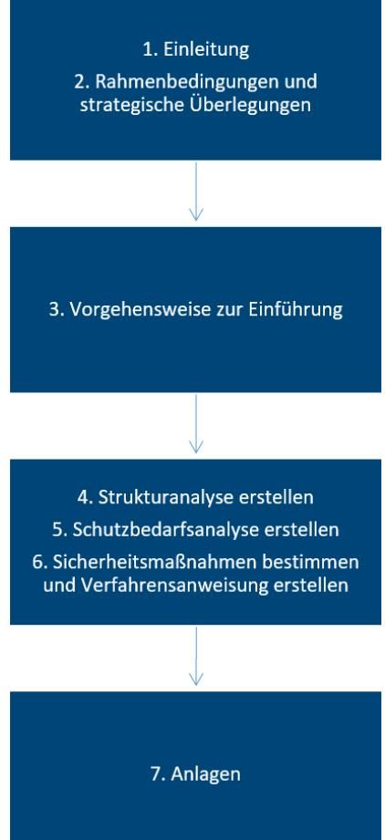

Abbildung 1: Übersicht Aufbau Leitfaden

# 2 Rahmenbedingungen und strategische Überlegungen

Die Digitalisierung eines papiergebundenen Dokuments geht naturgemäß mit dem Verlust der physischen Eigenschaften des Papiers und der verwendeten Beschriftung (z.B. Druck, Handschrift etc.) einher. Dieser Wegfall hat eine Verringerung des Beweiswerts des Digitalisats hinsichtlich der physischen Eigenschaften zur Folge. Deshalb ist gemäß § 7 (1) Satz [2 \[EGovG\]](#page-34-1) "bei der Übertragung in elektronische Dokumente […] nach dem Stand der Technik sicherzustellen, dass die elektronischen Dokumente mit den Papierdokumenten bildlich und inhaltlich übereinstimmen, wenn sie lesbar gemacht werden." Dies wird durch Umsetzung der in der TR RESISCAN [\[BSI-TR03138\]](#page-33-0) aufgeführten Maßnahmen erreicht.

Unter dem Ersetzenden Scannen wird im vorliegenden Leitfaden die sichere Digitalisierung papierner i.d.R. aktenrelevanter Originaldokumente mit anschließender Vernichtung der papiernen Originale nach dem Stand der Technik gemäß [\[BSI-TR03138\]](#page-33-0) verstanden, wobei sichergestellt wird, dass die elektronischen Dokumente mit den papiergebundenen Originalen bildlich und inhaltlich übereinstimmen, wenn sie lesbar gemacht werden. Für die E-Akte gilt die Definition gemäß Organisationskonzept elektronische Verwaltungsarbeit, Baustein E-Akte4 . Vor Beginn einer Konzeption und Umsetzung des Ersetzenden Scannens sind wesentliche Fragestellungen zu klären. Diese werden im Folgenden aus regulatorischer, strategischer und operativer Sicht beschrieben.

## 2.1 Regulatorischer Rahmen

Insgesamt liegt eine Vielzahl rechtlicher Rahmenbedingungen vor, die signifikante Auswirkungen auf die Dokumentenbearbeitung in den Behörden haben und welche mindestens kurz- bis mittelfristig durch Behörden der Bundesverwaltung berücksichtigt werden müssen. Zentrale Aspekte und Auswirkungen dieser Regelungen werden nachfolgend beschrieben.

- Gemäß § 7 Absatz 1 Satz 1 des Gesetzes zur Förderung der elektronischen Verwaltung [\[EGovG\]](#page-34-1) besteht für die Behörden des Bundes eine grundsätzliche Umsetzungsverpflichtung5 zur Übertragung von Papierdokumenten in elektronische Dokumente: "Die Behörden des Bundes sollen, soweit sie Akten elektronisch führen, an Stelle von Papierdokumenten deren elektronische Wiedergabe in der elektronischen Akte aufbewahren." Für alle Behörden, die ihre Akten bereits elektronisch führen, besteht diese Verpflichtung seit Inkrafttreten des EGovG am 31. Juli 2013.
- § 6 Satz 1 EGovG, wonach alle Bundesbehörden ihre Akten elektronisch führen sollen, tritt nach Artikel 31 Absatz 1 des Gesetzes vom 25.7.2013 (BGBl. I S. 2749) erst am 1.1.2020 in Kraft. Mit dieser Verpflichtung zur elektronischen Aktenführung gemäß § 6 EGovG besteht auch die Pflicht zum Ersetzenden Scannen nach § 7 Absatz 1 EGovG für alle Bundesbehörden. Eine Pflicht zur elektronischen Aktenführung besteht nach § 6 EGovG nur dann nicht, wenn das Führen elektronischer Akten bei langfristiger Betrachtung unwirtschaftlich ist. Bei der elektronischen Aktenführung "ist durch geeignete technischorganisatorische Maßnahmen nach dem Stand der Technik sicherzustellen, dass die Grundsätze ordnungsgemäßer Aktenführung eingehalten werden." Hinsichtlich der beweiswerterhaltenden Langzeitspeicherung von Dokumenten wird dies durch Anwendung de[r \[BSI-TR03125\]](#page-33-1) (TR-ESOR) erreicht. Die [BSI TR03125] gilt gemäß EGovG als Stand der Technik [\[EGovG-MK\].](#page-34-0)
- Die Pflicht zur ersetzenden Übertragung der Papierdokumente in elektronische Dokumente besteht grundsätzlich unabhängig von wirtschaftlichen Erwägungen. Sie besteht immer dann,

 4 [OK-eVA-EA]

5 Siehe auch [\[BSI-TR03138-R\]](#page-34-2) (Abschnitt R1.2.2).

wenn elektronische Akten geführt werden. Von dieser Pflicht kann nach § 7 Absatz 1 Satz 3 EGovG nur abgesehen werden, wenn die Übertragung unverhältnismäßigen technischen Aufwand erfordert, was explizit nachzuweisen ist.

- Hinsichtlich der Durchführung des Scannens müssen die Behörden gemäß § 7 Absatz 1 Satz 2 EGovG nach dem Stand der Technik "die bildliche und inhaltliche Übereinstimmung der elektronischen Dokumente mit den Papierdokumenten" sicherstellen. Als Stand der Technik gilt gemäß Kommentar und Begründung zum E-Government-Geset[z \[EGovG-MK\]](#page-34-0) di[e \[BSI-](#page-33-0)[TR03138\]](#page-33-0) (TR-RESISCAN) des BSI.
- Bezüglich der weiteren Verwendung der nunmehr digitalisierten Papierdokumente gilt gemäß § 7 Absatz 2 EGovG, dass die Papierdokumente nach einer angemessenen Frist zu vernichten oder zurückzusenden sind, sobald die Qualitätssicherung im Scan-Prozess abgeschlossen ist und der Vernichtung nicht andere rechtliche Gründe entgegenstehen.
- Flankiert wird die Normierung des Ersetzenden Scannens gemäß EGovG durch § 371b [\[ZPO\].](#page-35-0) Dieser bestimmt, dass die Beweiskraft einer gescannten öffentlichen Urkunde dem Papieroriginal gleichgestellt ist, sofern eine Bestätigung vorliegt, dass das Scanprodukt mit dem Scangut bildlich und inhaltlich übereinstimmt. Soll auch die Vermutungsregel zur Echtheit inländischer öffentlicher Urkunden nach § 437 ZPO zur entsprechenden Anwendung kommen, verlangt § 371b ZPO als Integritäts- und Authentizitätsnachweis das Anbringen einer qualifizierten elektronischen Signatur6 , sowohl am Scangut selbst als auch am Transfervermerk als Bestätigung des ordnungsgemäßen Scanprozesses. Dies kann in einem Akt erfolgen, wenn die qualifizierte elektronische Signatur den Transfervermerk und das Scangut umfasst.
- Die Beweisregelungen der ZPO sind nach § 98 VwGO im Verwaltungsgerichtsprozess entsprechend anzuwenden. Eine Vorlagepflicht gilt nach § 99 VwGO auch hinsichtlich elektronischer Dokumente. Gemäß § 99 VwGO führt die Verwaltung den Beweis anhand von Akten. Es ist für Behörden also nicht ausreichend nur einzelne Dokumente außerhalb des Aktenzusammenhangs bei Gericht einzureichen. Nach § 55a Abs.1 VwGO können alle vorbereitenden Schriftsätze und Anlagen aller Art auch als elektronische Dokumente eingereicht werden.
- Die Verwendung elektronischer Signaturen und Zeitstempel war bis 2016 durch die EU-Signaturrichtlinie geregelt, die in Deutschland mit dem Signaturgesetz und der Signaturverordnung in nationales Recht umgesetzt wurde. Die im September 2014 in Kraft getretene eIDAS-Verordnung wurde hinsichtlich elektronischer Signaturen, Siegel und Zeitstempel zum 1. Juli 2016 vollständig wirksam und hat die Signaturrichtlinie aufgehoben. Die eIDAS-Verordnung gilt unmittelbar als Teil der deutschen Rechtsordnung und genießt gegenüber deutschem Recht Anwendungsvorrang. Die Beweisregelungen der eIDAS-VO sind in jedem Gerichtsprozess zu beachten, auch im Verwaltungsgerichtsverfahren.
- Das Vertrauensdienstegesetz (VDG) ergänzt die eIDAS-Verordnung und regelt die wirksame Durchführung der Vorschriften der Verordnung über Vertrauensdienste. Es enthält keine beweisrechtlichen Regelungen, sondern in der Vertrauensdiensteverordnung (VDV) nur entsprechende Klarstellungen z.B. hinsichtlich der Barrierefreiheit und der Deckungsvorsorge für qualifizierte Vertrauensdiensteanbieter.
- Die eIDAS-Verordnung hat für einige der von ihr geregelten qualifizierten elektronischen Vertrauensdienste eigene Regelungen zu ihren Beweiswirkungen getroffen. Diese

6 Hierzu und zum möglichen Einsatz elektronischer Siegel, die bisweilen organisatorische Vorteile bieten, siehe auc[h \[BSI-TR03138-R\]](#page-34-2) (Abschnitte R.2.7.4 und R.2.7.6.2).

Beweisregelungen gelten zusätzlich zu den in der Zivilprozessordnung geregelten Beweiswirkungen7 .

- Die Verordnung führte elektronische Siegel als Vertrauensdienst ein. Nach der eIDAS-Verordnung ist es möglich, ein Zertifikat für eine juristische Person bzw. ein Verwaltungsorgan auszustellen. Ein "elektronisches Siegel" ist technisch gesehen also eine digitale Signatur einer juristischen Person bzw. eines Verwaltungsorgans. Elektronische Siegel sind nach Art. 3 Nr. 25 eIDAS-VO "Daten in elektronischer Form, die anderen Daten in elektronischer Form beigefügt oder logisch mit ihnen verbunden werden, um deren Ursprung und Unversehrtheit sicherzustellen". Für qualifizierte elektronische Siegel gilt nach Art. 35 Abs. 2 eIDAS-VO die "Vermutung der Unversehrtheit der Daten und der Richtigkeit der Herkunftsangabe der Daten, mit denen das qualifizierte elektronische Siegel verbunden ist". Durch das (qualifizierte) Organisationszertifikat für eine Behörde kann das (qualifizierte) elektronische Siegel sehr effizient und mit begrenztem Aufwand für die Integritätssicherung gemäß TR-RESISCAN verwendet werden.
- Der Begriff "Vermutung" in der eIDAS-VO ist nicht mit der "gesetzlichen Vermutung" im Sinn von § 292 ZPO und § 437 ZPO gleichzusetzen. Dies folgt aus der Zielsetzung und Systematik der Verordnung und der autonomen Auslegung des Unionsrechts. Die "Vermutung" des Art. 35 Abs. 2 eIDAS-VO ist im Sinn eines Anscheinsbeweises auszulegen. Das bedeutet, dass qualifizierten elektronischen Siegeln die gleiche Beweiswirkung zukommt wie qualifizierten elektronischen Signaturen nach § 371a Abs. 1 Satz 2 ZPO. Da qualifizierte elektronische Siegel keine qualifizierten elektronischen Signaturen sind, genügen sie nicht den Anforderungen des § 371b Satz 2 ZPO.
- Eine ähnliche Beweisregel enthält die eIDAS-VO auch für qualifizierte elektronische Zeitstempel nach Art. 41 Abs. 2 eIDAS-VO. Sie ist auch als Anscheinsregelung zu verstehen. Mit der Registraturrichtlinie des Bunde[s \[RegR\]](#page-34-3) besteht ferner eine untergesetzliche Regelung für das Bearbeiten und Verwalten von Schriftgut in Bundesministerien.
- Der Anwendungshinweis R der TR RESISCAN8 enthält weitere Hinweise zum Ersetzenden Scannen hinsichtlich des hier genannten Rechtsrahmens und auch weiterer Normen. Ziel der TR RESISCAN ist es, die Rechtssicherheit für die Anwender im Bereich des Ersetzenden Scannens zu steigern.

## 2.2 Kontext IT-Konsolidierung Bund

Die Dienstekonsolidierung entwickelt als Handlungsstrang der IT-Konsolidierung Bund für gleichartige Anwendungsfälle einheitliche, leistungsstarke und sichere IT-Lösungen für den Bund. Diese IT-Lösungen werden derzeit im Rahmen von unterschiedlichen IT-Maßnahmen der Dienstekonsolidierung umgesetzt. Sie sollen zukünftig rund 200 Bundesbehörden zur Verfügung stehen und nicht nur die IT-Landschaft vereinheitlichen und modernisieren, sondern auch Arbeitsprozesse digitalisieren und verändern. Die Dienstekonsolidierung ist unterteilt in vier Architekturdomänen: (1) Elektronische Verwaltungsarbeit, (2) Enterprise Ressource Planning, (3) Infrastruktur und (4) E-Government.

Im Rahmen der Dienstedomäne "Infrastruktur" wird die Maßnahme "Einheitliches E-Scannen für die Bundesverwaltung" (TP6-DK-2019-02) umgesetzt. Die Maßnahme zielt darauf ab, dass die Organisationen der Bundesverwaltung die Umsetzungsverpflichtung zum ersetzenden Scannen gemäß § 7 des E-Government-Gesetzes des Bundes erfüllen können. Hierzu entwickelt die Maßnahme E-Scannen ein zentral bereitzustellendes IT-Verfahren (Scan-Dienst Bund) für das

7 Siehe auch [\[BSI-TR03138-R\]](#page-34-2) (Abschnitt R.2.7).

8 [BSI-TR03138-R]

Ersetzende Scannen in der Bundesverwaltung sowie komplementäre Unterstützungsleistungen (Konzept- und Dokumentationsvorlagen, Beratungsangebote und Beschaffungsmechanismen). Der hiermit vorliegende "Leitfaden E-Scannen für Bundesbehörden" ist mit seinen Anlagen Bestandteil der komplementären Unterstützungsleistungen der Maßnahme E-Scannen.

## 2.3 IT-Strategie und Schnittstellen des Ersetzenden Scannens

Zunächst einmal stellt das Scannen einen Teilaspekt im Rahmen der Digitalisierung bzw. des E-Government im Allgemeinen und bei der Umsetzung der E-Akte im Besonderen dar. Neben der Transformation papiergebundener Originale in elektronische Dokumente müssen auch die entsprechenden, bisher papiergebundenen, Prozesse gleichsam digitalisiert werden, um aufwändige wie unwirtschaftliche Medienbrüche zu vermeiden. Dies erfordert eine ganzheitliche Betrachtung der Thematik, bei der auch die elektronische Kommunikation und ebenso bisher vor- und nachgelagerte Prozesse an den Schnittstellen zum Scannen zu berücksichtigen sind (z.B. E-Akte). Das Ersetzende Scannen ist insofern einer von mehreren Bausteinen zum Aufbau eines ganzheitlichen und vertrauenswürdigen E-Governments und somit in die entsprechenden Strukturen der Behörde zu integrieren9 . Die nachfolgende Darstellung stellt alle relevanten Bausteine für eine entsprechende ganzheitliche Betrachtung des Themas dar.

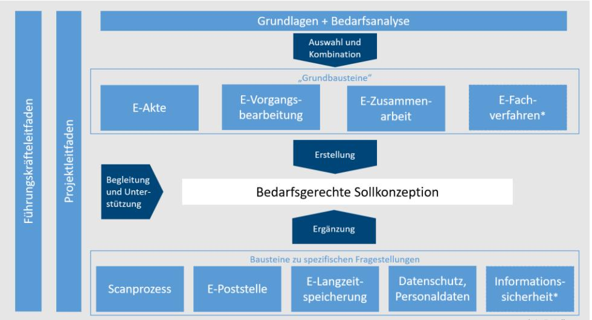

Abbildung 2: Zusammenwirken Bausteine der E-Verwaltung10

Die nachfolgend aufgeführten Bereiche11 stehen in einem besonderen engen fachlichen Zusammenhang mit dem Ersetzenden Scannen, wobei jeweils die grundlegenden relevanten Eigenschaften stichpunktartig skizziert sind:

- **E-Poststelle**12
	- o E-Scannen stellt für die E-Poststelle einen weiteren Eingangskanal (neben E-Mail, De-Mail, beBPo, Einschreib- und Zustelldienste nach eIDAS, Eingängen aus Portalen z.B. Portalverbund13 etc.) dar
	- o ermöglicht Organisation und sicheres Management verschiedener Kommunikationskanäle (Postein- und -ausgang) im Zusammenspiel mit der

 9 Siehe z.B. [Literaturverzeichnis](#page-33-2) 

[\[AHK19](#page-33-2)]

10 Vgl. [OeV]

11 Vgl. u.a [\[BMI-EGI\]](#page-33-3)

12 Vgl. im Detail [OeV] Baustein E-Poststelle

13 Hinweis: Die im Ressort BMG, BMWi, BMELV etc. relevanten europäischen Zulassungs- und Wissenschaftsportale unterliegen nicht dem deutschen Portalverbund.

- o Weiterleitung an empfangende Geschäftsanwendungen (insbesondere der E-Akte, Langzeitspeicher etc.) oder sendende Kanäle (Postausgang)
- o ermöglicht Gewährleistung der Signatur-/Siegelprüfungen
- o ermöglicht digitalen Rückkanal über Portale / Webanwendungen
- **E-Akte14**
	- o Vorhandensein der E-Akte stellt eine wesentliche Voraussetzung für die Realisierung des Ersetzenden Scannens dar15
	- o dient der Gewährleistung vollständiger E-Akte gemäß Stand der Technik
	- o bei papierner Bearbeitung ist eine koordinierte Einführung von Scan-Prozessen und elektronischer Bearbeitung, z.B. mit Hilfe der E-Akte, erforderlich16
	- o zentraler Dienst für Bundesbehörden: E-Akte Bund

#### **beweiswerterhaltende Aufbewahrung17**

- o Gewährleistung einer frühzeitigen beweissicheren Aufbewahrung für besonders zu schützende bzw. zur Nachweisführung notwendigen Dokumente sowie einer langfristig sicheren Aufbewahrung bis zum Ablauf der Aufbewahrungsfrist – jeweils im Aktenzusammenhang
- o zur Durchführung einer beweiswerterhaltenden Aufbewahrung im Aktenzusammenhang gil[t \[BSI-TR03125\]](#page-33-1) als Stand der Technik gemäß § 6 EGovG und ist entsprechend heranzuziehen
- o Zentraler Dienst für Bundesbehörden: Digitales Zwischenarchiv des Bundes (DZAB)

Als Beispiele für ein Zusammenspiel aller hier genannten Bausteine (E-Poststelle, E-Akte, Aufbewahrung) im Ersetzenden Scannen können die Ergebnisse der E-Government-Initiative De-Mail herangezogen werden. 18

### 2.4 Zertifizierung nach TR RESISCAN

Zum Nachweis der Erfüllung des Stands der Technik beim ersetzenden Scannen besteht die Möglichkeit, den behördeneigenen Scanprozess gegen die Vorgaben der TR RESISCAN zu zertifizieren. Hierfür bietet das BSI ein Zertifizierungsverfahren an. Gegenstand des Zertifizierungsverfahrens ist ausschließlich der Scanprozess der Behörde. Es wird keine Produktzertifizierung, z.B. von Soft- oder Hardwareprodukten, durchgeführt.

Die Prüfkriterien für die Konformitätsprüfung gegen die TR-03138 sind in [Anlage P], der Prüfspezifikation der TR-RESISCAN, definiert. Der praktische Ablauf gestaltet sich grundlegend wie folgt:

- Anmeldung der Behörde zur Zertifizierung des betroffenen Scanprozesses beim BSI
- Beauftragung eines vom BSI zertifizierten Auditors zur Zertifizierung nach TR RESISCAN durch die Behörde
- Auditierung der Behörde durch den Auditor
- Erstellung Auditierungsbericht durch den Auditor

14 Vgl. im Detail [OeV] Baustein E-Akte

15 Neben der E-Akte kann grundsätzlich z.B. auch ein ERP oder ein Archivsystem als Zielsystem des Ersetzenden Scannens dienen.

16 Vgl. hierzu das Reifegradmodell zur Einführung E-Akte Bund [IT-Konsolidierung Bund Teilprojekt 6 -

Gemeinsame IT des Bundes Informationsblatt - Reifegradmodell zur Einführung der E-Akte Bund. Version 1.0] 17 Vgl. im Detail [OeV] Baustein E-Langzeitspeicherung

- Prüfung des Auditierungsberichts und (bei erfolgreichem Abschneiden) Erteilung des Zertifikats durch das BSI.
- Sofern keine grundlegenden Änderungen am Scanprozess vorgenommen werden, ist die Zertifizierung für 3 Jahre gültig.

# 3 Vorgehensweise zur Einführung des Ersetzenden

## Scannens im Überblick

Für die Erreichung einer TR RESISCAN-konformen Umsetzung des Ersetzenden Scannens kann auf ein klar strukturiertes Vorgehensmodell zurückgegriffen werden, welches in der TR verankert ist19. Die dafür erforderlichen analytischen Schritte und konzeptionellen Bausteine sind in [Abbildung 3](#page-12-1) aufgeführt und werden nachfolgend überblicksartig und in den weiteren Kapiteln dann detailliert erläutert.

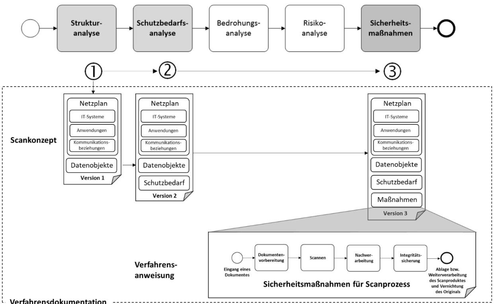

Abbildung 3: Vorgehensweise zur Einführung des Ersetzenden Scannens

 **Strukturanalyse**: Für eine solche systematische Sicherheitsbetrachtung müssen in einem ersten Schritt, der so genannten **Strukturanalyse** (siehe auch Abschnit[t 4\)](#page-15-0), die sicherheitstechnisch relevanten Bestandteile des Scansystems identifiziert werden. Dies umfasst die involvierten IT-Systeme, Anwendungen und Kommunikationsbeziehungen, die in einem reduzierten **Netzplan**20 dokumentiert werden, der später auch die Grundlage für die Auswahl geeigneter Sicherheitsmaßnahmen (siehe auch Abschnit[t 6\)](#page-25-0) bilden wird. Neben den strukturellen Bestandteilen des Scansystems sind in diesem Schritt auch die in den Scanprozess involvierten **Datenobjekte** (Papieroriginale, Scanprodukte, Index- und Metadaten, Protokolldaten, Sicherungsdaten etc.) zu identifizieren. Der so ermittelte Netzplan und die erfassten Datenobjekte bilden zusammen eine erste

Version des Scankonzeptes, das in den weiteren Schritten ergänzt wird und neben der Beschreibung des Gesamtverfahrens auch organisatorische und technische Aspekte zum prozessualen und technischen Zusammenspiel des Scansystems mit weiteren Bausteinen in der IT-Architektur (z.B. E-Poststelle, E-Akte, Aufbewahrung) in der Behörde enthalten kann.

19 Siehe [\[BSI-TR03138\]](#page-33-0) (Abschnitt 3).

20 Siehe [BSI-200-2], Abschnitt 8.1.4 un[d \[BSI-TR03138-P\],](#page-34-4) Abschnitt P.2 (Basismodul)

 **Schutzbedarfsanalyse:** Die im Rahmen der Strukturanalyse identifizierten Datenobjekte bilden die Grundlage für die im nächsten Schritt (2) durchzuführende Analyse der Schutzbedarfe anhand des Scanprozesses. Hierbei ist es laut TR RESISCAN ausreichend, grundlegende organisatorische, personelle und technische Sicherheitsmaßnahmen für den normalen Schutzbedarf in den verschiedenen Phasen des generischen Scanprozesses (Dokumentenvorbereitung, Scannen, Nachverarbeitung, Integritätssicherung) und den Schutzbedarf der Papieroriginale hinsichtlich der Grundwerte Integrität, Vertraulichkeit und Verfügbarkeit zu ermitteln, da sich der Schutzbedarf der weiteren Datenobjekte daraus ergibt.

Hintergrund und Vorgehen zur Durchführung der Schutzbedarfsanalyse unter Nutzung der Vorlagen (Anlage D, S) werden in Abschnit[t 4.4](#page-18-0) detailliert erläutert.

- **Bedrohungsanalyse und Risikoanalyse:** Die explizite Erstellung einer Bedrohungs- als auch einer Risikoanalyse **muss nicht** erfolgen21. Es ist deshalb ausreichend, die sich aus der Schutzbedarfsanalyse ergebenden Sicherheitsmaßnahmen umzusetzen.
- **Sicherheitsmaßnahmen:** Aus der Analyse der Schutzbedarfe ergibt sich die Einstufung der klassifizierten Dokumente in die Schutzbedarfskategorien "normal", "hoch" und "sehr hoch"22. Daraus wiederum ergibt sich, welche Module (Basismodul und Aufbaumodule) benötigt werden und somit (3) welche Sicherheitsmaßnahmen aus dem modularen Maßnahmenkatalog23 der TR RESISCAN für das Erreichen eines angemessenen Schutzniveaus notwendig sind. Mit Hilfe der Anlage M (Maßnahmenprüfliste) ist eine Auswahl, Identifizierung und Nachverfolgung der erforderlichen Sicherheitsmaßnahmen möglich (vgl. Abschnitt [6\)](#page-25-0).
- **Verfahrensdokumentation:** Die Verfahrensdokumentation muss die in de[r \[BSI-TR03138\]](#page-33-0) unter A.G.1 (Verfahrensdokumentation) aufgeführten Aspekte umfassen und kann sich beispielsweise aus den folgenden Bestandteilen zusammensetzen:
	- Scankonzept24,25, das zumindest folgende Inhalte umfasst:
		- Netzplan mit einer Beschreibung der für den Scanprozess relevanten IT-Systeme, Anwendungen und Kommunikationsbeziehungen.

21 Da eine Bedrohungs- und Risikoanalyse bereits bei der Entwicklung der TR RESISCAN in einer generischen Weise für ein "typisches Scansystem" und einen "generischen Scanprozess" durchgeführt wurde, kann diese entfallen. Siehe hierzu [BSI-TR03138] und [SGHJ12]

22 Siehe [BSI-TR03138-A], Tabelle 5

23 [BSI TR03138], Abschnitt 4.1

24 Das Scankonzept beschreibt umfassend die Eigenschaften des Scansystems und seiner konkreten Umsetzung. Das Vorgehen zur Erstellung eines Scankonzeptes ist bereits an anderer Stelle, im Organisationskonzept elektronische Verwaltungsarbeit - Baustein Scanprozess, erläutert (und wird deshalb hier nicht weiter beschrieben). Unabhängig davon werden die zentralen Inhalte eines Scankonzeptes (insb. Strukturanalyse, Schutzbedarfsanalyse und Sicherheitsmaßnahmen) bereits durch die im vorliegenden Leitfaden aufgeführten Aktivitäten/Vorlagen beschrieben. Im Rahmen einer schrittweisen Erstellung können somit auch bestehende Scankonzepte (oder vergleichbare Dokumente) durch die Analyseschritte und Vorlagen des Leitfadens aktualisiert oder um die explizit für das Ersetzende Scannen relevanten Aspekte ergänzt werden. 25 Vgl. [OeV], Baustein Scanprozess

- Identifikation der relevanten Datenobjekte, wie z.B. Papieroriginale, Scanprodukte, Index- und Metadaten, Protokolldaten, Sicherungsdaten etc., als Grundlage für Schutzbedarfsanalyse,
- Schutzbedarfsfeststellung für relevante Datenobjekte
- Dokumentation der umgesetzten Sicherheitsmaßnahmen und eine
- **Verfahrensanweisung:** Die Verfahrensanweisung adressiert die verschiedenen Phasen des Scanprozesses und dient insbesondere den Verantwortlichen und beteiligten Personen zur Dokumentation aller für die Handhabung und Durchführung des Scannens erforderlicher Prozessschritte. Hintergrund und Vorgehen zur Erstellung einer behördenspezifischen Verfahrensanweisung unter Nutzung der Vorlage (Anlage V) werden in Abschnitt [6.5](#page-29-1) detailliert erläutert.

# 4 Strukturanalyse für das Scansystem erstellen

Die Einführung des Ersetzenden Scannens beginnt mit der Strukturanalyse, in der die relevanten Bestandteile eines existierenden oder geplanten Scansystems identifiziert werden. Hierbei werden die folgenden Aspekte (vgl[.](#page-15-2) 

[Abbildung](#page-15-2) 4) betrachtet und anschließend näher erläutert:

- IT-Systeme und Anwendungen (siehe Abschnitt [4.1\)](#page-15-1),
- Netze und Kommunikationsbeziehungen (siehe Abschnitt [4.2\)](#page-16-0) und
- Datenobjekte (siehe Abschnit[t 4.3\)](#page-17-0).

Die nachstehende Grafik zeigt die grobe Vorgehensweise.

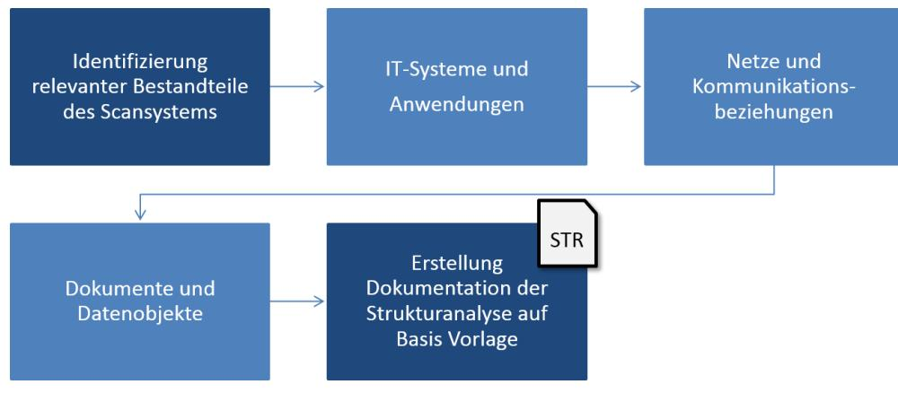

Abbildung 4: Übersicht Durchführung Strukturanalyse

## 4.1 IT-Systeme und Anwendungen

Im Zuge der Identifikation der relevanten IT-Systeme und Anwendungen des Scansystems wird ein bereinigter Netzplan (siehe [Abbildung 5\)](#page-16-1) erstellt, der auch Ausgangspunkt für die mögliche Auditierung und Zertifizierung des Scanprozesses ist. Das zu betrachtende Scansystem umfasst dabei die zum Scannen notwendigen Komponenten inklusive der Schnittstellen zu den angrenzenden Systemen (z.B. für E-Poststelle, E-Akte, TR-ESOR-System).

Ein exemplarischer Netzplan eines Scansystems findet sich in der folgende[n Abbildung 5.](#page-16-1)

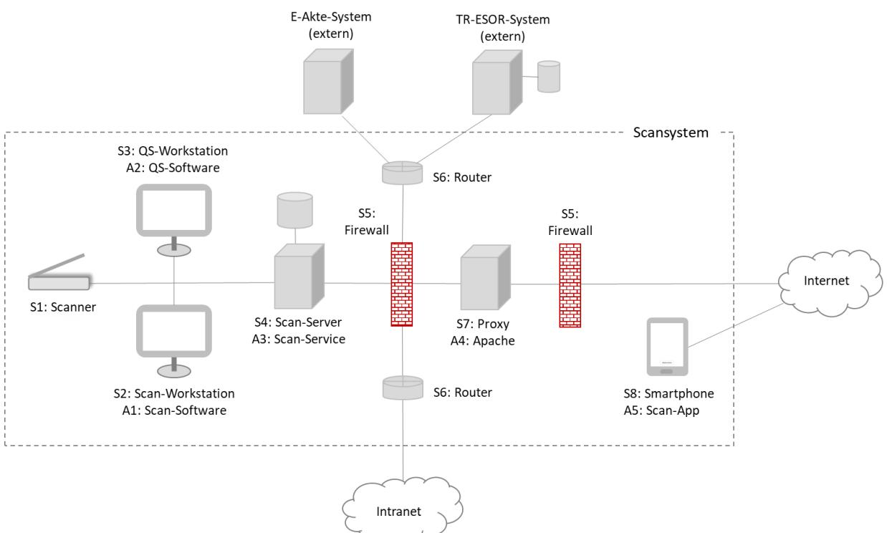

Abbildung 5: Exemplarischer Netzplan eines Scansystems mit IT-Systemen und Anwendungen

Wie in [Abbildung 5](#page-16-1) ersichtlich, umfasst das exemplarische Scansystem eine Reihe von Systemen (Sx) und darauf laufenden Anwendungen (Ay). Diese müssen jeweils separat erfasst und mit Angaben zu den jeweiligen Verantwortlichen dokumentiert werden26 .

Die hierbei identifizierten Systeme und Anwendungen bilden die Grundlage für die Bestimmung der notwendigen Sicherheitsmaßnahmen bei der Umsetzung der Anforderung A.T.1, welche letztlich die Implementierung der relevanten Maßnahmen aus dem Grundschutz-Kompendium des BS[I \[BSI-GSK\]](#page-33-4) fordert.

### 4.2 Netze und Kommunikationsbeziehungen

Zusätzlich zur Identifikation der IT-Systeme und Anwendungen müssen27 im Rahmen der Strukturanalyse auch die Netze und Kommunikationsbeziehungen (vgl. [Abbildung 6\)](#page-17-1) identifiziert werden, damit später auch hierfür adäquate Sicherheitsmaßnahmen28 ausgewählt und umgesetzt werden können.

Eine beispielhafte Darstellung der Netze (Nx) und Kommunikationsbeziehungen (Ky) im exemplarischen Scansystem findet sich in der folgenden Abbildung.

26 Siehe [\[BSI-TR03138\]](#page-33-0) (A.O.1 f)). Hinweis: Sofern beispielsweise eine bestimmte Organisationseinheit für alle IT-Systeme und Anwendungen verantwortlich ist, kann hier auf eine differenzierte Betrachtung in den Tabellen der Vorlage STR hier verzichtet werden.

27 Siehe [\[BSI-TR03138\]](#page-33-0) (A.G.1, e))

28 Siehe [\[BSI-TR03138\]](#page-33-0) (A.T.1) und Abschnitt [6.](#page-25-0)

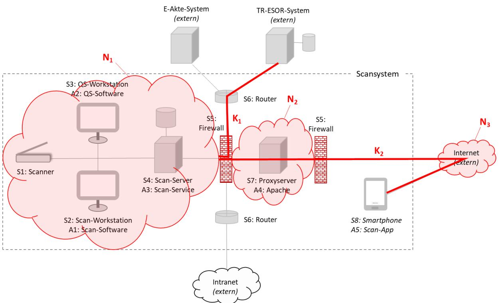

Abbildung 6: Netze und Kommunikationsbeziehungen im exemplarischen Scansystem

Auch hier empfiehlt es sich, die identifizierten Netze und Kommunikationsbeziehungen in einer entsprechenden Tabelle zu erfassen.

## 4.3 Datenobjekte

Wie in der TR RESISCAN gefordert, müssen29 im Rahmen der Strukturanalyse die relevanten Dokumente und Datenobjekte identifiziert werden. Außerdem sollen30 Verantwortliche für die jeweiligen Datenobjekte festgelegt werden. Die nachfolgende Auflistung basiert auf [\[BSI-TR03138-A\]](#page-34-5) (Tabelle 1). Sie beschreibt die relevanten Datenobjekte in einem exemplarischen Scansystem und enthält unter D.1.1-D1.9 auch beispielhafte Dokumenttypen. Weitere Details zu Dokumenttypen finden sich in Kap[. 5.3.](#page-22-0)

| ID | Datenobjekt                       | Beschreibung                                                                                                                                                                                                             |
|----|-----------------------------------|--------------------------------------------------------------------------------------------------------------------------------------------------------------------------------------------------------------------------|
| D0 | Schriftgut aus dem Posteingang | Schriftgut, das per Post o. ä. eingegangen ist.                                                                                                                                                                          |
| D1 | Scanrelevantes Original        | Papierdokument, das durch geeignete Vorbereitungsschritte (z. B. durch Entfernung des Kuverts, Umkopieren, Entklammern etc.) aus dem eingegangenen Schriftgut (D0) gewonnen und dem Scanprozess zugeführt wird. |
|    | D.1.1                             | Ärztliche Verordnung                                                                                                                                                                                                     |
|    | D.1.2                             | Beglaubigte Kopie einer Ernennungsurkunde                                                                                                                                                                                |
|    | D.1.3                             | Beglaubigte Kopie einer Heirats-/Geburtsurkunde                                                                                                                                                                          |
|    | D.1.4                             | Beglaubigte Kopie eines Prüfungszeugnisses                                                                                                                                                                               |
|    | D.1.5                             | Ausbildungs- und Praktikantenverträge                                                                                                                                                                                    |
|    | D.1.6                             | Prüfungsaufgaben der Studieninstitute                                                                                                                                                                                    |
|    | D.1.7                             | Unterlagen der Familienkasse (z.B. für Kindergeld)                                                                                                                                                                       |

29 Siehe [\[BSI-TR03138\]](#page-33-0) (A.O.1 b)) und [\[BSI-TR03138-P\]](#page-34-4) (Abschnitt P.2).

30 Siehe [\[BSI-TR03138\]](#page-33-0) (A.O.1 f)).

|    | D.1.8                                                        | Unterlagen der Beihilfebearbeitung                                |  |
|----|--------------------------------------------------------------|-------------------------------------------------------------------|--|
|    | D.1.9                                                        | Sonstige Personalunterlagen und Personalakten                     |  |
| D2 | Scanprodukt                                                  | Elektronisches Abbild des Papierdokumentes (D1). Dieses wird      |  |
|    |                                                              | durch den Scanner erzeugt und ggf. von der Scansoftware           |  |
|    |                                                              | nachbearbeitet.                                                   |  |
| D3 | Index- und                                                   | Daten, die das Auffinden und die Nutzung des später abgelegten    |  |
|    | Metadaten                                                    | Scanproduktes ermöglichen bzw. erleichtern.                       |  |
|    |                                                              | Durch die hier manuell oder automatisch durch eine                |  |
|    | Formularerkennungs-Software vorgeschlagenen und im Rahmen    |                                                                   |  |
|    | der Qualitätssicherung überprüften bzw. ergänzten Index- und |                                                                   |  |
|    |                                                              | Metadaten wird die eindeutige Zuordnung der Dokumente zu          |  |
|    |                                                              | einem Geschäftsvorfall sichergestellt, wodurch ein wesentliches   |  |
|    |                                                              | Element der Ordnungsmäßigkeit gegeben ist.                        |  |
| D4 | Transfervermerk                                              | Mit dem Transfervermerk31 wird dokumentiert, wann und durch       |  |
|    |                                                              | wen die Übertragung des Papierdokumentes in ein elektronisches    |  |
|    |                                                              | Dokument stattgefunden hat.                                       |  |
| D5 | Sicherungsdaten                                              | Sicherungsdaten sind Datenobjekte, die dem Schutz der Integrität  |  |
|    |                                                              | und ggf. Authentizität anderer Datenobjekte dienen.               |  |
| D6 | Protokolldaten                                               | Die Protokolldaten dokumentieren zusätzliche sicherheitsrelevante |  |
|    |                                                              | Abläufe und Ereignisse. Sie unterstützen somit die                |  |
|    |                                                              | Nachvollziehbarkeit der Abläufe und den Nachweis der              |  |
|    |                                                              | Ordnungsmäßigkeit des Scanprozesses.                              |  |

**Tabelle 1: Relevante Datenobjekte und Dokumenttypen im exemplarischen Scansystem**

### 4.4 Dokumentation der Strukturanalyse

Auf Basis der oben beschriebenen Schritte zur Identifizierung der relevanten Bestandteile des Scansystems sind die Ergebnisse zu dokumentieren. Dies kann mit Hilfe der Anlage STR erfolgen. Die fertiggestellte Strukturanalyse schließt den ersten Analyseschritt ab und ist zugleich Grundlage für weitere Analyse- und Dokumentationsschritte.

31 Siehe auch [\[BSI-TR03138\]](#page-33-0) (A.NB.4).

# 5 Schutzbedarf von Dokumenten festlegen

## 5.1 Implikationen für das Scanverfahren

Ein zentraler Aspekt zur Erreichung eines dem Risiko angemessenen Sicherheitsniveaus ist das Konzept des "Schutzbedarfes": Der Schutzbedarf von Informationen ergibt sich aus den zu erwartenden Konsequenzen, falls Integrität, Vertraulichkeit oder Verfügbarkeit der betroffenen Informationen nicht mehr gewährleistet sind bzw. kompromittiert wurden. Entsprechende Konsequenzen können sich beispielsweise in Form von finanziellen Schäden, Ansehensverlusten oder negativen rechtlichen Auswirkungen zeigen.

Eine üblicherweise umfassende Betrachtung der Schutzbedarfe ist im aktuellen Kontext nicht erforderlich: Lt. TR RESISCAN ist für die Schutzbedarfsfeststellung im Rahmen des Ersetzenden Scannens nur die Betrachtung der verarbeiteten Papierdokumente bzw. Dokumenttypen ("scanrelevantes Original (D1)" gemä[ß](#page-18-1) 

[Tabelle](#page-18-1) 1) erforderlich, da sich die Schutzbedarfe der anderen Datenobjekte daraus ableiten32 . Diese Analyse ist sorgfältig und wohlbegründet durchzuführen, da hieraus die konkreten Sicherheitsmaßnahmen abgeleitet werden, welche dann umzusetzen sind (siehe Abschnitt [6\)](#page-25-0). Insgesamt umfasst die Schutzbedarfsanalyse die folgenden Schritte (vgl[.](#page-19-2)  [Abbildung](#page-19-2) 7), die kurz skizziert und anschließend näher erläutert werden:

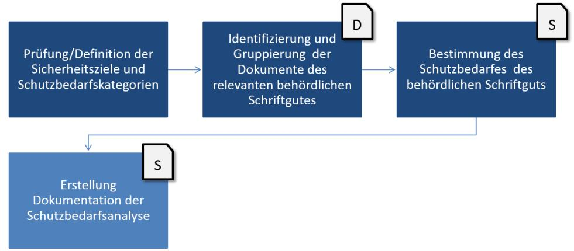

Abbildung 7: Überblick Durchführung Schutzbedarfsanalyse

- 1. **Definition der Sicherheitsziele und Schutzbedarfskategorien** In einem ersten Schritt müssen die Sicherheitsziele und Schutzbedarfskategorien definiert werden, durch die gewissermaßen die "Metrik" für die Schutzbedarfsanalyse definiert wird. Hierbei kann zweckmäßiger Weise auf die Vorarbeiten aus [\[BSI-TR03138-A\]](#page-34-5) aufgebaut werden, die sich der Einfachheit halber auch in Abschnitt [5.2](#page-20-0) dieses Dokumentes finden.
- 2. **Fachlich-inhaltliche Gruppierung der Dokumente** Im zweiten Schritt empfiehlt sich eine Gruppierung der verarbeiteten Dokumente, damit die Schutzbedarfsbestimmung soweit möglich für eine Gruppe von Dokumenttypen statt für einzelne Dokumenten erfolgen kann. Der Leitfaden bietet über die **Anlage D** hierfür eine musterhafte Gruppierung und beispielhafte Klassifizierung an. Weitere Informationen zu dieser Klassifizierung der verarbeiteten Dokumente finden sich nachfolgend in Abschnit[t 5.3](#page-22-0) sowie in Anlage D.
- 3. **Durchführung der Schutzbedarfsanalyse**  Im dritten und letzten Schritt der Schutzbedarfsanalyse muss nun der Schutzbedarf der identifizierten Dokumente bzw.

32 Vgl. BSI TR 03138-A, Abschnitt A.2

Dokumentgruppen bestimmt werden. Im Zuge der Erstellung des vorliegenden Leitfadens wurde mit **Anlage S** eine entsprechende Vorlage bzw. ein Muster erstellt, welche die Erstellung der eigenen, behördenspezifischen Schutzbedarfsanalysen erleichtern soll. Weitere Informationen hierzu finden sich in Abschnitt [5.4](#page-24-0) und in Anlage S.

## 5.2 Sicherheitsziele und Schutzbedarfskategorien

Die Durchführung der Schutzbedarfsanalyse setzt die Definition der zu betrachtenden Sicherheitsziele und Schutzbedarfskategorien voraus und ermittelt später das Sicherheitsniveau des Schriftgutes unter Berücksichtigung seiner vorgesehenen Verwendung. Um den Schutzbedarf des Schriftgutes zu bestimmen, stellt die TR RESISCAN eine Definition der Grundwerte der IT-Sicherheit (Integrität, Verfügbarkeit und Vertraulichkeit) sowie der sie untersetzenden Sicherheitsziele bereit, die nachfolgend [\(](#page-20-1)

[Tabelle](#page-20-1) 2) dargestellt werden.

| Grundwert       | Sicherheitsziel     | Definition                                                                                                                                                                                                                                                                                                               |
|-----------------|---------------------|--------------------------------------------------------------------------------------------------------------------------------------------------------------------------------------------------------------------------------------------------------------------------------------------------------------------------|
| Integrität      | Integrität          | Integrität bedeutet, dass die Daten oder Systeme nicht verändert wurden. Bei einem wirksamen Integritätsschutz werden zudem zumindest Veränderungen erkannt.                                                                                                                                                    |
|                 | Authentizität       | Unter der Authentizität von Daten versteht man, dass die Quelle der Daten eindeutig bestimmbar ist.                                                                                                                                                                                                                   |
|                 | Vollständigkeit     | Vollständigkeit bedeutet, dass der gegenseitige Bezug mehrerer, aufgrund eines inneren Zusammenhangs zusammengehöriger Datenobjekte, sichergestellt ist.                                                                                                                                                           |
|                 | Nachvollziehbarkeit | Unter der Nachvollziehbarkeit eines Vorgangs versteht man, dass alle wesentlichen Schritte des Vorgangs von einer unabhängigen Stelle nachgezeichnet werden können.                                                                                                                                             |
| Verfügbarkeit   | Verfügbarkeit       | Die Verfügbarkeit von Daten, Diensten, IT-Systemen, IT Anwendungen oder IT-Netzen ist vorhanden, wenn diese den Benutzern innerhalb akzeptabler Wartezeiten in der benötigten Form zur Verfügung stehen.                                                                                                        |
|                 | Lesbarkeit          | Lesbarkeit bedeutet, dass die in den Daten enthaltenen Informationen erkannt werden können.                                                                                                                                                                                                                           |
|                 | Verkehrsfähigkeit   | Verkehrsfähigkeit bezeichnet die Möglichkeit, Dokumente und Akten von einem System zu einem anderen übertragen zu können, bei der die "Qualität" des Dokuments sowie seine Integrität und Authentizität nachweisbar bleiben.                                                                                 |
| Vertraulichkeit | Vertraulichkeit     | Vertraulichkeit ist die Verhinderung einer unbefugten Kenntnisnahme.                                                                                                                                                                                                                                                  |
|                 | Löschbarkeit        | Unter Löschen von Daten ist das Entfernen der gespeicherten Daten zu verstehen. Dies ist gegeben, wenn die Daten unwiderruflich so behandelt worden sind, dass eigene Informationen nicht aus gespeicherten Daten gewonnen werden können, wenn also der Rückgriff auf diese Daten nicht mehr möglich ist. |

#### **Tabelle 2: Definition und Erläuterung der Sicherheitsziele33**

Im Rahmen der fachlichen Schutzbedarfsanalyse gemäß TR RESISCAN muss für alle verarbeiteten Dokumenttypen (D1) und für die oben genannten Grundwerte der Schutzbedarf entsprechend festgestellt werden. Diese Feststellung erfolgt aufgrund von Schutzbedarfskategorien, welche wiederum durch Schadenszenarien beschrieben werden, woraus sich Anhaltspunkte zur Klassifizierung des jeweiligen Schutzbedarfes ergeben. Die TR RESISCAN stellt hierzu nachfolgende Tabelle34 bereit.

| Schutzbedarfskategorie | Definition                                                                                                                                                                                      |
|------------------------|-------------------------------------------------------------------------------------------------------------------------------------------------------------------------------------------------|
| "normal"               | Die Schadensauswirkungen sind in der Regel begrenzt und überschaubar. Ein solcher Schaden induziert im Regelfall keine nennenswerten Konsequenzen für die am Geschäftsvorfall beteiligten |
|                        | Personen und Institutionen.                                                                                                                                                                     |
| "hoch"                 | Die Schadensauswirkungen sind in der Regel beträchtlich. Ein solcher                                                                                                                            |
|                        | Schaden führt im Regelfall zu beträchtlichen Konsequenzen für die am                                                                                                                            |
|                        | Geschäftsvorfall beteiligten Personen und Institutionen.                                                                                                                                        |
| "sehr hoch"            | Die Schadensauswirkungen können ein existenziell bedrohliches oder                                                                                                                              |
|                        | sogar katastrophales Ausmaß erreichen.                                                                                                                                                          |
|                        | Ein solcher Schaden kann zu existenziell bedrohlichen oder sogar                                                                                                                                |
|                        | katastrophalen Konsequenzen für die am Geschäftsvorfall beteiligten                                                                                                                             |
|                        | Personen und Institutionen führen.                                                                                                                                                              |

#### **Tabelle 3: Definition der Schutzbedarfskategorien**

Da es von den konkreten Gegebenheiten eines Geschäftsvorfalles (z.B. ein bestimmtes Antragsverfahren) abhängt, welche der möglichen Konsequenzen im Schadensfall beispielsweise als "nicht nennenswert", "beträchtlich", "existentiell bedrohlich" oder "katastrophal" bewertet werden, muss die fachliche Schutzbedarfsfeststellung durch die jeweilige Behörde entsprechend ihrer eigenen, konkreten Anwendungsfälle überprüft und gegebenenfalls angepasst werden.

So kann beispielsweise ein Dokumenttyp "Kaufvertrag", je nach dem, in welcher Behörde oder Abteilung er zu welchem Zweck und nach welchen regulatorischen Vorgaben gescannt werden soll, einen unterschiedlichen Schutzbedarf aufweisen. So könnte z.B. der Vertrag über den Kauf von Büromaterial anders bewertet werden, als derjenige zur Beschaffung der Sicherheitsanlage einer Sicherheitsbehörde, gleiches gilt für entsprechende Dienstleistungen oder Genehmigungen.

Als Unterstützung zur ggf. erforderlichen Anpassung der allgemein formulierten Schutzbedarfskategorien aus der TR RESISCAN stehen mittlerweile beispielhafte Ausformulierungen (wie die "Schutzbedarfskategorien für die IT-Konsolidierung Bund"35 oder für das ersetzende Scannen in justiziellen Verfahren36) zur Verfügung, welche bei der Beschreibung der eigenen, behördenspezifischen Definitionen genutzt werden können.

Eine beispielhafte Schutzbedarfsfeststellung für ausgewählte Dokumenttypen findet sich in Anlage D. Zur konkreten Dokumentation der individuellen Schutzbedarfsfeststellung der jeweiligen Behörde kann die Vorlage in Anlage S des Leitfadens genutzt werden.

35 Vgl. Übersicht Schutzbedarfskategorien im Rahmen der IT-Konsolidierung Bund 36 Vgl. [\[SBF-Justiz\]](#page-35-1)

33 [\[BSI-TR03138-A\]](#page-34-5) (Tabelle 6)

34 [BSI-TR03138-A] (Abschnitt A.2.2). Diese Angaben stützen sich wiederum auf Vorarbeiten au[s \[BSI-200-2\]](#page-33-5) (Abschnitt 8.2.1).

## 5.3 Fachlich-inhaltliche Gruppierung der Dokumente

Bei der Anwendung der TR RESISCAN empfiehlt sich hinsichtlich der Bestimmung des Schutzbedarfes die Klassifizierung und Zusammenfassung gleichartiger Dokumente37 . Hierzu ist das für die Erfassung vorgesehene Schriftgut in geeignete Kategorien einzuteilen. Für eine entsprechende Gruppierung bieten sich beispielsweise folgende Ebenen an:

- Aktentypen
- Dokumenttypen
- Prozesse (Dokumente im Rahmen eines Fachprozesses oder einer organisatorischen Zuständigkeit),
- IT-Systeme und Anwendungen (Dokumente im Kontext eines bestimmten IT-Systems),
- Themenbereich oder Fachdomänen (Dokumente eines fachlichen Anwendungsbereichs)

Dokumenttypen bilden in diesem Sinn die kleinste sinnvolle Einheit, um für das anfallende Scangut38 eine Abgrenzung aus fachlich-inhaltlicher Sicht zu erreichen. Im Zuge der Erstellung des vorliegenden Leitfadens und der Anlage D ist deshalb eine Gruppierung anhand von Dokumenten erfolgt und es wurde eine beispielhafte Schutzbedarfsfeststellung auf Basis der so ermittelten Dokumenttypen durchgeführt. Als inhaltliche Basis hierfür dienten u.a. entsprechende Angaben und Beispiele aus der behördlichen Praxis, die gesammelt und vorschlaghaft zu fachlich-inhaltlichen Gruppen zusammengefasst wurden (vgl[.](#page-23-0) 

[Abbildung](#page-23-0) 8).

37 Im Rahmen dieser Klassifizierung können auch Dokumente vom Ersetzenden Scannen ausgenommen werden (vgl. Anforderung A.G.1 a) in [\[BSI-TR03138\]\)](#page-33-0).

38 Weitere, neben dem eigentlichen Papierdokument (also dem scanrelevanten Original) im Rahmen des Scanprozesses anfallende Datenobjekte (wie Protokolldaten, Transfervermerke etc.) müssen bei der Anwendung der TR RESISCAN nicht betrachtet werden.

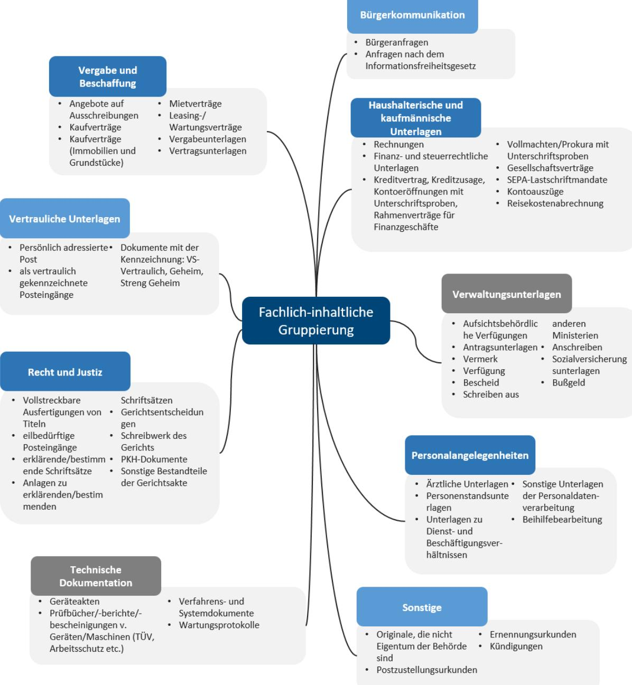

#### Abbildung 8: Übersicht fachlich-inhaltliche Gruppierung von Dokumenttypen

Sowohl die hier vorgeschlagenen fachlich-inhaltlichen Gruppierungen als auch die jeweils zugewiesenen und beschriebenen Dokumenttypen sind beispielhaft und nicht abschließend zu verstehen. Vielmehr stellen sie eine mögliche, beispielhafte Ausgangsbasis für die jeweils behördenspezifisch erforderliche Identifikation und Klassifizierung der zu scannenden Dokumente im Rahmen der Konzeption und Einführung des Ersetzenden Scannens dar. Sie ersetzt **nicht** die individuelle Schutzbedarfsfeststellung in einer bestimmten Behörde.

Das Ergebnis dieser beispielhaften Gruppierung von Dokumenten findet sich in Anhang D und kann zudem als Vorlage für die Erstellung individueller Schutzbedarfsanalysen genutzt werden. Die exemplarische Schutzbedarfsanalyse auf Basis der beschriebenen Dokumenttypen wird im nachfolgenden Kapitel beschrieben.

## 5.4 Durchführung der Schutzbedarfsanalyse auf Basis einer

### Vorlage

Auf Basis der oben beschriebenen Dokumenttypen wurde im Rahmen des vorliegenden Leitfadens eine exemplarische Schutzbedarfsanalyse durchgeführt (vgl. Anlage D). Diese exemplarische Schutzbedarfsanalyse soll die Behörden unterstützen und insbesondere

- einen **formalen Rahmen** für eine einfache Durchführung der Schutzbedarfsanalyse für den Scanprozess bieten,
- als **Ausgangsbasis für den Bewertungsprozess** einen ersten Überblick über fachliche und inhaltliche Strukturierungsmöglichkeiten für das relevante Schriftgut geben,
- zur **Identifizierung gebräuchlicher** (im Rahmen des Scanprozesses relevanter) Datenobjekte und **Dokumententypen** dienen,
- auf Basis exemplarischer Vorgaben und Praxisbeispiele eine **Interpretationshilfe** und **Ableitungsmöglichkeit** für die eigene, behördenspezifische Schutzbedarfsanalyse darstellen,
- mittels einer **Dokumentvorlage** (Anlage S) einen vereinfachten **Abgleich** und eine **Dokumentation** der Analyseergebnisse ermöglichen.

Bei der Durchführung der Schutzbedarfsanalyse empfiehlt sich die Anwendung des aus dem BSI Grundschutz bekannten Maximumprinzips. Dabei bestimmt der Schaden bzw. die Summe der Schäden mit den schwerwiegendsten Auswirkungen den Schutzbedarf des Prozesses oder Verfahrens, beim ersetzenden Scannen den Schutzbedarf der zu scannenden Dokumenttypen. Durch dieses Vorgehen kann erfahrungsgemäß der Aufwand zur Schutzbedarfsanalyse sowie der daraus abgeleiteten Sicherheitsmaßnahmen erheblich begrenzt werden.

Zur Unterstützung der konkreten Dokumentation der behördenspezifischen Analyseergebnisse steht eine bearbeitbare Vorlage (Anlage S) zur Verfügung. Hierbei wurden initial die Inhalte der Übersicht der Dokumenttypen (vgl. Anlage D) übernommen. Dadurch steht eine Ausgangsbasis zur Verfügung, mittels der sowohl eine einfache Anpassung (z.B. Streichen, Hinzufügen oder Neugruppierung von Dokumenttypen sowie einer ergänzenden oder veränderten Bewertung der Schutzbedarfe) als auch eine effiziente Erfassung der jeweils konkreten, für den betrachteten behördlichen Kontext relevanten Dokumenttypen und ihrer ermittelten Schutzbedarfe ermöglicht wird. Zugleich kann mittels der Vorlage ein Ergebnisdokument erzeugt werden, wodurch die Behörde schnell über eine einheitliche und strukturierte Darstellung ihrer Schutzbedarfsfeststellung verfügt.

Die durchgeführte Analyse stellt die Grundlage zur Ableitung der erforderlichen technischen, organisatorischen und personellen Sicherheitsmaßnahmen dar. Diese werden im nachfolgenden Kapitel beschrieben.

# 6 Sicherheitsmaßnahmen bestimmen und

# Verfahrensanweisung erstellen

Die Sicherheitsmaßnahmen beschreiben insbesondere die personellen, organisatorischen und technischen Maßnahmen und Aktivitäten, welche zur Sicherstellung des erforderlichen Schutzniveaus für das gesamte Scan-System notwendigen sind. Die Bestimmung und Umsetzung kann in mehreren Schritten erfolgen (vgl.

[Abbildung](#page-15-2) 4) welche nachfolgend betrachtet und näher erläutert werden:

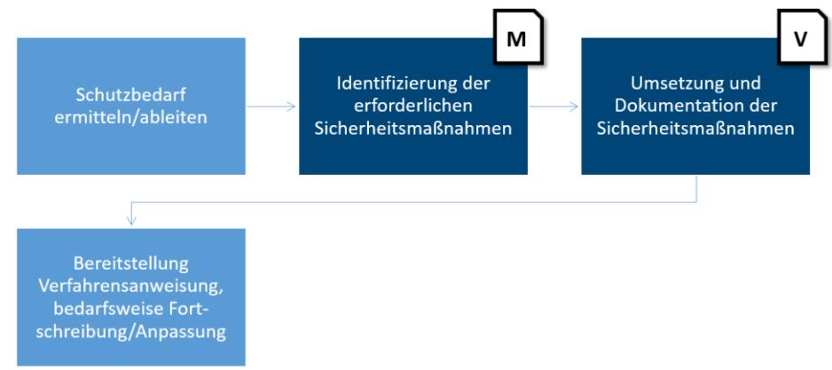

Abbildung 9: Überblick Bestimmung und Dokumentation Sicherheitsmaßnahmen

### 6.1 Grundsätzliche Herangehensweise

Auf Basis der Ergebnisse der Schutzbedarfsanalyse (Kapitel [4.4\)](#page-18-0) werden die notwendigen Sicherheitsmaßnahmen definiert. Die Auswahl erfolgt auf Basis des Modulkonzepts der TR RESISCAN. Demnach sind die im Basismodul angegebenen Maßnahmen grundsätzlich, unabhängig vom bestimmten Schutzbedarf anzuwenden. Sofern ein erhöhter Schutzbedarf, also "hoch" oder "sehr hoch" für die einzelnen Schutzziele (Integrität, Vertraulichkeit, Verfügbarkeit) besteht, sind zusätzlich die Maßnahmen aus dem Aufbaumodul zu betrachten.

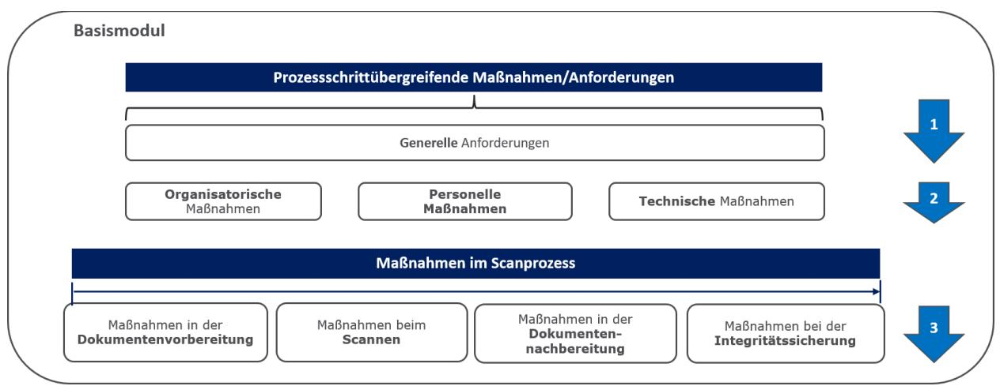

Abbildung 10: Basismodul

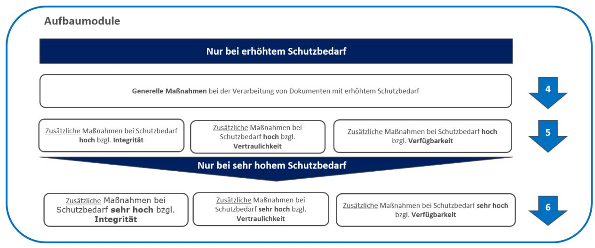

#### Abbildung 11: Aufbaumodul

Die Ausgestaltung der Maßnahmen orientiert sich unmittelbar am behördenspezifischen Scansystem sowie den konkreten organisatorischen, technischen und personellen Gegebenheiten der Behörde, also den typischen Fragen bei der Konzeption und der Umsetzung des Ersetzenden Scannens:

- Wo wird gescannt?
- Was wird gescannt?
- Wieviel wird gescannt?
- Wer scannt?
- Wie wird gescannt?
- Wann wird gescannt?

Für fachliche Details zum Scannen kann als zusätzliche Hilfestellung der "Baustein Scanprozess" aus dem Organisationskonzept elektronische Verwaltungsarbeit39 verwendet werden. Die behördenspezifische Ausgestaltung der Maßnahmen ist in einer geeigneten Verfahrensanweisung zu beschreiben, wobei im Rahmen des Leitfadens die au[s \[BSI-TR03138-V\]](#page-34-6) abgeleitete und für die Belange der Bundesbehörden angepasste Anlage V als Vorlage dienen kann. Damit wird zum einen die Vollständigkeit der Maßnahmen gewährleistet, zum anderen wird so ein ordnungsgemäßer Scanprozess für die Behörde definiert. Zur Qualitätssicherung ob auch alle relevanten Maßnahmen berücksichtigt wurden, bietet sich die Prüfung anhand der Anlage P der TR RESISCAN40 an.

## 6.2 Festlegung grundlegender Maßnahmen

Im ersten Schritt werden die grundlegenden, für alle Schritte im Scanprozess übergreifend geltenden organisatorischen, personellen und technischen Maßnahmen anhand der TR RESISCAN behördenspezifisch festgelegt und in der Verfahrensdokumentation beschrieben. Wie i[n Abbildung 3](#page-12-1) dargestellt, enthält die Verfahrensdokumentation ein Scankonzept und eine Verfahrensanweisung (siehe Anlage V), die näher auf die einzelnen Maßnahmen eingeht.

39 [OK-eVA-SP]

40 [\[BSI-TR03138-P\]](#page-34-4)

| Organisatorische                                                                                                                                                                                                                                                                                                                      | Personelle                                                                                                                                                                                                                                                                                  | Technische                                                                                                                                                                                                                                              |
|---------------------------------------------------------------------------------------------------------------------------------------------------------------------------------------------------------------------------------------------------------------------------------------------------------------------------------------|---------------------------------------------------------------------------------------------------------------------------------------------------------------------------------------------------------------------------------------------------------------------------------------------|---------------------------------------------------------------------------------------------------------------------------------------------------------------------------------------------------------------------------------------------------------|
| Maßnahmen                                                                                                                                                                                                                                                                                                                             | Maßnahmen                                                                                                                                                                                                                                                                                   | Maßnahmen                                                                                                                                                                                                                                               |
| 1. Verantwortlichkeiten, Abläufe, Aufgabenverteilung 2. Richtlinien für Wartung Pflege റ്റ് Abnahme- und Freigabeverfahren ব Periodische Prüfung der Wirksamkeit und Vollständigkeit der Sicherheitsmaßnahmen 5. Spezifika beim Outsourcing (Beschreibung Schnittstellen, Dienstleistersteuerung) | Sensibilisierung der Scanmitarbeiter für Informationssicherheit 2. Verpflichtung auf gesetzlichen Rahmenbedingungen 3. Schulung und Einweisung in Prozess und Technik র্ব Schulung zu Sicherheitsmaßnahmen 5. Spezielle Schulung für Administratoren | 1. Umsetzung technischer Sicherheitsmaßnahmen nach BSI- Grundschutz für Scansystem 2. Festlegung zulässiger Kommunikationsverbindungen 3. Schutz vor Schadprogrammen বা Sichere Speicherung nach dem Stand der Technik |

Abbildung 12: Grundlegende organisatorische, personelle und technische Maßnahmen

Hinsichtlich der in der Anforderungen AT.1 der TR RESISCAN geforderten grundlegenden technischen Sicherheitsmaßnahmen ist folgendes zu beachten. Diese ergeben sich aus den in der Strukturanalyse (siehe Abschnitt [4\)](#page-15-0) identifizierten IT-Systeme, Anwendungen, Netze und Kommunikationsbeziehungen des Scansystem der anwendenden Behörde.

Für die hierbei relevanten IT-Systeme, Anwendungen und Netze sind die einschlägigen Sicherheitsmaßnahmen aus dem Grundschutz-Kompendium [\[BSI-GSK\]](#page-33-4) zu berücksichtigen und umzusetzen. Bei dem exemplarischen Scansystem aus [Abbildung 5,](#page-16-1) wären dies beispielsweise die folgenden Bausteine:

|    | IT-Systeme, Netze   | Bausteine aus dem Grundschutz-Kompendium [BSI-GSK]       |
|----|---------------------|----------------------------------------------------------|
| ID | und Anwendungen     |                                                          |
| S1 | Scanner             | SYS.4.1 – Drucker, Kopierer und Multifunktionsgeräte     |
| S2 | Scan-Workstation    | Abhängig vom Betriebssystem sind möglicherweise folgende |
|    |                     | Bausteine zu berücksichtigen:                            |
|    |                     | SYS.2.1 – Allgemeiner Client                             |
|    |                     | SYS.2.2 – Windows-Clients                                |
|    |                     | SYS.2.2.2 – Windows 8.1                                  |
|    |                     | SYS.2.2.3 – Windows 10                                   |
|    |                     | SYS.2.3 – Client unter Unix                              |
|    |                     | SYS.2.4 – Client unter macOS                             |
| S3 | Qualitätssicherungs | Siehe S2.                                                |
|    | (QS)-Workstation    |                                                          |
| S4 | Scan-Server         | Abhängig vom Betriebssystem sind möglicherweise folgende |
|    |                     | Bausteine zu berücksichtigen:                            |
|    |                     | SYS.1.1 – Allgemeiner Server                             |
|    |                     | SYS.1.2 – Windows Server                                 |
|    |                     | SYS.1.2.2 – Windows Server 2012                          |
|    |                     | SYS.1.3 – Server unter Unix                              |
| S5 | Firewall            | NET.3.2 – Firewall                                       |
| S6 | Router              | NET.3.1 – Router und Switches                            |
| S7 | Proxyserver         | Siehe S2.                                                |
| S8 | Smartphone          | SYS.3.2.1 – Allgemeine Smartphones und Tablets           |
| Nx | Relevante Netze     | NET.1.1 – Netzarchitektur und -design                    |
|    |                     | NET.1.2 – Netzmanagement                                 |
| A1 | Scan-Software       | APP.3.1 – Webanwendungen                                 |
| A2 | QS-Software         | Siehe A1.                                                |
| A3 | Scan-Service        | APP.3.5 – Webservices                                    |
|    |                     | APP.4.3 – Relationale Datenbanksysteme                   |

| A4 | Apache         | APP.3.2 – Webserver                              |
|----|----------------|--------------------------------------------------|
| A5 | Scan-App       | APP.1.4 – Mobile Anwendungen (Apps)              |
| A6 | IS-Software    | CON 1 – Kryptokonzept                            |
|    |                | CON 4 – Auswahl und Einsatz von Standardsoftware |
|    |                | APP.3.1 – Webanwendungen                         |
| A7 | Index-Software | CON 4 – Auswahl und Einsatz von Standardsoftware |
|    |                | APP.3.1 – Webanwendungen                         |
|    |                | APP.4.3 – Relationale Datenbanksystem            |

**Tabelle 4: Bausteine aus dem Grundschutz-Kompendium des BSI für exemplarisches Scansystem**

### 6.3 Festlegung der Maßnahmen im Scanprozess

Grundlage der Ausgestaltung der Maßnahmen im Scanprozess ist der in der Behörde implementierte Scanprozess. Sofern die Behörde eine Zertifizierung nach TR-RESISCAN anstrebt, so ist zu beachten, dass nur die vier Kernschritte (Dokumentenvorbereitung, Scannen, Nachverarbeitung, Integritätssicherung) zertifizierungsrelevant sind. Gleichwohl muss ein valider Scanprozess auch die Schnittstellen zu vor- oder nachgelagerten Systemen und Prozessen betrachten und in der Verfahrensdokumentation beschreiben.

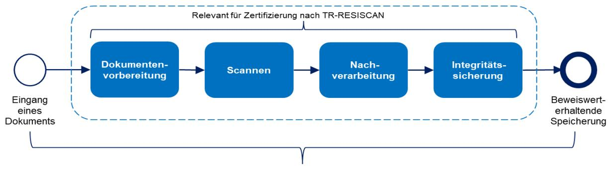

Abbildung 13: Fokus der Verfahrensdokumentation und Zertifizierung nach TR-RESISCAN

Die in der TR RESISCAN benannten Sicherheitsmaßnahmen werden, entsprechend des festgestellten Schutzbedarfs, in einer für die Behörde geeigneten Weise ausgestaltet und in der Verfahrensdokumentation beschrieben. Wie in [Abbildung 3](#page-12-1) dargestellt, umfasst die Verfahrensdokumentation im Regelfall das Scankonzept und die Verfahrensanweisung. Die Verfahrensanweisung in Anlage 3 wurde au[s \[BSI-TR03138-V\]](#page-34-6) abgeleitet und enthält eine beispielhafte Ausgestaltung von Sicherheitsmaßnahmen für Bundesbehörden und sollte als Leitfaden bei der Konzeption und Umsetzung des ersetzenden Scannen verwendet werden. Bei der Konzeption und Umsetzung der notwendigen Sicherheitsmaßnahmen, empfiehlt es sich, zunächst auf die Basismaßnahmen zu fokussieren und im nächsten Schritt diejenigen für erhöhten Schutzbedarf zu ergänzen.

[Abbildung](#page-29-2) 14 zeigt zur Veranschaulichung einen beispielhaften Überblick über typische Maßnahmen. Bei der behördenspezifischen Maßnahmendefinition sind alle relevanten Anforderungen der TR RESICAN zu betrachten.

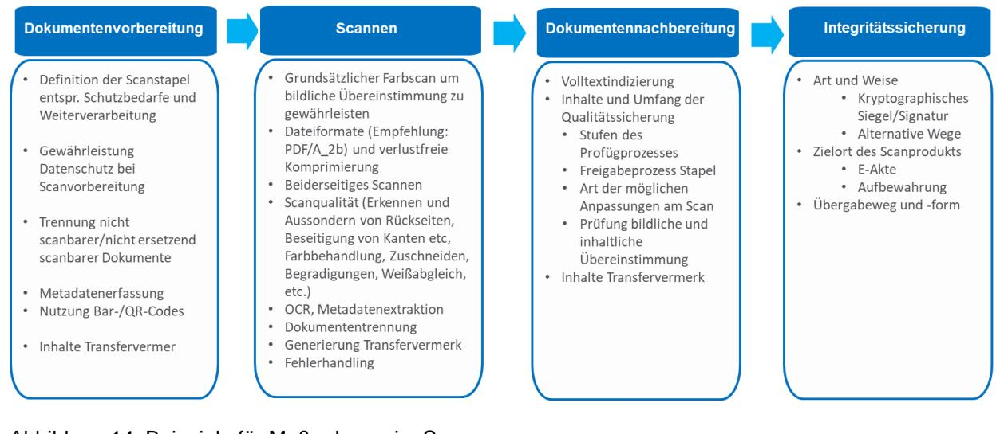

#### Abbildung 14: Beispiele für Maßnahmen im Scanprozess

Die zu treffenden Sicherheitsmaßnahmen orientieren sich naturgemäß an den konkreten behördenspezifischen Rahmenbedingungen. Der zuvor festgestellte Schutzbedarf für die drei Schutzziele Integrität, Verfügbarkeit und Vertraulichkeit ist dabei eine wichtige Kenngröße. Darüber hinaus gilt es mögliche Nachweispflichten oder auch praktische Erwägungen, wie z.B. die Integration des Scansystems in die sonstigen digitalen Prozesse der Behörde, einzubeziehen. So kann es allein aus Nachweisgründen, auch unabhängig vom konkreten Schutzbedarf, sinnvoll sein, kryptographische Sicherungsmittel wie z.B. (qualifizierte) elektronische Signaturen, Siegel oder Zeitstempel gemäß eIDAS-Verordnung zu verwenden, um damit einen höheren Beweiswert für das ersetzend gescannte Schriftgut zu erzielen. Da das (qualifizierte) elektronische Siegel auf einem Organisationszertifikat beruht, ist der Aufwand für Einführung und Nutzung der Technologie bei hohem Nutzwert sehr begrenzt. Gleichzeitig kann das (qualifizierte) elektronische Siegel für sichere und vollständig digitale Bescheide genutzt werden, sofern keine Schriftform besteht und auch dort, mit begrenztem Aufwand, ein hoher Beweiswert erzielt werden41. Auch sollte das Zusammenspiel mit den übrigen Systemen und Anwendungen mit denen das Scansystem in Verbindung steht in Betracht gezogen werden, so dass die Schnittstellen und Sicherheitsmaßnahmen gut aufeinander abgestimmt sind.

## 6.4 Dokumentation der Maßnahmen

Die behördenspezifische Ausgestaltung der Maßnahmen ist in einer geeigneten Verfahrensanweisung (vgl. Abschnitt [6.5\)](#page-29-1) zu beschreiben, wobei die au[s \[BSI-TR03138-V\]](#page-34-6) abgeleitete und für die Belange der Bundesbehörden angepasste Anlage V als Vorlage dienen kann. Damit wird zum einen die Vollständigkeit der Maßnahmen gewährleistet, zum anderen wird so ein ordnungsgemäßer Scanprozess für die Behörde definiert. Zur Qualitätssicherung ob auch alle relevanten Maßnahmen berücksichtigt wurden, bietet sich die Prüfung anhand der Anlage M an.

## 6.5 Verfahrensanweisung für den Scanprozess erstellen

Die Verfahrensanweisung dient für die am Scanprozess mitwirkenden Personen als eine vereinfachte Dokumentation der Vorgehensschritte und Maßnahmen, die für den behördlichen Scanprozess relevant sind. Hierbei werden die folgenden Aspekte betrachtet:

**1. Identifizierung und Ermittlung Informationen -** Alle für die Beschreibung der Durchführung des Scanprozesses innerhalb der Behörde erforderlichen organisatorischen, personellen und

41 Siehe auch [\[BITKOM\]](#page-33-6) un[d Literaturverzeichnis](#page-33-2)  [\[AHK19](#page-33-2)].

technischen Rahmenbedingungen müssen ermittelt oder - falls noch nicht vorhanden - geklärt und festgelegt werden. Die bisher im Rahmen des Leitfadens durchgeführten Analysen bilden hierfür eine zentrale Grundlage. Hierzu gehören auch die Informationen bzgl. der grundlegenden oder ggf. erweiterten Sicherungsmaßnahmen (vgl. Abschnitt [6\)](#page-25-0).

2. **Erstellung Dokumentation -** Die vorgegebene Inhaltsstruktur der Muster-Verfahrensanweisung (Anlage V) muss durch die jeweils behördenspezifischen ermittelten Angaben ergänzt werden. Zu Klärung der erforderlichen Informationen stehen in der Vorlage ergänzende Hinweise und erläuternde Hilfestellungen bereit.

Ziel ist es, den Scanprozess unter Aufrechterhaltung der Beweiskraft des Digitalisats einfach umsetzen und durchführen zu können. Dabei geben die organisatorischen Gegebenheiten, das Aufgabenspektrum und nicht zuletzt die IT-Ausstattung einen bestimmten Handlungsspielraum vor, der in der Verfahrensanweisung Berücksichtigung findet. Betrachtet werden hier primär die von der Behörde selbst durchgeführten Scanprozesse. Bei der Beauftragung externer Dienstleister müssen lt. TR RESISCAN zudem zusätzliche Anforderungen berücksichtigt werden.

Im Rahmen des vorliegenden Leitfadens wurde eine musterhafte Verfahrensanweisung für typische Scanszenarien in der Bundesverwaltung erstellt (vgl. Anlage V). Sie bietet eine Vorlage für eine effiziente Dokumentation von Maßnahmen und Verfahrensschritten, die für die behördeninternen Scanprozesse inkl. der Schritte zur Vernichtung der originären Papierbelege gelten. Die ausgefüllte Verfahrensbeschreibung kann dabei als initiale Dokumentation oder als Ergänzung zu bestehenden Dokumenten (z.B. Scankonzept, Handbücher für die Poststelle oder Vorgaben für die Posteingangsbearbeitung) verstanden werden.

# 7 Anlagen

- STR [Vorlage Strukturanalyse]
- D [Muster-Schutzbedarfsanalyse]
- S [Vorlage Schutzbedarfsanalyse]
- M [Vorlage Maßnahmenprüfliste]
- V [Vorlage Verfahrensanweisung]

# Verzeichnisse

# Tabellenverzeichnis

| Tabelle 1: Relevante Datenobjekte und Dokumenttypen im exemplarischen Scansystem19             |  |
|------------------------------------------------------------------------------------------------|--|
| Tabelle 2: Definition und Erläuterung der Sicherheitsziele22                                   |  |
| Tabelle 3: Definition der Schutzbedarfskategorien22                                            |  |
| Tabelle 4: Bausteine aus dem Grundschutz-Kompendium des BSI für exemplarisches Scansystem29 |  |

# Abbildungsverzeichnis

| Abbildung 1: Übersicht Aufbau Leitfaden 6                                                    |
|-------------------------------------------------------------------------------------------------|
| Abbildung 2: Zusammenwirken Bausteine der E-Verwaltung Fehler! Textmarke nicht definiert. |
| Abbildung 3: Vorgehensweise zur Einführung des Ersetzenden Scannens 13                       |
| Abbildung 4: Übersicht Durchführung Strukturanalyse 16                                       |
| Abbildung 5: Exemplarischer Netzplan eines Scansystems mit IT-Systemen und Anwendungen 17 |
| Abbildung 6: Netze und Kommunikationsbeziehungen im exemplarischen Scansystem 18             |
| Abbildung 7: Überblick Durchführung Schutzbedarfsanalyse 20                                  |
| Abbildung 8: Übersicht fachlich-inhaltliche Gruppierung von Dokumenttypen24                     |
| Abbildung 9: Überblick Bestimmung und Dokumentation Sicherheitsmaßnahmen 26                  |
| Abbildung 10: Basismodul 26                                                                  |
| Abbildung 11: Aufbaumodul 27                                                                 |
| Abbildung 12: Grundlegende organisatorische, personelle und technische Maßnahmen 28          |
| Abbildung 13: Fokus der Verfahrensdokumentation und Zertifizierung nach TR-RESISCAN29           |
| Abbildung 14: Beispiele für Maßnahmen im Scanprozess 30                                      |

## Literaturverzeichnis

| [AHK19]       | Jawad Ahmad, Detlef Hühnlein, Ulrike Korte: Sichere Digitalisierung mit TR RESISCAN und TR-ESOR - Auf dem Weg zur digitalen Bundesverwaltung, in Datenschutz und Datensicherheit, April 2019, Volume 43, Issue 4, pp 203– 208, Springer-Verlag, https://link.springer.com/article/10.1007/s11623-019- 1093-7                                               |
|---------------|------------------------------------------------------------------------------------------------------------------------------------------------------------------------------------------------------------------------------------------------------------------------------------------------------------------------------------------------------------------------|
| [BITKOM]      | BITKOM: eIDAS und der ECM-Markt – Elektronische Identifizierung und Vertrauensdienste als Chance für die Digitalisierung, 2019, https://www.bitkom.org/sites/default/files/2019- 06/190618_lf_ecm_eidas_web.pdf                                                                                                                                               |
| [BMI-BY]      | Bundesministerium des Innern, für Bau und Heimat: E-Government-Initiative für De-Mail und den Personalausweis, Beweiswerterhaltende Langzeitspeicherung von De-Mails in der Staatlichen Verwaltung des Freistaats Bayern, 2014, https://www.personalausweisportal.de/SharedDocs/Handreichungen/stmf_b ayern_grobkonzept_langzeitspeicherung_demail.html |
| [BMI-EGI]     | Bundesministerium des Innern, für Bau und Heimat: Abschlussdokumentation der E-Government-Initiative 2012-2014 – De-Mail, https://bit.ly/2CK2jCn                                                                                                                                                                                                                 |
| [BMI-MV]      | Bundesministerium des Innern, für Bau und Heimat: E-Government-Initiative für De-Mail und den Personalausweis, Veraktung und beweiswerterhaltende Langzeitspeicherung von De-Mails in einem DMS/VBS (Mecklenburg Vorpommern), 2013, https://www.personalausweisportal.de/SharedDocs/Handreichungen/sollko nzept.html                                    |
| [BSI-200-2]   | Bundesamt für Sicherheit in der Informationstechnik (BSI):BSI-Standard 200- 2: IT-Grundschutz-Methodik, https://www.bsi.bund.de/SharedDocs/Downloads/DE/BSI/Grundschutz/Kom pendium/standard_200_2.pdf?__blob=publicationFile&v=3                                                                                                                             |
| [BSI-GSK]     | Bundesamt für Sicherheit in der Informationstechnik (BSI): IT-Grundschutz Kompendium, https://www.bsi.bund.de/DE/Themen/ITGrundschutz/ITGrundschutzKompen dium/itgrundschutzKompendium_node.html                                                                                                                                                              |
| [BSI-TR03125] | Bundesamt für Sicherheit in der Informationstechnik (BSI): Beweiswerterhaltung kryptographisch signierter Dokumente (TR-ESOR), BSI TR-03125 https://www.bsi.bund.de/DE/Publikationen/TechnischeRichtlinien/tr03125/i ndex_htm.html                                                                                                                         |
| [BSI-TR03138] | Bundesamt für Sicherheit in der Informationstechnik (BSI): Ersetzendes Scannen (RESISCAN), BSI TR-03138                                                                                                                                                                                                                                                             |

[https://www.bsi.bund.de/DE/Publikationen/TechnischeRichtlinien/tr03138/i](https://www.bsi.bund.de/DE/Publikationen/TechnischeRichtlinien/tr03138/index_htm.html) [ndex\\_htm.html](https://www.bsi.bund.de/DE/Publikationen/TechnischeRichtlinien/tr03138/index_htm.html) [BSI-TR03138-A] Bundesamt für Sicherheit in der Informationstechnik (BSI): Ersetzendes Scannen – Anwendungshinweis A: Ergebnis der Risikoanalyse, BSI TR-03138- A, Version 1.2, 2018 [BSI-TR03138-F] Bundesamt für Sicherheit in der Informationstechnik (BSI): Ersetzendes Scannen – Anwendungshinweis F: Häufig gestellte Fragen, BSI TR-03138-F, Version 1.2, 2018 [BSI-TR03138-P] Bundesamt für Sicherheit in der Informationstechnik (BSI): Ersetzendes Scannen – Anwendungshinweis P: Prüfspezifikation, BSI TR-03138-P, Version 1.3, 2018 [BSI-TR03138-R] Bundesamt für Sicherheit in der Informationstechnik (BSI): Ersetzendes Scannen – Anwendungshinweis R: Unverbindliche rechtliche Hinweise, BSI TR-03138-R, Version 1.2, 2018 [BSI-TR03138-V] Bundesamt für Sicherheit in der Informationstechnik (BSI): Ersetzendes Scannen – Anwendungshinweis V: Exemplarische Verfahrensanweisung, BSI TR-03138-V, Version 1.2, 2018 [EGovG-MK] Bundesministerium des Innern, für Bau und Heimat (Referat O2): Minikommentar zum Gesetz zur Förderung der elektronischen Verwaltung sowie zur Änderung weiterer Vorschriften, [https://www.verwaltung](https://www.verwaltung-innovativ.de/SharedDocs/Publikationen/Artikel/Minikommenta_EGov_Gesetz.pdf?__blob=publicationFile&v=1)[innovativ.de/SharedDocs/Publikationen/Artikel/Minikommenta\\_EGov\\_Geset](https://www.verwaltung-innovativ.de/SharedDocs/Publikationen/Artikel/Minikommenta_EGov_Gesetz.pdf?__blob=publicationFile&v=1) [z.pdf?\\_\\_blob=publicationFile&v=1](https://www.verwaltung-innovativ.de/SharedDocs/Publikationen/Artikel/Minikommenta_EGov_Gesetz.pdf?__blob=publicationFile&v=1) [EGovG] Bundesministerium der Justiz und für Verbraucherschutz: Gesetz zur Förderung der elektronischen Verwaltung, <https://www.gesetze-im-internet.de/egovg/> [eIDAS-VO] Verordnung (EU) Nr. 910/2014 des Europäischen Parlaments und des Rates vom 23. Juli 2014 über elektronische Identifizierung und Vertrauensdienste für elektronische Transaktionen im Binnenmarkt und zur Aufhebung der Richtlinie 1999/93/EG, <http://data.europa.eu/eli/reg/2014/910/oj> [OK-eVA-EA] Bundesministerium des Innern: *Organisationskonzept elektronische Verwaltungsarbeit – Baustein E-Akte*, [https://www.verwaltung](https://www.verwaltung-innovativ.de/SharedDocs/Publikationen/Organisation/e_akte.pdf)[innovativ.de/SharedDocs/Publikationen/Organisation/e\\_akte.pdf](https://www.verwaltung-innovativ.de/SharedDocs/Publikationen/Organisation/e_akte.pdf) [OK-eVA-EP] Bundesministerium des Innern, für Bau und Heimat: *Organisationskonzept elektronische Verwaltungsarbeit – Baustein E-Poststelle, [https://www.verwaltung](https://www.verwaltung-innovativ.de/SharedDocs/Publikationen/Organisation/e_poststelle.pdf)[innovativ.de/SharedDocs/Publikationen/Organisation/e\\_poststelle.pdf](https://www.verwaltung-innovativ.de/SharedDocs/Publikationen/Organisation/e_poststelle.pdf)* [OK-eVA-LS] Bundesministerium des Innern, für Bau und Heimat: *Organisationskonzept elektronische Verwaltungsarbeit – E-Langzeitspeicherung*, https://www.verwaltunginnovativ.de/SharedDocs/Publikationen/Organisation/e\_langzeitspeicherung. pdf [OK-eVA-SP] Bundesministerium des Innern, für Bau und Heimat: *Organisationskonzept elektronische Verwaltungsarbeit – Baustein Scanprozess*, [https://www.verwaltung](https://www.verwaltung-innovativ.de/SharedDocs/Publikationen/Organisation/scanprozess.pdf)[innovativ.de/SharedDocs/Publikationen/Organisation/scanprozess.pdf](https://www.verwaltung-innovativ.de/SharedDocs/Publikationen/Organisation/scanprozess.pdf) [RegR] Bundesministerium des Innern, für Bau und Heimat: Richtlinie für das Bearbeiten und Verwalten von Schriftgut (Akten und Dokumenten) in Bundesministerien (RegR), [https://www.bmi.bund.de/SharedDocs/downloads/DE/veroeffentlichungen/](https://www.bmi.bund.de/SharedDocs/downloads/DE/veroeffentlichungen/themen/ministerium/registraturrichtlinie.pdf)

[themen/ministerium/registraturrichtlinie.pdf](https://www.bmi.bund.de/SharedDocs/downloads/DE/veroeffentlichungen/themen/ministerium/registraturrichtlinie.pdf)

| [SBF-Justiz] | Bund-Länder-Kommission für Informationstechnik in der Justiz:                  |
|--------------|--------------------------------------------------------------------------------|
|              | Schutzbedarfsfeststellung für das ersetzende Scannen in justiziellen Verfahren |
|              | auf der Grundlage der TR Resiscan, Version 1.0, 04.11.2015,                    |
|              | https://www.bsi.bund.de/SharedDocs/Downloads/DE/BSI/Publikationen/Tec          |
|              | hnischeRichtlinien/TR03138/Praxis_Schutzbed_BLK/Schutzbed_Justiziellen_V       |
|              | erfahren.html                                                                  |
| [SGHJ12]     | A. Schumacher, O. Grigorjew, D. Hühnlein, S. Jandt: Die Entwicklung der BSI    |
|              | Richtlinie für das rechtssichere ersetzende Scannen, Gemeinsame Fachtagung     |
|              | Verwaltungsinformatik (FTVI) und Fachtagung Rechtsinformatik (FTRI) 2012,      |
|              | LNI 197, 2012, https://www.ecsec.de/fileadmin/Ecsec                            |
|              | files/pub//2012_FTVI.pdf                                                       |
| [ZPO]        | Bundesministerium der Justiz und für Verbraucherschutz:                        |
|              | Zivilprozessordnung,                                                           |
|              | https://www.gesetze-im-internet.de/zpo/BJNR005330950.html                      |
|              |                                                                                |

## **Impressum**

#### **Herausgeber**

Der Beauftragte der Bundesregierung für Informationstechnik, 10557 Berlin

#### **Ansprechpartner**

Programm Dienstekonsolidierung Postanschrift: Alt-Moabit 140, 10557 Berlin Hausanschrift: Englische Str. 30, 10587 Berlin Referatspostfach: [DGII1@bmi.bund.de](mailto:DGII1@bmi.bund.de) Internet[: www.cio.bund.de](http://www.cio.bund.de/)

#### **Stand** 27.04.2020

**Bildnachweis**

James Brey/GettyImages

Die Publikation wird kostenlos abgegeben und ist nicht zum Verkauf bestimmt.

Sie darf weder von Parteien noch von Wahlwerbern oder Wahlhelfern während eines Wahlkampfes zum Zwecke der Wahlwerbung verwendet werden.

Dies gilt für Bundestags-, Landtags- und Kommunalwahlen sowie für Wahlen zum Europäischen Parlament. Nachdruck, auch auszugsweise, ist genehmigungspflichtig.

