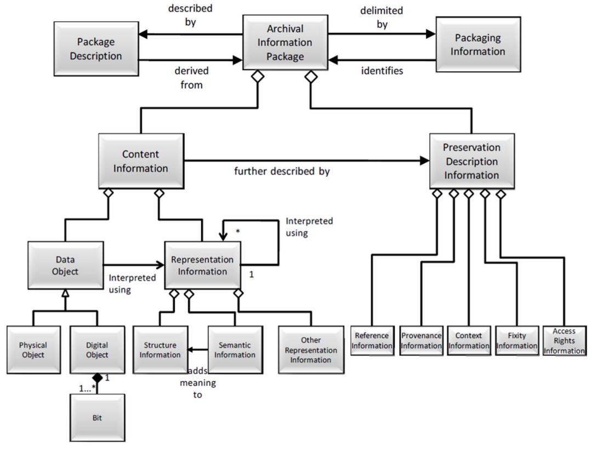
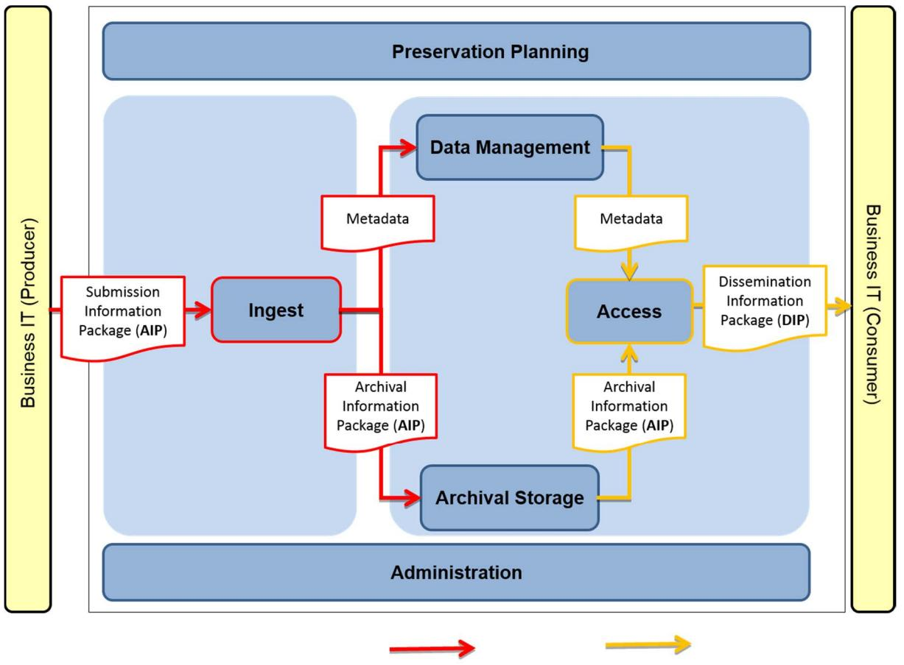
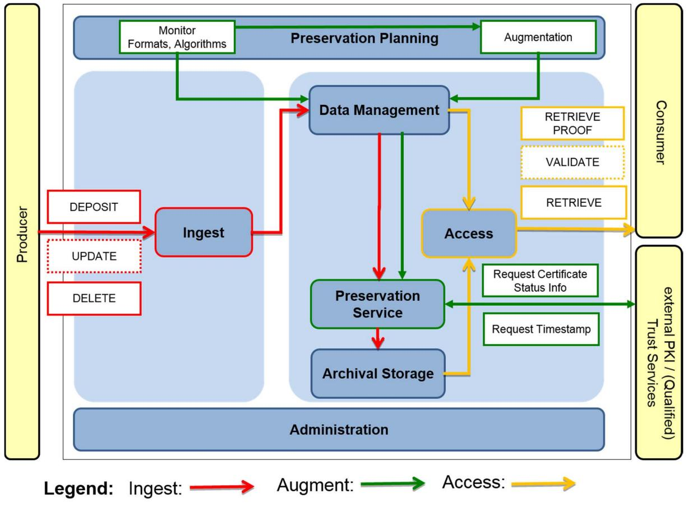
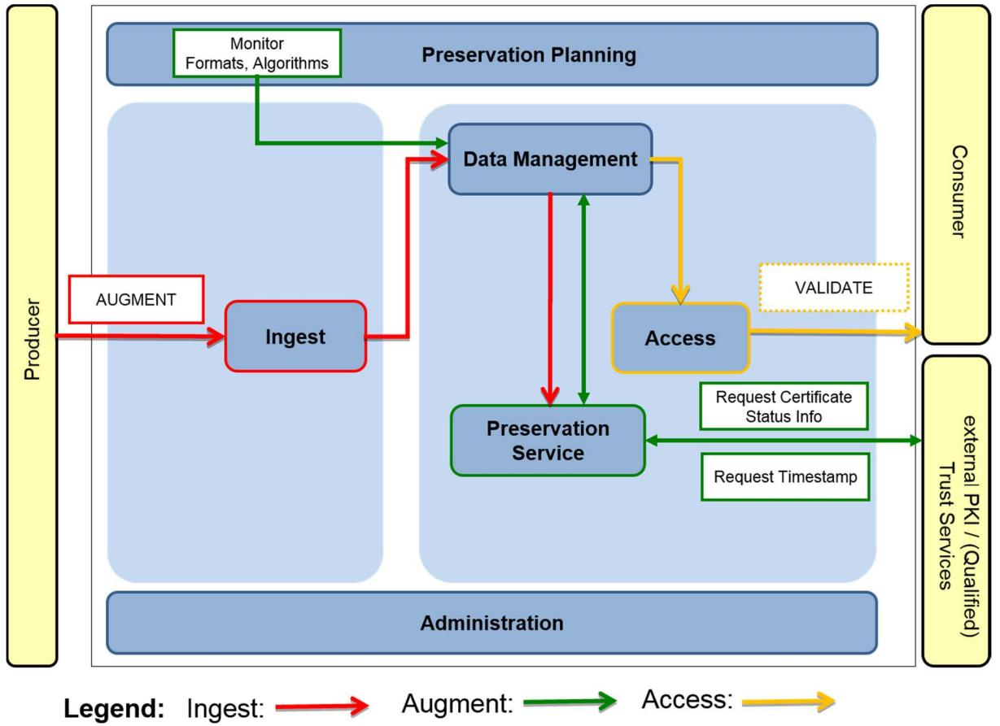
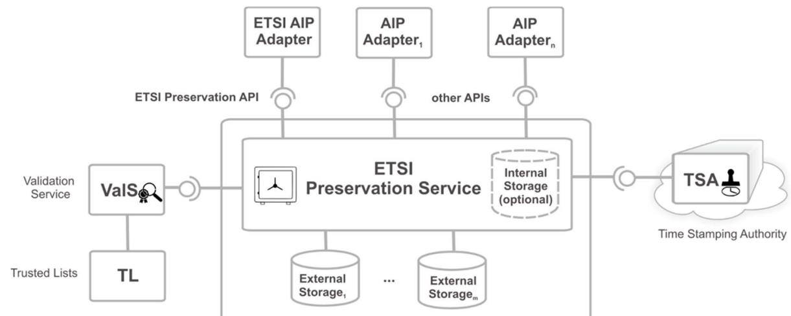
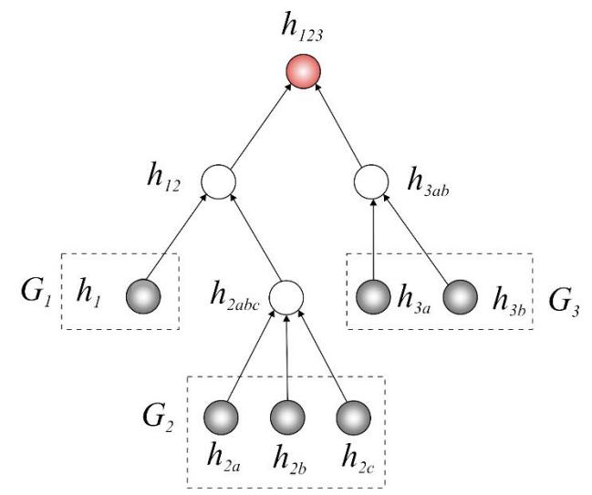
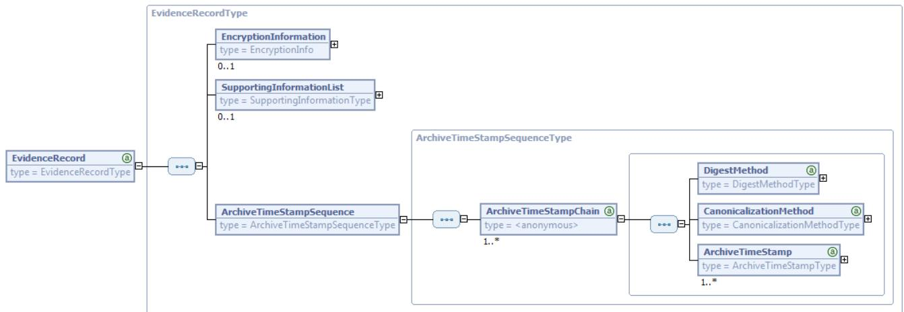
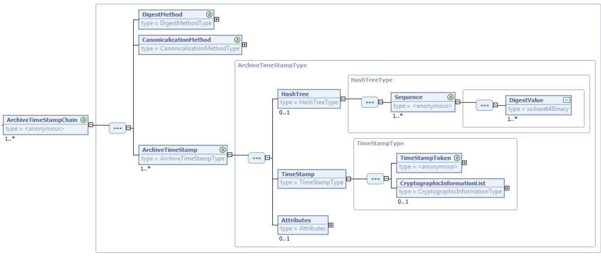
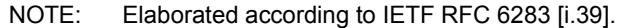

# ETSI SR 019 510 V1.1.1 (2017-05)


**Electronic Signatures and Infrastructures (ESI); Scoping study and framework for standardization of long-term data preservation services, including preservation of/with digital signatures** 

Reference DSR/ESI-0019510

Keywords

 electronic preservation, electronic signature, security, trusted services

#### *ETSI*

#### 650 Route des Lucioles F-06921 Sophia Antipolis Cedex - FRANCE

Tel.: +33 4 92 94 42 00 Fax: +33 4 93 65 47 16

Siret N° 348 623 562 00017 - NAF 742 C Association à but non lucratif enregistrée à la Sous-Préfecture de Grasse (06) N° 7803/88

#### *Important notice*

The present document can be downloaded from: <http://www.etsi.org/standards-search>

The present document may be made available in electronic versions and/or in print. The content of any electronic and/or print versions of the present document shall not be modified without the prior written authorization of ETSI. In case of any existing or perceived difference in contents between such versions and/or in print, the only prevailing document is the print of the Portable Document Format (PDF) version kept on a specific network drive within ETSI Secretariat.

Users of the present document should be aware that the document may be subject to revision or change of status. Information on the current status of this and other ETSI documents is available at <https://portal.etsi.org/TB/ETSIDeliverableStatus.aspx>

If you find errors in the present document, please send your comment to one of the following services: <https://portal.etsi.org/People/CommiteeSupportStaff.aspx>

#### *Copyright Notification*

No part may be reproduced or utilized in any form or by any means, electronic or mechanical, including photocopying and microfilm except as authorized by written permission of ETSI. The content of the PDF version shall not be modified without the written authorization of ETSI.

The copyright and the foregoing restriction extend to reproduction in all media.

© European Telecommunications Standards Institute 2017. All rights reserved.

**DECT**TM, **PLUGTESTS**TM, **UMTS**TM and the ETSI logo are Trade Marks of ETSI registered for the benefit of its Members. **3GPP**TM and **LTE**™ are Trade Marks of ETSI registered for the benefit of its Members and of the 3GPP Organizational Partners.

**oneM2M** logo is protected for the benefit of its Members

**GSM**® and the GSM logo are Trade Marks registered and owned by the GSM Association.

|                                                                                    | Intellectual Property Rights  6                                                                                  |  |  |  |  |
|------------------------------------------------------------------------------------|------------------------------------------------------------------------------------------------------------------|--|--|--|--|
|                                                                                    | Foreword  6                                                                                                      |  |  |  |  |
|                                                                                    | Modal verbs terminology  6                                                                                       |  |  |  |  |
|                                                                                    | Introduction  6                                                                                                  |  |  |  |  |
| 1                                                                                  | Scope  8                                                                                                         |  |  |  |  |
| 2                                                                                  | References  8                                                                                                    |  |  |  |  |
| 2.1<br>2.2                                                                         | Normative references  8<br>Informative references  8                                                             |  |  |  |  |
| 3                                                                                  | Definitions and abbreviations  13                                                                                |  |  |  |  |
| 3.1                                                                                | Definitions  13                                                                                                  |  |  |  |  |
| 3.2                                                                                | Abbreviations  15                                                                                                |  |  |  |  |
| 4                                                                                  | Basic models for long-term data preservation services  15                                                        |  |  |  |  |
| 4.1                                                                                | General terms  15                                                                                                |  |  |  |  |
| 4.2                                                                                | Preservation with storage  17                                                                                    |  |  |  |  |
| 4.3                                                                                | Preservation without storage  18<br>Validation  18                                                               |  |  |  |  |
| 4.4                                                                                | Elements to be considered in preservation, monitoring  19                                                        |  |  |  |  |
| 4.5                                                                                | Monitoring the strength of hash functions and cryptographic algorithms  19                                       |  |  |  |  |
| 4.5.1                                                                              | Monitoring the revocation status of certificates  20                                                             |  |  |  |  |
| 4.5.2                                                                              | Consideration of different policies  20                                                                          |  |  |  |  |
| 4.6<br>4.6.1                                                                       | Signature creation policy  20                                                                                    |  |  |  |  |
| 4.6.2                                                                              | Signature augmentation policy  21                                                                                |  |  |  |  |
| 4.6.3                                                                              | Signature validation policy  21                                                                                  |  |  |  |  |
| 4.7                                                                                | Basic preservation techniques  21                                                                                |  |  |  |  |
| 4.7.1                                                                              | Time-stamps  21                                                                                                  |  |  |  |  |
| 4.7.2                                                                              | AdES digital signatures  21                                                                                      |  |  |  |  |
| 4.7.3                                                                              | ERS  22                                                                                                          |  |  |  |  |
| 4.7.4                                                                              | Other techniques  22                                                                                             |  |  |  |  |
| 4.7.5                                                                              | Advantages and disadvantages of the different methods  22                                                        |  |  |  |  |
| 4.8                                                                                | (Long-term) Preservation Policy (LTPP)  23                                                                       |  |  |  |  |
| 5                                                                                  | Examples of different preservation schemes  24                                                                   |  |  |  |  |
| 5.1                                                                                | Long-term preservation of POC via Evidence Records without storage  24                                           |  |  |  |  |
| 5.2                                                                                | Long-term preservation of POC via Evidence Records with storage  24                                              |  |  |  |  |
| 5.3                                                                                | Long-term preservation of AdES digital signatures using augmentation of the signature without storage  25        |  |  |  |  |
| 5.4                                                                                | Long-term preservation of AdES digital signatures using augmentation of the signature with storage  25           |  |  |  |  |
| 5.4.1                                                                              | General approach  25                                                                                             |  |  |  |  |
| 5.4.2                                                                              | Special case using time-stamps with a long lifespan  26                                                          |  |  |  |  |
| 5.5                                                                                | Long-term AdES preservation with storage based on a validation report  26                                        |  |  |  |  |
| 5.6                                                                                | Qualified electronic signature/seal relying on long-term availability of validation data  26                     |  |  |  |  |
| 6                                                                                  | Proposal of framework of standards for data preservation  27                                                     |  |  |  |  |
| 6.1                                                                                | General  27                                                                                                      |  |  |  |  |
| 6.2                                                                                | Policy & security requirements for trust service providers providing long-term data preservation<br>services  27 |  |  |  |  |
| 6.3                                                                                | Protocols for trust service providers providing long-term data preservation services  28                         |  |  |  |  |
| 6.4                                                                                | Protection profiles for devices supporting data preservation service  28                                         |  |  |  |  |
| 6.5                                                                                | Relation to other standards  29                                                                                  |  |  |  |  |
| 6.6                                                                                | Updates of current standards  29                                                                                 |  |  |  |  |
| Relationships between ETSI preservation services and OAIS archives  30<br>Annex A: |                                                                                                                  |  |  |  |  |
| A.1                                                                                | Introduction  30                                                                                                 |  |  |  |  |
| A.2                                                                                | Open Archival Information System (OAIS) 30                                                                       |  |  |  |  |
|                                                                                    |                                                                                                                  |  |  |  |  |

| A.2.0                               | General  30                                                                                             |  |  |
|-------------------------------------|---------------------------------------------------------------------------------------------------------|--|--|
| A.2.1                               | OAIS Environment  30                                                                                    |  |  |
| OAIS Information Model  30<br>A.2.2 |                                                                                                         |  |  |
| A.2.3                               | OAIS Function Model  31                                                                                 |  |  |
| A.3                                 | Relationship between the functions of the ETSI Preservation Scheme and the OAIS Functional<br>Model  32 |  |  |
| A.4                                 | Relationship between the OAIS Information Package and the ETSI Preservation Information<br>Package  34  |  |  |
|                                     |                                                                                                         |  |  |
| Annex B:                            | Catalogue of existing standards  38                                                                     |  |  |
| B.1                                 | Introduction  38                                                                                        |  |  |
| B.2                                 | International and European standards  38                                                                |  |  |
| B.2.1                               | ISO  38                                                                                                 |  |  |
| B.2.1.1                             | ISO 14533-1:2014  38                                                                                    |  |  |
| B.2.1.2                             | ISO 14533-2:2012  38                                                                                    |  |  |
| B.2.1.3                             | ISO 14641-1:2012  38                                                                                    |  |  |
| B.2.1.4                             | ISO/IEC 27040:2015  39                                                                                  |  |  |
| B.2.1.5                             | Other standards from ISO/IEC 27000 family related to preservation  39                                   |  |  |
| B.2.1.6                             | ISO 14721:2012  40                                                                                      |  |  |
| B.2.1.7                             | ISO 15489-1:2016  40                                                                                    |  |  |
| B.2.1.8                             | ISO/TR 15489-2:2001  41                                                                                 |  |  |
| B.2.1.9                             | ISO/TR 15801:2009  41                                                                                   |  |  |
| B.2.1.10                            | ISO/TR 17068:2012  41                                                                                   |  |  |
| B.2.1.11                            | ISO 19005  42                                                                                           |  |  |
| B.2.1.12                            | ISO 23081-1:2006  42                                                                                    |  |  |
| B.2.1.13                            | ISO 23081-2:2009  42                                                                                    |  |  |
| B.2.1.14                            | Other ISO standards with relevance for preservation  43                                                 |  |  |
| B.2.2                               | IETF  43                                                                                                |  |  |
| B.2.2.1                             | IETF RFC 4810  43                                                                                       |  |  |
| B.2.2.2                             | IETF RFC 4998  43                                                                                       |  |  |
| B.2.2.3                             | IETF RFC 6283  43                                                                                       |  |  |
| B.2.3                               | ETSI  44                                                                                                |  |  |
| B.2.3.1                             | ETSI EN 319 122-1  44                                                                                   |  |  |
| B.2.3.2                             | ETSI EN 319 122-2  44                                                                                   |  |  |
| B.2.3.3                             | ETSI EN 319 132-1  45                                                                                   |  |  |
| B.2.3.4                             | ETSI EN 319 132-2  45                                                                                   |  |  |
| B.2.3.5                             | ETSI EN 319 142-1  46                                                                                   |  |  |
| B.2.3.6                             | ETSI EN 319 142-2  46                                                                                   |  |  |
| B.2.3.7                             | ETSI EN 319 162-1  46                                                                                   |  |  |
| B.2.3.8                             | ETSI EN 319 162-2  47                                                                                   |  |  |
| B.2.3.9                             | ETSI TS 101 533-1 (V1.3.1) 47                                                                           |  |  |
| B.2.3.10                            | ETSI TR 101 533-2 (V1.3.1)  47                                                                          |  |  |
| B.2.3.11                            | ETSI TS 102 573 (V2.1.1)  48                                                                            |  |  |
| B.3                                 | EU Member States national standards  48                                                                 |  |  |
| B.3.1                               | France  48                                                                                              |  |  |
| B.3.1.1                             | (FR) AFNOR NF Z 42-020: Digital Vault Component  48                                                     |  |  |
| B.3.2                               | Germany  49                                                                                             |  |  |
| B.3.2.1                             | (EN) BSI TR-03125 (v1.2)  49                                                                            |  |  |
| B.3.2.2                             | (EN) BSI-CC-PP-0049-2014  50                                                                            |  |  |
| Annex C:                            | Introduction to the Evidence Record Syntax (ERS)  51                                                    |  |  |
| C.1                                 | ASN.1 Evidence Record Syntax  51                                                                        |  |  |
| C.2                                 | Extensible Markup Language Evidence Record Syntax (XMLERS)  52                                          |  |  |
| C.3                                 | Augmentation of Evidence Records  54                                                                    |  |  |

| Annex D: | Bibliography  56 |
|----------|------------------|
|          | History  57      |

# <span id="page-5-0"></span>Intellectual Property Rights

IPRs essential or potentially essential to the present document may have been declared to ETSI. The information pertaining to these essential IPRs, if any, is publicly available for **ETSI members and non-members**, and can be found in ETSI SR 000 314: *"Intellectual Property Rights (IPRs); Essential, or potentially Essential, IPRs notified to ETSI in respect of ETSI standards"*, which is available from the ETSI Secretariat. Latest updates are available on the ETSI Web server (<https://ipr.etsi.org/>).

Pursuant to the ETSI IPR Policy, no investigation, including IPR searches, has been carried out by ETSI. No guarantee can be given as to the existence of other IPRs not referenced in ETSI SR 000 314 (or the updates on the ETSI Web server) which are, or may be, or may become, essential to the present document.

The standard (or standards) extracts (ISO 14721:2012: "Space data and information transfer systems -- Open archival information system (OAIS) -- Reference model", ISO 14533-1:2014: "Processes, data elements and documents in commerce, industry and administration -- Long term signature profiles -- Part 1: Long term signature profiles for CMS Advanced Electronic Signatures (CAdES)", ISO 14533-2:2012: "Processes, data elements and documents in commerce, industry and administration -- Long term signature profiles -- Part 2: Long term signature profiles for XML Advanced Electronic Signatures (XAdES)") are replicated with AFNOR's consent. Only the complete and original text as released by AFNOR Editions - accessible on the website [www.boutique.afnor.org](http://www.boutique.afnor.org/) - has normative value.

### Foreword

This Special Report (SR) has been produced by ETSI Technical Committee Electronic Signatures and Infrastructures (ESI).

### Modal verbs terminology

In the present document "**should**", "**should not**", "**may**", "**need not**", "**will**", "**will not**", "**can**" and "**cannot**" are to be interpreted as described in clause 3.2 of the [ETSI Drafting Rules](https://portal.etsi.org/Services/editHelp!/Howtostart/ETSIDraftingRules.aspx) (Verbal forms for the expression of provisions).

"**must**" and "**must not**" are **NOT** allowed in ETSI deliverables except when used in direct citation.

# Introduction

On the one hand, digital signatures as well as time-stamps based on cryptographic mechanisms are increasingly used in our everyday life.

On the other hand it is well known, that the strength and suitability of cryptographic mechanisms is a function of time and one needs to apply suitable preservation mechanisms, which are able to maintain the validity status of a signed object over long periods of time, which may involve the application of different storage technologies and cryptographic algorithms.

The need for long-term preservation is acknowledged amongst others in the Regulation (EU) No 910/2014 of the European Parliament and of the Council of 23 July 2014 on electronic identification and trust services for electronic transactions in the internal market [\[i.1](#page-8-0)], as can be seen in recital (61):

"*This Regulation should ensure the long-term preservation of information, in order to ensure the legal validity of electronic signatures and electronic seals over extended periods of time and guarantee that they can be validated irrespective of future technological changes."*

Furthermore Article 34 of the Regulation (EU) No 910/2014 [\[i.1](#page-8-0)] states that "*a qualified preservation service for qualified electronic signatures may only be provided by a qualified trust service provider that uses procedures and technologies capable of extending the trustworthiness of the qualified electronic signature beyond the technological validity period*" and that "*the Commission may, by means of implementing acts, establish reference numbers of standards for the qualified preservation service for qualified electronic signatures.*"

The present document provides an overview of preservation mechanisms which can be used to preserve the validity status of digital signatures or to preserve objects using digital signature techniques. It may be used to support all kinds of preservation services including for example qualified preservation service for qualified electronic signatures according to Article 34 of the Regulation (EU) No 910/2014 [\[i.1](#page-8-0)], and mutatis mutandis for qualified preservation service for qualified electronic seals according to Article 40 of this regulation.

### <span id="page-7-0"></span>1 Scope

The present document provides a scoping study for long-term data preservation (including preservation of/with digital signatures).

The present document aims at supporting preservation services in different regulatory frameworks.

- NOTE 1: Specifically, but not exclusively, the preservation service addressed in the present document aims at supporting qualified preservation service for qualified electronic signatures or seals as per Regulation (EU) No 910/2014 [\[i.1](#page-8-0)].
- NOTE 2: Specifically, but not exclusively, digital signatures in the present document cover electronic signatures, advanced electronic signatures, qualified electronic signatures, electronic seals, advanced electronic seals, and qualified electronic seals as per Regulation (EU) No 910/2014 [\[i.1](#page-8-0)].

The present document covers two main cases:

- 1) The preservation of the **validity status** of the **digital signatures** (using time-stamps, Evidence Records, etc.) and of the associated signed data
- NOTE 3: A qualified preservation service for qualified electronic signatures or seals as per Regulation (EU) No 910/2014 [\[i.1\]](#page-8-0) for which the status of the technical validity needs to be preserved, is covered in this case. This special report cannot say anything about the legal validity of a signature.
- NOTE 4: The validity of a signature means the status of the signature that will not change over time, e.g. if a signature was valid (TOTAL\_PASSED according to ETSI EN 319 102-1 [\[i.9](#page-8-0)]) or invalid (TOTAL\_FAILED and in certain cases for INDETERMINATE according to ETSI EN 319 102-1 [\[i.9](#page-8-0)]). The long-term preservation of the validity status includes the preservation of the bits of:
	- the documents being signed; and/or
	- other digital objects like certificates, OCSPs, Time-Stamp Tokens, etc.
- 2) Preservation of the integrity of bits of digital objects, whether they are signed or not, **using digital signature techniques** (digital signatures, time-stamp tokens, Evidence Records, etc.)
- NOTE 5: In this case, if the main object to be preserved is a signature, it is treated in the same way as any other file.
- NOTE 6: The preservation of the integrity of bits of digital object not using digital signature techniques is not in the scope of the present document.

In addition, the present document provides an inventory of existing standards and selected legal frameworks on the topic of preservation services.

The present document provides as well a proposal for a framework of standards.

### 2 References

### 2.1 Normative references

Normative references are not applicable in the present document.

### 2.2 Informative references

References are either specific (identified by date of publication and/or edition number or version number) or non-specific. For specific references, only the cited version applies. For non-specific references, the latest version of the referenced document (including any amendments) applies.

NOTE: While any hyperlinks included in this clause were valid at the time of publication, ETSI cannot guarantee their long-term validity.

<span id="page-8-0"></span>

| [i.1]  | Regulation (EU) No 910/2014 of the European Parliament and of the Council of 23 July 2014 on<br>electronic identification and trust services for electronic transactions in the internal market and<br>repealing Directive 1999/93/EC. OJ L 257, 28.8.2014, p. 73-114. |
|--------|------------------------------------------------------------------------------------------------------------------------------------------------------------------------------------------------------------------------------------------------------------------------|
| [i.2]  | ETSI TS 101 533-1: "Electronic Signatures and Infrastructures (ESI); Data Preservation Systems<br>Security; Part 1: Requirements for Implementation and Management".                                                                                                   |
| [i.3]  | ETSI TR 101 533-2: "Electronic Signatures and Infrastructures (ESI); Data Preservation Systems<br>Security; Part 2: Guidelines for Assessors".                                                                                                                         |
| [i.4]  | ETSI TS 101 733 (V2.2.1): "Electronic Signatures and Infrastructures (ESI); CMS Advanced<br>Electronic Signatures (CAdES)".                                                                                                                                            |
| [i.5]  | ETSI TS 101 903: "Electronic Signatures and Infrastructures (ESI); XML Advanced Electronic<br>Signatures (XAdES)".                                                                                                                                                     |
| [i.6]  | ETSI TS 102 573: "Electronic Signatures and Infrastructures (ESI); Policy requirements for trust<br>service providers signing and/or storing data objects".                                                                                                            |
| [i.7]  | ETSI TR 119 001: "Electronic Signatures and Infrastructures (ESI); The framework for<br>standardization of signatures; Definitions and abbreviations".                                                                                                                 |
| [i.8]  | ETSI TS 119 312: "Electronic Signatures and Infrastructures (ESI); Cryptographic Suites".                                                                                                                                                                              |
| [i.9]  | ETSI EN 319 102-1: "Electronic Signatures and Infrastructures (ESI); Procedures for Creation and<br>Validation of AdES Digital Signatures; Part 1: Creation and Validation".                                                                                           |
| [i.10] | ETSI EN 319 122-1: "Electronic Signatures and Infrastructures (ESI); CAdES digital signatures;<br>Part 1: Building blocks and CAdES baseline signatures".                                                                                                              |
| [i.11] | ETSI EN 319 122-2: "Electronic Signatures and Infrastructures (ESI); CAdES digital signatures;<br>Part 2: Extended CAdES signatures".                                                                                                                                  |
| [i.12] | ETSI TS 119 122-3: "Electronic Signatures and Infrastructures (ESI); CAdES digital signatures;<br>Part 3: Incorporation of Evidence Record Syntax (ERS) mechanisms in CAdES".                                                                                          |
| [i.13] | ETSI EN 319 132-1: "Electronic Signatures and Infrastructures (ESI); XAdES digital signatures;<br>Part 1: Building blocks and XAdES baseline signatures".                                                                                                              |
| [i.14] | ETSI EN 319 132-2: "Electronic Signatures and Infrastructures (ESI); XAdES digital signatures;<br>Part 2: Extended XAdES signatures".                                                                                                                                  |
| [i.15] | ETSI EN 319 142-1: "Electronic Signatures and Infrastructures (ESI); PAdES digital signatures;<br>Part 1: Building blocks and PAdES baseline signatures".                                                                                                              |
| [i.16] | ETSI EN 319 142-2: "Electronic Signatures and Infrastructures (ESI); PAdES digital signatures;<br>Part 2: Additional PAdES signatures profiles".                                                                                                                       |
| [i.17] | ETSI EN 319 162-1: "Electronic Signatures and Infrastructures (ESI); Associated Signature<br>Containers (ASiC); Part 1: Building blocks and ASiC Baseline containers".                                                                                                 |
| [i.18] | ETSI EN 319 162-2: "Electronic Signatures and Infrastructures (ESI); Associated Signature<br>Containers (ASiC); Part 2: Additional ASiC containers".                                                                                                                   |
| [i.19] | ETSI TS 119 172-1: "Electronic Signatures and Infrastructures (ESI); Signature policies;<br>Part 1: Building blocks and table of contents for human readable signature policy documents".                                                                              |
| [i.20] | ETSI TS 119 172-4: "Electronic Signatures and Infrastructures (ESI); Signature policies;<br>Part 4: Signature validation policy for European qualified electronic signatures/seals using trusted<br>lists".                                                            |
| [i.21] | ETSI EN 319 401: "Electronic Signatures and Infrastructures (ESI); General Policy Requirements<br>for Trust Service Providers".                                                                                                                                        |

- <span id="page-9-0"></span>[i.22] ETSI EN 319 403: "Electronic Signatures and Infrastructures (ESI); Trust Service Provider Conformity Assessment - Requirements for conformity assessment bodies assessing Trust Service Providers".
- [i.23] ISO 13527 (2010): "Space data and information transfer systems -- XML formatted data unit (XFDU) structure and construction rules".
- [i.24] ISO 14533-1 (2014): "Processes, data elements and documents in commerce, industry and administration -- Long term signature profiles -- Part 1: Long term signature profiles for CMS Advanced Electronic Signatures (CAdES)".
- [i.25] ISO 14533-2 (2012): "Processes, data elements and documents in commerce, industry and administration -- Long term signature profiles -- Part 2: Long term signature profiles for XML Advanced Electronic Signatures (XAdES)".
- [i.26] ISO 14721 (2012): "Space data and information transfer systems -- Open archival information system (OAIS) -- Reference model".
- [i.27] ISO 15489-1 (2001): "Information and documentation -- Records management -- Part 1: General".
- [i.28] ISO 19005-3 (2012): "Document management Electronic document file format for long-term preservation - Part 3: Use of ISO 32000-1 with support for embedded files (PDF/A-3)".
- [i.29] ISO/IEC 21320-1 (2015): "Information technology -- Document Container File -- Part 1: Core".
- [i.30] ISO/IEC 27000 (2016): "Information technology -- Security techniques -- Information security management systems -- Overview and vocabulary".
- [i.31] ISO/IEC 27040 (2015): "Information technology -- Security techniques -- Storage security".
- [i.32] IETF RFC 3126: "Electronic Signature Formats for long term electronic signatures".
- [i.33] IETF RFC 3161: "Internet X.509 Public Key Infrastructure Time-Stamp Protocol (TSP)".
- [i.34] IETF RFC 4810: "Long-Term Archive Service Requirements".
- [i.35] IETF RFC 4998: "Evidence Record Syntax (ERS)".
- [i.36] IETF RFC 5280: "Internet X.509 Public Key Infrastructure Certificate and Certificate Revocation List (CRL) Profile".
- [i.37] IETF RFC 5698: "Data Structure for the Security Suitability of Cryptographic Algorithms (DSSC)".
- [i.38] IETF RFC 5816: "ESSCertIDv2 Update for RFC 3161".
- [i.39] IETF RFC 6283 (2011): "Extensible Markup Language Evidence Record Syntax (XMLERS)".
- [i.40] IETF RFC 6838: "Media Type Specifications and Registration Procedures".
- [i.41] IETF RFC 6960: "X.509 Internet Public Key Infrastructure Online Certificate Status Protocol OCSP".
- [i.42] AFNOR NF Z40-020: "Spécifications fonctionnelles d'un composant Coffre-Fort Numérique destiné à la conservation d'informations numériques dans des conditions de nature à en garantir leur intégrité dans le temps", 2012.
- [i.43] BSI TR-03125 (2015): "Preservation of Evidence of Cryptographically Signed Documents (TR-ESOR)".
- NOTE: Available at<https://www.bsi.bund.de/EN/Publications/TechnicalGuidelines/TR03125/BSITR03125.html>.
- [i.44] BSI TR-03125- C.1 (2015): "Conformity Test Specification (Level 1 Functional conformity) (TR-ESOR-C.1)".
- <span id="page-10-0"></span>NOTE: Available at [https://www.bsi.bund.de/SharedDocs/Downloads/DE/BSI/Publikationen/TechnischeRichtlinien/TR03125](https://www.bsi.bund.de/SharedDocs/Downloads/DE/BSI/Publikationen/TechnischeRichtlinien/TR03125/BSI_TR_03125_Anlage_C1_V1_2.pdf?__blob=publicationFile&v=1) [/BSI\\_TR\\_03125\\_Anlage\\_C1\\_V1\\_2.pdf?\\_\\_blob=publicationFile&v=1](https://www.bsi.bund.de/SharedDocs/Downloads/DE/BSI/Publikationen/TechnischeRichtlinien/TR03125/BSI_TR_03125_Anlage_C1_V1_2.pdf?__blob=publicationFile&v=1).
- [i.45] BSI TR-03125-C.2 (2015): "Conformity Test Specification (Level 2 Technical Conformity) (TR-ESOR-C.2)".
- NOTE: Available at [https://www.bsi.bund.de/SharedDocs/Downloads/DE/BSI/Publikationen/TechnischeRichtlinien/TR03125](https://www.bsi.bund.de/SharedDocs/Downloads/DE/BSI/Publikationen/TechnischeRichtlinien/TR03125/BSI_TR_03125_Anlage_C2_V1_2.pdf?__blob=publicationFile&v=1) [/BSI\\_TR\\_03125\\_Anlage\\_C2\\_V1\\_2.pdf?\\_\\_blob=publicationFile&v=1](https://www.bsi.bund.de/SharedDocs/Downloads/DE/BSI/Publikationen/TechnischeRichtlinien/TR03125/BSI_TR_03125_Anlage_C2_V1_2.pdf?__blob=publicationFile&v=1).
- [i.46] BSI TR-03125-C.3 (2015): "Technical Conformity Test Specification (Level 3 Conformity with the German Federal Agency Profiling) (TR-ESOR-C.3)".
- NOTE: Available at [https://www.bsi.bund.de/SharedDocs/Downloads/DE/BSI/Publikationen/TechnischeRichtlinien/TR03125](https://www.bsi.bund.de/SharedDocs/Downloads/DE/BSI/Publikationen/TechnischeRichtlinien/TR03125/BSI_TR_03125_Anlage_C3_V1_2.pdf?__blob=publicationFile&v=1) [/BSI\\_TR\\_03125\\_Anlage\\_C3\\_V1\\_2.pdf?\\_\\_blob=publicationFile&v=1](https://www.bsi.bund.de/SharedDocs/Downloads/DE/BSI/Publikationen/TechnischeRichtlinien/TR03125/BSI_TR_03125_Anlage_C3_V1_2.pdf?__blob=publicationFile&v=1).
- [i.47] BSI TR- 03125-E (2015): "Concretisation of the Interfaces on the Basis of the eCard-API-Framework (TR-ESOR-E)".

#### NOTE: Available at [https://www.bsi.bund.de/SharedDocs/Downloads/EN/BSI/Publications/TechGuidelines/TG03125/BSI\\_T](https://www.bsi.bund.de/SharedDocs/Downloads/EN/BSI/Publications/TechGuidelines/TG03125/BSI_TR_03125_TR-ESOR-E_V1_2_EN.pdf?__blob=publicationFile&v=4) [R\\_03125\\_TR-ESOR-E\\_V1\\_2\\_EN.pdf?\\_\\_blob=publicationFile&v=4](https://www.bsi.bund.de/SharedDocs/Downloads/EN/BSI/Publications/TechGuidelines/TG03125/BSI_TR_03125_TR-ESOR-E_V1_2_EN.pdf?__blob=publicationFile&v=4).

[i.48] BSI TR-03125-F (2015): "Preservation of Evidence of Cryptographically signed Documents, Formats (TR-ESOR-F)".

#### NOTE: Available at [https://www.bsi.bund.de/SharedDocs/Downloads/EN/BSI/Publications/TechGuidelines/TG03125/BSI\\_T](https://www.bsi.bund.de/SharedDocs/Downloads/EN/BSI/Publications/TechGuidelines/TG03125/BSI_TR_03125_TR-ESOR-F_V1_2_EN.pdf?__blob=publicationFile&v=2) [R\\_03125\\_TR-ESOR-F\\_V1\\_2\\_EN.pdf?\\_\\_blob=publicationFile&v=2](https://www.bsi.bund.de/SharedDocs/Downloads/EN/BSI/Publications/TechGuidelines/TG03125/BSI_TR_03125_TR-ESOR-F_V1_2_EN.pdf?__blob=publicationFile&v=2).

[i.49] BSI TR- 03125-S (2015): "Interface Specifications (TR-ESOR-S)".

NOTE: Available at [https://www.bsi.bund.de/SharedDocs/Downloads/EN/BSI/Publications/TechGuidelines/TG03125/BSI\\_T](https://www.bsi.bund.de/SharedDocs/Downloads/EN/BSI/Publications/TechGuidelines/TG03125/BSI_TR_03125_TR-ESOR-S_V1_2_EN.pdf?__blob=publicationFile&v=2) [R\\_03125\\_TR-ESOR-S\\_V1\\_2\\_EN.pdf?\\_\\_blob=publicationFile&v=2](https://www.bsi.bund.de/SharedDocs/Downloads/EN/BSI/Publications/TechGuidelines/TG03125/BSI_TR_03125_TR-ESOR-S_V1_2_EN.pdf?__blob=publicationFile&v=2).

- [i.50] BSI-CC-PP-0049 (2014): "Common Criteria Protection Profile for an ArchiSafe Compliant Middleware for Enabling the Long-Term Preservation of Electronic Documents".
- NOTE: Available at [https://www.bsi.bund.de/SharedDocs/Zertifikate\\_CC/PP/aktuell/PP\\_0049+PP0049\\_2014.html](https://www.bsi.bund.de/SharedDocs/Zertifikate_CC/PP/aktuell/PP_0049+PP0049_2014.html).
- [i.51] BSI-CC-PP-0049 (2008), National Metrology Institute of Germany (Physikalisch-Technische Bundesanstalt): "Common Criteria Protection Profile for an ArchiSafe Compliant Middleware for Enabling the Long-Term Preservation of Electronic Documents (ACM-PP)".

#### NOTE: Available at [https://www.bsi.bund.de/SharedDocs/Downloads/DE/BSI/Zertifizierung/Reporte/ReportePP/pp0049b\\_pd](https://www.bsi.bund.de/SharedDocs/Downloads/DE/BSI/Zertifizierung/Reporte/ReportePP/pp0049b_pdf.pdf) [f.pdf](https://www.bsi.bund.de/SharedDocs/Downloads/DE/BSI/Zertifizierung/Reporte/ReportePP/pp0049b_pdf.pdf).

- [i.52] V. L. Lemieux: "Trusting Records: Is Blockchain Technology the Answer?", Records Management Journal 26.2.2016.
- [i.53] R. Merkle: "Protocols for Public Key Cryptosystems", Proceedings of the 1980 IEEE Symposium on Security and Privacy (Oakland, CA, USA), 1980, pages 122-134.
- [i.54] A. Miller, A. Juels, E. Shi, B. Parno, & J. Katz: Permacoin: "Repurposing bitcoin work for data preservation", In 2014 IEEE Symposium on Security and Privacy, 2014, pages 475-490).
- [i.55] Martín Vigil, Johannes Buchmann, Daniel Cabarcas, Christian Weinert, and Alexander Wiesmaier: "Integrity, authenticity, non-repudiation, and proof of existence for long-term archiving", Comput. Secur. 50, 2015.

<span id="page-11-0"></span>[i.56] Moreq10: "Model Requirements for the Management of Electronic Records - Moreq10, Modular

NOTE: Available at<http://www.moreq.info/index.php>.

Requirements for Records Systems", Version 1.1 (English), ISBN: 978-92-79-18519-9.

- [i.57] OASIS (2007): "Digital signature service core protocols, elements, and bindings", version 1.0. NOTE: Available at<http://docs.oasis-open.org/dss/v1.0/oasis-dss-core-spec-v1.0-os.pdf>, 2007. [i.58] W3C: "Extensible Markup Language (XML) 1.0 (Fifth Edition)", W3C Recommendation 26 November 2008. NOTE: Available at<https://www.w3.org/TR/REC-xml/>. [i.59] ETSI TS 119 431: "Electronic Signatures and Infrastructures (ESI); Policy and security requirements for trust service providers; Part 2: TSP service components supporting AdES digital signature creation". [i.60] ISO/IEC 27001: "Information technology -- Security techniques -- Information security management systems -- Requirements". [i.61] ISO/IEC 27002: "Information technology -- Security techniques -- Code of practice for information security controls". [i.62] ISO/IEC 27003: "Information technology -- Security techniques -- Information security management systems-- Guidance". [i.63] ISO/IEC 27004: "Information technology -- Security techniques -- Information security management -- Monitoring, measurement, analysis and evaluation". [i.64] ISO/IEC 27005: "Information technology -- Security techniques -- Information security risk management". [i.65] ISO/IEC 27006: "Information technology -- Security techniques -- Requirements for bodies providing audit and certification of information security management systems". [i.66] ISO/IEC 27007: "Information technology -- Security techniques -- Guidelines for inf9ormation security management systems auditing". [i.67] ISO/IEC 27010: "Information technology -- Security techniques -- Information security management for inter-sector and inter-organisational communications". [i.68] ISO/IEC 27011: "Information technology -- Security techniques -- Code of practice for Information security controls based on ISO/IEC 27002 for telecommunications organizations". [i.69] ISO/IEC 27013: "Information technology -- Security techniques -- Guidance on the integrated implementation of ISO/IEC 27001". [i.70] ISO/IEC 20000-1: "Information technology -- Service management -- Part 1: service management system requirements. [i.71] ISO/IEC 27014: "Information technology -- Security techniques -- Governance of information security. [i.72] ISO/IEC 27017: "Information technology -- Security techniques -- Code of practice for information security controls based on ISO/IEC 27002 for cloud services". [i.73] Recommendation ITU-T X.1631: "Information technology - Security techniques - Code of practice for information security controls based on ISO/IEC 27002 for cloud services". [i.74] ISO/IEC 27018: "Information technology -- Security techniques -- Code of practice for protection
	- [i.75] ISO 19005: "Document management -- Electronic document file format for long-term preservation".

of personally identifiable information (PII) in public clouds acting as PII processors".

|        | preservation -- Part 2: Use of ISO 32000-1 (PDF/A-2)".                                                                                            |
|--------|---------------------------------------------------------------------------------------------------------------------------------------------------|
| [i.77] | ISO 32000-1: "Document management -- Portable document format -- Part 1: PDF 1.7".                                                                |
| [i.78] | ISO 23081-2: "Information and documentation -- Managing metadata for records --<br>Part 2: Conceptual and implementation issues".                 |
| [i.79] | ISO/IEC JTC 1/SC 38: "Cloud Computing and Distributed Platforms".                                                                                 |
| [i.80] | ISO/IEC 17021: "Conformity assessment -- Requirements for bodies providing audit and<br>certification of management systems".                     |
| [i.81] | ISO/IEC TR 27008 (2011): "Information technology -- Security techniques -- Guidelines for<br>auditors on information security controls".          |
| [i.82] | ISO/IEC TR 27015 (2012): "Information technology -- Security techniques -- Information security<br>management guidelines for financial services". |
| [i.83] | ISO/IEC TR 27016 (2014): "Information technology -- Security techniques -- Information security<br>management -- Organizational economics".       |

<span id="page-12-0"></span>[i.76] ISO 19005-2: "Document management -- Electronic document file format for long-term

- [i.84] ISO/IEC TR 27019 (2013): "Information technology -- Security techniques -- Information security management guidelines based on ISO/IEC 27002 for process control systems specific to the energy utility industry".
- [i.85] ISO/TR 15801 (2009): "Document management -- Information stored electronically -- Recommendations for trustworthiness and reliability".
- [i.86] ISO/TR 17068 (2012): "Information and documentation Trusted third party repository for digital records".
- [i.87] ISO 23081-1 (2006): "Information and documentation -- Records management processes -- Metadata for records -- Part 1: Principles".
- [i.88] ISO/DIS 17068: "Information and documentation Trusted third party repository for digital records".
- [i.89] ISO 14641-1 (2012): "Electronic archiving -- Part 1: Specifications concerning the design and the operation of an information system for electronic information preservation".
- [i.90] Directive 1999/93/EC of the European Parliament and of the Council of 13 December 1999 on a Community framework for electronic signatures.

### 3 Definitions and abbreviations

### 3.1 Definitions

For the purposes of the present document, the terms and definitions given in ETSI TR 119 001 [\[i.7](#page-8-0)] and the following apply:

**blob:** data object, manifested physically as a bytestream

NOTE: A blob object refers to a byte sequence that can be associated with additional information like the size and the type.

**container:** data object, which contains a sequence of data objects and related metadata and an optional manifest specifying the content, where the metadata can in particular comprise associated signatures, seals, time-stamps, evidence records, validation data (CRLs, OCSP responses) and validation reports as well as other application specific metadata

EXAMPLE: The format of a Container can be based on, ZIP [\[i.29](#page-9-0)] or XML [[i.58](#page-11-0)] for example. ASiC according to [\[i.17](#page-8-0)] is an example of a Container based on ZIP [\[i.29](#page-9-0)].

**data object:** actual binary/octet data being operated on (transformed, digested, or signed) by an application

**(data) preservation service:** service to which data objects are submitted to achieve specified preservation goals over the long-term which at least include proof of integrity and proof of existence and which can maintain the validity status of digital signatures

**evidence record:** unit of data, which can be used to prove the existence of a data object or data object group at a certain time

NOTE: See IETF RFC 4998 [\[i.35](#page-9-0)], IETF RFC 6283 [\[i.39](#page-9-0)] and ETSI TS 119 122-3 [\[i.12](#page-8-0)].

**long-term:** over technological changes such as crypto algorithms, key sizes or hash functions or of storage technology.

- NOTE 1: This does not include a change of the document formats.
- NOTE 2: Long-term preservation needs the original document and not just the hash of the document, since the original hash algorithm might become weak.

**manifest:** additional data object in a preservation object container (POC) referring to the PDOs or additional information and metadata in the POC, which are to be protected by digital signature techniques (AdES digital signatures, time-stamps, evidence records, etc.)

EXAMPLE 1**:** Additional file in an ASiC-container according to ( [\[i.17](#page-8-0)], clause A.7 ASiC Manifest element: ASiCArchiveManifest file, ASiCEvidenceRecordManifest file, ASiCManifest file).

NOTE: See ASiC [\[i.17](#page-8-0)], clause 4.4.5.

EXAMPLE 2: versionManifest in TR-ESOR-F [\[i.48](#page-10-0)].

EXAMPLE 3: A XML based manifest data element in an XML-based POC.

**media type:** method to label arbitrary content, carried by MIME [\[i.40](#page-9-0)] or other protocols

NOTE: See IETF RFC 6838 [\[i.40](#page-9-0)], clause 1, and ETSI EN 319 162-1 [\[i.17](#page-8-0)], clause 3.1.

**metadata:** data about other data

NOTE 1: See ISO 14721:2012 [\[i.26](#page-9-0)] for examples.

NOTE 2: Only the semantics of metadata related to digital signature mechanisms (e.g. associated signature(s), seals, time-stamps, evidence records, validation data (CRLs, OCSP) and validation reports) are in the scope of the present document.

**preservation data object:** original data object to be preserved or metadata provided by the submitter or added by the preservation service

**preservation data unit:** preservation data object (or a part of it) which is subject to at least one preservation goal

**preservation evidence:** data that can be used to demonstrate that the various preservation goals (e.g. proof of integrity or proof of existence) are met for the preserved data objects

EXAMPLE: Signature, seal, time-stamp, and/or an evidence record

**preservation goal:** one of the following objectives achieved during the preservation time frame: proof of integrity, proof of existence, availability, maintenance of validity status of an digital signature or time assertion, confidentiality, authenticity of the submitter, identification of the DPSP**preservation mechanism:** mechanism used to preserve data objects

NOTE: The present document concentrates on preservation mechanisms based on digital signature techniques.

EXAMPLE: Generating digital signatures, time-stamps, evidence records.

**preservation object container:** container object or a logical association comprising one or more preservation data objects

EXAMPLE 1: An ASiC-S or ASiC-E container is a preservation object container that supports one or more signature and time assertion files each applicable to its own set of one or more files.

<span id="page-14-0"></span>EXAMPLE 2: An OAIS Submission Information Packages is a preservation object container.

EXAMPLE 3: A logic preservation object container, like all the PDOs contained in a single submission or all the PDOs in a directory.

**preservation policy:** set of rules, applicable to the PDOs that defines at least the preservation mechanisms applied and the internal processes applied to achieve the preservation goals

**preservation scheme:** defined (set of) preservation mechanism(s) selected to implement an identified (set of) preservation goal(s) for a given PDO type

**preservation time frame:** if not indefinite, duration during which the preservation is be applied

**proof of existence:** evidence that proves that an object existed at a specific date/time

**proof of integrity:** evidence that proves the accuracy and completeness of an object

**provider:** provider of data preservation service

**submitter:** subject that sends the POC to the preservation service

NOTE: The submitter can be different from the owner/producer of the POC.

#### 3.2 Abbreviations

For the purposes of the present document, the abbreviations given in ETSI TR 119 001 [\[i.7](#page-8-0)] and the following apply:

| DPSP<br>DMS<br>ER<br>ERS | Data Preservation Service Provider<br>Documentation Management System<br>Evidence Record<br>Evidence Record Syntax |
|--------------------------|--------------------------------------------------------------------------------------------------------------------|
| NOTE:                    | According to IETF RFC 4998 [i.35] or IETF RFC 6283 [i.39].                                                         |
| ERMS                     | Electronic Records Management System                                                                               |
| LTPP                     | Long-Term Preservation Policy                                                                                      |
| PDO                      | Preservation Data Object                                                                                           |
| PDU                      | Preservation Data Unit                                                                                             |
| POC                      | Preservation Object Container                                                                                      |
| POCID                    | Unique Identifier of a submitted POC                                                                               |
| RMS                      | Record Management System                                                                                           |
| TST                      | Time-Stamp Token                                                                                                   |
| TSU                      | Time-Stamp Unit                                                                                                    |

## 4 Basic models for long-term data preservation services

### 4.1 General terms

The present document targets the preservation of data object submitted to a preservation service.

The preservation time frame may span technological changes: this is called long-term preservation.

NOTE 1: Technological changes, like cryptographic algorithms and storage technologies are in the scope of the present document, while changes in document formats are out of scope.

When preserving data, different security goals can be reached. The minimum goals are integrity and proof of existence. Availability of information is another possible goal. The preservation schemes presented in the present document, however, are focused either only on the integrity and proof of existence and optionally availability of the bytes of the digital objects or on the maintenance of the validity status of digital signatures over the long-term.

Data integrity can be verified during the preservation time frame by means of a proof of integrity.

EXAMPLE 1: The cryptographic digest of the digital object being preserved optionally together with (long-term) validation material.

The proof of existence indicates that the digital object(s) existed at a specific time; it can be implemented by combining a proof of integrity and a trusted time indication.

Data availability can be implemented by keeping the digital objects on a storage; it can be at the service side or at the client side. In the first case the service model is "with storage", while in the second the service model is "without storage". In the second case, it is in the responsibility of the client to store the data safely.

In the present document the two main cases of digital objects to be preserved are: digital signatures for which we want to maintain the validity status and generic digital object. Generic digital objects may be signed or unsigned documents or any other data type.

To maintain the validity status of a digital signature, all elements needed to verify the validity and which cannot be guaranteed to be available in the future, need to be preserved as well. This can include certificates, revocation information (CRLs, OCSP responses), trusted lists, etc.

EXAMPLE 2: A way to check whether all needed elements are available is to apply a validation process according to ETSI EN 319 102-1 [\[i.9](#page-8-0)].

Additional goals for preservation may be the identification of the Data Preservation Service Provider (DPSP), non-repudiation of submission and data confidentiality.

The identifier of the DPSP (data preservation service provider) allows to identify the entity responsible for preservation. This information might be useful if the data is moved from one DPSP to another, or to make clear which preservation policy is applied.

EXAMPLE 3: The identity of the DPSP can be documented through a digital signature or time assertion covering the preservation evidence, which allows to identify the preservation service or might be part of the POCID.

Confidentiality of the preserved data can be implemented at the client side or at the service side as well as in transit.

These goals can be met through different preservation techniques.

The preservation data object (PDO) is data handled by the preservation service: it can be either the main data object(s) to be preserved, metadata provided by the submitter or added by the preservation service. Multiple PDOs can be combined to a preservation object container (POC). A POC is either a container combining different PDOs or local association of multiple PDOs, like all PDOs within a submission or stored together.

EXAMPLE 4: PDOs that are added by the preservation service can for example be CA certificates, CRLs, OCSP responses, signatures, time assertions, evidence records, validation reports, etc.

Not all PDOs of a POC need to be submitted at the same time.

In addition to the main PDO(s) to be preserved, the POC may contain additional metadata describing for example the semantics of the PDO(s). Unless metadata related to long-term preservation is recognized by the preservation service, the present document does not interpret the semantics of other metadata but it will treat them as a blob.

The preservation data unit (PDU) is a PDO (or a part of it) which is subject to at least one preservation goal.

The submitter is the subject that sends the POC to the preservation service; it may be different from the owner of the data being sent for preservation. A POCID is generated and returned to the submitter when service is with storage.

NOTE 2: The POCID is a unique identifier of the POC.

EXAMPLE 5: The POCID can be the digest computed over the POC, together with the algorithm identifier. To lower the risks of collisions (i.e. the same digest for two different POC), a pair of digests generated with different algorithms can be used.

<span id="page-16-0"></span>The preservation evidence is data that can be used to prove that the various preservation goals (e.g. proof of integrity or proof of existence) are met for the preserved objects.

EXAMPLE 6: Digital signature, time-stamp, and/or an evidence record.

A preservation scheme is the (set of) preservation mechanism(s) selected to implement an identified (set of) preservation goals(s) for a given POC. Different examples of preservation schemes are presented in clause [5](#page-23-0).

The preservation mechanisms underlying a preservation scheme are executed according to a preservation policy, which is the set of rules, applicable to one or more PDOs, that defines the technical and procedural requirements for their preservation, in order to meet a particular business need. The preservation policy may be explicitly specified in a request to the preservation service or implied by other means.

### 4.2 Preservation with storage

When the preservation service is provided with storage the following operations are identified:

DEPOSIT: the submitter sends a POC to the preservation service; the preservation service executes the internal processes to preserve the POC by applying the preservation mechanisms to the PDU(s). Subsequently the preservation service returns to the submitter a POCID and may return on demand a preservation evidence.

NOTE 1: When the PDO is a digital signature or the POC contains a digital signature and the preservation goal is the preservation of the validity status of the signature, among the internal or external processes the signature validation can be executed, see clause 4.4.

RETRIEVE: an authorized subject that may be different from the submitter sends the POCID to the service to request the POC. It may also ask for corresponding preservation evidences; the service may return the POC to the requester, with the preservation evidence(s) asked for.

RETRIEVE PROOF: an authorized subject that may be different from the submitter sends the POCID and may optionally also ask for corresponding preservation evidences in a specific format to the service to request the preservation evidence; the service returns the preservation evidence asked for. This can be implemented as part of the RETRIEVE method.

RETRIEVE TRACE OF OPERATIONS (OPTIONAL): an authorized subject that may be different from the submitter sends the POCID asking for the traces of all operations (internally like AUGMENTATION, but also externally like retrieve requests) applied on the POC.

UPDATE STORED ELEMENTS (OPTIONAL): a subject that may be different from the submitter sends the POCID to the service and the "Delta POC" to be updated in the service storage creating a new version; the service returns a new VersionID of the updated POC, optionally with the updated preservation evidence. The original version is kept.

NOTE 2: With the VersionID attribute, a unique identifier of the version of the POC is available.

DELETE: an authorized subject that may be different from the submitter sends to the service the POCID and additional information (e.g. authentication and authorization information, information specifying the reason for deletion) to request the service to delete the corresponding POC and all preservation evidence and metadata attached to them. The deletion may be requested by an automated process.

MONITOR (INTERNAL): this operation is not exposed at the interface, but triggered internally by the service, manually or automatically, according to the preservation policies of the preserved objects. This operation monitors different events that would endanger the possibility to validate the preservation evidence. The monitor method can trigger an AUGMENTATION. For details see clause 4.3.

<span id="page-17-0"></span>AUGMENTATION (INTERNAL): this operation is triggered internally to ensure the long-term preservation of the POC to ensure the validity of the POC according to the preservation goals and to extend the period during which they can be validated.

- EXAMPLE 1: In case of an evidence record, augmentation can be done by time-stamp renewal or hash-tree renewal.
- EXMAPLE 2: For a digital signature, the augmentation can be done by adding a new archival attribute or property.

In order to achieve the goals of availability, confidentiality and integrity, if the storage is not under the control of the preservation service, the preservation service may need to encrypt the stored data, apply additional integrity protection mechanisms and use redundant storage such that the data remains available even if a subset of the storage node is not reliable or even actively misbehaving.

### 4.3 Preservation without storage

In the case of a preservation service without storage, the documents including the evidences are stored on the client side. The workflow is the following:

The client sends the POC including the document or the hash of the document and if available any preservation evidence to the preservation service. The service will update the POC to extend the validity of the signature within the POC. This is done within the AUTMENATION method. The service then sends the updated POC back to the client. It is the responsibility of the client to store the POC and to know at which time he or she needs to send the POC again to the preservation service.

AUGMENTATION: a subject sends the POC to be updated to the service; the latter executes the processes to ensure the long-term preservation of the POC, i.e. the validity of the POC according to the preservation goals and to extend the period during which the POC can be validated.

MONITOR (INTERNAL): this operation is not exposed at the interface, but triggered internally by the service, manually or automatically, according to the preservation policies of the preserved objects. This operation may monitor different events that would endanger the possibility to validate the preservation evidence. The result of this monitoring of external events has an influence on the augmentation behaviour. For details see clause 4.5.

### 4.4 Validation

The validation is a process to check the validity of digital signatures or time assertions bound to digital objects.

If needed by the preservation service, the validation can be performed by an internal service of the preservation service or by an external service.

The definition of the validation processes is out of the scope of the present document.

NOTE 1: The validation process for an AdES digital signature is defined in ETSI EN 319 102-1 [\[i.9](#page-8-0)].

NOTE 2: The validation process for an evidence record is defined in ETSI EN 319 102-1 [\[i.9](#page-8-0)] based on IETF RFC 4998 [\[i.35](#page-9-0)] and IETF RFC 6283 [\[i.39](#page-9-0)].

The validation can be useful in two cases:

- 1) To validate the preservation evidences based on digital signature technics like signatures or time assertions.
- 2) In the case the goal of the preservation service is to preserve the validity status of the signature, the validation can be used to make sure that all elements needed to evaluate the validity of the signature are collected.

<span id="page-18-0"></span>A validation is always done based on a signature validation policy. For a description of signature policies see ETSI TS 119 172-1 [\[i.19](#page-8-0)]. The validation policy, which is used to check the validity, is either part of the input or is implicitly derived by the preservation service from the type of document to be preserved or can be derived from the metadata.

EXAMPLE: In case of qualified electronic signature or qualified electronic seals as defined in the regulation, the policy described in ETSI TS 119 172-4 [\[i.20](#page-8-0)] can be used.

### 4.5 Elements to be considered in preservation, monitoring

#### 4.5.1 Monitoring the strength of hash functions and cryptographic algorithms

Hash functions and asymmetric cryptographic algorithms are used because:

- the preservation scheme is using them; or
- one or more digital signature or time-assertions are included in a document; or
- one or more digital signature or time-assertions are associated with a document.

In any case, hash functions and cryptographic algorithms including security relevant parameters (e.g. the key size) are monitored as follows.

In case the preservation scheme is using for itself hash functions and asymmetric cryptographic algorithms, the preservation service knows which hash functions and the cryptographic algorithms may potentially be exposed to any cryptographic attacks. Recommendation for suitable cryptographic algorithms can be found in ETSI TS 119 312 [\[i.8](#page-8-0)].

In case the preservation scheme is based on information that allows to augment the digital signatures, the service identifies the hash functions and the cryptographic algorithms that may later induce doubt about the validity status of an already validated digital signature.

In case of AdES digital signatures, the monitoring depends upon the level of the AdES that is preserved: Basic Signature, Signature with Time or Signatures providing Long-Term Availability and Integrity of Validation Material (see ETSI EN 319 102-1 [\[i.9](#page-8-0)]).

- **Basic Signature:** no time-stamp covers the signature. Only the signature algorithm is monitored.
- NOTE: If the proof of existence of a signature is not realized by other means, to achieve the goal of proof of existence the service needs to add an explicit proof of existence of the signature (for example using a time-stamp) to protect the signature against a subsequent revocation or expiration of the signing certificate.
- **Signature with Time:** the TST is only applied on the signature value, so both the strength of the hash function that has been used originally by the signer and the strength of the algorithms used by the TST are monitored.
- **Signatures providing Long-Term Availability and Integrity of Validation Material:** the TST is applied both on the existing AdES signature and on the signed document itself so, the strength of the hash function that has been used originally by the signer can be ignored, and only the strength of the algorithms used by the TST is considered.

In the case of an evidence record the TST of the last ArchiveTimeStamp is monitored as well as the hash algorithm used in the last hash tree.

A TST makes use of two hash functions, called "hash function 1" and "hash function 2", which are not necessarily the same:

- a "hash function 1" used to compute a hash value 1 on some external data; and
- a "hash function 2" used to compute the digital signature of the TST over the "to be signed" fields of the TST.

If only the hash algorithm 1 becomes subject to collision attacks, adding a new TST over the previous one does not solve the problem. A new TST (using stronger hash functions) is applied on both the structure that has been used to produce the hash value 1 and on the previous TST.

<span id="page-19-0"></span>If only the hash algorithm 2 becomes subject to collision attacks, adding a new TST over the previous TST is sufficient.

The monitoring of the suitability of the applied cryptographic algorithms should be a continuous process and part of the security management of the preservation service.

#### 4.5.2 Monitoring the revocation status of certificates

Certificates are used within the main signature, but as well in the signature within a TST, a CRL or an OCSP response. It is important that all the necessary revocation information of the different certificates are collected as long as this is possible and that they are preserved as well. This can be done for example by covering them with a time-stamp token.

The availability of the revocation information can be limited by different factors. The CA can provide revocation information for a certificate only as long as the certificate is not expired.

- NOTE 1: In general a CA that has issued the TSU certificate it not obliged to maintain available the revocation status information of that certificate beyond the end of the validity of the TSU certificate.
- NOTE 2: In the case of qualified certificates as mentioned in Regulation (EU) No 910/2014 [[i.1](#page-8-0)], the TSP will provide revocation information also after the expiration of the certificate.

A CA certificate can also be revoked.

The revocation status of a certificate may include a reason code like keyCompromise, cACompromise or cessationOfOperation (see IETF RFC 5280 [\[i.36](#page-9-0)] for the definition of the different reason codes). The reason code is currently optional, see IETF RFC 5280 [\[i.36](#page-9-0)]. However, if it is missing, it is not possible to make the difference between a key compromise and a cessation of operation. In that case, the worse should be assumed. This is the reason why the reason code should be present.

The key can be compromised only as long as it still exists somewhere. To guarantee that a key is not used outside of the key usage period, the best approach is to destroy the key completely at the end of the private key usage period.

- EXAMPLE: In the following examples the key still exists and can be subject to a key compromise after the private key usage period:
	- the key is protected within a cryptographic module and the key was not zeroïzed; or
	- a backup key is stored somewhere in an encrypted form so that it can be made active again in the cryptographic module where it has been generated or in a different cryptographic module.

A TST is valid as long as the private key that has been used to sign it has not been compromised. It is protected, for example by applying a new Time-Stamp Token (TST) before it cannot be validated any more, based on the applied validity model (see ETSI EN 319 102-1 [\[i.9](#page-8-0)]).

It may also be necessary to be able to demonstrate that the certificates related to the certification path to validate that Time-Stamp Token (TST) were not revoked for a reason which is either "keyCompromise" or "cACompromise" at the time when the new Time-Stamp Token (TST) has been applied.

### 4.6 Consideration of different policies

#### 4.6.1 Signature creation policy

The signature validation policy states which rules were applied to create the signature. It can be used as input information to decide what rule to be applied for the validation. This policy can state amongst other information which trust anchor can be used to validate the signature.

#### <span id="page-20-0"></span>4.6.2 Signature augmentation policy

The signature augmentation policy states which rules were applied to augment the signature. This can state amongst other information which TSUs (or which trust anchor of the certificate path issued by the CA for the TSUs) were used to create the TST added to the signature. This information can be useful in the validation of the augmented signature.

NOTE: Some signatures state in a signed attribute which signature creation policy was applied. For the moment there is no standardized unsigned signature attribute defined to state the signature augmentation policy used.

#### 4.6.3 Signature validation policy

The signature validation policy states which rules are applied to validate the signature. This information is useful to guarantee the same validation result for later validations.

### 4.7 Basic preservation techniques

#### 4.7.1 Time-stamps

A time-stamp allows to protect all data which are input to its message imprint computation, and to prove that it existed before the time indicated in the time-stamp, as long as the used algorithms are suitable and the certificate is trustworthy and not revoked, see clause [4.](#page-18-0)

#### 4.7.2 AdES digital signatures

AdES signatures (CAdES [\[i.10](#page-8-0)] and [\[i.11](#page-8-0)], PAdES [[i.15](#page-8-0)] and [\[i.16](#page-8-0)] and XAdES [\[i.13](#page-8-0)] and [\[i.14](#page-8-0)]) provide internal mechanism to stay verifiable also after long-term. For a detailed description of the AdES signature life-cycle see ETSI EN 319 102-1 [\[i.9](#page-8-0)].

There are four basic signature phases in the lifecycle (see ETSI EN 319 102-1 [\[i.9](#page-8-0)]):

• **Basic Signature:** The basic signature can be validated as long as the signing certificate is neither expired nor revoked.

EXAMPLE 1: CAdES-B-B [[i.10](#page-8-0)], CAdES-E-BES [\[i.11](#page-8-0)], CAdES-B-EPS [\[i.11](#page-8-0)], XAdES-B-B [\[i.13](#page-8-0)], XAdES-E-BES [\[i.14](#page-8-0)], XAdES-E-EPES [\[i.14](#page-8-0)], PAdES-B-B [\[i.15](#page-8-0)], PAdES-E-BES [\[i.16](#page-8-0)], PAdES-E-EPES [[i.16](#page-8-0)].

• **Signature with Time:** The signature contains a proof that it was produced before a specific point in time. This proof is most of the time given using a time-stamp. Such a proof is important in case the certificate expires or is revoked at a later moment in time.

EXAMPLE 2: CAdES-B-T [\[i.10](#page-8-0)], CAdES-E-T [\[i.11](#page-8-0)], XAdES-B-T [\[i.13](#page-8-0)], XAdES-E-T [\[i.14](#page-8-0)], PAdES-B-T [\[i.15](#page-8-0)].

• **Signatures with Long-Term Validation Material:** In this case, validation material that is needed to validate the signature, like certificates or revocation information (OCSP responses or CRLs) are included in the signature. This signature allows the validation as long as there are no technology changes (e.g. algorithms becomes weak).

EXAMPLE 3: CAdES-B-LT [\[i.10](#page-8-0)], XAdES-B-LT [\[i.13](#page-8-0)], PAdES-B-LT [\[i.15](#page-8-0)].

• **Signatures providing Long-Term Availability and Integrity of Validation Material:** The hash of the originally signed document and the signed attributes is re-computed with a specific hash algorithm and is protected together with previously added validation material and time-stamps with a new time-stamp. This allows to validate the original signature as long as the latest added time-stamp can be validated and the latest used hash-algorithm is still trustworthy.

EXAMPLE 4: CAdES-B-LTA [\[i.10](#page-8-0)], CAdES-E-A [\[i.11](#page-8-0)], XAdES-B-LTA [\[i.13](#page-8-0)], XAdES-E-A [\[i.14](#page-8-0)], PAdES-B-LTA [\[i.15](#page-8-0)], PAdES-E-LTV [\[i.16](#page-8-0)].

<span id="page-21-0"></span>A Signature providing Long-Term Availability and Integrity of Validation Material is suitable for long-term preservation. The mechanism in the different formats is similar. All the missing validation material is added, a hash is computed over the existing signature including the originally signed document, and a time-stamp is computed over the final hash computation. The time-stamp is added into the signature. Once a signature is already in this form, the preservation service only considers the validity of the last archival time-stamp, e.g. the expiration of the signing certificate of the TSU and the trustworthiness of the cryptographic algorithms used within the time-stamp.

Each of the AdES formats provides levels suitable for long-term preservation. In part one of CAdES [\[i.10](#page-8-0)], PAdES [\[i.15](#page-8-0)] and XAdES [\[i.13](#page-8-0)] baseline levels are defined: CAdES-B-LTA, PAdES-B-LTA and XAdES-B-LTA. The baseline levels were designed for high interoperability. In addition, part two of CAdES [\[i.11](#page-8-0)], PAdES [\[i.16](#page-8-0)] and XAdES [\[i.14](#page-8-0)] provide more general extended levels: CAdES-E-A, PAdES-E-LTV and XAdES-E-A.

Furthermore, the ASiC standard ETSI EN 319 162-1 [\[i.17](#page-8-0)] and ETSI EN 319 162-2 [\[i.18\]](#page-8-0) define a ZIP-based container, which can contain CAdES- or XAdES-Signatures, together with timestamps according to IETF RFC 3161 [\[i.33](#page-9-0)] and evidence records according to IETF RFC 4998 [\[i.35](#page-9-0)] and IETF RFC 6283 [\[i.39](#page-9-0)].

### 4.7.3 ERS

The Evidence Record Syntax (ERS), encoded in ASN.1 according to IETF RFC 4998 [\[i.35](#page-9-0)] or encoded in XML according IETF RFC 6283 [\[i.39](#page-9-0)], allows to preserve one or several document(s) or one or several group(s) of documents in parallel. For this, a Merkle tree [\[i.53](#page-10-0)] is constructed for which each group of leaves corresponds to the hash values of a group of documents. The root of the Merkle tree is initially protected by a single time-stamp token.

The ERS encoded in ASN.1 is defined in IETF RFC 4998 [\[i.35](#page-9-0)], see also clause [B.2.2.2](#page-42-0), the ERS encoded in XML is defined in IETF RFC 6283 [\[i.39](#page-9-0)] see also clause [B.2.2.3](#page-42-0). In addition ETSI TS 119 122-3 [\[i.12](#page-8-0)] describes how an ASN.1 encoded ERS can be included within a CAdES signature.

There are two different ways of renewing the protection of the groups of documents:

- 1) A time-stamp renewal: This method is applied when the hash method of the latest Merkle tree [\[i.53](#page-10-0)] is still strong, but before the cryptographic algorithms of the time-stamp token will become weak and/or before the time-stamp token cannot be successfully validated anymore. In this case all the validation material needed to validate the latest time-stamp is added to the ERS, and then a new time-stamp is added covering the validation material and the previous time-stamp and thus protecting again the whole Merkle tree.
- 2) A hash-tree renewal: This method is applied before the hash algorithm that was used in the most recent time-stamp token of the latest Merkle hash-tree becomes weak. In this case the Merkle hash-tree is recomputed with a stronger hash algorithm, suitable as a security measure for long-term preservation, also covering the original document(s) or group(s) of documents, the previous time-stamps and the validation material needed to validate the latest time-stamp. The new hash-tree is protected by a new time-stamp.

For more details see annex [C](#page-50-0).

The structure of the ERS allows to combine all the information needed to proof the integrity and existence of a single document or group of documents, separated from all the other documents or groups using a reduced hash tree.

### 4.7.4 Other techniques

The list of preservation mechanisms described in the present document does not aim to be complete. They cover the techniques mostly used in current preservation mechanism. However, there have been various alternative proposals in the academic literature which aim at preserving the evidence of archived data. Some schemes are referenced in [\[i.55](#page-10-0)] and the usage of blockchain-based techniques for records management and preservation purposes is subject of [\[i.52](#page-10-0)] and [\[i.54](#page-10-0)].

### 4.7.5 Advantages and disadvantages of the different methods

Each of the techniques described in the previous clauses have their advantages and their disadvantages.

The time-stamp is an easy way to provide a proof of existence of some digital data. To include additional functionalities, like the protection of validation data, it is often combined with other techniques like in AdES digital signatures or evidence records. On its own, without any additional structure, it does not have any long-term strategy like how to collect validation material or how to handle a weakness in the hash algorithm.

<span id="page-22-0"></span>AdES digital signatures, especially signatures providing Long-Term Availability and Integrity of Validation Material, have the advantage that they are self-contained. If augmented when needed, they contain all the information to allow the verification of the signature after long-term. Since they are based on standardized formats, they have a high degree of interoperability and can be easily exported from one preservation service into another. The disadvantage is that in general a single time-stamp is needed to protect a single parallel signature.

ASiC containers allow to combine different PDOs in one container, and include and protect all data for validation in long-term. It can be combined with different techniques like simple time-stamps, CAdES or XAdES signatures or ERS. The disadvantage is that for checking the evidence not only the signature and the signed document need to be considered but also the ASiC manifest and for a retrieval function the ASiC container has to be unzipped.

ERS allows to protect several documents with a single time-stamp token using hash-trees. This reduces significantly the number of needed time-stamps. The reduced hash tree allows to extract a single document with the corresponding ERS. Once extracted, the ERS can also be augmented on its own, with its own sequence of time-stamps. In case of using a reduced hash tree, the disadvantage is that once extracted and separated from the original ERS, and augmented separately, it loses the advantage of a single time-stamp sequence to protect different documents at the same time.

### 4.8 (Long-term) Preservation Policy (LTPP)

The LTPP is provided by the preservation service.

There are several ways to preserve digital objects and digital signatures. A preservation service may support only a subset of possible objects or signature formats. The goal of the long-term preservation policy is to state precisely what the preservation does, i.e. which preservation goals it supports, which method it applies, which objects it preserves, which validation policy, if any, it supports, etc. It is also important to specify the format of the proofs to allow interoperability and the moving of the preserved data from one service to another.

Since a preservation service operates over long-term, it is necessary that the LTPP is as well is available over long-term and documented in a stable format that allows to guarantee the integrity and authenticity of the document.

The main purposes of a long-term preservation policy are to disclose:

- the accepted format of the input data;
- the conditions that trigger the addition of *preservation evidence;* and
- the conditions that allow the validation of *preservation evidence.*

It is important to know which preservation policy is used every time preservation evidence is produced or added. If this is not implied by other means, a preservation policy should have a unique identifier (e.g. an OID). Using some indirection mechanism, this allows to understand why that preservation evidence has been added and how to verify it.

The following data may be part of the description of a long-term preservation policy:

- 1) Identification of a long-term preservation policy so that it can be uniquely identified (e.g. an OID).
- 3) Identification of a location where that policy can be retrieved (e.g. a URL).
- 4) Identification of the scheme on which the long-term preservation policy is based.
- 5) Identification of the organization that has defined the preservation policy.
- 6) The date on which the preservation policy became active.
- 7) For a preservation service with storage, the monitoring of those aspects of the environment that are considered to be of particular relevance. This includes:
	- a) the collision resistance of some hash functions; and
	- b) the strength of some cryptographic algorithms.
- NOTE: IETF RFC 5698 [\[i.37](#page-9-0)] defines data formats for the description of the security suitability of cryptographic algorithms.
- <span id="page-23-0"></span>8) For a preservation with storage, the definition of the data that is collected or computed at the time the data to be preserved is received.
- 9) For a preservation services with storage, the definition of the events that will trigger actions defined in the preservation policy.
- 10) For a preservation services with storage, for each event, the definition of the actions to be undertaken to keep the collection of digital objects trustable over time.
- 11) The definition of the format of the preservation evidence that will be returned when an original digital object will be retrieved. This includes:
	- a) a definition of the syntax of the preservation evidence; and
	- b) a definition of the semantics of the preservation evidence*.*
- 12) For a preservation service without storage, the definition of the data collected or computed during the augmentation process.
- 13) The definition of the validation policy to be used to validate the preservation evidence*.*
- 14) The definition of events that may trigger an update of the preservation policy.

### 5 Examples of different preservation schemes

### 5.1 Long-term preservation of POC via Evidence Records without storage

The input data is a POC.

- 1) If the POC is not yet covered by an ER:
	- a) If the POC contains AdES digital signatures, the validation service validates the signatures and retrieves the missing validation data using an internal or external signature validation and adds it to the POC.
	- b) The preservation service create an evidence record protecting all the elements of the POC that need to be preserved.
- 2) If the POC is already covered by an ER, the preservation service augments the ER either by a Timestamp Renewal or Hash-Tree Renewal.

The preservation service returns the POC including the (augmented) ER.

### 5.2 Long-term preservation of POC via Evidence Records with storage

The input data is a POC.

EXAMPLE 1: ASiC [\[i.17](#page-8-0)] or TR-ESOR-F [[i.48](#page-10-0)] represent possible POC structures.

The preservation service stores the POC internally. At predefined time-intervals it computes evidences for one or more POCs received.

EXAMPLE 2: A service can compute the evidence once a day on all the PDUs in the POCs received.

The internal monitoring checks when an evidence needs to be augmented (Timestamp Renewal, Hash-Tree Renewal).

NOTE: The evidence record structures is typically only computed in case of a user request.

The original submitted signature file is never changed.

### <span id="page-24-0"></span>5.3 Long-term preservation of AdES digital signatures using augmentation of the signature without storage

An AdES digital signature is submitted to the service. In case of a detached signature, the originally signed document is needed as well or at least the hash of the originally signed document with a specific hash algorithm.

NOTE 1: It is preferable to have the originally signed document as input, but if the user does not want to submit the originally signed document due to confidentiality reasons or the size, it is possible to provide at least the hash of the original document, computed with the hash algorithm used in the new augmentation of the signature.

The following steps are applied:

- 1) In case the signature is only a basic signature, the service can add a signature time-stamp.
- NOTE 2: The service can require that the submitted signature is at least of type signature with time, in this case the first step will not apply.
- 2) Validate the signature either internally or externally using a suitable signature validation service to retrieve all the missing validation material.
- NOTE 3: If the signature is already augmented to a long-term format, only the validation of the latest time-stamp of the long-term attribute/property is needed.
- NOTE 4: A validation policy specifies which validation material is missing and which should be added during the validation and amongst other elements which trust anchors will be applied. The preservation service can either use its own validation policy or can use one provided as input.
- 3) According to the format of the signature, add the missing validation material to the signature, compute the hash of the originally signed document and the signature, create a time-stamp over these hashes and add the time-stamp to the signature.
- 4) In the end, return the augmented signature.

### 5.4 Long-term preservation of AdES digital signatures using augmentation of the signature with storage

### 5.4.1 General approach

As in clause 5.3, the input is the signature, for detached signatures the originally signed document, and optional a validation policy.

Initially steps 1) to 3) of clause 5.3 are applied. The signature, if applicable, and the originally signed document and the validation policy are stored.

It is also possible to make a copy of the original signature before augmenting it, to be able to return the originally submitted signature.

An internal process monitors when the signatures need to be augmented again to keep it verifiable and conclusive. Such an augmentation is needed before:

- a) The signing certificate of the latest time-stamp expires, if the shell-model (see ETSI EN 319 102-1 [\[i.9](#page-8-0)]) is assumed.
- b) The cryptographic algorithm or the hash algorithm used in the latest time-stamp becomes weak.

On request, the augmented signature and if applicable the original signature and the signed document can be returned.

### <span id="page-25-0"></span>5.4.2 Special case using time-stamps with a long lifespan

This clause addresses a special case of clause [5.4.1](#page-24-0).

This service uses specific types of time-stamps with a long lifespan.

The life-time of these time-stamp tokens, instead of being limited by the validity period of the TSU certificate, can be extended as long as the cryptographic algorithms used to construct them remain secure. Such a characteristic can be obtained using a HSM producing time-stamp tokens which contains a clock synchronized with the UTC time, a TSU private key and a software component implementing a Time-Stamping Protocol (e.g. as described in IETF RFC 3161 [\[i.33](#page-9-0)] updated by IETF RFC 5816 [\[i.38](#page-9-0)]) and which has the following properties: TSU key pairs can only be generated by the TSU, TSU private keys cannot be backed-up, TSU private keys cannot be exportable, TSU private keys cannot be importable, the drift of the TSU clock versus the external UTC time can be placed under control, TSU certificates contain an extension indicating a private key validity period, TSU private keys are automatically zeroïzed at the end of the private key validity period indicated in the TSU certificate.

This allows to augment the signature less often. As long as the original signature with time can be validated, i.e. no certificate is expired and all the cryptographic algorithms are trustworthy, the validation information is collected but not directly added in the signature. In case the user requests a proof, the validation material can be either added to the signature (the signature is augmented to a Signature with Long-Term Validation Material) or provided separately of the signature.

If the provided original signature is a Basic Signature, the service can augment it to a Signature with Time.

Before the original signature plus the additional validation data cannot be validated anymore, i.e. a certificate in the path of the signing certificate or of the signature time-stamp expires or a cryptographic algorithm used becomes weak, the signature is augmented according to the specific format of the signature to a Signature providing Long-Term Availability and Integrity of Validation Material.

### 5.5 Long-term AdES preservation with storage based on a validation report

When receiving an AdES digital signature for preservation, the service will first request a signed signature validation report from a trusted signature validation service. Instead of augmenting the original signature, the service augments the signature of the signature validation report to keep it verifiable. To guarantee the integrity of the original signed elements (document and signed attributes) even after the original hash algorithm becomes weak, before augmenting the signature of the validation report, an unsigned attribute is added to the signature of the validation report containing the hash computation with a latest used hash algorithm, computing the hash of the originally signed elements.

The scheme stores the document together with the validation report. When requested, it can provide the validation report or the original document separately.

The original submitted signature file is never changed.

The advantage of this scheme is that all details of the original validation are stored in the validation report, like which validation policy is used. This allows using a specific validation policy for each submitted document.

NOTE: For the moment there is no unsigned attribute defined to include the hash of the original signed elements in the signature of the validation report, and thus there is no standardized validation algorithm taking this into account.

### 5.6 Qualified electronic signature/seal relying on long-term availability of validation data

This service allows the preservation of advanced electronic signatures or advanced electronic seals based on a qualified certificate as defined in Regulation (EU) No 910/2014 [\[i.1](#page-8-0)] that are time-stamped for a proof of existence. They need to be successively time-stamped covering the original signed data and the previous time-stamps, when algorithms become weak for long-term integrity protection, by the DPSP also assuring their long-term availability. Recommendation for suitable cryptographic algorithms can be found in ETSI TS 119 312 [\[i.8](#page-8-0)].

<span id="page-26-0"></span>This service is based on the assumption that the validation data for the qualified CAs is available until the end of the preservation time-frame.

In the case the validation data of the TST is not provided forever, it need to be included before adding a new time-stamp.

An evidence record can be used as well instead of the successive time-stamps.

- NOTE 1: Article 17 4. (i) in combination with Article 24 2. of the Regulation (EU) No 910/2014 [\[i.1](#page-8-0)] mandates that information of the validity and revocation status of the certificate be provided beyond the validity period of the certificate, and also after the termination of the activities of the TSP.
- NOTE 2: The long-term availability/accessibility of revocation information for users of qualified CAs employing a qualified long-term preservation service plus an alternative CRL distribution point in the certificates ensure an easy way for long-term discovery/availability, and there are other ways.
- NOTE 3: For the moment it is not clear how this is practically implemented.

### 6 Proposal of framework of standards for data preservation

### 6.1 General

Two main categories of services have been identified, one called "with storage" and the other one "without storage". In the first case, the storage is done on the client side, whereas in the second case the storage is done on the server side.

The long-term data preservation services may apply to the preservation of:

- qualified electronic signatures or seals (and the signed or sealed data) as defined in Regulation (EU) No 910/2014 [\[i.1](#page-8-0)]; and/or
- digital signatures (and the signed data); and/or
- data (that may or may not be signed or sealed).

These differences need to be taken into consideration when elaborating the various documents identified hereafter.

NOTE: Since this is a new area, Technical Specifications should be first published by ETSI. Once these Technical Specifications will be experimented, after taking into consideration the lessons learned from the first implementations, some of them might be transposed into EuropeanStandards (ENs).

### 6.2 Policy & security requirements for trust service providers providing long-term data preservation services

This document will identify the common policy and security requirements as well as the policy and security requirements specific to each category of services, i.e. "with storage" and "without storage".

The document will distinguish different families of policies:

- 1) a policy for preservation service preserving the validity of digital signatures;
- 2) a policy for qualified preservation service for qualified electronic signatures and electronic seals as defined in Regulation (EU) No 910/2014 [\[i.1](#page-8-0)];
- 3) a policy for preservation service preserving data objects using signature techniques.

Each time we can distinguish between services with storage and without storage.

<span id="page-27-0"></span>This document will not cover the case where a signature is applied with the private key of the user. It assumes that the document is either already signed by the user, or that the TSP applies a signature-technique to preserve the data, but in this case the signature will always be done with the private key of the TSP.

The document will build on ETSI EN 319 401 [\[i.21](#page-8-0)] for general requirements for trust service providers.

The document will not cover the format of the data object (except the part of the signature techniques (digital signatures, time-stamp tokens, Evidence Records, etc.)). The handling if the signed/preserved document can still be read by a visualization program, is out of scope of the data preservation service.

### 6.3 Protocols for trust service providers providing long-term data preservation services

The aim of this series of documents is to pave the way for interoperability.

The first goal will be to identify the operations that need to be performed in every context between a client and a server. While the verbs are likely to be similar for most of the operations, some parameters will be different. The operations cover the case "with storage" and "without storage".

The case "with storage" can be mapped to the OAIS model, see annex A.

The second goal will be to define the operations that need to be performed when evidences are transferred from one long-term data preservation service to another long-term data preservation service.

The third goal will be to define the outline of the protocols in a generic way.

The final goal is to define the data objects and transport protocols as well as the binding between the exchanged data objects and transport protocols based on widely acknowledged standards like XML/SOAP or JSON/REST.

Possible data objects related to signature techniques are:

- 1) an electronic signature as defined in ETSI EN 319 122 [\[i.10](#page-8-0)] and [\[i.11](#page-8-0)], ETSI EN 319 132 [\[i.13](#page-8-0)] and [\[i.14](#page-8-0)], ETSI EN 319 142 [\[i.15](#page-8-0)] and [\[i.16](#page-8-0)];
- 2) the elements of an ASiC container as defined in ETSI EN 319 162 [\[i.17](#page-8-0)] and [\[i.18](#page-8-0)];
- 3) an ERS as defined in IETF RFC 4998 [\[i.35](#page-9-0)] or IETF RFC 6283 [\[i.39](#page-9-0)];
- 4) a sequence of CRLs as defined in IETF RFC 5280 [\[i.36](#page-9-0)] and/or OCSP responses as defined in IETF RFC 6960 [\[i.41](#page-9-0)],
- 5) a certification path and the associated revocation status information, i.e. a sequence of CRLs as defined in IETF RFC 5280 [\[i.36](#page-9-0)] and/or OCSP responses as defined in IETF RFC 6960 [\[i.41](#page-9-0)]; and
- 6) a sequence of CRLs as defined in IETF RFC 5280 [\[i.36](#page-9-0)] and/or OCSP responses as defined in IETF RFC 6960 [\[i.41](#page-9-0)] and a time-stamp token as defined in IETF RFC 3161 [\[i.33](#page-9-0)], updated by IETF RFC 5816 [\[i.38](#page-9-0)].

### 6.4 Protection profiles for devices supporting data preservation service

Protection Profiles (PPs) for trustworthy systems supporting data preservation services might be considered. These trustworthy systems would cover operations that are frequently used within a data preservation service. A data preservation service is not obliged to use such PP-based trustworthy systems.

However, the usage of such PP-based trustworthy systems can facilitate the proof that requirements as defined in the proposed document of clause [6.2](#page-26-0) are fulfilled.

Possible operations covered by such PP-based trustworthy systems are digital signature techniques including augmentation (e.g. time-stamping, evidence records) or monitoring based on an external configuration file defining the monitoring condition to apply.

<span id="page-28-0"></span>This document can be a multipart document, depending on the identified operations and falls into the standardization area of CEN TC 224/WG 17.

### 6.5 Relation to other standards

ETSI TS 101 533-1 [\[i.2](#page-8-0)] builds on ETSI TS 102 573 [\[i.6](#page-8-0)] and defines security and policy requirements for trust service providers preserving signed data. These documents are outdated for several reasons:

- They are based on Directive 1999/93/EC [\[i.90](#page-12-0)].
- They do not take ETSI EN 319 401 [\[i.21](#page-8-0)] into account.
- They only consider signatures, but no other signature techniques (like time-stamps or ERS) to preserve the data.
- They also consider the signature process, which is in the general case not covered by the preservation service. The creation of a signature is covered in different documents like the future ETSI TS 119 431 [\[i.59](#page-11-0)].

ETSI TS 101 533-1 [\[i.2](#page-8-0)] should be replaced by the newly created documents. In addition a guidance document may be created that states how to handle fiscally relevant documents referencing the document on signature creation and the one on preservation.

ETSI TR 101 533-2 [\[i.3](#page-8-0)] covers the assessment of a TSP as described in ETSI TS 101 533-1 [\[i.2](#page-8-0)]. The general assessment of a TSP is covered in ETSI EN 319 403 [\[i.22](#page-9-0)].

### 6.6 Updates of current standards

The current signature format documents (ETSI EN 319 122-1 [\[i.10](#page-8-0)], ETSI EN 319 132-1 [\[i.13](#page-8-0)], ETSI EN 319 142-1 [\[i.15](#page-8-0)]) do not allow to specify which augmentation policy was used during the update of an archival format. It might be useful to allow these standards to specify such a value.

For ERS the same kind of information could be useful.

# <span id="page-29-0"></span>Annex A: Relationships between ETSI preservation services and OAIS archives

# A.1 Introduction

This annex describes the OAIS Functional Model and the OAIS Information Package and how they are mapped to the ETSI preservation service and vice versa.

# A.2 Open Archival Information System (OAIS)

### A.2.0 General

The consultative Committee for Space Data Systems (CCSDC) developed the Open Archival Information System (OAIS) Reference Model, standardized in ISO 14721:2012 [\[i.26](#page-9-0)], as a conceptual framework identifying the necessary features of an archival information system on a logical level rather than recommending any specific techniques or particular implementation.

### A.2.1 OAIS Environment

The *OAIS Environment* has four components:

- the *OAIS Archive*, the *Producers*, generating the information;
- the *Consumers*, retrieving the information; and
- a *Management* hosting the OAIS system.

Furthermore the Open Archival Information System describes the basic information packages and the basic functions or processes for digital preservation.

### A.2.2 OAIS Information Model

The OAIS Model contains an *OAIS Information Model* as a high-level concept of an *Information Package* managing the information objects managed by an OAIS Archive.

This means that the basic *Information Package* which is stored in a digital archive is self-contained such that it includes all needed information such as *Content Information* as *Data Objects(s)* ("BLOBs") together with their *Representation Information*, and other metadata to provide the purposes for which it was created (e.g. legal requirements, documentation requirements, compliance rules, proof of evidence and integrity against third parties e.g. using digital signatures, timestamps or Evidence Records). The *Representation Information* carries semantics and structural information.

OAIS distinguishes between what is submitted to the archive, a Submission Information Package (OAIS SIP), what is preserved, an Archival Information Package (OAIS AIP), and what is delivered back to the archive clients, a Dissemination Information Package (OAIS DIP).

The preservation-specific metadata, in OAIS is called *Preservation Description Information* and comprises *Reference Information* (internal and/or external identifier identifying the *Content Information*), *Provenance Information* (detailed history of the *Content Information*), *Context Information* (relationship to other information), *Fixity Information* (ensuring that the *Content Information* has not been altered in an undocumented way by using authenticity or integrity mechanisms such as e.g. signatures, time-stamps, evidence records) and *Access Rights Information*.

<span id="page-30-0"></span>Furthermore there are *Packaging Information* (binding *Content Information* and *Preservation Description Information* into a single logical package using e.g. manifest and package identifier) and *Descriptive Information* facilitating the discovery and retrieval of *Content Information* by an *OAIS-Consumer*.



NOTE: As shown in ISO 14721 [\[i.26](#page-9-0)], Figure 4-18.

**Figure A.1: OAIS Information Model** 

### A.2.3 OAIS Function Model

The OAIS Function Model describes a core set of six high-level services or functions which fulfil the task of preserving and access functions:

- 1) Ingest: Accepting information submitted by the Producer and preparing it for archiving.
- 2) Archival Storage: Managing the long-term storage and maintenance.
- 3) Data Management: maintaining databases of descriptive metadata identifying and describing the archived information in the Archival Storage.
- 4) Access: Requesting and Retrieval of archived information in the Archival Storage.
- 5) Preservation Planning: Monitoring changes and risks e.g. concerning innovations in storage, access and preservation technologies, new design strategies, etc.
- 6) Administration: managing the day-to-day operations of the OAIS System.
- 7) Data Management: Maintaining databases of descriptive metadata describing and identifying archived objects as an OAIS finding aid and generating reports in response to requests within OAIS.

<span id="page-31-0"></span>

**Figure A.2: OAIS System Overview** 

# A.3 Relationship between the functions of the ETSI Preservation Scheme and the OAIS Functional Model

The functional operations at the interface of the preservation schemes according to clauses [4.2](#page-16-0) and [4.](#page-17-0)3, preservation with and without storage, respectively, are part of the OAIS Framework according to clause [A.2](#page-29-0), as seen in the following two figures [A.3](#page-32-0) and [A.4](#page-33-0).



<span id="page-32-0"></span>The white squares represent the preservation services according to clause 4.2.

**Figure A.3: OAIS compliant Ingest- Process (incl. Preservation Service) and Access-Process with storage** 

<span id="page-33-0"></span>


# A.4 Relationship between the OAIS Information Package and the ETSI Preservation Information Package

For example Germany and Italy use national solutions based on the OAIS model which use different XML schemas for the Archival Information Package (AIP). The model described in the present document should be able to support these solutions. To avoid any preferences of one national solution over another, and since their solutions are more on the management than on signatures, we defined the boundaries between standardization of the national solutions and the ETSI domain.




There may be different national solutions based on the OIAS Information Model which use different structures, e.g. different XML schemas, for the Archival Information Package (AIP). Therefore, it may be useful to use an **AIP-Adapter**, which transfers these different AIP-Schemes to a simple ETSI preservation object container (POC) according to Table A.1 or to a standardized sequence of preservation data objects (PDOs) (see [Figure A.5](#page-33-0)).

The AIP-Adapter may be a component of the application, i.e. as an interface to the preservation service that is integrated into the application, as an independent service that transfers data structures and communications logs into the standardized formats of the preservation service or as a (multi-client capable) component of the preservation service.

| Table A.1: Ingest Process of an OAIS AIP to an ETSI Preservation Information Model AIP Profile |  |
|------------------------------------------------------------------------------------------------|--|
|------------------------------------------------------------------------------------------------|--|

| OAIS Information Package Model                |                   |                                                                                                                                                                                                                                                                             |                             |                                                                                |
|-----------------------------------------------|-------------------|-----------------------------------------------------------------------------------------------------------------------------------------------------------------------------------------------------------------------------------------------------------------------------|-----------------------------|--------------------------------------------------------------------------------|
|                                               | Example:<br>ASIC  | Example: XML-based XAIP                                                                                                                                                                                                                                                     | General:<br>Syntax          | General: By<br>preservation<br>service the<br>semantics of<br>this element is: |
| 1. Content<br>Information                     |                   |                                                                                                                                                                                                                                                                             |                             |                                                                                |
| a) Content Data<br>Object                     | file(s)           | <dataObjectsSection><br>This element includes the<br>payload data of the preservation<br>data object, if any.                                                                                                                                                               | Sequence of<br>data objects | out of the<br>scope                                                            |
| b) Representation<br>Information              | "mimetype" file   |                                                                                                                                                                                                                                                                             |                             |                                                                                |
| 2. Preservation<br>Description<br>Information |                   |                                                                                                                                                                                                                                                                             |                             |                                                                                |
| a) Reference<br>Information                   | file(s)           | <metaDataSection><br>This element includes meta<br>information for the description of<br>the business and preservation<br>context, if any.                                                                                                                                  | Sequence of<br>metadata     | out of the                                                                     |
| b) Context<br>Information                     | file(s)           |                                                                                                                                                                                                                                                                             | objects                     | scope                                                                          |
| c) Provenance<br>Information<br>(History)     | file(s)           |                                                                                                                                                                                                                                                                             |                             |                                                                                |
| d) Access Right                               | file(s)           |                                                                                                                                                                                                                                                                             |                             |                                                                                |
| e) Fixity<br>Information                      | file(s)           |                                                                                                                                                                                                                                                                             |                             |                                                                                |
| e.1) Signatures                               | *signatures*.xml" | <credentialsSection><br>This element includes<br>credential objects in the form of<br>evidence records or<br>supplemental evidence data,<br>such as signatures, time-stamps,<br>certificates or signature<br>verification information or<br>signature verification reports. | Sequence of<br>signatures   | well<br>understood                                                             |

| OAIS Information Package Model     |                                            |                                                    |                                                                 |                    |  |
|------------------------------------|--------------------------------------------|----------------------------------------------------|-----------------------------------------------------------------|--------------------|--|
| e.2) Timestamps                    | "*timestamp*.tst"                          |                                                    | Sequence of<br>timestamps                                       | well<br>understood |  |
| e.3) Evidence<br>Records           | "evidencerecord.ers"                       |                                                    | Sequence of<br>ERs                                              | well<br>understood |  |
|                                    | "evidencerecord.xml"                       |                                                    |                                                                 |                    |  |
| e.4) Verification<br>Data          | included in<br>signatures or<br>timestamps |                                                    | Sequence of<br>certificate<br>values or<br>revocation<br>values | well<br>understood |  |
| e.5)<br>VerificationReport file(s) |                                            |                                                    | Sequence of<br>Verification<br>Reports                          | well<br>understood |  |
| 3. Packaging<br>Information        |                                            | <packageHeader>                                    |                                                                 |                    |  |
| a) Package<br>Identifier           |                                            | Preservation Object Container<br>ID (POCID)        | Preservation<br>Object<br>Container ID<br>(POCID)               | well<br>understood |  |
| b) Manifests                       | ASiCManifest<br>element(s)                 | <versionManifest> with<br><protectedObjectPointer> | Manifests                                                       | well<br>understood |  |
| 4. Description<br>Information      |                                            | Out of the scope of the ETSI preservation service. |                                                                 |                    |  |

The preservation service implementing the OAIS model should be able to handle preservation data objects (PDOs) of specific types according to a set of rules stored in the configuration data of the preservation service as described below.

• Verification of PDO against a preservation policy

Verification of PDO means that the preservation service enforces the processing of the PDOs in accordance with a set of rules defined in a preservation policy. This may include managing the execution of cryptographic operations, which checks the validity of potentially existing digital signatures, the execution of cryptographic operations which aim at protecting the integrity and authenticity of archive objects or renewing evidence data which proves the unmodified existence of archival information packages in the storage. The preservation service may verify for example the data structures and/or data formats of the submission information package (e. g. against a valid XML schema).

• POCID

The POCID is a unique identifier of any POC stored in the storage unit. This POCID may be generated outside the preservation service, e.g. by the AIP-Parser or by the preservation service, when a POC is sent to the preservation service (and stored in the Storage Unit). This POCID will be returned to the submitting AIP-Parser by the preservation service for using it as an identifier for accessing the POC.

#### **Optional Input Elements**

There may be optional input elements, such as the retention time or in case of a deletion request a justification for deletion.

NOTE: While it is not necessary that the envisioned ETSI preservation standard specifies such additional input elements in detail, it should however provide means that such extensions can be made in standardized or vendor specific profiles without "breaking" the core standard.

#### **Preservation Policy**

The preservation service selects the right preservation policy per operation according to clause [4.2](#page-16-0), and interprets it in a correct manner and executes the rules defined within in this preservation policy in the right order.

#### **Rules**

The reservation service verifies POCs according to specified rules specified in the preservation policy. The verification may be performed either in the context of a submission request or vice versa in the context of a retrieval request.

The reservation service fulfils the rules defined for operating on POCs.

# <span id="page-37-0"></span>Annex B: Catalogue of existing standards

# B.1 Introduction

This clause contains a list of currently available standards and legal frameworks on the topic of preservation.

# B.2 International and European standards

### B.2.1 ISO

### B.2.1.1 ISO 14533-1:2014

ISO 14533-1 [\[i.24](#page-9-0)] provides an interoperability profile for CAdES long-term signatures. It defines long-term signature as "*signature that is made verifiable for a long-term by implementing measures to enable the detection of illegal alterations of signature information, including the identification of signing time, the subject of said signature, and validation data*". ISO 14533-1 [\[i.24](#page-9-0)] is based on ETSI TS 101 733 [\[i.4](#page-8-0)] V2.2.1 (2013-04). It provides two profiles, CAdES-T and CAdES-A. CAdES-T is a signature that provides a proof of integrity and a proof or existence of the signature at a specified time, CAdES-A protects also the certificates and the revocation material with a time-stamp such that they can be verified at a later time. For CAdES-T, the profile allows the usage of the time-stamp attribute, time-marks or other methods. For CAdES-A the profile allows the use of different archive-time-stamps (ArchiveTimestampV1,-V2, -V3), evidence records or other methods (trusted to maintain time-stamping for the archiving period).

### B.2.1.2 ISO 14533-2:2012

ISO 14533-2 [\[i.25](#page-9-0)] provides an interoperability profile for XAdES long-term signatures. It defines long-term signature as "*signature that is made verifiable for a long-term by implementing measures to enable the detection of illegal alterations of signature information, including the identification of signing time, the subject of said signature, and validation data*". ISO 14533-2 [\[i.25](#page-9-0)] is based on ETSI TS 101 903 [\[i.5](#page-8-0)] V1.4.1 (2009-06), XML Advanced Electronic Signatures (XAdES). It provides two profiles, XAdES-T and XAdES-A. XAdES-T is a signature that provides a proof of integrity and a proof or existence of the signature at a specified time, XAdES-A protects also the certificates and the revocation material with a time-stamp such that they can be verified at a later time. For XAdES-T, the profile allows the usage of the SignatureTimeStamp property, time-marks or other methods. For XAdES-A the profile allows the use of the ArchiveTimeStamp properties, evidence record or other methods (trusted to maintain time-stamping for the archiving period).

### B.2.1.3 ISO 14641-1:2012

ISO 14641-1 [\[i.89](#page-12-0)] sets out a set of specifications for the technical and organizational measures to be implemented for the recording, storage and return of electronic documents, in conditions that ensure integrity.

ISO 14641-1 [\[i.89](#page-12-0)] says in the introduction that it serves to clarify or complement the topics that are addressed in other standards or specifications. It refers in particular to the standard ISO 15489-1 [\[i.27](#page-9-0)], MoReq [\[i.56](#page-11-0)] recommendation and ISO 14721 (OAIS) [\[i.26](#page-9-0)]. ISO 14641-1 [[i.89](#page-12-0)] focuses on the essentials for the preservation of electronic documents.

The main points discussed in ISO 14641-1 [\[i.89](#page-12-0)] are:

- the definition of an archiving policy;
- the format of archived objects to ensure legibility;
- integrity via fingerprints of the archived objects and when it is needed the signature of fingerprints;
- <span id="page-38-0"></span>• the time-stamped daily log generation and integrating evidence from the archived objects (fingerprints, date and time of operations, etc.);
- archiving of daily log with the same principles applied to the objects stored in the ERMS;
- the technical record of the ERMS, its management, its integrity;
- the management of support migration and/or format of objects;
- the reversibility of the ERMS;
- the auditability of ERMS.

### B.2.1.4 ISO/IEC 27040:2015

ISO/IEC 27040:2015 [\[i.31\]](#page-9-0) provides detailed technical guidance on how organizations can define an appropriate level of risk mitigation by employing a well-proven and consistent approach to the planning, design, documentation, and implementation of data storage security. Storage security applies to the protection (security) of information where it is stored and to the security of the information being transferred across the communication links associated with storage. Storage security includes the security of devices and media, the security of management activities related to the devices and media, the security of applications and services, and security relevant to end-users during the lifetime of devices and media and after end of use.

Storage security is relevant to anyone involved in owning, operating, or using data storage devices, media, and networks. This includes senior managers, acquirers of storage product and service, and other non-technical managers or users, in addition to managers and administrators who have specific responsibilities for information security or storage security, storage operation, or who are responsible for an organization's overall security program and security policy development. It is also relevant to anyone involved in the planning, design, and implementation of the architectural aspects of storage network security.

ISO/IEC 27040:2015 [\[i.31\]](#page-9-0) provides an overview of storage security concepts and related definitions. It includes guidance on the threat, design, and control aspects associated with typical storage scenarios and storage technology areas. In addition, it provides references to other International Standards and technical reports that address existing practices and techniques that can be applied to storage security.

### B.2.1.5 Other standards from ISO/IEC 27000 family related to preservation

The goal of the International Standards for management systems (ISMS) family of standards is to help organizations to manage the security of different assets. The list of documents is given below in numerical order:

- ISO/IEC 27000:2016 [\[i.30](#page-9-0)]
- ISO/IEC 27001:2013 [\[i.60](#page-11-0)]
- ISO/IEC 27002:2013 [\[i.84](#page-12-0)]
- ISO/IEC 27003:2010 [\[i.62](#page-11-0)]
- ISO/IEC 27004:2016 [\[i.63](#page-11-0)]
- ISO/IEC 27005 [\[i.64](#page-11-0)]:2011, Information security risk management
- ISO/IEC 27006:2015 [\[i.65](#page-11-0)] security management systems
- ISO/IEC 27007:2011 [\[i.66](#page-11-0)]
- ISO/IEC TR 27008:2011 [\[i.81](#page-12-0)]
- ISO/IEC 27010:2015 [\[i.67](#page-11-0)]
- ISO/IEC 27011:2016 [\[i.68](#page-11-0)]
- ISO/IEC 27013:2015 [\[i.69](#page-11-0)], Guidance on the integrated implementation of ISO/IEC 27001 [\[i.60](#page-11-0)] and ISO/IEC 20000-1 [\[i.70](#page-11-0)]
- <span id="page-39-0"></span>• ISO/IEC 27014:2013 [\[i.71](#page-11-0)]
- ISO/IEC TR 27015:2012 [\[i.82](#page-12-0)]
- ISO/IEC TR 27016:2014 [\[i.83](#page-12-0)]
- ISO/IEC 27017:2015 [\[i.72](#page-11-0)]/Recommendation ITU-T X.1631 [\[i.73](#page-11-0)]
- ISO/IEC 27018:2014 [\[i.74](#page-11-0)]
- ISO/IEC TR 27019:2013 [\[i.84](#page-12-0)]

A detailed description of the different documents can be found in ISO/IEC 27000 [\[i.30](#page-9-0)] and on the ISO web page, see for example [https://www.iso.org/obp/ui/#iso:std:iso-iec:27000:ed-4:v1:en](https://www.iso.org/obp/ui/).

### B.2.1.6 ISO 14721:2012

An introduction to ISO 14721:2012 [\[i.26](#page-9-0)] can be found in clause [A.2](#page-29-0).

### B.2.1.7 ISO 15489-1:2016

ISO 15489-1 [\[i.27](#page-9-0)] establishes the core concepts and principles for the creation, capture and management of records. It sits at the heart of a number of International Standards and Technical Reports that provide further guidance and instruction on the concepts, techniques and practices for creating, capturing and managing records.

Records are both evidence of business activity and information assets. They can be distinguished from other information assets by their role as evidence in the transaction of business and by their reliance on metadata. Metadata for records is used to indicate and preserve context and apply appropriate rules for managing records.

Managing records encompasses the following:

- creating and capturing records to meet requirements for evidence of business activity;
- taking appropriate action to protect their authenticity, reliability, integrity and usability as their business context and requirements for their management change over time.

ISO 15489-1 [\[i.27](#page-9-0)] has been developed with an acknowledgement of the following:

- the roles of records as enablers of business activity and information assets;
- increased opportunities for records use and reuse in the digital environment;
- systems and rules for the creation, capture and management of records that need to extend beyond traditional organizational boundaries, such as in collaborative and multi-jurisdictional work environments;
- records controls that can be independent of other components of records systems;
- the importance of recurrent analysis of business activity and context to identify what records need to be created and captured, and how they should be managed over time;
- the importance of risk management in devising strategies for managing records and the management of records as a risk management strategy in itself.

While the concepts and principles of ISO 15489-1 [\[i.27](#page-9-0)] apply across varied business and technological environments, these environments can require different approaches to the implementation of records controls, processes and systems. ISO 15489-1 [\[i.27](#page-9-0)] is not intended to provide detailed implementation advice for specific environments in which records are created, captured and managed. Rather, it defines key concepts and establishes high-level principles from which records controls, processes and systems for managing records in any environment may be developed. Advice on the design and implementation of controls, processes and systems for managing records in these different environments is addressed in subsequent part(s) and in other International Standards and Technical Reports.

### <span id="page-40-0"></span>B.2.1.8 ISO/TR 15489-2:2001

ISO/TR 15489-2:2001 was withdrawn.

### B.2.1.9 ISO/TR 15801:2009

ISO/TR 15801 [\[i.85](#page-12-0)] defines recommended practices for electronic storage of business or other information in an electronic form. As such, complying with its recommendations is of value to organizations even when the trustworthiness of the stored information is not being challenged.

Information, in the form of digital objects, originates from many sources. ISO/TR 15801 [\[i.85](#page-12-0)] covers digital objects in any form, from the traditional scanned images, word processed documents and spreadsheets to the more "modern" forms which include e-mail, web content, instant messages, CAD drawing files, blogs, wikis, etc.

Users of ISO/TR 15801 [\[i.85](#page-12-0)] should be aware that the implementation of these recommendations does not automatically ensure acceptability of the evidence encapsulated by the information. Where stored electronic information might be required in court, implementers of this Technical Report are advised to seek legal advice to ascertain the precise situation within their relevant legal environment.

ISO/TR 15801 [\[i.85](#page-12-0)] describes means by which it can be demonstrated, at any time, that the contents of a specific electronic object created or existing within a computer system have not changed since it was created within the system or imported into it.

Regardless of the original format, it will be possible to demonstrate that information stored in a trustworthy system can be reliably reproduced in a consistent manner and accurately reflects what was originally stored without any material modification.

Other versions of the information might legitimately develop, e.g. revision of a contract. In these cases, the new versions are treated as new electronic objects. The same principle can be applied when a significant change is made to a document in a workflow environment.

Document management systems can store, in an electronic form, both documents and records (as defined in ISO 15489-1 [\[i.27](#page-9-0)]). ISO/TR 15801 [\[i.85](#page-12-0)] describes means for storing all types of electronic information in a trustworthy and reliable manner. Where records are stored, the requirements of ISO/TR 15801 [\[i.85](#page-12-0)] can be used in conjunction with those specified in ISO 15489-1 [\[i.27](#page-9-0)] to ensure that the policies and procedures described in this Technical Report work in conjunction with those specified in ISO 15489-1[\[i.27](#page-9-0)].

Readers are advised to use ISO/TR 15801 [\[i.85](#page-12-0)] in conjunction with other local sources, particularly with relevance to governmental and legal requirements in their respective jurisdictions.

ISO/TR 15801 [\[i.85](#page-12-0)] describes the implementation and operation of document management systems that can be considered to store electronic information in a trustworthy and reliable manner.

ISO/TR 15801 [\[i.85](#page-12-0)] is for use by any organization that uses a document management system to store authentic, reliable and usable/readable electronic information over time. Such systems incorporate policies, procedures, technology and audit requirements that ensure that the integrity of the electronic information is maintained during storage.

ISO/TR 15801 [\[i.85](#page-12-0)] does not cover processes used to evaluate whether information can be considered to be authentic prior to it being stored or imported into the system. However, it can be used to demonstrate that, once the information is stored, output from the system will be a true and accurate reproduction of the original.

Where, in ISO/TR 15801 [\[i.85](#page-12-0)], the term "system" is used, it should be taken as meaning the document management system that is being reviewed, unless otherwise stated.

### B.2.1.10 ISO/TR 17068:2012

ISO/TR 17068:2012 [\[i.86](#page-12-0)] details the authorized custody services of a Trusted Third Party Repository (TTPR) in order to ensure provable integrity and authenticity of the clients' digital records and serve as a source of reliable evidence.

It describes the services and processes to be provided by a TTPR for the clients' digital records during the retention period, to ensure trust. It also details the criteria of "trustworthiness" and the particular requirements of TTPR services, hardware and software systems, and management.

<span id="page-41-0"></span>ISO/TR 17068:2012 [\[i.86](#page-12-0)] has the limitation that the authorized custody of the stored records is between only the third party and the client.

#### B.2.1.11 ISO 19005

- ISO 19005-1:2005 [\[i.75](#page-11-0)]: Part 1: Use of PDF 1.4 (PDF/A-1)
- ISO 19005-2:2011 [\[i.76](#page-12-0)]: Part 2: Use of ISO 32000-1 [\[i.77](#page-12-0)] (PDF/A-2)
- ISO 19005-3:2012 [\[i.28](#page-9-0)]: Part 3: Use of ISO 32000-1 [\[i.77](#page-12-0)] with support for embedded files (PDF/A-3)

The PDF/A family of standards provides a reliable storage format for PDF data across multiple generations of technology. ISO 19005 [\[i.28](#page-9-0)] is a multi-part standard with several levels of compliance. Businesses, governments, libraries, archives and other institutions and individuals around the world use PDF to represent considerable bodies of important information. Much of this information will be kept for substantial lengths of time; some will be kept permanently. The future use of, and access to, these objects depend upon maintaining their visual appearance as well as their higher-order properties.

It is important to note that while these standards ensure the reliable storage and visual reproduction of the data, they make no statement about the quality of the data contained in the files. Characteristics such as raster data resolution, printing conditions, annotation requirements, pages per file, allowed font types, presence of OCR/hidden text, etc. are largely market specific and therefore they are not specified in these standards. Rather it is up to trade associations and standardization organizations to work at specifications for such parameters in support of the use of PDF/A standards for business critical information.

### B.2.1.12 ISO 23081-1:2006

ISO 23081-1:2006 [\[i.87](#page-12-0)] covers the principles that underpin and govern records management metadata. These principles apply through time to:

- records and their metadata;
- all processes that affect them;
- any system in which they reside;
- any organization that is responsible for their management.

Ongoing withdrawal process.

### B.2.1.13 ISO 23081-2:2009

ISO/TS 23081-2:2009 [\[i.78](#page-12-0)] establishes a framework for defining metadata elements consistent with the principles and implementation considerations outlined in ISO 23081-1:2006 [\[i.87](#page-12-0)]. The purpose of this framework is to:

- to enable standardized description of records and critical contextual entities for records;
- to provide common understanding of fixed points of aggregation to enable interoperability of records, and information relevant to records, between organizational systems;
- to enable re-use and standardization of metadata for managing records over time, space and across applications.

It further identifies some of the critical decision points that need to be addressed and documented to enable implementation of metadata for managing records. It aims:

- to identify the issues that need to be addressed in implementing metadata for managing records;
- to identify and explain the various options for addressing the issues; and
- to identify various paths for making decisions and choosing options in implementing metadata for managing records.

<span id="page-42-0"></span>ISO/TS 23081-2:2009 [\[i.78](#page-12-0)] is for the moment in an ongoing revue phase.

#### B.2.1.14 Other ISO standards with relevance for preservation

- ISO/DIS 17068: [\[i.88](#page-12-0)](see also ISO TR 17068:2012 [\[i.86](#page-12-0)]).
- ISO/IEC JTC 1/SC 38 [\[i.79](#page-12-0)].

### B.2.2 IETF

### B.2.2.1 IETF RFC 4810

IETF RFC 4810 [\[i.34](#page-9-0)] describe requirements for long-term archive services. IETF RFC 4810 [\[i.34](#page-9-0)] states covers any kind of document, signed, time-stamped, encrypted, or without the application of cryptography. The service may see the data as blob of bytes without caring about its specific content. Different preservation services can use different preservation policies. The preservation service can be part of a document management service.

The technical requirements of such a service covers:

- How to submit, retrieve, delete preserved data objects and how to query their state.
- The authentication of the requests and responses.
- The definition of a long-term archive policy, covering the maintenance of the preserved data, the authorization of different tasks and the general service policy.
- Specify the management of the preserved data (length of the preservation time frame, associated metadata, etc.)
- The preservation evidence allowing to proof the integrity of the preserved data.
- Allows the support for confidentiality (allow the preservation of encrypted data, specify who is allowed to access which data).
- Allows the transfer of data from one service to another.
- Allow the handling of groups of data objects.

In addition, some operational considerations are discussed:

- The service will handle to a large amount of data object.
- The service will operate in accordance with any applicable law.

As well as some security considerations:

- The main threat to a preservation service is the undetected loss of data integrity.
- Some formats might not be supported at the end of the preservation time frame.

#### B.2.2.2 IETF RFC 4998

See description in clause [C.1](#page-50-0).

### B.2.2.3 IETF RFC 6283

See clause [C.2](#page-51-0).

### <span id="page-43-0"></span>B.2.3 ETSI

### B.2.3.1 ETSI EN 319 122-1

ETSI EN 319 122-1 [\[i.10](#page-8-0)] defines the CAdES signature format (based on CMS). In the first part it defines the attributes which can be used within a CAdES signature. ETSI EN 319 122-2 [\[i.11](#page-8-0)] it defines four baseline levels. These levels aim to provide interoperability for the most important use cases:

- CAdES-B-B: A basic CAdES signature.
- CAdES-B-T: A CAdES-B-B signature with an additional signature time-stamp attribute which gives a proof of existence of the signature.
- CAdES-B-LT: In addition to the CAdES-B-T signature, it contains the validation material (certificates and revocation information) allowing to validate the signature.
- CAdES-B-LTA: This level is based on CAdES-B-LT and includes archive-time-stamp attributes which protect the integrity of previously added validation material. An outer archive-time-stamp protects all the validation material needed for the validation of an inner time-stamp against expiration and revocation of certificates or the case that a cryptographic algorithm becomes weak. By adding new archive-time-stamp attributes, the signature can validated for an arbitrary period of time.

All material for prolonging the period for which the signature can be validated is included within the signature.

### B.2.3.2 ETSI EN 319 122-2

ETSI EN 319 122-2 [\[i.11](#page-8-0)] builds on ETSI EN 319 122-1 [\[i.10](#page-8-0)] and provides additional extended signature levels. These levels allow further uses cases. The aim of these levels are flexibility and they are less strict than the levels defined in ETSI EN 319 122-1 [\[i.10](#page-8-0)]:

- CAdES-E-BES: A basic CAdES signature.
- CAdES-E-EPES: A basic CAdES signature containing a reference to a signature policy within a signed attribute.
- CAdES-E-T: A CAdES-E-BES or CAdES-E-EPES signature an additional signature time-stamp attribute which gives a proof of existence of the signature.
- CAdES-E-A: This level can be built directly on CAdES-E-T (or on CAdES signature with references and validation data). It includes archive-time-stamp attributes which protect the integrity of previously added validation material. An outer archive-time-stamp protects all the validation material needed for the validation of an inner time-stamp against expiration and revocation of certificates or the case that a cryptographic algorithm becomes weak. By adding new archive-time-stamp attributes, the signature can be validated for an arbitrary period of time.
- CAdES-E-C: In addition to a CAdES-E-T signatures it includes references to validation material (certificates and revocation material). This allows to store the corresponding objects outside of the signature, but still include a reference to these objects within the signature.
- CAdES-E-X: In addition to CAdES-E-C, this signature contains a time-stamp protecting the references to the validation material. The time-stamp can either cover only the reference or the references and the signature.
- CAdES-E-X Long: This level builds on CAdES-E-T. It includes the validation material allowing to validate the signature.
- CAdES-E-X-L: This level builds on CAdES-E-X and includes the validation material allowing to validate the signature.

For CAdES-E-A signature, all material for prolonging the period for which the signature can be validated is included within the signature.

### <span id="page-44-0"></span>B.2.3.3 ETSI EN 319 132-1

ETSI EN 319 132-1 [\[i.13](#page-8-0)] defines the XAdES signature format (based on XML). In the first part it defines the properties which can be used within a XAdES signatures. In a second part ETSI EN 319 132-2 [\[i.14](#page-8-0)] it defines four baseline levels. These levels aim to provide interoperability for the most important use cases:

- XAdES-B-B: A basic XAdES signature.
- XAdES-B-T: A XAdES-B-B signature with an additional SignatureTimeStamp property which gives a proof of existence of the signature.
- XAdES-B-LT: In addition to the XAdES-B-T signature, it contains the validation material (certificates and revocation information) allowing to validate the signature.
- XAdES-B-LTA: This level is based on XAdES-B-LT and includes ArchiveTimeStamp properties which protect the integrity of previously added validation material. An outer ArchiveTimeStamp protects all the validation material needed for the validation of an inner ArchiveTimeStamp against expiration and revocation of certificates or the case that a cryptographic algorithm becomes weak. By adding new ArchiveTimeStamp properties, the signature can validated for an arbitrary period of time.

All material for prolonging the period for which the signature can be validated is included within the signature.

### B.2.3.4 ETSI EN 319 132-2

ETSI EN 319 132-2 [\[i.14](#page-8-0)] builds on ETSI EN 319 132-1 [\[i.13](#page-8-0)] and provides additional extended signature levels. These levels allow further uses cases. The aim of these levels are flexibility and they are less strict than the levels defined in ETSI EN 319 132-1 [\[i.13](#page-8-0)]:

- XAdES-E-BES: A basic XAdES signature.
- XAdES-E-EPES: A basic XAdES signature containing a reference to a signature policy within a signed property.
- XAdES-E-T: A XAdES-E-BES or SAdES-E-EPES signature an additional SignatureTimeStamp property which gives a proof of existence of the signature.
- XAdES-E-A: This level can be built directly on XAdES-E-T (or on XAdES signature with references and validation data). It includes ArchiveTimeStamp properties which protect the integrity of previously added validation material. An outer ArchiveTimeStamp property protects all the validation material needed for the validation of an inner ArchiveTimeStamp property against expiration and revocation of certificates or the case that a cryptographic algorithm becomes weak. By adding new ArchiveTimeStamp properties, the signature can validated for an arbitrary period of time.
- XAdES-E-C: In addition to a XAdES-E-T signatures it includes references to validation material (certificates and revocation material). This allows to store the corresponding objects outside of the signature, but still include a reference to these objects within the signature.
- XAdES-E-X: In addition to XAdES-E-C, this signature contains a time-stamp protecting the references to the validation material. The time-stamp can either cover only the reference or the references and the signature.
- XAdES-E-X Long: This level builds on XAdES-E-T. In includes the validation material allowing to validate the signature.
- XAdES-E-X-L: This level builds on XAdES-E-X and includes the validation material allowing to validate the signature.

For XAdES-E-A signature, all material for prolonging the period for which the signature can be validated is included within the signature.

### <span id="page-45-0"></span>B.2.3.5 ETSI EN 319 142-1

ETSI EN 319 142-1 [\[i.15](#page-8-0)] defines the PAdES signature format (based on PDF signatures as defined in ISO 32000-1 [\[i.77](#page-12-0)]). ETSI EN 319 142-1 [\[i.15](#page-8-0)] defines the structure of a PAdES signature including CAdES attributes ISO 32000-1 [\[i.77](#page-12-0)] defined attributes which can be used within a PAdES signatures, as well as extension to ISO 32000-1 [\[i.77](#page-12-0)] that allows to store validation material (DSS) as well as protecting the PDF document by a time-stamp (document time-stamp). The second part ETSI EN 319 142-2 [\[i.16](#page-8-0)] defines four baseline levels. These levels aim to provide interoperability for the most important use cases:

- PAdES-B-B: A basic PAdES signature including a CAdES signature.
- PAdES-B-T: A PAdES-B-B signature with a proof of existence of the signature. This can be done either by a CAdES signature time-stamp attribute or a document time-stamp.
- PAdES-B-LT: In addition to the PAdES-B-T signature, it contains the validation material (certificates and revocation information) allowing to validate the signature.
- PAdES-B-LTA: This level is based on PAdES-B-LT and includes combinations of validation material stored in a DSS dictionary, and document time-stamps protecting the whole document including the validation material. By including the missing validation material and by adding new document time-stamps, the signature can validated for an arbitrary period of time.

All material for prolonging the period for which the signature can be validated is included within the signature.

### B.2.3.6 ETSI EN 319 142-2

ETSI EN 319 142-2 [\[i.16](#page-8-0)] builds on ETSI EN 319 142-1 [\[i.15](#page-8-0)] and provides additional PAdES signatures. It describes:

- PAdES signatures based on CMS including extended signature levels, which are less strict than the one in ETSI EN 319 142-2 [\[i.16](#page-8-0)]:
	- PAdES-E-BES: A basic PAdES signature.
	- PAdES-E-EPES: A basic PAdES signature containing a reference to a signature policy within a signed CAdES attribute.
	- PAdES-E-LTV: A PAdES signatures that provide long-term availability and integrity of the validation data using DSS and document time-stamp.
- Profiles for XAdES signatures of signed XML documents embedded in PDF containers:
	- For upgrading a XAdES signature form present within the signed XML document, the signed XML document will be detached from the PDF container. It can then be augmented to the corresponding XAdES levels as defined in ETSI EN 319 132-2 [\[i.14](#page-8-0)] (XAdES-E-C, XAdES-E-X, XAdES-E-XL, XAdES-E-A).
- Profiles for XAdES signatures on XFA Forms:
	- A basic profile for XAdES-E-BES, XAdES-E-EPES, and XAdES-E-T signature levels defined in ETSI EN 319 132-2 [\[i.14](#page-8-0)].
	- A profile for long-term XAdES signatures, which uses DSS and VRI dictionaries specified in ETSI EN 319 142-1 [\[i.15](#page-8-0)] PAdES-B-LTV to provide and protect validation material.

### B.2.3.7 ETSI EN 319 162-1

ETSI EN 319 162-1 [\[i.17](#page-8-0)] defines the formats for Associated Signature Containers (ASiC). These containers are based on ZIP and allow to bind together a collection of signed data objects with Advanced Electronic signatures (XAdES or CAdES) applied to them, or with time-stamps computed on them or with evidence records covering them. ETSI EN 319 162-1 [\[i.17](#page-8-0)] describes the general syntax of the ASiC containers. It introduces the simple container (ASiC-S) handling a single data file covered by a signature or a time-assertion and extended ASiC container (ASiC-E) handling several signature files or time-assertion files covering one or more data files. For both container types, ETSI EN 319 162-1 [\[i.17](#page-8-0)] discusses how to handle long-term availability and integrity.

<span id="page-46-0"></span>In the second part ETSI EN 319 162-2 [\[i.18](#page-8-0)], four baseline levels are defined. These levels aim to provide interoperability for the most important use cases. These levels are defined for ASiC-S with a CAdES or XAdES baseline signatures or ASiC-E with a XAdES baseline signature. The baseline level of the container corresponds to the baseline level of the corresponding CAdES [\[i.10](#page-8-0)]/XAdES [\[i.13](#page-8-0)] baseline signature.

### B.2.3.8 ETSI EN 319 162-2

ETSI EN 319 162-2 [\[i.18](#page-8-0)] describes three additional ASiC containers, namely ASiC-S based on a time-assertion (a time-stamp or an evidence record), ASiC-E based on a CAdES signature and ASiC-E based on a time-assertion.

### B.2.3.9 ETSI TS 101 533-1 (V1.3.1)

ETSI TS 101 533-1 [\[i.2](#page-8-0)] addresses the Information Security Management System of Data Preservation Systems, by specifying Security requirements for Data Preservation Service Providers to abide by, when implementing and managing a data preservation service (DPS), in order to provide services that are trustable and reliable from the information security viewpoint.

These measures are based on provisions of ISO/IEC 27001 [\[i.60](#page-11-0)], ISO/IEC 27002 [\[i.61](#page-11-0)] and ETSI TS 102 573 [\[i.6](#page-8-0)], enhancing them where necessary.

It does not address specific document management related issues that are addressed by a number of ISO standards, such as ISO 14721 [\[i.26](#page-9-0)], ISO 15489 [\[i.27](#page-9-0)], ISO 23081 [\[i.87](#page-12-0)], etc.

ETSI TS 101 533-1 [\[i.2](#page-8-0)] is based on ETSI TS 102 573 [\[i.6](#page-8-0)] and specifies additional security and reliability measures for the Electronic Data Preservation Service Providers (DPSP), specifically addressing the potential risks associated with data preservation, possibly in the long-term.

The long-term preservation validity should be assured by using mechanisms suitable to achieve at least the following purposes:

- a) Ensure the integrity of the whole of the preserved data objects; it should be possible at least to subsequently identify if, and which, preserved data objects have been modified, deleted or added.
- b) Ensure the accountability of the preserved data objects integrity by creating a reliable audit trail; this is of paramount importance because by assigning the preservation responsibility to one or more specific officer adds trust to the entire preservation cycle.

The outcome of a risk assessment will be taken into account by a DPSP when implementing the measures and controls included in ETSI TS 101 533-1 [\[i.2](#page-8-0)].

ETSI TS 101 533-1 [\[i.2](#page-8-0)] may be used to implement the information security related issues within the broader scope of the Open Archival Information System (OAIS) and of records management, as addressed by ISO 14721 [\[i.26](#page-9-0)] and ISO 15489 [\[i.27](#page-9-0)].

### B.2.3.10 ETSI TR 101 533-2 (V1.3.1)

ETSI TR 101 533-2 [\[i.3](#page-8-0)] addresses the assessment of the Information Security Management System ("ISMS") of a Data Preservation System, by specifying guidelines for Assessors when reviewing and auditing a digital preservation service (DPS). No provisions are stated on:

- a) Assessors' qualification for which existing documentation provides specification of an exhaustive set of provisions; for this purpose ISO/IEC 17021 [\[i.80](#page-12-0)] and ISO/IEC 27006 [\[i.65](#page-11-0)] are referred to;
- b) basic Assessors' activities, such as examining the procedures audit trail, since Assessors are assumed to be familiar with them.

ETSI TR 101 533-2 [\[i.3](#page-8-0)] specifies recommendations on how to assess reliable electronic data object preservation services against the ICT security measures provided for in ETSI TS 101 533-1 [\[i.2](#page-8-0)].

ETSI TR 101 533-2 [\[i.3](#page-8-0)] is intended to be used by Assessors as a guidance to assess the compliance of a DPS with ETSI TS 101 533-1 [\[i.2](#page-8-0)]. Assessors should ascertain, for each of the present document clauses, that provisions in the corresponding ETSI TS 101 533-1 [\[i.2](#page-8-0)] clauses are complied with by the DPSP.

<span id="page-47-0"></span>Assessors should verify which legal system(s) the DPSP operates in and should have the necessary competence on such legal system(s) in order to be able to assess the legal compliance of providing Data Preservation Services. It is assumed that assessors perform their review based on the same principles as assessments based on ISO/IEC 27001 [\[i.60](#page-11-0)].

### B.2.3.11 ETSI TS 102 573 (V2.1.1)

ETSI TS 102 573 [\[i.6](#page-8-0)] describe policy requirements for trust service providers signing and / or storing data objects. ETSI TS 102 573 [\[i.6](#page-8-0)] is intended, but not limited, to support the signing and storing of fiscal relevant documents within Europe.

Two different policies are defined:

- [N] the normalized policy.
- [N+] the extended normalized policy for which the signing key is stored on a secure signature creation device (SSCD).

All data object submitted to the TSP will be signed, either with the private key of the organization submitting the data object, or with the private key of the TSP. In both cases, the TSP manages the keys for the signature. ETSI ETSI TS 102 573 [\[i.6](#page-8-0)] uses advanced electronic signatures or qualified signatures as defined in Directive 1999/93/EC [\[i.90](#page-12-0)].

In the case of storage, ETSI TS 102 573 [\[i.6](#page-8-0)] also covers the maintenance of the validity of the signature over the storage period.

ETSI TS 102 573 [\[i.6](#page-8-0)] also contains requirements on the format of the data object to be submitted to the TSP and on the readability of the data object, i.e. that it is possible to visualize the content of the data object at the end of the storage period.

# B.3 EU Member States national standards

### B.3.1 France

### B.3.1.1 (FR) AFNOR NF Z 42-020: Digital Vault Component

AFNOR NF Z40-020 [\[i.42](#page-9-0)] defines the functional specifications of a Digital Vault Component for storage of information (Data Objects).

The objective of AFNOR NF Z40-020 [\[i.42](#page-9-0)] is to define conditions that guarantee the document integrity over time. AFNOR NF Z40-020 [\[i.42](#page-9-0)] defines a set of user roles which will be implemented: General Administrator, Functional Administrator and Simple User. This segregation of profiles is defined to properly differentiate administrative actions and access to data objects (write, read and delete).

AFNOR NF Z40-020 [\[i.42](#page-9-0)] also defines a set of eight functions which will be implemented. Each function is described by its role, its input and output parameters.

Here are the eight functions:

- **1) Deposit:** Function that corresponds to inject a Data Object into the Digital Vault Component;
- **2) Read:** Function that corresponds to retrieve a Data Object from the Digital Vault Component;
- **3) Delete:** Function that corresponds to delete a Data Object from the Digital Vault Component;
- **4) Metadata Read:** Function that corresponds to retrieve metadata of Data Object from the Digital Vault Component;
- **5) Data Object Control:** Function that corresponds to check that a Data Object exist in the Digital Vault Component and that it wasn't modified since its deposit; it is the most important function of a digital vault;
- <span id="page-48-0"></span>**6) Audit Trail Access:** Function that enable a user to query and view the audit trail (about events concerning a specified Data Object);
- **7) List Data Objects:** Function that enable a user to query and get the list of Data Objects in response of the request;
- 8) **Count Data Objects:** Function that enable a user to query and get number of Data Objects in response of the request.

AFNOR NF Z40-020 [\[i.42](#page-9-0)] also defines:

- Security measures to avoid unauthorized access.
- The documentation content.
- The rules for the development of the software.

### B.3.2 Germany

#### B.3.2.1 (EN) BSI TR-03125 (v1.2)

The German Federal Office for Information Security (Bundesamt für Sicherheit in der Informationstechnik, BSI) has been developing the Technical Directive BSI TR-03125:2015, (TR-ESOR) [\[i.43](#page-9-0)] which regulates the preservation of evidence of cryptographically signed documents in the context of trustworthy long-term archiving.

The directive BSI TR-03125:2015 (TR-ESOR) [\[i.43](#page-9-0)] is based on the standardized Open Archival Information System (OAIS) ISO 14721:2012 [\[i.26](#page-9-0)] and on the Evidence Record Syntax (ERS) standards IETF RFC 4998 [\[i.35](#page-9-0)] and IETF RFC 6283 [\[i.39](#page-9-0)].

The topics addressed in TR-ESOR [\[i.43\]](#page-9-0) include:

- recommended data and document formats in BSI TR-03125-F [\[i.48](#page-10-0)];
- a recommended format for self-contained XML-based archival information packages in BSI TR-03125-F [\[i.48](#page-10-0)];
- recommendations for a reference architecture including specifications of processes, modules and interfaces in BSI TR-03125 [\[i.43](#page-9-0)] and B BSI TR-03125-E [\[i.47](#page-10-0)], as outlined below;
- Conformity test specification for three different conformity and certification levels in BSI TR-03125-C.1 [\[i.44](#page-9-0)], BSI TR-03125-C.2 [\[i.45](#page-10-0)] and BSI TR-03125-C.3 [\[i.46](#page-10-0)].

The recommended IT Reference Architecture is described in Figure 2 of BSI TR-03125-E [\[i.47](#page-10-0)] and comprises besides the external storage module the following components:

- **ArchiSafe Module:** The "ArchiSafe-Module" (TR-M.1) controls the processes and formats in accordance with a set of rules stored in the configuration data, e.g. on the basis of some XML schema, and especially verifies the access rights of the calling entity. The security requirements of this module (especially concerning access control and information flow) are defined in the Common Criteria Protection Profile [\[i.50](#page-10-0)].
- **Crypto Module:** The "Crypto-Module" (TR-M.2) supports various cryptographic functions for the generation of hash values, requesting time stamps and verification of signatures, time stamps or evidence records, including the collection of certificate revocation information.
- **ArchiSig Module:** The "ArchiSig-Module" (TR-M.3) is based on IETF RFC 4998 [\[i.35](#page-9-0)] and IETF RFC 6283 [\[i.39](#page-9-0)]. It creates and administrates hash tree according to [\[i.53](#page-10-0)] for the registered archive data objects. When needed, it requests qualified time stamps according to IETF RFC 3161 [\[i.33](#page-9-0)] from the "Crypto Module" and creates on demand Evidence Records according to IETF RFC 4998 [\[i.35](#page-9-0)] and IETF RFC 6283 [\[i.39](#page-9-0)].

The "ArchiSafe-Interface" (**TR-S. 4**) is the standardized interface of the TR-ESOR-Middleware, which is realized as a web service, which builds upon the basic request and response types defined in OASIS [[i.57](#page-11-0)].

<span id="page-49-0"></span>The following functions are mandatory for a TR-ESOR Middleware as described in more detail in BSI TR-03125-S [\[i.49](#page-10-0)]:

- **ArchiveSubmissionRequest / -Response** is a function for submitting binary data objects or a comprehensive XML-based Archive Information Package (XAIP) according to BSI TR-03125-F [\[i.48](#page-10-0)] to the TR-ESOR-Middleware, which in turn initiates the preservation process and stores the data in the ECM/Long-Term Storage. The XAIP-format is inspired by ISO 13527 [\[i.23](#page-9-0)] and may contain data objects, meta data objects and credential objects (including signatures, certificates, revocation information, time stamps and Evidence Records for example). Furthermore the XAIP-format allows to maintain different versions of an archive information package and maintain the conclusiveness of the different objects, which belong to a specific version by individual Evidence Records according to IETF RFC 4998 [\[i.35](#page-9-0)] or IETF RFC 6283 [\[i.39](#page-9-0)], which are built by treating the various data objects which are to be protected as members of a data object group. An XAIP is identified by a unique ID (AOID) of the XAIP, which is returned within the ArchiveSubmissionResponse.
- **ArchiveRetrievalRequest / -Response** is a function for the retrieval of an XAIP from the ECM/Long-Term Storage. The input parameter is the AOID of the requested XAIP and, if applicable, the version numbers of the Archive Information Package to be requested.
- **ArchiveEvidenceRequest / -Response** is a function for requesting Evidence Records for a version of an Archive Information Package. The input parameter is an AOID (and, if applicable, the VersionID) of the XAIP for which the evidence records should be requested.
- **ArchiveDeletionRequest / -Response** is a function for deletion of an XAIP from the ECM/Long-Term Storage. The input parameter is the AOID of the XAIP, which is to be deleted. If an XAIP is to be deleted prior to the expiry of the retention period set, a reason for this action, which is logged, will be transferred for this action in addition to the name (identifier) of the instance making the request.

Furthermore, it is recommended that an implementation of the TR-ESOR-Middleware additionally supports the following functions:

- **ArchiveUpdateRequest / -Response** is a function for changing the logical presentation of an existing Archival Information Package in the ECM/Long-Term Storage. In doing so, each change necessarily creates a new version of the XAIP, which may be retrieved separately. With this function, elements may be added to an already existing XAIP or replaced by a new version.
- **ArchiveDataRequest / -Response** is a function for the targeted retrieval of individual data elements from a specific XAIP without having to return the respective entire XAIP to the IT application. This function can be used, for example, to create search indices, determine the object owner, determine the minimum retention period, or retrieve electronic signatures.
- **VerifyRequest / -Response** allows to verify a complete XAIP including the supplemental evidence data (signatures, time stamps, certificates, certificate revocation lists, OCSP responses etc.) and evidence records that are contained therein or provided in addition.

### B.3.2.2 (EN) BSI-CC-PP-0049-2014

The Common Criteria Protection Profile [\[i.50](#page-10-0)] "*represents a Protection Profile (PP) for products enabling the preservation of evidence of (cryptographically signed) electronic documents for long terms by implementing the ArchiSafe concept […] developed by the Physikalisch-Technische Bundesanstalt (PTB) - the German National Metrology Institute providing scientific and technical services […]. An essential goal of the ArchiSafe-concept is to decouple client software application from storage solutions, which preserve the archived data, in a secure manner*" (BSI-CC-PP-0049:2014 [\[i.50](#page-10-0)] chapter 1, page 4).

This Common Criteria Potection Profile [\[i.50](#page-10-0)] is in conformity to BSI TR-03125:2015 TR-ESOR [\[i.43](#page-9-0)] and based on the BSI-CC-PP-0049:2008 [\[i.51](#page-10-0)].

# <span id="page-50-0"></span>Annex C: Introduction to the Evidence Record Syntax (ERS)

# C.1 ASN.1 Evidence Record Syntax

The Long-Term Archive and Notary Services (ltans) working group within IETF, which was started in October 2003, first developed the "Long Term Archive Service Requirements" in IETF RFC 4810 [\[i.34](#page-9-0)] and based on this work the "Evidence Record Syntax" according to IETF RFC 4998 [\[i.35](#page-9-0)]. At the heart of the Evidence Record Syntax is the ArchiveTimeStamp structure, which builds upon the Archive Timestamp structures defined in ETSI TS 101 733 (CAdES) [\[i.4](#page-8-0)] and IETF RFC 3126 [\[i.32](#page-9-0)] and extends it in order to allow that hash-tree techniques due to Merkle [\[i.53](#page-10-0)] can be used in order to protect multiple data objects with a single time-stamp.

This structure is defined as follows:

```
ArchiveTimeStamp ::= SEQUENCE { 
 digestAlgorithm [0] AlgorithmIdentifier OPTIONAL, 
 attributes [1] Attributes OPTIONAL, 
 reducedHashtree [2] SEQUENCE OF PartialHashtree OPTIONAL, 
 timeStamp ContentInfo} 
PartialHashtree ::= SEQUENCE OF OCTET STRING 
Attributes ::= SET SIZE (1..MAX) OF Attribute
```
As the only required element in the sequence is the ContentInfo-based timeStamp, this ArchiveTimeStamp structure is compatible with conventional Archive Timestamps according to IETF RFC 3161 [\[i.33](#page-9-0)], if the optional elements are missing.

On the other hand the reducedHashtree structure allows to protect a large number of data objects organized in a hash tree with a single archive time-stamp.

Consider the example hash tree depicted in [Figure](#page-51-0) C.1, which contains the three data object groups

*<sup>G</sup>*1<sup>=</sup> {*h*1} , *G*2<sup>=</sup> {*h*2*<sup>a</sup> , h*<sup>2</sup> *<sup>b</sup> , h*<sup>2</sup> *<sup>c</sup>* } and *G*3<sup>=</sup> {*h*3*<sup>a</sup> ,h*3*<sup>b</sup>* } as leaf nodes.

In order to create the hash tree, all non-leaf nodes *h*<sup>2</sup> abc *, h*<sup>12</sup> *, h*<sup>3</sup> ab and *h*<sup>123</sup> are computed by binary sorting in ascending order and then hashing the respective child nodes.

This means that:

*<sup>h</sup>*2 abc<sup>=</sup> *<sup>H</sup>* (sort(*h*2*<sup>a</sup>* ,h2 *<sup>b</sup>* ,h2 *<sup>c</sup>* )), *h*12<sup>=</sup> *<sup>H</sup>* (sort(*h*<sup>1</sup> ,h2 abc )) , *h*3ab<sup>=</sup> *<sup>H</sup>* (sort(*h*3*<sup>a</sup>* ,h3 *<sup>b</sup>*)) and *h*<sup>123</sup> = *H* (sort(*h*<sup>12</sup> *,h*3ab )) .

In order to prove that a certain data object is part of the hash tree, the data object and the corresponding sibling nodes for each level are included in the PartialHashtree structure in binary ascending order. This means that assuming that the sorted binary ordering of the hashes in [Figure](#page-51-0) C.1 is *h*1<*h*2abc , then the reducedHashtree for the data group G1 is (*h*1)= ((*h*1*,h*2 abc )*,*(*h*3 ab)) .

<span id="page-51-0"></span>

**Figure C.1: Example hash tree with three data object groups** 

The verification of an ArchiveTimeStamp according to IETF RFC 4998 [\[i.35](#page-9-0)] comprises the verification of the conventional timeStamp according to IETF RFC 3161 [\[i.33](#page-9-0)] for example and the additional verification of the reducedHashtree, which consists of the recalculation of the root of the hash tree from the data object (group) and the reducedHashtree structure under consideration.

Around the central ArchiveTimeStamp structure, IETF RFC 4998 [\[i.35](#page-9-0)] defines the EvidenceRecord structure as follows:

| EvidenceRecord ::= SEQUENCE { |                                                    |
|-------------------------------|----------------------------------------------------|
| version                       | INTEGER { v1(1) },                                 |
| digestAlgorithms              | SEQUENCE OF AlgorithmIdentifier,                   |
| cryptoInfos                   | [0] CryptoInfos OPTIONAL,                          |
| encryptionInfo                | [1] EncryptionInfo OPTIONAL,                       |
|                               | archiveTimeStampSequence ArchiveTimeStampSequence} |

Whereas ArchiveTimeStampSequence is defined to be a sequence of ArchiveTimeStampChain, which in turn is defined to be a sequence of ArchiveTimeStamp.

NOTE: This structure provides the basis for the nesting of ArchiveTimeStamp structures in case the hash algorithm (hash tree renewal) or the signature algorithm (time-stamp renewal) becomes weak.

Furthermore, Appendix A of IETF RFC 4998 [\[i.35](#page-9-0)] defines how an EvidenceRecord relates to a CMS-based signature. Unlike the various archive time-stamp variants defined in the different versions (e.g. ETSI ETSI EN 319 122-1 [\[i.10](#page-8-0)], and ETSI TS 101 733 [\[i.4](#page-8-0)], the entire SignedData structure is provided as input to the ArchiveTimeStamp. For the inclusion of these attributes in CAdES see ETSI TS 119 122-3 [\[i.12](#page-8-0)].

# C.2 Extensible Markup Language Evidence Record Syntax (XMLERS)

An XML-based alternative to the ASN.1-based Evidence Record Syntax from IETF RFC 4998 [\[i.35](#page-9-0)] has been specified in IETF RFC 6283 [\[i.39](#page-9-0)]. The general functionality of XMLERS is similar to its ASN.1-based pendant. In particular the <EvidenceRecord>-element contains an <ArchiveTimeStampSequence>-element, which in turn contains a sequence of <ArchiveTimeStampChain>-elements, which finally contain a sequence of <ArchiveTimeStamp>-elements, as depicted in Figure C.2.



NOTE: Elaborated according to IETF RFC 6283 [\[i.39](#page-9-0)].

#### **Figure C.2: Structure of <EvidenceRecord>**

As depicted in Figure C.3, the <ArchiveTimeStamp>-element in particular contains a <TimeStamp>-element and may optionally contain a reduced <HashTree> as depicted in [Figure C](#page-51-0).1, which is represented as multiple <Sequence>-elements, which in turn contain a sequence of <DigestValue>-elements. The <TimeStamp> element in particular contains a <TimeStampToken>-element, which has a Type attribute, which may in particular be equal to "IETF RFC3161" for an ASN.1-based time-stamp according to IETF RFC 3161 [\[i.33](#page-9-0)].





#### **Figure C.3: Structure of <ArchiveTimeStamp>**

The syntax of the <EvidenceRecord> is defined by an XML-schema, which is included in IETF RFC 6283 [\[i.39](#page-9-0)], and can be downloaded from <http://ws.openecard.org/schema/xml-ers-rfc6283.xsd> and is outlined in Figure C.4.

<span id="page-53-0"></span><EvidenceRecord Version> <EncryptionInformation> <EncryptionInformationType> <EncryptionInformationValue> </EncryptionInformation> ? <SupportingInformationList> <SupportingInformation Type /> + </SupportingInformationList> ? <ArchiveTimeStampSequence> <ArchiveTimeStampChain Order> <DigestMethod Algorithm /> <CanonicalizationMethod Algorithm /> <ArchiveTimeStamp Order> <HashTree /> ? <TimeStamp> <TimeStampToken Type /> <CryptographicInformationList> <CryptographicInformation Order Type /> + </CryptographicInformationList> ? </TimeStamp> <Attributes> <Attribute Order Type /> + </Attributes> ? </ArchiveTimeStamp> + </ArchiveTimeStampChain> + </ArchiveTimeStampSequence> </EvidenceRecord>

NOTE: Extracted from IETF RFC 6283 [\[i.39](#page-9-0)].

#### **Figure C.4: Syntax of the <EvidenceRecord>**

While there are of course technical differences between the XML-based <EvidenceRecord> defined in IETF RFC 6283 [\[i.39](#page-9-0)] and the ASN.1-based EvidenceRecord defined in IETF RFC 4998 [\[i.35](#page-9-0)] (e.g. due to canonicalization), they have the same general functionality and may both be used to preserve electronic signatures, time-stamps, seals and signed as well as unsigned data.

### C.3 Augmentation of Evidence Records

An Archive Timestamp provides a proof of existence (PoE) and a proof of integrity of one or more single data object or data object groups at a certain time. In order to extend these proofs to the long-term, IETF RFC 4998 [\[i.35\]](#page-9-0) and IETF RFC 6283 [\[i.39](#page-9-0)] define two augmentation mechanisms called "Timestamp Renewal" and "Hash-Tree Renewal".

Before the signature algorithm that was used in the most recent ArchiveTimeStamp (that is at the beginning the initial ArchiveTimeStamp ) becomes weak or the validity period of the timestamp authority certificate expires according to the used validity model (chain model or shell model, see discussion in ETSI EN 319 102-1 [\[i.9](#page-8-0)]), the content of the timeStamp field of the most recent ArchiveTimeStamp is hashed with and timestamped by a new ArchiveTimeStamp on the basis of a suitable signature algorithm as a security measure for long-term preservation. This new ArchiveTimeStamp is added to the current ArchiveTimeStampChain. The hash algorithm can be specified in the digestAlgorithm field of the most recent ArchiveTimeStamp or, if this optional value is not used, within its timeStamp itself. This process is called Timestamp-Renewal.

Before the hash algorithm that was used in the most recent ArchiveTimeStamp (that is at the beginning the initial ArchiveTimeStamp ) becomes weak, a new ArchiveTimeStamp on the basis of a suitable hash algorithm as a security measure for long-term preservation is generated, which covers all the old ArchiveTimeStamps as well as the originally preserved data objects. This new ArchiveTimeStamp is added into a new

ArchiveTimeStampChain as part of the current ArchiveTimeStampSequence. This process is called Hash-Tree-Renewal. The details of this procedure are specified in IETF RFC 4998 [\[i.35](#page-9-0)] and IETF RFC 6283 [\[i.39](#page-9-0)] respectively.

Before adding a new time-stamp, validation data for existing signatures or time-stamp are included.When including validation data within a TimeStampToken instance according to IETF RFC 3161 [\[i.33](#page-9-0)] and updated by IETF RFC 5816 [\[i.38](#page-9-0)] one of the following methods is used:

1) adding the information in the SignedData of the timestamp token (preferred method);

2) adding the certificate-values attribute according to ETSI EN 319 122-1 [\[i.10](#page-8-0)] (clause A.1.1.2) and the revocation-values attribute according to ETSI EN 319 122-1 [\[i.10](#page-8-0)] (clause A.1.2.2) as unsigned attributes within the TimeStampToken instance.

NOTE: See also ETSI TS 119 122-3 [\[i.12](#page-8-0)] for the detailed description of the validation data inclusion.

If there is no TimeStampTokeninstance according to IETF RFC 3161 [\[i.33](#page-9-0)] and updated by IETF RFC 5816 [\[i.38](#page-9-0)] into which additional validation information (e.g. certificates or certificate revocation lists or OCSP responses) can be stored, the optional CryptographicInformationList element defined in IETF RFC 6283 [\[i.39](#page-9-0)] or CryptoInfos instance defined in IETF RFC 4998 [\[i.35](#page-9-0)] offers a possibility to store the validation information.

# <span id="page-55-0"></span>Annex D: Bibliography

- ETSI TR 119 000: "Electronic Signatures and Infrastructures (ESI); The framework for standardization of signatures: overview".
- ISO 30300a (2011): "Information and documentation -- Management systems for records -- Fundamentals and vocabulary".
- ISO 30300b (2011): "Information and documentation -- Management systems for records -- Requirements".
- BSI TR-03112-1 (Version 1.1.5, 2015): "eCard-API-Framework Part 1 Overview and general definitions", 2015.

NOTE: Available at [https://www.bsi.bund.de/DE/Publikationen/TechnischeRichtlinien/tr03112/index\\_htm.html](https://www.bsi.bund.de/DE/Publikationen/TechnischeRichtlinien/tr03112/index_htm.htm).

• DIN 31644 (2012): "Information und Dokumentation - Kriterien für vertrauenswürdige digitale Langzeitarchive".

NOTE: Available at<https://www.beuth.de/de/norm/din-31644/147058907>.

- DIN 31645 (2011): "Information und Dokumentation Leitfaden zur Informationsübernahme in digitale Langzeitarchive".
- NOTE: Available at<http://www.beuth.de/de/norm/din-31645/145158117>.
- DIN 31646 (2013): "Information und Dokumentation Anforderungen an die langfristige Handhabung persistenter Identifikatoren".

NOTE: Available at<https://www.beuth.de/de/norm/din-31646/165444031>.

• DIN 31647 (2015): "Information and Documentation - Preservation of Evidence of Cryptographically Signed Electronic Records (Beweiswerterhaltung kryptographisch signierter Dokumente)".

NOTE: Available at<http://www.beuth.de/de/norm/din-31647/229134562>.

• METS: "Metadata Encoding and Transmission Standards".

NOTE: Available at<http://www.loc.gov/standards/mets/>.

• VERS: "Victorian Electronic Records Strategy".

### <span id="page-56-0"></span>History

| Document history |          |             |  |
|------------------|----------|-------------|--|
| V1.1.1           | May 2017 | Publication |  |
|                  |          |             |  |
|                  |          |             |  |
|                  |          |             |  |
|                  |          |             |  |