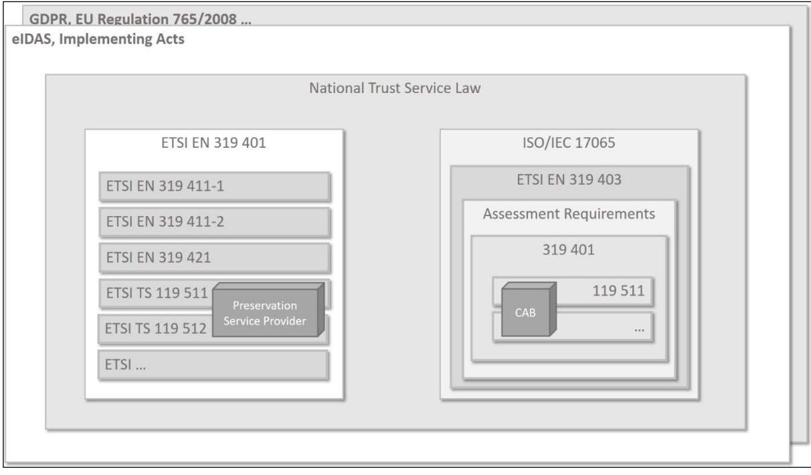
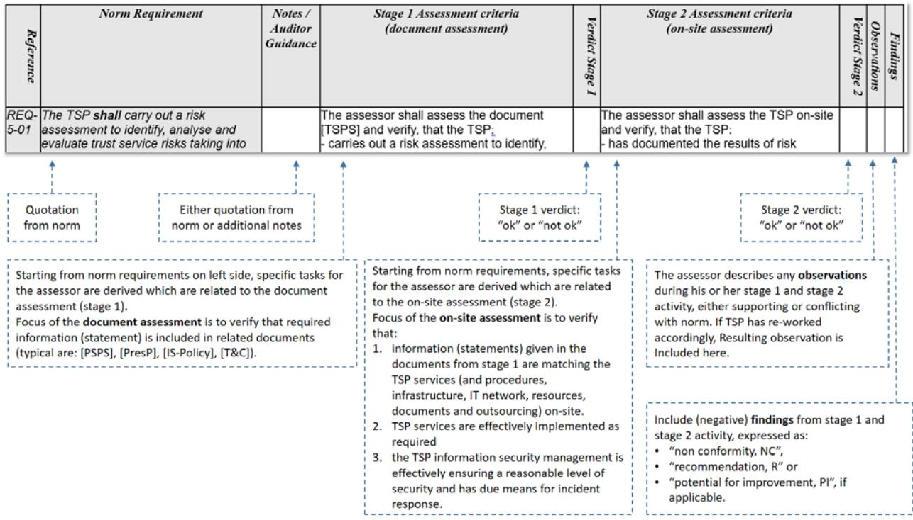

Federal Office for Information Security P.O.B 20 03 63 D-53133 Bonn (Germany) Phone.: +49 22899 9582-0 E-Mail: [tresor@bsi.bund.de](mailto:resiscan@bsi.bund.de) Internet: [https://www.bsi.bund.de](https://www.bsi.bund.de/) © Federal Office for Information Security (BSI) 2020

## Inhalt

| 1     | Introduction                                                                 | 5  |
|-------|------------------------------------------------------------------------------|----|
| 1.1   | Purpose                                                                      | 5  |
| 2     | Scope of Document                                                            | 7  |
| 2.1   | Assessment Framework                                                         | 8  |
| 2.2   | Document Overview                                                            | 9  |
| 3     | Assessment Approach                                                          | 10 |
| 3.1   | Assessment Pre-Requisites                                                    | 10 |
| 3.2   | Strictness of Assessment Criteria                                            | 10 |
| 3.2.1 | Requirements                                                                 | 10 |
| 3.2.2 | Assessment Criteria                                                          | 11 |
| 3.3   | Structure of the Assessment Criteria                                         | 11 |
| 3.4   | Assessment Stages and Assessor Activities                                    | 12 |
| 3.4.1 | Usage of a Certified TR-ESOR (V1.2.1 or later) Product in Combination with a |    |
|       | Preservation Service Provider (PSP)                                          | 13 |
| 3.4.2 | Identification of Assessment Criteria                                        | 13 |
| 4     | Structure of Assessment Criteria and Report Template                         | 14 |
| 5     | Assessment Criteria for Risk Assessment                                      | 15 |
| 6     | Assessment criteria for Policies and Practices                               | 16 |
| 6.1   | Preservation Service Practice Statement                                      | 16 |
| 6.2   | Terms and Conditions                                                         | 20 |
| 6.3   | Information Security Policy                                                  | 24 |
| 6.4   | Preservation profiles                                                        | 25 |
| 6.5   | Preservation evidence policy                                                 | 34 |
| 6.6   | Signature validation policy                                                  | 43 |
| 6.7   | Subscriber agreement                                                         | 44 |
| 7     | Assessment criteria for PSP Management and Operation                         | 46 |
| 7.1   | Internal organization                                                        | 46 |
| 7.2   | Human resources                                                              | 47 |
| 7.3   | Asset management                                                             | 48 |
| 7.4   | Access control                                                               | 49 |
| 7.5   | Cryptographic controls                                                       | 50 |

| 7.6  | Physical and environmental security                                                                                                             | 56  |
|------|-------------------------------------------------------------------------------------------------------------------------------------------------|-----|
| 7.7  | Operation security                                                                                                                              | 57  |
| 7.8  | Network security                                                                                                                                | 58  |
| 7.9  | Incident management                                                                                                                             | 60  |
| 7.10 | Collection of evidence                                                                                                                          | 61  |
| 7.11 | Business continuity management                                                                                                                  | 63  |
| 7.12 | TSP termination and termination plans                                                                                                           | 64  |
| 7.13 | Compliance                                                                                                                                      | 65  |
| 7.14 | Cryptographic monitoring                                                                                                                        | 66  |
| 7.15 | Augmentation of preservation evidences                                                                                                          | 69  |
| 7.16 | Export-Import package                                                                                                                           | 71  |
| 8    | Operational and notification protocols                                                                                                          | 76  |
| 8.1  | Preservation protocol                                                                                                                           | 76  |
| 8.2  | Notification protocol                                                                                                                           | 91  |
| 9    | Preservation process                                                                                                                            | 93  |
| 9.1  | Storage of preserved data and evidences                                                                                                         | 93  |
| 9.2  | Preservation evidences                                                                                                                          | 95  |
| 9.3  | Preservation of digital signatures                                                                                                              | 98  |
| 10   | Assessment criteria for Annex A (normative): Qualified preservation service for QES as defined by article 34 the Regulation (EU) No 910/2014 | 105 |
| 11   | References                                                                                                                                      | 109 |
| 11.1 | Normative References                                                                                                                            | 109 |
| 11.2 | Informative References                                                                                                                          | 111 |
|      | Keywords and Abbreviations                                                                                                                      | 113 |

## **Table of Figures**

| Figure 1: ETSI Assessment Framework 8                             |  |
|-------------------------------------------------------------------|--|
| Figure 2: Structure of Assessment Criteria and Report Template 14 |  |

## **Table List**

| Table 2 Types of (qualified) Trust Services  7 |  |
|------------------------------------------------|--|
| Table 3: Normative References  111             |  |
| Table 4: Informative References  112           |  |
| Table 5: Keywords and Abbreviations  115       |  |

4 Federal Office of Information Security

## **1 Introduction**

## **1.1 Purpose**

Trust services, as specified in Regulation (EU) No 910/2014 **[eIDAS]** (short: eIDAS), shall give participants of electronic commerce confidence in the security of these trust services. This confidence is expected to result from a set of procedures, processes and security measures, the Trust Service Provider (TSP) has established in order to minimize the operational and financial threats and risks associated.

eIDAS distinguishes two trust levels with respect to trust services and providers of trust services:

- normal trust services and trust service providers (TSP) and
- **qualified** trust services and trust service providers (**QTSPs**) that need to fulfil additional legal requirements and are subject to periodical independent third party conformity assessments by accredited conformity assessment bodies (CAB).

### (Q)TSP means TSP or QTSP.

Especially **qualified** trust services and QTSPs will fulfil such high expectations of participants.

**[ETSI TS 119 511]** defines policy requirements for operation and management practices of a TSP, which provides long-term preservation of digital signatures or general data using digital signature techniques. **[ETSI TS 119 511]** does not specify **how** the requirements can be assessed by an independent party and what kind of information and documents shall be the subject of such a conformity assessment. **[ETSI TS 119 511]** refers to **[ETSI EN 319 403]** "Requirements for Conformity Assessment Bodies Assessing Trust Service Providers", which is applicable to CABs and which supplements the international standard **[ISO/IEC 17065]**, which accredited CABs must fulfil. **[ETSI EN 319 403]** poses general requirements on CABs assessing (qualified) trust services and does neither distinguish between different trust services nor define dedicated assessment criteria for the application of standards like **[ETSI EN 319 401]** or standards for dedicated trust services of the ETSI EN 319 4x1 series.

More specifically, **[ETSI TS 119 511]** extends the general requirements of **[ETSI 319 401]** for a TSP, which provides long-term preservation of digital signatures or general data using digital signature techniques.

If the **[ETSI EN 319 401]** defines general requirements on the TSP's public documentation, including the TSP's management and operation, the **[ETSI TS 119 511]** defines specific requirements to documentation and policies relating to the preservation service (e.g. Preservation Service Practice Statement, Preservation Evidence Policy, etc.) including technical and operational requirements relating to the preservation service (e.g. Preservation

Profiles, Preservation Protocol, Notification Protocol, etc.).

Assessment criteria, derived one-by-one from **[ETSI TS 119 511]** requirements, are neither intended nor included.

In summary, neither the TSP specific standards (ETSI EN 319 4x1) nor the CAB specific standard **[ETSI EN 319 403]** provides dedicated assessment criteria for an application for the conformity assessment of TSP.

The document **[ASS 319 401],** further on also called Part 1, has the goal to bridge this gap with respect to **[ETSI EN 319 401]**.

The present document, further on also called Part 2 and referenced by **[Ass 119 511]**, has the goal to bridge this gap with respect to **[ETSI TS 119 511]**. It specifies assessment criteria to be used by accredited conformity assessment bodies (CAB) to assess the conformity of (qualified) trust service providers ((Q)TSPs) against the standard **[ETSI TS 119 511]**.

The conformity assessment of Part 1 SHALL be performed before the conformity assessment of Part 2 or in parallel.

## **2 Scope of Document**

These assessment criteria are the module for conformity assessment of TSPs that fulfils the requirements of **[ETSI TS 119 511]**. Other modules, applicable for the conformity assessment of TSP with specific other trust services may be drafted in the future. The assessment criteria are directly derived from the policy requirements given by **[ETSI TS 119 511]**. CAB shall apply all criteria set out in **[ETSI TS 119 511]** to be conformant to this document.

There exist further parts of assessment criteria based on **[ETSI EN 319 401]** and beside **[ETSI TS 119 511]** for other specific trust services. Such assessment criteria will always be additional to those set out in Part 1 and Part 2. Currently, e.g. the following norms and specifications are available to specific types of (qualified) trust services as defined in **[eIDAS]**:

| Type of (Qualified) Trust Service                                                   | Related Norms and Technical Specifications        |
|-------------------------------------------------------------------------------------|------------------------------------------------------|
| creation of qualified certificates for electronic signatures or electronic seals | ETSI EN 319 411-2 together with ETSI EN 319 411-1 |
| creation of qualified certificates for web site authentication                   | ETSI EN 319 411-2 together with ETSI EN 319 411-1 |
| creation of qualified electronic time stamps                                        | ETSI EN 319 421                                      |
| validation of qualified electronic signature and seals                           | ETSI TS 119 441                                      |
| electronic registered delivery                                                      | ETSI EN 319 521 and ETSI EN 319 531               |
| signing service                                                                     | ETSI TS 119 431-1 and ETSI TS 119 431- 2          |
| preservation service                                                                | ETSI TS 119 511 and ETSI TS 119 512                  |

#### **Table 1 Types of (qualified) Trust Services**

**Not** addressed in this document are organisational activities of the CAB and its assessors like contract gathering aspects and project management, assessor qualification and audit planning, reporting specific aspects or non-conformity tracking. These aspects are in the scope of **[ISO/IEC 17065]** and **[ETSI EN 319 403]** which are normative to the CAB.

There are also **not** addressed requirements of **[ETSI EN 319 401]**, which is the base and a prerequisite of an assessment of a (qualified) TSP. This document relates to the specific assessment criteria for a TSP providing long-term preservation of digital signatures or general data using digital signature techniques.

## **2.1 Assessment Framework**

Derived assessment criteria are embedded in the European regulatory framework. On EUlevel, each TSP underlies especially the eIDAS regulation **[eIDAS]** and the General Data Protection Regulation (GDPR). Conformity Assessment Bodies (CAB) shall comply also with **[EU regulation 765/2008]**. Furthermore, EU implementing acts and national trust service laws apply to both. The ETSI series related to trusted services apply to TSPs in the same way, as related ISO and ETSI norms and standards or specifications apply to CABs. The following figure sketches hierarchy of documented regulatory framework and shows the relation to a Preservation Service Provider (as an example of a TSP) and a CAB as acting entities. The assessment criteria are applicable to CAB only.

**Figure 1: ETSI Assessment Framework**

**[ETSI EN 319 401]**specifies general policy requirements on the operation and management practices of a TSP regardless of the service the TSP provides.

Subordinated **[ETSI EN 319 411-1]** or **[ETSI TS 119 511]** specify specific policy requirements, depending on the specific service of the TSP. So, other than **[ETSI EN 319 401]**, only those norms and specifications from ETSI series apply, which are required for the specific type of trust service. As an example, **[ETSI EN 319 411-1]** applies to TSPs issuing certificates for natural or legal persons. In the same way, **[ETSI TS 119 511]** applies to Preservation Service Providers.

The regulatory framework for CABs is based on **[ISO/IEC 17065]** as an accreditation norm, amended by **[ETSI EN 319 403]**.

The assessment requirements are then based on the standards, so that the Preservation TSP has to be conformant with **[ETSI EN 319 401]** and **[ETSI TS 119 511]**, providing longterm preservation of digital signatures or general data using digital signature techniques.

## **2.2 Document Overview**

The following **chapter 3** specifies the assessment approach. It gives the frame for applying the criteria found in the following chapters.

In **chapter 4,** the present document describes the structure and explains the content of the tables, which contain norm requirements together with detailed assessment criteria. The last column provides space to fill in observations, verdicts and findings, as a result of an assessment.

Subsequent **chapters 5 to 7** define the assessment criteria for conformity assessment against **[ETSI TS 119 511]**, following its document structure.

The assessment criteria are written in such a way that the present document (or the respective parts of it) could be used as **template** for the documentation of the results of a conformity assessment. An utilisation of the tables within a spreadsheet might be helpful for an actual assessment.

## **3 Assessment Approach**

## **3.1 Assessment Pre-Requisites**

For demonstrating conformance to **[ETSI TS 119 511]** all mandatory assessment criteria in this document shall be applied.

Pre-requisites for such a conformance assessment are the following aspects:

- Because **[ETSI TS 119 511]** extends **[ETSI EN 319 401]**, it is necessary for the CAB to **assess** the assessment criteria of **[ETSI EN 319 401]** (usually during the **[ETSI TS 119 511]** assessment, but also possibly beforehand).
- Due to the public nature of the provided preservation services, the Preservation Service Provider (PSP) has to **document** its implementing practices, together with legal terms and conditions. These documents target public audiences, who can be any party relying on the provided preservation services. With those documents, the PSP shows, what and how it is doing to fulfil the applicable norm requirements, here of **[ETSI TS 119 511]**.
- The TSP has to **implement** all preservation service practices laid down in its publicly**[1](#page-9-4)** available documents. Clearly, its implementation must fully conform to its own public documents.

The CAB will assess the TSP as an organisation with its documentation and its implemented preservation services, based on the assessment criteria from the present document. The main task of the assessor is to determine if all mandatory assessment criteria are fulfilled. In this case conformance to **[ETSI TS 119 511]** is implied.

Before starting a conformity assessment a contract between the accredited CAB and the PSP needs to be established. Further pre-requisites on the assessment process result from the accreditation of the CAB against **[ISO/IEC 17065]** and **[ETSI EN 319 403]** (e.g. audit team, assessment plan). They are out of scope of the present document, which focusses on the assessment activities itself and – in detail – on the expected results.

## **3.2 Strictness of Assessment Criteria**

For a better understanding of the strictness of the assessment criteria within this document it is necessary to clearly separate between the two different types of rules to be followed:

- "Requirements" are applicable to TSPs/PSPs and directly originate from the related ETSI documents (**ETSI EN 319 401**, **[ETSI TS 119 511],** etc.).
- The assessment "criteria" are applicable to the CAB and its assessors and mainly derived from those ETSI documents applicable to TSPs/PSPs.

## **3.2.1 Requirements**

Requirements from TSP/PSP related ETSI documents use the modal verbs terminology of ETSI Drafting Rules, clause 3.2 (Verbal forms for the expression of provisions): "shall", "shall not", "should", "should not", "may", "need not", "will", "will not", "can" and "cannot".

Whenever the assessor identifies a "shall" requirement not being fulfilled by a TSP, a **non-**

 1 Mandatory public documents of the PSP are its PSPS and terms & conditions.

**conformity (NC)** results. Such a NC may result in a stop of business for the TSP/PSP. Any decision about the severeness of non-conformities is up to the CAB, the assessor is working for and resides outside the scope of this document. Likewise, if a "should" requirement is unfulfilled by a TSP, a **recommendation (R)** results and further assessment activities by the CAB are necessary.

A "should" requires from the TSP either to fulfil the requirement exactly as it is specified or respective test material or explanations should demonstrate the specified behaviour to make evident that it`s equivalent to the requirements and to the required security levels. Remark: not related to the strictness are so called **potentials for improvement (PI),** an assessor may identify. These PIs are only informative to the TSP.

### **3.2.2 Assessment Criteria**

Regarding the assessment criteria, this document uses the following three major classes of assessment criteria (cf. [RFC 2119])

- MAY: These criteria are just hints or optional activities of the assessor. These criteria will not result in mandatory assessment activities.
- SHOULD: These criteria are strong recommendations. Respective assessment activities should be performed by the assessor. Alternatively, the assessor explains why he or she uses a different approach and why this activity assures the same assessment result as the original activity.
- SHALL (or synonymously MUST): These are strict criteria. It is not allowed to use different assessment activities.

The strictness of the assessment criteria applicable to the CAB and its assessors is to be specified by the applicable accreditation and certification scheme and resides outside the scope of this document.

## **3.3 Structure of the Assessment Criteria**

The order of the assessment criteria follows the document structure (chapters, sections) of norm **[ETSI TS 119 511]**. For each individual norm requirement, assessment criteria are derived for either stage 1 document assessment or/and stage 2 on-site assessment, as applicable. A conformant design of the provided preservation services, laid-out in the PSP documents (stage 1), is a pre-requisite for starting to audit the actual implementation on-site (stage 2).

Norm chapters address specific aspects, a (Q)PSP and/or its preservation service(s) need to fulfil. Such aspects range

• from sole **document** related requirements, which the documents of a (Q)PSP need to conform with;

- through requirements related to **organisational** structure and processes and its procedures;
- down to **infrastructural** requirements, both physical and logical (i.e. building infrastructure and IT infrastructure).

Such a broad range of aspects is due to the overarching nature of "policy" requirements. A reason for such an approach are current **information security management practices.** To handle security, the purpose of business and applied processes need to be understood. Then immanent risks in the type of business and processes (to be implemented) need to be identified and treated assuring an acceptable level of security. Such treatment is structured along security measures. There are four generic types of **security measures:**

- **Physical** security measures,
- **Organisational** security measures,
- **Personnel** related security measures, and
- **Technology** related security measures.

In a similar way, all assessment criteria are related to both, **functional and security aspects,** often at the same time and regardless of being related to (Q)TSP documentation and/or to actual implementation of provided trust service(s). The basic nature of trust services is trust, so functional aspects like the generation of certificates or signatures are actually security functions, using cryptography and implementing security objectives as integrity, confidentiality or authenticity. A sharp distinction between functional and security aspects is, therefore, at least difficult, if not impossible. The assessment must consider functional and security aspects always at the same time.

## **3.4 Assessment Stages and Assessor Activities**

The **assessment** of a (Q)TSP/(Q)PSP is performed by an accredited CAB on the basis of **[EN 319 403]** and split into two stages (see also **[ETSI EN 319 403]**):

- **Stage 1** Document Assessment: the CAB assesses the documentation of the (Q)TSP for conformance with the requirements laid out in the applicable ETSI standard(s);
- **Stage 2** On Site Assessment**[2](#page-11-1)** (Audit): the CAB assesses the (Q)TSP management, organisation, processes, documentation, facilities and infrastructures on site, i.e. at the (Q)TSP premises, for conformance with the requirements laid out in the applicable ETSI standard(s).

At each stage, the CAB assessment includes **analytic, conclusive and reporting activities.** So the CAB assessor will

- analyse documents,
- ask questions and perform interviews,
- inspect and has an eye on-site.

 2 Pre-assessment condition: see **[EN 319 403]**, chapter 7.4.5.3: In every case, the document review (stage 1) shall be completed prior to the commencement of audit, stage 2.

Based on this the assessor:

- wants to understand the organisation and its services,
- identifies potential gaps or non-conformities,
- concludes whether the (Q)TSP/(Q)PSP fulfils its requirements, and finally
- prepares a report on its findings and observations.

The assessment criteria require from the assessor to perform certain activities and to check the expected results, with respect to the requirements. Per stage, the assessor describes the observations during his or her activity and gives per criterion a verdict (either "OK" or "not OK"). Also, he or she includes (negative) findings, expressed as non-conformities, recommendations or potentials for improvement.

The assessor must document all results of assessor activities. For this the tables in chapter 5 to 7 SHOULD be used as a template for logging. Finally, an assessment report SHALL be written. See **[ETSI TS 119 403-3]** for details.

### **3.4.1 Usage of a Certified TR-ESOR (V1.2.1 or later) Product in Combination with a Preservation Service Provider (PSP)**

If the PSP claims to use a certified **TR-ESOR product [TR-ESOR] of version V1.2.1 or higher** and the claimed **[TR-ESOR]** certified product is in fact deployed for providing this service, proved e.g. by comparing the digital fingerprint of relevant executables, then the assessment result of the equivalent **[ETSI TS 119 511]** - test case is substituted by the TR-ESOR-certification result and this **[ETSI TS 119 511]** - assessment test step SHALL be omitted.

### **3.4.2 Identification of Assessment Criteria**

Each assessment criterion relates to a norm requirement identified by its unique identifier:

<the 3 letters REQ> - < the clause number> - <2 digit number - incremental>

Specific criterions are splitted into documentation related (stage 1) and implementation related aspects (stage 2, audit). Normally, stage 2 related criteria base on the results of stage 1 assessment. Some aspects are only relevant for stage 1, like some detailed content of the terms and conditions. Those will **not** be addressed in stage 2. Nevertheless, most aspects from stage 1 need to be mirrored and/or inspected on-site during stage 2.

## **4 Structure of Assessment Criteria and Report Template**

The following figure describes the structure and content of the tables used for assessment criteria as contained in chapter 5 to 7. The tables could be utilised as a template for a reporting of the assessment, as well. For that purpose, the use of a customised spreadsheet is advisable.

#### **Figure 2: Structure of Assessment Criteria and Report Template**

Notes and auditor guidance may origin from the norm itself or may be additional to that.

If it is quoted from norm, the text in the table is set in *slanted* format.

The content of the column "Notes/auditor/Guidance" in the [Figure 2: "Structure of](#page-13-1)  [Assessment Criteria and Report Template"](#page-13-1) is informative.

Assessment criteria request assessor activities per each TSP requirement. Usually, the criteria text starts with a standard sentence and is followed by the specific assessor activities (indicated by hyphens "-"), and – in case – further detailed (indicated by plus signs "+"). Example **OVR-6.4-01**:

#### "See **[ASS 119 511]**, **OVR-6.1-03**.

*The assessor shall check if the PSP* 

- has *supported at least one preservation profile pursuant to OVR-6.2-03* 

*or* 

- *stated which [TR-ESOR] certified product of version 1.2.1 or higher is used for providing the service and this requirement by this PSP"*

## **5 Assessment Criteria for Risk Assessment**

*NOTE: See ISO/IEC 27005 [i.5] for guidance on information security risk management as part of an information security management system.*

| R ef er en ce | Norm Requirement                                                               | Notes / Auditor Guidance                          | Stage 1 Assessment criteria (document assessment)                                                                                                                                                                                                                                                                                                                                                                                                    | Ve rd ic t S ta ge 1 | Stage 2 Assessment criteria (on-site assessment)                                                                                                                                                                                                                                                                                                          | Ve rd ic t S ta ge 2 | O bs er va tio ns | F in di ng s |
|---------------------------|--------------------------------------------------------------------------------|------------------------------------------------------|---------------------------------------------------------------------------------------------------------------------------------------------------------------------------------------------------------------------------------------------------------------------------------------------------------------------------------------------------------------------------------------------------------------------------------------------------------|----------------------------------------|--------------------------------------------------------------------------------------------------------------------------------------------------------------------------------------------------------------------------------------------------------------------------------------------------------------------------------------------------------------|----------------------------------------|----------------------------------|--------------------------|
| OVR-5-01                  | The requirements specified in ETSI EN 319 401 [1], clause 5 shall apply. | See [ETSI EN 319 401] and [ASS 319 401]. | The assessor shall assess the document [PSPS] and verify that the PSP - fulfils the requirements defined in [ASS 319 401, REQ-5-01] through [ASS 319 401, REQ-5-05] concerning stage 1 or - shows his valid and successful conformity assessment report of its PSPS pursuant to performed by a [ETSI EN 319 401], conformity assessment body, which is accredited in accordance with [eIDAS] as competent. |                                        | Only applicable if no valid and successful conformity assessment report of the PSP and its PSPS pursuant to [ETSI EN 319 401] exists: The assessor shall assess the PSP on-site and verify that the PSP: - fulfils the requirements defined in [Ass 319401, REQ-5-01] through [ASS 319401, REQ-5-05] concerning stage 2. |                                        |                                  |                          |

## **6 Assessment criteria for Policies and Practices**

| R ef er en ce | Norm Requirement                                                                                                                                                                                    | Notes / Auditor Guidance                             | Stage 1 Assessment criteria (document assessment)                                                                                                                                                                                                                                                                                                                                                                                                                                                               | Ve rd ic t S ta ge 1 | Stage 2 Assessment criteria (on-site assessment)                                                                                                                                                                                                                                                                                                                                 | Ve rd ic t S ta ge 2 | O bs er va tio ns | F in di ng s |
|---------------------------|-----------------------------------------------------------------------------------------------------------------------------------------------------------------------------------------------------|---------------------------------------------------------|--------------------------------------------------------------------------------------------------------------------------------------------------------------------------------------------------------------------------------------------------------------------------------------------------------------------------------------------------------------------------------------------------------------------------------------------------------------------------------------------------------------------|----------------------------------------|-------------------------------------------------------------------------------------------------------------------------------------------------------------------------------------------------------------------------------------------------------------------------------------------------------------------------------------------------------------------------------------|----------------------------------------|----------------------------------|--------------------------|
| OVR-6.1-01 OVR-6.1-02  | The requirements specified in ETSI EN 319 401 [1], clause 6.1 shall apply. In addition, the following particular requirements apply: The preservation service               | See [ETSI EN 319 401] and [ASS 319 401]. | The assessor shall assess the document [PSPS] and verify that the PSP: - fulfils the requirements defined in [ASS 319401, REQ-6.1-01] through [ASS 319401, REQ-6.1-12] concerning stage 1, or - shows his valid and successful conformity assessment report of its PSPS pursuant to [ETSI EN 319 401], performed by a conformity assessment body, which is accredited in accordance with [eIDAS] as competent. The assessor shall assess the provided public |                                        | Only applicable if no valid and successful conformity assessment report of the PSP and its PSPS pursuant to [ETSI EN 319 401] exists. The assessor shall assess the PSP on-site and verify that the PSP: - fulfils the requirements defined in [Ass 319401, REQ-6.1-01] through [ASS 319401, REQ-6.1- 12] concerning stage 2. not applicable |                                        |                                  |                          |
|                           | provider (PSP) should list or make reference to (e.g. through OIDs), and briefly describe the supported preservation service policies in its preservation service practice statement |                                                         | PSP documents and verify that - the PSP listed or referenced (e.g. via OID) supported preservation service policies - and briefly described them.                                                                                                                                                                                                                                                                                                                                                   |                                        |                                                                                                                                                                                                                                                                                                                                                                                     |                                        |                                  |                          |
| OVR-6.1-03                | The PSP shall list in its preservation service practice statement the supported preservation profiles.                                                                               |                                                         | The assessor shall assess the provided public [PSPS] and verify that: - the set of supported preservation profiles, which are provided for the preservation service, are documented.                                                                                                                                                                                                                                                                                                                |                                        | The assessor shall assess the PSP on-site and verify that the PSP: - implemented the preservation profiles as documented in [PSPS]. See also [ASS 119 511], OVR-6.4-01 et seq                                                                                                                                                                               |                                        |                                  |                          |

## **6.1 Preservation Service Practice Statement**

| R ef er en ce | Norm Requirement                                                                                                                                                                                                                                | Notes / Auditor Guidance | Stage 1 Assessment criteria (document assessment)                                                                                                                                                                                                                                                                                            | Ve rd ic t S ta ge 1 | Stage 2 Assessment criteria (on-site assessment)                                                                                                                                                                                                                                 | Ve rd ic t S ta ge 2 | O bs er va tio ns | F in di ng s |
|---------------------------|-------------------------------------------------------------------------------------------------------------------------------------------------------------------------------------------------------------------------------------------------|-----------------------------|-------------------------------------------------------------------------------------------------------------------------------------------------------------------------------------------------------------------------------------------------------------------------------------------------------------------------------------------------|----------------------------------------|-------------------------------------------------------------------------------------------------------------------------------------------------------------------------------------------------------------------------------------------------------------------------------------|----------------------------------------|----------------------------------|--------------------------|
| OVR-6.1-04                | The PSP shall state in its preservation service practice statement how the preservation goals are achieved.                                                                                                                            |                             | The assessor shall assess the provided public [PSPS] and verify: - the preservation goals are defined and - how they are achieved by the service.                                                                                                                                                                                |                                        | not applicable                                                                                                                                                                                                                                                                      |                                        |                                  |                          |
| OVR-6.1-05                | The PSP shall define in its preservation service practice statement how the availability of the submitted data objects (SubDO) and the associated preservation evidences is achieved.                                   |                             | The assessor shall assess the provided public [PSPS] and verify that: - it is defined how the process for the provision of preservation services achieves the availability requirements for + submitted data objects (SubDO) and + associated preservation evidences.                                          |                                        | The assessor shall assess the PSP on-site and verify that the PSP: - implemented the processes of: + provisioning the availability of the submitted data objects and + provisioning the associated preservation evidences.                                  |                                        |                                  |                          |
| OVR-6.1-06                | The PSP shall identify in its preservation service practice statement the obligations of all external organisations supporting the preservation service services including the applicable policies and practices. |                             | The assessor shall assess the document [PSPS] and verify that the PSP: - identified all external organisations supporting the PSP service - named all obligations applicable to these external organisations with contract and - included in those obligations all applicable policies and practices. |                                        | The assessor shall assess the PSP on-site and verify that the PSP: - names all external organisations, which support the PSP service - uses the services of these external organisations as described in the preservation service practice statement. |                                        |                                  |                          |

| R ef er en ce | Norm Requirement                                                                                                                                              | Notes / Auditor Guidance | Stage 1 Assessment criteria (document assessment)                                                                                                                                                                                                                                                                                                                          | Ve rd ic t S ta ge 1 | Stage 2 Assessment criteria (on-site assessment)                                                                                                                                                                                                                                                                                                                                                                                                                                                           | Ve rd ic t S ta ge 2 | O bs er va tio ns | F in di ng s |
|---------------------------|---------------------------------------------------------------------------------------------------------------------------------------------------------------|-----------------------------|-------------------------------------------------------------------------------------------------------------------------------------------------------------------------------------------------------------------------------------------------------------------------------------------------------------------------------------------------------------------------------|----------------------------------------|---------------------------------------------------------------------------------------------------------------------------------------------------------------------------------------------------------------------------------------------------------------------------------------------------------------------------------------------------------------------------------------------------------------------------------------------------------------------------------------------------------------|----------------------------------------|----------------------------------|--------------------------|
| OVR-6.1-07                | [WST] The PSP shall state in its preservation service practice statement the details on the process of requesting export-import package(s). | See OVR-6.1-05.          | Only applicable in case of [WST]: The assessor shall assess the document [PSPS] and verify that the PSP: - described the process of requesting export import package(s) clearly, or - stated which [TR-ESOR] certified product of version V1.2.1 or higher is in use for providing the service and this requirement by this PSP. |                                        | Only applicable in case of WST: If the claimed [TR-ESOR] certified product of version V1.2.1 or higher is in fact deployed for providing the service (checked e.g. by comparing the digital fingerprint of the relevant executables), stage 2 will not be executed. Otherwise: The assessor shall assess the PSP on-site and verify: - the process of requesting export-import package(s) - that the PSP implemented the export-import package(s) as documented. |                                        |                                  |                          |

| R ef er en | Norm Requirement                                                                                                                                                               | Notes / Auditor Guidance                                                                     | Stage 1 Assessment criteria (document assessment)                                                                                                                                                                                                                                                                                                                                                                                                                                | Ve rd ic       | Stage 2 Assessment criteria (on-site assessment)                                                                                                                                                                                                                                                                                                                                                                                                                                                                                                                         | Ve rd ic       | O bs er   | F in di ng |
|---------------------|--------------------------------------------------------------------------------------------------------------------------------------------------------------------------------|-------------------------------------------------------------------------------------------------|-------------------------------------------------------------------------------------------------------------------------------------------------------------------------------------------------------------------------------------------------------------------------------------------------------------------------------------------------------------------------------------------------------------------------------------------------------------------------------------|----------------------|-----------------------------------------------------------------------------------------------------------------------------------------------------------------------------------------------------------------------------------------------------------------------------------------------------------------------------------------------------------------------------------------------------------------------------------------------------------------------------------------------------------------------------------------------------------------------------|----------------------|-----------------|---------------------|
| ce                  |                                                                                                                                                                                |                                                                                                 |                                                                                                                                                                                                                                                                                                                                                                                                                                                                                     | t S ta ge 1 |                                                                                                                                                                                                                                                                                                                                                                                                                                                                                                                                                                             | t S ta ge 2 | va tio ns | s                   |
| OVR-6.1-08          | [WST] The PSP shall specify in its preservation service practice statement the production methods of the export-import package(s), see clause 7.16. | EXAMPLE 1: Whether the package is encrypted or not.                           | Only applicable in case of [WST]: The assessor shall assess the document [PSPS] and verify that the PSP: - specified the production methods of the export-import package(s), e.g. file type, data structure, integrity or/and confidentiality protection, or - stated which [TR-ESOR] certified product of version V1.2.1 or higher is used for providing the preservation service and this requirement by this PSP. |                      | Only applicable in case of WST: If the claimed [TR-ESOR] certified product of version V1.2.1 or higher is in fact deployed for providing the service (checked e.g. by comparing the digital fingerprint of the relevant executables), stage 2 will not be executed. Otherwise: The assessor shall assess the PSP on-site and verify that: - the production methods for export-import package(s),e.g. pursuant to • [TS 119 512, Annex G] or • [TR-ESOR-M.3, clause 2.5] are implemented and working as documented. |                      |                 |                     |
| OVR-6.1-09          | [WST] The PSP shall specify in its preservation service practice statement what happens to the data at the end of the preservation period.             | EXAMPLE 2: Whether the data is deleted or transferred to another place. | Only applicable in case of [WST]: The assessor shall assess the document [PSPS] and verify that the PSP: - described what happens to the data at the end of the preservation period, or - stated which [TR-ESOR] certified product of version V1.2.1 or higher is used for providing the service and this requirement by this PSP.                                                                                                     |                      | Only applicable in case of WST: If the claimed [TR-ESOR] certified product of version V1.2.1 or higher is in fact deployed for providing the service (checked e.g. by comparing the digital fingerprint of the relevant executables), stage 2 will not be executed. Otherwise: The assessor shall assess the PSP on-site and verify: - that what happens to the data at the end of the preservation period, takes place as documented.                                                                                            |                      |                 |                     |

| R ef er en ce | Norm Requirement                                                                                                                                    | Notes / Auditor Guidance                             | Stage 1 Assessment criteria (document assessment)                                                                                                                                                                                                                                                                                                                                                                                                                           | Ve rd ic t S ta ge 1 | Stage 2 Assessment criteria (on-site assessment)                                                                                                                                                                                                                                                                                                                         | Ve rd ic t S ta ge 2 | O bs er va tio ns | F in di ng s |
|---------------------------|-----------------------------------------------------------------------------------------------------------------------------------------------------|---------------------------------------------------------|--------------------------------------------------------------------------------------------------------------------------------------------------------------------------------------------------------------------------------------------------------------------------------------------------------------------------------------------------------------------------------------------------------------------------------------------------------------------------------|----------------------------------------|-----------------------------------------------------------------------------------------------------------------------------------------------------------------------------------------------------------------------------------------------------------------------------------------------------------------------------------------------------------------------------|----------------------------------------|----------------------------------|--------------------------|
| OVR-6.2-01                | The requirements specified in ETSI EN 319 401 [1], clause 6.2 shall apply. In addition, the following particular requirements apply: | See [ETSI EN 319 401] and [ASS 319 401]. | The assessor shall assess the document [T&C] and verify that the PSP: - fulfils the requirements defined in [ASS 319 401, REQ-6.2-01] through [ASS 319 401, REQ-6.2-06] concerning stage 1, or - shows his valid and successful conformity assessment report of the PSP and its PSPS pursuant to [ETSI EN 319 401], performed by a conformity assessment body, which is accredited in accordance with [eIDAS] as competent. |                                        | Only applicable if no valid and successful conformity assessment report of the PSP and its PSPS pursuant to [ETSI EN 319 401] exists. The assessor shall assess the PSP on-site and verify that the PSP: - fulfils the requirements defined in [ASS 319 401, REQ-6.2-01] through [ASS 319 401, REQ 6.2-06] concerning stage 2. |                                        |                                  |                          |
| OVR-6.2-02                | The PSP shall list in the terms and conditions all the preservation service policies it supports.                                 |                                                         | The assessor shall assess the document [T&C] and verify that the PSP: - listed all the preservation policies it supports.                                                                                                                                                                                                                                                                                                                                          |                                        | not applicable                                                                                                                                                                                                                                                                                                                                                              |                                        |                                  |                          |
| OVR-6.2-03                | The PSP shall state where to find information on the supported preservation profiles.                                          | See OVR-6.4- 01.                                     | The assessor shall assess the document [T&C] and verify that the PSP: - stated where to find information on the supported preservation profiles.                                                                                                                                                                                                                                                                                                                |                                        | not applicable                                                                                                                                                                                                                                                                                                                                                              |                                        |                                  |                          |

| R ef er en ce | Norm Requirement                                                                                                                                                                                                                                                                                                                                                                                                              | Notes / Auditor Guidance                                                       | Stage 1 Assessment criteria (document assessment)                                                                                                                                                                                                                                                                                                                                                    | Ve rd ic t S ta ge 1 | Stage 2 Assessment criteria (on-site assessment)                                                                                                                                                                                                                                                                                                                                                                                                                                                          | Ve rd ic t S ta ge 2 | O bs er va tio ns | F in di ng s |
|---------------------------|-------------------------------------------------------------------------------------------------------------------------------------------------------------------------------------------------------------------------------------------------------------------------------------------------------------------------------------------------------------------------------------------------------------------------------|-----------------------------------------------------------------------------------|---------------------------------------------------------------------------------------------------------------------------------------------------------------------------------------------------------------------------------------------------------------------------------------------------------------------------------------------------------------------------------------------------------|----------------------------------------|--------------------------------------------------------------------------------------------------------------------------------------------------------------------------------------------------------------------------------------------------------------------------------------------------------------------------------------------------------------------------------------------------------------------------------------------------------------------------------------------------------------|----------------------------------------|----------------------------------|--------------------------|
| OVR-6.2-04                | [CONDITIONAL] When the preservation submitter is allowed to take a role in the preservation process (e.g. providing needed validation data), the PSP shall describe in its terms and conditions under which conditions this can be done, and specify in particular which are the responsibilities taken by the preservation service and the ones that shall be taken by the submitter. |                                                                                   | If the preservation submitter takes a role in the preservation process, the assessor shall assess the document [T&C] and verify that the PSP: + pointed out under which conditions this will be done and + stated more precisely in particular which are the responsibilities taken by the preservation service and the ones that shall be taken by the submitter.     |                                        | If the preservation submitter takes a role in the preservation process, the assessor shall assess the PSP on-site and verify that the PSP: + identifies its preservation submitters, + shows their role in the preservation process, + shows the conditions and responsibilities for the PSP and its submitters. The assessor shall - cause the PSP to show one or more example(s) and - compare the descriptions in [T&C] with the production processes. |                                        |                                  |                          |
| OVR-6.2-05                | [WST] The PSP shall state in its terms and conditions how the request for an export import package can be done.                                                                                                                                                                                                                                                                                                      | EXAMPLE 1: The request can be done via email or a registered mail. | Only applicable in case of [WST]: The assessor shall assess the document [T&C] and verify that the PSP: - described in its Terms and Conditions how the request for an export-import package can be done, or - stated which [TR-ESOR] certified product of version V1.2.1 or higher is used for providing the service and this requirement by this PSP. |                                        | not applicable                                                                                                                                                                                                                                                                                                                                                                                                                                                                                               |                                        |                                  |                          |

| R ef er en ce | Norm Requirement                                                                                                                                                       | Notes / Auditor Guidance                                                                                                                                                                                           | Stage 1 Assessment criteria (document assessment)                                                                                                                                                                                                                                                                                                                                                                                                                                                                                                                                                                                                                                                                                        | Ve rd ic t S ta ge 1 | Stage 2 Assessment criteria (on-site assessment)                                                                                                                                                                                                                                                                                                                                                                                                                                                                                                                                                                                                                                                                                                                                                                                                                                                                                                                                                                      | Ve rd ic t S ta ge 2 | O bs er va tio ns | F in di ng s |
|---------------------------|------------------------------------------------------------------------------------------------------------------------------------------------------------------------|-----------------------------------------------------------------------------------------------------------------------------------------------------------------------------------------------------------------------|---------------------------------------------------------------------------------------------------------------------------------------------------------------------------------------------------------------------------------------------------------------------------------------------------------------------------------------------------------------------------------------------------------------------------------------------------------------------------------------------------------------------------------------------------------------------------------------------------------------------------------------------------------------------------------------------------------------------------------------------|----------------------------------------|--------------------------------------------------------------------------------------------------------------------------------------------------------------------------------------------------------------------------------------------------------------------------------------------------------------------------------------------------------------------------------------------------------------------------------------------------------------------------------------------------------------------------------------------------------------------------------------------------------------------------------------------------------------------------------------------------------------------------------------------------------------------------------------------------------------------------------------------------------------------------------------------------------------------------------------------------------------------------------------------------------------------------|----------------------------------------|----------------------------------|--------------------------|
| OVR-6.2-06                | [PDS] The PSP shall state in its terms and conditions the strategy that it will follow when it is unable to collect and verify all the validation data. | EXAMPLE 2): Whether to send a failure indication or not. EXAMPLE 3) Whether to abort the preservation request or to continue with the incomplete validation information. | Only applicable in case of [PDS]: The assessor shall assess the document [T&C] and verify that the PSP: - described its process/strategy for each preservation profile, which belongs to the preservation service of digital signatures [PDS], when the preservation service is unable to collect and verify all the validation data. The assessor shall verify that the PSP - described the process / strategy including a failure indication or the preservation of validation information, which can be collected, or - stated which [TR-ESOR] certified product of version V1.2.1 or higher is used for providing the service and this requirement by this PSP. |                                        | Only applicable in case of [PDS]: If the claimed [TR-ESOR] certified product of version V1.2.1 or higher is in fact deployed for providing the service (checked e.g. by comparing the digital fingerprint of the relevant executables), stage 2 will not be executed. Otherwise: The assessor shall assess the PSP on-site and verify that the PSP: - shows the process / strategy for each preservation profile, which belongs to the preservation service of digital signatures [PDS], when the preservation service is unable to collect and verify all the validation data. The assessor shall cause the PSP to show one or more example(s) of failure indications or preserved validation information. The assessor shall compare the process / strategy/examples for each preservation profile including a failure indication or the preservation of validation information, it can collect, with the description in the [T&C] of the PSP. |                                        |                                  |                          |

| R ef er en ce | Norm Requirement                                                                                                                                                                                                                                                                                                                                                                                      | Notes / Auditor Guidance                                                                                                                                           | Stage 1 Assessment criteria (document assessment)                                                                                                                                                                                                                                                                                                                                                                                                                | Ve rd ic t S ta ge | Stage 2 Assessment criteria (on-site assessment)                                                                                                                                                                                                                                                    | Ve rd ic t S ta ge | O bs er va tio ns | F in di ng s |
|---------------------------|-------------------------------------------------------------------------------------------------------------------------------------------------------------------------------------------------------------------------------------------------------------------------------------------------------------------------------------------------------------------------------------------------------|-----------------------------------------------------------------------------------------------------------------------------------------------------------------------|---------------------------------------------------------------------------------------------------------------------------------------------------------------------------------------------------------------------------------------------------------------------------------------------------------------------------------------------------------------------------------------------------------------------------------------------------------------------|-----------------------------------|--------------------------------------------------------------------------------------------------------------------------------------------------------------------------------------------------------------------------------------------------------------------------------------------------------|-----------------------------------|----------------------------------|--------------------------|
| OVR-6.2-07                | [CONDITIONAL] When the                                                                                                                                                                                                                                                                                                                                                                                | NOTE: The PSP                                                                                                                                                         | If applicable,                                                                                                                                                                                                                                                                                                                                                                                                                                                      | 1                                 | If applicable,                                                                                                                                                                                                                                                                                         | 2                                 |                                  |                          |
|                           | preservation submitter is allowed to provide hash values which might be used in a hash tree renewal, the PSP shall state in its terms and conditions that the PSP is not liable for guaranteeing that the new hash values correspond to the original                                                                                                                          | has no way of knowing to which document the hash values correspond and even if it really corresponds to a hash value of a concrete hash | the assessor shall assess the document [T&C] and verify that the PSP: - described that the PSP is not liable for guaranteeing that the new hash values, in case that the preservation submitter is allowed to provide hash values within a hash tree renewal, correspond to the original hash values of the hash tree.                                                                                                                |                                   | the assessor shall assess the PSP on-site and verify that the preservation submitter: - allows to provide hash values which might be used in a hash tree renewal or not. The assessor shall compare the result on-site with the description in the [T&C] of the PSP.              |                                   |                                  |                          |
|                           | hash values of the hash tree.                                                                                                                                                                                                                                                                                                                                                                         | computation.                                                                                                                                                          |                                                                                                                                                                                                                                                                                                                                                                                                                                                                     |                                   |                                                                                                                                                                                                                                                                                                        |                                   |                                  |                          |
| OVR-6.2-08                | [CONDITIONAL] When the preservation submitter is allowed to provide hash values of objects to preserve, and not the object itself, the PSP shall state in its terms and conditions that the preservation is only on the submitted objects and that this allows a proof of the existence of the hashed object only as long as the hash algorithm is strong enough. |                                                                                                                                                                       | If applicable, the assessor shall assess the document [T&C] and verify that the PSP: - described that the preservation is only on the submitted objects and that the PSP allows a proof of existence of the hashed object only as long as the hash algorithm, used by the submitter, is strong enough, if the preservation submitter is allowed to provide hash values of objects to preserve, and not the object itself. |                                   | If applicable, the assessor shall assess the PSP on-site and verify that the PSP: - allows the submitter to provide hash values of objects to preserve, and not the object itself. The assessor shall compare the result on-site with the description in the [T&C] of the PSP. |                                   |                                  |                          |

| R ef er en ce | Norm Requirement                                                                    | Notes / Auditor Guidance                             | Stage 1 Assessment criteria (document assessment)                                                                                                                                                                                                                                                                                                                                                                                                                                 | Ve rd ic t S ta ge 1 | Stage 2 Assessment criteria (on-site assessment)                                                                                                                                                                                                                                                                                                                 | Ve rd ic t S ta ge 2 | O bs er va tio ns | F in di ng s |
|---------------------------|-------------------------------------------------------------------------------------|---------------------------------------------------------|--------------------------------------------------------------------------------------------------------------------------------------------------------------------------------------------------------------------------------------------------------------------------------------------------------------------------------------------------------------------------------------------------------------------------------------------------------------------------------------|----------------------------------------|---------------------------------------------------------------------------------------------------------------------------------------------------------------------------------------------------------------------------------------------------------------------------------------------------------------------------------------------------------------------|----------------------------------------|----------------------------------|--------------------------|
| OVR-6.3-01                | The requirements specified in ETSI EN 319 401 [1], clause 6.3 shall apply. | See [ETSI EN 319 401] and [ASS 319 401]. | The assessor shall assess the document [IS Policy] and verify that the PSP: - fulfils the requirements defined in [ASS 319 401, REQ-6.3-01] through [ASS 319 401, REQ-6.3-09] concerning stage 1, or - shows his valid and successful conformity assessment report of the PSP and its PSPS pursuant to [ETSI EN 319 401], performed by a conformity assessment body, which is accredited in accordance with [eIDAS] as competent. |                                        | Only applicable if no valid and successful conformity assessment report of the PSP and its PSPS pursuant to [ETSI EN 319 401] exists. The assessor shall assess the PSP on-site and verify that the PSP: - fulfils the requirements defined in [ASS 319401, REQ-6.3-01] through [ASS 319401, REQ-6.3-09] concerning stage 2. |                                        |                                  |                          |

## **6.3 Information Security Policy**

## **6.4 Preservation profiles**

| R ef er en ce | Norm Requirement                                                              | Notes / Auditor Guidance | Stage 1 Assessment criteria (document assessment)                                                                                                                                                                                                                                                                             | Ve rd ic t S ta ge 1 | Stage 2 Assessment criteria (on-site assessment)                                                                                                                                                                                                                                                                                                                                                                                 | Ve rd ic t S ta ge 2 | O bs er va tio ns | F in di ng s |
|---------------------------|-------------------------------------------------------------------------------|-----------------------------|----------------------------------------------------------------------------------------------------------------------------------------------------------------------------------------------------------------------------------------------------------------------------------------------------------------------------------|----------------------------------------|-------------------------------------------------------------------------------------------------------------------------------------------------------------------------------------------------------------------------------------------------------------------------------------------------------------------------------------------------------------------------------------------------------------------------------------|----------------------------------------|----------------------------------|--------------------------|
| OVR-6.4-01                | A preservation service shall support at least one preservation profile. | See also OVR-6.2-03.        | See [ASS 119 511], OVR-6.1-03. The assessor shall check if the PSP -has supported at least one preservation profile pursuant to OVR-6.1-03, or - stated which [TR-ESOR] certified product of version V1.2.1 or higher is used for providing the service and this requirement by this PSP. |                                        | If the claimed [TR-ESOR] certified product of version V1.2.1 or higher is in fact deployed for providing the service (checked e.g. by comparing the digital fingerprint of the relevant executables), stage 2 will not be executed. Otherwise: The assessor shall assess the PSP on-site and verify that the PSP: - support at least one preservation profile for each preservation service. |                                        |                                  |                          |
| OVR-6.4-02                | A preservation service may support more than one preservation profile.  |                             | See [ASS 119 511], OVR-6.1-03.                                                                                                                                                                                                                                                                                                |                                        | See [ASS 119 511], OVR-6.4-01.                                                                                                                                                                                                                                                                                                                                                                                                      |                                        |                                  |                          |
| OVR-6.4-03                | A preservation profile shall be uniquely identified.                       |                             | REMARK: This requirement is fulfilled, if requirement OVR-6.4-04 a) is fulfilled. No additional stage 1 assessment activity is required.                                                                                                                                                                                |                                        | REMARK: This requirement is fulfilled, if requirement OVR-6.4-04 a) is fulfilled. No additional stage 2 assessment activity is required.                                                                                                                                                                                                                                                                                   |                                        |                                  |                          |
| OVR-6.4-04                | A preservation profile:                                                       |                             |                                                                                                                                                                                                                                                                                                                                  |                                        |                                                                                                                                                                                                                                                                                                                                                                                                                                     |                                        |                                  |                          |

| R ef er en ce | Norm Requirement                                                                                                                                                                                                                                                                                                                                                           | Notes / Auditor Guidance                                                                                                                                                                 | Stage 1 Assessment criteria (document assessment)                                                                                                                                                                                                                                                                                                                                                                                                                                                     | Ve rd ic t S ta ge 1 | Stage 2 Assessment criteria (on-site assessment)                                                                                                                                                                                                                                                                                                                                                                                                                                        | Ve rd ic t S ta ge 2 | O bs er va tio ns | F in di ng s |
|---------------------------|----------------------------------------------------------------------------------------------------------------------------------------------------------------------------------------------------------------------------------------------------------------------------------------------------------------------------------------------------------------------------|---------------------------------------------------------------------------------------------------------------------------------------------------------------------------------------------|----------------------------------------------------------------------------------------------------------------------------------------------------------------------------------------------------------------------------------------------------------------------------------------------------------------------------------------------------------------------------------------------------------------------------------------------------------------------------------------------------------|----------------------------------------|--------------------------------------------------------------------------------------------------------------------------------------------------------------------------------------------------------------------------------------------------------------------------------------------------------------------------------------------------------------------------------------------------------------------------------------------------------------------------------------------|----------------------------------------|----------------------------------|--------------------------|
| OVR-6.4-04 a)          | Shall contain the identifier which uniquely identifies the preservation profile.                                                                                                                                                                                                                                                                                     | See also [ASS 119 511], OVR-6.4-03.                                                                                                                                                      | The assessor shall assess the document [PSPS] and verify that the PSP: - included the identifier syntax for each preservation profile, or the assessor shall check if the PSP - stated, which [TR-ESOR] certified product of version V1.2.1 or higher is used for providing the service and this requirement by this PSP.                                                                                                                                            |                                        | If the claimed [TR-ESOR] certified product of version V1.2.1 or higher is in fact deployed for providing the service (checked e.g. by comparing the digital fingerprint of the relevant executables), stage 2 will not be executed. Otherwise: The assessor shall assess the PSP on-site and verify that the PSP: - identifies each installed preservation profile pursuant to OVR-6.2-03 with an unique identifier.                                   |                                        |                                  |                          |
| OVR-6.4-04 b)          | Shall contain the supported operations of the preservation protocol. For each operation it: 1 Shall contain the supported input formats. 2 [CONDITIONAL] Shall contain additional output formats, in case other output is supported that is different from the supported input format and preservation evidence format. | EXAMPLE 1: In case the hash of the data can be provided, the list of accepted hash functions. EXAMPLE 2: In case of [PDS], the supported digital signature formats. | The assessor shall assess the preservation profiles and verify that the PSP: - described the supported input formats and additional output formats, if applicable, in each preservation profile or in a documentation referenced by the preservation profile (e.g. [TR-ESOR-E]) or - stated which [TR-ESOR] certified product of version V1.2.1 or higher is used for providing the service and this requirement by this PSP. |                                        | If the claimed [TR-ESOR] certified product of version V1.2.1 or higher is in fact deployed for providing the service (checked e.g. by comparing the digital fingerprint of the relevant executables), stage 2 will not be executed. Otherwise: The assessor shall assess the PSP on-site and verify that the PSP: - supports the input and additional output formats, if applicable, for each preservation profile as documented in the profile. |                                        |                                  |                          |

| R ef er en ce | Norm Requirement                                                                                                                                                                                                                                                                                                                                                                                             | Notes / Auditor Guidance                                                                                                                                                                                                                                                                                                                    | Stage 1 Assessment criteria (document assessment)                                                                                                                                                                                                                                                                                                                                                                                  | Ve rd ic t S ta ge 1 | Stage 2 Assessment criteria (on-site assessment)                                                                                                                                                                                                                                                                                              | Ve rd ic t S ta ge 2 | O bs er va tio ns | F in di ng s |
|---------------------------|--------------------------------------------------------------------------------------------------------------------------------------------------------------------------------------------------------------------------------------------------------------------------------------------------------------------------------------------------------------------------------------------------------------|------------------------------------------------------------------------------------------------------------------------------------------------------------------------------------------------------------------------------------------------------------------------------------------------------------------------------------------------|---------------------------------------------------------------------------------------------------------------------------------------------------------------------------------------------------------------------------------------------------------------------------------------------------------------------------------------------------------------------------------------------------------------------------------------|----------------------------------------|--------------------------------------------------------------------------------------------------------------------------------------------------------------------------------------------------------------------------------------------------------------------------------------------------------------------------------------------------|----------------------------------------|----------------------------------|--------------------------|
| OVR-6.4-04 c)          | Shall contain a set of applicable technical policies. The set of policies • Shall contain the reference to the preservation evidence policy as defined in clause 6.5. • [PDS][PDS+PGD] [CONDITIONAL] Shall contain the reference to the signature validation policy as defined in clause 6.6, in case the client does not provide the validation data. | NOTE 1: The preservation service policy is not covered here. NOTE 2: While the current version of the present standard assumes that a human-readable policy document is present, future versions of the present standard may refer to a machine-readable policy specifications, if applicable. | The assessor shall assess the preservation profiles and verify that the PSP: - described for each preservation profile the applicable technical policies, the reference to the preservation evidence policy and conditionally the reference to the signature validation policy, if applicable in case of [PDS] or [PDS+PGD].                                           |                                        | The assessor shall assess the PSP on-site and verify that the PSP: - supports the applicable technical policies for each preservation profile as documented in the profile.                                                                                                                                              |                                        |                                  |                          |
| OVR-6.4-04 d)          | Shall contain the validity period of the profile. The validity period: 1. Shall contain the point in time from which on the preservation profile has become or will become active. 2. May contain a point in time until which the preservation profile is active.                                                                                                     |                                                                                                                                                                                                                                                                                                                                                | The assessor shall assess the preservation profiles and verify that the PSP: - described the validity period for each preservation profile, which: + includes the description of the point in time when the preservation profile has become or will become active and + may include the description of the point in time until which each preservation profile is active, if applicable. |                                        | The assessor shall assess the PSP on-site and verify that the PSP: - implemented the validity period for each preservation profile as described in the profile. The assessor shall compare given validity periods, if more than one is applicable, of each preservation profile with a description in the profile. |                                        |                                  |                          |

| R ef er en ce | Norm Requirement                                                                     | Notes / Auditor Guidance | Stage 1 Assessment criteria (document assessment)                                                                                                                                                              | Ve rd ic t S ta ge 1 | Stage 2 Assessment criteria (on-site assessment)                                                                                                                                                                                                                                                                                              | Ve rd ic t S ta ge 2 | O bs er va tio ns | F in di ng s |
|---------------------------|--------------------------------------------------------------------------------------|-----------------------------|-------------------------------------------------------------------------------------------------------------------------------------------------------------------------------------------------------------------|----------------------------------------|--------------------------------------------------------------------------------------------------------------------------------------------------------------------------------------------------------------------------------------------------------------------------------------------------------------------------------------------------|----------------------------------------|----------------------------------|--------------------------|
| OVR-6.4-04 e)          | Shall contain the preservation storage model (WST, WTS or WOS).                |                             | The assessor shall assess the preservation profiles and verify that the PSP: - included the preservation storage model in each preservation profile.                                            |                                        | The assessor shall assess the PSP on-site and verify that the PSP: - supports the preservation storage model for each preservation profile as documented in the profile. The assessor shall compare the supported storage model of each preservation profile with the description in the profile.                        |                                        |                                  |                          |
| OVR-6.4-04 f)          | Shall contain the preservation goals (PDS, PGD, AUG or a combination of them). |                             | The assessor shall assess the preservation profiles and verify that the PSP: - included the preservation goals, like PDS, PGD or AUG or a combination of them, in each preservation profile. |                                        | The assessor shall assess the PSP on-site and verify that the PSP: - supports the preservation goals for each preservation profile as described or referenced in the [PSPS] or [T&C] of the PSP. The assessor shall compare the provided method for each preservation profile with the description in the profile. |                                        |                                  |                          |
| OVR-6.4-04 g)          | Shall contain all supported evidence formats.                                     |                             | The assessor shall assess the preservation profiles and verify that the PSP: - described the supported evidence formats for each preservation profile.                                       |                                        | The assessor shall assess the PSP on-site and verify that the PSP: - shows the supported evidence formats for each preservation profile. The assessor shall compare the generated evidence formats for each preservation profile with the description provided in the profile.                                        |                                        |                                  |                          |

| R ef er en ce | Norm Requirement                                                                                                                                                                                                                                                                                                                         | Notes / Auditor Guidance | Stage 1 Assessment criteria (document assessment)                                                                                                                                                                                                                                                              | Ve rd ic t S ta ge 1 | Stage 2 Assessment criteria (on-site assessment)                                                                                                                                                                                                                                                                                                                                                                                             | Ve rd ic t S ta ge 2 | O bs er va tio ns | F in di ng s |
|---------------------------|------------------------------------------------------------------------------------------------------------------------------------------------------------------------------------------------------------------------------------------------------------------------------------------------------------------------------------------|-----------------------------|-------------------------------------------------------------------------------------------------------------------------------------------------------------------------------------------------------------------------------------------------------------------------------------------------------------------|----------------------------------------|-------------------------------------------------------------------------------------------------------------------------------------------------------------------------------------------------------------------------------------------------------------------------------------------------------------------------------------------------------------------------------------------------------------------------------------------------|----------------------------------------|----------------------------------|--------------------------|
| OVR-6.4-04 h)          | May contain a specification which can be used to refer to a publicly available specification in which the preservation profile is described.                                                                                                                                                                                 |                             | If applicable , the assessor shall assess the preservation profiles and verify that the PSP: - pointed out the specification for each preservation profile,                                                                                                                            |                                        | If applicable, the assessor shall assess the PSP on site and verify that the PSP: - shows the publicly available specification for each preservation profile, The assessor shall compare the given specification for each preservation profile with the description in the profile.                                                                                                                                  |                                        |                                  |                          |
| OVR-6.4-04 j)          | May contain an identifier which can be used to refer to a publicly available specification in which the preservation scheme related to the profile is described.                                                                                                                                                          |                             | If applicable, the assessor shall assess the preservation profiles and verify that the PSP: - pointed out an identifier, which refers to a publicly available specification in which the preservation scheme related to the profile is described, for each preservation profile. |                                        | If applicable, the assessor shall assess the PSP on site and verify that the PSP: - shows the identifier for each preservation scheme, if used, and - shows the reference to the publicly available specification in which the preservation scheme related to the profile as described.                                                                                                                              |                                        |                                  |                          |
| OVR-6.4-05                | [WTS] For a preservation service with temporary storage, the preservation profile shall contain the preservation evidence retention period, i.e. the time period during which the asynchronously produced preservation evidence can be retrieved from the preservation service by the preservation client. |                             | Only applicable in case of [WTS]: The assessor shall assess the preservation profiles and verify that the PSP: - described the preservation evidence retention period for each preservation profile, which belongs to a preservation service with temporary storage [WTS].          |                                        | Only applicable in case of [WTS]: The assessor shall assess the PSP on-site and verify that the PSP: - shows the preservation evidence retention period for each preservation profile, which belongs to a preservation service with temporary storage [WTS]. The assessor shall compare the given preservation evidence retention period for each preservation profile with the description in the profile. |                                        |                                  |                          |

| R ef er en ce | Norm Requirement                                                                                                                                                        | Notes / Auditor Guidance | Stage 1 Assessment criteria (document assessment)                                                                                                                                                                                                                                                                                    | Ve rd ic t S ta ge 1 | Stage 2 Assessment criteria (on-site assessment)                                                                                                                                                                                                                                                                                                                                                                                                                                                                                       | Ve rd ic t S ta ge 2 | O bs er va tio ns | F in di ng s |
|---------------------------|-------------------------------------------------------------------------------------------------------------------------------------------------------------------------|-----------------------------|-----------------------------------------------------------------------------------------------------------------------------------------------------------------------------------------------------------------------------------------------------------------------------------------------------------------------------------------|----------------------------------------|-------------------------------------------------------------------------------------------------------------------------------------------------------------------------------------------------------------------------------------------------------------------------------------------------------------------------------------------------------------------------------------------------------------------------------------------------------------------------------------------------------------------------------------------|----------------------------------------|----------------------------------|--------------------------|
| OVR-6.4-06                | [WTS][WOS] For a preservation service with temporary storage or without storage, the preservation profile should contain the expected evidence duration. |                             | Only applicable in case of [WTS][WOS]: The assessor shall assess the preservation profiles and verify that the PSP: - described the expected evidence duration, if used, for each preservation profile, which belongs to a preservation service with temporary storage or without storage [WTS] [WOS]. |                                        | Only applicable in case of [WTS][WOS]: The assessor shall assess the PSP on-site and verify that the PSP: - shows the expected evidence duration, if used, for each preservation profile and - shows that this/these expected evidence duration(s) belong(s) to a preservation service with temporary storage [WTS] or without storage [WOS], if used. The assessor shall compare the given expected evidence duration for each preservation profile with the description in the profile. |                                        |                                  |                          |

| R ef er en ce | Norm Requirement                                                                                                                       | Notes / Auditor Guidance | Stage 1 Assessment criteria (document assessment)                                                                                                                                                                                                                                                                                                                                                                                          | Ve rd ic t S ta ge 1 | Stage 2 Assessment criteria (on-site assessment)                                                                                                                                                                                                                                                                                                                                                                                                                                                                                                                                     | Ve rd ic t S ta ge 2 | O bs er va tio ns | F in di ng s |
|---------------------------|----------------------------------------------------------------------------------------------------------------------------------------|-----------------------------|-----------------------------------------------------------------------------------------------------------------------------------------------------------------------------------------------------------------------------------------------------------------------------------------------------------------------------------------------------------------------------------------------------------------------------------------------|----------------------------------------|-----------------------------------------------------------------------------------------------------------------------------------------------------------------------------------------------------------------------------------------------------------------------------------------------------------------------------------------------------------------------------------------------------------------------------------------------------------------------------------------------------------------------------------------------------------------------------------------|----------------------------------------|----------------------------------|--------------------------|
| OVR-6.4-07                | [WTS][WOS] The expected evidence duration shall be based on the estimation of the suitability of cryptographic algorithms. |                             | Only applicable in case of [WTS][WOS]: The assessor shall assess the preservation profiles and verify that the PSP: - based the expected evidence duration on the estimation of the suitability of cryptographic algorithms. This shall be described for each preservation profile, which belongs to the preservation service with temporary storage or without storage [WTS] [WOS], if it is used. |                                        | Only applicable in case of [WTS][WOS]: The assessor shall assess the PSP on-site and verify that the PSP: - shows the expected evidence duration on the estimation of the suitability of cryptographic algorithms and - shows that this/these expected evidence duration(s) belong(s) to a preservation service with temporary storage or without storage [WTS] [WOS], if used. The assessor shall compare the given date of change including the new value for each preservation profile with the description in the profile. |                                        |                                  |                          |

| R ef er en ce | Norm Requirement                                                                                                                  | Notes / Auditor Guidance                                                                                                                             | Stage 1 Assessment criteria (document assessment)                                                                                                                                                                                                                                                                                                         | Ve rd ic t S ta ge 1 | Stage 2 Assessment criteria (on-site assessment)                                                                                                                                                                                                                                                                                                                                                                                                                                                                                                                              | Ve rd ic t S ta ge 2 | O bs er va tio ns | F in di ng s |
|---------------------------|-----------------------------------------------------------------------------------------------------------------------------------|---------------------------------------------------------------------------------------------------------------------------------------------------------|--------------------------------------------------------------------------------------------------------------------------------------------------------------------------------------------------------------------------------------------------------------------------------------------------------------------------------------------------------------|----------------------------------------|----------------------------------------------------------------------------------------------------------------------------------------------------------------------------------------------------------------------------------------------------------------------------------------------------------------------------------------------------------------------------------------------------------------------------------------------------------------------------------------------------------------------------------------------------------------------------------|----------------------------------------|----------------------------------|--------------------------|
| OVR-6.4-08                | [WTS][WOS] The expected evidence duration should be based on ETSI TS 119 312 [i.5].                                      | Note 3: Cryptographic suites recommendations defined in ETSI TS 119 312 [i.5] can be superseded by national recommendations. | Only applicable in case of [WTS][WOS]: The assessor shall assess the preservation profiles and verify that the PSP: - described the expected evidence duration based on the estimation of the suitability of cryptographic algorithms pursuant to [ETSI TS 119 312]. See also [ASS 119 511], OVR-6.4-06 & OVR-6.4-10. |                                        | Only applicable in case of [WTS][WOS]: The assessor shall assess the PSP on-site and verify that the PSP: - shows the expected evidence duration based on the estimation of the suitability of cryptographic algorithms pursuant to [ETSI TS 119 312] for each preservation profile,. The assessor shall compare the given expected evidence validation including the estimation of the suitability of cryptographic algorithms pursuant to [ETSI TS 119 312] for each preservation profile with the description in the profile. |                                        |                                  |                          |
| OVR-6.4-09                | The supported preservation profiles shall be available online.                                                              | Note: See also OVR 6.2-03.                                                                                                                           | The assessor shall assess the preservation profiles and verify that the PSP: - described where the supported preservation profiles are online available.                                                                                                                                                                                |                                        | See also [ASS 119 511], OVR-6.4-10. The assessor shall assess the PSP on-site and verify that the PSP: - shows where the supported preservation profiles and the preservation profiles, that has been supported, are online available. The PSP presents it live to the assessor at stage 2 audit.                                                                                                                                                                                                                                                  |                                        |                                  |                          |
| OVR-6.4-10                | A preservation service shall make publicly available all the preservation profiles it supports or that it has supported. |                                                                                                                                                         | See [ASS 119 511], OVR-6.4-09 and the assessor shall assess the document [PSPS] and verify that the PSP: - described where the preservation profiles, that have been supported, are online available.                                                                                                                    |                                        | See [ASS 119 511], OVR-6.4-09.                                                                                                                                                                                                                                                                                                                                                                                                                                                                                                                                                   |                                        |                                  |                          |

| R ef er en ce | Norm Requirement                                                                                                                                                                                                              | Notes / Auditor Guidance | Stage 1 Assessment criteria (document assessment)                                                                                                                                                                                                                                                                                                                                                                                   | Ve rd ic t S ta ge 1 | Stage 2 Assessment criteria (on-site assessment)                                                                                                                                                                                                                                                                                                                                                                                                                                                                                                              | Ve rd ic t S ta ge 2 | O bs er va tio ns | F in di ng s |
|---------------------------|-------------------------------------------------------------------------------------------------------------------------------------------------------------------------------------------------------------------------------|-----------------------------|----------------------------------------------------------------------------------------------------------------------------------------------------------------------------------------------------------------------------------------------------------------------------------------------------------------------------------------------------------------------------------------------------------------------------------------|----------------------------------------|------------------------------------------------------------------------------------------------------------------------------------------------------------------------------------------------------------------------------------------------------------------------------------------------------------------------------------------------------------------------------------------------------------------------------------------------------------------------------------------------------------------------------------------------------------------|----------------------------------------|----------------------------------|--------------------------|
| OVR-6.4-11                | [WST] The same preservation profile shall apply during the whole preservation period.                                                                                                                                   |                             | Only applicable in case of [WST]: The assessor shall assess the document [PSPS] and verify that the PSP: - described, that the same preservation profile applies during the whole preservation period for preservation service with storage [WST].                                                                                                                                                          |                                        | Only applicable in case of [WST]: The assessor shall assess the PSP on-site and verify that the PSP: - shows that the same preservation profile applies during the whole preservation period for preservation service with storage [WST]. The PSP presents at least one example to the assessor to show that the mechanism works.                                                                                                                                                                                                  |                                        |                                  |                          |
| OVR-6.4-12                | [WTS] The same preservation profile shall apply during the whole preservation evidence retention period.                                                                                                             |                             | Only applicable in case of [WTS]: The assessor shall assess the document [PSPS] and verify that the PSP: - described, that the same preservation profile apply during the whole preservation evidence retention period for preservation service with temporary storage [WTS].                                                                                                                               |                                        | Only applicable in case of [WTS]: The assessor shall assess the PSP on-site and verify that the PSP: - shows that the same preservation profile apply during the whole preservation evidence retention period for preservation service with temporary storage [WTS]. The PSP presents at least one example to the assessor to show that the mechanism works.                                                                                                                                                                    |                                        |                                  |                          |
| OVR-6.4-13                | The preservation profile should not change over time, thus all dynamic aspects should be specified outside the preservation profile (e.g. the preservation evidence policy or signature validation policy). |                             | The assessor shall assess the document [PSPS] and verify that the PSP: - described that the preservation profile was not changed and will not be changed and that the dynamic aspects (e.g. the preservation evidence policy or signature validation policy) are specified outside the preservation profile (e.g. the preservation evidence policy or signature validation policy), if applicable. |                                        | The assessor shall assess the PSP on-site and verify that the PSP: - shows that the preservation profile was not changed and will not be changed and that the dynamic aspects (e.g. the preservation evidence policy or signature validation policy) are specified outside the preservation profile (e.g. the preservation evidence policy or signature validation policy). The PSP presents at least one example of a preservation profile and dynamic aspects specified outside, if applicable. |                                        |                                  |                          |

| R ef er en ce | Norm Requirement                                                                                                                                                                                                                                                                                                     | Notes / Auditor Guidance                                                                                                                           | Stage 1 Assessment criteria (document assessment)                                                                                                                                                                                                                                                                                          | Ve rd ic t S ta ge 1 | Stage 2 Assessment criteria (on-site assessment)                                                                                                                                                                                                                                                                                                                                             | Ve rd ic t S ta ge 2 | O bs er va tio ns | F in di ng s |
|---------------------------|----------------------------------------------------------------------------------------------------------------------------------------------------------------------------------------------------------------------------------------------------------------------------------------------------------------------|-------------------------------------------------------------------------------------------------------------------------------------------------------|-----------------------------------------------------------------------------------------------------------------------------------------------------------------------------------------------------------------------------------------------------------------------------------------------------------------------------------------------|----------------------------------------|-------------------------------------------------------------------------------------------------------------------------------------------------------------------------------------------------------------------------------------------------------------------------------------------------------------------------------------------------------------------------------------------------|----------------------------------------|----------------------------------|--------------------------|
| OVR-6.4-14                | The preservation evidence policies or signature validation policies referenced by the preservation profile may change over time. However, all versions related to a specific preservation profile shall be publicly available, and it shall be clear which version applied at which time. | EXAMPLE 4: The preservation evidence policy can change if the used TSA changes or when the applied cryptographic algorithms change. | The assessor shall assess the document [PSPS] and verify that the PSP: - described where all applicable versions of preservation evidence policies and signature validation policies related to the preservation profile are online available with the clear explanation which version applied at what time. |                                        | The assessor shall assess the PSP on-site and verify that the PSP: - shows where all applicable versions of the preservation evidence policies and signature validation policies related to the preservation profile are online available. The PSP presents its clearly described explanation which version applied at what time on the stage 2 on-site audit. |                                        |                                  |                          |

## **6.5 Preservation evidence policy**

| R ef er en ce | Norm Requirement                                                                                                                                                  | Notes / Auditor Guidance | Stage 1 Assessment criteria (document assessment)                                                                                                                                                                                                                                                         | Ve rd ic t S ta ge 1 | Stage 2 Assessment criteria (on-site assessment)                                                                                                                                                                                                                                           | Ve rd ic t S ta ge 2 | O bs er va tio ns | F in di ng s |
|---------------------------|-------------------------------------------------------------------------------------------------------------------------------------------------------------------|-----------------------------|--------------------------------------------------------------------------------------------------------------------------------------------------------------------------------------------------------------------------------------------------------------------------------------------------------------|----------------------------------------|-----------------------------------------------------------------------------------------------------------------------------------------------------------------------------------------------------------------------------------------------------------------------------------------------|----------------------------------------|----------------------------------|--------------------------|
| OVR-6.5-01                | The preservation evidence policy which is referenced by the preservation profile (see OVR-6.4-04) may be in human readable form.                      |                             | The assessor shall assess each preservation evidence policy and verify that the PSP: - described the preservation evidence policy or policies for each preservation profile. The PSP may describe the preservation evidence policy in a human readable form. |                                        | The assessor shall assess the PSP on-site and verify that the PSP: - shows the preservation evidence policy or policies referenced in each preservation profile. The assessor shall cause the PSP to show at least one example for each preservation evidence policy. |                                        |                                  |                          |
| OVR-6.5-02                | [CONDITIONAL] If there are different formats or languages of the preservation evidence policy, the PSP shall state which version takes precedence. |                             | If applicable, the assessor shall assess each preservation evidence policy and verify that the PSP: - described which version takes precedence, if different formats or languages of the preservation evidence policy exist.                                                   |                                        | If applicable, the assessor shall assess the PSP on-site and verify that the PSP: - shows how the prior version of the preservation evidence policy is demonstrated, if different formats or languages exist.                                                         |                                        |                                  |                          |

| R ef er en ce | Norm Requirement                                                                                                                                                                    | Notes / Auditor Guidance | Stage 1 Assessment criteria (document assessment)                                                                                                                                                                                                                                                                                                                                                                                                                                                                   | Ve rd ic t S ta ge 1 | Stage 2 Assessment criteria (on-site assessment)                                                                                                                                                                                                                                                                                                                                                                                                                                                                                                                                                                                                                                                                                                                                                                                                                                                                                                                                                                                                                                                                                                                                                                | Ve rd ic t S ta ge 2 | O bs er va tio ns | F in di ng s |
|---------------------------|-------------------------------------------------------------------------------------------------------------------------------------------------------------------------------------|-----------------------------|------------------------------------------------------------------------------------------------------------------------------------------------------------------------------------------------------------------------------------------------------------------------------------------------------------------------------------------------------------------------------------------------------------------------------------------------------------------------------------------------------------------------|----------------------------------------|--------------------------------------------------------------------------------------------------------------------------------------------------------------------------------------------------------------------------------------------------------------------------------------------------------------------------------------------------------------------------------------------------------------------------------------------------------------------------------------------------------------------------------------------------------------------------------------------------------------------------------------------------------------------------------------------------------------------------------------------------------------------------------------------------------------------------------------------------------------------------------------------------------------------------------------------------------------------------------------------------------------------------------------------------------------------------------------------------------------------------------------------------------------------------------------------------------------------|----------------------------------------|----------------------------------|--------------------------|
| OVR-6.5-03                | The preservation evidence policy shall contain the description of how the preservation evidence is created including and which cryptographic algorithms are used. |                             | The assessor shall assess each preservation evidence policy and verify that the PSP: - described the preservation evidence policy, which contains the description of: + how the preservation evidence is created and + the used cryptographic algorithms. See also [ASS 119 511], OVR-6.5-04. or - stated which [TR-ESOR] certified product of version V1.2.1 or higher is used for providing the service and this requirement by this PSP. |                                        | If the claimed [TR-ESOR] certified product of version V1.2.1 or higher is in fact deployed for providing the service (checked e.g. by comparing the digital fingerprint of the relevant executables), stage 2 will not be executed. Otherwise: The assessor shall assess the PSP on-site and verify that the PSP: - shows the description of how the preservation evidence is created in the preservation evidence policy or policies referenced by a preservation profile and in the productive process the assessor verifies that - the description of how the preservation evidence is created is fulfilled in practice and - the cryptographic algorithms, used in practice, exist and are comparable with the description in the preservation evidence policy or policies of the PSP. The assessor shall make the PSP show at least one example of a description in the preservation evidence policy and one created preservation evidence for each preservation evidence policy, which shall be checked by the assessor on the base of the preservation evidence policy. See also [ASS 119 511], OVR-6.5-04. |                                        |                                  |                          |

| R ef er en ce | Norm Requirement                                                                        | Notes / Auditor Guidance                                                                                                                        | Stage 1 Assessment criteria (document assessment)                                                                                                                                                                                                                                                                                                                                                                                                                                                                                                                                                                                                                             | Ve rd ic t S ta ge 1 | Stage 2 Assessment criteria (on-site assessment)                                                                                                                                                                                                                                                                                                                                                                                                                                                                                                                                                                                                                                                                                                                                                                                                                                                                                                    | Ve rd ic t S ta ge 2 | O bs er va tio ns | F in di ng s |
|---------------------------|-----------------------------------------------------------------------------------------|----------------------------------------------------------------------------------------------------------------------------------------------------|----------------------------------------------------------------------------------------------------------------------------------------------------------------------------------------------------------------------------------------------------------------------------------------------------------------------------------------------------------------------------------------------------------------------------------------------------------------------------------------------------------------------------------------------------------------------------------------------------------------------------------------------------------------------------------|----------------------------------------|--------------------------------------------------------------------------------------------------------------------------------------------------------------------------------------------------------------------------------------------------------------------------------------------------------------------------------------------------------------------------------------------------------------------------------------------------------------------------------------------------------------------------------------------------------------------------------------------------------------------------------------------------------------------------------------------------------------------------------------------------------------------------------------------------------------------------------------------------------------------------------------------------------------------------------------------------------|----------------------------------------|----------------------------------|--------------------------|
| OVR-6.5-04                | The cryptographic algorithms used should be chosen according to TS 119 312 [i.5]. | NOTE: Cryptographic suites recommendations defined in ETSI TS 119 312 [i.5] can be superseded by national recommendations. | The assessor shall assess each preservation evidence policy and verify that the PSP: - chosen the cryptographic algorithms in the preservation evidence policy or policies based on the cryptographic suites recommendations defined in [ETSI TS 119 312] for each preservation profile. or if the standard [ETSI TS 119 312] is not used, the assessor shall compare the described cryptographic algorithms with national recommendations. or - stated which [TR-ESOR] certified product of version V1.2.1 or higher is used for providing the service and this requirement by this PSP. |                                        | If the claimed [TR-ESOR] certified product of version V1.2.1 or higher is in fact deployed for providing the service (checked e.g. by comparing the digital fingerprint of the relevant executables), stage 2 will not be executed. Otherwise, the assessor shall assess the PSP on-site and verify that the PSP: - uses cryptographic algorithms according to the preservation evidence policy or policies referenced by a preservation profile defined by standard [ETSI TS 119 312] or national recommendations. The assessor shall cause the PSP to show at least one example of a preservation evidence for each preservation evidence policy. The assessor shall compare the cryptographic algorithms for each preservation evidence shown for each preservation profile with the description in the preservation evidence policy of the PSP. |                                        |                                  |                          |

| R ef er en ce | Norm Requirement                                                                                                                                                                                                                                                        | Notes / Auditor Guidance | Stage 1 Assessment criteria (document assessment)                                                                                                                                                                                                                                                                                                                                                                                                                                                                                                        | Ve rd ic t S ta ge 1 | Stage 2 Assessment criteria (on-site assessment)                                                                                                                                                                                                                                                                                                                                                                                                                                                                                                                              | Ve rd ic t S ta ge 2 | O bs er va tio ns | F in di ng s |
|---------------------------|-------------------------------------------------------------------------------------------------------------------------------------------------------------------------------------------------------------------------------------------------------------------------|-----------------------------|-------------------------------------------------------------------------------------------------------------------------------------------------------------------------------------------------------------------------------------------------------------------------------------------------------------------------------------------------------------------------------------------------------------------------------------------------------------------------------------------------------------------------------------------------------------|----------------------------------------|----------------------------------------------------------------------------------------------------------------------------------------------------------------------------------------------------------------------------------------------------------------------------------------------------------------------------------------------------------------------------------------------------------------------------------------------------------------------------------------------------------------------------------------------------------------------------------|----------------------------------------|----------------------------------|--------------------------|
| OVR-6.5-05                | The preservation evidence policy shall contain the description of which trust service providers (e.g. digital signature creation service or time stamping authorities, certificate status authorities) may be used by the preservation service. |                             | The assessor shall assess each preservation evidence policy and verify that the PSP: - described in its preservation evidence policy referenced by a preservation profile, which trust service providers (TSP) are used by the preservation service, if used. The assessor shall also validate, that the PSP described in its preservation evidence policy, referenced by a preservation profile, what and how the trust service providers (TSP) are used by the preservation service. |                                        | The assessor shall assess the PSP on-site and verify that the PSP: - shows whether and how a trust service provider (TSP) is used by the preservation service for each preservation evidence policy. The assessor shall cause the PSP to show at least one example for each used trust service provider for each preservation evidence policy. The assessor shall compare the given details of how the used trust service provider (TSP) is used by the preservation service with the description in the preservation evidence policy. |                                        |                                  |                          |

| R ef er en ce | Norm Requirement                                                                                                                                                                                                                                                                                                                                              | Notes / Auditor Guidance   | Stage 1 Assessment criteria (document assessment)                                                                                                                                                                                                                                                                                                                                        | Ve rd ic t S ta ge 1 | Stage 2 Assessment criteria (on-site assessment)                                                                                                                                                                                                                                                                                                                                                                                                                                                                                                                                                                                                                                                                                                                                                                                                           | Ve rd ic t S ta ge 2 | O bs er va tio ns | F in di ng s |
|---------------------------|---------------------------------------------------------------------------------------------------------------------------------------------------------------------------------------------------------------------------------------------------------------------------------------------------------------------------------------------------------------|-------------------------------|---------------------------------------------------------------------------------------------------------------------------------------------------------------------------------------------------------------------------------------------------------------------------------------------------------------------------------------------------------------------------------------------|----------------------------------------|---------------------------------------------------------------------------------------------------------------------------------------------------------------------------------------------------------------------------------------------------------------------------------------------------------------------------------------------------------------------------------------------------------------------------------------------------------------------------------------------------------------------------------------------------------------------------------------------------------------------------------------------------------------------------------------------------------------------------------------------------------------------------------------------------------------------------------------------------------------|----------------------------------------|----------------------------------|--------------------------|
| OVR-6.5-06                | The preservation evidence policy shall contain how the preservation evidence can be validated, including • Which trust anchors can be used to validate digital signatures within the preservation evidence. • Which trust anchors can be used to validate time-stamps within the preservation evidence. | Note: See also OVR 7.5-02. | The assessor shall assess each preservation evidence policy and verify that the PSP: - described how the preservation evidence can be validated, including + the trust anchors to validate the digital signatures within the preservation evidence and + the trust anchors to validate the time stamps within the preservation evidence. |                                        | The assessor shall assess the PSP on-site and verify that the PSP: - pointed out in each used preservation evidence policy, how the preservation evidence can be validated including the trust anchors needed to validate the digital signatures and/or time-stamps within the preservation evidence and - shows examples of verification reports. The PSP presents at least one preservation evidence verification report of each preservation evidence policy as an example to the assessor on stage 2 on-site audit. The assessor shall compare the implementation of the validation of the preservation evidence and the details of the used trust anchors during the validation of the preservation evidence by the PSP with the description in the preservation evidence policy of the PSP. |                                        |                                  |                          |

| R ef er en ce | Norm Requirement                                                                                    | Notes / Auditor Guidance                                                                | Stage 1 Assessment criteria (document assessment)                                                                                                                                                                                                                                                                                                                                                                                                       | Ve rd ic t S ta ge 1 | Stage 2 Assessment criteria (on-site assessment)                                                                                                                                                                                                                                                                                                                                                                                                                                                                                                                                                                                                                                                                                                                                                                                                                                  | Ve rd ic t S ta ge 2 | O bs er va tio ns | F in di ng s |
|---------------------------|-----------------------------------------------------------------------------------------------------|--------------------------------------------------------------------------------------------|------------------------------------------------------------------------------------------------------------------------------------------------------------------------------------------------------------------------------------------------------------------------------------------------------------------------------------------------------------------------------------------------------------------------------------------------------------|----------------------------------------|--------------------------------------------------------------------------------------------------------------------------------------------------------------------------------------------------------------------------------------------------------------------------------------------------------------------------------------------------------------------------------------------------------------------------------------------------------------------------------------------------------------------------------------------------------------------------------------------------------------------------------------------------------------------------------------------------------------------------------------------------------------------------------------------------------------------------------------------------------------------------------------|----------------------------------------|----------------------------------|--------------------------|
| OVR-6.5-07                | [WST][WTS] The preservation service evidence policy shall state how evidence is augmented. | NOTE 2: See clause 7.15 on requirements on preservation evidence augmentation. | Only applicable in case of [WST], [WTS]: The assessor shall assess each preservation evidence policy and verify that the PSP: - stated in its preservation evidence policy how evidence is augmented and - described the resulting format of the augmented evidence or - stated which [TR-ESOR] certified product is used for providing the service and this requirement by this PSP. |                                        | Only applicable in case of [WST], [WTS]: If the claimed [TR-ESOR] certified product is in fact deployed for providing the service (checked e.g. by comparing the digital fingerprint of the relevant executables), stage 2 will not be executed. Otherwise: The assessor shall assess the PSP on-site and verify that the PSP: - shows how evidence is augmented for each preservation evidence policy of the preservation services (see also OVR-7.15-01 and OVR-7.15- 02) - shows augmented preservation evidences for each preservation evidence policy referenced by a preservation profile. The assessor shall compare the process and result of the augmentation of the preservation evidence for each preservation evidence policy with the description in the preservation evidence policy. |                                        |                                  |                          |

| R ef er en ce | Norm Requirement                                                                                  | Notes / Auditor Guidance | Stage 1 Assessment criteria (document assessment)                                                                                                                                                                                                                                                                                                                                         | Ve rd ic t S ta ge 1 | Stage 2 Assessment criteria (on-site assessment)                                                                                                                                                                                                                                                                                                                                                                                                                                                                                                                                                                                                                                                                                                                                                                                                              | Ve rd ic t S ta ge 2 | O bs er va tio ns | F in di ng s |
|---------------------------|---------------------------------------------------------------------------------------------------|-----------------------------|----------------------------------------------------------------------------------------------------------------------------------------------------------------------------------------------------------------------------------------------------------------------------------------------------------------------------------------------------------------------------------------------|----------------------------------------|------------------------------------------------------------------------------------------------------------------------------------------------------------------------------------------------------------------------------------------------------------------------------------------------------------------------------------------------------------------------------------------------------------------------------------------------------------------------------------------------------------------------------------------------------------------------------------------------------------------------------------------------------------------------------------------------------------------------------------------------------------------------------------------------------------------------------------------------------------------|----------------------------------------|----------------------------------|--------------------------|
| OVR-6.5-08                | The preservation evidence policy shall describe the format of the preservation evidence. |                             | The assessor shall assess each preservation evidence policy and verify that the PSP: - described in its preservation evidence policy the format of the preservation evidence or - stated which certified [TR-ESOR] product of version V1.2.1 or higher is used for providing the service and this requirement by this PSP. |                                        | If the claimed [TR-ESOR] certified product of version V1.2.1 or higher is in fact deployed for providing the service (checked e.g. by comparing the digital fingerprint of the relevant executables or by inspecting suitable samples), stage 2 will not be executed. Otherwise: The assessor shall assess the PSP on-site and verify that the PSP: - shows for each preservation evidence policy the description of the format of the preservation evidence and - shows examples of preservation evidences. The PSP presents at least for each preservation evidence policy examples of preservation evidences to the assessor on stage 2 on-site audit, which the assessor compares with the description(s) of the preservation evidence in the preservation evidence policy or policies. |                                        |                                  |                          |

| R ef er en ce | Norm Requirement                                                                                                                                                                                                                                        | Notes / Auditor Guidance | Stage 1 Assessment criteria (document assessment)                                                                                                                                                                                                                                        | Ve rd ic t S ta ge 1 | Stage 2 Assessment criteria (on-site assessment)                                                                                                                                                                                                                                                                                                                                                                                                                                                                                                               | Ve rd ic t S ta ge 2 | O bs er va tio ns | F in di ng s |
|---------------------------|---------------------------------------------------------------------------------------------------------------------------------------------------------------------------------------------------------------------------------------------------------|-----------------------------|---------------------------------------------------------------------------------------------------------------------------------------------------------------------------------------------------------------------------------------------------------------------------------------------|----------------------------------------|-------------------------------------------------------------------------------------------------------------------------------------------------------------------------------------------------------------------------------------------------------------------------------------------------------------------------------------------------------------------------------------------------------------------------------------------------------------------------------------------------------------------------------------------------------------------|----------------------------------------|----------------------------------|--------------------------|
| OVR-6.5-09                | The preservation evidence policy shall state if and, in this case, how the evidence contains explicit information of the applicable − Preservation service, − Preservation evidence policy, or − Preservation profile. |                             | The assessor shall assess each preservation evidence policy and verify that the PSP: - stated if and how the evidence contains explicit information of the applicable preservation service, preservation evidence policy or preservation profile. |                                        | The assessor shall assess the PSP on-site and verify that the PSP: - shows which and how information about preservation service, preservation evidence policy or preservation profile are contained in the evidence (at least one example of each preservation evidence policy), if applicable, and - shows at least one preservation evidence with these information, if applicable. The assessor shall compare the information in the preservation evidence with the description in the preservation evidence policy. |                                        |                                  |                          |

|  | 6.6 |  | Signature validation policy |  |
|--|-----|--|-----------------------------|--|
|--|-----|--|-----------------------------|--|

| R ef er en ce | Norm Requirement                                                                                                                                                                                                                            | Notes / Auditor Guidance | Stage 1 Assessment criteria (document assessment)                                                                                                                                                                                                    | Ve rd ic t S ta ge 1 | Stage 2 Assessment criteria (on-site assessment)                                                                                                                                                                                                                                                                                                                                                                 | Ve rd ic t S ta ge 2 | O bs er va tio ns | F in di ng s |
|---------------------------|---------------------------------------------------------------------------------------------------------------------------------------------------------------------------------------------------------------------------------------------|-----------------------------|---------------------------------------------------------------------------------------------------------------------------------------------------------------------------------------------------------------------------------------------------------|----------------------------------------|---------------------------------------------------------------------------------------------------------------------------------------------------------------------------------------------------------------------------------------------------------------------------------------------------------------------------------------------------------------------------------------------------------------------|----------------------------------------|----------------------------------|--------------------------|
| OVR-6.6-01                | The signature validation policy contained in the preservation profile (see OVR-6.4-04) may be in human readable form.                                                                                                              |                             | If applicable, the assessor shall assess at least one signature validation policy and verify that the PSP: - described the signature validation policy for at least one preservation profile in a human readable form. |                                        | If applicable, the assessor shall assess the PSP on-site and verify that the PSP: - shows at least one signature validation policy in a human readable form, referenced by the preservation profile.                                                                                                                                                                                     |                                        |                                  |                          |
| OVR-6.6-02                | [CONDITIONAL] If there are different formats or languages of the signature validation policy, the PSP shall state which version takes precedence.                                                                            |                             | If applicable, the assessor shall assess each signature validation policy and verify that the PSP: - described which version takes precedence, if different formats or languages of the signature validation policy exist.      |                                        | If applicable, the assessor shall assess the PSP on-site and verify that the PSP: - shows how the prior version of the signature validation policy is demonstrated, if different formats or languages of the signature validation policy exist.                                                                                                                                          |                                        |                                  |                          |
| OVR-6.6-03                | [CONDITIONAL] If present in the preservation profile, the signature validation policy shall state the strategy to how the validation material is selected, e.g. trust anchors, validation model (chain/shell), etc. |                             | If applicable, the assessor shall assess each signature validation policy and verify that the PSP: - described how the validation material is selected (e.g. trust anchors, validation model (chain/shell), etc.).              |                                        | If applicable, the assessor shall assess the PSP on-site and verify that the PSP: - shows how the validation material (e.g. trust anchors, validation model (chain/shell), etc.) of each signature validation policy is selected. The assessor shall compare the implementation of the selection of the validation material with the description in each signature validation policy. |                                        |                                  |                          |

## **6.7 Subscriber agreement**

|            | R Norm Requirement ef er en ce                                                                                                                                                                | Notes / Auditor Guidance | Stage 1 Assessment criteria (document assessment)                                                                                                                                                                                                                                                                                                                                                    | Ve rd ic t S ta ge 1 | Stage 2 Assessment criteria (on-site assessment)                                                                                                                                                                                                                                                  | Ve rd ic t S ta ge 2 | O bs er va tio ns | F in di ng s |
|------------|--------------------------------------------------------------------------------------------------------------------------------------------------------------------------------------------------------------|-----------------------------|---------------------------------------------------------------------------------------------------------------------------------------------------------------------------------------------------------------------------------------------------------------------------------------------------------------------------------------------------------------------------------------------------------|----------------------------------------|------------------------------------------------------------------------------------------------------------------------------------------------------------------------------------------------------------------------------------------------------------------------------------------------------|----------------------------------------|----------------------------------|--------------------------|
| OVR-6.7-01 | The PSP shall provide a subscriber agreement, which shall include an acceptance of the terms and conditions.                                                                                     |                             | The assessor shall assess the document subscriber agreement and verify that the PSP: - pointed out the acceptance of the terms and conditions.                                                                                                                                                                                                                                           |                                        | not applicable                                                                                                                                                                                                                                                                                       |                                        |                                  |                          |
| OVR-6.7-02 | [CONDITIONAL] If the preservation service provides a notification protocol, the PSP shall state in the subscriber agreement whether and how the subscriber would like to be notified.      |                             | If applicable, the assessor shall assess the document subscriber agreement and verify that the PSP: - described whether and how the subscriber would like to be notified, if a notification protocol is used.                                                                                                                                                                   |                                        | If applicable, the assessor shall assess the PSP on-site and verify that the PSP: - shows whether and how the subscriber will be notified, if a notification protocol is used. The assessor shall compare the notification process with the subscriber agreement of the PSP. |                                        |                                  |                          |
| OVR-6.7-03 | [CONDITIONAL] If the preservation service provides a notification protocol, the PSP shall update the subscriber agreement each time a way to notify the subscriber is removed or added. |                             | If applicable, the assessor shall assess the document subscriber agreement and verify that the PSP: - described, that the subscriber agreement will be updated each time in a way to notify the subscriber is removed or added, if the notification protocol is used. The assessor may compare older versions of the subscriber agreement with the current version. |                                        | See OVR-6.7-02.                                                                                                                                                                                                                                                                                      |                                        |                                  |                          |

| R ef er en ce | Norm Requirement                                                                                                                                              | Notes / Auditor Guidance | Stage 1 Assessment criteria (document assessment)                                                                                                                                                                                                     | Ve rd ic t S ta ge 1 | Stage 2 Assessment criteria (on-site assessment)                                                                                                                                                                                                                                                                                                                                               | Ve rd ic t S ta ge 2 | O bs er va tio ns | F in di ng s |
|---------------------------|---------------------------------------------------------------------------------------------------------------------------------------------------------------|-----------------------------|----------------------------------------------------------------------------------------------------------------------------------------------------------------------------------------------------------------------------------------------------------|----------------------------------------|---------------------------------------------------------------------------------------------------------------------------------------------------------------------------------------------------------------------------------------------------------------------------------------------------------------------------------------------------------------------------------------------------|----------------------------------------|----------------------------------|--------------------------|
| OVR-6.7-04                | [WTS][WST] The PSP shall state in the subscriber agreement who has the right to access to POs including the SubDOs and preservation evidences. |                             | Only applicable in case of [WST], [WTS]: The assessor shall assess the document subscriber agreement and verify that the PSP: - described who has the right to access to POs including the SubDOs and preservation evidences. |                                        | Only applicable in case of [WST], [WTS]: The assessor shall assess the PSP on-site and verify that the PSP: - shows who has the right to access to POs including the SubDOs and preservation evidences. The assessor shall compare the access rights, customised in practice, with the description of the rights to access in the subscriber agreement. |                                        |                                  |                          |
| OVR-6.7-05                | [WTS][WST] The PSP shall state in the subscriber agreement who has the right to request traces on the actions related to the POs.                 |                             | Only applicable in case of [WST], [WTS]: The assessor shall assess the document subscriber agreement and verify that the PSP: - described who has the right to request traces on the actions related to the POs.                    |                                        | Only applicable in case of [WST], [WTS]: The assessor shall assess the PSP on-site and verify that the PSP: - shows who has the right to request traces on the actions related to the POs. The assessor shall compare the access rights, customised in practice, with the description of the rights to request traces in the subscriber agreement.                  |                                        |                                  |                          |

## **7 Assessment criteria for PSP Management and Operation**

## **7.1 Internal organization**

| R ef er en ce | Norm Requirement                                                                    | Notes / Auditor Guidance                             | Stage 1 Assessment criteria (document assessment)                                                                                                                                                                                                                                                                                                                                                                                                                                                                                              | Ve rd ic t S ta ge 1 | Stage 2 Assessment criteria (on-site assessment)                                                                                                                                                                                                                                                                                                                                                                   | Ve rd ic t S ta ge 2 | O bs er va tio ns | F in di ng s |
|---------------------------|-------------------------------------------------------------------------------------|---------------------------------------------------------|---------------------------------------------------------------------------------------------------------------------------------------------------------------------------------------------------------------------------------------------------------------------------------------------------------------------------------------------------------------------------------------------------------------------------------------------------------------------------------------------------------------------------------------------------|----------------------------------------|-----------------------------------------------------------------------------------------------------------------------------------------------------------------------------------------------------------------------------------------------------------------------------------------------------------------------------------------------------------------------------------------------------------------------|----------------------------------------|----------------------------------|--------------------------|
| OVR-7.1-01                | The requirements specified in ETSI EN 319 401 [1], clause 7.1 shall apply. | See [ETSI EN 319 401] and [ASS 319 401]. | The assessor shall assess the documentation of the PSP and verify that the PSP: - fulfils the requirements defined in [ASS 319401, REQ-7.1.1-01] through [ASS 319401, REQ-7.1.1-07] and [ASS 319401, REQ-7.1.2-01] concerning stage 1, or - shows his valid and successful conformity assessment report of the PSP and its PSPS pursuant to [ETSI EN 319 401], performed by a conformity assessment body, which is accredited in accordance with [eIDAS] as competent. |                                        | Only applicable if no valid and successful conformity assessment report of the PSP and its PSPS pursuant to [ETSI EN 319 401] exists. The assessor shall assess the PSP on-site and verify that the PSP: - fulfils the requirements defined in [ASS 319401, REQ-7.1.1-01] through [ASS 319401, REQ-7.1.1-07] and [ASS 319401, REQ-7.1.2-01] concerning stage 2. |                                        |                                  |                          |

### **7.2 Human resources**

| R ef er en ce | Norm Requirement                                                                 | Notes / Auditor Guidance                             | Stage 1 Assessment criteria (document assessment)                                                                                                                                                                                                                                                                                                                                                                                                                                                  | Ve rd ic t S ta ge 1 | Stage 2 Assessment criteria (on-site assessment)                                                                                                                                                                                                                                                                                                                                | Ve rd ic t S ta ge 2 | O bs er va tio ns | F in di ng s |
|---------------------------|----------------------------------------------------------------------------------|---------------------------------------------------------|-------------------------------------------------------------------------------------------------------------------------------------------------------------------------------------------------------------------------------------------------------------------------------------------------------------------------------------------------------------------------------------------------------------------------------------------------------------------------------------------------------|----------------------------------------|------------------------------------------------------------------------------------------------------------------------------------------------------------------------------------------------------------------------------------------------------------------------------------------------------------------------------------------------------------------------------------|----------------------------------------|----------------------------------|--------------------------|
| OVR-7.2-01                | The requirements specified in ETSI EN 319 401 [1], clause 7.2 shall apply. | See [ETSI EN 319 401] and [ASS 319 401]. | The assessor shall assess the documentation of the PSP and verify that the PSP: - fulfils the requirements defined in through [ASS 319401, REQ-7.2-01] [ASS 319401, REQ-7.2-17] concerning stage 1, or - shows his valid and successful conformity assessment report of the PSP and its PSPS pursuant to [ETSI EN 319 401], performed by a conformity assessment body, which is accredited in accordance with [eIDAS] as competent. |                                        | Only applicable if no valid and successful conformity assessment report of the PSP and its PSPS pursuant to [ETSI EN 319 401] exists. The assessor shall assess the PSP on-site and verify that the PSP: - fulfils the requirements defined in [ASS 319401, REQ-7.2-01] through [ASS 319401, REQ-7.2-17] concerning stage 2. |                                        |                                  |                          |

## **7.3 Asset management**

| R ef er en ce | Norm Requirement                                                                   | Notes / Auditor Guidance                             | Stage 1 Assessment criteria (document assessment)                                                                                                                                                                                                                                                                                                                                                                                                                                                                                              | Ve rd ic t S ta ge 1 | Stage 2 Assessment criteria (on-site assessment)                                                                                                                                                                                                                                                                                                                                                                   | Ve rd ic t S ta ge 2 | O bs er va tio ns | F in di ng s |
|---------------------------|------------------------------------------------------------------------------------|---------------------------------------------------------|---------------------------------------------------------------------------------------------------------------------------------------------------------------------------------------------------------------------------------------------------------------------------------------------------------------------------------------------------------------------------------------------------------------------------------------------------------------------------------------------------------------------------------------------------|----------------------------------------|-----------------------------------------------------------------------------------------------------------------------------------------------------------------------------------------------------------------------------------------------------------------------------------------------------------------------------------------------------------------------------------------------------------------------|----------------------------------------|----------------------------------|--------------------------|
| OVR-7.3-01                | The requirements specified in ETSI EN 319 401 [1], clause 7.3 shall apply | See [ETSI EN 319 401] and [ASS 319 401]. | The assessor shall assess the documentation of the PSP and verify that the PSP: - fulfils the requirements defined in through [ASS 319401, REQ-7.3.1-01] [ASS 319401, REQ-7.3.1-02] and concerning [ASS 319401, REQ-7.3.2-01] stage 1, or - shows his valid and successful conformity assessment report of the PSP and its PSPS pursuant to [ETSI EN 319 401], performed by a conformity assessment body, which is accredited in accordance with [eIDAS] as competent. |                                        | Only applicable if no valid and successful conformity assessment report of the PSP and its PSPS pursuant to [ETSI EN 319 401] exists. The assessor shall assess the PSP on-site and verify that the PSP: - fulfils the requirements defined in [ASS 319401, REQ-7.3.1-01] through [ASS 319401, REQ-7.3.1-02] and REQ-7.3.2-01] concerning [ASS 319401, stage 2. |                                        |                                  |                          |

## **7.4 Access control**

| R ef er en ce | Norm Requirement                                                                    | Notes / Auditor Guidance                             | Stage 1 Assessment criteria (document assessment)                                                                                                                                                                                                                                                                                                                                                                                                                                                       | Ve rd ic t S ta ge 1 | Stage 2 Assessment criteria (on-site assessment)                                                                                                                                                                                                                                                                                                                    | Ve rd ic t S ta ge 2 | O bs er va tio ns | F in di ng s |
|---------------------------|-------------------------------------------------------------------------------------|---------------------------------------------------------|------------------------------------------------------------------------------------------------------------------------------------------------------------------------------------------------------------------------------------------------------------------------------------------------------------------------------------------------------------------------------------------------------------------------------------------------------------------------------------------------------------|----------------------------------------|------------------------------------------------------------------------------------------------------------------------------------------------------------------------------------------------------------------------------------------------------------------------------------------------------------------------------------------------------------------------|----------------------------------------|----------------------------------|--------------------------|
| OVR-7.4-01                | The requirements specified in ETSI EN 319 401 [1], clause 7.4 shall apply. | See [ETSI EN 319 401] and [ASS 319 401]. | The assessor shall assess the documentation of the PSP and verify that the PSP: - fulfils the requirements defined in [ASS 319 401, REQ-7.4-01] through [ASS 319 401, REQ-7.4-10] concerning stage 1, or - shows his valid and successful conformity assessment report of the PSP and its PSPS pursuant to [ETSI EN 319 401], performed by a conformity assessment body, which is accredited in accordance with [eIDAS] as competent. |                                        | Only applicable if no valid and successful conformity assessment report of the PSP and its PSPS pursuant to [ETSI EN 319 401] exists. The assessor shall assess the PSP on-site and verify that the PSP: - fulfils the requirements defined in [ASS 319401, REQ-7.4-01] through [ASS 319401, REQ-7.4-10] concerning stage 2. |                                        |                                  |                          |

## **7.5 Cryptographic controls**

| R ef er en ce | Norm Requirement                                                                    | Notes / Auditor Guidance                             | Stage 1 Assessment criteria (document assessment)                                                                                                                                                                                                                                                                                                                                                                                                         | Ve rd ic t S ta ge 1 | Stage 2 Assessment criteria (on-site assessment)                                                                                                                                                                                                                                                                          | Ve rd ic t S ta ge 2 | O bs er va tio ns | F in di ng s |
|---------------------------|-------------------------------------------------------------------------------------|---------------------------------------------------------|--------------------------------------------------------------------------------------------------------------------------------------------------------------------------------------------------------------------------------------------------------------------------------------------------------------------------------------------------------------------------------------------------------------------------------------------------------------|----------------------------------------|------------------------------------------------------------------------------------------------------------------------------------------------------------------------------------------------------------------------------------------------------------------------------------------------------------------------------|----------------------------------------|----------------------------------|--------------------------|
| OVR-7.5-01                | The requirements specified in ETSI EN 319 401 [1], clause 7.5 shall apply. | See [ETSI EN 319 401] and [ASS 319 401]. | The assessor shall assess the documentation of the PSP and verify that the PSP: - fulfils the requirements defined in [ASS 319 401, REQ-7.5-01] concerning stage 1, or - shows his valid and successful conformity assessment report of the PSP and its PSPS pursuant to [ETSI EN 319 401], performed by a conformity assessment body, which is accredited in accordance with [eIDAS] as competent. |                                        | Only applicable if no valid and successful conformity assessment report of the PSP and its PSPS pursuant to [ETSI EN 319 401] exists. The assessor shall assess the PSP on-site and verify that the PSP: - fulfils the requirements defined in [ASS 319401, REQ-7.5-01] concerning stage 2. |                                        |                                  |                          |

| R ef er en ce | Norm Requirement                                                                                                                                                                                                                                                                                                   | Notes / Auditor Guidance                                                                                                                                                     | Stage 1 Assessment criteria (document assessment)                                                                                                                                                                                                                                                                                                                                                                                                                                                                                                                                                                                                                                                                                                                                                                                        | Ve rd ic t S ta ge 1 | Stage 2 Assessment criteria (on-site assessment)                                                                                                                                                                                                                                                                                                                                                                                                                                                                                                                                                                                                                                                                                                                                                                                                                                                                                                                                                                                                                                                                                  | Ve rd ic t S ta ge 2 | O bs er va tio ns | F in di ng s |
|---------------------------|--------------------------------------------------------------------------------------------------------------------------------------------------------------------------------------------------------------------------------------------------------------------------------------------------------------------|---------------------------------------------------------------------------------------------------------------------------------------------------------------------------------|---------------------------------------------------------------------------------------------------------------------------------------------------------------------------------------------------------------------------------------------------------------------------------------------------------------------------------------------------------------------------------------------------------------------------------------------------------------------------------------------------------------------------------------------------------------------------------------------------------------------------------------------------------------------------------------------------------------------------------------------------------------------------------------------------------------------------------------------|----------------------------------------|--------------------------------------------------------------------------------------------------------------------------------------------------------------------------------------------------------------------------------------------------------------------------------------------------------------------------------------------------------------------------------------------------------------------------------------------------------------------------------------------------------------------------------------------------------------------------------------------------------------------------------------------------------------------------------------------------------------------------------------------------------------------------------------------------------------------------------------------------------------------------------------------------------------------------------------------------------------------------------------------------------------------------------------------------------------------------------------------------------------------------------------|----------------------------------------|----------------------------------|--------------------------|
| OVR-7.5-02                | The PSP shall insure that the time-stamps used in preservation process come from a TSA that follows state of-the-art practices for policy and security requirements for trust service providers issuing time-stamps. In particular the TSA should conform to ETSI EN 319 421 [i.11]. | NOTE: In the EU context, one or more preservation profiles may use Qualified TSAs. See [ASS 119 511] OVR-6.5-05, OVR-6.5-06 and OVR-6.1-06. | The assessor shall assess the documentation of the PSP (e.g. document [PSPS] or preservation evidence policy) and verify that the PSP: - described for each preservation evidence policy, that the time-stamps used in the preservation process come from a time stamping authority (TSA) which follows state-of-the-art practices for… + policy and security requirements for trust service providers issuing time-stamps or - stated which [TR-ESOR] certified product of version V1.2.1 or higher is used for providing the service and this requirement by this PSP. The assessor shall verify that the PSP described in the preservation evidence policy applicable TSAs, which are conform to [ETSI EN 319 421] for each preservation profile. |                                        | If the claimed [TR-ESOR] certified product of version V1.2.1 or higher is in fact deployed for providing the service (checked e.g. by comparing the digital fingerprint of the relevant executables), stage 2 will not be executed. Otherwise: The assessor shall assess the PSP on-site and verify that the PSP: - has used time-stamps in the preservation process from a time stamping authority (TSA) which follows state-of-the-art practices for policy and security requirements for trust service providers issuing time-stamp, in particular conform to [ETSI EN 319 421], for each preservation evidence policy. The assessor shall cause the PSP to show at least one received example of created time-stamps from a state-of-the-art trust service provider conform to [ETSI EN 319 421] for each preservation evidence policy referenced by a preservation profile. The assessor shall compare the identified TSAs with the description in the preservation evidence policy of the PSP for each preservation evidence policy. |                                        |                                  |                          |

| R ef er en ce | Norm Requirement                                                                                                                                                                                                       | Notes / Auditor Guidance | Stage 1 Assessment criteria (document assessment)                                                                                                                                                                                                                                                                                                                                                                                                                                                                 | Ve rd ic t S ta ge 1 | Stage 2 Assessment criteria (on-site assessment)                                                                                                                                                                                                                                                                                                                                                                                                                                                                                                                                                                                                                                                                                                                                                                                                       | Ve rd ic t S ta ge 2 | O bs er va tio ns | F in di ng s |
|---------------------------|------------------------------------------------------------------------------------------------------------------------------------------------------------------------------------------------------------------------|-----------------------------|----------------------------------------------------------------------------------------------------------------------------------------------------------------------------------------------------------------------------------------------------------------------------------------------------------------------------------------------------------------------------------------------------------------------------------------------------------------------------------------------------------------------|----------------------------------------|-----------------------------------------------------------------------------------------------------------------------------------------------------------------------------------------------------------------------------------------------------------------------------------------------------------------------------------------------------------------------------------------------------------------------------------------------------------------------------------------------------------------------------------------------------------------------------------------------------------------------------------------------------------------------------------------------------------------------------------------------------------------------------------------------------------------------------------------------------------|----------------------------------------|----------------------------------|--------------------------|
| OVR-7.5-03                | The PSP should only use in preservation process time stamps that are verifiable using CRLs or OCSP responses which include a 'reason code' in case of the revocation of a public key certificate. |                             | The assessor shall assess the documentation of the PSP (e.g. the preservation evidence policy) and verify that the PSP: - described that the used time-stamps are verifiable using CRLs or OCSP responses which include a reason code in case of the revocation of a public key certificate, if applicable or - stated which [TR-ESOR] certified product of version V1.2.1 or higher is used for providing the service and this requirement by this PSP. |                                        | If the claimed [TR-ESOR] certified product of version V1.2.1 or higher is in fact deployed for providing the service (checked e.g. by comparing the digital fingerprint of the relevant executables), stage 2 will not be executed. Otherwise: The assessor shall assess the PSP on-site and verify that the PSP: - has used time-stamps, which are verifiable using CRLs or OCSP responses with a reason code in case of revocation of a public key certificate, if applicable. The assessor shall cause the PSP to show at least one example of a time-stamp with its verification report for each preservation evidence policy. The assessor shall compare the details about the distribution point of the time-stamps with the description in the [PSPS] of the PSP, if applicable. |                                        |                                  |                          |

| R ef er en ce | Norm Requirement                                                                                                                                                                                                                          | Notes / Auditor Guidance             | Stage 1 Assessment criteria (document assessment)                                                                                                                                                                                                                                                                        | Ve rd ic t S ta ge 1 | Stage 2 Assessment criteria (on-site assessment)                                                                                                                                                                                                                                                                                                                                                                                                                                                                                                                                                                                                                                                  | Ve rd ic t S ta ge 2 | O bs er va tio ns | F in di ng s |
|---------------------------|-------------------------------------------------------------------------------------------------------------------------------------------------------------------------------------------------------------------------------------------|-----------------------------------------|-----------------------------------------------------------------------------------------------------------------------------------------------------------------------------------------------------------------------------------------------------------------------------------------------------------------------------|----------------------------------------|------------------------------------------------------------------------------------------------------------------------------------------------------------------------------------------------------------------------------------------------------------------------------------------------------------------------------------------------------------------------------------------------------------------------------------------------------------------------------------------------------------------------------------------------------------------------------------------------------------------------------------------------------------------------------------------------------|----------------------------------------|----------------------------------|--------------------------|
| OVR-7.5-04                | [CONDITIONAL] When PSP signs (part of) a preservation evidence, the PSP should select a signing certificate issued by a trustworthy CA that implements ETSI EN 319 411-1 [i.9] or ETSI EN 319 411-2 [i.10]. | Note: See OVR 6.1-06, OVR 7.5-04. | If applicable, the assessor shall assess the documentation of the PSP and verify that the PSP: - described which signing certificate from which provider according to which standard ([ETSI EN 319 411-1] or [ETSI EN 319 411-2]) is used to signs (part of) preservation evidences. |                                        | If applicable, the assessor shall assess the PSP on-site and verify that the PSP: - has used a signing certificate from a provider, which is [ETSI EN 319 411-1] or [ETSI EN 319 411-2] conform, to sign (part of) preservation evidences. The assessor shall cause the PSP to show at least one example of a signing certificate from a trustworthy CA for a signed preservation evidence and the signature for each preservation evidence policy. The assessor shall compare the signing certificate and its provider with the description in the preservation evidence policy of the PSP and check, whether the CA is trustworthy. |                                        |                                  |                          |
| OVR-7.5-05                | [CONDITIONAL] When PSP signs (part of) a preservation evidence, the PSP private signing key shall be held and used within a cryptographic module which;                                                                    |                                         | REMARK: This requirement is only applicable, if the PSP signs (part of) preservation evidences. When this requirement is applicable, the following requirements OVR-7.5-05 a) and OVR-7.5-05 b) has to be fulfilled. No additional stage 1 assessment activity is required.                               |                                        | REMARK: This requirement is only applicable, if the PSP signs (part of) preservation evidences. When this requirement is applicable, the following requirements OVR-7.5-05 a) and OVR 7.5-05 b) has to be fulfilled. No additional stage 2 assessment activity is required.                                                                                                                                                                                                                                                                                                                                                                                                     |                                        |                                  |                          |

| R ef er en ce | Norm Requirement                                                                                                                                                                                                                                                                                                                                                                                                                                                   | Notes / Auditor Guidance | Stage 1 Assessment criteria (document assessment)                                                                                                                                                                                                                                                                                                               | Ve rd ic t S ta ge 1 | Stage 2 Assessment criteria (on-site assessment)                                                                                                                                                                                                                                                                                                                                                                                                                              | Ve rd ic t S ta ge 2 | O bs er va tio ns | F in di ng s |
|---------------------------|--------------------------------------------------------------------------------------------------------------------------------------------------------------------------------------------------------------------------------------------------------------------------------------------------------------------------------------------------------------------------------------------------------------------------------------------------------------------|-----------------------------|--------------------------------------------------------------------------------------------------------------------------------------------------------------------------------------------------------------------------------------------------------------------------------------------------------------------------------------------------------------------|----------------------------------------|----------------------------------------------------------------------------------------------------------------------------------------------------------------------------------------------------------------------------------------------------------------------------------------------------------------------------------------------------------------------------------------------------------------------------------------------------------------------------------|----------------------------------------|----------------------------------|--------------------------|
| OVR-7.5-05 a)             | Is a trustworthy system which is assured to EAL 4 or higher in accordance with ISO/IEC 15408 [3], or equivalent national or internationally recognized evaluation criteria for IT security. This shall be to a security target or protection profile which meets the requirements of the present document, based on a risk analysis and taking into account physical and other non-technical security measures; or |                             | If applicable, the assessor shall assess the documentation of the PSP and verify that the PSP: - described which cryptographic module for the private key of the signing certificate, is used and - described on which standard/norm or national/international evaluation criteria the cryptographic module is accorded. |                                        | If applicable, the assessor shall assess the PSP on-site and verify that the PSP: - has used a cryptographic module for the private key of its signing certificate which is according to EAL 4 or higher in accordance with [ISO/IEC or equivalent national or international 15408] recognized evaluation criteria. The assessor shall compare the cryptographic module and its evaluation with the description in the [PSPS] of the PSP. |                                        |                                  |                          |
| OVR-7.5-05 b)             | Meets the requirements identified in ISO/IEC 19790 [4] or FIPS PUB 140-2 [5], level 3.                                                                                                                                                                                                                                                                                                                                                                 |                             | If applicable, the assessor shall assess the documentation of the PSP and verify that the PSP: - described, that its cryptographic module for the private key of the signing certificate meets the requirements identified in [ISO/IEC 19790] or [FIPS PUB 140-2], level 3.                                                       |                                        | If applicable, the assessor shall assess the PSP on-site and verify that the PSP: - has used a cryptographic module for the private key of the signing certificate which meets the requirements identified in [ISO/IEC 19790] or [FIPS PUB 140-2] level 3.                                                                                                                                                                                         |                                        |                                  |                          |
| OVR-7.5-06                | [CONDITIONAL] When PSP signs (part of) a preservation evidence, the secure cryptographic device required by OVR-7.5-05 should be as per OVR-7.5-05 a).                                                                                                                                                                                                                                                                                           |                             | If applicable, see [ASS 119 511], OVR-7.5-05 a).                                                                                                                                                                                                                                                                                                                |                                        | If applicable, see [ASS 119 511], OVR-7.5-05 a).                                                                                                                                                                                                                                                                                                                                                                                                                              |                                        |                                  |                          |

| R ef er en ce | Norm Requirement                                                                                                                                                                                                                                                                 | Notes / Auditor Guidance | Stage 1 Assessment criteria (document assessment)                                                                                                                                                                                                                                                     | Ve rd ic t S ta ge 1 | Stage 2 Assessment criteria (on-site assessment)                                                                                                                                                                                                                             | Ve rd ic t S ta ge 2 | O bs er va tio ns | F in di ng s |
|---------------------------|----------------------------------------------------------------------------------------------------------------------------------------------------------------------------------------------------------------------------------------------------------------------------------|-----------------------------|----------------------------------------------------------------------------------------------------------------------------------------------------------------------------------------------------------------------------------------------------------------------------------------------------------|----------------------------------------|---------------------------------------------------------------------------------------------------------------------------------------------------------------------------------------------------------------------------------------------------------------------------------|----------------------------------------|----------------------------------|--------------------------|
| OVR-7.5-07                | [CONDITIONAL] When PSP signs (part of) a preservation evidence, any backup copies of the PSP private signing keys shall be protected to ensure its integrity and confidentiality by the cryptographic module before being stored outside that device. |                             | If applicable, the assessor shall assess the documentation of the PSP and verify that the PSP: - described how the integrity and confidentiality of the private signing keys is ensured, when signing certificates and backup copies of the private signing keys are used. |                                        | If applicable, the assessor shall assess the PSP on-site and verify that the PSP: - shows how the integrity and confidentiality of the private signing keys is ensured, if signing certificates and backup copies of the private signing keys are used. |                                        |                                  |                          |

| R ef er en ce | Norm Requirement                                                                    | Notes / Auditor Guidance                             | Stage 1 Assessment criteria (document assessment)                                                                                                                                                                                                                                                                                                                                                                                                                                                     | Ve rd ic t S ta ge 1 | Stage 2 Assessment criteria (on-site assessment)                                                                                                                                                                                                                                                                                                                       | Ve rd ic t S ta ge 2 | O bs er va tio ns | F in di ng s |
|---------------------------|-------------------------------------------------------------------------------------|---------------------------------------------------------|----------------------------------------------------------------------------------------------------------------------------------------------------------------------------------------------------------------------------------------------------------------------------------------------------------------------------------------------------------------------------------------------------------------------------------------------------------------------------------------------------------|----------------------------------------|---------------------------------------------------------------------------------------------------------------------------------------------------------------------------------------------------------------------------------------------------------------------------------------------------------------------------------------------------------------------------|----------------------------------------|----------------------------------|--------------------------|
| OVR-7.6-01                | The requirements specified in ETSI EN 319 401 [1], clause 7.6 shall apply. | See [ETSI EN 319 401] and [ASS 319 401]. | The assessor shall assess the documentation of the PSP and verify that the PSP: - fulfils the requirements defined in [ASS 319401, REQ-7.6-01] through [ASS 319401, REQ-7.6-05] concerning stage 1, or - shows his valid and successful conformity assessment report of the PSP and its PSPS pursuant to [ETSI EN 319 401], performed by a conformity assessment body, which is accredited in accordance with [eIDAS] as competent. |                                        | Only applicable if no valid and successful conformity assessment report of the PSP and its PSPS pursuant to [ETSI EN 319 401] exists. The assessor shall assess the PSP on-site and verify that the PSP: - fulfils the requirements defined in [ASS 319401, REQ-7.6-01] through concerning stage 2. [ASS 319401, REQ-7.6-05] |                                        |                                  |                          |

## **7.6 Physical and environmental security**

## **7.7 Operation security**

| R ef er en ce | Norm Requirement                                                                    | Notes / Auditor Guidance                             | Stage 1 Assessment criteria (document assessment)                                                                                                                                                                                                                                                                                                                                                                                                                                                  | Ve rd ic t S ta ge 1 | Stage 2 Assessment criteria (on-site assessment)                                                                                                                                                                                                                                                                                                                    | Ve rd ic t S ta ge 2 | O bs er va tio ns | F in di ng s |
|---------------------------|-------------------------------------------------------------------------------------|---------------------------------------------------------|-------------------------------------------------------------------------------------------------------------------------------------------------------------------------------------------------------------------------------------------------------------------------------------------------------------------------------------------------------------------------------------------------------------------------------------------------------------------------------------------------------|----------------------------------------|------------------------------------------------------------------------------------------------------------------------------------------------------------------------------------------------------------------------------------------------------------------------------------------------------------------------------------------------------------------------|----------------------------------------|----------------------------------|--------------------------|
| OVR-7.7-01                | The requirements specified in ETSI EN 319 401 [1], clause 7.7 shall apply. | See [ETSI EN 319 401] and [ASS 319 401]. | The assessor shall assess the documentation of the PSP and verify that the PSP: - fulfils the requirements defined in [ASS 319401, REQ-7.7-01] through 319401, REQ-7.7-09] concerning [ASS stage 1, or - shows his valid and successful conformity assessment report of the PSP and its PSPS pursuant to [ETSI EN 319 401], performed by a conformity assessment body, which is accredited in accordance with [eIDAS] as competent. |                                        | Only applicable if no valid and successful conformity assessment report of the PSP and its PSPS pursuant to [ETSI EN 319 401] exists. The assessor shall assess the PSP on-site and verify that the PSP: - fulfils the requirements defined in [ASS 319401, REQ-7.7-01] through 319401, REQ-7.7-09] concerning stage 2. [ASS |                                        |                                  |                          |

## **7.8 Network security**

*NOTE: See clause 13 of ISO/IEC 27002:2013 [i.3] for guidance.*

| R ef er en ce | Norm Requirement                                                                    | Notes / Auditor Guidance                             | Stage 1 Assessment criteria (document assessment)                                                                                                                                                                                                                                                                                                                                                                                                                                            | Ve rd ic t S ta ge 1 | Stage 2 Assessment criteria (on-site assessment)                                                                                                                                                                                                                                                                                                                    | Ve rd ic t S ta ge 2 | O bs er va tio ns | F in di ng s |
|---------------------------|-------------------------------------------------------------------------------------|---------------------------------------------------------|----------------------------------------------------------------------------------------------------------------------------------------------------------------------------------------------------------------------------------------------------------------------------------------------------------------------------------------------------------------------------------------------------------------------------------------------------------------------------------------------------|----------------------------------------|------------------------------------------------------------------------------------------------------------------------------------------------------------------------------------------------------------------------------------------------------------------------------------------------------------------------------------------------------------------------|----------------------------------------|----------------------------------|--------------------------|
| OVR-7.8-01                | The requirements specified in ETSI EN 319 401 [1], clause 7.8 shall apply. | See [ETSI EN 319 401] and [ASS 319 401]. | The assessor shall assess the documentation of the PSP and verify that the PSP: - fulfils the requirements defined in [ASS 319401, REQ-7.8-01] through [ASS 319401, REQ-7.8-15] concerning stage 1, or - shows his valid and successful conformity assessment report of the PSP and its PSPS pursuant to [ETSI EN 319 401], performed by a conformity assessment body, which is accredited in accordance with [eIDAS] as competent. |                                        | Only applicable if no valid and successful conformity assessment report of the PSP and its PSPS pursuant to [ETSI EN 319 401] exists. The assessor shall assess the PSP on-site and verify that the PSP: - fulfils the requirements defined in [ASS 319401, REQ-7.8-01] through [ASS 319401, REQ-7.8-14] concerning stage 2. |                                        |                                  |                          |

| R ef er en ce | Norm Requirement                                                                                                                                                                                                                                          | Notes / Auditor Guidance | Stage 1 Assessment criteria (document assessment)                                                                                                                                                                                                                                                                                                                                                                                                          | Ve rd ic t S ta ge 1 | Stage 2 Assessment criteria (on-site assessment)                                                                                                                                                                                                                                                                                                                                                                                                                                                 | Ve rd ic t S ta ge 2 | O bs er va tio ns | F in di ng s |
|---------------------------|-----------------------------------------------------------------------------------------------------------------------------------------------------------------------------------------------------------------------------------------------------------|-----------------------------|------------------------------------------------------------------------------------------------------------------------------------------------------------------------------------------------------------------------------------------------------------------------------------------------------------------------------------------------------------------------------------------------------------------------------------------------------------------|----------------------------------------|-----------------------------------------------------------------------------------------------------------------------------------------------------------------------------------------------------------------------------------------------------------------------------------------------------------------------------------------------------------------------------------------------------------------------------------------------------------------------------------------------------|----------------------------------------|----------------------------------|--------------------------|
| OVR-7.8-02                | [WST] The preservation service shall be integrated in the IT environment implemented in such a way that all storage access by the preservation client changing the content of the storage cannot bypass the preservation service. |                             | Only applicable in case of [WST]: The assessor shall assess the documentation of the PSP (e.g. [PSPS] or [T&C]) and verify that the PSP: - described the integration of the preservation service in the IT environment and the implementation of the preservation service in such a way that all storage access by the preservation client changing the content of the storage cannot bypass the preservation service. |                                        | Only applicable in case of [WST]: The assessor shall assess the PSP on-site and verify that the PSP: - integrated and implemented the preservation service in such a way that all storage access by the preservation client changing the content of the storage cannot bypass the preservation service. The assessor shall compare the integration and implementation of the preservation service with the description in the [PSPS] or [T&C] of the PSP. |                                        |                                  |                          |

## **7.9 Incident management**

| R ef er en ce | Norm Requirement                                                                   | Notes / Auditor Guidance                             | Stage 1 Assessment criteria (document assessment)                                                                                                                                                                                                                                                                                                                                                                                                                                                   | Ve rd ic t S ta ge 1 | Stage 2 Assessment criteria (on-site assessment)                                                                                                                                                                                                                                                                                                                    | Ve rd ic t S ta ge 2 | O bs er va tio ns | F in di ng s |
|---------------------------|------------------------------------------------------------------------------------|---------------------------------------------------------|--------------------------------------------------------------------------------------------------------------------------------------------------------------------------------------------------------------------------------------------------------------------------------------------------------------------------------------------------------------------------------------------------------------------------------------------------------------------------------------------------------|----------------------------------------|------------------------------------------------------------------------------------------------------------------------------------------------------------------------------------------------------------------------------------------------------------------------------------------------------------------------------------------------------------------------|----------------------------------------|----------------------------------|--------------------------|
| OVR-7.9-01                | The requirements specified in ETSI EN 319 401 [1], clause 7.9 shall apply | See [ETSI EN 319 401] and [ASS 319 401]. | The assessor shall assess the documentation of the PSPS and verify that the PSP: - fulfils the requirements defined in [ASS 319401, REQ-7.9-01] through 319401, REQ-7.9-12] concerning [ASS stage 1, or - shows his valid and successful conformity assessment report of the PSP and its PSPS pursuant to [ETSI EN 319 401], performed by a conformity assessment body, which is accredited in accordance with [eIDAS] as competent. |                                        | Only applicable if no valid and successful conformity assessment report of the PSP and its PSPS pursuant to [ETSI EN 319 401] exists. The assessor shall assess the PSP on-site and verify that the PSP: - fulfils the requirements defined in [ASS 319401, REQ-7.9-01] through concerning stage 2. [ASS 319401, REQ-7.9-12] |                                        |                                  |                          |

## **7.10 Collection of evidence**

| R ef er en ce | Norm Requirement                                                                     | Notes / Auditor Guidance                             | Stage 1 Assessment criteria (document assessment)                                                                                                                                                                                                                                                                                                                                                                                                                                                    | Ve rd ic t S ta ge 1 | Stage 2 Assessment criteria (on-site assessment)                                                                                                                                                                                                                                                                                                                      | Ve rd ic t S ta ge 2 | O bs er va tio ns | F in di ng s |
|---------------------------|--------------------------------------------------------------------------------------|---------------------------------------------------------|---------------------------------------------------------------------------------------------------------------------------------------------------------------------------------------------------------------------------------------------------------------------------------------------------------------------------------------------------------------------------------------------------------------------------------------------------------------------------------------------------------|----------------------------------------|--------------------------------------------------------------------------------------------------------------------------------------------------------------------------------------------------------------------------------------------------------------------------------------------------------------------------------------------------------------------------|----------------------------------------|----------------------------------|--------------------------|
| OVR-7.10-01               | The requirements specified in ETSI EN 319 401 [1], clause 7.10 shall apply. | See [ETSI EN 319 401] and [ASS 319 401]. | The assessor shall assess the documentation of the PSP and verify that the PSP: - fulfils the requirements defined in [ASS 319401, REQ-7.10-01] through [ASS 319401, REQ-7.10-08] concerning stage 1, or - shows his valid and successful conformity assessment report of the PSP and its PSPS pursuant to [ETSI EN 319 401], performed by a conformity assessment body, which is accredited in accordance with [eIDAS] as competent. |                                        | Only applicable if no valid and successful conformity assessment report of the PSP and its PSPS pursuant to [ETSI EN 319 401] exists. The assessor shall assess the PSP on-site and verify that the PSP: - fulfils the requirements defined in [ASS 319401, REQ-7.10-01] through [ASS 319401, REQ-7.10-08] concerning stage 2. |                                        |                                  |                          |

| R ef er en ce | Norm Requirement                                                                                               | Notes / Auditor Guidance | Stage 1 Assessment criteria (document assessment)                                                                                                                                                                                                                                                                                                                | Ve rd ic t S ta ge 1 | Stage 2 Assessment criteria (on-site assessment)                                                                                                                                                                                                                                                                                                                                                                                                                                                                                                                                                                                                   | Ve rd ic t S ta ge 2 | O bs er va tio ns | F in di ng s |
|---------------------------|----------------------------------------------------------------------------------------------------------------|-----------------------------|---------------------------------------------------------------------------------------------------------------------------------------------------------------------------------------------------------------------------------------------------------------------------------------------------------------------------------------------------------------------|----------------------------------------|-------------------------------------------------------------------------------------------------------------------------------------------------------------------------------------------------------------------------------------------------------------------------------------------------------------------------------------------------------------------------------------------------------------------------------------------------------------------------------------------------------------------------------------------------------------------------------------------------------------------------------------------------------|----------------------------------------|----------------------------------|--------------------------|
| OVR-7.10-02               | The preservation service shall implement event logs to establish information needed for later proofs. |                             | The assessor shall assess the documentation of the PSP (e.g. [PSPS] or [T&C]) and verify that the PSP: - described the event logs process of the preservation service or - stated which [TR-ESOR] certified product of version V1.2.1 or higher is used for providing the service and this requirement by this PSP. |                                        | If the claimed [TR-ESOR] certified product of version V1.2.1 or higher is in fact deployed for providing the service (checked e.g. by comparing the digital fingerprint of the relevant executables), stage 2 will not be executed. Otherwise: The assessor shall assess the PSP on-site and verify that the PSP: - implemented the event logs process. The assessor shall cause the PSP to show at least one example of an event log for each preservation evidence policy. The assessor shall compare the event logs process in practice with the description in the [PSPS] or [T&C] of the PSP. |                                        |                                  |                          |

| R ef er en ce | Norm Requirement                                                                        | Notes / Auditor Guidance                             | Stage 1 Assessment criteria (document assessment)                                                                                                                                                                                                                                                                                                                                                                                                                                                                               | Ve rd ic t S ta ge 1 | Stage 2 Assessment criteria (on-site assessment)                                                                                                                                                                                                                                                                                                                      | Ve rd ic t S ta ge 2 | O bs er va tio ns | F in di ng s |
|---------------------------|-----------------------------------------------------------------------------------------|---------------------------------------------------------|------------------------------------------------------------------------------------------------------------------------------------------------------------------------------------------------------------------------------------------------------------------------------------------------------------------------------------------------------------------------------------------------------------------------------------------------------------------------------------------------------------------------------------|----------------------------------------|--------------------------------------------------------------------------------------------------------------------------------------------------------------------------------------------------------------------------------------------------------------------------------------------------------------------------------------------------------------------------|----------------------------------------|----------------------------------|--------------------------|
| OVR-7.11-01               | The requirements specified in ETSI EN 319 401 [1], clause 7.11 shall apply. | See [ETSI EN 319 401] and [ASS 319 401]. | The assessor shall assess the (public) documentation of the PSP and verify that the PSP: - fulfils the requirements defined in [ASS 319401, REQ-7.11-01] through 319401, REQ-7.11-02] concerning [ASS stage 1, or - shows his valid and successful conformity assessment report of the PSP and its PSPS pursuant to [ETSI EN 319 401], performed by a conformity assessment body, which is accredited in accordance with [eIDAS] as competent. |                                        | Only applicable if no valid and successful conformity assessment report of the PSP and its PSPS pursuant to [ETSI EN 319 401] exists. The assessor shall assess the PSP on-site and verify that the PSP: - fulfils the requirements defined in [ASS 319401, REQ-7.11-01] through [ASS 319401, REQ-7.11-02] concerning stage 2. |                                        |                                  |                          |

#### **7.11 Business continuity management**

| R ef er en ce | Norm Requirement                                                                                                                      | Notes / Auditor Guidance                             | Stage 1 Assessment criteria (document assessment)                                                                                                                                                                                                                                                                                                                                                                                                                                                                                                         | Ve rd ic t S ta ge 1 | Stage 2 Assessment criteria (on-site assessment)                                                                                                                                                                                                                                                                                                                      | Ve rd ic t S ta ge 2 | O bs er va tio ns | F in di ng s |
|---------------------------|---------------------------------------------------------------------------------------------------------------------------------------|---------------------------------------------------------|--------------------------------------------------------------------------------------------------------------------------------------------------------------------------------------------------------------------------------------------------------------------------------------------------------------------------------------------------------------------------------------------------------------------------------------------------------------------------------------------------------------------------------------------------------------|----------------------------------------|--------------------------------------------------------------------------------------------------------------------------------------------------------------------------------------------------------------------------------------------------------------------------------------------------------------------------------------------------------------------------|----------------------------------------|----------------------------------|--------------------------|
| OVR-7.12-01               | The requirements specified in ETSI EN 319 401 [1], clause 7.12 shall apply.                                                     | See [ETSI EN 319 401] and [ASS 319 401]. | The assessor shall assess the (public) documentation of the PSP including a termination plan and verify that the PSP: - fulfils the requirements defined in through [ASS 319401, REQ-7.12-01] [ASS 319401, REQ-7.12-11] concerning stage 1, or - shows his valid and successful conformity assessment report of the PSP and its PSPS pursuant to [ETSI EN 319 401], performed by a conformity assessment body, which is accredited in accordance with [eIDAS] as competent. |                                        | Only applicable if no valid and successful conformity assessment report of the PSP and its PSPS pursuant to [ETSI EN 319 401] exists. The assessor shall assess the PSP on-site and verify that the PSP: - fulfils the requirements defined in [ASS 319401, REQ-7.12-01] through [ASS 319401, REQ-7.12-11] concerning stage 2. |                                        |                                  |                          |
| OVR-7.12-02               | [WST] The termination plan shall include what happens with the stored POs at the termination of the preservation service. |                                                         | Only applicable in case of [WST]: The assessor shall assess the termination plan and verify that the PSP: - described what happens with the stored POs at the termination of the preservation service.                                                                                                                                                                                                                                                                                                                                  |                                        | not applicable                                                                                                                                                                                                                                                                                                                                                           |                                        |                                  |                          |

### **7.12 TSP termination and termination plans**

## **7.13 Compliance**

| R ef er en ce | Norm Requirement                                                                  | Notes / Auditor Guidance                             | Stage 1 Assessment criteria (document assessment)                                                                                                                                                                                                                                                                                                                                                                                                                                                                                                                                                                                                                                                                                                                                                                                                                                                                                                                                                                               | Ve rd ic t S ta ge 1 | Stage 2 Assessment criteria (on-site assessment)                                                                                                                                                                                                                                                                                                                                                                                                                                                                                                                                                                                                 | Ve rd ic t S ta ge 2 | O bs er va tio ns | F in di ng s |
|---------------------------|-----------------------------------------------------------------------------------|---------------------------------------------------------|------------------------------------------------------------------------------------------------------------------------------------------------------------------------------------------------------------------------------------------------------------------------------------------------------------------------------------------------------------------------------------------------------------------------------------------------------------------------------------------------------------------------------------------------------------------------------------------------------------------------------------------------------------------------------------------------------------------------------------------------------------------------------------------------------------------------------------------------------------------------------------------------------------------------------------------------------------------------------------------------------------------------------------|----------------------------------------|-----------------------------------------------------------------------------------------------------------------------------------------------------------------------------------------------------------------------------------------------------------------------------------------------------------------------------------------------------------------------------------------------------------------------------------------------------------------------------------------------------------------------------------------------------------------------------------------------------------------------------------------------------|----------------------------------------|----------------------------------|--------------------------|
| OVR-7.13-01               | The requirements specified in ETSI EN 319 401 [1], clause 7.13 shall apply. | See [ETSI EN 319 401] and [ASS 319 401]. | The assessor shall assess the (public) documentation of the PSP and verify that the PSP: - fulfils the requirements defined in [ETSI EN 319401, REQ-7.13-01] through [ETSI EN 319401, REQ-7.13-05] concerning stage 1, or - shows his valid and successful conformity assessment report of the PSP and its PSPS pursuant to [ETSI EN 319 401], performed by a conformity assessment body, which is accredited in accordance with [eIDAS] as competent. If sector-specific legal requirements exist (e.g. [EGovG], [eIDAS]), the assessor shall verify that these requirements are fulfilled by the PSP. In case of preservation services in public sector in Germany § 6 [EGovG] requires, that the implemented preservation product shall be state-of-the-art by fulfilling the BSI-TR-03125 [TR_ESOR]. The eIDAS Regulation is fulfilled by [TR ESOR] version 1.2.1 and all higher versions. |                                        | Only applicable if no valid and successful conformity assessment report of the PSP and its PSPS pursuant to [ETSI EN 319 401] exists. The assessor shall assess the PSP on-site and verify that the PSP: - fulfils the requirements defined in [ETSI EN 319401, REQ-7.13-01] through [ETSI EN 319401, REQ-7.13-05] concerning stage 2. In case of public sector in Germany, the assessor shall verify that the claimed [TR-ESOR] certified product is in fact deployed for providing the service (checked e.g. by comparing the digital fingerprint of the relevant executables). |                                        |                                  |                          |

| R ef er en ce | Norm Requirement                                                                                                                                                                                                                                                                                                                                                                                                                                                                                                                 | Notes / Auditor Guidance                          | Stage 1 Assessment criteria (document assessment)                                                                                                                                                                                                                                                                                                                                                                                                                                                                                                                                                                                                                                                                                                                                                                                                                                                                                             | Ve rd ic t S ta ge 1 | Stage 2 Assessment criteria (on-site assessment)                                                                                                                                                                                                                                                                                                                                                                                                                                                                                                                                                                                                                                                                                                                                                                                                                                                                                                         | Ve rd ic t S ta ge 2 | O bs er va tio ns | F in di ng s |
|---------------------------|----------------------------------------------------------------------------------------------------------------------------------------------------------------------------------------------------------------------------------------------------------------------------------------------------------------------------------------------------------------------------------------------------------------------------------------------------------------------------------------------------------------------------------|------------------------------------------------------|--------------------------------------------------------------------------------------------------------------------------------------------------------------------------------------------------------------------------------------------------------------------------------------------------------------------------------------------------------------------------------------------------------------------------------------------------------------------------------------------------------------------------------------------------------------------------------------------------------------------------------------------------------------------------------------------------------------------------------------------------------------------------------------------------------------------------------------------------------------------------------------------------------------------------------------------------|----------------------------------------|-------------------------------------------------------------------------------------------------------------------------------------------------------------------------------------------------------------------------------------------------------------------------------------------------------------------------------------------------------------------------------------------------------------------------------------------------------------------------------------------------------------------------------------------------------------------------------------------------------------------------------------------------------------------------------------------------------------------------------------------------------------------------------------------------------------------------------------------------------------------------------------------------------------------------------------------------------------|----------------------------------------|----------------------------------|--------------------------|
| OVR-7.14-01               | For every supported active preservation profile, the TSP shall monitor the strength of every cryptographic algorithm that was used in connection with this profile. In case, one of the used algorithms or parameters is thought to become less secure or the validity of a relevant certificate is going to expire, it shall either update the related preservation evidence policy or create a new preservation profile to handle newly submitted POs. | Note: See OVR-6.5- 03, OVR-6.5-04, OVR-6.5-07. | The assessor shall assess the (public) documentation of the PSP (e.g. preservation evidence policy or a public document referenced by it (e.g. [ETSI TS 119 512] or [TR-ESOR])) and verify that the PSP: - described for each preservation profile, that the PSP monitors the strength of every cryptographic algorithms that were used in the connection with the preservation profile and - described the case, when one of the used algorithms or parameters is thought to become less secure or the validity of a relevant certificate is going to expire. In this case, the PSP shall update the related preservation evidence policy to handle newly submitted PO or - stated which [TR-ESOR] certified product of version V1.2.1 or higher is used for providing the service and this requirement by this PSP. |                                        | If the claimed [TR-ESOR] certified product of version V1.2.1 or higher is in fact deployed for providing the service (checked e.g. by comparing the digital fingerprint of the relevant executables), stage 2 will not be executed. Otherwise: The assessor shall assess the PSP on-site and verify that the PSP: - implemented a monitoring to the strength of every cryptographic algorithms that have been used in connection with each preservation profile and - implemented, that the related preservation evidence policy will be updated, when the used algorithms or parameters are thought to become less secure or the validity of relevant certificate is going to expire. The assessor shall compare the monitoring with the description in the preservation evidence policy of the PSP for each preservation evidence policy referenced by a preservation profile. |                                        |                                  |                          |

## **7.14 Cryptographic monitoring**

| R ef er en ce | Norm Requirement                                                                                                                                                                                                                                                                                                                                                                                                                                                  | Notes / Auditor Guidance              | Stage 1 Assessment criteria (document assessment)                                                                                                                                                                                                                                                                                                                                                                                                                                                                                                                                                                                                                                                                                                                                                                                                                                                                                                           | Ve rd ic t S ta ge 1 | Stage 2 Assessment criteria (on-site assessment)                                                                                                                                                                                                                                                                                                                                                                                                                                                                                                                                                                                                                                                                                                                                                                                                                                                                                                                                                                                                                             | Ve rd ic t S ta ge 2 | O bs er va tio ns | F in di ng s |
|---------------------------|-------------------------------------------------------------------------------------------------------------------------------------------------------------------------------------------------------------------------------------------------------------------------------------------------------------------------------------------------------------------------------------------------------------------------------------------------------------------|------------------------------------------|----------------------------------------------------------------------------------------------------------------------------------------------------------------------------------------------------------------------------------------------------------------------------------------------------------------------------------------------------------------------------------------------------------------------------------------------------------------------------------------------------------------------------------------------------------------------------------------------------------------------------------------------------------------------------------------------------------------------------------------------------------------------------------------------------------------------------------------------------------------------------------------------------------------------------------------------------------------|----------------------------------------|---------------------------------------------------------------------------------------------------------------------------------------------------------------------------------------------------------------------------------------------------------------------------------------------------------------------------------------------------------------------------------------------------------------------------------------------------------------------------------------------------------------------------------------------------------------------------------------------------------------------------------------------------------------------------------------------------------------------------------------------------------------------------------------------------------------------------------------------------------------------------------------------------------------------------------------------------------------------------------------------------------------------------------------------------------------------------------|----------------------------------------|----------------------------------|--------------------------|
| OVR-7.14-02               | [WST] [CONDITIONAL] If one of the algorithms or parameters which were used in a preservation evidence, is thought to become less secure or the validity of a relevant certificate is going to expire, the preservation evidence shall be augmented by the preservation service according to a new version of the preservation evidence policy during the preservation period. | See [ETSI TS 119 511], OVR-6.5-07. | Only applicable in case of [WST]: The assessor shall assess the (public) documentation of the PSP (e.g. preservation evidence policy or a public document referenced by it (e.g. [ETSI TS 119 512] or [TR-ESOR])) and verify that the PSP: - described the augmentation of the preservation evidence, when one of the algorithms or parameters, which were used in a preservation evidence, is thought to become less secure or the validity of a relevant certificate is going to expire or - stated which [TR-ESOR] certified product of version V1.2.1 or higher is used for providing the service and this requirement by this PSP. In this case, the PSP shall point out, that the preservation evidence is going to be augmented by the preservation service according to a new preservation evidence policy during the preservation period. |                                        | Only applicable in case of [WST]: If the claimed [TR-ESOR] certified product of version V1.2.1 or higher is in fact deployed for providing the service (checked e.g. by comparing the digital fingerprint of the relevant executables), stage 2 will not be executed. Otherwise: The assessor shall assess the PSP on-site and verify that the PSP: - implemented an augmentation by the preservation service according to a new preservation evidence policy during the preservation period, if one of the used algorithms or parameters is thought to become less secure or the validity of a relevant certificate is going to expire and - shows at least one augmented preservation evidence according to each preservation evidence policy related to the preservation profile. The assessor shall compare the augmentation process and the augmented preservation evidence with the requirements and description in the preservation evidence policy of the PSP. |                                        |                                  |                          |

| R ef er en ce | Norm Requirement                                                                                                                                             | Notes / Auditor Guidance                                                                                                                                                                        | Stage 1 Assessment criteria (document assessment)                                                                                                                                                                                                                                                                                                                                                                                                                                                                                                                                                                                                                                                                                                                                                                        | Ve rd ic t S ta ge 1 | Stage 2 Assessment criteria (on-site assessment)                                                                                                                                                                                                                                                                                                                                                                                                                                                                                                                                                                                                                                                                               | Ve rd ic t S ta ge 2 | O bs er va tio ns | F in di ng s |
|---------------------------|--------------------------------------------------------------------------------------------------------------------------------------------------------------|----------------------------------------------------------------------------------------------------------------------------------------------------------------------------------------------------|-----------------------------------------------------------------------------------------------------------------------------------------------------------------------------------------------------------------------------------------------------------------------------------------------------------------------------------------------------------------------------------------------------------------------------------------------------------------------------------------------------------------------------------------------------------------------------------------------------------------------------------------------------------------------------------------------------------------------------------------------------------------------------------------------------------------------------|----------------------------------------|-----------------------------------------------------------------------------------------------------------------------------------------------------------------------------------------------------------------------------------------------------------------------------------------------------------------------------------------------------------------------------------------------------------------------------------------------------------------------------------------------------------------------------------------------------------------------------------------------------------------------------------------------------------------------------------------------------------------------------------|----------------------------------------|----------------------------------|--------------------------|
| OVR-7.14-03               | For the evaluation of the cryptographic algorithms in OVR 7.14.01 and OVR 7.14.02, ETSI TS 119 312 [i.5] should be considered. | NOTE 2: Cryptographic suites recommendations defined in ETSI TS 119 312 [i.5] can be superseded by national recommendations. See [ETSI TS 119 511],OVR-6.5-04. | The assessor shall assess the (public) documentation (e.g. preservation evidence policy or a public document referenced by it (e.g. [ETSI TS 119 512] or [TR-ESOR])) and verify that the PSP: - described that the monitoring and the augmentation consider algorithms according to [ETSI TS 119 312] or national recommendations or - stated which [TR-ESOR] certified product of version V1.2.1 or higher is used for providing the service and this requirement by this PSP. The assessor shall verify the description in the preservation evidence policy of the cryptographic algorithms for each preservation evidence policy, see also [ASS 119 511], OVR & OVR-7.14-02. 7.14-01 |                                        | If the claimed [TR-ESOR] certified product of version V1.2.1 or higher is in fact deployed for providing the service (checked e.g. by comparing the digital fingerprint of the relevant executables), stage 2 will not be executed. Otherwise: The assessor shall assess the PSP on-site and verify that the PSP: - implemented the monitoring and augmentation on base of algorithms according to [ETS TS 119 or national recommendations. 312] The assessor shall cause the PSP to show at least one example of an augmented preservation evidence for each preservation evidence policy for each profile. See also [ASS 119 511], OVR-7.14-01 & OVR 7.14-02. |                                        |                                  |                          |

| R ef er en ce | Norm Requirement                                                                                                                                                                      | Notes / Auditor Guidance              | Stage 1 Assessment criteria (document assessment)                                                                                                                                                                                                                                                                                                                                                                                                                                                                                                                                                                                                                                                                                                                                                                                                                                                             | Ve rd ic t S ta ge 1 | Stage 2 Assessment criteria (on-site assessment)                                                                                                                                                                                                                                                                                                                                                                                                                                                                                                                                                                                                                                                                                                                                                                     | Ve rd ic t S ta ge 2 | O bs er va tio ns | F in di ng s |
|---------------------------|---------------------------------------------------------------------------------------------------------------------------------------------------------------------------------------|------------------------------------------|------------------------------------------------------------------------------------------------------------------------------------------------------------------------------------------------------------------------------------------------------------------------------------------------------------------------------------------------------------------------------------------------------------------------------------------------------------------------------------------------------------------------------------------------------------------------------------------------------------------------------------------------------------------------------------------------------------------------------------------------------------------------------------------------------------------------------------------------------------------------------------------------------------------|----------------------------------------|-------------------------------------------------------------------------------------------------------------------------------------------------------------------------------------------------------------------------------------------------------------------------------------------------------------------------------------------------------------------------------------------------------------------------------------------------------------------------------------------------------------------------------------------------------------------------------------------------------------------------------------------------------------------------------------------------------------------------------------------------------------------------------------------------------------------------|----------------------------------------|----------------------------------|--------------------------|
| OVR-7.15-01 goal.      | [WST] During the preservation period, the preservation service shall make sure that the preservation evidence can be used to achieve the corresponding preservation | See [ETSI TS 119 511], OVR-6.5-07. | Only applicable in case of [WST]: the assessor shall assess the (public) documentation of the PSP (e.g. the preservation evidence policy or a public document referenced by it (e.g. [ETSI TS 119 512] or [TR-ESOR])) and verify that the PSP: - described how the PSP makes sure that the preservation evidence can be used to achieve the corresponding preservation goal during the preservation period, like • the use of a certified [TR ESOR] conform product of version V1.2.1 or higher or • the use of another accepted augmentation method with a detailed description in the preservation evidence policy and an offering of an appropriate test system) or - stated which [TR-ESOR] certified product is used for providing the service and this requirement by this PSP. |                                        | Only applicable in case of [WST]: If the claimed [TR-ESOR] certified product of version V1.2.1 or higher is in fact deployed for providing the service (checked e.g. by comparing the digital fingerprint of the relevant executables, stage 2 will not be executed. Otherwise: The assessor shall assess the PSP on-site and verify that the PSP: - makes sure during the preservation period that the preservation evidence can be used to achieve the corresponding goal, like the use of a certified [TR-ESOR] conform product or - had implemented the usage of another accepted augmentation method with a detailed description in the preservation evidence policy and - is able to offer an appropriate test system to the assessor. |                                        |                                  |                          |

### **7.15 Augmentation of preservation evidences**

| R ef er en ce | Norm Requirement                                                                                                                                                                                                     | Notes / Auditor Guidance                                                                                                                                            | Stage 1 Assessment criteria (document assessment)                                                                                                                                                                                                                                                                                                                                                                                                                                                                                                                                                                                                                                                                                                                          | Ve rd ic t S ta ge 1 | Stage 2 Assessment criteria (on-site assessment)                                                                                                                                                                                                                                                                                                                                                                                                                                                                                  | Ve rd ic t S ta ge 2 | O bs er va tio ns | F in di ng s |
|---------------------------|----------------------------------------------------------------------------------------------------------------------------------------------------------------------------------------------------------------------|------------------------------------------------------------------------------------------------------------------------------------------------------------------------|-------------------------------------------------------------------------------------------------------------------------------------------------------------------------------------------------------------------------------------------------------------------------------------------------------------------------------------------------------------------------------------------------------------------------------------------------------------------------------------------------------------------------------------------------------------------------------------------------------------------------------------------------------------------------------------------------------------------------------------------------------------------------------|----------------------------------------|--------------------------------------------------------------------------------------------------------------------------------------------------------------------------------------------------------------------------------------------------------------------------------------------------------------------------------------------------------------------------------------------------------------------------------------------------------------------------------------------------------------------------------------|----------------------------------------|----------------------------------|--------------------------|
| OVR-7.15-02               | [WTS] During the preservation evidence retention period, the preservation service shall make sure that the preservation evidence can be used to achieve the corresponding preservation goal. | NOTE 1: This can be jeopardized in case a cryptographic algorithm cannot be trusted anymore or revocation information cannot be received anymore. | Only applicable in case of [WTS]: the assessor shall assess the (public) documentation of the PSP (e.g. the preservation evidence policy or a public document referenced by it (e.g. [ETSI TS or [TR-ESOR])) and verify that 119 512] the PSP: - described how the PSP ensures that the preservation evidence can be used to achieve the corresponding preservation goal during the preservation evidence retention period, like • the use of a certified [TR ESOR] conform product of version V1.2.1 or higher or • the use of another accepted augmentation method with a detailed description in the [PSPS] and an offer of an appropriate test system to the assessor. |                                        | Only applicable in case of [WTS]: The assessor shall assess the PSP on-site and verify that the PSP: - ensures during the preservation evidence retention period that the preservation evidence can be used to achieve the corresponding goal, by • using a certified [TR-ESOR] conform product or • using another accepted augmentation method with a detailed description in the preservation evidence policy and an offer of an appropriate test system to the assessor. |                                        |                                  |                          |

| R ef er en ce | Norm Requirement                                                                                                                                                                                                                                          | Notes / Auditor Guidance                                                                                                                                                                                                                                                                                                                                                                                                                                                                                        | Stage 1 Assessment criteria (document assessment)                                                                                                                                                                                                                                                                                                                                                                                                                                                                                                         | Ve rd ic t S ta ge 1 | Stage 2 Assessment criteria (on-site assessment)                                                                                                                                                                                                                                                                                                                                                                                                                                                                                                                                                                                                                                                                                                                                                                                                                                                                                                                     | Ve rd ic t S ta ge 2 | O bs er va tio ns | F in di ng s |
|---------------------------|-----------------------------------------------------------------------------------------------------------------------------------------------------------------------------------------------------------------------------------------------------------|--------------------------------------------------------------------------------------------------------------------------------------------------------------------------------------------------------------------------------------------------------------------------------------------------------------------------------------------------------------------------------------------------------------------------------------------------------------------------------------------------------------------|--------------------------------------------------------------------------------------------------------------------------------------------------------------------------------------------------------------------------------------------------------------------------------------------------------------------------------------------------------------------------------------------------------------------------------------------------------------------------------------------------------------------------------------------------------------|----------------------------------------|-------------------------------------------------------------------------------------------------------------------------------------------------------------------------------------------------------------------------------------------------------------------------------------------------------------------------------------------------------------------------------------------------------------------------------------------------------------------------------------------------------------------------------------------------------------------------------------------------------------------------------------------------------------------------------------------------------------------------------------------------------------------------------------------------------------------------------------------------------------------------------------------------------------------------------------------------------------------------|----------------------------------------|----------------------------------|--------------------------|
| OVR-7.15-03               | [WST] [WTS] The preservation service shall augment the preservation evidences before they cannot be used anymore to achieve the corresponding preservation goal, to make sure that OVR-7.15-01 or OVR-7.15-02 is fulfilled. | NOTE 2: In case of a digital signature, augmentation can be done by incorporating to a digital signature information to maintain the validity of that signature as there are e.g. time stamps, validation data NOTE 3: In case of an evidence record, augmentation can be done by time stamp renewal or hash tree renewal according to IETF RFC 4998 [i.20] or IETF RFC 6283 [i.23]. See [ASS 119 511], OVR-6.5-07, OVR 7.15-01, OVR-7.15-02. | Only applicable in case of [WTS], [WST]: the assessor shall assess the (public) documentation of the PSP (e.g. each preservation evidence policy or a public document referenced by it (e.g. [ETSI TS 119 512] or [TR-ESOR])) and verify that the PSP: - stated out in its preservation evidence policy how the preservation evidence is augmented or - stated which [TR-ESOR] certified product of version V1.2.1 or higher is used for providing the service and this requirement by this PSP. |                                        | Only applicable in case of [WTS], [WST]: If the claimed [TR-ESOR] certified product of version V1.2.1 or higher is in fact deployed for providing the service (checked e.g. by comparing the digital fingerprint of the relevant executables), stage 2 will not be executed. Otherwise: The assessor shall assess the PSP on-site and verify that the PSP: - shows, how evidence is augmented for each preservation evidence policy in practice (see also OVR-7.15-01 and OVR-7.15-02), -shows augmented preservation evidences for each preservation evidence policy referenced by a preservation profile, - shows that it is possible to start an augmentation process, if required. The assessor shall compare the process and result of the augmentation of the preservation evidence for each preservation evidence policy with the description in the preservation evidence policy. |                                        |                                  |                          |

## **7.16 Export-Import package**

| R ef er en ce | Norm Requirement                                                                                                                                                                                                                                                    | Notes / Auditor Guidance                                                                                                                                                                                                                                                                                                                               | Stage 1 Assessment criteria (document assessment)                                                                                                                                                                                                                                                                                                                                                                                                                                                                                                                                                                                | Ve rd ic t S ta ge 1 | Stage 2 Assessment criteria (on-site assessment)                                                                                                                                                                                                                                                                                                                                                                                                                                                                                                                                                                                                                    | Ve rd ic t S ta ge 2 | O bs er va tio ns | F in di ng s |
|---------------------------|---------------------------------------------------------------------------------------------------------------------------------------------------------------------------------------------------------------------------------------------------------------------|-----------------------------------------------------------------------------------------------------------------------------------------------------------------------------------------------------------------------------------------------------------------------------------------------------------------------------------------------------------|-------------------------------------------------------------------------------------------------------------------------------------------------------------------------------------------------------------------------------------------------------------------------------------------------------------------------------------------------------------------------------------------------------------------------------------------------------------------------------------------------------------------------------------------------------------------------------------------------------------------------------------|----------------------------------------|------------------------------------------------------------------------------------------------------------------------------------------------------------------------------------------------------------------------------------------------------------------------------------------------------------------------------------------------------------------------------------------------------------------------------------------------------------------------------------------------------------------------------------------------------------------------------------------------------------------------------------------------------------------------|----------------------------------------|----------------------------------|--------------------------|
| OVR-7.16-01               | [WST] The PSP shall allow the preservation client or another authorized preservation service to request the export-import package(s), containing the preserved data, the evidences and all information needed to validate the evidences. | NOTE 1: The export import package can be used to move the preserved data from one preservation service to another preservation service. NOTE 2: The present document does not give any information on the exact format of the export-import package. See ETSI TS 119 512 [i.13] for a possible structure. | Only applicable in case of [WST]: The assessor shall assess the (public) documentation of the PSP and verify that the PSP: - described how the clients can request an export-import package containing the preserved data, the evidences and all information needed to validate the evidences and - described the structure of the format of an import-export package (e.g. [ETSI TS 119 512]) or - stated which [TR-ESOR] certified product of version V1.2.1 or higher is used for providing the service and this requirement by this PSP. |                                        | Only applicable in case of [WST]: If the claimed [TR-ESOR] certified product of version V1.2.1 or higher is in fact deployed for providing the service (checked e.g. by comparing the digital fingerprint of the relevant executables), stage 2 will not be executed. Otherwise: The assessor shall assess the PSP on-site and verify that the PSP: - implemented how the clients can request an import-export package, - implemented production methods for export import package(s), containing the preserved data, the evidences and all information needed to validate the evidences, working as documented. |                                        |                                  |                          |

| R ef er en ce | Norm Requirement                                                                     | Notes / Auditor Guidance                                                                                                                                                                      | Stage 1 Assessment criteria (document assessment)                                                                                                                                                                                                                                                                                                                                                                                                                                                                                                                                       | Ve rd ic t S ta ge 1 | Stage 2 Assessment criteria (on-site assessment)                                                                                                                                                                                                                                                                                                                                                                                                                                                                                                                                                                                                                                                                                                                                                                                                                                        | Ve rd ic t S ta ge 2 | O bs er va tio ns | F in di ng s |
|---------------------------|--------------------------------------------------------------------------------------|--------------------------------------------------------------------------------------------------------------------------------------------------------------------------------------------------|--------------------------------------------------------------------------------------------------------------------------------------------------------------------------------------------------------------------------------------------------------------------------------------------------------------------------------------------------------------------------------------------------------------------------------------------------------------------------------------------------------------------------------------------------------------------------------------------|----------------------------------------|--------------------------------------------------------------------------------------------------------------------------------------------------------------------------------------------------------------------------------------------------------------------------------------------------------------------------------------------------------------------------------------------------------------------------------------------------------------------------------------------------------------------------------------------------------------------------------------------------------------------------------------------------------------------------------------------------------------------------------------------------------------------------------------------------------------------------------------------------------------------------------------------|----------------------------------------|----------------------------------|--------------------------|
| OVR-7.16-02               | [WST] The PSP should use standardised format for the export-import package(s). | EXAMPLE 1: The export-import package(s) as described in ETSI TS 119 512 [i.13]. EXAMPLE 2: The export-import package(s) according to TR-ESOR-M3 [i.27], clause 2.5 | Only applicable in case of [WST]: See [ASS 119 511], OVR-7.16-01. The assessor shall assess the (public) documentation of PSP and verify that the PSP: - described the standardised format for the export-import package(s), used, - and described the structure of the format of an import-export package (e.g. 512]), if applicable [ETSI TS 119 or - stated which [TR-ESOR] certified product of version V1.2.1 or higher is used for providing the service and this requirement by this PSP. |                                        | Only applicable in case of [WST]: If the claimed [TR-ESOR] certified product of version V1.2.1 or higher is in fact deployed for providing the service (checked e.g. by comparing the digital fingerprint of the relevant executables), stage 2 will not be executed. Otherwise: The assessor shall assess the PSP on-site, cause the PSP to show at least one example of an export-import package for each preservation evidence policy and verify that the PSP: - implemented a standardised format for the export-import package(s) as stated in the documentation of PSP. • In both cases, the assessor shall test the interoperability of the produced preservation evidences, in case of [TR ESOR] by using the open source tool ERVerifyTool, accessible at https://github.com/ervta/ERVerifyTool. |                                        |                                  |                          |

| R ef er en ce | Norm Requirement                                                                                                                     | Notes / Auditor Guidance | Stage 1 Assessment criteria (document assessment)                                                                                                                                                                                                                                                                                                                                                                                                           | Ve rd ic t S ta ge 1 | Stage 2 Assessment criteria (on-site assessment)                                                                                                                                                                                                                                                                                                                                                                                                                                                                                                                                                                                                                                                                                                                                                   | Ve rd ic t S ta ge 2 | O bs er va tio ns | F in di ng s |
|---------------------------|--------------------------------------------------------------------------------------------------------------------------------------|-----------------------------|----------------------------------------------------------------------------------------------------------------------------------------------------------------------------------------------------------------------------------------------------------------------------------------------------------------------------------------------------------------------------------------------------------------------------------------------------------------|----------------------------------------|-------------------------------------------------------------------------------------------------------------------------------------------------------------------------------------------------------------------------------------------------------------------------------------------------------------------------------------------------------------------------------------------------------------------------------------------------------------------------------------------------------------------------------------------------------------------------------------------------------------------------------------------------------------------------------------------------------------------------------------------------------------------------------------------------------|----------------------------------------|----------------------------------|--------------------------|
| OVR-7.16-03               | [WST] The export-import package shall only be delivered to an authorized legal or natural person or preservation client. | See also PRP-8.1-01.     | Only applicable in case of [WST]: The assessor shall assess the (public) documentation of the PSP and verify that the PSP: - described to which authorized legal or natural person or preservation client. Export-import package(s) may be delivered or - stated which [TR-ESOR] certified product of version V1.2.1 or higher is used for providing the service and this requirement by this PSP. |                                        | Only applicable in case of [WST]: If the claimed [TR-ESOR] certified product of version V1.2.1 or higher is in fact deployed for providing the service (checked e.g. by comparing the digital fingerprint of the relevant executables), stage 2 will not be executed. Otherwise: The assessor shall assess the PSP on-site and verify that the PSP: - shows that the delivery of the preservation package(s) only takes place in case of a successful authorization of the legal or natural person or preservation client. The assessor shall cause the PSP to show at least one example of an export-import package for each preservation evidence policy in connection with an authorized person and with an unauthorized person. |                                        |                                  |                          |

| R ef er en ce | Norm Requirement                                                                                                                  | Notes / Auditor Guidance | Stage 1 Assessment criteria (document assessment)                                                                                                                                                                                                                                                                                                                                                                                                                                                                                                       | Ve rd ic t S ta ge 1 | Stage 2 Assessment criteria (on-site assessment)                                                                                                                                                                                                                                                                                                                                                                                                                                                                                                                                                                                                                | Ve rd ic t S ta ge 2 | O bs er va tio ns | F in di ng s |
|---------------------------|-----------------------------------------------------------------------------------------------------------------------------------|-----------------------------|------------------------------------------------------------------------------------------------------------------------------------------------------------------------------------------------------------------------------------------------------------------------------------------------------------------------------------------------------------------------------------------------------------------------------------------------------------------------------------------------------------------------------------------------------------|----------------------------------------|--------------------------------------------------------------------------------------------------------------------------------------------------------------------------------------------------------------------------------------------------------------------------------------------------------------------------------------------------------------------------------------------------------------------------------------------------------------------------------------------------------------------------------------------------------------------------------------------------------------------------------------------------------------------|----------------------------------------|----------------------------------|--------------------------|
| OVR-7.16-04               | [WST] The PSP shall keep records of all released export-import packages including:                                    |                             | Only applicable in case of [WST]: The assessor shall assess the (public) documentation of the PSP and verify that the PSP: - described how the PSP keeps records of all released export-import packages including a date and a criteria that has been used to select the set of preservation objects to be included in the export-import package or - stated which [TR-ESOR] certified product of version V1.2.1 or higher is used for providing the service and this requirement by this PSP. |                                        | Only applicable in case of [WST]: If the claimed [TR-ESOR] certified product of version V1.2.1 or higher is in fact deployed for providing the service (checked e.g. by comparing the digital fingerprint of the relevant executables), stage 2 will not be executed. Otherwise: The assessor shall assess the PSP on-site and verify that the PSP: - shows how the kept records of all released export-import packages are implemented. They shall include the date of the event and the criteria that has been used to select the set of preservation objects to be included in the export-import package. |                                        |                                  |                          |
| OVR-7.16-04 1)            | the date of the event                                                                                                             |                             | See [ASS 119 511], OVR-7.16-04.                                                                                                                                                                                                                                                                                                                                                                                                                                                                                                                            |                                        | See [ASS 119 511], OVR-7.16-04.                                                                                                                                                                                                                                                                                                                                                                                                                                                                                                                                                                                                                                    |                                        |                                  |                          |
| OVR-7.16-04 2)            | the criteria that has been used to select the set of preservation objects to be included in the export import package |                             | See [ASS 119 511], OVR-7.16-04.                                                                                                                                                                                                                                                                                                                                                                                                                                                                                                                         |                                        | See [ASS 119 511], OVR-7.16-04.                                                                                                                                                                                                                                                                                                                                                                                                                                                                                                                                                                                                                                    |                                        |                                  |                          |

## **8 Operational and notification protocols**

## **8.1 Preservation protocol**

| R ef er en ce | Norm Requirement                                                                                                                                                                                                                    | Notes / Auditor Guidance | Stage 1 Assessment criteria (document assessment)                                                                                                                                                                                                                                                                                                                                                                                                                                                                                                | Ve rd ic t S ta ge 1 | Stage 2 Assessment criteria (on-site assessment)                                                                                                                                                                                                                                                                                                                                                                                                                                                                                                                                                                                                                                                                                                                                                                                   | Ve rd ic t S ta ge 2 | O bs er va tio ns | F in di ng s |
|---------------------------|-------------------------------------------------------------------------------------------------------------------------------------------------------------------------------------------------------------------------------------|--------------------------------|-----------------------------------------------------------------------------------------------------------------------------------------------------------------------------------------------------------------------------------------------------------------------------------------------------------------------------------------------------------------------------------------------------------------------------------------------------------------------------------------------------------------------------------------------------|----------------------------------------|---------------------------------------------------------------------------------------------------------------------------------------------------------------------------------------------------------------------------------------------------------------------------------------------------------------------------------------------------------------------------------------------------------------------------------------------------------------------------------------------------------------------------------------------------------------------------------------------------------------------------------------------------------------------------------------------------------------------------------------------------------------------------------------------------------------------------------------|----------------------------------------|----------------------------------|--------------------------|
| PRP-8.1-01                | The communication channel between the preservation client and the PSP shall be secured, i.e. the PSP shall offer a way to be authenticated by the client and the confidentiality of the data shall be ensured. |                                | The assessor shall assess the (public) documentation of the PSP and verify that the PSP: - described how the communication channel between the preservation client and the PSP is secured including a description how the confidentiality of the data is ensured (i.e. the PSP shall offer a way to be authenticated by the client) or - stated which [TR-ESOR] certified product of version V1.2.1 or higher is used for providing the service and this requirement by this PSP. |                                        | If the claimed [TR-ESOR] certified product of version V1.2.1 or higher is in fact deployed for providing the service (checked e.g. by comparing the digital fingerprint of the relevant executables), stage 2 will not be executed. Otherwise: The assessor shall assess the PSP on-site and verify that the PSP: - implemented a secure communication channel between the preservation client and itself including a method to ensures the confidentiality of the data. The assessor shall cause the PSP to show at least one example of each communication process between the preservation client and the preservation service. The assessor shall compare the implementation of the communication channel with the description in the documentation of the PSP. |                                        |                                  |                          |

| R ef er en ce | Norm Requirement                                                                        | Notes / Auditor Guidance | Stage 1 Assessment criteria (document assessment)                                                                                                                                                                                                                                                                                                                                                                                                                                                                                                                                            | Ve rd ic t S ta ge 1 | Stage 2 Assessment criteria (on-site assessment)                                                                                                                                                                                                                                                                                                                                                                                                                                                                                                                                                                                                                                                                                 | Ve rd ic t S ta ge 2 | O bs er va tio ns | F in di ng s |
|---------------------------|-----------------------------------------------------------------------------------------|--------------------------------|-------------------------------------------------------------------------------------------------------------------------------------------------------------------------------------------------------------------------------------------------------------------------------------------------------------------------------------------------------------------------------------------------------------------------------------------------------------------------------------------------------------------------------------------------------------------------------------------------|----------------------------------------|-------------------------------------------------------------------------------------------------------------------------------------------------------------------------------------------------------------------------------------------------------------------------------------------------------------------------------------------------------------------------------------------------------------------------------------------------------------------------------------------------------------------------------------------------------------------------------------------------------------------------------------------------------------------------------------------------------------------------------------|----------------------------------------|----------------------------------|--------------------------|
| PRP-8.1-02                | The preservation protocol as defined in ETSI TS 119 512 [i.13] should be used. |                                | The assessor shall assess the (public) documentation of the PSP and verify that the PSP: - described which preservation protocol has been used. - fulfils the requirement exactly as it is specified or - explained why its provided service uses another approach and why the results equally fulfil the requirements and the required resulting security level or - stated which [TR-ESOR] certified product of version V1.2.1 or higher is used for providing the service and this requirement by this PSP. |                                        | If the claimed [TR-ESOR] certified product of version V1.2.1 or higher is in fact deployed for providing the service (checked e.g. by comparing the digital fingerprint of the relevant executables), stage 2 will not be executed. Otherwise: The assessor shall assess the PSP on-site and verify that the PSP: - shows which preservation protocol is implemented - fulfils the requirement exactly as it is specified or - can demonstrate with respective test cases the specified behaviour - explains why its provided service uses another approach and why the results fulfil the requirements and the resulting security level required. |                                        |                                  |                          |

| R ef er en ce | Norm Requirement                                                   | Notes / Auditor Guidance | Stage 1 Assessment criteria (document assessment)                                                                                                                                                                                                                                                                                                                              | Ve rd ic t S ta ge 1 | Stage 2 Assessment criteria (on-site assessment)                                                                                                                                                                                                                                                                                                                                                                                                                                                                                                                                                                                                                                                          | Ve rd ic t S ta ge 2 | O bs er va tio ns | F in di ng s |
|---------------------------|--------------------------------------------------------------------|--------------------------------|-----------------------------------------------------------------------------------------------------------------------------------------------------------------------------------------------------------------------------------------------------------------------------------------------------------------------------------------------------------------------------------|----------------------------------------|--------------------------------------------------------------------------------------------------------------------------------------------------------------------------------------------------------------------------------------------------------------------------------------------------------------------------------------------------------------------------------------------------------------------------------------------------------------------------------------------------------------------------------------------------------------------------------------------------------------------------------------------------------------------------------------------------------------|----------------------------------------|----------------------------------|--------------------------|
| PRP-8.1-03                | The protocols shall be protected against unauthorised usage. |                                | The assessor shall assess the (public) documentation of the PSP and verify that the PSP: - described how the preservation protocol is protected against unauthorized usage or - stated which [TR-ESOR] certified product of version V1.2.1 or higher is used for providing the service and this requirement by this PSP. |                                        | If the claimed [TR-ESOR] certified product of version V1.2.1 or higher is in fact deployed for providing the service (checked e.g. by comparing the digital fingerprint of the relevant executables), stage 2 will not be executed. Otherwise: The assessor shall assess the PSP on-site and verify that the PSP: - shows how the preservation protocol is protected against unauthorized usage. The assessor shall cause the PSP to show at least one example of each preservation protocol, which is used. The assessor shall compare the implementation of the communication channel with the description in the documentation of the PSP. |                                        |                                  |                          |

| R ef er en ce | Norm Requirement                                                                                                                           | Notes / Auditor Guidance                                                                                                            | Stage 1 Assessment criteria (document assessment)                                                                                                                                                                                                                                                                                                                                                                                                                                                                                                                                                                                                                                             | Ve rd ic t S ta ge 1 | Stage 2 Assessment criteria (on-site assessment)                                                                                                                                                                                                                                                                                                                                                                                                                                                                                                                                                                                                                 | Ve rd ic t S ta ge 2 | O bs er va tio ns | F in di ng s |
|---------------------------|--------------------------------------------------------------------------------------------------------------------------------------------|-------------------------------------------------------------------------------------------------------------------------------------------|--------------------------------------------------------------------------------------------------------------------------------------------------------------------------------------------------------------------------------------------------------------------------------------------------------------------------------------------------------------------------------------------------------------------------------------------------------------------------------------------------------------------------------------------------------------------------------------------------------------------------------------------------------------------------------------------------|----------------------------------------|---------------------------------------------------------------------------------------------------------------------------------------------------------------------------------------------------------------------------------------------------------------------------------------------------------------------------------------------------------------------------------------------------------------------------------------------------------------------------------------------------------------------------------------------------------------------------------------------------------------------------------------------------------------------|----------------------------------------|----------------------------------|--------------------------|
| PRP-8.1-04                | A preservation service shall allow to retrieve information about the currently and previously supported preservation profiles. | EXAMPLE 1 1:RetrieveInfo as defined in ETSI TS 119 512 [i.13] to retrieve information on preservation profiles | The assessor shall assess the (public) documentation of the PSP and verify that the PSP: - described that the preservation service allows to retrieve information about the currently and previously supported preservation profiles. The PSP may refer in the [PSPS] to a publicly published document, which describes detailed how the information can be retrieved from the preservation service (e.g. [ETSI TS 119 512] or and [TR-ESOR-E-Appendix]) [TR-ESOR-E] or - stated which [TR-ESOR] certified product of version V1.2.1 or higher is used for providing the service and this requirement by this PSP. |                                        | If the claimed [TR-ESOR] certified product of version V1.2.1 or higher is in fact deployed for providing the service (checked e.g. by comparing the digital fingerprint of the relevant executables), stage 2 will not be executed. Otherwise: The assessor shall assess the PSP on-site and verify that the PSP: - shows how the information about currently and previously supported preservation profiles are retrieved. The assessor shall verify that the information can be retrieved, e.g. by invoking the corresponding RetrieveInfo call or by inspecting corresponding log files, as documented. |                                        |                                  |                          |

| R ef er en ce | Norm Requirement                                                                                                                                                                                                                                                                                           | Notes / Auditor Guidance                                                                                                                                                                                                                                                                                                               | Stage 1 Assessment criteria (document assessment)                                                                                                                                                                                                                                                                                                                                                                                                                                                                                                                                                                                                                                                                                                                                                                                                                                                      | Ve rd ic t S ta ge 1 | Stage 2 Assessment criteria (on-site assessment)                                                                                                                                                                                                                                                                                                                                                                                                                                                                                                                                                                                                                                                                                                                                                                                                                                                                                                                                                          | Ve rd ic t S ta ge 2 | O bs er va tio ns | F in di ng s |
|---------------------------|------------------------------------------------------------------------------------------------------------------------------------------------------------------------------------------------------------------------------------------------------------------------------------------------------------|----------------------------------------------------------------------------------------------------------------------------------------------------------------------------------------------------------------------------------------------------------------------------------------------------------------------------------------------|-----------------------------------------------------------------------------------------------------------------------------------------------------------------------------------------------------------------------------------------------------------------------------------------------------------------------------------------------------------------------------------------------------------------------------------------------------------------------------------------------------------------------------------------------------------------------------------------------------------------------------------------------------------------------------------------------------------------------------------------------------------------------------------------------------------------------------------------------------------------------------------------------------------|----------------------------------------|--------------------------------------------------------------------------------------------------------------------------------------------------------------------------------------------------------------------------------------------------------------------------------------------------------------------------------------------------------------------------------------------------------------------------------------------------------------------------------------------------------------------------------------------------------------------------------------------------------------------------------------------------------------------------------------------------------------------------------------------------------------------------------------------------------------------------------------------------------------------------------------------------------------------------------------------------------------------------------------------------------------|----------------------------------------|----------------------------------|--------------------------|
| PRP-8.1-05                | A preservation service shall allow one or more submission data objects (SubDO) to be preserved under a specific preservation profile, and to receive back either a preservation object identifier or to receive back immediately a preservation evidence (synchronous mode). | EXAMPLE 2: The preservation object identifier can later be used to retrieve preservation object(s) (PO(s)) and/or traces or to delete PO(s) or to update preservation object containers (asynchronous mode) EXAMPLE 3: PreservePO as defined in ETSI TS 119 512 [i.12]. | The assessor shall assess the (public) documentation of the PSP and verify that the PSP: - described that the preservation service allows one or more submission data objects (SubDO) to be preserved under a specific preservation profile and to receive back either a preservation object identifier or to retrieve back immediately a preservation evidence (synchronous mode). The PSP may refer in the documentation of the PSP to a publicly published document, which describes detailed how the data objects can be preserved and received back from the preservation service (e.g. see [ETSI TS 119 512] or [TR-ESOR-E] and [TR-ESOR-E-Appendix]) or - stated which [TR-ESOR] certified product of version V1.2.1 or higher is used for providing the service and this requirement by this PSP. |                                        | If the claimed [TR-ESOR] certified product of version V1.2.1 or higher is in fact deployed for providing the service (checked e.g. by comparing the digital fingerprint of the relevant executables), stage 2 will not be executed. Otherwise: The assessor shall assess the PSP on-site and verify that the PSP: - shows how the preservation service allows the submission data objects (SubDO) to be preserved for each preservation profile and - shows how the preservation object identifier can be received back or how a preservation evidence can be retrieved back immediately (synchronous mode). The assessor shall verify that the submission of data objects is possible, e.g. by invoking the corresponding PreservePO call or by inspecting corresponding log files as documented. The assessor shall cause the PSP to show the description how the data objects can be preserved and retrieved back. |                                        |                                  |                          |

| R ef er en ce | Norm Requirement                                                                                                                       | Notes / Auditor Guidance                                                   | Stage 1 Assessment criteria (document assessment)                                                                                                                                                                                                                                                                                                                                                                                                                                                                                                                                                                                                                                                       | Ve rd ic t S ta ge 1 | Stage 2 Assessment criteria (on-site assessment)                                                                                                                                                                                                                                                                                                                                                                                                                                                                                                                                                                                                                                                                                   | Ve rd ic t S ta ge 2 | O bs er va tio ns | F in di ng s |
|---------------------------|----------------------------------------------------------------------------------------------------------------------------------------|----------------------------------------------------------------------------------|------------------------------------------------------------------------------------------------------------------------------------------------------------------------------------------------------------------------------------------------------------------------------------------------------------------------------------------------------------------------------------------------------------------------------------------------------------------------------------------------------------------------------------------------------------------------------------------------------------------------------------------------------------------------------------------------------------|----------------------------------------|---------------------------------------------------------------------------------------------------------------------------------------------------------------------------------------------------------------------------------------------------------------------------------------------------------------------------------------------------------------------------------------------------------------------------------------------------------------------------------------------------------------------------------------------------------------------------------------------------------------------------------------------------------------------------------------------------------------------------------------|----------------------------------------|----------------------------------|--------------------------|
| PRP-8.1-06                | A preservation service may allow to get the traces of all operations related to a specific preservation object identifier. | EXAMPLE 4: RetrieveTrace as defined in ETSI TS 119 512 [i.13]. | If applicable, the assessor shall assess the (public) documentation of the PSP and verify that the PSP: - described how the preservation service allows to get traces of all the operations related to a specific preservation object identifier, if applicable. The PSP may refer in the documentation of the PSP to a publicly published document, which describes detailed how the traces can be get from the preservation service (e.g. see [ETSI TS 119 512]) or - stated which [TR-ESOR] certified product of version V1.2.1 or higher is used for providing the service and this requirement by this PSP. |                                        | If applicable, if the claimed [TR-ESOR] certified product of version V1.2.1 or higher is in fact deployed for providing the service (checked e.g. by comparing the digital fingerprint of the relevant executables), stage 2 will not be executed. Otherwise: The assessor shall assess the PSP on-site and verify that the PSP: - shows how the preservation service allows to get traces. If applicable, the assessor shall verify that the retrieval of traces is possible, e.g. by invoking the corresponding RetrieveTrace call or by inspecting corresponding log files, as documented. The assessor shall cause the PSP to show the description how to get traces. |                                        |                                  |                          |

| R ef er en ce | Norm Requirement                                                                                                                                                                                                          | Notes / Auditor Guidance                                         | Stage 1 Assessment criteria (document assessment)                                                                                                                                                                                                                                                                                                                                                                                                                                                                                                                                       | Ve rd ic t S ta ge 1 | Stage 2 Assessment criteria (on-site assessment)                                                                                                                                                                                                                                                                                                                                                                                                                                                                                                                                                                                                                              | Ve rd ic t S ta ge 2 | O bs er va tio ns | F in di ng s |
|---------------------------|---------------------------------------------------------------------------------------------------------------------------------------------------------------------------------------------------------------------------|------------------------------------------------------------------------|--------------------------------------------------------------------------------------------------------------------------------------------------------------------------------------------------------------------------------------------------------------------------------------------------------------------------------------------------------------------------------------------------------------------------------------------------------------------------------------------------------------------------------------------------------------------------------------------|----------------------------------------|----------------------------------------------------------------------------------------------------------------------------------------------------------------------------------------------------------------------------------------------------------------------------------------------------------------------------------------------------------------------------------------------------------------------------------------------------------------------------------------------------------------------------------------------------------------------------------------------------------------------------------------------------------------------------------|----------------------------------------|----------------------------------|--------------------------|
| PRP-8.1-07                | A preservation service may allow to search for specific preservation objects and retrieve a set of preservation object identifiers, which can be used in other operations, like for example PRP-8.1-05. | EXAMPLE 5: Search as defined in ETSI TS 119 512 [i.13]. | If applicable, the assessor shall assess the (public) documentation of the PSP and verify that the PSP: - described how the preservation service allows to search for specific preservation objects and retrieve a set of preservation object identifiers, which can be used in other operations, if applicable. The PSP may refer in the documentation of the PSP to a publicly published document, which describes detailed how the preservation service allows to search and to retrieve (e.g. see [ETSI TS 119 512]. |                                        | If applicable, The assessor shall assess the PSP on-site and verify that the PSP: - shows how the preservation service allows to search for specific preservation objects and to retrieve a set of preservation object identifiers. The assessor shall verify that searching for specific preservation objects and retrieving a set of preservation object identifiers is possible, e.g. by invoking the corresponding search call or by inspecting corresponding log files, as documented. The assessor shall cause the PSP to show the description how to search for and retrieve preservation object identifiers. |                                        |                                  |                          |

| R ef er en ce | Norm Requirement                                                                                                                                                                                                                                                                    | Notes / Auditor Guidance                                                 | Stage 1 Assessment criteria (document assessment)                                                                                                                                                                                                                                                                                                                                                                                                                                                                                                                                                                                                                                                                                                                                                                                                                             | Ve rd ic t S ta ge 1 | Stage 2 Assessment criteria (on-site assessment)                                                                                                                                                                                                                                                                                                                                                                                                                                                                                                                                                                                                                                                                                                                                                                                                                                                                                                                                                                                            | Ve rd ic t S ta ge 2 | O bs er va tio ns | F in di ng s |
|---------------------------|-------------------------------------------------------------------------------------------------------------------------------------------------------------------------------------------------------------------------------------------------------------------------------------|--------------------------------------------------------------------------------|----------------------------------------------------------------------------------------------------------------------------------------------------------------------------------------------------------------------------------------------------------------------------------------------------------------------------------------------------------------------------------------------------------------------------------------------------------------------------------------------------------------------------------------------------------------------------------------------------------------------------------------------------------------------------------------------------------------------------------------------------------------------------------------------------------------------------------------------------------------------------------|----------------------------------------|------------------------------------------------------------------------------------------------------------------------------------------------------------------------------------------------------------------------------------------------------------------------------------------------------------------------------------------------------------------------------------------------------------------------------------------------------------------------------------------------------------------------------------------------------------------------------------------------------------------------------------------------------------------------------------------------------------------------------------------------------------------------------------------------------------------------------------------------------------------------------------------------------------------------------------------------------------------------------------------------------------------------------------------------|----------------------------------------|----------------------------------|--------------------------|
| PRP-8.1-08                | A preservation service may allow to submit to the preservation service a preservation evidence and a sequence of POs to which the evidence corresponds, in order to validate the evidence and to receive back a preservation evidence validation report. | EXAMPLE 6: ValidateEvide nce as defined in ETSI TS 119 512 [i.12]. | If applicable, the assessor shall assess the (public) documentation of the PSP and verify that the PSP: - described how the preservation service allows to submit to the preservation service a preservation evidence and a sequence of POs to which the evidence corresponds, in order to validate the evidence and to retrieve back preservation evidence validation report. The PSP may refer in the documentation of the PSP to a publicly published document, which describes detailed how the preservation service allows submitting evidences and POs (e.g. see [TR [ETSI TS 119 512], [TR-ESOR-E] and ESOR-E-Appendix]) or - stated which [TR-ESOR] certified product of version V1.2.1 or higher is used for providing the service and this requirement by this PSP. |                                        | If applicable, If the claimed [TR-ESOR] certified product of version V1.2.1 or higher is in fact deployed for providing the service (checked e.g. by comparing the digital fingerprint of the relevant executables), stage 2 will not be executed. Otherwise: The assessor shall assess the PSP on-site and verify that the PSP: - shows how the preservation service allows submitting preservation evidences and sequences of POs in order to validate the evidence and to receive back a preservation evidence validation report. The assessor shall verify that the preservation service can validate whether the submitted preservation evidence corresponds to the submitted sequence of POs and can return a preservation evidence validation report. The assessor shall cause the PSP to show for each preservation evidence policy at least one example including an event log with the results for the validating of a preservation evidence. |                                        |                                  |                          |

| R ef er en ce | Norm Requirement                                                                                                                                                                                                           | Notes / Auditor Guidance | Stage 1 Assessment criteria (document assessment)                                                                                                                                                                                                                                                                                                                                                                                                                                               | Ve rd ic t S ta ge 1 | Stage 2 Assessment criteria (on-site assessment)                                                                                                                                                                                                                                                                                                                                                                                                                                                                                                                                                                                                                                                                                                                                                                                                                   | Ve rd ic t S ta ge 2 | O bs er va tio ns | F in di ng s |
|---------------------------|----------------------------------------------------------------------------------------------------------------------------------------------------------------------------------------------------------------------------|--------------------------------|----------------------------------------------------------------------------------------------------------------------------------------------------------------------------------------------------------------------------------------------------------------------------------------------------------------------------------------------------------------------------------------------------------------------------------------------------------------------------------------------------|----------------------------------------|-----------------------------------------------------------------------------------------------------------------------------------------------------------------------------------------------------------------------------------------------------------------------------------------------------------------------------------------------------------------------------------------------------------------------------------------------------------------------------------------------------------------------------------------------------------------------------------------------------------------------------------------------------------------------------------------------------------------------------------------------------------------------------------------------------------------------------------------------------------------------|----------------------------------------|----------------------------------|--------------------------|
| PRP-8.1-09                | [CONDITIONAL]: If the preservation service allows to search for specific preservation objects, it may include a filter functionality to which the preservation object (identifiers) shall correspond. |                                | If applicable, the assessor shall assess the (public) documentation of the PSP and verify that the PSP: - described how the search functionality for specific preservation objects include a filter functionality to which the preservation object (identifiers) shall correspond, or - stated which [TR-ESOR] certified product of version V1.2.1 or higher is used for providing the service and this requirement by this PSP. |                                        | If applicable and if the claimed [TR-ESOR] certified product of version V1.2.1 or higher is in fact deployed for providing the service (checked e.g. by comparing the digital fingerprint of the relevant executables), stage 2 will not be executed. Otherwise: The assessor shall assess the PSP on-site and verify that the PSP: - implemented a search functionality for specific preservation objects including a filter functionality to which the preservation object (identifiers) shall correspond as described in preservation profile. The assessor shall cause the PSP to show for each preservation evidence policy at least one example of a successful invocation of the Search call or a corresponding event log with the results for searching such preservation objects. |                                        |                                  |                          |

| R ef er en ce | Norm Requirement                                                                                                        | Notes / Auditor Guidance                                                                                                | Stage 1 Assessment criteria (document assessment)                                                                                                                                                                                                                                                                                                                                                                                                                                                                                                                                                                                                                                                                                                                         | Ve rd ic t S ta ge 1 | Stage 2 Assessment criteria (on-site assessment)                                                                                                                                                                                                                                                                                                                                                                                                                                                                                                                                                                                                                                                                                                                      | Ve rd ic t S ta ge 2 | O bs er va tio ns | F in di ng s |
|---------------------------|-------------------------------------------------------------------------------------------------------------------------|-------------------------------------------------------------------------------------------------------------------------------|------------------------------------------------------------------------------------------------------------------------------------------------------------------------------------------------------------------------------------------------------------------------------------------------------------------------------------------------------------------------------------------------------------------------------------------------------------------------------------------------------------------------------------------------------------------------------------------------------------------------------------------------------------------------------------------------------------------------------------------------------------------------------|----------------------------------------|--------------------------------------------------------------------------------------------------------------------------------------------------------------------------------------------------------------------------------------------------------------------------------------------------------------------------------------------------------------------------------------------------------------------------------------------------------------------------------------------------------------------------------------------------------------------------------------------------------------------------------------------------------------------------------------------------------------------------------------------------------------------------|----------------------------------------|----------------------------------|--------------------------|
| PRP-8.1-10                | [WST] A preservation service with storage shall allow to retrieve evidences and/or preservation objects (POs). | NOTE 1: POs can also contain evidences EXAMPLE 7: RetrievePO as defined in ETSI TS 119 512 [i.12]. | Only applicable in case of [WST]: The assessor shall assess the (public) documentation of the PSP and verify that the PSP: - described how the preservation service allows to retrieves evidences and/or preservation objects (POs). The PSP may refer in the documentation of the PSP to a publicly published document, which describes detailed how the preservation service allows to retrieve evidences and/or POs from preservation services with storage (e.g. see [ETSI TS 119 512], [TR-ESOR-E] and [TR-ESOR-E Appendix]). or - stated which [TR-ESOR] certified product of version V1.2.1 or higher is used for providing the service and this requirement by this PSP |                                        | Only applicable in case of [WST]: If the claimed [TR-ESOR] certified product of version V1.2.1 or higher is in fact deployed for providing the service (checked e.g. by comparing the digital fingerprint of the relevant executables), stage 2 will not be executed. Otherwise: The assessor shall assess the PSP on-site and verify that the PSP: - shows that the preservation service has implemented a retrieval functionality to retrieve evidences and/or preservation objects (POs). The assessor shall cause the PSP to show at least one example including an event log with the results for retrieving one preservation evidence and/or one PO for each preservation evidence policy, as documented. |                                        |                                  |                          |

| R ef er en ce | Norm Requirement                                                                                                                                                                                                                                                                                                                                                                                                                                                                                                             | Notes / Auditor Guidance | Stage 1 Assessment criteria (document assessment)                                                                                                                                                                                                                                                                                                                                                                                                                                                                                                                                                                                                                                                                                                                                                                                                                                                                                                            | Ve rd ic t S ta ge 1 | Stage 2 Assessment criteria (on-site assessment)                                                                                                                                                                                                                                                                                                                                                                                                                                                                                                                                                                                                                                                                                                                                                                                                                                                                                                                                                         | Ve rd ic t S ta ge 2 | O bs er va tio ns | F in di ng s |
|---------------------------|------------------------------------------------------------------------------------------------------------------------------------------------------------------------------------------------------------------------------------------------------------------------------------------------------------------------------------------------------------------------------------------------------------------------------------------------------------------------------------------------------------------------------|--------------------------------|-----------------------------------------------------------------------------------------------------------------------------------------------------------------------------------------------------------------------------------------------------------------------------------------------------------------------------------------------------------------------------------------------------------------------------------------------------------------------------------------------------------------------------------------------------------------------------------------------------------------------------------------------------------------------------------------------------------------------------------------------------------------------------------------------------------------------------------------------------------------------------------------------------------------------------------------------------------------|----------------------------------------|-------------------------------------------------------------------------------------------------------------------------------------------------------------------------------------------------------------------------------------------------------------------------------------------------------------------------------------------------------------------------------------------------------------------------------------------------------------------------------------------------------------------------------------------------------------------------------------------------------------------------------------------------------------------------------------------------------------------------------------------------------------------------------------------------------------------------------------------------------------------------------------------------------------------------------------------------------------------------------------------------------------|----------------------------------------|----------------------------------|--------------------------|
| PRP-8.1-11                | [WST] A preservation service with storage shall allow to delete stored POs. In case the deletion of the preservation evidence the corresponding SubDO shall be deleted as well. The preservation service shall assure that stored POs can only be deleted before expiry of the preservation period when the delete request will be submitted together with a justification. The preservation service shall log any DeletePO requests and the accompanying justifications. |                                | Only applicable in case of [WST]: The assessor shall assess the (public) documentation of the PSP and verify that the PSP: - described how the preservation service allows to delete stored POs, - described the case of deletion of the preservation evidence, then the corresponding SubDO has to be deleted as well and - described the case of deletion before expiry of the preservation period. The PSP may refer in the documentation of the PSP to a publicly published document, which describes detailed how the preservation service allows to delete evidences and/or POs for preservation services with storage (e.g. see [ETSI TS 119 512], [TR-ESOR-E] and [TR-ESOR-E Appendix]) or - stated which [TR-ESOR] certified product of version V1.2.1 or higher is used for providing the service and this requirement by this PSP. |                                        | Only applicable in case of [WST]: If the claimed [TR-ESOR] certified product of version V1.2.1 or higher is in fact deployed for providing the service (checked e.g. by comparing the digital fingerprint of the relevant executables), stage 2 will not be executed. Otherwise: The assessor shall assess the PSP on-site and verify that the PSP: - also shows the case that the corresponding SubDO is deleted, when a preservation evidence is deleted. The assessor shall cause the PSP to show at least one example including an event log with the results for deleting a stored PO including the deletion of the corresponding subDO. The assessor shall verify different cases: • deletion within preservation period – deletion is only possible with provided reason as justification, • deletion after the preservation period has expired – deletion is possible with and without reason as justification. |                                        |                                  |                          |

| R ef er en ce | Norm Requirement                                                                                                                                                                                                                                                                                                                    | Notes / Auditor Guidance                                           | Stage 1 Assessment criteria (document assessment)                                                                                                                                                                                                                                                                                                                                                                                                                                                                                                                                                                                                                                                                                                                                                                                                                                                                                                                                                                   | Ve rd ic t S ta ge 1 | Stage 2 Assessment criteria (on-site assessment)                                                                                                                                                                                                                                                                                                                                                                                                                                                                                                                                                                                                                                                                                                                                                                                                                                                                                                                                                                                                                                                          | Ve rd ic t S ta ge 2 | O bs er va tio ns | F in di ng s |
|---------------------------|-------------------------------------------------------------------------------------------------------------------------------------------------------------------------------------------------------------------------------------------------------------------------------------------------------------------------------------|--------------------------------------------------------------------------|------------------------------------------------------------------------------------------------------------------------------------------------------------------------------------------------------------------------------------------------------------------------------------------------------------------------------------------------------------------------------------------------------------------------------------------------------------------------------------------------------------------------------------------------------------------------------------------------------------------------------------------------------------------------------------------------------------------------------------------------------------------------------------------------------------------------------------------------------------------------------------------------------------------------------------------------------------------------------------------------------------------------|----------------------------------------|--------------------------------------------------------------------------------------------------------------------------------------------------------------------------------------------------------------------------------------------------------------------------------------------------------------------------------------------------------------------------------------------------------------------------------------------------------------------------------------------------------------------------------------------------------------------------------------------------------------------------------------------------------------------------------------------------------------------------------------------------------------------------------------------------------------------------------------------------------------------------------------------------------------------------------------------------------------------------------------------------------------------------------------------------------------------------------------------------------------|----------------------------------------|----------------------------------|--------------------------|
| PRP-8.1-12                | [WST] The preservation service shall assure that stored POs can only be deleted before the end of the preservation period when the delete request will be submitted together with a justification. Any submitted justification shall be logged together with the information of the deletion request. | EXAMPLE 8: DeletePO as defined in ETSI TS 119 512 [i.12]. | Only applicable in case of [WST]: The assessor shall assess the (public) documentation of the PSP and verify that the PSP: - described, that it is assured that stored POs can only be deleted before the end of the preservation period when the delete request will be submitted together with a justification, and - described, that it is assured that any submitted justification will be logged together with the information of the deletion request. The PSP may refer in the documentation of the PSP to a publicly published document, which describes detailed how the preservation service allows to delete evidences and/or POs before the end of the preservation period (e.g. see [ETSI TS 119 512], [TR-ESOR-E] and [TR-ESOR-E Appendix]) or - stated which [TR-ESOR] certified product of version V1.2.1 or higher is used for providing the service and this requirement by this PSP. |                                        | Only applicable in case of [WST]: If the claimed [TR-ESOR] certified product of version V1.2.1 or higher is in fact deployed for providing the service (checked e.g. by comparing the digital fingerprint of the relevant executables), stage 2 will not be executed. Otherwise: The assessor shall assess the PSP on-site and verify that the PSP: - shows the preservation service assures that the stored POs can only be deleted before the end of the preservation period when the delete request will be submitted together with a justification and - shows that any submitted justification will be logged together with the information of the deletion request. The assessor shall cause the PSP to show at least one example of a deletion request before the end of the preservation period when the delete request will be submitted together with a justification and one example without a justification together with the result in the event logs for each preservation evidence policy, as documented. |                                        |                                  |                          |

| R ef er en ce | Norm Requirement                                                                                                                                                                                              | Notes / Auditor Guidance                                        | Stage 1 Assessment criteria (document assessment)                                                                                                                                                                                                                                                                                                                                                                                                                                                                                                                                                                                                                                                                                                                                                           | Ve rd ic t S ta ge 1 | Stage 2 Assessment criteria (on-site assessment)                                                                                                                                                                                                                                                                                                                                                                                                                                                                                                                                                                                                                                                                                      | Ve rd ic t S ta ge 2 | O bs er va tio ns | F in di ng s |
|---------------------------|---------------------------------------------------------------------------------------------------------------------------------------------------------------------------------------------------------------|-----------------------------------------------------------------------|----------------------------------------------------------------------------------------------------------------------------------------------------------------------------------------------------------------------------------------------------------------------------------------------------------------------------------------------------------------------------------------------------------------------------------------------------------------------------------------------------------------------------------------------------------------------------------------------------------------------------------------------------------------------------------------------------------------------------------------------------------------------------------------------------------------|----------------------------------------|------------------------------------------------------------------------------------------------------------------------------------------------------------------------------------------------------------------------------------------------------------------------------------------------------------------------------------------------------------------------------------------------------------------------------------------------------------------------------------------------------------------------------------------------------------------------------------------------------------------------------------------------------------------------------------------------------------------------------------------|----------------------------------------|----------------------------------|--------------------------|
| PRP-8.1-13                | [WST] A preservation service with storage should allow to request a set of preservation object identifiers, which can be used to retrieve or delete POs as in PRP-8.1-05 and PRP-8.1-06. | EXAMPLE 9: Search as defined in ETSI TS 119 512 [i.12] | Only applicable in case of [WST]: The assessor shall assess the (public) documentation of the PSP and verify that the PSP: - described, how the preservation service allows to request a set of preservation object identifiers, and - described, if the set of preservation object identifiers included a filter (see also [ETSI TS 119 511], PRP-8.1-07) to which the preservation object identifier has to be correspond. The PSP may refer in the documentation of the PSP to a publicly published document, which describes detailed how the preservation service allows requesting a set of preservation object identifiers for preservation services with storage (e.g. [ETSI TS 119 512]). |                                        | Only applicable in case of [WST]: The assessor shall assess the PSP on-site and verify that the PSP: - shows how the preservation service allows to request a set of preservation object identifiers, if applicable, and - shows the filter to which the preservation object identifiers has to be correspond. The assessor shall cause the PSP to show at least one example of the set of preservation object identifiers including with the filter (see also [ETSI TS 119 511], PRP-8.1-07) and with an event log with the results, as documented. The assessor shall cause the PSP to show the description how to request a set of preservation object identifiers. |                                        |                                  |                          |

| R ef er en ce | Norm Requirement                                                                                                                                                                                                           | Notes / Auditor Guidance                                                                                                                                                                                                                                                                                               | Stage 1 Assessment criteria (document assessment)                                                                                                                                                                                                                                                                                                                                                                                                                                                                                                                                                                                                                                                                       | Ve rd ic t S ta ge 1 | Stage 2 Assessment criteria (on-site assessment)                                                                                                                                                                                                                                                                                                                                                                                                                                                                                                                                                                                                                                                                                                                                                                                                                                                                                      | Ve rd ic t S ta ge 2 | O bs er va tio ns | F in di ng s |
|---------------------------|----------------------------------------------------------------------------------------------------------------------------------------------------------------------------------------------------------------------------|------------------------------------------------------------------------------------------------------------------------------------------------------------------------------------------------------------------------------------------------------------------------------------------------------------------------------|----------------------------------------------------------------------------------------------------------------------------------------------------------------------------------------------------------------------------------------------------------------------------------------------------------------------------------------------------------------------------------------------------------------------------------------------------------------------------------------------------------------------------------------------------------------------------------------------------------------------------------------------------------------------------------------------------------------------------|----------------------------------------|------------------------------------------------------------------------------------------------------------------------------------------------------------------------------------------------------------------------------------------------------------------------------------------------------------------------------------------------------------------------------------------------------------------------------------------------------------------------------------------------------------------------------------------------------------------------------------------------------------------------------------------------------------------------------------------------------------------------------------------------------------------------------------------------------------------------------------------------------------------------------------------------------------------------------------------|----------------------------------------|----------------------------------|--------------------------|
| PRP-8.1-14                | [WST] A preservation service with storage may allow to provide a new version of an already submitted POC. The newly provided version may be specified only by the difference to the previous version. | EXAMPLE 10: UpdatePOC as defined in ETSI TS 119 512 [i.12]. NOTE 2: An update functionality allows to provide a new version of a SubDO. It can completely or partly replace the original version. All versions are kept, but one is marked as the latest one. | Only applicable in case of [WST]: The assessor shall assess the (public) documentation of the PSP and verify that the PSP: - described, how a new version of an already submitted POC might be created for preservation service with storage. The PSP may refer in the documentation of the PSP] to a publicly published document, which describes the notation of versioning for preservation services with storage (e.g. see [ETSI and TS 119 512], [TR-ESOR-E] [TR-ESOR-E Appendix]), or - stated which [TR-ESOR] certified product of version V1.2.1 or higher is used for providing the service and this requirement by this PSP. |                                        | Only applicable in case of [WST]: If the claimed [TR-ESOR] certified product of version V1.2.1 or higher is in fact deployed for providing the service (checked e.g. by comparing the digital fingerprint of the relevant executables), stage 2 will not be executed. Otherwise: The assessor shall assess the PSP on-site and verify that the PSP: - implemented the update functionality in order to create a new version of an already submitted POC for each preservation evidence policy, if applicable. The assessor shall verify that the PSP only accepts for an already submitted POC one new version at the same time. The assessor shall cause the PSP to show at least one example of the updated preservation object with a new version and an event log with the corresponding results for each preservation evidence policy, as documented. |                                        |                                  |                          |

| R ef er en ce | Norm Requirement                                                                                                                                                                              | Notes / Auditor Guidance                                                                                                                                                                                                                                                                                 | Stage 1 Assessment criteria (document assessment)                                                                                                                                                                                                                                                                                                                                                                                                                                                           | Ve rd ic t S ta ge 1 | Stage 2 Assessment criteria (on-site assessment)                                                                                                                                                                                                                                                                                                                                                                                                                                                                                                     | Ve rd ic t S ta ge 2 | O bs er va tio ns | F in di ng s |
|---------------------------|-----------------------------------------------------------------------------------------------------------------------------------------------------------------------------------------------|----------------------------------------------------------------------------------------------------------------------------------------------------------------------------------------------------------------------------------------------------------------------------------------------------------------|----------------------------------------------------------------------------------------------------------------------------------------------------------------------------------------------------------------------------------------------------------------------------------------------------------------------------------------------------------------------------------------------------------------------------------------------------------------------------------------------------------------|----------------------------------------|---------------------------------------------------------------------------------------------------------------------------------------------------------------------------------------------------------------------------------------------------------------------------------------------------------------------------------------------------------------------------------------------------------------------------------------------------------------------------------------------------------------------------------------------------------|----------------------------------------|----------------------------------|--------------------------|
| PRP-8.1-15                | [WTS] A preservation service with a temporary storage shall allow to retrieve preservation evidences that have been asynchronously produced by the preservation service. | NOTE 3: Since the evidences are produced asynchronousl y and can be used for a number of SubDOs, they are available during a time period as specified in the preservation profile. EXAMPLE 11: RetrievePO as defined in ETSI TS 119 512 [i.12]. | Only applicable in case of [WTS]: The assessor shall assess the (public) documentation of the PSP and verify that the PSP: - described for preservation service with temporary storage [WTS] that the retrieved preservation evidence has been produced asynchronously and - described how the preservation service allows to retrieve preservation evidences that have been asynchronously produced by the preservation service |                                        | Only applicable in case of [WTS]: The assessor shall assess the PSP on-site and verify that the PSP: - implemented the preservation service with temporary storage [WTS], which allows to retrieve the preservation evidences, produced asynchronously. The assessor shall cause the PSP to show at least one example of retrieved preservation evidence, produced asynchronously, for preservation service with temporary storage by invoking the retrieval function calls or inspecting log files. |                                        |                                  |                          |

## **8.2 Notification protocol**

| R ef er en ce | Norm Requirement                                                                                                                                                                                                                                                                                                                                                                                                                   | Notes / Auditor Guidance                                                                          | Stage 1 Assessment criteria (document assessment)                                                                                                                                                                                                                                                                                                             | Ve rd ic t S ta ge 1 | Stage 2 Assessment criteria (on-site assessment)                                                                                                                                                                                                                         | Ve rd ic t S ta ge 2 | O bs er va tio ns | F in di ng s |
|---------------------------|------------------------------------------------------------------------------------------------------------------------------------------------------------------------------------------------------------------------------------------------------------------------------------------------------------------------------------------------------------------------------------------------------------------------------------|------------------------------------------------------------------------------------------------------|------------------------------------------------------------------------------------------------------------------------------------------------------------------------------------------------------------------------------------------------------------------------------------------------------------------------------------------------------------------|----------------------------------------|-----------------------------------------------------------------------------------------------------------------------------------------------------------------------------------------------------------------------------------------------------------------------------|----------------------------------------|----------------------------------|--------------------------|
| OVR-8.2-01                | The preservation service may define a notification protocol in order to be able to send messages or information to its subscribers.                                                                                                                                                                                                                                                                                    | NOTE 1: The way, how this notification is done is out of the scope of this policy. | If applicable, the assessor shall assess the document Subscriber Agreement and verify that the PSP: - described, if the preservation service supports a notification protocol or not.                                                                                                                                                       |                                        | If applicable, the assessor shall assess the PSP on-site and verify that the PSP: - implemented a notification protocol or not.                                                                                                                              |                                        |                                  |                          |
| OVR-8.2-02                | [CONDITONAL] When the preservation service provides a notification protocol, in case a preservation evidence policy referenced in an active preservation profile is considered to become insecure, the preservation service shall notify its subscribers, possibly using the corresponding profile, about the security concerns that are specific for that preservation evidence policy. |                                                                                                      | If applicable, the assessor shall assess the document Subscriber Agreement and verify that the PSP: - described, in case a preservation evidence policy is considered to become insecure, how the preservation service notify its subscribers about the security concerns that are specific for that preservation evidence policy. |                                        | If applicable, the assessor shall assess the PSP on-site and verify that the PSP: - implemented the notification process to its subscribers as described, for the case, when a preservation evidence policy is considered to become insecure. |                                        |                                  |                          |

| R ef er en ce | Norm Requirement                                                                                                                                                                                                                                                           | Notes / Auditor Guidance | Stage 1 Assessment criteria (document assessment)                                                                                                                                                                                                                                                                                                                                                                                          | Ve rd ic t S ta ge 1 | Stage 2 Assessment criteria (on-site assessment)                                                                                                                                                                                                                                                                                                                                                                    | Ve rd ic t S ta ge 2 | O bs er va tio ns | F in di ng s |
|---------------------------|----------------------------------------------------------------------------------------------------------------------------------------------------------------------------------------------------------------------------------------------------------------------------|-----------------------------|-----------------------------------------------------------------------------------------------------------------------------------------------------------------------------------------------------------------------------------------------------------------------------------------------------------------------------------------------------------------------------------------------------------------------------------------------|----------------------------------------|------------------------------------------------------------------------------------------------------------------------------------------------------------------------------------------------------------------------------------------------------------------------------------------------------------------------------------------------------------------------------------------------------------------------|----------------------------------------|----------------------------------|--------------------------|
| OVR-8.2-03                | [CONDITONAL] When the preservation service provides a notification protocol, in case there are changes in references elements that have an influence on the specific profile, the PSP shall notify its subscribers possibly using this profile. |                             | If applicable: The assessor shall assess the document Subscriber Agreement and verify that the PSP: - described, that in case there are changes in references elements that have an influence on the specific profile, the PSP notifies its subscribers with a recommendation of the use of, at least, one alternative or updated preservation evidence policy. See also [ASS 119 511], OVR-8.2-02. |                                        | If applicable: The assessor shall assess the PSP on-site and verify that the PSP: - implemented a notification process to its subscribers with recommendation of the use of, at least, one alternative or updated preservation evidence policy, when there are changes in references elements that have an influence on the specific profile,. See also [ASS 119 511], OVR-8.2-02. |                                        |                                  |                          |

## **9 Preservation process**

## **9.1 Storage of preserved data and evidences**

| R ef er en ce | Norm Requirement                                                                                                                                                                                                                                                   | Notes / Auditor Guidance | Stage 1 Assessment criteria (document assessment)                                                                                                                                                                                              | Ve rd ic t S ta ge 1 | Stage 2 Assessment criteria (on-site assessment)                                                                                                                                                                                                                                | Ve rd ic t S ta ge 2 | O bs er va tio ns | F in di ng s |
|---------------------------|--------------------------------------------------------------------------------------------------------------------------------------------------------------------------------------------------------------------------------------------------------------------|-----------------------------|---------------------------------------------------------------------------------------------------------------------------------------------------------------------------------------------------------------------------------------------------|----------------------------------------|------------------------------------------------------------------------------------------------------------------------------------------------------------------------------------------------------------------------------------------------------------------------------------|----------------------------------------|----------------------------------|--------------------------|
| OVR-9.1-01                | [WOS] [WTS] A preservation service without storage or with temporary storage should not store the data to be preserved after the evidence has been created.                                                                                         |                             | Only applicable in case of [WOS], [WTS]: The assessor shall assess the (public) documentation of the PSP and verify that the PSP: - described the time period for the storage of the data to be preserved. |                                        | Only applicable in case of [WOS], [WTS]: The assessor shall assess the PSP on-site and verify that the PSP: - implemented a time period for the storage of the data to be preserved that is not longer than the time period needed to create the evidence. |                                        |                                  |                          |
| OVR-9.1-02                | [WOS] [WTS][CONDITIONAL] A preservation service without storage or with temporary storage which stores the data to be preserved after the evidence has be created should state the reasons for doing so in its terms and conditions. |                             | Only applicable in case of [WOS], [WTS]: The assessor shall assess the document [T&C] and verify that the PSP: - described the reasons why it stores the data to be preserved after the evidence has be created.             |                                        | Only applicable in case of [WOS], [WTS]: The assessor shall assess the PSP on-site and verify that the PSP: - implemented the reasons for storing the data to be preserved after the evidence has be created as stated in the [T&C].                          |                                        |                                  |                          |

| R ef er en ce | Norm Requirement                                                                                                                                                                            | Notes / Auditor Guidance | Stage 1 Assessment criteria (document assessment)                                                                                 | Ve rd ic t S ta ge 1 | Stage 2 Assessment criteria (on-site assessment)                                                                                                                                                                                                                                                                                              | Ve rd ic t S ta ge 2 | O bs er va tio ns | F in di ng s |
|---------------------------|---------------------------------------------------------------------------------------------------------------------------------------------------------------------------------------------|-----------------------------|--------------------------------------------------------------------------------------------------------------------------------------|----------------------------------------|--------------------------------------------------------------------------------------------------------------------------------------------------------------------------------------------------------------------------------------------------------------------------------------------------------------------------------------------------|----------------------------------------|----------------------------------|--------------------------|
| OVR-9.1-03                | [WTS] A preservation service with temporary storage shall not store the evidence for a time period longer than the time indicated in the preservation practice statement. |                             | Only applicable in case of [WTS]: See [ASS 119 511], OVR-9.1-01 applied to preservation evidence instead of data stored. |                                        | Only applicable in case of [WTS]: The assessor shall assess the PSP on-site and verify that the PSP: - implemented a time period for the storage of the evidences that is not longer than the time allowed to retrieve the evidence as stated in the documentation of the SPS. See also [ASS 119 511], OVR-9.1-01. |                                        |                                  |                          |

| 9.2 | Preservation evidences |  |
|-----|------------------------|--|
|-----|------------------------|--|

| R ef er en ce | Norm Requirement                                                                                                                                                                                        | Notes / Auditor Guidance | Stage 1 Assessment criteria (document assessment)                                                                                                                                                                                                                                                                                                                                                                                        | Ve rd ic t St ag e 1 | Stage 2 Assessment criteria (on-site assessment)                                                                                                                                                                                                                                                                                                                                                                                                                                                                                                                                                                                                          | Ve rd ic t S ta ge 2 | O bs er va tio ns | F in di ng s |
|---------------------------|---------------------------------------------------------------------------------------------------------------------------------------------------------------------------------------------------------|-----------------------------|---------------------------------------------------------------------------------------------------------------------------------------------------------------------------------------------------------------------------------------------------------------------------------------------------------------------------------------------------------------------------------------------------------------------------------------------|-------------------------------------------|--------------------------------------------------------------------------------------------------------------------------------------------------------------------------------------------------------------------------------------------------------------------------------------------------------------------------------------------------------------------------------------------------------------------------------------------------------------------------------------------------------------------------------------------------------------------------------------------------------------------------------------------------------------|----------------------------------------|----------------------------------|--------------------------|
| OVR-9.2-01                | [CONDITIONAL] If the preservation service uses a time-stamp token it shall conform to IETF RFC3161 [i.23] and updated by RFC 5816 [i.18].                                             |                             | If applicable, the assessor shall assess the (public) documentation of the PSP and verify that the PSP: - described which time-stamp token is used and that it is conform to [IETF RFC 3161] and updated by [IETF RFC 5816] or - stated which [TR-ESOR] certified product of version V1.2.1 or higher is used for providing the service and this requirement by this PSP. |                                           | If applicable and If the claimed [TR-ESOR] certified product of version V1.2.1 or higher is in fact deployed for providing the service (checked e.g. by comparing the digital fingerprint of the relevant executables), stage 2 will not be executed. Otherwise: The assessor shall assess the PSP on-site and verify that the PSP: - uses time-stamp tokens for the preservation service, which are conform to [IETF RFC 3161] and updated by [IETF RFC 5816]. The assessor shall cause the PSP to show at least one example of a time-stamp token for each preservation evidence policy, as documented. |                                        |                                  |                          |
| OVR-9.2-02                | [CONDITIONAL] If the preservation service uses a time-stamp token it should conform to the time-stamping protocol and time-stamp token profiles as defined ETSI EN 319 422 [i.11]. |                             | If applicable, the assessor shall assess the (public) documentation of the PSP and verify that the PSP: - described, that the time-stamping protocol and time-stamp token profiles, used, conform to [ETSI EN 319 422].                                                                                                                                                                              |                                           | If applicable and The assessor shall assess the PSP on-site and verify that the PSP: - implemented the time-stamping protocol and time-stamp token profiles as in [ETSI EN 319 422].                                                                                                                                                                                                                                                                                                                                                                                                                                                    |                                        |                                  |                          |

| R ef er en ce | Norm Requirement                                                                                                                                                                                      | Notes / Auditor Guidance                                                                                                                                                                     | Stage 1 Assessment criteria (document assessment)                                                                                                                                                                                                                                                                                                                                                              | Ve rd ic t St ag e 1 | Stage 2 Assessment criteria (on-site assessment)                                                                                                                                                                                                                                                                                                                                                                                                                                | Ve rd ic t S ta ge 2 | O bs er va tio ns | F in di ng s |
|---------------------------|-------------------------------------------------------------------------------------------------------------------------------------------------------------------------------------------------------|-------------------------------------------------------------------------------------------------------------------------------------------------------------------------------------------------|-------------------------------------------------------------------------------------------------------------------------------------------------------------------------------------------------------------------------------------------------------------------------------------------------------------------------------------------------------------------------------------------------------------------|-------------------------------------------|------------------------------------------------------------------------------------------------------------------------------------------------------------------------------------------------------------------------------------------------------------------------------------------------------------------------------------------------------------------------------------------------------------------------------------------------------------------------------------|----------------------------------------|----------------------------------|--------------------------|
| OVR-9.2-03                | [CONDITIONAL] If the preservation service uses an evidence record it shall conform to IETF RFC 4998 [i.25] or IETF RFC 6283 [i.27].                                                    |                                                                                                                                                                                                 | If applicable, the assessor shall assess the (public) documentation of the PSP and verify that the PSP: - described that the used evidence record is conform to [IETF RFC 4998] or [IETF RFC 6283] or -stated which [TR-ESOR] certified product of version V1.2.1 or higher is used for providing the service and this requirement by this PSP. |                                           | If applicable and If the claimed [TR-ESOR] certified product of version V1.2.1 or higher is in fact deployed for providing the service (checked e.g. by comparing the digital fingerprint of the relevant executables), stage 2 will not be executed. Otherwise: The assessor shall assess the PSP on-site and verify that the PSP: - implemented the evidence record conform to [IETF RFC 4998] or [IETF RFC 6283].                  |                                        |                                  |                          |
| OVR-9.2-04                | [CONDITIONAL] If the preservation evidence policy cannot be identified from the context, the preservation evidence policy should be included directly in the preservation evidence. | NOTE: The evidence policy is referenced by the preservation profile. If the preservation profile is known from the context, the evidence policy is known as well. | If applicable, the assessor shall assess the (public) documentation of the PSP and verify that the PSP: - described what happened, if the preservation evidence policy cannot be identified from the context.                                                                                                                                                           |                                           | If applicable, the assessor shall assess the PSP on-site and verify that the PSP: - implemented a process, if the preservation evidence policy cannot be identified from the context. In this case, the PSP should include the preservation evidence policy directly in the preservation evidence. The assessor shall cause the PSP to show, at least, one example of a preservation evidence policy included directly in the preservation. |                                        |                                  |                          |

| R ef er en ce | Norm Requirement                                                                                                                                     | Notes / Auditor Guidance | Stage 1 Assessment criteria (document assessment)                                                                                                                                                                                                                                                          | Ve rd ic t St ag e 1 | Stage 2 Assessment criteria (on-site assessment)                                                                                                                                                                                                       | Ve rd ic t S ta ge 2 | O bs er va tio ns | F in di ng s |
|---------------------------|------------------------------------------------------------------------------------------------------------------------------------------------------|-----------------------------|---------------------------------------------------------------------------------------------------------------------------------------------------------------------------------------------------------------------------------------------------------------------------------------------------------------|-------------------------------------------|-----------------------------------------------------------------------------------------------------------------------------------------------------------------------------------------------------------------------------------------------------------|----------------------------------------|----------------------------------|--------------------------|
| OVR-9.2-05                | [CONDITIONAL] If the preservation evidence policy is included in the preservation evidence, it should be cryptographically protected. |                             | If applicable, the assessor shall assess the (public) documentation of the PSP and verify that the PSP: - described the use of cryptographically methods to protect the included preservation evidence policy in the preservation evidence. See also OVR-9.2-04. |                                           | If applicable, the assessor shall assess the PSP on-site and verify that the PSP: - implemented cryptographically methods to protect the included preservation evidence policy in the preservation evidence. See also OVR-9.2-04. |                                        |                                  |                          |

| 9.3 | Preservation of digital signatures |
|-----|------------------------------------|
|-----|------------------------------------|

|            | Norm Requirement R ef er en ce                                                                                                                                                                                                                                                                                         | Notes / Auditor Guidance | Stage 1 Assessment criteria (document assessment)                                                                                                                                                                                                                                                                                                                                                                                           | Ve rd ic t S ta ge 1 | Stage 2 Assessment criteria (on-site assessment)                                                                                                                                                                                                                                                                   | Ve rd ic t S ta ge 2 | O bs er va tio ns | F in di ng s |
|------------|---------------------------------------------------------------------------------------------------------------------------------------------------------------------------------------------------------------------------------------------------------------------------------------------------------------------------------------|-----------------------------|------------------------------------------------------------------------------------------------------------------------------------------------------------------------------------------------------------------------------------------------------------------------------------------------------------------------------------------------------------------------------------------------------------------------------------------------|----------------------------------------|-----------------------------------------------------------------------------------------------------------------------------------------------------------------------------------------------------------------------------------------------------------------------------------------------------------------------|----------------------------------------|----------------------------------|--------------------------|
| OVR-9.3-01 | [PDS][PDS+PGD] [CONDITIONAL] If the validation data is not submitted by the preservation client, the preservation service shall make its best efforts to collect and verify the validation data according to the signature validation policy supported by the preservation profile) see clause 6.6). |                             | Only applicable in case of [PDS] [PDS+PGD] : The assessor shall assess (public) the documentation of the PSP and verify that the PSP: - described what efforts to collect and verify the validation data according to a signature validation policy are done. or -stated which [TR-ESOR] certified product of version V1.2.1 or higher is used for providing the service and this requirement by this PSP. |                                        | Only applicable in case of [PDS] [PDS+PGD] and If the claimed [TR-ESOR] certified product of version V1.2.1 or higher is in fact deployed for providing the service (checked e.g. by comparing the digital fingerprint of the relevant executables), stage 2 will not be executed. Otherwise: |                                        |                                  |                          |
|            |                                                                                                                                                                                                                                                                                                                                       |                             |                                                                                                                                                                                                                                                                                                                                                                                                                                                |                                        | The assessor shall assess the PSP on-site and verify that the PSP: - implemented efforts to collect and verify the validation data according to a signature validation policy, as documented.                                                                                                          |                                        |                                  |                          |

| R ef er en ce | Norm Requirement                                                                                                                                                                                                                                                                                                                                                                                                                                       | Notes / Auditor Guidance | Stage 1 Assessment criteria (document assessment)                                                                                                                                                                                                                                                                                                                                                                                                                                                                                                                                                                                                                                                                                                                                                             | Ve rd ic t S ta ge 1 | Stage 2 Assessment criteria (on-site assessment)                                                                                                                                                                                                                                                                                                                                                                                                                                                                                                                                                                                                                                                                                                                                                                                                                                                                                                                                                                                                                                                                                                                                                  | Ve rd ic t S ta ge 2 | O bs er va tio ns | F in di ng s |
|---------------------------|--------------------------------------------------------------------------------------------------------------------------------------------------------------------------------------------------------------------------------------------------------------------------------------------------------------------------------------------------------------------------------------------------------------------------------------------------------|-----------------------------|------------------------------------------------------------------------------------------------------------------------------------------------------------------------------------------------------------------------------------------------------------------------------------------------------------------------------------------------------------------------------------------------------------------------------------------------------------------------------------------------------------------------------------------------------------------------------------------------------------------------------------------------------------------------------------------------------------------------------------------------------------------------------------------------------------------|----------------------------------------|------------------------------------------------------------------------------------------------------------------------------------------------------------------------------------------------------------------------------------------------------------------------------------------------------------------------------------------------------------------------------------------------------------------------------------------------------------------------------------------------------------------------------------------------------------------------------------------------------------------------------------------------------------------------------------------------------------------------------------------------------------------------------------------------------------------------------------------------------------------------------------------------------------------------------------------------------------------------------------------------------------------------------------------------------------------------------------------------------------------------------------------------------------------------------------------------------|----------------------------------------|----------------------------------|--------------------------|
| OVR-9.3-02                | [PDS][PDS+PGD] [CONDITIONAL] If the validation data is submitted by the preservation client, the preservation service should verify the submitted validation data according to the signature validation policy supported by the preservation profile (see clause 6.6), and verify that the submitted validation data is appropriate, otherwise it should collect and verify the appropriate validation data. |                             | Only applicable in case of [PDS] [PDS+PGD] : The assessor shall assess (public) the documentation of the PSP and verify that the PSP: - described the verification process verifying the signature validation data, if the validation data is submitted by the preservation client. The process shall include that the verification of the submitted data is according to the signature validation policy supported by the preservation profile and that the submitted validation data is appropriate. Otherwise, the PSP described that the PSP collects and verifies the appropriate validation data. or -stated which [TR-ESOR] certified product of version V1.2.1 or higher is used for providing the service and this requirement by this PSP. |                                        | Only applicable in case of [PDS] [PDS+PGD] and If the claimed [TR-ESOR] certified product of version V1.2.1 or higher is in fact deployed for providing the service (checked e.g. by comparing the digital fingerprint of the relevant executables), stage 2 will not be executed. Otherwise: The assessor shall assess the PSP on-site and verify that the PSP: - implemented the verification process for submitted validation data by the preservation client. When the validation data is submitted by the preservation client, the verification process has to include the verification of the validation data according to the signature validation policy supported by the preservation profile and the verification that the submitted verification data is appropriate. If the submitted validation data is not submitted, then it should be possible to collect and verify the appropriate validation data. The assessor cause the PSP to show, at least, one example for presenting the validation process, described before for each signature validation policy supported by the preservation profile. |                                        |                                  |                          |

| R ef er en ce | Norm Requirement                                                                                                                                                                                                                                                                                                                                                                       | Notes / Auditor Guidance                                                                                                                                                                                                                                               | Stage 1 Assessment criteria (document assessment)                                                                                                                                                                                                                                                                                                                                                                                                                                                                      | Ve rd ic t S ta ge 1 | Stage 2 Assessment criteria (on-site assessment)                                                                                                                                                                                                                                                                                                                                                                                                                                                                                                                                 | Ve rd ic t S ta ge 2 | O bs er va tio ns | F in di ng s |
|---------------------------|----------------------------------------------------------------------------------------------------------------------------------------------------------------------------------------------------------------------------------------------------------------------------------------------------------------------------------------------------------------------------------------|---------------------------------------------------------------------------------------------------------------------------------------------------------------------------------------------------------------------------------------------------------------------------|---------------------------------------------------------------------------------------------------------------------------------------------------------------------------------------------------------------------------------------------------------------------------------------------------------------------------------------------------------------------------------------------------------------------------------------------------------------------------------------------------------------------------|----------------------------------------|-------------------------------------------------------------------------------------------------------------------------------------------------------------------------------------------------------------------------------------------------------------------------------------------------------------------------------------------------------------------------------------------------------------------------------------------------------------------------------------------------------------------------------------------------------------------------------------|----------------------------------------|----------------------------------|--------------------------|
| OVR-9.3-03                | [PDS] To extend the ability to validate a digital signature and to maintain its validity status, the preservation service shall, at the minimum, provide a proof of existence of the signature and of the validation data needed to validate the signature using digital signature techniques (digital signatures, time-stamps, evidence records). | NOTE 1: A proof of existence of a detached signature provides also a proof of existence of the signed data at as long algorithms, e.g. the hash function used in the original signature is resistant against collision attacks. | Only applicable in case of [PDS] : The assessor shall assess the (public) documentation of the PSP and verify that the PSP: - described how the preservation service provides (at a minimum) a proof of existence of the signature and of the validation data needed to validate the signature using digital signature techniques. or -stated which [TR-ESOR] certified product of version V1.2.1 or higher is used for providing the service and this requirement by this PSP. |                                        | Only applicable in case of [PDS] : If the claimed [TR-ESOR] certified product of version V1.2.1 or higher is in fact deployed for providing the service (checked e.g. by comparing the digital fingerprint of the relevant executables), stage 2 will not be executed. Otherwise: The assessor shall assess the PSP on-site and verify that the PSP: - implemented (at a minimum) a proof of existence of the signature and of the validation data needed to validate the signature using digital signature techniques, as documented. |                                        |                                  |                          |

| R ef er en ce | Norm Requirement                                                                                                                                                                                                                                                                                                                                            | Notes / Auditor Guidance                                                                                                                                                                                                                                                                                                                                                                                                                                                     | Stage 1 Assessment criteria (document assessment)                                                                                                                                                                                                                                                                                                                                                                                                                                                                           | Ve rd ic t S ta ge 1 | Stage 2 Assessment criteria (on-site assessment)                                                                                                                                                                                                                                                                                                                                                                                                                                                                              | Ve rd ic t S ta ge 2 | O bs er va tio ns | F in di ng s |
|---------------------------|-------------------------------------------------------------------------------------------------------------------------------------------------------------------------------------------------------------------------------------------------------------------------------------------------------------------------------------------------------------|---------------------------------------------------------------------------------------------------------------------------------------------------------------------------------------------------------------------------------------------------------------------------------------------------------------------------------------------------------------------------------------------------------------------------------------------------------------------------------|--------------------------------------------------------------------------------------------------------------------------------------------------------------------------------------------------------------------------------------------------------------------------------------------------------------------------------------------------------------------------------------------------------------------------------------------------------------------------------------------------------------------------------|----------------------------------------|----------------------------------------------------------------------------------------------------------------------------------------------------------------------------------------------------------------------------------------------------------------------------------------------------------------------------------------------------------------------------------------------------------------------------------------------------------------------------------------------------------------------------------|----------------------------------------|----------------------------------|--------------------------|
| OVR-9.3-04                | [PDS+PGD] To extend the ability to validate a digital signature and to maintain its validity status, the preservation service shall, on one side, provide a proof of existence of the signature and of the validation data needed to validate the signature and on the other side a proof of existence of the signed data. | NOTE 2: The present document gives no restrictions on the way the preservation service obtains the validation data needed to validate the signature. EXAMPLE: The preservation service can use an internal or external validation service to obtain the needed validation data, or just apply an appropriate time-stamp and perform an X.509 validation of the signer's certification path. | Only applicable in case of [PDS+PGD] : The assessor shall assess the (public) documentation of the PSP and verify that the PSP: - described how the preservation service provides a proof of existence of the signature, the signed data and the validation data needed to validate the signature or -stated which [TR-ESOR] certified product of version V1.2.1 or higher is used for providing the service and this requirement by this PSP See also [ASS 119 511], OVR-0.3-03. |                                        | Only applicable in case of [PDS+PGD] : If the claimed [TR-ESOR] certified product of version V1.2.1 or higher is in fact deployed for providing the service (checked e.g. by comparing the digital fingerprint of the relevant executables or by inspecting suitable samples), stage 2 will not be executed. The assessor shall assess the PSP on-site and verify that the PSP: - implemented a proof of existence of the signed data, as documented. See also [ASS 119 511], OVR-0.3-03. |                                        |                                  |                          |

| er en ce | Norm Requirement R ef                                                                                                                                                                                                                                                                                     | Notes / Auditor Guidance | Stage 1 Assessment criteria (document assessment)                                                                                                                                                                                                                                                                                           | Ve rd ic t S ta ge 1 | Stage 2 Assessment criteria (on-site assessment)                                                                                                                                                                                                                                                                                                                                                                                                                 | Ve rd ic t S ta ge 2 | O bs er va tio ns | F in di ng s |
|----------------|-----------------------------------------------------------------------------------------------------------------------------------------------------------------------------------------------------------------------------------------------------------------------------------------------------------------|-----------------------------|------------------------------------------------------------------------------------------------------------------------------------------------------------------------------------------------------------------------------------------------------------------------------------------------------------------------------------------------|----------------------------------------|---------------------------------------------------------------------------------------------------------------------------------------------------------------------------------------------------------------------------------------------------------------------------------------------------------------------------------------------------------------------------------------------------------------------------------------------------------------------|----------------------------------------|----------------------------------|--------------------------|
| OVR-9.3-05     | [PDS][PDS+PGD] [CONDITIONAL] In the case of a detached signature, the preservation service may allow the subscriber to provide only a hash value of the signed data instead of the signed data itself.                                                                                     |                             | Only applicable in case of [PDS] [PDS+PGD] : The assessor shall assess the (public) documentation of the PSP and verify that the PSP: - described, if the preservation service, in case of a detached signature, allows to the subscribers to provide only a hash value of the signed data instead of the signed data. |                                        | Only applicable in case of [PDS] [PDS+PGD] : The assessor shall assess the PSP on-site and verify that the PSP: - implemented, in case of a detached signature, how the subscribers are able to use a hash value of the signed data instead of the signed data, as documented. The assessor shall cause the PSP to show at least one example of the hashed signed data.                                                                  |                                        |                                  |                          |
| OVR-9.3-06     | [PDS][PDS+PGD] [CONDITIONAL] In case of a detached signature and if the preservation service allows the subscriber to provide only a hash value of the signed data, the PSP shall indicate in the preservation profile the identifiers of the hash functions that can be used. |                             | Only applicable in case of [PDS] [PDS+PGD] : The assessor shall assess the (public) documentation of the PSP and verify that the PSP: - described the identifiers of the supported hash functions for each preservation profile. See also [ASS 119 511], OVR-6.1-03 & OVR 9.3-05.                                   |                                        | Only applicable in case of [PDS] [PDS+PGD] : The assessor shall assess the PSP on-site and verify that the PSP: - implemented, in case of a detached signature and if the preservation service allows the subscribers to provide only a hash value of the signed data, the identifiers of the supported hash functions in the preservation profile, as documented. See also [ASS 119 511], OVR-6.4-01 et. seq. & OVR-9.3-05. |                                        |                                  |                          |

| R ef er en ce | Norm Requirement                                                                                                                                                                                                                                                                                                                                                                                                                                                | Notes / Auditor Guidance                                                                                                                                                                     | Stage 1 Assessment criteria (document assessment)                                                                                                                                                                                                                                                                                                                                                                                                                     | Ve rd ic t S ta ge 1 | Stage 2 Assessment criteria (on-site assessment)                                                                                                                                                                                                                                                                                                                                                                                                                                                                                                                 | Ve rd ic t S ta ge 2 | O bs er va tio ns | F in di ng s |
|---------------------------|-----------------------------------------------------------------------------------------------------------------------------------------------------------------------------------------------------------------------------------------------------------------------------------------------------------------------------------------------------------------------------------------------------------------------------------------------------------------|-------------------------------------------------------------------------------------------------------------------------------------------------------------------------------------------------|--------------------------------------------------------------------------------------------------------------------------------------------------------------------------------------------------------------------------------------------------------------------------------------------------------------------------------------------------------------------------------------------------------------------------------------------------------------------------|----------------------------------------|---------------------------------------------------------------------------------------------------------------------------------------------------------------------------------------------------------------------------------------------------------------------------------------------------------------------------------------------------------------------------------------------------------------------------------------------------------------------------------------------------------------------------------------------------------------------|----------------------------------------|----------------------------------|--------------------------|
| OVR-9.3-07                | [PDS][PDS+PGD] [CONDITIONAL] In case of a detached signature and if the preservation service allows the subscriber to provide only a hash value of the signed data, the preservation service shall treat the hash value (associated with a hash function identifier) as a general data linked somehow to the signature, since it has no way of knowing if the hash value really corresponds to the signed data. | NOTE 3: In this case, the preservation service is only responsible for the preservation of the submitted hash value (associated with a hash function identifier). | Only applicable in case of [PDS] [PDS+PGD] : The assessor shall assess the (public) documentation of the PSP and verify that the PSP: - described how the preservation service treats the hash value (associated with a hash function identifier) as a general data linked somehow to the signatures, since it has no way of knowing if the hash value really corresponds to the signed data. See also [ASS 119 511], OVR-9.3-05. |                                        | Only applicable in case of [PDS] [PDS+PGD] : The assessor shall assess the PSP on-site and verify that the PSP: - implemented the process that the preservation service treats the hash value (associated with a hash function identifier) as a general data linked somehow to the signatures, since it has no way knowing if the hash value really corresponds to the signed data, as documented. The assessor shall cause the PSP to show at least one example presenting the process. See also [ASS 119 511], OVR-9.3-05. |                                        |                                  |                          |

| R ef er en ce | Norm Requirement                                                                                                                                                                                                                                                                                                                                                                                                                                                                                                                                 | Notes / Auditor Guidance | Stage 1 Assessment criteria (document assessment)                                                                                                                                                                                                                                                                                                                                                                  | Ve rd ic t S ta ge 1 | Stage 2 Assessment criteria (on-site assessment)                                                                                                                                                                                                                                                                                                                                                  | Ve rd ic t S ta ge 2 | O bs er va tio ns | F in di ng s |
|---------------------------|--------------------------------------------------------------------------------------------------------------------------------------------------------------------------------------------------------------------------------------------------------------------------------------------------------------------------------------------------------------------------------------------------------------------------------------------------------------------------------------------------------------------------------------------------|-----------------------------|-----------------------------------------------------------------------------------------------------------------------------------------------------------------------------------------------------------------------------------------------------------------------------------------------------------------------------------------------------------------------------------------------------------------------|----------------------------------------|------------------------------------------------------------------------------------------------------------------------------------------------------------------------------------------------------------------------------------------------------------------------------------------------------------------------------------------------------------------------------------------------------|----------------------------------------|----------------------------------|--------------------------|
| OVR-9.3-08                | [PDS][PDS+PGD] [CONDITIONAL] In case of a detached signature and if the preservation service allows the subscriber to provide only a hash value of the signed data, the preservation service shall verify that the submitted preservation object contains hash function identifiers that are in accordance with the identifiers of the hash functions listed in the preservation profile and that each hash value has a length in accordance with the associated hash function identifier. |                             | Only applicable in case of [PDS] [PDS+PGD] : The assessor shall assess the (public) documentation of the PSP and verify that the PSP: - described how the hash function identifier and its length, included in the submitted preservation objects, are verified with the supported hash functions and their lengths in the preservation profile. See also [ASS 119 511], OVR-9.3-05. |                                        | Only applicable in case of [PDS] [PDS+PGD] : The assessor shall assess the PSP on-site and verify that the PSP: - implemented a comparison of the hash function identifier included in the submitted preservation object and its length with the in the preservation profile supported hash functions and theirs lengths, as documented. See also [ASS 119 511], OVR-9.3-05. |                                        |                                  |                          |

## **10 Assessment criteria for Annex A (normative): Qualified preservation service for QES as defined by article 34 the Regulation (EU) No 910/2014**

*NOTE 1: This clause aims at providing requirements for a preservation service allowing it to fulfil the requirement of Regulation (EU) No 910/2014 [i.1] for qualified preservation service for qualified electronic signature and or seals (QES)* 

*NOTE 2: A qualified preservation service is only mentioned for the preservation of QES, not for the preservation of general data. However, nothing forbids such a service to preserve also other data.* 

| R ef er en ce | Norm Requirement                                                                          | Notes / Auditor Guidance | Stage 1 Assessment criteria (document assessment)         | Ve rd ic t S ta ge 1 | Stage 2 Assessment criteria (on-site assessment)       | Ve rd ic t S ta ge 2 | O bs er va tio ns | F in di ng s |
|---------------------------|-------------------------------------------------------------------------------------------|--------------------------|--------------------------------------------------------------|----------------------------------------|-----------------------------------------------------------|----------------------------------------|----------------------------------|--------------------------|
| OVR-A-01                  | [PDS] [PDS+PGD] All requirements from clause 5 to 9 shall apply. In addition: |                          | Only applicable in case of [PDS] [PDS+PGD] : See above |                                        | Only applicable in case of [PDS] [PDS+PGD] : See above |                                        |                                  |                          |

| R ef er en ce | Norm Requirement                                                                                                                                                                                                                                                  | Notes / Auditor Guidance                                                                                                                                                                                                                                                                                                                                                                   | Stage 1 Assessment criteria (document assessment)                                                                                                                                                                                                                                                                                                                                                 | Ve rd ic t S ta ge 1 | Stage 2 Assessment criteria (on-site assessment)                                                                                                                                                                                                                                                                                                                                                                                                                                                                                                           | Ve rd ic t S ta ge 2 | O bs er va tio ns | F in di ng s |
|---------------------------|-------------------------------------------------------------------------------------------------------------------------------------------------------------------------------------------------------------------------------------------------------------------|--------------------------------------------------------------------------------------------------------------------------------------------------------------------------------------------------------------------------------------------------------------------------------------------------------------------------------------------------------------------------------------------|------------------------------------------------------------------------------------------------------------------------------------------------------------------------------------------------------------------------------------------------------------------------------------------------------------------------------------------------------------------------------------------------------|----------------------------------------|---------------------------------------------------------------------------------------------------------------------------------------------------------------------------------------------------------------------------------------------------------------------------------------------------------------------------------------------------------------------------------------------------------------------------------------------------------------------------------------------------------------------------------------------------------------|----------------------------------------|----------------------------------|--------------------------|
| OVR-A-02                  | [PDS] [PDS+PGD] The preservation service shall preserve all information needed to check the qualification status of the electronic signature or seal that would not be publicly available until the end of the preservation period. | NOTE 3: As long as the corresponding EU Member State (EUMS) trusted list is provided the information of historical services is included and publicly available. NOTE 4: CID (EU) 2015/1505 [i.3] defines the technical specifications and formats relating to EUMS trusted lists pursuant to Article 22(5) of Regulation (EU) No 910/2014 [i.2]. | Only applicable in case of [PDS] [PDS+PGD] : The assessor shall assess the (public) documentation of the PSP and verify that the PSP: - described how the PSP preserves the qualified status of the CA (e.g. preserving the appropriate TL) that has issued the qualified certificate or is used to sign the general data until the end of the preservation period. |                                        | Only applicable in case of [PDS] [PDS+PGD] : The assessor shall assess the PSP on-site and verify that the PSP: - implemented a preservation process of the qualified status of the CA (e.g. preserving the appropriate TL), that issued the qualified certificate [PDS] or was used as the issuer of the signing certificate (to sign the general data [PDS+PGD]), as documented. The assessor shall cause the PSP to show at least one example of the preserved information about the status of the qualified certificate. |                                        |                                  |                          |

| R ef er en ce | Norm Requirement                                                                                                        | Notes / Auditor Guidance | Stage 1 Assessment criteria (document assessment)                                                                                                                                                                                                                                                                                                                                                                                                                                               | Ve rd ic t S ta ge 1 | Stage 2 Assessment criteria (on-site assessment)                                                                                                                                                                                                                                                                                                                                                                                                                                                                                                                                                                                                                                                                                                           | Ve rd ic t S ta ge 2 | O bs er va tio ns | F in di ng s |
|---------------------------|-------------------------------------------------------------------------------------------------------------------------|--------------------------|----------------------------------------------------------------------------------------------------------------------------------------------------------------------------------------------------------------------------------------------------------------------------------------------------------------------------------------------------------------------------------------------------------------------------------------------------------------------------------------------------|----------------------------------------|---------------------------------------------------------------------------------------------------------------------------------------------------------------------------------------------------------------------------------------------------------------------------------------------------------------------------------------------------------------------------------------------------------------------------------------------------------------------------------------------------------------------------------------------------------------------------------------------------------------------------------------------------------------------------------------------------------------------------------------------------------------|----------------------------------------|----------------------------------|--------------------------|
| OVR-A-03                  | [PDS] [PDS+PGD] Time-stamps used within the preservation evidence should be provided by a qualified TSA. |                          | Only applicable in case of [PDS] [PDS+PGD] : The assessor shall assess the (public) documentation of the PSP and verify that the PSP: - verifies the EU qualified status of time stamping authority provided by a qualified TSA by using the appropriate TL, if a qualified time stamp is required or -stated which [TR-ESOR] certified product of version V1.2.1 or higher is used for providing the service and this requirement by this PSP. |                                        | Only applicable in case of [PDS] [PDS+PGD] : If the claimed [TR-ESOR] certified product of version V1.2.1 or higher is in fact deployed for providing the service (checked e.g. by comparing the digital fingerprint of the relevant executables), stage 2 will not be executed. Otherwise: The assessor shall assess the PSP on-site and verify that the PSP: - implemented the use of qualified time-stamps provided by a qualified TSA, as documented. If this is the case, the assessor shall inspect at least one example of requesting a qualified time-stamp provided by a qualified TSA and of demonstrating the verification of the time-stamping authority including the use of the appropriate TL. |                                        |                                  |                          |

| R ef er en ce | Norm Requirement                                                                                                                                                                                                                         | Notes / Auditor Guidance                                                                                                                                                                                                                                                                                                                                                                                                                                                                                                                                                                                                                                                                                              | Stage 1 Assessment criteria (document assessment)                                                                                                                                                                                                                                                                      | Ve rd ic t S ta ge 1 | Stage 2 Assessment criteria (on-site assessment)                                                                                                                                                                                                                                                                                                | Ve rd ic t S ta ge 2 | O bs er va tio ns | F in di ng s |
|---------------------------|------------------------------------------------------------------------------------------------------------------------------------------------------------------------------------------------------------------------------------------|-----------------------------------------------------------------------------------------------------------------------------------------------------------------------------------------------------------------------------------------------------------------------------------------------------------------------------------------------------------------------------------------------------------------------------------------------------------------------------------------------------------------------------------------------------------------------------------------------------------------------------------------------------------------------------------------------------------------------|---------------------------------------------------------------------------------------------------------------------------------------------------------------------------------------------------------------------------------------------------------------------------------------------------------------------------|----------------------------------------|----------------------------------------------------------------------------------------------------------------------------------------------------------------------------------------------------------------------------------------------------------------------------------------------------------------------------------------------------|----------------------------------------|----------------------------------|--------------------------|
| OVR-A-04                  | The preservation service shall have one service digital identifier as defined in 5.5.3 of ETSI TS 119 612 [2] which allows to uniquely and unambiguously identify the service within an EUMS trusted list. | EXAMPLE 1: The PKI certificate corresponding to an electronic seal that is applied to a receipt returned to the client after submitting data to the preservation service. EXAMPLE 2: The PKI certificate corresponding to an SSL certificate used when connecting to the preservation service. EXAMPLE 3: The certificate of a TSA service uniquely used by the preservation service. EXAMPLE 4: In case, no PKI public key technology is used to identify the preservation service, an indicator expressed by a URI which uniquely and unambiguously identifies the preservation service. | The assessor shall assess the (public) documentation of the PSP and verify that the PSP: - described one service identifier as defined in 5.5.3 of [ETSI TS 119 612] for its preservation service, which allows to uniquely and unambiguously identify the service within a EUMS trusted list. |                                        | The assessor shall assess the PSP on-site and verify that the PSP: - implemented one service identifier as defined in 5.5.3 of [ETSI TS 119 612] for its preservation service. The assessor shall verify whether the service identifier used from the PSP is identical to the entries of the applicable EUMS trusted list3 |                                        |                                  |                          |

3 This check will fail in case of an initial conformity assessment and will be reconsidered in subsequent audits.

## **11 References**

## **11.1 Normative References**

References are either specific (identified by the date of publication and/or edition number or version number) or non-specific. For specific references only the cited version applies. For non-specific references the latest version of the referenced document (including any amendments) applies. Referenced documents, which are not found to be publicly available in the expected location, might be found at https://docbox.etsi.org/Reference. The following referenced documents are necessary for the application of the present document.

| Reference         | Document Title, Version / Date                                                  |
|-------------------|---------------------------------------------------------------------------------|
| ASS 319 401    | BSI Criteria for Assessing: Criteria for Assessing Trust Service Providers      |
|                   | against ETSI Policy Requirements, Part 1: Assessment Criteria for all TSP -     |
|                   | ETSI EN 319 401.                                                                |
| ASS 119 511    | BSI Criteria for Assessing: Criteria for Assessing Trust Service Providers      |
|                   | against ETSI Policy Requirements, Part 2: Assessment Criteria providing long    |
|                   | term preservation of digital signatures or general data using digital signature |
|                   | techniques - ETSI TS 119 511.                                                |
| EGovG             | Act to promote electronic government (E-Government Act – EgovG), last        |
|                   | changed at 20.11.2019, https://www.gesetze-im                                   |
|                   | internet.de/englisch_egovg/index.html                                           |
| ETSI EN 319 403   | ETSI EN 319 403 V2.2.2 (2015-08): Electronic Signatures and Infrastructures     |
|                   | (ESI); Trust Service Provider Conformity Assessment - Requirements for          |
|                   | conformity assessment bodies assessing Trust Service Providers.                 |
| ETSI EN 319 421   | ETSI EN 319 421 V1.1.1 (2016-03): Electronic Signatures and Infrastructures  |
|                   | (ESI); Policy and Security Requirements for Trust Service Providers issuing     |
|                   | Time-Stamps.                                                                    |
| ETSI EN 319 422   | ETSI EN 319 422 V1.1.1 (2016-03): Electronic Signatures and Infrastructures     |
|                   | (ESI); Time-stamping protocol and time-stamp token profiles.                 |
| ETSI TS 119 312   | ETSI TS 119 312: Electronic Signatures and Infrastructures (ESI);               |
|                   | Cryptographic Suites.                                                           |
| ETSI TS 119 403-3 | TS 119 403-3 V1.1.1 (2019-03): Trust Service Provider Conformity Assessment;    |
|                   | Part 3: Additional Requirements for Conformity Assessment Bodies assessing      |
|                   | EU qualified trust service providers.                                           |

| Reference         | Document Title, Version / Date                                                    |  |
|-------------------|-----------------------------------------------------------------------------------|--|
| ETSI TS 119 511   | ETSI TS 119 511 V1.1.1 (2019-006): Electronic Signatures and Infrastructures      |  |
|                   | (ESI); Policy and security requirements for trust service providers providing     |  |
|                   | long-term preservation of digital signatures or general data using digital     |  |
|                   | signature techniques.                                                             |  |
| ETSI TS 119 512   | ETSI TS 119 512 V1.1.1 (2020-01): Electronic Signatures and Infrastructures       |  |
|                   | (ESI); Protocols for trust service providers providing long-term data             |  |
|                   | preservation services.                                                            |  |
| ETSI TS 119 612   | ETSI TS 119 612: Electronic Signatures and Infrastructures (ESI); Trusted Lists.  |  |
| FIPS PUB 140-2 | FIPS PUB 140-2: Security Requirements for Cryptographic Modules.               |  |
| IETF RFC 3161     | IETF RFC 3161: Internet X.509 Public Key Infrastructure Time-Stamp Protocol       |  |
|                   | (TSP).                                                                            |  |
| IETF RFC 4998     | IETF RFC 4998: Evidence Record Syntax (ERS).                                      |  |
| IETF RFC 5816     | IETF RFC 5816: ESSCertIDv2 Update for RFC 3161                                    |  |
| IETF RFC 6283     | IETF RFC 4998: Extensible Markup Language Evidence Record Syntax                  |  |
|                   | (XMLERS).                                                                         |  |
| ISO/IEC 15408     | ISO/IEC 15408: Information technology -- Security techniques -- Evaluation  |  |
|                   | criteria for IT security.                                                         |  |
| ISO/IEC 17065     | ISO/IEC 17065:2012: Conformity assessment -- Requirements for bodies           |  |
|                   | certifying products, processes and services.                                      |  |
| ISO/IEC 19790     | ISO/IEC 19790: Information technology -- Security techniques -- Security |  |
|                   | requirements for cryptographic modules.                                           |  |
| TR-ESOR           | BSI Technical Guideline 03125: Preservation of Evidence of                        |  |
|                   | Cryptographically Signed Documents (on base of the eIDAS-Regulation and           |  |
|                   | ETSI Preservation Standards), V1.2.1 and later versions,                          |  |
|                   | NOTE: Available in English at https://www.bsi.bund.de/EN/tr-esor, in           |  |
|                   | German at https://www.bsi.bund.de/tr-esor.                                        |  |
| TR-ESOR-E         | BSI Technical Guideline 03125: Preservation of Evidence of Cryptographically   |  |
|                   | Signed Documents: Annex TR-ESOR-E                                                 |  |
|                   | Concretisation of the Interfaces on the Basis of the eCard-APIM.ramework, V1.2.1  |  |
|                   | and later versions.                                                               |  |
| TR-ESOR-E         | BSI Technical Guideline TR-ESOR-E-Annex: Grobkonzept des BSI 03125:         |  |
| Appendix          | TS119512-S.4-Transformators.                                                      |  |

| Reference   | Document Title, Version / Date                                                  |
|-------------|---------------------------------------------------------------------------------|
| TR-ESOR-M.3 | BSI Technical Guideline 03125: Preservation of Evidence of Cryptographically |
|             | Signed Documents: Annex TR-ESOR-M.3 ArchiSig-Module, V1.2.1 and later           |
|             | versions.                                                                       |

#### **Table 2: Normative References**

## **11.2 Informative References**

References are either specific (identified by the date of publication and/or edition number or version number) or non-specific. For specific references only the cited version applies. For non-specific references the latest version of the referenced document (including any amendments) applies. The following referenced documents are not necessary for the application of the present document but they assist the user with regard to a particular subject area.

| Reference            | Document Title, Version / Date                                                              |
|----------------------|---------------------------------------------------------------------------------------------|
| eIDAS (Regulation | Regulation (EU) No 910/2014 of the European Parliament and of the Council of 23             |
| (EU) No 910/2014)    | July 2014 on electronic identification and trust services for electronic transactions in |
|                      | the internal market and repealing Directive 1999/93/EC. OJ L 257, 28.8.2014, p. 73-         |
|                      | 114.                                                                                        |
| ETSI EN 319 401      | ETSI EN 319 401 V2.2.1 (2018-04): Electronic Signatures and Infrastructures (ESI);          |
|                      | General Policy Requirements for Trust Service Providers.                                    |
| ETSI EN 319 411-1    | ETSI EN 319 411-1 V1.1.1 (2016-02): Electronic Signatures and Infrastructures               |
|                      | (ESI); Policy and security requirements for Trust Service Providers issuing                 |
|                      | certificates; Part 1: General requirements.                                                 |
| ETSI EN 319 411-2    | ETSI EN 319 411-2 V2.1.1 (2016-02): Electronic Signatures and Infrastructures               |
|                      | (ESI); Policy and security requirements for Trust Service Providers issuing                 |
|                      | certificates; Part 2: Requirements for trust service providers issuing EU qualified         |
|                      | certificates                                                                                |
| ISO 27001            | ISO/IEC 27001:2013: Information technology - Security techniques - Information        |
|                      | security management systems – Requirements.                                                 |
| ISO 27002            | ISO/IEC 27002:2013: Information technology - Security techniques - Code of practice   |
|                      | for information security management.                                                        |
|                      |                                                                                             |

| Reference          | Document Title, Version / Date                                                                                                                                    |
|--------------------|-------------------------------------------------------------------------------------------------------------------------------------------------------------------|
| Regulation (EC) No | Regulation (EC) No 765/2008 of the European Parliament and of the Council of 9 July                                                                            |
| 765/2008           | 2008 setting out the requirements for accreditation and market surveillance relating to the marketing of products and repealing Regulation (EEC) No 339/93. |

#### **Table 3: Informative References**

# Keywords and Abbreviations

| Abbreviation      | Keyword                                                                                                                                                                                                                                                                |
|-------------------|------------------------------------------------------------------------------------------------------------------------------------------------------------------------------------------------------------------------------------------------------------------------|
| [ABC]             | for: document ABC                                                                                                                                                                                                                                                      |
| AUG               | Augmentation                                                                                                                                                                                                                                                           |
| CA                | Certificate Authority                                                                                                                                                                                                                                                  |
| ETSI EN 319 411-2 | ETSI EN 319 411-2 V2.1.1 (2016-02): Electronic Signatures and Infrastructures (ESI); Policy and security requirements for Trust Service Providers issuing certificates; Part 2: Requirements for trust service providers issuing EU qualified certificates |
| CAB               | Conformity Assessment Body                                                                                                                                                                                                                                             |
| CRL               | Certificate Revocation List                                                                                                                                                                                                                                            |
| eIDAS             | REGULATION (EU) No 910/2014 OF THE EUROPEAN PARLIAMENT AND OF THE COUNCIL of 23 July 2014 on electronic identification and trust service for electronic transactions in the internal market and repealing Directive 1999/93/EC                                   |
| et. seq.          | et sequence                                                                                                                                                                                                                                                            |
| EU                | European Union                                                                                                                                                                                                                                                         |
| EUMS              | European Union Member State                                                                                                                                                                                                                                            |
| GDPR              | General Data Protection Regulation                                                                                                                                                                                                                                     |
| IS-Policy         | Information Security Policy (see e.g. [EN 319 401], chapter 6.3.)                                                                                                                                                                                                |
| IT                | Information Technology                                                                                                                                                                                                                                                 |
| NC                | Non-Conformity                                                                                                                                                                                                                                                         |
| OCSP              | Online Certificate Status Protocol                                                                                                                                                                                                                                     |
| OID               | Object Identifier                                                                                                                                                                                                                                                      |
| OVR               | Overall                                                                                                                                                                                                                                                                |
| PDS               | Preservation of Digital Signature                                                                                                                                                                                                                                      |

| Abbreviation | Keyword                                                                                                                                                                                |
|--------------|----------------------------------------------------------------------------------------------------------------------------------------------------------------------------------------|
| PGD          | Preservation of General Data                                                                                                                                                           |
| PI           | Potential for Improvement                                                                                                                                                              |
| PO           | Preservation Object                                                                                                                                                                    |
| POC          | Preservation Object Container                                                                                                                                                          |
| PRP          | Preservation Service Protocol                                                                                                                                                          |
| PSP          | Preservation Service Provider                                                                                                                                                          |
| PSPS         | Preservation Service Practice Statement                                                                                                                                                |
| QES          | Qualified Electronic Signature or qualified electronic seal                                                                                                                            |
| QTSP         | Qualified Trust Service Provider                                                                                                                                                       |
| (Q)TPS       | TSP or QTSP                                                                                                                                                                            |
| QPSP         | Qualified Preservation Service Provider                                                                                                                                                |
| (Q)TPS       | TSP or QTSP                                                                                                                                                                            |
| QPSP         | Qualified Preservation Service Provider                                                                                                                                                |
| (Q)PSP       | PSP or QPSP                                                                                                                                                                            |
| R            | Recommendation                                                                                                                                                                         |
| SSL          | Secure Sockets Layer                                                                                                                                                                   |
| SubDO        | Submission Data Object                                                                                                                                                                 |
| T&C          | Terms and Conditions                                                                                                                                                                   |
| TL           | Trusted List                                                                                                                                                                           |
| TR-ESOR      | DE: Technische Richtlinie zur Beweiserhaltung kryptographisch signierter Dokumente EN: Technical Guideline for Preservation of Evidence of Cryptographically Signed Documents |
| TSA          | Time-Stamping Authority                                                                                                                                                                |

| Abbreviation | Keyword                                                                   |
|--------------|---------------------------------------------------------------------------|
| TSP          | Trust Service Provider                                                 |
| TS-Policy    | Trust Service Policy                                                      |
| TSPS         | Trust Service Practice Statement (see e.g. [EN 319 401], chapter 6.1.) |
| UTC          | Coordinated Universal Time                                                |
| WOS          | Without Storage                                                           |
| WST          | With Storage                                                              |
| WTS          | With Temporary Storage                                                    |

**Table 4: Keywords and Abbreviations**