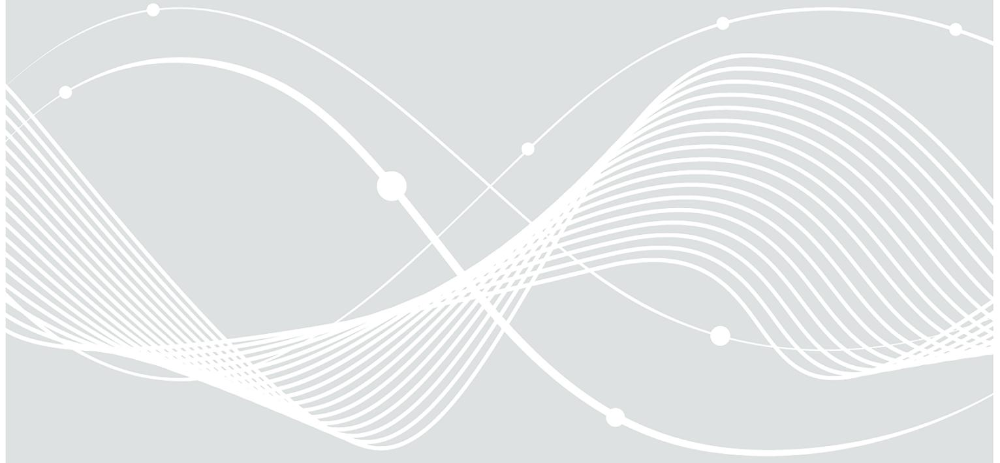

# Technische Richtlinie TR-02102-2 Kryptographische Verfahren: Empfehlungen und Schlüssellängen

Teil 2 – Verwendung von Transport Layer Security (TLS)

# Änderungshistorie

*Tabelle 1: Änderungshistorie*

| Version | Datum      | Beschreibung                                                      |
|---------|------------|-------------------------------------------------------------------|
| 2019-01 | 22.02.2019 | Anpassung der Verwendungszeiträume, Empfehlung von TLS 1.3,       |
|         |            | Empfehlung von PSK-Cipher-Suiten aus RFC 8442, Empfehlung des CCM |
|         |            | Modus                                                             |
| 2020-01 | 28.02.2020 | Anpassung der Verwendungszeiträume, Abkündigung von HMAC-SHA-1    |
| 2021-01 | 12.03.2021 | Anpassung der Verwendungszeiträume                                |
| 2022-01 | 24.01.2022 | Anpassung der Verwendungszeiträume, Empfehlung der elliptischen   |
|         |            | Kurve secp521r1                                                   |
| 2023-01 | 17.01.2023 | Anhebung des Sicherheitsniveaus auf 120 Bit, Anpassung der        |
|         |            | Verwendungszeiträume                                              |
| 2024-01 | 29.02.2024 | Anpassung der Verwendungszeiträume, Abkündigung der Empfehlung    |
|         |            | von DSA und von DHE-Cipher-Suiten ab 2029                         |
| 2025-01 | 21.01.2025 | Anpassung der Verwendungszeiträume                                |

Bundesamt für Sicherheit in der Informationstechnik Postfach 20 03 63 53133 Bonn Tel.: +49 22899 9582-0 E-Mail: TR02102@bsi.bund.de Internet: https://www.bsi.bund.de © Bundesamt für Sicherheit in der Informationstechnik 2025

| 1 |     | Einleitung |                                             | 4 |
|---|-----|------------|---------------------------------------------|---|
| 2 |     |            | Grundlagen                                  | 5 |
| 3 |     |            | Empfehlungen                                | 6 |
|   | 3.1 |            | Allgemeine Hinweise                      | 6 |
|   |     | 3.1.1      | Verwendungszeiträume                     | 6 |
|   |     | 3.1.2      | Sicherheitsniveau                        | 6 |
|   |     | 3.1.3      | Einsatz quantensicherer Verfahren           | 6 |
|   | 3.2 |            | SSL/TLS-Versionen                           | 6 |
|   | 3.3 |            | Empfehlungen zu TLS 1.2                  | 6 |
|   |     | 3.3.1      | Cipher-Suiten                               | 7 |
|   |     | 3.3.2      | Diffie-Hellman-Gruppen                      | 9 |
|   |     | 3.3.3      | Signaturverfahren                        | 9 |
|   |     | 3.3.4      | Weitere Empfehlungen10                      |   |
|   | 3.4 |            | Empfehlungen zu TLS 1.3 12               |   |
|   |     | 3.4.1      | Handshake-Modi12                            |   |
|   |     | 3.4.2      | Diffie-Hellman-Gruppen12                    |   |
|   |     | 3.4.3      | Signaturverfahren 13                     |   |
|   |     | 3.4.4      | Cipher-Suiten14                             |   |
|   |     | 3.4.5      | Weitere Empfehlungen14                      |   |
|   | 3.5 |            | Authentisierung der Kommunikationspartner14 |   |
|   | 3.6 |            | Domainparameter und Schlüssellängen14       |   |
|   |     | 3.6.1      | Schlüssellängen 14                       |   |
|   |     | 3.6.2      | Verwendung von elliptischen Kurven15        |   |
| 4 |     |            | Schlüssel und Zufallszahlen16               |   |
|   | 4.1 |            | Schlüsselspeicherung16                      |   |
|   | 4.2 |            | Umgang mit Ephemer-Schlüsseln16             |   |
|   | 4.3 |            | Zufallszahlen16                             |   |
|   |     |            | Literaturverzeichnis17                      |   |

# 1 Einleitung

Diese Technische Richtlinie enthält Empfehlungen für den Einsatz des kryptographischen Protokolls *Transport Layer Security (TLS)*. Es dient der sicheren Übertragung von Informationen in Datennetzwerken, wobei insbesondere die *Vertraulichkeit*, die *Integrität* und die *Authentizität* der übertragenen Informationen im Vordergrund stehen.

Die vorliegende Technische Richtlinie enthält Empfehlungen für die zu verwendende Protokollversion sowie die kryptographischen Algorithmen und Schlüssellängen als Konkretisierung der allgemeinen Empfehlungen in Teil 1 dieser Technischen Richtlinie [TR-02102-1]. Wie in Kapitel 1 von [TR-02102-1] angemerkt, werden nicht aufgeführte kryptographische Verfahren vom BSI nicht unbedingt als unsicher beurteilt.

Diese Technische Richtlinie enthält keine Empfehlungen für konkrete Anwendungen, keine Risikobewertungen sowie keine Angriffsmöglichkeiten, die sich aus Fehlern in der Implementierung des Protokolls ergeben.

**Hinweis:** Auch bei Beachtung aller Empfehlungen für die Verwendung von TLS können Daten in erheblichem Umfang aus einem kryptographischen System abfließen, zum Beispiel durch Ausnutzung von Seitenkanälen (Messung von Timing-Verhalten, Stromaufnahme, Datenraten etc.). Daher sollte der Entwickler eines kryptographischen Systems unter Hinzuziehung von Experten auf diesem Gebiet mögliche Seitenkanäle identifizieren und entsprechende Gegenmaßnahmen umsetzen. Je nach Anwendung gilt dies auch für Fault-Attacken.

**Hinweis:** Für Definitionen kryptographischer Begriffe in diesem Dokument siehe das Glossar in [TR-02102- 1].

### 2 Grundlagen

Transport Layer Security (TLS), früher bekannt als Secure Socket Layer (SSL), ermöglicht die sichere Übertragung von Informationen aus der Anwendungsschicht (zum Beispiel HTTPS, FTPS oder IMAPS) über TCP/IP-basierte Verbindungen (insbesondere das Internet).

Bevor Daten übertragen werden können, muss zunächst eine gesicherte Verbindung zwischen den beiden Verbindungspartnern (Client und Server) aufgebaut werden. Dieser Vorgang heißt Handshake und ist ein wichtiger Bestandteil des TLS-Protokolls. Hierbei werden zwischen Client und Server vereinbart:

- 1. Kryptographische Verfahren für die *Verschlüsselung*, *Integritätssicherung*, *Schlüsseleinigung* und ggf. für die (ein- oder beidseitige) *Authentisierung*. Diese Verfahren werden durch sogenannte Cipher-Suiten und weitere kryptographische Parameter festgelegt (siehe Abschnitte [3.3](#page-5-6) und [3.4\)](#page-11-0).
- 2. Ein gemeinsames Geheimnis, das *master secret*. Aus diesem werden von beiden Verbindungspartnern die Sitzungsschlüssel für den Integritätsschutz und die Verschlüsselung abgeleitet.

**Hinweis:** Das TLS-Protokoll erlaubt auch Verbindungen, die nicht oder nur einseitig authentisiert sind (beispielsweise sind HTTPS-Verbindungen üblicherweise nur serverseitig authentisiert). Daher sollten Entwickler kryptographischer Systeme darauf achten, ob eine weitere Authentisierung innerhalb der Anwendungsschicht erforderlich ist (Beispiel: Authentisierung eines Homebanking-Benutzers durch Anforderung eines Passwortes). Bei besonders kritischen Operationen sollte dabei grundsätzlich eine Authentisierung durch Wissen und Besitz (Zwei-Faktor-Authentisierung) erfolgen, die sich unter Ausnutzung kryptographischer Mechanismen auch auf die übertragenen Daten erstrecken sollte.

# 3 Empfehlungen

### 3.1 Allgemeine Hinweise

#### 3.1.1 Verwendungszeiträume

Die Empfehlungen in dieser Technischen Richtlinie sind mit Verwendungszeiträumen versehen. Die Angabe der Jahreszahl bedeutet hierbei, dass das entsprechende Verfahren bis zum Ende des angegebenen Jahres empfohlen wird. Ist die Jahreszahl mit einem "+"-Zeichen gekennzeichnet, so bedeutet dies, dass dieser Verwendungszeitraum möglicherweise in einer zukünftigen Version dieser Technischen Richtlinie verlängert wird.

#### 3.1.2 Sicherheitsniveau

Das Sicherheitsniveau für alle kryptographischen Verfahren in dieser Technischen Richtlinie richtet sich nach dem in Abschnitt 1.1 in [TR-02102-1] angegebenen Sicherheitsniveau und liegt bei 120 Bit.

#### 3.1.3 Einsatz quantensicherer Verfahren

Die heute eingesetzten klassischen, asymmetrischen kryptographischen Verfahren sind durch die fortschreitende Entwicklung hinreichend großer Quantencomputer bedroht. Teil 1 dieser Technischen Richtline [TR-02102-1] gibt allgemeine Empfehlungen für quantensichere Verfahren. Standards für die Nutzung quantensicherer Verfahren in TLS werden gerade entwickelt und erprobt. Das BSI beabsichtigt, quantensichere Verfahren in dieser Technischen Richtlinie (in hybrider Nutzung mit empfohlenen klassischen Verfahren) zu empfehlen, sobald geeignete Standards verabschiedet wurden.

### 3.2 SSL/TLS-Versionen

Das SSL-Protokoll existiert in den Versionen 1.0, 2.0 und 3.0, wobei die Version 1.0 nicht veröffentlicht wurde. TLS 1.0 ist eine direkte Weiterentwicklung von SSL 3.0 und wird in [RFC 2246] spezifiziert. Des Weiteren gibt es die TLS-Versionen 1.1, 1.2 und 1.3, welche in [RFC 4346], [RFC 5246] und [RFC 8446] spezifiziert werden.

Empfehlungen für die Wahl der TLS-Version sind:

- Grundsätzlich werden TLS 1.2 und TLS 1.3 empfohlen, wobei das modernere Protokoll TLS 1.3 bevorzugt verwendet werden sollte.
- TLS 1.0 und TLS 1.1 werden **nicht empfohlen** (siehe auch [RFC 8996]).
- SSL v2 ([SSLv2]) und SSL v3 ([SSLv3]) werden **nicht empfohlen** (siehe auch [RFC 6176] und [RFC 7568]).

### 3.3 Empfehlungen zu TLS 1.2

In TLS 1.2 werden die kryptographischen Verfahren einer Verbindung durch eine Cipher-Suite festgelegt. Eine Cipher-Suite spezifiziert ein (authentisiertes) Schlüsseleinigungsverfahren für das Handshake-Protokoll, ein authentisiertes Verschlüsselungsverfahren für das Record-Protokoll und eine Hashfunktion für die Schlüsselableitung. Für die Schlüsseleinigung müssen je nach Cipher-Suite noch eine Diffie-Hellman-Gruppe (in einem endlichen Körper oder über einer elliptischen Kurve) oder Signaturverfahren festgelegt werden.

Eine vollständige Liste aller definierten Cipher-Suiten mit Verweisen auf die jeweiligen Spezifikationen ist verfügbar unter [IANA].

#### 3.3.1 Cipher-Suiten

In TLS 1.2 werden Cipher-Suiten in der Regel mit der Namenskonvention TLS\_*AKE*\_WITH\_*Enc*\_*Hash* angegeben, wobei *AKE* ein (authentisiertes) Schlüsseleinigungsverfahren, *Enc* ein

Verschlüsselungsverfahren mit Betriebsmodus und *Hash* eine Hashfunktion bezeichnet. Die Funktion Hash wird von einem HMAC (*Keyed-Hash Message Authentication Code*) genutzt, der für die PRF (*Pseudo-Random Function*) zur Schlüsselableitung verwendet wird.1 Falls *Enc* kein authentisiertes Verschlüsselungsverfahren (*Authenticated Encryption with Associated Data*, kurz AEAD) ist, so wird der HMAC zusätzlich für die Integritätssicherung im Record-Protokoll eingesetzt.

Grundsätzlich wird empfohlen, nur Cipher-Suiten einzusetzen, die die Anforderungen an die Algorithmen und Schlüssellängen der [TR-02102-1] erfüllen.

#### 3.3.1.1 (EC)DHE Cipher-Suiten

Die folgenden Cipher-Suiten mit Perfect Forward Secrecy2 werden empfohlen:

| Cipher-Suite                            | IANA-Nr.  | Referenz      | Verwendung bis |
|-----------------------------------------|-----------|---------------|----------------|
| TLS_ECDHE_ECDSA_WITH_AES_128_CBC_SHA256 | 0xC0,0x23 | [RFC 5289] | 2031+          |
| TLS_ECDHE_ECDSA_WITH_AES_256_CBC_SHA384 | 0xC0,0x24 | [RFC 5289] | 2031+          |
| TLS_ECDHE_ECDSA_WITH_AES_128_GCM_SHA256 | 0xC0,0x2B | [RFC 5289] | 2031+          |
| TLS_ECDHE_ECDSA_WITH_AES_256_GCM_SHA384 | 0xC0,0x2C | [RFC 5289] | 2031+          |
| TLS_ECDHE_ECDSA_WITH_AES_128_CCM        | 0xC0,0xAC | [RFC 7251] | 2031+          |
| TLS_ECDHE_ECDSA_WITH_AES_256_CCM        | 0xC0,0xAD | [RFC 7251] | 2031+          |
| TLS_ECDHE_RSA_WITH_AES_128_CBC_SHA256   | 0xC0,0x27 | [RFC 5289] | 2031+          |
| TLS_ECDHE_RSA_WITH_AES_256_CBC_SHA384   | 0xC0,0x28 | [RFC 5289] | 2031+          |
| TLS_ECDHE_RSA_WITH_AES_128_GCM_SHA256   | 0xC0,0x2F | [RFC 5289] | 2031+          |
| TLS_ECDHE_RSA_WITH_AES_256_GCM_SHA384   | 0xC0,0x30 | [RFC 5289] | 2031+          |
| TLS_DHE_DSS_WITH_AES_128_CBC_SHA256     | 0x00,0x40 | [RFC 5246] | 2029           |
| TLS_DHE_DSS_WITH_AES_256_CBC_SHA256     | 0x00,0x6A | [RFC 5246] | 2029           |
| TLS_DHE_DSS_WITH_AES_128_GCM_SHA256     | 0x00,0xA2 | [RFC 5288] | 2029           |
| TLS_DHE_DSS_WITH_AES_256_GCM_SHA384     | 0x00,0xA3 | [RFC 5288] | 2029           |
| TLS_DHE_RSA_WITH_AES_128_CBC_SHA256     | 0x00,0x67 | [RFC 5246] | 2029           |
| TLS_DHE_RSA_WITH_AES_256_CBC_SHA256     | 0x00,0x6B | [RFC 5246] | 2029           |
| TLS_DHE_RSA_WITH_AES_128_GCM_SHA256     | 0x00,0x9E | [RFC 5288] | 2029           |
| TLS_DHE_RSA_WITH_AES_256_GCM_SHA384     | 0x00,0x9F | [RFC 5288] | 2029           |
| TLS_DHE_RSA_WITH_AES_128_CCM            | 0xC0,0x9E | [RFC 6655] | 2029           |
| TLS_DHE_RSA_WITH_AES_256_CCM            | 0xC0,0x9F | [RFC 6655] | 2029           |

*Tabelle 2: Empfohlene Cipher-Suiten für TLS 1.2 mit Perfect Forward Secrecy*

**Hinweis:** Die Verwendung von Cipher-Suiten mit dem CBC-Modus wird nur in Verbindung mit der TLS-Erweiterung "Encrypt-then-MAC" empfohlen (siehe Abschnitt[e 3.3.4.4](#page-10-0) und [3.3.4.5\)](#page-10-1).

1 Bei Cipher-Suiten, die den Betriebsmodus CCM verwenden, ist keine Hashfunktion angegeben. Diese Cipher-Suiten verwenden SHA-256 für die PRF.

2 Perfect Forward Secrecy (kurz PFS, auch Forward Secrecy) bedeutet, dass eine Verbindung auch bei Kenntnis der Langzeit-Schlüssel der Kommunikationspartner nicht nachträglich entschlüsselt werden kann. Bei der Verwendung von TLS zum Schutz personenbezogener oder anderer sensibler Daten wird Perfect Forward Secrecy grundsätzlich empfohlen.

**Hinweis:** Die Cipher-Suiten der Form TLS\_DHE\_\* werden voraussichtlich von der IETF abgekündigt (sieh[e https://datatracker.ietf.org/doc/draft-ietf-tls-deprecate-obsolete-kex/\)](https://datatracker.ietf.org/doc/draft-ietf-tls-deprecate-obsolete-kex/). Daher werden diese Cipher-Suiten in dieser Technischen Richtlinie nur noch bis 2029 empfohlen.

#### 3.3.1.2 (EC)DH Cipher-Suiten

Sofern die Verwendung der in Abschnitt [3.3.1.1](#page-6-1) empfohlenen Cipher-Suiten mit Perfect Forward Secrecy nicht möglich ist, können auch die folgenden Cipher-Suiten eingesetzt werden:

| Cipher-Suite                           | IANA-Nr.  | Referenz      | Verwendung bis |
|----------------------------------------|-----------|---------------|----------------|
| TLS_ECDH_ECDSA_WITH_AES_128_CBC_SHA256 | 0xC0,0x25 | [RFC 5289] | 2026           |
| TLS_ECDH_ECDSA_WITH_AES_256_CBC_SHA384 | 0xC0,0x26 | [RFC 5289] | 2026           |
| TLS_ECDH_ECDSA_WITH_AES_128_GCM_SHA256 | 0xC0,0x2D | [RFC 5289] | 2026           |
| TLS_ECDH_ECDSA_WITH_AES_256_GCM_SHA384 | 0xC0,0x2E | [RFC 5289] | 2026           |
| TLS_ECDH_RSA_WITH_AES_128_CBC_SHA256   | 0xC0,0x29 | [RFC 5289] | 2026           |
| TLS_ECDH_RSA_WITH_AES_256_CBC_SHA384   | 0xC0,0x2A | [RFC 5289] | 2026           |
| TLS_ECDH_RSA_WITH_AES_128_GCM_SHA256   | 0xC0,0x31 | [RFC 5289] | 2026           |
| TLS_ECDH_RSA_WITH_AES_256_GCM_SHA384   | 0xC0,0x32 | [RFC 5289] | 2026           |
| TLS_DH_DSS_WITH_AES_128_CBC_SHA256     | 0x00,0x3E | [RFC 5246] | 2026           |
| TLS_DH_DSS_WITH_AES_256_CBC_SHA256     | 0x00,0x68 | [RFC 5246] | 2026           |
| TLS_DH_DSS_WITH_AES_128_GCM_SHA256     | 0x00,0xA4 | [RFC 5288] | 2026           |
| TLS_DH_DSS_WITH_AES_256_GCM_SHA384     | 0x00,0xA5 | [RFC 5288] | 2026           |
| TLS_DH_RSA_WITH_AES_128_CBC_SHA256     | 0x00,0x3F | [RFC 5246] | 2026           |
| TLS_DH_RSA_WITH_AES_256_CBC_SHA256     | 0x00,0x69 | [RFC 5246] | 2026           |
| TLS_DH_RSA_WITH_AES_128_GCM_SHA256     | 0x00,0xA0 | [RFC 5288] | 2026           |
| TLS_DH_RSA_WITH_AES_256_GCM_SHA384     | 0x00,0xA1 | [RFC 5288] | 2026           |

*Tabelle 3: Empfohlene Cipher-Suiten für TLS 1.2 ohne Perfect Forward Secrecy*

**Hinweis:** Die Verwendung von Cipher-Suiten mit dem CBC-Modus wird nur in Verbindung mit der TLS-Erweiterung "Encrypt-then-MAC" empfohlen (siehe Abschnitt[e 3.3.4.4](#page-10-0) und [3.3.4.5\)](#page-10-1).

#### 3.3.1.3 Schlüsseleinigung mit vorab ausgetauschten Daten

Sollen bei einer TLS-Verbindung zusätzliche vorab ausgetauschte Daten in die Schlüsseleinigung einfließen, können Cipher-Suiten mit einem Pre-shared Key (kurz PSK) verwendet werden. Grundsätzlich werden hierbei solche Cipher-Suiten empfohlen, bei denen neben dem Pre-shared Key weitere ephemere Schlüssel oder ausgetauschte Zufallszahlen in die Schlüsseleinigung eingehen.

Die Verwendung von Cipher-Suiten vom Typ TLS\_PSK\_\*, das heißt ohne zusätzliche ephemere Schlüssel oder Zufallszahlen, wird **nicht empfohlen**, da bei diesen Cipher-Suiten die Sicherheit der Verbindung ausschließlich auf der Entropie und der Vertraulichkeit des Pre-shared Keys beruht.

Die folgenden Cipher-Suiten mit PSK werden empfohlen:

| Cipher-Suite |  |  |  |  |  |  | IANA-Nr.                              | Referenz  | Verwendung bis |       |
|--------------|--|--|--|--|--|--|---------------------------------------|-----------|----------------|-------|
|              |  |  |  |  |  |  | TLS_ECDHE_PSK_WITH_AES_128_CBC_SHA256 | 0xC0,0x37 | [RFC 5489]  | 2031+ |
|              |  |  |  |  |  |  | TLS_ECDHE_PSK_WITH_AES_256_CBC_SHA384 | 0xC0,0x38 | [RFC 5489]  | 2031+ |
|              |  |  |  |  |  |  | TLS_ECDHE_PSK_WITH_AES_128_GCM_SHA256 | 0xD0,0x01 | [RFC 8442]  | 2031+ |
|              |  |  |  |  |  |  | TLS_ECDHE_PSK_WITH_AES_256_GCM_SHA384 | 0xD0,0x02 | [RFC 8442]  | 2031+ |
|              |  |  |  |  |  |  | TLS_ECDHE_PSK_WITH_AES_128_CCM_SHA256 | 0xD0,0x05 | [RFC 8442]  | 2031+ |

*Tabelle 4: Empfohlene Cipher-Suiten für TLS 1.2 mit Pre-Shared Key*

| Cipher-Suite                        | IANA-Nr.  | Referenz      | Verwendung bis |
|-------------------------------------|-----------|---------------|----------------|
| TLS_DHE_PSK_WITH_AES_128_CBC_SHA256 | 0x00,0xB2 | [RFC 5487] | 2029           |
| TLS_DHE_PSK_WITH_AES_256_CBC_SHA384 | 0x00,0xB3 | [RFC 5487] | 2029           |
| TLS_DHE_PSK_WITH_AES_128_GCM_SHA256 | 0x00,0xAA | [RFC 5487] | 2029           |
| TLS_DHE_PSK_WITH_AES_256_GCM_SHA384 | 0x00,0xAB | [RFC 5487] | 2029           |
| TLS_DHE_PSK_WITH_AES_128_CCM        | 0xC0,0xA6 | [RFC 6655] | 2029           |
| TLS_DHE_PSK_WITH_AES_256_CCM        | 0xC0,0xA7 | [RFC 6655] | 2029           |
| TLS_RSA_PSK_WITH_AES_128_CBC_SHA256 | 0x00,0xB6 | [RFC 5487] | 2026           |
| TLS_RSA_PSK_WITH_AES_256_CBC_SHA384 | 0x00,0xB7 | [RFC 5487] | 2026           |
| TLS_RSA_PSK_WITH_AES_128_GCM_SHA256 | 0x00,0xAC | [RFC 5487] | 2026           |
| TLS_RSA_PSK_WITH_AES_256_GCM_SHA384 | 0x00,0xAD | [RFC 5487] | 2026           |

**Hinweis:** Die Verwendung von Cipher-Suiten mit dem CBC-Modus wird nur in Verbindung mit der TLS-Erweiterung "Encrypt-then-MAC" empfohlen (siehe Abschnitt[e 3.3.4.4](#page-10-0) und [3.3.4.5\)](#page-10-1).

**Hinweis:** Die Cipher-Suiten der Form TLS\_DHE\_\* werden voraussichtlich von der IETF abgekündigt (siehe [https://datatracker.ietf.org/doc/draft-ietf-tls-deprecate-obsolete-kex/\)](https://datatracker.ietf.org/doc/draft-ietf-tls-deprecate-obsolete-kex/). Daher werden diese Cipher-Suiten in dieser Technischen Richtlinie nur noch bis 2029 empfohlen.

**Hinweis:** Die Cipher-Suiten der Form TLS\_RSA\_PSK\_\* au[s Tabelle 4](#page-7-0) bieten keine Perfect Forward Secrecy, alle anderen Cipher-Suiten au[s Tabelle 4](#page-7-0) hingegen bieten Perfect Forward Secrecy.

#### 3.3.2 Diffie-Hellman-Gruppen

Bei Verwendung von TLS\_DHE\_\* oder TLS\_ECDHE\_\* Cipher-Suiten kann der Client dem Server mittels der "supported\_groups" Erweiterung (ehemals auch "elliptic\_curves" Erweiterung genannt) signalisieren, welche Diffie-Hellman-Gruppen er verwenden möchte (siehe [RFC 7919] für DHE und [RFC 8422] für ECDHE).

Die Verwendung der "supported\_groups" Erweiterung für TLS\_ECDHE\_\* Cipher-Suiten wird empfohlen.

Die Verwendung der "supported\_groups" Erweiterung für TLS\_DHE\_\* Cipher-Suiten wird empfohlen.

Die folgenden Diffie-Hellman-Gruppen werden empfohlen:

| Diffie-Hellman-Gruppe | IANA-Nr. | Referenz      | Verwendung bis |
|-----------------------|----------|---------------|----------------|
| secp256r1             | 23       | [RFC 8422] | 2031+          |
| secp384r1             | 24       | [RFC 8422] | 2031+          |
| secp521r1             | 25       | [RFC 8422] | 2031+          |
| brainpoolP256r1       | 26       | [RFC 7027] | 2031+          |
| brainpoolP384r1       | 27       | [RFC 7027] | 2031+          |
| brainpoolP512r1       | 28       | [RFC 7027] | 2031+          |
| ffdhe3072             | 257      | [RFC 7919] | 2029           |
| ffdhe4096             | 258      | [RFC 7919] | 2029           |

*Tabelle 5: Empfohlene Diffie-Hellman-Gruppen für TLS 1.2*

Grundsätzlich ist Abschnit[t 3.6](#page-13-3) bei der Wahl von Domainparametern und Schlüssellängen zu beachten.

#### 3.3.3 Signaturverfahren

In TLS 1.2 kann der Client dem Server mittels der "signature\_algorithms" Erweiterung (siehe [RFC5246]) signalisieren, welche Signaturverfahren er für die Schlüsseleinigung und für Zertifikate akzeptiert. Bei beidseitiger Authentisierung signalisiert der Server dem Client die von ihm akzeptierten Signaturverfahren mit der CertificateRequest-Nachricht. Die Algorithmen müssen in beiden Fällen als Kombination aus Signaturverfahren und Hashfunktion angegeben werden.

Die Verwendung der "signature\_algorithms" Erweiterung wird empfohlen.

Die folgenden Signaturverfahren werden empfohlen:

*Tabelle 6: Empfohlene Signaturverfahren für TLS 1.2*

| Signaturverfahren | IANA-Nr. | Referenz      | Verwendung bis |
|-------------------|----------|---------------|----------------|
| rsa               | 1        | [RFC 5246] | 2025           |
| dsa               | 2        | [RFC 5246] | 2029           |
| ecdsa             | 3        | [RFC 5246] | 2031+          |

Für Domainparameter und Schlüssellängen ist Abschnitt [3.6](#page-13-3) zu beachten.

**Hinweis:** Die Nutzung des Signaturverfahrens rsa (IANA-Nr. 1) wird aufgrund der Verwendung des PKCS #1 v1.5 Paddingverfahrens nur noch bis 2025 empfohlen (siehe auch Abschnitt 1.5 in [TR-02102-1]). Für die Nutzung von RSA-Signaturen mit PSS-Padding in TLS 1.2 gemäß [RFC 8446], Abschnitt 1.3 und 4.2.3, gelten die Empfehlungen aus [Tabelle 10](#page-12-1) un[d Tabelle 11.](#page-12-2)

**Hinweis:** Die Nutzung des Signaturverfahrens dsa (IANA-Nr. 2) wird aufgrund der geringen Verbreitung und der Abkündigung in [FIPS 186-5] nur noch bis 2029 empfohlen (siehe auch Bemerkung 5.7 in [TR-02102-1]).

Die folgenden Hashfunktionen werden (in Kombination mit einem Signaturverfahren au[s Tabelle 6\)](#page-9-1) empfohlen:

|  | Tabelle 7: Empfohlene Hashfunktionen für Signaturverfahren in TLS 1.2 |  |
|--|-----------------------------------------------------------------------|--|
|  |                                                                       |  |

| Hashfunktion | IANA-Nr. | Referenz      | Verwendung bis |
|--------------|----------|---------------|----------------|
| sha256       | 4        | [RFC 5246] | 2031+          |
| sha384       | 5        | [RFC 5246] | 2031+          |
| sha512       | 6        | [RFC 5246] | 2031+          |

#### 3.3.4 Weitere Empfehlungen

#### 3.3.4.1 Session Renegotiation

Es wird empfohlen Session Renegotiation nur auf Basis von [RFC 5746] zu verwenden. Durch den Client initiierte Renegotiation sollte vom Server abgelehnt werden.

#### 3.3.4.2 Verkürzung der HMAC-Ausgabe

Die in [RFC 6066] definierte Extension "truncated\_hmac" zur Verkürzung der Ausgabe des HMAC auf 80 Bit sollte *nicht* verwendet werden.

#### 3.3.4.3 TLS-Kompression und der CRIME-Angriff

TLS bietet die Möglichkeit, die übertragenen Daten vor der Verschlüsselung zu komprimieren. Dies führt zu der Möglichkeit eines Seitenkanalangriffes auf die Verschlüsselung, und zwar mit Hilfe der Länge der verschlüsselten Daten (siehe [CRIME]).

Um dies zu verhindern, muss sichergestellt werden, dass alle Daten eines Datenpakets von dem korrekten und legitimen Verbindungspartner stammen und keine Plaintext-Injection durch einen Angreifer möglich ist. Kann dies nicht sichergestellt werden, so wird empfohlen die TLS-Datenkompression nicht zu verwenden.

#### 3.3.4.4 Der Lucky-13-Angriff

Lucky 13 ist ein Seitenkanalangriff (Timing) gegen Cipher-Suiten mit dem CBC-Modus, bei dem der Angreifer sehr geringe Zeitdifferenzen bei der Verarbeitung des Paddings auf Seiten des Servers ausnutzt. Für diesen Angriff muss der Angreifer sehr genaue Zeitmessungen im Netzwerk machen können. Er schickt manipulierte Chiffrate an den Server und misst die Zeit, die der Server benötigt, um das Padding dieser Chiffrate zu prüfen bzw. einen Fehler zu melden. Durch Netzwerk-Jitter können hier aber sehr leicht Fehler bei der Zeitmessung entstehen, so dass ein Angriff grundsätzlich als schwierig realisierbar erscheint, denn der Angreifer muss im Netzwerk "sehr nahe" am Server sein, um genau genug messen zu können.

Der Angriff kann abgewehrt werden, wenn

- Authenticated Encryption, wie zum Beispiel AES-GCM oder AES-CCM, oder
- Encrypt-then-MAC (siehe auch nächster Abschnitt)

eingesetzt wird.

#### 3.3.4.5 Die Encrypt-then-MAC-Erweiterung

Gemäß TLS-Spezifikation (siehe [RFC 5246]) werden die zu übertragenen Daten zunächst mit einem Message Authentication Code (MAC) gesichert und dann mit einem Padding versehen; danach werden die Daten und das Padding verschlüsselt. Diese Reihenfolge ("MAC-then-Encrypt") war in der Vergangenheit häufig der Grund für Angriffe auf die Verschlüsselung, da das Padding nicht durch den MAC geschützt ist.

Bei den sogenannten Padding-Oracle-Angriffen werden die verschlüsselten TLS-Pakete durch einen Manin-the-Middle-Angreifer manipuliert, um die Prüfung des Paddings als Seitenkanal zu missbrauchen. Dies kann beispielsweise dazu führen, dass der Angreifer ein HTTPS-Sitzungs-Cookie entschlüsseln kann und somit die Sitzung des Opfers übernehmen kann.

In [RFC 7366] wird die TLS-Erweiterung "Encrypt-then-MAC" spezifiziert. Hierbei werden die zu übertragenen Daten zuerst mit einem Padding versehen, dann verschlüsselt und danach mit einem MAC gesichert. Damit sind Manipulationen des Paddings ausgeschlossen, da es auch durch den MAC gesichert ist.

#### **Der Einsatz der TLS-Erweiterung "Encrypt-then-MAC" gemäß [RFC 7366] wird empfohlen.**

#### 3.3.4.6 Die Heartbeat-Erweiterung

Die Heartbeat-Erweiterung wird in [RFC 6520] spezifiziert; sie ermöglicht es, eine TLS-Verbindung über einen längeren Zeitraum aufrecht zu halten, ohne eine Renegotiation der Verbindung durchführen zu müssen. Durch den sogenannten Heartbleed-Bug ist es einem Angreifer möglich, bestimmte Speicherbereiche des Servers auszulesen, die möglicherweise geheimes Schlüsselmaterial enthalten. Dies kann zu einer vollständigen Kompromittierung des Servers führen, falls der private Schlüssel des Servers bekannt wird.

Es wird empfohlen, die Heartbeat-Erweiterung nicht zu verwenden.

#### 3.3.4.7 Die Extended-Master-Secret-Erweiterung

Um Angriffe, wie zum Beispiel den Triple-Handshake-Angriff (siehe [BDF14]) abzuwehren, ist es sehr sinnvoll, weitere Verbindungsparameter in den TLS-Handshake einfließen zu lassen, damit unterschiedliche TLS-Verbindungen auch unterschiedliche Master Secrets (aus welchem die symmetrischen Schlüssel abgeleitet werden) benutzen.

In [RFC 7627] wird die TLS-Erweiterung *Extended Master Secret* spezifiziert, die bei der Berechnung des "erweiterten" Master Secrets einen Hashwert über alle Nachrichten des TLS-Handshakes mit in dieses einfließen lässt.

#### **Der Einsatz der TLS-Erweiterung** *Extended Master Secret* **gemäß [RFC 7627] wird empfohlen.**

### 3.4 Empfehlungen zu TLS 1.3

In TLS 1.3 werden die kryptographischen Verfahren einer Verbindung durch einen Handshake-Modus, eine Diffie-Hellman-Gruppe (bei (EC)DHE), ein Signaturverfahren (bei zertifikatsbasierter Authentisierung) und eine Cipher-Suite festgelegt. Im Gegensatz zu früheren TLS-Versionen spezifiziert eine Cipher-Suite hierbei nur ein authentisiertes Verschlüsselungsverfahren für das Record-Protokoll sowie eine Hashfunktion für die Schlüsselableitung.

#### 3.4.1 Handshake-Modi

Neben der standardmäßigen Diffie-Hellman-Schlüsseleinigung über endlichen Körpern (DHE) oder elliptischen Kurven (ECDHE) gibt es in TLS 1.3 weitere Handshake-Modi, die Pre-shared Keys (PSK) verwenden. Unter Pre-shared Keys versteht man hierbei Schlüsselmaterial, das entweder vorab verteilt wurde oder das in einer vergangenen Session über den Session-Ticket-Mechanismus ausgetauscht wurde.

Die folgenden PSK-Modi werden empfohlen:

*Tabelle 8: Empfohlene Pre-Shared-Key-Modi für TLS 1.3*

| PSK-Modus  | IANA-Nr. | Referenz      | Verwendung bis |
|------------|----------|---------------|----------------|
| psk_ke     | 0        | [RFC 8446] | 2026           |
| psk_dhe_ke | 1        | [RFC 8446] | 2031+          |

**Hinweis:** Der PSK-Modus psk\_ke bietet keine Perfect Forward Secrecy. Dieser Modus sollte daher nur in speziellen Anwendungsfällen nach Hinzuziehen eines Experten eingesetzt werden.

**Hinweis:** Bei PSK-Handshakes besteht die Möglichkeit, Anwendungsdaten bereits mit der ersten Handshake-Nachricht mitzuschicken (*zero round-trip time* Daten, kurz 0-RTT Daten). Diese Daten sind nicht gegen Replay-Angriffe geschützt. Das Senden oder Annehmen von 0-RTT Daten wird daher **nicht empfohlen**.

#### 3.4.2 Diffie-Hellman-Gruppen

In TLS 1.3 können die Kommunikationspartner mittels der "supported\_groups" Erweiterung signalisieren, welche Diffie-Hellman-Gruppen für (EC)DHE verwendet werden sollen.

Die folgenden Diffie-Hellman-Gruppen werden empfohlen:

| Diffie-Hellman-Gruppe | IANA-Nr. | Referenz      | Verwendung bis |
|-----------------------|----------|---------------|----------------|
| secp256r1             | 23       | [RFC 8422] | 2031+          |
| secp384r1             | 24       | [RFC 8422] | 2031+          |
| secp521r1             | 25       | [RFC 8422] | 2031+          |
| brainpoolP256r1tls13  | 31       | [RFC 8734] | 2031+          |
| brainpoolP384r1tls13  | 32       | [RFC 8734] | 2031+          |
| brainpoolP512r1tls13  | 33       | [RFC 8734] | 2031+          |
| ffdhe3072             | 257      | [RFC 7919] | 2031+          |
| ffdhe4096             | 258      | [RFC 7919] | 2031+          |

*Tabelle 9: Empfohlene Diffie-Hellman-Gruppen für TLS 1.3*

**Hinweis:** Die Brainpool-Kurven werden grundsätzlich empfohlen.

**Hinweis:** In [RFC 8446] wurden die IANA-Nummern einiger EC-Gruppen, die laut [RFC 8446] entweder veraltet sind oder wenig genutzt wurden, als "obsolete\_RESERVED" gekennzeichnet. Dazu zählen auch die IANA-Nummern 26, 27, 28, die für die Brainpool-Kurven zur Nutzung in TLS 1.2 und früheren TLS-Versionen registriert sind. Aus diesem Grund wurden für die Nutzung der Brainpool-Kurven in TLS 1.3 die IANA-Nummern 31, 32, 33 reserviert (siehe [RFC 8734]).

#### 3.4.3 Signaturverfahren

In TLS 1.3 können die Kommunikationspartner mittels der Erweiterungen "signature\_algorithms" und "signature\_algorithms\_cert" signalisieren, welche Signaturverfahren zur zertifikatsbasierten Authentisierung verwendet werden sollen. Die "signature\_algorithms" Erweiterung bezieht sich dabei auf Signaturen, die der Client oder Server für eine CertificateVerify-Nachricht erstellt, und die "signature\_algorithms\_cert" Erweiterung auf Zertifikatssignaturen.

Die folgenden Signaturverfahren werden für die "signature\_algorithms" Erweiterung empfohlen:

*Tabelle 10: Empfohlene Signaturverfahren für TLS 1.3 (Client-/Server-Signatur)*

| Signaturverfahren                 | IANA-Nr. | Referenz      | Verwendung bis |
|-----------------------------------|----------|---------------|----------------|
| rsa_pss_rsae_sha256               | 0x0804   | [RFC 8446] | 2031+          |
| rsa_pss_rsae_sha384               | 0x0805   | [RFC 8446] | 2031+          |
| rsa_pss_rsae_sha512               | 0x0806   | [RFC 8446] | 2031+          |
| rsa_pss_pss_sha256                | 0x0809   | [RFC 8446] | 2031+          |
| rsa_pss_pss_sha384                | 0x080A   | [RFC 8446] | 2031+          |
| rsa_pss_pss_sha512                | 0x080B   | [RFC 8446] | 2031+          |
| ecdsa_secp256r1_sha256            | 0x0403   | [RFC 8446] | 2031+          |
| ecdsa_secp384r1_sha384            | 0x0503   | [RFC 8446] | 2031+          |
| ecdsa_secp521r1_sha512            | 0x0603   | [RFC 8446] | 2031+          |
| ecdsa_brainpoolP256r1tls13_sha256 | 0x081A   | [RFC 8734] | 2031+          |
| ecdsa_brainpoolP384r1tls13_sha384 | 0x081B   | [RFC 8734] | 2031+          |
| ecdsa_brainpoolP512r1tls13_sha512 | 0x081C   | [RFC 8734] | 2031+          |

Die folgenden Algorithmen werden für die "signature\_algorithms\_cert" Erweiterung empfohlen:

*Tabelle 11: Empfohlene Signaturverfahren für TLS 1.3 (Zertifikatssignaturen)*

| Signaturverfahren                 | IANA-Nr. | Referenz      | Verwendung bis |
|-----------------------------------|----------|---------------|----------------|
| rsa_pkcs1_sha256                  | 0x0401   | [RFC 8446] | 2025           |
| rsa_pkcs1_sha384                  | 0x0501   | [RFC 8446] | 2025           |
| rsa_pkcs1_sha512                  | 0x0601   | [RFC 8446] | 2025           |
| rsa_pss_rsae_sha256               | 0x0804   | [RFC 8446] | 2031+          |
| rsa_pss_rsae_sha384               | 0x0805   | [RFC 8446] | 2031+          |
| rsa_pss_rsae_sha512               | 0x0806   | [RFC 8446] | 2031+          |
| rsa_pss_pss_sha256                | 0x0809   | [RFC 8446] | 2031+          |
| rsa_pss_pss_sha384                | 0x080A   | [RFC 8446] | 2031+          |
| rsa_pss_pss_sha512                | 0x080B   | [RFC 8446] | 2031+          |
| ecdsa_secp256r1_sha256            | 0x0403   | [RFC 8446] | 2031+          |
| ecdsa_secp384r1_sha384            | 0x0503   | [RFC 8446] | 2031+          |
| ecdsa_secp521r1_sha512            | 0x0603   | [RFC 8446] | 2031+          |
| ecdsa_brainpoolP256r1tls13_sha256 | 0x081A   | [RFC 8734] | 2031+          |
| ecdsa_brainpoolP384r1tls13_sha384 | 0x081B   | [RFC 8734] | 2031+          |
| ecdsa_brainpoolP512r1tls13_sha512 | 0x081C   | [RFC 8734] | 2031+          |

Für Schlüssellängen bei RSA-Signaturen ist Abschnit[t 3.6](#page-13-3) zu beachten.

**Hinweis:** Die Nutzung der Signaturverfahren rsa\_pkcs1\_\* (IANA-Nr. 0x0401, 0x0501 und 0x0601) ist auf Grund der Verwendung des PKCS #1 v1.5 Paddingverfahrens nur noch bis 2025 empfohlen (siehe auch Abschnitt 1.5 in [TR-02102-1]).

### 3.4.4 Cipher-Suiten

In TLS 1.3 werden Cipher-Suiten mit der Namenskonvention TLS\_*AEAD*\_*Hash* angegeben, wobei *AEAD* ein authentisiertes Verschlüsselungsverfahren (*authenticated encryption with associated data*, kurz AEAD) für das Record-Protokoll und *Hash* eine Hashfunktion für die Nutzung mit HMAC (*Keyed-Hash Message Authentication Code*) und HKDF (*HMAC-based Extract-and-Expand Key Derivation Function*) im Handshake-Protokoll bezeichnet.

Die folgenden Cipher-Suiten werden empfohlen:

| Cipher-Suite           | IANA-Nr.  | Referenz      | Verwendung bis |
|------------------------|-----------|---------------|----------------|
| TLS_AES_128_GCM_SHA256 | 0x13,0x01 | [RFC 8446] | 2031+          |
| TLS_AES_256_GCM_SHA384 | 0x13,0x02 | [RFC 8446] | 2031+          |
| TLS_AES_128_CCM_SHA256 | 0x13,0x04 | [RFC 8446] | 2031+          |

#### 3.4.5 Weitere Empfehlungen

#### 3.4.5.1 Die Heartbeat-Erweiterung

Es wird empfohlen, die in [RFC 6520] spezifizierte Heartbeat-Erweiterung nicht zu verwenden (vgl. Abschnit[t 3.3.4.6\)](#page-10-2).

### 3.5 Authentisierung der Kommunikationspartner

Das TLS-Protokoll bietet die folgenden drei Möglichkeiten zur Authentisierung der Kommunikationspartner:

- Authentisierung beider Kommunikationspartner
- Nur serverseitige Authentisierung
- Keine Authentisierung

Die Notwendigkeit einer Authentisierung ist abhängig von der jeweiligen Anwendung. Bei der Verwendung von TLS im Web ist im Allgemeinen zumindest eine Authentisierung des Servers notwendig. Bei der Verwendung in geschlossenen Systemen (VPN o. ä.) ist zumeist eine beidseitige Authentisierung notwendig.

Die Technische Richtlinie [TR-02103] enthält Empfehlungen zu X.509-Zertifikaten und Zertifizierungspfadvalidierung.

Für die Authentisierung innerhalb von Projekten des Bundes sind die Vorgaben der Technischen Richtlinie [TR-03116-4] in der jeweils aktuellen Fassung zu beachten.

### 3.6 Domainparameter und Schlüssellängen

Die Domainparameter und Schlüssellängen für

- statische Schlüsselpaare der Kommunikationspartner,
- ephemere Schlüsselpaare bei der Verwendung von Cipher-Suiten mit Perfect Forward Secrecy, und
- Schlüsselpaare für die Signatur von Zertifikaten

müssen den Empfehlungen in Teil 1 dieser Technischen Richtlinie (siehe [TR-02102-1]) entsprechen.

#### 3.6.1 Schlüssellängen

Es wird empfohlen, mindestens die folgenden Schlüssellängen zu verwenden:

| Algorithmus                                             | Minimale Schlüssellänge | Verwendung spätestens ab | Verwendung bis |  |  |  |
|---------------------------------------------------------|----------------------------|-----------------------------|----------------|--|--|--|
| Signaturschlüssel für Zertifikate und Schlüsseleinigung |                            |                             |                |  |  |  |
| ECDSA                                                   | 250 Bit                    |                             | 2031+          |  |  |  |
| DSS                                                     | 3000 Bit                   | 2023                        | 2029           |  |  |  |
| RSA                                                     | 3000 Bit                   | 2023                        | 2031+          |  |  |  |
| Statische und ephemere Diffie-Hellman-Schlüssel         |                            |                             |                |  |  |  |
| ECDH                                                    | 250 Bit                    |                             | 2031+          |  |  |  |
| DH                                                      | 3000 Bit                   | 2023                        | 2031+          |  |  |  |

*Tabelle 13: Empfohlene Mindestschlüssellängen für das TLS-Handshakeprotokoll*

**Hinweis:** Ist ein Schlüsselpaar *statisch*, so wird es mehrfach für neue Verbindungen wiederverwendet. Im Gegensatz dazu bedeutet *ephemer*, dass für jede neue Verbindung auch ein neues Schlüsselpaar erzeugt und verwendet wird. Ephemere Schlüssel müssen nach Verbindungsende unbedingt sicher gelöscht werden, siehe dazu auch Abschnitt [4.2.](#page-15-2) Soll eine Verbindung die Eigenschaft *Perfect Forward Secrecy* erfüllen, müssen ausschließlich ephemere Schlüsselpaare verwendet werden.

**Bemerkung:** Die Empfehlungen in dieser Technischen Richtlinie sind geeignet, um das in Abschnitt [3.1.2](#page-5-3) genannte Sicherheitsniveau von 120 Bit zu erreichen.

Der Vorhersagezeitraum für die vorliegenden Empfehlungen beträgt 7 Jahre. Geeignete Empfehlungen für deutlich größere Zeiträume, wie sie in anderen öffentlich verfügbaren Dokumenten zu finden sind, sind naturgemäß sehr schwierig, da zukünftige kryptographische Entwicklungen über längere Zeiträume nicht oder zumindest nicht präzise vorausgesagt werden können. In solchen Fällen umfassen diese Empfehlungen Parameter und Schlüssellängen, die über die in der vorliegenden Technischen Richtlinie hinausgehen können.

#### 3.6.2 Verwendung von elliptischen Kurven

Bei der Verwendung von elliptischen Kurven werden stets kryptographisch starke Kurven über endlichen Körpern der Form *Fp* (*p* prim) empfohlen. Zusätzlich wird empfohlen, nur *named curves* (siehe Abschnitt "Supported Groups Registry" in [IANA]) einzusetzen, um Angriffe über nicht verifizierte schwache Domainparameter zu verhindern. Die folgenden *named curves* werden empfohlen:

• brainpoolP256r1, brainpoolP384r1, brainpoolP512r1 (siehe [RFC 5639] und [RFC 7027])

Sollten diese Kurven nicht verfügbar sein, so können auch die folgenden Kurven eingesetzt werden:

• secp256r1, secp384r1, secp521r1

# 4 Schlüssel und Zufallszahlen

### 4.1 Schlüsselspeicherung

Private kryptographische Schlüssel, insbesondere statische Schlüssel und Signaturschlüssel, müssen sicher gespeichert und verarbeitet werden. Dies bedeutet u. a. den Schutz vor Kopieren, missbräuchlicher Nutzung und Manipulation der Schlüssel. Eine sichere Schlüsselspeicherung kann zum Beispiel durch die Verwendung zertifizierter Hardware (Chipkarte, HSM) gewährleistet werden.

Ebenso müssen die öffentlichen Schlüssel von als vertrauenswürdig anerkannten Stellen (Vertrauensanker) manipulationssicher gespeichert werden.

### 4.2 Umgang mit Ephemer-Schlüsseln

Wenn eine Cipher-Suite mit Perfect Forward Secrecy verwendet wird, muss sichergestellt werden, dass alle Ephemer-Schlüssel nach ihrer Verwendung unwiderruflich gelöscht werden, und keine Kopien dieser Schlüssel erzeugt wurden. Ephemer- bzw. Sitzungsschlüssel dürfen nur für *eine* Verbindung benutzt werden und grundsätzlich nicht persistent abgespeichert werden.

### 4.3 Zufallszahlen

Für die Erzeugung von Zufallszahlen, zum Beispiel für kryptographische Schlüssel oder die Signaturerzeugung, müssen geeignete Zufallszahlengeneratoren eingesetzt werden.

Empfohlen wird ein Zufallszahlengenerator aus einer der Klassen DRG.3, DRG.4, DRT.1, PTG.3 oder NTG.1 gemäß [AIS 20/31], vgl. auch Kapitel 8 in Teil 1 dieser Technischen Richtlinie [TR-02102-1].

## Literaturverzeichnis

**[AIS 20/31]** BSI: AIS 20/31 – A proposal for: Functionality classes for random number generators, 2024

**[BDF14]** K. Bhargavan, A. Delignat-Lavaud, C. Fournet, A. Pironti, P.-Y. Strub: Triple Handshake and Cookie Cutters: Breaking and Fixing Authentication over TLS, IEEE Symposium on Security and Privacy, 2014

**[CRIME]** J. Rizzo, Th. Duong: The CRIME attack, Ekoparty Security Conference, 2012

**[FIPS 186-5]** National Institute of Standards and Technology: Federal Information Processing Standards FIPS PUB 186-5, Digital Signature Standard (DSS), 2023

**[IANA]** IANA[: https://www.iana.org/assignments/tls-parameters/tls-parameters.xhtml](https://www.iana.org/assignments/tls-parameters/tls-parameters.xhtml)

**[RFC 2246]** T. Dierks, C. Allen: RFC 2246, The TLS Protocol Version 1.0, 1999

**[RFC 4346]** T. Dierks, E. Rescorla: RFC 4346, The Transport Layer Security (TLS) Protocol Version 1.1, 2006

**[RFC 5246]** T. Dierks, E. Rescorla: RFC 5246, The Transport Layer Security (TLS) Protocol Version 1.2, 2008

**[RFC 5289]** E. Rescorla: RFC 5289, TLS Elliptic Curve Cipher Suites with SHA-256/384 and AES Galois Counter Mode (GCM), 2008

**[RFC 5487]** M. Badra: RFC 5487, Pre-Shared Key Cipher Suites for TLS with SHA-256/384 and AES Galois Counter Mode, 2009

**[RFC 5489]** M. Badra, I. Hajjeh: RFC 5289, ECDHE\_PSK Cipher Suites for Transport Layer Security (TLS), 2009

**[RFC 5639]** M. Lochter, J. Merkle: RFC 5639, Elliptic Curve Cryptography (ECC) Brainpool Standard Curves and Curve Generation, 2010

**[RFC 5746]** E. Rescorla, M. Ray, S. Dispensa, N. Oskov: RFC 5746, Transport Layer Security (TLS) Renegotiation Indication Extension, 2010

**[RFC 6066]** D. Eastlake 3rd: RFC 6066, Transport Layer Security (TLS) Extensions: Extension Definitions, 2011

**[RFC 6176]** S. Turner, T. Polk: RFC 6176, Prohibiting Secure Sockets Layer (SSL) Version 2.0, 2011

**[RFC 6655]** D. McGrew, D. Bailey: RFC 6655, AES-CCM Cipher Suites for Transport Layer Security (TLS), 2012

**[RFC 7027]** M. Lochter, J. Merkle: RFC 7027, Elliptic Curve Cryptography (ECC) Brainpool Curves for Transport Layer Security (TLS), 2013

**[RFC 7251]** D. McGrew, D. Bailey, M. Campagna, R. Dugal: RFC 7251, AES-CCM Elliptic Curve Cryptography (ECC) Cipher Suites for TLS, 2014

**[RFC 7465]** A. Popov: RFC 7465, Prohibiting RC4 Cipher Suites, 2015

**[RFC 7568]** R. Barnes, M. Thomson, A. Pironti, A. Langley: RFC 7568, Deprecating Secure Sockets Layer Version 3.0, 2015

**[RFC 7627]** K. Bhargavan, A. Delignat-Lavaud, A. Pironti, A. Langley, M. Ray: RFC 7627, Transport Layer Security (TLS) Session Hash and Extended Master Secret Extension, 2015

**[RFC 7919]** D. Gillmor: RFC 7919, Negotiated Finite Field Diffie-Hellman Ephemeral Parameters for Transport Layer Security (TLS), 2016

**[RFC 8422]** Y. Nir, J. Josefsson, M. Pegourie-Gonnard: RFC 8422, Elliptic Curve Cryptography (ECC) Cipher Suites for Transport Layer Security (TLS) Versions 1.2 and Earlier, 2018

**[RFC 8442]** J. Mattsson, D. Migault: RFC 8442, ECDHE\_PSK with AES-GCM and AES-CCM Cipher Suites for TLS 1.2 and DTLS 1.2, 2018

**[RFC 8446]** E. Rescorla: RFC 8446, The Transport Layer Security (TLS) Protocol Version 1.3, 2018

**[RFC 8734]** L. Bruckert, J. Merkle, M. Lochter: RFC 8734, Elliptic Curve Cryptography (ECC) Brainpool Curves for Transport Layer Security (TLS) Version 1.3, 2020

**[RFC 8996]** K. Moriarty, S. Farrell: RFC 8996, Deprecating TLS 1.0 and TLS 1.1, 2021

**[SSLv2]** Netscape: Hickman, Kipp: The SSL Protocol, 1995

**[SSLv3]** Netscape: A. Frier, P. Karlton, P. Kocher: The SSL 3.0 Protocol, 1996

**[TR-02102-1]** BSI: Technische Richtlinie TR-02102-1, Kryptographische Verfahren: Empfehlungen und Schlüssellängen, 2025

**[TR-02103]** BSI: Technische Richtlinie TR-02103, X.509-Zertifikate und Zertifizierungspfadvalidierung, Version 1.0, 2020

**[TR-03116-4]** BSI: Technische Richtlinie TR-03116-4, Kryptographische Vorgaben für Projekte der Bundesregierung, Teil 4: Kommunikationsverfahren in Anwendungen, 2023