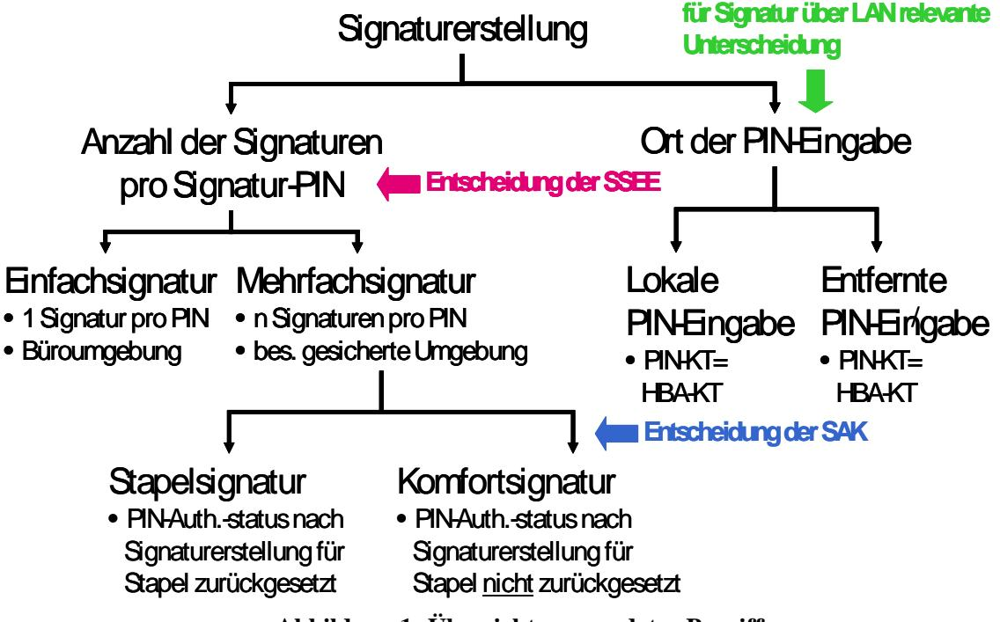
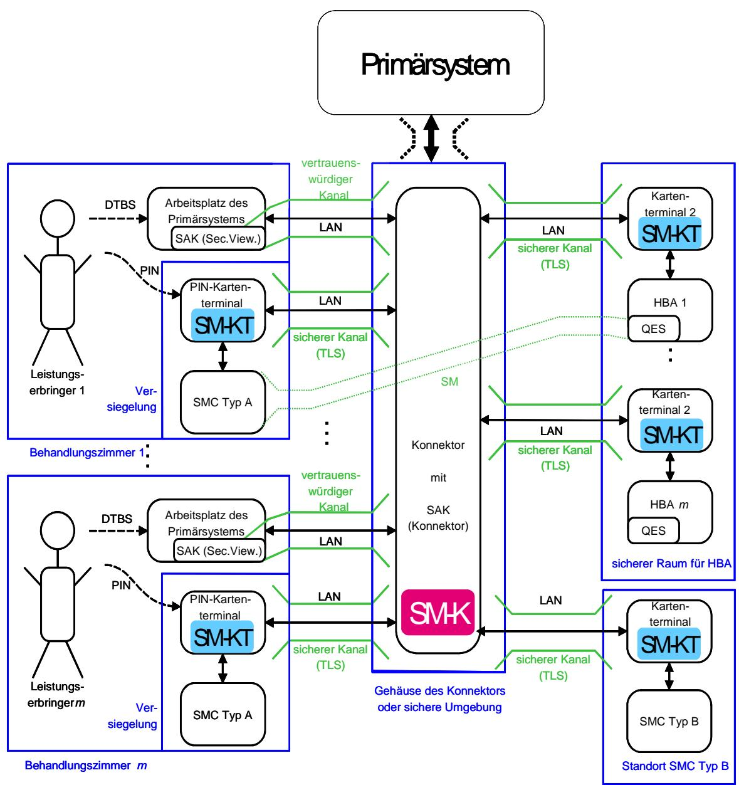
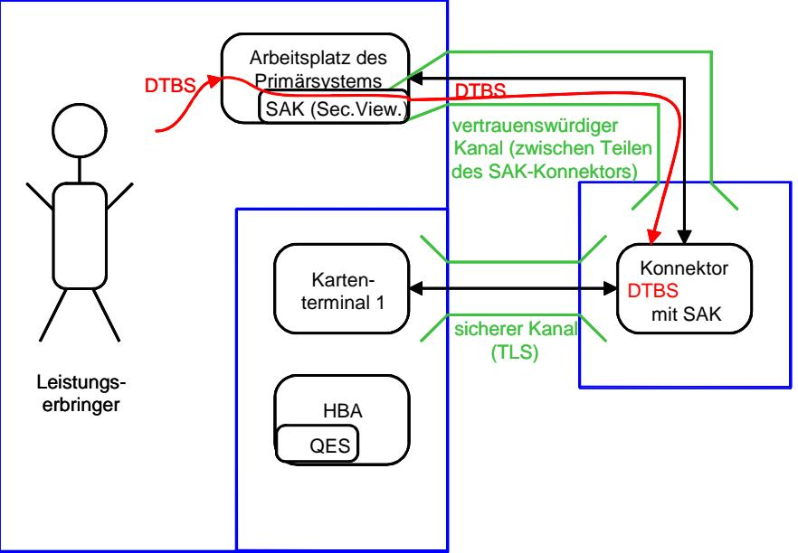
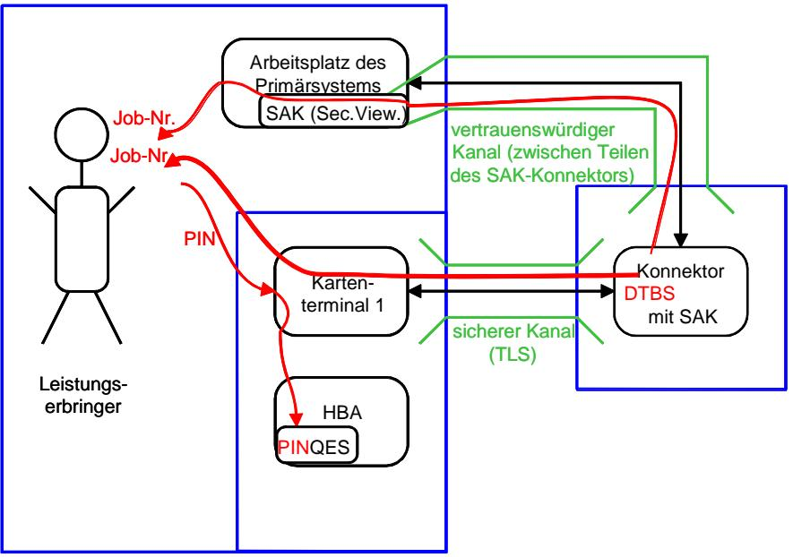
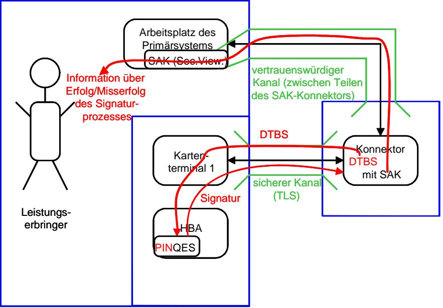
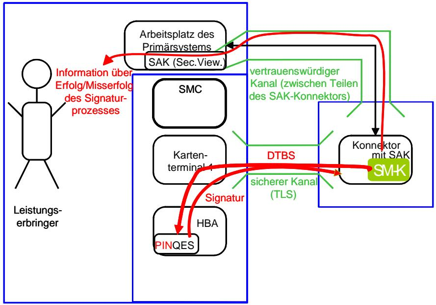
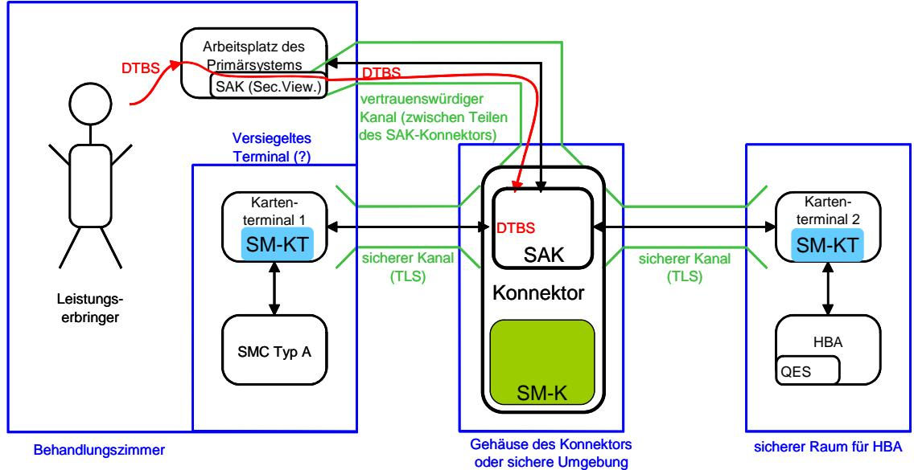
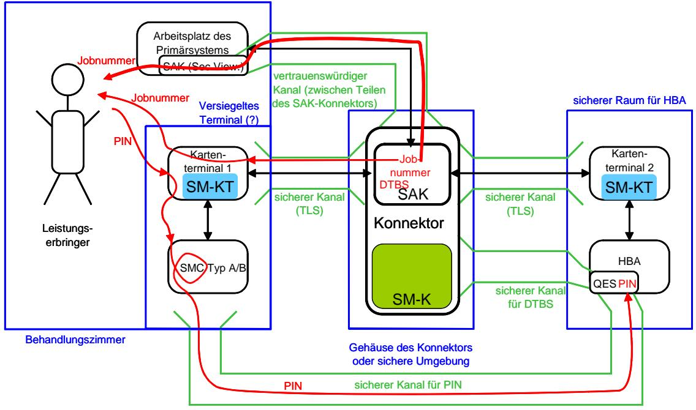
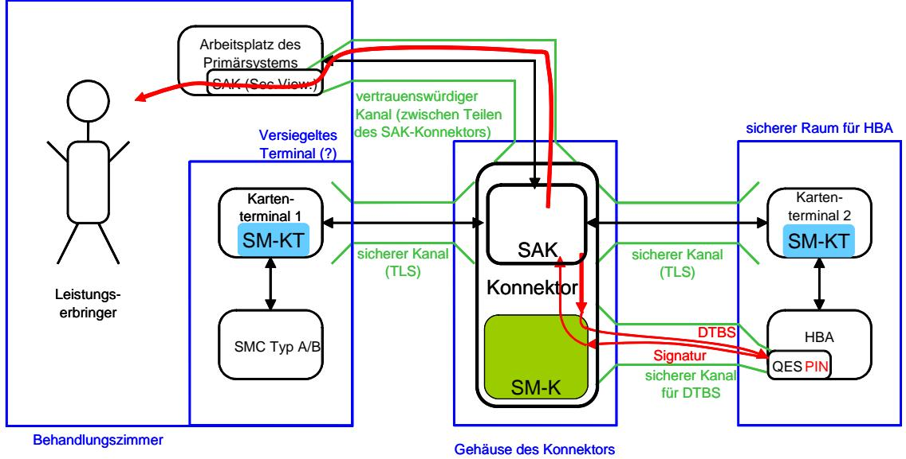

# BSI - Technische Richtlinie

| Bezeichnung:       | Stapelsignatur mit dem Heilberufsausweis |  |  |  |  |
|--------------------|---------------------------------------------|--|--|--|--|
| Anwendungsbereich: |                                             |  |  |  |  |
| Kürzel:            | BSI TR-03114                                |  |  |  |  |
| Version:           | 2.0                                         |  |  |  |  |
| Veröffentlichung:  | 22.10.2007                                  |  |  |  |  |

| Version | Datum      | Änderungen                                                       | Anmerkungen  |
|---------|------------|------------------------------------------------------------------|--------------|
| 1.0     | 18.08.2007 | Konzept Stapelsignatur                                           |              |
| 1.1     | 30.04.2007 | Entwurf TR-03114 zur Abstimmung                                  |              |
| 1.2     | 31.05.2007 | Überarbeitung im Abgleich zur TR-03115                           | (19.06.2007) |
| 1.3     | 20.06.2007 | Überarbeitung nach Review durch BSI                              | (03.07.2007) |
| 1.4     | 07.072007  | Überarbeitung nach Review durch BSI                              | (13.08.2007) |
| 1.5     | 19.10.2007 | Überarbeitung nach Beratung im BMG vom 9.7.2007               | (25.10.07)   |
| 2.0     | 19.10.2007 | Überarbeitung nach Beratung vom 11.10.2007                       | (25.10.07)   |
| 2.0     | 22.10.2007 | Fassung Version 1.6 unverändert durch das BSI auf 2.0 gesetzt |              |

## **Änderungsverlauf**

#### **Variablen**

| Variable             | Wert                     | Eintragsvergleich                                          |
|----------------------|--------------------------|------------------------------------------------------------|
| Dateiname und –länge | wird automatisch gesetzt | TR03114_Stapelsignatur_v1_6 (Entwurf).doc (719872 Byte) |
| Letzte Version       | Version: 2.0             | 2.0                                                        |
| Datum                | 19.10.2007               | 19.10.2007                                                 |
| Klassifikation       | nicht klassifiziert      | nicht klassifiziert                                        |
| Verfassers           | Wolfgang Killmann        | Wolfgang Killmann                                          |

Bundesamt für Sicherheit in der Informationstechnik Postfach 20 03 63 53133 Bonn Tel.: +49 228 99 9582-111 E-Mail: zertifzierung@bsi.bund.de Internet: http://www.bsi.bund.de © Bundesamt für Sicherheit in der Informationstechnik 2007

#### **Inhaltsverzeichnis**

| 1.    | Zielstellung des Dokuments                                                | 4  |
|-------|---------------------------------------------------------------------------|----|
| 2.    | Einleitung                                                                | 5  |
| 2.1   | Begriffsdefinition "Einfachsignatur" und "Stapelsignatur"                 | 5  |
| 2.2   | Begriffsdefinitionen "lokale PIN-Eingabe" und "entfernte PIN-Eingabe"     | 6  |
| 2.3   | Begriffsdefinition Signaturanwendungskomponente                           | 7  |
| 2.4   | Begriffsdefinition "Gesicherter Bereich"                                  | 8  |
| 3.    | Problemstellung                                                           | 9  |
| 3.1   | Anforderungen des Nutzers                                                 | 9  |
| 3.2   | Sicherheitsziele                                                          | 12 |
| 4.    | Technische Voraussetzungen der Komponenten                                | 13 |
| 4.1   | Evaluierte und bestätigte Signaturkomponenten                             | 13 |
| 4.2   | HBA                                                                       | 13 |
| 4.3   | Konnektor                                                                 | 15 |
| 4.4   | Kartenterminal                                                            | 16 |
| 5.    | Ablauf der Stapelsignatur                                                 | 17 |
| 5.1   | Installation                                                              | 17 |
| 5.1.1 | Primärsystem                                                              | 17 |
| 5.1.2 | Konnektor                                                                 | 17 |
| 5.1.3 | Kartenterminals                                                           | 17 |
| 5.1.4 | HBA                                                                       | 18 |
| 5.2   | Ablauf der Signaturerzeugung aus Sicht des Benutzers                      | 18 |
| 5.3   | Ablauf der Signaturerstellung aus Sicht der SAK                           | 19 |
| 5.4   | Ablauf der Signaturerzeugung mit lokaler PIN-Eingabe aus Sicht der SAK    | 20 |
| 5.5   | Ablauf der Signaturerzeugung mit entfernter PIN-Eingabe aus Sicht der SAK | 24 |
| 6.    | Bewertung                                                                 | 29 |
| 6.1   | Erfüllung der Sicherheitsziele                                            | 29 |
| 6.1.1 | Schutz der SSEE                                                           | 29 |
| 6.1.2 | Schutz der Authentisierungsdaten                                          | 29 |
| 6.1.3 | Schutz der zu signierenden Daten                                          | 30 |
| 6.1.4 | Missbrauchsanalyse                                                        | 30 |
| 6.2   | Erfüllung der Anforderungen aus SigG / SigV                               | 32 |
| 7.    | Abkürzungsverzeichnis                                                     | 36 |
| 8.    | Referenzen                                                                | 37 |

## **1. Zielstellung des Dokuments**

Dieses Dokument beschreibt technische und organisatorische Sicherheitsmaßnahmen für die zeitlich zusammenhängende Erstellung einer begrenzten Anzahl qualifizierter elektronischer Signaturen nach einer einmaligen Authentisierung des Signaturschlüssel-Inhabers gegenüber der Signaturerstellungseinheit in einer gesicherten Einsatzumgebung (Stapelsignaturen). Die Sicherheitsmaßnahmen beziehen auf den Heilberufsausweis als sichere Signaturerstellungseinheit und den Konnektor und die eHealth-Kartenterminals als Signaturanwendungskomponente in der gesicherten Einsatzumgebung dezentraler Komponenten der Telematikinfrastruktur im Rahmen der Einführung der elektronischen Gesundheitskarte.

Das Einsatzszenario der Stapelsignatur soll seine konkrete Anwendung beim Signieren (Arzt) und Dispensieren (Apotheker) von elektronischen Verordnungen (eVerordnung) und ggf. anderen Dokumenten durch Leistungserbringer im elektronischen Gesundheitswesen finden. Die technische Richtlinie des Bundesamtes für Sicherheit in der Informationstechnik gibt den Bedarfsträgern Orientierung und Handlungssicherheit für spätere Sicherheitsbestätigungen der Signaturkomponenten durch die Bundesnetzagentur geben.

Die vorliegende Version der Technischen Richtlinie TR-03114 berücksichtigt die Einsatzszenarien für Einfachsignatur, Stapelsignatur mit lokaler Eingabe der Signatur-PIN und Stapelsignatur mit entfernter Eingabe der Signatur-PIN. Sie wurde dem aktuellen Stand Technischen Richtlinie BSI TR-03116 [3], der Spezifikation der Chipkarten Heilberufsausweis [4] [5] und Sicherheitsmodulkarte [4] [6] sowie der technischen Komponenten eHealth-Kartenterminal [13] und Konnektor [14] angepasst bzw. auf deren Grundlage weiterführende Sicherheitsmaßnahmen beschrieben.

## **2. Einleitung**

Im Rahmen dieser technischen Richtlinie werden für eine exakte Darstellung spezifische Begriffe benutzt, die im Folgenden definiert und erläutert werden.

Die Abbildung 1 veranschaulicht die Begriffsdefinitionen.

**Abbildung 1: Übersicht verwendeter Begriffe** 

## **2.1 Begriffsdefinition "Einfachsignatur" und "Stapelsignatur"**

Die Begriffe "Einfachsignatur" und "Stapelsignatur" sind für diese technische Richtlinie wie folgt definiert:

**Einfachsignatur**: Die sichere Signaturerstellungseinheit (SSEE) erlaubt nach einmaliger erfolgreicher Authentisierung des Signaturschlüssel-Inhabers die Erzeugung höchstens 1 Signatur.

**Mehrfachsignatur**: Erstellung einer begrenzten Anzahl Signaturen nach der einmaligen Authentisierung des Signaturschlüssel-Inhabers gegenüber der SSEE.

**Stapelsignatur**: Erstellung einer begrenzten Anzahl Signaturen nach den zeitlich unmittelbar aufeinander folgenden Prozessen der Anzeige der zu signierenden Daten und der einmaligen Authentisierung des Signaturschlüssel-Inhabers gegenüber der SSEE.

Für die Stapelsignatur ist es notwendig, dass

- die SSEE nach einmaliger erfolgreicher Authentisierung des Signaturschlüssel-Inhabers die Erzeugung einer begrenzten Anzahl *n* ( *n* >1) Signaturen erlaubt (mehrfachsignaturfähige SSEE),
- die SAK die berechtigt signierende Person authentisiert und für das Signieren eines Stapels von *m* (1 ≤≤ *nm* ) durch die SSEE autorisiert,
- die SAK nur die der berechtigt signierenden Person angezeigten Dateien (bzw. Dokumente[1](#page-4-1) , Stapel) und von ihm für die Signaturerstellung frei gegebenen Dateien zeitlich zusammenhängend der SSEE zuführt (Stapel) und

1 Die Begriffe Dokument und Datei werden in diesem Zusammenhang synonym verwendet.

• die SAK die Autorisierung des Signaturschlüssel-Inhabers nach dem Signieren dieses Stapels zurücksetzt.

Der von der Signaturanwendungskomponente (SAK) abzuarbeitende Stapel kann aus *m* zu signierenden Dateien bestehen, wobei bei 1 ≤ ≤ *nm* nur 1 erfolgreiche Authentisierung des Signaturschlüssel-Inhabers gegenüber der stapelsignaturfähigen SSEE ausreicht, für nur 2 erfolgreiche Authentisierung des Signaturschlüssel-Inhabers gegenüber der mehrfachsignaturfähigen SSEE ausreichen usw. ≤< 2*nmn*

Der Begriff "Stapelsignatur" grenzt sich durch die Anzahl der zulässigen Signaturerstellungen pro Authentisierung des Signaturschlüssel-Inhabers von dem Begriff "Einfachsignatur" ab. Für das signieren eines Stapels aus *m* Dateien sind *m* erfolgreiche Authentisierung des Signaturschlüssel-Inhabers gegenüber einer nur für Einfachsignatur zulässigen SSEE notwendig.

Der Begriff "Stapelsignatur" grenzt sich durch den zeitlichen Zusammenhang zwischen der Anzeige der zu signierenden Dateien und der Authentisierung des Signaturschlüsselinhabers vom Begriff der "Komfortsignatur" ab. Die Komfortsignatur erlaubt eine Authentisierung des Signaturschlüsselinhabers gegenüber der SSEE vor der Anzeige der zu signierenden Daten,

insbesondere die Signaturerstellung in einem Zeitraum, der durch den Signaturschlüssel-Inhaber, den berechtigt signierenden Benutzer der SAK (siehe §15 (2) Nr. 1. SigV) und durch die SAK kontrolliert wird. Die Sicherheitsmaßnahmen für die Komfortsignatur sind in der Technischen Richtlinie TR-03115 [10] beschrieben.

Wegen der vorherigen Anzeige und Auswahl der Dateien, ist es für die Stapelsignatur nicht notwendig, dass die zu unterzeichnenden Dateien inhaltlich gleichen Typs sind, wie es z. B. für einen automatisierten Prozess der Generierung von zu unterzeichnenden Daten etwa in der Einsatzumgebung der Zertifizierungsdiensteanbieters der Fall ist.

Der Begriff "Stapelsignatur" wird unabhängig davon verwendet, ob die SSEE im selben Kartenterminal steckt, an dem die PIN-Eingabe erfolgt (lokale PIN-Eingabe), oder nicht (entfernte PIN-Eingabe).

## **2.2 Begriffsdefinitionen "lokale PIN-Eingabe" und "entfernte PIN-Eingabe"**

Der Heilberufsausweis (HBA) [5] als sichere Signaturerstellungseinheit unterstützt gegenwärtig nur die Authentisierung des Signaturschlüssel-Inhabers durch Wissen. Die Möglichkeit der Authentisierung durch biometrische Merkmale zur Nutzung des Signaturschlüssels (nach §15 (1) Satz 1 SigV [2]) wird durch diese technische Richtlinie nicht ausgeschlossen, es werden jedoch keine speziellen technischen Lösungen diskutiert. Im Folgenden wird deshalb bei dieser Authentisierung kurz von einer PIN-Eingabe gesprochen.

Diese technische Richtlinie verwendet folgende Begriffe im Zusammenhang mit der Eingabe der PIN zur Authentisierung des Signaturschlüssel-Inhabers gegenüber der SSEE (HBA), die aber auch darüber hinaus auch für andere Anwendungen, z. B. der PIN-Authentisierung für die Verschlüsselung von Daten verwendet werden kann.

**PIN-Eingabe-Terminal**: Chipkartenterminal, an dem die PIN durch den Benutzer eingegeben wird.

**HBA-Kartenterminal**: Chipkartenterminal, in dem sich der Heilberufsausweis (HBA) befindet, der die PIN prüfen soll.

**lokale PIN-Eingabe**: die PIN-Eingabe erfolgt an dem Chipkartenterminal, in welchem sich die Chipkarte befindet, die die PIN prüfen soll, d. h. das PIN-Eingabe-Terminal ist auch das HBA-Kartenterminal.

**entfernte PIN-Eingabe** ("remote PIN"): die PIN Eingabe erfolgt an einem anderen Chipkartenterminal, als dem der verschieden ist von dem Kartenleser, in welchem sich die Chipkarte befindet, die die PIN prüfen soll, d. h. das PIN-Eingabe-Terminal ist verschieden von dem HBA-Kartenterminal.

Die Trennung in PIN-Eingabe-Terminal und HBA-Kartenterminal entspricht dem Wunsch der Anwender, dass der HBA nicht vom Leistungserbringer mitgeführt, sondern in einem gesicherten Bereich gesteckt bleiben soll (entfernte PIN-Eingabe).

Die Vertraulichkeit der PIN ist durchgehend zu sichern, d. h. im Fall

- der lokalen PIN-Eingabe: im PIN-Eingabe-Terminal von der Benutzereingabe bis zur Übergabe an den HBA;
- der entfernten PIN-Eingabe: im PIN-Eingabe-Terminal von der Benutzereingabe ab, bei der Übertragung von PIN-Eingabe-Terminal zum HBA-Kartenterminal und im HBA-Kartenterminal bis zur Übergabe an den HBA.

Es erfolgt keine über den Zweck der Weiterleitung an den HBA hinausgehende Speicherung der eingegebenen PIN durch die sie verarbeitenden Komponenten. Das meistdiskutierte Konzept geht davon aus, dass die PIN durch eine SMC, die im PIN-Eingabe-Terminal steckt, verschlüsselt wird und verschlüsselt an den HBA übertragen wird. Der HBA entschlüsselt die PIN.

Die Konzepte der "lokalen PIN-Eingabe" und "entfernten PIN-Eingabe" sind unabhängig von der Anzahl der zu signierenden Dateien (Einfachsignatur, Stapelsignatur oder Komfortsignatur).

## **2.3 Begriffsdefinition Signaturanwendungskomponente**

In dieser technischen Richtlinie werden folgende Bestandteile der Signaturanwendungskomponente (SAK) unterschieden:

- SAK-Komponente auf dem Konnektor, (auch "SAK (Konnektor)" oder "SAK des Konnektors" genannt)
- SAK-Komponente auf dem Arbeitsplatz des Primärsystems (auch "SAK (Secure Viewer)" oder "Secure Viewer" genannt),
- eHealth-Kartenterminal, das der Benutzer zur Authentisierung verwendet (auch "PIN-Eingabe-Terminal" genannt), und
- eHealth-Kartenterminal, in welchem die sichere Signaturerstellungseinheit (SSEE) steckt (auch "HBA-Kartenterminal" genannt).

Die SAK-Komponenten können unter der Voraussetzung wohl definierter Schnittstellen entsprechend den Bedingungen des Marktes von unterschiedlichen Herstellern vertrieben und kombiniert verwendet werden[2](#page-6-1) . Das Zusammenwirken der SAK-Komponenten unterliegt aber der Evaluierung für die Bestätigung als Signaturkomponente.

Die SAK-Komponente auf dem Konnektor stellt die Schnittstelle zum Anwendungskonnektor und über diesen zum Primärsystem bereit. Sie beinhaltet die Interpretation und Aufbereitung der Daten des Secure Viewers, die Ablauflogik und übernimmt die Ansteuerung der Kartenterminals und Chipkarten insbesondere des HBA als SSEE vor. Die SAK-Komponente auf dem Arbeitsplatz des Primärsystems stellt die Benutzerschnittstelle der SAK bereit und implementiert die eigentliche Anzeige des Secure Viewers für den Benutzer. Die Unterscheidung der SAK Sofern aus dem Zusammenhang heraus klar ist, welcher Teil der SAK gemeint ist, oder wenn beide Teile der SAK gemeint sind, wird auf die Unterscheidung in Klammern verzichtet.

Die SAK-Komponente auf dem Konnektor nutzt die Sicherheitsmechanismen des Konnektors insbesondere die gesicherte Kommunikation zwischen dem Konnektor und den eHealth-Kartenterminals und das Sicherheitsmodul des Konnektors (SM-K). Das SM-K stellt Funktionen zur gegenseitigen Authentisierung und einen Secure Messaging Kanal mit dem HBA für die SAK bereit[3](#page-6-2) . Die Einsatzumgebung ist in [Abbildung 2: Einsatzumgebung für die Stapelsignatur](#page-10-0) skizziert.

2 Vergl. [14], Abschnitt 3.8.2.

3 Diese Funktionalität ist in den gegenwärtigen Spezifikationen noch nicht dargestellt.

## **2.4 Begriffsdefinition "Gesicherter Bereich"**

Als "**gesicherter Bereich**" wird in diesem Konzept ein Bereich bezeichnet, der über hinreichend hohen physikalischen bzw. organisatorischen Schutz verfügt, um die alleinige Kontrolle des Signaturschlüssel-Inhabers über seine sichere Signaturerstellungseinheit (SSEE) zu gewährleisten. Insbesondere darf die SSEE nicht entwendet werden können.

Die genauen Anforderungen an einen gesicherten Bereich sind in Abhängigkeit von der Einsatzumgebung und den Sicherheitseigenschaften der dezentralen Komponenten der Telematikinfrastruktur festzulegen. Denkbar wären die Aufstellung des Kartenterminals mit dem HBA in einem verschlossenen Raum ohne Publikumsverkehr (Serverraum, Keller, ...) oder die Aufstellung in einem Raum mit Publikumsverkehr (z. B. Empfangstheke) in einem Auswurfleser und unter Aufsicht durch eine vertrauenswürdige Person (z. B. Arzthelferin) – der Auswurfleser verhindert eine unerkannte Entnahme des HBA bzw. ein Entnahmeversuch wird durch die Arzthelferin erkannt und vereitelt.

Bei Nutzung des Konzepts der entfernten PIN-Eingabe muss der HBA in einem solchen gesicherten Bereich aufbewahrt werden. Das Kartenterminal mit der SMC Typ B soll ebenfalls in einem gesicherten Bereich betrieben werden. [4](#page-7-1) .

4 Das Konzept und die Technischen Richtlinie TR-03114 in der Version 1.0 zur Komfortsignatur setzte voraus, dass im Konnektor eine SMC Typ B steckt und der Kanal zwischen SAK (Konnektor) und SMC Typ B durch das physikalische Gehäuse des Konnektors geschützt oder alternativ durch eine Aufstellung des Konnektors samt SMC Typ B in einem gesicherten Bereich gesichert wird. Diese Voraussetzung ist nicht mehr gegeben.

## **3. Problemstellung**

## **3.1 Anforderungen des Nutzers**

In diesem Abschnitt wird das Problem beispielhaft aus Sicht eines Arztes in seiner Praxis beschrieben. Die beschriebenen Abläufe lassen sich auf den Anwendungsfall in einer Apotheke übertragen.

Mit der Einführung der elektronischen Gesundheitskarte sollen festgelegte elektronische Dokumente durch den Leistungserbringer mit einer qualifizierten elektronischen Signatur gemäß Signaturgesetz (SigG [1] und SigV [2]) versehen werden. Dies betrifft insbesondere das Signieren von elektronischen Verordnungen (eVerordnung) mit dem Heilberufsausweis (HBA). Schon allein aus dieser Pflichtanwendung ergibt sich eine große Anzahl von qualifizierten elektronischen Signaturen, die täglich zu leisten sind. Wollte ein Leistungserbringer die zu leistenden qualifizierten elektronischen Signaturen alle auf die bisher bestätigungsfähige Art und Weise als Einfachsignatur erzeugen, müsste er für jede Verordnung erneut seine Signatur-PIN eingeben. Dies bedingt einen beträchtlichen Aufwand für den Leistungserbringer und birgt darüber hinaus auch ein erhebliches Risiko, dass die Signatur-PIN bei so häufiger Eingabe ausgespäht werden kann.

Es wird daher eine Erleichterung bei der Erstellung der qualifizierten elektronischen Signaturen bei gleich bleibend hoher Sicherheit angestrebt. Die Stapelsignatur (siehe Abschnitt [2](#page-4-2)) stellt eine mögliche Antwort auf die beschriebene Problemstellung dar.

Stapelsignaturen bieten dem Leistungserbringer Möglichkeiten zur einfachen und schnellen Signaturerstellung, die für die effektive Arbeit mit eVerordnung und anderen Dokumenten benötigt werden, aber auch ein - gegenüber der Einfachsignatur erhöhtes - Missbrauchsrisiko eröffnen. Deshalb soll der Leistungserbringer durch die sichere Gestaltung der dezentralen Komponenten seiner Arbeitsumgebung in der Wahrnehmung seiner Verantwortung als Signaturschlüssel-Inhaber (vergl. SigG § 17 (2) Absatz 2). Außerdem soll ihm die Wahl zwischen einer Stapelsignatur mit den notwendigen Vereinfachungen und besonders gesicherten Einsatzumgebung zur Reduzierung des Risikos und der Einfachsignatur mit weniger Komfort, aber breiterer Einsatzmöglichkeit (z. B. bei sich zu Hause) gegeben werden.

Es wird folgende Anwendungsumgebung angenommen:

- Jeder Arzt hat einen Heilberufsausweis (HBA).
- In der Einsatzumgebung arbeiten mehrere Ärzte in mehreren Arbeitsräumen. In jedem Arbeitsraum befindet sich ein Arbeitsplatz des Primärsystems, an welchem jeder der Ärzte zu signierende Daten erzeugen kann.
- Der Arzt arbeitet mit der SAK (Secure Viewer) an einem Arbeitsplatz des Primärsystems und möchte mehrere Dateien zusammenhängend nach einer Authentisierung signieren können (Stapelsignatur).
- Der Arzt möchte die Möglichkeit erhalten, seinen HBA nicht während des gesamten Arbeitstags bei sich führen und für jeden Signiervorgang in Kartenterminals einführen. Stattdessen soll der HBA an einer zentralen Stelle in einem gesicherten Bereich (siehe Abschnitt [2.4\)](#page-7-2) während seiner Arbeitszeit gesteckt bleiben und die Eingabe der Signatur-PIN an einem eHealth-Kartenterminal am jeweiligen Arbeitsplatz erfolgen.
- Der Arbeitsplatz verfügt ein eHealth-Kartenterminal, über dessen Tastatur der Arzt eine entfernte PIN-Eingabe für den Signaturprozess vornehmen kann. In jedem dieser eHealth-Kartenterminal für entfernte PIN-Eingabe ist eine SMC Typ A oder eine SMC Typ B (Sicherheitsmodulkarte, Chipkarte) verfügbar.

Die Einsatzbedingungen des Heilberufsausweises (HBA) führen zu folgenden weiteren Randbedingungen:

• zentrale Aufbewahrung des HBA: Leistungserbringer wollen ihren HBA nicht den ganzen Tag mit sich führen, sondern ihn an einer zentralen Stelle in einem gesicherten Bereich in einen Kartenleser stecken. Dieser HBA-Kartenleser wird per LAN an den Konnektor angeschlossen.

• PIN-Eingabe:

Den Leistungserbringern soll sowohl eine lokale PIN-Eingabe als auch eine entfernte PIN-Eingabe zur PIN-Eingabe ermöglicht werden. Bei der entfernten PIN-Eingabe soll sich der HBA in einem HBA-Kartenterminal in einem gesicherten Bereich befinden, und der Leistungserbringer für die Signatur-PIN-Eingabe ein Kartenterminal nutzen, welches sich im Behandlungszimmer befindet.

• Bindung der Mehrfachsignatur an die gesicherte Einsatzumgebung:

Die Funktionalität, Mehrsignaturen erstellen zu können, soll technisch an die gesicherte Einsatzumgebung in den Geschäftsräumen des Leistungserbringers gebunden werden. Wird der HBA in einer anderen als der speziell gesicherten Einsatzumgebung betrieben, sollen weiterhin Einfachsignaturen erstellt werden können, aber die Funktionalität der Mehrfachsignatur soll technisch gesperrt sein.

• Einheitlicher HBA für Stapel- und Komfortsignatur Der HBA soll gleichzeitig Stapelsignatur und Komfortsignatur ermöglichen. Die SAK soll in Abhängigkeit von der technischen Ausstattung Stapelsignatur oder Komfortsignatur oder beide Verfahren gleichzeitig unterstützen.

Die folgende Skizze verdeutlicht die Einsatzumgebung:

**Abbildung 2: Einsatzumgebung für die Stapelsignatur mit entfernter PIN-Eingabe**  Eine Stapelsignatur in der Einsatzumgebung des Heilberuflers lässt sich durch den folgenden grundsätzlichen Ablauf beschreiben.

Ein Heilberufler möchte als Inhaber des Signaturschlüssels auf dem Heilberufsausweis eine größere, aber begrenzte Anzahl von Dokumenten zeitlich zusammenhängend signieren. Der Signaturschlüssel-Inhaber wählt über die SAK (Secure Viewer) auf dem Arbeitsplatz des Primärsystems die Daten aus, auf welche sich die Signatur beziehen soll, und hat die Möglichkeit, über die sichere Anzeigekomponente alle zu signierenden Dokumente anzusehen. Wenn der Benutzer zu dem Entschluss kommt, dass alle ausgewählten Dateien tatsächlich signiert werden sollen, bestätigt er dies durch die Auslösung des Signaturprozesses gegenüber der SAK.

Die SAK (Konnektor) fordert der Leistungserbringer zur PIN-Eingabe und gibt einmalig seine Signatur-PIN an einem Kartenterminal der SAK ein. Die SAK (Konnektor) führt nun im Auftrag des Benutzers die ausgewählten Dateien der Reihe nach der sicheren Signaturerstellungseinheit (Heilberufsausweis) zu und löst für jede Datei (resp. Hashwert) den dortigen Signaturvorgang aus. Die SSEE begrenzt die Anzahl der erzeugbaren Signaturen auf einen konfigurierten Maximalwert. Nachdem die ausgewählten Dateien signiert wurden, versetzt die SAK (Konnektor) die SSEE in einen Zustand, der für die Erstellung weiterer Signaturen eine erneute PIN-Eingabe erforderlich macht (die

durch die Authentisierung mit der Signatur-PIN erworbenen Rechte gehen dadurch verloren). Der Benutzer kann zu einem beliebigen Zeitpunkt vor der PIN-Eingabe den Vorgang abbrechen.

## **3.2 Sicherheitsziele**

Das zu verwendende Verfahren zur Stapelsignatur muss folgendes sicherstellen:

- Schutz der SSEE: Im zu beschreibenden Einsatzszenario muss die SSEE so geschützt werden, dass der Signaturschlüssel-Inhaber die alleinige physische und logische Kontrolle über die SSEE behält.
- Schutz der Authentisierungsdaten: Das Verfahren muss die Vertraulichkeit der Signatur-PIN schützen. Die Signatur-PIN darf nicht außerhalb des HBA gespeichert werden, wobei nur eine temporäre Speicherung zur Verarbeitung mit anschließender aktiver Löschung zulässig ist. Die vom Signaturschlüssel-Inhaber am PIN-Eingabe-Terminal (im Behandlungszimmer) eingegebene Signatur-PIN darf nicht ungeschützt zum HBA übertragen werden; insbesondere die Übertragung über das LAN ist zu schützen.
- Schutz der zu signierenden Daten: Es dürfen nur solche Daten dem HBA zum Signieren zugeführt werden, die der Benutzer signieren wollte. Die Daten dürfen während der Übertragung nicht verändert oder ausgetauscht oder andere Daten hinzugefügt werden.
- Schutz vor Missbrauch: Missbrauch liegt vor, wenn die SSEE oder die SAK gegen den Willen oder ohne das Wissen des rechtmäßigen Signaturschlüssel-Inhabers durch eine dritte Person zur Erstellung von Signaturen genutzt wird.[5](#page-11-1)

Die SAK muss den Signaturschlüssel-Inhaber darin unterstützen, die alleinige Kontrolle über die SSEE auszuüben. Der Signaturschlüssel-Inhaber nutzt die SAK (Secure Viewer) von einem Arbeitsplatz des Primärsystems und mit einem dem Arbeitsplatz zugeordneten Kartenleser, an dessen Tastatur die PIN eingegeben wurde. Nach dem Signaturvorgang muss der HBA in einen Zustand gebracht werden, der für die Erstellung weiterer Signaturen eine erneute PIN-Eingabe erforderlich macht.

5 Die Signaturprüfung (Verifikation) einer Signatur, die im Rahmen einer Stapelsignatur erstellt wurde, unterscheidet sich nicht von der Signaturprüfung einer Signatur, die als Einfachsignatur erstellt wurde.

## **4. Technische Voraussetzungen der Komponenten**

## **4.1 Evaluierte und bestätigte Signaturkomponenten**

Der HBA ist nach dem HBA-Schutzprofil [7] evaluierte und bestätigte sichere Signaturerstellungseinheit für Einzel- und Stapelsignaturen. Die SAK-Komponente auf dem Konnektor, die SAK auf dem Arbeitsplatz des Primärsystems (Secure Viewer) und die eHealth-Kartenterminals[6](#page-12-1) (als Teil der SAK, siehe Abschnitt [2\)](#page-6-3) sind nach Schutzprofilen [15] [13] evaluierte und bestätigte Signaturkomponenten. Die SMC Typ A und SMC Typ B sind nach Schutzprofilen evaluierte [8] [9] und zertifizierte Komponenten. Die Sicherheitsmodule der eHealth-Kartenterminals (SM-KT) und der Konnektoren (SM-K) sind nach dem Schutzprofil evaluierte und zertifizierte Komponenten.

Folgende Funktionalität ist für sichere Gestaltung der Prozesse notwendig:

- Die SMC darf nur mit einem HBA einen Secure Messaging Kanal zur Übermittlung der verschlüsselten Signatur-PIN aufbauen. Dies kann ggf. durch die SAK durchgesetzt werden.
- Die Speicherung des privaten Schlüssels und die kryptographischen Operationen mit dem privaten Schlüssel zum Aufbau des TLS-Kanals zwischen Konnektor und Chipkartenterminals erfolgt im SM-K des Konnektors beziehungsweise im SM-KT der Chipkartenterminals.
- Die SAK ist außerdem in der Lage, einen Secure Messaging Kanal zum HBA aufzubauen und verfügt dafür über ein CVC, das vom HBA zur Autorisierung der DTBS dient.

## **4.2 HBA**

Für die Einfachsignatur und die Stapelsignatur werden die folgenden beiden Einsatzumgebungen unterschieden:

• **Einfache Einsatzumgebung**: Diese Einsatzumgebung ermöglicht die Erzeugung von Einfachsignaturen (z. B. geschützter Einsatzbereich nach [17]). Die Voraussetzungen der besonders gesicherten Einsatzumgebung für Mehrfachsignaturen des Leistungserbringers sind aber nicht gegeben.

In dieser Umgebung soll der HBA nur Einfachsignaturen, aber keine Stapelsignaturen erlauben.

• **Gesicherte Einsatzumgebung**: Die gesicherte Arbeitsumgebung des Leistungserbringers (z. B. die Praxis oder das Krankenhaus, die Apotheke) verfügt über technische Sicherheitsmaßnahmen zum Schutz der zu signierenden Daten.

In dieser Umgebung soll der HBA die Erstellung von Mehrfachsignaturen erlauben.

Die Möglichkeit für Mehrfachsignaturen muss an das Vorhandensein einer SM-K eines zugelassenen Konnektors gebunden sein, so dass außerhalb der besonders gesicherten Einsatzumgebung (Geschäftsräume des Leistungserbringers) keine Mehrfachsignaturen erzeugt werden können. Der HBA kann die Gewährleistung der gesicherten Einsatzumgebung für Mehrfachsignaturen (Stapel- und Komfortsignaturensignaturen) nicht aktiv erkennen. Es reicht aus, wenn die besonders gesicherte Einsatzumgebung einen zusätzlichen Authentisierungsschritt der SAK durchführt, den der HBA verifizieren kann und der in einer einfachen Einsatzumgebung auch von einem Angreifer nicht erfolgreich vorgetäuscht werden kann.

Dieses Konzept geht davon aus, dass das **SM-K des Konnektors** die gesicherte Einsatzumgebung repräsentiert und deshalb für die Prozesse der Mehrfachsignaturen notwendig ist. Der **HBA** stellt

6 Kartenterminal 1, Kartenterminal 2

sicher, dass die zu signierenden Daten für Mehrfachsignaturen in einem Secure Messaging Kanal zwischen dem SM-K und dem HBA an den HBA übergeben werden. Das Secure Messaging wird nach Authentisierung durch eine SM-K mit einem privaten Schlüssel und dazu gehörigem CVC der SM-K-Herausgeber in der PKI der Chipkarten hergestellt.

Der HBA ist so zu konfigurieren, dass in zwei unterschiedlichen Einsatzumgebungen die Eingabe der Signatur-PIN entweder

- nur 1 Signatur (einfache Einsatzumgebung) oder
- eine gewisse Anzahl *n* von Signaturen (gesicherte Einsatzumgebung) erstellen kann. Für die gesicherte Einsatzumgebung ist der HBA so zu konfigurieren, dass er die DTBS nur akzeptiert, wenn sie durch Secure Messaging geschützt übertragen wurden.

#### **Die Größe** *n* **wird in der Signaturbestätigung des HBA als SSEE in Abhängigkeit von den konkreten Einsatzbedingungen festgelegt.**

Der HBA muss also abhängig von der erkannten Einsatzumgebung den Wert des *security status evaluation counters* (SSEC) für den privaten Signaturschlüssel anpassen (besonders gesicherte Einsatzumgebung: *n* > 1, einfache Einsatzumgebung: *n* = 1 ).

Eine technische Realisierung, wie der HBA den SSEC umsetzt, wird hier nicht vorgeschrieben. Denkbar wären (siehe auch weiter unten):

- die Definition mehrerer IDs für dieselbe PIN (für denselben PIN-Wert), wobei der SSEC ein Sicherheitsattribut der PIN darstellt (advanced PIN / multi-reference PIN), oder
- die Definition mehrerer sogenannter Security Environments.

Für die Bindung der Mehrfachsignaturen an die Einsatzumgebung sind verschiedene technische Realisierungen möglich.

Beispielsweise könnte der HBA so konfiguriert werden, dass

- Einfachsignatur (genau 1 Signatur, danach Rücksetzen des Sicherheitsstatus, einfache Einsatzumgebung)
	- Sicherheitsumgebung SE#1,
	- erfolgreiche Authentisierung mit der Signatur-PIN ohne Secure Messaging
	- Übergabe der DTBS ohne Secure Messaging (einfache Einsatzumgebung),,
- Mehrfachsignatur (eine begrenzten Anzahl *n* Signaturen, besonders gesicherte Einsatzumgebung)
	- Sicherheitsumgebung SE#2,
	- erfolgreiche Authentisierung mit der Signatur-PIN mit Secure Messaging
	- Übergabe der DTBS mit Secure Messaging (besonders gesicherte Einsatzumgebung).

Die Signatur-PIN kann für Mehrfachsignaturen sowohl lokal als auch entfernt eingegeben werden. Für die lokale PIN-Eingabe kann die Signatur-PIN im Klartext übergeben werden. Für die entfernte PIN-Eingabe wird durch die **SAK** sichergestellt, dass sich eine SMC Typ A oder eine SMC Typ B in einem Kartenterminal am Arbeitsplatz des Benutzers gegenüber dem HBA authentisiert und anschließend die Signatur-PIN per Secure Messaging an den HBA übermittelt.

#### **Anmerkung zum Display Message Mechanismus des HBA**

Der Display Message Mechanismus ist Bestandteil der HBA-Spezifikation [5]. Er soll dem Benutzer ermöglichen, die Verwendung des Secure Messaging in der Kommunikation mit dem HBA festzustellen. Die folgenden Betrachtungen zur Mehrfachsignaturbenutzen aber diesen Mechanismus nicht. Die Nutzung des Display Message Mechanismus erfordert, dass eine Display Message nicht versehentlich an einem anderen Kartenterminal angezeigt wird und auf diese Weise ihre Vertraulichkeit kompromittiert wird. Da diese Voraussetzung aber nicht gegeben ist, wird hier auf den Display Message Mechanismus verzichtet. Der Signaturschlüssel-Inhaber **kann** die SAK benutzen, um eine geheime Display Message festzulegen und regelmäßig zu wechseln[7](#page-14-1) .

## **4.3 Konnektor**

Die SAK verfügt über eine Komponente SAK(Trusted Viewer), die auf einem Arbeitsplatz des Primärsystems ausgeführt wird. Die Komponente SAK(Secure Viewer) und stellt die gesicherte Kommunikation mit der SAK(Konnektor) sowie die Anzeige der zu signierenden und von der SAK geprüften und aufbereiteten Daten (z. B. in Form eines Videodatenstroms) bereit. Die Kommunikation zwischen SAK(Secure Viewer) auf dem Arbeitsplatz und der SAK(Konnektor) auf dem Konnektor muss die Integrität der Daten und kann die Vertraulichkeit der Daten auf dem Übertragungsweg schützen. Da diese Kommunikation SAK-intern abläuft, muss sie nicht gesondert spezifiziert, aber evaluiert sein. In den nachfolgenden Abbildungen wird dieser geschützte Übertragungsweg als "vertrauenswürdiger Kanal" bezeichnet.

Die SAK stellt Funktionen bereit, die

- den Stapel zu signierender Daten festzulegen und dafür die Signatur auszulösen,
- im Fall einer Störung der Stapelsignatur (z. B. Fehlermeldung des HBA, nicht korrekt erzeugte Signatur oder Erzeugung einer Signatur für Daten, die der Signaturschlüsselinhaber nicht beabsichtigte zu signieren) alle Signaturen des Stapels ungültig macht und den Benutzer über die Störung informiert.

Unmittelbar nach dem der HBA gesteckt wird, baut der Konnektor einen TLS-Kanal[8](#page-14-2) zum betreffenden Terminal für die exklusive Nutzung des HBA durch die SAK des Konnektors auf. Die für die Kommunikation zwischen Kartenterminals und Konnektor sind die nach TR-03116 [3] zulässigen TLS-Kryptosuiten (s. [12], Abschnitt 6.6.1) zu verwenden. Der Konnektor muss gewährleisten, dass nur die SAK des Konnektors und der gegenüber der SAK (Konnektor) authentisierte Inhaber des HBA die Signaturanwendung auf dem HBA (DF.QES[9](#page-14-3) ) nutzen kann. Der Konnektor kann die Nutzung anderer Anwendungen (DF) auf dem HBA durch andere Anwendungen über das LAN zulassen.

Alternativ kann die Verbindung zum Kartenterminal auch früher aufgebaut werden. Um zu verhindern, dass z. B. in einer Umgebung mit mehreren Konnektoren ein Konnektor alle Kartenterminals exklusiv an sich bindet, kann in der Konfiguration des Konnektors (z. B. durch den lokalen Administrator) festgelegt werden, mit welchen Kartenterminals der Konnektor kommunizieren soll.

Die SM-K stellt die sichere Speicherung und Verwendung der Schlüssel für die gesicherte Kommunikation zwischen Konnektor und die Kartenterminals und zwischen SAK und HBA bereit. Die gesicherte Kommunikation muss die gegenseitige Authentisierung des Kartenterminals gegenüber dem Konnektor und des Konnektors gegenüber dem Kartenterminal, muss die Datenintegritätssicherung der übertragenen Daten und die Verschlüsselung der übertragenen Daten umfassen.

Die SM-K enthält ein asymmetrisches Schlüsselpaar und ein CVC für die gegenseitige Authentisierung mit Schlüsselableitung für anschließendes Secure Messaging zwischen SM-K und HBA analog der bisher spezifizierten Verfahren zwischen den Chipkarten (s. [4], Anlage C und E). Die SM-K verfügt über die Funktionalität zum Herstellen eines Secure Messaging Kanals und der Behandlung geschützter Kommandos wie bisher für die SMC spezifiziert (s. [6], Kapitel 6.6.1) bereit. Der Konnektor muss für den Schutz der Vertraulichkeit der PIN bei entfernter PIN-Eingabe einen

7 Die SAK (Secure Viewer) stellt die Benutzerschnittstelle bereit, die SAK (Konnektor) übernimmt die Ansteuerung des HBA im Kartenterminal.

8 TLS = Transport Layer Security, Nachfolger des Protokolls SSL = Secure Sockets Layer

9 DF = dedicated file, Verzeichnis auf einer Chipkarte, das eine Anwendung enthält; QES = qualifizierte elektronische Signatur, eine Anwendung auf der Chipkarte

Secure Messaging Kanal zwischen SMC am Arbeitsplatz des Benutzers und HBA des Benutzers aufbauen.

Es ist Gegenstand der Konnektorevaluierung, dass eine Funktionalität im Konnektor außerhalb der SAK (Konnektor) die Sicherheit der SAK (Konnektor) nicht beeinträchtigt. Beispielsweise ist es denkbar, dass mehrere logische Kanäle zum HBA aufgebaut werden, wobei aber die Applikation zur qualifizierten elektronischen Signatur (DF.QES) exklusiv an die SAK (Konnektor) gebunden wird.

Die SAK des Konnektors stellt Funktionen zur Display Message des HBA (s. HBA-Spezifikation [5], Abschnitt 7.1.4) bereit:

- Anzeige der Display Message auf dem Kartenterminal und durch den Secure Viewer und
- Wechsel der Display Message mit Hilfe der SAK (Konnektor und Secure Viewer)[10](#page-15-1).

## **4.4 Kartenterminal**

Die Kartenterminals in der Nähe des Arbeitsplatzes des Primärsystems verfügen über eine SMC Typ A.

Die SMC Typ A wird durch eine Klappe in das Kartenterminal eingesteckt und das Kartenterminal wird danach durch eine vertrauenswürdige Person, ggf. im Beisein des Leistungserbringers, versiegelt. Dadurch wird die Kommunikation zwischen PIN-Eingabe-Terminal und SMC Typ A hinsichtlich ihrer Vertraulichkeit und Integrität abgesichert.

Die für die Kommunikation zwischen Kartenterminals und Konnektor sind die nach TR-03116 [3] zulässigen TLS-Kryptosuiten (s. [12], Abschnitt 6.6.1) zu verwenden. Das Kartenterminal muss eine Authentisierung des Konnektors erzwingen. Die Sicherheitsmodule des Kartenterminals (SM-KT) sollen zur sicheren Speicherung der privaten Schlüssel für den Aufbau der TLS-Kommunikation genutzt werden. Das Schlüsselmanagement ist in [16] beschrieben.

Das Kartenterminal muss in der Lage sein, die Nutzung einer gesteckten Karte exklusiv an einen gesicherten TLS-Kanal zu binden. Konkret bedeutet dies: wenn der HBA in ein Kartenterminal gesteckt ist und der Konnektor eine TLS-Verbindung zum Kartenterminal aufgebaut und die Kommunikation mit dem HBA eröffnet hat, so können keine anderen Instanzen (außer dem Konnektor) auf den HBA über das LAN zugreifen.

Das Kartenterminal muss in der Lage sein, nach Aufbau eines vertrauenswürdigen Kanals zwischen SMC Typ A und HBA die am Kartenterminal eingegebene PIN an die gesteckte SMC Typ A zur Erzeugung gesicherter PSO-Kommandos oder Envelope-Kommandos zu übergeben, damit diese Daten sicher zum HBA übertragen werden können (s. [6], Abschnitt 4.6). In der SICCT-Spezifikation gibt es die Möglichkeit, im Rahmen des Command-to-perform Data Objects ein PSO: ENCIPHER als Chipcard APDU mitzugeben. Eine Unterstützung des ENVELOPE-Kommandos fehlt jedoch.

Alle anderen technischen Voraussetzungen an die dezentralen Komponenten der Telematikinfrastruktur sind bereits jetzt gegeben.

10 Die Ansteuerung des HBA zum Wechsel der Display Message wird durch die SAK (Konnektor) vorgenommen, die Benutzerschnittstelle kann teilweise durch die SAK (Secure Viewer) bereitgestellt werden. Die Display Message selbst sollte möglichst nur am Display des Terminals angezeigt werden.

## **5. Ablauf der Stapelsignatur**

Dieses Kapitel beschreibt die Abläufe der Installation, der Benutzerverwaltung und der Signaturerstellung für die Einfachsignatur, die Stapelsignatur, die lokalen PIN-Eingabe und die entfernten PIN-Eingabe. Für die Komfortsignatur wird auf die TR-03115 verwiesen.

Für alle Prozesse gelten verbindlich die Gebrauchsanleitungen der dezentralen Komponenten und das Sicherheitskonzept.

## **5.1 Installation**

Die Installation umfasst einmalige Aktivitäten zur Vorbereitung der dezentralen Komponenten für den Einsatz. In diesem Kapitel werden nur die spezifischen Aktivitäten für die entfernte PIN-Eingabe und die Stapelsignatur beschrieben.

## **5.1.1 Primärsystem**

Auf jedem Arbeitsplatz des Primärsystems wird ein Lademodul der SAK (Secure Viewer) installiert, mit dem der Secure Viewer-Teil der SAK geladen und seine Integrität überprüft werden kann. Der Arbeitsplatz des Primärsystems muss die Anforderungen an die Einsatzumgebung der SAK (Secure Viewer) erfüllen. Das Primärsystem einschließlich der Arbeitsplätze selbst sollte schon wegen der Bearbeitung medizinischer Daten nur in einer vertrauenswürdigen IT Umgebung (Betriebssystem, installierte Software, kein Übergang in unsichere Netze) eingesetzt werden.

## **5.1.2 Konnektor**

Es wird vorausgesetzt, dass der Konnektor über eine räumliche Zuordnung zwischen den Arbeitsplätzen des Primärsystems und Kartenterminals verfügt oder diese Zuordnung ihm zu Beginn jedes Signaturprozesses vom Primärsystem übermittelt wird, d.h. die SAK (Konnektor) kann bei einem Aufruf der SAK (Secure Viewer) durch das Primärsystem entscheiden, welches Kartenterminal sich in der Nähe dieses Arbeitsplatzes des Primärsystems befindet und an diesem zur PIN-Eingabe auffordern. Die Zuordnung zwischen den durch die SAK (Secure Viewer) angezeigten und vom Signaturschlüsselinhaber zum signieren ausgewählten Dokumente und der Signatur-PIN-Eingabe wird durch eine Job-Nummer erreicht, die sowohl SAK (Secure Viewer) als auch PIN-Eingabe-Terminal anzeigen und vom Signaturschlüssel-Inhaber verglichen werden sollen.

Die SAK des Konnektors muss die Benutzer identifizieren und den Zusammenhang zwischen den ihm bekannten Benutzern, deren HBA sowie dem Kartenterminal, in dem diese HBA gesteckt ist, herstellen können.

Dem Konnektor soll bekannt gegeben werden, wie viele Signaturen der HBA nach einmaliger Eingabe der Signatur-PIN maximal erlaubt. Dies ermöglicht eine angemessene Benutzerführung. Die maximal zulässige Anzahl *n* der zulässigen Signaturen wird durch die SSEE unabhängig von der SAK durchgesetzt.

## **5.1.3 Kartenterminals**

Es dürfen nur gemäß TR03116 [3] geeignete Kryptoalgorithmen für die TLS-Kommunikation zwischen eHealth-Kartenterminal und dem Konnektor verwendet werden. Das für den Aufbau der TLS-Kanäle erforderliche Schlüsselmaterial muss sicher verteilt werden.

Jedes neu in Betrieb genommene Kartenterminal muss dem Konnektor mitsamt seiner Zuordnung zu einem Arbeitsplatz des Primärsystems bekannt gemacht werden. Konnektor und jedes Kartenterminals müssen gemäß Betriebskonzept gepaart werden. Das eHealth-Kartenterminal muss eine Authentisierung des Konnektors erzwingen.

Das HBA-Kartenterminal, in das der HBA für die Stapelsignatur gesteckt wird, wird in einem gesicherten Raum (siehe Abschnitt [2.4\)](#page-7-2) betrieben, der die alleinige Kontrolle des Inhabers über seinen HBA gewährleistet.

## **5.1.4 HBA**

Der HBA schützt den Zugriff auf den privaten Signaturschlüssel durch eine Signatur-PIN. Diese muss – wie bei einer Einfachsignatur – eingerichtet und dem Leistungserbringer bekannt sein.

Gegebenenfalls ist – abhängig vom Auslieferungsverfahren des jeweiligen Anbieters – die Karte vor erstmaliger Verwendung freizuschalten (Transportschutz) oder ein PIN-Wechsel durchzuführen (Null-PIN-Verfahren, Transport-PIN-Verfahren, o.ä.). Der HBA muss explizit für die Erstellung von Komfortsignaturen konzipiert sein (Signaturbegrenzungszähler).

Dem Konnektor soll bekannt gegeben werden, wie viele Signaturen der HBA nach einmaliger Eingabe der Signatur-PIN maximal erlaubt. Dies ermöglicht eine angemessene Benutzerführung. Die maximal zulässige Anzahl *n* der zulässigen Signaturen wird durch die SSEE unabhängig von der SAK durchgesetzt.

Darüber hinaus sind keine weiteren stapelsignatur-spezifischen Installationsmaßnahmen in der Einsatzumgebung erforderlich.

## **5.2 Ablauf der Signaturerzeugung aus Sicht des Benutzers**

Aus der Sicht des Benutzers läuft der Signaturvorgang in folgenden Schritten ab.

### (0) **Vorbereitungsschritt nur für entfernte PIN-Eingabe**

Der HBA-Inhaber steckt seinen HBA in das HBA-Kartenterminal in einem gesicherten Bereich, wo der HBA gegen Entnahme oder Missbrauch geschützt ist. (Siehe auch [Abbildung 2:](#page-10-0)  [Einsatzumgebung für die Stapelsignatur](#page-10-0).)

Dieser Vorbereitungsschritt kann bereits durchgeführt werden bevor die erste Signatur erstellt werden soll. Alle folgenden Schritte werden dann ausgeführt, wenn die erste Signatur erstellt werden soll.

### (1) **Auswahl der Daten bis zur Signaturauslösung**

Der Benutzer erzeugt die zu signierenden Daten auf dem Primärsystem. Das Primärsystem übergibt diese Daten an den Anwendungskonnektor und dieser über gibt die Daten an die SAK. Der Benutzer oder das Primärsystem[11](#page-17-1) startet das Lademodul bzw. das Anzeigemodul der SAK (Secure Viewer) auf seinem gegenwärtigen Arbeitsplatz des Primärsystems zur Erzeugung einer Stapelsignatur.

Dem Benutzer werden die von ihm oder dem Primärsystem an den Konnektor übergebenen Dateien und ggf. die Ergebnisse der Prüfung durch die im Konnektor implementierte Fachlogik angezeigt. Der Benutzer wählt die zu signierenden Dateien aus und sieht auf dem Secure Viewer die zu signierenden Daten bzw. Dokumente (DTBS) ein. Die SAK weist ihn darauf hin, dass eine Stapelsignatur ausgelöst wird. Er löst den Signaturvorgang an der SAK aus.

### (2) **Authentisierung des Signaturschlüssel-Inhabers gegenüber dem HBA**

Wenn der HBA noch nicht in einem eHealth-Kartenterminal gesteckt ist, fordert die SAK den Signaturschlüssel-Inhaber über die SAK (Secure Viewer) auf, den HBA in ein eHealth-Kartenterminal an einem Arbeitsplatz des Primärsystems zu stecken. Dem Benutzer wird durch die SAK (Secure Viewer) und dem durch die SAK ausgewählten PIN-Eingabe-Terminal

11 Es muss sichergestellt werden, dass der Benutzer mit der vertrauenswürdigen SAK arbeitet.

Jobnummern des Signaturprozesses angezeigt, die der Benutzer vergleichen soll. Wenn die Jobnummern des SAK (Secure Viewer) und des Kartenterminals gleich sind, so kann der Benutzer davon ausgehen, dass er die Signatur-PIN für das Signieren der von ihm ausgewählten Dateien an dem diesem PIN-Eingabe-Terminal eingeben kann. Wenn die Jobnummern des SAK (Secure Viewer) und eines Kartenterminals verschieden sind, so wurde durch die SAK ein anderes PIN-Eingabe-Terminal ausgewählt ist darf nicht für die Signatur-PIN-Eingabe zum das Signieren der von ihm ausgewählten Dateien benutzt werden[12](#page-18-1). Das Kartenterminal in der Nähe des Arbeitsplatzes des Primärsystems fordert den Signaturschlüssel-Inhaber zur Eingabe seiner Signatur-PIN auf.

Optional kann das PIN-Eingabe-Terminal die Display Message des verbundenen HBA anzeigen, wenn der Benutzer vorher durch die SAK authentisiert wurde. Stimmt die angezeigte Display Message mit der Display Message des Signaturschlüssel-Inhabers überein, so gibt er an diesem Kartenterminal seine Signatur-PIN ein.

#### (3) **Information über den Signaturprozess**

Wenn die Anzahl der angeforderten Signaturen die im HBA konfigurierte maximal zulässige Anzahl *n* der Signaturen pro Signatur-PIN übersteigt, wird der Benutzer zur wiederholten Eingabe der Signatur-PIN aufgefordert.

Die SAK (Secure Viewer) informiert den Benutzer über den Erfolg des Signaturvorgangs oder gibt eine entsprechende Fehlermeldung zurück.

## **5.3 Ablauf der Signaturerstellung aus Sicht der SAK**

Der Ablauf der Signaturerzeugung aus Sicht der SAK ist komplexer als aus der Sicht des Benutzers. Er wird deshalb in den Varianten

- Einfachsignatur mit lokaler PIN-Eingabe
- Stapelsignatur mit lokaler PIN-Eingabe
- Stapelsignatur mit remoter PIN-Eingabe

dargestellt. Diese Varianten enthalten sowohl übergreifende, gleiche Prozesse als auch unterschiedliche Prozesse. Allen Varianten ist der Schritt 1 des Signaturprozesses gemeinsam.

Schritt S1: Der Benutzer erzeugt die zu signierenden Daten auf dem Primärsystem. Der Benutzer oder das Primärsystem signalisiert dem Anwendungskonnektor auf dem gegenwärtigen Arbeitsplatz des Primärsystems den Wunsch des Benutzers, qualifizierte elektronische Signaturen zu erzeugen. Das Primärsystem übergibt die zu signierenden Daten und ggf. die Identität des Signierenden an den Anwendungskonnektor und dieser an die SAK (als Bestandteil des Anwendungskonnektors). Alle folgenden Prozesse laufen über die SAK[13](#page-18-2). Insbesondere erfolgt die Erstellung der Signatur im Rahmen einer Fachlogik, die auf der SAK (Konnektor) abläuft. Diese Fachlogik (Konnektor) führt eine Syntaxprüfung der XML-Dokumente durch und bricht im Fehlerfall (Prüfung fehlgeschlagen) den Prozess der Stapelsignaturerstellung ab. Außerdem interpretiert die SAK (Konnektor) die zu signierenden Dokumente und bereitet sie für die Darstellung durch die SAK (Secure Viewer) in Schritt [0](#page-17-2) auf.

> Hierbei ist zu beachten, dass das Primärsystem selbst die Signatur nicht auslöst, sondern lediglich den Anstoß dazu gibt; die weiteren Abläufe unterliegen der im

12 Wird von dem Kartenterminal, in den der Benutzer soeben seinen HBA gesteckt hat, eine falsche Jobnummer angezeigt, so ist von einer Störung oder Manipulation auszugehen. Der Benutzer soll den Signaturvorgang sofort abzubrechen und die Ursachen für die Abweichung klären.

13 unter der Ablaufsteuerung der SAK (Konnektor) und unter Verwendung der SAK (Secure Viewer) als Benutzerschnittstelle

Konnektor implementierten Fachlogik. Die Erstellung einer Signatur ist also in diesem Sinne kein Basisdienst und es ist nicht möglich, Fachdienste zu umgehen oder zu simulieren. Insbesondere kann auch eine Prüfung der syntaktischen Korrektheit eines XML-Dokuments durch die Anwendungslogik des Konnektors in diesem Schritt erfolgen.

Die SAK stellt eine gesicherte Verbindung zwischen der SAK (Konnektor) und dem Lademodul auf dem Arbeitsplatz des Primärsystems her und startet die SAK (Secure Viewer) auf dem Arbeitsplatz des Primärsystems. Die SAK (Konnektor) zeigt dem Benutzer über die SAK (Secure Viewer) die ihr übergebenen Dateien und ggf. die Ergebnisse der Prüfung durch die im Konnektor implementierte Fachlogik an. Der Benutzer wählt die zu signierenden Daten aus und sieht sie ggf. mit dem Secure Viewer der SAK (Secure Viewer) ein. Löst der Benutzer den Signaturvorgang für die ausgewählten Daten aus, speichert die SAK-Komponente auf dem Konnektor den Hashwert für jede zu erzeugende Stapelsignatur, um sie später an den HBA zu übergeben.

Schritt S2 Die SAK identifiziert den Signaturschlüssel-Inhaber und den zugehörigen HBA. Die SAK stellt fest, ob der HBA bereits in einem eHealth-Kartenterminal gesteckt ist. Ist der HBA nicht gesteckt, fordert die SAK den Signaturschlüssel-Inhaber über die SAK (Secure Viewer) auf, den HBA in ein eHealth-Kartenterminal an einem Arbeitsplatz des Primärsystems zu stecken. In Abhängigkeit vom Arbeitsplatz, an dem der Signaturvorgang ausgelöst wurde, und dem HBA-Kartenterminal entscheidet die SAK, ob die PIN-Eingabe lokal (s. Kapitel [5.4](#page-19-1)) oder entfernt (s. Kapitel [0](#page-23-1)) erfolgt.

> Der Benutzer kann sich gegenüber der SAK direkt oder gegenüber dem Primärsystem identifizieren und die Identität vom Primärsystem an die SAK übermittelt werden[14](#page-19-2). Dieses Vorgehen ist möglich, da der Signaturschlüssel-Inhaber sich vor Erstellung einer Stapelsignatur sowieso noch einmal durch Eingabe der Signatur-PIN authentisieren muss. Andernfalls müsste die SAK eine vollständige Benutzerverwaltung implementieren.

> Soll im Schritt S3(entfPIN\_DM) der Display Message Mechanismus der QES-Anwendung des HBA (s. [5], Kapitel 8.1.4) genutzt werden, so muss im Schritt 2 die SAK oder das Primärsystem den Benutzer identifizieren und authentisieren. Damit soll verhindert werden, dass die SAK die Display Message nicht einem anderen Benutzer angezeigt und kompromittiert.

## **5.4 Ablauf der Signaturerzeugung mit lokaler PIN-Eingabe aus Sicht der SAK**

Die in diesem Kapitel beschriebenen Prozesse setzen auf der Feststellung der SAK im Schritt 2 auf, dass der HBA in einem eHealth-Kartenterminal am Arbeitsplatz des Signaturschlüssel-Inhabers gesteckt ist und folglich eine lokale PIN-Eingabe erfolgen kann (eHealth-Kartenterminal am Arbeitsplatz ist PIN-Eingabe-Terminal und HBA-Kartenterminal zugleich).

14 Wenn das Primärsystem den Aufruf des Lademoduls unterstützt, soll es die ihr bekannte Identifikation des Benutzers und die zuvor im Primärsystem ausgewählten Angaben zu den zu signierenden Daten an Anwendungskonnektor übergeben. Diese zusätzliche Funktionalität des Primärsystems ist im Interesse der Benutzerfreundlichkeit, aber nicht durch die Sicherheitsfunktionalität zwingend notwendig.

#### **Abbildung 3 Anwendungsumgebung der lokalen PIN-Eingabe: Der TLS-Kanal Konnektor/Kartenterminal ist eingerichtet; die DTBS sind auf dem Konnektor gespeichert[15](#page-20-0).**

Schritt S3(lok) Der Konnektor baut mittels TLS einen sicheren Kanal zu dem HBA-Kartenterminal in der Nähe des Arbeitsplatzes des Primärsystems auf, von dem die SAK (Secure Viewer) gestartet wurde, und blockiert das Kartenterminal für andere Anwendungen (s. Abbildung 3). Die SAK (Konnektor) generiert eine Jobnummer, die den Signaturprozess für die zu signierenden Dateien eindeutig identifiziert[16](#page-20-1), und zeigt sie dem Benutzer über die SAK (Secure Viewer) und über das Kartenterminal an. Die SAK fordert den Benutzer zur Eingabe der Signatur-PIN auf. Die SAK steuert das PIN-Eingabe-Terminal für die Übergabe der eingegebene PIN (im Klartext, s. Abbildung 4, oder über die SMC des PIN-Eingabe-Terminals verschlüsselt) an den HBA zur Verifikation als Signatur-PIN in der DF.QES. Die SAK erhält vom HBA eine Rückmeldung über Erfolg oder Misserfolg des Authentisierungsversuchs.

15 Die für den Aufbau des TLS-Kanals verwendeten SM-K und SM-KT sind zur Vereinfachung der Abbildung 3 nicht dargestellt.

16 Für jeden Signaturprozess und die zu signierenden Datei bzw. den Stapel wird eine Jobnummer erzeugt, die mit sehr hoher Wahrscheinlichkeit noch nicht benutzt wurde. Ein auf 6 Zeichen reduzierter Hashwert einer Zeichenkette aus einer eindeutigen SAK-Identität (z. B. Konnektor-Identität oder Ähnlichem), der aktuellen Zeit des Konnektors und aller Hashwerte der zu signierenden Dateien erfüllt diese Bedingung.

#### **Abbildung 4 Schritt 3: Anzeige der Jobnummer und Eingabe der PIN im Klartext[17](#page-21-0).**

Die SAK entscheidet an Hand der Anzahl zu signierender Daten, ob eine Einfachsignatur möglich oder eine Stapelsignatur notwendig ist. Die SAK kann auch die Prozesse der Stapelsignatur nutzen, um ein einzelnes Dokument (DTBS) zu signieren ( *m* =1).

#### **Ablauf der Einfachsignatur mit lokaler PIN-Eingabe aus Sicht der SAK**

Schritt 4(lok\_EinzSig) Die SAK übermittelt für eine Einfachsignatur das Kommando zur Signaturerzeugung mit dem Hashwert der DTBS ohne Secure Messaging an den HBA. Die SAK erhält einen Rückkehrcode von dem HBA über Erfolg oder Misserfolg des Kommandos. Sie informiert über die SAK (Secure Viewer) den Signaturschlüssel-Inhaber über Erfolg oder Misserfolg des Signaturerstellungsprozesses.

17 Eine Übergabe der eingegebenen PIN in verschlüsselter Form wie bei entfernter PIN-Eingabe ist zulässig, aber nicht notwendig.

### **Abbildung 5 Schritt 4: Einfachsignaturerzeugung: Übergabe der DTBS-Hashwerte im Klartext und Information des Benutzers über Erfolg oder Misserfolg des Signaturprozesses.**

#### **Ablauf der Stapelsignatur mit lokaler PIN-Eingabe aus Sicht der SAK**

Schritt 4(lok\_Stapel) Die SAK (Konnektor) steuert eine gegenseitige Authentisierung mit Schlüsselableitung mit anschließendem Secure Messaging zwischen SM-K und HBA. Die SAK (Konnektor) erzeugt mit dem SM-K geschützte Kommandos für die Erstellung der digitalen Signaturen zu den Hashwerten der DTBS des Stapels und sendet diese Kommandos an den HBA. Die SAK erhält einen Rückkehrcode von dem HBA über Erfolg oder Misserfolg des Kommandos. Wenn mindestens eine Signaturerstellung fehlschlägt, werden alle bisher erstellen Signaturen des Stapels verworfen und der Signaturprozess abgebrochen.

> Der von der Signaturanwendungskomponente (SAK) abzuarbeitende Stapel kann aus *m* zu signierenden Dateien bestehen, wobei bei 1≤ *m n* ≤ nur 1 erfolgreiche Signatur-PIN-Prüfung durch den HBA ausreicht. Wenn *n* < *m* muss durch die SAK weitere Signatur-PIN-Eingaben von dem Benutzer anfordern und Signatur-PIN-Prüfungen durch den HBA wiederholen bis der Stapel abgearbeitet ist.

Der Benutzer hat die Möglichkeit zu jeder Zeit den Prozess der Stapelsignatur abzubrechen und den PIN-Authentisierungsstatus des HBA zurückgesetzten.

#### **Abbildung 6 Stapelsignaturerzeugung (lokale PIN-Eingabe): Übergabe der DTBS-Hashwerte mit Secure Messaging und Information des Benutzers über Erfolg oder Misserfolg des Signaturprozesses.**

Schritt 5(lok\_Stapel) Nach Abarbeiten des Stapels oder bei Abbruch des Signaturprozesses setzt die SAK den Authentisierungsstatus des HBA zurück und beendet den Secure Messaging Kanal zwischen dem HBA und dem SM-K. Die SAK (Konnektor) informiert über die SAK (Secure Viewer) den Signaturschlüssel-Inhaber über Erfolg oder Misserfolg des Signaturerstellungsprozesses.

## **5.5 Ablauf der Signaturerzeugung mit entfernter PIN-Eingabe aus Sicht der SAK**

Der entfernten PIN-Eingabe geht der Schritt S0 zum Stecken des HBA in ein eHealth-Kartenterminal in einem gesicherten Bereich voraus.

Schritt S0: Der HBA-Inhaber steckt seinen HBA in das HBA-Kartenterminal in einem gesicherten Bereich, wo der HBA gegen Entnahme oder Missbrauch geschützt ist. Die Umgebung sichert den Kanal zwischen HBA-Kartenterminal und HBA. Der Konnektor baut einen TLS-Kanal zum HBA-Kartenterminal auf und kontrolliert die Nutzung des HBA über das LAN. Der Konnektor gewährleistet, dass er nur mit der SAK (Konnektor) die Signaturanwendung auf dem HBA (DF.QES) nutzt und dass diese Nutzung nur dem gegenüber der SAK authentisierten Inhaber des HBA erlaubt wird. (Der Konnektor kann die Nutzung anderer Anwendungen (DF) auf dem HBA durch andere Anwendungen über das LAN zulassen.) Das HBA-Kartenterminal stellt sicher, dass nach dem Aufbau des TLS-Kanals durch den Konnektor und nach Öffnen des HBA über diesen TLS-Kanal keine anderen Instanzen über das LAN auf den HBA zugreifen können.

Die Abbildung 7 stellt die Anwendungsumgebung für die Signaturerzeugung mit entfernter PIN-Eingabe dar, nach dem die SAK den TLS-Kanal zum PIN-Eingabe-Terminal hergestellt hat.

#### **Abbildung 7 Zustand nach Schritt S3 für remote PIN-Eingabe: Die TLS-Kanäle Konnektor/PIN-Eingabe-Terminal und Konnektor/HBA-Kartenterminal sind eingerichtet; die DTBS sind auf dem Konnektor gespeichert.**

### **Ablauf der entfernten PIN-Eingabe aus Sicht der SAK (ohne Display Message)**

Schritt S3(entfPIN): Der Konnektor baut mittels TLS einen sicheren Kanal zu dem PIN-Eingabe-Terminal in der Nähe des Arbeitsplatzes des Primärsystems auf, von dem die SAK (Secure Viewer) gestartet wurde, und blockiert das Kartenterminal für andere Anwendungen (s. Abbildung 7). Die SAK (Konnektor) generiert eine Jobnummer, die den Signaturprozess für die zu signierenden Dateien eindeutig identifiziert, und zeigt sie dem Benutzer über die SAK (Secure Viewer) und über das Kartenterminal an. Die SAK (Konnektor) baut einen Secure Messaging Kanal zwischen dem HBA und der SMC im PIN-Eingabe-Terminal durch die gegenseitige Authentisierung mit Schlüsselableitung für anschließendes Secure Messaging auf. Die SAK fordert den Benutzer zur Eingabe der Signatur-PIN auf. Die SAK steuert das PIN-Eingabe-Terminal so, dass eingegebene PIN an die SMC des PIN-Eingabe-Terminals zur Erzeugung eines geschützten Kommandos für Secure Messaging übergeben wird (s. [6], Kapitel 6.6.1) verschlüsselt. Die SAK Empfängt das geschützte Kommando und sendet es an den HBA zur Verifikation als Signatur-PIN in der DF.QES, s. Abbildung 8. Die SAK erhält vom HBA eine Rückmeldung über Erfolg oder Misserfolg des Authentisierungsversuchs.

**Abbildung 9: Schritt S3: Secure Messaging zwischen SMC Typ A/B im PIN-Eingabe-Terminal und HBA im HBA-Kartenterminal ist etabliert, PIN eingegeben und mit Secure Messaging an HBA übermittelt (ohne Nutzung DM).** 

Die PIN wird bei der Übertragung an den HBA zwischen PIN-Eingabe-Terminal, Konnektor und HBA-Kartenterminal zusätzlich gesichert durch 2 TLS-Kanäle übermittelt (in den Abbildungen 9 und 10 der Übersichtlichkeit halber im SM-Kanal zwischen den Karten dargestellt). Das PIN-Eingabe-Terminal speichert die zur Verifikation eingegebene Signatur-PIN nur temporär für das Lesen und zur Übergabe an die SMC Typ A und löscht aktiv die betreffenden Speicherbereiche nach der Übergabe an die SMC.

### **Ablauf der entfernten PIN-Eingabe aus Sicht der SAK (mit Display Message)**

Für die Benutzung des Display Message Mechanismus der QES-Anwendung des HBA (s. [5], Kapitel 8.1.4) soll die SAK den Benutzer identifizieren und authentisieren, damit diese nicht einem anderen Benutzer angezeigt und kompromittiert wird.

**Abbildung 10: Schritt S3: Secure Messaging zwischen SMC Typ A/B im PIN-Eingabe-Terminal und HBA im HBA-Kartenterminal ist etabliert, PIN eingegeben und mit Secure Messaging an HBA übermittelt (mit Nutzung DM).** 

Schritt S3(entfPIN\_DM): Der Konnektor baut mittels TLS einen sicheren Kanal zu dem PIN-Eingabe-Terminal in der Nähe des Arbeitsplatzes des Primärsystems auf, von dem die SAK (Secure Viewer) gestartet wurde, und blockiert das Kartenterminal für andere Anwendungen (s. Abbildung 7). Die SAK (Konnektor) generiert eine Jobnummer, die den Signaturprozess für die zu signierenden Dateien eindeutig identifiziert, und zeigt sie dem Benutzer über die SAK (Secure Viewer) und über das Kartenterminal an.

> Die SAK (Konnektor) baut einen Secure Messaging Kanal zwischen dem HBA des authentisierten Benutzers und dem SM-K auf, um die Display Message zu lesen, im SM-K zu entschlüsseln, mit dem TLS-Kanal geschützt an das PIN-Eingabe-Terminal zu übertragen und dort dem Benutzer anzuzeigen. Nach dem Lesen der Display Message beendet die SAK diesen Secure Messaging Kanal zwischen dem HBA und dem SM-K.

> Die SAK (Konnektor) baut einen Secure Messaging Kanal zwischen dem HBA und der SMC im PIN-Eingabe-Terminal durch die gegenseitige Authentisierung mit Schlüsselableitung für anschließendes Secure Messaging auf. Die SAK fordert den Benutzer zur Eingabe der Signatur-PIN auf. Die SAK steuert das PIN-Eingabe-Terminal so, dass eingegebene PIN an die SMC des PIN-Eingabe-Terminals zur Erzeugung eines geschützten Kommandos für Secure Messaging übergeben wird (s. [6], Kapitel 6.6.1) verschlüsselt. Die SAK Empfängt das geschützte Kommando und sendet es an den HBA zur Verifikation als Signatur-PIN in der DF.QES, s. Abbildung 11. Die SAK erhält vom HBA eine Rückmeldung über Erfolg oder Misserfolg des Authentisierungsversuchs.

### **Ablauf der Stapelsignatur mit entfernter PIN-Eingabe aus Sicht der SAK**

Der Ablauf der Stapelsignatur mit entfernter PIN-Eingabe aus Sicht der SAK

Schritt 4(entfPIN\_Stapel) Die SAK (Konnektor) steuert eine gegenseitige Authentisierung mit Schlüsselableitung mit anschließendem Secure Messaging zwischen SM-K und HBA. Die SAK (Konnektor) erzeugt mit dem SM-K geschützte Kommandos für die Erstellung der digitalen Signaturen zu den Hashwerten der DTBS des Stapels und sendet diese Kommandos an den HBA. Die SAK erhält einen Rückkehrcode von dem HBA über Erfolg oder Misserfolg des Kommandos. Wenn mindestens eine

Signaturerstellung fehlschlägt, werden alle bisher erstellen Signaturen des Stapels verworfen und der Signaturprozess abgebrochen.

Der von der Signaturanwendungskomponente (SAK) abzuarbeitende Stapel kann aus *m* zu signierenden Dateien bestehen, wobei bei 1≤ *m n* ≤ *n* nur 1 erfolgreiche Signatur-PIN-Prüfung durch den HBA ausreicht. Wenn < *m* muss durch die SAK weitere Signatur-PIN-Eingaben von dem Benutzer anfordern und Signatur-PIN-Prüfungen durch den HBA wiederholen bis der Stapel abgearbeitet ist.

Der Benutzer hat die Möglichkeit zu jeder Zeit den Prozess der Stapelsignatur abzubrechen und den PIN-Authentisierungsstatus des HBA zurückgesetzten.

Schritt 5(entfPIN\_Stapel) Nach Abarbeiten des Stapels oder bei Abbruch des Signaturprozesses setzt die SAK den Authentisierungsstatus des HBA zurück und beendet den Secure Messaging Kanal zwischen dem HBA und dem SM-K. Die SAK (Konnektor) informiert über die SAK (Secure Viewer) den Signaturschlüssel-Inhaber über Erfolg oder Misserfolg des Signaturerstellungsprozesses.

**Abbildung 12 Stapelsignaturerzeugung (entfernte PIN-Eingabe): Übergabe der DTBS-Hashwerte mit Secure Messaging und Information des Benutzers über Erfolg oder Misserfolg des Signaturprozesses.** 

oder sichere Umgebung

## **6. Bewertung**

## **6.1 Erfüllung der Sicherheitsziele**

## **6.1.1 Schutz der SSEE**

Die SSEE (der HBA) wird in einem gesicherten Bereich (siehe auch Abschnitt [2.4\)](#page-7-2) untergebracht. Dieser bietet hinreichenden Schutz, so dass der Signaturschlüssel-Inhaber (Leistungserbringer) die alleinige Kontrolle über seine SSEE (seinen HBA) behält.

## **6.1.2 Schutz der Authentisierungsdaten**

Das Sicherheitsziel "Schutz der Authentisierungsdaten" (s. Abschnitt [0\)](#page-11-2) wird wie folgt erfüllt.

Der Benutzer wird durch das Kartenterminal am Arbeitsplatz des Primärsystems aufgefordert, seine Signatur-PIN einzugeben. Die Kommunikation des Benutzers mit dem Kartenterminal zur Eingabe der Signatur-PIN stützt sich ausschließlich auf die in der eHealth-Kartenterminal-Spezifikation [11] und SICCT-Spezifikation [12] beschriebenen Anzeigen und Kommandos.

Eine andere Anwendung als die SAK des Konnektors könnte den Signaturschlüssel-Inhaber zur PIN-Eingabe auffordern, dieser die Signatur-PIN eingeben und die PIN im Klartext von dem PIN-Eingabe-Terminal durch die Anwendung gelesen werden (social engineering attack). Diesem Angriff wird dadurch begegnet, dass

- (1) die SAK (Konnektor) unmittelbar nach ihrem Aufruf einen sicheren TLS-Kanal zu dem Kartenterminal in der Nähe des Arbeitsplatzes des Primärsystems aufbaut, von dem die SAK (Secure Viewer) gestartet wurde und das Kartenterminal für andere Anwendungen blockiert (Schritt [S1\)](#page-18-3),
- (2) die SAK (Konnektor) die Display Message des Signaturschlüssel-Inhabers aus dem HBA des identifizierten und authentisierten SAK-Benutzers bei der Aufforderung zur Eingabe der Signatur-PIN auf dem Kartenterminal liest (Schritt **Fehler! Verweisquelle konnte nicht gefunden werden.**) und anzeigt (Schritt **Fehler! Verweisquelle konnte nicht gefunden werden.**) und
- (3) der Signaturschlüssel-Inhaber die Display Message prüft und nur bei korrekter Display Message seine Signatur-PIN am Kartenterminal eingibt (s. Ablauf aus Sicht des Benutzers, Abschnitt [5.2](#page-17-3)).

Die Vertraulichkeit der Display Message selbst wird dadurch gewährleistet, dass

- (4) die SAK (Konnektor) nur die Display Message des identifizierten und authentisierten Benutzers der SAK anzeigt[18](#page-28-1),
- (5) die Display Message wegen des exklusiven Zugriffs auf den HBA (s. Voraussetzung [0](#page-15-2) im Abschnitt [4](#page-12-2)) nur durch die SAK des Konnektors ausgelesen werden kann (s. Schritt **Fehler! Verweisquelle konnte nicht gefunden werden.**)
- (6) die Display Message auf dem Übertragungsweg vom Konnektor zum PIN-Eingabe-Terminal durch TLS geschützt ist (Schritt **Fehler! Verweisquelle konnte nicht gefunden werden.**),
- (7) die Display Message durch den Signaturschlüssel-Inhaber geheim gehalten wird und die SAK (Konnektor) Funktionen zum Management der Display Message unterstützt (s. Abschnitt [4](#page-12-2) sowie Abschnitt [5.1\)](#page-16-1).

18 Dies erscheint als zwingender Grund für die Authentisierung des Benutzers gegenüber der SAK.

Die Display Message wird deshalb auch nicht am Bildschirm des Arbeitsplatzes des Primärsystems durch die SAK (Secure Viewer) benutzt.

Die Signatur-PIN liegt im PIN-Eingabe-Terminal (Schritt **Fehler! Verweisquelle konnte nicht gefunden werden.**b) im Klartext vor. Das PIN-Eingabe-Terminal speichert die Signatur-PIN nur temporär für das Lesen und zur Übergabe an die SMC Typ A und löscht aktiv die betreffenden Speicherbereiche nach der Übergabe an die SMC Typ A (s. Schritt **Fehler! Verweisquelle konnte nicht gefunden werden.**). Diese Forderung wird für alle Kartenterminals als bestätigte Signaturkomponente erhoben.

Während der Übertragung über das LAN wird die Vertraulichkeit und Integrität der Signatur-PIN durch den sicheren Kanal (Secure Messaging) zwischen der SMC im PIN-Eingabe-Terminal und dem HBA gewährleistet sowie zusätzlich durch die sicheren TLS-Kanäle zwischen PIN-Eingabe-Terminal und Konnektor (Schritt [S1](#page-18-3)) und zwischen Konnektor und HBA-Kartenterminal (Schritt [S0](#page-23-2)).

## **6.1.3 Schutz der zu signierenden Daten**

Das Sicherheitsziel Schutz der zu signierenden Daten (s. Abschnitt [0](#page-11-2)) wird wie folgt erfüllt.

Die Auswahl und Anzeige der DTBS erfolgt durch die SAK (Secure Viewer) auf dem Arbeitsplatz des Primärsystems. Der Arbeitsplatz des Primärsystems erfüllt die Anforderungen der SAK an die Einsatzumgebung (s. Installation, Abschnitt [5.1](#page-16-1)).

Die Kommunikation zwischen der SAK-Komponente auf dem Arbeitsplatz des Primärsystems (Lademodul und Secure Viewer-Anzeige) und der SAK-Komponente auf dem Konnektor erfolgt über einen vertrauenswürdigen, SAK-internen Kanal (s. Abschnitt [4](#page-12-2), **Fehler! Verweisquelle konnte nicht gefunden werden.**), der die Integrität der DTBS schützt.

Die DTBS werden vom Konnektor zur SMC (Varianten V**Fehler! Textmarke nicht definiert.** und V**Fehler! Textmarke nicht definiert.**: Typ B, Variante V**Fehler! Textmarke nicht definiert.**: SMC Typ A) weitergeleitet. In der SMC werden die DTBS gemäß dem vereinbarten Secure Messaging zwischen der SMC und dem HBA verschlüsselt und derart gegen Veränderungen geschützt zum HBA gesendet, der die Integrität der DTBS prüft und veränderte DTBS verwirft.

Der HBA begrenzt die Anzahl der erstellbaren Stapelsignaturen auf die maximal konfigurierte Anzahl Signaturen *n*. Nach Erreichen dieser maximalen Anzahl Signaturen erlischt der Authentisierungsstatus des Signaturschlüssel-Inhabers. Für weitere Signaturen ist die Eingabe der Signatur-PIN zwingend erforderlich (d.h. eine Wiederholung der Abläufe beginnend mit Schritt **Fehler! Verweisquelle konnte nicht gefunden werden.**). Die Zahl *n* wird in Abhängigkeit von den Sicherheitsmaßnahmen in der Einsatzumgebung begrenzt werden.

Manipulationen auf dem Kommunikationsweg zwischen der SAK (Konnektor) und dem HBA werden zusätzlich dadurch erkannt, dass die SAK (Konnektor) die Anzahl und Korrektheit der erhaltenen Signaturen des Stapels prüft, sowie die Tatsache, ob die Signaturen für die von ihm übersandten Daten erstellt wurden. Bei Abweichungen in der Anzahl oder der Signaturen informiert die SAK (Secure Viewer) den Signaturschlüssel-Inhaber über den aufgetretenen Fehler (Warnung vor Manipulation und Missbrauch des HBA; siehe Ablauf aus Sicht des Benutzers, Abschnitt [5.2,](#page-17-3) Schritt [0,](#page-18-4) und Prozessbeschreibung, Abschnitt [5.3,](#page-18-5) Schritt **Fehler! Verweisquelle konnte nicht gefunden werden.**).

### **6.1.4 Missbrauchsanalyse**

 Grundsätzlich kann zwischen Missbrauch der SSEE und Missbrauch der SAK unterschieden werden. Um die spezifischen Missbrauchsfälle der vorgestellten Technische Richtlinie zur Stapelsignatur analysieren zu können, sollen die wesentlichen Veränderungen an SSEE und SAK betrachtet werden:

1 Die SSEE erlaubt in der durch Authentisierung der SMC erkannten besonders gesicherten Einsatzumgebung die Erzeugung von *n* Signaturen nach nur einmaliger PIN-Eingabe. Sie begrenzt die maximale Anzahl von Signaturen, die nach einmaliger PIN-Eingabe erstellt

werden können – zwar nicht auf eine Signatur (wie bei der Einfachsignatur), aber doch auf einen endlichen Wert.

- 2 Die SSEE unterstützt den Aufbau eines sicheren Kanals mit einer SMC.
- 3 Die SSEE unterstützt die Ausgabe einer Display Message, um damit anzuzeigen, dass ein sicherer Kanal zu einer SMC etabliert ist.
- 4 Die SAK (Konnektor) unterstützt den Aufbau eines sicheren Kanals zwischen SMC und SSEE.
- 5 Die SAK stellt mehr als eine Datei bzw. ein Dokument dar, fordert den Benutzer wie bisher zur Eingabe seiner Signatur-PIN auf und sendet dann mehr als einen Hashwert zur SSEE.
- 6 Die SAK (Konnektor) unterstützt die Anzeige einer Display Message.
- 7 Die SAK (Konnektor) versetzt die SSEE nach der Erstellung der Stapelsignaturen in einen Zustand, der eine erneute PIN-Eingabe erforderlich macht.

ad [1:](#page-29-1) Die Anwendung der Stapelsignatur mit maximal *n* Signaturen ist durch den HBA an die gesicherte Einsatzumgebung mit einem Konnektor (gemäß Vorraussetzung Abschnitt [4](#page-12-2) SE#2 bzw. andere SSEC) und damit an die SAK des Konnektors (gemäß Vorraussetzung Abschnitt 3.1) gebunden. Der HBA erlaubt in anderen Einsatzumgebungen nur eine Signatur nach der Authentisierung mit der Signatur-PIN (SE#1 bzw. andere SSEC). Dies verhindert sicher eine Nutzung der Stapelsignatur-Funktionalität mit einer ungeeigneten SAK in einer nicht besonders gesicherten Einsatzumgebung.

ad [3](#page-30-0) und [6](#page-30-1): Dem Aufbau eines sicheren Kanals geht eine gegenseitige Authentisierung mit einer SMC voraus. Der Benutzer wird darauf hingewiesen (siehe Abschnitt [4](#page-12-2) [0](#page-15-3)), dass er seine Display Message in regelmäßigen Abständen ändern sollte.

ad [2](#page-30-2) und [4](#page-30-3): Der sichere Kanal wird unter Verwendung bewährter kryptographischer Algorithmen und Protokolle aufgebaut, so dass kein Missbrauch möglich ist. Gemäß [3] wird das Secure Messaging (nach gegenwärtigem Stand der Technik mit 2-Schlüssel-Tripel-DES-Verschlüsselung bzw. Retail-MAC mit 112 Bit Schlüsseln) durch die TLS zwischen Konnektor und eHealth-Terminals zusätzlich gesichert

ad [5:](#page-30-4) Der Benutzer wird durch die Benutzerdokumentation verpflichtet, sich alle Dokumente anzuschauen, die innerhalb des Stapels signiert werden sollen, bevor er seine Signatur-PIN eingibt und damit die Stapelsignaturerstellung freigibt. Die Gefahr, dass ein Benutzer ein Dokument signiert ohne es vorher genau angeschaut zu haben, besteht auch bei Einfachsignaturen; ihr kann grundsätzlich nur organisatorisch begegnet werden.

ad [7:](#page-30-5) Die Tatsache, dass die SAK (Konnektor) die SSE nach der Erstellung der Stapelsignaturen in einen Zustand versetzt, der vor der nächsten Signaturerstellung eine erneute PIN-Eingabe erforderlich macht, trägt mit zur Verhinderung von Missbrauchs-Szenarien bei, die versuchen, eine "offene" SSEE auszunutzen, indem nach Erstellung aller vom Benutzer gewünschten Stapelsignaturen weitere Hashwerte zur SSEE geschickt werden. Eine noch stärkere Abwehrmaßnahme besteht darin, dass die Hashwerte über einen sicheren Kanal an die SSEE gesendet werden müssen. Ein Angreifer verfügt nicht über die nötigen Schlüssel und kann daher keine wohlgeformten Nachrichten an die SSEE schicken; die SSEE verwirft nicht authentische Nachrichten. Dieser Mechanismus verhindert nicht nur die Erstellung weiterer Signaturen nach Erstellung aller gewünschten Stapelsignaturen, sondern auch jeglichen Versuch eines Angreifers, zwischendurch (während der Erstellung der gewünschten Stapelsignaturen) einen oder mehrere Hashwerte einzuschieben.

Die Ablaufsteuerung bei der Stapelsignatur erfolgt unter der Kontrolle der SAK (Konnektor); diese stellt sicher, dass die Erzeugung einer Signatur vorher eindeutig angezeigt wird.

Der beschriebene Ablauf fordert (siehe Abschnitt [5.2](#page-17-3) [0](#page-17-2) sowie Abschnitt [5.3](#page-18-5), Schritt [S1\)](#page-18-3) eine Authentisierung des Signaturschlüssel-Inhabers gegenüber der SAK; dadurch wird sichergestellt, dass eine Signatur nur durch eine berechtigt signierende Person erfolgen kann.

Der HBA-Inhaber steckt seinen HBA in das HBA-Kartenterminal in einem gesicherten Bereich, wo der HBA gegen Entnahme oder Missbrauch geschützt ist (s. Installation, Abschnitt [5.1](#page-16-1), Unterpunkt Kartenterminals sowie Ablauf aus Sicht des Benutzers, Abschnitt [5.2](#page-17-3), Schritt [\(0\)](#page-17-4), und Ablauf der Signaturerzeugung aus Sicht der SAK, Abschnitt [5.3,](#page-18-5) Schritt [S0](#page-23-2)). Der physikalische Schutz des gesicherten Bereichs garantiert die alleinige Kontrolle des Signaturschlüssel-Inhabers über die SSEE.

Der Konnektor baut einen TLS-Kanal zum HBA-Kartenterminal auf und kontrolliert die Nutzung des HBA über das LAN. Der Konnektor gewährleistet, dass er nur mit der SAK (Konnektor) die Signaturanwendung auf dem HBA (DF.QES) nutzt und dass diese Nutzung nur dem gegenüber der SAK authentisierten Inhaber des HBA erlaubt wird (s. Voraussetzungen, Abschnitt [4](#page-12-2) **Fehler! Verweisquelle konnte nicht gefunden werden.**, sowie Ablauf aus Sicht des Benutzers, Abschnitt [5.2](#page-17-3), Schritt [\(0\)](#page-17-4) und Ablauf der Signaturerzeugung aus Sicht der SAK, Abschnitt [5.3,](#page-18-5) Schritt [S0](#page-23-2)). Das HBA-Kartenterminal stellt sicher, dass nach dem Aufbau des TLS-Kanals durch den Konnektor und nach Öffnen des HBA über diesen TLS-Kanal keine anderen Instanzen über das LAN auf den HBA zugreifen können (s. Voraussetzungen, Abschnitt [4](#page-12-2) [0](#page-15-2), Ablauf der Signaturerzeugung aus Sicht der SAK, Abschnitt [5.3,](#page-18-5) Schritt [S0\)](#page-23-2).

Manipulationen auf dem Kommunikationsweg zwischen der SAK (Konnektor) und dem HBA im HBA-Kartenterminal werden dadurch erkannt, dass die SAK (Konnektor) die Anzahl und Korrektheit der erhaltenen Signaturen des Stapels prüft, sowie die Tatsache, ob die Signaturen für die von ihr übersandten Daten erstellt wurden. Bei Abweichungen in der Anzahl oder der Signaturen informiert die SAK (Konnektor) den Signaturschlüssel-Inhaber über den aufgetretenen Fehler (Warnung vor Manipulation und Missbrauch des HBA; siehe Ablauf aus Sicht des Benutzers, Abschnitt [5.2](#page-17-3), Schritt [0](#page-18-4), und Ablauf der Signaturerzeugung aus Sicht der SAK, Abschnitt [5.3](#page-18-5), Schritt **Fehler! Verweisquelle konnte nicht gefunden werden.**).

## **6.2 Erfüllung der Anforderungen aus SigG / SigV**

Die Sicherheitspolitik für Signaturanwendungskomponenten ist im Signaturgesetz [1] und in der Signaturverordnung [2] niedergelegt. Aus [1], §2 und §17, Abs. 2, sowie [2], §15, Abs. 2 ergeben sich die folgenden organisatorischen Sicherheitspolitiken (SP) für Signaturanwendungskomponenten:

### **SP1 Unterstützung bei alleiniger Kontrolle**

Die Signaturanwendungskomponente muss den Signaturschlüssel-Inhaber darin unterstützen, die alleinige Kontrolle über die sichere Signaturerstellungseinheit auszuüben (siehe §2 Nr. 2. c) SigG [1]).

Die SAK des Konnektors unterstützt den Signaturschlüssel-Inhaber auch bei der Erstellung von Stapelsignaturen in der Ausübung der alleinigen Kontrolle: Stapelsignaturen können nur nach PIN-Eingabe erstellt werden. Nach der vollendeten Erstellung der gewünschten Stapelsignaturen wird der HBA wieder in einen Zustand versetzt, der vor der Erstellung einer weiteren Signatur eine erneute PIN-Eingabe erforderlich macht.

Während der Erstellung der Stapelsignaturen befindet sich der HBA in einem Zustand, in dem eine begrenzte Anzahl von Signaturen ohne erneute PIN-Eingabe erzeugt werden kann. Während dieser Zeit steckt der HBA jedoch im HBA-Kartenterminal, welches exklusiv vom Konnektor Kommandos entgegennimmt. Zieht ein Angreifer den HBA aus dem HBA-Kartenterminal, so verfällt die PIN-Authentisierung. Die Kontrolle über den HBA liegt damit beim HBA-Kartenterminal, welches evaluiert ist. Versucht ein Angreifer, Kommandos an das HBA-Kartenterminal zu senden, so akzeptiert das HBA-Kartenterminal diese nicht, da der Angreifer nicht über die erforderlichen Schlüssel zum Aufbau authentischer Nachrichten im sicheren TLS-Kanal zwischen Konnektor und HBA-Kartenterminal verfügt.

Das HBA-Kartenterminal überlässt die Kontrolle über den HBA dem Konnektor. Der Konnektor ist evaluiert und stellt sicher, dass nur solche zu signierende Daten (bzw. Hashwerte) an den HBA übermittelt werden, die vorher im Secure Viewer des Konnektors freigegeben wurden. Der auf dem Primärsystem ablaufende Secure Viewer ist Teil des evaluierten Konnektors.

### **SP2 Schutz vor Veränderungen**

Sicherheitstechnische Veränderungen an der Signaturanwendungskomponente müssen für den Nutzer erkennbar werden (siehe §15 (4) SigV [2]).

Der Secure Viewer (bzw. das Lademodul) führt eine gegenseitige Authentisierung mit dem Konnektor durch. Bei dieser Gelegenheit kann der Konnektor die Integrität der Software auf dem Arbeitsplatz des Primärsystems überprüfen. Alternativ kann ein Lademodul auf dem Arbeitsplatz des Primärsystems die Software für den Secure Viewer jeden Tag (oder sogar bei jeder Verwendung) über einen im Verlauf der gegenseitigen Authentisierung aufgebauten sicheren Kanal herunterladen und nach Integritätsprüfung aktivieren. Der Konnektor führt Selbsttests durch, die seine Integrität sicherstellen; im Fehlerfall informiert der Konnektor den Benutzer.

#### **SP3 Sichere Anzeige**

"Signaturanwendungskomponenten müssen nach Bedarf auch den Inhalt der zu signierenden oder signierten Daten hinreichend erkennen lassen" (siehe §17 (2) Satz 3 SigG [1]).

Diese Funktionalität wird teilweise durch die SAK (Konnektor) implementiert und teilweise durch die auf dem Arbeitsplatz des Primärsystems ablaufende SAK (Secure Viewer). Die SAK (Konnektor) garantiert eine eindeutige Interpretation der zu signierenden oder signierten Daten und erzeugt eine eindeutige Repräsentation der Daten (z. B. Videodatenstrom), welche dann über einen sicheren Kanal zur SAK (Secure Viewer) auf dem Arbeitsplatz des Primärsystems übertragen wird, wo die Darstellung erfolgt.

### **SP4 Autorisierung der Signatur**

"*Sichere Signaturerstellungseinheiten nach § 17 Abs. 1 Satz 1 des Signaturgesetzes müssen gewährleisten, dass der Signaturschlüssel erst nach Identifikation durch Besitz und Wissen oder durch Besitz und ein oder mehrere biometrische Merkmale angewendet werden kann*" (siehe §15 (1) Satz 1 SigV).

Bei der Erzeugung einer qualifizierten elektronischen Signatur muss durch die Signaturanwendungskomponente gewährleistet sein, dass "*eine Signatur nur durch die berechtigt signierende Person erfolgt*" und "*die Erzeugung einer Signatur vorher eindeutig angezeigt wird*" (siehe §15 (2) Nr. 1. b) und c) SigV [2]).

Der Signaturschlüssel ist nicht auslesbar auf der SSEE gespeichert, so dass ohne Vorliegen der SSEE keine Signaturen erstellt werden können. Der HBA-Inhaber steckt seinen HBA in das HBA-Kartenterminal in einem gesicherten Bereich, wo der HBA gegen Entnahme oder Missbrauch geschützt ist (s. Installation, Abschnitt [5.1](#page-16-1), Unterpunkt Kartenterminals sowie Ablauf aus Sicht des Benutzers, Abschnitt [5.2,](#page-17-3) Schritt [\(0\)](#page-17-4) und Ablauf der Signaturerzeugung aus Sicht der SAK, Abschnitt [5.3,](#page-18-5) Schritt [S0\)](#page-23-2). Somit ist die Identifikation durch Besitz (Vorhandensein der Signaturkarte) gegeben.

Darüber hinaus ist bei der Aktivierung der Stapelsignatur-Funktionalität die Eingabe der Signatur-PIN erforderlich. Somit ist auch die Identifikation durch Wissen (Eingabe der PIN) gegeben. Die PIN muss vor der Erstellung jeder Stapelsignatur eingegeben werden sowie bei jeder neuen Kontaktierung der Signaturkarte (d.h. beim Ziehen der Karte aus dem Kartenterminal; bei Verlust der Versorgungsspannung geht der Authentisierungszustand auf der SSEE verloren) und nach der Erstellung einer gewissen Anzahl *n* von (Stapel-)Signaturen (siehe Abschnitt [5.2](#page-17-3) [\(3\)](#page-18-6) sowie Abschnitt [5.3,](#page-18-5) Schritt **Fehler! Verweisquelle konnte nicht gefunden werden.**).

Wesentlich ist, dass die SSEE die Authentisierung durch Besitz (Vorliegen der Karte) und Wissen (PIN-Eingabe) sowie die Einhaltung der Obergrenze der maximalen Anzahl *n* von Signaturen nach einmaliger PIN-Eingabe erzwingt, während die SAK – wie im folgenden diskutiert – die Berechtigung der signierenden Person durch eine geeignete Authentisierung sicherstellt sowie zusätzlich ebenfalls die maximale Anzahl *n* von Signaturen nach einmaliger PIN-Eingabe beschränkt. Sinnvoll erscheint auch eine zusätzliche Beschränkung der Zeit durch die SAK dahingehend, dass die SAK (Konnektor) nach Ablauf einer gewissen Zeit die PIN-Authentisierung verfallen lässt und vor Erstellung einer weiteren (Stapel-)Signatur eine erneute PIN-Authentisierung verlangt.

Die Ablaufsteuerung bei der Komfortsignatur erfolgt unter der Kontrolle der SAK (Konnektor); diese stellt sicher, dass die Erzeugung einer Signatur vorher eindeutig angezeigt wird.

Die SAK des evaluierten und zertifizierten Konnektors muss sicherstellen, dass eine Signatur nur durch die berechtigte signierende Person erfolgt. Dies erfordert eine entsprechende Authentisierung. Für diese Authentisierung legen SigG und SigV keine Beschränkungen fest. In diesem Technische Richtlinie wird daher kein konkretes Verfahren vorgeschrieben (siehe Abschnitt [5.2](#page-17-3) [0](#page-17-2) sowie Abschnitt [5.3,](#page-18-5) Schritt [S1\)](#page-18-3).

Die SAK (Konnektor) führt nur die zu signierenden Daten dem Prozess der Signaturerstellung zu, die der Signaturschlüssel-Inhaber vorher ausgewählt hat. Außerdem verhindert die SAK (Konnektor) durch den Aufbau eines sicheren Kanals für die Übertragung der zu signierenden Daten, dass eine unberechtigte Person während der Erzeugung der Stapelsignaturen weitere zu signierende Daten an den HBA übermittelt und auf diese Weise vom Signaturschlüssel-Inhaber nicht gewünschte Signaturen erstellt werden.

Es kann nicht ausgeschlossen werden, dass SMC oder eHealth-Kartenterminals mit SM-KT auch außerhalb der besonders gesicherten Umgebung betrieben werden könnten. Die konkrete Form der Bindung der Stapelsignatur an die SM-K wird dadurch erreicht, dass die DTBS durch Secure Messaging erfolgt und die DTBS mit Secure Messaging an den HBA gesendet werden. Folglich muss gewährleistet werden, dass nur für Stapelsignatur bestätigte SAK auf dem Konnektor implementiert werden.

### **SP5 Schutz der Identifikationsdaten**

Bei der Erzeugung einer qualifizierten elektronischen Signatur muss durch die Signaturanwendungskomponente gewährleistet sein, dass "*die Identifikationsdaten nicht preisgegeben und diese nur auf der jeweiligen sicheren Signaturerstellungseinheit gespeichert werden*" (siehe §15 (2) Nr. 1. a) SigV [2]).

Als Identifikationsdaten der SSEE wird die Signatur-PIN verwendet. Die PIN wird am PIN-Eingabe-Terminal eingegeben, an die SMC Typ A übermittelt, dort verschlüsselt und dann mittels Secure Messaging geschützt an den HBA übermittelt. Sowohl das PIN-Eingabe-Terminal als auch die SMC Typ A sind evaluiert und zertifiziert und speichern die PIN nicht. Während der Übertragung über das potentiell unsichere LAN wird der sichere Kanal zwischen SMC Typ A und HBA verwendet, so dass die PIN verschlüsselt ist und ihre Integrität geschützt wird.

Der Konnektor verfügt über eine räumliche Zuordnung zwischen den Arbeitsplätzen des Primärsystems und Kartenterminals verfügt, d.h. die SAK (Konnektor) kann bei einem Aufruf der SAK (Secure Viewer) durch das Primärsystem entscheiden, welches Kartenterminal sich in der Nähe dieses Arbeitsplatzes des Primärsystems befindet und an diesem zur PIN-Eingabe auffordern.

Der Signaturschlüssel-Inhaber identifiziert sich gegenüber der SAK Alternativ ist es auch denkbar, dass der Benutzer sich gegenüber dem Primärsystem identifiziert und die Identität des Leistungserbringers gegenüber dem Primärsystem vom Primärsystem an die SAK übermittelt wird. Dieses Vorgehen ist möglich, da der Leistungserbringer sich vor Erstellung einer Stapelsignatur sowieso noch einmal durch Eingabe der Signatur-PIN authentisieren muss. Andernfalls müsste die SAK eine vollständige Benutzerverwaltung implementieren.

Für die Benutzung des Display Message Mechanismus der QES-Anwendung des HBA (s. [5], Kapitel 8.1.4) soll die SAK des Konnektors ihre Benutzer identifizieren und authentisieren und den Zusammenhang zwischen den ihm bekannten Benutzern, deren HBA sowie dem Kartenterminal, in dem diese HBA gesteckt ist und die Display Message angezeigt werden soll, herstellen können. Diese Voraussetzung ist wesentlich, damit beispielsweise eine Display Message nicht versehentlich an einem anderen Kartenterminal angezeigt wird und auf diese Weise ihre Vertraulichkeit kompromittiert wird.

### **SP6 Anzeigen des Signaturvorganges**

Bei der Erzeugung einer qualifizierten elektronischen Signatur muss durch die Signaturanwendungskomponente gewährleistet sein, dass "*die Erzeugung einer Signatur vorher eindeutig angezeigt wird*" (siehe §15 (2) Nr. 1. c) SigV [2]).

Diese Anforderung wird durch die Funktionalität des auf dem Arbeitsplatz des Primärsystems ablaufenden Secure Viewers erfüllt: Dieser weist den Benutzer bei gewünschter Erzeugung einer jeden Signatur, insbesondere auch bei der Erzeugung einer Stapelsignatur, eindeutig auf diesen Umstand

hin. Eine gewünschte Stapelsignatur wird durch den Secure Viewer vor ihrer Ausführung als solche angezeigt.

### **SP7 Unversehrtheit der signierten Daten vor dem Signieren**

Bis zur Erzeugung einer qualifizierten elektronischen Signatur muss durch die Signaturanwendungskomponente gewährleistet sein, dass die zu signierenden Daten nicht unbemerkt verändert worden sind (siehe §17 (2) Satz 1 SigG [1]).

Die zu signierenden Daten (data to be signed, DTBS) werden zunächst vom auf dem Arbeitsplatz des Primärsystems ablaufenden Secure Viewer über einen vertrauenswürdigen Kanal an den Konnektor übermittelt. Der Konnektor nimmt die eindeutige Interpretation der Daten vor und sendet eine eindeutige Repräsentation der Daten (z. B. Videodatenstrom) zur Darstellung an den Secure Viewer. Der Secure Viewer stellt die Repräsentation dar und übermittelt die Zustimmung des Signaturschlüssel-Inhabers zum Erstellen der Stapelsignatur sowie die ausgewählte Teilmenge der zu signierenden Daten ebenfalls über den vertrauenswürdigen Kanal an den Konnektor. Im Ergebnis liegen nach der Zustimmung des Signaturschlüssel-Inhabers zur Erstellung einer Stapelsignatur die zu signierenden Daten unverändert auf dem Konnektor vor.

Nach erfolgter PIN-Eingabe werden die zu signierenden Daten mittels eines sicheren Kanals (Secure Messaging) zwischen SMC Typ B und HBA vom Konnektor via SMC Typ B an den HBA gesendet. Dieser sichere Kanal garantiert insbesondere die Tatsache, dass die zu signierenden Daten nicht unbemerkt verändert werden können: Eine Veränderung würde durch den HBA bei der Überprüfung des Secure Messagings auffallen und der HBA würde zu den empfangenen Daten keine Signatur erstellen.

## **7. Abkürzungsverzeichnis**

| Abkürzung           | Bedeutung                                                                                                                                                                                                                                                                                                                                                 |
|---------------------|-----------------------------------------------------------------------------------------------------------------------------------------------------------------------------------------------------------------------------------------------------------------------------------------------------------------------------------------------------------|
| DF                  | dedicated file, Verzeichnis im Dateisystem einer Chipkarte nach ISO/IEC 7816                                                                                                                                                                                                                                                                           |
| DTBS                | data to be signed, zu signierende Daten oder der Hashwert über die zu signierenden Daten                                                                                                                                                                                                                                                               |
| EF                  | elementary file, Datei im Dateisystem einer Chipkarte nach ISO/IEC 7816                                                                                                                                                                                                                                                                                |
| HBA                 | Heilberufsausweis                                                                                                                                                                                                                                                                                                                                         |
| PIN                 | Persönliche Identifikationsnummer                                                                                                                                                                                                                                                                                                                         |
| QES                 | qualifizierte elektronische Signatur (nach SigG/SigV)                                                                                                                                                                                                                                                                                                     |
| SAK                 | Signaturanwendungskomponente                                                                                                                                                                                                                                                                                                                              |
| SAK (Konnektor)     | Der Teil der SAK, der auf dem Konnektor abläuft (Ablaufsteuerung, Interpretation der Daten für den Secure Viewer)                                                                                                                                                                                                                                      |
| SAK (Secure Viewer) | Der Teil der SAK, der auf dem Primärsystem abläuft (Benutzerschnittstelle, Darstellung der Daten)                                                                                                                                                                                                                                                      |
| Signatur-PIN        | PIN, die zur Authentisierung des rechtmäßigen Signaturschlüssel Inhabers gegenüber der SSEE dient (Identifikationsdaten im Sinne des § 15 (1) SigV) und deren Eingabe eine wesentliche Voraussetzung für die Signaturerstellung darstellt. Die Signatur-PIN muss hohe Mechanismenstärke erreichen und ist daher mindestens 6 Zeichen lang. |
| SMC                 | Security Module Card, Sicherheitsmodulkarte                                                                                                                                                                                                                                                                                                               |
| SSEC                | security status evaluation counter, Signaturbegrenzungszähler; sein Wert gibt an, wie viele Signaturen nach einmaliger Eingabe der Signatur-PIN erzeugt werden können                                                                                                                                                                               |
| SSEE                | sichere Signaturerstellungseinheit                                                                                                                                                                                                                                                                                                                        |
| TLS                 | Transport Layer Security                                                                                                                                                                                                                                                                                                                                  |
| Token               | Gerät im Besitz des Signaturschlüssel-Inhabers, durch dessen Präsentation bei einem entsprechend vorbereiteten HBA eine Komfortsignatur ausgelöst werden kann                                                                                                                                                                                       |

## **8. Referenzen**

- [1] Gesetz über Rahmenbedingungen für elektronische Signaturen und zur Änderung weiterer Vorschriften vom 16. Mai 2001 (deutsches Signaturgesetz – SigG 2001; BGBI. I S.876 ff)
- [2] Verordnung zur elektronischen Signatur (deutsche Signaturverordnung SigV 2001) vom 16.November 2001 (BGBl. I S. 3074ff)
- [3] BSI TR-03116 Technische Richtlinie für die eCard-Projekte der Bundesregierung. Sicherheitsvorgaben für den Einsatz kryptographischer Verfahren der elektronischen Gesundheitskarte (eGK), des Heilberufeausweises (HBA) und technischer Komponenten der Telematikinfrastruktur des Gesundheitswesens, Bundesamt für Sicherheit in der Informationstechnik, Version 1.0, 23.03.2007
- [4] Heilberufs-Ausweis und Security Module Card, Teil 1: Kommandos, Algorithmen und Funktionen der Betriebssystem-Plattform, Version: 2.1.1, Stand: 18.05.2007
- [5] Heilberufs-Ausweis und Security Module Card, Teil 2: HBA Anwendungen und Funktionen, Version: 2.1.1, Stand: 18.05.2007
- [6] Heilberufs-Ausweis und Security Module Card, Teil 3: SMC Anwendungen und Funktionen, Version: 2.1.1, Stand: 18.05.2007
- [7] BSI-PP-0018 Protection Profile Health Professional Card (HPC)
- [8] BSI-PP-0019a Protection Profile Secure Module Card Type A (in Arbeit)
- [9] BSI-PP-0019b Protection Profile Secure Module Card Type B (in Arbeit)
- [10] BSI TR-03115 Technische Richtlinie für die Komfortsignatur mit dem Heilberufsausweis, Bundesamt für Sicherheit in der Informationstechnik, Version 1.1, (in Arbeit)
- [11] Gematik: Spezifikation eHealth-Kartenterminal, Version: 1.3.3, Stand: 23.04.2007
- [12] TeleTrusT: SICCT Secure Interoperable ChipCard Terminal, Version: 1.03, Date: 02.06.2006
- [13] BSI-PP-yyyy Protection Profile eHealth-Kartenterminal (noch nicht registriert)
- [14] Gematik: Konnektorspezifikation, Version 1.0.27, 20.04.2007
- [15] BSI-PP-zzzz Protection Profile Signature Creation Application for eHealth-Connector (in Arbeit)
- [16] Whitepaper Betriebskonzept zur Nutzung der SM-KT zur eindeutigen, kryptographisch gesicherten Kommunikation, Version 1.6, 01.06.2007
- [17] Bundesnetzagentur: Einheitliche Spezifizierung der Einsatzbedingungen für Signaturanwendungskomponenten - Arbeitsgrundlage für Entwickler/Hersteller und Prüf- /Bestätigungsstellen, Version 1.4, Stand: 19.07.2005