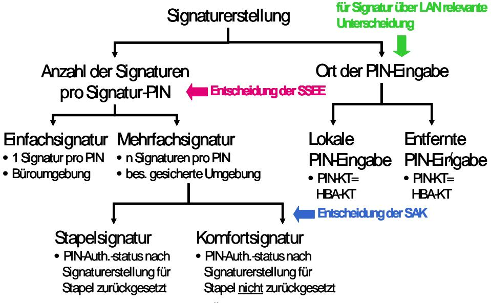
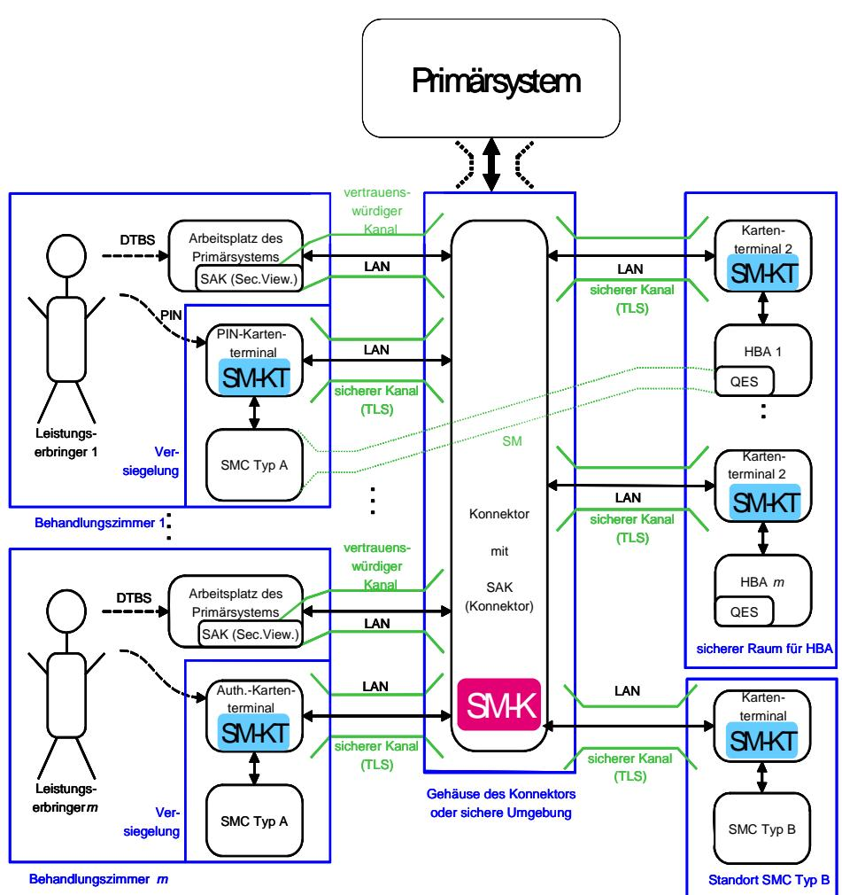
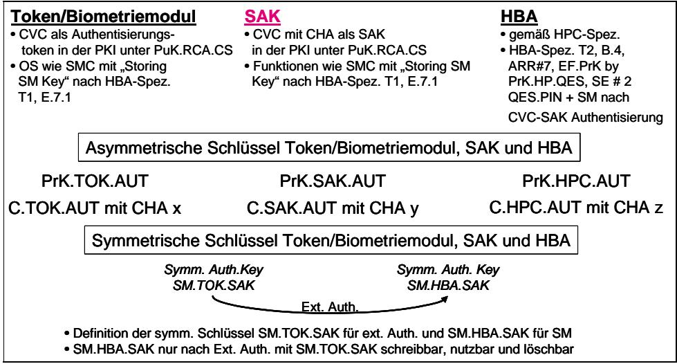
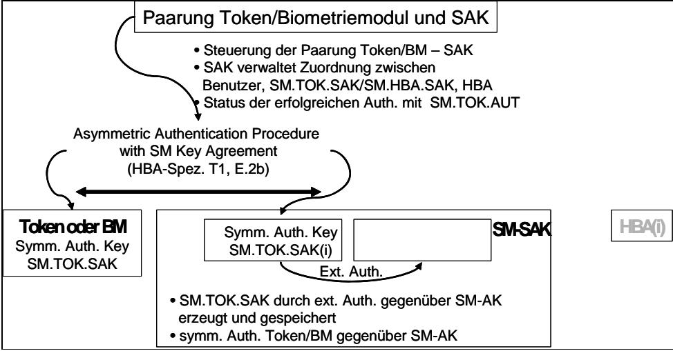
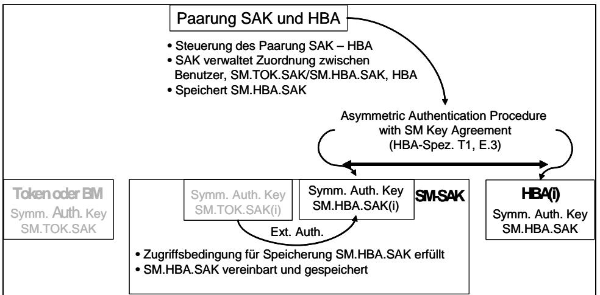
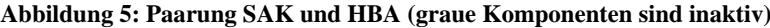
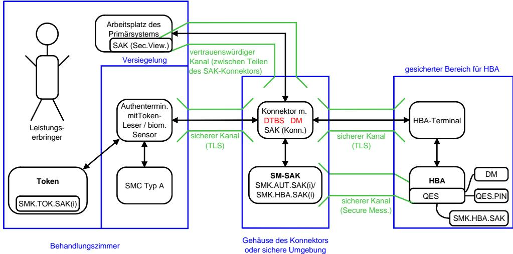
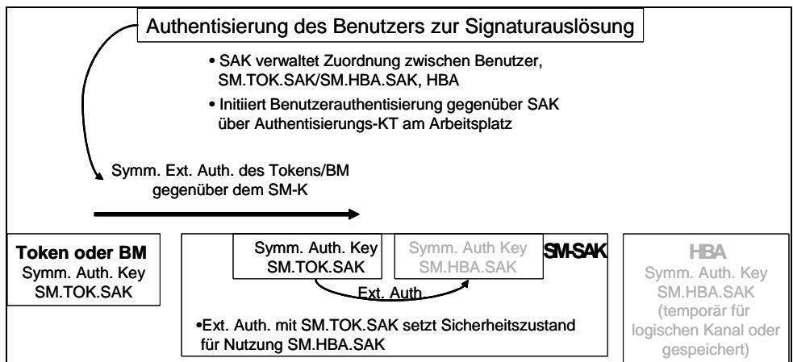
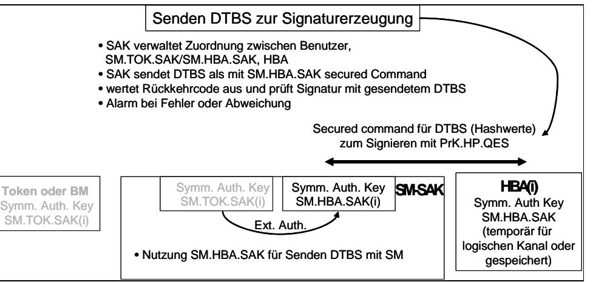
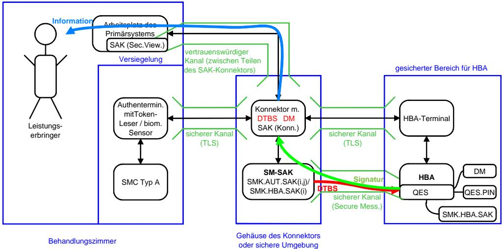

# BSI - Technische Richtlinie

| Bezeichnung:       | Komfortsignatur mit dem Heilberufsausweis |  |
|--------------------|----------------------------------------------|--|
| Anwendungsbereich: |                                              |  |
| Kürzel:            | BSI TR-03115                                 |  |
| Version:           | 2.0                                          |  |
| Veröffentlichung:  | 19.10.2007                                   |  |

## **Änderungsverlauf**

| Version | Datum      | Änderungen                                                                                                     | Anmerkungen |
|---------|------------|----------------------------------------------------------------------------------------------------------------|-------------|
| 1.0     | 18.08.2006 | Konzept Komfortsignatur                                                                                        |             |
| 1.1     | 04.06.2007 | Informative Anlagen bearbeitet; interne QS                                                                     |             |
| 1.2     | 20.06.2007 | Entwurf zur externen Abstimmung                                                                                |             |
| 1.3     | 07.07.2007 | Entwurf nach externer Kommentierung durch gematik und BÄK und Berücksichtigung aktueller Spezifikationen |             |
| 2.0     | 19.10.2007 | Entwurf nach externer Kommentierung durch gematik und BÄK sowie des Meetings am 11.10.2007               |             |

Letzte Version: [Version: 2.0 \(](#page-1-0)[19.10.2007\)](#page-1-1)

### **Variablen**

| Variable                 | Wert                     | Eintragsvergleich                                 |
|--------------------------|--------------------------|---------------------------------------------------|
| Dateiname und – länge | wird automatisch gesetzt | TR-03115_Komfortsignatur_v20.doc (738816 Byte) |
| Letzte Version           | Version: 2.0             | Version: 2.0                                      |
| Status                   | Entwurf                  | Entwurf                                           |
| Datum                    | 19.10.2007               | 19.10.2007                                        |
| Klassifikation           | nicht klassifiziert      | nicht klassifiziert                               |
| Editor                   | Wolfgang Killmann        | Wolfgang Killmann                                 |

Bundesamt für Sicherheit in der Informationstechnik Postfach 20 03 63 53133 Bonn Tel.: +49 228 99 9582-111 E-Mail: zertifzierung@bsi.bund.de Internet: http://www.bsi.bund.de © Bundesamt für Sicherheit in der Informationstechnik 2007

|     | Inhaltsverzeichnis                                                          |          |
|-----|-----------------------------------------------------------------------------|----------|
| 1   | Einleitung                                                                  | 5        |
| 1.1 | Ziel des Dokuments                                                          | 5        |
| 2   | Einleitung                                                                  | 6        |
| 2.1 | Begriffsdefinitionen                                                        | 6        |
|     | 2.1.1 Begriffsdefinition Komfortsignatur                                    | 6        |
|     | 2.1.2 Begriffsdefinition Signaturanwendungskomponente                       | 8        |
|     | 2.1.3 Begriffsdefinitionen "lokale PIN-Eingabe" und "entfernte PIN-Eingabe" | 9        |
|     | 2.1.4 Begriffsdefinitionen zur Einsatzumgebung                              | 9        |
| 2.2 | Problemstellung                                                             | 10       |
| 2.3 | Sicherheitsziele                                                            | 12       |
| 3   | Technische Voraussetzungen der Komponenten                                  | 14       |
| 3.1 | Evaluierte und bestätigte Signaturkomponenten                               | 14       |
| 3.2 | Signaturanwendungskomponente                                                | 14       |
|     | 3.2.1 SAK(Trusted Viewer)                                                   | 15       |
|     | 3.2.2 SAK (Konnektor)                                                       | 15       |
|     | 3.2.3 Token als Authentisieurngsmodul                                       | 18       |
| 3.3 | 3.2.4 Biometriemodul als Authentisierungsmodul HBA                       | 19 20 |
| 3.4 | Anwendungskonnektor                                                         | 21       |
| 3.5 | eHealth-Kartenterminal                                                      | 21       |
|     |                                                                             |          |
| 4   | Ablauf der Komfortsignatur                                                  | 23       |
| 4.1 | Installation                                                                | 23       |
|     | 4.1.1 Primärsystem 4.1.2 HBA                                             | 23 23 |
|     | 4.1.3 SAK (Konnektor)                                                       | 23       |
|     | 4.1.4 HBA                                                                   | 24       |
|     | 4.1.5 Kartenterminals                                                       | 24       |
|     | 4.1.6 Leistungserbringer                                                    | 24       |
| 4.2 | Benutzerverwaltung                                                          | 24       |
|     | 4.2.1 Aktivierung eines Tokens                                              | 25       |
|     | 4.2.2 Aktivierung eines Biometriemoduls                                     | 27       |
|     | 4.2.3 Deaktivierung eines Authentisierungsmoduls                            | 30       |
| 4.3 | Ablauf der Signaturerzeugung aus Sicht des Benutzers                        | 30       |
| 4.4 | Ablauf der Signaturerzeugung aus Sicht der technischen Komponenten          | 32       |
| 5   | Bewertung                                                                   | 38       |
| 5.1 | Erfüllung der Sicherheitsziele                                              | 38       |
|     | 5.1.1 Schutz der Signaturkomponenten                                        | 38       |
|     | 5.1.2 Schutz der Authentisierungsdaten                                      | 38       |
|     |                                                                             |          |

|     | 5.1.3 Schutz der zu signierenden Daten  | 39 |
|-----|-----------------------------------------|----|
|     | 5.1.4 Missbrauchsanalyse                | 39 |
| 5.2 | Erfüllung der Anforderungen SigG / SigV | 40 |
| 6   | Abkürzungsverzeichnis                   | 44 |
| 7   | Referenzen                              | 46 |

## **1. Einleitung**

## **1.1 Ziel des Dokuments**

Dieses Dokument beschreibt technische und organisatorische Sicherheitsmaßnahmen für die Erstellung einer begrenzten Anzahl qualifizierter elektronischer Signaturen innerhalb eines durch den Benutzer und die Signaturanwendungskomponente kontrollierten Zeitraums nach einer einmaligen Authentisierung des Signaturschlüssel-Inhabers gegenüber der Signaturerstellungseinheit in einer gesicherten Einsatzumgebung (Komfortsignaturen). Die Sicherheitsmaßnahmen beziehen sich auf den Heilberufsausweis als sichere Signaturerstellungseinheit, sowie den Konnektor, die eHealth-Kartenterminals und weitere Komponenten zur Authentisierung der berechtigt signierende Person als Signaturanwendungskomponenten in der gesicherten Einsatzumgebung dezentraler Komponenten der Telematikinfrastruktur im Rahmen der Einführung der elektronischen Gesundheitskarte.

Die Einsatzszenarien der Komfortsignatur sollen ihre konkrete Anwendung beim Signieren (Arzt) und Dispensieren (Apotheker) von elektronischen Verordnungen (eVerordnung) und ggf. anderen Dokumenten durch Leistungserbringer im elektronischen Gesundheitswesen finden. Die technische Richtlinie TR-03115 des Bundesamtes für Sicherheit in der Informationstechnik gibt den Bedarfsträgern Orientierung und Handlungssicherheit für spätere Sicherheitsbestätigungen der Signaturkomponenten durch die Bundesnetzagentur geben.

Die vorliegende Technische Richtlinie TR-03115 erweitert die Lösungsvarianten für die Einfachsignatur, die Stapelsignatur mit lokaler Eingabe der Signatur-PIN und die Stapelsignatur mit entfernter Eingabe der Signatur-PIN wie sie in der Technischen Richtlinie TR-03114 beschrieben sind, um weitere Erleichterungen für die Bedienung der Signaturanwendungskomponente und dadurch bedingte zusätzliche Sicherheitsmaßnahmen. Sie wurde dem aktuellen Stand Technischen Richtlinie BSI TR-03116 [5], der Spezifikation der Chipkarten Heilberufsausweis [11] [12] und Sicherheitsmodulkarte [11] [13] sowie der technischen Komponenten eHealth-Kartenterminal [10] und Konnektor [16] angepasst bzw. auf deren Grundlage weiterführende Sicherheitsmaßnahmen beschrieben.

Das Kapitel 2 Einleitung definiert die verwendeten spezifischen Begriffe und beschreibt das durch die Komfortsignatur zu lösende Problem. Das Kapitel 3 beschreibt die technischen Voraussetzungen der beteiligten Komponenten Heilberufsausweis, Kartenterminals und Signaturanwendungskomponente des Konnektors wie sie für die im Kapitel 4 beschriebenen Abläufe der Komfortsignatur benötigt werden. Die Abläufe der Komfortsignatur werden getrennt nach Prozessen der einmaligen Installation, der vorbereitenden Aktivierung der Authentisierungsmodule und dem eigentlichen Signaturprozess aus Benutzersicht und Komponentensicht beschrieben. Das Kapitel 5 gibt eine Bewertung der Erfüllung der Sicherheitsziele und der Anforderungen des Signaturgesetzes bzw. der Signaturverodnung.

## **2. Einleitung**

## **2.1 Begriffsdefinitionen**

Die Abbildung 1 veranschaulicht die Begriffsdefinitionen.

**Abbildung 1: Übersicht verwendeter Begriffe** 

## **2.1.1 Begriffsdefinition Komfortsignatur**

In dieser technischen Richtlinie werden folgende Arten von Signaturerstellungsprozessen unterschieden.

**Einfachsignatur**: Die sichere Signaturerstellungseinheit (SSEE) erlaubt nach einmaliger erfolgreicher Authentisierung des Signaturschlüssel-Inhabers die Erzeugung höchstens 1 Signatur.

**Mehrfachsignatur**: Erstellung einer begrenzten Anzahl Signaturen nach der einmaligen Authentisierung des Signaturschlüssel-Inhabers gegenüber der SSEE.

Der Begriff "**Komfortsignatur**" ist für diese technische Richtlinie wie folgt definiert:

"Erstellung einer begrenzten Anzahl qualifizierter elektronischer Signaturen in einer gesicherten Einsatzumgebung, bei der

- die Authentisierung des Signaturschlüssel-Inhabers durch Wissen gegenüber der sicheren Signaturerstellungseinheit (SSEE) vor der Anzeige der zu signierenden Daten erfolgt,
- der Signaturschlüssel-Inhaber sich gegenüber der SSEE für die Auslösung eines Signaturstapels authentisiert,
- die berechtigt signierende Person der Signaturanwendungskomponente den Signaturvorgang innerhalb eines durch ihn selbst und die Signaturanwendungskomponente kontrollierten Zeitraums auslösen kann."

Die Komfortsignatur bezieht sich damit auf zwei Aspekte des SigG [1] bzw. der SigV [2].

"*Sichere Signaturerstellungseinheiten … müssen gewährleisten, dass der Signaturschlüssel erst nach Identifikation durch Besitz und Wissen oder durch Besitz und ein oder mehrere biometrische Merkmale angewendet werden kann*" (siehe §15 (1) Satz 1 SigV).

- Die Authentisierung des *Signaturschlüssel-Inhabers* **muss** gegenüber der SSEE erfolgen.
- Die Authentisierung des *Signaturschlüssel-Inhabers* gegenüber der SSEE **muss** durch Besitz und Wissen oder durch Besitz und ein oder mehrere biometrische Merkmale erfolgen[1](#page-6-0) .

"*Signaturanwendungskomponenten … müssen gewährleisten, dass … b) eine Signatur nur durch die berechtigt signierende Person erfolgt"* (siehe §15 (2) Nr. 1. SigV).

- Die SAK **muss** die *berechtigt signierende Person* zur Auslösung des Signaturvorgangs authentisieren.
- Die SAK **muss** gewährleisten, dass nur die von der *berechtigt signierenden Person* bestimmten Daten ("Willensakt") der Erzeugung der Signatur durch SSEE zugeführt werden (Zugriffskontrolle).

Der Signaturschlüssel-Inhaber als die natürliche Person, die den Signaturschlüssel auf der SSEE besitzt und der der zugehörige Signaturprüfschlüssel durch qualifizierte Zertifikate zugeordnet ist, authentisiert sich sowohl gegenüber der SSEE (im Folgenden als "Authentisierung als Signaturschlüssel-Inhaber" bezeichnet) und als auch gegenüber der SAK (im Folgenden als "Authentisierung als berechtigt signierende Person" bezeichnet).

Für die Komfortsignatur ist es notwendig, dass

- die SSEE nach einmaliger erfolgreicher Authentisierung des Signaturschlüssel-Inhabers die Erzeugung einer begrenzten Anzahl ( ) Signaturen erlaubt (mehrfachsignaturfähige SSEE), *n n* >1
- *m nm* ≤≤ • die SAK die berechtigt signierende Person authentisiert und für das Signieren eines Stapels von (1 ) durch die SSEE autorisiert,
- [2](#page-6-1) die SAK nur die der berechtigt signierenden Person angezeigten Dateien (bzw. Dokumente , Stapel) und von ihr für die Signaturerstellung frei gegebenen Dateien zeitlich zusammenhängend der SSEE zuführt (Stapel) und
- die SAK die Autorisierung des Signaturschlüssel-Inhabers nach dem Signieren dieses Stapels **nicht** automatisch zurücksetzt, sondern die Autorisierung durch den Benutzer oder durch die SAK nach anderen Kriterien (insbesondere einer vordefinierten Zeit) zurückgesetzt wird.

1 ≤≤ *nm* 2*nmn* Der von der SAK abzuarbeitende Stapel kann aus *m* zu signierenden Dateien bestehen, wobei bei nur 1 erfolgreiche Authentisierung des Signaturschlüssel-Inhabers gegenüber der stapelsignaturfähigen SSEE (Eingabe der Signatur-PIN) ausreicht, für < ≤ nur 2 erfolgreiche Authentisierungen des Signaturschlüssel-Inhabers gegenüber der mehrfachsignaturfähigen SSEE ausreichen, usw.

Der Begriff "Komfortsignatur" grenzt sich durch die Anzahl der zulässigen Signaturerstellungen pro Authentisierung des Signaturschlüssel-Inhabers gegenüber der SSEE (Signatur-PIN) von dem Begriff "Einfachsignatur" ab. Die Einfachsignatur ist dadurch charakterisiert, dass die SSEE nach einmaliger erfolgreicher Authentisierung des Signaturschlüssel-Inhabers die Erzeugung höchstens 1 Signatur erlaubt. Für das Signieren eines Stapels aus *m* Dateien sind *m* erfolgreiche Authentisierung des Signaturschlüssel-Inhabers gegenüber einer nur für Einfachsignatur zulässigen SSEE notwendig.

Der Begriff "Komfortsignatur" grenzt sich durch den Zeitpunkt der Authentisierung des Signaturschlüssel-Inhabers gegenüber der SSEE relativ zum Zeitpunkt der Anzeige der zu signierenden Daten vom Begriff "Stapelsignatur" ab. Die Stapelsignatur ist definiert als (siehe TR-

Bundesamt für Sicherheit in der Informationstechnik 7

1 Im Weiteren wird zur Vereinfachung der Darstellung in Übereinstimmung mit der gegenwärtig verfügbaren SSEE angenommen, dass die Identifizierung des Signaturschlüssel-Inhabers gegenüber der SSEE durch Besitz und Wissen in Form einer PIN erfolgt. Dies schließt zukünftige Lösungen dieser Authentisierung durch Besitz und ein oder mehrere biometrische Merkmale nicht aus. 2

Die Begriffe Dokument und Datei werden in diesem Zusammenhang synonym verwendet.

03114 [4]): "Erstellung einer begrenzten Anzahl qualifizierter elektronischer Signaturen nach den zeitlich unmittelbar aufeinander folgenden Prozessen der Anzeige der zu signierenden Daten und der einmaligen Authentisierung des Signaturschlüssel-Inhabers gegenüber der SSEE". Bei der Komfortsignatur liegt der Zeitpunkt dieser Authentisierung durch Wissen (Eingabe der Signatur-PIN) vor dem Zeitpunkt der Anzeige der zu signierenden Daten und die SAK setzt die Autorisierung des Signaturschlüssel-Inhabers nach dem Signieren dieses Stapels nicht zurück.

Wegen der vorherigen Anzeige und Auswahl der Dateien ist es für die Komfort- wie für die Stapelsignatur nicht notwendig, dass die zu unterzeichnenden Dateien inhaltlich gleichen Typs sind, wie es z. B. für einen automatisierten Prozess der Generierung von zu unterzeichnenden Daten etwa in der Einsatzumgebung der Zertifizierungsdiensteanbieters der Fall ist.

Eine Komfortsignatur in der Einsatzumgebung des Heilberuflers lässt sich durch den folgenden grundsätzlichen Ablauf beschreiben.

Zu Beginn der Arbeitszeit steckt der Heilberufler den Heilberufsausweis in ein Kartenterminal in einem gesicherten Bereich. Er gibt unmittelbar an diesem Kartenterminal oder später an einem anderen Kartenterminal seine PIN als Signaturschlüssel-Inhaber (Signatur-PIN) ein.

## **2.1.2 Begriffsdefinition Signaturanwendungskomponente**

Im Umfeld des elektronischen Gesundheitswesens teilt sich eine Signaturanwendungskomponente (SAK) in folgende Komponenten auf:

- SAK-Komponente auf dem Konnektor, (auch "SAK (Konnektor)" genannt),
- SAK-Komponente auf dem Arbeitsplatz des Primärsystems (auch "SAK (Secure Viewer)" oder "Secure Viewer" genannt),
- eHealth-Kartenterminals, die der Benutzer zur Authentisierung gegenüber der SAK (auch "SAK-Authentisierungsterminal" genannt) gegenüber dem HBA (auch "PIN-Eingabe-Terminal" genannt) oder zur Aufbewahrung und zum Betrieb des HBA (SSEE) steckt (auch "HBA-Terminal" genannt) verwendet,
- Komponenten der SAK zur Authentisierung der berechtigt signierenden Person.

Die **SAK (Konnektor)** ist Teil des Anwendungskonnektors und implementiert die Authentisierung des berechtigten Benutzers, die Ablauflogik und die Ansteuerung der Kartenterminals. Die **SAK (Secure Viewer)** auf dem Arbeitsplatz des Primärsystems stellt die Benutzerschnittstelle der SAK bereit und implementiert Teile der Funktionalität des Secure Viewers (die eigentliche Darstellung, nicht aber die Interpretation und Aufbereitung der Daten). Sofern aus dem Zusammenhang heraus klar ist, welcher Teil der SAK gemeint ist, oder wenn beide Teile der SAK gemeint sind, wird auf die Unterscheidung in Klammern verzichtet.

Zur Authentisierung der berechtigt signierenden Person gegenüber der SAK (siehe §15 (2) Nr. 1. SigV) werden für die Komfortsignatur spezielle Terminals benutzt.

**SAK-Authentisierungsterminal**: Terminal, an dem die Authentisierung der berechtigt signierenden Person gegenüber der SAK erfolgt.

Diese technische Richtlinie betrachtet folgende Möglichkeiten der Authentisierung der berechtigt signierenden Person gegenüber der SAK

- Besitz eines kontaktlosen Tokens oder
- Präsentation eines biometrischen Merkmals oder mehrerer biometrischer Merkmale.

Es ist zu beachten, dass nicht jedes eHealth-Kartenterminal (siehe [14]) die Authentisierung mit kontaktlosem Token oder biometrischem Merkmal, wie hier für das SAK-Authentisierungsterminal angegeben, unterstützen muss. **PIN-Eingabe-Terminal** und **HBA-Kartenterminal** sind im folgenden Kapitel definiert.

Die SAK führt eine Authentisierung der berechtigt signierende Person und eine Berechtigungsprüfung zur Signaturauslösung durch. Für die Authentisierung der berechtigt signierenden Person können Verfahren verwendet werden, welche den Besitz eines Gegenstands (im folgenden **Token** genannt, zu

Details s. Kapitel [3.2.3\)](#page-17-1), die Präsentation von Wissen (z. B.. PIN) oder die Präsentation eines biometrischen Merkmals gegenüber einem **Biometriemodul** (zu Details s. Kapitel [3.2.4\)](#page-18-1) oder deren Kombination erfordern. Das Biometriemodul implementiert alle für die Authentisierung mit biometrischen Merkmalen erforderlichen Funktionen und übermittelt das Ergebnis der Authentisierung an die SAK.

#### **2.1.3 Begriffsdefinitionen "lokale PIN-Eingabe" und "entfernte PIN-Eingabe"**

Der Heilberufsausweis (HBA) [12] als sichere Signaturerstellungseinheit unterstützt gegenwärtig nur die Authentisierung des Signaturschlüssel-Inhabers durch Wissen. Die Möglichkeit der Authentisierung durch biometrische Merkmale zur Nutzung des Signaturschlüssels (nach §15 (1) Satz 1 SigV [2]) wird durch diese technische Richtlinie nicht ausgeschlossen, es werden jedoch keine speziellen technischen Lösungen diskutiert. Im Folgenden wird deshalb bei dieser Authentisierung kurz von einer PIN-Eingabe gesprochen.

Diese technische Richtlinie verwendet folgende Begriffe im Zusammenhang mit der Eingabe der PIN zur Authentisierung des Signaturschlüssel-Inhabers gegenüber der SSEE (HBA).

**PIN-Eingabe-Terminal**: Chipkartenterminal, an dem die PIN durch den Benutzer eingegeben wird.

**HBA-Kartenterminal**: Chipkartenterminal, in dem sich der Heilberufsausweis (HBA) befindet, der die PIN prüfen soll.

**lokale PIN-Eingabe**: die PIN-Eingabe erfolgt an dem Chipkartenterminal, in welchem sich die Chipkarte befindet, die die PIN prüfen soll, d. h. das PIN-Eingabe-Terminal ist auch das HBA-Kartenterminal.

**entfernte PIN-Eingabe** ("remote PIN"): die PIN Eingabe erfolgt an einem anderen Chipkartenterminal, als dem der verschieden ist von dem Kartenleser, in welchem sich die Chipkarte befindet, die die PIN prüfen soll, d. h. das PIN-Eingabe-Terminal ist verschieden von dem HBA-Kartenterminal.

Die Konzepte der "lokalen PIN-Eingabe" und "entfernten PIN-Eingabe" sind unabhängig von der Anzahl der zu signierenden Dateien (Einfachsignatur, Stapelsignatur oder Komfortsignatur). Die Trennung in PIN-Eingabe-Terminal und HBA-Kartenterminal entspricht dem Wunsch der Anwender, dass der HBA nicht vom Leistungserbringer mitgeführt, sondern in einem gesicherten Bereich gesteckt bleiben soll (entfernte PIN-Eingabe). Die entfernte PIN-Eingabe kann neben der Signatur-PIN-Eingabe auch für andere Anwendungen, z. B. der PIN-Authentisierung für die Verschlüsselung von Daten verwendet werden.

#### **2.1.4 Begriffsdefinitionen zur Einsatzumgebung**

Für die Einfachsignatur einerseits und die Stapelsignatur bzw. Komfortsignatur andererseits werden die folgenden beiden Einsatzumgebungen unterschieden:

**Einfache Einsatzumgebung:** Diese Einsatzumgebung entspricht dem "Geschützten Einsatzbereich" gemäß [18], d. h. einer normalen Büroumgebung oder privater Computernutzung unter Beachtung einfacher Sicherheitsstandards, und ist für die Erzeugung von Einfachsignaturen vorgesehen. In der einfachen Einsatzumgebung darf die SSEE nur Einfachsignaturen, aber keine Mehrfachsignaturen erlauben.

**Besonders gesicherte Einsatzumgebung**: Die besonders gesicherte Arbeitsumgebung verfügt über zusätzliche technische und organisatorische Sicherheitsmaßnahmen zum Schutz der Signaturfunktion der SSEE vor Missbrauch unter den Bedingungen der Mehrfachsignatur. In der besonders gesicherten Einsatzumgebung darf die SSEE die Erstellung von Mehrfachsignaturen (d.h. sowohl Stapelsignaturen als auch Komfortsignaturen) erlauben.

Der HBA soll sowohl für Einfachsignaturen in einfacher Einsatzumgebung (z. B. außerhalb der Praxis oder des Krankenhauses) als auch für Mehrfachsignaturen in der besonders gesicherten

Einsatzumgebung der Leistungserbringer verwendet werden. Die vorliegende technische Richtlinie beschreibt die besonders gesicherte Einsatzumgebung für Komfortsignaturen der Leistungserbringer unter Berücksichtigung spezieller Aspekte wie z. B. Arbeit in einem lokalen Netz und des Konnektors.

Als "**gesicherter Bereich**" wird in diesem Konzept ein Bereich bezeichnet, der über hinreichend hohen physikalischen bzw. organisatorischen Schutz verfügt, um die physische Kontrolle des Signaturschlüssel-Inhabers über seine sichere Signaturerstellungseinheit (SSEE) zu gewährleisten. Insbesondere darf die SSEE nicht entwendet werden können. Bei Nutzung des Konzepts der entfernten PIN-Eingabe **muss** der HBA in einem solchen gesicherten Bereich aufbewahrt werden.

Die genauen Anforderungen an die der besonders gesicherte Einsatzumgebung der Leistungserbringer und einen gesicherten Bereich werden in Abhängigkeit von der Einsatzumgebung und den Sicherheitseigenschaften der dezentralen Komponenten der Telematikinfrastruktur festgelegt.

## **2.2 Problemstellung**

Die in dieser technischen Richtlinie beschriebene Komfortsignatur soll seine konkrete Anwendung beim Signieren (Arzt) und Dispensieren (Apotheker) von elektronischen Verordnungen (eRezepten) durch Leistungserbringer sowie weiteren Dokumenten im elektronischen Gesundheitswesen finden. Diese Vorgänge werden durch qualifizierte elektronische Signaturen mit dem Heilberufsausweis (HBA) abgebildet.

Da ein elektronisches Rezept jeweils nur eine einzige Verordnung enthält, ergibt sich schon allein aus dieser Pflichtanwendung heraus eine große Anzahl von qualifizierten elektronischen Signaturen, die täglich zu leisten sind. Wollte ein Leistungserbringer die zu leistenden qualifizierten elektronischen Signaturen alle auf die bisher bestätigungsfähige Art und Weise als Einfachsignatur erzeugen, müsste er für jede Verordnung erneut seine PIN eingeben. Dies bedingt einen beträchtlichen Aufwand für den Leistungserbringer. Darüber hinaus birgt ein solches Vorgehen auch ein erhebliches Risiko, dass die PIN bei so häufiger Eingabe ausgespäht werden kann.

Es wird daher eine Erleichterung in der Auslösung qualifizierter elektronischer Signaturen bei gleich bleibend hoher Sicherheit angestrebt. Die Komfortsignatur stellt eine mögliche Antwort auf die beschriebene Problemstellung dar.

Die Komfortsignatur geht in ihrer Bedienfreundlichkeit und den dafür erforderlichen Sicherheitsmaßnahmen über die Stapelsignatur (siehe TR-03114 [4]) hinaus. Ein Heilberufler möchte als Inhaber des Signaturschlüssels auf dem Heilberufsausweis signieren. Die Authentisierung mit Signatur-PIN gegenüber dem Heilberufsausweis erfolgt nur einmal für einen begrenzten Zeitraum (z. B. pro Tag oder einige Male pro Tag**[3](#page-9-1)** ). Zur zeitlich zusammenhängenden Signatur einer größeren, aber begrenzten Anzahl von Dokumenten soll sich der Heilberufler gegenüber der Signaturanwendungskomponente auf den Arbeitsplätzen der Primärsysteme und den dort verfügbaren Kartenterminals authentisieren. Der Heilberufler möchte weiterhin die Signaturen von verschiedenen Arbeitsplätzen aus erstellen können und deshalb den Heilberufsausweis für diesen Zeitraum in einer gesicherten Umgebung aufbewahren (entfernte PIN-Eingabe).

In der Einsatzumgebung können mehrere Leistungserbringer an mehreren Arbeitsplätzen arbeiten. Die Einsatzbedingungen des Heilberufsausweises (HBA) führen zu folgenden weiteren Bedingungen:

### • zentrale Aufbewahrung des HBA:

Leistungserbringer wollen ihren HBA nicht den ganzen Tag mit sich führen, sondern ihn an einer zentralen Stelle in einem gesicherten Bereich in einen Kartenleser stecken. Dieser HBA-Kartenleser wird per LAN an den Konnektor angeschlossen.

 3

Die sichere Signaturerstellungseinheit (SSEE) begrenzt die Anzahl der Signaturen, die nach einmaliger PIN-Eingabe erzeugt werden können, auf eine feste Anzahl *n*, *n* > 1. Wenn an einem Tag mehr Signaturen erstellt werden sollen als von der SSEE unterstützt werden, kann es daher erforderlich werden, mehr als einmal pro Tag die Signatur-PIN einzugeben.

### • PIN-Eingabe:

Den Leistungserbringern soll sowohl eine lokale PIN-Eingabe als auch eine entfernte PIN-Eingabe für die Signatur-PIN ermöglicht werden. Bei der entfernten PIN-Eingabe soll sich der HBA in einem HBA-Kartenterminal in einem gesicherten Bereich befinden, und der Leistungserbringer für die Signatur-PIN-Eingabe ein Kartenterminal nutzen, welches sich im Behandlungszimmer befindet.

• Bindung der Mehrfachsignatur an die gesicherte Einsatzumgebung:

Die Funktionalität, Mehrfachsignaturen erstellen zu können, soll technisch an die gesicherte Einsatzumgebung in den Geschäftsräumen des Leistungserbringers gebunden werden. Wird der HBA in einer anderen als der speziell gesicherten Einsatzumgebung betrieben, sollen weiterhin Einfachsignaturen erstellt werden können, aber die Funktionalität der Mehrfachsignatur soll technisch gesperrt sein.

• Einheitlicher HBA für Stapel- und Komfortsignatur Der HBA soll gleichzeitig Stapelsignatur und Komfortsignatur ermöglichen. Die SAK soll in Abhängigkeit von der technischen Ausstattung Stapelsignatur oder Komfortsignatur oder beide Verfahren gleichzeitig unterstützen.

Die Abbildung 2 stellt die Einsatzumgebung für die Komfortsignatur verallgemeinert dar.

**[4](#page-11-1) Abbildung 2: Einsatzumgebung für die Komfortsignatur mit entfernter PIN-Eingabe**

Die zentrale Aufbewahrung des HBA, die entfernte PIN-Eingabe und die Bindung der Komfortsignatur an die gesicherte Einsatzumgebung kann weitgehend analog zur Stapelsignatur (siehe TR-03114 [4]) erfolgen. Die Authentisierung des berechtigten Benutzers gegenüber der SAK und Autorisierung der Signaturerstellung für einen Stapel von Dokumenten erfordert zusätzliche Sicherheitsmaßnahmen, die im Folgenden beschrieben werden.

## **2.3 Sicherheitsziele**

Das zu verwendende Verfahren zur Komfortsignatur muss folgendes sicherstellen:

Schutz der Signaturkomponenten: • Im zu beschreibenden Einsatzszenario muss die SSEE so geschützt werden, dass der Signaturschlüsselinhaber die alleinige Kontrolle über die SSEE behält. Die SAK muss vor Missbrauch der Benutzerverwaltung, Benutzerprüfung und Signaturerstellungsfunktion geschützt sein.

12 Bundesamt für Sicherheit in der Informationstechnik

4 Hier und in den folgenden Abbildungen steht SM-K für auch für SM-AK und SM-SAK.

- Authentisierung des Signaturschlüssel-Inhabers durch die SSEE: Die SSEE authentisiert den Signaturschlüssel-Inhaber. Die SSEE gibt die Nutzung des Signaturschlüssels nur nach erfolgreicher Authentisierung des Signaturschlüssel-Inhabers frei.
- Schutz der Authentisierungsdaten des Signaturschlüsselinhabers (Signatur-PIN): Das Verfahren muss die Vertraulichkeit der Signatur-PIN schützen. Die einmal (oder wenige Male) am Tag einzugebende Signatur-PIN darf nicht außerhalb des HBA gespeichert werden, wobei eine temporäre Speicherung zur Verarbeitung mit anschließender aktiver Löschung zulässig ist. Die vom Signaturschlüssel-Inhaber an einem PIN-Eingabeterminal (im Behandlungszimmer) eingegebene Signatur-PIN darf nicht ungeschützt zum HBA übertragen werden; insbesondere die Übertragung über das LAN ist zu schützen.

Gleiches gilt für die Display Message, die dem Signaturschlüsselinhaber angezeigt wird, bevor dieser seine Signatur-PIN eingibt: Ihre Vertraulichkeit bei der Übertragung über das LAN ist zu schützen.

- Authentisierung der berechtigt signierenden Person gegenüber der SAK und Autorisierung der Signaturerstellung für einen Stapel von Dokumenten: Die SAK identifiziert und authentisiert die berechtigt signierende Person (gem. §15 Absatz (2) Nr. 1 b) und führt die frei gegebenen Dateien zeitlich zusammenhängend der SSEE (Stapel) zur Signaturerstellung zu.
- Schutz der Authentisierungsdaten der berechtigt signierenden Person durch die SAK: Die Einrichtung der Authentisierungsdaten für die berechtigt signierende Person muss durch den Signaturschlüssel-Inhaber erfolgen. Die Authentisierung der berechtigt signierenden Person zum Auslösen des Signaturvorgangs kann durch Besitz oder durch biometrische Merkmale erfolgen.

Der Token ist gegen Missbrauch insbesondere bei der Verwendung kontaktloser Schnittstellen zu schützen.

Im Fall der Komfortsignatur mit Verwendung biometrischer Merkmale müssen die biometrischen Verifikations- und Referenzdaten geschützt werden. Ein Wiedereinspielen von Verifikationsdaten, die eine erfolgreiche Authentisierung ermöglichen, muss ebenso verhindert werden wie ein unbefugtes Aufzeichnen von Referenzdaten.

Wenn die Authentisierung des berechtigten Benutzers der SAK ein kryptographisches Challenge-Response-Verfahren nutzt, so müssen die Authentisierungsverifikationsschlüssel in der vom Benutzer verwendeten Komponente und der Authentisierungsreferenzschlüssel der prüfenden Stelle vertraulich[5](#page-12-0) und integritätsgeschützt gespeichert und verwendet werden.

- Schutz der zu signierenden Daten: Es dürfen nur solche Daten dem HBA zum Signieren zugeführt werden, die die berechtigt signierende Person signieren wollte. Dies Daten dürfen während der Übertragung nicht verändert oder ausgetauscht oder andere Daten hinzugefügt werden.
- Schutz vor Missbrauch: Missbrauch liegt vor, wenn die SSEE oder die SAK gegen den Willen oder ohne das Wissen des rechtmäßigen Signaturschlüsselinhabers durch eine nicht autorisierte Person zur Erstellung von Signaturen genutzt wird. Dem Leistungserbringer muss es möglich sein, den HBA auf Wunsch (z. B.. bei einer längeren Arbeitspause) von jedem beliebigen Arbeitsplatz des Primärsystems aus in einen Zustand zu bringen, der für die Erstellung weiterer (Komfort-) Signaturen eine erneute PIN-Eingabe erforderlich macht. Die SAK (Konnektor) soll den HBA nach einer konfigurierbaren Zeit automatisch in einen solchen Zustand überführen.

 Für asymmetrische Authentisierungsverfahren ist eine Geheimhaltung des Authentisierungsreferenzschlüssels nicht erforderlich.

 5

## **3. Technische Voraussetzungen der Komponenten**

In diesem Kapitel werden die spezifischen technischen Voraussetzungen für die Komfortsignatur beschrieben. Für die lokale bzw. entfernte Signatur-PIN-Eingabe wird auf die TR-03114 [4] zur Stapelsignatur verwiesen.

Die für die Komfortsignatur vorgesehenen aber noch nicht spezifizierten Anforderungen[6](#page-13-1) an technische Komponenten außer der SAK werden besonders hervorgehoben. Alle anderen technischen Voraussetzungen an die dezentralen Komponenten der Telematikinfrastruktur sind bereits jetzt gegeben.

## **3.1 Evaluierte und bestätigte Signaturkomponenten**

Der HBA ist eine nach dem HBA-Schutzprofil [6] evaluierte und bestätigte sichere Signaturerstellungseinheit für Einfach- und Stapelsignaturen und für die Verwendung im Rahmen der Komfortsignatur vorgesehen. Die SAK-Komponente auf dem Konnektor, die SAK auf dem Arbeitsplatz des Primärsystems (Secure Viewer) und die eHealth-Kartenterminals[7](#page-13-2) (als Teil der SAK, siehe Abschnitt [2](#page-7-1)) sind nach Schutzprofilen [9] [10] evaluierte und bestätigte Signaturkomponenten. Die SMC Typ A und B sind nach Schutzprofilen evaluierte [7] [8] und zertifizierte Komponenten. Die Sicherheitsmodule der eHealth-Kartenterminals (SM-KT) und der Konnektoren (SM-K) sind nach einem Schutzprofil evaluierte und zertifizierte Komponenten.

Im Fall der Authentisierung mit Token muss der Token eine evaluierte und für die Verwendung als Signaturkomponente bestätigte Komponente sein. Im Fall der Authentisierung mit biometrischem Merkmal muss der Biometriemodul eine evaluierte und für die Verwendung als Signaturkomponente bestätigte Komponente sein. Dies schließt den physischen und funktionellen Schutz aller Authentisierungsdaten und die korrekte Ausführung der Sicherheitsfunktionen ein.

Die SAK-Komponenten können unter der Voraussetzung wohl definierter Schnittstellen entsprechend den Bedingungen des Marktes von unterschiedlichen Herstellern vertrieben und kombiniert verwendet werden[8](#page-13-3) . Die SAK-Komponenten und ihr Zusammenwirken unterliegen aber der Evaluierung für die Bestätigung als Signaturkomponenten.

## **3.2 Signaturanwendungskomponente**

Die Signaturanwendungskomponenten für Komfortsignatur bestehen aus

- der SAK(Trusted Viewer)
- der SAK(Konnektor)
- • en Kartenterminals
	- HBA-Terminal (lokale und entfernte PIN-Eingabe),
	- PIN-Terminal (entfernte PIN-Eingabe)
	- SAK-Authentisierungsterminal
- einem Authentisierungsmodul: Token, Biometriemodul.

- 7 HBA-Terminal und PIN-Terminal
- 8 Vergleiche [16], Abschnitt 3.8.2.

6 Die gegenwärtigen Spezifikation sind [11] [12] [13] [14] [15].

## **3.2.1 SAK(Trusted Viewer)**

Die SAK verfügt über eine Komponente SAK(Trusted Viewer), die auf einem Arbeitsplatz des Primärsystems ausgeführt wird. Die Komponente SAK(Secure Viewer) und stellt die gesicherte Kommunikation mit der SAK(Konnektor) sowie die Anzeige der zu signierenden und von der SAK geprüften und aufbereiteten Daten (z. B. in Form eines Videodatenstroms) bereit. Die Kommunikation zwischen SAK(Secure Viewer) auf dem Arbeitsplatz und der SAK(Konnektor) auf dem Konnektor muss die Integrität der Daten und kann die Vertraulichkeit der Daten auf dem Übertragungsweg schützen. Da diese Kommunikation SAK-intern abläuft, muss sie nicht gesondert spezifiziert, aber evaluiert sein. In den nachfolgenden Abbildungen wird dieser geschützte Übertragungsweg als "vertrauenswürdiger Kanal" bezeichnet.

Die SAK stellt folgende Funktionen bereit, die

- den Stapel zu signierender Daten festzulegen und dafür die Signatur auszulösen,
- im Fall einer Störung der Stapelsignatur (z. B. Fehlermeldung des HBA, nicht korrekt erzeugte Signatur oder Erzeugung einer Signatur für Daten, die der Signaturschlüsselinhaber nicht beabsichtigte zu signieren) alle Signaturen des Stapels ungültig macht und den Benutzer über die Störung informiert,
- den Signaturschlüssel-Inhaber ermöglicht von jedem beliebigen Arbeitsplatz mit installierter SAK (Secure Viewer) den Sicherheitszustand des HBA zurücksetzt, der nach erfolgreicher Authentisierung mit der Signatur-PIN eingestellt wurde und die Erzeugung von Signaturen erlaubt (z. B. Reset des HBA).

## **3.2.2 SAK (Konnektor)**

Die SAK-Komponente SAK(Konnektor) hat für die Komfortsignatur folgende Aufgaben:

- Sie empfängt vom Primärsystem die Identität des berechtigten Benutzers, die Identität des durch ihn benutzten Arbeitsplatzes und die vorausgewählten Daten.
- Sie prüft die Zulässigkeit der Formate der vorausgewählten Daten, bereitet diese zur Anzeige durch die SAK(Trusted Viewer) auf und sendet sie an die SAK(Trusted Viewer) zur Anzeige für den Benutzer.
- Sie steuert den gesamten Signaturprozess mit der Signatur-PIN-Eingabe, der Signaturerzeugung, der Prüfung der empfangenen Signaturen und dem Rücksetzen des Signatur-PIN-Status. Sie führt einen gegenseitige Authentisierung mit dem HBA durch und kommuniziert geschützt (Secure Messaging mit MAC) mit dem HBA.
- Sie verwaltet und authentisiert die berechtigt signierenden Personen mit der Paarung Token/SAK bzw. Biometriemodul/SAK, die Authentisierung der berechtigt signierenden Personen am Authentisierungsterminal und das Rücksetzen der Paarung.

Die SAK des Konnektors kann Funktionen zur Display Message des HBA (siehe HBA-Spezifikation [12], Abschnitt 7.1.4) bereit stellen

- Anzeige der Display Message auf dem Kartenterminal und durch den Secure Viewer und
- Wechsel der Display Message mit Hilfe der SAK (Konnektor und Secure Viewer)[9](#page-14-1) .

Die Komfortsignatur ist wesentlich dadurch gekennzeichnet, dass sich der HBA über einen längeren Zeitraum im Sicherheitszustand "erfolgreiche Authentisierung mit der Signatur-PIN" befindet und bis

 9

 Die Ansteuerung des HBA zum Wechsel der Display Message wird durch die SAK (Konnektor) vorgenommen, die Benutzerschnittstelle kann teilweise durch die SAK (Secure Viewer) bereitgestellt werden. Die Display Message selbst sollte möglichst nur am Display des Terminals angezeigt werden.

zu *n* Signaturen erstellt werden können. Nach § 15 (2) 1. b) SigV [10](#page-15-0) muss die SAK die Berechtigung des Benutzers prüfen, Signaturen mit der entfernt aufbewahrten SSEE zu erzeugen. Diese Berechtigungsprüfung erfordert die Identifizierung und Authentisierung der berechtigt signierenden Person sowie die darauf basierende Zugriffskontrolle für die zeitlich zusammenhängende Erstellung von Signaturen durch die SAK. Die Authentisierung muss Angriffen mit hohem Angriffspotential widerstehen.

Die **Identifizierung** des Benutzers gegenüber der SAK wählt die Authentisierungsreferenzdaten aus, die zur Prüfung des Authentisierungsversuchs als berechtigt signierende Person erforderlich sind. Die Identifizierung des Benutzers kann direkt gegenüber der SAK (Secure Viewer) auf dem Arbeitplatz des Primärsystems oder gegenüber dem Primärsystem mit Weiterleitung an die SAK erfolgen.

Die **Authentisierung** des Benutzers als berechtigt signierende Person erfolgt durch die SAK. In den folgenden Abschnitten werden die Authentisierung durch Besitz eines Tokens und die Authentisierung durch biometrische Merkmale beschrieben.

Nach erfolgreicher Authentisierung der berechtigt signierende Person gegenüber der SAK kontrolliert die **Autorisierung** die Übergabe der diesem Benutzer vorher angezeigten und durch ihn zum Signieren vorgesehenen Daten an den ihm zugeordnete HBA. Die SAK übergibt die zu signierende Daten für Mehrfachsignaturen mit Secure Messaging (nur MAC) an den HBA.

Die **Benutzerverwaltung** ermöglicht dem Signaturschlüssel-Inhaber, die berechtigt signierende Person an der SAK für seinen HBA einzurichten. Sie stellt eine Kette von der Authentisierung der berechtigt signierenden Person gegenüber der SAK und der SAK gegenüber dem HBA her. Damit eine einheitliche Spezifikation der Prozesse der SAK bei einer hohen potentiellen Sicherheit erreicht werden kann, sollen sich die Authentisierungsverfahren des Tokens und des Biometriemoduls gegenüber der SAK (Konnektor) auf eine einheitliche Schnittstelle mit einem kryptographischen Challenge-Response-Verfahren zurückführen lassen.

Die SAK verwaltet für jeden autorisierten Benutzer:

- die Identitäten der angemeldeten Benutzer, wie sie von dem Primärsystem übergeben wird, im Folgenden die Identität eines angemeldeten Benutzers durch den Index i gekennzeichnet
- welches Authentisierungsverfahren (Token oder Biometriemodul) für einen angemeldeten Benutzer verwendet werden soll,
- welche Authentisierungsreferenzdaten für einen angemeldeten Benutzer als berechtigt signierende Person an der SAK eingerichtet sind (s. u. SMK.TOK.SAK(i,j)),
- welcher HBA dem angemeldeten Benutzer zugeordnet ist, im Folgenden die Identität eines angemeldeten Benutzers durch den Index h gekennzeichnet
- welches Authentisierungsverifikationsdatum die SAK gegenüber dem HBA des angemeldeten Benutzer zugeordnet zu verwenden ist (s. u. SMK.HBA.SAK(i)),
- in welchem eHealth-Kartenterminal der HBA des Benutzers gesteckt ist (HBA-Terminal und Slot),
- an welchem eHealth-Kartenterminal der Benutzer sich authentisieren kann (Authentisierungsterminal).

Die SAK verfügt für die Authentisierung der berechtigt signierenden Person mittels Token oder Biometriemodul und zur Authentisierung gegenüber dem HBA über einen privaten Schlüssel PrK.SAK.AUT und ein CVC C.SAK.AUT des dazugehörigen öffentlichen Schlüssels Puk.SAK.AUT mit der Rolle (CHA im CVC) "SAK" in der PKI des Gesundheitswesens unter Puk.RCA.CS. Sie implementiert die folgenden Authentisierungsprotokolle:

• asymmetrische Authentisierung mit Schlüsselvereinbarung nach [11], Anlage E.3, unter Nutzung der Schlüssel PrK.SAK.AUT und Puk.RCA.CS, wobei

10 § 15 (2) 1. b) SigV: "Signaturanwendungskomponenten [...] müssen gewährleisten, dass bei der Erzeugung einer qualifizierten elektronischen Signatur [...] b) eine Signatur nur durch die berechtigt signierende Person erfolgt [...]."

- für die gegenseitige Authentisierung SAK/HBA die SAK zuerst INTERNAL AUTHENTICATE und danach EXTERNAL AUTHENTICATE ausführt (vergl. [11], Anlage E.3, Tabelle E.1, für eine SMC, wenn der Partner HBA ist) und ein daraus abgeleiteter Schlüssel im Folgenden als SMK.HBA.SAK bezeichnet wird,
- für die gegenseitige Authentisierung SAK/Token bzw. SAK/Biometriemodul die SAK zuerst EXTERNAL AUTHENTICATE und INTERNAL AUTHENTICATE danach ausführt (vergl. [11], Anlage E.3, Tabelle E.1, für eine SMC, wenn der Partner eGK ist) und ein daraus abgeleiteter Schlüssel im Folgenden als SMK.TOK.SAK bezeichnet wird,
- die vereinbarten symmetrischen Schlüssel gespeichert werden (vergl. [11], Anlage E.7),
- die symmetrische Authentisierung mit Schlüsselvereinbarung nach [11], Anlage E.4, wobei die durch die vorangegangene asymmetrische Authentisierung vereinbarten symmetrischen Schlüssel SMK.HBA.SAK zu benutzen sind.
- die symmetrische Authentisierung (ohne Schlüsselvereinbarung) nach [11], Anlage E.5, eines Authentisierungstokens mit EXTERNAL AUTHENTICATE, wobei die durch die vorangegangene asymmetrische Authentisierung vereinbarte symmetrische Schlüssel SMK.TOK.SAK zu benutzen ist.

#### **Abbildung 3: Voraussetzungen der technischen Komponenten**

Für die Authentisierung der berechtigt signierenden Person ist der Benutzer zunächst an der SAK anzumelden und Token oder Biometriemodule zu aktivieren (Benutzerverwaltung). Erst danach kann die eigentliche Authentisierung (Benutzerprüfung) erfolgen.

Bei der Benutzeranmeldung wird der Benutzer mit der dem Primärsystem verwendeten Identität und die Identität des Signaturschlüssel-Inhabers wie sie sich aus dem HBA ergibt der SAK bekannt gegeben. Für die Authentisierung gegenüber der SAK werden symmetrische Schlüssel zwischen dem Authentisierungsmodul und der SAK sowie zwischen der SAK und dem HBA ausgetauscht. Für die gleichzeitige Verwendung mehrerer Authentisierungsmodule (eines Tokens und ggf. mehrerer Biometriemodule) durch einen Benutzers werden zwischen diesen Authentisierungsmodulen und der SAK verschiedene Schlüssel vereinbart und für die Zugriffskontrolle des zwischen SAK und HBA vereinbarten Schlüssels genutzt. Bei der Anmeldung werden

- bei Verwendung eines Tokens für jeden angemeldeten Benutzer i ein symmetrischer Schlüssel SMK.TOK.SAK(i), vereinbart
- bei Verwendung von Biometriemodulen für jeden angemeldeten Benutzer i und jedes Biometriemodul jl, in dem für diesen Benutzer biometrische Referenzdaten hinterlegt sind, ein

symmetrischer Schlüssel SMK.TOK.SAK(i,jl) vereinbart. D. h., wenn der Benutzer an k verschiedenen Biometriemodulen authentisiert werden soll, wird ein k-Tupel symmetrischer Schlüssel (SMK.TOK.SAK(i,j1), SMK.TOK.SAK(i,j2), …, SMK.TOK.SAK(i,jk)) vereinbart, wobei j1, j2, … jk für die Biometriemodule steht, an denen der Benutzer i angemeldet ist.

Für die Speicherung und Nutzung eines symmetrischen Schlüssel SMK.HBA.SAK wird eine vorherige Authentisierung mit einem für den Besitzer des dazugehörigen HBA vereinbarten Schlüssel SMK.TOK.SAK erzwungen. Mit dem SMK.HBA.SAK werden dann symmetrische Schlüssel für Secure Messaging zwischen SAK und HBA zur geschützten Übermittlung der zu signierenden Daten vereinbart. Nach der Abarbeitung des Stapels werden der mit SMK.TOK.SAK erzielte Authentisierungszustand zurückgesetzt und die Secure Messaging Schlüssel verworfen (s. Schritt 3c Kapitel 4.4).

Die SM-SAK repräsentiert die sichere Einsatzumgebung für Mehrfachsignaturen gegenüber dem HBA. Die Authentisierungsschlüssel PrK.SAK.AUT, Puk.RCA.CS, SMK.TOK.SAK(i,j) und SMK.HBA.SAK(i) **müssen** in einem **Sicherheitsmodul** (SM-SAK) gespeichert und verwendet werden. Das SM-SAK **muss** den physischen Schutz dieser Schlüssel und deren Verwendung gewährleisten. Die Chipkarte bzw. das Kryptomodul **darf** gleichzeitig Funktionen des Sicherheitsmoduls des Konnektors (SM-K) bzw. des Anwendungskonnektors (SM-AK) erfüllen, wenn die Zugriffskontrolle auf die SAK-spezifischen Funktionen durch die SAK durchgesetzt werden kann.

Das SM-SAK als Bestandteil der SAK **kann** ausgeprägt sein als:

- (a) Eine Chipkarte mit einem der SMC ähnlichen Betriebssystem [11], aber einer gesonderten Anwendung (Dateistruktur) mit den oben spezifizierten Schlüsseln und Zugriffsbedingungen.
- (b) Ein Kryptomodul mit den oben spezifizierten Funktionen, Schlüsseln und Zugriffsbedingungen.
- (c) Ein Softwaremodul innerhalb der SAK, wenn die SAK oder der sie enthaltende Anwendungskonnektor als dediziertes Gerät[11](#page-17-2) implementiert und insgesamt auf der Vertrauenswürdigkeitsstufe wie die SAK evaluiert ist.

## **3.2.3 Token als Authentisierungsmodul**

Nach der oben beschriebenen Lösungsvariante **kann** der Leistungserbringer ein kontaktloses Token für die Authentisierung gegenüber der SAK nutzen. Da der Leistungserbringer nur einen Token benutzen wird, genügt ein einziger Authentisierungsdatensatz auf der SAK.

Das Token **muss** über einen privaten Schlüssel PrK.TOK.AUT und ein CVC C.TOK.AUT des dazugehörigen öffentlichen Schlüssels Puk.TOK.AUT und einer Rolle "Token" in der PKI des Gesundheitswesens unter Puk.RCA.CS verfügen.

Das Token **muss** folgende Protokolle unterstützen

- asymmetrische Authentisierung mit Schlüsselvereinbarung nach [11], Anlage E.3, unter Nutzung der Schlüssel PrK.SAK.AUT und Puk.RCA.CS, wobei
	- für die gegenseitige Authentisierung SAK/Token bzw. SAK/Biometriemodul das Token zuerst INTERNAL AUTHENTICATE und danach EXTERNAL AUTHENTICATE ausführt (vergl. [11], Anlage E.3, Tabelle E.1, für eine SMC, wenn der Partner HBA ist) und ein daraus abgeleiteter Schlüssel im Folgenden als SMK.TOK.SAK bezeichnet wird,
	- die vereinbarten symmetrischen Schlüssel gespeichert werden (vergl. [11], Anlage E.7),
- die symmetrische Authentisierung (ohne Schlüsselvereinbarung) nach [11], Anlage E.5, gegenüber der SAK mit INTERNAL AUTHENTICATE, wobei die durch die vorangegangene

11 Die Signaturanwendungskomponente bzw. der Anwendungskonnektor ist folglich als ein physisch und logisch gesondertes Gerät implementiert, auf dem keine andere, nicht evaluierte Funktionalität ausgeführt wird. Insbesondere sind in diesem Fall Anwendungskonnektor und Netzkonnektor physisch und kommunizieren über getrennte, wohldefinierte, physisch oder logisch geschützte Schnittstellen.

asymmetrische Authentisierung vereinbarte symmetrische Schlüssel SMK.TOK.SAK zu benutzen ist.

Der Signaturschlüssel-Inhaber **muss** die Kontrolle über den Token ausüben und ihn vor Missbrauch schützen. Die technische Ausführung des Tokens **muss** den Besitzer unterstützen, seinen Tokens vor Missbrauch zu schützen. Dieser Missbrauchsschutz **kann** erfolgen durch

- die Aktivierung des Tokens durch eine 4-stellige PIN,
- die Aktivierung des Tokens durch ein biometrisches Merkmal des Besitzers,
- andere geeignete Sicherheitsmassnahmen, die einen Verlust oder die unkontrollierte Nutzung verhindern.

Die Aktivierung des Tokens durch eine 4-stellige PIN Präsentation soll durch den Token selbst und kann durch die SAK geprüft werden. Bei einer Eingabe der PIN am Authentisierungsterminal und deren Übermittlung an den Token über eine kontaktlose Schnittstelle soll die PIN durch das Password Authenticated Connection Establishment (PACE) Protokoll [3] geschützt werden. Das biometrische Merkmal zur Aktivierung des Tokens soll durch den Token selbst geprüft werden.

Die SAK darf die Kommunikation mit dem Token nur über das Authentisierungsterminal herstellen, das sich am Arbeitsplatz des identifizierten Benutzers befindet.

### **3.2.4 Biometriemodul als Authentisierungsmodul**

Nach der oben beschriebenen Lösungsvariante **kann** der Leistungserbringer ein Biometriemodul für die Authentisierung gegenüber der SAK nutzen. Im Unterschied zur Token-Lösung soll es aber möglich sein, dass ein Leistungserbringer mehrere Biometriemodule nutzen kann und mehrere Leistungserbringer ein und dasselbe Biometriemodul nutzen können. In diesem Fall ist für jede Kombination Leistungserbringer/Biometriemodul ein Authentisierungsdatensatz zu erzeugen und durch die SAK zu verwalten.

Diese technische Richtlinie beschreibt die funktionalen Sicherheitsanforderungen und wird in einer Anlage konkrete Möglichkeiten für die Implementierung dieser Funktionalität darstellen.

Das Biometriemodul **muss** folgende Funktionen implementieren:

- die Erfassung und die Speicherung der biometrischen Authentisierungsreferenzdaten und deren Zuordnung zu dem Benutzer (engl. "Enrolment"),
- die Vereinbarung eines Authentisierungsschlüssels SMK.TOK.SAK(i) mit der SAK für jeden erfassten Benutzers i,
- die Erfassung der der biometrischen Authentisierungsverifikationsdaten bei einem Authentisierungsversuch eines identifizierten Benutzers und deren Prüfung gegen die biometrischen Authentisierungsreferenzdaten,
- Übermittlung des Erfolgs oder des Misserfolgs des Authentisierungsversuchs des Benutzers i an die SAK; im Erfolgsfall wird der Authentisierungsschlüssel SMK.TOK.SAK(i) und die Authentisierung mit diesem Schlüssel gegenüber der SAK frei gegeben.

Das Biometriemodul **muss** über einen privaten Schlüssel PrK.TOK.AUT und ein CVC C.TOK.AUT des dazugehörigen öffentlichen Schlüssels Puk.TOK.AUT und einer Rolle "Token" in der PKI des Gesundheitswesens unter Puk.RCA.CS verfügen.

Das Biometriemodul **muss** folgende Protokolle unterstützen

- asymmetrische Authentisierung mit Schlüsselvereinbarung nach [11], Anlage E.3, unter Nutzung der Schlüssel PrK.SAK.AUT und Puk.RCA.CS, wobei
	- für die gegenseitige Authentisierung SAK/Token bzw. SAK/Biometriemodul das Token zuerst INTERNAL AUTHENTICATE und danach EXTERNAL AUTHENTICATE ausführt (vergl. [11], Anlage E.3, Tabelle E.1, für eine SMC, wenn der Partner HBA ist) und ein daraus abgeleiteter Schlüssel im Folgenden als SMK.TOK.SAK bezeichnet wird,
	- die vereinbarten symmetrischen Schlüssel gespeichert werden (vergl. [11], Anlage E.7),

• die symmetrische Authentisierung (ohne Schlüsselvereinbarung) nach [11], Anlage E.5, gegenüber der SAK mit INTERNAL AUTHENTICATE, wobei die durch die vorangegangene asymmetrische Authentisierung vereinbarte symmetrische Schlüssel SMK.TOK.SAK zu benutzen ist.

## **3.3 HBA**

Der HBA soll als SSEE für die Einfachsignatur in einfache Einsatzumgebung einerseits und für die Stapelsignatur bzw. die Komfortsignatur in besonders gesicherte Umgebung andererseits eingesetzt werden. Basierend auf der Lösung für die Stapelsignatur wird der HBA so konfiguriert, dass die Zugriffsbedingungen für die Signaturerstellung mit dem Signaturschlüssel PrK.HP.QES (siehe HBA-Spezifikation [12], Kapitel 8) für Einfachsignatur und Mehrfachsignatur in Abhängigkeit von den Einsatzumgebungen gewählt werden können. Der HBA kann nicht zwischen der Erzeugung von Stapelsignaturen und der Erzeugung von Komfortsignaturen unterscheiden. Es werden deshalb für beide Fälle die gleichen Zugriffsbedingungen auf dem HBA genutzt, wie sie in TR-03114 für die Stapelsignatur beschrieben sind:

- Einfachsignatur (genau 1 Signatur, danach Rücksetzen des Sicherheitsstatus, einfache Einsatzumgebung)
	- Sicherheitsumgebung SE#1,
	- erfolgreiche Authentisierung mit der Signatur-PIN ohne Secure Messaging
	- Übergabe der DTBS ohne Secure Messaging (einfache Einsatzumgebung),,
- Mehrfachsignatur (eine begrenzten Anzahl *n* Signaturen, besonders gesicherte Einsatzumgebung)
	- Sicherheitsumgebung SE#2,
	- erfolgreiche Authentisierung mit der Signatur-PIN mit Secure Messaging
	- Übergabe der DTBS mit Secure Messaging (besonders gesicherte Einsatzumgebung).

Für das Secure Messaging gelten folgende Besonderheiten der Umsetzung gegenüber der Stapelsignatur:

- durch eine gegenseitigen Authentisierung mit Schlüsselableitung (siehe HBA-Spezifikation [11], Anlage E.3.2) werden symmetrische Schlüssel SM.HBA.SAK ausgehandelt und gespeichert, wobei sich die Gegenstelle mit einem privaten Schlüssel zu einem CVC einer SAK der CVC-PKI des Gesundheitswesen authentisiert,
- der Aufbau des Secure Messaging Kanals erfolgt nach gegenseitiger symmetrischer Authentisierung mit der SAK unter Verwendung des Schlüssels SM.HBA.SAK (siehe HBA-Spezifikation [11], Anlage E.3.4).

Die asymmetrische Authentisierung der Gegenstelle für die Vereinbarung der symmetrischen Schlüssel **soll** an die CHA "SAK" im CVC der Gegenstelle gebunden sein und auf die Rolle "SAK" auf den symmetrischen Schlüssel SM.HBA.SAK übergehen.

#### **Die Größe** *n* **wird in der Bestätigung des HBA als SSEE in Abhängigkeit von den konkreten Einsatzbedingungen und den technischen Lösungen für die Komfortsignatur in der SAK festgelegt.**

### **Anmerkung zum Display Message Mechanismus des HBA**

Der Display Message Mechanismus ist Bestandteil der HBA-Spezifikation [12]. Er soll dem Benutzer ermöglichen, die Verwendung des Secure Messaging in der Kommunikation mit dem HBA festzustellen. Die folgenden Betrachtungen zur Mehrfachsignatur benutzen aber diesen Mechanismus nicht. Die Nutzung des Display Message Mechanismus erfordert, dass eine Display Message nicht versehentlich an einem anderen Kartenterminal angezeigt wird und auf diese Weise ihre Vertraulichkeit kompromittiert wird. Da diese Voraussetzung aber nicht gegeben ist, wird hier auf den

Display Message Mechanismus verzichtet. Der Signaturschlüssel-Inhaber **kann** die SAK benutzen, um eine geheime Display Message festzulegen und regelmäßig zu wechseln[12.](#page-20-1)

## **3.4 Anwendungskonnektor**

Unmittelbar nach dem der HBA gesteckt wird, baut der Anwendungskonnektor einen TLS-Kanal[13](#page-20-2) zum betreffenden Terminal für die exklusive Nutzung des HBA durch die SAK des Konnektors auf. Der Konnektor gewährleistet, dass nur die SAK des Konnektors und der gegenüber der SAK (Konnektor) authentisierte Inhaber des HBA die Signaturanwendung auf dem HBA (DF.QES[14](#page-20-3)) nutzen kann. Der Konnektor kann die Nutzung anderer Anwendungen (DF) auf dem HBA durch andere Anwendungen über das LAN zulassen.

Alternativ kann die Verbindung zum Kartenterminal auch früher aufgebaut werden. Um zu verhindern, dass z. B. in einer Umgebung mit mehreren Konnektoren ein Konnektor alle Kartenterminals exklusiv an sich bindet, kann in der Konfiguration des Konnektors (z. B. durch den lokalen Administrator) festgelegt werden, mit welchen Kartenterminals der Konnektor kommunizieren soll.

Es ist Gegenstand der Konnektorevaluierung, dass jede Funktionalität im Konnektor außerhalb der SAK (Konnektor) die Arbeit der SAK (Konnektor) nicht stört. Beispielsweise ist es denkbar, dass mehrere logische Kanäle zum HBA aufgebaut werden, wobei aber die Applikation zur qualifizierten elektronischen Signatur (DF.QES) exklusiv an die SAK (Konnektor) gebunden wird.

## **3.5 eHealth-Kartenterminal**

Das eHealth-Kartenterminal muss in der Lage sein, die Nutzung einer gesteckten Chipkarte exklusiv an einen gesicherten TLS-Kanal mit dem Anwendungskonnektor zu binden. Konkret bedeutet dies: Wenn der HBA in ein Kartenterminal gesteckt ist, der Konnektor eine TLS-Verbindung zum Kartenterminal aufgebaut und die Kommunikation mit dem HBA eröffnet hat, können keine anderen Instanzen (außer dem Konnektor) auf den HBA über das LAN zugreifen. Der TLS-Kanal wird nur nach erfolgreicher gegenseitiger Authentisierung des eHealth-Kartenterminals und des Anwendungskonnektors aufgebaut. Für die Kommunikation zwischen Kartenterminals und Konnektor sind nur die nach TR-03116 [5] zulässigen TLS-Kryptosuiten (siehe [15], Abschnitt 6.6.1) zu verwenden.

Die **PIN-Terminals** für entfernte PIN-Eingabe in der Nähe des Arbeitsplatzes des Primärsystems müssen über eine SMC Typ A oder SMC Typ B verfügen. Die SMC Typ A wird durch eine Klappe in das Kartenterminal eingesteckt und das Kartenterminal wird danach durch eine vertrauenswürdige Person, ggf. im Beisein des Leistungserbringers, versiegelt. Dadurch wird die Kommunikation zwischen PIN-Terminal und SMC Typ A hinsichtlich ihrer Vertraulichkeit und Integrität abgesichert.

Das Kartenterminal muss in der Lage sein, für eine entfernte PIN-Eingabe nach Aufbau eines vertrauenswürdigen Kanals zwischen SMC Typ A bzw. SMC Typ B und HBA die am Kartenterminal eingegebene PIN an die gesteckte SMC zur Erzeugung gesicherten Kommandos zu übergeben, damit diese Daten sicher zum HBA übertragen werden können (siehe [13], Abschnitt 4.6). In der SICCT-Spezifikation gibt es die Möglichkeit, im Rahmen des Command-to-perform Data Objects ein PSO: ENCIPHER als Chipcard APDU mitzugeben[15](#page-20-4).

14 DF = dedicated file, Verzeichnis auf einer Chipkarte, das eine Anwendung enthält;

- 
- QES = qualifizierte elektronische Signatur, eine Anwendung auf der Chipkarte 15 Eine Unterstützung des ENVELOPE-Kommandos nach [11] ist in [14] und [15] nicht beschrieben.

Bundesamt für Sicherheit in der Informationstechnik 21

12 Die SAK (Secure Viewer) stellt die Benutzerschnittstelle bereit, die SAK (Konnektor) übernimmt die

Ansteuerung des HBA im Kartenterminal. 13 TLS = Transport Layer Security, Nachfolger des Protokolls SSL = Secure Sockets Layer

### Das **Authentisierungsterminal** muss

- eine kontaktlose Kommunikation mit einem Token unterstützen oder
- einen Anschluss eines Biometriemoduls besitzen.

Die Schnittstelle des Authentisierungsterminals zur SAK muss ein kryptographische Challenge-Response-Verfahren mit Chipkarten-APDU EXTERNAL AUTHENTICATE unterstützen.

Die Vertraulichkeit der PIN ist durchgehend zu sichern, d. h. im Fall

- der lokalen PIN-Eingabe: im PIN-Eingabe-Terminal von der Benutzereingabe bis zur Übergabe an den HBA;
- der entfernten PIN-Eingabe: im PIN-Eingabe-Terminal von der Benutzereingabe ab, bei der Übertragung von PIN-Eingabe-Terminal zum HBA-Kartenterminal und im HBA-Kartenterminal bis zur Übergabe an den HBA.

Es erfolgt keine über den Zweck der Weiterleitung an den HBA hinausgehende Speicherung der eingegebenen PIN durch die sie verarbeitenden Komponenten. Es ist vorgesehen, dass die PIN durch eine SMC, die im PIN-Eingabe-Terminal steckt, verschlüsselt wird und verschlüsselt an den HBA übertragen wird. Der HBA entschlüsselt die PIN.

## **4. Ablauf der Komfortsignatur**

Dieses Kapitel beschreibt die Abläufe der Installation, der Benutzerverwaltung und der Signaturerstellung für die Komfortsignatur. Für eine Darstellung der Abläufe für die Einfachsignatur, die Stapelsignatur, die lokale PIN-Eingabe und die entfernte PIN-Eingabe wird auf die TR-03114 verwiesen.

## **4.1 Installation**

Die Installation umfasst einmalige Aktivitäten zur Vorbereitung der dezentralen Komponenten für den Einsatz. In diesem Kapitel werden nur die spezifischen Aktivitäten für die Komfortsignatur beschrieben.

### **4.1.1 Primärsystem**

Auf jedem Arbeitsplatz des Primärsystems wird ein Lademodul der SAK (Secure Viewer) installiert, mit dem der Secure Viewer-Teil der SAK geladen oder seine Integrität überprüft werden kann. Der Arbeitsplatz des Primärsystems muss die Anforderungen an die Einsatzumgebung der SAK (Secure Viewer) erfüllen. Das Primärsystem einschließlich der Arbeitsplätze selbst sollte bereits nur in einer vertrauenswürdigen IT Umgebung (Betriebssystem, installierte Software, kein Übergang in unsichere Netze) eingesetzt werden.

### **4.1.2 HBA**

Der HBA schützt den Zugriff auf den privaten Signaturschlüssel durch eine Signatur-PIN. Diese muss – wie bei einer Einfachsignatur – eingerichtet und dem Leistungserbringer bekannt sein. Gegebenenfalls ist – abhängig vom Auslieferungsverfahren des jeweiligen Anbieters – die Karte vor erstmaliger Verwendung freizuschalten (Transportschutz) oder ein PIN-Wechsel durchzuführen (Null-PIN-Verfahren, Transport-PIN-Verfahren, o.ä.). Der HBA muss explizit für die Erstellung von Komfortsignaturen konzipiert sein (Signaturbegrenzungszähler).

Dem Konnektor soll bekannt gegeben werden, wie viele Signaturen der HBA nach einmaliger Eingabe der Signatur-PIN maximal erlaubt. Dies ermöglicht eine angemessene Benutzerführung. Die maximal zulässige Anzahl *n* der zulässigen Signaturen wird durch die SSEE unabhängig von der SAK durchgesetzt.

### **4.1.3 SAK (Konnektor)**

Es wird vorausgesetzt, dass der Konnektor über eine räumliche Zuordnung zwischen den Arbeitsplätzen des Primärsystems und Kartenterminals verfügt oder diese Zuordnung ihm zu Beginn jedes Signaturprozesses vom Primärsystem übermittelt wird, d. h. die SAK (Konnektor) kann bei einem Aufruf der SAK (Secure Viewer) durch das Primärsystem entscheiden, welches Kartenterminal sich in der Nähe dieses Arbeitsplatzes des Primärsystems befindet und an diesem zur PIN-Eingabe auffordern.

Dem Konnektor soll bekannt gegeben werden, wie viele Signaturen der HBA nach einmaliger Eingabe der Signatur-PIN maximal erlaubt. Dies ermöglicht eine angemessene Benutzerführung. Die maximal zulässige Anzahl *n* der zulässigen Signaturen wird durch die SSEE unabhängig von der SAK durchgesetzt.

Wenn die SAK(Konnektor) eine Withelist oder Blacklist für Authentisierungsmodule unterstützt, müssen die in der Einsatzumgebung verwendeten Token und Biometriemodule dem SAK(Konnektor) bekannt gemacht werden.

## **4.1.4 HBA**

Der HBA schützt den Zugriff auf den privaten Signaturschlüssel durch eine Signatur-PIN. Diese muss – wie bei einer Einfachsignatur – eingerichtet und dem Leistungserbringer bekannt sein. Gegebenenfalls ist – abhängig vom Auslieferungsverfahren des jeweiligen Anbieters – die Karte vor erstmaliger Verwendung frei zu schalten (Transportschutz) oder ein PIN-Wechsel durchzuführen (Null-PIN-Verfahren, Transport-PIN-Verfahren, o. ä.). Der HBA muss explizit für die Erstellung von Komfortsignaturen zugelassen sein (Signaturbegrenzungszähler).

## **4.1.5 Kartenterminals**

Es werden nur gemäß Schutzprofil für eHealth-Kartenterminals evaluierte, für die Anwendung als Signaturkomponente für qualifizierte elektronische Signaturen bestätigte Kartenterminals und gemäß eHealthe-Spezifikation getestete Geräte verwendet. Es dürfen nur gemäß TR03116 [5] geeignete Kryptoalgorithmen für die TLS-Kommunikation zwischen eHealth-Kartenterminal und dem Konnektor verwendet werden. Das für den Aufbau der TLS-Kanäle erforderliche Schlüsselmaterial muss sicher verteilt werden. Die Sicherheitsmodule des Kartenterminals (SM-KT) sollen zur sicheren Speicherung der privaten Schlüssel für den Aufbau der TLS-Kommunikation genutzt werden. Das Schlüsselmanagement ist in [17] beschrieben.

Das HBA-Terminal, in das ein HBA für die Stapelsignatur gesteckt wird, wird in einem gesicherten Bereich betrieben, der die alleinige Kontrolle des Inhabers über seinen HBA gewährleistet.

Jedes neu in Betrieb genommene Kartenterminal muss dem Konnektor mitsamt seiner Zuordnung zu einem Arbeitsplatz des Primärsystems bekannt gemacht werden. Das eHealth-Kartenterminal muss eine Authentisierung des Konnektors erzwingen.

Im Fall der Signaturauslösung mit Token muss das Authentisierungsterminal über eine kontaktlose Schnittstelle für die Kommunikation mit dem Token verfügen.

Im Fall der Signaturauslösung mit biometrischer Authentisierung muss das Authentisierungsterminal über ein Biometriemodul verfügen.

## **4.1.6 Leistungserbringer**

Der Leistungserbringer kennt die Signatur-PIN. Der Leistungserbringer hält seine Signatur-PIN geheim.

Im Fall der Signaturauslösung mit Token muss jeder Leistungserbringer über ein Token verfügen, das mit der SAK gepaart wird (s. Benutzerverwaltung). Der Leistungserbringer schützt seinen Token vor Missbrauch gegenüber Jedermann. Ist die Kontrolle über das Token auch nur kurzzeitig nicht gewährleistet, muss der Leistungserbringer den HBA-Sicherheitszustand (d. h. erfolgreiche Signatur-PIN-Authentisierung im HBA) zurücksetzen.

Im Fall der Signaturauslösung mittels Biometrie werden für jedes Biometriemodul und jeden befugten Benutzer seine biometrischen Merkmale im Rahmen eines Enrolment aufgezeichnet und auf dem Biometriemodul abgespeichert, so dass er sich mittels der von ihm produzierbaren biometrischen Verifikationsdaten gegenüber dem Biometriemodul authentisieren kann. Das Biometriemodul muss mit der SAK gepaart wird (s. Benutzerverwaltung).

Darüber hinaus sind keine weiteren komfortsignatur-spezifischen Installationsmaßnahmen in der Einsatzumgebung erforderlich.

## **4.2 Benutzerverwaltung**

Der Signaturschlüssel-Inhaber aktiviert die Authentisierungsmodule für seine Authentisierung gegenüber der SAK und die Authentisierung der SAK gegenüber seinem HBA ein (im Folgenden kurz

"Paarung" genannt). Er deaktiviert die Authentisierungsmodule für seine Authentisierung, wenn sie für nicht mehr durch ihn benutzt werden sollen.

#### **4.2.1 Aktivierung eines Tokens**

Für die Aktivierung eines Tokens muss der Signaturschlüssel-Inhaber über seinen HBA, einen Token, ein HBA-Terminal und ein Authentisierungsterminal verfügen und an einem Arbeitsplatz mit einer SAK arbeiten, die die Nutzung des Tokens unterstützt. Die Gültigkeitsdauer der Aktivierung kann durch den Benutzer und durch die SAK automatisch begrenzt werden (s. Kapitel [4.2.3](#page-29-1) [Deaktivierung](#page-29-1)  [eines Authentisierungsmoduls\)](#page-29-1)

Vor der Aktivierung eines Tokens muss der HBA in das HBA-Terminal im gesicherten Bereich eingesteckt werden. Eine Authentisierung mit der Signatur-PIN kann vor der Aktivierung eines Tokens erfolgen, sie wird aber nicht vorausgesetzt. Das HBA-Terminal informiert die SAK über das Vorhandensein des HBA und die SAK liest die Identifikation des Leistungserbringers (HBA-Inhabers) aus dem HBA.

Die Aktivierung eines Tokens verläuft in folgenden zeitlich und räumlich zusammenhängenden Schritten ab. Alle Schritte müssen durch den Benutzer an einem Authentisierungsmodul und in einer vorkonfigurierten Zeit erfolgen, um zu sichern, dass die initiale Authentisierung des Tokens gegenüber der SAK tatsächlich durch den Signaturschlüssel-Inhaber erfolgt. Der Schritt 4. Paarung der SAK und des HBA ist nur dann notwendig, wenn die SAK und HBA noch keinen Schlüssel SMK.HBA.SAK(i) vereinbart haben.

#### **Schritt 1: Starten der Tokenaktivierung an der SAK**

Der Benutzer startet die SAK(Trusted Viewer) am Arbeitsplatz des Primärsystems. Er identifiziert sich (ggf. über das Primärsystem) gegenüber der SAK(Trusted Viewer) als Leistungserbringer und wählt die Funktion zur Aktivierung eines Tokens.

Die SAK stellt fest, ob der HBA des identifizierten Leistungserbringers bereits gesteckt ist, und wenn dies der Fall ist, in welchem HBA-Terminal dieser HBA gesteckt ist. Die SAK wählt (ggf. über das Primärsystem) ein geeignetes Authentisierungsterminal in der Nähe des Arbeitsplatzes des Leistungserbringers.

#### **Schritt 2: Authentisierung des Signaturschlüssel-Inhabers gegenüber dem HBA**

Die SAK fordert den Leistungserbringer auf, seine Signatur-PIN am Authentisierungsterminal einzugeben. Die PIN-Eingabe kann als lokale PIN-Eingabe (HBA-Terminal ist gleichzeitig das Authentisierungsterminal) oder als entfernte PIN-Eingabe (HBA-Terminal und das Authentisierungsterminal sind verschieden) erfolgen.

Der Leistungserbringer gibt seine Signatur-PIN am Authentisierungsterminal ein. Die SAK führt mit der eingegebenen PIN eine Authentisierung gegen die QES.PIN des HBA durch und prüft am Rückkehrcode des HBA den Erfolg oder den Misserfolg des Authentisierungsversuchs. Nach einer erfolgreichen Authentisierung kann die SAK annehmen, dass der Aktivierungsprozess durch den Signaturschlüssel-Inhaber des HBA durchgeführt wird und setzt mit Schritt 3 fort. Im Fehlerfall wird der Prozess mit einer Fehlermeldung gegenüber dem Benutzer abgebrochen.

Die Authentisierung des Signaturschlüssel-Inhabers mit der Signatur-PIN dient der Freischaltung der folgenden Signaturprozesse am HBA. Sie muss unabhängig davon durchgeführt werden, ob der Sicherheitsstatus der erfolgreichen Signatur-PIN-Authentisierung im HBA bereits gesetzt ist oder nicht, um sicherzustellen, dass nur der Signaturschlüssel-Inhaber den Token für die Authentisierung der berechtigt signierende Person gegenüber der SAK aktivieren kann.

**Schritt 3: Paarung des Tokens und der SAK**  Die SAK fordert den Signaturschlüssel-Inhaber auf, seinen Token am Authentisierungsterminal zu präsentieren.

Die SAK stellt einen Übertragungskanal zum Token über das Authentisierungsterminal her, an dem die PIN-Eingabe im Schritt 2 erfolgte. Sie steuert eine gegenseitige asymmetrische Authentisierung mit Schlüsselvereinbarung gemäß [11], Anlage E.3, Figure E.2a, durch, wobei die SAK die Rolle der SMC und der Token die Rolle der eGK agiert. Die SAK **muss** die CHA "Token" im CVC der Gegenstelle und der Token **muss** die CHA "SAK" im CVC der Gegenstelle prüfen.

Der Token speichert den vereinbarten Schlüssel SMK.TOK.SAK als Authentisierungsverifikationsdatum für die spätere Authentisierung gegenüber der SAK.

Die SAK speichert den vereinbarten Schlüssel als SMK.TOK.SAK(i) und ordnet ihn als Authentisierungsreferenzdatum dem Signaturschlüssel-Inhaber i des HBA zu.

#### **Abbildung 4: Paarung Authentisierungsmodul und SAK**

#### **Schritt 4: Paarung der SAK und des HBA**

Die SAK führt eine symmetrische Authentisierung des Tokens gemäß [11], Anlage E.3, Figure E.2a, mit SMK.TOK.SAK(i) durch. Nach erfolgreicher Authentisierung setzt es einen Sicherheitsstatus, der die Speicherung und die Nutzung eines symmetrischen Schlüssels SMK.HBA.SAK(i) erlaubt, der als Authentisierungsverifikationsdatum für die spätere Authentisierung gegenüber dem

HBA(i) verwendet werden soll. Die SAK steuert eine gegenseitige asymmetrische Authentisierung mit

Schlüsselvereinbarung gemäß [11], Anlage E.3, Figure E.2a. Die SAK **muss** die CHA "HBA" im CVC der Gegenstelle und der HBA **soll** die CHA "SAK" im CVC der Gegenstelle prüfen[16](#page-25-0).

Der HBA speichert den vereinbarten Schlüssel SMK.HBA.SAK als Authentisierungsdatum für die spätere gegenseitige Authentisierung mit der SAK zum Aufbau eines Secure Messaging Kanals mit der SAK für die zu signierenden Daten.

16 Die HBA-Spezifikation erzwingt gegenwärtig keine CHA für das Secure Messaging zur Übertragung der zu signierenden Daten. Für die Komfortsignatur ist eine solche Prüfung zweckmäßig und soll deshalb in zukünftige HBA-Spezifikationen aufgenommen werden. Für die SAK sind die betreffenden Funktionen noch nicht spezifiziert und deshalb hier für die zukünftige Spezifikation verpflichtend formuliert.

Die SAK speichert den vereinbarten Schlüssel SMK.HBA.SAK(i) und ordnet ihn als Authentisierungsverifikationsdatum für die spätere Authentisierung der SAK zum Aufbau eines Secure Messaging Kanals für die zu signierenden Daten gegenüber HBA(i) zu.

Nach erfolgreicher Speicherung des Schlüssels SMK.HBA.SAK(i) setzt die SAK den Authentisierungsstatus für die Speicherung und die Nutzung eines symmetrischen Schlüssels SMK.HBA.SAK(i) zurück und beendet den Übertragungskanal zum Token (d. h. für eine Nutzung des Schlüssels SMK.HBA.SAK(i) zum Aufbau des Secure Messaging Kanals ist eine erneute symmetrische Authentisierung für diesen Benutzer aktivierten Tokens oder Biometriemoduls notwendig).

Zum Zeitpunkt des Abschlusses der Aktivierung des Tokens befinden sich die beteiligten Komponenten in folgenden Zuständen:

- das Token verfügt über einen symmetrischen Schlüssel SMK.TOK.SAK zur Authentisierung gegenüber der SAK
- die SAK verfügt über
	- einen symmetrischen Schlüssel SMK.TOK.SAK(i) zur Authentisierung des Tokens,
	- einen symmetrischen Schlüssel SMK.HBA.SAK(i), der nach erfolgreicher externer Authentisierung mit dem Schlüssel SMK.TOK.SAK(i) zum Aufbau eine Secure Messaging Kanals mit dem HBA genutzt werden kann und diese Authentisierungsbedingung nicht erfüllt ist,
- der HBA verfügt über einen symmetrischen Schlüssel SMK.HBA.SAK, der zum Aufbau eine Secure Messaging Kanals mit der SAK genutzt werden kann,
- der HBA befindet sich im Sicherheitsstatus nach erfolgreicher Signatur-PIN-Authentisierung.

### **4.2.2 Aktivierung eines Biometriemoduls**

Für die Aktivierung eines Biometriemoduls muss der Signaturschlüssel-Inhaber über seinen HBA, ein HBA-Terminal und ein Authentisierungsterminal mit Biometriemodul verfügen und an einem Arbeitsplatz mit einer SAK arbeiten, die die Nutzung des Biometriemoduls unterstützt. Der Benutzer muss an dem zu aktivierenden Biometriemodul erfasst und die biometrischen Authentisierungsreferenzdaten und deren Zuordnung zu dem Benutzer mit einer der SAK bekannten

Identität auf dem zu aktivierenden Biometriemodul gespeichert sein (engl. "Enrolment"). Die Gültigkeit der biometrischen Referenzdaten für einen Benutzer hängt von dem verwendeten biometrischen Authentisierungsverfahren ab.

Vor der Aktivierung eines Biometriemoduls muss der HBA in das HBA-Terminal im gesicherten Bereich eingesteckt werden. Eine Authentisierung mit der Signatur-PIN kann vor der Aktivierung eines Biometriemoduls erfolgen, sie wird aber nicht vorausgesetzt. Das HBA-Terminal informiert die SAK über das Vorhandensein des HBA und die SAK liest die Identifikation des Leistungserbringers (HBA-Inhabers) aus dem HBA.

Die Aktivierung eines Biometriemoduls j verläuft in folgenden zeitlich und räumlich zusammenhängenden Schritten ab. Alle Schritte müssen durch den Benutzer an einem Authentisierungsmodul und in einer vorkonfigurierten Zeit erfolgen, um zu sichern, dass die initiale Authentisierung des Biometriemoduls gegenüber der SAK tatsächlich durch den Signaturschlüssel-Inhaber erfolgt. Der Schritt 4. Paarung der SAK und des HBA ist nur dann notwendig, wenn die SAK und HBA noch keinen Schlüssel SMK.HBA.SAK(i) vereinbart haben.

#### **Schritt 1: Starten der Biometriemodulaktivierung an der SAK**

Der Benutzer startet die SAK(Trusted Viewer) am Arbeitsplatz des Primärsystems. Er identifiziert sich (ggf. über das Primärsystem) gegenüber der SAK(Trusted Viewer) als Leistungserbringer und wählt die Funktion zur Aktivierung eines Biometriemoduls.

Die SAK stellt fest, ob der HBA des identifizierten Leistungserbringers bereits gesteckt ist, und wenn dies der Fall ist, in welchem HBA-Terminal dieser HBA gesteckt ist. Die SAK wählt (ggf. über das Primärsystem) ein geeignetes Authentisierungsterminal in der Nähe des Arbeitsplatzes des Leistungserbringers.

**Schritt 2: Authentisierung des Signaturschlüssel-Inhabers gegenüber dem HBA** 

Die SAK fordert den Leistungserbringer auf seine Signatur-PIN am Authentisierungsterminal einzugeben. Die PIN-Eingabe kann als lokale PIN-Eingabe (HBA-Terminal ist gleichzeitig das Authentisierungsterminal) oder als entfernte PIN-Eingabe (HBA-Terminal und das Authentisierungsterminal sind verschieden) erfolgen.

Der Leistungserbringer gibt seine Signatur-PIN am Authentisierungsterminal ein. Die SAK führt mit der eingegebenen PIN eine Authentisierung gegen die QES.PIN des HBA durch prüft am Rückkehrcode des HBA den Erfolg oder den Misserfolg des Authentisierungsversuchs. Nach einer erfolgreichen Authentisierung kann die SAK annehmen, dass der Aktivierungsprozess durch den Signaturschlüssel-Inhaber des HBA durchgeführt wird und setzt mit Schritt 3 fort. Im Fehlerfall wird er Prozess mit einer Fehlermeldung gegenüber dem Benutzer abgebrochen.

Die Authentisierung des Signaturschlüssel-Inhabers mit der Signatur-PIN dient der Freischaltung der folgenden Signaturprozesse am HBA. Sie muss unabhängig davon durchgeführt werden, ob der Sicherheitsstatus der erfolgreichen Signatur-PIN-Authentisierung im HBA bereits gesetzt ist oder nicht, um sicherzustellen, dass nur der Signaturschlüssel-Inhaber das Biometriemodul für die Authentisierung der berechtigt signierende Person gegenüber der SAK aktivieren kann.

#### **Schritt 3: Paarung des Biometriemoduls und der SAK**

Die SAK sendet die Identität des Benutzers an das Biometriemodul und fordert den Signaturschlüssel-Inhaber auf, sich am Biometriemodul des Authentisierungsterminals zu authentisieren.

Das Biometriemodul authentisiert den Benutzer gegen die gespeicherten biometrischen Referenzdaten der ausgewählten Identität. Das Biometriemodul meldet den Erfolg oder den Misserfolg des Authentisierungsversuchs an die SAK. Nach einer erfolgreichen Authentisierung kann

- das Biometriemodul die Funktion zur Paarung des Biometriemoduls zwischen der Identität des Benutzers, der für diesen Benutzer gespeicherten biometrischen Referenzdaten und dem im folgenden zu vereinbarenden symmetrischen Schlüssels SMK.TOK.SAK(i) freigeben,
- die SAK annehmen, dass der Aktivierungsprozess durch den Signaturschlüssel-Inhaber des HBA durchgeführt wird.

Die SAK führt eine gegenseitige asymmetrische Authentisierung mit Schlüsselvereinbarung gemäß [11], Anlage E.3, Figure E.2a, mit dem Biometriemodul am Authentisierungsterminal durch, wobei die SAK in der Rolle der SMC und das Biometriemodul in der Rolle der eGK agiert. Die SAK muss die CHA "Token" im CVC der Gegenstelle und der Token muss die CHA "SAK" im CVC der Gegenstelle prüfen.

Das Biometriemodul speichert den vereinbarten Schlüssel SMK.TOK.SAK(i) als Authentisierungsverifikationsdatum für die spätere Authentisierung des Benutzers i gegenüber der SAK.

Die SAK speichert den vereinbarten Schlüssel als SMK.TOK.SAK(i,j) und ordnet ihn als Authentisierungsreferenzdatum dem Signaturschlüssel-Inhaber i des HBA zu. Die Abbildung 4 gilt analog, allerdings ist dort der Index des Biometriemoduls im Schlüssel nicht abgebildet.

#### **Schritt 4: Paarung der SAK und des HBA**

Die SAK führt eine symmetrische Authentisierung des Biometriemoduls gemäß [11], Anlage E, .3, Figure E.2a, mit SMK.TOK.SAK(i,j) durch. Nach erfolgreicher Authentisierung setzt es einen Sicherheitsstatus, der die Speicherung und die Nutzung eines symmetrischen Schlüssels SMK.HBA.SAK(i) erlaubt, der als Authentisierungsverifikationsdatum für die spätere Authentisierung gegenüber dem HBA(i) verwendet werden soll.

Die SAK steuert eine gegenseitige asymmetrische Authentisierung mit Schlüsselvereinbarung gemäß [11], Anlage E.3, Figure E.2a. Die SAK **muss** die CHA "HBA" im CVC der Gegenstelle und der HBA **soll** die CHA "SAK" im CVC der Gegenstelle prüfen[17](#page-28-0).

Der HBA speichert den vereinbarten Schlüssel SMK.HBA.SAK als Authentisierungsdatum für die spätere gegenseitige Authentisierung mit der SAK zum Aufbau eines Secure Messaging Kanals mit der SAK für die zu signierenden Daten.

Die SAK speichert den vereinbarten Schlüssel SMK.HBA.SAK(i) und ordnet ihn als Authentisierungsverifikationsdatum für die spätere Authentisierung der SAK zum Aufbau eines Secure Messaging Kanals für die zu signierenden Daten gegenüber HBA(i) zu.

Nach erfolgreicher Speicherung des Schlüssels SMK.HBA.SAK(i) setzt die SAK den Authentisierungsstatus für die Speicherung und die Nutzung eines symmetrischen Schlüssels SMK.HBA.SAK(i,j) zurück (d.h. für eine Nutzung des Schlüssels SMK.HBA.SAK(i) zum Aufbau des Secure Messaging Kanals ist eine erneute symmetrische Authentisierung für diesen Benutzer aktivierten Tokens oder Biometriemoduls notwendig). Die Abbildung 5 gilt analog, allerdings ist dort der Index des Biometriemoduls im Schlüssel nicht abgebildet.

Zum Zeitpunkt des Abschlusses der Aktivierung des Biometriemoduls befinden sich die beteiligten Komponenten in folgenden Zuständen:

17 Die HBA-Spezifikation erzwingt gegenwärtig keine CHA für das Secure Messaging zur Übertragung der zu signierenden Daten. Für die Komfortsignatur ist eine solche Prüfung zweckmäßig und soll deshalb in zukünftige HBA-Spezifikationen aufgenommen werden. Für die SAK sind die betreffenden Funktionen noch nicht spezifiziert und deshalb hier für die zukünftige Spezifikation verpflichtend formuliert.

Bundesamt für Sicherheit in der Informationstechnik 29

- • das Biometriemodul j verfügt über einen symmetrischen Schlüssel SMK.TOK.SAK(i) zur Authentisierung des Benutzers i gegenüber der SAK
- die SAK verfügt über
	- einen symmetrischen Schlüssel SMK.TOK.SAK(i,j) zur Authentisierung des Biometriemoduls j für den Benutzer i,
	- einen symmetrischen Schlüssel SMK.HBA.SAK(i), der nach erfolgreicher externer Authentisierung mit dem Schlüssel SMK.TOK.SAK(i,j) zum Aufbau eine Secure Messaging Kanals mit dem HBA genutzt werden kann und diese Authentisierungsbedingung nicht bereits erfüllt ist,
- der HBA verfügt über einen symmetrischen Schlüssel SMK.HBA.SAK, der zum Aufbau eine Secure Messaging Kanals mit der SAK genutzt werden kann,
- der HBA befindet sich im Sicherheitsstatus nach erfolgreicher Signatur-PIN-Authentisierung.

## **4.2.3 Deaktivierung eines Authentisierungsmoduls**

Der Signaturschlüssel-Inhaber **soll** einen für ihn aktivierten Token oder Biometriemodul an der SAK einfach deaktivieren können (z. B. nach Identifizierung ohne Authentisierung). Die SAK **kann** Maßnahmen zur Verhinderung einer durch den betreffenden Signaturschlüssel-Inhaber nicht beabsichtigten Deaktivierung eines Authentisierungsmoduls ergreifen.

Die SAK **soll** dem Signaturschlüssel-Inhaber die Möglichkeit bieten, festgelegte, für ihn aktivierte Authentisierungsmodule automatisch (z. B. zeitabhängig) zu deaktivieren. Diese automatische Deaktivierung soll insbesondere die Gefährdungen des Missbrauchs von kontaktlosen Token reduzieren und erscheint wegen der einfachen Aktivierungsprozesse zumutbar.

Die Deaktivierung eines aktivierten Tokens oder Biometriemoduls für einen Benutzer i **muss** durch Löschen oder Überschreiben des für diesen Authentisierungsmodul gespeicherten Authentisierungsreferenzdatums, d. h. SMK.TOK.SAK(i) für einen Token bzw. SMK.TOK.SAK(i,j) für das Biometriemodul j, in der SAK erfolgen. Das Überschreiben **kann** durch Aktivierung eines anderen Tokens oder Biometriemoduls unter Verwendung desselben Speicherplatzes für den symmetrischen Schlüssel in der SAK erfolgen.

Ein Biometriemodul **kann** zusätzlich durch das Löschen des biometrischen

Authentisierungsreferenzdatensatzes des Benutzers im Biometriemodul deaktiviert werden.

Es wird darauf hingewiesen, dass die Nutzung eines Tokens oder Biometriemoduls für die Authentisierung der berechtigt signierende Person und Auslösung des Signaturprozesses auf dem HBA temporär durch die Rücksetzung des Authentisierungsstatus der Signatur-PIN im HBA verhindert werden kann. Die Deaktivierung des Authentisierungsmoduls ist eine darüber hinausgehende wirksame Maßnahme zum Schutz vor Missbrauch des Authentisierungsmoduls. Wegen der Einfachheit des Aktivierungsvorgangs für kontaktlose Token wird **empfohlen**, die Deaktivierung eines Tokens automatisch nach Ablauf der regelmäßigen Arbeitszeit vorzunehmen und die Aktivierung mit der ersten Signatur-PIN-Eingabe zu Beginn der regelmäßigen Arbeitszeit zu verbinden.

## **4.3 Ablauf der Signaturerzeugung aus Sicht des Benutzers**

Aus der Sicht des Benutzers läuft der Signaturvorgang in folgenden Schritten ab (die Installation des Systems ist vorausgesetzt).

### **Schritt 0: Vorbereitungsschritte**

Aktivieren der Authentisierungsmodule: Vor der Nutzung der Komfortsignatur müssen die zu nutzenden Authentisierungsmodule für die Leistungserbringer aktiviert werden.

Stecken des HBA: Der HBA-Inhaber steckt seinen HBA in das HBA-Terminal in einem gesicherten Bereich, wo der HBA gegen Entnahme oder Missbrauch geschützt ist. Die Umgebung (gesicherter Bereich) sichert den Kanal zwischen HBA-Kartenterminal und HBA.

Diese Vorbereitungsschritte können zeitlich getrennt bereits vor der ersten Signaturerstellung erfolgen. Alle folgenden Schritte werden üblicherweise dann ausgeführt, wenn die erste Signatur erstellt werden soll. Eine unmittelbare Eingabe der Signatur-PIN nach Einstecken des HBA oder vor der Aktivierung eines kontaktlosen Tokens ist möglich, lässt aber den HBA unnötig offen bevor die erste Signatur erzeugt werden soll.

#### **Schritt 1: Auswahl der Daten bis zur Signaturauslösung**

Der Benutzer erzeugt die zu signierenden Daten auf dem Primärsystem und startet das Lademodul der SAK (Secure Viewer) auf seinem gegenwärtigen Arbeitsplatz des Primärsystems, um die Voraussetzungen für das spätere Erstellen von Komfortsignaturen zu schaffen.

Das Primärsystem oder der Benutzer identifiziert den Signaturschlüssel-Inhaber, den Arbeitsplatz und das in der unmittelbaren Nähe befindliche

Authentisierungsterminalgegenüber der SAK. Dieses Vorgehen ist möglich, da der Leistungserbringer sich vor Erstellung einer Komfortsignatur sowieso noch einmal durch Präsentation eines biometrischen Merkmals oder durch Präsentation des Tokens authentisieren muss.

Alle folgenden Prozesse laufen aus Sicht des Benutzers über die SAK[18.](#page-30-0) Insbesondere erfolgt die Erstellung der Signatur im Rahmen einer Fachlogik, die auf der SAK (Konnektor) abläuft. Diese Fachlogik (Konnektor) führt eine Syntaxprüfung der XML-Dokumente durch und bricht im Fehlerfall (Prüfung fehlgeschlagen) den Prozess der Komfortsignaturerstellung ab. Außerdem interpretiert die SAK (Konnektor) die zu signierenden Dokumente und bereitet sie für die Darstellung durch die SAK (Secure Viewer) auf. Der Benutzer wählt die zu signierenden Dateien aus und sieht auf dem Secure Viewer die zu signierenden Daten bzw. Dokumente (DTBS) ein. Er startet den Signaturvorgang für den Stapel gegenüber der SAK.

#### **Schritt 2: Auslösen des Signaturstapels**

Die SAK erzeugt eine für den Signaturprozess zufällige, mit hoher Wahrscheinlichkeit für den Signaturprozess eindeutige Jobnummer und zeigt diese über die SAK(Trusted Viewer) und an dem durch die SAK benutzten Authentisierungsterminal dem Benutzer an. Der Benutzer identifiziert über die Anzeige der Jobnummer das zu benutzende Authentisierungsterminal.

Falls noch nicht erfolgt, muss der Signaturschlüssel-Inhaber spätestens jetzt

- das durch ihn benutzte Authentisierungsmoduls mit Hilfe des Authentisierungsterminals aktivieren oder,
- falls das Authentisierungsmodul bereits aktiviert, aber die Signatur-PIN noch nicht gegenüber dem HBA präsentiert wurde, die Signatur-PIN am Authentisierungsterminal eingegeben.

Das Kartenterminal in der Nähe des Arbeitsplatzes des Primärsystems fordert den Benutzer auf, sich als berechtigt signierende Person zu authentisieren.

Im Fall der Signaturauslösung mittels Token wird der Leistungserbringer aufgefordert, sein Token zu präsentieren.

Bundesamt für Sicherheit in der Informationstechnik 31

18 unter der Ablaufsteuerung der SAK (Konnektor) und unter Verwendung der SAK (Secure Viewer) als Benutzerschnittstelle

|            | Im Fall der Signaturauslösung mittels biometrischem Merkmal wird der Leistungserbringer aufgefordert, sich biometrisch gegenüber dem Biometriemodul zu authentisieren.                                                                                                                                                                                                                                                                                                                        |
|------------|-----------------------------------------------------------------------------------------------------------------------------------------------------------------------------------------------------------------------------------------------------------------------------------------------------------------------------------------------------------------------------------------------------------------------------------------------------------------------------------------------------|
| Schritt 3: | Information über den Signaturprozess                                                                                                                                                                                                                                                                                                                                                                                                                                                                |
|            | Bei erfolgreicher Authentisierung der berechtigt signierende Person und Herstellung des Secure Messaging Kanals mit dem HBA meldet die SAK gegenüber dem Benutzer, dass sie den Signaturvorgang für den Stapel auf dem HBA gestartet hat. Die SAK (Konnektor) lässt die Signaturen durch den HBA erstellen. Die SAK (Secure Viewer) informiert den Benutzer über den erfolgreichen Abschluss des Signaturprozesses für den Stapel oder gibt eine entsprechende Fehlermeldung zurück. |
| Schritt 4: | Rücksetzung des PIN-Authentisierungsstatus                                                                                                                                                                                                                                                                                                                                                                                                                                                          |
|            | Auf Wunsch des Benutzers oder nach Ablauf einer in der SAK (Konnektor) konfigurierten Zeitspanne setzt die SAK (Konnektor) die PIN-Authentisierung des HBA zurück, so dass in jedem Fall eine erneute PIN-Eingabe erforderlich ist.                                                                                                                                                                                                                                                           |

## **4.4 Ablauf der Signaturerzeugung aus Sicht der technischen Komponenten**

Dieses Kapitel beschreibt den Ablauf der Signaturerzeugung aus Sicht der technischen Komponenten SAK, Authentisierungsmodule, Terminals und HBA nach dem Abschluss der Vorbereitungsschritte der Aktivierung der Authentisierungsmodule (s. Kapitel [4.2\)](#page-23-1) des Steckens des HBA und Signatur-PIN-Eingabe (vergl. dazu die Beschreibungen der lokalen und entfernten PIN-Eingabe in der TR-03114 [4]).

**Abbildung 6: Zustand nach dem vorbereitenden Schritten;** 

#### **HBA ist gesteckt, Authentisierungstoken ist aktiviert, Voaraussetzung für sicheren Kanal SM-SAK/HBA sind gegeben (hier für Token dargestellt)**

## **Schritt 1 Auswahl der Daten bis zur Signaturauslösung**

Der Benutzer erzeugt die zu signierenden Daten auf dem Arbeitsplatz des Primärsystems. Falls die Authentisierung des Benutzers gegenüber dem Primärsystem nicht mehr gültig ist, wird der Benutzer erneut zur Authentisierung aufgefordert und authentisiert sich erneut. Er signalisiert auf dem Primärsystem der SAK (Secure Viewer) den Wunsch, eine Komfortsignatur zu erzeugen. Die SAK (Secure Viewer) übermittelt diesen Wunsch und die zu signierenden Daten (DTBS) über einen

vertrauenswürdigen Kanal zur SAK des Konnektors. Die SAK (Konnektor) stellt die DTBS dar und übermittelt die Darstellung an SAK (Secure Viewer). Der Benutzer bestätigt, dass er die angezeigten Daten signieren will. Die SAK (Konnektor) speichert die Hashwerte der zu signierenden Daten zwischen. Sie generiert eine eindeutige Jobnummer für die Identifizierung des Prozesses und zeigt sie dem Benutzer über die SAK(Secure Viewer) an.

**Schritt 2 Auslösen des Signaturstapels** 

Die berechtigt signierende Person authentisiert sich gegenüber der SAK zur Auslösung des Signaturprozesses für einen vorher angezeigten und durch den Benutzer bestätigten Stapel. Die Abbildung 7 illustriert die im Folgenden beschriebenen Prozesse.

**Abbildung 7: Authentisierung des befugten Benutzers i der SAK (hier für Biometriemodul j dargestellt)** 

### **Schritt 2a: Aufforderung zur Authentisierung der berechtigt signierenden Person**

Der Konnektor verfügt über eine (ggf. durch das Primärsystem vermittelte) Zuordnung von Kartenterminals zu Arbeitsplätzen, d.h., er "weiß", welches Kartenterminal sich im selben Raum befindet wie ein gegebener Arbeitsplatz des Primärsystems. Der Konnektor baut nun, falls erforderlich[19,](#page-32-0) einen sicheren TLS-Kanal zum Authentisierungsterminal auf und schickt ihm über diesen sicheren Kanal die Jobnummer und eine Anforderung zur Signaturauslösung mittels Token oder Biometriemodul.

 Das Authentisierungsterminal signalisiert dem Benutzer die Aufforderung zur Signaturauslösung für den Signaturprozess mit der angezeigten Jobnummer. Der Benutzer löst die Signatur durch Präsentation des Tokens oder eines biometrischen Merkmals an dem Authentisierungsterminal aus, um seinen Willen zu bekunden, eine Signatur zu erstellen.

19 Falls die PIN-Eingabe am selben Kartenterminal 1 stattgefunden hat, ist es möglich, dass der sichere Kanal zwischen Konnektor und Kartenterminal 1 bereits besteht.

**Schritt 2b: Authentisierung der berechtigt signierenden Person gegenüber der SAK** 

Im Fall der Signaturauslösung mittels Token ergibt sich folgender Ablauf:

Der Benutzer präsentiert dem Authentisierungsterminal seinen aktivierten Token. Die SAK führt eine symmetrische Authentisierung (ohne Schlüsselvereinbarung) des Tokens nach [11], Anlage E.5, des Authentisierungstokens mit INTERNAL AUTHENTICATE seitens des Tokens und EXTERNAL AUTHENTICATE seitens der SAK durch, wobei die durch die vorangegangene asymmetrische Authentisierung vereinbarten symmetrischen Schlüssel SMK.TOK.SAK benutzen wird. Eine erfolgreiche Authentisierung setzt einen Sicherheitszustand, der die Benutzung des Schlüssels SMK.HBA.SAK(i) setzt.

Im Fall der Signaturauslösung mittels biometrischem Merkmal ergibt sich folgender Ablauf:

Die SAK identifiziert den Benutzer i gegenüber dem Biometriemodul j zur Auswahl der biometrischen Authentisierungsreferenzdaten und des

Authentisierungsverifikationsschlüssels SMK.TOK.SAK(i) auf dem Biometriemodul. Der Benutzer authentisiert sich gegenüber dem Biometriemodul. Nach erfolgreicher Authentisierung gibt das Biometriemodul den SMK.TOK.SAK(i,j) für den authentisierten Benutzer zur Authentisierung gegenüber der SAK frei. Die SAK prüft die Authentisierung des Biometriemoduls mit den Authentisierungsreferenzdaten SMK.TOK.SAK(i,j), die dem Benutzer i und dem Biometriemodul j zugeordnet sind. Die SAK führt eine symmetrische Authentisierung (ohne Schlüsselvereinbarung) des Tokens nach [11], Anlage E.5, mit INTERNAL AUTHENTICATE seitens Biometriemoduls und EXTERNAL AUTHENTICATE seitens SAK durch, wobei die durch die vorangegangene asymmetrische Authentisierung vereinbarten symmetrische Schlüsseln SMK.TOK.SAK(i,j) benutzen werden. Eine erfolgreiche Authentisierung setzt einen Sicherheitszustand, der die Benutzung des Schlüssels SMK.HBA.SAK(i) setzt.

Bei fehlgeschlagener Authentisierung des Benutzers informiert die SAK den Benutzer über den aufgetretenen Fehler, löscht die in Schritt 1 zwischengespeicherten DTBS und beendet die Ablaufsteuerung der Komfortsignatur. Der exklusive sichere Kanal zum HBA-Kartenterminal kann jedoch bestehen bleiben und in diesem Fall muss auch die PIN-Authentisierung des HBA nicht verfallen.

#### **Schritt 2c**: **Authentisierung der SAK gegenüber der HBA und Aufbau des SM Kanals**

Unter Steuerung der SAK authentisieren sich die SAK und HBA die symmetrisch mit Schlüsselvereinbarung nach [11], Anlage E.4, wobei die durch die vorangegangene asymmetrische Authentisierung vereinbarten symmetrischen Schlüssel

SMK.HBA.SAK(i) zu benutzen sind. Die dadurch vereinbarten symmetrischen Schlüssel werden benutzt, um die zu signierenden Daten (DTBS) mit Secure Messaging (mindestens MAC gesichert) zu übermitteln.

Die SAK prüft für die Nutzung des symmetrischen Schlüssel SMK.HBA.SAK(i) für INTERNAL AUTHENTICATE und EXTERNAL AUTHENTICATE die Zugriffsbedingung erfolgreiche EXTERNAL AUTHENTICATE mit wenigstens einem der Schlüssel (ODER-Template) des (k+1)-Tupel (SMK.TOK.SAK(i), SMK.TOK.SAK(i,j1), SMK.TOK.SAK(i,j2), …, SMK.TOK.SAK(i,jk)), wobei SMK.TOK.SAK(i) der mit einem kontaktlosen Token vereinbarte Schlüssel und SMK.TOK.SAK(i,jl) die Schlüssel der aktivierten Biometriemodule j1, j2, …, jk, an denen der Benutzer i angemeldet ist, sind.

Die Übermittlung der Hashwerte mit Secure Messaging erfordert im Fall einer Ausprägung des Sicherheitsmoduls der SAK als Chipkarte mit PERFORM SECURITY OPERATION (PSO) 3 Kommandos (vergl. [11], Kapitel 20):

PSO COMUTE CC an die SM-SAK

PSO COMPUTE SIGNATURE an den HBA

PSO VERIFY CC an die SM-SAK

#### **Abbildung 9: Herstellung des Secure Messaging Kanals zwischen SAK und HBA nach gegenseitiger Authentisierung mit SMK.HBA.SAK**

Bei erfolgreicher Authentisierung sind damit alle Voraussetzungen für die Erstellung einer (Komfort-)Signatur durch den HBA erfüllt (siehe Schritt 3).

#### **Schritt 3 Information über den Signaturprozess**

Die Abbildung 10 illustriert die Abläufe der Signaturerstellung.

#### **Abbildung 10: DTBS werden im Secure Messaging Kanal an HBA übertragen und signiert, durch die SAK geprüft und der Benutzer informiert**

### **Schritt 3a Erzeugen der Signaturen**

Die SAK (Konnektor) sendet die in Schritt 1 zwischengespeicherten Hashwerte der zu signierenden Daten über den sicheren Kanal zwischen SAK und HBA zum HBA, der die Signatur erstellt. Die SAK (Konnektor) prüft jede soeben erstellte Signatur, ob sie für die vorgesehenen Daten erstellt wurde, informiert den Benutzer über Erfolg oder Misserfolg der Komfortsignatur und die SAK (Secure Viewer) zeigt auf Wunsch die Signatur an. Bei Abweichungen in der Anzahl oder der Signaturen informiert der Konnektor den Signaturschlüssel-Inhaber über den aufgetretenen Fehler (Warnung vor Manipulation und Missbrauch des HBA) und macht alle erzeugten Signaturen des Stapels ungültig.

#### **Schritt 3b Abschluss des Signaturprozesses**

Nach Abschluss des Signierens eines DTBS-Stapels wird der Secure Messaging Kanal abgebaut und damit dieser Sicherheitszustand zur Entgegennahme und zum Signieren von Daten wieder zurücksetzt. Für ein Signieren eines weiteren Stapels muss eine erneute Authentisierung der berechtigt signierenden Person mit einem Authentisierungsmodul erfolgen.

Falls die PIN-Authentisierung im HBA abgelaufen ist (es wurden bereits *n* Signaturen erzeugt), wird der Benutzer erneut zur PIN-Eingabe aufgefordert (s. lokale oder entfernte PIN-Eingabe in TR-03114 [4]).

#### **Schritt 4: Rücksetzen des PIN-Authentisierungsstatus**

Die SAK (Konnektor) überwacht die (konfigurierbare) Zeit, innerhalb derer Komfortsignaturen erstellt werden können. Wird die vorgegebene Zeit überschritten, setzt die SAK (Konnektor) den Authentisierungsstatus des HBA nach erfolgreicher Signatur-PIN-Präsentation zurück (z. B. durch ein geeignetes Kommando oder durch Senden eines Reset-Signals). Ebenso kann der Benutzer diesen Authentisierungszustand von jedem beliebigen Arbeitsplatz zurücksetzen. Außerdem wird der Benutzer aufgefordert, den HBA aus dem HBA-Kartenterminal zu entnehmen.

Die SAK (Konnektor) überwacht die (konfigurierbare) Zeit, innerhalb derer ein Authentisierungsmodul aktiviert sein kann. Nach Ablauf der Zeit wird das Authentisierungsmodul deaktiviert.

## **5. Bewertung**

## **5.1 Erfüllung der Sicherheitsziele**

## **5.1.1 Schutz der Signaturkomponenten**

Die SSEE (der HBA) wird in einem gesicherten Bereich (siehe auch Abschnitt [2.1.3\)](#page-8-1) untergebracht. Dieser bietet hinreichenden Schutz, so dass der Signaturschlüsselinhaber (Leistungserbringer) die alleinige physische Kontrolle über seine SSEE (seinen HBA) behält. Die funktionelle Kontrolle (Zugriff auf die Signaturanwendung über das lokale Netz des Leistungserbringers) wird unter Missbrauchszenarien weiter unten diskutiert.

## **5.1.2 Schutz der Authentisierungsdaten**

### **Authentisierung des Signaturschlüssel-Inhabers durch die SSEE**

Die SSEE authentisiert den Signaturschlüssel-Inhaber mit der Signatur-PIN QES.PIN. Die SSEE gibt die Nutzung des Signaturschlüssels nur nach erfolgreicher Authentisierung des Signaturschlüssel-Inhabers frei. Das Sicherheitsziel Schutz der Authentisierungsdaten des Signaturschlüsselinhabers (Signatur-PIN) wird durch die Sicherheitsmaßnahmen zur lokalen oder entfernten PIN-Eingabe wie in der TR-03114 [4] beschrieben geschützt.

### **Authentisierung der berechtigt signierenden Person gegenüber der SAK**

Die Authentisierung der berechtigt signierenden Person erfolgt durch nach einer Benutzerverwaltung unter Kontrolle des Signaturschlüssel-Inhabers und eine Benutzerprüfung unter Nutzung von Authentisierungsmodulen.

Durch die Benutzerverwaltung aktiviert der Signaturschlüssel-Inhaber die Authentisierungsmodule gegenüber der SAK und bindet deren Nutzung an seinen HBA. Die Kontrolle des Signaturschlüssel-Inhaber über die Paarung und damit die Aktivierung des basiert auf zeitlichen und räumlichen Bindung der Prozesse an seine erfolgreiche Authentisierung gegenüber dem HBA mit der Signatur-PIN (s. Kapitel [4.2.1](#page-24-1) und [4.2.2\)](#page-26-1).

Eine Authentisierung mittels Token kann nicht durch Ausspähen, sondern lediglich durch Diebstahl, kompromittiert werden. Der Signaturschlüssel-Inhaber **muss** die Kontrolle über den Token ausüben und ihn vor Missbrauch schützen und die technische Ausführung des Tokens muss den Besitzer dabei unterstützen (s. Kapitel [3.2.3](#page-17-1)). Da aber der neben der Authentisierung gegenüber der SAK durch Besitz des Tokens weiterhin eine Authentisierung durch Wissen (PIN-Eingabe, mindestens einmal pro Tag) vorgeschaltet ist, wird ein Angreifer alleine durch Diebstahl (von HBA und Token) nicht in die Lage versetzt, Signaturen erzeugen zu können. Der Leistungserbringer kann die Authentisierung der Signatur-PIN am HBA von jedem Arbeitsplatz des Primärsystems aus verfallen lassen kann oder das Authentisierungsmodul deaktivieren, sobald er keine Kontrolle mehr über das Token besitzt. Im Fall der Signaturauslösung mittels biometrischem Merkmal bekundet der Signaturschlüsselinhaber seinen Willen zur Erstellung einer Signatur, indem er eine biometrische Authentisierung durchführt. Er präsentiert dem im Authentisierungsterminal integrierten biometrischen Sensor ein biometrisches Merkmal. Das Biometriemodul verhält sich gegenüber dem HBA wie der Token. Im Vergleich zwischen Authentisierung mittels Token und Biometriemodul ist festzustellen, dass die physische

Die geheimen Authentisierungsdaten PrK.TOK.AUT, PrK.SAK.AUT, PrK.HBA.AUT, SMK.TOK.SAK und SMK.HBA.SAK können bei Wahl geeigneter und hinreichend starker kryptographischer Verfahren dem sich daraus folgenden Angriffspotential geschützt werden. Der

Kontrolle und der Missbrauchsschutz des Tokens der biometrischen Authentisierung entspricht.

geheimen Authentisierungsdaten und der öffentliche Schlüssel Puk.RCA.CS sind in allen Komponenten physisch und funktionell vor Manipulationen gesichert (s. Kapitel [3.1](#page-13-4)).

- Bei der Authentisierung gegenüber der SAK handelt sich dabei um ein Challenge-Response-Verfahren. Dabei berechnet das Authentisierungsmodul die Authentisierungsantwort mit Hilfe des Schlüssels SMK.TOK.SAK, ohne dass SMK.TOK.SAK selbst übertragen werden muss.
- Außerdem hängt die vom Token bzw. dem Biometriemodul mit Hilfe von SMK.TOK.SAK berechnete Authentisierungsantwort von der durch die SAK zufällig gewählten Zufallszahl RND ab und kann deshalb auch nicht für Replay-Angriffe (Wiedereinspielen von Nachrichten) verwendet werden.
- Bei der gegenseitigen Authentisierung der SAK gegenüber dem HBA handelt sich ebenfalls um ein Challenge-Response-Verfahren. Dabei berechnet die SAK die Authentisierungsantwort mit Hilfe des Schlüssels SMK.HBA.SAK, ohne dass SMK.HBA.SAK selbst übertragen werden muss.
- Außerdem hängt die vom Token bzw. dem Biometriemodul mit Hilfe von SMK.TOK.SAK berechnete Authentisierungsantwort von der durch die SAK zufällig gewählten Zufallszahl RND ab und kann deshalb nicht für Replay-Angriffe (Wiedereinspielen von Nachrichten) verwendet werden.

#### **5.1.3 Schutz der zu signierenden Daten**

Die Auswahl und Anzeige der DTBS erfolgt durch die SAK-Komponente (Secure Viewer) auf dem Arbeitsplatz des Primärsystems. Der Arbeitsplatz des Primärsystems erfüllt die Anforderungen der SAK an die Einsatzumgebung (siehe Installation, Kapitel [3.2](#page-13-5)). Die Kommunikation zwischen der SAK-Komponente auf dem Arbeitsplatz des Primärsystems (Lademodul und Secure Viewer-Anzeige, "SAK (Secure Viewer)") und der SAK-Komponente auf dem Konnektor ("SAK (Konnektor)") erfolgt über einen vertrauenswürdigen, SAK-internen Kanal, der die Integrität der DTBS schützt. Die DTBS (bzw. ihr Hashwert) werden der SAK zum HBA weitergeleitet. Dieser Weg wird durch Secure Messaging zwischen SAK und HBA integritätsgeschützt zum HBA gesendet, der die Integrität der DTBS prüft und veränderte DTBS verwirft.

Der HBA begrenzt die Anzahl der erstellbaren Komfortsignaturen auf die maximal konfigurierte Anzahl Signaturen *n*. Nach Erreichen dieser maximalen Anzahl Signaturen erlischt der PIN-Authentisierungsstatus des Signaturschlüssel-Inhabers. Für weitere Signaturen ist eine erneute Eingabe der Signatur-PIN zwingend erforderlich. Die Zahl *n* sollte in Abhängigkeit von den Sicherheitsmaßnahmen in der Einsatzumgebung begrenzt werden.

Manipulationen auf dem Kommunikationsweg zwischen der SAK (Konnektor) und dem HBA werden zusätzlich dadurch erkannt, dass die SAK (Konnektor) die Korrektheit der erhaltenen Signaturen prüft (d.h., ob die Signaturen für die von ihr übersandten Daten erstellt wurden). Bei Abweichungen informiert die SAK (Secure Viewer) den Signaturschlüssel-Inhaber über den aufgetretenen Fehler (Warnung vor Manipulation und Missbrauch des HBA; siehe Schritt 7.

#### **5.1.4 Missbrauchsanalyse**

 Grundsätzlich kann zwischen Missbrauch der SSEE und Missbrauch der SAK unterschieden werden. Um die spezifischen Missbrauchsfälle des vorgestellten Konzepts zur Komfortsignatur analysieren zu können, sollen die wesentlichen Veränderungen an SSEE und SAK betrachtet werden:

- 1 Der HBA erlaubt beim Einsatz in gesicherter Einsatzumgebung die Erzeugung von *n* Signaturen nach nur einmaliger PIN-Eingabe. Sie begrenzt die maximale Anzahl von Signaturen, die nach einmaliger PIN-Eingabe erstellt werden können – zwar nicht auf eine Signatur (wie bei der Einfachsignatur), aber doch auf einen endlichen Wert.
- 2 Der HBA erzwingt den Aufbau eines gesicherten Kanals für die zu signierenden Daten mit einer technischen Komponente der CVC-PKI des Gesundheitswesens (unter Puk.RCA.CS).

Der HBA soll zukünftig die CHA im CVC der Gegenstelle prüfen, ob es sich um eine SAK handelt.

- 3 Die SAK (Konnektor) unterstützt die Anzeige einer Jobnummer, um dem Benutzer eine Zuordnung zwischen dem Signaturprozess und dem zu benutzenden, von der SAK genutzten Authentisierungsterminal zu ermöglichen.
- 4 Die Authentisierung gegenüber der SAK für eine Komfortsignatur erfolgt mit Hilfe eines kontaktlosen Tokens oder eines Biometriemoduls. Die Aktivierung (Freischaltung) eines Authentisierungsmoduls für einen HBA erfolgt durch den Signaturschlüssel-Inhaber des HBA. Der Benutzer kann das Authentisierungsterminal über die Jobnummer identifizieren.
- 5 Die SSEE geht nach der Abarbeitung jedes einzelnen Stapels in einen Zustand über, der für die Erstellung einer weiteren Komfortsignatur eine erneute Authentisierung der berechtigt signierenden Person erfordert.
- 6 Nach Erstellung einer gewissen Anzahl *n* von Signaturen geht die SSEE darüber hinaus in einen Zustand über, der für die Erstellung einer weiteren Komfortsignatur eine erneute PIN-Eingabe erfordert. Ebenso versetzt auch die SAK (Konnektor) die SSEE nach Erstellung einer gewissen Anzahl von Signaturen und/oder nach Ablauf einer gewissen Zeitspanne seit der letzten PIN-Eingabe in den Zustand, der für die Erstellung einer weiteren Komfortsignatur eine erneute PIN-Eingabe erforderlich macht.
- 7 Schließlich kann die SAK (Konnektor) auf Wunsch des Signaturschlüsselinhabers die SSEE jederzeit und von jedem beliebigen Arbeitsplatz des Primärsystems aus in den Zustand versetzen, der vor der Erstellung einer weiteren Komfortsignatur eine erneute PIN-Eingabe erforderlich macht.

## **5.2 Erfüllung der Anforderungen SigG / SigV**

Die Sicherheitspolitik für Signaturanwendungskomponenten ist im Signaturgesetz [1] und in der Signaturverordnung [2] niedergelegt. Aus §2 und §17 Abs. 2 SigG [1] sowie aus §15 Abs. 2 SigV [2] ergeben sich die folgenden organisatorischen Sicherheitspolitiken (SP) für Signaturanwendungskomponenten.

### **SP1 Unterstützung bei alleiniger Kontrolle**

Die Signaturanwendungskomponente muss den Signaturschlüssel-Inhaber darin unterstützen, die alleinige Kontrolle über die sichere Signaturerstellungseinheit auszuüben (siehe §2 Nr. 2. c) SigG [1]).

Die SAK des Konnektors unterstützt den Signaturschlüssel-Inhaber auch bei der Erstellung von Komfortsignaturen in der Ausübung der alleinigen Kontrolle. Komfortsignaturen können nur erstellt werden, wenn alle der folgenden Bedingungen gleichzeitig erfüllt sind:

- Authentisierung durch Besitz des HBA (steckt im HBA-Kartenterminal des gesicherten Bereichs),
- Authentisierung durch Wissen der PIN (für jeweils *n* Signaturen) und
- Authentisierung gegenüber der SAK durch Besitz des Tokens bzw. biometrische Authentisierung.

Das Ausüben der alleinigen Kontrolle über die sichere Signaturerstellungseinheit durch den Signaturschlüsselinhaber ist in den beschriebenen Verfahren gewährleistet, da

- im Fall der Signaturauslösung mittels Token die Authentisierung des Tokens gegenüber der SAK die notwendige Bedingung für das Secure Messaging gegenüber dem HBA darstellt und der Signaturschlüsselinhaber die alleinige Kontrolle über das Token ausüben kann (s. Benutzerverwaltung) bzw.
- im Fall der Signaturauslösung mittels Biometrie das Biometriemodul unter Steuerung der SAK wie gefordert den Signaturschlüsselinhaber in seiner alleinigen Kontrolle unterstützt, indem die

**Kommentar [HI1]:** Ich habe das gelöscht, da es m.E. keine zusätzliche Information im Vergleich zu den anderen Satzteilen.

Authentisierung des Biometriemoduls gegenüber der SAK eine biometrische Authentisierung durch den Signaturschlüssel-Inhaber erfordert, und sie den Zugriff auf die SSEE (bzw. das Erstellen von Signaturen mit der SSEE) nur nach erfolgreicher Authentisierung ermöglicht.

In jedem Fall nehmen evaluierte und als Signaturkomponente bestätigte Komponenten die Authentisierung für den zugehörigen Sicherheitszustands vor, einschließlich seiner Rücksetzung nach Erstellung einer Signatur. Die kryptographische Authentisierung erreicht bei Wahl geeigneter Kryptoalgorithmen und Authentisierungsprotokolle (Challenge-Response-Protokoll) eine hohe Mechanismenstärke. Verfahren zur biometrischen Authentisierung erreichen nach heutigem Stand der Technik mittlere Mechanismenstärke, was in Kombination mit weiteren Maßnahmen (Besitz des HBA, Kenntnis der Signatur-PIN, Authentisierung gegenüber der SAK bzw. am Arbeitsplatz des Primärsystems) die alleinige Kontrolle hinreichend absichert.

Nach der Erstellung der gewünschten Signaturen für den Stapel versetzt sich die SAK wieder in einen Zustand, der vor der Erstellung einer weiteren Komfortsignatur eine erneute Authentisierung (durch das Token oder biometrisch) erforderlich macht.

In dem Zeitraum, in welchem die Signatur-PIN bereits eingegeben wurde, befindet sich der HBA in einem Zustand, in dem bis zu *n* Signaturen ohne erneute PIN-Eingabe erzeugt werden können. Dazu ist jedoch gegenüber dem HBA als zusätzliche Bedingung das Secure Messaging mit der SAK und gegenüber der SAK die Authentisierung mit einem für diesen HBA aktivierten Token oder dem Biometriemodul erforderlich, die nur durch eine Präsentation des Tokens bzw. nach einer erfolgreichen biometrische Authentisierung an einem durch die SAK aktivierten Authentisierungsterminals geleistet werden kann.

Darüber hinaus steckt der HBA während dieser Zeit im HBA-Kartenterminal, welches exklusiv von der SAK des Konnektors Kommandos entgegennimmt. Zieht ein Angreifer den HBA aus dem HBA-Kartenterminal, so verfällt die PIN-Authentisierung. Die Kontrolle über den HBA liegt damit beim HBA-Kartenterminal, welches evaluiert ist. Versucht ein Angreifer, Kommandos an das HBA-Kartenterminal zu senden, so akzeptiert das HBA-Kartenterminal diese nicht, da der Angreifer nicht über die erforderlichen Schlüssel zum Aufbau authentischer Nachrichten im sicheren TLS-Kanal zwischen SAK (Konnektor) und HBA-Kartenterminal verfügt. Das HBA-Kartenterminal überlässt die Kontrolle über den HBA der SAK des Konnektors. Die SAK des Konnektors ist evaluiert und stellt sicher, dass nur solche zu signierende Daten (bzw. Hashwerte) an den HBA übermittelt werden, die vorher von der SAK (Secure Viewer) freigegeben wurden. Die auf dem Primärsystem ablaufende SAK (Secure Viewer) ist Teil der SAK, die wiederum als Teil des Konnektors evaluiert wird.

#### **SP2 Schutz vor Veränderungen**

Sicherheitstechnische Veränderungen an der Signaturanwendungskomponente müssen für den Nutzer erkennbar werden (siehe §15 (4) SigV [2]).

Der Secure Viewer (bzw. das Lademodul) führt eine gegenseitige Authentisierung mit dem Konnektor durch. Bei dieser Gelegenheit kann der Konnektor die Integrität der Software auf dem Arbeitsplatz des Primärsystems überprüfen. Alternativ kann ein Lademodul auf dem Arbeitsplatz des Primärsystems die Software für den Secure Viewer jeden Tag (oder sogar bei jeder Verwendung) über einen im Verlauf der gegenseitigen Authentisierung aufgebauten sicheren Kanal herunterladen und nach Integritätsprüfung aktivieren. Der Konnektor führt Selbsttests durch, die seine Integrität sicherstellen; im Fehlerfall informiert der Konnektor den Benutzer.

#### **SP3 Sichere Anzeige**

"Signaturanwendungskomponenten müssen nach Bedarf auch den Inhalt der zu signierenden oder signierten Daten hinreichend erkennen lassen" (siehe §17 (2) Satz 3 SigG [1]).

Diese Funktionalität wird teilweise durch die SAK (Konnektor) implementiert und teilweise durch die auf dem Arbeitsplatz des Primärsystems ablaufende SAK (Secure Viewer). Die SAK (Konnektor) garantiert eine eindeutige Interpretation der zu signierenden oder signierten Daten und erzeugt eine eindeutige Repräsentation der Daten (z. B. Videodatenstrom), welche dann über einen sicheren Kanal

zur SAK (Secure Viewer) auf dem Arbeitsplatz des Primärsystems übertragen wird, wo die Darstellung erfolgt.

### **SP4 Autorisierung der Signatur**

"*Sichere Signaturerstellungseinheiten nach § 17 Abs. 1 Satz 1 des Signaturgesetzes müssen gewährleisten, dass der Signaturschlüssel erst nach Identifikation durch Besitz und Wissen oder durch Besitz und ein oder mehrere biometrische Merkmale angewendet werden kann*" (siehe §15 (1) Satz 1 SigV).

Bei der Erzeugung einer qualifizierten elektronischen Signatur muss durch die Signaturanwendungskomponente gewährleistet sein, dass "*eine Signatur nur durch die berechtigt signierende Person erfolgt*" und "*die Erzeugung einer Signatur vorher eindeutig angezeigt wird*" (siehe §15 (2) Nr. 1. b) und c) SigV [2]).

Der Signaturschlüssel ist nicht auslesbar auf der SSEE gespeichert, so dass ohne Vorliegen der SSEE keine Signaturen erstellt werden können. Der HBA-Inhaber steckt seinen HBA in das HBA-Kartenterminal in einem gesicherten Bereich, wo der HBA gegen Entnahme oder Missbrauch und Ablauf der Signaturerzeugung aus Sicht der SAK geschützt ist. Somit ist die Identifikation durch Besitz (Vorhandensein der Signaturkarte) gegeben.

Neben dem Besitz des HBA (in HBA-Kartenterminal) ist die Erstellung einer Komfortsignatur an zwei Bedingungen gekoppelt:

- eine korrekte PIN-Eingabe (wie bei einer Einfachsignatur) und
- eine Authentisierung, die entweder
	- durch das Token oder
	- durch ein Biometriemodul nach erfolgreicher biometrischer Authentisierung erfolgen kann.

Die Ablaufsteuerung bei der Komfortsignatur erfolgt unter der Kontrolle der SAK (Konnektor); diese stellt sicher, dass die Erzeugung einer Signatur vorher eindeutig angezeigt wird.

Die SAK (Konnektor) des evaluierten, zertifizierten und bestätigten Konnektors muss sicherstellen, dass eine Signatur nur durch die berechtigte signierende Person erfolgt. Durch die Verwendung des Tokens soll sichergestellt werden, dass Unberechtigte keine Signaturen veranlassen können, während der Sicherheitsstatus der erfolgreichen Signatur-PIN-Authentisierung im HBA gesetzt ist. Dies erfordert eine entsprechende Authentisierung. Für diese Authentisierung geben SigG und SigV keine näheren Angaben, insbesondere ergeben sich aus SigG und SigV daher keine Beschränkungen.: Die Authentisierung kann grundsätzlich durch Besitz, Wissen oder ein biometrisches Merkmal erfolgen. Die SAK (Konnektor) führt nur die zu signierenden Daten dem Prozess der Signaturerstellung zu, die der Signaturschlüssel-Inhaber vorher in der SAK (Secure Viewer) ausgewählt hat. Außerdem verhindert die SAK (Konnektor) durch den Aufbau eines sicheren Kanals für die Übertragung der zu signierenden Daten, dass eine unberechtigte Person während der Erzeugung der Komfortsignatur weitere zu signierende Daten an den HBA übermittelt und auf diese Weise vom Signaturschlüssel-Inhaber nicht gewünschte Signaturen erstellt werden.

### **SP5 Schutz der Identifikationsdaten**

Bei der Erzeugung einer qualifizierten elektronischen Signatur muss durch die Signaturanwendungskomponente gewährleistet sein, dass "*die Identifikationsdaten nicht preisgegeben und diese nur auf der jeweiligen sicheren Signaturerstellungseinheit gespeichert werden*" (siehe §15 (2) Nr. 1. a) SigV [2]).

Als Identifikationsdaten der SSEE wird die Signatur-PIN verwendet. Die PIN wird am PIN-Terminal gemäß den Konzepten für die lokale und entfernte PIN-Eingabe eingegeben, an die SMC Typ A oder SMC Typ B übermittelt, dort verschlüsselt und dann mittels Secure Messaging geschützt an den HBA übermittelt. Sowohl das PIN-Terminal als auch die SMC Typ A sind evaluiert und zertifiziert und speichern die PIN nicht. Auch haben beide nur Zugriff auf die Verifikationsdaten (eingegebene PIN),

nicht jedoch auf die Referenzdaten (abgespeicherte PIN), gegen die verglichen wird. Die Referenzdaten (abgespeicherte Signatur-PIN) wird somit nur auf der SSEE gespeichert. Während der Übertragung über das potentiell unsichere LAN wird der sichere Kanal zwischen SMC Typ A und HBA verwendet, so dass die PIN verschlüsselt ist und ihre Integrität geschützt wird. Die Identifikationsdaten werden somit nicht preisgegeben.

#### **SP6 Anzeigen des Signaturvorganges**

Bei der Erzeugung einer qualifizierten elektronischen Signatur muss durch die Signaturanwendungskomponente gewährleistet sein, dass "*die Erzeugung einer Signatur vorher eindeutig angezeigt wird*" (siehe §15 (2) Nr. 1. c) SigV [2]).

Diese Anforderung wird durch die Funktionalität der auf dem Arbeitsplatz des Primärsystems ablaufenden SAK (Secure Viewer) erfüllt: Diese weist den Benutzer bei gewünschter Erzeugung einer jeden Signatur, insbesondere auch bei der Erzeugung einer Komfortsignatur, eindeutig auf diesen Umstand hin.

#### **SP7 Unversehrtheit der signierten Daten vor dem Signieren**

Bis zur Erzeugung einer qualifizierten elektronischen Signatur muss durch die Signaturanwendungskomponente gewährleistet sein, dass die zu signierenden Daten nicht unbemerkt verändert worden sind (siehe §17 (2) Satz 1 SigG [1]).

Die zu signierenden Daten (data to be signed, DTBS) werden zunächst von der auf dem Arbeitsplatz des Primärsystems ablaufenden SAK (Secure Viewer) über einen vertrauenswürdigen Kanal an den Konnektor übermittelt. Der vertrauenswürdige Kanal verhindert eine unbemerkte Veränderung. Der Konnektor nimmt die eindeutige Interpretation der Daten vor und sendet eine eindeutige Repräsentation der Daten (z. B.. Videodatenstrom) zur Darstellung an den Secure Viewer, wobei wieder der vertrauenswürdige Kanal zwischen den SAK-Teilen verwendet wird. Der Secure Viewer stellt die Repräsentation dar und übermittelt die Zustimmung des Signaturschlüssel-Inhabers zum Erstellen der Komfortsignatur sowie die ausgewählte Teilmenge der zu signierenden Daten ebenfalls über den vertrauenswürdigen Kanal an den Konnektor. Im Ergebnis liegen nach der Zustimmung des Signaturschlüssel-Inhabers zur Erstellung einer Komfortsignatur die zu signierenden Daten unverändert auf dem Konnektor vor.

Nach erfolgter Authentisierung (mittels Token oder biometrisch) werden die zu signierenden Daten über einen sicheren Kanal (Secure Messaging) zwischen SMC Typ B und HBA vom Konnektor via SMC Typ B an den HBA gesendet. Dieser sichere Kanal garantiert insbesondere die Tatsache, dass die zu signierenden Daten nicht unbemerkt verändert werden können: Eine Veränderung würde durch den HBA bei der Überprüfung des Secure Messagings auffallen und der HBA würde zu den empfangenen Daten keine Signatur erstellen, sondern die Daten verwerfen.

## **6. Abkürzungsverzeichnis**

| Abkürzung           | Bedeutung                                                                                                                                                                                                                                                                      |
|---------------------|--------------------------------------------------------------------------------------------------------------------------------------------------------------------------------------------------------------------------------------------------------------------------------|
| C.HBA.AUT           | Kartenverifizierbares Authentisierungszertifikat der PKI des Gesundheitswesens mit einer Rolle (card holder authorisation, CHA) als "HBA"                                                                                                                                |
| C.SAK.AUT           | Kartenverifizierbares Authentisierungszertifikat der PKI des Gesundheitswesens mit einer Rolle (card holder authorisation, CHA) als "SAK"                                                                                                                                |
| C.TOK.AUT           | Kartenverifizierbares Authentisierungszertifikat der PKI des Gesundheitswesens mit einer Rolle (card holder authorisation, CHA) als "Token"                                                                                                                              |
| DF                  | dedicated file, Verzeichnis im Dateisystem einer Chipkarte nach ISO/IEC 7816                                                                                                                                                                                                |
| DTBS                | data to be signed, zu signierende Daten oder der Hashwert über die zu signierenden Daten                                                                                                                                                                                    |
| EF                  | elementary file, Datei im Dateisystem einer Chipkarte nach ISO/IEC 7816                                                                                                                                                                                                     |
| Enrolment           | Die Aufzeichnung eines biometrischen Referenzdatensatzes.                                                                                                                                                                                                                      |
| HBA                 | Heilberufsausweis                                                                                                                                                                                                                                                              |
| PIN                 | Persönliche Identifikationsnummer                                                                                                                                                                                                                                              |
| PrK.HBA.AUT         | privater Schlüssel eines HBA des dazugehörigen öffentlichen Schlüssels Puk.SAK.AUT                                                                                                                                                                                          |
| PrK.SAK.AUT         | privater Schlüssel einer SAK des dazugehörigen öffentlichen Schlüssels Puk.SAK.AUT                                                                                                                                                                                          |
| PrK.TOK.AUT         | privater Schlüssel eines Authentisierungsmoduls des dazugehörigen öffentlichen Schlüssels Puk.TOK.AUT                                                                                                                                                                       |
| Puk.HBA.AUT         | öffentlicher Schlüssels eines HBA des dazugehörigen CVC C.SAK.AUT                                                                                                                                                                                                           |
| Puk.SAK.AUT         | öffentlicher Schlüssels einer SAK des dazugehörigen CVC C.SAK.AUT                                                                                                                                                                                                           |
| Puk.TOK.AUT         | öffentlicher Schlüssels eines Authentisierungsmoduls des dazugehörigen CVC C.TOK.AUT                                                                                                                                                                                        |
| QES                 | qualifizierte elektronische Signatur (nach SigG/SigV)                                                                                                                                                                                                                          |
| Referenzdaten       | Daten, die zum Zwecke einer späteren Authentisierung abgespeichert werden. Im Verlauf der Authentisierung werden die eingegebenen Verifikationsdaten mit den gespeicherten Referenzdaten verglichen; bei Übereinstimmung gilt die Authentisierung als erfolgreich. |
| SAK                 | Signaturanwendungskomponente                                                                                                                                                                                                                                                   |
| SAK (Konnektor)     | Der Teil der SAK, der auf dem Konnektor abläuft (Ablaufsteuerung, Interpretation der Daten für den Secure Viewer)                                                                                                                                                           |
| SAK (Secure Viewer) | Der Teil der SAK, der auf dem Primärsystem abläuft                                                                                                                                                                                                                             |

| Abkürzung          | Bedeutung                                                                                                                                                                                                                                                                                                                                                    |
|--------------------|--------------------------------------------------------------------------------------------------------------------------------------------------------------------------------------------------------------------------------------------------------------------------------------------------------------------------------------------------------------|
|                    | (Benutzerschnittstelle, Darstellung der Daten)                                                                                                                                                                                                                                                                                                               |
| Signatur-PIN       | PIN, die zur Authentisierung des rechtmäßigen Signaturschlüssel Inhabers gegenüber der SSEE dient (Identifikationsdaten im Sinne des § 15 (1) SigV) und deren Eingabe eine wesentliche Voraussetzung für die Signaturerstellung darstellt. Die Signatur-PIN muss hohe Mechanismenstärke erreichen und ist daher mindestens 6 Zeichen lang.    |
| SM-AK              | Sicherheitsmodul des Anwendungskonnektors mit denjenigen Schlüssel und diejenige Funktionalität, die für die Aufgaben des Anwendungskonnektors benötigt werden (z. B. TLS im LAN des Leitungserbringers, Authentisierung und Secure messaging der SAK)                                                                                           |
| SMC                | Security Module Card, Sicherheitsmodulkarte                                                                                                                                                                                                                                                                                                                  |
| SM-K               | Sicherheitsmodul des Konnektors mit denjenigen Schlüssel und diejenige Funktionalität, die für die Aufgaben des Konnektors benötigt werden (z. B. IPSEC-Kanal zum VPN-Konzentrator, TLS im LAN des Leitungserbringers, Authentisierung und Secure messaging der SAK).                                                                            |
| SMK.HBA.SAK        | Zwischen HBA und SAK ausgehandelter symmetrischer Authentisierungsschlüssel                                                                                                                                                                                                                                                                               |
| SMK.TOK.SAK        | Zwischen Token und SAK ausgehandelter symmetrischer Authentisierungsschlüssel                                                                                                                                                                                                                                                                             |
| SM-NK              | Sicherheitsmodul des Netzkonnektors mit denjenigen Schlüssel und diejenige Funktionalität, die für die Aufgaben des Netzkonnektors benötigt werden (z. B. IPSEC-Kanal zum VPN-Konzentrator).                                                                                                                                                           |
| SM-SAK             | Sicherheitsmodul der Signaturanwendungskomponente mit denjenigen Schlüssel und diejenige Funktionalität, die für die Aufgaben der Signaturanwendungskomponente benötigt werden (z. B. Authentisierung und Secure messaging der SAK).                                                                                                                |
| SSEC               | security status evaluation counter, Signaturbegrenzungszähler; sein Wert gibt an, wie viele Signaturen nach einmaliger Eingabe der Signatur-PIN erzeugt werden können.                                                                                                                                                                                 |
| SSEE               | sichere Signaturerstellungseinheit                                                                                                                                                                                                                                                                                                                           |
| TLS                | Transport Layer Security                                                                                                                                                                                                                                                                                                                                     |
| Token              | Gerät im Besitz des Signaturschlüssel-Inhabers, durch dessen Präsentation bei einem entsprechend vorbereiteten HBA eine Komfortsignatur ausgelöst werden kann                                                                                                                                                                                          |
| Verifikationsdaten | Daten, die zum Zwecke einer Authentisierung eingeben werden (z. B PIN-Eingabe) und mit den Referenzdaten verglichen werden (z. B gespeicherte PIN). Im Falle biometrischer Authentisierung ein aktuell aufgenommener biometrischer Datensatz, aus dem Merkmale extrahiert und mit dem Referenz-Datensatz (siehe Enrolment) verglichen werden. |

## **7. Referenzen**

- [1] Gesetz über Rahmenbedingungen für elektronische Signaturen und zur Änderung weiterer Vorschriften vom 16. Mai 2001 (deutsches Signaturgesetz – SigG 2001; BGBI. I S.876 ff)
- [2] Verordnung zur elektronischen Signatur (deutsche Signaturverordnung SigV 2001) vom 16.November 2001 (BGBl. I S. 3074ff)
- [3] BSI TR-03110 Advanced Security Mechanisms for Machine Readable Travel Documents Extended Access Control (EAC), Version 2.0
- [4] BSI TR-03114 Technische Richtlinie für die Stapelsignatur mit dem Heilberufsausweis, Bundesamt für Sicherheit in der Informationstechnik, Version 2.0,
- [5] BSI TR-03116 Technische Richtlinie für die eCard-Projekte der Bundesregierung. Sicherheitsvorgaben für den Einsatz kryptographischer Verfahren der elektronischen Gesundheitskarte (eGK), des Heilberufeausweises (HBA) und technischer Komponenten der Telematikinfrastruktur des Gesundheitswesens, Bundesamt für Sicherheit in der Informationstechnik, Version 1.0, Version 1.0, 23.03.2007
- [6] BSI-PP-0018 Protection Profile Health Professional Card (HPC)
- [7] BSI-PP-0019a Protection Profile Secure Module Card Type A,
- [8] BSI-PP-0019b Protection Profile Secure Module Card Type B
- [9] BSI-PP-xxxx Protection Profile Signature Creation Application for eHealth-Connector (noch nicht registriert)
- [10] BSI-PP-yyyy Protection Profile eHealth-Kartenterminal (noch nicht registriert)
- [11] Heilberufs-Ausweis und Security Module Card, Teil 1: Kommandos, Algorithmen und Funktionen der Betriebssystem-Plattform, Version: 2.1.1, Stand: 18.05.2007
- [12] Heilberufs-Ausweis und Security Module Card, Teil 2: HBA Anwendungen und Funktionen, Version: 2.1.1, Stand: 18.05.2007
- [13] Heilberufs-Ausweis und Security Module Card, Teil 3: SMC Anwendungen und Funktionen, Version: 2.1.1, Stand: 18.05.2007
- [14] Gematik: Spezifikation eHealth-Kartenterminal, Version: 1.3.3, Stand: 23.04.2007
- [15] TeleTrusT: SICCT Secure Interoperable ChipCard Terminal, Version: 1.03, Date: 02.06.2006
- [16] Gematik: Konnektorspezifikation, Version 1.0.27, 20.04.2007
- [17] Whitepaper Betriebskonzept zur Nutzung der SM-KT zur eindeutigen, kryptographisch gesicherten Kommunikation, Version 1.6, 01.06.2007
- [18] Einheitliche Spezifizierung der Einsatzbedingungen für Signaturanwendungskomponenten-Arbeitsgrundlage für Entwickler/Hersteller und Prüf-/Bestätigungsstellen, Bundesnetzagentur für Elektrizität, Gas, Telekommunikation, Post und Eisenbahnen, Version 1.4, Stand: 19.07.2005