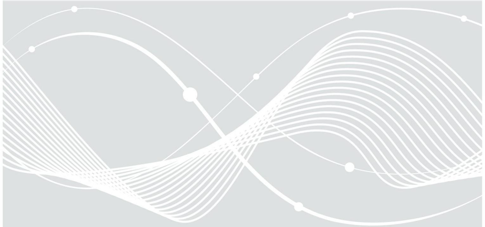

# Annex to BSI TR-03116-TS

## Mapping of application-specific requirements

Version 1.1 15. May 2023

Federal Office for Information Security Post Box 20 03 63 D-53133 Bonn

Phone: +49 22899 9582-0 E-Mail: eid@bsi.bund.de Internet: https://www.bsi.bund.de © Federal Office for Information Security 2023

| 1     | Introduction 5                                 |  |
|-------|------------------------------------------------|--|
| 2     | Example Applications 6                         |  |
|       | Important Notice: 6                            |  |
| 2.1   | TLS Clients according to TR-03116-4 6          |  |
| 2.1.1 | Application Specific Inspection Instructions6  |  |
| 2.1.2 | Profiles 6                                     |  |
| 2.1.3 | ICS 7                                          |  |
| 2.2   | TLS Servers according to TR-03116-4 7          |  |
| 2.2.1 | Application Specific Inspection Instructions7  |  |
| 2.2.2 | Profiles 7                                     |  |
| 2.2.3 | ICS 8                                          |  |
| 2.3   | eID-Client 8                                   |  |
| 2.3.1 | Application Specific Inspection Instructions8  |  |
| 2.3.2 | Profiles 9                                     |  |
| 2.3.3 | ICS 9                                          |  |
| 2.4   | eID-Server 10                                  |  |
| 2.4.1 | Application Specific Inspection Instructions10 |  |
| 2.4.2 | Profiles 10                                    |  |
| 2.4.3 | ICS 12                                         |  |
| 2.5   | TLS according to TR-03116-3 (Smart Metering)13 |  |
| 2.5.1 | Application Specific Inspection Instructions13 |  |
| 2.5.2 | Profiles 14                                    |  |
| 2.5.3 | ICS 16                                         |  |
| 2.6   | E-Mail-Trsp 17                                 |  |
| 2.6.1 | Application Specific Inspection Instructions17 |  |
| 2.6.2 | Profiles 17                                    |  |
| 2.6.3 | ICS 17                                         |  |
|       | References 19                                  |  |

| Table 1: General TLS client profiles 7                                        |
|-------------------------------------------------------------------------------|
| Table 2: General TLS server profiles 7                                        |
| Table 3: eID-Client Profiles for the TLS-1-2 interface9                       |
| Table 4: eID-Client Profiles for the TLS-2 interface9                         |
| Table 5: ICS data for eID-Clients 9                                           |
| Table 6: eID-Server Profiles for the eID-Interface10                          |
| Table 7: eID-Server Profiles for the SAML interface11                         |
| Table 8: eID-Server Profiles for the eCard-API interface (PSK based)11        |
| Table 9: eID-Server Profiles for the eCard-API interface (non-PSK based)11    |
| Table 10: eID-Server Profiles for the eIDAS-MW interface11                    |
| Table 11: ICS data for eID-Servers 12                                         |
| Table 12: TLS server profiles for the HAN interface according to TR-03116-313 |
| Table 13: TLS server profiles for the LMN interface according to TR-03116-313 |
| Table 14: TLS client profiles for the WAN interface according to TR-03116-314 |
| Table 15: TLS client profiles for the HAN interface according to TR-03116-314 |
| Table 16: TLS client profiles for the LMN interface according to TR-03116-314 |
| Table 17: ICS data for Smart Metering 15                                      |

| Table 18: E-Mail-Trsp TLS server profiles 16 |  |
|----------------------------------------------|--|
| Table 19: E-Mail-Trsp TLS client profiles 16 |  |
| Table 20: ICS data for E-Mail-Trsp 17        |  |

## 1 Introduction

[TR-03116-TS] provides test cases to assess the conformity of a TLS implementation. These test cases that can be used by applications in order to test the TLS configuration according to application-specific requirements based on [TR-03116]. This allows application-specific conformity tests to concentrate on the application specific functionality and skip the definition of TLS tests.

If the TLS capability of an application is to be tested, the existing test cases from [TR-03116-TS] can be referenced. In other words, the test specification for a particular application can be designed as follows:

- 1. Identify the different application specific inspection instructions.
- 2. Identify the relevant test profiles and refer to the relevant test cases from [TR-03116-TS], instead of specifying new test cases from scratch.

This document covers the second point. For that purpose, it provides an explanation of how the identification of the relevant test profiles can be conducted and lists some examples, currently for the following applications:

- TLS clients and servers according to part 4 of [TR-03116],
- eID clients according to [TR-03124-1],
- eID servers according to [TR-03130-1],
- Smart Metering applications according part 3 of [TR-03116] and
- E-Mail-Trsp according to [TR-03108-1].

Please note that this document is not meant to modify any application-specific requirements, e.g. as defined by other Technical Guidelines. The given approach may only be applied in a particular application, if this is specified by the relevant application-specific requirements.

Given this, the decision on the applicability of a particular TLS test case is made based on the specific application at hand. E.g. if the application acts as a TLS client, the client specific profiles must be selected, activating the respective test cases. The same applies to the TLS servers. Some applications even act as both, TLS client and TLS server at the same time which means both these profiles must be activated.

To the contrary, if some test cases should not be applied (e.g. TLS server test cases must not be applied to a TLS client), the affected profile is deactivated. The tests for other TLS capabilities are activated or deactivated in the same way through profiles.

Therefore, in order to execute the TLS test cases, each application (e.g. eID-Client, eID-Server, Smart Metering, E-Mail-Trsp, etc.) must specify which profiles are applicable for it. Additionally, the respective ICS data necessary for the tests must be provided.

## 2 Example Applications

This chapter identifies necessary profiles and ICS data for selected example applications. Hereby, it helps to prepare the necessary test cases to be applied.

Please note that there are specific applications mentioned here as well as general TLS client and server. The latter do not regard some application specific requirements, but rather describe generic requirements for further scenarios not explicitly listed here. Therefore please always use the specific applications when possible. If none are given, please fall back to general TLS client and server sections accordingly.

Please note that the descriptions do not mean to modify application-specific (test-)requirements. However, the given approach could be applied if specified by the relevant application-specific requirements.

### Important Notice:

When evaluating a device under test (DUT) whose type of application comes with application specific inspection instructions, following these instructions is mandatory while testing. Test cases classified as 'PASSED' while only assessing them according to the generic test case description have to be classified as 'FAILED' if the additional requirements posed by the inspection instructions are not met. A test laboratory should flag those tests as 'FAILED WITH COMMENTS' or another status indicating failure caused by additional requirements.

While evaluating a DUT, it is of utmost importance that the test laboratory assures all application specific inspection instructions are taken into account.

### 2.1 TLS Clients according to TR-03116-4

This section describes a common TLS client according to part 4 of [TR-03116] which does not necessarily adhere to any additional application specific requirements.

#### 2.1.1 Application Specific Inspection Instructions

By definition, for general TLS client applications, no deviations from part 4 of [TR-03116] apply.

#### 2.1.2 Profiles

The following profiles are applicable for general TLS clients according to part 4 of [TR-03116](see Table [1](#page-6-0)).

| Mandatory Profiles | Recommended/Additional Profiles |
|--------------------|---------------------------------|
| DURATION           | CERTIFIED_CA                    |
| TLS_1.2            | CHECK_CERTS                     |
| TLS_CLIENT         | CLIENT_CERT                     |
|                    | ENC_THEN_MAC                    |
|                    | NO_CLIENT_CERT                  |
|                    | NO_COMPRESSION                  |
|                    | NO_HEARTBEAT                    |
|                    | NO_TRUNC_HMAC                   |
|                    | OCSP_STAPLING                   |
|                    | PFS                             |
|                    | SESSION_ID                      |
|                    | SESSION_TICKET                  |
|                    | SUPP_GROUPS                     |
|                    | TLS_1.3                         |

*Table 1: General TLS client profiles*

#### 2.1.3 ICS

In order to conduct the TLS tests, the vendor must provide the following ICS data from [TR-03116-TS].

Mandatory ICS data:

- Section *3.1 Application under Test*
- Section *3.2 Profiles*
- Section *3.3 Supported Cryptography*
- *Section 3.6 Connection Timeout*

Additional ICS data:

- Section *3.4 Information on [TR-03145] Certification*
- Section *3.7 0-RTT Data*
- Section *3.8 TLS Certificates*

#### 2.2 TLS Servers according to TR-03116-4

This section describes a common TLS server according to part 4 of [TR-03116] which does not adhere to any additional application specific requirements.

#### 2.2.1 Application Specific Inspection Instructions

By definition, for general TLS server applications , no deviations from part 4 of [TR-03116] apply.

#### 2.2.2 Profiles

The following profiles are applicable for general TLS servers (see Table [2](#page-7-0)).

| Mandatory Profiles | Recommended/Additional Profiles |
|--------------------|---------------------------------|
| CHECK_CERTS        | CERTIFIED_CA                    |
| DURATION           | CLIENT_CERT                     |

2 Example Applications

| ECC                | NO_CLIENT_CERT   |
|--------------------|------------------|
| ENC_THEN_MAC       | NO_COMPRESSION   |
| INTERIM_SUITES_SRV | NO_HEARTBEAT     |
| OCSP_STAPLING      | NO_RENEGOTIATION |
| SERVER_CERT        | NO_TRUNC_HMAC    |
| SUPP_GROUPS        | PFS              |
| TLS_1.2            | SESSION_ID       |
| TLS_SERVER         | SESSION_TICKET   |
|                    | TLS_1.3          |

*Table 2: General TLS server profiles*

#### 2.2.3 ICS

In order to conduct the TLS tests, the vendor must provide the following ICS data from[TR-03116-TS]. Mandatory ICS data:

- Section *3.1 Application under Test*
- Section *3.2 Profiles*
- Section *3.3 Supported Cryptography*
- *Section 3.6 Connection Timeout*
- *Section 3.8 TLS Certificates*

#### Additional ICS data:

- Section *3.4 Information on [TR-03145] Certification*
- Section *3.7 0-RTT Data*

#### 2.3 eID-Client

#### 2.3.1 Application Specific Inspection Instructions

The eID-Client application is defined in [TR-03124-1]. For the TLS part it relies on the definitions from part 4 of [TR-03116]. However, it specifies the following deviation from these requirements:

- The cipher suite TLS\_RSA\_PSK\_WITH\_AES\_256\_CBC\_SHA MUST be supported for TLS-2 in the generic communication model.
- In case of TLS errors on the TLS-1-2 interface, the eID-Client running as a web server is expected to present an HTTP error code "404 Not Found" to the browser. This must be verified as an integral part of the test case. I.e. the test case fails if this error message is not presented.

Further, if the eID-Client profile HTTP\_MESSAGES is selected, the eID-Client must include a meaningful human-readable error messages/descriptions into the body of the response.

• In case of TLS errors on the TLS-2 interface, the eID-Client is expected to redirect the browser to the RefreshAddress from the TC Token with the respective URL-Parameter. This must be verified as an integral part of the test case. I.e. the test case fails if no redirect occurred or the URL parameters were missing.

The expected parameters are described in [TR-03124-1] Section 2.5.4.2 "*Redirecting the Caller to the eService*".

- The [TR-03124-1] requires several TLS channels to be be established in specific order. For example the PSK channel can only be established after a previous non-PSK channel or even after a complete Online-Authentication. Therefore, direct testing of some channels might not be possible. In this case all preconditioned channels should be established first. The test suite MUST support this.
- The [TR-03124-1] further requires the hash values of the TLS certificates to be stored in the Certificate Description of the authentication terminal certificate. This requirement must be fulfilled in order to be able to perform the TLS test cases.

#### 2.3.2 Profiles

The following profiles are applicable for eID-Clients for the TLS-1-2 interface (see Table [3](#page-8-1)).

| Mandatory Profiles | Recommended/Additional Profiles |
|--------------------|---------------------------------|
| DURATION           | SESSION_ID                      |
| NO_CLIENT_CERT     | SESSION_TICKET                  |
| NO_SAN             | TLS_1.3                         |
| PFS                |                                 |
| SERVER_CERT        |                                 |
| SKIP_CHAIN_VALIDN  |                                 |
| STOP_RESUMPTION    |                                 |
| TLS_1.2            |                                 |
| TLS_CLIENT         |                                 |

*Table 3: eID-Client Profiles for the TLS-1-2 interface*

The following profiles are applicable for eID-Clients for the TLS-2 interface (see Table [4\)](#page-8-0).

| Mandatory Profiles | Recommended/Additional Profiles |
|--------------------|---------------------------------|
| DURATION           | SESSION_ID                      |
| NO_CLIENT_CERT     | SESSION_TICKET                  |
| NO_SAN             |                                 |
| PSK                |                                 |
| SERVER_CERT        |                                 |
| SKIP_CHAIN_VALIDN  |                                 |
| STOP_RESUMPTION    |                                 |
| TLS_1.2            |                                 |
| TLS_CLIENT         |                                 |

*Table 4: eID-Client Profiles for the TLS-2 interface*

#### 2.3.3 ICS

In general, an eID-Client must be able to establish different TLS channels to its communication partners. According to [TR-03124-1], the channels TLS-1-2 or TLS-2 are possible. These might support different TLS parameters. Therefore, the [TR-03116-TS] ICS must be provided for each applicable channel separately according to Table [5](#page-9-0).

Independent from the interfaces, the ICS Section *3.1 Application under Test* must be provided for the application as a whole.

| Communication Interface | Mandatory ICS Data                                      | Additional ICS Data         |
|-------------------------|---------------------------------------------------------|-----------------------------|
| TLS-1-2                 | Section 3.2 Profiles • Section 3.3 Supported • | Section 3.7 0-RTT Data • |

|       | Cryptography • Section 3.6 Connection                                                                                                                         |  |
|-------|---------------------------------------------------------------------------------------------------------------------------------------------------------------------|--|
|       | Timeout                                                                                                                                                             |  |
| TLS-2 | Section 3.2 Profiles • Section 3.3 Supported • Cryptography • Section 3.5 TLS with PSK Cipher Suites • Section 3.6 Connection Timeout |  |

*Table 5: ICS data for eID-Clients*

#### 2.4 eID-Server

#### 2.4.1 Application Specific Inspection Instructions

The eID-Server application is defined in [TR-03130-1]. For the TLS part it relies on the definitions from part 4 of [TR-03116]. However, it does not specify any deviations from those requirements for TLS.

From the practical perspective an eID-Server might require a correct Authentication Terminal certificate to be installed in order to offer its services. In this case, the default [CERT\_ECARD\_CV\_TERM\_1\_A] and its certificate chain from [CERT\_SET\_1] should installed on the eID-Server. Please note that this certificate usually won't be used since Online Authentication is out of scope of the TLS test cases.

The successful connection establishment may additionally be tested by submitting the application message appropriate for the underlying interface (e.g. GET TC Token or POST AuthnRequest ). The response MUST conform to [TR-03130-1], e.g. a TC Token in attached mode MUST NOT contain a PSK.

In case of a PSK based eCard-API interface communication, a valid Online-Authentication request must have been send to the eID-Server in order to activate the channel. The eID-Server has respectively responded either with a TC Token or with a useIDResponse, both including a SID and PSK.

#### 2.4.2 Profiles

An eID-Server in general may be capable of serving multiple interfaces for different protocols (eID-Interface, SAML Interface or eIDAS Interface). Each interface may support its own specific TLS parameters. Therefore the profiles provided here are also interface specific.

For the eID-Interface profiles from Table [6](#page-9-1) are to be used. They are applicable if the eID-Server profile SOAP\_TLS is met.

| Mandatory Profiles         | Recommended/Additional Profiles |
|----------------------------|---------------------------------|
| CHECK_CERTS CLIENT_CERT | ECC ENC_THEN_MAC             |
| DURATION                   | SESSION_ID                      |
| INTERIM_SUITES_SRV PFS  | SESSION_TICKET TLS_1.3       |
| TLS_1.2 TLS_SERVER      |                                 |

*Table 6: eID-Server Profiles for the eID-Interface*

For the SAML interface profiles from Table [7](#page-10-0) are to be used. They are applicable if the eID-Server profile SAML is met.

| Mandatory Profiles | Recommended/Additional Profiles |
|--------------------|---------------------------------|
| CHECK_CERTS        | ECC                             |
| DURATION           | ENC_THEN_MAC                    |
| INTERIM_SUITES_SRV | SESSION_ID                      |
| NO_CLIENT_CERT     | SESSION_TICKET                  |
| PFS                | TLS_1.3                         |
| TLS_1.2            |                                 |
| TLS_SERVER         |                                 |

*Table 7: eID-Server Profiles for the SAML interface*

The following profiles are applicable for the eCard-API interface for communication between an eID-Server and an eID-Client. The TLS channel used here can be PKS based or non-PSK based (Attached eID-Server), depending on the eID-Server profiles ESER\_ATTACHED or EIDAS\_MW.

The profiles in Table [8](#page-10-3) are applicable for the PKS based eCard-API interface.

| Mandatory Profiles | Recommended/Additional Profiles |
|--------------------|---------------------------------|
| CHECK_CERTS        | ENC_THEN_MAC                    |
| DURATION           | SESSION_ID                      |
| INTERIM_SUITES_SRV | SESSION_TICKET                  |
| NO_CLIENT_CERT     |                                 |
| PSK                |                                 |
| TLS_1.2            |                                 |
| TLS_SERVER         |                                 |

*Table 8: eID-Server Profiles for the eCard-API interface (PSK based)*

The profiles in Table [9](#page-10-2) are applicable for the non-PSK based eCard-API interface.

| Mandatory Profiles | Recommended/Additional Profiles |
|--------------------|---------------------------------|
| CHECK_CERTS        | ECC                             |
| DURATION           | ENC_THEN_MAC                    |
| INTERIM_SUITES_SRV | SESSION_ID                      |
| NO_CLIENT_CERT     | SESSION_TICKET                  |
| PFS                | TLS_1.3                         |
| TLS_1.2            |                                 |
| TLS_SERVER         |                                 |

*Table 9: eID-Server Profiles for the eCard-API interface (non-PSK based)*

If the eID-Server is working as eIDAS Middleware, then profile EIDAS\_MW is met. In this case profiles from Table [10](#page-10-1) are be used.

| Mandatory Profiles | Recommended/Additional Profiles |
|--------------------|---------------------------------|
| CHECK_CERTS        | ECC                             |
| DURATION           | ENC_THEN_MAC                    |
| INTERIM_SUITES_SRV | SESSION_ID                      |
| NO_CLIENT_CERT     | SESSION_TICKET                  |
| PFS                | TLS_1.3                         |
| TLS_1.2            |                                 |
| TLS_SERVER         |                                 |

*Table 10: eID-Server Profiles for the eIDAS-MW interface*

#### 2.4.3 ICS

In general, an eID-Server can maintain multiple network interfaces. According to [TR-03130-1], the channels for eCard-API, SOAP interface and SAML interface are possible. These might support different TLS parameters. Therefore the [TR-03116-TS] ICS must be provided for each applicable channel separately according to Table [11.](#page-11-0)

Independent from the interfaces, the ICS Section *3.1 Application under Test* must be provided for the application as a whole.

| Communication Interface   | Mandatory ICS Data                                                                                                                                                                                       | Additional ICS Data                                                                        |
|---------------------------|----------------------------------------------------------------------------------------------------------------------------------------------------------------------------------------------------------|--------------------------------------------------------------------------------------------|
| eCard-API (PSK based)     | • Section 3.2 Profiles • Section 3.3 Supported Cryptography • Section 3.5 TLS with PSK Cipher Suites Section 3.6 Connection • Timeout • Section 3.8 TLS Certificates | • Section 3.4 Information on [TR-03145] Certification                                |
| eCard-API (non-PSK based) | • Section 3.2 Profiles • Section 3.3 Supported Cryptography • Section 3.6 Connection Timeout • Section 3.8 TLS Certificates                                                   | • Section 3.4 Information on [TR-03145] Certification • Section 3.7 0-RTT Data |
| eID-Interface             | • Section 3.2 Profiles • Section 3.3 Supported Cryptography • Section 3.6 Connection Timeout • Section 3.8 TLS Certificates                                                   | • Section 3.4 Information on [TR-03145] Certification • Section 3.7 0-RTT Data |
| SAML                      | Section 3.2 Profiles • Section 3.3 Supported • Cryptography • Section 3.6 Connection Timeout • Section 3.8 TLS Certificates                                                   | Section 3.4 Information on • [TR-03145] Certification • Section 3.7 0-RTT Data |
| eIDAS-MW                  | • Section 3.2 Profiles Section 3.3 Supported • Cryptography • Section 3.6 Connection Timeout • Section 3.8 TLS Certificates                                                   | • Section 3.4 Information on [TR-03145] Certification Section 3.7 0-RTT Data • |

*Table 11: ICS data for eID-Servers*

#### 2.5 TLS according to TR-03116-3 (Smart Metering)

Within the Smart Metering infrastructure, the communication infrastructure distinguishes between different interfaces. Depending on the particular interface, smartmeter gateways and communication partners act as TLS server or as TLS client.

#### 2.5.1 Application Specific Inspection Instructions

The application specific crypto requirements are defined in part 3 of [TR-03116]. This also includes the definitions for TLS. The following parts are relevant for each interface:

- The WAN interface is described in Chapter 4 "*TLS-Kommunikation im WAN*"
- The HAN interface is described in Chapter 5 "*TLS-Kommunikation im HAN*"
- The LMN interface is described in Chapter 6 "*TLS-Kommunikation im LMN*"

For the further discussion on the interfaces, see [TR-03109-1].

#### 2.5.2 Profiles

Since the test object can act as TLS server and TLS client, different profiles are applicable to these scenarios. Further, multiple network interfaces are defined for the Smart Metering application: WAN, HAN and LMN. Respectively, different profiles may apply to different interfaces. Consequently, profiles are also specified for each interface separately,

| Mandatory Profiles | Recommended/Additional Profiles |
|--------------------|---------------------------------|
| CHECK_CERTS        | ENC_THEN_MAC                    |
| CLIENT_CERT        | EXT_MASTER_SECRET               |
| DURATION           | SESSION_ID                      |
| ECC                | SESSION_TICKET                  |
| NO_COMPRESSION     | TLS_1.3                         |
| NO_RENEGOTIATION   |                                 |
| NO_TRUNC_HMAC      |                                 |
| PFS                |                                 |
| SERVER_CERT        |                                 |
| TLS_1.2            |                                 |
| TLS_SERVER         |                                 |

Tables [12](#page-12-1)- [13](#page-12-0) provide profiles for the TLS server part of each interface.

*Table 12: TLS server profiles for the HAN interface according to TR-03116-3*

| Mandatory Profiles | Recommended/Additional Profiles |
|--------------------|---------------------------------|
| CHECK_CERTS        | ENC_THEN_MAC                    |
| CLIENT_CERT        | EXT_MASTER_SECRET               |
| DURATION           | SESSION_ID                      |
| ECC                | SESSION_TICKET                  |
| NO_COMPRESSION     | TLS_1.3                         |
| NO_RENEGOTIATION   |                                 |
| NO_TRUNC_HMAC      |                                 |
| PFS                |                                 |
| SERVER_CERT        |                                 |
| TLS_1.2            |                                 |
| TLS_SERVER         |                                 |

*Table 13: TLS server profiles for the LMN interface according to TR-03116-3*

Respective TLS client profiles can be found in Table [14](#page-13-1) - [16.](#page-13-0)

| Mandatory Profiles | Recommended/Additional Profiles |
|--------------------|---------------------------------|
| CHECK_CERTS        | ENC_THEN_MAC                    |
| CLIENT_CERT        | EXT_MASTER_SECRET               |
| DURATION           | SESSION_ID                      |
| NO_COMPRESSION     | SESSION_TICKET                  |
| NO_TRUNC_HMAC      | TLS_1.3                         |
| PFS                |                                 |
| RANDOM_TIME        |                                 |
| SERVER_CERT        |                                 |
| TLS_1.2            |                                 |
| TLS_CLIENT         |                                 |

*Table 14: TLS client profiles for the WAN interface according to TR-03116-3*

| Mandatory Profiles | Recommended/Additional Profiles |
|--------------------|---------------------------------|
| CHECK_CERTS        | ENC_THEN_MAC                    |
| CLIENT_CERT        | EXT_MASTER_SECRET               |
| DURATION           | SESSION_ID                      |
| NO_COMPRESSION     | SESSION_TICKET                  |
| NO_TRUNC_HMAC      | TLS_1.3                         |
| PFS                |                                 |
| RANDOM_TIME        |                                 |
| SERVER_CERT        |                                 |
| TLS_1.2            |                                 |
| TLS_CLIENT         |                                 |

*Table 15: TLS client profiles for the HAN interface according to TR-03116-3*

| Mandatory Profiles | Recommended/Additional Profiles |
|--------------------|---------------------------------|
| CHECK_CERTS        | ENC_THEN_MAC                    |
| CLIENT_CERT        | EXT_MASTER_SECRET               |
| DURATION           | SESSION_ID                      |
| NO_COMPRESSION     | SESSION_TICKET                  |
| NO_TRUNC_HMAC      | TLS_1.3                         |
| PFS                |                                 |
| RANDOM_TIME        |                                 |
| SERVER_CERT        |                                 |
| TLS_1.2            |                                 |
| TLS_CLIENT         |                                 |

*Table 16: TLS client profiles for the LMN interface according to TR-03116-3*

#### 2.5.3 ICS

The necessary parts of the [TR-03116-TS] ICS are described in Table [17](#page-14-0). These must be provided for each supported interface separately.

Independent from the interfaces, the ICS Section *3.1 Application under Test* must be provided for the application as a whole.

| Communication Interface             | Mandatory ICS Data                                                                                                                                     | Additional ICS Data         |
|-------------------------------------|--------------------------------------------------------------------------------------------------------------------------------------------------------|-----------------------------|
| WAN (Testobject is a TLS client) | • Section 3.2 Profiles • Section 3.3 Supported Cryptography • Section 3.6 Connection Timeout • Section 3.8 TLS Certificates | • Section 3.7 0-RTT Data |
| HAN (Testobject is a TLS server) | • Section 3.2 Profiles • Section 3.3 Supported Cryptography • Section 3.6 Connection Timeout Section 3.8 TLS Certificates • | • Section 3.7 0-RTT Data |
| HAN (Testobject is a TLS client) | Section 3.2 Profiles • • Section 3.3 Supported Cryptography • Section 3.6 Connection Timeout • Section 3.8 TLS Certificates | Section 3.7 0-RTT Data • |
| LMN (Testobject is a TLS server) | • Section 3.2 Profiles • Section 3.3 Supported Cryptography • Section 3.6 Connection Timeout Section 3.8 TLS Certificates • | • Section 3.7 0-RTT Data |
| LMN (Testobject is a TLS client) | • Section 3.2 Profiles Section 3.3 Supported • Cryptography • Section 3.6 Connection Timeout • Section 3.8 TLS Certificates | • Section 3.7 0-RTT Data |

*Table 17: ICS data for Smart Metering*

### 2.6 E-Mail-Trsp

In the context of an E-Mail-Trsp, a test object can act as both, TLS server and client on multiple interfaces towards different communication partners. Therefore different TLS configurations can be possible for each interface.

#### 2.6.1 Application Specific Inspection Instructions

The E-Mail-Trsp application is defined in [TR-03108-1]. For the TLS part it relies on the definitions from part 4 of [TR-03116]. The Technical Guideline regarding E-Mail-Trsp defines one deviation from the recommendation of [TR-03116] regarding the maximum lifespan of sessions. In accordance with this deviation it is recommended to not perform tests concerning the lifespan of sessions. In particular, the test case TLS\_ICS\_11 of [TR-03116-TS] may be omitted.

The E-Mail-Trsp application is defined in [TR-03108-1]. For the TLS part it relies on the definitions from part 4 of [TR-03116]. However, the [TR-03108-1] also specifies deviations to part 4 of [TR-03116] which must be taken into account. For E-Mail-Trsp applications, the test object communicates with a CETI (Conformity E- mail Test Infrastructure) in some communication interfaces. The CETI presents the infrastructure and all components required to interact with the DUT. Therefore, the infrastructure and all components necessary to set up the corresponding TLS channel must be provided.

#### 2.6.2 Profiles

Since the test object can act as TLS server and TLS client, different profiles are applicable to these scenarios.

Table [18](#page-15-1) provides profiles for TLS server part. These may be further refined depending on the particular network interfaces under test.

| Mandatory Profiles | Recommended/Additional Profiles |
|--------------------|---------------------------------|
| CHECK_CERTS        | CERTIFIED_CA                    |
| INTERIM_SUITES_SRV | DURATION                        |
| NO_CLIENT_CERT     | ECC                             |
| NO_TRUNC_HMAC      | ENC_THEN_MAC                    |
| SERVER_CERT        | EXT_MASTER_SECRET               |
| TLS_1.2            | SUPP_GROUPS                     |
| TLS_SERVER         | TLS_1.3                         |

*Table 18: E-Mail-Trsp TLS server profiles*

Respective TLS client profiles can be found in Table [19](#page-15-0).

| Recommended/Additional Profiles |
|---------------------------------|
| ENC_THEN_MAC                    |
| EXT_MASTER_SECRET               |
| SUPP_GROUPS                     |
| TLS_1.3                         |
|                                 |
|                                 |

*Table 19: E-Mail-Trsp TLS client profiles*

#### 2.6.3 ICS

The necessary parts of the [TR-03116-TS] ICS are described in Table [20](#page-16-0). These must be provided for each interface separately.

Independent from the interfaces, the ICS Section *3.1 Application under Test* must be provided for the application as a whole.

| Communication Interface           | Mandatory ICS Data                                                                                                                                     | Additional ICS Data                                                                        |
|-----------------------------------|--------------------------------------------------------------------------------------------------------------------------------------------------------|--------------------------------------------------------------------------------------------|
| Browser -> Test Object            | • Section 3.2 Profiles • Section 3.3 Supported Cryptography • Section 3.6 Connection Timeout • Section 3.8 TLS Certificates | • Section 3.4 Information on [TR-03145] Certification • Section 3.7 0-RTT Data |
| User MUA -> Test Object (SMTP) | • Section 3.2 Profiles • Section 3.3 Supported Cryptography • Section 3.6 Connection Timeout Section 3.8 TLS Certificates • | • Section 3.4 Information on [TR-03145] Certification • Section 3.7 0-RTT Data |

| Communication Interface               | Mandatory ICS Data                                                                                                                                     | Additional ICS Data                                                                        |
|---------------------------------------|--------------------------------------------------------------------------------------------------------------------------------------------------------|--------------------------------------------------------------------------------------------|
| User MUA -> Test Object (IMAP)     | • Section 3.2 Profiles • Section 3.3 Supported Cryptography • Section 3.8 TLS Certificates                                           | • Section 3.4 Information on [TR-03145] Certification • Section 3.7 0-RTT Data |
| User MUA -> Test Object (POP3)     | • Section 3.2 Profiles • Section 3.3 Supported Cryptography • Section 3.6 Connection Timeout Section 3.8 TLS Certificates • | • Section 3.4 Information on [TR-03145] Certification • Section 3.7 0-RTT Data |
| CETI -> Test Object                   | Section 3.2 Profiles • Section 3.3 Supported • Cryptography • Section 3.6 Connection Timeout • Section 3.8 TLS Certificates | Section 3.4 Information on • [TR-03145] Certification • Section 3.7 0-RTT Data |
| Test Object -> CETI (without DANE) | • Section 3.2 Profiles • Section 3.3 Supported Cryptography • Section 3.6 Connection Timeout • Section 3.8 TLS Certificates | • Section 3.4 Information on [TR-03145] Certification • Section 3.7 0-RTT Data |
| Test Object -> CETI (with DANE)    | • Section 3.2 Profiles • Section 3.3 Supported Cryptography Section 3.6 Connection • Timeout • Section 3.8 TLS Certificates | • Section 3.7 0-RTT Data                                                                |

*Table 20: ICS data for E-Mail-Trsp*

## References

| [TR-03116-TS] | BSI, Technical Guideline TR-03116-TS TLS Test-Specification                             |  |
|---------------|-----------------------------------------------------------------------------------------|--|
| [TR-03116]    | BSI, Technische Richtlinie TR-03116 Kryptographische Vorgaben für Projekte der          |  |
|               | Bundesregierung                                                                         |  |
| [TR-03124-1]  | BSI, Technical Guideline TR-03124-1: eID-Client – Part 1: Specifications                |  |
| [TR-03130-1]  | BSI, Technical Guideline TR-03130-1: eID-Server - Part 1: Functional Specification      |  |
| [TR-03108-1]  | BSI, BSI TR-03108-1: Secure E-Mail Transport: Requirements for E-Mail Service Providers |  |
|               | (EMSP) regarding a secure Transport of E-Mails                                          |  |
|               |                                                                                         |  |

[TR-03109-1] BSI, Technische Richtlinie BSI TR-03109-1: Anforderungen an die Interoperabilität der Kommunikationseinheit eines intelligenten Messsystems