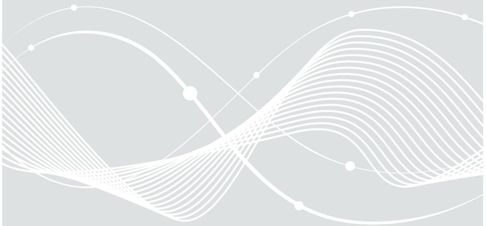
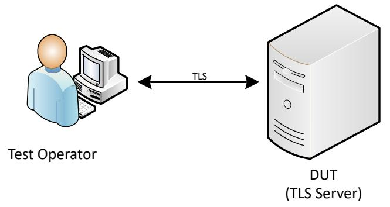
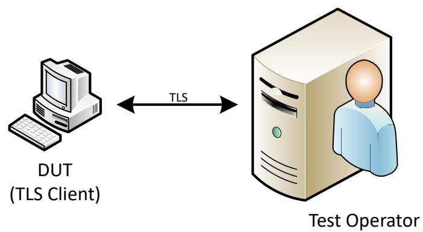
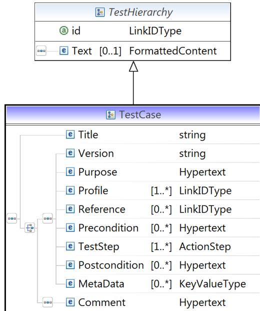

# Technical Guideline TR-03116-TS

# TLS Test-Specification

Version 1.1 15. May 2023

Federal Office for Information Security Post Box 20 03 63 D-53133 Bonn

Phone: +49 22899 9582-0 E-Mail: eid@bsi.bund.de Internet: https://www.bsi.bund.de © Federal Office for Information Security 2023

| 1            | Introduction 5                                                                                           |  |  |  |
|--------------|----------------------------------------------------------------------------------------------------------|--|--|--|
| 1.1          | Objectives 5                                                                                             |  |  |  |
| 1.2          | Structure of this Document 5                                                                             |  |  |  |
| 1.3          | Key Words 5                                                                                              |  |  |  |
| 2            | General Test Requirements 6                                                                              |  |  |  |
| 2.1          | Test profiles 6                                                                                          |  |  |  |
| 3            | Implementation Conformance Statement 9                                                                   |  |  |  |
| 3.1          | Application under Test 9                                                                                 |  |  |  |
| 3.2          | Profiles 9                                                                                               |  |  |  |
| 3.3          | Supported Cryptography 10                                                                                |  |  |  |
| 3.4          | Information on [TR-03145] Certification 12                                                               |  |  |  |
| 3.5          | TLS with PSK Cipher Suites 12                                                                            |  |  |  |
| 3.5.1        | Valid PSK Value 12                                                                                       |  |  |  |
| 3.5.2        | PSK Identity Hint 13                                                                                     |  |  |  |
| 3.6          | Connection Timeout 13                                                                                    |  |  |  |
| 3.7          | 0-RTT Data 13                                                                                            |  |  |  |
| 3.8          | TLS Certificates 14                                                                                      |  |  |  |
| 4            | Definition of Configuration Data 15                                                                      |  |  |  |
| 4.1          | Test Setup 15                                                                                            |  |  |  |
| 4.2          | Certificate Specification 15                                                                             |  |  |  |
| 4.3          | TLS Configuration 16                                                                                     |  |  |  |
| 5            | Definitions for Test Cases 18                                                                            |  |  |  |
| 5.1          | Test Case Notation 18                                                                                    |  |  |  |
| 6            | Test Cases 20                                                                                            |  |  |  |
| 6.1          | Module 0: ICS Checklist 20                                                                               |  |  |  |
| 6.1.1        | X.509 Certificate Checks 21                                                                              |  |  |  |
| 6.2          | Module A – Tests for TLS Clients 22                                                                      |  |  |  |
| 6.2.1        | Module A1 – Tests for TLS Clients without Client Authentication22                                        |  |  |  |
| 6.2.2        | Module A2 – Tests for TLS Clients with Client Authentication26                                           |  |  |  |
| 6.3 6.3.1 | Module B – Tests for TLS Servers 29 Module B1 – Tests for TLS Servers without Client Authentication29 |  |  |  |
| 6.3.2        | Module B2 – Tests for TLS Servers with Client Authentication33                                           |  |  |  |
|              | References 37                                                                                            |  |  |  |
|              | [TR-03116] BSI, Technische Richtlinie TR-03116 Kryptographische Vorgaben für Projekte der                |  |  |  |
|              | Bundesregierung 37                                                                                       |  |  |  |
|              | [TR-03145] BSI, BSI TR-03145 Secure Certification Authority operation37                                  |  |  |  |
|              | [RFC4279] IETF, Pre-Shared Key Ciphersuites for Transport Layer Security (TLS)37                         |  |  |  |
|              |                                                                                                          |  |  |  |

| Figure 1: Outline of a Generic Test Setup (TLS server under test)6 |  |
|--------------------------------------------------------------------|--|
| Figure 2: Outline of a Generic Test Setup (TLS client under test)6 |  |

| Figure 3: XML Schema Test Case 18  |  |
|------------------------------------|--|
| Figure 4: XML Schema ActionStep 19 |  |

| Table 1: Description of available test profiles 8          |  |
|------------------------------------------------------------|--|
| Table 2: Application under test 9                          |  |
| Table 3: Supported profiles 10                             |  |
| Table 4: Supported TLS versions 11                         |  |
| Table 5: Supported cipher suites 11                        |  |
| Table 6: Supported Key Lengths 11                          |  |
| Table 7: Supported Elliptic Curves and DH Groups11         |  |
| Table 8: Supported Signature Algorithms 11                 |  |
| Table 9: Supported Signature Algorithms for certificates12 |  |
| Table 10: Supported TLS Extensions 12                      |  |
| Table 11: [TR-03145] Certificate Information 12            |  |
| Table 12: PSK Value 13                                     |  |
| Table 13: PSK Identity Hint 13                             |  |
| Table 14: Connection validity duration 13                  |  |
| Table 15: Early data 13                                    |  |
| Table 16: TLS Certificates 14                              |  |
| Table 17: Domain names 14                                  |  |
| Table 18: Testing environment parameters 15                |  |
| Table 19: Certificates used for the test cases 16          |  |
| Table 20: Set of tested TLS versions 16                    |  |
| Table 21: Set of tested elliptic curves 17                 |  |
| Table 22: Set of tested key lengths 17                     |  |
| Table 23: Checklist for the ICS 21                         |  |
| Table 24: Checklist for the X.509 certificates 22          |  |
| Table 25: List of test cases in Module A1_GP 23            |  |
| Table 26: List of test cases in Module A1_FR 24            |  |
| Table 27: List of test cases in Module A1_CH 26            |  |
| Table 28: List of test cases in Module A2_GP 27            |  |
| Table 29: List of test cases in Module A2_FR 28            |  |
| Table 30: List of test cases in Module A2_CH 29            |  |
| Table 31: List of test cases in Module B1_GP 31            |  |
| Table 32: List of test cases in Module B1_FR 32            |  |
| Table 33: List of test cases in Module B2_GP 34            |  |
| Table 34: List of test cases in Module B2_FR 36            |  |
|                                                            |  |

# 1 Introduction

# 1.1 Objectives

The Technical Guideline [TR-03116] provides a set of specifications particularly suitable for the requirements for projects of the Federal government.

This part of Technical Guideline specifies conformity tests for the TLS protocol. These tests cover the correct configuration of TLS according to the requirements and recommendations of parts 3 and 4 of [TR-03116]. The conformity tests are defined as black box tests of the TLS configuration. Thereby, TLS clients as well as TLS servers are considered.

Furthermore, the tests also allow to test application-specific requirements for TLS (e.g. eGovernment, German eID infrastructure, Smart Metering, DE-Mail or E-Mail-Trsp) based on [TR-03116].This means that other Technical Guidelines may use of the profiles specified in the current test guideline and do not need to define any dedicated TLS test cases. Instead, it is sufficient for them to specify which particular profiles of the current document need to be utilized. The subsequent testing is carried out based on this document. This approach bunches all relevant TLS test cases in the current document, instead of spreading these across different Technical Guidelines.

The objective is to offer a basis for consistent and comparable quality assurance regarding the different TLS implementations. This shall guarantee conformity to the underlying specifications and ensure interoperability with other TLS implementations.

# 1.2 Structure of this Document

The document is structured as follows: In the first section, the motivation of the test specification is given. In Chapter [2](#page-5-0) the required test environment and the test profiles are described. Chapter [3](#page-8-0) defines the implementation conformance statement (ICS). It contains the test object information necessary for the tests. The parameters and certificates that are required for the tests are given in Chapter [4](#page-14-0). Chapter [5](#page-17-0) describes the XML format that is used for the test cases. Finally, Chapter [6](#page-19-0) contains the list of all test cases.

# 1.3 Key Words

The key words "MUST", "MUST NOT", "REQUIRED", "SHALL", "SHALL NOT", "SHOULD", "SHOULD NOT", "RECOMMENDED", "MAY", and "OPTIONAL" in this document are to be interpreted as described in [RFC2119]. The key word "CONDITIONAL" is to be interpreted as follows:

CONDITIONAL: The usage of an item is dependent on the usage of other items. It is therefore further qualified under which conditions the item is REQUIRED or RECOMMENDED.

# 2 General Test Requirements

The test candidate is called Device Under Test (DUT) throughout this document. It is integrated into the test environment. The scenarios for the test setup differ according to the device under test:

• In case a TLS server is tested, the system of the test operator acts as a TLS Client and sends requests as specified in the test cases to the test object (see Figure [1](#page-5-2)). The reaction of the test candidate is analysed.

*Figure 1: Outline of a Generic Test Setup (TLS server under test)*

• If a TLS client is tested, the system of the test operator acts as a TLS server with different configurations, which are specified in the test case. The operator causes the test object to connect to the server and evaluates the results (see Figure [2\)](#page-5-1). The client MUST accept the certificate chain [CERT\_DEFAULT] of the test laboratory whenever presented (cf. Section [4.3](#page-15-0)).

*Figure 2: Outline of a Generic Test Setup (TLS client under test)*

The respective configuration of the DUT is provided in the particular test cases. In general, all necessary configuration data is defined in Chapter [4](#page-14-0).

# 2.1 Test profiles

The test profiles allow to specify which tests have to be performed. The profiles that have to be fulfilled and which profiles are recommended depends on the test's application and is specified by the technical guideline that makes use of this test document. The profiles available in this specification are given in Table [1](#page-7-0).

| Profile ID         | Description                                                                                                                                                                                                                                                                                                                                    |  |  |  |
|--------------------|------------------------------------------------------------------------------------------------------------------------------------------------------------------------------------------------------------------------------------------------------------------------------------------------------------------------------------------------|--|--|--|
|                    | General TLS Parameters                                                                                                                                                                                                                                                                                                                         |  |  |  |
| CHECK_CERTS        | This optional profile activates the checks for the TLS certificates used by the test objects as described in Section 6.1.1. In some cases such checks are not necessary (e.g. the CA is BSI-certified). As a result, the checks may be omitted.                                                                                       |  |  |  |
| CLIENT_CERT        | This profile activates the test cases from the modules A2 and B2. It further deactivates the test cases from the modules A1 and B1.                                                                                                                                                                                                         |  |  |  |
| ECC                | This profile covers the tests for cipher suites based on elliptic curve cryptography.                                                                                                                                                                                                                                                       |  |  |  |
| INTERIM_SUITES_SRV | This profile is only applicable for TLS servers. It validates the correct selection of a cipher suite if a client offers a combination of recommended cipher suites and interim cipher suites in its ClientHello. Do not select this profile when testing a TLS client or there are none interim parameters specified.             |  |  |  |
| NO_CLIENT_CERT     | This profile activates the test cases from the modules A1 and B1. It further deactivates the test cases from the modules A2 and B2.                                                                                                                                                                                                         |  |  |  |
| PFS                | This profile covers tests for cipher suites that use a Diffie-Hellman key exchange to ensure Perfect-Forward-Secrecy.                                                                                                                                                                                                                       |  |  |  |
| FFDHE              | This profile covers tests for cipher suites that use a Diffie-Hellman key exchange to ensure Perfect-Forward-Secrecy. It is explicitly restricted to only FFDHE cipher suites (i.e. not using elliptic curves).                                                                                                                          |  |  |  |
| PSK                | The tests using this profile are specific to connections that make use of a pre-shared secret.                                                                                                                                                                                                                                              |  |  |  |
| SERVER_CERT        | Tests of this profile verify the correct behaviour if the TLS server supplies a certificate for authentication.                                                                                                                                                                                                                             |  |  |  |
| TLS_1.2            | Tests using this profile verify conditions that are only specific to TLS v1.2 exclusively.                                                                                                                                                                                                                                                  |  |  |  |
| TLS_1.3            | Tests using this profile verify conditions that are only specific to TLS v1.3 exclusively.                                                                                                                                                                                                                                                  |  |  |  |
| TLS_CLIENT         | This profile assesses the capabilities and proper functioning of the interfaces required to ensure correct TLS handling for outgoing connections.                                                                                                                                                                                        |  |  |  |
| TLS_SERVER         | This profile assesses the capabilities and proper functioning of the interfaces required to ensure correct TLS handling for incoming connections.                                                                                                                                                                                        |  |  |  |
| SKIP_CHAIN_VALIDN  | By default the validity of the presented X.509 certificate is determined based on the certificate chain. However, in some cases the chain validation shall not be applied, since the validity is achieved by other (application specific) means. In such cases this profile can be selected deactivating the signature validation. |  |  |  |
| Extensions         |                                                                                                                                                                                                                                                                                                                                                |  |  |  |
| ENC_THEN_MAC       | This profile assesses the capabilities of the DUT to support Encrypt then-MAC for TLS protected communication channels.                                                                                                                                                                                                                     |  |  |  |
| EXT_MASTER_SECRET  | This profile assesses the capabilities of the DUT to support the                                                                                                                                                                                                                                                                               |  |  |  |

| Profile ID       | Description                                                                                                                                                                                                                                                                                                                                                                                                                                                                                           |
|------------------|-------------------------------------------------------------------------------------------------------------------------------------------------------------------------------------------------------------------------------------------------------------------------------------------------------------------------------------------------------------------------------------------------------------------------------------------------------------------------------------------------------|
|                  | Extended-Master-Secret extension for TLS protected communication channels.                                                                                                                                                                                                                                                                                                                                                                                                                         |
| NO_COMPRESSION   | This profile covers tests that verify that TLS compression is not used.                                                                                                                                                                                                                                                                                                                                                                                                                               |
| NO_HEARTBEAT     | This test profile covers tests to ensure that the heartbeat extension is not used and the DUT does not respond to heartbeat requests.                                                                                                                                                                                                                                                                                                                                                              |
| NO_SAN           | This profile covers tests where the TLS server certificate does not include the SubjectAlternativeName extension and uses the CommonName instead.                                                                                                                                                                                                                                                                                                                                               |
| NO_TRUNC_HMAC    | The tests of this profile ensure that the truncated HMAC extension is not used and not accepted.                                                                                                                                                                                                                                                                                                                                                                                                   |
| OCSP_STAPLING    | This profiles covers the test to verify the support of OCSP stapling.                                                                                                                                                                                                                                                                                                                                                                                                                                 |
| SUPP_GROUPS      | This profile covers tests to ensure the support of the Supported Groups extension with correct parameters.                                                                                                                                                                                                                                                                                                                                                                                         |
|                  | Further TLS Capabilities                                                                                                                                                                                                                                                                                                                                                                                                                                                                              |
| CERTIFIED_CA     | The client resp. server certificates belong to a specific root CA.                                                                                                                                                                                                                                                                                                                                                                                                                                    |
| DURATION         | This profile activates test cases which ensure that the total time a connection remains established does not exceed the maximal allowed period. Activating this profile will force the test to run for this amount of time. Therefore please only use it if necessary.                                                                                                                                                                                                                       |
| NO_RENEGOTIATION | The test profile assesses that renegotiation requests are not accepted.                                                                                                                                                                                                                                                                                                                                                                                                                               |
| RANDOM_TIME      | This profile activates the test cases where a TLS client has to use a random gmt_unix_time instead of the actual current time and date.                                                                                                                                                                                                                                                                                                                                                            |
| SESSION_ID       | This profile activates test cases where session resumption via Session ID is allowed and tested.                                                                                                                                                                                                                                                                                                                                                                                                   |
| SESSION_TICKET   | This profile activates test cases where session resumption via Session Ticket is allowed and tested. It also applies to TLS v1.3, even though the exact procedure is different there.                                                                                                                                                                                                                                                                                                           |
| STOP_RESUMPTION  | Some applications (e.g. eID-Client) require the TLS connection to abort if the session resumption was not successful. In particular no new session is permitted in this case. This deviates from the normal behaviour where a new session may be initiated after a failed renegotiation. This profile specifies whether the TLS client should abort connection establishment or initiate a new session if the session resumption has failed. It is not applicable for a TLS server. |

*Table 1: Description of available test profiles*

# 3 Implementation Conformance Statement

The purpose of the Implementation Conformance Statement is the declaration of supported functionality of the DUT. The declarations of the applicant are used for the determination of the set of test cases to be performed and their respective parameters.

The Implementation Conformance Statement MUST be completely filled in by the applicant. The information of the filled ICS MUST be documented in the test report. The test laboratory MUST further verify that the declaration of the applicant is conform to the requirements given in the technical guideline. The result of the verification MUST be documented in the test report.

# 3.1 Application under Test

The current technical guideline is intended to be referenced by other technical guidelines in order to test the TLS implementation of the respective application. For example, the eID-Client test specification refers to particular test cases of the current document to ensure correct utilization of the TLS. However, the eID-Client application is not the only one possible. In order to determine the application under test unequivocally, the submitter of the ICS MUST name it in Table [2](#page-8-1) explicitly.

| Application Type (e.g. eID-Client) | Respective technical guideline (if exists, e.g. TR 03124-2) |
|------------------------------------|----------------------------------------------------------------|
|                                    |                                                                |

*Table 2: Application under test*

The test laboratory MUST to use this information in order to determine correct TLS requirements to be used for the test (cf. Section [4.3](#page-15-0)). For example, the minimal key length used in the test cases may deviate depending on the application under test.

# 3.2 Profiles

An applicant SHALL provide a declaration containing information on the supported profiles. Table [3](#page-9-0) describes the possible test profiles. The information which profile is mandatory and which one is recommend is defined in the test specification of the respective application type.

| Profile ID             | Yes / No |  |  |  |
|------------------------|----------|--|--|--|
| General TLS Parameters |          |  |  |  |
| CHECK_CERTS            |          |  |  |  |
| CLIENT_CERT            |          |  |  |  |
| ECC                    |          |  |  |  |
| INTERIM_SUITES_SRV     |          |  |  |  |
| NO_CLIENT_CERT         |          |  |  |  |
| PFS                    |          |  |  |  |
| FFDHE                  |          |  |  |  |
| PSK                    |          |  |  |  |

| SERVER_CERT              |  |  |  |  |
|--------------------------|--|--|--|--|
| TLS_1.2                  |  |  |  |  |
| TLS_1.3                  |  |  |  |  |
| TLS_CLIENT               |  |  |  |  |
| TLS_SERVER               |  |  |  |  |
| SKIP_CHAIN_VALIDN        |  |  |  |  |
| Extensions               |  |  |  |  |
| ENC_THEN_MAC             |  |  |  |  |
| EXT_MASTER_SECRET        |  |  |  |  |
| NO_COMPRESSION           |  |  |  |  |
| NO_HEARTBEAT             |  |  |  |  |
| NO_SAN                   |  |  |  |  |
| NO_TRUNC_HMAC            |  |  |  |  |
| OCSP_STAPLING            |  |  |  |  |
| SUPP_GROUPS              |  |  |  |  |
| Further TLS Capabilities |  |  |  |  |
| CERTIFIED_CA             |  |  |  |  |
| DURATION                 |  |  |  |  |
| NO_RENEGOTIATION         |  |  |  |  |
| RANDOM_TIME              |  |  |  |  |
| SESSION_ID               |  |  |  |  |
| SESSION_TICKET           |  |  |  |  |
| STOP_RESUMPTION          |  |  |  |  |

*Table 3: Supported profiles*

The test laboratory MUST check that the declaration conforms with the profiles defined by the type of application given in Table [2](#page-8-1). This also includes possible application-specific interim arrangements. The result of the verification MUST be documented in the test report.

# 3.3 Supported Cryptography

An applicant SHALL provide a declaration containing information on the supported cryptography. The declaration MUST be filled with all cryptographic parameters that are supported by the test object, i.e. other cryptographic parameters than the ones listed in the ICS SHALL NOT be supported.

This chapter requests the information required for testing a TLS interface. The tables SHALL be completed for each interface provided by the DUT separately.

First, please specify the TLS versions supported by the DUT in Table [4](#page-10-0).

**Supported TLS versions**

| Supported TLS versions |  |
|------------------------|--|
|                        |  |
|                        |  |
|                        |  |
|                        |  |

#### *Table 4: Supported TLS versions*

Table [5](#page-10-4) MUST contain the supported cipher suites for each supported TLS version. The order of the cipher suites MUST reflect the preference of the DUT.

| TLS version | Supported cipher suites |  |
|-------------|-------------------------|--|
|             |                         |  |
|             |                         |  |
|             |                         |  |
|             |                         |  |

*Table 5: Supported cipher suites*

Further, the applicant MUST provide the list of the supported TLS parameters in the Tables [6](#page-10-3) to [8](#page-10-1) below.

Table [6](#page-10-3) mandates the minimal supported key lengths to be provided for each TLS version and algorithm separately.

| TLS versions | Algorithm | Minimal Supported Key Length |
|--------------|-----------|------------------------------|
|              |           |                              |
|              |           |                              |

#### *Table 6: Supported Key Lengths*

In case the SUPP\_GROUPS profile was selected, the named groups MUST be given in Table [7](#page-10-2) in the order of preference.

| TLS versions | Supported Elliptic Curves / DH Groups |
|--------------|---------------------------------------|
|              |                                       |
|              |                                       |

*Table 7: Supported Elliptic Curves and DH Groups*

In Table [8](#page-10-1) the vendor SHALL list the signature algorithms supported by the DUT.

| TLS versions | Supported Signature Algorithms |
|--------------|--------------------------------|
|              |                                |
|              |                                |

*Table 8: Supported Signature Algorithms*

Starting with TLS v1.3 a new extension signature\_algorithms\_cert was introduced for indicating which signature algorithms may be used in digital signatures. If TLS v1.3 is supported by the DUT, this extension must be supported as well. In Table [9](#page-11-0) the vendor SHALL list the signature algorithms in certificates supported by the DUT.

#### **Supported Signature Algorithms for Certificates**

#### *Table 9: Supported Signature Algorithms for certificates*

Finally, the supported extensions SHALL be provided as well. Please list these in Table [10](#page-11-1).

| TLS version | Supported TLS extensions |
|-------------|--------------------------|
|             |                          |
|             |                          |
|             |                          |
|             |                          |

*Table 10: Supported TLS Extensions*

The test laboratory MUST check that the declaration conforms with the requirements defined by the application type given in Table [2.](#page-8-1) This also includes possible application-specific interim arrangements. This basically means that if the application is allowed to support a particular cipher suite or key length otherwise restricted by the corresponding part of [TR-03116], this special case needs to be regarded. The verification of the declaration SHOULD be performed according to ICS Checklist (see Section [6.1\)](#page-19-1).

The result of the verification MUST be documented in the test report.

# 3.4 Information on [TR-03145] Certification

If the DUT uses the certificate authority that was certified according to [TR-03145] and has marked the profile CERTIFIED\_CA, the applicant MUST provide information on this CA. The testing laboratory MUST verify that all certificates used for TLS establishment were issued only by this CA. Other certificates MUST NOT be used.

| Required Information      | Value |
|---------------------------|-------|
| Name of the [TR-03145] CA |       |
| BSI certificate number    |       |
| Subject                   |       |
| Validity notBefore        |       |
| Validity notAfter         |       |
| Subject Key Identifier    |       |

*Table 11: [TR-03145] Certificate Information*

# 3.5 TLS with PSK Cipher Suites

# 3.5.1 Valid PSK Value

For the test cases where the PSK is utilized, there MUST be provided a declaration on how the DUT and the test tool can obtain a valid PSK. This PSK will then be used for establishing a connection to the DUT.

| Required Information                                                         | Declaration of the Vendor |
|------------------------------------------------------------------------------|---------------------------|
| Explanation on how the DUT and the test tool can share a valid PSK value. |                           |

*Table 12: PSK Value*

# 3.5.2 PSK Identity Hint

Since TLS v1.3 uses a different PSK mechanism, this section is only applicable for the DUTs supporting TLS v1.2.

As specified in the [RFC4279], a TLS server can provide a "PSK identity hint" in the ServerKeyExchange message. Otherwise this message can be omitted, depending on the key exchange algorithm. However, the value of the Identity Hint needs to be agreed upon between the server and the client in a specific application profile. If no such specification is available, the server does not know what value is expected and thus cannot effectively provide any Identity Hint.

Therefore, if the TLS client explicitly requires a specific Identity Hint, the vendor MUST declare so in Table [13](#page-12-2) and MUST further provide an explanation on how this value needs to be calculated. This explanation will be used by the test laboratory to configure the test TLS server for sending the Identity Hint towards the client.

| Required Information                           | Declaration of the Vendor |
|------------------------------------------------|---------------------------|
| Is PSK Identity Hint required (Yes/No)         |                           |
| What value must the PSK Identity Hint contain? |                           |

*Table 13: PSK Identity Hint*

# 3.6 Connection Timeout

An opened TLS connection may be kept open for a limited period of time. Afterwards it must be closed. This duration for the DUT must be stated in Table [14.](#page-12-1)

| Required Information                                             | Declaration of the Vendor |
|------------------------------------------------------------------|---------------------------|
| A TLS session is forcefully closed after this amount of time: |                           |

*Table 14: Connection validity duration*

# 3.7 0-RTT Data

TLS v1.3 allows the client to send application data prior to finalizing the handshake procedure ("early data"). Table [15](#page-12-0) must specify whether the DUT sends or accepts early data.

| Required Information                                                                                                             | Declaration of the Vendor |
|----------------------------------------------------------------------------------------------------------------------------------|---------------------------|
| Does the TLS implementation under test make use of the early data (e.g. sends it as a client or processes it as a server)? |                           |

*Table 15: Early data*

# 3.8 TLS Certificates

If the profile CHECK\_CERTS has been activated, the vendor MUST provide the chain of X.509 certificates used by the test object. These MUST be analysed by the test laboratory. The certificates MUST also include the top CA certificate of the chain. The provided certificates must be referenced in Table [16.](#page-13-1) Please note that the table can contain more or less entries depending on the specific chain. Add more lines if needed or remove unnecessary respectively.

| Certificate                | Declaration of the Vendor |                    |               |       |
|----------------------------|---------------------------|--------------------|---------------|-------|
|                            | Subject                   | Certificate Format | Fingerprint   |       |
|                            |                           |                    | Hash Function | Value |
| Root CA Certificate        |                           |                    |               |       |
| Intermediate Certificate 1 |                           |                    |               |       |
| Intermediate Certificate 2 |                           |                    |               |       |
| Intermediate Certificate 3 |                           |                    |               |       |
| End Entity Certificate     |                           |                    |               |       |

*Table 16: TLS Certificates*

In case of a TLS server certificate, the applicant must specify in Table [17](#page-13-0) what (sub-)domain names it is used for.

| Required Information                                         | Declaration of the Vendor |
|--------------------------------------------------------------|---------------------------|
| (Sub-)domain names the TLS server certificate is used for |                           |

*Table 17: Domain names*

# 4 Definition of Configuration Data

According to the test setup outlined in Chapter [6,](#page-19-0) the interfaces given have to be tested. This implies that different test parameters and data MUST be prepared prior to starting the test series. Such necessary parameters and data are described in this chapter.

# 4.1 Test Setup

The tests require specific parameters to be prepared by the test operator and may deviate from test laboratory to test laboratory. Therefore, they are only referred in test cases as variables. All required parameters are defined in Table [18.](#page-14-1)

| Variable           | Description                                                                                                                                                           |
|--------------------|-----------------------------------------------------------------------------------------------------------------------------------------------------------------------|
| CIPHERSUITE        | A variable that specifies the used cipher suite in TLS template test cases that iterate the cipher suites.                                                         |
| GROUP              | A variable that specifies the used ECC or DHE domain parameters in TLS template test cases that iterate the domain parameters.                                     |
| SIG_ALGORITHM      | A variable that specifies the used signature algorithm in TLS template test cases that iterate the supported signature algorithms.                                 |
| SIG_ALGORITHM_CERT | A variable that specifies the used signature algorithm for certificates in TLS template test cases that iterate the supported certificate signature algorithms. |
| TLS_VERSION        | A variable that specifies the used TLS version in TLS template test cases that iterate the version.                                                                |
| URL                | A URL / (IP) address is used to establish a connection to the TLS server.                                                                                             |

*Table 18: Testing environment parameters*

# 4.2 Certificate Specification

In order to test the behaviour of outgoing TLS connections of the DUT, a valid certificate is required for most tests. In addition, some tests require a manipulated (invalid) certificate to test the correct behaviour of the client. The required certificates and their content are described in Table [19](#page-15-1).

| Certificate Reference            | Description                                                                                                                                                                                                                                                              |
|----------------------------------|--------------------------------------------------------------------------------------------------------------------------------------------------------------------------------------------------------------------------------------------------------------------------|
| CERT_DEFAULT                     | A correct and valid certificate chain that matches the test domain that is used in the tests. Depending on the use case, it may require a DSA, RSA or a ECDSA key and different hash functions. The DUT MUST be configured to accept this chain when presented. |
| CERT_INVALID_SIG                 | A certificate chain with an end-entity certificate that matches the test domain but contains an invalid signature.                                                                                                                                                    |
| CERT_EXPIRED                     | A certificate chain with an end-entity certificate that matches the test domain but is expired.                                                                                                                                                                       |
| CERT_REVOKED                     | A certificate chain with an end-entity certificate that matches the test domain but is revoked.                                                                                                                                                                       |
| CERT_INVALID_DOMAIN_ NAME_SAN | A correct and valid certificate chain that does not match the name of the test domain that is used in the tests in the Subject Alternative Name Extension of the end-entity certificate.                                                                           |

| Certificate Reference           | Description                                                                                                                                                                                                                                                             |
|---------------------------------|-------------------------------------------------------------------------------------------------------------------------------------------------------------------------------------------------------------------------------------------------------------------------|
| CERT_INVALID_DOMAIN_ NAME_CN | A correct and valid certificate chain that does not match the name of the test domain that is used in the tests. The certificate does not contain a SubjectAltName of type dNSName, i.e. the server's identity is given in the common name of the certificate. |
|                                 | CERT_INVALID_STRUCTURE A certificate chain with an end-entity certificate with a flawed encoding. In particular, a byte is added to a valid certificate to break the ASN.1 structure.                                                                                |
| CERT_DEFAULT_CLIENT             | A correct and valid certificate chain that matches the client that is used in the tests. Depending on the use case, it may require a DSA, RSA or a ECDSA key and different hash functions.                                                                        |
| CERT_INVALID_SIG_CLIENT         | A certificate chain with an end-entity certificate that matches the client but contains an invalid signature.                                                                                                                                                        |
| CERT_SHORT_KEY                  | A correct and valid certificate chain that matches the test domain but with a key length not conforming to application requirements. Depending on the use case, it may contain a DSA, RSA or an ECDSA key.                                                        |

*Table 19: Certificates used for the test cases*

# 4.3 TLS Configuration

Several negative test cases require the test environment to utilize key length and further TLS parameters which should not be accepted by the DUT. On the contrary, the positive test cases need to utilize the parameters which are allowed. The threshold between allowed and not allowed values depends on an individual application and must be determined by the test laboratory according to the information provided in the ICS (see Section [3\)](#page-8-0). Based on the specific application, the test operator needs to prepare the test environment accordingly.

Tables [20](#page-15-2) - [22](#page-16-0) list all parameters to be supported by the testing environment. Depending on the test case that is being performed, the test operator needs to select the correct parameter(s). This is especially the case for negative test cases.

For example, if a test case is performed to ensure the DUT does not support a TLS version below version 1.2, the test operator should select TLS 1.1 as the version for that test, as this is the highest version not supported by the DUT. Please note, that certain test cases may require to perform the negative test for all parameters listed in the tables below that do not meet the restrictions of the ICS and/or the application specific requirements. For the example of the negative test case for TLS versions, that would prompt the test operator to perform the test case with all TLS versions in Table [20](#page-15-2) that are older than TLS 1.2.

In terms of TLS versions, only the versions from Table [20](#page-15-2) must be used for the tests. The separation in applicable and not applicable version is based upon Table [4.](#page-10-0) Depending on the test scenario, the version from the "applicable" or "not applicable" set is to be used.

| TLS versions |
|--------------|
| SSL v2/v3    |
| TLS v1.0     |
| TLS v1.1     |
| TLS v1.2     |
| TLS v1.3     |

*Table 20: Set of tested TLS versions*

If the test object implements Elliptic Curve Cryptography, the supported curves were provided in Table [7.](#page-10-2) This information shall be applied to divide Table [21](#page-16-1) into the sets of supported and not supported curves for the respective positive and negative tests. These are applied in order to evaluate successful handshake and error handling respectively.

| Elliptic curves                                  |  |  |
|--------------------------------------------------|--|--|
| secp192r1                                        |  |  |
| secp224r1                                        |  |  |
| secp256r1, brainpoolP256r1, brainpoolP256r1tls13 |  |  |
| secp384r1, brainpoolP384r1, brainpoolP384r1tls13 |  |  |
| secp521r1, brainpoolP512r1, brainpoolP512r1tls13 |  |  |

*Table 21: Set of tested elliptic curves*

Finally, the key lengths listed in Table [22](#page-16-0) shall be used for certificates and ephemeral key exchange in order to evaluate the behaviour of the test object. Keys of sufficient length are used for the positive test cases whereas shorter keys will evaluate the correct error handling.

| RSA/DSA/DHE Key lengths |  |  |
|-------------------------|--|--|
| 1024                    |  |  |
| 1536                    |  |  |
| 2048                    |  |  |
| 3072                    |  |  |
| 4096                    |  |  |

*Table 22: Set of tested key lengths*

# 5 Definitions for Test Cases

This chapter explains the test case notation and commonly used elements.

# 5.1 Test Case Notation

All test cases are described within a set of XML files. An overview over the corresponding XML scheme is given in the following.

*Figure 3: XML Schema Test Case*

As depicted in Figure [3](#page-17-1), each test is an object of the type TestCase. All test cases are organized hierarchically which is realized in XML using the abstract base type called TestHierarchy.

Each TestCase object has a unique id attribute and contains the following elements:

- Title
	- title of the test case.
- Version current version of the test case.
- Purpose a short description of the intention of the test.
- Profile links to all relevant profiles.
- Reference optional reference to any kind of specification this test case is based on.
- Precondition all requirements which need to be fulfilled before running the test.
- TestStep this XML element is a complex type and consists of the different sub-elements addressed below.
- Postcondition the description of conditions which may be met after the test completion
- MetaData
	- optional elements in form of key-value pairs containing meta information.

If a test has been moved or deleted, the body of TestCase only contains a Title and a respective description in the Comment element.

|     | & ActionStep                 |      |                    |
|-----|------------------------------|------|--------------------|
|     | e Command                    |      | Command            |
|     | TechnicalCommand [01] string |      |                    |
| 000 | e TestDataReference          |      | [0  * ] LinkIDType |
|     | e Description                | [0*] | Hypertext          |
|     | e ExpectedResult             | [1*] | Result             |

*Figure 4: XML Schema ActionStep*

The TestStep object of type ActionStep is used at least once and contains the elements from Figure [4.](#page-18-0)

In particular, it consists of:

- Command represents the actual action that is performed within a single step.
- TechnicalCommand can optionally be used to specify a technical representation of the command to be able to process the step automatically by some testing suite.
- TestDataReference If the step refers to some predefined test data, such as certificates, the data element is referred using this element.
- Description adds further information about the command that is performed in the step.
- ExpectedResult denotes the behaviour of the test object in order to pass the test.

# 6 Test Cases

This chapter provides an overview of all tests conducted to verify the correct behaviour of the TLS interface. In order to improve the readability, the tests are aggregated into modules. These modules group each test byinterface. Modules do not add any additional semantic meaning to the tests.

Test cases can belong to one of two categories. Positive tests evaluate the correct behaviour of the test object during conform and expected interactions. Negative tests evaluate the correct behaviour of the test object in case it is presented with incorrect or fraudulent inputs. Each test case which is not explicitly marked as positive test is considered to be a negative test case.

Further, the test cases can be divided in those which make use of the client authentication and those which don't. Since this property directly influences the flow of the test cases, two distinguished sets of test cases have been defined. Depending on the client, only one set needs to be tested which is also regarded by the respective profiles. In case the client does not make use of the client authentication, the tests from the modules A1 and B1 need to be conducted. Otherwise, only the modules A2 and B2 need to be tested.

Prior to conducting the test series on the DUT, the evaluation of the ICS details must be carried out. It provides an overview of the capabilities of the DUT and helps to match expectations and actual behaviour.

# 6.1 Module 0: ICS Checklist

As explained in Chapter [3,](#page-8-0) the ICS describes the capabilities of the test object from the vendors point of view. This section defines a checklist/test cases for the ICS in order to check whether the cryptography supported by the DUT is conformant to the corresponding application-specific requirements. Since the requirements are subject to periodical updates and details may differ for different applications, the check list does not contain concrete values. Rather these values are provided in the respective application-specific requirements.

In order to perform the corresponding tests, the test laboratory MUST prepare the comparison values relevant for the respective application under test. This includes the knowledge of special cases ortransitional regulations.

| ID         | Purpose                                                                                                                               |
|------------|---------------------------------------------------------------------------------------------------------------------------------------|
| TLS_ICS_01 | The vendor has submitted a current ICS for the implementation to be tested. It covers the exact version of the submitted software. |
| TLS_ICS_02 | Table 4 of the ICS contains all mandatory TLS versions according to the application specific requirements                          |
| TLS_ICS_03 | Table 4 of the ICS does not contain any TLS version which is not recommended according to the application-specific requirements.   |
| TLS_ICS_04 | Table 5 of the ICS contains all mandatory cipher suites according to the application specific requirements.                        |
| TLS_ICS_05 | The DUT does not support any cipher suite not recommended according to the application-specific requirements.                      |
| TLS_ICS_06 | Table 7 of the ICS contains only named groups according to IANA.                                                                      |
| TLS_ICS_07 | Table 7 of the ICS contains all mandatory named groups according to the application specific requirements.                         |
| TLS_ICS_08 | Table 6 of the ICS contains only conformant key lengths according to the application specific requirements.                        |

| ID         | Purpose                                                                                                                                                                                       |
|------------|-----------------------------------------------------------------------------------------------------------------------------------------------------------------------------------------------|
| TLS_ICS_09 | Table 8 of the ICS contains all mandatory signature algorithms according to the application-specific requirements.                                                                         |
| TLS_ICS_10 | Table 9 of the ICS contains all mandatory signature algorithms for certificates according to the application-specific requirements.                                                        |
| TLS_ICS_11 | Table 14 provides a maximum session duration not exceeding the maximum session duration defined by the application-specific requirements.                                                  |
| TLS_ICS_12 | The order of the cipher suites as specified in Table 5 represents the correct priority: the less preferred cipher suites (e.g. due to a transitional rule) are put at the end of the list. |

*Table 23: Checklist for the ICS*

# 6.1.1 X.509 Certificate Checks

Additionally to the tests of the TLS configuration described above it is also necessary to make sure that the X.509 certificates as used by the test objects comply to the requirements. Only the test objects with properly configured certificates are deemed conform. This, however, only applies if profile CHECK\_CERTS has been selected. Otherwise these checks are to be skipped. This can for example be the case when the CA used was already certified by the BSI and is fully compliant. As a consequence also the certificates issued by it must be fully compliant by definition.

In order to conduct the tests, the vendor must provide the complete certificate chain of the certificates used by the test object. These certificates must be stated in the ICS (see Section [3.8](#page-13-2)). The auditor MUST verify these according to the following Table [24](#page-21-0).

Similar to the ICS checks, the test laboratory MUST prepare the comparison values relevant for the respective application under test. This includes the knowledge of special cases or transitional regulations.

| ID          | Purpose                                                                                                                                                                                                                                    |  |  |
|-------------|--------------------------------------------------------------------------------------------------------------------------------------------------------------------------------------------------------------------------------------------|--|--|
| TLS_CERT_01 | The public keys in the complete certificate chain are of conformant key lengths according to the application-specific requirements.                                                                                                     |  |  |
| TLS_CERT_02 | The signature algorithms and hash algorithms used in the complete certificate chain are conformant according to the application-specific requirements.                                                                                  |  |  |
| TLS_CERT_03 | None of the certificates in the chain contains any wild cards in the CommonName of the Subject or in the SubjectAltName extension.                                                                                                      |  |  |
| TLS_CERT_04 | All certificates in the chain contain revocation information, i.e. a CRL Distribution Point extension or an AuthorityInfoAccess extension. Access to this information must also be verified (e.g. CRL retrievable, no broken links). |  |  |
| TLS_CERT_05 | None of the certificates in the chain are revoked.                                                                                                                                                                                         |  |  |
| TLS_CERT_06 | The end entity certificate contains a keyUsage extension marked as critical with the following values: • digitalSignature=true keyCertSign=false • • cRLSign=false                                                    |  |  |

| ID          | Purpose                                                                                                                                                                                                                                                                    |  |  |
|-------------|----------------------------------------------------------------------------------------------------------------------------------------------------------------------------------------------------------------------------------------------------------------------------|--|--|
| TLS_CERT_07 | All CA certificates in the chain contain a keyUsage extension marked as critical with the following values: • keyCertSign=true • cRLSign=true                                                                                                               |  |  |
| TLS_CERT_08 | The end entity certificate contains an Extended Key Usage extension with the value "id kp-serverAuth" or "id-kp-clientAuth" respectively.                                                                                                                               |  |  |
| TLS_CERT_09 | In case of a TLS server certificate, it is applicable for all (sub-)domain names as stated in Table 17.                                                                                                                                                                 |  |  |
| TLS_CERT_10 | All CA certificates in the chain contain a BasicConstraints extension marked as critical. This extension must have the field "pathLenConstraint". The field "pathLenConstraint" must have a reasonable small value, depending on the respective application context. |  |  |
| TLS_CERT_11 | All certificates in the chain must not exceed the maximal validity duration: • For root CA certificates 6 years • For intermediate certificates 5 years • For end entity certificates 3 years                                                            |  |  |
| TLS_CERT_12 | All certificates in the chain must be valid (the current date is between the values from the notBefore and notAfter fields).                                                                                                                                            |  |  |

*Table 24: Checklist for the X.509 certificates*

# 6.2 Module A – Tests for TLS Clients

# 6.2.1 Module A1 – Tests for TLS Clients without Client Authentication

In the following test cases the DUT acts as the TLS client and the system of the test operator as the TLS server. This module covers tests that do not use client certificates.

# 6.2.1.1 Module A1\_GP – General Parameters

These tests validate the general support of parameters required in [TR-03116].

| ID                 | Purpose                                                                                                                                                                                                                                                                                      | Instruction                                                                                                                            | Profiles                      |
|--------------------|----------------------------------------------------------------------------------------------------------------------------------------------------------------------------------------------------------------------------------------------------------------------------------------------|----------------------------------------------------------------------------------------------------------------------------------------|-------------------------------|
| TLS_A1_GP_ 01_T | This positive test verifies that the offered TLS version, cipher suites, the order of the suites and extensions match the ICS. Furthermore, a TLS connection is possible. The test is carried out for the TLS version [TLS_VERSION] and the cipher suite [CIPHERSUITE]. | The test MUST be repeated for all TLS versions [TLS_VERSION] and cipher suites [CIPHERSUITE] listed in the ICS of the DUT. | TLS_CLIENT, NO_CLIENT_CERT |
| TLS_A1_GP_ 02_T | This test verifies that the offered signature_algorithm extension matches the declaration in the ICS. Furthermore, a TLS connection is possible. The test uses the signature algorithm and hash function                                                                      | The test MUST be repeated for all TLS versions [TLS_VERSION] and supported signature algorithms [SIG_ALGORITHM].        | TLS_CLIENT, NO_CLIENT_CERT |

| ID                 | Purpose                                                                                                                                                   | Instruction                                                                                                                                            | Profiles                                      |
|--------------------|-----------------------------------------------------------------------------------------------------------------------------------------------------------|--------------------------------------------------------------------------------------------------------------------------------------------------------|-----------------------------------------------|
|                    | [SIG_ALGORITHM].                                                                                                                                          |                                                                                                                                                        |                                               |
| TLS_A1_GP_ 03_T | This test verifies that the offered Supported Groups extension matches the declaration in the ICS. Furthermore, a TLS connection is possible. | The test MUST be repeated for all TLS versions [TLS_VERSION] and supported domain parameters [GROUP].                                      | TLS_CLIENT, SUPP_GROUPS, NO_CLIENT_CERT |
| TLS_A1_GP_ 04   | This test checks the correct behaviour of the DUT in case the server can only use an unsupported cipher suite according to the ICS.              |                                                                                                                                                        | TLS_CLIENT, NO_CLIENT_CERT                 |
| TLS_A1_GP_ 05_T | This test verifies that no downgrade to a TLS version that is not supported according to the ICS is possible.                                    | The test MUST be repeated for each TLS version unsupported by the DUT according to the ICS (cf. Table 20).                                 | TLS_CLIENT, NO_CLIENT_CERT                 |
| TLS_A1_GP_ 06_T | This test verifies the behaviour of the DUT in case the server tries to use ephemeral domain parameters with insufficient length.                | Depending on the client´s capabilities, the test MUST be repeated for ECDHE and DHE ephemeral domain parameters of insufficient length. | TLS_CLIENT, PFS, NO_CLIENT_CERT         |
| TLS_A1_GP_ 07_T | This test verifies that the DUT supports ephemeral domain parameters of sufficient length.                                                          | Depending on the client´s capabilities, the test MUST be repeated for DHE ephemeral domain parameters of sufficient length.             | TLS_CLIENT, FFDHE, NO_CLIENT_CERT       |

*Table 25: List of test cases in Module A1\_GP*

# 6.2.1.2 Module A1\_FR – Further Requirements

These tests validate support of additional requirements resulting from [TR-03116].

| ID               | Purpose                                                                                      | Instruction | Profiles                                        |
|------------------|----------------------------------------------------------------------------------------------|-------------|-------------------------------------------------|
| TLS_A1_FR_ 01 | This test verifies the behaviour of the DUT when receiving no OCSPResponse.            |             | TLS_CLIENT, NO_CLIENT_CERT, OCSP_STAPLING |
| TLS_A1_FR_ 02 | This test verifies the behaviour of the DUT if the server sends a heartbeat extension. |             | TLS_CLIENT, NO_HEARTBEAT, NO_CLIENT_CERT  |
| TLS_A1_FR_ 03 | This test verifies the behaviour of the DUT if the server sends a heartbeat request.   |             | TLS_CLIENT, NO_HEARTBEAT, NO_CLIENT_CERT  |

| ID                 | Purpose                                                                                                                                                                                     | Instruction                                                                                                                                     | Profiles                                                      |
|--------------------|---------------------------------------------------------------------------------------------------------------------------------------------------------------------------------------------|-------------------------------------------------------------------------------------------------------------------------------------------------|---------------------------------------------------------------|
| TLS_A1_FR_ 04_T | This test verifies the behaviour of the DUT if the server uses a correct PSK. The test is carried out for the TLS version [TLS_VERSION] and the PSK cipher suite [CIPHERSUITE]. | The test MUST be repeated for all TLS versions [TLS_VERSION] and PSK cipher suites [CIPHERSUITE] listed in the ICS of the DUT.   | TLS_CLIENT, PSK, NO_CLIENT_CERT, TLS_1.2             |
| TLS_A1_FR_ 05   | This test verifies that the Extended Master-Secret extension is offered and can be used in a connection.                                                                              |                                                                                                                                                 | TLS_CLIENT, EXT_MASTER_SECRET, NO_CLIENT_CERT           |
| TLS_A1_FR_ 06   | This test verifies that the Encrypt then-MAC Extension is offered and can be used in a connection with a CBC-mode cipher suite.                                                    |                                                                                                                                                 | TLS_CLIENT, ENC_THEN_MAC, NO_CLIENT_CERT, TLS_1.2    |
| TLS_A1_FR_ 07   | This test verifies that the Truncated HMAC extension is not offered and cannot be used in a connection.                                                                               |                                                                                                                                                 | TLS_CLIENT, NO_TRUNC_HMAC, NO_CLIENT_CERT, TLS_1.2   |
| TLS_A1_FR_ 08   | This test verifies that an active connection is disconnected by the client after being active for the maximum allowed amount of time.                                              |                                                                                                                                                 | TLS_CLIENT, DURATION, NO_CLIENT_CERT                    |
| TLS_A1_FR_ 09   | This test verifies that compression is not offered and cannot be used in a connection.                                                                                                |                                                                                                                                                 | TLS_CLIENT, NO_COMPRESSION, NO_CLIENT_CERT TLS_1.2   |
| TLS_A1_FR_ 10   | Positive test verifying the session resumption through the Session ID.                                                                                                                   |                                                                                                                                                 | TLS_CLIENT, NO_CLIENT_CERT, SESSION_ID, TLS_1.2      |
| TLS_A1_FR_ 11   | Positive test verifying the session resumption through the Session Ticket.                                                                                                            |                                                                                                                                                 | TLS_CLIENT, NO_CLIENT_CERT, SESSION_TICKET              |
| TLS_A1_FR_ 12_T | This test verifies the behaviour of the DUT if the server chooses not to resume the session.                                                                                          | The test MUST be repeated for every session resumption mechanism supported by the DUT (i.e. Session ID, Session Ticket or both). | TLS_CLIENT, NO_CLIENT_CERT, TLS_1.2, STOP_RESUMPTION |
| TLS_A1_FR_ 13   | Positive test verifying the value for gmt_unix_time in ClientHello to be random.                                                                                                      |                                                                                                                                                 | TLS_CLIENT, NO_CLIENT_CERT, RANDOM_TIME, TLS_1.2     |

*Table 26: List of test cases in Module A1\_FR*

# 6.2.1.3 Module A1\_CH – Certificate Handling

These tests validate correct certificate handling of the DUT.

| ID                 | Purpose                                                                                                                                                                                                                                                                                 | Instruction                                                                                                                                  | Profiles                                                            |
|--------------------|-----------------------------------------------------------------------------------------------------------------------------------------------------------------------------------------------------------------------------------------------------------------------------------------|----------------------------------------------------------------------------------------------------------------------------------------------|---------------------------------------------------------------------|
| TLS_A1_CH _01   | The test case verifies the correct behaviour of the DUT in case the server sends a certificate with an invalid signature.                                                                                                                                                      |                                                                                                                                              | TLS_CLIENT, SERVER_CERT, NO_CLIENT_CERT, SKIP_CHAIN_VALIDN |
| TLS_A1_CH _02   | The test case verifies the correct behaviour of the DUT in case the server sends an expired certificate.                                                                                                                                                                          |                                                                                                                                              | TLS_CLIENT, SERVER_CERT, NO_CLIENT_CERT                       |
| TLS_A1_CH _03   | The test case verifies the correct behaviour of the DUT in case the server sends a certificate that does not match the domain the DUT wanted to connect to. The SubjectAltName of type dNSName in the host certificate does not match with the server's host name. |                                                                                                                                              | TLS_CLIENT, SERVER_CERT, NO_CLIENT_CERT                       |
| TLS_A1_CH _04   | The test case verifies the correct behaviour of the DUT in case the server sends a corrupt certificate.                                                                                                                                                                           |                                                                                                                                              | TLS_CLIENT, SERVER_CERT, NO_CLIENT_CERT                       |
| TLS_A1_CH _05   | This test verifies the behaviour of the DUT when receiving an OCSPResponse that reveals that the server certificate is revoked.                                                                                                                                                |                                                                                                                                              | TLS_CLIENT, SERVER_CERT, OCSP_STAPLING, NO_CLIENT_CERT     |
| TLS_A1_CH _06_T | This test case checks the behaviour of the DUT in case the server offers a TLS server certificate based on not conforming domain parameters.                                                                                                                                   | Depending on the client´s capabilities, the test MUST be repeated for DSA, RSA and ECDSA based certificates [CERT_SHORT_KEY]. | TLS_CLIENT, SERVER_CERT, NO_CLIENT_CERT                       |
| TLS_A1_CH _07   | The test case verifies the correct behaviour of the DUT in case the server sends a certificate that does not match the domain the DUT wanted to connect to. The common name of the host certificate does not match with the server's host name.                       |                                                                                                                                              | TLS_CLIENT, SERVER_CERT, NO_CLIENT_CERT, NO_SAN            |
| TLS_A1_CH _08   | This test verifies the behaviour of the DUT in case the server presents a certificate that uses an unsupported signature algorithm.                                                                                                                                            |                                                                                                                                              | TLS_CLIENT, SERVER_CERT, NO_CLIENT_CERT                       |
| TLS_A1_CH _09   | This test verifies the behaviour of the DUT when retrieving a CRL revealing that the server certificate is revoked.                                                                                                                                                            |                                                                                                                                              | TLS_CLIENT, SERVER_CERT, NO_CLIENT_CERT                       |
| TLS_A1_CH_ 10_T | This test verifies that the offered "signature_algorithms_cert" extension matches the declaration in the ICS. Furthermore, a TLS                                                                                                                                               | The test MUST be repeated for supported signature algorithms [SIG_ALGORITHM_CERT].                                                  | TLS_CLIENT, SERVER_CERT, NO_CLIENT_CERT, TLS_1.3           |

| ID | Purpose                                                                                                     | Instruction | Profiles |
|----|-------------------------------------------------------------------------------------------------------------|-------------|----------|
|    | connection is possible. The test uses the signature algorithm and hash function [SIG_ALGORITHM_CERT]. |             |          |

*Table 27: List of test cases in Module A1\_CH*

# 6.2.2 Module A2 – Tests for TLS Clients with Client Authentication

In the following test cases the DUT acts as the TLS client and the system of the test operator as the TLS server. This module covers tests that use client certificates.

# 6.2.2.1 Module A2\_GP – General Parameters

| ID                 | Purpose                                                                                                                                                                                                                                                                                      | Instruction                                                                                                                               | Profiles                                   |
|--------------------|----------------------------------------------------------------------------------------------------------------------------------------------------------------------------------------------------------------------------------------------------------------------------------------------|-------------------------------------------------------------------------------------------------------------------------------------------|--------------------------------------------|
| TLS_A2_GP_ 01_T | This positive test verifies that the offered TLS version, cipher suites, the order of the suites and extensions match the ICS. Furthermore, a TLS connection is possible. The test is carried out for the TLS version [TLS_VERSION] and the cipher suite [CIPHERSUITE]. | The test MUST be repeated for all TLS versions [TLS_VERSION] and cipher suites [CIPHERSUITE] listed in the ICS of the DUT. | TLS_CLIENT, CLIENT_CERT                 |
| TLS_A2_GP_ 02_T | This test verifies that the offered signature_algorithm extension matches the declaration in the ICS. Furthermore, a TLS connection is possible. The test uses the signature algorithm and hash function [SIG_ALGORITHM].                                                  | The test MUST be repeated for all TLS versions [TLS_VERSION] and supported signature algorithms [SIG_ALGORITHM].           | TLS_CLIENT, CLIENT_CERT                 |
| TLS_A2_GP_ 03_T | This test verifies that the offered Supported Groups extension matches the declaration in the ICS. Furthermore, a TLS connection is possible.                                                                                                                                    | The test MUST be repeated for all TLS versions [TLS_VERSION] and supported domain parameters [GROUP].                         | TLS_CLIENT, SUPP_GROUPS, CLIENT_CERT |
| TLS_A2_GP_ 04   | This test checks the correct behaviour of the DUT in case the server can only use an unsupported cipher suite according to the ICS.                                                                                                                                                 |                                                                                                                                           | TLS_CLIENT, CLIENT_CERT                 |
| TLS_A2_GP_ 05_T | This test verifies that no downgrade to a TLS version that is not supported according to the ICS is possible.                                                                                                                                                                       | The test MUST be repeated for each TLS version unsupported by the DUT according to the ICS (cf. Table 20).                    | TLS_CLIENT, CLIENT_CERT                 |
| TLS_A2_GP_ 06_T | This test verifies the behaviour of the DUT in case the server tries to use ephemeral domain parameters with insufficient length.                                                                                                                                                   | Depending on the client`s capabilities, the test MUST be repeated for ECDHE and DHE ephemeral domain                             | TLS_CLIENT, PFS, CLIENT_CERT         |

These tests validate the general support of parameters required in [TR-03116].

| ID                 | Purpose                                                                                          | Instruction                                                                                                                                | Profiles                             |
|--------------------|--------------------------------------------------------------------------------------------------|--------------------------------------------------------------------------------------------------------------------------------------------|--------------------------------------|
|                    |                                                                                                  | parameters of insufficient length.                                                                                                      |                                      |
| TLS_A2_GP_ 07_T | This test verifies that the DUT supports ephemeral domain parameters of sufficient length. | Depending on the client´s capabilities, the test MUST be repeated for DHE ephemeral domain parameters of sufficient length. | TLS_CLIENT, FFDHE, CLIENT_CERT |

*Table 28: List of test cases in Module A2\_GP*

# 6.2.2.2 Module A2\_FR – Further Requirements

These tests validate support of additional requirements resulting from [TR-03116].

| ID               | Purpose                                                                                                                                      | Instruction | Profiles                                                 |
|------------------|----------------------------------------------------------------------------------------------------------------------------------------------|-------------|----------------------------------------------------------|
| TLS_A2_FR_ 01 | This test verifies the behaviour of the DUT when receiving no OCSPResponse.                                                            |             | TLS_CLIENT, CLIENT_CERT, OCSP_STAPLING             |
| TLS_A2_FR_ 02 | This test verifies the behaviour of the DUT if the server sends a heartbeat extension.                                                 |             | TLS_CLIENT, NO_HEARTBEAT, CLIENT_CERT              |
| TLS_A2_FR_ 03 | This test verifies the behaviour of the DUT if the server sends a heartbeat request.                                                   |             | TLS_CLIENT, NO_HEARTBEAT, CLIENT_CERT              |
| TLS_A2_FR_ 04 | This test verifies the CA of the client certificate that is sent by the DUT upon request.                                              |             | TLS_CLIENT, CERTIFIED_CA, CLIENT_CERT              |
| TLS_A2_FR_ 05 | This test verifies that the Extended Master-Secret extension is offered and can be used in a connection.                               |             | TLS_CLIENT, EXT_MASTER_SECRET, CLIENT_CERT         |
| TLS_A2_FR_ 06 | This test verifies that the Encrypt then-MAC Extension is offered and can be used in a connection with a CBC-mode cipher suite      |             | TLS_CLIENT, ENC_THEN_MAC, CLIENT_CERT, TLS_1.2  |
| TLS_A2_FR_ 07 | This test verifies that the Truncated HMAC extension is not offered and cannot be used in a connection.                                |             | TLS_CLIENT, NO_TRUNC_HMAC, CLIENT_CERT, TLS_1.2 |
| TLS_A2_FR_ 08 | This test verify that an active connection is disconnected by the client after being active for the maximum allowed amount of time. |             | TLS_CLIENT, DURATION, CLIENT_CERT                  |
| TLS_A2_FR_ 09 | This test verifies that compression is not offered and cannot be used in a connection.                                                 |             | TLS_CLIENT, NO_COMPRESSION, CLIENT_CERT TLS_1.2 |

| ID                 | Purpose                                                                                            | Instruction                                                                                                                                     | Profiles                                                   |
|--------------------|----------------------------------------------------------------------------------------------------|-------------------------------------------------------------------------------------------------------------------------------------------------|------------------------------------------------------------|
| TLS_A2_FR_ 10   | Positive test verifying the session resumption through the Session ID.                          |                                                                                                                                                 | TLS_CLIENT, CLIENT_CERT, SESSION_ID, TLS_1.2      |
| TLS_A2_FR_ 11   | Positive test verifying the session resumption through the Session Ticket.                   |                                                                                                                                                 | TLS_CLIENT, CLIENT_CERT, SESSION_TICKET              |
| TLS_A2_FR_ 12_T | This test verifies the behaviour of the DUT if the server chooses not to resume the session. | The test MUST be repeated for every session resumption mechanism supported by the DUT (i.e. Session ID, Session Ticket or both). | TLS_CLIENT, CLIENT_CERT, TLS_1.2, STOP_RESUMPTION |
| TLS_A2_FR_ 13   | Positive test verifying the value for gmt_unix_time in ClientHello to be random.             |                                                                                                                                                 | TLS_CLIENT, CLIENT_CERT, RANDOM_TIME, TLS_1.2     |

*Table 29: List of test cases in Module A2\_FR*

### 6.2.2.3 Module A2\_CH – Certificate Handling

These tests validate correct certificate handling of the DUT.

| ID               | Purpose                                                                                                                                                                                                                                                                                 | Instruction               | Profiles                                                         |
|------------------|-----------------------------------------------------------------------------------------------------------------------------------------------------------------------------------------------------------------------------------------------------------------------------------------|---------------------------|------------------------------------------------------------------|
| TLS_A2_CH_ 01 | The test case verifies the correct behaviour of the DUT in case the server sends a certificate with an invalid signature.                                                                                                                                                      |                           | TLS_CLIENT, SERVER_CERT, CLIENT_CERT, SKIP_CHAIN_VALIDN |
| TLS_A2_CH_ 02 | The test case verifies the correct behaviour of the DUT in case the server sends an expired certificate.                                                                                                                                                                          |                           | TLS_CLIENT, SERVER_CERT, CLIENT_CERT                       |
| TLS_A2_CH_ 03 | The test case verifies the correct behaviour of the DUT in case the server sends a certificate that does not match the domain the DUT wanted to connect to. The SubjectAltName of type dNSName in the host certificate does not match with the server's host name. |                           | TLS_CLIENT, SERVER_CERT, CLIENT_CERT                       |
| TLS_A2_CH_ 04 | The test case verifies the correct behaviour of the DUT in case the server sends a corrupt certificate.                                                                                                                                                                           |                           | TLS_CLIENT, SERVER_CERT, CLIENT_CERT                       |
| TLS_A2_CH_ 05 | This test verifies the behaviour of the DUT when receiving an OCSPResponse that reveals that the server certificate is revoked.                                                                                                                                                |                           | TLS_CLIENT, SERVER_CERT, OCSP_STAPLING, CLIENT_CERT     |
|                  | TLS_A2_CH_ This test case checks the behaviour                                                                                                                                                                                                                                          | Depending on the client´s | TLS_CLIENT,                                                      |

| ID                 | Purpose                                                                                                                                                                                                                                                           | Instruction                                                                                                     | Profiles                                               |
|--------------------|-------------------------------------------------------------------------------------------------------------------------------------------------------------------------------------------------------------------------------------------------------------------|-----------------------------------------------------------------------------------------------------------------|--------------------------------------------------------|
| 06_T               | of the DUT in case the server offers a TLS server certificate based on not conforming domain parameters.                                                                                                                                                    | capabilities, the test MUST be repeated for DSA, RSA and ECDSA based certificates [CERT_SHORT_KEY]. | SERVER_CERT, CLIENT_CERT                            |
| TLS_A2_CH_ 07   | The test case verifies the correct behaviour of the DUT in case the server sends a certificate that does not match the domain the DUT wanted to connect to. The common name of the host certificate does not match with the server's host name. |                                                                                                                 | TLS_CLIENT, SERVER_CERT, CLIENT_CERT, NO_SAN  |
| TLS_A2_CH_ 08   | This test verifies the behaviour of the DUT in case the server presents a certificate that uses an unsupported signature algorithm.                                                                                                                      |                                                                                                                 | TLS_CLIENT, SERVER_CERT, CLIENT_CERT             |
| TLS_A2_CH _09   | This test verifies the behaviour of the DUT when retrieving a CRL revealing that the server certificate is revoked.                                                                                                                                      |                                                                                                                 | TLS_CLIENT, SERVER_CERT, CLIENT_CERT             |
| TLS_A2_CH_ 10_T | This test verifies that the offered "signature_algorithm_cert" extension matches the declaration in the ICS. Furthermore, a TLS connection is possible. The test uses the signature algorithm and hash function [SIG_ALGORITHM_CERT].           | The test MUST be repeated for all supported signature algorithms [SIG_ALGORITHM_CERT].                 | TLS_CLIENT, SERVER_CERT, TLS_1.3, CLIENT_CERT |

*Table 30: List of test cases in Module A2\_CH*

# 6.3 Module B – Tests for TLS Servers

# 6.3.1 Module B1 – Tests for TLS Servers without Client Authentication

In the following test cases the DUT acts as the TLS server and the system of the test operator as the TLS client. For each test, the operator has to connect to the server and evaluate the result. This module tests the behaviour in case no client authentication is used.

### 6.3.1.1 Module B1\_GP – General Parameters

These tests validate the general support of parameters required in [TR-03116].

| ID                 | Purpose                                                                                                                                                                                                                                                                                       | Instruction                                                                                                                                                                                                              | Profiles                                              |
|--------------------|-----------------------------------------------------------------------------------------------------------------------------------------------------------------------------------------------------------------------------------------------------------------------------------------------|--------------------------------------------------------------------------------------------------------------------------------------------------------------------------------------------------------------------------|-------------------------------------------------------|
| TLS_B1_GP_ 01_T | This positive test evaluates the ability of the DUT to establish a TLS connection with valid parameters. The test is carried out for the TLS version [TLS_VERSION] and the cipher suite [CIPHERSUITE].                                                                         | The test MUST be repeated for each combination of TLS version [TLS_VERSION] and non ECC algorithm [CIPHERSUITE] supported by the DUT for incoming TLS connections.                                  | TLS_SERVER, NO_CLIENT_CERT                         |
| TLS_B1_GP_ 02   | This test verifies that the connection is not established if the client offers only cipher suites that are not listed in the ICS.                                                                                                                                                    |                                                                                                                                                                                                                          | TLS_SERVER, NO_CLIENT_CERT                         |
| TLS_B1_GP_ 03_T | This positive test verifies that the DUT supports the signature algorithms extension. The test uses the signature algorithm and hash function [SIG_ALGORITHM].                                                                                                                    | The test MUST be repeated for each signature algorithm [SIG_ALGORITHM] supported by the DUT according to the ICS.                                                                                         | TLS_SERVER, NO_CLIENT_CERT                         |
| TLS_B1_GP_ 04   | This test ensures that the connection is not established if the client offers only elliptic curve cipher suites and unsupported curves according to the ICS.                                                                                                                      |                                                                                                                                                                                                                          | TLS_SERVER, ECC, NO_CLIENT_CERT                 |
| TLS_B1_GP_ 05_T | This test verifies that no downgrade to a TLS version that is not supported according to the ICS is possible.                                                                                                                                                                        | The test MUST be repeated for each TLS version unsupported by the DUT according to the ICS (cf. Table 20).                                                                                                   | TLS_SERVER, NO_CLIENT_CERT                         |
| TLS_B1_GP_ 06   | This positive test verifies that the DUT offers a DHE group with a prime of a sufficient length.                                                                                                                                                                                        |                                                                                                                                                                                                                          | TLS_SERVER, FFDHE, NO_CLIENT_CERT               |
| TLS_B1_GP_ 07_T | This positive test evaluates the ability of the DUT to establish a TLS connection with valid parameters using named DHE groups and PFS. The test is carried out for the TLS version [TLS_VERSION], the PFS cipher suite [CIPHERSUITE] and the domain parameters [GROUP]. | The test MUST be repeated for each combination of TLS version [TLS_VERSION], PFS algorithm [CIPHERSUITE] using DHE and DHE parameters [GROUP] supported by the DUT for incoming TLS connections. | PFS, TLS_SERVER, SUPP_GROUPS, NO_CLIENT_CERT |
| TLS_B1_GP_ 08   | This test verifies that the connection is not established if the client indicates only signature algorithms during the handshake that do not meet the requirements of the application.                                                                                         |                                                                                                                                                                                                                          | TLS_SERVER, TLS_1.2, NO_CLIENT_CERT             |

| ID               | Purpose                                                                                                     | Instruction | Profiles                                                         |
|------------------|-------------------------------------------------------------------------------------------------------------|-------------|------------------------------------------------------------------|
| TLS_B1_GP_ 09 | This positive test evaluates the ability of the DUT to select a stronger cipher suite given a choice. |             | TLS_SERVER, NO_CLIENT_CERT, INTERIM_SUITES_SRV, TLS_1.2 |

*Table 31: List of test cases in Module B1\_GP*

### 6.3.1.2 Module B1\_FR – Further Requirements

These tests validate support of additional requirements resulting from [TR-03116].

| ID                 | Purpose                                                                                                                                                                                                              | Instruction                                                                                                                                                                                                                                     | Profiles                                                       |
|--------------------|----------------------------------------------------------------------------------------------------------------------------------------------------------------------------------------------------------------------|-------------------------------------------------------------------------------------------------------------------------------------------------------------------------------------------------------------------------------------------------|----------------------------------------------------------------|
| TLS_B1_FR_ 01_T | These test cases verify that the Encrypt then MAC extension is used if the clients offers it. The test is carried out for the TLS version [TLS_VERSION] and the CBC-based cipher suite [CIPHERSUITE]. | The test MUST be repeated for each combination of TLS version [TLS_VERSION], PFS algorithm [CIPHERSUITE] using ECDHE and elliptic curve domain parameters [GROUP] supported by the DUT for incoming TLS connections. | TLS_SERVER, ENC_THEN_MAC, NO_CLIENT_CERT, TLS_1.2     |
| TLS_B1_FR_ 02_T | This test case checks that the Truncated HMAC extension is not selected by the DUT.                                                                                                                            | The test MUST be repeated for each combination of TLS version [TLS_VERSION] and CBC based cipher suites [CIPHERSUITE] supported by the DUT for incoming TLS connections.                                                   | TLS_SERVER, NO_TRUNC_HMAC, NO_CLIENT_CERT, TLS_1.2    |
| TLS_B1_FR_ 03   | This test case checks the server certificate used by the DUT. In particular, the domain name and the signature are verified.                                                                                |                                                                                                                                                                                                                                                 | TLS_SERVER, SERVER_CERT, NO_CLIENT_CERT                  |
| TLS_B1_FR_ 04   | This test case checks the server certificate used by the DUT. The server certificate must be signed by a CA certified according to [TR-03145].                                                              |                                                                                                                                                                                                                                                 | TLS_SERVER, SERVER_CERT, CERTIFIED_CA, NO_CLIENT_CERT |
| TLS_B1_FR_ 05   | This test verifies that it is not possible to re-establish a TLS connection that is older than the maximum allowed amount of time.                                                                          |                                                                                                                                                                                                                                                 | TLS_SERVER, DURATION, NO_CLIENT_CERT, TLS_1.2         |
| TLS_B1_FR_ 06   | This positive test case verifies that the DUT supports OCSP stapling.                                                                                                                                             |                                                                                                                                                                                                                                                 | TLS_SERVER, OCSP_STAPLING, NO_CLIENT_CERT                |
| TLS_B1_FR_ 07   | This test verifies the correct behaviour of the DUT if the client wants to use heartbeats.                                                                                                                     |                                                                                                                                                                                                                                                 | TLS_SERVER, NO_HEARTBEAT, NO_CLIENT_CERT                 |

| ID                 | Purpose                                                                                                                                                                                           | Instruction                                                                                                                                   | Profiles                                                       |
|--------------------|---------------------------------------------------------------------------------------------------------------------------------------------------------------------------------------------------|-----------------------------------------------------------------------------------------------------------------------------------------------|----------------------------------------------------------------|
| TLS_B1_FR_ 08   | This test verifies the correct behaviour of the DUT if the client sends heartbeat messages.                                                                                                 |                                                                                                                                               | TLS_SERVER, NO_HEARTBEAT, NO_CLIENT_CERT                 |
| TLS_B1_FR_ 09   | This test verifies the correct behaviour of the DUT in case the client tries to renegotiate the parameters.                                                                              |                                                                                                                                               | TLS_SERVER, NO_RENEGOTIATION, NO_CLIENT_CERT TLS_1.2  |
| TLS_B1_FR_ 10_T | This positive test verifies the behaviour of the DUT when a correct PSK is used. The test is carried out for the TLS version [TLS_VERSION] and the PSK cipher suite [CIPHERSUITE]. | The test MUST be repeated for all TLS versions [TLS_VERSION] and PSK cipher suites [CIPHERSUITE] listed in the ICS of the DUT. | TLS_SERVER, PSK, NO_CLIENT_CERT, TLS_1.2              |
| TLS_B1_FR_ 11   | This test verifies that the Extended Master-Secret extension is selected and can be used in a connection when it is offered by the client.                                               |                                                                                                                                               | TLS_SERVER, EXT_MASTER_SECRET, NO_CLIENT_CERT TLS_1.2 |
| TLS_B1_FR_ 12   | This test case checks that compression is not selected by the DUT.                                                                                                                          |                                                                                                                                               | TLS_SERVER, NO_COMPRESSION, NO_CLIENT_CERT, TLS_1.2   |
| TLS_B1_FR_ 13   | This tests verifies that it is not possible to keep a TLS connection alive for more than the maximum allowed amount of time.                                                             |                                                                                                                                               | TLS_SERVER, DURATION, NO_CLIENT_CERT                     |
| TLS_B1_FR_ 14   | This test verifies the behaviour of the DUT when an incorrect PSK is used.                                                                                                                  |                                                                                                                                               | TLS_SERVER, PSK, NO_CLIENT_CERT, TLS_1.2              |
| TLS_B1_FR_ 15   | This tests verifies that it is possible to perform session resumption via Session ID for the sessions which are not older than the maximum allowed amount of time.                    |                                                                                                                                               | TLS_SERVER, SESSION_ID, NO_CLIENT_CERT, TLS_1.2       |
| TLS_B1_FR_ 16   | This tests verifies that it is possible to perform session resumption via Session Ticket for the sessions which are not older than the maximum allowed amount of time.                |                                                                                                                                               | TLS_SERVER, SESSION_TICKET, NO_CLIENT_CERT               |
| TLS_B1_FR_ 17   | This test case checks that the early data is not used by the DUT.                                                                                                                              |                                                                                                                                               | TLS_SERVER, NO_CLIENT_CERT, TLS_1.3                      |

*Table 32: List of test cases in Module B1\_FR*

# 6.3.2 Module B2 – Tests for TLS Servers with Client Authentication

In the following test cases the DUT acts as the TLS server and the system of the test operator as the TLS client. For each test, the operator has to connect to the server and evaluates the result. This module tests the behaviour in case client authentication is used.

# 6.3.2.1 Module B2\_GP – General Parameters

These tests validate the general support of parameters required in [TR-03116].

| ID                 | Purpose                                                                                                                                                                                                                                                                                       | Instruction                                                                                                                                                                                 | Profiles                                           |
|--------------------|-----------------------------------------------------------------------------------------------------------------------------------------------------------------------------------------------------------------------------------------------------------------------------------------------|---------------------------------------------------------------------------------------------------------------------------------------------------------------------------------------------|----------------------------------------------------|
| TLS_B2_GP_ 01_T | This positive test evaluates the ability of the DUT to establish a TLS connection with valid parameters. The test is carried out for the TLS version [TLS_VERSION] and the cipher suite [CIPHERSUITE].                                                                         | The test MUST be repeated for each TLS version [TLS_VERSION] and non ECC algorithm [CIPHERSUITE] combination supported by the DUT for incoming TLS connections.        | TLS_SERVER, CLIENT_CERT                         |
| TLS_B2_GP_ 02   | This test verifies that the connection is not established if the client offers only cipher suites that are not listed in the ICS.                                                                                                                                                    |                                                                                                                                                                                             | TLS_SERVER, CLIENT_CERT                         |
| TLS_B2_GP_ 03_T | This positive test verifies that the DUT supports the signature algorithms extension. The test uses the signature algorithm and hash function [SIG_ALGORITHM].                                                                                                                    | The test MUST be repeated for each signature algorithm [SIG_ALGORITHM] supported by the DUT according to the ICS.                                                            | TLS_SERVER, CLIENT_CERT                         |
| TLS_B2_GP_ 04   | This test ensures that the connection is not established if the client offers only elliptic curve cipher suites and unsupported curves according to the ICS.                                                                                                                      |                                                                                                                                                                                             | TLS_SERVER, ECC, CLIENT_CERT                 |
| TLS_B2_GP_ 05_T | This test verifies that no downgrade to a TLS version that is not supported according to the ICS is possible.                                                                                                                                                                        | The test MUST be repeated for each TLS version unsupported by the DUT according to the ICS (cf. Table 20).                                                                      | TLS_SERVER, CLIENT_CERT                         |
| TLS_B2_GP_ 06   | This positive test verifies that the DUT offers a DHE group with a prime of a sufficient length.                                                                                                                                                                                        |                                                                                                                                                                                             | TLS_SERVER, FFDHE, CLIENT_CERT               |
| TLS_B2_GP_ 07_T | This positive test evaluates the ability of the DUT to establish a TLS connection with valid parameters using named DHE groups and PFS. The test is carried out for the TLS version [TLS_VERSION], the PFS cipher suite [CIPHERSUITE] and the domain parameters [GROUP]. | The test MUST be repeated for each combination of TLS version [TLS_VERSION], PFS algorithm [CIPHERSUITE] using DHE and DHE parameters [GROUP] supported by the DUT for | PFS, TLS_SERVER, SUPP_GROUPS, CLIENT_CERT |

| ID                 | Purpose                                                                                                                                                                                               | Instruction                                                                                                                           | Profiles                                                      |
|--------------------|-------------------------------------------------------------------------------------------------------------------------------------------------------------------------------------------------------|---------------------------------------------------------------------------------------------------------------------------------------|---------------------------------------------------------------|
|                    |                                                                                                                                                                                                       | incoming TLS connections.                                                                                                             |                                                               |
| TLS_B2_GP_ 08   | This test verifies that the connection is not established if the client indicates only signature algorithms during the handshake that do not meet the requirements of the application. |                                                                                                                                       | TLS_SERVER, TLS_1.2, CLIENT_CERT                        |
| TLS_B2_GP_ 09_T | This positive test verifies that the DUT supports the "signature_algorithms_cert" extension. The test uses the signature algorithm and hash function [SIG_ALGORITHM_CERT].             | The test MUST be repeated for each signature algorithm [SIG_ALGORITHM_CERT] supported by the DUT according to the ICS. | TLS_SERVER, CLIENT_CERT, TLS_1.3,                       |
| TLS_B2_GP_ 10   | This positive test evaluates the ability of the DUT to select a stronger cipher suite given a choice.                                                                                           |                                                                                                                                       | TLS_SERVER, CLIENT_CERT, INTERIM_SUITES_SRV, TLS_1.2 |

*Table 33: List of test cases in Module B2\_GP*

### 6.3.2.2 Module B2\_FR – Further Requirements

These tests validate support of additional requirements resulting from [TR-03116].

| ID                 | Purpose                                                                                                                                                                                                             | Instruction                                                                                                                                                                                                                                     | Profiles                                                 |
|--------------------|---------------------------------------------------------------------------------------------------------------------------------------------------------------------------------------------------------------------|-------------------------------------------------------------------------------------------------------------------------------------------------------------------------------------------------------------------------------------------------|----------------------------------------------------------|
| TLS_B2_FR_ 01_T | These test cases verify that the Encrypt then MAC extension is used if the client offers it. The test is carried out for the TLS version [TLS_VERSION] and the CBC-based cipher suite [CIPHERSUITE]. | The test MUST be repeated for each combination of TLS version [TLS_VERSION], PFS algorithm [CIPHERSUITE] using ECDHE and elliptic curve domain parameters [GROUP] supported by the DUT for incoming TLS connections. | TLS_SERVER, ENC_THEN_MAC, CLIENT_CERT, TLS_1.2  |
| TLS_B2_FR_ 02_T | This test case checks that the Truncated HMAC extension is not selected by the DUT.                                                                                                                           | The test MUST be repeated for each combination of TLS version [TLS_VERSION] and CBC based cipher suites [CIPHERSUITE] supported by the DUT for incoming TLS connections.                                                   | TLS_SERVER, NO_TRUNC_HMAC, CLIENT_CERT, TLS_1.2 |
| TLS_B2_FR_ 03   | This test case checks the server certificate used by the DUT. In particular, the domain name and the signature are verified.                                                                               |                                                                                                                                                                                                                                                 | TLS_SERVER, SERVER_CERT, CLIENT_CERT               |

| ID               | Purpose                                                                                                                                                                        | Instruction | Profiles                                                    |
|------------------|--------------------------------------------------------------------------------------------------------------------------------------------------------------------------------|-------------|-------------------------------------------------------------|
| TLS_B2_FR_ 04 | This test case checks the server certificate used by the DUT. The server certificate must be signed by a CA certified according to [TR-03145].                        |             | TLS_SERVER, SERVER_CERT, CERTIFIED_CA, CLIENT_CERT |
| TLS_B2_FR_ 05 | This test verifies that it is not possible to re-establish a TLS connection that is older than the maximum allowed amount of time.                                    |             | TLS_SERVER, DURATION, CLIENT_CERT, TLS_1.2         |
| TLS_B2_FR_ 06 | This positive test case verifies that the DUT supports OCSP stapling.                                                                                                       |             | TLS_SERVER, OCSP_STAPLING, CLIENT_CERT                |
| TLS_B2_FR_ 07 | This test verifies the correct behaviour of the DUT if the client wants to use heartbeats.                                                                               |             | TLS_SERVER, NO_HEARTBEAT, CLIENT_CERT                 |
| TLS_B2_FR_ 08 | This test verifies the correct behaviour of the DUT if the client sends heartbeat messages.                                                                              |             | TLS_SERVER, NO_HEARTBEAT, CLIENT_CERT                 |
| TLS_B2_FR_ 09 | This test verifies the correct behaviour of the DUT in case the client tries to renegotiate the parameters.                                                           |             | TLS_SERVER, NO_RENEGOTIATION, CLIENT_CERT TLS_1.2  |
| TLS_B2_FR_ 10 | This test verifies that the Extended Master-Secret extension is selected and can be used in a connection when it is offered by the client.                            |             | TLS_SERVER, EXT_MASTER_SECRET, CLIENT_CERT TLS_1.2 |
| TLS_B2_FR_ 11 | The test case verifies the correct behaviour of the DUT in case the client sends a certificate with an invalid signature.                                             |             | TLS_SERVER, CLIENT_CERT                                  |
| TLS_B2_FR_ 12 | This test case checks that compression is not selected by the DUT.                                                                                                       |             | TLS_SERVER, NO_COMPRESSION, CLIENT_CERT, TLS_1.2   |
| TLS_B2_FR_ 13 | This tests verifies that it is not possible to keep a TLS connection alive for more than the maximum allowed amount of time.                                          |             | TLS_SERVER, DURATION, CLIENT_CERT                     |
| TLS_B2_FR_ 14 | This test verifies the behaviour of the DUT when an incorrect PSK is used.                                                                                               |             | TLS_SERVER, PSK, CLIENT_CERT, TLS_1.2              |
| TLS_B2_FR_ 15 | This tests verifies that it is possible to perform session resumption via Session ID for the sessions which are not older than the maximum allowed amount of time. |             | TLS_SERVER, SESSION_ID, CLIENT_CERT, TLS_1.2       |

| ID               | Purpose                                                                                                                                                                            | Instruction | Profiles                                      |
|------------------|------------------------------------------------------------------------------------------------------------------------------------------------------------------------------------|-------------|-----------------------------------------------|
| TLS_B2_FR_ 16 | This tests verifies that it is possible to perform session resumption via Session Ticket for the sessions which are not older than the maximum allowed amount of time. |             | TLS_SERVER, SESSION_TICKET, CLIENT_CERT |
| TLS_B2_FR_ 17 | This test case checks that the early data is not used by the DUT.                                                                                                               |             | TLS_SERVER, CLIENT_CERT, TLS_1.3        |
| TLS_B2_FR_ 18 | This test checks the behaviour of the DUT in case TLS client authentication fails. The client does not send a client certificate during the handshake.                 |             | TLS_SERVER, SERVER_CERT, CLIENT_CERT    |

*Table 34: List of test cases in Module B2\_FR*

# References

| [TR-03116] | BSI, Technische Richtlinie TR-03116 Kryptographische Vorgaben für Projekte der |
|------------|--------------------------------------------------------------------------------|
|            | Bundesregierung                                                                |
| [TR-03145] | BSI, BSI TR-03145 Secure Certification Authority operation                     |
| [RFC4279]  | IETF, Pre-Shared Key Ciphersuites for Transport Layer Security (TLS)           |