# TR 03126 - Technische Richtlinie für den sicheren RFID-Einsatz

## TR 03126-2: Einsatzgebiet "eTicketing für Veranstaltungen"

Autoren:

Cord Bartels, NXP Harald Kelter, BSI Rainer Oberweis, BSI Birger Rosenberg, NXP

Bundesamt für Sicherheit in der Informationstechnik Postfach 20 03 63 53133 Bonn Tel.: +49 (0) 228 99 9582 0 E-Mail: rfid@bsi.bund.de Internet: http://www.bsi.bund.de © Bundesamt für Sicherheit in der Informationstechnik 2009

# **Inhaltsverzeichnis**

| 1     | Beschreibung des Einsatzgebiets "eTicketing für Veranstaltungen"                      | 12 |
|-------|---------------------------------------------------------------------------------------|----|
| 2     | Beschreibung der Dienste, Produkte und Trägermedien                                   | 13 |
| 3     | Vereinbarungen                                                                        | 15 |
| 3.1   | Definition von Begriffen                                                              | 15 |
| 3.2   | Generische Modellierung von Rollen und Entitäten                                      | 16 |
| 3.3   | Zuordnung der Rollen und Entitäten im Einsatzgebiet eTicketing für Veranstaltungen | 18 |
| 3.3.1 | Veranstalter                                                                          | 19 |
| 3.3.2 | Ticketanbieter                                                                        | 19 |
| 3.3.3 | Betreiber des Veranstaltungsorts                                                      | 19 |
| 3.4   | Beziehung zwischen Trägermedien, Anwendungen und Berechtigungen                       | 20 |
| 4     | Generelle Anforderungen                                                               | 22 |
| 4.1   | Funktion                                                                              | 22 |
| 4.1.1 | Anforderungen des Kunden                                                              | 22 |
| 4.1.2 | Anforderungen des Produktanbieters und des Dienstleisters                             | 22 |
| 4.2   | Wirtschaftlichkeit                                                                    | 23 |
| 4.3   | Sicherheit                                                                            | 23 |
|       |                                                                                       |    |
| 5     | Methodik zur Ermittlung der Sicherheitsanforderungen                                  | 24 |
| 5.1   | Zielsetzung                                                                           | 24 |
| 5.2   | Methodik                                                                              | 24 |
| 5.2.1 | Erwägungen zum Umfang der Systembetrachtung                                           | 24 |
| 5.2.2 | Skalierbarkeit und Flexibilität                                                       | 25 |
| 5.2.3 | Aufbau der Technischen Richtlinie                                                     | 27 |
| 5.2.4 | Erläuterung des Sicherheitskonzepts                                                   | 28 |
| 6     | Generische Geschäftsprozesse                                                          | 30 |
| 6.1   | Prozess P1 "Anmeldung und Bestellung"                                                 | 30 |
| 6.2   | Prozess P2 "Erstellung und Auslieferung von Produkten"                                | 32 |
| 6.3   | Prozess P3 "Verwendung der Berechtigung"                                              | 33 |
| 6.4   | Prozess P4 "Sperrung von Berechtigungen und Trägermedien"                             | 34 |
| 7     | Anwendungsfälle                                                                       | 36 |
| 7.1   | Anwendungsfall "Identifizierung bei Anmeldung und Bestellung"                         | 36 |
| 7.2   | Anwendungsfall "Initialisieren des Trägermediums"                                     | 36 |
| 7.3   | Anwendungsfall "Nachladen der Anwendung"                                              | 37 |

| 7.5   | Anwendungsfall "Auslieferung"                                                 | 39 |  |
|-------|-------------------------------------------------------------------------------|----|--|
| 7.6   | Anwendungsfall "Zutritt zur Veranstaltung"                                    |    |  |
| 7.7   | Anwendungsfall "Verlassen der Veranstaltung mit Wiedereintrittsberechtigung"  |    |  |
| 7.8   | Anwendungsfall "Sperrung"                                                     |    |  |
| 7.9   | Anwendungsfälle "Schlüsselmanagement"                                         | 42 |  |
| 7.9.1 | Schlüsselmanagement für das Initialisieren der Trägermedien                   | 43 |  |
| 7.9.2 | Schlüsselmanagement für das Aufbringen und Personalisieren der Anwendungen |    |  |
| 7.9.3 | Schlüsselmanagement für das Einbringen der Berechtigungen                     | 44 |  |
| 7.9.4 | Schlüsselmanagement für die Nutzung beim Betreiber der Veranstaltung          | 45 |  |
| 8     | Sicherheitsbetrachtungen                                                      |    |  |
| 8.1   | Definitionen zum Thema Sicherheit und Datenschutz                             | 46 |  |
| 8.2   | Definition der Sicherheitsziele                                               | 48 |  |
| 8.2.1 | Spezifische Sicherheitsziele des Kunden                                       | 48 |  |
|       | 8.2.1.1 Funktionssicherheit                                                | 49 |  |
|       | 8.2.1.2 Informationssicherheit                                             | 49 |  |
|       | 8.2.1.3 Schutz der Privatsphäre                                            | 50 |  |
| 8.2.2 | Spezifische Sicherheitsziele des Produktanbieters                             | 50 |  |
|       | 8.2.2.1 Funktionssicherheit                                                | 50 |  |
|       | 8.2.2.2 Informationssicherheit                                             | 51 |  |
|       | 8.2.2.3 Schutz der Privatsphäre                                            | 52 |  |
| 8.2.3 | Spezifische Sicherheitsziele des Dienstleisters                               | 52 |  |
|       | 8.2.3.1 Funktionssicherheit                                                | 52 |  |
|       | 8.2.3.2 Informationssicherheit                                             | 53 |  |
|       | 8.2.3.3 Schutz der Privatsphäre                                            | 54 |  |
| 8.2.4 | Zusammenfassung der Sicherheitsziele der Entitäten                            | 54 |  |
| 8.2.5 | Bildung von Schutzbedarfsklassen                                              |    |  |
| 8.3   | Gefährdungen                                                                  | 57 |  |
| 8.3.1 | Gefährdungen der kontaktlosen Schnittstelle                                   | 58 |  |
| 8.3.2 | Gefährdungen des Trägermediums                                                | 58 |  |
| 8.3.3 | Gefährdungen des Lesegerätes                                                  |    |  |
| 8.3.4 | Gefährdungen des Schlüsselmanagements                                         | 60 |  |
| 8.3.5 | Gefährdungen der Verkaufs-, Kontroll- und Hintergrundsysteme                  |    |  |
| 8.4   | Maßnahmen                                                                     |    |  |
| 8.4.1 | Auswahl kryptographischer Verfahren                                           |    |  |
| 8.4.2 | Maßnahmen zum Schutz des Gesamtsystems                                        |    |  |
| 8.4.3 | Maßnahmen in Bezug auf das Trägermedium                                       |    |  |
| 8.4.4 | Maßnahmen in Bezug auf die Lesegeräte                                         |    |  |

| 8.4.5 Maßnahmen in Bezug auf das Schlüsselmanagement                                          | 90  |
|--------------------------------------------------------------------------------------------------|-----|
| 9 Definition produktspezifischer Einsatzszenarien                                             | 99  |
| 9.1 Einsatzszenario "Unpersonalisierte Einzelberechtigung"                                    | 99  |
| 9.2 Einsatzszenario "Personalisierte Einzelberechtigung"                                      | 101 |
| 9.3 Einsatzszenario "Personalisierte Dauerberechtigung"                                       | 103 |
| 10 Umsetzungsvorschläge zum Gesamtsystem                                                      | 106 |
| 10.1 Umsetzungsvorschläge zur eTicketing-Infrastruktur                                        | 107 |
| 10.1.1 Ermittlung des Schutzbedarfs für die eTicketing-Infrastruktur                          | 107 |
| 10.1.2 Schnittstellen des Gesamtsystems                                                       |     |
| 10.1.2.1 Relevante Gefährdungen für die eTicketing Infrastruktur                              | 110 |
| 10.1.2.2 Definition von Schutzmaßnahmen für die eTicketing Infrastruktur                      | 112 |
| 10.1.2.3 Verbleibende Risiken                                                                 | 114 |
| 10.1.3 Lesegeräte                                                                             | 114 |
| 10.1.3.1 Relevante Gefährdungen für das Lesegerät                                             | 114 |
| 10.1.3.2 Definition von Schutzmaßnahmen für das Lesegerät und dessen Anwendungen           | 116 |
| 10.1.3.3 Verbleibende Risiken                                                                 | 117 |
| 10.1.4 Verkaufs-, Kontroll- und Managementsysteme                                             | 117 |
| 10.1.4.1 Verkaufssysteme                                                                      | 117 |
| 10.1.4.2 Ticketsystem                                                                         | 120 |
| 10.1.4.3 Zentrales Kontrollsystem                                                             | 121 |
| 10.1.4.4 Terminals                                                                            | 122 |
| 10.1.4.5 Service-Desk                                                                         | 124 |
| 10.1.4.6 Managementsystem für Trägermedien und Anwendungen                                    | 124 |
| 10.1.4.7 Relevante Gefährdungen für die Verkaufs-, Kontroll- und Managementsysteme         | 125 |
| 10.1.4.8 Definition von Schutzmaßnahmen für die Verkaufs-, Kontroll- und Managementsysteme | 127 |
| 10.1.4.9 Verbleibende Risiken                                                                 | 130 |
| 10.1.5 Schlüsselmanagement                                                                    | 130 |
| 10.1.5.1 Schlüsselmanagement beim Dienstleister / SAM für Dienstleister                       | 131 |
| 10.1.5.2 Relevante Gefährdungen für das Schlüsselmanagement                                   | 131 |
| 10.1.5.3 Definition von Schutzmaßnahmen für das Schlüsselmanagement                           | 132 |
| 10.1.5.4 Verbleibende Risiken                                                                 | 133 |
| 10.2 Umsetzungsvorschläge zu den Trägermedien                                                 | 134 |
| 10.2.1 Initialisierung von Trägermedien und Anwendungen                                       | 137 |
| 10.2.2 Personalisierung von Trägermedien und Anwendungen                                      | 137 |
| 10.2.3 Ermittlung des Schutzbedarfs für die Trägermedien                                      | 137 |
| 10.2.4 Gefährdungen für das Trägermedium                                                      | 137 |

| 10.2.5 Definition spezifischer Maßnahmen                                    | 139 |
|--------------------------------------------------------------------------------|-----|
| 11 Umsetzungsvorschläge zu den produktspezifischen Einsatzszenarien         | 140 |
| 11.1 Einsatzszenario "Unpersonalisierte Einzelberechtigung"                 | 140 |
| 11.1.1 Ermittlung der Schutzbedarfklasse                                    | 140 |
| 11.1.2 Relevante Gefährdungen                                               | 142 |
| 11.1.3 Definition spezifischer Maßnahmen                                    | 144 |
| 11.1.3.1 Maßnahmen bei Nutzung des Trägermediums "Smart Ticket"             | 145 |
| 11.1.3.2 Restrisiken bei Nutzung des Trägermediums "Smart Ticket"           | 146 |
| 11.1.3.3 Maßnahmen bei Nutzung des Trägermediums "Sichere Chipkarte"        | 146 |
| 11.1.3.4 Restrisiken bei Nutzung des Trägermediums "Sichere Chipkarte"      | 148 |
| 11.1.3.5 Maßnahmen bei Nutzung des Trägermediums "Multiapplikationskarte"   | 148 |
| 11.1.3.6 Restrisiken bei Nutzung des Trägermediums "Multiapplikationskarte" | 150 |
| 11.1.3.7 Maßnahmen bei Nutzung des Trägermediums "NFC-Mobiltelefon"         | 151 |
| 11.1.3.8 Restrisiken bei Nutzung des Trägermediums "NFC-Mobiltelefon"       | 153 |
| 11.2 Einsatzszenario "Personalisierte Einzelberechtigung"                   | 153 |
| 11.2.1 Ermittlung der Schutzbedarfklasse                                    | 153 |
| 11.2.2 Relevante Gefährdungen                                               | 156 |
| 11.2.3 Definition spezifischer Maßnahmen                                    | 157 |
| 11.2.3.1 Maßnahmen bei Nutzung des Trägermediums "Smart Ticket"             | 158 |
| 11.2.3.2 Restrisiken bei Nutzung des Trägermediums "Smart Ticket"           | 160 |
| 11.2.3.3 Maßnahmen bei Nutzung des Trägermediums "Sichere Chipkarte"        | 160 |
| 11.2.3.4 Restrisiken bei Nutzung des Trägermediums "Sichere Chipkarte"      | 163 |
| 11.2.3.5 Maßnahmen bei Nutzung des Trägermediums "Multiapplikationskarte"   | 163 |
| 11.2.3.6 Restrisiken bei Nutzung des Trägermediums "Multiapplikationskarte" | 165 |
| 11.2.3.7 Maßnahmen bei Nutzung des Trägermediums "NFC-Mobiltelefon"         | 166 |
| 11.2.3.8 Restrisiken bei Nutzung des Trägermediums "NFC-Mobiltelefon"       | 168 |
| 11.3 Einsatzszenario "Personalisierte Dauerberechtigung "                   | 168 |
| 11.3.1 Ermittlung der Schutzbedarfklasse                                    | 168 |
| 11.3.2 Relevante Gefährdungen                                               | 171 |
| 11.3.3 Definition spezifischer Maßnahmen                                    | 173 |
| 11.3.3.1 Maßnahmen bei Nutzung des Trägermediums "Sichere Chipkarte"        | 174 |
| 11.3.3.2 Restrisiken bei Nutzung des Trägermediums "Sichere Chipkarte"      | 177 |
| 11.3.3.3 Maßnahmen bei Nutzung des Trägermediums "Multiapplikationskarte"   | 177 |
| 11.3.3.4 Restrisiken bei Nutzung des Trägermediums "Multiapplikationskarte" | 180 |
| 11.3.3.5 Maßnahmen bei Nutzung des Trägermediums "NFC-Mobiltelefon"         | 180 |
| 11.3.3.6 Restrisiken bei Nutzung des Trägermediums "NFC-Mobiltelefon"       | 183 |
| 12 Literaturverzeichnis                                                     | 184 |
| 13 Abkürzungsverzeichnis                                                    | 186 |

# **Tabellenverzeichnis**

| Tabelle 2-1  | Produkte und Trägermedien                                                                     | 14 |
|--------------|-----------------------------------------------------------------------------------------------|----|
| Tabelle 5-1  | Aufbau der Technischen Richtlinien                                                            | 28 |
| Tabelle 8–1  | Kodierungsschema der Sicherheitsziele                                                         | 48 |
| Tabelle 8–2  | Sicherheitsziele des Kunden zur Funktionssicherheit                                           | 49 |
| Tabelle 8–3  | Sicherheitsziele des Kunden zur Informationssicherheit                                        | 50 |
| Tabelle 8–4  | Sicherheitsziele des Kunden zum Schutz der Privatsphäre                                       | 50 |
| Tabelle 8–5  | Sicherheitsziele des Produktanbieters zur Funktionssicherheit                                 | 51 |
| Tabelle 8–6  | Sicherheitsziele des Produktanbieters zur Informationssicherheit                              | 52 |
| Tabelle 8–7  | Sicherheitsziele des Produktanbieters zum Schutz der Privatsphäre                             | 52 |
| Tabelle 8–8  | Sicherheitsziele des Dienstleisters zur Funktionssicherheit                                   | 53 |
| Tabelle 8–9  | Sicherheitsziele des Dienstleisters zur Informationssicherheit                                | 54 |
| Tabelle 8–10 | Sicherheitsziele des Dienstleisters zum Schutz der Privatsphäre                               | 54 |
| Tabelle 8-11 | Übersicht über die Sicherheitsziele der Entitäten                                             | 55 |
| Tabelle 8-12 | Definition von Schutzbedarfsklassen                                                           | 57 |
| Tabelle 8–13 | Kodierungsschema der Gefährdungen                                                             | 57 |
| Tabelle 8–14 | Gefährdungen der kontaktlosen Schnittstelle                                                   | 58 |
| Tabelle 8–15 | Gefährdungen des Trägermediums                                                                | 59 |
| Tabelle 8–16 | Gefährdungen des Lesegerätes                                                                  | 60 |
| Tabelle 8–17 | Gefährdungen des Schlüsselmanagements                                                         | 61 |
| Tabelle 8–18 | Gefährdungen der Verkaufs-, Kontroll- und Hintergrundsysteme                                  | 63 |
| Tabelle 8–19 | Kodierungsschema der Maßnahmen                                                                | 64 |
| Tabelle 8–20 | Schutz des Gesamtsystems durch Einführung von Schnittstellentests und Freigabeverfahren    | 65 |
| Tabelle 8–21 | Schutz des Gesamtsystems durch Sicherung der Vertraulichkeit der Kommunikation             | 66 |
| Tabelle 8–22 | Schutz des Gesamtsystems durch Einführung der kontaktlosen Schnittstelle nach ISO/IEC14443 | 66 |
| Tabelle 8–23 | Schutz des Gesamtsystems durch Definition von Rückfalllösungen                                | 67 |
| Tabelle 8–24 | Schutz des Gesamtsystems durch Sicherung der Vertraulichkeit von Daten                     | 67 |
| Tabelle 8–25 | Schutz des Gesamtsystems durch vertrauliche Speicherung von Daten                          | 68 |
| Tabelle 8–26 | Schutz des Gesamtsystems durch Sicherung der Datenintegrität bei der Datenübertragung      | 68 |
| Tabelle 8–27 | Schutz des Gesamtsystems durch Sicherung der Datenintegrität bei der Datenspeicherung      | 69 |
| Tabelle 8–28 | Schutz des Gesamtsystems durch Sicherung der Systemfunktionen gegen DoS-Angriffe           | 69 |
|              |                                                                                               |    |

| Tabelle 8–29 | Schutz des Gesamtsystems durch Sicherung der Funktion des Systems gegen Fehlbedienung     | 70 |
|--------------|----------------------------------------------------------------------------------------------|----|
| Tabelle 8–30 | Schutz des Gesamtsystems durch Sicherung der Funktion des Systems gegen technische Fehler | 70 |
| Tabelle 8–31 | Schutz des Gesamtsystems durch Spezifikation des Systems und der Komponenten              | 71 |
| Tabelle 8–32 | Schutz des Gesamtsystems durch ergonomische Benutzerführung                                  | 72 |
| Tabelle 8–33 | Schutz des Gesamtsystems durch Support                                                       | 72 |
| Tabelle 8–34 | Schutz des Gesamtsystems durch Trennung von Applikationen                                    | 72 |
| Tabelle 8–35 | Schutz des Gesamtsystems durch Identifikation des Kunden                                     | 73 |
| Tabelle 8–36 | Schutz des Gesamtsystems durch Verhinderung des Zutritts von Gewalttätern                 | 74 |
| Tabelle 8–37 | Schutz des Gesamtsystems durch Umsetzung des Gebots der Datensparsamkeit                  | 74 |
| Tabelle 8–38 | Schutz des Transponders durch Zugriffsschutz für den EPC                                     | 75 |
| Tabelle 8–39 | Schutz des Transponders vor Klonen                                                           | 76 |
| Tabelle 8–40 | Schutz des Transponders vor Emulation                                                        | 77 |
| Tabelle 8–41 | Schutz von personenbezogenen Daten im Transponder                                            | 78 |
| Tabelle 8–42 | Schutz von Abrechnungsdaten im Transponder                                                   | 79 |
| Tabelle 8–43 | Schutz durch Trennung von Anwendungen im Transponder                                         | 80 |
| Tabelle 8–44 | Schutz durch Spezifikation des Trägermediums                                                 | 80 |
| Tabelle 8–45 | Schutz durch Einführung der Nahbereichstechnik nach ISO/IEC14443                             | 81 |
| Tabelle 8–46 | Schutz durch Rückfalllösung bei Fehlfunktion des Trägermediums                               | 81 |
| Tabelle 8–47 | Schutz durch Sichern von Authentizität und Integrität beim Nachladen von Anwendungen      | 84 |
| Tabelle 8–48 | Schutz durch Sichern von Vertraulichkeit beim Nachladen von Anwendungen                   | 85 |
| Tabelle 8–49 | Schutz durch Sichern von Authentizität und Integrität beim Nachladen von Berechtigungen   | 86 |
| Tabelle 8–50 | Schutz durch Sichern von Vertraulichkeit beim Nachladen von Berechtigungen                | 87 |
| Tabelle 8–51 | Schutz der Lesegeräte durch Einführung von Schnittstellentests                               | 87 |
| Tabelle 8–52 | Schutz durch Schützen der Referenzinformationen                                              | 89 |
| Tabelle 8–53 | Schutz des Lesegerätes gegen Fehlfunktion                                                    | 90 |
| Tabelle 8–54 | Schutz durch sichere Erzeugung und Einbringung von Schlüsseln                                | 92 |
| Tabelle 8–55 | Schutz durch Einführung eines Schlüsselmanagements                                           | 93 |
| Tabelle 8–56 | Schutz durch Zugriffsschutz auf kryptographische Schlüssel                                   | 94 |
| Tabelle 8–57 | Schutz durch Sicherung der Funktion der Sicherheitskomponenten                               | 95 |
| Tabelle 8–58 | Schutz durch Verfügbarkeit des Schlüsselmanagements                                          | 95 |
| Tabelle 8–59 | Schutz durch Definition des Verhaltens bei Kompromittierung von Schlüsseln                | 96 |

| Tabelle 8–60  | Schutz durch Trennung von Schlüsseln                                                         | 96  |
|---------------|----------------------------------------------------------------------------------------------|-----|
| Tabelle 8–61  | Schutz durch Sicherung der Authentizität und Integrität beim Nachladen von Schlüsseln     | 98  |
| Tabelle 9-1   | Trägermedien für die Nutzung von Einzelberechtigungen                                        | 100 |
| Tabelle 9-2   | Relevante Prozesse für die Nutzung von Einzelberechtigungen                                  | 101 |
| Tabelle 9-3   | Trägermedien für die Nutzung von personalisierten Einzelberechtigungen                    | 102 |
| Tabelle 9-4   | Relevante Prozesse für die Nutzung von personalisierten Einzelberechtigungen              | 103 |
| Tabelle 9-5   | Trägermedien für die Nutzung von personalisierten Dauerberech tigungen                    | 104 |
| Tabelle 9-6   | Relevante Prozesse für die Nutzung von personalisierten Dauerberech-tigungen              | 105 |
| Tabelle 10-1  | Schutzbedarf des Systems                                                                     | 110 |
| Tabelle 10-2  | Relevante Gefährdungen der kontaktlosen Schnittstelle                                        | 111 |
| Tabelle 10-3  | Relevante Gefährdungen des Systems                                                           | 112 |
| Tabelle 10-4  | Schutzmaßnahmen für das Gesamtsystem                                                         | 114 |
| Tabelle 10-5  | Relevante Gefährdungen der kontaktlosen Schnittstelle                                        | 115 |
| Tabelle 10-6  | Relevante Gefährdungen des Lesegeräts                                                        | 116 |
| Tabelle 10-7  | Schutzmaßnahmen für das Lesegerät und dessen Anwendungen                                     | 117 |
| Tabelle 10-8  | Relevante Gefährdungen für die Verkaufs, Kontroll- und Managementsysteme                  | 127 |
| Tabelle 10-9  | Schutzmaßnahmen für die Verkaufs-, Kontroll- und Managementsysteme                        | 130 |
| Tabelle 10-10 | Relevante Gefährdungen des Schlüsselmanagements                                              | 132 |
| Tabelle 10-11 | Schutzmaßnahmen für das Schlüsselmanagement                                                  | 133 |
| Tabelle 10-12 | Kategorisierung der Trägermedien                                                             | 135 |
| Tabelle 10-13 | Kategorisierung der Chipprodukte                                                             | 136 |
| Tabelle 10-14 | Relevante Gefährdungen für das Trägermedium                                                  | 138 |
| Tabelle 11-1  | Schutzbedarf Einsatzszenario " Unpersonalisierte Einzelberechtigung "                     | 142 |
| Tabelle 11-2  | Relevante Gefährdungen Einsatzszenario " Unpersonalisierte Einzelberechtigung"            | 144 |
| Tabelle 11-3  | Relevante Anwendungsfälle Einsatzszenario " Unpersonalisierte Einzelberechtigung"         | 145 |
| Tabelle 11-4  | Maßnahmen bei Verwendung des Smart Ticket                                                    | 146 |
| Tabelle 11-5  | Maßnahmen zur "Unpersonalisierte Einzelberechtigung" auf Trägermedium "Sichere Chipkarte" | 148 |
| Tabelle 11-6  | Maßnahmen bei Verwendung der Multiapplikationskarte                                          | 150 |
| Tabelle 11-7  | Maßnahmen bei Verwendung des NFC-Mobiltelefons                                               | 153 |
| Tabelle 11-8  | Schutzbedarf Einsatzszenario " Personalisierte Einzelberechtigung"                           | 156 |

| Tabelle 11-9  | Relevante Gefährdungen Einsatzszenario " Personalisierte Einzelberechtigung"            | 157 |
|---------------|--------------------------------------------------------------------------------------------|-----|
| Tabelle 11-10 | Relevante Anwendungsfälle Einsatzszenario " Personalisierte Einzelberechtigung"         | 158 |
| Tabelle 11-11 | Maßnahmen bei Verwendung des Smart Ticket                                                  | 160 |
| Tabelle 11-12 | Maßnahmen zur "Personalisierte Einzelberechtigung" auf Trägermedium "Sichere Chipkarte" | 163 |
| Tabelle 11-13 | Maßnahmen bei Verwendung der Multiapplikationskarte                                        | 165 |
| Tabelle 11-14 | Maßnahmen bei Verwendung des NFC-Mobiltelefons                                             | 168 |
| Tabelle 11-15 | Schutzbedarf Einsatzszenario " Personalisierte Dauerberechtigung "                         | 171 |
| Tabelle 11-16 | Relevante Gefährdungen Einsatzszenario " Personalisierte Dauerberechtigung"             | 173 |
| Tabelle 11-17 | Relevante Anwendungsfälle Einsatzszenario " Personalisierte Dauerberechtigung"          | 174 |
| Tabelle 11-18 | Maßnahmen zur "Personalisierte Dauerberechtigung" auf Trägermedium "Sichere Chipkarte"  | 177 |
| Tabelle 11-19 | Maßnahmen bei Verwendung der Multiapplikationskarte                                        | 180 |
| Tabelle 11-20 | Maßnahmen bei Verwendung des NFC-Mobiltelefons                                             | 183 |

# **Abbildungsverzeichnis**

| Abbildung 3-1  | Entitäten eines Einsatzgebiets nach ISO 24014 (erweitert um Entitäten des Kundenmediums) | 16  |
|----------------|---------------------------------------------------------------------------------------------|-----|
| Abbildung 3-2  | Entitäten des Einsatzgebiets "eTicketing für Veranstaltungen"                               | 18  |
| Abbildung 3-3  | Trägermedien, Anwendungen und Berechtigungen                                                | 21  |
| Abbildung 5-1  | Beispiel: Bestimmung RFID-relevanter Anwendungsfälle für eTicketing                      | 25  |
| Abbildung 5-2  | Beispiel für Einsatzszenarios und relevante Anwendungsfälle für eTicketing im ÖPV        | 26  |
| Abbildung 5-3  | Hierarchisches Konzept für Medien, Anwendungen und Tickets beim eTicketing               | 26  |
| Abbildung 5-4  | Sicherheitsbewertungskonzept                                                                | 29  |
| Abbildung 5-5  | Generische Sicherheitsziele                                                                 | 29  |
| Abbildung 6-1  | Prozessdarstellung P1 "Anmeldung und Bestellung"                                            | 31  |
| Abbildung 6-2  | Prozessdarstellung P2 "Erstellung und Auslieferung"                                         | 32  |
| Abbildung 6-3  | Prozessdarstellung P3 "Verwendung der Berechtigung"                                         | 34  |
| Abbildung 7-1  | Anwendungsfall "Initialisierung des Trägermediums"                                          | 37  |
| Abbildung 7-2  | Anwendungsfall "Nachladen der Anwendung"                                                    | 38  |
| Abbildung 7-3  | Anwendungsfall "Einbringen der Berechtigung"                                                | 39  |
| Abbildung 7-4  | Anwendungsfall "Zutritt zur Veranstaltung"                                                  | 40  |
| Abbildung 7-5  | Anwendungsfall "Verlassen der Veranstaltung mit Wiedereintrittsberechtigung"             | 41  |
| Abbildung 7-6  | Anwendungsfall "Sperrung"                                                                   | 42  |
| Abbildung 7-7  | Anwendungsfall "Schlüsselmanagement für Trägermedien"                                       | 43  |
| Abbildung 7-8  | Anwendungsfall "Schlüsselmanagement für Anwendungen"                                        | 44  |
| Abbildung 7-9  | Anwendungsfall "Schlüsselmanagement für Produkte/Berechtigungen"                         | 45  |
| Abbildung 10-1 | Gesamtsystem                                                                                | 106 |
| Abbildung 10-2 | Ticketsystem mit beispielhaftem Prozessablauf                                               | 121 |
| Abbildung 10-3 | Lesegerät und Smart Card bzw. Smart Label                                                   | 123 |

# **1 Beschreibung des Einsatzgebiets "eTicketing für Veranstaltungen"**

Der Zutritt zu Sportveranstaltungen, Konzerten, Messen, Kino, Theater, etc. ist dem Zuschauer in den meisten Fällen nur mit einer speziell vom Veranstalter erworbenen Berechtigung, Ticket genannt, möglich. Diese Berechtigung wird klassisch als sichtbares Zeichen (Billets, Bändchen, Anstecker, Stempel, etc.) ausgeführt, beim Zutritt visuell durch Ordner kontrolliert und ggf. entwertet (Abriss). Sofern weitere Informationen zur Veranstaltung vermittelt werden (z. B. Block, Reihe, Sitz), werden üblicherweise Papiertickets mit entsprechendem Ausdruck aufgegeben.

Es hat sich gezeigt, dass eine verlässliche Zutritts- und Personenkontrolle bei ausschließlich visueller Kontrolle der Berechtigungen nicht sichergestellt ist. So werden z. B. Fälschungen von Berechtigungen vom Kontrollpersonal nicht zuverlässig erkannt. Deshalb wird vermehrt eine elektronische Zutrittstechnik eingeführt. Diese sperrt den Zugang mit gesteuerten Barrieren (z. B. Drehsperren) ab, prüft die Berechtigung maschinell und gibt den Zutritt nur frei, wenn diese gültig ist. Zur Nutzung dieser elektronischen Zugangstechnik bedarf es Berechtigungen, die maschinell lesbar sind. In der Vergangenheit waren diese Berechtigungen oft auf Magnetstreifenkarten aufgebracht. Heute werden für den Einzelzutritt meistens Barcode-Tickets eingesetzt. Sofern ein hoher Wert vorliegt (z. B. Dauerkarte Bundesliga) oder besondere Fälschungssicherheit und Zuverlässigkeit gefordert sind, kommen zunehmend Chipkarten mit kontaktloser Nahbereichsschnittstelle zum Einsatz.

Zur FIFA WM2006 wurde in den 12 WM-Stadien elektronische Zugangstechnik eingeführt. Diese Zugangstechnik, die die kontaktlose Nahbereichsschnittstelle nach ISO/IEC14443 unterstützt, wurde nicht nur während der WM genutzt.

Bei Einzelveranstaltungen wie z. B. Konzerten ist die kontaktlose Chiptechnik, auch wenn die Zugangstechnik am Veranstaltungsort vorhanden ist, bisher nicht verbreitet. Normalerweise wird heute visuell kontrolliert oder ein Barcode-Ticket verwendet.

# **2 Beschreibung der Dienste, Produkte und Trägermedien**

In Deutschland ist das Einsatzgebiet eTicketing für Veranstaltungen von drei Bereichen geprägt:

- 1 Sportveranstaltungen, wobei die WM-Stadien bereits über elektronische Zugangstechnik verfügen.
- 2 Einzelveranstaltungen mit Ticketvertrieb über Online-Ticketanbieter oder Vorverkaufsstellen.
- 3 Messen wie z. B. die CeBit, railtec.

Dem Kunden wird der Zutritt zu Veranstaltungen gewährt. Mit Hilfe des Ticketing werden dazu folgende Produkte angeboten:

- 1 **Einzelberechtigung** -> Einzelner Zutritt zu z. B. Konzert-, Messe- oder Stadion.
- 2 **Mehrfachberechtigung** -> Mehrfacher Zutritt. Entspricht mehreren Einzelberechtigungen wie z. B. Bundesliga-Saisonkarte, CeBit Mehrfachkarte.
- 3 **Dauerberechtigung** -> unbeschränkte Anzahl von Zutritten innerhalb der Gültigkeit.
- 4 **Zusatzberechtigung** -> Upgrade einer Mehrfachberechtigung um weitere Einzelberechtigungen (z. B. UEFA-Cup Spiele).

Folgende Trägermedien kommen z. B. für den Einsatz bei Veranstaltungen mit elektronischer Zugangstechnik in Frage:

- 1 Barcode Papierticket
- 2 Magnetstreifenkarte
- 3 Smart Ticket
- 4 Kontaktlose sichere Chipkarte
- 5 kontaktlose sichere Multiapplikationskarte
- 6 NFC-Mobiltelefon

Die folgende Tabelle zeigt, welche Produkte üblicherweise auf welchen Trägermedien implementiert werden:

| Produkte                                                      | Barcode | Magnet streifen karte | Smart Ticket | Sichere Chipkar te | Multiap plikati onskarte | NFC Mobile Device |
|---------------------------------------------------------------|---------|-----------------------------|-----------------|--------------------------|--------------------------------|-------------------------|
| Einzelberechtigung                                            | +       | + > –                       | –               | –                        | – > +                          | – > +                   |
| Einzelberechtigung mit Sitzplatzangabe                     | +       | –                           | –               | –                        | – > +                          | – > +                   |
| Einzelberechtigung (personalisiert) mit Sitzplatzangabe | +       | –                           | +               | (+)                      | – > +                          | – > +                   |
| Mehrfachberechti gung                                      | (+)     | + > –                       | (+)             | +                        | – > +                          | – > +                   |
| Mehrfachberechti gung mit Sitzplatz angabe              | +       | –                           | –               | +                        | – > +                          | – > +                   |
| Mehrfachberechti-                                             | +       | –                           | –               | +                        | – > +                          | – > +                   |

| Produkte                                                                                                  | Barcode | Magnet streifen karte | Smart Ticket | Sichere Chipkar te | Multiap plikati onskarte | NFC Mobile Device |
|-----------------------------------------------------------------------------------------------------------|---------|-----------------------------|-----------------|--------------------------|--------------------------------|-------------------------|
| gung (personalisiert) mit Sitzplatzangabe                                                              |         |                             |                 |                          |                                |                         |
| Dauerberechtigung (personalisiert) mit Sitzplatzangabe                                              | +       | –                           | –               | +                        | – > +                          | – > +                   |
| Zusatzberechtigun gen                                                                                  | –       | –                           | –               | +                        | – > +                          | – > +                   |
| Kombination mit Be rechtigung für Zu satzdienste am Ver anstaltungsort (Par ken, Lounge, etc) | –       | –                           | –               | +                        | – > +                          | – > +                   |
| Bezahlfunktion                                                                                            | –       | –                           | –               | +                        | – > +                          | – > +                   |
| Fremde Zusatz dienste (ÖPV, …)                                                                         | –       | –                           | –               | – > +                    | – > +                          | – > +                   |

**Tabelle 2-1 Produkte und Trägermedien** 

 "+" zeigt an, dass die Funktion oder Eigenschaft für den Vertriebskanal zu berücksichtigen ist.

"(+)" kennzeichnet Fälle geringerer Relevanz.

"–" zeigt an, dass keine relevante Beziehung zwischen Funktion/Eigenschaft und dem speziellen Vertriebskanal existiert.

"+" grau hinterlegte Symbole kennzeichnen die künftig erwarteten Entwicklungen.

Die Produkte werden über folgende Kanäle vertrieben:

- 1 Direkter Vertrieb durch Veranstalter:
	- a Ticketshop des Veranstalters, Abendkasse, Stadionkasse
	- b Internetvertrieb
- 2 Vertrieb über Wiederverkäufer/ Retailer:
	- a Vorverkaufsstelle
	- b Internetvertrieb

# **3 Vereinbarungen**

### **3.1 Definition von Begriffen**

### Einsatzgebiet

Bereich, in dem die technische Richtlinie Anwendung finden soll. Höchste Einheit in der Begriffsstruktur. Umfasst eine oder mehrere Anwendungen, die jeweilig zugehörigen Produkte/Dienste und den daraus resultierenden Einsatzszenarien.

#### Einsatzszenario

Spezielle Betrachtung des Einsatzgebiets im Hinblick auf die Implementierung spezifischer Produkte bzw. Dienste.

#### Betriebsprozess

Umfassender betrieblicher Ablauf des eTicketing. Beispiele sind der Verkaufsprozess, Nutzung der Berechtigung, Clearing, etc.

### Anwendungsfall/ Nutzungsfall

Detaillierte Beschreibung einer Aktivität- bzw. eines Handlungsablaufs, der Teil eines Betriebsprozesses ist. Beispiele sind die Initialisierung eines Trägermediums oder das Nachladens einer Berechtigung.

#### Interfunktionsfähigkeit

Interfunktionsfähigkeit bedeutet, dass der Kunde eine Berechtigung bei mehreren Dienstleistern einlösen kann. Die jeweils erbrachten Leistungen werden den Dienstleistern vom Produkteigentümer vergütet. Die Abrechnungsgenauigkeit ist dabei ein zentrales Element, da hierdurch die Einnahmen der Dienstleister bestimmt werden.

### Nutzungsdaten

Nutzungsdaten fallen produkt- und anwendungsabhängig bei der Nutzung der Berechtigung beim Zutritt, Verlassen oder Wiedereintritt zur Veranstaltung an. Nutzungsdaten können je nach Anwendung im Trägermedium und/oder im Zutrittssystem abgelegt werden.

### Abrechnungsdaten

Der zur Abrechnung (z. B. bei Post-Paid-Produkten) verwendete Teil der Nutzungsdaten wird Abrechnungsdaten genannt. Die Abrechnungsdaten enthalten z. B. Informationen zur Berechtigung, dem Produkteigentümer, den Dienstleister, den Ort und die Zeit der Nutzung des Dienstes. Je nachdem ob eine personalisierte oder anonyme Berechtigung verwendet wird, können die Daten dem Kunden zugeordnet werden. Die Abrechnungsdaten werden vom Dienstleister, der sie in den Terminals sammelt, an den Produkteigentümer weitergeleitet. Die Authentizität, Integrität und Vertraulichkeit der Abrechnungsdaten ist sowohl für den Kunden als auch für die Dienstleister von großer Bedeutung.

### Statistikdaten

Statistikdaten geben Aufschluss über die generelle Nutzung eines Produkts, eines Zugangs, etc. Statistikdaten können aus den Nutzungsdaten gewonnen werden. Statistikdaten werden in anonymisierter und statistisch aufbereiteter Form gespeichert und verwendet. Statistikdaten werden nicht für die Abrechnung eines Dienstes mit dem Kunden sondern für Planungszwecke des Dienstleisters oder Produkteigentümers verwendet. Deshalb liegen sie nur in anonymisierter Form vor.

### **3.2 Generische Modellierung von Rollen und Entitäten**

Die Beschreibung der Rollen- und Verantwortlichkeiten soll in Anlehnung an die Norm ISO 24014 erfolgen.

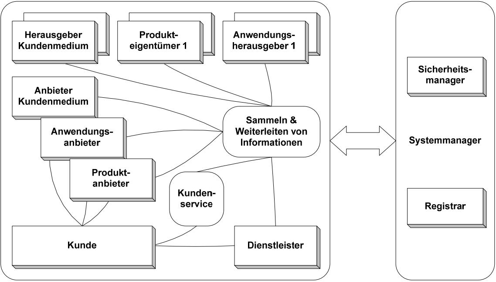

#### **Abbildung 3-1 Entitäten eines Einsatzgebiets nach ISO 24014 (erweitert um Entitäten des Kundenmediums)**

In der ISO 24014 werden Entitäten definiert und diesen Rollen und Verantwortlichkeiten zugewiesen. Die Implementierung für das Einsatzgebiet eTicketing für Veranstaltungen ist im Folgenden beschrieben:

Akteur

Entitäten, die entsprechend der zugewiesenen Rolle handeln.

### Kunde

Käufer für Produkte und Nutzer der damit verbundenen Dienste. Erhält gegen Bezahlung vom Produktanbieter die Berechtigung zur Nutzung von Diensten. Löst diese Berechtigung beim Dienstleister ein.

### Kundenmedium

Das Kundenmedium ist ein Datenträger, in dem die elektronische Berechtigung gespeichert werden kann. Das Kundenmedium ist im Besitz des Kunden und wird von diesem zur Nutzung der Berechtigung benötigt. Weitere übliche Bezeichnungen sind Nutzermedium und Trägermedium. Ausprägungen des Kundenmediums sind z. B. das Smart Ticket, eine Chipkarte oder ein NFC-Mobiltelefon.

### Herausgeber Kundenmedium

Der Herausgeber des Kundenmediums konfiguriert dieses für die weitere Nutzung. Der Herausgeber vermarktet das Kundenmedium ggf. über Anbieter von Kundenmedien (z. B. ein Verkehrsunternehmen). Zwischen Herausgeber des Kundenmediums, Anwendungsherausgeber und Systemmanager ist eine enge Abstimmung und vertragliche Bindung erforderlich.

### Anbieter Kundenmedium

Der Anbieter des Kundenmediums (z. B. ein Verkehrsunternehmen oder ein Mobilfunkprovider) vermarktet das Kundenmedium, das er vom Herausgeber des

Kundenmediums erhalten hat. Der Anbieter des Kundenmediums implementiert üblicherweise mit der Ausgabe auch eine Anwendung.

#### Anwendung

Die Anwendung (oft auch Applikation genannt) unterstützt ein oder mehrere Produkte durch die Bereitstellung von Funktionen und Strukturen zur Aufnahme von z. B. Berechtigungen auf dem Trägermedium, im Verkaufssystem und im Hintergrundsystem. Die Implementierung folgt der Anwendungsspezifikation, die üblicherweise dem Anwendungsherausgeber gehört. Der Anwendungsherausgeber vermarktet die Anwendung ggf. über Anwendungsanbieter (z. B. einen Verkehrsverbund). Neben den Produkten kann eine Anwendung z. B. auch kundenspezifische Informationen enthalten.

#### Anwendungsherausgeber

Der Anwendungsherausgeber ist der Eigentümer der Anwendungsspezifikation. Der Anwendungsherausgeber vermarktet die Anwendung ggf. über Anwendungsanbieter (z. B. ein Verkehrsunternehmen).

#### Anwendungsanbieter

Der Anwendungsanbieter (z. B. ein Verkehrsunternehmen oder ein Stadionbetreiber) implementiert und vermarktet die Anwendung, die er vom Anwendungsherausgeber erhalten (z. B. lizensiert) hat. Der Anwendungsanbieter gibt üblicherweise mit der Anwendungsimplementierung auch das Trägermedium aus und ist damit z. B. bei Anwendungen aus dem Einsatzgebiet 'eTicketing' der Vertragspartner des Kunden.

### Produkt/Berechtigung/Dienst

Das Produkt ist das Leistungsangebot eines Produkteigentümers, das der Kunde gegen Bezahlung in Anspruch nehmen kann. Das Produkt gehört dem Produkteigentümer (z. B. einem Veranstalter von Konzerten) und wird direkt oder ggf. über einen Produktanbieter (z. B. Reisebüro oder Vorverkaufsstelle) dem Kunden angeboten. Bei Kauf des Produktes erhält der Kunde eine Berechtigung zur Benutzung eines Dienstes, die er beim Dienstanbieter (z. B. Verkehrsunternehmen) einlösen kann.

### Produkteigentümer

Eigentümer des Produkts (z. B. Einzelzutritt zu einem Bundesligaspiel). Der Produkteigentümer definiert und vermarktet das Produkt ggf. über Produktanbieter (z. B. eine Vorverkaufsstelle). In einfachen Szenarien ist es jedoch üblich, dass der Produkteigentümer auch die Rolle des Produktanbieters innehat. Um sicherzustellen, dass die Anwendung das Produkt unterstützen kann, muss der Produkteigentümer bei der Definition des Produktes den Spezifikationen des Anwendungsherausgebers folgen. Weiterhin ist eine enge Abstimmung zwischen dem Produkteigentümer und dem Dienstleister, der die mit dem Produkt versprochene Leistung erbringen soll, erforderlich. Zwischen Produkteigentümer, Produktanbieter und Dienstleister ist eine vertragliche Bindung erforderlich.

#### Produktanbieter

Vermarktet das Produkt im Auftrag des Produkteigentümers gegen eine Gebühr. Der Produktanbieter empfängt die Zahlung des Kunden und ist damit die einzige Schnittstelle für Zahlungen. Dies erfordert eine direkte Abstimmung und vertragliche Bindung mit dem Produkteigentümer. Der Produktanbieter bringt das Produkt (z. B. eine Berechtigung) in die Anwendung auf dem Trägermedium ein. Der Produktanbieter ist der Vertragspartner des Kunden bezüglich der verkauften Berechtigungen zur Nutzung von Diensten. Organisatorisch bedient der Produkteigentümer oft auch die Rolle des Produktanbieters.

### Dienstleister

Z. B. Stadionbetreiber oder Verkehrsunternehmen. Gewährt dem Kunden gegen Vorlage der vom Produktanbieter gekauften Berechtigung eine Dienstleistung (z. B. Zutritt zu einem Stadion). Dies erfordert eine direkte Abstimmung und vertragliche Bindung mit dem Produktanbieter und dem Produkteigentümer.

### Systemmanager

Der Systemmanager sorgt für die Einhaltung der Regeln des Systems. Hierzu bedient er sich der funktionalen Entitäten Sicherheitsmanager und Registrar.

Registrar

Der Registrar sorgt für die Vergabe eindeutiger Identifizierungsmerkmale im System, die zur Identifizierung der Entitäten, Trägermedien, Anwendungen und Produkte/Berechtigungen benötigt werden.

### Sicherheitsmanager

Etabliert und koordiniert die Sicherheitsregeln im System. Ist verantwortlich für die Zulassung der Komponenten des Systems. Überwacht die Durchführung von sicherheitsrelevanten Funktionen (z. B. Schlüsselmanagement).

### **3.3 Zuordnung der Rollen und Entitäten im Einsatzgebiet eTicketing für Veranstaltungen**

Die Umsetzung der in Kapitel [2](#page-12-1) beschriebenen Dienste erfordert in der Maximalkonfiguration ein Zusammenwirken verschiedener und wechselnder Akteure. Zum Beispiel muss ein Stadionbetreiber in die Lage versetzt werden, Anwendungen und Produkte verschiedener Veranstalter und Anbieter abzubilden, da er z. B. Länderspiele, Ligaspiele und Konzerte in seiner Arena abwickelt.

Die Zuordnung der Entitäten dieses Einsatzgebietes ist generell identisch zur generischen Beschreibung aus Kapitel [3.2](#page-15-1). Die Besonderheiten dieses Einsatzgebiets sind in der [Abbildung 3-2](#page-17-1) dargestellt und im Folgenden beschrieben.

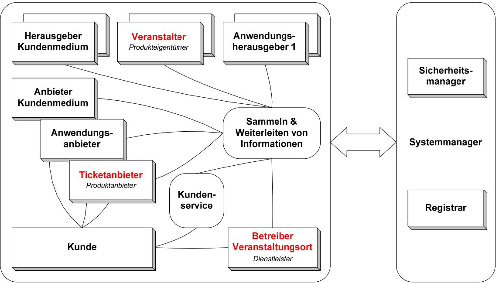

### **Abbildung 3-2 Entitäten des Einsatzgebiets "eTicketing für Veranstaltungen"**

In der folgenden Liste sind die Rollen und die Interessen der Akteure dieses Einsatzgebiets näher beschrieben. Bei der Betrachtung der produktspezifischen Einsatzszenarien wird eine genauere Zuordnung der Rollen getroffen werden.

### **3.3.1 Veranstalter**

Der Veranstalter ist für die Veranstaltung verantwortlich und fungiert als *Produkteigentümer*. Je nach Einsatzszenarium und Umfeld kann er - außer der Kundenrolle - gleichzeitig auch alle anderen Rollen einnehmen.

Der Veranstalter trägt die Kosten und das kommerzielle und Haftungsrisiko für die Veranstaltung. Sein Ziel ist normalerweise die Gewinnmaximierung. Damit verbundene Ziele sind höchstmögliche Akzeptanz der Kunden, die reibungslose Abwicklung des Ticketverkaufs und der Veranstaltung und die Minimierung der Kosten.

### **3.3.2 Ticketanbieter**

Ticketanbieter nehmen die Rolle des *Produktanbieters* über verschiedene Vertriebskanäle ein. Betreiber von Ticketplattformen treten als *Produktanbieter* für verschiedene Veranstaltungen an verschiedenen Veranstaltungsorten über Direkt- oder Internetvertrieb an. Beispiele sind der Internet-Ticketvertrieb und die WM2006. Der Ticketanbieter hat in einigen Fällen auch weitere Funktionen inne. Er kann z. B. auch *Herausgeber und Anbieter des Trägermediums und der Anwendung* sein. Im holländischen Fußball ist ein Plattformbetreiber für den Ticketvertrieb etabliert worden, der zusätzlich auch die Funktion des *Systemmanagers* einnimmt. Dabei wird z. B. auch die Interfunktionsfähigkeit aller ausgegebenen Trägermedien mit allen Stadien angestrebt. Der Fan kann sein Kundenmedium auch bei Auswärtsspielen benutzen. Dies ist ein Zukunftsmodell für den Einsatz kontaktloser Smartcards.

Der Ticketanbieter ist als Produktanbieter an geringen Vertriebskosten und Flexibilität im Vertriebsprozess interessiert. Kosten für Trägermedien, Vertriebsstellen oder Porto sind zu minimieren. Sofern am Veranstaltungsort eine elektronische Zutrittskontrolle eingesetzt wird, hat der Ticketanbieter seine Leistungen an die jeweilig zulässigen Trägermedien und Anwendungen anzupassen. Eine Standardisierung der Anwendungen für viele Veranstaltungsorte und die Einführung eines Systemmanagers im Einsatzgebiet wäre für Ticketanbieter demnach ein Vorteil.

Internet-Plattformbetreiber haben grundsätzlich das Problem der Postlaufzeit, die den Last-Minute-Verkauf von Berechtigungen behindert. Dies könnte z. B. durch das Laden von Berechtigungen über das Internet oder ein Abholverfahren behoben werden.

### **3.3.3 Betreiber des Veranstaltungsorts**

Örtlichkeiten, an denen Veranstaltungen abgehalten werden, werden oftmals eigenständig verwaltet (z. B. Stadionbetreiber). Sofern eine fest installierte elektronische Zutrittskontrolle verwendet wird, gehört diese dem Betreiber. Diese Betreiber nehmen dann die Rolle des *Dienstleisters* ein, da hier die vom Produktanbieter erworbene Berechtigung in einen Dienst umgewandelt wird. Zum Betrieb der elektronischen Zutrittskontrolle muss der Betreiber die ggf. veranstaltungsspezifische Anwendung und Berechtigung auf dem Kundenmedium lesen und auswerten können. Dazu sind detaillierte technische Vorbereitungen nötig. Normalerweise finden an einem Veranstaltungsort (z. B. Stadion) verschiedene Veranstaltungen verschiedener Veranstalter (z. B. Ligafußball, Länderspiele, Konzerte, etc) statt.

Der Betreiber des Veranstaltungsorts muss – ggf. in Zusammenarbeit mit dem Veranstalter die Funktionsfähigkeit der elektronischen Zutrittskontrolle sicherstellen. Die Adaptierung des

elektronischen Zugangssystems für spezifische Anwendungen und Berechtigungen ist aufwändig. Aus operativer und kommerzieller Sicht ist dies für einzelne Veranstaltungen nicht möglich. Der Betreiber hat jedoch ein Interesse, vorhandene Zutrittstechnik (und ggf. auch Bezahlsysteme, etc) möglichst für alle Veranstaltungen ohne große Anpassungen zu nutzen. Eine Standardisierung von Anwendungen und Berechtigungen könnte dieses Problem lösen.

### **3.4 Beziehung zwischen Trägermedien, Anwendungen und Berechtigungen**

Das Modell aus den Kapiteln [3.2](#page-15-1) und [3.3](#page-17-2) erlaubt die Unterstützung von jeweils mehreren Produktanbietern, Dienstleistern, Anwendungsherausgebern, usw.

Dementsprechend sind auch eine große Zahl verschiedener Trägermedien, Anwendungen und Produkte denkbar.

Das Kunden- oder Trägermedium ist der Datenträger des Kunden, auf dem er seine Berechtigungen speichert und mit dessen Hilfe er die zugeordneten Dienste in Anspruch nimmt.

Anwendungen stellen die Strukturen und Funktionen für das Aufbringen und die Nutzung von Berechtigungen auf Trägermedien bereit. Anwendungsimplementierungen müssen deshalb den Eigenschaften spezifischer Trägermedien und Berechtigungen Rechnung tragen.

Berechtigungen können vom Kunden beim Dienstleister in Leistungen umgetauscht werden.

Folgende Regeln gelten für die Beziehungen zwischen Trägermedien, Anwendungen und Berechtigungen:

- 1 Ein Trägermedium kann mindestens eine Anwendung aufnehmen. Sofern mehr als eine Anwendung aufgebracht werden kann, spricht man von multiapplikationsfähigen Trägermedien.
- 2 Eine Anwendung kann mindestens eine, in der Regel jedoch mehrere Berechtigungen aufnehmen. Personenbezogene Daten und Zugangsdaten werden ggf. in der Anwendung gespeichert.
- 3 Anwendungen auf einem Trägermedium können von verschiedenen Anwendungsherausgebern bzw. -anbietern stammen.
- 4 Berechtigungen in einer Anwendung können von verschiedenen Produkteigentümern bzw. -anbietern stammen.
- 5 Berechtigungen des gleichen Typs können in verschiedene Anwendungen eingebracht werden.

Die folgende Abbildung zeigt ein Beispiel für die Beziehungen zwischen Trägermedien, Anwendungen und Berechtigungen.

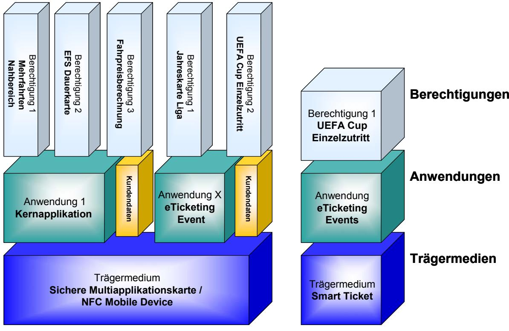

**Abbildung 3-3 Trägermedien, Anwendungen und Berechtigungen** 

# **4 Generelle Anforderungen**

Die Anforderungen an das Gesamtsystem und dessen Prozesse und Komponenten lassen sich in drei Kategorien gliedern.

### **4.1 Funktion**

### **4.1.1 Anforderungen des Kunden**

Aus Sicht des Kunden sollten z. B. die folgenden Eigenschaften umgesetzt werden:

- Die Kundenmedien und Systeme müssen einfach zu handhaben sein.
- Das Kundenmedium muss robust sein und zuverlässig und performant funktionieren.
- Daten zur Veranstaltung (z. B. Anfangszeit, Block, Reihe, Sitz) müssen mit der Berechtigung übergeben werden.
- Die Berechtigung bzw. das Kundenmedium muss ggf. bei verschiedenen Dienstleistern einfach und zuverlässig zu nutzen sein.
- Abhanden gekommene Berechtigungen sollten gegen eine Aufwandsentschädigung ersetzt werden können. Gleiches sollte für den Umtausch von Berechtigungen gelten.
- Der Kauf von anonymen Berechtigungen muss möglich sein.
- Die personenbezogenen Daten (so vorhanden) müssen angemessen geschützt sein.

Generell sollte der Kunde beim Einsatz der kontaktlosen Chiptechnik über die verwendeten personenbezogenen Daten, die Verwendung dieser Daten, die Maßnahmen zum Datenschutz und die verbleibenden Risiken offen informiert werden.

### **4.1.2 Anforderungen des Produktanbieters und des Dienstleisters**

Funktionalität

- Die Verwendung der Kundenmedien und Systeme muss den Kunden und dem eigenen Personal mit wenig Erklärungsaufwand vermittelbar sein.
- Die Umsetzung der Systemkomponenten und Prozesse muss den besonderen Bedingungen des Betriebs bei Veranstaltungen Rechnung tragen. Z. B. muss bei Veranstaltungen mit besonders hohen Anforderungen an die Verfügbarkeit der Zugangstechnik der Zutritt auch möglich sein, wenn die jeweiligen Terminals zeitweise nicht online sind oder die Stromversorgung unterbrochen ist.
- Die Sperrung und Ersatzausstellung von personalisierten Berechtigungen und Kundenmedien muss unterstützt werden.
- Generell muss bei Zutrittssperren der erforderliche Durchsatz gewährleistet sein. Eine typische Anforderung bei fest installierten Systemen ist eine Verarbeitungszeit von 300ms.

Technische Kompatibilität

• Die Kompatibilität der Systemkomponenten muss ggf. auch dann sichergestellt sein, wenn Trägermedien, Systeme und Komponenten von unterschiedlichen Herstellern und Anbietern kommen und bei verschiedenen Dienstleistern zum Einsatz gebracht werden.

### **4.2 Wirtschaftlichkeit**

Ein wirtschaftlicher Betrieb des eTicketing-Systems erfordert, dass der kommerzielle Nutzen in jeder Ausbaustufe größer als die Kosten für Prozesse, Systeme und Sicherheit ist. Dies muss für alle Akteure, die in den Aufbau des Systems investieren, gelten.

Das Gesamtsystem und dessen Komponenten sollte daher so ausgelegt werden, dass die Anforderungen der relevanten Einsatzszenarien möglichst effizient erfüllt werden. Deshalb sind zunächst diese Anforderungen möglichst exakt zu bestimmen.

### **4.3 Sicherheit**

Auf Anforderungen zur Sicherheit wird in diesem Dokument ab Kapitel [8.2](#page-47-1) speziell eingegangen. Besondere Anforderungen erwachsen insbesondere bei internationalen Sportveranstaltungen aus der Notwendigkeit, rivalisierende Fangruppen sicher zu trennen und gewaltbereiten Fans den Zutritt zum Stadion zu verwehren.

# **5 Methodik zur Ermittlung der Sicherheitsanforderungen**

### **5.1 Zielsetzung**

Die Technische Richtlinie RFID soll folgenden Zielen dienen:

- Bereitstellung eines Leitfadens für Systemlieferanten und Systemanwender zur sachgerechten Implementierung von spezifischen RFID-Systemlösungen bzgl. Funktions- und Informationssicherheit und Datenschutz.
- Schaffung von Aufmerksamkeit und Transparenz in Bezug auf Sicherheitsaspekte.
- Schaffung einer Basis für eine Konformitätserklärung der Systemlieferanten oder Betreiber und die Vergabe eines Gütesiegels durch eine Zertifizierungsstelle.

Zum Umsetzung dieser Ziele sind Informationen erforderlich, die folgendermaßen bereitgestellt werden:

- Ermittlung der Sicherheitsanforderungen an ein RFID-System eines Einsatzgebietes.
- Benennung der spezifischen Gefährdungen, geeigneter Gegenmaßnahmen und des möglicherweise verbleibenden Restrisikos.
- Definition der Kriterien für eine Konformitätserklärung bzw. Zertifizierung.

Bei der Definition von Maßnahmen und Systemvorschlägen sind nicht nur Sicherheitsaspekte relevant. Vielmehr müssen alle in Kapitel [4](#page-21-1) benannten Anforderungen berücksichtigt werden.

### **5.2 Methodik**

### **5.2.1 Erwägungen zum Umfang der Systembetrachtung**

RFID-basierte Systeme können sehr komplex sein. In den meisten Fällen gehören zur Systemlösung auch viele Komponenten, die nicht mit RFID ausgestattet sind. Auf der anderen Seite dürfen bei der Betrachtung der Systemsicherheit nicht nur das Medium/das Tag und die Lesegerät berücksichtigt werden.

Die Technische Richtlinie muss alle für RFID relevanten Sicherheitsaspekte im Detail einbeziehen. Diese Aspekte hängen stark vom Einsatzgebiet und der jeweiligen Implementierung der Systemlösung ab. Diese Technische Richtlinie enthält daher detaillierte Angaben über das Einsatzgebiet und die dazugehörenden Betriebsprozesse (einschließlich der Vertriebskanäle und -prozesse). Die Prozesse decken den gesamten Lebenszyklus eines Trägermediums oder Transponders ab. Basierend auf diesen Prozessen werden Anwendungsfälle bestimmt, die aus für die Sicherheitsbetrachtung des RFID-Systems relevant sind. Diese Anwendungsfälle werden dann als Grundlage für die Ermittlung von Gefährdungen und eine detaillierte, systemspezifische Sicherheitsbewertung für die mit RFID im Zusammenhang stehenden Bereiche des Systems genutzt. [Abbildung 5-1](#page-24-1) zeigt diese Vorgehensweise am Beispiel des eTicketing im ÖPV.

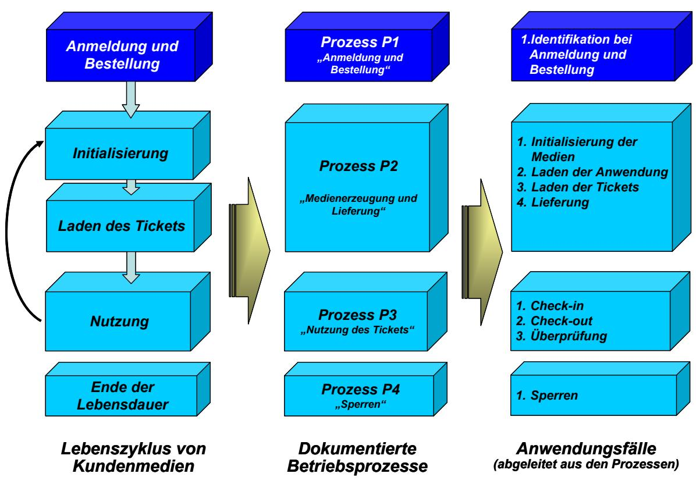

**Abbildung 5-1 Beispiel: Bestimmung RFID-relevanter Anwendungsfälle für eTicketing** 

Alle anderen Systemkomponenten werden nur allgemein behandelt. Die vorgeschlagenen Sicherheitsmaßnahmen basieren auf offenen IT-Sicherheitsstandards.

Dieses Konzept legt den Schwerpunkt der Betrachtung auf die für RFID relevanten Systemteile und gewährleistet dennoch die Berücksichtigung aller Sicherheitsaspekte. Auf der anderen Seite lässt die Technische Richtlinie auch Raum für individuelle und anwendereigene IT-Implementierungen (Back Offices, Vertriebs- und Logistiksysteme etc.). Dies unterstützt insbesondere die Erweiterung bestehender Systeme um die RFID-Technologie.

### **5.2.2 Skalierbarkeit und Flexibilität**

Diese Technischen Richtlinien sollen in erster Linie Sicherheitsfragen behandeln. Parallel muss für alle Implementierungen, die auf dieser Richtlinie aufsetzen, ein wirtschaftlicher Betrieb möglich werden. Daher sollen die folgenden Anforderungen an die Methodologie der Richtlinie berücksichtigt werden:

- 1 Es muss möglich sein, Systeme so zu implementieren, dass eine Ausgewogenheit von Kosten und Nutzen erreicht wird. Dies bedeutet in der Praxis, dass die Schutzmaßnahmen den ermittelten Schutzbedarf zwar erfüllen aber nicht übertreffen müssen. Beispiel: Werden nur preiswerte Produkte verwendet, die eine relativ niedrige Sicherheitsanforderung haben, sollten die Schutzmaßnahmen entsprechend gestaltet werden. Dies ermöglicht beispielsweise die Verwendung preiswerter Medien, wodurch sich die Kosten für die Systemimplementierung und den Betrieb verringern.
- 2 Die für die Technische Richtlinie ausgewählten Einsatzszenarios umfassen eine große Bandbreite, von kleinen bis zu landesweiten oder sogar grenzüberschreitenden Anwendungen. Wichtig ist, dass das in der Richtlinie verwendete Konzept für Systemlösungen aller Größen und verschiedener Komplexität genutzt werden kann.

3 In vielen Fällen lässt sich die Wirtschaftlichkeit einer Systemlösung wesentlich leichter durch die Kooperation mit Geschäftspartnern erreichen. Dies gilt insbesondere für eTicketing-Anwendungen, bei denen es sehr vorteilhaft sein kann, wenn bereits beim Kunden verfügbare Medien (z. B. Karten mit Mehrfachanwendung oder NFC-fähige Telefone) für zusätzliche Anwendungen, Produkte und damit verbundene Dienstleistungen wiederverwendet werden können.

Die folgenden Abbildungen zeigen Beispiele von eTicketing für eine system- und anwendungsübergreifende Nutzung von Kundenmedien und -infrastruktur.

[Abbildung 5-2](#page-25-1) zeigt, dass u. U. verschiedene Produkte bzw. Einsatzszenarios in einem System unterstützt werden müssen. Dabei werden diese Produkte möglicherweise auf verschiedene Trägermedien aufgebracht.

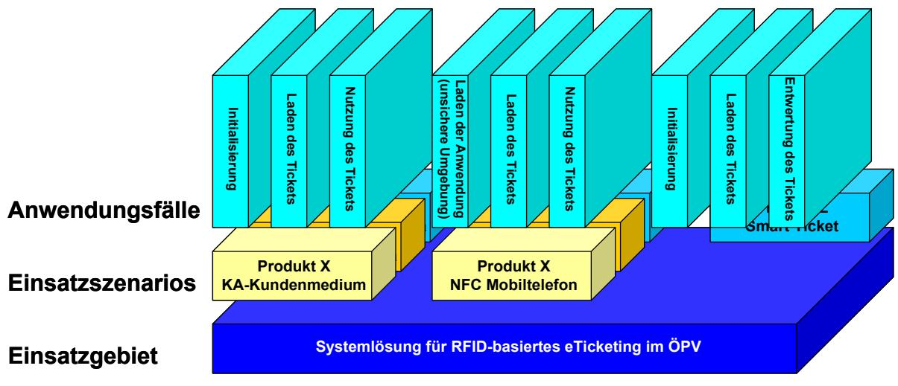

**Abbildung 5-2 Beispiel für Einsatzszenarios und relevante Anwendungsfälle für eTicketing im ÖPV** 

[Abbildung 5-3](#page-25-2) zeigt ein Beispiel eines Kundenmediums für eTicketing, das Anwendungen aus zwei Einsatzgebieten unterstützt.

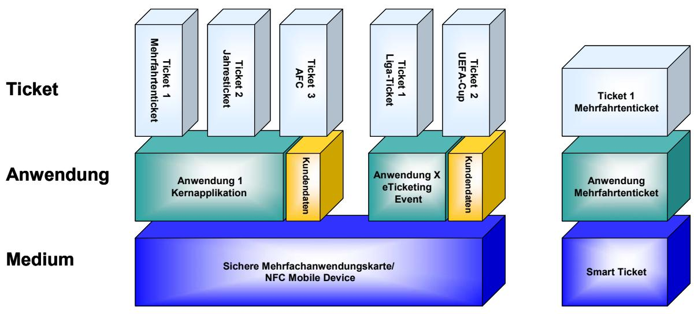

#### **Abbildung 5-3 Hierarchisches Konzept für Medien, Anwendungen und Tickets beim eTicketing**

Um die genannten Anforderungen zu erfüllen, wird für diese Technische Richtlinie folgendes Konzept verwendet:

- 1 Ein passendes Rollenmodell und die Struktur einiger Hauptelemente (Produkte, Applikationen und Medien) wurden in Kapitel 3 beschrieben. Dieses Modell unterstützt einen in skalierbaren und erweiterbaren Ansatz.
- 2 Die Technische Richtlinie muss Sicherheitskonzepte anbieten, die alle in einer Infrastruktur verwendeten Kombinationen von Einsatzszenarios und Medien umfassen. Dies wird durch individuelle Sicherheitsbewertungen, die auf den relevanten Anwendungsfällen basieren, erreicht.
- 3 Gleiche Einsatzgebiete (insbesondere im eTicketing), die die Möglichkeit für anwendungsübergreifende Partnerschaften bieten, werden in den entsprechenden Technischen Richtlinien mit so viel Kommunalität wie möglich behandelt. Die Sicherheitsbewertung basiert auf ähnlichen Sicherheitszielen. Die Schutzmaßnahmen verwenden wenn möglich die gleichen Mechanismen.
- 4 Eine besondere Herausforderung besteht bei system- und anwendungsübergreifenden Partnerschaften im Hinblick auf die Systemsicherheit. Es muss gewährleistet sein, dass die Sicherheit eines Systems nicht von Schwächen eines anderen Systems untergraben wird. Dies erfordert normalerweise eine umfassende Sicherheitsbewertung beider Systeme.

Die Technischen Richtlinien widmen sich diesem Problem durch Einführung eines skalierbaren und transparenten Konzepts für die Anwendung von Schutzmaßnahmen gegenüber den festgestellten Gefährdungen, den "Schutzbedarfsklassen". Insgesamt werden drei Klassen von 1 (normale Anforderung) bis zu 3 (hohe Anforderung) verwendet. Alle Schutzmaßnahmen werden entsprechend in drei Stufen definiert, von normalem Schutz bis zu erweitertem Schutz.

Bei jeder individuellen Systemimplementierung wird zuallererst die Schutzanforderungskategorie für jedes Sicherheitsziel definiert. Daraus ergibt sich der Umfang der zu treffenden Schutzmaßnahmen.

Dieses Konzept bietet eine einfache Möglichkeit zur Installation einer sicheren Systemkooperation. Es muss lediglich sichergestellt werden, dass die Schutzbedarfsklassen beider Systeme zusammenpassen.

### **5.2.3 Aufbau der Technischen Richtlinie**

| Kapitel                         | Inhalt                                                                                       |
|---------------------------------|----------------------------------------------------------------------------------------------|
| Beschreibung des Einsatzgebiets | Beschreibung des Einsatzgebiets: Aufbau, Leistungen, spezielle Randbedingungen etc.    |
| Produkte und Leistungen         | Beschreibung von Beispielprodukten und - leistungen sowie Vertriebskanälen                |
| Definitionen                    | Modelle, Begriffsdefinitionen                                                                |
| Einführung in die Methodologie  | Vorstellung des für die Sicherheitsbewer tung verwendeten Konzepts sowie der Me thoden |
| Allgemeine Anforderungen        | Allgemeine Anforderungen der beteiligten Parteien, beachtenswerte Aspekte etc.            |
| Betriebsprozesse                | Beschreibung von Betriebsprozessen, die für den Lebenszyklus von Trägermedien             |

[Tabelle 5-1](#page-27-1) zeigt den Aufbau aller bisher erstellten Technischen Richtlinien.

| Kapitel                                                 | Inhalt                                                                                                                                                                                                                                                                                            |
|---------------------------------------------------------|---------------------------------------------------------------------------------------------------------------------------------------------------------------------------------------------------------------------------------------------------------------------------------------------------|
|                                                         | von Bedeutung sind                                                                                                                                                                                                                                                                                |
| Anwendungsfälle                                         | Definition von RFID-relevanten Anwen dungsfällen                                                                                                                                                                                                                                               |
| Sicherheitsbewertung                                    | Einführung in die IT-Sicherheit                                                                                                                                                                                                                                                                   |
|                                                         | Definition spezieller Sicherheitsziele, Schutzbedarfsklassen und Gefährdungen                                                                                                                                                                                                                  |
|                                                         | Vorgeschlagene Schutzmaßnahmen                                                                                                                                                                                                                                                                    |
| Definition von Einsatzszenarios                         | Definition von Beispielen für Einsatzszena rios. Diese Beispiele decken die gesamte Bandbreite relevanter Parameter ab, die in einem bestimmten Einsatzgebiet auftreten kann. Der Nutzer der technischen Richtlinie kann diese Szenarios seinen eigenen Be dürfnissen anpassen. |
| Implementierungsvorschlag für die System lösung      | Generische Systembeschreibung mit Bei spielen zur Durchführung einer Gefähr dungsanalyse und machbarer Schutzmaß nahmen für die Systemkomponenten                                                                                                                                        |
| Implementierungsvorschlag einzelner Einsatzszenarios | Beispiele für die Verwendung des Konzepts zur Sicherheitsbewertung                                                                                                                                                                                                                             |

**Tabelle 5-1 Aufbau der Technischen Richtlinien** 

### **5.2.4 Erläuterung des Sicherheitskonzepts**

Jede Technische Richtlinie enthält Beispiele zur Durchführung der Sicherheitsbewertung in bestimmten Einsatzszenarios. Diese können an die Anforderungen und Randbedingungen der speziellen Systemimplementierung angepasst werden.

[Abbildung 5-4](#page-28-1) zeigt das in allen Technischen Richtlinien verwendete Konzept der Sicherheitsbewertung.

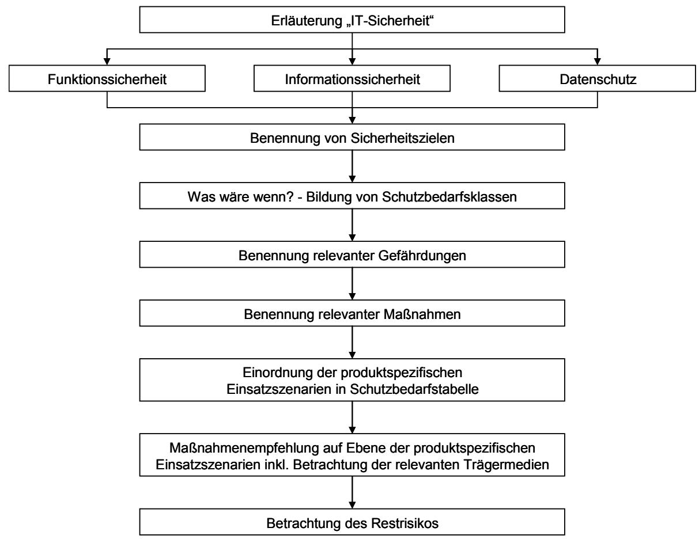

**Abbildung 5-4 Sicherheitsbewertungskonzept** 

Alle Erwägungen basieren auf der klassischen Definition von Sicherheitszielen, die in [Abbildung 5-5](#page-28-2) gezeigt wird.

**Abbildung 5-5 Generische Sicherheitsziele** 

# **6 Generische Geschäftsprozesse**

### **6.1 Prozess P1 "Anmeldung und Bestellung"**

Zum Erwerb eines Ticketprodukts bzw. einer Berechtigung wendet sich der Kunde an den Ticketanbieter. Falls der Kunde nicht im Besitz eines Ticketmediums sein sollte, das mit einer geeigneten Anwendung versehen ist, kann der Kunde über den Ticketanbieter ein solches beziehen[1](#page-29-1) . Dazu arbeitet der Ticketanbieter mit den Anbietern der Anwendung und des Kundenmediums zusammen.

Der Erwerb von kundenbezogenen Berechtigungen, Anwendungen und Trägermedien erfordert die Anmeldung des Kunden. Dabei übergibt der Kunde die geforderten persönlichen Daten (z. B. Name, Postadresse, Zahlungsinformationen) und bestellt das gewünschte Gut.

Normalerweise liegt es im Ermessen des Veranstalters, welche Daten vom Kunden zwecks Identitäts- und Adressenfeststellung sowie Bonitätsprüfung verlangt werden. Lediglich bei speziellen Veranstaltungen gibt es hier Auflagen (z. B. zum Abgleich mit Gewalttäterdatenbanken bei internationalen Fußballspielen).

Für die Bestellung stehen verschiedene Kanäle zur Verfügung:

1 Verkaufsstelle

Der Kunde sucht die Verkaufsstelle auf und bestellt das Produkt. Die Bezahlung erfolgt vor Ort. Im Idealfall verfügt die Verkaufsstelle über einen Direktzugang zum eTicketing-System und kann Produkte und Kundenmedien vor Ort ausgeben. Ansonsten wird beides per Post zugestellt. Personenbezogene Daten sind nur gefordert, wenn ein kundenspezifisches Produkt bestellt wird oder Postversand erforderlich ist.

Die Überprüfung der Identität und der personenbezogenen Daten erfolgt, sofern erforderlich, z. B. durch Vorlage des Personalausweises.

2 Servicecenter

Der Kunde übergibt die benötigten persönlichen Informationen, die Bestellung und Zahlungsinformationen per Fax, per schriftlichen Antrag oder telefonisch an ein zentrales Servicecenter. Bei der telefonischen Bestellung kann meistens die Verfügbarkeit des Produkts und z. B. die Sitzplatzwahl direkt geklärt werden. Die Bezahlung erfolgt per Kreditkarte, per Lastschrift, etc. Kundenmedien werden per Post zugesendet oder am Veranstaltungsort zur Abholung (Verkaufsstelle, Automat) bereitgestellt.

Die per Fax oder Telefon erhaltenen Angaben zur Person und zur Adresse sind nicht grundsätzlich als vertrauenswürdig anzusehen. Eine belastbare Überprüfung kann nur mit zusätzlichem Aufwand erfolgen. Üblicherweise wird lediglich ein Abgleich mit einer aktuellen Adressdatenbank und eine Bonitätsprüfung durchgeführt. Man vertraut dann z. B. auf die Wirkung einer Personenkontrolle mit Abgleich der Ticketdaten am Veranstaltungsort.

3 Internet

Der Kunde übergibt die persönlichen Informationen, die Bestellung und Zahlungsinformationen per Internet (Webpage) an ein zentrales Servicecenter. Bei der Bestellung im Internet kann meistens die Verfügbarkeit des Produkts und z. B. die Sitzplatzwahl direkt

1 Der Fall, dass ein Kunde nur ein Kundenmedium mit einer Anwendung ohne eine Berechtigung erwerben möchte, soll hier nicht betrachtet werden.

geklärt werden. Die Bezahlung erfolgt per Kreditkarte, per Lastschrift, etc. Kundenmedien werden per Post zugesendet oder am Veranstaltungsort zur Abholung (Verkaufsstelle, Automat) bereitgestellt.

Die durch Eingabe auf der Webpage erhaltenen Angaben zur Person und zur Adresse sind nicht grundsätzlich als vertrauenswürdig anzusehen. Eine belastbare Überprüfung kann nur mit zusätzlichem Aufwand erfolgen. Üblicherweise wird lediglich ein Abgleich mit einer aktuellen Adressdatenbank und eine Bonitätsprüfung durchgeführt. Man vertraut dann z. B. auf die Wirkung einer stichprobenartigen Personenkontrolle mit Abgleich der Ticketdaten am Veranstaltungsort.

4 Internet unter Verwendung von Kartenleser und sicherem Identitätsnachweis

Künftig kann eine zusätzliche Option zur Anmeldung und Bestellung umgesetzt werden.

Dabei übergibt der Kunde die Bestellung und die Zahlungsinformationen per Internet (Webpage) an ein zentrales Servicecenter. Die Identifizierung und Übergabe von personenbezogenen Daten (sofern erforderlich) erfolgt online über eine direkte Kommunikation zwischen dem Anwendungsserver des Ticketanbieters und einem elektronischen Identitätsnachweis (eID). Die kann künftig möglicherweise mit dem elektronischen Personalausweis (ePA) umgesetzt werden.

Bei der Bestellung im Internet kann die Verfügbarkeit des Produkts und z. B. die Sitzplatzwahl direkt geklärt werden. Die Bezahlung erfolgt per Kreditkarte, per Lastschrift, etc. Produkte und Kundenmedien werden per Post zugesendet oder am Veranstaltungsort zur Abholung (Verkaufsstelle, Automat) bereitgestellt.

Die durch Kommunikation mit dem elektronischen Identitätsnachweis erhaltenen Angaben zur Person und zur Adresse sind grundsätzlich als vertrauenswürdig anzusehen. Eine weitere Überprüfung ist nicht erforderlich.

|                                                                          | P1.1 Verkaufs- stelle | P1.2 Servicecenter                                                                                                             | P1.3 Internet                                 | P1.4 Internet mit Karten leser               | Akteure                                 |
|--------------------------------------------------------------------------|-----------------------------|-----------------------------------------------------------------------------------------------------------------------------------|--------------------------------------------------|----------------------------------------------------|-----------------------------------------|
| Bestellung Medium / Anwendung / Produkt und Zahlungsvereinbarungen | Antrags- formular        | FAX / Telefon                                                                                                                  | Webpage                                          | Webpage                                            | Kunde                                   |
| Ubergabe persönlicher Daten (sofern erforderlich)                     | Antrags- formular        | FAX / Telefon                                                                                                                  | Webpage                                          | e D                                                | Ticket- bzw. Anwendungs- anbieter |
| Optionale Uberprüfung der Identitätsdaten (Beispiele)              | Vorlage PA                  | Adressen- abgleich                                                                                                             | Adressen- abgleich                            | Daten vertrauenswürdig Überprüfung nicht nötig, | Ticket- bzw. Anwendungs- anbieter |
| Überprüfung Bonität                                                      | Zahlung vor Off          |                                                                                                                                   | Überprüfung Zahlungsangaben und Bonität (option) |                                                    | Ticket- bzw. Anwendungs- anbieter |
| Übernahme der Bestelldaten                                            |                             | Übernahme der Kunden- und Produktdaten (Typ und z.B. Sitzplatzkategorie) in interne Systeme                                    |                                                  |                                                    | Ticket- bzw. Anwendungs- anbieter |
| Reservierung                                                             |                             | Reservierung des Produkts                                                                                                         |                                                  |                                                    | Ticket- bzw. Anwendungs- anbieter |
|                                                                          |                             | Prozess P2 "Erstellung und Auslieferung" (Bestelltes Produkt inkl. Trägermedium oder zum Laden auf existierendes Kundenmedium) |                                                  |                                                    |                                         |

Die folgende Abbildung zeigt den Prozess P1 "Anmeldung und Bestellung":

### **6.2 Prozess P2 "Erstellung und Auslieferung von Produkten"**

Bei der Prozessbeschreibung "Erstellung und Auslieferung von Produkten" sind zwei wesentliche Fälle zu Unterscheidung:

- 1 Die Erstellung und Auslieferung der Berechtigung zusammen mit einem speziell erstellten Trägermedium.
- 2 Das Aufladen einer Berechtigung auf ein bereits im Besitz des Kunden befindliches kundenbezogenes Medium (z. B. sichere Chipkarte, NFC-Mobiltelefon).

In der folgenden [Abbildung 6-2](#page-31-1) findet sich die Darstellung des Prozesses P2 mit 4 Unterprozessen. Für die Prozesse P2.1 bis P2.3 gilt Fall 1 –das bestellte Produkt wird auf einem speziell gefertigten Medium an den Kunden ausgeliefert.

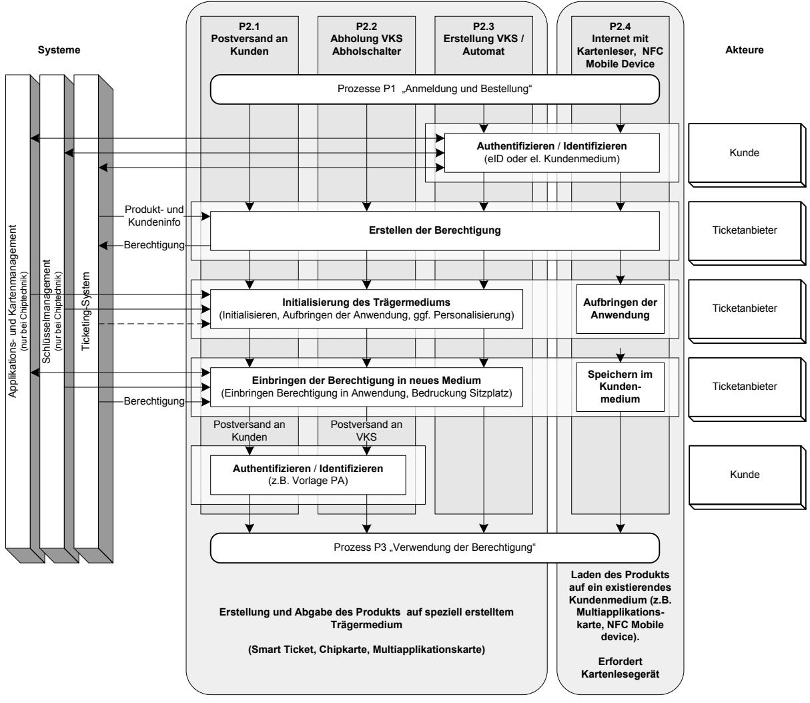

**Abbildung 6-2 Prozessdarstellung P2 "Erstellung und Auslieferung"** 

### Begriffsklärung:

### Initialisierung

Die Initialisierung eines Trägermediums beinhaltet die erstmalige Konfiguration des Trägermediums und/oder das Aufbringen von Anwendungen

### Personalisierung

Die Personalisierung bezeichnet die Zuordnung eines Trägermediums, einer An-

wendung oder einer Berechtigung zu einer natürlichen Person. Dazu werden personenbezogene Daten eingebracht.

### Aufbringen von Berechtigungen

Laden von Berechtigungen in eine existierende Anwendung auf der Trägermedium.

### **6.3 Prozess P3 "Verwendung der Berechtigung"**

Die veranstaltungsspezifische Berechtigung wird vom Kunden bei der Veranstaltung gegen Dienstleistungen eingelöst. Existiert dort eine elektronische Zutrittstechnik, dann muss der Kunde ein Trägermedium mit einer für die Veranstaltung zulässigen Anwendung mit gültiger Berechtigung besitzen, um Einlass zu erlangen, seinen Sitzplatz zu erhalten etc.

Die elektronische Zutrittstechnik wird vom Betreiber des Veranstaltungsorts verantwortet. Vor der Veranstaltung hat der Betreiber umfangreiche Vorarbeiten zu leisten, um die Funktion zu gewährleisten:

- 1 Die lokale Zutrittstechnik muss an die bei der Veranstaltung verwendeten Anwendungen und Berechtigungen angepasst werden. Dies können aufgrund unterschiedlicher Trägermedien etc. durchaus mehrere Anwendungen pro Veranstaltung sein.
- 2 Bei Verwendung von kontaktloser Chiptechnik müssen die veranstaltungsspezifischen Schlüsselinformationen in das lokale Schlüsselmanagement integriert werden.
- 3 Die Liste der gültigen Berechtigungen (White List) der gesperrten Berechtigungen (Black List) muss vom Ticketsystem in das Zutrittssystem übernommen werden. Dazu muss eine echtzeitfähige Datenschnittstelle zwischen dem Ticketsystem des Ticketanbieters bzw. Veranstalters und dem Zutrittssystem des Betreibers vereinbart und installiert werden.

Als Anlaufpunkt im Falle von Problemen mit Medien oder Berechtigungen beim Zutritt muss am Veranstaltungsort ein lokaler Service- oder Info Desk installiert werden. An diesem Service- oder Info Desk sollen Trägermedien und Berechtigungen für die Veranstaltung erstellt werden können. Es sind deshalb ein direkter Zugriff zum Ticketsystem, zum Zutrittskontrollsystem und eine Möglichkeit zur Ausstellung von Medien mit Berechtigungen erforderlich.

Der Zutritt erfolgt über Drehsperren. Alternativ ist es möglich, mobile Lesegeräte, die von Ordnungskräften geführt werden, an den Zugängen einzusetzen. Die Kontrollgeräte und Drehsperren sollen auch dann funktionsfähig sein, wenn das Stadionnetz ausfallen sollte. Dies ist insbesondere wichtig, wenn ein WLAN zur Verbindung zum Zutrittsserver verwendet wird.

Beim Zutritt soll das Ticket entwertet werden. Optional ist eine Möglichkeit zum Verlassen des Veranstaltungsorts und zum Wiedereintritt vorzusehen.

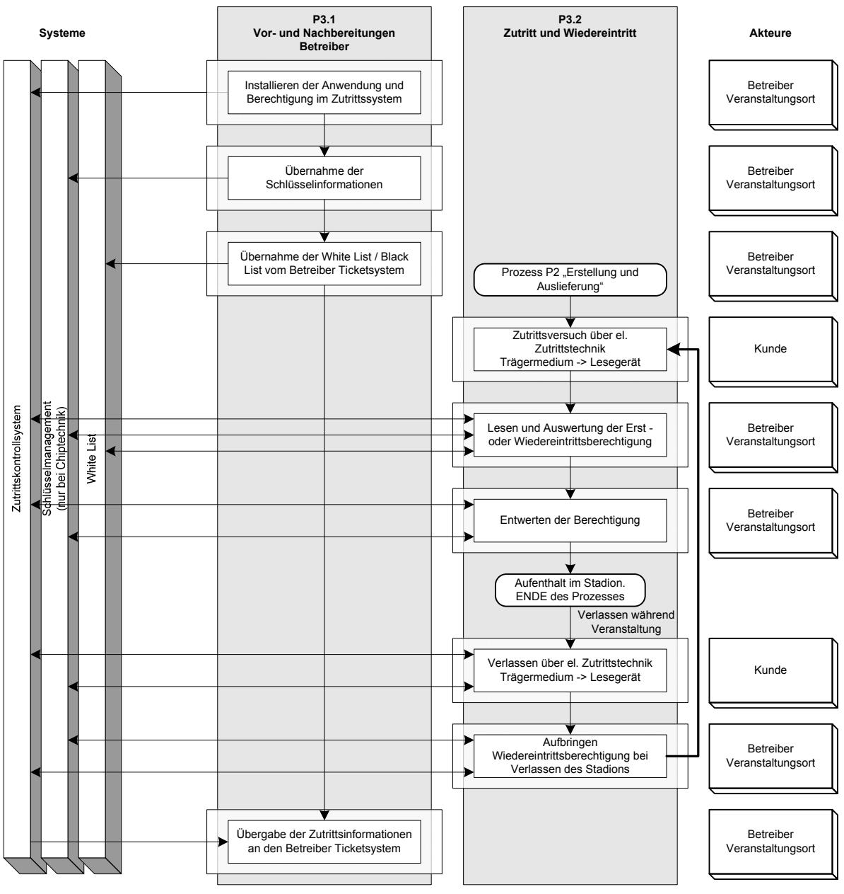

Die folgende Abbildung zeigt den Prozess P3:

Der Fehlerfall beim Zutritt ist hier nicht berücksichtigt.

### **6.4 Prozess P4 "Sperrung von Berechtigungen und Trägermedien"**

Aufgrund des hohen Grads an Fälschungssicherheit, der bei chipbasierten Trägermedien bei sachgerechter Implementierung erreicht werden kann, ist die sichere Sperrung von Berechtigungen und Trägermedien möglich. Das unterstützt das Stornieren und den Umtausch von Trägermedien und Berechtigungen und gestattet den Ersatz von verloren gegangenen Medien. Dabei sind folgende Fälle möglich:

1 Defekte Trägermedien werden eingezogen und vernichtet. Das gleiche gilt, wenn ein Einzelticket storniert werden soll. Dabei ist vor Ausgabe eines Ersatzmediums sicherzustellen, dass keine Fälschung zum Umtausch vorgelegt bzw. als defektes Medium deklariert und eingereicht wurde.

- 2 Verlorengegangene Trägermedien können in der Praxis nur gesperrt und ersetzt werden, sofern diese personalisiert, d.h. einem Kundenkonto (siehe Anmeldung) bei einem Ticketanbieter zugeordnet sind. In diesem Fall könnte sich der Besitzer gegenüber dem Ticketanbieter, über den er das Medium erhalten hat, identifizieren und das zu sperrende Trägermedium benennen. Ebenso kann bei der Stornierung einer einzelnen Berechtigung verfahren werden.
- 3 Der Ersatz von verloren gegangenen personalisierten Trägermedien und der gespeicherter Berechtigungen kann erfolgen, sofern eine Sperrung aller gespeicherten Berechtigungen durchgeführt werden konnte. Dabei ist zu berücksichtigen, dass ggf. mehrere Anwendungen auf dem Trägermedium vorhanden sind, die wiederum Berechtigungen verschiedener Ticketanbieter enthalten können.

# **7 Anwendungsfälle**

Die folgenden Unterkapitel enthalten Beschreibungen von Anwendungsfällen, die für die weitere Betrachtung der kontaktlosen Chiptechnik im Einsatzgebiet von Bedeutung sind. Die Anwendungsfälle wurden aus den generischen Betriebsprozessen in Kapitel [6](#page-29-2) abgeleitet.

Bei der Beschreibung der Anwendungsfälle wurde von einer exemplarischen Systemarchitektur ausgegangen, die in Kapitel [10](#page-105-1) näher beschrieben ist.

### **7.1 Anwendungsfall "Identifizierung bei Anmeldung und Bestellung"**

Die Qualität der Authentifikation und Identifizierung des Kunden ist entscheidend für die Verlässlichkeit der Daten, die dem Prozess P1 "Anmeldung und Bestellung" zugrunde liegen. Zur Betrachtung können die Prozessbeschreibungen P1.1 – P1.4 herangezogen werden. Die Verwendung eines zuverlässigen Verfahrens wie z. B. durch ein sicheres personalisiertes Kundenmedium oder ein elektronisches Identifizierungsmedium (möglicherweise z. B. der künftige ePA) würde einen Gewinn an Sicherheit und Funktionalität bedeuten.

### **7.2 Anwendungsfall "Initialisieren des Trägermediums"**

Der in [Abbildung 7-1](#page-36-1) dargestellte Anwendungsfall "Initialisieren des Trägermediums" deckt die folgenden Arbeitsschritte ab:

- 1 Initialisieren des Trägermediums
	- a Funktionale und sicherheitstechnische Voreinstellungen
	- b Setzen spezifischer Schlüssel
	- c Setzen einer ID, die das Trägermedium eindeutig kennzeichnet
- 2 Aufbringen der Anwendungen
	- a Aufbringen der anwendungsspezifischen Software
	- b Zuordnung von Ressourcen des Trägermediums (Anlegen von Dateisystemen, etc.)
	- c Setzen anwendungsspezifischer Schlüssel pro Anwendung
- 3 Einbringen der anwendungsspezifischen Daten
	- a Einbringen der Kundendaten (sofern gefordert)
	- b Einbringen der ID des Anwendungsanbieters

Mit dem Fortgang der Arbeitsschritte zur Initialisierung des Trägermediums muss der Informationsstand im Managementsystem für Trägermedien und Anwendungen aktualisiert werden.

Die verschiedenen verwendeten Schlüsselinformationen, Zertifikate etc. werden über ein Schlüsselmanagement erzeugt und zugeführt. Dieses liegt in der Zuständigkeit des Systemmanagers (konkret des Sicherheitsmanagers und des Registrars). Sollten bei der Initialisierung öffentliche Schlüssel vom Chip des Trägermediums erzeugt werden, so sind diese in das Schlüsselmanagementsystem einzupflegen.

Üblicherweise erfolgt das Initialisieren des Trägermediums in einer sicheren Umgebung (z. B. bei einem Massenpersonalisierer oder in einem Automaten).

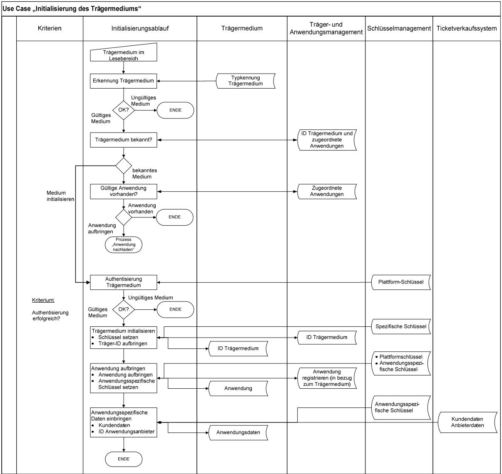

**Abbildung 7-1 Anwendungsfall "Initialisierung des Trägermediums"** 

### **7.3 Anwendungsfall "Nachladen der Anwendung"**

Die Darstellung des Anwendungsfalls "Nachladen der Anwendung" in [Abbildung 7-2](#page-37-1) deckt den Sonderfall des Nachladens einer Anwendung auf ein bereits im Besitz des Kunden befindliches Trägermedium ab. Dabei kann es sich um eine kontaktlose Chipkarte oder ein NFC-Mobiltelefon handeln.

Beim Nachladen einer Anwendung kann es verschiedene Szenarien geben:

- 1 Nachladen der Anwendung über die kontaktlose Schnittstelle in einer vertrauenswürdigen Umgebung
- 2 Nachladen der Anwendung über die kontaktlose Schnittstelle in einer unsicheren Umgebung. Dieser Fall kann z. B. beim Laden einer Anwendung auf eine kontaktlose Chipkarte über ein Lesegerät am Heim-PC oder in einer Vorverkaufsstelle eintreten.
- 3 Nachladen einer Anwendung "Over-the-Air" bei NFC-Mobiltelefonen.

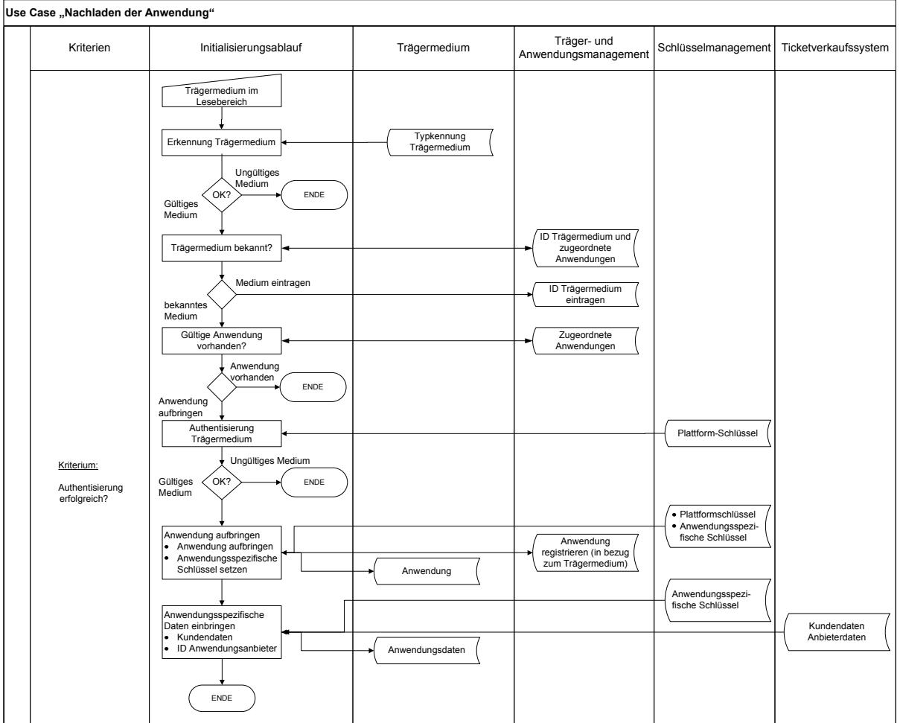

**Abbildung 7-2 Anwendungsfall "Nachladen der Anwendung"** 

### **7.4 Anwendungsfall "Einbringen der Berechtigung"**

Sobald das Trägermedium initialisiert und die Anwendungen installiert sind, können Berechtigungen in die Anwendungen geladen werden.

Der Verkauf der Produkte ist direkt von der sicheren und kundenfreundlichen Abwicklung dieses Anwendungsfalls abhängig. Er ist deshalb für den Anbieter und den Kunden von elementarer Bedeutung. Bei der Betrachtung des in [Abbildung 7-3](#page-38-1) dargestellten Anwendungsfalls "Einbringen der Berechtigung" müssen alle Vertriebskanäle aus der Prozessbeschreibung P2 (Kapitel [6.2\)](#page-31-2) entsprechend berücksichtigt werden.

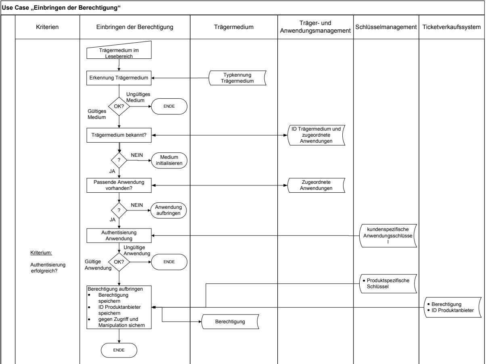

**Abbildung 7-3 Anwendungsfall "Einbringen der Berechtigung"** 

Es muss zwischen dem Einbringen der Berechtigung bei der Erstausgabe des Trägermediums und dem Nachladen der Berechtigung unterschieden werden. Letzteres kann über das Internet per Heimleser, "Over-the-Air" in ein NFC-Mobiltelefon oder lokal in der Verkaufsstelle und am Automaten erfolgen.

# **7.5 Anwendungsfall "Auslieferung"**

Initialisierte und mit Berechtigungen versehene Trägermedien müssen entsprechend der Prozessbeschreibung P2 (Kapitel [6.2\)](#page-31-2) an den Kunden oder die Ausgabestelle ausgeliefert werden.

Mit der Auslieferung müssen vom Produktanbieter sicherheitsrelevante Informationen der Sendung im Ticketsystem dokumentiert werden. Dazu gehören:

- 1 Adressat
- 2 ID der Trägermedien, ID der Produkte
- 3 Versender
- 4 Abgabestelle, spezielle Vereinbarungen zur Übergabe.

### **7.6 Anwendungsfall "Zutritt zur Veranstaltung"**

Der Anwendungsfall "Zutritt zur Veranstaltung" bildet den ersten Teil des Prozesses P3.2 im Detail ab. Die konkrete Umsetzung ist von der jeweiligen Anwendung den damit verbundenen Datenmodellen und Algorithmen abhängig. Die folgende Abbildung zeigt den Ablauf.

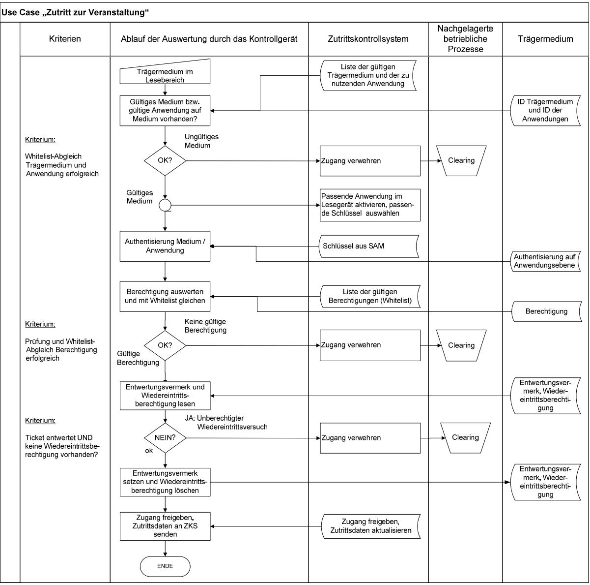

**Abbildung 7-4 Anwendungsfall "Zutritt zur Veranstaltung"** 

Im Fehlerfall wird an ein manuelles Clearing verwiesen. Üblicherweise wird der Kunde dabei von einem Ordner zum Service-Desk geleitet. Dort kann ggf. ein defektes Trägermedium umgetauscht werden.

### **7.7 Anwendungsfall "Verlassen der Veranstaltung mit Wiedereintrittsberechtigung"**

Der Anwendungsfall "Verlassen der Veranstaltung mit Zutrittsberechtigung" bildet den zweiten Teil des Prozesses P3.2 im Detail ab. Die konkrete Umsetzung ist von der jeweiligen Anwendung den damit verbundenen Datenmodellen und Algorithmen abhängig. Die folgende Abbildung zeigt den Ablauf.

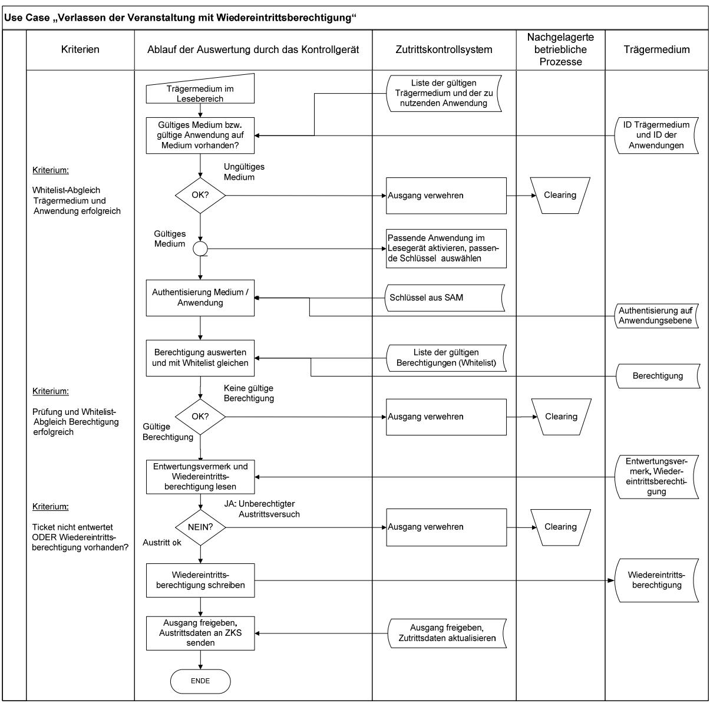

#### **Abbildung 7-5 Anwendungsfall "Verlassen der Veranstaltung mit Wiedereintrittsberechtigung"**

Im Fehlerfall wird an ein manuelles Clearing verwiesen. Üblicherweise wird der Kunde dabei von einem Ordner zum Service-Desk geleitet. Dort kann ggf. ein defektes Trägermedium umgetauscht werden.

### **7.8 Anwendungsfall "Sperrung"**

Trägermedien, die abhanden gekommen sind, sollen gesperrt werden können. Das gleiche gilt für defekte Medien oder Produkte sofern diese nicht eingezogen und vernichtet werden können.

Die Sperrung eines Mediums und/oder der darauf gespeicherten Berechtigung ist die Voraussetzung für die Ausstellung eines Ersatzmediums bzw. für die Überschreibung einer Berechtigung auf einen neuen Eigentümer mit einem anderen Kundenmedium.

Eine Sperrung kann nur erfolgen, wenn hinreichend sicher ist, dass der Kunde, der dieses wünscht, der rechtmäßige Besitzer des Mediums bzw. der Berechtigung ist. Deshalb ist eine Sperrung durch den Kunden nur in folgenden alternativen Fällen möglich:

- 1 Die Kundendaten sind beim Kauf gespeichert worden. Die Sperrung erfolgt aufgrund einer zuverlässigen Identifizierung und einer rechtsverbindliche Willenserklärung des Kunden.
- 2 Das Medium mit der Berechtigung wird vorgelegt. Die Echtheit kann sicher festgestellt werden.

Alternativ zur Sperrung durch den Kunden können auch andere Entitäten des Systems die Sperrung beantragen. Dazu werden für diese Entitäten im Gesamtsystem Verantwortlichkeiten und Prozesse definiert.

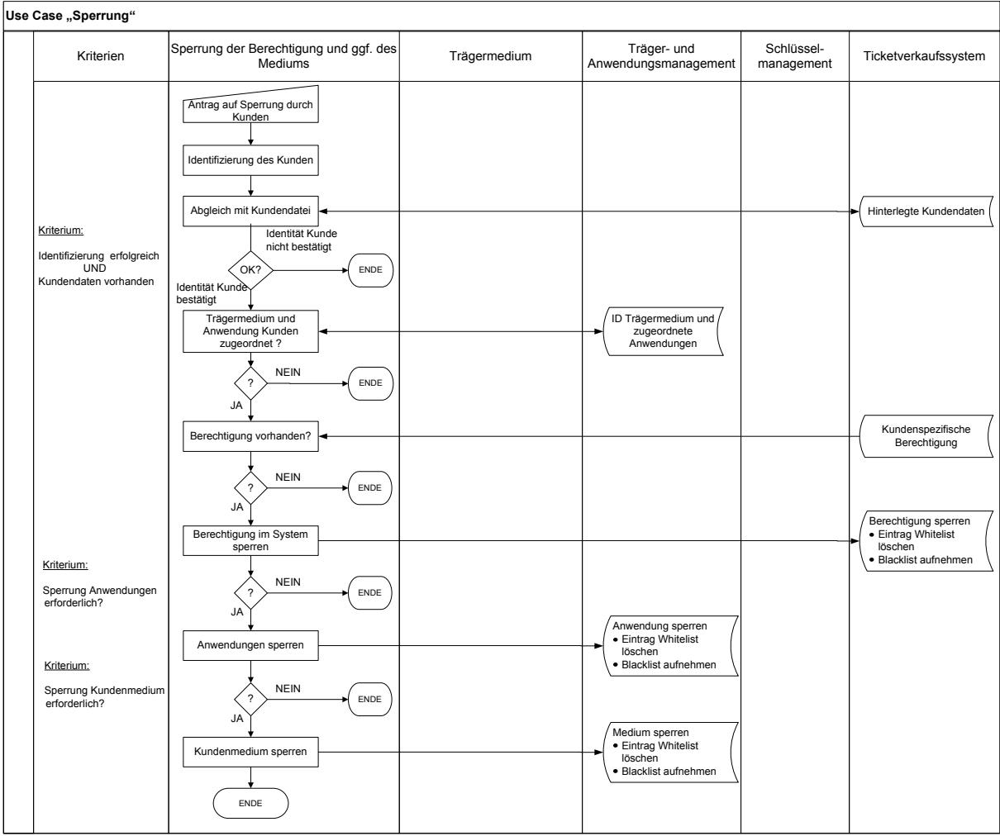

**Abbildung 7-6 Anwendungsfall "Sperrung"** 

### **7.9 Anwendungsfälle "Schlüsselmanagement"**

Zum Schutz der Berechtigungen auf Trägermedien kommen aus Gründen der Performanz überwiegend Verfahren zum Einsatz, die symmetrische Schlüssel nutzen. Die Sicherheit und Funktionsfähigkeit des Gesamtsystems hängt damit entscheidend von der sicheren Bereitstellung und Verwahrung der Schlüssel ab. Diese Aufgabe muss durch das Schlüsselmanagement und dessen zugeordnete Prozesse geleistet werden.

In den folgenden Darstellungen der Anwendungsfälle wird mit **Secure Authentication Modules** (**SAM**) als sicheren Speichern für Schlüsselinformationen, Sicherheitsmechanismen und Diversifikationsalgorithmen gearbeitet. Prinzipiell sind auch andere Verfahren denkbar. Zum Initialisieren des Trägermediums und beim Aufbringen der Berechtigungen ist ein Schlüsselmanagement erforderlich, das die hierarchische Beziehung von Trägermedium, Anwendungen und Produkten/Berechtigungen berücksichtigt.

In den folgenden Abbildungen ist zur Vereinfachung jeweils nur der Vorgang der erstmaligen Bestellung von SAMs dargestellt. In der Praxis wird es immer wieder zu Nachbestellungen kommen, die dann entsprechend abzuwickeln sind. Bei solchen Nachbestellungen werden üblicherweise bereits vorhandene Masterkeys genutzt.

### **7.9.1 Schlüsselmanagement für das Initialisieren der Trägermedien**

Die Darstellung in [Abbildung 7-7](#page-42-1) beschreibt den Anwendungsfall zum Schlüsselmanagement für das Initialisieren der Trägermedien. Die hier definierten Schlüssel und Verfahren sind auch für das Aufbringen von Anwendungen erforderlich.

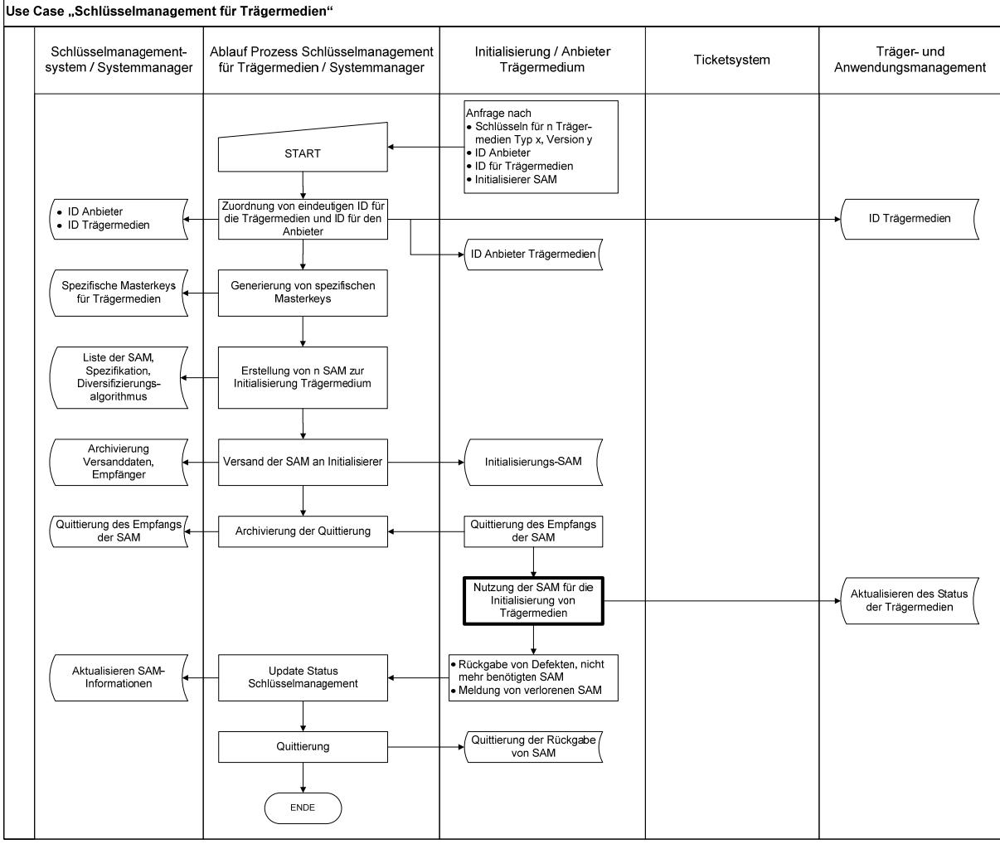

**Abbildung 7-7 Anwendungsfall "Schlüsselmanagement für Trägermedien"** 

### **7.9.2 Schlüsselmanagement für das Aufbringen und Personalisieren der Anwendungen**

Zur Sicherung von Anwendungen, die bei der Erstellung der Trägermedien oder im Nachhinein aufgebracht werden, sind spezielle Schlüssel und Kennungen für die Anwendung zu erstellen.

[Abbildung 7-8](#page-43-1) zeigt den entsprechenden Anwendungsfall. Beim Aufbringen der Anwendung auf das Trägermedium muss das Schlüsselmanagement für Trägermedien ebenfalls zur Verfügung stehen.

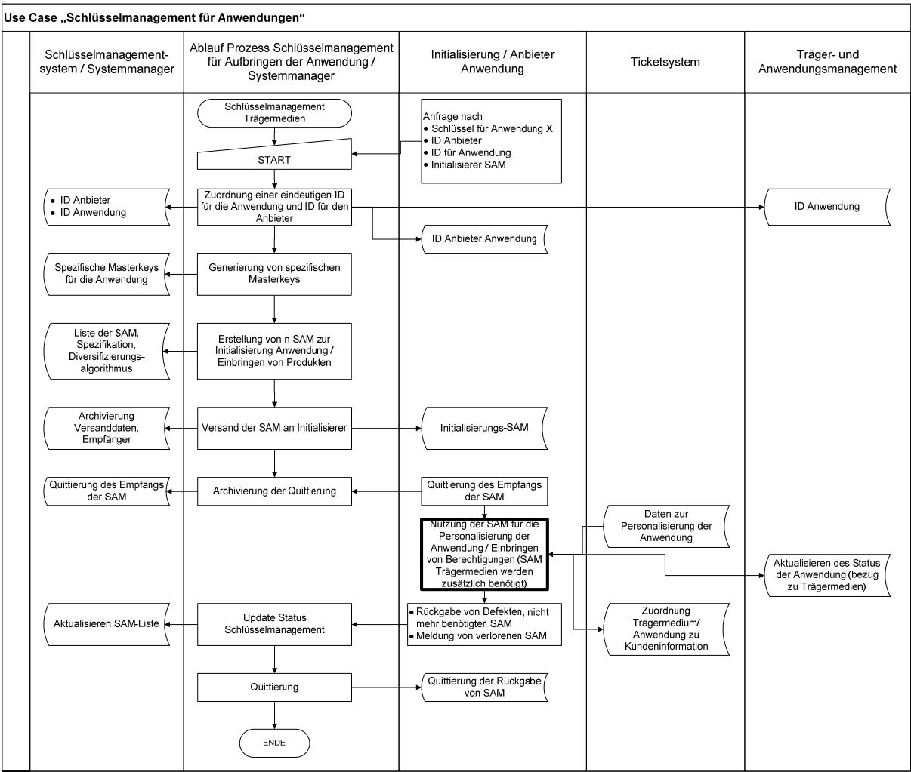

**Abbildung 7-8 Anwendungsfall "Schlüsselmanagement für Anwendungen"** 

### **7.9.3 Schlüsselmanagement für das Einbringen der Berechtigungen**

Zur Sicherung von Berechtigungen, die bei der Erstellung der Trägermedien oder im Nachhinein aufgebracht werden, sind spezielle Schlüssel und Kennungen für die Produkte zu erstellen.

[Abbildung 7-9](#page-44-1) zeigt den entsprechenden Anwendungsfall. Beim Einbringen der Berechtigung in die Anwendung muss das Schlüsselmanagement für Anwendungen ebenfalls zur Verfügung stehen.

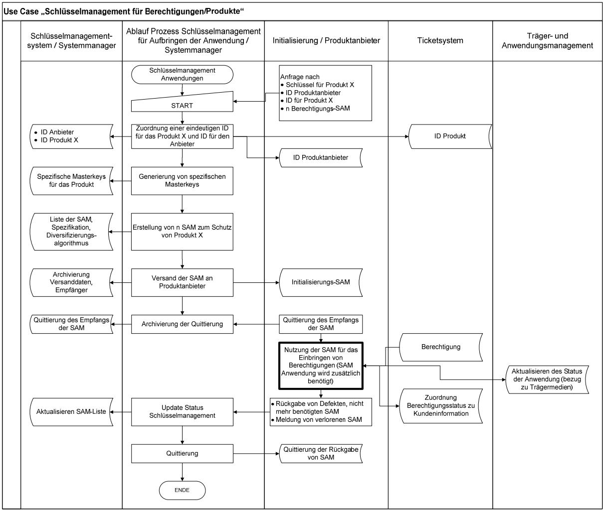

**Abbildung 7-9 Anwendungsfall "Schlüsselmanagement für Produkte/Berechtigungen"** 

### **7.9.4 Schlüsselmanagement für die Nutzung beim Betreiber der Veranstaltung**

Die Anbieter und Herausgeber benötigen ein Schlüsselmanagement für die Initialisierung der Trägermedien und das Ausstellen der Berechtigungen.

Der Betreiber der Veranstaltung ist auf die Schlüssel und andere Informationen zum Lesen und zur Auswertung der Berechtigungen angewiesen.

Diese Informationen müssen im Kontrollsystem vorliegen.

Zu diesem Zweck werden vom Sicherheitsmanager über das Schlüsselmanagement üblicherweise spezifische SAM (Dienstleister-SAM) für den Betreiber erstellt und übergeben. Betreiber-SAM können Schlüsselinformationen mehrerer Anbieter von Produkten, Anwendungen und Trägermedien enthalten. Die Zusammenstellung der Auswahl erfolgt durch den Sicherheitsmanager nach den Bedürfnissen des Betreibers.

# **8 Sicherheitsbetrachtungen**

### **8.1 Definitionen zum Thema Sicherheit und Datenschutz**

Es existieren drei Aspekte oder Unterscheidungsbereiche der Sicherheit, die im Rahmen dieses Dokuments betrachtet werden sollen. Es sind dies:

- Funktionssicherheit (Safety)
- Informationssicherheit (Security)
- Datenschutz (Privacy)

Diese Unterscheidungsbereiche lassen sich wie im Folgenden dargestellt untergliedern:

1 Funktionssicherheit

Funktionssicherheit wird vielfach mit Zuverlässigkeit/Korrektheit oder Quality of Service verwechselt. Zuverlässigkeit bedeutet, dass das System entsprechend seiner Spezifikation korrekt arbeitet. Die Erfahrung zeigt, dass jedes technische System fehleranfällig ist. Unter Funktionssicherheit wird nun die Eigenschaft eines Systems verstanden, trotz aufgetretener Systemfehler nicht in unkontrollierbare Systemzustände zu geraten, in denen das System selbst oder seine Umwelt in Gefahr gebracht werden (Fail Safe). Zugleich soll das System noch weitestgehend konform seiner Spezifikation reagieren (Fault Tolerance). D.h. unter Funktionssicherheit wird im Wesentlichen der Schutz vor unbeabsichtigten Ereignissen verstanden.

2 Informationssicherheit

Informationssicherheit betrachtet im Gegensatz zur Funktionssicherheit den Schutz vor beabsichtigten Angriffen.

Im Bereich Informationssicherheit lassen sich Sicherheitsziele in folgenden Klassen formulieren:

- a Vertraulichkeit: Vertraulichkeit ist der Schutz vor unbefugter Preisgabe von Informationen. Vertrauliche Daten und Informationen dürfen ausschließlich Befugten in der zulässigen Weise zugänglich sein. Als Schutzziel formuliert bedeutet dies: Gespeicherte bzw. zu kommunizierende Informationen sind vor dem Zugriff von Unbefugten zu schützen.
- b Integrität: Integrität bezeichnet die Sicherstellung der Korrektheit (Unversehrtheit) von Daten und der korrekten Funktionsweise von Systemen. Als Schutzziel formuliert bedeutet dies: Gespeicherte bzw. zu kommunizierende Informationen sind vor unberechtigter Veränderung zu schützen
- c Verfügbarkeit: Die Verfügbarkeit von Dienstleistungen, Funktionen eines IT-Systems, IT-Anwendungen oder IT-Netzen oder auch von Informationen ist vorhanden, wenn diese den Benutzern stets wie gewünscht zur Verfügung stehen. Als Schutzziel formuliert bedeutet dies: Informationen und Betriebsmittel sind vor unbefugter Vorenthaltung zu schützen.
- d Unverknüpfbarkeit: Unverknüpfbarkeit zweier Kommunikationselemente innerhalb eines Systems bedeutet, dass diese Kommunikationselemente nicht mehr oder weniger miteinander in Beziehung stehen, als es schon durch ein Vorwissen bekannt ist. Innerhalb des Systems können keine weiteren Informationen über die Beziehung zwischen diesen Kommunikationselementen erlangt werden. Praktisch bedeutet dies z. B., dass ein und derselbe Benutzer Dienste oder Ressourcen mehrmalig in Anspruch nehmen kann, wobei Dritte nicht erkennen können, dass

diese Anfragen (im Kommunikationsmodell: Nachrichten) über den Benutzer in Verbindung stehen.

- e Unbeobachtbarkeit: Unbeobachtbarkeit eines Ereignisses ist derjenige Zustand, in dem nicht zu entscheiden ist, ob dieses Ereignis stattfindet oder nicht. Somit kann bei Sender-Unbeobachtbarkeit nicht erkannt werden, ob überhaupt gesendet wird. Empfänger-Unbeobachtbarkeit ist analog definiert, es kann nicht festgestellt werden ob empfangen wird oder nicht. Beziehungs-Unbeobachtbarkeit bedeutet, dass nicht erkennbar ist, ob aus der Menge der möglichen Sender zur Menge der möglichen Empfänger gesendet wird.
- f Anonymität: Anonymität ist der Zustand, in dem man innerhalb seiner Anonymitätsgruppe nicht identifizierbar ist. Mit Hilfe des Begriffs Unverknüpfbarkeit lässt sich Anonymität nun präzisieren zu Unverknüpfbarkeit zwischen der Identität des Benutzers und des von ihm ausgelösten Ereignisses. Somit gibt es Sender-Anonymität als Unverknüpfbarkeit zwischen Sender und Nachricht und Empfänger-Anonymität entsprechend als Unverknüpfbarkeit zwischen Nachricht und Empfänger.
- g Authentizität: Mit dem Begriff Authentizität wird die Eigenschaft bezeichnet, die gewährleistet, dass ein Kommunikationspartner tatsächlich derjenige ist, der er vorgibt zu sein. Bei authentischen Informationen ist sichergestellt, dass sie von der angegebenen Quelle erstellt wurden. Der Begriff wird nicht nur verwendet, wenn die Identität von Personen geprüft wird, sondern auch bei IT-Komponenten oder Anwendungen.
- h Nichtabstreitbarkeit: Das Versenden bzw. Empfangen von Nachrichten durch authentisch festgestellte Personen ist gegen Abstreiten zu schützen.
- i Verbindlichkeit: Unter Verbindlichkeit werden die IT-Sicherheitsziele Authentizität und Nichtabstreitbarkeit zusammengefasst. Bei der Übertragung von Informationen bedeutet dies, dass die Informationsquelle ihre Identität bewiesen hat und der Empfang der Nachricht nicht in Abrede gestellt werden kann.
- 3 Datenschutz

Zweck des Datenschutzes ist es, den Einzelnen davor zu schützen, dass er durch den Umgang mit seinen personenbezogenen Daten in seinen Persönlichkeitsrechten beeinträchtigt wird.

Mit Datenschutz wird der Schutz personenbezogener Daten vor etwaigem Missbrauch durch Dritte bezeichnet (nicht zu verwechseln mit Datensicherheit).

Weiterhin sollen die folgenden Begrifflichkeiten einheitlich verwendet werden:

1 Sicherheitsziele

Sicherheitsziele sind sicherheitsrelevante Ziele bei der Realisierung eines IT-Systems. Im Rahmen dieses Dokuments werden spezifische Sicherheitsziele innerhalb von Einsatzgebieten und Einsatzszenarien festgelegt. Eine Verletzung der Sicherheitsziele erzeugt unmittelbaren Schaden für die Entität, deren Sicherheitsziel verletzt wird.

2 Gefährdungen

Gefährdungen sind unmittelbare Gefahren für die Sicherheitsziele der Anwendung. Diese können als Folge eines aktiven Angriffs auf eines oder mehrere Sicherheitsziele oder in Form von möglichen Schwächen des Systems, wie z. B. dem Fehlen einer Rückfalllösung, auftreten.

3 Maßnahmen

Maßnahmen sind konkrete Handlungsempfehlungen, die gegen eine oder mehrere Gefährdungen wirken. Die in diesem Dokument genannten Maßnahmen sollen sinnvoll und bedarfsgerecht sein, d.h. sie werden unter den Gesichtspunkten Wirtschaftlichkeit und

Manipulationsfestigkeit (Wie aufwändig ist eine Maßnahme und welche finanzielle Schadenshöhe kann damit begrenzt oder verhindert werden) empfohlen.

4 Restrisiko

Es ist in der Regel nicht möglich, allen Gefährdungen so entgegenzuwirken, dass ein System die perfekte Sicherheit bietet. Das Restrisiko ist daher das Risiko, das verbleibt, wenn eine Menge von Maßnahmen umgesetzt wurde und trotzdem noch Angriffe möglich sind. Die Höhe des Risikos hängt davon ab, welche Gegenmaßnahmen getroffen werden können, wie komplex diese sind und vor allem, welches Ergebnis eine Kosten-Nutzen-Rechnung der jeweiligen Entität erbringt. Das Restrisiko muss von der Entität explizit getragen werden.

## **8.2 Definition der Sicherheitsziele**

Im seltensten Fall sind alle im Bereich Funktionssicherheit, Informationssicherheit und Datenschutz genannten Sicherheitsaspekte für ein gegebenes Einsatzszenario gleichwichtig bzw. überhaupt relevant. Die Herausforderung bei der Konzeption eines sicheren RFID-Einsatzes liegt zuerst dementsprechend in der Formulierung spezifischer Sicherheitsziele.

Innerhalb der Einsatzgebiete zum eTicketing sind basierend auf den vorgenannten generischen Sicherheitszielen *übergeordnete* einsatzgebietsspezifische Sicherheitsziele zu erkennen:

- 1 Schutz der elektronischen Berechtigung (repräsentiert die Schutzziele Integrität und Authentizität)
- 2 Funktionssicherheit des RFID-Systems Schutz der Privatsphäre des Kunden (repräsentiert die Schutzziele Vertraulichkeit, Unverknüpfbarkeit, Unbeobachtbarkeit, Anonymität und Datenschutz als allgemeine Anforderung)

Aus den Betrachtungen der Sicherheitsziele der Entitäten in den folgenden Unterkapiteln ergeben sich die *untergeordneten* Sicherheitsziele, die in Kapitel [8.2.4](#page-53-1) zusammengefasst sind.

Die folgende Tabelle zeigt das Kodierungsschema der Sicherheitsziele sowie die verwendeten Abkürzungen.

| Feldnummer | 1                   | 2                    | 3                                                | 4         |
|------------|---------------------|----------------------|--------------------------------------------------|-----------|
| Feld       | Sicherheits ziel | Zugeordnete Entität  | Zugeordnetes gene risches Sicherheits ziel | Zählindex |
| Inhalt     | S                   | K := Kunde           | F := Funktionssi cherheit                     |           |
|            |                     | P := Produktanbieter | I := Informationssi cherheit                  | 1,  , n   |
|            |                     | D := Dienstleister   | P := Privatsphäre                                |           |

**Tabelle 8–1 Kodierungsschema der Sicherheitsziele** 

### **8.2.1 Spezifische Sicherheitsziele des Kunden**

Die spezifischen Sicherheitsziele des Kunden sind in den folgenden Unterkapiteln aufgeführt.

| Kurzbezeichnung des Sicherheitsziels |                                           | Beschreibung des Sicherheitsziels                                                                                                                                                                                                                                                                                                                                                               |  |
|-----------------------------------------|-------------------------------------------|-------------------------------------------------------------------------------------------------------------------------------------------------------------------------------------------------------------------------------------------------------------------------------------------------------------------------------------------------------------------------------------------------|--|
| SKF1                                    | Technische Kompatibilität              | Die Interaktion zwischen Kundenmedium und Lesegerät muss wie spezifiziert funktionieren. Dies muss für alle zugelassenen Kundenmedien an allen Lesegeräten in der gesamten System infrastruktur gelten. Dabei ist zu berücksichtigen, dass Träger medien und Infrastruktur von verschiedenen Herstellern geliefert und von verschiedenen Dienstleistern betrieben werden können. |  |
| SKF2                                    | Rückfalllösung bei Fehlfunkti onen  | Die Nutzung der Dienstleistung muss für Berechtigte auch dann möglich sein, wenn das Kundenmedium oder die Systeminfra struktur nicht einwandfrei funktionieren.                                                                                                                                                                                                                          |  |
| SKF3                                    | Intuitive, feh lertolerante Nutzung | Nutzung muss möglichst selbsterklärend bzw. einfach zu erler nen sein. Der Kunde muss zu jedem Zeitpunkt wissen, welchen Stand der Nutzungsprozess aufweist.                                                                                                                                                                                                                           |  |

### **8.2.1.1 Funktionssicherheit**

### **Tabelle 8–2 Sicherheitsziele des Kunden zur Funktionssicherheit**

### **8.2.1.2 Informationssicherheit**

| Kurzbezeichnung des Sicherheitsziels |                                        | Beschreibung des Sicherheitsziels                                                                                                                                                                                                                                                                                                                                                                                                                                  |  |
|-----------------------------------------|----------------------------------------|--------------------------------------------------------------------------------------------------------------------------------------------------------------------------------------------------------------------------------------------------------------------------------------------------------------------------------------------------------------------------------------------------------------------------------------------------------------------|--|
| SKI1                                    | Schutz der personenbe zogenen Da | Die im System und im Kundenmedium gespeicherten Kunden daten dienen zur Identifizierung des Kunden, zur Zahlung, zum Zustellen von Berechtigungen etc.                                                                                                                                                                                                                                                                                                       |  |
|                                         | ten                                    | Eine missbräuchliche Verwendung, Manipulation oder Weiter gabe an Unberechtigte wäre für den Kunden ggf. mit kommer ziellen Risiken und Verlust der Funktionssicherheit verbunden und muss verhindert werden.                                                                                                                                                                                                                                             |  |
| SKI2                                    | Schutz der Be rechtigungen          | Berechtigungen sind möglicherweise DoS-Angriffen bzw. Mani pulation durch Dritte ausgesetzt. Dies wäre für den Kunden mit Unannehmlichkeiten bzw. einem Schaden verbunden. Dieser Schaden ist normalerweise begrenzt, da üblicherweise der Dienst in Anspruch genommen werden kann, sofern der Kunde nachweisen kann, dass er eine gültige Berechtigung erstanden hat. Manipulation der Berechtigung durch Unbefugte muss ver hindert werden. |  |
| SKI3                                    | Schutz der Nutzungsdaten            | Sofern die Nutzungsdaten Einfluss auf die weitere Nutzung der Berechtigung oder die Abrechnung haben, müssen diese ver lässlich sein.                                                                                                                                                                                                                                                                                                                        |  |
| SKI4                                    | Zuverlässige Abrechnung             | Bei Nutzung muss der Zeitpunkt der Entwertung oder des Check-in / Check-out für den Kunden erkennbar sein.                                                                                                                                                                                                                                                                                                                                                      |  |
|                                         |                                        | Die Abrechnungsdaten (Post-Paid) müssen nachvollziehbar und zuverlässig sein.                                                                                                                                                                                                                                                                                                                                                                                   |  |

| Kurzbezeichnung des Sicherheitsziels |                                                     | Beschreibung des Sicherheitsziels                                                                                                                                                                                                                                                                                                                                                                                                                                                              |
|-----------------------------------------|-----------------------------------------------------|------------------------------------------------------------------------------------------------------------------------------------------------------------------------------------------------------------------------------------------------------------------------------------------------------------------------------------------------------------------------------------------------------------------------------------------------------------------------------------------------|
| SKI5                                    | Schutz von Anwendungen und Berechti gungen | Kundenmedien können mehr als eine Anwendung aufnehmen. Diese Anwendungen können verschiedenen Anwendungsher ausgebern gehören. Weiterhin kann eine Anwendung mehrere Berechtigungen aufnehmen, die von verschiedenen Produktei gentümern geliefert wurden. Es muss sichergestellt sein, dass Anwendungen und Berechtigungen technisch zuverlässig ge trennt sind oder Vereinbarungen zwischen den Entitäten beste hen, die die mehrseitige Nutzung oder Konflikte regeln. |

### **Tabelle 8–3 Sicherheitsziele des Kunden zur Informationssicherheit**

### **8.2.1.3 Schutz der Privatsphäre**

| Kurzbezeichnung des Sicherheitsziels |                                                          | Beschreibung des Sicherheitsziels                                                                                                                                                                   |
|-----------------------------------------|----------------------------------------------------------|-----------------------------------------------------------------------------------------------------------------------------------------------------------------------------------------------------|
| SKP1                                    | Schutz der personenbe zogene Daten                 | Personenbezogene Daten, die dem Produktanbieter übergeben wurden, müssen vertraulich behandelt werden und dürfen nur für die vereinbarten Zwecke eingesetzt werden.                           |
| SKP2                                    | Schutz der Nutzungsdaten                              | Nicht anonymisierte, personenbezogene Daten über die Nut zung des Dienstes dürfen nur nach Zustimmung des Kunden für Zwecke des Produktanbieters oder des Dienstleisters verwendet werden. |
| SKP3                                    | Schutz vor der Erzeugung von Bewegungs profilen | Es ist zu verhindern, dass Dritte durch Nutzung der RFID Technologie Bewegungsprofile des Kunden erstellen können.                                                                               |
| SKP4                                    | Schutz vor Gewalttätern                               | Schutz vor gewaltbereiten Fans oder Personen, die Gewaltakte ausführen wollen.                                                                                                                   |

**Tabelle 8–4 Sicherheitsziele des Kunden zum Schutz der Privatsphäre** 

### **8.2.2 Spezifische Sicherheitsziele des Produktanbieters**

Die spezifischen Sicherheitsziele des Produktanbieters sind in den folgenden Unterkapiteln aufgeführt.

### **8.2.2.1 Funktionssicherheit**

| Kurzbezeichnung des Sicherheitsziels |                              | Beschreibung des Sicherheitsziels                                                                                                                                                                                                                                                                                                                                                               |
|-----------------------------------------|------------------------------|-------------------------------------------------------------------------------------------------------------------------------------------------------------------------------------------------------------------------------------------------------------------------------------------------------------------------------------------------------------------------------------------------|
| SPF1                                    | Technische Kompatibilität | Die Interaktion zwischen Kundenmedium und Lesegerät muss wie spezifiziert funktionieren. Dies muss für alle zugelassenen Kundenmedien an allen Lesegeräten in der gesamten System infrastruktur gelten. Dabei ist zu berücksichtigen, dass Träger medien und Infrastruktur von verschiedenen Herstellern geliefert und von verschiedenen Dienstleistern betrieben werden können. |

| SPF2 | Rückfalllösung bei Fehlfunkti onen                | Die Erbringung der Dienstleistung für den Kunden sollte auch dann möglich sein, wenn das Kundenmedium oder die System infrastruktur nicht einwandfrei funktionieren.                                                                         |
|------|---------------------------------------------------------|----------------------------------------------------------------------------------------------------------------------------------------------------------------------------------------------------------------------------------------------------|
| SPF3 | Intuitive, feh lertolerante Nutzung               | Fehlerfreie Nutzung durch den Kunden muss mit geringem Er klärungsaufwand möglich sein. Der Kunde muss zu jedem Zeitpunkt wissen, welchen Stand der Nutzungsprozess aufweist.                                                             |
| SPF4 | Aufrechterhal tung einer ho hen Verfüg barkeit | Der Zutritt zu Veranstaltungen erfordert teilweise sehr hohen Durchsatz. Die Kunden sind dabei zum Teil begrenzt beein flussbar. Es muss verhindert werden, dass durch Störungen des Systems Betriebs- und Sicherheitsprobleme entstehen. |

| Tabelle 8–5 | Sicherheitsziele des Produktanbieters zur Funktionssicherheit |
|-------------|---------------------------------------------------------------|
|             |                                                               |

### **8.2.2.2 Informationssicherheit**

| Kurzbezeichnung des Sicherheitsziels |                                        | Beschreibung des Sicherheitsziels                                                                                                                                                                                                                                                     |
|-----------------------------------------|----------------------------------------|---------------------------------------------------------------------------------------------------------------------------------------------------------------------------------------------------------------------------------------------------------------------------------------|
| SPI1                                    | Schutz der personenbe zogenen Da | Die im System und im Kundenmedium gespeicherten Kunden daten dienen zur Identifizierung des Kunden, zur Zahlung, zum Zustellen von Berechtigungen etc.                                                                                                                          |
|                                         | ten                                    | Eine missbräuchliche Verwendung, Manipulation oder Weiter gabe an Unberechtigte wäre für den Produktanbieter z. B. mit kommerziellen Risiken oder Verlust der Kundenakzeptanz ver bunden und würde ggf. als Gesetzesverstoß geahndet werden. Dies muss verhindert werden. |
| SPI2                                    | Schutz der Be rechtigungen          | Die Manipulation, die Störung und insbesondere die Fälschung von Berechtigungen wären für den Produktanbieter, den Pro dukteigentümer und den Dienstleister ggf. mit erheblichem kommerziellem Schaden verbunden.                                                            |
|                                         |                                        | Die Fälschungssicherheit von Berechtigungen ist ein wichtiges Ziel des Produkteigentümers.                                                                                                                                                                                         |
| SPI3                                    | Schutz der Nutzungsdaten            | Die Verfügbarkeit und Integrität der Nutzungsdaten ist für den Produktanbieter, den Produkteigentümer und den Dienstleister von großem Wert. Sie dienen zur Abrechnung, zur Planung von Produkten, Kapazitäten und zur Kundenbindung.                                        |
| SPI4                                    | Zuverlässige Abrechnung             | Die richtige Zuordnung der Erlöse aus dem Verkauf von Berech tigungen durch den Produktanbieter zu den vom Dienstleister erbrachten Leistungen ist sicherzustellen.                                                                                                             |

| Kurzbezeichnung des Sicherheitsziels |                                                     | Beschreibung des Sicherheitsziels                                                                                                                                                                                                                                                                                                                                                                                                                                                              |
|-----------------------------------------|-----------------------------------------------------|------------------------------------------------------------------------------------------------------------------------------------------------------------------------------------------------------------------------------------------------------------------------------------------------------------------------------------------------------------------------------------------------------------------------------------------------------------------------------------------------|
| SPI5                                    | Schutz von Anwendungen und Berechti gungen | Kundenmedien können mehr als eine Anwendung aufnehmen. Diese Anwendungen können verschiedenen Anwendungsher ausgebern gehören. Weiterhin kann eine Anwendung mehrere Berechtigungen aufnehmen, die von verschiedenen Produktei gentümern geliefert wurden. Es muss sichergestellt sein, dass Anwendungen und Berechtigungen technisch zuverlässig ge trennt sind oder Vereinbarungen zwischen den Entitäten beste hen, die die mehrseitige Nutzung oder Konflikte regeln. |

**Tabelle 8–6 Sicherheitsziele des Produktanbieters zur Informationssicherheit** 

### **8.2.2.3 Schutz der Privatsphäre**

| Kurzbezeichnung des Sicherheitsziels |                                          | Beschreibung des Sicherheitsziels                                                                                                                                                                                                                                                                  |
|-----------------------------------------|------------------------------------------|----------------------------------------------------------------------------------------------------------------------------------------------------------------------------------------------------------------------------------------------------------------------------------------------------|
| SPP1                                    | Schutz der personenbe zogene Daten | Eine missbräuchliche Verwendung, Manipulation oder Weiter gabe an Unberechtigte wäre für den Kundenvertragspartner ggf. mit kommerziellen Risiken oder Verlust der Kundenakzeptanz verbunden und würde ggf. als Gesetzesverstoß geahndet wer den. Dies muss daher verhindert werden.   |
| SPP2                                    | Schutz der Nutzungsdaten              | Nicht anonymisierte, personenbezogene Daten über die Nut zung des Dienstes dürfen nur nach Zustimmung des Kunden für Zwecke des Produktanbieters verwendet werden. Das Ziel ist, für gewisse Produkte diese Zustimmung zu erhalten, um z. B. eine Post-Paid-Abrechnung zu ermöglichen. |
| SPP4                                    | Schutz vor Gewalttätern               | Schutz vor gewaltbereiten Fans oder Personen, die Gewaltakte ausführen wollen.                                                                                                                                                                                                                  |
| SPP5                                    | Datenspar samkeit                     | Es dürfen nicht mehr Daten gesammelt und gespeichert werden, als für den spezifischen Zweck nötig sind.                                                                                                                                                                                         |

**Tabelle 8–7 Sicherheitsziele des Produktanbieters zum Schutz der Privatsphäre** 

### **8.2.3 Spezifische Sicherheitsziele des Dienstleisters**

Die spezifischen Sicherheitsziele des Dienstleisters sind in den folgenden Unterkapiteln aufgeführt.

### **8.2.3.1 Funktionssicherheit**

| Kurzbezeichnung des Sicherheitsziels |                              | Beschreibung des Sicherheitsziels                                                                                                                                                                                                                                                                                                                                 |
|-----------------------------------------|------------------------------|-------------------------------------------------------------------------------------------------------------------------------------------------------------------------------------------------------------------------------------------------------------------------------------------------------------------------------------------------------------------|
| SDF1                                    | Technische Kompatibilität | Die in den verschiedenen Kundenmedien gespeicherten Berech tigungen müssen wie spezifiziert funktionieren. Dies muss für alle zugelassenen Kundenmedien an allen Lesegeräten in der gesamten Systeminfrastruktur des Dienstleisters gelten. Dabei ist zu berücksichtigen, dass Trägermedien von verschiedenen Herstellern geliefert werden können. |

| Kurzbezeichnung des Sicherheitsziels |                                                         | Beschreibung des Sicherheitsziels                                                                                                                                                                                                                  |
|-----------------------------------------|---------------------------------------------------------|----------------------------------------------------------------------------------------------------------------------------------------------------------------------------------------------------------------------------------------------------|
| SDF2                                    | Rückfalllösung bei Fehlfunkti onen                | Die Erbringung der Dienstleistung muss auch dann möglich sein, wenn das Kundenmedium oder die Systeminfrastruktur nicht einwandfrei funktionieren. Das Vorhandensein einer Be rechtigung muss nachweisbar sein.                           |
| SDF3                                    | Intuitive, feh lertolerante Nutzung               | Nutzung durch den Kunden muss mit geringer Fehlerquote mög lich sein. Der Kunde muss zu jedem Zeitpunkt wissen, welchen Stand der Nutzungsprozess aufweist.                                                                               |
| SDF4                                    | Aufrechterhal tung einer ho hen Verfüg barkeit | Der Zutritt zu Veranstaltungen erfordert teilweise sehr hohen Durchsatz. Die Kunden sind dabei zum Teil begrenzt beein flussbar. Es muss verhindert werden, dass durch Störungen des Systems Betriebs- und Sicherheitsprobleme entstehen. |

| Tabelle 8–8 | Sicherheitsziele des Dienstleisters zur Funktionssicherheit |
|-------------|-------------------------------------------------------------|
|-------------|-------------------------------------------------------------|

### **8.2.3.2 Informationssicherheit**

| Kurzbezeichnung des Sicherheitsziels |                                               | Beschreibung des Sicherheitsziels                                                                                                                                                                                                                                              |
|-----------------------------------------|-----------------------------------------------|--------------------------------------------------------------------------------------------------------------------------------------------------------------------------------------------------------------------------------------------------------------------------------|
| SDI1                                    | Schutz der personenbe zogenen Da ten | Die im System und im Kundenmedium gespeicherten Kunden daten dienen zur Identifizierung des Kunden, zur Zahlung, zum Zustellen von Berechtigungen etc.                                                                                                                   |
|                                         |                                               | Eine missbräuchliche Verwendung, Manipulation oder Weiter gabe an Unberechtigte wäre für den Dienstleister ggf. mit kom merziellen Risiken, Verlust der Kundenakzeptanz und würde ggf. als Gesetzesverstoß geahndet werden. Dies muss verhin dert werden.          |
| SDI2                                    | Schutz der Be rechtigungen                 | Die Manipulation, die Störung und insbesondere die Fälschung von Berechtigungen wäre für für den Produktanbieter, den Pro dukteigentümer und den Dienstleister ggf. mit erheblichem kommerziellem Schaden verbunden.                                                  |
|                                         |                                               | Die Fälschungssicherheit von Berechtigungen ist ein wichtiges Ziel des Dienstleisters. Zusätzlich erfolgt die Nutzung der Be rechtigungen in der Systeminfrastruktur des Dienstleisters. Auch hier muss der Schutz der Berechtigung gewährleistet sein.               |
| SDI3                                    | Schutz der Nutzungsdaten                   | Nutzungsdaten sind für den Dienstleister von großem Wert. Sie dienen zur Abrechnung und zur Planung von Kapazitäten.                                                                                                                                                        |
|                                         |                                               | Kundenspezifische Nutzungsdaten sind aus Sicht des Kunden und aufgrund gesetzlicher Vorschriften vom Dienstleister ver traulich zu behandeln. Zuwiderhandlung hätte den Verlust der Kundenakzeptanz zur Folge und würde ggf. als Gesetzesver stoß geahndet werden. |
| SDI4                                    | Zuverlässige Abrechnung                    | Die richtige Zuordnung der Erlöse aus dem Verkauf von Berech tigungen durch den Produktanbieter zu den vom Dienstleister erbrachten Leistungen ist sicherzustellen.                                                                                                      |

| Kurzbezeichnung des Sicherheitsziels |                                                     | Beschreibung des Sicherheitsziels                                                                                                                                                                                                                                                                                                                                                                                                                                                              |
|-----------------------------------------|-----------------------------------------------------|------------------------------------------------------------------------------------------------------------------------------------------------------------------------------------------------------------------------------------------------------------------------------------------------------------------------------------------------------------------------------------------------------------------------------------------------------------------------------------------------|
| SDI5                                    | Schutz von Anwendungen und Berechti gungen | Kundenmedien können mehr als eine Anwendung aufnehmen. Diese Anwendungen können verschiedenen Anwendungsher ausgebern gehören. Weiterhin kann eine Anwendung mehrere Berechtigungen aufnehmen, die von verschiedenen Produktei gentümern geliefert wurden. Es muss sichergestellt sein, dass Anwendungen und Berechtigungen technisch zuverlässig ge trennt sind oder Vereinbarungen zwischen den Entitäten beste hen, die die mehrseitige Nutzung oder Konflikte regeln. |

#### **Tabelle 8–9 Sicherheitsziele des Dienstleisters zur Informationssicherheit**

### **8.2.3.3 Schutz der Privatsphäre**

| Kurzbezeichnung des Sicherheitsziels |                                               | Beschreibung des Sicherheitsziels                                                                                                                                                                                                                                                                |  |
|-----------------------------------------|-----------------------------------------------|--------------------------------------------------------------------------------------------------------------------------------------------------------------------------------------------------------------------------------------------------------------------------------------------------|--|
| SDP1                                    | Schutz der personenbe zogenen Da ten | Eine missbräuchliche Verwendung, Manipulation oder Weiter gabe an Unberechtigte wäre für den Dienstleister ggf. mit kom merziellen Risiken, Verlust der Kundenakzeptanz verbunden und würde ggf. als Gesetzesverstoß geahndet werden. Dies muss verhindert werden.                   |  |
| SDP2                                    | Schutz der Nutzungsdaten                   | Nicht anonymisierte, personenbezogene Daten über die Nut zung des Dienstes dürfen nur nach Zustimmung des Kunden für Zwecke des Dienstleisters verwendet werden. Das Ziel ist, für gewisse Produkte diese Zustimmung zu erhalten, um z. B. eine Post-Paid-Abrechnung zu ermöglichen. |  |
| SDP4                                    | Schutz vor Gewalttätern                    | Schutz vor gewaltbereiten Fans oder Personen, die Gewaltakte ausführen wollen. Befolgen von Auflagen der Veranstalter.                                                                                                                                                                        |  |
| SDP5                                    | Datenspar samkeit                          | Es dürfen nicht mehr Daten gesammelt und gespeichert werden, als für den spezifischen Zweck nötig sind.                                                                                                                                                                                       |  |

**Tabelle 8–10 Sicherheitsziele des Dienstleisters zum Schutz der Privatsphäre** 

### **8.2.4 Zusammenfassung der Sicherheitsziele der Entitäten**

Die folgende Tabelle fasst die vorstehend genannten Sicherheitsziele der verschiedenen Akteure zusammen.

| Sicherheitsziel |                                                 | Ziele Kunde | Ziele Pro duktanbie ter | Ziele Dienstleiste r |
|-----------------|-------------------------------------------------|-------------|-------------------------------|----------------------------|
| SF1             | Technische Kompatibilität                       | SKF1        | SPF1                          | SDF1                       |
| SF2             | Rückfalllösung bei Fehlfunktionen               | SKF2        | SPF2                          | SDF2                       |
| SF3             | Intuitive, fehlertolerante Nutzung              | SKF3        | SPF3                          | SDF3                       |
| SF4             | Aufrechterhaltung einer hohen Ver fügbarkeit |             | SPF4                          | SDF4                       |

| SI1 | Schutz der personenbezogenen Daten                       | SKI1, SKP1          | SPI1, SPP1          | SDI1, SDP1          |
|-----|-------------------------------------------------------------|---------------------|---------------------|---------------------|
| SI2 | Schutz der Berechtigungen                                   | SKI2                | SPI2                | SDI2                |
| SI3 | Schutz der Logistikdaten (anony misierten Nutzungsdaten) |                     | SPI3                | SDI3                |
| SI4 | Zuverlässige Abrechnung                                     | SKI3, SKI4, SKP2 | SPI3, SPI4, SPP2 | SDI3, SDI4, SDP2 |
| SI5 | Schutz von Anwendungen und Be rechtigungen               | SKI5                | SPI5                | SDI5                |
| SP3 | Schutz vor der Erzeugung von Be wegungsprofilen          | SKP3                |                     |                     |
| SP4 | Schutz vor Gewalttätern                                     | SKP4                | SPP4                | SDP4                |
| SP5 | Datensparsamkeit                                            |                     | SPP5                | SDP5                |

| Tabelle 8-11 | Übersicht über die Sicherheitsziele der Entitäten |
|--------------|---------------------------------------------------|
|--------------|---------------------------------------------------|

### **8.2.5 Bildung von Schutzbedarfsklassen**

Basierend auf den Sicherheitszielen aus Kapitel [8.2.4](#page-53-1) werden 3 Schutzbedarfsklassen gebildet. Klasse 1 repräsentiert den geringsten Schutzbedarf, Klasse 3 den höchsten.

Die in der folgenden Tabelle angeführten Kriterien zur Zuordnung des Schutzbedarfs in eine Schutzbedarfsklasse basieren auf der Annahme der Situation im Falle, dass keine Schutzmassnahmen ergriffen werden.

| Sicherheitsziel |                                          | Schutz bedarfs klasse | Kriterien zur Einordnung in Schutzbedarfsklassen                                                                                                   |
|-----------------|------------------------------------------|-----------------------------|----------------------------------------------------------------------------------------------------------------------------------------------------|
| SF1             | Technische Kom patibilität            | 1                           | Alle Systemkomponenten sind vom gleichen Lie feranten. Der Lieferant sorgt für Kompatibilität.                                                  |
|                 |                                          | 2                           | Das System muss mit Komponenten von wenigen definierten Lieferanten funktionieren. Der Sys temmanager oder ein SI sorgen für Kompatibilität. |
|                 |                                          | 3                           | Offenes System, das mit Komponenten von allen Marktteilnehmern funktionieren soll.                                                              |
| SF2             | Rückfalllösung bei Fehlfunktio nen | 1                           | Fehlfunktion betrifft einzelne Kunden                                                                                                              |
|                 |                                          | 2                           | Fehlfunktion betrifft größere Kundenmenge                                                                                                          |
|                 |                                          | 3                           | Fehlfunktion betrifft fast alle Kunden                                                                                                             |
| SF3             | Intuitive, fehlerto lerante Nutzung   | 1                           | Intuitiv nicht bedienbar von einzelnen Kunden                                                                                                      |
|                 |                                          | 2                           | Intuitiv nicht bedienbar von größerer Kunden menge                                                                                              |
|                 |                                          | 3                           | Intuitiv nicht bedienbar von einem großen Teil der Kunden                                                                                       |

| Sicherheitsziel |                                                                    | Schutz bedarfs klasse | Kriterien zur Einordnung in Schutzbedarfsklassen                                                                                                                                  |  |
|-----------------|--------------------------------------------------------------------|-----------------------------|-----------------------------------------------------------------------------------------------------------------------------------------------------------------------------------|--|
| SF4             | Verfügbarkeit                                                      | 1                           | Durchsatz beim Zutritt und Kundenverhalten un problematisch                                                                                                                    |  |
|                 |                                                                    | 2                           | Zeitlich oder lokal begrenzte Ausfälle bereiten Be triebs- und Sicherheitsprobleme                                                                                             |  |
|                 |                                                                    | 3                           | Ausfälle stellen Sicherheitsziele in Frage                                                                                                                                        |  |
| SI1             | Schutz der per sonenbezogenen Daten                          | 1                           | Kunde wird in seinem Ansehen geschädigt / Da ten gehen verloren                                                                                                                |  |
|                 |                                                                    | 2                           | Kunde wird in seiner sozialen Existenz geschädigt / Daten werden Dritten bekannt.                                                                                              |  |
|                 |                                                                    | 3                           | Kunde wird in seiner physischen Existenz ge schädigt / Daten werden missbräuchlich verwen det.                                                                              |  |
| SI2             | Schutz der Be rechtigungen                                      | 1                           | Erwarteter produktbezogener Umsatzverlust durch Fälschung, Stören oder Manipulation <1%                                                                                        |  |
|                 |                                                                    | 2                           | Erwarteter produktbezogener Umsatzverlust durch Fälschung, Stören oder Manipulation <5%                                                                                        |  |
|                 |                                                                    | 3                           | Erwarteter produktbezogener Umsatzverlust durch Fälschung, Stören oder Manipulation >5%                                                                                        |  |
| SI3             | Schutz der Logis tikdaten (anony misierte Nut zungsdaten) | 1                           | Daten werden Dritten bekannt                                                                                                                                                      |  |
|                 |                                                                    | 2                           | Daten gehen verloren                                                                                                                                                              |  |
|                 |                                                                    | 3                           | Daten werden missbraucht                                                                                                                                                          |  |
| SI4             | Zuverlässige Ab                                                    | 1                           | Daten sind zeitweise nicht verfügbar                                                                                                                                              |  |
|                 | rechnung (perso nalisiert)                                      | 2                           | Daten sind verloren                                                                                                                                                               |  |
|                 |                                                                    | 3                           | Daten werden verfälscht                                                                                                                                                           |  |
| SI5             | Schutz von An wendungen und Berechtigungen                   | 1                           | Anwendungen werden vom selben Anwendungs herausgeber und Berechtigungen vom selben Produkteigentümer herausgegeben.                                                         |  |
|                 |                                                                    | 2                           | Anwendungen werden von unterschiedlichen An wendungsherausgebern und Berechtigungen von unterschiedlichen Produkteigentümern herausge geben. Die Akteure vertrauen sich. |  |
|                 |                                                                    | 3                           | Anwendungen werden von unterschiedlichen An wendungsherausgebern und Berechtigungen von unterschiedlichen Produkteigentümern herausge geben.                             |  |
| SP3             | Schutz vor der Erzeugung von Bewegungsprofi-                 | 1                           | Kunde wird in seinem Ansehen geschädigt                                                                                                                                           |  |
|                 |                                                                    | 2                           | Kunde wird in seiner sozialen Existenz geschädigt                                                                                                                                 |  |

| Sicherheitsziel |                             | Schutz bedarfs klasse | Kriterien zur Einordnung in Schutzbedarfsklassen                                      |
|-----------------|-----------------------------|-----------------------------|---------------------------------------------------------------------------------------|
|                 | len                         | 3                           | Kunde wird in seiner physischen Existenz ge schädigt                               |
| SP4             | Schutz vor Ge walttätern | 1                           | Schutz bei rivalisierenden Gruppen                                                    |
|                 |                             | 2                           | Schutz vor bekannten gewaltbereiten Fans                                              |
|                 |                             | 3                           | Schutz vor möglichen Gewaltakten durch bekann te potentielle Täter                 |
| SP5             | Datensparsam keit        | 1                           | Es werden keine personenbezogenen Daten ver wendet.                                |
|                 |                             | 2                           | Es werden personenbezogenen Daten verwen det, aber keine Nutzungsdaten gesammelt.  |
|                 |                             | 3                           | Es werden personenbezogenen Daten sowie Nut zungs- und Abrechnungsdaten verwendet. |

**Tabelle 8-12 Definition von Schutzbedarfsklassen** 

### **8.3 Gefährdungen**

In diesem Kapitel werden potentielle Gefährdungen für die in Kapitel [8.2](#page-47-1) definierten Sicherheitsziele benannt. Dabei wird nach Gefährdungen für die kontaktlose Schnittstelle, das Trägermedium, das Lesegerät, das Schlüsselmanagement und die Verkaufs-, Kontroll- und Hintergrundsysteme unterschieden.

Die folgende Tabelle zeigt das Kodierungsschema der Gefährdungen und die verwendeten Abkürzungen.

| Feldnummer | 1          | 2                                                    | 3         |  |
|------------|------------|------------------------------------------------------|-----------|--|
| Feld       | Gefährdung | Zugeordnete Komponente                               | Zählindex |  |
|            |            | IF := kontaktlose Schnittstelle (Interface)          | 1,  , n   |  |
|            |            | T := Trägermedium                                    |           |  |
|            |            | R := Lesegerät (Reader)                              |           |  |
| Inhalt     | G          | K := Schlüsselmanagement (key manage ment)        |           |  |
|            |            | S := Verkaufs-, Kontroll- und Hintergrundsys teme |           |  |

**Tabelle 8–13 Kodierungsschema der Gefährdungen** 

| Kurzbezeichnung der Ge fährdung |                                                                                   | Bedrohte Sicher heitsziele | Beschreibung der Gefährdung                                                                                                                                                                                                                                                                                          |
|------------------------------------|-----------------------------------------------------------------------------------|----------------------------------|----------------------------------------------------------------------------------------------------------------------------------------------------------------------------------------------------------------------------------------------------------------------------------------------------------------------|
| GIF1                               | Mangelnde Kompatibilität der Schnittstel len Trägermedi um -Lesegerät | SF1, SF4                         | Mangelnde Kompatibilität der Schnittstellen führt zu Nichtfunktion beim Aufbringen und der Nutzung von Berechtigungen, der Kontrolle etc. Das Resultat ist ähnlich eines DoS Angriffs auf das System. Eine Vielzahl von Kunden bzw. Berechtigungen wäre möglicher weise betroffen.                 |
| GIF2                               | Abhören                                                                           | SI1, SI2, SI5, SP4            | Unberechtigtes Belauschen der Kommunikati on zwischen einem Trägermedium und einem Lesegerät.                                                                                                                                                                                                                  |
| GIF3                               | DoS-Angriff auf die RF Schnittstelle                                        | SF1, SF2, SF4                 | 1 Stören der RF-Kommunikation (Jamming) 2 Stören des Antikollisionsmechanismus zur Selektierung des Trägermediums (Blocker Tag) 3 Abschirmung des elektromagnetischen Feldes des Lesegerätes (Shielding) 4 Verstimmen der Resonanzfrequenz von Reader oder Trägermedium (De-Tuning) |

### **8.3.1 Gefährdungen der kontaktlosen Schnittstelle**

**Tabelle 8–14 Gefährdungen der kontaktlosen Schnittstelle** 

### **8.3.2 Gefährdungen des Trägermediums**

| Kurzbezeichnung der Ge fährdung |                                                                 | Bedrohte Sicher heitsziele | Beschreibung der Gefährdung                                                                                           |
|------------------------------------|-----------------------------------------------------------------|----------------------------------|-----------------------------------------------------------------------------------------------------------------------|
| GT1                                | Unerlaubtes Auslesen der Berechtigung                     | SI2, SI5, SP4                 | Unerlaubtes aktives Auslesen des Trägerme diums.                                                                   |
| GT2                                | Unerlaubtes Schreiben / Ma nipulieren der Berechtigung | SI2, SI5, SI4, SP4            | Unerlaubtes Schreiben von Daten in das Trä germedium.                                                              |
| GT3                                | Klonen des Me diums inkl. Be rechtigung                   | SI2, SI5, SI4, SP4            | Möglichst exaktes Nachbilden von Trägerme dien, Anwendungen oder Berechtigungen                                    |
| GT4                                | Emulieren der Anwendung und Berechtigung                  | SI2, SI5, SI4, SP4            | Nachbilden der elektrischen Funktion des Trä germediums über ein programmierbares Gerät                            |
| GT5                                | Unerlaubtes Auslesen der personenbezo genen Daten      | SI1, SP4                         | Unerlaubtes aktives Auslesen von in der An wendung auf dem Trägermedium gespeicher ten personenbezogenen Daten. |

| Kurzbezeichnung der Ge fährdung |                                                                                     | Bedrohte Sicher heitsziele | Beschreibung der Gefährdung                                                                                                                                                                                                                                                                                                                                                           |
|------------------------------------|-------------------------------------------------------------------------------------|----------------------------------|---------------------------------------------------------------------------------------------------------------------------------------------------------------------------------------------------------------------------------------------------------------------------------------------------------------------------------------------------------------------------------------|
| GT6                                | Unerlaubtes Schreiben / Ma nipulieren der personenbezo genen Daten      | SI1, SP4                         | Unerlaubtes Schreiben von personenbezoge nen Daten in das Trägermedium. Umfasst auch die Nutzungsdaten, die im Medium ge speichert sein können (aut. Fahrpreisermitt lung)                                                                                                                                                                                                |
| GT7                                | Unerlaubtes Auslesen der Abrechnungsda ten                                 | SI4                              | Unerlaubtes aktives Auslesen der Abrech nungsdaten                                                                                                                                                                                                                                                                                                                                 |
| GT8                                | Unerlaubtes Schreiben / Ma nipulieren der Abrechnungsda ten             | SI4                              | Unerlaubtes Schreiben von Abrechnungsdaten in das Trägermedium zum Zwecke der Mani pulation bzw. Kompromittierung.                                                                                                                                                                                                                                                              |
| GT9                                | Unzureichender Schutz von zu sätzlichen An wendungen und Berechtigungen | SI5                              | Sofern mehrere Berechtigungen und Anwen dungen auf einem Trägermedium vorhanden sind, könnte diese bei wechselseitiger Benut zung beeinflusst oder beschädigt werden.                                                                                                                                                                                                        |
| GT10                               | Fehlfunktion des Trägermediums                                                   | SF1, SF2, SF4                 | Fehlfunktionen des Trägermediums können durch technische Fehler, Fehlbedienung oder DoS-Angriffe in verschiedenen Szenarien her beigeführt werden: 1 Störung der kontaktlose Schnittstelle 2 Störung der Referenzinformationen (Schlüssel, etc) 3 Störung der Anwendungsimplementierung 4 Störung der Berechtigungen 5 Physische Zerstörung |
| GT11                               | Tracking durch unberechtigtes Auslesen durch Dritte                        | SP3                              | Der Antikollisionsmechanismus des Trägerme diums sendet eine Kennung unverschlüsselt an jeden anfragenden Leser. Das kann von Unberechtigten zum Auslesen von Kennungen des Trägermediums und ggf. zur Erstellung von Bewegungsprofilen basierend auf dieser Kennung ausgenutzt werden.                                                                             |
| GT12                               | Fehlen einer Rückfalllösung bei Fehlfunktion                                  | SF2                              | Fehlen einer sicheren Möglichkeit zur Bewer tung der Echtheit bzw. Identifizierung des Me diums bei defektem Chip kann zu Problemen bei der Sperrung und Ersatz führen.                                                                                                                                                                                                      |

| Tabelle 8–15 | Gefährdungen des Trägermediums |
|--------------|--------------------------------|
|--------------|--------------------------------|

### **8.3.3 Gefährdungen des Lesegerätes**

| Kurzbezeichnung der Ge fährdung |                                                                | Bedrohte Sicher heitsziele   | Beschreibung der Gefährdung                                                                                                                                                                                                                                                                                                                                                                                                                                                                                                                                                    |
|------------------------------------|----------------------------------------------------------------|------------------------------------|--------------------------------------------------------------------------------------------------------------------------------------------------------------------------------------------------------------------------------------------------------------------------------------------------------------------------------------------------------------------------------------------------------------------------------------------------------------------------------------------------------------------------------------------------------------------------------|
| GR1                                | Unberechtigte Manipulation der Referenzinfor mationen | SI1, SI2, SI3, SI4, SI5, SP4 | Manipulation der Referenzinformationen (Schlüssel, Auswertealgorithmen, Black- oder Whitelists) kann zur unberechtigten Nutzung oder zu DoS-Angriffen verwendet werden.                                                                                                                                                                                                                                                                                                                                                                                               |
| GR2                                | Unberechtigtes Auslesen der Referenzinfor mationen    | SI1, SI2, SI4, SI5, SP4      | Auslesen der Referenzinformationen (Schlüs sel, Auswertealgorithmen, Black- oder White lists) kann zur unberechtigten Nutzung (Z. B. Fälschung von Berechtigungen) oder zu DoS verwendet werden.                                                                                                                                                                                                                                                                                                                                                                   |
| GR3                                | Fehlfunktion des Lesegerät                                  | SF1, SF2, SF4                   | Fehlfunktionen des Lesegeräts können durch technische Fehler, Fehlbedienung oder DoS Angriffe in verschiedenen Szenarien herbeige führt werden: 1 Störung der kontaktlose Schnittstelle 2 Störung der Referenzinformationen (Schlüssel, Sperrlisten, etc) 3 Störung der Anwendungsimplementierung 4 Störung der Auswertealgorithmen für Be rechtigungen 5 Fehler in der Stromversorgung 6 Unterbrechung der Anbindung an das Zentralsystem 7 Physische Zerstörung 8 Störung der Funktionen zur Nutzerführung |
| GR4                                | Mangelnde Be dienerführung                                  | SF3, SP4                           | Mangelnde Bedienerfreundlichkeit an Automa ten und Terminals für Entwertung bzw. Check in / Check-out kann zu erheblichen operativen Problemen führen.                                                                                                                                                                                                                                                                                                                                                                                                                |

**Tabelle 8–16 Gefährdungen des Lesegerätes** 

### **8.3.4 Gefährdungen des Schlüsselmanagements**

| Kurzbezeichnung der Ge fährdung |                                                  | Bedrohte Sicher heitsziele   | Beschreibung der Gefährdung                                                                                                               |
|------------------------------------|--------------------------------------------------|------------------------------------|-------------------------------------------------------------------------------------------------------------------------------------------|
| GK1                                | Qualität der Schlüsseldaten                   | SI1, SI2, SI3, SI4, SI5      | Mangelnde Qualität der Schlüssel steigert die Erfolgschancen von Angriffen.                                                            |
| GK2                                | Unberechtigtes Auslesen von Schlüsseldaten | SI1, SI2, SI3, SI4, SI5, SP4 | Das Auslesen von Schlüsseldaten durch Unbe rechtigte kann das Systems diskreditieren und z. B. Angriffe auf alle kryptographisch ge |

| Kurzbezeichnung der Ge fährdung |                                                    | Bedrohte Sicher heitsziele   | Beschreibung der Gefährdung                                                                                                                                                                                                                                                                                                                                                                                                                                                                                                                                                                   |
|------------------------------------|----------------------------------------------------|------------------------------------|-----------------------------------------------------------------------------------------------------------------------------------------------------------------------------------------------------------------------------------------------------------------------------------------------------------------------------------------------------------------------------------------------------------------------------------------------------------------------------------------------------------------------------------------------------------------------------------------------|
|                                    |                                                    |                                    | schützten Daten und Funktionen begünstigen.                                                                                                                                                                                                                                                                                                                                                                                                                                                                                                                                                   |
| GK3                                | Manipulieren von Schlüssel daten             | SI1, SI2, SI3, SI4, SI5, SP4 | Manipulation von Schlüsseldaten kann das Si cherheitskonzept des Systems diskreditieren und z. B. Angriffe auf alle kryptographisch ge schützten Daten und Funktionen begünstigen. Die Manipulation kann die Erstellung von Schlüsseln, die Erstellung von Schlüsselträ gern, die Übertragung von Schlüsseln und die lokale Nutzung von Schlüsseln betreffen.                                                                                                                                                                                                            |
| GK4                                | Fehlfunktion des Schlüsselmana gementsystems | SF1, SF2, SF4                   | Fehlfunktionen des Schlüsselmanagements können durch technische Fehler, Fehlbedie nung oder DoS-Angriffe in verschiedenen Sze narien herbeigeführt werden: 1 Störung der lokalen und zentralen Syste me 2 Mangelnde Verfügbarkeit der lokalen und zentralen Systeme 3 Störung der Datenspeicher 4 Störung der spezifischen Anwendungs implementierung 5 Störung der Auswertealgorithmen für Be rechtigungen 6 Fehler in der Stromversorgung 7 Unterbrechung der Anbindung an das Zentralsystem 8 Physische Zerstörung |
| GK5                                | Fehlen einer Rückfalllösung                     | SF2                                | Die Verfügbarkeit der benötigten Schlüsselin formationen ist die Grundvoraussetzung für die Funktion des Gesamtsystems. Bei Fehlfunktio nen des Schlüsselmanagement wäre ohne Rückfalllösung die Funktion des Gesamtsys tems bedroht.                                                                                                                                                                                                                                                                                                                                          |

**Tabelle 8–17 Gefährdungen des Schlüsselmanagements** 

### **8.3.5 Gefährdungen der Verkaufs-, Kontroll- und Hintergrundsysteme**

| Kurzbezeichnung der Ge fährdung |                                | Bedrohte Sicher heitsziele | Beschreibung der Gefährdung                                                                                                                                                                                                         |
|------------------------------------|--------------------------------|----------------------------------|-------------------------------------------------------------------------------------------------------------------------------------------------------------------------------------------------------------------------------------|
| GS1                                | Fehlen einer Rückfalllösung | SF2, SI4                         | Das Fehlen einer Rückfalllösung beim Ausfall von Systemkomponenten wie Ticketverkaufs system, Verwaltungssystem für Trägermedien und Berechtigungen, Kontrollsystem kann zu Komplettausfällen von Services führen (Ver- |

| Kurzbezeichnung der Ge fährdung |                                                                                          | Bedrohte Sicher heitsziele           | Beschreibung der Gefährdung                                                                                                                                                                                                                                                                                   |
|------------------------------------|------------------------------------------------------------------------------------------|--------------------------------------------|---------------------------------------------------------------------------------------------------------------------------------------------------------------------------------------------------------------------------------------------------------------------------------------------------------------|
|                                    |                                                                                          |                                            | kauf, Abrechnung, Akzeptanz etc.)                                                                                                                                                                                                                                                                             |
| GS2                                | Unberechtigtes Auslesen von Referenzdaten                                          | SI1, SI2, SI3, SI4, SI5, SP4         | In den Hintergrundsystemen sind Informatio nen zu den Medien, den Berechtigungen, der Nutzung sowie ggf. personenbezogene Daten und Abrechnungsdaten gespeichert. Das Aus lesen dieser Daten durch Unberechtigte würde das System diskreditieren und die Möglichkeit für Angriffe schaffen. |
| GS3                                | Manipulieren von Referenzda ten im System                                          | SF1, SI1, SI2, SI3, SI4, SI5, SP4 | In den Hintergrundsystemen sind Informatio nen zu den Medien, den Berechtigungen und der Nutzung sowie ggf. personenbezogene Daten und Abrechnungsdaten gespeichert. Das Manipulieren dieser Daten durch Unbe rechtigte ist ein schwerwiegender Angriff.                                       |
| GS4                                | Fehlfunktion des Systems                                                              | SF1, SF2, SF4                           | Fehlfunktionen einzelner Systemkomponenten können durch technische Fehler, Fehlbedie nung oder DoS-Angriffe in verschiedenen Sze narien herbeigeführt werden:                                                                                                                                        |
|                                    |                                                                                          |                                            | 1 Störung der lokalen und zentralen Syste me 2 Mangelnde Verfügbarkeit der lokalen und zentralen Systeme 3 Störung der Datenspeicher 4 Fehler in der Stromversorgung 5 Unterbrechung der Anbindung an das Zentralsystem 6 Physische Zerstörung                      |
| GS5                                | Mangelnde Kompatibilität der Schnittstel len                                    | SF1, SF4                                   | Mangelnde Kompatibilität der Schnittstellen führt zu Fehlfunktion. Das Resultat ist ähnlich eines DoS-Angriffs auf das System. Eine Viel zahl von Kunden bzw. Berechtigungen wäre möglicherweise betroffen.                                                                                       |
| GS6                                | Unerlaubtes Auslesen der Verkaufs- und Abrechnungsda ten                     | SI4                                        | Unerlaubtes aktives Auslesen der Abrech nungsdaten                                                                                                                                                                                                                                                         |
| GS7                                | Unerlaubtes Schreiben / Ma nipulieren der Verkaufs- und Abrechnungsda ten | SI4                                        | Unerlaubtes Schreiben von Abrechnungsdaten in das Hintergrundsysteme zum Zwecke der Manipulation bzw. Kompromittierung.                                                                                                                                                                                 |
| GS8                                | Schutz von man dantenspezifi                                                          | SI5                                        | Sofern mehrere Entitäten mit Verkaufsdaten, Berechtigung und Anwendungen von den Sys-                                                                                                                                                                                                                      |

| Kurzbezeichnung der Ge fährdung |                                                                                | Bedrohte Sicher heitsziele | Beschreibung der Gefährdung                                                                                                                                                                                                                          |
|------------------------------------|--------------------------------------------------------------------------------|----------------------------------|------------------------------------------------------------------------------------------------------------------------------------------------------------------------------------------------------------------------------------------------------|
|                                    | schen Anwen dungen und Be rechtigungen                                   |                                  | temen unterstützt werden, könnten diese bei wechselseitiger Benutzung beeinflusst oder beschädigt werden.                                                                                                                                      |
| GS9                                | Fälschung von Identifikations daten                                      | SI2, SP4                         | Beim Kauf oder Abholung eines Produktes ist ggf. eine Identifizierung erforderlich. Das Vor täuschen einer falschen Identität erlaubt z. B. das Erschleichen von Berechtigungen zu Las ten anderer Kunden oder des Produktanbie ters. |
| GS10                               | Verkauf an be kannte Gewalt täter                                        | SP4                              | 1 Rivalisierende Gruppen haben ungesteu erten Zutritt zur Veranstaltung 2 Gewaltbereite Personen kommen in den Besitz von Berechtigungen. Krawalle und Gewalttaten könnten die Folge sein.                                      |
| GS11                               | Zutritt von be kannten Gewalt tätern                                     | SP4                              | Wenn rivalisierende Gruppen und potentielle Gewalttäter ungesteuerten Zutritt zur Veran staltung erlangen, können Krawalle und Ge walttaten die Folge sein.                                                                                 |
| GS12                               | Ungerechtfertig tes Sammeln und Speichern von Daten                   | SP5                              | Verstoß gegen das Gebot zur Datensparsam keit durch ungerechtfertigtes Sammeln und Speichern von Daten                                                                                                                                         |
| GS13                               | Unerlaubtes Auslesen der personenbezo genen Daten                     | SI1, SP4                         | Unerlaubtes aktives Auslesen von im System gespeicherten personenbezogenen Daten.                                                                                                                                                                 |
| GS14                               | Unerlaubtes Schreiben / Ma nipulieren der personenbezo genen Daten | SI1, SP4                         | Unerlaubtes Schreiben von personenbezoge nen Daten in das System. Umfasst auch die Nutzungsdaten, die im System gespeichert sein können.                                                                                                    |

**Tabelle 8–18 Gefährdungen der Verkaufs-, Kontroll- und Hintergrundsysteme** 

## **8.4 Maßnahmen**

In diesem Kapitel werden Maßnahmen benannt, die den in Kapitel [8.3](#page-56-1) benannten Gefährdungen entgegen gestellt werden können. Dabei werden die Maßnahmen so definiert, dass sie aufeinander aufbauend stufenweise höhere Sicherheit bringen, sofern eine Abstufung möglich ist. Stufe 1 stellt dabei die niedrigste Sicherheitsstufe dar, Stufe 3 die höchste.

Als 3+ werden zusätzlich mögliche Maßnahmen eingestuft, die die Sicherheit des Systems zwar steigern, jedoch den Aufwand im Vergleich zum zusätzlichen Sicherheitsgewinn unverhältnismäßig erhöhen.

Die Sicherheitsstufen orientieren sich dabei an den Schutzbedarfsklassen des Systems. Einer Gefährdung eines Sicherheitsziels, welches in Schutzbedarfsklasse 3 eingestuft wurde, soll dabei durch Maßnahmen der Sicherheitsstufe 3 begegnet werden. Generell kann eine Gefährdung einer bestimmten Schutzbedarfsklasse mit Maßnahmen der gleichen oder einer höheren Schutzklasse kompensiert werden.

Die folgenden Maßnahmen sind in der Regel nicht als Einzelmaßnahmen definiert worden, sondern vielmehr als "Maßnahmenpakete" zu verstehen. In der Regel kann die Sicherheit von Komponenten und Schnittstellen sowie des Gesamtsystems nur dann sinnvoll erhöht werden, wenn Maßnahmen als solche Pakete flächendeckend umgesetzt werden. Des Weiteren werden innerhalb der Sicherheitsstufen alternative Möglichkeiten gekennzeichnet, beispielsweise kann eine sichere Einsatzumgebung (in der Regel nicht gegeben) eine verschlüsselte Speicherung von Daten ersetzen.

Die folgende Tabelle zeigt das Kodierungsschema der Maßnahmen und die verwendeten Abkürzungen.

| Feldnummer | 1        | 2                                                   | 3         |
|------------|----------|-----------------------------------------------------|-----------|
| Feld       | Maßnahme | Zugeordnete Komponente                              | Zählindex |
| Inhalt     | M        | IF := kontaktlose Schnittstelle (Interface)         | 1,  , n   |
|            |          | T := Trägermedium                                   |           |
|            |          | R := Lesegerät (Reader)                             |           |
|            |          | K := Schlüsselmanagement (key manage ment)       |           |
|            |          | S := Verkaufs-, Kontroll- und Manage mentsysteme |           |

**Tabelle 8–19 Kodierungsschema der Maßnahmen** 

### **8.4.1 Auswahl kryptographischer Verfahren**

In den folgenden Maßnahmenbeschreibungen werden für neue Implementierungen kryptographische Verfahren gemäß [ALGK\_BSI] gefordert. In [ALGK\_BSI] werden geeignete Verfahren, geeignete Schlüssellängen und die erwartete Lebensdauer dieser Verfahren genannt. [ALGK\_BSI] wird in geeigneten Abständen überarbeitet und durch das BSI veröffentlicht werden.

Bereits bestehende Implementierungen sollen grundsätzlich [ALGK\_BSI] oder [TR\_eCARD] genügen. Mit dem nächsten Evolutionsschritt der jeweiligen Implementierung soll [ALGK\_BSI] angewendet werden. Dieser Schritt muss in einem angemessenen Zeitraum durchgeführt werden.

Die Anwendung des TDES-Algorithmus ist für Bestandssysteme für die Authentifikation, die Verschlüsselung und die MAC-Bildung unter vorstehend genannten Randbedingungen zulässig.

### **8.4.2 Maßnahmen zum Schutz des Gesamtsystems**

Die folgenden Maßnahmen beziehen sich auf das Gesamtsystem. Der Schwerpunkt liegt dabei auf den Verkaufs-, Kontroll- und Managementsystemen inklusive der zugehörigen Schnittstellen.

Auf die RF-Schnittstelle, Lesegeräte, die in Terminals, Automaten, etc eingebaut sind, Trägermedien und das Schlüsselmanagement wird zusätzlich gesondert eingegangen.

| MS1           | Kurzbezeichnung der Maßnahmen                                                                                                                                                                                                                                                                                                                                                                                                                                                                                                                                          | Adressierte Gefährdungen |  |
|---------------|------------------------------------------------------------------------------------------------------------------------------------------------------------------------------------------------------------------------------------------------------------------------------------------------------------------------------------------------------------------------------------------------------------------------------------------------------------------------------------------------------------------------------------------------------------------------|--------------------------|--|
|               | Einführung von Schnittstellentests und Frei gabeverfahren                                                                                                                                                                                                                                                                                                                                                                                                                                                                                                           | GS5, GIF1                |  |
| Allge mein | Durch die Einführung von schnittstellenbasierter Testspezifikationen und ent sprechender Tests für alle Komponenten soll die Kompatibilität der Komponen ten erreicht und überprüfbar gemacht werden. Dabei sind alle Ebenen der Schnittstellen (OSI-Modell) inklusive der Fehlerfälle zu betrachten.                                                                                                                                                                                                                                                         |                          |  |
| 1             | Schnittstellentest • Verwendung von existierenden Prüfvorschriften (insbesondere [BSI_PICC_TestSpec] und [BSI_PCD_TestSpec]) für die kontaktlose Schnittstelle nach ISO/IEC14443. • Erstellung und Verwendung von spezifischen Testvorschriften für die an wendungsspezifischen Funktionen der Schnittstellen von Trägermedien und Lesegeräten. • Erstellung und Verwendung von spezifischen Testvorschriften für die Proto kolle und anwendungsspezifischen Funktionen der Schnittstellen zwischen den übrigen Systemkomponenten. |                          |  |
| 2             | Komponentenfreigabe s. o., zusätzlich Komponentenfreigabe (Trägermedium, Lesegeräte, Schlüssel management)                                                                                                                                                                                                                                                                                                                                                                                                                                                       |                          |  |
| 3             | Zertifizierung s. o., zusätzlich Zertifizierung durch unabhängiges Institut für Trägermedien, Le segeräte und bei Bedarf auch anderer Komponenten.                                                                                                                                                                                                                                                                                                                                                                                                               |                          |  |

### **Tabelle 8–20 Schutz des Gesamtsystems durch Einführung von Schnittstellentests und Freigabeverfahren**

| MS2           | Kurzbezeichnung der Maßnahmen                                                                                                                                                                                                            | Adressierte Gefährdungen |  |
|---------------|------------------------------------------------------------------------------------------------------------------------------------------------------------------------------------------------------------------------------------------|--------------------------|--|
|               | Sicherung der Vertraulichkeit der Kommunika tion zwischen Trägermedium und Lesegerät zur Abwehr von Abhören                                                                                                                        | GIF2                     |  |
| Allge mein | Die Maßnahme betrifft alle Implementierungen der kontaktlosen Schnittstelle zwischen dem jeweiligen Trägermedium und den Lesegeräten, die z. B. in Au tomaten, Verkaufsterminals, Ticketdrucker und CICO-Terminals eingebaut sind. |                          |  |
| 1             | Übertragungssicherung:                                                                                                                                                                                                                   |                          |  |
|               | Sofern kein sicherer Kanal nach MS2.2 oder MS2.3 aufgebaut werden kann, werden die Daten terminalseitig verschlüsselt und an die Trägermedien übertra gen.                                                                         |                          |  |
|               | Bei den Trägermedien kann es sich um einfache Speichermedien handeln.                                                                                                                                                                    |                          |  |
| 2             | Gegenseitige Authentifikation bei der Übertragung:                                                                                                                                                                                       |                          |  |
|               | Vor der Übertragung von Daten wird eine gegenseitige Authentifikation mit fes ten symmetrischen Schlüsseln zur Aushandlung eines gemeinsamen Ver                                                                                      |                          |  |

| MS2 | Kurzbezeichnung der Maßnahmen                                                                                                                                                                                                                                                                            | Adressierte Gefährdungen |  |
|-----|----------------------------------------------------------------------------------------------------------------------------------------------------------------------------------------------------------------------------------------------------------------------------------------------------------|--------------------------|--|
|     | Sicherung der Vertraulichkeit der Kommunika tion zwischen Trägermedium und Lesegerät zur Abwehr von Abhören                                                                                                                                                                                        | GIF2                     |  |
|     | schlüsselungsschlüssels durchgeführt. Der ausgehandelte Verschlüsselungs schlüssel wird zur Verschlüsselung mittels AES128, TDES oder eines ver gleichbaren offenen Verfahrens verwendet. Die Art und Stärke des Mechanis mus ist an künftige Entwicklungen entsprechend [ALGK_BSI] anzupassen. |                          |  |
|     | Gegenseitige, dynamische Authentifikation bei der Übertragung:                                                                                                                                                                                                                                           |                          |  |
| 3   | Implementierung eines dynamischen Verschlüsselungsverfahrens. Dabei wird vor Übertragung von Daten zwischen Trägermedium und Lesegerät gegenseitig mit Hilfe eines geeigneten Challenge- und Responseverfahrens ein gemeinsamer Schlüssel ausgehandelt, der zur Kommunikation genutzt wird.     |                          |  |
|     | Die Algorithmen und Schlüssellängen sind hierbei so zu wählen, dass Sie dem aktuellen Stand der Technik entsprechen Aktuell können verwendet werden: TDES-Verschlüsselung, AES128 oder vergleichbare offene Verfahren. Für RSA und ECC gelten die jeweils aktuellen Vorgaben des [ALGK_BSI].    |                          |  |
|     | Die Art und Stärke des Mechanismus ist an künftige Entwicklungen entspre chend [ALGK_BSI] anzupassen.                                                                                                                                                                                                 |                          |  |

#### **Tabelle 8–21 Schutz des Gesamtsystems durch Sicherung der Vertraulichkeit der Kommunikation**

| MS3 | Kurzbezeichnung der Maßnahmen                                                         | Adressierte Gefährdungen |  |
|-----|---------------------------------------------------------------------------------------|--------------------------|--|
|     | Einführung der kontaktlosen Schnittstelle nach ISO/IEC14443 und von Felddetektoren | GIF2, GIF3               |  |
| 1   |                                                                                       |                          |  |
| 2   | Einführung der kontaktlosen Nahbereichsschnittstelle nach ISO/IEC14443.               |                          |  |
| 3   |                                                                                       |                          |  |
| 3+  | Es werden zusätzlich Felddetektoren eingesetzt.                                       |                          |  |

#### **Tabelle 8–22 Schutz des Gesamtsystems durch Einführung der kontaktlosen Schnittstelle nach ISO/IEC14443**

|                                                                                                           | Kurzbezeichnung der Maßnahmen                                                                                                                                            | Adressierte Gefährdungen |  |
|-----------------------------------------------------------------------------------------------------------|--------------------------------------------------------------------------------------------------------------------------------------------------------------------------|--------------------------|--|
| Definition von Rückfalllösungen beim Ausfall MS4 von Systemschnittstellen und Systemkompo nenten |                                                                                                                                                                          | GS1, GS4                 |  |
| 1                                                                                                         | Definition von geeigneten Betriebsprozessen, Offline-Fähigkeit und Backup:                                                                                               |                          |  |
| 2                                                                                                         | • Systemkomponenten müssen prinzipiell (zumindest temporär) auch autark ohne Hintergrundsystem bzw. bei Ausfall von Systemschnittstellen funktio nieren können. |                          |  |
|                                                                                                           | • Es ist ein regelmäßiges Backup von Daten durchzuführen, so dass ein To talverlust auszuschließen ist.                                                            |                          |  |
|                                                                                                           | • Der Austausch defekter Komponenten ist zu regeln.                                                                                                                   |                          |  |

| MS4                             | Kurzbezeichnung der Maßnahmen                                                                                                                                                                                                                                                                                                                                                                                     | Adressierte Gefährdungen |
|---------------------------------|-------------------------------------------------------------------------------------------------------------------------------------------------------------------------------------------------------------------------------------------------------------------------------------------------------------------------------------------------------------------------------------------------------------------|--------------------------|
|                                 | Definition von Rückfalllösungen beim Ausfall von Systemschnittstellen und Systemkompo nenten                                                                                                                                                                                                                                                                                                                | GS1, GS4                 |
|                                 | • Es müssen für alle Komponenten und Schnittstellen Rückfallprozesse auf gesetzt werden, die operative Probleme, die nach Ausfall einer Komponen te entstehen können, durch betriebliche Maßnahmen beseitigen oder mil dern. • Rückfalllösungen müssen in den vertraglichen Vereinbarungen zwischen Kunden, Dienstleistern und Anbietern benannt und deren Folgen berück sichtigt werden. |                          |
| Umsetzung nach Rückfallkonzept. |                                                                                                                                                                                                                                                                                                                                                                                                                   |                          |
|                                 | Zusätzlich zu 1, 2:                                                                                                                                                                                                                                                                                                                                                                                               |                          |
| 3                               | • Es muss ein Systemkonzept erstellt werden, das die Verfügbarkeit und Rückfalllösungen mit Verfügbarkeitszeiten und Rückfallintervallen explizit festlegt.                                                                                                                                                                                                                                              |                          |
|                                 | • Kritische Komponenten müssen über eine USV und weitere Sicherungsme chanismen (wie RAID) verfügen, so dass der Ausfall von Teilkomponenten die Verfügbarkeit des Gesamtsystems nicht beeinträchtigt.                                                                                                                                                                                                   |                          |
|                                 | • Ggf. muss eine ausreichende Anzahl von Austausch-Systemkomponenten zur Verfügung stehen, so dass die geforderte Verfügbarkeit erfüllt werden kann.                                                                                                                                                                                                                                                     |                          |

| Tabelle 8–23 | Schutz des Gesamtsystems durch Definition von Rückfalllösungen |
|--------------|----------------------------------------------------------------|
|--------------|----------------------------------------------------------------|

| MS5 | Kurzbezeichnung der Maßnahmen                                                                                                                                                                                                                                                                                                                                                                                                                                                                                                                     | Adressierte Gefährdungen |
|-----|---------------------------------------------------------------------------------------------------------------------------------------------------------------------------------------------------------------------------------------------------------------------------------------------------------------------------------------------------------------------------------------------------------------------------------------------------------------------------------------------------------------------------------------------------|--------------------------|
|     | Sicherung der Vertraulichkeit von Daten bei der Kommunikation innerhalb des Systems                                                                                                                                                                                                                                                                                                                                                                                                                                                            | GS2, GS6, GS13, GS14     |
| 1   | Statische Verschlüsselung bei interner Kommunikation:                                                                                                                                                                                                                                                                                                                                                                                                                                                                                             |                          |
| 2   | Daten werden verschlüsselt übertragen. Als Verfahren kommen statische Ver schlüsselungsverfahren zum Einsatz. Alternativ kann anstelle einer generellen Datenverschlüsselung die Datenüber tragung über dedizierte Netze (abgeschlossene Lösung) erfolgen, in denen nur berechtigte Nutzer administriert und zugelassen sind. Das Netz ist über geeig nete Maßnahmen (z. B. Grundschutzmaßnahmen) physikalisch vor Zugriffen von Außen zu schützen und konform zu einem hierfür geeigneten Sicherheits konzept zu betreiben. |                          |
| 3   | Sicherer Kommunikationskanal: Die Kommunikation zwischen den Komponenten des Systems erfolgt über VPNs oder eine vergleichbare (abgeschirmte) Lösung. Dazu wird vor der Kom munikation eine Authentifikation mit Schlüsselaushandlung zwischen Sender und Empfänger durchgeführt. Der ausgehandelte Schlüssel wird dann zur Kommunikation verwendet.                                                                                                                                                                               |                          |

#### **Tabelle 8–24 Schutz des Gesamtsystems durch Sicherung der Vertraulichkeit von Daten**

| MS6 | Kurzbezeichnung der Maßnahmen                                                                                                                                                                                                                                                   | Adressierte Gefährdungen                           |
|-----|---------------------------------------------------------------------------------------------------------------------------------------------------------------------------------------------------------------------------------------------------------------------------------|----------------------------------------------------|
|     |                                                                                                                                                                                                                                                                                 |                                                    |
|     | Vertrauliche Speicherung von Daten                                                                                                                                                                                                                                              | GS2, GS3, GS6, GS7, GS8, GS10, GS11, GS13, GS14 |
| 1   | Einführung eines mandantenfähigen Zugriffsschutzes:                                                                                                                                                                                                                             |                                                    |
|     | • Auf gespeicherte Daten (personenbezogene Daten, Verkaufsdaten, Nut zungsdaten, Abrechnungsdaten, Sperrlisten, Freigabelisten etc.) darf nur ein bestimmter legitimierter Personenkreis zugreifen.                                                                    |                                                    |
| 2   | • Daten werden in einem gegen unbefugte Zugriffe geschützten Umfeld ge speichert. Kann der Zugriffsschutz nicht gewährleistet werden, so sind die Daten auf einem verschlüsselten Datenträger zu speichern (Einsatz von Festplattenverschlüsselungswerkzeugen).     |                                                    |
|     | Alternativ können andere gleichwertige Verschlüsselungsmechanismen zum Einsatz kommen. Die Algorithmenstärke muss zumindest der des TDES Algorithmus entsprechen. Die Art und Stärke des Mechanismus ist an künftige Entwicklungen entsprechend [ALGK_BSI] anzupassen. |                                                    |
| 3   | Einführung eines mandantenfähigen Zugriffsschutzes mit definiertem Rollenmo dell.                                                                                                                                                                                            |                                                    |
|     | Siehe 1-2, außerdem:                                                                                                                                                                                                                                                            |                                                    |
|     | • Es ist ein Mandantenkonzept in Form eines Rollenmodells zu etablieren.                                                                                                                                                                                                     |                                                    |

#### **Tabelle 8–25 Schutz des Gesamtsystems durch vertrauliche Speicherung von Daten**

| MS7 | Kurzbezeichnung der Maßnahmen                                                                                                                                       | Adressierte Gefährdungen   |
|-----|---------------------------------------------------------------------------------------------------------------------------------------------------------------------|----------------------------|
|     | Sicherung der Datenintegrität zum Schutz vor Manipulationen bei der Datenübertragung in nerhalb des Systems                                                   | GS3, GS7, GS10, GS11, GS14 |
| 1   | Kryptographische Integritätssicherung:                                                                                                                              |                            |
| 2   | Die Integrität der Datenübertragung wird durch MAC-Sicherung gewährleistet. Die Algorithmen sind gemäß [ALGK_BSI] zu wählen.                                     |                            |
|     | Die Art und Stärke des Mechanismus ist an künftige Entwicklungen entspre chend [ALGK_BSI] anzupassen.                                                            |                            |
| 3   | MAC oder Signaturen:                                                                                                                                                |                            |
|     | Die Integrität der Datenübertragung wird durch MAC-Sicherung oder durch Sig naturen gewährleistet. MAC- und Signaturverfahren sind nach [ALGK_BSI] zu wählen. |                            |
|     | Die Art und Stärke des Mechanismus ist an künftige Entwicklungen entspre chend [ALGK_BSI] anzupassen.                                                            |                            |

#### **Tabelle 8–26 Schutz des Gesamtsystems durch Sicherung der Datenintegrität bei der Datenübertragung**

| MS8 | Kurzbezeichnung der Maßnahmen                                                                                                                                                                                                                                        | Adressierte Gefährdungen |
|-----|----------------------------------------------------------------------------------------------------------------------------------------------------------------------------------------------------------------------------------------------------------------------|--------------------------|
|     | Sicherung der Datenintegrität bei der Speiche rung von Daten                                                                                                                                                                                                      | GS3, GS7, GS14           |
| 1   | Daten werden gemäß MS6 zugriffsgeschützt in einem gesicherten Umfeld ge speichert.                                                                                                                                                                                |                          |
| 2   |                                                                                                                                                                                                                                                                      |                          |
| 3   | Checksummen: Daten werden für Unbefugte zugriffsgeschützt in einem gesicherten Umfeld ge speichert. Zur Integritätssicherung wird eine Checksumme (CRC, Hamming Co des, ) verwendet, die auch vom jeweiligen Betriebssystem bereitgestellt wer den kann. |                          |

#### **Tabelle 8–27 Schutz des Gesamtsystems durch Sicherung der Datenintegrität bei der Datenspeicherung**

| MS9           | Kurzbezeichnung der Maßnahmen                                                                                                                                                                                                                                 | Adressierte Gefährdungen |
|---------------|---------------------------------------------------------------------------------------------------------------------------------------------------------------------------------------------------------------------------------------------------------------|--------------------------|
|               | Sicherung der Systemfunktionen gegen DoS Angriffe an den Schnittstellen                                                                                                                                                                                    | GS4                      |
| Allge mein | Das System kann durch bauliche, technische und organisatorische Maßnahmen gegen DoS-Angriffe an den Systemschnittstellen bzw. den Übertragungswegen gesichert werden. Je nach Sicherheitsstufe können hier verschiedene Maßnah men Anwendung finden. |                          |
| 1             | Einfache bauliche, technische und organisatorische Maßnahmen:                                                                                                                                                                                                 |                          |
|               | Bauliche Maßnahmen: Schutz der Übertragungswege gegen mutwillige Zerstö rung, z. B. durch Verwendung zerstörungsresistenter Materialien oder Abschir mung der Datenleitungen. Schaffung gesicherter Bereiche,                                           |                          |
|               | Organisatorische Maßnahmen: Einfache Zutrittskontrolle zu gesicherten Berei chen (Lichtbildausweis)                                                                                                                                                        |                          |
| 2             | Erweiterte bauliche, technische und organisatorische Maßnahmen:                                                                                                                                                                                               |                          |
|               | Zusätzliche organisatorische Maßnahmen, wie z. B. Einführung eines Rollen modells mit einhergehendem Berechtigungskonzept. Aufwändigere mechani sche Absicherung.                                                                                       |                          |
|               | Sicherheitskonzeption                                                                                                                                                                                                                                         |                          |
|               | Siehe 1, außerdem                                                                                                                                                                                                                                             |                          |
| 3             | Umsetzung baulicher und technischer Maßnahmen gemäß Sicherheitskonzepti on.                                                                                                                                                                                |                          |
|               | Technische Maßnahmen: Technische Sicherung der Zutrittskontrolle                                                                                                                                                                                              |                          |
|               |                                                                                                                                                                                                                                                               |                          |

#### **Tabelle 8–28 Schutz des Gesamtsystems durch Sicherung der Systemfunktionen gegen DoS-Angriffe**

| MS10 | Kurzbezeichnung der Maßnahmen                                                                                                                                      | Adressierte Gefährdungen |
|------|--------------------------------------------------------------------------------------------------------------------------------------------------------------------|--------------------------|
|      | Sicherung der Funktion des Systems gegen Fehlbedienung durch Mitarbeiter und Nutzer                                                                             | GS4                      |
| 1    | Tests, Personal und Benutzerführung:                                                                                                                               |                          |
| 2    | Definition von Anforderungen an die Benutzerführung, Überprüfung der Kompo nenten anhand der Anforderungen, empirische Tests, Einsatz fachkundigen Personals |                          |
| 3    |                                                                                                                                                                    |                          |

#### **Tabelle 8–29 Schutz des Gesamtsystems durch Sicherung der Funktion des Systems gegen Fehlbedienung**

|      | Kurzbezeichnung der Maßnahmen                                                                                                     | Adressierte Gefährdungen |
|------|-----------------------------------------------------------------------------------------------------------------------------------|--------------------------|
| MS11 | Sicherung der Funktion des Systems zur Ver meidung technischer Fehler von Komponen ten und Übertragungswegen                | GS4, GS5                 |
| 1    | Herstellererklärung:                                                                                                              |                          |
|      | Gewährleistung der Funktionssicherheit entsprechend der Spezifikation durch interne Qualitätssicherung beim Hersteller.        |                          |
| 2    | Prüfen nach Prüfspezifikation:                                                                                                    |                          |
|      | • Ausarbeitung von Prüfspezifikationen für die einzelnen Systemkomponen ten.                                                |                          |
|      | • Technische Überprüfung der Komponenten nach den jeweiligen Prüfvor schriften.                                             |                          |
|      | • Spezifikation und Durchführung von Integrationstests in Test- und Wirkum gebungen.                                        |                          |
|      | Evaluierung von Komponenten:                                                                                                      |                          |
| 3    | Siehe 2, außerdem:                                                                                                                |                          |
|      | • Die Überprüfung relevanter Systemkomponenten (zumindest Lesegerät und Trägermedien) erfolgt durch unabhängige Prüflabore. |                          |
|      | • Es erfolgt eine Zertifizierung der relevanten Systemkomponenten durch ein unabhängiges Institut.                          |                          |
|      | • Etablierung eines Freigabeprozesses für die Systemkomponenten                                                                |                          |

| Tabelle 8–30 | Schutz des Gesamtsystems durch Sicherung der Funktion des Sys |
|--------------|---------------------------------------------------------------|
|              | tems gegen technische Fehler                                  |

| MS12          | Kurzbezeichnung der Maßnahmen                                                                                                                                                                                                                                                                                                                                                                                                                                                                                                                                     | Adressierte Gefährdungen |
|---------------|-------------------------------------------------------------------------------------------------------------------------------------------------------------------------------------------------------------------------------------------------------------------------------------------------------------------------------------------------------------------------------------------------------------------------------------------------------------------------------------------------------------------------------------------------------------------|--------------------------|
|               | Spezifikation Systemkonzept und Anforderun gen an die Komponenten                                                                                                                                                                                                                                                                                                                                                                                                                                                                                              | GS4, GS5                 |
| Allge mein | Die Eigenschaften eines Systems bezüglich der wesentlichen Betriebsprozesse sind zu spezifizieren und sicherzustellen. Dabei ist zu beachten, dass oftmals existierende Komponenten integriert werden müssen. Nichtsdestoweniger müs sen die wesentlichen Parameter und Eigenschaften des Gesamtsystems spezi fiziert und erreicht werden. Dies gilt insbesondere für die Performanz oder die Verfügbarkeit gewisser Prozesse. Um eine diesbezügliche Integration in das Gesamtsystem zu ermöglichen, müssen die Anforderungen in Bezug auf die |                          |

| MS12 | Kurzbezeichnung der Maßnahmen                                                                           | Adressierte Gefährdungen |  |
|------|---------------------------------------------------------------------------------------------------------|--------------------------|--|
|      | Spezifikation Systemkonzept und Anforderun gen an die Komponenten                                    | GS4, GS5                 |  |
|      | Interaktion mit dem Gesamtsystem für jede Systemkomponente spezifiziert sein und eingehalten werden. |                          |  |
|      | Ein besonderer Schwerpunkt soll auf das Einbringen neuer Anwendungen und Produkte gelegt werden.     |                          |  |
| 1    | Herstellererklärung                                                                                     |                          |  |
|      | Die Einhaltung der Spezifikation wird vom Hersteller zugesichert.                                       |                          |  |
| 2    | Integrationstest sowie Konformitätserklärung:                                                           |                          |  |
|      | • Ausarbeitung von Integrationstests (vgl. MS11) sowie deren Durchführung                            |                          |  |
|      | • Etablierung eines Freigabeprozesses                                                                |                          |  |
|      | • Die Konformität ist anhand von Integrationstests nachzuweisen                                      |                          |  |
| 3    | Kompatibilitätstests nach Testkonzeption, Evaluierung:                                                  |                          |  |
|      | • Ausarbeitung von Integrationstests (vgl. MS11) sowie deren Durchführung                            |                          |  |
|      | • Etablierung eines Freigabeprozesses                                                                |                          |  |
|      | • Evaluierung der Komponenten durch unabhängige Prüflabore                                           |                          |  |
|      | • Zertifizierung der Komponenten                                                                     |                          |  |

### **Tabelle 8–31 Schutz des Gesamtsystems durch Spezifikation des Systems und der Komponenten**

| MS13          | Kurzbezeichnung der Maßnahmen                                                                                                                                                                                                                                                                                                                    | Adressierte Gefährdungen |
|---------------|--------------------------------------------------------------------------------------------------------------------------------------------------------------------------------------------------------------------------------------------------------------------------------------------------------------------------------------------------|--------------------------|
|               | Ergonomische Benutzerführung                                                                                                                                                                                                                                                                                                                     | GS4, GR4                 |
| Allge mein | Das Design aller Hardwarekomponenten hat ergonomischen Gesichtspunkten zu genügen. Zu den ergonomischen Anforderungen gehören neben Forderun gen an die Optik (Wiedererkennbarkeit, Farbe der Tastatur, Lesbarkeit von Dis plays, ) auch Forderungen an die Bedienbarkeit (auch für Schwerbehinderte) und die Verletzungssicherheit. |                          |
| 1             | Herstellererklärung • Hersteller erklärt, dass ergonomische Prinzipien angewendet wurden. • Abbildung der relevanten Anwendungsfälle der generischen Betriebspro zesse (z. B. Verkauf, Check.in, etc) bei der Nutzerführung für Kunden und Personal durch den Hersteller                                                       |                          |
| 2             | Praxistest • Hersteller erklärt, dass ergonomische Prinzipien angewendet wurden. • Überprüfung der Akzeptanz der Nutzer in einem Praxistest                                                                                                                                                                                          |                          |

| MS13 | Kurzbezeichnung der Maßnahmen                                                                                                                                                                                                              | Adressierte Gefährdungen |
|------|--------------------------------------------------------------------------------------------------------------------------------------------------------------------------------------------------------------------------------------------|--------------------------|
|      | Ergonomische Benutzerführung                                                                                                                                                                                                               | GS4, GR4                 |
|      | Spezifikation, Umsetzung und Test eines Gesamtkonzepts zur Ergonomie und Nutzerführung:                                                                                                                                                 |                          |
| 3    | • Es sind systemweite Festlegungen bzgl. Ergonomie und Benutzerführung zu treffen. Diese sollen gewährleisten, dass alle Komponenten innerhalb des Systems denselben Standards genügen. Eine sukzessive Umsetzung ist möglich. |                          |
|      | • Umsetzung einheitlicher Benutzerführungen pro Anwendung                                                                                                                                                                               |                          |
|      | • Praxistest zur Prüfung der Nutzerakzeptanz                                                                                                                                                                                            |                          |
|      | • Freigabeprozedur zur Gesamt- und Komponentenspezifikation                                                                                                                                                                             |                          |

**Tabelle 8–32 Schutz des Gesamtsystems durch ergonomische Benutzerführung** 

| MS14 | Kurzbezeichnung der Maßnahmen                                                                                                                                                                                                                                                     | Adressierte Gefährdungen |
|------|-----------------------------------------------------------------------------------------------------------------------------------------------------------------------------------------------------------------------------------------------------------------------------------|--------------------------|
|      | Support                                                                                                                                                                                                                                                                           | GS4; GS5                 |
|      | Herstellersupport                                                                                                                                                                                                                                                                 |                          |
| 1    | Der Hersteller der Systemkomponente hat Maßnahmen zu ergreifen, die Nutzer im Betrieb zu unterstützen (z. B. Helpdesk, 1st, 2nd, 3rd-Level-Support, …). Der Support unterliegt bilateralen vertraglichen Regelungen (SLAs) zwischen Her steller und Dienstleister.       |                          |
| 2    | Entitätsweiter Support                                                                                                                                                                                                                                                            |                          |
|      | Festlegungen eines Supportkonzepts für das System einer Entität (z. B. Dienst leiter, Produktanbieter)                                                                                                                                                                         |                          |
| 3    | Systemweiter Support                                                                                                                                                                                                                                                              |                          |
|      | Festlegungen eines übergreifenden Supportkonzepts, das jeweils die Systeme der einzelnen Entitäten abdeckt (siehe 2) und zusätzlich definierte Schnittstellen zu den anderen Entitäten ausweist. Ziel ist es, systemweite Probleme in defi nierter Zeit lösen zu können. |                          |

| MS15 | Kurzbezeichnung der Maßnahmen                                                                                                                                                                                                                                  | Adressierte Gefährdungen               |
|------|----------------------------------------------------------------------------------------------------------------------------------------------------------------------------------------------------------------------------------------------------------------|----------------------------------------|
|      | Trennung von Applikationen                                                                                                                                                                                                                                     | GS2, GS3, GS6, GS7, GS8, GS13, GS14 |
| 1    | Getrennte Speicherung und Verarbeitung von Daten                                                                                                                                                                                                               |                                        |
| 2    | Um Fehlfunktionen und den Missbrauch von Schlüsselmaterial und Daten zu vermeiden, sind die Applikationen in allen Komponenten des Systems vonein ander zu trennen. Chipbasierte Komponenten (Trägermedien, SAM) werden an anderer Stelle betrachtet. |                                        |
| 3    |                                                                                                                                                                                                                                                                |                                        |

#### **Tabelle 8–34 Schutz des Gesamtsystems durch Trennung von Applikationen**

| MS16          | Kurzbezeichnung der Maßnahmen                                                                                                                                 | Adressierte Gefährdungen |
|---------------|---------------------------------------------------------------------------------------------------------------------------------------------------------------|--------------------------|
|               | Identifikation des Kunden bei Verkauf und Produktübergabe                                                                                                  | GS9, GS10                |
| Allge mein | Beim Anlegen eines Kundenkontos, der Bestellung und Abholen personalisierter Produkte und bei deren Sperrung muss die Identität des Kunden geklärt sein.   |                          |
| 1             | Erklärung des Kunden:                                                                                                                                         |                          |
|               | Der Kunde übergibt die Angaben zu seiner Identität mündlich oder per Internet                                                                                 |                          |
| 2             | Antragsformular, Kundenkarten:                                                                                                                                |                          |
|               | • Der Kunde erklärt sich schriftlich und bestätigt die Richtigkeit durch Unter schrift. Der Produktanbieter überprüft die Angaben mit normalen Mitteln: |                          |
|               | • Adressüberprüfung                                                                                                                                        |                          |
|               | • Versendung des Kundenmediums an die angegebene Anschrift                                                                                                 |                          |
|               | • Die Identitätsdaten werden aus einem existierenden sicheren Kundenmedi um ins System übernommen (Internet, Automat)                                   |                          |
|               | Ausweiskontrolle beim Anlegen eines Kundenkontos und Übergabe der Berech tigung                                                                            |                          |
| 3             | • Es wird ein sicherer Identitätsnachweis mit Lichtbild vorgelegt                                                                                          |                          |
|               | • Die Identitätsdaten werden aus einem sicheren elektronischen Identitäts nachweis (eID) ins System übernommen.                                         |                          |

| Tabelle 8–35 | Schutz des Gesamtsystems durch Identifikation des Kunden |
|--------------|----------------------------------------------------------|
|--------------|----------------------------------------------------------|

| MS17          | Kurzbezeichnung der Maßnahmen                                                                                                                                                                              | Adressierte Gefährdungen |  |  |  |
|---------------|------------------------------------------------------------------------------------------------------------------------------------------------------------------------------------------------------------|--------------------------|--|--|--|
|               | Verhinderung des Zutritts von bekannten Ge walttätern                                                                                                                                                   | GS11                     |  |  |  |
| Allge mein | Bekannte Gewalttäter müssen ggf. am Zutritt gehindert werden. Siehe auch Re ferenz [CoEGuide].                                                                                                          |                          |  |  |  |
|               | Rivalisierende Gruppen:                                                                                                                                                                                    |                          |  |  |  |
|               | • Trennung der Gruppen:                                                                                                                                                                                 |                          |  |  |  |
| 1             | • Einführung von Kennungen für die rivalisierenden Gruppen beim Ver kauf. Integration der Kennung in die Berechtigung.                                                                               |                          |  |  |  |
|               | • Zuweisung getrennter Zugänge und Sitzbereiche                                                                                                                                                         |                          |  |  |  |
|               | • An Personen der rivalisierenden Gruppen werden ausschließlich fäl schungssichere gruppenbezogene oder personenbezogene Berechtigun gen ausgegeben.                                              |                          |  |  |  |
|               | • Anwendung der normale Maßnahmen gegen Fälschung und Klonen von Berechtigungen                                                                                                                      |                          |  |  |  |
|               | • Elektronische Kontrolle der Gruppenkennung an den spezifischen Zugän gen bei Zutritt und Kontrolle der Berechtigung. Zusätzlich Überwachung der Gruppenzugehörigkeit durch Sicherheitspersonal. |                          |  |  |  |
| 2             | Verhinderung des Zutritts von bekannten gewaltbereiten Fans:                                                                                                                                               |                          |  |  |  |
|               | • Ausschließliche Ausgabe von fälschungssicheren personenbezogenen Be rechtigungen.                                                                                                                  |                          |  |  |  |

| MS17 | Kurzbezeichnung der Maßnahmen                                                                                                                                                                                                                                                                                                                                                                                                                                                                                                                                                                               | Adressierte Gefährdungen |
|------|-------------------------------------------------------------------------------------------------------------------------------------------------------------------------------------------------------------------------------------------------------------------------------------------------------------------------------------------------------------------------------------------------------------------------------------------------------------------------------------------------------------------------------------------------------------------------------------------------------------|--------------------------|
|      | Verhinderung des Zutritts von bekannten Ge walttätern                                                                                                                                                                                                                                                                                                                                                                                                                                                                                                                                                    | GS11                     |
|      | • Abgleich der personenbezogenen Daten der bekannten Gewalttäter mit den Kundendaten. Ausschluss der potentiellen Gewalttäter vom Verkauf. • Stichprobenartige Personenkontrolle am Veranstaltungsort. Kontrolle der Übereinstimmung zwischen Person und personenbezogene Berechtigung.                                                                                                                                                                                                                                                                                                      |                          |
| 3    | Verhinderung einer möglichen Gewalttat durch bekannte potentielle Täter: • Ausschließliche Ausgabe von fälschungssicheren personenbezogenen Be rechtigungen. • Abgleich der personenbezogenen Daten der bekannten potentiellen Ge walttäter mit den Kundendaten. Ausschluss der potentiellen Gewalttäter vom Verkauf. • Kontrolle der Übereinstimmung zwischen Person und personenbezogene Berechtigung beim Zutritt. Die Kontrolle kann durch Sicherheitskräfte oder durch biometrische Merkmale, die mit der Berechtigung im Trägermedium gespeichert sind, erfolgen. |                          |

| Tabelle 8–36 | Schutz des Gesamtsystems durch Verhinderung des Zutritts von Ge |
|--------------|-----------------------------------------------------------------|
|              | walttätern                                                      |

| MS18          | Kurzbezeichnung der Maßnahmen                                                                                                                                                                                                                                                       | Adressierte Gefährdungen |
|---------------|-------------------------------------------------------------------------------------------------------------------------------------------------------------------------------------------------------------------------------------------------------------------------------------|--------------------------|
|               | Umsetzung des Gebots zur Datensparsamkeit                                                                                                                                                                                                                                           | GS12                     |
| Allge mein | Umsetzung des Gebots zur Datensparsamkeit gemäß der jeweils gültigen ge setzlichen Grundlagen zum Datenschutz.                                                                                                                                                                   |                          |
| 1             | Umsetzung der gesetzlichen Anforderungen:                                                                                                                                                                                                                                           |                          |
| 2             | Bei der Definition der Prozesse und Systeme des Gesamtsystems wird das Prinzip der Datensparsamkeit entsprechend der gesetzlichen Grundlagen um gesetzt. Dazu gehört insbesondere auch die Festlegung von Fristen zur Lö schung von Daten, die nicht mehr benötigt werden. |                          |
|               | Besondere Maßnahmen                                                                                                                                                                                                                                                                 |                          |
| 3             | Zusätzlich zu den in MS18.2 genannten, werden folgende Maßnahmen ergrif fen:                                                                                                                                                                                                     |                          |
|               | • Exakte zweckbezogene Definition der Dateninhalte, der Gewinnung und Speicherung der Daten und der Zugriffs- und Verwendungsberechtigungen unter Verwendung des Rollenmodells des Gesamtsystems                                                                           |                          |
|               | • Unterrichtung des Kunden über die zweckbezogene Gewinnung, Speiche rung und Nutzung von personenbezogenen Daten.                                                                                                                                                            |                          |

#### **Tabelle 8–37 Schutz des Gesamtsystems durch Umsetzung des Gebots der Datensparsamkeit**

### Kurzbezeichnung der Maßnahmen Adressierte Gefährdungen MT1 Hard- und Software-Zugriffsschutz (Lese- und Schreibzugriff) GT1, GT2, GT3, GT4, GT5, GT6, GT7, GT8, GT10, GS11 1 Schreibschutz • Die Berechtigungsdaten und die Entwertungsdaten werden nach dem Einbringen in die jeweiligen Speicherbereiche irreversibel gegen Überschreiben geschützt.. Ein Leseschutz besteht nicht. Einfacher Zugriffsschutz • Alternativ oder zusätzlich wird ein einfacher Zugriffsschutz eingesetzt. Der Zugriffsschutz wird über einen Passwortschutz oder einen Authentifizierungsmechanismus realisiert. 2 Spezifischer Zugriffsschutz • Durchführung einer gegenseitigen Authentifikation mit dem Lesegerät auf Basis von Zufallszahlen und im Trägermedium gespeicherten geheimen Schlüsseln vor jedem Zugriff. • Einführung von anwendungs- und berechtigungsspezifischen Zugriffsrechten und Schlüsseln • Verwendung von diversifizierten Schlüsseln • Als Verfahren zur Authentifikation kommen TDES, AES128 oder vergleichbare offene Verfahren in Frage. Die Art und Stärke des Mechanismus ist an künftige Entwicklungen entsprechend [ALGK\_BSI] anzupassen. 3 Erweiterter Zugriffsschutz • Durchführung einer gegenseitigen Authentifikation mit dem Lesegerät auf Basis von Zufallszahlen und im Trägermedium gespeicherten geheimen Schlüsseln vor jedem Zugriff. • Einführung von anwendungs- und berechtigungsspezifischen, hierarchischen Zugriffsrechten und Schlüsseln • Verwendung von diversifizierten Schlüsseln Als Authentifizierungsmechanismen kommen standardisierte symmetrische Verfahren (TDES, AES128 oder vergleichbare offene Verfahren) oder asymmetrische Verfahren (RSA, ECC) in Betracht. Für RSA und ECC gelten die jeweils aktuellen Vorgaben des [ALGK\_BSI]. Die Art und Stärke des Mechanismus ist an künftige Entwicklungen entsprechend [ALGK\_BSI] anzupassen. • Schutzmechanismen gegen Hardware-Attacken sind gefordert. • Der Chip wird nach [HW\_PP1] oder [HW\_PP2] zertifiziert.

### **8.4.3 Maßnahmen in Bezug auf das Trägermedium**

# **Tabelle 8–38 Schutz des Transponders durch Zugriffsschutz für den EPC**

| MT2 | Kurzbezeichnung der Maßnahmen                             | Adressierte Gefährdungen |  |
|-----|-----------------------------------------------------------|--------------------------|--|
|     | Schutz vor Klonen des Trägermediums inkl. Berechtigung | GT3                      |  |
| 1   | Einfacher Schutz vor dem Klonen des Trägermediums         |                          |  |

| MT2 | Kurzbezeichnung der Maßnahmen                                                                                                                                                                                                                                                                                                                                  | Adressierte Gefährdungen |  |
|-----|----------------------------------------------------------------------------------------------------------------------------------------------------------------------------------------------------------------------------------------------------------------------------------------------------------------------------------------------------------------|--------------------------|--|
|     | Schutz vor Klonen des Trägermediums inkl. Berechtigung                                                                                                                                                                                                                                                                                                      | GT3                      |  |
|     | • Implementierung des Zugriffsschutzes nach MT1.1 zur Verhinderung des Auslesens des Dateninhalts.                                                                                                                                                                                                                                                       |                          |  |
|     | • Nutzung der UID, eine weltweit eindeutige, unveränderbare Kennung des Chips zur Verhinderung von Duplikaten des Trägermediums und der Be rechtigung durch Integration der UID in die kryptographische Sicherung der Berechtigung. • Optionale Einführung einer Authentifikation auf Basis eines nicht auslesba ren geheimen Schlüssels. |                          |  |
|     |                                                                                                                                                                                                                                                                                                                                                                |                          |  |
|     | • Verwendung einfacher optische Sicherheitsmerkmale (z. B. Hologramm)                                                                                                                                                                                                                                                                                       |                          |  |
|     | • Einführung eines Zero-Balance – Verfahrens bei der Verwaltung von unper sonalisierten, bedruckten Trägermedien.                                                                                                                                                                                                                                        |                          |  |
|     | Schutz vor dem Klonen des Trägermediums und des Dateninhalts                                                                                                                                                                                                                                                                                                   |                          |  |
|     | • Implementierung des Zugriffsschutzes nach MT1.2 zur Verhinderung des Auslesens des Dateninhalts.                                                                                                                                                                                                                                                       |                          |  |
| 2   | • Nutzung der UID, eine weltweit eindeutige, unveränderbare Kennung des Chips zur Verhinderung von Duplikaten des Trägermediums, der Anwen dungen und der Berechtigungen durch Integration der UID in das Konzept zur Zugriffssicherung.                                                                                                           |                          |  |
|     | • Verwendung optische Sicherheitsmerkmale bei der Gestaltung des Karten körpers                                                                                                                                                                                                                                                                          |                          |  |
|     | • Die Einführung einer Authentifikation auf Basis eines nicht auslesbaren ge heimen Schlüssels gewährleistet einen Kopierschutz.                                                                                                                                                                                                                         |                          |  |
|     | • Einführung eines Zero-Balance – Verfahrens bei der Verwaltung von unper sonalisierten, bedruckten Trägermedien.                                                                                                                                                                                                                                        |                          |  |
|     | Erweiterter Schutz vor dem Klonen des Trägermediums                                                                                                                                                                                                                                                                                                            |                          |  |
| 3   | • Implementierung des Zugriffsschutzes nach MT1.3 zur Verhinderung des Auslesens des Dateninhalts.                                                                                                                                                                                                                                                       |                          |  |
|     | • Nutzung der UID, eine weltweit eindeutige, unveränderbare Kennung des Chips zur Verhinderung von Duplikaten des Trägermediums, der Anwen dungen und der Berechtigungen durch Integration der UID in das Konzept zur Zugriffssicherung.                                                                                                           |                          |  |
|     | • Verwendung optische Sicherheitsmerkmale bei der Gestaltung des Karten körpers                                                                                                                                                                                                                                                                          |                          |  |
|     | • Einführung eines Zero-Balance – Verfahrens bei der Verwaltung von unper sonalisierten, bedruckten Trägermedien                                                                                                                                                                                                                                         |                          |  |

### **Tabelle 8–39 Schutz des Transponders vor Klonen**

| MT3           | Kurzbezeichnung der Maßnahmen                                                                                                                                                  | Adressierte Gefährdungen |
|---------------|--------------------------------------------------------------------------------------------------------------------------------------------------------------------------------|--------------------------|
|               | Schutz vor Emulation                                                                                                                                                           | GT4                      |
| Allge mein | Die Funktionalität des Trägermediums und der Berechtigung kann theoretisch von programmierbaren Geräten (z. B. PDA) mit kontaktloser Schnittstelle nach gebildet werden. |                          |

| MT3 | Kurzbezeichnung der Maßnahmen                                                                                                                                                                                                                                    | Adressierte Gefährdungen |  |
|-----|------------------------------------------------------------------------------------------------------------------------------------------------------------------------------------------------------------------------------------------------------------------|--------------------------|--|
|     | Schutz vor Emulation                                                                                                                                                                                                                                             | GT4                      |  |
|     | Voraussetzung für die Emulation ist die Auslesbarkeit des kompletten Datenin halts und der vollen Funktion des Trägermediums inklusive der UID.                                                                                                               |                          |  |
|     | Eine Emulation einfacher Speicherchips durch programmierbare kontaktlose Chips mit COS ist mit handelsüblichen Controllerchips nicht möglich, da die UID nicht programmiert werden kann. Mit speziell entwickelter Hardware ist eine Emulation denkbar. |                          |  |
|     | Einfacher Emulationsschutz                                                                                                                                                                                                                                       |                          |  |
|     | • Passwortschutz zur Verhinderung des Auslesens der Daten oder                                                                                                                                                                                                |                          |  |
| 1   | • Einführung einer Authentifikation auf Basis eines nicht auslesbaren gehei men Schlüssels zur Verhinderung der Emulation -> Authentifikation schlägt bei Emulation aufgrund des Fehlens des geheimen Schlüssels fehl.                                  |                          |  |
|     | • Verhinderung von Transfers der Anwendungen und der Berechtigungen auf eine programmierbare Chipkarte durch Integration der UID in das Konzept zur Zugriffssicherung.                                                                                  |                          |  |
|     | • Operative Maßnahmen zur Kontrolle des Trägermediums: z. B. Kontrolle durch Personal, Nutzung des Trägermedium im Sichtbereich des Fahrers. Wirkt nicht bei Nutzung z. B. von NFC-Mobiltelefonen als legales Träger medium.                         |                          |  |
|     | Emulationsschutz                                                                                                                                                                                                                                                 |                          |  |
|     | • Implementierung des Zugriffsschutzes nach MT1.2 zur Verhinderung des Auslesens des Dateninhalts.                                                                                                                                                         |                          |  |
|     | • Nutzung von geheimen, nicht auslesbaren Schlüsseln zur Authentifikation.                                                                                                                                                                                    |                          |  |
| 2   | • Verhinderung von Transfers der Anwendungen und der Berechtigungen auf eine programmierbare Chipkarte durch Integration der UID in das Konzept zur Zugriffssicherung.                                                                                  |                          |  |
|     | • Monitoring der Trägermedien im Systembetrieb                                                                                                                                                                                                                |                          |  |
|     | • Operative Maßnahmen zur Kontrolle des Trägermediums: z. B. Kontrolle durch Personal, Nutzung des Trägermedium im Sichtbereich des Fahrers. Wirkt nicht bei Nutzung z. B. von NFC-Mobiltelefonen als legales Träger medium.                         |                          |  |
|     | Erweiterter Emulationsschutz                                                                                                                                                                                                                                     |                          |  |
| 3   | • Implementierung des Zugriffschutzes nach MT1.3 zur Verhinderung des Auslesens des Dateninhalts.                                                                                                                                                          |                          |  |
|     | • Nutzung von geheimen, nicht auslesbaren Schlüsseln zur Authentifikation.                                                                                                                                                                                    |                          |  |
|     | • Verhinderung von Transfers der Anwendungen und der Berechtigungen auf eine programmierbare Chipkarte durch Integration der UID in das Konzept zur Zugriffssicherung.                                                                                  |                          |  |
|     | • Monitoring der Trägermedien im Systembetrieb                                                                                                                                                                                                                |                          |  |
|     | • Operative Maßnahmen zur Kontrolle des Trägermediums: z. B. Kontrolle durch Personal, Nutzung des Trägermedium im Sichtbereich des Fahrers. Wirkt nicht bei Nutzung z. B. von NFC-Mobiltelefonen als legales Träger medium.                         |                          |  |

**Tabelle 8–40 Schutz des Transponders vor Emulation** 

| MT4   | Kurzbezeichnung der Maßnahmen                                                                                                                                                                                                                                                                                                                           | Adressierte Gefährdungen |
|-------|---------------------------------------------------------------------------------------------------------------------------------------------------------------------------------------------------------------------------------------------------------------------------------------------------------------------------------------------------------|--------------------------|
|       | Schutz der personenbezogenen Daten gegen Auslesen und Schreiben/Manipulation                                                                                                                                                                                                                                                                         | GT5, GT6                 |
|       | Personenbezogene Daten sind:                                                                                                                                                                                                                                                                                                                            |                          |
| Allge | • Informationen zur Person,                                                                                                                                                                                                                                                                                                                          |                          |
| mein  | • Abrechnungsdaten                                                                                                                                                                                                                                                                                                                                   |                          |
|       | • andere personenbezogene Nutzungsdaten, die mit Hilfe der Berechtigung erzeugt und ggf. auf dem Trägermedium in der Anwendung abgelegt wer den.                                                                                                                                                                                               |                          |
|       | Schutz personenbezogener Daten                                                                                                                                                                                                                                                                                                                          |                          |
|       | • Schreibschutz oder Zugriffschutz entsprechend MT1.1                                                                                                                                                                                                                                                                                                |                          |
| 1     | • Wenn seitens des Chips nur Schreibschutz bestehen sollte, muss als Me chanismus für den Schutz der Informationen zur Person nach heutigem Stand TDES, AES128 oder ein offenes Verfahren vergleichbarer Stärke an gewandt werden. Die Art und Stärke des Mechanismus ist an künftige Ent wicklungen entsprechend [ALGK_BSI] anzupassen. |                          |
|       | • Daten werden entsprechend MS2.1 verschlüsselt übertragen und im Chip abgelegt. Personenbezogene Daten und Berechtigungen werden mit ver schiedenen Schlüsseln geschützt.                                                                                                                                                                     |                          |
|       | • Diversifikation von Schlüsseln                                                                                                                                                                                                                                                                                                                     |                          |
|       | Spezifischer Zugriffschutz auf personenbezogene Daten                                                                                                                                                                                                                                                                                                   |                          |
|       | • Zugriffschutz entsprechend MT1.2                                                                                                                                                                                                                                                                                                                   |                          |
| 2     | • Daten werden entsprechend MS2.2 gesichert übertragen und anwendungs spezifisch im Chip abgelegt. Personenbezogene Daten und Berechtigungen werden mit verschiedenen Schlüsseln geschützt.                                                                                                                                                    |                          |
|       | • Ggf. werden die Daten systemseitig gegen Manipulation gesichert (z. B. durch MAC)                                                                                                                                                                                                                                                               |                          |
|       | • Diversifikation von Schlüsseln                                                                                                                                                                                                                                                                                                                     |                          |
|       | Erweiterter Zugriffschutz auf personenbezogene Daten, Interfunktionsfähigkeit                                                                                                                                                                                                                                                                           |                          |
|       | • Zugriffschutz entsprechend MT1.3                                                                                                                                                                                                                                                                                                                   |                          |
|       | • Daten werden entsprechend MS2.3 gesichert übertragen und anwendungs spezifisch im Chip abgelegt. Personenbezogene Daten und Berechtigungen                                                                                                                                                                                                      |                          |
| 3     | werden mit verschiedenen Schlüsseln geschützt.                                                                                                                                                                                                                                                                                                          |                          |
|       | • Ggf. werden die Daten systemseitig gegen Manipulation gesichert (z. B. durch MAC, Signaturen). Dies gilt insbesondere für Abrechnungsdaten, wenn Interfunktionsfähigkeit gefordert ist.                                                                                                                                                      |                          |
|       | • Diversifikation von Schlüsseln                                                                                                                                                                                                                                                                                                                     |                          |

**Tabelle 8–41 Schutz von personenbezogenen Daten im Transponder** 

| MT5    | Kurzbezeichnung der Maßnahmen                                             | Adressierte Gefährdungen |
|--------|---------------------------------------------------------------------------|--------------------------|
|        | Schutz der Abrechnungsdaten gegen Ausle sen und Schreiben/Manipulation | GT7, GT8                 |
| Allge- | Abrechnungsdaten werden aus den personenbezogenen Nutzungsdaten gene      |                          |

| MT5  | Kurzbezeichnung der Maßnahmen                                                                                                                                                                                                                                                         | Adressierte Gefährdungen |  |  |
|------|---------------------------------------------------------------------------------------------------------------------------------------------------------------------------------------------------------------------------------------------------------------------------------------|--------------------------|--|--|
|      | Schutz der Abrechnungsdaten gegen Ausle sen und Schreiben/Manipulation                                                                                                                                                                                                             | GT7, GT8                 |  |  |
| mein | riert und dienen zur Abrechnung der Vergütung für die Leistung des Dienstleisters. Bei Produkten mit automatischer Fahrpreisberechnung dienen die Abrechnungsdaten auch zur Erstellung der Rechnung des Kunden.                                                                 |                          |  |  |
|      | Bei einfacheren Produkten kann die im Trägermedium zur Berechtigung gespei cherte Entwertungsinformation auch als Abrechnungsdatum angesehen werden.                                                                                                                               |                          |  |  |
|      | Abrechnungsdaten werden beim Zutritt oder beim An- oder Abmelden im Trä germedium und im Terminal abgelegt.                                                                                                                                                                        |                          |  |  |
|      | Sofern Interfunktionsfähigkeit gefordert ist, müssen Abrechnungsdaten auch gegen interne Angriffe geschützt werden.                                                                                                                                                                |                          |  |  |
|      | Schutz von Abrechnungsdaten                                                                                                                                                                                                                                                           |                          |  |  |
|      | • Schreibschutz oder Zugriffschutz entsprechend MT1.1                                                                                                                                                                                                                              |                          |  |  |
| 1    | • Daten werden entsprechend MS2.1 verschlüsselt übertragen und im Chip abgelegt. Abrechnungsdaten und Berechtigungen werden mit verschiede nen Schlüsseln geschützt.                                                                                                         |                          |  |  |
|      | • Diversifikation von Schlüsseln                                                                                                                                                                                                                                                   |                          |  |  |
|      | Spezifischer Zugriffs- und Manipulationsschutz                                                                                                                                                                                                                                        |                          |  |  |
|      | • Zugriffschutz entsprechend MT1.2                                                                                                                                                                                                                                                 |                          |  |  |
| 2    | • Daten werden entsprechend MS2.2 gesichert übertragen und anwendungs spezifisch im Chip abgelegt. Abrechnungsdaten und Berechtigungen wer den mit verschiedenen Schlüsseln geschützt.                                                                                       |                          |  |  |
|      | • Ggf. werden die Abrechnungsdaten systemseitig gegen Manipulation gesi chert (z. B. durch MAC)                                                                                                                                                                                 |                          |  |  |
|      | • Diversifikation von Schlüsseln                                                                                                                                                                                                                                                   |                          |  |  |
|      | Zugriffs- und Manipulationsschutz bei Interfunktionsfähigkeit                                                                                                                                                                                                                         |                          |  |  |
|      | • Zugriffschutz entsprechend MT1.3                                                                                                                                                                                                                                                 |                          |  |  |
| 3    | • Daten werden entsprechend MS2.3 gesichert übertragen und anwendungs spezifisch im im Chip abgelegt. Die verschiedenen Abrechnungsdaten wer den nach festgelegtem Rollenmodell mit definierten Zugriffsrechten und spezifischen, unterschiedlichen Schlüsseln geschützt. |                          |  |  |
|      | • Sofern Interfunktionsfähigkeit im System gefordert ist, werden die Abrech nungsdaten systemseitig gegen Manipulation gesichert (z. B. durch MAC, Signaturen).                                                                                                              |                          |  |  |
|      | • Diversifikation von Schlüsseln                                                                                                                                                                                                                                                   |                          |  |  |
|      |                                                                                                                                                                                                                                                                                       |                          |  |  |

| Tabelle 8–42 | Schutz von Abrechnungsdaten im Transponder |
|--------------|--------------------------------------------|
|--------------|--------------------------------------------|

| MT6 | Kurzbezeichnung der Maßnahmen                                 | Adressierte Gefährdungen |
|-----|---------------------------------------------------------------|--------------------------|
|     | Trennung von Anwendungen                                      | GT6, GT9                 |
| 1   | Es wird keine besondere Trennung von Anwendungen unterstützt. |                          |
| 2   | Trennung von Anwendungen                                      |                          |

| MT6 | Kurzbezeichnung der Maßnahmen        |                                                                                                                                                                                       | Adressierte Gefährdungen |  |
|-----|--------------------------------------|---------------------------------------------------------------------------------------------------------------------------------------------------------------------------------------|--------------------------|--|
|     | Trennung von Anwendungen GT6, GT9 |                                                                                                                                                                                       |                          |  |
|     | •                                    | Aufbringen von Anwendungen in sicherer Umgebung.                                                                                                                                      |                          |  |
|     | •                                    | Implementierung eines anwendungsspezifischen Zugriffskonzepts entspre chend MT1.2. Schlüssel- und Rechtevergabe entsprechend des Rollenmo dels der Entitäten des Gesamtsystems. |                          |  |
|     | •                                    | Diversifikation von Schlüsseln                                                                                                                                                        |                          |  |
|     | Sichere Trennung von Anwendungen     |                                                                                                                                                                                       |                          |  |
| 3   | •                                    | Implementierung eines anwendungsspezifischen Zugriffskonzepts entspre chend MT1.3. Schlüssel- und Rechtevergabe entsprechend des Rollenmo dels der Entitäten des Gesamtsystems. |                          |  |
|     | •                                    | Anwendung der Maßnahme MT10a.3 sowie ggf. MT10b.3 zum sicheren Nachladen von Anwendungen.                                                                                          |                          |  |
|     | • Diversifikation von Schlüsseln  |                                                                                                                                                                                       |                          |  |

| Tabelle 8–43 |  | Schutz durch Trennung von Anwendungen im Transponder |
|--------------|--|------------------------------------------------------|
|              |  |                                                      |

| MT7                                           | Kurzbezeichnung der Maßnahmen                                                                                                                                                                                                                                                                   | Adressierte Gefährdungen |  |
|-----------------------------------------------|-------------------------------------------------------------------------------------------------------------------------------------------------------------------------------------------------------------------------------------------------------------------------------------------------|--------------------------|--|
|                                               | Spezifikation der Eigenschaften des Träger mediums.                                                                                                                                                                                                                                          | GT10                     |  |
| Allge mein                                 | Die Eigenschaften des Trägermediums bezüglich der zu unterstützenden An wendungen und Betriebsprozesse sind zu spezifizieren und sicherzustellen. Dies gilt insbesondere für: • Leistungsfähigkeit • Haltbarkeit bei mechanischer Belastung • Schutz gegen DoS-Angriffe |                          |  |
| 1                                             | Herstellererklärung                                                                                                                                                                                                                                                                             |                          |  |
|                                               | • Die Einhaltung der Spezifikation wird vom Hersteller zugesichert.                                                                                                                                                                                                                          |                          |  |
| Tests sowie Konformitätserklärung:            |                                                                                                                                                                                                                                                                                                 |                          |  |
| 2                                             | • Ausarbeitung von Prüfvorschriften und Durchführung der Prüfungen.                                                                                                                                                                                                                          |                          |  |
|                                               |                                                                                                                                                                                                                                                                                                 |                          |  |
|                                               | Kompatibilitätstests nach Testkonzeption, Evaluierung:                                                                                                                                                                                                                                          |                          |  |
|                                               | • Ausarbeitung von Prüfvorschriften                                                                                                                                                                                                                                                          |                          |  |
| 3 • Etablierung eines Freigabeprozesses |                                                                                                                                                                                                                                                                                                 |                          |  |
|                                               | • Evaluierung des Trägermediums durch unabhängige Prüflabore                                                                                                                                                                                                                                 |                          |  |
|                                               | • Zertifizierung der Komponenten durch ein unabhängiges Institut.                                                                                                                                                                                                                            |                          |  |

#### **Tabelle 8–44 Schutz durch Spezifikation des Trägermediums**

| MT8 | Kurzbezeichnung der Maßnahmen                                                                                                           | Adressierte Gefährdungen |  |
|-----|-----------------------------------------------------------------------------------------------------------------------------------------|--------------------------|--|
|     | Einführung der Nahbereichstechnik nach ISO/IEC14443                                                                                  | GT11                     |  |
| 1   | Einführung der Nahbereichstechnik nach ISO/IEC14443                                                                                     |                          |  |
| 2   |                                                                                                                                         |                          |  |
|     | Erhöhter Schutz                                                                                                                         |                          |  |
| 3   | • Verwendung einer zufälligen Kennummer zur Antikollision (Random-UID) • Deaktivieren des RF-Interfaces bei NFC-Mobiltelefonen |                          |  |

**Tabelle 8–45 Schutz durch Einführung der Nahbereichstechnik nach ISO/IEC14443** 

| MT9           | Kurzbezeichnung der Maßnahmen                                                                                                                                                                                                                                                      | Adressierte Gefährdungen |  |
|---------------|------------------------------------------------------------------------------------------------------------------------------------------------------------------------------------------------------------------------------------------------------------------------------------|--------------------------|--|
|               | Rückfalllösung bei Fehlfunktion des Träger mediums                                                                                                                                                                                                                              | GT12                     |  |
| Allge mein | Im Falle von Fehlfunktionen können elektronische Maßnahmen auf Seiten des Trägermediums für den Notfall nicht greifen, da ein Auslesen der Chipdaten nicht mehr gewährleistet werden kann. Um die Sicherheitsziele nicht zu gefährden, ist zunächst festzustellen, ob der |                          |  |
|               | Kunde im Besitz einer gültigen Berechtigung ist.                                                                                                                                                                                                                                   |                          |  |
| 1             | Einführung von geeigneten Rückfalllösungen:                                                                                                                                                                                                                                        |                          |  |
|               | • Einführung optischer Sicherheitsmerkmale zur Prüfung der Echtheit des Mediums bei defektem Chip.                                                                                                                                                                           |                          |  |
|               | • Bei personalisierten Trägermedien: Optische Personalisierung                                                                                                                                                                                                                  |                          |  |
| 2             | • Bereitstellung eines operativen Rückfallprozesses (z. B. Regelungen zur Nutzung des Dienstes, Service Desk für den Kunden)                                                                                                                                                 |                          |  |
|               | • Rückfalllösungen müssen in den vertraglichen Vereinbarungen zwischen Kunden, Dienstleistern und Anbietern benannt und deren Folgen berück sichtigt werden.                                                                                                              |                          |  |
|               | • Hinreichende Dimensionierung der Kapazität der Rückfalllösung zur Ab wehr von DoS-Angriffen über die Überlastung der Rückfalllösung                                                                                                                                        |                          |  |
|               | • Speicherung der Nutzungs- und Abrechnungsdaten im System                                                                                                                                                                                                                      |                          |  |
|               | • Backup der im Trägermedium gespeicherten Anwendungen und Berechti gungen (inkl. der personenbezogenen Daten) im System.                                                                                                                                                    |                          |  |
|               | Umsetzung nach Rückfallkonzept:                                                                                                                                                                                                                                                    |                          |  |
|               | Zusätzlich zu 1, 2:                                                                                                                                                                                                                                                                |                          |  |
| 3             | • Es muss eine Systemkonzept erstellt werden, dass die Rückfalllösungen mit Verfügbarkeitszeiten explizit festlegt.                                                                                                                                                          |                          |  |
|               | • Ggf. muss eine ausreichende Anzahl von Austausch-Trägermedien zur Ver fügung stehen, so dass die geforderte Verfügbarkeit erfüllt werden kann.                                                                                                                             |                          |  |

**Tabelle 8–46 Schutz durch Rückfalllösung bei Fehlfunktion des Trägermediums** 

| MT10a | Kurzbezeichnung der Maßnahmen                                                                                                                                                                                                                                                                                                         | Adressierte Gefährdungen |  |
|-------|---------------------------------------------------------------------------------------------------------------------------------------------------------------------------------------------------------------------------------------------------------------------------------------------------------------------------------------|--------------------------|--|
|       | Nachladen von Anwendungen - Sichern der Anwendungen hinsichtlich Authentizität und Integrität                                                                                                                                                                                                                                   | GT9                      |  |
|       | Kein Nachlademechanismus                                                                                                                                                                                                                                                                                                              |                          |  |
| 1     | • Es wird kein Nachlademechanismus angeboten. Anwendungen werden nur einzeln ausgegeben. Multiapplikationsfähigkeit ist nicht gegeben.                                                                                                                                                                                          |                          |  |
| 2     | Implementieren eines Nachlademechanismus gem. ISO 7816-13 mit SM                                                                                                                                                                                                                                                                      |                          |  |
|       | I. Vorbemerkung                                                                                                                                                                                                                                                                                                                       |                          |  |
|       | Beim Nachladen von Anwendungen sind                                                                                                                                                                                                                                                                                                   |                          |  |
|       | • Datenstrukturen für die Anwendungsdaten und Kundendaten und • Anwendungsschlüssel aufzubringen.                                                                                                                                                                                                                            |                          |  |
|       | Die erforderliche Trennung von Applikationen setzt Trägermedien voraus, die in der Lage sind, eine solche Trennung (security boundaries) zu ermöglichen. Hierzu muss das Trägermedium eine geeignete card management application enthalten, die in der Lage ist, die in ISO 7816-13 definierten Kommandos zu verarbeiten. |                          |  |
|       | Für ein Nachladen einer Applikation muss diese beim Anwendungsanbieter vor legen. Hierzu ist diese gesichert und auf Aktualität, Integrität und Authentizität geprüft zu übertragen.                                                                                                                                            |                          |  |
|       | II Ausführung des Nachladens                                                                                                                                                                                                                                                                                                          |                          |  |
| 3     | Zum Nachladen von Anwendungen werden Kommandosequenzen gemäß dem Standard ISO 7816-13 verwendet. Im Standard werden die folgenden Komman dos definiert:                                                                                                                                                                         |                          |  |
|       | • Application management request – Einleiten einer Nachladeprozedur                                                                                                                                                                                                                                                                |                          |  |
|       | • Load Application – Nachladen einer Anwendung                                                                                                                                                                                                                                                                                     |                          |  |
|       | • Remove Application – Enfernen einer Anwendung                                                                                                                                                                                                                                                                                    |                          |  |
|       | Zum Aufbringen einer Applikation werden daher die beiden Kommandos Appli cation management request und Load Application benötigt.                                                                                                                                                                                                  |                          |  |
|       | Die Ausführung der Kommandos aus ISO 7816-13 wird mit secure messaging vorgeschrieben. Dadurch wird sichergestellt, dass die neue Applikation authen tisch eingebracht und sicher betrieben werden kann. In den folgenden Abschnit ten wird die Anwendung des ISO-Standards für diesen Anwendungsfall näher erläutert.    |                          |  |
|       | Hinweis: Grundsätzlich können neue Applikationen auch ohne SM eingebracht werden. Dies beeinflusst die Sicherheit der vorhandene Applikationen nicht, sichert je doch nicht die Authentizität der neuen Anwendung.                                                                                                           |                          |  |
|       | Da der Standard ISO7816-13 nur den Rahmen vorgibt, in dem Applikationen auf hierfür geeignete Trägermedien eingebracht werden können, sind für diesen Anwendungsfall folgende Festlegungen konkret zu treffen:                                                                                                                  |                          |  |

| MT10a | Kurzbezeichnung der Maßnahmen                                                                                                                                                                                                                                                                                                                                                                                                                                                                                                                                                                                                                                                                                                                                                                                                                                                                                                                                                                                                                                                                                                                                                                                                                                                                                                                                                                                                                                                                                                                                                                                                                                                                                                                                                                                                                                                                                                                                                                                                                  | Adressierte Gefährdungen |
|-------|------------------------------------------------------------------------------------------------------------------------------------------------------------------------------------------------------------------------------------------------------------------------------------------------------------------------------------------------------------------------------------------------------------------------------------------------------------------------------------------------------------------------------------------------------------------------------------------------------------------------------------------------------------------------------------------------------------------------------------------------------------------------------------------------------------------------------------------------------------------------------------------------------------------------------------------------------------------------------------------------------------------------------------------------------------------------------------------------------------------------------------------------------------------------------------------------------------------------------------------------------------------------------------------------------------------------------------------------------------------------------------------------------------------------------------------------------------------------------------------------------------------------------------------------------------------------------------------------------------------------------------------------------------------------------------------------------------------------------------------------------------------------------------------------------------------------------------------------------------------------------------------------------------------------------------------------------------------------------------------------------------------------------------------------|--------------------------|
|       | Nachladen von Anwendungen - Sichern der Anwendungen hinsichtlich Authentizität und Integrität                                                                                                                                                                                                                                                                                                                                                                                                                                                                                                                                                                                                                                                                                                                                                                                                                                                                                                                                                                                                                                                                                                                                                                                                                                                                                                                                                                                                                                                                                                                                                                                                                                                                                                                                                                                                                                                                                                                                            | GT9                      |
|       | • Um eine eindeutige Trennung zwischen den Anwendungen zu gewährleis ten, ist jeder Anwendung eine Anwendungs-ID zuzuordnen. • Ferner sind allen Organisationen eindeutige Organisations-IDs zuzuweisen, die eine eindeutige Zuordnung von Schlüsseln und Anwendungsdaten er möglicht. • Anwendungen werden nur beim Anwendungsherausgeber ausgegeben. • Der für die Durchführung von secure messaging notwendige secure mes saging-Schlüssel muss bei der ersten Personalisierung des Trägermediums in diesem (applikationsübergreifend) gespeichert werden, damit die Ausfüh rung der Kommandos möglich wird. Gleichermaßen muss der Anwen dungsanbieter (resp. der Anwendungsherausgeber) diesen Schlüssel eben falls besitzen. Trägermedien, die diesen Schlüssel nicht besitzen, können keine Sessionkeys mit dem Anwendungsanbieter aushandeln und eine Übertragung von Daten im Rahmen des Kommandos Load Application ist nicht möglich. III Anmerkungen zur Sicherung der Anwendungen bzgl. Authentizität und Integ rität. • Die Verwendung des Secure Messaging Mechanismus setzt eine online Verbindung zum Applikationsanbieter (resp. Anwendungsherausgeber) vor aus bzw. zu der Stelle, die den Secure Messaging-Schlüssel zum Applikati onsdownload besitzt. Eine sichere Betriebsumgebung ist hierzu nicht erfor derlich. • Im Rahmen des Schlüsselmanagements des in diesem Dokument benann ten Anwendungsfalls muss sichergestellt werden, dass die gegenseitige Au thentifikation zwischen Anwendungsanbieter (also der "aufspielenden Stel le") und dem Trägermedium erfolgen kann. Dies kann einerseits dadurch realisiert werden, dass der Secure Messaging-Schlüssel zum Applikations nachladen vom Anwendungsherausgeber an den Anwendungsanbieter ver teilt wird (oder beide Instanzen identisch sind) oder indem eine vertrauens würdige dritte Instanz diesen Schlüssel erzeugt und dieser im Vorfeld in Si |                          |
|       | IV Beispiel für eine Kommandosequenz: 1 Select <<card manager AID>> Selektieren der card manager Anwendung über die AID 2 Get Data <<management service template>> Auslesen des Card management service template, welches Informationen hierüber enthält, in welchem Status des Lebenszyklus sich die Applikation befindet und in welchen anderen Status sie übergehen kann. 3 Select <<AID übergeordnete Anwendung>>                                                                                                                                                                                                                                                                                                                                                                                                                                                                                                                                                                                                                                                                                                                                                                                                                                                                                                                                                                                                                                                                                                                                                                                                                                                                                                                                                                                                                                                                                                                                                                                            |                          |
|       | 4 Authenticate Je nach Sicherheitsstufe (der Applikation) kann im Anschluss eine gegen seitige Authentifikation erfolgen.                                                                                                                                                                                                                                                                                                                                                                                                                                                                                                                                                                                                                                                                                                                                                                                                                                                                                                                                                                                                                                                                                                                                                                                                                                                                                                                                                                                                                                                                                                                                                                                                                                                                                                                                                                                                                                                                                                             |                          |

|       | Kurzbezeichnung der Maßnahmen                                                                                                                                                                                                                                                                                                                                                                                                                                                                                                                                                                                                                                                                                                                                                                                                                                                                                                                                      | Adressierte Gefährdungen |
|-------|--------------------------------------------------------------------------------------------------------------------------------------------------------------------------------------------------------------------------------------------------------------------------------------------------------------------------------------------------------------------------------------------------------------------------------------------------------------------------------------------------------------------------------------------------------------------------------------------------------------------------------------------------------------------------------------------------------------------------------------------------------------------------------------------------------------------------------------------------------------------------------------------------------------------------------------------------------------------|--------------------------|
| MT10a | Nachladen von Anwendungen - Sichern der Anwendungen hinsichtlich Authentizität und Integrität                                                                                                                                                                                                                                                                                                                                                                                                                                                                                                                                                                                                                                                                                                                                                                                                                                                                | GT9                      |
|       | 5 Application Management Request Mögliche Übergabe der AID der zu managenden Anwendung zusammen mit Zertifikat und Hashwert über die Anwendungsdaten, herausgegeben vom Kartenherausgeber. Dabei können weitere Daten wie z. B. Anwen dungsherausgeber-ID, Kartenherausgeber-ID, etc. an die Karte gesendet werden 6 Load Application Mehrteiliges Kommando zum tatsächlichen Laden der Applikation. Das Kommando Load Application enthält im Datenfeld Kommandos zum Anle gen der Applikationsstruktur. Da die einzubringenden Anwendungen unter schiedlich definiert sein können und auch unterschiedliche Anforderungen an Sicherheit, Berechtigungen etc. haben, enthält das Kommand je nach Applikation unterschiedliche Dateninhalte (respektive Chipkartenkomman dos) Die Umsetzung dieses Kommandos ist stark vom zugrundeliegenden Betriebssystem abhängig und von der Art der einzubringenden Anwendung. |                          |
|       |                                                                                                                                                                                                                                                                                                                                                                                                                                                                                                                                                                                                                                                                                                                                                                                                                                                                                                                                                                    |                          |
|       | 7 Application Management Request Setzen des Status auf "operational activated", damit die Anwendung in Be trieb genommen werden kann und die damit verbundenen spezifischen Si cherheitszustände im Trägermedium gesetzt werden. Für das Entfernen von Anwendungen auf bereits ausgegebenen Karten kann analog vorgegangen werden. Hierzu ist im Standard das Kommando "Remove Application" definiert, was in die oben genannten Sequenzen eingebettet wird.                                                                                                                                                                                                                                                                                                                                                                                                                                                                                  |                          |

### **Tabelle 8–47 Schutz durch Sichern von Authentizität und Integrität beim Nachladen von Anwendungen**

| MT10b | Kurzbezeichnung der Maßnahmen                                                                                                                                                                                                                                                                | Adressierte Gefährdungen |
|-------|----------------------------------------------------------------------------------------------------------------------------------------------------------------------------------------------------------------------------------------------------------------------------------------------|--------------------------|
|       | Nachladen von Anwendungen - Sichern der Anwendungen hinsichtlich Vertraulichkeit                                                                                                                                                                                                          | GT9                      |
|       | Kein Nachlademechanismus                                                                                                                                                                                                                                                                     |                          |
| 1     | Es wird kein Nachlademechanismus angeboten. Anwendungen werden nur ein zeln ausgegeben. Multiapplikationsfähigkeit ist nicht gegeben. Da die Aufbrin gung der einzigen Applikation in einer sicheren Umgebung erfolgt, ist die Ver traulichkeit der Anwendungsdaten per se gegeben. |                          |

| MT10b                                                                                                                                                                                                                                                                                                                                                  | Kurzbezeichnung der Maßnahmen                                                                                                                                                | Adressierte Gefährdungen |
|--------------------------------------------------------------------------------------------------------------------------------------------------------------------------------------------------------------------------------------------------------------------------------------------------------------------------------------------------------|------------------------------------------------------------------------------------------------------------------------------------------------------------------------------|--------------------------|
|                                                                                                                                                                                                                                                                                                                                                        | Nachladen von Anwendungen - Sichern der Anwendungen hinsichtlich Vertraulichkeit                                                                                          | GT9                      |
| 2                                                                                                                                                                                                                                                                                                                                                      | Implementieren eines Nachlademechanismus gem. ISO 7816-13 mit SM                                                                                                             |                          |
|                                                                                                                                                                                                                                                                                                                                                        | Siehe MT10a. Im Rahmen von Secure messaging wird nicht nur die Authentizi tät durch MACs sondern zusätzlich auch die Vertraulichkeit durch Verschlüsse lung gesichert. |                          |
| Anmerkung: 3 Beim Nachladen von Anwendungen werden neben öffentlichen Daten in der Regel auch kryptographische Geheimnisse übertragen. Daher werden üblicher weise die Maßnahmen MT10a und MT10b zusammen verwendet (secure mes saging mit Aushandlung je eines Sessionkeys zur Authentifikationssicherung und zur Verschlüsselung). |                                                                                                                                                                              |                          |

| Tabelle 8–48 | Schutz durch Sichern von Vertraulichkeit beim Nachladen von Anwen |  |
|--------------|-------------------------------------------------------------------|--|
|              | dungen                                                            |  |

| MT11a         | Kurzbezeichnung der Maßnahmen                                                                                                                                                                                                                                                                                                                                                                                                                         | Adressierte Gefährdungen |  |
|---------------|-------------------------------------------------------------------------------------------------------------------------------------------------------------------------------------------------------------------------------------------------------------------------------------------------------------------------------------------------------------------------------------------------------------------------------------------------------|--------------------------|--|
|               | Nachladen von Berechtigung - Sichern der Berechtigungen hinsichtlich Authentizität und Integrität                                                                                                                                                                                                                                                                                                                                               | GT2, GT9                 |  |
| Allge mein | Anmerkungen zu Stufe 2 und 3                                                                                                                                                                                                                                                                                                                                                                                                                          |                          |  |
|               | • Es wird vorausgesetzt, dass die Applikation, für die Berechtigungen nach zuladen sind, bereits existiert. Existiert diese noch nicht, so lässt sich der Fall "Nachladen von Berechtigungen" auf den Fall "Nachladen von Applika tionen" zurückführen.                                                                                                                                                                                   |                          |  |
|               | • Es ist zu gewährleisten, dass Berechtigungen eindeutig referenzierbar auf dem Trägermedium hinterlegt werden.                                                                                                                                                                                                                                                                                                                                 |                          |  |
|               | • Sind Berechtigungsschlüssel auf das Trägermedium aufzubringen, so ist in jedem Fall eine Verschlüsselung der Daten erforderlich (vgl. MT11b).                                                                                                                                                                                                                                                                                                 |                          |  |
| 1             | Kein Nachlademechanismus                                                                                                                                                                                                                                                                                                                                                                                                                              |                          |  |
|               | • Es wird kein Nachlademechanismus angeboten. Berechtigungen werden nur einzeln ausgegeben.                                                                                                                                                                                                                                                                                                                                                     |                          |  |
| 2             | Proprietäre kryptographische Sicherung des Nachladens                                                                                                                                                                                                                                                                                                                                                                                                 |                          |  |
|               | • Die Integrität der Übertragung der Berechtigungsdaten wird durch MAC Sicherung mit statischen MAC-Schlüsseln gewährleistet. MAC-Verfahren sind nach [ALGK_BSI] zu wählen.                                                                                                                                                                                                                                                                  |                          |  |
| 3             | Komplexes symmetrisches Authentifikationskonzept mit Aushandlung der Ses sion Keys                                                                                                                                                                                                                                                                                                                                                                 |                          |  |
|               | • Die Integrität der Datenübertragung wird durch MAC-Sicherung mit einem zwischen dem Nachladeterminal und dem Trägermedium mittels eines star ken standardisierten Authentifikationsverfahrens ausgehandelten symmetri schen MAC-Schlüssel gewährleistet. Die Kommunikation zwischen Termi nal und Trägermedium kann dabei z. B. über Secure-Messaging-gesicherte Standardkommandos wie Update Record oder Update Binary erfolgen. |                          |  |

|       | Kurzbezeichnung der Maßnahmen                                                                                                                                                                                                                                                                                                                                                                                                                                                                                                   | Adressierte Gefährdungen |
|-------|---------------------------------------------------------------------------------------------------------------------------------------------------------------------------------------------------------------------------------------------------------------------------------------------------------------------------------------------------------------------------------------------------------------------------------------------------------------------------------------------------------------------------------|--------------------------|
| MT11a | Nachladen von Berechtigung - Sichern der Berechtigungen hinsichtlich Authentizität und Integrität                                                                                                                                                                                                                                                                                                                                                                                                                         | GT2, GT9                 |
|       | • Mögliche symmetrische Algorithmen: Standardisierte symmetrische Authen tifikation mit Aushandlung der Session Keys nach [ALGK_BSI]. MAC Verfahren sind ebenfalls nach [ALGK_BSI] zu wählen. • Die Art und Stärke des zum Nachladen verwendeten Mechanismus ist an künftige Entwicklungen entsprechend [ALGK_BSI] anzupassen.                                                                                                                                                                                |                          |
|       | Komplexes asymmetrischen Authentifikationskonzept im Aushandlung der Ses sion Keys, Einführung einer Public Key Infrastruktur (PKI) • Jede Entität des ÖPV-Systems erhält einen eigenen asymmetrischen Au thentifikationsschlüssel, der von einer Certification Authority (CA) zertifiziert wurde. Das gesamte System untersteht einer gemeinsamen Root-CA.                                                                                                                                                      |                          |
| 3+    | • Vor einer Authentifikation müssen das Trägermedium auf der einen und das Sicherheitsmodul (SAM) im System des Anwendungsanbieters auf der an deren Seite die Zertifikate ihrer öffentlichen Authentifikationsschlüssel aus tauschen, diese gegenseitig (z. B. mit Verify Certificate) verifizieren und damit den jeweiligen öffentlichen Schlüssel der jeweils anderen Entität ein bringen. Die Authentifikation erfolgt dann mittels eines standardisierten asymmetrischen Authentifikationsverfahrens. |                          |
|       | • Wie in Stufe 3 werden die Berechtigungsdaten mittels des zwischen den Parteien ausgehandelten Sessionkeys MAC-gesichert.                                                                                                                                                                                                                                                                                                                                                                                                |                          |
|       | • Auswahl der Algorithmen: Authentifikation mit RSA oder ECC (Schlüssel längen gemäß [ALGK_BSI] für Authentifikations- und CA-Schlüssel); MAC Sicherung gemäß [ALGK_BSI].                                                                                                                                                                                                                                                                                                                                              |                          |
|       | • Auch in Stufe 3+ ist die Art und Stärke des zum Nachladen verwendeten Mechanismus an künftige Entwicklungen entsprechend [ALGK_BSI] anzu passen.                                                                                                                                                                                                                                                                                                                                                                     |                          |

### **Tabelle 8–49 Schutz durch Sichern von Authentizität und Integrität beim Nachladen von Berechtigungen**

| MT11b         | Kurzbezeichnung der Maßnahmen                                                                                                                                                                                        | Adressierte Gefährdungen |
|---------------|----------------------------------------------------------------------------------------------------------------------------------------------------------------------------------------------------------------------|--------------------------|
|               | Nachladen von Berechtigungen - Sichern der Berechtigungen hinsichtlich Vertraulichkeit                                                                                                                            | GT2, GT9                 |
| Allge mein | Anmerkung zu Stufe 2 und 3                                                                                                                                                                                           |                          |
|               | • Da beim Nachladen Berechtigungen neben öffentlichen Daten oftmals auch kryptographische Geheimnisse übertragen werden, sind MT11a und MT11b in der Regel zusammen umzusetzen.                             |                          |
| 1             | Kein Nachlademechanismus                                                                                                                                                                                             |                          |
|               | • Es wird kein Nachlademechanismus angeboten. Berechtigungen werden nur einzeln ausgegeben. Da die Berechtigung dann bereits auf dem Trä germedium gespeichert ist, ist die Vertraulichkeit per se gegeben. |                          |
| 2             | Proprietäre Sicherung des Nachladens                                                                                                                                                                                 |                          |
|               | • Siehe MT11a. Im Rahmen von Secure messaging wird nicht nur die Au-                                                                                                                                              |                          |

| MT11b | Kurzbezeichnung der Maßnahmen                                                                                                                                                                                                                                                    | Adressierte Gefährdungen |  |
|-------|----------------------------------------------------------------------------------------------------------------------------------------------------------------------------------------------------------------------------------------------------------------------------------|--------------------------|--|
|       | Nachladen von Berechtigungen - Sichern der Berechtigungen hinsichtlich Vertraulichkeit                                                                                                                                                                                        | GT2, GT9                 |  |
|       | thentizität durch MACs sondern zusätzlich auch die Vertraulichkeit durch Verschlüsselung gesichert (mindestens feste Schlüssel).                                                                                                                                              |                          |  |
|       | • Mögliche symmetrische Algorithmen: Verschlüsselung mit TDES, AES128 oder vergleichbare offene Verfahren.                                                                                                                                                                 |                          |  |
|       | Komplexes symmetrisches Authentifikationskonzept mit Aushandlung der Ses sion Keys                                                                                                                                                                                            |                          |  |
| 3     | • Siehe MT11a; im Rahmen der Authentifikation zwischen Trägermedium und der externen Komponente wird neben dem MAC- auch ein Verschlüsse lungsschlüssel ausgehandelt und damit ein sicherer Kanal aufgebaut.                                                            |                          |  |
|       | • Mögliche symmetrische Algorithmen: Standardisierte symmetrische Authen tifikation mit Aushandlung der Session Keys mittels TDES, AES128 oder einem vergleichbaren offenen Verfahren; Verschlüsselung mit TDES, AES128 oder einem vergleichbaren offenen Verfahren. |                          |  |
|       | • Die Art und Stärke des zum Nachladen verwendeten Mechanismus ist an künftige Entwicklungen entsprechend [ALGK_BSI] anzupassen.                                                                                                                                           |                          |  |

| Tabelle 8–50 | Schutz durch Sichern von Vertraulichkeit beim Nachladen von Berech |  |
|--------------|--------------------------------------------------------------------|--|
|              | tigungen                                                           |  |

### **8.4.4 Maßnahmen in Bezug auf die Lesegeräte**

| MR1 | Kurzbezeichnung der Maßnahmen                                                                                                                                                                                                  | Adressierte Gefährdungen |
|-----|--------------------------------------------------------------------------------------------------------------------------------------------------------------------------------------------------------------------------------|--------------------------|
|     | Einführung von Schnittstellentests und Frei gabeverfahren                                                                                                                                                                   | GIF1, GR3                |
|     | Schnittstellentest                                                                                                                                                                                                             |                          |
| 1   | • Prüfen der kontaktlosen Schnittstelle des PCD nach [BSI_PCD_TestSpec]. • Erstellung und Verwendung von spezifischen Testvorschriften für die an wendungsspezifischen Funktionen der Schnittstelle des Lesegeräts |                          |
| 2   | Komponentenfreigabe                                                                                                                                                                                                            |                          |
|     | • s. o., zusätzlich Komponentenfreigabe (Trägermedium, Lesegeräte, Schlüs selmanagement)                                                                                                                                 |                          |
|     | Zertifizierung                                                                                                                                                                                                                 |                          |
| 3   | • s. o., zusätzlich Zertifizierung durch unabhängiges Institut für Trägermedi um, Lesegeräte,…                                                                                                                           |                          |

**Tabelle 8–51 Schutz der Lesegeräte durch Einführung von Schnittstellentests** 

| MR2    | Kurzbezeichnung der Maßnahmen                                                        | Adressierte Gefährdungen |
|--------|--------------------------------------------------------------------------------------|--------------------------|
|        | Schützen der Referenzinformationen gegen Auslesen, Datenfehler und Manipulationen | GR1, GR2                 |
| Allge- | Referenzinformationen werden z. B. zur Kommunikation mit den Trägermedien,           |                          |

|      | Kurzbezeichnung der Maßnahmen                                                                                                                                                                                       | Adressierte Gefährdungen |  |  |
|------|---------------------------------------------------------------------------------------------------------------------------------------------------------------------------------------------------------------------|--------------------------|--|--|
| MR2  |                                                                                                                                                                                                                     |                          |  |  |
|      | Schützen der Referenzinformationen gegen Auslesen, Datenfehler und Manipulationen                                                                                                                                | GR1, GR2                 |  |  |
| mein | zum Aufbringen und Auswertung von Berechtigungen und zur Generierung und Speicherung von Nutzungsdaten (CICO-Daten, Verkaufsdaten) benötigt:                                                                     |                          |  |  |
|      |                                                                                                                                                                                                                     |                          |  |  |
|      | • Kennungen (ID) • Schlüssel                                                                                                                                                                               |                          |  |  |
|      | • Sperrlisten oder White Lists                                                                                                                                                                                   |                          |  |  |
|      | • Algorithmen zur Auswertung Referenzinformationen und Nutzungsdaten können sich in Abhängigkeit von Anwendungen und Berechtigungen unterscheiden.                                                         |                          |  |  |
|      |                                                                                                                                                                                                                     |                          |  |  |
|      | Prüfsumme und physikalischer Schutz:                                                                                                                                                                                |                          |  |  |
|      | • Angemessener physikalischer Zugriffschutz auf die Geräte (z. B. gekapsel tes Gehäuse, mechanischer Abtrennungsschutz von LAN-Kabeln)                                                                        |                          |  |  |
|      | • Prüfsummen bei Datenübernahme zur Vermeidung von Übertragungsfeh                                                                                                                                               |                          |  |  |
| 1    | lern – schützt nicht vor Manipulationen, da Prüfsummen durch fast jede Software automatisch berechnet werden und ohne Geheimnis auskommen.                                                                       |                          |  |  |
|      | • Speicherung der kryptographischen Schlüssel und Algorithmen in SAM oder in einem geschützten Bereich der Software.                                                                                          |                          |  |  |
|      | • Einführung eines Zugriffschutz für Daten und Verwaltungsfunktionen des Lesegeräts                                                                                                                           |                          |  |  |
|      | Authentifikation, gesicherte Übertragung:                                                                                                                                                                           |                          |  |  |
| 2    | • Mechanismen zur Erkennung von Datenmanipulationen im Gerät, wie z. B. MAC-gesicherte Speicherung.                                                                                                           |                          |  |  |
|      | • Übernahmen von Daten von Hintergrundsystemen im Lesegerät nur nach vorheriger gegenseitiger Authentifikation, mindestens jedoch einseitiger Au thentifikation der an das Lesegerät übertragenden Instanz |                          |  |  |
|      | • Geschützte Datenübertragung zum Trägermedium, sofern diese zu über nehmen sind                                                                                                                              |                          |  |  |
|      | • Anwendungsspezifische Trennung von Algorithmen, Referenzdaten, Nut zungsdaten und Schlüsseln.                                                                                                               |                          |  |  |
|      | • Speicherung der Schlüssel in SAM oder in einem geschützten Bereich der Software.                                                                                                                            |                          |  |  |
|      | • Einführung eines anwendungsspezifischen Zugriffschutz für Daten und Ver waltungsfunktionen des Lesegeräts                                                                                                   |                          |  |  |

| MR2 | Kurzbezeichnung der Maßnahmen                                                                                                                                                               | Adressierte Gefährdungen |
|-----|---------------------------------------------------------------------------------------------------------------------------------------------------------------------------------------------|--------------------------|
|     | Schützen der Referenzinformationen gegen Auslesen, Datenfehler und Manipulationen                                                                                                        | GR1, GR2                 |
|     | Erweiterter Schutz                                                                                                                                                                          |                          |
| 3   | • Mechanismen zur Erkennung von Datenmanipulationen im Gerät, wie z. B. MAC-gesicherte Speicherung                                                                                    |                          |
|     | • Übernahmen von Daten von Hintergrundsystemen im Lesegerät nur nach vorheriger gegenseitiger Authentifikation des Lesegeräts mit der jeweiligen Instanz, mit der es kommuniziert. |                          |
|     | • Geschützte Datenübertragung zum Trägermedium                                                                                                                                           |                          |
|     | • Anwendungsspezifische Trennung von Algorithmen, Referenzdaten, Nut zungsdaten und Schlüsseln.                                                                                       |                          |
|     | • Speicherung der Schlüssel in anwendungsspezifischen SAM                                                                                                                                |                          |
|     | • Speicherung und Ausführung kryptographischer Algorithmen in anwen dungsspezifischen SAM                                                                                             |                          |
|     | • Einführung eines mandantenfähigen, anwendungsspezifischen Zugriff schutz für Daten und Verwaltungsfunktionen des Lesegeräts entsprechend des Rollenmodells.                      |                          |

| Tabelle 8–52 | Schutz durch Schützen der Referenzinformationen |
|--------------|-------------------------------------------------|
|--------------|-------------------------------------------------|

| MR3           | Kurzbezeichnung der Maßnahmen                                                                                                                                                                                                       | Adressierte Gefährdungen |
|---------------|-------------------------------------------------------------------------------------------------------------------------------------------------------------------------------------------------------------------------------------|--------------------------|
|               | Schutz des Lesegeräts gegen Fehlfunktionen                                                                                                                                                                                          | GR3                      |
|               | Allgemeine Maßnahmen sind:                                                                                                                                                                                                          |                          |
| Allge mein | • Erstellung einer Spezifikation, die die Eigenschaften des Lesegeräts bzgl. Performanz, Verfügbarkeit, Ablaufsteuerung und Funktion beschreibt.                                                                              |                          |
|               | • Erstellung einer Testspezifikation                                                                                                                                                                                             |                          |
|               | • Offlinefähigkeit sofern Datennetzanbindung nicht garantiert ist.                                                                                                                                                               |                          |
|               | • Referenzdaten und Nutzungsdaten müssen lokal gesichert gespeichert werden können. Kapazität muss entsprechend den Einsatzgegebenhei ten ausgelegt werden.                                                                |                          |
|               | • Einführung einer Unterbrechungsfreie Stromversorgung (USV) sofern ex terne Netzversorgung nicht garantiert ist.                                                                                                             |                          |
|               | • Die USV muss mindestens in der Lage sein, einen spezifizierten Zeit raum zu überbrücken.                                                                                                                                    |                          |
|               | Spezifikationsgemäße Umsetzung:                                                                                                                                                                                                     |                          |
| 1             | • Spezifikationsgemäße Umsetzung der Systemeigenschaften insbesondere hinsichtlich Performanz, Verfügbarkeit, Ablaufsteuerung und Funktion. (Dies setzt das Vorhandensein einer hinreichend genauen Spezifikation voraus.) |                          |
|               | • Einfache Integritätssicherung von Systemsoftware zum Feststellen von Ma nipulationen an Softwaremodulen (z. B. der Berechtigungsprüfung)                                                                                    |                          |
|               | • Physikalischer Schutz der Geräte (z. B. gekapseltes Gehäuse, mechani scher Abtrennungsschutz von LAN-Kabeln)                                                                                                                |                          |
|               | • Einfacher Zugriffsschutz in Form von Passwörtern und ID auf Lesegeräte für sensitive Aufgaben wie z. B. de, Einspielen neuer Softwareversionen                                                                              |                          |
|               | • Spezifizieren und Implementieren eines Verfahrens zur Unterstützung neu-                                                                                                                                                       |                          |

| MR3 | Kurzbezeichnung der Maßnahmen                                                                                                                                                                                             | Adressierte Gefährdungen |  |
|-----|---------------------------------------------------------------------------------------------------------------------------------------------------------------------------------------------------------------------------|--------------------------|--|
|     | Schutz des Lesegeräts gegen Fehlfunktionen                                                                                                                                                                                | GR3                      |  |
|     | er Berechtigungen und Trägermedien.                                                                                                                                                                                       |                          |  |
|     | Umsetzungsnachweis:                                                                                                                                                                                                       |                          |  |
| 2   | • Integritätssicherung von Systemsoftware zum Feststellen von Manipulatio nen an Softwaremodulen (z. B. der Berechtigungsprüfung)                                                                                   |                          |  |
|     | • Physikalischer Schutz der Geräte (z. B. gekapseltes Gehäuse, mechani scher Abtrennungsschutz von LAN-Kabeln)                                                                                                      |                          |  |
|     | • Zugriffsschutz in Form von Passwörtern und ID auf Lesegeräte für sensitive Aufgaben wie z. B. Einspielen neuer Softwareversionen                                                                                  |                          |  |
|     | • Spezifizieren und Implementieren eines Verfahrens zur Unterstützung neu er Trägermedien, Anwendungen und Berechtigungen.                                                                                          |                          |  |
|     | • Nachweis der korrekten Umsetzung der spezifizierten Eigenschaften hin sichtlich Performanz, Verfügbarkeit, Ablaufsteuerung, Funktion durch Tests, die gezielt Fehlfunktionen oder Fehlbedienungen provozieren. |                          |  |
|     | Evaluierung:                                                                                                                                                                                                              |                          |  |
| 3   | • Vereinbarung von Service Level und Sicherstellen von Support im Fehler fall, damit die Auswirkungen von Fehlfunktionen begrenzt werden können.                                                                    |                          |  |
|     | • Integritätssicherung von Systemsoftware zum Feststellen von Manipulatio nen an Softwaremodulen (z. B. der Berechtigungsprüfung); Signaturen oder MAC geeigneter Mechanismenstärke und Schlüssellänge.          |                          |  |
|     | • Physikalischer Schutz der Geräte (z. B. gekapseltes Gehäuse, mechani scher Abtrennungsschutz von LAN-Kabeln)                                                                                                      |                          |  |
|     | • Zugriff auf alle Verwaltungsfunktionen des Terminals, wie z. B. Softwareup dates nur nach Authentifikation der anfragenden Instanz                                                                                |                          |  |
|     | • Spezifizieren und Implementieren eines Verfahrens zur Unterstützung neu er Trägermedien, Anwendungen und Berechtigungen.                                                                                          |                          |  |
|     | • Evaluierung und Zertifizierung von Systemsoftware und Hardware durch unabhängige Prüflabore nach festgelegten Kriterien.                                                                                          |                          |  |

**Tabelle 8–53 Schutz des Lesegerätes gegen Fehlfunktion** 

Weitere Maßnahmen in Bezug auf die Lesegeräte sind in Abschnitt [8.4.2](#page-63-1) benannt.

### **8.4.5 Maßnahmen in Bezug auf das Schlüsselmanagement**

| MK1           | Kurzbezeichnung der Maßnahmen                                                                                                                                                      | Adressierte Gefährdungen |
|---------------|------------------------------------------------------------------------------------------------------------------------------------------------------------------------------------|--------------------------|
|               | Sichere Erzeugung und Einbringung von Schlüsseln                                                                                                                                | GK1                      |
| Allge mein | Spezifikation der erforderlichen Schlüssel und Schlüsseleigenschaften bezogen auf Trägermedien, Anwendungen, Berechtungen unter Berücksichtigung des gültigen Rollenmodells. |                          |
| 1             | Schlüsselerzeugung gemäß Spezifikation                                                                                                                                             |                          |
|               | • Einsatz eines geeigneten Schlüsselgenerators gemäß [GSHB]. • Sämtliche Schlüssel sind in einer sicheren Umgebung zu erzeugen, kryp-                                     |                          |

| MK1 | Kurzbezeichnung der Maßnahmen                                                                                                                                                                                                                                                                                                                                                                                                                                                                                                                 | Adressierte Gefährdungen |  |
|-----|-----------------------------------------------------------------------------------------------------------------------------------------------------------------------------------------------------------------------------------------------------------------------------------------------------------------------------------------------------------------------------------------------------------------------------------------------------------------------------------------------------------------------------------------------|--------------------------|--|
|     | Sichere Erzeugung und Einbringung von Schlüsseln                                                                                                                                                                                                                                                                                                                                                                                                                                                                                           | GK1                      |  |
|     | tographisch gesichert zu speichern und – abgesehen von definierten Aus nahmen mit speziellen zusätzlichen Schutzmassnahmen- in der gesicherten Umgebung auf das Trägermedium aufzubringen. • Erzeugung spezifischer Schlüssel mit definierten Eigenschaften entspre chend der Spezifikation • Unterstützung des Diversifizierens von Schlüsseln für die Anwendung mit Trägermedien und dort gespeicherten Informationen (Spezifikation, Imple mentierung, Prüfung und Bereitstellung der spezifischen Algorithmen) |                          |  |
|     |                                                                                                                                                                                                                                                                                                                                                                                                                                                                                                                                               |                          |  |
|     |                                                                                                                                                                                                                                                                                                                                                                                                                                                                                                                                               |                          |  |
|     | • Einbringen der Schlüssel in spezifische SAM:                                                                                                                                                                                                                                                                                                                                                                                                                                                                                             |                          |  |
|     | • SAM basieren auf sicherer Chip-HW nach CC EAL5+                                                                                                                                                                                                                                                                                                                                                                                                                                                                                          |                          |  |
|     | • SAM können nicht ausgelesen werden                                                                                                                                                                                                                                                                                                                                                                                                                                                                                                       |                          |  |
|     | • Zur Aktivierung des SAM ist eine Authentifikation erforderlich                                                                                                                                                                                                                                                                                                                                                                                                                                                                           |                          |  |
|     | Evaluierung durch Prüflabor                                                                                                                                                                                                                                                                                                                                                                                                                                                                                                                   |                          |  |
|     | • Einsatz eines geeigneten Schlüsselgenerators gemäß [GSHB].                                                                                                                                                                                                                                                                                                                                                                                                                                                                               |                          |  |
|     | • Sämtliche Schlüssel sind in einer sicheren Umgebung zu erzeugen, kryp                                                                                                                                                                                                                                                                                                                                                                                                                                                                    |                          |  |
|     | tographisch gesichert zu speichern und –abgesehen von definierten Aus nahmen mit speziellen zusätzlichen Schutzmassnahmen- in der gesicherten Umgebung auf das Trägermedium aufzubringen.                                                                                                                                                                                                                                                                                                                                               |                          |  |
|     | • Erzeugung spezifischer Schlüssel mit definierten Eigenschaften entspre chend der Spezifikation                                                                                                                                                                                                                                                                                                                                                                                                                                        |                          |  |
| 2   | • Unterstützung des Diversifizierens von Schlüsseln für die Anwendung mit Trägermedien und dort gespeicherten Informationen (Spezifikation, Imple mentierung, Prüfung und Bereitstellung der spezifischen Algorithmen)                                                                                                                                                                                                                                                                                                               |                          |  |
|     | • Einbringen der Schlüssel in spezifische SAM:                                                                                                                                                                                                                                                                                                                                                                                                                                                                                             |                          |  |
|     | • SAM basieren auf sicherer Chip-HW nach CC EAL5+                                                                                                                                                                                                                                                                                                                                                                                                                                                                                          |                          |  |
|     | • SAM können nicht ausgelesen werden                                                                                                                                                                                                                                                                                                                                                                                                                                                                                                       |                          |  |
|     | • Zur Aktivierung des SAM ist eine Authentifikation erforderlich                                                                                                                                                                                                                                                                                                                                                                                                                                                                           |                          |  |
|     | Die Güte des Schlüsselgenerators ist von einem unabhängigen Prüflabor zu bestätigen.                                                                                                                                                                                                                                                                                                                                                                                                                                                       |                          |  |
|     | Evaluierung und Zertifizierung nach CC oder einem gleichwertigen Verfahren                                                                                                                                                                                                                                                                                                                                                                                                                                                                    |                          |  |
|     | • Einsatz eines geeigneten Schlüsselgenerators gemäß [GSHB].                                                                                                                                                                                                                                                                                                                                                                                                                                                                               |                          |  |
|     | • Sämtliche Schlüssel sind in einer sicheren Umgebung zu erzeugen, kryp                                                                                                                                                                                                                                                                                                                                                                                                                                                                    |                          |  |
| 3   | tographisch gesichert zu speichern und –abgesehen von definierten Aus nahmen mit speziellen zusätzlichen Schutzmassnahmen- in der gesicherten Umgebung auf das Trägermedium aufzubringen.                                                                                                                                                                                                                                                                                                                                               |                          |  |
|     | • Erzeugung spezifischer Schlüssel mit definierten Eigenschaften entspre chend der Spezifikation                                                                                                                                                                                                                                                                                                                                                                                                                                        |                          |  |
|     | • Unterstützung des Diversifizierens von Schlüsseln für die Anwendung mit Trägermedien und dort gespeicherten Informationen (Spezifikation, Imple mentierung, Prüfung und Bereitstellung der spezifischen Algorithmen)                                                                                                                                                                                                                                                                                                               |                          |  |
|     | • Einbringen der Schlüssel in spezifische SAM:                                                                                                                                                                                                                                                                                                                                                                                                                                                                                             |                          |  |
|     | • SAM basieren auf sicherer Chip-HW nach CC EAL5+                                                                                                                                                                                                                                                                                                                                                                                                                                                                                          |                          |  |

| MK1 | Kurzbezeichnung der Maßnahmen                                                                                                                 | Adressierte Gefährdungen |
|-----|-----------------------------------------------------------------------------------------------------------------------------------------------|--------------------------|
|     | Sichere Erzeugung und Einbringung von Schlüsseln                                                                                           | GK1                      |
|     | • SAM können nicht ausgelesen werden • Zur Aktivierung des SAM ist eine Authentifikation erforderlich                                |                          |
|     | Sämtliche Anforderungen sind zu evaluieren und nach CC, EAL4 Mechanis menstärke hoch oder einem vergleichbaren Verfahren zu zertifizieren. |                          |

| MK2           | Kurzbezeichnung der Maßnahmen                                                                                                                                                                                                                                                                                                                                                                                                                                                                                                                                                                                                                                                                                                                                                                                                                                                                                                                                                                                                                                                                                                                                                                                                                                                                                                                                                                                                                                                                                                                                                                                                                           | Adressierte Gefährdungen |  |
|---------------|---------------------------------------------------------------------------------------------------------------------------------------------------------------------------------------------------------------------------------------------------------------------------------------------------------------------------------------------------------------------------------------------------------------------------------------------------------------------------------------------------------------------------------------------------------------------------------------------------------------------------------------------------------------------------------------------------------------------------------------------------------------------------------------------------------------------------------------------------------------------------------------------------------------------------------------------------------------------------------------------------------------------------------------------------------------------------------------------------------------------------------------------------------------------------------------------------------------------------------------------------------------------------------------------------------------------------------------------------------------------------------------------------------------------------------------------------------------------------------------------------------------------------------------------------------------------------------------------------------------------------------------------------------|--------------------------|--|
|               | Einführung eines Schlüsselmanagement für symmetrische und asymmetrische Schlüssel mit ausreichender Schlüssellänge                                                                                                                                                                                                                                                                                                                                                                                                                                                                                                                                                                                                                                                                                                                                                                                                                                                                                                                                                                                                                                                                                                                                                                                                                                                                                                                                                                                                                                                                                                                                | Alle GK                  |  |
|               | Ein Schlüsselmanagement ist bestimmt durch folgende Parameter:                                                                                                                                                                                                                                                                                                                                                                                                                                                                                                                                                                                                                                                                                                                                                                                                                                                                                                                                                                                                                                                                                                                                                                                                                                                                                                                                                                                                                                                                                                                                                                                          |                          |  |
| Allge mein | • Schlüssellänge • Verwendeter Algorithmus • Schlüsselspeicherung (siehe auch MK7) • Erzeugung von Schlüsseln (siehe MK1) • Schlüsselverteilung • Identifizierung von Schlüsseln • Technische und organisatorische Verzahnung der Maßnahmen                                                                                                                                                                                                                                                                                                                                                                                                                                                                                                                                                                                                                                                                                                                                                                                                                                                                                                                                                                                                                                                                                                                                                                                                                                                                                                                                                                      |                          |  |
| 1             | Schlüsselmanagementkonzept und Umsetzung • Schlüssel werden über IDs eindeutig identifiziert • Der Zweck des Schlüssels sowie dessen zugehörige Entität wird eindeutig identifiziert (z. B. Produktanbieter-ID, Anwendungs-ID, Dienstleister-ID) • Algorithmen zur Erzeugung von Schlüsseln sind entsprechend [ALGK_BSI] (vorrangig) und [TR_ECARD] zu wählen. • Statische Schlüssel können generell nur in abgegrenzten, überschaubaren Bereichen verwendet werden, wo ein Schlüsseltausch der Hauptkomponen ten einfach möglich und die Anzahl an nach dem Tausch nicht mehr ver wendbaren Trägermedien gering ist. Sollte ein statisches Verfahren zum Einsatz kommen muss einhergehend ein sicherer Schlüsselnachladepro zess definiert werden, der den Austausch der Schlüssel auf dem Träger medium ermöglicht. Die Empfehlung ist daher, der Einsatz abgeleiteter Schlüssel unter Verwen dung von eindeutigen Identifikationsnummern (z. B. Chipkarten-ID, UID und einem Masterkey). Dies erzeugt komponentenindividuelle Schlüssel. • Die eingesetzte Schlüssellänge wird für die jeweiligen Funktionen individuell bestimmt und spezifiziert. Grundsätzlich soll [ALGK_BSI] angewendet wer den. • Schlüssel sollten in Lesegeräten generell in gekapselten Sicherheitsmodu len (SAM) gespeichert werden. Dies gilt insbesondere für offline-fähige Terminals, Kontrollgeräte und Automaten. Auch für die Hintergrundsysteme empfiehlt sich eine Speicherung in Sicherheitsmodulen wie z. B. SAM. • Schlüsselverteilung kann auf zwei Wegen erfolgen: |                          |  |

| MK2 | Kurzbezeichnung der Maßnahmen                                                                                                                                                                                                                                                                                                                                                                        | Adressierte Gefährdungen |
|-----|------------------------------------------------------------------------------------------------------------------------------------------------------------------------------------------------------------------------------------------------------------------------------------------------------------------------------------------------------------------------------------------------------|--------------------------|
|     | Einführung eines Schlüsselmanagement für symmetrische und asymmetrische Schlüssel mit ausreichender Schlüssellänge                                                                                                                                                                                                                                                                             | Alle GK                  |
|     | a Personalisierung von Schlüsseln in Trägermedien und Komponenten in sicherer Umgebung und b Nachladen von Schlüsseln (siehe dazu MK8 - Nachladeprozess)                                                                                                                                                                                                                                 |                          |
|     | • Das Schlüsselmanagement wird vom Systemmanager konzipiert. Die betei ligten Entitäten setzen ein Schlüsselmanagementkonzept um. Dazu gehört auch, dass Verantwortliche für das Schlüsselmanagement existieren, um auf korrekte Umsetzung zu achten sowie aktuelle Entwicklungen der Kryp tographie zu beobachten, um Gefährdungen des Gesamtsystems frühzeitig entgegenzuwirken. |                          |
|     | Schlüsselmanagementkonzept und Umsetzung (hochwertigere Verfahren)                                                                                                                                                                                                                                                                                                                                   |                          |
| 2   | Zusätzlich zu den in 1 definierten Punkten werden in Stufe 2 in der Regel fol gende Punkte umgesetzt:                                                                                                                                                                                                                                                                                             |                          |
|     | • Zusätzlich zur Erzeugung komponentenindividueller Schlüssel können zur Kommunikation Session Keys ausgehandelt werden, die auf Basis änderba rer Daten (z. B. Zufallszahlen) dynamisiert werden. Dies Verhindert wirksam das Abhören oder Wiedereinspielen von Nachrichten                                                                                                             |                          |
|     | Sicheres, flexibles Schlüsselmanagementkonzept                                                                                                                                                                                                                                                                                                                                                       |                          |
| 3   | Zusätzlich zu den in 1 und 2 definierten Punkten kann für Stufe 3 folgendes sinnvoll sein:                                                                                                                                                                                                                                                                                                        |                          |
|     | • Es wird ein komplexes asymmetrisches Key-Management-Verfahren mit einer Root-CA, mehreren Sub-CAs und zertifizierten Authentifikations- und Verschlüsselungsschlüsseln eingesetzt.                                                                                                                                                                                                        |                          |
|     | • Die Längen der asymmetrischen Schlüssel sollen grundsätzlich [ALGK_BSI] (vorrangig) und [TR_ECARD] folgen.                                                                                                                                                                                                                                                                                   |                          |
|     | Die Art und Stärke des zum Nachladen verwendeten Mechanismus ist an künf tige Entwicklungen entsprechend [ALGK_BSI] anzupassen.                                                                                                                                                                                                                                                                   |                          |

| Tabelle 8–55 | Schutz durch Einführung eines Schlüsselmanagements |
|--------------|----------------------------------------------------|
|--------------|----------------------------------------------------|

| MK3           | Kurzbezeichnung der Maßnahmen                                                                                                                                                               | Adressierte Gefährdungen |
|---------------|---------------------------------------------------------------------------------------------------------------------------------------------------------------------------------------------|--------------------------|
|               | Zugriffschutz auf kryptographische Schlüssel (Lese- und Schreibzugriff)                                                                                                                  | GK2, GK3                 |
| Allge mein | Spezifikation der Erfordernisse bzgl. Zugriffschutzes für alle Einsatzorte von Schlüsseln unter Berücksichtigung des gültigen Rollenmodells.                                             |                          |
| 1             | Herstellererklärung:                                                                                                                                                                        |                          |
|               | • Schlüssel und Passwörter auf den Trägermedien sind gegen das Auslesen und Manipuliationsangriffe geschützt.                                                                         |                          |
|               | • Nach der Speicherung in SAM oder anderen sicheren Speichern für Schlüs sel in Systemkomponenten wird das Auslesen von Schlüssel durch Soft waremaßnahmen unveränderbar gesperrt. |                          |

| MK3 | Kurzbezeichnung der Maßnahmen                                                                                                                                                               | Adressierte Gefährdungen |  |
|-----|---------------------------------------------------------------------------------------------------------------------------------------------------------------------------------------------|--------------------------|--|
|     | Zugriffschutz auf kryptographische Schlüssel (Lese- und Schreibzugriff)                                                                                                                  | GK2, GK3                 |  |
|     | • Nachladen von Schlüsseln wird gemäß MK8 ausgeführt.                                                                                                                                    |                          |  |
|     | Der Zugriffsschutz ist anhand von Herstellererklärungen zu belegen.                                                                                                                         |                          |  |
|     | Evaluierung durch Prüflabor:                                                                                                                                                                |                          |  |
| 2   | • Schlüssel und Passwörter auf den Trägermedien sind gegen das Auslesen und Manipuliationsangriffe geschützt.                                                                         |                          |  |
|     | • Nach der Speicherung in SAM oder anderen sicheren Speichern für Schlüs sel in Systemkomponenten wird das Auslesen von Schlüssel durch Soft waremaßnahmen unveränderbar gesperrt. |                          |  |
|     | • Nachladen von Schlüsseln wird gemäß MK8 ausgeführt.                                                                                                                                    |                          |  |
|     | Der Zugriffsschutz ist anhand von Prüfberichten unabhängiger Prüflabore zu belegen.                                                                                                      |                          |  |
|     | Evaluierung und Zertifizierung nach CC oder einem gleichwertigen Verfahren:                                                                                                                 |                          |  |
| 3   | • Schlüssel und Passwörter auf den Trägermedien sind gegen das Auslesen und Manipuliationsangriffe geschützt.                                                                         |                          |  |
|     | • Nach der Speicherung in SAM oder anderen sicheren Speichern für Schlüs sel in Systemkomponenten wird das Auslesen von Schlüssel durch Soft waremaßnahmen unveränderbar gesperrt. |                          |  |
|     | • Nachladen von Schlüsseln wird gemäß MK8 ausgeführt.                                                                                                                                    |                          |  |
|     | Der Zugriffsschutz ist anhand von Prüfberichten unabhängiger Prüflabore zu belegen. Für Trägermedien und SAM wird eine Zertifizierung der Hardware nach CC EAL5+ durchgeführt.        |                          |  |

### **Tabelle 8–56 Schutz durch Zugriffsschutz auf kryptographische Schlüssel**

| MK4           | Kurzbezeichnung der Maßnahmen                                                                                                                                                                                                                                                    | Adressierte Gefährdungen |
|---------------|----------------------------------------------------------------------------------------------------------------------------------------------------------------------------------------------------------------------------------------------------------------------------------|--------------------------|
|               | Sicherung der Funktion der Sicherheitskom ponenten                                                                                                                                                                                                                            | GK4                      |
| Allge mein | Komponenten, die zur Speicherung und Verarbeitung von Schlüsseln - im Fol genden auch Sicherheitskomponenten genannt - verwendet werden, sind hin sichtlich Ihrer Vertrauenswürdigkeit zu überprüfen. Hierzu stehen je nach Stufe verschiedene Maßnahmen zur Verfügung. |                          |
| 1             | Herstellererklärungen                                                                                                                                                                                                                                                            |                          |
|               | • Gewährleistung der Funktionssicherheit entsprechend der Spezifikation durch interne Qualitätssicherung beim Hersteller.                                                                                                                                                  |                          |
| 2             | Prüfen nach Prüfspezifikation:                                                                                                                                                                                                                                                   |                          |
|               | • Ausarbeitung von Prüfspezifikationen für die einzelnen Sicherheitskompo nenten.                                                                                                                                                                                          |                          |
|               | • Technische Überprüfung der Komponenten nach den jeweiligen Prüfvor schriften.                                                                                                                                                                                            |                          |
|               | • Spezifikation und Durchführung von Integrationstests in Test- und Wirkum-                                                                                                                                                                                                   |                          |

| MK4 | Kurzbezeichnung der Maßnahmen                                                                                                                                                                                                                                                        | Adressierte Gefährdungen |  |
|-----|--------------------------------------------------------------------------------------------------------------------------------------------------------------------------------------------------------------------------------------------------------------------------------------|--------------------------|--|
|     | Sicherung der Funktion der Sicherheitskom ponenten                                                                                                                                                                                                                                | GK4                      |  |
|     | gebungen.                                                                                                                                                                                                                                                                            |                          |  |
|     | Evaluierung: Siehe 2, außerdem:                                                                                                                                                                                                                                                   |                          |  |
|     |                                                                                                                                                                                                                                                                                      |                          |  |
| 3   | • Die Überprüfung der Sicherheitskomponenten erfolgt durch unabhängige Prüflabore. • Es erfolgt eine Zertifizierung der relevanten Sicherheitskomponenten durch ein unabhängiges Institut. • Etablierung eines Freigabeprozesses für die Sicherheitskomponenten |                          |  |
|     |                                                                                                                                                                                                                                                                                      |                          |  |
|     |                                                                                                                                                                                                                                                                                      |                          |  |

| Tabelle 8–57 | Schutz durch Sicherung der Funktion der Sicherheitskomponenten |
|--------------|----------------------------------------------------------------|

| MK5 | Kurzbezeichnung der Maßnahmen                                                                                                                                                                                   | Adressierte Gefährdungen |
|-----|-----------------------------------------------------------------------------------------------------------------------------------------------------------------------------------------------------------------|--------------------------|
|     | Verfügbarkeit des Schlüsselmanagements (Rückfalllösung)                                                                                                                                                      | GK4, GK5                 |
| 1   | Offlinefähigkeit und sicheres Backup                                                                                                                                                                            |                          |
| 2   | • Schlüssel müssen prinzipiell (zumindest temporär) auch autark ohne Hin tergrundsystem bzw. bei Ausfall von Systemschnittstellen verfügbar sein.                                                         |                          |
|     | • Systemweite Schlüssel sind an mindestens zwei verschiedenen Stellen (Original und Backup) räumlich getrennt voneinander in gesicherten Umge bungen zu speichern.2                                    |                          |
|     | • Es ist zu gewährleisten, dass das Backup den gleichen Sicherheitsanforde rungen wie das Original genügt.                                                                                                |                          |
|     | • Der Austausch defekter Schlüsselkomponenten ist zu regeln.                                                                                                                                                 |                          |
|     | Umsetzung nach Rückfallkonzept und Backup von Schlüsseln im Trustcenter                                                                                                                                         |                          |
| 3   | Siehe 1, zudem:                                                                                                                                                                                                 |                          |
|     | • Es muss ein Systemkonzept erstellt werden, dass die Verfügbarkeit und Rückfalllösungen mit Verfügbarkeitszeiten sowie die Abstimmung zwischen den Entitäten explizit festlegt                        |                          |
|     | • Kritische Komponenten müssen über eine USV und weitere Sicherungsme chanismen (wie RAID) verfügen, so dass der Ausfall von Teilkomponenten die Verfügbarkeit des Gesamtsystems nicht beeinträchtigt. |                          |
|     | • Es muss eine ausreichende Anzahl von Austausch-Systemkomponenten (im Cold- oder Warm-Standby) zur Verfügung stehen, so dass die geforder te Verfügbarkeit erfüllt werden kann.                       |                          |
|     | • Das Backup der systemweiten Schlüssel ist durch das Trustcenter zu reali sieren.                                                                                                                        |                          |

**Tabelle 8–58 Schutz durch Verfügbarkeit des Schlüsselmanagements** 

2 Unter systemweiten Schlüsseln sind alle symmetrischen Schlüssel sowie die nichtkartenindividuellen asymmetrischen Schlüssel zu verstehen.

| MK6           | Kurzbezeichnung der Maßnahmen                                                                                                                                                                                                                                                                                                                         | Adressierte Gefährdungen |  |
|---------------|-------------------------------------------------------------------------------------------------------------------------------------------------------------------------------------------------------------------------------------------------------------------------------------------------------------------------------------------------------|--------------------------|--|
|               | Definition des Verhaltens im Kompromittie GK5, allgemeines Vorgehen rungsfall von Schlüsseln                                                                                                                                                                                                                                                    |                          |  |
| Allge mein | Die Maßnahme ist unabhängig von möglichen Maßnahmen zur Unterbindung der Kompromittierung zu sehen.                                                                                                                                                                                                                                                |                          |  |
| 1             | Kompromittierung von diversifizierten Schlüsseln                                                                                                                                                                                                                                                                                                      |                          |  |
|               | • Das betroffene Kundenmedium wird eingezogen und gesperrt.                                                                                                                                                                                                                                                                                        |                          |  |
| 2             | Kompromittierung von nicht diversifizierten Schlüsseln                                                                                                                                                                                                                                                                                                |                          |  |
|               | • Auf den SAMs und Trägermedien werden zu jedem Schlüssel Regulär- und Notfallversion hinterlegt. Im Kompromittierungsfall werden die Schlüssel auf den Sicherheitsmodulen umgeschaltet, so dass ab dann nur noch die Not fallversion verwendet werden kann.                                                                              |                          |  |
| 3             | • Bei jeder Kommunikation eines RFID-Trägermediums mit dem Terminal wird – sofern noch nicht geschehen – im Trägermedium ansteller der Regu lärversion die Notfallversion verwendet. Hierzu sind im Trägermedium ge eignete Mechanismen bereit zu halten, die eine spätere Verwendung der Regulärversion unterbinden.                  |                          |  |
|               | • Sind die Sicherheitsmodule insgesamt kompromittiert und ist keine Notfall version der Schlüssel vorhanden, so sind die Sicherheitsmodule und damit auch die Trägermedien umgehend auszutauschen. Bis zum kompletten Austausch der Sicherheitsmodule und Trägermedien sind die Daten im Sys tem als nicht vertrauenswürdig anzusehen. |                          |  |

#### **Tabelle 8–59 Schutz durch Definition des Verhaltens bei Kompromittierung von Schlüsseln**

| MK7 | Kurzbezeichnung der Maßnahmen                                                            | Adressierte Gefährdungen |
|-----|------------------------------------------------------------------------------------------|--------------------------|
|     | Trennung von Schlüsseln                                                                  | GK2, GK3                 |
| 1   | Getrennte Speicherung und Verarbeitung von Schlüsseln                                    |                          |
| 2   | • Um Fehlfunktionen und den Missbrauch von Schlüsselmaterial zu vermei                |                          |
| 3   | den, sind die Applikationen in allen Komponenten des Systems voneinan der zu trennen. |                          |

### **Tabelle 8–60 Schutz durch Trennung von Schlüsseln**

| MK8           | Kurzbezeichnung der Maßnahmen                                                                                                                                                                                                                                                                                                              | Adressierte Gefährdungen |
|---------------|--------------------------------------------------------------------------------------------------------------------------------------------------------------------------------------------------------------------------------------------------------------------------------------------------------------------------------------------|--------------------------|
|               | Nachladen von Schlüsseln - Sichern der Be rechtigungen hinsichtlich Authentizität und In tegrität                                                                                                                                                                                                                                    | GK3                      |
| Allge mein | Schlüssel sollten eindeutig mit einer Anwendung oder einer Berechtigung ver bunden sein und im Rahmen des Aufbringens der Anwendung bzw. Berechti gung vom SAM abgeleitet in das Trägermedium einbebracht werden. Ein autar ker Nachladeprozess für Schlüssel ist insbesondere für SAMs relevant und in allen Stufen sinnvoll. |                          |
| 1             | Einfaches Authentifikationskonzept                                                                                                                                                                                                                                                                                                         |                          |
| 2             |                                                                                                                                                                                                                                                                                                                                            |                          |

| MK8 | Kurzbezeichnung der Maßnahmen                                                                                                                                                                                                                                                                                                                                                                                                                                                                                                                                                                                                                                                                                                                                                                                                                                                                                                                                                                                          | Adressierte Gefährdungen |  |
|-----|------------------------------------------------------------------------------------------------------------------------------------------------------------------------------------------------------------------------------------------------------------------------------------------------------------------------------------------------------------------------------------------------------------------------------------------------------------------------------------------------------------------------------------------------------------------------------------------------------------------------------------------------------------------------------------------------------------------------------------------------------------------------------------------------------------------------------------------------------------------------------------------------------------------------------------------------------------------------------------------------------------------------|--------------------------|--|
|     | Nachladen von Schlüsseln - Sichern der Be rechtigungen hinsichtlich Authentizität und In tegrität                                                                                                                                                                                                                                                                                                                                                                                                                                                                                                                                                                                                                                                                                                                                                                                                                                                                                                                | GK3                      |  |
|     | I. Vorbemerkung 1 Schlüsseln muss eine eindeutige Kennung zugewiesen werden. Diese muss eine Information zur herausgebenden Organisation, eine eindeutige ID und eine Versionsnummer beinhalten. 2 Es sollte Möglichkeiten geben, aufgebrachte Schlüssel zu löschen oder zu sperren. 3 Das Nachladen von Schlüsseln auf das SAM wird vom Systemmanager oder dessen Beauftragten von einem Schlüsselmanagement durchgeführt und setzt zwangsläufig eine Onlineverbindung voraus. 4 Schlüssel sind in jedem Fall vertraulich einzubringen. Hierzu muss ein Ent schlüsselungsschlüssel auf dem SAM vorliegen. 5 Zum Nachladen wird ein symmetrisches Verfahren verwendet. Beim Schlüsselherausgeber liegt hierzu ein symmetrischer Masterschlüssel KM_Storekey vor und in den SAMs sind hieraus abgeleitete kartenindividu elle Schlüssel hinterlegt (siehe II.) II. Allgemeine Vorgehensweise Das Nachladen von Schlüsseln erfolgt nach folgendem Schema: |                          |  |
|     |                                                                                                                                                                                                                                                                                                                                                                                                                                                                                                                                                                                                                                                                                                                                                                                                                                                                                                                                                                                                                        |                          |  |
|     |                                                                                                                                                                                                                                                                                                                                                                                                                                                                                                                                                                                                                                                                                                                                                                                                                                                                                                                                                                                                                        |                          |  |
|     |                                                                                                                                                                                                                                                                                                                                                                                                                                                                                                                                                                                                                                                                                                                                                                                                                                                                                                                                                                                                                        |                          |  |
|     |                                                                                                                                                                                                                                                                                                                                                                                                                                                                                                                                                                                                                                                                                                                                                                                                                                                                                                                                                                                                                        |                          |  |
|     |                                                                                                                                                                                                                                                                                                                                                                                                                                                                                                                                                                                                                                                                                                                                                                                                                                                                                                                                                                                                                        |                          |  |
|     |                                                                                                                                                                                                                                                                                                                                                                                                                                                                                                                                                                                                                                                                                                                                                                                                                                                                                                                                                                                                                        |                          |  |
|     |                                                                                                                                                                                                                                                                                                                                                                                                                                                                                                                                                                                                                                                                                                                                                                                                                                                                                                                                                                                                                        |                          |  |
|     | 1 Das Trägermedium sendet seine ID an das Terminal, das diese an das SAM weiterleitet.                                                                                                                                                                                                                                                                                                                                                                                                                                                                                                                                                                                                                                                                                                                                                                                                                                                                                                                           |                          |  |
|     | 2 Das SAM leitet hiermit aus dem Masterschlüssel KM_Storekey den karten individuellen Schlüssel K_Storekey ab. 3 Mittels des Schlüssels K_Storekey wird eine Authentifikation zwischen SAM und Kundenmedium durchgeführt. Hierbei wird ein gemeinsamer Session Key vereinbart.                                                                                                                                                                                                                                                                                                                                                                                                                                                                                                                                                                                                                                                                                                                       |                          |  |
|     |                                                                                                                                                                                                                                                                                                                                                                                                                                                                                                                                                                                                                                                                                                                                                                                                                                                                                                                                                                                                                        |                          |  |
|     | 4 Nach erfolgreicher Authentifikation werden die Schlüssel mit dem Session Key verschlüsselt in das SAM eingebracht.                                                                                                                                                                                                                                                                                                                                                                                                                                                                                                                                                                                                                                                                                                                                                                                                                                                                                             |                          |  |
|     | Komplexes Authentifikationskonzept                                                                                                                                                                                                                                                                                                                                                                                                                                                                                                                                                                                                                                                                                                                                                                                                                                                                                                                                                                                     |                          |  |
|     | I. Vorbemerkung                                                                                                                                                                                                                                                                                                                                                                                                                                                                                                                                                                                                                                                                                                                                                                                                                                                                                                                                                                                                        |                          |  |
| 3   | 1 Schlüsseln muss eine eindeutige Kennung zugewiesen werden. Diese muss eine Information zur herausgebenden Organisation, eine eindeutige ID und eine Versionsnummer beinhalten.                                                                                                                                                                                                                                                                                                                                                                                                                                                                                                                                                                                                                                                                                                                                                                                                                              |                          |  |
|     | 2 Es sollte Möglichkeiten geben, aufgebrachte Schlüssel zu löschen oder zu sperren.                                                                                                                                                                                                                                                                                                                                                                                                                                                                                                                                                                                                                                                                                                                                                                                                                                                                                                                              |                          |  |
|     | 3 Das Nachladen von Schlüsseln auf das SAM wird vom Systemmanager oder dessen Beauftragten von einem Schlüsselmanagement durchgeführt und setzt zwangsläufig eine Onlineverbindung voraus.                                                                                                                                                                                                                                                                                                                                                                                                                                                                                                                                                                                                                                                                                                                                                                                                                    |                          |  |
|     | 4 Schlüssel sind in jedem Fall vertraulich einzubringen. Hierzu muss ein Ent schlüsselungsschlüssel auf dem SAM vorliegen.                                                                                                                                                                                                                                                                                                                                                                                                                                                                                                                                                                                                                                                                                                                                                                                                                                                                                       |                          |  |
|     | 5 Das Nachladen von Schlüsseln in ein SAM wird ein asymmetrisches Ver fahren verwendet. Hierzu ist eine PKI mit einer CA zu etablieren, durch die                                                                                                                                                                                                                                                                                                                                                                                                                                                                                                                                                                                                                                                                                                                                                                                                                                                                |                          |  |

|     |                                                                                                                                                                                                                                                                                                                                  | Kurzbezeichnung der Maßnahmen                                                                                                                                                                                                                                                             | Adressierte Gefährdungen |
|-----|----------------------------------------------------------------------------------------------------------------------------------------------------------------------------------------------------------------------------------------------------------------------------------------------------------------------------------|-------------------------------------------------------------------------------------------------------------------------------------------------------------------------------------------------------------------------------------------------------------------------------------------|--------------------------|
| MK8 |                                                                                                                                                                                                                                                                                                                                  | Nachladen von Schlüsseln - Sichern der Be rechtigungen hinsichtlich Authentizität und In tegrität                                                                                                                                                                                   | GK3                      |
|     | alle asymmetrischen Schlüssel zertifiziert werden.                                                                                                                                                                                                                                                                               |                                                                                                                                                                                                                                                                                           |                          |
|     | II. Allgemeine Vorgehensweise                                                                                                                                                                                                                                                                                                    |                                                                                                                                                                                                                                                                                           |                          |
|     | Das Nachladen von Schlüsseln kann z. B. nach folgendem Verfahren erfolgen:                                                                                                                                                                                                                                                       |                                                                                                                                                                                                                                                                                           |                          |
|     | 1                                                                                                                                                                                                                                                                                                                                | Der Schlüsselherausgeber (bzw. Schlüsselmanagement) sendet seinen von einer CA zertifizierten öffentlichen Schlüssel an das Terminal                                                                                                                                                   |                          |
|     | 2                                                                                                                                                                                                                                                                                                                                | Das SAM verifiziert das Zertifikat (z. B. mit Verify Certificate) und speichert den öffentlichen Schlüssel des Schlüsselherausgebers temporär.                                                                                                                                         |                          |
|     | 3 Der Schlüsselherausgeber verschlüsselt den einzubringenden Schlüssel sowie dessen Zusatzinformationen (Key-ID, Keyversion, Bedienzähler, …) mit dem öffentlichen Verschlüsselungsschlüssel des SAM, signiert das Kryptogramm mit dem eigenen privaten Schlüssel und sendet Kryptogramm und Signatur an das SAM. |                                                                                                                                                                                                                                                                                           |                          |
|     | 4                                                                                                                                                                                                                                                                                                                                | Das SAM prüft die Signatur mit dem öffentlichen Signaturschlüssel des Schlüsselherausgebers, entschlüsselt nach erfolgreicher Signaturprüfung das Kryptogramm mit seinem privaten Entschlüsselungsschlüssel und spei chert Schlüssel und Schlüsselzusatzinformationen permanent. |                          |

**Tabelle 8–61 Schutz durch Sicherung der Authentizität und Integrität beim Nachladen von Schlüsseln** 

# **9 Definition produktspezifischer Einsatzszenarien**

Die in den Kapiteln [6](#page-29-2) und [7](#page-35-1) beschriebenen Prozesse sollen für die Umsetzung spezieller Produkte exemplarisch betrachtet werden.

Folgende Produkte sollen betrachtet werden:

- 1 Unpersonalisierte Einzelberechtigung zum Zutritt mit Sitzplatzangabe
- 2 Personalisierte Einzelberechtigung zum Zutritt mit Sitzplatzangabe
- 3 Personalisierte Dauerberechtigung mit Sitzplatzangabe

Diese Kombination deckt einen Grossteil der möglichen Szenarien im Veranstaltungsumfeld ab. Erkenntnisse für einfachere Einsatzszenarien wie z. B. unpersonalisierte Berechtigungen können einfach abgeleitet werden. Eine derartige Kombination von Produkten könnte z. B. bei einem Champions League Match oder auch in der Oper auftreten.

In den folgenden Unterkapiteln sollen die ausgewählten Einsatzszenarien für diese Produkte näher beschrieben werden.

### **9.1 Einsatzszenario "Unpersonalisierte Einzelberechtigung"**

### Berechtigung

Der Erwerb des Produkts berechtigt zum einzelnen Zutritt zu einer Veranstaltung und zur Nutzung eines bestimmten Sitzplatzes.

### Kommerzieller Wert

Der kommerzielle Wert einer Einzelberechtigung beträgt normalerweise 15-100€. Sollte dieser Wert überschritten werden und z. B. in der Größenordnung von Dauerberechtigungen liegen, dann sollten entsprechende Lösungen zum Einsatz kommen.

### Trägermedien

Folgende Trägermedien können zur Nutzung der Berechtigung eingesetzt werden:

| Trägermedium                     | Verwendungsmodell                                                                                                                                               | Eigenschaften                                                                                                                                                              |
|----------------------------------|-----------------------------------------------------------------------------------------------------------------------------------------------------------------|----------------------------------------------------------------------------------------------------------------------------------------------------------------------------|
| Smart Ticket                     | Elektronisches Einzelticket. Universell zu nutzen für unper sonalisierte Einzelberechtigun gen                                                         | Gespeicherte Daten: 1 Anwendung ohne perso nenbezogene Daten, 1 Be rechtigung, Sitzplatzinfo, etc Aufgedruckte Daten: Veranstaltungsinfo, Sitzplatz info |
| Kontaktlose sichere Chipkarte | Upgrade z. B. einer existieren den personalisierten Saison karte oder eines Mitgliedsaus weises durch Hinzuladen der Einzelberechtigung in die exis | Gespeicherte Daten: Anwendung, 1 Berechtigung, Sitzplatzinfo, etc. Aufgedruckte oder beigefügte Da                                                                |

| Trägermedium          | Verwendungsmodell                                                                                                                                                                                                                                                                                                                                                                                                                     | Eigenschaften                                                                                                                                                                                                        |
|-----------------------|---------------------------------------------------------------------------------------------------------------------------------------------------------------------------------------------------------------------------------------------------------------------------------------------------------------------------------------------------------------------------------------------------------------------------------------|----------------------------------------------------------------------------------------------------------------------------------------------------------------------------------------------------------------------|
|                       | tierende Anwendung.                                                                                                                                                                                                                                                                                                                                                                                                                   | ten:                                                                                                                                                                                                                 |
|                       | Laden der unpersonalisierten Berechtigung und der Sitz platzdaten in den sicheren Speicher. Nur möglich, wenn die Informationen zur Veran staltung dem Kunden auch op tisch lesbar zur Verfügung ste hen (z. B. Aufdruck oder sepa rates Infoblatt)                                                                                                                                                           | Veranstaltungs- und Sitz platzinfo                                                                                                                                                                                |
| Muliapplikationskarte | Upgrade z. B. einer existieren den Multiapplikationskarte durch Hinzuladen der Einzel berechtigung und ggf. der An wendung. Laden der unpersonalisierten Anwendung, der Berechtigung und der Sitzplatzdaten in den sicheren Speicher. Nur möglich, wenn die Infor mationen zur Veranstaltung dem Kunden auch optisch les bar zur Verfügung stehen (z. B. Aufdruck oder separates Infoblatt) | Gespeicherte Daten: Anwendung, 1 Berechtigung, Sitzplatzinfo, etc. Weitere Anwendungen vorhanden -> Multiapplikation Aufgedruckte oder beigefügte Da ten: Veranstaltungs- und Sitz platzinfo |
| NFC-Mobiltelefon      | Laden der unpersonalisierten Anwendung, der Berechtigung und der Sitzplatzdaten in den sicheren Speicher                                                                                                                                                                                                                                                                                                                     | Gespeicherte Daten: Anwendung, 1 Berechtigung, Sitzplatzinfo, etc. Weitere Anwendungen evtl. vorhan den -> Multiapplikation Im Display angezeigte Daten: Veranstaltungsinfo, Sitzplatz info     |

**Tabelle 9-1 Trägermedien für die Nutzung von Einzelberechtigungen** 

Die Kosten für Trägermedien sind für den Veranstalter bzw. den Ticketanbieter von großer Bedeutung. Die Kosten des Trägers müssen in einem angemessenen Verhältnis zum Wert der Berechtigung stehen. Der Produktanbieter gibt deshalb üblicherweise nur Smart Tickets mit günstigem Speicherchip zusammen mit einer Einzelberechtigung aus.

Das Nachladen von Anwendungen und Berechtigungen auf bereits vorhandene Kundenmedien vermeidet Kosten für das Medium gänzlich. Allerdings erfordert das Laden der zusätzlichen Anwendung auf eine Multiapplikationskarte besondere Sicherheitsvorkehrungen und eine besondere Infrastruktur.

Die sichere Chipkarte gestattet das Nachladen von Berechtigungen in existierende Anwendungen. Ein Nachladen einer Anwendung in Feld ist nicht vorgesehen. Bei der Multiapplikationskarte und dem NFC-Mobiltelefon ist ein Nachladen und der Berechtigung im Feld möglich.

### Relevante Prozesse

Folgende Prozesse aus Kapitel [6](#page-29-2) müssen pro Trägermedium betrachtet werden:

| Trägermedium           | Prozessnummern         | Bemerkungen                                                                       |
|------------------------|------------------------|-----------------------------------------------------------------------------------|
| Smart Ticket           | P1.1, P1.2, P1.3, P1.4 | Anonymer Kauf.                                                                    |
|                        | P2.3                   | Ausgabe der Berechtigung auf speziell erstelltem Trägermedium                  |
|                        | P3.2                   |                                                                                   |
| Kontaktlose sichere    | P1.1, P1.2, P1.3, P1.4 | Anonymer Kauf.                                                                    |
| Chipkarte              | P2.4                   | Existierende personalisierte Kun                                                  |
|                        | P3.2                   | denkarte. Nachladen der Berech tigung in existierende Anwen dung.           |
| Multiapplikationskarte | P1.1, P1.2, P1.3, P1.4 | Anonymer Kauf.                                                                    |
|                        | P2.4                   | Existierende personalisierte mul                                                  |
|                        | P3.2                   | tiapplikationsfähige Kundenkarte. Nachladen der Anwendung und Berechtigung. |
| NFC-Mobiltelefon       | P1.1, P1.2, P1.3, P1.4 | Anonymer Kauf.                                                                    |
|                        | P2.4                   | Nachladen der Anwendung und                                                       |
|                        | P3.2                   | Berechtigung auf existierendes NFC-Mobiltelefon                                |

**Tabelle 9-2 Relevante Prozesse für die Nutzung von Einzelberechtigungen** 

### **9.2 Einsatzszenario "Personalisierte Einzelberechtigung"**

### Berechtigung

Der Erwerb des Produkts berechtigt zum personengebundenen einzelnen Zutritt zu einer Veranstaltung und zur Nutzung eines bestimmten Sitzplatzes.

### Kommerzieller Wert

Der kommerzielle Wert einer Einzelberechtigung beträgt normalerweise 15-150€. Sollte dieser Wert überschritten werden und z. B. in der Größenordnung von Dauerberechtigungen liegen, dann sollten entsprechende Lösungen zum Einsatz kommen.

### Trägermedien

Folgende Trägermedien können zur Nutzung der Berechtigung eingesetzt werden:

| Trägermedium | Verwendungsmodell                                                                                 | Eigenschaften                                                                |
|--------------|---------------------------------------------------------------------------------------------------|------------------------------------------------------------------------------|
| Smart Ticket | Elektronisches Einzelticket. Universell zu nutzen für perso nalisierte Einzelberechtigungen | Gespeicherte Daten: 1 Anwendung mit personen bezogenen Daten, 1 Berech |

| Trägermedium                     | Verwendungsmodell                                                                                                                                                                                                                                                                                                                                                                                                                                                  | Eigenschaften                                                                                                                                                                                                                                             |
|----------------------------------|--------------------------------------------------------------------------------------------------------------------------------------------------------------------------------------------------------------------------------------------------------------------------------------------------------------------------------------------------------------------------------------------------------------------------------------------------------------------|-----------------------------------------------------------------------------------------------------------------------------------------------------------------------------------------------------------------------------------------------------------|
|                                  |                                                                                                                                                                                                                                                                                                                                                                                                                                                                    | tigung, Sitzplatzinfo, etc Aufgedruckte Daten: Name, Veranstaltungsinfo,                                                                                                                                                                            |
|                                  |                                                                                                                                                                                                                                                                                                                                                                                                                                                                    | Sitzplatzinfo                                                                                                                                                                                                                                             |
| Kontaktlose sichere Chipkarte | Upgrade z. B. einer existieren den personalisierten Saison karte oder eines Mitgliedsaus weises durch Hinzuladen der Einzelberechtigung in die exis tierende Anwendung. Laden der personalisierten Be rechtigung und der Sitzplatzda ten in den sicheren Speicher. Nur möglich, wenn die Informa tionen zur Veranstaltung dem Kunden auch optisch lesbar zur Verfügung stehen (z. B. Aufdruck oder separates Info blatt) | Gespeicherte Daten: Anwendung mit personenbe zogenen Daten, Berechti gung, Sitzplatzinfo, etc. Aufgedruckte oder beigefügte Daten: Name, Veranstaltungs- und Sitzplatzinfo                                                           |
| Muliapplikationskarte            | Upgrade z. B. einer existieren den Multiapplikationskarte durch Hinzuladen der Einzelbe rechtigung und ggf. der An wendung. Laden der personalisierten Anwendung, der Berechtigung und der Sitzplatzdaten in den sicheren Speicher. Nur möglich, wenn die Informa tionen zur Veranstaltung dem Kunden auch optisch lesbar zur Verfügung stehen (z. B. Aufdruck oder separates Info blatt)                                | Gespeicherte Daten: Anwendung mit personenbe zogenen Daten, Berechti gung, Sitzplatzinfo, etc. Wei tere Anwendungen vorhan den -> Multiapplikation Aufgedruckte oder beigefügte Daten: Name, Veranstaltungs- und Sitzplatzinfo |
| NFC-Mobiltelefon                 | Laden der unpersonalisierten Anwendung, der Berechtigung und der Sitzplatzdaten in den sicheren Speicher                                                                                                                                                                                                                                                                                                                                                  | Gespeicherte Daten: Anwendung mit personenbe zogenen Daten, Berechti gung, Sitzplatzinfo, etc. Wei tere Anwendungen evtl. vor handen -> Multiapplikation Im Display angezeigte Daten: Name, Veranstaltungsinfo, Sitzplatzinfo     |

**Tabelle 9-3 Trägermedien für die Nutzung von personalisierten Einzelberechtigungen** 

Die Kosten für Trägermedien sind für den Veranstalter bzw. den Ticketanbieter von großer Bedeutung. Die Kosten des Trägers müssen in einem angemessenen Verhältnis zum Wert der Berechtigung stehen. Der Produktanbieter gibt deshalb üblicherweise nur Smart Tickets mit günstigem Speicherchip zusammen mit einer Einzelberechtigung aus.

Das Nachladen von Anwendungen und Berechtigungen auf bereits vorhandene Kundenmedien vermeidet Kosten für das Medium gänzlich. Allerdings erfordert das Laden der zusätzlichen Anwendung auf eine Multiapplikationskarte besondere Sicherheitsvorkehrungen und eine besondere Infrastruktur.

Die sichere Chipkarte gestattet das Nachladen von Berechtigungen in existierende Anwendungen. Ein Nachladen einer Anwendung in Feld ist nicht vorgesehen. Bei der Multiapplikationskarte und dem NFC-Mobiltelefon ist ein Nachladen und der Berechtigung im Feld möglich.

### Relevante Prozesse

| Trägermedium                     | Prozessnummern         | Bemerkungen                                                                       |  |
|----------------------------------|------------------------|-----------------------------------------------------------------------------------|--|
| Smart Ticket                     | P1.1, P1.2, P1.3, P1.4 | Ausgabe der Berechtigung auf                                                      |  |
|                                  | P2.1, P2.2, P2.3       | speziell erstelltem Trägermedium                                                  |  |
|                                  | P3.2                   |                                                                                   |  |
| Kontaktlose sichere Chipkarte | P1.1, P1.2, P1.3, P1.4 | Existierende personalisierte Kun                                                  |  |
|                                  | P2.4                   | denkarte. Nachladen der Berech tigung in existierende Anwen                    |  |
|                                  | P3.2                   | dung.                                                                             |  |
| Multiapplikationskarte           | P1.1, P1.2, P1.3, P1.4 | Existierende personalisierte mul                                                  |  |
|                                  | P2.4                   | tiapplikationsfähige Kundenkarte. Nachladen der Anwendung und                  |  |
|                                  | P3.2                   | Berechtigung.                                                                     |  |
| NFC-Mobiltelefon                 | P1.1, P1.2, P1.3, P1.4 | Nachladen der Anwendung und Berechtigung auf existierendes NFC-Mobiltelefon |  |
|                                  | P2.4                   |                                                                                   |  |
|                                  | P3.2                   |                                                                                   |  |

Folgende Prozesse aus Kapitel [6](#page-29-2) müssen pro Trägermedium betrachtet werden:

**Tabelle 9-4 Relevante Prozesse für die Nutzung von personalisierten Einzelberechtigungen** 

### **9.3 Einsatzszenario "Personalisierte Dauerberechtigung"**

### Berechtigung

Der Erwerb des Produkts berechtigt zum personengebundenen Zutritt z. B. zu allen Ligaspielen einer Saison und zur Nutzung eines bestimmten Sitzplatzes.

### Kommerzieller Wert

Der kommerzielle Wert einer Dauerberechtigung beträgt normalerweise 200-500€.

### Trägermedien

Folgende Trägermedien können zur Nutzung der Berechtigung eingesetzt werden:

| Trägermedium                     | Verwendungsmodell                                                                                                                                                                                                                                                                                                                                                                                     | Eigenschaften                                                                                                                                                                                                                                             |
|----------------------------------|-------------------------------------------------------------------------------------------------------------------------------------------------------------------------------------------------------------------------------------------------------------------------------------------------------------------------------------------------------------------------------------------------------|-----------------------------------------------------------------------------------------------------------------------------------------------------------------------------------------------------------------------------------------------------------|
| Kontaktlose sichere Chipkarte | Ausgabe des Trägermediums mit der Berechtigung Alternativ Upgrade z. B. eines existierenden personalisierten Mitgliedsausweises durch Hin zuladen der Dauerberechti gung in die existierende An wendung. Nur möglich, wenn die Informa tionen zur Veranstaltung dem Kunden auch optisch lesbar zur Verfügung stehen (z. B. Aufdruck oder separates Info blatt) | Gespeicherte Daten: Anwendung mit personenbe zogenen Daten, Berechti gung, Sitzplatzinfo, etc. Aufgedruckte oder beigefügte Daten: Name, Veranstaltungs- und Sitzplatzinfo                                                           |
| Muliapplikationskarte            | Ausgabe des Trägermediums mit der Berechtigung Upgrade z. B. einer existieren den Multiapplikationskarte durch Hinzuladen der Dauerbe rechtigung und ggf. der An wendung. Nur möglich, wenn die Informa tionen zur Veranstaltung dem Kunden auch optisch lesbar zur Verfügung stehen (z. B. Aufdruck oder separates Info blatt)                                   | Gespeicherte Daten: Anwendung mit personenbe zogenen Daten, Berechti gung, Sitzplatzinfo, etc. Wei tere Anwendungen vorhan den -> Multiapplikation Aufgedruckte oder beigefügte Daten: Name, Veranstaltungs- und Sitzplatzinfo |
| NFC-Mobiltelefon                 | Laden der personalisierten Anwendung, der Berechtigung und der Sitzplatzdaten in den sicheren Speicher                                                                                                                                                                                                                                                                                       | Gespeicherte Daten: Anwendung mit personenbe zogenen Daten, Berechti gung, Sitzplatzinfo, etc. Wei tere Anwendungen evtl. vor handen -> Multiapplikation Im Display angezeigte Daten: Name, Veranstaltungsinfo, Sitzplatzinfo     |

**Tabelle 9-5 Trägermedien für die Nutzung von personalisierten Dauerberechtigungen** 

Die Kosten für Trägermedien sind für den Veranstalter bzw. den Ticketanbieter von großer Bedeutung. Die Kosten des Trägers müssen in einem angemessenen Verhältnis zum Wert der Berechtigung stehen. Der Produktanbieter gibt deshalb üblicherweise sichere Chipkarten zusammen mit einer Einzelberechtigung aus. Sofern weitere Anwendungen am Veranstaltungsort genutzt werden sollen, kann auch die Ausgabe von Multiapplikationskarten Sinn machen.

Das Nachladen von Anwendungen und Berechtigungen auf bereits vorhandene Kundenmedien vermeidet Kosten für das Medium gänzlich. Allerdings erfordert das Laden der zusätzlichen Anwendung auf eine Multiapplikationskarte besondere Sicherheitsvorkehrungen und eine besondere Infrastruktur.

Die sichere Chipkarte gestattet das Nachladen von Berechtigungen in existierende Anwendungen. Ein Nachladen einer Anwendung in Feld ist nicht vorgesehen. Bei der Multiapplikationskarte und dem NFC-Mobiltelefon ist ein Nachladen und der Berechtigung im Feld möglich.

### Relevante Prozesse

| Trägermedium                     | Prozessnummern                                           | Bemerkungen                                                                                                                                               |
|----------------------------------|----------------------------------------------------------|-----------------------------------------------------------------------------------------------------------------------------------------------------------|
| Kontaktlose sichere Chipkarte | P1.1, P1.2, P1.3, P1.4 P2.1, P2.2, P2.3, P2.4 P3.2 | Neuausgabe und Nachladen der Berechtigung auf existierende personalisierte Kundenkarte. Nachladen der Berechtigung in existierende Anwendung. |
| Multiapplikationskarte           | P1.1, P1.2, P1.3, P1.4 P2.4 P3.2                   | Neuausgabe oder Nachladen der Anwendung und Berechtigung auf existierende personalisierte multiapplikationsfähige Kunden karte.               |
| NFC-Mobiltelefon                 | P1.1, P1.2, P1.3, P1.4 P2.4 P3.2                   | Nachladen der Anwendung und Berechtigung auf existierendes NFC-Mobiltelefon                                                                         |

Folgende Prozesse aus Kapitel [6](#page-29-2) müssen pro Trägermedium betrachtet werden:

**Tabelle 9-6 Relevante Prozesse für die Nutzung von personalisierten Dauerberechtigungen** 

# **10 Umsetzungsvorschläge zum Gesamtsystem**

In diesem Kapitel wird das Gesamtsystem für das Einsatzgebiet "eTicketing für Veranstaltungen" exemplarisch beschrieben.

Das Gesamtsystem besteht aus der der eTicketing-Infrastruktur und den Trägermedien. Unter dem Begriff eTicketing-Infrastruktur werden alle von den Produktanbietern, den Dienstleistern und dem Systemmanager installierten Systemkomponenten und deren Schnittstellen zusammengefasst.

Die hier vorgestellte Lösung kann die vorstehend genannten Rollenbeschreibungen, Prozesse und Einsatzszenarien in der maximalen Komplexität abdecken. Bei speziellen Implementierungen im Feld sind auch andere Varianten denkbar. Insbesondere werden Vereinfachungen im Rollenmodell, bei der Anzahl der verschiedenen Medien, Anwendungen, Produkte und Zahl der involvierten Entitäten auch Vereinfachungen im System und den Prozessen zur Folge haben.

Der Schwerpunkt der Betrachtung und der Vorschläge zu Schutzmaßnahmen liegt auf der Implementierung der RFID-Schnittstelle und der direkt verbundenen Komponenten Trägermedium und Lesegerät. Die Schutzmaßnahmen für Trägermedien sind stark von den jeweiligen Einsatzszenarien abhängig und werden in Kapitel [11](#page-139-1) in verschiedenen Varianten dargelegt. In Kapitel [10.2](#page-133-1) sind generelle Informationen zu Trägermedien zu finden.

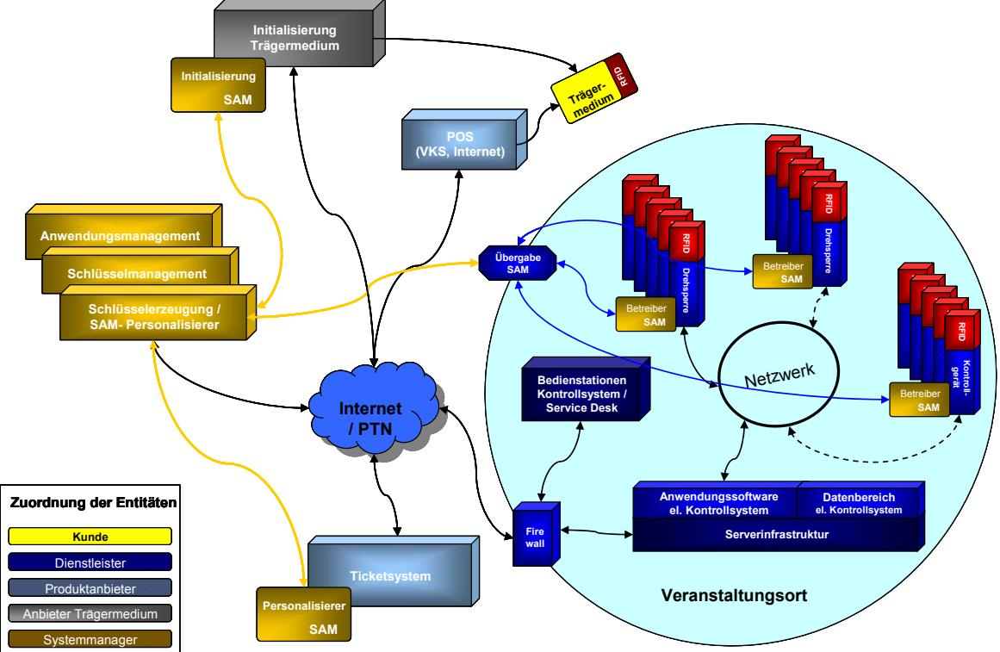

Die folgende Abbildung zeigt das Gesamtsystem und dessen wesentliche Komponenten.

## **10.1 Umsetzungsvorschläge zur eTicketing-Infrastruktur**

### **10.1.1 Ermittlung des Schutzbedarfs für die eTicketing-Infrastruktur**

Für die eTicketing-Infrastruktur sollen beispielhaft folgende Randbedingungen gelten, die in die Bestimmung des Schutzbedarfs einfließen sollen:

- 1 Die Systeme aus [Abbildung 10-1](#page-105-2) sollen verschiedene Produkte und Trägermedien entsprechend den in Kapitel [0](#page-98-1) vorgeschlagenen Einsatzszenarien gleichzeitig unterstützen.
- 2 Personenbezogenen Daten müssen verwaltet und bearbeitet werden.
- 3 Nutzungsdaten fallen an und müssen verarbeitet werden.
- 4 Abrechnungsdaten müssen zwischen den Entitäten erhoben und weitergeleitet werden. Interfunktionsfähigkeit ist gefordert.
- 5 Bei Verkauf und Zutritt müssen bekannte gewaltbereite Personen ausgeschlossen werden.

Diese Kriterien repräsentieren eine eTicketing.-Infrastruktur, die mehrere Veranstalter und mehrere Veranstaltungsorte integrieren könnte und z. B. die Austragung von internationalen Fußballspielen erlaubt.

Basierend auf den in Kapitel [8.2.5](#page-54-1) dargelegten Kriterien kann die eTicketing-Infrastruktur folgenden Schutzbedarfsklassen zugeordnet werden:

|             | Sicherheitsziel                           | Schutz bedarfs klasse | Kriterien zur Einordnung in Schutzbedarfsklassen                                                                                                                                                                       |
|-------------|-------------------------------------------|-----------------------------|------------------------------------------------------------------------------------------------------------------------------------------------------------------------------------------------------------------------|
| SF1         | Technische Kompatibilität              | 1                           | Alle Systemkomponenten sind vom gleichen Lieferan ten. Der Lieferant sorgt für Kompatibilität.                                                                                                                      |
|             |                                           | 2                           | System muss mit Komponenten von wenigen definier ten Lieferanten funktionieren. Der Systemmanager oder ein SI sorgen für Kompatibilität.                                                                         |
|             |                                           | 3                           | Offenes System, dass mit Komponenten von allen Marktteilnehmern funktionieren soll.                                                                                                                                 |
|             |                                           |                             | Systeme werden üblicherweise durch eine offene Aus schreibung beschafft.                                                                                                                                            |
| SF2 onen |                                           | 1                           | Fehlfunktion betrifft einzelne Kunden                                                                                                                                                                                  |
|             | Rückfalllösung bei Fehlfunkti          | 2                           | Fehlfunktion betrifft größere Kundenmenge                                                                                                                                                                              |
|             |                                           | 3                           | Fehlfunktion betrifft eine großen Teil der Kunden Fehlfunktionen des Systems (Verkaufssystem, Lese geräte, Kontrollsystem, Schlüsselmanagement) betref fen eine große Menge an Kunden und Berechtigun gen. |
| SF3         | Intuitive, feh lertolerante Nutzung | 1                           | Intuitiv nicht bedienbar von einzelne Kunden                                                                                                                                                                           |
|             |                                           | 2                           | Intuitiv nicht bedienbar von größeren Kundenmengen                                                                                                                                                                     |
|             |                                           | 3                           | Intuitiv nicht bedienbar von einem großen Teil der Kunden                                                                                                                                                           |

|                                                                                                         | Sicherheitsziel             | Schutz bedarfs klasse                                       | Kriterien zur Einordnung in Schutzbedarfsklassen                                                                                                                                                                              |
|---------------------------------------------------------------------------------------------------------|-----------------------------|-------------------------------------------------------------------|-------------------------------------------------------------------------------------------------------------------------------------------------------------------------------------------------------------------------------|
|                                                                                                         |                             |                                                                   | Bei Integration von Systemen verschiedener Veran stalter und Veranstaltungsorte beinhaltet das Risiko größerer Komplexität für die Kunden -> "Jede Veran staltung ein neues Zutrittssystem"                          |
|                                                                                                         |                             | 1                                                                 | Durchsatz beim Zutritt und Kundenverhalten unprob lematisch                                                                                                                                                                |
|                                                                                                         | Aufrechterhal               | 2                                                                 | Zeitlich begrenzte Ausfälle bereiten Betriebs- und Si cherheitsprobleme                                                                                                                                                    |
| SF4                                                                                                     | tung einer ho hen Verfüg |                                                                   | Kurze Ausfälle stellen Sicherheitsziele in Frage                                                                                                                                                                              |
|                                                                                                         | barkeit                     | 3                                                                 | Komplettausfälle der Zutrittstechnik von mehr als 15min können bei großem Andrang zu unkontrollierba ren Verhältnissen führen. Etwaige operative Rückfall maßnahmen mindern normalerweise das Sicherheits niveau. |
| Schutz der personenbe zogenen Da SI1 ten (inkl. per sonenbezoge ne Nutzungs daten) | 1                           | Kunde wird in seinem Ansehen geschädigt / Daten gehen verloren |                                                                                                                                                                                                                               |
|                                                                                                         |                             |                                                                   | Kunde wird in seiner sozialen Existenz geschädigt / Daten werden Dritten bekannt.                                                                                                                                          |
|                                                                                                         |                             | 2                                                                 | Sofern im System gespeicherte personengebundenen Abrechnungsinformationen oder Zahlungsdaten ent wendet oder manipuliert werden, können erhebliche kommerzielle und soziale Folgen für den Kunden ein treten.     |
|                                                                                                         |                             | 3                                                                 | Kunde wird in seiner physischen Existenz geschädigt / Daten werden missbraucht                                                                                                                                             |
| Schutz der Be SI2 rechtigungen                                                                    |                             | 1                                                                 | Erwarteter produktbezogener Umsatzverlust durch Fälschung, Stören oder Manipulation <1%                                                                                                                                    |
|                                                                                                         |                             | 2                                                                 | Erwarteter produktbezogener Umsatzverlust durch Fälschung, Stören oder Manipulation <5%                                                                                                                                    |
|                                                                                                         |                             |                                                                   | Erwarteter produktbezogener Umsatzverlust durch Fälschung, Stören oder Manipulation >5%                                                                                                                                    |
|                                                                                                         |                             | 3                                                                 | DoS-Angriffe auf das System können zur Störung des gesamten Betriebs führen und damit erhebliche kom merzielle Einbussen verursachen.                                                                                   |
| Schutz der Lo gistikdaten SI3 Nutzungsda ten)                                               | (anonymisierte              | 1                                                                 | Daten werden Dritten bekannt                                                                                                                                                                                                  |
|                                                                                                         |                             |                                                                   | Daten gehen verloren                                                                                                                                                                                                          |
|                                                                                                         |                             | 2                                                                 | Der Verlust der Logistikdaten kann auch durch techni sche Defekte auftreten und zu betrieblichen Schwie rigkeiten führen.                                                                                               |
|                                                                                                         | 3                           | Daten werden verfälscht                                           |                                                                                                                                                                                                                               |

|                                                            | Sicherheitsziel                | Schutz bedarfs klasse                                                                                                | Kriterien zur Einordnung in Schutzbedarfsklassen                                                                                                                                                                               |
|------------------------------------------------------------|--------------------------------|----------------------------------------------------------------------------------------------------------------------------|--------------------------------------------------------------------------------------------------------------------------------------------------------------------------------------------------------------------------------|
|                                                            | 1                              | Daten sind zeitweise nicht verfügbar                                                                                       |                                                                                                                                                                                                                                |
|                                                            | Zuverlässige                   | 2                                                                                                                          | Daten sind verloren                                                                                                                                                                                                            |
| SI4                                                        | Abrechnung                     |                                                                                                                            | Daten wurden verfälscht, missbraucht, etc                                                                                                                                                                                      |
| (personalisiert)                                           |                                | 3                                                                                                                          | In einem System mit mehreren Akteuren ist Abrech nungsbetrug zwischen den Akteuren nicht auszu schließen.                                                                                                                |
| Schutz von Anwendungen SI5 und Berechti gungen | 1                              | Anwendungen werden vom selben Anwendungsher ausgeber und Berechtigungen vom selben Produktei gentümer herausgegeben. |                                                                                                                                                                                                                                |
|                                                            |                                | 2                                                                                                                          | Anwendungen werden von unterschiedlichen Anwen dungsherausgebern und Berechtigungen von unter schiedlichen Produkteigentümern herausgegeben. Die Akteure vertrauen sich.                                              |
|                                                            |                                | 3                                                                                                                          | Anwendungen werden von unterschiedlichen Anwen dungsherausgebern und Berechtigungen von unter schiedlichen Produkteigentümern herausgegeben. Mehrere Unternehmen kooperieren und vertrauen sich nicht gegenseitig. |
|                                                            |                                |                                                                                                                            | Beim Aufbringen der Berechtigung auf Multiapplikati onskarten oder NFC-Mobiltelefonen ist grundsätzlich davon auszugehen, dass sich Anwendungen fremder Entitäten auf dem Kundenmedium befinden.                      |
|                                                            | Schutz vor der                 | 1                                                                                                                          | Kunde wird in seinem Ansehen geschädigt                                                                                                                                                                                        |
| SP3 len                                                 | Erzeugung von Nutzungsprofi | 2                                                                                                                          | Kunde wird in seiner sozialen Existenz geschädigt                                                                                                                                                                              |
|                                                            |                                | 3                                                                                                                          | Kunde wird in seiner physischen Existenz geschädigt                                                                                                                                                                            |
| Schutz vor SP4 Gewalttätern                          | 1                              | Schutz bei rivalisierenden Gruppen                                                                                         |                                                                                                                                                                                                                                |
|                                                            |                                |                                                                                                                            | Schutz vor bekannten gewaltbereiten Fans                                                                                                                                                                                       |
|                                                            |                                | 2                                                                                                                          | Es soll die Möglichkeit vorgehalten werden, gewaltbe reite Fans auszuschließen um z. B. internationale Fußballspiele ausrichten zu können.                                                                               |
|                                                            |                                | 3                                                                                                                          | Schutz vor möglichen Gewaltakten durch bekannte potentielle Täter                                                                                                                                                           |

| Sicherheitsziel |                      | Schutz bedarfs klasse | Kriterien zur Einordnung in Schutzbedarfsklassen                                                                                                 |  |
|-----------------|----------------------|-----------------------------|--------------------------------------------------------------------------------------------------------------------------------------------------|--|
| SP5             | Datenspar samkeit | 1                           | Es werden keine personenbezogenen Daten verwen det.                                                                                           |  |
|                 |                      | 2                           | Es werden personenbezogene Daten verwendet, aber keine Nutzungsdaten gesammelt.                                                               |  |
|                 |                      | 3                           | Es werden personenbezogene Daten und Nutzungs und Abrechnungsdaten verwendet.                                                                 |  |
|                 |                      |                             | Es wird angenommen, dass personenbezogene Nut zungs- und Abrechnungsdaten erhoben und ggf. mit anderen Dienstleistern ausgetauscht werden. |  |

**Tabelle 10-1 Schutzbedarf des Systems** 

### **10.1.2 Schnittstellen des Gesamtsystems**

Das in [Abbildung 10-1](#page-105-2)dargestellte System ist auf ein Zusammenspiel aller Systemkomponenten angewiesen. Um die in Kapitel [6](#page-29-2) dargestellten Geschäftsprozesse abbilden zu können, müssen die technischen Schnittstellen und die operative Interaktion zwischen den Komponenten spezifiziert werden.

Weiterhin sind Vereinbarungen zwischen den Entitäten zu treffen, die die Verantwortlichkeiten und die betrieblichen Abläufe regeln.

### **10.1.2.1 Relevante Gefährdungen für die eTicketing Infrastruktur**

Aufgrund der Sicherheitsziele zur Ermittlung des Schutzbedarfs aus Kapitel [10.1.1](#page-106-1) lassen sich für die Schnittstellen des Gesamtsystems folgende relevanten Gefährdungen benennen.

| Gefährdungen der kontaktlo se Schnittstelle |                                                                                 | Schutz bedarf | Bemerkungen                                                                                                                                                                                                                                                                                           |
|------------------------------------------------|---------------------------------------------------------------------------------|------------------|-------------------------------------------------------------------------------------------------------------------------------------------------------------------------------------------------------------------------------------------------------------------------------------------------------|
| GIF1                                           | Mangelnde Kompa tibilität der Schnitt stellen Trägermedi um -Lesegerät | 3                | Mangelnde Kompatibilität der Schnittstellen führt zu Nichtfunktion beim Aufbringen und der Nutzung von Berechtigungen, der Kontrolle, etc. Das Resultat ist ähnlich eines DoS Angriffs auf das System. Eine Vielzahl von Kunden bzw. Berechtigungen wäre möglicher weise betroffen. |
| GIF2                                           | Abhören                                                                         | 3                | Unberechtigtes Belauschen der Kommunikati on zwischen einem Trägermedium und einem Lesegerät.)                                                                                                                                                                                                  |

| Gefährdungen der kontaktlo se Schnittstelle |                                         | Schutz bedarf | Bemerkungen                                                                                                                                                                                                                                                                                                                |
|------------------------------------------------|-----------------------------------------|------------------|----------------------------------------------------------------------------------------------------------------------------------------------------------------------------------------------------------------------------------------------------------------------------------------------------------------------------|
| GIF3                                           | DoS-Angriff auf die RF-Schnittstelle | 1                | 1 Stören der RFID-Kommunikation (Jam ming) 2 Stören des Antikollisionsmechanismus zur Selektierung des Trägermediums (Blocker Tag) 3 Abschirmung des elektromagnetischen Feldes des Lesegerätes (Shielding) 4 Verstimmen der Resonanzfrequenz von Reader oder Trägermedium (De-Tuning) |

**Tabelle 10-2 Relevante Gefährdungen der kontaktlosen Schnittstelle** 

| Gefährdungen des Gesamt systems |                                                   | Schutz bedarf | Bemerkungen                                                                                                                                                                                                                                                                                                                                               |
|------------------------------------|---------------------------------------------------|------------------|-----------------------------------------------------------------------------------------------------------------------------------------------------------------------------------------------------------------------------------------------------------------------------------------------------------------------------------------------------------|
| GS1                                | Fehlen einer Rück falllösung                   | 3                | Das Fehlen einer Rückfalllösung beim Ausfall von Systemschnittstellen und Komponenten wie Ticketverkaufssystem, Verwaltungssystem für Trägermedien und Berechtigungen, Kon trollsystem kann zu Komplettausfällen von Ser vices führen (Verkauf, Abrechnung, Zutritt, etc)                                                                  |
| GS2                                | Unberechtigtes Aus lesen von Referenz daten | 3                | Zwischen den Systemkomponenten werden Schlüssel sowie Informationen zu den Medien, den Berechtigungen, der Nutzung sowie ggf. personenbezogene Daten und Abrechnungs daten über Schnittstellen übertragen. Das Aus lesen dieser Daten durch Unberechtigte würde das System diskreditieren und die Möglichkeit für Angriffe schaffen. |
| GS3                                | Manipulieren von Referenzdaten im System    | 3                | Zwischen den Systemkomponenten werden Schlüssel sowie Informationen zu den Medien, den Berechtigungen, der Nutzung sowie ggf. personenbezogene Daten und Abrechnungs daten über Schnittstellen übertragen. Das Ma nipulieren dieser Daten durch Unberechtigte ist ein schwerwiegender Angriff.                                          |
| GS4                                | Fehlfunktion des Systems                       | 3                | Fehlfunktionen der Schnittstellen zwischen den Komponenten und der Komponenten selbst können durch technische Fehler, Fehlbedie nung oder DoS-Angriffe in verschiedenen Sze narien herbeigeführt werden:                                                                                                                                      |
|                                    |                                                   |                  | 1 Störung der Schnittstellen 2 Mangelnde Verfügbarkeit der Schnittstel len 3 Fehler in der Stromversorgung 4 Unterbrechung der Anbindung an das                                                                                                                                                                                   |
|                                    |                                                   |                  | Netz 5 Physische Zerstörung                                                                                                                                                                                                                                                                                                                         |

| Gefährdungen des Gesamt systems |                                                           | Schutz bedarf | Bemerkungen                                                                                                                                                                                                            |
|------------------------------------|-----------------------------------------------------------|------------------|------------------------------------------------------------------------------------------------------------------------------------------------------------------------------------------------------------------------|
| GS5                                | Mangelnde Kompa tibilität der Schnitt stellen       | 3                | Mangelnde Kompatibilität der Schnittstellen führt zu Fehlfunktion. Das Resultat ist ähnlich einer DoS Attacke auf das System. Eine Viel zahl von Kunden bzw. Berechtigungen wäre möglicherweise betroffen. |
| GS12                               | Ungerechtfertigtes Sammeln und Spei chern von Daten | 3                | Es wird angenommen, das personenbezogene Nutzungs- und Abrechnungsdaten erhoben und ggf. mit anderen Dienstleistern ausge tauscht werden.                                                                     |

### **Tabelle 10-3 Relevante Gefährdungen des Systems**

### **10.1.2.2 Definition von Schutzmaßnahmen für die eTicketing Infrastruktur**

Ausgehend von den relevanten Gefährdungen aus dem vorangegangenen Kapitel werden hier generelle Umsetzungsvorschläge und Schutzmaßnahmen für das Gesamtsystem und die Systemkomponenten definiert. Diese Maßnahmen sind in Kapitel [8.4](#page-62-0) im Detail beschrieben.

| Gefährdung |                                                                                   | Maßnahmen                | Maßnahme                                                                                                                                                                                                                                                                                                   |
|------------|-----------------------------------------------------------------------------------|--------------------------|------------------------------------------------------------------------------------------------------------------------------------------------------------------------------------------------------------------------------------------------------------------------------------------------------------|
| GIF1       | Mangelnde Kom patibilität der Schnittstellen Trägermedium - Lesegerät | MS1.3                    | 1 Einführung von Schnittstellentests und Freigabeverfahren - Zertifizierung                                                                                                                                                                                                                          |
| GIF2       | Abhören                                                                           | MS2.3 MS3.3           | 1 Sicherung der Vertraulichkeit der Kommunikation zwischen RFID Trägermedium und Terminal zur Ab wehr von Abhören – Gegenseitige, dy namische Authentifikation bei der Über tragung. 2 Einführung der kontaktlosen Schnittstel le nach ISO/IEC14443 oder von Feld detektoren |
| GIF3       | DoS-Angriff auf die RF Schnittstelle                                        | MS3.1                    | 1 Einführung der kontaktlosen Schnittstel le nach ISO/IEC14443                                                                                                                                                                                                                                       |
| GS1        | Fehlen einer Rückfalllösung                                                    | MS4.3                    | 1 Definition von Rückfalllösungen beim Ausfall von Systemschnittstellen und Systemkomponenten - Umsetzung nach Rückfallkonzept                                                                                                                                                                 |
| GS2        | Unberechtigtes Auslesen von Re ferenzdaten                                  | MS5.3 MS6.3 MS15.3 | 1 Sicherung der Vertraulichkeit von Daten bei der Kommunikation innerhalb des Systems – Sicherer Kommunikations kanal 2 Vertrauliche Speicherung von Daten - Einhaltung Datenschutz durch mandan tenfähigen Zugriffsschutz                                                         |

| Gefährdung |                                                    | Maßnahmen                                                    | Maßnahme                                                                                                                                                                                                                                                                                                                                                                                                                                                                                                                                                                                                                                                                                                                                                                              |
|------------|----------------------------------------------------|--------------------------------------------------------------|---------------------------------------------------------------------------------------------------------------------------------------------------------------------------------------------------------------------------------------------------------------------------------------------------------------------------------------------------------------------------------------------------------------------------------------------------------------------------------------------------------------------------------------------------------------------------------------------------------------------------------------------------------------------------------------------------------------------------------------------------------------------------------------|
|            |                                                    |                                                              | 3 Trennung von Anwendungen – Ge trennte Speicherung und Verarbeitung von Daten                                                                                                                                                                                                                                                                                                                                                                                                                                                                                                                                                                                                                                                                                               |
| GS3        | Manipulieren von Referenzdaten im System     | MS6.3 MS7.3 MS8.3 MS15.3                            | 1 Vertrauliche Speicherung von Daten - Mandantenfähigen Zugriffsschutz, Rol lenmodell 2 Sicherung der Datenintegrität zum Schutz vor Manipulationen bei der Da tenübertragung innerhalb des Systems – MAC oder Signaturen 3 Sicherung der Datenintegrität bei der Speicherung von Daten – Checksum men 4 Trennung von Applikationen – Getrenn te Speicherung und Verarbeitung von Daten                                                                                                                                                                                                                                                                                                                                               |
| GS4        | Fehlfunktion des Systems                        | MS12.3MS4.3 MS9.3 MS10.3 MS11.3 MS13.3 MS14.3 | 1 Spezifikation Systemkonzept und An forderungen an die Komponenten - Kompatibilitätstests nach Testkonzepti on, Evaluierung 2 Definition einer Rückfalllösung beim Ausfall von Systemschnittstellen und Systemkomponenten – Umsetzung nach Ausfallkonzept 3 Sicherung der Systemfunktionen gegen DOS-Angriffe an den Schnittstellen - Sicherheitskonzeption 4 Sicherung der Funktion des Systems gegen Fehlbedienung durch Mitarbeiter und Nutzer - Tests, Personal und Be nutzerführung. 5 Sicherung der Funktion des Systems zur Vermeidung technischer Fehler von Komponenten und Übertragungswegen - Evaluierung von Komponenten 6 Ergonomische Benutzerführung 7 Support -Systemweiter Support |
| GS5        | Mangelnde Kom patibilität der Schnittstellen | MS1.3 MS11.3 MS12.3                                    | 1 Einführung von Schnittstellentests und Freigabeverfahren - Zertifizierung 2 Sicherung der Funktion des Systems zur Vermeidung technischer Fehler von Komponenten und Übertragungswegen - Evaluierung von Komponenten 3 Spezifikation Systemkonzept und An forderungen an die Komponenten - Kompatibilitätstests nach Testkonzepti on, Evaluierung.                                                                                                                                                                                                                                                                                                                                                                                              |

| Gefährdung |                                                              | Maßnahmen | Maßnahme                                                                 |
|------------|--------------------------------------------------------------|-----------|--------------------------------------------------------------------------|
| GS12       | Ungerechtfertig tes Sammeln und Speichern von Daten | MS18.3    | 1 Umsetzung des Gebots zur Datenspar samkeit – Besondere Maßnahmen |

| Tabelle 10-4 | Schutzmaßnahmen für das Gesamtsystem |  |
|--------------|--------------------------------------|--|
|              |                                      |  |

### **10.1.2.3 Verbleibende Risiken**

Aus technischen oder wirtschaftlichen Gründen ist es nicht immer möglich, Gefährdungen durch Maßnahmen vollständig zu neutralisieren. In solchen Fällen verbleibt ein Risiko bestehen.

Das Restrisiko ist im Laufe der Planung der konkreten Implementierung zu bestimmen und zu dokumentieren.

### **10.1.3 Lesegeräte**

Lesegeräte steuern den Informationsfluss zum Lesen oder Schreiben über das kontaktlose Kommunikationsprotokoll mit dem Trägermedium. Dem Lesegerät (PCD nach ISO/IEC14443) fällt dabei die aktive Rolle (Master) zu. Das Trägermedium (PICC nach ISO/IEC14443) agiert passiv (Slave).

Lesegeräte sind in verschiedenen Systemkomponenten integriert:

- 1 Verkaufssysteme in Vertriebsstellen
- 2 Verkaufsautomaten
- 3 Service Desk
- 4 Stationäre Terminals zur Nutzung der Berechtigung bei Zutritt und ggf. Verlassen des Veranstaltungsorts und Wiedereintritt.
- 5 Mobile Kontrollgeräte

### **10.1.3.1 Relevante Gefährdungen für das Lesegerät**

Aufgrund der Annahmen zur Ermittlung des Schutzbedarfs aus Kapitel [10.1.1](#page-106-1) lassen sich für die Schnittstellen des Gesamtsystems folgende relevanten Gefährdungen benennen.

| Gefährdungen der kontaktlo se Schnittstelle |                                                                                 | Schutz bedarf | Bemerkungen                                                                                                                                                                                                                                                                                           |
|------------------------------------------------|---------------------------------------------------------------------------------|------------------|-------------------------------------------------------------------------------------------------------------------------------------------------------------------------------------------------------------------------------------------------------------------------------------------------------|
| GIF1                                           | Mangelnde Kompa tibilität der Schnitt stellen Trägermedi um -Lesegerät | 3                | Mangelnde Kompatibilität der Schnittstellen führt zu Nichtfunktion beim Aufbringen und der Nutzung von Berechtigungen, der Kontrolle, etc. Das Resultat ist ähnlich eines DoS Angriffs auf das System. Eine Vielzahl von Kunden bzw. Berechtigungen wäre möglicher weise betroffen. |
| GIF2                                           | Abhören                                                                         | 3                | Unberechtigtes Belauschen der Kommunikati on zwischen einem Trägermedium und einem Lesegerät.                                                                                                                                                                                                   |

| Gefährdungen der kontaktlo se Schnittstelle |                                         | Schutz bedarf | Bemerkungen                                                                                                                                                                                                                                                                                       |
|------------------------------------------------|-----------------------------------------|------------------|---------------------------------------------------------------------------------------------------------------------------------------------------------------------------------------------------------------------------------------------------------------------------------------------------|
| GIF3                                           | DoS-Angriff auf die RF-Schnittstelle | 3                | Stören der RFID-Kommunikation (Jamming) Stören des Antikollisionsmechanismus zur Se lektierung des Trägermediums (Blocker Tag) Abschirmung des elektromagnetischen Feldes des Lesegerätes (Shielding) Verstimmen der Resonanzfrequenz von Rea der oder Trägermedium (De-Tuning) |

**Tabelle 10-5 Relevante Gefährdungen der kontaktlosen Schnittstelle** 

| Gefährdungen des Lesege räts |                                                              | Schutz bedarf | Bemerkungen                                                                                                                                                                                                                                                                                                                                                                                                        |  |
|---------------------------------|--------------------------------------------------------------|------------------|--------------------------------------------------------------------------------------------------------------------------------------------------------------------------------------------------------------------------------------------------------------------------------------------------------------------------------------------------------------------------------------------------------------------|--|
| GR1                             | Unberechtigte Mani pulation der Refe renzinformationen | 3                | Manipulation der Referenzinformationen (Schlüssel, Auswertealgorithmen, Black- oder Whitelists) kann zur unberechtigten Nutzung oder zu DoS verwendet werden.                                                                                                                                                                                                                                             |  |
| GR2                             | Unberechtigtes Aus lesen der Referenz informationen    | 3                | Auslesen der Referenzinformationen (Schlüs sel, Auswertealgorithmen, Black- oder White lists) kann zur unberechtigten Nutzung (Z. B. Fälschung von Berechtigungen) oder zu DoS verwendet werden.                                                                                                                                                                                                       |  |
| GR3                             | Fehlfunktion des Le segerät                               | 3                | Fehlfunktionen des Lesegeräts können durch technische Fehler, Fehlbedienung oder DoS Angriffe in verschiedenen Szenarien herbeige führt werden:                                                                                                                                                                                                                                                           |  |
|                                 |                                                              |                  | 1 Störung der kontaktlose Schnittstelle 2 Störung der Referenzinformationen (Schlüssel, Sperrlisten, etc) 3 Störung der Anwendungsimplementierung 4 Störung der Auswertealgorithmen für Be rechtigungen 5 Fehler in der Stromversorgung 6 Unterbrechung der Anbindung an das Zentralsystem 7 Physische Zerstörung 8 Störung der Funktionen zur Nutzerführung |  |
| GR4                             | Mangelnde Bedie nerführung                                | 3                | Mangelnde Bedienerfreundlichkeit an Automa ten und Terminals für Entwertung bzw. Check in / Check-out kann zu erheblichen operativen Problemen führen.                                                                                                                                                                                                                                                    |  |
| GS1                             | Fehlen einer Rück falllösung                              | 3                | Das Fehlen einer Rückfalllösung beim Ausfall von Systemschnittstellen wie Ticketverkaufs system, Verwaltungssystem für Trägermedien und Berechtigungen, Kontrollsystem kann zu Komplettausfällen von Services führen (Ver-                                                                                                                                                                             |  |

| Gefährdungen des Lesege räts |                                                     | Schutz bedarf | Bemerkungen                                                                                                                                                                                                             |
|---------------------------------|-----------------------------------------------------|------------------|-------------------------------------------------------------------------------------------------------------------------------------------------------------------------------------------------------------------------|
|                                 |                                                     |                  | kauf, Abrechnung, CICO, etc)                                                                                                                                                                                            |
| GS5                             | Mangelnde Kompa tibilität der Schnitt stellen | 3                | Mangelnde Kompatibilität der Schnittstellen führt zu Fehlfunktion. Das Resultat ist ähnlich eines DoS-Angriffs auf das System. Eine Viel zahl von Kunden bzw. Berechtigungen wäre möglicherweise betroffen. |

**Tabelle 10-6 Relevante Gefährdungen des Lesegeräts** 

### **10.1.3.2 Definition von Schutzmaßnahmen für das Lesegerät und dessen Anwendungen**

Ausgehend von den relevanten Gefährdungen aus dem vorangegangenen Kapitel werden hier generelle Umsetzungsvorschläge und Schutzmaßnahmen für das Lesegerät und dessen Anwendungen definiert. Diese Maßnahmen sind in Kapitel [8.4](#page-62-0) im Detail beschrieben.

| Gefährdung |                                                                                   | Maßnahmen      |        | Maßnahme                                                                                                                                                                                                                                                             |
|------------|-----------------------------------------------------------------------------------|----------------|--------|----------------------------------------------------------------------------------------------------------------------------------------------------------------------------------------------------------------------------------------------------------------------|
| GIF1       | Mangelnde Kom patibilität der Schnittstellen Trägermedium - Lesegerät | MS1.3 MR1.3 | 1      | Einführung von Schnittstellentests und Freigabeverfahren - Zertifizierung                                                                                                                                                                                         |
| GIF2       | Abhören                                                                           | MS2.3 MS3.3 | 1 2 | Sicherung der Vertraulichkeit der Kommunikation zwischen RFID Trägermedium und Terminal zur Ab wehr von Abhören – Gegenseitige, dy namische Authentifikation bei der Über tragung. Einführung der kontaktlosen Schnittstel le nach ISO/IEC14443 |
| GIF3       | DoS-Angriff auf die RF Schnittstelle                                        | MS3.1          | 1      | Einführung der kontaktlosen Schnittstel le nach ISO/IEC14443                                                                                                                                                                                                      |
| GR1        | Unberechtigte Manipulation der Referenzinforma tionen                    | MR2.3          | 1      | Schützen der Referenzinformationen gegen Auslesen, Datenfehler und Ma nipulationen, - Erweiterter Schutz                                                                                                                                                       |
| GR2        | Unberechtigtes Auslesen der Re ferenzinformatio nen                      | MR2.3          | 1      | Schützen der Referenzinformationen gegen Auslesen, Datenfehler und Ma nipulationen - Erweiterter Schutz                                                                                                                                                        |
| GR3        | Fehlfunktion des Lesegerät                                                     | MR3.3          | 1      | Schutz des Lesegeräts gegen Fehlfunk tionen - Evaluierung                                                                                                                                                                                                         |
| GR4        | Mangelnde Be dienerführung                                                     | MS13.3         | 1      | Ergonomische Benutzerführung                                                                                                                                                                                                                                         |

| Gefährdung |                                                    | Maßnahmen                 | Maßnahme                                                                                                                                                                                                                                                                                                                                                                                |
|------------|----------------------------------------------------|---------------------------|-----------------------------------------------------------------------------------------------------------------------------------------------------------------------------------------------------------------------------------------------------------------------------------------------------------------------------------------------------------------------------------------|
| GS1        | Fehlen einer Rückfalllösung                     | MS4.3                     | 1 Definition von Rückfalllösungen beim Ausfall von Systemschnittstellen und Systemkomponenten - Umsetzung nach Rückfallkonzept                                                                                                                                                                                                                                              |
| GS5        | Mangelnde Kom patibilität der Schnittstellen | MS1.3 MS11.3 MS12.3 | 1 Einführung von Schnittstellentests und Freigabeverfahren - Zertifizierung 2 Sicherung der Funktion des Systems zur Vermeidung technischer Fehler von Komponenten und Übertragungswegen - Evaluierung von Komponenten 3 Spezifikation Systemkonzept und An forderungen an die Komponenten - Kompatibilitätstests nach Testkonzepti on, Evaluierung |

### **10.1.3.3 Verbleibende Risiken**

Aus technischen oder wirtschaftlichen Gründen ist es nicht immer möglich, Gefährdungen durch Maßnahmen vollständig zu neutralisieren. In solchen Fällen verbleibt ein Risiko bestehen.

Das Restrisiko ist im Laufe der Planung der konkreten Implementierung zu bestimmen und zu dokumentieren.

### **10.1.4 Verkaufs-, Kontroll- und Managementsysteme**

### **10.1.4.1 Verkaufssysteme**

Der Zugang zu den Produkten muss für alle potentiellen Kunden einfach und kostengünstig möglich sein. Deshalb sind verschiedene Vertriebsschnittstellen zum Kunden zu unterstützen. Diese sind im Folgenden beschrieben:

### **Verkaufsstelle (VKS)**

Hierbei handelt es sich z. B. um die Geschäftsstelle eines Fußballclubs (*Produkteigentümer/Veranstalter*) oder eine Vorverkaufsstelle (*Produktanbieter*).

### Verkaufsvorgang

Der Kunde sucht die VKS persönlich auf und wickelt den Kauf vor Ort ab:

- Die Identifizierung, wenn erforderlich, erfolgt durch Vorlage des Ausweises.
- Die Buchung erfolgt im Dialog mit dem Kunden vor Ort.
- Die Bezahlung erfolgt direkt in der VKS.

Sofern das Trägermedium vor Ort erstellt oder die Berechtigung auf ein existierendes Kundenmedium aufgebracht werden kann (siehe "*Technische Ausstattung*"), kann der Kunde

das Produkt direkt mitnehmen. Ansonsten wird das Produkt mit dem Trägermedium per Post zugestellt oder liegt zu einem späteren Zeitpunkt zur Abholung in der VKS bereit.

### Technische Ausstattung

Die VKS hat einen Direktzugang zum Ticketverkaufssystem. Dies ist die Voraussetzung für die direkte Buchung von z. B. Sitzplatzreservierungen.

In vielen Fällen ist eine Ausstattung mit einem Ticketdrucker mit kontaktlosem Lesegerät, der bestimmte Trägermedien initialisieren und die Berechtigung aufbringen kann, kommerziell sinnvoll. Weiterhin kann in der VKS durch ein einfaches kontaktloses Lesegerät kostengünstig die Möglichkeit zum Nachladen einer Berechtigung auf ein existierendes Kundenmedium geschaffen werden. Wenn ein solches kontaktloses Lesegerät vorhanden ist, könnte künftig ggf. ein elektronischer Identitätsnachweis für eine sichere, automatisierte Übernahme der personenbezogenen Daten in das Ticketsystem (z. B. zum Zwecke des Anlegen eines Kundenkontos) oder zur sicheren Identifizierung verwendet werden.

Personal und IT-Infrastruktur in der Verkaufsstelle sind nicht immer vertrauenswürdig.

### **Verkaufs- oder Abholautomat**

Am Verkaufsautomaten werden der Verkauf und die Ausgabe des Produkts in direkter Interaktion zwischen dem Automaten und dem Kunden abgewickelt.

Automaten werden vorzugsweise am Veranstaltungsort oder an häufig von Kunden frequentierten Punkten eingesetzt. Sie eignen sich insbesondere für den Vertrieb von Produkten, die häufig verlangt werden, die keine komplexen Abläufe bei Bestellung und Erstellung verlangen, als Tageskasse und als Ausgabestelle für im Internet oder telefonisch bestellte Produkte. In letzterem Fall lässt sich die Laufzeit für die Zustellung des Produktes per Post vermeiden. Internetverkauf wird dadurch bis kurz vor der Veranstaltung möglich.

### Verkauf personalisierter Produkte

Zurzeit besteht keine Möglichkeit zur sicheren, automatisierten Erstidentifizierung eines Kunden. Demnach kann am Automaten keine Anmeldung nach Prozess P1A erfolgen und kein Kundenkonto angelegt werden. Dies ändert sich künftig evtl. durch Verwendung eines elektronischen Identitätsnachweises.

Es ist jedoch möglich, bekannten Kunden, die bereits ein bekanntes personalisiertes Kundenmedium besitzen, neue Berechtigungen auf deren Kundenmedien nachzuladen. Die Identifizierung könnte in einem solchen Fall über das existierende Kundenmedium selbst erfolgen.

### Verkauf anonymer Produkte

Im einfachsten Fall werden anonyme Trägermedien und Berechtigungen über Automaten vertrieben.

Der Kunde wickelt den Kauf oder die Abholung am Automaten ab:

- Die Buchung erfolgt am Automaten.
- Die Bezahlung erfolgt direkt z. B. über Maestro- oder Kreditkarte.
- Die Identifizierung bei Abholung erfolgt durch das eigene Kundenmedium oder elektronische Identifizierungsmedien (eID).

Das Trägermedium für das gekaufte Produkt wird vor Ort erstellt. Alternativ kann die Berechtigung auf ein existierendes Kundenmedium aufgebracht werden kann (siehe "*Technische Ausstattung*"). Der Kunde kann das Produkt direkt mitnehmen.

### Abholen von vorbestellten Produkten

Automaten können als Ausgabestelle für im Internet oder telefonisch bestellte Produkte dienen.

Wird der Automat zum Abholen von vorbestellten Berechtigungen eingesetzt, so ist immer eine Identifizierung des Bestellers erforderlich. Besitzt der Kunde ein eigenes Kundenmedium, dann kann dieses zur Identifizierung und zum Speichern der Berechtigung benutzt werden. Ansonsten müssen andere Verfahren zur Identifizierung genutzt werden (z. B. Kreditkarte oder eID).

### Technische Ausstattung

Der Automat benötigt zumindest zeitweise einen Direktzugang zum Ticketverkaufssystem. Eine weitere Voraussetzung ist eine Ausstattung mit einem Ticketdrucker mit eingebautem Lesegerät, der die auszugebenden Trägermedien initialisieren und die Berechtigung aufbringen kann.

Sofern das Nachladen von Berechtigungen auf existierende Kundenmedien unterstützt werden soll, ist ein ständiger Zugriff auf das Ticketverkaufssystem und das Managementsystem für Träger und Anwendungen erforderlich. Außerdem muss ein kompatibles Lesegerät im Automaten eingebaut sein.

### **Internet, Call Center, Bestellung per Post**

### Verkaufsvorgang

Der Kunde wickelt die Bestellung von jedem beliebigen Ort via Telefon, im Internet oder per Fax ab:

- Die Buchung, die Sitzplatzwahl, etc kann bei Nutzung des Internet oder telefonisch in direkter Interaktion erfolgen. Bei einer schriftlichen Bestellung ist dies nicht möglich.
- Die Bezahlung erfolgt über Maestro, Kreditkarte oder per Lastschrift.
- Zur sicheren Identifizierung ist ggf. eine Überprüfung der vom Kunden übermittelten personenbezogenen Daten erforderlich.

Das Trägermedium und das Produkt werden zentral erstellt und per Post zugestellt. Alternativ kann auch Abholung des Produkts z. B. an einer Ausgabestelle oder einem Automaten (siehe [0](#page-117-0)) vereinbart werden.

### Technische Ausstattung

Der Produktanbieter benötigt eine Internet-Vertriebsplattform bzw. ein Call Center. Der Kunde benötigt keine besondere technische Ausstattung.

Die Erstellung des Trägermediums und des Produkts können bei einem Massenpersonalisierer in sicherer Umgebung erfolgen.

### **Internet**

### Verkaufsvorgang

Der Kunde wickelt die Bestellung via Internet von jedem beliebigen Ort (z. B. von Zuhause) interaktiv ab.

Wenn der Kunde über ein Kundenmedium verfügt, das die erforderliche Anwendung bereits besitzt, so kann das gewünschte Produkt nachgeladen werden. Bei Nutzung einer Chipkarte ist dazu ein kontaktloses Lesegerät z. B. am Heim-PC erforderlich. Sofern ein NFC-Mobiltelefon als Kundenmedium genutzt werden soll, kann das Produkt auch Over-The-Air nachgeladen werden:

- Die Buchung, die Sitzplatzwahl, etc kann bei Nutzung des Internet in direkter Interaktion erfolgen.
- Die Identifizierung erfolgt über das Kundenmedium mittels der in der Anwendung gespeicherten personenbezogenen Daten.
- Die Bezahlung erfolgt über Maestro, Kreditkarte oder per Lastschrift.

Die Berechtigung wird direkt in die Anwendung auf dem Kundenmedium geladen.

Falls noch kein Kundenmedium, jedoch ein kontaktloses Lesegerät vorhanden ist, kann künftig ggf. mit Hilfe eines elektronischen Identitätsnachweises eine sichere Identifizierung des Kunden erfolgen und dadurch die Bestellung eines Kundenmediums sicher und bequem getätigt werden.

### Technische Ausstattung

Der Produktanbieter benötigt eine Internet-Vertriebsplattform, die wiederum mit dem Schlüssel- und Träger- und Anwendungsmanagement verbunden ist. Der Kunde benötigt ein Kundenmedium und –bei Nutzung von Chipkarten oder einem elektronischen Identitätsnachweis - ein kontaktloses Heimlesegerät.

### **10.1.4.2 Ticketsystem**

Das Ticketsystem unterstützt wesentliche Prozesse des Verkaufs und der Abwicklung:

- 1 Anmeldung/Registrierung und Bestellung
- 2 Erstellung der Berechtigung
- 3 Zahlung und Überprüfung der Bonität
- 4 Verwaltung der verkauften Berechtigungen
- 5 Übergabe der erforderlichen Daten an das Kontrollsystem

Im Ticketsystem werden die Kundendaten und die Bestellungen abgelegt. Sofern die Beförderungsdienstleistung und das Produkt dieses vorsehen, ist mittels hinterlegter Sitzpläne des Fahrzeugs eine Sitzplatzzuordnung möglich. Das Ticketsystem umfasst weiterhin eine Ablaufsteuerung, die z. B. für einen Adressabgleich und eine Zahlungsabwicklung mit Bonitätsprüfung sorgt und die Trägermedien und Berechtigungen erstellen und versenden lässt.

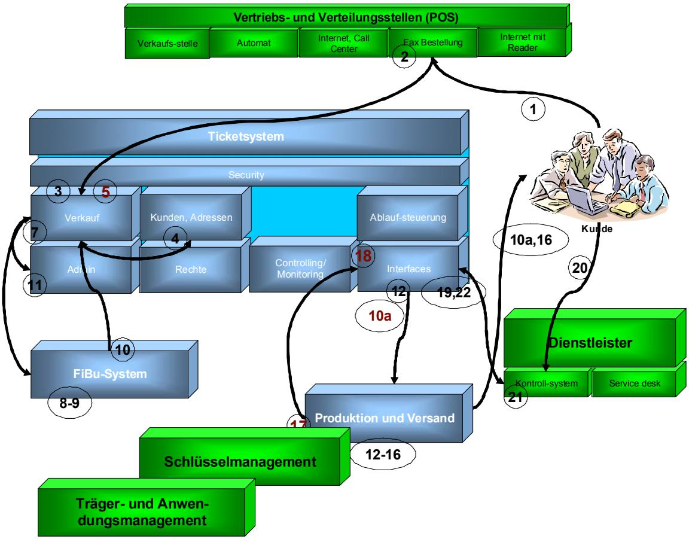

**Abbildung 10-2 Ticketsystem mit beispielhaftem Prozessablauf** 

Ein Ticketsystem verfügt über Schnittstellen zum Schlüsselmanagement und zum Verwaltungssystem für Trägermedien und Anwendungen. Alle zum Zutritt einer speziellen Veranstaltung erforderlichen Informationen (außer denjenigen, die im Schlüsselmanagement übergeben werden) werden vom Ticketsystem zusammengeführt und über eine definierte Schnittstelle an den Dienstleister übergeben.

Weitere Schnittstellen existieren zu den Vertriebsstellen und zu den Produktionsstätten für die Trägermedien. Dies umfasst auch den Vertrieb und die Steuerung des Aufbringens von Anwendungen und Produkten auf existierende Medien über das Internet.

Es kann davon ausgegangen werden, dass ein Ticketsystem in einer sicheren Umgebung untergebracht ist. Personalisierer-SAM müssen angeschlossen werden, um Berechtigungen erstellen und auf Trägermedien aufbringen zu können.

Aus Sicht des Dienstleisters kann pro Veranstaltung mehr als ein Ticketsystem zum Einsatz kommen.

### **10.1.4.3 Zentrales Kontrollsystem**

Das Kontrollsystem hilft dem Dienstleister, die Berechtigungen der Kunden zum Zutritt zur Veranstaltung zu kontrollieren und die abrechnungsrelevanten Informationen zu sammeln und weiterzuleiten. Dazu sind folgende Funktionen erforderlich:

- 1 Unterstützung des Prozesses P3 zu Zutritt, Entwertung und ggf. Wiedereintritt.
- 2 Unterstützung der veranstaltungsspezifischen Trägermedien, Anwendungen und Produkte
- a Implementierung der technischen Verfahren, die zur Unterstützung der Trägermedien, Anwendungen und Produkte, die zu einer spezifischen Veranstaltung zugelassenen sind, erforderlich sind.
- b Implementierung und Steuerung des Schlüsselmanagement
- 3 Steuerung der Terminals (Zugangssperren, mobile Kontrollterminals, etc).
- 4 Übernahme, Verteilung und Nutzung der von den Ticketsystemen bereitgestellten Informationen.
- 5 Übernahme , Verteilung und Nutzung der vom Systemmanager und Registrar bereitgestellten Schlüssel und Kennungen.
- 6 Rückmeldung der abrechnungsrelevanten Daten und der Nutzungshistorie an die Ticketsysteme

Gegebenenfalls wird gefordert, dass die Zutrittstechnik auch funktionsfähig bleiben muss, wenn das Datennetz zwischen dem Zentralsystem und den Terminals an den Eingängen ausfallen sollte. Das bedeutet, dass alle für den Zutritt, die Aus- und Entwertung der Berechtigungen und ggf. den Wiedereintritt nötigen Informationen lokal in den Terminals vorgehalten werden müssen.

### **10.1.4.4 Terminals**

Die Terminals haben die Aufgabe, die Berechtigung beim Zutritt und ggf. dem Verlassen des Veranstaltungsorts und Wiedereintritt zu lesen, auszuwerten und ggf. zu entwerten. Im Terminal ist ein kontaktloses Lesegerät integriert.

Im Normalbetrieb sind stationäre Terminals täglich zumindest für eine gewisse Zeit über ein Datennetz (LAN oder WLAN) mit dem zentralen Kontrollsystem verbunden. Informationen, die zum Auswerten der Berechtigungen nötig sind, werden auf diesem Weg ständig aktualisiert. Auch Nutzungsdaten werden so vom Terminal an das Zentralsystem berichtet.

Sofern eine besonders hohe Verfügbarkeit des Systems gefordert wird, müssen alle Funktionen, die zur Kommunikation mit dem Trägermedium und der Anwendung nötig sind, lokal im Terminal unterstützt werden. Daraus kann sich ein erheblicher Aufwand bei der Einführung neuer Techniken ergeben.

Bei der Definition von Anwendungen macht es deshalb Sinn, bei Kommunikationsprotokollen, kryptographischen Methoden, etc grundsätzlich auf offene, standardisierte Verfahren und flexible, hardware-unabhängige Implementierungen zu setzen.

Neben den anwendungsspezifischen Funktionen müssen alle veranstaltungsspezifischen Informationen, die zur Auswertung der Berechtigung nötig sind (z. B. ID Produktanbieter, ID Dienstleister, , ID Trägermedium, ID Anwendung, ID Produkt, Schlüssel verschiedenen Ebenen, Sperrlisten) lokal im Terminal vorliegen. Auch die Zugangshistorie muss im Terminal zwischengespeichert werden können.

Die sicherheitsrelevanten Maßnahmen zum Lesegerät, das Teil des Terminals ist, finden sich in Kapitel [10.1.3.2.](#page-114-1)

Man kann grundsätzlich zwischen fest installierten und mobilen Geräten unterscheiden.

1 Fest installierte Geräte

Z. B. in den Stadien der FIFA WM2006 gibt es fest installierte Drehsperren, die den Zutritt zum Stadion regeln. In diese Drehsperren sind Kontrollgeräte entsprechend [Abbildung 10-3](#page-122-1) integriert und über ein LAN an das zentrale Zutrittssystem angeschlossen. Der Zutritt wird nach erfolgreicher Auswertung der Berechtigung durch Entriegelung und Andrehen der Drehsperre gewährt.

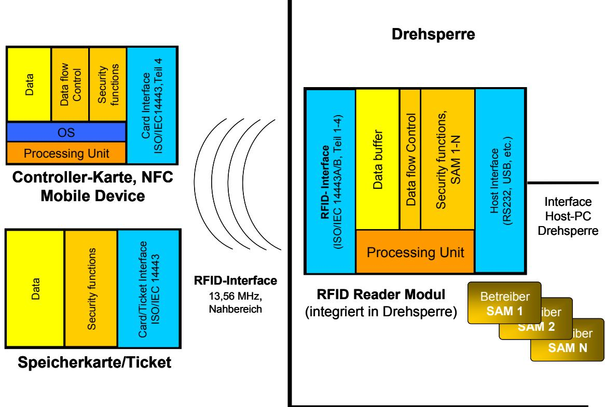

### **Abbildung 10-3 Lesegerät und Smart Card bzw. Smart Label**

Die Drehsperren befinden sich im Außenbereich des Stadions. Während des Einlasses sind Ordnungskräfte im Zugangsbereich tätig, die bei Störungen helfen und grobe Manipulationsversuche an der Drehsperre bemerken würden.

Die stationären Terminals sollten z. B. folgende Eigenschaften aufweisen:

- a Kontaktloses Lese-/Schreibgerät mit Schnittstelle nach ISO/IEC14443A/B Teil 1-4.
- b Fähigkeit zur Speicherung aller Nutzungsdaten für die Dauer bis zum nächsten Datenaustausch mit dem Zentralsystem.
- c Parallele Unterstützung mehrerer Trägermedien, Anwendungen und Produkte (Selektion über ID)
- d Kryptographische Grundfunktionen.
- e Unterstützung von SAM. Es sollten mehrere SAM-Slots verfügbar sein (üblich sind heute 4).
- f Das Ergebnis der Auswertung muss optisch dargestellt werden.

Die Dauer der Auswertung bis zur Signalisierung der Freigabe bzw. dem Entriegeln sollte bei Drehsperren 300ms nicht überschreiten. Die Performanz des Lesegeräts wie auch der übrigen involvierten Komponenten muss entsprechend ausgelegt werden.

2 Mobile Geräte

An den meisten Veranstaltungsorten gibt es keine fest installierte Zutrittstechnik. In diesem In diesem Fall kann auf mobile Kontrollgeräte, die von einem Ordner geführt werden, zurückgegriffen werden. Diese Geräte werden über ein WLAN an das zentrale Zutrittssystem angeschlossen. Der Zutritt wird nach erfolgreicher Auswertung der Berechtigung und entsprechender Anzeige durch den Ordner gewährt.

Die Drehsperren befinden sich im Außenbereich des Stadions. Während des Einlasses sind Ordnungskräfte im Zugangsbereich tätig, die bei Störungen helfen und grobe Manipulationsversuche an der Drehsperre bemerken würden.

### **10.1.4.5 Service-Desk**

Im realen Veranstaltungsbetrieb muss mit einem gewissen Anteil von defekten Kundenmedien, nicht sachgerechter Bedienung, Angriffen auf die Sicherheit und auch Betrugsversuchen gerechnet werden. Der Service-Desk am Veranstaltungsort dient als Anlaufstelle bei Problemen beim Zutritt.

Kunden mit einer gültigen Berechtigung muss auch bei Fehlfunktionen der Zutrittstechnik, des Kundenmediums und auch bei eigenem Fehlverhalten Zutritt zur Veranstaltung möglich sein. Dazu ist es erforderlich den Prozess P4 "Sperrung von Berechtigungen und Trägermedien" und die Ausgabe eines Ersatzmediums am Veranstaltungsort effizient und schnell durchführen zu können.

Am Service Desk werden folgende Aufgaben ausgeführt:

1 Überprüfen der Funktion des Trägermediums und des Status der Berechtigung.

Bei Fehlverhalten folgt:

2 Überprüfung der Echtheit des Mediums und / oder Überprüfung der Identität des Kunden.

Bei positivem Resultat folgt:

- 3 Sperrung des vorgelegten Mediums und der Berechtigung.
- 4 Ausstellung eines Ersatzmediums mit neuer Berechtigung.
- 5 Update der Informationen im Ticketsystem und dem Träger- und Anwendungsmanagement.
- 6 Übertragung der Informationen vom Ticketsystem an das Zutrittssystem.

Die Notfallszenarien bei Fehlfunktion des Zutrittssystems basieren auf dem Ordnungspersonal und dem Service Desk. Diesen kommt deshalb eine entscheidende Bedeutung für die Systemsicherheit zu. Gelingt es einem Angreifer Fehlfunktionen herbeizuführen, die das Ordnungspersonal und den Service Desk erheblich überlasten, dann kommt dies einem erfolgreichen DoS-Angriff auf das gesamte Zutrittssystem gleich.

### **10.1.4.6 Managementsystem für Trägermedien und Anwendungen**

Für die Prozesse des Aufbringens von Anwendungen und Berechtigungen und für die Prozesse bei denen das Kundenmedium für die Identifizierung und die Nutzung von Verkehrsmitteln genutzt wird, ist es wichtig, den Status des jeweilig benutzten Trägermediums und der auf ihm gespeicherten Anwendungen zu kennen.

Aus diesem Grund muss der Lebenszyklus eines Trägermediums, das im Bereich des Systems verwendet werden soll, zuverlässig dokumentiert werden. Dazu wird eine Datenbank verwendet, die mit dem Ticketsystem und dem Schlüsselmanagement durch Schnittstellen verbunden ist. Hier werden für jedes Trägermedium z. B. folgende Informationen eingetragen:

- ID Trägermedium
- Typ, Version
- Anbieter des Trägermediums (ID via Registrar)
- Herausgeber des Trägermediums (ID via Registrar)
- Kunde
- Status (z. B. neu/aktiv/gesperrt)
- Gespeicherte Anwendungen (siehe unten)

• etc.

In gleicher Weise muss auch der Lebenszyklus der auf dem Trägermedium gespeicherten Anwendungen dokumentiert werden. Es können mehrere verschiedene Anwendungen gespeichert sein.

- ID Anwendung
- Typ, Version
- Anwendungsanbieter (ID via Registrar)
- Anwendungsherausgeber (ID via Registrar)
- Kunde
- Status (z. B. neu/aktiv/gesperrt/löschen)
- Gespeicherte Berechtigungen inkl. ID des Produktanbieters
- Aktive Berechtigungen / löschbare Berechtigungen

### **10.1.4.7 Relevante Gefährdungen für die Verkaufs-, Kontroll- und Managementsysteme**

Aufgrund der Annahmen zur Ermittlung des Schutzbedarfs aus Kapitel [10.1.1](#page-106-1) lassen sich für die Schnittstellen des Gesamtsystems folgende relevanten Gefährdungen benennen.

| Gefährdungen der Verkaufs,- Kontroll- und Management systeme |                                                   | Schutz bedarf | Bemerkungen                                                                                                                                                                                                                                                                                                   |
|--------------------------------------------------------------------|---------------------------------------------------|------------------|---------------------------------------------------------------------------------------------------------------------------------------------------------------------------------------------------------------------------------------------------------------------------------------------------------------|
| GS1                                                                | Fehlen einer Rück falllösung                   | 3                | Das Fehlen einer Rückfalllösung beim Ausfall von Systemkomponenten wie Ticketverkaufs system, Verwaltungssystem für Trägermedien und Berechtigungen, Kontrollsystem kann zu Komplettausfällen von Services führen (Ver kauf, Abrechnung, CICO, etc)                                            |
| GS2                                                                | Unberechtigtes Aus lesen von Referenz daten | 3                | In den Hintergrundsystemen sind Informatio nen zu den Medien, den Berechtigungen, der Nutzung sowie ggf. personenbezogene Daten und Abrechnungsdaten gespeichert. Das Aus lesen dieser Daten durch Unberechtigte würde das System diskreditieren und die Möglichkeit für Angriffe schaffen. |
| GS3                                                                | Manipulieren von Referenzdaten im System    | 3                | In den Hintergrundsystemen sind Informatio nen zu den Medien, den Berechtigungen, der Nutzung sowie ggf. personenbezogene Daten und den Abrechnungsdaten gespeichert. Das Manipulieren dieser Daten durch Unberechtig te ist ein schwerwiegender Angriff.                                      |
| GS4                                                                | Fehlfunktion des Systems                       | 3                | Fehlfunktionen einzelner Systemkomponenten können durch technische Fehler, Fehlbedie nung oder DoS-Angriffe in verschiedenen Sze narien herbeigeführt werden: Störung der lokalen und zentralen Systeme Mangelnde Verfügbarkeit der lokalen und zent                                           |

| Gefährdungen der Verkaufs,- Kontroll- und Management systeme |                                                                                   | Schutz bedarf | Bemerkungen                                                                                                                                                                                                                                                                                |
|--------------------------------------------------------------------|-----------------------------------------------------------------------------------|------------------|--------------------------------------------------------------------------------------------------------------------------------------------------------------------------------------------------------------------------------------------------------------------------------------------|
|                                                                    |                                                                                   |                  | ralen Systeme                                                                                                                                                                                                                                                                              |
|                                                                    |                                                                                   |                  | Störung der Datenspeicher                                                                                                                                                                                                                                                                  |
|                                                                    |                                                                                   |                  | Fehler in der Stromversorgung                                                                                                                                                                                                                                                              |
|                                                                    |                                                                                   |                  | Unterbrechung der Anbindung an das Zentral system                                                                                                                                                                                                                                       |
|                                                                    |                                                                                   |                  | Schutz gegen physikalische Angriffe (Demon tage, Zerstörung)                                                                                                                                                                                                                            |
| GS5                                                                | Mangelnde Kompa tibilität der Schnitt stellen                               | 3                | Mangelnde Kompatibilität der Schnittstellen führt zu Fehlfunktion. Das Resultat ist ähnlich einem DoS-Angriff auf das System. Eine Viel zahl von Kunden bzw. Berechtigungen wäre möglicherweise betroffen.                                                                     |
| GS6                                                                | Unerlaubtes Ausle sen der Verkaufs und Abrechnungsda ten                 | 3                | Unerlaubtes aktives Auslesen der Abrech nungsdaten                                                                                                                                                                                                                                      |
| GS7                                                                | Unerlaubtes Schrei ben / Manipulieren der Verkaufs- und Abrechnungsdaten | 3                | Unerlaubtes Schreiben von Abrechnungsdaten in das Trägermedium zum Zwecke der Mani pulation bzw. Kompromittierung.                                                                                                                                                                   |
| GS8                                                                | Schutz von mandan tenspezifischen An wendungen und Be rechtigungen       | 3                | Sofern mehrere Entitäten mit Verkaufsdaten, Berechtigung und Anwendungen von den Sys temen unterstützt werden, könnten diese bei wechselseitiger Benutzung beeinflusst oder beschädigt werden.                                                                                 |
| GS9                                                                | Fälschung von Iden tifikationsdaten                                            | 2                | Beim Anlegen eines Kundenkontos, Kauf oder Abholung eines Produktes ist ggf. eine Identifi zierung des Kunden erforderlich. Das Vortäu schen einer falschen Identität erlaubt z. B. das Erschleichen von Berechtigungen zu Lasten anderer Kunden oder des Produktanbieters. |
|                                                                    |                                                                                   |                  | Der Schutzbedarf bzgl. SI2 (Schutz der Be rechtigungen) ist hier als 2 eingestuft, da An griffe nur auf einzelne Berechtigungen wirken.                                                                                                                                              |
| GS10                                                               | Verkauf an bekannte Gewalttäter                                                | 2                | Rivalisierende Gruppen haben ungesteuerten Zutritt zur Veranstaltung                                                                                                                                                                                                                    |
|                                                                    |                                                                                   |                  | Gewaltbereite Personen kommen in den Besitz von Berechtigungen.                                                                                                                                                                                                                         |
|                                                                    |                                                                                   |                  | Krawalle und Gewalttaten könnten die Folge sein.                                                                                                                                                                                                                                        |

| Gefährdungen der Verkaufs,- Kontroll- und Management systeme |                                                                             | Schutz bedarf | Bemerkungen                                                                                                                                        |
|--------------------------------------------------------------------|-----------------------------------------------------------------------------|------------------|----------------------------------------------------------------------------------------------------------------------------------------------------|
| GS11                                                               | Zutritt von bekann ten Gewalttätern                                      | 2                | Rivalisierende Gruppen und potentielle Ge walttäter haben ungesteuerten Zutritt zur Ver anstaltung                                           |
|                                                                    |                                                                             |                  | Krawalle und Gewalttaten könnten die Folge sein.                                                                                                |
| GS12                                                               | Ungerechtfertigtes Sammeln und Spei chern von Daten                   | 3                | Es wird angenommen, das personenbezogene Nutzungs- und Abrechnungsdaten erhoben und ggf. mit anderen Dienstleistern ausge tauscht werden. |
| GS13                                                               | Unerlaubtes Ausle sen der personen bezogenen Daten                    | 2                | Unerlaubtes aktives Auslesen von im System gespeicherten personenbezogenen Daten.                                                               |
| GS14                                                               | Unerlaubtes Schrei ben / Manipulieren der personenbezo genen Daten | 2                | Unerlaubtes Schreiben von personenbezoge nen Daten in das System. Umfasst auch die Nutzungsdaten, die im System gespeichert sein können.  |

**Tabelle 10-8 Relevante Gefährdungen für die Verkaufs, Kontroll- und Managementsysteme** 

### **10.1.4.8 Definition von Schutzmaßnahmen für die Verkaufs-, Kontroll- und Managementsysteme**

Ausgehend von den relevanten Gefährdungen aus dem vorangegangenen Kapitel werden hier generelle Umsetzungsvorschläge und Schutzmaßnahmen definiert. Diese Maßnahmen sind in Kapitel [8.4](#page-62-0) im Detail beschrieben.

| Gefährdungen der Verkaufs,- Kontroll- und Managementsys teme |                                                   | Maßnahmen                | Maßnahme                                                                                                                                                                                                                                                                                                           |
|--------------------------------------------------------------------|---------------------------------------------------|--------------------------|--------------------------------------------------------------------------------------------------------------------------------------------------------------------------------------------------------------------------------------------------------------------------------------------------------------------|
| GS1                                                                | Fehlen einer Rückfall lösung                   | MS4.3                    | Definition einer Rückfalllösung beim Ausfall von Systemschnittstellen und Systemkom ponenten - Umsetzung nach Rückfallkon zept                                                                                                                                                                            |
| GS2                                                                | Unberechtigtes Ausle sen von Referenzda ten | MS5.3 MS6.3 MS15.3 | Sicherung der Vertraulichkeit von Daten bei der Kommunikation innerhalb des Systems – Sicherer Kommunikationskanal Vertrauliche Speicherung von Daten - Ein führung mandantenfähigen Zugriffsschutz, Rollenmodell Trennung von Anwendungen – Getrennte Speicherung und Verarbeitung von Daten |
| GS3                                                                | Manipulieren von Re-                              | MS6.3                    | Vertrauliche Speicherung von Daten - Ein-                                                                                                                                                                                                                                                                          |

| Gefährdungen der Verkaufs,- Kontroll- und Managementsys teme |                                                                | Maßnahmen                                     | Maßnahme                                                                                                                                                                                                                                                                                                                                                                                                                                                                                                                                                                                                                                              |
|--------------------------------------------------------------------|----------------------------------------------------------------|-----------------------------------------------|-------------------------------------------------------------------------------------------------------------------------------------------------------------------------------------------------------------------------------------------------------------------------------------------------------------------------------------------------------------------------------------------------------------------------------------------------------------------------------------------------------------------------------------------------------------------------------------------------------------------------------------------------------|
| GS4                                                                | ferenzdaten im Sys tem Fehlfunktion des Sys tems      | MS7.3 MS8.3 MS15.3 MS12.3 MS4.3   | haltung Datenschutz durch mandantenfähi gen Zugriffsschutz, Rollenmodell Sicherung der Datenintegrität zum Schutz vor Manipulationen bei der Datenübertra gung innerhalb des Systems – MAC oder Signaturen Sicherung der Datenintegrität bei der Spei cherung von Daten – Checksummen Trennung von Anwendungen – Getrennte Speicherung und Verarbeitung von Daten Spezifikation Systemkonzept und Anforde rungen an die Komponenten - Kompatibili                                                                                                                                                                    |
|                                                                    |                                                                | MS9.3 MS10.3 MS11.3 MS13.3 MS14.3 | tätstests nach Testkonzeption, Evaluierung Definition einer Rückfalllösung beim Ausfall von Systemschnittstellen und Systemkom ponenten – Umsetzung nach Ausfallkonzept Sicherung der Systemfunktionen gegen DOS-Angriffe an den Schnittstellen - Si cherheitskonzeption Sicherung der Funktion des Systems gegen Fehlbedienung durch Mitarbeiter und Nutzer - Tests, Personal und Benutzerführung. Sicherung der Funktion des Systems zur Vermeidung technischer Fehler von Kom ponenten und Übertragungswegen - Evalu ierung von Komponenten Ergonomische Nutzerführung Support – Systemweiter Support |
| GS5                                                                | Mangelnde Kompatibi lität der Schnittstellen                | MS1.3 MS11.3 MS12.3                     | Einführung von Schnittstellentests und Frei gabeverfahren - Zertifizierung Sicherung der Funktion des Systems zur Vermeidung technischer Fehler von Kom ponenten und Übertragungswegen - Evalu ierung von Komponenten Spezifikation Systemkonzept und Anforde rungen an die Komponenten.                                                                                                                                                                                                                                                                                                                                         |
| GS6                                                                | Unerlaubtes Auslesen der Verkaufs- und Ab rechnungsdaten | MS5.3 MS6.3 MS15.3                      | Sicherung der Vertraulichkeit von Daten bei der Kommunikation innerhalb des Systems – VPN o.ä. Vertrauliche Speicherung von Daten – Ein führung eines mandantenfähigen Zugriffs-                                                                                                                                                                                                                                                                                                                                                                                                                                                          |

| Gefährdungen der Verkaufs,- Kontroll- und Managementsys teme |                                                                                    | Maßnahmen                         | Maßnahme                                                                                                                                                                                                       |
|--------------------------------------------------------------------|------------------------------------------------------------------------------------|-----------------------------------|----------------------------------------------------------------------------------------------------------------------------------------------------------------------------------------------------------------|
|                                                                    |                                                                                    |                                   | schutz entsprechend Rollenmodell                                                                                                                                                                               |
|                                                                    |                                                                                    |                                   | Trennung von Applikationen – Getrennte Speicherung und Verarbeitung von Daten                                                                                                                               |
| GS7                                                                | Unerlaubtes Schreiben / Manipulieren der Ver kaufs- und Abrech nungsdaten | MS6.3 MS7.3 MS8.3 MS15.3 | Vertrauliche Speicherung von Daten – Ein führung eines mandantenfähigen Zugriffs schutz entsprechend Rollenmodell Sicherung der Datenintegrität zum Schutz vor Manipulationen bei der Datenübertra |
|                                                                    |                                                                                    |                                   | gung innerhalb des Systems – MAC oder Signaturen                                                                                                                                                            |
|                                                                    |                                                                                    |                                   | Sicherung der Datenintegrität bei der Spei cherung von Daten – Checksummen                                                                                                                                  |
|                                                                    |                                                                                    |                                   | Trennung von Applikationen – Getrennte Speicherung und Verarbeitung von Daten                                                                                                                               |
| GS8                                                                | Schutz von mandan tenspezifischen An wendungen und Be rechtigungen        | MS6.3 MS15.3                   | Vertrauliche Speicherung von Daten - Ein haltung Datenschutz durch mandanten fähigen Zugriffsschutz, Rollenmodell                                                                                        |
|                                                                    |                                                                                    |                                   | Trennung von Applikationen – Getrennte Speicherung und Verarbeitung von Daten                                                                                                                               |
| GS9                                                                | Fälschung von Identi fikationsdaten                                             | MS16.2                            | Identifikation des Kunden – Antragsformu lar, Kundenmedium                                                                                                                                                  |
| GS10                                                               | Verkauf an bekannte Gewalttäter                                                 | MS17.2                            | Verhinderung des Zutritts von bekannten Gewalttätern - Verhinderung des Zutritts von bekannten gewaltbereiten Fans                                                                                       |
| GS11                                                               | Zutritt von bekannten Gewalttätern                                              | MS17.2                            | Verhinderung des Zutritts von bekannten Gewalttätern - Verhinderung des Zutritts von bekannten gewaltbereiten Fans                                                                                       |
| GS12                                                               | Ungerechtfertigtes Sammeln und Spei chern von Daten                          | MS18.3                            | Umsetzung des Gebots zur Datensparsam keit – Besondere Maßnahmen                                                                                                                                            |
| GS13                                                               | Unerlaubtes Auslesen der personenbezoge nen Daten                            | MS5.2 MS6.2 MS15.2          | Sicherung der Vertraulichkeit von Daten bei der Kommunikation innerhalb des Systems - Statische Verschlüsselung bei interner Kommunikation                                                            |
|                                                                    |                                                                                    |                                   | Vertrauliche Speicherung von Daten - Ein führung eines mandantenfähigen Zugriffs schutzes                                                                                                                |
|                                                                    |                                                                                    |                                   | Trennung von Anwendungen - Getrennte Speicherung und Verarbeitung von Daten                                                                                                                                 |

| Gefährdungen der Verkaufs,- Kontroll- und Managementsys teme |                                                                           | Maßnahmen      | Maßnahme                                                                                                                                |
|--------------------------------------------------------------------|---------------------------------------------------------------------------|----------------|-----------------------------------------------------------------------------------------------------------------------------------------|
| GS14                                                               | Unerlaubtes Schreiben / Manipulieren der personenbezogenen Daten | MS5.2 MS6.2 | Sicherung der Vertraulichkeit von Daten bei der Kommunikation innerhalb des Systems - Statische Verschlüsselung bei interner      |
|                                                                    |                                                                           | MS7.2          | Kommunikation                                                                                                                           |
|                                                                    |                                                                           | MS8.2          | Vertrauliche Speicherung von Daten - Ein führung eines mandantenfähigen Zugriffs                                                     |
|                                                                    |                                                                           | MS15.2         | schutzes                                                                                                                                |
|                                                                    |                                                                           |                | Sicherung der Datenintegrität zum Schutz vor Manipulationen bei der Datenübertra gung - Kryptographische Integritätssiche rung |
|                                                                    |                                                                           |                | Sicherung der Datenintegrität bei der Spei cherung von Daten – Checksummen                                                           |
|                                                                    |                                                                           |                | Trennung von Anwendungen - Getrennte Speicherung und Verarbeitung von Daten                                                          |

**Tabelle 10-9 Schutzmaßnahmen für die Verkaufs-, Kontroll- und Managementsysteme** 

### **10.1.4.9 Verbleibende Risiken**

Aus technischen oder wirtschaftlichen Gründen ist es nicht immer möglich, Gefährdungen durch Maßnahmen vollständig zu neutralisieren. In solchen Fällen verbleibt ein Risiko bestehen.

Das Restrisiko ist im Laufe der Planung der konkreten Implementierung zu bestimmen und zu dokumentieren.

### **10.1.5 Schlüsselmanagement**

Das Schlüsselmanagement hat die Aufgabe, Schlüssel, die von mehreren Entitäten genutzt werden, für alle im System verwendeten Trägermedien, Anwendungen und Produkte sicher und zuverlässig bereitzustellen. Das Schlüsselmanagement obliegt dem Sicherheitsmanager. Einige Anwendungsfälle sind in Kapitel[7.3](#page-36-2) beschrieben. Als generelle Anleitung zur Implementierung kann [GSHB] herangezogen werden.

Schlüssel werden für den jeweiligen Einsatzzweck individuell erzeugt. Dabei werden, sofern möglich, für die verschiedenen Formen der Interaktion (z. B. Aufbringen von Anwendungen, Schreiben von Berechtigungen, Lesen von Berechtigungen, Schreiben von Nutzungsdaten, etc) individuell Schlüssel vergeben. Die genauen Eigenschaften müssen für jedes Einsatzszenario im Rahmen der Erstellung des spezifischen Sicherheitskonzepts im Einklang mit dem Rollenmodell ermittelt werden.

Die Schlüssel werden in einer sicheren Umgebung erzeugt und in einer sicheren Datenbank gespeichert. In dieser sicheren Umgebung werden auch die verschiedenen Formen von SAM erstellt. Die Dokumentation des Lebenszyklus der erstellten und ausgegebenen SAM ist ebenfalls Aufgabe des Schlüsselmanagement.

SAM und Schlüssel werden nach Bedarf des jeweiligen Nutzers vom Sicherheitsmanager erstellt. Dies kann der Veranstalter oder dessen beauftragte Initialisierer und Personalisierer oder der Dienstleister sein. Grundsätzlich werden folgende Arten von SAM unterstützt:

| Initialisierer-SAM  | Initialisierer-SAM werden zur Initialisierung von Trägermedien und zum Aufbringen von Anwendungen benötigt.                                                      |
|---------------------|---------------------------------------------------------------------------------------------------------------------------------------------------------------------|
| Personalisierer-SAM | Personalisierer-SAM werden zum Einbringen von Berechtigun gen in passende Anwendungen benötigt.                                                                  |
| Dienstleister-SAM   | Dienstleister-SAM werden vom Dienstleister zum Lesen und Entwerten der Berechtigungen und ggf. zum Einbringen der Nutzungsdaten in das Trägermedium benötigt. |

Weiterhin kann es bei Bedarf besondere SAM geben, die helfen, die Produktkennung des Anbieters von Trägermedien, Anwendungen und Produkten sicher auf das Trägermedium aufzubringen.

Üblicherweise werden in einem SAM Schlüsselinformationen nach Bedarf des Nutzers eingebracht. Ziel eines Initialisierers ist es z. B., alle in seinem Bereich anfallenden Trägermedien mit den geforderten Anwendungen ohne Wechsel des SAM initialisieren zu können.

Die Konfiguration solcher nutzerspezifischen SAM muss in Absprache zwischen Nutzer und dem Systemmanager erfolgen.

Das SAM soll das sichere Nachladen von Schlüsseln über ein Netzwerk unterstützen. Idealerweise könnte das Update dann direkt vom Sicherheitsmanager erfolgen.

### **10.1.5.1 Schlüsselmanagement beim Dienstleister / SAM für Dienstleister**

Zur Auswertung der Berechtigungen sind die veranstaltungsspezifischen Schlüsselinformationen erforderlich. Die Zuverlässigkeit und Sicherheit des damit verbundenen Schlüsselmanagements ist von elementarer Bedeutung für das Gesamtkonzept. Stimmen die Schlüssel beim Dienstleister nicht mit denen der zum Zutritt verwendeten Trägermedien und Berechtigungen überein, dann funktioniert die Auswertung der Berechtigungen nicht. Gehen Schlüssel verloren oder werden diese öffentlich, dann ist das gesamte Sicherheitskonzept diskreditiert.

Nach dem vorliegenden Vorschlag werden dem Dienstleister als Betreiber des Kontrollsystems spezielle SAM zur Verfügung gestellt. Diese Dienstleister-SAM enthalten die für seine Dienstleistung relevanten Schlüsselinformationen und müssen in die Terminals integriert werden.

Bei der Verwendung von Dienstleister-SAM beschränkt sich das Schlüsselmanagement auf die Übernahme, die Handhabung und Verwaltung der SAM. Da die Schlüssel selbst bei Verwendung von SAM nicht zugänglich sind, ist das Risiko und damit auch der Schutzaufwand begrenzt. Gleichzeitig reduziert die Verwendung von standardisierten SAM den Aufwand bei der Anpassung an neue Anwendungen und Veranstaltungen.

### **10.1.5.2 Relevante Gefährdungen für das Schlüsselmanagement**

Aufgrund der Annahmen zur Ermittlung des Schutzbedarfs aus Kapitel [10.1.1](#page-106-1) lassen sich für die Schnittstellen des Gesamtsystems folgende relevanten Gefährdungen benennen.

| Gefährdungen des Schlüs selmanagements |                                                    | Schutz bedarf | Bemerkungen                                                                                                                                                                                                                                                                                                                                                                        |  |
|-------------------------------------------|----------------------------------------------------|------------------|------------------------------------------------------------------------------------------------------------------------------------------------------------------------------------------------------------------------------------------------------------------------------------------------------------------------------------------------------------------------------------|--|
| GK1                                       | Mangelnde Qualität der Schlüsseldaten           | 3                | Mangelnde Qualität der Schlüssel steigert die Erfolgschancen von Angriffen.                                                                                                                                                                                                                                                                                                     |  |
| GK2                                       | Unberechtigtes Aus lesen von Schlüs seldaten | 3                | Das Auslesen von Schlüsseldaten durch Unbe rechtigte kann das Systems diskreditieren und z. B. Angriffe auf alle kryptographisch ge schützten Daten und Funktionen begünstigen.                                                                                                                                                                                           |  |
| GK3                                       | Manipulieren von Schlüsseldaten                 | 3                | Manipulation von Schlüsseldaten kann das Si cherheitskonzept des Systems diskreditieren und z. B. Angriffe auf alle kryptographisch ge schützten Daten und Funktionen begünstigen. Die Manipulation kann die Erstellung von Schlüsseln, die Erstellung von Schlüsselträ gern, die Übertragung von Schlüsseln und die lokale Nutzung von Schlüsseln betreffen. |  |
| GK4                                       | Fehlfunktion des Schlüsselmanage mentsystems | 3                | Fehlfunktionen des Schlüsselmanagements können durch technische Fehler, Fehlbedie nung oder DoS-Angriffe in verschiedenen Sze narien herbeigeführt werden:                                                                                                                                                                                                                |  |
|                                           |                                                    |                  | Störung der lokalen und zentralen Systeme                                                                                                                                                                                                                                                                                                                                          |  |
|                                           |                                                    |                  | Mangelnde Verfügbarkeit der lokalen und zent ralen Systeme                                                                                                                                                                                                                                                                                                                      |  |
|                                           |                                                    |                  | Störung der Datenspeicher                                                                                                                                                                                                                                                                                                                                                          |  |
|                                           |                                                    |                  | Störung der spezifischen Anwendungsimple mentierung                                                                                                                                                                                                                                                                                                                             |  |
|                                           |                                                    |                  | Störung der Auswertealgorithmen für Berechti gungen                                                                                                                                                                                                                                                                                                                             |  |
|                                           |                                                    |                  | Fehler in der Stromversorgung                                                                                                                                                                                                                                                                                                                                                      |  |
|                                           |                                                    |                  | Unterbrechung der Anbindung an das Zentral system                                                                                                                                                                                                                                                                                                                               |  |
|                                           |                                                    |                  | Physische Zerstörung                                                                                                                                                                                                                                                                                                                                                               |  |
| GK5                                       | Fehlen einer Rück falllösung                    | 3                | Die Verfügbarkeit der benötigten Schlüsselin formationen ist die Grundvoraussetzung für die Funktion des Gesamtsystems. Bei Fehlfunktio nen des Schlüsselmanagement wäre ohne Rückfalllösung die Funktion des Gesamtsys tems bedroht.                                                                                                                               |  |

**Tabelle 10-10 Relevante Gefährdungen des Schlüsselmanagements** 

### **10.1.5.3 Definition von Schutzmaßnahmen für das Schlüsselmanagement**

Ausgehend von den relevanten Gefährdungen aus dem vorangegangenen Kapitel werden hier generelle Umsetzungsvorschläge und Schutzmaßnahmen definiert. Diese Maßnahmen sind in Kapitel [8.4](#page-62-0) im Detail beschrieben.

| Gefährdung |                                                    | Maßnahmen               | Maßnahme                                                                                                                                                                          |  |
|------------|----------------------------------------------------|-------------------------|-----------------------------------------------------------------------------------------------------------------------------------------------------------------------------------|--|
| GK1        | Mangelnde Quali tät der Schlüssel daten      | MK1.3 MK2.3          | Sichere Erzeugung und Einbringung von Schlüsseln - Evaluierung und Zertifizierung nach CC oder einem gleichwertigen Verfah ren                                           |  |
|            |                                                    |                         | Einführung eines Schlüsselmanagement für symmetrische und asymmetrische Schlüs sel mit ausreichender Schlüssellänge – Sicheres, flexibles Schlüsselmanagement konzept |  |
| GK2        | Unberechtigtes Auslesen von Schlüsseldaten   | MK3.3 MK7.3          | Zugriffschutz auf kryptographische Schlüs sel (Lese- und Schreibzugriff) - Evaluierung und Zertifizierung nach CC oder einem gleichwertigen Verfahren                    |  |
|            |                                                    |                         | Trennung von Schlüsseln – Getrennte Spei cherung und Verarbeitung von Schlüsseln                                                                                               |  |
| GK3        | Manipulieren von Schlüsseldaten                 | MK3.3 MK7.3 MK8.3 | Zugriffschutz auf kryptographische Schlüs sel (Lese- und Schreibzugriff) - Evaluierung und Zertifizierung nach CC oder einem gleichwertigen Verfahren                    |  |
|            |                                                    |                         | Trennung von Schlüsseln – Getrennte Spei cherung und Verarbeitung von Schlüsseln                                                                                               |  |
|            |                                                    |                         | Nachladen von Schlüsseln - Sichern der Berechtigungen hinsichtlich Authentizität und Integrität - Komplexes Authentifikati onskonzept                                    |  |
| GK4        | Fehlfunktion des Schlüsselmana gementsystems | MK4.3 MK5.3          | Spezifizieren der Performanz und der ge forderte Sicherung der Funktion der Sicher heitskomponenten - Evaluierung                                                           |  |
|            |                                                    |                         | Verfügbarkeit des Schlüsselmanagements (Rückfalllösung) - Umsetzung nach Ausfall konzept und Backup von Schlüsseln im Trustcenter                                        |  |
| GK5        | Fehlen einer Rückfalllösung                     | MK5.3 MK6.3          | Verfügbarkeit des Schlüsselmanagements (Rückfalllösung) - Umsetzung nach Rück fallkonzept und Backup von Schlüsseln im Trustcenter                                       |  |
|            |                                                    |                         | Definition des Verhaltens im Kompromittie rungsfall – Kompromittierung von nicht di versifizierten Schlüsseln                                                               |  |

### **Tabelle 10-11 Schutzmaßnahmen für das Schlüsselmanagement**

### **10.1.5.4 Verbleibende Risiken**

Aus technischen oder wirtschaftlichen Gründen ist es nicht immer möglich, Gefährdungen durch Maßnahmen vollständig zu neutralisieren. In solchen Fällen bleibt ein Risiko bestehen. Das Restrisiko ist im Laufe der Planung der konkreten Implementierung zu bestimmen und zu dokumentieren.

### **10.2 Umsetzungsvorschläge zu den Trägermedien**

Die Vielzahl der Produkte des eTicketing für Veranstaltungen kann auf verschiedenen Trägermedien abgebildet werden. Für diese Trägermedien steht wiederum eine Vielzahl von Chips zur Verfügung.

In den beiden folgenden Tabellen wird eine Kategorisierung der Trägermedien und Chipprodukte eingeführt.

| Katego rie                                                 | Eigenschaften des Trägermedi ums                                                                                                                                                                                                                                                                   | Sicherheitsfunktionen des Kar tenkörpers                                                                                                                                                                                                                                                                                               | Passen de Chip kategorie                                                           |
|---------------------------------------------------------------|-------------------------------------------------------------------------------------------------------------------------------------------------------------------------------------------------------------------------------------------------------------------------------------------------------|-------------------------------------------------------------------------------------------------------------------------------------------------------------------------------------------------------------------------------------------------------------------------------------------------------------------------------------------|------------------------------------------------------------------------------------------|
| Kontakt loses Smart Ticket                           | • Mehrlagiges, laminiertes Papierticket. Freie Format wahl: IATA, ID1, etc mit ID1-Antenne • Kosten: < 20 € Cent ohne Chip • Typ. Gebrauchsdauer : ca. 3 Monate                                                                                                         | • Einfache optische Sicher heitsmerkmale: z. B. Melier fasern, fluoreszierende Far ben für Zutrittskontrolle • Optische Personalisierung • Option: Abriss zur manuel len Entwertung als Rückfall lösung                                                                                                     | Kosten günstiger Spei cherchip, Klassi scher Spei cherchip          |
| Kontakt lose si chere Chipkar te                  | • Kontaktlose PVC-Chipkarte. Freie Formatwahl: Übli cherweise ID1 mit ID1- Antenne • Kosten: < 1 € ohne Chip • Typ. Gebrauchsdauer : ca. 3 Jahre                                                                                                                           | • Höhere optische Sicher heitsmerkmale: z. B. Holo gramm, Mikroschrift; • Optische Personalisierung • Keine Möglichkeit zur sicht baren Entwertung da Mehr fachnutzung                                                                                                                                         | Sicherer, flexibler Spei cherchip                                               |
| Kontakt lose si chere Multiap plikati onskarte | • Kontaktlose PVC oder PC Chipkarte. Freie Format wahl: Üblicherweise ID1, ID1-Antenne • Kosten: < 1 € ohne Chip bei Standardaufbau oder < 3 € ohne Chip bei Kartenkörper mit hochwertigen optischen Sicherheitsfunktionen • Typ. Gebrauchsdauer : ca. 3 Jahre | • Kartenkörper wie "Kontakt lose sichere Chipkarte" oder hochwertiger Kartenkörper (z. B. PC) mit optischen Si cherheitsfeatures (z. B. Guillochen, OVI, Prägung) möglich. • Optische Personalisierung • Optional Display • Keine Möglichkeit zur sicht baren Entwertung da Mehr fachnutzung | Sicherer Control lerchip mit Be triebs und An wen dungs software |

| Katego rie           | Eigenschaften des Trägermedi ums                                                                                                                                                                                                                                                                                                          | Sicherheitsfunktionen des Kar tenkörpers                                                                                                                                                                                    | Passen de Chip kategorie                                                           |
|-------------------------|----------------------------------------------------------------------------------------------------------------------------------------------------------------------------------------------------------------------------------------------------------------------------------------------------------------------------------------------|--------------------------------------------------------------------------------------------------------------------------------------------------------------------------------------------------------------------------------|------------------------------------------------------------------------------------------|
| NFC Mo biltelefon | • Mobilgerät mit NFC Schnittstelle: • Display (Anzeige von rele vanten Informationen) • Tastatur • Möglichkeit zur Änderung von Applikationsdaten durch den Nutzer • Over-the-Air Applikations management (Aufbringen, Personalisieren, Löschen, Versionsmanagement) durch Dienstanbieter | • Ein- und Ausschalten der kontaktlosen Schnittstelle durch Nutzer • Identifizierung und Authenti fikation durch SIM-Karte • Sperrung der Applikation Over-the-Air durch Dienst anbieter möglich | Sicherer Control lerchip mit Be triebs und An wen dungs software |

### **Tabelle 10-12 Kategorisierung der Trägermedien**

Chipprodukte der folgenden Kategorien können für die vorstehend genannten Trägermedien eingesetzt werden:

| Chipkategorie                        | Sicherheitsfunktionen                                                                                                                                                             | Funktionen                                                                                                                                                                                                                             | Kommerzielle Aspekte                                                                                                                                                                                                                                                                                                                            |
|--------------------------------------|-----------------------------------------------------------------------------------------------------------------------------------------------------------------------------------|----------------------------------------------------------------------------------------------------------------------------------------------------------------------------------------------------------------------------------------|-------------------------------------------------------------------------------------------------------------------------------------------------------------------------------------------------------------------------------------------------------------------------------------------------------------------------------------------------|
| Kostengüns tiger Spei cherchip | • Eindeutige Ken nung (UID) • OTP-Speicher • Schreibschutz von gewissen Spei cherbereichen • Zugriffsschutz für einzelne Spei cherbereiche    | • Schnittstelle nach ISO14443 Teil 1-3 (bis 106kBit/s) • Eindeutige Ken nung (UID) • Lese/ Schreibbe reich in festen Blöcken organi siert. Insgesamt < 1kByte • Datenhaltung max. 2 Jahre | • Chipkosten < 50€ Cent • Proprietäre Schnittstellen- und Anwendungs kommandos > ggf. Anpassungsauf wand am Lesege rät • Proprietäre, feste Speicheraufteilung > ggf. Anpas sungsaufwand bei Berechtigungen. • Minimaler Zeitauf wand bei Initiali sierung und Per sonalisierung |
| Sicherer Speicherchip             | • Eindeutige Ken nung (UID) • Symmetrische Kryptographie (proprietär, TDES, AES oder ver gleichbare offene Verfahren). • Mutual authentica te | • Schnittstelle nach ISO14443 Teil 1-4 (bis 848kBit/s) • Datensicherung bei Übertragung über kontaktlose Schnittstelle • Lese/ Schreibbe reich 1kByte 8kByte                                       | • Chipkosten < 1 € • GGf. proprietäre Anwendungs kommandos > An passungsaufwand am Lesegerät • Flexible Dateifor mate > erlauben standardisierte Formate für Be-                                                                                                                                            |

| Chipkategorie                         | Sicherheitsfunktionen                                                                                                                                                                                                                                                                                                                                                                                                                                                                                                                                                                                                                   | Funktionen                                                                                                                                                                                                                                                                                                                                                                                                                                                    | Kommerzielle Aspekte                                                                                                                                                                                                                                                                                      |
|---------------------------------------|-----------------------------------------------------------------------------------------------------------------------------------------------------------------------------------------------------------------------------------------------------------------------------------------------------------------------------------------------------------------------------------------------------------------------------------------------------------------------------------------------------------------------------------------------------------------------------------------------------------------------------------------|---------------------------------------------------------------------------------------------------------------------------------------------------------------------------------------------------------------------------------------------------------------------------------------------------------------------------------------------------------------------------------------------------------------------------------------------------------------|-----------------------------------------------------------------------------------------------------------------------------------------------------------------------------------------------------------------------------------------------------------------------------------------------------------|
|                                       | • Sichere Kommuni kation ( geschützt mit MAC oder/und verschlüsselt) • Zugriffsschutz, in dividueller Schutz für einzelne Datei en und Dateisys teme                                                                                                                                                                                                                                                                                                                                                                                                                                                      | • Flexibles Datei handling • Fester Befehlssatz mit hoher Perfor manz • Multiapplikation • Datenhaltung min. 10 Jahre                                                                                                                                                                                                                                                                                                        | rechtigungen. • Moderater Zeit aufwand bei Initia lisierung und Per sonalisierung                                                                                                                                                                                                          |
| Sicherer Controllerchip mit COS | • Eindeutige Ken nung (UID) • Random UID • Symmetrische Kryptographie (TDES, AES oder vergleichbare of fene Verfahren) • Asymmetrische Kryptographie (RSA, ECC) • Mutual authenti cate • Sichere Kommuni kation (geschützt mit MAC und/oder verschlüsselt) • Zugriffsschutz, in dividueller Schutz für einzelne Datei en und Dateisys teme • Sensoren gegen Hardware Attacken • Sicheres HW Design • CC EAL5+ - Zertifizierung der Chip-Hardware nach [PP_HW1, [HW_PP2]] oder vergleichbaren Vorgaben. | • Schnittstelle nach ISO14443 Teil 1-4 (bis 848kBit/s) • Eindeutige Ken nung (UID) • Lese / Schreibbe reich ca. 10kByte 150kByte • Flexibles Datei handling • COS/Anwendungs -SW in ROM oder EEPROM • Befehlssatz mit COS definierbar • Multiapplikation inkl. Sicherem Nachladen von Anwendungen im Feld (z. B. nach Global Platform) • Datenhaltung min. 10 Jahre | • Chipkosten < 3 € (ohne SW Lizenzkosten) • Kosten für COS und Anwendungs software • Kommandosatz durch COS be stimmt, erlaubt Flexibilität • Flexible Spei cheraufteilung • Hoher Initialauf wand für Initialisie rung und Persona lisierung |

| Tabelle 10-13 | Kategorisierung der Chipprodukte |
|---------------|----------------------------------|
|---------------|----------------------------------|

### **10.2.1 Initialisierung von Trägermedien und Anwendungen**

Die Initialisierung von Trägermedien folgt dem Prozess P2 und den Anwendungsfällen der Kapitel [7.2,](#page-35-2)[7.3](#page-36-2), [7.9.2.](#page-42-2) Es gibt verschiedene Möglichkeiten der Umsetzung:

- 1 Initialisierung durch einen speziellen Dienstleister. Dies wird insbesondere bei der Ausgabe von größeren Mengen von Chipkarten genutzt.
- 2 Aus dem Ticketsystem gesteuerte Initialisierung im Automaten oder einem Ticketdrucker.
- 3 Aus dem Ticketsystem gesteuertes Aufbringen von Anwendungen auf existierende Kundenmedien.

Die entsprechenden Verfahren und Prozesse müssen in den Initialisierungssystemen entsprechend den Spezifikationen des Trägermediums und der Anwendungen implementiert werden. Für das Schlüsselmanagement kommen oftmals Initialisierer-SAM zum Einsatz, die in das Initialisierungssystem integriert werden müssen.

### **10.2.2 Personalisierung von Trägermedien und Anwendungen**

Das Aufbringen der Berechtigung folgt dem Prozess P2 und den Anwendungsfällen der Kapitel [7.4](#page-37-2), [7.9.3](#page-43-2). Es gibt verschiedene Möglichkeiten der Umsetzung:

- 1 Aufbringen der Berechtigung durch einen speziellen Dienstleister im Rahmen der Initialisierung. Dies wird insbesondere bei der Ausgabe von größeren Mengen von Chipkarten genutzt.
- 2 Aus dem Ticketsystem gesteuertes Laden der Berechtigung im Automaten oder einem Ticketdrucker.
- 3 Aus dem Ticketsystem gesteuertes Aufbringen von Berechtigungen in existierende Anwendungen bzw. Kundenmedien.

Die entsprechenden Verfahren und Prozesse müssen in den Personalisierungssystemen entsprechend den Spezifikationen des Trägermediums und der Anwendungen implementiert werden. Für das Schlüsselmanagement kommen Personalisierer-SAM zum Einsatz, die in das Personalisierungssystem integriert werden müssen.

### **10.2.3 Ermittlung des Schutzbedarfs für die Trägermedien**

Die Wahl der Schutzbedarfsklasse ist vom jeweiligen Einsatzszenario abhängig. Dies erfolgt deshalb in Kapitel [11](#page-139-1).

### **10.2.4 Gefährdungen für das Trägermedium**

Die folgende Tabelle enthält die Gefährdungen für das Trägermedium. Die Zuordnung von Schutzklassen ist stark vom unterstützten Produkt und damit vom jeweiligen Einsatzszenario abhängig. Dies erfolgt deshalb in Kapitel [11](#page-139-1).

| Gefährdung |                                              | Trägermedium    |                          |                                |                         |             |
|------------|----------------------------------------------|-----------------|--------------------------|--------------------------------|-------------------------|-------------|
|            |                                              | Smart Ticket | Sichere Chip karte | Multiap plikati onskarte | NFC Mobilte lefon | Bemerkungen |
| GIF1       | Mangelnde Kompati bilität der Schnittstel | 1               | 1                        | 1                              | 1                       |             |

| Gefährdung |                                                                             | Trägermedium    |                          |                                |                         |                                 |
|------------|-----------------------------------------------------------------------------|-----------------|--------------------------|--------------------------------|-------------------------|---------------------------------|
|            |                                                                             | Smart Ticket | Sichere Chip karte | Multiap plikati onskarte | NFC Mobilte lefon | Bemerkungen                     |
|            | len Trägermedium - Lesegerät                                             |                 |                          |                                |                         |                                 |
| GIF2       | Abhören                                                                     |                 |                          |                                |                         | Abhängig vom Einsatzszenario |
| GT1        | Unerlaubtes Auslesen der Berechtigung                                    |                 |                          |                                |                         | Abhängig vom Einsatzszenario |
| GT2        | Unerlaubtes Schrei ben / Manipulieren der Berechtigung                |                 |                          |                                |                         | Abhängig vom Einsatzszenario |
| GT3        | Klonen des Mediums inkl. Berechtigung                                    |                 |                          |                                |                         | Abhängig vom Einsatzszenario |
| GT4        | Emulieren der An wendung und Berech tigung                            |                 |                          |                                |                         | Abhängig vom Einsatzszenario |
| GT5        | Unerlaubtes Auslesen der personenbezoge nen Daten                     |                 |                          |                                |                         | Abhängig vom Einsatzszenario |
| GT6        | Unerlaubtes Schrei ben / Manipulieren der personenbezoge nen Daten |                 |                          |                                |                         | Abhängig vom Einsatzszenario |
| GT7        | Unerlaubtes Auslesen der Abrechnungsda ten                            |                 |                          |                                |                         | Abhängig vom Einsatzszenario |
| GT8        | Unerlaubtes Schrei ben / Manipulieren der Abrechnungsda ten        |                 |                          |                                |                         | Abhängig vom Einsatzszenario |
| GT9        | Schutz von zusätzli chen Anwendungen und Berechtigungen               |                 |                          |                                |                         | Abhängig vom Einsatzszenario |
| GT10       | Fehlfunktion des Trä germediums                                          |                 |                          |                                |                         | Abhängig vom Einsatzszenario |
| GT11       | Tracking durch unbe rechtigtes Auslesen der UID                       | 1               | 1                        | 1                              | 1                       |                                 |
| GT12       | Fehlen einer Rückfall lösung bei Fehlfunkti on                        |                 |                          |                                |                         | Abhängig vom Einsatzszenario |

**Tabelle 10-14 Relevante Gefährdungen für das Trägermedium** 

### **10.2.5 Definition spezifischer Maßnahmen**

Die Zuordnung von Schutzmassnahmen ist vom jeweiligen Einsatzszenario abhängig. Dies erfolgt deshalb in Kapitel [11.](#page-139-1)

# **11 Umsetzungsvorschläge zu den produktspezifischen Einsatzszenarien**

### **11.1 Einsatzszenario "Unpersonalisierte Einzelberechtigung"**

### **11.1.1 Ermittlung der Schutzbedarfklasse**

Für das Einsatzszenario "Unpersonalisierte Einzelberechtigung mit Sitzplatzangabe" gelten folgende Randbedingungen, die bei der Bestimmung des Schutzbedarfs beachtet werden sollen:

- 1 Geringer kommerzieller Wert (15 100€)
- 2 Keine personenbezogenen Daten
- 3 Keine personenbezogenen Nutzungsdaten
- 4 Keine personenbezogenen Abrechnungsdaten
- 5 Es erfolgt eine einmalige Nutzung. Wiedereintritt ist nicht möglich.
- 6 Fantrennung oder Ausschluss von bekannten Gewalttätern wird in diesem Beispiel nicht betrachtet. Das entsprechende Sicherheitsziel ist deshalb nicht relevant.

Aus wirtschaftlichen Gründen wird üblicherweise nur das "Smart Ticket" speziell für dieses Produkt erstellt und mit der Berechtigung ausgegeben werden können. Bei allen anderen Trägermedien ist aus wirtschaftlichen Gründen nur das Nachladen der Berechtigung auf ein bereits beim Kunden existierendes Medium sinnvoll. Im Folgenden werden nur diese Fälle weiter betrachtet.

Basierend auf den in Kapitel [8.2.5](#page-54-1) dargelegten Kriterien kann das Einsatzszenario folgenden Schutzbedarfsklassen zugeordnet werden:

| Sicherheitsziel                                 |   | Schutz bedarfs klasse                                                                       | Kriterien zur Einordnung in Schutzbedarfsklassen                                                                                               |  |
|-------------------------------------------------|---|---------------------------------------------------------------------------------------------------|------------------------------------------------------------------------------------------------------------------------------------------------|--|
| Technische SF1 Kompatibilität             | 1 | Alle Systemkomponenten sind vom gleichen Lieferan ten. Der Lieferant sorgt für Kompatibilität. |                                                                                                                                                |  |
|                                                 |   | 2                                                                                                 | System muss mit Komponenten von wenigen definier ten Lieferanten funktionieren. Der Systemmanager oder ein SI sorgen für Kompatibilität. |  |
|                                                 | 3 | Offenes System, dass mit Komponenten von allen Marktteilnehmern funktionieren soll.            |                                                                                                                                                |  |
|                                                 |   |                                                                                                   | System und Trägermedien werden üblicherweise durch eine offene Ausschreibung beschafft.                                                     |  |
| Rückfalllösung SF2 bei Fehlfunkti onen |   | Fehlfunktion betrifft einzelne Kunden                                                             |                                                                                                                                                |  |
|                                                 |   | 1                                                                                                 | Fehlfunktionen bei einer Vielzahl von Medien sind nicht zu erwarten. Eine hinreichende Verfügbarkeit des Systems wird vorausgesetzt.     |  |
|                                                 |   | 2                                                                                                 | Fehlfunktion betrifft größere Kundenmenge                                                                                                      |  |

| Sicherheitsziel                                               |                                        | Schutz bedarfs klasse                                  | Kriterien zur Einordnung in Schutzbedarfsklassen                                                                                                                                       |  |  |
|---------------------------------------------------------------|----------------------------------------|--------------------------------------------------------------|----------------------------------------------------------------------------------------------------------------------------------------------------------------------------------------|--|--|
| 3                                                             |                                        |                                                              | Fehlfunktion betrifft eine großen Teil der Kunden                                                                                                                                      |  |  |
| Intuitive, feh SF3 lertolerante Nutzung              |                                        | 1                                                            | Intuitiv nicht bedienbar von einzelnen Kunden                                                                                                                                          |  |  |
|                                                               |                                        |                                                              | Nur Entwertung erforderlich.                                                                                                                                                           |  |  |
|                                                               |                                        | 2                                                            | Intuitiv nicht bedienbar von größerer Kundenmenge                                                                                                                                      |  |  |
|                                                               | 3                                      | Intuitiv nicht bedienbar von einem großen Teil der Kunden |                                                                                                                                                                                        |  |  |
|                                                               |                                        |                                                              | Durchsatz beim Zutritt und Kundenverhalten unprob lematisch                                                                                                                         |  |  |
|                                                               | Aufrechterhal                          | 1                                                            | Klasse 1 für Trägermedium: Normale Maßnahmen sind ausreichend, da auch damit nur eine geringe Zahl von Ausfällen einzelner Trägermedien zu erwarten ist.                         |  |  |
| SF4                                                           | tung einer ho hen Verfüg barkeit | 2                                                            | Zeitlich begrenzte Ausfälle bereiten Betriebs- und Si cherheitsprobleme                                                                                                             |  |  |
|                                                               |                                        |                                                              | Kurze Ausfälle stellen Sicherheitsziele in Frage                                                                                                                                       |  |  |
|                                                               |                                        | 3                                                            | Klasse 3 für Zutrittstechnik und Service Desk: Ge samtausfälle des Systems können erhebliche Proble me verursachen                                                               |  |  |
|                                                               | Schutz der                             | 1                                                            | Nicht relevant. Keine personenbezogenen Daten vor                                                                                                                                      |  |  |
|                                                               | personenbe zogenen Da               | 2                                                            | handen.                                                                                                                                                                                |  |  |
| SI1 ten (inkl. per sonenbezoge ne Nutzungs daten) |                                        |                                                              |                                                                                                                                                                                        |  |  |
|                                                               |                                        | 3                                                            |                                                                                                                                                                                        |  |  |
|                                                               |                                        |                                                              | Erwarteter produktbezogener Umsatzverlust durch Fälschung, Stören oder Manipulation <1%                                                                                             |  |  |
| SI2                                                           | Schutz der Be rechtigungen          | 1                                                            | Aus Sicht eines Angreifers muss der Aufwand für eine Fälschung deutlich unter dem Wert der Berechtigung (< 20€) liegen. Dies lässt sich durch einfache Maß nahmen verhindern. |  |  |
|                                                               |                                        | 2                                                            | Erwarteter produktbezogener Umsatzverlust durch Fälschung, Stören oder Manipulation <5%                                                                                             |  |  |
|                                                               |                                        | 3                                                            | Erwarteter produktbezogener Umsatzverlust durch Fälschung, Stören oder Manipulation >5%                                                                                             |  |  |
|                                                               | Schutz der Lo                          | 1                                                            | Nicht relevant. Keine Nutzungsdaten auf dem Träger                                                                                                                                     |  |  |
| SI3                                                           | gistikdaten (anonymisierte          | 2                                                            | medium vorhanden.                                                                                                                                                                      |  |  |
|                                                               | Nutzungsda ten)                     | 3                                                            |                                                                                                                                                                                        |  |  |

| Sicherheitsziel                                            |                                     | Schutz bedarfs klasse                                                                                                                                                                             | Kriterien zur Einordnung in Schutzbedarfsklassen                                                                           |  |
|------------------------------------------------------------|-------------------------------------|---------------------------------------------------------------------------------------------------------------------------------------------------------------------------------------------------------|----------------------------------------------------------------------------------------------------------------------------|--|
|                                                            | Abrechnung 2 (personalisiert) |                                                                                                                                                                                                         | germedium vorhanden.                                                                                                       |  |
|                                                            |                                     | 3                                                                                                                                                                                                       |                                                                                                                            |  |
|                                                            |                                     | 1                                                                                                                                                                                                       | Anwendungen werden vom selben Anwendungsher ausgeber und Berechtigungen vom selben Produktei gentümer herausgegeben. |  |
| Schutz von Anwendungen SI5 und Berechti gungen | 2                                   | Anwendungen werden von unterschiedlichen Anwen dungsherausgebern und Berechtigungen von unter schiedlichen Produkteigentümern herausgegeben. Die Akteure vertrauen sich.                       |                                                                                                                            |  |
|                                                            | 3                                   | Anwendungen werden von unterschiedlichen Anwen dungsherausgebern und Berechtigungen von unter schiedlichen Produkteigentümern herausgegeben. Die Akteure vertrauen sich nicht.                 |                                                                                                                            |  |
|                                                            |                                     | Beim Aufbringen der Berechtigung auf Multiapplikati onskarten oder NFC-Mobiltelefonen ist grundsätzlich davon auszugehen, dass sich Anwendungen fremder Akteure auf dem Kundenmedium befinden. |                                                                                                                            |  |
|                                                            | Schutz vor der                      | 1                                                                                                                                                                                                       | Kunde wird maximal in seinem Ansehen geschädigt                                                                            |  |
| Erzeugung von SP3 len                                | Nutzungsprofi                       | 2                                                                                                                                                                                                       | Kunde wird in seiner sozialen Existenz geschädigt                                                                          |  |
|                                                            |                                     | 3                                                                                                                                                                                                       | Kunde wird in seiner physischen Existenz geschädigt                                                                        |  |
| Schutz vor SP4 Gewalttätern                          | 1                                   | Nicht relevant.                                                                                                                                                                                         |                                                                                                                            |  |
|                                                            |                                     | 2                                                                                                                                                                                                       |                                                                                                                            |  |
|                                                            |                                     | 3                                                                                                                                                                                                       |                                                                                                                            |  |
| Datenspar SP5 samkeit                                |                                     | 1                                                                                                                                                                                                       | Für das Trägermedium nicht relevant.                                                                                       |  |
|                                                            |                                     | 2                                                                                                                                                                                                       |                                                                                                                            |  |
|                                                            | 3                                   |                                                                                                                                                                                                         |                                                                                                                            |  |

**Tabelle 11-1 Schutzbedarf Einsatzszenario " Unpersonalisierte Einzelberechtigung "** 

### **11.1.2 Relevante Gefährdungen**

Die folgende Tabelle enthält die speziellen Gefährdungen für dieses Einsatzszenario.

| Gefährdung |                                              | Trägermedium    |                          |                                |                         |             |
|------------|----------------------------------------------|-----------------|--------------------------|--------------------------------|-------------------------|-------------|
|            |                                              | Smart Ticket | Sichere Chip karte | Multiap plikati onskarte | NFC Mobilte lefon | Bemerkungen |
| GIF1       | Mangelnde Kompati bilität der Schnittstel | 3               | 3                        | 3                              | 3                       |             |

| Gefährdung |                                                                             | Trägermedium    |                          |                                |                         |                                                                                    |
|------------|-----------------------------------------------------------------------------|-----------------|--------------------------|--------------------------------|-------------------------|------------------------------------------------------------------------------------|
|            |                                                                             | Smart Ticket | Sichere Chip karte | Multiap plikati onskarte | NFC Mobilte lefon | Bemerkungen                                                                        |
|            | len Trägermedium - Lesegerät                                             |                 |                          |                                |                         |                                                                                    |
| GIF2       | Abhören                                                                     | 1               | 1                        | 1                              | 1                       |                                                                                    |
| GT1        | Unerlaubtes Auslesen der Berechtigung                                    | 1               | 2                        | 3                              | 3                       | Klasse 2, 3 auf grund Nutzung weiterer An wendungen und Berechtigungen |
| GT2        | Unerlaubtes Schrei ben / Manipulieren der Berechtigung                | 1               | 2                        | 3                              | 3                       | Klasse 2, 3 auf grund Nutzung weiterer An wendungen und Berechtigungen |
| GT3        | Klonen des Mediums inkl. Berechtigung                                    | 1               | 2                        | 3                              | 3                       | Klasse 2, 3 auf grund Nutzung weiterer An wendungen und Berechtigungen |
| GT4        | Emulieren der An wendung und Berech tigung                            | 1               | 1                        | 1                              | 1                       |                                                                                    |
| GT5        | Unerlaubtes Auslesen der personenbezoge nen Daten                     | -               | -                        | -                              | -                       |                                                                                    |
| GT6        | Unerlaubtes Schrei ben / Manipulieren der personenbezoge nen Daten | -               | -                        | -                              | -                       |                                                                                    |
| GT7        | Unerlaubtes Auslesen der Abrechnungsda ten                            | -               | -                        | -                              | -                       |                                                                                    |
| GT8        | Unerlaubtes Schrei ben / Manipulieren der Abrechnungsda ten        | -               | -                        | -                              | -                       |                                                                                    |
| GT9        | Schutz von zusätzli chen Anwendungen und Berechtigungen               | -               | 2                        | 3                              | 3                       | Klasse 2, 3 auf grund Nutzung weiterer An wendungen und Berechtigungen |
| GT10       | Fehlfunktion des Trä germediums                                          | 1               | 1                        | 1                              | 1                       |                                                                                    |

| Gefährdung |                                                       | Trägermedium    |                          |                                |                         |             |
|------------|-------------------------------------------------------|-----------------|--------------------------|--------------------------------|-------------------------|-------------|
|            |                                                       | Smart Ticket | Sichere Chip karte | Multiap plikati onskarte | NFC Mobilte lefon | Bemerkungen |
| GT11       | Tracking durch unbe rechtigtes Auslesen der UID | 1               | 1                        | 1                              | 1                       |             |
| GT12       | Fehlen einer Rückfall lösung bei Fehlfunkti on  | 1               | 1                        | 1                              | 1                       |             |

**Tabelle 11-2 Relevante Gefährdungen Einsatzszenario " Unpersonalisierte Einzelberechtigung"** 

### **11.1.3 Definition spezifischer Maßnahmen**

Ausgehend von den relevanten Gefährdungen aus dem vorangegangenen Kapitel werden hier spezifische Schutzmassnahmen definiert. Dabei sollen die benannten Gefährdungen für folgende Anwendungsfälle betrachtet werden:

|                                                    | Trägermedium    |                          |                                |                         |                                                                                                                              |
|----------------------------------------------------|-----------------|--------------------------|--------------------------------|-------------------------|------------------------------------------------------------------------------------------------------------------------------|
| Anwendungsfall                                     | Smart Ticket | Sichere Chip karte | Multiap plikati onskarte | NFC Mobilte lefon | Bemerkungen                                                                                                                  |
| Identifizierung bei Anmeldung und Bestellung | -               | -                        | -                              | -                       |                                                                                                                              |
| Initialisieren des Trägermediums                | +               | -                        | -                              | -                       |                                                                                                                              |
| Nachladen der An wendung                        | -               | -                        | +                              | +                       | Smart Ticket wird bei Aus gabe der Berechtigung erstellt. Bei anderen Me dien wird die Berechtigung nachgeladen. |
| Einbringen der Be rechtigung                    | +               | -                        | -                              | -                       |                                                                                                                              |
| Nachladen der Be rechtigung                     | -               | +                        | +                              | +                       |                                                                                                                              |
| Auslieferung                                       | +               | -                        | -                              | -                       |                                                                                                                              |
| Zutritt                                            | +               | +                        | +                              | +                       |                                                                                                                              |
| Wiedereintritt                                     | -               | -                        | -                              | -                       |                                                                                                                              |
| Sperrung                                           | +               | +                        | +                              | +                       |                                                                                                                              |

|                         | Trägermedium    |                          |                                |                         |             |  |
|-------------------------|-----------------|--------------------------|--------------------------------|-------------------------|-------------|--|
| Anwendungsfall          | Smart Ticket | Sichere Chip karte | Multiap plikati onskarte | NFC Mobilte lefon | Bemerkungen |  |
| Schlüsselmanage ment | +               | +                        | +                              | +                       |             |  |

#### **Tabelle 11-3 Relevante Anwendungsfälle Einsatzszenario " Unpersonalisierte Einzelberechtigung"**

Für die einzelnen Trägermedien sollen in den folgenden Unterkapiteln auf Basis der benannten Gefährdungen und der relevanten Anwendungsfälle Maßnahmen definiert werden. Dabei darf die für jede Gefährdung benannte Schutzklasse nicht unterschritten werden. Es ist jedoch möglich, höhere Schutzklassen zu verwenden, wenn die Trägermedien dies unterstützen.

### **11.1.3.1 Maßnahmen bei Nutzung des Trägermediums "Smart Ticket"**

### Spezielle Randbedingungen

Berechtigungen des Produkttyps "Unpersonalisierte Einzelberechtigung mit Sitzplatzangabe" werden auf Trägermedien des Typs "Smart Ticket" ausgegeben. Das Trägermedium wird mit einer Anwendung initialisiert, die eine oder mehrere Berechtigung enthalten kann. Die Sicherheitsmechanismen des Chips beschränken sich auf das Sperren von Speicherbereichen und ggf. einen einfachen Zugriffsschutz (siehe Kapitel [10.2](#page-133-1)).

Die Initialisierung des Trägermediums erfolgt zusammen mit der Personalisierung der Berechtigung bei einem Massenpersonalisierer, in der Verkaufsstelle oder in einem Automaten.

Beim Zutritt zur Veranstaltung erfolgt eine Entwertung der Berechtigung. Auch das Verlassen des abgesperrten Bereichs erfolgt ggf. mittels des Trägermediums und der Berechtigung.

In diesem Einsatzszenario sind Kundenmedien zugelassen, die in es potentiell erlauben, Berechtigungen zu emulieren (NFC-Mobiltelefon). Dadurch entsteht ein entsprechender Schutzbedarf beim Emulationsschutz für das "Smart Ticket".

### Definition der Maßnahmen

In der folgenden Tabelle werden Maßnahmen den Gefährdungen aus [Tabelle 11-2](#page-143-1) Gegenmaßnahmen zugeordnet, die diese kompensieren sollen. Diese Maßnahmen sind in Kapitel [8.4](#page-62-0) beschrieben.

| Gefährdung |                                                                                   | Maßnahmen      | Maßnahme                                                                                                                                           |  |  |
|------------|-----------------------------------------------------------------------------------|----------------|----------------------------------------------------------------------------------------------------------------------------------------------------|--|--|
| GIF1       | Mangelnde Kom patibilität der Schnittstelle Trä germedium - Lesegerät | MR1.3 MS1.3 | 1 Einführung von Schnittstellentests und Freigabeverfahren - Zertifizierung                                                                  |  |  |
| GIF2       | Abhören                                                                           | MS2.1 MS3.1 | 1 Sicherung der Vertraulichkeit der Kommunikation zwischen Trägermedi um und Lesegerät zur Abwehr von Ab hören - Übertragungssicherung |  |  |

| Gefährdung |                                                                  | Maßnahmen      | Maßnahme                                                                                                                                                                                |
|------------|------------------------------------------------------------------|----------------|-----------------------------------------------------------------------------------------------------------------------------------------------------------------------------------------|
|            |                                                                  |                | 2 Einführung der kontaktlosen Schnittstel le nach ISO/IEC14443 oder von Feld detektoren                                                                                        |
| GT1        | Unerlaubtes Aus lesen der Berech tigung                    | MT1.1          | 1 Hard- und Software-Zugriffsschutz (Le se- und Schreibzugriff) – einfacher Zugriffschutz                                                                                      |
| GT2        | Unerlaubtes Schreiben / Ma nipulieren der Be rechtigung | MT1.1          | 1 Hard- und Software-Zugriffsschutz (Le se- und Schreibzugriff) – einfacher Zugriffschutz                                                                                      |
| GT3        | Klonen des Medi ums inkl. Berech tigung                    | MT1.1 MT2.1 | 1 Hard- und Software-Zugriffsschutz (Le se- und Schreibzugriff) – einfacher Zugriffschutz 2 Schutz vor Klonen des Trägermediums inkl. Berechtigung – Einfacher Schutz |
| GT4        | Emulieren der Anwendung und Berechtigung                   | MT1.1 MT3.1 | 1 Hard- und Software-Zugriffsschutz (Le se- und Schreibzugriff) 2 Schutz vor Emulation – Einfacher Emu lationsschutz Authentifikation                                    |
| GT10       | Fehlfunktion des Trägermediums                                | MT7.1 MT1.1 | 1 Spezifikation der Eigenschaften des Trägermediums.- Herstellerklärung 2 Hard- und Software-Zugriffsschutz (Le se- und Schreibzugriff) - Schreibschutz                  |
| GT11       | Tracking durch unberechtigtes Auslesen der UID             | MT8.1          | 1 Einführung der Nahbereichstechnik nach ISO/IEC14443                                                                                                                             |
| GT12       | Fehlen einer Rückfalllösung bei Fehlfunktion               | MT9.1          | 1 Rückfalllösung bei Fehlfunktion des Trägermediums - Einführung von ge eigneten Rückfalllösungen                                                                              |

| Tabelle 11-4 | Maßnahmen bei Verwendung des Smart Ticket |
|--------------|-------------------------------------------|
|--------------|-------------------------------------------|

### **11.1.3.2 Restrisiken bei Nutzung des Trägermediums "Smart Ticket"**

Aus technischen oder wirtschaftlichen Gründen ist es nicht immer möglich, Gefährdungen durch Maßnahmen vollständig zu neutralisieren. In solchen Fällen verbleibt ein Risiko bestehen.

Das Restrisiko ist im Laufe der Planung der konkreten Implementierung zu bestimmen und zu dokumentieren.

### **11.1.3.3 Maßnahmen bei Nutzung des Trägermediums "Sichere Chipkarte"**

Spezielle Randbedingungen

Die Ausgabe des Trägermediumtyps "Sichere Chipkarte" ist aus Kostengründen mit dieser Berechtigung kaum darstellbar. Es wird deshalb in diesem Einsatzszenario davon ausgegangen, dass Berechtigungen des Produkttyps "Unpersonalisierte Einzelberechtigung" auf ein Trägermedien des Typs "Sichere Chipkarte", das bereits im Besitz des Kunden ist, im Nachhinein aufgeladen werden. Dabei wird vorausgesetzt, dass eine geeignete Anwendung bereits auf dem Trägermedium vorhanden ist.

Bei der Verwendung einer existierenden "Sichere Chipkarte" ist grundsätzlich davon auszugehen, dass bereits andere Anwendungen und Berechtigungen auf der Karte existieren. Diese anderen Anwendungen und Berechtigungen können von verschiedenen Entitäten stammen, die nicht notwendigerweise gemeinsame Nutzungs- und Verhaltensregeln vereinbart haben.

Das Aufbringen der Berechtigung erfolgt in der Verkaufsstelle, an einem Automaten oder über das Internet sofern ein geeignetes Lesegerät vorhanden ist.

Beim Zutritt zur Veranstaltung erfolgt eine Entwertung der Berechtigung. Auch das Verlassen des abgesperrten Bereichs erfolgt ggf. mittels des Trägermediums und der Berechtigung.

### Definition der Maßnahmen

In der folgenden Tabelle werden Maßnahmen den Gefährdungen aus [Tabelle 11-2](#page-143-1) Gegenmaßnahmen zugeordnet. Diese Maßnahmen sind in Kapitel [8.4](#page-62-0) beschrieben.

| Gefährdung |                                                                                   | Maßnahmen                   | Maßnahme                                                                                                                                                                                                                                                                                                                                                                                                         |
|------------|-----------------------------------------------------------------------------------|-----------------------------|------------------------------------------------------------------------------------------------------------------------------------------------------------------------------------------------------------------------------------------------------------------------------------------------------------------------------------------------------------------------------------------------------------------|
| GIF1       | Mangelnde Kom patibilität der Schnittstelle Trä germedium - Lesegerät | MS1.3 MR1.3              | 1 Einführung von Schnittstellentests und Freigabeverfahren - Zertifizierung                                                                                                                                                                                                                                                                                                                                |
| GIF2       | Abhören                                                                           | MS2.2 MS3.2              | 1 Sicherung der Vertraulichkeit der Kommunikation zwischen Trägermedi um und Lesegerät zur Abwehr von Ab hören - Gegenseitige Authentifikation bei der Übertragung 2 Einführung der kontaktlosen Schnittstel le nach ISO/IEC14443 oder von Feld detektoren                                                                                                                            |
| GT1        | Unerlaubtes Aus lesen der Berech tigung                                     | MT1.2                       | 1 Hard- und Software-Zugriffsschutz (Le se- und Schreibzugriff) – Spezifischer Zugriffsschutz                                                                                                                                                                                                                                                                                                           |
| GT2        | Unerlaubtes Schreiben / Ma nipulieren der Be rechtigung                  | MT1.2 MT11a.2 MT11b.2 | 1 Hard- und Software-Zugriffsschutz (Le se- und Schreibzugriff) – Spezifischer Zugriffsschutz 2 Nachladen von Berechtigungen – Si chern der Berechtigung hinsichtlich Au thentizität und Integrität – Proprietäre Sicherung des Nachladens 3 Nachladen von Berechtigungen – Si chern der Berechtigung hinsichtlich Vertraulichkeit – Proprietäre Sicherung des Nachladens |
| GT3        | Klonen des Medi ums inkl. Berech                                               | MT1.2                       | 1 Hard- und Software-Zugriffsschutz (Le se- und Schreibzugriff) – Spezifischer                                                                                                                                                                                                                                                                                                                             |

| Gefährdung |                                                                   | Maßnahmen                   | Maßnahme                                                                                                                                                                                                                                                                                                                                                               |
|------------|-------------------------------------------------------------------|-----------------------------|------------------------------------------------------------------------------------------------------------------------------------------------------------------------------------------------------------------------------------------------------------------------------------------------------------------------------------------------------------------------|
|            | tigung                                                            | MT2.2                       | Zugriffsschutz 2 Schutz vor Klonen des Trägermediums inkl. Berechtigung - Schutz vor dem Klonen des Trägermediums und des Dateninhalts                                                                                                                                                                                                                  |
| GT4        | Emulieren der Anwendung und Berechtigung                    | MT1.1 MT3.1              | 1 Hard- und Software-Zugriffsschutz (Le se- und Schreibzugriff) – Spezifischer Zugriffsschutz 2 Schutz vor Emulation – einfacher Emu lationsschutz mit Authentifikation                                                                                                                                                                              |
| GT9        | Schutz von zu sätzlichen An wendungen und Berechtigungen | MT6.2 MT11a.2 MT11b.2 | 1 Trennung von Anwendungen - Tren nung von Anwendungen 2 Nachladen von Berechtigungen – Si chern der Berechtigung hinsichtlich Au thentizität und Integrität – Proprietäre Sicherung des Nachladens 3 Nachladen von Berechtigungen – Si chern der Berechtigung hinsichtlich Vertraulichkeit – Proprietäre Sicherung des Nachladens |
| GT10       | Fehlfunktion des Trägermediums                                 | MT7.1                       | 1 Spezifikation der Eigenschaften des Trägermediums – Herstellererklärung                                                                                                                                                                                                                                                                                        |
| GT11       | Tracking durch unberechtigtes Auslesen der UID              | MT8.1                       | 1 Einführung der Nahbereichstechnik nach ISO/IEC14443                                                                                                                                                                                                                                                                                                            |
| GT12       | Fehlen einer Rückfalllösung bei Fehlfunktion                | MT9.1                       | 1 Rückfalllösung bei Fehlfunktion des Trägermediums - Einführung von ge eigneten Rückfalllösungen                                                                                                                                                                                                                                                             |

**Tabelle 11-5 Maßnahmen zur "Unpersonalisierte Einzelberechtigung" auf Trägermedium "Sichere Chipkarte"** 

### **11.1.3.4 Restrisiken bei Nutzung des Trägermediums "Sichere Chipkarte"**

Aus technischen oder wirtschaftlichen Gründen ist es nicht immer möglich, Gefährdungen durch Maßnahmen vollständig zu neutralisieren. In solchen Fällen verbleibt ein Risiko bestehen.

Das Restrisiko ist im Laufe der Planung der konkreten Implementierung zu bestimmen und zu dokumentieren.

### **11.1.3.5 Maßnahmen bei Nutzung des Trägermediums "Multiapplikationskarte"**

Spezielle Randbedingungen

Die Ausgabe des Trägermediumtyps "Multiapplikationskarte" ist aus Kostengründen mit dieser Berechtigung kaum darstellbar. Es wird deshalb in diesem Einsatzszenario davon ausgegangen, das Berechtigungen des Produkttyps "Unpersonalisierte Einzelberechtigung" auf ein Trägermedien des Typs "Multiapplikationskarte", das bereits im Besitz des Kunden ist, im Nachhinein aufgeladen werden. Das bedeutet, dass –sofern diese noch nicht vorhanden istauch eine entsprechende Anwendung auf die Karte nachgeladen werden muss.

Bei der Verwendung einer existierenden "Multiapplikationskarte" ist grundsätzlich davon auszugehen, dass bereits andere Anwendungen und Berechtigungen auf der Karte existieren. Diese anderen Anwendungen und Berechtigungen können von verschiedenen Entitäten stammen, die nicht notwendigerweise gemeinsame Nutzungs- und Verhaltensregeln vereinbart haben.

Das Aufbringen der Berechtigung und ggf. der Anwendung erfolgt in der Verkaufsstelle, an einem Automaten oder über das Internet sofern ein geeignetes Lesegerät vorhanden ist.

Beim Zutritt zur Veranstaltung erfolgt eine Entwertung der Berechtigung. Auch das Verlassen des abgesperrten Bereichs erfolgt ggf. mittels des Trägermediums und der Berechtigung.

Definition der Maßnahmen

in der folgenden Tabelle werden Maßnahmen den Gefährdungen aus [Tabelle 11-2](#page-143-1) Gegenmaßnahmen zugeordnet, die diese kompensieren sollen. Diese Maßnahmen sind in Kapitel [8.4](#page-62-0) beschrieben.

| Gefährdung |                                                                                   | Maßnahmen                   | Maßnahme                                                                                                                                                                                                                                                                                                                                                                                                      |
|------------|-----------------------------------------------------------------------------------|-----------------------------|---------------------------------------------------------------------------------------------------------------------------------------------------------------------------------------------------------------------------------------------------------------------------------------------------------------------------------------------------------------------------------------------------------------|
| GIF1       | Mangelnde Kom patibilität der Schnittstelle Trä germedium - Lesegerät | MS1.3 MR1.3              | 1 Einführung von Schnittstellentests und Freigabeverfahren - Zertifizierung                                                                                                                                                                                                                                                                                                                             |
| GIF2       | Abhören                                                                           | MS2.1 MS3.1              | 1 Sicherung der Vertraulichkeit der Kommunikation zwischen Trägermedi um und Lesegerät zur Abwehr von Ab hören – Übertragungssicherung 2 Einführung der kontaktlosen Schnittstel le nach ISO/IEC14443                                                                                                                                                                                    |
| GT1        | Unerlaubtes Aus lesen der Berech tigung                                     | MT1.3                       | 1 Hard- und Software-Zugriffsschutz (Le se- und Schreibzugriff) – Erweiterter Zugriffschutz                                                                                                                                                                                                                                                                                                          |
| GT2        | Unerlaubtes Schreiben / Ma nipulieren der Be rechtigung                  | MT1.3 MT11a.3 MT11b.3 | 1 Hard- und Software-Zugriffsschutz (Le se- und Schreibzugriff) – Erweiterter Zugriffschutz 2 Nachladen von Berechtigungen – Si chern der Berechtigung hinsichtlich Au thentizität und Integrität – Komplexes Authentifikationskonzept. 3 Nachladen von Berechtigungen – Si chern der Berechtigung hinsichtlich Vertraulichkeit – Komplexes Authentifi kationskonzept. |
| GT3        | Klonen des Medi ums inkl. Berech tigung                                     | MT1.3 MT2.3              | 1 Hard- und Software-Zugriffsschutz (Le se- und Schreibzugriff) – Erweiterter Zugriffschutz 2 Schutz vor Klonen des Trägermediums                                                                                                                                                                                                                                                              |

| Gefährdung |                                                                   | Maßnahmen                                         | Maßnahme                                                                                                                                                                                                                                                                                                                                                                                                                                                                                                                                                                                                                                                                                                                                    |
|------------|-------------------------------------------------------------------|---------------------------------------------------|---------------------------------------------------------------------------------------------------------------------------------------------------------------------------------------------------------------------------------------------------------------------------------------------------------------------------------------------------------------------------------------------------------------------------------------------------------------------------------------------------------------------------------------------------------------------------------------------------------------------------------------------------------------------------------------------------------------------------------------------|
|            |                                                                   |                                                   | inkl. Berechtigung – Erweiterter Schutz                                                                                                                                                                                                                                                                                                                                                                                                                                                                                                                                                                                                                                                                                                     |
| GT4        | Emulieren der Anwendung und Berechtigung                    | MT1.1 MT3.1                                    | 1 Hard- und Software-Zugriffsschutz (Le se- und Schreibzugriff) 2 Schutz vor Emulation – Einfacher Emu lationsschutz mit Authentifikation                                                                                                                                                                                                                                                                                                                                                                                                                                                                                                                                                                                    |
| GT9        | Schutz von zu sätzlichen An wendungen und Berechtigungen | MT6.3 MT10a.3 MT10b.3 MT11a.3 MT11b.3 | 1 Trennung von Anwendungen - Sichere Trennung von Anwendungen 2 Nachladen von Anwendungen - Sichern der Anwendungen hinsichtlich Authen tizität und Integrität - Implementieren eines Nachlademechanismus gem. ISO 7816-13 mit SM 3 Nachladen von Anwendungen - Sichern der Anwendungen hinsichtlich Vertrau lichkeit - Implementieren eines Nachla demechanismus gem. ISO 7816-13 mit SM 4 Nachladen von Berechtigungen - Si chern der Berechtigungen hinsichtlich Authentizität und Integrität- Komplexes Authentifikationskonzept 5 Nachladen von Berechtigungen - Si chern der Berechtigungen hinsichtlich Vertraulichkeit- Komplexes Authentifi kationskonzept |
| GT10       | Fehlfunktion des Trägermediums                                 | MT7.1                                             | 1 Spezifikation der Eigenschaften des Trägermediums.- Herstellerklärung                                                                                                                                                                                                                                                                                                                                                                                                                                                                                                                                                                                                                                                               |
| GT11       | Tracking durch unberechtigtes Auslesen der UID              | MT8.1                                             | 1 Einführung der Nahbereichstechnik nach ISO/IEC14443                                                                                                                                                                                                                                                                                                                                                                                                                                                                                                                                                                                                                                                                                 |
| GT12       | Fehlen einer Rückfalllösung bei Fehlfunktion                | MT9.1                                             | 1 Rückfalllösung bei Fehlfunktion des Trägermediums - Einführung von ge eigneten Rückfalllösungen                                                                                                                                                                                                                                                                                                                                                                                                                                                                                                                                                                                                                                  |

| Tabelle 11-6 | Maßnahmen bei Verwendung der Multiapplikationskarte |
|--------------|-----------------------------------------------------|
|              |                                                     |

### **11.1.3.6 Restrisiken bei Nutzung des Trägermediums "Multiapplikationskarte"**

Aus technischen oder wirtschaftlichen Gründen ist es nicht immer möglich, Gefährdungen durch Maßnahmen vollständig zu neutralisieren. In solchen Fällen verbleibt ein Risiko bestehen.

Das Restrisiko ist im Laufe der Planung der konkreten Implementierung zu bestimmen und zu dokumentieren.

### **11.1.3.7 Maßnahmen bei Nutzung des Trägermediums "NFC-Mobiltelefon"**

### Spezielle Randbedingungen

Die Ausgabe des Trägermediumtyps "NFC-Mobiltelefon" ist aufgrund der Kosten und operativer Gründe nicht darstellbar. Es wird deshalb in diesem Einsatzszenario davon ausgegangen, dass Berechtigungen des Produkttyps "Unpersonalisierte Einzelberechtigung mit Sitzplatzangabe" auf ein Trägermedien des Typs "NFC-Mobiltelefon", das bereits im Besitz des Kunden ist, im Nachhinein aufgeladen werden. Das bedeutet, dass –sofern diese noch nicht vorhanden ist- auch eine entsprechende Anwendung in den sicheren Speicher des NFC-Mobiltelefons nachgeladen werden muss.

Bei der Verwendung eines existierenden "NFC-Mobiltelefons" ist grundsätzlich davon auszugehen, dass bereits andere Anwendungen und Berechtigungen auf dem Trägermedium existieren. Diese anderen Anwendungen und Berechtigungen können von verschiedenen Entitäten stammen, die nicht notwendigerweise gemeinsame Nutzungs- und Verhaltensregeln vereinbart haben.

Das Aufbringen der Berechtigung und ggf. der Anwendung erfolgt "Over-The-Air", in der Verkaufsstelle oder an einem Automaten.

Bei Nutzung der Berechtigung ist eine Entwertung vor oder direkt nach Betreten des Fahrzeugs erforderlich. Bei Systemen mit Barrieren erfolgt die Entwertung beim Zutritt. Auch das Verlassen des abgesperrten Bereichs erfolgt mittels des Trägermediums und der Berechtigung.

### Definition der Maßnahmen

in der folgenden Tabelle werden Maßnahmen den Gefährdungen aus [Tabelle 11-2](#page-143-1) Gegenmaßnahmen zugeordnet, die diese kompensieren sollen. Diese Maßnahmen sind in Kapitel [8.4](#page-62-0) beschrieben.

| Gefährdung |                                                                                   | Maßnahmen                   | Maßnahme                                                                                                                                                                                                         |
|------------|-----------------------------------------------------------------------------------|-----------------------------|------------------------------------------------------------------------------------------------------------------------------------------------------------------------------------------------------------------|
| GIF1       | Mangelnde Kom patibilität der Schnittstelle Trä germedium - Lesegerät | MS1.3 MR1.3              | Einführung von Schnittstellentests und Frei gabeverfahren - Zertifizierung                                                                                                                                    |
| GIF2       | Abhören                                                                           | MS2.1 MS3.1              | Sicherung der Vertraulichkeit der Kommuni kation zwischen Trägermedium und Lese gerät zur Abwehr von Abhören - Übertra gungssicherung Einführung der kontaktlosen Schnittstelle nach ISO/IEC14443 |
| GT1        | Unerlaubtes Aus lesen der Berech tigung                                     | MT1.3                       | Hard- und Software-Zugriffsschutz (Lese und Schreibzugriff) – Erweiterter Zugriff schutz                                                                                                                   |
| GT2        | Unerlaubtes Schreiben / Ma nipulieren der Be rechtigung                  | MT1.3 MT11a.3 MT11b.3 | Hard- und Software-Zugriffsschutz (Lese und Schreibzugriff) – Erweiterter Zugriff schutz Nachladen von Berechtigungen – Sichern                                                                         |

| Gefährdung          |                                                                                 | Maßnahmen                                         | Maßnahme                                                                                                                                                                   |
|---------------------|---------------------------------------------------------------------------------|---------------------------------------------------|----------------------------------------------------------------------------------------------------------------------------------------------------------------------------|
|                     |                                                                                 |                                                   | der Berechtigung hinsichtlich Authentizität und Integrität – Komplexes Authentifikati onskonzept.                                                                    |
|                     |                                                                                 |                                                   | Nachladen von Berechtigungen – Sichern der Berechtigung hinsichtlich Vertraulichkeit – Komplexes Authentifikationskonzept.                                           |
| GT3                 | Klonen des Medi ums inkl. Berech tigung                                   | MT1.3 MT2.3                                    | Hard- und Software-Zugriffsschutz (Lese und Schreibzugriff) – Erweiterter Zugriff schutz                                                                             |
|                     |                                                                                 |                                                   | Schutz vor Klonen des Trägermediums inkl. Berechtigung – Erweiterter Schutz                                                                                             |
| GT4 Berechtigung | Emulieren der Anwendung und                                                  | MT1.1 MT3.1                                    | Hard- und Software-Zugriffsschutz (Lese und Schreibzugriff)                                                                                                             |
|                     |                                                                                 |                                                   | Schutz vor Emulation – Einfacher Emulati onsschutz mit Authentifikation                                                                                                 |
| GT9                 | Mangelnder Schutz von zu sätzlichen An wendungen und Berechtigungen | MT6.3 MT10a.3 MT10b.3 MT11a.3 MT11b.3 | Trennung von Anwendungen - Sichere Trennung von Anwendungen                                                                                                             |
|                     |                                                                                 |                                                   | Nachladen von Anwendungen - Sichern der Anwendungen hinsichtlich Authentizität und Integrität - Implementieren eines Nachla demechanismus gem. ISO 7816-13 mit SM |
|                     |                                                                                 |                                                   | Nachladen von Anwendungen - Sichern der Anwendungen hinsichtlich Vertraulichkeit - Implementieren eines Nachlademechanis mus gem. ISO 7816-13 mit SM              |
|                     |                                                                                 |                                                   | Nachladen von Berechtigungen - Sichern der Berechtigungen hinsichtlich Authentizi tät und Integrität- Komplexes Authentifikati onskonzept                         |
|                     |                                                                                 |                                                   | Nachladen von Berechtigungen - Sichern der Berechtigungen hinsichtlich Vertraulich keit- Komplexes Authentifikationskonzept                                          |
|                     |                                                                                 |                                                   | Nachladen von Berechtigungen - Sichern der Berechtigungen hinsichtlich Vertraulich keit - Komplexes Authentifikationskonzept                                         |
| GT10                | Fehlfunktion des Trägermediums                                               | MT7.1                                             | Spezifikation der Eigenschaften des Trä germediums.- Herstellerklärung                                                                                                  |
| GT11                | Tracking durch unberechtigtes Auslesen der UID                            | MT8.1                                             | Einführung der Nahbereichstechnik nach ISO/IEC14443                                                                                                                     |

| Gefährdung |                                                             | Maßnahmen | Maßnahme                                                                                              |
|------------|-------------------------------------------------------------|-----------|-------------------------------------------------------------------------------------------------------|
| GT12       | Fehlen einer MT9.1 Rückfalllösung bei Fehlfunktion |           | Rückfalllösung bei Fehlfunktion des Trä germediums - Einführung von geeigneten Rückfalllösungen |

### **Tabelle 11-7 Maßnahmen bei Verwendung des NFC-Mobiltelefons**

### **11.1.3.8 Restrisiken bei Nutzung des Trägermediums "NFC-Mobiltelefon"**

Aus technischen oder wirtschaftlichen Gründen ist es nicht immer möglich, Gefährdungen durch Maßnahmen vollständig zu neutralisieren. In solchen Fällen verbleibt ein Risiko bestehen.

Das Restrisiko ist im Laufe der Planung der konkreten Implementierung zu bestimmen und zu dokumentieren.

### **11.2 Einsatzszenario "Personalisierte Einzelberechtigung"**

### **11.2.1 Ermittlung der Schutzbedarfklasse**

Für das Einsatzszenario "Personalisierte Einzelberechtigung mit Sitzplatzangabe" gelten folgende Randbedingungen, die bei der Bestimmung des Schutzbedarfs beachtet werden sollen:

- 1 Geringer kommerzieller Wert (15 150€)
- 2 Personenbezogenen Daten auf dem Trägermedium
- 3 Personenbezogenen Nutzungsdaten
- 4 Keine personenbezogenen Abrechnungsdaten
- 5 Es erfolgt eine einmalige Nutzung. Wiedereintritt ist möglich.
- 6 Es ist mit gewaltbereiten Fans zu rechnen.

Aus wirtschaftlichen Gründen wird üblicherweise nur das "Smart Ticket" speziell für dieses Produkt erstellt und mit der Berechtigung ausgegeben werden können. Bei allen anderen Trägermedien ist zumeist nur das Nachladen der Berechtigung auf ein bereits beim Kunden existierendes Medium sinnvoll. Im Folgenden werden nur diese Fälle weiter betrachtet.

Basierend auf den in Kapitel [8.2.5](#page-54-1) dargelegten Kriterien kann das Einsatzszenario folgenden Schutzbedarfsklassen zugeordnet werden:

| Sicherheitsziel                     |   | Schutz bedarfs klasse                                                                       | Kriterien zur Einordnung in Schutzbedarfsklassen                                                                                               |
|-------------------------------------|---|---------------------------------------------------------------------------------------------------|------------------------------------------------------------------------------------------------------------------------------------------------|
| Technische SF1 Kompatibilität | 1 | Alle Systemkomponenten sind vom gleichen Lieferan ten. Der Lieferant sorgt für Kompatibilität. |                                                                                                                                                |
|                                     |   | 2                                                                                                 | System muss mit Komponenten von wenigen definier ten Lieferanten funktionieren. Der Systemmanager oder ein SI sorgen für Kompatibilität. |
|                                     |   | 3                                                                                                 | Offenes System, dass mit Komponenten von allen Marktteilnehmern funktionieren soll.                                                         |

| Sicherheitsziel                                                                                         |                                                         | Schutz bedarfs klasse                           | Kriterien zur Einordnung in Schutzbedarfsklassen                                                                                                                                                                                                        |
|---------------------------------------------------------------------------------------------------------|---------------------------------------------------------|-------------------------------------------------------|---------------------------------------------------------------------------------------------------------------------------------------------------------------------------------------------------------------------------------------------------------|
|                                                                                                         |                                                         |                                                       | System und Trägermedien werden üblicherweise durch eine offene Ausschreibung beschafft.                                                                                                                                                              |
|                                                                                                         |                                                         |                                                       | Fehlfunktion betrifft einzelne Kunden                                                                                                                                                                                                                   |
| SF2                                                                                                     | Rückfalllösung bei Fehlfunkti onen                | 1                                                     | Fehlfunktionen bei einer Vielzahl von Medien sind nicht zu erwarten. Eine hinreichende Verfügbarkeit des Systems wird vorausgesetzt.                                                                                                              |
|                                                                                                         |                                                         | 2                                                     | Fehlfunktion betrifft größere Kundenmenge                                                                                                                                                                                                               |
|                                                                                                         |                                                         | 3                                                     | Fehlfunktion betrifft eine großen Teil der Kunden                                                                                                                                                                                                       |
|                                                                                                         |                                                         |                                                       | Intuitiv nicht bedienbar von einzelnen Kunden                                                                                                                                                                                                           |
| SF3 lertolerante                                                                                     | Intuitive, feh                                          | 1                                                     | Bei erstem Zutritt nur Entwertung erforderlich. Wieder eintritt wird nur von geringem Teil der Kunden genutzt.                                                                                                                                       |
|                                                                                                         | Nutzung                                                 | 2                                                     | Intuitiv nicht bedienbar von größerer Kundenmenge                                                                                                                                                                                                       |
|                                                                                                         |                                                         | 3                                                     | Intuitiv nicht bedienbar von einem großen Teil der Kunden                                                                                                                                                                                            |
| SF4                                                                                                     |                                                         | 1                                                     | Durchsatz beim Zutritt und Kundenverhalten unprob lematisch                                                                                                                                                                                          |
|                                                                                                         | Aufrechterhal tung einer ho hen Verfüg barkeit |                                                       | Klasse 1 für Trägermedium: Normale Maßnahmen sind ausreichend, da auch damit nur eine geringe Zahl von Ausfällen einzelner Trägermedien zu erwarten ist.                                                                                          |
|                                                                                                         |                                                         | 2                                                     | Zeitlich begrenzte Ausfälle bereiten Betriebs- und Si cherheitsprobleme                                                                                                                                                                              |
|                                                                                                         |                                                         |                                                       | Kurze Ausfälle stellen Sicherheitsziele in Frage                                                                                                                                                                                                        |
|                                                                                                         |                                                         | 3                                                     | Klasse 3 für Zutrittstechnik und Service Desk: Ge samtausfälle des Systems können erhebliche Proble me verursachen                                                                                                                                |
| Schutz der personenbe zogenen Da SI1 ten (inkl. per sonenbezoge ne Nutzungs daten) |                                                         | 1                                                     | Kunde wird in seinem Ansehen geschädigt / Daten gehen verloren                                                                                                                                                                                       |
|                                                                                                         |                                                         |                                                       | Klasse 1 für Trägermedium: Im Trägermedium gespei cherte personenbezogenen Daten sind nicht geeignet, die soziale Existenz des Kunden zu schädigen.                                                                                               |
|                                                                                                         |                                                         |                                                       | Kunde wird in seiner sozialen Existenz geschädigt / Daten werden Dritten bekannt.                                                                                                                                                                    |
|                                                                                                         |                                                         | 2                                                     | Klasse 2 für Verkaufssystem: Sofern im System ge speicherte personengebundenen Abrechnungsinfor mationen oder Zahlungsdaten entwendet oder mani puliert werden, können erhebliche kommerzielle und soziale Folgen für den Kunden eintreten. |
|                                                                                                         | 3                                                       | Kunde wird in seiner physischen Existenz geschädigt / |                                                                                                                                                                                                                                                         |

| Sicherheitsziel |                                                                      | Schutz bedarfs klasse | Kriterien zur Einordnung in Schutzbedarfsklassen                                                                                                                                                        |  |  |  |
|-----------------|----------------------------------------------------------------------|-----------------------------|---------------------------------------------------------------------------------------------------------------------------------------------------------------------------------------------------------|--|--|--|
|                 |                                                                      |                             | Daten werden missbraucht                                                                                                                                                                                |  |  |  |
| SI2             | Schutz der Be rechtigungen                                        |                             | Erwarteter produktbezogener Umsatzverlust durch Fälschung, Stören oder Manipulation <1%                                                                                                              |  |  |  |
|                 |                                                                      | 1                           | Aus Sicht eines Angreifers muss der Aufwand für eine Fälschung deutlich unter dem Wert der Berechtigung (< 150€) liegen. Dies lässt sich durch einfache Maß nahmen verhindern.                 |  |  |  |
|                 |                                                                      | 2                           | Erwarteter produktbezogener Umsatzverlust durch Fälschung, Stören oder Manipulation <5%                                                                                                              |  |  |  |
|                 |                                                                      | 3                           | Erwarteter produktbezogener Umsatzverlust durch Fälschung, Stören oder Manipulation >5%                                                                                                              |  |  |  |
|                 | Schutz der Lo gistikdaten (anonymisierte Nutzungsda ten) | 1                           | Nicht relevant. Keine Nutzungsdaten auf dem Träger medium vorhanden.                                                                                                                                 |  |  |  |
| SI3             |                                                                      | 2                           |                                                                                                                                                                                                         |  |  |  |
|                 |                                                                      | 3                           |                                                                                                                                                                                                         |  |  |  |
|                 | Zuverlässige Abrechnung (personalisiert)                       | 1                           | Nicht relevant. Keine Abrechnungsdaten auf dem Trä germedium vorhanden.                                                                                                                              |  |  |  |
| SI4             |                                                                      | 2                           |                                                                                                                                                                                                         |  |  |  |
|                 |                                                                      | 3                           |                                                                                                                                                                                                         |  |  |  |
| SI5             | Schutz von Anwendungen und Berechti gungen                  | 1                           | Anwendungen werden vom selben Anwendungsher ausgeber und Berechtigungen vom selben Produktei gentümer herausgegeben.                                                                              |  |  |  |
|                 |                                                                      | 2                           | Anwendungen werden von unterschiedlichen Anwen dungsherausgebern und Berechtigungen von unter schiedlichen Produkteigentümern herausgegeben. Die Akteure vertrauen sich.                       |  |  |  |
|                 |                                                                      |                             | Anwendungen werden von unterschiedlichen Anwen dungsherausgebern und Berechtigungen von unter schiedlichen Produkteigentümern herausgegeben. Die Akteure vertrauen sich nicht.                 |  |  |  |
|                 |                                                                      | 3                           | Beim Aufbringen der Berechtigung auf Multiapplikati onskarten oder NFC-Mobiltelefonen ist grundsätzlich davon auszugehen, dass sich Anwendungen fremder Akteure auf dem Kundenmedium befinden. |  |  |  |
| SP3             | Schutz vor der Erzeugung von Nutzungsprofi len              | 1                           | Kunde wird maximal in seinem Ansehen geschädigt                                                                                                                                                         |  |  |  |
|                 |                                                                      | 2                           | Kunde wird in seiner sozialen Existenz geschädigt                                                                                                                                                       |  |  |  |
|                 |                                                                      | 3                           | Kunde wird in seiner physischen Existenz geschädigt                                                                                                                                                     |  |  |  |
| SP4             | Schutz vor Gewalttätern                                           | 1                           | Schutz bei rivalisierenden Gruppen                                                                                                                                                                      |  |  |  |
|                 |                                                                      | 2                           | Schutz vor bekannten gewaltbereiten Fans                                                                                                                                                                |  |  |  |

| Sicherheitsziel |                      | Schutz bedarfs klasse | Kriterien zur Einordnung in Schutzbedarfsklassen                     |  |  |
|-----------------|----------------------|-----------------------------|----------------------------------------------------------------------|--|--|
|                 | 3                    |                             | Schutz vor möglichen Gewaltakten durch bekannte potentielle Täter |  |  |
|                 |                      | 1                           | Für das Trägermedium nicht relevant.                                 |  |  |
| SP5             | Datenspar samkeit | 2                           |                                                                      |  |  |
|                 |                      | 3                           |                                                                      |  |  |

**Tabelle 11-8 Schutzbedarf Einsatzszenario " Personalisierte Einzelberechtigung"** 

### **11.2.2 Relevante Gefährdungen**

Die folgende Tabelle enthält die speziellen Gefährdungen für dieses Einsatzszenario.

| Gefährdung |                                                                                 | Trägermedium    |                          |                                |                         |                                                                                    |
|------------|---------------------------------------------------------------------------------|-----------------|--------------------------|--------------------------------|-------------------------|------------------------------------------------------------------------------------|
|            |                                                                                 | Smart Ticket | Sichere Chip karte | Multiap plikati onskarte | NFC Mobilte lefon | Bemerkungen                                                                        |
| GIF1       | Mangelnde Kompati bilität der Schnittstel len Trägermedium - Lesegerät | 3               | 3                        | 3                              | 3                       |                                                                                    |
| GIF2       | Abhören                                                                         |                 | 1                        | 1                              | 1                       |                                                                                    |
| GT1        | Unerlaubtes Auslesen der Berechtigung                                        | 1               | 2                        | 3                              | 3                       | Klasse 2, 3 auf grund Nutzung weiterer An wendungen und Berechtigungen |
| GT2        | Unerlaubtes Schrei ben / Manipulieren der Berechtigung                    | 1               | 2                        | 3                              | 3                       | Klasse 2, 3 auf grund Nutzung weiterer An wendungen und Berechtigungen |
| GT3        | Klonen des Mediums inkl. Berechtigung                                        | 1               | 2                        | 3                              | 3                       | Klasse 2, 3 auf grund Nutzung weiterer An wendungen und Berechtigungen |
| GT4        | Emulieren der An wendung und Berech tigung                                | 1               | 1                        | 1                              | 1                       |                                                                                    |
| GT5        | Unerlaubtes Auslesen der personenbezoge nen Daten                         | 1               | 1                        | 1                              | 1                       |                                                                                    |

|            |                                                                             | Trägermedium    |                          |                                |                         |                                                                                    |
|------------|-----------------------------------------------------------------------------|-----------------|--------------------------|--------------------------------|-------------------------|------------------------------------------------------------------------------------|
| Gefährdung |                                                                             | Smart Ticket | Sichere Chip karte | Multiap plikati onskarte | NFC Mobilte lefon | Bemerkungen                                                                        |
| GT6        | Unerlaubtes Schrei ben / Manipulieren der personenbezoge nen Daten | 1               | 1                        | 1                              | 1                       |                                                                                    |
| GT7        | Unerlaubtes Auslesen der Abrechnungsda ten                            | -               | -                        | -                              | -                       |                                                                                    |
| GT8        | Unerlaubtes Schrei ben / Manipulieren der Abrechnungsda ten        | -               | -                        | -                              | -                       |                                                                                    |
| GT9        | Schutz von zusätzli chen Anwendungen und Berechtigungen               | -               | 2                        | 3                              | 3                       | Klasse 2, 3 auf grund Nutzung weiterer An wendungen und Berechtigungen |
| GT10       | Fehlfunktion des Trä germediums                                          | 1               | 1                        | 1                              | 1                       |                                                                                    |
| GT11       | Tracking durch unbe rechtigtes Auslesen der UID                       | 1               | 1                        | 1                              | 1                       |                                                                                    |
| GT12       | Fehlen einer Rückfall lösung bei Fehlfunkti on                        | 1               | 1                        | 1                              | 1                       |                                                                                    |
| GS9        | Fälschung von Identi fikationsdaten                                      | 2               | 2                        | 2                              | 2                       |                                                                                    |
| GS10       | Verkauf an bekannte Gewalttäter                                          | 2               | 2                        | 2                              | 2                       |                                                                                    |
| GS11       | Zutritt von bekannten Gewalttätern                                       | 2               | 2                        | 2                              | 2                       |                                                                                    |

**Tabelle 11-9 Relevante Gefährdungen Einsatzszenario " Personalisierte Einzelberechtigung"** 

### **11.2.3 Definition spezifischer Maßnahmen**

Ausgehend von den relevanten Gefährdungen aus dem vorangegangenen Kapitel werden hier spezifische Schutzmassnahmen definiert. Dabei sollen die benannten Gefährdungen für folgende Anwendungsfälle betrachtet werden:

|                                                    | Trägermedium    |                          |                                |                         |                                                                                                                              |  |
|----------------------------------------------------|-----------------|--------------------------|--------------------------------|-------------------------|------------------------------------------------------------------------------------------------------------------------------|--|
| Anwendungsfall                                     | Smart Ticket | Sichere Chip karte | Multiap plikati onskarte | NFC Mobilte lefon | Bemerkungen                                                                                                                  |  |
| Identifizierung bei Anmeldung und Bestellung | +               | +                        | +                              | +                       |                                                                                                                              |  |
| Initialisieren des Trägermediums                | +               | -                        | -                              | -                       |                                                                                                                              |  |
| Nachladen der An wendung                        | -               | -                        | +                              | +                       | Smart Ticket wird bei Aus gabe der Berechtigung erstellt. Bei anderen Me dien wird die Berechtigung nachgeladen. |  |
| Einbringen der Be rechtigung                    | +               | -                        | -                              | -                       |                                                                                                                              |  |
| Nachladen der Be rechtigung                     | -               | +                        | +                              | +                       |                                                                                                                              |  |
| Auslieferung                                       | +               | -                        | -                              | -                       |                                                                                                                              |  |
| Zutritt                                            | +               | +                        | +                              | +                       |                                                                                                                              |  |
| Wiedereintritt                                     | +               | +                        | +                              | +                       |                                                                                                                              |  |
| Sperrung                                           | +               | +                        | +                              | +                       |                                                                                                                              |  |
| Schlüsselmanage ment                            | +               | +                        | +                              | +                       |                                                                                                                              |  |

**Tabelle 11-10 Relevante Anwendungsfälle Einsatzszenario " Personalisierte Einzelberechtigung"** 

Für die einzelnen Trägermedien sollen in den folgenden Unterkapiteln auf Basis der benannten Gefährdungen und der relevanten Anwendungsfälle Maßnahmen definiert werden. Dabei darf die für jede Gefährdung benannte Schutzklasse nicht unterschritten werden. Es ist jedoch möglich, höhere Schutzklassen zu verwenden, wenn die Trägermedien dies unterstützen.

### **11.2.3.1 Maßnahmen bei Nutzung des Trägermediums "Smart Ticket"**

### Spezielle Randbedingungen

Berechtigungen des Produkttyps "Personalisierte Einzelberechtigung mit Sitzplatzangabe" werden auf Trägermedien des Typs "Smart Ticket" ausgegeben. Das Trägermedium wird mit einer Anwendung initialisiert, die eine oder mehrere Berechtigung enthalten kann. Die Sicherheitsmechanismen des Chips beschränken sich auf das Sperren von Speicherbereichen und ggf. einen einfachen Zugriffsschutz (siehe Kapitel [10.2](#page-133-1)).

Die Initialisierung des Trägermediums erfolgt zusammen mit der Personalisierung der Berechtigung bei einem Massenpersonalisierer, in der Verkaufsstelle oder in einem Automaten. Der Name der Veranstaltung, der Name des Kunden, Block, Sitzplatz, etc werden auf dem "Smart Ticket" aufgedruckt.

Beim Zutritt zur Veranstaltung erfolgt eine Entwertung der Berechtigung. Auch das Verlassen des abgesperrten Bereichs erfolgt ggf. mittels des Trägermediums und der Berechtigung.

In diesem Einsatzszenario sind Kundenmedien zugelassen, die in es potentiell erlauben, Berechtigungen zu emulieren (NFC-Mobiltelefon). Dadurch entsteht ein entsprechender Schutzbedarf beim Emulationsschutz für das "Smart Ticket".

### Definition der Maßnahmen

in der folgenden Tabelle werden Maßnahmen den Gefährdungen aus [Tabelle 11-9](#page-156-1) Gegenmaßnahmen zugeordnet, die diese kompensieren sollen. Diese Maßnahmen sind in Kapitel [8.4](#page-62-0) beschrieben.

| Gefährdung |                                                                                   | Maßnahmen      | Maßnahme                                                                                                                                                                                                                                               |  |  |
|------------|-----------------------------------------------------------------------------------|----------------|--------------------------------------------------------------------------------------------------------------------------------------------------------------------------------------------------------------------------------------------------------|--|--|
| GIF1       | Mangelnde Kom patibilität der Schnittstelle Trä germedium - Lesegerät | MR1.3 MS1.3 | 1 Einführung von Schnittstellentests und Freigabeverfahren - Zertifizierung                                                                                                                                                                      |  |  |
| GIF2       | Abhören                                                                           | MS2.1 MS3.1 | 1 Sicherung der Vertraulichkeit der Kommunikation zwischen Trägermedi um und Lesegerät zur Abwehr von Ab hören - Übertragungssicherung 2 Einführung der kontaktlosen Schnittstel le nach ISO/IEC14443 oder von Feld detektoren |  |  |
| GT1        | Unerlaubtes Aus lesen der Berech tigung                                     | MT1.1          | 1 Hard- und Software-Zugriffsschutz (Le se- und Schreibzugriff) – einfacher Zugriffschutz                                                                                                                                                     |  |  |
| GT2        | Unerlaubtes Schreiben / Ma nipulieren der Be rechtigung                  | MT1.1          | 1 Hard- und Software-Zugriffsschutz (Le se- und Schreibzugriff) – einfacher Zugriffschutz                                                                                                                                                     |  |  |
| GT3        | Klonen des Medi ums inkl. Berech tigung                                     | MT1.1 MT2.1 | 1 Hard- und Software-Zugriffsschutz (Le se- und Schreibzugriff) – einfacher Zugriffschutz 2 Schutz vor Klonen des Trägermediums inkl. Berechtigung – Einfacher Schutz                                                                |  |  |
| GT4        | Emulieren der Anwendung und Berechtigung                                    | MT1.1 MT3.1 | 1 Hard- und Software-Zugriffsschutz (Le se- und Schreibzugriff) 2 Schutz vor Emulation – Einfacher Emu lationsschutz Authentifikation                                                                                                   |  |  |
| GT5        | Unerlaubtes Aus lesen der perso nenbezogenen Daten                       | MT1.1 MT4.1 | 1 Hard- und Software-Zugriffsschutz (Le se- und Schreibzugriff) - Spezifischer Zugriffsschutz 2 Schutz der personenbezogenen Daten gegen Auslesen und Schrei                                                                         |  |  |

| Gefährdung |                                                                                | Maßnahmen      | Maßnahme                                                                                                                                                                                                                                                       |
|------------|--------------------------------------------------------------------------------|----------------|----------------------------------------------------------------------------------------------------------------------------------------------------------------------------------------------------------------------------------------------------------------|
|            |                                                                                |                | ben/Manipulation - Spezifischer Zugriff schutz auf personenbezogene Daten                                                                                                                                                                                   |
| GT6        | Unerlaubtes Schreiben / Ma nipulieren der personenbezoge nen Daten | MT1.1 MT4.1 | 1 Hard- und Software-Zugriffsschutz (Le se- und Schreibzugriff) - Spezifischer Zugriffsschutz 2 Schutz der personenbezogenen Daten gegen Auslesen und Schrei ben/Manipulation - Spezifischer Zugriff schutz auf personenbezogene Daten |
| GT10       | Fehlfunktion des Trägermediums                                              | MT7.1 MT1.1 | 1 Spezifikation der Eigenschaften des Trägermediums.- Herstellerklärung 2 Hard- und Software-Zugriffsschutz (Le se- und Schreibzugriff) – Schreibschutz                                                                                         |
| GT11       | Tracking durch unberechtigtes Auslesen der UID                           | MT8.1          | 1 Einführung der Nahbereichstechnik nach ISO/IEC14443                                                                                                                                                                                                    |
| GT12       | Fehlen einer Rückfalllösung bei Fehlfunktion                             | MT9.1          | 1 Rückfalllösung bei Fehlfunktion des Trägermediums - Einführung von ge eigneten Rückfalllösungen                                                                                                                                                     |
| GS9        | Fälschung von Identifikationsda ten                                      | MS16.2         | 1 Identifikation des Kunden bei Verkauf und Produktübergabe - Antragsformu lar, Kundenkarten                                                                                                                                                          |
| GS10       | Verkauf an be kannte Gewalttä ter                                        | MS17.2         | 1 Verhinderung des Zutritts von bekann ten Gewalttätern – Verhinderung des Zutritts von gewaltbereiten Fans                                                                                                                                           |
| GS11       | Zutritt von be kannten Gewalt tätern                                     | MS17.2         | 1 Verhinderung des Zutritts von bekann ten Gewalttätern – Verhinderung des Zutritts von gewaltbereiten Fans                                                                                                                                           |

**Tabelle 11-11 Maßnahmen bei Verwendung des Smart Ticket** 

### **11.2.3.2 Restrisiken bei Nutzung des Trägermediums "Smart Ticket"**

Aus technischen oder wirtschaftlichen Gründen ist es nicht immer möglich, Gefährdungen durch Maßnahmen vollständig zu neutralisieren. In solchen Fällen verbleibt ein Risiko bestehen.

Das Restrisiko ist im Laufe der Planung der konkreten Implementierung zu bestimmen und zu dokumentieren.

### **11.2.3.3 Maßnahmen bei Nutzung des Trägermediums "Sichere Chipkarte"**

Spezielle Randbedingungen

Die Ausgabe des Trägermediumtyps "Sichere Chipkarte" ist aus Kostengründen mit dieser Berechtigung kaum darstellbar. Es wird deshalb in diesem Einsatzszenario davon ausgegangen, das Berechtigungen des Produkttyps "Personalisierte Einzelberechtigung" auf ein

Trägermedien des Typs "Sichere Chipkarte", das bereits im Besitz des Kunden ist, im nachhinein aufgeladen werden. Dabei wird vorausgesetzt, dass eine geeignete Anwendung bereits auf dem Trägermedium vorhanden ist.

Bei der Verwendung einer existierenden "Sichere Chipkarte" ist grundsätzlich davon auszugehen, dass bereits andere Anwendungen und Berechtigungen auf der Karte existieren. Diese anderen Anwendungen und Berechtigungen können von verschiedenen Entitäten stammen, die nicht notwendigerweise gemeinsame Nutzungs- und Verhaltensregeln vereinbart haben.

Das Aufbringen der Berechtigung erfolgt in der Verkaufsstelle, an einem Automaten oder über das Internet sofern ein geeignetes Lesegerät vorhanden ist.

Beim Zutritt zur Veranstaltung erfolgt eine Entwertung der Berechtigung. Auch das Verlassen des abgesperrten Bereichs erfolgt ggf. mittels des Trägermediums und der Berechtigung.

Definition der Maßnahmen

in der folgenden Tabelle werden Maßnahmen den Gefährdungen aus [Tabelle 11-9](#page-156-1) Gegenmaßnahmen zugeordnet. Diese Maßnahmen sind in Kapitel [8.4](#page-62-0) beschrieben.

| Gefährdung |                                                                                   | Maßnahmen                   | Maßnahme                                                                                                                                                                                                                                                                                                                                                                                                         |
|------------|-----------------------------------------------------------------------------------|-----------------------------|------------------------------------------------------------------------------------------------------------------------------------------------------------------------------------------------------------------------------------------------------------------------------------------------------------------------------------------------------------------------------------------------------------------|
| GIF1       | Mangelnde Kom patibilität der Schnittstelle Trä germedium - Lesegerät | MR1.3 MS1.3              | 1 Einführung von Schnittstellentests und Freigabeverfahren – Zertifizierung                                                                                                                                                                                                                                                                                                                                |
| GIF2       | Abhören                                                                           | MS2.2 MS3.2              | 1 Sicherung der Vertraulichkeit der Kommunikation zwischen Trägermedi um und Lesegerät zur Abwehr von Ab hören - Gegenseitige Authentifikation bei der Übertragung 2 Einführung der kontaktlosen Schnittstel le nach ISO/IEC14443 oder von Feld detektoren                                                                                                                            |
| GT1        | Unerlaubtes Aus lesen der Berech tigung                                     | MT1.2                       | 1 Hard- und Software-Zugriffsschutz (Le se- und Schreibzugriff) – Spezifischer Zugriffsschutz                                                                                                                                                                                                                                                                                                           |
| GT2        | Unerlaubtes Schreiben / Ma nipulieren der Be rechtigung                  | MT1.2 MT11a.2 MT11b.2 | 1 Hard- und Software-Zugriffsschutz (Le se- und Schreibzugriff) – Spezifischer Zugriffsschutz 2 Nachladen von Berechtigungen – Si chern der Berechtigung hinsichtlich Au thentizität und Integrität – Proprietäre Sicherung des Nachladens 3 Nachladen von Berechtigungen – Si chern der Berechtigung hinsichtlich Vertraulichkeit – Proprietäre Sicherung des Nachladens |
| GT3        | Klonen des Medi ums inkl. Berech tigung                                     | MT1.2 MT2.2              | 1 Hard- und Software-Zugriffsschutz (Le se- und Schreibzugriff) – Spezifischer Zugriffsschutz                                                                                                                                                                                                                                                                                                           |

| Gefährdung |                                                                                | Maßnahmen                   | Maßnahme                                                                                                                                                                                                                                                                                                                                                               |
|------------|--------------------------------------------------------------------------------|-----------------------------|------------------------------------------------------------------------------------------------------------------------------------------------------------------------------------------------------------------------------------------------------------------------------------------------------------------------------------------------------------------------|
|            |                                                                                |                             | 2 Schutz vor Klonen des Trägermediums inkl. Berechtigung - Schutz vor dem Klonen des Trägermediums und des Dateninhalts                                                                                                                                                                                                                                    |
| GT4        | Emulieren der Anwendung und Berechtigung                                 | MT1.1 MT3.1              | 1 Hard- und Software-Zugriffsschutz (Le se- und Schreibzugriff) –Zugriffsschutz 2 Schutz vor Emulation – Einfacher Emu lationsschutz mit Authentifikation                                                                                                                                                                                               |
| GT5        | Unerlaubtes Aus lesen der perso nenbezogenen Daten                    | MT1.1 MT4.1              | 1 Hard- und Software-Zugriffsschutz (Le se- und Schreibzugriff) - Zugriffsschutz 2 Schutz der personenbezogenen Daten gegen Auslesen und Schrei ben/Manipulation - Zugriffschutz auf personenbezogene Daten                                                                                                                                       |
| GT6        | Unerlaubtes Schreiben / Ma nipulieren der personenbezoge nen Daten | MT1.1 MT4.1              | 1 Hard- und Software-Zugriffsschutz (Le se- und Schreibzugriff) - Zugriffsschutz 2 Schutz der personenbezogenen Daten gegen Auslesen und Schrei ben/Manipulation - Zugriffschutz auf personenbezogene Daten                                                                                                                                       |
| GT9        | Schutz von zu sätzlichen An wendungen und Berechtigungen              | MT6.2 MT11a.2 MT11b.2 | 1 Trennung von Anwendungen - Tren nung von Anwendungen 2 Nachladen von Berechtigungen – Si chern der Berechtigung hinsichtlich Au thentizität und Integrität – Proprietäre Sicherung des Nachladens 3 Nachladen von Berechtigungen – Si chern der Berechtigung hinsichtlich Vertraulichkeit – Proprietäre Sicherung des Nachladens |
| GT10       | Fehlfunktion des Trägermediums                                              | MT7.1                       | 1 Spezifikation der Eigenschaften des Trägermediums – Herstellererklärung                                                                                                                                                                                                                                                                                        |
| GT11       | Tracking durch unberechtigtes Auslesen der UID                           | MT8.1                       | 1 Einführung der Nahbereichstechnik nach ISO/IEC14443                                                                                                                                                                                                                                                                                                            |
| GT12       | Fehlen einer Rückfalllösung bei Fehlfunktion                             | MT9.1                       | 1 Rückfalllösung bei Fehlfunktion des Trägermediums - Einführung von ge eigneten Rückfalllösungen                                                                                                                                                                                                                                                             |
| GS9        | Fälschung von Identifikationsda ten                                      | MS16.2                      | 1 Identifikation des Kunden bei Verkauf und Produktübergabe - Antragsformu lar, Kundenkarten                                                                                                                                                                                                                                                                  |
| GS10       | Verkauf an be kannte Gewalttä ter                                        | MS17.2 MS16.2            | 1 Verhinderung des Zutritts von bekann ten Gewalttätern – Verhinderung des Zutritts von gewaltbereiten Fans 2 Identifikation des Kunden bei Verkauf und Produktübergabe - Antragsformu-                                                                                                                                                              |

| Gefährdung |                                            | Maßnahmen | Maßnahme                                                                                                             |
|------------|--------------------------------------------|-----------|----------------------------------------------------------------------------------------------------------------------|
|            |                                            |           | lar, Kundenkarten                                                                                                    |
| GS11       | Zutritt von be kannten Gewalt tätern | MS17.2    | 1 Verhinderung des Zutritts von bekann ten Gewalttätern – Verhinderung des Zutritts von gewaltbereiten Fans |

#### **Tabelle 11-12 Maßnahmen zur "Personalisierte Einzelberechtigung" auf Trägermedium "Sichere Chipkarte"**

### **11.2.3.4 Restrisiken bei Nutzung des Trägermediums "Sichere Chipkarte"**

Aus technischen oder wirtschaftlichen Gründen ist es nicht immer möglich, Gefährdungen durch Maßnahmen vollständig zu neutralisieren. In solchen Fällen verbleibt ein Risiko bestehen.

Das Restrisiko ist im Laufe der Planung der konkreten Implementierung zu bestimmen und zu dokumentieren.

### **11.2.3.5 Maßnahmen bei Nutzung des Trägermediums "Multiapplikationskarte"**

### Spezielle Randbedingungen

Die Ausgabe des Trägermediumtyps "Multiapplikationskarte" ist aus Kostengründen mit dieser Berechtigung kaum darstellbar. Es wird deshalb in diesem Einsatzszenario davon ausgegangen, das Berechtigungen des Produkttyps "Personalisierte Einzelberechtigung" auf ein Trägermedien des Typs "Multiapplikationskarte", das bereits im Besitz des Kunden ist, im nachhinein aufgeladen werden. Das bedeutet, dass –sofern diese noch nicht vorhanden istauch eine entsprechende Anwendung auf die Karte nachgeladen werden muss.

Bei der Verwendung einer existierenden "Multiapplikationskarte" ist grundsätzlich davon auszugehen, dass bereits andere Anwendungen und Berechtigungen auf der Karte existieren. Diese anderen Anwendungen und Berechtigungen können von verschiedenen Entitäten stammen, die nicht notwendigerweise gemeinsame Nutzungs- und Verhaltensregeln vereinbart haben.

Das Aufbringen der Berechtigung und ggf. der Anwendung erfolgt in der Verkaufsstelle, an einem Automaten oder über das Internet sofern ein geeignetes Lesegerät vorhanden ist.

Beim Zutritt zur Veranstaltung erfolgt eine Entwertung der Berechtigung. Auch das Verlassen des abgesperrten Bereichs erfolgt ggf. mittels des Trägermediums und der Berechtigung.

### Definition der Maßnahmen

in der folgenden Tabelle werden Maßnahmen den Gefährdungen aus [Tabelle 11-9](#page-156-1) Gegenmaßnahmen zugeordnet, die diese kompensieren sollen. Diese Maßnahmen sind in Kapitel [8.4](#page-62-0) beschrieben.

| Gefährdung |                                                                                   | Maßnahmen      | Maßnahme                                                                          |
|------------|-----------------------------------------------------------------------------------|----------------|-----------------------------------------------------------------------------------|
| GIF1       | Mangelnde Kom patibilität der Schnittstelle Trä germedium - Lesegerät | MS1.3 MR1.3 | 1 Einführung von Schnittstellentests und Freigabeverfahren - Zertifizierung |

| Gefährdung |                                                                                | Maßnahmen                   | Maßnahme                                                                                                                                                                                                                                                                                                                                                                                                      |
|------------|--------------------------------------------------------------------------------|-----------------------------|---------------------------------------------------------------------------------------------------------------------------------------------------------------------------------------------------------------------------------------------------------------------------------------------------------------------------------------------------------------------------------------------------------------|
| GIF2       | Abhören                                                                        | MS2.1 MS3.1              | 1 Sicherung der Vertraulichkeit der Kommunikation zwischen Trägermedi um und Lesegerät zur Abwehr von Ab hören - Übertragungssicherung 2 Einführung der kontaktlosen Schnittstel le nach ISO/IEC14443                                                                                                                                                                                    |
| GT1        | Unerlaubtes Aus lesen der Berech tigung                                  | MT1.3                       | 1 Hard- und Software-Zugriffsschutz (Le se- und Schreibzugriff) – Erweiterter Zugriffschutz                                                                                                                                                                                                                                                                                                          |
| GT2        | Unerlaubtes Schreiben / Ma nipulieren der Be rechtigung               | MT1.3 MT11a.3 MT11b.3 | 1 Hard- und Software-Zugriffsschutz (Le se- und Schreibzugriff) – Erweiterter Zugriffschutz 2 Nachladen von Berechtigungen – Si chern der Berechtigung hinsichtlich Au thentizität und Integrität – Komplexes Authentifikationskonzept. 3 Nachladen von Berechtigungen – Si chern der Berechtigung hinsichtlich Vertraulichkeit – Komplexes Authentifi kationskonzept. |
| GT3        | Klonen des Medi ums inkl. Berech tigung                                  | MT1.3 MT2.3              | 1 Hard- und Software-Zugriffsschutz (Le se- und Schreibzugriff) – Erweiterter Zugriffschutz 2 Schutz vor Klonen des Trägermediums inkl. Berechtigung – Erweiterter Schutz                                                                                                                                                                                                                   |
| GT4        | Emulieren der Anwendung und Berechtigung                                 | MT1.1 MT3.1              | 1 Hard- und Software-Zugriffsschutz (Le se- und Schreibzugriff) 2 Schutz vor Emulation – Einfacher Emu lationsschutz Authentifikation                                                                                                                                                                                                                                                          |
| GT5        | Unerlaubtes Aus lesen der perso nenbezogenen Daten                    | MT1.1 MT4.1              | 1 Hard- und Software-Zugriffsschutz (Le se- und Schreibzugriff) - Zugriffsschutz 2 Schutz der personenbezogenen Daten gegen Auslesen und Schrei ben/Manipulation - Zugriffschutz auf personenbezogene Daten                                                                                                                                                                              |
| GT6        | Unerlaubtes Schreiben / Ma nipulieren der personenbezoge nen Daten | MT1.1 MT4.1              | 1 Hard- und Software-Zugriffsschutz (Le se- und Schreibzugriff) - Zugriffsschutz 2 Schutz der personenbezogenen Daten gegen Auslesen und Schrei ben/Manipulation - Zugriffschutz auf personenbezogene Daten                                                                                                                                                                              |
| GT9        | Schutz von zu sätzlichen An wendungen und Berechtigungen              | MT6.3 MT10a.3 MT10b.3 | 1 Trennung von Anwendungen - Sichere Trennung von Anwendungen 2 Nachladen von Anwendungen - Sichern der Anwendungen hinsichtlich Authen tizität und Integrität - Implementieren eines Nachlademechanismus gem. ISO                                                                                                                                                                       |

| Gefährdung |                                                      | Maßnahmen          | Maßnahme                                                                                                                                                                                                                                                                                                                                           |  |
|------------|------------------------------------------------------|--------------------|----------------------------------------------------------------------------------------------------------------------------------------------------------------------------------------------------------------------------------------------------------------------------------------------------------------------------------------------------|--|
|            |                                                      | MT11a.3 MT11b.3 | 7816-13 mit SM 3 Nachladen von Anwendungen - Sichern der Anwendungen hinsichtlich Vertrau lichkeit - Implementieren eines Nachla demechanismus gem. ISO 7816-13 mit SM 4 Nachladen von Berechtigungen - Si chern der Berechtigungen hinsichtlich Authentizität und Integrität- Komplexes Authentifikationskonzept |  |
|            |                                                      |                    | 5 Nachladen von Berechtigungen - Si chern der Berechtigungen hinsichtlich Vertraulichkeit- Komplexes Authentifi kationskonzept                                                                                                                                                                                                         |  |
| GT10       | Fehlfunktion des Trägermediums                    | MT7.1              | 1 Spezifikation der Eigenschaften des Trägermediums.- Herstellerklärung                                                                                                                                                                                                                                                                      |  |
| GT11       | Tracking durch unberechtigtes Auslesen der UID | MT8.1              | 1 Einführung der Nahbereichstechnik nach ISO/IEC14443                                                                                                                                                                                                                                                                                        |  |
| GT12       | Fehlen einer Rückfalllösung bei Fehlfunktion   | MT9.1              | 1 Rückfalllösung bei Fehlfunktion des Trägermediums - Einführung von ge eigneten Rückfalllösungen                                                                                                                                                                                                                                         |  |
| GS9        | Fälschung von Identifikationsda ten            | MS16.2             | 1 Identifikation des Kunden bei Verkauf und Produktübergabe - Antragsformu lar, Kundenkarten                                                                                                                                                                                                                                              |  |
| GS10       | Verkauf an be kannte Gewalttä ter              | MS17.2 MS16.2   | 1 Verhinderung des Zutritts von bekann ten Gewalttätern – Verhinderung des Zutritts von gewaltbereiten Fans 2 Identifikation des Kunden bei Verkauf und Produktübergabe - Antragsformu lar, Kundenkarten                                                                                                                      |  |
| GS11       | Zutritt von be kannten Gewalt tätern           | MS17.2             | 1 Verhinderung des Zutritts von bekann ten Gewalttätern – Verhinderung des Zutritts von gewaltbereiten Fans                                                                                                                                                                                                                               |  |

### **Tabelle 11-13 Maßnahmen bei Verwendung der Multiapplikationskarte**

### **11.2.3.6 Restrisiken bei Nutzung des Trägermediums "Multiapplikationskarte"**

Aus technischen oder wirtschaftlichen Gründen ist es nicht immer möglich, Gefährdungen durch Maßnahmen vollständig zu neutralisieren. In solchen Fällen verbleibt ein Risiko bestehen.

Das Restrisiko ist im Laufe der Planung der konkreten Implementierung zu bestimmen und zu dokumentieren.

### **11.2.3.7 Maßnahmen bei Nutzung des Trägermediums "NFC-Mobiltelefon"**

### Spezielle Randbedingungen

Die Ausgabe des Trägermediumtyps "NFC-Mobiltelefon" ist aufgrund der Kosten und operativer Gründe nicht darstellbar. Es wird deshalb in diesem Einsatzszenario davon ausgegangen, das Berechtigungen des Produkttyps "Personalisierte Einzelberechtigung mit Sitzplatzangabe" auf ein Trägermedien des Typs "NFC-Mobiltelefon", das bereits im Besitz des Kunden ist, im Nachhinein aufgeladen werden. Das bedeutet, dass –sofern diese noch nicht vorhanden ist- auch eine entsprechende Anwendung in den sicheren Speicher des NFC-Mobiltelefons nachgeladen werden muss.

Bei der Verwendung eines existierenden "NFC-Mobiltelefons" ist grundsätzlich davon auszugehen, dass bereits andere Anwendungen und Berechtigungen auf dem Trägermedium existieren. Diese anderen Anwendungen und Berechtigungen können von verschiedenen Entitäten stammen, die nicht notwendigerweise gemeinsame Nutzungs- und Verhaltensregeln vereinbart haben.

Das Aufbringen der Berechtigung und ggf. der Anwendung erfolgt "Over-The-Air", in der Verkaufsstelle oder an einem Automaten.

Bei Nutzung der Berechtigung ist eine Entwertung vor oder direkt nach Betreten des Fahrzeugs erforderlich. Bei Systemen mit Barrieren erfolgt die Entwertung beim Zutritt. Auch das Verlassen des abgesperrten Bereichs erfolgt mittels des Trägermediums und der Berechtigung.

### Definition der Maßnahmen

In der folgenden Tabelle werden Maßnahmen den Gefährdungen aus [Tabelle 11-9](#page-156-1) Gegenmaßnahmen zugeordnet, die diese kompensieren sollen. Diese Maßnahmen sind in Kapitel [8.4](#page-62-0) beschrieben.

| Gefährdung |                                                                                   | Maßnahmen                   | Maßnahme                       |                                                                                                                                                                                          |
|------------|-----------------------------------------------------------------------------------|-----------------------------|--------------------------------|------------------------------------------------------------------------------------------------------------------------------------------------------------------------------------------|
| GIF1       | Mangelnde Kom patibilität der Schnittstelle Trä germedium - Lesegerät | MS1.3 MR1.3              | 1                              | Einführung von Schnittstellentests und Freigabeverfahren – Zertifizierung                                                                                                             |
| GIF2       | Abhören                                                                           | MS2.1 MS3.1              | 1 2 le nach ISO/IEC14443 | Sicherung der Vertraulichkeit der Kommunikation zwischen Trägermedi um und Lesegerät zur Abwehr von Ab hören – Übertragungssicherung Einführung der kontaktlosen Schnittstel |
| GT1        | Unerlaubtes Aus lesen der Berech tigung                                     | MT1.3                       | 1 Zugriffschutz             | Hard- und Software-Zugriffsschutz (Le se- und Schreibzugriff) – Erweiterter                                                                                                           |
| GT2        | Unerlaubtes Schreiben / Ma nipulieren der Be rechtigung                  | MT1.3 MT11a.3 MT11b.3 | 1 Zugriffschutz 2        | Hard- und Software-Zugriffsschutz (Le se- und Schreibzugriff) – Erweiterter Nachladen von Berechtigungen – Si chern der Berechtigung hinsichtlich Au                            |

| Gefährdung |                                                                                | Maßnahmen                                         | Maßnahme                                                                                                                                                                                                                                                                                                                                                                                                                                                                                                                                                                                                                                                                                                                                    |  |
|------------|--------------------------------------------------------------------------------|---------------------------------------------------|---------------------------------------------------------------------------------------------------------------------------------------------------------------------------------------------------------------------------------------------------------------------------------------------------------------------------------------------------------------------------------------------------------------------------------------------------------------------------------------------------------------------------------------------------------------------------------------------------------------------------------------------------------------------------------------------------------------------------------------------|--|
|            |                                                                                |                                                   | thentizität und Integrität – Komplexes Authentifikationskonzept. 3 Nachladen von Berechtigungen – Si chern der Berechtigung hinsichtlich Vertraulichkeit – Komplexes Authentifi kationskonzept.                                                                                                                                                                                                                                                                                                                                                                                                                                                                                                                           |  |
| GT3        | Klonen des Medi ums inkl. Berech tigung                                  | MT1.3 MT2.3                                    | 1 Hard- und Software-Zugriffsschutz (Le se- und Schreibzugriff) – Erweiterter Zugriffschutz 2 Schutz vor Klonen des Trägermediums inkl. Berechtigung – Erweiterter Schutz                                                                                                                                                                                                                                                                                                                                                                                                                                                                                                                                                 |  |
| GT4        | Emulieren der Anwendung und Berechtigung                                 | MT1.1 MT3.1                                    | 1 Hard- und Software-Zugriffsschutz (Le se- und Schreibzugriff) 2 Schutz vor Emulation – Einfacher Emu lationsschutz Authentifikation                                                                                                                                                                                                                                                                                                                                                                                                                                                                                                                                                                                        |  |
| GT5        | Unerlaubtes Aus lesen der perso nenbezogenen Daten                    | MT1.1 MT4.1                                    | 1 Hard- und Software-Zugriffsschutz (Le se- und Schreibzugriff) - Zugriffsschutz 2 Schutz der personenbezogenen Daten gegen Auslesen und Schrei ben/Manipulation - Zugriffschutz auf personenbezogene Daten                                                                                                                                                                                                                                                                                                                                                                                                                                                                                                            |  |
| GT6        | Unerlaubtes Schreiben / Ma nipulieren der personenbezoge nen Daten | MT1.1 MT4.1                                    | 1 Hard- und Software-Zugriffsschutz (Le se- und Schreibzugriff) - Zugriffsschutz 2 Schutz der personenbezogenen Daten gegen Auslesen und Schrei ben/Manipulation - Zugriffschutz auf personenbezogene Daten                                                                                                                                                                                                                                                                                                                                                                                                                                                                                                            |  |
| GT9        | Schutz von zu sätzlichen An wendungen und Berechtigungen              | MT6.3 MT10a.3 MT10b.3 MT11a.3 MT11b.3 | 1 Trennung von Anwendungen - Sichere Trennung von Anwendungen 2 Nachladen von Anwendungen - Sichern der Anwendungen hinsichtlich Authen tizität und Integrität - Implementieren eines Nachlademechanismus gem. ISO 7816-13 mit SM 3 Nachladen von Anwendungen - Sichern der Anwendungen hinsichtlich Vertrau lichkeit - Implementieren eines Nachla demechanismus gem. ISO 7816-13 mit SM 4 Nachladen von Berechtigungen - Si chern der Berechtigungen hinsichtlich Authentizität und Integrität- Komplexes Authentifikationskonzept 5 Nachladen von Berechtigungen - Si chern der Berechtigungen hinsichtlich Vertraulichkeit- Komplexes Authentifi kationskonzept |  |

| Gefährdung |                                                      | Maßnahmen        | Maßnahme                    |                                                                                                                                                                                                |
|------------|------------------------------------------------------|------------------|-----------------------------|------------------------------------------------------------------------------------------------------------------------------------------------------------------------------------------------|
| GT10       | Fehlfunktion des Trägermediums                    | MT7.1            | 1                           | Spezifikation der Eigenschaften des Trägermediums.- Herstellerklärung                                                                                                                       |
| GT11       | Tracking durch unberechtigtes Auslesen der UID | MT8.1            | 1 nach ISO/IEC14443      | Einführung der Nahbereichstechnik                                                                                                                                                              |
| GT12       | Fehlen einer Rückfalllösung bei Fehlfunktion   | MT9.1            | 1                           | Rückfalllösung bei Fehlfunktion des Trägermediums - Einführung von ge eigneten Rückfalllösungen                                                                                          |
| GS9        | Fälschung von Identifikationsda ten            | MS16.2           | 1 lar, Kundenkarten      | Identifikation des Kunden bei Verkauf und Produktübergabe - Antragsformu                                                                                                                    |
| GS10       | Verkauf an be kannte Gewalttä ter              | MS17.2 MS16.2 | 1 2 lar, Kundenkarten | Verhinderung des Zutritts von bekann ten Gewalttätern – Verhinderung des Zutritts von gewaltbereiten Fans Identifikation des Kunden bei Verkauf und Produktübergabe - Antragsformu |
| GS11       | Zutritt von be kannten Gewalt tätern           | MS17.2           | 1                           | Verhinderung des Zutritts von bekann ten Gewalttätern – Verhinderung des Zutritts von gewaltbereiten Fans                                                                                |

| Tabelle 11-14 | Maßnahmen bei Verwendung des NFC-Mobiltelefons |
|---------------|------------------------------------------------|
|               |                                                |

### **11.2.3.8 Restrisiken bei Nutzung des Trägermediums "NFC-Mobiltelefon"**

Aus technischen oder wirtschaftlichen Gründen ist es nicht immer möglich, Gefährdungen durch Maßnahmen vollständig zu neutralisieren. In solchen Fällen verbleibt ein Risiko bestehen.

Das Restrisiko ist im Laufe der Planung der konkreten Implementierung zu bestimmen und zu dokumentieren.

## **11.3 Einsatzszenario "Personalisierte Dauerberechtigung "**

### **11.3.1 Ermittlung der Schutzbedarfklasse**

Für das Einsatzszenario "Personalisierte Dauerberechtigung mit Sitzplatzangabe" gelten folgende Randbedingungen, die bei der Bestimmung des Schutzbedarfs beachtet werden sollen:

- 1 Kommerzieller Wert (200-500€)
- 2 Personenbezogene Daten auf dem Trägermedium
- 3 Personenbezogene Nutzungsdaten
- 4 Interfunktionsfähigkeit mit anderen Dienstleistern (z. B. Einsatz beim Auswärtsspiel) ist gefordert -> Abrechnungsdaten
- 5 Die Berechtigung wird während eines definierten Zeitraums wiederkehrend genutzt. Die Karte wird u. U. vom Kunden ständig mitgeführt.
- 6 Wiedereintritt soll ermöglicht werden.
- 7 Es ist mit gewaltbereiten Fans zu rechnen.

Das Produkt "Personalisierte Dauerberechtigung" wird üblicherweise auf den Trägermedien "Sichere Chipkarte" oder "Multiapplikationskarte" ausgegeben oder auf existierende Trägermedien "Multiapplikationskarte" oder "NFC-Mobiltelefon" nachgeladen. Im Folgenden werden nur diese Fälle weiter betrachtet.

Sofern die Interfunktionsfähigkeit zwischen den Dienstleistern und Produktanbietern technisch sichergestellt werden musst, erfolgt die Ausgabe üblicherweise auf dem Trägermedium "Multiapplikationskarte". Ansonsten ist eine "Sichere Chipkarte" das in der Praxis am häufigsten eingesetzte Trägermedium.

Basierend auf den in Kapitel [8.2.5](#page-54-1) dargelegten Kriterien kann das Einsatzszenario folgenden Schutzbedarfsklassen zugeordnet werden:

| Sicherheitsziel |                                                         | Schutz bedarfs klasse | Kriterien zur Einordnung in Schutzbedarfsklassen                                                                                               |  |
|-----------------|---------------------------------------------------------|-----------------------------|------------------------------------------------------------------------------------------------------------------------------------------------|--|
| SF1             | Technische Kompatibilität                            | 1                           | Alle Systemkomponenten sind vom gleichen Lieferan ten. Der Lieferant sorgt für Kompatibilität.                                              |  |
|                 |                                                         | 2                           | System muss mit Komponenten von wenigen definier ten Lieferanten funktionieren. Der Systemmanager oder ein SI sorgen für Kompatibilität. |  |
|                 |                                                         | 3                           | Offenes System, dass mit Komponenten von allen Marktteilnehmern funktionieren soll.                                                         |  |
|                 |                                                         |                             | System und Trägermedien werden üblicherweise durch eine offene Ausschreibung beschafft.                                                     |  |
| SF2             |                                                         | 1                           | Fehlfunktion betrifft einzelne Kunden                                                                                                          |  |
|                 | Rückfalllösung bei Fehlfunkti onen                |                             | Fehlfunktionen bei einer Vielzahl von Medien sind nicht zu erwarten. Eine hinreichende Verfügbarkeit des Systems wird vorausgesetzt.     |  |
|                 |                                                         | 2                           | Fehlfunktion betrifft größere Kundenmenge                                                                                                      |  |
|                 |                                                         | 3                           | Fehlfunktion betrifft eine großen Teil der Kunden                                                                                              |  |
| SF3             | Intuitive, feh lertolerante Nutzung               | 1                           | Intuitiv nicht bedienbar von einzelnen Kunden                                                                                                  |  |
|                 |                                                         |                             | Bei erstem Zutritt nur Entwertung erforderlich. Wieder eintritt wird nur von geringem Teil der Kunden genutzt.                              |  |
|                 |                                                         | 2                           | Intuitiv nicht bedienbar von größerer Kundenmenge                                                                                              |  |
|                 |                                                         | 3                           | Intuitiv nicht bedienbar von einem großen Teil der Kunden                                                                                   |  |
| SF4             | Aufrechterhal tung einer ho hen Verfüg barkeit |                             | Durchsatz beim Zutritt und Kundenverhalten unprob lematisch                                                                                 |  |
|                 |                                                         | 1                           | Klasse 1 für Trägermedium: Normale Massnahmen sind ausreichend, da auch damit nur eine geringe Zahl                                         |  |

| Sicherheitsziel |                                                                                                  | Schutz bedarfs klasse | Kriterien zur Einordnung in Schutzbedarfsklassen                                                                                                                                                                                                        |  |  |  |  |
|-----------------|--------------------------------------------------------------------------------------------------|-----------------------------|---------------------------------------------------------------------------------------------------------------------------------------------------------------------------------------------------------------------------------------------------------|--|--|--|--|
|                 |                                                                                                  |                             | von Ausfällen einzelner Trägermedien zu erwarten ist.                                                                                                                                                                                                   |  |  |  |  |
|                 |                                                                                                  | 2                           | Zeitlich begrenzte Ausfälle bereiten Betriebs- und Si cherheitsprobleme                                                                                                                                                                              |  |  |  |  |
|                 |                                                                                                  |                             | Kurze Ausfälle stellen Sicherheitsziele in Frage                                                                                                                                                                                                        |  |  |  |  |
|                 |                                                                                                  | 3                           | Klasse 3 für Zutrittstechnik und Service Desk: Ge samtausfälle des Systems können erhebliche Proble me verursachen                                                                                                                                |  |  |  |  |
|                 |                                                                                                  |                             | Kunde wird in seinem Ansehen geschädigt / Daten gehen verloren                                                                                                                                                                                       |  |  |  |  |
|                 | Schutz der personenbe zogenen Da ten (inkl. per sonenbezoge ne Nutzungs daten) | 1                           | Klasse 1 für Trägermedium: Im Trägermedium gespei cherte personenbezogenen Daten sind nicht geeignet, die soziale Existenz des Kunden zu schädigen.                                                                                               |  |  |  |  |
| SI1             |                                                                                                  |                             | Kunde wird in seiner sozialen Existenz geschädigt / Daten werden Dritten bekannt.                                                                                                                                                                    |  |  |  |  |
|                 |                                                                                                  | 2                           | Klasse 2 für Verkaufssystem: Sofern im System ge speicherte personengebundenen Abrechnungsinfor mationen oder Zahlungsdaten entwendet oder mani puliert werden, können erhebliche kommerzielle und soziale Folgen für den Kunden eintreten. |  |  |  |  |
|                 |                                                                                                  | 3                           | Kunde wird in seiner physischen Existenz geschädigt / Daten werden missbraucht                                                                                                                                                                       |  |  |  |  |
|                 | Schutz der Be rechtigungen                                                                    | 1                           | Erwarteter produktbezogener Umsatzverlust durch Fälschung, Stören oder Manipulation <1%                                                                                                                                                              |  |  |  |  |
|                 |                                                                                                  |                             | Erwarteter produktbezogener Umsatzverlust durch Fälschung, Stören oder Manipulation <5%                                                                                                                                                              |  |  |  |  |
| SI2             |                                                                                                  | 2                           | Aus Sicht eines Angreifers muss der Aufwand für eine Fälschung deutlich unter dem Wert der Berechtigung (< 500€) liegen. Dies lässt sich durch Maßnahmen der Stufe 2 verhindern.                                                               |  |  |  |  |
|                 |                                                                                                  | 3                           | Erwarteter produktbezogener Umsatzverlust durch Fälschung, Stören oder Manipulation >5%                                                                                                                                                              |  |  |  |  |
|                 | Schutz der Lo                                                                                    | 1                           | Nicht relevant. Keine Logistikdaten auf dem Träger                                                                                                                                                                                                      |  |  |  |  |
| SI3             | gistikdaten (anonymisierte Nutzungsda ten)                                              | 2                           | medium vorhanden.                                                                                                                                                                                                                                       |  |  |  |  |
|                 |                                                                                                  | 3                           |                                                                                                                                                                                                                                                         |  |  |  |  |
| SI4             | Zuverlässige Abrechnung (personalisiert)                                                   | 1                           | Daten sind zeitweise nicht verfügbar                                                                                                                                                                                                                    |  |  |  |  |
|                 |                                                                                                  |                             | Daten sind verloren                                                                                                                                                                                                                                     |  |  |  |  |
|                 |                                                                                                  | 2                           | Es wird angenommen, dass die Akteure des Systems sich vertrauen. Nichtsdestoweniger müssen aussage-                                                                                                                                                  |  |  |  |  |

| Sicherheitsziel |                                                         | Schutz bedarfs klasse | Kriterien zur Einordnung in Schutzbedarfsklassen                                                                                                                                                                                                                                                                                                                                                   |  |  |
|-----------------|---------------------------------------------------------|-----------------------------|----------------------------------------------------------------------------------------------------------------------------------------------------------------------------------------------------------------------------------------------------------------------------------------------------------------------------------------------------------------------------------------------------|--|--|
|                 |                                                         |                             | fähige Abrechnungsdaten verfügbar sein.                                                                                                                                                                                                                                                                                                                                                            |  |  |
|                 |                                                         | 3                           | Daten wurden missbraucht, geändert, etc                                                                                                                                                                                                                                                                                                                                                            |  |  |
| SI5             | Schutz von Anwendungen und Berechti gungen     | 1                           | Anwendungen werden vom selben Anwendungsher ausgeber und Berechtigungen vom selben Produktei gentümer herausgegeben.                                                                                                                                                                                                                                                                         |  |  |
|                 |                                                         | 2                           | Anwendungen werden von unterschiedlichen Anwen dungsherausgebern und Berechtigungen von unter schiedlichen Produkteigentümern herausgegeben. Die Akteure vertrauen sich.                                                                                                                                                                                                                  |  |  |
|                 |                                                         | 3                           | Anwendungen werden von unterschiedlichen Anwen dungsherausgebern und Berechtigungen von unter schiedlichen Produkteigentümern herausgegeben. Die Akteure vertrauen sich nicht. Beim Aufbringen der Berechtigung auf Multiapplikati onskarten oder NFC-Mobiltelefonen ist grundsätzlich davon auszugehen, dass sich Anwendungen fremder Akteure auf dem Kundenmedium befinden. |  |  |
|                 | Schutz vor der Erzeugung von Nutzungsprofi len | 1                           | Kunde wird maximal in seinem Ansehen geschädigt                                                                                                                                                                                                                                                                                                                                                    |  |  |
| SP3             |                                                         | 2                           | Kunde wird in seiner sozialen Existenz geschädigt                                                                                                                                                                                                                                                                                                                                                  |  |  |
|                 |                                                         | 3                           | Kunde wird in seiner physischen Existenz geschädigt                                                                                                                                                                                                                                                                                                                                                |  |  |
|                 | Schutz vor Gewalttätern                              | 1                           | Schutz bei rivalisierenden Gruppen                                                                                                                                                                                                                                                                                                                                                                 |  |  |
| SP4             |                                                         | 2                           | Schutz vor bekannten gewaltbereiten Fans                                                                                                                                                                                                                                                                                                                                                           |  |  |
|                 |                                                         | 3                           | Schutz vor möglichen Gewaltakten durch bekannte potentielle Täter                                                                                                                                                                                                                                                                                                                               |  |  |
|                 | Datenspar samkeit                                    | 1                           | Für das Trägermedium nicht relevant.                                                                                                                                                                                                                                                                                                                                                               |  |  |
| SP5             |                                                         | 2                           |                                                                                                                                                                                                                                                                                                                                                                                                    |  |  |
|                 |                                                         | 3                           |                                                                                                                                                                                                                                                                                                                                                                                                    |  |  |

**Tabelle 11-15 Schutzbedarf Einsatzszenario " Personalisierte Dauerberechtigung "** 

### **11.3.2 Relevante Gefährdungen**

Die folgende Tabelle enthält die speziellen Gefährdungen für dieses Einsatzszenario.

|            |                                               | Trägermedium    |                          |                                |                         |             |
|------------|-----------------------------------------------|-----------------|--------------------------|--------------------------------|-------------------------|-------------|
| Gefährdung |                                               | Smart Ticket | Sichere Chip karte | Multiap plikati onskarte | NFC Mobilte lefon | Bemerkungen |
| GIF1       | Mangelnde Kompati bilität der Schnittstel- | -               | 3                        | 3                              | 3                       |             |

|            |                                                                             | Trägermedium    |                          |                                |                         |                                                                                |
|------------|-----------------------------------------------------------------------------|-----------------|--------------------------|--------------------------------|-------------------------|--------------------------------------------------------------------------------|
| Gefährdung |                                                                             | Smart Ticket | Sichere Chip karte | Multiap plikati onskarte | NFC Mobilte lefon | Bemerkungen                                                                    |
|            | len Trägermedium - Lesegerät                                             |                 |                          |                                |                         |                                                                                |
| GIF2       | Abhören                                                                     | -               | 2                        | 2                              | 2                       |                                                                                |
| GT1        | Unerlaubtes Auslesen der Berechtigung                                    | -               | 2                        | 3                              | 3                       | Klasse 3 auf grund Nutzung fremder An wendungen und Berechtigungen |
| GT2        | Unerlaubtes Schrei ben / Manipulieren der Berechtigung                | -               | 2                        | 3                              | 3                       | Klasse 3 auf grund Nutzung fremder An wendungen und Berechtigungen |
| GT3        | Klonen des Mediums inkl. Berechtigung                                    | -               | 2                        | 3                              | 3                       | Klasse 3 auf grund Nutzung fremder An wendungen und Berechtigungen |
| GT4        | Emulieren der An wendung und Berech tigung                            | -               | 2                        | 2                              | 2                       |                                                                                |
| GT5        | Unerlaubtes Auslesen der personenbezoge nen Daten                     | -               | 2                        | 2                              | 2                       |                                                                                |
| GT6        | Unerlaubtes Schrei ben / Manipulieren der personenbezoge nen Daten | -               | 2                        | 2                              | 2                       |                                                                                |
| GT7        | Unerlaubtes Auslesen der Abrechnungsda ten                            | -               | 2                        | 2                              | 2                       |                                                                                |
| GT8        | Unerlaubtes Schrei ben / Manipulieren der Abrechnungsda ten        | -               | 2                        | 2                              | 2                       |                                                                                |
| GT9        | Schutz von zusätzli chen Anwendungen und Berechtigungen               | -               | 2                        | 3                              | 3                       | Klasse 3 auf grund Nutzung fremder An wendungen und Berechtigungen |
| GT10       | Fehlfunktion des Trä germediums                                          | -               | 1                        | 1                              | 1                       |                                                                                |

|            |                                                       | Trägermedium    |                          |                                |                         |             |
|------------|-------------------------------------------------------|-----------------|--------------------------|--------------------------------|-------------------------|-------------|
| Gefährdung |                                                       | Smart Ticket | Sichere Chip karte | Multiap plikati onskarte | NFC Mobilte lefon | Bemerkungen |
| GT11       | Tracking durch unbe rechtigtes Auslesen der UID | -               | 1                        | 1                              | 1                       |             |
| GT12       | Fehlen einer Rückfall lösung bei Fehlfunkti on  | -               | 1                        | 1                              | 1                       |             |
| GS9        | Fälschung von Identi fikationsdaten                | -               | 2                        | 2                              | 2                       |             |
| GS10       | Verkauf an bekannte Gewalttäter                    | -               | 2                        | 2                              | 2                       |             |
| GS11       | Zutritt von bekannten Gewalttätern                 | -               | 2                        | 2                              | 2                       |             |

**Tabelle 11-16 Relevante Gefährdungen Einsatzszenario " Personalisierte Dauerberechtigung"** 

### **11.3.3 Definition spezifischer Maßnahmen**

Ausgehend von den relevanten Gefährdungen aus dem vorangegangenen Kapitel werden hier spezifische Schutzmassnahmen definiert. Dabei sollen die benannten Gefährdungen für folgende Anwendungsfälle betrachtet werden:

|                                                    | Trägermedium    |                          |                                |                         |                                                                                                                                  |
|----------------------------------------------------|-----------------|--------------------------|--------------------------------|-------------------------|----------------------------------------------------------------------------------------------------------------------------------|
| Anwendungsfall                                     | Smart Ticket | Sichere Chip karte | Multiap plikati onskarte | NFC Mobilte lefon | Bemerkungen                                                                                                                      |
| Identifizierung bei Anmeldung und Bestellung | -               | +                        | +                              | +                       |                                                                                                                                  |
| Initialisieren des Trägermediums                | -               | +                        | -                              | -                       | Sichere Chipkarte wird bei Ausgabe der Berechtigung erstellt. Bei anderen Me dien wird die Berechtigung nachgeladen. |
| Nachladen der An wendung                        | -               | -                        | +                              | +                       |                                                                                                                                  |
| Einbringen der Be rechtigung                    | -               | +                        | -                              | -                       |                                                                                                                                  |
| Nachladen der Be rechtigung                     | -               | +                        | +                              | +                       |                                                                                                                                  |
| Auslieferung                                       | -               | +                        | -                              | -                       |                                                                                                                                  |

|                         | Trägermedium    |                          |                                |                         |             |
|-------------------------|-----------------|--------------------------|--------------------------------|-------------------------|-------------|
| Anwendungsfall          | Smart Ticket | Sichere Chip karte | Multiap plikati onskarte | NFC Mobilte lefon | Bemerkungen |
| Zutritt                 | -               | +                        | +                              | +                       |             |
| Wiedereintritt          | -               | +                        | -                              | -                       |             |
| Sperrung                | -               | +                        | +                              | +                       |             |
| Schlüsselmanage ment | -               | +                        | +                              | +                       |             |

#### **Tabelle 11-17 Relevante Anwendungsfälle Einsatzszenario " Personalisierte Dauerberechtigung"**

Für die einzelnen Trägermedien sollen in den folgenden Unterkapiteln auf Basis der benannten Gefährdungen und der relevanten Anwendungsfälle Maßnahmen definiert werden. Dabei darf die für jede Gefährdung benannte Schutzklasse nicht unterschritten werden. Es ist jedoch möglich, höhere Schutzklassen zu verwenden, wenn die Trägermedien dies unterstützen.

### **11.3.3.1 Maßnahmen bei Nutzung des Trägermediums "Sichere Chipkarte"**

### Spezielle Randbedingungen

Berechtigungen des Produkttyps "Personalisierte Dauerberechtigung" werden üblicherweise auf Trägermedien des Typs "Sichere Chipkarte" ausgegeben. Das Trägermedium wird mit einer Anwendung initialisiert, die eine oder mehrere Berechtigung enthalten kann. Die Sicherheitsmechanismen des Chips umfassen üblicherweise Authentifikation, Zugriffschutz und sicherer Übertragung (siehe Kapitel [10.2\)](#page-133-1).

Bei der Verwendung einer existierenden "Sichere Chipkarte" ist grundsätzlich davon auszugehen, dass bereits andere Anwendungen und Berechtigungen auf der Karte existieren. Diese anderen Anwendungen und Berechtigungen können von verschiedenen Entitäten stammen, die aber gemeinsame Nutzungs- und Verhaltensregeln vereinbart haben.

Das Aufbringen der Berechtigung erfolgt in der Verkaufsstelle, an einem Automaten oder über das Internet sofern ein geeignetes Lesegerät vorhanden ist.

Beim Zutritt zur Veranstaltung erfolgt eine Entwertung der Berechtigung. Auch das Verlassen des abgesperrten Bereichs erfolgt ggf. mittels des Trägermediums und der Berechtigung.

### Definition der Maßnahmen

in der folgenden Tabelle werden Maßnahmen den Gefährdungen aus [Tabelle 11-16](#page-172-1) Gegenmaßnahmen zugeordnet. Diese Maßnahmen sind in Kapitel [8.4](#page-62-0) beschrieben.

| Gefährdung |                                                                                   | Maßnahmen      |   | Maßnahme                                                                     |
|------------|-----------------------------------------------------------------------------------|----------------|---|------------------------------------------------------------------------------|
| GIF1       | Mangelnde Kom patibilität der Schnittstelle Trä germedium - Lesegerät | MS1.3 MR1.3 | 1 | Einführung von Schnittstellentests und Freigabeverfahren - Zertifizierung |

| Gefährdung |                                                                                | Maßnahmen                   | Maßnahme                                                                                                                                                                                                                                                                                                                                                                                                         |  |
|------------|--------------------------------------------------------------------------------|-----------------------------|------------------------------------------------------------------------------------------------------------------------------------------------------------------------------------------------------------------------------------------------------------------------------------------------------------------------------------------------------------------------------------------------------------------|--|
| GIF2       | Abhören                                                                        | MS2.2 MS3.2              | 1 Sicherung der Vertraulichkeit der Kommunikation zwischen Trägermedi um und Lesegerät zur Abwehr von Ab hören - Gegenseitige Authentifikation bei der Übertragung 2 Einführung der kontaktlosen Schnittstel le nach ISO/IEC14443 oder von Feld detektoren                                                                                                                            |  |
| GT1        | Unerlaubtes Aus lesen der Berech tigung                                  | MT1.2                       | 1 Hard- und Software-Zugriffsschutz (Le se- und Schreibzugriff) – Spezifischer Zugriffsschutz                                                                                                                                                                                                                                                                                                           |  |
| GT2        | Unerlaubtes Schreiben / Ma nipulieren der Be rechtigung               | MT1.2 MT11a.2 MT11b.2 | 1 Hard- und Software-Zugriffsschutz (Le se- und Schreibzugriff) – Spezifischer Zugriffsschutz 2 Nachladen von Berechtigungen – Si chern der Berechtigung hinsichtlich Au thentizität und Integrität – Proprietäre Sicherung des Nachladens 3 Nachladen von Berechtigungen – Si chern der Berechtigung hinsichtlich Vertraulichkeit – Proprietäre Sicherung des Nachladens |  |
| GT3        | Klonen des Medi ums inkl. Berech tigung                                  | MT1.2 MT2.2              | 1 Hard- und Software-Zugriffsschutz (Le se- und Schreibzugriff) – Spezifischer Zugriffsschutz 2 Schutz vor Klonen des Trägermediums inkl. Berechtigung - Schutz vor dem Klonen des Trägermediums und des Dateninhalts                                                                                                                                                                    |  |
| GT4        | Emulieren der Anwendung und Berechtigung                                 | MT1.2 MT3.2              | 1 Hard- und Software-Zugriffsschutz (Le se- und Schreibzugriff) – Spezifischer Zugriffsschutz 2 Schutz vor Emulation – Emulations schutz                                                                                                                                                                                                                                                       |  |
| GT5        | Unerlaubtes Aus lesen der perso nenbezogenen Daten                    | MT1.2 MT4.2              | 1 Hard- und Software-Zugriffsschutz (Le se- und Schreibzugriff) - Spezifischer Zugriffsschutz 2 Schutz der personenbezogenen Daten gegen Auslesen und Schrei ben/Manipulation - Spezifischer Zugriff schutz auf personenbezogene Daten                                                                                                                                                   |  |
| GT6        | Unerlaubtes Schreiben / Ma nipulieren der personenbezoge nen Daten | MT1.2 MT4.2              | 1 Hard- und Software-Zugriffsschutz (Le se- und Schreibzugriff) - Spezifischer Zugriffsschutz 2 Schutz der personenbezogenen Daten gegen Auslesen und Schrei ben/Manipulation - Spezifischer Zugriff-                                                                                                                                                                                       |  |

| Gefährdung |                                                                      | Maßnahmen                   | Maßnahme                                                                                                                                                                                                                                                                                                                                                               |  |
|------------|----------------------------------------------------------------------|-----------------------------|------------------------------------------------------------------------------------------------------------------------------------------------------------------------------------------------------------------------------------------------------------------------------------------------------------------------------------------------------------------------|--|
|            |                                                                      |                             | schutz auf personenbezogene Daten                                                                                                                                                                                                                                                                                                                                      |  |
| GT7        | Unerlaubtes Aus lesen der Ab rechnungsdaten                    | MT1.2 MT5.2              | 1 Hard- und Software-Zugriffsschutz (Le se- und Schreibzugriff) – Spezifischer Zugriffsschutz 2 Schutz der Abrechnungsdaten gegen Auslesen und Schreiben/Manipulation - Spezifischer Zugriffs- und Manipulati onsschutz                                                                                                                        |  |
| GT8        | Unerlaubtes Schreiben / Ma nipulieren der Ab rechnungsdaten | MT1.2 MT5.2              | 1 Hard- und Software-Zugriffsschutz (Le se- und Schreibzugriff) – Spezifischer Zugriffsschutz 2 Schutz der Abrechnungsdaten gegen Auslesen und Schreiben/Manipulation – Spezifischer Zugriffs- und Manipulati onsschutz                                                                                                                        |  |
| GT9        | Schutz von zu sätzlichen An wendungen und Berechtigungen    | MT6.2 MT11a.2 MT11b.2 | 1 Trennung von Anwendungen - Tren nung von Anwendungen 2 Nachladen von Berechtigungen – Si chern der Berechtigung hinsichtlich Au thentizität und Integrität – Proprietäre Sicherung des Nachladens 3 Nachladen von Berechtigungen – Si chern der Berechtigung hinsichtlich Vertraulichkeit – Proprietäre Sicherung des Nachladens |  |
| GT10       | Fehlfunktion des Trägermediums                                    | MT7.1                       | 1 Spezifikation der Eigenschaften des Trägermediums – Herstellererklärung                                                                                                                                                                                                                                                                                        |  |
| GT11       | Tracking durch unberechtigtes Auslesen der UID                 | MT8.1                       | 1 Einführung der Nahbereichstechnik nach ISO/IEC14443                                                                                                                                                                                                                                                                                                            |  |
| GT12       | Fehlen einer Rückfalllösung bei Fehlfunktion                   | MT9.1                       | 1 Rückfalllösung bei Fehlfunktion des Trägermediums - Einführung von ge eigneten Rückfalllösungen                                                                                                                                                                                                                                                             |  |
| GS9        | Fälschung von Identifikationsda ten                            | MS16.2                      | 1 Identifikation des Kunden bei Verkauf und Produktübergabe - Antragsformu lar, Kundenkarten                                                                                                                                                                                                                                                                  |  |
| GS10       | Verkauf an be kannte Gewalttä ter                              | MS17.2 MS16.2            | 1 Verhinderung des Zutritts von bekann ten Gewalttätern – Verhinderung des Zutritts von gewaltbereiten Fans 2 Identifikation des Kunden bei Verkauf und Produktübergabe - Antragsformu lar, Kundenkarten                                                                                                                                          |  |

| Gefährdung |                                            | Maßnahmen | Maßnahme                                                                                                             |
|------------|--------------------------------------------|-----------|----------------------------------------------------------------------------------------------------------------------|
| GS11       | Zutritt von be kannten Gewalt tätern | MS17.2    | 1 Verhinderung des Zutritts von bekann ten Gewalttätern – Verhinderung des Zutritts von gewaltbereiten Fans |

**Tabelle 11-18 Maßnahmen zur "Personalisierte Dauerberechtigung" auf Trägermedium "Sichere Chipkarte"** 

### **11.3.3.2 Restrisiken bei Nutzung des Trägermediums "Sichere Chipkarte"**

Aus technischen oder wirtschaftlichen Gründen ist es nicht immer möglich, Gefährdungen durch Maßnahmen vollständig zu neutralisieren. In solchen Fällen verbleibt ein Risiko bestehen.

Das Restrisiko ist im Laufe der Planung der konkreten Implementierung zu bestimmen und zu dokumentieren.

### **11.3.3.3 Maßnahmen bei Nutzung des Trägermediums "Multiapplikationskarte"**

### Spezielle Randbedingungen

Die Ausgabe des Trägermediumtyps "Multiapplikationskarte" ist aus Kostengründen mit dieser Berechtigung kaum darstellbar. Es wird deshalb in diesem Einsatzszenario davon ausgegangen, das Berechtigungen des Produkttyps "Personalisierte Dauerberechtigung" auf ein Trägermedien des Typs "Multiapplikationskarte", das bereits im Besitz des Kunden ist, im Nachhinein aufgeladen werden. Das bedeutet, dass –sofern diese noch nicht vorhanden istauch eine entsprechende Anwendung auf die Karte nachgeladen werden muss.

Bei der Verwendung einer existierenden "Multiapplikationskarte" ist grundsätzlich davon auszugehen, dass bereits andere Anwendungen und Berechtigungen auf der Karte existieren. Diese anderen Anwendungen und Berechtigungen können von verschiedenen Entitäten stammen, die nicht notwendigerweise gemeinsame Nutzungs- und Verhaltensregeln vereinbart haben.

Das Aufbringen der Berechtigung und ggf. der Anwendung erfolgt in der Verkaufsstelle, an einem Automaten oder über das Internet sofern ein geeignetes Lesegerät vorhanden ist.

Beim Zutritt zur Veranstaltung erfolgt eine Entwertung der Berechtigung. Auch das Verlassen des abgesperrten Bereichs erfolgt ggf. mittels des Trägermediums und der Berechtigung.

### Definition der Maßnahmen

In der folgenden Tabelle werden Maßnahmen den Gefährdungen aus [Tabelle 11-16](#page-172-1) Gegenmaßnahmen zugeordnet, die diese kompensieren sollen. Diese Maßnahmen sind in Kapitel [8.4](#page-62-0) beschrieben.

| Gefährdung |                                                                                   | Maßnahmen | Maßnahme                                                                          |
|------------|-----------------------------------------------------------------------------------|-----------|-----------------------------------------------------------------------------------|
| GIF1       | Mangelnde Kom patibilität der Schnittstelle Trä germedium - Lesegerät | MS1.3     | 1 Einführung von Schnittstellentests und Freigabeverfahren - Zertifizierung |

| Gefährdung |                                                                                | Maßnahmen                   | Maßnahme                                                                                                                                                                                                                                                                                                                                                                                                      |
|------------|--------------------------------------------------------------------------------|-----------------------------|---------------------------------------------------------------------------------------------------------------------------------------------------------------------------------------------------------------------------------------------------------------------------------------------------------------------------------------------------------------------------------------------------------------|
| GIF2       | Abhören                                                                        | MS2.1 MS3.1              | 1 Sicherung der Vertraulichkeit der Kommunikation zwischen Trägermedi um und Lesegerät zur Abwehr von Ab hören - Übertragungssicherung 2 Einführung der kontaktlosen Schnittstel le nach ISO/IEC14443                                                                                                                                                                                    |
| GT1        | Unerlaubtes Aus lesen der Berech tigung                                  | MT1.3                       | 1 Hard- und Software-Zugriffsschutz (Le se- und Schreibzugriff) – Erweiterter Zugriffschutz                                                                                                                                                                                                                                                                                                          |
| GT2        | Unerlaubtes Schreiben / Ma nipulieren der Be rechtigung               | MT1.3 MT11a.3 MT11b.3 | 1 Hard- und Software-Zugriffsschutz (Le se- und Schreibzugriff) – Erweiterter Zugriffschutz 2 Nachladen von Berechtigungen – Si chern der Berechtigung hinsichtlich Au thentizität und Integrität – Komplexes Authentifikationskonzept. 3 Nachladen von Berechtigungen – Si chern der Berechtigung hinsichtlich Vertraulichkeit – Komplexes Authentifi kationskonzept. |
| GT3        | Klonen des Medi ums inkl. Berech tigung                                  | MT1.3 MT2.3              | 1 Hard- und Software-Zugriffsschutz (Le se- und Schreibzugriff) – Erweiterter Zugriffschutz 2 Schutz vor Klonen des Trägermediums inkl. Berechtigung – Erweiterter Schutz                                                                                                                                                                                                                   |
| GT4        | Emulieren der Anwendung und Berechtigung                                 | MT1.2 MT3.2              | 1 Hard- und Software-Zugriffsschutz (Le se- und Schreibzugriff) – Spezifischer Zugriffsschutz 2 Schutz vor Emulation – Emulations schutz                                                                                                                                                                                                                                                    |
| GT5        | Unerlaubtes Aus lesen der perso nenbezogenen Daten                    | MT1.2 MT4.2              | 1 Hard- und Software-Zugriffsschutz (Le se- und Schreibzugriff) - Spezifischer Zugriffsschutz 2 Schutz der personenbezogenen Daten gegen Auslesen und Schrei ben/Manipulation - Spezifischer Zugriff schutz auf personenbezogene Daten                                                                                                                                                |
| GT6        | Unerlaubtes Schreiben / Ma nipulieren der personenbezoge nen Daten | MT1.2 MT4.2              | 1 Hard- und Software-Zugriffsschutz (Le se- und Schreibzugriff) - Spezifischer Zugriffsschutz 2 Schutz der personenbezogenen Daten gegen Auslesen und Schrei ben/Manipulation - Spezifischer Zugriff schutz auf personenbezogene Daten                                                                                                                                                |
| GT7        | Unerlaubtes Aus lesen der Ab rechnungsdaten                              | MT1.2 MT5.2              | 1 Hard- und Software-Zugriffsschutz (Le se- und Schreibzugriff) – Spezifischer Zugriffsschutz                                                                                                                                                                                                                                                                                                        |

| Gefährdung |                                                                      | Maßnahmen                                         | Maßnahme                                                                                                                                                                                                                                                                                                                                                                                                                                                                                                                                                                                                                                                                                                                                    |
|------------|----------------------------------------------------------------------|---------------------------------------------------|---------------------------------------------------------------------------------------------------------------------------------------------------------------------------------------------------------------------------------------------------------------------------------------------------------------------------------------------------------------------------------------------------------------------------------------------------------------------------------------------------------------------------------------------------------------------------------------------------------------------------------------------------------------------------------------------------------------------------------------------|
|            |                                                                      |                                                   | 2 Schutz der Abrechnungsdaten gegen Auslesen und Schreiben/Manipulation - Spezifischer Zugriffs- und Manipulati onsschutz                                                                                                                                                                                                                                                                                                                                                                                                                                                                                                                                                                                                       |
| GT8        | Unerlaubtes Schreiben / Ma nipulieren der Ab rechnungsdaten | MT1.2 MT5.2                                    | 1 Hard- und Software-Zugriffsschutz (Le se- und Schreibzugriff) – Spezifischer Zugriffsschutz 2 Schutz der Abrechnungsdaten gegen Auslesen und Schreiben/Manipulation – Spezifischer Zugriffs- und Manipulati onsschutz                                                                                                                                                                                                                                                                                                                                                                                                                                                                                             |
| GT9        | Schutz von zu sätzlichen An wendungen und Berechtigungen    | MT6.3 MT10a.3 MT10b.3 MT11a.3 MT11b.3 | 1 Trennung von Anwendungen - Sichere Trennung von Anwendungen 2 Nachladen von Anwendungen - Sichern der Anwendungen hinsichtlich Authen tizität und Integrität - Implementieren eines Nachlademechanismus gem. ISO 7816-13 mit SM 3 Nachladen von Anwendungen - Sichern der Anwendungen hinsichtlich Vertrau lichkeit - Implementieren eines Nachla demechanismus gem. ISO 7816-13 mit SM 4 Nachladen von Berechtigungen - Si chern der Berechtigungen hinsichtlich Authentizität und Integrität- Komplexes Authentifikationskonzept 5 Nachladen von Berechtigungen - Si chern der Berechtigungen hinsichtlich Vertraulichkeit- Komplexes Authentifi kationskonzept |
| GT10       | Fehlfunktion des Trägermediums                                    | MT7.1                                             | 1 Spezifikation der Eigenschaften des Trägermediums.- Herstellerklärung                                                                                                                                                                                                                                                                                                                                                                                                                                                                                                                                                                                                                                                               |
| GT11       | Tracking durch unberechtigtes Auslesen der UID                 | MT8.1                                             | 1 Einführung der Nahbereichstechnik nach ISO/IEC14443                                                                                                                                                                                                                                                                                                                                                                                                                                                                                                                                                                                                                                                                                 |
| GT12       | Fehlen einer Rückfalllösung bei Fehlfunktion                   | MT9.1                                             | 1 Rückfalllösung bei Fehlfunktion des Trägermediums - Einführung von ge eigneten Rückfalllösungen                                                                                                                                                                                                                                                                                                                                                                                                                                                                                                                                                                                                                                  |
| GS9        | Fälschung von Identifikationsda ten                            | MS16.2                                            | 1 Identifikation des Kunden bei Verkauf und Produktübergabe - Antragsformu lar, Kundenkarten                                                                                                                                                                                                                                                                                                                                                                                                                                                                                                                                                                                                                                       |
| GS10       | Verkauf an be kannte Gewalttä ter                              | MS17.2 MS16.2                                  | 1 Verhinderung des Zutritts von bekann ten Gewalttätern – Verhinderung des Zutritts von gewaltbereiten Fans 2 Identifikation des Kunden bei Verkauf und Produktübergabe - Antragsformu-                                                                                                                                                                                                                                                                                                                                                                                                                                                                                                                                   |

| Gefährdung |                                            | Maßnahmen | Maßnahme                                                                                                             |
|------------|--------------------------------------------|-----------|----------------------------------------------------------------------------------------------------------------------|
|            |                                            |           | lar, Kundenkarten                                                                                                    |
| GS11       | Zutritt von be kannten Gewalt tätern | MS17.2    | 1 Verhinderung des Zutritts von bekann ten Gewalttätern – Verhinderung des Zutritts von gewaltbereiten Fans |

### **Tabelle 11-19 Maßnahmen bei Verwendung der Multiapplikationskarte**

### **11.3.3.4 Restrisiken bei Nutzung des Trägermediums "Multiapplikationskarte"**

Aus technischen oder wirtschaftlichen Gründen ist es nicht immer möglich, Gefährdungen durch Maßnahmen vollständig zu neutralisieren. In solchen Fällen verbleibt ein Risiko bestehen.

Das Restrisiko ist im Laufe der Planung der konkreten Implementierung zu bestimmen und zu dokumentieren.

### **11.3.3.5 Maßnahmen bei Nutzung des Trägermediums "NFC-Mobiltelefon"**

### Spezielle Randbedingungen

Die Ausgabe des Trägermediumtyps "NFC-Mobiltelefon" ist aufgrund der Kosten und operativer Gründe nicht darstellbar. Es wird deshalb in diesem Einsatzszenario davon ausgegangen, das Berechtigungen des Produkttyps "Personalisierte Dauerberechtigung mit Sitzplatzangabe" auf ein Trägermedien des Typs "NFC-Mobiltelefon", das bereits im Besitz des Kunden ist, im Nachhinein aufgeladen werden. Das bedeutet, dass –sofern diese noch nicht vorhanden ist- auch eine entsprechende Anwendung in den sicheren Speicher des NFC-Mobiltelefons nachgeladen werden muss.

Bei der Verwendung eines existierenden "NFC-Mobiltelefons" ist grundsätzlich davon auszugehen, dass bereits andere Anwendungen und Berechtigungen auf dem Trägermedium existieren. Diese anderen Anwendungen und Berechtigungen können von verschiedenen Entitäten stammen, die nicht notwendigerweise gemeinsame Nutzungs- und Verhaltensregeln vereinbart haben.

Das Aufbringen der Berechtigung und ggf. der Anwendung erfolgt "Over the Air", in der Verkaufsstelle oder an einem Automaten.

Bei Nutzung der Berechtigung ist eine Entwertung vor oder direkt nach Betreten des Fahrzeugs erforderlich. Bei Systemen mit Barrieren erfolgt die Entwertung beim Zutritt. Auch das Verlassen des abgesperrten Bereichs erfolgt mittels des Trägermediums und der Berechtigung.

### Definition der Maßnahmen

in der folgenden Tabelle werden Maßnahmen den Gefährdungen aus [Tabelle 11-16](#page-172-1) Gegenmaßnahmen zugeordnet, die diese kompensieren sollen. Diese Maßnahmen sind in Kapitel [8.4](#page-62-0) beschrieben.

| Gefährdung |                                                       | Maßnahmen      | Maßnahme                                                                          |
|------------|-------------------------------------------------------|----------------|-----------------------------------------------------------------------------------|
| GIF1       | Mangelnde Kom patibilität der Schnittstelle Trä | MS1.3 MR1.3 | 1 Einführung von Schnittstellentests und Freigabeverfahren - Zertifizierung |

| Gefährdung |                                                                                | Maßnahmen                   | Maßnahme                                                                                                                                                                                                                                                                                                                                                                                                      |
|------------|--------------------------------------------------------------------------------|-----------------------------|---------------------------------------------------------------------------------------------------------------------------------------------------------------------------------------------------------------------------------------------------------------------------------------------------------------------------------------------------------------------------------------------------------------|
|            | germedium - Lesegerät                                                       |                             |                                                                                                                                                                                                                                                                                                                                                                                                               |
| GIF2       | Abhören                                                                        | MS2.1 MS3.1              | 1 Sicherung der Vertraulichkeit der Kommunikation zwischen Trägermedi um und Lesegerät zur Abwehr von Ab hören - Übertragungssicherung 2 Einführung der kontaktlosen Schnittstel le nach ISO/IEC14443                                                                                                                                                                                    |
| GT1        | Unerlaubtes Aus lesen der Berech tigung                                  | MT1.3                       | 1 Hard- und Software-Zugriffsschutz (Le se- und Schreibzugriff) – Erweiterter Zugriffschutz                                                                                                                                                                                                                                                                                                          |
| GT2        | Unerlaubtes Schreiben / Ma nipulieren der Be rechtigung               | MT1.3 MT11a.3 MT11b.3 | 1 Hard- und Software-Zugriffsschutz (Le se- und Schreibzugriff) – Erweiterter Zugriffschutz 2 Nachladen von Berechtigungen – Si chern der Berechtigung hinsichtlich Au thentizität und Integrität – Komplexes Authentifikationskonzept. 3 Nachladen von Berechtigungen – Si chern der Berechtigung hinsichtlich Vertraulichkeit – Komplexes Authentifi kationskonzept. |
| GT3        | Klonen des Medi ums inkl. Berech tigung                                  | MT1.3 MT2.3              | 1 Hard- und Software-Zugriffsschutz (Le se- und Schreibzugriff) – Erweiterter Zugriffschutz 2 Schutz vor Klonen des Trägermediums inkl. Berechtigung – Erweiterter Schutz                                                                                                                                                                                                                   |
| GT4        | Emulieren der Anwendung und Berechtigung                                 | MT1.2 MT3.2              | 1 Hard- und Software-Zugriffsschutz (Le se- und Schreibzugriff) – Spezifischer Zugriffsschutz 2 Schutz vor Emulation - Emulations schutz                                                                                                                                                                                                                                                    |
| GT5        | Unerlaubtes Aus lesen der perso nenbezogenen Daten                    | MT1.2 MT4.2              | 1 Hard- und Software-Zugriffsschutz (Le se- und Schreibzugriff) - Spezifischer Zugriffsschutz 2 Schutz der personenbezogenen Daten gegen Auslesen und Schrei ben/Manipulation - Spezifischer Zugriff schutz auf personenbezogene Daten                                                                                                                                                |
| GT6        | Unerlaubtes Schreiben / Ma nipulieren der personenbezoge nen Daten | MT1.2 MT4.2              | 1 Hard- und Software-Zugriffsschutz (Le se- und Schreibzugriff) - Spezifischer Zugriffsschutz 2 Schutz der personenbezogenen Daten gegen Auslesen und Schrei ben/Manipulation - Spezifischer Zugriff schutz auf personenbezogene Daten                                                                                                                                                |

| Gefährdung |                                                                      | Maßnahmen                                         | Maßnahme                                                                                                                                                                                                                                                                                                                                                                                                                                                                                                                                                                                                                                                                                                                                    |
|------------|----------------------------------------------------------------------|---------------------------------------------------|---------------------------------------------------------------------------------------------------------------------------------------------------------------------------------------------------------------------------------------------------------------------------------------------------------------------------------------------------------------------------------------------------------------------------------------------------------------------------------------------------------------------------------------------------------------------------------------------------------------------------------------------------------------------------------------------------------------------------------------------|
| GT7        | Unerlaubtes Aus lesen der Ab rechnungsdaten                    | MT1.2 MT5.2                                    | 1 Hard- und Software-Zugriffsschutz (Le se- und Schreibzugriff) – Spezifischer Zugriffsschutz 2 Schutz der Abrechnungsdaten gegen Auslesen und Schreiben/Manipulation - Spezifischer Zugriffs- und Manipulati onsschutz                                                                                                                                                                                                                                                                                                                                                                                                                                                                                             |
| GT8        | Unerlaubtes Schreiben / Ma nipulieren der Ab rechnungsdaten | MT1.2 MT5.2                                    | 1 Hard- und Software-Zugriffsschutz (Le se- und Schreibzugriff) – Spezifischer Zugriffsschutz 2 Schutz der Abrechnungsdaten gegen Auslesen und Schreiben/Manipulation – Spezifischer Zugriffs- und Manipulati onsschutz                                                                                                                                                                                                                                                                                                                                                                                                                                                                                             |
| GT9        | Schutz von zu sätzlichen An wendungen und Berechtigungen    | MT6.3 MT10a.3 MT10b.3 MT11a.3 MT11b.3 | 1 Trennung von Anwendungen - Sichere Trennung von Anwendungen 2 Nachladen von Anwendungen - Sichern der Anwendungen hinsichtlich Authen tizität und Integrität - Implementieren eines Nachlademechanismus gem. ISO 7816-13 mit SM 3 Nachladen von Anwendungen - Sichern der Anwendungen hinsichtlich Vertrau lichkeit - Implementieren eines Nachla demechanismus gem. ISO 7816-13 mit SM 4 Nachladen von Berechtigungen - Si chern der Berechtigungen hinsichtlich Authentizität und Integrität- Komplexes Authentifikationskonzept 5 Nachladen von Berechtigungen - Si chern der Berechtigungen hinsichtlich Vertraulichkeit- Komplexes Authentifi kationskonzept |
| GT10       | Fehlfunktion des Trägermediums                                    | MT7.1                                             | Spezifikation der Eigenschaften des Trä germediums.- Herstellerklärung                                                                                                                                                                                                                                                                                                                                                                                                                                                                                                                                                                                                                                                                   |
| GT11       | Tracking durch unberechtigtes Auslesen der UID                 | MT8.1                                             | 1 Einführung der Nahbereichstechnik nach ISO/IEC14443                                                                                                                                                                                                                                                                                                                                                                                                                                                                                                                                                                                                                                                                                 |
| GT12       | Fehlen einer Rückfalllösung bei Fehlfunktion                   | MT9.1                                             | 1 Rückfalllösung bei Fehlfunktion des Trägermediums - Einführung von ge eigneten Rückfalllösungen                                                                                                                                                                                                                                                                                                                                                                                                                                                                                                                                                                                                                                  |
| GS9        | Fälschung von Identifikationsda ten                            | MS16.2                                            | 1 Identifikation des Kunden bei Verkauf und Produktübergabe - Antragsformu lar, Kundenkarten                                                                                                                                                                                                                                                                                                                                                                                                                                                                                                                                                                                                                                       |
| GS10       | Verkauf an be kannte Gewalttä                                     | MS17.2                                            | 1 Verhinderung des Zutritts von bekann ten Gewalttätern – Verhinderung des                                                                                                                                                                                                                                                                                                                                                                                                                                                                                                                                                                                                                                                            |

| Gefährdung |                                            | Maßnahmen | Maßnahme                                                                                                                                  |
|------------|--------------------------------------------|-----------|-------------------------------------------------------------------------------------------------------------------------------------------|
|            | ter                                        | MS16.2    | Zutritts von gewaltbereiten Fans 2 Identifikation des Kunden bei Verkauf und Produktübergabe - Antragsformu lar, Kundenkarten |
| GS11       | Zutritt von be kannten Gewalt tätern | MS17.2    | 1 Verhinderung des Zutritts von bekann ten Gewalttätern – Verhinderung des Zutritts von gewaltbereiten Fans                      |

### **Tabelle 11-20 Maßnahmen bei Verwendung des NFC-Mobiltelefons**

### **11.3.3.6 Restrisiken bei Nutzung des Trägermediums "NFC-Mobiltelefon"**

Aus technischen oder wirtschaftlichen Gründen ist es nicht immer möglich, Gefährdungen durch Maßnahmen vollständig zu neutralisieren. In solchen Fällen verbleibt ein Risiko bestehen.

Das Restrisiko ist im Laufe der Planung der konkreten Implementierung zu bestimmen und zu dokumentieren.

# **12 Literaturverzeichnis**

### [RIKCHA]

Bundesamt für Sicherheit in der Informationstechnik: RFID – Security Aspects and Prospective Applications of RFID Systems,

[http://www.bsi.de/english/publications/studies/rfid/RIKCHA\\_en.htm](http://www.bsi.de/english/publications/studies/rfid/RIKCHA_en.htm), Abruf vom 15.09.2008

### [GSHB]

Bundesamt für Sicherheit in der Informationstechnik: IT-Grundschutz Kataloge, [http://www.bsi.de/gshb/deutsch/index.htm,](http://www.bsi.de/gshb/deutsch/index.htm) Abruf vom 15.09.2008

### [ISO 24014]

International Organization for Standardization: ISO 24014-1:2007 Public transport - Interoperable Fare Management System - Part 1: Architecture, [http://www.iso.org/iso/iso\\_catalogue.htm,](http://www.iso.org/iso/iso_catalogue.htm) Abruf vom 15.09.2008

### [CoEGuide]

Recommendation Rec (2002) 1 on guidelines for ticket sales at international football matches (teams and nations), http://www.coe.int//t/dg4/sport/Resources/texts/sprec02.1\_en.asp, Abruf vom 15.09.2008

### [ISO 7816-13]

International Organization for Standardization: ISO 7816-13 Identification Cards - Integrated Circuit Cards - Part 13: Commands for application management in a multi-application environment, [http://www.iso.org/iso/iso\\_catalogue.htm](http://www.iso.org/iso/iso_catalogue.htm), Abruf vom 15.09.2008

### [ALGK\_BSI]

Bundesamt für Sicherheit in der Informationstechnik: Technische Richtlinie Kryptographische Verfahren: Empfehlungen und Schlüssellängen (BSI- TR-02102), <http://www.bsi.de/literat/tr/tr02102/index.htm>, Abruf vom 15.09.2008

### [TR\_eCARD]

Bundesamt für Sicherheit in der Informationstechnik: Technische Richtlinie für die eCard-Projekte der Bundesregierung (BSI-TR-03116), <http://www.bsi.de/literat/tr/tr03116/index.htm>, Abruf vom 15.09.2008

### [BSI\_PICC\_TestSpec]

Bundesamt für Sicherheit in der Informationstechnik: Prüfkriterien für elektronische Reisedokumente / ePassport Conformity Testing (BSI TR-03105), Teil 2 PICC - Prüfungen auf den Ebenen 1-4: Bitübertragungs-, Sicherungs-, Vermittlungs- und Transportschicht / Test Plan For ICAO Compliant MRTD with Secure Contactless Integrated Circuit - Version 1.03.1, <http://www.bsi.de/literat/tr/tr03105/index.htm>, Abruf vom 15.09.2008

### [BSI\_PCD\_TestSpec]

Bundesamt für Sicherheit in der Informationstechnik: Prüfkriterien für elektronische Reisedokumente / ePassport Conformity Testing (BSI TR-03105), Teil 4 PCD - Prüfungen auf den Ebenen 1-4: Bitübertragungs-, Sicherungs-, Vermittlungs- und Transportschicht / Test Plan For ICAO Compliant Proximity Coupling Device (PCD) Layer 1-4 - Version 0.6, <http://www.bsi.de/literat/tr/tr03105/index.htm>, Abruf vom 15.09.2008

### [NFCIP2]

International Organization for Standardization: [ISO/IEC 21481:2005](http://standards.iso.org/ittf/PubliclyAvailableStandards/c040261_ISO_IEC_21481_2005(E).zip) Information technology - Telecommunications and information exchange between systems - Near Field Communication Interface and Protocol -2 (NFCIP-2), [http://www.iso.org/iso/iso\\_catalogue.htm](http://www.iso.org/iso/iso_catalogue.htm), Abruf vom 15.09.2008

### [HW\_PP1]

Bundesamt für Sicherheit in der Informationstechnik: Smartcard IC Platform Protection Profile BSI-PP-0002-2001 Version 1.0, [http://www.bsi.de/zertifiz/zert/reporte/pp0002a.pdf,](http://www.bsi.de/zertifiz/zert/reporte/pp0002a.pdf) Abruf vom 15.09.2008

### [HW\_PP2]

Bundesamt für Sicherheit in der Informationstechnik: Security IC Platform Protection Profile BSI-PP-0035-2007 Version 1.0,<http://www.bsi.de/zertifiz/zert/reporte/pp0035a.pdf>, Abruf vom 15.09.2008

# **13 Abkürzungsverzeichnis**

| CICO | Check-in / Check-out - Verfahren bei dem sich der Fahrgast vor Antritt der Beförderung mit Hilfe des Mediums aktiv anmeldet und nach Erreichen des Ziels aktiv abmeldet.      |  |
|------|-------------------------------------------------------------------------------------------------------------------------------------------------------------------------------------|--|
| DfB  | Deutscher Fußballbund                                                                                                                                                               |  |
| ECC  | Elliptic Curve Cryptography                                                                                                                                                         |  |
| EFS  | Elektronischer Fahrschein                                                                                                                                                           |  |
| eID  | Elektronischer Identitätsnachweis                                                                                                                                                   |  |
| ePA  | Elektronischer Personalausweis. Kann möglicherweise die Funktion der eID im Kontext dieser Richtlinie einnehmen.                                                                 |  |
| IFM  | Interfunktionsfähiges elektronisches Fahrgeldmanagement                                                                                                                             |  |
| KA   | Kernapplikation. Interfunktionsfähiges ÖPV-eTicketing - Kon zept des Verbands Deutscher Verkehrunternehmen.                                                                      |  |
| NFC  | Near Field Communication                                                                                                                                                            |  |
| NMD  | NFC Mobile Device, NFC-Mobiltelefon, kann als passives RF Trägermedium verwendet werden oder im "PCD-Mode" die Kommunikation über die kontaktlose Schnittstelle steuern.      |  |
| ÖPV  | Öffentlicher Personenverkehr                                                                                                                                                        |  |
| OTA  | Over-The-Air. "Fern-Konfiguration" - Eine Möglichkeit Daten ohne Kabel oder Infrarot etc. auf das Handy zu senden. Die Da ten werden direkt über das Mobilfunknetz geschickt. |  |
| PA   | Personalausweis                                                                                                                                                                     |  |
| RF   | Radio Frequency                                                                                                                                                                     |  |
| RFID | Radio Frequency Identification                                                                                                                                                      |  |
| SAM  | Secure Authentication Module                                                                                                                                                        |  |
| UID  | Unique Identifier. Eindeutige, unveränderbare Kennung des Chip                                                                                                                   |  |
| USV  | Unterbrechungsfreie Stromversorgung                                                                                                                                                 |  |
| VDV  | Verband Deutscher Verkehrunternehmen                                                                                                                                                |  |