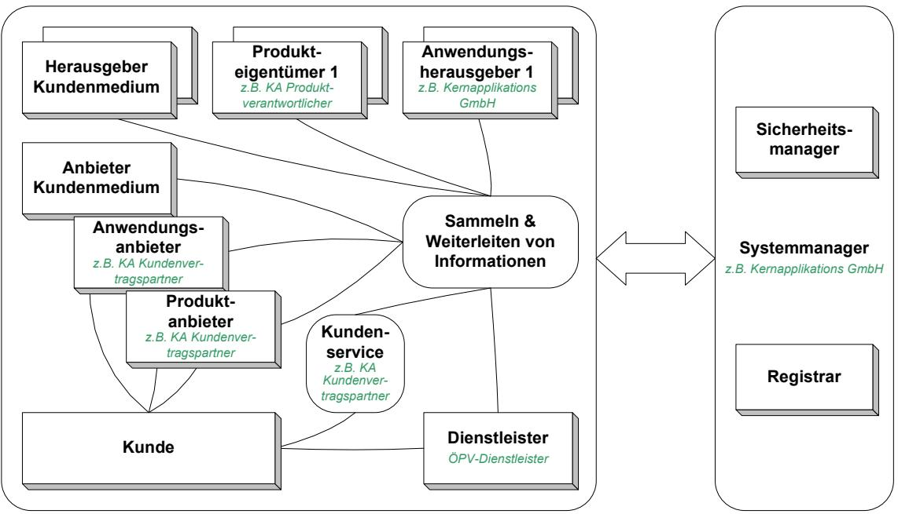

# TR 03126 - Technische Richtlinie für den sicheren RFID-Einsatz

TR 03126-3: Einsatzgebiet "NFC-basiertes eTicketing"

Autoren:

Cord Bartels, NXP Harald Kelter, BSI Rainer Oberweis, BSI Birger Rosenberg, NXP

Bundesamt für Sicherheit in der Informationstechnik Postfach 20 03 63 53133 Bonn Tel.: +49 (0) 228 99 9582 0 E-Mail: rfid@bsi.bund.de Internet: http://www.bsi.bund.de © Bundesamt für Sicherheit in der Informationstechnik 2009

# **Inhaltsverzeichnis**

| 1     | Beschreibung des Einsatzgebiets "NFC-basiertes eTicketing für den öffentlichen Personenverkehr"  | 13 |
|-------|-----------------------------------------------------------------------------------------------------|----|
| 2     | Beschreibung der Dienste, Produkte und Trägermedien                                                 | 15 |
|       |                                                                                                     |    |
| 3     | Vereinbarungen                                                                                      | 18 |
| 3.1   | Definition von Begriffen                                                                            | 18 |
| 3.2   | Generische Modellierung von Rollen und Entitäten                                                    | 19 |
| 3.3   | Zuordnung der Rollen und Entitäten im Einsatzgebiet eTicketing im ÖPV                               | 21 |
| 3.4   | Beziehung zwischen Trägermedien, Anwendungen und Berechtigungen                                     | 23 |
| 4     | Generelle Anforderungen                                                                             | 25 |
| 4.1   | Funktion                                                                                            | 25 |
| 4.1.1 | Anforderungen des Kunden                                                                            | 25 |
| 4.1.2 | Anforderungen des Produktanbieters und des Dienstleisters                                           | 25 |
| 4.2   | Wirtschaftlichkeit                                                                                  | 26 |
| 4.3   | Sicherheit                                                                                          | 26 |
| 5     | Methodik zur Ermittlung der Sicherheitsanforderungen                                                | 27 |
| 5.1   | Zielsetzung                                                                                         | 27 |
| 5.2   | Methodik                                                                                            | 27 |
| 5.2.1 | Erwägungen zum Umfang der Systembetrachtung                                                         | 27 |
| 5.2.2 | Skalierbarkeit und Flexibilität                                                                     | 28 |
| 5.2.3 | Aufbau der Technischen Richtlinie                                                                   | 30 |
| 5.2.4 | Erläuterung des Sicherheitskonzepts                                                                 | 31 |
| 6     | Generische Geschäftsprozesse                                                                        | 33 |
| 6.1   | Prozess P1 "Anmeldung und Bestellung"                                                               | 33 |
| 6.1.1 | Anlegen eines Kundenkontos, Erwerb von personalisierten Kundenmedien und Berechtigungen          | 33 |
| 6.1.2 | Erwerb von unpersonalisierten Trägermedien und Berechtigungen                                       | 35 |
| 6.2   | Prozess P2 "Erstellung und Auslieferung von Produkten"                                              | 37 |
| 6.2.1 | Prozess P2A "Erstellung und Auslieferung von personalisierten Trägermedien und Berechtigungen"   | 37 |
| 6.2.2 | Prozess P2B "Erstellung und Auslieferung von unpersonalisierten Trägermedien und Berechtigungen" | 38 |
| 6.3   | Prozess P3 "Verwendung der Berechtigung"                                                            | 39 |
| 6.4   | Prozess P4 "Sperrung von Berechtigungen, Anwendungen und Trägermedien"                              | 41 |
| 7     | Anwendungsfälle                                                                                     | 42 |
| 7.1   | Anwendungsfall "Identifizierung bei Anmeldung und Bestellung"                                       | 42 |

| 7.2                                              | Anwendungsfall "Initialisieren des Trägermediums"                             | 42 |  |
|--------------------------------------------------|-------------------------------------------------------------------------------|----|--|
| 7.3                                              | Anwendungsfall "Nachladen der Anwendung"                                      |    |  |
| 7.4                                              | Anwendungsfall "Einbringen der Berechtigung"                                  |    |  |
| 7.5                                              | Anwendungsfall "Auslieferung"                                                 | 45 |  |
| 7.6                                              | Anwendungsfall "Offline Check-in"                                             | 46 |  |
| 7.7                                              | Anwendungsfall "Kontrolle"                                                    | 48 |  |
| 7.8                                              | Anwendungsfall "Offline Check-out"                                            | 49 |  |
| 7.9                                              | Anwendungsfall "Sperrung"                                                     |    |  |
| 7.10                                             | Anwendungsfälle "Schlüsselmanagement"                                         |    |  |
| 7.10.1                                           | Schlüsselmanagement für das Initialisieren der Trägermedien                   |    |  |
| 7.10.2                                           | Schlüsselmanagement für das Aufbringen und Personalisieren der Anwendungen |    |  |
| 7.10.3                                           | Schlüsselmanagement für das Einbringen der Berechtigungen                     | 52 |  |
| 7.10.4                                           | Schlüsselmanagement für die Nutzung beim Dienstleister                        | 53 |  |
| 7.11                                             | Anwendungsfall "Initialisieren des lokalen Transponders"                      | 53 |  |
| 8                                                | Sicherheitsbetrachtungen                                                      | 56 |  |
| 8.1                                              | Definitionen zum Thema Sicherheit und Datenschutz                             | 56 |  |
| 8.2                                              | Definition der Sicherheitsziele                                               | 58 |  |
| 8.2.1 Spezifische Sicherheitsziele des Kunden |                                                                               | 58 |  |
|                                                  | 8.2.1.1 Funktionssicherheit                                                | 59 |  |
|                                                  | 8.2.1.2 Informationssicherheit                                             | 59 |  |
|                                                  | 8.2.1.3 Schutz der Privatsphäre                                            | 60 |  |
| 8.2.2                                            | Spezifische Sicherheitsziele des Produktanbieters                             | 60 |  |
|                                                  | 8.2.2.1 Funktionssicherheit                                                | 60 |  |
|                                                  | 8.2.2.2 Informationssicherheit                                             | 61 |  |
|                                                  | 8.2.2.3 Schutz der Privatsphäre                                            | 62 |  |
| 8.2.3                                            | Spezifische Sicherheitsziele des Dienstleisters                               | 62 |  |
|                                                  | 8.2.3.1 Funktionssicherheit                                                | 62 |  |
|                                                  | 8.2.3.2 Informationssicherheit                                             | 63 |  |
|                                                  | 8.2.3.3 Schutz der Privatsphäre                                            | 64 |  |
| 8.2.4                                            | Zusammenfassung der Sicherheitsziele der Entitäten                            | 64 |  |
| 8.2.5                                            | Bildung von Schutzbedarfsklassen                                              | 65 |  |
| 8.3                                              | Gefährdungen                                                                  |    |  |
| 8.3.1                                            | Gefährdungen der kontaktlosen Schnittstelle                                   |    |  |
| 8.3.2                                            | Gefährdungen des aktiven NFC-Mobiltelefons                                    |    |  |
| 8.3.3                                            | Gefährdungen des passiven NFC-Mobiltelefons                                   | 70 |  |
| 8.3.4                                            | Gefährdungen des lokalen Transponders                                         |    |  |
| 8.3.5                                            | Gefährdungen des Lesegeräts                                                   |    |  |

| 8.3.6  | Gefährdungen des Schlüsselmanagement                                                                               | 73  |
|--------|--------------------------------------------------------------------------------------------------------------------|-----|
| 8.3.7  | Gefährdungen der Verkaufs-, Kontroll- und Hintergrundsysteme                                                       | 74  |
| 8.4    | Maßnahmen                                                                                                          | 76  |
| 8.4.1  | Auswahl kryptographischer Verfahren                                                                                | 76  |
| 8.4.2  | Maßnahmen zum Schutz des Gesamtsystems                                                                             | 77  |
| 8.4.3  | Maßnahmen in Bezug auf das Trägermedium (NFC-Mobiltelefon im passiven Modus)                                    | 87  |
| 8.4.4  | Maßnahmen in Bezug auf das aktive NFC-Mobiltelefon                                                                 | 99  |
| 8.4.5  | Maßnahmen in Bezug auf den lokalen Transponder beim Online-Check-in und Check-out                               | 102 |
| 8.4.6  | Maßnahmen in Bezug auf den lokalen Transponder beim Offline-Check-in und Check-out                              | 102 |
| 8.4.7  | Maßnahmen in Bezug auf die Lesegeräte                                                                              | 104 |
| 8.4.8  | Maßnahmen in Bezug auf das Schlüsselmanagement                                                                     | 107 |
| 9      | Definition produktspezifischer Einsatzszenarien                                                                    | 116 |
| 9.1    | Einsatzszenario "Interfunktionsfähige, personalisierte Dauerberechtigung mit automatischer Fahrpreisermittlung" | 116 |
| 9.2    | Einsatzszenario "Mehrfahrtenberechtigung Nahbereich"                                                               | 117 |
| 10     | Umsetzungsvorschläge zum Gesamtsystem                                                                              | 119 |
| 10.1   | Umsetzungsvorschläge zur eTicketing-Infrastruktur                                                                  | 120 |
| 10.1.1 | Ermittlung des Schutzbedarfs für die eTicketing-Infrastruktur                                                      | 120 |
| 10.1.2 | Schnittstellen des Gesamtsystems                                                                                   | 123 |
|        | 10.1.2.1 Relevante Gefährdungen für die eTicketing Infrastruktur                                                | 123 |
|        | 10.1.2.2 Definition von Schutzmaßnahmen für die Schnittstellen des Gesamtsystems                             | 125 |
|        | 10.1.2.3 Verbleibende Risiken                                                                                   | 126 |
| 10.1.3 | Lesegeräte nach ISO/IEC14443                                                                                       | 126 |
|        | 10.1.3.1 Relevante Gefährdungen für das Lesegerät                                                               | 128 |
|        | 10.1.3.2 Definition von Schutzmaßnahmen für das Lesegerät und dessen Anwendungen                             | 130 |
|        | 10.1.3.3 Verbleibende Risiken                                                                                   | 131 |
| 10.1.4 | Verkaufs-, Kontroll- und Managementsysteme                                                                         | 131 |
|        | 10.1.4.1 Verkaufssysteme                                                                                        | 131 |
|        | 10.1.4.2 Ticketsystem                                                                                           | 133 |
|        | 10.1.4.3 Zentrales Kontrollsystem                                                                               | 134 |
|        | 10.1.4.4 Service-Desk                                                                                           | 135 |
|        | 10.1.4.5 Managementsystem für NFC-Mobiltelefone und Anwendungen                                                 | 135 |
|        | 10.1.4.6 Managementsystem für lokale Transponder                                                                | 136 |
|        | 10.1.4.7 Relevante Gefährdungen für die Ticket-, Kontroll- und Managementsysteme                             | 137 |

| 10.1.4.8 Definition von Schutzmaßnahmen für die Ticket-, Kontroll- und Managementsysteme            | 138        |
|-----------------------------------------------------------------------------------------------------------|------------|
| 10.1.4.9 Verbleibende Risiken                                                                          | 140        |
| 10.1.5 Schlüsselmanagement                                                                             |            |
| 10.1.5.1 Schlüsselmanagement beim ÖPV-Dienstleister / SAM für Dienstleister                            |            |
| 10.1.5.2 Relevante Gefährdungen für das Schlüsselmanagement                                            | 141 142 |
| 10.1.5.3 Definition von Schutzmaßnahmen für das Schlüsselmanagement                                    | 143        |
| 10.1.5.4 Verbleibende Risiken                                                                          | 144        |
| 10.2 Lokaler Transponder                                                                               | 144        |
| 10.2.1 Initialisierung von lokalen Transpondern                                                        | 146        |
| 10.2.2 Aufbringen der Ortsinformation                                                                  | 146        |
| 10.2.3 Ermittlung des Schutzbedarfs für den lokalen Transponder                                        | 146        |
| 10.2.4 Gefährdungen für den lokalen Transponder                                                        | 146        |
| 10.2.5 Definition spezifischer Maßnahmen                                                               | 147        |
| 10.3 NFC-Mobiltelefon                                                                                  | 147        |
| 10.3.1 Eigenschaften des NFC-Mobiltelefons                                                             | 147        |
| 10.3.2 Initialisierung des NFC-Mobiltelefons                                                           | 148        |
| 10.3.3 Personalisierung des NFC-Mobiltelefons                                                          | 149        |
| 10.3.4 Ermittlung des Schutzbedarfs für das NFC-Mobiltelefon                                           | 149        |
| 10.3.5 Gefährdungen für das NFC-Mobiltelefon                                                           | 149        |
| 10.3.5.1 Gefährdungen im aktiven Modus (PCD-Mode)                                                      | 149        |
| 10.3.5.2 Gefährdungen im passiven Modus                                                                | 150        |
| 10.3.6 Definition spezifischer Maßnahmen                                                               | 151        |
| 11 Umsetzungsvorschläge zu den produktspezifischen Einsatzszenarien                                    | 152        |
| 11.1 Einsatzszenario "Interfunktionsfähige Dauerberechtigung mit automatischer Fahrpreisermittlung" | 152        |
| 11.1.1 Ermittlung der Schutzbedarfsklasse                                                              | 152        |
| 11.1.2 Schutz des passiven NFC-Mobiltelefons                                                           | 155        |
| 11.1.2.1 Relevante Gefährdungen des passiven NFC-Mobiltelefons                                         | 155        |
| 11.1.2.2 Definition relevanter Anwendungsfälle für das passive NFC-Mobiltelefon                        | 156        |
| 11.1.2.3 Definition von Schutzmaßnahmen für das passive NFC-Mobiltelefon                               | 157        |
| 11.1.3 Schutz des aktiven NFC-Mobiltelefons                                                            | 159        |
| 11.1.3.1 Relevante Gefährdungen des aktiven NFC-Mobiltelefons                                          | 159        |
| 11.1.3.2 Definition relevanter Anwendungsfälle für das aktive NFC-Mobiltelefon                         | 160        |
| 11.1.3.3 Definition von Schutzmaßnahmen für das aktive NFC-Mobiltelefon                                | 160        |
| 11.1.4 Schutz des lokalen Transponders                                                                 |            |
| 11.1.4.1 Relevante Gefährdungen den lokalen Transponder                                                | 162        |
| 11.1.4.2 Definition relevanter Anwendungsfälle für den lokalen Transponder                             | 163        |
| 11.1.4.3 Definition von Schutzmaßnahmen für den lokalen Transponder                                    | 164        |

| 11.1.5 | Verbleibende Risiken                   | 165 |
|--------|----------------------------------------|-----|
| 12     | Referenzimplementierung Touch & Travel | 166 |
| 13     | Literaturverzeichnis                   | 167 |
| 14     | Abkürzungsverzeichnis                  | 169 |

# **Tabellenverzeichnis**

| Tabelle 2–1  | Übersicht über Vertriebsformen und deren Eigenschaften                                        | 16 |
|--------------|-----------------------------------------------------------------------------------------------|----|
| Tabelle 5–1  | Aufbau der Technischen Richtlinien                                                            | 31 |
| Tabelle 8–1  | Kodierungsschema der Sicherheitsziele                                                         | 58 |
| Tabelle 8–2  | Sicherheitsziele des Kunden zur Funktionssicherheit                                           | 59 |
| Tabelle 8–3  | Sicherheitsziele des Kunden zur Informationssicherheit                                        | 60 |
| Tabelle 8–4  | Sicherheitsziele des Kunden zum Schutz der Privatsphäre                                       | 60 |
| Tabelle 8–5  | Sicherheitsziele des Produktanbieters zur Funktionssicherheit                                 | 61 |
| Tabelle 8–6  | Sicherheitsziele des Produktanbieters zur Informationssicherheit                              | 62 |
| Tabelle 8–7  | Sicherheitsziele des Produktanbieters zum Schutz der Privatsphäre                             | 62 |
| Tabelle 8–8  | Sicherheitsziele des Dienstleisters zur Funktionssicherheit                                   | 63 |
| Tabelle 8–9  | Sicherheitsziele des Dienstleisters zur Informationssicherheit                                | 64 |
| Tabelle 8–10 | Sicherheitsziele des Dienstleisters zum Schutz der Privatsphäre                               | 64 |
| Tabelle 8–11 | Übersicht über die Sicherheitsziele der Entitäten                                             | 65 |
| Tabelle 8–12 | Definition von Schutzbedarfsklassen                                                           | 67 |
| Tabelle 8–13 | Kodierungsschema der Gefährdungen                                                             | 68 |
| Tabelle 8–14 | Gefährdungen der kontaktlosen Schnittstelle                                                   | 68 |
| Tabelle 8–15 | Gefährdungen des aktiven NFC Mobiltelefons                                                    | 70 |
| Tabelle 8–16 | Gefährdungen des passiven NFC-Mobiltelefons                                                   | 71 |
| Tabelle 8–17 | Gefährdungen des lokalen Transponders                                                         | 72 |
| Tabelle 8–18 | Gefährdungen des Lesegerätes                                                                  | 73 |
| Tabelle 8–19 | Gefährdungen des Schlüsselmanagements                                                         | 74 |
| Tabelle 8–20 | Gefährdungen der Verkaufs-, Kontroll- und Hintergrundsysteme                                  | 75 |
| Tabelle 8–21 | Kodierungsschema der Maßnahmen                                                                | 76 |
| Tabelle 8–22 | Schutz des Gesamtsystems durch Einführung von Schnittstellentests und Freigabeverfahren    | 77 |
| Tabelle 8–23 | Schutz des Gesamtsystems durch Sicherung der Vertraulichkeit der Kommunikation             | 78 |
| Tabelle 8–24 | Schutz des Gesamtsystems durch Einführung der kontaktlosen Schnittstelle nach ISO/IEC14443 | 79 |
| Tabelle 8–25 | Schutz des Gesamtsystems durch Definition von Rückfalllösungen                                | 79 |
| Tabelle 8–26 | Schutz des Gesamtsystems durch Sicherung der Vertraulichkeit von Daten                     | 80 |
| Tabelle 8–27 | Schutz des Gesamtsystems durch vertrauliche Speicherung von Daten                          | 81 |
| Tabelle 8–28 | Schutz des Gesamtsystems durch Sicherung der Datenintegrität bei der Datenübertragung      | 81 |

| Tabelle 8–29 | Schutz des Gesamtsystems durch Sicherung der Datenintegrität bei der Datenspeicherung     | 82  |
|--------------|----------------------------------------------------------------------------------------------|-----|
| Tabelle 8–30 | Schutz des Gesamtsystems durch Sicherung der Systemfunktionen gegen DoS-Angriffe          | 82  |
| Tabelle 8–31 | Schutz des Gesamtsystems durch Sicherung der Funktion des Systems gegen Fehlbedienung     | 83  |
| Tabelle 8–32 | Schutz des Gesamtsystems durch Sicherung der Funktion des Systems gegen technische Fehler | 83  |
| Tabelle 8–33 | Schutz des Gesamtsystems durch Spezifikation des Systems und der Komponenten              | 84  |
| Tabelle 8–34 | Schutz des Gesamtsystems durch ergonomische Benutzerführung                                  | 85  |
| Tabelle 8–35 | Schutz des Gesamtsystems durch Support                                                       | 85  |
| Tabelle 8–36 | Schutz des Gesamtsystems durch Trennung von Applikationen                                    | 85  |
| Tabelle 8–37 | Schutz des Gesamtsystems durch Identifikation des Kunden                                     | 86  |
| Tabelle 8–38 | Schutz des Gesamtsystems durch Umsetzung des Gebots der Datensparsamkeit                  | 86  |
| Tabelle 8–39 | Schutz des Transponders durch Zugriffsschutz für den EPC                                     | 87  |
| Tabelle 8–40 | Schutz des Transponders vor Klonen                                                           | 88  |
| Tabelle 8–41 | Schutz des Transponders vor Emulation                                                        | 89  |
| Tabelle 8–42 | Schutz von personenbezogenen Daten im Transponder                                            | 90  |
| Tabelle 8–43 | Schutz von Abrechnungsdaten im Transponder                                                   | 91  |
| Tabelle 8–44 | Schutz durch Trennung von Anwendungen im Transponder                                         | 92  |
| Tabelle 8–45 | Schutz durch Spezifikation des Trägermediums                                                 | 92  |
| Tabelle 8–46 | Schutz durch Einführung der Nahbereichstechnik nach ISO/IEC14443                             | 93  |
| Tabelle 8–47 | Schutz durch Rückfalllösung bei Fehlfunktion des Trägermediums                               | 93  |
| Tabelle 8–48 | Schutz durch Sichern von Authentizität und Integrität beim Nachladen von Anwendungen      | 96  |
| Tabelle 8–49 | Schutz durch Sichern von Vertraulichkeit beim Nachladen von Anwendungen                   | 97  |
| Tabelle 8–50 | Schutz durch Sichern von Authentizität und Integrität beim Nachladen von Berechtigungen   | 98  |
| Tabelle 8–51 | Schutz durch Sichern von Vertraulichkeit beim Nachladen von Berechtigungen                | 99  |
| Tabelle 8–52 | Schutz durch Vermitteln der Abläufe und Nutzungsbedingungen                                  | 100 |
| Tabelle 8–53 | Schutz durch Ausweichen auf alternativen Vertriebskanal                                      | 100 |
| Tabelle 8–54 | Schutz von Daten und Schlüsseln im NFC-Mobiltelefon                                          | 101 |
| Tabelle 8–55 | Schutz von Transponderdaten im NFC-Mobiltelefon                                              | 101 |
| Tabelle 8–56 | Schutz durch Überprüfung des NFC-Mobiltelefons/Displays                                      | 102 |
| Tabelle 8–57 | Schutz durch Sichern der Authentizität der Ortsinformation                                   | 103 |
| Tabelle 8–58 | Schutz vor Vandalismus / DoS-Attacken                                                        | 103 |
| Tabelle 8–59 | Schutz der Installation des Transponders                                                     | 104 |

| Tabelle 8–60  | Schutz der Lesegeräte durch Einführung von Schnittstellentests                                                         | 104 |  |  |  |
|---------------|------------------------------------------------------------------------------------------------------------------------|-----|--|--|--|
| Tabelle 8–61  | Schutz durch Schützen der Referenzinformationen                                                                        | 105 |  |  |  |
| Tabelle 8–62  | Schutz des Lesegerätes gegen Fehlfunktion                                                                              |     |  |  |  |
| Tabelle 8–63  | Schutz durch sichere Erzeugung und Einbringung von Schlüsseln                                                          | 108 |  |  |  |
| Tabelle 8–64  | Schutz durch Einführung eines Schlüsselmanagements                                                                     |     |  |  |  |
| Tabelle 8–65  | Schutz durch Zugriffsschutz auf kryptographische Schlüssel                                                             | 111 |  |  |  |
| Tabelle 8–66  | Schutz durch Sicherung der Funktion der Sicherheitskomponenten                                                         | 111 |  |  |  |
| Tabelle 8–67  | Schutz durch Verfügbarkeit des Schlüsselmanagements                                                                    | 112 |  |  |  |
| Tabelle 8–68  | Schutz durch Definition des Verhaltens bei Kompromittierung von Schlüsseln                                          | 113 |  |  |  |
| Tabelle 8–69  | Schutz durch Trennung von Schlüsseln                                                                                   | 113 |  |  |  |
| Tabelle 8–70  | Schutz durch Sicherung der Authentizität und Integrität beim Nachladen von Schlüsseln                               | 115 |  |  |  |
| Tabelle 9–1   | Trägermedien für die Nutzung der "Interfunktionsfähigen Dauerberechtigung mit automatischer Fahrpreisermittlung"    | 117 |  |  |  |
| Tabelle 9–2   | Relevante Prozesse für die Nutzung der Dauerberechtigung mit automatischer Fahrpreisermittlung                      | 117 |  |  |  |
| Tabelle 9–3   | Trägermedien für die Nutzung der Mehrfahrtenberechtigung Nahbereich                                                 | 118 |  |  |  |
| Tabelle 9–4   | Relevante Prozesse für die Nutzung der Mehrfahrtenberechtigung Nahbereich                                           | 118 |  |  |  |
| Tabelle 10–1  | Schutzbedarf des Systems                                                                                               | 123 |  |  |  |
| Tabelle 10–2  | Relevante Gefährdungen der kontaktlosen Schnittstelle                                                                  | 123 |  |  |  |
| Tabelle 10–3  | Relevante Gefährdungen des Systems                                                                                     | 124 |  |  |  |
| Tabelle 10–4  | Schutzmaßnahmen für das Gesamtsystem                                                                                   | 126 |  |  |  |
| Tabelle 10–5  | Relevante Gefährdungen der kontaktlosen Schnittstelle                                                                  | 129 |  |  |  |
| Tabelle 10–6  | Relevante Gefährdungen des Lesegeräts                                                                                  | 130 |  |  |  |
| Tabelle 10–7  | Schutzmaßnahmen für das Lesegerät und dessen Anwendungen                                                               | 131 |  |  |  |
| Tabelle 10–8  | Relevante Gefährdungen für die Ticket-, Kontroll- und Managementsysteme                                             | 138 |  |  |  |
| Tabelle 10–9  | Schutzmaßnahmen für die Ticket-, Kontroll- und Managementsysteme                                                    | 140 |  |  |  |
| Tabelle 10–10 | Relevante Gefährdungen des Schlüsselmanagements                                                                        | 143 |  |  |  |
| Tabelle 10–11 | Schutzmaßnahmen für das Schlüsselmanagement                                                                            | 144 |  |  |  |
| Tabelle 10–12 | Kategorisierung der Chipprodukte                                                                                       | 146 |  |  |  |
| Tabelle 10–13 | Relevante Gefährdungen für den lokalen Transponder                                                                     | 147 |  |  |  |
| Tabelle 10–14 | Kategorisierung der Trägermedien                                                                                       | 148 |  |  |  |
| Tabelle 10–15 | Eigenschaften der im NFC-Mobiltelefon integrierten Chipprodukte                                                        | 148 |  |  |  |
| Tabelle 10–16 | Relevante Gefährdungen des aktiven NFC-Mobiltelefons im Einsatzszenario "Dauerberechtigung mit Fahrpreisermittlung" | 150 |  |  |  |
| Tabelle 10–17 | Relevante Gefährdungen für das NFC-Mobiltelefon (passiver Modus)                                                       | 151 |  |  |  |

| Tabelle 11–1  | Schutzbedarf Einsatzszenario "Dauerberechtigung mit automatischer Fahrpreisermittlung"                               | 155 |
|---------------|-------------------------------------------------------------------------------------------------------------------------|-----|
| Tabelle 11–2  | Relevante Gefährdungen des passiven NFC-Mobiltelefons im Einsatzszenario "Dauerberechtigung mit Fahrpreisermittlung" | 156 |
| Tabelle 11–3  | Relevante Anwendungsfälle Einsatzszenario "Dauerberechtigung mit Fahrpreisermittlung"                                | 157 |
| Tabelle 11–4  | Maßnahmen zum passiven NFC-Mobiltelefon im Einsatzszenario "Dauerberechtigung mit Fahrpreisermittlung"               | 159 |
| Tabelle 11–5  | Relevante Gefährdungen des aktiven NFC-Mobiltelefons im Einsatzszenario "Dauerberechtigung mit Fahrpreisermittlung"  | 160 |
| Tabelle 11–6  | Relevante Anwendungsfälle Einsatzszenario "Dauerberechtigung mit Fahrpreisermittlung"                                | 160 |
| Tabelle 11–7  | Maßnahmen zum aktiven NFC-Mobiltelefon im Einsatzszenario "Dauerberechtigung mit Fahrpreisermittlung"                | 162 |
| Tabelle 11–8  | Relevante Gefährdungen des lokalen Transponder im Einsatzszenario "Dauerberechtigung mit Fahrpreisermittlung"        | 163 |
| Tabelle 11–9  | Relevante Anwendungsfälle Einsatzszenario "Dauerberechtigung mit Fahrpreisermittlung"                                | 164 |
| Tabelle 11–10 | Maßnahmen zum lokalen Transponder im Einsatzszenario "Dauerberechtigung mit Fahrpreisermittlung"                     | 165 |

# **Abbildungsverzeichnis**

| Abbildung 3–1  | Entitäten eines Einsatzgebiets nach ISO 24014 (erweitert um Entitäten des Kundenmediums)         | 19  |  |  |
|----------------|-----------------------------------------------------------------------------------------------------|-----|--|--|
| Abbildung 3–2  | Entitäten des Einsatzgebiets "eTicketing für den öffentlichen Personenverkehr"                   | 22  |  |  |
| Abbildung 3–3  | Entitäten des Einsatzszenarios "VDV Kernapplikation"                                                |     |  |  |
| Abbildung 3–4  | Trägermedien, Anwendungen und Berechtigungen                                                        | 24  |  |  |
| Abbildung 5–1  | Beispiel: Bestimmung RFID-relevanter Anwendungsfälle für eTicketing                              | 28  |  |  |
| Abbildung 5–2  | Beispiel für Einsatzszenarios und RFID-relevante Anwendungsfälle für eTicketing im ÖPV           | 29  |  |  |
| Abbildung 5–3  | Hierarchisches Konzept für Medien, Anwendungen und Tickets beim eTicketing                       | 29  |  |  |
| Abbildung 5–4  | Sicherheitsbewertungskonzept                                                                        | 32  |  |  |
| Abbildung 5–5  | Generische Sicherheitsziele                                                                         | 32  |  |  |
| Abbildung 6–1  | Prozessdarstellung P1A "Anmeldung und Bestellung"                                                   | 35  |  |  |
| Abbildung 6–2  | Prozessdarstellung P1B "Erwerb von unpersonalisierten Trägermedien und Berechtigungen            | 36  |  |  |
| Abbildung 6–3  | Prozess P2A "Erstellung und Auslieferung von personalisierten Trägermedien und Berechtigungen"   | 37  |  |  |
| Abbildung 6–4  | Prozess P2B "Erstellung und Auslieferung von unpersonalisierten Trägermedien und Berechtigungen" | 38  |  |  |
| Abbildung 6–5  | Prozessdarstellung P3 "Verwendung der CICO-Berechtigung"                                            | 40  |  |  |
| Abbildung 7–1  | Anwendungsfall "Initialisierung des Trägermediums"                                                  | 43  |  |  |
| Abbildung 7–2  | Anwendungsfall "Nachladen der Anwendung"                                                            | 44  |  |  |
| Abbildung 7–3  | Anwendungsfall "Einbringen der Berechtigung"                                                        | 45  |  |  |
| Abbildung 7–4  | Anwendungsfall "Offline Check-in"                                                                   | 47  |  |  |
| Abbildung 7–5  | Anwendungsfall "Kontrolle"                                                                          | 48  |  |  |
| Abbildung 7–6  | Anwendungsfall "Sperrung"                                                                           | 50  |  |  |
| Abbildung 7–7  | Anwendungsfall "Schlüsselmanagement für Trägermedien"                                               | 51  |  |  |
| Abbildung 7–8  | Anwendungsfall "Schlüsselmanagement für Anwendungen"                                                | 52  |  |  |
| Abbildung 7–9  | Anwendungsfall "Schlüsselmanagement für Berechtigungen/Produkte"                                 | 53  |  |  |
| Abbildung 7–10 | Anwendungsfall "Initialisierung des lokalen Transponders"                                           | 55  |  |  |
| Abbildung 10–1 | Exemplarische Darstellung des Gesamtsystems "NFC-basiertes eTicketing"                           | 119 |  |  |
| Abbildung 10–2 | Systemdarstellung der Referenzimplementierung "Touch & Travel"                                      | 120 |  |  |
| Abbildung 10–3 | Beispiel eines Lesegeräts mit Smart Card bzw. Smart Label                                           | 128 |  |  |
| Abbildung 10–4 | Exemplarisches Ticketsystem mit möglichem Prozessablauf                                             | 134 |  |  |

# **1 Beschreibung des Einsatzgebiets "NFC-basiertes eTicketing für den öffentlichen Personenverkehr"**

Für die Nutzung von öffentlichen Verkehrsmitteln benötigt der Fahrgast eine Berechtigung, auch Ticket genannt. Diese Berechtigung wird klassisch als Papierticket ausgeführt, dass bei Ausgabe bzw. Fahrtantritt durch den Fahrgast mit einem Gültigkeitsmerkmal (Validieren, Entwerten) versehen wird und ggf. durch einen Kontrolleur im Fahrzeug oder auf dem Bahnsteig geprüft wird.

In den Beschreibungen der Einsatzszenarien des "eTicketing für Veranstaltungen" und "eTicketing für den ÖPV" werden NFC-Trägermedien im "Smart Object Mode", also wie Smart Cards oder Smart Tickets verwendet. Dem NFC-Trägermedium fällt hier bei der Kommunikation mit einem ISO14443-Lesegerät die passive Rolle zu.

Die NFC-Technologie bietet jedoch auch die Möglichkeit einer aktiven Funktion des Kundenmediums. In diesem Fall fungiert das NFC-Gerät als aktives Lesegerät, dass die Kommunikation mit einem anderen NFC-Gerät oder einem ISO14443-Transponder steuert. Beide Rollen und zugeordnete Applikationen lassen sich in einem NFC-Trägermedium nebeneinander implementieren.

Diese aktive Funktionalität der NFC-Trägermedien kann für gewisse Einsatzszenarien dazu genutzt werden, die für Chipkarten nötige lokale Erfassungsinfrastruktur durch fest installierte Transponder zu ersetzen. Dadurch ergibt sich die Möglichkeit eine komplementäre, technisch interfunktionsfähige Systeminfrastruktur für Chipkarten und NFC-Geräte aufzubauen.

Dies ist besonders für den ÖPV interessant, da hier die Kosten für Infrastruktur, die im Fahrzeug oder an den Haltestellen installiert werden müsste, hoch sind. Hochfrequentierte Bereiche könnten dabei weiterhin mit leistungsfähigen lokalen Lesegeräten ausgerüstet werden (vgl. Beschreibung des Einsatzgebietes "eTicketing für den ÖPV"). Bereiche mit geringerem Fahrgastaufkommen (ländliche Gebiete, etc) werden durch eine Infrastruktur bestehend aus fest installierten Transpondern abgedeckt. Die Check-in/Entwertungsfunktion würde von den NFC-Mobilgeräten der Fahrgäste durchgeführt, die diese Transponder auslesen und den Datenabgleich mit dem Ticketsystem selbstständig vornehmen.

Die Beschreibung des Einsatzgebiets "NFC-basiertes eTicketing" basiert auf der Nutzung der aktiven Funktion des NFC-Trägermediums als Lesegerät im Anwendungsbereich des ÖPV.

Wie vorstehend beschrieben, sind die entsprechenden Einsatzszenarien im ÖPV komplementär zu denen des klassischen eTicking mit Chipkarten zu sehen. Dementsprechend können die dort verwendeten Standards und Vereinbarungen auch als Basis für die Beschreibung dieses Einsatzgebiets herangezogen werden.

Die europäische Standardisierung hat zur Unterstützung der entstehenden IFM-Systeme zurzeit drei Standards entwickelt.

- 1 Die funktionale Systemarchitektur mit den Einsatzszenarien von IFM-Systemen werden im Standard ISO EN 24014-1 beschrieben. Dieser Standard wurde in der Arbeitsgruppe CEN TC 278 WG3 SG5 konzipiert.
- 2 Die Beschreibung der auf dem Medium zu verwendenden Datenelemente und die Strukturierung der Datenelemente (Applikation) wurden im CEN TC 224 WG11 SG1 erarbeitet.
- 3 Die Norm EN 1545 beschreibt die Datenelemente und die Norm EN 15320 beschreibt die Datenstrukturierung (IOPTA, InterOperable Public Transport Application).

In der Praxis ist zu erwarten, dass es zu den lokal existierenden Implementierungen des eTicketing im ÖPV komplementäre Erweiterungen in Richtung NFC-basiertes eTicketing geben wird.

Die VDV Kernapplikation (KA) implementiert die vorhandenen Systemstandards in einer gesamten technischen Spezifikation.

# **2 Beschreibung der Dienste, Produkte und Trägermedien**

Die Betrachtung von Produkten und Trägermedien soll zunächst -wie auch in [IOPTA] vorgesehen- den aktuellen und erwarteten Stand in Europa wiedergeben. Ein besonderer Schwerpunkt soll jedoch auf die Check-in/Check-outCICO-Variante der KA (CICO) gelegt werden, da diese das am weitesten entwickelte, leistungsfähigste und flexibelste Einsatzszenario der [IOPTA] darstellt. Beim Check-in/Check-out-Verfahren meldet sich der Fahrgast vor Antritt der Beförderung mit Hilfe des Mediums bewusst an und nach Erreichen des Ziels bewusst ab.

Dem Kunden werden Dienstleistungen durch Verkehrsunternehmen gewährt. Mit Hilfe des Ticketing werden dazu folgende Produkte angeboten:

- 4 Elektronischer Fahrschein EFS (Einzelfahrschein, Tages-, Monats-, Jahres- und Netzkarten mit definierter räumlicher Gültigkeit sowie Fahrscheine für den Regional- und Fernverkehr)
- 5 Mehrfahrtenberechtigungen (Streifenkarte, Werteinheiten)
- 6 Upgrade/Aufladen einer Mehrfachberechtigung um weitere Einzelberechtigungen.
- 7 Dauerberechtigungen (Automatische Fahrpreisberechnung, CICO, EFS-Abovertrag)

Die Produkte unterscheiden sich durch besondere Merkmale:

- 1 Interfunktionsfähige oder nicht interfunktionsfähige Nutzung
- 2 Wert der Berechtigung:
	- EFS ca. 1€ … 15000 €; z. B. VRR: 6000€, DB AG: 15.000€ ,
	- WES … 150€
	- Dauerberechtigungen … >1000€
- 3 personengebunden personalisiert, personenungebunden personalisiert, anonym
- 4 zeitliche und räumliche Gültigkeit / nicht reglementierte Berechtigungen
- 5 Abrechnungsvarianten (Kontoberechtigungen {Pre-/Postpaid}, Werteinheiten-Berechtigungen, …)
- 6 Zeitpunkt der Fahrpreisermittlung (pre-, trip- und post-pricing)

Interfunktionsfähigkeit ist dabei so definiert, dass mehrere Unternehmen eine Berechtigung/ Produkt akzeptieren (Schnittstellen der Akzeptanzterminals müssen standardisiert sein, in der VDV-KA sind ist dies die ISO-14443 sowie die spezifizierten Datenschnittstellen) und die in Anspruch genommenen Leistungen und zugehörige Einnahmen untereinander verrechnen. Dies ist heute in Deutschland in jedem Verbund bereits gegeben. Aus Kundensicht bedeutet Interfunktionsfähigkeit, dass er sein Medium und seine Dauerberechtigungen bei verschiedenen Kundenvertragspartnern erstehen und aufbringen und bei verschiedenen Dienstleistern einsetzen kann.

Zur automatischen Fahrpreisberechnung erfolgt ein Anmelden bei Beginn (Check-in) als auch ein Abmelden bei Beendigung der Nutzung des ÖPV (Check-out). Dazu ist eine entsprechende Infrastruktur, die CICO-Infrastruktur, erforderlich. Bei Systemen, die Zutrittssperren verwenden, kann diese dafür genutzt werden. Sollte das nicht der Fall sein (z. B. in Deutschland), dann ist eine CICO-Infrastruktur bestehend aus An- und Abmeldeterminals auf den Bahnsteigen oder in den Fahrzeugen zu installieren.

Grundsätzlich lassen sich die gängigen Produkte, bei denen eine Check-in /check-out oder eine Entwertung der Berechtigung vorgenommen wird, auch mit aktiven NFC-Trägermedien abbilden. Ein besonderer Schwerpunkt soll jedoch auf die NFC-basierte CICO-Variante, die in Anlehnung an die VDV KA definiert wurde, gelegt werden.

Als Trägermedium für den Einsatz im ÖPV kann universell das "sichere NFC-Mobiltelefon" verwendet werden.

Die Produkte werden über folgende Kanäle vertrieben:

- 7 Direkter Vertrieb durch den Produktanbieter:
	- a Internetvertrieb
- 8 Vertrieb über Wiederverkäufer:
	- a Internetvertrieb

Die verschiedenen Vertriebskanäle und ihre Eigenschaften sind in der folgenden Tabelle beschrieben:

| Vertriebs kanal                                                                               | Anlegen eines Kun denkontos | Zuverlässige Identifi zierung | Initialisieren von Kun medien vor Ort den | Direkte Ausgabe von medien Kunden | wendungen auf ex. Aufbringen von An medien Kunden | rechtigungen auf ex. Aufbringen von Be medien Kunden | Bezahlformen                                                                  | Verkaufspersonal vor handen | m Verkauf in sichere Bereich | Mobiler Verkaufsbe trieb | Online-Anbindung an Verkaufs- und Mana me mentsyste ge |
|--------------------------------------------------------------------------------------------------|--------------------------------|----------------------------------|-------------------------------------------------|-----------------------------------------|------------------------------------------------------------|---------------------------------------------------------------|-------------------------------------------------------------------------------|--------------------------------|------------------------------------|-----------------------------|--------------------------------------------------------------------|
| Kunden zentrum / Verkaufs stelle                                                        | +                              | +                                | Over-the-air                                    | +                                       | Over-the-air                                               | +                                                             | Cash, Kar ten, Last schrift                                             | +                              | –                                  | +                           | +                                                                  |
| Servicecen ter (Telefon, Internet)                                                         | +                              | –                                | Over-the air                                 | Postver sand                         | Over-the air                                            | –                                                             |                                                                               | +                              | –                                  | –                           | +                                                                  |
| Internet (via Mobilnetz)                                                                      | +                              | –                                | the-air Over                                 | –                                       | +                                                          | +                                                             |                                                                               | –                              | –                                  | +                           | +                                                                  |
| Internet (via Mobilnetz) und Anmel dung Kun denkonto mit siche rem ID Token | +                              | +                                | Over-the-air                                    | –                                       | +                                                          | +                                                             | Karten, Lastschrift, Akzeptanz von sys mspezifischen Bezahlverfahren te | –                              | –                                  | +                           | +                                                                  |

**Tabelle 2–1 Übersicht über Vertriebsformen und deren Eigenschaften** 

 "+" zeigt an, dass die Funktion oder Eigenschaft für den Vertriebskanal zu berücksichtigen ist.

"-" zeigt an, dass keine relevante Beziehung zwischen Funktion/Eigenschaft und dem speziellen Vertriebskanal existiert.

"+" grau hinterlegte Symbole kennzeichnen die künftig erwarteten Entwicklungen.

1 Verkauf durch Personal

Beim Vertrieb über Kundenzentren und Verkaufsstellen findet eine direkte Interaktion zwischen dem Kunden und dem Personal des Produktanbieters (KVP) statt.

Gemeinsamkeiten dieser Vertriebswege sind die Möglichkeit der Identifizierung des Kunden durch das Personal (z. B. Personalausweis) und die flexible Handhabung von Bezahlverfahren, etc.

Unterschiede ergeben sich aus den verschiedenen technischen Möglichkeiten.

Die Initialisierung von NFC-Mobiltelefonen ist möglich, wenn diese "over-the-air" über das Mobilnetz ausgeführt wird. In jedem Fall können Kundenmedien in Kundenzentrenoder Verkaufsstellen bestellt und dann dem Kunden nach Hause zugestellt werden. Alternativ kann das initialisierte und personalisierte Kundenmedium auch zur Abholung im Kundenzentrum bereitgelegt werden. Ggf. ist die Initialisierung auch über andere Schnittstellen (z. B. NFC) möglich.

Das Aufbringen von Produkten bzw. Berechtigungen auf existierende personalisierte und unpersonalisierte NFC-Mobiltelefone kann ebenfalls "over-the-air" über das Mobilnetz ausgeführt werden. Alternativ kann die NFC-Schnittstelle zum Einbringen von Berechtigungen genutzt werden. Dies erfordert eine direkte Kommunikation zwischen dem Kundenmedium und dem Verkaufssystem über ein geeignetes Lesegerät. Eine solche Möglichkeit wird zur Zeit in Kundenzentren und lokalen Verkaufsstellen für personalisierte und unpersonalisierte Produkte zur Aufbringung auf Kundenkarten bereits unterstützt. Unpersonalisierte Produkte können auch offline über Secure Authentication Module (SAM) verkauft werden.

2 Service Center (Internet bzw. Hotline)

Der Kunde übergibt die persönlichen Informationen, die Bestellung und Zahlungsinformationen per Internet (Webpage) oder Hotline an ein zentrales Servicecenter. Bei der Bestellung beim Service-Center kann meistens die Verfügbarkeit des Produkts und ggf. die Sitzplatzreservierung direkt geklärt werden. Die Bezahlung erfolgt per Kreditkarte, per Lastschrift, etc. Produkte und Kundenmedien werden zugesendet oder könnten zur Abholung im Kundenzentrum bereitgestellt werden.

Die durch Eingabe auf der Webpage oder am Telefon erhaltenen Angaben zur Person und zur Adresse sind nicht grundsätzlich als vertrauenswürdig anzusehen. Eine belastbare Überprüfung ist mit zusätzlichem Aufwand erfolgen. Üblicherweise wird lediglich ein Abgleich mit einer aktuellen Adressdatenbank und eine Bonitätsprüfung durchgeführt.

3 Internet unter Verwendung von Kartenleser und sicherem Identitätsnachweis (z. B. eID) In Zukunft kann ggf. eine zusätzliche Option zur Anmeldung und Bestellung umgesetzt werden.

Dabei übergibt der Kunde die Bestellung und die Zahlungsinformationen per Internet (Webpage) an ein zentrales Servicecenter. Die Identifizierung und Übergabe von personenbezogenen Daten (sofern erforderlich) erfolgt online über eine direkte Kommunikation zwischen dem Anwendungsserver des Ticketanbieters und einer sicheren Bürgerkarte (eID). Dies kann z. B. möglicherweise (durch den künftigen elektronischen Personalausweis (ePA) realisiert werden,

Bei der Bestellung im Internet kann meistens die Verfügbarkeit des Produkts und z. B. die Sitzplatzwahl direkt geklärt werden. Die Bezahlung erfolgt per Kreditkarte, per Lastschrift, etc. Produkte und Kundenmedien werden per Post zugesendet oder am Veranstaltungsort zur Abholung (Verkaufsstelle, Automat) bereitgestellt.

Die durch Kommunikation mit dem elektronischen Identitätsnachweis erhaltenen Angaben zur Person und zur Adresse sind grundsätzlich als vertrauenswürdig und belastbar anzusehen. Eine weitere Überprüfung ist nicht erforderlich.

# **3 Vereinbarungen**

# **3.1 Definition von Begriffen**

#### Einsatzgebiet

Bereich, in dem die technische Richtlinie Anwendung finden soll. Höchste Einheit in der Begriffsstruktur. Umfasst eine oder mehrere Anwendungen, die jeweilig zugehörigen Produkte/Dienste und den daraus resultierenden Einsatzszenarien.

#### Einsatzszenario

Spezielle Betrachtung des Einsatzgebiets im Hinblick auf die Implementierung spezifischer Produkte bzw. Dienste.

#### Betriebsprozess

Umfassender betrieblicher Ablauf des eTicketing. Beispiele sind der Verkaufsprozess, Nutzung der Berechtigung, Clearing, etc.

### Anwendungsfall/ Nutzungsfall

Detaillierte Beschreibung einer Aktivität- bzw. eines Handlungsablaufs, der Teil eines Betriebsprozesses ist. Beispiele sind die Initialisierung eines Trägermediums oder das Nachladens einer Berechtigung.

#### Check-in / Check-out (CICO)

Bei Nutzung des Produkts "automatischen Fahrpreisberechnung" erfolgt ein Anmelden bei Beginn (Check-in) als auch ein Abmelden bei Beendigung der Fahrt (Check-out). Dazu ist eine entsprechende Infrastruktur, die CICO-Infrastruktur, erforderlich. Bei Systemen, die Zutrittssperren verwenden, können diese genutzt werden. Sonst ist eine CICO-Infrastruktur aus lokalen Transpondern auf den Bahnsteigen, an den Haltestellen oder in den Fahrzeugen zu installieren.

### Interfunktionsfähigkeit

Interfunktionsfähigkeit bedeutet, dass der Kunde Berechtigung bei verschiednene Produktanbietern erwerben, ggf. mit dem im System vereinbarten Bezahlverfahren bezahlen und diese Berechtigungen bei mehreren Dienstleistern einlösen kann. Die jeweils erbrachten Leistungen werden den Dienstleistern vom Produkteigentümer bzw. Produktanbieter über eine Clearing-Prozedur vergütet. Die Forderung nach Interfunktionsfähigkeit entsteht zwischen Verbünden aber auch innerhalb eines Verbundes zwischen den einzelnen Verkehrsunternehmen. Die Abrechnungsgenauigkeit ist dabei ein zentrales Element, da hierdurch die Einnahmen der Dienstleister bestimmt werden. In der Vergangenheit basierte die Verteilung in Verbünden auf Verkehrsflussanalysen, Statistiken und Schätzungen. Mit Einführung der CICO-Technik kann technisch Abrechnungsgenauigkeit erreicht werden.

### Nutzungsdaten

Die Abrechnung des Produkts "Automatische Fahrpreisberechnung" basiert auf Daten, die bei der Nutzung des Dienstes durch den Kunden erhoben werden. Dazu meldet sich der Kunde mit seinem Kundenmedium an einem lokalen Transponder an (Check-in) und nach der Nutzung wieder ab (Check-out). Die dabei gewonnenen Nutzungsdaten werden im Erfassungssystem und dem Kundenmedium gespeichert. Die Verlässlichkeit dieser Daten ist die Basis für eine verlässliche Rechnungsstellung an den Kunden und die Interfunktionsfähigkeit zwischen Dienstleistern.

### Abrechnungsdaten

Der zur Abrechnung verwendete Teil der Nutzungsdaten wird Abrechnungsdaten genannt. Die Abrechnungsdaten enthalten z. B. Informationen zur Berechtigung, den Produkteigentümer, den Dienstleister, den Ort und die Zeit des Check-in / Check-out. Je nachdem ob eine personalisierte oder anonyme Berechtigung verwendet wird, können die Daten dem Kunden zugeordnet werden. Die Abrechnungsdaten werden vom Dienstleister, der sie im Erfassungssystem sammelt, an den Produkteigentümer weitergeleitet. Die Authentizität, Integrität und Vertraulichkeit der Abrechnungsdaten ist sowohl für den Kunden als auch für die Dienstleister von großer Bedeutung.

# Statistikdaten

Statistikdaten geben Aufschluss über die generelle Nutzung eines Produkts, einer Linie, eines Fahrzeugs, etc. Bei der Berechtigung "Automatische Fahrpreisberechnung" können die Statistikdaten aus den Nutzungsdaten gewonnen werden. Bei anderen Produkten können Nutzungsdaten bei der Prüfung der Berechtigung vor dem Zutritt erhoben werden. Statistikdaten werden in anonymisierter und statistisch aufbereiteter Form gespeichert und verwendet. Statistikdaten werden nicht für die Abrechnung eines Dienstes mit dem Kunden sondern für Planungszwecke des Dienstleisters oder Produkteigentümers verwendet. Deshalb liegen sie nur in anonymisierter Form vor. Statistikdaten können allerdings für die generelle Aufteilung von Einnahmen zwischen Dienstleistern herangezogen werden.

# **3.2 Generische Modellierung von Rollen und Entitäten**

Die Beschreibung der Rollen- und Verantwortlichkeiten soll in Anlehnung an die Norm ISO 24014 erfolgen.

#### **Abbildung 3–1 Entitäten eines Einsatzgebiets nach ISO 24014 (erweitert um Entitäten des Kundenmediums)**

In der ISO 24014 werden Entitäten definiert und diesen Rollen und Verantwortlichkeiten zugewiesen. Die Implementierung für die Einsatzgebiete eTicketing ist im Folgenden beschrieben:

#### Akteur

Entitäten, die entsprechend der zugewiesenen Rolle handeln.

#### Kunde

Käufer für Produkte und Nutzer der damit verbundenen Dienste. Erhält gegen Bezahlung vom Produktanbieter die Berechtigung zur Nutzung von Diensten. Löst diese Berechtigung beim Dienstleister ein.

#### Kundenmedium

Das Kundenmedium ist ein Datenträger, in dem die elektronische Berechtigung gespeichert werden kann. Das Kundenmedium ist im Besitz des Kunden und wird von diesem zur Nutzung der Berechtigung benötigt. Weitere übliche Bezeichnungen sind Nutzermedium und Trägermedium. Ausprägungen des Kundenmediums sind z. B. das Smart Ticket, eine Chipkarte oder ein aktives oder passives NFC-Mobiltelefon (NMD). Das aktive NFC-Mobiltelefon erfüllt daneben auch Aufgaben der Erfassungsinfrastruktur und der Ausgabe von Berechtigungen.

#### Herausgeber Kundenmedium

Der Herausgeber des Kundenmediums konfiguriert dieses für die weitere Nutzung. Der Herausgeber vermarktet das Kundenmedium ggf. über Anbieter von Kundenmedien(z. B. ein Verkehrsunternehmen). Zwischen Herausgeber des Kundenmediums, Anwendungsherausgeber und Systemmanager ist eine enge Abstimmung und vertragliche Bindung erforderlich.

#### Anbieter Kundenmedium

Der Anbieter des Kundenmediums (z. B. ein Verkehrsunternehmen oder ein Mobilfunkprovider) vermarktet das Kundenmedium, die er vom Herausgeber des Kundenmediums erhalten hat. Der Anbieter des Kundenmediums implementiert üblicherweise mit der Ausgabe auch eine Anwendung.

#### Anwendung

Die Anwendung (oft auch Applikation genannt) unterstützt ein oder mehrere Produkte durch die Bereitstellung von Funktionen und Strukturen zur Aufnahme von z. B. Berechtigungen auf dem Trägermedium, im Verkaufssystem und im Hintergrundsystem. Die Implementierung folgt der Anwendungsspezifikation, die üblicherweise dem Anwendungsherausgeber gehört. Der Anwendungsherausgeber vermarktet die Anwendung ggf. über Anwendungsanbieter (z. B. einen Verkehrsverbund). Neben den Produkten kann eine Anwendung z. B. auch kundenspezifische Informationen enthalten.

#### Anwendungsherausgeber

Der Anwendungsherausgeber ist der Eigentümer der Anwendungsspezifikation. Der Anwendungsherausgeber vermarktet die Anwendung ggf. über Anwendungsanbieter (z. B. ein Verkehrsunternehmen).

#### Anwendungsanbieter

Der Anwendungsanbieter (z. B. ein Verkehrsunternehmen oder ein Stadionbetreiber) implementiert und vermarktet die Anwendung, die er vom Anwendungsherausgeber erhalten (z. B. lizensiert) hat. Der Anwendungsanbieter gibt ggf. mit der Anwendungsimplementierung auch das Trägermedium aus und ist damit z. B. bei Anwendungen aus dem Einsatzgebiet 'eTicketing' der Vertragspartner des Kunden.

### Produkt/Berechtigung/Dienst

Das Produkt ist das Leistungsangebot eines Produkteigentümers, das der Kunde gegen Bezahlung in Anspruch nehmen kann. Das Produkt gehört dem Produkteigentümer (z. B. einem Veranstalter von Konzerten) und wird direkt oder ggf.

über einen Produktanbieter (z. B. Reisebüro oder Vorverkaufsstelle) dem Kunden angeboten. Bei Kauf des Produktes erhält der Kunde eine Berechtigung zur Benutzung eines Dienstes, die er beim Dienstanbieter (z. B. Verkehrsunternehmen) einlösen kann.

#### Produkteigentümer

Eigentümer des Produkts (z. B. Einzelzutritt zu einem Bundesligaspiel). Der Produkteigentümer definiert und vermarktet das Produkt ggf. über Produktanbieter (z. B. eine Vorverkaufsstelle). In einfachen Szenarien ist es jedoch üblich, dass der Produkteigentümer auch die Rolle des Produktanbieters innehat. Um sicherzustellen, dass die Anwendung das Produkt unterstützen kann, muss der Produkteigentümer bei der Definition des Produktes den Spezifikationen des Anwendungsherausgebers folgen. Weiterhin ist eine enge Abstimmung zwischen dem Produkteigentümer und dem Dienstleister, der die mit dem Produkt versprochene Leistung erbringen soll, erforderlich. Zwischen Produkteigentümer, Produktanbieter und Dienstleister ist eine vertragliche Bindung erforderlich.

#### Produktanbieter

Vermarktet das Produkt im Auftrag des Produkteigentümers gegen eine Gebühr. Der Produktanbieter empfängt die Zahlung des Kunden und ist damit die einzige Schnittstelle für Zahlungen. Dies erfordert eine direkte Abstimmung und vertragliche Bindung mit dem Produkteigentümer. Der Produktanbieter bringt das Produkt (z. B. eine Berechtigung) in die Anwendung auf dem Trägermedium ein. Der Produktanbieter ist der Vertragspartner des Kunden bezüglich der verkauften Berechtigungen zur Nutzung von Diensten. Organisatorisch bedient der Produkteigentümer oft auch die Rolle des Produktanbieters.

#### Dienstleister

z. B. Stadionbetreiber oder Verkehrsunternehmen. Gewährt dem Kunden gegen Vorlage der vom Produktanbieter gekauften Berechtigung eine Dienstleistung (z. B. Zutritt zu einem Stadion). Dies erfordert eine direkte Abstimmung und vertragliche Bindung mit dem Produktanbieter und dem Produkteigentümer.

#### Systemmanager

Der Systemmanager sorgt für die Einhaltung der Regeln des Systems. Hierzu bedient er sich der funktionalen Entitäten Sicherheitsmanager und Registrar.

#### Registrar

Der Registrar sorgt für die Vergabe eineindeutiger Identifizierungsmerkmale im System. Wird benötigt für eineindeutige Identifizierung der Entitäten, Trägermedien, Anwendungen und Produkte/Berechtigungen.

#### Sicherheitsmanager

Etabliert und koordiniert die Sicherheitsregeln im System. Ist verantwortlich für die Zulassung der Komponenten des Systems. Überwacht die Durchführung von sicherheitsrelevanten Funktionen (z. B. Schlüsselmanagement).

# **3.3 Zuordnung der Rollen und Entitäten im Einsatzgebiet eTicketing im ÖPV**

Die Umsetzung der in Kapitel [2](#page-14-1) beschriebenen Dienste erfordert in der Maximalkonfiguration ein Zusammenwirken verschiedener und wechselnder Akteure. Zum Beispiel muss ein Dienstleister in die Lage versetzt werden, Produkte verschiedener Produkteigentümer und Anbieter zu verarbeiten und die Abrechnung entsprechend zu unterstützen.

Die Zuordnung der Entitäten dieses Einsatzgebietes ist identisch zur generischen Beschreibung aus Kapitel [3.2](#page-18-1). In der folgenden Abbildung sind zusätzlich exemplarisch die wesentlichen Akteure entsprechend der Definitionen der VDV Kernapplikation benannt:

**Abbildung 3–2 Entitäten des Einsatzgebiets "eTicketing für den öffentlichen Personenverkehr"** 

In der Spezifikation zur VDV Kernapplikation können einige der Rollen zusammengefasst werden:

- 1 Der Kundenvertragspartner (KVP) übernimmt die Rollen des Anbieters für Anwendung und Produkt. In Ausnahmefällen können auch vorkonfigurierte NFC-Mobiltelefone als Kundenmedium mit Anwendung und Berechtigung ausgegeben werden.
- 2 Die VDV KA GmbH übernimmt die Rollen des Systemmanagers (inkl. Sicherheitsmanager und Registrar) und auch des Anwendungsherausgebers.

Darauf basierend wird die generische [Abbildung 3–2](#page-21-1) in die folgende spezifische Darstellung überführt:

**Abbildung 3–3 Entitäten des Einsatzszenarios "VDV Kernapplikation"** 

# **3.4 Beziehung zwischen Trägermedien, Anwendungen und Berechtigungen**

Das Modell aus den Kapiteln [3.2](#page-18-1) und [3.3](#page-20-1) erlaubt die Unterstützung von jeweils mehreren Produktanbietern, Dienstleistern, Anwendungsherausgebern, usw.

Dementsprechend sind auch eine große Zahl verschiedener Trägermedien, Anwendungen und Produkte denkbar.

Das Kunden- oder Trägermedium ist der Datenträger des Kunden, auf dem er seine Berechtigungen speichert und mit dessen Hilfe er die zugeordneten Dienste in Anspruch nimmt.

Anwendungen stellen die Strukturen und Funktionen für das Aufbringen und die Nutzung von Berechtigungen auf Trägermedien bereit. Anwendungsimplementierungen müssen deshalb den Eigenschaften spezifischer Trägermedien und Berechtigungen Rechnung tragen.

Berechtigungen können vom Kunden beim Dienstleister in Leistungen umgetauscht werden.

Folgende Regeln gelten für die Beziehungen zwischen Trägermedien, Anwendungen und Berechtigungen:

- 1 Ein Trägermedium kann mindestens eine Anwendung aufnehmen. Sofern mehr als eine Anwendung aufgebracht werden kann, spricht man von multiapplikationsfähigen Trägermedien.
- 2 Eine Anwendung kann mindestens eine Berechtigung aufnehmen. Bei der Anwendung VDV Kernapplikation können verschiedene Berechtigungen verschiedenen Typs, die von verschiedenen Produktanbietern stammen können, gleichzeitig unterstützt werden. Personenbezogene Daten und Check-in / Check-out Daten werden ggf. in der Anwendung gespeichert.
- 3 Anwendungen auf einem Trägermedium können von verschiedenen Anwendungsherausgebern bzw. -anbietern stammen.
- 4 Berechtigungen in einer Anwendung können von verschiedenen Produkteigentümern bzw. -anbietern stammen.
- 5 Berechtigungen des gleichen Typs können in verschiedene Anwendungen eingebracht werden.

Die folgende Abbildung zeigt ein Beispiel für die Beziehungen zwischen Trägermedien, Anwendungen und Berechtigungen.

**Abbildung 3–4 Trägermedien, Anwendungen und Berechtigungen** 

# **4 Generelle Anforderungen**

Die Anforderungen an das Gesamtsystem und dessen Prozesse und Komponenten lassen sich in drei Kategorien gliedern.

# **4.1 Funktion**

# **4.1.1 Anforderungen des Kunden**

Aus Sicht des Kunden sollten z. B. die folgenden Eigenschaften umgesetzt werden:

- Die Kundenmedien und Systeme und müssen einfach zu handhaben sein.
- Das Kundenmedium muss robust sein und zuverlässig und performant funktionieren.
- Die Berechtigung bzw. das Kundenmedium muss ggf. bei verschiedenen Dienstleistern einfach und zuverlässig zu nutzen sein.
- Die Abrechung bei Produkten "Automatische Fahrpreisberechnung" muss zuverlässig und nachvollziehbar sein.
- Abhanden gekommene Berechtigungen sollten gegen eine Aufwandsentschädigung ersetzt werden können. Gleiches sollte für den Umtausch von Berechtigungen gelten.
- Der Kauf von anonymen Berechtigungen muss optional möglich sein.
- Die personenbezogenen Daten (so vorhanden) müssen angemessen geschützt sein.

Generell sollte der Kunde beim Einsatz der kontaktlosen Chiptechnik über die verwendeten personenbezogenen Daten, die Verwendung dieser Daten, Maßnahmen zum Datenschutz und verbleibende Risiken offen informiert werden.

# **4.1.2 Anforderungen des Produktanbieters und des Dienstleisters**

Funktionalität

- Die Verwendung der Kundenmedium und Systeme muss den Kunden und dem eigenen Personal mit wenig Erklärungsaufwand vermittelbar sein.
- Die Umsetzung der Systemkomponenten und Prozesse muss den besonderen Bedingungen des ÖPV Rechnung tragen. Z. B. kann in Fahrzeugen kein permanenter Datenzugang zum Gesamtsystem sichergestellt werden. Deshalb muss z. B. der Erwerb von Berechtigungen sowie Entwertung bzw. Check-in / Check-out und die Kontrolle auch möglich sein, wenn die jeweiligen Terminals nicht während des gesamten Prozesses online sind.
- Sperrung und Ersatzausstellung von personalisierten Berechtigungen und Kundenmedien muss unterstützt werden.
- Generell muss bei Zutrittssperren und Check-in/Check-out-Systemen der erforderliche Durchsatz gewährleistet sein.

Technische Kompatibilität

• Die Kompatibilität der Systemkomponenten muss auch dann sichergestellt sein, wenn Trägermedien, Systeme und Komponenten von unterschiedlichen Hersteller und Anbietern kommen und bei verschiedenen Dienstleistern zum Einsatz gebracht werden.

# **4.2 Wirtschaftlichkeit**

Ein wirtschaftlicher Betrieb des eTicketing-Systems erfordert, dass der kommerzielle Nutzen in jeder Ausbaustufe größer als die Kosten für Prozesse, Systeme und Sicherheit ist. Dies muss für alle Akteure, die in den Aufbau des Systems investieren, gelten.

Das Gesamtsystem und dessen Komponenten sollte daher so ausgelegt werden, dass die Anforderungen der relevanten Einsatzszenarien möglichst effizient erfüllt werden. Deshalb sind zunächst diese Anforderungen möglichst exakt zu bestimmen.

# **4.3 Sicherheit**

Auf Anforderungen zur Sicherheit wird in diesem Dokument ab Kapitel [8.2](#page-57-1) speziell eingegangen.

# **5 Methodik zur Ermittlung der Sicherheitsanforderungen**

# **5.1 Zielsetzung**

Die Technische Richtlinie RFID soll folgenden Zielen dienen:

- Leitfaden für Systemlieferanten und Systemanwender zur sachgerechten Implementierung von spezifischen RFID-Systemlösungen bzgl. Funktions- und Informationssicherheit und Datenschutz.
- Schaffung von Aufmerksamkeit und Transparenz in Bezug auf Sicherheitsaspekte.
- Basis für eine Konformitätserklärung der Systemlieferanten oder Betreiber und die Vergabe eines Gütesiegels durch eine Zertifizierungsstelle.

Zur Umsetzung dieser Ziele sind folgende Informationen erforderlich:

- Ermittlung der Sicherheitsanforderungen an ein RFID-System eines Einsatzgebietes.
- Benennung der spezifischen Gefährdungen, geeigneter Gegenmaßnahmen und des möglicherweise verbleibenden Restrisikos.
- Definition der Kriterien für eine Konformitätserklärung bzw. Zertifizierung.

Bei der Definition von Maßnahmen und Systemvorschlägen sind nicht nur Sicherheitsaspekte relevant. Vielmehr müssen alle in Kapitel [4](#page-24-1) benannten Anforderungen berücksichtigt werden.

# **5.2 Methodik**

# **5.2.1 Erwägungen zum Umfang der Systembetrachtung**

RFID-basierte Systeme können sehr komplex sein. In den meisten Fällen gehören zur Systemlösung auch viele Komponenten, die nicht mit RFID ausgestattet sind. Auf der anderen Seite dürfen bei der Betrachtung der Systemsicherheit nicht nur das Medium/das Tag und die Lesegeräte berücksichtigt werden.

Die Technische Richtlinie muss alle für RFID relevanten Sicherheitsaspekte im Detail einbeziehen. Diese Aspekte hängen stark vom Einsatzgebiet und der jeweiligen Implementierung der Systemlösung ab. Diese Technische Richtlinie enthält daher detaillierte Angaben über das Einsatzgebiet und die dazugehörenden Betriebsprozesse (einschließlich der Vertriebskanäle und -prozesse). Basierend auf diesen Informationen werden RFID-relevante Anwendungsfälle bestimmt. Die Prozesse und Anwendungsfälle decken den gesamten Lebenszyklus eines Trägermediums oder Transponders ab. Basierend auf diesen Prozessen werden Anwendungsfälle bestimmt, die aus für die Sicherheitsbetrachtung des RFID-Systems relevant sind. Diese Anwendungsfälle werden dann als Grundlage für die Ermittlung von Gefährdungen und eine detaillierte, systemspezifische Sicherheitsbewertung für die mit RFID im Zusammenhang stehenden Bereiche des Systems genutzt. [Abbildung 5–1](#page-27-1) zeigt diese Vorgehensweise am Beispiel des eTicketing im ÖPV.

**Abbildung 5–1 Beispiel: Bestimmung RFID-relevanter Anwendungsfälle für eTicketing** 

Alle anderen Systemkomponenten werden nur allgemein behandelt. Die vorgeschlagenen Sicherheitsmaßnahmen basieren auf den bekannten offenen IT-Sicherheitsstandards.

Dieses Konzept legt den Schwerpunkt der Betrachtung auf die für RFID relevanten Systemteile und gewährleistet dennoch die Berücksichtigung aller Sicherheitsaspekte. Auf der anderen Seite lässt die Technische Richtlinie auch Raum für individuelle und anwendereigene IT-Implementierungen (Back Offices, Vertriebs- und Logistiksysteme etc.). Dies unterstützt insbesondere die Erweiterung bestehender Systeme um die RFID-Technologie.

# **5.2.2 Skalierbarkeit und Flexibilität**

Diese Technischen Richtlinien müssen sollen in erster Linie Sicherheitsfragen behandeln. Parallel muss für alle Implementierungen, die auf dieser Richtlinie aufsetzen, Wirtschaftlichkeit ein wirtschaftlicher Betrieb sichergestellt möglich werden. Daher sollen die folgenden Anforderungen an die Methodologie der Richtlinie berücksichtigt werden:

- 1 Es muss möglich sein, Systeme so zu implementieren, dass eine Ausgewogenheit von Kosten und Nutzen erreicht wird. Dies bedeutet in der Praxis, dass die Schutzmaßnahmen den ermittelten Schutzbedarf zwar erfüllen aber nicht übertreffen müssen. Beispiel: Werden nur preiswerte Produkte verwendet, die eine relativ niedrige Sicherheitsanforderung haben, sollten die Schutzmaßnahmen entsprechend gestaltet werden. Dies ermöglicht beispielsweise die Verwendung preiswerter Medien, wodurch sich die Kosten für die Systemimplementierung und den Betrieb verringern.
- 2 Die für die Technische Richtlinie ausgewählten Einsatzszenarios umfassen eine große Bandbreite, von kleinen bis zu landesweiten oder sogar grenzüberschreitenden Anwendungen. Wichtig ist, dass das in der Richtlinie verwendete Konzept für Systemlösungen aller Größen und verschiedener Komplexität genutzt werden kann.

3 In vielen Fällen lässt sich die Wirtschaftlichkeit einer Systemlösung wesentlich leichter durch die Kooperation mit Geschäftspartnern erreichen. Dies gilt insbesondere für eTicketing-Anwendungen, bei denen es sehr vorteilhaft sein kann, wenn bereits beim Kunden verfügbare Medien (z. B. Karten mit Mehrfachanwendung oder NFC-fähige Telefone) für zusätzliche Anwendungen, Produkte und damit verbundene Dienstleistungen wiederverwendet werden können.

Die folgenden Abbildungen zeigen Beispiele von eTicketing für eine system- und anwendungsübergreifende Nutzung von Kundenmedien und -infrastruktur.

[Abbildung 5–2](#page-28-1) zeigt, dass u. U. verschiedene Produkte bzw. Einsatzszenarios in einem System unterstützt werden müssen. Dabei werden diese Produkte möglicherweise auf verschiedene Trägermedien aufgebracht.

#### **Abbildung 5–2 Beispiel für Einsatzszenarios und RFID-relevante Anwendungsfälle für eTicketing im ÖPV**

[Abbildung 5–3](#page-28-2) zeigt ein Beispiel eines Kundenmediums für eTicketing, das Anwendungen aus zwei Einsatzgebieten unterstützt.

#### **Abbildung 5–3 Hierarchisches Konzept für Medien, Anwendungen und Tickets beim eTicketing**

Um die genannten Anforderungen zu erfüllen, wird für diese Technische Richtlinie folgendes Konzept verwendet:

- 1 Ein passendes Rollenmodell und die Struktur einiger Hauptelemente (Produkte, Applikationen und Medien) wurden in Kapitel 3 beschrieben. Dieses Modell unterstützt einen in skalierbaren und erweiterbaren Ansatz.
- 2 Die Technische Richtlinie muss Sicherheitskonzepte anbieten, die alle in einer Infrastruktur verwendeten Kombinationen von Einsatzszenarios und Medien umfassen. Dies wird durch individuelle Sicherheitsbewertungen, die auf den RFID-relevanten Anwendungsfällen basieren, erreicht.
- 3 Gleiche Einsatzgebiete (insbesondere im eTicketing), die die Möglichkeit für anwendungsübergreifende Partnerschaften bieten, werden in den entsprechenden Technischen Richtlinien mit so viel Kommunalität wie möglich behandelt. Die Sicherheitsbewertung basiert auf ähnlichen Sicherheitszielen. Die Schutzmaßnahmen verwenden wenn möglich die gleichen Mechanismen.
- 4 Eine besondere Herausforderung besteht bei system- und anwendungsübergreifenden Partnerschaften im Hinblick auf die Systemsicherheit. Es muss gewährleistet sein, dass die Sicherheit eines Systems nicht von Schwächen eines anderen Systems untergraben wird. Dies erfordert normalerweise eine umfassende Sicherheitsbewertung beider Systeme.

Die Technischen Richtlinien widmen sich diesem Problem durch Einführung eines skalierbaren und transparenten Konzepts für die Anwendung von Schutzmaßnahmen gegenüber den festgestellten Gefährdungen, den "Schutzbedarfsklassen". Insgesamt werden drei Klassen von 1 (normale Anforderung) bis zu 3 (hohe Anforderung) verwendet. Alle Schutzmaßnahmen werden entsprechend in drei Stufen definiert, von normalem Schutz bis zu erweitertem Schutz.

Bei jeder individuellen Systemimplementierung wird zuallererst die Schutzanforderungskategorie für jedes Sicherheitsziel definiert. Daraus ergibt sich der Umfang der zu treffenden Schutzmaßnahmen.

Dieses Konzept bietet eine einfache Möglichkeit zur Installation einer sicheren Systemkooperation. Es muss lediglich sichergestellt werden, dass die Schutzbedarfsklassen beider Systeme zusammenpassen.

# **5.2.3 Aufbau der Technischen Richtlinie**

| Kapitel                         | Inhalt                                                                                       |
|---------------------------------|----------------------------------------------------------------------------------------------|
| Beschreibung des Einsatzgebiets | Beschreibung des Einsatzgebiets: Aufbau, Leistungen, spezielle Randbedingungen etc.    |
| Produkte und Leistungen         | Beschreibung von Beispielprodukten und - leistungen sowie Vertriebskanälen                |
| Definitionen                    | Modelle, Begriffsdefinitionen                                                                |
| Einführung in die Methodologie  | Vorstellung des für die Sicherheitsbewer tung verwendeten Konzepts sowie der Me thoden |
| Allgemeine Anforderungen        | Allgemeine Anforderungen der beteiligten Parteien, beachtenswerte Aspekte etc.            |
| Betriebsprozesse                | Beschreibung von Betriebsprozessen, die für den Lebenszyklus von Trägermedien             |

[Tabelle 5–1](#page-30-1) zeigt den Aufbau aller bisher erstellten Technischen Richtlinien.

| Kapitel                                                 | Inhalt                                                                                                                                                                                                                                                                                            |
|---------------------------------------------------------|---------------------------------------------------------------------------------------------------------------------------------------------------------------------------------------------------------------------------------------------------------------------------------------------------|
|                                                         | von Bedeutung sind                                                                                                                                                                                                                                                                                |
| Anwendungsfälle                                         | Definition von RFID-relevanten Anwen dungsfällen                                                                                                                                                                                                                                               |
| Sicherheitsbewertung                                    | Einführung in die IT-Sicherheit                                                                                                                                                                                                                                                                   |
|                                                         | Definition spezieller Sicherheitsziele, Schutzbedarfsklassen und Gefährdungen                                                                                                                                                                                                                  |
|                                                         | Vorgeschlagene Schutzmaßnahmen                                                                                                                                                                                                                                                                    |
| Definition von Einsatzszenarios                         | Definition von Beispielen für Einsatzszena rios. Diese Beispiele decken die gesamte Bandbreite relevanter Parameter ab, die in einem bestimmten Einsatzgebiet auftreten kann. Der Nutzer der technischen Richtlinie kann diese Szenarios seinen eigenen Be dürfnissen anpassen. |
| Implementierungsvorschlag für die System lösung      | Generische Systembeschreibung mit Bei spielen zur Durchführung einer Gefähr dungsanalyse und machbarer Schutzmaß nahmen für die Systemkomponenten                                                                                                                                        |
| Implementierungsvorschlag einzelner Einsatzszenarios | Beispiele für die Verwendung des Konzepts zur Sicherheitsbewertung                                                                                                                                                                                                                             |

**Tabelle 5–1 Aufbau der Technischen Richtlinien** 

# **5.2.4 Erläuterung des Sicherheitskonzepts**

Jede Technische Richtlinie enthält Beispiele zur Durchführung der Sicherheitsbewertung in bestimmten Einsatzszenarios. Diese können an die Anforderungen und Randbedingungen der speziellen Systemimplementierung angepasst werden.

[Abbildung 5–4](#page-31-1) zeigt das in allen Technischen Richtlinien verwendete Konzept der Sicherheitsbewertung.

**Abbildung 5–4 Sicherheitsbewertungskonzept** 

Alle Erwägungen basieren auf der klassischen Definition von Sicherheitszielen, die in [Abbildung 5–5](#page-31-2) gezeigt wird.

**Abbildung 5–5 Generische Sicherheitsziele** 

# **6 Generische Geschäftsprozesse**

# **6.1 Prozess P1 "Anmeldung und Bestellung"**

# **6.1.1 Anlegen eines Kundenkontos, Erwerb von personalisierten Kundenmedien und Berechtigungen**

Zum Anlegen eines Kundenkontos und zum Erwerb einer personalisierten oder unpersonalisierten Berechtigung wendet sich der Kunde an den Produktanbieter (bzw. Kundenvertragspartner für VDV Kernapplikation). Falls der Kunde nicht im Besitz eines Trägermediums sein sollte, das mit einer geeigneten Anwendung versehenen ist, kann der Kunde über den Produktanbieter ein solches beziehen[1](#page-32-0) . Dazu arbeitet der Produktanbieter mit den Anbietern der Anwendung und des Kundenmediums zusammen.

Der Erwerb von kundenbezogenen Berechtigungen, Anwendungen und Trägermedien erfordert die Anmeldung des Kunden. Dabei übergibt der Kunde die geforderten persönlichen Daten (z. B. Name, Postadresse, Zahlungsinformationen) und bestellt das gewünschte Gut.

Normalerweise liegt es im Ermessen des Produktanbieters, welche Daten vom Kunden zwecks Identitäts- und Adressenfeststellung sowie Bonitätsprüfung verlangt werden.

Für die Anmeldung und Bestellung sollen exemplarisch folgende Prozesse betrachtet werden:

1 Bestellung im Kundenzentrum oder einer lokalen Verkaufsstelle

Der Kunde sucht die Verkaufsstelle (z. B. das Kundenzentrum eines Verkehrsunternehmens, eine Verkaufsstelle am Bahnhof oder ein Reisebüro) auf und bestellt das Produkt. Sofern die Bezahlung nicht nach der Leistungserbringung vereinbart ist (Post-Paid) erfolgt diese vor Ort. Im Idealfall kann die Verkaufsstelle das Kundenmedien mit der Anwendung versehen und vor Ort ausgeben. Ansonsten wird beides per Post zugestellt. Personenbezogene Daten sind nur gefordert, wenn ein kundenspezifisches Produkt oder ein Produkt mit KA-Bezahlverfahren per Lastschrift bestellt wird oder Postversand erforderlich ist.

Die Überprüfung der Identität und der personenbezogenen Daten erfolgt, sofern erforderlich, z. B. durch Vorlage des Personalausweises.

2 Servicecenter

Der Kunde übergibt die benötigten persönlichen Informationen, die Bestellung und Zahlungsinformationen per Fax, per schriftlichen Antrag oder telefonisch an ein zentrales Servicecenter. Bei der telefonischen Bestellung kann meistens die Verfügbarkeit des Produkts und z. B. die Sitzplatzwahl direkt geklärt werden. Sofern die Bezahlung nicht nach der Leistungserbringung vereinbart ist (Post-Paid) erfolgt diese per Kreditkarte, per Lastschrift, etc. Das initialisierte Kundenmedium und ggf. das Produkt werden zugesandt.

Die per Fax oder Telefon erhaltenen Angaben zur Person und zur Adresse sind nicht grundsätzlich als vertrauenswürdig anzusehen. Eine belastbare Überprüfung kann nur

1 Der Fall, dass ein Kunde nur ein Kundenmedium mit einer Anwendung ohne ein Produkt erwerben möchte, erscheint nicht relevant und soll hier nicht betrachtet werden.

mit zusätzlichem Aufwand erfolgen. Üblicherweise wird lediglich ein Abgleich mit einer aktuellen Adressdatenbank und eine Bonitätsprüfung durchgeführt.

3 Internet

Der Kunde übergibt die persönlichen Informationen, die Bestellung und Zahlungsinformationen per Internet (Webpage) an ein zentrales Servicecenter. Bei der Bestellung im Internet kann meistens die Verfügbarkeit des Produkts und ggf. die Sitzplatzreservierung direkt geklärt werden. Sofern die Bezahlung nicht nach der Leistungserbringung vereinbart ist (Post-Paid) erfolgt diese per Kreditkarte, per Lastschrift, etc. Das initialisierte Kundenmedium und ggf. das Produkt werden zugesandt.

Die durch Eingabe auf der Webpage erhaltenen Angaben zur Person und zur Adresse sind nicht grundsätzlich als vertrauenswürdig anzusehen. Eine belastbare Überprüfung kann nur mit zusätzlichem Aufwand erfolgen. Üblicherweise wird lediglich ein Abgleich mit einer aktuellen Adressdatenbank und eine Bonitätsprüfung durchgeführt.

4 Internet unter Verwendung von Kartenleser und sicherem Identitätsnachweis (z. B. eID) In Zukunft kann ggf. eine zusätzliche Option zur Anmeldung und Bestellung umgesetzt werden.

Dabei übergibt der Kunde die Bestellung und die Zahlungsinformationen per Internet (Webpage) an ein zentrales Servicecenter. Die Identifizierung und Übergabe von personenbezogenen Daten (sofern erforderlich) erfolgt online über eine direkte Kommunikation zwischen dem Anwendungsserver des Ticketanbieters und einem sicheren elektronischen Identitätsnachweis.

Bei der Bestellung im Internet kann meistens die Verfügbarkeit des Produkts und z. B. die Sitzplatzwahl direkt geklärt werden. Die Bezahlung erfolgt per Kreditkarte, per Lastschrift, etc.

Die durch Kommunikation mit dem sicheren elektronischen Identitätsnachweis erhaltenen Angaben zur Person und zur Adresse sind grundsätzlich als vertrauenswürdig und belastbar anzusehen. Eine weitere Überprüfung ist nicht erforderlich.

Wird ein Kundenmedium bestellt, so wird dieses zugeschickt.

Besitzt der Kunde bereits ein geeignetes NFC-Mobiltelefon, so muss er dessen Kenndaten angeben um das Aufbringen der Anwendung zu ermöglichen. Die Anwendung und die Berechtigung kann über die Internetverbindung des NFC-Mobiltelefons geladen werden.

Die folgende [Abbildung 6–1](#page-34-1) zeigt den Prozess P1A "Anmeldung und Bestellung".

**Abbildung 6–1 Prozessdarstellung P1A "Anmeldung und Bestellung"** 

Das Anlegen eines Kundenkontos und die Bestellung können auch voneinander unabhängig erfolgen. Das Kundenkonto wird einmalig angelegt. Alle später erfolgenden Bestellungen können über das Kundenkonto abgewickelt werden. In diesen Fällen ist eine sichere Authentisierung beim Zugang zum Kundenkonto erforderlich.

# **6.1.2 Erwerb von unpersonalisierten Trägermedien und Berechtigungen**

Eine besondere Bedeutung kommt im ÖPV dem anonymen Verkauf und dem Verkauf von unpersonalisierten Produkten zu. In diesen Fällen wird kein Kundenkonto angelegt bzw. ein existierendes Kundenkonto nicht genutzt. Das Produkt wird auf einem unpersonalisierten Trägermedium geliefert oder auf ein existierendes Kundenmedium anonym aufgebracht.

Der Erwerb von unpersonalisierten Produkten schließt die Möglichkeit zur Zahlung per Lastschrift aus.

Falls ein Produkt, das eine Fahrpreisfindung nach Fahrtantritt beinhaltet, verwendet wird (z. B. VDV Kernapplikation), muss eine Pre-Paid-Lösung zum Bezahlung vorgesehen werden. Dies kann durch eine anonyme Bezahlfunktion oder einen speziellen Werteinheitenspeicher auf dem Trägermedium erfolgen.

Der Kunde muss grundsätzlich vor der Nutzung des Produkts die Zahlung leisten bzw. bei automatischer Fahrpreisfindung vor dem Fahrtantritt für ein ausreichendes Guthaben zur Ausgleich des in Anspruch genommenen Beförderungsdienstleistung sorgen.

Der anonyme Verkauf erfordert, dass die Zahlung sofort erfolgt, das Trägermedium ggf. initialisiert die Berechtigung aufgebracht und vom Kunden auf dem Trägermedium mitgenommen werden kann. Unpersonalisierte Berechtigung werden vor Ort erstellt und auf vorhandene oder neue Kundenmedien aufgebracht. Die Zahlung erfolgt bar, per Karte oder über ein anonymes Pre-Paid Verfahren.

Folgende Vertriebskanäle können genutzt werden:

1 Verkaufsstelle/Kundenzentrum, Reisebüro

In Zukunft könnten unpersonalisierte Kundenmedien vor Ort erstellt oder auch unpersonalisierte Berechtigungen und Wertguthaben auf existierende Kundenmedien aufgeladen werden.

2 Automat

Der Verkauf von Fahrscheinen durch Automaten ist gängige Praxis für Papiertickets. In Zukunft könnten unpersonalisierte Berechtigungen durch den Automaten erstellt und über die NFC-Schnittstelle auf NFC-Mobiltelefone aufgeladen werden, die bereits die nötige Initialisierung besitzen.

Bei Verwendung von Berechtigungen mit Automatischer Fahrpreisermittlung kann das Aufladen von Pre-Paid-Guthaben (z. B. eines Werteinheitenspeichers WES) am Automaten erfolgen.

3 Internet

Unpersonalisierte Berechtigungen können im Internet erstanden und bezahlt und auf existierende Kundenmedien aufgeladen werden. Die Zahlung erfolgt über ein Pre-Paid-Verfahren oder per Karte. Beide Anwendungen könnten ebenfalls auf ein NFC-Mobiltelefon aufgebracht werden.

Das Aufladen von Pre-Paid-Guthaben kann ebenfalls im Internet erfolgen.

Die folgende Abbildung zeigt den Prozess PB1 "Erwerb von unpersonalisierten Trägermedien und Berechtigungen":

**Abbildung 6–2 Prozessdarstellung P1B "Erwerb von unpersonalisierten Trägermedien und Berechtigungen** 

# **6.2 Prozess P2 "Erstellung und Auslieferung von Produkten"**

# **6.2.1 Prozess P2A "Erstellung und Auslieferung von personalisierten Trägermedien und Berechtigungen"**

Bei der Beschreibung des Prozesses sind zwei wesentliche Fälle zu unterscheiden:

- 1 Die Erstellung und Auslieferung der Berechtigung zusammen mit einem speziell erstellten Trägermedium.
- 2 Das Aufladen einer Berechtigung auf ein bereits im Besitz des Kunden befindlichen kundenbezogenen NFC-Mobiltelefons.

In der folgenden [Abbildung 6–3](#page-36-1) findet sich die Darstellung des Prozesses P2A mit 4 Unterprozessen, die die möglichen Wege der Zustellung des Produkts repräsentieren.

#### **Abbildung 6–3 Prozess P2A "Erstellung und Auslieferung von personalisierten Trägermedien und Berechtigungen"**

Bei den Prozesse P2A.1 bis P2A.3 wird die bestellte Berechtigung auf einem speziellen Trägermedium an den Kunden ausgeliefert.

Beim Prozess P2A.4 wird davon ausgegangen, dass der Kunde bereits ein geeignetes NFC-Mobiltelefon besitzt.

Das Kundenmedium dient zunächst zur elektronischen Identifizierung und Authentifizierung des Kunden. Sofern keine geeignete Anwendung auf dem Kundenmedium vorhanden sein sollte, muss diese vor dem Aufbringen der Berechtigung geladen werden.

# **6.2.2 Prozess P2B "Erstellung und Auslieferung von unpersonalisierten Trägermedien und Berechtigungen"**

Bei der Beschreibung sind zwei wesentliche Fälle zu unterscheiden:

Die Erstellung und Auslieferung der Berechtigung zusammen mit einem speziell ausgegebenen NFC-Mobiltelefon.

Das Aufladen einer Berechtigung auf ein bereits im Besitz des Kunden befindlichen kundenbezogenen NFC-Mobiltelefons.

In der folgenden [Abbildung 6–4](#page-37-1) findet sich die Darstellung des Prozesses P2B mit 3 Unterprozessen, die die möglichen Wege der Zustellung des Produkts repräsentieren.

#### **Abbildung 6–4 Prozess P2B "Erstellung und Auslieferung von unpersonalisierten Trägermedien und Berechtigungen"**

Beim Prozess P2B.1 wird die bestellte Anwendung mit einer Berechtigung auf einem speziellen Trägermedium an den Kunden ausgeliefert. Sofern eine klare Trennung der personenbezogenen Daten auf Trägermedium und Applikation besteht, kann eine unpersonalisierte Berechtigung ggf. auf ein personalisiertes Trägermedium aufgebracht werden.

Beim Prozess P2B.2 wird davon ausgegangen, dass der Kunde bereits ein geeignetes NFC-Mobiltelefon besitzt. Sofern keine geeignete Anwendung auf dem Kundenmedium vorhanden sein sollte, so wird diese vor dem Aufbringen der Berechtigung geladen.

Der Prozess P2B.3 entspricht dem P2B.2. Allerdings kann hier keine Anwendung auf das Trägermedium aufgebracht werden. Als Vorbedingung der Nutzung des Prozesses durch den Kunden muss das Kundenmedium bereits komplett zur Aufnahme der Berechtigung konfiguriert sein.

# **6.3 Prozess P3 "Verwendung der Berechtigung"**

Die Berechtigung wird vom Kunden gegen eine Dienstleistung eingelöst. Der Kunde muss ein Trägermedium mit einer zulässigen Anwendung und gültiger Berechtigung besitzen, um die Beförderung in Anspruch nehmen zu können.

Die CICO-Infrastruktur (Tags) und elektronische Kontrollinfrastruktur wird vom Dienstleister verantwortet. Zum Betrieb hat der Dienstleister umfangreiche Vorarbeiten zu leisten, um die Funktion zu gewährleisten:

- 1 Die lokale Tag-Infrastruktur muss an die verwendeten Anwendungen und die Berechtigungen angepasst werden.
- 2 Die spezifischen Schlüsselinformationen zum Lesen der Berechtigungen und dem Schreiben der Nutzungsdaten muss in das Schlüsselmanagement der Erfassungssysteme und Kontrollgeräte und zum Personalisieren der Tags integriert werden.
- 3 Die Liste der gesperrten Berechtigungen (Black List) muss vom Ticketsystem in die Kontrollinfrastruktur übernommen werden. Dazu muss eine echtzeitfähige Datenschnittstelle zwischen dem Ticketsystem des Produktanbieters und der Kontrollinfrastruktur des Dienstleisters vereinbart und installiert werden.

Beim Check-in soll die Berechtigung überprüft werden. Sofern ein Produkt "automatische Fahrpreisberechnung" verwendet wird, ist darüber hinaus ein Abmelden bei Beendigung der Fahrt erforderlich. Zu beiden Zeitpunkten werden tarifrelevante Daten im Ticketsystem und im Trägermedium gespeichert.

Bei Verwendung eines Produkts "automatische Fahrpreisberechnung" (z. B. Projekt Touch&Travel) erfolgt der Check-in durch eine Anmeldung an stationären Tags, die z. B. am Bahnsteig oder an der Haltestelle montiert sind. Das NFC-Mobiltelefon agiert dabei im aktiven Modus. In diesen Tags sind eindeutige Ortsinformationen gespeichert, die beim Checkin gesichert und manipulationsfest ausgelesen und an das zentrale Erfassungssystem weitergeleitet wird. Dort wird der eigentliche Check-in vollzogen.

Stationäre Tags können auch für die Entwertung von klassischen Berechtigungen (z. B. Streifenkarte) vor Fahrtantritt verwendet werden.

Im Fahrzeug kann nicht von einer ständig verfügbaren Internetverbindung ausgegangen werden. Um eine Kontrolle im Fahrzeug zu ermöglichen, werden die Check-in Daten vor dem Fahrtantritt gesichert auf dem Trägermedium abgelegt. Sobald diese Daten auf dem NFC-Mobiltelefon vorliegen, wird der Kunde über eine Nachricht auf dem Display über den erfolgreichen Abschluss des Check-in-Vorgangs oder die erfolgte Entwertung informiert. Üblicherweise darf der Kunde erst dann die Fahrt aufnehmen.

Die Kontrollterminals im Fahrzeug müssen ebenfalls offline-fähig sein. Das NFC-Mobiltelefon verhält sich bei der Kontrolle mit einem Kontrollmedium wie ein passives Trägermedium.

Alternativ sind auch Szenarien möglich, bei denen seitens des Kontrolleurs mit einer "Kontrollkarte", einer passiven Chipkarte, gearbeitet wird. In diesem Fall agiert das NFC-Mobiltelefon im aktiven Modus.

Die folgende Abbildung zeigt den Prozess P3:

Der Fehlerfall ist hier nicht berücksichtigt.

# **6.4 Prozess P4 "Sperrung von Berechtigungen, Anwendungen und Trägermedien"**

Die sichere Sperrung von Berechtigungen, Anwendungen und Trägermedien ist bei chipbasierten Trägermedien möglich. Das unterstützt das Stornieren und den Umtausch von Trägermedien und Berechtigungen und gestattet den Ersatz von verloren gegangenen Medien.

Dabei sind folgende Fälle möglich:

- 1 Defekte Trägermedien werden eingezogen. Dabei ist vor Ausgabe eines Ersatzmediums sicherzustellen, dass keine Fälschung zum Umtausch vorgelegt bzw. als defektes Medium deklariert und eingereicht wurde.
- 2 Verlorengegangene Trägermedien können in der Praxis nur gesperrt und ersetzt werden, sofern diese personalisiert und einem Kundenkonto (siehe Anmeldung) bei einem Produktanbieter zugeordnet sind. In diesem Fall könnte sich der Besitzer gegenüber dem Produktanbieter, über den er das Medium erhalten hat, identifizieren und das zu sperrende Trägermedium benennen. Ebenso kann bei der Stornierung von Berechtigungen verfahren werden.
- 3 Der Ersatz von verloren gegangenen personalisierten Trägermedien und der gespeicherten Berechtigungen kann erfolgen, sofern eine Sperrung aller gespeicherter Anwendungen und Berechtigungen durchgeführt werden konnte. Dabei ist zu berücksichtigen, dass ggf. mehrere Anwendungen auf dem Trägermedium vorhanden sind, die wiederum Berechtigungen verschiedener Produktherausgeber und -anbieter enthalten können.

# **7 Anwendungsfälle**

Die folgenden Unterkapitel enthalten Beschreibungen von Anwendungsfällen, die für die weitere Betrachtung der kontaktlosen Chiptechnik im Einsatzgebiet von Bedeutung sind. Die Anwendungsfälle wurden aus den generischen Betriebsprozessen in Kapitel [6](#page-32-1) abgeleitet.

Bei der Beschreibung der Anwendungsfälle wurde von einer exemplarischen Systemarchitektur ausgegangen, die in Kapitel [10](#page-118-1) näher beschrieben ist.

# **7.1 Anwendungsfall "Identifizierung bei Anmeldung und Bestellung"**

Die Qualität der Authentisierung und Identifizierung des Kunden ist entscheidend für die Verlässlichkeit der Daten, die dem Prozess P1 "Anmeldung und Bestellung" zugrunde liegen. Zur Betrachtung können die Prozessbeschreibungen P1A.1 – P1A.4 herangezogen werden. Die Verwendung eines zuverlässigen Verfahrens wie z. B. durch ein sicheres personalisiertes Kundenmedium oder ein elektronisches Identifizierungsmedium würde einen Gewinn an Sicherheit und Funktionalität bedeuten.

# **7.2 Anwendungsfall "Initialisieren des Trägermediums"**

Der in [Abbildung 7–1](#page-42-1) dargestellte Anwendungsfall "Initialisieren des Trägermediums" deckt die folgenden Arbeitsschritte ab:

- 1 Initialisieren des Trägermediums
	- a Funktionale und sicherheitstechnische Voreinstellungen
	- b Setzen spezifischer Schlüssel
	- c Setzen einer ID, die das Trägermedium eindeutig kennzeichnet
- 2 Aufbringen der Anwendungen
	- a Aufbringen der anwendungsspezifischen Software
	- b Zuordnung von Ressourcen des Trägermediums (Anlegen von Dateisystemen, etc)
	- c Setzen anwendungsspezifischer Schlüssel pro Anwendung
	- d Setzen der Gültigkeit der Anwendung
- 3 Einbringen der anwendungsspezifischer Daten
	- a Einbringen der Kundendaten (sofern gefordert)
	- b Einbringen der ID des Anwendungsanbieters

Mit dem Fortgang der Arbeitsschritte zur Initialisierung des Trägermediums muss der Informationsstand im Managementsystem für Trägermedien und Anwendungen aktualisiert werden.

Die verschiedenen verwendeten Schlüsselinformationen, Zertifikate, etc. werden über ein Schlüsselmanagement erzeugt und zugeführt. Dieses liegt in der Zuständigkeit des Systemmanagers (konkret des Sicherheitsmanagers und des Registrars). Sollten bei der Initialisierung öffentliche Schlüssel vom Chip des Trägermediums erzeugt werden, so sind diese in das Schlüsselmanagementsystem einzupflegen.

**Abbildung 7–1 Anwendungsfall "Initialisierung des Trägermediums"** 

Üblicherweise erfolgt das Initialisieren des Trägermediums in einer sicheren Umgebung (z. B. bei einem Massenpersonalisierer oder in einem Automaten).

Bei der Verwendung von NFC-Mobiltelefonen ist das Initialisieren inkl. des Aufbringens von Anwendungen jedoch auch im Feld ("over-the-air") erforderlich. Diesem Anwendungsfall kommt deshalb eine besondere Bedeutung zu.

# **7.3 Anwendungsfall "Nachladen der Anwendung"**

Die Darstellung des Anwendungsfalls "Nachladen der Anwendung" in [Abbildung 7–2](#page-43-1) deckt den Sonderfall des Nachladens einer Anwendung auf ein bereits im Besitz des Kunden befindliches NFC-Mobiltelefon ab.

**Abbildung 7–2 Anwendungsfall "Nachladen der Anwendung"** 

Beim Nachladen einer Anwendung kann es verschiedene Szenarien geben:

- 1 Nachladen der Anwendung über die kontaktlose Schnittstelle in einer vertrauenswürdigen Umgebung.
- 2 Nachladen der Anwendung über die kontaktlose Schnittstelle in einer unsicheren Umgebung. Dieser Fall kann z. B. beim Laden einer Anwendung über ein Lesegerät am Heim-PC oder in einer Vorverkaufsstelle eintreten.
- 3 Nachladen einer Anwendung "Over-the-Air" bei NFC-Mobiltelefonen.

Beim Nachladen der Anwendung über das Internet wird der Prozessschritt "Trägermedium im Lesebereich" durch das Erstellen einer geschützten Verbindung zwischen dem NFC-Mobiltelefon und dem Server des Anwendungsanbieters ersetzt.

# **7.4 Anwendungsfall "Einbringen der Berechtigung"**

Sobald das Trägermedium initialisiert und die Anwendungen installiert sind, können Berechtigungen in die Anwendungen geladen werden.

Der Verkauf der Produkte ist direkt von der sicheren und kundenfreundlichen Abwicklung dieses Anwendungsfalls abhängig. Er ist deshalb für den Anbieter und den Kunden von elementarer Bedeutung. Bei der Betrachtung des in [Abbildung 7–3](#page-44-1) dargestellten Anwendungsfalls "Einbringen der Berechtigung" müssen alle Vertriebskanäle aus den Prozessbeschreibungen P2A und P2B (Kapitel [6.2](#page-36-2)) entsprechend berücksichtigt werden.

**Abbildung 7–3 Anwendungsfall "Einbringen der Berechtigung"** 

Es muss zwischen dem Einbringen der Berechtigung bei der Erstausgabe des Trägermediums und dem Nachladen der Berechtigung unterschieden werden. Letzteres wird bei NFC-Mobiltelefonen meistens "Over-the-Air" erfolgen. Grundsätzlich ist aber auch ein Laden über die kontaktlose Schnittstelle in der Verkaufsstelle und am Automaten erfolgen.

Beim Nachladen der Berechtigung über das Internet wird der Prozessschritt "Trägermedium im Lesebereich" durch das Erstellen einer geschützten Verbindung zwischen dem NFC-Mobiltelefon und dem Server des Produktanbieters ersetzt.

# **7.5 Anwendungsfall "Auslieferung"**

Initialisierte und mit Berechtigungen versehene Trägermedien müssen nach P2A.1, P2A.2 und P2B. 1 an den Kunden oder die Ausgabestelle ausgeliefert werden.

Mit der Auslieferung müssen vom Produktanbieter sicherheitsrelevante Informationen der Sendung im Ticketsystem dokumentiert werden. Dazu gehören:

- 1 Adressat,
- 2 ID der Trägermedien, ID der Berechtigungen,
- 3 Versender,
- 4 Abgabestelle, spezielle Vereinbarungen zur Übergabe

Bei der Evaluierung sind mögliche Gefährdungen (z. B. Diebstahl, Klonen, etc) für die Einsatzszenarien zu benennen und zu bewerten.

# **7.6 Anwendungsfall "Offline Check-in"**

Der Anwendungsfall "Check-in" bildet den ersten Teil des Prozesses P3.2 im Detail ab.

Der Check-in bzw. die Entwertung der Berechtigung wie auch ein möglicher Check-out erfolgen mit Hilfe einer Infrastruktur an fest installierten lokalen Transpondern (Tags), die insbesondere Ortsinformationen bzw. Verweise darauf enthalten. Üblicherweise verfügen die lokalen Transponder über eine kontaktlose Schnittstelle nach ISO/IEC14443 und nehmen die in diesem Standard spezifizierte passive Rolle des PICC ein. Das NFC-Mobiltelefon agiert im aktiven Modus. Sofern es sich um Tags nach ISO/IEC14443 handelt, arbeitet das NFC-Mobiltelefon im "PCD-Mode" nach NFCIP2.

Grundsätzlich sind zwei Varianten der Implementierung möglich. Die Nutzung dieser Varianten hängt von den Anforderungen der speziellen Implementierung ab:

- 1 In Fällen, bei denen die Ablaufzeit unkritisch und gleichzeitig die Verfügbarkeit der Internetverbindung gewährleistet ist, kann der Check-in – nachdem eine Verbindung über das NFC-Mobiltelefon aufgebaut worden ist - online in direkter Kommunikation zwischen dem Server des Hintergrundsystems und dem Tag erfolgen.
- 2 Sofern der Check-in in begrenzter Zeit erfolgen muss, ist es sinnvoll, den Check-in in verschiedene Schritte aufzuteilen, wobei Daten auf dem NFC-Mobiltelefon zwischengespeichert werden.

Der zweite Fall deckt alle Anforderungen des ÖPV für das Check-in bzw. das Entwerten einer Berechtigung auch unter ungünstigen Bedingungen ab und soll deshalb an dieser Stelle beschrieben werden.

Die folgende Abbildung zeigt den Ablauf. Die konkrete Umsetzung ist von der jeweiligen Anwendung den damit verbundenen Datenmodellen und Algorithmen abhängig.

**Abbildung 7–4 Anwendungsfall "Offline Check-in"** 

Folgende Sonderfälle des Anwendungsfalls müssen bei der Umsetzung und der Sicherheitsbetrachtung besonders berücksichtigt werden:

- 1 Im Falle der Nutzung einer unpersonalisierten Berechtigung des Typs "Automatische Fahrpreisberechnung" muss ein nicht personenbezogenes Bezahlverfahren (z. B. ein Werteinheitenspeicher) verwendet werden. Es muss vor Fahrtantritt geprüft werden, ob genügend Guthaben vorhanden ist und nach dem Check-out der richtige Betrag abgebucht werden kann.
- 2 Es ist denkbar, dass die Auswertungen der aus dem lokalen Transponder gelesenen Informationen, der Berechtigung oder des Guthabens, die im Hintergrundsystem stattfinden, mit Fehlern enden. Auch ist denkbar, dass das Hintergrundsystem aufgrund von Fehlern (kein Mobilnetz, Akku des NFC-Mobiltelefons leer) die Check-in Informationen nicht in die Anwendung auf dem NFC-Mobiltelefon zurückschreiben kann.

# **7.7 Anwendungsfall "Kontrolle"**

Der Anwendungsfall "Kontrolle" bildet den technischen Ablauf der Kontrolle der Fahrtberechtigung durch einen Kontrolleur ab. Das NFC-Mobiltelefon befindet sich dabei im passiven Modus nach [NFCIP2] und verhält sich dabei wie eine kontaktlose Chipkarte. Die konkrete Umsetzung ist von der jeweiligen Anwendung und den damit verbundenen Datenmodellen und Algorithmen abhängig. Die folgende Abbildung zeigt den Ablauf.

Die Kontrolle wird üblicherweise mit einem mobilen Kontrollterminal ausgeführt, das mit den nötigen SAM und Sperrlisten versehen ist.

# **Abbildung 7–5 Anwendungsfall "Kontrolle"**

Im Fehlerfall wird normalerweise eine Sichtkontrolle erfolgen.

Gegebenenfalls werden nach erfolgreicher Kontrolle Informationen, die zur – und Fahrpreisberechnung dienen, in die Anwendung geschrieben.

# **7.8 Anwendungsfall "Offline Check-out"**

Der Anwendungsfall "Offline Check-out" bildet den zweiten Teil des Prozesses P3.2 im Detail ab.

Der Anwendungsfall "Offline-Check-out" entspricht bezüglich des Ablaufs dem in [Abbildung](#page-46-1)  [7–4](#page-46-1) gezeigten Anwendungsfall "Offline-Check-in". Es werden im Falle einer Nutzung einer automatischen Fahrpreisermittlung anstelle von "Check-in"-Daten die finalen oder vorläufigen Daten zur Abrechnung ermittelt.

Zur Abrechnung verwendbare Daten, die ggf. im Rahmen einer Kontrolle in die Anwendung im NFC-Mobiltelefon eingebracht worden sind, werden ebenfalls ausgelesen und ggf. zur Berechnung des Fahrpreises herangezogen.

# **7.9 Anwendungsfall "Sperrung"**

Trägermedien, die abhanden gekommen sind, müssen gesperrt werden. Das gleiche gilt für defekte Medien oder Berechtigungen sofern diese nicht eingezogen und vernichtet werden können.

Die Sperrung eines Mediums und/oder der darauf gespeicherten Berechtigung ist die Voraussetzung für die Ausstellung eines Ersatzmediums bzw. für die Überschreibung einer Berechtigung auf einen neuen Eigentümer mit einem anderen Kundenmedium.

Eine Sperrung kann nur erfolgen, wenn hinreichend sicher ist, dass der Kunde, der dieses wünscht, der rechtmäßige Besitzer des Mediums bzw. der Berechtigung ist. Deshalb ist eine Sperrung durch den Kunden nur in folgenden alternativen Fällen möglich:

- 1 Die Kundendaten sind beim Kauf gespeichert worden. Die Sperrung erfolgt aufgrund einer zuverlässigen Identifizierung und einer rechtsverbindliche Willenserklärung des Kunden.
- 2 Das Medium mit der Berechtigung wird vorgelegt. Die Echtheit kann sicher festgestellt werden.

Alternativ zur Sperrung durch den Kunden können auch andere Entitäten des Systems die Sperrung beantragen. Dazu werden für diese Entitäten im Gesamtsystem Verantwortlichkeiten und Prozesse definiert. Dabei ist für Berechtigung, Anwendung und Medium festzulegen, welche Entitäten unter welchen Umständen die Sperrung veranlassen dürfen. Gleiches gilt für die Übertragung von Anwendungen und Berechtigungen auf andere Medien.

**Abbildung 7–6 Anwendungsfall "Sperrung"** 

# **7.10 Anwendungsfälle "Schlüsselmanagement"**

Zum Schutz der Berechtigungen auf Trägermedien kommen aus Gründen der Performanz überwiegend Verfahren zum Einsatz, die symmetrische Schlüssel nutzen. Die Sicherheit und Funktionsfähigkeit des Gesamtsystems hängt damit entscheidend von der sicheren Bereitstellung und Verwahrung der Schlüssel ab. Diese Aufgabe muss durch das Schlüsselmanagement und dessen zugeordnete Prozesse geleistet werden.

In den folgenden Darstellungen der Anwendungsfälle wird mit **Secure Authentication Modules** (**SAM**) als sicheren Speichern für Schlüsselinformationen, Sicherheitsmechanismen und Diversifikationsalgorithmen gearbeitet. Prinzipiell sind auch andere Verfahren denkbar.

Zum Initialisieren des Trägermediums und beim Aufbringen der Berechtigungen ist ein Schlüsselmanagement erforderlich, dass die hierarchische Beziehung von Trägermedium, Anwendungen und Produkten/Berechtigungen berücksichtigt.

# **7.10.1 Schlüsselmanagement für das Initialisieren der Trägermedien**

Die Darstellung in [Abbildung 7–7](#page-50-1) beschreibt den Anwendungsfall zum Schlüsselmanagement für das Initialisieren der Trägermedien. Die hier definierten Schlüssel und Verfahren sind auch für das Aufbringen von Anwendungen erforderlich.

**Abbildung 7–7 Anwendungsfall "Schlüsselmanagement für Trägermedien"** 

# **7.10.2 Schlüsselmanagement für das Aufbringen und Personalisieren der Anwendungen**

Zur Sicherung von Anwendungen, die bei der Erstellung der Trägermedien oder im Nachhinein aufgebracht werden, sind spezielle Schlüssel und Kennungen für die Anwendung zu erstellen.

[Abbildung 7–8](#page-51-1) zeigt den entsprechenden Anwendungsfall. Beim Aufbringen der Anwendung auf das Trägermedium muss das Schlüsselmanagement für Trägermedien ebenfalls zur Verfügung stehen.

**Abbildung 7–8 Anwendungsfall "Schlüsselmanagement für Anwendungen"** 

# **7.10.3 Schlüsselmanagement für das Einbringen der Berechtigungen**

Zur Sicherung von Berechtigungen, die bei der Erstellung der Trägermedien oder im Nachhinein aufgebracht werden, sind grundsätzlich spezielle Schlüssel und Kennungen für die Produkte zu erstellen.

[Abbildung 7–9](#page-52-1) zeigt den entsprechenden Anwendungsfall. Beim Einbringen der Berechtigung in die Anwendung muss das Schlüsselmanagement für Anwendungen ebenfalls zur Verfügung stehen.

**Abbildung 7–9 Anwendungsfall "Schlüsselmanagement für Berechtigungen/Produkte"** 

# **7.10.4 Schlüsselmanagement für die Nutzung beim Dienstleister**

Die Anbieter und Herausgeber benötigen ein Schlüsselmanagement für die Initialisierung der Trägermedien, das Aufbringen von Anwendungen und das Ausstellen der Berechtigungen.

Der ÖPV-Dienstleister ist auf die Schlüssel und andere Informationen zum Lesen und zur Auswertung der Berechtigungen angewiesen.

Diese Informationen müssen im Kontrollsystem vorliegen.

Zu diesem Zweck werden vom Sicherheitsmanager über das Schlüsselmanagement üblicherweise spezifische SAM (Dienstleister-SAM) für den Dienstleister erstellt und übergeben. Dienstleister-SAM können Schlüsselinformationen mehrerer Anbieter von Produkten, Anwendungen und Trägermedien enthalten. Die Zusammenstellung der Auswahl erfolgt durch den Sicherheitsmanager nach den Bedürfnissen des Dienstleisters.

# **7.11 Anwendungsfall "Initialisieren des lokalen Transponders"**

Der lokale Transpnder (Tag) deckt in Systemen, die die aktive Funktionalität der NFC-Schnittstelle nutzen, gewisse Funktionen der klassischen Lesegeräteinfrastruktur ab. Grundsätzlich ist ein lokal installierter Transponder damit auch ähnlichen Gefährdungen wie ein Lesegerät ausgesetzt.

Der in [Abbildung 7–10](#page-54-1) dargestellte Anwendungsfall "Initialisieren des lokalen Transponders" deckt die folgenden Arbeitsschritte ab:

- 1 Initialisieren des lokalen Transponders
	- a Funktionale und sicherheitstechnische Voreinstellungen
	- b Setzen spezifischer Schlüssel
	- c Setzen einer ID, die den Transponder eindeutig kennzeichnet
	- d Update von Schlüsselinformationen
- 2 Aufbringen der Anwendungen
	- a Aufbringen der anwendungsspezifischen Software
	- b Zuordnung von Resourcen des Transponders (Anlegen von Dateisystemen, etc)
	- c Setzen anwendungsspezifischer Schlüssel pro Anwendung
	- d Setzen der Gültigkeit der Anwendung
- 3 Einbringen der Anwendungsdaten
	- a Einbringen der Kundendaten (sofern gefordert)
	- b Einbringen der ID des Anwendungsanbieters

Mit dem Fortgang der Arbeitsschritte zur Initialisierung des lokalen Transponders muss der Informationsstand im Managementsystem für Trägermedien und Anwendungen aktualisiert werden.

Die verschiedenen verwendeten Schlüsselinformationen, Zertifikate, etc. werden über ein Schlüsselmanagement erzeugt und zugeführt. Dieses liegt in der Zuständigkeit des Systemmanagers (konkret des Sicherheitsmanagers und des Registrars). Sollten bei der Initialisierung öffentliche Schlüssel vom Chip des lokalen Transponders erzeugt werden, so sind diese in das Schlüsselmanagementsystem einzupflegen.

Üblicherweise erfolgt das Initialisieren des lokalen Transponders in einer sicheren Umgebung (z. B. bei einem Massenpersonalisierer).

**Abbildung 7–10 Anwendungsfall "Initialisierung des lokalen Transponders"** 

# **8 Sicherheitsbetrachtungen**

# **8.1 Definitionen zum Thema Sicherheit und Datenschutz**

Es existieren drei Aspekte oder Unterscheidungsbereiche der Sicherheit, die im Rahmen dieses Dokuments betrachtet werden sollen. Es sind dies:

- Funktionssicherheit (Safety)
- Informationssicherheit (Security)
- Datenschutz (Privacy).

Diese Unterscheidungsbereiche lassen sich wie im Folgenden dargestellt untergliedern:

1 Funktionssicherheit

Funktionssicherheit wird vielfach mit Zuverlässigkeit/Korrektheit oder Quality of Service verwechselt. Zuverlässigkeit bedeutet, dass das System entsprechend seiner Spezifikation korrekt arbeitet. Die Erfahrung zeigt, dass jedes technische System fehleranfällig ist. Unter Funktionssicherheit wird nun die Eigenschaft eines Systems verstanden, trotz aufgetretener Systemfehler nicht in unkontrollierbare Systemzustände zu geraten, in denen das System selbst oder seine Umwelt in Gefahr gebracht werden (FailSafe). Zugleich soll das System noch weitestgehend konform seiner Spezifikation reagieren (Fault Tolerance). D.h. unter Funktionssicherheit wird im Wesentlichen der Schutz vor unbeabsichtigten Ereignissen verstanden.

2 Informationssicherheit

Informationssicherheit betrachtet im Gegensatz zur Funktionssicherheit den Schutz vor beabsichtigten Angriffen.

Im Bereich Informationssicherheit lassen sich Sicherheitsziele in folgenden Klassen formulieren:

- a Vertraulichkeit: Vertraulichkeit ist der Schutz vor unbefugter Preisgabe von Informationen. Vertrauliche Daten und Informationen dürfen ausschließlich Befugten in der zulässigen Weise zugänglich sein. Als Schutzziel formuliert bedeutet dies: Gespeicherte bzw. zu kommunizierende Informationen sind vor dem Zugriff von Unbefugten zu schützen.
- b Integrität: Integrität bezeichnet die Sicherstellung der Korrektheit (Unversehrtheit) von Daten und der korrekten Funktionsweise von Systemen. Als Schutzziel formuliert bedeutet dies: Gespeicherte bzw. zu kommunizierende Informationen sind vor unberechtigter Veränderung zu schützen
- c Verfügbarkeit: Die Verfügbarkeit von Dienstleistungen, Funktionen eines IT-Systems, IT-Anwendungen oder IT-Netzen oder auch von Informationen ist vorhanden, wenn diese den Benutzern stets wie gewünscht zur Verfügung stehen. Als Schutzziel formuliert bedeutet dies: Informationen und Betriebsmittel sind vor unbefugter Vorenthaltung zu schützen.
- d Unverknüpfbarkeit: Unverknüpfbarkeit zweier Kommunikationselemente innerhalb eines Systems bedeutet, dass diese Kommunikationselemente nicht mehr oder weniger miteinander in Beziehung stehen, als es schon durch ein Vorwissen bekannt ist. Innerhalb des Systems können keine weiteren Informationen über die Beziehung zwischen diesen Kommunikationselementen erlangt werden. Praktisch bedeutet dies z. B., dass ein und derselbe Benutzer Dienste oder Ressourcen mehrmalig in Anspruch nehmen kann, wobei Dritte nicht erkennen können, dass

diese Anfragen (im Kommunikationsmodell: Nachrichten) über den Benutzer in Verbindung stehen.

- e Unbeobachtbarkeit: Unbeobachtbarkeit eines Ereignisses ist derjenige Zustand, in dem nicht zu entscheiden ist, ob dieses Ereignis stattfindet oder nicht. Somit kann bei Sender-Unbeobachtbarkeit nicht erkannt werden, ob überhaupt gesendet wird. Empfänger-Unbeobachtbarkeit ist analog definiert, es kann nicht festgestellt werden ob empfangen wird oder nicht. Beziehungs-Unbeobachtbarkeit bedeutet, dass nicht erkennbar ist, ob aus der Menge der möglichen Sender zur Menge der möglichen Empfänger gesendet wird.
- f Anonymität: Anonymität ist der Zustand, in dem man innerhalb seiner Anonymitätsgruppe nicht identifizierbar ist. Mit Hilfe des Begriffs Unverknüpfbarkeit lässt sich Anonymität nun präzisieren zu Unverknüpfbarkeit zwischen der Identität des Benutzers und des von ihm ausgelösten Ereignisses. Somit gibt es Sender-Anonymität als Unverknüpfbarkeit zwischen Sender und Nachricht und Empfänger-Anonymität entsprechend als Unverknüpfbarkeit zwischen Nachricht und Empfänger.
- g Authentizität: Mit dem Begriff Authentizität wird die Eigenschaft bezeichnet, die gewährleistet, dass ein Kommunikationspartner tatsächlich derjenige ist, der er vorgibt zu sein. Bei authentischen Informationen ist sichergestellt, dass sie von der angegebenen Quelle erstellt wurden. Der Begriff wird nicht nur verwendet, wenn die Identität von Personen geprüft wird, sondern auch bei IT-Komponenten oder Anwendungen.
- h Nichtabstreitbarkeit: Das Versenden bzw. Empfangen von Nachrichten durch authentisch festgestellte Personen ist gegen Abstreiten zu schützen. Verbindlichkeit: Unter Verbindlichkeit werden die IT-Sicherheitsziele Authentizität und Nichtabstreitbarkeit zusammengefasst. Bei der Übertragung von Informationen bedeutet dies, dass die Informationsquelle ihre Identität bewiesen hat und der Empfang der Nachricht nicht in Abrede gestellt werden kann.
- 3 Datenschutz

Zweck des Datenschutzes ist es, den Einzelnen davor zu schützen, dass er durch den Umgang mit seinen personenbezogenen Daten in seinen Persönlichkeitsrechten beeinträchtigt wird.

Mit Datenschutz wird der Schutz personenbezogener Daten vor etwaigem Missbrauch durch Dritte bezeichnet (nicht zu verwechseln mit Datensicherheit).

Weiterhin sollen die folgenden Begrifflichkeiten einheitlich verwendet werden:

1 Sicherheitsziele

Sicherheitsziele sind sicherheitsrelevante Ziele bei der Realisierung eines IT-Systems. Im Rahmen dieses Dokuments werden spezifische Sicherheitsziele innerhalb von Einsatzgebieten und Einsatzszenarien festgelegt. Eine Verletzung der Sicherheitsziele erzeugt unmittelbaren Schaden für die Entität, deren Sicherheitsziel verletzt wird.

2 Gefährdungen

Gefährdungen sind unmittelbare Gefahren für die Sicherheitsziele der Anwendung. Diese können als Folge eines aktiven Angriffs auf eines oder mehrere Sicherheitsziele oder in Form von möglichen Schwächen des Systems, wie z. B. dem Fehlen einer Rückfalllösung, auftreten.

3 Maßnahmen

Maßnahmen sind konkrete Handlungsempfehlungen, die gegen eine oder mehrere Gefährdungen wirken. Die in diesem Dokument genannten Maßnahmen sollen sinnvoll und bedarfsgerecht sein, d.h. sie werden unter den Gesichtspunkten Wirtschaftlichkeit und

Manipulationsfestigkeit (Wie aufwändig ist eine Maßnahme und welche finanzielle Schadenshöhe kann damit begrenzt oder verhindert werden) empfohlen.

4 Restrisiko

Es ist in der Regel nicht möglich, allen Gefährdungen so entgegenzuwirken, dass ein System die perfekte Sicherheit bietet. Das Restrisiko ist daher das Risiko, das verbleibt, wenn eine Menge von Maßnahmen umgesetzt wurde und trotzdem noch Angriffe möglich sind. Die Höhe des Risikos hängt davon ab, welche Gegenmaßnahmen getroffen werden können, wie komplex diese sind und vor allem, welches Ergebnis eine Kosten – Nutzen-Rechnung der jeweiligen Entität erbringt. Das Restrisiko muss von der Entität explizit getragen werden.

# **8.2 Definition der Sicherheitsziele**

Im seltensten Fall sind alle im Bereich Funktionssicherheit, Informationssicherheit und Datenschutz genannten Sicherheitsaspekte für ein gegebenes Einsatzszenario gleichwichtig bzw. überhaupt relevant. Die Herausforderung bei der Konzeption eines sicheren RFID-Einsatzes liegt zuerst dementsprechend in der Formulierung spezifischer Sicherheitsziele.

Innerhalb der Einsatzgebiete zum eTicketing sind basierend auf den vorgenannten generischen Sicherheitszielen *übergeordnete* einsatzgebietsspezifische Sicherheitsziele zu erkennen:

- 1 Schutz der elektronischen Berechtigung (repräsentiert die Schutzziele Integrität und Authentizität)
- 2 Funktionssicherheit des RFID-Systems
- 3 Schutz der Privatsphäre des Kunden (repräsentiert die Schutzziele Vertraulichkeit, Unverknüpfbarkeit, Unbeobachtbarkeit, Anonymität und Datenschutz als allgemeine Anforderung)

Aus den Betrachtungen der Sicherheitsziele der Entitäten in den folgenden Unterkapiteln ergeben sich die *untergeordneten* Sicherheitsziele, die in Kapitel [8.2.4](#page-63-1) aufgeführt sind.

Die folgende Tabelle zeigt das Kodierungsschema der Sicherheitsziele sowie die verwendeten Abkürzungen.

| Feldnummer | 1                   | 2                    | 3                                                | 4         |
|------------|---------------------|----------------------|--------------------------------------------------|-----------|
| Feld       | Sicherheits ziel | Zugeordnete Entität  | Zugeordnetes gene risches Sicherheits ziel | Zählindex |
| Inhalt     | S                   | K := Kunde           | F := Funktionssi cherheit                     |           |
|            |                     | P := Produktanbieter | I := Informationssi cherheit                  | 1,  , n   |
|            |                     | D := Dienstleister   | P := Privatsphäre                                |           |

**Tabelle 8–1 Kodierungsschema der Sicherheitsziele** 

# **8.2.1 Spezifische Sicherheitsziele des Kunden**

Die spezifischen Sicherheitsziele des Kunden sind in den folgenden Unterkapiteln aufgeführt.

|      | Kurzbezeichnung des Sicherheitsziels   | Beschreibung des Sicherheitsziels                                                                                                                                                                                                                                                                                                                                                                                                                                                                               |
|------|-------------------------------------------|-----------------------------------------------------------------------------------------------------------------------------------------------------------------------------------------------------------------------------------------------------------------------------------------------------------------------------------------------------------------------------------------------------------------------------------------------------------------------------------------------------------------|
| SKF1 | Technische Kompatibilität              | Die Interaktion zwischen NFC-Mobiltelefonen, lokalen Transpon dern, Kontrollgeräten sowie den Hintergrundsystemen muss wie spezifiziert funktionieren. Dies muss für alle zugelassenen NFC Mobiltelefone an allen Transpondern und Kontrollgeräten in der gesamten Systeminfrastruktur gelten. Dabei ist zu berücksichti gen, dass NFC-Mobiltelefone, Transponder und Kontrollgeräte von verschiedenen Herstellern geliefert und von verschiedenen Dienstleistern betrieben werden können. |
| SKF2 | Rückfalllösung bei Fehlfunkti onen  | Die Nutzung der Dienstleistung muss für Berechtigte auch dann möglich sein, wenn das Kundenmedium oder die Systeminfra struktur nicht einwandfrei funktionieren.                                                                                                                                                                                                                                                                                                                                          |
| SKF3 | Intuitive, feh lertolerante Nutzung | Nutzung muss möglichst selbsterklärend bzw. einfach zu erler nen sein Der Kunde muss zu jedem Zeitpunkt wissen, welchen Stand der Nutzungsprozess aufweist.                                                                                                                                                                                                                                                                                                                                            |

# **8.2.1.1 Funktionssicherheit**

### **Tabelle 8–2 Sicherheitsziele des Kunden zur Funktionssicherheit**

# **8.2.1.2 Informationssicherheit**

| Kurzbezeichnung des Sicherheitsziels |                                        | Beschreibung des Sicherheitsziels                                                                                                                                                                                                                                                                                                                                                                                                                                 |
|-----------------------------------------|----------------------------------------|-------------------------------------------------------------------------------------------------------------------------------------------------------------------------------------------------------------------------------------------------------------------------------------------------------------------------------------------------------------------------------------------------------------------------------------------------------------------|
| SKI1                                    | Schutz der personenbe zogenen Da | Die im System und/oder im Kundenmedium gespeicherten Kun dendaten dienen zur Identifizierung des Kunden, zur Zahlung, zum Zustellen von Berechtigungen, etc.                                                                                                                                                                                                                                                                                                |
|                                         | ten                                    | Eine missbräuchliche Verwendung, Manipulation oder Weiter gabe an Unberechtigte wäre für den Kunden ggf. mit kommer ziellen Risiken und Verlust der Funktionssicherheit verbunden und soll vermieden werden.                                                                                                                                                                                                                                             |
| SKI2                                    | Schutz der Berechtigun gen       | Berechtigungen sind möglicherweise DoS-Angriffen bzw. Mani pulation durch Dritte ausgesetzt. Dies wäre für den Kunden mit Unannehmlichkeiten bzw. einem Schaden verbunden. Dieser Schaden ist normalerweise begrenzt, da üblicherweise der Dienst in Anspruch genommen werden kann, sofern der Kunde nachweisen kann, dass er eine gültige Berechtigung erstanden hat. Manipulation der Berechtigung durch Unbefugte soll ver mieden werden. |
| SKI3                                    | Schutz der Nutzungsdaten            | Nutzungsdaten dienen zur Abrechnung für die Nutzung des Produkts "Automatische Fahrpreisberechnung". Die Daten müs sen deshalb verlässlich sein.                                                                                                                                                                                                                                                                                                            |
| SKI4                                    | Zuverlässige Abrechnung             | Bei Nutzung muss der Zeitpunkt der Entwertung und bei Check in / Check-out der Zeitpunkt, der Ort und Dienstleister für den Kunden erkennbar sein.                                                                                                                                                                                                                                                                                                          |
|                                         |                                        | Die Abrechnungsdaten (Pricing) müssen nachvollziehbar und                                                                                                                                                                                                                                                                                                                                                                                                         |

| Kurzbezeichnung des Sicherheitsziels |                                                     | Beschreibung des Sicherheitsziels                                                                                                                                                                                                                                                                                                                                                                                                                                                              |
|-----------------------------------------|-----------------------------------------------------|------------------------------------------------------------------------------------------------------------------------------------------------------------------------------------------------------------------------------------------------------------------------------------------------------------------------------------------------------------------------------------------------------------------------------------------------------------------------------------------------|
|                                         |                                                     | zuverlässig sein.                                                                                                                                                                                                                                                                                                                                                                                                                                                                              |
| SKI5                                    | Schutz von Anwendungen und Berechti gungen | Kundenmedien können mehr als eine Anwendung aufnehmen. Diese Anwendungen können verschiedenen Anwendungsher ausgebern gehören. Weiterhin kann eine Anwendung mehrere Berechtigungen aufnehmen, die von verschiedenen Produktei gentümern geliefert wurden. Es muss sichergestellt sein, dass Anwendungen und Berechtigungen technisch zuverlässig ge trennt sind oder Vereinbarungen zwischen den Entitäten beste hen, die die mehrseitige Nutzung oder Konflikte regeln. |

### **Tabelle 8–3 Sicherheitsziele des Kunden zur Informationssicherheit**

# **8.2.1.3 Schutz der Privatsphäre**

| Kurzbezeichnung des Sicherheitsziels |                                                          | Beschreibung des Sicherheitsziels                                                                                                                                                                   |
|-----------------------------------------|----------------------------------------------------------|-----------------------------------------------------------------------------------------------------------------------------------------------------------------------------------------------------|
| SKP1                                    | Schutz der personenbe zogene Daten                 | Personenbezogene Daten, die dem Produktanbieter (KVP) über geben wurden, müssen vertraulich behandelt werden und dürfen nur für die vereinbarten Zwecke eingesetzt werden.                    |
| SKP2                                    | Schutz der Nutzungsdaten                              | Nicht anonymisierte, personenbezogene Daten über die Nut zung des Dienstes dürfen nur nach Zustimmung des Kunden für Zwecke des Produktanbieters oder des Dienstleisters verwendet werden. |
| SKP3                                    | Schutz vor der Erzeugung von Bewegungs profilen | Es ist zu verhindern, dass Unberechtigte durch Nutzung der RFID-Technologie personenbezogene Bewegungsprofile erstel len können.                                                              |
| SKP4                                    | Datenspar samkeit                                     | Es dürfen nicht mehr Daten gesammelt und gespeichert werden, als für den spezifischen Zweck nötig ist.                                                                                           |
| SKP5                                    | Löschungsfrist                                           | Eine Löschung der personenbezogenen Daten soll erfolgen, sobald die Zweckbindung entfallen ist.                                                                                                  |

**Tabelle 8–4 Sicherheitsziele des Kunden zum Schutz der Privatsphäre** 

# **8.2.2 Spezifische Sicherheitsziele des Produktanbieters**

Die spezifischen Sicherheitsziele des Produktanbieters sind in den folgenden Unterkapitels aufgeführt.

# **8.2.2.1 Funktionssicherheit**

| Kurzbezeichnung des Sicherheitsziels |                              | Beschreibung des Sicherheitsziels                                                                                                                                                                |
|-----------------------------------------|------------------------------|--------------------------------------------------------------------------------------------------------------------------------------------------------------------------------------------------|
| SPF1                                    | Technische Kompatibilität | Die Interaktion zwischen NFC-Mobiltelefonen, lokalen Transpon dern Kontrollgeräten sowie den Hintergrundsystemen muss wie spezifiziert funktionieren. Dies muss für alle zugelassenen NFC- |

| Kurzbezeichnung des Sicherheitsziels |                                           | Beschreibung des Sicherheitsziels                                                                                                                                                                                                                                                                                                      |
|-----------------------------------------|-------------------------------------------|----------------------------------------------------------------------------------------------------------------------------------------------------------------------------------------------------------------------------------------------------------------------------------------------------------------------------------------|
|                                         |                                           | Mobiltelefone an allen lokalen Transpondern und mit allen Kon trollgeräten in der gesamten Systeminfrastruktur gelten. Dabei ist zu berücksichtigen, dass NFC-Mobiltelefone, lokale Transponder und Infrastruktur von verschiedenen Herstellern geliefert und von verschiedenen Dienstleistern betrieben werden können. |
| SPF2                                    | Rückfalllösung bei Fehlfunkti onen  | Die Erbringung der Dienstleistung für den Kunden sollte auch dann möglich sein, wenn das NFC-Mobiltelefon oder die Sys teminfrastruktur nicht einwandfrei funktionieren.                                                                                                                                                         |
| SPF3                                    | Intuitive, feh lertolerante Nutzung | Fehlerfreie Nutzung durch den Kunden muss mit geringem Er klärungsaufwand möglich sein.                                                                                                                                                                                                                                             |
|                                         |                                           | Der Kunde muss zu jedem Zeitpunkt wissen, welchen Stand der Nutzungsprozess aufweist.                                                                                                                                                                                                                                               |

| Tabelle 8–5 | Sicherheitsziele des Produktanbieters zur Funktionssicherheit |
|-------------|---------------------------------------------------------------|
|             |                                                               |

# **8.2.2.2 Informationssicherheit**

| Kurzbezeichnung des Sicherheitsziels |                                           | Beschreibung des Sicherheitsziels                                                                                                                                                                                                                                                   |
|-----------------------------------------|-------------------------------------------|-------------------------------------------------------------------------------------------------------------------------------------------------------------------------------------------------------------------------------------------------------------------------------------|
| SPI1                                    | Schutz der personenbezo genen Daten | Die im System und im NFC-Mobiltelefon gespeicherten Kunden daten dienen zur Identifizierung des Kunden, zur Zahlung, zum Zustellen von Berechtigungen, etc.                                                                                                                   |
|                                         |                                           | Eine missbräuchliche Verwendung, Manipulation oder Weitergabe an Unberechtigte wäre für den Produktanbieter z. B. mit kommer ziellen Risiken oder Verlust der Kundenakzeptanz verbunden und würde ggf. als Gesetzesverstoß geahndet werden. Dies muss vermieden werden. |
| SPI2                                    | Schutz der Berechtigun gen          | Die Manipulation, die Störung und insbesondere die Fälschung von Berechtigungen wären für den Produktanbieter, den Produkt eigentümer und den Dienstleister ggf. mit erheblichem kommer ziellem Schaden verbunden.                                                         |
|                                         |                                           | Die Fälschungssicherheit von Berechtigungen ist ein wichtiges Ziel des Produkteigentümers.                                                                                                                                                                                       |
| SPI3                                    | Schutz der Nutzungsdaten               | Die Verfügbarkeit und Integrität der Nutzungsdaten ist für den Produktanbieter, den Produkteigentümer und den Dienstleister von großem Wert. Sie dienen zur Abrechnung, zur Planung von Produkten, Kapazitäten und zur Kundenbindung.                                      |
| SPI4                                    | Zuverlässige Abrechnung                | Die richtige Zuordnung der Erlöse aus dem Verkauf von Berechti gungen durch den Produktanbieter zu den vom Dienstleister er brachten Beförderungsleistungen ist sicherzustellen.                                                                                              |

| Kurzbezeichnung des Sicherheitsziels |                                                     | Beschreibung des Sicherheitsziels                                                                                                                                                                                                                                                                                                                                                                                                                                                                   |
|-----------------------------------------|-----------------------------------------------------|-----------------------------------------------------------------------------------------------------------------------------------------------------------------------------------------------------------------------------------------------------------------------------------------------------------------------------------------------------------------------------------------------------------------------------------------------------------------------------------------------------|
| SPI5                                    | Schutz von Anwendungen und Berechti gungen | NFC-Mobiltelefone können mehr als eine Anwendung aufnehmen. Diese Anwendungen können verschiedenen Anwendungsheraus gebern gehören. Weiterhin kann eine Anwendung mehrere Be rechtigungen aufnehmen, die von verschiedenen Produkteigen tümern geliefert wurden. Es muss sichergestellt sein, dass An wendungen und Berechtigungen technisch zuverlässig getrennt sind oder Vereinbarungen zwischen den Entitäten bestehen, die die mehrseitige Nutzung oder Konflikte regeln. |

**Tabelle 8–6 Sicherheitsziele des Produktanbieters zur Informationssicherheit** 

# **8.2.2.3 Schutz der Privatsphäre**

| Kurzbezeichnung des Sicherheitsziels |                                               | Beschreibung des Sicherheitsziels                                                                                                                                                                                                                                                                                                    |
|-----------------------------------------|-----------------------------------------------|--------------------------------------------------------------------------------------------------------------------------------------------------------------------------------------------------------------------------------------------------------------------------------------------------------------------------------------|
| SPP1                                    | Schutz der personenbe zogenen Da ten | Eine missbräuchliche Verwendung, Manipulation oder Weiter gabe an Unberechtigte wäre für den Kundenvertragspartner ggf. mit kommerziellen Risiken oder Verlust der Kundenakzeptanz verbunden und würde ggf. als Gesetzesverstoß geahndet wer den.                                                                        |
| SPP2                                    | Schutz der Nutzungsdaten                   | Nicht anonymisierte, personenbezogene Daten über die Nut zung des Dienstes dürfen nur nach Zustimmung des Kunden für Zwecke des Produktanbieters verwendet werden. Das Ziel ist, für gewisse Produkte (automatische Fahrpreisfindung CICO, etc) diese Zustimmung zu erhalten um z. B. eine Abrechnung zu ermöglichen. |
| SPP4                                    | Datenspar samkeit                          | Es dürfen nicht mehr Daten gesammelt und gespeichert werden, als für den spezifischen Zweck nötig ist.                                                                                                                                                                                                                            |

**Tabelle 8–7 Sicherheitsziele des Produktanbieters zum Schutz der Privatsphäre** 

# **8.2.3 Spezifische Sicherheitsziele des Dienstleisters**

Die spezifischen Sicherheitsziele des Dienstleisters sind in den folgenden Unterkapiteln aufgeführt.

# **8.2.3.1 Funktionssicherheit**

| Kurzbezeichnung des Sicherheitsziels |                                           | Beschreibung des Sicherheitsziels                                                                                                                                                                                                                                                                                                                                                                                                            |
|-----------------------------------------|-------------------------------------------|----------------------------------------------------------------------------------------------------------------------------------------------------------------------------------------------------------------------------------------------------------------------------------------------------------------------------------------------------------------------------------------------------------------------------------------------|
| SDF1                                    | Technische Interfunktions fähigkeit | Die in den verschiedenen NFC-Mobiltelefonen gespeicherten Berechtigungen müssen wie spezifiziert mit dem Hintergrund system funktionieren. Dies muss für alle zugelassenen NFC Mobiltelefone an allen lokalen Transpondern und mit allen Kon trollgeräten in der gesamten Systeminfrastruktur des Dienstleisters gelten. Dabei ist zu berücksichtigen dass NFC Mobiltelefone und lokale Transponder von verschiedenen Her- |

| Kurzbezeichnung des Sicherheitsziels |                                           | Beschreibung des Sicherheitsziels                                                                                                                                                                                            |
|-----------------------------------------|-------------------------------------------|------------------------------------------------------------------------------------------------------------------------------------------------------------------------------------------------------------------------------|
|                                         |                                           | stellern geliefert werden können.                                                                                                                                                                                            |
| SDF2                                    | Rückfalllösung bei Fehlfunkti onen  | Die Erbringung der Dienstleistung muss auch dann möglich sein, wenn das NFC-Mobiltelefon oder die Systeminfrastruktur nicht einwandfrei funktionieren. Das Vorhandensein einer Be rechtigung muss nachweisbar sein. |
| SDF3                                    | Intuitive, feh lertolerante Nutzung | Nutzung durch den Kunden muss mit geringer Fehlerquote mög lich sein. Der Kunde muss zu jedem Zeitpunkt wissen, welchen Stand der Nutzungsprozess aufweist.                                                         |

| Tabelle 8–8 | Sicherheitsziele des Dienstleisters zur Funktionssicherheit |
|-------------|-------------------------------------------------------------|
|-------------|-------------------------------------------------------------|

### **8.2.3.2 Informationssicherheit**

| Kurzbezeichnung des Sicherheitsziels |                                               | Beschreibung des Sicherheitsziels                                                                                                                                                                                                                                              |
|-----------------------------------------|-----------------------------------------------|--------------------------------------------------------------------------------------------------------------------------------------------------------------------------------------------------------------------------------------------------------------------------------|
| SDI1                                    | Schutz der personenbe zogenen Da ten | Die im System und im NFC-Mobiltelefon gespeicherten Kunden daten dienen zur Identifizierung des Kunden, zur Zahlung, zum Zustellen von Berechtigungen, etc.                                                                                                              |
|                                         |                                               | Eine missbräuchliche Verwendung, Manipulation oder Weiter gabe an Unberechtigte wäre für den Dienstleister ggf. mit kom merziellen Risiken, Verlust der Kundenakzeptanz und würde ggf. als Gesetzesverstoß geahndet werden.                                           |
| SDI2                                    | Schutz der Berechtigun gen              | Die Manipulation, die Störung und insbesondere die Fälschung von Berechtigungen wäre für für den Produktanbieter, den Pro dukteigentümer und den Dienstleister ggf. mit erheblichem kom merziellem Schaden verbunden.                                                 |
|                                         |                                               | Die Fälschungssicherheit von Berechtigungen ist ein wichtiges Ziel des Dienstleisters. Zusätzlich erfolgt die Nutzung der Be rechtigungen in der Systeminfrastruktur des Dienstleisters. Auch hier muss der Schutz der Berechtigung gewährleistet sein.               |
| SDI3                                    | Schutz der Nutzungsdaten                   | Nutzungsdaten sind für den für den Dienstleister von großem Wert. Sie dienen zur Abrechnung und zur Planung von Kapazi täten.                                                                                                                                            |
|                                         |                                               | Kundenspezifische Nutzungsdaten sind aus Sicht des Kunden und aufgrund gesetzlicher Vorschriften vom Dienstleister ver traulich zu behandeln. Zuwiderhandlung hätte den Verlust der Kundenakzeptanz zur Folge und würde ggf. als Gesetzesver stoß geahndet werden. |
| SDI4                                    | Zuverlässige Abrechnung                    | Die richtige Zuordnung der Erlöse aus dem Verkauf von Berech tigungen durch den Produktanbieter zu den vom Dienstleister erbrachten Beförderungsleistungen ist sicherzustellen.                                                                                          |

| Kurzbezeichnung des Sicherheitsziels |                                                     | Beschreibung des Sicherheitsziels                                                                                                                                                                                                                                                                                                                                                                                                                                                                   |
|-----------------------------------------|-----------------------------------------------------|-----------------------------------------------------------------------------------------------------------------------------------------------------------------------------------------------------------------------------------------------------------------------------------------------------------------------------------------------------------------------------------------------------------------------------------------------------------------------------------------------------|
| SDI5                                    | Schutz von Anwendungen und Berechti gungen | NFC-Mobiltelefone können mehr als eine Anwendung aufneh men. Diese Anwendungen können verschiedenen Anwen dungsherausgebern gehören. Weiterhin kann eine Anwendung mehrere Berechtigungen aufnehmen, die von verschiedenen Produkteigentümern geliefert wurden. Es muss sichergestellt sein, dass Anwendungen und Berechtigungen technisch zuver lässig getrennt sind oder Vereinbarungen zwischen den Entitä ten bestehen, die die mehrseitige Nutzung oder Konflikte regeln. |

#### **Tabelle 8–9 Sicherheitsziele des Dienstleisters zur Informationssicherheit**

# **8.2.3.3 Schutz der Privatsphäre**

| Kurzbezeichnung des Sicherheitsziels |                                               | Beschreibung des Sicherheitsziels                                                                                                                                                                                                                                                                                                  |
|-----------------------------------------|-----------------------------------------------|------------------------------------------------------------------------------------------------------------------------------------------------------------------------------------------------------------------------------------------------------------------------------------------------------------------------------------|
| SDP1                                    | Schutz der personenbe zogenen Da ten | Eine missbräuchliche Verwendung, Manipulation oder Weiter gabe an Unberechtigte wäre für den Dienstleister ggf. mit kom merziellen Risiken, Verlust der Kundenakzeptanz verbunden und würde ggf. als Gesetzesverstoß geahndet werden.                                                                                     |
| SDP2                                    | Schutz der Nutzungsdaten                   | Nicht anonymisierte, personenbezogene Daten über die Nut zung des Dienstes dürfen nur nach Zustimmung des Kunden für Zwecke des Dienstleisters verwendet werden. Das Ziel ist, für gewisse Produkte (automatische Fahrpreisfindung CICO, etc) diese Zustimmung zu erhalten um z. B. eine Abrechnung zu ermöglichen. |
| SDP4                                    | Datenspar samkeit                          | Es dürfen nicht mehr Daten gesammelt und gespeichert werden, als für den spezifischen Zweck nötig ist.                                                                                                                                                                                                                          |

**Tabelle 8–10 Sicherheitsziele des Dienstleisters zum Schutz der Privatsphäre** 

# **8.2.4 Zusammenfassung der Sicherheitsziele der Entitäten**

Die folgende Tabelle fasst die vorstehend genannten Sicherheitsziele der verschiedenen Akteure zusammen.

| Sicherheitsziel |                                       | Ziele Kunde | Ziele Pro duktanbie ter | Ziele Dienstleister |
|-----------------|---------------------------------------|-------------|-------------------------------|------------------------|
| SF1             | Technische Kompatibilität             | SKF1        | SPF1                          | SDF1                   |
| SF2             | Rückfalllösung bei Fehlfunktionen     | SKF2        | SPF2                          | SDF2                   |
| SF3             | Intuitive, fehlertolerante Nutzung    | SKF3        | SPF3                          | SDF3                   |
| SI1             | Schutz der personenbezogenen Daten | SKI1, SKP1  | SPI1, SPP1                    | SDI1, SDP1             |
| SI2             | Schutz der Berechtigungen             | SKI2        | SPI2                          | SDI2                   |
| SI3             | Schutz der Logistikdaten (anony-      | SKP4        | SPI3                          | SDI3                   |

| Sicherheitsziel |                                                    | Ziele Kunde                  | Ziele Pro duktanbie ter | Ziele Dienstleister |
|-----------------|----------------------------------------------------|------------------------------|-------------------------------|------------------------|
|                 | misierten Nutzungsdaten)                           |                              |                               |                        |
| SI4             | Zuverlässige Abrechnung                            | SKI3, SKI4, SKP2, SKP4 | SPI3, SPI4, SPP2           | SDI3, SDI4, SDP2    |
| SI5             | Schutz von Anwendungen und Berechtigungen       | SKI5                         | SPI5                          | SDI5                   |
| SP3             | Schutz vor der Erzeugung von Be wegungsprofilen | SKP3                         |                               |                        |
| SP4             | Datensparsamkeit                                   | SKP4                         | SPP4                          | SDP4                   |

| Tabelle 8–11 | Übersicht über die Sicherheitsziele der Entitäten |
|--------------|---------------------------------------------------|
|--------------|---------------------------------------------------|

# **8.2.5 Bildung von Schutzbedarfsklassen**

Basierend auf den Sicherheitszielen aus Kapitel [8.2.4](#page-63-1) werden 3 Schutzbedarfsklassen gebildet. Klasse 1 repräsentiert den geringsten Schutzbedarf, Klasse 3 den höchsten.

Die in der folgenden Tabelle angeführten Kriterien zur Zuordnung des Schutzbedarfs in eine Schutzbedarfsklasse basieren auf der Annahme der Situation im Falle, dass keine Schutzmassnahmen ergriffen werden.

| Sicherheitsziel |                                          | Schutz bedarfs klasse | Kriterien zur Einordnung in Schutzbedarfsklassen                                                                                               |  |
|-----------------|------------------------------------------|-----------------------------|------------------------------------------------------------------------------------------------------------------------------------------------|--|
| SF1             | Technische Kom patibilität            | 1                           | Alle Systemkomponenten sind vom gleichen Lie feranten. Der Lieferant sorgt für Kompatibilität.                                              |  |
|                 |                                          | 2                           | System muss mit Komponenten von wenigen definierten Lieferanten funktionieren. Der Sys temmanager oder ein SI sorgen für Kompatibilität. |  |
|                 |                                          | 3                           | Offenes System, dass mit Komponenten von allen Marktteilnehmern funktionieren soll.                                                         |  |
| SF2             | Rückfalllösung bei Fehlfunktio nen | 1                           | Fehlfunktion betrifft einzelne Kunden                                                                                                          |  |
|                 |                                          | 2                           | Fehlfunktion betrifft größere Kundenmenge                                                                                                      |  |
|                 |                                          | 3                           | Fehlfunktion betrifft eine großen Teil der Kunden                                                                                              |  |
| SF3             | Intuitive, fehlerto lerante Nutzung   | 1                           | Intuitiv nicht bedienbar von einzelnen Kunden                                                                                                  |  |
|                 |                                          | 2                           | Intuitiv nicht bedienbar von größerer Kunden menge                                                                                          |  |
|                 |                                          | 3                           | Intuitiv nicht bedienbar von einem großen Teil der Kunden                                                                                   |  |
| SI1             | Schutz der per-                          | 1                           | Kunde wird in seinem Ansehen geschädigt                                                                                                        |  |

| Sicherheitsziel |                                                                       | Schutz bedarfs klasse | Kriterien zur Einordnung in Schutzbedarfsklassen                                                                                                                                                                                                                                                       |  |
|-----------------|-----------------------------------------------------------------------|-----------------------------|--------------------------------------------------------------------------------------------------------------------------------------------------------------------------------------------------------------------------------------------------------------------------------------------------------|--|
|                 | sonenbezogenen Daten (inkl. per                                    |                             | Kunde wird in seiner sozialen Existenz geschädigt                                                                                                                                                                                                                                                      |  |
|                 | sonenbezogene Nutzungsdaten) – Daten werden dritten bekannt  | 3                           | Kunde wird in seiner physischen Existenz ge schädigt                                                                                                                                                                                                                                                |  |
| SI2             | Schutz der Be rechtigungen                                         | 1                           | Erwarteter produktbezogener Umsatzverlust durch Fälschung, Stören oder Manipulation <0,5 %                                                                                                                                                                                                       |  |
|                 |                                                                       | 2                           | Erwarteter produktbezogener Umsatzverlust durch Fälschung, Stören oder Manipulation <3%                                                                                                                                                                                                             |  |
|                 |                                                                       | 3                           | Erwarteter produktbezogener Umsatzverlust durch Fälschung, Stören oder Manipulation >3%                                                                                                                                                                                                             |  |
| SI3             | Schutz der Logis                                                      | 1                           | Daten werden Dritten bekannt                                                                                                                                                                                                                                                                           |  |
|                 | tikdaten (anony misierte Nut zungsdaten) in terne Abrechnung | 2                           | Daten gehen verloren                                                                                                                                                                                                                                                                                   |  |
|                 |                                                                       | 3                           | Daten werden verfälscht                                                                                                                                                                                                                                                                                |  |
| SI4             | Zuverlässige Ab rechnung                                           | 1                           | Daten sind nicht verfügbar                                                                                                                                                                                                                                                                             |  |
|                 |                                                                       | 2                           | Daten sind verloren                                                                                                                                                                                                                                                                                    |  |
|                 |                                                                       | 3                           | Daten werden verfälscht, missbraucht, etc                                                                                                                                                                                                                                                              |  |
| SI5             | Schutz von An wendungen und Berechtigungen                      | 1                           | Anwendungen werden vom selben Anwendungs herausgeber und Berechtigungen vom selben Produkteigentümer herausgegeben.                                                                                                                                                                              |  |
|                 |                                                                       | 2                           | Anwendungen werden von einem Anwendungs herausgeber, aber unterschiedlichen Anwen dungsanbietern und Berechtigungen von unter schiedlichen Produkteigentümern, Produktanbie tern und Dienstleistern herausgegeben. Mehrere Unternehmen kooperieren und "vertrauen" sich gegenseitig. |  |
|                 |                                                                       | 3                           | Anwendungen werden von unterschiedlichen An wendungsanbietern und Berechtigungen von un terschiedlichen Produkteigentümern, Produktan bietern und Dienstleistern herausgegeben. Meh rere Unternehmen kooperieren und "vertrauen" sich nicht gegenseitig.                                |  |
| SP3             | Schutz vor der Erzeugung von Bewegungsprofi len              | 1                           | Kunde wird in seinem Ansehen geschädigt                                                                                                                                                                                                                                                                |  |
|                 |                                                                       | 2                           | Kunde wird in seiner sozialen Existenz geschädigt                                                                                                                                                                                                                                                      |  |
|                 |                                                                       | 3                           | Kunde wird in seiner physischen Existenz ge schädigt                                                                                                                                                                                                                                                |  |

| Sicherheitsziel |                      | Schutz bedarfs klasse | Kriterien zur Einordnung in Schutzbedarfsklassen                                   |
|-----------------|----------------------|-----------------------------|------------------------------------------------------------------------------------|
| SP4             | Datensparsam keit | 1                           | Es werden keine personenbezogenen Daten ver wendet.                             |
|                 |                      | 2                           | Es werden personenbezogene Daten verwendet, aber keine Nutzungsdaten gesammelt. |
|                 |                      | 3                           | Es werden personenbezogene Daten und Nut zungs- und Abrechnungsdaten verwendet. |

**Tabelle 8–12 Definition von Schutzbedarfsklassen** 

# **8.3 Gefährdungen**

In diesem Kapitel werden potentielle Gefährdungen für die in Kapitel [8.2](#page-57-1) benannten Sicherheitsziele benannt. Dabei wird nach Gefährdungen für die kontaktlose Schnittstelle, das aktive und das passive NFC-Mobiltelefon, den lokalen Transponder, das Lesegerät, das Schlüsselmanagement und das Gesamtsystem unterschieden.

Die folgende Tabelle zeigt das Kodierungsschema der Gefährdungen und die verwendeten Abkürzungen.

| Feldnummer | 1          | 2                                                                                                                                                                                                                                                                                        | 3       |  |
|------------|------------|------------------------------------------------------------------------------------------------------------------------------------------------------------------------------------------------------------------------------------------------------------------------------------------|---------|--|
| Feld       | Gefährdung | Zugeordnete Komponente Zählindex                                                                                                                                                                                                                                                      |         |  |
| Inhalt     | G          | IF := kontaktlose Schnittstelle (Interface)                                                                                                                                                                                                                                              | 1,  , n |  |
|            |            | NMD := NFC-Mobiltelefon (aktiv) Im aktiven Modus initiiert und steuert das NFC Mobiltelefon (NFC mobile device) die Kommunikation mit anderen Systemkom ponenten über die RF-Schnittstelle (lokaler Transponder, Automat) oder eine Internet verbindung (Gesamtsystem) |         |  |
|            |            | T := Trägermedium, NFC-Mobiltelefon (passiv) Im passiven Modus verhält sich das NFC Mobiltelefon wie ein passives Trägermedi um (z. B. PICC nach ISO/IEC 14443)                                                                                                              |         |  |
|            |            | TR := Lokaler Transponder (Tag) Fest installierter passiver Transponder mit RF-Schnittstelle. Wird vom NFC Mobiltelefon ausgelesen zum Check in/Entwertung und Check-out ausgelesen.                                                                                         |         |  |
|            |            | R := Lesegerät (Reader) z. B. mobiles Kontrollgerät. Liest bei der Kontrolle die im NFC-Mobiltelefon abge legte Berechtigung und Check-in-daten.                                                                                                                                |         |  |
|            |            | K := Schlüsselmanagement (key manage                                                                                                                                                                                                                                                     |         |  |

| Feldnummer | 1 | 2                                                             | 3 |
|------------|---|---------------------------------------------------------------|---|
|            |   | ment) S := Verkaufs-, Kontroll- und Hintergrund systeme |   |

#### **Tabelle 8–13 Kodierungsschema der Gefährdungen**

Die auf die jeweiligen Systemkomponenten bezogenen potentiellen Gefährdungen der Sicherheitsziele sind in den folgenden Tabellen dargestellt.

# **8.3.1 Gefährdungen der kontaktlosen Schnittstelle**

| Kurzbezeichnung der Ge fährdung |                                                       | Bedrohte Sicher heitsziele | Beschreibung der Gefährdung                                                                                                                                                                                                                                                                                                                               |
|------------------------------------|-------------------------------------------------------|----------------------------------|-----------------------------------------------------------------------------------------------------------------------------------------------------------------------------------------------------------------------------------------------------------------------------------------------------------------------------------------------------------|
| GIF1                               | Mangelnde Kompatibilität der Schnittstel len | SF1                              | Mangelnde Kompatibilität der Schnittstellen NFC-Mobiltelefon – lokaler Transponder bzw. Trägermedium –Lesegerät führt zu Nichtfunkti on beim Check-in / der Entwertung, der Kon trolle, etc. Das Resultat ist ähnlich einer DoS Angriff auf das System. Eine Vielzahl von Kun den bzw. Berechtigungen wäre möglicherweise betroffen. |
| GIF2                               | Abhören                                               | SI1, SI2, SI5                 | Unberechtigtes Belauschen der Kommunikati on zwischen einem Trägermedium und einem Lesegerät.                                                                                                                                                                                                                                                       |
| GIF3                               | DoS-Angriff auf die RF Schnittstelle            | SF1, SF2, SF3                 | 1 Stören der RFID-Kommunikation (Jam ming) 2 Stören des Antikollisionsmechanismus zur Selektierung des Trägermediums (Blocker Tag) 3 Abschirmung des elektromagnetischen Feldes des Lesegerätes (Shielding) 4 Verstimmen der Resonanzfrequenz von Reader oder Trägermedium (De-Tuning)                                |

**Tabelle 8–14 Gefährdungen der kontaktlosen Schnittstelle** 

# **8.3.2 Gefährdungen des aktiven NFC-Mobiltelefons**

| Kurzbezeichnung der Ge fährdung |                                                       | Bedrohte Sicher heitsziele | Beschreibung der Gefährdung                                                                                                                                                                                     |
|------------------------------------|-------------------------------------------------------|----------------------------------|-----------------------------------------------------------------------------------------------------------------------------------------------------------------------------------------------------------------|
| GNMD1                              | Mangelnde Kompatibilität der Schnittstel len | SF1                              | Mangelnde Kompatibilität der Schnittstellen NFC-Mobiltelefon – lokaler Transponder bzw. Trägermedium –Lesegerät kann zu Nichtfunk tion beim Check-in / der Entwertung, der Kon trolle, etc. führen. |

| Kurzbezeichnung der Ge fährdung |                                             | Bedrohte Sicher heitsziele | Beschreibung der Gefährdung                                                                                                                                                                                                                               |
|------------------------------------|---------------------------------------------|----------------------------------|-----------------------------------------------------------------------------------------------------------------------------------------------------------------------------------------------------------------------------------------------------------|
| GNMD2                              | Fehlfunktion des NFC                     | SF2                              | Die Funktion des NFC-Mobiltelefons kann im täglichen Betrieb gestört sein. Beispiele:                                                                                                                                                                  |
|                                    | Mobiltelefons                               |                                  | 1 Kein Mobilnetz vorhanden 2 Akku leer                                                                                                                                                                                                           |
|                                    |                                             |                                  | Dadurch kann z. B. ein Übertragen der Daten des lokalen Transponders and das Hinter grundsystem oder eine Übertragung der Check-in Daten an das NFC-Mobiltelefon ge fährdet sein.                                                             |
| GNMD3                              | Handhabungs probleme                     | SF3                              | Die Lesereichweite des NFC-Mobiltelefons ist begrenzt. Weiterhin erfordert ein "offline Check-in" eine genaue Kenntnis der zu erwar tenden Systemnachrichten. Dies kann bei un erfahrenen Anwendern zu Problemen bei der Anwendung führen. |
| GNMD4                              | Unerlaubtes Auslesen der Berechtigung | SI2, SI5, SI4                 | Die Berechtigung oder Informationen über die Berechtigung könnten z. B. beim Datenaus tausch zwischen dem NFC-Mobiltelefon und dem Hintergrundsystem offen gelegt werden.                                                                        |
| GNMD5                              | Manipulation der Berechtigung            | SI2, SI5, SI4                 | Die Berechtigung oder Informationen über die Berechtigung könnten z. B. beim Datenaus tausch zwischen dem NFC-Mobiltelefon und dem Hintergrundsystem manipuliert werden.                                                                         |
| GNMD6                              | Offenlegung Orts Informationen        | SI4                              | Offenlegung der aus dem Tag gelesenen In formationen könnte indirekt zu Abrechnungs problemen führen und für DoS-Attacken aus genutzt werden.                                                                                                    |
| GNMD7                              | Manipulation der Orts Informationen   | SI4                              | Manipulation der aus dem Tag gelesenen In formationen kann zu Abrechnungsproblemen führen und für DoS-Attacken benutzt werden.                                                                                                                      |
| GNMD8                              | Schutz vor DoS Angriffen                 | SF2                              | Durch Angriffe auf die aktiven Funktionen des NFC-Mobiltelefons könnte das Lesen des Tag, das Prüfen der Authentizität oder der nachge lagerte Datenaustausch mit dem Hintergrund system vereitelt werden.                                    |
| GNMD9                              | Schutz der per sonenbezoge nen Daten  | SI1                              | Sofern personenbezogene Daten (z. B. Bewe gungsdaten) gespeichert oder übermittelt wer den, sind diese den gleichen Gefährdungen wie Berechtigungen und Ortsinformationen ausgesetzt.                                                         |

| Kurzbezeichnung der Ge fährdung |                                       | Bedrohte Sicher heitsziele | Beschreibung der Gefährdung                                                                                                                                                |
|------------------------------------|---------------------------------------|----------------------------------|----------------------------------------------------------------------------------------------------------------------------------------------------------------------------|
| GNMD10                             | Manipulation von Display Texten | SF2                              | Der Kunde wird mit Anzeigetexten über den Stand des Check-in und Check-out informiert. Eine Manipulation dieser Texte könnte zu Problemen bei der Nutzung führen. |

**Tabelle 8–15 Gefährdungen des aktiven NFC Mobiltelefons** 

# **8.3.3 Gefährdungen des passiven NFC-Mobiltelefons**

Das NFC-Mobiltelefon verhält sich im passiven Modus wie eine passives Trägermedium. Deshalb sind die im Folgenden aufgeführten Gefährdungen identisch zu denen, die bei kontaktlosen passiven Trägermedien ermittelt wurden.

| Kurzbezeichnung der Ge fährdung |                                                                                | Bedrohte Sicher heitsziele | Beschreibung der Gefährdung                                                                                                                                                            |
|------------------------------------|--------------------------------------------------------------------------------|----------------------------------|----------------------------------------------------------------------------------------------------------------------------------------------------------------------------------------|
| GT1                                | Unerlaubtes Auslesen der Berechtigung                                    | SI2, SI5                         | Unerlaubtes aktives Auslesen des Trägerme diums.                                                                                                                                    |
| GT2                                | Unerlaubtes Schreiben / Ma nipulieren der Berechtigung                | SI2, SI5, SI4                 | Unerlaubtes Schreiben von Daten in das Trä germedium.                                                                                                                               |
| GT3                                | Klonen des Me diums inkl. Be rechtigung                                  | SI2, SI5, SI4                 | Möglichst exaktes Nachbilden von Trägerme dien, Anwendungen oder Berechtigungen.                                                                                                    |
| GT4                                | Emulieren der Anwendung und Berechtigung                                 | SI2, SI5, SI4                 | Nachbilden der elektrischen Funktion des Trä germediums über ein programmierbares Gerät                                                                                             |
| GT5                                | Unerlaubtes Auslesen der personenbezo genen Daten                     | SI1                              | Unerlaubtes aktives Auslesen von in der An wendung auf dem Trägermedium gespeicher ten personenbezogenen Daten (z. B. Bewe gungsdaten).                                       |
| GT6                                | Unerlaubtes Schreiben / Ma nipulieren der personenbezo genen Daten | SI1                              | Unerlaubtes Schreiben von personenbezoge nen Daten in das Trägermedium. Umfasst auch die Nutzungsdaten, die im Medium ge speichert sein können (aut. Fahrpreisermitt lung) |
| GT7                                | Unerlaubtes Auslesen der Abrechnungsda ten                            | SI4                              | Unerlaubtes aktives Auslesen der Abrech nungsdaten                                                                                                                                  |
| GT8                                | Unerlaubtes Schreiben / Ma nipulieren der                                | SI4                              | Unerlaubtes Schreiben von Abrechnungsdaten in das Trägermedium zum Zwecke der Mani pulation bzw. Kompromittierung.                                                               |

| Kurzbezeichnung der Ge fährdung |                                                                                                            | Bedrohte Sicher heitsziele | Beschreibung der Gefährdung                                                                                                                                                                                                                                                                                                                                                           |
|------------------------------------|------------------------------------------------------------------------------------------------------------|----------------------------------|---------------------------------------------------------------------------------------------------------------------------------------------------------------------------------------------------------------------------------------------------------------------------------------------------------------------------------------------------------------------------------------|
|                                    | Abrechnungsda ten                                                                                       |                                  |                                                                                                                                                                                                                                                                                                                                                                                       |
| GT9                                | Gefährdung durch unzurei chenden Schutz von zusätzlichen Anwendungen und Berechti gungen | SI5                              | Sofern mehrere Berechtigungen und Anwen dungen auf einem Trägermedium vorhanden sind, könnten diese bei wechselseitiger Benut zung beeinflusst oder beschädigt werden.                                                                                                                                                                                                       |
| GT10                               | Fehlfunktion des Trägermediums                                                                          | SF1, SF2                         | Fehlfunktionen des Trägermediums können durch technische Fehler, Fehlbedienung oder DoS-Angriffe in verschiedenen Szenarien her beigeführt werden: 1 Störung der kontaktlose Schnittstelle 2 Störung der Referenzinformationen (Schlüssel, etc) 3 Störung der Anwendungsimplementierung 4 Störung der Berechtigungen 5 Physische Zerstörung |
| GT11                               | Tracking durch unberechtigtes Auslesen durch Dritte                                               | SP3                              | Der Antikollisionsmechanismus des Trägerme diums sendet eine Kennung unverschlüsselt an jeden anfragenden Leser. Das kann von Unberechtigten zum Auslesen von Kennungen des Trägermediums und ggf. zur Erstellung von Bewegungsprofilen basierend auf dieser Kennung ausgenutzt werden.                                                                             |
| GT12                               | Fehlen einer Rückfalllösung bei Fehlfunktion                                                         | SF2                              | Fehlen einer sicheren Möglichkeit zur Bewer tung der Echtheit bzw. Identifizierung des Me diums bei defektem Chip kann zu Problemen bei der Sperrung und Ersatz führen.                                                                                                                                                                                                      |

| Tabelle 8–16 |  | Gefährdungen des passiven NFC-Mobiltelefons |
|--------------|--|---------------------------------------------|
|              |  |                                             |

# **8.3.4 Gefährdungen des lokalen Transponders**

| Kurzbezeichnung der Ge fährdung |                                                                    | Bedrohte Sicher heitsziele | Beschreibung der Gefährdung                              |
|------------------------------------|--------------------------------------------------------------------|----------------------------------|----------------------------------------------------------|
| GTR1                               | Unerlaubtes Auslesen der Ortsinformation                     | SI2, SI5                         | Unerlaubtes aktives Auslesen                             |
| GTR2                               | Unerlaubtes Schreiben / Ma nipulieren der Ortsinformation | SI2, SI5, SI4                 | Unerlaubtes Schreiben von Daten in das Trä germedium. |

| Kurzbezeichnung der Ge fährdung |                                                    | Bedrohte Sicher heitsziele | Beschreibung der Gefährdung                                                                                                                                                                                          |
|------------------------------------|----------------------------------------------------|----------------------------------|----------------------------------------------------------------------------------------------------------------------------------------------------------------------------------------------------------------------|
| GTR3                               | Klonen des loka len Transpon ders            | SI2, SI5, SI4                 | Möglichst exaktes Nachbilden des Trägerme diums inklusive Anwendung und Informationen                                                                                                                             |
| GTR4                               | Emulieren des lokalen Transponders           | SI2, SI5, SI4                 | Nachbilden der elektrischen Funktion des Trä germediums über ein programmierbares Gerät                                                                                                                           |
| GTR5                               | Umplatzieren des lokalen Transponders        | SI2, SI5, SI4                 | Abmontieren und Ummontieren eines Transponders kann zu Abrechnungs-, Be triebs- und Sicherheitsproblemen führen.                                                                                               |
| GTR6                               | Ausbringen zu sätzlicher Transponder         | SI2, SI5, SI4                 | Ausbringen von zusätzlichen Transponders mit z. B. fremder Ortskennungen kann zu Betriebs und Sicherheitsproblemen führen -> mögliche DoS Attacke.                                                          |
| GTR7                               | Fehlfunktion des lokalen Transponders        | SF1, SF2                         | Fehlfunktionen des Trägermediums können durch technische Fehler, Fehlbedienung oder DoS-Angriffe in verschiedenen Szenarien her beigeführt werden:                                                          |
|                                    |                                                    |                                  | 1 Störung der kontaktlose Schnittstelle 2 Störung der Referenzinformationen (Schlüssel, etc) 3 Störung der Anwendungsimplementierung 4 Störung des Dateninhalts 5 Physische Zerstörung |
| GTR8                               | Fehlen einer Rückfalllösung bei Fehlfunktion | SF2                              | Fehlen einer Rückfalllösung kann zum Ge samtausfall des Systems führen, da ggf. kein Check-in / Entwertung mehr möglich wäre.                                                                                  |

**Tabelle 8–17 Gefährdungen des lokalen Transponders** 

# **8.3.5 Gefährdungen des Lesegeräts**

| Kurzbezeichnung der Ge fährdung |                                                                | Bedrohte Sicher heitsziele | Beschreibung der Gefährdung                                                                                                                                                                                  |
|------------------------------------|----------------------------------------------------------------|----------------------------------|--------------------------------------------------------------------------------------------------------------------------------------------------------------------------------------------------------------|
| GR1                                | Unberechtigte Manipulation der Referenzinfor mationen | SI1, SI2, SI3, SI4, SI5    | Manipulation der Referenzinformationen (Schlüssel, Auswertealgorithmen, Black- oder Whitelists) kann zur unberechtigten Nutzung oder zu DoS verwendet werden.                                       |
| GR2                                | Unberechtigtes Auslesen der Referenzinfor mationen    | SI1, SI2, SI4, SI5            | Auslesen der Referenzinformationen (Schlüs sel, Auswertealgorithmen, Black- oder White lists) kann zur unberechtigten Nutzung (Z. B. Fälschung von Berechtigungen) oder zu DoS verwendet werden. |

| GR3 | Fehlfunktion des Lesegerät | SF1, SF2 | Fehlfunktionen des Lesegeräts können durch technische Fehler, Fehlbedienung oder DoS Angriffe in verschiedenen Szenarien herbeige führt werden:        |
|-----|-------------------------------|----------|-----------------------------------------------------------------------------------------------------------------------------------------------------------------|
|     |                               |          | 1 Störung der kontaktlose Schnittstelle                                                                                                                      |
|     |                               |          | 2 Störung der Referenzinformationen (Schlüssel, Sperrlisten, etc)                                                                                         |
|     |                               |          | 3 Störung der Anwendungsimplementierung                                                                                                                      |
|     |                               |          | 4 Störung der Auswertealgorithmen für Be rechtigungen                                                                                                     |
|     |                               |          | 5 Fehler in der Stromversorgung                                                                                                                              |
|     |                               |          | 6 Unterbrechung der Anbindung an das Zentralsystem                                                                                                        |
|     |                               |          | 7 Physische Zerstörung                                                                                                                                       |
|     |                               |          | 8 Störung der Funktionen zur Nutzerführung                                                                                                                   |
| GR4 | Mangelnde Be dienerführung | SF3      | Mangelnde Bedienerfreundlichkeit an Automa ten und Terminals für Entwertung bzw. Check in / Check-out kann zu erheblichen operativen Problemen führen. |

**Tabelle 8–18 Gefährdungen des Lesegerätes** 

# **8.3.6 Gefährdungen des Schlüsselmanagement**

| Kurzbezeichnung der Ge fährdung |                                                    | Bedrohte Sicher heitsziele | Beschreibung der Gefährdung                                                                                                                                                                                                                                                                                                                                                      |
|------------------------------------|----------------------------------------------------|----------------------------------|----------------------------------------------------------------------------------------------------------------------------------------------------------------------------------------------------------------------------------------------------------------------------------------------------------------------------------------------------------------------------------|
| GK1                                | Qualität der Schlüsseldaten                     | SI1, SI2, SI3, SI4, SI5    | Mangelnde Qualität der Schlüssel steigert die Erfolgschancen von Angriffen.                                                                                                                                                                                                                                                                                                   |
| GK2                                | Unberechtigtes Auslesen von Schlüsseldaten   | SI1, SI2, SI3, SI4, SI5    | Das Auslesen von Schlüsseldaten durch Unbe rechtigte kann das Systems diskreditieren und z. B. Angriffe auf alle kryptografisch geschütz ten Daten und Funktionen begünstigen.                                                                                                                                                                                          |
| GK3                                | Manipulieren von Schlüssel daten             | SI1, SI2, SI3, SI4, SI5    | Manipulation von Schlüsseldaten kann das Sicherheitskonzept des Systems diskreditieren und z. B. Angriffe auf alle kryptografisch ge schützten Daten und Funktionen begünstigen. Die Manipulation kann die Erstellung von Schlüsseln, die Erstellung von Schlüsselträ gern, die Übertragung von Schlüsseln und die lokale Nutzung von Schlüsseln betreffen. |
| GK4                                | Fehlfunktion des Schlüsselmana gementsystems | SF1, SF2                         | Fehlfunktionen des Schlüsselmanagements können durch technische Fehler, Fehlbedie nung oder DoS-Angriffe in verschiedenen Sze narien herbeigeführt werden: 1 Störung der lokalen und zentralen Syste me                                                                                                                                                        |

| Kurzbezeichnung der Ge fährdung |                                | Bedrohte Sicher heitsziele | Beschreibung der Gefährdung                                                                                                                                                                                                                                                                                                                                      |
|------------------------------------|--------------------------------|----------------------------------|------------------------------------------------------------------------------------------------------------------------------------------------------------------------------------------------------------------------------------------------------------------------------------------------------------------------------------------------------------------|
|                                    |                                |                                  | 2 Mangelnde Verfügbarkeit der lokalen und zentralen Systeme 3 Störung der Datenspeicher 4 Störung der spezifischen Anwendungs implementierung 5 Störung der Auswertealgorithmen für Be rechtigungen 6 Fehler in der Stromversorgung 7 Unterbrechung der Anbindung an das Zentralsystem 8 Physische Zerstörung |
| GK5                                | Fehlen einer Rückfalllösung | SF2                              | Die Verfügbarkeit der benötigten Schlüsselin formationen ist die Grundvoraussetzung für die Funktion des Gesamtsystems. Bei Fehlfunktio nen des Schlüsselmanagement wäre ohne Rückfalllösung die Funktion des Gesamtsys tems bedroht.                                                                                                             |

**Tabelle 8–19 Gefährdungen des Schlüsselmanagements** 

# **8.3.7 Gefährdungen der Verkaufs-, Kontroll- und Hintergrundsysteme**

| Kurzbezeichnung der Ge fährdung |                                                 | Bedrohte Sicher heitsziele   | Beschreibung der Gefährdung                                                                                                                                                                                                                                                                                   |
|------------------------------------|-------------------------------------------------|------------------------------------|---------------------------------------------------------------------------------------------------------------------------------------------------------------------------------------------------------------------------------------------------------------------------------------------------------------|
| GS1                                | Fehlen einer Rückfalllösung                  | SF2, SI4                           | Das Fehlen einer Rückfalllösung beim Ausfall von Systemkomponenten wie Ticketverkaufs system, Verwaltungssystem für Trägermedien und Berechtigungen, Kontrollsystem kann zu Komplettausfällen von Services führen (Ver kauf, Abrechnung, Akzeptanz, etc).                                      |
| GS2                                | Unberechtigtes Auslesen von Referenzdaten | SF1, SI1, SI2, SI3, SI4, SI5 | In den Hintergrundsystemen sind Informatio nen zu den Medien, den Berechtigungen, der Nutzung sowie ggf. personenbezogene Daten und Abrechnungsdaten gespeichert. Das Aus lesen dieser Daten durch Unberechtigte würde das System diskreditieren und die Möglichkeit für Angriffe schaffen. |
| GS3                                | Manipulieren von Referenzda ten im System | SF1, SI1, SI2, SI3, SI4, SI5 | In den Hintergrundsystemen sind Informatio nen zu den Medien, den Berechtigungen, der Nutzung sowie ggf. personenbezogene Daten und Abrechnungsdaten gespeichert. Das Ma nipulieren dieser Daten durch Unberechtigte ist ein schwerwiegender Angriff.                                          |
| GS4                                | Fehlfunktion des                                | SF1, SF2                           | Fehlfunktionen einzelner Systemkomponenten können durch technische Fehler, Fehlbedie-                                                                                                                                                                                                                      |

| Kurzbezeichnung der Ge fährdung |                                                                                          | Bedrohte Sicher heitsziele | Beschreibung der Gefährdung                                                                                                                                                                                                                                                                                                                                             |
|------------------------------------|------------------------------------------------------------------------------------------|----------------------------------|-------------------------------------------------------------------------------------------------------------------------------------------------------------------------------------------------------------------------------------------------------------------------------------------------------------------------------------------------------------------------|
|                                    | Systems                                                                                  |                                  | nung oder DoS-Angriffe in verschiedenen Sze narien herbeigeführt werden: 1 Störung der lokalen und zentralen Syste me 2 Mangelnde Verfügbarkeit der lokalen und zentralen Systeme 3 Störung der Datenspeicher 4 Fehler in der Stromversorgung 5 Unterbrechung der Anbindung an das Zentralsystem 6 Physische Zerstörung |
| GS5                                | Mangelnde Kompatibilität der Schnittstel len                                    | SF1                              | Mangelnde Kompatibilität der Schnittstellen führt zu Fehlfunktion. Das Resultat ist ähnlich einem DoS-Angriff auf das System. Eine Viel zahl von Kunden bzw. Berechtigungen wäre möglicherweise betroffen.                                                                                                                                                  |
| GS6                                | Unerlaubtes Auslesen der Verkaufs- und Abrechnungsda ten                     | SI4                              | Unerlaubtes aktives Auslesen der Abrech nungsdaten                                                                                                                                                                                                                                                                                                                   |
| GS7                                | Unerlaubtes Schreiben / Ma nipulieren der Verkaufs- und Abrechnungsda ten | SI4                              | Unerlaubtes Schreiben von Abrechnungsdaten in das Trägermedium oder in Hintergrundsys teme zum Zwecke der Manipulation bzw. Kompromittierung.                                                                                                                                                                                                                  |
| GS8                                | Schutz von man dantenspezifi schen Anwen dungen und Be rechtigungen          | SI5                              | Sofern mehrere Entitäten mit Verkaufsdaten, Berechtigung und Anwendungen von den Sys temen unterstützt werden, könnten diese bei wechselseitiger Benutzung beeinflusst oder beschädigt werden.                                                                                                                                                              |
| GS9                                | Fälschung von Identifikations daten                                                | SI2                              | Beim Kauf oder Abholung eines Produktes ist ggf. eine Identifizierung erforderlich. Das Vor täuschen einer falschen Identität erlaubt z. B. das Erschleichen von Berechtigungen zu Las ten anderer Kunden oder des Produktanbie ters.                                                                                                                    |
| GS10                               | Ungerechtfertig tes Sammeln und Speichern von Daten                             | SI6                              | Verstoß gegen das Gebot zur Datensparsam keit durch ungerechtfertigtes Sammeln und Speichern von Daten                                                                                                                                                                                                                                                            |

| Tabelle 8–20 | Gefährdungen der Verkaufs-, Kontroll- und Hintergrundsysteme |
|--------------|--------------------------------------------------------------|
|--------------|--------------------------------------------------------------|

# **8.4 Maßnahmen**

In diesem Kapitel werden Maßnahmen benannt, die den in Kapitel [8.3](#page-66-1) benannten Gefährdungen entgegen gestellt werden können. Dabei werden die Maßnahmen so definiert, dass sie aufeinander aufbauend stufenweise höhere Sicherheit bringen, sofern eine Abstufung möglich ist. Stufe 1 stellt dabei die niedrigste Sicherheitsstufe dar, Stufe 3 die höchste.

Als 3+ werden zusätzlich mögliche Maßnahmen eingestuft, die die Sicherheit des Systems zwar steigern, jedoch den Aufwand im Vergleich zum zusätzlichen Sicherheitsgewinn unverhältnismäßig steigern können.

Die Sicherheitsstufen orientieren sich dabei an den Schutzbedarfsklassen des Systems. Einer Gefährdung eines Sicherheitsziels, welches in Schutzbedarfsklasse 3 eingestuft wurde, soll dabei durch Maßnahmen der Sicherheitsstufe 3 begegnet werden. Generell kann eine Gefährdung einer bestimmten Schutzbedarfsklasse mit Maßnahmen der gleichen oder einer höheren Schutzklasse kompensiert werden.

Die folgenden Maßnahmen sind in der Regel nicht als Einzelmaßnahmen definiert worden, sondern vielmehr als "Maßnahmenpakete" zu verstehen. In der Regel kann die Sicherheit von Komponenten und Schnittstellen sowie des Gesamtsystems nur dann sinnvoll erhöht werden, wenn Maßnahmen als solche Pakete flächendeckend umgesetzt werden. Des Weiteren werden innerhalb der Sicherheitsstufen alternative Möglichkeiten gekennzeichnet, beispielsweise kann eine sichere Einsatzumgebung (in der Regel nicht gegeben) eine verschlüsselte Speicherung von Daten ersetzen.

| Feldnummer | 1        | 2                                                    | 3         |
|------------|----------|------------------------------------------------------|-----------|
| Feld       | Maßnahme | Zugeordnete Komponente                               | Zählindex |
|            | M        | IF := kontaktlose Schnittstelle (Interface)          | 1,  , n   |
|            |          | NMD := NFC-Mobiltelefon (aktiv)                      |           |
|            |          | T := Trägermedium, NFC-Mobiltelefon (passiv)      |           |
| Inhalt     |          | TR := Lokaler Transponder (Tag)                      |           |
|            |          | R := Lesegerät (Reader)                              |           |
|            |          | K := Schlüsselmanagement (key manage ment)        |           |
|            |          | S := Verkaufs-, Kontroll- und Hintergrund systeme |           |

Die folgende Tabelle zeigt das Kodierungsschema der Maßnahmen und die verwendeten Abkürzungen.

**Tabelle 8–21 Kodierungsschema der Maßnahmen** 

# **8.4.1 Auswahl kryptographischer Verfahren**

In den folgenden Maßnahmenbeschreibungen werden für neue Implementierungen kryptographische Verfahren gemäß [ALGK\_BSI] gefordert. In [ALGK\_BSI] werden geeignete Verfahren, geeignete Schlüssellängen und die erwartete Lebensdauer dieser Verfahren genannt. [ALGK\_BSI] wird in geeigneten Abständen überarbeitet und durch das BSI veröffentlicht werden.

Bereits bestehende Implementierungen sollen grundsätzlich [ALGK\_BSI] oder [TR\_eCARD] genügen. Mit dem nächsten Evolutionsschritt der jeweiligen Implementierung soll [ALGK\_BSI] angewendet werden. Dieser Schritt muss in einem angemessenen Zeitraum durchgeführt werden.

Die Anwendung des TDES-Algorithmus ist für Bestandssysteme für die Authentifikation, die Verschlüsselung und die MAC-Bildung unter vorstehend genannten Randbedingungen zulässig.

# **8.4.2 Maßnahmen zum Schutz des Gesamtsystems**

Die folgenden Maßnahmen beziehen sich auf das Gesamtsystem. Der Schwerpunkt liegt dabei auf den Verkaufs-, Kontroll- und Managementsystemen inklusive der zugehörigen Schnittstellen.

Auf die RF-Schnittstelle, Lesegeräte, die in Terminals, Automaten, etc eingebaut sind, Trägermedien und das Schlüsselmanagement wird zusätzlich gesondert eingegangen.

| MS1           | Kurzbezeichnung der Maßnahmen                                                                                                                                                                                                                                                                                                                                   | Adressierte Gefährdungen |  |
|---------------|-----------------------------------------------------------------------------------------------------------------------------------------------------------------------------------------------------------------------------------------------------------------------------------------------------------------------------------------------------------------|--------------------------|--|
|               | Einführung von Schnittstellentests und Frei gabeverfahren                                                                                                                                                                                                                                                                                                    | GS5, GIF1, GNMD1         |  |
| Allge mein | Durch die Einführung von schnittstellenbasierter Testspezifikationen und ent sprechender Tests für alle Komponenten soll die Kompatibilität der Komponen ten erreicht und überprüfbar gemacht werden. Dabei sind alle Ebenen der Schnittstellen (OSI-Modell) inklusive der Fehlerfälle zu betrachten.                                                  |                          |  |
|               | Schnittstellentest:                                                                                                                                                                                                                                                                                                                                             |                          |  |
| 1             | • Verwendung von existierenden Prüfvorschriften wie insbesondere [BSI_PICC_TestSpec] und [BSI_PCD_TestSpec] für die kontaktlose Schnittstelle nach ISO/IEC14443. Prüfen der Schnittstelle zwischen NFC Mobiltelefon (PCD-Modus) und lokalem Transponder sowie zwischen NFC Mobiltelefon (PICC Mode) und klassischem Lesegerät nach ISO/IEC14443. |                          |  |
|               | • Erstellung und Verwendung von spezifischen Testvorschriften für die an wendungsspezifischen Funktionen der Schnittstellen von Trägermedien und Lesegeräten                                                                                                                                                                                           |                          |  |
|               | • Erstellung und Verwendung von spezifischen Testvorschriften für die Proto kolle und anwendungsspezifischen Funktionen der Schnittstellen zwischen den übrigen Systemkomponenten.                                                                                                                                                                     |                          |  |
| 2             | Komponentenfreigabe                                                                                                                                                                                                                                                                                                                                             |                          |  |
|               | s.o., zusätzlich Komponentenfreigabe (Trägermedium, lokaler Transponder, Lesegeräte, Schlüsselmanagement)                                                                                                                                                                                                                                                    |                          |  |
| 3             | Zertifizierung                                                                                                                                                                                                                                                                                                                                                  |                          |  |
|               | s.o., zusätzlich Zertifizierung durch unabhängiges Institut für Trägermedien, Lesegeräte und bei Bedarf auch anderer Komponenten.                                                                                                                                                                                                                            |                          |  |
|               |                                                                                                                                                                                                                                                                                                                                                                 |                          |  |

#### **Tabelle 8–22 Schutz des Gesamtsystems durch Einführung von Schnittstellentests und Freigabeverfahren**

| MS2           | Kurzbezeichnung der Maßnahmen                                                                                                                                                                                                                                                                                                                                                                                                                                                                                                                                                                                                                                                                                                                                                                   | Adressierte Gefährdungen |  |
|---------------|-------------------------------------------------------------------------------------------------------------------------------------------------------------------------------------------------------------------------------------------------------------------------------------------------------------------------------------------------------------------------------------------------------------------------------------------------------------------------------------------------------------------------------------------------------------------------------------------------------------------------------------------------------------------------------------------------------------------------------------------------------------------------------------------------|--------------------------|--|
|               | Sicherung der Vertraulichkeit der Kommunika tion zwischen Trägermedium und Lesegerät zur Abwehr von Abhören                                                                                                                                                                                                                                                                                                                                                                                                                                                                                                                                                                                                                                                                               | GIF2, GNMD6, GNMD7       |  |
| Allge mein | Die Maßnahme betrifft alle Implementierungen der kontaktlosen Schnittstelle zwischen dem NFC-Mobiltelefon, dem lokalen Transponder und Lesegeräten, die z. B. in Automaten, Verkaufsterminals, Ticketdrucker und CICO-Terminals eingebaut sind.                                                                                                                                                                                                                                                                                                                                                                                                                                                                                                                                        |                          |  |
| 1             | Übertragungssicherung: • Sofern kein sicherer Kanal nach MS2.2 oder MS2.3 aufgebaut werden kann, werden die Daten terminalseitig verschlüsselt und an die Trägerme dien übertragen Die Entschlüsselung der vom Trägermedium erhaltenen Daten erfolgt demnach ebenfalls im Lesegerät.                                                                                                                                                                                                                                                                                                                                                                                                                                                                                             |                          |  |
| 2             | Gegenseitige Authentisierung bei der Übertragung: • Vor der Übertragung von Daten wird eine gegenseitige Authentifikation mit festen symmetrischen Schlüsseln zur Aushandlung eines gemeinsamen Verschlüsselungsschlüssels durchgeführt. Der ausgehandelte Schlüssel wird zur Verschlüsselung mittels AES128, TDES oder eines vergleichbaren offenen Verfahrens verwendet. Die Art und Stärke des Mechanismus ist an künftige Entwicklungen entsprechend [ALGK_BSI] anzupassen.                                                                                                                                                                                                                                                                                            |                          |  |
| 3             | Gegenseitige, dynamische Authentisierung bei der Übertragung: • Implementierung eines dynamischen Verschlüsselungsverfahrens. Dabei wird vor Übertragung von Daten zwischen Trägermedium und Lese gerät gegenseitig mit Hilfe eines geeigneten Challenge- und Responsever fahrens ein gemeinsamer Schlüssel ausgehandelt, der zur Kommunikation genutzt wird. • Die Algorithmen und Schlüssellängen sind hierbei so zu wählen, dass Sie dem aktuellen Stand der Technik entsprechen. Aktuell können verwendet werden: TDES, AES128 oder vergleichbare offene Verfahren. Für RSA und ECC gelten die jeweils aktuellen Vorgaben des [ALGK_BSI]. • Die Art und Stärke des Mechanismus ist an künftige Entwicklungen ent sprechend [ALGK_BSI] anzupassen. |                          |  |

#### **Tabelle 8–23 Schutz des Gesamtsystems durch Sicherung der Vertraulichkeit der Kommunikation**

|     | Kurzbezeichnung der Maßnahmen                                                                              | Adressierte Gefährdungen |
|-----|------------------------------------------------------------------------------------------------------------|--------------------------|
| MS3 | Einführung der kontaktlosen Schnittstelle nach ISO/IEC14443 / ISO/IEC 21481 oder von Felddetektoren. | GIF2, GIF3               |
| 1   |                                                                                                            |                          |
| 2   | Einführung der kontaktlosen Nahbereichsschnittstelle nach ISO/IEC14443 bzw . ISO/IEC 21481              |                          |
| 3   |                                                                                                            |                          |

|     | Kurzbezeichnung der Maßnahmen                                                                              | Adressierte Gefährdungen |
|-----|------------------------------------------------------------------------------------------------------------|--------------------------|
| MS3 | Einführung der kontaktlosen Schnittstelle nach ISO/IEC14443 / ISO/IEC 21481 oder von Felddetektoren. | GIF2, GIF3               |
| 3+  | Es werden zusätzlich Felddetektoren eingesetzt.                                                            |                          |

#### **Tabelle 8–24 Schutz des Gesamtsystems durch Einführung der kontaktlosen Schnittstelle nach ISO/IEC14443**

|     | Kurzbezeichnung der Maßnahmen                                                                                                                                                                                                                                                                                                                                                                                                                                                                                                                                                                                                                                                                                                                                                                                                                                                               | Adressierte Gefährdungen |  |
|-----|---------------------------------------------------------------------------------------------------------------------------------------------------------------------------------------------------------------------------------------------------------------------------------------------------------------------------------------------------------------------------------------------------------------------------------------------------------------------------------------------------------------------------------------------------------------------------------------------------------------------------------------------------------------------------------------------------------------------------------------------------------------------------------------------------------------------------------------------------------------------------------------------|--------------------------|--|
| MS4 | Definition von Rückfalllösungen beim Ausfall von Systemschnittstellen und Systemkompo nenten.                                                                                                                                                                                                                                                                                                                                                                                                                                                                                                                                                                                                                                                                                                                                                                                         | GS1, GS4                 |  |
| 1   | Definition von geeigneten Betriebsprozessen, Offlinefähigkeit und Backup:                                                                                                                                                                                                                                                                                                                                                                                                                                                                                                                                                                                                                                                                                                                                                                                                                   |                          |  |
| 2   | • Systemkomponenten müssen prinzipiell (zumindest temporär) auch autark ohne Hintergrundsystem bzw. bei Ausfall von Systemschnittstellen funktio nieren können oder eine definierte Verfügbarkeit aufweisen, die aus den speziellen betrieblichen Anforderungen abgeleitet ist. • Es ist ein regelmäßiges Backup von Daten durchzuführen, so dass ein To talverlust auszuschließen ist. • Der Austausch defekter Komponenten ist zu regeln. • Es müssen für alle Komponenten und Schnittstellen Rückfallprozesse auf gesetzt werden, die operative Probleme, die nach Ausfall einer Komponen te entstehen können, durch betriebliche Maßnahmen beseitigen oder mil dern. • Rückfalllösungen müssen in den vertraglichen Vereinbarungen zwischen Kunden, Dienstleistern und Anbietern benannt und deren Folgen berück sichtigt werden. |                          |  |
|     | Umsetzung nach Rückfallkonzept:                                                                                                                                                                                                                                                                                                                                                                                                                                                                                                                                                                                                                                                                                                                                                                                                                                                             |                          |  |
|     | Zusätzlich zu 1, 2:                                                                                                                                                                                                                                                                                                                                                                                                                                                                                                                                                                                                                                                                                                                                                                                                                                                                         |                          |  |
| 3   | • Es muss ein Systemkonzept erstellt werden, das die Verfügbarkeit und Rückfalllösungen mit Verfügbarkeitszeiten und Rückfallintervallen explizit festlegt.                                                                                                                                                                                                                                                                                                                                                                                                                                                                                                                                                                                                                                                                                                                        |                          |  |
|     | • Kritische Komponenten müssen über eine USV und weitere Sicherungsme chanismen (wie RAID) verfügen, so dass der Ausfall von Teilkomponenten die Verfügbarkeit des Gesamtsystems nicht beeinträchtigt.                                                                                                                                                                                                                                                                                                                                                                                                                                                                                                                                                                                                                                                                             |                          |  |
|     | • Ggf. muss eine ausreichende Anzahl von Austausch-Systemkomponenten zur Verfügung stehen, so dass die geforderte Verfügbarkeit erfüllt werden kann.                                                                                                                                                                                                                                                                                                                                                                                                                                                                                                                                                                                                                                                                                                                               |                          |  |

#### **Tabelle 8–25 Schutz des Gesamtsystems durch Definition von Rückfalllösungen**

| MS5 | Kurzbezeichnung der Maßnahmen                                                          | Adressierte Gefährdungen                       |
|-----|----------------------------------------------------------------------------------------|------------------------------------------------|
|     | Sicherung der Vertraulichkeit von Daten bei der Kommunikation innerhalb des Systems | GS2, GS6, GNMD4, GNMD5, GNMD6, GNMD7, GNMD9 |
| 1   | Statische Verschlüsselung bei interner Kommunikation:                                  |                                                |

| MS5 | Kurzbezeichnung der Maßnahmen                                                                                                                                                                                                                                                                                                                                                                                                                                                                                                                                      | Adressierte Gefährdungen                       |
|-----|--------------------------------------------------------------------------------------------------------------------------------------------------------------------------------------------------------------------------------------------------------------------------------------------------------------------------------------------------------------------------------------------------------------------------------------------------------------------------------------------------------------------------------------------------------------------|------------------------------------------------|
|     | Sicherung der Vertraulichkeit von Daten bei der Kommunikation innerhalb des Systems                                                                                                                                                                                                                                                                                                                                                                                                                                                                             | GS2, GS6, GNMD4, GNMD5, GNMD6, GNMD7, GNMD9 |
| 2   | • Daten werden verschlüsselt übertragen. Als Verfahren kommen statische Verschlüsselungsverfahren zum Einsatz. Alternativ kann anstelle einer ge nerellen Datenverschlüsselung die Datenübertragung über dedizierte Netze (abgeschlossene Lösung) erfolgen, in denen nur berechtigte Nutzer admi nistriert und zugelassen sind. Das Netz ist über geeignete Maßnahmen (z. B. Grundschutzmaßnahmen) physikalisch vor Zugriffen von außen zu schützen und einhergehend konform zu einem hierfür geeigneten Sicher heitskonzept zu betreiben. |                                                |
| 3   | Sicherer Kommunikationskanal: • Die Kommunikation zwischen den Komponenten des Systems erfolgt über VPNs oder eine vergleichbare (abgeschirmte) Lösung. Dazu wird vor der Kommunikation eine Authentifikation mit Schlüsselaushandlung zwischen Sender und Empfänger durchgeführt. Der ausgehandelte Schlüssel wird dann zur Kommunikation verwendet.                                                                                                                                                                                            |                                                |

| Tabelle 8–26 | Schutz des Gesamtsystems durch Sicherung der Vertraulichkeit von |
|--------------|------------------------------------------------------------------|
|              | Daten                                                            |

| MS6 | Kurzbezeichnung der Maßnahmen                                                                                                                                                                                                                                                             | Adressierte Gefährdungen |
|-----|-------------------------------------------------------------------------------------------------------------------------------------------------------------------------------------------------------------------------------------------------------------------------------------------|--------------------------|
|     | Vertrauliche Speicherung von Daten                                                                                                                                                                                                                                                        | GS2, GS3, GS6, GS7, GS8  |
| 1   | Einführung eines mandantenfähigen Zugriffsschutz:                                                                                                                                                                                                                                         |                          |
| 2   | • Auf gespeicherte Daten (personenbezogene Daten, Verkaufsdaten, Nut zungsdaten, Abrechnungsdaten, Sperrlisten, Freigabelisten etc.) darf nur ein bestimmter legitimierter Personenkreis zugreifen. • Daten werden in einem gegen unbefugte Zugriffe geschützten Umfeld ge |                          |
|     | speichert. Kann der Zugriffsschutz nicht gewährleistet werden, so sind die Daten auf einem verschlüsselten Datenträger zu speichern (Einsatz von Festplattenverschlüsselungswerkzeugen).                                                                                            |                          |
|     | Alternativ können andere gleichwertige Verschlüsselungsmechanismen zum Einsatz kommen. Die Algorithmenstärke muss zumindest der des TDES Algorithmus entsprechen.                                                                                                                   |                          |
|     | Die Art und Stärke des Mechanismus ist an künftige Entwicklungen entspre chend [ALGK_BSI] anzupassen.                                                                                                                                                                                  |                          |
| 3   | Einführung eines mandantenfähigen Zugriffsschutz mit definiertem Rollenmo dell.                                                                                                                                                                                                        |                          |
|     | Siehe 1-2, außerdem:                                                                                                                                                                                                                                                                      |                          |
|     | • Es ist ein Mandantenkonzept in Form eines Rollenmodells zu etablieren.                                                                                                                                                                                                               |                          |

| MS6 | Kurzbezeichnung der Maßnahmen                                                                                                                                            | Adressierte Gefährdungen |
|-----|--------------------------------------------------------------------------------------------------------------------------------------------------------------------------|--------------------------|
|     | Vertrauliche Speicherung von Daten                                                                                                                                       | GS2, GS3, GS6, GS7, GS8  |
|     | Siehe 1-3,                                                                                                                                                               |                          |
| 3+  | Sensible Daten werden zum Schutz vor inneren Angriffen mit einer zusätzlichen Verschlüsselung versehen, wobei ein Zugriff nur im Vier-Augen-Prinzip erfolgen kann. |                          |

| Tabelle 8–27 | Schutz des Gesamtsystems durch vertrauliche Speicherung von Daten |
|--------------|-------------------------------------------------------------------|
|--------------|-------------------------------------------------------------------|

| MS7 | Kurzbezeichnung der Maßnahmen                                                                                                                                                                                                                    | Adressierte Gefährdungen                       |  |
|-----|--------------------------------------------------------------------------------------------------------------------------------------------------------------------------------------------------------------------------------------------------|------------------------------------------------|--|
|     | Sicherung der Datenintegrität zum Schutz vor Manipulationen bei der Datenübertragung innerhalb des Systems                                                                                                                                 | GS3, GS7, GNMD4, GNMD5, GNMD6, GNMD7, GNMD9 |  |
| 1   | Kryptographische Integritätssicherung:                                                                                                                                                                                                           |                                                |  |
|     | • Die Integrität der Datenübertragung wird durch MAC-Sicherung gewährleis tet. Die Algorithmen sind gemäß [ALGK_BSI] zu wählen.                                                                                                            |                                                |  |
| 2   | • Die Art und Stärke des Mechanismus ist an künftige Entwicklungen ent sprechend [ALGK_BSI] anzupassen.                                                                                                                                    |                                                |  |
|     | • Sofern Implementierungen des NFC-basierten eTicketing auf existierenden Systemen aufsetzen und deren Dateninhalt verwenden, ist es ausreichend nachzuweisen, dass diese Systeme einen angemessenen Sicherheitsstan dard aufweisen. |                                                |  |
|     | MAC oder Signaturen:                                                                                                                                                                                                                             |                                                |  |
|     | • Die Integrität der Datenübertragung wird durch MAC-Sicherung oder durch Signaturen gewährleistet.                                                                                                                                        |                                                |  |
|     | • MAC- und Signaturverfahren sind nach [ALGK_BSI] zu wählen.                                                                                                                                                                                  |                                                |  |
| 3   | • Die Art und Stärke des Mechanismus ist an künftige Entwicklungen ent sprechend [ALGK_BSI] anzupassen.                                                                                                                                    |                                                |  |
|     | • Sofern Implementierungen des NFC-basierten eTicketing auf existierenden Systemen aufsetzen und deren Dateninhalt verwenden, ist es ausreichend nachzuweisen, dass diese Systeme einen angemessenen Sicherheitsstan dard aufweisen. |                                                |  |

### **Tabelle 8–28 Schutz des Gesamtsystems durch Sicherung der Datenintegrität bei der Datenübertragung**

| MS8 | Kurzbezeichnung der Maßnahmen                                                                                                                                                                                | Adressierte Gefährdungen |
|-----|--------------------------------------------------------------------------------------------------------------------------------------------------------------------------------------------------------------|--------------------------|
|     | Sicherung der Datenintegrität bei der Speiche rung von Daten                                                                                                                                              | GS3, GS7                 |
| 1   | Daten werden gemäß MS6 zugriffsgeschützt in einem gesicherten Umfeld ge                                                                                                                                      |                          |
| 2   | speichert.                                                                                                                                                                                                   |                          |
| 3   | Checksummen: • Zum Schutz gegen technisch bedingte Integritätsfehler wird eine Check summe (CRC, Hamming Codes, ) verwendet, die auch vom jeweiligen Be triebssystem bereitgestellt werden kann. |                          |
|     | • Sofern Implementierungen des NFC-basierten eTicketing auf existierenden                                                                                                                                 |                          |

| MS8 | Kurzbezeichnung der Maßnahmen                                                                                                                                    | Adressierte Gefährdungen |
|-----|------------------------------------------------------------------------------------------------------------------------------------------------------------------|--------------------------|
|     | Sicherung der Datenintegrität bei der Speiche rung von Daten                                                                                                  | GS3, GS7                 |
|     | Systemen aufsetzen und deren Dateninhalt verwenden, ist es ausreichend nachzuweisen, dass diese Systeme einen angemessenen Sicherheitsstan dard aufweisen. |                          |

#### **Tabelle 8–29 Schutz des Gesamtsystems durch Sicherung der Datenintegrität bei der Datenspeicherung**

| MS9           | Kurzbezeichnung der Maßnahmen                                                                                                                                                                                                                                                                                                                                                                         | Adressierte Gefährdungen |
|---------------|-------------------------------------------------------------------------------------------------------------------------------------------------------------------------------------------------------------------------------------------------------------------------------------------------------------------------------------------------------------------------------------------------------|--------------------------|
|               | Sicherung der Systemfunktionen gegen DoS Angriffe an den Schnittstellen                                                                                                                                                                                                                                                                                                                            | GS4                      |
| Allge mein | Das System kann durch bauliche, technische und organisatorische Maßnahmen gegen DoS-Angriffe an den Systemschnittstellen bzw. den Übertragungswegen gesichert werden. Je nach Sicherheitsstufe können hier verschiedene Maßnah men Anwendung finden.                                                                                                                                         |                          |
| 1             | Einfache bauliche, technische und organisatorische Maßnahmen: • Bauliche Maßnahmen: Schutz der Übertragungswege gegen mutwillige Zerstörung, z. B. durch Verwendung zerstörungsresistenter Materialien oder Abschirmung der Datenleitungen. Schaffung gesicherter Bereiche, • Organisatorische Maßnahmen: Einfache Zutrittskontrolle zu gesicherten Bereichen (Lichtbildausweis) |                          |
| 2             | Erweiterte bauliche, technische und organisatorische Maßnahmen: • Zusätzliche organisatorische Maßnahmen, wie z. B. Einführung eines Rol lenmodells mit einhergehendem Berechtigungskonzept. Aufwändigere me chanische Absicherung.                                                                                                                                                       |                          |
| 3             | Sicherheitskonzeption Siehe 1, außerdem: • Umsetzung baulicher und technischer Maßnahmen gemäß Sicherheitskon zeption. Technische Maßnahmen: Technische Sicherung der Zutrittskontrolle                                                                                                                                                                                                |                          |

### **Tabelle 8–30 Schutz des Gesamtsystems durch Sicherung der Systemfunktionen gegen DoS-Angriffe**

| MS10 | Kurzbezeichnung der Maßnahmen                                                                                                                                        | Adressierte Gefährdungen |
|------|----------------------------------------------------------------------------------------------------------------------------------------------------------------------|--------------------------|
|      | Sicherung der Funktion des Systems gegen Fehlbedienung durch Mitarbeiter und Nutzer                                                                               | GS4                      |
| 1    | Tests, Personal und Benutzerführung:                                                                                                                                 |                          |
| 2    | • Definition von Anforderungen an die Benutzerführung, Überprüfung der Komponenten anhand der Anforderungen Empirische Tests Einsatz fach |                          |

|      | Kurzbezeichnung der Maßnahmen                                                          | Adressierte Gefährdungen |
|------|----------------------------------------------------------------------------------------|--------------------------|
| MS10 | Sicherung der Funktion des Systems gegen Fehlbedienung durch Mitarbeiter und Nutzer | GS4                      |
| 3    |                                                                                        |                          |

#### **Tabelle 8–31 Schutz des Gesamtsystems durch Sicherung der Funktion des Systems gegen Fehlbedienung**

|      | Kurzbezeichnung der Maßnahmen                                                                                                     | Adressierte Gefährdungen |
|------|-----------------------------------------------------------------------------------------------------------------------------------|--------------------------|
| MS11 | Sicherung der Funktion des Systems zur Ver meidung technischer Fehler von Komponen ten und Übertragungswegen                | GS4, GS5                 |
|      | Herstellererklärung:                                                                                                              |                          |
| 1    | • Gewährleistung der Funktionssicherheit entsprechend der Spezifikation durch interne Qualitätssicherung beim Hersteller.   |                          |
|      | Prüfen nach Prüfspezifikation:                                                                                                    |                          |
| 2    | • Ausarbeitung von Prüfspezifikationen für die einzelnen Systemkomponen ten.                                                |                          |
|      | • Technische Überprüfung der Komponenten nach den jeweiligen Prüfvor schriften.                                             |                          |
|      | • Spezifikation und Durchführung von Integrationstests in Test- und Wirkum gebungen.                                        |                          |
|      | Evaluierung von Komponenten:                                                                                                      |                          |
| 3    | Siehe 2, außerdem:                                                                                                                |                          |
|      | • Die Überprüfung relevanter Systemkomponenten (zumindest Lesegerät und Trägermedien) erfolgt durch unabhängige Prüflabore. |                          |
|      | • Es erfolgt eine Zertifizierung der relevanten Systemkomponenten durch ein unabhängiges Institut.                          |                          |
|      | • Etablierung eines Freigabeprozesses für die Systemkomponenten                                                                |                          |

#### **Tabelle 8–32 Schutz des Gesamtsystems durch Sicherung der Funktion des Systems gegen technische Fehler**

|               | Kurzbezeichnung der Maßnahmen                                                                                                                                                                                                                                                                                                                                                                                                                                                                                                                                                                                                                                                                                                                            | Adressierte Gefährdungen |
|---------------|----------------------------------------------------------------------------------------------------------------------------------------------------------------------------------------------------------------------------------------------------------------------------------------------------------------------------------------------------------------------------------------------------------------------------------------------------------------------------------------------------------------------------------------------------------------------------------------------------------------------------------------------------------------------------------------------------------------------------------------------------------|--------------------------|
| MS12          | Spezifikation Systemkonzept und Anforderun gen an die Komponenten                                                                                                                                                                                                                                                                                                                                                                                                                                                                                                                                                                                                                                                                                     | GS5                      |
|               | Die Eigenschaften eines Systems bezüglich der wesentlichen Betriebsprozesse sind zu spezifizieren und sicherzustellen. Dabei ist zu beachten, dass oftmals existierende Komponenten integriert werden müssen. Nichtsdestoweniger müs sen die wesentlichen Parameter und Eigenschaften des Gesamtsystems spezi fiziert und erreicht werden. Dies gilt insbesondere für die Performanz oder die Verfügbarkeit gewisser Prozesse. Um eine diesbezügliche Integration in das Gesamtsystem zu ermöglichen, müssen die Anforderungen in Bezug auf die Interaktion mit dem Gesamtsystem für jede Systemkomponente spezifiziert sein und eingehalten werden. Ein besonderer Schwerpunkt soll auf das Einbringen neuer Anwendungen und |                          |
| Allge mein |                                                                                                                                                                                                                                                                                                                                                                                                                                                                                                                                                                                                                                                                                                                                                          |                          |
|               |                                                                                                                                                                                                                                                                                                                                                                                                                                                                                                                                                                                                                                                                                                                                                          |                          |

|      | Kurzbezeichnung der Maßnahmen                                                                                                                                                                                                    | Adressierte Gefährdungen |
|------|----------------------------------------------------------------------------------------------------------------------------------------------------------------------------------------------------------------------------------|--------------------------|
| MS12 | Spezifikation Systemkonzept und Anforderun gen an die Komponenten                                                                                                                                                             | GS5                      |
|      | Produkte gelegt werden.                                                                                                                                                                                                          |                          |
| 1    | Herstellererklärung:                                                                                                                                                                                                             |                          |
|      | • Die Einhaltung der Spezifikation wird vom Hersteller zugesichert.                                                                                                                                                           |                          |
|      | Integrationstest sowie Konformitätserklärung:                                                                                                                                                                                    |                          |
| 2    | • Ausarbeitung von Integrationstests (vgl. MS11) sowie deren Durchführung • Etablierung eines Freigabeprozesses • Die Konformität ist anhand von Integrationstests nachzuweisen.                                  |                          |
|      | Interfunktionsfähigkeitstests nach Testkonzeption, Evaluierung:                                                                                                                                                                  |                          |
| 3    | • Ausarbeitung von Integrationstests (vgl. MS11) sowie deren Durchführung • Etablierung eines Freigabeprozesses • Evaluierung der Komponenten durch unabhängige Prüflabore • Zertifizierung der Komponenten |                          |

#### **Tabelle 8–33 Schutz des Gesamtsystems durch Spezifikation des Systems und der Komponenten**

| MS13          | Kurzbezeichnung der Maßnahmen                                                                                                                                                                                                                                                                                                                    | Adressierte Gefährdungen |
|---------------|--------------------------------------------------------------------------------------------------------------------------------------------------------------------------------------------------------------------------------------------------------------------------------------------------------------------------------------------------|--------------------------|
|               | Ergonomische Benutzerführung                                                                                                                                                                                                                                                                                                                     | GS4, GR4, GNMD3          |
| Allge mein | Das Design aller Hardwarekomponenten hat ergonomischen Gesichtspunkten zu genügen. Zu den ergonomischen Anforderungen gehören neben Forderun gen an die Optik (Wiedererkennbarkeit, Farbe der Tastatur, Lesbarkeit von Dis plays, ) auch Forderungen an die Bedienbarkeit (auch für Schwerbehinderte) und die Verletzungssicherheit. |                          |
| 1             | Herstellererklärung: • Hersteller erklärt, dass ergonomische Prinzipien angewendet wurden. • Abbildung der relevanten Anwendungsfälle der generischen Betriebspro zesse (z. B. Verkauf, Check-in, etc) bei der Nutzerführung für Kunden und Personal durch den Hersteller                                                      |                          |
| 2             | Praxistest: • Hersteller erklärt, dass ergonomische Prinzipien angewendet wurden. • Überprüfung der Akzeptanz der Nutzer in einem Praxistest                                                                                                                                                                                         |                          |

| MS13 | Kurzbezeichnung der Maßnahmen                                                                                                                                                                                                              | Adressierte Gefährdungen |
|------|--------------------------------------------------------------------------------------------------------------------------------------------------------------------------------------------------------------------------------------------|--------------------------|
|      | Ergonomische Benutzerführung                                                                                                                                                                                                               | GS4, GR4, GNMD3          |
|      | Spezifikation, Umsetzung und Test eines Gesamtkonzepts zur Ergonomie und Nutzerführung:                                                                                                                                                 |                          |
| 3    | • Es sind systemweite Festlegungen bzgl. Ergonomie und Benutzerführung zu treffen. Diese sollen gewährleisten, dass alle Komponenten innerhalb des Systems denselben Standards genügen. Eine sukzessive Umsetzung ist möglich. |                          |
|      | • Umsetzung einheitlicher Benutzerführungen pro Anwendung                                                                                                                                                                               |                          |
|      | • Praxistest zur Prüfung der Nutzerakzeptanz                                                                                                                                                                                            |                          |
|      | • Freigabeprozedur zur Gesamt- und Komponentenspezifikation                                                                                                                                                                             |                          |

**Tabelle 8–34 Schutz des Gesamtsystems durch ergonomische Benutzerführung** 

| MS14 | Kurzbezeichnung der Maßnahmen                                                                                                                                                                                                                                                                                   | Adressierte Gefährdungen |
|------|-----------------------------------------------------------------------------------------------------------------------------------------------------------------------------------------------------------------------------------------------------------------------------------------------------------------|--------------------------|
|      | Support                                                                                                                                                                                                                                                                                                         | GS4, GS5                 |
| 1    | Herstellersupport: • Der Hersteller der Systemkomponente hat Maßnahmen zu ergreifen, die Dienstleister im Betrieb zu unterstützen (z. B. Helpdesk, 1st, 2nd, 3rd-Level Support, …). Der Support unterliegt bilateralen vertraglichen Regelungen (SLAs) zwischen Hersteller und Dienstleister.    |                          |
| 2    | Entitätsweiter Support: • Festlegungen eines Supportkonzepts, für das System einer Entität (z. B. Dienstleiter, Produktanbieter)                                                                                                                                                                       |                          |
| 3    | Systemweiter Support: • Festlegungen eines übergreifenden Supportkonzepts, das jeweils die Sys teme der einzelnen Entitäten abdeckt (siehe 2) und zusätzlich definierte Schnittstellen zu den anderen Entitäten ausweist. Ziel ist es, systemweite Probleme in definierter Zeit lösen zu können. |                          |

| Tabelle 8–35 |  | Schutz des Gesamtsystems durch Support |  |
|--------------|--|----------------------------------------|--|
|--------------|--|----------------------------------------|--|

| MS15 | Kurzbezeichnung der Maßnahmen                                                                                                                                                                                                                                                        | Adressierte Gefährdungen |  |
|------|--------------------------------------------------------------------------------------------------------------------------------------------------------------------------------------------------------------------------------------------------------------------------------------|--------------------------|--|
|      | Trennung von Applikationen                                                                                                                                                                                                                                                           | GS2, GS3, GS6, GS7, GS8  |  |
| 1    | Getrennte Speicherung und Verarbeitung von Daten:                                                                                                                                                                                                                                    |                          |  |
| 2    | • Um Fehlfunktionen und den Missbrauch von Schlüsselmaterial und Daten zu vermeiden, sind die Applikationen in allen Komponenten des Systems voneinander zu trennen. Chipbasierte Komponenten (NFC-Mobiltelefon, Trägermedien, SAM) werden an anderer Stelle betrachtet. |                          |  |
| 3    |                                                                                                                                                                                                                                                                                      |                          |  |

**Tabelle 8–36 Schutz des Gesamtsystems durch Trennung von Applikationen** 

| MS16          | Kurzbezeichnung der Maßnahmen                                                                                                                                 | Adressierte Gefährdungen |  |  |
|---------------|---------------------------------------------------------------------------------------------------------------------------------------------------------------|--------------------------|--|--|
|               | Identifikation des Kunden bei Verkauf und Produktübergabe                                                                                                  | GS9                      |  |  |
| Allge mein | Beim Anlegen eines Kundenkontos, der Bestellung und Abholen personalisierter Produkte und bei deren Sperrung muss die Identität des Kunden geklärt sein.   |                          |  |  |
|               | Erklärung des Kunden:                                                                                                                                         |                          |  |  |
| 1             | • Der Kunde übergibt die Angaben zu seiner Identität mündlich oder per In ternet                                                                        |                          |  |  |
|               | Antragsformular, Kundenkarten:                                                                                                                                |                          |  |  |
|               | • Der Kunde erklärt sich schriftlich und bestätigt die Richtigkeit durch Unter schrift. Der Produktanbieter überprüft die Angaben mit normalen Mitteln: |                          |  |  |
| 2             | • Adressüberprüfung                                                                                                                                        |                          |  |  |
|               | • Versendung des Kundenmediums an die angegebene Anschrift                                                                                                 |                          |  |  |
|               | • Die Identitätsdaten werden aus einem existierenden sicheren Kundenmedi um ins System übernommen (Internet, Automat)                                   |                          |  |  |
|               | Ausweiskontrolle beim Anlegen eines Kundenkontos und Übergabe der Berech tigung:                                                                           |                          |  |  |
| 3             | • Es wird ein sicherer Identitätsnachweis mit Lichtbild vorgelegt                                                                                          |                          |  |  |
|               | • Die Identitätsdaten werden aus einem sicheren elektronischen Identitäts nachweis (eID) ins System übernommen.                                         |                          |  |  |

| Tabelle 8–37 Schutz des Gesamtsystems durch Identifikation des Kunden |
|--------------------------------------------------------------------------|
|--------------------------------------------------------------------------|

| MS17          | Kurzbezeichnung der Maßnahmen                                                                                                                                                                                                                                                                                                         | Adressierte Gefährdungen |  |
|---------------|---------------------------------------------------------------------------------------------------------------------------------------------------------------------------------------------------------------------------------------------------------------------------------------------------------------------------------------|--------------------------|--|
|               | Umsetzung des Gebots zur Datensparsamkeit                                                                                                                                                                                                                                                                                             | GS10                     |  |
| Allge mein | Umsetzung des Gebots zur Datensparsamkeit gemäß der jeweils gültigen ge setzlichen Grundlagen zum Datenschutz.                                                                                                                                                                                                                     |                          |  |
| 1             | Umsetzung der gesetzlichen Anforderungen:                                                                                                                                                                                                                                                                                             |                          |  |
| 2             | • Bei der Definition der Prozesse und Systeme des Gesamtsystems wird das Prinzip der Datensparsamkeit entsprechend der gesetzlichen Grundlagen umgesetzt.                                                                                                                                                                    |                          |  |
|               | Besondere Maßnahmen                                                                                                                                                                                                                                                                                                                   |                          |  |
|               | Zusätzlich zu den in MS17.2 genannten, werden folgende Maßnahmen ergrif fen:                                                                                                                                                                                                                                                       |                          |  |
| 3             | • Exakte zweckbezogene Definition der Dateninhalte, der Gewinnung und Speicherung der Daten und der Zugriffs- und Verwendungsberechtigungen unter Verwendung des Rollenmodells des Gesamtsystems • Unterrichtung des Kunden über die zweckbezogene Gewinnung, Speiche rung und Nutzung von personenbezogenen Daten. |                          |  |

# **Tabelle 8–38 Schutz des Gesamtsystems durch Umsetzung des Gebots der Datensparsamkeit**

# **8.4.3 Maßnahmen in Bezug auf das Trägermedium (NFC-Mobiltelefon im passiven Modus)**

| MT1 | Kurzbezeichnung der Maßnahmen                                                                                                                                                                                                                                                                                                                                                  | Adressierte Gefährdungen                                                         |  |  |
|-----|--------------------------------------------------------------------------------------------------------------------------------------------------------------------------------------------------------------------------------------------------------------------------------------------------------------------------------------------------------------------------------|----------------------------------------------------------------------------------|--|--|
|     | Hard- und Software-Zugriffsschutz (Lese- und Schreibzugriff)                                                                                                                                                                                                                                                                                                                | GT1, GT2, GT3, GT4, GT5, GT6, GT7, GT8, GT10, GTR1, GTR2, GTR3, GTR4, GTR6 |  |  |
|     | Schreibschutz:                                                                                                                                                                                                                                                                                                                                                                 |                                                                                  |  |  |
| 1   | • Die Berechtigungsdaten und die Entwertungsdaten werden nach dem Ein bringen in die jeweiligen Speicherbereiche irreversibel gegen Überschrei ben geschützt. Ein Leseschutz besteht nicht.                                                                                                                                                                           |                                                                                  |  |  |
|     | Einfacher Zugriffsschutz:                                                                                                                                                                                                                                                                                                                                                      |                                                                                  |  |  |
|     | • Alternativ oder zusätzlich wird ein einfacher Zugriffsschutz eingesetzt. Der Zugriffsschutz wird über einen Passwortschutz oder einen Authentifikati onsmechanismen realisiert.                                                                                                                                                                                     |                                                                                  |  |  |
| 2   | Spezifischer Zugriffsschutz:                                                                                                                                                                                                                                                                                                                                                   |                                                                                  |  |  |
|     | • Durchführung einer gegenseitigen Authentifikation mit dem Lesegerät auf Basis von Zufallszahlen und im Trägermedium gespeicherten geheimen Schlüsseln vor jedem Zugriff.                                                                                                                                                                                            |                                                                                  |  |  |
|     | • Einführung von anwendungs- und berechtigungsspezifischen Zugriffsrech ten und Schlüsseln                                                                                                                                                                                                                                                                               |                                                                                  |  |  |
|     | • Verwendung von diversifizierten Schlüsseln                                                                                                                                                                                                                                                                                                                                |                                                                                  |  |  |
|     | • Als Verfahren zur Authentifikation kommen TDES, AES128 oder vergleich bare offene Verfahren in Frage. Die Art und Stärke des Mechanismus ist an künftige Entwicklungen entsprechend [ALGK_BSI] anzupassen.                                                                                                                                                          |                                                                                  |  |  |
|     | Erweiterter Zugriffsschutz:                                                                                                                                                                                                                                                                                                                                                    |                                                                                  |  |  |
|     | • Durchführung einer gegenseitigen Authentifikation mit dem Lesegerät auf Basis von Zufallszahlen und im Trägermedium gespeicherten geheimen Schlüsseln vor jedem Zugriff.                                                                                                                                                                                            |                                                                                  |  |  |
|     | • Einführung von anwendungs- und berechtigungsspezifischen, hierarchi schen Zugriffsrechten und Schlüsseln                                                                                                                                                                                                                                                               |                                                                                  |  |  |
|     | • Verwendung von diversifizierten Schlüsseln                                                                                                                                                                                                                                                                                                                                |                                                                                  |  |  |
| 3   | Als Authentifikationmechanismen kommen standardisierte symmetrische Ver fahren (TDES, AES128 oder vergleichbare offene Verfahren) oder asymmetri sche Verfahren (RSA, ECC) in Betracht. Für RSA und ECC gelten die jeweils aktuellen Vorgaben des [ALGK_BSI]. Die Art und Stärke des Mechanismus ist an künftige Entwicklungen entsprechend [ALGK_BSI] anzupassen. |                                                                                  |  |  |
|     | • Schutzmechanismen gegen Hardware-Attacken sind gefordert. • Der Chip wird nach CC [HW_PP1] oder [HW_PP2] oder vergleichbaren CC Schutzprofilen zertifiziert                                                                                                                                                                                                      |                                                                                  |  |  |

**Tabelle 8–39 Schutz des Transponders durch Zugriffsschutz für den EPC** 

| MT2 | Kurzbezeichnung der Maßnahmen                                                                                                                                                                                                                                      | Adressierte Gefährdungen |
|-----|--------------------------------------------------------------------------------------------------------------------------------------------------------------------------------------------------------------------------------------------------------------------|--------------------------|
|     | Schutz vor Klonen des Trägermediums inkl. Dateninhalt                                                                                                                                                                                                           | GT3, GTR3, GTR6          |
|     | Einfacher Schutz vor dem Klonen des Trägermediums:                                                                                                                                                                                                                 |                          |
| 1   | • Implementierung des Zugriffsschutzes nach MT1.1 zur Verhinderung des Auslesens des Dateninhalts.                                                                                                                                                           |                          |
|     | • Sofern vorhanden, Nutzung der UID, eine weltweit eindeutige, unveränder bare Kennung des Chips zur Verhinderung von Duplikaten des Trägerme diums und der Berechtigung durch Integration der UID in die kryptografi sche Sicherung der Berechtigung. |                          |
|     | • Optionale Einführung einer Authentisierung auf Basis eines nicht auslesba ren geheimen Schlüssels.                                                                                                                                                         |                          |
|     | • Verwendung einfacher optischer Sicherheitsmerkmale                                                                                                                                                                                                            |                          |
|     | • Einführung eines Zero-Balance – Verfahrens bei der Verwaltung von unper sonalisierten Trägermedien.                                                                                                                                                        |                          |
|     | Schutz vor dem Klonen des Trägermediums und des Dateninhalts:                                                                                                                                                                                                      |                          |
| 2   | • Implementierung des Zugriffsschutzes nach MT1.2 zur Verhinderung des Auslesens des Dateninhalts.                                                                                                                                                           |                          |
|     | • Nutzung der UID, eine weltweit eindeutige, unveränderbare Kennung des Chips zur Verhinderung von Duplikaten des Trägermediums, der Anwen dungen und der Berechtigungen durch Integration der UID in das Konzept zur Zugriffssicherung.               |                          |
|     | • Verwendung optischer Sicherheitsmerkmale                                                                                                                                                                                                                      |                          |
|     | • Die Einführung einer Authentisierung auf Basis eines nicht auslesbaren, geheimen Schlüssels gewährleistet einen Kopierschutz.                                                                                                                              |                          |
|     | • Einführung eines Zero-Balance – Verfahrens bei der Verwaltung von unper sonalisierten Trägermedien.                                                                                                                                                        |                          |
|     | Erweiterter Schutz vor dem Klonen des Trägermediums:                                                                                                                                                                                                               |                          |
| 3   | • Implementierung des Zugriffsschutzes nach MT1.3 zur Verhinderung des Auslesens des Dateninhalts.                                                                                                                                                           |                          |
|     | • Nutzung der UID, eine weltweit eindeutige, unveränderbare Kennung des Chips zur Verhinderung von Duplikaten des Trägermediums, der Anwen dungen und der Berechtigungen durch Integration der UID in das Konzept zur Zugriffssicherung.               |                          |
|     | • Verwendung optischer Sicherheitsmerkmale                                                                                                                                                                                                                      |                          |
|     | • Einführung eines Zero-Balance – Verfahrens bei der Verwaltung von unper sonalisierten, bedruckten Trägermedien                                                                                                                                             |                          |

#### **Tabelle 8–40 Schutz des Transponders vor Klonen**

| MT3           | Kurzbezeichnung der Maßnahmen                                                                                                                                                    | Adressierte Gefährdungen |
|---------------|----------------------------------------------------------------------------------------------------------------------------------------------------------------------------------|--------------------------|
|               | Schutz vor Emulation                                                                                                                                                             | GT4, GTR4, GTR6          |
| Allge mein | Die Funktionalität des Trägermediums und dessen Dateninhalt kann theoretisch von programmierbaren Geräten (z. B. PDA) mit kontaktloser Schnittstelle nach gebildet werden. |                          |

| MT3 | Kurzbezeichnung der Maßnahmen                                                                                                                                                                                                                                    | Adressierte Gefährdungen |  |
|-----|------------------------------------------------------------------------------------------------------------------------------------------------------------------------------------------------------------------------------------------------------------------|--------------------------|--|
|     | Schutz vor Emulation                                                                                                                                                                                                                                             | GT4, GTR4, GTR6          |  |
|     | Voraussetzung für die Emulation ist die Auslesbarkeit des kompletten Datenin halts und der vollen Funktion des Trägermediums inklusive der UID.                                                                                                               |                          |  |
|     | Eine Emulation einfacher Speicherchips durch programmierbare kontaktlose Chips mit COS ist mit handelsüblichen Controllerchips nicht möglich, da die UID nicht programmiert werden kann. Mit speziell entwickelter Hardware ist eine Emulation denkbar. |                          |  |
|     | Einfacher Emulationsschutz:                                                                                                                                                                                                                                      |                          |  |
|     | • Passwortschutz zur Verhinderung des Auslesens der Daten oder                                                                                                                                                                                                |                          |  |
| 1   | • Einführung einer Authentifikation auf Basis eines nicht auslesbaren gehei men Schlüssels zur Verhinderung der Emulation -> Authentifikation schlägt bei Emulation aufgrund des Fehlens des geheimen Schlüssels fehl.                                  |                          |  |
|     | • Verhinderung von Transfers der Anwendungen und der Berechtigungen auf eine programmierbare Chipkarte durch Integration der UID in das Konzept zur Zugriffssicherung.                                                                                  |                          |  |
|     | • Operative Maßnahmen zur Kontrolle des Trägermediums: z. B. Kontrolle durch Personal, Nutzung des Trägermediums im Sichtbereich des Fahrers. Wirkt nicht bei Nutzung z. B. von NFC-Mobiltelefonen als legales Träger medium.                        |                          |  |
|     | Emulationsschutz:                                                                                                                                                                                                                                                |                          |  |
|     | • Implementierung des Zugriffsschutzes nach MT1.2 zur Verhinderung des Auslesens des Dateninhalts.                                                                                                                                                         |                          |  |
|     | • Nutzung von geheimen, nicht auslesbaren Schlüsseln zur Authentifikation.                                                                                                                                                                                    |                          |  |
| 2   | • Verhinderung von Transfers der Anwendungen und der Berechtigungen auf eine programmierbare Chipkarte durch Integration der UID in das Konzept zur Zugriffssicherung.                                                                                  |                          |  |
|     | • Monitoring der Trägermedien im Systembetrieb                                                                                                                                                                                                                |                          |  |
|     | • Operative Maßnahmen zur Kontrolle des Trägermediums: z. B. Kontrolle durch Personal, Nutzung des Trägermediums im Sichtbereich des Fahrers. Wirkt nicht bei Nutzung z. B. von NFC-Mobiltelefonen als legales Träger medium.                        |                          |  |
|     | Erweiterter Emulationsschutz:                                                                                                                                                                                                                                    |                          |  |
|     | • Implementierung des Zugriffsschutzes nach MT1.3 zur Verhinderung des Auslesens des Dateninhalts.                                                                                                                                                         |                          |  |
|     | • Nutzung von geheimen, nicht auslesbaren Schlüsseln zur Authentifikation.                                                                                                                                                                                    |                          |  |
| 3   | • Verhinderung von Transfers der Anwendungen und der Berechtigungen auf eine programmierbare Chipkarte durch Integration der UID in das Konzept zur Zugriffssicherung.                                                                                  |                          |  |
|     | • Monitoring der Trägermedien im Systembetrieb                                                                                                                                                                                                                |                          |  |
|     | • Operative Maßnahmen zur Kontrolle des Trägermediums: z. B. Kontrolle durch Personal, Nutzung des Trägermediums im Sichtbereich des Fahrers. Wirkt nicht bei Nutzung z. B. von NFC-Mobiltelefonen als legales Träger medium.                        |                          |  |

**Tabelle 8–41 Schutz des Transponders vor Emulation** 

| MT4           | Kurzbezeichnung der Maßnahmen                                                                                                                                                                                                                                                                                                                           | Adressierte Gefährdungen |
|---------------|---------------------------------------------------------------------------------------------------------------------------------------------------------------------------------------------------------------------------------------------------------------------------------------------------------------------------------------------------------|--------------------------|
|               | Schutz der personenbezogenen Daten gegen Auslesen und Schreiben/Manipulation                                                                                                                                                                                                                                                                         | GT5, GT6                 |
|               | Personenbezogene Daten sind:                                                                                                                                                                                                                                                                                                                            |                          |
|               | • Informationen zur Person,                                                                                                                                                                                                                                                                                                                          |                          |
| Allge mein | • Abrechnungsdaten (z. B. Bewegungsdaten)                                                                                                                                                                                                                                                                                                            |                          |
|               | • andere personenbezogene Nutzungsdaten, die mit Hilfe der Berechtigung erzeugt und ggf. auf dem Trägermedium in der Anwendung abgelegt wer den.                                                                                                                                                                                               |                          |
|               | Schutz personenbezogener Daten:                                                                                                                                                                                                                                                                                                                         |                          |
|               | • Schreibschutz oder Zugriffschutz entsprechend MT1.1                                                                                                                                                                                                                                                                                                |                          |
| 1             | • Wenn seitens des Chips nur Schreibschutz bestehen sollte, muss als Me chanismus für den Schutz der Informationen zur Person nach heutigem Stand TDES, AES128 oder ein offenes Verfahren vergleichbarer Stärke an gewandt werden. Die Art und Stärke des Mechanismus ist an künftige Ent wicklungen entsprechend [ALGK_BSI] anzupassen. |                          |
|               | • Daten werden entsprechend MS2.1 verschlüsselt übertragen und im Chip abgelegt. Personenbezogene Daten und Berechtigungen werden mit ver schiedenen Schlüsseln geschützt.                                                                                                                                                                     |                          |
|               | • Diversifikation von Schlüsseln                                                                                                                                                                                                                                                                                                                     |                          |
|               | Spezifischer Zugriffschutz auf personenbezogene Daten:                                                                                                                                                                                                                                                                                                  |                          |
|               | • Zugriffschutz entsprechend MT1.2                                                                                                                                                                                                                                                                                                                   |                          |
| 2             | • Daten werden entsprechend MS2.2 gesichert übertragen und anwendungs spezifisch im Chip abgelegt. Personenbezogene Daten und Berechtigungen werden mit verschiedenen Schlüsseln geschützt.                                                                                                                                                    |                          |
|               | • Ggf. werden die Daten systemseitig gegen Manipulation gesichert (z. B. durch MAC)                                                                                                                                                                                                                                                               |                          |
|               | • Diversifikation von Schlüsseln                                                                                                                                                                                                                                                                                                                     |                          |
|               | Erweiterter Zugriffschutz auf personenbezogene Daten, Interfunktionsfähigkeit:                                                                                                                                                                                                                                                                          |                          |
|               | • Zugriffschutz entsprechend MT1.3                                                                                                                                                                                                                                                                                                                   |                          |
| 3             | • Daten werden entsprechend MS2.3 gesichert übertragen und anwendungs spezifisch im Chip abgelegt. Personenbezogene Daten und Berechtigungen werden mit verschiedenen Schlüsseln geschützt.                                                                                                                                                    |                          |
|               | • Ggf. werden die Daten systemseitig gegen Manipulation gesichert (z. B. durch MAC, Signaturen). Dies gilt insbesondere für Abrechnungsdaten, wenn Interfunktionsfähigkeit gefordert ist.                                                                                                                                                      |                          |
|               | • Diversifikation von Schlüsseln                                                                                                                                                                                                                                                                                                                     |                          |

**Tabelle 8–42 Schutz von personenbezogenen Daten im Transponder** 

| MT5    | Kurzbezeichnung der Maßnahmen                                             | Adressierte Gefährdungen |
|--------|---------------------------------------------------------------------------|--------------------------|
|        | Schutz der Abrechnungsdaten gegen Ausle sen und Schreiben/Manipulation | GT7, GT8                 |
| Allge- | Abrechnungsdaten werden aus den personenbezogenen Nutzungsdaten gene      |                          |

| MT5  | Kurzbezeichnung der Maßnahmen                                                                                                                                                                                                                                                      | Adressierte Gefährdungen |  |
|------|------------------------------------------------------------------------------------------------------------------------------------------------------------------------------------------------------------------------------------------------------------------------------------|--------------------------|--|
|      | Schutz der Abrechnungsdaten gegen Ausle sen und Schreiben/Manipulation                                                                                                                                                                                                          | GT7, GT8                 |  |
| mein | riert und dienen zur Abrechnung der Vergütung für die Leistung des Dienstleisters. Bei Produkten mit automatischer Fahrpreisberechnung dienen die Abrechnungsdaten auch zur Erstellung der Rechnung des Kunden.                                                              |                          |  |
|      | Bei einfacheren Produkten kann die im Trägermedium zur Berechtigung gespei cherte Entwertungsinformation auch als Abrechnungsdatum angesehen werden.                                                                                                                            |                          |  |
|      | Abrechnungsdaten werden beim Zutritt oder beim An- oder Abmelden im Trä germedium und im Terminal abgelegt. Sofern Interfunktionsfähigkeit gefordert ist, müssen Abrechnungsdaten auch gegen interne Angriffe geschützt werden.                                           |                          |  |
|      |                                                                                                                                                                                                                                                                                    |                          |  |
|      | Schutz von Abrechnungsdaten:                                                                                                                                                                                                                                                       |                          |  |
| 1    | • Schreibschutz oder Zugriffschutz entsprechend MT1.1 • Daten werden entsprechend MS2.1 verschlüsselt übertragen und im Chip abgelegt. Abrechnungsdaten und Berechtigungen werden mit verschiede nen Schlüsseln geschützt. • Diversifikation von Schlüsseln   |                          |  |
|      |                                                                                                                                                                                                                                                                                    |                          |  |
|      | Spezifischer Zugriffs- und Manipulationsschutz: • Zugriffschutz entsprechend MT1.2                                                                                                                                                                                           |                          |  |
| 2    | • Daten werden entsprechend MS2.2 gesichert übertragen und anwendungs spezifisch im Chip abgelegt. Abrechnungsdaten und Berechtigungen wer den mit verschiedenen Schlüsseln geschützt.                                                                                    |                          |  |
|      | • Ggf. werden die Abrechnungsdaten systemseitig gegen Manipulation gesi chert (z. B. durch MAC)                                                                                                                                                                              |                          |  |
|      | • Diversifikation von Schlüsseln                                                                                                                                                                                                                                                |                          |  |
|      | Zugriffs- und Manipulationsschutz bei Interfunktionsfähigkeit:                                                                                                                                                                                                                     |                          |  |
| 3    | • Zugriffschutz entsprechend MT1.3                                                                                                                                                                                                                                              |                          |  |
|      | • Daten werden entsprechend MS2.3 gesichert übertragen und anwendungs spezifisch im Chip abgelegt. Die verschiedenen Abrechnungsdaten werden nach festgelegtem Rollenmodell mit definierten Zugriffsrechten und spezifi schen, unterschiedlichen Schlüsseln geschützt. |                          |  |
|      | • Sofern Interfunktionsfähigkeit im System gefordert ist, werden die Abrech nungsdaten systemseitig gegen Manipulation gesichert (z. B. durch MAC, Signaturen).                                                                                                           |                          |  |
|      | • Diversifikation von Schlüsseln                                                                                                                                                                                                                                                |                          |  |

| Tabelle 8–43 | Schutz von Abrechnungsdaten im Transponder |
|--------------|--------------------------------------------|
|--------------|--------------------------------------------|

| MT6 | Kurzbezeichnung der Maßnahmen                                | Adressierte Gefährdungen |
|-----|--------------------------------------------------------------|--------------------------|
|     | Trennung von Anwendungen                                     | GT6, GT9                 |
| 1   | Es wird keine besondere Trennung von Anwendungen unterstützt |                          |
| 2   | Trennung von Anwendungen:                                    |                          |

| MT6 | Kurzbezeichnung der Maßnahmen                                                                                                                                                                                                                                                                                                                                               | Adressierte Gefährdungen |
|-----|-----------------------------------------------------------------------------------------------------------------------------------------------------------------------------------------------------------------------------------------------------------------------------------------------------------------------------------------------------------------------------|--------------------------|
|     | Trennung von Anwendungen                                                                                                                                                                                                                                                                                                                                                    | GT6, GT9                 |
|     | • Aufbringen von Anwendungen in sicherer Umgebung. • Implementierung eines anwendungsspezifischen Zugriffskonzepts entspre chend MT1.2. Schlüssel- und Rechtevergabe entsprechend des Rollenmo dels der Entitäten des Gesamtsystems. • Diversifikation von Schlüsseln                                                                                  |                          |
| 3   | Sichere Trennung von Anwendungen: • Implementierung eines anwendungsspezifischen Zugriffskonzepts entspre chend MT1.3. Schlüssel- und Rechtevergabe entsprechend des Rollenmo dels der Entitäten des Gesamtsystems. • Anwendung der Maßnahme MT10a.3 sowie ggf. MT10b.3 zum sicheren Nachladen von Anwendungen. • Diversifikation von Schlüsseln |                          |

| Tabelle 8–44 | Schutz durch Trennung von Anwendungen im Transponder |
|--------------|------------------------------------------------------|
|--------------|------------------------------------------------------|

| MT7           | Kurzbezeichnung der Maßnahmen                                                                                                                                                       | Adressierte Gefährdungen |  |
|---------------|-------------------------------------------------------------------------------------------------------------------------------------------------------------------------------------|--------------------------|--|
|               | Spezifikation der Eigenschaften des Träger mediums.                                                                                                                              | GT10, GTR7               |  |
| Allge mein | Die Eigenschaften des Trägermediums bezüglich der zu unterstützenden An wendungen und Betriebsprozesse sind zu spezifizieren und sicherzustellen. Dies gilt insbesondere für: |                          |  |
|               | • Performanz                                                                                                                                                                     |                          |  |
|               | • Haltbarkeit bei mechanischer Belastung                                                                                                                                         |                          |  |
|               | • Schutz gegen DoS-Angriffe                                                                                                                                                      |                          |  |
|               | Herstellererklärung:                                                                                                                                                                |                          |  |
| 1             | • Die Einhaltung der Spezifikation wird vom Hersteller zugesichert.                                                                                                              |                          |  |
| 2             | Tests sowie Konformitätserklärung:                                                                                                                                                  |                          |  |
|               | • Ausarbeitung von Prüfvorschriften und Durchführung der Prüfungen.                                                                                                              |                          |  |
|               | • Etablierung eines Freigabeprozesses                                                                                                                                            |                          |  |
| 3             | Interfunktionsfähigkeitstests nach Testkonzeption, Evaluierung:                                                                                                                     |                          |  |
|               | • Ausarbeitung von Prüfvorschriften                                                                                                                                              |                          |  |
|               | • Etablierung eines Freigabeprozesses                                                                                                                                            |                          |  |
|               | • Evaluierung des Trägermediums durch unabhängige Prüflabore                                                                                                                     |                          |  |
|               | • Zertifizierung der Komponenten durch ein unabhängiges Institut.                                                                                                                |                          |  |

#### **Tabelle 8–45 Schutz durch Spezifikation des Trägermediums**

| MT8 | Kurzbezeichnung der Maßnahmen                                                                                                            | Adressierte Gefährdungen |
|-----|------------------------------------------------------------------------------------------------------------------------------------------|--------------------------|
|     | Einführung der Nahbereichstechnik nach ISO/IEC14443                                                                                   | GT11                     |
| 1   | Einführung der Nahbereichstechnik nach ISO/IEC14443                                                                                      |                          |
| 2   |                                                                                                                                          |                          |
|     | Erhöhter Schutz:                                                                                                                         |                          |
| 3   | • Verwendung einer zufälligen Kennnummer zur Antikollision (Random-UID) • Deaktivieren des RF-Interfaces bei NFC-Mobiltelefonen |                          |

**Tabelle 8–46 Schutz durch Einführung der Nahbereichstechnik nach ISO/IEC14443** 

| MT9           | Kurzbezeichnung der Maßnahmen                                                                                                                                                                                                                                                                                                                                                                                                                                                                                                                                                                                                                                                                                                       | Adressierte Gefährdungen |
|---------------|-------------------------------------------------------------------------------------------------------------------------------------------------------------------------------------------------------------------------------------------------------------------------------------------------------------------------------------------------------------------------------------------------------------------------------------------------------------------------------------------------------------------------------------------------------------------------------------------------------------------------------------------------------------------------------------------------------------------------------------|--------------------------|
|               | Rückfalllösung bei Fehlfunktion des Träger mediums                                                                                                                                                                                                                                                                                                                                                                                                                                                                                                                                                                                                                                                                               | GT12, GTR8               |
| Allge mein | Im Falle von Fehlfunktionen können elektronische Maßnahmen auf Seiten des Trägermediums für den Notfall nicht greifen, da ein Auslesen der Chipdaten nicht mehr gewährleistet werden kann. Um die Sicherheitsziele nicht zu gefährden, ist zunächst festzustellen, ob der Kunde im Besitz einer gültigen Berechtigung ist.                                                                                                                                                                                                                                                                                                                                                                                              |                          |
| 1             | Einführung von geeigneten Rückfalllösungen:                                                                                                                                                                                                                                                                                                                                                                                                                                                                                                                                                                                                                                                                                         |                          |
| 2             | • Bei personalisierten Trägermedien: Optische Personalisierung • Bereitstellung eines operativen Rückfallprozesses (z. B. Regelungen zur Nutzung des Dienstes, Service Desk für den Kunden) • Rückfalllösungen müssen in den vertraglichen Vereinbarungen zwischen Kunden, Dienstleistern und Anbietern benannt und deren Folgen berück sichtigt werden. • Hinreichende Dimensionierung der Kapazität der Rückfalllösung zur Ab wehr von DoS-Angriffen über die Überlastung der Rückfalllösung • Speicherung der Nutzungs- und Abrechnungsdaten im System • Backup der im Trägermedium gespeicherten Anwendungen und Berechti gungen (inkl. der personenbezogenen Daten) im System. |                          |
| 3             | Umsetzung nach Rückfallkonzept: • Zusätzlich zu 1, 2: • Es muss eine Systemkonzept erstellt werden, dass die Rückfalllösungen mit Verfügbarkeitszeiten explizit festlegt. • Ggf. muss eine ausreichende Anzahl von Austausch-Trägermedien zur Ver fügung stehen, so dass die geforderte Verfügbarkeit erfüllt werden kann.                                                                                                                                                                                                                                                                                                                                                                                  |                          |

**Tabelle 8–47 Schutz durch Rückfalllösung bei Fehlfunktion des Trägermediums** 

|       | Kurzbezeichnung der Maßnahmen                                                                                                                                                                                                                                                                                                         | Adressierte Gefährdungen |  |
|-------|---------------------------------------------------------------------------------------------------------------------------------------------------------------------------------------------------------------------------------------------------------------------------------------------------------------------------------------|--------------------------|--|
| MT10a | Nachladen von Anwendungen - Sichern der Anwendungen hinsichtlich Authentizität und Integrität                                                                                                                                                                                                                                   | GT9                      |  |
|       | Kein Nachlademechanismus:                                                                                                                                                                                                                                                                                                             |                          |  |
| 1     | • Es wird kein Nachlademechanismus angeboten. Anwendungen werden nur einzeln ausgegeben. Multiapplikationsfähigkeit ist nicht gegeben.                                                                                                                                                                                          |                          |  |
| 2     | Implementieren eines Nachlademechanismus gem. ISO 7816-13 mit SM                                                                                                                                                                                                                                                                      |                          |  |
|       | I. Vorbemerkung                                                                                                                                                                                                                                                                                                                       |                          |  |
|       | Beim Nachladen von Anwendungen sind:                                                                                                                                                                                                                                                                                                  |                          |  |
|       | • Datenstrukturen für die Anwendungsdaten und Kundendaten und • Anwendungsschlüssel aufzubringen.                                                                                                                                                                                                                            |                          |  |
|       | Die erforderliche Trennung von Applikationen setzt Trägermedien voraus, die in der Lage sind, eine solche Trennung (security boundaries) zu ermöglichen. Hierzu muss das Trägermedium eine geeignete card management application enthalten, die in der Lage ist, die in ISO 7816-13 definierten Kommandos zu verarbeiten. |                          |  |
|       | Für ein Nachladen einer Applikation muss diese beim Anwendungsanbieter vor legen. Hierzu ist diese gesichert und auf Aktualität, Integrität und Authentizität geprüft zu übertragen.                                                                                                                                            |                          |  |
|       | II Ausführung des Nachladens                                                                                                                                                                                                                                                                                                          |                          |  |
| 3     | Zum Nachladen von Anwendungen werden Kommandosequenzen gemäß dem Standard ISO 7816-13 verwendet. Im Standard werden die folgenden Komman dos definiert:                                                                                                                                                                         |                          |  |
|       | • Application management request – Einleiten einer Nachladeprozedur                                                                                                                                                                                                                                                                |                          |  |
|       | • Load Application – Nachladen einer Anwendung                                                                                                                                                                                                                                                                                     |                          |  |
|       | • Remove Application – Enfernen einer Anwendung                                                                                                                                                                                                                                                                                    |                          |  |
|       | Zum Aufbringen einer Applikation werden daher die beiden Kommandos Appli cation management request und Load Application benötigt.                                                                                                                                                                                                  |                          |  |
|       | Die Ausführung der Kommandos aus ISO 7816-13 wird mit secure messaging vorgeschrieben. Dadurch wird sichergestellt, dass die neue Applikation authen tisch eingebracht und sicher betrieben werden kann. In den folgenden Abschnit ten wird die Anwendung des ISO-Standards für diesen Anwendungsfall näher erläutert.    |                          |  |
|       | Hinweis: Grundsätzlich können neue Applikationen auch ohne SM eingebracht werden. Dies beeinflusst die Sicherheit der vorhandene Applikationen nicht, sichert je doch nicht die Authentizität der neuen Anwendung.                                                                                                           |                          |  |
|       | Da der Standard ISO7816-13 nur den Rahmen vorgibt, in dem Applikationen auf hierfür geeignete Trägermedien eingebracht werden können, sind für diesen Anwendungsfall folgende Festlegungen konkret zu treffen:                                                                                                                  |                          |  |

|       | Kurzbezeichnung der Maßnahmen                                                                                                                                                                                                                                                                                                                                                                                                                                                                                                                                                                                                                                                                                                                                                                                                                                                                                                                                                                                      | Adressierte Gefährdungen |
|-------|--------------------------------------------------------------------------------------------------------------------------------------------------------------------------------------------------------------------------------------------------------------------------------------------------------------------------------------------------------------------------------------------------------------------------------------------------------------------------------------------------------------------------------------------------------------------------------------------------------------------------------------------------------------------------------------------------------------------------------------------------------------------------------------------------------------------------------------------------------------------------------------------------------------------------------------------------------------------------------------------------------------------|--------------------------|
| MT10a | Nachladen von Anwendungen - Sichern der Anwendungen hinsichtlich Authentizität und Integrität                                                                                                                                                                                                                                                                                                                                                                                                                                                                                                                                                                                                                                                                                                                                                                                                                                                                                                                | GT9                      |
|       | • Um eine eindeutige Trennung zwischen den Anwendungen zu gewährleis ten, ist jeder Anwendung eine Anwendungs-ID zuzuordnen. • Ferner sind allen Organisationen eindeutige Organisations-IDs zuzuweisen, die eine eindeutige Zuordnung von Schlüsseln und Anwendungsdaten er möglicht. • Anwendungen werden nur beim Anwendungsherausgeber ausgegeben, also nicht von beliebigen weiteren Instanzen. • Der für die Durchführung von secure messaging notwendige secure mes saging-Schlüssel muss bei der ersten Personalisierung des Trägermediums in diesem (applikationsübergreifend) gespeichert werden, damit die Ausfüh rung der Kommandos möglich wird. Gleichermaßen muss der Anwen dungsanbieter diesen Schlüssel ebenfalls besitzen. Trägermedien, die die sen Schlüssel nicht besitzen, können keine Sessionkeys mit dem Anwen dungsanbieter aushandeln und eine Übertragung von Daten im Rahmen des Kommandos Load Application ist nicht möglich. |                          |
|       | III Anmerkungen zur Sicherung der Anwendungen bzgl. Authentizität und Integ rität.                                                                                                                                                                                                                                                                                                                                                                                                                                                                                                                                                                                                                                                                                                                                                                                                                                                                                                                              |                          |
|       | • Die Verwendung des Secure Messaging Mechanismus setzt eine online Verbindung zum Anwendungsanbieter voraus bzw. zu der Stelle, die den SM-Schlüssel zum Applikationsdownload besitzt. Eine sichere Betriebsum gebung ist hierzu nicht erforderlich                                                                                                                                                                                                                                                                                                                                                                                                                                                                                                                                                                                                                                                                                                                                                   |                          |
|       | • Im Rahmen des Keymanagements des in diesem Dokument benannten Anwendungsfalls muss sichergestellt werden, dass die gegenseitige Au thentifikation zwischen Anwendungsanbieter (also der "aufspielenden Stel le") und dem Trägermedium erfolgen kann. Dies kann einerseits dadurch realisiert werden, dass der SM-Schlüssel zum Anwendungsnachladen vom Anwendungsherausgeber an den Anwendungsanbieter verteilt wird (oder beide Instanzen identisch sind) oder indem eine vertrauenswürdige dritte Instanz diesen Schlüssel erzeugt und dieser im Vorfeld in Sicherheitsmodu le und Trägermedien eingebracht wird.                                                                                                                                                                                                                                                                                                                                                                   |                          |
|       | IV Beispiel für eine Kommandosequenz:                                                                                                                                                                                                                                                                                                                                                                                                                                                                                                                                                                                                                                                                                                                                                                                                                                                                                                                                                                              |                          |
|       | 1 Select <<card manager AID>> Selektieren der card manager Anwendung über die AID                                                                                                                                                                                                                                                                                                                                                                                                                                                                                                                                                                                                                                                                                                                                                                                                                                                                                                                            |                          |
|       | 2 Get Data <<management service template>> Auslesen des Card management service template, welches Informationen hierüber enthält, in welchem Status des Lebenszyklus sich die Applikation befindet und in welchen anderen Status sie übergehen kann.                                                                                                                                                                                                                                                                                                                                                                                                                                                                                                                                                                                                                                                                                                                                                   |                          |
|       | 3 Select <<AID übergeordnete Anwendung>>                                                                                                                                                                                                                                                                                                                                                                                                                                                                                                                                                                                                                                                                                                                                                                                                                                                                                                                                                                        |                          |
|       | 4 Authenticate Je nach Sicherheitsstufe (der Applikation) kann im Anschluss eine gegen                                                                                                                                                                                                                                                                                                                                                                                                                                                                                                                                                                                                                                                                                                                                                                                                                                                                                                                       |                          |
|       | seitige Authentifikation erfolgen. 5 Application Management Request                                                                                                                                                                                                                                                                                                                                                                                                                                                                                                                                                                                                                                                                                                                                                                                                                                                                                                                                          |                          |

|       |                                                                                                                                                                                                                                                                                                                                                                                                                                                                                                                                                                                                   | Kurzbezeichnung der Maßnahmen                                                                                                                                                                                                                                                                  | Adressierte Gefährdungen |
|-------|---------------------------------------------------------------------------------------------------------------------------------------------------------------------------------------------------------------------------------------------------------------------------------------------------------------------------------------------------------------------------------------------------------------------------------------------------------------------------------------------------------------------------------------------------------------------------------------------------|------------------------------------------------------------------------------------------------------------------------------------------------------------------------------------------------------------------------------------------------------------------------------------------------|--------------------------|
| MT10a | Nachladen von Anwendungen - Sichern der Anwendungen hinsichtlich Authentizität und Integrität                                                                                                                                                                                                                                                                                                                                                                                                                                                                                               |                                                                                                                                                                                                                                                                                                | GT9                      |
|       |                                                                                                                                                                                                                                                                                                                                                                                                                                                                                                                                                                                                   | Mögliche Übergabe der AID der zu managenden Anwendung zusammen mit Zertifikat und Hashwert über die Anwendungsdaten, herausgegeben vom Kartenherausgeber. Dabei können weitere Daten wie z. B. Anwen dungsherausgeber-ID, Kartenherausgeber-ID, etc. an die Karte gesendet werden. |                          |
|       | 6                                                                                                                                                                                                                                                                                                                                                                                                                                                                                                                                                                                                 | Load Application                                                                                                                                                                                                                                                                               |                          |
|       | Mehrteiliges Kommando zum tatsächlichen Laden der Applikation. Das Kommando Load Application enthält im Datenfeld Kommandos zum Anle gen der Applikationsstruktur. Da die einzubringenden Anwendungen unter schiedlich definiert sein können und auch unterschiedliche Anforderungen an Sicherheit, Berechtigungen etc. haben, enthält das Kommand je nach Applikation unterschiedliche Dateninhalte (respektive Chipkartenkomman dos) Die Umsetzung dieses Kommandos ist stark vom zugrundeliegenden Betriebssystem abhängig und von der Art der einzubringenden Anwendung. |                                                                                                                                                                                                                                                                                                |                          |
|       | 7                                                                                                                                                                                                                                                                                                                                                                                                                                                                                                                                                                                                 | Application Management Request Setzen des Status auf "operational activated", damit die Anwendung in Be trieb genommen werden kann und die damit verbundenen spezifischen Si cherheitszustände im Trägermedium gesetzt werden.                                                        |                          |
|       | Für das Entfernen von Anwendungen auf bereits ausgegebenen Karten kann analog vorgegangen werden. Hierzu ist im Standard das Kommando Remove Application definiert, was in die oben genannten Sequenzen eingebettet wird.                                                                                                                                                                                                                                                                                                                                                                   |                                                                                                                                                                                                                                                                                                |                          |

#### **Tabelle 8–48 Schutz durch Sichern von Authentizität und Integrität beim Nachladen von Anwendungen**

| MT10b | Kurzbezeichnung der Maßnahmen                                                                                                                                                    | Adressierte Gefährdungen |
|-------|----------------------------------------------------------------------------------------------------------------------------------------------------------------------------------|--------------------------|
|       | Nachladen von Anwendungen - Sichern der Anwendungen hinsichtlich Vertraulichkeit                                                                                              | GT9                      |
| 1     | Kein Nachlademechanismus: • Es wird kein Nachlademechanismus angeboten. Anwendungen werden nur einzeln ausgegeben. Multiapplikationsfähigkeit ist nicht gegeben. Da die |                          |
|       | Aufbringung der einzigen Applikation in einer sicheren Umgebung erfolgt, ist die Vertraulichkeit der Anwendungsdaten per se gegeben.                                          |                          |
| 2     | Implementieren eines Nachlademechanismus gem. ISO 7816-13 mit SM:                                                                                                                |                          |

• Siehe MT10a. Im Rahmen von Secure messaging wird nicht nur die Authentizität durch MACs sondern zusätzlich auch die Vertraulichkeit durch Verschlüsselung gesichert.

### Anmerkung:

Beim Nachladen von Anwendungen werden neben öffentlichen Daten in der Regel auch kryptographische Geheimnisse übertragen. Daher werden üblicherweise die Maßnahmen MT10a und MT10b zusammen verwendet (secure messaging mit Aushandlung je eines Sessionkeys zur Authentifikationssicherung und zur Verschlüsselung).

| MT10b | Kurzbezeichnung der Maßnahmen                                                       | Adressierte Gefährdungen |
|-------|-------------------------------------------------------------------------------------|--------------------------|
|       | Nachladen von Anwendungen - Sichern der Anwendungen hinsichtlich Vertraulichkeit | GT9                      |
| 3     |                                                                                     |                          |

#### **Tabelle 8–49 Schutz durch Sichern von Vertraulichkeit beim Nachladen von Anwendungen**

| MT11a         | Kurzbezeichnung der Maßnahmen                                                                                                                                                                                                                                                                                                                                                                                                                         | Adressierte Gefährdungen |  |
|---------------|-------------------------------------------------------------------------------------------------------------------------------------------------------------------------------------------------------------------------------------------------------------------------------------------------------------------------------------------------------------------------------------------------------------------------------------------------------|--------------------------|--|
|               | Nachladen von Berechtigung - Sichern der Berechtigungen hinsichtlich Authentizität und Integrität                                                                                                                                                                                                                                                                                                                                               | GT2, GT9                 |  |
|               | Anmerkungen zu Stufe 2 und 3:                                                                                                                                                                                                                                                                                                                                                                                                                         |                          |  |
| Allge mein | • Es wird vorausgesetzt, dass die Applikation, für die Berechtigungen nach zuladen sind, bereits existiert. Existiert diese noch nicht, so lässt sich der Fall "Nachladen von Berechtigungen" auf den Fall "Nachladen von Applika tionen" zurückführen.                                                                                                                                                                                   |                          |  |
|               | • Es ist zu gewährleisten, dass Berechtigungen eindeutig referenzierbar auf dem Trägermedium hinterlegt werden.                                                                                                                                                                                                                                                                                                                                 |                          |  |
|               | • Sind Berechtigungsschlüssel auf das Trägermedium aufzubringen, so ist in jedem Fall eine Verschlüsselung der Daten erforderlich (vgl. MT11b).                                                                                                                                                                                                                                                                                                 |                          |  |
|               | Kein Nachlademechanismus:                                                                                                                                                                                                                                                                                                                                                                                                                             |                          |  |
| 1             | • Es wird kein Nachlademechanismus zum Nachladen von Berechtigungen angeboten; Berechtigungen werden nur einzeln ausgegeben.                                                                                                                                                                                                                                                                                                                    |                          |  |
|               | Proprietäre kryptographische Sicherung des Nachladens:                                                                                                                                                                                                                                                                                                                                                                                                |                          |  |
| 2             | • Die Integrität der Übertragung der Berechtigungsdaten wird durch MAC Sicherung mit statischen MAC-Schlüsseln gewährleistet. MAC-Verfahren sind nach [ALGK_BSI] zu wählen.                                                                                                                                                                                                                                                                  |                          |  |
|               | Komplexes symmetrisches Authentifikationskonzept mit Aushandlung von Ses sion Keys:                                                                                                                                                                                                                                                                                                                                                                |                          |  |
| 3             | • Die Integrität der Datenübertragung wird durch MAC-Sicherung mit einem zwischen dem Nachladeterminal und dem Trägermedium mittels eines star ken standardisierten Authentifikationsverfahrens ausgehandelten symmetri schen MAC-Schlüssel gewährleistet. Die Kommunikation zwischen Termi nal und Trägermedium kann dabei z. B. über Secure-Messaging-gesicherte Standardkommandos wie Update Record oder Update Binary erfolgen. |                          |  |
|               | • Mögliche symmetrische Algorithmen: Standardisierte symmetrische Authen tifikation mit Aushandlung der Session Keys nach [ALGK_BSI]. MAC Verfahren sind ebenfalls nach [ALGK_BSI] zu wählen.                                                                                                                                                                                                                                                |                          |  |
|               | • Die Art und Stärke des zum Nachladen verwendeten Mechanismus ist an künftige Entwicklungen entsprechend [ALGK_BSI] anzupassen.                                                                                                                                                                                                                                                                                                                |                          |  |
| 3+            | Komplexes asymmetrisches Authentifikationskonzept mit Aushandlung der Ses sion Keys, Einführung einer Public Key Infrastruktur (PKI):                                                                                                                                                                                                                                                                                                              |                          |  |
|               | • Jede Entität des ÖPV-Systems erhält einen eigenen asymmetrischen Au thentifikationsschlüssel, der von einer Certification Authority (CA) zertifiziert                                                                                                                                                                                                                                                                                         |                          |  |

|       | Kurzbezeichnung der Maßnahmen                                                                                                                                                                                                                                                                                                                                                                                                                                                                                                   | Adressierte Gefährdungen |
|-------|---------------------------------------------------------------------------------------------------------------------------------------------------------------------------------------------------------------------------------------------------------------------------------------------------------------------------------------------------------------------------------------------------------------------------------------------------------------------------------------------------------------------------------|--------------------------|
| MT11a | Nachladen von Berechtigung - Sichern der Berechtigungen hinsichtlich Authentizität und Integrität                                                                                                                                                                                                                                                                                                                                                                                                                         | GT2, GT9                 |
|       | wurde. Das gesamte System untersteht einer gemeinsamen Root-CA.                                                                                                                                                                                                                                                                                                                                                                                                                                                                 |                          |
|       | • Vor einer Authentifikation müssen das Trägermedium auf der einen und das Sicherheitsmodul (SAM) im System des Anwendungsanbieters auf der an deren Seite die Zertifikate ihrer öffentlichen Authentifikationsschlüssel aus tauschen, diese gegenseitig (z. B. mit Verify Certificate) verifizieren und damit den jeweiligen öffentlichen Schlüssel der jeweils anderen Entität ein bringen. Die Authentifikation erfolgt dann mittels eines standardisierten asymmetrischen Authentifikationsverfahrens. |                          |
|       | • Wie in Stufe 3 werden die Berechtigungsdaten mittels des zwischen den Parteien ausgehandelten Sessionkeys MAC-gesichert.                                                                                                                                                                                                                                                                                                                                                                                                |                          |
|       | • Auswahl der Algorithmen: Authentifikation mit RSA oder ECC (Schlüssel längen gemäß [ALGK_BSI] für Authentifikationsschlüssel und CA Schlüssel); MAC-Sicherung gemäß [ALGK_BSI].                                                                                                                                                                                                                                                                                                                                      |                          |
|       | • Auch in Stufe 3+ ist die Art und Stärke des zum Nachladen verwendeten Mechanismus an künftige Entwicklungen entsprechend [ALGK_BSI] anzu passen.                                                                                                                                                                                                                                                                                                                                                                     |                          |
|       | Beispiel VDV-Kernapplikation:                                                                                                                                                                                                                                                                                                                                                                                                                                                                                                   |                          |
|       | • Die VDV-Kernapplikation basiert auf einer komplexen PKI, bei der jede Enti tät (d.h. u.A. auch jedes VDV-SAM und jedes Nutzermedium) ein eigenes, von einer CA signiertes Zertifikat für ihren Authentifikationsschlüssel bein haltet.                                                                                                                                                                                                                                                                            |                          |
|       | • Bei der Ausgabe einer Berechtigung wird zunächst eine ein- oder mehrstu fige Zertifikatsverifikation mit anschließender asymmetrische Authentifikati on zwischen dem VDV-Nutzermedium und dem VDV-SAM durchgeführt, bei der gemeinsame Sessionkeys zur MAC-Sicherung und Verschlüsselung ausgehandelt werden.                                                                                                                                                                                                  |                          |
|       | • Eine Berechtigung besteht dann aus eindeutigen Berechtigungsdaten und symmetrischen Berechtigungsschlüsseln. Diese wird nach der Authentifika tion mittels des Standardkommandos Put Data Secure-Messaging-gesichert auf das Trägermedium aufgebracht. Das VDV-SAM ist hierbei in der Lage, die zugehörigen Kommandonachrichten für die Nutzermedien zu generie ren. Vgl. hierzu die Spezifikation des Kundenmediums der VDV Kernapplikation, siehe [VDV_KM].                                            |                          |

### **Tabelle 8–50 Schutz durch Sichern von Authentizität und Integrität beim Nachladen von Berechtigungen**

| MT11b         | Kurzbezeichnung der Maßnahmen                                                                                                                                                            | Adressierte Gefährdungen |
|---------------|------------------------------------------------------------------------------------------------------------------------------------------------------------------------------------------|--------------------------|
|               | Nachladen von Berechtigungen - Sichern der Berechtigungen hinsichtlich Vertraulichkeit                                                                                                | GT2, GT9                 |
|               | Anmerkung zu Stufe 2 und 3:                                                                                                                                                              |                          |
| Allge mein | • Da beim Nachladen Berechtigungen neben öffentlichen Daten oftmals auch kryptographische Geheimnisse übertragen werden, sind MT11a und MT11b in der Regel zusammen umzusetzen. |                          |

| MT11b | Kurzbezeichnung der Maßnahmen                                                                                                                                                                                                                                                    | Adressierte Gefährdungen |
|-------|----------------------------------------------------------------------------------------------------------------------------------------------------------------------------------------------------------------------------------------------------------------------------------|--------------------------|
|       | Nachladen von Berechtigungen - Sichern der Berechtigungen hinsichtlich Vertraulichkeit                                                                                                                                                                                        | GT2, GT9                 |
|       | Kein Nachlademechanismus:                                                                                                                                                                                                                                                        |                          |
| 1     | • Es wird kein Nachlademechanismus angeboten. Berechtigungen werden nur einzeln ausgegeben. Da die Berechtigung dann bereits auf dem Trä germedium gespeichert ist, ist die Vertraulichkeit per se gegeben.                                                             |                          |
|       | Proprietäre kryptographische Sicherung des Nachladens:                                                                                                                                                                                                                           |                          |
| 2     | • Siehe MT11a; bei der Kommunikation zwischen dem Trägermedium und der externen Komponente wird nicht nur die Authentizität durch MACs son dern zusätzlich auch die Vertraulichkeit durch Verschlüsselung gesichert                                                     |                          |
|       | • Mögliche symmetrische Algorithmen: Verschlüsselung mit TDES, AES128 oder vergleichbare offene Verfahren.                                                                                                                                                                 |                          |
|       | Komplexes symmetrisches Authentifikationskonzept mit Aushandlung der Ses sion Keys:                                                                                                                                                                                           |                          |
| 3     | • Siehe MT11a; im Rahmen der Authentifikation zwischen Trägermedium und der externen Komponente wird neben dem MAC- auch ein Verschlüsse lungsschlüssel ausgehandelt und damit ein sicherer Kanal aufgebaut.                                                            |                          |
|       | • Mögliche symmetrische Algorithmen: Standardisierte symmetrische Authen tifikation mit Aushandlung der Session Keys mittels TDES, AES128 oder einem vergleichbaren offenen Verfahren; Verschlüsselung mit TDES, AES128 oder einem vergleichbaren offenen Verfahren. |                          |
|       | • Die Art und Stärke des zum Nachladen verwendeten Mechanismus ist an künftige Entwicklungen entsprechend [ALGK_BSI] anzupassen.                                                                                                                                           |                          |

**Tabelle 8–51 Schutz durch Sichern von Vertraulichkeit beim Nachladen von Berechtigungen** 

# **8.4.4 Maßnahmen in Bezug auf das aktive NFC-Mobiltelefon**

| MNMD 1     | Kurzbezeichnung der Maßnahmen                                                                                                                                                                                                                                                                                                                              | Adressierte Gefährdungen       |
|---------------|------------------------------------------------------------------------------------------------------------------------------------------------------------------------------------------------------------------------------------------------------------------------------------------------------------------------------------------------------------|--------------------------------|
|               | Vermitteln der Abläufe und der Nutzungsbe dingungen                                                                                                                                                                                                                                                                                                     | GNMD2, GNMD3, GNMD8, GNMD10 |
| Allge mein |                                                                                                                                                                                                                                                                                                                                                            |                                |
| 1             | Information bei Bestellung: • Der Kunde ist bei Abschluss des Vertrages über den genauen Handlungs ablauf des Check-in mittels NFC-Mobiltelefon und die Vorbedingungen, die vor Antritt der Fahrt erfüllt sein müssen, zu informieren. Die rechtlichen Konsequenzen sind in den AGB niederzulegen und zusätzlich dem Kunden zu erklären. |                                |
| 2             | Information vor Ort: • Aufstellen von Informationstafeln in der Nähre der lokalen Transponder.                                                                                                                                                                                                                                                       |                                |

| MNMD 1 | Kurzbezeichnung der Maßnahmen                                                | Adressierte Gefährdungen       |
|-----------|------------------------------------------------------------------------------|--------------------------------|
|           | Vermitteln der Abläufe und der Nutzungsbe dingungen                       | GNMD2, GNMD3, GNMD8, GNMD10 |
| 3         | Proaktive Aufklärung:                                                        |                                |
|           | • Kundenaufklärung an speziellen Helpdesks oder durch "Check-in Stewards" |                                |

| Tabelle 8–52 | Schutz durch Vermitteln der Abläufe und Nutzungsbedingungen |
|--------------|-------------------------------------------------------------|
|--------------|-------------------------------------------------------------|

| MNMD 2     | Kurzbezeichnung der Maßnahmen                                                                                                                                                                                   | Adressierte Gefährdungen      |
|---------------|-----------------------------------------------------------------------------------------------------------------------------------------------------------------------------------------------------------------|-------------------------------|
|               | Ausweichen auf alternativen Vertriebskanal                                                                                                                                                                      | GNMD2, GNMD8, GNMD10, GTR8 |
| Allge mein | Es muss auf einen anderen Vertriebskanal ausgewichen werden. Der Kunde ist entsprechend zu informieren. Gleichzeitig muss die nicht komplettierte Buchung im Kontrollsystem storniert werden.             |                               |
| 1             | Information des Kunden: • Kunde wird in Nutzungsbedingungen und durch Informationen vor Ort im Fehlerfall an anderen Vertriebskanal verwiesen.                                                         |                               |
| 2             | Lokale Information / Vorhalten von Kapazitäten:                                                                                                                                                                 |                               |
| 3             | • Kunde wird in Nutzungsbedingungen und durch Informationen vor Ort im Fehlerfall an anderen lokalen Vertriebskanal verwiesen. Entsprechende Kapazitäten werden für diesen Vertriebskanal vorgehalten. |                               |

| Tabelle 8–53 | Schutz durch Ausweichen auf alternativen Vertriebskanal |
|--------------|---------------------------------------------------------|
|--------------|---------------------------------------------------------|

| MNMD 3     | Kurzbezeichnung der Maßnahmen                                                                                                                                                                                                                                                                                                              | Adressierte Gefährdungen |
|---------------|--------------------------------------------------------------------------------------------------------------------------------------------------------------------------------------------------------------------------------------------------------------------------------------------------------------------------------------------|--------------------------|
|               | Schutz von Daten und Schlüsseln im NFC Mobiltelefon                                                                                                                                                                                                                                                                                     | GNMD4, GNMD5. GNMD9      |
| Allge mein | Anwendungen und Berechtigungen müssen im NFC-Mobiltelefon sicher ver wahrt werden. Ggf. müssen auch Daten aus dem lokalen Transponder im NFC Mobiltelefon zwischengespeichert werden.                                                                                                                                                |                          |
| 1             | Daten und Schlüssel müssen im NFC-Mobiltelefon in einem sicheren Speicher abgelegt werden.                                                                                                                                                                                                                                              |                          |
| 2             | Sicherer Speicher: • Daten und Schlüssel müssen im NFC-Mobiltelefon in einem sicheren Spei cher abgelegt werden. • Zugriff auf die Daten ist nur nach Authentisierung gestattet. • Im NFC-Mobiltelefon sind kryptographische Algorithmen zur Authentisie rung und Verschlüsselung der Übertragung bereitzustellen. |                          |

| MNMD 3 | Kurzbezeichnung der Maßnahmen                                                                                                                                                                                            | Adressierte Gefährdungen |
|-----------|--------------------------------------------------------------------------------------------------------------------------------------------------------------------------------------------------------------------------|--------------------------|
|           | Schutz von Daten und Schlüsseln im NFC Mobiltelefon                                                                                                                                                                   | GNMD4, GNMD5. GNMD9      |
|           | Sichere Plattform:                                                                                                                                                                                                       |                          |
| 3         | • Daten und Schlüssel müssen im NFC-Mobiltelefon in einem sicheren, zerti fizierten Speicher abgelegt werden. Zugriff auf die Daten ist nur nach Au thentisierung gestattet.                                    |                          |
|           | • Kryptographische Algorithmen zu Authentisierung und Verschlüsselung der Übertragung und die Software zur Ablaufsteuerung sind als sichere Soft ware auf einer zertifizierten Chipplattform zu implementieren. |                          |

| Tabelle 8–54 | Schutz von Daten und Schlüsseln im NFC-Mobiltelefon |
|--------------|-----------------------------------------------------|
|              |                                                     |

| MNMD 4     | Kurzbezeichnung der Maßnahmen                                                                                                                                                                                                                                                                                                                                                                                                           | Adressierte Gefährdungen |  |
|---------------|-----------------------------------------------------------------------------------------------------------------------------------------------------------------------------------------------------------------------------------------------------------------------------------------------------------------------------------------------------------------------------------------------------------------------------------------|--------------------------|--|
|               | Schutz der Transponderdaten im NFC-Mobil telefon                                                                                                                                                                                                                                                                                                                                                                                     | GNMD7                    |  |
| Allge mein | Ggf. müssen Daten aus dem lokalen Transponder im NFC-Mobiltelefon zwi schengespeichert werden.                                                                                                                                                                                                                                                                                                                                       |                          |  |
| 1             | Die aus dem lokalen Transponder gelesenen Daten müssen im NFC Mobiltelefon in einem sicheren Speicher abgelegt werden.                                                                                                                                                                                                                                                                                                               |                          |  |
| 2             | Sicherer Speicher: • Die aus dem lokalen Transponder gelesenen Daten müssen im NFC Mobiltelefon in einem sicheren Speicher abgelegt werden. Zugriff auf die Daten ist nur nach Authentisierung gestattet. • Im NFC-Mobiltelefon sind kryptographische Algorithmen zur Authentisie rung und Verschlüsselung der Übertragung bereitzustellen.                                                                        |                          |  |
| 3             | Sichere Plattform: • Daten und Schlüssel müssen im NFC-Mobiltelefon in einem sicheren, zerti fizierten Speicher abgelegt werden. Zugriff auf die Daten ist nur nach Au thentisierung gestattet. • Kryptographische Algorithmen zu Authentisierung und Verschlüsselung der Übertragung und die Software zur Ablaufsteuerung sind als sichere Soft ware auf einer zertifizierten Chipplattform zu implementieren. |                          |  |

| MNMD 5     | Kurzbezeichnung der Maßnahmen                                                                                                                                                                              | Adressierte Gefährdungen |  |
|---------------|------------------------------------------------------------------------------------------------------------------------------------------------------------------------------------------------------------|--------------------------|--|
|               | Überprüfung der Funktion des NFC-Mobil telefons/Displays                                                                                                                                                | GNMD10                   |  |
| Allge mein | Bei Verdacht auf Manipulation des Displays-Inhalts soll die Funktion des NFC Mobiltelefons und insbesondere des Displays in Kombination mit der betreffen den eTicketing-Anwendung überprüft werden. |                          |  |
| 1             | Folgende Prüfmöglichkeiten sollen an speziellen Servicestellen vorgehalten                                                                                                                                 |                          |  |
| 2             | werden: • Prüfung des Berechtigungsstatus durch klassisches Kontrollgerät                                                                                                             |                          |  |

| MNMD 5 | Kurzbezeichnung der Maßnahmen                               | Adressierte Gefährdungen |
|-----------|-------------------------------------------------------------|--------------------------|
|           | Überprüfung der Funktion des NFC-Mobil telefons/Displays | GNMD10                   |
| 3         |                                                             |                          |

**Tabelle 8–56 Schutz durch Überprüfung des NFC-Mobiltelefons/Displays** 

# **8.4.5 Maßnahmen in Bezug auf den lokalen Transponder beim Online-Check-in und Check-out**

Beim Online-Check-in wird zunächst mit Hilfe des NFC-Mobiltelefons (active mode) über das Internet eine direkte Kommunikation zwischen dem Kontrollserver und dem lokalen Transponder aufgebaut. Der Kontrollserver steuert den Lesevorgang und baut üblicherweise einen sicheren Kanal auf, über den die Transponderdaten dann geschützt übertragen werden. Das NFC-Mobiltelefon kommt mit den Transponderdaten nicht in Berührung.

Nach dem Lesen und Auswerten der Transponderdaten baut der Erfassungsserver einen sicheren Kanal zum sicheren Speicher des NFC-Mobiltelefons auf, prüft die Berechtigung und schreibt die Check-in bzw. Check-out-Daten in die Anwendung im sicheren Speicher des NFC-Mobiltelefons.

Der Erfassungsserver bewahrt sämtliche nötigen Schlüssel in SAM.

# **8.4.6 Maßnahmen in Bezug auf den lokalen Transponder beim Offline-Check-in und Check-out**

Wesentliche Gefährdungen, denen lokale Transponders ausgesetzt sein könnten, können durch Schutzmaßnahmen beantwortet werden, die für passive Trägermedien wirksam sind. Diese Maßnahmen sind in Kapitel [8.4.3](#page-86-1) beschrieben.

In diesem Kapitel finden sich deshalb nur Maßnahmen, die speziell für lokale Transponder ausgelegt sind.

| MTR1          | Kurzbezeichnung der Maßnahmen                                                                                                                                                                                                                                                                                                                                                   | Adressierte Gefährdungen |  |
|---------------|---------------------------------------------------------------------------------------------------------------------------------------------------------------------------------------------------------------------------------------------------------------------------------------------------------------------------------------------------------------------------------|--------------------------|--|
|               | Sichern der Authentizität der Ortsinformation                                                                                                                                                                                                                                                                                                                                   | GTR9                     |  |
| Allge mein | Es wird davon ausgegangen, dass ein Schlüsselmanagement im NFC Mobiltelefon nur sehr begrenzt möglich ist. Deshalb scheiden Verfahren, die große Mengen an Schlüsseln oder hohen Schutzbedarf für Schlüssel beinhalten aus.                                                                                                                                            |                          |  |
| 1             | Schreibschutz: • Die Daten werden im Transponder gegen Überschreiben geschützt. Eine Authentizitätssicherung bei der Übertragung findet nicht statt.                                                                                                                                                                                                                   |                          |  |
| 2             | Sicherung durch asymmetrische Verfahren:                                                                                                                                                                                                                                                                                                                                        |                          |  |
| 3             | • Die Daten werden im Transponder gegen Überschreiben geschützt. • Bei der Kommunikation zwischen lokalem Transponder und NFC Mobiltelefon wird die Integrität der Ortsinformationen durch Signatur gesi chert. Zur Verhinderung von Replay-Attacken darf das Tag jedoch nicht nur die Ortsinformationen, sondern muss zusätzlich auch eine von der signatur- |                          |  |

| MTR1 |                                                                                                                                                                                                                                                                                                                                                                                                                                                                                                                                                                                                                                                                                                                                                     | Kurzbezeichnung der Maßnahmen | Adressierte Gefährdungen |
|------|-----------------------------------------------------------------------------------------------------------------------------------------------------------------------------------------------------------------------------------------------------------------------------------------------------------------------------------------------------------------------------------------------------------------------------------------------------------------------------------------------------------------------------------------------------------------------------------------------------------------------------------------------------------------------------------------------------------------------------------------------------|-------------------------------|--------------------------|
|      | Sichern der Authentizität der Ortsinformation                                                                                                                                                                                                                                                                                                                                                                                                                                                                                                                                                                                                                                                                                                       |                               | GTR9                     |
|      | verifizierenden Instanz (NFC-Mobiltelefon bzw. Nutzermedium oder Hinter grundsystem) generierte Zufallszahl signieren.                                                                                                                                                                                                                                                                                                                                                                                                                                                                                                                                                                                                                           |                               |                          |
|      | • Die Prüfung der Authentizität kann prinzipiell in jeder Instanz erfolgen, die den öffentlichen Schlüssel bzw. das Zertifikat des Transponders besitzt. Ei ne Prüfung im NFC-Mobiltelefon ist möglich und empfehlenswert. Erfolgt die Prüfung im Kontrollsystem, so kann der zur Verifikation benötigte öffentliche Schlüssel des Transponders dort vorgehalten werden; erfolgt die Prüfung im NFC-Mobiltelefon, so muss der zur Prüfung der Signatur nötige öffentli che Schlüssel des Transponders vor Prüfung der Signatur authentisch in das NFC-Mobiltelefon eingebracht werden. • Die Art und Stärke des Mechanismus ist dem heutigen Stand und künftigen Entwicklungen entsprechend [ALGK_BSI] anzupassen. |                               |                          |
|      |                                                                                                                                                                                                                                                                                                                                                                                                                                                                                                                                                                                                                                                                                                                                                     |                               |                          |

| Tabelle 8–57 | Schutz durch Sichern der Authentizität der Ortsinformation |
|--------------|------------------------------------------------------------|
|--------------|------------------------------------------------------------|

| MTR2          | Kurzbezeichnung der Maßnahmen                                                                                                                                                                                                                                                                                                                                                                                                                          | Adressierte Gefährdungen |  |
|---------------|--------------------------------------------------------------------------------------------------------------------------------------------------------------------------------------------------------------------------------------------------------------------------------------------------------------------------------------------------------------------------------------------------------------------------------------------------------|--------------------------|--|
|               | Schutz vor Vandalismus / DoS                                                                                                                                                                                                                                                                                                                                                                                                                           | GTR7, GTR5               |  |
| Allge mein |                                                                                                                                                                                                                                                                                                                                                                                                                                                        |                          |  |
|               | Schutz vor Vandalismus / DoS - Gut einsehbarer Aufstellungsort:                                                                                                                                                                                                                                                                                                                                                                                        |                          |  |
| 1             | • Die Transponder werden an einem durch vertrauenswürdiges Personal gut einsehbarem Aufstellungsort platziert.                                                                                                                                                                                                                                                                                                                                   |                          |  |
| 2             | Schutz vor Vandalismus / DoS – Funktionsprüfung:                                                                                                                                                                                                                                                                                                                                                                                                       |                          |  |
| 3             | • Die individuelle Nutzungsrate aller Transponder wird im Kontrollsystem ausgewertet. Sollten sich dabei für spezielle Transponder Auffälligkeiten er geben (z. B. keine, sehr hohe oder stark veränderte Nutzung), so wird eine individuelle Funktionsprüfung durchgeführt. • Zusätzlich wird in festen Intervallen (mindestens monatlich) an jedem loka len Transponder eine Funktionsprüfung durchgeführt. Dabei wird auch der |                          |  |
|               | Dateninhalt und die Sicherheitsfunktion geprüft.                                                                                                                                                                                                                                                                                                                                                                                                       |                          |  |

**Tabelle 8–58 Schutz vor Vandalismus / DoS-Attacken** 

| MTR3          | Kurzbezeichnung der Maßnahmen                                                                        | Adressierte Gefährdungen |  |
|---------------|------------------------------------------------------------------------------------------------------|--------------------------|--|
|               | Schutz der Installation von Transpondern                                                             | GTR7, GTR5               |  |
| Allge mein | Diese Maßnahmen betreffen die Installation des Transponders vor Ort.                                 |                          |  |
| 1             | Feste Installation:                                                                                  |                          |  |
|               | • Der Transponder wird durch mechanische Maßnahmen (z. B. Aufkleben) gegen Entfernen geschützt |                          |  |
| 2             | Schutz der Installation von Transpondern -Sicherstellen der Authentizität:                           |                          |  |
|               | • Der Transponder wird durch mechanische Maßnahmen (z. B. durch den                               |                          |  |

Einbau in feste Installationen) gegen Entfernen geschützt.

| MTR3 | Kurzbezeichnung der Maßnahmen            | Adressierte Gefährdungen |
|------|------------------------------------------|--------------------------|
|      | Schutz der Installation von Transpondern | GTR7, GTR5               |
| 3    |                                          |                          |

**Tabelle 8–59 Schutz der Installation des Transponders** 

# **8.4.7 Maßnahmen in Bezug auf die Lesegeräte**

| MR1 | Kurzbezeichnung der Maßnahmen                                                                                                                   | Adressierte Gefährdungen |  |
|-----|-------------------------------------------------------------------------------------------------------------------------------------------------|--------------------------|--|
|     | Einführung von Schnittstellentests und Frei gabeverfahren                                                                                    | GIF1                     |  |
|     | Schnittstellentest:                                                                                                                             |                          |  |
| 1   | • Verwendung von existierenden Prüfvorschriften des BSI und der ISO für die kontaktlose Schnittstelle des PCD nach ISO/IEC14443.          |                          |  |
|     | • Erstellung und Verwendung von spezifischen Testvorschriften für die an wendungsspezifischen Funktionen der Schnittstelle des Lesegeräts |                          |  |
| 2   | Komponentenfreigabe:                                                                                                                            |                          |  |
|     | • s. o., zusätzlich Komponentenfreigabe (Trägermedium, Lesegeräte, Schlüs selmanagement)                                                  |                          |  |
| 3   | Zertifizierung:                                                                                                                                 |                          |  |
|     | • s. o., zusätzlich Zertifizierung durch unabhängiges Institut für Trägermedi um, Lesegeräte                                              |                          |  |

| MR2           | Kurzbezeichnung der Maßnahmen                                                                                                                                                                                                                                                                                                                                                                                                                                              | Adressierte Gefährdungen |  |
|---------------|----------------------------------------------------------------------------------------------------------------------------------------------------------------------------------------------------------------------------------------------------------------------------------------------------------------------------------------------------------------------------------------------------------------------------------------------------------------------------|--------------------------|--|
|               | Schützen der Referenzinformationen gegen Auslesen, Datenfehler und Manipulationen                                                                                                                                                                                                                                                                                                                                                                                       | GR1, GR2                 |  |
| Allge mein | Referenzinformationen werden z. B. zur Kommunikation mit den Trägermedien, zum Aufbringen und Auswertung von Berechtigungen und zur Generierung und Speicherung von Nutzungsdaten (CICO-Daten, Verkaufsdaten) benötigt: • Kennungen (ID) • Schlüssel • Sperrlisten oder White Lists • Algorithmen zur Auswertung Referenzinformationen und Nutzungsdaten können sich in Abhängigkeit von Anwendungen und Berechtigungen unterscheiden. |                          |  |
| 1             | Prüfsumme und physikalischer Schutz: • Angemessener physikalischer Zugriffschutz auf die Geräte (z. B. gekapsel tes Gehäuse, mechanischer Abtrennungsschutz von LAN-Kabeln) • Prüfsummen bei Datenübernahme zur Vermeidung von Übertragungsfeh lern – schützt nicht vor Manipulationen, da Prüfsummen durch fast jede                                                                                                                                    |                          |  |

| MR2 | Kurzbezeichnung der Maßnahmen                                                                                                                                                                                       | Adressierte Gefährdungen |  |  |  |
|-----|---------------------------------------------------------------------------------------------------------------------------------------------------------------------------------------------------------------------|--------------------------|--|--|--|
|     | Schützen der Referenzinformationen gegen GR1, GR2 Auslesen, Datenfehler und Manipulationen                                                                                                                    |                          |  |  |  |
|     | Software automatisch berechnet werden und ohne Geheimnis auskommen.                                                                                                                                                 |                          |  |  |  |
|     | • Speicherung der kryptographischen Schlüssel und Algorithmen in SAM oder in einem geschützten Bereich der Software.                                                                                          |                          |  |  |  |
|     | • Einführung eines Zugriffschutz für Daten und Verwaltungsfunktionen des Lesegeräts                                                                                                                           |                          |  |  |  |
|     | Authentifikation, Gesicherte Übertragung:                                                                                                                                                                           |                          |  |  |  |
| 2   | • Mechanismen zur Erkennung von Datenmanipulationen im Gerät, wie z. B. MAC-gesicherte Speicherung.                                                                                                           |                          |  |  |  |
|     | • Übernahmen von Daten von Hintergrundsystemen im Lesegerät nur nach vorheriger gegenseitiger Authentifikation, mindestens jedoch einseitiger Au thentifikation der an das Lesegerät übertragenden Instanz |                          |  |  |  |
|     | • Geschützte Datenübertragung zum Trägermedium, sofern diese zu über nehmen sind.                                                                                                                             |                          |  |  |  |
|     | • Anwendungsspezifische Trennung von Algorithmen, Referenzdaten, Nut zungsdaten und Schlüsseln.                                                                                                               |                          |  |  |  |
|     | • Speicherung der Schlüssel in SAM oder in einem geschützten Bereich der Software.                                                                                                                            |                          |  |  |  |
|     | • Einführung eines anwendungsspezifischen Zugriffschutz für Daten und Verwaltungsfunktionen des Lesegeräts                                                                                                    |                          |  |  |  |
|     | Erweiterter Schutz:                                                                                                                                                                                                 |                          |  |  |  |
|     | • Mechanismen zur Erkennung von Datenmanipulationen im Gerät, wie z. B. MAC-gesicherte Speicherung.                                                                                                           |                          |  |  |  |
|     | • Übernahmen von Daten von Hintergrundsystemen im Lesegerät nur nach vorheriger gegenseitiger Authentifikation des Lesegeräts mit der jeweiligen Instanz, mit der es kommuniziert.                         |                          |  |  |  |
|     | • Geschützte Datenübertragung zum Trägermedium.                                                                                                                                                                  |                          |  |  |  |
| 3   | • Anwendungsspezifische Trennung von Algorithmen, Referenzdaten, Nut zungsdaten und Schlüsseln.                                                                                                               |                          |  |  |  |
|     | • Speicherung der Schlüssel in anwendungsspezifischen SAM                                                                                                                                                        |                          |  |  |  |
|     | • Speicherung und Ausführung kryptografischer Algorithmen in anwendungs spezifischen SAM                                                                                                                      |                          |  |  |  |
|     | • Einführung eines mandantenfähigen, anwendungsspezifischen Zugriff schutz für Daten und Verwaltungsfunktionen des Lesegeräts entsprechend des Rollenmodells.                                              |                          |  |  |  |

| MR3           | Kurzbezeichnung der Maßnahmen                                                                                                                          | Adressierte Gefährdungen |  |
|---------------|--------------------------------------------------------------------------------------------------------------------------------------------------------|--------------------------|--|
|               | Schutz des Lesegeräts gegen Fehlfunktionen                                                                                                             | GR3                      |  |
| Allge mein | Allgemeine Maßnahmen sind:                                                                                                                             |                          |  |
|               | • Erstellung einer Spezifikation, die die Eigenschaften des Lesegeräts bzgl. Performanz, Verfügbarkeit, Ablaufsteuerung und Funktion beschreibt. |                          |  |

| MR3 | Kurzbezeichnung der Maßnahmen                                                                                                                                                                                                                                                                                                                                                                                                                                                                                                                                                                                                                                                                                                                                                                                                       | Adressierte Gefährdungen |  |
|-----|-------------------------------------------------------------------------------------------------------------------------------------------------------------------------------------------------------------------------------------------------------------------------------------------------------------------------------------------------------------------------------------------------------------------------------------------------------------------------------------------------------------------------------------------------------------------------------------------------------------------------------------------------------------------------------------------------------------------------------------------------------------------------------------------------------------------------------------|--------------------------|--|
|     | Schutz des Lesegeräts gegen Fehlfunktionen                                                                                                                                                                                                                                                                                                                                                                                                                                                                                                                                                                                                                                                                                                                                                                                          | GR3                      |  |
|     | • Erstellung einer Testspezifikation • Offlinefähigkeit sofern Datennetzanbindung nicht garantiert ist. • Referenzdaten und Nutzungsdaten müssen lokal gesichert gespeichert werden können. Kapazität muss entsprechend den Einsatzgegebenhei ten ausgelegt werden. • Einführung einer Unterbrechungsfreie Stromversorgung (USV) sofern ex terne Netzversorgung nicht garantiert ist. • Die USV muss mindestens in der Lage sein, einen spezifizierten Zeit raum zu überbrücken.                                                                                                                                                                                                                                                                                                             |                          |  |
| 1   | Spezifikationsgemäße Umsetzung: • Spezifikationsgemäße Umsetzung der Systemeigenschaften insbesondere hinsichtlich Performanz, Verfügbarkeit, Ablaufsteuerung und Funktion. (Dies setzt das Vorhandensein einer hinreichend genauen Spezifikation voraus.) • Einfache Integritätssicherung von Systemsoftware zum Feststellen von Ma nipulationen an Softwaremodulen (z. B. der Berechtigungsprüfung) • Physikalischer Schutz der Geräte (z. B. gekapseltes Gehäuse, mechani scher Abtrennungsschutz von LAN-Kabeln) • Einfacher Zugriffsschutz in Form von Passwörtern und ID auf Lesegeräte für sensitive Aufgaben wie z. B. de, Einspielen neuer Softwareversionen • Spezifizieren und Implementieren eines Verfahrens zur Unterstützung neu er Berechtigungen und Trägermedien. |                          |  |
| 2   | Umsetzungsnachweis: • Integritätssicherung von Systemsoftware zum Feststellen von Manipulatio nen an Softwaremodulen (z. B. der Berechtigungsprüfung) • Physikalischer Schutz der Geräte (z. B. gekapseltes Gehäuse, mechani scher Abtrennungsschutz von LAN-Kabeln) • Zugriffsschutz in Form von Passwörtern und ID auf Lesegeräte für sensitive Aufgaben wie z. B. Einspielen neuer Softwareversionen • Spezifizieren und Implementieren eines Verfahrens zur Unterstützung neu er Trägermedien, Anwendungen und Berechtigungen. • Nachweis der korrekten Umsetzung der spezifizierten Eigenschaften hin sichtlich Performanz, Verfügbarkeit, Ablaufsteuerung, Funktion durch Tests, die gezielt Fehlfunktionen oder Fehlbedienungen provozieren.                                 |                          |  |

| MR3 |                                                                                                                      | Kurzbezeichnung der Maßnahmen                                                                                                                                                                               | Adressierte Gefährdungen |  |
|-----|----------------------------------------------------------------------------------------------------------------------|-------------------------------------------------------------------------------------------------------------------------------------------------------------------------------------------------------------|--------------------------|--|
|     | Schutz des Lesegeräts gegen Fehlfunktionen                                                                           |                                                                                                                                                                                                             | GR3                      |  |
|     |                                                                                                                      | Evaluierung:                                                                                                                                                                                                |                          |  |
|     | •                                                                                                                    | Vereinbarung von Service Level und Sicherstellen von Support im Fehler fall, damit die Auswirkungen von Fehlfunktionen begrenzt werden können.                                                           |                          |  |
|     | •                                                                                                                    | Integritätssicherung von Systemsoftware zum Feststellen von Manipulatio nen an Softwaremodulen (z. B. der Berechtigungsprüfung); Signaturen oder MAC geeigneter Mechanismenstärke und Schlüssellänge. |                          |  |
| 3   | • Physikalischer Schutz der Geräte (z. B. gekapseltes Gehäuse, mechani scher Abtrennungsschutz von LAN-Kabeln) |                                                                                                                                                                                                             |                          |  |
|     | •                                                                                                                    | Zugriff auf alle Verwaltungsfunktionen des Terminals, wie z. B. Softwareup dates nur nach Authentifikation der anfragenden Instanz                                                                       |                          |  |
|     | •                                                                                                                    | Spezifizieren und Implementieren eines Verfahrens zur Unterstützung neu er Trägermedien, Anwendungen und Berechtigungen.                                                                                 |                          |  |
|     | •                                                                                                                    | Evaluierung und Zertifizierung von Systemsoftware und Hardware durch unabhängige Prüflabore nach festgelegten Kriterien.                                                                                 |                          |  |

| Tabelle 8–62 | Schutz des Lesegerätes gegen Fehlfunktion |
|--------------|-------------------------------------------|
|              |                                           |

Weitere Maßnahmen in Bezug auf die Lesegeräte sind in Abschnitt [8.4.2](#page-76-1) benannt.

# **8.4.8 Maßnahmen in Bezug auf das Schlüsselmanagement**

| MK1           | Kurzbezeichnung der Maßnahmen                                                                                                                                                                                                                                                 | Adressierte Gefährdungen |  |
|---------------|-------------------------------------------------------------------------------------------------------------------------------------------------------------------------------------------------------------------------------------------------------------------------------|--------------------------|--|
|               | Sichere Erzeugung und Einbringung von Schlüsseln                                                                                                                                                                                                                           | GK1                      |  |
| Allge mein | Spezifikation der erforderlichen Schlüssel und Schlüsseleigenschaften bezogen auf Trägermedien, Anwendungen, Berechtungen unter Berücksichtigung des gültigen Rollenmodells.                                                                                            |                          |  |
|               | Schlüsselerzeugung gemäß Spezifikation:                                                                                                                                                                                                                                       |                          |  |
| 1             | • Einsatz eines geeigneten Schlüsselgenerators gemäß [GSHB].                                                                                                                                                                                                               |                          |  |
|               | • Sämtliche Schlüssel sind in einer sicheren Umgebung zu erzeugen, kryp tographisch gesichert zu speichern und -abgesehen von definierten Aus nahmen mit speziellen zusätzlichen Schutzmassnahmen- in der gesicherten Umgebung auf das Trägermedium aufzubringen. |                          |  |
|               | • Erzeugung spezifischer Schlüssel mit definierten Eigenschaften entspre chend der Spezifikation                                                                                                                                                                        |                          |  |
|               | • Unterstützung des Diversifizierens von Schlüsseln für die Anwendung mit Trägermedien und dort gespeicherten Informationen (Spezifikation, Imple mentierung, Prüfung und Bereitstellung der spezifischen Algorithmen)                                               |                          |  |
|               | • Einbringen der Schlüssel in spezifische SAM:                                                                                                                                                                                                                             |                          |  |
|               | • SAM basierend auf sicherer Chip-HW entsprechend [HW_PP1] oder [HW_PP2].                                                                                                                                                                                               |                          |  |
|               | • SAM können nicht ausgelesen werden                                                                                                                                                                                                                                       |                          |  |
|               | • Zur Aktivierung des SAM ist eine Authentisierung erforderlich                                                                                                                                                                                                            |                          |  |

| MK1 | Kurzbezeichnung der Maßnahmen                                                                                                                                                                                                                                                                                                                                                                                                                                                                                                                                                                                                                                                                                                                                                                                                                                                                                   | Adressierte Gefährdungen |  |
|-----|-----------------------------------------------------------------------------------------------------------------------------------------------------------------------------------------------------------------------------------------------------------------------------------------------------------------------------------------------------------------------------------------------------------------------------------------------------------------------------------------------------------------------------------------------------------------------------------------------------------------------------------------------------------------------------------------------------------------------------------------------------------------------------------------------------------------------------------------------------------------------------------------------------------------|--------------------------|--|
|     | Sichere Erzeugung und Einbringung von Schlüsseln                                                                                                                                                                                                                                                                                                                                                                                                                                                                                                                                                                                                                                                                                                                                                                                                                                                             | GK1                      |  |
| 2   | Evaluierung durch Prüflabor: • Einsatz eines geeigneten Schlüsselgenerators gemäß [GSHB]. • Sämtliche Schlüssel sind in einer sicheren Umgebung zu erzeugen, kryp tographisch gesichert zu speichern und -abgesehen von definierten Aus nahmen mit speziellen zusätzlichen Schutzmassnahmen- in der gesicherten Umgebung auf das Trägermedium aufzubringen. • Erzeugung spezifischer Schlüssel mit definierten Eigenschaften entspre chend der Spezifikation • Unterstützung des Diversifizierens von Schlüsseln für die Anwendung mit Trägermedien und dort gespeicherten Informationen (Spezifikation, Imple mentierung, Prüfung und Bereitstellung der spezifischen Algorithmen) • Einbringen der Schlüssel in spezifische SAM: • SAM basieren auf sicherer Chip-HW entsprechend [HW_PP1] oder [HW_PP2]. • SAM können nicht ausgelesen werden |                          |  |
|     | • Zur Aktivierung des SAM ist eine Authentisierung erforderlich Die Güte des Schlüsselgenerators ist von einem unabhängigen Prüflabor zu bestätigen.                                                                                                                                                                                                                                                                                                                                                                                                                                                                                                                                                                                                                                                                                                                                                   |                          |  |
|     | Evaluierung und Zertifizierung nach CC oder einem gleichwertigen Verfahren                                                                                                                                                                                                                                                                                                                                                                                                                                                                                                                                                                                                                                                                                                                                                                                                                                      |                          |  |
|     | • Einsatz eines geeigneten Schlüsselgenerators gemäß [GSHB].                                                                                                                                                                                                                                                                                                                                                                                                                                                                                                                                                                                                                                                                                                                                                                                                                                                 |                          |  |
| 3   | • Sämtliche Schlüssel sind in einer sicheren Umgebung zu erzeugen, kryp tographisch gesichert zu speichern und -abgesehen von definierten Aus nahmen mit speziellen zusätzlichen Schutzmassnahmen- in der gesicherten Umgebung auf das Trägermedium aufzubringen.                                                                                                                                                                                                                                                                                                                                                                                                                                                                                                                                                                                                                                   |                          |  |
|     | • Erzeugung spezifischer Schlüssel mit definierten Eigenschaften entspre chend der Spezifikation                                                                                                                                                                                                                                                                                                                                                                                                                                                                                                                                                                                                                                                                                                                                                                                                          |                          |  |
|     | • Unterstützung des Diversifizierens von Schlüsseln für die Anwendung mit Trägermedien und dort gespeicherten Informationen (Spezifikation, Imple mentierung, Prüfung und Bereitstellung der spezifischen Algorithmen)                                                                                                                                                                                                                                                                                                                                                                                                                                                                                                                                                                                                                                                                                 |                          |  |
|     | • Einbringen der Schlüssel in spezifische SAM:                                                                                                                                                                                                                                                                                                                                                                                                                                                                                                                                                                                                                                                                                                                                                                                                                                                               |                          |  |
|     | • SAM basieren auf sicherer Chip-HW entsprechend CC [HW_PP1] oder [HW_PP2].                                                                                                                                                                                                                                                                                                                                                                                                                                                                                                                                                                                                                                                                                                                                                                                                                               |                          |  |
|     | • SAM können nicht ausgelesen werden                                                                                                                                                                                                                                                                                                                                                                                                                                                                                                                                                                                                                                                                                                                                                                                                                                                                         |                          |  |
|     | • Zur Aktivierung des SAM ist eine Authentisierung erforderlich.                                                                                                                                                                                                                                                                                                                                                                                                                                                                                                                                                                                                                                                                                                                                                                                                                                             |                          |  |
|     | Sämtliche Anforderungen sind zu evaluieren und nach CC, EAL4 Mechanis menstärke hoch oder einem vergleichbaren Verfahren zu zertifizieren.                                                                                                                                                                                                                                                                                                                                                                                                                                                                                                                                                                                                                                                                                                                                                                   |                          |  |

#### **Tabelle 8–63 Schutz durch sichere Erzeugung und Einbringung von Schlüsseln**

| MK2           | Kurzbezeichnung der Maßnahmen                                                                                                                                                                                                                                                                                                                                                                                                                                                                                                                            | Adressierte Gefährdungen |  |  |
|---------------|----------------------------------------------------------------------------------------------------------------------------------------------------------------------------------------------------------------------------------------------------------------------------------------------------------------------------------------------------------------------------------------------------------------------------------------------------------------------------------------------------------------------------------------------------------|--------------------------|--|--|
|               | Einführung eines Schlüsselmanagement für symmetrische und asymmetrische Schlüssel mit ausreichender Schlüssellänge                                                                                                                                                                                                                                                                                                                                                                                                                                 | Alle GK                  |  |  |
|               | Ein Schlüsselmanagement ist bestimmt durch folgende Parameter:                                                                                                                                                                                                                                                                                                                                                                                                                                                                                           |                          |  |  |
| Allge mein | • Schlüssellänge • Verwendeter Algorithmus • Schlüsselspeicherung (siehe auch MK7) • Erzeugung von Schlüsseln (siehe MK1)                                                                                                                                                                                                                                                                                                                                                                                                           |                          |  |  |
|               | • Schlüsselverteilung                                                                                                                                                                                                                                                                                                                                                                                                                                                                                                                                 |                          |  |  |
|               | • Identifizierung von Schlüsseln                                                                                                                                                                                                                                                                                                                                                                                                                                                                                                                      |                          |  |  |
|               | Technische und organisatorische Verzahnung der Maßnahmen                                                                                                                                                                                                                                                                                                                                                                                                                                                                                                 |                          |  |  |
|               | Schlüsselmanagementkonzept und Umsetzung                                                                                                                                                                                                                                                                                                                                                                                                                                                                                                                 |                          |  |  |
|               | • Schlüssel werden über IDs eindeutig identifiziert.                                                                                                                                                                                                                                                                                                                                                                                                                                                                                                  |                          |  |  |
|               | • Der Zweck des Schlüssels sowie dessen zugehörige Entität wird eindeutig identifiziert (z. B. Produktanbieter-ID, Anwendungs-ID, Dienstleister-ID)                                                                                                                                                                                                                                                                                                                                                                                                |                          |  |  |
|               | • Algorithmen zur Erzeugung von Schlüsseln sind entsprechend [ALGK_BSI] (vorrangig) und [TR_ECARD] zu wählen.                                                                                                                                                                                                                                                                                                                                                                                                                                      |                          |  |  |
|               | • Statische Schlüssel können generell nur in abgegrenzten, überschaubaren Bereichen verwendet werden, wo ein Schlüsseltausch der Hauptkomponen ten einfach möglich und die Anzahl an nach dem Tausch nicht mehr ver wendbaren Trägermedien gering ist. Sollte ein statisches Verfahren zum Einsatz kommen muss einhergehend ein sicherer Schlüsselnachladepro zess definiert werden, der den Austausch der Schlüssel auf dem Träger medium ermöglicht. Die Empfehlung ist daher, der Einsatz abgeleiteter Schlüssel unter Verwen |                          |  |  |
|               | dung von eindeutigen Identifikationsnummern (z. B. Chipkarten-ID, UID und einem Masterkey). Dies erzeugt komponentenindividuelle Schlüssel.                                                                                                                                                                                                                                                                                                                                                                                                           |                          |  |  |
| 1             | • Die eingesetzte Schlüssellänge wird für die jeweiligen Funktionen individuell bestimmt und spezifiziert. Grundsätzlich soll [ALGK_BSI] angewendet wer den.                                                                                                                                                                                                                                                                                                                                                                                    |                          |  |  |
|               | • Schlüssel sollten in Lesegeräten generell in gekapselten Sicherheitsmodu len (SAM) gespeichert werden. Dies gilt insbesondere für offline-fähige Terminals, Kontrollgeräte und Automaten. Auch für die Hintergrundsysteme empfiehlt sich eine Speicherung in Sicherheitsmodulen wie z. B. SAM.                                                                                                                                                                                                                                             |                          |  |  |
|               | • Schlüsselverteilung kann auf zwei Wegen erfolgen:                                                                                                                                                                                                                                                                                                                                                                                                                                                                                                   |                          |  |  |
|               | a Personalisierung von Schlüsseln in Trägermedien und Komponenten in sicherer Umgebung und                                                                                                                                                                                                                                                                                                                                                                                                                                                         |                          |  |  |
|               | b Nachladen von Schlüsseln (siehe dazu MK8 - Nachladeprozess)                                                                                                                                                                                                                                                                                                                                                                                                                                                                                         |                          |  |  |
|               | • Das Schlüsselmanagement wird vom Systemmanager konzipiert. Die betei ligten Entitäten setzen ein Schlüsselmanagementkonzept um. Dazu gehört auch, dass Verantwortliche für das Schlüsselmanagement existieren, um auf korrekte Umsetzung zu achten sowie aktuelle Entwicklungen der Kryp tographie zu beobachten, um Gefährdungen des Gesamtsystems frühzeitig entgegenzuwirken.                                                                                                                                                     |                          |  |  |
| 2             | Schlüsselmanagementkonzept und Umsetzung (hochwertigere Verfahren)                                                                                                                                                                                                                                                                                                                                                                                                                                                                                       |                          |  |  |
|               | Zusätzlich zu den in 1 definierten Punkten werden in Stufe 2 in der Regel fol                                                                                                                                                                                                                                                                                                                                                                                                                                                                            |                          |  |  |

| MK2                                            | Kurzbezeichnung der Maßnahmen                                                                                                                                                                                                                                                            | Adressierte Gefährdungen |  |
|------------------------------------------------|------------------------------------------------------------------------------------------------------------------------------------------------------------------------------------------------------------------------------------------------------------------------------------------|--------------------------|--|
|                                                | Einführung eines Schlüsselmanagement für symmetrische und asymmetrische Schlüssel mit ausreichender Schlüssellänge                                                                                                                                                                 | Alle GK                  |  |
|                                                | gende Punkte umgesetzt:                                                                                                                                                                                                                                                                  |                          |  |
|                                                | • Zusätzlich zur Erzeugung komponentenindividueller Schlüssel können zur Kommunikation Session Keys ausgehandelt werden, die auf Basis änderba rer Daten (z. B. Zufallszahlen) dynamisiert werden. Dies Verhindert wirksam das Abhören oder Wiedereinspielen von Nachrichten |                          |  |
| Sicheres, flexibles Schlüsselmanagementkonzept |                                                                                                                                                                                                                                                                                          |                          |  |
| 3                                              | Zusätzlich zu den in 1 und 2 definierten Punkten kann für Stufe 3 folgendes sinnvoll sein:                                                                                                                                                                                            |                          |  |
|                                                | • Es wird ein komplexes asymmetrisches Key-Management-Verfahren mit einer Root-CA, mehreren Sub-CAs und zertifizierten Authentifikations- und Verschlüsselungsschlüsseln eingesetzt.                                                                                            |                          |  |
|                                                | • Die Längen der asymmetrischen Schlüssel sollen grundsätzlich [ALGK_BSI] (vorrangig) und [TR_ECARD] folgen.                                                                                                                                                                       |                          |  |
|                                                | Die Art und Stärke des zum Nachladen verwendeten Mechanismus ist an künf tige Entwicklungen entsprechend [ALGK_BSI] anzupassen.                                                                                                                                                       |                          |  |

| Tabelle 8–64 | Schutz durch Einführung eines Schlüsselmanagements |
|--------------|----------------------------------------------------|
|--------------|----------------------------------------------------|

| MK3           | Kurzbezeichnung der Maßnahmen                                                                                                                                                                                                                                                                                                                                                                                                                                                             | Adressierte Gefährdungen |
|---------------|-------------------------------------------------------------------------------------------------------------------------------------------------------------------------------------------------------------------------------------------------------------------------------------------------------------------------------------------------------------------------------------------------------------------------------------------------------------------------------------------|--------------------------|
|               | Zugriffschutz auf kryptographische Schlüssel (Lese- und Schreibzugriff)                                                                                                                                                                                                                                                                                                                                                                                                                | GK2, GK3                 |
| Allge mein | Spezifikation der Erfordernisse bzgl. Zugriffschutzes für alle Einsatzorte von Schlüsseln unter Berücksichtigung des gültigen Rollenmodells.                                                                                                                                                                                                                                                                                                                                           |                          |
| 1             | Herstellererklärung: • Schlüssel und Passwörter auf den Trägermedien sind gegen das Auslesen und Manipulationsangriffe geschützt. • Nach der Speicherung in SAM oder anderen sicheren Speichern für Schlüssel in Systemkomponenten wird das Auslesen von Schlüssel durch Softwaremaßnahmen unveränderbar gesperrt. • Nachladen von Schlüsseln wird gemäß MK8 ausgeführt. Der Zugriffsschutz ist anhand von Herstellererklärungen zu belegen.                |                          |
| 2             | Evaluierung durch Prüflabor: • Schlüssel und Passwörter auf den Trägermedien sind gegen das Auslesen und Manipulationsangriffe geschützt. • Nach der Speicherung in SAM oder anderen sicheren Speichern für Schlüssel in Systemkomponenten wird das Auslesen von Schlüssel durch Softwaremaßnahmen unveränderbar gesperrt. • Nachladen von Schlüsseln wird gemäß MK8 ausgeführt. Der Zugriffsschutz ist anhand von Prüfberichten unabhängiger Prüflabore zu |                          |

| MK3 | Kurzbezeichnung der Maßnahmen                                                                                                                                                                                                                                                                                                                                                                                                                                                                                                                                                                                                                                  | Adressierte Gefährdungen |
|-----|----------------------------------------------------------------------------------------------------------------------------------------------------------------------------------------------------------------------------------------------------------------------------------------------------------------------------------------------------------------------------------------------------------------------------------------------------------------------------------------------------------------------------------------------------------------------------------------------------------------------------------------------------------------|--------------------------|
|     | Zugriffschutz auf kryptographische Schlüssel (Lese- und Schreibzugriff)                                                                                                                                                                                                                                                                                                                                                                                                                                                                                                                                                                                     | GK2, GK3                 |
|     | belegen.                                                                                                                                                                                                                                                                                                                                                                                                                                                                                                                                                                                                                                                       |                          |
| 3   | Evaluierung und Zertifizierung nach CC oder einem gleichwertigen Verfahren: • Schlüssel und Passwörter auf den Trägermedien sind gegen das Auslesen und Manipulationsangriffe geschützt. • Nach der Speicherung in SAM oder anderen sicheren Speichern für Schlüssel in Systemkomponenten wird das Auslesen von Schlüssel durch Softwaremaßnahmen unveränderbar gesperrt. • Nachladen von Schlüsseln wird gemäß MK8 ausgeführt. Der Zugriffsschutz ist anhand von Prüfberichten unabhängiger Prüflabore zu belegen. Für Trägermedien und SAM wird eine Zertifizierung entsprechend CC [HW_PP1] oder [HW_PP2] durchgeführt. |                          |

| Tabelle 8–65 | Schutz durch Zugriffsschutz auf kryptographische Schlüssel |
|--------------|------------------------------------------------------------|
|--------------|------------------------------------------------------------|

| MK4           | Kurzbezeichnung der Maßnahmen                                                                                                                                                                                                                                                    | Adressierte Gefährdungen |
|---------------|----------------------------------------------------------------------------------------------------------------------------------------------------------------------------------------------------------------------------------------------------------------------------------|--------------------------|
|               | Sicherung der Funktion der Sicherheitskom ponenten                                                                                                                                                                                                                            | GK4                      |
| Allge mein | Komponenten, die zur Speicherung und Verarbeitung von Schlüsseln - im Fol genden auch Sicherheitskomponenten genannt - verwendet werden, sind hin sichtlich Ihrer Vertrauenswürdigkeit zu überprüfen. Hierzu stehen je nach Stufe verschiedene Maßnahmen zur Verfügung. |                          |
| 1             | Herstellererklärungen:                                                                                                                                                                                                                                                           |                          |
|               | • Gewährleistung der Funktionssicherheit entsprechend der Spezifikation durch interne Qualitätssicherung beim Hersteller.                                                                                                                                                  |                          |
| 2             | Prüfen nach Prüfspezifikation:                                                                                                                                                                                                                                                   |                          |
|               | • Ausarbeitung von Prüfspezifikationen für die einzelnen Sicherheitskompo nenten.                                                                                                                                                                                          |                          |
|               | • Technische Überprüfung der Komponenten nach den jeweiligen Prüfvor schriften.                                                                                                                                                                                            |                          |
|               | • Spezifikation und Durchführung von Integrationstests in Test- und Wirkum gebungen.                                                                                                                                                                                       |                          |
|               | Evaluierung:                                                                                                                                                                                                                                                                     |                          |
| 3             | Siehe 2, außerdem:                                                                                                                                                                                                                                                               |                          |
|               | • Die Überprüfung der Sicherheitskomponenten erfolgt durch unabhängige Prüflabore.                                                                                                                                                                                         |                          |
|               | • Es erfolgt eine Zertifizierung der relevanten Sicherheitskomponenten durch ein unabhängiges Institut.                                                                                                                                                                    |                          |
|               | • Etablierung eines Freigabeprozesses für die Sicherheitskomponenten                                                                                                                                                                                                          |                          |

#### **Tabelle 8–66 Schutz durch Sicherung der Funktion der Sicherheitskomponenten**

| MK5             | Kurzbezeichnung der Maßnahmen                                                                                                                                                                                   | Adressierte Gefährdungen |
|-----------------|-----------------------------------------------------------------------------------------------------------------------------------------------------------------------------------------------------------------|--------------------------|
|                 | Verfügbarkeit des Schlüsselmanagements (Rückfalllösung)                                                                                                                                                      | GK4, GK5                 |
| 1               | Offlinefähigkeit und sicheres Backup:                                                                                                                                                                           |                          |
| 2               | • Schlüssel müssen prinzipiell (zumindest temporär) auch autark ohne Hin tergrundsystem bzw. bei Ausfall von Systemschnittstellen verfügbar sein.                                                         |                          |
|                 | • Systemweite Schlüssel sind an mindestens zwei verschiedenen Stellen (Original und Backup) räumlich getrennt voneinander in gesicherten Umge bungen zu speichern.2                                    |                          |
|                 | • Es ist zu gewährleisten, dass das Backup den gleichen Sicherheitsanforde rungen wie das Original genügt.                                                                                                |                          |
|                 | • Der Austausch defekter Schlüsselkomponenten ist zu regeln.                                                                                                                                                 |                          |
|                 | Umsetzung nach Rückfallkonzept und Backup von Schlüsseln im Trustcenter:                                                                                                                                        |                          |
| Siehe 1, zudem: |                                                                                                                                                                                                                 |                          |
| 3               | • Es muss ein Systemkonzept erstellt werden, dass die Verfügbarkeit und Rückfalllösungen mit Verfügbarkeitszeiten sowie die Abstimmung zwischen den Entitäten explizit festlegt                        |                          |
|                 | • Kritische Komponenten müssen über eine USV und weitere Sicherungsme chanismen (wie RAID) verfügen, so dass der Ausfall von Teilkomponenten die Verfügbarkeit des Gesamtsystems nicht beeinträchtigt. |                          |
|                 | • Es muss eine ausreichende Anzahl von Austausch-Systemkomponenten (im Cold- oder Warm-Standby) zur Verfügung stehen, so dass die geforder te Verfügbarkeit erfüllt werden kann.                       |                          |
|                 | • Das Backup der systemweiten Schlüssel ist durch das Trustcenter zu reali sieren.                                                                                                                        |                          |

| Tabelle 8–67 | Schutz durch Verfügbarkeit des Schlüsselmanagements |
|--------------|-----------------------------------------------------|
|              |                                                     |

|               | Kurzbezeichnung der Maßnahmen                                                                                                                                                                                                                                            | Adressierte Gefährdungen  |  |
|---------------|--------------------------------------------------------------------------------------------------------------------------------------------------------------------------------------------------------------------------------------------------------------------------|---------------------------|--|
| MK6           | Definition des Verhaltens im Kompromittie rungsfall von Schlüsseln                                                                                                                                                                                                    | GK5, allgemeines Vorgehen |  |
| Allge mein | Die Maßnahme ist unabhängig von möglichen Maßnahmen zur Unterbindung der Kompromittierung zu sehen.                                                                                                                                                                   |                           |  |
|               | Kompromittierung von diversifizierten Schlüsseln:                                                                                                                                                                                                                        |                           |  |
| 1             | • Das betroffene Kundenmedium wird eingezogen und gesperrt.                                                                                                                                                                                                           |                           |  |
| 2             | Kompromittierung von nicht diversifizierten Schlüsseln                                                                                                                                                                                                                   |                           |  |
| 3             | • Auf den SAMs und Trägermedien werden zu jedem Schlüssel Regulär- und Notfallversion hinterlegt. Im Kompromittierungsfall werden die Schlüssel auf den Sicherheitsmodulen umgeschaltet, so dass ab dann nur noch die Not fallversion verwendet werden kann. |                           |  |
|               | • Bei jeder Kommunikation eines RFID-Trägermediums mit dem Terminal                                                                                                                                                                                                   |                           |  |

2 Unter systemweiten Schlüsseln sind alle symmetrischen Schlüssel sowie die nichtkartenindividuellen asymmetrischen Schlüssel zu verstehen.

| MK6 | Kurzbezeichnung der Maßnahmen                                                                                                                                                                                                                                                                                                                         | Adressierte Gefährdungen  |
|-----|-------------------------------------------------------------------------------------------------------------------------------------------------------------------------------------------------------------------------------------------------------------------------------------------------------------------------------------------------------|---------------------------|
|     | Definition des Verhaltens im Kompromittie rungsfall von Schlüsseln                                                                                                                                                                                                                                                                                 | GK5, allgemeines Vorgehen |
|     | wird – sofern noch nicht geschehen – im Trägermedium anstelle der Regu lärversion die Notfallversion verwendet. Hierzu sind im Trägermedium ge eignete Mechanismen bereit zu halten, die eine spätere Verwendung der Regulärversion unterbinden.                                                                                             |                           |
|     | • Sind die Sicherheitsmodule insgesamt kompromittiert und ist keine Notfall version der Schlüssel vorhanden, so sind die Sicherheitsmodule und damit auch die Trägermedien umgehend auszutauschen. Bis zum kompletten Austausch der Sicherheitsmodule und Trägermedien sind die Daten im Sys tem als nicht vertrauenswürdig anzusehen. |                           |

#### **Tabelle 8–68 Schutz durch Definition des Verhaltens bei Kompromittierung von Schlüsseln**

| MK7 | Kurzbezeichnung der Maßnahmen                                                                                                                                   | Adressierte Gefährdungen |
|-----|-----------------------------------------------------------------------------------------------------------------------------------------------------------------|--------------------------|
|     | Trennung von Schlüsseln                                                                                                                                         | GK2, GK3                 |
| 1   | Getrennte Speicherung und Verarbeitung von Schlüsseln                                                                                                           |                          |
| 2   | Um Fehlfunktionen und den Missbrauch von Schlüsselmaterial zu vermeiden, sind die Applikationen in allen Komponenten des Systems voneinander zu tren nen. |                          |
| 3   |                                                                                                                                                                 |                          |

| Tabelle 8–69 | Schutz durch Trennung von Schlüsseln |  |
|--------------|--------------------------------------|--|
|--------------|--------------------------------------|--|

|               | Kurzbezeichnung der Maßnahmen                                                                                                                                                                                                                                                                                                                                                                                                                                                                                                                                                                                                                                                                                               | Adressierte Gefährdungen |
|---------------|-----------------------------------------------------------------------------------------------------------------------------------------------------------------------------------------------------------------------------------------------------------------------------------------------------------------------------------------------------------------------------------------------------------------------------------------------------------------------------------------------------------------------------------------------------------------------------------------------------------------------------------------------------------------------------------------------------------------------------|--------------------------|
| MK8           | Nachladen von Schlüsseln - Sichern der Be rechtigungen hinsichtlich Authentizität und Integrität                                                                                                                                                                                                                                                                                                                                                                                                                                                                                                                                                                                                                      | GK3                      |
| Allge mein | Schlüssel sollten eindeutig mit einer Anwendung oder einer Berechtigung ver bunden sein und im Rahmen des Aufbringens der Anwendung bzw. Berechti gung vom SAM abgeleitet in das Trägermedium einbebracht werden. Ein autar ker Nachladeprozess für Schlüssel ist insbesondere für SAMs relevant und in allen Stufen sinnvoll.                                                                                                                                                                                                                                                                                                                                                                                  |                          |
| 1             | Einfaches Authentifikationskonzept                                                                                                                                                                                                                                                                                                                                                                                                                                                                                                                                                                                                                                                                                          |                          |
| 2             | I. Vorbemerkung 1 Schlüsseln muss eine eindeutige Kennung zugewiesen werden. Diese muss eine Information zur herausgebenden Organisation, eine eindeutige ID und eine Versionsnummer beinhalten. 2 Es sollte Möglichkeiten geben, aufgebrachte Schlüssel zu löschen oder zu sperren. 3 Das Nachladen von Schlüsseln auf das SAM wird vom Systemmanager oder dessen Beauftragten von einem Schlüsselmanagement durchgeführt und setzt zwangsläufig eine Onlineverbindung voraus. 4 Schlüssel sind in jedem Fall vertraulich einzubringen. Hierzu muss ein Ent schlüsselungsschlüssel auf dem SAM vorliegen. 5 Zum Nachladen wird ein symmetrisches Verfahren verwendet. Beim |                          |

|     | Kurzbezeichnung der Maßnahmen                                                                                                                                                                                                                                                                                                                                                                                                                                   | Adressierte Gefährdungen |  |
|-----|-----------------------------------------------------------------------------------------------------------------------------------------------------------------------------------------------------------------------------------------------------------------------------------------------------------------------------------------------------------------------------------------------------------------------------------------------------------------|--------------------------|--|
| MK8 | Nachladen von Schlüsseln - Sichern der Be rechtigungen hinsichtlich Authentizität und Integrität                                                                                                                                                                                                                                                                                                                                                          | GK3                      |  |
|     | Schlüsselherausgeber liegt hierzu ein symmetrischer Masterschlüssel KM_Storekey vor und in den SAMs sind hieraus abgeleitete kartenindividu elle Schlüssel hinterlegt (siehe II.)                                                                                                                                                                                                                                                                         |                          |  |
|     | II. Allgemeine Vorgehensweise                                                                                                                                                                                                                                                                                                                                                                                                                                   |                          |  |
|     | Das Nachladen von Schlüsseln erfolgt nach folgendem Schema: 1 Das Trägermedium sendet seine ID an das Terminal, das diese an das SAM weiterleitet. 2 Das SAM leitet hiermit aus dem Masterschlüssel KM_Storekey den karten individuellen Schlüssel K_Storekey ab. 3 Mittels des Schlüssels K_Storekey wird eine Authentifikation zwischen SAM und Kundenmedium durchgeführt. Hierbei wird ein gemeinsamer Session key vereinbart. |                          |  |
|     |                                                                                                                                                                                                                                                                                                                                                                                                                                                                 |                          |  |
|     |                                                                                                                                                                                                                                                                                                                                                                                                                                                                 |                          |  |
|     |                                                                                                                                                                                                                                                                                                                                                                                                                                                                 |                          |  |
|     | 4 Nach erfolgreicher Authentifikation werden die Schlüssel mit dem Session key verschlüsselt in das SAM eingebracht.                                                                                                                                                                                                                                                                                                                                      |                          |  |
|     | Komplexes Authentifikationskonzept                                                                                                                                                                                                                                                                                                                                                                                                                              |                          |  |
|     | I. Vorbemerkung                                                                                                                                                                                                                                                                                                                                                                                                                                                 |                          |  |
|     | 1 Schlüsseln muss eine eindeutige Kennung zugewiesen werden. Diese muss eine Information zur herausgebenden Organisation, eine eindeutige ID und eine Versionsnummer beinhalten.                                                                                                                                                                                                                                                                       |                          |  |
|     | 2 Es sollte Möglichkeiten geben, aufgebrachte Schlüssel zu löschen oder zu sperren.                                                                                                                                                                                                                                                                                                                                                                       |                          |  |
|     | 3 Das Nachladen von Schlüsseln auf das SAM wird vom Systemmanager oder dessen Beauftragten von einem Schlüsselmanagement durchgeführt und setzt zwangsläufig eine Onlineverbindung voraus.                                                                                                                                                                                                                                                             |                          |  |
|     | 4 Schlüssel sind in jedem Fall vertraulich einzubringen. Hierzu muss ein Ent schlüsselungsschlüssel auf dem SAM vorliegen.                                                                                                                                                                                                                                                                                                                                |                          |  |
| 3   | 5 Das Nachladen von Schlüsseln in ein SAM wird ein asymmetrisches Ver fahren verwendet. Hierzu ist eine PKI mit einer CA zu etablieren, durch die alle asymmetrischen Schlüssel zertifiziert werden.                                                                                                                                                                                                                                                   |                          |  |
|     | II. Allgemeine Vorgehensweise                                                                                                                                                                                                                                                                                                                                                                                                                                   |                          |  |
|     | Das Nachladen von Schlüsseln kann z. B. nach folgendem Verfahren erfolgen:                                                                                                                                                                                                                                                                                                                                                                                      |                          |  |
|     | 1 Der Schlüsselherausgeber (bzw. Schlüsselmanagement) sendet seinen von einer CA zertifizierten öffentlichen Schlüssel an das Terminal                                                                                                                                                                                                                                                                                                                    |                          |  |
|     | 2 Das SAM verifiziert das Zertifikat (z. B. mit Verify Certificate) und speichert den öffentlichen Schlüssel des Schlüsselherausgebers temporär.                                                                                                                                                                                                                                                                                                          |                          |  |
|     | 3 Der Schlüsselherausgeber verschlüsselt den einzubringenden Schlüssel sowie dessen Zusatzinformationen (Key-ID, Keyversion, Bedienzähler, …) mit dem öffentlichen Verschlüsselungsschlüssel des SAM, signiert das Kryptogramm mit dem eigenen privaten Schlüssel und sendet Kryptogramm                                                                                                                                                            |                          |  |

|     | Kurzbezeichnung der Maßnahmen                                                                                                                                                                                                                                                                                              |  | Adressierte Gefährdungen |
|-----|----------------------------------------------------------------------------------------------------------------------------------------------------------------------------------------------------------------------------------------------------------------------------------------------------------------------------|--|--------------------------|
| MK8 | Nachladen von Schlüsseln - Sichern der Be rechtigungen hinsichtlich Authentizität und Integrität                                                                                                                                                                                                                     |  | GK3                      |
|     | und Signatur an das SAM. 4 Das SAM prüft die Signatur mit dem öffentlichen Signaturschlüssel des Schlüsselherausgebers, entschlüsselt nach erfolgreicher Signaturprüfung das Kryptogramm mit seinem privaten Entschlüsselungsschlüssel und spei chert Schlüssel und Schlüsselzusatzinformationen permanent. |  |                          |
|     |                                                                                                                                                                                                                                                                                                                            |  |                          |

**Tabelle 8–70 Schutz durch Sicherung der Authentizität und Integrität beim Nachladen von Schlüsseln** 

# **9 Definition produktspezifischer Einsatzszenarien**

Die in den Kapiteln [6](#page-32-1) und [7](#page-41-1) beschriebenen Prozesse sollen für die Umsetzung spezieller Produkte exemplarisch betrachtet werden.

Dabei soll ein Produktmix verwendet werden, wie er im öffentlichen Fern- und Nahverkehr üblicherweise auftreten kann.

Folgende Produkte sollen betrachtet werden:

- 1 Mehrfahrtenberechtigung Nahbereich (Wert von max. 20€, nicht interoperabel)
- 2 Interfunktionsfähige Fahrpreisermittlung und Multiapplikationsfähigkeit

In Kapitel [11](#page-151-1) sollen die ausgewählten Einsatzszenarien für diese Produkte näher beschrieben werden.

# **9.1 Einsatzszenario "Interfunktionsfähige, personalisierte Dauerberechtigung mit automatischer Fahrpreisermittlung"**

### Produkt

Der Erwerb dieses personalisierten Produkts berechtigt zur Inanspruchnahme jeder beliebigen Beförderungsleistung in jedem Gebiet und auf jeder Strecke. Die Berechtigung ist interoperabel. Das heißt, sie gilt zu jeder Zeit bei allen Dienstleistern, die die spezielle Anwendung und Produkt unterstützen. Der Kunde muss sich bei Beginn der Fahrt mit seinem NFC-Mobiltelefon an einem lokalen Transponder einchecken und nach Beendigung der Beförderung wieder auschecken. Der Fahrpreis wird automatisch entsprechend der lokalen Tarife ermittelt.

Das Implementierungsbeispiel für dieses Produkt liefert die VDV Kernapplikation. Der Kunde kann bei allen ÖPV-Dienstleistern, die kompatible Kontrolltechnik einsetzen, ohne Kenntnis der Tarife und Zonen die Beförderungsleistung in Anspruch nehmen.

### Kommerzieller Wert

Der kommerzielle Wert der Berechtigung kann zwischen einigen 10 und mehreren 1000€ variieren.

### Trägermedien

Folgende Trägermedien können zur Nutzung der Berechtigung eingesetzt werden:

| Trägermedium     | Verwendungsmodell                                                                                                                                               | Eigenschaften                                                                                                                                                                               |
|------------------|-----------------------------------------------------------------------------------------------------------------------------------------------------------------|---------------------------------------------------------------------------------------------------------------------------------------------------------------------------------------------|
| NFC-Mobiltelefon | Laden der personalisierten An wendung und der Berechtigung in den sicheren Speicher. Nach laden von Anwendungen und Produkten im Feld erforderlich. | Gespeicherte Daten: Anwendung inkl. Personenda ten, 1 Berechtigung, ggf. Be zahlart. Weitere Anwendungen evtl. vorhanden -> Multiapplikation Im Display angezeigte Daten: |

| Trägermedium | Verwendungsmodell | Eigenschaften                                    |
|--------------|-------------------|--------------------------------------------------|
|              |                   | Gültigkeitsbereich und –dauer, Nutzungsstatus |

#### **Tabelle 9–1 Trägermedien für die Nutzung der "Interfunktionsfähigen Dauerberechtigung mit automatischer Fahrpreisermittlung"**

Relevante Prozesse

Der übliche Anwendungsfall ist das Nachladen der Anwendung und der Berechtigung auf ein existierendes NFC-Mobiltelefon.

Es ist allerdings auch denkbar, dass neue NFC-Mobiltelefone mit diesem Produkt ausgegeben werden. Deshalb soll dieser Fall ebenfalls betrachtet werden.

| Folgende Prozesse aus Kapitel 6 müssen pro Trägermedium betrachtet werden: |  |  |
|----------------------------------------------------------------------------|--|--|

| Trägermedium                 | Relevante Prozesse                                       | Bemerkungen                                                                                                                                         |  |
|------------------------------|----------------------------------------------------------|-----------------------------------------------------------------------------------------------------------------------------------------------------|--|
| Sicheres NFC Mobiltelefon | P1A.1, P1A.2, P1A.3, P1A.4 P2A.1, P2A.2, P2A.3, P2A.4 | Nachladen von Anwendung und Produkten "Over-the-Air" und über die kontaktlose Schnittstelle.                                                  |  |
|                              | P3.2                                                     | Die Prozesse P2A.1 – P2A.3 sind nur relevant, wenn ein initialisiertes und mit Berechtigung versehenes NFC-Mobiltelefon ausgeliefert wird. |  |

**Tabelle 9–2 Relevante Prozesse für die Nutzung der Dauerberechtigung mit automatischer Fahrpreisermittlung** 

# Implementierung

Es wird in diesem Einsatzszenario davon ausgegangen, dass während Check-In- und Check-Out-Prozesses nur zeitweise eine Online-Verbindung zum Kontrollserver besteht. És werden demzufolge die Anwendungsfälle "Offline-Check-In" und "Offline-Check-Out" betrachtet.

# **9.2 Einsatzszenario "Mehrfahrtenberechtigung Nahbereich"**

# Berechtigung

Der Erwerb des Produkts "Mehrfahrtenberechtigung Nahbereich" berechtigt zur mehrfachen Nutzung für Einzelfahrten im Nahverkehr innerhalb eines Verbundes. Interfunktionsfähigkeit ist hier nicht gefordert. Die Berechtigung ist nicht personalisiert.

### Kommerzieller Wert

Der kommerzielle Wert beträgt normalerweise weniger als 20 €. Sollte dieser Wert überschritten werden, dann sollten entsprechende Lösungen für die Komponenten zum Einsatz kommen.

Trägermedien

| Trägermedium     | Verwendungsmodell                                                                                                      | Eigenschaften                                                                                                                                                                                   |
|------------------|------------------------------------------------------------------------------------------------------------------------|-------------------------------------------------------------------------------------------------------------------------------------------------------------------------------------------------|
| NFC-Mobiltelefon | Laden der anonymen Anwen dung, der Berechtigung und der Sitzplatzdaten in den sicheren Speicher Over-the-Air. | Gespeicherte Daten: Anwendung, 1 Berechtigung. Weitere Anwendungen evtl. vorhanden -> Multiapplikation Im Display angezeigte Daten: Gültigkeitsbereich und –dauer, Entwertung |

**Tabelle 9–3 Trägermedien für die Nutzung der Mehrfahrtenberechtigung Nahbereich** 

Relevante Prozesse

Der übliche Anwendungsfall ist das Nachladen der Anwendung und der Berechtigung auf ein existierendes NFC-Mobiltelefon. Es ist nicht zu erwarten, dass neue NFC-Mobiltelefone mit diesem Produkt ausgegeben werden. Deshalb soll dieser Fall nicht betrachtet werden.

Folgende Prozesse aus Kapitel [6](#page-32-1) müssen pro Trägermedium betrachtet werden:

| Trägermedium     | Prozessnummern                              | Bemerkungen                                                                                                                                                                                                                                                                                  |
|------------------|---------------------------------------------|----------------------------------------------------------------------------------------------------------------------------------------------------------------------------------------------------------------------------------------------------------------------------------------------|
| NFC-Mobiltelefon | P1B.1, P1B.2, P1B.3 P2B.2, P2B.3 P3.2 | Existierendes personalisiertes NFC-Mobiltelefon. Nachladen der anonymen Anwendung und Be rechtigung nach P2B.2 "Over theAir" oder über die kontaktlose Schnittstelle. Über P2B.3 Nachla den der Berechtigung "Over-the Air" oder über die kontaktlose Schnittstelle. |

**Tabelle 9–4 Relevante Prozesse für die Nutzung der Mehrfahrtenberechtigung Nahbereich** 

### Implementierung

Es wird in diesem Einsatzszenario davon ausgegangen, dass während des gesamten Check-In- und Check-Out-Prozesses eine Online-Verbindung zum Kontrollserver besteht. És werden demzufolge die Anwendungsfälle "Online-Check-In" und "Online-Check-Out" betrachtet.

# **10 Umsetzungsvorschläge zum Gesamtsystem**

In diesem Kapitel wird das Gesamtsystem für das Einsatzgebiet "NFC-basiertes eTicketing" exemplarisch beschrieben.

Das Gesamtsystem besteht aus der eTicketing-Infrastruktur und den Trägermedien, also den NFC-Mobiltelefonen. Unter dem Begriff eTicketing-Infrastruktur werden alle von den Produktanbietern, den Dienstleistern und dem Systemmanager installierten Systemkomponenten und deren Schnittstellen zusammengefasst.

Die hier vorgestellte Lösung kann die vorstehend genannten Rollenbeschreibungen, Prozesse und Einsatzszenarien in der maximalen Komplexität abdecken. Bei speziellen Implementierungen im Feld sind auch andere Varianten denkbar. Insbesondere werden Vereinfachungen im Rollenmodell, bei der Anzahl der verschiedenen Medien, Anwendungen, Produkte und Zahl der involvierten ÖPV-Entitäten auch Vereinfachungen im System und den Prozessen zur Folge haben.

Der Schwerpunkt der Betrachtung und der Vorschläge zu Schutzmaßnahmen liegt auf der Implementierung der RF-Schnittstelle und der direkt verbundenen Komponenten NFC-Mobiltelefon, lokaler Transponder und Kontrollgerät.

Die folgende Abbildung zeigt das Gesamtsystem und dessen wesentliche Komponenten.

#### **Abbildung 10–1 Exemplarische Darstellung des Gesamtsystems "NFC-basiertes eTicketing"**

Die Systemdarstellung der Referenzimplementierung "Touch & Travel" ist in der [Abbildung](#page-119-1)  [10–2](#page-119-1) dargestellt:

**Abbildung 10–2 Systemdarstellung der Referenzimplementierung "Touch & Travel"** 

# **10.1 Umsetzungsvorschläge zur eTicketing-Infrastruktur**

# **10.1.1 Ermittlung des Schutzbedarfs für die eTicketing-Infrastruktur**

Für die eTicketing-Infrastruktur sollen folgende Randbedingungen gelten, die in die Bestimmung des Schutzbedarfs einfließen sollen:

- 1 Die Systeme aus [Abbildung 10–1](#page-118-2) sollen verschiedene Produkte entsprechend den vorgeschlagenen Einsatzszenarien gleichzeitig unterstützen.
- 2 Personenbezogenen Daten müssen verwaltet und bearbeitet werden.
- 3 Nutzungsdaten fallen an und müssen verarbeitet werden.
- 4 Abrechnungsdaten müssen erhoben und weitergeleitet werden sofern Anwendungen und Produkte "Automatische Fahrpreisberechnung" unterstützt werden. Interfunktionsfähigkeit ist gefordert.
- 5 Optional soll auch der Fall betrachtet werden, bei dem Interfunktionsfähigkeit durch Vereinbarungen der Entitäten sichergestellt wird.

Basierend auf den in Kapitel [8.2.5](#page-64-1) dargelegten Kriterien kann die eTicketing-Infrastruktur folgenden Schutzbedarfsklassen zugeordnet werden:

| Sicherheitsziel |                              | Schutz bedarfs klasse | Kriterien zur Einordnung in Schutzbedarfsklassen                                                  |
|-----------------|------------------------------|-----------------------------|---------------------------------------------------------------------------------------------------|
| SF1             | Technische Kompatibilität | 1                           | Alle Systemkomponenten sind vom gleichen Lieferan ten. Der Lieferant sorgt für Kompatibilität. |

| Sicherheitsziel |                                                                                                  | Schutz bedarfs klasse | Kriterien zur Einordnung in Schutzbedarfsklassen                                                                                                                                                                          |  |
|-----------------|--------------------------------------------------------------------------------------------------|-----------------------------|---------------------------------------------------------------------------------------------------------------------------------------------------------------------------------------------------------------------------|--|
|                 |                                                                                                  | 2                           | System muss mit Komponenten von wenigen definier ten Lieferanten funktionieren. Der Systemmanager oder ein SI sorgen für Kompatibilität.                                                                            |  |
|                 |                                                                                                  |                             | Offenes System, dass mit Komponenten von allen Marktteilnehmern funktionieren soll.                                                                                                                                    |  |
|                 |                                                                                                  | 3                           | System wird üblicherweise durch eine offene Aus schreibung beschafft.                                                                                                                                                  |  |
|                 |                                                                                                  | 1                           | Fehlfunktion betrifft einzelne Kunden                                                                                                                                                                                     |  |
|                 |                                                                                                  | 2                           | Fehlfunktion betrifft größere Kundenmenge                                                                                                                                                                                 |  |
| SF2             | Rückfalllösung bei Fehlfunkti                                                                 | 3                           | Fehlfunktion betrifft eine großen Teil der Kunden                                                                                                                                                                         |  |
|                 | onen                                                                                             |                             | Fehlfunktionen des Systems (Verkaufssystem, lokale Transponder, Mobilnetz, Kontrollsystem, Schlüssel management) betreffen eine große Menge an Kunden und Berechtigungen.                                        |  |
|                 |                                                                                                  | 1                           | Intuitiv nicht bedienbar von einzelne Kunden                                                                                                                                                                              |  |
|                 | Intuitive, feh lertolerante Nutzung                                                        | 2                           | Intuitiv nicht bedienbar von größeren Kundenmengen                                                                                                                                                                        |  |
| SF3             |                                                                                                  | 3                           | Intuitiv nicht bedienbar von einem großen Teil der Kunden                                                                                                                                                              |  |
|                 |                                                                                                  |                             | Das Prinzip des Check-in / Check-out muss allen Kunden vertraut sein.                                                                                                                                                  |  |
|                 | Schutz der personenbe zogenen Da ten (inkl. per sonenbezoge ne Nutzungs daten) | 1                           | Kunde wird in seinem Ansehen geschädigt.                                                                                                                                                                                  |  |
|                 |                                                                                                  | 2                           | Kunde wird in seiner sozialen Existenz geschädigt.                                                                                                                                                                        |  |
| SI1             |                                                                                                  |                             | Sofern im System gespeicherte personengebundenen Abrechnungsinformationen oder Zahlungsdaten ent wendet oder manipuliert werden, können erhebliche kommerzielle und soziale Folgen für den Kunden ein treten. |  |
|                 |                                                                                                  | 3                           | Kunde wird in seiner physischen Existenz geschädigt.                                                                                                                                                                      |  |
| SI2             | Schutz der Berechtigun gen                                                                 | 1                           | Erwarteter produktbezogener Umsatzverlust durch Fälschung, Stören oder Manipulation <0.5%                                                                                                                              |  |
|                 |                                                                                                  | 2                           | Erwarteter produktbezogener Umsatzverlust durch Fälschung, Stören oder Manipulation <3%                                                                                                                                |  |
|                 |                                                                                                  |                             | Erwarteter produktbezogener Umsatzverlust durch Fälschung, Stören oder Manipulation >3%                                                                                                                                |  |
|                 |                                                                                                  | 3                           | DoS-Angriffe auf das System können zur Störung des gesamten Betriebs führen und damit erhebliche kom merzielle Einbussen verursachen.                                                                               |  |

| Sicherheitsziel |                                                                     | Schutz bedarfs klasse | Kriterien zur Einordnung in Schutzbedarfsklassen                                                                                                                                                                                                                   |
|-----------------|---------------------------------------------------------------------|-----------------------------|--------------------------------------------------------------------------------------------------------------------------------------------------------------------------------------------------------------------------------------------------------------------|
|                 | Schutz der Logistikdaten (anonymisierte Nutzungsda ten) | 1                           | Daten werden Dritten bekannt                                                                                                                                                                                                                                       |
|                 |                                                                     |                             | Daten gehen verloren                                                                                                                                                                                                                                               |
| SI3             |                                                                     | 2                           | Der Verlust der Logistikdaten kann auch durch techni sche Defekte auftreten und zu betrieblichen Schwie rigkeiten führen.                                                                                                                                    |
|                 |                                                                     | 3                           | Daten werden verfälscht.                                                                                                                                                                                                                                           |
|                 |                                                                     | 1                           | Daten sind zeitweise nicht verfügbar                                                                                                                                                                                                                               |
|                 | Zuverlässige                                                        | 2                           | Daten sind verloren                                                                                                                                                                                                                                                |
| SI4             | Abrechnung                                                          |                             | Daten wurden verfälscht, missbraucht, etc                                                                                                                                                                                                                          |
|                 | (personalisiert)                                                    | 3                           | In einem System mit mehreren Akteuren, die sich nicht vertrauen, ist Abrechnungsbetrug zwischen den Ak teuren nicht auszuschließen.                                                                                                                          |
| SI5             | Schutz von Anwendungen und Berechti gungen                 | 1                           | Anwendungen werden vom selben Anwendungsher ausgeber und Berechtigungen vom selben Produktei gentümer herausgegeben.                                                                                                                                         |
|                 |                                                                     | 2                           | Anwendungen werden von unterschiedlichen Anwen dungsherausgebern und Berechtigungen von unter schiedlichen Produkteigentümern, Produktanbietern und Dienstleistern herausgegeben. Mehrere Unter nehmen kooperieren und "vertrauen" sich gegenseitig.   |
|                 |                                                                     | 3                           | Anwendungen werden von unterschiedlichen Anwen dungsanbietern und Berechtigungen von unterschied lichen Produkteigentümern, Produktanbietern und Dienstleistern herausgegeben. Mehrere Unternehmen kooperieren und "vertrauen" sich nicht gegenseitig. |
|                 |                                                                     |                             | Beim Aufbringen der Berechtigung NFC-Mobiltelefone ist grundsätzlich davon auszugehen, dass sich An wendungen fremder Akteure auf dem Kundenmedium befinden.                                                                                              |
| SP3             | Datenspar samkeit                                                | 1                           | Es werden keine personenbezogenen Daten verwen det.                                                                                                                                                                                                             |
|                 |                                                                     | 2                           | Es werden personenbezogene Daten verwendet, aber keine Nutzungsdaten gesammelt.                                                                                                                                                                                 |
|                 |                                                                     | 3                           | Es werden personenbezogene Daten und personen bezogene Nutzungs- und Abrechnungsdaten verwen det.                                                                                                                                                            |

| Sicherheitsziel |                                                          | Schutz bedarfs klasse | Kriterien zur Einordnung in Schutzbedarfsklassen    |
|-----------------|----------------------------------------------------------|-----------------------------|-----------------------------------------------------|
| SP4             | Schutz vor der Erzeugung von Bewegungs profilen | 1                           | Kunde wird in seinem Ansehen geschädigt             |
|                 |                                                          | 2                           | Kunde wird in seiner sozialen Existenz geschädigt   |
|                 |                                                          | 3                           | Kunde wird in seiner physischen Existenz geschädigt |

**Tabelle 10–1 Schutzbedarf des Systems** 

# **10.1.2 Schnittstellen des Gesamtsystems**

Das in [Abbildung 10–1](#page-118-2) dargestellte System ist auf ein Zusammenspiel aller Systemkomponenten angewiesen. Um die in Kapitel [6](#page-32-1) dargestellten Geschäftsprozesse abbilden zu können, müssen die technischen Schnittstellen und die operative Interaktion zwischen den Komponenten spezifiziert werden.

Weiterhin sind Vereinbarungen zwischen den Entitäten zu treffen, die die Verantwortlichkeiten und die betrieblichen Abläufe regeln.

# **10.1.2.1 Relevante Gefährdungen für die eTicketing Infrastruktur**

Aufgrund der Sicherheitsziele zur Ermittlung des Schutzbedarfs aus Kapitel [10.1.1](#page-119-2) lassen sich für die Schnittstellen des Gesamtsystems folgende relevanten Gefährdungen benennen.

| Gefährdungen der kontaktlo se Schnittstelle |                                                                                 | Schutz bedarf | Bemerkungen                                                                                                                                                                                                                                                                                                                |
|------------------------------------------------|---------------------------------------------------------------------------------|------------------|----------------------------------------------------------------------------------------------------------------------------------------------------------------------------------------------------------------------------------------------------------------------------------------------------------------------------|
| GIF1                                           | Mangelnde Kompa tibilität der Schnitt stellen Trägermedi um -Lesegerät | 3                | Mangelnde Kompatibilität der Schnittstellen führt zu Nichtfunktion beim Aufbringen und der Nutzung von Berechtigungen, der Kontrolle, etc. Das Resultat ist ähnlich einer DoS-Angriff auf das System. Eine Vielzahl von Kunden bzw. Berechtigungen wäre möglicherweise betroffen.                        |
| GIF2                                           | Abhören                                                                         | 3                | Unberechtigtes Belauschen der Kommunikati on zwischen einem Trägermedium und einem Lesegerät.                                                                                                                                                                                                                        |
| GIF3                                           | DoS-Angriff auf die RF-Schnittstelle                                         | 1                | 1 Stören der RFID-Kommunikation (Jam ming) 2 Stören des Antikollisionsmechanismus zur Selektierung des Trägermediums (Blocker Tag) 3 Abschirmung des elektromagnetischen Feldes des Lesegerätes (Shielding) 4 Verstimmen der Resonanzfrequenz von Reader oder Trägermedium (De-Tuning) |

| Tabelle 10–2 | Relevante Gefährdungen der kontaktlosen Schnittstelle |
|--------------|-------------------------------------------------------|
|--------------|-------------------------------------------------------|

| Gefährdungen des Gesamt systems |                                                           | Schutz bedarf | Bemerkungen                                                                                                                                                                                                                                                                                                                                                                                        |
|------------------------------------|-----------------------------------------------------------|------------------|----------------------------------------------------------------------------------------------------------------------------------------------------------------------------------------------------------------------------------------------------------------------------------------------------------------------------------------------------------------------------------------------------|
| GS1                                | Fehlen einer Rück falllösung                           | 3                | Das Fehlen einer Rückfalllösung beim Ausfall von Systemschnittstellen wie Ticketverkaufs system, Verwaltungssystem für Trägermedien und Berechtigungen, Kontrollsystem kann zu Komplettausfällen von Services führen (Ver kauf, Abrechnung, Akzeptanz, etc)                                                                                                                         |
| GS2                                | Unberechtigtes Aus lesen von Referenz daten         | 3                | Zwischen den Systemkomponenten werden Schlüssel sowie Informationen zu den Medien, den Berechtigungen, der Nutzung sowie ggf. personenbezogene Daten und Abrechnungs daten über Schnittstellen übertragen. Das Aus lesen dieser Daten durch Unberechtigte würde das System diskreditieren und die Möglichkeit für Angriffe schaffen.                                          |
| GS3                                | Manipulieren von Referenzdaten im System            | 3                | Zwischen den Systemkomponenten werden Schlüssel sowie Informationen zu den Medien, den Berechtigungen, der Nutzung sowie ggf. personenbezogene Daten und Abrechnungs daten über Schnittstellen übertragen. Das Ma nipulieren dieser Daten durch Unberechtigte ist ein schwerwiegender Angriff.                                                                                   |
| GS4                                | Fehlfunktion des Systems                               | 3                | Fehlfunktionen der Schnittstellen zwischen den Systemen können durch technische Fehler, Fehlbedienung oder DoS-Angriffe in verschie denen Szenarien herbeigeführt werden: 1 Störung der Schnittstellen 2 Mangelnde Verfügbarkeit der Schnittstel len 3 Fehler in der Stromversorgung 4 Unterbrechung der Anbindung an das Netz 5 Physische Zerstörung |
| GS5                                | Mangelnde Kompa tibilität der Schnitt stellen       | 3                | Mangelnde Kompatibilität der Schnittstellen führt zu Fehlfunktion. Das Resultat ist ähnlich einer DoS-Angriff auf das System. Eine Viel zahl von Kunden bzw. Berechtigungen wäre möglicherweise betroffen.                                                                                                                                                                             |
| GS10                               | Ungerechtfertigtes Sammeln und Spei chern von Daten | 3                | Das Konzept der automatischen Fahrpreiser mittlung verwendet personenbezogene Nut zungs- und Abrechnungsdaten.                                                                                                                                                                                                                                                                               |

**Tabelle 10–3 Relevante Gefährdungen des Systems** 

### **10.1.2.2 Definition von Schutzmaßnahmen für die Schnittstellen des Gesamtsystems**

Ausgehend von den relevanten Gefährdungen aus dem vorangegangenen Kapitel werden hier generelle Umsetzungsvorschläge und Schutzmaßnahmen für das Gesamtsystem und die Systemkomponenten definiert. Diese Maßnahmen sind in Kapitel [8.4](#page-75-1) im Detail beschrieben.

| Gefährdung |                                                                                   | Maßnahmen                         | Maßnahme         |                                                                                                                                                                                                                                                                                                                                                                                                            |  |
|------------|-----------------------------------------------------------------------------------|-----------------------------------|------------------|------------------------------------------------------------------------------------------------------------------------------------------------------------------------------------------------------------------------------------------------------------------------------------------------------------------------------------------------------------------------------------------------------------|--|
| GIF1       | Mangelnde Kom patibilität der Schnittstellen Trägermedium - Lesegerät | MS1.3                             | 1                | Einführung von Schnittstellentests und Freigabeverfahren - Zertifizierung                                                                                                                                                                                                                                                                                                                               |  |
| GIF2       | Abhören                                                                           | MS2.3 MS3.3                    | 1 2           | Sicherung der Vertraulichkeit der Kommunikation zwischen RFID Trägermedium und Terminal zur Ab wehr von Abhören – Gegenseitige, dy namische Authentisierung bei der Über tragung. Einführung der kontaktlosen Schnittstel le nach ISO/IEC14443                                                                                                                                        |  |
| GIF3       | DoS-Angriff auf die RF Schnittstelle                                        | MS3.1                             | 1                | Einführung der kontaktlosen Schnittstel le nach ISO/IEC14443                                                                                                                                                                                                                                                                                                                                            |  |
| GS1        | Fehlen einer Rückfalllösung                                                    | MS4.3                             | 1                | Definition von Rückfalllösungen beim Ausfall von Systemschnittstellen und Systemkomponenten - Umsetzung nach Rückfallkonzept                                                                                                                                                                                                                                                                      |  |
| GS2        | Unberechtigtes Auslesen von Referenzdaten                                   | MS5.3 MS6.3 MS15.3          | 1 2 3      | Sicherung der Vertraulichkeit von Daten bei der Kommunikation innerhalb des Systems – Sicherer Kommunikations kanal Vertrauliche Speicherung von Daten - Einhaltung Datenschutz durch mandan tenfähigen Zugriffsschutz Trennung von Anwendungen – Ge trennte Speicherung und Verarbeitung von Daten                                                                             |  |
| GS3        | Manipulieren von Referenzdaten im System                                    | MS6.3 MS7.3 MS8.3 MS15.3 | 1 2 3 4 | Vertrauliche Speicherung von Daten - Mandantenfähigen Zugriffsschutz, Rol lenmodell Sicherung der Datenintegrität zum Schutz vor Manipulationen bei der Da tenübertragung innerhalb des Systems – MAC oder Signaturen Sicherung der Datenintegrität bei der Speicherung von Daten – Checksum men Trennung von Applikationen – Getrenn te Speicherung und Verarbeitung von |  |

| Gefährdung  |                                                                       | Maßnahmen                                              | Maßnahme                                                                                                                                                                                                                                                                                                                                                                                                                                                                                                                                                                                                                                  |
|-------------|-----------------------------------------------------------------------|--------------------------------------------------------|-------------------------------------------------------------------------------------------------------------------------------------------------------------------------------------------------------------------------------------------------------------------------------------------------------------------------------------------------------------------------------------------------------------------------------------------------------------------------------------------------------------------------------------------------------------------------------------------------------------------------------------------|
|             |                                                                       |                                                        | Daten                                                                                                                                                                                                                                                                                                                                                                                                                                                                                                                                                                                                                                     |
| GS4         | Fehlfunktion des Systems                                           | MS4.3 MS9.3 MS10.3 MS11.3 MS13.3 MS14.3 | 1 Definition einer Rückfalllösung beim Ausfall von Systemschnittstellen und Systemkomponenten – Umsetzung nach Ausfallkonzept 2 Sicherung der Systemfunktionen gegen DOS-Angriffe an den Schnittstellen - Sicherheitskonzeption 3 Sicherung der Funktion des Systems gegen Fehlbedienung durch Mitarbeiter und Nutzer - Tests, Personal und Be nutzerführung. 4 Sicherung der Funktion des Systems zur Vermeidung technischer Fehler von Komponenten und Übertragungswegen - Evaluierung von Komponenten 5 Ergonomische Benutzerführung 6 Support -Systemweiter Support |
| GS5 GS10 | Mangelnde Kom patibilität der Schnittstellen Ungerechtfertig | MS1.3 MS11.3 MS12.3 MS17.3                    | 1 Einführung von Schnittstellentests und Freigabeverfahren - Zertifizierung 2 Sicherung der Funktion des Systems zur Vermeidung technischer Fehler von Komponenten und Übertragungswegen - Evaluierung von Komponenten 3 Spezifikation Systemkonzept und An forderungen an die Komponenten mit dem Ziel der Integration und Interfunk tionsfähigkeit - Interfunktionsfähigkeits tests nach Testkonzeption, Evaluierung 1 Umsetzung des Gebots zur Datenspar                                                                                                                                  |
|             | tes Sammeln und Speichern von Daten                             |                                                        | samkeit – Besondere Maßnahmen                                                                                                                                                                                                                                                                                                                                                                                                                                                                                                                                                                                                             |

| Tabelle 10–4 | Schutzmaßnahmen für das Gesamtsystem |
|--------------|--------------------------------------|
|--------------|--------------------------------------|

# **10.1.2.3 Verbleibende Risiken**

Aus technischen oder wirtschaftlichen Gründen ist es nicht immer möglich, Gefährdungen durch Maßnahmen vollständig zu neutralisieren. In solchen Fällen verbleibt ein Risiko bestehen.

Das Restrisiko bezüglich des Schlüsselmanagement ist für die jeweilige Implementierung zu bestimmen und zu benennen.

# **10.1.3 Lesegeräte nach ISO/IEC14443**

Für die Kontrolle im Fahrzeug werden klassische Lesegeräte nach ISO/IEC14443 eingesetzt.

Auch ist es grundsätzlich möglich, Berechtigungen oder Wertguthaben über ein Lesegerät nach ISO/IEC14443, das die NFC -Schnittstelle des NFC-Mobiltelefons anspricht, in den sicheren Speicher des NFC-Mobiltelefons zu schreiben. Das NFC-Mobiltelefon arbeitet in beiden Fällen im passiven Modus entsprechend einem PICC nach ISO/IEC 14443.

Lesegeräte steuern den Informationsfluss zum Lesen oder Schreiben über das kontaktlose Kommunikationsprotokoll mit dem Trägermedium. Dem Lesegerät (PCD nach ISO/IEC14443) fällt dabei die aktive Rolle (Master) zu. Das Trägermedium (PICC nach ISO/IEC14443) agiert passiv (Slave).

Lesegeräte sind in verschiedenen Systemkomponenten integriert:

- 1 Verkaufssysteme in Vertriebsstellen
- 2 Verkaufsautomaten
- 3 Service Desk
- 4 Mobile Kontrollgeräte (Kontrollterminals)

Die mobilen Kontrollgeräte müssen mindestens folgende Eigenschaften aufweisen:

- 1 Kontaktloses Lese-/Schreibgerät mit Schnittstelle nach ISO/IEC14443A/B Teil 1-4.
- 2 Offline-Fähigkeit
- 3 Fähigkeit zur Speicherung aller Nutzungsdaten für die Dauer bis zum nächsten Datenaustausch mit dem Zentralsystem.
- 4 Parallele Unterstützung mehrerer Trägermedien, Anwendungen und Produkte (Selektion über ID)
- 5 Kryptographische Grundfunktionen.
- 6 Unterstützung von SAM. Es sollten mehrere SAM-Slots verfügbar sein.
- 7 Das Ergebnis der Auswertung muss optisch dargestellt werden.

Für alle anderen Lesegeräte, die z. B. in Verkaufsautomaten eingebaut sein können, gelten im Prinzip die gleichen Anforderungen. Allerdings ist nicht immer die Fähigkeit zum Offline-Betrieb gefordert.

# **Abbildung 10–3 Beispiel eines Lesegeräts mit Smart Card bzw. Smart Label**

# **10.1.3.1 Relevante Gefährdungen für das Lesegerät**

Aufgrund der Annahmen zur Ermittlung des Schutzbedarfs aus Kapitel [10.1.1](#page-119-2) lassen sich für die Schnittstellen des Gesamtsystems folgende relevanten Gefährdungen benennen.

| Gefährdungen der kontaktlo se Schnittstelle |                                                                                 | Schutz bedarf | Bemerkungen                                                                                                                                                                                                                                                                                           |
|------------------------------------------------|---------------------------------------------------------------------------------|------------------|-------------------------------------------------------------------------------------------------------------------------------------------------------------------------------------------------------------------------------------------------------------------------------------------------------|
| GIF1                                           | Mangelnde Kompa tibilität der Schnitt stellen Trägermedi um -Lesegerät | 3                | Mangelnde Kompatibilität der Schnittstellen führt zu Nichtfunktion beim Aufbringen und der Nutzung von Berechtigungen, der Kontrolle, etc. Das Resultat ist ähnlich eines DoS Angriffs auf das System. Eine Vielzahl von Kunden bzw. Berechtigungen wäre möglicher weise betroffen. |
| GIF2                                           | Abhören                                                                         | 3                | Unberechtigtes Belauschen der Kommunikati on zwischen einem Trägermedium und einem Lesegerät.                                                                                                                                                                                                   |

| Gefährdungen der kontaktlo se Schnittstelle |                                         | Schutz bedarf | Bemerkungen                                                                                                                                                                                                                                                                                                                |  |
|------------------------------------------------|-----------------------------------------|------------------|----------------------------------------------------------------------------------------------------------------------------------------------------------------------------------------------------------------------------------------------------------------------------------------------------------------------------|--|
| GIF3                                           | DoS-Angriff auf die RF-Schnittstelle | 3                | 1 Stören der RFID-Kommunikation (Jam ming) 2 Stören des Antikollisionsmechanismus zur Selektierung des Trägermediums (Blocker Tag) 3 Abschirmung des elektromagnetischen Feldes des Lesegerätes (Shielding) 4 Verstimmen der Resonanzfrequenz von Reader oder Trägermedium (De-Tuning) |  |

**Tabelle 10–5 Relevante Gefährdungen der kontaktlosen Schnittstelle** 

| Gefährdung des Lesegeräts |                                                              | Schutz bedarf | Bemerkungen                                                                                                                                                                                                  |  |
|---------------------------|--------------------------------------------------------------|------------------|--------------------------------------------------------------------------------------------------------------------------------------------------------------------------------------------------------------|--|
| GR1                       | Unberechtigte Mani pulation der Refe renzinformationen | 3                | Manipulation der Referenzinformationen (Schlüssel, Auswertealgorithmen, Black- oder Whitelists) kann zur unberechtigten Nutzung oder zu DoS verwendet werden.                                       |  |
| GR2                       | Unberechtigtes Aus lesen der Referenz informationen    | 3                | Auslesen der Referenzinformationen (Schlüs sel, Auswertealgorithmen, Black- oder White lists) kann zur unberechtigten Nutzung (Z. B. Fälschung von Berechtigungen) oder zu DoS verwendet werden. |  |
| GR3                       | Fehlfunktion des Lesegerät                                |                  | Fehlfunktionen des Lesegeräts können durch technische Fehler, Fehlbedienung oder DoS Angriffe in verschiedenen Szenarien herbeige führt werden:                                                     |  |
|                           |                                                              |                  | 1 Störung der kontaktlosen Schnittstelle 2 Störung der Referenzinformationen (Schlüssel, Sperrlisten, etc)                                                                                       |  |
|                           |                                                              | 3                | 3 Störung der Anwendungsimplementierung 4 Störung der Auswertealgorithmen für Be rechtigungen                                                                                                    |  |
|                           |                                                              |                  | 5 Fehler in der Stromversorgung                                                                                                                                                                           |  |
|                           |                                                              |                  | 6 Unterbrechung der Anbindung an das Zentralsystem                                                                                                                                                     |  |
|                           |                                                              |                  | 7 Physische Zerstörung                                                                                                                                                                                    |  |
|                           |                                                              |                  | 8 Störung der Funktionen zur Nutzerführung                                                                                                                                                                |  |
| GR4                       | Mangelnde Bedie nerführung                                | 3                | Mangelnde Bedienerfreundlichkeit an Automa ten und Terminals für Entwertung bzw. Check in / Check-out kann zu erheblichen operativen Problemen führen.                                              |  |
| GS1                       | Fehlen einer Rück falllösung                              | 3                | Das Fehlen einer Rückfalllösung beim Ausfall von Systemschnittstellen wie Ticketverkaufs system, Verwaltungssystem für Trägermedien und Berechtigungen, Kontrollsystem kann zu                      |  |

| Gefährdung des Lesegeräts |                                                     | Schutz bedarf | Bemerkungen                                                                                                                                                                                                             |
|---------------------------|-----------------------------------------------------|------------------|-------------------------------------------------------------------------------------------------------------------------------------------------------------------------------------------------------------------------|
|                           |                                                     |                  | Komplettausfällen von Services führen (Ver kauf, Abrechnung, CICO, etc)                                                                                                                                              |
| GS5                       | Mangelnde Kompa tibilität der Schnitt stellen | 3                | Mangelnde Kompatibilität der Schnittstellen führt zu Fehlfunktion. Das Resultat ist ähnlich eines DoS-Angriffs auf das System. Eine Viel zahl von Kunden bzw. Berechtigungen wäre möglicherweise betroffen. |

| Tabelle 10–6 Relevante Gefährdungen des Lesegeräts |
|-------------------------------------------------------|
|-------------------------------------------------------|

### **10.1.3.2 Definition von Schutzmaßnahmen für das Lesegerät und dessen Anwendungen**

Ausgehend von den relevanten Gefährdungen aus dem vorangegangenen Kapitel werden hier generelle Umsetzungsvorschläge und Schutzmaßnahmen für das Lesegerät und dessen Anwendungen definiert. Diese Maßnahmen sind in Kapitel [8.4](#page-75-1) im Detail beschrieben.

| Gefährdung |                                                                                   | Maßnahmen      |        | Maßnahme                                                                                                                                                                                                                                                            |
|------------|-----------------------------------------------------------------------------------|----------------|--------|---------------------------------------------------------------------------------------------------------------------------------------------------------------------------------------------------------------------------------------------------------------------|
| GIF1       | Mangelnde Kom patibilität der Schnittstellen Trägermedium - Lesegerät | MS1.3 MR1.3 | 1      | Einführung von Schnittstellentests und Freigabeverfahren - Zertifizierung                                                                                                                                                                                        |
| GIF2       | Abhören                                                                           | MS2.3 MS3.3 | 1 2 | Sicherung der Vertraulichkeit der Kommunikation zwischen RFID Trägermedium und Terminal zur Ab wehr von Abhören – Gegenseitige, dy namische Authentisierung bei der Über tragung. Einführung der kontaktlosen Schnittstel le nach ISO/IEC14443 |
| GIF3       | DoS-Angriff auf die RF Schnittstelle                                        | MS3.1          | 1      | Einführung der kontaktlosen Schnittstel le nach ISO/IEC14443                                                                                                                                                                                                     |
| GR1        | Unberechtigte Manipulation der Referenzinforma tionen                    | MR2.3          | 1      | Schützen der Referenzinformationen gegen Auslesen, Datenfehler und Ma nipulationen - Erweiterter Schutz                                                                                                                                                       |
| GR2        | Unberechtigtes Auslesen der Referenzinforma tionen                       | MR2.3          | 1      | Schützen der Referenzinformationen gegen Auslesen, Datenfehler und Ma nipulationen - Erweiterter Schutz                                                                                                                                                       |
| GR3        | Fehlfunktion des Lesegerät                                                     | MR3.3          | 1      | Schutz des Lesegeräts gegen Fehlfunk tionen - Evaluierung                                                                                                                                                                                                        |
| GR4        | Mangelnde Be dienerführung                                                     | MS13.3         | 1      | Ergonomische Benutzerführung                                                                                                                                                                                                                                        |

| Gefährdung |                                                    | Maßnahmen                 | Maßnahme                                                                                                                                                                                                                                                                                                                                  |  |
|------------|----------------------------------------------------|---------------------------|-------------------------------------------------------------------------------------------------------------------------------------------------------------------------------------------------------------------------------------------------------------------------------------------------------------------------------------------|--|
| GS1        | Fehlen einer Rückfalllösung                     | MS4.3                     | 1 Definition von Rückfalllösungen beim Ausfall von Systemschnittstellen und Systemkomponenten - Umsetzung nach Rückfallkonzept                                                                                                                                                                                                |  |
| GS5        | Mangelnde Kom patibilität der Schnittstellen | MS1.3 MS11.3 MS12.3 | 1 Einführung von Schnittstellentests und Freigabeverfahren - Zertifizierung 2 Sicherung der Funktion des Systems zur Vermeidung technischer Fehler von Komponenten und Übertragungswegen - Evaluierung von Komponenten 3 Spezifikation Systemkonzept und An forderungen an die Komponenten - Evaluierung |  |

| Tabelle 10–7 | Schutzmaßnahmen für das Lesegerät und dessen Anwendungen |  |
|--------------|----------------------------------------------------------|--|
|--------------|----------------------------------------------------------|--|

# **10.1.3.3 Verbleibende Risiken**

Aus technischen oder wirtschaftlichen Gründen ist es nicht immer möglich, Gefährdungen durch Maßnahmen vollständig zu neutralisieren. In solchen Fällen verbleibt ein Risiko bestehen.

Das Restrisiko bezüglich der Lesegeräte ist für die jeweilige Implementierung zu bestimmen und zu benennen.

# **10.1.4 Verkaufs-, Kontroll- und Managementsysteme**

### **10.1.4.1 Verkaufssysteme**

Der Zugang zu den Produkten muss für alle potentiellen Kunden einfach und kostengünstig möglich sein. Deshalb sind verschiedene Vertriebsschnittstellen zum Kunden zu unterstützen. Diese sind im Folgenden beschrieben:

### **Verkaufsstelle (VKS)**

Hierbei handelt es sich z. B. um die Geschäftsstelle eines Verkehrsunternehmens (*z. B. KA Kundenvertragspartner*) oder ein Reisebüro.

### Verkaufsvorgang

Der Kunde sucht die VKS persönlich auf und wickelt den Kauf vor Ort ab:

- Die Identifizierung, wenn erforderlich, erfolgt durch Vorlage des Ausweises.
- Die Buchung erfolgt im Dialog mit dem Kunden vor Ort.
- Die Bezahlung erfolgt direkt in der VKS.

Sofern die Berechtigung auf ein existierendes Kundenmedium aufgebracht werden kann (siehe "*Technische Ausstattung*"), kann der Kunde das Produkt direkt mitnehmen. Ansonsten wird das Produkt mit dem Trägermedium per Post zugestellt oder liegt zu einem späteren Zeitpunkt zur Abholung in der VKS bereit.

### Technische Ausstattung

Die VKS hat einen Direktzugang zum Ticketverkaufssystem. Dies ist die Voraussetzung für die direkte Buchung von z. B. Sitzplatzreservierungen.

In der VKS kann durch ein einfaches kontaktloses Lesegerät die Möglichkeit zum Nachladen einer Berechtigung auf ein existierendes Kundenmedium geschaffen werden. Wenn ein solches kontaktloses Lesegerät vorhanden ist, könnte künftig ggf. ein elektronischer Identitätsnachweis für eine sichere, automatisierte Übernahme der personenbezogenen Daten in das Ticketsystem (z. B. zum Zwecke des Anlegen eines Kundenkontos) oder zur sicheren Identifizierung verwendet werden.

Personal und IT-Infrastruktur in der Verkaufsstelle sind nicht immer vertrauenswürdig.

### **Verkaufsautomat**

Am Verkaufsautomaten werden der Verkauf und die Ausgabe der Berechtigung in direkter Interaktion zwischen dem Automaten und dem Kunden abgewickelt oder ein Wertguthaben anonym aufgeladen.

Automaten werden im Kundenzentrum, im Bahnhof, an der Haltestelle und auch mobil im Fahrzeug eingesetzt. Sie eignen sich insbesondere für den anonymen Vertrieb von Produkten.

Bei Automaten, die mobil eingesetzt werden, ist generell Offline-Fähigkeit gefordert. Der Datenaustausch mit einem Verkaufssystem ist nur in gewissen Intervallen möglich.

Im einfachsten Fall werden Berechtigungen und Wertguthaben über ein im Automaten eingebautes kontaktloses Lesegerät in das NFC-Mobiltelefon geschrieben.

Der Kunde wickelt den Kauf oder die Abholung am Automaten ab:

- Die Buchung erfolgt am Automaten.
- Die Bezahlung erfolgt direkt z. B. über Maestro, Kreditkarte oder über ein systemspezifisches Bezahlverfahren.
- Die Berechtigung und/oder das Wertguthaben werden direkt auf das NFC-Mobiltelefon geladen.

# **Internet, Call Center, Bestellung per Post**

### Verkaufsvorgang

Der Kunde wickelt die Bestellung von jedem beliebigen Ort via Telefon, im Internet oder per Fax ab:

- Die Buchung, die Sitzplatzwahl, etc. kann bei Nutzung des Internet oder telefonisch in direkter Interaktion erfolgen. Bei einer schriftlichen Bestellung ist dies nicht möglich.
- Die Bezahlung erfolgt über Maestro, Kreditkarte oder per Lastschrift oder über ein systemspezifisches Bezahlverfahren.
- Zur sicheren Identifizierung ist ggf. eine gesonderte Überprüfung der vom Kunden übermittelten personenbezogenen Daten und der Kenndaten des NFC-Mobiltelefons (Vertrag, technische Eigenschaften, etc) erforderlich.

Es kann das Nachladen der Anwendung und der Berechtigung auf ein existierendes NFC-Mobiltelefon unterstützt werden. Das Nachladen erfolgt "Over-the-Air". Alternativ kann das NFC-Mobiltelefon initialisiert und mit der gewünschten Berechtigung versehen per Post zugestellt werden.

### Technische Ausstattung

Der Produktanbieter benötigt eine Internet-Vertriebsplattform bzw. ein Call Center. Der Kunde benötigt keine besondere technische Ausstattung.

### **Internet**

### Verkaufsvorgang

Der Kunde wickelt die Bestellung via Internet von jedem beliebigen Ort (z. B. von zuhause) interaktiv ab.

Wenn der Kunde über ein Kundenmedium verfügt, das die erforderliche Anwendung bereits besitzt, so kann das gewünschte Produkt nachgeladen werden. Beim NFC-Mobiltelefon erfolgt das Nachladen üblicherweise "Over the Air":

- Die Buchung, *die Sitzplatzwahl,* etc. kann bei Nutzung des Internet in direkter Interaktion erfolgen.
- Die Identifizierung erfolgt über das Kundenmedium mittels der in der Anwendung gespeicherten Personendaten.
- Die Bezahlung erfolgt über Maestro, Kreditkarte, per Lastschrift oder über ein systemspezifisches Bezahlverfahren.

Die Berechtigung wird direkt in die Anwendung auf dem Kundenmedium geladen.

Falls noch kein Kundenmedium, jedoch ein kontaktloses Lesegerät vorhanden ist, kann künftig ggf. mit Hilfe des ePA eine sichere Identifizierung des Kunden erfolgen und dadurch die Bestellung eines Kundenmediums sicher und bequem getätigt werden.

### Technische Ausstattung

Der Produktanbieter benötigt eine Internet-Vertriebsplattform, die wiederum mit dem Schlüssel- und Träger- und Anwendungsmanagement verbunden ist. Der Kunde benötigt ein NFC Mobile Device, auf dem die passende Anwendung bereits aufgebracht ist und ggf. zum Anlegen eines Kundenkontos einen ePA und ein kontaktloses Heimlesegerät.

### **10.1.4.2 Ticketsystem**

Das Ticketsystem unterstützt wesentliche Prozesse des Verkaufs und der Abwicklung:

- 1 Anmeldung/Registrierung und Bestellung
- 2 Erstellung der Berechtigung
- 3 Zahlung und Überprüfung der Bonität
- 4 Verwaltung der verkauften Berechtigungen
- 5 Übergabe der erforderlichen Daten an das Kontrollsystem

Im Ticketsystem werden die Kundendaten und die Bestellungen abgelegt. Sofern die Beförderungsdienstleistung und das Produkt dieses vorsehen, ist mittels hinterlegter Sitzpläne des Fahrzeugs eine Sitzplatzzuordnung möglich. Das Ticketsystem umfasst weiterhin eine Ablaufsteuerung, die z. B. für einen Adressabgleich und eine Zahlungsabwicklung mit Bonitätsprüfung sorgt, Kundenmedien erfasst und Berechtigungen erstellen und versenden lässt.

**Abbildung 10–4 Exemplarisches Ticketsystem mit möglichem Prozessablauf** 

Ein Ticketsystem verfügt über Schnittstellen zum Schlüsselmanagement und zum Verwaltungssystem für Trägermedien und Anwendungen. Alle erforderlichen Informationen (außer denjenigen, die im Schlüsselmanagement übergeben werden) werden vom Ticketsystem zusammengeführt und über eine definierte Schnittstelle an den Dienstleister übergeben.

Weitere Schnittstellen existieren zu den Vertriebsstellen und zu den Produktionsstätten für die Trägermedien. Dies umfasst auch den Vertrieb und die Steuerung des Aufbringens von Anwendungen und Produkten auf existierende Medien über das Internet.

Es kann davon ausgegangen werden, dass ein Ticketsystem in einer sicheren Umgebung untergebracht ist. Personalisierer-SAM müssen angeschlossen werden, um Berechtigungen zu erstellen und auf Trägermedien aufbringen zu können.

Aus Sicht des Dienstleisters kann mehr als ein Ticketsystem zum Einsatz kommen.

# **10.1.4.3 Zentrales Kontrollsystem**

Das Kontrollsystem hilft dem Dienstleister, die Fahrtberechtigungen der Kunden zu kontrollieren und die abrechnungsrelevanten Informationen zu sammeln und weiterzuleiten. Dazu sind folgende Funktionen erforderlich:

- 1 Unterstützung des Prozesses P3 zu Check-in, Check-out und ggf. Entwertung
- 2 Unterstützung der spezifischen Trägermedien, Anwendungen und Produkte
- a Implementierung der technischen Verfahren, die zur Nutzung der Trägermedien, Anwendungen und Produkte erforderlich sind.
- b Implementierung und Steuerung der SAM
- 3 Übernahme, Verteilung und Nutzung der von den Ticketsystemen bereitgestellten Informationen.
- 4 Übernahme , Verteilung und Nutzung der vom Systemmanager und Registrar bereitgestellten Schlüssel und Kennungen.
- 5 Rückmeldung der abrechnungsrelevanten Daten und der Nutzungshistorie an die Ticketsysteme

Im ÖPV sind die Terminals üblicherweise nicht ständig in das Datennetz eingebunden. Dies gilt insbesondere für Kontrollgeräte in den Fahrzeugen. Das bedeutet, dass alle für den Zutritt, die Aus- und Entwertung der Berechtigungen und ggf. der Fahrpreisermittlung nötigen Informationen lokal in diesen Terminals vorgehalten werden müssen.

# **10.1.4.4 Service-Desk**

Im realen Betrieb muss mit einem gewissen Anteil von defekten Kundenmedien, nicht sachgerechter Bedienung, Angriffen auf die Sicherheit und auch Betrugsversuchen gerechnet werden. Der Service-Desk dient als Anlaufstelle bei Problemen beim Check-in und Checkout.

Gültige Berechtigung verfallen bei Fehlfunktionen der Kontrolltechnik, des Kundenmediums und auch bei Fehlverhalten des Kunden nicht. Über den Service-Desk der vom Dienstleister oder vom Produktanbieter betrieben wird, wird dem Kunden eine Ersatzberechtigung ausgestellt oder Erstattung geleistet.

Dazu ist es erforderlich den Prozess P4 "Sperrung von Berechtigungen und Trägermedien" und die Ausgabe eines Ersatzmediums effizient und schnell durchführen zu können.

Am Service Desk werden folgende Aufgaben ausgeführt:

1 Überprüfen der Funktion des Trägermediums und des Status der Berechtigung.

Bei Fehlverhalten folgt:

2 Überprüfung der Echtheit des Mediums und / oder Überprüfung der Identität des Kunden.

Bei positivem Resultat folgt:

- 3 Sperrung des vorgelegten Mediums und der Berechtigung.
- 4 Update der Informationen im Ticketsystem und dem Träger- und Anwendungsmanagement.
- 5 Übertragung der Informationen vom Ticketsystem an das Kontrollsystem.

# **10.1.4.5 Managementsystem für NFC-Mobiltelefone und Anwendungen**

Für die Prozesse des Aufbringens von Anwendungen und Berechtigungen und für die Prozesse, bei denen das NFC-Mobiltelefon für die Identifizierung und die Nutzung von Verkehrsmitteln genutzt wird, ist es wichtig, den Status des jeweilig benutzten NFC-Mobiltelefons und der auf ihm gespeicherten Anwendungen zu kennen.

Aus diesem Grund muss der Lebenszyklus eines Trägermediums, das im Bereich des Systems verwendet werden soll, zuverlässig dokumentiert werden. Dazu wird z. B. eine Datenbank verwendet, die mit dem Ticketsystem und dem Schlüsselmanagement durch Schnittstellen verbunden ist. Hier werden für jedes Trägermedium z. B. folgende Informationen eingetragen:

- ID Trägermedium
- Typ, Version
- Anbieter des Trägermediums (ID via Registrar)
- Herausgeber des Trägermediums (ID via Registrar)
- Kunde
- Status (z. B. neu/aktiv/gesperrt)
- Gespeicherte Anwendungen (siehe unten)

In gleicher Weise muss auch der Lebenszyklus der auf dem Trägermedium gespeicherten Anwendungen dokumentiert werden. Es können mehrere verschiedene Anwendungen gespeichert sein.

- ID Anwendung
- Typ, Version, Gültigkeit
- Anwendungsanbieter (ID via Registrar)
- Anwendungsherausgeber (ID via Registrar)
- Kunde
- Status (z. B. neu/aktiv/gesperrt/löschen)
- Gespeicherte Produkte inkl. ID des Produktanbieters
- Aktive Produkte / löschbare Produkte

# **10.1.4.6 Managementsystem für lokale Transponder**

Der Lebenszyklus eines lokalen Transponders, der im Bereich des Systems verwendet werden soll, muss zuverlässig dokumentiert werden. Dazu wird eine Datenbank verwendet. Hier werden für jeden lokalen Transponder z. B. folgende Informationen eingetragen:

- ID lokaler Transponder
- Typ, Version, Gültigkeit
- Herausgeber des lokalen Transponders (ID via Registrar)
- Dienstleister
- Status (z. B. nicht initialisiert/initialisiert/gesperrt)
- Unterstützte Anwendungen (siehe unten)
- Ortszuordnung
- etc.

In gleicher Weise muss auch der Lebenszyklus der auf dem NFC-Mobiltelefon gespeicherten Anwendung dokumentiert werden. Es wird davon ausgegangen, dass lokale Transponder immer nur eine Anwendung unterstützen.

- ID Anwendung
- Typ, Version, Gültigkeit
- Anwendungsanbieter (ID via Registrar)
- Anwendungsherausgeber (ID via Registrar)
- Kunde
- Status (z. B. unpersonalisiert/personalisiert/aktiv/gesperrt/löschen)

### **10.1.4.7 Relevante Gefährdungen für die Ticket-, Kontroll- und Managementsysteme**

Aufgrund der Annahmen zur Ermittlung des Schutzbedarfs aus Kapitel [10.1.1](#page-119-2) lassen sich für die Schnittstellen des Gesamtsystems folgende relevanten Gefährdungen benennen.

| Gefährdungen der Verkaufs,- Kontroll und Management systeme |                                                     | Schutz bedarf | Bemerkungen                                                                                                                                                                                                                                                                                                                                                                                                                                                                                                   |
|-------------------------------------------------------------------|-----------------------------------------------------|------------------|---------------------------------------------------------------------------------------------------------------------------------------------------------------------------------------------------------------------------------------------------------------------------------------------------------------------------------------------------------------------------------------------------------------------------------------------------------------------------------------------------------------|
| GS1                                                               | Fehlen einer Rück falllösung                     | 3                | Das Fehlen einer Rückfalllösung beim Ausfall von Systemkomponenten wie Ticketverkaufs system, Verwaltungssystem für Trägermedien und Berechtigungen, Kontrollsystem kann zu Komplettausfällen von Services führen (Ver kauf, Abrechnung, CICO, etc)                                                                                                                                                                                                                                            |
| GS2                                                               | Unberechtigtes Aus lesen von Referenz daten   | 3                | In den Hintergrundsystemen sind Informatio nen zu den Medien, den Berechtigungen, der Nutzung sowie ggf. personenbezogene Daten und Abrechnungsdaten gespeichert. Das Aus lesen dieser Daten durch Unberechtigte würde das System diskreditieren und die Möglichkeit für Angriffe schaffen.                                                                                                                                                                                                 |
| GS3                                                               | Manipulieren von Referenzdaten im System      | 3                | In den Hintergrundsystemen sind Informatio nen zu den Medien, den Berechtigungen, der Nutzung sowie ggf. personenbezogene Daten und den Abrechnungsdaten gespeichert. Das Manipulieren dieser Daten durch Unberechtig te ist ein schwerwiegender Angriff.                                                                                                                                                                                                                                      |
| GS4                                                               | Fehlfunktion des Systems                         | 3                | Fehlfunktionen einzelner Systemkomponenten können durch technische Fehler, Fehlbedie nung oder DoS-Angriffe in verschiedenen Sze narien herbeigeführt werden: 1 Störung der lokalen und zentralen Syste me 2 Mangelnde Verfügbarkeit der lokalen und zentralen Systeme 3 Störung der Datenspeicher 4 Fehler in der Stromversorgung 5 Unterbrechung der Anbindung an das Zentralsystem 6 Schutz gegen physikalische Angriffe (De montage, Zerstörung) |
| GS5                                                               | Mangelnde Kompa tibilität der Schnitt stellen | 3                | Mangelnde Kompatibilität der Schnittstellen führt zu Fehlfunktion. Das Resultat ist ähnlich eines DoS-Angriffs auf das System. Eine Viel zahl von Kunden bzw. Berechtigungen wäre möglicherweise betroffen.                                                                                                                                                                                                                                                                                       |

| Gefährdungen der Verkaufs,- Kontroll und Management systeme |                                                                                   | Schutz bedarf | Bemerkungen                                                                                                                                                                                                                                                                                                                                                                               |
|-------------------------------------------------------------------|-----------------------------------------------------------------------------------|------------------|-------------------------------------------------------------------------------------------------------------------------------------------------------------------------------------------------------------------------------------------------------------------------------------------------------------------------------------------------------------------------------------------|
| GS6                                                               | Unerlaubtes Ausle sen der Verkaufs und Abrechnungsda ten                 | 3                | Unerlaubtes aktives Auslesen der Abrech nungsdaten                                                                                                                                                                                                                                                                                                                                     |
| GS7                                                               | Unerlaubtes Schrei ben / Manipulieren der Verkaufs- und Abrechnungsdaten | 3                | Unerlaubtes Schreiben von Abrechnungsdaten in das Trägermedium zum Zwecke der Mani pulation bzw. Kompromittierung.                                                                                                                                                                                                                                                                  |
| GS8                                                               | Schutz von mandan tenspezifischen An wendungen und Berechtigungen        | 3                | Sofern mehrere Entitäten mit Verkaufsdaten, Berechtigung und Anwendungen von den Sys temen unterstützt werden, könnten diese bei wechselseitiger Benutzung beeinflusst oder beschädigt werden.                                                                                                                                                                                |
| GS9                                                               | Fälschung von Iden tifikationsdaten                                            | 2                | Beim Anlegen eines Kundenkontos, Kauf oder Abholung eines Produktes ist ggf. eine Identifi zierung des Kunden erforderlich. Das Vortäu schen einer falschen Identität erlaubt z. B. das Erschleichen von Berechtigungen zu Lasten anderer Kunden oder des Produktanbieters. Der Schutzbedarf bzgl. SI2 (Schutz der Be rechtigungen) ist hier als 2 eingestuft, da An |
|                                                                   |                                                                                   |                  | griffe nur auf einzelne Berechtigungen wirken.                                                                                                                                                                                                                                                                                                                                            |
| GS10                                                              | Ungerechtfertigtes Sammeln und Spei chern von Daten                         | 3                | Das Konzept der automatischen Fahrpreiser mittlung verwendet personenbezogene Nut zungs- und Abrechnungsdaten.                                                                                                                                                                                                                                                                      |

**Tabelle 10–8 Relevante Gefährdungen für die Ticket-, Kontroll- und Managementsysteme** 

### **10.1.4.8 Definition von Schutzmaßnahmen für die Ticket-, Kontroll- und Managementsysteme**

Ausgehend von den relevanten Gefährdungen aus dem vorangegangenen Kapitel werden hier generelle Umsetzungsvorschläge und Schutzmaßnahmen definiert. Diese Maßnahmen sind in Kapitel 8.4 im Detail beschrieben.

| Gefährdung |                                                 | Maßnahmen                | Maßnahme                                                                                                                                   |
|------------|-------------------------------------------------|--------------------------|--------------------------------------------------------------------------------------------------------------------------------------------|
| GS1        | Fehlen einer Rückfalllösung                  | MS4.3                    | 1 Definition einer Rückfalllösung beim Ausfall von Systemschnittstellen und Systemkomponenten - Umsetzung nach Rückfallkonzept |
| GS2        | Unberechtigtes Auslesen von Referenzdaten | MS5.3 MS6.3 MS15.3 | 1 Sicherung der Vertraulichkeit von Daten bei der Kommunikation innerhalb des Systems – Sicherer Kommunikations kanal          |
|            |                                                 |                          | 2 Vertrauliche Speicherung von Daten - Einführung mandantenfähigen Zugriffs-                                                         |

| Gefährdung |                                                    | Maßnahmen                                              | Maßnahme                                                                                                                                                                                                                                                                                                                                                                                                                                                                                                                                                                                                                                 |
|------------|----------------------------------------------------|--------------------------------------------------------|------------------------------------------------------------------------------------------------------------------------------------------------------------------------------------------------------------------------------------------------------------------------------------------------------------------------------------------------------------------------------------------------------------------------------------------------------------------------------------------------------------------------------------------------------------------------------------------------------------------------------------------|
|            |                                                    |                                                        | schutz, Rollenmodell 3 Trennung von Anwendungen – Ge trennte Speicherung und Verarbeitung von Daten                                                                                                                                                                                                                                                                                                                                                                                                                                                                                                                          |
| GS3        | Manipulieren von Referenzdaten im System     | MS6.3 MS7.3 MS8.3 MS15.3                      | 1 Vertrauliche Speicherung von Daten - Einhaltung Datenschutz durch mandan tenfähigen Zugriffsschutz, Rollenmodell 2 Sicherung der Datenintegrität zum Schutz vor Manipulationen bei der Da tenübertragung innerhalb des Systems – MAC oder Signaturen 3 Sicherung der Datenintegrität bei der Speicherung von Daten – Checksum men 4 Trennung von Anwendungen – Ge trennte Speicherung und Verarbeitung von Daten                                                                                                                                                                       |
| GS4        | Fehlfunktion des Systems                        | MS4.3 MS9.3 MS10.3 MS11.3 MS13.3 MS14.3 | 1 Definition einer Rückfalllösung beim Ausfall von Systemschnittstellen und Systemkomponenten – Umsetzung nach Ausfallkonzept 2 Sicherung der Systemfunktionen gegen DOS-Angriffe an den Schnittstellen - Sicherheitskonzeption 3 Sicherung der Funktion des Systems gegen Fehlbedienung durch Mitarbeiter und Nutzer - Tests, Personal und Be nutzerführung. 4 Sicherung der Funktion des Systems zur Vermeidung technischer Fehler von Komponenten und Übertragungswegen - Evaluierung von Komponenten 5 Ergonomische Nutzerführung 6 Support – Systemweiter Support |
| GS5        | Mangelnde Kom patibilität der Schnittstellen | MS1.3 MS11.3 MS12.3                              | 1 Einführung von Schnittstellentests und Freigabeverfahren - Zertifizierung 2 Sicherung der Funktion des Systems zur Vermeidung technischer Fehler von Komponenten und Übertragungswegen - Evaluierung von Komponenten 3 Spezifikation Systemkonzept und An forderungen an die Komponenten mit dem Ziel der Integration und Interfunk tionsfähigkeit - Interfunktionsfähigkeits tests nach Testkonzeption, Evaluierung                                                                                                                                                                            |
| GS6        | Unerlaubtes Aus lesen der Ver kaufs- und Ab  | MS5.3 MS6.3                                         | 1 Sicherung der Vertraulichkeit von Daten bei der Kommunikation innerhalb des Systems – VPN o.ä.                                                                                                                                                                                                                                                                                                                                                                                                                                                                                                                                |

| Gefährdung |                                                                                          | Maßnahmen                         | Maßnahme                                                                                                                                                                                                                                                                                                                                                                                                                                                                |
|------------|------------------------------------------------------------------------------------------|-----------------------------------|-------------------------------------------------------------------------------------------------------------------------------------------------------------------------------------------------------------------------------------------------------------------------------------------------------------------------------------------------------------------------------------------------------------------------------------------------------------------------|
|            | rechnungsdaten                                                                           | MS15.3                            | 2 Vertrauliche Speicherung von Daten – Einführung eines mandantenfähigen Zugriffsschutz entsprechend Rollenmo dell 3 Trennung von Applikationen – Getrenn te Speicherung und Verarbeitung von Daten                                                                                                                                                                                                                                             |
| GS7        | Unerlaubtes Schreiben / Ma nipulieren der Verkaufs- und Abrechnungsda ten | MS6.3 MS7.3 MS8.3 MS15.3 | 1 Vertrauliche Speicherung von Daten – Einführung eines mandantenfähigen Zugriffsschutz entsprechend Rollenmo dell 2 Sicherung der Datenintegrität zum Schutz vor Manipulationen bei der Da tenübertragung innerhalb des Systems – MAC oder Signaturen 3 Sicherung der Datenintegrität bei der Speicherung von Daten – Checksum men 4 Trennung von Applikationen – Getrenn te Speicherung und Verarbeitung von Daten |
| GS8        | Schutz von man dantenspezifi schen Anwen dungen und Be rechtigungen          | MS6.3 MS15.3                   | 1 Vertrauliche Speicherung von Daten - Einhaltung Datenschutz durch mandan tenfähigen Zugriffsschutz, Rollenmodell 2 Trennung von Applikationen – Getrenn te Speicherung und Verarbeitung von Daten                                                                                                                                                                                                                                                |
| GS9        | Fälschung von Identifikationsda ten                                                | MS16.2                            | 1 Identifikation des Kunden – Antrags formular, Kundenmedium                                                                                                                                                                                                                                                                                                                                                                                                      |
| GS10       | Ungerechtfertig tes Sammeln und Speichern von Daten                             | MS17.3                            | 1 Umsetzung des Gebots zur Datenspar samkeit – Besondere Maßnahmen                                                                                                                                                                                                                                                                                                                                                                                                |

**Tabelle 10–9 Schutzmaßnahmen für die Ticket-, Kontroll- und Managementsysteme** 

# **10.1.4.9 Verbleibende Risiken**

Aus technischen oder wirtschaftlichen Gründen ist es nicht immer möglich, Gefährdungen durch Maßnahmen vollständig zu neutralisieren. In solchen Fällen verbleibt ein Risiko bestehen.

Das Restrisiko bezüglich des Schlüsselmanagement ist für die jeweilige Implementierung zu bestimmen und zu benennen.

# **10.1.5 Schlüsselmanagement**

Das Schlüsselmanagement hat die Aufgabe, Schlüssel, die von mehreren Entitäten genutzt werden, für alle im System verwendeten Trägermedien, Anwendungen und Produkte sicher und zuverlässig bereitzustellen. Das Schlüsselmanagement obliegt dem Sicherheitsmanager. Einige Anwendungsfälle sind in Kapitel [7.10](#page-49-1) beschrieben. Als generelle Anleitung zur Implementierung kann [GSHB] herangezogen werden.

Schlüssel werden für den jeweiligen Einsatzzweck individuell erzeugt. Dabei werden, sofern möglich, für die verschiedenen Formen der Interaktion (z. B. Aufbringen von Anwendungen, Schreiben von Berechtigungen, Lesen von Berechtigungen, Schreiben von Nutzungsdaten) individuell Schlüssel vergeben. Die genauen Eigenschaften müssen für jedes Einsatzszenario im Rahmen der Erstellung des spezifischen Sicherkonzepts im Einklang mit dem Rollenmodell ermittelt werden.

Die Schlüssel werden in einer sicheren Umgebung erzeugt und in einer sicheren Datenbank gespeichert. In dieser sicheren Umgebung werden auch die verschiedenen Formen von SAM erstellt. Die Dokumentation des Lebenszyklus der erstellten und ausgegebenen SAM ist ebenfalls Aufgabe des Schlüsselmanagement.

SAM und Schlüssel werden nach Bedarf des jeweiligen Nutzers vom Sicherheitsmanager oder dessen Beauftragten erstellt. Grundsätzlich werden folgende Arten von SAM unterstützt:

| Initialisierer-SAM  | Initialisierer-SAM werden zur Initialisierung von Trägermedien und zum Aufbringen von Anwendungen benötigt.                                                                               |
|---------------------|----------------------------------------------------------------------------------------------------------------------------------------------------------------------------------------------|
| Personalisierer-SAM | Personalisierer-SAM werden zum Einbringen von Berechtigun gen in passende Anwendungen benötigt.                                                                                           |
| Dienstleister-SAM   | Dienstleister-SAM werden vom Dienstleister zum Lesen und Entwerten, Sperren, Entsperren der Berechtigungen und ggf. zum Einbringen der Nutzungsdaten in das Trägermedium benö tigt. |

Weiterhin kann es bei Bedarf besondere SAM geben, die helfen, die Produktkennung des Anbieters von Trägermedien, Anwendungen und Berechtigungen sicher auf das Trägermedium aufzubringen.

Üblicherweise werden in einem SAM Schlüsselinformationen nach Bedarf des Nutzers eingebracht. Ziel eines Initialisierers ist es z. B., alle in seinem Bereich anfallenden Trägermedien mit den geforderten Anwendungen ohne Wechsel des SAM initialisieren zu können.

Die Konfiguration solcher nutzerspezifischen SAM muss in Absprache zwischen Nutzer und dem Systemmanager erfolgen.

Das SAM soll das sichere Nachladen von Schlüsseln über ein Netzwerk unterstützen. Idealerweise könnte das Update dann direkt vom Sicherheitsmanager erfolgen.

# **10.1.5.1 Schlüsselmanagement beim ÖPV-Dienstleister / SAM für Dienstleister**

Zur Auswertung der Berechtigungen sind die spezifischen Schlüsselinformationen erforderlich. Die Zuverlässigkeit und Sicherheit des damit verbundenen Schlüsselmanagements ist von elementarer Bedeutung für das Gesamtkonzept. Stimmen die Schlüssel beim Dienstleister nicht mit denen der zum Zutritt verwendeten Trägermedien und Berechtigungen überein, dann funktioniert die Auswertung der Berechtigungen nicht. Gehen Schlüssel verloren oder werden diese öffentlich, dann ist das gesamte Sicherheitskonzept diskreditiert.

Nach dem vorliegenden Vorschlag werden dem Dienstleister als Betreiber des Kontrollsystems spezielle SAM zur Verfügung gestellt. Diese Dienstleister-SAM enthalten die für seine Dienstleistung relevanten Schlüsselinformationen und müssen in die Terminals integriert werden.

Bei der Verwendung von Dienstleister-SAM beschränkt sich das Schlüsselmanagement auf die Übernahme, die Handhabung und Verwaltung der SAM. Da die Schlüssel selbst bei Verwendung von SAM nicht zugänglich sind, ist das Risiko und damit auch der Schutzaufwand begrenzt. Gleichzeitig reduziert die Verwendung von standardisierten SAM den Aufwand bei der Anpassung an neue Anwendungen.

# **10.1.5.2 Relevante Gefährdungen für das Schlüsselmanagement**

Aufgrund der Annahmen zur Ermittlung des Schutzbedarfs aus Kapitel [10.1.1](#page-119-2) lassen sich für die Schnittstellen des Gesamtsystems folgende relevanten Gefährdungen benennen.

| Gefährdungen des Schlüs selmanagements |                                                    | Schutz bedarf | Bemerkungen                                                                                                                                                                                                                                                                                                                                                                       |
|-------------------------------------------|----------------------------------------------------|------------------|-----------------------------------------------------------------------------------------------------------------------------------------------------------------------------------------------------------------------------------------------------------------------------------------------------------------------------------------------------------------------------------|
| GK1                                       | Mangelnde Qualität der Schlüsseldaten           | 3                | Mangelnde Qualität der Schlüssel steigert die Erfolgschancen von Angriffen.                                                                                                                                                                                                                                                                                                    |
| GK2                                       | Unberechtigtes Aus lesen von Schlüs seldaten | 3                | Das Auslesen von Schlüsseldaten durch Unbe rechtigte kann das Systems diskreditieren und z. B. Angriffe auf alle kryptographisch ge schützten Daten und Funktionen begünstigen.                                                                                                                                                                                          |
| GK3                                       | Manipulieren von Schlüsseldaten                 | 3                | Manipulation von Schlüsseldaten kann das Sicherheitskonzept des Systems diskreditieren und z. B. Angriffe auf alle kryptographisch ge schützten Daten und Funktionen begünstigen. Die Manipulation kann die Erstellung von Schlüsseln, die Erstellung von Schlüsselträ gern, die Übertragung von Schlüsseln und die lokale Nutzung von Schlüsseln betreffen. |
| GK4                                       | Fehlfunktion des Schlüsselmanage mentsystems |                  | Fehlfunktionen des Schlüsselmanagements können durch technische Fehler, Fehlbedie nung oder DoS-Angriffe in verschiedenen Sze narien herbeigeführt werden: 1 Störung der lokalen und zentralen Syste me                                                                                                                                                         |
|                                           |                                                    | 3                | 2 Mangelnde Verfügbarkeit der lokalen und zentralen Systeme 3 Störung der Datenspeicher 4 Störung der spezifischen Anwendungs implementierung 5 Störung der Auswertealgorithmen für Be rechtigungen 6 Fehler in der Stromversorgung 7 Unterbrechung der Anbindung an das Zentralsystem 8 Physische Zerstörung                  |

|     | Gefährdungen des Schlüs selmanagements | Schutz bedarf | Bemerkungen                                                                                                                                                                                                                                          |
|-----|-------------------------------------------|------------------|------------------------------------------------------------------------------------------------------------------------------------------------------------------------------------------------------------------------------------------------------|
| GK5 | Fehlen einer Rück falllösung           | 3                | Die Verfügbarkeit der benötigten Schlüsselin formationen ist die Grundvoraussetzung für die Funktion des Gesamtsystems. Bei Fehlfunktio nen des Schlüsselmanagement wäre ohne Rückfalllösung die Funktion des Gesamtsys tems bedroht. |

#### **Tabelle 10–10 Relevante Gefährdungen des Schlüsselmanagements**

### **10.1.5.3 Definition von Schutzmaßnahmen für das Schlüsselmanagement**

Ausgehend von den relevanten Gefährdungen aus dem vorangegangenen Kapitel werden hier generelle Umsetzungsvorschläge und Schutzmaßnahmen definiert. Diese Maßnahmen sind in Kapitel [8.4.](#page-75-1) im Detail beschrieben.

| Gefährdung |                                                    | Maßnahmen               | Maßnahme                                                                                                                                                                                                                                                                                                                                                                                                                 |
|------------|----------------------------------------------------|-------------------------|--------------------------------------------------------------------------------------------------------------------------------------------------------------------------------------------------------------------------------------------------------------------------------------------------------------------------------------------------------------------------------------------------------------------------|
| GK1        | Mangelnde Quali tät der Schlüssel daten      | MK1.3 MK2.3          | 1 Sichere Erzeugung und Einbringung von Schlüsseln - Evaluierung und Zerti fizierung nach CC oder einem gleich wertigen Verfahren 2 Einführung eines Schlüsselmanage ment für symmetrische und asymmetri sche Schlüssel mit ausreichender Schlüssellänge –Sicheres, flexibles Schlüsselmanagementkonzep                                                                                    |
| GK2        | Unberechtigtes Auslesen von Schlüsseldaten   | MK3.3 MK7.3          | 1 Zugriffschutz auf kryptographische Schlüssel (Lese- und Schreibzugriff) - Evaluierung und Zertifizierung nach CC oder einem gleichwertigen Verfahren 2 Trennung von Schlüsseln – Getrennte Speicherung und Verarbeitung von Schlüsseln                                                                                                                                                         |
| GK3        | Manipulieren von Schlüsseldaten                 | MK3.3 MK7.3 MK8.3 | 1 Zugriffschutz auf kryptographische Schlüssel (Lese- und Schreibzugriff) - Evaluierung und Zertifizierung nach CC oder einem gleichwertigen Verfahren 2 Trennung von Schlüsseln – Getrennte Speicherung und Verarbeitung von Schlüsseln 3 Nachladen von Schlüsseln - Sichern der Berechtigungen hinsichtlich Authen tizität und Integrität - Komplexes Au thentifikationskonzept |
| GK4        | Fehlfunktion des Schlüsselmana gementsystems | MK4.3 MK5.3          | 1 Spezifizieren der Performanz und der geforderte Sicherung der Funktion der Sicherheitskomponenten - Evaluierung 2 Verfügbarkeit des Schlüsselmanage ments (Rückfalllösung) - Umsetzung                                                                                                                                                                                                               |

| Gefährdung |                                | Maßnahmen      | Maßnahme                                                                                                                                                                                                                                                                    |
|------------|--------------------------------|----------------|-----------------------------------------------------------------------------------------------------------------------------------------------------------------------------------------------------------------------------------------------------------------------------|
|            |                                |                | nach Ausfallkonzept und Backup von Schlüsseln im Trustcenter                                                                                                                                                                                                             |
| GK5        | Fehlen einer Rückfalllösung | MK5.3 MK6.3 | 1 Verfügbarkeit des Schlüsselmanage ments (Rückfalllösung) - Umsetzung nach Rückfallkonzept und Backup von Schlüsseln im Trustcenter 2 Definition des Verhaltens im Kompro mittierungsfall – Kompromittierung von nicht diversifizierten Schlüsseln |

| Tabelle 10–11 | Schutzmaßnahmen für das Schlüsselmanagement |  |
|---------------|---------------------------------------------|--|
|               |                                             |  |

# **10.1.5.4 Verbleibende Risiken**

Aus technischen oder wirtschaftlichen Gründen ist es nicht immer möglich, Gefährdungen durch Maßnahmen vollständig zu neutralisieren. In solchen Fällen verbleibt ein Risiko bestehen.

Das Restrisiko bezüglich des Schlüsselmanagement ist für die jeweilige Implementierung zu bestimmen und zu benennen.

# **10.2 Lokaler Transponder**

Der lokale Transponder wird fest an einem Ort montiert und speichert Informationen zu diesem Ort, die dann durch ein NFC-Mobiltelefon im aktiven Modus ausgelesen werden können. Diese Information wird zum Check-in und beim Check-Out oder zur Entwertung beim NFC-basierten eTicketing verwendet.

Der lokale Transponder entspricht in seiner elektrischen Funktion einem passiven Transponder nach ISO/IEC14443.

Besondere Anforderungen erwachsen aus den folgenden Tatsachen:

- 1 Der lokale Transponder ist an einem öffentlich zugänglichen, oftmals unbewachten Ort angebracht. Der lokale Transponder ist damit in besonderem Masse durch Vandalismus gefährdet. Auch gezielte Angriffe auf die Funktion und die Sicherheit der Daten sind wahrscheinlich.
- 2 Durch die Fehlfunktion eines lokalen Transponders kann eine große Zahl von Kunden betroffen sein.

Chipprodukte der folgenden Kategorien können für die den lokalen Transponder eingesetzt werden:

| Chipkategorie            | Sicherheitsfunktionen                                                                                    | Funktionen                                                                                            | Kommerzielle Aspekte                                                                                          |
|--------------------------|----------------------------------------------------------------------------------------------------------|-------------------------------------------------------------------------------------------------------|---------------------------------------------------------------------------------------------------------------|
| Kostengüns tiger Spei | • Eindeutige Ken nung (UID)                                                                        | • Schnittstelle nach ISO14443 Teil 1-3                                                          | • Chipkosten < 50€ Cent                                                                                 |
| cherchip                 | • OTP-Speicher • Schreibschutz von gewissen Spei cherbereichen • Zugriffsschutz für | • Eindeutige Ken nung (UID) • Lese/ Schreibbe reich in festen Blö cken organisiert. | • Proprietäre Schnittstellen- und Anwendungs kommandos > ggf. Anpassungsauf wand am Lesege- |

| Chipkategorie                         | Sicherheitsfunktionen                                                                                                                                                                                                                                                                                                                                                                                        | Funktionen                                                                                                                                                                                                                                                                                                                                                                                                              | Kommerzielle Aspekte                                                                                                                                                                                                                                                                                      |  |
|---------------------------------------|--------------------------------------------------------------------------------------------------------------------------------------------------------------------------------------------------------------------------------------------------------------------------------------------------------------------------------------------------------------------------------------------------------------|-------------------------------------------------------------------------------------------------------------------------------------------------------------------------------------------------------------------------------------------------------------------------------------------------------------------------------------------------------------------------------------------------------------------------|-----------------------------------------------------------------------------------------------------------------------------------------------------------------------------------------------------------------------------------------------------------------------------------------------------------|--|
|                                       | einzelne Spei cherbereiche                                                                                                                                                                                                                                                                                                                                                                                | Insgesamt < 1kByte • Datenhaltung max. 2 Jahre                                                                                                                                                                                                                                                                                                                                                              | rät • Proprietäre, feste Speicheraufteilung > ggf. Anpas sungsaufwand bei Berechtigungen. • Minimaler Zeitauf wand bei Initiali sierung und Per sonalisierung                                                                                                            |  |
| Sicherer Speicherchip              | • Eindeutige Ken nung (UID) • Symmetrische Kryptographie (TDES, AES oder vergleichbare of fene Verfahren). • Mutual authentica te • Sichere Kommuni kation ( geschützt mit MAC oder/und verschlüsselt) • Zugriffsschutz, individueller Schutz für einzel ne Dateien und Dateisysteme                                                       | • Schnittstelle nach ISO14443 Teil 1-4 • Datensicherung bei Übertragung über kontaktlose Schnittstelle • Lese/ Schreibbe reich 1kByte 8kByte • Flexibles Datei handling • Fester Befehlssatz mit hoher Perfor manz • Multiapplikation • Datenhaltung min. 10 Jahre                                                                                 | • Chipkosten < 1 € • Ggf. proprietäre Anwendungs kommandos: An passungsaufwand am Lesegerät • Flexible Dateifor mate: erlauben standardisierte Formate für Be rechtigungen. • Moderater Zeit aufwand bei Initia lisierung und Per sonalisierung     |  |
| Sicherer Controllerchip mit COS | • Eindeutige Ken nung (UID) • Random UID • Symmetrische Kryptographie (TDES, AES oder vergleichbare of fene Verfahren) • Asymmetrische Kryptographie (RSA, ECC) • Mutual authentica te • Sichere Kommuni kation (geschützt mit MAC und/oder verschlüsselt) • Zugriffsschutz, individueller Schutz für einzel ne Dateien und | • Schnittstelle nach ISO14443 Teil 1-4 (bis 848kBit/s) • Eindeutige Ken nung (UID) • Lese / Schreibbe reich ca. 10kByte 150kByte • Flexibles Datei handling • COS/Anwendungs -SW in ROM oder EEPROM • Befehlssatz mit COS definierbar • Multiapplikation inkl. Sicherem Nachladen von Anwendungen im Feld (z. B. nach Global Platform) | • Chipkosten < 3 € (ohne SW Lizenzkosten) • Kosten für COS und Anwendungs software • Kommandosatz durch COS be stimmt, erlaubt Flexibilität • Flexible Spei cheraufteilung • Hoher Initialauf wand für Initialisie rung und Persona lisierung |  |

| Chipkategorie | Sicherheitsfunktionen                                                            | Funktionen                         | Kommerzielle Aspekte |
|---------------|----------------------------------------------------------------------------------|------------------------------------|----------------------|
|               | Dateisysteme • Sensoren gegen Hardware Attacken                      | • Datenhaltung min. 10 Jahre |                      |
|               | • Sicheres HW Design                                                       |                                    |                      |
|               | • CC-Zertifizierung der Chip Hardware nach [HW_PP1] oder [HW_PP2] |                                    |                      |

| Tabelle 10–12 | Kategorisierung der Chipprodukte |
|---------------|----------------------------------|
|               |                                  |

# **10.2.1 Initialisierung von lokalen Transpondern**

Die Initialisierung von Trägermedien folgt dem Prozess P2 und den Anwendungsfällen der Kapitel [7.11.](#page-52-2) Die Initialisierung erfolgt üblicherweise durch einen speziellen Dienstleister vor der Montage des Transponders.

Die entsprechenden Verfahren und Prozesse müssen in den Initialisierungssystemen entsprechend den Spezifikationen des Trägermediums und der Anwendungen implementiert werden. Für das Schlüsselmanagement kommen oftmals Initialisierer-SAM zum Einsatz, die in das Initialisierungssystem integriert werden müssen.

# **10.2.2 Aufbringen der Ortsinformation**

Das Aufbringen des Transponders erfolgt entweder in einem Zug mit der Initialisierung oder durch den Dienstleister kurz vor der Montage.

Die entsprechenden Verfahren und Prozesse müssen in den Personalisierungssystemen entsprechend den Spezifikationen des lokalen Transponders und der Anwendung implementiert werden. Für das Schlüsselmanagement kommen Personalisierer-SAM zum Einsatz, die in das Personalisierungssystem integriert werden müssen.

# **10.2.3 Ermittlung des Schutzbedarfs für den lokalen Transponder**

Die lokalen Transponder sind Bestandteil der eTicketing-Infrastruktur. Es wird angenommen, dass die Transponder für alle Produkte, die im System unterstützt werden, in gleicher Weise verwendet werden. Deshalb gelten die Betrachtungen zum Schutzbedarf aus [Tabelle 10–1.](#page-122-1)

Sollten alternativ produktspezifische lokale Transponder verwendet werden, dann ist eine spezifische Schutzbedarfsanalyse zum spezifischen Einsatzszenario sinnvoll.

# **10.2.4 Gefährdungen für den lokalen Transponder**

Die folgende Tabelle enthält die potentiellen Gefährdungen für den lokalen Transponder.

| Gefährdung |                                                                                      | Schutz bedarf | Bemerkungen                  |
|------------|--------------------------------------------------------------------------------------|------------------|------------------------------|
| GIF1       | Mangelnde Kompa tibilität der Schnitt stellen Transponder –NFC-Mobiltelefon | 3                |                              |
| GIF2       | Abhören                                                                              | -                | Abhängig vom Einsatzszenario |
| GTR1       | Unerlaubtes Ausle sen der Ortsinforma tion                                     | -                | Abhängig vom Einsatzszenario |
| GTR2       | Unerlaubtes Schrei ben / Manipulieren der Ortsinformation                      | 3                |                              |
| GTR3       | Klonen des lokalen Transponders                                                   | 3                |                              |
| GTR4       | Emulieren des loka len Transponders                                               | 3                |                              |
| GTR5       | Umplatzieren des lokalen Transpon ders                                         | 3                |                              |
| GTR6       | Ausbringen zusätzli cher Transponder                                              | 3                |                              |
| GTR7       | Fehlfunktion des lokalen Transpon ders                                         | 3                |                              |
| GTR8       | Fehlen einer Rück falllösung bei Fehl funktion                                 | 3                |                              |

**Tabelle 10–13 Relevante Gefährdungen für den lokalen Transponder** 

# **10.2.5 Definition spezifischer Maßnahmen**

Die Zuordnung von Schutzmassnahmen ist vom jeweiligen Einsatzszenario abhängig. Dies erfolgt deshalb in Kapitel [11.](#page-151-1)

# **10.3 NFC-Mobiltelefon**

# **10.3.1 Eigenschaften des NFC-Mobiltelefons**

In den beiden folgenden Tabellen werden die Eigenschaften und die Sicherheitsfunktionen des NFC-Mobiltelefons beschrieben.

| Katego rie           | Eigenschaften des Trägermediums                                                                                                                                                                                                                                                                                                     | Sicherheitsfunktionen des Kartenkör pers                                                                                                                                                                                  |
|-------------------------|-------------------------------------------------------------------------------------------------------------------------------------------------------------------------------------------------------------------------------------------------------------------------------------------------------------------------------------|------------------------------------------------------------------------------------------------------------------------------------------------------------------------------------------------------------------------------|
| NFC Mobilte lefon | Mobilgerät mit NFC-Schnittstelle: • Display (Anzeige von relevanten Informationen) • Tastatur • Möglichkeit zur Änderung von Applikationsdaten durch den Nut zer • Over-the-Air Applikationsmana gement (Aufbringen, Personalisie ren, Löschen, Versionsmanage ment) durch Dienstanbieter | • Ein- und Ausschalten der kontakt losen Schnittstelle durch Nutzer • Identifizierung und Authentisie rung durch SIM-Karte • Sperrung der Applikation "Over the-Air" durch Dienstanbieter möglich |

**Tabelle 10–14 Kategorisierung der Trägermedien** 

Die Sicherheitsfunktionen des NFC-Mobiltelefons basieren auf integrierten Chipprodukten mit den folgenden Eigenschaften:

| Chipka tegorie                         | Sicherheitsfunktionen                                                                                                                                                                                                                                                                                                                                                                                                                                                                                                                                    | Funktionen                                                                                                                                                                                                                                                                                                                                                                                                                  |  |
|-------------------------------------------|----------------------------------------------------------------------------------------------------------------------------------------------------------------------------------------------------------------------------------------------------------------------------------------------------------------------------------------------------------------------------------------------------------------------------------------------------------------------------------------------------------------------------------------------------------|-----------------------------------------------------------------------------------------------------------------------------------------------------------------------------------------------------------------------------------------------------------------------------------------------------------------------------------------------------------------------------------------------------------------------------|--|
| Sicherer Control lerchip mit COS | • Eindeutige Kennung (UID) • Random UID • Symmetrische Kryptographie (TDES, AES oder vergleichbare offene Verfahren.) • Asymmetrische Kryptographie (RSA, ECC) • Mutual authenticate • Sichere Kommunikation (ge schützt mit MAC und/oder ver schlüsselt) • Zugriffsschutz, individueller Schutz für einzelne Dateien und Dateisysteme • Sensoren gegen Hardware Attacken • Sicheres HW-Design • CC Zertifizierung der Chip Hardware nach [PP_HW1] oder [PP_HW2]. | • Schnittstelle nach ISO14443 Teil 1-4 (bis 848kBit/s) • Eindeutige Kennung (UID) • Lese / Schreibbereich ca. 10kByte-150kByte • Flexibles Dateihandling • COS/Anwendungs-SW in ROM oder EEPROM • Befehlssatz mit COS definierbar • Multiapplikation inkl. Sicherem Nachladen von Anwendungen im Feld (z. B. nach Global Platform) • Datenhaltung min. 10 Jahre |  |

**Tabelle 10–15 Eigenschaften der im NFC-Mobiltelefon integrierten Chipprodukte** 

# **10.3.2 Initialisierung des NFC-Mobiltelefons**

Die Initialisierung von Trägermedien folgt dem Prozess P2 und den Anwendungsfällen der Kapitel [7.2,](#page-41-2) [7.3](#page-42-2), [7.10.2.](#page-50-2) Es gibt verschiedene Möglichkeiten der Umsetzung:

1 Initialisierung durch einen speziellen Dienstleister.

- 2 Aus dem Ticketsystem gesteuerte Initialisierung im Automaten oder einem Ticketdrucker.
- 3 Aus dem Ticketsystem gesteuertes Aufbringen von Anwendungen auf existierende Kundenmedien.

Die entsprechenden Verfahren und Prozesse müssen in den Initialisierungssystemen entsprechend den Spezifikationen des Trägermediums und der Anwendungen implementiert werden. Für das Schlüsselmanagement kommen oftmals Initialisierer-SAM zum Einsatz, die in das Initialisierungssystem integriert werden müssen.

# **10.3.3 Personalisierung des NFC-Mobiltelefons**

Das Aufbringen der Berechtigung folgt dem Prozess P2 und den Anwendungsfällen der Kapitel [7.4](#page-43-2), [7.10.3](#page-51-2).

Die entsprechenden Verfahren und Prozesse müssen in den Personalisierungssystemen entsprechend den Spezifikationen des Trägermediums und der Anwendungen implementiert werden. Für das Schlüsselmanagement kommen Personalisierer-SAM zum Einsatz, die in das Personalisierungssystem integriert werden müssen.

# **10.3.4 Ermittlung des Schutzbedarfs für das NFC-Mobiltelefon**

Die Wahl der Schutzbedarfsklasse ist vom jeweiligen Einsatzszenario abhängig. Dies erfolgt deshalb in Kapitel [11](#page-151-1).

# **10.3.5 Gefährdungen für das NFC-Mobiltelefon**

Die folgenden Tabellen enthalten die Gefährdungen für das NFC-Mobiltelefon. Die Zuordnung von Schutzklassen ist stark vom unterstützten Produkt und damit vom jeweiligen Einsatzszenario abhängig. Dies erfolgt deshalb in Kapitel [11.](#page-151-1)

# **10.3.5.1 Gefährdungen im aktiven Modus (PCD-Mode)**

Die folgende Tabelle enthält die speziellen Gefährdungen für dieses Einsatzszenario.

| Gefährdung |                                                     | Schutz bedarf | Bemerkungen                                                                          |
|------------|-----------------------------------------------------|------------------|--------------------------------------------------------------------------------------|
| GNM D1  | Mangelnde Kompa tibilität der Schnitt stellen | 3                |                                                                                      |
| GNM D2  | Fehlfunktion des NFC-Mobiltelefons               | 2                | Gründe für erhöhte Fehlererwartung sind: • Akku leer • Kein Mobilempfang |
| GNM D3  | Handhabungsprob leme                             | -                | Abhängig vom Einsatzszenario                                                         |
| GNM D4  | Unerlaubtes Ausle sen der Berechti gung       | -                | Abhängig vom Einsatzszenario                                                         |

| Gefährdung |                                        | Schutz bedarf | Bemerkungen                          |
|------------|----------------------------------------|------------------|--------------------------------------|
| GNM D5  | Manipulation der Berechtigung       | -                | Abhängig vom Einsatzszenario         |
| GNM D6  | Offenlegung Orts Informationen      | -                | Abhängig vom Einsatzszenario         |
| GNM D7  | Manipulation der Orts-Informationen | -                | Abhängig vom Einsatzszenario         |
| GNM D8  | Schutz vor DoS Angriffen            | -                | Abhängig vom Einsatzszenario         |
| GNM D9  | Schutz der Perso nendaten           | -                | Abhängig vom Einsatzszenario         |
| GNM D10 | Manipulation von Display-Texten     | 1                | Betrifft im Falle nur wenige Kunden. |

#### **Tabelle 10–16 Relevante Gefährdungen des aktiven NFC-Mobiltelefons im Einsatzszenario "Dauerberechtigung mit Fahrpreisermittlung"**

# **10.3.5.2 Gefährdungen im passiven Modus**

| Gefährdung |                                                                                 | Schutz bedarf | Bemerkungen                                                                                                                                   |
|------------|---------------------------------------------------------------------------------|------------------|-----------------------------------------------------------------------------------------------------------------------------------------------|
| GIF1       | Mangelnde Kompa tibilität der Schnitt stellen Trägermedi um -Lesegerät | 3                |                                                                                                                                               |
| GIF2       | Abhören                                                                         | -                | Abhängig vom Einsatzszenario. Bei durch MAC geschützten Berechtigungen ist keine Gefährdung gegeben und keine Maßnahme erforderlich. |
| GT1        | Unerlaubtes Ausle sen der Berechti gung                                   | -                | Abhängig vom Einsatzszenario                                                                                                                  |
| GT2        | Unerlaubtes Schrei ben / Manipulieren der Berechtigung                    | -                | Abhängig vom Einsatzszenario                                                                                                                  |
| GT3        | Klonen des Medi ums inkl. Berechti gung                                   | -                | Abhängig vom Einsatzszenario                                                                                                                  |
| GT4        | Emulieren der An wendung und Be rechtigung                                | -                | Abhängig vom Einsatzszenario                                                                                                                  |
| GT5        | Unerlaubtes Ausle sen der personen bezogenen Daten                        | -                | Abhängig vom Einsatzszenario                                                                                                                  |

| Gefährdung |                                                                             | Schutz bedarf | Bemerkungen                  |
|------------|-----------------------------------------------------------------------------|------------------|------------------------------|
| GT6        | Unerlaubtes Schrei ben / Manipulieren der personenbezo genen Daten | -                | Abhängig vom Einsatzszenario |
| GT7        | Unerlaubtes Ausle sen der Abrech nungsdaten                           | -                | Abhängig vom Einsatzszenario |
| GT8        | Unerlaubtes Schrei ben / Manipulieren der Abrechnungsda ten        | -                | Abhängig vom Einsatzszenario |
| GT9        | Schutz von zusätzli chen Anwendungen und Berechtigungen               | -                | Abhängig vom Einsatzszenario |
| GT10       | Fehlfunktion des Trägermediums                                           | -                | Abhängig vom Einsatzszenario |
| GT11       | Tracking durch un berechtigtes Ausle sen der UID                      | 1                |                              |
| GT12       | Fehlen einer Rück falllösung bei Fehl funktion                        | -                | Abhängig vom Einsatzszenario |

**Tabelle 10–17 Relevante Gefährdungen für das NFC-Mobiltelefon (passiver Modus)** 

# **10.3.6 Definition spezifischer Maßnahmen**

Die Zuordnung von Schutzmassnahmen ist vom jeweiligen Einsatzszenario abhängig. Dies erfolgt deshalb in Kapitel [11.](#page-151-1)

# **11 Umsetzungsvorschläge zu den produktspezifischen Einsatzszenarien**

# **11.1 Einsatzszenario "Interfunktionsfähige Dauerberechtigung mit automatischer Fahrpreisermittlung"**

# **11.1.1 Ermittlung der Schutzbedarfsklasse**

Für das Einsatzszenario "Dauerberechtigung mit Fahrpreisermittlung" gelten folgende Randbedingungen, die bei der Bestimmung des Schutzbedarfs beachtet werden sollen:

- 1 Hoher kommerzieller Wert
- 2 Personenbezogenen Daten (z. B. Daten zur Person und personenbezogene Bewegungsdaten)
- 3 Interfunktionsfähigkeit zwischen den Entitäten muss technisch gewährleistet werden:
	- a Verkaufsdaten
	- b Nutzungsdaten
	- c Abrechnungsdaten
- 4 Das NFC-Mobiltelefon wird vom Nutzer ständig mitgeführt.
- 5 Kombination mit anderen Einsatzszenarien bzw. Produkten. Das Produkt wird im Einsatzgebiet mit Produkten geringeren Werts kombiniert. Bei der Ermittlung des Schutzbedarfs muss berücksichtigt werden, dass dieses Szenario ggf. über andere Produktimplementierungen gefährdet sein könnten.

# Spezielle Randbedingungen

Die Ausgabe des Trägermediumtyps "NFC-Mobiltelefon" ist aufgrund der Kosten und operativer Gründe als Beigabe zu einer Berechtigung nicht darstellbar. Es wird deshalb in diesem Einsatzszenario davon ausgegangen, das Berechtigungen des Produkttyps "Dauerberechtigung mit Fahrpreisermittlung" auf ein Trägermedium des Typs "NFC-Mobiltelefon", das bereits im Besitz des Kunden ist, im Nachhinein aufgeladen werden. Das bedeutet, dass – sofern diese noch nicht vorhanden ist- auch eine entsprechende Anwendung in den sicheren Speicher des NFC-Mobiltelefons nachgeladen werden muss.

Bei der Verwendung eines existierenden NFC-Mobiltelefons ist grundsätzlich davon auszugehen, dass bereits andere Anwendungen und Berechtigungen auf dem Trägermedium existieren. Diese anderen Anwendungen und Berechtigungen können von verschiedenen Entitäten stammen, die nicht notwendigerweise gemeinsame Nutzungs- und Verhaltensregeln vereinbart haben.

Das Aufbringen der Anwendung erfolgt in diesem Beispiel "Over-the-Air".

Das Aufbringen der Berechtigung erfolgt "Over-the-Air" in der Verkaufsstelle oder an einem Automaten.

Check-in und Check-out erfolgen teilweise Offline und sind im Anwendungsfall "Offline Check-in" und "Offline Check-out" beschrieben.

Basierend auf den in Kapitel [8.2.5](#page-64-1) dargelegten Kriterien kann das Einsatzszenario folgenden Schutzbedarfsklassen zugeordnet werden:

| Sicherheitsziel |                                                                                                  | Schutz bedarfs klasse | Kriterien zur Einordnung in Schutzbedarfsklassen                                                                                                                                                                          |  |
|-----------------|--------------------------------------------------------------------------------------------------|-----------------------------|---------------------------------------------------------------------------------------------------------------------------------------------------------------------------------------------------------------------------|--|
| SF1             | Technische Kompatibilität                                                                     | 1                           | Alle Systemkomponenten sind vom gleichen Lieferan ten. Der Lieferant sorgt für Kompatibilität.                                                                                                                         |  |
|                 |                                                                                                  | 2                           | System muss mit Komponenten von wenigen definier ten Lieferanten funktionieren. Der Systemmanager oder ein SI sorgen für Kompatibilität.                                                                            |  |
|                 |                                                                                                  | 3                           | Offenes System, dass mit Komponenten von allen Marktteilnehmern funktionieren soll.                                                                                                                                    |  |
|                 |                                                                                                  |                             | System wird üblicherweise durch eine offene Aus schreibung beschafft.                                                                                                                                                  |  |
|                 |                                                                                                  | 1                           | Fehlfunktion betrifft einzelne Kunden                                                                                                                                                                                     |  |
|                 |                                                                                                  |                             | Fehlfunktion betrifft größere Kundenmenge                                                                                                                                                                                 |  |
| SF2             | Rückfalllösung bei Fehlfunkti onen                                                         | 2                           | Bei neuen Technologien und Nutzungsprozessen ist während einer Lernphase mit Nutzungsproblemen zu rechnen. Außerdem müssen recht häufig vorkommen de Fehler (z. B. "Akku leer") berücksichtigt werden.           |  |
|                 |                                                                                                  | 3                           | Fehlfunktion betrifft eine großen Teil der Kunden                                                                                                                                                                         |  |
|                 |                                                                                                  | 1                           | Intuitiv nicht bedienbar von einzelne Kunden                                                                                                                                                                              |  |
|                 |                                                                                                  | 2                           | Intuitiv nicht bedienbar von größeren Kundenmengen                                                                                                                                                                        |  |
| SF3             | Intuitive, feh lertolerante Nutzung                                                        |                             | Intuitiv nicht bedienbar von einem großen Teil der Kunden                                                                                                                                                              |  |
|                 |                                                                                                  | 3                           | Das Prinzip des Check-in / Check-out muss allen Kunden explizit nahe gebracht werden.                                                                                                                                  |  |
|                 |                                                                                                  | 1                           | Kunde wird in seinem Ansehen geschädigt.                                                                                                                                                                                  |  |
|                 | Schutz der personenbe zogenen Da ten (inkl. per sonenbezoge ne Nutzungs daten) |                             | Kunde wird in seiner sozialen Existenz geschädigt.                                                                                                                                                                        |  |
| SI1             |                                                                                                  | 2                           | Sofern im System gespeicherte personengebundenen Abrechnungsinformationen oder Zahlungsdaten ent wendet oder manipuliert werden, können erhebliche kommerzielle und soziale Folgen für den Kunden ein treten. |  |
|                 |                                                                                                  | 3                           | Kunde wird in seiner physischen Existenz geschädigt.                                                                                                                                                                      |  |
| SI2             | Schutz der Berechtigun gen                                                                 | 1                           | Erwarteter produktbezogener Umsatzverlust durch Fälschung, Stören oder Manipulation <0.5%                                                                                                                              |  |
|                 |                                                                                                  | 2                           | Erwarteter produktbezogener Umsatzverlust durch Fälschung, Stören oder Manipulation <3%                                                                                                                                |  |
|                 |                                                                                                  | 3                           | Erwarteter produktbezogener Umsatzverlust durch Fälschung, Stören oder Manipulation >3%                                                                                                                                |  |
|                 |                                                                                                  |                             | DoS-Angriffe auf das System können zur Störung des gesamten Betriebs führen und damit erhebliche kom                                                                                                                   |  |

| Sicherheitsziel |                                                                     | Schutz bedarfs klasse | Kriterien zur Einordnung in Schutzbedarfsklassen                                                                                                                                                                                                                   |
|-----------------|---------------------------------------------------------------------|-----------------------------|--------------------------------------------------------------------------------------------------------------------------------------------------------------------------------------------------------------------------------------------------------------------|
|                 |                                                                     |                             | merzielle Einbussen verursachen.                                                                                                                                                                                                                                   |
| SI3             | Schutz der Logistikdaten (anonymisierte Nutzungsda ten) | 1                           | Daten werden Dritten bekannt                                                                                                                                                                                                                                       |
|                 |                                                                     |                             | Daten gehen verloren                                                                                                                                                                                                                                               |
|                 |                                                                     | 2                           | Der Verlust der Logistikdaten kann auch durch techni sche Defekte auftreten und zu betrieblichen Schwie rigkeiten führen.                                                                                                                                    |
|                 |                                                                     | 3                           | Daten werden verfälscht.                                                                                                                                                                                                                                           |
| SI4             | Zuverlässige Abrechnung (personalisiert)                      | 1                           | Daten sind zeitweise nicht verfügbar                                                                                                                                                                                                                               |
|                 |                                                                     | 2                           | Daten sind verloren                                                                                                                                                                                                                                                |
|                 |                                                                     |                             | Daten wurden verfälscht, missbraucht, etc                                                                                                                                                                                                                          |
|                 |                                                                     | 3                           | In einem System mit mehreren Akteuren, die sich nicht vertrauen, ist Abrechnungsbetrug zwischen den Ak teuren nicht auszuschließen.                                                                                                                          |
| SI5             | Schutz von Anwendungen und Berechti gungen                 | 1                           | Anwendungen werden vom selben Anwendungsher ausgeber und Berechtigungen vom selben Produktei gentümer herausgegeben.                                                                                                                                         |
|                 |                                                                     | 2                           | Anwendungen werden von unterschiedlichen Anwen dungsherausgebern und Berechtigungen von unter schiedlichen Produkteigentümern, Produktanbietern und Dienstleistern herausgegeben. Mehrere Unter nehmen kooperieren und "vertrauen" sich gegenseitig.   |
|                 |                                                                     | 3                           | Anwendungen werden von unterschiedlichen Anwen dungsanbietern und Berechtigungen von unterschied lichen Produkteigentümern, Produktanbietern und Dienstleistern herausgegeben. Mehrere Unternehmen kooperieren und "vertrauen" sich nicht gegenseitig. |
|                 |                                                                     |                             | Beim Aufbringen der Berechtigung NFC-Mobiltelefone ist grundsätzlich davon auszugehen, dass sich An wendungen fremder Akteure auf dem Kundenmedium befinden.                                                                                              |
|                 | Schutz vor der Erzeugung von Bewegungs profilen            | 1                           | Kunde wird in seinem Ansehen geschädigt                                                                                                                                                                                                                            |
| SP3             |                                                                     | 2                           | Kunde wird in seiner sozialen Existenz geschädigt                                                                                                                                                                                                                  |
|                 |                                                                     | 3                           | Kunde wird in seiner physischen Existenz geschädigt                                                                                                                                                                                                                |

| Sicherheitsziel |                      | Schutz bedarfs klasse | Kriterien zur Einordnung in Schutzbedarfsklassen                                                        |
|-----------------|----------------------|-----------------------------|---------------------------------------------------------------------------------------------------------|
| SP4             | Datenspar samkeit | 1                           | Es werden keine personenbezogenen Daten verwen det.                                                  |
|                 |                      | 2                           | Es werden personenbezogene Daten verwendet, aber keine Nutzungsdaten gesammelt.                      |
|                 |                      | 3                           | Es werden personenbezogene Daten und personen bezogene Nutzungs- und Abrechnungsdaten verwen det. |

**Tabelle 11–1 Schutzbedarf Einsatzszenario "Dauerberechtigung mit automatischer Fahrpreisermittlung"** 

# **11.1.2 Schutz des passiven NFC-Mobiltelefons**

### **11.1.2.1 Relevante Gefährdungen des passiven NFC-Mobiltelefons**

Die folgende Tabelle enthält die speziellen Gefährdungen für dieses Einsatzszenario.

| Gefährdung |                                                                                 | Schutz bedarf | Bemerkungen |
|------------|---------------------------------------------------------------------------------|------------------|-------------|
| GIF1       | Mangelnde Kompa tibilität der Schnitt stellen Trägermedi um -Lesegerät | 3                |             |
| GIF2       | Abhören                                                                         | 3                |             |
| GT1        | Unerlaubtes Ausle sen der Berechti gung                                   | 3                |             |
| GT2        | Unerlaubtes Schrei ben / Manipulieren der Berechtigung                    | 3                |             |
| GT3        | Klonen des Medi ums inkl. Berechti gung                                   | 3                |             |
| GT4        | Emulieren der An wendung und Be rechtigung                                | 3                |             |
| GT5        | Unerlaubtes Ausle sen der personen bezogenen Daten                        | 3                |             |
| GT6        | Unerlaubtes Schrei ben / Manipulieren der personenbezo genen Daten     | 3                |             |

| Gefährdung |                                                                      | Schutz bedarf | Bemerkungen                                                                                                                                                   |
|------------|----------------------------------------------------------------------|------------------|---------------------------------------------------------------------------------------------------------------------------------------------------------------|
| GT7        | Unerlaubtes Ausle sen der Abrech nungsdaten                    | 3                |                                                                                                                                                               |
| GT8        | Unerlaubtes Schrei ben / Manipulieren der Abrechnungsda ten | 3                |                                                                                                                                                               |
| GT9        | Schutz von zusätzli chen Anwendungen und Berechtigungen        | 3                |                                                                                                                                                               |
| GT10       | Fehlfunktion des Trägermediums                                    | 1                | Die Erwartung von erhöhten Fehlerraten ist auf den aktiven Modus des NFC-Mobiltelefons beschränkt. Im passiven Modus ist die Klasse "1" ausreichend. |
| GT11       | Tracking durch un berechtigtes Ausle sen der UID               | 1                |                                                                                                                                                               |
| GT12       | Fehlen einer Rück falllösung bei Fehl funktion                 | 1                |                                                                                                                                                               |

**Tabelle 11–2 Relevante Gefährdungen des passiven NFC-Mobiltelefons im Einsatzszenario "Dauerberechtigung mit Fahrpreisermittlung"** 

# **11.1.2.2 Definition relevanter Anwendungsfälle für das passive NFC-Mobiltelefon**

Die in Kapitel [11.1.2.1](#page-154-1) benannten Gefährdungen sollen für folgende Anwendungsfälle betrachtet werden:

| Anwendungsfall                                   | Relevanz | Bemerkungen                                                                                            |
|--------------------------------------------------|----------|--------------------------------------------------------------------------------------------------------|
| Identifizierung bei Anmel dung und Bestellung | +        | Anlegen eines Kundenkontos und Bestellung des Produkts (ggf zusammen mit einem NFC Mobiltelefon) |
| Initialisieren des NFC Mobiltelefons          | +        |                                                                                                        |
| Nachladen der Anwen dung                      | +        | Üblicher Anwendungsfall                                                                                |
| Einbringen der Berechti gung                  | +        | ggf. sind auch vorkonfigurierte NFC-Mobiltelefone über den Produktanbieter erhältlich               |
| Nachladen der Berechti gung                   | +        | Üblicher Anwendungsfall                                                                                |
| Auslieferung                                     | +        | ggf. sind auch vorkonfigurierte NFC-Mobiltelefone über den Produktanbieter erhältlich               |

| Anwendungsfall      | Relevanz | Bemerkungen |
|---------------------|----------|-------------|
| Check-in (offline)  | +        |             |
| Check-out (offline) | +        |             |
| Check-in (online)   | -        |             |
| Check-out (online)  | -        |             |
| Kontrolle           | +        |             |
| Sperrung            | +        |             |
| Schlüsselmanagement | +        |             |

#### **Tabelle 11–3 Relevante Anwendungsfälle Einsatzszenario "Dauerberechtigung mit Fahrpreisermittlung"**

Für die einzelnen Trägermedien sollen in den folgenden Unterkapiteln auf Basis der benannten Gefährdungen und der relevanten Anwendungsfälle Maßnahmen definiert werden.

# **11.1.2.3 Definition von Schutzmaßnahmen für das passive NFC-Mobiltelefon**

Ausgehend von den relevanten Gefährdungen und Anwendungsfällen aus den beiden vorangegangenen Kapiteln werden hier spezifische Schutzmassnahmen definiert. Diese Maßnahmen sind in Kapitel [8.4](#page-75-1) beschrieben.

| Gefährdung |                                                                                   | Maßnahmen                   | Maßnahme                                                                                                                                                                                                                                                                                                                                                                                     |
|------------|-----------------------------------------------------------------------------------|-----------------------------|----------------------------------------------------------------------------------------------------------------------------------------------------------------------------------------------------------------------------------------------------------------------------------------------------------------------------------------------------------------------------------------------|
| GIF1       | Mangelnde Kom patibilität der Schnittstelle Trä germedium - Lesegerät | MS1.3                       | 1 Einführung von Schnittstellentests und Freigabeverfahren - Zertifizierung                                                                                                                                                                                                                                                                                                            |
| GIF2       | Abhören                                                                           | MS2.3 MS3.3              | 1 Sicherung der Vertraulichkeit der Kommunikation zwischen Trägermedi um und Lesegerät zur Abwehr von Ab hören - Gegenseitige, dynamische Au thentisierung bei der Übertragung 2 Einführung der kontaktlosen Schnittstel le nach ISO/IEC14443                                                                                                                        |
| GT1        | Unerlaubtes Aus lesen der Berech tigung                                     | MT1.3                       | 1 Hard- und Software-Zugriffsschutz (Le se- und Schreibzugriff) – Erweiterter Zugriffsschutz                                                                                                                                                                                                                                                                                        |
| GT2        | Unerlaubtes Schreiben / Ma nipulieren der Berechtigung                   | MT1.3 MT11a.3 MT11b.3 | 1 Hard- und Software-Zugriffsschutz (Le se- und Schreibzugriff) – Erweiterter Zugriffsschutz 2 Nachladen von Berechtigungen – Si chern der Berechtigung hinsichtlich Au thentizität und Integrität – Komplexes Authentifikationskonzept. 3 Nachladen von Berechtigungen – Si chern der Berechtigung hinsichtlich Vertraulichkeit – Komplexes Authentifi- |

| Gefährdung |                                                                                | Maßnahmen                   | Maßnahme                                                                                                                                                                                                                                                                                              |  |
|------------|--------------------------------------------------------------------------------|-----------------------------|-------------------------------------------------------------------------------------------------------------------------------------------------------------------------------------------------------------------------------------------------------------------------------------------------------|--|
|            |                                                                                |                             | kationskonzept                                                                                                                                                                                                                                                                                        |  |
| GT3        | Klonen des Medi ums inkl. Berech tigung                                  | MT1.3 MT2.3              | 1 Hard- und Software-Zugriffsschutz (Le se- und Schreibzugriff) – Erweiterter Zugriffsschutz 2 Schutz vor Klonen des Trägermediums inkl. Berechtigung – Erweiterter Schutz vor dem Klonen des Trägermediums und des Dateninhalts                                              |  |
| GT4        | Emulieren der Anwendung und Berechtigung                                 | MT1.3 MT3.3              | 1 Hard- und Software-Zugriffsschutz (Le se- und Schreibzugriff) – Erweiterter Zugriffsschutz 2 Schutz vor Emulation - Erweiterter Emulationsschutz                                                                                                                                  |  |
| GT5        | Unerlaubtes Aus lesen der perso nenbezogenen Daten                    | MT1.3 MT4.3              | 1 Hard- und Software-Zugriffsschutz (Le se- und Schreibzugriff) - Erweiterter Zugriffsschutz 2 Schutz der personenbezogenen Daten gegen Auslesen und Schrei ben/Manipulation - Erweiterter Zugriff schutz auf personenbezogene Daten                                          |  |
| GT6        | Unerlaubtes Schreiben / Ma nipulieren der personenbezoge nen Daten | MT1.3 MT4.3 MT6.3     | 1 Hard- und Software-Zugriffsschutz (Le se- und Schreibzugriff) - Erweiterter Zugriffsschutz 2 Schutz der personenbezogenen Daten gegen Auslesen und Schrei ben/Manipulation - Erweiterter Zugriff schutz auf personenbezogene Daten 3 Sichere Trennung von Anwendungen |  |
| GT7        | Unerlaubtes Aus lesen der Ab rechnungsdaten                              | MT1.3 MT5.3              | 1 Hard- und Software-Zugriffsschutz (Le se- und Schreibzugriff) – Erweiterter Zugriffsschutz 2 Schutz der Abrechnungsdaten gegen Auslesen und Schreiben/Manipulation - Zugriffs- und Manipulationsschutz bei Interfunktionsfähigkeit                                          |  |
| GT8        | Unerlaubtes Schreiben / Ma nipulieren der Abrechnungsda ten        | MT1.3 MT5.3              | 1 Hard- und Software-Zugriffsschutz (Le se- und Schreibzugriff) – Erweiterter Zugriffsschutz 2 Schutz der Abrechnungsdaten gegen Auslesen und Schreiben/Manipulation - Zugriffs- und Manipulationsschutz bei Interfunktionsfähigkeit                                          |  |
| GT9        | Schutz von zu sätzlichen An wendungen und Berechtigungen              | MT6.3 MT10a.3 MT10b.3 | 1 Trennung von Anwendungen - Sichere Trennung von Anwendungen 2 Nachladen von Anwendungen - Sichern der Anwendungen hinsichtlich Authen tizität und Integrität - Implementieren                                                                                                     |  |

| Gefährdung |                                                      | Maßnahmen | Maßnahme                                                                                                                                                               |
|------------|------------------------------------------------------|-----------|------------------------------------------------------------------------------------------------------------------------------------------------------------------------|
|            |                                                      | MT11a.3   | eines Nachlademechanismus gem. ISO 7816-13 mit SM                                                                                                                   |
|            |                                                      | MT11b.3   | 3 Nachladen von Anwendungen - Sichern der Anwendungen hinsichtlich Vertrau lichkeit - Implementieren eines Nachla demechanismus gem. ISO 7816-13 mit SM |
|            |                                                      |           | 4 Nachladen von Berechtigungen - Si chern der Berechtigungen hinsichtlich Authentizität und Integrität- Komplexes Authentifikationskonzept                 |
|            |                                                      |           | 5 Nachladen von Berechtigungen - Si chern der Berechtigungen hinsichtlich Vertraulichkeit - Komplexes Authentifi kationskonzept                            |
| GT10       | Fehlfunktion des Trägermediums                    | MT7.1     | 1 Spezifikation der Eigenschaften des Trägermediums – Herstellererklärung                                                                                        |
| GT11       | Tracking durch unberechtigtes Auslesen der UID | MT8.1     | 1 Einführung der Nahbereichstechnik nach ISO/IEC14443 und ISO/IEC 21481                                                                                       |
| GT12       | Fehlen einer Rückfalllösung bei Fehlfunktion   | MT9.1     | 1 Rückfalllösung bei Fehlfunktion des Trägermediums - Einführung von ge eigneten Rückfalllösungen                                                             |

#### **Tabelle 11–4 Maßnahmen zum passiven NFC-Mobiltelefon im Einsatzszenario "Dauerberechtigung mit Fahrpreisermittlung"**

# **11.1.3 Schutz des aktiven NFC-Mobiltelefons**

# **11.1.3.1 Relevante Gefährdungen des aktiven NFC-Mobiltelefons**

Die folgende Tabelle enthält die speziellen Gefährdungen für dieses Einsatzszenario.

| Gefährdung |                                                     | Schutz bedarf | Bemerkungen                                                                          |
|------------|-----------------------------------------------------|------------------|--------------------------------------------------------------------------------------|
| GNM D1  | Mangelnde Kompa tibilität der Schnitt stellen | 3                |                                                                                      |
| GNM D2  | Fehlfunktion des NFC-Mobiltelefons               | 2                | Gründe für erhöhte Fehlererwartung sind: • Akku leer • Kein Mobilempfang |
| GNM D3  | Handhabungsprob leme                             | 3                |                                                                                      |
| GNM D4  | Unerlaubtes Ausle sen der Berechti-              | 3                |                                                                                      |

| Gefährdung |                                        | Schutz bedarf | Bemerkungen                          |
|------------|----------------------------------------|------------------|--------------------------------------|
|            | gung                                   |                  |                                      |
| GNM D5  | Manipulation der Berechtigung       | 3                |                                      |
| GNM D6  | Offenlegung Orts Informationen      | -                | Keine Relevanz                       |
| GNM D7  | Manipulation der Orts-Informationen | 3                |                                      |
| GNM D8  | Schutz vor DoS Angriffen            | 2                |                                      |
| GNM D9  | Schutz der Perso nendaten           | 3                |                                      |
| GNM D10 | Manipulation von Display-Texten     | 1                | Betrifft im Falle nur wenige Kunden. |

**Tabelle 11–5 Relevante Gefährdungen des aktiven NFC-Mobiltelefons im Einsatzszenario "Dauerberechtigung mit Fahrpreisermittlung"** 

# **11.1.3.2 Definition relevanter Anwendungsfälle für das aktive NFC-Mobiltelefon**

Die in Kapitel [11.1.3.1](#page-158-1) benannten Gefährdungen sollen für folgende Anwendungsfälle betrachtet werden:

| Anwendungsfall      | Relevanz | Bemerkungen |
|---------------------|----------|-------------|
| Check-in (offline)  | +        |             |
| Check-out (offline) | +        |             |
| Check-in (online)   | -        |             |
| Check-out (online)  | -        |             |
| Schlüsselmanagement | +        |             |

### **Tabelle 11–6 Relevante Anwendungsfälle Einsatzszenario "Dauerberechtigung mit Fahrpreisermittlung"**

Für die einzelnen Trägermedien sollen in den folgenden Unterkapiteln auf Basis der benannten Gefährdungen und der relevanten Anwendungsfälle Maßnahmen definiert werden.

# **11.1.3.3 Definition von Schutzmaßnahmen für das aktive NFC-Mobiltelefon**

Ausgehend von den relevanten Gefährdungen und Anwendungsfällen aus den beiden vorangegangenen Kapiteln werden hier spezifische Schutzmassnahmen definiert. Diese Maßnahmen sind in Kapitel [8.4](#page-75-1) beschrieben.

| Gefährdung |                                  | Maßnahmen | Maßnahme                                                                          |
|------------|----------------------------------|-----------|-----------------------------------------------------------------------------------|
| GNM D1  | Mangelnde Kom patibilität der | MS1.3     | 1 Einführung von Schnittstellentests und Freigabeverfahren - Zertifizierung |

| Gefährdung |                                               | Maßnahmen                 | Maßnahme                                                                                                                                                                                                                                                                                                                                                                                                              |
|------------|-----------------------------------------------|---------------------------|-----------------------------------------------------------------------------------------------------------------------------------------------------------------------------------------------------------------------------------------------------------------------------------------------------------------------------------------------------------------------------------------------------------------------|
|            | Schnittstellen                                |                           |                                                                                                                                                                                                                                                                                                                                                                                                                       |
| GNM D2  | Fehlfunktion des NFC Mobiltelefons      | MNMD1.2 MNMD2.2        | 1 Vermitteln des Ablaufs und der Nut zungsbedingungen - Information vor Ort 2 Ausweichen auf alternativen Vertriebs kanal .- Lokale Information / Vorhalten von Kapazitäten                                                                                                                                                                                                                         |
| GNM D3  | Handhabungs probleme                       | MNMD1.3 MS13.3         | 1 Vermitteln des Ablaufs und der Nut zungsbedingungen - Proaktive Aufklä rung 2 Ergonomische Benutzerführung - Spe zifikation, Umsetzung und Test eines Gesamtkonzepts zur Ergonomie und Nutzerführung:                                                                                                                                                                                       |
| GNM D4  | Unerlaubtes Aus lesen der Berech tigung | MNMD3.3 MS5.3 MS7.3 | 1 Schutz von Daten und Schlüsseln im NFC-Mobiltelefon - Sichere Plattform 2 Sicherung der Vertraulichkeit von Daten bei der Kommunikation innerhalb des Systems Berechtigung hinsichtlich Ver traulichkeit – Sicherer Kommunikati onskanal 3 Sicherung der Datenintegrität zum Schutz vor Manipulationen bei der Da tenübertragung innerhalb des Systems - MAC oder Signaturen |
| GNM D5  | Manipulation der Berechtigung              | MNMD3.3 MS5.3 MS7.3 | 1 Schutz von Daten und Schlüsseln im NFC-Mobiltelefon - Sichere Plattform 2 Sicherung der Vertraulichkeit von Daten bei der Kommunikation innerhalb des Systems Berechtigung hinsichtlich Ver traulichkeit – Sicherer Kommunikati onskanal 3 Sicherung der Datenintegrität zum Schutz vor Manipulationen bei der Da tenübertragung innerhalb des Systems - MAC oder Signaturen |
| GNM D6  | Offenlegung Orts Informationen             |                           | Nicht relevant                                                                                                                                                                                                                                                                                                                                                                                                        |
| GNM D7  | Manipulation der Orts Informationen     | MNMD4.3 MS5.3 MS7.3 | 1 Schutz der Transponderdaten im NFC Mobiltelefon - Sichere Plattform 2 Sicherung der Vertraulichkeit von Daten bei der Kommunikation innerhalb des Systems Berechtigung hinsichtlich Ver traulichkeit – Sicherer Kommunikati onskanal 3 Sicherung der Datenintegrität zum Schutz vor Manipulationen bei der Da tenübertragung innerhalb des Systems                              |

| Gefährdung |                                    | Maßnahmen                     | Maßnahme                                                                                                                                                                                                                                                                                                                                                                                                              |
|------------|------------------------------------|-------------------------------|-----------------------------------------------------------------------------------------------------------------------------------------------------------------------------------------------------------------------------------------------------------------------------------------------------------------------------------------------------------------------------------------------------------------------|
|            |                                    |                               | - MAC oder Signaturen                                                                                                                                                                                                                                                                                                                                                                                                 |
| GNM D8  | Schutz vor DoS Angriffen        | MNMD1.2 MNMD2.2            | 1 Vermitteln des Ablaufs und der Nut zungsbedingungen – Information vor Ort 2 Ausweichen auf alternativen Vertriebs kanal .- Lokale Information / Vorhalten von Kapazitäten                                                                                                                                                                                                                      |
| GNM D9  | Schutz der Per sonendaten       | MNMD3.3 MS5.3 MS7.3     | 1 Schutz von Daten und Schlüsseln im NFC-Mobiltelefon - Sichere Plattform 2 Sicherung der Vertraulichkeit von Daten bei der Kommunikation innerhalb des Systems Berechtigung hinsichtlich Ver traulichkeit – Sicherer Kommunikati onskanal 3 Sicherung der Datenintegrität zum Schutz vor Manipulationen bei der Da tenübertragung innerhalb des Systems - MAC oder Signaturen |
| GNM D10 | Manipulation von Display-Texten | MNMD1.1 MNMD2.1 MNMD5.1 | 1 Vermitteln des Ablaufs und der Nut zungsbedingungen – Information bei Bestellung 2 Ausweichen auf alternativen Vertriebs kanal .- Lokale Information / Vorhalten von Kapazitäten 3 Überprüfung der Funktion des NFC Mobiltelefons/Display                                                                                                                                             |

**Tabelle 11–7 Maßnahmen zum aktiven NFC-Mobiltelefon im Einsatzszenario "Dauerberechtigung mit Fahrpreisermittlung"** 

# **11.1.4 Schutz des lokalen Transponders**

# **11.1.4.1 Relevante Gefährdungen den lokalen Transponder**

Die folgende Tabelle enthält die speziellen Gefährdungen für dieses Einsatzszenario.

| Gefährdung |                                                                                      | Schutz bedarf | Bemerkungen                                                                                                                 |
|------------|--------------------------------------------------------------------------------------|------------------|-----------------------------------------------------------------------------------------------------------------------------|
| GIF1       | Mangelnde Kompa tibilität der Schnitt stellen Transponder –NFC-Mobiltelefon | 3                | Mangelnde Kompatibilität der Schnittstellen von Infrastrukturkomponenten kann eine große Anzahl von Kunden betreffen. |
| GIF2       | Abhören                                                                              | -                | Kein Schutzbedarf, da Transponderdaten bzgl. Manipulation geschützt und Offenlegung der Transponderdaten unkritisch   |
| GTR1       | Unerlaubtes Ausle sen der Ortsinforma-                                            | -                | Kein Schutzbedarf, da Transponderdaten bzgl. Manipulation geschützt und Offenlegung der                                  |

| Gefährdung |                                                                 | Schutz bedarf | Bemerkungen                  |
|------------|-----------------------------------------------------------------|------------------|------------------------------|
|            | tion                                                            |                  | Transponderdaten unkritisch. |
| GTR2       | Unerlaubtes Schrei ben / Manipulieren der Ortsinformation | 3                |                              |
| GTR3       | Klonen des lokalen Transponders                              | 3                |                              |
| GTR4       | Emulieren des loka len Transponders                          | 3                |                              |
| GTR5       | Umplatzieren des lokalen Transpon ders                    | 3                |                              |
| GTR6       | Ausbringen zusätzli cher Transponder                         | 3                |                              |
| GTR7       | Fehlfunktion des lokalen Transpon ders                    | 3                |                              |
| GTR8       | Fehlen einer Rück falllösung bei Fehl funktion            | 3                |                              |

**Tabelle 11–8 Relevante Gefährdungen des lokalen Transponder im Einsatzszenario "Dauerberechtigung mit Fahrpreisermittlung"** 

# **11.1.4.2 Definition relevanter Anwendungsfälle für den lokalen Transponder**

Die in Kapitel [11.1.3.1](#page-158-1) benannten Gefährdungen sollen für folgende Anwendungsfälle betrachtet werden:

| Anwendungsfall                                  | Relevanz | Bemerkungen                                                                                 |
|-------------------------------------------------|----------|---------------------------------------------------------------------------------------------|
| Identifizierung bei Anmeldung und Bestellung | -        |                                                                                             |
| Initialisieren des lokalen Transponders      | +        |                                                                                             |
| Nachladen der Anwendung                         | -        |                                                                                             |
| Einbringen der Ortsinformation                  | +        | Ggf. auch während der Initialisierung                                                       |
| Nachladen der Berechtigung                      | -        |                                                                                             |
| Auslieferung                                    | +        | ggf. sind auch vorkonfigurierte NFC Mobiltelefone über den Produktanbieter erhältlich |
| Check-in (offline)                              | +        |                                                                                             |
| Check-out (offline)                             | +        |                                                                                             |

| Anwendungsfall             | Relevanz | Bemerkungen                                    |
|----------------------------|----------|------------------------------------------------|
| Check-in (online)          | -        |                                                |
| Check-out (online)         | -        |                                                |
| Kontrolle des Transponders | +        | Einfacher Ausleseprozess                       |
| Sperrung des Transponders  | +        | Im Managementsystem für lokale Transpon der |
| Schlüsselmanagement        | +        |                                                |

#### **Tabelle 11–9 Relevante Anwendungsfälle Einsatzszenario "Dauerberechtigung mit Fahrpreisermittlung"**

# **11.1.4.3 Definition von Schutzmaßnahmen für den lokalen Transponder**

Ausgehend von den relevanten Gefährdungen und Anwendungsfällen aus den beiden vorangegangenen Kapiteln werden hier spezifische Schutzmassnahmen definiert. Diese Maßnahmen sind in Kapitel [8.4](#page-75-1) beschrieben.

| Gefährdung |                                                                                         | Maßnahmen | Maßnahme                                                                                             |  |
|------------|-----------------------------------------------------------------------------------------|-----------|------------------------------------------------------------------------------------------------------|--|
| GIF1       | Mangelnde Kom patibilität der Schnittstellen Transponder – NFC-Mobiltelefon | MS1.3     | 1 Einführung von Schnittstellentests und Freigabeverfahren - Zertifizierung                    |  |
| GIF2       | Abhören                                                                                 |           | nicht relevant                                                                                       |  |
| GTR1       | Unerlaubtes Aus lesen der Ortsin formation                                        |           | nicht relevant                                                                                       |  |
| GTR2       | Unerlaubtes Schreiben / Ma nipulieren der Ortsinformation                      | MTR1.3    | 1 Sichern der Authentizität der Ortsinfor mation - Sicherung durch asymmetri sche Verfahren |  |
| GTR3       | Klonen des loka len Transponders                                                     | MTR1.3    | 1 Sichern der Authentizität der Ortsinfor mation - Sicherung durch asymmetri sche Verfahren |  |
| GTR4       | Emulieren des lokalen Transpon ders                                               | MTR1.3    | 1 Sichern der Authentizität der Ortsinfor mation - Sicherung durch asymmetri sche Verfahren |  |
| GTR5       | Umplatzieren des lokalen Transpon ders                                            | MTR3.3    | 1 Schutz der Installation von Transpon dern -Sicherstellen der Authentizität                   |  |
| GTR6       | Ausbringen zu sätzlicher Transponder                                              | MTR3.3    | 1 Schutz der Installation von Transpon dern -Sicherstellen der Authentizität                   |  |
| GTR7       | Fehlfunktion des lokalen Transpon                                                    | MTR2.3    | 1 Schutz vor Vandalismus / DoS - Funkti onsprüfung                                             |  |

| Gefährdung |                                                    | Maßnahmen | Maßnahme                                                                                                 |
|------------|----------------------------------------------------|-----------|----------------------------------------------------------------------------------------------------------|
|            | ders                                               |           |                                                                                                          |
| GTR8       | Fehlen einer Rückfalllösung bei Fehlfunktion | MNMD2.1   | 1 Ausweichen auf alternativen Vertriebs kanal .- Lokale Information / Vorhalten von Kapazitäten |

| Tabelle 11–10 | Maßnahmen zum lokalen Transponder im Einsatzszenario "Dauerbe |
|---------------|---------------------------------------------------------------|
|               | rechtigung mit Fahrpreisermittlung"                           |

# **11.1.5 Verbleibende Risiken**

Aus technischen oder wirtschaftlichen Gründen ist es nicht immer möglich, Gefährdungen durch Maßnahmen vollständig zu neutralisieren. In solchen Fällen bleibt ein Risiko bestehen.

Das Restrisiko ist im Laufe der Planung der konkreten Implementierung zu bestimmen und zu dokumentieren.

# **12 Referenzimplementierung Touch & Travel**

Die Referenzimplementierung Touch & Travel setzt auf der Spezifikation der VDV Kernapplikation auf.

Die Spezifikation der Systemlösung der VDV Kernapplikation wurde im Jahr 2004 abgeschlossen. Erste Implementierungen, die grundsätzlich den Einsatzszenarien "EFS Zeitkarte" und "Interfunktionsfähige Dauerberechtigung mit Fahrpreisermittlung" entsprechen, wurden ab 2005 bei mehreren Dienstleistern in den Echtbetrieb eingeführt. Für die VDV Kernapplikation gelten mithin die Aussagen zu Bestandsimplementierungen aus Kapitel [8.4.1](#page-75-2).

Die vorhandenen Implementierungen der VDV Kernapplikation weichen in einigen Punkten von den in den Kapiteln [10](#page-118-1) und [11](#page-151-1) beschriebenen Beispielen ab:

- 1 Bei der Übertragung von Berechtigungen ist auf Schutzmaßnahmen gegen Abhören entsprechend MS2 verzichtet worden. Die Kernapplikation ermöglicht die strikte Trennung der personenbezogenen Daten von den Berechtigungsdaten, so dass dann insbesondere keine personenbezogene Daten mit den Berechtigungsdaten übertragen werden. Das Sicherheitsziel des Schutzes der Berechtigung wird bei der Implementierung der VDV KA auch dann erfüllt, wenn die Berechtigung lesbar vorliegen sollte. Dazu wurden folgende Maßnahmen implementiert:
	- a Jede Berechtigungen wird gegen Manipulation durch ein MAC-Verfahren geschützt.
	- b Das Aufbringen einer Berechtigung auf ein gültiges Trägermedium bzw. das Ändern oder Löschen setzt immer die erfolgreiche Authentifikation zwischen dem Trägermedium und dem verwendeten Lesegerät voraus.
	- c Die Nutzung einer Berechtigung am CICO-Terminal oder am Kontrollgerät setzt ebenfalls die erfolgreiche Authentifikation zwischen dem Trägermedium und dem verwendeten Lesegerät voraus.

Damit ist nicht nur ein Schutz gegen die Manipulation sondern auch gegen das Kopieren und Emulieren von Berechtigungen gegeben.

- 2 Für die asymmetrische Authentifikation zwischen Trägermedium und Lesegerät wird das RSA-Verfahren mit 1024Bit Schlüssellänge verwendet. Der Root-Schlüssel hat eine Länge von mindestens 1984 Bit, die Sub-CA-Schlüssel eine Länge von 1536 Bit.
- 3 Für die symmetrische Authentifikation zwischen Trägermedium und Lesegerät wird das TDES-Verfahren mit mindestens 112 Bit Schlüssellänge verwendet.
- 4 Zur MAC-Sicherung kommt ein Retail-TDES-MAC mit einer Schlüssellänge von mindestens 112 Bit zum Einsatz.

Ohne das Ergebnis einer formalen Prüfung vorwegnehmen zu wollen, werden diese Abweichungen als unkritisch bewertet.. Allerdings sollten mit der nächsten Überarbeitung des Systems Verfahren gemäß [ALGK\_BSI] eingeführt werden.

# **13 Literaturverzeichnis**

# [RIKCHA]

Bundesamt für Sicherheit in der Informationstechnik: RFID – Security Aspects and Prospective Applications of RFID Systems,

[http://www.bsi.de/english/publications/studies/rfid/RIKCHA\\_en.htm](http://www.bsi.de/english/publications/studies/rfid/RIKCHA_en.htm), Abruf vom 15.09.2008

[GSHB]

Bundesamt für Sicherheit in der Informationstechnik: IT-Grundschutz Kataloge, [http://www.bsi.de/gshb/deutsch/index.htm,](http://www.bsi.de/gshb/deutsch/index.htm) Abruf vom 15.09.2008

[ISO 24014]

International Organization for Standardization: ISO 24014-1:2007 Public transport - Interoperable Fare Management System - Part 1: Architecture, [http://www.iso.org/iso/iso\\_catalogue.htm,](http://www.iso.org/iso/iso_catalogue.htm) Abruf vom 15.09.2008

### [IOPTA]

DIN EN15320:2008-02 Identifikationskartensysteme - Landgebundene Transportanwendungen - Interoperable Anwendungen für den öffentlichen Verkehr – Rahmenwerk (Interoperable Public Transport Application - IOPTA),

<http://www.beuth.de/langanzeige/DIN+EN+15320/de/97592959.html>, Abruf vom 15.09.2008

### [VDV\_KM]

Verband Deutscher Verkehrsunternehmen (VDV): Spezifikation des Kundenmediums der VDV-Kernapplikation

### [ISO 7816-13]

International Organization for Standardization: ISO 7816-13 Identification Cards - Integrated Circuit Cards - Part 13: Commands for application management in a multi-application environment, [http://www.iso.org/iso/iso\\_catalogue.htm](http://www.iso.org/iso/iso_catalogue.htm), Abruf vom 15.09.2008

# [ALGK\_BSI]

Bundesamt für Sicherheit in der Informationstechnik: Technische Richtlinie Kryptographische Verfahren: Empfehlungen und Schlüssellängen (BSI- TR-02102), <http://www.bsi.de/literat/tr/tr02102/index.htm>, Abruf vom 15.09.2008

# [TR\_eCARD]

Bundesamt für Sicherheit in der Informationstechnik: Technische Richtlinie für die eCard-Projekte der Bundesregierung (BSI-TR-03116), <http://www.bsi.de/literat/tr/tr03116/index.htm>, Abruf vom 15.09.2008

### [BSI\_PICC\_TestSpec]

Bundesamt für Sicherheit in der Informationstechnik: Prüfkriterien für elektronische Reisedokumente / ePassport Conformity Testing (BSI TR-03105), Teil 2 PICC - Prüfungen auf den Ebenen 1-4: Bitübertragungs-, Sicherungs-, Vermittlungs- und Transportschicht / Test Plan For ICAO Compliant MRTD with Secure Contactless Integrated Circuit - Version 1.03.1, <http://www.bsi.de/literat/tr/tr03105/index.htm>, Abruf vom 15.09.2008

[BSI\_PCD\_TestSpec]

Bundesamt für Sicherheit in der Informationstechnik: Prüfkriterien für elektronische Reisedokumente / ePassport Conformity Testing (BSI TR-03105), Teil 4 PCD - Prüfungen auf den Ebenen 1-4: Bitübertragungs-, Sicherungs-, Vermittlungs- und Transportschicht / Test Plan For ICAO Compliant Proximity Coupling Device (PCD) Layer 1-4 - Version 0.6, <http://www.bsi.de/literat/tr/tr03105/index.htm>, Abruf vom 15.09.2008

### [NFCIP2]

International Organization for Standardization: [ISO/IEC 21481:2005](http://standards.iso.org/ittf/PubliclyAvailableStandards/c040261_ISO_IEC_21481_2005(E).zip) Information technology - Telecommunications and information exchange between systems - Near Field Communication Interface and Protocol -2 (NFCIP-2), [http://www.iso.org/iso/iso\\_catalogue.htm](http://www.iso.org/iso/iso_catalogue.htm), Abruf vom 15.09.2008

### [HW\_PP1]

Bundesamt für Sicherheit in der Informationstechnik: Smartcard IC Platform Protection Profile BSI-PP-0002-2001 Version 1.0, [http://www.bsi.de/zertifiz/zert/reporte/pp0002a.pdf,](http://www.bsi.de/zertifiz/zert/reporte/pp0002a.pdf) Abruf vom 15.09.2008

### [HW\_PP2]

Bundesamt für Sicherheit in der Informationstechnik: Security IC Platform Protection Profile BSI-PP-0035-2007 Version 1.0,<http://www.bsi.de/zertifiz/zert/reporte/pp0035a.pdf>, Abruf vom 15.09.2008

# **14 Abkürzungsverzeichnis**

| CICO | Check-in / Check-out - Verfahren bei dem sich der Fahrgast vor Antritt der Beförderung mit Hilfe des Mediums aktiv anmeldet und nach Erreichen des Ziels aktiv abmeldet.            |
|------|-------------------------------------------------------------------------------------------------------------------------------------------------------------------------------------------|
| DoS  | Denial of Service                                                                                                                                                                         |
| ECC  | Elliptic Curve Cryptography                                                                                                                                                               |
| EFS  | Elektronischer Fahrschein                                                                                                                                                                 |
| eID  | Elektronischer Identitätsnachweis                                                                                                                                                         |
| ePA  | Elektronischer Personalausweis. Kann möglicherweise die Funktion der eID im Kontext dieser Richtlinie einnehmen.                                                                       |
| IFM  | Interfunktionsfähiges elektronisches Fahrgeldmanagement                                                                                                                                   |
| KA   | Kernapplikation. Interfunktionsfähiges ÖPV-eTicketing - Kon zept des Verbands Deutscher Verkehrunternehmen.                                                                            |
| NFC  | Near Field Communication                                                                                                                                                                  |
| NMD  | NFC Mobile Device, NFC-Mobiltelefon, kann als passives RF Trägermedium verwendet werden oder im "PCD-Mode" die Kommunikation über die kontaktlose Schnittstelle steuern.            |
| ÖPV  | Öffentlicher Personenverkehr                                                                                                                                                              |
| OTA  | Over-The-Air. "Fern-Konfiguration" - Eine Möglichkeit Daten ohne Kabel oder Infrarot etc. auf das Mobiltelefon zu senden. Die Daten werden direkt über das Mobilfunknetz geschickt. |
| PA   | Personalausweis                                                                                                                                                                           |
| RF   | Radio Frequency                                                                                                                                                                           |
| RFID | Radio Frequency Identification                                                                                                                                                            |
| SAM  | Secure Authentification Module                                                                                                                                                            |
| UID  | Unique Identifier. Eindeutige, unveränderbare Kennung des Chip                                                                                                                         |
| USV  | Unterbrechungsfreie Stromversorgung                                                                                                                                                       |
| VDV  | Verband Deutscher Verkehrunternehmen                                                                                                                                                      |