# **Technische Richtlinie TR 03126-5**

Technische Richtlinie für den sicheren RFID-Einsatz (TR RFID)

**TR 03126-5: Einsatzgebiet "Elektronischer Mitarbeiterausweis"**

Version 2.1

Autoren:

Cord Bartels, CBcon GmbH & Co. KG Dr. Sibylle Hick, Secunet Harald Kelter, BSI Sabine Mull, BSI Rainer Oberweis, BSI Sophia Riede, BSI

Bundesamt für Sicherheit in der Informationstechnik Postfach 20 03 63 53133 Bonn Telefon: +49 22899 9582-0 E-Mail: rfid@bsi.bund.de Internet: https://www.bsi.bund.de/RFID © Bundesamt für Sicherheit in der Informationstechnik 2014

# **Inhaltsverzeichnis**

| 1                                                                 | Einleitung13                                                                                                                                                                                                                                                 |  |
|-------------------------------------------------------------------|--------------------------------------------------------------------------------------------------------------------------------------------------------------------------------------------------------------------------------------------------------------|--|
| 2                                                                 | Beschreibung des Einsatzgebiets "elektronischer Mitarbeiterausweis"14                                                                                                                                                                                        |  |
| 2.1 2.1.1 2.1.2                                             | Beschreibung der Anwendungen, Dienste und Produkte14 Grundlagen14 Beschreibung der Anwendung "Zutrittskontrolle"14                                                                                                                                     |  |
| 2.1.3 2.1.4 2.1.5                                           | Anwendung "Zeiterfassung"16 Weitere optionale Anwendung16 Zu beachtende Wechselwirkungen16                                                                                                                                                             |  |
| 2.2 2.2.1 2.2.2 2.2.2.1 2.2.2.2 2.2.2.3 2.2.2.4 | Systemüberblick18 Beschreibung des Gesamtsystems18 Definition von Teilsystemen19 Teilsystem "Mitarbeiterausweise"19 Teilsystem "Systeme elektronischer Mitarbeiterausweis"19 Teilsystem "Zutrittskontrolle"20 Teilsystem "Zeiterfassung"21 |  |
| 3                                                                 | Vereinbarungen23                                                                                                                                                                                                                                             |  |
| 3.1                                                               | Definition von Begriffen23                                                                                                                                                                                                                                   |  |
| 3.2                                                               | Rollen und Entitäten im Einsatzgebiet "Elektronischer Mitarbeiterausweis"26                                                                                                                                                                                  |  |
| 4                                                                 | Generelle Anforderungen29                                                                                                                                                                                                                                    |  |
| 4.1                                                               | Funktionen29                                                                                                                                                                                                                                                 |  |
| 4.1.1 4.1.2                                                    | Anforderungen der Nutzer29 Anforderungen der Organisation29                                                                                                                                                                                               |  |
| 4.2                                                               | Wirtschaftlichkeit30                                                                                                                                                                                                                                         |  |
| 4.3                                                               | Sicherheit30                                                                                                                                                                                                                                                 |  |
| 5                                                                 | Methodik zur Ermittlung der Sicherheitsanforderungen31                                                                                                                                                                                                       |  |
| 5.1                                                               | Zielsetzung31                                                                                                                                                                                                                                                |  |
| 5.2                                                               | Methodik31                                                                                                                                                                                                                                                   |  |
| 5.2.1                                                             | Erwägungen zum Umfang der Systembetrachtung31                                                                                                                                                                                                                |  |
| 5.2.2                                                             | Skalierbarkeit und Flexibilität32                                                                                                                                                                                                                            |  |
| 5.2.3                                                             | Aufbau der Technischen Richtlinie33                                                                                                                                                                                                                          |  |
| 5.2.4 5.2.4.1                                                  | Erläuterung des Konzepts34 Bestimmung der Sicherheitsziele36                                                                                                                                                                                              |  |
| 5.2.4.2                                                           | Abschätzung des Schutzbedarfs36                                                                                                                                                                                                                              |  |
| 5.2.4.3                                                           | Benennung relevanter Gefährdungen und geeigneter Schutzmaßnahmen36                                                                                                                                                                                           |  |
| 5.2.4.4                                                           | Definition und Ausarbeitung von exemplarischen Einsatzszenarien37                                                                                                                                                                                            |  |
| 6                                                                 | Geschäfts- und Betriebsprozesse38                                                                                                                                                                                                                            |  |
| 6.1                                                               | Anwendungsübergreifende Geschäfts- und Betriebsprozesse38                                                                                                                                                                                                    |  |
| 6.1.1                                                             | Prozess PG1: Registrierung des Nutzers38                                                                                                                                                                                                                     |  |
| 6.1.2                                                             | Prozess PG2: Initialisierung und Personalisierung des Trägermediums39                                                                                                                                                                                        |  |
| 6.1.3                                                             | Prozess PG3: Ausgabe des Mitarbeiterausweises40                                                                                                                                                                                                              |  |
| 6.1.4 6.1.5                                                    | Prozess PG4: Sperrung und Entsperrung eines Mitarbeiterausweises41 Prozess PG5: Rückgabe des Mitarbeiterausweises42                                                                                                                                       |  |
| 6.2                                                               | Geschäfts- und Betriebsprozesse der Zutrittskontrolle42                                                                                                                                                                                                      |  |
| 6.2.1                                                             | Prozess PZK1: Erfassung zusätzlicher Personendaten42                                                                                                                                                                                                         |  |
| 6.2.2                                                             | Prozess PZK2: Aufbringen und Personalisierung der Anwendung "Zutrittskontrolle"43                                                                                                                                                                            |  |
| 6.2.3                                                             | Prozess PZK3: Zuweisung und Aufbringen von Berechtigungen44                                                                                                                                                                                                  |  |
| 6.2.4                                                             | Prozess PZK4: Nutzung des Mitarbeiterausweises zum Zutritt45                                                                                                                                                                                                 |  |
| 6.2.5                                                             | Prozess PZK5: Sperrung und Entsperrung46                                                                                                                                                                                                                     |  |

| 6.3 6.3.1       | Geschäfts- und Betriebsprozesse der Zeiterfassung46 Prozess PZE1: Aufbringen und Personalisierung der Anwendung "Zeiterfassung"46 |  |
|--------------------|--------------------------------------------------------------------------------------------------------------------------------------|--|
| 6.3.2 6.3.3     | Prozess PZE2: Nutzung des Mitarbeiterausweises zur Zeiterfassung47 Prozess PZE3: Sperrung und Entsperrung48                       |  |
| 7                  | Use Cases49                                                                                                                          |  |
| 7.1                | Use Case "Identifikation des Nutzers"49                                                                                              |  |
| 7.2                | Use Case "Initialisieren und Personalisieren des Trägermediums"49                                                                    |  |
| 7.3                | Use Case "Aufbringen und Personalisieren von Anwendungen"51                                                                          |  |
| 7.4                | Use Case "Einbringen und Ändern von Berechtigungen"53                                                                                |  |
| 7.5                | Use Case "Nutzung des Mitarbeiterausweises"55                                                                                        |  |
| 7.6                | Use Case "Sperren eines Mitarbeiterausweises"56                                                                                      |  |
|                    |                                                                                                                                      |  |
| 8                  | Sicherheitsbetrachtungen58                                                                                                           |  |
| 8.1                | Definitionen zum Thema Sicherheit und Datenschutz58                                                                                  |  |
| 8.1.1 8.1.2     | Definition von Begriffen58 Generelle Definition der Bereiche der IT-Sicherheit58                                                  |  |
| 8.1.2.1            | Funktionssicherheit58                                                                                                                |  |
| 8.1.2.2            | Informationssicherheit59                                                                                                             |  |
| 8.1.2.3            | Datenschutz, Schutz der Privatsphäre und informationelle Selbstbestimmung60                                                          |  |
| 8.2 8.2.1       | Definition der einsatzgebietsspezifischen Sicherheitsziele61 Übergeordnete Sicherheitsziele61                                     |  |
| 8.2.2              | Definition der Sicherheitsziele für das Einsatzgebiet "Elektronischer Mitarbeiterausweis"61                                          |  |
| 8.2.3              | Spezifische Sicherheitsziele des Nutzers62                                                                                           |  |
| 8.2.3.1            | Funktionssicherheit62                                                                                                                |  |
| 8.2.3.2 8.2.3.3 | Informationssicherheit62 Schutz der Privatsphäre63                                                                                |  |
| 8.2.4              | Spezifische Sicherheitsziele der Organisation63                                                                                      |  |
| 8.2.4.1            | Funktionssicherheit63                                                                                                                |  |
| 8.2.4.2 8.2.4.3 | Informationssicherheit64 Schutz der Privatsphäre65                                                                                |  |
| 8.2.5              | Zusammenfassung der Sicherheitsziele der Entitäten66                                                                                 |  |
| 8.2.6              | Bildung von Schutzbedarfsklassen67                                                                                                   |  |
| 8.3                | Gefährdungen72                                                                                                                       |  |
| 8.3.1              | Gefährdungen der Systeme und Schnittstellen (S, IF)73                                                                                |  |
| 8.3.2              | Gefährdungen des Trägermediums (T)76                                                                                                 |  |
| 8.3.3 8.3.4     | Gefährdungen des Lesegeräts (R)78 Gefährdungen des Schlüsselmanagements (K)79                                                     |  |
| 8.4                | Maßnahmen80                                                                                                                          |  |
| 8.4.1              | Auswahl kryptografischer Verfahren80                                                                                                 |  |
| 8.4.2              | Maßnahmen zum Schutz der Systeme und Schnittstellen81                                                                                |  |
| 8.4.3              | Maßnahmen zum Schutz der Trägermedien82                                                                                              |  |
| 8.4.4 8.4.5     | Maßnahmen zum Schutz der Lesegeräte83 Maßnahmen zum Schutz des Schlüsselmanagements83                                             |  |
|                    |                                                                                                                                      |  |
| 9                  | Herleitung der empfohlenen Schutzmaßnahmen für spezifische                                                                           |  |
|                    | Anwendungsimplementierungen85                                                                                                        |  |
| 10                 | Umsetzungsvorschläge für Komponenten und Systeme87                                                                                   |  |
| 10.1               | Generelle Eigenschaften87                                                                                                            |  |
| 10.2               | Management- und Hintergrundsysteme (M)87                                                                                             |  |
| 10.2.1             | Kartenmanagementsystem (CMS)87                                                                                                       |  |
| 10.2.2             | Anwendungsspezifische Hintergrund- und Managementsysteme88                                                                           |  |
| 10.3               | Trägermedien (T)89                                                                                                                   |  |

| 10.4           | Lesegeräte (R)91                                                                                                                 |  |
|----------------|----------------------------------------------------------------------------------------------------------------------------------|--|
| 10.5           | Schlüsselmanagementsysteme (KMS)92                                                                                               |  |
| 10.6           | Komponenten zur Unterstützung von Biometrie92                                                                                    |  |
| 11             | Definition von exemplarischen Einsatzszenarien 94                                                                                |  |
| 11.1           | Szenario 1: Einfache Zutrittskontrolle und Zeiterfassung94                                                                       |  |
| 11.2           | Szenario 2: Marktübliches Mitarbeiterausweissystem95                                                                             |  |
| 11.3           | Szenario 3: Hochsicheres Multiapplikationssystem97                                                                               |  |
| 12             | Umsetzungsvorschläge zu den exemplarischen Einsatzszenarien101                                                                   |  |
|                |                                                                                                                                  |  |
| 12.1 12.1.1 | Umsetzungsvorschlag zum Einsatzszenario 1 "Einfache Zutrittskontrolle und Zeiterfassung"101 Besonderheiten des Szenarios 1101 |  |
| 12.1.2         | Umsetzungsvorschlag zum Teilsystem "Zutrittskontrolle"101                                                                        |  |
| 12.1.2.1       | Schutzbedarfsbetrachtung zum Teilsystem "Zutrittskontrolle" in Szenario 1102                                                     |  |
| 12.1.2.2       | Relevante Gefährdungen für das Teilsystem "Zutrittskontrolle" in Szenario 1104                                                   |  |
| 12.1.2.3       | Schutzmaßnahmen zum Teilsystem "Zutrittskontrolle" in Szenario 1106                                                              |  |
| 12.1.2.4       | Schutzbedarfsbetrachtung zum Teilsystem "Zeiterfassung" in Szenario 1109                                                         |  |
| 12.1.2.5       | Relevante Gefährdungen für das Teilsystem "Zeiterfassung" in Szenario 1111                                                       |  |
| 12.1.2.6       | Schutzmaßnahmen zum Teilsystem "Zeiterfassung" in Szenario 1114                                                                  |  |
| 12.1.2.7       | Schutzbedarfsbetrachtung zum Teilsystem "Mitarbeiterausweise" in Szenario 1116                                                   |  |
| 12.1.2.8       | Relevante Gefährdungen für das Teilsystem "Mitarbeiterausweise" in Szenario 1119                                                 |  |
| 12.1.2.9       | Schutzmaßnahmen zum Teilsystem "Mitarbeiterausweis" in Szenario 1120                                                             |  |
| 12.1.3         | Umsetzungsvorschlag zum Teilsystem "Systeme elektronischer Mitarbeiterausweis"122                                                |  |
| 12.1.3.1       | Schutzbedarfsbetrachtung zum Teilsystem "Systeme elektronischer Mitarbeiterausweis" in Szenario 1                                |  |
|                | 122                                                                                                                              |  |
| 12.1.3.2       | Relevante Gefährdungen für das Teilsystem "Systeme elektronischer Mitarbeiterausweis" in Szenario                                |  |
| 12.1.3.3       | 1124 Schutzmaßnahmen zum Teilsystem "Systeme elektronischer Mitarbeiterausweis" in Szenario 1128                              |  |
| 12.2           | Umsetzungsvorschlag zum Einsatzszenario 2 "Marktübliches Mitarbeiterausweissystem"132                                            |  |
| 12.2.1         | Besonderheiten des Szenarios 2132                                                                                                |  |
|                |                                                                                                                                  |  |
| 12.2.2         | Umsetzungsvorschlag zum Teilsystem "Zutrittskontrolle"132                                                                        |  |
| 12.2.2.1       | Schutzbedarfsbetrachtung zum Teilsystem "Zutrittskontrolle" in Szenario 2132                                                     |  |
| 12.2.2.2       | Relevante Gefährdungen für das Teilsystem "Zutrittskontrolle" in Szenario 2135                                                   |  |
| 12.2.2.3       | Schutzmaßnahmen zum Teilsystem "Zutrittskontrolle" in Szenario 2138                                                              |  |
| 12.2.3         | Umsetzungsvorschlag zum Teilsystem "Zeiterfassung"141                                                                            |  |
| 12.2.3.1       | Schutzbedarfsbetrachtung zum Teilsystem "Zeiterfassung" in Szenario 2142                                                         |  |
| 12.2.3.2       | Relevante Gefährdungen für das Teilsystem "Zeiterfassung" in Szenario 2144                                                       |  |
| 12.2.3.3       | Schutzmaßnahmen zum Teilsystem "Zeiterfassung" in Szenario 2147                                                                  |  |
| 12.2.4         | Umsetzungsvorschlag zum Teilsystem "Mitarbeiterausweise"151                                                                      |  |
| 12.2.4.1       | Schutzbedarfsbetrachtung zum Teilsystem "Mitarbeiterausweise" in Szenario 2151                                                   |  |
| 12.2.4.2       | Relevante Gefährdungen für das Teilsystem "Mitarbeiterausweise" in Szenario 2153                                                 |  |
| 12.2.4.3       | Schutzmaßnahmen zum Teilsystem "Mitarbeiterausweis" in Szenario 2155                                                             |  |
| 12.2.5         | Umsetzungsvorschlag zum Teilsystem "Systeme elektronischer Mitarbeiterausweis"157                                                |  |
| 12.2.5.1       | Schutzbedarfsbetrachtung zum Teilsystem "Systeme elektronischer Mitarbeiterausweis" in Szenario 2                                |  |
| 12.2.5.2       | 157 Relevante Gefährdungen für das Teilsystem "Systeme elektronischer Mitarbeiterausweis" in Szenario                         |  |
|                | 2159                                                                                                                             |  |
| 12.2.5.3       | Schutzmaßnahmen zum Teilsystem "Systeme elektronischer Mitarbeiterausweis" in Szenario 2163                                      |  |
| 12.3           | Umsetzungsvorschlag zum Einsatzszenario 3 "Hochsicheres Multiapplikationssystem"167                                              |  |
| 12.3.1         | Besonderheiten des Szenarios 3167                                                                                                |  |
| 12.3.2         | Umsetzungsvorschlag zum Teilsystem "Zutrittskontrolle"167                                                                        |  |
| 12.3.2.1       | Schutzbedarfsbetrachtung zum Teilsystem "Zutrittskontrolle" in Szenario 3168                                                     |  |
| 12.3.2.2       | Relevante Gefährdungen für das Teilsystem "Zutrittskontrolle" in Szenario 3172                                                   |  |
| 12.3.2.3       | Schutzmaßnahmen zum Teilsystem "Zutrittskontrolle" in Szenario 3177                                                              |  |
| 12.3.3         | Umsetzungsvorschlag zum Teilsystem "Zeiterfassung"181                                                                            |  |
| 12.3.3.1       | Schutzbedarfsbetrachtung zum Teilsystem "Zeiterfassung" in Szenario 3181                                                         |  |
|                |                                                                                                                                  |  |

| 12.3.3.2 | Relevante Gefährdungen für das Teilsystem "Zeiterfassung" in Szenario 3183                               |  |
|----------|----------------------------------------------------------------------------------------------------------|--|
| 12.3.3.3 | Schutzmaßnahmen zum Teilsystem "Zeiterfassung" in Szenario 3187                                          |  |
| 12.3.4   | Umsetzungsvorschlag zum Teilsystem "Mitarbeiterausweise"190                                              |  |
| 12.3.4.1 | Schutzbedarfsbetrachtung zum Teilsystem "Mitarbeiterausweise" in Szenario 3190                           |  |
| 12.3.4.2 | Relevante Gefährdungen für das Teilsystem "Mitarbeiterausweise" in Szenario 3193                         |  |
| 12.3.4.3 | Schutzmaßnahmen zum Teilsystem "Mitarbeiterausweis" in Szenario 3195                                     |  |
| 12.3.5   | Umsetzungsvorschlag zum Teilsystem "Systeme elektronischer Mitarbeiterausweis"197                        |  |
| 12.3.5.1 | Schutzbedarfsbetrachtung zum Teilsystem "Systeme elektronischer Mitarbeiterausweis" in Szenario 3        |  |
| 12.3.5.2 | 197 Relevante Gefährdungen für das Teilsystem "Systeme elektronischer Mitarbeiterausweis" in Szenario |  |
|          | 3199                                                                                                     |  |
| 12.3.5.3 | Schutzmaßnahmen zum Teilsystem "Systeme elektronischer Mitarbeiterausweis" in Szenario 3203              |  |
| 13       | Literaturverzeichnis207                                                                                  |  |
| 14       | Stichwort- und Abkürzungsverzeichnis210                                                                  |  |
| 15       | Anhang211                                                                                                |  |
|          |                                                                                                          |  |
| 15.1     | Anleitung zur Sicherheitsanalyse und Ermittlung geeigneter Schutzmaßnahmen211                            |  |
| 15.1.1   | Grundlagen211                                                                                            |  |
| 15.1.2   | 1. Schritt: Ermittlung des Schutzbedarfs der Teilsysteme211                                              |  |
| 15.1.3   | 2. Schritt: Ermittlung der Gefährdungen und Maßnahmen für die relevanten Komponenten213                  |  |
| 15.1.4   | Dokumentation der Maßnahmen zu den einzelnen Komponenten213                                              |  |
| 15.1.4.1 | Maßnahmenzuordnung für Management- und Hintergrundsysteme213                                             |  |
| 15.1.4.2 | Maßnahmenzuordnung für Schlüsselmanagementsysteme216                                                     |  |
| 15.1.4.3 | Maßnahmenzuordnung für Trägermedien216                                                                   |  |
| 15.1.4.4 | Maßnahmenzuordnung für Lesegeräte217                                                                     |  |
| 15.2     | Zusammenfassung der Maßnahmenempfehlungen zu den Einsatzszenarien219                                     |  |
| 15.2.1   | Maßnahmen zum Szenario 1 "Einfache Zutrittskontrolle und Zeiterfassung"219                               |  |
| 15.2.1.1 | Maßnahmenempfehlungen für Management- und Hintergrundsysteme in Szenario 1219                            |  |
| 15.2.1.2 | Maßnahmenempfehlungen für Schlüsselmanagementsysteme in Szenario 1221                                    |  |
| 15.2.1.3 | Maßnahmenempfehlungen für Trägermedien in Szenario 1222                                                  |  |
| 15.2.1.4 | Maßnahmenempfehlungen für Lesegeräte in Szenario 1224                                                    |  |
| 15.2.2   | Maßnahmen zum Szenario 2 "Marktübliches Mitarbeiterausweissystem"225                                     |  |
| 15.2.2.1 | Maßnahmenempfehlungen für Management- und Hintergrundsysteme in Szenario 2225                            |  |
| 15.2.2.2 | Maßnahmenempfehlungen für Schlüsselmanagementsysteme in Szenario 2227                                    |  |
| 15.2.2.3 | Maßnahmenempfehlungen für Trägermedien in Szenario 2229                                                  |  |
| 15.2.2.4 | Maßnahmenempfehlungen für Lesegeräte in Szenario 2230                                                    |  |
| 15.2.3   | Maßnahmen zum Szenario 3 "Hochsicheres Multiapplikationssystem"231                                       |  |
| 15.2.3.1 | Maßnahmenempfehlungen für Management- und Hintergrundsysteme in Szenario 3231                            |  |
| 15.2.3.2 | Maßnahmenempfehlungen für Schlüsselmanagementsysteme in Szenario 3234                                    |  |
| 15.2.3.3 | Maßnahmenempfehlungen für Trägermedien in Szenario 3235                                                  |  |
| 15.2.3.4 | Maßnahmenempfehlungen für Lesegeräte in Szenario 3237                                                    |  |
| 15.3     | Beschreibungen der Schutzmaßnahmen238                                                                    |  |
| 15.3.1   | Maßnahmen zum Schutz der Systeme und Schnittstellen238                                                   |  |
| 15.3.2   | Maßnahmen zum Schutz des Trägermediums254                                                                |  |
| 15.3.3   | Maßnahmen zum Schutz der Lesegeräte273                                                                   |  |
| 15.3.4   | Maßnahmen zum Schutz des Schlüsselmanagements277                                                         |  |
| 15.4     | Template zur Zuordnung der Schutzbedarfsklasse288                                                        |  |
|          |                                                                                                          |  |

# **Abbildungsverzeichnis**

| Abbildung 1: Zusammenspiel der Systeme zum elektronischen Mitarbeiterausweis18   |  |
|----------------------------------------------------------------------------------|--|
| Abbildung 2: Teilsysteme des Gesamtsystems "Elektronischer Mitarbeiterausweis"19 |  |
| Abbildung 3: Entitäten des Einsatzgebiets "Elektronischer Mitarbeiterausweis"26  |  |
| Abbildung 4: Bestimmung RFID-relevanter Use Cases am Beispiel des eTicketing32   |  |
|                                                                                  |  |

| Abbildung 5: Hierarchisches Konzept für Medien, Anwendungen und Berechtigungen für den |  |
|----------------------------------------------------------------------------------------|--|
| elektronischen Mitarbeiterausweis33                                                    |  |
| Abbildung 6: Systemmodell für Sicherheitsbetrachtungen35                               |  |
| Abbildung 7: Sicherheitsbewertungskonzept35                                            |  |
| Abbildung 8: Sicherheitsziele36                                                        |  |
| Abbildung 9: Use Case "Initialisieren und Personalisieren des Trägermediums"50         |  |
| Abbildung 10: Use Case "Aufbringen und Personalisieren von Anwendungen"52              |  |
| Abbildung 11: Use Case "Einbringen und Ändern von Berechtigungen"54                    |  |
| Abbildung 12: Use Case "Sperren eines Mitarbeiterausweises"57                          |  |
|                                                                                        |  |

# **Tabellenverzeichnis**

| Tabelle 36: Relevante Gefährdungen für Trägermedien "Mitarbeiterausweis" in Szenario 1120        |  |
|--------------------------------------------------------------------------------------------------|--|
| Tabelle 37: Schutzmaßnahmen für Trägermedien "Mitarbeiterausweis" in Szenario 1122               |  |
| Tabelle 38: Szenario 1: Schutzbedarfsermittlung Teilsystem "Systeme elektronischer               |  |
| Mitarbeiterausweis"124                                                                           |  |
| Tabelle 39: Relevante Gefährdungen für das CMS "Systeme elektronischer Mitarbeiterausweis" in    |  |
| Szenario 1126                                                                                    |  |
| Tabelle 40: Relevante Gefährdungen für das KMS "Systeme elektronischer Mitarbeiterausweis" in    |  |
| Szenario 1127                                                                                    |  |
| Tabelle 41: Relevante Gefährdungen für Lesegeräte "Systeme elektronischer Mitarbeiterausweis" in |  |
| Szenario 1128                                                                                    |  |
| Tabelle 42: Schutzmaßnahmen für das CMS "Systeme elektronischer Mitarbeiterausweis" in           |  |
| Szenario 1130                                                                                    |  |
| Tabelle 43: Schutzmaßnahmen für das KMS "Systeme elektronischer Mitarbeiterausweis" in           |  |
| Szenario 1131                                                                                    |  |
| Tabelle 44: Schutzmaßnahmen für Lesegeräte "Systeme elektronischer Mitarbeiterausweis" in        |  |
| Szenario 1131                                                                                    |  |
| Tabelle 45: Szenario 2: Schutzbedarfsermittlung Teilsystem "Zutrittskontrolle"134                |  |
| Tabelle 46: Relevante Gefährdungen für Hintergrundsystem und Controller "Zutrittskontrolle" in   |  |
| Szenario 2137                                                                                    |  |
| Tabelle 47: Relevante Gefährdungen für das KMS "Zutrittskontrolle" in Szenario 2137              |  |
| Tabelle 48: Relevante Gefährdungen für Lesegeräte "Zutrittskontrolle" in Szenario 2138           |  |
| Tabelle 49: Schutzmaßnahmen für Hintergrundsystem und Controller "Zutrittskontrolle" in          |  |
| Szenario 2140                                                                                    |  |
| Tabelle 50: Schutzmaßnahmen für das KMS "Zutrittskontrolle" in Szenario 2141                     |  |
| Tabelle 51: Schutzmaßnahmen für Lesegeräte "Zutrittskontrolle" in Szenario 2141                  |  |
| Tabelle 52: Szenario 2: Schutzbedarfsermittlung Teilsystem "Zeiterfassung"144                    |  |
| Tabelle 53: Relevante Gefährdungen für Hintergrundsystem und Controller "Zeiterfassung" in       |  |
| Szenario 2146                                                                                    |  |
| Tabelle 54: Relevante Gefährdungen für das KMS "Zeiterfassung" in Szenario 2146                  |  |
| Tabelle 55: Relevante Gefährdungen für Lesegeräte "Zeiterfassung" in Szenario 2147               |  |
| Tabelle 56: Schutzmaßnahmen für Hintergrundsystem und Controller "Zeiterfassung" in Szenario 2   |  |
| 149                                                                                              |  |
| Tabelle 57: Schutzmaßnahmen für das KMS "Zeiterfassung" in Szenario 2150                         |  |
| Tabelle 58: Schutzmaßnahmen für Lesegeräte "Zeiterfassung" in Szenario 2151                      |  |
| Tabelle 59: Szenario 2: Schutzbedarfsermittlung Teilsystem "Mitarbeiterausweise"153              |  |
| Tabelle 60: Relevante Gefährdungen für Trägermedien "Mitarbeiterausweis" in Szenario 2155        |  |
|                                                                                                  |  |
| Tabelle 61: Schutzmaßnahmen für Trägermedien "Mitarbeiterausweis" in Szenario 2157               |  |
| Tabelle 62: Szenario 2: Schutzbedarfsermittlung Teilsystem "Systeme elektronischer               |  |
| Mitarbeiterausweis"159                                                                           |  |
| Tabelle 63: Relevante Gefährdungen für das CMS "Systeme elektronischer Mitarbeiterausweis" in    |  |
| Szenario 2 161                                                                                   |  |
| Tabelle 64: Relevante Gefährdungen für das KMS "Systeme elektronischer Mitarbeiterausweis" in    |  |
| Szenario 2162                                                                                    |  |
| Tabelle 65: Relevante Gefährdungen für Lesegeräte "Systeme elektronischer Mitarbeiterausweis" in |  |
| Szenario 2163                                                                                    |  |
| Tabelle 66: Schutzmaßnahmen für das CMS "Systeme elektronischer Mitarbeiterausweis" in           |  |
| Szenario 2165                                                                                    |  |
| Tabelle 67: Schutzmaßnahmen für das KMS "Systeme elektronischer Mitarbeiterausweis" in           |  |
| Szenario 2 166                                                                                   |  |

| Tabelle 68: Schutzmaßnahmen für Lesegeräte "Systeme elektronischer Mitarbeiterausweis" in                                |  |
|--------------------------------------------------------------------------------------------------------------------------|--|
| Szenario 2166                                                                                                            |  |
| Tabelle 69: Szenario 3: Schutzbedarfsermittlung Teilsystem "Zutrittskontrolle"172                                        |  |
| Tabelle 70: Relevante Gefährdungen für Hintergrundsystem und Controller "Zutrittskontrolle" in                           |  |
| Szenario 3174                                                                                                            |  |
| Tabelle 71: Relevante Gefährdungen für das KMS "Zutrittskontrolle" in Szenario 3 175                                     |  |
| Tabelle 72: Relevante Gefährdungen für Lesegeräte "Zutrittskontrolle" (inklusive Biometrie) für                          |  |
| sehr hohen Schutzbedarf in Szenario 3176                                                                                 |  |
| Tabelle 73: Relevante Gefährdungen für Lesegeräte "Zutrittskontrolle" für maximal hohen Schutzbedarf in Szenario 3177 |  |
|                                                                                                                          |  |
| Tabelle 74: Schutzmaßnahmen für Hintergrundsystem und Controller "Zutrittskontrolle" in Szenario 3179                 |  |
| Tabelle 75: Schutzmaßnahmen für das KMS "Zutrittskontrolle" in Szenario 3179                                             |  |
| Tabelle 76: Schutzmaßnahmen für Lesegeräte "Zutrittskontrolle" (mit Biometrie) für sehr hohen                            |  |
| Schutzbedarf in Szenario 3180                                                                                            |  |
| Tabelle 77: Schutzmaßnahmen für Lesegeräte "Zutrittskontrolle" für maximal hohen Schutzbedarf                            |  |
| in Szenario 3181                                                                                                         |  |
| Tabelle 78: Szenario 3: Schutzbedarfsermittlung Teilsystem "Zeiterfassung"183                                            |  |
| Tabelle 79: Relevante Gefährdungen für Hintergrundsystem und Controller "Zeiterfassung" in                               |  |
| Szenario 3185                                                                                                            |  |
| Tabelle 80: Relevante Gefährdungen für das KMS "Zeiterfassung" in Szenario 3186                                          |  |
| Tabelle 81: Relevante Gefährdungen für Lesegeräte "Zeiterfassung" in Szenario 3187                                       |  |
| Tabelle 82: Schutzmaßnahmen für Hintergrundsystem und Controller "Zeiterfassung" in Szenario 3                           |  |
| 189                                                                                                                      |  |
| Tabelle 83: Schutzmaßnahmen für das KMS "Zeiterfassung" in Szenario 3189                                                 |  |
| Tabelle 84: Schutzmaßnahmen für Lesegeräte "Zeiterfassung" in Szenario 3190                                              |  |
| Tabelle 85: Szenario 3: Schutzbedarfsermittlung Teilsystem "Mitarbeiterausweise"193                                      |  |
| Tabelle 86: Relevante Gefährdungen für Trägermedien "Mitarbeiterausweis" in Szenario 3195                                |  |
| Tabelle 87: Schutzmaßnahmen für Trägermedien "Mitarbeiterausweis" in Szenario 3196                                       |  |
| Tabelle 88: Szenario 3: Schutzbedarfsermittlung Teilsystem "Systeme elektronischer Mitarbeiterausweis"199             |  |
| Tabelle 89: Relevante Gefährdungen für das CMS "Systeme elektronischer Mitarbeiterausweis" in                            |  |
| Szenario 3201                                                                                                            |  |
| Tabelle 90: Relevante Gefährdungen für das KMS "Systeme elektronischer Mitarbeiterausweis" in                            |  |
| Szenario 3202                                                                                                            |  |
| Tabelle 91: Relevante Gefährdungen für Lesegeräte "Systeme elektronischer Mitarbeiterausweis" in                         |  |
| Szenario 3203                                                                                                            |  |
| Tabelle 92: Schutzmaßnahmen für das CMS "Systeme elektronischer Mitarbeiterausweis" in                                   |  |
| Szenario 3205                                                                                                            |  |
| Tabelle 93: Schutzmaßnahmen für das KMS "Systeme elektronischer Mitarbeiterausweis" in                                   |  |
| Szenario 3 205                                                                                                           |  |
| Tabelle 94: Schutzmaßnahmen für Lesegeräte "Systeme elektronischer Mitarbeiterausweis" in                                |  |
| Szenario 3206                                                                                                            |  |
| Tabelle 95: Template zur Dokumentation der Schutzbedarfsklassen der Teilsysteme213                                       |  |
| Tabelle 96: Template zur Dokumentation der Schutzmaßnahmen für die eingesetzten Typen von                                |  |
| Hintergrundsystemen pro Teilsystem215                                                                                    |  |
| Tabelle 97: Template zur Dokumentation der Schutzmaßnahmen für die eingesetzten Typen von                                |  |
| KMS pro Teilsystem216                                                                                                    |  |
| Tabelle 98: Template zur Dokumentation der Schutzmaßnahmen für die eingesetzten Typen von                                |  |
| Trägermedien217                                                                                                          |  |
|                                                                                                                          |  |

| Tabelle 99: Template zur Dokumentation der Schutzmaßnahmen für die eingesetzten Typen von Lesegeräten pro Teilsystem218 |  |
|----------------------------------------------------------------------------------------------------------------------------|--|
| Tabelle 100: Schutzmaßnahmen für die eingesetzten Typen von Hintergrundsystemen in Szenario 1 221                       |  |
| Tabelle 101: Schutzmaßnahmen für die eingesetzten Typen von KMS pro Teilsystem in Szenario 1 222                        |  |
| Tabelle 102: Schutzmaßnahmen für die eingesetzten Typen von Trägermedien in Szenario 1224                                  |  |
| Tabelle 103: Schutzmaßnahmen für die eingesetzten Typen von Lesegeräten in Szenario 1225                                   |  |
| Tabelle 104: Schutzmaßnahmen für die Hintergrundsysteme in Szenario 2227                                                   |  |
| Tabelle 105: Schutzmaßnahmen für die eingesetzten Typen von KMS pro Teilsystem in Szenario 2 229                        |  |
| Tabelle 106: Schutzmaßnahmen für die eingesetzten Typen von Trägermedien in Szenario 2230                                  |  |
| Tabelle 107: Schutzmaßnahmen für die eingesetzten Typen von Lesegeräten in Szenario 2231                                   |  |
| Tabelle 108: Schutzmaßnahmen für die eingesetzten Typen von Hintergrundsystemen in Szenario 3 234                       |  |
| Tabelle 109: Schutzmaßnahmen für die eingesetzten Typen von KMS pro Teilsystem in Szenario 3 235                        |  |
| Tabelle 110: Schutzmaßnahmen für die eingesetzten Typen von Trägermedien in Szenario 3236                                  |  |
| Tabelle 111: Schutzmaßnahmen für die eingesetzten Typen von Lesegeräten in Szenario 3237                                   |  |
| Tabelle 112: Einführung von Schnittstellentests und Freigabeverfahren239                                                   |  |
| Tabelle 113: Sicherung der Vertraulichkeit der Kommunikation240                                                            |  |
| Tabelle 114: Einführung der kontaktlosen Schnittstelle nach ISO/IEC14443240                                                |  |
| Tabelle 115: Definition von Rückfalllösungen241                                                                            |  |
| Tabelle 116: Sicherung der Vertraulichkeit von Daten242                                                                    |  |
| Tabelle 117: Vertrauliche Speicherung von Daten243                                                                         |  |
| Tabelle 118: Sicherung der Datenintegrität bei der Datenübertragung244                                                     |  |
| Tabelle 119: Sicherung der Datenintegrität bei der Datenspeicherung244                                                     |  |
| Tabelle 120: Sicherung der Systemfunktionen gegen DoS-Angriffe246                                                          |  |
| Tabelle 121: Sicherung der Funktion des Systems gegen technische Fehler246                                                 |  |
| Tabelle 122: Spezifikation des Systems und der Komponenten247                                                              |  |
| Tabelle 123: Ergonomische Benutzerführung248                                                                               |  |
| Tabelle 124: Support249                                                                                                    |  |
| Tabelle 125: Trennung von Anwendungen im System250                                                                         |  |
| Tabelle 126: Umsetzung des Gebots der Datensparsamkeit 250                                                                 |  |
| Tabelle 127: Schutz vor unerlaubten Verknüpfungen personenbezogener Daten251                                               |  |
| Tabelle 128: Sicherung der Datenerfassung252                                                                               |  |
| Tabelle 129: Schutz der Datenintegrität253                                                                                 |  |
| Tabelle 130: Schutz der Funktionssicherheit 254                                                                            |  |
| Tabelle 131: Identifikation des Mitarbeiters bei der Herausgabe des Mediums254 Tabelle 132: Zugriffsschutz256           |  |
| Tabelle 133: Schutz vor dem Klonen des Trägermediums257                                                                    |  |
| Tabelle 134: Schutz des Trägermediums vor Emulation258                                                                     |  |
| Tabelle 135: Schutz der personenbezogenen Daten im Trägermedium260                                                         |  |
| Tabelle 136: Trennung von Anwendungen auf dem Trägermedium260                                                              |  |
| Tabelle 137: Spezifikation des Trägermediums261                                                                            |  |
| Tabelle 138: Einführung der Nahbereichstechnik nach ISO/IEC14443262                                                        |  |
| Tabelle 139: Rückfalllösung bei Fehlfunktion des Trägermediums263                                                          |  |
| Tabelle 140: Sichern von Authentizität und Integrität beim Nachladen von Anwendungen268                                    |  |
| Tabelle 141: Sichern von Vertraulichkeit beim Nachladen von Anwendungen269                                                 |  |
| Tabelle 142: Sichern von Authentizität und Integrität beim Nachladen von Berechtigungen270                                 |  |

| Tabelle 143: Sichern von Vertraulichkeit beim Nachladen von Berechtigungen 271           |  |
|------------------------------------------------------------------------------------------|--|
| Tabelle 144: Schulung zur Nutzung des Trägermediums272                                   |  |
| Tabelle 145: Schutz der Lesegeräte durch Einführung von Schnittstellentests273           |  |
| Tabelle 146: Schutz der Referenzinformation275                                           |  |
| Tabelle 147: Schutz des Lesegeräts gegen Fehlfunktion276                                 |  |
| Tabelle 148: Benutzbarkeit des Lesegeräts277                                             |  |
| Tabelle 149: Sicheres Erstellen und Einbringen von Schlüsseln279                         |  |
| Tabelle 150: Schutz durch Einführung eines Schlüsselmanagements281                       |  |
| Tabelle 151: Zugriffsschutz auf kryptografische Schlüssel282                             |  |
| Tabelle 152: Sicherung der Funktion der Komponenten des Schlüsselmanagements283          |  |
| Tabelle 153: Schutz durch Verfügbarkeit des Schlüsselmanagements284                      |  |
| Tabelle 154: Definition des Verhaltens bei Kompromittierung von Schlüsseln285            |  |
| Tabelle 155: Schutz durch Trennung von Schlüsseln286                                     |  |
| Tabelle 156: Sicherung der Authentizität und Integrität beim Nachladen von Schlüsseln288 |  |
| Tabelle 157: Template zur Zuordnung der Schutzbedarfsklassen294                          |  |

# **1 Einleitung**

Radio Frequency Identification (RFID) ist eine in verschiedenen Anwendungen etablierte kontaktlose Schnittstellentechnologie. Dabei kommen verschiedene technische Ausführungen für die teilweise sehr unterschiedlichen Aufgaben der jeweiligen Einsatzgebiete zum Einsatz. Beispiele hierfür sind auf der einen Seite verschiedene Anwendungen des elektronischen Ticketings und Bezahlens, in denen die kontaktlose Nahbereichstechnik nach ISO/IEC 14443 oder den Spezifikationen des NFC-Forums eingesetzt werden und auf der anderen Seite Anwendungen in der Logistik, bei der Erkennung von Gütern und der Fälschungssicherung. Hier werden RFID-Technologien verwendet, die über größere Entfernungen wirken und eine automatisierte Erkennung unterstützen. Es ist davon auszugehen, dass RFID-Technik künftig weitere Einsatzgebiete erschließen wird. So ist RFID z. B. in den Konzepten zu Industrie 4.0 als Schlüsseltechnologie erwähnt.

Oftmals werden RFID-Schnittstellen im direkten Systemkontext mit der Nutzung sicherheitskritischer Funktionen oder schutzbedürftiger Daten eingesetzt. In solchen Anwendungen und Einsatzgebieten müssen die IT-Sicherheit und der Datenschutz gewährleistet werden. Dies erfordert sehr spezielle Kenntnisse von den jeweiligen Anwendungsbetreibern und den Systemverantwortlichen.

Das Bundesamt für Sicherheit in der Informationstechnik (BSI) gibt die Technische Richtlinie für den sicheren RFID-Einsatz (TR RFID) heraus, um die Verantwortlichen für RFID-Anwendungssysteme bei der Umsetzung der IT-Sicherheit und der Datenschutzkonformität nach dem Stand der Technik zu unterstützen. Bisher sind Ausgaben der TR RFID für folgende Einsatzgebiete verfügbar:

- TR 03126-1: Einsatzgebiet "eTicketing im öffentlichen Personenverkehr"
- TR 03126-2: Einsatzgebiet "eTicketing für Veranstaltungen"
- TR 03126-3: Einsatzgebiet "NFC-basiertes eTicketing"
- TR 03126-4: Einsatzgebiet "Handelslogistik"
- TR 03126-5: Einsatzgebiet "Elektronischer Mitarbeiterausweis"

Die TR RFID werden überarbeitet und angepasst, sofern Änderungen der Anwendungen und Dienste, die technische Entwicklung oder neue Gefährdungen dies erfordern.

Die vorliegende Richtlinie ist eine Neufassung der TR 03126-5 "Elektronischer Mitarbeiterausweis", Version 1.0 aus dem Jahr 2010. Die Anwendungs- und Systembeschreibungen wurden grundlegend überarbeitet und dabei in Zusammenarbeit mit Anwendern und Systemlieferanten eine praxisgerechtere Aufteilung der Anwendungen und des Gesamtsystems eingeführt. Dies führt zu einer verbesserten Skalierbarkeit der Schutzmaßnahmen und damit zu einer Optimierung von Nutzen und Kosten für die IT-Sicherheit und den Datenschutz.

# **2 Beschreibung des Einsatzgebiets "elektronischer Mitarbeiterausweis"**

# **2.1 Beschreibung der Anwendungen, Dienste und Produkte**

# **2.1.1 Grundlagen**

Elektronische Mitarbeiterausweise mit kontaktloser Schnittstelle werden in Unternehmen und Behörden zur Unterstützung wichtiger Betriebs- und Sicherheitsprozesse eingesetzt. Grundsätzlich werden alle Mitarbeiter mit Ausweisen ausgestattet. Auch Auszubildende, zeitlich befristetes sowie externes Personal, externe Dienstleister und Besucher erhalten in vielen Fällen besondere Varianten des Ausweises (z. B. Hausausweise, Besucherausweise). Den jeweiligen Personenkreis, der mit den Ausweisen ausgestattet wird, konkretisieren und regeln die Unternehmen und Behörden in ihren jeweiligen Betriebs- und Dienstvereinbarungen.

Weit verbreitet ist die Verwendung des elektronischen Mitarbeiterausweises als Identifizierungsmedium bei der Zutrittskontrolle und Betriebsdatenerfassung. Zusätzlich können elektronische Mitarbeiterausweise genutzt werden, um spezielle Dienste für die Mitarbeiter zu implementieren. Ein Beispiel ist die Bereitstellung einer unternehmensinternen Bezahlfunktion z. B. für die Kantine.

In dieser Richtlinie werden die Anwendungen "Zeiterfassung", die einen Teil der Betriebsdatenerfassung ausmacht, und "Zutrittskontrolle" behandelt. Dabei wird berücksichtigt, dass weitere Anwendungen optional durch Mitarbeiterausweise unterstützt werden können.

Folgende Randbedingungen gelten für alle Anwendungen, die den elektronischen Mitarbeiterausweis nutzen:

- Die Betriebsprozesse der Zutrittskontrolle und der Zeiterfassung und damit auch die zugeordneten Anwendungssysteme werden oftmals von unterschiedlichen Stellen im Unternehmen oder der Behörde verantwortet und betreut. In besonderen Fällen können auch Externe (z. B. Kantinenpächter) Anwendungen betreiben. Demzufolge sind grundsätzlich für jede Anwendung spezifische Rechte und Rollen (Verantwortlichkeiten) vorzusehen und potenzielle gegenseitige Beeinträchtigungen der Anwendungen bei der Analyse zu berücksichtigen.
- Es bedarf anwendungsübergreifender Regeln und der Rolle des Systemmanagers, der die Schnittstellen zwischen den Anwendungen und den Anwendungssystemen definiert. Auch die nötigen Abstimmungen und Interaktionen zwischen den Anwendungen bzw. den Anwendungsverantwortlichen werden von diesem durchgeführt.

Die einzelnen Anwendungen und deren Dienste und Produkte werden in den folgenden Kapiteln näher betrachtet.

# **2.1.2 Beschreibung der Anwendung "Zutrittskontrolle"**

Das Zutrittskontrollsystem erlaubt es, den Zutritt von Personen zum Betriebsgelände, zu Gebäuden, Gebäudebereichen und individuellen Räumen zu steuern und zu überwachen. Der elektronische Mitarbeiterausweis wird dazu mit anwendungsspezifischen Daten versehen und als Trägermedium für die speziellen Zutrittsberechtigungen des jeweiligen Mitarbeiters, externen Dienstleisters oder Besuchers eingesetzt.

Das Betriebsgelände und die einzelnen Gebäude werden von der Organisation üblicherweise in einzelne Zutrittsbereiche aufgeteilt. Die Sicherung dieser einzelnen Bereiche richtet sich nach deren jeweiligen Schutzbedarf. Üblicherweise werden Schranken, Drehsperren oder elektrische Türöffner als Zutrittssperre bzw. zur Zutrittsfreigabe eingesetzt. Bei besonderem Schutzbedarf kommen auch elektronisch gesteuerte Personenschleusen zum Einsatz.

Jedem Nutzer eines elektronischen Mitarbeiterausweises werden durch die zuständige Stelle der Organisation (z. B. dem Werksschutz) zeitliche und örtliche Berechtigungen zum Zutritt zu den definierten Zutrittsbereichen zugeordnet. Diese Berechtigungen werden auf dem elektronischen Mitarbeiterausweis gespeichert oder mit der ID des Ausweises verknüpft. Der elektronische Mitarbeiterausweis wird dadurch zum Zutrittsmedium seines Nutzers. Zutrittsinformationen bzw. eine Zutrittshistorie werden im Zutrittskontrollsystem hinterlegt. Bei Bedarf können diese auch temporär auf dem Mitarbeiterausweis gespeichert werden.

Die Sicherheit der Zutrittskontrolle kann dem Schutzbedarf des jeweiligen Zutrittsbereichs angepasst werden. So ist z. B. für den Firmenparkplatz oftmals das Auslesen einer einfachen Kennung ausreichend, während für Sicherheitsbereiche gegebenenfalls durch biometrische Daten oder das Eingeben einer PIN nachgewiesen werden muss, dass der Mitarbeiterausweis von der berechtigten Person genutzt wird.

#### Dienste der Anwendung Zutrittskontrolle

Durch die Verwendung von Mitarbeiterausweisen in Verbindung mit Zutrittskontrollsystemen werden für die Organisation folgende Dienste bereitgestellt:

- 1. Mithilfe des Zutrittskontrollsystems kann die Organisation den Zutritt zu den spezifizierten Bereichen regeln. Die Organisation kann festlegen, welche Mitarbeiter oder andere Personen zu bestimmten Standorten, Gebäuden und Räumen Zutritt bekommen sollen und dies mittels technischer Zutrittssperren steuern.
- 2. Mithilfe des Zutrittskontrollsystems kann die Organisation überwachen, welche Personen sich zu bestimmten Zeiten in den Bereichen aufhalten, die Zutrittshistorie dokumentieren und so die Einhaltung der Festlegungen unterstützen.

#### Berechtigungen, Profile und Produkte

Die Organisation erstellt üblicherweise Zutrittsprofile, die für eine bestimmte Gruppe von Personen (z. B. Entwicklungsmitarbeiter, Management, Verwaltung, Reinigungspersonal oder Besucher) gelten und alle zeitlichen, standortbezogenen und räumlichen Berechtigungen zum Zutritt zu den Gebäuden und Räumen enthalten, die von den jeweiligen Gruppen benötigt werden. Diese Profile bilden somit eine Zusammenstellung von Berechtigungen (und damit gleichzeitig auch eine Zusammenstellung von Zugangs- und Zutrittssperren) und können im Sinne der Definitionen der TR 03126 als Produkte betrachtet werden. Der Schutzbedarf der Produkte bzw. des Mitarbeiterausweises, der die Nutzung dieser Produkte erlaubt, richtet sich nach dem Schutzbedarf der Bereiche, zu denen Berechtigungen enthalten sind. Einer Person bzw. einem Mitarbeiterausweis können mehrere Profile zugeordnet werden.

In der weiteren Betrachtung wird davon ausgegangen, dass es Profile bzw. Produkte mit normalem, hohem und sehr hohem Schutzbedarf gibt. Die Zuordnung für die jeweilige Implementierung ergibt sich aus der Schutzbedarfsbetrachtung, die Teil der Sicherheitsanalyse ist. Entsprechend dieser Einordnung werden explizite Schutzmaßnahmen und geeignete Trägermedien für den Mitarbeiterausweis definiert und in den Sicherheitskonzeptionen festgeschrieben.

# **2.1.3 Anwendung "Zeiterfassung"**

Die Anwendung "Zeiterfassung" verwaltet Arbeitszeitmodelle und unterstützt die Erfassung von Anwesenheitszeiten, Dienstreisen, Dienstgängen und Urlaubszeiten der Mitarbeiter. Vielfach werden weitere Buchungsmöglichkeiten über Zeiterfassungsterminals oder Webanwendungen durch die Zeiterfassungssysteme angeboten, mit deren Hilfe weitere Ereignisse übertragen werden können, z. B. Buchungen oder Korrekturbuchungen bezogen auf Dienstreisen, Teilnahme an Fortbildungen, Dienstgängen und Abwesenheiten aufgrund von Urlaub oder Gleittagen. Anders als bei der Zutrittskontrolle verwenden Externe und Besucher die Zeiterfassung nicht.

Der elektronische Mitarbeiterausweis dient als Ausweismedium, mit dem sich der Mitarbeiter an speziellen Zeiterfassungsterminals authentifiziert. Die Zeiterfassungsterminals sind üblicherweise an den Zugängen des Betriebsgeländes oder der Gebäude angebracht und nicht mit den Terminals der Zutrittskontrolle verbunden.

Die Anwendung Zeiterfassung wird in der Regel von der Personalabteilung des Unternehmens oder der Behörde verantwortet und betreut. Zum Teil werden auch Shared-Service-Angebote genutzt und damit Tätigkeiten und Verantwortlichkeiten auf Dienstleister übertragen. In diesen Fällen wird eine Auftragsdatenverarbeitung nach § 11 Bundesdatenschutzgesetz (BDSG) geschlossen. Als Auftraggeber bleibt die jeweilige Abteilung des Unternehmens oder der Behörde für die Einhaltung der datenschutzrechtlichen Bestimmungen weiterhin verantwortlich (§ 3 Abs. 7 BDSG).

Dienste der Anwendung Zeiterfassung

Durch die Verwendung von Mitarbeiterausweisen zur Zeiterfassung werden die Prozesse der Organisation zur Zeiterfassung unterstützt.

Berechtigungen, Profile und Produkte

Anders als bei der Zutrittskontrolle gibt es keine Berechtigungen oder Produkte. Es findet lediglich eine Authentifizierung statt d. h. der Mitarbeiter weist bei der Eingabe von Ereignismeldungen mithilfe seines Ausweises seine Identität nach. Im internationalen Markt werden hierbei teilweise zusätzlich biometrische Daten eingesetzt.

# **2.1.4 Weitere optionale Anwendung**

Zusätzlich zu Zutrittskontrolle und Zeiterfassung können kontaktlose elektronische Mitarbeiterausweise weitere Anwendungen unterstützen. Ein Beispiel ist die Verwendung des Mitarbeiterausweises für Bezahlsysteme, die z. B. in der Kantine eingesetzt und von externen Dienstleistern betrieben werden oder die Verwendung der Ausweise zum PC-Login.

Derartige zusätzliche Anwendungen werden in dieser TR nicht explizit beschrieben und betrachtet. Es wird jedoch ein Einsatzszenario definiert, die das Aufbringen solcher Anwendungen durch externe Verantwortliche beinhaltet und die nötigen Maßnahmen zum Schutz der Anwendungen "Zutrittskontrolle" und "Zeiterfassung" darstellt.

# **2.1.5 Zu beachtende Wechselwirkungen**

In allen betrachtenden Szenarien kann grundsätzlich davon ausgegangen werden, dass in den Zeiterfassungs- und Zutrittskontrollsystemen personenbezogene Daten erhoben, gespeichert und verarbeitet werden. Damit werden in diesen Fachsystemen zusätzlich Zugriffsberechtigungen festgehalten, Systemzugriffe protokolliert und historisiert sowie Datensicherungen vorgenommen. Zur Absicherung von Systemausfällen werden vielfach in den Zeiterfassungsterminals temporär Zeiterfassungsbuchungen zwischengespeichert, die dann erst nach erneuter Systemverfügbarkeit abgerufen werden. Gleiches gilt für die Zutrittssysteme.

Je nach technischem Aufbau und gegebenenfalls unter Berücksichtigung von bestehenden Systemintegrationen sowie der Nutzung von IT-Schnittstellen zu weiteren und anderen fachlichen Systemen können sich wechselseitige Risiken ergeben, die sich auf die jeweiligen Betrachtungen von Einsatzszenarien auswirken können. Eine Hilfestellung bieten daher explizite Zweckbeschreibungen und Nutzungskonzeptionen, die die jeweiligen erforderlichen Abgrenzungen der Einzelsysteme zueinander näher beschreiben. In der Regel sind ergänzende Zweckbeschreibungen und Nutzungskonzeptionen Grundlage und fester Bestandteil der Betriebs- und Dienstvereinbarungen, die zwischen Arbeitgeber und den Interessenvertretungen geschlossen werden.

Wechselwirkende Betrachtungen können sich zudem dadurch ergeben, wenn IT-Technik auf Firmen- oder in Dienstliegenschaften von unterschiedlichen Firmen oder von unterschiedlichen Behörden gemeinsam genutzt wird oder wenn Geschäftsprozesse externe Dienstleister (behördliche oder private) im Rahmen der Auftragsdatenverarbeitung angebunden sind.

# **2.2 Systemüberblick**

## **2.2.1 Beschreibung des Gesamtsystems**

Das Gesamtsystem des elektronischen Mitarbeiterausweises besteht aus allen Subsystemen und Komponenten, die nötig sind, um die Anwendungen "Zutrittskontrolle" und "Zeiterfassung" zu betreiben.

Die Anwendungen Zutrittskontrolle, Zeiterfassung und auch optionale Anwendungen, die z. B. eine Bezahlfunktion für externe Dienstleistungen bereitstellen, werden durch separate Subsysteme unterstützt. Es werden jeweils anwendungsspezifische Hintergrundsysteme und Lesegeräte implementiert. Die Anwendungssysteme sind demzufolge getrennt zu betrachten.

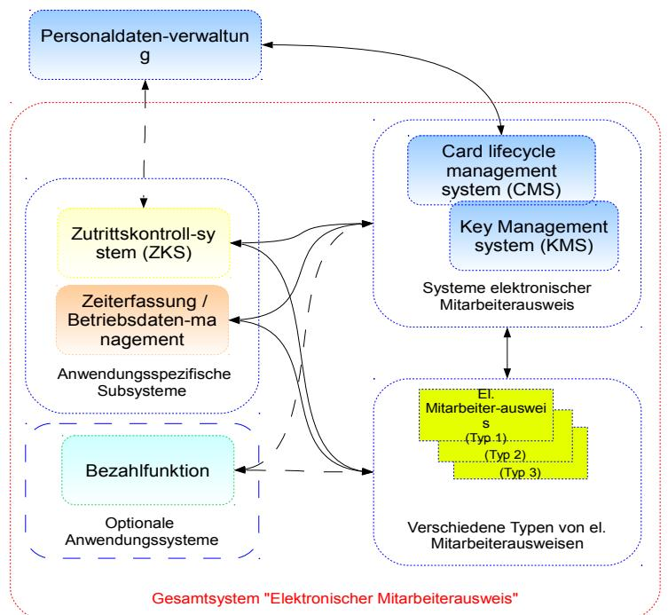

*Abbildung 1: Zusammenspiel der Systeme zum elektronischen Mitarbeiterausweis*

Die Ausweismedien, das Kartenmanagementsystem zur Verwaltung der Mitarbeiterausweise (CMS) und das Schlüsselmanagementsystem (KMS) werden anwendungsübergreifend genutzt. Zum Personaldatenverwaltungssystem existieren Schnittstellen. Das Personaldatenverwaltungssystem gehört nicht zum Gesamtsystem "Elektronischer Mitarbeiterausweis", gibt aber durch definierte Schnittstellen die erforderlichen Personaldaten für Zwecke der Ausweiserstellung an das CMS ab[.](#page-17-0) [Abbildung 1](#page-17-0) zeigt das Gesamtsystem "Elektronischer Mitarbeiterausweis" und die üblichen Schnittstellen zwischen den Komponenten.

# **2.2.2 Definition von Teilsystemen**

Um dem individuellen Schutzbedarf der einzelnen Anwendungen und Subsysteme Rechnung tragen zu können, wird das Gesamtsystem in Teilsysteme aufgeteilt. Bei der Durchführung der Sicherheitsanalyse, der Ermittlung des Schutzbedarfs, der Zuweisung von Schutzmaßnahmen und der Ermittlung des Restrisikos werden diese Teilsysteme individuell betrachtet. Die Teilsysteme werden in den folgenden Kapiteln definiert.

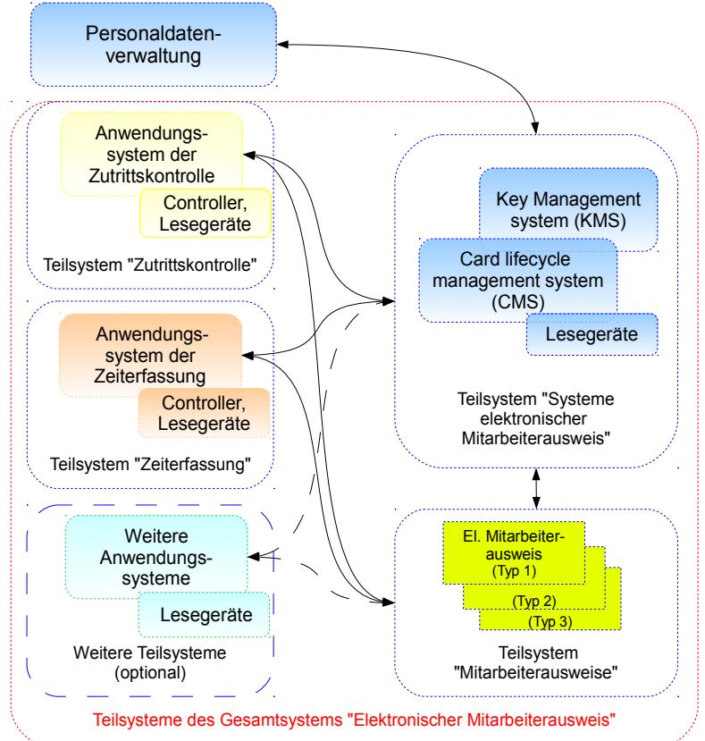

*Abbildung 2: Teilsysteme des Gesamtsystems "Elektronischer Mitarbeiterausweis"*

## **2.2.2.1 Teilsystem "Mitarbeiterausweise"**

In diesem Teilsystem werden die elektronischen Ausweise, die als Identifizierungs- und als Trägermedien für die zu unterstützenden Anwendungen dienen, betrachtet. Je nach Schutzbedarf können verschiedene Typen des elektronischen Mitarbeiterausweises zum Einsatz kommen.

Der Schutzbedarf der elektronischen Mitarbeiterausweise richtet sich nach dem höchsten Schutzbedarf der zu unterstützenden Anwendungen. Die Verantwortung für das Teilsystem "Mitarbeiterausweise" liegt üblicherweise beim Systemmanager. Nach der Ausgabe muss der jeweilige Nutzer für den sachgemäßen Umgang mit seinem Ausweis einstehen.

# **2.2.2.2 Teilsystem "Systeme elektronischer Mitarbeiterausweis"**

Das Teilsystem besteht aus folgenden Subsystemen und Komponenten:

1. Kartenmanagementsystem (CMS)

Das Kartenmanagementsystem verwaltet jeden Mitarbeiterausweis von der Bestellung über die Personalisierung, die Ausgabe an den Mitarbeiter, die Nutzungsphase bis zur Sperrung bzw. Außerbetriebnahme. Das Kartenmanagementsystem verwaltet weiterhin die Zuordnung zwischen Person und Ausweis sowie die Anwendungen, die vom jeweiligen Mitarbeiterausweis unterstützt werden. Zu diesem Zweck existieren Schnittstellen zum Personaldatenverwaltungssystem und den Anwendungssystemen.

2. Schlüsselmanagementsystem (KMS)

Das Schlüsselmanagementsystem verwaltet die Schlüssel der Mitarbeiterausweise auf Ebene des Trägermediums und stellt z. B. Schlüssel bereit, die zur Initialisierung, Personalisierung und dem Aufbringen von Anwendungen nötig sind. Die Verwaltung von anwendungsspezifischen Schlüsseln erfolgt üblicherweise durch die Anwendungssysteme.

Der Schutzbedarf des Teilsystems richtet sich nach dem höchsten Schutzbedarf der zu unterstützenden Anwendungen. Die Verantwortung für das Teilsystem "Systeme elektronischer Mitarbeiterausweis" liegt üblicherweise beim Systemmanager.

Bei einigen Systemlösungen ist dieses Teilsystem eng mit dem Zutrittskontrollsystem verknüpft. Die Ausgabe der Mitarbeiterausweise erfolgt dann z. B. durch den Werkschutz, der nicht nur die Zuständigkeit für die Zutrittskontrolle, sondern gegebenenfalls auch die Gesamtsystemverantwortung innehat.

## **2.2.2.3 Teilsystem "Zutrittskontrolle"**

Das Teilsystem Zutrittskontrolle enthält alle Systeme und Komponenten, die zur Definition und Sicherung der Zutrittsbereiche der Organisation erforderlich sind:

1. Hintergrundsystem Zutrittskontrolle

Das Hintergrundsystem unterstützt die Prozesse und Funktionen der Zutrittskontrolle:

- Es erlaubt die Definition von Zutrittsbereichen und Zutrittsprofilen und verwaltet die zeitlichen und örtlichen Berechtigungen für den einzelnen Nutzer von Mitarbeiterausweisen.
- Es dokumentiert die Zuordnung von Berechtigungen, Mitarbeiterausweisen und Mitarbeitern.
- Es stellt über ein eigenes Schlüsselmanagement anwendungsspezifische Schlüssel für Lesegeräte und Mitarbeiterausweise bereit.
- Das Hintergrundsystem steuert die Lesegeräte bzw. Controller und Zutrittssicherungseinrichtungen und ist in der Lage, nach temporärem Offline-Betrieb den Systemstatus zu synchronisieren.
- Das Hintergrundsystem dokumentiert die Zutrittshistorie und führt Sperrlisten.

Das Hintergrundsystem verfügt über Schnittstellen zum Teilsystem "System elektronischer Mitarbeiterausweis" und gegebenenfalls auch zum Personendatenverwaltungssystem.

2. Lesegeräte, Controller und Zutrittssicherungseinrichtungen

Lesegeräte und Zutrittsicherungseinrichtungen werden an allen Zutrittspunkten eingesetzt. Sie dienen zum Lesen des Mitarbeiterausweises und zum Prüfen der Berechtigungen. Verläuft die Prüfung durch das Lesegerät erfolgreich, wird die Zutrittssicherungseinrichtung (Schranke,

Drehsperre, elektrisches Türschloss, Personenschleuse etc.) geöffnet und der Mitarbeiter kann passieren. Bei hohen Schutzanforderungen werden die Lesegeräte mit Tastaturen zur Eingabe von PIN oder mit biometrischen Erfassungsgeräten kombiniert. In diesen Fällen würde bei Ausweisverlust und damit verbundener potenzieller Fremdnutzung das Ausweismedium allein nicht zum Zutritt ausreichen. Entsprechend dem Prinzip "Besitz und Wissen" ist ein zweites Sicherheitsmerkmal bei hohem Schutzbedarf empfehlenswert.

Lesegeräte und Zutrittssicherungseinrichtungen müssen grundsätzlich auch bei temporärer Trennung der Verbindung zum Hintergrundsystem funktionieren. Für einen solchen Fall halten die Lesegeräte alle relevanten Zutrittsinformationen vor, steuern die Zutrittssicherungseinrichtungen direkt und dokumentieren die Zutrittshistorie. Alternativ werden mehrere Lesegeräte durch einen Controller gesteuert, der zwischen die Lesegeräte und das Hintergrundsystem geschaltet ist und die Offline-Fähigkeit herstellt. Zusätzlich werden gegebenenfalls auch Lesegeräte und Zutrittssicherungseinrichtungen eingesetzt, die niemals direkt an das Hintergrundsystem angeschlossen werden können. In einem solchen Fall müssen die Zutrittsinformationen regelmäßig in das Lesegerät eingepflegt werden. Die Zutrittshistorie wird gegebenenfalls auf dem Mitarbeiterausweis gespeichert und beim nächsten Kontakt mit einem Online-Lesegerät in das System übernommen.

#### **2.2.2.4 Teilsystem "Zeiterfassung"**

Das Teilsystem Zeiterfassung enthält alle Systeme und Komponenten, die zur Erfassung der Arbeits- und Sonderzeiten der Mitarbeiter erforderlich sind. Oftmals werden die Prozesse der Zeiterfassung durch das Hintergrundsystem der Betriebsdatenerfassung mit abgedeckt. Folgende Systeme und Komponenten sind zu betrachten:

#### 1. Hintergrundsystem Zeiterfassung

Das Hintergrundsystem unterstützt die Prozesse und Funktionen der Zeiterfassung:

- Abfrage von Arbeits- und Sonderzeiten der Mitarbeiter. Identifizierung der Mitarbeiter durch Authentifizierung des Mitarbeiterausweises.
- Dokumentation der erfassten und nicht erfassten Zeiten, der Soll- und Ist-Stunden, der Zeitkonten und der Arbeitszeitmodelle.
- Es stellt über ein eigenes Schlüsselmanagement anwendungsspezifische Schlüssel für Lesegeräte und Mitarbeiterausweise bereit.
- Gegebenenfalls erfolgt eine Weiterverarbeitung/Aufbereitung der erfassten Zeiten zur Zeitabrechnung (Ermittlung von finanziellen Ansprüchen aufgrund von ausgleichspflichtigen Sonderarbeitszeiten, z. B. Sonn- und Feiertagsdienste, Bereitschaftsdiensten, Nachtdiensten, Schichtdiensten usw.).
- Das Hintergrundsystem steuert die Lesegeräte und ist in der Lage, nach temporärem Offline-Betrieb den Systemstatus zu synchronisieren.

Das Hintergrundsystem verfügt über Schnittstellen zum Teilsystem "System elektronischer Mitarbeiterausweis" und gegebenenfalls auch zum Personendatenverwaltungssystem.

2. Lesegeräte und Controller

Lesegeräte werden üblicherweise an Zugängen zu Gebäuden oder dem Betriebsgelände eingesetzt. Sie dienen zum Erfassen der Arbeits- und Sonderzeiten der Mitarbeiter und bestimmen den Mitarbeiter durch Authentifizierung seines Ausweises. Verläuft die Authentifizierung durch das Lesegerät erfolgreich, wird das erfasste Datum übernommen.

Die Lesegeräte zur Zeiterfassung müssen grundsätzlich auch bei temporärer Trennung der Verbindung zum Hintergrundsystem funktionieren. Für einen solchen Fall halten die Lesegeräte alle relevanten Informationen vor und speichern die erfassten Daten lokal. Alternativ werden mehrere Lesegeräte durch einen Controller gesteuert, der zwischen die Lesegeräte und das Hintergrundsystem geschaltet ist und die Offline-Fähigkeit herstellt.

# **3 Vereinbarungen**

# **3.1 Definition von Begriffen**

Anwendung:

Anwendungen stellen spezifische Dienste für Bürger, Unternehmen oder Behörden bereit. Im Kontext der TR RFID wird der Begriff Anwendung als Oberbegriff für alle Strukturen, Prozesse und technischen Vorkehrungen verwendet, die zur Erbringung bestimmter Leistungen und Dienste notwendig sind. Der elektronische Mitarbeiterausweis und seine Systeme können unterschiedliche Anwendungen unterstützen. Im Kontext des Trägermediums bezeichnet der Begriff Anwendung die Implementierung anwendungsspezifischer Funktionen und Daten auf dem Medium.

#### Anwendungsfall / Use Case

Detaillierte Beschreibung einer Aktivität bzw. eines Handlungsablaufs, der Teil eines Prozesses ist. Beispiele sind die Initialisierung eines Trägermediums oder das Nachladen einer Berechtigung.

#### Anwendungsherausgeber, Anwendungsanbieter:

Eigentümer und Herausgeber der Spezifikation einer Anwendungsimplementierung. Die Spezifikation wird an die Betreiber etc., die Anwendung nutzen wollen, weitergegeben. Beispiele für Anwendungsherausgeber sind der Verband deutscher Verkehrsunternehmen (VDV-Kernapplikation), GS1-Global (EPCglobal).

#### Anwendungsimplementierung:

Bereitstellung einer Anwendung zur Nutzung durch Implementierung der benötigten Strukturen, technischen Systemen und Betriebsprozesse durch den Anwendungsbetreiber.

#### Anwendungsverantwortlicher, Anwendungsbetreiber, Betreiber:

Entität, die für die Bereitstellung und den Betrieb einer konkreten Anwendungsimplementierung die Verantwortung trägt. Diese ist auch Ansprechpartner für Datenschutzbehörden für Privacy Impact Assessments (PIA). Falls mehrere Anwendungsverantwortliche dasselbe Gesamtsystem nutzen, ist ein Systemmanager erforderlich, der anwendungsübergreifend das Gesamtsystem verantwortet.

#### Berechtigung:

Nachweis, dass der Nutzer das Recht hat, spezifische Dienstleitungen zu nutzen. Beispiele sind der Zutritt zu gewissen Gebäuden, die Nutzung der Kantine etc. Im Kontext von elektronischen Mitarbeiterausweisen üblicherweise durch elektronische Berechtigungen (Entitlements), die mit dem Mitarbeiterausweis verknüpft sind, implementiert.

#### Dienst:

Leistung, die im Rahmen der Anwendung für den Nutzer erbracht wird. Üblicherweise ist dazu eine Berechtigung vorzuweisen. Ein Beispiel ist die Nutzung eines Parkplatzes als Dienstleistung eines Dienstleisters.

#### 3 Vereinbarungen

#### Dienstleister:

Entität, die gegen Vorlage einer Berechtigung mithilfe der Anwendungsimplementierung eine Leistung für den Nutzer erbringt.

#### Einsatzgebiet

Bereich, in dem die technische Richtlinie und die zugehörige Prüfspezifikation Anwendung finden sollen. Höchste Einheit in der Begriffsstruktur. Das Einsatzgebiet umfasst eine oder mehrere Anwendungen und alle Ausprägungen dieser Anwendungen in spezifischen Einsatzszenarien.

#### Einsatzszenario

Spezielle Auswahl und Zusammenstellung der möglichen Anwendungen, Produkte und Dienste eines Einsatzgebietes in einer spezifischen Implementierung.

#### Gesamtsystem:

Summe aller Subsysteme, die in einer Implementierung einer oder mehrerer Anwendungen eingesetzt werden.

#### Komponente:

Gerät, das bestimmte Funktionen innerhalb von Subsystemen bzw. des Gesamtsystems bereitstellt. Beispiele sind RFID-Lesegeräte, Berechtigungsdatenbank als Teil des Hintergrundsystems, Drehsperren für Zutrittskontrolle oder auch Rechner und Netze.

#### Nutzungsdaten, Nutzdaten:

Bei der Nutzung von Anwendungen und Diensten fallen gegebenenfalls spezielle Daten an. Dies sind im Falle der Anwendung "Zutrittskontrolle" Daten zum Zutritt oder dem Verlassen von gesicherten Bereichen oder die bei der Zeiterfassung gewonnenen Daten. In vielen Fällen sind Nutzungsdaten personenbezogen.

#### Produkt:

Zusammenstellung von Berechtigungen zur Nutzung von Diensten oder Erhalt von Waren, die ein Nutzer einer Anwendung erwerben kann. Beispiele sind ein Fahrschein (Umsetzung in eine oder mehrere Fahrten), eine oder mehrere Berechtigungen zur Kantinennutzung etc.

#### Profil:

Zusammenstellung bestimmter Zutrittsberechtigungen, die typischerweise für bestimmte Rollen oder Mitarbeitergruppen benötigt werden. Diese Profile werden dann Angehörigen dieser Gruppe zugewiesen (z. B. Entwicklungsmitarbeitern).

#### Prozess, Betriebsprozess, Geschäftsprozess:

Umfassender betrieblicher oder geschäftlicher Ablauf. Beispiele sind der Verkaufsprozess, Nutzung der Berechtigung etc.

Prüffall:

Mit der Definition eines Prüffalles wird spezifiziert, wie einzelne Eigenschaften der Anwendungsimplementierung, die laut TR RFID gefordert sind, überprüft werden. Diese Eigenschaften können das System, die operativen Prozesse oder auch einzelne Komponenten und Schutzmaßnahmen betreffen. Prüffälle können mehrere einzelne Tests beinhalten. Es werden für jeden dieser Tests Prüfkriterien definiert. Prüffälle und Prüfkriterien werden in der Prüfspezifikation dokumentiert.

#### Prüfkriterien:

Prüfkriterien spezifizieren, ob das Ziel eines konkreten Tests erreicht oder verfehlt wurde (Pass/Fail).

#### Prüfplan:

Plan zur Umsetzung der allgemeingültigen Prüfspezifikation eines Einsatzgebiets für eine spezifische Anwendungsimplementierung.

#### Prüfspezifikation:

Die Prüfspezifikation legt den Prüfumfang (zu prüfende Eigenschaften und Abnahmekriterien) und die Durchführung der Konformitätsprüfung für ein Einsatzgebiet grundlegend fest. Dabei werden insbesondere die zu betrachtenden Testobjekte (Test items), die zu prüfenden Eigenschaften (Features) und die zugeordneten Abnahmekriterien festgelegt (Pass/fail criteria).

#### Subsystem:

Gruppe von Komponenten und Geräten, die bestimmte Funktionen innerhalb des Gesamtsystems bereitstellen. Beispiele sind das Verwaltungssystem für Berechtigungen, die RFID-Infrastruktur oder das Schlüsselmanagementsystem.

#### Systemspezifikation:

Spezifikation aller Eigenschaften des Gesamtsystems. Üblicherweise wird die Systemspezifikation vom Systemintegrator oder Systemlieferanten für das jeweilige Gesamtsystem erstellt und vom Systemmanager abgenommen.

#### Systemtestspezifikation:

Spezifikation der spezifischen Tests zur Freigabe des Gesamtsystems. Üblicherweise wird die Systemtestspezifikation vom Systemintegrator oder Systemlieferanten für das jeweilige Gesamtsystem erstellt und vom Systemmanager abgenommen.

#### Teilsystem:

Gruppierung von Subsystemen, die vergleichbaren Schutzbedarf aufweisen und dadurch bei der Zuweisung von Schutzmaßnahmen und der Konformitätsprüfung zusammen bearbeitet werden können.

#### Testspezifikation:

Spezifikation der spezifischen Tests zur Freigabe einzelner Komponenten oder Subsysteme. Üblicherweise wird die Testspezifikation vom Hersteller erstellt und beigestellt. Trägermedium oder Nutzermedium:

Das Träger- oder Nutzermedium ist ein Datenträger, auf dem Anwendungen und elektronische Berechtigungen gespeichert werden können. Im Einsatzgebiet "elektronischer Mitarbeiterausweis" ist der elektronische Mitarbeiterausweis das Trägermedium. Das Trägermedium ist im Besitz des Nutzers der Berechtigung und wird von diesem zur Nutzung der Anwendungen und Dienste benötigt.

Use Case:

Siehe Anwendungsfall.

# **3.2 Rollen und Entitäten im Einsatzgebiet "Elektronischer Mitarbeiterausweis"**

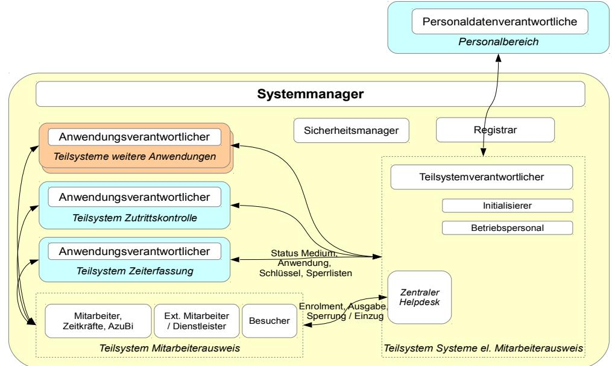

*Abbildung 3: Entitäten des Einsatzgebiets "Elektronischer Mitarbeiterausweis"*

Die folgende Darstellung zeigt die relevanten Entitäten im Einsatzgebiet "Elektronischer Mitarbeiterausweis".

Akteur

Entität, die entsprechend der zugewiesenen Rolle handelt.

Anwendungsherausgeber (Application Issuer)

Der Anwendungsherausgeber ist der Eigentümer der Anwendungsspezifikation. Der Anwendungsherausgeber vermarktet die Anwendung gegebenenfalls über Anwendungsanbieter (z. B. ein Unternehmen, das Bezahlfunktionen in der Kantine anbietet).

Anwendungsverantwortlicher / Betreiber / Anwendungsanbieter (Application Provider, Operator)

Der Anwendungsverantwortliche implementiert und betreibt die Anwendung und bietet die von ihr unterstützten Dienste an. Der Anwendungsverantwortliche ist für die Einführung, den Betrieb und die Nutzung einer konkreten Anwendungsimplementierung zuständig und ist folglich der Ansprechpartner für Datenschutzbehörden bzgl. PIA. Falls mehrere Anwendungsverantwortliche dasselbe Gesamtsystem nutzen, ist ein Systemmanager erforderlich, der anwendungsübergreifend das Gesamtsystem verantwortet.

#### Dienstleister (Service Provider)

Liefert dem Nutzer gegen Vorlage der Berechtigung eine Dienstleistung (z. B. Bezahlfunktion in der Kantine). Dies erfordert eine direkte Abstimmung und vertragliche Bindung mit dem Anwendungsanbieter. Im Einsatzgebiet "Elektronischer Mitarbeiterausweis" nimmt der Anwendungsverantwortliche üblicherweise auch die Rolle des Dienstleisters war. Ausnahmen können sich z. B. bei Bezahlanwendungen ergeben, die z. B. von einer Bank bereitgestellt werden.

#### Initialisierer

Der Initialisierer konfiguriert das Trägermedium für die weitere Nutzung. Dabei werden üblicherweise auch die Anwendungen initial aufgebracht und eine Personalisierung des Trägermediums durchgeführt. Zwischen Initialisierer, Anwendungsverantwortlichen und Systemmanager ist eine enge Abstimmung und vertragliche Bindung erforderlich. In der Praxis wird die Rolle des Initialisierers oftmals durch den Gesamtverantwortlichen oder – wenn nur eine Anwendung unterstützt wird- von Anwendungsverantwortlichen wahrgenommen.

#### Nutzer

Nutzer des Mitarbeiterausweises und der durch diesen unterstützte Anwendungen und Dienste. Nach Ausstellung und Übergabe ist der Mitarbeiterausweis in der Obhut des Nutzers.

#### Organisation

Als Organisation wird in dieser Technischen Richtlinie die betriebliche Einheit innerhalb des Unternehmens oder der Behörde bezeichnet, die für den Betrieb des Gesamtsystems des elektronischen Mitarbeiterausweises und der vom Gesamtsystem unterstützten übergeordneten Geschäfts- und Betriebsprozesse zuständig ist.

#### Registrar

Der Registrar sorgt für die Vergabe eineindeutiger Identifikationsmerkmale im System. Diese werden für die eineindeutige Identifikation der Entitäten, Trägermedien und Anwendungen benötigt.

#### Sicherheitsmanager (Security Manager)

Der Sicherheitsmanager etabliert und koordiniert die Sicherheitsregeln im System, ist für die Zulassung der Komponenten des Systems verantwortlich und überwacht die Durchführung von sicherheitsrelevanten Funktionen (z. B. Schlüsselmanagement).

Systemmanager, Systemverantwortlicher

Der Systemmanager verantwortet das Gesamtsystem und alle anwendungsübergreifenden Funktionen. Er ist der Ansprechpartner für die einzelnen Anwendungs- und Teilsystemverantwortlichen. Im Einsatzgebiet "Elektronischer Mitarbeiterausweis" übernimmt der Systemmanager oft auch die Rollen des Teilsystemverantwortlichen für die Teilsysteme "Mitarbeiterausweise" und "Systeme elektronischer Mitarbeiterausweis" sowie die des Sicherheitsmanagers und Registrars. Er etabliert und sorgt für die Einhaltung der Regeln des Gesamtsystems. Hierzu bedient er sich der funktionalen Entitäten Sicherheitsmanager und Registrar. Die Rolle des Systemmanagers kann auch von Beauftragten der Organisation (z. B. einem Mitarbeiter eines Systemlieferanten) wahrgenommen werden.

#### Teilsystemverantwortlicher

Der Teilsystemverantwortliche implementiert und betreibt die Teilsysteme "Systeme elektronischer Mitarbeiterausweis" und "Mitarbeiterausweise".

# **4 Generelle Anforderungen**

In den folgenden Unterkapiteln wird vorrangig auf den produktspezifischen Einsatz von elektronischen Mitarbeiterausweisen in Bezug auf die Sicherheitsanforderungen eingegangen. Dabei umfassen die Anforderungen das Gesamtsystem sowie die damit verbundenen Prozesse und Komponenten und lassen sich in der Folge in drei Kategorien unterteilen:

- 1. Funktionen
- 2. Wirtschaftlichkeit
- 3. Sicherheit

# **4.1 Funktionen**

In diesem Kapitel sind beispielhaft Anforderungen an die Funktion des Gesamtsystems "Mitarbeiterausweis" aus Sicht der Nutzer und der Organisation aufgeführt.

## **4.1.1 Anforderungen der Nutzer**

Aus Sicht der Nutzer eines elektronischen Mitarbeiterausweises müssen z. B. die folgenden Anforderungen erfüllt sein:

- Das Trägermedium muss robust und zuverlässig sein sowie mit einer entsprechenden Geschwindigkeit arbeiten.
- Das System und das Trägermedium müssen leicht zu bedienen und komfortabel sein.
- Ein angemessener Schutz von individuellen personenbezogenen Daten muss sichergestellt werden.
- Es muss eine Schulung zur Nutzung stattfinden und eine Anleitung zur Anwendung des elektronischen Mitarbeiterausweises bereitgestellt werden.
- Im Falle von Problemen muss kurzfristig Abhilfe geschaffen werden. Ersatzlösungen müssen handhabbar sein.

Grundsätzlich muss der Nutzer umfassend über die verwendeten personenbezogenen Daten, den Verwendungszweck dieser Daten, Maßnahmen zum Datenschutz und verbleibende Risiken informiert werden. Der Umgang mit den personenbezogenen Daten muss in Abstimmung mit dem Datenschutzbeauftragten erfolgen und gegebenenfalls mit dem Betriebsrat oder einer vergleichbaren Instanz abgestimmt werden.

## **4.1.2 Anforderungen der Organisation**

Aus Sicht der Organisation müssen z. B. die folgenden Anforderungen erfüllt sein:

- Profile und Zutrittsberechtigungen müssen in den betrieblich erforderlichen Kombinationen eingerichtet werden können.
- Die Nutzerschulung und der Support für die Verwendung des Trägermediums und der Anwendungen müssen mit einfachen Mitteln umsetzbar sein.
- Die Umsetzung der Geschäftsprozesse der Organisation muss unterstützt, die erforderliche Performanz gewährleistet werden.
- Es muss möglich sein, das Mitarbeiterausweissystem mit der Infrastruktur der Organisation zu kombinieren.
- Das System muss zukunftsfähig sein. Verbesserungen und Erweiterungen müssen nach definierten Prozessen eingeführt werden können.

# **4.2 Wirtschaftlichkeit**

Die Kosten für die Einführung und den Betrieb der einzelnen Anwendungssysteme, der übergreifenden Systeme und der Trägermedien des Gesamtsystems "Mitarbeiterausweis" müssen in einem angemessenen Verhältnis zum Schutzbedarf bzw. Nutzen der Organisation stehen.

Das Gesamtsystem und dessen Komponenten sollten in Konsequenz so ausgelegt werden, dass die spezifischen Anforderungen der Organisation möglichst effizient erfüllt werden. Dies erfordert z. B. für die Implementierung der Anwendung "Zutrittskontrolle" einen skalierbaren Ansatz.

# **4.3 Sicherheit**

Es ist das vorrangige Ziel dieser Technischen Richtlinie, die Anwender dabei zu unterstützen, für ihre individuelle Systemimplementierung geeignete und bedarfsgerechte Maßnahmen zur IT-Sicherheit und zum Datenschutz zu definieren. Dies wird in diesem Dokument insbesondere ab Kapitel [8](#page-57-0) hergeleitet und in den weiteren Kapiteln in beispielhaften Einsatzszenarien verdeutlicht.

# **5 Methodik zur Ermittlung der Sicherheitsanforderungen**

# **5.1 Zielsetzung**

Die Technischen Richtlinien zum sicheren RFID-Einsatz dienen den folgenden Zielen:

- Systemlieferanten und Systemverantwortliche sollen eine Anleitung zur sachgerechten Implementierung von spezifischen RFID-Systemlösungen bzgl. Funktions- und Informationssicherheit und Datenschutz erhalten.
- Es soll Aufmerksamkeit und Transparenz in Bezug auf Sicherheits- und Datenschutzaspekte erzeugt werden.
- Die TR RFID sollen als Basis für eine Konformitätserklärung der Systemlieferanten oder Betreiber und die Vergabe eines Gütesiegels durch eine Zertifizierungsstelle dienen.

Zur Umsetzung dieser Ziele sind folgende Arbeiten zu leisten:

- Ermittlung der Sicherheitsanforderungen an ein RFID-System eines Einsatzgebietes.
- Benennung der spezifischen Gefährdungen, geeigneter Gegenmaßnahmen und des möglicherweise verbleibenden Restrisikos.
- Definition der Kriterien für eine Konformitätserklärung bzw. Zertifizierung.

Bei der Definition von Maßnahmen und Systemvorschlägen sind nicht nur Sicherheitsaspekte relevant. Vielmehr müssen alle in Kapitel [4](#page-28-0) benannten Anforderungen berücksichtigt werden.

# **5.2 Methodik**

# **5.2.1 Erwägungen zum Umfang der Systembetrachtung**

RFID-basierte Systeme können sehr komplex sein. In den meisten Fällen gehören zur Systemlösung auch viele Komponenten, die nicht mit RFID ausgestattet sind. Daher dürfen bei der Betrachtung der Systemsicherheit nicht nur das Medium/das Tag und das Lesegerät berücksichtigt werden.

Die Technische Richtlinie muss alle für RFID relevanten Sicherheitsaspekte einbeziehen, die vom Einsatzgebiet und der jeweiligen Implementierung der Systemlösung abhängen. Diese Technische Richtlinie enthält daher detaillierte Angaben über das Einsatzgebiet und die dazugehörenden Betriebs- und Geschäftsprozesse. Dabei wird der gesamte Lebenszyklus eines Trägermediums oder eines Transponders abgedeckt. Im nächsten Detailgrad werden auf Basis der Prozessbeschreibungen Use Cases bestimmt, aus denen Datenflüsse und die Aufgaben der jeweiligen Komponenten und Systeme ermittelt werden können. Diese Informationen werden dann als Grundlage für die Ermittlung von Gefährdungen und eine detaillierte, systemspezifische Sicherheitsbewertung für die relevanten Komponenten und Systeme genutzt. Abbildung [4](#page-31-0) zeigt diese Vorgehensweise am Beispiel des eTicketing im ÖPV.

Dieses Konzept legt den Schwerpunkt der Betrachtung auf die für RFID relevanten Systemteile und erlaubt zusätzlich die Berücksichtigung aller relevanten Sicherheitsaspekte. Dies unterstützt insbesondere die Erweiterung bestehender Systeme um die RFID-Technologie.

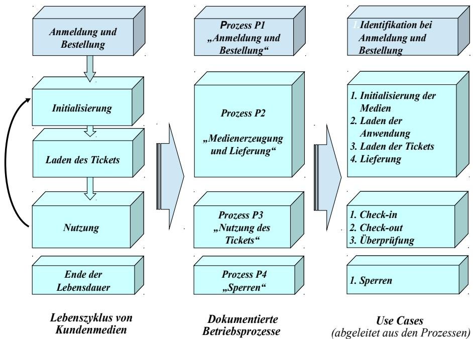

*Abbildung 4: Bestimmung RFID-relevanter Use Cases am Beispiel des eTicketing*

# **5.2.2 Skalierbarkeit und Flexibilität**

Die TR RFID sollen in erster Linie Sicherheits- und Datenschutzfragen behandeln. Dabei sollen die folgenden Anforderungen berücksichtigt werden:

- 1. Es muss möglich sein, Systeme so zu implementieren, dass eine Ausgewogenheit von Kosten und Nutzen erreicht wird. Dies bedeutet in der Praxis, dass die Schutzmaßnahmen den ermittelten Schutzbedarf zwar erfüllen aber nicht übertreffen müssen. Beispiel: Werden nur preiswerte Produkte angeboten, die eine relativ niedrige Sicherheitsanforderung haben, sollten die Schutzmaßnahmen entsprechend gestaltet werden. Dies ermöglicht beispielsweise die Verwendung preiswerter Medien, wodurch sich die Kosten für die Systemimplementierung und den Betrieb verringern.
- 2. Die für die Technische Richtlinie ausgewählten Einsatzszenarien umfassen eine große Bandbreite, von kleinen bis zu landesweiten oder sogar grenzüberschreitenden Anwendungen. Wichtig ist, dass das in der Richtlinie verwendete Konzept für Systemlösungen aller Größen und verschiedener Komplexität genutzt werden kann.
- 3. In vielen Fällen lässt sich die Wirtschaftlichkeit einer Systemlösung wesentlich leichter durch die Kooperation mit Geschäftspartnern erreichen. Dies gilt insbesondere für eTicketing-Anwendungen, bei denen es sehr vorteilhaft sein kann, wenn bereits beim Kunden verfügbare Medien (z. B. Karten mit Mehrfachanwendung oder NFC Mobile Devices) für zusätzliche Anwendungen, Produkte und damit verbundene Dienstleistungen wiederverwendet werden können.

[Abbildung 5](#page-32-0) zeigt ein Beispiel eines Trägermediums für den elektronischen Mitarbeiterausweis, das verschiedene Anwendungen unterstützt. Um die genannten Anforderungen zu erfüllen, wird für eine Technische Richtlinie z. B. folgendes Konzept verwendet:

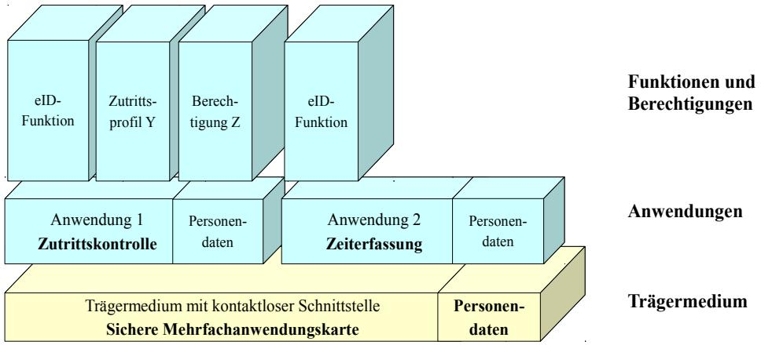

*Abbildung 5: Hierarchisches Konzept für Medien, Anwendungen und Berechtigungen für den elektronischen Mitarbeiterausweis*

- 1. Ein passendes Rollenmodell und die Struktur einiger Hauptelemente (Produkte, Anwendungen und Trägermedien) wurden in Kapitel 3 beschrieben. Dieses Modell unterstützt einen in skalierbaren und erweiterbaren Ansatz.
- 2. Die Technische Richtlinie muss Sicherheitskonzepte anbieten, die alle in einer Infrastruktur verwendeten Kombinationen von Einsatzszenarien und Trägermedien umfassen. Dies wird durch individuelle Sicherheitsbewertungen, die auf den relevanten Use Cases basieren, erreicht.
- 3. Gleiche Einsatzgebiete (insbesondere im eTicketing), die die Möglichkeit für anwendungsübergreifende Partnerschaften bieten, werden in den entsprechenden Technischen Richtlinien mit so viel Kommunalität wie möglich behandelt. Die Sicherheitsbewertung basiert auf ähnlichen Sicherheitszielen. Die Schutzmaßnahmen verwenden wenn möglich die gleichen Mechanismen.
- 4. Eine besondere Herausforderung besteht bei system- und anwendungsübergreifenden Partnerschaften im Hinblick auf die Systemsicherheit. Es muss gewährleistet sein, dass die Sicherheit eines Systems nicht von Schwächen eines anderen Systems untergraben wird. Dies erfordert normalerweise eine umfassende Sicherheitsbewertung beider Systeme. Die Technischen Richtlinien widmen sich diesem Problem durch Einführung eines skalierbaren und transparenten Konzepts für die Anwendung von Schutzmaßnahmen gegenüber den festgestellten Gefährdungen, den "Schutzbedarfsklassen". Insgesamt werden drei Klassen von 1 (normale Anforderung) bis zu 3 (sehr hohe Anforderung) verwendet. Alle Schutzmaßnahmen werden entsprechend in drei Stufen definiert, von normalem Schutz bis zu erweitertem Schutz.

Bei jeder individuellen Systemimplementierung wird zuallererst die Schutzanforderungskategorie für jedes Sicherheitsziel definiert. Daraus ergibt sich der Umfang der zu treffenden Schutzmaßnahmen.

## **5.2.3 Aufbau der Technischen Richtlinie**

Tabelle [1](#page-33-0) zeigt den Aufbau aller bisher erstellten Teile der TR RFID.

| Kapitel                   | Inhalt                                                         |
|---------------------------|----------------------------------------------------------------|
| Beschreibung des Einsatz- | Beschreibung des Einsatzgebiets: Aufbau, Leistungen, spezielle |

| Kapitel                                                 | Inhalt                                                                                                                                                                               |
|---------------------------------------------------------|--------------------------------------------------------------------------------------------------------------------------------------------------------------------------------------|
| gebiets                                                 | Randbedingungen etc.                                                                                                                                                                 |
| Produkte und Leistungen                                 | Beschreibungen von Beispielprodukten und -leistungen sowie Vertriebskanälen.                                                                                                      |
| Vereinbarungen                                          | Modelle, Begriffsdefinitionen                                                                                                                                                        |
| Allgemeine Anforderungen                                | Allgemeine Anforderungen der beteiligten Parteien, beachtens werte Aspekte etc.                                                                                                   |
| Einführung in die Methodologie                          | Vorstellung des für die Sicherheitsbewertung verwendeten Konzepts sowie der Methoden.                                                                                             |
| Betriebsprozesse                                        | Beschreibung von Betriebsprozessen, die für den Lebenszyklus von Trägermedien von Bedeutung sind.                                                                                 |
| Use Cases                                               | Definition von RFID-relevanten Use Cases.                                                                                                                                            |
| Sicherheitsbewertung                                    | Einführung in die IT-Sicherheit • Definition spezieller IT-Sicherheitsziele, • Schutzbedarfsklassen und Gefährdungen Vorgeschlagene Schutzmaßnahmen •              |
| Definition von Einsatzszenarien                         | Definition von Beispielen für Einsatzszenarien. Diese Beispiele decken die gesamte Bandbreite relevanter Parameter ab, die in einem bestimmten Einsatzgebiet auftreten können. |
| Implementierungsvorschlag für die Systemlösung       | Generische Systembeschreibung mit Beispielen zur Durch führung einer Gefährdungsanalyse und machbarer Schutzmaß nahmen für die Systemkomponenten.                              |
| Implementierungsvorschlag einzelner Einsatzszenarien | Beispiele für die Verwendung des Konzepts zur Sicherheits bewertung.                                                                                                              |

*Tabelle 1: Aufbau der TR RFID*

# **5.2.4 Erläuterung des Konzepts**

Jeder Teil der bisher erstellten Technischen Richtlinien für den sicheren RFID-Einsatz enthält Beispiele zur Durchführung der Sicherheitsbewertung in bestimmten Einsatzszenarien. Diese können an die Anforderungen und Randbedingungen der speziellen Systemimplementierung angepasst werden.

Die Sicherheitsbetrachtungen setzen auf den Prozessen, Anwendungen und Anwendungsfällen (Use Cases) des Einsatzgebiets auf. Daraus werden Rollen und Verantwortlichkeiten, Funktionen von Entitäten, Systemen und Komponenten sowie Datenflüsse festgelegt. Aus diesen lassen sich wiederum die Sicherheitseigenschaften und Schutzmaßnahmen für die einzelnen Komponenten und Systeme ermitteln. [Abbildung 6](#page-34-0) zeigt das Prinzip.

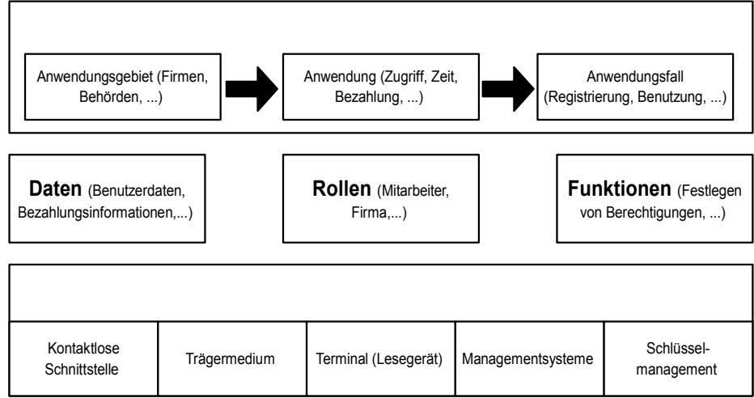

*Abbildung 6: Systemmodell für Sicherheitsbetrachtungen*

Eine Übersicht zur Vorgehensweise der Sicherheitsbetrachtung ist in [Abbildung 7](#page-34-1) dargestellt.

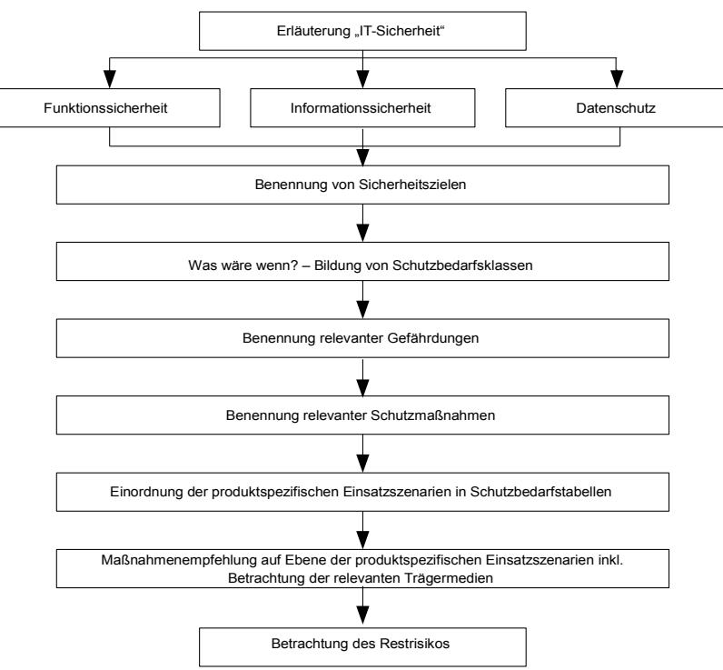

*Abbildung 7: Sicherheitsbewertungskonzept*

Die folgenden Kapitel erklären die dargestellten Schritte.

## **5.2.4.1 Bestimmung der Sicherheitsziele**

Im ersten Schritt werden auf Basis der generellen Sicherheitsziele der Funktions-, der Informationssicherheit und des Datenschutzes sowie der übergeordneten Sicherheitsziele des Einsatzgebiets die spezifischen Sicherheitsziele ermittelt, die für die Sicherheitsbetrachtungen des Einsatzgebiets herangezogen werden sollen. [Abbildung 8](#page-35-0) zeigt die generellen Sicherheitsziele der Funktions-, Informationssicherheit und des Datenschutzes sowie die übergeordneten Sicherheitsziele des Einsatzgebiets.

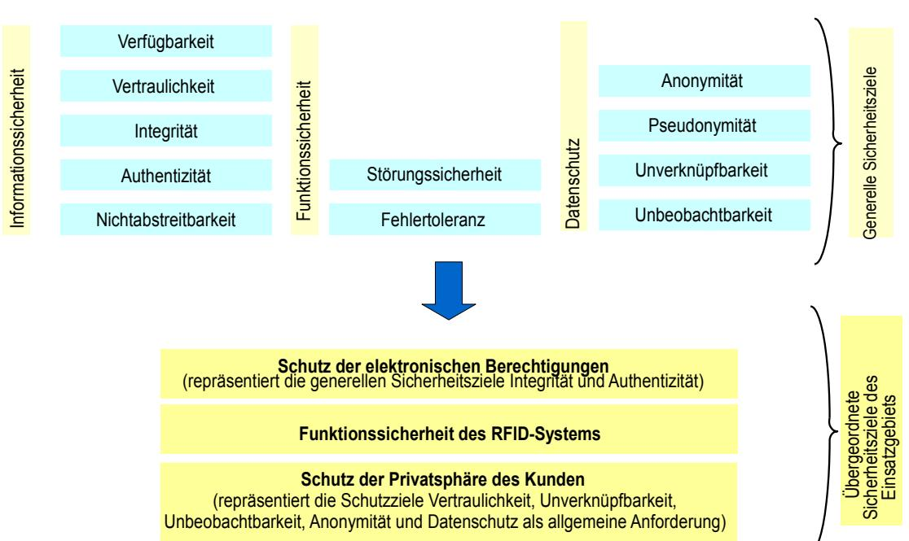

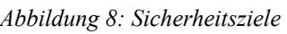

# **5.2.4.2 Abschätzung des Schutzbedarfs**

Nachdem die spezifischen Sicherheitsziele identifiziert worden sind, ist zunächst die Abschätzung des Schutzbedarfs für jedes einzelne Sicherheitsziel vorzunehmen. In diesem Zusammenhang gilt es die Frage zu beantworten, welcher Schaden eintritt, wenn ein bestimmtes Sicherheitsziel verletzt wird. Die Abschätzung des Schutzbedarfs muss für jedes Einsatzszenario durchgeführt werden.

Das Ergebnis der zuvor beschriebenen Analyse der Sicherheitsziele ist eine Schutzbedarfstabelle, die jedem Sicherheitsziel drei Schutzbedarfsklassen zuordnet. Für jedes Einsatzszenario wird für jedes einzelne Sicherheitsziel eine Einordnung des Schutzbedarfs in eine der 3 Klassen nach vorgegebenen Kriterien durchgeführt.

## **5.2.4.3 Benennung relevanter Gefährdungen und geeigneter Schutzmaßnahmen**

Die spezifischen Sicherheitsziele des Einsatzgebiets sind durch Gefährdungen bedroht. Die relevanten Gefährdungen werden jeweils für die relevanten Prozesse, Systeme und Komponenten ermittelt und dokumentiert. Es kann vorkommen, dass eine Gefährdung gegen mehrere Sicherheitsziele wirkt.

Gegen alle Gefährdungen werden Schutzmaßnahmen vorgeschlagen, die ebenfalls für die einzelnen Prozesse, Systeme und Komponenten definiert und dokumentiert werden.

### **5.2.4.4 Definition und Ausarbeitung von exemplarischen Einsatzszenarien**

Jede Technische Richtlinie enthält Beispiele für die praktische Anwendung des Konzepts. Dazu werden exemplarische Einsatzszenarien definiert und abgearbeitet, die die Bandbreite der möglichen Implementierungen z. B. von minimal üblichen über normale bis hin zu maximalen Anforderungen abdecken. Für jedes Einsatzszenario ist, wie in Kapitel [5.2.4.2](#page-35-1) benannt, zunächst eine Schutzbedarfsbetrachtung durchzuführen. Die hier ermittelten Schutzbedarfsklassen werden in den skalierenden Schutzmaßnahmen, die gegen die relevanten Gefährdungen der Szenarien wirken, eingesetzt.

# **6 Geschäfts- und Betriebsprozesse**

In diesem Kapitel werden Geschäfts- und Betriebsprozesse im Einsatzgebiet elektronischer Mitarbeiterausweis beschrieben, die für die weiteren Betrachtungen der Funktions- und Informationssicherheit und des Datenschutzes von Bedeutung sind.

Elektronische Mitarbeiterausweise unterstützen oftmals mehr als eine Anwendung und die zugehörigen Dienste und Produkte. In dieser technischen Richtlinie werden die in Kapitel [2.1](#page-13-1) beschriebenen Anwendungen "Zutrittskontrolle" und "Zeiterfassung" betrachtet. Das Gesamtsystem ist entsprechend aufgebaut und besteht aus anwendungsübergreifend und anwendungsspezifisch eingesetzten Subsystemen und Komponenten, die gemäß Kapitel [2.2](#page-17-1) Teilsystemen zugeordnet werden.

Infolgedessen ist bei der Beschreibung der Geschäfts- und Betriebsprozesse zwischen den folgenden Fällen zu unterscheiden:

- 1. Anwendungsübergreifende Geschäfts- und Betriebsprozesse
- 2. Geschäfts- und Betriebsprozesse der Anwendung "Zutrittskontrolle"
- 3. Geschäfts- und Betriebsprozesse der Anwendung "Zeiterfassung"
- 4. Geschäfts- und Betriebsprozesse optionaler Anwendung (z. B. Bereitstellung von Bezahldiensten)

# **6.1 Anwendungsübergreifende Geschäfts- und Betriebsprozesse**

Anwendungsübergreifende Geschäfts- und Betriebsprozesse stellen grundlegende Funktionen und Ergebnisse für die Nutzung von elektronischen Mitarbeiterausweisen bereit, die für alle Anwendungen benötigt werden.

## **6.1.1 Prozess PG1: Registrierung des Nutzers**

Vor der Initialisierung, Personalisierung und Ausgabe des Mitarbeiter- oder Besucherausweises müssen die Personendaten des künftigen Nutzers erfasst werden. Dabei sind die folgenden Varianten zu betrachten:

- 1. Bei allen Nutzern, die bereits durch das Personalwesen der Organisation betreut werden (z. B. Mitarbeiter, Zeitkräfte, Auszubildende etc.), existieren üblicherweise entsprechende Einträge im Personaldatenverwaltungssystem der Organisation. Von dort werden sie, wie in [Abbildung 1](#page-17-0) dargestellt, über eine Schnittstelle in die Hintergrundsysteme des elektronischen Mitarbeiterausweises übernommen. Die Überprüfung der Daten wird durch die Personalabteilung durchgeführt.
- 2. Zur Registrierung von Nutzern, die nicht im Personaldatenverwaltungssystem erfasst sind (z. B. Besucher, Dienstleister), müssen Vorkehrungen getroffen werden, um deren Personendaten zu erfassen und im Hintergrundsystem des elektronischen Mitarbeiterausweises anzulegen. Den Teilen der Organisation, die diese Nutzer betreuen, werden entsprechende Eingabemöglichkeiten bereitgestellt. Es ist beispielsweise üblich, den Werkschutz mit einem derartigen Arbeitsplatz auszustatten, um Besucherdaten direkt erfassen zu können. Die vom künftigen Nutzer erhaltenen

Personendaten müssen überprüft werden. Dazu wird ein Ausweisdokument des Nutzers herangezogen.

- 3. Das Bedienpersonal der Hintergrundsysteme des elektronischen Mitarbeiterausweises kann Nutzerkonten anlegen oder bestehende Informationen ändern. Die vom Nutzer erhaltenen Personendaten müssen überprüft werden. Dazu wird üblicherweise ein Ausweisdokument der Person herangezogen.
- 4. Durch die Übernahme der Personendaten aus einem elektronischen Identitätsnachweis des künftigen Nutzers - insbesondere des neuen Personalausweises - kann die Registrierung vereinfacht und die Vertrauenswürdigkeit der übernommenen Daten sichergestellt werden. Eine weitere Überprüfung der Personendaten ist dann nicht nötig.

Der Umfang der bei der Registrierung erfassten und gespeicherten Daten ist von der Art der künftigen Nutzung abhängig:

- 1. Bei Besuchern und Dienstleistern, die üblicherweise nur einfache Zutrittsberechtigungen nutzen dürfen, werden nur grundlegende Daten wie z. B. Name, Gesichtsfoto, Adresse, Firma und die Bestätigung, dass die Zutrittsauflagen der Organisation akzeptiert werden, hinterlegt.
- 2. Bei Nutzern, die weitergehende Rechte erhalten sollen, werden auch Informationen zu den Anwendungen, die vom Mitarbeiterausweis unterstützt werden sollen, erfasst und gespeichert. Dies ist erforderlich, um ein geeignetes Trägermedium auszuwählen und z. B. das richtige Zutrittsprofil zuweisen zu können. Oftmals wird der Prozess "Registrierung des Nutzers" mit der Erfassung zusätzlicher Daten für die Anwendung Zutrittskontrolle in einem Ablauf kombiniert. Dann werden die im Prozess "Erfassung zusätzlicher Personendaten" beschriebenen Aktivitäten im Anschluss an die Registrierung ausgeführt.

## **6.1.2 Prozess PG2: Initialisierung und Personalisierung des Trägermediums**

Vor der Ausgabe von Trägermedien an die jeweiligen Nutzer müssen diese für die Nutzung als Mitarbeiterausweis vorbereitet werden. Dabei sind folgende Aktionen durchzuführen:

1. Initialisieren

Der Rohling des künftigen Mitarbeiterausweises wird für die spezielle Verwendung durch den künftigen Nutzer konfiguriert. Die entsprechenden Informationen werden dem Hintergrundsystem des elektronischen Mitarbeiterausweises entnommen. Dabei werden die zu unterstützenden Anwendungen aufgebracht oder das Aufbringen von einzelnen Anwendungen durch die jeweiligen Verantwortlichen vorbereitet. Kennung (ID) des Trägermediums, der Bearbeitungsstand und die Konfiguration werden im Kartenmanagementsystem (CMS) hinterlegt. Das Trägermedium und die einzelnen Anwendungen werden gegen unberechtigten Zugriff geschützt. Die Schlüssel werden im Schlüsselmanagementsystem (KMS) erzeugt und abgelegt.

2. Personalisieren

Das Trägermedium und die Personendaten des künftigen Nutzers werden im Hintergrundsystem des elektronischen Mitarbeiterausweises logisch verknüpft. Dadurch wird das initialisierte Trägermedium zum Mitarbeiterausweis eines bestimmten Nutzers.

Um den Mitarbeiterausweis auch als Sichtausweis verwenden zu können, wird eine optische Personalisierung des Ausweiskörpers durchgeführt. Dabei wird z. B. der Name, die Mitarbeiternummer, die Abteilung und andere Personendaten auf die Oberfläche des Ausweises aufgedruckt. In vielen Fällen wird auch das Gesichtsbild des künftigen Nutzers aufgebracht.

Die elektronische Personalisierung des Mitarbeiterausweises, also die Speicherung der Personendaten des Nutzers auf dem Trägermedium, ist optional. Sie ist nicht unbedingt nötig, solange die Personendaten über die ID des Mitarbeiterausweises im Hintergrundsystem abgerufen werden können.

3. Zusammenarbeit mit den relevanten Anwendungsverantwortlichen

Mitarbeiterausweise können Anwendungen verschiedener Anwendungsherausgeber und -verantwortlicher unterstützen. Der Systemmanager und andere Anwendungsverantwortliche dürfen dann keinen Zugriff auf die anwendungsspezifischen Daten und die Software einer speziellen Anwendung erhalten. Der Anwendungsverantwortliche muss die Möglichkeit haben, seine Anwendung selbst zu verwalten, gegebenenfalls eine eigene, anwendungsspezifische Personalisierung und ein eigenes Schlüsselmanagement für die Anwendung einzuführen. Um dies umsetzen zu können, muss der Systemmanager Schnittstellen zwischen dem Hintergrundsystem des elektronischen Mitarbeiterausweises (KMS, CMS) und den anwendungsspezifischen Systemen der jeweiligen unabhängigen Anwendungsverantwortlichen herstellen. Nach der Initialisierung und Personalisierung des Trägermediums werden hier zunächst Daten zur Konfiguration des Trägermediums, die jeweils anwendungsspezifisch benötigten Daten des Nutzers und auch Schlüssel, die zum Aufbringen oder zur Übernahme der Anwendung erforderlich sind, übergeben. Im Gegenzug muss der Anwendungsverantwortliche grundlegende Informationen und insbesondere Änderungen zum Betriebszustand seiner Anwendung (z. B. Sperrung, Löschung) an das CMS des Mitarbeiterausweises liefern.

Die Zusammenarbeit zwischen dem Systemmanager bzw. der Organisation und einzelnen, externen Anwendungsverantwortlichen erfordert nicht nur eine operative und technische Implementierung der Schnittstellen, sondern auch entsprechende rechtliche und kommerzielle Vereinbarungen, die den Betrieb von externen Anwendungen auf den Mitarbeiterausweisen der Organisation regeln.

Die Initialisierung und auch die Personalisierung von Mitarbeiterausweisen werden üblicherweise vom Systemmanager der Organisation ausgeführt. Dies bedeutet, dass kryptografische Informationen und personenbezogene Daten von Nutzern den Einflussbereich der Organisation verlassen und an diese Dienstleiter gegeben bzw. dort erzeugt werden.

Die beteiligten Komponenten und Teilsysteme, die Datenflüsse und der Datenaustausch zwischen den Teilsystemen sind in Kapitel [7.2](#page-48-1) für den Use Case "Initialisieren und Personalisieren des Trägermediums" grafisch dargestellt.

## **6.1.3 Prozess PG3: Ausgabe des Mitarbeiterausweises**

Die Ausgabe des vollständig konfigurierten Mitarbeiterausweises an den Nutzer erfolgt, nachdem die Initialisierung und Personalisierung des Trägermediums abgeschlossen wurde und alle für den Nutzer vorgesehenen Anwendungen und Berechtigungen aufgebracht bzw. zugewiesen worden sind. Dabei werden üblicherweise folgende Aktivitäten ausgeführt:

- 1. Vor der Ausgabe an den künftigen Nutzer wird dessen Identität geprüft.
- 2. Der Nutzer wird über den sachgerechten Umgang mit seinem Ausweis informiert.
- 3. Der Nutzer wird über die Art, Verarbeitung und den Verwendungszweck seiner personenbezogenen Daten, die durch die Nutzung des Mitarbeiterausweises und seiner Anwendungen generiert werden, aufgeklärt.
- 4. Der Erhalt des Mitarbeiterausweises und das Einhalten der vorgegebenen Nutzungsregeln werden vom Nutzer bestätigt.

Die Ausgabe des Mitarbeiterausweises an den Nutzer wird im CMS vermerkt.

In vielen Fällen wird die Ausgabe nicht vom Systemmanager, sondern von einem Anwendungsverantwortlichen oder deren Beauftragte durchgeführt. Zum Beispiel werden Besucherausweise nach dem Aufbringen der Anwendung und der Zuweisung der Zutrittsberechtigung vom Werkschutz an die Besucher ausgegeben.

## **6.1.4 Prozess PG4: Sperrung und Entsperrung eines Mitarbeiterausweises**

Im Falle des Missbrauchs oder des Verlusts eines Mitarbeiterausweises kann es erforderlich sein, den Mitarbeiterausweis zu sperren. Dadurch wird die Nutzung für alle unterstützten Anwendungen unterbunden.

Es soll möglich sein, Sperrungen von Mitarbeiterausweisen auf Anforderung des Systemmanagers zu entsperren. Dies ermöglicht es z. B., Ausweise von externen Dienstleistern, die regelmäßig für begrenzte Zeit für die Organisation tätig sind, bei Bedarf zu aktivieren oder zu sperren.

Ein typischer Ablauf des Sperrvorgangs ist im Folgenden beschrieben:

- 1. Die Verlust- oder Missbrauchsmeldung wird vom Systemmanager entgegengenommen und geprüft.
- 2. Der Systemmanager prüft nach dokumentierten Regeln, ob die Sperrung im konkreten Fall nötig ist.
- 3. Der Systemmanager legt fest, ob eine Entsperrung möglich sein soll.

Die folgenden Schritte werden nur abgearbeitet, wenn die Notwendigkeit der Sperrung in Schritt 2 festgestellt wurde:

- 4. Mitarbeiterausweis wird im CMS und im KMS des elektronischen Mitarbeiterausweises als gesperrt markiert. Die Information wird z. B. über ein Update der Sperr- oder Gültigkeitslisten an die Controller oder Lesegeräte des Teilsystems elektronischer Mitarbeiterausweis transferiert.
- 5. Der Systemmanager fordert die Verantwortlichen der unterstützten Anwendungen auf, die jeweiligen Anwendungen und Berechtigungen zu sperren. Die Informationen für den zu sperrenden Ausweis werden an die relevanten Anwendungssysteme übertragen.
- 6. Die Anwendungsverantwortlichen führen die Sperrung aus und melden die Umsetzung an den Systemmanager zurück.
- 7. Der Systemmanager setzt den Status des Mitarbeiterausweises im CMS auf "gesperrt". Damit ist die Sperrung abgeschlossen.

Bei der Entsperrung wird der vorstehend beschriebene Ablauf ab Schritt 5 entsprechend abgearbeitet.

Die Zusammenarbeit zwischen dem Systemmanager und den einzelnen Anwendungsverantwortlichen zum Zwecke der Sperrung und der Entsperrung erfordert rechtliche und operative Vorbereitungen. So muss z. B. vorab vereinbart sein, dass der Systemmanager im Falle der Sperrung in die Betriebsabläufe der Anwendungsverantwortlichen eingreifen darf und die Anwendungsverantwortlichen die Sperrung und Entsperrung nach einer vereinbarten Prozedur und in einer vorgegebenen Zeit unterstützen müssen. Besondere Vorkehrungen müssen vom jeweiligen Anwendungsverantwortlichen getroffen werden, wenn durch die Sperrung z. B. Guthaben einer Bezahlanwendung verloren gehen können.

Die beteiligten Komponenten und Teilsysteme, die Datenflüsse und der Datenaustausch zwischen den Teilsystemen sind in Kapitel [7.6](#page-55-0) für den Use Case "Sperren eines Mitarbeiterausweises" grafisch dargestellt.

# **6.1.5 Prozess PG5: Rückgabe des Mitarbeiterausweises**

Am Ende der Nutzungsdauer (z. B. Ende der Organisationszugehörigkeit, Ende der Auftragsarbeit eines Dienstleisters, Ende des Besuchs), am Ende der Lebensdauer des Ausweises oder wenn Änderungen der optischen Personalisierung erforderlich werden, gibt der Nutzer seinen Mitarbeiterausweis an den Systemmanager zurück.

Der Systemmanager sperrt den Ausweis gemäß PG4. Im abschließenden Schritt wird der Ausweis physikalisch vernichtet und der Status im CMS entsprechend angepasst.

# **6.2 Geschäfts- und Betriebsprozesse der Zutrittskontrolle**

In diesem Kapitel werden Geschäfts- und Betriebsprozesse beschrieben, die der Anwendung "Zutrittskontrolle" dienen. Die Prozesse werden von den Subsystemen und Komponenten des anwendungsspezifischen Teilsystems "Zutrittskontrolle" unterstützt.

# **6.2.1 Prozess PZK1: Erfassung zusätzlicher Personendaten**

Für die Zutrittskontrolle werden bei hohem und insbesondere sehr hohem Schutzbedarf besondere Anforderungen an die Vertrauenswürdigkeit der Personendaten und der daraus abgeleiteten elektronischen Identität des Nutzers gestellt. Die vom Personaldatenverwaltungssystem übernommenen Personendaten des Nutzers sind vor der Personalisierung der Anwendung "Zutrittskontrolle" gegebenenfalls zu verifizieren. Darüber hinaus werden zusätzliche Personendaten benötigt oder generiert, die bei Zutrittskontrollen mit sehr hohem Schutzbedarf die Bindung zwischen Nutzer und Mitarbeiterausweis sicherstellen. Dazu werden entweder biometrische Merkmale des Nutzers wie z. B. Fingerabdrücke oder Iris-Scans erhoben oder nutzerspezifische Passwörter oder PINs an den Nutzer vergeben. In beiden Fällen werden die Daten vom Anwendungsverantwortlichen erhoben bzw. generiert und in den Systemen des Teilsystems "Zutrittskontrolle" gespeichert.

In vielen Fällen wird die Anwendung Zutrittskontrolle und die Systeme des Mitarbeiterausweises von denselben Verantwortlichen der Organisation verwaltet. Dann brauchen die Systeme der Zutrittskontrolle und des elektronischen Mitarbeiterausweises nicht strikt getrennt zu werden. Die

zusätzlichen Daten zur Zutrittskontrolle können dann dem im CMS hinterlegten Datensatz des Nutzers hinzugefügt werden.

Die Verifizierung der übernommenen Personendaten und die Erfassung oder Generierung zusätzlicher nutzerspezifischer Informationen kann z. B. folgendermaßen ablaufen:

- 1. Verifizierung der vom Personaldatenverwaltungssystem übernommenen Daten durch den Anwendungsverantwortlichen. Dabei wird der künftige Nutzer anhand seiner Ausweisdokumente identifiziert. Mithilfe des neuen Personalausweises könnte dies z. B. auch über einen webbasierten Dienst erfolgen.
- 2. Erfassung / Überprüfung der Position des Nutzers in der Organisation und der benötigten Zutrittsberechtigungen.
- 3. Sofern benötigt: Erfassung und Speicherung der benötigten biometrischen Daten des Nutzers oder Vergabe eines Passworts oder einer PIN.
- 4. Speicherung der Personendaten und des Zutrittsprofils des Nutzers im Hintergrundsystem der Anwendung.
- 5. Falls Korrekturen an den vom Hintergrundsystem des elektronischen Mitarbeiterausweises übernommenen Personendaten durchgeführt wurden: Übermittlung der korrigierten Personendaten an das Hintergrundsystem des elektronischen Mitarbeiterausweises.

## **6.2.2 Prozess PZK2: Aufbringen und Personalisierung der Anwendung "Zutrittskontrolle"**

Zur Unterstützung der Anwendung "Zutrittskontrolle" müssen spezielle Dateien auf dem Mitarbeiterausweis angelegt und gegebenenfalls spezielle Softwarefunktionen implementiert werden. Dies erfolgt beim Aufbringen der Anwendung "Zutrittskontrolle". Der Zugriff auf die Anwendung ist durch anwendungsspezifische Schlüssel geschützt.

Bei normalem Schutzbedarf der Zutrittskontrolle und wenn die Verantwortlichkeiten für die Systeme des Mitarbeiterausweises und der Zutrittskontrolle in einer Hand liegen, kann das Aufbringen der Anwendung "Zutrittskontrolle" bereits bei der Initialisierung des Trägermediums erfolgen. In einem solchen Fall ist es darüber hinaus möglich, die bei der Personalisierung des Trägermediums aufgebrachten Personendaten auch für die Anwendung "Zutrittskontrolle" zu verwenden. Der hier beschriebene Prozess geht jedoch davon aus, dass hoher oder sehr hoher Schutzbedarf besteht und das Aufbringen der Anwendung und die Personalisierung anwendungsspezifisch realisiert wird. Folgende Aktivitäten sind typischerweise durchzuführen:

- 1. Übernahme der Personendaten des Nutzers, der Daten zum Mitarbeiterausweis (inkl. der zur Initialisierung der Anwendung nötigen Schlüsselinformation) vom Systemmanager. Die Übergabe erfolgt üblicherweise über eine definierte Schnittstelle zu den Hintergrundsystemen des elektronischen Mitarbeiterausweises.
- 2. Übernahme des initialisierten Trägermediums vom Systemmanager. Aufbringen der Anwendung, sofern dies noch nicht bei der Initialisierung des Trägermediums erfolgt ist. Austausch der bei der Initialisierung gesetzten Transportschlüssel durch anwendungsspezifische.
- 3. Personalisierung der Anwendung unter Verwendung der im Prozess PZK1 erhobenen und überprüften Daten.

Die beteiligten Komponenten und Teilsysteme, die Datenflüsse und der Datenaustausch zwischen den Teilsystemen sind in Kapitel [7.3](#page-50-0) für den Use Case "Aufbringen und Personalisieren von Anwendungen" grafisch dargestellt.

## **6.2.3 Prozess PZK3: Zuweisung und Aufbringen von Berechtigungen**

Über die Zuweisung und Implementierung von Berechtigungen werden die Zutrittsrechte und die Regeln zur Speicherung von Nutzungsdaten festgelegt. Üblicherweise werden in der Organisation alle Berechtigungen, die zur Ausübung einer bestimmten Rolle und Tätigkeit eines Nutzers erforderlich sind, zu sogenannten Zutrittsprofilen zusammengefasst.

Berechtigungen bzw. Zutrittsprofile werden im Anwendungsbereich des Mitarbeiterausweises gespeichert. Falls alle Zutrittskontrolleinrichtungen ständig und zuverlässig mit dem Hintergrundsystem verbunden sind, können die Berechtigungen auch im Hintergrundsystem der Anwendung "Zutrittskontrolle" abgelegt werden.

Der Anwendungsverantwortliche "Zutrittskontrolle" ist für die Ausgabe, das Ändern und das Löschen von Berechtigungen zuständig. Die Auswahl der Berechtigungen und Zutrittsprofile folgt den Anforderungen der Organisation für den jeweiligen Nutzer.

Änderungen oder Erweiterungen der Zutrittsprofile müssen vom Anwendungsverantwortlichen oftmals kurzfristig umgesetzt werden. Eine weitere wichtige Anforderung ist es, Berechtigungen zeitlich befristet zu aktivieren, um z. B. einen Nutzer auszustatten, der temporär eine Aufgabe außerhalb seines üblichen Arbeitsbereichs erhalten hat.

Folgende Aktivitäten sind vom Anwendungsverantwortlichen für die Zutrittskontrolle typischerweise auszuführen:

- 1. Übernahme der Anforderung der Organisation zur Zuweisung oder Änderung von Zutrittsberechtigungen eines Nutzers. Dabei werden die geforderten Zutrittsbereiche, die Dauer der Berechtigung etc. übernommen und im Anwendungssystem "Zutrittskontrolle" gespeichert. Die Authentizität der Anforderung der Organisation ist sicherzustellen.
- 2. Auswahl anforderungsgerechter Berechtigungen bzw. eines geeigneten Zutrittsprofils.
- 3. Ermittlung der bereits bestehenden Berechtigungen des Nutzers und Feststellung des Änderungsbedarfs.
- 4. Löschen nicht mehr benötigter Berechtigungen vom Mitarbeiterausweis des Nutzers bzw. aus dem Nutzerkonto im Hintergrundsystem "Zutrittskontrolle".
- 5. Aufbringen der neuen Berechtigungen in den anwendungsspezifischen Teil des Mitarbeiterausweises des Nutzers bzw. in das Nutzerkonto im Hintergrundsystem "Zutrittskontrolle".
- 6. Sofern gefordert, Aktivierung der im Nutzerkonto im Hintergrundsystem gemäß Prozess PZK1 hinterlegten biometrischen Daten oder Passwort/PIN für Zwecke der Zutrittskontrolle.
- 7. Dokumentation des Ablaufs und des neuen Stands zu den Berechtigungen des Nutzers im Hintergrundsystem "Zutrittskontrolle".
- 8. Ausgabe des Mitarbeiterausweises an den Nutzer gemäß Prozess PG3. Sofern biometrische Daten oder Passwörter verwendet werden sollen, ist dies bei der Schulung der Nutzer und bei der

Aufklärung zum Datenschutz besonders zu berücksichtigen. Ein etwaiges Passwort wird zusammen mit dem Mitarbeiterausweis an den Nutzer übergeben.

9. Die Organisation wird über die Umsetzung der Anforderung aus Schritt 1 informiert.

In vielen Fällen wird die Anwendung Zutrittskontrolle wie die Systeme des Mitarbeiterausweises von der Organisation verwaltet. Dann brauchen die Systeme der Zutrittskontrolle und des elektronischen Mitarbeiterausweises nicht strikt getrennt zu werden. Die zusätzlichen Daten zur Zutrittskontrolle können dann dem im CMS hinterlegten Datensatz des Nutzers hinzugefügt werden.

Die beteiligten Komponenten und Teilsysteme, die Datenflüsse und der Datenaustausch zwischen den Teilsystemen sind in Kapitel [7.4](#page-52-0) für den Use Case "Einbringen und Ändern von Berechtigungen" grafisch dargestellt.

## **6.2.4 Prozess PZK4: Nutzung des Mitarbeiterausweises zum Zutritt**

Nach der Zuweisung der Berechtigungen und der Ausgabe des mit neuen oder veränderten Berechtigungen ausgestatteten Mitarbeiterausweises kann der Nutzer den Mitarbeiterausweis zum Zutritt nutzen.

Die einfachste Variante der Nutzung wird üblicherweise bei normalem und maximal hohem Schutzbedarf, also in der großen Mehrzahl der Implementierungen, verwendet. Dabei muss der Nutzer seinen Mitarbeiterausweis lediglich in das Feld der Lesegeräte der Kontrolltechnik halten und auf die Freigabe des Zutritts warten. Während dieser Zeit führt das Lesegerät eine Authentifizierung und Prüfung der Berechtigung durch. Dies erfolgt entweder auf Basis von Authentifizierungsinformationen und Berechtigungs- und Sperrlisten, die lokal im Lesegerät oder dem Controller oder zentral im Hintergrundsystem und im KMS vorgehalten werden. In letzterem Fall ist eine permanente Anbindung der Lesegeräte an das Hintergrundsystem der Anwendung Zutrittskontrolle erforderlich. Üblicherweise werden Daten zum Zutrittsereignis durch das Lesegerät erfasst und an das Hintergrundsystem weitergeleitet. Dabei kann auch der Mitarbeiterausweis als temporäres Speichermedium für diese Nutzdaten verwendet werden.

Um einen sehr hohen Schutz gegen unbefugten Zutritt zu realisieren, werden zusätzliche Maßnahmen eingeführt, die Einfluss auf die Nutzung des Mitarbeiterausweises zur Zutrittskontrolle haben. Beispiele hierfür sind:

- 1. Zusätzlich zur Authentisierung des Mitarbeiterausweises bzw. der Anwendung und der Prüfung der Zutrittsberechtigung werden biometrische Daten zur Identifizierung des Nutzers herangezogen. Dazu muss beispielsweise ein Fingerabdruck oder ein Iris-Bild des Nutzers von einem entsprechenden Scanner gelesen und mit einem Referenzwert, der im Hintergrundsystem der Anwendung Zutrittskontrolle abgelegt ist, verglichen werden. Dazu bedarf es einer permanenten, gesicherten Datenverbindung zwischen Lesegerät und Hintergrundsystem.
- 2. Alternativ zur Verwendung von biometrischen Daten kann auch ein Geheimnis, das nur einem Nutzer bekannt ist, zur Identifizierung verwendet werden. Beispielsweise wird vom Zutrittskontrollsystem nach der erfolgreichen Prüfung der elektronischen Berechtigung auf dem Mitarbeiterausweis ein spezifisches Passwort abgefragt, das durch den Anwendungsverantwortlichen für Zutrittskontrolle vergeben wurde.
- 3. Die Protokollierung der Zutrittshistorie wird z. B. um die Erfassung der Informationen zum Verlassen eines geschützten Bereichs erweitert.

#### 6 Geschäfts- und Betriebsprozesse

4. Es werden spezielle Regeln zum Betreten des Bereichs mit sehr hohem Schutzbedarf eingeführt. So kann z. B. vorgegeben sein, dass sich mindestens zwei Nutzer gleichzeitig im Bereich aufhalten müssen.

# **6.2.5 Prozess PZK5: Sperrung und Entsperrung**

Anforderungen zur Sperrung von Mitarbeiterausweisen werden vom Systemmanager wie im Prozess PG4 beschrieben bearbeitet. Im Laufe dieses Prozesses werden die Verantwortlichen für die vom Ausweis unterstützten Anwendungen um Mithilfe gebeten.

Die Umsetzung der Sperrung setzt voraus, dass Systemmanager und Anwendungsverantwortlicher vorab Schnittstellen und Abläufe zum Informationsaustausch im Detail festlegen und Vereinbarungen treffen, die z. B. die maximal zulässige Dauer bis zur Umsetzung der Sperrung durch den Anwendungsverantwortlichen definieren.

Die folgenden Aktivitäten sind vom Anwendungsverantwortlichen für die Zutrittskontrolle üblicherweise abzuwickeln:

- 1. Entgegennahme der Sperranforderung des Systemmanagers
- 2. Umsetzung der Sperranforderung in die Sperr- und Gültigkeitslisten im Hintergrundsystem, Controller und Lesegeräten der Zutrittskontrolle.
- 3. Falls keine Entsperrung zulässig ist: Löschen der dem zu sperrenden Mitarbeiterausweis zugewiesenen Berechtigungen.
- 4. Der Anwendungsverantwortliche "Zutrittskontrolle" berichtet die Umsetzung der Sperrung an den Systemmanager.
- 5. Der Anwendungsverantwortliche "Zutrittskontrolle" unterrichtet die Stelle der Organisation, die den Zutritt für den jeweiligen Nutzer beantragt hatte, über die Sperrung und Aufhebung der Berechtigungen.

Bei der Entsperrung wird der vorstehend beschriebene Ablauf entsprechend abgearbeitet.

# **6.3 Geschäfts- und Betriebsprozesse der Zeiterfassung**

## **6.3.1 Prozess PZE1: Aufbringen und Personalisierung der Anwendung "Zeiterfassung"**

Wenn die Verantwortlichkeiten für die Systeme des Mitarbeiterausweises und der Zeiterfassung in einer Hand liegen, kann das Aufbringen der Anwendung "Zeiterfassung" bereits bei der Initialisierung des Trägermediums erfolgen. In einem solchen Fall ist es darüber hinaus möglich, die bei der Personalisierung des Trägermediums aufgebrachten Personendaten und Authentisierungsfunktionen auch für die Anwendung "Zeiterfassung" zu verwenden. Der hier beschriebene Prozess geht jedoch davon aus, dass das Aufbringen der Anwendung und die Personalisierung anwendungsspezifisch ausgeführt werden.

Bei der Anwendung Zeiterfassung wird üblicherweise eine Identifizierung des Nutzers am Zeiterfassungslesegerät eingesetzt. Die Einstellungen zu Buchungen werden an den

Zeiterfassungskomponenten ausgeführt. Die Anwendung "Zeiterfassung" benötigt keine spezifischen Berechtigungen und Profile. Die Verwendung des Dienstes "Zeiterfassung" wird dem Nutzer mit dem Aufbringen und der Personalisierung der Anwendung ermöglicht. Es ist deshalb nicht nötig, in einem weiteren Prozess spezielle Berechtigungen aufzubringen und zu managen.

Folgende Aktivitäten sind typischerweise vom Anwendungsverantwortlichen der Zeiterfassung auszuführen:

- 1. Übernahme der Anforderung der Organisation zur Bereitstellung der Anwendung "Zeiterfassung" für den Nutzer des Mitarbeiterausweises. Anlegen eines Nutzerkontos im Hintergrundsystem der Zutrittskontrolle.
- 2. Übernahme des initialisierten Trägermediums und der Daten zum Mitarbeiterausweis (inklusive der zur Initialisierung der Anwendung nötigen Schlüsselinformation) vom Systemmanager. Speicherung der Daten im Nutzerkonto. Die Übergabe erfolgt üblicherweise über eine definierte Schnittstelle zu den Hintergrundsystemen des elektronischen Mitarbeiterausweises.
- 3. Übernahme der Personendaten des Nutzers vom Systemmanager oder direkt vom Personaldatenverwaltungssystem und Speicherung im Nutzerkonto. Die Übergabe erfolgt üblicherweise über eine definierte Schnittstelle.
- 4. Aufbringen der Anwendung, sofern dies noch nicht bei der Initialisierung des Trägermediums erfolgt ist. Austausch der bei der Initialisierung gesetzten Schlüssel durch anwendungsspezifische Schlüssel.
- 5. Personalisierung der Anwendung unter Verwendung der vom Systemmanager bzw. dem Hintergrundsystem des elektronischen Mitarbeiterausweises übernommenen Daten und Implementierung einer Authentifizierungs- und Identifizierungsfunktion.
- 6. Übernahme der nutzerspezifischen Informationen zur Verwendung der Zeiterfassung in das Hintergrundsystem der Zeiterfassung und die Gültigkeitslisten im Hintergrundsystem, Controller und den Lesegeräten der Zeiterfassung.
- 7. Rückgabe des Mitarbeiterausweises an den Systemmanager. Bestätigung der Bereitstellung der Anwendung "Zeiterfassung" an die beantragende Stelle der Organisation und den Systemmanager. Entsprechendes Statusupdate des Nutzerkontos der Anwendung "Zeiterfassung".

Die beteiligten Komponenten und Teilsysteme, die Datenflüsse und der Datenaustausch zwischen den Teilsystemen sind in Kapitel [7.3](#page-50-0) für den Use Case "Aufbringen und Personalisieren von Anwendungen" grafisch dargestellt.

## **6.3.2 Prozess PZE2: Nutzung des Mitarbeiterausweises zur Zeiterfassung**

Nach dem Aufbringen und der Personalisierung der Anwendung "Zeiterfassung" gemäß PZE1 und der Ausgabe durch den Systemmanager kann der Nutzer den Mitarbeiterausweis zur Zeiterfassung verwenden.

Der Nutzer stellt den Buchungstyp (z. B. Beginn oder Ende der Arbeitszeit, Urlaubsbeginn etc.) an der Zeiterfassungskomponente ein. Dann muss der Nutzer seinen Mitarbeiterausweis lediglich in das Feld der Lesegeräte der Zeiterfassung halten. Während dieser Zeit führt das Lesegerät eine Prüfung der elektronischen Identität des Nutzers durch. Dies erfolgt entweder auf Basis von Authentifizierungsinformationen und Gültigkeits- und Sperrlisten, die lokal im Lesegerät, im Controller oder zentral im Hintergrundsystem und im KMS vorgehalten werden. In letzterem Fall ist eine permanente Anbindung der Lesegeräte an das Hintergrundsystem der Anwendung Zutrittskontrolle erforderlich. Der Zeitpunkt und die Identitätsdaten zur Buchung werden durch das Lesegerät erfasst und an das Hintergrundsystem weitergeleitet.

## **6.3.3 Prozess PZE3: Sperrung und Entsperrung**

Die Abläufe und Aktivitäten zur Sperrung und Entsperrung der Anwendung "Zeiterfassung" entsprechen der Beschreibung des Prozesses PZK5 "Sperrung und Entsperrung" zur Anwendung "Zutrittskontrolle".

# **7 Use Cases**

Die folgenden Unterkapitel enthalten Beschreibungen von Use Cases, die für die weitere Betrachtung der kontaktlosen Chiptechnik im Einsatzgebiet von Bedeutung sind. Die Use Cases wurden aus den generischen Betriebsprozessen in Kapitel [6](#page-37-0) abgeleitet.

Bei der Beschreibung der Use Cases wurde von der exemplarischen Systemarchitektur ausgegangen, die in Kapitel [2.2](#page-17-1) beschrieben ist.

# **7.1 Use Case "Identifikation des Nutzers"**

Die korrekte Identifikation des Nutzers und die Vertrauenswürdigkeit der bei der Registrierung erhobenen Daten ist eine entscheidende Voraussetzung für die Sicherheit der Anwendungen und Dienste des elektronischen Mitarbeiterausweises und den Schutz der personenbezogenen Daten der Nutzer. Die Identifikation ist bei der Registrierung des Nutzers, bei der Ausgabe des Mitarbeiterausweises und bei allen weiteren Prozessen, bei denen der Nutzer mit den System- und Anwendungsverantwortlichen in Austausch tritt, durchzuführen.

Je nach Schutzbedarf der Anwendungen und Dienste, die dem Nutzer mithilfe des Mitarbeiterausweises zugänglich gemacht werden, sind die Maßnahmen zur Gewährleistung der korrekten Identifikation anzupassen. So können z. B. bei normalem Schutzbedarf die Personendaten des Nutzers aus dem Personaldatenverwaltungssystem übernommen und direkt verwendet werden. Die Auslieferung kann in diesem Fall über Dritte oder per organisationsinterner Zustellung erfolgen. Dagegen müssen die Daten aus dem Personaldatenverwaltungssystem bei sehr hohem Schutzbedarf verifiziert werden. Die Auslieferung ist nur direkt und gegen Vorlage eines gültigen Identitätsnachweises (Personalausweis oder Reisepass) möglich.

Bei der Sicherstellung der Korrektheit der Personendaten ist die Verwendung des Identitätsnachweises des neuen Personalausweises (nPA) zu empfehlen. Diese Lösung garantiert die Vertrauenswürdigkeit der dort abrufbaren Personendaten und erlaubt es, ohne Sicherheitseinschränkungen die Daten z. B. über Web-Dienste zu erfassen oder zu prüfen, ohne dass der Nutzer persönlich vor Ort sein muss.

# **7.2 Use Case "Initialisieren und Personalisieren des Trägermediums"**

Die Verantwortlichkeiten, der Prozess und die Randbedingungen zur Initialisierung und Personalisierung des Trägermediums sind in Kapitel [6.1.2](#page-38-0) beschrieben worden.

In [Abbildung 9](#page-49-0) werden die technischen Abläufe, die beteiligten Komponenten und die Datenflüsse dargestellt.

Es werden die folgenden Arbeitsschritte abgedeckt:

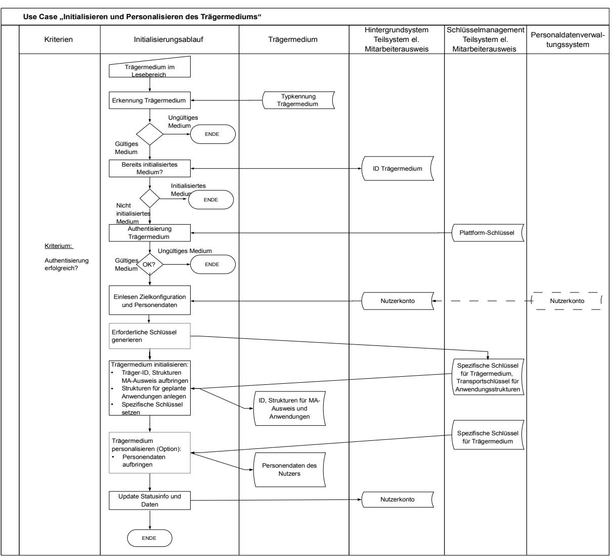

*Abbildung 9: Use Case "Initialisieren und Personalisieren des Trägermediums"*

- 1. Initialisieren des Trägermediums
	- 1. Funktionale und sicherheitstechnische Voreinstellungen
	- 2. Setzen spezifischer Schlüssel
	- 3. Setzen einer ID, die das Trägermedium eindeutig kennzeichnet.
	- 4. Einbringen von Strukturen z. B. zur Personalisierung des Trägermediums
	- 5. Aktivieren einer Funktion zur Authentifizierung des Trägermediums
- 2. Vorbereitungen für das Aufbringen der geplanten Anwendungen

Schaffung von Strukturen und Schutzfunktionen, die das spätere Aufbringen von Anwendungen durch externe Anwendungsverantwortliche zulassen:

- 1. Zuordnung von Ressourcen des Trägermediums (Anlegen von Dateisystemen etc.)
- 2. Definition und Setzen anwendungsspezifischer Transportschlüssel
- 3. Personalisierung des Trägermediums
	- 1. Verknüpfung der ID des Trägermediums mit dem Konto des Nutzers im Hintergrundsystem des Teilsystems "Systeme elektronischer Mitarbeiterausweis" und den dort gespeicherten Personendaten.
	- 2. Im Use Case in [Abbildung 10](#page-51-0) werden darüber hinaus Personendaten im Trägermedium gespeichert.
	- 3. Aufbringen und Aktivieren einer Funktion zum Schutz der Personendaten

Mit dem Fortgang der Arbeitsschritte zur Initialisierung des Trägermediums muss der Informationsstand im CMS und im KMS des Teilsystems elektronischer Mitarbeiterausweis aktualisiert werden.

Die verschiedenen verwendeten Schlüsselinformationen, Zertifikate etc. werden über ein Schlüsselmanagement erzeugt und zugeführt. Dieses liegt in der Zuständigkeit des Systemmanagers. Sollten bei der Initialisierung öffentliche Schlüssel vom Chip des Trägermediums erzeugt werden, so sind diese in das Schlüsselmanagementsystem einzupflegen.

Das Initialisieren des Trägermediums erfolgt in einer sicheren Umgebung.

# **7.3 Use Case "Aufbringen und Personalisieren von Anwendungen"**

Wie in den Kapiteln [6.2.2](#page-42-0) und [6.3.1](#page-45-0) beschrieben, werden nach der Initialisierung und Personalisierung des Trägermediums durch den Systemmanager die jeweiligen Anwendungen aufgebracht. Insbesondere wenn die Verantwortung für das Trägermedium und die einzelnen Anwendungen in unterschiedlichen Händen liegt, ist dies ein autonomer und von den Aktivitäten zum Trägermedium und zu anderen Anwendungen zu trennender Prozess.

[Abbildung 10](#page-51-0) zeigt den technischen Ablauf des Aufbringens und der Personalisierung der Anwendung.

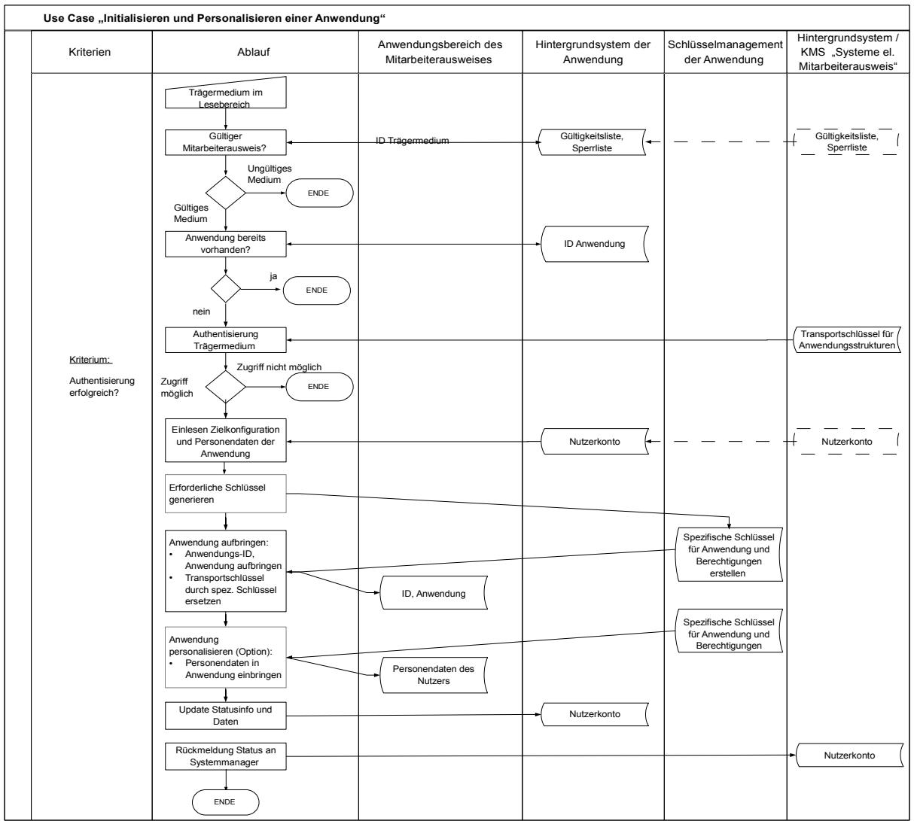

*Abbildung 10: Use Case "Aufbringen und Personalisieren von Anwendungen"*

Dabei werden folgende Schritte abgearbeitet:

- 1. Vorbereitungen
	- 1. Der initialisierte und personalisierte Mitarbeiterausweis muss dem Anwendungsverantwortlichen, der das Aufbringen und die Personalisierung der Anwendung durchführen soll, vorliegen.
	- 2. Der Anwendungsverantwortliche hat Zugriff auf die Transportschlüssel der anwendungsspezifischen Strukturen des Mitarbeiterausweises, die im Teilsystem "System elektronischer Mitarbeiterausweis" verwaltet werden.
	- 3. Der Anwendungsverantwortliche hat ein Nutzerkonto mit den Personendaten und den benötigten Informationen zum Mitarbeiterausweis angelegt.
- 2. Aufbringen der Anwendung
	- 1. Aufbringen anwendungsspezifischer Software und Strukturen
	- 2. Austausch der Transportschlüssel gegen spezifische Schlüssel
	- 3. Setzen einer ID, die die Anwendung eindeutig kennzeichnet.
	- 4. Je nach Anwendung werden auch Berechtigungen mit der Anwendung aufgebracht und aktiviert. Ein Beispiel dafür ist die Anwendung Zeiterfassung wie in Kapitel [6.3.1](#page-45-0) beschrieben.
	- 5. Aktivieren einer Funktion zur Authentifizierung der Anwendung
- 3. Personalisierung der Anwendung
	- 1. Verknüpfung der ID der Anwendung mit dem Konto des Nutzers im Hintergrundsystem der Anwendung und den dort gespeicherten Personendaten.
	- 2. Je nach Systemimplementierung werden auch im Anwendungsbereich des Trägermediums Personendaten gespeichert.
	- 3. Aufbringen und Aktivieren einer Funktion zum Schutz der Personendaten in der Anwendung.

Mit dem Fortgang der Arbeitsschritte zur Initialisierung des Trägermediums muss der Informationsstand im CMS und im KMS der Anwendung aktualisiert werden.

Abschließend wird die Umsetzung des Use Cases und die Aktivierung der Anwendung an das Hintergrundsystem "Systeme des elektronischen Mitarbeiterausweises" berichtet und damit der aktuelle Status des Mitarbeiterausweises dem zentralen CMS mitgeteilt.

Die verschiedenen verwendeten Schlüsselinformationen, Zertifikate etc. werden über ein Schlüsselmanagement erzeugt und zugeführt. Sollten bei der Initialisierung öffentliche Schlüssel vom Chip des Trägermediums erzeugt werden, so sind diese in das Schlüsselmanagementsystem einzupflegen.

Das Aufbringen und das Personalisieren der Anwendung erfolgen in einer sicheren Umgebung.

# **7.4 Use Case "Einbringen und Ändern von Berechtigungen"**

Sobald die Anwendung installiert und aktiviert ist, können Berechtigungen in die Anwendung geladen werden.

Der in [Abbildung 11](#page-53-0) dargestellte Use Case bildet einen Teil des Prozesses PZK3, der in Kapite[l](#page-43-0) [6.2.3](#page-43-0) beschrieben ist, ab.

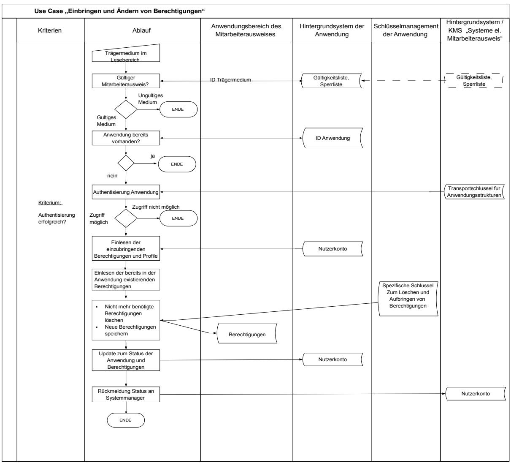

*Abbildung 11: Use Case "Einbringen und Ändern von Berechtigungen"*

Dabei werden folgende Schritte abgearbeitet:

- 1. Vorbereitungen
	- 1. Es liegt eine Anforderung z. B. des Systemmanagers zur Zuweisung oder Änderung der Berechtigungen des Nutzers vor.
	- 2. Der mit einer initialisierten und personalisierten Anwendung versehene Mitarbeiterausweis muss dem Anwendungsverantwortlichen, der das Einbringen oder die Änderung von Berechtigungen durchführen soll, vorliegen.
	- 3. Der Anwendungsverantwortliche hat die erforderlichen Berechtigungen oder Berechtigungsprofile identifiziert.
- 2. Löschen von Berechtigungen
	- 1. Berechtigungen, die vom Nutzer nicht mehr verwendet werden sollen, werden gelöscht.
- 3. Einbringen neuer Berechtigungen
- 1. Berechtigungen, die dem Nutzer nun bereitgestellt werden sollen, werden in die Anwendung eingebracht.
- 2. Austausch der Transportschlüssel gegen spezifische Schlüssel
- 3. Aktivieren der Funktionen zum Schutz der Berechtigungen

Nach Abschluss der beschriebenen Schritte muss der Informationsstand im CMS und im KMS der Anwendung aktualisiert werden.

Abschließend wird der Auftraggeber über die Aktivierung der neuen oder geänderten Berechtigung unterrichtet.

# **7.5 Use Case "Nutzung des Mitarbeiterausweises"**

Der Mitarbeiterausweis wird in verschiedenen Anwendungen auf sehr unterschiedliche Weise genutzt. Die Prozesse PZK4 "Nutzung des Mitarbeiterausweises zum Zutritt" und PZE2 "Nutzung des Mitarbeiterausweises zur Zeiterfassung" beschreiben die wesentlichen Fälle, die in dieser Richtlinie betrachtet werden.

Eine besonders komplexe Ausprägung eines Use Cases ergibt sich bei der Nutzung zur Zutrittskontrolle, wenn zusätzlich zur Prüfung der Berechtigung, biometrische Daten oder Passwörter verwendet und Nutzdaten vom Ausweis gelesen oder auf den Ausweis gespeichert werden. Dabei müssen gegebenenfalls folgende Schritte abgearbeitet werden:

- 1. Vorbedingungen
	- 1. Die Zutrittskontrolltechnik und das Lesegerät müssen mit dem Hintergrundsystem der Zutrittskontrolle verbunden sein.
- 2. Gültigkeitsprüfung und Authentifizierung
	- 1. Prüfung der Gültigkeit des Mitarbeiterausweises gegen eine Sperr- und Gültigkeitsliste
	- 2. Authentifizierung der Anwendung "Zutrittskontrolle" des Mitarbeiterausweises
- 3. Verarbeitung von Nutzdaten "Zutrittskontrolle" auf dem Trägermedium
	- 1. Prüfung, ob Nutzdaten früherer Zutrittsereignisse in der Anwendung "Zutrittskontrolle" des Mitarbeiterausweises gespeichert sind.
	- 2. Wenn ja, werden diese Daten ausgelesen und an das Hintergrundsystem der Zutrittskontrolle übertragen.
	- 3. Nach erfolgreicher Übertragung werden die Nutzdaten vom Trägermedium gelöscht.
- 4. Kontrolle des Zutritts zu einem Bereich mit sehr hohem Schutzbedarf
	- 1. Die in der Anwendung gespeicherte Berechtigung wird ausgelesen und durch die Zutrittskontrolltechnik geprüft.

Die folgenden Schritte werden nur im Fall einer gültigen Berechtigung abgearbeitet:

- 2. Der Nutzer gibt biometrischer Daten (z. B. Fingerabdruck) oder ein Geheimnis, dass seine Identität bestätigt (z. B. Passwort), ein.
- 3. Die eingegebenen Daten werden mit den im Hintergrundsystem der Zutrittskontrolle hinterlegten Referenzdaten verglichen.

Die folgenden Schritte werden nur im Fall einer erfolgreichen Prüfung abgearbeitet:

- 4. Gegebenenfalls werden entsprechend der hinterlegten Regeln zusätzliche Personen zum Zutritt aufgefordert oder der Zutritt des Nutzers abgelehnt, weil die Höchstzahl der Personen im Bereich bereits erreicht ist.
- 5. Der Zutritt wird ermöglicht.
- 5. Dokumentation des Zutrittsereignisses
	- 1. Die Daten zum Zutrittsereignis werden an das Hintergrundsystem der Zutrittskontrolle übermittelt und dort z. B. im Nutzerkonto hinterlegt.

Beim Verlassen des Bereichs läuft dieser Vorgang gegebenenfalls in umgekehrter Reihenfolge ab.

# **7.6 Use Case "Sperren eines Mitarbeiterausweises"**

Mitarbeiterausweise, die abhanden gekommen sind, müssen gesperrt werden. Das Gleiche gilt für defekte Medien. Der entsprechende Betriebsprozess wurde in Kapitel [6.1.4](#page-40-0) beschrieben.

Die Sperrung eines Mediums und der darauf gespeicherten Anwendungen und Berechtigung ist die Voraussetzung für die Ausstellung eines Ersatzmediums bzw. für die Überschreibung einer Berechtigung auf einen neuen Nutzer.

Es wird davon ausgegangen, dass die Organisation einen Verantwortlichen benannt hat, bei dem der Verlust oder die Fehlfunktion von Mitarbeiterausweisen gemeldet und bewertet wird. Dieser Verantwortliche beauftragt den Systemmanager mit der Sperrung. Dabei entscheidet er auch, ob eine temporäre oder irreversible Sperrung erfolgen soll. In der Praxis wird diese Rolle vom Werkschutz, vom Help Desk für Mitarbeiterausweise oder auch vom System- oder Sicherheitsmanager selbst ausgefüllt werden. Eine Sperrung darf nur erfolgen, wenn sichergestellt ist, dass der Beantragende dazu befugt ist.

Dabei werden folgende Schritte abgearbeitet:

- 1. Aufforderung zur Sperrung
	- 1. Übergabe der Sperranforderung an den Systemmanager
	- 2. Übermittlung der verfügbaren Daten zum Ausweis (vorzugsweise Ausweis-ID oder auch Nutzername, Mitarbeiter-ID etc.)
- 2. Umsetzung der Sperrung durch den Systemmanager
	- 1. Falls nötig, Ermittlung der ID des zu sperrenden Trägermediums
	- 2. Prüfung, ob Sperrung bereits erfolgt ist.
	- 3. Eintragen der ID in Sperrliste, löschen aus Gültigkeitsliste. Beide Listen werden über etablierte Prozesse auch an die Anwendungsverantwortlichen verteilt.
	- 4. Sperren der spezifischen Schlüssel des Trägermediums
	- 5. Aufforderung zur Sperrung der Anwendungen an die verschiedenen Anwendungsverantwortlichen senden.
		- 1. Umsetzung der Sperrung durch die Anwendungsverantwortlichen
		- 2. Rückmeldung der Fertigstellung an den Systemmanager
	- 6. Update des Nutzerkontos
	- 7. Rückmeldung der Fertigstellung an den Antragsteller.

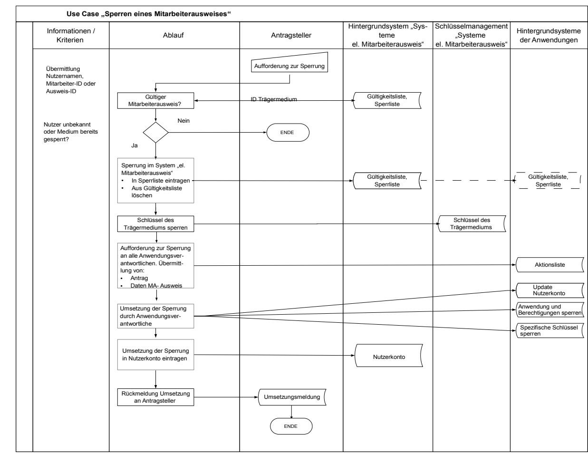

#### [Abbildung 12](#page-56-0) zeigt die Aktivitäten des Use Cases "Sperren eines MA".

*Abbildung 12: Use Case "Sperren eines Mitarbeiterausweises"*

# **8 Sicherheitsbetrachtungen**

# **8.1 Definitionen zum Thema Sicherheit und Datenschutz**

# **8.1.1 Definition von Begriffen**

#### Gefährdungen

Gefährdungen sind unmittelbare Gefahren für die Sicherheitsziele des Einsatzgebiets. Diese können durch aktive Angriffe auf das System oder in Form von Schwächen des Systems oder der Betriebsprozesse auftreten. Gefährdungen beziehen sich auf einzelne Sicherheitsziele (Assets) und spezifische, relevante Komponenten, Teilsysteme oder Prozesse.

#### Maßnahmen

Maßnahmen sind konkrete Handlungsempfehlungen, die gegen eine oder mehrere Gefährdungen wirken. Maßnahmen sollen bedarfsgerecht und angemessen sein. Der Aufwand zur Umsetzung der Maßnahme und potenzielle Beeinträchtigungen der Funktionalität und Nutzerfreundlichkeit sollen in einem angemessenen Verhältnis zum potenziellen Schaden, der durch die Gefährdung entstehen könnte, stehen.

#### Restrisiko

Es ist oftmals nicht möglich, allen Gefährdungen durch entsprechende Maßnahmen so entgegenzuwirken, dass ein System perfekte Sicherheit bietet. Der Begriff "Restrisiko" bezeichnet das Risiko, das verbleibt, wenn alle angemessenen Maßnahmen gegen die identifizierten Gefährdungen eines Sicherheitsziels umgesetzt wurden. Dieses Restrisiko muss dokumentiert, den betroffenen Entitäten offengelegt und von diesen explizit akzeptiert werden.

#### Sicherheitsziele

Sicherheitsziele sind sicherheitsrelevante Ziele bei der Implementierung und dem Betrieb eines IT-Systems oder einzelner Komponenten. In dieser Richtlinie werden spezifische Sicherheitsziele für das beschriebene Einsatzgebiet festgelegt. Eine Verletzung dieser Sicherheitsziele schädigt die betroffenen Entitäten.

## **8.1.2 Generelle Definition der Bereiche der IT-Sicherheit**

Für die Sicherheitsbetrachtungen der TR RFID wird das Thema "IT-Sicherheit" in drei Bereiche unterteilt:

- Funktionssicherheit (Safety)
- Informationssicherheit (Security)
- Datenschutz (Privacy).

In den folgenden Kapiteln werden diese Bereiche und deren generelle Sicherheitsziele definiert:

#### **8.1.2.1 Funktionssicherheit**

Die Erfahrung zeigt, dass in jedem technischen System Fehler auftreten können. Unter Funktionssicherheit wird die Eigenschaft eines Systems verstanden, trotz aufgetretener Systemfehler nicht in unkontrollierbare Systemzustände zu geraten, die das System selbst oder seine Umwelt in Gefahr bringen (Fail safe). Dabei soll das System noch weitestgehend wie spezifiziert reagieren (Fault tolerance). Unter Funktionssicherheit wird also der Schutz vor den Folgen von unbeabsichtigten und nicht vorhergesehenen Ereignissen verstanden.

Anmerkung: Funktionssicherheit wird vielfach mit Zuverlässigkeit oder Quality of Service verwechselt. Zuverlässigkeit bedeutet jedoch, dass das System unter allen berücksichtigten Umständen korrekt der Spezifikation folgt.

Folgende generelle Sicherheitsziele werden für den Bereich Funktionssicherheit festgelegt:

- 1. Störungssicherheit: Das System soll so ausgelegt sein, dass technische Störungen, die erhebliche Auswirkungen auf die jeweilige Funktion haben, weitestgehend ausgeschlossen sind. Dies beinhaltet insbesondere auch die Vermeidung von Störungen durch Fehlbedienung der Konsumenten oder des Betriebspersonals.
- 2. Fehlertoleranz: Auch bei Störungen soll das Anwendungssystem nicht in undefinierte Zustände geraten.

#### **8.1.2.2 Informationssicherheit**

Die Informationssicherheit betrachtet den Schutz vor beabsichtigten Angriffen. Informationssicherheit wird oftmals auch als Datensicherheit bezeichnet.

Für die weiteren Betrachtungen werden die folgenden generellen Sicherheitsziele (Assets) für den Bereich Informationssicherheit formuliert:

- 1. Vertraulichkeit: Vertraulichkeit ist der Schutz vor unbefugter Preisgabe von Informationen. Vertrauliche Daten und Informationen dürfen ausschließlich Befugten in der zulässigen Weise zugänglich sein. Als Schutzziel formuliert bedeutet dies: Gespeicherte bzw. zu kommunizierende Informationen sind vor dem Zugriff von Unbefugten zu schützen.
- 2. Integrität: Integrität bezeichnet die Sicherstellung der Korrektheit (Unversehrtheit) von Daten und der korrekten Funktionsweise von Systemen. Als Schutzziel formuliert bedeutet dies: Gespeicherte bzw. zu kommunizierende Informationen sind vor unberechtigter Veränderung zu schützen.
- 3. Verfügbarkeit: Die Verfügbarkeit von Dienstleistungen, Funktionen eines IT-Systems, IT-Anwendungen oder IT-Netzen oder auch von Informationen ist vorhanden, wenn diese den Benutzern stets wie gewünscht zur Verfügung stehen. Als Schutzziel formuliert bedeutet dies: Informationen und Betriebsmittel sind vor unbefugter Vorenthaltung zu schützen.
- 4. Authentizität: Mit dem Begriff Authentizität wird die Eigenschaft bezeichnet, die gewährleistet, dass ein Kommunikationspartner tatsächlich derjenige ist, der er vorgibt zu sein. Bei authentischen Informationen ist sichergestellt, dass sie von der angegebenen Quelle erstellt wurden. Der Begriff wird nicht nur verwendet, wenn die Identität von Personen geprüft wird, sondern auch bei IT-Komponenten oder Anwendungen.
- 5. Nichtabstreitbarkeit: Das Versenden bzw. Empfangen von Nachrichten durch authentisch festgestellte Personen ist gegen Abstreiten zu schützen.
- 6. Verbindlichkeit: Unter Verbindlichkeit werden die IT-Sicherheitsziele Authentizität und Nichtabstreitbarkeit zusammengefasst. Bei der Übertragung von Informationen bedeutet dies, dass die Informationsquelle ihre Identität bewiesen hat und der Empfang der Nachricht nicht in Abrede gestellt werden kann.

#### **8.1.2.3 Datenschutz, Schutz der Privatsphäre und informationelle Selbstbestimmung**

Das allgemeine Ziel des Datenschutzes ist der Schutz der allgemeinen Persönlichkeitsrechte aller beteiligten Entitäten. Dies umfasst nicht nur den Schutz personenbezogener Daten, sondern auch die Wahrung der Privatsphäre und des Rechts auf informationelle Selbstbestimmung.

Der Begriff der "personenbezogenen Daten" ist im Artikel 2 der [Datenschutzrichtlinie] folgendermaßen definiert:

Der Ausdruck "personenbezogene Daten" bezeichnet alle Informationen über eine bestimmte oder bestimmbare natürliche Person ("betroffene Person"); als bestimmbar wird eine Person angesehen, die direkt oder indirekt identifiziert werden kann, insbesondere durch Zuordnung zu einer Kennnummer oder zu einem oder mehreren spezifischen Elementen, die Ausdruck ihrer physischen, physiologischen, psychischen, wirtschaftlichen, kulturellen oder sozialen Identität sind.

Für die Anwendung von RFID benutzt die Artikel-29-Datenschutzgruppe in [Stellungnahme] zusätzlich die folgende weitergehende Definition:

"Daten beziehen sich auf eine Person, wenn sie die Identität, die Merkmale oder das Verhalten dieser Person betreffen oder wenn sie verwendet werden, um die Art festzulegen oder zu beeinflussen, in der die Person behandelt oder beurteilt wird."

Der zweite Teil dieser Definition (oder wenn Sie verwendet werden …) hängt demnach von der Art der Nutzung und nicht von den Daten selbst ab. Gefährdungsanalysen und Maßnahmen müssen also die jeweiligen Verfahren und Systeme der Nutzung adressieren.

Der Begriff der "sensiblen personenbezogenen Daten" wird auf Seite 7 von [Stellungnahme] mit den "besonderen Kategorien personenbezogener Daten" verbunden, die in Artikel 8, Abs. 1 der [Datenschutzrichtlinie] benannt sind:

Artikel 8

Verarbeitung besonderer Kategorien personenbezogener Daten

(1) Die Mitgliedstaaten untersagen die Verarbeitung personenbezogener Daten, aus denen die rassische und ethnische Herkunft, politische Meinungen, religiöse oder philosophische Überzeugungen oder die Gewerkschaftszugehörigkeit hervorgehen, sowie von Daten über Gesundheit oder Sexualleben.

Die weiteren Absätze dieses Artikels benennen Ausnahmen von diesem Verarbeitungsverbot.

Die "sensiblen personenbezogenen Daten" sind also eine Untermenge der "personenbezogenen Daten".

Daten, für die die Kriterien für personenbezogene oder sensible personenbezogene Daten nicht zutreffen, gelten als "nicht personenbezogene Daten".

# **8.2 Definition der einsatzgebietsspezifischen Sicherheitsziele**

## **8.2.1 Übergeordnete Sicherheitsziele**

Je nach Einsatzgebiet ergeben sich besondere Schwerpunkte der Sicherheitsbetrachtung. Im Folgenden werden auf Basis der generellen Sicherheitsziele [vergleiche Kapitel [8.1.2\]](#page-57-1), übergeordnete Sicherheitsziele für das Einsatzgebiet "Elektronischer Mitarbeiterausweis" definiert. Dazu gehören:

- 1. Schutz der Funktionssicherheit des Gesamtsystems "Elektronischer Mitarbeiterausweis"
- 2. Schutz der Integrität, Authentizität und Verfügbarkeit der elektronischen Identitäten und Berechtigungen des Mitarbeiterausweises.
- 3. Datenschutz durch Umsetzung der rechtlichen Vorgaben und Sicherstellung der Vertraulichkeit, Integrität und Authentizität bei Erhebung, Speicherung und Verarbeitung von personenbezogenen Daten.

Diese übergeordneten Sicherheitsziele fließen in die folgende Definition der spezifischen Sicherheitsziele des Einsatzgebiets "Elektronischer Mitarbeiterausweis" ein.

## **8.2.2 Definition der Sicherheitsziele für das Einsatzgebiet "Elektronischer Mitarbeiterausweis"**

Die Diskussion mit den Entitäten des Einsatzgebiets hat gezeigt, dass die spezifischen Sicherheitsziele des Einsatzgebiets "Elektronischer Mitarbeiterausweis" von den verschiedenen Stakeholders teilweise unterschiedlich gewichtet oder interpretiert werden. Um im weiteren Verlauf der Sicherheitsbetrachtung diesen verschiedenen Anforderungen gerecht werden zu können, werden in den folgenden Kapiteln die Standpunkte der Entitäten "Nutzer" und "Organisation" dokumentiert. Die Sicht der Organisation berücksichtigt, dass oftmals die Systemlieferanten dauerhaft Dienstleitungen wie die Personalisierung von Mitarbeiterausweisen im Auftrag der Organisation erbringen.

Die folgende Tabelle zeigt das Codierungsschema der Sicherheitsziele sowie die verwendeten Abkürzungen.

| Feldnummer | 1               | 2                                       | 3                                                                   | 4         |
|------------|-----------------|-----------------------------------------|---------------------------------------------------------------------|-----------|
| Feld       | Sicherheitsziel | Zugeordnete Rolle und ihre Abkürzung | Zugeordnetes generisches Sicherheitsziel und seine Ab kürzung | Zählindex |
| Inhalt     | S               | M: = Nutzer                             | F: = Funktionssicherheit                                            |           |
|            |                 | O: = Organisation                       | I: = Informationssicherheit                                         | 1, …, n   |
|            |                 |                                         | P: = Privatsphäre (Datenschutz)                                     |           |

*Tabelle 2: Codierungsschema der Sicherheitsziele*

# **8.2.3 Spezifische Sicherheitsziele des Nutzers**

Die spezifischen Sicherheitsziele aus Sicht der Nutzer von elektronischen Mitarbeiterausweisen werden in den folgenden Kapiteln beschrieben.

#### **8.2.3.1 Funktionssicherheit**

| Kurzbezeichnung des Sicherheitsziels |                                              | Beschreibung des Sicherheitsziels                                                                                                                                                                                                                                                                                                                                                                                                                                                                                                                       |
|-----------------------------------------|----------------------------------------------|---------------------------------------------------------------------------------------------------------------------------------------------------------------------------------------------------------------------------------------------------------------------------------------------------------------------------------------------------------------------------------------------------------------------------------------------------------------------------------------------------------------------------------------------------------|
| SMF1                                    | Technische Kompatibilität                 | Die Interaktionen zwischen den elektronischen Mitarbeiterausweisen, Terminals und angeschlossenen Managementsystemen müssen wie spezifiziert funktionieren. Dabei muss die Möglichkeit in Betracht gezogen werden, dass die Anwendungen, Subsysteme und Komponenten von unterschiedlichen Anbietern oder Lieferanten zur Verfügung gestellt werden (z. B. Zu trittskontrolle, Zeiterfassung). Darüber hinaus können Anwendungen von unterschiedlichen Entitäten innerhalb einer Organisation gesteuert und verwaltet werden. |
| SMF2                                    | Rückfalllösung bei Fehlfunktion           | Ein Nutzer muss in die Lage versetzt werden, einen Dienst auch dann zu nutzen, wenn der elektronische Mitarbeiterausweis oder die Systeminfrastruktur nicht einwandfrei funktioniert. Zumindest eine eingeschränkte Nutzung sollte möglich sein.                                                                                                                                                                                                                                                                                               |
| SMF3                                    | Intuitive, fehler tolerante Be dienung | Die Nutzung eines elektronischen Mitarbeiterausweises muss mög lichst selbsterklärend bzw. einfach zu erlernen sein, um Schwierig keiten bei der Nutzung des Mitarbeiterausweises und daraus ent stehende Probleme der Funktionssicherheit zu vermeiden.                                                                                                                                                                                                                                                                                       |

*Tabelle 3: Sicherheitsziele des Nutzers zur Funktionssicherheit*

## **8.2.3.2 Informationssicherheit**

| Kurzbezeichnung des Sicherheitsziels |                                                                           | Beschreibung des Sicherheitsziels                                                                                                                                                                                                                                                                                                                                                                                                                                                                                                                                                                                               |
|-----------------------------------------|---------------------------------------------------------------------------|---------------------------------------------------------------------------------------------------------------------------------------------------------------------------------------------------------------------------------------------------------------------------------------------------------------------------------------------------------------------------------------------------------------------------------------------------------------------------------------------------------------------------------------------------------------------------------------------------------------------------------|
| SMI1                                    | Schutz der elektronischen Identität (Informations sicherheit) | Elektronischen Identitäten, die im Managementsystem und/oder auf dem elektronischen Mitarbeiterausweis gespeichert sind, werden zur Identifizierung und/oder Verifikation des Nutzers verwendet, um z. B. Zutritt zu gewähren. Die missbräuchliche Verwendung, Manipulation oder Weitergabe seiner personenbezogenen Daten wäre für den Nutzer gegebenenfalls mit Beeinträchtigungen des Ansehens, der sozialen Existenz, kommerziellen Risiken und dem Verlust von Sicherheit und Daten schutz verbunden und ist zu vermeiden. Dies gilt insbesondere, wenn biometrische Daten verwendet werden. |
| SMI2                                    | Schutz der Be rechtigungen                                             | Die Manipulation seiner Berechtigungen oder seiner elektronischen Identität wäre für den Nutzer möglicherweise mit Unannehmlichkeiten oder Schaden verbunden. Beispielsweise könnte ein Angreifer die Identität oder Berechtigungen ohne Wissen des Nutzers für illegale                                                                                                                                                                                                                                                                                                                                               |

|      |                          | Zwecke nutzen. Das Ziel des Nutzers ist, dass Berechtigungen an gemessen geschützt werden.                                                                                                                                                                              |
|------|--------------------------|----------------------------------------------------------------------------------------------------------------------------------------------------------------------------------------------------------------------------------------------------------------------------|
| SMI3 | Schutz der Nutz daten | Nutzdaten entstehen bei der Verwendung des Mitarbeiterausweises in den einzelnen Anwendungen und dienen z. B. der Dokumentation der Zutrittshistorie oder der Zeiterfassung. Aus Sicht des Nutzers müssen die Daten verlässlich, authentisch und integer sein. |

*Tabelle 4: Sicherheitsziele des Nutzers zur Informationssicherheit*

## **8.2.3.3 Schutz der Privatsphäre**

| Kurzbezeichnung des Sicherheitsziels |                                                             | Beschreibung des Sicherheitsziels                                                                                                                                                                                                                                                                                                                                                                  |
|-----------------------------------------|-------------------------------------------------------------|----------------------------------------------------------------------------------------------------------------------------------------------------------------------------------------------------------------------------------------------------------------------------------------------------------------------------------------------------------------------------------------------------|
| SMP1                                    | Schutz der elektronischen Identität (Daten schutz) | Die elektronische Identität des Nutzers ist zu schützen und darf nur für die vereinbarten Zwecke eingesetzt werden.                                                                                                                                                                                                                                                                             |
| SMP2                                    | Schutz gegen die Erstellung von Nutzungsprofilen      | Es ist zu verhindern, dass durch Nutzung des Mitarbeiterausweises nicht erlaubte Nutzungsprofile oder nicht ausdrücklich erlaubte Ver knüpfungen von Daten verschiedener Anwendungen erstellt werden können.                                                                                                                                                                              |
| SMP3                                    | Schutz der Nutz daten                                    | Nutzdaten, die bei der Verwendung eines Mitarbeiterausweises erzeugt und nicht anonymisiert werden, sind als personenbezogene Daten des Nutzers zu behandeln und entsprechend zu schützen. Für die Erhebung von Nutzdaten müssen die datenschutzrechtlichen Vorgaben (Zweck bindung, Transparenz etc.) eingehalten und die Rechte des Nutzers an seinen Daten gewährleistet werden. |

*Tabelle 5: Sicherheitsziele des Nutzers zur Privatsphäre*

## **8.2.4 Spezifische Sicherheitsziele der Organisation**

Die spezifischen Sicherheitsziele der Entität "Organisation" werden in den folgenden Kapiteln dokumentiert. Auf eine Differenzierung der Ziele einzelner Bereiche der Organisation, die die einzelnen Anwendungen verantworten, wird bewusst verzichtet.

#### **8.2.4.1 Funktionssicherheit**

| Kurzbezeichnung des Sicherheitsziels |                              | Beschreibung des Sicherheitsziels                                                                                                                                                                                                                                                                                                                                              |
|-----------------------------------------|------------------------------|--------------------------------------------------------------------------------------------------------------------------------------------------------------------------------------------------------------------------------------------------------------------------------------------------------------------------------------------------------------------------------|
| SOF1                                    | Technische Kompatibilität | Die Interaktionen zwischen den elektronischen Mitarbeiterausweisen, Terminals und angeschlossenen Managementsystemen müssen wie spezifiziert funktionieren. Dabei muss die Möglichkeit in Betracht gezogen werden, dass die Anwendungen, Subsysteme und Komponenten von unterschiedlichen Anbietern oder Lieferanten zur Verfügung gestellt werden (z. B. Zu |

| Kurzbezeichnung des Sicherheitsziels |                                              | Beschreibung des Sicherheitsziels                                                                                                                                                                                                                                                         |  |
|-----------------------------------------|----------------------------------------------|-------------------------------------------------------------------------------------------------------------------------------------------------------------------------------------------------------------------------------------------------------------------------------------------|--|
|                                         |                                              | trittskontrolle, Zeiterfassung). Darüber hinaus können Anwendungen von unterschiedlichen Entitäten innerhalb einer Organisation gesteuert und verwaltet werden.                                                                                                                     |  |
| SOF2                                    | Rückfalllösung bei Fehlfunktion           | Anwendungen und Dienste sollen auch dann grundsätzlich zur Ver fügung stehen, wenn der elektronische Mitarbeiterausweis oder die Systeminfrastruktur nicht einwandfrei funktionieren. Zumindest eine eingeschränkte Nutzung sollte möglich sein.                                 |  |
| SOF3                                    | Intuitive, fehler tolerante Be dienung | Die Nutzung eines elektronischen Mitarbeiterausweises muss mög lichst selbsterklärend bzw. einfach zu erlernen sein, um Schwierigkeiten bei der Anwendung des Mitarbeiterausweises und daraus entstehende Probleme der Funktionssicherheit für die Organisation zu vermeiden. |  |

*Tabelle 6: Sicherheitsziele der Organisation zur Funktionssicherheit*

## **8.2.4.2 Informationssicherheit**

| Kurzbezeichnung des Sicherheitsziels |                                                                           | Beschreibung des Sicherheitsziels                                                                                                                                                                                                                                                                                                                                                                                                                                                                                              |  |
|-----------------------------------------|---------------------------------------------------------------------------|--------------------------------------------------------------------------------------------------------------------------------------------------------------------------------------------------------------------------------------------------------------------------------------------------------------------------------------------------------------------------------------------------------------------------------------------------------------------------------------------------------------------------------|--|
| SOI1                                    | Schutz der elektronischen Identität (Informationssich erheit) | Die elektronische Identität eines Mitarbeiters wird z. B. im CMS und auf dem elektronischen Mitarbeiterausweis gespeichert. Fehlerhafte Daten zur Person, eine missbräuchliche Verwendung, die Manipulation oder die Weitergabe an Unberechtigte würden der Organisation schaden und müssen daher vermieden werden.                                                                                                                                                                                             |  |
| SOI2                                    | Schutz der Be rechtigungen                                             | Innerhalb der verschiedenen Anwendungen werden den Mitarbeitern durch die Organisation Rechte eingeräumt und entsprechende Be rechtigungen ausgestellt und z. B. im CMS oder auf dem Mitarbeiterausweis gespeichert. Durch Manipulation der Be rechtigungen könnte ein Nutzer z. B. Zutritt zu für ihn gesperrten Bereichen erlangen oder Guthaben in der Bezahlanwendung generieren. Die Berechtigungen müssen deshalb gegen Manipulation und gegen Auslesen durch Unberechtigte geschützt werden. |  |
| SOI3                                    | Schutz der Nutz daten                                                  | Nutzdaten entstehen bei der Verwendung des Mitarbeiterausweises in den einzelnen Anwendungen und dienen z. B. der Dokumentation der Zutrittshistorie oder der Zeiterfassung. Aus Sicht der Organisation müssen die Daten verlässlich, authentisch und integer sein.                                                                                                                                                                                                                                                |  |
| SOI4                                    | Schutz der An wendungen und Berechtigungen                          | Es ist üblich, dass elektronische Mitarbeiterausweise mehrere An wendungen unterstützen. Jede dieser Anwendungen kann verschiedene Dienste bereitstellen, für die entsprechende Berechtigungen vor gehalten werden. Insbesondere wenn die Anwendungen und Berechtigungen von ver schiedenen Anwendungsanbietern verantwortet werden, ist sicherzu stellen, dass die Anwendungen und Daten auf dem Mitarbeiterausweis und in der Systeminfrastruktur strikt getrennt werden, um gegenseitige               |  |

| Kurzbezeichnung des Sicherheitsziels |                                                                | Beschreibung des Sicherheitsziels                                                                                                                                                                                                                                                                                                                                                                                                                |  |
|-----------------------------------------|----------------------------------------------------------------|--------------------------------------------------------------------------------------------------------------------------------------------------------------------------------------------------------------------------------------------------------------------------------------------------------------------------------------------------------------------------------------------------------------------------------------------------|--|
|                                         |                                                                | Beeinflussungen und negative Auswirkungen auf die Informations sicherheit und den Datenschutz zu verhindern.                                                                                                                                                                                                                                                                                                                                  |  |
| SOI5                                    | Schutz der Systeminfrastrukt ur                          | Um die Funktion der Anwendungen des Mitarbeiterausweises zu ge währleisten, muss die Systeminfrastruktur hinreichend verlässlich arbeiten und gegen Manipulationen und Verfügbarkeitsangriffe ge schützt werden. Hierbei ist zu beachten, dass Fehler oder erfolgreiche Angriffe auf die Systeminfrastruktur oftmals die Funktion der An wendungen insgesamt beeinträchtigen und viele oder sogar alle Mit arbeiter betreffen. |  |
| SOI6                                    | Schutz gegen DoS-Attacken auf RFID-Systemkom ponenten | Angriffe auf die Verfügbarkeit der Komponenten und Systeme des Mitarbeiterausweises können zum Ausfall der Anwendungen führen und Schäden oder betriebliche Schwierigkeiten verursachen. Die Infrastruktur des elektronischen Mitarbeiterausweises muss deshalb gegen DoS-Angriffe geschützt werden.                                                                                                                                 |  |
| SOI7                                    | Zuverlässige Funktionsweise der Anwendungen              | Die Organisation ist auf die zuverlässige Funktion der betriebenen Anwendungen angewiesen. Die Anwendungen und die bei Ver wendung des Mitarbeiterausweises erzeugten Nutzdaten müssen ver lässlich sein.                                                                                                                                                                                                                               |  |

*Tabelle 7: Sicherheitsziele der Organisation zur Informationssicherheit*

## **8.2.4.3 Schutz der Privatsphäre**

| Kurzbezeichnung des Sicherheitsziels |                                                             | Beschreibung des Sicherheitsziels                                                                                                                                                                                                                                                                                                                                                                                                                               |  |
|-----------------------------------------|-------------------------------------------------------------|-----------------------------------------------------------------------------------------------------------------------------------------------------------------------------------------------------------------------------------------------------------------------------------------------------------------------------------------------------------------------------------------------------------------------------------------------------------------|--|
| SOP1                                    | Schutz der elektronischen Identität (Daten schutz) | Der Schutz der elektronischen Identität von Nutzern des Mitarbeiter ausweises ist ein wichtiges Ziel der Organisation. Eine missbräuchliche Verwendung, Verstöße gegen datenschutzrechtliche Auflagen, Manipulation oder Weitergabe von personenbezogenen Daten wäre mit hohen Risiken für die Organisation verbunden und würde gegebenen falls als Gesetzesverstoß geahndet werden.                                                             |  |
| SOP3                                    | Schutz der personenbezogen en Nutzdaten               | Nutzdaten, die bei der Verwendung eines Mitarbeiterausweises erzeugt und nicht anonymisiert werden, sind als personenbezogene Daten zu behandeln und entsprechend zu schützen. Eine missbräuchliche Ver wendung, Verstöße gegen datenschutzrechtliche Auflagen, Manipulation oder Weitergabe von personenbezogenen Daten wäre mit hohen Risiken für die Organisation verbunden und würde gegebenen falls als Gesetzesverstoß geahndet werden. |  |
| SOP4                                    | Datensparsamkeit                                            | Es dürfen nicht mehr Daten gesammelt, gespeichert und verarbeitet werden, als für einen spezifizierten Zweck nötig ist.                                                                                                                                                                                                                                                                                                                                      |  |

*Tabelle 8: Sicherheitsziele der Organisation zur Privatsphäre*

# **8.2.5 Zusammenfassung der Sicherheitsziele der Entitäten**

Die folgende Tabelle fasst die vorstehend genannten Sicherheitsziele der verschiedenen Entitäten zusammen. Rollenspezifische Sicherheitsziele wurden zu spezifischen Sicherheitszielen zusammengefasst, die durch die generischen Sicherheitsziele Funktionssicherheit, Informationssicherheit und Datenschutz (bzw. Privatsphäre) beschrieben werden. Zu den verwendeten Abkürzungen zählen:

- SS := Generisches Sicherheitsziel der Funktionssicherheit (Safety)
- SI := Generisches Sicherheitsziel der Informationssicherheit
- SP := Generisches Sicherheitsziel der Privatsphäre (Datenschutz)

| Sicherheitsziel |                                                                     | Ziele der Nutzer | Ziele der Organisation |
|-----------------|---------------------------------------------------------------------|------------------|------------------------|
| SS1             | Technische Kompatibilität                                           | SMF1             | SOF1                   |
| SS2             | Rückfalllösung für den Fall der Fehlfunktion                     | SMF2             | SOF2                   |
| SS3             | Intuitive, fehlertolerante Bedienung                                | SMF3             | SOF3                   |
| SI1             | Schutz der elektronischen Identität (Informationssicherheit)     | SMI1, SMI4, SMP1 | SOI1, SOP1             |
| SI2             | Schutz der Berechtigungen                                           | SMI2             | SOI2                   |
| SI3             | Schutz der Nutzdaten (Informationssicherheit)                    | SMI3, SMP3       | SOI3, SOP3             |
| SI4             | Schutz der Anwendungen und Be rechtigungen                       | SMP2             | SOI4                   |
| SI5             | Schutz der Systeminfrastruktur                                      |                  | SOI5                   |
| SI6             | Schutz gegen DoS-Angriffe auf RFID-Komponenten                   |                  | SOI6                   |
| SI7             | Zuverlässige Funktionsweise der Anwendungen                      |                  | SOI7                   |
| SP1             | Schutz der elektronischen Identität (Datenschutz)                | SMI1, SMI4, SMP1 | SOI1, SOP1             |
| SP2             | Schutz gegen die Erstellung von nicht erlaubten Nutzungsprofilen | SMP2             |                        |
| SP3             | Schutz der personenbezogenen Nutzdaten (Datenschutz)             | SMI3, SMP3       | SOI3, SOP3             |
| SP4             | Datensparsamkeit                                                    |                  | SOP4                   |

*Tabelle 9: Übersicht über die Sicherheitsziele der Entitäten*

# **8.2.6 Bildung von Schutzbedarfsklassen**

Basierend auf den Sicherheitszielen aus Kapitel [8.2.5](#page-65-0) werden 3 Schutzbedarfsklassen gebildet. Klasse 1 repräsentiert den geringsten Schutzbedarf, Klasse 3 den höchsten.

Anwendungsverantwortliche und Betreiber sollen in die Lage versetzt werden, die Zuordnung der Schutzbedarfsklassen für ihre jeweilige Anwendungsimplementierung selbstständig durchführen zu können.

Um die Einstufung für Anwender, die keine oder begrenzte Erfahrung mit Sicherheitsanalysen und keine Fachkenntnisse zu Gefährdungen, Schwachstellen und Eintrittswahrscheinlichkeiten besitzen, handhabbar zu machen, wurden Kriterien gewählt, die einem Anwendungsverantwortlichen oder Betreiber geläufig sind. Konkret werden insbesondere der direkte Schaden, der im Falle der Verletzung eines Sicherheitsziels entstehen würde und der Aufwand, der erforderlich wäre, den Schaden einzudämmen und zu beheben, zur Einstufung einer Anwendungsimplementierung in die Schutzbedarfsklassen herangezogen.

Bei einigen Schutzbedarfsbetrachtungen werden darüber hinaus typische Gegebenheiten des Einsatzgebiets in die Betrachtung aufgenommen, die als generelle Schutzmaßnahmen wirken und gegebenenfalls den Schutzbedarf von vornherein senken. Zum Beispiel wird der Schutzbedarf zum Sicherheitsziel "Technische Kompatibilität" reduziert, wenn vertragliche Vereinbarungen existieren, die Systemlieferanten zur Sicherstellung der Kompatibilität der Komponenten verpflichten. In der klassischen Sicherheitsanalyse fließen solche Informationen erst zu einem späteren Zeitpunkt in die Bewertung der Gefährdungen ein. Dieser Sonderweg wurde gewählt, da bei Anwendungsverantwortlichen und Betreibern nicht die Kenntnisse vorausgesetzt werden können, die zur Bewertung von Gefährdungen erforderlich sind.

In [Tabelle 10](#page-66-0) werden den drei Schutzbedarfsklassen Adjektive zur Beschreibung von Schutzbedarf, Schadenspotenzial und Aufwendungen zugeordnet.

| Schutzbedarf |            | Potenzieller Schaden | Potenzieller Aufwand |
|--------------|------------|----------------------|----------------------|
| Klasse       | Einstufung |                      |                      |
| 1            | normal     | unkritisch           | gering               |
| 2            | hoch       | begrenzt             | handhabbar           |
| 3            | sehr hoch  | kritisch             | kritisch             |

*Tabelle 10: Zuordung von verwendeten Adjektiven*

Die Adjektive zur Beschreibung des Schadenspotenzials werden in den folgenden Schutzbedarfsbetrachtungen mit folgenden Bedeutungen verwendet:

| Unkritischer Schaden: | Die Verletzung des Sicherheitsziels führt maximal zu Schäden, die keine erheblichen Auswirkungen auf die Organisation oder den Nutzer haben. In jedem Fall sind jedoch geeignete Schutzmaßnahmen zu treffen.                                          |
|--------------------------|-------------------------------------------------------------------------------------------------------------------------------------------------------------------------------------------------------------------------------------------------------------------|
| Begrenzter Schaden:   | Die Verletzung des Sicherheitsziels führt maximal zu Schäden, die erhebliche Auswirkungen auf die Organisation oder den Nutzer haben können, aber nach vorläufiger Einschätzung des Anwenders durch besondere Maßnahmen kompensiert werden können. |

Kritischer Schaden: Die Verletzung des Sicherheitsziels kann zu Schäden führen, die massive Auswirkungen auf die Organisation oder den Nutzer haben und nach vorläufiger Einschätzung des Anwenders auch durch besondere Maßnahmen nicht kompensiert werden können.

[Tabelle 11](#page-71-0) enthält die verbindlichen Kriterien zur Zuordnung der 3 Schutzbedarfsklassen für die einzelnen Sicherheitsziele. Diese beschreiben die Folgen, die eintreten können, wenn für die angenommene Implementierung keine Schutzmaßnahmen ergriffen werden.

| Sicherheitsziel |                                                    | Schutz bedarfs klasse | Kriterien zur Einordnung in Schutzbedarfsklassen / Be wertung bzw. Zuordnung für die spezifische Implementierung                                                                                                                                                                                           |
|-----------------|----------------------------------------------------|-----------------------------|---------------------------------------------------------------------------------------------------------------------------------------------------------------------------------------------------------------------------------------------------------------------------------------------------------------|
| SS1             | Technische Kompatibilität                       | 1                           | Alle Systemkomponenten stammen vom gleichen Lieferanten. Der Lieferant sorgt für die Kompatibilität der verschiedenen Komponenten und gewährleistet die spezifizierte Funktion des Gesamtsystems während des Betriebs.                                                                               |
|                 |                                                    | 2                           | Das System muss mit Komponenten von wenigen definierten Lieferanten funktionieren. Der Systemmanager oder ein Systemintegrator sorgen für Kompatibilität und gewährleisten die spezifizierte Funktion des Gesamtsystems während des Be triebs.                                                    |
|                 |                                                    | 3                           | Die Organisation betreibt ein offenes System, das mit Komponenten von verschiedenen Marktteilnehmern funktionieren soll. Diese Klasse kommt insbesondere zur An wendung, wenn Komponenten grundsätzlich über offene Aus schreibungen beschafft werden sollen.                                     |
| SS2             | Rückfalllösung für den Fall der Fehlfunktion | 1                           | 1. Eine Fehlfunktion der betrachteten Komponenten und Systeme würde nur einzelne Mitarbeiter betreffen. oder 2. Ein Ausfall der betrachteten Komponenten und Systeme würde keine oder unkritische Schäden und keine oder geringe Mehraufwände verursachen.                               |
|                 |                                                    | 2                           | 1. Eine Fehlfunktion der betrachteten Komponenten und Systeme würde viele Mitarbeiter (5% < X < 30% der Mit arbeiter) betreffen. oder 2. Ein Ausfall der betrachteten Komponenten und Systeme würde begrenzte Schäden und von der Organisation hand habbare Mehraufwände verursachen. |
|                 |                                                    | 3                           | 1. Eine Fehlfunktion würde mindestens 30% der Mitarbeiter be treffen. oder 2. Ein Ausfall der betroffenen Komponenten und Systeme würde kritische Schäden oder für die Organisation kritische Mehraufwände verursachen.                                                                  |
| SS3             | Intuitive,                                         | 1                           | Schwierigkeiten bei der Bedienung und Bedienungsfehler                                                                                                                                                                                                                                                        |

| Sicherheitsziel |                                                                           | Schutz bedarfs klasse | Kriterien zur Einordnung in Schutzbedarfsklassen / Be wertung bzw. Zuordnung für die spezifische Implementierung                                                                                                                                                                                                                                                                                                                                                        |
|-----------------|---------------------------------------------------------------------------|-----------------------------|----------------------------------------------------------------------------------------------------------------------------------------------------------------------------------------------------------------------------------------------------------------------------------------------------------------------------------------------------------------------------------------------------------------------------------------------------------------------------|
|                 | fehlertolerante Bedienung                                              |                             | können maximal bei einzelnen Mitarbeitern auftreten. Die Folgen stellen keine wesentliche Beeinträchtigung dar.                                                                                                                                                                                                                                                                                                                                                         |
|                 |                                                                           | 2                           | Schwierigkeiten bei der Bedienung und Bedienungsfehler können bei einer erheblichen Anzahl X von Mitarbeitern (5% < X < 30%) auftreten.                                                                                                                                                                                                                                                                                                                              |
|                 |                                                                           | 3                           | Schwierigkeiten bei der Bedienung und Bedienungsfehler können bei einem großen Teil der Mitarbeiter (mindestens 30%) auftreten.                                                                                                                                                                                                                                                                                                                                      |
| SI1             | Schutz der elektronischen Identität (Informationssi cherheit) | 1                           | Die elektronische Identität ist durch Angriffe oder Fehler ver loren, offengelegt, fehlerhaft oder manipuliert. Dies hat maximal unkritische Schäden und maximal geringe Mehraufwände zur Folge. Beispiele wären irrtümlich herbeigeführte Fehlbuchungen bei der Zeiterfassung, die nachträglich unter mithilfe der be troffenen Mitarbeiter korrigiert werden können.                                                                                      |
|                 |                                                                           | 2                           | Die elektronische Identität ist durch Angriffe oder Fehler ver loren, offengelegt, fehlerhaft oder manipuliert. Es entstehen maximal begrenzte Schäden, ein begrenzter Imageverlust der Organisation und noch handhabbare Mehraufwände. Beispiele wären absichtlich oder irrtümlich herbeigeführte Fehler bei der Zuordnung von Daten zur Identität zu Zutrittsberechtigungen bei maximal hohem Schutzbedarf.                                            |
|                 |                                                                           | 3                           | Die elektronische Identität ist durch Angriffe oder Fehler ver loren, offengelegt, fehlerhaft oder manipuliert. Dies hat kritische Schäden und kritische Mehraufwände zur Folge. Dieser Fall tritt z. B. ein, wenn sich Unberechtigte über die Manipulation personenbezogener Daten Zugang zu Bereichen mit sehr hohem Schutzbedarf verschaffen können.                                                                                                  |
| SI2             | Schutz der Be rechtigung                                               | 1                           | Die Berechtigung kann fehlerhaft, kopiert oder manipuliert worden sein. Dies hat maximal unkritische Schäden und keine oder geringe Mehraufwände, Kosten, Imageschäden etc. zur Folge. Dieser Fall wird in der Praxis nur eintreten, wenn nur eine Anwendung mit einfachen Anforderungen an den Schutzbedarf (Klasse 1) betrieben wird oder Angriffe auf die Berechtigung aus klar dargelegten und nachvollziehbaren Gründen nicht zu er warten sind. |
|                 |                                                                           | 2                           | Die Berechtigung kann fehlerhaft, kopiert oder manipuliert worden sein. Dies hat begrenzte Schäden und noch handhabbare Mehraufwände, Kosten, Imageschäden etc. zur Folge. Dieser Fall wird in der Praxis nur eintreten, wenn ausschließlich An wendungen mit maximal hohen Anforderungen an den Schutz bedarf (Klasse 2) betrieben werden.                                                                                                                 |
|                 |                                                                           | 3                           | Die Berechtigung kann fehlerhaft, kopiert oder manipuliert worden sein. Die Schutzbedarfsklasse 3 wird gewählt, sofern in                                                                                                                                                                                                                                                                                                                                               |

| Sicherheitsziel |                                                         | Schutz bedarfs klasse | Kriterien zur Einordnung in Schutzbedarfsklassen / Be wertung bzw. Zuordnung für die spezifische Implementierung                                                                                                                                                                                                                                                                                                                                                                                                                                                                                                                                                                                                            |
|-----------------|---------------------------------------------------------|-----------------------------|--------------------------------------------------------------------------------------------------------------------------------------------------------------------------------------------------------------------------------------------------------------------------------------------------------------------------------------------------------------------------------------------------------------------------------------------------------------------------------------------------------------------------------------------------------------------------------------------------------------------------------------------------------------------------------------------------------------------------------|
|                 |                                                         |                             | folgedessen kritische Schäden, kritische Mehraufwände oder kritische Imageschäden auftreten würden.                                                                                                                                                                                                                                                                                                                                                                                                                                                                                                                                                                                                                         |
| SI3             | Schutz der Nutzdaten (Informationssi cherheit) | 1                           | Die Daten sind durch Angriffe oder Fehler verloren, offengelegt, fehlerhaft oder verfälscht. Dies hat maximal unkritische Schäden und keine oder geringe Mehraufwände zur Folge. Dieser Fall ist in der Praxis nur dann zu erwarten, wenn aus schließlich Anwendungen mit maximal normalen Anforderungen an den Schutzbedarf (Stufe 1) betrieben werden, personen bezogene Daten Dritten nicht zugänglich werden können, die korrekten Nutzdaten rekonstruiert werden können oder Angriffe auf die Nutzdaten aus klar dargelegten und nachvollziehbaren Gründen nicht zu erwarten sind.                                                                                                             |
|                 |                                                         | 2                           | Die Daten sind durch Angriffe oder Fehler verloren, offengelegt, verfälscht oder fehlerhaft. Dies hat maximal begrenzte Schäden und noch handhabbare Mehraufwände für den Betrieb der jeweiligen Anwendung zur Folge. Dieser Fall ist in der Praxis nur dann zu erwarten, wenn aus schließlich Anwendungen mit normalen oder maximal hohen Anforderungen an den Schutzbedarf betrieben werden und die korrekten Nutzdaten rekonstruiert werden können.                                                                                                                                                                                                                                                    |
|                 |                                                         | 3                           | Die Daten sind durch Angriffe oder Fehler verloren, offengelegt verfälscht oder fehlerhaft. Dies hat kritische Schäden, kritische Mehraufwände für den Betrieb der jeweiligen Anwendung oder kritische Imageverluste zur Folge.                                                                                                                                                                                                                                                                                                                                                                                                                                                                                       |
| SI4             | Schutz der Anwendungen und Be rechtigungen     | 1                           | 1. Es wird nur eine Anwendung betrieben, die von einem An bieter verantwortet wird. oder 2. Es werden mehrere Anwendungen betrieben. Anwendungen und Berechtigungen werden vom selben Anbieter ver antwortet.                                                                                                                                                                                                                                                                                                                                                                                                                                                                                             |
|                 |                                                         | 2                           | Es werden mehrere Anwendungen betrieben. Alle Anwendungen und Berechtigungen werden von unterschiedlichen Anbietern zur Verfügung gestellt (z. B. Konzernsicherheit für Zugangs kontrolle, Personalabteilung für Zeiterfassung, Kantinenpächter für Bezahlfunktion). Die Berechtigungen sind den ent sprechenden Anwendungen zugeordnet. Die Parteien arbeiten innerhalb der Organisation zusammen und "vertrauen" einander grundsätzlich. Bei externen Anwendungsanbietern kann anstelle der Schutzbedarfsklasse 3 die 2 gewählt werden, wenn klare Regelungen und eine vertrauensvolle Zusammenarbeit existieren und der Schutzbedarf der Anwendung maximal in Stufe 2 an gesiedelt ist. |
|                 |                                                         | 3                           | Es werden mehrere Anwendungen betrieben. Einige oder alle Anwendungen werden von externen Anwendungsanbietern zur                                                                                                                                                                                                                                                                                                                                                                                                                                                                                                                                                                                                           |

| Sicherheitsziel |                                                                    | Schutz bedarfs klasse | Kriterien zur Einordnung in Schutzbedarfsklassen / Be wertung bzw. Zuordnung für die spezifische Implementierung                                                                                                                                                                                         |
|-----------------|--------------------------------------------------------------------|-----------------------------|-------------------------------------------------------------------------------------------------------------------------------------------------------------------------------------------------------------------------------------------------------------------------------------------------------------|
|                 |                                                                    |                             | Verfügung gestellt. Die Berechtigungen sind den entsprechenden Anwendungen zugeordnet. Die verschiedenen Parteien arbeiten zusammen, "vertrauen" einander aber nicht.                                                                                                                                 |
| SI5             | Schutz der Systeminfrastru ktur                              | 1                           | Durch Angriffe auf die Systeminfrastruktur entstehen maximal unkritische Schäden und keine oder geringe Mehraufwände.                                                                                                                                                                                    |
|                 |                                                                    | 2                           | Durch Angriffe auf die Systeminfrastruktur entstehen maximal begrenzte Schäden, kein oder geringer Imageschaden und noch handhabbare Mehraufwände und Kosten.                                                                                                                                         |
|                 |                                                                    | 3                           | 1. Angriffe auf die Systeminfrastruktur führen zu kritischen Schäden. oder 2. Angriffe auf die Systeminfrastruktur führen zu kritischen                                                                                                                                                      |
|                 |                                                                    |                             | Imageschäden oder kritischen Mehraufwänden und Kosten.                                                                                                                                                                                                                                                      |
| SI6             | Schutz gegen DoS-Angriffe auf RFID-Systemk omponenten. | 1                           | Die Auswirkungen eines DoS-Angriffs können auch für längere Zeit minimiert oder hingenommen werden. Es entstehen maximal unkritische Schäden. Die Stufe 1 wird auch gewählt, wenn längere Ausfallzeiten durch DoS-Angriffe nachvollziehbar nicht zu erwarten sind.                              |
|                 |                                                                    | 2                           | Die Auswirkungen eines DoS-Angriffs können durch bestehende Vorkehrungen nur für begrenzte Zeit minimiert oder hin genommen werden. Es entstehen maximal begrenzte Schäden und noch handhabbare Aufwendungen.                                                                                      |
|                 |                                                                    | 3                           | Die Auswirkungen eines DoS-Angriffs können durch bestehende Vorkehrungen nicht kompensiert werden. Es entstehen begrenzte oder kritische Schäden.                                                                                                                                                     |
| SI7             | Zuverlässige Funktionsweise der An wendungen              | 1                           | Durch Ausfälle der Anwendungen entstehen maximal unkritische Schäden und keine oder geringe Mehraufwände.                                                                                                                                                                                                |
|                 |                                                                    | 2                           | Durch Ausfälle der Anwendungen entstehen begrenzte Schäden, kein oder geringer Imageschaden und noch handhabbare Mehr aufwände und Kosten.                                                                                                                                                            |
|                 |                                                                    | 3                           | 1. Ausfälle der Anwendungen führen zu kritischen Schäden. oder 2. Ausfälle der Anwendungen führen zu kritischen Image schäden oder kritischen Mehraufwänden und Kosten.                                                                                                                      |
| SP1             | Schutz der elektronischen Identität (Datenschutz)         | 1                           | Maximal ist eine zeitlich begrenzte Beeinträchtigung des An sehens der betroffenen Person zu erwarten. Beispiele hierfür wären begrenzte Auswirkungen auf die organisationsinterne Beurteilung des Nutzers z. B. durch fehlerhafte Zeitabrechnung aufgrund fehlerhafter Identitäts daten. |
|                 |                                                                    | 2                           | Maximal ist eine zeitlich begrenzte Schädigung der sozialen Existenz der betroffenen Person zu erwarten.                                                                                                                                                                                                 |

| Sicherheitsziel |                                                                                   | Schutz bedarfs klasse | Kriterien zur Einordnung in Schutzbedarfsklassen / Be wertung bzw. Zuordnung für die spezifische Implementierung                                                                                                                                                                             |  |
|-----------------|-----------------------------------------------------------------------------------|-----------------------------|-------------------------------------------------------------------------------------------------------------------------------------------------------------------------------------------------------------------------------------------------------------------------------------------------|--|
|                 |                                                                                   |                             | Beispiele hierfür wären unberechtigte Vorwürfe gegen einen Nutzer, die als Folge eines erfolgreichen Cloning-Angriffs auf seine elektronische Identität und Berechtigungen entstehen.                                                                                                     |  |
|                 |                                                                                   | 3                           | Die soziale Existenz der betroffenen Person ist für lange Zeit geschädigt. Ein Beispiel hierfür wären Verfälschungen von Identitätsdaten, die einen Nutzer eines Mitarbeiterausweises diskreditieren, was zum Verlust des Arbeitsplatzes führt.                                     |  |
| SP2             | Schutz gegen die Erstellung von nicht er laubten Nutzungsprofil en | 1                           | Maximal ist eine zeitlich begrenzte Beeinträchtigung des An sehens der betroffenen Person zu erwarten.                                                                                                                                                                                       |  |
|                 |                                                                                   | 2                           | Maximal ist eine zeitlich begrenzte Schädigung der sozialen Existenz der betroffenen Person zu erwarten.                                                                                                                                                                                     |  |
|                 |                                                                                   | 3                           | Die soziale Existenz der betroffenen Person ist für lange Zeit geschädigt.                                                                                                                                                                                                                   |  |
| SP3             | Schutz der personenbezog enen Nutzdaten                                     | 1                           | Maximal ist eine zeitlich begrenzte Beeinträchtigung des An sehens der betroffenen Person zu erwarten.                                                                                                                                                                                       |  |
|                 |                                                                                   | 2                           | Maximal ist eine zeitlich begrenzte Schädigung der sozialen Existenz der betroffenen Person zu erwarten. Ein Beispiel hierfür wären unberechtigte Vorwürfe gegen einen Nutzer, die als Folge eines erfolgreichen Angriffs zur Manipulation seiner Zutrittsberechtigungen entstehen. |  |
|                 |                                                                                   | 3                           | Die soziale Existenz der betroffenen Person ist für lange Zeit geschädigt. Ein Beispiel hierfür wären Verfälschungen von Daten, die einen Nutzer eines Mitarbeiterausweises diskreditieren, was zum Ver lust des Arbeitsplatzes führt.                                              |  |
| SP4             | Datensparsamk eit                                                              | 1                           | Es werden keine personenbezogenen Daten verwendet.                                                                                                                                                                                                                                              |  |
|                 |                                                                                   | 2                           | Personenbezogene Daten (beinhaltet Nutzdaten) werden ver wendet.                                                                                                                                                                                                                             |  |
|                 |                                                                                   | 3                           | Sensible personenbezogene Daten werden verwendet, und es werden Nutzdaten erhoben.                                                                                                                                                                                                           |  |

*Tabelle 11: Definition der Kriterien zur Zuordnung der Schutzbedarfsklassen*

# **8.3 Gefährdungen**

In diesem Kapitel werden potenzielle Gefährdungen für die in Kapitel [8.2](#page-60-0) definierten Sicherheitsziele benannt. Die Art und der Grad der Gefährdungen hängen stark von der jeweiligen Einsatzumgebung und den jeweiligen Schutzeigenschaften einer Komponente ab. So ist ein Lesegerät, das in einer öffentlich zugänglichen Umgebung angebracht ist (z. B. Parkplatzschranke, unbewachter Werkseingang), gefährdeter als eines, das sich im Büro des Werkschutzes befindet.

Diese Abhängigkeiten müssen bei dieser Sicherheitsanalyse berücksichtigt werden. Deshalb werden die Gefährdungen für die relevanten Komponenten und Subsysteme des Gesamtsystems des elektronischen Mitarbeiterausweises betrachtet.

Für diese Komponenten und Subsysteme werden in den folgenden Kapiteln Gefährdungen ermittelt:

- 1. Systeme und Schnittstellen
	- 1. Kontaktlose Schnittstelle
	- 2. Managementsysteme für Anwendungen und Trägermedien (CMS, Zentralsysteme Zutrittskontrolle, Zeitmanagement etc.)
- 2. Trägermedium
- 3. Terminal (Lesegerät)
- 4. Schlüsselmanagement

Um die Zuordnung von Gefährdungen zu Sicherheitszielen und Komponenten zu kennzeichnen, wird in [Tabelle 12](#page-72-0) ein Codierungsschema für die Benennung von Gefährdungen eingeführt.

| Feldnummer  | 1                      | 2                                                         | 3         |
|-------------|------------------------|-----------------------------------------------------------|-----------|
| Feld        | Gefährdung (Threat) | Zugeordnete Komponente und ihre Abkürzung                 | Zählindex |
| Inhalt G |                        | IF = kontaktlose Schnittstelle (Contactless Interface) |           |
|             |                        | T = Trägermedium (Carrier Medium)                         | 1, … , n  |
|             |                        | R = Lesegerät, Terminal (Reader)                          |           |
|             |                        | K= Schlüsselmanagement (Key Management System)         |           |
|             |                        | S = Management- und Hintergrundsysteme                    |           |

*Tabelle 12: Codierungsschema der Gefährdungen*

# **8.3.1 Gefährdungen der Systeme und Schnittstellen (S, IF)**

Gefährdungen der kontaktlosen Schnittstellen von Lesegerät und Trägermedium werden als Gefährdungen der Systeminfrastruktur betrachtet, da sie grundsätzlich die Wechselwirkung zwischen Lesegerät und Trägermedium betreffen. Schutzmaßnahmen beziehen sich deshalb in den meisten Fällen auf die Lesegeräte und die Trägermedien. Die folgende Tabelle enthält die Gefährdungen der kontaktlosen Schnittstelle.

| Kurzbezeichnung der Ge fährdung |                                                            | Bedrohte Sicherheitsziele | Beschreibung der Gefährdung                                                                                                                         |
|------------------------------------|------------------------------------------------------------|------------------------------|-----------------------------------------------------------------------------------------------------------------------------------------------------|
| GIF1                               | Fehlende Kompa tibilität zwischen den Schnittstellen | SS1                          | Mangelnde Kompatibilität der RF-Schnittstellen von Trägermedium und Terminal führt zu Nicht funktion bei der Identifizierung mithilfe des Mit |

#### 8 Sicherheitsbetrachtungen

| Kurzbezeichnung der Ge fährdung |                                                                                                  | Bedrohte Sicherheitsziele            | Beschreibung der Gefährdung                                                                                                                                                                                                                                                                                            |
|------------------------------------|--------------------------------------------------------------------------------------------------|-----------------------------------------|------------------------------------------------------------------------------------------------------------------------------------------------------------------------------------------------------------------------------------------------------------------------------------------------------------------------|
|                                    |                                                                                                  |                                         | arbeiterausweises und beim Aufbringen und der Nutzung von Berechtigungen.                                                                                                                                                                                                                                           |
| GIF2                               | Abhören (passiver Angriff)                                                                    | SI1, SI2, SI3, SI4, SP1, SP2, SP3 | Unberechtigtes Belauschen der Kommunikation zwischen einem Trägermedium und einem Lese gerät.                                                                                                                                                                                                                    |
| GIF3                               | Verfügbarkeit der kontaktlosen Schnittstelle – DoS-Angriffe auf die RF-Schnittstelle | SS2, SI6, SI7                           | 1. Stören der RF-Kommunikation (Jamming) 2. Stören des Antikollisionsmechanismus zur Selektion des Trägermediums (Blocker Tag) 3. Abschirmung des elektromagnetischen Feldes des Lesegerätes (Shielding) 4. Verstimmen der Resonanzfrequenz des Terminals oder Trägermediums (De-Tuning) |

*Tabelle 13: Gefährdungen der kontaktlosen Schnittstelle*

Die folgenden Gefährdungen gelten für Subsysteme, Komponenten und Schnittstellen der Management- und Hintergrundsysteme. Dazu gehören z. B. das Kartenmanagementsystem, die Zentralsysteme der einzelnen Anwendungen, Enrolment- und Personalisierungssysteme und deren Schnittstellen.

| Kurzbezeichnung der Ge fährdung |                                                 | Bedrohte Sicherheitsziele    | Beschreibung der Gefährdung                                                                                                                                                                                                                                                                                                                                                                   |
|------------------------------------|-------------------------------------------------|---------------------------------|-----------------------------------------------------------------------------------------------------------------------------------------------------------------------------------------------------------------------------------------------------------------------------------------------------------------------------------------------------------------------------------------------|
| GS1                                | Fehlen einer Rückfalllösung                  | SS2                             | Bei Fehlfunktionen oder Ausfällen der Management- oder Hintergrundsysteme kann es zu Komplettausfällen der Anwendungen und Dienste und entsprechenden Schäden und Aufwänden kommen.                                                                                                                                                                                               |
| GS2                                | Unberechtigtes Auslesen von Referenzdaten | SI2, SI3, SI4, SI5           | In den Hintergrundsystemen sind Informationen zu den Medien, den Anwendungen und den Be rechtigungen gespeichert. Das Auslesen dieser so genannten Referenzdaten durch Unberechtigte würde das System diskreditieren und die Möglich keit für Angriffe schaffen.                                                                                                               |
| GS3                                | Manipulieren von Referenzdaten im System  | SI2, SI3, SI4, SI5           | In den Hintergrundsystemen sind Informationen zu den Medien, den Anwendungen und den Be rechtigungen gespeichert. Das Manipulieren dieser Referenzdaten durch Unberechtigte kann erhebliche Schäden verursachen.                                                                                                                                                                  |
| GS4                                | Fehlfunktion des Systems                     | SS1, SS2, SS3, SI5, SI6, SI7 | Fehlfunktionen der Management- und Hintergrund systeme können durch technische Fehler der Systeme, Fehlbedienung oder DoS-Angriffe auf die Systeme und Schnittstellen herbeigeführt werden. Beispiele für DoS-Angriffe sind: 1. Störung der Referenzinformationen (Identitäts daten, Berechtigungsprofile, Sperrlisten etc.) 2. Störung des Zugangs (Login, Identi |

| Kurzbezeichnung der Ge fährdung |                                                                                          | Bedrohte Sicherheitsziele            | Beschreibung der Gefährdung                                                                                                                                                                                                                                                                                                                                                                                                               |
|------------------------------------|------------------------------------------------------------------------------------------|-----------------------------------------|-------------------------------------------------------------------------------------------------------------------------------------------------------------------------------------------------------------------------------------------------------------------------------------------------------------------------------------------------------------------------------------------------------------------------------------------|
|                                    |                                                                                          |                                         | tätsmanagement) 3. Unterbrechung der Stromversorgung 4. Unterbrechung der Anbindung an Schlüssel managementsystem und Lesegerät 5. Physische Zerstörung 6. Störung der Datenspeicher 7. Störung der Funktionen zur Nutzerführung                                                                                                                                                                         |
| GS5                                | Mangelnde Kompatibilität zwischen den Schnittstellen                            | SS1                                     | Mangelnde Kompatibilität der Schnittstellen führt zu Fehlfunktionen. Das Resultat ist ähnlich eines DoS-Angriffs auf das System. Eine Vielzahl von Nutzern bzw. Berechtigungen wäre möglicherweise betroffen.                                                                                                                                                                                                                 |
| GS6                                | Unerlaubtes Aus lesen der Identitäts und/oder Nutzdaten                            | SI1, SI3, SP1, SP2, SP3              | Ein unerlaubtes aktives Auslesen der Identitäts oder Nutzdaten, die im Managementsystem ge speichert sind, kann das Gesamtsystem dis kreditieren und Möglichkeiten für weiterführende Angriffe bieten.                                                                                                                                                                                                                        |
| GS7                                | Manipulation der Identitäts- und/oder Nutzdaten im System                       | SI1, SI3, SP1, SP2, SP3              | Das Managementsystem (insbesondere das Hinter grundsystem) speichert und verarbeitet Identitäts und Nutzdaten. Das Manipulieren dieser Daten durch Unberechtigte kann erhebliche Schäden ver ursachen.                                                                                                                                                                                                                        |
| GS8                                | Mangelnde Trennung mandantenspezifisc her Anwendungen und Berechtigungen  | SI4                                     | Für Anwendungen, Berechtigungen und Dienste, die von verschiedenen Entitäten bereitgestellt werden, bestehen spezielle Gefährdungen: 1. Verschiedene Anwendungen könnten sich gegenseitig beeinflussen (Performanz, Speicherplatz, Sperrung oder Diskreditierung einer Anwendung). 2. Anwendungsspezifische Informationen können durch Fehler oder Angriffe anderen An wendungsanbietern bekannt werden. |
| GS9                                | Fälschung der Identität oder un erlaubte Ver wendung einer fremden Identität | SI1, SI2, SI3, SI5, SP1, SP2, SP3 | Bei Fälschung der Identität einer Person oder Ein nahme einer Rolle ohne Berechtigung wird der Zu griff auf geschützte Anwendungen, Prozesse oder sogar Datenspeicher möglich. Dies betrifft auch die Ermächtigung eines fremden elektronischen Mit arbeiterausweises, der einer anderen Person gehört.                                                                                                                    |
| GS10                               | Unerlaubtes Sammeln von Zu satzinformationen                                       | SP2, SP4                                | Sofern das Managementsystem zusätzliche Daten sammelt, wird gegebenenfalls der Datenschutz einer Person missachtet. Dadurch kann z. B. die Er stellung von Bewegungsprofilen möglich werden.                                                                                                                                                                                                                                  |
| GS11                               | Unerlaubtes Ver knüpfen von                                                           | SP2, SP4                                | Ein Managementsystem enthält gegebenenfalls Informationen verschiedener Anwendungen und                                                                                                                                                                                                                                                                                                                                                |

| Kurzbezeichnung der Ge fährdung |               | Bedrohte Sicherheitsziele | Beschreibung der Gefährdung                                                                                                                                                                                  |
|------------------------------------|---------------|------------------------------|--------------------------------------------------------------------------------------------------------------------------------------------------------------------------------------------------------------|
|                                    | Informationen |                              | Dienste. Das Verknüpfen dieser Informationen ist nur für den genehmigten Zweck erlaubt. Un erlaubtes Verknüpfen durch Fehler oder Angriffe führt gegebenenfalls zu Schäden und Rechtsver stößen. |

*Tabelle 14: Gefährdungen der Management- und Hintergrundsysteme*

# **8.3.2 Gefährdungen des Trägermediums (T)**

| Kurzbezeichnung der Ge fährdung |                                                                                        | Bedrohte Sicherheitsziele    | Beschreibung der Gefährdung                                                                                                                                                                                                  |
|------------------------------------|----------------------------------------------------------------------------------------|---------------------------------|------------------------------------------------------------------------------------------------------------------------------------------------------------------------------------------------------------------------------|
| GT1                                | Unerlaubtes Auslesen der Berechtigungen oder Nutzdaten                           | SI2, SI4                        | Unerlaubtes Auslesen von Berechtigungsdaten vom Trägermedium.                                                                                                                                                             |
| GT2                                | Unerlaubtes Über schreiben/ Manipulieren der Berechtigungen oder Nutzdaten | SI2, SI4                        | Unerlaubtes Schreiben von Nutz- und Be rechtigungsdaten in das Trägermedium.                                                                                                                                              |
| GT3                                | Klonen des Mit arbeiterausweises                                                    | SI1, SI2, SI3, SI4, SP1, SP3 | Möglichst exaktes Nachbilden der Funktion und des Erscheinungsbildes von Mitarbeiterausweis, Anwendungen und Berechtigungen                                                                                            |
| GT4                                | Emulation der An wendungen oder Be rechtigungen                                  | SI1, SI2, SI3, SI4, SP1, SP3 | Nachbilden der elektronischen Funktion des Trägermediums über ein programmierbares Ge rät.                                                                                                                             |
| GT5                                | Unerlaubtes Abrufen der elektronischen Identität oder der Nutzdaten           | SI1, SI3, SP1, SP2, SP3      | Unerlaubtes Auslesen von auf dem Träger medium gespeicherten personenbezogenen Daten (Personen- oder Nutzdaten).                                                                                                       |
| GT6                                | Unerlaubtes Über schreiben / Manipulieren der Identitäts- oder Nutzdaten   | SI1, SI3, SP1, SP2, SP3      | Unerlaubtes Schreiben von personenbezogenen Daten (Personen- oder Nutzdaten) in das Trägermedium.                                                                                                                      |
| GT7                                |                                                                                        |                                 | Im Rahmen dieser TR nicht verwendet.                                                                                                                                                                                         |
| GT8                                |                                                                                        |                                 | Im Rahmen dieser TR nicht verwendet.                                                                                                                                                                                         |
| GT9                                | Unerwünschte Wechselwirkungen zwischen ver schiedenen An wendungen und Be  | SI4                             | Werden mehrere Berechtigungen und An wendungen auf einem Ausweis abgelegt und ausgeführt, können diese sich gegenseitig be einflussen oder schädlich auswirken. Dies ist insbesondere dann relevant, wenn die An |

| Kurzbezeichnung der Ge fährdung |                                                         | Bedrohte Sicherheitsziele            | Beschreibung der Gefährdung                                                                                                                                                                                                                            |
|------------------------------------|---------------------------------------------------------|-----------------------------------------|--------------------------------------------------------------------------------------------------------------------------------------------------------------------------------------------------------------------------------------------------------|
|                                    | rechtigungen auf dem Trägermedium                    |                                         | wendungen von verschiedenen Anwendungs verantwortlichen bereitgestellt werden und einer strikten Trennung bedürfen.                                                                                                                              |
| GT10                               | Fehlfunktion des Trägermediums                       | SS1, SS2, SS3                           | Fehlfunktionen des Trägermediums können durch technische Fehler, Fehlbedienung oder DoS-Angriffe in verschiedenen Szenarien herbeigeführt werden:                                                                                             |
|                                    |                                                         |                                         | 1. Störung der kontaktlosen Schnittstelle                                                                                                                                                                                                           |
|                                    |                                                         |                                         | 2. Störung der Referenzinformationen (Schlüssel etc.)                                                                                                                                                                                            |
|                                    |                                                         |                                         | 3. Störung der Anwendungsimplementierung                                                                                                                                                                                                            |
|                                    |                                                         |                                         | 4. Störung der Berechtigungen                                                                                                                                                                                                                       |
|                                    |                                                         |                                         | 5. Physische Zerstörung                                                                                                                                                                                                                             |
|                                    |                                                         |                                         | 6. Fehler des Systems oder der Komponente                                                                                                                                                                                                           |
| GT11                               | Tracking durch un erlaubtes Auslesen durch Dritte | SP2                                     | Der Austausch von Informationen, die einem einzelnen Trägermedium, einer bestimmten Anwendung oder einer bestimmten Gruppe von Nutzern zugeordnet sind, kann von Un berechtigten zur Erstellung von Nutzungs profilen verwendet werden. |
| GT12                               | Fehlen einer Rück falllösung bei Fehl funktion    | SS2, SI6, SI7                           | Das Fehlen einer sicheren Möglichkeit zur Be wertung der Echtheit bzw. Identifikation des Mediums bei defektem Chip kann zu Problemen bei der Sperrung und Ersatz führen.                                                                     |
| GT13                               | Deaktivierung des Trägermediums                      | SS2, SI6, SI7                           | DoS-Angriff durch Zerstörung der Antenne, des Chips, Löschung des Speichers etc.                                                                                                                                                                    |
| GT14                               | Abschirmung des Trägermediums                        | SS2, SI6, SI7                           | DoS-Angriff durch Abschirmung oder Ver stimmung der Antenne des Trägermediums                                                                                                                                                                       |
| GT15                               | Benutzung durch unberechtigte Personen            | SI1, SI2, SI3, SI4, SI7, SP1, SP3 | Nach einem Diebstahl oder der unautorisierten Weitergabe eines elektronischen Mitarbeiter ausweises kann dieser durch eine unberechtigte Person genutzt werden, sofern keine Schutz maßnahme (PIN, Biometrie) vorgesehen ist.              |
| GT16                               | Unerlaubte Manipulation der Anwendung             | SI4                                     | Die Anwendungsdaten werden unberechtigt verändert. Dies kann z. B. Auswirkungen haben auf Bezahldaten oder Informationen, die für eine bestimmte Anwendung abgelegt sind.                                                                  |

*Tabelle 15: Gefährdungen des Trägermediums*

# **8.3.3 Gefährdungen des Lesegeräts (R)**

| Kurzbezeichnung der Ge fährdung |                                                    | Bedrohte Sicherheitsziele                              | Beschreibung der Gefährdung                                                                                                                                                                                                                                                                                                                                                                                                                                                                                                                                                                                                         |
|------------------------------------|----------------------------------------------------|-----------------------------------------------------------|-------------------------------------------------------------------------------------------------------------------------------------------------------------------------------------------------------------------------------------------------------------------------------------------------------------------------------------------------------------------------------------------------------------------------------------------------------------------------------------------------------------------------------------------------------------------------------------------------------------------------------------|
| GR1                                | Manipulation des Lesegeräts                     | SI1, SI2, SI3, SI4, SI5, SI6, SI7, SP1, SP2, SP3 | 1. Die Daten im Lesegerät können verändert werden z. B. Schlüssel, Funktionen und Algorithmen sowie Sperrinformationen. 2. Ein Angreifer kann Zugriff auf Informationen auf Trägermedien im Lesebereich erhalten. 3. Es kann eine unautorisierte Verbindung zu Management- oder Hintergrundsystemen her gestellt werden.                                                                                                                                                                                                                                                                           |
| GR2                                | Unerlaubtes Aus lesen                           | SI1, SI2, SI3, SI4, SI5, SI6, SI7, SP1, SP2, SP3 | 1. Daten im Lesegerät wie z. B. Schlüssel, Funktionen und Algorithmen sowie Sperr informationen, 2. Personenbezogene Daten (elektronische Identi täten, Nutzdaten) und/oder 3. Berechtigungen könnten ausgelesen werden.                                                                                                                                                                                                                                                                                                                                                                              |
| GR3                                | Fehlfunktion des Lesegeräts                     | SS1, SS2, SS3, SI5, SI6, SI7                           | Fehlfunktionen des Lesegeräts können durch technische Fehler, Fehlbedienung oder DoS-Angriffe auf Lesegerät und Schnittstellen herbeiführt werden. Beispiele für DoS-Angriffe sind: 1. Störung der kontaktlosen Schnittstelle 2. Störung der Referenzinformationen (Schlüssel, Sperrlisten etc.) 3. Störung der Anwendungsimplementierung 4. Störung der Auswertealgorithmen für Be rechtigungen 5. Unterbrechung der Stromversorgung 6. Unterbrechung der Anbindung an das Zentral system 7. Physische Zerstörung 8. Störung der Funktionen zur Nutzerführung |
| GR4                                | Mangelnde Be nutzerführung                      | SS3                                                       | Mangelnde Benutzerfreundlichkeit kann zu be trächtlichen Betriebsproblemen führen.                                                                                                                                                                                                                                                                                                                                                                                                                                                                                                                                               |
| GR5                                | Relay-Angriff                                      | SI1, SI2, SI3, SI4, SI5                                | Der Lesebereich eines Terminals wird unberechtigt erweitert, sodass es für einen Angreifer einfacher wird, einen elektronischer Mitarbeiterausweis aus zulesen.                                                                                                                                                                                                                                                                                                                                                                                                                                                            |
| GR6                                | Unerlaubtes Sammeln von Zu satzinformationen | SP2, SP4                                                  | Wenn ein Terminal zusätzliche Informationen er fasst, ist gegebenenfalls die Erstellung von Nutzungsprofilen oder die Verbindung von Daten getrennter Anwendungen möglich, ohne dass auf geschützte Daten auf dem Trägermedium zu gegriffen werden muss. Weiterhin können auch                                                                                                                                                                                                                                                                                                                                       |

| Kurzbezeichnung der Ge fährdung | Bedrohte Sicherheitsziele | Beschreibung der Gefährdung                                                                                                                             |
|------------------------------------|------------------------------|---------------------------------------------------------------------------------------------------------------------------------------------------------|
|                                    |                              | Ziele der Informationssicherheit gefährdet sein, wenn die Daten auf den Trägermedien nicht hin reichend gegen unerlaubten Zugriff geschützt sind. |

*Tabelle 16: Gefährdungen des Lesegeräts*

## **8.3.4 Gefährdungen des Schlüsselmanagements (K)**

| Kurzbezeichnung der Ge fährdung |                                                  | Bedrohte Sicherheitsziele                 | Beschreibung der Gefährdung                                                                                                                                                                                                                                                                                                                                                                                                                                                                                                       |
|------------------------------------|--------------------------------------------------|----------------------------------------------|-----------------------------------------------------------------------------------------------------------------------------------------------------------------------------------------------------------------------------------------------------------------------------------------------------------------------------------------------------------------------------------------------------------------------------------------------------------------------------------------------------------------------------------|
| GK1                                | Qualität des Schlüsselmaterials               | SI1, SI2, SI3, SI4, SI5, SP1, SP2, SP3 | Mangelnde Qualität der Schlüssel steigert die Erfolgschancen von Angriffen.                                                                                                                                                                                                                                                                                                                                                                                                                                                    |
| GK2                                | Unberechtigtes Auslesen von Schlüsseldaten | SI1, SI2, SI3, SI4, SI5, SP1, SP2, SP3 | Das Auslesen von Schlüsseldaten durch Un berechtigte kann das System diskreditieren und z. B. Angriffe auf alle kryptografisch geschützten Daten und Funktionen begünstigen.                                                                                                                                                                                                                                                                                                                                          |
| GK3                                | Manipulation des Schlüsselmaterials           | SI1, SI2, SI3, SI4, SI5, SP1, SP2, SP3 | Manipulation von Schlüsseldaten kann das Sicher heitskonzept des Systems diskreditieren und z. B. Angriffe auf alle kryptografisch geschützten Daten und Funktionen begünstigen. Die Manipulation kann die Erstellung von Schlüsseln, die Erstellung von Schlüsselträgern, die Übertragung von Schlüsseln und die lokale Nutzung von Schlüsseln betreffen.                                                                                                                                                |
| GK4                                | Fehlfunktion des Schlüsselmanagem ents     | SS1, SS2, SS3, SI5, SI6, SI7              | Fehlfunktionen des Schlüsselmanagements können durch technische Fehler, Fehlbedienung oder DoS-Angriffe in verschiedenen Szenarien herbeigeführt werden. Beispiele für DoS-Angriffe sind: 1. Störung der Referenzinformationen (Schlüssel etc.) 2. Störung des Zugangs (Login, Identi tätsmanagement) 3. Unterbrechung der Stromversorgung 4. Unterbrechung der Anbindung an Management system, CMS und Lesegeräte 5. Physische Zerstörung 6. Störung der Datenspeicher. |
| GK5                                | Fehlen einer Rückfalllösung                   | SS2                                          | Die Verfügbarkeit der benötigten Schlüssel informationen ist die Grundvoraussetzung für die Funktion des Gesamtsystems. Bei Fehlfunktionen des Schlüsselmanagements wäre ohne Rückfall lösung die Funktion des Systems bedroht.                                                                                                                                                                                                                                                                                       |

*Tabelle 17: Gefährdungen des Schlüsselmanagements*

# **8.4 Maßnahmen**

In diesem Kapitel werden Maßnahmen definiert, die den in Kapitel [8.3](#page-71-1) benannten Gefährdungen entgegen gestellt werden können.

Entsprechend der 3 Schutzbedarfsklassen, die für jedes Sicherheitsziel in Kapitel [8.2.6](#page-66-1) definiert worden sind, werden auch die Maßnahmen in 3 Schutzstufen ausgeführt.

Einer Gefährdung eines Sicherheitsziels, welches z. B. in Schutzbedarfsklasse 3 eingestuft wurde, soll dabei durch Maßnahmen der Sicherheitsstufe 3 begegnet werden. Grundsätzlich kann eine Gefährdung einer bestimmten Schutzbedarfsklasse mit Maßnahmen der gleichen oder einer höheren Schutzklasse kompensiert werden.

Die folgende Tabelle zeigt das Codierungsschema der Maßnahmen und die verwendeten Abkürzungen.

| Feldnummer | 1        | 2                                                      | 3                                                                                    | 4         |
|------------|----------|--------------------------------------------------------|--------------------------------------------------------------------------------------|-----------|
| Feld       | Maßnahme | Zugeordnete Komponente                                 | Kennung der speziellen TR bzw. des Einsatzgebiets (optional)                | Zählindex |
| Inhalt     | M        | IF: = kontaktlose Schnitt stelle (Interface)        | 5 : = spezielle Maß nahme zur TR 03126-5                                          | 1, … , n  |
|            |          | T: = Trägermediums                                     | Bei Maßnahmen, die übergreifend ein gesetzt werden, entfällt diese Kennung. |           |
|            |          | L: = Lesegerät (Reader)                                |                                                                                      |           |
|            |          | K: = Schlüsselmanagement (Key Management System) |                                                                                      |           |
|            |          | S: = Management- und Hintergrundsysteme             |                                                                                      |           |

*Tabelle 18: Codierungsschema der Maßnahmen*

Die RFC 2119[1](#page-79-0) wird als Basis für die Formulierung der Maßnahmen herangezogen. In dem Dokument werden die Schlüsselwörter, die den Grad der Verpflichtung beschreiben, definiert.

## **8.4.1 Auswahl kryptografischer Verfahren**

In den folgenden Maßnahmenbeschreibungen werden für neue Implementierungen asymmetrische und symmetrische kryptografische Verfahren gemäß [ALGK\_BSI] gefordert. In diesen Richtlinien werden jeweils geeignete Verfahren, geeignete Schlüssellängen und die erwartete Lebensdauer dieser Verfahren genannt. [ALGK\_BSI] wird in geeigneten Abständen überarbeitet und durch das Bundesamt für Sicherheit in der Informationstechnik veröffentlicht.

Bereits bestehende Implementierungen sollen grundsätzlich [ALGK\_BSI] genügen, wobei SHA-1 als Hash-Algorithmus und TDES als symmetrischer Verschlüsselungsalgorithmus noch zulässig

1 http://tools.ietf.org/html/rfc2119

wären. Mit der nächsten Überarbeitung der jeweiligen Implementierung soll der Stand der Technik implementiert und - wie im ersten Absatz beschrieben - kryptografische Verfahren gemäß [ALGK\_BSI] umgesetzt werden. Dieser Schritt muss in einem angemessenen Zeitraum durchgeführt werden.

Die Anwendung des TDES-Algorithmus ist für Bestandssysteme für die Authentisierung, die Verschlüsselung und die MAC-Bildung unter vorstehend genannten Randbedingungen zulässig.

# **8.4.2 Maßnahmen zum Schutz der Systeme und Schnittstellen**

Die folgende Tabelle führt die Maßnahmen zum Schutz der Management- und Hintergrundsysteme und der kontaktlosen Schnittstellen auf und benennt die jeweils adressierten Gefährdungen.

Auf die Lesegeräte, Trägermedien und das Schlüsselmanagement wird in weiteren Kapiteln gesondert eingegangen.

| Kurzbezeichnung der Maßnahme |                                                                                                                   | Adressierte Gefährdungen |
|------------------------------|-------------------------------------------------------------------------------------------------------------------|--------------------------|
| MS1                          | Einführung von Schnittstellentests und Freigabever fahren                                                      | GIF1, GS5                |
| MS2                          | Sicherung der Vertraulichkeit der Kommunikation zwischen Trägermedium und Lesegerät zur Abwehr von Abhören  | GIF2                     |
| MS3                          | Einführung der kontaktlosen Schnittstelle nach ISO/IEC14443 oder von Felddetektoren                            | GIF2, GIF3               |
| MS4                          | Definition von Rückfalllösungen beim Ausfall von Systemschnittstellen und Systemkomponenten                    | GS1, GS4                 |
| MS5                          | Sicherung der Vertraulichkeit von Daten bei der Kommunikation innerhalb des Systems                            | GS2, GS6                 |
| MS6                          | Vertrauliche Speicherung von Daten                                                                                | GS2, GS3, GS6, GS7, GS8  |
| MS7                          | Sicherung der Datenintegrität zum Schutz vor Manipulationen bei der Datenübertragung innerhalb des Systems  | GS3, GS7                 |
| MS8                          | Sicherung der Datenintegrität bei der Speicherung von Daten                                                    | GS3, GS7                 |
| MS9                          | Sicherung der Systemfunktionen gegen DoS-Angriffe an den Schnittstellen                                        | GS4                      |
| MS10                         | Maßnahme wird durch MS5-3 ersetzt.                                                                                |                          |
| MS11                         | Sicherung der Funktion des Systems zur Vermeidung technischer Fehler von Komponenten und Über tragungswegen | GS4, GS5                 |
| MS12                         | Spezifikation Systemkonzept und Anforderungen an die Komponenten                                               | GS4, GS5                 |
| MS13                         | Ergonomische Benutzerführung                                                                                      | GS4                      |

Die Maßnahmen sind in Kapitel [15.3](#page-237-0) detailliert beschrieben.

|       | Kurzbezeichnung der Maßnahme                                                                                                          | Adressierte Gefährdungen |
|-------|---------------------------------------------------------------------------------------------------------------------------------------|--------------------------|
| MS14  | Support                                                                                                                               | GS4, GS5                 |
| MS15  | Trennung von Anwendungen und Anwendungsdaten                                                                                          | GS8                      |
| MS16  | Im Rahmen dieser TR nicht verwendet.                                                                                                  |                          |
| MS17  | Umsetzung des Gebots zur Datensparsamkeit                                                                                             | GS10                     |
| MS18  | Verhinderung der unerlaubten Verknüpfung von personenbezogenen Daten                                                               | GS11                     |
| MS5-1 | Sicherung der Datenerfassung bei der Personalisierung und/oder dem Enrolment                                                       | GS7, GS9                 |
| MS5-2 | Sicherung der Datenintegrität bei der Speicherung von Daten (Gesteigerte Anforderung gegenüber MS8)                                | GS3, GS7                 |
| MS5-3 | Sicherung der Funktion des Systems gegen Fehl bedienung durch Mitarbeiter und Benutzer (Gesteigerte Anforderung gegenüber MS10) | GS4                      |
| MS5-4 | Identifikation des Mitarbeiters vor Ausgabe des elektronischen Mitarbeiterausweises                                                | GS9                      |

*Tabelle 19: Maßnahmen zum Schutz der Systeme und Schnittstellen*

## **8.4.3 Maßnahmen zum Schutz der Trägermedien**

Die folgende Tabelle führt die Maßnahmen zum Schutz der Trägermedien auf und benennt die jeweils adressierten Gefährdungen.

Die Maßnahmen sind in Kapitel [15.3](#page-237-0) detailliert beschrieben.

|       | Kurzbezeichnung der Maßnahme                                                                      | Adressierte Gefährdungen              |
|-------|---------------------------------------------------------------------------------------------------|---------------------------------------|
| MT1   | Hard- und Software-Zugriffsschutz (Lese- und Schreib zugriff)                                  | GT1, GT2, GT3, GT4, GT5, GT6, GT10 |
| MT2   | Schutz vor Klonen des Trägermediums inkl. Be rechtigung                                        | GT3                                   |
| MT3   | Schutz vor Emulation                                                                              | GT4                                   |
| MT4   | Schutz der personenbezogenen Daten gegen Auslesen und Schreiben/Manipulation                   | GT5, GT6                              |
| MT5   | Im Rahmen dieser TR nicht verwendet.                                                              |                                       |
| MT6   | Trennung von Anwendungen                                                                          | GT9                                   |
| MT7   | Spezifikation der Eigenschaften des Trägermediums                                                 | GT10                                  |
| MT8   | Einführung der Nahbereichstechnik nach ISO/IEC14443                                               | GT11                                  |
| MT9   | Rückfalllösung bei Fehlfunktion des Trägermediums                                                 | GT12                                  |
| MT10a | Nachladen von Anwendungen – Sichern der An wendungen hinsichtlich Authentizität und Integrität | GT9, GT16                             |

|       | Kurzbezeichnung der Maßnahme                                                                          | Adressierte Gefährdungen |
|-------|-------------------------------------------------------------------------------------------------------|--------------------------|
| MT10b | Nachladen von Anwendungen – Sichern der An wendungen hinsichtlich Vertraulichkeit                  | GT9, GT16                |
| MT11a | Nachladen von Berechtigung – Sichern der Be rechtigungen hinsichtlich Authentizität und Integrität | GT2, GT9                 |
| MT11b | Nachladen von Berechtigung – Sichern der Be rechtigungen hinsichtlich Vertraulichkeit              | GT2, GT9                 |
| MT5-1 | Schulung zur Nutzung des Trägermediums                                                                | GT13, GT14, GT15         |

*Tabelle 20: Maßnahmen zum Schutz der Trägermedien*

# **8.4.4 Maßnahmen zum Schutz der Lesegeräte**

Die folgende Tabelle führt die Maßnahmen zum Schutz der Lesegeräte auf und benennt die jeweils adressierten Gefährdungen.

|       | Kurzbezeichnung der Maßnahme                                                                         | Adressierte Gefährdungen |
|-------|------------------------------------------------------------------------------------------------------|--------------------------|
| MR1   | Einführung von Schnittstellentests und Freigabever fahren (Maßnahme ist inhaltsgleich mit MS1) | GIF1                     |
| MR2   | Schützen der Referenzinformation gegen Auslesen, Datenfehler und Manipulationen                   | GR1, GR2, GR6            |
| MR3   | Schutz des Lesegeräts gegen Fehlfunktion                                                             | GR3, GR5                 |
| MR5-1 | Benutzbarkeit                                                                                        | GR4                      |
| MS17  | Umsetzung des Gebots zur Datensparsamkeit                                                            | GR6                      |
| MS18  | Verhinderung der unerlaubten Verknüpfung von personenbezogenen Daten                              | GR6                      |

Die Maßnahmen sind in Kapitel [15.3](#page-237-0) detailliert beschrieben.

*Tabelle 21: Maßnahmen zum Schutz der Lesegeräte*

Anmerkung:

MR3 bietet keinen vollständigen Schutz gegen Relay-Angriffe.

## **8.4.5 Maßnahmen zum Schutz des Schlüsselmanagements**

Die folgende Tabelle führt die Maßnahmen zum Schutz des Schlüsselmanagements auf und benennt die jeweils adressierten Gefährdungen.

Die Maßnahmen sind in Kapitel [15.3](#page-237-0) detailliert beschrieben.

| Kurzbezeichnung der Maßnahme |                                                  | Adressierte Gefährdungen |
|------------------------------|--------------------------------------------------|--------------------------|
| MK1                          | Sichere Erzeugung und Einbringung von Schlüsseln | GK1                      |
| MK2                          | Einführung eines Schlüsselmanagements für sym-   | Alle GK                  |

|     | Kurzbezeichnung der Maßnahme                                                                       | Adressierte Gefährdungen |
|-----|----------------------------------------------------------------------------------------------------|--------------------------|
|     | metrische und asymmetrische Schlüssel mit aus reichender Schlüssellänge                         |                          |
| MK3 | Zugriffsschutz auf kryptografische Schlüssel (Lese- und Schreibzugriff)                         | GK2, GK3                 |
| MK4 | Sicherung der Funktion der Sicherheitskomponenten                                                  | GK4                      |
| MK5 | Verfügbarkeit des Schlüsselmanagements (Rückfall lösung)                                        | GK4, GK5                 |
| MK6 | Definition des Verhaltens im Kompromittierungsfall von Schlüsseln                               | GK5                      |
| MK7 | Trennung von Schlüsseln                                                                            | GK2, GK3                 |
| MK8 | Nachladen von Schlüsseln – Sichern der Berechtigungen hinsichtlich Authentizität und Integrität | GK3                      |

*Tabelle 22: Maßnahmen zum Schutz des Schlüsselmanagements*

# **9 Herleitung der empfohlenen Schutzmaßnahmen für spezifische Anwendungsimplementierungen**

Das Konzept der Technischen Richtlinie zum sicheren RFID-Einsatz erlaubt es, die Maßnahmenstärke der empfohlenen Schutzmaßnahmen an die Gefährdungssituation der jeweiligen Anwendungsimplementierung anzupassen. Dadurch werden Kosten, Beeinträchtigungen der Nutzerfreundlichkeit etc. auf das erforderliche Maß begrenzt.

In Kapitel 8 sind die Sicherheitsziele, die Gefährdungen dieser Sicherheitsziele und geeignete Schutzmaßnahmen für die Anwendungssysteme des Einsatzgebiets "Elektronischer Mitarbeiterausweis" allgemein beschrieben worden. In diesem Kapitel wird erklärt, wie mithilfe dieser Festlegungen die speziellen Maßnahmen für eine konkrete Implementierung hergeleitet werden.

Die Grundlage und der Ausgangspunkt der Herleitung von spezifischen Maßnahmen sind die Sicherheitsziele, die für das Einsatzgebiet in Kapitel 8.2 entwickelt und festgelegt wurden. Die Schutzmaßnahmen sollen Gefährdungen dieser Sicherheitsziele kompensieren. Die Maßnahmenstärke (Stufe 1-3) richtet sich dabei nach den Schutzbedarfsklassen der einzelnen Sicherheitsziele, die für die spezifische Systemimplementierung gemäß Kapitel 8.2.5 ermittelt werden. Die Beziehungen und Zuordnungen zwischen Sicherheitszielen, Gefährdungen und Maßnahmen sind in Kapitel [8](#page-57-0) beschrieben.

Die implementierungsspezifisch empfohlenen Maßnahmen werden mit folgender Vorgehensweise ermittelt:

1. Zuordnung der Schutzbedarfsklassen zu den einzelnen Sicherheitszielen

Im ersten Schritt wird für die einzelnen Sicherheitsziele der implementierungsspezifische Schutzbedarf ermittelt. Dabei kommen die in Tabelle 12 definierten Kriterien zur Anwendung. Die jeweilige Zuordnung zu einer Schutzbedarfsklasse muss ausführlich und nachvollziehbar begründet werden.

2. Ermittlung der implementierungsspezifischen Schutzmaßnahmen

Die in Kapitel 8.2 definierten Sicherheitsziele hängen von der Sicherheit der Komponenten der Anwendungsimplementierung ab. In Kapitel 8.3 sind deshalb die Gefährdungen der Sicherheitsziele für die wesentlichen Komponenten beschrieben worden.

Mithilfe dieser Zusammenhänge werden zunächst die komponentenspezifischen Gefährdungen zu den einzelnen Sicherheitszielen und dann die Maßnahmen, die gegen die diese Gefährdungen eingesetzt werden sollen, ausgewählt. Die Schutzbedarfsklasse, die im ersten Schritt für das Sicherheitsziel ermittelt wurde, bestimmt nun die Schutzklasse der hier identifizierten Maßnahmen zum Schutz des Sicherheitsziels.

Sowohl beim Verhältnis zwischen Sicherheitsziel und Gefährdungen wie auch zwischen Gefährdungen und Maßnahmen sind 1-zu-N-Beziehungen gegeben. Zusätzlich kann dieselbe Gefährdung mehrere Sicherheitsziele bedrohen und eine Maßnahme kann gegen mehrere Gefährdungen eingesetzt werden. Um dennoch zu einer eindeutigen Zuordnung der Schutzklasse der empfohlenen Maßnahmen zu gelangen, gelten folgende Regeln:

1. Grundsätzlich müssen alle Maßnahmen, die den Gefährdungen zugeordnet wurden, umgesetzt werden.

#### 9 Herleitung der empfohlenen Schutzmaßnahmen für spezifische Anwendungsimplementierungen

2. Soll eine Maßnahme gegen Gefährdungen unterschiedlicher Sicherheitsziele wirken und weisen diese unterschiedliche Schutzbedarfsklassen auf, dann folgt die Schutzklasse der Maßnahme der höchsten vorkommenden Schutzbedarfsklasse.

# **10 Umsetzungsvorschläge für Komponenten und Systeme**

Die Sicherheitsbetrachtungen und Maßnahmenvorschläge, die in den vorangegangenen Kapiteln dokumentiert wurden, setzen Komponenten und Subsysteme voraus, die dem Stand der Technik entsprechen. Im Folgenden sind die wesentlichen Eigenschaften, die bei einer fachgerechten Implementierung vorausgesetzt werden, für die in Kapitel [8.3](#page-71-1) behandelten Komponenten und Subsysteme aufgeführt.

# **10.1 Generelle Eigenschaften**

Folgende Umsetzungsvorschläge gelten für das Gesamtsystem mit allen Systemen, Komponenten und Schnittstellen:

- 1. Anhand des Rollenmodells sind die Verantwortlichkeiten für die Wartung und den Betrieb der verschiedenen Systeme und Komponenten festzulegen.
- 2. Alle Management- und Hintergrundsysteme, das Schlüsselmanagement, die Systeme zur Erfassung von Personendaten, zur Initialisierung und Personalisierung von Trägermedien und zum Aufbringen von Berechtigungen sollen in geschützten Bereichen untergebracht sein. Die Nutzung der Systeme darf nur für die damit betrauten Mitarbeiter möglich sein.
- 3. Es werden grundsätzlich keine drahtlosen Verbindungen zwischen Systemen und fest installierten Komponenten des Gesamtsystems verwendet. Falls als Ausnahme einzelne Komponenten (z. B. Lesegeräten) per WLAN oder anderen Funktechnologien an das System angebunden werden sollen, ist zu berücksichtigen, dass die Komponente gegebenenfalls zeitweise offline arbeiten muss.
- 4. Das Schlüsselmanagement für übergreifend genutzte Systeme und Komponenten (z. B. das Trägermedium) erfolgt durch den Gesamtverantwortlichen, für anwendungsspezifisch genutzte Systeme grundsätzlich durch den Verantwortlichen für die Anwendung. Das heißt, auch der Gesamtverantwortliche kann nicht auf durch Schlüssel geschützte Inhalte der Anwendungen zugreifen. Dies gilt auch für Anwendungsdaten auf dem Trägermedium.
- 5. Sofern Trägermedium und Anwendungen von verschiedenen Verantwortlichen betreut werden, müssen diese mit dem Gesamtverantwortlichen Regeln vereinbaren, die bei Verlust, bei Diskreditierung des Ausweises oder einzelner Anwendungen oder beim Einziehen bzw. Sperren des Trägermediums oder einer Anwendung gelten sollen.

# **10.2 Management- und Hintergrundsysteme (M)**

# **10.2.1 Kartenmanagementsystem (CMS)**

Für die Prozesse des Aufbringens von Anwendungen und Berechtigungen und für die Prozesse, bei denen das Trägermedium für die Identifikation und die Nutzung von Anwendungen genutzt wird, ist es wichtig, den Status des jeweilig benutzten Trägermediums und der auf ihm gespeicherten Anwendungen zu kennen.

Aus diesem Grund muss der Lebenszyklus eines Trägermediums, das im Bereich des Gesamtsystems verwendet werden soll, zuverlässig dokumentiert werden. Dazu wird ein Managementsystem (CMS) verwendet, das mit dem Personaldatenverwaltungssystem der Organisation und dem Schlüsselmanagement des Teilsystems "Systeme elektronischer Mitarbeiterausweis" durch Schnittstellen verbunden ist. Hier werden für jedes Trägermedium z. B. folgende Informationen eingetragen:

- ID Trägermedium
- Typ, Version
- Herausgeber des Trägermediums
- Nutzer
- Status (z. B. neu/aktiv/gesperrt)
- Gespeicherte Anwendungen (siehe unten)

Das CMS unterstützt die Initialisierung und Personalisierung der Trägermedien und das initiale Aufbringen der Anwendungen bei der Personalisierung. Dies kann gegebenenfalls auch an Dienstleister ausgelagert werden.

Das CMS stellt auch das Sperrmanagement der Trägermedien bereit und hält Sperrlisten (Black-List) und eine Aufstellung der gültigen Trägermedien (White-List) vor.

# **10.2.2 Anwendungsspezifische Hintergrund- und Managementsysteme**

Jede Anwendung verfügt über eigene Hintergrund- und Managementsysteme, die verschiedene Funktionen unterstützen.

Zunächst sind anwendungsspezifische Aufgaben zu erfüllen. Diese bestehen z. B. bei der Zutrittskontrolle in der Definition von Zutrittsprofilen, der Zuordnung dieser Profile zu den einzelnen Nutzern von Mitarbeiterausweisen, dem Aufbringen von Berechtigungen auf Trägermedien, dem Sperren oder Löschen von Berechtigungen und der Erhebung und Dokumentation von Zutrittsdaten.

Weiterhin muss in gleicher Weise wie beim Trägermedium der Lebenszyklus der auf dem Trägermedium gespeicherten Anwendungen und Berechtigungen dokumentiert werden. Dabei werden z. B. die folgenden Informationen verwaltet:

- ID der Anwendung
- Typ, Version
- Anwendungsanbieter
- Anwendungsherausgeber
- Nutzer
- Status der Anwendung (z. B. neu/aktiv/gesperrt/zu löschen)
- Gespeicherte Berechtigungen
- Status der einzelnen Berechtigungen (z. B. neu/aktiv/gesperrt/zu löschen)

Außerdem übernimmt das Managementsystem die Anbindung und Verwaltung der anwendungsspezifisch genutzten Lesegeräte.

# **10.3** Trägermedien (T)

In den beiden folgenden Tabellen wird eine Kategorisierung der Trägermedien und Chipprodukte eingeführt und der Stand der Technik für diese Kategorien beschrieben.

| Kategorie                                            | Eigenschaften des Träger mediums                                                                                                                     | Sicherheitsfunktionen des Kartenkörpers                                                                                                                                                                                                                                     | Passende Chip kategorie     |
|------------------------------------------------------|---------------------------------------------------------------------------------------------------------------------------------------------------------|--------------------------------------------------------------------------------------------------------------------------------------------------------------------------------------------------------------------------------------------------------------------------------|--------------------------------|
| Einfache kontaktlose Chipkarte                 | Kontaktlose PVC-Chip • karte. Freie Formatwahl: Üblicherweise ID1 mit ID1-Antenne Typische Gebrauchsdauer: • circa 3 Jahre         | Einfache optische • Sicherheitsmerkmale Optische • Personalisierung                                                                                                                                                                                             | Kostengünstiger Chip        |
| Kontaktlose sichere Chip karte                 | Kontaktlose PVC-Chip • karte. Freie Formatwahl: üblicherweise ID1 mit ID1-Antenne Typische Gebrauchsdauer: • circa 3 Jahre         | Höhere optische • Sicherheitsmerkmale: z. B. Hologramm, Mikroschrift; Optische • Personalisierung                                                                                                                                                      | Sicherer, flexibler Chip    |
| Kontaktlose sichere Multiapplikatio nskarte | Kontaktlose PVC- oder • PC-Chipkarte. Freie Formatwahl: üblicherweise ID1 mit ID1-Antenne Typische Gebrauchsdauer: • circa 3 Jahre | Kartenkörper wie • "Kontaktlose sichere Chipkarte" oder hochwertiger Karten körper (z. B. Poly karbonat) mit optischen Sicherheitsfeatures (z. B. Guillochen, Prägung) möglich. Optische • Personalisierung Optional Display • | Hochsicherer Controllerchip |

*Tabelle 23: Kategorisierung der Trägermedien*

Chipprodukte der folgenden Kategorien können für die vorstehend genannten Trägermedien eingesetzt werden:

| Chipkategorie            | Sicherheitsfunktionen                                                                                                                                                                      | Funktionen                                                                                                            | Kommerzielle Aspekte                                                                                                                                                                             |
|--------------------------|--------------------------------------------------------------------------------------------------------------------------------------------------------------------------------------------|-----------------------------------------------------------------------------------------------------------------------|--------------------------------------------------------------------------------------------------------------------------------------------------------------------------------------------------|
| Kostengünstige r Chip | Eindeutige Kennung • (UID) Schreibschutz von aus • gewählten Speicher bereichen, OTP-Speicher Zugriffsschutz für • einzelne Speicher bereiche durch Pass- | Schnittstelle nach • ISO14443 Teil 1-3 Eindeutige • Kennung (UID) Speicherbereich < • 1 kByte | Proprietäre Schnittstellen • und Anwendungs kommandos → gegebenenfalls An passungsaufwand am Lesegerät Proprietäre, feste • Speicheraufteilung → gegebenenfalls An |

| Chipkategorie                               | Sicherheitsfunktionen                                                                                                                                                                                                                                                                                                                                                                                                                                                                                          | Funktionen                                                                                                                                                                                                                                                                                                                                                                                                       | Kommerzielle Aspekte                                                                                                                                                                                                                                                                  |
|---------------------------------------------|----------------------------------------------------------------------------------------------------------------------------------------------------------------------------------------------------------------------------------------------------------------------------------------------------------------------------------------------------------------------------------------------------------------------------------------------------------------------------------------------------------------|------------------------------------------------------------------------------------------------------------------------------------------------------------------------------------------------------------------------------------------------------------------------------------------------------------------------------------------------------------------------------------------------------------------|---------------------------------------------------------------------------------------------------------------------------------------------------------------------------------------------------------------------------------------------------------------------------------------|
|                                             | wortfunktion oder vergleichbare Verfahren nicht umkehrbare Zähl • funktion                                                                                                                                                                                                                                                                                                                                                                                                                         |                                                                                                                                                                                                                                                                                                                                                                                                                  | passungsaufwand bei Be rechtigungen. Minimaler Zeitaufwand • bei Initialisierung und Personalisierung                                                                                                                                                                  |
| Sicherer, flexibler Chip                 | Eindeutige Kennung • (UID) Random UID • Symmetrische Krypto • grafie (AES oder vergleichbare offene Verfahren). Mutual Authentication • Sichere Kommunikation • (geschützt mit MAC oder/und verschlüsselt) Zugriffsschutz, • individueller Schutz für einzelne Dateien und Dateisysteme Sensoren gegen • Hardware-Attacken Sicheres • Hardware-Design CC EAL4+-Zerti • fizierung der Chip-Hardware nach [HW_PP2]. | Schnittstelle nach • ISO14443 Teil 1-4 Datensicherung • bei Übertragung über kontaktlose Schnittstelle APDU-basierte • Kommunikation Flexibles Datei • handling Multiapplikation • Datenhaltung • mindestens 10 Jahre                                                                                                                                   | Gegebenenfalls einzelne • proprietäre Anwendungs kommandos → Anpassungsaufwand am Lesegerät Flexible Dateiformate er • lauben standardisierte Formate für Be rechtigungen. Moderater Zeitaufwand • bei Initialisierung und Personalisierung |
| Hochsicherer Controller-Chi p mit COS | Eindeutige Kennung • (UID) Random UID • Symmetrische Krypto • grafie (AES oder vergleichbare offene Verfahren) Asymmetrische • Kryptografie (RSA, EC-DSA) Mutual Authentication • Sichere Kommunikation • (geschützt mit MAC und/oder verschlüsselt) Zugriffsschutz, • individueller Schutz für einzelne Dateien und Dateisysteme Sensoren gegen • Hardware-Attacken                                                          | Schnittstelle nach • ISO14443 Teil 1-4 Lese / Schreib • bereich ca. 10kByte-150kByte Flexibles Datei • handling COS/Anwendungs • software in ROM oder Flash Befehlssatz mit • COS definierbar Multiapplikation • inklusive sicherem Nachladen von Anwendungen im Feld (z. B. nach Global Platform) Datenhaltung • mindestens 10 | Kosten für COS und An • wendungssoftware Kommandosatz durch • COS bestimmt Flexible Speicherauf • teilung Hoher Initialaufwand für • Initialisierung und Personalisierung                                                                         |

| Chipkategorie | Sicherheitsfunktionen                                                                                       | Funktionen | Kommerzielle Aspekte |
|---------------|-------------------------------------------------------------------------------------------------------------|------------|----------------------|
|               | Sicheres • Hardware-Design CC EAL5+-Zerti • fizierung der Chip-Hardware nach [HW_PP2]. | Jahre      |                      |

*Tabelle 24: Kategorisierung der Chipprodukte*

# **10.4** Lesegeräte (R)

Lesegeräte steuern den Informationsfluss zum Lesen oder Schreiben über das kontaktlose Kommunikationsprotokoll mit dem Trägermedium. Dem Lesegerät (PCD nach ISO/IEC14443) fällt dabei die aktive Rolle (Master) zu. Das Trägermedium (PICC nach ISO/IEC14443) agiert passiv (Slave).

Lesegeräte sind in verschiedenen Systemkomponenten integriert:

- 1. Teilsystem "System elektronischer Mitarbeiterausweis"
	- 1. Lesegeräte für die Initialisierung und Personalisierung der Trägermedien
	- 2. Service Desk
- 2. Teilsystem "Zutrittskontrolle"
	- 1. Lesegeräte zum Aufbringen von Berechtigungen
	- 2. Lesegeräte in Drehsperren, Türsicherungen und Schleusen. Gegebenenfalls in Kombination mit Tastaturen zur Eingabe von Kennworten oder Lesegeräten für biometrische Merkmale.
- 3. Teilsystem "Zeiterfassung"
	- 1. Lesegeräte zur Erfassung von Zeitbuchungen der Mitarbeiter

Die Lesegeräte müssen folgende Eigenschaften aufweisen:

- 1. Kontaktloses Lese-/Schreibgerät mit Schnittstelle nach ISO/IEC14443A/B Teil 1-4
- 2. Fähigkeit zur Speicherung aller Nutzungsdaten für die Dauer bis zum nächsten Datenaustausch mit dem Zentralsystem. Diese Aufgabe kann auch von einem Controller übernommen werden, der mehrere Lesegeräte steuert.
- 3. Die mechanische Ausführung und der physische Schutz des Lesegeräts müssen an die örtlichen Gegebenheiten und die Nutzungsbedingungen angepasst sein. Lesegeräte im öffentlichen Raum müssen über Gehäuse, die Angriffen gemäß des geforderten Schutzbedarfs standhalten können, und über Sensoren, die Angriffe melden, verfügen.
- 4. Parallele Unterstützung mehrerer Trägermedien, Anwendungen und Produkte
- 5. Kryptografische Funktionen
- 6. Unterstützung von SAM, sofern Online-Anbindung nicht dauerhaft gewährleistet ist.
- 7. Das Ergebnis der Auswertung der Berechtigung oder der Buchung muss für den Nutzer klar erkennbar sein. Das Lesegerät muss über entsprechende Anzeigen oder Signalgeber verfügen.
- 8. Die Dauer der Auswertung bis zur Signalisierung der Freigabe bzw. dem Entriegeln sollte bei Drehsperren 300 ms nicht überschreiten. Die Leistungsfähigkeit des Lesegeräts wie auch der übrigen involvierten Komponenten muss entsprechend ausgelegt werden.

# **10.5** Schlüsselmanagementsysteme (KMS)

Das Schlüsselmanagement hat die Aufgabe, Schlüssel für alle im System verwendeten Trägermedien, Anwendungen und Produkte sicher und zuverlässig bereitzustellen. Das Schlüsselmanagement obliegt dem Sicherheitsmanager.

Schlüssel werden für den jeweiligen Einsatzzweck oder die jeweilige Anwendung individuell erzeugt. Dabei werden, sofern möglich, für die verschiedenen Formen der Interaktion (z. B. Aufbringen von Anwendungen, Schreiben von Berechtigungen, Lesen von Berechtigungen, Schreiben von Nutzungsdaten) individuell Schlüssel vergeben. Die genauen Eigenschaften müssen für jedes Einsatzszenario im Rahmen der Erstellung des spezifischen Sicherheitskonzepts im Einklang mit dem Rollenmodell ermittelt werden.

Die Schlüssel werden in einer sicheren Umgebung erzeugt und in einer sicheren Datenbank gespeichert.

Wenn Lesegeräte oder Controller nicht permanent an das KMS angeschlossen sind, müssen die für den jeweiligen Einsatzzweck erforderlichen Schlüssel lokal bereitgestellt werden. Dazu werden Secure Authentication Modules (SAM) verwendet, welche die benötigten kryptografischen Funktionen und einen geschützten Speicher für Schlüssel bereitstellen.

SAM werden vom jeweiligen Verantwortlichen des KMS des Gesamtsystems oder der Anwendungssysteme in einer sicheren Umgebung erstellt. Die Dokumentation des Lebenszyklus der erstellten und ausgegebenen SAM ist Aufgabe des Schlüsselmanagements.

Das SAM soll das sichere Nachladen von neuen Schlüsseln und Sperren von alten Schlüsseln über ein Netzwerk unterstützen. Idealerweise könnte das Update dann direkt vom KMS erfolgen.

# **10.6** Komponenten zur Unterstützung von Biometrie

Bei Bereichen mit sehr hohem Schutzbedarf wird gegebenenfalls zusätzlich zu elektronischen Identitätsdaten und Berechtigungen ein Abgleich der biometrischen Daten des Mitarbeiters zur Zutrittskontrolle durchgeführt. Dazu bedarf es spezieller Komponenten, die zur Erfassung und zum Abgleich biometrischer Daten (Fingerabdruck- oder Iris-Scanner) dienen. Diese Biometrie-Komponenten werden an das Hintergrundsystem der Zutrittskontrolle angeschlossen.

Aktuell ist es marktüblich, dass die biometrischen Referenzdaten nicht auf dem Trägermedium, sondern im Hintergrundsystem gespeichert sind. Das Matching erfolgt im Hintergrundsystem oder in der biometrischen Komponente. Das Trägermedium und die RFID-Lesegeräte der Zutrittskontrolle speichern und verarbeiten in dieser Variante keine biometrischen Daten. Erhöhte Schutzanforderungen aufgrund des Einsatzes von Biometrie ergeben sich also nur für das Hintergrundsystem und die biometrischen Komponenten, die zur Zutrittssicherung und zum Erfassen der biometrischen Daten (Enrollment) verwendet werden.

Alternativ können natürlich die biometrischen Daten auch in der Anwendung "Zutrittskontrolle" im

Mitarbeiterausweis gespeichert und die Übereinstimmungsprüfung auf dem Trägermedium (Matchon-Card) durchgeführt werden. In beiden Fällen muss das Trägermedium sehr hohen Schutz bieten.

In Bereichen mit sehr hohem Schutzbedarf werden üblicherweise 2D- oder 3D-Fingerabdruckscanner mit Lebenderkennung eingesetzt.

# **11 Definition von exemplarischen Einsatzszenarien**

Drei Einsatzszenarien des elektronischen Mitarbeiterausweises sollen in dieser TR exemplarisch betrachtet und ausgearbeitet werden. Dabei kommen die in Kapitel [8](#page-57-0) beschriebenen Verfahren und Schutzmaßnahmen zum Einsatz.

Die in den folgenden Kapiteln beschriebenen Einsatzszenarien wurden so ausgewählt, dass der gesamte Bereich möglicher Anforderungen an die Sicherheit und den Datenschutz abgedeckt wird.

# **11.1 Szenario 1: Einfache Zutrittskontrolle und Zeiterfassung**

Das Einsatzszenario "Einfache Zutrittskontrolle und Zeiterfassung" definiert das Minimum der Sicherheitsanforderungen der betrachteten Implementierungen des elektronischen Mitarbeiterausweises. Folgende Randbedingungen definieren dieses Einsatzszenario hinsichtlich der Durchführung der Schutzbedarfsbetrachtung, Auswahl der zu schützenden Komponenten, der Beurteilung der Relevanz von Gefährdungen und Schutzmaßnahmen:

Teilsystem "Zutrittskontrolle"

1. Dienst "Zutrittskontrolle Firmengelände"

Das Zutrittskontrollsystem soll den Zutritt zum Firmen- oder Dienstgelände steuern. Dazu sind am Haupttor Drehsperren mit Lesegeräten angebracht. Es gibt keine Zutrittsbereiche mit hohem oder sehr hohem Schutzbedarf auf dem Gelände oder diese sind anderweitig gegen ungefugten Zutritt geschützt. Die Drehsperren und Lesegeräte am Haupttor liegen im Sichtbereich des Werkschutzes und sind dadurch gegen Manipulationen geschützt.

Die Zutrittshistorie wird protokolliert. Die Nutzdaten werden nur in den Hintergrundsystemen und Lesegeräten, jedoch nicht auf dem Mitarbeiterausweis gespeichert.

2. Dienst "Zutrittskontrolle Parkplatz"

Das Zutrittskontrollsystem soll die Zufahrt zum Firmen- oder Dienstparkplatz regeln. Die wesentliche Anforderung ist, dass die Schranke geschlossen werden kann, wenn die maximale Anzahl von Fahrzeugen erreicht ist.

Die Zutrittshistorie wird nicht protokolliert. Personenbezogene Nutzdaten fallen damit nicht an.

Beide Dienste werden von dauerhaft Beschäftigten (inkl. Auszubildende), Zeitarbeitern und auch von für längere Zeit beschäftigten externen Dienstleitern genutzt. Besucher werden vom Werkschutz vor dem Betreten des Geländes mit Sichtausweisen ohne RFID-Funktion ausgestattet. Für Besucher wird die Parkplatzschranke durch den Werkschutz geöffnet.

Für beide Dienste der Zutrittskontrolle gibt es Rückfallprozesse, die bei Ausfall des Zutrittskontrollsystems den Betrieb sicherstellen. Zeitlich begrenzte Ausfälle haben deshalb keine ernsten Folgen.

#### Teilsystem "Zeiterfassung"

1. Dienst "Zeiterfassung"

Das Zeiterfassungssystem dient zur Erfassung der An-, Abwesenheits- und Sonderzeiten der Mitarbeiter.

Die Lesegeräte sind am Haupttor und den Eingängen der einzelnen Gebäude positioniert.

Die meisten Mitarbeiter haben feste Arbeitszeiten. Betrug ist aufgrund der Entdeckungsgefahr kaum zu erwarten.

Die Anwendung wird nur von den dauerhaft Beschäftigten (inkl. Auszubildende) und den Zeitarbeitern verwendet.

Es gibt Rückfallprozesse, die bei Ausfall des Zeiterfassungssystems den Betrieb sicherstellen. Zeitlich begrenzte Ausfälle können deshalb hingenommen werden.

Teilsysteme "Mitarbeiterausweise" und "Systeme el ektronischer Mitarbeiterausweis"

In Szenario 1 werden Mitarbeiterausweise nur an dauerhaft Beschäftigte (inkl. Auszubildende), Zeitarbeiter und auch an für längere Zeit beschäftigte externe Dienstleiter ausgegeben. Bei Letzteren wird die Anwendung "Zeiterfassung" nicht benötigt und nicht unterstützt.

An Besucher werden Sichtausweise ohne RFID-Funktion ausgegeben, die hier nicht betrachtet werden.

Die Personalisierung der Mitarbeiterausweise und das Aufbringen der Anwendungen und Berechtigungen zu "Zutrittskontrolle" und "Zeiterfassung" erfolgen in einer sicheren Umgebung.

Das Schlüsselmanagementsystem erstellt und verwaltet in diesem Szenario nicht nur die Schlüssel des Trägermediums, sondern auch die der Anwendungen. Die Teilsysteme "Zeiterfassung" und "Zutrittskontrolle" verfügen über keine eigenen Schlüsselmanagementsysteme.

Es besteht kein Bedarf, mehr als eine Variante des Mitarbeiterausweises zu verwenden.

Generelle Parameter

Alle Teilsysteme (Zutrittskontroll-, Zeiterfassungs-, Mitarbeiterausweissystem und Mitarbeiterausweise) werden von einer Stelle der Organisation verantwortet und gepflegt.

Alle Hintergrund-, Management und Schlüsselmanagementsysteme befinden sich in gesicherten Räumlichkeiten.

Es wird ausschließlich fest installierte Verkabelung und keine Funkverbindung für die Verbindungen zwischen den Komponenten verwendet.

Die Gesamtverantwortung für Herstellung und Installation liegt bei einem Systemlieferanten.

# **11.2 Szenario 2: Marktübliches Mitarbeiterausweissystem**

Das Einsatzszenario "Marktübliches Mitarbeiterausweissystem" definiert eine Implementierung des elektronischen Mitarbeiterausweises, wie sie von vielen Unternehmen und Behörden eingesetzt wird. Folgende Randbedingungen definieren dieses Einsatzszenario hinsichtlich der Durchführung der Schutzbedarfsbetrachtung, der Auswahl der zu schützenden Komponenten und der Beurteilung der Relevanz von Gefährdungen und Schutzmaßnahmen:

#### Zutrittskontrolle

1. Dienst "Zutrittskontrolle für definierte Bereiche"

Das Zutrittskontrollsystem soll den Zutritt zum Firmen- oder Dienstgelände und zu definierten Zutrittsbereichen auf dem Gelände und in Gebäuden steuern. Dazu sind am Haupttor Drehsperren mit Lesegeräten angebracht und Zugänge zu Gebäuden, Fluren und Räumen mit Zutrittstechnik ausgestattet.

Es gibt Bereiche mit normalem und hohem Schutzbedarf (z. B. Entwicklung, Personalabteilung, IT-Bereiche), die durch die Zutrittskontrolle gesichert werden.

#### 11 Definition von exemplarischen Einsatzszenarien

Neben den Mitarbeitern müssen auch externe Dienstleister (z. B. Reinigungs- und Kantinenpersonal) mit Zutrittsausweisen ausgerüstet werden. Zusätzlich werden auch Ausweise an Besucher ausgegeben.

Die Zutrittshistorie wird bei Zutritt und Verlassen des Betriebsgeländes gespeichert. Für Bereiche mit hohem Schutzbedarf wird der Zutritt protokolliert. Personenbezogene Nutzdaten fallen damit an. Es kommt auch vor, dass Nutzdaten temporär auf dem Trägermedium gespeichert werden.

2. Dienst "Zutrittskontrolle Parkplatz"

Das Zutrittskontrollsystem soll die Zufahrt zum Firmen- oder Dienstparkplatz regeln. Die wesentlichen Anforderungen sind, dass keine Unberechtigten den Parkplatz nutzen und dass die Schranke geschlossen werden kann, wenn die maximale Anzahl von Fahrzeugen erreicht ist.

Die Zutrittshistorie wird protokolliert. Personenbezogene Nutzdaten fallen damit an.

Beide Dienste werden von dauerhaft Beschäftigten (inkl. Auszubildende), Zeitarbeitern und auch von für längere Zeit beschäftigten externen Dienstleitern genutzt.

Besucher werden vom Werkschutz vor dem Betreten des Geländes mit Besucherausweisen mit RFID-Funktion ausgestattet, die maximal zum Zutritt zu den Bereichen mit normalem Schutzbedarf berechtigen. Der Zutritt zu Bereichen mit hohem Schutzbedarf ist Besuchern nur in Begleitung eines Mitarbeiters gestattet. Der Besucherausweis kann auch genutzt werden, um die Parkplatzschranke zu öffnen.

Für beide Dienste der Zutrittskontrolle gibt es Rückfallprozesse, die bei Ausfällen des Zutrittskontrollsystems den Betrieb sicherstellen. Die Maßnahmen bei Ausfällen der Zutrittskontrolle für die Bereiche mit hohem Schutzbedarf hätten jedoch erhebliche Aufwände und gegebenenfalls Schäden zur Folge.

Das Betriebspersonal des Teilsystems wird geschult, um Bedienfehler zu vermeiden.

#### Zeiterfassung

1. Dienst "Zeiterfassung"

Das Zeiterfassungssystem dient zur Erfassung der An-, Abwesenheits- und Sonderzeiten der Mitarbeiter.

Die Lesegeräte sind am Haupttor und den Eingängen der einzelnen Gebäude positioniert.

Für einen Großteil der Mitarbeiter gelten flexible Arbeitszeitmodelle. Betrugsversuche sind nicht auszuschließen.

Es gibt Rückfallprozesse, die bei kurzen Ausfällen des Zeiterfassungssystems den Betrieb sicherstellen. Da alle versäumten Buchungen nachgemeldet und von Hand in das System eingetragen werden müssen, haben längere Ausfälle erhebliche Mehraufwände und gegebenenfalls begrenzte Schäden zur Folge.

#### Option weiterer Anwendungen

Weitere Anwendungen und Dienste interner oder externer Anwendungsverantwortlicher (z. B. Kantinenbezahlfunktion) können optional zusätzlich unterstützt werden, sofern sie maximal hohen Schutzbedarf aufweisen und insbesondere keine sensiblen personenbezogenen Daten verwenden. Mit etwaigen externen Anwendungsverantwortlichen müssen eine etablierte Zusammenarbeit mit vertraglich vereinbarten Regeln und ein Vertrauensverhältnis existieren.

Die Anwendungen werden durch den Initialisierer der Organisation initial auf die Mitarbeiterausweise aufgebracht. Die weitere Verantwortung und Pflege obliegt den

Anwendungsverantwortlichen, die dazu eigene Anwendungssysteme und eigene Lesegeräte betreiben.

Jedes dieser optionalen Anwendungssysteme ist als eigenes Teilsystem zu betrachten, für das eine individuelle Schutzbedarfsbetrachtung, Gefährdungsanalyse und Zuweisung von Schutzmaßnahmen nach den in Kapitel [8](#page-57-0) beschriebenen Vorgehensweisen erfolgen muss.

Teilsysteme "Mitarbeiterausweise" und "Systeme el ektronischer Mitarbeiterausweis"

in Szenario 2 werden Mitarbeiterausweise an dauerhaft Beschäftigte (inklusive Auszubildender), Zeitarbeiter und auch an für längere Zeit beschäftigte externe Dienstleiter ausgegeben. Bei Letzteren wird die Anwendung "Zeiterfassung" nicht benötigt und nicht unterstützt. Um eine visuelle Kontrolle zu ermöglichen, werden diese Mitarbeiterausweise mit Namen, Abteilung, Personalnummer und Foto des Nutzers bedruckt. Diese Daten werden im externen Personaldatensystem gespeichert.

An Besucher werden Besucherausweise mit RFID-Funktion ausgegeben, die ausschließlich zum Zutritt zu Bereichen mit normalem Schutzbedarf berechtigen. Weitere Dienste und Anwendungen werden nicht unterstützt. Diese Besucherausweise tragen die Aufschrift "Besucher", aber keine optische Personalisierung.

Es wird der gleiche Trägermedientyp wie bei den regulären Mitarbeiterausweisen verwendet.

#### Generelle Parameter

Das Zutrittskontroll- und das Zeiterfassungssystem werden von verschiedenen Stellen der Organisation verantwortet und gepflegt. Die optionale Anwendung wird von Externen verantwortet, mit denen eine etablierte Zusammenarbeit basierend auf klaren Regeln existiert. Die Initialisierung und Personalisierung der Mitarbeiterausweise und das initiale Aufbringen aller Anwendungen erfolgen in einer sicheren Umgebung.

Das Schlüsselmanagement der einzelnen Anwendungen findet in den jeweiligen Teilsystemen statt und wird von den betreffenden Anwendungsverantwortlichen gemanagt.

Alle Hintergrund-, Management und Schlüsselmanagementsysteme befinden sich in gesicherten Räumlichkeiten.

Es wird ausschließlich fest installierte Verkabelung und keine Funkverbindung für die Verbindungen zwischen den Komponenten verwendet.

Die Gesamtverantwortung für Herstellung und Installation liegt bei einem Systemlieferanten.

# **11.3 Szenario 3: Hochsicheres Multiapplikationssystem**

Das Einsatzszenario "Hochsicheres Multiapplikationssystem" definiert das Maximum der Sicherheitsanforderungen der in dieser TR betrachteten Implementierungen des elektronischen Mitarbeiterausweises. Folgende Randbedingungen definieren dieses Einsatzszenario:

#### Zutrittskontrolle

1. Dienst "Zutrittskontrolle für definierte Bereiche"

Das Zutrittskontrollsystem soll den Zutritt zum Firmen- oder Dienstgelände und zu definierten Zutrittsbereichen auf dem Gelände und in Gebäuden steuern. Dazu sind am Haupttor Drehsperren mit Lesegeräten angebracht und Zugänge zu Gebäuden, Fluren und Räumen mit Zutrittstechnik ausgestattet.

#### 11 Definition von exemplarischen Einsatzszenarien

Es gibt Bereiche mit normalem und hohem Schutzbedarf (z. B. Entwicklung, Personalabteilung, IT-Bereiche) und auch hochkritische Bereiche mit sehr hohem Schutzbedarf (z. B. Bio-Labor, Entwicklung von Sicherheitstechniken), die durch die Zutrittskontrolle gesichert werden müssen.

Neben den Mitarbeitern müssen auch externe Dienstleister (z. B. Reinigungs- und Kantinenpersonal) mit Zutrittsausweisen ausgerüstet werden. Zusätzlich werden auch Ausweise an Besucher ausgegeben.

Die Zutrittshistorie wird bei Zutritt und Verlassen des Betriebsgeländes gespeichert. Für Bereiche mit hohem und sehr hohem Schutzbedarf wird der Zutritt dokumentiert. Bei sehr hohem Schutzbedarf muss auch die Verweildauer dokumentiert werden, womit das Verlassen des Bereiches ebenfalls zu erfassen und zu dokumentieren ist. Personenbezogene Nutzdaten fallen damit an. Es kommt auch vor, dass Nutzdaten temporär auf dem Trägermedium gespeichert werden.

Zutrittskontrolltechnik, die Bereiche mit hohem oder sehr hohem Schutzbedarf sichert, ist permanent mit dem Hintergrund- und insbesondere dem Schlüsselmanagementsystem verbunden.

Beim Zutritt zu Bereichen mit sehr hohem Schutzbedarf ist neben der elektronischen Berechtigung, die auf dem Mitarbeiterausweis gespeichert ist, ein Abgleich des Zeigefingerabdrucks des Nutzers gefordert. Dazu sind zusätzlich zu den RFID-Lesegeräten Fingerabdruckleser an den Zutrittspunkten installiert, die über eine Online-Verbindung mit dem Hintergrundsystem der Zutrittskontrolle verbunden sind. Die biometrischen Referenzdaten sind im Hintergrundsystem und nicht auf den Ausweisen gespeichert. Der Vergleich des Fingerabdrucks des Nutzers mit den Referenzdaten findet im Hintergrundsystem statt.

Spezielle Bereiche mit sehr hohem Schutzbedarf müssen immer von mindestens zwei Personen betreten werden. Weiterhin ist die Anzahl von Personen, die sich maximal dort aufhalten dürfen begrenzt.

2. Dienst "Zutrittskontrolle Parkplatz"

Das Zutrittskontrollsystem soll die Zufahrt zum Firmen- oder Dienstparkplatz regeln. Die wesentlichen Anforderungen bestehen darin, dass keine Unberechtigten den Parkplatz nutzen und dass die Schranke geschlossen werden kann, wenn die maximale Anzahl von Fahrzeugen erreicht ist.

Die Zutrittshistorie wird protokolliert. Personenbezogene Nutzdaten fallen damit an.

Beide Dienste werden von dauerhaft Beschäftigten (inklusive Auszubildender), Zeitarbeitern und auch von für längere Zeit beschäftigten externen Dienstleitern genutzt.

Besucher werden vom Werkschutz vor dem Betreten des Geländes mit Besucherausweisen mit RFID-Funktion ausgestattet, die maximal zum Zutritt zu den Bereichen mit normalem Schutzbedarf berechtigen. Der Zutritt zu Bereichen mit hohem Schutzbedarf ist Besuchern nur in Begleitung eines Mitarbeiters gestattet. Der Besucherausweis kann auch genutzt werden, um die Parkplatzschranke zu öffnen.

Für beide Dienste der Zutrittskontrolle gibt es Rückfallprozesse, die bei kurzen Ausfällen des Zutrittskontrollsystems in den Bereichen mit normalem und hohem Schutzbedarf den Betrieb sicherstellen. Ausfälle über längere Zeit hätten erhebliche Kosten und gegebenenfalls Schäden zur Folge. Ausfälle der Zutrittstechnik in den Bereichen mit sehr hohem Schutzbedarf lassen sich nicht durch Rückfallprozesse kompensieren. Schäden lassen sich nur durch massive Betriebseinschränkungen (z. B. Stilllegung der Bereiche) oder kritische Aufwände (z. B. Bewachung mit Personenkontrolle) vermeiden.

Es ist mit DoS-Angriffen auf das System zu rechnen.

Das Betriebspersonal des Teilsystems wird geschult, um Bedienfehler zu vermeiden.

#### Zeiterfassung

1. Dienst "Zeiterfassung"

Das Zeiterfassungssystem dient zur Erfassung der An-, Abwesenheits- und Sonderzeiten der Mitarbeiter.

Die Lesegeräte sind am Haupttor und den Eingängen der einzelnen Gebäude positioniert.

Für einen Großteil der Mitarbeiter gelten flexible Arbeitszeitmodelle. Betrugsversuche sind nicht auszuschließen.

Es gibt Rückfallprozesse, die bei kurzen Ausfällen des Zeiterfassungssystems den Betrieb sicherstellen. Da alle versäumten Buchungen nachgemeldet und von Hand in das System eingetragen werden müssen, haben längere Ausfälle erhebliche Mehraufwände und gegebenenfalls begrenzte Schäden zur Folge.

#### Option weiterer Anwendungen

Weitere Anwendungen und Dienste interner oder externer Anwendungsverantwortlicher (z. B. Kantinenbezahlfunktion) können optional zusätzlich unterstützt werden, sofern sie maximal hohen Schutzbedarf aufweisen und keine sensiblen personenbezogenen Daten verwenden. Mit etwaigen externen Anwendungsverantwortlichen müssen eine etablierte Zusammenarbeit mit vertraglich vereinbarten Regeln und ein Vertrauensverhältnis existieren.

Die Anwendungen werden durch den Initialisierer der Organisation auf die Mitarbeiterausweise aufgebracht. Die weitere Verantwortung und Pflege obliegt den Anwendungsverantwortlichen, die dazu eigene Anwendungssysteme und eigene Lesegeräte betreiben.

Jedes dieser optionalen Anwendungssysteme ist als eigenes Teilsystem zu betrachten, für das eine individuelle Schutzbedarfsbetrachtung, Gefährdungsanalyse und Zuweisung von Schutzmaßnahmen nach den in Kapitel [8](#page-57-0) beschriebenen Vorgehensweisen erfolgen muss.

Teilsysteme "Mitarbeiterausweise" und "Systeme el ektronischer Mitarbeiterausweis"

In Szenario 3 werden Mitarbeiterausweise an dauerhaft Beschäftigte (inklusive Auszubildender), Zeitarbeiter und auch an für längere Zeit beschäftigte externe Dienstleiter ausgegeben. Bei Letzteren wird die Anwendung "Zeiterfassung" nicht benötigt und nicht unterstützt. Um eine visuelle Kontrolle zu ermöglichen, werden diese Mitarbeiterausweise mit Namen, Abteilung, Personalnummer und Foto des Nutzers bedruckt. Diese Daten werden im externen Personaldatensystem gespeichert.

An Besucher werden Besucherausweise mit RFID-Funktion ausgegeben, die ausschließlich zum Zutritt zu Bereichen mit normalem Schutzbedarf berechtigen. Weitere Dienste und Anwendungen werden nicht unterstützt. Diese Besucherausweise tragen die Aufschrift "Besucher", aber keine optische Personalisierung.

Alle Mitarbeiter (inkl. Auszubildende, Zeitarbeiter, externe Dienstleister) erhalten denselben Trägermedientyp, der nach Nutzungsprofil die vorstehend benannten Anwendungen und Dienste unterstützt. Dies gilt auch für den Zutritt zu Hochsicherheitsbereichen, da die biometrischen Daten nicht auf dem Mitarbeiterausweis, sondern im Hintergrundsystem gespeichert werden. Auch Besucherausweise nutzen diesen Typ Trägermedium.

#### Generelle Parameter

Das Zutrittskontroll- und das Zeiterfassungssystem werden von verschiedenen Stellen der Organisation verantwortet und gepflegt. Die optionale Anwendung wird von Externen verantwortet, mit denen eine etablierte Zusammenarbeit basierend auf klaren Regeln existiert. Die Initialisierung und Personalisierung der Mitarbeiterausweise und das initiale Aufbringen aller Anwendungen erfolgen in einer sicheren Umgebung.

Das Schlüsselmanagement der einzelnen Anwendungen findet in den jeweiligen Teilsystemen statt und wird von den betreffenden Anwendungsverantwortlichen gemanagt.

Alle Hintergrund-, Management und Schlüsselmanagementsysteme befinden sich in gesicherten Räumlichkeiten. Die Hintergrundsysteme sind für die Verarbeitung und Speicherung biometrischer Daten ausgelegt.

Es wird ausschließlich fest installierte Verkabelung und keine Funkverbindung für die Verbindungen zwischen den Komponenten verwendet.

Die Gesamtverantwortung für Herstellung und Installation liegt bei einem Systemlieferanten.

# **12 Umsetzungsvorschläge zu den exemplarischen Einsatzszenarien**

In den folgenden Kapiteln werden Umsetzungsvorschläge zu den in Kapitel [11](#page-93-0) definierten exemplarischen Einsatzszenarien hergeleitet.

Die Ermittlung des Schutzbedarfs und die Zuordnung von geeigneten Maßnahmen werden grundsätzlich spezifisch für die in Kapitel [2.2.2](#page-18-0) festgelegten Teilsysteme durchgeführt. Bei der Schutzbedarfsbetrachtung werden die im Einsatzszenario festgelegten Parameter für die Sicherheitsanforderungen für das Teilsystem interpretiert und für jedes Sicherheitsziel der Schutzbedarf ermittelt. Dadurch werden den einzelnen Teilsystemen bedarfsgerechte und angemessene Schutzmaßnahmen zugeordnet.

Der Schutzbedarf der Teilsysteme "Systeme elektronischer Mitarbeiterausweis" und "Mitarbeiterausweise" wird von der Anwendung mit dem höchsten Schutzbedarf abgeleitet. Bei den in Kapite[l](#page-93-0) [11](#page-93-0) beschriebenen exemplarischen Einsatzszenarien ist dies die Anwendung Zutrittskontrolle. Die Schutzbedarfsbetrachtung zum Teilsystem "Zutrittskontrolle" kann also auf die beiden Teilsysteme "Systeme elektronischer Mitarbeiterausweis" und "Mitarbeiterausweise" übertragen werden. Dabei sind jedoch die besonderen Einsatzumstände zu beachten. So wird z. B. der Ausfall eines einzelnen Mitarbeiterausweises einen Nutzer betreffen. Die Auswirkungen wären gering und Rückfalllösungen einfach zu realisieren. Fehlfunktionen des Teilsystems "Systeme elektronischer Mitarbeiterausweis" würden dagegen die Funktion des Gesamtsystems infrage stellen.

Zur Einordnung in Schutzbedarfsklassen werden die Kriterien und Anwendungsbeispiele aus Kapitel [8.2.6](#page-66-1) verwendet.

# **12.1 Umsetzungsvorschlag zum Einsatzszenario 1 "Einfache Zutrittskontrolle und Zeiterfassung"**

# **12.1.1 Besonderheiten des Szenarios 1**

Im Einsatzszenario wurde angenommen, dass alle Anwendungen und auch die beiden Teilsysteme des Mitarbeiterausweises von einer Stelle der Organisation verwaltet und verantwortet werden. Dies erlaubt es, dass die anwendungsspezifischen Schlüssel vom Schlüsselmanagement des Mitarbeiterausweises herausgegeben und verwaltet werden und verschiedene Hintergrund- und Managementsysteme auf einer Plattform laufen. Dies wird aus Kostengründen bei Systemen mit geringen Schutzanforderungen häufig umgesetzt. In diesem Fall kann auf eine Betrachtung des KMS in den Teilsystemen Zutrittskontrolle und Zeiterfassung verzichtet werden.

Im Anhang findet sich eine Zusammenstellung der für dieses Einsatzszenario vorgeschlagenen Maßnahmen.

# **12.1.2 Umsetzungsvorschlag zum Teilsystem "Zutrittskontrolle"**

Das Teilsystem "Zutrittskontrolle" besteht aus Komponenten und Subsystemen, die den Zutritt zu Liegenschaften, Gebäuden und Räumen der Organisation regeln und dokumentieren.

In den folgenden Kapiteln werden für die Komponenten und Subsysteme dieses Teilsystems Schutzmaßnahmen vorgeschlagen, die für den Schutzbedarf des Einsatzszenarios 1 angemessen sind.

| Sicherheitsziel |                                                                           | Schutz bedarfs klasse | Zutreffende Kriterien zur Einordnung in die Schutzbedarfs klasse                                                                                                                                                                                                                                                                                                                                                                                                                                                                         |  |  |
|-----------------|---------------------------------------------------------------------------|-----------------------------|---------------------------------------------------------------------------------------------------------------------------------------------------------------------------------------------------------------------------------------------------------------------------------------------------------------------------------------------------------------------------------------------------------------------------------------------------------------------------------------------------------------------------------------------|--|--|
| SS1             | Technische Kompatibilität                                              | 1                           | Alle Systemkomponenten stammen vom gleichen Lieferanten. Dieser Lieferant gewährleistet die technische Kompatibilität der Komponenten und Subsysteme.                                                                                                                                                                                                                                                                                                                                                                                 |  |  |
| SS2             | Rückfalllösung für den Fall der Fehlfunktionen                      | 1                           | Der Ausfall der betrachteten Komponenten und Systeme (Systemserver oder KMS der Zutrittskontrolle, Lesegeräte) würde mehrere Mitarbeiter betreffen. Dies würde jedoch maximal un kritische Schäden und von der Organisation noch handhabbare Mehraufwände verursachen, da eine Sichtkontrolle am Eingang durchgeführt werden und die Parkplatzschranke geöffnet bleiben kann. Aufgrund des normalen Schutzbedarfs der Liegenschaft ist eine Sichtkontrolle auch für längere Zeit akzeptabel.                           |  |  |
| SS3             | Intuitive, fehlertolerante Bedienung                                | 1                           | Schwierigkeiten bei der Bedienung und Bedienungsfehler sind maximal bei einzelnen Nutzern zu erwarten, da die Bedienung sehr einfach und leicht zu erlernen ist. Es muss lediglich der Mitarbeiterausweis an das Lesegerät gehalten werden. Die Folgen von Fehlbedienungen stellen für die Organisation keine wesent liche Beeinträchtigung dar, da Rückfallprozesse (Sichtkontrolle oder Anleitung des Nutzers) vorhanden sind. Das Betriebspersonal des Teilsystems wird geschult, um Bedien fehler zu vermeiden. |  |  |
| SI1             | Schutz der elektronischen Identität (Informationssi cherheit) | 1                           | Die elektronische Identität des Nutzers kann durch betriebliche Fehler oder durch potenzielle interne oder externe Angriffe ver loren gehen, fehlerhaft, offengelegt oder manipuliert werden. Dies hat aufgrund des normalen Schutzbedarfs der Anwendung Zutrittskontrolle maximal unkritische Schäden, einen geringen Imageverlust der Organisation und geringe Mehraufwände zur Folge.                                                                                                                                  |  |  |
| SI2             | Schutz der Be rechtigung                                               | 1                           | Die Berechtigung kann fehlerhaft ausgestellt oder durch Angriffe manipuliert werden. Dies hat aufgrund des normalen Schutz bedarfs der Anwendung Zutrittskontrolle maximal unkritische Schäden, einen geringen Imageverlust der Organisation und geringe Mehraufwände zur Folge.                                                                                                                                                                                                                                                |  |  |
| SI3             | Schutz der Nutzdaten                                                   | 1                           | Die Daten zum Zutritt und zum Verlassen des Betriebsgeländes können durch Fehler oder Angriffe verloren, offengelegt, fehler haft oder verfälscht werden. Aufgrund des normalen Schutz bedarfs der Anwendung Zutrittskontrolle hätte dies maximal un kritische Schäden und geringe Mehraufwände für den Betrieb der betroffenen Anwendungen zur Folge.                                                                                                                                                                       |  |  |

## **12.1.2.1 Schutzbedarfsbetrachtung zum Teilsystem "Zutrittskontrolle" in Szenario 1**

| Sicherheitsziel |                                                                                   | Schutz bedarfs klasse | Zutreffende Kriterien zur Einordnung in die Schutzbedarfs klasse                                                                                                                                                                                                                                                                                           |  |  |
|-----------------|-----------------------------------------------------------------------------------|-----------------------------|---------------------------------------------------------------------------------------------------------------------------------------------------------------------------------------------------------------------------------------------------------------------------------------------------------------------------------------------------------------|--|--|
| SI4             | Schutz der Anwendungen und Be rechtigungen                               | 1                           | Es werden zwei Anwendungen betrieben. Anwendungen und Be rechtigungen werden vom selben Anbieter verantwortet.                                                                                                                                                                                                                                             |  |  |
| SI5             | Schutz der Systeminfrastru ktur                                             | 1                           | Durch erfolgreiche Angriffe auf die Systeminfrastruktur des Teil systems entstehen aufgrund des normalen Schutzbedarfs der Anwendung Zutrittskontrolle maximal unkritische Schäden, kein oder geringer Imageschaden und geringe Mehraufwände und Kosten.                                                                                          |  |  |
| SI6             | Schutz gegen DoS-Angriffe auf RFID-Systemk omponenten.                | 1                           | Die Auswirkungen eines DoS-Angriffs können durch bestehende Vorkehrungen auch für längere Zeit minimiert oder hingenommen werden.                                                                                                                                                                                                                       |  |  |
| SI7             | Zuverlässige Funktionsweise der An wendungen                             | 1                           | Durch Ausfälle der Anwendungen entstehen keine Schäden und keine oder geringe Mehraufwände, da entsprechende Vor kehrungen getroffen wurden (siehe SS2).                                                                                                                                                                                                |  |  |
| SP1             | Schutz der elektronischen Identität (Datenschutz)                        | 2                           | Maximal ist durch fehlerhafte Verwaltung oder Angriffe auf die elektronische Identität eine zeitlich begrenzte Schädigung der sozialen Existenz der betroffenen Person zu erwarten, da selbst bei Offenlegung der Daten kein kompromittierender Zusammen hang für die betroffene Person entsteht.                                                 |  |  |
| SP2             | Schutz gegen die Erstellung von nicht er laubten Nutzungsprofil en | 1                           | Maximal ist eine zeitlich begrenzte Beeinträchtigung des An sehens der betroffenen Person zu erwarten. Da beide Anwendungen von derselben Stelle der Organisation betreut und datenschutzrechtlich verantwortet werden, ist die Ge fahr, dass Nutzdaten verschiedener Anwendungen unerlaubt oder durch Unberechtigte verknüpft werden, gering. |  |  |
| SP3             | Schutz der personenbezog enen Nutzdaten                                     | 2                           | Maximal ist durch fehlerhafte Verwaltung oder Angriffe auf die personenbezogenen Nutzdaten eine zeitlich begrenzte Schädigung der sozialen Existenz der betroffenen Person zu erwarten, da selbst bei Offenlegung der personenbezogenen Nutzdaten kein kompromittierender Zusammenhang für die betroffene Person entsteht.                     |  |  |
| SP4             | Datensparsamk eit                                                              | 2                           | Personenbezogene Daten werden verwendet, sensible personen bezogene Daten fallen jedoch nicht an.                                                                                                                                                                                                                                                          |  |  |

*Tabelle 25: Szenario 1: Schutzbedarfsermittlung Teilsystem "Zutrittskontrolle"*

## **12.1.2.2** Relevante Gefährdungen für das Teilsystem "Zutrittskontrolle" in Szenario 1

In diesem Kapitel werden die in Kapitel [8.3](#page-71-1) definierten Gefährdungen der Komponenten für das Teilsystem "Zutrittskontrolle" und für die spezielle Situation des Einsatzszenarios 1 betrachtet. Dabei ist es möglich, dass einzelne Gefährdungen in diesem Kontext nicht relevant sind oder besonders bewertet werden müssen.

Der Schutzbedarf gegen eine Gefährdung ergibt sich aus den Schutzbedarfsermittlungen für jedes relevante Sicherheitsziel (Kapitel [12.1.2.1\)](#page-101-0). Grundsätzlich wird der höchste ermittelte Schutzbedarf für die Gefährdung übernommen. Abweichungen werden begründet.

Wie in Kapitel [2.2.2.3](#page-19-0) beschrieben, beinhaltet das Teilsystem "Zutrittskontrolle" die folgenden Subsysteme und Komponenten:

- Hintergrundsystem Zutrittskontrolle und Controller für Gruppen von Lesegeräten
- Lesegeräte, Zutrittssicherungseinrichtungen

In diesem Einsatzszenario wird davon ausgegangen, dass das Schlüsselmanagement durch das Teilsystem "Systeme elektronischer Mitarbeiterausweis" geleistet wird und das Hintergrundsystem kein eigenes, anwendungsspezifisches KMS beinhaltet.

Die Controller können aus Sicht der Sicherheitsbetrachtung dem Hintergrundsystem zugeordnet werden.

1. Relevante Gefährdungen für das Hintergrundsystem "Zutrittskontrolle"

Für das Hintergrundsystem und die Controller des Teilsystems "Zutrittskontrolle" gelten grundsätzlich die in Kapitel [8.3.1](#page-72-1) "Schnittstellen und Systeme" benannten Gefährdungen. Die folgende Tabelle enthält die Ergebnisse einer speziellen Betrachtung für das Einsatzszenario 1.

|      | Gefährdung                                                                                       | Bedrohte Sicherheits ziele        | Schutz bedarfs klasse | Erklärung                                                                                                                   |
|------|--------------------------------------------------------------------------------------------------|-----------------------------------------|-----------------------------|-----------------------------------------------------------------------------------------------------------------------------|
| GIF1 | Mangelnde Kompatibilität der Schnittstelle Trägermedium – Lesegerät                  | SS1                                     | 1                           |                                                                                                                             |
| GIF2 | Abhören (passiver Angriff)                                                                    | SI1, SI2, SI3, SI4, SP1, SP2, SP3 | 2                           | Festlegung auf Klasse 2 aufgrund des Schutzbedarfs SP1, SP3 (Schutz personenbezogener Daten)                          |
| GIF3 | Verfügbarkeit der kontaktlosen Schnittstelle – DoS-Angriffe auf die RF-Schnittstelle | SS2, SI6, SI7                           | 1                           | Rückfalllösung, die auch im Fall eines DoS-Angriffs auf die RF-Schnittstelle wirkt, ist laut Szenario 1 etabliert. |
| GS1  | Fehlen einer Rück falllösung                                                                  | SS2                                     | 1                           | Rückfalllösung, die auch im Fall eines Systemausfalls wirkt, ist laut Szenario 1 etabliert.                           |
| GS2  | Unberechtigtes Aus lesen von Referenz                                                         | SI2, SI3, SI4, SI5                   | 1                           |                                                                                                                             |

|      | Gefährdung                                                                              | Bedrohte Sicherheits ziele        | Schutz bedarfs klasse | Erklärung                                                                                                             |
|------|-----------------------------------------------------------------------------------------|-----------------------------------------|-----------------------------|-----------------------------------------------------------------------------------------------------------------------|
|      | daten                                                                                   |                                         |                             |                                                                                                                       |
| GS3  | Manipulieren von Referenzdaten im System                                          | SI2, SI3, SI4, SI5                   | 1                           |                                                                                                                       |
| GS4  | Fehlfunktion des Systems                                                             | SS1, SS2, SS3, SI5, SI6, SI7      | 1                           |                                                                                                                       |
| GS5  | Mangelnde Kompatibilität zwischen den Schnittstellen                           | SS1                                     | 1                           |                                                                                                                       |
| GS6  | Unerlaubtes Aus lesen der Identitäts und/oder Nutzdaten                           | SI1, SI3, SP1, SP2, SP3              | 2                           | Festlegung auf Klasse 2 aufgrund des Schutzbedarfs SP1 (Schutz personenbezogener Daten im Hintergrundsystem) |
| GS7  | Manipulation der Identitäts- und/oder Nutzdaten im System                      | SI1, SI3, SP1, SP2, SP3              | 2                           | Festlegung auf Klasse 2 aufgrund des Schutzbedarfs SP1 (Schutz personenbezogener Daten im Hintergrundsystem) |
| GS8  | Mangelnde Trennung mandantenspezifisch er Anwendungen und Berechtigungen    | SI4                                     | -                           | Nicht relevant, da beide An wendungen von derselben Entität verantwortet werden.                                |
| GS9  | Fälschung der Identität oder un erlaubte Verwendung einer fremden Identität | SI1, SI2, SI3, SI5, SP1, SP2, SP3 | 2                           | Festlegung auf Klasse 2 aufgrund des Schutzbedarfs SP1 (Schutz personenbezogener Daten im Hintergrundsystem) |
| GS10 | Unerlaubtes Sammeln von Zu satzinformationen                                      | SP2, SP4                                | 2                           | Festlegung auf Klasse 2 aufgrund des Schutzbedarfs SP4 (Verwendung personenbezogener Daten)                     |
| GS11 | Unerlaubtes Ver knüpfen von Informationen                                         | SP2, SP4                                | 2                           | Festlegung auf Klasse 2 aufgrund des Schutzbedarfs SP4 (Verwendung personenbezogener Daten)                     |

*Tabelle 26: Relevante Gefährdungen für Hintergrundsystem und Controller "Zutrittskontrolle" in Szenario 1*

2. Relevante Gefährdungen für die Lesegeräte des Teilsystems "Zutrittskontrolle"

Für die Lesegeräte des Teilsystems "Zutrittskontrolle" gelten grundsätzlich die in Kapitel [8.3.3](#page-77-0) benannten Gefährdungen. Die folgende Tabelle enthält die Ergebnisse einer speziellen Betrachtung für das Einsatzszenario 1.

12 Umsetzungsvorschläge zu den exemplarischen Einsatzszenarien

|     | Gefährdung                                         | Bedrohte Sicherheits ziele                          | Schutz bedarfs klasse | Erklärung                                                                                                      |
|-----|----------------------------------------------------|-----------------------------------------------------------|-----------------------------|----------------------------------------------------------------------------------------------------------------|
| GR1 | Manipulation des Lesegeräts                     | SI1, SI2, SI3, SI4, SI5, SI6, SI7, SP1, SP2, SP3 | 2                           | Festlegung auf Klasse 2 aufgrund des Schutzbedarfs SP1 (Schutz personenbezogener Daten im Lese gerät) |
| GR2 | Unerlaubtes Aus lesen                           | SI1, SI2, SI3, SI4, SI5, SI6, SI7, SP1, SP2, SP3 | 2                           | Festlegung auf Klasse 2 aufgrund des Schutzbedarfs SP1 (Schutz personenbezogener Daten im Lese gerät) |
| GR3 | Fehlfunktion des Lesegeräts                     | SS1, SS2, SS3, SI5, SI6, SI7                        | 1                           |                                                                                                                |
| GR4 | Mangelnde Be nutzerführung                      | SS3                                                       | 1                           |                                                                                                                |
| GR5 | Relay-Angriff                                      | SI1, SI2, SI3, SI4, SI5                                | 1                           |                                                                                                                |
| GR6 | Unerlaubtes Sammeln von Zu satzinformationen | SP2, SP4                                                  | 2                           | Festlegung auf Klasse 2 aufgrund des Schutzbedarfs SP4 (Verwendung personenbezogener Daten)              |

*Tabelle 27: Relevante Gefährdungen für Lesegeräte "Zutrittskontrolle" in Szenario 1*

## **12.1.2.3** Schutzmaßnahmen zum Teilsystem "Zutrittskontrolle" in Szenario 1

In diesem Kapitel werden Schutzmaßnahmen vorgeschlagen, die in Einsatzszenario 1 den Gefährdungen der Komponenten des Teilsystems "Zutrittskontrolle" (siehe Kapitel [12.1.2.2\)](#page-103-0) entgegenwirken.

Die Schutzklasse der Maßnahme ergibt sich aus dem höchsten Schutzbedarf gegen die jeweilig adressierten Gefährdungen. Diese Information findet sich ebenfalls in Kapitel [12.1.2.2.](#page-103-0)

1. Maßnahmen zum Schutz des Hintergrundsystems "Zutrittskontrolle" in Szenario 1

Zum Schutz des Hintergrundsystems und der Controller des Teilsystems "Zutrittskontrolle" werden grundsätzlich die Maßnahmen aus Kapitel [8.4.2](#page-80-0) vorgeschlagen. Die folgende Tabelle enthält die Ergebnisse einer speziellen Betrachtung und Schutzklassenzuordnung für das Einsatzszenario 1.

|     | Maßnahme                                                                                                            | Adressierte Gefährdungen | Schutzstufe der Maßnahme / → Erklärungen |
|-----|---------------------------------------------------------------------------------------------------------------------|-----------------------------|---------------------------------------------|
| MS1 | Einführung von Schnittstellen tests und Freigabeverfahren                                                        | GIF1, GS5                   | 1                                           |
| MS2 | Sicherung der Vertraulichkeit der Kommunikation zwischen Trägermedium und Lesegerät zur Abwehr von Abhören | GIF2                        | 2                                           |

|      | Maßnahme                                                                                                                | Adressierte Gefährdungen | Schutzstufe der Maßnahme / → Erklärungen                                                                                                                         |
|------|-------------------------------------------------------------------------------------------------------------------------|-----------------------------|---------------------------------------------------------------------------------------------------------------------------------------------------------------------|
| MS3  | Einführung der kontaktlosen Schnittstelle nach ISO/IEC14443 oder von Feld detektoren                           | GIF2, GIF3                  | 1                                                                                                                                                                   |
| MS4  | Definition von Rückfall lösungen beim Ausfall von Systemschnittstellen und Systemkomponenten                   | GS1, GS4                    | 1                                                                                                                                                                   |
| MS5  | Sicherung der Vertraulichkeit von Daten bei der Kommunikation innerhalb des Systems                            | GS2, GS6                    | 2                                                                                                                                                                   |
| MS6  | Vertrauliche Speicherung von Daten                                                                                   | GS2, GS3, GS6, GS7, GS8  | 2                                                                                                                                                                   |
| MS7  | Sicherung der Datenintegrität zum Schutz vor Manipulationen bei der Daten übertragung innerhalb des Systems | GS3, GS7                    | 2                                                                                                                                                                   |
| MS8  | Sicherung der Datenintegrität bei der Speicherung von Daten                                                          | GS3, GS7                    | 2                                                                                                                                                                   |
| MS9  | Sicherung der System funktionen gegen DoS-Angriffe an den Schnittstellen                                          | GS4                         | 1                                                                                                                                                                   |
| MS10 | Maßnahme wird durch MS5-3 ersetzt.                                                                                   |                             |                                                                                                                                                                     |
| MS11 | Sicherung der Funktion des Systems zur Vermeidung technischer Fehler von Komponenten und Über tragungswegen | GS4, GS5                    | 1                                                                                                                                                                   |
| MS12 | Spezifikation Systemkonzept und Anforderungen an die Komponenten                                                  | GS4, GS5                    | 1                                                                                                                                                                   |
| MS13 | Ergonomische Benutzerführung                                                                                            | GS4                         | 1                                                                                                                                                                   |
| MS14 | Support                                                                                                                 | GS4, GS5                    | 1                                                                                                                                                                   |
| MS15 | Trennung von Anwendungen und Anwendungsdaten                                                                         | GS8                         | Umsetzung von MS15 ist nicht er forderlich, da GS8 in diesem Szenario nicht relevant ist. Beide Anwendungen werden von derselben Entität ver antwortet. |
| MS16 | Im Rahmen dieser TR nicht                                                                                               |                             |                                                                                                                                                                     |

|  | 12 Umsetzungsvorschläge zu den exemplarischen Einsatzszenarien |  |  |  |
|--|----------------------------------------------------------------|--|--|--|
|--|----------------------------------------------------------------|--|--|--|

|       | Maßnahme                                                                                                                                   | Adressierte Gefährdungen | Schutzstufe der Maßnahme / → Erklärungen |
|-------|--------------------------------------------------------------------------------------------------------------------------------------------|-----------------------------|---------------------------------------------|
|       | verwendet.                                                                                                                                 |                             |                                             |
| MS17  | Umsetzung des Gebots zur Datensparsamkeit                                                                                               | GS10                        | 2                                           |
| MS18  | Verhinderung der unerlaubten Verknüpfung von personen bezogenen Daten                                                                | GS11                        | 2                                           |
| MS5-1 | Sicherung der Datenerfassung bei der Personalisierung und/oder dem Enrolment                                                         | GS7, GS9                    | 2                                           |
| MS5-2 | Sicherung der Datenintegrität bei der Speicherung von Daten (Gesteigerte Anforderung gegenüber MS8)                               | GS3, GS7                    | 2                                           |
| MS5-3 | Sicherung der Funktion des Systems gegen Fehlbedienung durch Mitarbeiter und Benutzer (Gesteigerte Anforderung gegenüber MS10) | GS4                         | 1                                           |
| MS5-4 | Identifikation des Mitarbeiters vor Ausgabe des elektronischen Mitarbeiterausweises                                                  | GS9                         | 2                                           |

*Tabelle 28: Schutzmaßnahmen für Hintergrundsystem und Controller "Zutrittskontrolle" in Szenario 1*

#### 2. Maßnahmen zum Schutz der Lesegeräte "Zutrittskontrolle" in Szenario 1

Zum Schutz der Lesegeräte des Teilsystems "Zutrittskontrolle" werden grundsätzlich die Maßnahmen aus Kapitel [8.4.4](#page-82-0) vorgeschlagen. Die folgende Tabelle enthält die Ergebnisse einer speziellen Betrachtung und Schutzklassenzuordnung für das Einsatzszenario 1.

|      | Maßnahme                                                                                                | Adressierte Gefährdungen | Schutzstufe der Maßnahme / Er klärungen |
|------|---------------------------------------------------------------------------------------------------------|-----------------------------|--------------------------------------------|
| MR1  | Einführung von Schnittstellen tests und Freigabeverfahren (Maßnahme ist inhaltsgleich mit MS1) | GIF1                        | 1                                          |
| MR2  | Schützen der Referenz information gegen Auslesen, Datenfehler und Manipulationen               | GR1, GR2, GR6               | 2                                          |
| MR3  | Schutz des Lesegeräts gegen Fehlfunktion                                                             | GR3, GR5                    | 1                                          |
| MR5- | Benutzbarkeit                                                                                           | GR4                         | 1                                          |

|      | Maßnahme                                                                    | Adressierte Gefährdungen | Schutzstufe der Maßnahme / Er klärungen |
|------|-----------------------------------------------------------------------------|-----------------------------|--------------------------------------------|
| 1    |                                                                             |                             |                                            |
| MS17 | Umsetzung des Gebots zur Datensparsamkeit                                | GR6                         | 2                                          |
| MS18 | Verhinderung der unerlaubten Verknüpfung von personen bezogenen Daten | GR6                         | 2                                          |

*Tabelle 29: Schutzmaßnahmen für Lesegeräte "Zutrittskontrolle" in Szenario 1*

#### **Umsetzungsvorschlag zum Teilsystem "Zeiterfassung"**

Das Teilsystem "Zeiterfassung" besteht aus Komponenten und Subsystemen, die die Arbeits- und Sonderzeiten der Belegschaft erfassen. Anders als bei der Zutrittskontrolle wird diese Anwendung von Besuchern und Externen nicht genutzt.

In den folgenden Kapiteln werden für die Komponenten und Subsysteme dieses Teilsystems Schutzmaßnahmen vorgeschlagen, die für den Schutzbedarf des Einsatzszenarios 1 angemessen sind.

## **12.1.2.4 Schutzbedarfsbetrachtung zum Teilsystem "Zeiterfassung" in Szenario 1**

Wie in Kapitel [11.1](#page-93-1) beschrieben, werden in Einsatzszenario 1 einfache Anforderungen an die Zeiterfassung gestellt. Mit den dort benannten Parametern wird in der folgenden Tabelle der Schutzbedarf dieses Teilsystems für jedes Sicherheitsziel festgelegt.

| Sicherheitsziel |                                                      | Schutz bedarfs klasse | Zutreffende Kriterien zur Einordnung in die Schutzbedarfs klasse                                                                                                                                                                                                                                                                                                                                                                                                                                                                                                                 |
|-----------------|------------------------------------------------------|-----------------------------|-------------------------------------------------------------------------------------------------------------------------------------------------------------------------------------------------------------------------------------------------------------------------------------------------------------------------------------------------------------------------------------------------------------------------------------------------------------------------------------------------------------------------------------------------------------------------------------|
| SS1             | Technische Kompatibilität                         | 1                           | Alle Systemkomponenten stammen vom gleichen Lieferanten. Dieser Lieferant gewährleistet die technische Kompatibilität der Komponenten und Subsysteme.                                                                                                                                                                                                                                                                                                                                                                                                                         |
| SS2             | Rückfalllösung für den Fall der Fehlfunktionen | 1                           | Der Ausfall der betrachteten Komponenten und Systeme (Systemserver oder KMS der Zeiterfassung, Lesegeräte) würde viele Mitarbeiter betreffen. Zeiten können jedoch nachträglich gemeldet und erfasst werden. Solange dies nur für begrenzte Zeit durchgeführt werden muss, bleiben die Mehraufwände für die Organisation gering. Es würden maximal unkritische Schäden entstehen, da für die Zeiterfassung normaler Schutzbedarf be steht. Darüber hinaus besteht bei Fehlmeldungen z. B. zu Dienstzeiten ein hohes Entdeckungsrisiko für den Angreifer. |
| SS3             | Intuitive, fehlertolerante Bedienung           | 1                           | Schwierigkeiten bei der Bedienung und Bedienungsfehler sind maximal bei einzelnen Mitarbeitern zu erwarten, da die Be dienung sehr einfach und leicht zu erlernen ist. Es muss lediglich der Mitarbeiterausweis an das Lesegerät gehalten werden. Die Folgen von Fehlbedienungen stellen für die Organisation keine wesentliche Beeinträchtigung dar. Der Nutzer muss geschult und die Zeitmeldung nachgebucht werden.                                                                                                                                            |

| Sicherheitsziel |                                                                           | Schutz bedarfs klasse | Zutreffende Kriterien zur Einordnung in die Schutzbedarfs klasse                                                                                                                                                                                                                                                                                                                                    |  |  |
|-----------------|---------------------------------------------------------------------------|-----------------------------|--------------------------------------------------------------------------------------------------------------------------------------------------------------------------------------------------------------------------------------------------------------------------------------------------------------------------------------------------------------------------------------------------------|--|--|
|                 |                                                                           |                             | Das Betriebspersonal des Teilsystems wird geschult, um Bedien fehler zu vermeiden.                                                                                                                                                                                                                                                                                                                  |  |  |
| SI1             | Schutz der elektronischen Identität (Informationssi cherheit) | 1                           | Die elektronische Identität des Nutzers kann durch betriebliche Fehler oder durch potenzielle interne oder externe Angriffe ver loren gehen, fehlerhaft, offengelegt oder manipuliert werden. Dies hat aufgrund des normalen Schutzbedarfs der Anwendung Zeiterfassung maximal unkritische Schäden, einen geringen Imageverlust der Organisation und geringe Mehraufwände zur Folge. |  |  |
| SI2             | Schutz der Be rechtigung                                               | 1                           | Die Berechtigung kann fehlerhaft ausgestellt oder durch Angriffe manipuliert werden. Dies hat aufgrund des normalen Schutz bedarfs der Anwendung Zeiterfassung maximal unkritische Schäden, einen geringen Imageverlust der Organisation und geringe Mehraufwände zur Folge.                                                                                                               |  |  |
| SI3             | Schutz der Nutzdaten                                                   | 1                           | Die Daten können durch Fehler oder Angriffe verloren, offen gelegt, fehlerhaft oder verfälscht werden. Aufgrund des normalen Schutzbedarfs der Anwendung Zeiterfassung hätte dies maximal unkritische Schäden und geringe Mehraufwände für den Betrieb der betroffenen Anwendungen zur Folge.                                                                                              |  |  |
| SI4             | Schutz der Anwendungen und Be rechtigungen                       | 1                           | Es werden zwei Anwendungen betrieben. Anwendungen und Berechtigungen werden vom selben Anbieter verantwortet.                                                                                                                                                                                                                                                                                       |  |  |
| SI5             | Schutz der Systeminfrastru ktur                                     | 1                           | Durch erfolgreiche Angriffe auf die Systeminfrastruktur des Teilsystems entstehen aufgrund des normalen Schutzbedarfs der Anwendung Zeiterfassung maximal unkritische Schäden, kein oder geringer Imageschaden und geringe Mehraufwände und Kosten.                                                                                                                                        |  |  |
| SI6             | Schutz gegen DoS-Angriffe auf RFID-Systemk omponenten.        | 1                           | Die Auswirkungen eines DoS-Angriffs können für begrenzte Zeit hingenommen werden, da Rückfalllösungen vorgesehen sind. Längere Ausfallzeiten durch DoS-Angriffe sind nicht zu er warten, da die Störung innerhalb kurzer Zeit auffällt und Gegenmaßnahmen eingeleitet werden können.                                                                                                       |  |  |
| SI7             | Zuverlässige Funktionsweise der An wendungen                     | 1                           | Durch Ausfälle der Anwendungen entstehen maximal unkritische Schäden und keine oder geringe Mehraufwände, da ent sprechende Vorkehrungen getroffen wurden (siehe SS2).                                                                                                                                                                                                                           |  |  |
| SP1             | Schutz der elektronischen Identität (Datenschutz)                | 2                           | Maximal ist durch fehlerhafte Verwaltung oder Angriffe auf die elektronische Identität eine zeitlich begrenzte Schädigung der sozialen Existenz der betroffenen Person zu erwarten, da selbst bei Offenlegung der elektronischen Identität kein kompromittierender Zusammenhang für die betroffene Person entsteht.                                                                     |  |  |

| Sicherheitsziel |                                                                                   | Schutz bedarfs klasse | Zutreffende Kriterien zur Einordnung in die Schutzbedarfs klasse                                                                                                                                                                                                                                                                                          |
|-----------------|-----------------------------------------------------------------------------------|-----------------------------|--------------------------------------------------------------------------------------------------------------------------------------------------------------------------------------------------------------------------------------------------------------------------------------------------------------------------------------------------------------|
| SP2             | Schutz gegen die Erstellung von nicht er laubten Nutzungsprofil en | 1                           | Maximal ist eine zeitlich begrenzte Beeinträchtigung des An sehens der betroffenen Person zu erwarten. Da beide Anwendungen von derselben Stelle der Organisation betreut und datenschutzrechtlich verantwortet werden, ist die Gefahr, dass Nutzdaten verschiedener Anwendungen unerlaubt oder durch Unberechtigte verknüpft werden, gering. |
| SP3             | Schutz der personenbezog enen Nutzdaten                                     | 1                           | Maximal ist durch fehlerhafte Verwaltung oder Angriffe auf die personenbezogenen Nutzdaten eine zeitlich begrenzte Beein trächtigung des Ansehens der betroffenen Person zu erwarten, da selbst bei Offenlegung der personenbezogenen Nutzdaten kein kompromittierender Zusammenhang für die betroffene Person entsteht.                      |
| SP4             | Datensparsamk eit                                                              | 2                           | Personenbezogene Daten werden verwendet, sensible personen bezogene Daten fallen jedoch nicht an.                                                                                                                                                                                                                                                         |

*Tabelle 30: Szenario 1: Schutzbedarfsermittlung Teilsystem "Zeiterfassung"*

## **12.1.2.5** Relevante Gefährdungen für das Teilsystem "Zeiterfassung" in Szenario 1

In diesem Kapitel werden die in Kapitel [8.3](#page-71-1) definierten Gefährdungen der Komponenten für das Teilsystem "Zeiterfassung" und für die spezielle Situation des Einsatzszenarios 1 betrachtet. Dabei ist es möglich, dass einzelne Gefährdungen in diesem Kontext nicht relevant sind oder besonders bewertet werden müssen.

Der Schutzbedarf gegen eine Gefährdung ergibt sich aus den Schutzbedarfsermittlungen für jedes relevante Sicherheitsziel (Kapitel [12.1.2.4\)](#page-108-0). Grundsätzlich wird der höchste ermittelte Schutzbedarf für die Gefährdung übernommen. Abweichungen werden begründet.

Wie in Kapitel [2.2.2.4](#page-20-0) beschrieben, beinhaltet das Teilsystem "Zeiterfassung" die folgenden Subsysteme und Komponenten:

- Hintergrundsystem Zeiterfassung und Controller für Gruppen von Lesegeräten
- Lesegeräte

In diesem Einsatzszenario wird davon ausgegangen, dass das Schlüsselmanagement durch das Teilsystem "Systeme elektronischer Mitarbeiterausweis" geleistet wird und das Hintergrundsystem kein eigenes, anwendungsspezifisches KMS beinhaltet.

Die Controller können aus Sicht der Sicherheitsbetrachtung dem Hintergrundsystem zugeordnet werden.

1. Relevante Gefährdungen für das Hintergrundsystem "Zeiterfassung"

Für das Hintergrundsystem und die Controller des Teilsystems "Zeiterfassung" gelten grundsätzlich die in Kapitel [8.3.1](#page-72-1) "Schnittstellen und Systeme" benannten Gefährdungen. Die folgende Tabelle enthält die Ergebnisse einer speziellen Betrachtung für das Einsatzszenario 1.

#### 12 Umsetzungsvorschläge zu den exemplarischen Einsatzszenarien

|      | Gefährdung                                                                                       | Bedrohte Sicherheits ziele        | Schutz bedarfs klasse | Erklärung                                                                                                                  |
|------|--------------------------------------------------------------------------------------------------|-----------------------------------------|-----------------------------|----------------------------------------------------------------------------------------------------------------------------|
| GIF1 | Mangelnde Kompatibilität der Schnittstelle Trägermedium – Lesegerät                  | SS1                                     | 1                           |                                                                                                                            |
| GIF2 | Abhören (passiver Angriff)                                                                    | SI1, SI2, SI3, SI4, SP1, SP2, SP3 | 2                           | Festlegung auf Klasse 2 aufgrund des Schutzbedarfs SP1, SP3 (Schutz personenbezogener Daten)                         |
| GIF3 | Verfügbarkeit der kontaktlosen Schnittstelle – DoS-Angriffe auf die RF-Schnittstelle | SS2, SI6, SI7                           | 1                           | Rückfalllösung, die auch im Fall eines DoS-Angriffe auf die RF-Schnittstelle wirkt, ist lt. Szenario 1 etabliert. |
| GS1  | Fehlen einer Rück falllösung                                                                  | SS2                                     | 1                           | Rückfalllösung, die auch im Fall eines Systemausfalls wirkt, ist lt. Szenario 1 etabliert.                           |
| GS2  | Unberechtigtes Aus lesen von Referenz daten                                                | SI2, SI3, SI4, SI5                   | 1                           |                                                                                                                            |
| GS3  | Manipulieren von Referenzdaten im System                                                   | SI2, SI3, SI4, SI5                   | 1                           |                                                                                                                            |
| GS4  | Fehlfunktion des Systems                                                                      | SS1, SS2, SS3, SI5, SI6, SI7      | 1                           |                                                                                                                            |
| GS5  | Mangelnde Kompatibilität zwischen den Schnittstellen                                    | SS1                                     | 1                           |                                                                                                                            |
| GS6  | Unerlaubtes Aus lesen der Identitäts und/oder Nutzdaten                                    | SI1, SI3, SP1, SP2, SP3              | 2                           | Festlegung auf Klasse 2 aufgrund des Schutzbedarfs SP1 (Schutz personenbezogener Daten im Hintergrundsystem)      |
| GS7  | Manipulation der Identitäts- und/oder Nutzdaten im System                               | SI1, SI3, SP1, SP2, SP3              | 2                           | Festlegung auf Klasse 2 aufgrund des Schutzbedarfs SP1 (Schutz personenbezogener Daten im Hintergrundsystem)      |
| GS8  | Mangelnde Trennung mandantenspezifisch er Anwendungen und Berechtigungen             | SI4                                     | -                           | Nicht relevant, da beide An wendungen von derselben Entität verantwortet werden.                                     |

|      | Gefährdung                                                                              | Bedrohte Sicherheits ziele        | Schutz bedarfs klasse | Erklärung                                                                                                             |
|------|-----------------------------------------------------------------------------------------|-----------------------------------------|-----------------------------|-----------------------------------------------------------------------------------------------------------------------|
| GS9  | Fälschung der Identität oder un erlaubte Verwendung einer fremden Identität | SI1, SI2, SI3, SI5, SP1, SP2, SP3 | 2                           | Festlegung auf Klasse 2 aufgrund des Schutzbedarfs SP1 (Schutz personenbezogener Daten im Hintergrundsystem) |
| GS10 | Unerlaubtes Sammeln von Zu satzinformationen                                      | SP2, SP4                                | 2                           | Festlegung auf Klasse 2 aufgrund des Schutzbedarfs SP4 (Verwendung personenbezogener Daten)                     |
| GS11 | Unerlaubtes Ver knüpfen von Informationen                                         | SP2, SP4                                | 2                           | Festlegung auf Klasse 2 aufgrund des Schutzbedarfs SP4 (Verwendung personenbezogener Daten)                     |

*Tabelle 31: Relevante Gefährdungen für Hintergrundsystem und Controller "Zeiterfassung" in Szenario 1*

#### 2. Relevante Gefährdungen für die Lesegeräte des Teilsystems "Zeiterfassung"

Für die Lesegeräte des Teilsystems "Zutrittskontrolle" gelten grundsätzlich die in Kapitel [8.3.3](#page-77-0) benannten Gefährdungen. Die folgende Tabelle enthält die Ergebnisse einer speziellen Betrachtung für das Einsatzszenario 1.

|     | Gefährdung                                         | Bedrohte Sicherheits ziele                          | Schutz bedarfs klasse | Erklärung                                                                                                      |
|-----|----------------------------------------------------|-----------------------------------------------------------|-----------------------------|----------------------------------------------------------------------------------------------------------------|
| GR1 | Manipulation des Lesegeräts                     | SI1, SI2, SI3, SI4, SI5, SI6, SI7, SP1, SP2, SP3 | 2                           | Festlegung auf Klasse 2 aufgrund des Schutzbedarfs SP1 (Schutz personenbezogener Daten im Lese gerät) |
| GR2 | Unerlaubtes Aus lesen                           | SI1, SI2, SI3, SI4, SI5, SI6, SI7, SP1, SP2, SP3 | 2                           | Festlegung auf Klasse 2 aufgrund des Schutzbedarfs SP1 (Schutz personenbezogener Daten im Lese gerät) |
| GR3 | Fehlfunktion des Lesegeräts                     | SS1, SS2, SS3, SI5, SI6, SI7                        | 1                           |                                                                                                                |
| GR4 | Mangelnde Be nutzerführung                      | SS3                                                       | 1                           |                                                                                                                |
| GR5 | Relay-Angriff                                      | SI1, SI2, SI3, SI4, SI5                                | 1                           |                                                                                                                |
| GR6 | Unerlaubtes Sammeln von Zu satzinformationen | SP2, SP4                                                  | 2                           | Festlegung auf Klasse 2 aufgrund des Schutzbedarfs SP4 (Verwendung personenbezogener Daten)              |

*Tabelle 32: Relevante Gefährdungen für Lesegeräte "Zeiterfassung" in Szenario 1*

## **12.1.2.6** Schutzmaßnahmen zum Teilsystem "Zeiterfassung" in Szenario 1

In diesem Kapitel werden Schutzmaßnahmen vorgeschlagen, die in dem Einsatzszenario 1 den Gefährdungen der Komponenten des Teilsystems "Zeiterfassung" (siehe Kapitel [12.1.2.5\)](#page-110-0) entgegenwirken.

Die Schutzklasse der Maßnahme ergibt sich aus dem höchsten Schutzbedarf gegen die jeweilig adressierten Gefährdungen. Diese Information findet sich ebenfalls in Kapitel [12.1.2.5.](#page-110-0)

#### 1. Maßnahmen zum Schutz des Hintergrundsystems "Zeiterfassung" in Szenario 1

Zum Schutz des Hintergrundsystems und der Controller des Teilsystems "Zeiterfassung" werden grundsätzlich die Maßnahmen aus Kapitel [8.4.2](#page-80-0) vorgeschlagen. Die folgende Tabelle enthält die Ergebnisse einer speziellen Betrachtung und Schutzklassenzuordnung für das Einsatzszenario 1.

|     | Maßnahme                                                                                                               | Adressierte Gefährdungen | Schutzstufe der Maßnahme / Erklärungen |
|-----|------------------------------------------------------------------------------------------------------------------------|-----------------------------|-------------------------------------------|
| MS1 | Einführung von Schnitt stellentests und Freigabever fahren                                                       | GIF1, GS5                   | 1                                         |
| MS2 | Sicherung der Vertraulichkeit der Kommunikation zwischen Trägermedium und Lesegerät zur Abwehr von Abhören    | GIF2                        | 2                                         |
| MS3 | Einführung der kontaktlosen Schnittstelle nach ISO/IEC14443 oder von Felddetektoren                           | GIF2, GIF3                  | 1                                         |
| MS4 | Definition von Rückfall lösungen beim Ausfall von Systemschnittstellen und Systemkomponenten                  | GS1, GS4                    | 1                                         |
| MS5 | Sicherung der Vertraulichkeit von Daten bei der Kommunikation innerhalb des Systems                           | GS2, GS6                    | 2                                         |
| MS6 | Vertrauliche Speicherung von Daten                                                                                  | GS2, GS3, GS6, GS7, GS8  | 2                                         |
| MS7 | Sicherung der Datenintegrität zum Schutz vor Manipulationen bei der Datenübertragung innerhalb des Systems | GS3, GS7                    | 2                                         |
| MS8 | Sicherung der Datenintegrität bei der Speicherung von Daten                                                      | GS3, GS7                    | 2                                         |
| MS9 | Sicherung der System-                                                                                                  | GS4                         | 1                                         |

|       | Maßnahme                                                                                                                                     | Adressierte Gefährdungen | Schutzstufe der Maßnahme / Erklärungen                                                                                                                           |
|-------|----------------------------------------------------------------------------------------------------------------------------------------------|-----------------------------|---------------------------------------------------------------------------------------------------------------------------------------------------------------------|
|       | funktionen gegen DoS-Angriffe an den Schnittstellen                                                                                    |                             |                                                                                                                                                                     |
| MS10  | Maßnahme wird durch MS5-3 ersetzt.                                                                                                        |                             |                                                                                                                                                                     |
| MS11  | Sicherung der Funktion des Systems zur Vermeidung technischer Fehler von Komponenten und Über tragungswegen                      | GS4, GS5                    | 1                                                                                                                                                                   |
| MS12  | Spezifikation Systemkonzept und Anforderungen an die Komponenten                                                                       | GS4, GS5                    | 1                                                                                                                                                                   |
| MS13  | Ergonomische Benutzer führung                                                                                                             | GS4                         | 1                                                                                                                                                                   |
| MS14  | Support                                                                                                                                      | GS4, GS5                    | 1                                                                                                                                                                   |
| MS15  | Trennung von Anwendungen und Anwendungsdaten                                                                                              | GS8                         | Umsetzung von MS15 ist nicht er forderlich, da GS8 in diesem Szenario nicht relevant ist. Beide Anwendungen werden von derselben Entität ver antwortet. |
| MS16  | Im Rahmen dieser TR nicht verwendet.                                                                                                      |                             |                                                                                                                                                                     |
| MS17  | Umsetzung des Gebots zur Datensparsamkeit                                                                                                 | GS10                        | 2                                                                                                                                                                   |
| MS18  | Verhinderung der unerlaubten Verknüpfung von personen bezogenen Daten                                                                  | GS11                        | 2                                                                                                                                                                   |
| MS5-1 | Sicherung der Datenerfassung bei der Personalisierung und/oder dem Enrolment                                                           | GS7, GS9                    | 2                                                                                                                                                                   |
| MS5-2 | Sicherung der Datenintegrität bei der Speicherung von Daten (gesteigerte An forderung gegenüber MS8)                                | GS3, GS7                    | 2                                                                                                                                                                   |
| MS5-3 | Sicherung der Funktion des Systems gegen Fehlbedienung durch Mitarbeiter und Be nutzer (gesteigerte An forderung gegenüber MS10) | GS4                         | 1                                                                                                                                                                   |
| MS5-4 | Identifikation des Mitarbeiters vor Ausgabe des                                                                                           | GS9                         | 2                                                                                                                                                                   |

| Maßnahme                                | Adressierte Gefährdungen | Schutzstufe der Maßnahme / Erklärungen |
|-----------------------------------------|-----------------------------|-------------------------------------------|
| elektronischen Mitarbeiter ausweises |                             |                                           |

*Tabelle 33: Schutzmaßnahmen für Hintergrundsystem und Controller "Zeiterfassung" in Szenario 1*

#### 2. Maßnahmen zum Schutz der Lesegeräte "Zeiterfassung" in Szenario 1

Zum Schutz der Lesegeräte des Teilsystems "Zeiterfassung" werden grundsätzlich die Maßnahmen aus Kapitel [8.4.4](#page-82-0) vorgeschlagen. Die folgende Tabelle enthält die Ergebnisse einer speziellen Betrachtung und Schutzklassenzuordnung für das Einsatzszenario 1.

|       | Maßnahme                                                                                                    | Adressierte Gefährdungen | Schutzstufe der Maßnahme / Er klärungen |
|-------|-------------------------------------------------------------------------------------------------------------|-----------------------------|--------------------------------------------|
| MR1   | Einführung von Schnitt stellentests und Freigabever fahren (Maßnahme ist inhaltsgleich mit MS1) | GIF1                        | 1                                          |
| MR2   | Schützen der Referenz information gegen Auslesen, Datenfehler und Manipulationen                   | GR1, GR2, GR6               | 2                                          |
| MR3   | Schutz des Lesegeräts gegen Fehlfunktion                                                                 | GR3, GR5                    | 1                                          |
| MR5-1 | Benutzbarkeit                                                                                               | GR4                         | 1                                          |
| MS17  | Umsetzung des Gebots zur Datensparsamkeit                                                                | GR6                         | 2                                          |
| MS18  | Verhinderung der unerlaubten Verknüpfung von personen bezogenen Daten                                 | GR6                         | 2                                          |

*Tabelle 34: Schutzmaßnahmen für Lesegeräte "Zeiterfassung" in Szenario 1*

#### **Umsetzungsvorschlag zum Teilsystem "Mitarbeiterausweise"**

Mitarbeiterausweise werden an alle Personen, die Zutritt erlangen oder weitere Dienste nutzen sollen, ausgegeben. Sie dienen als Trägermedien für elektronische Identitäten und Berechtigungen. Der Schutzbedarf ergibt sich aus den Anforderungen des Einsatzszenarios und insbesondere denen der Anwendung mit dem höchsten Schutzbedarf.

#### **12.1.2.7 Schutzbedarfsbetrachtung zum Teilsystem "Mitarbeiterausweise" in Szenario 1**

Der Schutzbedarf der Mitarbeiterausweise richtet sich im wesentlichen nach der Anwendung mit den höchsten Anforderungen. Dies ist in diesem Szenario die Anwendung "Zutrittskontrolle". Wie in Kapitel [11.1](#page-93-1) beschrieben, werden in Einsatzszenario 1 einfache Anforderungen an die Zutrittskontrolle gestellt.

In der folgenden Tabelle der Schutzbedarf des Teilsystems "Mitarbeiterausweis" für jedes Sicherheitsziel festgelegt.

| Sicherheitsziel |                                                                           | Schutz bedarfs klasse | Zutreffende Kriterien zur Einordnung in die Schutzbedarfs klasse                                                                                                                                                                                                                                                                                                                                                                                                                      |
|-----------------|---------------------------------------------------------------------------|-----------------------------|------------------------------------------------------------------------------------------------------------------------------------------------------------------------------------------------------------------------------------------------------------------------------------------------------------------------------------------------------------------------------------------------------------------------------------------------------------------------------------------|
| SS1             | Technische Kompatibilität                                              | 1                           | Alle Systemkomponenten inklusive der Mitarbeiterausweise stammen vom gleichen Lieferanten. Dieser Lieferant gewähr leistet die technische Kompatibilität der Komponenten und Sub systeme.                                                                                                                                                                                                                                                                                       |
| SS2             | Rückfalllösung für den Fall der Fehlfunktionen                      | 1                           | Der Ausfall oder Verlust eines Ausweises würde nur einen Nutzer betreffen. Dies würde jedoch maximal unkritische Schäden und geringe Mehraufwände verursachen, da eine Sichtkontrolle am Eingang durchgeführt werden und die Parkplatzschranke bei Be darf vom Werkschutz geöffnet werden kann. Aufgrund des normalen Schutzbedarfs der Liegenschaft ist eine Sichtkontrolle auch für längere Zeit akzeptabel.                                                         |
| SS3             | Intuitive, fehlertolerante Bedienung                                | 1                           | Schwierigkeiten bei der Bedienung und Bedienungsfehler sind maximal bei einzelnen Nutzern zu erwarten, da die Bedienung sehr einfach und leicht zu erlernen ist. Es muss lediglich der Mitarbeiterausweis an das Lesegerät gehalten werden. Die Folgen von Fehlbedienungen stellen für die Organisation maximal eine geringe Beeinträchtigung dar, da nur ein Nutzer betroffen ist und Rückfallprozesse (Sichtkontrolle oder Anleitung des Nutzers) vorhanden sind. |
| SI1             | Schutz der elektronischen Identität (Informationssi cherheit) | 1                           | Die elektronische Identität des Nutzers kann durch betriebliche Fehler oder durch potenzielle interne oder externe Angriffe ver loren gehen, fehlerhaft, offengelegt oder manipuliert werden. Dies hat aufgrund des normalen Schutzbedarfs der Anwendung Zutrittskontrolle maximal unkritische Schäden, einen geringen Imageverlust der Organisation und geringe Mehraufwände zur Folge.                                                                               |
| SI2             | Schutz der Be rechtigung                                               | 1                           | Die Berechtigung kann fehlerhaft ausgestellt oder durch Angriffe manipuliert werden. Dies hat aufgrund des normalen Schutz bedarfs der Anwendung Zutrittskontrolle maximal unkritische Schäden, einen geringen Imageverlust der Organisation und geringe Mehraufwände zur Folge.                                                                                                                                                                                             |
| SI3             | Schutz der Nutzdaten (Informationssi cherheit)                   | 1                           | Die Daten zum Zutritt und zum Verlassen des Betriebsgeländes können durch Fehler oder Angriffe verloren, offengelegt, fehler haft oder verfälscht werden. Aufgrund des normalen Schutz bedarfs der Anwendung Zutrittskontrolle hätte dies maximal un kritische Schäden und geringe Mehraufwände für den Betrieb der betroffenen Anwendungen zur Folge. Nutzdaten werden nur in Ausnahmefällen auf dem Trägermedium gespeichert.                                     |
| SI4             | Schutz der Anwendungen                                                 | 1                           | Es werden bei der Mehrzahl der Trägermedien zwei An wendungen betrieben. Anwendungen und Berechtigungen werden                                                                                                                                                                                                                                                                                                                                                                        |

| Sicherheitsziel |                                                                                   | Schutz bedarfs klasse | Zutreffende Kriterien zur Einordnung in die Schutzbedarfs klasse                                                                                                                                                                                                                                                                                                                                                      |  |  |
|-----------------|-----------------------------------------------------------------------------------|-----------------------------|--------------------------------------------------------------------------------------------------------------------------------------------------------------------------------------------------------------------------------------------------------------------------------------------------------------------------------------------------------------------------------------------------------------------------|--|--|
|                 | und Be rechtigungen                                                            |                             | vom selben Anbieter verantwortet.                                                                                                                                                                                                                                                                                                                                                                                        |  |  |
| SI5             | Schutz der Systeminfrastru ktur                                             | -                           | Nicht relevant für das Teilsystem "Mitarbeiterausweise"                                                                                                                                                                                                                                                                                                                                                                  |  |  |
| SI6             | Schutz gegen DoS-Angriffe auf RFID-Systemk omponenten.                | 1                           | Das Trägermedium befindet sich in Obhut des Nutzers und ist durch Dritte schwer zu erreichen. In jedem Fall würden DoS-Angriffe auf das Trägermedium vom Nutzer schnell bemerkt und dann abgestellt werden. Längere Beeinträchtigungen sind demnach für die Komponente "Trägermedium" nicht zu erwarten.                                                                                                     |  |  |
| SI7             | Zuverlässige Funktionsweise der An wendungen                             | -                           | Nicht relevant für das Teilsystem "Mitarbeiterausweise"                                                                                                                                                                                                                                                                                                                                                                  |  |  |
| SP1             | Schutz der elektronischen Identität (Datenschutz)                        | 2                           | Maximal ist durch fehlerhafte Verwaltung oder Angriffe auf die elektronische Identität eine zeitlich begrenzte Schädigung der sozialen Existenz der betroffenen Person zu erwarten, da selbst bei Offenlegung der elektronischen Identität kein kompromittierender Zusammenhang für die betroffene Person entsteht.                                                                                       |  |  |
| SP2             | Schutz gegen die Erstellung von nicht er laubten Nutzungsprofil en | 1                           | Maximal ist eine zeitlich begrenzte Beeinträchtigung des An sehens der betroffenen Person zu erwarten. Da beide Anwendungen von derselben Stelle der Organisation betreut und datenschutzrechtlich verantwortet werden, ist die Ge fahr, dass Nutzdaten verschiedener Anwendungen unerlaubt oder durch Unberechtigte verknüpft werden, gering.                                                            |  |  |
| SP3             | Schutz der personenbezog enen Nutzdaten                                     | 2                           | Maximal ist durch fehlerhafte Verwaltung oder Angriffe auf die personenbezogenen Nutzdaten eine zeitlich begrenzte Schädigung der sozialen Existenz der betroffenen Person zu erwarten, da selbst bei Offenlegung der personenbezogenen Nutzdaten kein kompromittierender Zusammenhang für die betroffene Person entsteht. Nutzdaten werden nur in Ausnahmefällen auf dem Trägermedium gespeichert. |  |  |
| SP4             | Datensparsamk eit                                                              | 2                           | Personenbezogene Daten werden verwendet, sensible personen bezogene Daten fallen jedoch nicht an.                                                                                                                                                                                                                                                                                                                     |  |  |

*Tabelle 35: Szenario 1: Schutzbedarfsermittlung Teilsystem "Mitarbeiterausweise"*

## **12.1.2.8** Relevante Gefährdungen für das Teilsystem "Mitarbeiterausweise" in Szenario 1

In diesem Kapitel werden die in Kapitel [8.3](#page-71-1) definierten Gefährdungen der Trägermedien für die spezielle Situation des Einsatzszenarios 1 betrachtet. Dabei ist es möglich, dass einzelne Gefährdungen in diesem Kontext nicht relevant sind oder besonders bewertet werden müssen.

Der Schutzbedarf gegen eine Gefährdung ergibt sich aus den Schutzbedarfsermittlungen für jedes relevante Sicherheitsziel (Kapitel [12.1.2.7\)](#page-115-0). Grundsätzlich wird der höchste ermittelte Schutzbedarf für die Gefährdung übernommen. Abweichungen werden begründet.

Wie in Kapitel [2.2.2.1](#page-18-1) beschrieben, beinhaltet das Teilsystem "Mitarbeiterausweise" als einzige Komponenten die verwendeten Trägermedien.

In diesem Einsatzszenario wird davon ausgegangen, dass nur ein Typ Trägermedien für die Mitarbeiterausweise eingesetzt wird. Diese Trägermedien unterstützen sowohl die Anwendung Zutrittskontrolle" als auch die Anwendung "Zeiterfassung".

1. Relevante Gefährdungen für die Trägermedien in Szenario 1

Für die Mitarbeiterausweise gelten grundsätzlich die in Kapitel [8.3.2](#page-75-0) "Trägermedium" benannten Gefährdungen. Die folgende Tabelle enthält die Ergebnisse einer speziellen Betrachtung für das Einsatzszenario 1.

|     | Gefährdung                                                                              | Bedrohte Sicherheits ziele | Schutz bedarfs klasse | Erklärung                            |
|-----|-----------------------------------------------------------------------------------------|----------------------------------|-----------------------------|--------------------------------------|
| GT1 | Unerlaubtes Auslesen der Berechtigungen oder Nutzdaten                            | SI2, SI4                         | 1                           |                                      |
| GT2 | Unerlaubtes Über schreiben / Manipulieren der Berechtigungen oder Nutzdaten | SI2, SI4                         | 1                           |                                      |
| GT3 | Klonen des Mit arbeiterausweises                                                     | SI1, SI2, SI3, SI4, SP1, SP3  | 2                           |                                      |
| GT4 | Emulation der An wendungen oder Be rechtigungen                                   | SI1, SI2, SI3, SI4, SP1, SP3  | 2                           |                                      |
| GT5 | Unerlaubtes Abrufen der elektronischen Identität oder der Nutzdaten            | SI1, SI3, SP1, SP2, SP3       | 2                           |                                      |
| GT6 | Unerlaubtes Über schreiben / Manipulieren der Identitäts- oder Nutzdaten    | SI1, SI3, SP1, SP2, SP3       | 2                           |                                      |
| GT7 |                                                                                         |                                  |                             | Im Rahmen dieser TR nicht verwendet. |

12 Umsetzungsvorschläge zu den exemplarischen Einsatzszenarien

|      | Gefährdung                                                                                                                    | Bedrohte Sicherheits ziele        | Schutz bedarfs klasse | Erklärung                                                                     |
|------|-------------------------------------------------------------------------------------------------------------------------------|-----------------------------------------|-----------------------------|-------------------------------------------------------------------------------|
| GT8  |                                                                                                                               |                                         |                             | Im Rahmen dieser TR nicht verwendet.                                          |
| GT9  | Unerwünschte Wechselwirkungen zwischen ver schiedenen An wendungen und Be rechtigungen auf dem Trägermedium | SI4                                     | 1                           | Anwendungen und Berechtigungen werden vom selben Anbieter verantwortet. |
| GT10 | Fehlfunktion des Trägermediums                                                                                             | SS1, SS2, SS3                           | 1                           |                                                                               |
| GT11 | Tracking durch un erlaubtes Auslesen durch Dritte                                                                       | SP2                                     | 1                           |                                                                               |
| GT12 | Fehlen einer Rück falllösung bei Fehl funktion                                                                          | SS2, SI6, SI7                           | 1                           |                                                                               |
| GT13 | Deaktivierung des Trägermediums                                                                                            | SS2, SI6, SI7                           | 1                           |                                                                               |
| GT14 | Abschirmung des Trägermediums                                                                                              | SS2, SI6, SI7                           | 1                           |                                                                               |
| GT15 | Benutzung durch unberechtigte Personen                                                                                  | SI1, SI2, SI3, SI4, SI7, SP1, SP3 | 2                           |                                                                               |
| GT16 | Unerlaubte Manipulation der Anwendung                                                                                   | SI4                                     | 1                           | Anwendungen und Berechtigungen werden vom selben Anbieter verantwortet. |

*Tabelle 36: Relevante Gefährdungen für Trägermedien "Mitarbeiterausweis" in Szenario 1*

**12.1.2.9** Schutzmaßnahmen zum Teilsystem "Mitarbeiterausweis" in Szenario 1

In diesem Kapitel werden Schutzmaßnahmen vorgeschlagen, die im Einsatzszenario 1 den Gefährdungen der Trägermedien des Teilsystems "Mitarbeiterausweis" (siehe Kapitel [12.1.2.8\)](#page-118-0) entgegenwirken.

Die Schutzklasse der Maßnahme ergibt sich aus dem höchsten Schutzbedarf gegen die jeweilig adressierten Gefährdungen. Diese Information findet sich ebenfalls in Kapitel [12.1.2.8.](#page-118-0)

1. Maßnahmen zum Schutz der Trägermedien "Mitarbeiterausweis" in Szenario 1

Zum Schutz des Hintergrundsystems und der Controller des Teilsystems "Mitarbeiterausweis" werden grundsätzlich die Maßnahmen aus Kapitel [8.4.3](#page-81-0) vorgeschlagen. Die folgende Tabelle enthält die Ergebnisse einer speziellen Betrachtung und Schutzklassenzuordnung für das Einsatzszenario 1.

|       | Maßnahme                                                                                                   | Adressierte Gefährdungen              | Schutzstufe der Maßnahme / → Erklärungen                                                                                                                                                                                                                                                                                            |
|-------|------------------------------------------------------------------------------------------------------------|------------------------------------------|----------------------------------------------------------------------------------------------------------------------------------------------------------------------------------------------------------------------------------------------------------------------------------------------------------------------------------------|
| MT1   | Hard- und Software-Zugriffs schutz (Lese- und Schreib zugriff)                                       | GT1, GT2, GT3, GT4, GT5, GT6, GT10 | 2                                                                                                                                                                                                                                                                                                                                      |
| MT2   | Schutz vor Klonen des Trägermediums inkl. Be rechtigung                                              | GT3                                      | 2                                                                                                                                                                                                                                                                                                                                      |
| MT3   | Schutz vor Emulation                                                                                       | GT4                                      | 2                                                                                                                                                                                                                                                                                                                                      |
| MT4   | Schutz der personen bezogenen Daten gegen Aus lesen und Schreiben/Manipulation                    | GT5, GT6                                 | 2                                                                                                                                                                                                                                                                                                                                      |
| MT5   | Im Rahmen dieser TR nicht verwendet.                                                                    |                                          |                                                                                                                                                                                                                                                                                                                                        |
| MT6   | Trennung von Anwendungen                                                                                   | GT9                                      | 1                                                                                                                                                                                                                                                                                                                                      |
| MT7   | Spezifikation der Eigen schaften des Trägermediums                                                      | GT10                                     | 1                                                                                                                                                                                                                                                                                                                                      |
| MT8   | Einführung der Nahbereichs technik nach ISO/IEC14443                                                    | GT11                                     | 1                                                                                                                                                                                                                                                                                                                                      |
| MT9   | Rückfalllösung bei Fehl funktion des Trägermediums                                                      | GT12                                     | 1                                                                                                                                                                                                                                                                                                                                      |
| MT10a | Nachladen von Anwendungen – Sichern der Anwendungen hinsichtlich Authentizität und Integrität     | GT9, GT16                                | 1 Das Aufbringen und Nachladen von Anwendungen findet im sicheren Be reich statt. Abweichungen von den in MT10a beschriebenen Verfahren sind erlaubt, wenn die Anwendung durch Maßnahmen gemäß [ALGK_BSI] gegen unberechtigten Zugriff und un erwünschte Interaktion mit anderen Anwendungen geschützt ist. |
| MT10b | Nachladen von Anwendungen – Sichern der Anwendungen hinsichtlich Vertraulichkeit                     | GT9, GT16                                | 1 Das Aufbringen und Nachladen von Anwendungen findet im sicheren Be reich statt. Abweichungen von den in MT10b beschriebenen Verfahren sind erlaubt, wenn die Vertraulichkeit der Übertragung durch Secure Messaging gemäß MT10b gewährleistet ist.                                                              |
| MT11a | Nachladen von Berechtigung – Sichern der Berechtigungen hinsichtlich Authentizität und Integrität | GT2, GT9                                 | 1 Das Aufbringen und Nachladen von Berechtigungen findet im sicheren Be reich statt. In Abweichung von MT11a ist deshalb eine MAC-Sicherung der                                                                                                                                                                            |

|       | Maßnahme                                                                                   | Adressierte Gefährdungen | Schutzstufe der Maßnahme / → Erklärungen                                                                                                                                                                                               |
|-------|--------------------------------------------------------------------------------------------|-----------------------------|-------------------------------------------------------------------------------------------------------------------------------------------------------------------------------------------------------------------------------------------|
|       |                                                                                            |                             | Berechtigungen nicht erforderlich. Ansonsten gelten die Vorgaben aus MT11a.                                                                                                                                                         |
| MT11b | Nachladen von Berechtigung – Sichern der Berechtigungen hinsichtlich Vertraulichkeit | GT2, GT9                    | 1 Das Aufbringen und Nachladen von Berechtigungen findet im sicheren Be reich statt. In Abweichung von MT11b ist eine MAC-Sicherung der Be rechtigungen nicht erforderlich. Ansonsten gelten die Vorgaben aus MT11b. |
| MT5-1 | Schulung zur Nutzung des Trägermediums                                                  | GT13, GT14, GT15         | 2                                                                                                                                                                                                                                         |

*Tabelle 37: Schutzmaßnahmen für Trägermedien "Mitarbeiterausweis" in Szenario 1*

## **12.1.3 Umsetzungsvorschlag zum Teilsystem "Systeme elektronischer Mitarbeiterausweis"**

Das Teilsystem "Systeme elektronischer Mitarbeiterausweis" besteht aus zwei Subsystemen: dem CMS und dem KMS.

#### **12.1.3.1 Schutzbedarfsbetrachtung zum Teilsystem "Systeme elektronischer Mitarbeiterausweis" in Szenario 1**

Die Schutzbedarfsbetrachtung soll die besonderen Sicherheits- und Datenschutzanforderungen des Einsatzszenarios an das Teilsystem in eine Schutzbedarfsklassifizierung umsetzen.

Der Schutzbedarf des Teilsystems "Systeme elektronischer Mitarbeiterausweis" richtet sich im wesentlichen nach der Anwendung mit den höchsten Anforderungen. Dies ist in diesem Szenario die Anwendung "Zutrittskontrolle". Wie in Kapitel [11.1](#page-93-1) beschrieben, werden im Einsatzszenario 1 einfache Anforderungen an die Zutrittskontrolle gestellt. Allerdings ist zu beachten, dass das CMS und das KMS zentrale Subsysteme sind. Ausfälle dieser Subsysteme würden die Funktion des Gesamtsystems infrage stellen.

In der folgenden Tabelle der Schutzbedarf des Teilsystems "Systeme elektronischer Mitarbeiterausweis" für jedes Sicherheitsziel festgelegt.

| Sicherheitsziel |                              | Schutz bedarfs klasse | Zutreffende Kriterien zur Einordnung in die Schutzbedarfs klasse                                                                                         |
|-----------------|------------------------------|-----------------------------|-------------------------------------------------------------------------------------------------------------------------------------------------------------|
| SS1             | Technische Kompatibilität | 1                           | Alle Systemkomponenten stammen vom gleichen Lieferanten. Dieser Lieferant gewährleistet die technische Kompatibilität der Komponenten und Subsysteme. |
| SS2             | Rückfalllösung               | 2                           | Der Ausfall des KMS oder des CMS würde die                                                                                                                  |

| Sicherheitsziel |                                                                           | Schutz bedarfs klasse | Zutreffende Kriterien zur Einordnung in die Schutzbedarfs klasse                                                                                                                                                                                                                                                                                                                                                                                                                                                                            |  |  |
|-----------------|---------------------------------------------------------------------------|-----------------------------|------------------------------------------------------------------------------------------------------------------------------------------------------------------------------------------------------------------------------------------------------------------------------------------------------------------------------------------------------------------------------------------------------------------------------------------------------------------------------------------------------------------------------------------------|--|--|
|                 | für den Fall der Fehlfunktionen                                        |                             | Echtheitsprüfung der Trägermedien, die Ausgabe von neuen Mitarbeiterausweisen, die Sperrung von Mitarbeiterausweisen und das Aufbringen oder die Sperrung von Anwendungen unmöglich machen. Bei einem Ausfall über mehrere Tage kann dies viele Mitarbeiter (5% < X < 30%) betreffen. Dies führt zur Auswahl der Schutzbedarfsklasse 2. Die Anwendungen selbst würden weiterhin funktionieren, wenn das Schlüsselmanagement und die Verwaltung der Anwendungen in separaten Anwendungssystemen durchgeführt werden. |  |  |
| SS3             | Intuitive, fehler tolerante Be dienung                              | 1                           | Dieses Sicherheitsziel ist nicht relevant, da der Nutzer mit den Subsystemen des Teilsystems nicht in Berührung kommt. Das Betriebspersonal des Teilsystems wird geschult, um Bedienfehler zu vermeiden.                                                                                                                                                                                                                                                                                                                              |  |  |
| SI1             | Schutz der elektronischen Identität (Informationssic herheit) | 1                           | Die elektronische Identität des Nutzers kann durch betriebliche Fehler oder durch potenzielle interne oder externe Angriffe verloren gehen, fehlerhaft, offengelegt oder manipuliert werden. Dies hat aufgrund des normalen Schutzbedarfs der Anwendung Zutrittskontrolle maximal unkritische Schäden, einen geringen Imageverlust der Organisation und geringe Mehraufwände zur Folge.                                                                                                                                      |  |  |
| SI2             | Schutz der Be rechtigung                                               | -                           | Für dieses Teilsystem nicht relevant. Berechtigungen werden in den Anwendungssystemen und auf dem Trägermedium ge speichert bzw. verwaltet.                                                                                                                                                                                                                                                                                                                                                                                              |  |  |
| SI3             | Schutz der Nutzdaten                                                   | -                           | Für dieses Teilsystem nicht relevant. Nutzdaten werden in den Anwendungssystemen und auf dem Trägermedium gespeichert bzw. verwaltet.                                                                                                                                                                                                                                                                                                                                                                                                    |  |  |
| SI4             | Schutz der An wendungen und Berechtigungen                          | 1                           | Es werden zwei Anwendungen betrieben. Anwendungen und Berechtigungen werden vom selben Anbieter verantwortet.                                                                                                                                                                                                                                                                                                                                                                                                                               |  |  |
| SI5             | Schutz der Systeminfrastruk tur                                     | 1                           | Durch erfolgreiche Angriffe auf die Systeminfrastruktur des Teilsystems entstehen aufgrund des normalen Schutzbedarfs der Anwendung Zutrittskontrolle maximal unkritische Schäden, kein oder geringer Imageschaden und noch geringe Mehraufwände und Kosten.                                                                                                                                                                                                                                                                       |  |  |
| SI6             | Schutz gegen DoS-Angriffe auf RFID-Systemko mponenten.           | 2                           | Der Ausfall des KMS oder des CMS würde die Echtheitsprüfung der Trägermedien, die Ausgabe von neuen Mitarbeiterausweisen, die Sperrung von Mitarbeiterausweisen und das Aufbringen oder die Sperrung von Anwendungen unmöglich machen.                                                                                                                                                                                                                                                                                             |  |  |
| SI7             | Zuverlässige Funktionsweise der An                                  | 1                           | Der Ausfall des KMS oder des CMS würde die Echtheitsprüfung der Trägermedien, die Ausgabe von neuen Mitarbeiterausweisen, die Sperrung von Mitarbeiterausweisen                                                                                                                                                                                                                                                                                                                                                                          |  |  |

| Sicherheitsziel |                                                                           | Schutz bedarfs klasse | Zutreffende Kriterien zur Einordnung in die Schutzbedarfs klasse                                                                                                                                                                                                                                                                |  |  |
|-----------------|---------------------------------------------------------------------------|-----------------------------|------------------------------------------------------------------------------------------------------------------------------------------------------------------------------------------------------------------------------------------------------------------------------------------------------------------------------------|--|--|
|                 | wendungen                                                                 |                             | und das Aufbringen oder die Sperrung von Anwendungen unmöglich machen. Die Anwendungen selbst würden nur dann weiterhin funktionieren, wenn das Schlüsselmanagement und die Ver waltung der Anwendungen in separaten Anwendungssystemen durchgeführt werden.                                                        |  |  |
| SP1             | Schutz der elektronischen Identität (Daten schutz)               | 2                           | Maximal ist durch fehlerhafte Verwaltung oder Angriffe auf die elektronische Identität eine zeitlich begrenzte Schädigung der sozialen Existenz der betroffenen Person zu erwarten, da selbst bei Offenlegung der elektronischen Identität kein kompromittierender Zusammenhang für die betroffene Person entsteht. |  |  |
| SP2             | Schutz gegen die Erstellung von nicht erlaubten Nutzungsprofilen | -                           | Für dieses Teilsystem nicht relevant. Nutzdaten werden in den Anwendungssystemen und auf dem Trägermedium gespeichert bzw. verwaltet.                                                                                                                                                                                        |  |  |
| SP3             | Schutz der personenbezogen en Nutzdaten                             | -                           | Für dieses Teilsystem nicht relevant. Nutzdaten werden in den Anwendungssystemen und auf dem Trägermedium gespeichert bzw. verwaltet.                                                                                                                                                                                        |  |  |
| SP4             | Datensparsamkei t                                                      | 2                           | Personenbezogene Daten werden verwendet, sensible personenbezogene Daten fallen jedoch nicht an.                                                                                                                                                                                                                                |  |  |

*Tabelle 38: Szenario 1: Schutzbedarfsermittlung Teilsystem "Systeme elektronischer Mitarbeiterausweis"*

#### **12.1.3.2** Relevante Gefährdungen für das Teilsystem "Systeme elektronischer Mitarbeiterausweis" in Szenario 1

In diesem Kapitel werden die in Kapitel [8.3](#page-71-1) definierten Gefährdungen der Komponenten für das Teilsystem "Systeme elektronischer Mitarbeiterausweis" für die spezielle Situation des Einsatzszenarios 1 betrachtet. Dabei ist es möglich, dass einzelne Gefährdungen in diesem Kontext nicht relevant sind oder besonders bewertet werden müssen.

Der Schutzbedarf gegen eine Gefährdung ergibt sich aus den Schutzbedarfsermittlungen für jedes relevante Sicherheitsziel (Kapitel [12.1.3.1\)](#page-121-0). Grundsätzlich wird der höchste ermittelte Schutzbedarf für die Gefährdung übernommen. Abweichungen werden begründet.

Wie in Kapitel [2.2.2.2](#page-18-2) beschrieben, beinhaltet das Teilsystem "Systeme elektronischer Mitarbeiterausweis" die folgenden Subsysteme und Komponenten:

- Hintergrund- und Managementsysteme:
	- Kartenmanagementsystem (CMS)
- Schlüsselmanagementsystem (KMS)
- Lesegeräte für die Initialisierung und Personalisierung der Trägermedien

In diesem Einsatzszenario wird davon ausgegangen, dass das Teilsystem "Systeme elektronischer Mitarbeiterausweis" auch das Schlüsselmanagement für "Zutrittskontrolle" und "Zeiterfassung" abdeckt und die anwendungsspezifischen Teilsysteme kein eigenes KMS beinhalten.

1. Relevante Gefährdungen für das Hintergrundsystem "Systeme elektronischer Mitarbeiteraus weis "

Für das Kartenmanagementsystem (CMS) des Teilsystems "Systeme elektronischer Mitarbeiterausweis" gelten grundsätzlich die in Kapitel [8.3.1](#page-72-1) "Schnittstellen und Systeme" benannten Gefährdungen. Die folgende Tabelle enthält die Ergebnisse einer speziellen Betrachtung für das Einsatzszenario 1. Die gestrichenen Sicherheitsziele sind in diesem Szenario nicht relevant.

|      | Gefährdung                                                                                       | Bedrohte Sicherheits ziele        | Schutz bedarfs klasse | Erklärung                                                                                                                                                                                                                                               |
|------|--------------------------------------------------------------------------------------------------|-----------------------------------------|-----------------------------|---------------------------------------------------------------------------------------------------------------------------------------------------------------------------------------------------------------------------------------------------------|
| GIF1 | Mangelnde Kompatibilität der Schnittstelle Trägermedium – Lesegerät                  | SS1                                     | 1                           |                                                                                                                                                                                                                                                         |
| GIF2 | Abhören (passiver Angriff)                                                                    | SI1, SI2, SI3, SI4, SP1, SP2, SP3 | 2                           | Auch wenn sich die Lesegeräte des CMS, die z. B. zum Aufbringen von Anwendungen und zur Personalisierung verwendet werden, in einer sicheren Umgebung befinden, ist Abhören aus mehreren Metern Entfernung gegebenenfalls möglich. |
| GIF3 | Verfügbarkeit der kontaktlosen Schnittstelle – DoS-Angriffe auf die RF-Schnittstelle | SS2, SI6, SI7                           | 1                           | Schutzklasse 1 ausreichend, da sich die Lesegeräte des CMS, die z. B. zum Aufbringen von Anwendungen und zur Personalisierung verwendet werden, in einer sicheren Umgebung befinden.                                                     |
| GS1  | Fehlen einer Rück falllösung                                                                  | SS2                                     | 2                           | Rückfalllösung, die auch im Fall eines Systemausfalls wirkt, ist lt. Szenario 1 nur für die Anwendungen, jedoch nicht für das CMS etabliert.                                                                                                   |
| GS2  | Unberechtigtes Aus lesen von Referenz daten                                                | SI2, SI3, SI4, SI5                   | 1                           |                                                                                                                                                                                                                                                         |
| GS3  | Manipulieren von Referenzdaten im System                                                   | SI2, SI3, SI4, SI5                   | 1                           |                                                                                                                                                                                                                                                         |
| GS4  | Fehlfunktion des Systems                                                                      | SS1, SS2, SS3, SI5, SI6, SI7      | 2                           | Festlegung auf Klasse 2 aufgrund des Schutzbedarfs SS2. SI6 ist hier nicht relevant, da ich die Lesegeräte des CMS, die z. B. zum Aufbringen von Anwendungen und zur                                                                     |

#### 12 Umsetzungsvorschläge zu den exemplarischen Einsatzszenarien

|      | Gefährdung                                                                              | Bedrohte Sicherheits ziele        | Schutz bedarfs klasse | Erklärung                                                                                                             |
|------|-----------------------------------------------------------------------------------------|-----------------------------------------|-----------------------------|-----------------------------------------------------------------------------------------------------------------------|
|      |                                                                                         |                                         |                             | Personalisierung verwendet werden, in einer sicheren Umgebung befinden.                                            |
| GS5  | Mangelnde Kompatibilität zwischen den Schnittstellen                           | SS1                                     | 1                           |                                                                                                                       |
| GS6  | Unerlaubtes Aus lesen der Identitäts und/oder Nutzdaten                           | SI1, SI3, SP1, SP2, SP3              | 2                           | Festlegung auf Klasse 2 aufgrund des Schutzbedarfs SP1 (Schutz personenbezogener Daten im Hintergrundsystem) |
| GS7  | Manipulation der Identitäts- und/oder Nutzdaten im System                      | SI1, SI3, SP1, SP2, SP3              | 2                           | Festlegung auf Klasse 2 aufgrund des Schutzbedarfs SP1                                                             |
| GS8  | Mangelnde Trennung mandantenspezifisch er Anwendungen und Berechtigungen    | SI4                                     | -                           | Nicht relevant, da beide Anwendungen von derselben Entität verantwortet werden.                                 |
| GS9  | Fälschung der Identität oder un erlaubte Verwendung einer fremden Identität | SI1, SI2, SI3, SI5, SP1, SP2, SP3 | 2                           | Festlegung auf Klasse 2 aufgrund des Schutzbedarfs SP1                                                             |
| GS10 | Unerlaubtes Sammeln von Zu satzinformationen                                      | SP2, SP4                                | 2                           | Festlegung auf Klasse 2 aufgrund des Schutzbedarfs SP4 (Verwendung personenbezogener Daten)                     |
| GS11 | Unerlaubtes Ver knüpfen von Informationen                                         | SP2, SP4                                | 2                           | Festlegung auf Klasse 2 aufgrund des Schutzbedarfs SP4 (Verwendung personenbezogener Daten)                     |

*Tabelle 39: Relevante Gefährdungen für das CMS "Systeme elektronischer Mitarbeiterausweis" in Szenario 1*

#### 2. Relevante Gefährdungen für das KMS des Teilsystems "Systeme el ektronischer Mitarbeiter ausweis"

Für das Schlüsselmanagementsystem (KMS) des Teilsystems "Systeme elektronischer Mitarbeiterausweis" gelten grundsätzlich die in Kapitel [8.3.4](#page-78-0) benannten Gefährdungen.

Als Besonderheit ist zu beachten, dass das KMS in diesem speziellen Einsatzszenario auch das Schlüsselmanagement für die Anwendungen "Zutrittskontrolle" und "Zeiterfassung" übernimmt. Deshalb sind anders als in [Tabelle 62](#page-158-0) für das Teilsystem dargelegt, die Sicherheitsziele SI2, SI3 sowie SP2, SP3 für das KMS relevant. Der Schutzbedarf dieser Sicherheitsziele richtet sich nach dem Schutzbedarf der Sicherheitsziele in den beiden Anwendungen.

|     | Gefährdung                                        | Bedrohte Sicherheitsziele                 | Schutz-be darfs klasse | Erklärung                                                           |
|-----|---------------------------------------------------|----------------------------------------------|------------------------------|---------------------------------------------------------------------|
| GK1 | Qualität des Schlüsselmaterials                | SI1, SI2, SI3, SI4, SI5, SP1, SP2, SP3 | 2                            | Festlegung auf Klasse 2 aufgrund des Schutzbedarfs SP1, SP2, SP3 |
| GK2 | Unberechtigtes Aus lesen von Schlüsseldaten | SI1, SI2, SI3, SI4, SI5, SP1, SP2, SP3 | 2                            | Festlegung auf Klasse 2 aufgrund des Schutzbedarfs SP1, SP2, SP3 |
| GK3 | Manipulation des Schlüsselmaterials            | SI1, SI2, SI3, SI4, SI5, SP1, SP2, SP3 | 2                            | Festlegung auf Klasse 2 aufgrund des Schutzbedarfs SP1, SP2, SP3 |
| GK4 | Fehlfunktion des Schlüsselmanageme nts      | SS1, SS2, SS3, SI5, SI6, SI7              | 2                            | Festlegung auf Klasse 2 aufgrund des Schutzbedarfs SS2           |
| GK5 | Fehlen einer Rück falllösung                   | SS2                                          | 2                            | Festlegung auf Klasse 2 aufgrund des Schutzbedarfs SS2           |

Die folgende Tabelle enthält die Ergebnisse einer speziellen Betrachtung für das Einsatzszenario 1.

*Tabelle 40: Relevante Gefährdungen für das KMS "Systeme elektronischer Mitarbeiterausweis" in Szenario 1*

#### 3. Relevante Gefährdungen für die Lesegeräte des Teilsystems "Systeme el ektronischer Mit arbeiterausweis"

Für die Lesegeräte des Teilsystems "Systeme elektronischer Mitarbeiterausweis" gelten grundsätzlich die in Kapitel [8.3.3](#page-77-0) benannten Gefährdungen. Die folgende Tabelle enthält die Ergebnisse einer speziellen Betrachtung für das Einsatzszenario 1.

|     | Gefährdung                     | Bedrohte Sicherheits ziele                          | Schutz-bed arfsklasse | Erklärung                                                                                                      |
|-----|--------------------------------|-----------------------------------------------------------|--------------------------|----------------------------------------------------------------------------------------------------------------|
| GR1 | Manipulation des Lesegeräts | SI1, SI2, SI3, SI4, SI5, SI6, SI7, SP1, SP2, SP3 | 2                        | Festlegung auf Klasse 2 aufgrund des Schutzbedarfs SP1 (Schutz personenbezogener Daten im Lese gerät) |
| GR2 | Unerlaubtes Aus lesen       | SI1, SI2, SI3, SI4, SI5, SI6, SI7, SP1, SP2, SP3 | 2                        | Festlegung auf Klasse 2 aufgrund des Schutzbedarfs SP1 (Schutz personenbezogener Daten im Lese gerät) |
| GR3 | Fehlfunktion des Lesegeräts | SS1, SS2, SS3, SI5, SI6, SI7                           | 1                        |                                                                                                                |
| GR4 | Mangelnde Be nutzerführung  | SS3                                                       | 1                        |                                                                                                                |
| GR5 | Relay-Angriff                  | SI1, SI2, SI3,                                            | 1                        | Angriff unwahrscheinlich, da sich die                                                                          |

#### 12 Umsetzungsvorschläge zu den exemplarischen Einsatzszenarien

|     | Gefährdung                                         | Bedrohte Sicherheits ziele | Schutz-bed arfsklasse | Erklärung                                                                                                                       |
|-----|----------------------------------------------------|----------------------------------|--------------------------|---------------------------------------------------------------------------------------------------------------------------------|
|     |                                                    | SI4, SI5                         |                          | Lesegeräte zur Initialisierung in einer sicheren Umgebung befinden. Ge fährdung deshalb gegebenenfalls nicht relevant. |
| GR6 | Unerlaubtes Sammeln von Zu satzinformationen | SP2, SP4                         | 2                        | Festlegung auf Klasse 2 aufgrund des Schutzbedarfs SP4 (Verwendung personenbezogener Daten)                               |

*Tabelle 41: Relevante Gefährdungen für Lesegeräte "Systeme elektronischer Mitarbeiterausweis" in Szenario 1*

#### **12.1.3.3** Schutzmaßnahmen zum Teilsystem "Systeme elektronischer Mitarbeiterausweis" in Szenario 1

In diesem Kapitel werden Schutzmaßnahmen vorgeschlagen, die im Einsatzszenario 1 den Gefährdungen der Komponenten des Teilsystems "Systeme elektronischer Mitarbeiterausweis" (siehe Kapitel [12.1.3.2](#page-123-0) entgegenwirken.

Die Schutzklasse der Maßnahme ergibt sich aus dem höchsten Schutzbedarf gegen die jeweilig adressierten Gefährdungen. Diese Information findet sich ebenfalls in Kapitel [12.1.3.2.](#page-123-0)

#### 1. Maßnahmen zum Schutz des CMS "Systeme el ektronischer Mitarbeiterausweis" in Szenario 1

Zum Schutz des CMS des Teilsystems "Systeme elektronischer Mitarbeiterausweis" werden grundsätzlich die Maßnahmen aus Kapitel [8.4.2](#page-80-0) vorgeschlagen. Die folgende Tabelle enthält die Ergebnisse einer speziellen Betrachtung und Schutzklassenzuordnung für das Einsatzszenario 1.

|     | Maßnahme                                                                                                            | Adressierte Gefährdungen | Geforderte Schutzstufe der Maß nahme / Erklärungen |
|-----|---------------------------------------------------------------------------------------------------------------------|-----------------------------|-------------------------------------------------------|
| MS1 | Einführung von Schnittstellen tests und Freigabeverfahren                                                        | GIF1, GS5                   | 1                                                     |
| MS2 | Sicherung der Vertraulichkeit der Kommunikation zwischen Trägermedium und Lesegerät zur Abwehr von Abhören | GIF2                        | 2                                                     |
| MS3 | Einführung der kontaktlosen Schnittstelle nach ISO/IEC14443 oder von Feld detektoren                       | GIF2, GIF3                  | 1                                                     |
| MS4 | Definition von Rückfall lösungen beim Ausfall von Systemschnittstellen und Systemkomponenten               | GS1, GS4                    | 2                                                     |
| MS5 | Sicherung der Vertraulichkeit von Daten bei der                                                                  | GS2, GS6                    | 2                                                     |

|       | Maßnahme                                                                                                                | Adressierte Gefährdungen | Geforderte Schutzstufe der Maß nahme / Erklärungen                                                                                                                         |
|-------|-------------------------------------------------------------------------------------------------------------------------|-----------------------------|-------------------------------------------------------------------------------------------------------------------------------------------------------------------------------|
|       | Kommunikation innerhalb des Systems                                                                                  |                             |                                                                                                                                                                               |
| MS6   | Vertrauliche Speicherung von Daten                                                                                   | GS2, GS3, GS6, GS7, GS8  | 2                                                                                                                                                                             |
| MS7   | Sicherung der Datenintegrität zum Schutz vor Manipulationen bei der Daten übertragung innerhalb des Systems | GS3, GS7                    | 2                                                                                                                                                                             |
| MS8   | Sicherung der Datenintegrität bei der Speicherung von Daten                                                          | GS3, GS7 2               |                                                                                                                                                                               |
| MS9   | Sicherung der System funktionen gegen DoS-Angriffe an den Schnittstellen                                          | GS4                         | 2 Alternativ würde Stufe 1 ausreichen, wenn auch alle Schnittstellen zu anderen Teilsystemen und zur Personaldatenverwaltung in ge schützten Bereichen liegen. |
| MS10  | Maßnahme wird durch MS5-3 ersetzt.                                                                                   |                             |                                                                                                                                                                               |
| MS11  | Sicherung der Funktion des Systems zur Vermeidung technischer Fehler von Komponenten und Über tragungswegen | GS4, GS5                    | 2                                                                                                                                                                             |
| MS12  | Spezifikation Systemkonzept und Anforderungen an die Komponenten                                                  | GS4, GS5                    | 2                                                                                                                                                                             |
| MS13  | Ergonomische Benutzerführung                                                                                            | GS4                         | 2                                                                                                                                                                             |
| MS14  | Support                                                                                                                 | GS4, GS5                    | 2                                                                                                                                                                             |
| MS15  | Trennung von Anwendungen und Anwendungsdaten                                                                         | GS8                         | Umsetzung von MS15 ist nicht er forderlich, da GS8 in diesem Szenario nicht relevant ist. Beide Anwendungen werden von derselben Entität ver antwortet.           |
| MS16  | Im Rahmen dieser TR nicht verwendet.                                                                                 |                             |                                                                                                                                                                               |
| MS17  | Umsetzung des Gebots zur Datensparsamkeit                                                                            | GS10                        | 2                                                                                                                                                                             |
| MS18  | Verhinderung der unerlaubten Verknüpfung von personen bezogenen Daten                                             | GS11                        | 2                                                                                                                                                                             |
| MS5-1 | Sicherung der Datenerfassung                                                                                            | GS7, GS9                    | 2                                                                                                                                                                             |

12 Umsetzungsvorschläge zu den exemplarischen Einsatzszenarien

|       | Maßnahme                                                                                                                                   | Adressierte Gefährdungen | Geforderte Schutzstufe der Maß nahme / Erklärungen |
|-------|--------------------------------------------------------------------------------------------------------------------------------------------|-----------------------------|-------------------------------------------------------|
|       | bei der Personalisierung und/oder dem Enrolment                                                                                         |                             |                                                       |
| MS5-2 | Sicherung der Datenintegrität bei der Speicherung von Daten (Gesteigerte Anforderung gegenüber MS8)                               | GS3, GS7                    | 2                                                     |
| MS5-3 | Sicherung der Funktion des Systems gegen Fehlbedienung durch Mitarbeiter und Benutzer (Gesteigerte Anforderung gegenüber MS10) | GS4                         | 2                                                     |
| MS5-4 | Identifikation des Mitarbeiters vor Ausgabe des elektronischen Mitarbeiterausweises                                                  | GS9                         | 2                                                     |

*Tabelle 42: Schutzmaßnahmen für das CMS "Systeme elektronischer Mitarbeiterausweis" in Szenario 1*

2. Maßnahmen zum Schutz des KMS "Systeme el ektronischer Mitarbeiterausweis" in Szenario 1

Zum Schutz des KMS des Teilsystems "Systeme elektronischer Mitarbeiterausweis" werden grundsätzlich die Maßnahmen aus Kapitel [8.4.5](#page-82-1) vorgeschlagen. Die folgende Tabelle enthält die Ergebnisse einer speziellen Betrachtung und Schutzklassenzuordnung für das Einsatzszenario 1.

|     | Maßnahme                                                                                                                          | Adressierte Gefährdungen | Geforderte Schutzstufe der Maß nahme / Erklärungen |
|-----|-----------------------------------------------------------------------------------------------------------------------------------|-----------------------------|-------------------------------------------------------|
| MK1 | Sichere Erzeugung und Ein bringung von Schlüsseln                                                                              | GK1                         | 2                                                     |
| MK2 | Einführung eines Schlüssel managements für symmetrische und asymmetrische Schlüssel mit ausreichender Schlüssel länge | Alle GK                     | 2                                                     |
| MK3 | Zugriffsschutz auf krypto grafische Schlüssel (Lese- und Schreibzugriff)                                                    | GK2, GK3                    | 2                                                     |
| MK4 | Sicherung der Funktion der Sicherheitskomponenten                                                                              | GK4                         | 2                                                     |
| MK5 | Verfügbarkeit des Schlüssel managements (Rückfalllösung)                                                                       | GK4, GK5                    | 2                                                     |
| MK6 | Definition des Verhaltens im Kompromittierungsfall von Schlüsseln                                                           | GK5                         | 2                                                     |
| MK7 | Trennung von Schlüsseln                                                                                                           | GK2, GK3                    | 2                                                     |

|     | Maßnahme                                                                                                 | Adressierte Gefährdungen | Geforderte Schutzstufe der Maß nahme / Erklärungen |
|-----|----------------------------------------------------------------------------------------------------------|-----------------------------|-------------------------------------------------------|
| MK8 | Nachladen von Schlüsseln – Sichern der Berechtigungen hinsichtlich Authentizität und Integrität | GK3                         | 2                                                     |

*Tabelle 43: Schutzmaßnahmen für das KMS "Systeme elektronischer Mitarbeiterausweis" in Szenario 1*

3. Maßnahmen zum Schutz der Lesegeräte "Systeme el ektronischer Mitarbeiterausweis" in Szenario 1

Zum Schutz der Lesegeräte des Teilsystems "Systeme elektronischer Mitarbeiterausweis" werden grundsätzlich die Maßnahmen aus Kapitel [8.4.4](#page-82-0) vorgeschlagen. Die folgende Tabelle enthält die Ergebnisse einer speziellen Betrachtung und Schutzklassenzuordnung für das Einsatzszenario 1.

|           | Maßnahme                                                                                                | Adressierte Gefährdungen | Geforderte Schutzstufe der Maß nahme / Erklärungen |  |
|-----------|---------------------------------------------------------------------------------------------------------|-----------------------------|-------------------------------------------------------|--|
| MR1       | Einführung von Schnittstellen tests und Freigabeverfahren (Maßnahme ist inhaltsgleich mit MS1) | GIF1                        | 1                                                     |  |
| MR2       | Schützen der Referenz information gegen Auslesen, Datenfehler und Manipulationen               | GR1, GR2, GR6               | 2                                                     |  |
| MR3       | Schutz des Lesegeräts gegen Fehlfunktion                                                             | GR3, GR5                    | 1                                                     |  |
| MR5- 1 | Benutzbarkeit                                                                                           | GR4                         | 1                                                     |  |
| MS17      | Umsetzung des Gebots zur Datensparsamkeit                                                            | GR6                         | 2                                                     |  |
| MS18      | Verhinderung der unerlaubten Verknüpfung von personen bezogenen Daten                             | GR6                         | 2                                                     |  |

*Tabelle 44: Schutzmaßnahmen für Lesegeräte "Systeme elektronischer Mitarbeiterausweis" in Szenario 1*

# **12.2 Umsetzungsvorschlag zum Einsatzszenario 2 "Marktübliches Mitarbeiterausweissystem"**

# **12.2.1 Besonderheiten des Szenarios 2**

In der Beschreibung des Einsatzszenarios in Kapitel [11.2](#page-94-0) wurde angenommen, dass die Anwendungen von verschiedenen Stellen der Organisation verwaltet und verantwortet werden.

Dies erfordert die Trennung der Teilsysteme, die die unterschiedlichen Verantwortlichkeiten widerspiegelt. Dazu gehört, dass zusätzlich zu den Hintergrundsystemen des Trägermediums auch für die Anwendungen, die separat verwaltet werden sollen, eigene KMS und Hintergrundsystem eingeführt werden. Dementsprechend müssen diese Komponenten in diesem Umsetzungsvorschlag betrachtet werden.

Optional können auch weitere Anwendungen externer Anbieter unterstützt werden. Jedes dieser optionalen Anwendungssysteme ist als eigenes Teilsystem zu betrachten, für das eine individuelle Schutzbedarfsbetrachtung, Gefährdungsanalyse und Zuweisung von Schutzmaßnahmen nach den in Kapitel [8](#page-57-0) beschriebenen Vorgehensweisen erfolgen muss.

Im Anhang findet sich eine Zusammenstellung der für dieses Einsatzszenario vorgeschlagenen Maßnahmen.

# **12.2.2 Umsetzungsvorschlag zum Teilsystem "Zutrittskontrolle"**

Das Teilsystem "Zutrittskontrolle" besteht aus Komponenten und Subsystemen, die den Zutritt zu Liegenschaften, Gebäuden und Räumen der Organisation regeln und dokumentieren.

In den folgenden Kapiteln werden für die Komponenten und Subsysteme dieses Teilsystems Schutzmaßnahmen vorgeschlagen, die für den Schutzbedarf des Einsatzszenarios 2 angemessen sind.

## **12.2.2.1 Schutzbedarfsbetrachtung zum Teilsystem "Zutrittskontrolle" in Szenario 2**

Wie in Kapitel [11.2](#page-94-0) beschrieben, werden im Einsatzszenario 2 normale und hohe Anforderungen an die Zutrittskontrolle gestellt. Mit den dort benannten Parametern wird in der folgenden Tabelle der Schutzbedarf dieses Teilsystems für jedes Sicherheitsziel festgelegt.

| Sicherheitsziel |                                                      | Schutz bedarfs klasse | Zutreffende Kriterien zur Einordnung in die Schutzbedarfs klasse                                                                                                                                                                                                                                                        |
|-----------------|------------------------------------------------------|-----------------------------|----------------------------------------------------------------------------------------------------------------------------------------------------------------------------------------------------------------------------------------------------------------------------------------------------------------------------|
| SS1             | Technische Kompatibilität                         | 1                           | Alle Systemkomponenten stammen vom gleichen Lieferanten. Dieser Lieferant gewährleistet die technische Kompatibilität der Komponenten und Subsysteme.                                                                                                                                                                |
| SS2             | Rückfalllösung für den Fall der Fehlfunktionen | 2                           | Der Ausfall der betrachteten Komponenten und Systeme (Systemserver oder KMS der Zutrittskontrolle, Lesegeräte) würde mehrere Mitarbeiter betreffen. Für die Bereiche mit normalem Schutzbedarf wären zeitlich begrenzte Ausfälle unkritisch, da Rückfallprozesse wie z. B. durch Sichtkontrollen am Eingang |

| Sicherheitsziel |                                                                           | Schutz bedarfs klasse | Zutreffende Kriterien zur Einordnung in die Schutzbedarfs klasse                                                                                                                                                                                                                                                                                                                                                                                                                                                                                                                                                                                                                                                                                                                                                                                                                                                                                                                                                                                |  |  |  |
|-----------------|---------------------------------------------------------------------------|-----------------------------|----------------------------------------------------------------------------------------------------------------------------------------------------------------------------------------------------------------------------------------------------------------------------------------------------------------------------------------------------------------------------------------------------------------------------------------------------------------------------------------------------------------------------------------------------------------------------------------------------------------------------------------------------------------------------------------------------------------------------------------------------------------------------------------------------------------------------------------------------------------------------------------------------------------------------------------------------------------------------------------------------------------------------------------------------|--|--|--|
|                 |                                                                           |                             | vorbereitet sind und keine Schäden zu befürchten sind. Anders ist die Situation für Bereiche mit hohem Schutzbedarf, die sich in bestimmten Bereichen von Gebäuden befinden. Hier kann nur mit zusätzlichem Personal eine Sichtkontrolle durchgeführt werden. Zudem ist das Sicherheitsniveau bei Sichtkontrollen ge gebenenfalls geringer als bei einer Prüfung auf Basis einer elektronischen Identität. Ausfälle würden also zu noch handhab barem Mehraufwand und begrenzten Schäden führen. Die Bereiche mit normalem Schutzbedarf kommen also mit der Schutzbedarfsklasse 1 aus, die mit hohem Schutzbedarf erfordern dagegen Klasse 2. Unter der Annahme, dass das Teilsystem Zu trittskontrolle beide Bereiche mit den gleichen Hintergrund- und Managementsystemen bedient und eine Flexibilität bei der Definition der geschützten Bereiche von der Organisation ge fordert wird, wird insgesamt die Schutzbedarfsklasse 2 aus gewählt, die dann für alle Komponenten des Teilsystems gilt. |  |  |  |
| SS3             | Intuitive, fehlertolerante Bedienung                                | 2                           | Schwierigkeiten bei der Bedienung und Bedienungsfehler sind maximal bei einzelnen Nutzern zu erwarten, da die Bedienung sehr einfach und leicht zu erlernen ist. Es muss lediglich der Mitarbeiterausweis an das Lesegerät gehalten werden. Die Folgen von Fehlbedienungen stellen für die Organisation eine noch handhabbare Beeinträchtigung dar, da Rückfallprozesse (Sichtkontrolle oder Anleitung des Nutzers) vorhanden sind. Es sind maximal begrenzte Schäden in Bereichen mit hohem Schutzbedarf zu erwarten.                                                                                                                                                                                                                                                                                                                                                                                                                                                                                                     |  |  |  |
| SI1             | Schutz der elektronischen Identität (Informationssi cherheit) | 2                           | Die elektronische Identität des Nutzers kann durch betriebliche Fehler oder durch potenzielle interne oder externe Angriffe ver loren gehen, fehlerhaft, offengelegt oder manipuliert werden. Dies hat aufgrund des normalen oder hohen Schutzbedarfs der Anwendung Zutrittskontrolle maximal begrenzte Schäden, einen begrenzten Imageverlust der Organisation und handhabbare Mehraufwände zur Folge.                                                                                                                                                                                                                                                                                                                                                                                                                                                                                                                                                                                                                          |  |  |  |
| SI2             | Schutz der Be rechtigung                                               | 2                           | Die Berechtigung kann fehlerhaft ausgestellt oder durch Angriffe manipuliert werden. Dies hat aufgrund des normalen oder hohen Schutzbedarfs der Anwendung Zutrittskontrolle maximal be grenzte Schäden, einen geringen Imageverlust der Organisation und handhabbare Mehraufwände zur Folge.                                                                                                                                                                                                                                                                                                                                                                                                                                                                                                                                                                                                                                                                                                                                          |  |  |  |
| SI3             | Schutz der Nutzdaten                                                   | 2                           | Die Daten zum Zutritt und zum Verlassen des zu schützenden Bereichs können durch Fehler oder Angriffe verloren, offen gelegt, fehlerhaft oder verfälscht werden. Aufgrund des normalen oder hohen Schutzbedarfs der Anwendung Zutrittskontrolle hätte dies maximal begrenzte Schäden und handhabbare Mehrauf wände für den Betrieb der betroffenen Anwendung zur Folge.                                                                                                                                                                                                                                                                                                                                                                                                                                                                                                                                                                                                                                                             |  |  |  |
| SI4             | Schutz der                                                                | 2                           | Die Anwendungen "Zutrittskontrolle" und "Zeiterfassung" und                                                                                                                                                                                                                                                                                                                                                                                                                                                                                                                                                                                                                                                                                                                                                                                                                                                                                                                                                                                        |  |  |  |

| Sicherheitsziel |                                                                                   | Schutz bedarfs klasse | Zutreffende Kriterien zur Einordnung in die Schutzbedarfs klasse                                                                                                                                                                                                                                                                                                                                       |  |  |
|-----------------|-----------------------------------------------------------------------------------|-----------------------------|-----------------------------------------------------------------------------------------------------------------------------------------------------------------------------------------------------------------------------------------------------------------------------------------------------------------------------------------------------------------------------------------------------------|--|--|
|                 | Anwendungen und Be rechtigungen                                             |                             | die zugehörigen Berechtigungen werden von verschiedenen Ver antwortlichen der Organisation betreut. Optional können weitere Anwendungen von vertrauenswürdigen externen Anbietern aufgebracht werden, die maximal hohen Schutzbedarf aufweisen. Dies führt zu einer Einstufung in Schutzbedarfsklasse 2.                                                                                      |  |  |
| SI5             | Schutz der Systeminfrastru ktur                                             | 2                           | Durch erfolgreiche Angriffe auf die Systeminfrastruktur des Teil systems entstehen aufgrund des normalen oder hohen Schutz bedarfs der Anwendung Zutrittskontrolle maximal begrenzte Schäden, begrenzte Imageschäden und handhabbare Mehrauf wände und Kosten.                                                                                                                                |  |  |
| SI6             | Schutz gegen DoS-Angriffe auf RFID-Systemk omponenten.                | 2                           | Die Auswirkungen eines DoS-Angriffs auf Lesegeräte in Be reichen mit hohem Schutzbedarf können durch bestehende Vor kehrungen nur für begrenzte Zeit minimiert werden. Es entstehen maximal begrenzte Schäden und noch handhabbare Auf wendungen.                                                                                                                                             |  |  |
| SI7             | Zuverlässige Funktionsweise der An wendungen                             | 2                           | Durch Ausfälle der Anwendungen entstehen maximal begrenzte Schäden und handhabbare Mehraufwände (siehe SS2).                                                                                                                                                                                                                                                                                           |  |  |
| SP1             | Schutz der elektronischen Identität (Datenschutz)                        | 2                           | Maximal ist durch fehlerhafte Verwaltung oder Angriffe auf die elektronische Identität eine zeitlich begrenzte Schädigung der sozialen Existenz der betroffenen Person zu erwarten, da selbst bei Offenlegung der Daten kein kompromittierender Zusammen hang für die betroffene Person entsteht.                                                                                             |  |  |
| SP2             | Schutz gegen die Erstellung von nicht er laubten Nutzungsprofil en | 2                           | Maximal ist eine zeitlich begrenzte Beeinträchtigung der sozialen Existenz der betroffenen Person zu erwarten, wenn unerlaubt Nutzungsprofile innerhalb einer Anwendung oder über die An wendungen hinweg erstellt werden sollten.                                                                                                                                                               |  |  |
| SP3             | Schutz der personenbezog enen Nutzdaten                                     | 2                           | Maximal ist durch fehlerhafte Verwaltung oder Angriffe auf die personenbezogenen Nutzdaten eine zeitlich begrenzte Schädigung der sozialen Existenz der betroffenen Person zu erwarten, wenn der Person z. B. aufgrund fehlerhafter oder manipulierter Nutz daten ein unerlaubter Zutritt vorgeworfen wird. Nutzdaten werden nur in Ausnahmefällen auf dem Trägermedium gespeichert. |  |  |
| SP4             | Datensparsamk eit                                                              | 2                           | Personenbezogene Daten werden verwendet, sensible personen bezogene Daten fallen jedoch nicht an.                                                                                                                                                                                                                                                                                                      |  |  |

*Tabelle 45: Szenario 2: Schutzbedarfsermittlung Teilsystem "Zutrittskontrolle"*

## **12.2.2.2** Relevante Gefährdungen für das Teilsystem "Zutrittskontrolle" in Szenario 2

In diesem Kapitel werden die in Kapitel [8.3](#page-71-1) definierten Gefährdungen der Komponenten für das Teilsystem "Zutrittskontrolle" und für die spezielle Situation des Einsatzszenarios 2 betrachtet. Dabei ist es möglich, dass einzelne Gefährdungen in diesem Kontext nicht relevant sind oder besonders bewertet werden müssen.

Der Schutzbedarf gegen eine Gefährdung ergibt sich aus den Schutzbedarfsermittlungen für jedes relevante Sicherheitsziel (Kapitel [12.2.2.1\)](#page-131-0). Grundsätzlich wird der höchste ermittelte Schutzbedarf für die Gefährdung übernommen. Abweichungen werden begründet.

Wie in Kapitel [2.2.2.3](#page-19-0) beschrieben, beinhaltet das Teilsystem "Zutrittskontrolle" die folgenden Subsysteme und Komponenten:

- Hintergrundsystem Zutrittskontrolle inklusive des Schlüsselmanagementsystems (KMS) und Controller für Gruppen von Lesegeräten
- Lesegeräte, Zutrittssicherungseinrichtungen

In diesem Einsatzszenario wird davon ausgegangen, dass das Schlüsselmanagement der Trägermedien und für das initiale Aufbringen von Anwendungen auf Trägermedien vom Teilsystem "Systeme elektronischer Mitarbeiterausweis" geleistet wird.

Die Controller können aus Sicht der Sicherheitsbetrachtung dem Hintergrundsystem zugeordnet werden.

#### 1. Relevante Gefährdungen für das Hintergrundsystem "Zutrittskontrolle"

Für das Hintergrundsystem und die Controller des Teilsystems "Zutrittskontrolle" gelten grundsätzlich die in Kapitel [8.3.1](#page-72-1) "Schnittstellen und Systeme" benannten Gefährdungen. Die folgende Tabelle enthält die Ergebnisse einer speziellen Betrachtung für das Einsatzszenario 2.

|      | Gefährdung                                                                                       | Bedrohte Sicherheits ziele        | Schutz bedarfs klasse | Erklärung                                                                                                                                                                |
|------|--------------------------------------------------------------------------------------------------|-----------------------------------------|-----------------------------|--------------------------------------------------------------------------------------------------------------------------------------------------------------------------|
| GIF1 | Mangelnde Kompatibilität der Schnittstelle Trägermedium – Lesegerät                  | SS1                                     | 1                           |                                                                                                                                                                          |
| GIF2 | Abhören (passiver Angriff)                                                                    | SI1, SI2, SI3, SI4, SP1, SP2, SP3 | 2                           | Festlegung auf Klasse 2, da in ge wissen Bereichen hoher Schutzbedarf vorliegt und personenbezogene Daten geschützt werden müssen.                              |
| GIF3 | Verfügbarkeit der kontaktlosen Schnittstelle – DoS-Angriffe auf die RF-Schnittstelle | SS2, SI6, SI7                           | 2                           | Festlegung auf Klasse 2, da in ge wissen Bereichen hoher Schutzbedarf vorliegt und keine dauerhaft an wendbaren Rückfalllösungen vor gehalten werden können. |
| GS1  | Fehlen einer Rück falllösung                                                                  | SS2                                     | 2                           | Festlegung auf Klasse 2, da in ge wissen Bereichen hoher Schutzbedarf vorliegt und keine dauerhaft an                                                              |

#### 12 Umsetzungsvorschläge zu den exemplarischen Einsatzszenarien

|      | Gefährdung                                                                              | Bedrohte Sicherheits ziele        | Schutz bedarfs klasse | Erklärung                                                                                                                                                                                                                                        |
|------|-----------------------------------------------------------------------------------------|-----------------------------------------|-----------------------------|--------------------------------------------------------------------------------------------------------------------------------------------------------------------------------------------------------------------------------------------------|
|      |                                                                                         |                                         |                             | wendbaren Rückfalllösungen vor gehalten werden können.                                                                                                                                                                                        |
| GS2  | Unberechtigtes Aus lesen von Referenz daten                                       | SI2, SI3, SI4, SI5                   | 2                           |                                                                                                                                                                                                                                                  |
| GS3  | Manipulieren von Referenzdaten im System                                          | SI2, SI3, SI4, SI5                   | 2                           |                                                                                                                                                                                                                                                  |
| GS4  | Fehlfunktion des Systems                                                             | SS1, SS2, SS3, SI5, SI6, SI7      | 2                           |                                                                                                                                                                                                                                                  |
| GS5  | Mangelnde Kompatibilität zwischen den Schnittstellen                           | SS1                                     | 1                           | Alle Komponenten stammen vom selben Systemlieferanten.                                                                                                                                                                                        |
| GS6  | Unerlaubtes Aus lesen der Identitäts und/oder Nutzdaten                           | SI1, SI3, SP1, SP2, SP3              | 2                           | Festlegung auf Klasse 2, da in ge wissen Bereichen hoher Schutzbedarf vorliegt und personenbezogene Daten geschützt werden müssen.                                                                                                      |
| GS7  | Manipulation der Identitäts- und/oder Nutzdaten im System                      | SI1, SI3, SP1, SP2, SP3              | 2                           | Festlegung auf Klasse 2, da in ge wissen Bereichen hoher Schutzbedarf vorliegt und personenbezogene Daten geschützt werden müssen.                                                                                                      |
| GS8  | Mangelnde Trennung mandantenspezifisch er Anwendungen und Berechtigungen    | SI4                                     | 2                           | Die Anwendungen "Zutrittskontrolle" und "Zeiterfassung" und die zu gehörigen Berechtigungen werden von verschiedenen Verantwortlichen der Organisation verantwortet. Dies führt zu einer Einstufung in Schutz bedarfsklasse 2. |
| GS9  | Fälschung der Identität oder un erlaubte Verwendung einer fremden Identität | SI1, SI2, SI3, SI5, SP1, SP2, SP3 | 2                           | Festlegung auf Klasse 2, da in ge wissen Bereichen hoher Schutzbedarf vorliegt und personenbezogene Daten geschützt werden müssen.                                                                                                      |
| GS10 | Unerlaubtes Sammeln von Zu satzinformationen                                      | SP2, SP4                                | 2                           | Festlegung auf Klasse 2 aufgrund des Schutzbedarfs SP4 (Verwendung personenbezogener Daten)                                                                                                                                                |
| GS11 | Unerlaubtes Ver knüpfen von Informationen                                         | SP2, SP4                                | 2                           | Festlegung auf Klasse 2 aufgrund des Schutzbedarfs SP4 (Verwendung personenbezogener Daten)                                                                                                                                                |

*Tabelle 46: Relevante Gefährdungen für Hintergrundsystem und Controller "Zutrittskontrolle" in Szenario 2*

#### 2. Relevante Gefährdungen für das KMS des Teilsystems "Zutrittskontrolle" in Szenario 2

Für das Schlüsselmanagementsystem (KMS) des Teilsystems "Zutrittskontrolle" gelten grundsätzlich die in Kapitel [8.3.4](#page-78-0) benannten Gefährdungen.

Die folgende Tabelle enthält die Ergebnisse einer speziellen Betrachtung für das Einsatzszenario 2.

|     | Gefährdung                                        | Bedrohte Sicherheits ziele             | Schutz-bed arfsklasse | Erklärung                |
|-----|---------------------------------------------------|----------------------------------------------|--------------------------|--------------------------|
| GK1 | Qualität des Schlüsselmaterials                | SI1, SI2, SI3, SI4, SI5, SP1, SP2, SP3 | 2                        | Festlegung auf Klasse 2. |
| GK2 | Unberechtigtes Aus lesen von Schlüsseldaten | SI1, SI2, SI3, SI4, SI5, SP1, SP2, SP3 | 2                        | Festlegung auf Klasse 2. |
| GK3 | Manipulation des Schlüsselmaterials            | SI1, SI2, SI3, SI4, SI5, SP1, SP2, SP3 | 2                        | Festlegung auf Klasse 2. |
| GK4 | Fehlfunktion des Schlüsselmanageme nts      | SS1, SS2, SS3, SI5, SI6, SI7           | 2                        |                          |
| GK5 | Fehlen einer Rück falllösung                   | SS2                                          | 2                        |                          |

*Tabelle 47: Relevante Gefährdungen für das KMS "Zutrittskontrolle" in Szenario 2*

#### 3. Relevante Gefährdungen für die Lesegeräte des Teilsystems "Zutrittskontrolle"

Für die Lesegeräte des Teilsystems "Zutrittskontrolle" gelten grundsätzlich die in Kapitel [8.3.3](#page-77-0) benannten Gefährdungen. Die folgende Tabelle enthält die Ergebnisse einer speziellen Betrachtung für das Einsatzszenario 2.

|     | Gefährdung                     | Bedrohte Sicherheits ziele                          | Schutz-bed arfsklasse | Erklärung                                                                                                                                   |
|-----|--------------------------------|-----------------------------------------------------------|--------------------------|---------------------------------------------------------------------------------------------------------------------------------------------|
| GR1 | Manipulation des Lesegeräts | SI1, SI2, SI3, SI4, SI5, SI6, SI7, SP1, SP2, SP3 | 2                        | Festlegung auf Klasse 2, da in ge wissen Bereichen hoher Schutzbedarf vorliegt und personenbezogene Daten geschützt werden müssen. |
| GR2 | Unerlaubtes Aus lesen       | SI1, SI2, SI3, SI4, SI5, SI6, SI7, SP1, SP2, SP3 | 2                        | Festlegung auf Klasse 2, da in ge wissen Bereichen hoher Schutzbedarf vorliegt und personenbezogene Daten geschützt werden müssen. |

12 Umsetzungsvorschläge zu den exemplarischen Einsatzszenarien

|     | Gefährdung                                         | Bedrohte Sicherheits ziele   | Schutz-bed arfsklasse | Erklärung                                                                             |
|-----|----------------------------------------------------|------------------------------------|--------------------------|---------------------------------------------------------------------------------------|
| GR3 | Fehlfunktion des Lesegeräts                     | SS1, SS2, SS3, SI5, SI6, SI7 | 2                        | Festlegung auf Klasse 2, da in ge wissen Bereichen hoher Schutzbedarf vorliegt. |
| GR4 | Mangelnde Be nutzerführung                      | SS3                                | 2                        | Festlegung auf Klasse 2, da in ge wissen Bereichen hoher Schutzbedarf vorliegt. |
| GR5 | Relay-Angriff                                      | SI1, SI2, SI3, SI4, SI5         | 2                        | Festlegung auf Klasse 2, da in ge wissen Bereichen hoher Schutzbedarf vorliegt. |
| GR6 | Unerlaubtes Sammeln von Zu satzinformationen | SP2, SP4                           | 2                        |                                                                                       |

*Tabelle 48: Relevante Gefährdungen für Lesegeräte "Zutrittskontrolle" in Szenario 2*

## **12.2.2.3** Schutzmaßnahmen zum Teilsystem "Zutrittskontrolle" in Szenario 2

In diesem Kapitel werden Schutzmaßnahmen vorgeschlagen, die in Einsatzszenario 2 den Gefährdungen der Komponenten des Teilsystems "Zutrittskontrolle" (siehe Kapitel [12.2.2.2\)](#page-134-0) entgegenwirken.

Die Schutzklasse der Maßnahme ergibt sich aus dem höchsten Schutzbedarf gegen die jeweilig adressierten Gefährdungen. Diese Information findet sich ebenfalls in Kapitel [12.2.2.2.](#page-134-0)

#### 1. Maßnahmen zum Schutz des Hintergrundsystems "Zutrittskontrolle" in Szenario 2

Zum Schutz des Hintergrundsystems und der Controller des Teilsystems "Zutrittskontrolle" werden grundsätzlich die Maßnahmen aus Kapitel [8.4.2](#page-80-0) vorgeschlagen. Die folgende Tabelle enthält die Ergebnisse einer speziellen Betrachtung und Schutzklassenzuordnung für das Einsatzszenario 2.

|     | Maßnahme                                                                                                            | Adressierte Gefährdungen | Schutzstufe der Maßnahme / → Erklärungen |
|-----|---------------------------------------------------------------------------------------------------------------------|-----------------------------|---------------------------------------------|
| MS1 | Einführung von Schnittstellen tests und Freigabeverfahren                                                        | GIF1, GS5                   | 1                                           |
| MS2 | Sicherung der Vertraulichkeit der Kommunikation zwischen Trägermedium und Lesegerät zur Abwehr von Abhören | GIF2                        | 2                                           |
| MS3 | Einführung der kontaktlosen Schnittstelle nach ISO/IEC14443 oder von Feld detektoren                       | GIF2, GIF3                  | 2                                           |
| MS4 | Definition von Rückfall lösungen beim Ausfall von                                                                | GS1, GS4                    | 2                                           |

|       | Maßnahme                                                                                                                | Adressierte Gefährdungen | Schutzstufe der Maßnahme / → Erklärungen |
|-------|-------------------------------------------------------------------------------------------------------------------------|-----------------------------|---------------------------------------------|
|       | Systemschnittstellen und Systemkomponenten                                                                           |                             |                                             |
| MS5   | Sicherung der Vertraulichkeit von Daten bei der Kommunikation innerhalb des Systems                            | GS2, GS6                    | 2                                           |
| MS6   | Vertrauliche Speicherung von Daten                                                                                   | GS2, GS3, GS6, GS7, GS8  | 2                                           |
| MS7   | Sicherung der Datenintegrität zum Schutz vor Manipulationen bei der Daten übertragung innerhalb des Systems | GS3, GS7                    | 2                                           |
| MS8   | Sicherung der Datenintegrität bei der Speicherung von Daten                                                          | GS3, GS7                    | 2                                           |
| MS9   | Sicherung der System funktionen gegen DoS-Angriffe an den Schnittstellen                                          | GS4                         | 2                                           |
| MS10  | Maßnahme wird durch MS5-3 ersetzt.                                                                                   |                             |                                             |
| MS11  | Sicherung der Funktion des Systems zur Vermeidung technischer Fehler von Komponenten und Über tragungswegen | GS4, GS5                    | 2                                           |
| MS12  | Spezifikation Systemkonzept und Anforderungen an die Komponenten                                                  | GS4, GS5                    | 2                                           |
| MS13  | Ergonomische Benutzerführung                                                                                            | GS4                         | 2                                           |
| MS14  | Support                                                                                                                 | GS4, GS5                    | 2                                           |
| MS15  | Trennung von Anwendungen und Anwendungsdaten                                                                         | GS8                         | 2                                           |
| MS16  | Im Rahmen dieser TR nicht verwendet.                                                                                 |                             |                                             |
| MS17  | Umsetzung des Gebots zur Datensparsamkeit                                                                            | GS10                        | 2                                           |
| MS18  | Verhinderung der unerlaubten Verknüpfung von personen bezogenen Daten                                             | GS11                        | 2                                           |
| MS5-1 | Sicherung der Datenerfassung bei der Personalisierung                                                                | GS7, GS9                    | 2                                           |

12 Umsetzungsvorschläge zu den exemplarischen Einsatzszenarien

|       | Maßnahme                                                                                                                                   | Adressierte Gefährdungen | Schutzstufe der Maßnahme / → Erklärungen |
|-------|--------------------------------------------------------------------------------------------------------------------------------------------|-----------------------------|---------------------------------------------|
|       | und/oder dem Enrolment                                                                                                                     |                             |                                             |
| MS5-2 | Sicherung der Datenintegrität bei der Speicherung von Daten (Gesteigerte Anforderung gegenüber MS8)                               | GS3, GS7                    | 2                                           |
| MS5-3 | Sicherung der Funktion des Systems gegen Fehlbedienung durch Mitarbeiter und Benutzer (Gesteigerte Anforderung gegenüber MS10) | GS4                         | 2                                           |
| MS5-4 | Identifikation des Mitarbeiters vor Ausgabe des elektronischen Mitarbeiterausweises                                                  | GS9                         | 2                                           |

*Tabelle 49: Schutzmaßnahmen für Hintergrundsystem und Controller "Zutrittskontrolle" in Szenario 2*

#### 2. Maßnahmen zum Schutz des KMS "Zutrittskontrolle" in Szenario 2

Zum Schutz des KMS des Teilsystems "Zutrittskontrolle" werden grundsätzlich die Maßnahmen aus Kapitel [8.4.5](#page-82-1) vorgeschlagen. Die folgende Tabelle enthält die Ergebnisse einer speziellen Betrachtung und Schutzklassenzuordnung für das Einsatzszenario 2.

|     | Maßnahme                                                                                                                          | Adressierte Gefährdungen | Geforderte Schutzstufe der Maß nahme / Erklärungen |
|-----|-----------------------------------------------------------------------------------------------------------------------------------|-----------------------------|-------------------------------------------------------|
| MK1 | Sichere Erzeugung und Ein bringung von Schlüsseln                                                                              | GK1                         | 2                                                     |
| MK2 | Einführung eines Schlüssel managements für symmetrische und asymmetrische Schlüssel mit ausreichender Schlüssel länge | Alle GK                     | 2                                                     |
| MK3 | Zugriffsschutz auf krypto grafische Schlüssel (Lese- und Schreibzugriff)                                                    | GK2, GK3                    | 2                                                     |
| MK4 | Sicherung der Funktion der Sicherheitskomponenten                                                                              | GK4                         | 2                                                     |
| MK5 | Verfügbarkeit des Schlüssel managements (Rückfalllösung)                                                                       | GK4, GK5                    | 2                                                     |
| MK6 | Definition des Verhaltens im Kompromittierungsfall von Schlüsseln                                                           | GK5                         | 2                                                     |
| MK7 | Trennung von Schlüsseln                                                                                                           | GK2, GK3                    | 2 Gilt auch im Falle weiterer externer             |

|     | Maßnahme                                                                                                 | Adressierte Gefährdungen | Geforderte Schutzstufe der Maß nahme / Erklärungen                                     |
|-----|----------------------------------------------------------------------------------------------------------|-----------------------------|-------------------------------------------------------------------------------------------|
|     |                                                                                                          |                             | Anwendungen, da dieses KMS nur für die Anwendung Zutrittskontrolle eingesetzt wird. |
| MK8 | Nachladen von Schlüsseln – Sichern der Berechtigungen hinsichtlich Authentizität und Integrität | GK3                         | 2                                                                                         |

*Tabelle 50: Schutzmaßnahmen für das KMS "Zutrittskontrolle" in Szenario 2*

#### 3. Maßnahmen zum Schutz der Lesegeräte "Zutrittskontrolle" in Szenario 2

Zum Schutz der Lesegeräte des Teilsystems "Zutrittskontrolle" werden grundsätzlich die Maßnahmen aus Kapitel [8.4.4](#page-82-0) vorgeschlagen. Die folgende Tabelle enthält die Ergebnisse einer speziellen Betrachtung und Schutzklassenzuordnung für das Einsatzszenario 2.

|           | Maßnahme                                                                                                | Adressierte Gefährdungen | Schutzstufe der Maßnahme / Er klärungen |
|-----------|---------------------------------------------------------------------------------------------------------|-----------------------------|--------------------------------------------|
| MR1       | Einführung von Schnittstellen tests und Freigabeverfahren (Maßnahme ist inhaltsgleich mit MS1) | GIF1                        | 1                                          |
| MR2       | Schützen der Referenz information gegen Auslesen, Datenfehler und Manipulationen               | GR1, GR2, GR6               | 2                                          |
| MR3       | Schutz des Lesegeräts gegen Fehlfunktion                                                             | GR3, GR5                    | 2                                          |
| MR5- 1 | Benutzbarkeit                                                                                           | GR4                         | 2                                          |
| MS17      | Umsetzung des Gebots zur Datensparsamkeit                                                            | GR6                         | 2                                          |
| MS18      | Verhinderung der unerlaubten Verknüpfung von personen bezogenen Daten                             | GR6                         | 2                                          |

*Tabelle 51: Schutzmaßnahmen für Lesegeräte "Zutrittskontrolle" in Szenario 2*

# **12.2.3 Umsetzungsvorschlag zum Teilsystem "Zeiterfassung"**

Das Teilsystem "Zeiterfassung" besteht aus Komponenten und Subsystemen, die die Arbeits- und Sonderzeiten der Belegschaft erfassen. Anders als bei der Zutrittskontrolle wird diese Anwendung von Besuchern und Externen nicht genutzt.

In den folgenden Kapiteln werden für die Komponenten und Subsysteme dieses Teilsystems Schutzmaßnahmen vorgeschlagen, die für den Schutzbedarf des Einsatzszenarios 2 angemessen sind.

#### **12.2.3.1 Schutzbedarfsbetrachtung zum Teilsystem "Zeiterfassung" in Szenario 2**

Wie in Kapitel [11.2](#page-94-0) beschrieben, werden in Einsatzszenario 2 marktübliche Anforderungen an die Zeiterfassung gestellt. Mit den dort benannten Parametern wird in der folgenden Tabelle der Schutzbedarf dieses Teilsystems für jedes Sicherheitsziel festgelegt.

| Sicherheitsziel |                                                                           | Schutz bedarfs klasse | Zutreffende Kriterien zur Einordnung in die Schutzbedarfs klasse                                                                                                                                                                                                                                                                                                                                                                                                                                                                                                                                                                                                              |
|-----------------|---------------------------------------------------------------------------|-----------------------------|----------------------------------------------------------------------------------------------------------------------------------------------------------------------------------------------------------------------------------------------------------------------------------------------------------------------------------------------------------------------------------------------------------------------------------------------------------------------------------------------------------------------------------------------------------------------------------------------------------------------------------------------------------------------------------|
| SS1             | Technische Kompatibilität                                              | 1                           | Alle Systemkomponenten stammen vom gleichen Lieferanten. Dieser Lieferant gewährleistet die technische Kompatibilität der Komponenten und Subsysteme.                                                                                                                                                                                                                                                                                                                                                                                                                                                                                                                      |
| SS2             | Rückfalllösung für den Fall der Fehlfunktionen                      | 2                           | Der Ausfall der betrachteten Komponenten und Systeme (Systemserver oder KMS der Zeiterfassung, Lesegeräte) würde viele Mitarbeiter betreffen. Zeiten können jedoch nachträglich gemeldet und erfasst werden. Dies würde einen erheblichen Aufwand bedeuten, da ein Großteil der Belegschaft flexible Arbeitszeitmodelle nutzt und die individuellen Zeiten nach gemeldet und eingetragen werden müssten. Solange dies nur für begrenzte Zeit durchgeführt werden muss, bleiben die Mehr aufwände für die Organisation dennoch handhabbar. Es würden maximal unkritische Schäden entstehen, da für die Zeiterfassung normaler Schutzbedarf besteht. |
| SS3             | Intuitive, fehlertolerante Bedienung                                | 1                           | Schwierigkeiten bei der Bedienung und Bedienungsfehler sind maximal bei einzelnen Mitarbeitern zu erwarten, da die Be dienung sehr einfach und leicht zu erlernen ist. Es muss lediglich der Mitarbeiterausweis an das Lesegerät gehalten werden. Die Folgen von Fehlbedienungen stellen für die Organisation keine wesentliche Beeinträchtigung dar. Der Nutzer muss geschult und die Zeitmeldung nachgebucht werden. Das Betriebspersonal des Teilsystems wird geschult, um Bedien fehler zu vermeiden.                                                                                                                                                |
| SI1             | Schutz der elektronischen Identität (Informationssi cherheit) | 1                           | Die elektronische Identität des Nutzers kann durch betriebliche Fehler oder durch potenzielle interne oder externe Angriffe ver loren gehen, fehlerhaft, offengelegt oder manipuliert werden. Dies hat aufgrund des normalen Schutzbedarfs der Anwendung Zeiterfassung maximal unkritische Schäden, einen geringen Imageverlust der Organisation und geringe Mehraufwände zur Folge.                                                                                                                                                                                                                                                                           |
| SI2             | Schutz der Be rechtigung                                               | 1                           | Die Berechtigung kann fehlerhaft ausgestellt oder durch Angriffe manipuliert werden. Dies hat aufgrund des normalen Schutz bedarfs der Anwendung Zeiterfassung maximal unkritische Schäden, einen geringen Imageverlust der Organisation und geringe Mehraufwände zur Folge.                                                                                                                                                                                                                                                                                                                                                                                         |

| Sicherheitsziel |                                                                                   | Schutz bedarfs klasse | Zutreffende Kriterien zur Einordnung in die Schutzbedarfs klasse                                                                                                                                                                                                                                                                                                                                        |  |
|-----------------|-----------------------------------------------------------------------------------|-----------------------------|------------------------------------------------------------------------------------------------------------------------------------------------------------------------------------------------------------------------------------------------------------------------------------------------------------------------------------------------------------------------------------------------------------|--|
| SI3             | Schutz der Nutzdaten                                                           | 1                           | Die Daten können durch Fehler oder Angriffe verloren, offen gelegt, fehlerhaft oder verfälscht werden. Aufgrund des normalen Schutzbedarfs der Anwendung Zeiterfassung hätte dies maximal unkritische Schäden und geringe Mehraufwände für den Betrieb der betroffenen Anwendungen zur Folge.                                                                                                  |  |
| SI4             | Schutz der Anwendungen und Be rechtigungen                               | 2                           | Die Anwendungen "Zutrittskontrolle" und "Zeiterfassung" und die zugehörigen Berechtigungen werden von verschiedenen Verantwortlichen der Organisation verantwortet. Optional können weitere Anwendungen von vertrauenswürdigen externen Anbietern aufgebracht werden, die maximal hohen Schutzbedarf aufweisen. Dies führt zu einer Einstufung in Schutzbedarfsklasse 2.                 |  |
| SI5             | Schutz der Systeminfrastru ktur                                             | 2                           | Durch erfolgreiche Angriffe auf die Systeminfrastruktur des Teilsystems entstehen aufgrund des normalen Schutzbedarfs der Anwendung Zeiterfassung maximal unkritische Schäden, kein oder geringer Imageschaden aber gegebenenfalls erhebliche Mehraufwände und Kosten, die nur für begrenzte Zeit getragen werden können. Letzterer Aspekt führt zur Auswahl der Schutz bedarfsklasse 2. |  |
| SI6             | Schutz gegen DoS-Angriffe auf RFID-Systemk omponenten.                | 1                           | Die Auswirkungen eines DoS-Angriffs können für begrenzte Zeit hingenommen werden, da Rückfalllösungen vorgesehen sind. Längere Ausfallzeiten durch DoS-Angriffe sind nicht zu er warten, da eine Störung innerhalb kurzer Zeit auffällt und Gegenmaßnahmen eingeleitet werden können.                                                                                                          |  |
| SI7             | Zuverlässige Funktionsweise der An wendungen                             | 2                           | Durch Ausfälle der Anwendung "Zeiterfassung" entstehen maximal unkritische Schäden und noch handhabbare Mehrauf wände, da entsprechende Vorkehrungen getroffen wurden (siehe SS2).                                                                                                                                                                                                                |  |
| SP1             | Schutz der elektronischen Identität (Datenschutz)                        | 2                           | Maximal ist durch fehlerhafte Verwaltung oder Angriffe auf die elektronische Identität eine zeitlich begrenzte Schädigung der sozialen Existenz der betroffenen Person zu erwarten, da selbst bei Offenlegung der elektronischen Identität kein kompromittierender Zusammenhang für die betroffene Person entsteht.                                                                         |  |
| SP2             | Schutz gegen die Erstellung von nicht er laubten Nutzungsprofil en | 2                           | Maximal ist eine zeitlich begrenzte Beeinträchtigung der sozialen Existenz der betroffenen Person zu erwarten, wenn unerlaubt Nutzungsprofile innerhalb einer Anwendung oder über die An wendungen hinweg erstellt werden sollten.                                                                                                                                                                |  |
| SP3             | Schutz der personenbezog enen Nutzdaten                                     | 2                           | Maximal ist durch fehlerhafte Verwaltung oder Angriffe auf die personenbezogenen Nutzdaten eine zeitlich begrenzte Schädigung der sozialen Existenz der betroffenen Person zu er warten, wenn der Person aufgrund fehlerhafter oder                                                                                                                                                               |  |

| Sicherheitsziel |                      | Schutz bedarfs klasse | Zutreffende Kriterien zur Einordnung in die Schutzbedarfs klasse                                  |  |  |
|-----------------|----------------------|-----------------------------|------------------------------------------------------------------------------------------------------|--|--|
|                 |                      |                             | manipulierter Nutzdaten z. B. Probleme bei der Zeitabrechnung entstehen.                       |  |  |
| SP4             | Datensparsamk eit | 2                           | Personenbezogene Daten werden verwendet, sensible personen bezogene Daten fallen jedoch nicht an. |  |  |

*Tabelle 52: Szenario 2: Schutzbedarfsermittlung Teilsystem "Zeiterfassung"*

## **12.2.3.2** Relevante Gefährdungen für das Teilsystem "Zeiterfassung" in Szenario 2

In diesem Kapitel werden die in Kapitel [8.3](#page-71-1) definierten Gefährdungen der Komponenten für das Teilsystem "Zeiterfassung" und für die spezielle Situation des Einsatzszenarios 2 betrachtet. Dabei ist es möglich, dass einzelne Gefährdungen in diesem Kontext nicht relevant sind oder besonders bewertet werden müssen.

Der Schutzbedarf gegen eine Gefährdung ergibt sich aus den Schutzbedarfsermittlungen für jedes relevante Sicherheitsziel (Kapitel [12.2.3.1\)](#page-141-0). Grundsätzlich wird der höchste ermittelte Schutzbedarf für die Gefährdung übernommen. Abweichungen werden begründet.

Wie in Kapitel [2.2.2.4](#page-20-0) beschrieben, beinhaltet das Teilsystem "Zeiterfassung" die folgenden Subsysteme und Komponenten:

- Hintergrundsystem Zeiterfassung inklusive des Schlüsselmanagementsystems (KMS) und Controller für Gruppen von Lesegeräten
- Lesegeräte

In diesem Einsatzszenario wird davon ausgegangen, dass das Schlüsselmanagement der Trägermedien und für das initiale Aufbringen von Anwendungen auf Trägermedien vom Teilsystem "Systeme elektronischer Mitarbeiterausweis" geleistet wird.

Die Controller können aus Sicht der Sicherheitsbetrachtung dem Hintergrundsystem zugeordnet werden.

1. Relevante Gefährdungen für das Hintergrundsystem "Zeiterfassung"

Für das Hintergrundsystem und die Controller des Teilsystems "Zeiterfassung" gelten grundsätzlich die in Kapitel [8.3.1](#page-72-1) "Schnittstellen und Systeme" benannten Gefährdungen. Die folgende Tabelle enthält die Ergebnisse einer speziellen Betrachtung für das Einsatzszenario 2.

| Gefährdung |                                                                                 | Bedrohte Sicherheits ziele | Schutz-be darfs klasse | Erklärung                            |
|------------|---------------------------------------------------------------------------------|----------------------------------|------------------------------|--------------------------------------|
| GIF1       | Mangelnde Kompatibilität der Schnittstelle Trägermedium – Lesegerät | SS1                              | 1                            |                                      |
| GIF2       | Abhören (passiver                                                               | SI1, SI2, SI3,                   | 2                            | Festlegung auf Klasse 2 aufgrund des |

|      | Gefährdung                                                                                       | Bedrohte Sicherheits ziele        | Schutz-be darfs klasse | Erklärung                                                                                                                                |
|------|--------------------------------------------------------------------------------------------------|-----------------------------------------|------------------------------|------------------------------------------------------------------------------------------------------------------------------------------|
|      | Angriff)                                                                                         | SI4, SP1, SP2, SP3                   |                              | Schutzbedarfs SI4 und SP1, SP2, SP3 (Schutz personenbezogener Daten).                                                                 |
| GIF3 | Verfügbarkeit der kontaktlosen Schnittstelle – DoS-Angriffe auf die RF-Schnittstelle | SS2, SI6, SI7                           | 2                            | Festlegung auf Klasse 2, da keine dauerhaft anwendbaren Rückfall lösungen vorgehalten werden können.                               |
| GS1  | Fehlen einer Rück falllösung                                                                  | SS2                                     | 2                            | Festlegung auf Klasse 2, da keine dauerhaft anwendbaren Rückfall lösungen vorgehalten werden können.                               |
| GS2  | Unberechtigtes Aus lesen von Referenz daten                                                | SI2, SI3, SI4, SI5                   | 2                            | Festlegung auf Klasse 2 aufgrund des Schutzbedarfs SI4, SI5.                                                                          |
| GS3  | Manipulieren von Referenzdaten im System                                                   | SI2, SI3, SI4, SI5                   | 2                            | Festlegung auf Klasse 2 aufgrund des Schutzbedarfs SI4, SI5.                                                                          |
| GS4  | Fehlfunktion des Systems                                                                      | SS1, SS2, SS3, SI5, SI6, SI7      | 2                            |                                                                                                                                          |
| GS5  | Mangelnde Kompatibilität zwischen den Schnittstellen                                    | SS1                                     | 1                            |                                                                                                                                          |
| GS6  | Unerlaubtes Aus lesen der Identitäts und/oder Nutzdaten                                    | SI1, SI3, SP1, SP2, SP3              | 2                            | Festlegung auf Klasse 2 aufgrund des Schutzbedarfs SP1, SP2, SP3 (Schutz personenbezogener Daten im Hintergrundsystem).         |
| GS7  | Manipulation der Identitäts- und/oder Nutzdaten im System                               | SI1, SI3, SP1, SP2, SP3              | 2                            | Festlegung auf Klasse 2 aufgrund des Schutzbedarfs SP1, SP2, SP3 (Schutz personenbezogener Daten im Hintergrundsystem).         |
| GS8  | Mangelnde Trennung mandantenspezifisch er Anwendungen und Berechtigungen             | SI4                                     | 2                            |                                                                                                                                          |
| GS9  | Fälschung der Identität oder un erlaubte Verwendung einer fremden Identität          | SI1, SI2, SI3, SI5, SP1, SP2, SP3 | 2                            | Festlegung auf Klasse 2 aufgrund des Schutzbedarfs SI5 und SP1, SP2, SP3 (Schutz personenbezogener Daten im Hintergrundsystem). |
| GS10 | Unerlaubtes                                                                                      | SP2, SP4                                | 2                            |                                                                                                                                          |

#### 12 Umsetzungsvorschläge zu den exemplarischen Einsatzszenarien

|      | Gefährdung                                      | Bedrohte Sicherheits ziele | Schutz-be darfs klasse | Erklärung |
|------|-------------------------------------------------|----------------------------------|------------------------------|-----------|
|      | Sammeln von Zu satzinformationen             |                                  |                              |           |
| GS11 | Unerlaubtes Ver knüpfen von Informationen | SP2, SP4                         | 2                            |           |

*Tabelle 53: Relevante Gefährdungen für Hintergrundsystem und Controller "Zeiterfassung" in Szenario 2*

#### 2. Relevante Gefährdungen für das KMS des Teilsystems "Zeiterfassung" in Szenario 2

Für das Schlüsselmanagementsystem (KMS) des Teilsystems "Zeiterfassung" gelten grundsätzlich die in Kapitel [8.3.4](#page-78-0) benannten Gefährdungen.

Die folgende Tabelle enthält die Ergebnisse einer speziellen Betrachtung für das Einsatzszenario 2.

|     | Gefährdung                                        | Bedrohte Sicherheits ziele             | Schutz-be darfs klasse | Erklärung                |
|-----|---------------------------------------------------|----------------------------------------------|------------------------------|--------------------------|
| GK1 | Qualität des Schlüsselmaterials                | SI1, SI2, SI3, SI4, SI5, SP1, SP2, SP3 | 2                            | Festlegung auf Klasse 2. |
| GK2 | Unberechtigtes Aus lesen von Schlüsseldaten | SI1, SI2, SI3, SI4, SI5, SP1, SP2, SP3 | 2                            | Festlegung auf Klasse 2. |
| GK3 | Manipulation des Schlüsselmaterials            | SI1, SI2, SI3, SI4, SI5, SP1, SP2, SP3 | 2                            | Festlegung auf Klasse 2. |
| GK4 | Fehlfunktion des Schlüsselmanageme nts      | SS1, SS2, SS3, SI5, SI6, SI7           | 2                            |                          |
| GK5 | Fehlen einer Rück falllösung                   | SS2                                          | 2                            |                          |

*Tabelle 54: Relevante Gefährdungen für das KMS "Zeiterfassung" in Szenario 2*

#### 3. Relevante Gefährdungen für die Lesegeräte des Teilsystems "Zeiterfassung"

Für die Lesegeräte des Teilsystems "Zutrittskontrolle" gelten grundsätzlich die in Kapitel [8.3.3](#page-77-0) benannten Gefährdungen. Die folgende Tabelle enthält die Ergebnisse einer speziellen Betrachtung für das Einsatzszenario 2.

|     | Gefährdung                                         | Bedrohte Sicherheits ziele                          | Schutz-be darfs klasse | Erklärung                                                                                                                             |
|-----|----------------------------------------------------|-----------------------------------------------------------|------------------------------|---------------------------------------------------------------------------------------------------------------------------------------|
| GR1 | Manipulation des Lesegeräts                     | SI1, SI2, SI3, SI4, SI5, SI6, SI7, SP1, SP2, SP3 | 2                            | Festlegung auf Klasse 2 aufgrund des Schutzbedarfs SI4, SI5 und SP1, SP2, SP3 (Schutz personenbezogener Daten im Lesegerät). |
| GR2 | Unerlaubtes Aus lesen                           | SI1, SI2, SI3, SI4, SI5, SI6, SI7, SP1, SP2, SP3 | 2                            | Festlegung auf Klasse 2 aufgrund des Schutzbedarfs SI4, SI5 und SP1, SP2, SP3 (Schutz personenbezogener Daten im Lesegerät). |
| GR3 | Fehlfunktion des Lesegeräts                     | SS1, SS2, SS3, SI5, SI6, SI7                        | 2                            | Festlegung auf Klasse 2 aufgrund des Schutzbedarfs SS2, SI5, SI7.                                                                  |
| GR4 | Mangelnde Be nutzerführung                      | SS3                                                       | 1                            |                                                                                                                                       |
| GR5 | Relay-Angriff                                      | SI1, SI2, SI3, SI4, SI5                                | 2                            |                                                                                                                                       |
| GR6 | Unerlaubtes Sammeln von Zu satzinformationen | SP2, SP4                                                  | 2                            |                                                                                                                                       |

*Tabelle 55: Relevante Gefährdungen für Lesegeräte "Zeiterfassung" in Szenario 2*

## **12.2.3.3** Schutzmaßnahmen zum Teilsystem "Zeiterfassung" in Szenario 2

In diesem Kapitel werden Schutzmaßnahmen vorgeschlagen, die im Einsatzszenario 2 den Gefährdungen der Komponenten des Teilsystems "Zeiterfassung" (siehe Kapitel [12.2.3.2\)](#page-143-0) entgegenwirken.

Die Schutzklasse der Maßnahme ergibt sich aus dem höchsten Schutzbedarf gegen die jeweilig adressierten Gefährdungen. Diese Information findet sich ebenfalls in Kapitel [12.2.3.2.](#page-143-0)

#### 1. Maßnahmen zum Schutz des Hintergrundsystems "Zeiterfassung" in Szenario 2

Zum Schutz des Hintergrundsystems und der Controller des Teilsystems "Zeiterfassung" werden grundsätzlich die Maßnahmen aus Kapitel [8.4.2](#page-80-0) vorgeschlagen. Die folgende Tabelle enthält die Ergebnisse einer speziellen Betrachtung und Schutzklassenzuordnung für das Einsatzszenario 2.

|     | Maßnahme                                                                                  | Adressierte Gefährdungen | Schutzstufe der Maßnahme / → Erklärungen |
|-----|-------------------------------------------------------------------------------------------|-----------------------------|---------------------------------------------|
| MS1 | Einführung von Schnitt stellentests und Freigabever fahren                          | GIF1, GS5                   | 1                                           |
| MS2 | Sicherung der Vertraulichkeit der Kommunikation zwischen Trägermedium und Lesegerät | GIF2                        | 2                                           |

|      | Maßnahme                                                                                                                | Adressierte Gefährdungen | Schutzstufe der Maßnahme / → Erklärungen |
|------|-------------------------------------------------------------------------------------------------------------------------|-----------------------------|---------------------------------------------|
|      | zur Abwehr von Abhören                                                                                                  |                             |                                             |
| MS3  | Einführung der kontaktlosen Schnittstelle nach ISO/IEC14443 oder von Felddetektoren                            | GIF2, GIF3                  | 2                                           |
| MS4  | Definition von Rückfall lösungen beim Ausfall von Systemschnittstellen und Systemkomponenten                   | GS1, GS4                    | 2                                           |
| MS5  | Sicherung der Vertraulichkeit von Daten bei der Kommunikation innerhalb des Systems                            | GS2, GS6                    | 2                                           |
| MS6  | Vertrauliche Speicherung von Daten                                                                                   | GS2, GS3, GS6, GS7, GS8  | 2                                           |
| MS7  | Sicherung der Datenintegrität zum Schutz vor Manipulationen bei der Datenübertragung innerhalb des Systems  | GS3, GS7                    | 2                                           |
| MS8  | Sicherung der Datenintegrität bei der Speicherung von Daten                                                       | GS3, GS7                    | 2                                           |
| MS9  | Sicherung der System funktionen gegen DoS-Angriffe an den Schnittstellen                                       | GS4                         | 2                                           |
| MS10 | Maßnahme wird durch MS5-3 ersetzt.                                                                                   |                             |                                             |
| MS11 | Sicherung der Funktion des Systems zur Vermeidung technischer Fehler von Komponenten und Über tragungswegen | GS4, GS5                    | 2                                           |
| MS12 | Spezifikation Systemkonzept und Anforderungen an die Komponenten                                                  | GS4, GS5                    | 2                                           |
| MS13 | Ergonomische Benutzer führung                                                                                        | GS4                         | 2                                           |
| MS14 | Support                                                                                                                 | GS4, GS5                    | 2                                           |
| MS15 | Trennung von Anwendungen und Anwendungsdaten                                                                         | GS8                         | 2                                           |

|       | Maßnahme                                                                                                                                     | Adressierte Gefährdungen | Schutzstufe der Maßnahme / → Erklärungen |
|-------|----------------------------------------------------------------------------------------------------------------------------------------------|-----------------------------|---------------------------------------------|
| MS16  | Im Rahmen dieser TR nicht verwendet.                                                                                                      |                             |                                             |
| MS17  | Umsetzung des Gebots zur Datensparsamkeit                                                                                                 | GS10                        | 2                                           |
| MS18  | Verhinderung der unerlaubten Verknüpfung von personen bezogenen Daten                                                                  | GS11                        | 2                                           |
| MS5-1 | Sicherung der Datenerfassung bei der Personalisierung und/oder dem Enrolment                                                           | GS7, GS9                    | 2                                           |
| MS5-2 | Sicherung der Datenintegrität bei der Speicherung von Daten (Gesteigerte An forderung gegenüber MS8)                                | GS3, GS7                    | 2                                           |
| MS5-3 | Sicherung der Funktion des Systems gegen Fehlbedienung durch Mitarbeiter und Be nutzer (Gesteigerte An forderung gegenüber MS10) | GS4                         | 2                                           |
| MS5-4 | Identifikation des Mitarbeiters vor Ausgabe des elektronischen Mitarbeiter ausweises                                                | GS9                         | 2                                           |

*Tabelle 56: Schutzmaßnahmen für Hintergrundsystem und Controller "Zeiterfassung" in Szenario 2*

## 2. Maßnahmen zum Schutz des KMS "Zeiterfassung" in Szenario 2

Zum Schutz des KMS des Teilsystems "Zeiterfassung" werden grundsätzlich die Maßnahmen aus Kapitel [8.4.5](#page-82-1) vorgeschlagen. Die folgende Tabelle enthält die Ergebnisse einer speziellen Betrachtung und Schutzklassenzuordnung für das Einsatzszenario 2.

|     | Maßnahme                                                                                                                          | Adressierte Gefährdungen | Geforderte Schutzstufe der Maß nahme / Erklärungen |
|-----|-----------------------------------------------------------------------------------------------------------------------------------|-----------------------------|-------------------------------------------------------|
| MK1 | Sichere Erzeugung und Ein bringung von Schlüsseln                                                                              | GK1                         | 2                                                     |
| MK2 | Einführung eines Schlüssel managements für symmetrische und asymmetrische Schlüssel mit ausreichender Schlüssel länge | Alle GK                     | 2                                                     |
| MK3 | Zugriffsschutz auf krypto grafische Schlüssel (Lese- und                                                                       | GK2, GK3                    | 2                                                     |

12 Umsetzungsvorschläge zu den exemplarischen Einsatzszenarien

|     | Maßnahme                                                                                                 | Adressierte Gefährdungen | Geforderte Schutzstufe der Maß nahme / Erklärungen                                                                                |
|-----|----------------------------------------------------------------------------------------------------------|-----------------------------|--------------------------------------------------------------------------------------------------------------------------------------|
|     | Schreibzugriff)                                                                                          |                             |                                                                                                                                      |
| MK4 | Sicherung der Funktion der Sicherheitskomponenten                                                     | GK4                         | 2                                                                                                                                    |
| MK5 | Verfügbarkeit des Schlüssel managements (Rückfalllösung)                                              | GK4, GK5                    | 2                                                                                                                                    |
| MK6 | Definition des Verhaltens im Kompromittierungsfall von Schlüsseln                                  | GK5                         | 2                                                                                                                                    |
| MK7 | Trennung von Schlüsseln                                                                                  | GK2, GK3                    | 2 Gilt auch im Falle weiterer externer Anwendungen, da dieses KMS nur für die Anwendung "Zeiterfassung" eingesetzt wird. |
| MK8 | Nachladen von Schlüsseln – Sichern der Berechtigungen hinsichtlich Authentizität und Integrität | GK3                         | 2                                                                                                                                    |

*Tabelle 57: Schutzmaßnahmen für das KMS "Zeiterfassung" in Szenario 2*

#### 3. Maßnahmen zum Schutz der Lesegeräte "Zeiterfassung" in Szenario 2

Zum Schutz der Lesegeräte des Teilsystems "Zeiterfassung" werden grundsätzlich die Maßnahmen aus Kapitel [8.4.4](#page-82-0) vorgeschlagen. Die folgende Tabelle enthält die Ergebnisse einer speziellen Betrachtung und Schutzklassenzuordnung für das Einsatzszenario 2.

|       | Maßnahme                                                                                                    | Adressierte Gefährdungen | Schutzstufe der Maßnahme / Er klärungen |
|-------|-------------------------------------------------------------------------------------------------------------|-----------------------------|--------------------------------------------|
| MR1   | Einführung von Schnitt stellentests und Freigabever fahren (Maßnahme ist inhaltsgleich mit MS1) | GIF1                        | 1                                          |
| MR2   | Schützen der Referenz information gegen Auslesen, Datenfehler und Manipulationen                   | GR1, GR2, GR6               | 2                                          |
| MR3   | Schutz des Lesegeräts gegen Fehlfunktion                                                                 | GR3, GR5                    | 2                                          |
| MR5-1 | Benutzbarkeit                                                                                               | GR4                         | 1                                          |
| MS17  | Umsetzung des Gebots zur Datensparsamkeit                                                                | GR6                         | 2                                          |
| MS18  | Verhinderung der unerlaubten                                                                                | GR6                         | 2                                          |

| Maßnahme                                    | Adressierte Gefährdungen | Schutzstufe der Maßnahme / Er klärungen |
|---------------------------------------------|-----------------------------|--------------------------------------------|
| Verknüpfung von personen bezogenen Daten |                             |                                            |

*Tabelle 58: Schutzmaßnahmen für Lesegeräte "Zeiterfassung" in Szenario 2*

# **12.2.4 Umsetzungsvorschlag zum Teilsystem "Mitarbeiterausweise"**

Mitarbeiterausweise werden an alle Personen, die Zutritt erlangen oder weitere Dienste nutzen sollen, ausgegeben. Sie dienen als Trägermedien für elektronische Identitäten und Berechtigungen. Der Schutzbedarf ergibt sich aus den Anforderungen des Einsatzszenarios und insbesondere denen der Anwendung mit dem höchsten Schutzbedarf.

#### **12.2.4.1 Schutzbedarfsbetrachtung zum Teilsystem "Mitarbeiterausweise" in Szenario 2**

Der Schutzbedarf der Mitarbeiterausweise richtet sich im wesentlichen nach der Anwendung mit den höchsten Anforderungen. Dies ist in diesem Szenario die Anwendung "Zutrittskontrolle". Wie in Kapitel [11.2](#page-94-0) beschrieben, werden im Einsatzszenario 2 marktübliche Anforderungen an die Zutrittskontrolle gestellt.

In der folgenden Tabelle der Schutzbedarf des Teilsystems "Mitarbeiterausweis" für jedes Sicherheitsziel festgelegt.

| Sicherheitsziel |                                                      | Schutz bedarfs klasse | Zutreffende Kriterien zur Einordnung in die Schutzbedarfs klasse                                                                                                                                                                                                                                                                                                                                                                                                                      |
|-----------------|------------------------------------------------------|-----------------------------|------------------------------------------------------------------------------------------------------------------------------------------------------------------------------------------------------------------------------------------------------------------------------------------------------------------------------------------------------------------------------------------------------------------------------------------------------------------------------------------|
| SS1             | Technische Kompatibilität                         | 1                           | Alle Systemkomponenten inklusive der Mitarbeiterausweise stammen vom gleichen Lieferanten. Dieser Lieferant gewähr leistet die technische Kompatibilität der Komponenten und Sub systeme.                                                                                                                                                                                                                                                                                       |
| SS2             | Rückfalllösung für den Fall der Fehlfunktionen | 2                           | Der Ausfall oder Verlust eines Ausweises würde nur einen Nutzer betreffen. Dies würde jedoch maximal begrenzte Schäden und geringe Mehraufwände verursachen, wenn der Zutritt zu Be reichen mit hohem Schutzbedarf betroffen ist.                                                                                                                                                                                                                                               |
| SS3             | Intuitive, fehlertolerante Bedienung           | 1                           | Schwierigkeiten bei der Bedienung und Bedienungsfehler sind maximal bei einzelnen Nutzern zu erwarten, da die Bedienung sehr einfach und leicht zu erlernen ist. Es muss lediglich der Mitarbeiterausweis an das Lesegerät gehalten werden. Die Folgen von Fehlbedienungen stellen für die Organisation maximal eine geringe Beeinträchtigung dar, da nur ein Nutzer betroffen ist und Rückfallprozesse (Sichtkontrolle oder Anleitung des Nutzers) vorhanden sind. |
| SI1             | Schutz der elektronischen Identität            | 2                           | Die elektronische Identität des Nutzers kann durch betriebliche Fehler oder durch potenzielle interne oder externe Angriffe ver loren gehen, fehlerhaft, offengelegt oder manipuliert werden.                                                                                                                                                                                                                                                                                      |

| Sicherheitsziel |                                                                    | Schutz bedarfs klasse | Zutreffende Kriterien zur Einordnung in die Schutzbedarfs klasse                                                                                                                                                                                                                                                                                                                                                                                                            |
|-----------------|--------------------------------------------------------------------|-----------------------------|--------------------------------------------------------------------------------------------------------------------------------------------------------------------------------------------------------------------------------------------------------------------------------------------------------------------------------------------------------------------------------------------------------------------------------------------------------------------------------|
|                 | (Informationssi cherheit)                                       |                             | Dies hat aufgrund des normalen oder hohen Schutzbedarfs der Anwendung Zutrittskontrolle maximal begrenzte Schäden, einen geringen Imageverlust der Organisation und noch handhabbare Mehraufwände zur Folge.                                                                                                                                                                                                                                                          |
| SI2             | Schutz der Be rechtigung                                        | 2                           | Die Berechtigung kann fehlerhaft ausgestellt oder durch Angriffe manipuliert werden. Dies hat aufgrund des normalen oder hohen Schutzbedarfs der Anwendung Zutrittskontrolle maximal be grenzte Schäden, einen geringen Imageverlust der Organisation und noch handhabbare Mehraufwände zur Folge.                                                                                                                                                                 |
| SI3             | Schutz der Nutzdaten (Informationssi cherheit)            | 2                           | Die Daten zum Zutritt und zum Verlassen der zu schützenden Bereiche können durch Fehler oder Angriffe verloren, offen gelegt, fehlerhaft oder verfälscht werden. Aufgrund des normalen oder hohen Schutzbedarfs der Anwendung Zutrittskontrolle hätte dies maximal begrenzte Schäden und noch handhabbare Mehraufwände für den Betrieb der betroffenen Anwendungen zur Folge. Nutzdaten werden nur in Ausnahmefällen auf dem Trägermedium gespeichert. |
| SI4             | Schutz der Anwendungen und Be rechtigungen                | 2                           | Die Anwendungen "Zutrittskontrolle" und "Zeiterfassung" und die zugehörigen Berechtigungen werden von verschiedenen Ver antwortlichen der Organisation betreut. Optional können weitere Anwendungen von vertrauenswürdigen externen Anbietern aufgebracht werden, die maximal hohen Schutzbedarf aufweisen. Dies führt zu einer Einstufung in Schutzbedarfsklasse 2.                                                                                            |
| SI5             | Schutz der Systeminfrastru ktur                              | -                           | Nicht relevant für das Teilsystem "Mitarbeiterausweise"                                                                                                                                                                                                                                                                                                                                                                                                                        |
| SI6             | Schutz gegen DoS-Angriffe auf RFID-Systemk omponenten. | 1                           | Das Trägermedium befindet sich in Obhut des Nutzers und ist durch Dritte schwer zu erreichen. In jedem Fall würden DoS-Angriffe auf das Trägermedium vom Nutzer schnell bemerkt und dann abgestellt werden. Längere Beeinträchtigungen sind demnach für die Komponente "Trägermedium" nicht zu erwarten.                                                                                                                                                           |
| SI7             | Zuverlässige Funktionsweise der An wendungen              | -                           | Nicht relevant für das Teilsystem "Mitarbeiterausweise"                                                                                                                                                                                                                                                                                                                                                                                                                        |
| SP1             | Schutz der elektronischen Identität (Datenschutz)         | 2                           | Maximal ist durch fehlerhafte Verwaltung oder Angriffe auf die elektronische Identität eine zeitlich begrenzte Schädigung der sozialen Existenz der betroffenen Person zu erwarten, da selbst bei Offenlegung der elektronischen Identität kein kompromittierender Zusammenhang für die betroffene Person entsteht.                                                                                                                                             |
| SP2             | Schutz gegen                                                       | 2                           | Maximal ist eine zeitlich begrenzte Beeinträchtigung der sozialen                                                                                                                                                                                                                                                                                                                                                                                                              |

| Sicherheitsziel |                                                                   | Schutz bedarfs klasse | Zutreffende Kriterien zur Einordnung in die Schutzbedarfs klasse                                                                                                                                                                                                                                                                                                                                       |  |
|-----------------|-------------------------------------------------------------------|-----------------------------|-----------------------------------------------------------------------------------------------------------------------------------------------------------------------------------------------------------------------------------------------------------------------------------------------------------------------------------------------------------------------------------------------------------|--|
|                 | die Erstellung von nicht er laubten Nutzungsprofil en |                             | Existenz der betroffenen Person zu erwarten, wenn unerlaubt Nutzungsprofile innerhalb einer Anwendung oder über die An wendungen hinweg erstellt werden sollten.                                                                                                                                                                                                                                    |  |
| SP3             | Schutz der personenbezog enen Nutzdaten                     | 2                           | Maximal ist durch fehlerhafte Verwaltung oder Angriffe auf die personenbezogenen Nutzdaten eine zeitlich begrenzte Schädigung der sozialen Existenz der betroffenen Person zu erwarten, wenn der Person z. B. aufgrund fehlerhafter oder manipulierter Nutz daten ein unerlaubter Zutritt vorgeworfen wird. Nutzdaten werden nur in Ausnahmefällen auf dem Trägermedium gespeichert. |  |
| SP4             | Datensparsamk eit                                              | 2                           | Personenbezogene Daten werden verwendet, sensible personen bezogene Daten fallen jedoch nicht an.                                                                                                                                                                                                                                                                                                      |  |

*Tabelle 59: Szenario 2: Schutzbedarfsermittlung Teilsystem "Mitarbeiterausweise"*

#### **12.2.4.2** Relevante Gefährdungen für das Teilsystem "Mitarbeiterausweise" in Szenario 2

In diesem Kapitel werden die in Kapitel [8.3](#page-71-1) definierten Gefährdungen der Trägermedien für die spezielle Situation des Einsatzszenarios 2 betrachtet. Dabei ist es möglich, dass einzelne Gefährdungen in diesem Kontext nicht relevant sind oder besonders bewertet werden müssen.

Der Schutzbedarf gegen eine Gefährdung ergibt sich aus den Schutzbedarfsermittlungen für jedes relevante Sicherheitsziel (Kapitel [12.2.4.1\)](#page-150-0). Grundsätzlich wird der höchste ermittelte Schutzbedarf für die Gefährdung übernommen. Abweichungen werden begründet.

Wie in Kapitel [2.2.2.1](#page-18-1) beschrieben, beinhaltet das Teilsystem "Mitarbeiterausweise" als einzige Komponenten die verwendeten Trägermedien.

In diesem Einsatzszenario wird davon ausgegangen, dass nur ein Typ Trägermedien für die Mitarbeiterausweise eingesetzt wird. Diese Trägermedien unterstützen die Anwendung Zutrittskontrolle", die Anwendung "Zeiterfassung" und gegebenenfalls weitere optionale Anwendungen.

#### 1. Relevante Gefährdungen für die Trägermedien in Szenario 2

Für die Mitarbeiterausweise gelten grundsätzlich die in Kapitel [8.3.2](#page-75-0) "Trägermedium" benannten Gefährdungen. Die folgende Tabelle enthält die Ergebnisse einer speziellen Betrachtung für das Einsatzszenario 2. Die gestrichenen Sicherheitsziele sind in diesem Szenario nicht relevant.

| Gefährdung |                  | Bedrohte Sicherheits ziele | Schutz bedarfs klasse | Erklärung |
|------------|------------------|----------------------------------|-----------------------------|-----------|
| GT1        | Unerlaubtes Aus- | SI2, SI4                         | 2                           |           |

#### 12 Umsetzungsvorschläge zu den exemplarischen Einsatzszenarien

|      | Gefährdung                                                                                                                    | Bedrohte Sicherheits ziele | Schutz bedarfs klasse | Erklärung                                                                                                                                                                                                  |
|------|-------------------------------------------------------------------------------------------------------------------------------|----------------------------------|-----------------------------|------------------------------------------------------------------------------------------------------------------------------------------------------------------------------------------------------------|
|      | lesen der Be rechtigungen oder Nutzdaten                                                                                |                                  |                             |                                                                                                                                                                                                            |
| GT2  | Unerlaubtes Über schreiben / Manipulieren der Berechtigungen oder Nutzdaten                                       | SI2, SI4                         | 2                           |                                                                                                                                                                                                            |
| GT3  | Klonen des Mit arbeiterausweises                                                                                           | SI1, SI2, SI3, SI4, SP1, SP3  | 2                           |                                                                                                                                                                                                            |
| GT4  | Emulation der An wendungen oder Berechtigungen                                                                          | SI1, SI2, SI3, SI4, SP1, SP3  | 2                           |                                                                                                                                                                                                            |
| GT5  | Unerlaubtes Abrufen der elektronischen Identität oder der Nutzdaten                                                  | SI1, SI3, SP1, SP2, SP3       | 2                           |                                                                                                                                                                                                            |
| GT6  | Unerlaubtes Über schreiben / Manipulieren der Identitäts- oder Nutzdaten                                          | SI1, SI3, SP1, SP2, SP3       | 2                           |                                                                                                                                                                                                            |
| GT7  |                                                                                                                               |                                  |                             | Im Rahmen dieser TR nicht verwendet.                                                                                                                                                                       |
| GT8  |                                                                                                                               |                                  |                             | Im Rahmen dieser TR nicht verwendet.                                                                                                                                                                       |
| GT9  | Unerwünschte Wechselwirkungen zwischen ver schiedenen An wendungen und Be rechtigungen auf dem Trägermedium | SI4                              | 2                           | Anwendungen und Berechtigungen werden vom selben Anbieter verantwortet.                                                                                                                              |
| GT10 | Fehlfunktion des Trägermediums                                                                                             | SS1, SS2, SS3                    | 2                           |                                                                                                                                                                                                            |
| GT11 | Tracking durch un erlaubtes Auslesen durch Dritte                                                                       | SP2                              | 2                           |                                                                                                                                                                                                            |
| GT12 | Fehlen einer Rück falllösung bei Fehl funktion                                                                          | SS2, SI6, SI7                    | 2                           | Festlegung auf Klasse 2 aufgrund des Schutzbedarfs SS2. Gefährdung für SI6 wenig relevant, das sich das Trägermedium in Obhut des Nutzers befindet und für Dritte schwer zu er reichen ist. |

|      | Gefährdung                                   | Bedrohte Sicherheits ziele        | Schutz bedarfs klasse | Erklärung                                                                                                                                                                                                  |
|------|----------------------------------------------|-----------------------------------------|-----------------------------|------------------------------------------------------------------------------------------------------------------------------------------------------------------------------------------------------------|
| GT13 | Deaktivierung des Trägermediums           | SS2, SI6, SI7                           | 2                           | Festlegung auf Klasse 2 aufgrund des Schutzbedarfs SS2. Gefährdung für SI6 wenig relevant, das sich das Trägermedium in Obhut des Nutzers befindet und für Dritte schwer zu er reichen ist. |
| GT14 | Abschirmung des Trägermediums             | SS2, SI6, SI7                           | 2                           | Festlegung auf Klasse 2 aufgrund des Schutzbedarfs SS2. Gefährdung für SI6 wenig relevant, das sich das Trägermedium in Obhut des Nutzers befindet und für Dritte schwer zu er reichen ist. |
| GT15 | Benutzung durch unberechtigte Personen | SI1, SI2, SI3, SI4, SI7, SP1, SP3 | 2                           |                                                                                                                                                                                                            |
| GT16 | Unerlaubte Manipulation der Anwendung  | SI4                                     | 2                           |                                                                                                                                                                                                            |

*Tabelle 60: Relevante Gefährdungen für Trägermedien "Mitarbeiterausweis" in Szenario 2*

#### **12.2.4.3** Schutzmaßnahmen zum Teilsystem "Mitarbeiterausweis" in Szenario 2

In diesem Kapitel werden Schutzmaßnahmen vorgeschlagen, die im Einsatzszenario 2 den Gefährdungen der Trägermedien des Teilsystems "Mitarbeiterausweis" (siehe Kapitel [12.2.4.2\)](#page-152-0) entgegenwirken.

Die Schutzklasse der Maßnahme ergibt sich aus dem höchsten Schutzbedarf gegen die jeweilig adressierten Gefährdungen. Diese Information findet sich ebenfalls in Kapitel [12.2.4.2.](#page-152-0)

#### 1. Maßnahmen zum Schutz der Trägermedien "Mitarbeiterausweis" in Szenario 2

Zum Schutz des Hintergrundsystems und der Controller des Teilsystems "Mitarbeiterausweis" werden grundsätzlich die Maßnahmen aus Kapitel [8.4.3](#page-81-0) vorgeschlagen. Die folgende Tabelle enthält die Ergebnisse einer speziellen Betrachtung und Schutzklassenzuordnung für das Einsatzszenario 2.

|       | Maßnahme                                                                                                   | Adressierte Gefährdungen              | Schutzstufe der Maßnahme / → Erklärungen                                                                                                                                                                                                                                                                                            |
|-------|------------------------------------------------------------------------------------------------------------|------------------------------------------|----------------------------------------------------------------------------------------------------------------------------------------------------------------------------------------------------------------------------------------------------------------------------------------------------------------------------------------|
| MT1   | Hard- und Software-Zugriffs schutz (Lese- und Schreib zugriff)                                       | GT1, GT2, GT3, GT4, GT5, GT6, GT10 | 2                                                                                                                                                                                                                                                                                                                                      |
| MT2   | Schutz vor Klonen des Trägermediums inkl. Be rechtigung                                              | GT3                                      | 2                                                                                                                                                                                                                                                                                                                                      |
| MT3   | Schutz vor Emulation                                                                                       | GT4                                      | 2                                                                                                                                                                                                                                                                                                                                      |
| MT4   | Schutz der personen bezogenen Daten gegen Aus lesen und Schreiben/Manipulation                    | GT5, GT6                                 | 2                                                                                                                                                                                                                                                                                                                                      |
| MT5   | Im Rahmen dieser TR nicht verwendet.                                                                    |                                          |                                                                                                                                                                                                                                                                                                                                        |
| MT6   | Trennung von Anwendungen                                                                                   | GT9                                      | 2                                                                                                                                                                                                                                                                                                                                      |
| MT7   | Spezifikation der Eigen schaften des Trägermediums                                                      | GT10                                     | 2                                                                                                                                                                                                                                                                                                                                      |
| MT8   | Einführung der Nahbereichs technik nach ISO/IEC14443                                                    | GT11                                     | 2                                                                                                                                                                                                                                                                                                                                      |
| MT9   | Rückfalllösung bei Fehl funktion des Trägermediums                                                      | GT12                                     | 2                                                                                                                                                                                                                                                                                                                                      |
| MT10a | Nachladen von Anwendungen – Sichern der Anwendungen hinsichtlich Authentizität und Integrität     | GT9, GT16                                | 2 Das Aufbringen und Nachladen von Anwendungen findet im sicheren Be reich statt. Abweichungen von den in MT10a beschriebenen Verfahren sind erlaubt, wenn die Anwendung durch Maßnahmen gemäß [ALGK_BSI] gegen unberechtigten Zugriff und un erwünschte Interaktion mit anderen Anwendungen geschützt ist. |
| MT10b | Nachladen von Anwendungen – Sichern der Anwendungen hinsichtlich Vertraulichkeit                     | GT9, GT16                                | 2 Das Aufbringen und Nachladen von Anwendungen findet im sicheren Be reich statt. Abweichungen von den in MT10b beschriebenen Verfahren sind erlaubt, wenn die Vertraulichkeit der Übertragung durch Secure Messaging gemäß MT10b gewährleistet ist.                                                              |
| MT11a | Nachladen von Berechtigung – Sichern der Berechtigungen hinsichtlich Authentizität und Integrität | GT2, GT9                                 | 2 Das Aufbringen und Nachladen von Berechtigungen findet im sicheren Be reich statt. In Abweichung von MT11a                                                                                                                                                                                                                  |

|       | Maßnahme                                                                                   | Adressierte Gefährdungen | Schutzstufe der Maßnahme / → Erklärungen                                                                                                                                                                                               |
|-------|--------------------------------------------------------------------------------------------|-----------------------------|-------------------------------------------------------------------------------------------------------------------------------------------------------------------------------------------------------------------------------------------|
|       |                                                                                            |                             | ist deshalb eine MAC-Sicherung der Berechtigungen nicht erforderlich. Ansonsten gelten die Vorgaben aus MT11a.                                                                                                                   |
| MT11b | Nachladen von Berechtigung – Sichern der Berechtigungen hinsichtlich Vertraulichkeit | GT2, GT9                    | 2 Das Aufbringen und Nachladen von Berechtigungen findet im sicheren Be reich statt. In Abweichung von MT11b ist eine MAC-Sicherung der Be rechtigungen nicht erforderlich. Ansonsten gelten die Vorgaben aus MT11b. |
| MT5-1 | Schulung zur Nutzung des Trägermediums                                                  | GT13, GT14, GT15         | 2                                                                                                                                                                                                                                         |

*Tabelle 61: Schutzmaßnahmen für Trägermedien "Mitarbeiterausweis" in Szenario 2*

## **12.2.5 Umsetzungsvorschlag zum Teilsystem "Systeme elektronischer Mitarbeiterausweis"**

Das Teilsystem "Systeme elektronischer Mitarbeiterausweis" besteht aus den beiden Subsystemen CMS und KMS.

#### **12.2.5.1 Schutzbedarfsbetrachtung zum Teilsystem "Systeme elektronischer Mitarbeiterausweis" in Szenario 2**

Die Schutzbedarfsbetrachtung soll die besonderen Sicherheits- und Datenschutzanforderungen des Einsatzszenarios an das Teilsystem in eine Schutzbedarfsklassifizierung umsetzen.

Der Schutzbedarf des Teilsystems "Systeme elektronischer Mitarbeiterausweis" richtet sich im wesentlichen nach der Anwendung mit den höchsten Anforderungen. Dies ist in diesem Szenario die Anwendung "Zutrittskontrolle". Wie in Kapitel [11.2](#page-94-0) beschrieben, werden im Einsatzszenario 2 marktübliche Anforderungen an die Zutrittskontrolle gestellt. Allerdings ist zu beachten, dass das CMS und das KMS zentrale Systeme sind. Ausfälle dieser Subsysteme würden die Funktion des Gesamtsystems infrage stellen.

In der folgenden Tabelle der Schutzbedarf des Teilsystems "Systeme elektronischer Mitarbeiterausweis" für jedes Sicherheitsziel festgelegt.

| Sicherheitsziel |                              | Schutz-b edarfs klasse | Zutreffende Kriterien zur Einordnung in die Schutzbedarfs klasse                                                                                         |
|-----------------|------------------------------|------------------------------|-------------------------------------------------------------------------------------------------------------------------------------------------------------|
| SS1             | Technische Kompatibilität | 1                            | Alle Systemkomponenten stammen vom gleichen Lieferanten. Dieser Lieferant gewährleistet die technische Kompatibilität der Komponenten und Subsysteme. |
| SS2             | Rückfalllösung               | 2                            | Der Ausfall des KMS oder des CMS würde die                                                                                                                  |

| Sicherheitsziel |                                                                           | Schutz-b edarfs klasse | Zutreffende Kriterien zur Einordnung in die Schutzbedarfs klasse                                                                                                                                                                                                                                                                                                                                                                                                                                                                                             |  |  |
|-----------------|---------------------------------------------------------------------------|------------------------------|-----------------------------------------------------------------------------------------------------------------------------------------------------------------------------------------------------------------------------------------------------------------------------------------------------------------------------------------------------------------------------------------------------------------------------------------------------------------------------------------------------------------------------------------------------------------|--|--|
|                 | für den Fall der Fehlfunktionen                                        |                              | Echtheitsprüfung der Trägermedien, die Ausgabe von neuen Mitarbeiterausweisen, die Sperrung von Mitarbeiterausweisen und das Aufbringen oder die Sperrung von Anwendungen unmöglich machen. Bei einem Ausfall über mehrere Tage kann dies viele Mitarbeiter (5% < X < 30%) betreffen. Dies führt zur Auswahl der Schutzbedarfsklasse 2. Die Anwendungen selbst würden für begrenzte Zeit weiterhin funktionieren, da das Schlüsselmanagement und die Verwaltung der Anwendungen in separaten Anwendungssystemen durchgeführt werden. |  |  |
| SS3             | Intuitive, fehler tolerante Be dienung                              | 1                            | Das Betriebspersonal des Teilsystems wird geschult, um Bedienfehler zu vermeiden.                                                                                                                                                                                                                                                                                                                                                                                                                                                                            |  |  |
| SI1             | Schutz der elektronischen Identität (Informationssic herheit) | 2                            | Die elektronische Identität des Nutzers kann durch betriebliche Fehler oder durch potenzielle interne oder externe Angriffe ver loren gehen, fehlerhaft, offengelegt oder manipuliert werden. Dies hat aufgrund des normalen oder hohen Schutzbedarfs der Anwendung Zutrittskontrolle maximal begrenzte Schäden, einen geringen Imageverlust der Organisation und noch handhabbare Mehraufwände zur Folge.                                                                                                                                    |  |  |
| SI2             | Schutz der Be rechtigung                                               | -                            | Für dieses Teilsystem nicht relevant. Berechtigungen werden in den Anwendungssystemen und auf dem Trägermedium ge speichert bzw. verwaltet.                                                                                                                                                                                                                                                                                                                                                                                                               |  |  |
| SI3             | Schutz der Nutzdaten                                                   | -                            | Für dieses Teilsystem nicht relevant. Nutzdaten werden in den Anwendungssystemen und auf dem Trägermedium gespeichert bzw. verwaltet.                                                                                                                                                                                                                                                                                                                                                                                                                     |  |  |
| SI4             | Schutz der An wendungen und Berechtigungen                          | 2                            | Die Anwendungen "Zutrittskontrolle" und "Zeiterfassung" und die zugehörigen Berechtigungen werden von verschiedenen Verantwortlichen der Organisation verantwortet. Optional können weitere Anwendungen mit maximal hohem Schutzbedarf von externen, bekannten Anbietern aufgebracht werden. Dies führt zu einer Einstufung in Schutzbedarfsklasse 2.                                                                                                                                                                                         |  |  |
| SI5             | Schutz der Systeminfrastruk tur                                     | 2                            | Durch erfolgreiche Angriffe auf die Systeminfrastruktur des Teilsystems entstehen aufgrund des normalen oder hohen Schutzbedarfs der Anwendung Zutrittskontrolle maximal begrenzte Schäden, kein oder geringer Imageschaden und noch handhabbare Mehraufwände und Kosten.                                                                                                                                                                                                                                                                           |  |  |
| SI6             | Schutz gegen DoS-Angriffe auf RFID-Systemko mponenten.           | 2                            | Der Ausfall des KMS oder des CMS würde die Echtheitsprüfung der Trägermedien, die Ausgabe von neuen Mitarbeiterausweisen, die Sperrung von Mitarbeiterausweisen und das Aufbringen oder die Sperrung von Anwendungen unmöglich machen.                                                                                                                                                                                                                                                                                                              |  |  |

| Sicherheitsziel |                                                                           | Schutz-b edarfs klasse | Zutreffende Kriterien zur Einordnung in die Schutzbedarfs klasse                                                                                                                                                                                                                                                                                                                                                                                                                                                                                                                                                                                                                                   |  |  |
|-----------------|---------------------------------------------------------------------------|------------------------------|-------------------------------------------------------------------------------------------------------------------------------------------------------------------------------------------------------------------------------------------------------------------------------------------------------------------------------------------------------------------------------------------------------------------------------------------------------------------------------------------------------------------------------------------------------------------------------------------------------------------------------------------------------------------------------------------------------|--|--|
| SI7             | Zuverlässige Funktionsweise der An wendungen                     | 2                            | Der Ausfall des KMS oder des CMS würde die Echtheitsprüfung der Trägermedien, die Ausgabe von neuen Mitarbeiterausweisen, die Sperrung von Mitarbeiterausweisen und das Aufbringen oder die Sperrung von Anwendungen unmöglich machen. Die Anwendungen selbst würden weiterhin funktionieren, da das Schlüsselmanagement und die Verwaltung der Anwendungen in separaten Anwendungssystemen durchgeführt werden. Da bei Ausfall des CMS gegebenenfalls eine Sperrung des Mitarbeiterausweises nicht möglich wäre, könnten entsprechend dem normalen oder hohen Schutzbedarf begrenzte Schäden entstehen. Dies führt zu einer Einstufung in Schutzbedarfsklasse 2. |  |  |
| SP1             | Schutz der elektronischen Identität (Daten schutz)               | 2                            | Maximal ist durch fehlerhafte Verwaltung oder Angriffe auf die elektronische Identität eine zeitlich begrenzte Schädigung der sozialen Existenz der betroffenen Person zu erwarten.                                                                                                                                                                                                                                                                                                                                                                                                                                                                                                             |  |  |
| SP2             | Schutz gegen die Erstellung von nicht erlaubten Nutzungsprofilen | -                            | Für dieses Teilsystem nicht relevant. Nutzdaten werden in den Anwendungssystemen und auf dem Trägermedium gespeichert bzw. verwaltet.                                                                                                                                                                                                                                                                                                                                                                                                                                                                                                                                                           |  |  |
| SP3             | Schutz der personenbezogen en Nutzdaten                             | -                            | Für dieses Teilsystem nicht relevant. Nutzdaten werden in den Anwendungssystemen und auf dem Trägermedium gespeichert bzw. verwaltet.                                                                                                                                                                                                                                                                                                                                                                                                                                                                                                                                                           |  |  |
| SP4             | Datensparsamkei t                                                      | 2                            | Personenbezogene Daten werden verwendet, sensible personenbezogene Daten fallen jedoch nicht an.                                                                                                                                                                                                                                                                                                                                                                                                                                                                                                                                                                                                   |  |  |

*Tabelle 62: Szenario 2: Schutzbedarfsermittlung Teilsystem "Systeme elektronischer Mitarbeiterausweis"*

#### **12.2.5.2** Relevante Gefährdungen für das Teilsystem "Systeme elektronischer Mitarbeiterausweis" in Szenario 2

In diesem Kapitel werden die in Kapitel [8.3](#page-71-1) definierten Gefährdungen der Komponenten für das Teilsystem "Systeme elektronischer Mitarbeiterausweis" und für die spezielle Situation des Einsatzszenarios 2 betrachtet. Dabei ist es möglich, dass einzelne Gefährdungen in diesem Kontext nicht relevant sind oder besonders bewertet werden müssen.

Der Schutzbedarf gegen eine Gefährdung ergibt sich aus den Schutzbedarfsermittlungen für jedes relevante Sicherheitsziel (Kapitel [12.2.5.1\)](#page-156-0). Grundsätzlich wird der höchste ermittelte Schutzbedarf für die Gefährdung übernommen. Abweichungen werden begründet.

Wie in Kapitel [2.2.2.2](#page-18-2) beschrieben, beinhaltet das Teilsystem "Systeme elektronischer Mitarbeiterausweis" die folgenden Subsysteme und Komponenten:

– Hintergrund- und Managementsysteme:

- Kartenmanagementsystem (CMS)
- Schlüsselmanagementsystem (KMS)
- Lesegeräte für die Initialisierung und Personalisierung der Trägermedien

In diesem Einsatzszenario wird davon ausgegangen, dass das Teilsystem "Systeme elektronischer Mitarbeiterausweis" das initiale Aufbringen der Anwendungen unterstützt. Die gilt für die Anwendungen "Zutrittskontrolle", "Zeiterfassung" und gegebenenfalls weitere optionale Anwendungen, wie in Kapitel [11.2](#page-94-0) beschrieben.

1. Relevante Gefährdungen für das Hintergrundsystem "Systeme el ektronischer Mitarbeiteraus weis"

Für das Kartenmanagementsystem (CMS) des Teilsystems "Systeme elektronischer Mitarbeiterausweis" gelten grundsätzlich die in Kapitel [8.3.1](#page-72-1) "Schnittstellen und Systeme" benannten Gefährdungen. Die folgende Tabelle enthält die Ergebnisse einer speziellen Betrachtung für das Einsatzszenario 2. Die gestrichenen Sicherheitsziele sind in diesem Szenario nicht relevant.

|      | Gefährdung                                                                                       | Bedrohte Sicherheits ziele        | Schutz bedarfs klasse | Erklärung                                                                                                                                                                                                                                                   |
|------|--------------------------------------------------------------------------------------------------|-----------------------------------------|-----------------------------|-------------------------------------------------------------------------------------------------------------------------------------------------------------------------------------------------------------------------------------------------------------|
| GIF1 | Mangelnde Kompatibilität der Schnittstelle Trägermedium – Lesegerät                  | SS1                                     | 1                           |                                                                                                                                                                                                                                                             |
| GIF2 | Abhören (passiver Angriff)                                                                    | SI1, SI2, SI3, SI4, SP1, SP2, SP3 | 2                           | Auch wenn sich die Lesegeräte des CMS, die z. B. zum Aufbringen von Anwendungen und zur Personalisierung verwendet werden, in einer sicheren Umgebung be finden, ist Abhören aus mehreren Metern Entfernung gegebenenfalls möglich. |
| GIF3 | Verfügbarkeit der kontaktlosen Schnittstelle – DoS-Angriffe auf die RF-Schnittstelle | SS2, SI6, SI7                           | 1                           | Schutzklasse 1 ausreichend, da sich die Lesegeräte des CMS, die z. B. zum Aufbringen von Anwendungen und zur Personalisierung verwendet werden, in einer sicheren Umgebung befinden.                                                      |
| GS1  | Fehlen einer Rück falllösung                                                                  | SS2                                     | 2                           | Rückfalllösung, die auch im Fall eines Systemausfalls wirkt, ist lt. Szenario 1 nur für die Anwendungen, jedoch nicht für das CMS etabliert.                                                                                                       |
| GS2  | Unberechtigtes Aus lesen von Referenz daten                                                | SI2, SI3, SI4, SI5                   | 2                           |                                                                                                                                                                                                                                                             |
| GS3  | Manipulieren von                                                                                 | SI2, SI3, SI4,                          | 2                           |                                                                                                                                                                                                                                                             |

|      | Gefährdung                                                                              | Bedrohte Sicherheits ziele        | Schutz bedarfs klasse | Erklärung                                                                                                                                                                                                                                                              |
|------|-----------------------------------------------------------------------------------------|-----------------------------------------|-----------------------------|------------------------------------------------------------------------------------------------------------------------------------------------------------------------------------------------------------------------------------------------------------------------|
|      | Referenzdaten im System                                                              | SI5                                     |                             |                                                                                                                                                                                                                                                                        |
| GS4  | Fehlfunktion des Systems                                                             | SS1, SS2, SS3, SI5, SI6, SI7      | 2                           | Festlegung auf Klasse 2 aufgrund des Schutzbedarfs SS2. SI6 ist hier nicht relevant, da sich die Lesegeräte des CMS, die z. B. zum Aufbringen von Anwendungen und zur Personalisierung verwendet werden, in einer sicheren Umgebung be finden. |
| GS5  | Mangelnde Kompatibilität zwischen den Schnittstellen                           | SS1                                     | 1                           |                                                                                                                                                                                                                                                                        |
| GS6  | Unerlaubtes Aus lesen der Identitäts und/oder Nutzdaten                           | SI1, SI3, SP1, SP2, SP3              | 2                           | Festlegung auf Klasse 2 aufgrund des Schutzbedarfs SI1, SP1 (Schutz personenbezogener Daten im Hintergrundsystem)                                                                                                                                             |
| GS7  | Manipulation der Identitäts- und/oder Nutzdaten im System                      | SI1, SI3, SP1, SP2, SP3              | 2                           | Festlegung auf Klasse 2 aufgrund des Schutzbedarfs SI1, SP1                                                                                                                                                                                                         |
| GS8  | Mangelnde Trennung mandantenspezifisch er Anwendungen und Berechtigungen    | SI4                                     | 2                           |                                                                                                                                                                                                                                                                        |
| GS9  | Fälschung der Identität oder un erlaubte Verwendung einer fremden Identität | SI1, SI2, SI3, SI5, SP1, SP2, SP3 | 2                           |                                                                                                                                                                                                                                                                        |
| GS10 | Unerlaubtes Sammeln von Zu satzinformationen                                      | SP2, SP4                                | 2                           | Festlegung auf Klasse 2 aufgrund des Schutzbedarfs SP4 (Verwendung personenbezogener Daten)                                                                                                                                                                      |
| GS11 | Unerlaubtes Ver knüpfen von Informationen                                         | SP2, SP4                                | 2                           | Festlegung auf Klasse 2 aufgrund des Schutzbedarfs SP4 (Verwendung personenbezogener Daten)                                                                                                                                                                      |

*Tabelle 63: Relevante Gefährdungen für das CMS "Systeme elektronischer Mitarbeiterausweis" in Szenario 2*

#### 2. Relevante Gefährdungen für das KMS des Teilsystems "Systeme el ektronischer Mitarbeiter ausweis"

Für das Schlüsselmanagementsystem (KMS) des Teilsystems "Systeme elektronischer Mitarbeiterausweis" gelten grundsätzlich die in Kapitel [8.3.4](#page-78-0) benannten Gefährdungen.

Die folgende Tabelle enthält die Ergebnisse einer speziellen Betrachtung für das Einsatzszenario 2.

|     | Gefährdung                                        | Bedrohte Sicherheits ziele             | Schutz bedarfs klasse | Erklärung                                                 |
|-----|---------------------------------------------------|----------------------------------------------|-----------------------------|-----------------------------------------------------------|
| GK1 | Qualität des Schlüsselmaterials                | SI1, SI2, SI3, SI4, SI5, SP1, SP2, SP3 | 2                           | Festlegung auf Klasse 2                                   |
| GK2 | Unberechtigtes Aus lesen von Schlüsseldaten | SI1, SI2, SI3, SI4, SI5, SP1, SP2, SP3 | 2                           | Festlegung auf Klasse 2                                   |
| GK3 | Manipulation des Schlüsselmaterials            | SI1, SI2, SI3, SI4, SI5, SP1, SP2, SP3 | 2                           | Festlegung auf Klasse 2                                   |
| GK4 | Fehlfunktion des Schlüsselmanageme nts      | SS1, SS2, SS3, SI5, SI6, SI7           | 2                           | Festlegung auf Klasse 2 aufgrund des Schutzbedarfs SS2 |
| GK5 | Fehlen einer Rück falllösung                   | SS2                                          | 2                           | Festlegung auf Klasse 2 aufgrund des Schutzbedarfs SS2 |

*Tabelle 64: Relevante Gefährdungen für das KMS "Systeme elektronischer Mitarbeiterausweis" in Szenario 2*

#### 3. Relevante Gefährdungen für die Lesegeräte des Teilsystems "Systeme el ektronischer Mit arbeiterausweis"

Für die Lesegeräte des Teilsystems "Systeme elektronischer Mitarbeiterausweis" gelten grundsätzlich die in Kapitel [8.3.3](#page-77-0) benannten Gefährdungen. Die folgende Tabelle enthält die Ergebnisse einer speziellen Betrachtung für das Einsatzszenario 2. Die gestrichenen Sicherheitsziele sind in diesem Szenario nicht relevant.

|     | Gefährdung                     | Bedrohte Sicherheits ziele                          | Schutz bedarfs klasse | Erklärung               |
|-----|--------------------------------|-----------------------------------------------------------|-----------------------------|-------------------------|
| GR1 | Manipulation des Lesegeräts | SI1, SI2, SI3, SI4, SI5, SI6, SI7, SP1, SP2, SP3 | 2                           | Festlegung auf Klasse 2 |
| GR2 | Unerlaubtes Aus lesen       | SI1, SI2, SI3, SI4, SI5, SI6, SI7, SP1, SP2, SP3 | 2                           | Festlegung auf Klasse 2 |
| GR3 | Fehlfunktion des Lesegeräts | SS1, SS2, SS3, SI5, SI6,                               | 2                           |                         |

|     | Gefährdung                                         | Bedrohte Sicherheits ziele | Schutz bedarfs klasse | Erklärung                                                                                                                                                                |
|-----|----------------------------------------------------|----------------------------------|-----------------------------|--------------------------------------------------------------------------------------------------------------------------------------------------------------------------|
|     |                                                    | SI7                              |                             |                                                                                                                                                                          |
| GR4 | Mangelnde Be nutzerführung                      | SS3                              | 1                           |                                                                                                                                                                          |
| GR5 | Relay-Angriff                                      | SI1, SI2, SI3, SI4, SI5       | 2                           | Angriff unwahrscheinlich, da sich die Lesegeräte zur Initialisierung in einer sicheren Umgebung befinden. Ge fährdung deshalb gegebenenfalls nicht relevant. |
| GR6 | Unerlaubtes Sammeln von Zu satzinformationen | SP2, SP4                         | 2                           | Festlegung auf Klasse 2 aufgrund des Schutzbedarfs SP4 (Verwendung personenbezogener Daten)                                                                        |

*Tabelle 65: Relevante Gefährdungen für Lesegeräte "Systeme elektronischer Mitarbeiterausweis" in Szenario 2*

#### **12.2.5.3** Schutzmaßnahmen zum Teilsystem "Systeme elektronischer Mitarbeiterausweis" in Szenario 2

In diesem Kapitel werden Schutzmaßnahmen vorgeschlagen, die im Einsatzszenario 2 den Gefährdungen der Komponenten des Teilsystems "Systeme elektronischer Mitarbeiterausweis" (siehe Kapitel [12.2.5.2](#page-158-1) entgegenwirken.

Die Schutzklasse der Maßnahme ergibt sich aus dem höchsten Schutzbedarf gegen die jeweilig adressierten Gefährdungen. Diese Information findet sich ebenfalls in Kapitel [12.2.5.2.](#page-158-1)

#### 1. Maßnahmen zum Schutz des CMS "Systeme el ektronischer Mitarbeiterausweis" in Szenario 2

Zum Schutz des CMS des Teilsystems "Systeme elektronischer Mitarbeiterausweis" werden grundsätzlich die Maßnahmen aus Kapitel [8.4.2](#page-80-0) vorgeschlagen. Die folgende Tabelle enthält die Ergebnisse einer speziellen Betrachtung und Schutzklassenzuordnung für das Einsatzszenario 2.

|     | Maßnahme                                                                                                            | Adressierte Gefährdungen | Geforderte Schutzstufe der Maß nahme / Erklärungen |
|-----|---------------------------------------------------------------------------------------------------------------------|-----------------------------|-------------------------------------------------------|
| MS1 | Einführung von Schnittstellen tests und Freigabeverfahren                                                        | GIF1, GS5                   | 1                                                     |
| MS2 | Sicherung der Vertraulichkeit der Kommunikation zwischen Trägermedium und Lesegerät zur Abwehr von Abhören | GIF2                        | 2                                                     |
| MS3 | Einführung der kontaktlosen Schnittstelle nach ISO/IEC14443 oder von Feld detektoren                       | GIF2, GIF3                  | 2                                                     |
| MS4 | Definition von Rückfall lösungen beim Ausfall von                                                                | GS1, GS4                    | 2                                                     |

|      | Maßnahme                                                                                                                | Adressierte Gefährdungen | Geforderte Schutzstufe der Maß nahme / Erklärungen                                                                                                                         |
|------|-------------------------------------------------------------------------------------------------------------------------|-----------------------------|-------------------------------------------------------------------------------------------------------------------------------------------------------------------------------|
|      | Systemschnittstellen und Systemkomponenten                                                                           |                             |                                                                                                                                                                               |
| MS5  | Sicherung der Vertraulichkeit von Daten bei der Kommunikation innerhalb des Systems                            | GS2, GS6                    | 2                                                                                                                                                                             |
| MS6  | Vertrauliche Speicherung von Daten                                                                                   | GS2, GS3, GS6, GS7, GS8  | 2                                                                                                                                                                             |
| MS7  | Sicherung der Datenintegrität zum Schutz vor Manipulationen bei der Daten übertragung innerhalb des Systems | GS3, GS7                    | 2                                                                                                                                                                             |
| MS8  | Sicherung der Datenintegrität bei der Speicherung von Daten                                                          | GS3, GS7                    | 2                                                                                                                                                                             |
| MS9  | Sicherung der System funktionen gegen DoS-Angriffe an den Schnittstellen                                          | GS4                         | 2 Alternativ würde Stufe 1 ausreichen, wenn auch alle Schnittstellen zu anderen Teilsystemen und zur Personaldatenverwaltung in ge schützten Bereichen liegen. |
| MS10 | Maßnahme wird durch MS5-3 ersetzt.                                                                                   |                             |                                                                                                                                                                               |
| MS11 | Sicherung der Funktion des Systems zur Vermeidung technischer Fehler von Komponenten und Über tragungswegen | GS4, GS5                    | 2                                                                                                                                                                             |
| MS12 | Spezifikation Systemkonzept und Anforderungen an die Komponenten                                                  | GS4, GS5                    | 2                                                                                                                                                                             |
| MS13 | Ergonomische Benutzerführung                                                                                            | GS4                         | 2                                                                                                                                                                             |
| MS14 | Support                                                                                                                 | GS4, GS5                    | 2                                                                                                                                                                             |
| MS15 | Trennung von Anwendungen und Anwendungsdaten                                                                         | GS8                         | 2                                                                                                                                                                             |
| MS16 | Im Rahmen dieser TR nicht verwendet.                                                                                 |                             |                                                                                                                                                                               |
| MS17 | Umsetzung des Gebots zur Datensparsamkeit                                                                            | GS10                        | 2                                                                                                                                                                             |
| MS18 | Verhinderung der unerlaubten Verknüpfung von personen bezogenen Daten                                             | GS11                        | 2                                                                                                                                                                             |

|       | Maßnahme                                                                                                                                   | Adressierte Gefährdungen | Geforderte Schutzstufe der Maß nahme / Erklärungen |
|-------|--------------------------------------------------------------------------------------------------------------------------------------------|-----------------------------|-------------------------------------------------------|
| MS5-1 | Sicherung der Datenerfassung bei der Personalisierung und/oder dem Enrolment                                                         | GS7, GS9                    | 2                                                     |
| MS5-2 | Sicherung der Datenintegrität bei der Speicherung von Daten (Gesteigerte Anforderung gegenüber MS8)                               | GS3, GS7                    | 2                                                     |
| MS5-3 | Sicherung der Funktion des Systems gegen Fehlbedienung durch Mitarbeiter und Benutzer (Gesteigerte Anforderung gegenüber MS10) | GS4                         | 2                                                     |
| MS5-4 | Identifikation des Mitarbeiters vor Ausgabe des elektronischen Mitarbeiterausweises                                                  | GS9                         | 2                                                     |

*Tabelle 66: Schutzmaßnahmen für das CMS "Systeme elektronischer Mitarbeiterausweis" in Szenario 2*

2. Maßnahmen zum Schutz des KMS "Systeme elektronischer Mitarbeiterausweis" in Szenario 2

Zum Schutz des KMS des Teilsystems "Systeme elektronischer Mitarbeiterausweis" werden grundsätzlich die Maßnahmen aus Kapitel [8.4.5](#page-82-1) vorgeschlagen. Die folgende Tabelle enthält die Ergebnisse einer speziellen Betrachtung und Schutzklassenzuordnung für das Einsatzszenario 2.

|     | Maßnahme                                                                                                                          | Adressierte Gefährdungen | Geforderte Schutzstufe der Maß nahme / Erklärungen |
|-----|-----------------------------------------------------------------------------------------------------------------------------------|-----------------------------|-------------------------------------------------------|
| MK1 | Sichere Erzeugung und Ein bringung von Schlüsseln                                                                              | GK1                         | 2                                                     |
| MK2 | Einführung eines Schlüssel managements für symmetrische und asymmetrische Schlüssel mit ausreichender Schlüssel länge | Alle GK                     | 2                                                     |
| MK3 | Zugriffsschutz auf krypto grafische Schlüssel (Lese- und Schreibzugriff)                                                    | GK2, GK3                    | 2                                                     |
| MK4 | Sicherung der Funktion der Sicherheitskomponenten                                                                              | GK4                         | 2                                                     |
| MK5 | Verfügbarkeit des Schlüssel managements (Rückfalllösung)                                                                       | GK4, GK5                    | 2                                                     |
| MK6 | Definition des Verhaltens im Kompromittierungsfall von Schlüsseln                                                           | GK5                         | 2                                                     |

|     | Maßnahme                                                                                                 | Adressierte Gefährdungen | Geforderte Schutzstufe der Maß nahme / Erklärungen |
|-----|----------------------------------------------------------------------------------------------------------|-----------------------------|-------------------------------------------------------|
| MK7 | Trennung von Schlüsseln                                                                                  | GK2, GK3                    | 2                                                     |
| MK8 | Nachladen von Schlüsseln – Sichern der Berechtigungen hinsichtlich Authentizität und Integrität | GK3                         | 2                                                     |

*Tabelle 67: Schutzmaßnahmen für das KMS "Systeme elektronischer Mitarbeiterausweis" in Szenario 2*

3. Maßnahmen zum Schutz der Lesegeräte "Systeme el ektronischer Mitarbeiterausweis" in Szenario 2

Zum Schutz der Lesegeräte des Teilsystems "Systeme elektronischer Mitarbeiterausweis" werden grundsätzlich die Maßnahmen aus Kapitel [8.4.4](#page-82-0) vorgeschlagen. Die folgende Tabelle enthält die Ergebnisse einer speziellen Betrachtung und Schutzklassenzuordnung für das Einsatzszenario 2.

|           | Maßnahme                                                                                                | Adressierte Gefährdungen | Geforderte Schutzstufe der Maß nahme / Erklärungen |
|-----------|---------------------------------------------------------------------------------------------------------|-----------------------------|-------------------------------------------------------|
| MR1       | Einführung von Schnittstellen tests und Freigabeverfahren (Maßnahme ist inhaltsgleich mit MS1) | GIF1                        | 1                                                     |
| MR2       | Schützen der Referenz information gegen Auslesen, Datenfehler und Manipulationen               | GR1, GR2, GR6               | 2                                                     |
| MR3       | Schutz des Lesegeräts gegen Fehlfunktion                                                             | GR3, GR5                    | 2                                                     |
| MR5- 1 | Benutzbarkeit                                                                                           | GR4                         | 1                                                     |
| MS17      | Umsetzung des Gebots zur Datensparsamkeit                                                            | GR6                         | 2                                                     |
| MS18      | Verhinderung der unerlaubten Verknüpfung von personen bezogenen Daten                             | GR6                         | 2                                                     |

*Tabelle 68: Schutzmaßnahmen für Lesegeräte "Systeme elektronischer Mitarbeiterausweis" in Szenario 2*

# **12.3 Umsetzungsvorschlag zum Einsatzszenario 3 "Hochsicheres Multiapplikationssystem"**

# **12.3.1 Besonderheiten des Szenarios 3**

Das Einsatzszenario 3 ist in Kapitel [11.3](#page-96-0) beschrieben. Es stellt die aktuelle Einschätzung der maximal in der Praxis auftretenden Anforderungen an das Gesamtsystem "Elektronischer Mitarbeiterausweis dar. Gegenüber dem Szenario 2 ergeben sich in folgenden Bereichen erhöhte Anforderungen:

- Die Teilsysteme stammen von verschiedenen Systemlieferanten. Innerhalb eines Teilsystems werden alle Komponenten und Subsysteme vom selben Lieferanten geliefert.
- Durch die Anwendung Zutrittskontrolle sind Zonen mit sehr hohem Schutzbedarf zu sichern. Dabei ist zu beachten, dass dies üblicherweise nur einzelne Bereiche betrifft und der Großteil der Zutrittssicherungen lediglich normalen oder hohen Schutzanforderungen genügen muss.

Auf eine Einbeziehung von externen Anwendungsanbietern, die als nicht vertrauenswürdig angesehen werden, und optionalen Anwendungen mit sehr hohem Schutzbedarf in dieses Szenario wird verzichtet. In der Praxis würden solche Anwendungen nicht mit einer Zutrittskontrollanwendung, die sehr hohem Schutz bieten muss, kombiniert werden.

Im Anhang findet sich eine Zusammenstellung der für dieses Einsatzszenario vorgeschlagenen Maßnahmen.

# **12.3.2 Umsetzungsvorschlag zum Teilsystem "Zutrittskontrolle"**

Das Teilsystem "Zutrittskontrolle" besteht aus Komponenten und Subsystemen, die den Zutritt zu Liegenschaften, Gebäuden und Räumen der Organisation regeln und dokumentieren.

Im Einsatzszenario 3 werden biometrische Verfahren (Fingerabdruckabgleich) zur Zutrittssicherung von Bereichen mit hohem Schutzbedarf verwendet. Die biometrischen Referenzdaten sind im Hintergrundsystem der Zutrittskontrolle und nicht auf dem Trägermedium gespeichert. Die Erfassung der biometrischen Referenzdaten beim Enrolment und das Lesen des Zeigefingerabdrucks bei der Zutrittskontrolle erfolgt mithilfe spezieller Fingerabdrucklesegeräte, die online mit dem Hintergrundsystem der Zutrittskontrolle verbunden sind. Die Fingerabdrucklesegeräte zur Zutrittskontrolle bei sehr hohem Schutzbedarf werden als weitere Komponenten des Teilsystems Zutrittskontrolle in die Betrachtung aufgenommen.

Fingerabdruckdaten werden als personenbezogene, jedoch nicht als sensible personenbezogene Daten betrachtet. Anmerkung: Iris-Daten könnten gegebenenfalls als sensible personenbezogene Daten eingestuft werden, da das Iris-Bild unter Umständen Informationen zum Gesundheitszustand der betroffenen Person beinhalten kann.

In den folgenden Kapiteln werden für die Komponenten und Subsysteme dieses Teilsystems Schutzmaßnahmen vorgeschlagen, die für den Schutzbedarf des Einsatzszenarios 3 angemessen sind.

Optional können auch weitere Anwendungen externer Anbieter unterstützt werden. Jedes dieser optionalen Anwendungssysteme ist als eigenes Teilsystem zu betrachten, für das eine individuelle Schutzbedarfsbetrachtung, Gefährdungsanalyse und Zuweisung von Schutzmaßnahmen nach den in Kapitel [8](#page-57-0) beschriebenen Vorgehensweisen erfolgen muss.

### **12.3.2.1 Schutzbedarfsbetrachtung zum Teilsystem "Zutrittskontrolle" in Szenario 3**

Wie in Kapitel [11.3](#page-96-0) beschrieben, werden in Einsatzszenario 3 normale, hohe und sehr hohe Anforderungen an die Zutrittskontrolle gestellt. Mit den dort benannten Parametern wird in der folgenden Tabelle der Schutzbedarf dieses Teilsystems für jedes Sicherheitsziel festgelegt. Dabei soll beachtet werden, dass üblicherweise nur ein geringer Teil der zu schützenden Bereiche sehr hohen Schutzbedarf aufweist. Deshalb wird bei der folgenden Betrachtung für Komponenten, die ausschließlich für Zonen mit normalem oder hohem Schutzbedarf eingesetzt werden, eine separate Schutzbedarfszuweisung durchgeführt. Dieser Wert ist in Klammern gesetzt.

| Sicherheitsziel |                                                      | Schutz bedarfs klasse | Zutreffende Kriterien zur Einordnung in die Schutzbedarfs klasse                                                                                                                                                                                                                                                                                                                                                                                                                                                                                                                                                                                                                                                                                                                                                                                                                                                                                                                                                                                                                                                                                                                                                                                                                                                                                                                                                                                                                                                                                                                                  |
|-----------------|------------------------------------------------------|-----------------------------|------------------------------------------------------------------------------------------------------------------------------------------------------------------------------------------------------------------------------------------------------------------------------------------------------------------------------------------------------------------------------------------------------------------------------------------------------------------------------------------------------------------------------------------------------------------------------------------------------------------------------------------------------------------------------------------------------------------------------------------------------------------------------------------------------------------------------------------------------------------------------------------------------------------------------------------------------------------------------------------------------------------------------------------------------------------------------------------------------------------------------------------------------------------------------------------------------------------------------------------------------------------------------------------------------------------------------------------------------------------------------------------------------------------------------------------------------------------------------------------------------------------------------------------------------------------------------------------------------|
| SS1             | Technische Kompatibilität                         | 2                           | Alle Systemkomponenten des Teilsystems Zutrittskontrolle stammen vom selben Lieferanten. Dieser Lieferant gewährleistet die technische Kompatibilität der Komponenten und Subsysteme innerhalb des Teilsystems. Die Komponenten anderer Teilsysteme sind von anderen, bekannten Systemlieferanten. Für die externen Schnittstellen des Teilsystems Zutrittskontrolle (z. B. die zu den Trägermedien) muss der Systemmanager die Kompatibilität sicherstellen.                                                                                                                                                                                                                                                                                                                                                                                                                                                                                                                                                                                                                                                                                                                                                                                                                                                                                                                                                                                                                                                                                                                |
| SS2             | Rückfalllösung für den Fall der Fehlfunktionen | 3 (2)                       | Der Ausfall der betrachteten Komponenten und Systeme (Systemserver oder KMS der Zutrittskontrolle, Lesegeräte) würde mehrere Mitarbeiter betreffen. Für die Bereiche mit normalem Schutzbedarf wären zeitlich begrenzte Ausfälle unkritisch, da Rückfallprozesse wie z. B. durch Sichtkontrollen am Eingang vorbereitet und keine Schäden zu befürchten sind. Schwieriger ist die Situation für Bereiche mit hohem und sehr hohem Schutzbedarf, die sich in bestimmten Bereichen von Ge bäuden befinden. Hier kann nur mit zusätzlichem Personal eine Sichtkontrolle durchgeführt werden. Zudem ist das Sicherheits niveau bei Sichtkontrollen gegebenenfalls geringer als bei einer Prüfung auf Basis einer elektronischen Identität. Ausfälle in Be reichen mit Schutzbedarf der Klasse 2 würden zu noch handhabbarem Mehraufwand und begrenzten Schäden führen. In Bereichen mit sehr hohem Schutzbedarf können Schäden nicht toleriert werden. Sie sind generell als kritisch anzusehen. Die Kompensierung würde extrem hohen Personalaufwand erfordern, der üblicherweise nicht zu erbringen ist. Alternativ müsste die Arbeit in den zu schützenden Bereichen beschränkt oder ein gestellt werden. Die Bereiche mit normalem Schutzbedarf kommen mit der Schutzbedarfsklasse 1 aus, die mit hohem Schutzbedarf Klasse 2 und die mit sehr hohem Schutzbedarf erfordern Klasse 3. Unter der Annahme, dass das Teilsystem Zutrittskontrolle alle Bereiche mit den gleichen Hintergrund- und Managementsystemen bedient |

| Sicherheitsziel |                                                                           | Schutz bedarfs klasse | Zutreffende Kriterien zur Einordnung in die Schutzbedarfs klasse                                                                                                                                                                                                                                                                                                                                                                                                                                                                                                                                                                                                                                                                                                                                                                                                                                                                                                                                                                                                                                                                                                                     |  |  |
|-----------------|---------------------------------------------------------------------------|-----------------------------|-----------------------------------------------------------------------------------------------------------------------------------------------------------------------------------------------------------------------------------------------------------------------------------------------------------------------------------------------------------------------------------------------------------------------------------------------------------------------------------------------------------------------------------------------------------------------------------------------------------------------------------------------------------------------------------------------------------------------------------------------------------------------------------------------------------------------------------------------------------------------------------------------------------------------------------------------------------------------------------------------------------------------------------------------------------------------------------------------------------------------------------------------------------------------------------------|--|--|
|                 |                                                                           |                             | und eine Flexibilität bei der Definition der geschützten Bereiche von der Organisation gefordert wird, wird insgesamt die Schutz bedarfsklasse 3 ausgewählt, die dann für alle Komponenten des Teilsystems gilt. Ausnahmen gibt es lediglich für Komponenten und Schnittstellen, die definitiv nicht für den Schutz von Be reichen mit sehr hohem Schutzbedarf verwendet werden. Hier gilt die Schutzbedarfsklasse 2. Dies gilt für Lesegeräte, die in Zonen mit normalem und hohem Schutzbedarf verwendet werden. Dieser Fall ist in der Spalte "Schutzbedarfsklasse" in Klammern dargestellt.                                                                                                                                                                                                                                                                                                                                                                                                                                                                                                                                                              |  |  |
| SS3             | Intuitive, fehlertolerante Bedienung                                | 3 (2)                       | Für Zonen mit normalem und hohem Schutzbedarf gilt: Schwierigkeiten bei der Bedienung und Bedienungsfehler sind maximal bei einzelnen Nutzern zu erwarten, da die Bedienung sehr einfach und leicht zu erlernen ist. Es muss lediglich der Mitarbeiterausweis an das Lesegerät gehalten werden. Die Folgen von Fehlbedienungen stellen für die Organisation eine noch handhabbare Beeinträchtigung dar, da Rückfallprozesse (Sichtkontrolle oder Anleitung des Nutzers) vorhanden sind. Es sind maximal begrenzte Schäden in Bereichen mit hohem Schutzbedarf zu erwarten. Für Zonen mit sehr hohem Schutzbedarf gilt: Schwierigkeiten bei der Bedienung und Bedienungsfehler sind maximal bei einzelnen Nutzern zu erwarten. Allerdings haben insbesondere neue Nutzer oftmals Schwierigkeiten mit bio metrischen Verfahren. Die Folgen von Fehlbedienungen können für die Organisation kritische Aufwendungen verursachen.                                                                                                                                                                                                            |  |  |
| SI1             | Schutz der elektronischen Identität (Informationssi cherheit) | 3 (2)                       | Für Zonen mit normalem und hohem Schutzbedarf gilt: Die elektronische Identität des Nutzers kann durch betriebliche Fehler oder durch potenzielle interne oder externe Angriffe ver loren gehen, fehlerhaft, offengelegt oder manipuliert werden. Dies hat aufgrund des normalen oder hohen Schutzbedarfs der Anwendung Zutrittskontrolle maximal begrenzte Schäden, einen begrenzten Imageverlust der Organisation und handhabbare Mehraufwände zur Folge. Für Zonen mit sehr hohem Schutzbedarf gilt: Grundsätzlich wird dieselbe elektronische Identität, verwendet, die auch bei normalem und hohem Schutzbedarf eingesetzt wird. Die Eignung zum Schutz von Zonen mit sehr hohem Schutz bedarf wird durch den zusätzlichen Abgleich biometrischer Daten erreicht, die damit einen zusätzlichen Teil der elektronischen Identität des Nutzers ausmachen. Diese biometrischen Daten können durch betriebliche Fehler oder durch potenzielle interne oder externe Angriffe verloren gehen, fehlerhaft, offengelegt oder manipuliert werden. Dies hat aufgrund des sehr hohen Schutzbedarfs der betreffenden Zonen der Anwendung |  |  |

| Sicherheitsziel |                                                     | Schutz bedarfs klasse | Zutreffende Kriterien zur Einordnung in die Schutzbedarfs klasse                                                                                                                                                                                                                                                                                                                                                                                                                                                                                                                                                                                                                                                                                                                                                                                                |
|-----------------|-----------------------------------------------------|-----------------------------|--------------------------------------------------------------------------------------------------------------------------------------------------------------------------------------------------------------------------------------------------------------------------------------------------------------------------------------------------------------------------------------------------------------------------------------------------------------------------------------------------------------------------------------------------------------------------------------------------------------------------------------------------------------------------------------------------------------------------------------------------------------------------------------------------------------------------------------------------------------------|
|                 |                                                     |                             | Zutrittskontrolle kritische Schäden, kritischen Imageverlust der Organisation und kritische Mehraufwände zur Folge.                                                                                                                                                                                                                                                                                                                                                                                                                                                                                                                                                                                                                                                                                                                                             |
| SI2             | Schutz der Be rechtigung                         | 3 (2)                       | Für Zonen mit normalem und hohem Schutzbedarf gilt: Die Berechtigung kann fehlerhaft ausgestellt oder durch Angriffe manipuliert werden. Dies hat aufgrund des normalen oder hohen Schutzbedarfs der Anwendung Zutrittskontrolle maximal be grenzte Schäden, einen geringen Imageverlust der Organisation und handhabbare Mehraufwände zur Folge. Für Zonen mit sehr hohem Schutzbedarf gilt: Die Berechtigung kann fehlerhaft ausgestellt oder durch Angriffe manipuliert werden. Dies hat aufgrund des sehr hohen Schutz bedarfs der Anwendung Zutrittskontrolle maximal kritische Schäden, einen kritischen Imageverlust der Organisation und kritische Mehraufwände zur Folge.                                                                                                                                                |
| SI3             | Schutz der Nutzdaten                             | 3 (2)                       | Für Zonen mit normalem und hohem Schutzbedarf gilt: Die Daten zum Zutritt und zum Verlassen des zu schützenden Bereichs können durch Fehler oder Angriffe verloren, offen gelegt, fehlerhaft oder verfälscht werden. Aufgrund des normalen oder hohen Schutzbedarfs der Anwendung Zutrittskontrolle hätte dies maximal begrenzte Schäden und handhabbare Mehrauf wände für den Betrieb der betroffenen Anwendung zur Folge. Für Zonen mit sehr hohem Schutzbedarf gilt: Die Daten zum Zutritt und zum Verlassen des zu schützenden Bereichs können durch Fehler oder Angriffe verloren, offen gelegt, fehlerhaft oder verfälscht werden. Aufgrund des sehr hohen Schutzbedarfs der Anwendung Zutrittskontrolle hätte dies kritische Schäden und kritische Mehraufwände für den Betrieb der betroffenen Anwendung zur Folge. |
| SI4             | Schutz der Anwendungen und Be rechtigungen | 2                           | Die Anwendungen "Zutrittskontrolle" und "Zeiterfassung" und die zugehörigen Berechtigungen werden von verschiedenen Ver antwortlichen der Organisation verantwortet. Dies führt zu einer Einstufung in Schutzbedarfsklasse 2. Optional können weitere Anwendungen von vertrauenswürdigen externen Anbietern aufgebracht werden, die maximal hohen Schutzbedarf aufweisen. Für das Teilsystem "Zutrittskontrolle" ist auch in diesem Fall Klasse 2 ausreichend, solange die hier adressierten Systeme nur für die Anwendung "Zutrittskontrolle" eingesetzt werden.                                                                                                                                                                                                                                                                       |
| SI5             | Schutz der Systeminfrastru ktur               | 3                           | Die Hintergrund- und Managementsysteme der Anwendung Zu trittskontrolle werden für alle zu schützenden Bereiche genutzt. Durch erfolgreiche Angriffe auf die Systeminfrastruktur des Teil systems entstehen aufgrund des normalen, hohen oder sehr hohen Schutzbedarfs der Anwendung Zutrittskontrolle maximal kritische Schäden, kritischer Imageschaden und kritische Mehr aufwände und Kosten.                                                                                                                                                                                                                                                                                                                                                                                                                                                |

| Sicherheitsziel |                                                                                   | Schutz bedarfs klasse | Zutreffende Kriterien zur Einordnung in die Schutzbedarfs klasse                                                                                                                                                                                                                                                                                                                                                                                                                                                                                                                                                                                                                                                                   |
|-----------------|-----------------------------------------------------------------------------------|-----------------------------|---------------------------------------------------------------------------------------------------------------------------------------------------------------------------------------------------------------------------------------------------------------------------------------------------------------------------------------------------------------------------------------------------------------------------------------------------------------------------------------------------------------------------------------------------------------------------------------------------------------------------------------------------------------------------------------------------------------------------------------|
| SI6             | Schutz gegen DoS-Angriffe auf RFID-Systemk omponenten.                | 3 (2)                       | Für Zonen mit normalem und hohem Schutzbedarf gilt: Die Auswirkungen eines DoS-Angriffs auf Lesegeräte in Be reichen mit hohem Schutzbedarf können durch bestehende Vor kehrungen nur für begrenzte Zeit minimiert werden. Es entstehen maximal begrenzte Schäden und noch handhabbare Auf wendungen. Für Zonen mit sehr hohem Schutzbedarf gilt: Die Auswirkungen eines DoS-Angriffs auf Lesegeräte in Be reichen mit sehr hohem Schutzbedarf können durch bestehende Vorkehrungen nicht kompensiert werden. Es entstehen maximal kritische Schäden und kritische Aufwendungen.                                                                                                                        |
| SI7             | Zuverlässige Funktionsweise der An wendungen                             | 3                           | Die Anwendungssysteme "Zutrittskontrolle" unterstützen alle zu schützenden Bereiche. Durch Ausfälle der Hintergrund- und Managementsysteme entstehen maximal kritische Schäden und Mehraufwände.                                                                                                                                                                                                                                                                                                                                                                                                                                                                                                                             |
| SP1             | Schutz der elektronischen Identität (Datenschutz)                        | 3 (2)                       | Für Zutrittsberechtigte zu Zonen mit normalem und hohem Schutzbedarf gilt: Maximal ist durch fehlerhafte Verwaltung oder Angriffe auf die elektronische Identität eine zeitlich begrenzte Schädigung der sozialen Existenz der betroffenen Person zu erwarten, da selbst bei Offenlegung der Daten kein kompromittierender Zusammen hang für die betroffene Person entsteht. Für Zutrittsberechtigte zu Zonen mit sehr hohem Schutzbedarf gilt: Durch den sehr hohen Schutzbedarf und die Einbeziehung von Fingerabdruckdaten in die elektronische Identität ist die soziale Existenz der betroffenen Person durch fehlerhafte Verwaltung oder Angriffe gegebenenfalls für lange Zeit geschädigt. |
| SP2             | Schutz gegen die Erstellung von nicht er laubten Nutzungsprofil en | 2                           | In Zutrittszonen mit sehr hohem Schutzbedarf findet legal eine umfassende Protokollierung der Nutzung statt. Für die anderen Zonen der Zutrittskontrolle und die unerlaubte Verknüpfung mit und zwischen anderen Anwendungen ist maximal eine zeitlich begrenzte Beeinträchtigung der sozialen Existenz der betroffenen Person zu erwarten, wenn unerlaubt Nutzungsprofile innerhalb einer Anwendung oder über die An wendungen hinweg erstellt werden sollten.                                                                                                                                                                                                                                                  |
| SP3             | Schutz der personenbezog enen Nutzdaten                                     | 3 (2)                       | Für Zutrittsberechtigte zu Zonen mit normalem und hohem Schutzbedarf gilt: Maximal ist durch fehlerhafte Verwaltung oder Angriffe auf die personenbezogenen Nutzdaten eine zeitlich begrenzte Schädigung der sozialen Existenz der betroffenen Person zu erwarten, wenn der Person z. B. aufgrund fehlerhafter oder manipulierter Nutz daten ein unerlaubter Zutritt vorgeworfen wird. Für Zutrittsberechtigte zu Zonen mit sehr hohem Schutzbedarf gilt:                                                                                                                                                                                                                                                  |

| Sicherheitsziel |                      | Schutz bedarfs klasse | Zutreffende Kriterien zur Einordnung in die Schutzbedarfs klasse                                                                                                                                                                                                                           |  |  |
|-----------------|----------------------|-----------------------------|-----------------------------------------------------------------------------------------------------------------------------------------------------------------------------------------------------------------------------------------------------------------------------------------------|--|--|
|                 |                      |                             | Durch den sehr hohen Schutzbedarf ist die soziale Existenz der betroffenen Person gegebenenfalls für lange Zeit geschädigt, wenn der Person aufgrund fehlerhafter oder manipulierter Nutz daten falsches Verhalten vorgeworfen und z. B. die Sicherheits stufe aberkannt wird. |  |  |
| SP4             | Datensparsamk eit | 2                           | Personenbezogene Daten werden verwendet, sensible personen bezogene Daten fallen jedoch nicht an.                                                                                                                                                                                          |  |  |

*Tabelle 69: Szenario 3: Schutzbedarfsermittlung Teilsystem "Zutrittskontrolle"*

## **12.3.2.2** Relevante Gefährdungen für das Teilsystem "Zutrittskontrolle" in Szenario 3

In diesem Kapitel werden die in Kapitel [8.3](#page-71-1) definierten Gefährdungen der Komponenten für das Teilsystem "Zutrittskontrolle" und für die spezielle Situation des Einsatzszenarios 3 betrachtet. Dabei ist es möglich, dass einzelne Gefährdungen in diesem Kontext nicht relevant sind oder besonders bewertet werden müssen.

Der Schutzbedarf gegen eine Gefährdung ergibt sich aus den Schutzbedarfsermittlungen für jedes relevante Sicherheitsziel (Kapitel [12.3.2.1\)](#page-167-0). Grundsätzlich wird der höchste ermittelte Schutzbedarf für die Gefährdung übernommen. Abweichungen werden begründet.

Wie in Kapitel [2.2.2.3](#page-19-0) beschrieben, beinhaltet das Teilsystem "Zutrittskontrolle" die folgenden Subsysteme und Komponenten:

- Hintergrundsystem Zutrittskontrolle inklusive des Schlüsselmanagementsystems (KMS) sowie Speicherung und Matching biometrischer Daten und Controller für Gruppen von Lesegeräten. Diese Subsysteme und Komponenten werden sowohl für Zonen mit sehr hohem als auch mit geringerem Schutzbedarf genutzt. Es müssen insgesamt die Anforderungen der Zonen mit sehr hohem Schutzbedarf bedient werden.
- Lesegeräte für kontaktlose Trägermedien, Fingerabdrucklesegeräte, Zutrittssicherungseinrichtungen. Dabei wird zwischen Lesegeräten, die in Zonen mit sehr hohem Schutzbedarf verwendet werden und auch biometrische Daten erfassen und solchen, die in Zonen mit normalem und maximal hohem Schutzbedarf verwendet werden, unterschieden.

In diesem Einsatzszenario wird davon ausgegangen, dass das Schlüsselmanagement der Trägermedien und für das initiale Aufbringen von Anwendungen auf Trägermedien vom Teilsystem "Systeme elektronischer Mitarbeiterausweis" geleistet wird.

Die Controller können aus Sicht der Sicherheitsbetrachtung dem Hintergrundsystem zugeordnet werden.

1. Relevante Gefährdungen für das Hintergrundsystem "Zutrittskontrolle"

Für das Hintergrundsystem und die Controller des Teilsystems "Zutrittskontrolle" gelten grundsätzlich die in Kapitel [8.3.1](#page-72-1) "Schnittstellen und Systeme" benannten Gefährdungen. Die folgende Tabelle enthält die Ergebnisse einer speziellen Betrachtung für das Einsatzszenario 3.

|      | Gefährdung                                                                                       | Bedrohte Sicherheits ziele        | Schutz-be darfs klasse | Erklärung                                                                                                                                                                         |
|------|--------------------------------------------------------------------------------------------------|-----------------------------------------|------------------------------|-----------------------------------------------------------------------------------------------------------------------------------------------------------------------------------|
| GIF1 | Mangelnde Kompatibilität der Schnittstelle Trägermedium – Lesegerät                  | SS1                                     | 2                            |                                                                                                                                                                                   |
| GIF2 | Abhören (passiver Angriff)                                                                    | SI1, SI2, SI3, SI4, SP1, SP2, SP3 | 3                            | Festlegung auf Klasse 3, da in ge wissen Bereichen sehr hoher Schutzbedarf vorliegt und personen bezogene Daten geschützt werden müssen.                              |
| GIF3 | Verfügbarkeit der kontaktlosen Schnittstelle – DoS-Angriffe auf die RF-Schnittstelle | SS2, SI6, SI7                           | 3                            | Festlegung auf Klasse 3, da in ge wissen Bereichen sehr hoher Schutzbedarf vorliegt und keine dauerhaft anwendbaren Rückfall lösungen vorgehalten werden können.      |
| GS1  | Fehlen einer Rück falllösung                                                                  | SS2                                     | 3                            | Festlegung auf Klasse 3, da in ge wissen Bereichen sehr hoher Schutzbedarf vorliegt und keine dauerhaft anwendbaren Rückfall lösungen vorgehalten werden können.      |
| GS2  | Unberechtigtes Aus lesen von Referenz daten                                                | SI2, SI3, SI4, SI5                   | 3                            | Biometrische Referenzdaten zur Sicherung von Zutrittszonen mit sehr hohem Schutzbedarf erfordern Schutzbedarfsklasse 3.                                                  |
| GS3  | Manipulieren von Referenzdaten im System                                                   | SI2, SI3, SI4, SI5                   | 3                            | Biometrische Referenzdaten zur Sicherung von Zutrittszonen mit sehr hohem Schutzbedarf erfordern Schutzbedarfsklasse 3.                                                  |
| GS4  | Fehlfunktion des Systems                                                                      | SS1, SS2, SS3, SI5, SI6, SI7      | 3                            |                                                                                                                                                                                   |
| GS5  | Mangelnde Kompatibilität zwischen den Schnittstellen                                    | SS1                                     | 2                            | Alle Komponenten des Teilsystems Zutrittskontrolle stammen vom selben Systemlieferanten. Schnittstellen zu anderen Teilsystemen erfordern jedoch besondere Maßnahmen. |
| GS6  | Unerlaubtes Aus lesen der Identitäts und/oder Nutzdaten                                    | SI1, SI3, SP1, SP2, SP3              | 3                            | Festlegung auf Klasse 3, da in ge wissen Bereichen sehr hoher Schutzbedarf vorliegt und personen bezogene Daten geschützt werden müssen.                              |
| GS7  | Manipulation der Identitäts- und/oder                                                         | SI1, SI3, SP1, SP2, SP3              | 3                            | Festlegung auf Klasse 2, da in ge wissen Bereichen hoher Schutzbedarf                                                                                                          |

#### 12 Umsetzungsvorschläge zu den exemplarischen Einsatzszenarien

|      | Gefährdung                                                                              | Bedrohte Sicherheits ziele        | Schutz-be darfs klasse | Erklärung                                                                                                                                                                                                                                                                                                                                                 |
|------|-----------------------------------------------------------------------------------------|-----------------------------------------|------------------------------|-----------------------------------------------------------------------------------------------------------------------------------------------------------------------------------------------------------------------------------------------------------------------------------------------------------------------------------------------------------|
|      | Nutzdaten im System                                                                  |                                         |                              | vorliegt und personenbezogene Daten geschützt werden müssen.                                                                                                                                                                                                                                                                                           |
| GS8  | Mangelnde Trennung mandantenspezifisch er Anwendungen und Berechtigungen    | SI4                                     | 2                            | Die Anwendungen "Zutrittskontrolle" und "Zeiterfassung" und die zu gehörigen Berechtigungen werden von verschiedenen Verantwortlichen der Organisation verantwortet. Dies führt zu einer Einstufung in Schutz bedarfsklasse 2. Gilt auch im Falle weiterer externer Anwendungen (SI4) gemäß der Be schreibung in Kapitel 11.3. |
| GS9  | Fälschung der Identität oder un erlaubte Verwendung einer fremden Identität | SI1, SI2, SI3, SI5, SP1, SP2, SP3 | 3                            | Festlegung auf Klasse 3, da in ge wissen Bereichen sehr hoher Schutzbedarf vorliegt und personen bezogene Daten geschützt werden müssen.                                                                                                                                                                                                      |
| GS10 | Unerlaubtes Sammeln von Zu satzinformationen                                      | SP2, SP4                                | 2                            | Festlegung auf Klasse 2 aufgrund des Schutzbedarfs SP4 (Verwendung personenbezogener Daten)                                                                                                                                                                                                                                                         |
| GS11 | Unerlaubtes Ver knüpfen von Informationen                                         | SP2, SP4                                | 2                            | Festlegung auf Klasse 2 aufgrund des Schutzbedarfs SP4 (Verwendung personenbezogener Daten)                                                                                                                                                                                                                                                         |

*Tabelle 70: Relevante Gefährdungen für Hintergrundsystem und Controller "Zutrittskontrolle" in Szenario 3*

#### 2. Relevante Gefährdungen für das KMS des Teilsystems "Zutrittskontrolle" in Szenario 3

Für das Schlüsselmanagementsystem (KMS) des Teilsystems "Zutrittskontrolle" gelten grundsätzlich die in Kapitel [8.3.4](#page-78-0) benannten Gefährdungen.

Die folgende Tabelle enthält die Ergebnisse einer speziellen Betrachtung für das Einsatzszenario 3.

|     | Gefährdung                                        | Bedrohte Sicherheits ziele             | Schutz-be darfs klasse | Erklärung               |
|-----|---------------------------------------------------|----------------------------------------------|------------------------------|-------------------------|
| GK1 | Qualität des Schlüsselmaterials                | SI1, SI2, SI3, SI4, SI5, SP1, SP2, SP3 | 3                            | Festlegung auf Klasse 3 |
| GK2 | Unberechtigtes Aus lesen von Schlüsseldaten | SI1, SI2, SI3, SI4, SI5, SP1, SP2, SP3 | 3                            | Festlegung auf Klasse 3 |
| GK3 | Manipulation des Schlüsselmaterials            | SI1, SI2, SI3, SI4, SI5, SP1,             | 3                            | Festlegung auf Klasse 3 |

|     | Gefährdung                                   | Bedrohte Sicherheits ziele   | Schutz-be darfs klasse | Erklärung |
|-----|----------------------------------------------|------------------------------------|------------------------------|-----------|
|     |                                              | SP2, SP3                           |                              |           |
| GK4 | Fehlfunktion des Schlüsselmanageme nts | SS1, SS2, SS3, SI5, SI6, SI7 | 3                            |           |
| GK5 | Fehlen einer Rück falllösung              | SS2                                | 3                            |           |

*Tabelle 71: Relevante Gefährdungen für das KMS "Zutrittskontrolle" in Szenario 3* 

#### 3. Relevante Gefährdungen für die Lesegeräte des Teilsystems "Zutrittskontrolle"

Für die Lesegeräte des Teilsystems "Zutrittskontrolle" gelten grundsätzlich die in Kapitel [8.3.3](#page-77-0) benannten Gefährdungen.

Dabei ist im Einsatzszenario 3 zwischen zwei Typen von Lesegeräten zu unterscheiden:

1. Lesegeräte für kontaktlose Trägermedien und biometrische Daten für Zutrittszonen mit sehr hohem Schutzbedarf

Zur Zutrittssicherung von Bereichen mit sehr hohem Schutzbedarf muss mithilfe eines kontaktlosen Lesegeräts die auf dem Mitarbeiterausweis gespeicherte Identität und Zutrittsberechtigung gelesen und geprüft werden. Zusätzlich muss der Fingerabdruck des Nutzers durch einen Fingerabdruckleser erfasst und zur Überprüfung an das Hintergrundsystem Zutrittskontrolle gesendet werden. Die beiden Funktionen können in einer Komponente oder in zwei getrennten Komponenten umgesetzt werden. Die Gefährdungsbetrachtung in [Tabelle 72](#page-175-0) bezieht sich auf beide Funktionen bzw. Komponenten.

2. Lesegeräte für kontaktlose Trägermedien für Zutrittszonen mit normalem und hohem Schutzbedarf

In Zutrittsbereichen mit normalem und hohem Schutzbedarf wird mithilfe von kontaktlosen Lesegeräten die auf dem Mitarbeiterausweis gespeicherte Identität und Zutrittsberechtigung gelesen und geprüft. Biometrische Daten werden nicht verwendet. Die Gefährdungsbetrachtung ist in [Tabelle 73](#page-176-0) dokumentiert.

Gefährdungsbetrachtung zu Lesegeräten für kontaktlose Trägermedien und biometrische Daten für Zutrittszonen mit sehr hohem Schutzbedarf

Die folgende Tabelle enthält die Ergebnisse der Gefährdungsanalyse für Lesegeräte für kontaktlose Trägermedien und biometrische Daten für das Einsatzszenario 3.

| Gefährdung |                                | Bedrohte Sicherheits ziele              | Schutz bedarfs klasse | Erklärung                                                        |
|------------|--------------------------------|-----------------------------------------------|-----------------------------|------------------------------------------------------------------|
| GR1        | Manipulation des Lesegeräts | SI1, SI2, SI3, SI4, SI5, SI6, SI7, SP1, | 3                           | Festlegung auf Klasse 3, da sehr hoher Schutzbedarf vorliegt. |

12 Umsetzungsvorschläge zu den exemplarischen Einsatzszenarien

|     | Gefährdung                                         | Bedrohte Sicherheits ziele                          | Schutz bedarfs klasse | Erklärung                                                                                                                                  |
|-----|----------------------------------------------------|-----------------------------------------------------------|-----------------------------|--------------------------------------------------------------------------------------------------------------------------------------------|
|     |                                                    | SP2, SP3                                                  |                             |                                                                                                                                            |
| GR2 | Unerlaubtes Aus lesen                           | SI1, SI2, SI3, SI4, SI5, SI6, SI7, SP1, SP2, SP3 | 3                           | Festlegung auf Klasse 3, da sehr hoher Schutzbedarf vorliegt.                                                                           |
| GR3 | Fehlfunktion des Lesegeräts                     | SS1, SS2, SS3, SI5, SI6, SI7                        | 3                           | Festlegung auf Klasse 2, da in ge wissen Bereichen hoher Schutzbedarf vorliegt.                                                      |
| GR4 | Mangelnde Be nutzerführung                      | SS3                                                       | 3                           | Festlegung auf Klasse 2, da in ge wissen Bereichen hoher Schutzbedarf vorliegt.                                                      |
| GR5 | Relay-Angriff                                      | SI1, SI2, SI3, SI4, SI5                                | -                           | Nicht relevant, da durch die Prüfung von zum Zutritt erhobenen bio metrischen Daten Relay-Angriffen wirksam entgegengewirkt wird. |
| GR6 | Unerlaubtes Sammeln von Zu satzinformationen | SP2, SP4                                                  | 2                           |                                                                                                                                            |

*Tabelle 72: Relevante Gefährdungen für Lesegeräte "Zutrittskontrolle" (inklusive Biometrie) für sehr hohen Schutzbedarf in Szenario 3*

Gefährdungsbetrachtung zu Lesegeräten für kontaktlose Trägermedien für Zutrittszonen mit normalem und hohem Schutzbedarf

Die folgende Tabelle enthält die Ergebnisse der Gefährdungsanalyse für Lesegeräte für kontaktlose Trägermedien in Zonen mit normalem und hohem Schutzbedarf für das Einsatzszenario 3.

|     | Gefährdung                     | Bedrohte Sicherheits ziele                          | Schutz bedarfs klasse | Erklärung                                                                                                                                   |
|-----|--------------------------------|-----------------------------------------------------------|-----------------------------|---------------------------------------------------------------------------------------------------------------------------------------------|
| GR1 | Manipulation des Lesegeräts | SI1, SI2, SI3, SI4, SI5, SI6, SI7, SP1, SP2, SP3 | 2                           | Festlegung auf Klasse 2, da in ge wissen Bereichen hoher Schutzbedarf vorliegt und personenbezogene Daten geschützt werden müssen. |
| GR2 | Unerlaubtes Aus lesen       | SI1, SI2, SI3, SI4, SI5, SI6, SI7, SP1, SP2, SP3 | 2                           | Festlegung auf Klasse 2, da in ge wissen Bereichen hoher Schutzbedarf vorliegt und personenbezogene Daten geschützt werden müssen. |
| GR3 | Fehlfunktion des Lesegeräts | SS1, SS2, SS3, SI5, SI6, SI7                        | 2                           | Festlegung auf Klasse 2, da in ge wissen Bereichen hoher Schutzbedarf vorliegt.                                                       |
| GR4 | Mangelnde Be-                  | SS3                                                       | 2                           | Festlegung auf Klasse 2, da in ge                                                                                                           |

|     | Gefährdung                                         | Bedrohte Sicherheits ziele | Schutz bedarfs klasse | Erklärung                                                                             |
|-----|----------------------------------------------------|----------------------------------|-----------------------------|---------------------------------------------------------------------------------------|
|     | nutzerführung                                      |                                  |                             | wissen Bereichen hoher Schutzbedarf vorliegt.                                      |
| GR5 | Relay-Angriff                                      | SI1, SI2, SI3, SI4, SI5       | 2                           | Festlegung auf Klasse 2, da in ge wissen Bereichen hoher Schutzbedarf vorliegt. |
| GR6 | Unerlaubtes Sammeln von Zu satzinformationen | SP2, SP4                         | 2                           |                                                                                       |

*Tabelle 73: Relevante Gefährdungen für Lesegeräte "Zutrittskontrolle" für maximal hohen Schutzbedarf in Szenario 3*

## **12.3.2.3** Schutzmaßnahmen zum Teilsystem "Zutrittskontrolle" in Szenario 3

In diesem Kapitel werden Schutzmaßnahmen vorgeschlagen, die im Einsatzszenario 3 den Gefährdungen der Komponenten des Teilsystems "Zutrittskontrolle" (siehe Kapitel [12.3.2.2\)](#page-171-0) entgegenwirken.

Die Schutzklasse der Maßnahme ergibt sich aus dem höchsten Schutzbedarf gegen die jeweilig adressierten Gefährdungen. Diese Information findet sich ebenfalls in Kapitel [12.3.2.2.](#page-171-0)

#### 1. Maßnahmen zum Schutz des Hintergrundsystems "Zutrittskontrolle" in Szenario 3

Zum Schutz des Hintergrundsystems und der Controller des Teilsystems "Zutrittskontrolle" werden grundsätzlich die Maßnahmen aus Kapitel [8.4.2](#page-80-0) vorgeschlagen. Die folgende Tabelle enthält die Ergebnisse einer speziellen Betrachtung und Schutzklassenzuordnung für das Einsatzszenario 3.

|     | Maßnahme                                                                                                            | Adressierte Gefährdungen | Schutzstufe der Maßnahme / → Erklärungen |
|-----|---------------------------------------------------------------------------------------------------------------------|-----------------------------|---------------------------------------------|
| MS1 | Einführung von Schnittstellen tests und Freigabeverfahren                                                        | GIF1, GS5                   | 2                                           |
| MS2 | Sicherung der Vertraulichkeit der Kommunikation zwischen Trägermedium und Lesegerät zur Abwehr von Abhören | GIF2                        | 3                                           |
| MS3 | Einführung der kontaktlosen Schnittstelle nach ISO/IEC14443 oder von Feld detektoren                       | GIF2, GIF3                  | 3                                           |
| MS4 | Definition von Rückfall lösungen beim Ausfall von Systemschnittstellen und Systemkomponenten               | GS1, GS4                    | 3                                           |
| MS5 | Sicherung der Vertraulichkeit von Daten bei der                                                                  | GS2, GS6                    | 3                                           |

| 12 Umsetzungsvorschläge zu den exemplarischen Einsatzszenarien |  |  |  |
|----------------------------------------------------------------|--|--|--|
|----------------------------------------------------------------|--|--|--|

|       | Maßnahme                                                                                                                | Adressierte Gefährdungen | Schutzstufe der Maßnahme / → Erklärungen                                                               |
|-------|-------------------------------------------------------------------------------------------------------------------------|-----------------------------|-----------------------------------------------------------------------------------------------------------|
|       | Kommunikation innerhalb des Systems                                                                                  |                             |                                                                                                           |
| MS6   | Vertrauliche Speicherung von Daten                                                                                   | GS2, GS3, GS6, GS7, GS8  | 3                                                                                                         |
| MS7   | Sicherung der Datenintegrität zum Schutz vor Manipulationen bei der Daten übertragung innerhalb des Systems | GS3, GS7                    | 3 Gilt insbesondere auch für die An bindung der Lesegeräte in Zonen mit sehr hohem Schutzbedarf. |
| MS8   | Sicherung der Datenintegrität bei der Speicherung von Daten                                                          | GS3, GS7                    | 3                                                                                                         |
| MS9   | Sicherung der System funktionen gegen DoS-Angriffe an den Schnittstellen                                          | GS4                         | 3                                                                                                         |
| MS10  | Maßnahme wird durch MS5-3 ersetzt.                                                                                   |                             |                                                                                                           |
| MS11  | Sicherung der Funktion des Systems zur Vermeidung technischer Fehler von Komponenten und Über tragungswegen | GS4, GS5                    | 3                                                                                                         |
| MS12  | Spezifikation Systemkonzept und Anforderungen an die Komponenten                                                  | GS4, GS5                    | 3                                                                                                         |
| MS13  | Ergonomische Benutzerführung                                                                                            | GS4                         | 3                                                                                                         |
| MS14  | Support                                                                                                                 | GS4, GS5                    | 3                                                                                                         |
| MS15  | Trennung von Anwendungen und Anwendungsdaten                                                                         | GS8                         | 2                                                                                                         |
| MS16  | Im Rahmen dieser TR nicht verwendet.                                                                                 |                             |                                                                                                           |
| MS17  | Umsetzung des Gebots zur Datensparsamkeit                                                                            | GS10                        | 2                                                                                                         |
| MS18  | Verhinderung der unerlaubten Verknüpfung von personen bezogenen Daten                                             | GS11                        | 2                                                                                                         |
| MS5-1 | Sicherung der Datenerfassung bei der Personalisierung und/oder dem Enrolment                                      | GS7, GS9                    | 3                                                                                                         |
| MS5-2 | Sicherung der Datenintegrität bei der Speicherung von Daten (Gesteigerte Anforderung                              | GS3, GS7                    | 3                                                                                                         |

|       | Maßnahme                                                                                                                                   | Adressierte Gefährdungen | Schutzstufe der Maßnahme / → Erklärungen |
|-------|--------------------------------------------------------------------------------------------------------------------------------------------|-----------------------------|---------------------------------------------|
|       | gegenüber MS8)                                                                                                                             |                             |                                             |
| MS5-3 | Sicherung der Funktion des Systems gegen Fehlbedienung durch Mitarbeiter und Benutzer (Gesteigerte Anforderung gegenüber MS10) | GS4                         | 3                                           |
| MS5-4 | Identifikation des Mitarbeiters vor Ausgabe des elektronischen Mitarbeiterausweises                                                  | GS9                         | 3                                           |

*Tabelle 74: Schutzmaßnahmen für Hintergrundsystem und Controller "Zutrittskontrolle" in Szenario 3*

#### 2. Maßnahmen zum Schutz des KMS "Zutrittskontrolle" in Szenario 3

Zum Schutz des KMS des Teilsystems "Zutrittskontrolle" werden grundsätzlich die Maßnahmen aus Kapitel [8.4.5](#page-82-1) vorgeschlagen. Die folgende Tabelle enthält die Ergebnisse einer speziellen Betrachtung und Schutzklassenzuordnung für das Einsatzszenario 3.

|     | Maßnahme                                                                                                                          | Adressierte Gefährdungen | Geforderte Schutzstufe der Maß nahme / Erklärungen |
|-----|-----------------------------------------------------------------------------------------------------------------------------------|-----------------------------|-------------------------------------------------------|
| MK1 | Sichere Erzeugung und Ein bringung von Schlüsseln                                                                              | GK1                         | 3                                                     |
| MK2 | Einführung eines Schlüssel managements für symmetrische und asymmetrische Schlüssel mit ausreichender Schlüssel länge | Alle GK                     | 3                                                     |
| MK3 | Zugriffsschutz auf krypto grafische Schlüssel (Lese- und Schreibzugriff)                                                    | GK2, GK3                    | 3                                                     |
| MK4 | Sicherung der Funktion der Sicherheitskomponenten                                                                              | GK4                         | 3                                                     |
| MK5 | Verfügbarkeit des Schlüssel managements (Rückfalllösung)                                                                       | GK4, GK5                    | 3                                                     |
| MK6 | Definition des Verhaltens im Kompromittierungsfall von Schlüsseln                                                           | GK5                         | 3                                                     |
| MK7 | Trennung von Schlüsseln                                                                                                           | GK2, GK3                    | 3                                                     |
| MK8 | Nachladen von Schlüsseln – Sichern der Berechtigungen hinsichtlich Authentizität und Integrität                          | GK3                         | 3                                                     |

*Tabelle 75: Schutzmaßnahmen für das KMS "Zutrittskontrolle" in Szenario 3*

12 Umsetzungsvorschläge zu den exemplarischen Einsatzszenarien

3. Maßnahmen zum Schutz der Lesegeräte "Zutrittskontrolle" in Szenario 3

Zum Schutz der Lesegeräte des Teilsystems "Zutrittskontrolle" werden grundsätzlich die Maßnahmen aus Kapitel [8.4.4](#page-82-0) vorgeschlagen.

Schutzmaßnahmen zu Lesegeräten für kontaktlose Trägermedien und biometrische Daten für Zu trittszonen mit sehr hohem Schutzbedarf

Die folgende Tabelle enthält Maßnahmenvorschläge für Lesegeräte für kontaktlose Trägermedien und biometrische Daten für das Einsatzszenario 3.

|           | Maßnahme                                                                                                | Adressierte Gefährdungen | Schutzstufe der Maßnahme / Er klärungen |
|-----------|---------------------------------------------------------------------------------------------------------|-----------------------------|--------------------------------------------|
| MR1       | Einführung von Schnittstellen tests und Freigabeverfahren (Maßnahme ist inhaltsgleich mit MS1) | GIF1                        | 2                                          |
| MR2       | Schützen der Referenz information gegen Auslesen, Datenfehler und Manipulationen               | GR1, GR2, GR6               | 3                                          |
| MR3       | Schutz des Lesegeräts gegen Fehlfunktion                                                             | GR3, GR5                    | 3                                          |
| MR5- 1 | Benutzbarkeit                                                                                           | GR4                         | 3                                          |
| MS17      | Umsetzung des Gebots zur Datensparsamkeit                                                            | GR6                         | 2                                          |
| MS18      | Verhinderung der unerlaubten Verknüpfung von personen bezogenen Daten                             | GR6                         | 2                                          |

*Tabelle 76: Schutzmaßnahmen für Lesegeräte "Zutrittskontrolle" (mit Biometrie) für sehr hohen Schutzbedarf in Szenario 3*

Schutzmaßnahmen zu Lesegeräten für kontaktlose Trägermedien für Zutrittszonen mit normalem und hohem Schutzbedarf

Die folgende Tabelle enthält Maßnahmenvorschläge für Lesegeräte für kontaktlose Trägermedien in Zonen mit normalem und hohem Schutzbedarf für das Einsatzszenario 3.

|     | Maßnahme                                                                                                | Adressierte Gefährdungen | Schutzstufe der Maßnahme / Er klärungen |
|-----|---------------------------------------------------------------------------------------------------------|-----------------------------|--------------------------------------------|
| MR1 | Einführung von Schnittstellen tests und Freigabeverfahren (Maßnahme ist inhaltsgleich mit MS1) | GIF1                        | 2                                          |
| MR2 | Schützen der Referenz information gegen Auslesen,                                                    | GR1, GR2, GR6               | 2                                          |

|           | Maßnahme                                                                    | Adressierte Gefährdungen | Schutzstufe der Maßnahme / Er klärungen |
|-----------|-----------------------------------------------------------------------------|-----------------------------|--------------------------------------------|
|           | Datenfehler und Manipulationen                                           |                             |                                            |
| MR3       | Schutz des Lesegeräts gegen Fehlfunktion                                 | GR3, GR5                    | 2                                          |
| MR5- 1 | Benutzbarkeit                                                               | GR4                         | 2                                          |
| MS17      | Umsetzung des Gebots zur Datensparsamkeit                                | GR6                         | 2                                          |
| MS18      | Verhinderung der unerlaubten Verknüpfung von personen bezogenen Daten | GR6                         | 2                                          |

*Tabelle 77: Schutzmaßnahmen für Lesegeräte "Zutrittskontrolle" für maximal hohen Schutzbedarf in Szenario 3*

# **12.3.3 Umsetzungsvorschlag zum Teilsystem "Zeiterfassung"**

Das Teilsystem "Zeiterfassung" besteht aus Komponenten und Subsystemen, die die Arbeits- und Sonderzeiten der Belegschaft erfassen. Anders als bei der Zutrittskontrolle wird diese Anwendung von Besuchern und Externen nicht genutzt.

In den folgenden Kapiteln werden für die Komponenten und Subsysteme dieses Teilsystems Schutzmaßnahmen vorgeschlagen, die für den Schutzbedarf des Einsatzszenarios 2 angemessen sind.

## **12.3.3.1 Schutzbedarfsbetrachtung zum Teilsystem "Zeiterfassung" in Szenario 3**

Wie in Kapitel [11.3](#page-96-0) beschrieben, werden in Einsatzszenario 3 marktübliche Anforderungen an die Zeiterfassung gestellt, die sich vom Einsatzszenario 2 nur darin unterscheiden, dass die anderen Teilsysteme gegebenenfalls von anderen Systemlieferanten stammen. Mit den dort benannten Parametern wird in der folgenden Tabelle der Schutzbedarf dieses Teilsystems für jedes Sicherheitsziel festgelegt.

| Sicherheitsziel |                                    | Schutz bedarfs klasse | Zutreffende Kriterien zur Einordnung in die Schutzbedarfs klasse                                                                                                                                                                                                                                                                                                                                                                                                            |  |
|-----------------|------------------------------------|-----------------------------|--------------------------------------------------------------------------------------------------------------------------------------------------------------------------------------------------------------------------------------------------------------------------------------------------------------------------------------------------------------------------------------------------------------------------------------------------------------------------------|--|
| SS1             | Technische Kompatibilität       | 2                           | Alle Systemkomponenten des Teilsystems Zeiterfassung stammen vom selben Lieferanten. Dieser Lieferant gewährleistet die technische Kompatibilität der Komponenten und Subsysteme innerhalb des Teilsystems. Die Komponenten anderer Teil systeme sind von anderen, bekannten Systemlieferanten. Für die externen Schnittstellen des Teilsystems Zeiterfassung (z. B. die zu den Trägermedien) muss der Systemmanager die Kompatibilität sicherstellen. |  |
| SS2             | Rückfalllösung für den Fall der | 2                           | Der Ausfall der betrachteten Komponenten und Systeme (Systemserver oder KMS der Zeiterfassung, Lesegeräte) würde                                                                                                                                                                                                                                                                                                                                                            |  |

| Sicherheitsziel |                                                                           | Schutz bedarfs klasse | Zutreffende Kriterien zur Einordnung in die Schutzbedarfs klasse                                                                                                                                                                                                                                                                                                                                                                                                                                                               |  |  |  |
|-----------------|---------------------------------------------------------------------------|-----------------------------|-----------------------------------------------------------------------------------------------------------------------------------------------------------------------------------------------------------------------------------------------------------------------------------------------------------------------------------------------------------------------------------------------------------------------------------------------------------------------------------------------------------------------------------|--|--|--|
|                 | Fehlfunktionen                                                            |                             | viele Mitarbeiter betreffen. Zeiten können jedoch nachträglich gemeldet und erfasst werden. Dies würde einen erheblichen Aufwand bedeuten, da ein Großteil der Belegschaft flexible Arbeitszeitmodelle nutzt und die individuellen Zeiten nach gemeldet und eingetragen werden müssten. Solange dies nur für begrenzte Zeit durchgeführt werden muss, bleiben die Mehr aufwände für die Organisation dennoch handhabbar. Es würden maximal unkritische Schäden entstehen.                                    |  |  |  |
| SS3             | Intuitive, fehlertolerante Bedienung                                | 1                           | Schwierigkeiten bei der Bedienung und Bedienungsfehler sind maximal bei einzelnen Mitarbeitern zu erwarten, da die Be dienung sehr einfach und leicht zu erlernen ist. Es muss lediglich der Mitarbeiterausweis an das Lesegerät gehalten werden. Die Folgen von Fehlbedienungen stellen für die Organisation keine wesentliche Beeinträchtigung dar. Der Nutzer muss geschult und die Zeitmeldung nachgebucht werden. Das Betriebspersonal des Teilsystems wird geschult, um Bedien fehler zu vermeiden. |  |  |  |
| SI1             | Schutz der elektronischen Identität (Informationssi cherheit) | 1                           | Die elektronische Identität des Nutzers kann durch betriebliche Fehler oder durch potenzielle interne oder externe Angriffe ver loren gehen, fehlerhaft, offengelegt oder manipuliert werden. Dies hat aufgrund des normalen Schutzbedarfs der Anwendung Zeiterfassung maximal unkritische Schäden, einen geringen Imageverlust der Organisation und geringe Mehraufwände zur Folge.                                                                                                                            |  |  |  |
| SI2             | Schutz der Be rechtigung                                               | 1                           | Die Berechtigung kann fehlerhaft ausgestellt oder durch Angriffe manipuliert werden. Dies hat aufgrund des normalen Schutz bedarfs der Anwendung Zeiterfassung maximal unkritische Schäden, einen geringen Imageverlust der Organisation und geringe Mehraufwände zur Folge.                                                                                                                                                                                                                                          |  |  |  |
| SI3             | Schutz der Nutzdaten                                                   | 1                           | Die Daten können durch Fehler oder Angriffe verloren, offen gelegt, fehlerhaft oder verfälscht werden. Aufgrund des normalen Schutzbedarfs der Anwendung Zeiterfassung hätte dies maximal unkritische Schäden und geringe Mehraufwände für den Betrieb der betroffenen Anwendungen zur Folge.                                                                                                                                                                                                                         |  |  |  |
| SI4             | Schutz der Anwendungen und Be rechtigungen                       | 2                           | Die Anwendungen "Zutrittskontrolle" und "Zeiterfassung" und die zugehörigen Berechtigungen werden von verschiedenen Verantwortlichen der Organisation verantwortet. Optional können weitere Anwendungen von vertrauenswürdigen externen Anbietern aufgebracht werden, die maximal hohen Schutzbedarf aufweisen. Dies führt zu einer Einstufung in Schutzbedarfsklasse 2.                                                                                                                                        |  |  |  |
| SI5             | Schutz der Systeminfrastru ktur                                     | 2                           | Durch erfolgreiche Angriffe auf die Systeminfrastruktur des Teilsystems entstehen aufgrund des normalen Schutzbedarfs der Anwendung Zeiterfassung maximal unkritische Schäden, kein                                                                                                                                                                                                                                                                                                                                         |  |  |  |

| Sicherheitsziel |                                                                                   | Schutz bedarfs klasse | Zutreffende Kriterien zur Einordnung in die Schutzbedarfs klasse                                                                                                                                                                                                                                                                |  |  |
|-----------------|-----------------------------------------------------------------------------------|-----------------------------|------------------------------------------------------------------------------------------------------------------------------------------------------------------------------------------------------------------------------------------------------------------------------------------------------------------------------------|--|--|
|                 |                                                                                   |                             | oder geringer Imageschaden aber gegebenenfalls erhebliche Mehraufwände und Kosten, die nur für begrenzte Zeit getragen werden können. Letzterer Aspekt führt zu Auswahl der Schutz bedarfsklasse 2.                                                                                                                       |  |  |
| SI6             | Schutz gegen DoS-Angriffe auf RFID-Systemk omponenten.                | 1                           | Die Auswirkungen eines DoS-Angriffs können für begrenzte Zeit hingenommen werden, da Rückfalllösungen vorgesehen sind. Längere Ausfallzeiten durch DoS-Angriffe sind nicht zu er warten, da eine Störung innerhalb kurzer Zeit auffällt und Gegenmaßnahmen eingeleitet werden können.                                  |  |  |
| SI7             | Zuverlässige Funktionsweise der An wendungen                             | 2                           | Durch Ausfälle der Anwendung "Zeiterfassung" entstehen maximal unkritische Schäden und noch handhabbare Mehrauf wände, da entsprechende Vorkehrungen getroffen wurden (siehe SS2)                                                                                                                                         |  |  |
| SP1             | Schutz der elektronischen Identität (Datenschutz)                        | 2                           | Maximal ist durch fehlerhafte Verwaltung oder Angriffe auf die elektronische Identität eine zeitlich begrenzte Schädigung der sozialen Existenz der betroffenen Person zu erwarten, da selbst bei Offenlegung der elektronischen Identität kein kompromittierender Zusammenhang für die betroffene Person entsteht. |  |  |
| SP2             | Schutz gegen die Erstellung von nicht er laubten Nutzungsprofil en | 2                           | Maximal ist eine zeitlich begrenzte Beeinträchtigung der sozialen Existenz der betroffenen Person zu erwarten, wenn unerlaubt Nutzungsprofile innerhalb einer Anwendung oder über die An wendungen hinweg erstellt werden sollten.                                                                                        |  |  |
| SP3             | Schutz der personenbezog enen Nutzdaten                                     | 2                           | Maximal ist durch fehlerhafte Verwaltung oder Angriffe auf die personenbezogenen Nutzdaten eine zeitlich begrenzte Schädigung der sozialen Existenz der betroffenen Person zu er warten, wenn der Person aufgrund fehlerhafter oder manipulierter Nutzdaten z. B. Probleme bei der Zeitabrechnung entstehen.     |  |  |
| SP4             | Datensparsamk eit                                                              | 2                           | Personenbezogene Daten werden verwendet, sensible personen bezogene Daten fallen jedoch nicht an.                                                                                                                                                                                                                               |  |  |

*Tabelle 78: Szenario 3: Schutzbedarfsermittlung Teilsystem "Zeiterfassung"*

**12.3.3.2** Relevante Gefährdungen für das Teilsystem "Zeiterfassung" in Szenario 3

In diesem Kapitel werden die in Kapitel [8.3](#page-71-1) definierten Gefährdungen der Komponenten für das Teilsystem "Zeiterfassung" und für die spezielle Situation des Einsatzszenarios 3 betrachtet. Dabei ist es möglich, dass einzelne Gefährdungen in diesem Kontext nicht relevant sind oder besonders bewertet werden müssen.

Der Schutzbedarf gegen eine Gefährdung ergibt sich aus den Schutzbedarfsermittlungen für jedes relevante Sicherheitsziel (Kapitel [12.3.3.1\)](#page-180-0). Grundsätzlich wird der höchste ermittelte Schutzbedarf für die Gefährdung übernommen. Abweichungen werden begründet.

Wie in Kapitel [2.2.2.4](#page-20-0) beschrieben, beinhaltet das Teilsystem "Zeiterfassung" die folgenden Subsysteme und Komponenten:

- Hintergrundsystem Zeiterfassung inklusive des Schlüsselmanagementsystems (KMS) und Controller für Gruppen von Lesegeräten
- Lesegeräte

In diesem Einsatzszenario wird davon ausgegangen, dass das Schlüsselmanagement der Trägermedien und für das initiale Aufbringen von Anwendungen auf Trägermedien vom Teilsystem "Systeme el ektronischer Mitarbeiterausweis" geleistet wird.

Die Controller können aus Sicht der Sicherheitsbetrachtung dem Hintergrundsystem zugeordnet werden.

#### 1. Relevante Gefährdungen für das Hintergrundsystem "Zeiterfassung"

Für das Hintergrundsystem und die Controller des Teilsystems "Zeiterfassung" gelten grundsätzlich die in Kapitel [8.3.1](#page-72-1) "Schnittstellen und Systeme" benannten Gefährdungen. Die folgende Tabelle enthält die Ergebnisse einer speziellen Betrachtung für das Einsatzszenario 3.

|      | Gefährdung                                                                                       | Bedrohte Sicherheits ziele        | Schutz-be darfs klasse | Erklärung                                                                                                       |
|------|--------------------------------------------------------------------------------------------------|-----------------------------------------|------------------------------|-----------------------------------------------------------------------------------------------------------------|
| GIF1 | Mangelnde Kompatibilität der Schnittstelle Trägermedium – Lesegerät                  | SS1                                     | 2                            |                                                                                                                 |
| GIF2 | Abhören (passiver Angriff)                                                                    | SI1, SI2, SI3, SI4, SP1, SP2, SP3 | 2                            | Festlegung auf Klasse 2 aufgrund des Schutzbedarfs SI4 und SP1, SP2, SP3 (Schutz personenbezogener Daten) |
| GIF3 | Verfügbarkeit der kontaktlosen Schnittstelle – DoS-Angriffe auf die RF-Schnittstelle | SS2, SI6, SI7                           | 2                            | Festlegung auf Klasse 2, da keine dauerhaft anwendbaren Rückfall lösungen vorgehalten werden können.      |
| GS1  | Fehlen einer Rück falllösung                                                                  | SS2                                     | 2                            | Festlegung auf Klasse 2, da keine dauerhaft anwendbaren Rückfall lösungen vorgehalten werden können.      |
| GS2  | Unberechtigtes Aus lesen von Referenz daten                                                | SI2, SI3, SI4, SI5                   | 2                            | Festlegung auf Klasse 2 aufgrund des Schutzbedarfs SI4, SI5                                                  |
| GS3  | Manipulieren von Referenzdaten im System                                                   | SI2, SI3, SI4, SI5                   | 2                            | Festlegung auf Klasse 2 aufgrund des Schutzbedarfs SI4, SI5                                                  |

|      | Gefährdung                                                                              | Bedrohte Sicherheits ziele        | Schutz-be darfs klasse | Erklärung                                                                                                                               |
|------|-----------------------------------------------------------------------------------------|-----------------------------------------|------------------------------|-----------------------------------------------------------------------------------------------------------------------------------------|
| GS4  | Fehlfunktion des Systems                                                             | SS1, SS2, SS3, SI5, SI6, SI7      | 2                            |                                                                                                                                         |
| GS5  | Mangelnde Kompatibilität zwischen den Schnittstellen                           | SS1                                     | 2                            |                                                                                                                                         |
| GS6  | Unerlaubtes Aus lesen der Identitäts und/oder Nutzdaten                           | SI1, SI3, SP1, SP2, SP3              | 2                            | Festlegung auf Klasse 2 aufgrund des Schutzbedarfs SP1, SP2, SP3 (Schutz personenbezogener Daten im Hintergrundsystem)         |
| GS7  | Manipulation der Identitäts- und/oder Nutzdaten im System                      | SI1, SI3, SP1, SP2, SP3              | 2                            | Festlegung auf Klasse 2 aufgrund des Schutzbedarfs SP1, SP2, SP3 (Schutz personenbezogener Daten im Hintergrundsystem)         |
| GS8  | Mangelnde Trennung mandantenspezifisch er Anwendungen und Berechtigungen    | SI4                                     | 2                            |                                                                                                                                         |
| GS9  | Fälschung der Identität oder un erlaubte Verwendung einer fremden Identität | SI1, SI2, SI3, SI5, SP1, SP2, SP3 | 2                            | Festlegung auf Klasse 2 aufgrund des Schutzbedarfs SI5 und SP1, SP2, SP3 (Schutz personenbezogener Daten im Hintergrundsystem) |
| GS10 | Unerlaubtes Sammeln von Zu satzinformationen                                      | SP2, SP4                                | 2                            |                                                                                                                                         |
| GS11 | Unerlaubtes Ver knüpfen von Informationen                                         | SP2, SP4                                | 2                            |                                                                                                                                         |

*Tabelle 79: Relevante Gefährdungen für Hintergrundsystem und Controller "Zeiterfassung" in Szenario 3*

#### 2. Relevante Gefährdungen für das KMS des Teilsystems "Zeiterfassung" in Szenario 3

Für das Schlüsselmanagementsystem (KMS) des Teilsystems "Zeiterfassung" gelten grundsätzlich die in Kapitel [8.3.4](#page-78-0) benannten Gefährdungen.

Die folgende Tabelle enthält die Ergebnisse einer speziellen Betrachtung für das Einsatzszenario 3.

12 Umsetzungsvorschläge zu den exemplarischen Einsatzszenarien

|     | Gefährdung                                        | Bedrohte Sicherheits ziele             | Schutz-be darfs klasse | Erklärung               |
|-----|---------------------------------------------------|----------------------------------------------|------------------------------|-------------------------|
| GK1 | Qualität des Schlüsselmaterials                | SI1, SI2, SI3, SI4, SI5, SP1, SP2, SP3 | 2                            | Festlegung auf Klasse 2 |
| GK2 | Unberechtigtes Aus lesen von Schlüsseldaten | SI1, SI2, SI3, SI4, SI5, SP1, SP2, SP3 | 2                            | Festlegung auf Klasse 2 |
| GK3 | Manipulation des Schlüsselmaterials            | SI1, SI2, SI3, SI4, SI5, SP1, SP2, SP3 | 2                            | Festlegung auf Klasse 2 |
| GK4 | Fehlfunktion des Schlüsselmanageme nts      | SS1, SS2, SS3, SI5, SI6, SI7           | 2                            |                         |
| GK5 | Fehlen einer Rück falllösung                   | SS2                                          | 2                            |                         |

*Tabelle 80: Relevante Gefährdungen für das KMS "Zeiterfassung" in Szenario 3*

#### 3. Relevante Gefährdungen für die Lesegeräte des Teilsystems "Zeiterfassung"

Für die Lesegeräte des Teilsystems "Zutrittskontrolle" gelten grundsätzlich die in Kapitel [8.3.3](#page-77-0) benannten Gefährdungen. Die folgende Tabelle enthält die Ergebnisse einer speziellen Betrachtung für das Einsatzszenario 3.

|     | Gefährdung                     | Bedrohte Sicherheits ziele                          | Schutz-be darfs klasse | Erklärung                                                                                                                             |
|-----|--------------------------------|-----------------------------------------------------------|------------------------------|---------------------------------------------------------------------------------------------------------------------------------------|
| GR1 | Manipulation des Lesegeräts | SI1, SI2, SI3, SI4, SI5, SI6, SI7, SP1, SP2, SP3 | 2                            | Festlegung auf Klasse 2 aufgrund des Schutzbedarfs SI4, SI5 und SP1, SP2, SP3 (Schutz personenbezogener Daten im Lesegerät). |
| GR2 | Unerlaubtes Aus lesen       | SI1, SI2, SI3, SI4, SI5, SI6, SI7, SP1, SP2, SP3 | 2                            | Festlegung auf Klasse 2 aufgrund des Schutzbedarfs SI4, SI5 und SP1, SP2, SP3 (Schutz personenbezogener Daten im Lesegerät). |
| GR3 | Fehlfunktion des Lesegeräts | SS1, SS2, SS3, SI5, SI6, SI7                        | 2                            | Festlegung auf Klasse 2 aufgrund des Schutzbedarfs SS2, SI5, SI7                                                                   |
| GR4 | Mangelnde Be nutzerführung  | SS3                                                       | 1                            |                                                                                                                                       |
| GR5 | Relay-Angriff                  | SI1, SI2, SI3, SI4, SI5                                | 2                            |                                                                                                                                       |
| GR6 | Unerlaubtes                    | SP2, SP4                                                  | 2                            |                                                                                                                                       |

| Gefährdung                          | Bedrohte Sicherheits ziele | Schutz-be darfs klasse | Erklärung |
|-------------------------------------|----------------------------------|------------------------------|-----------|
| Sammeln von Zu satzinformationen |                                  |                              |           |

*Tabelle 81: Relevante Gefährdungen für Lesegeräte "Zeiterfassung" in Szenario 3*

## **12.3.3.3** Schutzmaßnahmen zum Teilsystem "Zeiterfassung" in Szenario 3

In diesem Kapitel werden Schutzmaßnahmen vorgeschlagen, die im Einsatzszenario 3 den Gefährdungen der Komponenten des Teilsystems "Zeiterfassung" (siehe Kapitel [12.3.3.2](#page-182-0) entgegenwirken.

Die Schutzklasse der Maßnahme ergibt sich aus dem höchsten Schutzbedarf gegen die jeweilig adressierten Gefährdungen. Diese Information findet sich ebenfalls in Kapitel [12.3.3.2.](#page-182-0)

#### 1. Maßnahmen zum Schutz des Hintergrundsystems "Zeiterfassung" in Szenario 3

Zum Schutz des Hintergrundsystems und der Controller des Teilsystems "Zeiterfassung" werden grundsätzlich die Maßnahmen aus Kapitel [8.4.2](#page-80-0) vorgeschlagen. Die folgende Tabelle enthält die Ergebnisse einer speziellen Betrachtung und Schutzklassenzuordnung für das Einsatzszenario 3.

|     | Maßnahme                                                                                                            | Adressierte Gefährdungen | Schutzstufe der Maßnahme / → Erklärungen |
|-----|---------------------------------------------------------------------------------------------------------------------|-----------------------------|---------------------------------------------|
| MS1 | Einführung von Schnitt stellentests und Freigabever fahren                                                    | GIF1, GS5                   | 2                                           |
| MS2 | Sicherung der Vertraulichkeit der Kommunikation zwischen Trägermedium und Lesegerät zur Abwehr von Abhören | GIF2                        | 2                                           |
| MS3 | Einführung der kontaktlosen Schnittstelle nach ISO/IEC14443 oder von Felddetektoren                        | GIF2, GIF3                  | 2                                           |
| MS4 | Definition von Rückfall lösungen beim Ausfall von Systemschnittstellen und Systemkomponenten               | GS1, GS4                    | 2                                           |
| MS5 | Sicherung der Vertraulichkeit von Daten bei der Kommunikation innerhalb des Systems                        | GS2, GS6                    | 2                                           |
| MS6 | Vertrauliche Speicherung von Daten                                                                               | GS2, GS3, GS6, GS7, GS8  | 2                                           |
| MS7 | Sicherung der Datenintegrität                                                                                       | GS3, GS7                    | 2                                           |

|       | Maßnahme                                                                                                                | Adressierte Gefährdungen | Schutzstufe der Maßnahme / → Erklärungen |
|-------|-------------------------------------------------------------------------------------------------------------------------|-----------------------------|---------------------------------------------|
|       | zum Schutz vor Manipulationen bei der Datenübertragung innerhalb des Systems                                   |                             |                                             |
| MS8   | Sicherung der Datenintegrität bei der Speicherung von Daten                                                       | GS3, GS7                    | 2                                           |
| MS9   | Sicherung der System funktionen gegen DoS-Angriffe an den Schnittstellen                                       | GS4                         | 2                                           |
| MS10  | Maßnahme wird durch MS5-3 ersetzt.                                                                                   |                             |                                             |
| MS11  | Sicherung der Funktion des Systems zur Vermeidung technischer Fehler von Komponenten und Über tragungswegen | GS4, GS5                    | 2                                           |
| MS12  | Spezifikation Systemkonzept und Anforderungen an die Komponenten                                                  | GS4, GS5                    | 2                                           |
| MS13  | Ergonomische Benutzer führung                                                                                        | GS4                         | 2                                           |
| MS14  | Support                                                                                                                 | GS4, GS5                    | 2                                           |
| MS15  | Trennung von Anwendungen und Anwendungsdaten                                                                         | GS8                         | 2                                           |
| MS16  | Im Rahmen dieser TR nicht verwendet.                                                                                 |                             |                                             |
| MS17  | Umsetzung des Gebots zur Datensparsamkeit                                                                            | GS10                        | 2                                           |
| MS18  | Verhinderung der unerlaubten Verknüpfung von personen bezogenen Daten                                             | GS11                        | 2                                           |
| MS5-1 | Sicherung der Datenerfassung bei der Personalisierung und/oder dem Enrolment                                      | GS7, GS9                    | 2                                           |
| MS5-2 | Sicherung der Datenintegrität bei der Speicherung von Daten (Gesteigerte An forderung gegenüber MS8)           | GS3, GS7                    | 2                                           |
| MS5-3 | Sicherung der Funktion des Systems gegen Fehlbedienung                                                               | GS4                         | 2                                           |

|       | Maßnahme                                                                                      | Adressierte Gefährdungen | Schutzstufe der Maßnahme / → Erklärungen |
|-------|-----------------------------------------------------------------------------------------------|-----------------------------|---------------------------------------------|
|       | durch Mitarbeiter und Be nutzer (Gesteigerte An forderung gegenüber MS10)               |                             |                                             |
| MS5-4 | Identifikation des Mitarbeiters vor Ausgabe des elektronischen Mitarbeiter ausweises | GS9                         | 2                                           |

*Tabelle 82: Schutzmaßnahmen für Hintergrundsystem und Controller "Zeiterfassung" in Szenario 3*

#### 2. Maßnahmen zum Schutz des KMS "Zeiterfassung" in Szenario 3

Zum Schutz des KMS des Teilsystems "Zeiterfassung" werden grundsätzlich die Maßnahmen aus Kapitel [8.4.5](#page-82-1) vorgeschlagen. Die folgende Tabelle enthält die Ergebnisse einer speziellen Betrachtung und Schutzklassenzuordnung für das Einsatzszenario 3.

|     | Maßnahme                                                                                                                          | Adressierte Gefährdungen | Geforderte Schutzstufe der Maß nahme / Erklärungen |
|-----|-----------------------------------------------------------------------------------------------------------------------------------|-----------------------------|-------------------------------------------------------|
| MK1 | Sichere Erzeugung und Ein bringung von Schlüsseln                                                                              | GK1                         | 2                                                     |
| MK2 | Einführung eines Schlüssel managements für symmetrische und asymmetrische Schlüssel mit ausreichender Schlüssel länge | Alle GK                     | 2                                                     |
| MK3 | Zugriffsschutz auf krypto grafische Schlüssel (Lese- und Schreibzugriff)                                                    | GK2, GK3                    | 2                                                     |
| MK4 | Sicherung der Funktion der Sicherheitskomponenten                                                                              | GK4                         | 2                                                     |
| MK5 | Verfügbarkeit des Schlüssel managements (Rückfalllösung)                                                                       | GK4, GK5                    | 2                                                     |
| MK6 | Definition des Verhaltens im Kompromittierungsfall von Schlüsseln                                                           | GK5                         | 2                                                     |
| MK7 | Trennung von Schlüsseln                                                                                                           | GK2, GK3                    | 2                                                     |
| MK8 | Nachladen von Schlüsseln – Sichern der Berechtigungen hinsichtlich Authentizität und Integrität                          | GK3                         | 2                                                     |

*Tabelle 83: Schutzmaßnahmen für das KMS "Zeiterfassung" in Szenario 3*

#### 12 Umsetzungsvorschläge zu den exemplarischen Einsatzszenarien

## 3. Maßnahmen zum Schutz der Lesegeräte "Zeiterfassung" in Szenario 3

Zum Schutz der Lesegeräte des Teilsystems "Zeiterfassung" werden grundsätzlich die Maßnahmen aus Kapitel [8.4.4](#page-82-0) vorgeschlagen. Die folgende Tabelle enthält die Ergebnisse einer speziellen Betrachtung und Schutzklassenzuordnung für das Einsatzszenario 3.

|       | Maßnahme                                                                                                    | Adressierte Gefährdungen | Schutzstufe der Maßnahme / Er klärungen |
|-------|-------------------------------------------------------------------------------------------------------------|-----------------------------|--------------------------------------------|
| MR1   | Einführung von Schnitt stellentests und Freigabever fahren (Maßnahme ist inhaltsgleich mit MS1) | GIF1                        | 2                                          |
| MR2   | Schützen der Referenz information gegen Auslesen, Datenfehler und Manipulationen                   | GR1, GR2, GR6               | 2                                          |
| MR3   | Schutz des Lesegeräts gegen Fehlfunktion                                                                 | GR3, GR5                    | 2                                          |
| MR5-1 | Benutzbarkeit                                                                                               | GR4                         | 1                                          |
| MS17  | Umsetzung des Gebots zur Datensparsamkeit                                                                | GR6                         | 2                                          |
| MS18  | Verhinderung der unerlaubten Verknüpfung von personen bezogenen Daten                                 | GR6                         | 2                                          |

*Tabelle 84: Schutzmaßnahmen für Lesegeräte "Zeiterfassung" in Szenario 3*

## **12.3.4 Umsetzungsvorschlag zum Teilsystem "Mitarbeiterausweise"**

Mitarbeiterausweise werden an alle Personen, die Zutritt erlangen oder weitere Dienste nutzen sollen, ausgegeben. Sie dienen als Trägermedien für elektronische Identitäten und Berechtigungen, nicht aber für elektronische biometrische Daten. Der Schutzbedarf ergibt sich aus den Anforderungen des Einsatzszenarios und insbesondere denen der Anwendung mit dem höchsten Schutzbedarf.

#### **12.3.4.1 Schutzbedarfsbetrachtung zum Teilsystem "Mitarbeiterausweise" in Szenario 3**

Der Schutzbedarf der Mitarbeiterausweise richtet sich im wesentlichen nach der Anwendung mit den höchsten Anforderungen. Dies ist in diesem Szenario die Anwendung "Zutrittskontrolle". Wie in Kapitel [11.2](#page-94-0) beschrieben, werden im Einsatzszenario 3 sehr hohe Anforderungen an die Zutrittskontrolle gestellt. Daraus ergeben sich entsprechende Anforderungen an das Trägermedium zum Schutz der Identitäten, Berechtigungen und Nutzdaten. Allerdings werden die biometrischen Daten des Nutzers, die beim Zutritt zu Zonen mit sehr hohen Schutzanforderungen anfallen, nicht auf dem Mitarbeiterausweis gespeichert oder verarbeitet.

Bei der Schutzbedarfsbetrachtung zum Teilsystem "Mitarbeiterausweis" wird vorausgesetzt, dass nur ein Typ Trägermedien für alle Anwendungen und alle Zutrittszonen verwendet wird. In der Praxis heißt dies, dass obwohl nur wenige Mitarbeiterausweise ausgegeben werden, die Berechtigungen zum Zutritt zu Zonen mit sehr hohem Schutzbedarf habe, grundsätzlich alle die daraus erwachsenen maximalen Anforderungen erfüllen müssen. Nur dann ist es möglich, Mitarbeitern entsprechende Berechtigungen nachträglich zu gewähren.

In der folgenden Tabelle der Schutzbedarf des Teilsystems "Mitarbeiterausweis" für jedes Sicherheitsziel festgelegt.

| Sicherheitsziel |                                                                           | Schutz bedarfs klasse | Zutreffende Kriterien zur Einordnung in die Schutzbedarfs klasse                                                                                                                                                                                                                                                                                                                                                                  |
|-----------------|---------------------------------------------------------------------------|-----------------------------|--------------------------------------------------------------------------------------------------------------------------------------------------------------------------------------------------------------------------------------------------------------------------------------------------------------------------------------------------------------------------------------------------------------------------------------|
| SS1             | Technische Kompatibilität                                              | 2                           | Die Mitarbeiterausweise stammen von einem Lieferanten. Die Komponenten anderer Teilsysteme sind von anderen, bekannten Systemlieferanten. Für die externen Schnittstellen der Träger medien (z. B. die zu den Lesegeräten der Zutrittskontrolle) muss der Systemmanager die Kompatibilität sicherstellen.                                                                                                             |
| SS2             | Rückfalllösung für den Fall der Fehlfunktionen                      | 2                           | Der Ausfall oder Verlust eines Ausweises würde nur einen Nutzer betreffen. Dies würde noch handhabbare Mehraufwände ver ursachen, wenn der Zutritt zu Bereichen mit hohem oder sehr hohem Schutzbedarf betroffen ist.                                                                                                                                                                                                       |
| SS3             | Intuitive, fehlertolerante Bedienung                                | 2                           | Schwierigkeiten bei der Bedienung und Bedienungsfehler sind bei neuen Nutzern der mit Fingerabdrucklesegeräten gesicherten Zugänge zu Zonen mit sehr hohem Schutzbedarf zu erwarten. Die Folgen von Fehlbedienungen stellen für die Organisation noch handhabbare Beeinträchtigung dar, da nur ein Nutzer betroffen ist. Schäden entstehen nicht, da bei Fehlbedienungen kein Zutritt gewährt wird.                |
| SI1             | Schutz der elektronischen Identität (Informationssi cherheit) | 3                           | Die elektronische Identität des Nutzers kann durch betriebliche Fehler oder durch potenzielle interne oder externe Angriffe ver loren gehen, fehlerhaft, offengelegt oder manipuliert werden. Dies hat aufgrund des normalen, hohen oder sehr hohen Schutz bedarfs der Anwendung Zutrittskontrolle maximal kritische Schäden, einen kritischen Imageverlust der Organisation und kritische Mehraufwände zur Folge. |
| SI2             | Schutz der Be rechtigung                                               | 3                           | Die Berechtigung kann fehlerhaft ausgestellt oder durch Angriffe manipuliert werden. Dies hat aufgrund des normalen, hohen oder sehr hohen Schutzbedarfs der Anwendung Zutrittskontrolle maximal kritische Schäden, einen kritischen Imageverlust der Organisation und kritische Mehraufwände zur Folge.                                                                                                                 |
| SI3             | Schutz der Nutzdaten (Informationssi cherheit)                   | 3                           | Die Daten zum Zutritt und zum Verlassen der zu schützenden Bereiche können durch Fehler oder Angriffe verloren, offen gelegt, fehlerhaft oder verfälscht werden. Aufgrund des normalen oder hohen Schutzbedarfs der Anwendung Zutrittskontrolle hätte dies maximal begrenzte Schäden und noch handhabbare Mehr aufwände für den Betrieb der betroffenen Anwendungen zur Folge.                                     |

| Sicherheitsziel |                                                                                   | Schutz bedarfs klasse | Zutreffende Kriterien zur Einordnung in die Schutzbedarfs klasse                                                                                                                                                                                                                                                                                                                                                                                                                      |  |  |
|-----------------|-----------------------------------------------------------------------------------|-----------------------------|------------------------------------------------------------------------------------------------------------------------------------------------------------------------------------------------------------------------------------------------------------------------------------------------------------------------------------------------------------------------------------------------------------------------------------------------------------------------------------------|--|--|
|                 |                                                                                   |                             | Nutzdaten werden nur in Ausnahmefällen auf dem Trägermedium gespeichert.                                                                                                                                                                                                                                                                                                                                                                                                              |  |  |
| SI4             | Schutz der Anwendungen und Be rechtigungen                               | 2                           | Die Anwendungen "Zutrittskontrolle" und "Zeiterfassung" und die zugehörigen Berechtigungen werden von verschiedenen Ver antwortlichen der Organisation verantwortet. Optional können weitere Anwendungen von vertrauenswürdigen externen An bietern aufgebracht werden, die maximal hohen Schutzbedarf aufweisen. Dies führt zu einer Einstufung in Schutzbedarfsklasse 2.                                                                                             |  |  |
| SI5             | Schutz der Systeminfrastru ktur                                             | -                           | Nicht relevant für das Teilsystem "Mitarbeiterausweise"                                                                                                                                                                                                                                                                                                                                                                                                                                  |  |  |
| SI6             | Schutz gegen DoS-Angriffe auf RFID-Systemk omponenten.                | 1                           | Das Trägermedium befindet sich in Obhut des Nutzers und ist durch Dritte schwer zu erreichen. In jedem Fall würden DoS-Angriffe auf das Trägermedium vom Nutzer schnell bemerkt und dann abgestellt werden. Längere Beeinträchtigungen sind demnach für die Komponente "Trägermedium" nicht zu erwarten.                                                                                                                                                                     |  |  |
| SI7             | Zuverlässige Funktionsweise der An wendungen                             | -                           | Nicht relevant für das Teilsystem "Mitarbeiterausweise"                                                                                                                                                                                                                                                                                                                                                                                                                                  |  |  |
| SP1             | Schutz der elektronischen Identität (Datenschutz)                        | 3                           | Aufgrund des maximal sehr hohen Schutzbedarfs der Anwendung Zutrittskontrolle ist durch fehlerhafte Verwaltung oder Angriffe auf die elektronische Identität eine langfristige Schädigung der sozialen Existenz der betroffenen Person möglich, wenn der Person aufgrund fehlerhafter oder manipulierter Identitätsdaten falsches Verhalten vorgeworfen und z. B. die Sicherheitsstufe aberkannt wird. Biometrische Daten liegen auf dem Trägermedium nicht vor. |  |  |
| SP2             | Schutz gegen die Erstellung von nicht er laubten Nutzungsprofil en | 2                           | Maximal ist eine zeitlich begrenzte Beeinträchtigung der sozialen Existenz der betroffenen Person zu erwarten, wenn unerlaubt Nutzungsprofile innerhalb einer Anwendung oder über die An wendungen hinweg erstellt werden sollten.                                                                                                                                                                                                                                              |  |  |
| SP3             | Schutz der personenbezog enen Nutzdaten                                     | 3                           | Aufgrund des maximal sehr hohen Schutzbedarfs der Anwendung Zutrittskontrolle ist durch fehlerhafte Verwaltung oder Angriffe auf die personenbezogenen Nutzdaten eine langfristige Schädigung der sozialen Existenz der betroffenen Person zu er warten, wenn der Person z. B. aufgrund fehlerhafter oder manipulierter Nutzdaten ein unerlaubter Zutritt vorgeworfen wird.                                                                                         |  |  |

| Sicherheitsziel |                      | Schutz bedarfs klasse | Zutreffende Kriterien zur Einordnung in die Schutzbedarfs klasse                                  |  |  |
|-----------------|----------------------|-----------------------------|------------------------------------------------------------------------------------------------------|--|--|
| SP4             | Datensparsamk eit | 2                           | Personenbezogene Daten werden verwendet, sensible personen bezogene Daten fallen jedoch nicht an. |  |  |

*Tabelle 85: Szenario 3: Schutzbedarfsermittlung Teilsystem "Mitarbeiterausweise"*

## **12.3.4.2** Relevante Gefährdungen für das Teilsystem "Mitarbeiterausweise" in Szenario 3

In diesem Kapitel werden die in Kapitel [8.3](#page-71-1) definierten Gefährdungen der Trägermedien für die spezielle Situation des Einsatzszenarios 3 betrachtet. Dabei ist es möglich, dass einzelne Gefährdungen in diesem Kontext nicht relevant sind oder besonders bewertet werden müssen.

Der Schutzbedarf gegen eine Gefährdung ergibt sich aus den Schutzbedarfsermittlungen für jedes relevante Sicherheitsziel (Kapitel [12.3.4.1\)](#page-189-0). Grundsätzlich wird der höchste ermittelte Schutzbedarf für die Gefährdung übernommen. Abweichungen werden begründet.

Wie in Kapitel [2.2.2.1](#page-18-1) beschrieben, beinhaltet das Teilsystem "Mitarbeiterausweise" als einzige Komponenten die verwendeten Trägermedien.

In diesem Einsatzszenario wird davon ausgegangen, dass nur ein Typ Trägermedien für die Mitarbeiterausweise eingesetzt wird. Diese Trägermedien unterstützen die Anwendung Zutrittskontrolle", die Anwendung "Zeiterfassung" und gegebenenfalls weitere optionale Anwendungen.

#### 1. Relevante Gefährdungen für die Trägermedien in Szenario 3

Für die Mitarbeiterausweise gelten grundsätzlich die in Kapitel [8.3.2](#page-75-0) "Trägermedium" benannten Gefährdungen. Die folgende Tabelle enthält die Ergebnisse einer speziellen Betrachtung für das Einsatzszenario 3. Die gestrichenen Sicherheitsziele sind in diesem Szenario nicht relevant.

|     | Gefährdung                                                                              | Bedrohte Sicherheits ziele | Schutz-be darfs klasse | Erklärung |
|-----|-----------------------------------------------------------------------------------------|----------------------------------|------------------------------|-----------|
| GT1 | Unerlaubtes Aus lesen der Be rechtigungen oder Nutzdaten                       | SI2, SI4                         | 3                            |           |
| GT2 | Unerlaubtes Über schreiben / Manipulieren der Berechtigungen oder Nutzdaten | SI2, SI4                         | 3                            |           |
| GT3 | Klonen des Mit arbeiterausweises                                                     | SI1, SI2, SI3, SI4, SP1, SP3  | 3                            |           |
| GT4 | Emulation der An wendungen oder                                                      | SI1, SI2, SI3, SI4, SP1, SP3  | 3                            |           |

#### 12 Umsetzungsvorschläge zu den exemplarischen Einsatzszenarien

|      | Gefährdung                                                                                                                    | Bedrohte Sicherheits ziele | Schutz-be darfs klasse | Erklärung                                                                                                                                                                                                  |
|------|-------------------------------------------------------------------------------------------------------------------------------|----------------------------------|------------------------------|------------------------------------------------------------------------------------------------------------------------------------------------------------------------------------------------------------|
|      | Berechtigungen                                                                                                                |                                  |                              |                                                                                                                                                                                                            |
| GT5  | Unerlaubtes Abrufen der elektronischen Identität oder der Nutzdaten                                                  | SI1, SI3, SP1, SP2, SP3       | 3                            |                                                                                                                                                                                                            |
| GT6  | Unerlaubtes Über schreiben / Manipulieren der Identitäts- oder Nutzdaten                                          | SI1, SI3, SP1, SP2, SP3       | 3                            |                                                                                                                                                                                                            |
| GT7  |                                                                                                                               |                                  |                              | Im Rahmen dieser TR nicht verwendet.                                                                                                                                                                       |
| GT8  |                                                                                                                               |                                  |                              | Im Rahmen dieser TR nicht verwendet.                                                                                                                                                                       |
| GT9  | Unerwünschte Wechselwirkungen zwischen ver schiedenen An wendungen und Be rechtigungen auf dem Trägermedium | SI4                              | 2                            |                                                                                                                                                                                                            |
| GT10 | Fehlfunktion des Trägermediums                                                                                             | SS1, SS2, SS3                    | 2                            |                                                                                                                                                                                                            |
| GT11 | Tracking durch un erlaubtes Auslesen durch Dritte                                                                       | SP2                              | 2                            |                                                                                                                                                                                                            |
| GT12 | Fehlen einer Rück falllösung bei Fehl funktion                                                                          | SS2, SI6, SI7                    | 2                            | Festlegung auf Klasse 2 aufgrund des Schutzbedarfs SS2. Gefährdung für SI6 wenig relevant, das sich das Trägermedium in Obhut des Nutzers befindet und für Dritte schwer zu er reichen ist. |
| GT13 | Deaktivierung des Trägermediums                                                                                            | SS2, SI6, SI7                    | 2                            | Festlegung auf Klasse 2 aufgrund des Schutzbedarfs SS2. Gefährdung für SI6 wenig relevant, das sich das Trägermedium in Obhut des Nutzers befindet und für Dritte schwer zu er reichen ist. |
| GT14 | Abschirmung des Trägermediums                                                                                              | SS2, SI6, SI7                    | 2                            | Festlegung auf Klasse 2 aufgrund des Schutzbedarfs SS2. Gefährdung für SI6 wenig relevant, das sich das Trägermedium in Obhut des Nutzers befindet und für Dritte schwer zu er reichen ist. |

|      | Gefährdung                                   | Bedrohte Sicherheits ziele        | Schutz-be darfs klasse | Erklärung |
|------|----------------------------------------------|-----------------------------------------|------------------------------|-----------|
| GT15 | Benutzung durch unberechtigte Personen | SI1, SI2, SI3, SI4, SI7, SP1, SP3 | 3                            |           |
| GT16 | Unerlaubte Manipulation der Anwendung  | SI4                                     | 2                            |           |

*Tabelle 86: Relevante Gefährdungen für Trägermedien "Mitarbeiterausweis" in Szenario 3*

#### **12.3.4.3** Schutzmaßnahmen zum Teilsystem "Mitarbeiterausweis" in Szenario 3

In diesem Kapitel werden Schutzmaßnahmen vorgeschlagen, die in Einsatzszenario 3 den Gefährdungen der Trägermedien des Teilsystems "Mitarbeiterausweis" (siehe Kapitel [12.3.4.2\)](#page-192-0) entgegenwirken.

Die Schutzklasse der Maßnahme ergibt sich aus dem höchsten Schutzbedarf gegen die jeweilig adressierten Gefährdungen. Diese Information findet sich ebenfalls in Kapitel [12.3.4.2.](#page-192-0)

#### 1. Maßnahmen zum Schutz der Trägermedien "Mitarbeiterausweis" in Szenario 3

Zum Schutz des Hintergrundsystems und der Controller des Teilsystems "Mitarbeiterausweis" werden grundsätzlich die Maßnahmen aus Kapitel [8.4.3](#page-81-0) vorgeschlagen. Die folgende Tabelle enthält die Ergebnisse einer speziellen Betrachtung und Schutzklassenzuordnung für das Einsatzszenario 3.

|     | Maßnahme                                                                                | Adressierte Gefährdungen              | Schutzstufe der Maßnahme / → Erklärungen |
|-----|-----------------------------------------------------------------------------------------|------------------------------------------|---------------------------------------------|
| MT1 | Hard- und Software-Zugriffs schutz (Lese- und Schreib zugriff)                    | GT1, GT2, GT3, GT4, GT5, GT6, GT10 | 3                                           |
| MT2 | Schutz vor Klonen des Trägermediums inkl. Be rechtigung                           | GT3                                      | 3                                           |
| MT3 | Schutz vor Emulation                                                                    | GT4                                      | 3                                           |
| MT4 | Schutz der personen bezogenen Daten gegen Aus lesen und Schreiben/Manipulation | GT5, GT6                                 | 3                                           |
| MT5 | Im Rahmen dieser TR nicht verwendet.                                                 |                                          |                                             |
| MT6 | Trennung von Anwendungen                                                                | GT9                                      | 2                                           |
| MT7 | Spezifikation der Eigen schaften des Trägermediums                                   | GT10                                     | 2                                           |
| MT8 | Einführung der Nahbereichs-                                                             | GT11                                     | 2                                           |

|       | Maßnahme                                                                                                   | Adressierte Gefährdungen | Schutzstufe der Maßnahme / → Erklärungen                                                                                                                                                                                                                                                                                            |
|-------|------------------------------------------------------------------------------------------------------------|-----------------------------|----------------------------------------------------------------------------------------------------------------------------------------------------------------------------------------------------------------------------------------------------------------------------------------------------------------------------------------|
|       | technik nach ISO/IEC14443                                                                                  |                             |                                                                                                                                                                                                                                                                                                                                        |
| MT9   | Rückfalllösung bei Fehl funktion des Trägermediums                                                      | GT12                        | 2                                                                                                                                                                                                                                                                                                                                      |
| MT10a | Nachladen von Anwendungen – Sichern der Anwendungen hinsichtlich Authentizität und Integrität     | GT9, GT16                   | 2 Das Aufbringen und Nachladen von Anwendungen findet im sicheren Be reich statt. Abweichungen von den in MT10a beschriebenen Verfahren sind erlaubt, wenn die Anwendung durch Maßnahmen gemäß [ALGK_BSI] gegen unberechtigten Zugriff und un erwünschte Interaktion mit anderen Anwendungen geschützt ist. |
| MT10b | Nachladen von Anwendungen – Sichern der Anwendungen hinsichtlich Vertraulichkeit                     | GT9, GT16                   | 2 Das Aufbringen und Nachladen von Anwendungen findet im sicheren Be reich statt. Abweichungen von den in MT10b beschriebenen Verfahren sind erlaubt, wenn die Vertraulichkeit der Übertragung durch Secure Messaging gemäß MT10b gewährleistet ist.                                                              |
| MT11a | Nachladen von Berechtigung – Sichern der Berechtigungen hinsichtlich Authentizität und Integrität | GT2, GT9                    | 3 Das Aufbringen und Nachladen von Berechtigungen findet im sicheren Be reich statt. In Abweichung von MT11a ist deshalb eine MAC-Sicherung der Berechtigungen nicht erforderlich. Ansonsten gelten die Vorgaben aus MT11a.                                                                                       |
| MT11b | Nachladen von Berechtigung – Sichern der Berechtigungen hinsichtlich Vertraulichkeit                 | GT2, GT9                    | 3 Das Aufbringen und Nachladen von Berechtigungen findet im sicheren Be reich statt. In Abweichung von MT11b ist eine MAC-Sicherung der Be rechtigungen nicht erforderlich. Ansonsten gelten die Vorgaben aus MT11b.                                                                                              |
| MT5-1 | Schulung zur Nutzung des Trägermediums                                                                  | GT13, GT14, GT15         | 3                                                                                                                                                                                                                                                                                                                                      |

*Tabelle 87: Schutzmaßnahmen für Trägermedien "Mitarbeiterausweis" in Szenario 3*

## **12.3.5 Umsetzungsvorschlag zum Teilsystem "Systeme elektronischer Mitarbeiterausweis"**

Das Teilsystem "Systeme elektronischer Mitarbeiterausweis" besteht aus zwei Subsystemen: dem CMS und dem KMS.

#### **12.3.5.1 Schutzbedarfsbetrachtung zum Teilsystem "Systeme elektronischer Mitarbeiterausweis" in Szenario 3**

Die Schutzbedarfsbetrachtung soll die besonderen Sicherheits- und Datenschutzanforderungen des Einsatzszenarios an das Teilsystem in eine Schutzbedarfsklassifizierung umsetzen.

Der Schutzbedarf des Teilsystems "Systeme elektronischer. Mitarbeiterausweis" richtet sich im wesentlichen nach der Anwendung mit den höchsten Anforderungen. Dies ist in diesem Szenario die Anwendung "Zutrittskontrolle". Wie in Kapitel [11.3](#page-96-0) beschrieben, werden im Einsatzszenario 3 normale, hohe und auch sehr hohe Anforderungen an die Zutrittskontrolle gestellt. Das Teilsystem "Systeme elektronischer Mitarbeiterausweis" muss also sehr hohen Schutzanforderungen gerecht werden. Weiterhin ist zu beachten, dass das CMS und das KMS zentrale Systeme sind. Ausfälle dieser Subsysteme würden die Funktion des Gesamtsystems infrage stellen.

In der folgenden Tabelle ist der Schutzbedarf des Teilsystems "Systeme elektronischer Mitarbeiterausweis" für jedes Sicherheitsziel festgelegt.

| Sicherheitsziel |                                                      | Schutz bedarfs klasse | Zutreffende Kriterien zur Einordnung in die Schutzbedarfs klasse                                                                                                                                                                                                                                                                                                                                                                                                                                                                                                                                           |  |  |
|-----------------|------------------------------------------------------|-----------------------------|---------------------------------------------------------------------------------------------------------------------------------------------------------------------------------------------------------------------------------------------------------------------------------------------------------------------------------------------------------------------------------------------------------------------------------------------------------------------------------------------------------------------------------------------------------------------------------------------------------------|--|--|
| SS1             | Technische Kompatibilität                         | 2                           | Alle Systemkomponenten des Teilsystems "Systeme elektronischer Mitarbeiterausweis" stammen vom selben Lieferanten. Dieser Lieferant gewährleistet die technische Kompatibilität der Komponenten und Subsysteme innerhalb des Teilsystems. Die Komponenten anderer Teilsysteme sind von anderen, bekannten Systemlieferanten. Für die externen Schnittstellen des Teilsystems "Systeme elektronischer Mitarbeiterausweis" (z. B. die zu den Trägermedien und dem Teilsystem "Zutrittskontrolle") muss der Systemmanager die Kompatibilität sicherstellen.                        |  |  |
| SS2             | Rückfalllösung für den Fall der Fehlfunktionen | 2                           | Der Ausfall des KMS oder des CMS würde die Echtheitsprüfung der Trägermedien, die Ausgabe von neuen Mitarbeiterausweisen, die Sperrung von Mitarbeiterausweisen und das Aufbringen oder die Sperrung von Anwendungen unmöglich machen. Bei einem Ausfall über mehrere Tage kann dies viele Mitarbeiter (5% < X < 30%) betreffen. Dies führt zur Auswahl der Schutzbedarfsklasse 2. Die Anwendungen selbst würden für begrenzte Zeit weiterhin funktionieren, da das Schlüsselmanagement und die Verwaltung der Anwendungen in separaten Anwendungssystemen durchgeführt werden. |  |  |
| SS3             | Intuitive, fehler tolerante Be                    | 1                           | Das Betriebspersonal des Teilsystems wird geschult, um Bedienfehler zu vermeiden.                                                                                                                                                                                                                                                                                                                                                                                                                                                                                                                          |  |  |

| Sicherheitsziel |                                                                           | Schutz bedarfs klasse | Zutreffende Kriterien zur Einordnung in die Schutzbedarfs klasse                                                                                                                                                                                                                                                                                                                                                                                                                                                                          |  |
|-----------------|---------------------------------------------------------------------------|-----------------------------|----------------------------------------------------------------------------------------------------------------------------------------------------------------------------------------------------------------------------------------------------------------------------------------------------------------------------------------------------------------------------------------------------------------------------------------------------------------------------------------------------------------------------------------------|--|
|                 | dienung                                                                   |                             |                                                                                                                                                                                                                                                                                                                                                                                                                                                                                                                                              |  |
| SI1             | Schutz der elektronischen Identität (Informationssic herheit) | 3                           | Die elektronische Identität des Nutzers kann durch betriebliche Fehler oder durch potenzielle interne oder externe Angriffe verloren gehen, fehlerhaft, offengelegt oder manipuliert werden. Dies hat aufgrund des normalen, hohen oder sehr hohen Schutzbedarfs der Anwendung Zutrittskontrolle maximal kritische Schäden, einen kritischen Imageverlust der Organisation und kritische Mehraufwände zur Folge.                                                                                                           |  |
| SI2             | Schutz der Be rechtigung                                               | -                           | Für dieses Teilsystem nicht relevant. Berechtigungen werden in den Anwendungssystemen und auf dem Trägermedium ge speichert bzw. verwaltet.                                                                                                                                                                                                                                                                                                                                                                                            |  |
| SI3             | Schutz der Nutzdaten                                                   | -                           | Für dieses Teilsystem nicht relevant. Nutzdaten werden in den Anwendungssystemen und auf dem Trägermedium gespeichert bzw. verwaltet.                                                                                                                                                                                                                                                                                                                                                                                                  |  |
| SI4             | Schutz der An wendungen und Berechtigungen                          | 2                           | Die Anwendungen "Zutrittskontrolle" und "Zeiterfassung" und die zugehörigen Berechtigungen werden von verschiedenen Verantwortlichen der Organisation verantwortet. Optional können weitere Anwendungen mit maximal hohem Schutzbedarf von externen, bekannten Anbietern aufgebracht werden. Dies führt zu einer Einstufung in Schutzbedarfsklasse 2.                                                                                                                                                                      |  |
| SI5             | Schutz der Systeminfrastruk tur                                     | 3                           | Durch erfolgreiche Angriffe auf die Systeminfrastruktur des Teilsystems entstehen aufgrund des normalen, hohen oder sehr hohen Schutzbedarfs der Anwendung Zutrittskontrolle maximal kritische Schäden, kritischer Imageschaden und kritische Mehraufwände und Kosten.                                                                                                                                                                                                                                                           |  |
| SI6             | Schutz gegen DoS-Angriffe auf RFID-Systemko mponenten.           | 3                           | Der Ausfall des KMS oder des CMS würde die Echtheitsprüfung der Trägermedien, die Ausgabe von neuen Mitarbeiterausweisen, die Sperrung von Mitarbeiterausweisen und das Aufbringen oder die Sperrung von Anwendungen unmöglich machen. Dies kann aufgrund des teilweise sehr hohen Schutzbedarfs der Anwendung "Zutrittskontrolle" zu kritischen Schäden führen.                                                                                                                                                           |  |
| SI7             | Zuverlässige Funktionsweise der An wendungen                     | 3                           | Der Ausfall des KMS oder des CMS würde die Echtheitsprüfung der Trägermedien, die Ausgabe von neuen Mitarbeiterausweisen, die Sperrung von Mitarbeiterausweisen und das Aufbringen oder die Sperrung von Anwendungen unmöglich machen. Die Anwendungen selbst würden weiterhin funktionieren, da das Schlüsselmanagement und die Verwaltung der Anwendungen in separaten Anwendungssystemen durchgeführt werden. Da bei Ausfall des CMS gegebenenfalls eine Sperrung des Mitarbeiterausweises nicht möglich wäre, |  |

| Sicherheitsziel |                                                                           | Schutz bedarfs klasse | Zutreffende Kriterien zur Einordnung in die Schutzbedarfs klasse                                                                                                                                                                              |  |  |
|-----------------|---------------------------------------------------------------------------|-----------------------------|--------------------------------------------------------------------------------------------------------------------------------------------------------------------------------------------------------------------------------------------------|--|--|
|                 |                                                                           |                             | könnten entsprechend dem normalen, hohen oder sehr hohen Schutzbedarf kritische Schäden entstehen. Dies führt zu einer Einstufung in Schutzbedarfsklasse 3.                                                                                |  |  |
| SP1             | Schutz der elektronischen Identität (Daten schutz)               | 3                           | Durch den sehr hohen Schutzbedarf der Anwendung Zutritts kontrolle ist die soziale Existenz der betroffenen Person durch fehlerhafte Verwaltung oder Angriffe auf die elektronische Identität gegebenenfalls für lange Zeit geschädigt. |  |  |
| SP2             | Schutz gegen die Erstellung von nicht erlaubten Nutzungsprofilen | -                           | Für dieses Teilsystem nicht relevant. Nutzdaten werden in den Anwendungssystemen und auf dem Trägermedium gespeichert bzw. verwaltet.                                                                                                      |  |  |
| SP3             | Schutz der personenbezogen en Nutzdaten                             | -                           | Für dieses Teilsystem nicht relevant. Nutzdaten werden in den Anwendungssystemen und auf dem Trägermedium gespeichert bzw. verwaltet.                                                                                                      |  |  |
| SP4             | Datensparsamkei t                                                      | 2                           | Personenbezogene Daten werden verwendet, sensible personenbezogene Daten fallen jedoch nicht an.                                                                                                                                              |  |  |

*Tabelle 88: Szenario 3: Schutzbedarfsermittlung Teilsystem "Systeme elektronischer Mitarbeiterausweis"*

#### **12.3.5.2** Relevante Gefährdungen für das Teilsystem "Systeme elektronischer Mitarbeiterausweis" in Szenario 3

In diesem Kapitel werden die in Kapitel [8.3](#page-71-1) definierten Gefährdungen der Komponenten für das Teilsystem "Systeme elektronischer Mitarbeiterausweis" und für die spezielle Situation des Einsatzszenarios 3 betrachtet. Dabei ist es möglich, dass einzelne Gefährdungen in diesem Kontext nicht relevant sind oder besonders bewertet werden müssen.

Der Schutzbedarf gegen eine Gefährdung ergibt sich aus den Schutzbedarfsermittlungen für jedes relevante Sicherheitsziel (Kapitel [12.3.5.1\)](#page-196-0). Grundsätzlich wird der höchste ermittelte Schutzbedarf für die Gefährdung übernommen. Abweichungen werden begründet.

Wie in Kapitel [2.2.2.2](#page-18-2) beschrieben, beinhaltet das Teilsystem "Systeme elektronischer Mitarbeiterausweis" die folgenden Subsysteme und Komponenten:

- Hintergrund- und Managementsysteme:
	- Kartenmanagementsystem (CMS)
- Schlüsselmanagementsystem (KMS)
- Lesegeräte für die Initialisierung und Personalisierung der Trägermedien

In diesem Einsatzszenario wird davon ausgegangen, dass das Teilsystem "Systeme elektronischer Mitarbeiterausweis" das initiale Aufbringen der Anwendungen in einer sicheren Umgebung unterstützt. Die gilt für die Anwendungen "Zutrittskontrolle", "Zeiterfassung" und gegebenenfalls weitere optionale Anwendungen, wie in Kapitel [11.3](#page-96-0) beschrieben.

#### 12 Umsetzungsvorschläge zu den exemplarischen Einsatzszenarien

#### 1. Relevante Gefährdungen für das Hintergrundsystem "Systeme el ektronischer Mitarbeiteraus weis"

Für das Kartenmanagementsystem (CMS) des Teilsystems "Systeme elektronischer Mitarbeiterausweis" gelten grundsätzlich die in Kapitel [8.3.1](#page-72-1) "Schnittstellen und Systeme" benannten Gefährdungen. Die folgende Tabelle enthält die Ergebnisse einer speziellen Betrachtung für das Einsatzszenario 3. Die gestrichenen Sicherheitsziele sind in diesem Szenario nicht relevant.

|      | Gefährdung                                                                                       | Bedrohte Sicherheits ziele        | Schutz-be darfs klasse | Erklärung                                                                                                                                                                                                                                                               |
|------|--------------------------------------------------------------------------------------------------|-----------------------------------------|------------------------------|-------------------------------------------------------------------------------------------------------------------------------------------------------------------------------------------------------------------------------------------------------------------------|
| GIF1 | Mangelnde Kompatibilität der Schnittstelle Trägermedium – Lesegerät                  | SS1                                     | 2                            |                                                                                                                                                                                                                                                                         |
| GIF2 | Abhören (passiver Angriff)                                                                    | SI1, SI2, SI3, SI4, SP1, SP2, SP3 | 3                            | Auch wenn sich die Lesegeräte des CMS, die z. B. zum Aufbringen von Anwendungen und zur Personalisierung verwendet werden, in einer sicheren Umgebung befinden, ist Abhören aus mehreren Metern Entfernung gegebenenfalls möglich.                 |
| GIF3 | Verfügbarkeit der kontaktlosen Schnittstelle – DoS-Angriffe auf die RF-Schnittstelle | SS2, SI6, SI7                           | 1                            | Schutzklasse 1 ausreichend, da sich die Lesegeräte des CMS, die z. B. zum Aufbringen von Anwendungen und zur Personalisierung verwendet werden, in einer sicheren Umgebung befinden.                                                                     |
| GS1  | Fehlen einer Rück falllösung                                                                  | SS2                                     | 2                            |                                                                                                                                                                                                                                                                         |
| GS2  | Unberechtigtes Aus lesen von Referenz daten                                                | SI2, SI3, SI4, SI5                   | 3                            |                                                                                                                                                                                                                                                                         |
| GS3  | Manipulieren von Referenzdaten im System                                                   | SI2, SI3, SI4, SI5                   | 3                            |                                                                                                                                                                                                                                                                         |
| GS4  | Fehlfunktion des Systems                                                                      | SS1, SS2, SS3, SI5, SI6, SI7      | 3                            | Festlegung auf Klasse 2 aufgrund des Schutzbedarfs SI5, SI7. SI6 ist hier nicht relevant, da sich die Lesegeräte des CMS, die z. B. zum Aufbringen von Anwendungen und zur Personalisierung verwendet werden, in einer sicheren Umgebung befinden. |
| GS5  | Mangelnde Kompatibilität zwischen den Schnittstellen                                    | SS1                                     | 2                            |                                                                                                                                                                                                                                                                         |

|      | Gefährdung                                                                              | Bedrohte Sicherheits ziele        | Schutz-be darfs klasse | Erklärung                                                                                                                  |
|------|-----------------------------------------------------------------------------------------|-----------------------------------------|------------------------------|----------------------------------------------------------------------------------------------------------------------------|
| GS6  | Unerlaubtes Aus lesen der Identitäts und/oder Nutzdaten                           | SI1, SI3, SP1, SP2, SP3              | 3                            | Festlegung auf Klasse 3 aufgrund des Schutzbedarfs SI1, SP1 (Schutz personenbezogener Daten im Hintergrundsystem) |
| GS7  | Manipulation der Identitäts- und/oder Nutzdaten im System                      | SI1, SI3, SP1, SP2, SP3              | 3                            | Festlegung auf Klasse 3 aufgrund des Schutzbedarfs SI1, SP1                                                             |
| GS8  | Mangelnde Trennung mandantenspezifisch er Anwendungen und Berechtigungen    | SI4                                     | 2                            |                                                                                                                            |
| GS9  | Fälschung der Identität oder un erlaubte Verwendung einer fremden Identität | SI1, SI2, SI3, SI5, SP1, SP2, SP3 | 3                            |                                                                                                                            |
| GS10 | Unerlaubtes Sammeln von Zu satzinformationen                                      | SP2, SP4                                | 2                            | Festlegung auf Klasse 2 aufgrund des Schutzbedarfs SP4 (Verwendung personenbezogener Daten)                          |
| GS11 | Unerlaubtes Ver knüpfen von Informationen                                         | SP2, SP4                                | 2                            | Festlegung auf Klasse 2 aufgrund des Schutzbedarfs SP4 (Verwendung personenbezogener Daten)                          |

*Tabelle 89: Relevante Gefährdungen für das CMS "Systeme elektronischer Mitarbeiterausweis" in Szenario 3*

#### 2. Relevante Gefährdungen für das KMS des Teilsystems "Systeme el ektronischer Mitarbeiter ausweis"

Für das Schlüsselmanagementsystem (KMS) des Teilsystems "Systeme elektronischer Mitarbeiterausweis" gelten grundsätzlich die in Kapitel [8.3.4](#page-78-0) benannten Gefährdungen.

Die folgende Tabelle enthält die Ergebnisse einer speziellen Betrachtung für das Einsatzszenario 3. Die gestrichenen Sicherheitsziele sind in diesem Szenario nicht relevant.

|     | Gefährdung                         | Bedrohte Sicherheits ziele             | Schutz-be darfs klasse | Erklärung |
|-----|------------------------------------|----------------------------------------------|------------------------------|-----------|
| GK1 | Qualität des Schlüsselmaterials | SI1, SI2, SI3, SI4, SI5, SP1, SP2, SP3 | 3                            |           |
| GK2 | Unberechtigtes Aus lesen von    | SI1, SI2, SI3, SI4, SI5, SP1,             | 3                            |           |

12 Umsetzungsvorschläge zu den exemplarischen Einsatzszenarien

|     | Gefährdung                                   | Bedrohte Sicherheits ziele             | Schutz-be darfs klasse | Erklärung |
|-----|----------------------------------------------|----------------------------------------------|------------------------------|-----------|
|     | Schlüsseldaten                               | SP2, SP3                                     |                              |           |
| GK3 | Manipulation des Schlüsselmaterials       | SI1, SI2, SI3, SI4, SI5, SP1, SP2, SP3 | 3                            |           |
| GK4 | Fehlfunktion des Schlüsselmanageme nts | SS1, SS2, SS3, SI5, SI6, SI7           | 3                            |           |
| GK5 | Fehlen einer Rück falllösung              | SS2                                          | 2                            |           |

*Tabelle 90: Relevante Gefährdungen für das KMS "Systeme elektronischer Mitarbeiterausweis" in Szenario 3*

#### 3. Relevante Gefährdungen für die Lesegeräte des Teilsystems "Systeme el ektronischer Mit arbeiterausweis"

Für die Lesegeräte des Teilsystems "Systeme elektronischer Mitarbeiterausweis" gelten grundsätzlich die in Kapitel [8.3.3](#page-77-0) benannten Gefährdungen. Die folgende Tabelle enthält die Ergebnisse einer speziellen Betrachtung für das Einsatzszenario 3. Die gestrichenen Sicherheitsziele sind in diesem Szenario nicht relevant.

|     | Gefährdung                     | Bedrohte Sicherheits ziele                          | Schutz bedarfs klasse | Erklärung                                                                                                                                                                |
|-----|--------------------------------|-----------------------------------------------------------|-----------------------------|--------------------------------------------------------------------------------------------------------------------------------------------------------------------------|
| GR1 | Manipulation des Lesegeräts | SI1, SI2, SI3, SI4, SI5, SI6, SI7, SP1, SP2, SP3 | 3                           |                                                                                                                                                                          |
| GR2 | Unerlaubtes Aus lesen       | SI1, SI2, SI3, SI4, SI5, SI6, SI7, SP1, SP2, SP3 | 3                           |                                                                                                                                                                          |
| GR3 | Fehlfunktion des Lesegeräts | SS1, SS2, SS3, SI5, SI6, SI7                        | 3                           |                                                                                                                                                                          |
| GR4 | Mangelnde Be nutzerführung  | SS3                                                       | 1                           |                                                                                                                                                                          |
| GR5 | Relay-Angriff                  | SI1, SI2, SI3, SI4, SI5                                | 3                           | Angriff unwahrscheinlich, da sich die Lesegeräte zur Initialisierung in einer sicheren Umgebung befinden. Ge fährdung deshalb gegebenenfalls nicht relevant. |
| GR6 | Unerlaubtes Sammeln von Zu  | SP2, SP4                                                  | 2                           | Festlegung auf Klasse 2 aufgrund des Schutzbedarfs SP4 (Verwendung                                                                                                    |

| Gefährdung        | Bedrohte Sicherheits ziele | Schutz bedarfs klasse | Erklärung                |
|-------------------|----------------------------------|-----------------------------|--------------------------|
| satzinformationen |                                  |                             | personenbezogener Daten) |

*Tabelle 91: Relevante Gefährdungen für Lesegeräte "Systeme elektronischer Mitarbeiterausweis" in Szenario 3*

#### **12.3.5.3** Schutzmaßnahmen zum Teilsystem "Systeme elektronischer Mitarbeiterausweis" in Szenario 3

In diesem Kapitel werden Schutzmaßnahmen vorgeschlagen, die im Einsatzszenario 3 den Gefährdungen der Komponenten des Teilsystems "Systeme elektronischer Mitarbeiterausweis" (siehe Kapitel [12.3.5.2\)](#page-198-0) entgegenwirken.

Die Schutzklasse der Maßnahme ergibt sich aus dem höchsten Schutzbedarf gegen die jeweilig adressierten Gefährdungen. Diese Information findet sich ebenfalls in Kapitel [12.3.5.2.](#page-198-0)

1. Maßnahmen zum Schutz des CMS "Systeme el ektronischer Mitarbeiterausweis" in Szenario 3

Zum Schutz des CMS des Teilsystems "Systeme elektronischer Mitarbeiterausweis" werden grundsätzlich die Maßnahmen aus Kapitel [8.4.2](#page-80-0) vorgeschlagen. Die folgende Tabelle enthält die Ergebnisse einer speziellen Betrachtung und Schutzklassenzuordnung für das Einsatzszenario 3.

|     | Maßnahme                                                                                                            | Adressierte Gefährdungen | Geforderte Schutzstufe der Maß nahme / Erklärungen |
|-----|---------------------------------------------------------------------------------------------------------------------|-----------------------------|-------------------------------------------------------|
| MS1 | Einführung von Schnittstellen tests und Freigabeverfahren                                                        | GIF1, GS5                   | 2                                                     |
| MS2 | Sicherung der Vertraulichkeit der Kommunikation zwischen Trägermedium und Lesegerät zur Abwehr von Abhören | GIF2                        | 3                                                     |
| MS3 | Einführung der kontaktlosen Schnittstelle nach ISO/IEC14443 oder von Feld detektoren                       | GIF2, GIF3                  | 3                                                     |
| MS4 | Definition von Rückfall lösungen beim Ausfall von Systemschnittstellen und Systemkomponenten               | GS1, GS4                    | 3                                                     |
| MS5 | Sicherung der Vertraulichkeit von Daten bei der Kommunikation innerhalb des Systems                        | GS2, GS6                    | 3                                                     |
| MS6 | Vertrauliche Speicherung von Daten                                                                               | GS2, GS3, GS6, GS7, GS8  | 3                                                     |
| MS7 | Sicherung der Datenintegrität zum Schutz vor                                                                     | GS3, GS7                    | 3                                                     |

|       | Maßnahme                                                                                                                | Adressierte Gefährdungen | Geforderte Schutzstufe der Maß nahme / Erklärungen                                                                                                                         |  |  |
|-------|-------------------------------------------------------------------------------------------------------------------------|-----------------------------|-------------------------------------------------------------------------------------------------------------------------------------------------------------------------------|--|--|
|       | Manipulationen bei der Daten übertragung innerhalb des Systems                                                    |                             |                                                                                                                                                                               |  |  |
| MS8   | Sicherung der Datenintegrität bei der Speicherung von Daten                                                          | GS3, GS7                    | 3                                                                                                                                                                             |  |  |
| MS9   | Sicherung der System funktionen gegen DoS-Angriffe an den Schnittstellen                                          | GS4                         | 3 Alternativ würde Stufe 2 ausreichen, wenn auch alle Schnittstellen zu anderen Teilsystemen und zur Personaldatenverwaltung in ge schützten Bereichen liegen. |  |  |
| MS10  | Maßnahme wird durch MS5-3 ersetzt.                                                                                   |                             |                                                                                                                                                                               |  |  |
| MS11  | Sicherung der Funktion des Systems zur Vermeidung technischer Fehler von Komponenten und Über tragungswegen | GS4, GS5                    | 3                                                                                                                                                                             |  |  |
| MS12  | Spezifikation Systemkonzept und Anforderungen an die Komponenten                                                  | GS4, GS5                    | 3                                                                                                                                                                             |  |  |
| MS13  | Ergonomische Benutzerführung                                                                                            | GS4                         | 3                                                                                                                                                                             |  |  |
| MS14  | Support                                                                                                                 | GS4, GS5                    | 3                                                                                                                                                                             |  |  |
| MS15  | Trennung von Anwendungen und Anwendungsdaten                                                                         | GS8                         | 2                                                                                                                                                                             |  |  |
| MS16  | Im Rahmen dieser TR nicht verwendet.                                                                                 |                             |                                                                                                                                                                               |  |  |
| MS17  | Umsetzung des Gebots zur Datensparsamkeit                                                                            | GS10                        | 2                                                                                                                                                                             |  |  |
| MS18  | Verhinderung der unerlaubten Verknüpfung von personen bezogenen Daten                                             | GS11                        | 2                                                                                                                                                                             |  |  |
| MS5-1 | Sicherung der Datenerfassung bei der Personalisierung und/oder dem Enrolment                                      | GS7, GS9                    | 3                                                                                                                                                                             |  |  |
| MS5-2 | Sicherung der Datenintegrität bei der Speicherung von Daten (Gesteigerte Anforderung gegenüber MS8)            | GS3, GS7                    | 3                                                                                                                                                                             |  |  |
| MS5-3 | Sicherung der Funktion des Systems gegen Fehlbedienung durch Mitarbeiter und Benutzer                             | GS4                         | 3                                                                                                                                                                             |  |  |

|       | Maßnahme                                                                                  | Adressierte Gefährdungen | Geforderte Schutzstufe der Maß nahme / Erklärungen |
|-------|-------------------------------------------------------------------------------------------|-----------------------------|-------------------------------------------------------|
|       | (Gesteigerte Anforderung gegenüber MS10)                                               |                             |                                                       |
| MS5-4 | Identifikation des Mitarbeiters vor Ausgabe des elektronischen Mitarbeiterausweises | GS9                         | 3                                                     |

*Tabelle 92: Schutzmaßnahmen für das CMS "Systeme elektronischer Mitarbeiterausweis" in Szenario 3*

2. Maßnahmen zum Schutz des KMS "Systeme el ektronischer Mitarbeiterausweis" in Szenario 3

Zum Schutz des KMS des Teilsystems "Systeme elektronischer Mitarbeiterausweis" werden grundsätzlich die Maßnahmen aus Kapitel [8.4.5](#page-82-1) vorgeschlagen. Die folgende Tabelle enthält die Ergebnisse einer speziellen Betrachtung und Schutzklassenzuordnung für das Einsatzszenario 3.

|     | Maßnahme                                                                                                                          | Adressierte Gefährdungen | Geforderte Schutzstufe der Maß nahme / Erklärungen |
|-----|-----------------------------------------------------------------------------------------------------------------------------------|-----------------------------|-------------------------------------------------------|
| MK1 | Sichere Erzeugung und Ein bringung von Schlüsseln                                                                              | GK1                         | 3                                                     |
| MK2 | Einführung eines Schlüssel managements für symmetrische und asymmetrische Schlüssel mit ausreichender Schlüssel länge | Alle GK                     | 3                                                     |
| MK3 | Zugriffsschutz auf krypto grafische Schlüssel (Lese- und Schreibzugriff)                                                    | GK2, GK3                    | 3                                                     |
| MK4 | Sicherung der Funktion der Sicherheitskomponenten                                                                              | GK4                         | 3                                                     |
| MK5 | Verfügbarkeit des Schlüssel managements (Rückfalllösung)                                                                       | GK4, GK5                    | 3                                                     |
| MK6 | Definition des Verhaltens im Kompromittierungsfall von Schlüsseln                                                           | GK5                         | 3                                                     |
| MK7 | Trennung von Schlüsseln                                                                                                           | GK2, GK3                    | 3                                                     |
| MK8 | Nachladen von Schlüsseln – Sichern der Berechtigungen hinsichtlich Authentizität und Integrität                          | GK3                         | 3                                                     |

*Tabelle 93: Schutzmaßnahmen für das KMS "Systeme elektronischer Mitarbeiterausweis" in Szenario 3*

#### 3. Maßnahmen zum Schutz der Lesegeräte "Systeme el ektronischer Mitarbeiterausweis" in Szenario 3

Zum Schutz der Lesegeräte des Teilsystems "Systeme elektronischer Mitarbeiterausweis" werden grundsätzlich die Maßnahmen aus Kapitel [8.4.4](#page-82-0) vorgeschlagen. Die folgende Tabelle enthält die Ergebnisse einer speziellen Betrachtung und Schutzklassenzuordnung für das Einsatzszenario 3.

|           | Maßnahme                                                                                                | Adressierte Gefährdungen | Geforderte Schutzstufe der Maß nahme / Erklärungen |
|-----------|---------------------------------------------------------------------------------------------------------|-----------------------------|-------------------------------------------------------|
| MR1       | Einführung von Schnittstellen tests und Freigabeverfahren (Maßnahme ist inhaltsgleich mit MS1) | GIF1                        | 2                                                     |
| MR2       | Schützen der Referenz information gegen Auslesen, Datenfehler und Manipulationen               | GR1, GR2, GR6               | 3                                                     |
| MR3       | Schutz des Lesegeräts gegen Fehlfunktion                                                             | GR3, GR5                    | 3                                                     |
| MR5- 1 | Benutzbarkeit                                                                                           | GR4                         | 1                                                     |
| MS17      | Umsetzung des Gebots zur Datensparsamkeit                                                            | GR6                         | 2                                                     |
| MS18      | Verhinderung der unerlaubten Verknüpfung von personen bezogenen Daten                             | GR6                         | 2                                                     |

*Tabelle 94: Schutzmaßnahmen für Lesegeräte "Systeme elektronischer Mitarbeiterausweis" in Szenario 3*

# **13 Literaturverzeichnis**

## [RIKCHA]

Bundesamt für Sicherheit in der Informationstechnik: RFID – Security Aspects and Prospective Applications of RFID Systems,

[https://www.bsi.bund.de/DE/Themen/ElektronischeAusweise/RadioFrequencyIdentification/RFIDS](https://www.bsi.bund.de/DE/Themen/ElektronischeAusweise/RadioFrequencyIdentification/RFIDStudie/rfidstudie_node.html) [tudie/rfidstudie\\_node.html,](https://www.bsi.bund.de/DE/Themen/ElektronischeAusweise/RadioFrequencyIdentification/RFIDStudie/rfidstudie_node.html) Abruf vom 23.07.2013

## [GSK]

Bundesamt für Sicherheit in der Informationstechnik: IT-Grundschutz Kataloge, 12. Ergänzungslieferung.

[https://www.bsi.bund.de/DE/Themen/ITGrundschutz/ITGrundschutzKataloge/itgrundschutzkatalog](https://www.bsi.bund.de/DE/Themen/ITGrundschutz/ITGrundschutzKataloge/itgrundschutzkataloge_node.html) [e\\_node.html,](https://www.bsi.bund.de/DE/Themen/ITGrundschutz/ITGrundschutzKataloge/itgrundschutzkataloge_node.html) Abruf vom 23.07.2013

#### [ISO 7816-13]

International Organization for Standardization: ISO 7816-13:2007 Identification Cards - Integrated Circuit Cards - Part 13: Commands for application management in a multi-application environment, [http://www.iso.org/iso/home/store/catalogue\\_ics.htm,](http://www.iso.org/iso/home/store/catalogue_ics.htm) Abruf vom 23.11.2012

#### [ALGK\_BNetzA]

Bekanntmachung zur elektronischen Signatur nach dem Signaturgesetz und der Signaturverordnung (Übersicht über geeignete Algorithmen), 30. Dezember 2011.

Bundesnetzagentur für Elektrizität, Gas, Telekommunikation, Post und Eisenbahnen.

[ALGK\_BSI]

Bundesamt für Sicherheit in der Informationstechnik: BSI TR-02102 Kryptographische Verfahren: Empfehlungen und Schlüssellängen,

[https://www.bsi.bund.de/DE/Publikationen/TechnischeRichtlinien/tr02102/index\\_htm.html,](https://www.bsi.bund.de/DE/Publikationen/TechnischeRichtlinien/tr02102/index_htm.html) Abruf vom 23.07.2013.

Teil 1: TR-02102, Version 2013.2, 09.01.2013

Teil 2: TR-02102-2 Verwendung von Transport Layer Security (TLS), Version 2013.1, 07.01.2013

#### [TR\_eCARD]

Bundesamt für Sicherheit in der Informationstechnik: Technische Richtlinie für die eCard-Projekte der Bundesregierung (BSI-TR-03116) – Version 3.16, 07.08.2012,

[https://www.bsi.bund.de/SharedDocs/Downloads/DE/BSI/Publikationen/TechnischeRichtlinien/TR](https://www.bsi.bund.de/SharedDocs/Downloads/DE/BSI/Publikationen/TechnischeRichtlinien/TR03116/BSI-TR-03116.pdf?__blob=publicationFile) [03116/BSI-TR-03116.pdf?\\_\\_blob=publicationFile,](https://www.bsi.bund.de/SharedDocs/Downloads/DE/BSI/Publikationen/TechnischeRichtlinien/TR03116/BSI-TR-03116.pdf?__blob=publicationFile) Abruf vom 23.11.2012.

#### [BSI\_PICC\_TestSpec]

Bundesamt für Sicherheit in der Informationstechnik: BSI TR-03105 Conformity Tests for Official Electronic ID Documents (BSI TR-03105), BSI TR-03105 Part 2: Test Plan for Official Electronic ID Documents with Secure Contactless Integrated Circuit - Version 2.2,

[https://www.bsi.bund.de/DE/Publikationen/TechnischeRichtlinien/tr03105/index\\_htm.htm](https://www.bsi.bund.de/DE/Publikationen/TechnischeRichtlinien/tr03105/index_htm.htm)[l,](https://www.bsi.bund.de/DE/Publikationen/TechnischeRichtlinien/tr03105/index_htm.html) Abruf vom 23.07.2013

[BSI\_PCD\_TestSpec]

Bundesamt für Sicherheit in der Informationstechnik: BSI TR-03105 Conformity Tests for Official Electronic ID Documents (BSI TR-03105), BSI TR-03105 Part 4: Test plan for ICAO compliant Proximity Coupling Device (PCD) on Layer 2-4 – Version 2.2,

[https://www.bsi.bund.de/DE/Publikationen/TechnischeRichtlinien/tr03105/index\\_htm.html,](https://www.bsi.bund.de/DE/Publikationen/TechnischeRichtlinien/tr03105/index_htm.html) Abruf vom 23.07.2013

#### [BSI-TR-03119]

Bundesamt für Sicherheit in der Informationstechnik: Technische Richtlinie BSI TR-03119, Anforderungen an Chipkartenleser mit nPA Unterstützung, Version 1.2, 27. Mai 2011,

[https://www.bsi.bund.de/DE/Publikationen/TechnischeRichtlinien/tr03119/index\\_htm.html,](https://www.bsi.bund.de/DE/Publikationen/TechnischeRichtlinien/tr03119/index_htm.html) Abruf vom 23.07.2013

#### [Datenschutzrichtlinie]

Richtlinie 95/46/EG des Europäischen Parlaments und des Rates vom 24. Oktober 1995 zum Schutz natürlicher Personen bei der Verarbeitung personenbezogener Daten und zum freien Datenverkehr

#### [NFCIP2]

International Organization for Standardization: ISO/IEC 21481:2012 Information technology - Telecommunications and information exchange between systems - Near Field Communication Interface and Protocol -2 (NFCIP-2), [http://www.iso.org/iso/home/store/catalogue\\_ics.htm,](http://www.iso.org/iso/home/store/catalogue_ics.htm) Abruf vom 23.11.2012

#### [HW\_PP1]

Bundesamt für Sicherheit in der Informationstechnik: Smartcard IC Platform Protection Profile BSI-PP-0002-2001 Version 1.0,

[https://www.bsi.bund.de/SharedDocs/Zertifikate/PP/Archiv/PP\\_0002.html,](https://www.bsi.bund.de/SharedDocs/Zertifikate/PP/Archiv/PP_0002.html) Abruf vom 23.11.2012

#### [HW\_PP2]

Bundesamt für Sicherheit in der Informationstechnik: Security IC Platform Protection Profile BSI-PP-0035-2007 Version 1.0,

[https://www.bsi.bund.de/SharedDocs/Zertifikate/PP/aktuell/PP\\_0035.html,](https://www.bsi.bund.de/SharedDocs/Zertifikate/PP/aktuell/PP_0035.html) Abruf vom 23.11.2012

#### [ISO10373-6]

Identification cards - Test methods - Part 6: Proximity cards, [http://www.iso.org/iso/home/store/catalogue\\_ics.htm,](http://www.iso.org/iso/home/store/catalogue_ics.htm) Abruf vom 23.11.2012

#### [ISO/IEC14443]

Identification cards -- Contactless integrated circuit cards -- Proximity cards, Part 1-4, [http://www.iso.org/iso/home/store/catalogue\\_ics.htm,](http://www.iso.org/iso/home/store/catalogue_ics.htm) Abruf vom 23.11.2012

#### [NFC-Forum1]

NFC Forum Specifications, NFC Forum Device Requirements High Level Conformance Requirements NFC Forum Device Requirements 1.0, [http://www.nfc-forum.org/specs/spec\\_dashboard/,](http://www.nfc-forum.org/specs/spec_dashboard/) Abruf vom 23.11.2012

#### [NFC-Forum2]

Device Test Application Specification for NFC Forum Analog, NFC Forum Digital Protocol, NFC Forum LLCP, NFC Forum SNEP, and NFC Forum Type 1/2/3/4 Tags - NFC Forum – NFCForum-CS-DeviceTestApplication\_v2.0, [http://www.nfc-forum.org/specs/spec\\_dashboard/,](http://www.nfc-forum.org/specs/spec_dashboard/) Abruf vom 23.11.2012

[Stellungnahme] Stellungnahme 4/2007 zum Begriff "personenbezogene Daten", Artikel-29-Datenschutzgruppe

# **14 Stichwort- und Abkürzungsverzeichnis**

| CMS          | Kartenmanagementsystem (card management system)                                                                                                                                         |
|--------------|-----------------------------------------------------------------------------------------------------------------------------------------------------------------------------------------|
| COS          | Card Operating System, Kartenbetriebssystem                                                                                                                                             |
| DoS          | Denial of Service                                                                                                                                                                       |
| ECC          | Elliptic Curve Cryptography                                                                                                                                                             |
| eID          | Elektronischer Identitätsnachweis                                                                                                                                                       |
| KMS          | Schlüsselmanagementsystem (Key Management System)                                                                                                                                       |
| nPA          | Neuer Personalausweis                                                                                                                                                                   |
| NFC          | Near Field Communication                                                                                                                                                                |
| NMD          | NFC Mobile Device. Kann als passives RF-Trägermedium verwendet werden oder im "Reader-Mode" die Kommunikation über die kontaktlose Schnittstelle steuern.                            |
| OTA          | Over-the-air. Möglichkeit, Daten auf ein Mobilgerät zu senden. Die Daten werden direkt über das Mobilfunknetz geschickt.                                                             |
| OTP-Speicher | One-time-programmable memory. Bezeichnet einen speziellen Speicherbereich eines Chips, in dem die einzelnen Bits einmalig und irreversibel von "0" auf "1" gesetzt werden können. |
| PIA          | Privacy Impact Assessment                                                                                                                                                               |
| RF           | Radio Frequency                                                                                                                                                                         |
| RFID         | Radio Frequency Identification                                                                                                                                                          |
| SAM          | Secure Authentication Module                                                                                                                                                            |
| SLA          | Service Level Agreement                                                                                                                                                                 |
| SM           | Secure Messaging                                                                                                                                                                        |
| TR           | Technische Richtlinie                                                                                                                                                                   |
| TR RFID      | Technische Richtlinie für den sicheren RFID-Einsatz (TR 03126)                                                                                                                          |
| UID          | Unique Identifier. Eindeutige, unveränderbare Kennung des Chips.                                                                                                                        |
| USV          | Unterbrechungsfreie Stromversorgung                                                                                                                                                     |

# **15 Anhang**

# **15.1 Anleitung zur Sicherheitsanalyse und Ermittlung geeigneter Schutzmaßnahmen**

In der TR 03126-5 sind 3 exemplarische Einsatzszenarien definiert worden, die 3 mögliche Stufen von Systemimplementierungen im Einsatzgebiet "Elektronischer Mitarbeiterausweis" mit minimalen, markttypischen und maximalen Anforderungen an den Schutzbedarf repräsentieren. Es ist jedoch durchaus denkbar, das reale Systemimplementierungen im beschriebenen Einsatzgebiet von diesen Beispielen soweit abweichen, dass eine spezielle Betrachtung notwendig wird.

In den folgenden Kapiteln wird dargelegt, wie für eine solche Systemimplementierung mithilfe der Methoden der TR 03126-5 geeignete und bedarfsgerechte Schutzmaßnahmen ermittelt werden können. Voraussetzung ist, dass die Anwendungen, Prozesse, Produkte und Dienste der zu prüfenden Systemimplementierung vollständig in der TR 03126-5 beschrieben sind. Bei größeren Abweichungen oder Lücken ist eine Aussage mithilfe der TR 03126-5 nicht möglich. Kleinere Abweichungen sollten dokumentiert und bezüglich der möglichen Auswirkungen bewertet werden.

# **15.1.1 Grundlagen**

Das Konzept der TR 03126 erlaubt eine bedarfsgerechte Zuordnung von Schutzmaßnahmen für das jeweilige Gesamtsystem.

Ausgangspunkt ist eine Schutzbedarfsbetrachtung für jedes einzelne der in der technischen Richtlinie definierten Teilsysteme. Dabei ist zwischen Teilsystemen, die eine spezifische Anwendung unterstützen, und solchen, die anwendungsübergreifend benötigt werden, zu unterscheiden. Grundsätzlich gilt, dass anwendungsübergreifend genutzte Teilsysteme, wie z. B. das Teilsystem Mitarbeiterausweise, den Schutzbedarf der anwendungsspezifischen Teilsysteme bedienen müssen. In der TR 03126-5 sind diese Teilsysteme festgelegt worden:

- 1. Anwendungsspezifisches Teilsystem "Zutrittskontrolle"
- 2. Anwendungsspezifisches Teilsystem "Zeiterfassung"
- 3. Anwendungsübergreifendes Teilsystem "Mitarbeiterausweise"
- 4. Anwendungsübergreifendes Teilsystem "Systeme elektronischer Mitarbeiterausweis"

Die beiden Letztgenannten müssen mindestens dem Schutzbedarf der Anwendung "Zutrittskontrolle" gerecht werden, die hier üblicherweise höhere Anforderungen als die Zeiterfassung stellt.

# **15.1.2 1. Schritt: Ermittlung des Schutzbedarfs der Teilsysteme**

Die Schutzbedarfe der einzelnen Teilsysteme werden mithilfe des Templates aus Kapitel [15.4](#page-287-0) ermittelt. Dabei werden für jedes Teilsystem die potenziellen Auswirkungen von Verletzungen des jeweiligen Sicherheitsziels anhand der dort benannten, fest vorgegebenen Kriterien abgeschätzt und für jedes Sicherheitsziel eine Schutzbedarfsklasse ausgewählt. Für eine Implementierung im Einsatzgebiet der TR 03126-5 mit den benannten 4 Teilsystemen ist das Template also viermal auszufüllen. Dabei ist zu beachten, dass anwendungsübergreifend genutzte Teilsysteme mindestens

die Schutzklassen der von ihnen genutzten Anwendungen aufweisen müssen. Optional ist es darüber hinaus möglich, innerhalb eines Teilsystems die Schutzbedarfsklassenzuordnung mehrfach durchzuführen, um z. B. Zutrittszonen mit unterschiedlichem Schutzbedarf abzubilden. Ein Beispiel dafür ist in Einsatzszenario 3, Anwendung "Zutrittskontrolle", zu finden.

Die Zuordnung der Schutzbedarfsklassen bildet das wesentliche Ergebnis des 1. Schritts und ist in die Dokumentation aufzunehmen. Zusammengefasst kann dies in folgendem Template dargestellt werden. Es zeigt beispielhaft den Fall, dass zwei verschiedene Sicherheitszonen im Teilsystem Zutrittskontrolle betrachtet werden. Grundsätzlich ist es möglich, in jedem Teilsystem mehrere Zonen zu definieren und zu betrachten. Es muss dann klar festgelegt werden, welche Komponententypen welcher Zone und den für sie ermittelten Schutzbedarfsklassen zugeordnet werden.

| Sicherheitsziel |                                                                        | Schutzbedarfsklassen pro Teilsystem |                              |           |             |                                               |  |
|-----------------|------------------------------------------------------------------------|-------------------------------------|------------------------------|-----------|-------------|-----------------------------------------------|--|
|                 |                                                                        | Zutrittskontrolle                   |                              | Zeit      | Mitarbeiter | Systeme                                       |  |
|                 |                                                                        | Normal bereich                   | Sicher-h eits-be reich | erfassung | ausweise    | elek-tronisch er Mitarbeiter ausweis |  |
| SS1             | Technische Kompatibilität                                              |                                     |                              |           |             |                                               |  |
| SS2             | Rückfalllösung für den Fall der Fehlfunktion                        |                                     |                              |           |             |                                               |  |
| SS3             | Intuitive, fehlertolerante Bedienung                                |                                     |                              |           |             |                                               |  |
| SI1             | Schutz der elektronischen Identität (Informations sicherheit)    |                                     |                              |           |             |                                               |  |
| SI2             | Schutz der Berechtigung                                                |                                     |                              |           |             |                                               |  |
| SI3             | Schutz der Nutzdaten (Informationssicherheit)                       |                                     |                              |           |             |                                               |  |
| SI4             | Schutz der Anwendungen und Berechtigungen                           |                                     |                              |           |             |                                               |  |
| SI5             | Schutz der Systeminfra struktur                                     |                                     |                              |           |             |                                               |  |
| SI6             | Schutz gegen DoS-Angriffe auf RFID-Systemkomponenten             |                                     |                              |           |             |                                               |  |
| SI7             | Zuverlässige Funktions weise der Anwendungen                        |                                     |                              |           |             |                                               |  |
| SP1             | Schutz der elektronischen Identität (Datenschutz)                   |                                     |                              |           |             |                                               |  |
| SP2             | Schutz gegen die Erstellung von nicht erlaubten Nutzungsprofilen |                                     |                              |           |             |                                               |  |

| Sicherheitsziel |                                            | Schutzbedarfsklassen pro Teilsystem |                              |           |             |                                               |  |
|-----------------|--------------------------------------------|-------------------------------------|------------------------------|-----------|-------------|-----------------------------------------------|--|
|                 |                                            | Zutrittskontrolle                   |                              | Zeit      | Mitarbeiter | Systeme                                       |  |
|                 |                                            | Normal bereich                   | Sicher-h eits-be reich | erfassung | ausweise    | elek-tronisch er Mitarbeiter ausweis |  |
| SP3             | Schutz der personen bezogenen Nutzdaten |                                     |                              |           |             |                                               |  |
| SP4             | Datensparsamkeit                           |                                     |                              |           |             |                                               |  |

*Tabelle 95: Template zur Dokumentation der Schutzbedarfsklassen der Teilsysteme*

## **15.1.3 2. Schritt: Ermittlung der Gefährdungen und Maßnahmen für die relevanten Komponenten**

In Kapitel [8.3](#page-71-1) sind die Gefährdungen der Sicherheitsziele für die relevanten Komponenten definiert worden. Für jedes Teilsystem und jede Komponente ist zunächst der Schutzbedarf der relevanten Gefährdungen zu ermitteln. Dabei wird der im ersten Schritt (Kapitel [15.1.2\)](#page-210-1) ermittelte teilsystemspezifische Schutzbedarf der Sicherheitsziele auf die gegen sie gerichteten Gefährdungen übertragen. Wenn eine Gefährdung gegen mehrere Sicherheitsziele wirkt, wird der jeweils höchste Schutzbedarf für diese Gefährdung übernommen. Dies wird für jedes Teilsystem und jeweils alle dort verwendeten relevanten Komponenten durchgeführt.

Danach werden den einzelnen Komponenten Schutzmaßnahmen gemäß Kapitel [8.4](#page-79-1) zugeordnet. Dies erfolgt wiederum pro Teilsystem. Im folgenden Kapitel werden Templates bereitgestellt, in denen die Ergebnisse dokumentiert werden können.

## **15.1.4 Dokumentation der Maßnahmen zu den einzelnen Komponenten**

In diesem Kapitel werden Templates bereitgestellt, in denen die Ergebnisse der Maßnahmenzuordnung dokumentiert werden können. Grundsätzlich ist es möglich, in jedem Teilsystem mehrere Typen einer Komponente zu definieren und zu betrachten.

#### **15.1.4.1 Maßnahmenzuordnung für Management- und Hintergrundsysteme**

Das folgende Template erlaubt die kompakte Darstellung der in Kapitel [15.1.3](#page-212-0) ermittelten Maßnahmen für die verschiedenen Managementsysteme und Hintergrundsysteme in den 3 relevanten Teilsystemen.

|                                                                         |                                                                                                                         | Schutzklasse der Maßnahme pro Komponententyp |                      |                                                 |  |  |
|-------------------------------------------------------------------------|-------------------------------------------------------------------------------------------------------------------------|----------------------------------------------|----------------------|-------------------------------------------------|--|--|
| Empfohlene Schutzmaßnahme für Management- und Hintergrund systeme |                                                                                                                         | Zutrittskontrolle                            | Zeiterfassung        | Systeme elektronischer Mitarbeiterausweis |  |  |
|                                                                         |                                                                                                                         | <Typ des Systems>                         | <Typ des Systems> | <Typ des Systems>                               |  |  |
| MS1                                                                     | Einführung von Schnitt stellentests und Freigabe verfahren                                                        |                                              |                      |                                                 |  |  |
| MS2                                                                     | Sicherung der Vertraulich keit der Kommunikation zwischen Trägermedium und Lesegerät zur Abwehr von Abhören |                                              |                      |                                                 |  |  |
| MS3                                                                     | Einführung der kontaktlosen Schnittstelle nach ISO/IEC14443 oder von Felddetektoren                            |                                              |                      |                                                 |  |  |
| MS4                                                                     | Definition von Rückfall lösungen beim Ausfall von Systemschnittstellen und Systemkomponenten                   |                                              |                      |                                                 |  |  |
| MS5                                                                     | Sicherung der Vertraulich keit von Daten bei der Kommunikation innerhalb des Systems                           |                                              |                      |                                                 |  |  |
| MS6                                                                     | Vertrauliche Speicherung von Daten                                                                                   |                                              |                      |                                                 |  |  |
| MS7                                                                     | Sicherung der Datenintegri tät zum Schutz vor Manipulationen bei der Datenübertragung innerhalb des Systems |                                              |                      |                                                 |  |  |
| MS8                                                                     | Sicherung der Datenintegri tät bei der Speicherung von Daten                                                      |                                              |                      |                                                 |  |  |
| MS9                                                                     | Sicherung der System funktionen gegen DoS-Angriffe an den Schnittstellen                                       |                                              |                      |                                                 |  |  |
| MS10                                                                    | Im Rahmen dieser TR nicht verwendet.                                                                                 |                                              |                      |                                                 |  |  |
| MS11                                                                    | Sicherung der Funktion des Systems zur Vermeidung                                                                    |                                              |                      |                                                 |  |  |

|                                                                         |                                                                                                                                                | Schutzklasse der Maßnahme pro Komponententyp |                      |                                                 |  |
|-------------------------------------------------------------------------|------------------------------------------------------------------------------------------------------------------------------------------------|----------------------------------------------|----------------------|-------------------------------------------------|--|
| Empfohlene Schutzmaßnahme für Management- und Hintergrund systeme |                                                                                                                                                | Zutrittskontrolle                            | Zeiterfassung        | Systeme elektronischer Mitarbeiterausweis |  |
|                                                                         |                                                                                                                                                | <Typ des Systems>                         | <Typ des Systems> | <Typ des Systems>                               |  |
|                                                                         | technischer Fehler von Komponenten und Über tragungswegen                                                                                |                                              |                      |                                                 |  |
| MS12                                                                    | Spezifikation Systemkonzept und Anforderungen an die Komponenten                                                                         |                                              |                      |                                                 |  |
| MS13                                                                    | Ergonomische Benutzer führung                                                                                                               |                                              |                      |                                                 |  |
| MS14                                                                    | Support                                                                                                                                        |                                              |                      |                                                 |  |
| MS15                                                                    | Trennung von Anwendungen und Anwendungsdaten                                                                                                |                                              |                      |                                                 |  |
| MS16                                                                    | Im Rahmen dieser TR nicht verwendet.                                                                                                        |                                              |                      |                                                 |  |
| MS17                                                                    | Umsetzung des Gebots zur Datensparsamkeit                                                                                                   |                                              |                      |                                                 |  |
| MS18                                                                    | Verhinderung der un erlaubten Verknüpfung von personenbezogenen Daten                                                                    |                                              |                      |                                                 |  |
| MS5-1                                                                   | Sicherung der Daten erfassung bei der Personalisierung und/oder dem Enrolment                                                         |                                              |                      |                                                 |  |
| MS5-2                                                                   | Sicherung der Datenintegri tät bei der Speicherung von Daten (Gesteigerte An forderung gegenüber MS8)                                 |                                              |                      |                                                 |  |
| MS5-3                                                                   | Sicherung der Funktion des Systems gegen Fehl bedienung durch Mitarbeiter und Benutzer (Gesteigerte Anforderung gegenüber MS10) |                                              |                      |                                                 |  |
| MS5-4                                                                   | Identifikation des Mit arbeiters vor Ausgabe des elektronischen Mitarbeiter ausweises                                                 |                                              |                      |                                                 |  |

*Tabelle 96: Template zur Dokumentation der Schutzmaßnahmen für die eingesetzten Typen von Hintergrundsystemen pro Teilsystem*

### **15.1.4.2 Maßnahmenzuordnung für Schlüsselmanagementsysteme**

Das folgende Template erlaubt die kompakte Darstellung der in Kapitel [15.1.3](#page-212-0) ermittelten Maßnahmen für die verschiedenen Schlüsselmanagementsysteme in den 3 relevanten Teilsystemen.

|                                                                      |                                                                                                                                      | Schutzklasse der Maßnahme pro Komponententyp |                     |                                                 |  |
|----------------------------------------------------------------------|--------------------------------------------------------------------------------------------------------------------------------------|----------------------------------------------|---------------------|-------------------------------------------------|--|
| Empfohlene Schutzmaßnahme für Schlüsselmanagementsysteme (KMS) |                                                                                                                                      | Zutrittskontrolle                            | Zeiterfassung       | Systeme elektronischer Mitarbeiterausweis |  |
|                                                                      |                                                                                                                                      | <Typ KMS>                                    | <Typ KMS> "Typ1" | < Typ KMS> "Typ1"                            |  |
| MK1                                                                  | Sichere Erzeugung und Einbringung von Schlüsseln                                                                                  |                                              |                     |                                                 |  |
| MK2                                                                  | Einführung eines Schlüsselmanagements für symmetrische und asym metrische Schlüssel mit ausreichender Schlüssel länge |                                              |                     |                                                 |  |
| MK3                                                                  | Zugriffsschutz auf krypto grafische Schlüssel (Lese und Schreibzugriff)                                                        |                                              |                     |                                                 |  |
| MK4                                                                  | Sicherung der Funktion der Sicherheitskomponenten                                                                                 |                                              |                     |                                                 |  |
| MK5                                                                  | Verfügbarkeit des Schlüsselmanagements (Rückfalllösung)                                                                        |                                              |                     |                                                 |  |
| MK6                                                                  | Definition des Verhaltens im Kompromittierungsfall von Schlüsseln                                                              |                                              |                     |                                                 |  |
| MK7                                                                  | Trennung von Schlüsseln                                                                                                              |                                              |                     |                                                 |  |
| MK8                                                                  | Nachladen von Schlüsseln – Sichern der Berechtigungen hinsichtlich Authentizität und Integrität                             |                                              |                     |                                                 |  |

*Tabelle 97: Template zur Dokumentation der Schutzmaßnahmen für die eingesetzten Typen von KMS pro Teilsystem*

## **15.1.4.3 Maßnahmenzuordnung für Trägermedien**

Das folgende Template erlaubt die kompakte Darstellung der in Kapitel [15.1.3](#page-212-0) ermittelten Maßnahmen für die verschiedenen Typen von Trägermedien. Trägermedien werden übergreifend in allen anderen Teilsystemen eingesetzt.

| Empfohlene Schutzmaßnahme für Trägermedien |                                                                                                          | Schutzklasse der Maßnahme pro Komponenten typ Zutrittskontrolle, Zeiterfassung und Systeme elektronischer Mitarbeiterausweis |                                                                 |  |  |
|-----------------------------------------------|----------------------------------------------------------------------------------------------------------|---------------------------------------------------------------------------------------------------------------------------------------|-----------------------------------------------------------------|--|--|
|                                               |                                                                                                          |                                                                                                                                       |                                                                 |  |  |
|                                               |                                                                                                          | MT1                                                                                                                                   | Hard- und Software-Zugriffsschutz (Lese- und Schreibzugriff) |  |  |
| MT2                                           | Schutz vor Klonen des Träger mediums inkl. Berechtigung                                               |                                                                                                                                       |                                                                 |  |  |
| MT3                                           | Schutz vor Emulation                                                                                     |                                                                                                                                       |                                                                 |  |  |
| MT4                                           | Schutz der personenbezogenen Daten gegen Auslesen und Schreiben/Manipulation                       |                                                                                                                                       |                                                                 |  |  |
| MT5                                           | Im Rahmen dieser TR nicht ver wendet.                                                                 |                                                                                                                                       |                                                                 |  |  |
| MT6                                           | Trennung von Anwendungen                                                                                 |                                                                                                                                       |                                                                 |  |  |
| MT7                                           | Spezifikation der Eigenschaften des Trägermediums                                                     |                                                                                                                                       |                                                                 |  |  |
| MT8                                           | Einführung der Nahbereichstechnik nach ISO/IEC14443                                                   |                                                                                                                                       |                                                                 |  |  |
| MT9                                           | Rückfalllösung bei Fehlfunktion des Trägermediums                                                     |                                                                                                                                       |                                                                 |  |  |
| MT10a                                         | Nachladen von Anwendungen – Sichern der Anwendungen hinsicht lich Authentizität und Integrität     |                                                                                                                                       |                                                                 |  |  |
| MT10b                                         | Nachladen von Anwendungen – Sichern der Anwendungen hinsicht lich Vertraulichkeit                  |                                                                                                                                       |                                                                 |  |  |
| MT11a                                         | Nachladen von Berechtigung – Sichern der Berechtigungen hin sichtlich Authentizität und Integrität |                                                                                                                                       |                                                                 |  |  |
| MT11b                                         | Nachladen von Berechtigung – Sichern der Berechtigungen hin sichtlich Vertraulichkeit              |                                                                                                                                       |                                                                 |  |  |
| MT5-1                                         | Schulung zur Nutzung des Träger mediums                                                               |                                                                                                                                       |                                                                 |  |  |

*Tabelle 98: Template zur Dokumentation der Schutzmaßnahmen für die eingesetzten Typen von Trägermedien*

## **15.1.4.4 Maßnahmenzuordnung für Lesegeräte**

Das folgende Template erlaubt die kompakte Darstellung der in Kapitel [15.1.3](#page-212-0) ermittelten Maßnahmen für die verschiedenen Lesegerätetypen in den relevanten Teilsystemen. Es zeigt beispielhaft den Fall, dass zwei verschiedene Typen von Lesegeräten im Teilsystem Zutrittskontrolle verwendet werden.

| Empfohlene Schutzmaß nahme für Lesegeräte |                                                                                                                  | Schutzklasse der Maßnahme pro Komponententyp |                                      |                 |                                                 |  |  |
|----------------------------------------------|------------------------------------------------------------------------------------------------------------------|----------------------------------------------|--------------------------------------|-----------------|-------------------------------------------------|--|--|
|                                              |                                                                                                                  | Zutrittskontrolle                            |                                      | Zeiterfassung   | Systeme elektronischer Mitarbeiterausweis |  |  |
|                                              |                                                                                                                  | <Typ Lesegerät >                       | <Typ Bio metrie-Les egerät> | <Typ Lesegerät> | <Typ Lesegerät>                                 |  |  |
| MR1                                          | Einführung von Schnittstellentests und Freigabever fahren (Maßnahme ist inhaltsgleich mit MS1) |                                              |                                      |                 |                                                 |  |  |
| MR2                                          | Schützen der Referenzinformation gegen Auslesen, Datenfehler und Manipulationen                      |                                              |                                      |                 |                                                 |  |  |
| MR3                                          | Schutz des Lese geräts gegen Fehl funktion                                                                 |                                              |                                      |                 |                                                 |  |  |
| MR5-1                                        | Benutzbarkeit                                                                                                    |                                              |                                      |                 |                                                 |  |  |
| MS17                                         | Umsetzung des Gebots zur Daten sparsamkeit                                                                 |                                              |                                      |                 |                                                 |  |  |
| MS18                                         | Verhinderung der unerlaubten Ver knüpfung von personenbezogenen Daten                                |                                              |                                      |                 |                                                 |  |  |

*Tabelle 99: Template zur Dokumentation der Schutzmaßnahmen für die eingesetzten Typen von Lesegeräten pro Teilsystem*

# **15.2 Zusammenfassung der Maßnahmenempfehlungen zu den Einsatzszenarien**

In Kapitel [11](#page-93-0) wurden 3 exemplarische Szenarien zu möglichen Implementierungen im Einsatzgebiet "Elektronischer Mitarbeiterausweis" definiert. Diese Einsatzszenarien wurden in Kapitel [12](#page-100-0) unter Anwendung der Vorgehensweise aus Kapitel [15.1](#page-210-2) bis zu den Vorschlägen für angemessene und bedarfsgerechte Schutzmaßnahmen ausgearbeitet. In diesem Kapitel werden die Maßnahmenempfehlungen zu den Komponenten über die einzelnen Teilsysteme hinweg zusammengefasst.

## **15.2.1 Maßnahmen zum Szenario 1 "Einfache Zutrittskontrolle und Zeiterfassung"**

#### **15.2.1.1 Maßnahmenempfehlungen für Management- und Hintergrundsysteme in Szenario 1**

In Szenario 1 wurden für die verschiedenen Management- und Hintergrundsysteme die folgenden Maßnahmenempfehlungen ermittelt.

|                                                                         |                                                                                                                         | Schutzklasse der Maßnahme pro Komponententyp |                               |                                                 |
|-------------------------------------------------------------------------|-------------------------------------------------------------------------------------------------------------------------|----------------------------------------------|-------------------------------|-------------------------------------------------|
| Empfohlene Schutzmaßnahme für Management- und Hintergrund systeme |                                                                                                                         | Zutrittskontrolle                            | Zeiterfassung                 | Systeme elektronischer Mitarbeiterausweis |
|                                                                         |                                                                                                                         | Backoffice "Zu trittskontrolle"           | Backoffice "Zeiterfassung" | CMS                                             |
| MS1                                                                     | Einführung von Schnitt stellentests und Freigabe verfahren                                                        | 1                                            | 1                             | 1                                               |
| MS2                                                                     | Sicherung der Vertraulich keit der Kommunikation zwischen Trägermedium und Lesegerät zur Abwehr von Abhören | 2                                            | 2                             | 2                                               |
| MS3                                                                     | Einführung der kontaktlosen Schnittstelle nach ISO/IEC14443 oder von Felddetektoren                            | 1                                            | 1                             | 1                                               |
| MS4                                                                     | Definition von Rückfall lösungen beim Ausfall von Systemschnittstellen und Systemkomponenten                   | 1                                            | 1                             | 2                                               |
| MS5                                                                     | Sicherung der Vertraulich keit von Daten bei der Kommunikation innerhalb                                          | 2                                            | 2                             | 2                                               |

|                                                                         |                                                                                                                         | Schutzklasse der Maßnahme pro Komponententyp                                   |                                                                      |                                                                                                                                                                                            |
|-------------------------------------------------------------------------|-------------------------------------------------------------------------------------------------------------------------|--------------------------------------------------------------------------------|----------------------------------------------------------------------|--------------------------------------------------------------------------------------------------------------------------------------------------------------------------------------------|
| Empfohlene Schutzmaßnahme für Management- und Hintergrund systeme |                                                                                                                         | Zutrittskontrolle                                                              | Zeiterfassung                                                        | Systeme elektronischer Mitarbeiterausweis                                                                                                                                            |
|                                                                         |                                                                                                                         | Backoffice "Zu trittskontrolle"                                             | Backoffice "Zeiterfassung"                                        | CMS                                                                                                                                                                                        |
|                                                                         | des Systems                                                                                                             |                                                                                |                                                                      |                                                                                                                                                                                            |
| MS6                                                                     | Vertrauliche Speicherung von Daten                                                                                   | 2                                                                              | 2                                                                    | 2                                                                                                                                                                                          |
| MS7                                                                     | Sicherung der Datenintegri tät zum Schutz vor Manipulationen bei der Datenübertragung innerhalb des Systems | 2                                                                              | 2                                                                    | 2                                                                                                                                                                                          |
| MS8                                                                     | Sicherung der Datenintegri tät bei der Speicherung von Daten                                                      | 2                                                                              | 2                                                                    | 2                                                                                                                                                                                          |
| MS9                                                                     | Sicherung der System funktionen gegen DoS-Angriffe an den Schnittstellen                                       | 1                                                                              | 1                                                                    | 2 Alternativ würde Stufe 1 ausreichen, wenn auch alle Schnittstellen zu anderen Teil systemen und zur Personaldatenverwa ltung in geschützten Bereichen liegen. |
| MS10                                                                    | Im Rahmen dieser TR nicht verwendet.                                                                                 |                                                                                |                                                                      |                                                                                                                                                                                            |
| MS11                                                                    | Sicherung der Funktion des Systems zur Vermeidung technischer Fehler von Komponenten und Über tragungswegen | 1                                                                              | 1                                                                    | 2                                                                                                                                                                                          |
| MS12                                                                    | Spezifikation Systemkonzept und Anforderungen an die Komponenten                                                  | 1                                                                              | 1                                                                    | 2                                                                                                                                                                                          |
| MS13                                                                    | Ergonomische Benutzer führung                                                                                        | 1                                                                              | 1                                                                    | 2                                                                                                                                                                                          |
| MS14                                                                    | Support                                                                                                                 | 1                                                                              | 1                                                                    | 2                                                                                                                                                                                          |
| MS15                                                                    | Trennung von Anwendungen und Anwendungsdaten                                                                         | Umsetzung von MS15 ist nicht er forderlich, da GS8 in diesem Szenario | Umsetzung von MS15 ist nicht erforderlich, da GS8 in diesem | Umsetzung von MS15 ist nicht er forderlich, da GS8 in diesem Szenario                                                                                                             |

| Empfohlene Schutzmaßnahme für Management- und Hintergrund systeme |                                                                                                                                                | Schutzklasse der Maßnahme pro Komponententyp                                                      |                                                                                                               |                                                                                                   |
|-------------------------------------------------------------------------|------------------------------------------------------------------------------------------------------------------------------------------------|---------------------------------------------------------------------------------------------------|---------------------------------------------------------------------------------------------------------------|---------------------------------------------------------------------------------------------------|
|                                                                         |                                                                                                                                                | Zutrittskontrolle                                                                                 | Zeiterfassung                                                                                                 | Systeme elektronischer Mitarbeiterausweis                                                   |
|                                                                         |                                                                                                                                                | Backoffice "Zu trittskontrolle"                                                                | Backoffice "Zeiterfassung"                                                                                 | CMS                                                                                               |
|                                                                         |                                                                                                                                                | nicht relevant ist. Beide An wendungen werden von derselben Entität ver antwortet. | Szenario nicht relevant ist. Beide An wendungen werden von der selben Entität verantwortet. | nicht relevant ist. Beide An wendungen werden von derselben Entität ver antwortet. |
| MS16                                                                    | Im Rahmen dieser TR nicht verwendet.                                                                                                        |                                                                                                   |                                                                                                               |                                                                                                   |
| MS17                                                                    | Umsetzung des Gebots zur Datensparsamkeit                                                                                                   | 2                                                                                                 | 2                                                                                                             | 2                                                                                                 |
| MS18                                                                    | Verhinderung der un erlaubten Verknüpfung von personenbezogenen Daten                                                                    | 2                                                                                                 | 2                                                                                                             | 2                                                                                                 |
| MS5-1                                                                   | Sicherung der Daten erfassung bei der Personalisierung und/oder dem Enrolment                                                         | 2                                                                                                 | 2                                                                                                             | 2                                                                                                 |
| MS5-2                                                                   | Sicherung der Datenintegri tät bei der Speicherung von Daten (gesteigerte An forderung gegenüber MS8)                                 | 2                                                                                                 | 2                                                                                                             | 2                                                                                                 |
| MS5-3                                                                   | Sicherung der Funktion des Systems gegen Fehl bedienung durch Mitarbeiter und Benutzer (Gesteigerte Anforderung gegenüber MS10) | 1                                                                                                 | 1                                                                                                             | 2                                                                                                 |
| MS5-4                                                                   | Identifikation des Mit arbeiters vor Ausgabe des elektronischen Mitarbeiter ausweises                                                 | 2                                                                                                 | 2                                                                                                             | 2                                                                                                 |

*Tabelle 100: Schutzmaßnahmen für die eingesetzten Typen von Hintergrundsystemen in Szenario 1*

#### **15.2.1.2 Maßnahmenempfehlungen für Schlüsselmanagementsysteme in Szenario 1**

In Szenario 1 werden alle Teilsysteme über ein gemeinsames KMS im Teilsystem "Systeme elektronischer Mitarbeiterausweis" bedient.

|                                                                      |                                                                                                                                      | Schutzklasse der Maßnahme pro Komponententyp |                         |                                                        |
|----------------------------------------------------------------------|--------------------------------------------------------------------------------------------------------------------------------------|----------------------------------------------|-------------------------|--------------------------------------------------------|
| Empfohlene Schutzmaßnahme für Schlüsselmanagementsysteme (KMS) |                                                                                                                                      | Zutrittskontrolle                            | Zeiterfassung           | Systeme elektronischer Mitarbeiterausweis        |
|                                                                      |                                                                                                                                      | KMS "Zutritts kontrolle"                  | KMS "Zeit erfassung" | KMS "Systeme elektronischer Mit arbeiterausweis" |
| MK1                                                                  | Sichere Erzeugung und Einbringung von Schlüsseln                                                                                  | --                                           | --                      | 2                                                      |
| MK2                                                                  | Einführung eines Schlüsselmanagements für symmetrische und asym metrische Schlüssel mit ausreichender Schlüssel länge | --                                           | --                      | 2                                                      |
| MK3                                                                  | Zugriffsschutz auf krypto grafische Schlüssel (Lese und Schreibzugriff)                                                        | --                                           | --                      | 2                                                      |
| MK4                                                                  | Sicherung der Funktion der Sicherheitskomponenten                                                                                 | --                                           | --                      | 2                                                      |
| MK5                                                                  | Verfügbarkeit des Schlüsselmanagements (Rückfalllösung)                                                                        | --                                           | --                      | 2                                                      |
| MK6                                                                  | Definition des Verhaltens im Kompromittierungsfall von Schlüsseln                                                              | --                                           | --                      | 2                                                      |
| MK7                                                                  | Trennung von Schlüsseln                                                                                                              | --                                           | --                      | 2                                                      |
| MK8                                                                  | Nachladen von Schlüsseln – Sichern der Berechtigungen hinsichtlich Authentizität und Integrität                             | --                                           | --                      | 2                                                      |

*Tabelle 101: Schutzmaßnahmen für die eingesetzten Typen von KMS pro Teilsystem in Szenario 1*

## **15.2.1.3 Maßnahmenempfehlungen für Trägermedien in Szenario 1**

In Szenario 1 wird derselbe Typ des Trägermediums für alle Anwendungen verwendet. Die Maßnahmenempfehlungen sind in der folgenden Tabelle aufgeführt.

| Empfohlene Schutzmaßnahme für Trägermedien |                                              | Schutzklasse der Maßnahme pro Komponententyp |  |
|--------------------------------------------|----------------------------------------------|-------------------------------------------------|--|
|                                            |                                              | Teilsystem "Mitarbeiterausweise"                |  |
|                                            |                                              | Trägermedium Typ 1                              |  |
| MT1                                        | Hard- und Software-Zugriffsschutz (Lese- und | 2                                               |  |

|           |                                                                                                           | Schutzklasse der Maßnahme pro Komponententyp                                                                                                                                                                                                                                                                                            |
|-----------|-----------------------------------------------------------------------------------------------------------|--------------------------------------------------------------------------------------------------------------------------------------------------------------------------------------------------------------------------------------------------------------------------------------------------------------------------------------------|
|           | Empfohlene Schutzmaßnahme für Trägermedien                                                                | Teilsystem "Mitarbeiterausweise"                                                                                                                                                                                                                                                                                                           |
|           |                                                                                                           | Trägermedium Typ 1                                                                                                                                                                                                                                                                                                                         |
|           | Schreibzugriff)                                                                                           |                                                                                                                                                                                                                                                                                                                                            |
| MT2       | Schutz vor Klonen des Trägermediums inkl. Be rechtigung                                                | 2                                                                                                                                                                                                                                                                                                                                          |
| MT3       | Schutz vor Emulation                                                                                      | 2                                                                                                                                                                                                                                                                                                                                          |
| MT4       | Schutz der personenbezogenen Daten gegen Aus lesen und Schreiben/Manipulation                          | 2                                                                                                                                                                                                                                                                                                                                          |
| MT5       | Im Rahmen dieser TR nicht verwendet.                                                                      |                                                                                                                                                                                                                                                                                                                                            |
| MT6       | Trennung von Anwendungen                                                                                  | 1                                                                                                                                                                                                                                                                                                                                          |
| MT7       | Spezifikation der Eigenschaften des Trägermediums                                                         | 1                                                                                                                                                                                                                                                                                                                                          |
| MT8       | Einführung der Nahbereichstechnik nach ISO/IEC14443                                                    | 1                                                                                                                                                                                                                                                                                                                                          |
| MT9       | Rückfalllösung bei Fehlfunktion des Trägermediums                                                         | 1                                                                                                                                                                                                                                                                                                                                          |
| MT10a     | Nachladen von Anwendungen – Sichern der An wendungen hinsichtlich Authentizität und Integrität         | 1 Das Aufbringen und Nachladen von Anwendungen findet im sicheren Bereich statt. Abweichungen von den in MT10a beschriebenen Ver fahren sind erlaubt, wenn die An wendung durch Maßnahmen gemäß [ALGK_BSI] gegen unberechtigten Zugriff und unerwünschte Inter aktion mit anderen Anwendungen geschützt ist. |
| MT10 b | Nachladen von Anwendungen – Sichern der An wendungen hinsichtlich Vertraulichkeit                      | 1 Das Aufbringen und Nachladen von Anwendungen findet im sicheren Bereich statt. Abweichungen von den in MT10b beschriebenen Ver fahren sind erlaubt, wenn die Ver traulichkeit der Übertragung durch Secure Messaging gemäß MT10b gewährleistet ist.                                                              |
| MT11a     | Nachladen von Berechtigung – Sichern der Be rechtigungen hinsichtlich Authentizität und Integri tät | 1 Das Aufbringen und Nachladen von Berechtigungen findet im sicheren Bereich statt. In Abweichung von MT11a ist deshalb eine MAC-Sicherung der Berechtigungen nicht erforderlich. Ansonsten gelten die Vorgaben aus                                                                                                   |

|                                            |                                                                                          | Schutzklasse der Maßnahme pro Komponententyp                                                                                                                                                                                         |  |  |
|--------------------------------------------|------------------------------------------------------------------------------------------|-----------------------------------------------------------------------------------------------------------------------------------------------------------------------------------------------------------------------------------------|--|--|
| Empfohlene Schutzmaßnahme für Trägermedien |                                                                                          | Teilsystem "Mitarbeiterausweise"                                                                                                                                                                                                        |  |  |
|                                            |                                                                                          | Trägermedium Typ 1                                                                                                                                                                                                                      |  |  |
|                                            |                                                                                          | MT11a.                                                                                                                                                                                                                                  |  |  |
| MT11b                                      | Nachladen von Berechtigung – Sichern der Be rechtigungen hinsichtlich Vertraulichkeit | 1 Das Aufbringen und Nachladen von Berechtigungen findet im sicheren Bereich statt. In Abweichung von MT11b ist eine MAC-Sicherung der Berechtigungen nicht erforderlich. Ansonsten gelten die Vorgaben aus MT11b. |  |  |
| MT5-1                                      | Schulung zur Nutzung des Trägermediums                                                   | 2                                                                                                                                                                                                                                       |  |  |

*Tabelle 102: Schutzmaßnahmen für die eingesetzten Typen von Trägermedien in Szenario 1*

## **15.2.1.4 Maßnahmenempfehlungen für Lesegeräte in Szenario 1**

Die Maßnahmenempfehlungen für die Lesegeräte, die in Szenario 1 in den beiden Anwendungen "Zutrittskontrolle" und "Zeiterfassung" und zur Initialisierung und Personalisierung im Teilsystem "Systeme elektronischer Mitarbeiterausweis" eingesetzt werden, sind in der folgenden Tabelle aufgeführt.

| Empfohlene Schutzmaßnahme für Lesegeräte |                                                                                                     | Schutzklasse der Maßnahme pro Komponententyp |                        |                                                     |  |
|------------------------------------------|-----------------------------------------------------------------------------------------------------|-------------------------------------------------|------------------------|-----------------------------------------------------|--|
|                                          |                                                                                                     | Zutritts kontrolle                           | Zeit erfassung      | Systeme elektronischer Mitarbeiteraus weis |  |
|                                          |                                                                                                     | Standard-Les egerät                          | Standard-Les egerät | Standard-Lese gerät                              |  |
| MR1                                      | Einführung von Schnittstellentests und Freigabeverfahren (Maßnahme ist inhaltsgleich mit MS1) | 1                                               | 1                      | 1                                                   |  |
| MR2                                      | Schützen der Referenzinformation gegen Auslesen, Datenfehler und Manipulationen               | 2                                               | 2                      | 2                                                   |  |
| MR3                                      | Schutz des Lesegeräts gegen Fehl funktion                                                        | 1                                               | 1                      | 1                                                   |  |
| MR5-1                                    | Benutzbarkeit                                                                                       | 1                                               | 1                      | 1                                                   |  |
| MS17                                     | Umsetzung des Gebots zur Datenspar samkeit                                                       | 2                                               | 2                      | 2                                                   |  |
| MS18                                     | Verhinderung der unerlaubten Ver-                                                                   | 2                                               | 2                      | 2                                                   |  |

| Empfohlene Schutzmaßnahme für Lesegeräte |                                         | Schutzklasse der Maßnahme pro Komponententyp |                        |                                                     |
|------------------------------------------|-----------------------------------------|-------------------------------------------------|------------------------|-----------------------------------------------------|
|                                          |                                         | Zutritts kontrolle                           | Zeit erfassung      | Systeme elektronischer Mitarbeiteraus weis |
|                                          |                                         | Standard-Les egerät                          | Standard-Les egerät | Standard-Lese gerät                              |
|                                          | knüpfung von personenbezogenen Daten |                                                 |                        |                                                     |

Tabelle 103: Schutzmaßnahmen für die eingesetzten Typen von Lesegeräten in Szenario 1

## **15.2.2 Maßnahmen zum Szenario 2 "Marktübliches Mitarbeiterausweissystem"**

Die folgenden Unterkapitel enthalten die Maßnahmenempfehlungen zu den einzelnen Komponenten für das Einsatzszenario 2 "Marktübliches Mitarbeiterausweissystem".

#### **15.2.2.1 Maßnahmenempfehlungen für Management- und Hintergrundsysteme in Szenario 2**

In Szenario 2 wurden für die verschiedenen Management- und Hintergrundsysteme die folgenden Maßnahmenempfehlungen ermittelt.

An das Anwendungssystem "Zutrittskontrolle" werden überwiegend hohe Schutzanforderungen gestellt. Auch das CMS des Teilsystems "Systeme elektronischer Mitarbeiterausweis" muss für hohen Schutz ausgelegt werden, da etwaige Schwachstellen auch die Anwendung "Zutrittskontrolle" gefährden könnten.

|                                                                         |                                                                                                                         | Schutzklasse der Maßnahme pro Komponententyp |                               |                                                 |  |
|-------------------------------------------------------------------------|-------------------------------------------------------------------------------------------------------------------------|----------------------------------------------|-------------------------------|-------------------------------------------------|--|
| Empfohlene Schutzmaßnahme für Management- und Hintergrund systeme |                                                                                                                         | Zutrittskontrolle                            | Zeiterfassung                 | Systeme elektronischer Mitarbeiterausweis |  |
|                                                                         |                                                                                                                         | Backoffice "Zu trittskontrolle"           | Backoffice "Zeiterfassung" | CMS                                             |  |
| MS1                                                                     | Einführung von Schnitt stellentests und Freigabe verfahren                                                        | 1                                            | 1                             | 1                                               |  |
| MS2                                                                     | Sicherung der Vertraulich keit der Kommunikation zwischen Trägermedium und Lesegerät zur Abwehr von Abhören | 2                                            | 2                             | 2                                               |  |
| MS3                                                                     | Einführung der kontaktlosen Schnittstelle nach                                                                       | 2                                            | 2                             | 2                                               |  |

| Empfohlene Schutzmaßnahme für Management- und Hintergrund systeme |                                                                                                                         | Schutzklasse der Maßnahme pro Komponententyp |                               |                                                                                                                                                                                            |  |
|-------------------------------------------------------------------------|-------------------------------------------------------------------------------------------------------------------------|----------------------------------------------|-------------------------------|--------------------------------------------------------------------------------------------------------------------------------------------------------------------------------------------|--|
|                                                                         |                                                                                                                         | Zutrittskontrolle                            | Zeiterfassung                 | Systeme elektronischer Mitarbeiterausweis                                                                                                                                            |  |
|                                                                         |                                                                                                                         | Backoffice "Zu trittskontrolle"           | Backoffice "Zeiterfassung" | CMS                                                                                                                                                                                        |  |
|                                                                         | ISO/IEC14443 oder von Felddetektoren                                                                                 |                                              |                               |                                                                                                                                                                                            |  |
| MS4                                                                     | Definition von Rückfall lösungen beim Ausfall von Systemschnittstellen und Systemkomponenten                   | 2                                            | 2                             | 2                                                                                                                                                                                          |  |
| MS5                                                                     | Sicherung der Vertraulich keit von Daten bei der Kommunikation innerhalb des Systems                           | 2                                            | 2                             | 2                                                                                                                                                                                          |  |
| MS6                                                                     | Vertrauliche Speicherung von Daten                                                                                   | 2                                            | 2                             | 2                                                                                                                                                                                          |  |
| MS7                                                                     | Sicherung der Datenintegri tät zum Schutz vor Manipulationen bei der Datenübertragung innerhalb des Systems | 2                                            | 2                             | 2                                                                                                                                                                                          |  |
| MS8                                                                     | Sicherung der Datenintegri tät bei der Speicherung von Daten                                                      | 2                                            | 2                             | 2                                                                                                                                                                                          |  |
| MS9                                                                     | Sicherung der System funktionen gegen DoS-Angriffe an den Schnittstellen                                       | 2                                            | 2                             | 2 Alternativ würde Stufe 1 ausreichen, wenn auch alle Schnittstellen zu anderen Teil systemen und zur Personaldatenverwa ltung in geschützten Bereichen liegen. |  |
| MS10                                                                    | Im Rahmen dieser TR nicht verwendet.                                                                                 |                                              |                               |                                                                                                                                                                                            |  |
| MS11                                                                    | Sicherung der Funktion des Systems zur Vermeidung technischer Fehler von Komponenten und Über tragungswegen | 2                                            | 2                             | 2                                                                                                                                                                                          |  |
| MS12                                                                    | Spezifikation Systemkonzept und Anforderungen an die                                                                 | 2                                            | 2                             | 2                                                                                                                                                                                          |  |

| Empfohlene Schutzmaßnahme für Management- und Hintergrund systeme |                                                                                                                                                | Schutzklasse der Maßnahme pro Komponententyp |                               |                                                 |  |
|-------------------------------------------------------------------------|------------------------------------------------------------------------------------------------------------------------------------------------|----------------------------------------------|-------------------------------|-------------------------------------------------|--|
|                                                                         |                                                                                                                                                | Zutrittskontrolle                            | Zeiterfassung                 | Systeme elektronischer Mitarbeiterausweis |  |
|                                                                         |                                                                                                                                                | Backoffice "Zu trittskontrolle"           | Backoffice "Zeiterfassung" | CMS                                             |  |
|                                                                         | Komponenten                                                                                                                                    |                                              |                               |                                                 |  |
| MS13                                                                    | Ergonomische Benutzer führung                                                                                                               | 2                                            | 2                             | 2                                               |  |
| MS14                                                                    | Support                                                                                                                                        | 2                                            | 2                             | 2                                               |  |
| MS15                                                                    | Trennung von Anwendungen und Anwendungsdaten                                                                                                | 2                                            | 2                             | 2                                               |  |
| MS16                                                                    | Im Rahmen dieser TR nicht verwendet.                                                                                                        |                                              |                               |                                                 |  |
| MS17                                                                    | Umsetzung des Gebots zur Datensparsamkeit                                                                                                   | 2                                            | 2                             | 2                                               |  |
| MS18                                                                    | Verhinderung der un erlaubten Verknüpfung von personenbezogenen Daten                                                                    | 2                                            | 2                             | 2                                               |  |
| MS5-1                                                                   | Sicherung der Daten erfassung bei der Personalisierung und/oder dem Enrolment                                                         | 2                                            | 2                             | 2                                               |  |
| MS5-2                                                                   | Sicherung der Datenintegri tät bei der Speicherung von Daten (Gesteigerte An forderung gegenüber MS8)                                 | 2                                            | 2                             | 2                                               |  |
| MS5-3                                                                   | Sicherung der Funktion des Systems gegen Fehl bedienung durch Mitarbeiter und Benutzer (Gesteigerte Anforderung gegenüber MS10) | 2                                            | 2                             | 2                                               |  |
| MS5-4                                                                   | Identifikation des Mit arbeiters vor Ausgabe des elektronischen Mitarbeiter ausweises                                                 | 2                                            | 2                             | 2                                               |  |

*Tabelle 104: Schutzmaßnahmen für die Hintergrundsysteme in Szenario 2*

## **15.2.2.2 Maßnahmenempfehlungen für Schlüsselmanagementsysteme in Szenario 2**

In Szenario 2 können alle 3 relevanten Teilsysteme über ein eigenes Schlüsselmanagementsystem (KMS) verfügen.

An das Anwendungssystem "Zutrittskontrolle" werden überwiegend hohe Schutzanforderungen gestellt. Dies gilt damit auch für das KMS "Zutrittskontrolle". Auch das KMS des Teilsystems "Systeme elektronischer Mitarbeiterausweis" muss für hohen Schutz ausgelegt werden, da etwaige Schwachstellen auch die Anwendung "Zutrittskontrolle" gefährden könnten.

| Empfohlene Schutzmaßnahme für Schlüsselmanagementsysteme (KMS) |                                                                                                                                      | Schutzklasse der Maßnahme pro Komponententyp                                                                                                      |                                                                                                                                                       |                                                        |  |
|----------------------------------------------------------------------|--------------------------------------------------------------------------------------------------------------------------------------|---------------------------------------------------------------------------------------------------------------------------------------------------|-------------------------------------------------------------------------------------------------------------------------------------------------------|--------------------------------------------------------|--|
|                                                                      |                                                                                                                                      | Zutrittskontrolle                                                                                                                                 | Zeiterfassung                                                                                                                                         | Systeme elektronischer Mitarbeiterausweis        |  |
|                                                                      |                                                                                                                                      | KMS "Zutritts kontrolle"                                                                                                                       | KMS "Zeit erfassung"                                                                                                                               | KMS "Systeme elektronischer Mit arbeiterausweis" |  |
| MK1                                                                  | Sichere Erzeugung und Einbringung von Schlüsseln                                                                                  | 2                                                                                                                                                 | 2                                                                                                                                                     | 2                                                      |  |
| MK2                                                                  | Einführung eines Schlüsselmanagements für symmetrische und asym metrische Schlüssel mit ausreichender Schlüssel länge | 2                                                                                                                                                 | 2                                                                                                                                                     | 2                                                      |  |
| MK3                                                                  | Zugriffsschutz auf krypto grafische Schlüssel (Lese und Schreibzugriff)                                                        | 2                                                                                                                                                 | 2                                                                                                                                                     | 2                                                      |  |
| MK4                                                                  | Sicherung der Funktion der Sicherheitskomponenten                                                                                 | 2                                                                                                                                                 | 2                                                                                                                                                     | 2                                                      |  |
| MK5                                                                  | Verfügbarkeit des Schlüsselmanagements (Rückfalllösung)                                                                        | 2                                                                                                                                                 | 2                                                                                                                                                     | 2                                                      |  |
| MK6                                                                  | Definition des Verhaltens im Kompromittierungsfall von Schlüsseln                                                              | 2                                                                                                                                                 | 2                                                                                                                                                     | 2                                                      |  |
| MK7                                                                  | Trennung von Schlüsseln                                                                                                              | 2 Gilt auch im Falle weiterer externer Anwendungen, da dieses KMS nur für die Anwendung "Zutrittskontrolle" eingesetzt wird. | 2 Gilt auch im Falle weiterer externer An wendungen, da dieses KMS nur für die An wendung "Zeiterfassung" eingesetzt wird. | 2                                                      |  |
| MK8                                                                  | Nachladen von Schlüsseln – Sichern der Berechtigungen hinsichtlich Authentizität                                               | 2                                                                                                                                                 | 2                                                                                                                                                     | 2                                                      |  |

|                                                             | Schutzklasse der Maßnahme pro Komponententyp |                         |                                                        |                                                 |
|-------------------------------------------------------------|----------------------------------------------|-------------------------|--------------------------------------------------------|-------------------------------------------------|
| Empfohlene Schutzmaßnahme für Schlüsselmanagementsysteme |                                              | Zutrittskontrolle       | Zeiterfassung                                          | Systeme elektronischer Mitarbeiterausweis |
| (KMS)                                                       | KMS "Zutritts kontrolle"                  | KMS "Zeit erfassung" | KMS "Systeme elektronischer Mit arbeiterausweis" |                                                 |
|                                                             | und Integrität                               |                         |                                                        |                                                 |

*Tabelle 105: Schutzmaßnahmen für die eingesetzten Typen von KMS pro Teilsystem in Szenario 2*

## **15.2.2.3 Maßnahmenempfehlungen für Trägermedien in Szenario 2**

In Szenario 2 wird derselbe Typ des Trägermediums für alle Anwendungen verwendet. Die Maßnahmenempfehlungen sind in der folgenden Tabelle aufgeführt.

| Empfohlene Schutzmaßnahme für Trägermedien |                                                                                                   | Schutzklasse der Maßnahme pro Komponententyp                                                                                                                                                                                                                                                                          |  |
|--------------------------------------------|---------------------------------------------------------------------------------------------------|--------------------------------------------------------------------------------------------------------------------------------------------------------------------------------------------------------------------------------------------------------------------------------------------------------------------------|--|
|                                            |                                                                                                   | Teilsystem "Mitarbeiterausweise"                                                                                                                                                                                                                                                                                         |  |
|                                            |                                                                                                   | Trägermedium Typ 1                                                                                                                                                                                                                                                                                                       |  |
| MT1                                        | Hard- und Software-Zugriffsschutz (Lese- und Schreibzugriff)                                   | 2                                                                                                                                                                                                                                                                                                                        |  |
| MT2                                        | Schutz vor Klonen des Trägermediums inkl. Be rechtigung                                        | 2                                                                                                                                                                                                                                                                                                                        |  |
| MT3                                        | Schutz vor Emulation                                                                              | 2                                                                                                                                                                                                                                                                                                                        |  |
| MT4                                        | Schutz der personenbezogenen Daten gegen Aus lesen und Schreiben/Manipulation                  | 2                                                                                                                                                                                                                                                                                                                        |  |
| MT5                                        | Im Rahmen dieser TR nicht verwendet.                                                              |                                                                                                                                                                                                                                                                                                                          |  |
| MT6                                        | Trennung von Anwendungen                                                                          | 2                                                                                                                                                                                                                                                                                                                        |  |
| MT7                                        | Spezifikation der Eigenschaften des Trägermediums                                                 | 2                                                                                                                                                                                                                                                                                                                        |  |
| MT8                                        | Einführung der Nahbereichstechnik nach ISO/IEC14443                                            | 2                                                                                                                                                                                                                                                                                                                        |  |
| MT9                                        | Rückfalllösung bei Fehlfunktion des Trägermediums                                                 | 2                                                                                                                                                                                                                                                                                                                        |  |
| MT10a                                      | Nachladen von Anwendungen – Sichern der An wendungen hinsichtlich Authentizität und Integrität | 2 Das Aufbringen und Nachladen von Anwendungen findet im sicheren Bereich statt. Abweichungen von den in MT10a beschriebenen Ver fahren sind erlaubt, wenn die An wendung durch Maßnahmen gemäß [ALGK_BSI] gegen unberechtigten Zugriff und unerwünschte Inter aktion mit anderen Anwendungen |  |

|           |                                                                                                           | Schutzklasse der Maßnahme pro Komponententyp                                                                                                                                                                                                                               |
|-----------|-----------------------------------------------------------------------------------------------------------|-------------------------------------------------------------------------------------------------------------------------------------------------------------------------------------------------------------------------------------------------------------------------------|
|           | Empfohlene Schutzmaßnahme für Trägermedien                                                                | Teilsystem "Mitarbeiterausweise"                                                                                                                                                                                                                                              |
|           |                                                                                                           | Trägermedium Typ 1                                                                                                                                                                                                                                                            |
|           |                                                                                                           | geschützt ist.                                                                                                                                                                                                                                                                |
| MT10 b | Nachladen von Anwendungen – Sichern der An wendungen hinsichtlich Vertraulichkeit                      | 2 Das Aufbringen und Nachladen von Anwendungen findet im sicheren Bereich statt. Abweichungen von den in MT10b beschriebenen Ver fahren sind erlaubt, wenn die Ver traulichkeit der Übertragung durch Secure Messaging gemäß MT10b gewährleistet ist. |
| MT11a     | Nachladen von Berechtigung – Sichern der Be rechtigungen hinsichtlich Authentizität und Integri tät | 2 Das Aufbringen und Nachladen von Berechtigungen findet im sicheren Bereich statt. In Abweichung von MT11a ist deshalb eine MAC-Sicherung der Berechtigungen nicht erforderlich. Ansonsten gelten die Vorgaben aus MT11a.                            |
| MT11b     | Nachladen von Berechtigung – Sichern der Be rechtigungen hinsichtlich Vertraulichkeit                  | 2 Das Aufbringen und Nachladen von Berechtigungen findet im sicheren Bereich statt. In Abweichung von MT11b ist eine MAC-Sicherung der Berechtigungen nicht erforderlich. Ansonsten gelten die Vorgaben aus MT11b.                                       |
| MT5-1     | Schulung zur Nutzung des Trägermediums                                                                    | 2                                                                                                                                                                                                                                                                             |

*Tabelle 106: Schutzmaßnahmen für die eingesetzten Typen von Trägermedien in Szenario 2*

## **15.2.2.4 Maßnahmenempfehlungen für Lesegeräte in Szenario 2**

 Die Maßnahmenempfehlungen für die Lesegeräte, die in Szenario 2 in den beiden Anwendungen "Zutrittskontrolle" und "Zeiterfassung" und zur Initialisierung und Personalisierung im Teilsystem "Systeme elektronischer Mitarbeiterausweis" eingesetzt werden, sind in der folgenden Tabelle aufgeführt.

| Empfohlene Schutzmaßnahme für Lesegeräte |                                                                                                     | Schutzklasse der Maßnahme pro Komponententyp |                        |                                                     |  |
|------------------------------------------|-----------------------------------------------------------------------------------------------------|-------------------------------------------------|------------------------|-----------------------------------------------------|--|
|                                          |                                                                                                     | Zutritts kontrolle                           | Zeit erfassung      | Systeme elektronischer Mitarbeiteraus weis |  |
|                                          |                                                                                                     | Standard-Les egerät                          | Standard-Les egerät | Standard-Lese gerät                              |  |
| MR1                                      | Einführung von Schnittstellentests und Freigabeverfahren (Maßnahme ist inhaltsgleich mit MS1) | 1                                               | 1                      | 1                                                   |  |
| MR2                                      | Schützen der Referenzinformation gegen Auslesen, Datenfehler und Manipulationen               | 2                                               | 2                      | 2                                                   |  |
| MR3                                      | Schutz des Lesegeräts gegen Fehl funktion                                                        | 2                                               | 2                      | 2                                                   |  |
| MR5-1                                    | Benutzbarkeit                                                                                       | 2                                               | 1                      | 1                                                   |  |
| MS17                                     | Umsetzung des Gebots zur Datenspar samkeit                                                       | 2                                               | 2                      | 2                                                   |  |
| MS18                                     | Verhinderung der unerlaubten Ver knüpfung von personenbezogenen Daten                         | 2                                               | 2                      | 2                                                   |  |

Tabelle 107: Schutzmaßnahmen für die eingesetzten Typen von Lesegeräten in Szenario 2

# **15.2.3 Maßnahmen zum Szenario 3 "Hochsicheres Multiapplikationssystem"**

Die folgenden Unterkapitel enthalten die Maßnahmenempfehlungen zu den einzelnen Komponenten für das Einsatzszenario 3 "Hochsicheres Multiapplikationssystem".

#### **15.2.3.1 Maßnahmenempfehlungen für Management- und Hintergrundsysteme in Szenario 3**

In Szenario 3 wurden für die verschiedenen Management- und Hintergrundsysteme die folgenden Maßnahmenempfehlungen ermittelt.

An das Anwendungssystem "Zutrittskontrolle" werden überwiegend sehr hohe Schutzanforderungen gestellt, da hier auch biometrische Daten der Nutzer, die für den Zutritt zu Hochsicherheitsbereichen herangezogen werden, gespeichert sind. Auch das CMS des Teilsystems "Systeme elektronischer Mitarbeiterausweis" muss für sehr hohen Schutz ausgelegt werden, da etwaige Schwachstellen auch die Anwendung "Zutrittskontrolle" gefährden könnten.

|                                                                         |                                                                                                                         | Schutzklasse der Maßnahme pro Komponententyp                                                                        |                               |                                                                                                                         |  |
|-------------------------------------------------------------------------|-------------------------------------------------------------------------------------------------------------------------|---------------------------------------------------------------------------------------------------------------------|-------------------------------|-------------------------------------------------------------------------------------------------------------------------|--|
| Empfohlene Schutzmaßnahme für Management- und Hintergrund systeme |                                                                                                                         | Zutrittskontrolle                                                                                                   | Zeiterfassung                 | Systeme elektronischer Mitarbeiterausweis                                                                         |  |
|                                                                         |                                                                                                                         | Backoffice "Zu trittskontrolle"                                                                               | Backoffice "Zeiterfassung" | CMS                                                                                                                     |  |
| MS1                                                                     | Einführung von Schnitt stellentests und Freigabe verfahren                                                        | 2                                                                                                                   | 2                             | 2                                                                                                                       |  |
| MS2                                                                     | Sicherung der Vertraulich keit der Kommunikation zwischen Trägermedium und Lesegerät zur Abwehr von Abhören | 3                                                                                                                   | 2                             | 3                                                                                                                       |  |
| MS3                                                                     | Einführung der kontaktlosen Schnittstelle nach ISO/IEC14443 oder von Felddetektoren                            | 3                                                                                                                   | 2                             | 3                                                                                                                       |  |
| MS4                                                                     | Definition von Rückfall lösungen beim Ausfall von Systemschnittstellen und Systemkomponenten                   | 3                                                                                                                   | 2                             | 3                                                                                                                       |  |
| MS5                                                                     | Sicherung der Vertraulich keit von Daten bei der Kommunikation innerhalb des Systems                           | 3                                                                                                                   | 2                             | 3                                                                                                                       |  |
| MS6                                                                     | Vertrauliche Speicherung von Daten                                                                                   | 3                                                                                                                   | 2                             | 3                                                                                                                       |  |
| MS7                                                                     | Sicherung der Datenintegri tät zum Schutz vor Manipulationen bei der Datenübertragung innerhalb des Systems | 3 Gilt insbesondere auch für die An bindung der Lese geräte in Zonen mit sehr hohem Schutzbedarf. | 2                             | 3                                                                                                                       |  |
| MS8                                                                     | Sicherung der Datenintegri tät bei der Speicherung von Daten                                                      | 3                                                                                                                   | 2                             | 3                                                                                                                       |  |
| MS9                                                                     | Sicherung der System funktionen gegen DoS-Angriffe an den Schnittstellen                                       | 3                                                                                                                   | 2                             | 3 Alternativ würde Stufe 2 ausreichen, wenn auch alle Schnittstellen zu anderen Teil systemen und zur |  |

| Empfohlene Schutzmaßnahme für Management- und Hintergrund systeme |                                                                                                                                       | Schutzklasse der Maßnahme pro Komponententyp |                               |                                                                 |
|-------------------------------------------------------------------------|---------------------------------------------------------------------------------------------------------------------------------------|----------------------------------------------|-------------------------------|-----------------------------------------------------------------|
|                                                                         |                                                                                                                                       | Zutrittskontrolle                            | Zeiterfassung                 | Systeme elektronischer Mitarbeiterausweis                 |
|                                                                         |                                                                                                                                       | Backoffice "Zu trittskontrolle"        | Backoffice "Zeiterfassung" | CMS                                                             |
|                                                                         |                                                                                                                                       |                                              |                               | Personaldatenverwa ltung in geschützten Bereichen liegen. |
| MS10                                                                    | Im Rahmen dieser TR nicht verwendet.                                                                                               |                                              |                               |                                                                 |
| MS11                                                                    | Sicherung der Funktion des Systems zur Vermeidung technischer Fehler von Komponenten und Über tragungswegen               | 3                                            | 2                             | 3                                                               |
| MS12                                                                    | Spezifikation Systemkonzept und Anforderungen an die Komponenten                                                                | 3                                            | 2                             | 3                                                               |
| MS13                                                                    | Ergonomische Benutzer führung                                                                                                      | 3                                            | 2                             | 3                                                               |
| MS14                                                                    | Support                                                                                                                               | 3                                            | 2                             | 3                                                               |
| MS15                                                                    | Trennung von Anwendungen und Anwendungsdaten                                                                                       | 2                                            | 2                             | 2                                                               |
| MS16                                                                    | Im Rahmen dieser TR nicht verwendet.                                                                                               |                                              |                               |                                                                 |
| MS17                                                                    | Umsetzung des Gebots zur Datensparsamkeit                                                                                          | 2                                            | 2                             | 2                                                               |
| MS18                                                                    | Verhinderung der un erlaubten Verknüpfung von personenbezogenen Daten                                                           | 2                                            | 2                             | 2                                                               |
| MS5-1                                                                   | Sicherung der Daten erfassung bei der Personalisierung und/oder dem Enrolment                                                | 3                                            | 2                             | 3                                                               |
| MS5-2                                                                   | Sicherung der Datenintegri tät bei der Speicherung von Daten (Gesteigerte An forderung gegenüber MS8)                        | 3                                            | 2                             | 3                                                               |
| MS5-3                                                                   | Sicherung der Funktion des Systems gegen Fehl bedienung durch Mitarbeiter und Benutzer (Gesteigerte Anforderung gegenüber | 3                                            | 2                             | 3                                                               |

| Empfohlene Schutzmaßnahme für Management- und Hintergrund systeme |                                                                                                | Schutzklasse der Maßnahme pro Komponententyp |                               |                                                 |
|-------------------------------------------------------------------------|------------------------------------------------------------------------------------------------|----------------------------------------------|-------------------------------|-------------------------------------------------|
|                                                                         |                                                                                                | Zutrittskontrolle                            | Zeiterfassung                 | Systeme elektronischer Mitarbeiterausweis |
|                                                                         |                                                                                                | Backoffice "Zu trittskontrolle"        | Backoffice "Zeiterfassung" | CMS                                             |
|                                                                         | MS10)                                                                                          |                                              |                               |                                                 |
| MS5-4                                                                   | Identifikation des Mit arbeiters vor Ausgabe des elektronischen Mitarbeiter ausweises | 3                                            | 2                             | 3                                               |

*Tabelle 108: Schutzmaßnahmen für die eingesetzten Typen von Hintergrundsystemen in Szenario 3*

#### **15.2.3.2 Maßnahmenempfehlungen für Schlüsselmanagementsysteme in Szenario 3**

In Szenario 3 verfügen alle 3 relevanten Teilsysteme über ein eigenes Schlüsselmanagementsystem (KMS). Das KMS der Zutrittskontrolle muss sehr hohe Schutzanforderungen erfüllen, da durch die Schlüssel und Verfahren auch Hochsicherheitsbereiche gesichert werden. Diese sehr hohen Anforderungen übertragen sich auch an das KMS für die Mitarbeiterausweise. Das KMS der Zeiterfassung kann dagegen mit einer geringeren Schutzstufe ausgeführt werden.

| Empfohlene Schutzmaßnahme für Schlüsselmanagementsysteme (KMS) |                                                                                                                                      | Schutzklasse der Maßnahme pro Komponententyp |                         |                                                           |
|----------------------------------------------------------------------|--------------------------------------------------------------------------------------------------------------------------------------|----------------------------------------------|-------------------------|-----------------------------------------------------------|
|                                                                      |                                                                                                                                      | Zutrittskontrolle                            | Zeiterfassung           | Systeme elektronischer Mitarbeiterausweis           |
|                                                                      |                                                                                                                                      | KMS "Zutritts kontrolle"                  | KMS "Zeit erfassung" | KMS "Systeme elektronischer Mitarbeiteraus weis" |
| MK1                                                                  | Sichere Erzeugung und Einbringung von Schlüsseln                                                                                  | 3                                            | 2                       | 3                                                         |
| MK2                                                                  | Einführung eines Schlüsselmanagements für symmetrische und asym metrische Schlüssel mit ausreichender Schlüssel länge | 3                                            | 2                       | 3                                                         |
| MK3                                                                  | Zugriffsschutz auf krypto grafische Schlüssel (Lese und Schreibzugriff)                                                        | 3                                            | 2                       | 3                                                         |
| MK4                                                                  | Sicherung der Funktion der Sicherheitskomponenten                                                                                 | 3                                            | 2                       | 3                                                         |
| MK5                                                                  | Verfügbarkeit des                                                                                                                    | 3                                            | 2                       | 3                                                         |

| Empfohlene Schutzmaßnahme für Schlüsselmanagementsysteme (KMS) |                                                                                                          | Schutzklasse der Maßnahme pro Komponententyp |                         |                                                           |
|----------------------------------------------------------------------|----------------------------------------------------------------------------------------------------------|----------------------------------------------|-------------------------|-----------------------------------------------------------|
|                                                                      |                                                                                                          | Zutrittskontrolle                            | Zeiterfassung           | Systeme elektronischer Mitarbeiterausweis           |
|                                                                      |                                                                                                          | KMS "Zutritts kontrolle"                  | KMS "Zeit erfassung" | KMS "Systeme elektronischer Mitarbeiteraus weis" |
|                                                                      | Schlüsselmanagements (Rückfalllösung)                                                                 |                                              |                         |                                                           |
| MK6                                                                  | Definition des Verhaltens im Kompromittierungsfall von Schlüsseln                                  | 3                                            | 2                       | 3                                                         |
| MK7                                                                  | Trennung von Schlüsseln                                                                                  | 3                                            | 2                       | 3                                                         |
| MK8                                                                  | Nachladen von Schlüsseln – Sichern der Berechtigungen hinsichtlich Authentizität und Integrität | 3                                            | 2                       | 3                                                         |

*Tabelle 109: Schutzmaßnahmen für die eingesetzten Typen von KMS pro Teilsystem in Szenario 3*

## **15.2.3.3 Maßnahmenempfehlungen für Trägermedien in Szenario 3**

In Szenario 3 wird derselbe Typ des Trägermediums für alle Anwendungen verwendet. Dies schließt auch die Nutzung für den Zutritt zu Hochsicherheitsbereichen ein. Die Anforderungen an den Schutz des Trägermediums sind nichtsdestoweniger in einigen Fällen lediglich "hoch" (Schutzstufe 2), da keine biometrischen Daten auf dem Trägermedium gespeichert und verarbeitet werden und aufgrund der sicheren Umgebung, in der alle wichtigen Konfigurationen stattfinden, keine hochsicheren Lademechanismen erforderlich sind.

|     |                                                                                 | Schutzklasse der Maßnahme pro Komponententyp |  |
|-----|---------------------------------------------------------------------------------|-------------------------------------------------|--|
|     | Empfohlene Schutzmaßnahme für Trägermedien                                      | Teilsystem "Mitarbeiterausweise"                |  |
|     |                                                                                 | Trägermedium Typ 1                              |  |
| MT1 | Hard- und Software-Zugriffsschutz (Lese und Schreibzugriff)                  | 3                                               |  |
| MT2 | Schutz vor Klonen des Trägermediums inkl. Berechtigung                       | 3                                               |  |
| MT3 | Schutz vor Emulation                                                            | 3                                               |  |
| MT4 | Schutz der personenbezogenen Daten gegen Auslesen und Schreiben/Manipulation | 3                                               |  |
| MT5 | Im Rahmen dieser TR nicht verwendet.                                            |                                                 |  |

| Empfohlene Schutzmaßnahme für Trägermedien |                                                                                                         | Schutzklasse der Maßnahme pro Komponententyp                                                                                                                                                                                                                                                                                    |  |
|--------------------------------------------|---------------------------------------------------------------------------------------------------------|------------------------------------------------------------------------------------------------------------------------------------------------------------------------------------------------------------------------------------------------------------------------------------------------------------------------------------|--|
|                                            |                                                                                                         | Teilsystem "Mitarbeiterausweise"                                                                                                                                                                                                                                                                                                   |  |
|                                            |                                                                                                         | Trägermedium Typ 1                                                                                                                                                                                                                                                                                                                 |  |
| MT6                                        | Trennung von Anwendungen                                                                                | 2                                                                                                                                                                                                                                                                                                                                  |  |
| MT7                                        | Spezifikation der Eigenschaften des Trägermediums                                                    | 2                                                                                                                                                                                                                                                                                                                                  |  |
| MT8                                        | Einführung der Nahbereichstechnik nach ISO/IEC14443                                                  | 2                                                                                                                                                                                                                                                                                                                                  |  |
| MT9                                        | Rückfalllösung bei Fehlfunktion des Trägermediums                                                    | 2                                                                                                                                                                                                                                                                                                                                  |  |
| MT10a                                      | Nachladen von Anwendungen – Sichern der Anwendungen hinsichtlich Authentizität und Integrität     | 2 Das Aufbringen und Nachladen von An wendungen findet im sicheren Bereich statt. Abweichungen von den in MT10a beschriebenen Verfahren sind erlaubt, wenn die Anwendung durch Maßnahmen gemäß [ALGK_BSI] gegen unberechtigten Zugriff und unerwünschte Interaktion mit anderen Anwendungen geschützt ist. |  |
| MT10 b                                  | Nachladen von Anwendungen – Sichern der Anwendungen hinsichtlich Vertraulichkeit                     | 2 Das Aufbringen und Nachladen von An wendungen findet im sicheren Bereich statt. Abweichungen von den in MT10b beschriebenen Verfahren sind erlaubt, wenn die Vertraulichkeit der Übertragung durch Secure Messaging gemäß MT10b gewähr leistet ist.                                                         |  |
| MT11a                                      | Nachladen von Berechtigung – Sichern der Berechtigungen hinsichtlich Authentizität und Integrität | 3 Das Aufbringen und Nachladen von Be rechtigungen findet im sicheren Bereich statt. In Abweichung von MT11a ist des halb eine MAC-Sicherung der Be rechtigungen nicht erforderlich. Ansonsten gelten die Vorgaben aus MT11a.                                                                                    |  |
| MT11b                                      | Nachladen von Berechtigung – Sichern der Berechtigungen hinsichtlich Vertraulichkeit                 | 3 Das Aufbringen und Nachladen von Be rechtigungen findet im sicheren Bereich statt. In Abweichung von MT11b ist eine MAC-Sicherung der Berechtigungen nicht erforderlich. Ansonsten gelten die Vor gaben aus MT11b.                                                                                             |  |
| MT5-1                                      | Schulung zur Nutzung des Trägermediums                                                                  | 3                                                                                                                                                                                                                                                                                                                                  |  |

*Tabelle 110: Schutzmaßnahmen für die eingesetzten Typen von Trägermedien in Szenario 3*

## **15.2.3.4 Maßnahmenempfehlungen für Lesegeräte in Szenario 3**

In Szenario 3 werden grundsätzlich zwei Typen von Lesegeräten verwendet. Zusätzlich zu den Lesegeräten für die für die jeweiligen Anwendungen und und bei der Initialisierung und Personalisierung eingesetzt werden, gibt es den Typ "Biometrie-Lesegerät", der nur bei der Zutrittskontrolle zu Hochsicherheitsbereichen und bei der Erfassung von zusätzlichen Personendaten verwendet wird.

Die Maßnahmenempfehlungen für die Lesegeräte, die in Szenario 3 in den beiden Anwendungen "Zutrittskontrolle" und "Zeiterfassung" und zur Initialisierung und Personalisierung im Teilsystem "Systeme elektronischer Mitarbeiterausweis" eingesetzt werden, sind in der folgenden Tabelle aufgeführt.

|                                             |                                                                                                             | Schutzklasse der Maßnahme pro Komponententyp |                             |                        |                                                     |
|---------------------------------------------|-------------------------------------------------------------------------------------------------------------|----------------------------------------------|-----------------------------|------------------------|-----------------------------------------------------|
| Empfohlene Schutzmaßnahme für Lesegeräte |                                                                                                             | Zutrittskontrolle                            |                             | Zeiterfassung          | Systeme elektronischer Mitarbeiter ausweis |
|                                             |                                                                                                             | Standard Lesegerät                        | Bio metrie-Les egerät | Standard-Leseg erät | Standard-Leseg erät                              |
| MR1                                         | Einführung von Schnitt stellentests und Freigabeverf ahren (Maßnahme ist inhaltsgleich mit MS1) | 2                                            | 2                           | 2                      | 2                                                   |
| MR2                                         | Schützen der Referenz information gegen Auslesen, Datenfehler und Manipulationen                   | 2                                            | 3                           | 2                      | 3                                                   |
| MR3                                         | Schutz des Lesegeräts gegen Fehlfunktion                                                                 | 2                                            | 3                           | 2                      | 3                                                   |
| MR5-1                                       | Benutzbarkeit                                                                                               | 2                                            | 3                           | 1                      | 1                                                   |
| MS17                                        | Umsetzung des Gebots zur Datensparsamkeit                                                                | 2                                            | 2                           | 2                      | 2                                                   |
| MS18                                        | Verhinderung der unerlaubten Verknüpfung von personen bezogenen Daten                                 | 2                                            | 2                           | 2                      | 2                                                   |

*Tabelle 111: Schutzmaßnahmen für die eingesetzten Typen von Lesegeräten in Szenario 3*

# **15.3 Beschreibungen der Schutzmaßnahmen**

In diesem Anhang werden die in Kapitel [8.4](#page-79-1) benannten Schutzmaßnahmen im Detail beschrieben. Zur Auswahl kryptografischer Verfahren gelten die Aussagen aus Kapitel [8.4.1.](#page-79-2)

## **15.3.1 Maßnahmen zum Schutz der Systeme und Schnittstellen**

Die folgenden Maßnahmen beziehen sich auf die Subsysteme und Komponenten der Systeminfrastruktur inklusive der kontaktlosen Schnittstellen. Auf die Lesegeräte, Trägermedien und das Schlüsselmanagement wird in weiteren Kapiteln gesondert eingegangen.

| MS1           | Kurzbezeichnung der Maßnahmen                                                                                                                                                                                                                                                                                      | Adressierte Gefährdungen                                                     |  |
|---------------|--------------------------------------------------------------------------------------------------------------------------------------------------------------------------------------------------------------------------------------------------------------------------------------------------------------------|------------------------------------------------------------------------------|--|
|               | Einführung von Schnittstellentests und Freigabeverfahren                                                                                                                                                                                                                                                        | GS5, GIF1                                                                    |  |
| Allgem ein | Durch die Einführung von schnittstellenbasierten Testspezifikationen und entsprechender Tests für alle Komponenten soll die Kompatibilität der Komponenten erreicht und über prüfbar gemacht werden. Dabei sind alle Ebenen der Schnittstellen (ISO OSI-Modell) in klusive der Fehlerfälle zu betrachten. |                                                                              |  |
|               | Schnittstellentest Verwendung von existierenden Prüfvorschriften für die kontaktlose Schnittstelle nach • ISO/IEC 14443:                                                                                                                                                                                  |                                                                              |  |
|               | [ISO10373-6] für PICC und PCD, die die Schnittstelle nach ISO/IEC14443 ver • wenden. Im Falle von Lücken der [ISO10373-6] sollen Tests nach [BSI_PICC_TestSpec], [BSI_PCD_TestSpec] zum Einsatz kommen.                                                                                                   |                                                                              |  |
|               | Für Bestandssysteme ist der Einsatz von [BSI_PICC_TestSpec], • [BSI_PCD_TestSpec] für die Schnittstellen nach ISO/IEC14443 ausreichend.                                                                                                                                                                      |                                                                              |  |
| 1             | Für NFC Mobile Devices sind [NFC-Forum1] und [NFC-Forum2] zu verwenden. •                                                                                                                                                                                                                                       |                                                                              |  |
|               | Der Hersteller MUSS spezifische Testspezifikationen für die anwendungsspezi • fischen Funktionen der Schnittstellen von Trägermedien und Lesegeräten erstellen und verwenden.                                                                                                                             |                                                                              |  |
|               | Für alle anderen Schnittstellen gilt: •                                                                                                                                                                                                                                                                         |                                                                              |  |
|               | Der Systemverantwortliche MUSS spezifische Testspezifikationen und eine • Systemtestspezifikation für die Protokolle und anwendungsspezifischen Funktionen der Schnittstellen erstellen und die entsprechenden Tests durchführen.                                                                         |                                                                              |  |
|               | Zum Nachweis sind die entsprechenden Teile der Systemtestspezifikation zu benennen beizubringen. Die Umsetzung ist vom Antragsteller zu bestätigen.                                                                                                                                                             |                                                                              |  |
| 2             | Komponentenfreigabe                                                                                                                                                                                                                                                                                                |                                                                              |  |
|               | Zusätzlich zu den Anforderungen aus Stufe 1 gilt für alle Schnittstellen:                                                                                                                                                                                                                                          |                                                                              |  |
|               | •                                                                                                                                                                                                                                                                                                                  | Die Hersteller MÜSSEN Komponentenfreigaben auf Basis der Testspezifikationen |  |

| MS1 | Kurzbezeichnung der Maßnahmen                                                                                                                                                                                                                                                                                                                                                                                                                                                                                     | Adressierte Gefährdungen                                                                                                                               |
|-----|-------------------------------------------------------------------------------------------------------------------------------------------------------------------------------------------------------------------------------------------------------------------------------------------------------------------------------------------------------------------------------------------------------------------------------------------------------------------------------------------------------------------|--------------------------------------------------------------------------------------------------------------------------------------------------------|
|     | Einführung von Schnittstellentests und Freigabeverfahren                                                                                                                                                                                                                                                                                                                                                                                                                                                       | GS5, GIF1                                                                                                                                              |
|     | Als Nachweis sind die Freigabeprotokolle vorzulegen.                                                                                                                                                                                                                                                                                                                                                                                                                                                              | durchführen. Der Systemverantwortliche MUSS einen Test des Gesamtsystems auf Basis der Systemtestspezifikation und eine Systemfreigabe durchführen. |
| 3   | Zertifizierung Zusätzlich zu den Anforderungen aus Stufe 2 gilt für alle Schnittstellen: Die Hersteller MÜSSEN unabhängige Evaluierungen und - sofern für die jeweilige • Schnittstelle und Komponente verfügbar - Zertifizierungen ihrer Komponenten durch führen lassen und den Evaluierungsreport bzw. das Zertifikat als Nachweis liefern. Falls eine unabhängige Evaluierung und Zertifizierung nicht verfügbar sein sollte, MUSS das Protokoll der internen Freigabe vorgelegt werden. |                                                                                                                                                        |

*Tabelle 112: Einführung von Schnittstellentests und Freigabeverfahren*

| MS2           | Kurzbezeichnung der Maßnahmen                                                                                                              | Adressierte Gefährdungen                                                                                                                                                                             |  |
|---------------|--------------------------------------------------------------------------------------------------------------------------------------------|------------------------------------------------------------------------------------------------------------------------------------------------------------------------------------------------------|--|
|               | Sicherung der Vertraulichkeit der Kommunikation zwischen Träger medium und Lesegerät zur Abwehr von Abhören                       | GIF2                                                                                                                                                                                                 |  |
| Allgem ein | dem jeweiligen Trägermedium und den Lesegeräten.                                                                                           | Die Maßnahme betrifft alle Implementierungen der kontaktlosen Schnittstelle zwischen                                                                                                                 |  |
|               | Übertragungssicherung:                                                                                                                     |                                                                                                                                                                                                      |  |
|               | • das Terminal die Daten verschlüsselt an die Trägermedien übertragen.                                                                  | Sofern kein sicherer Kanal nach MS2.2 oder MS2.3 aufgebaut werden kann, MUSS                                                                                                                         |  |
| 1             | Wenn einfache Speichermedien ohne Zugriffsschutz verwendet werden, MÜSSEN die • übertragenen Daten verschlüsselt gespeichert werden. |                                                                                                                                                                                                      |  |
|               | Umsetzung ist vom Antragsteller zu bestätigen.                                                                                             | Zum Nachweis sind die entsprechenden Teile der Systemspezifikation beizubringen. Die                                                                                                                 |  |
| 2             |                                                                                                                                            | Schlüsselvereinbarung mit gegenseitiger Instanzauthentisierung vor der Übertragung:                                                                                                                  |  |
|               | • Instanzauthentisierung zur Aushandlung gemeinsamer                                                                                    | Vor der Übertragung von Daten MUSS das Terminal eine Schlüsselvereinbarung mit gegenseitiger Instanzauthentisierung mit festen symmetrischen Schlüsseln für die Sitzungsschlüssel durchführen. |  |
|               | • an künftige Entwicklungen entsprechend Kapitel 8.4.1 anzupassen.                                                                      | Zur Verschlüsselung der Daten MUSS AES128 oder ein vergleichbares offenes Ver fahren nach [ALGK_BSI] verwendet werden. Die Art und Stärke des Mechanismus ist                                     |  |
|               |                                                                                                                                            | Zum Nachweis sind die entsprechenden Teile der Systemspezifikation, der Systemtest spezifikation und die Ergebnisprotokolle der diesbezüglichen Systemtests beizubringen.                         |  |

| MS2 | Kurzbezeichnung der Maßnahmen                                                                                                                                                                                                                                                                                                                                                                              | Adressierte Gefährdungen                                                                                                                                                     |
|-----|------------------------------------------------------------------------------------------------------------------------------------------------------------------------------------------------------------------------------------------------------------------------------------------------------------------------------------------------------------------------------------------------------------|------------------------------------------------------------------------------------------------------------------------------------------------------------------------------|
|     | Sicherung der Vertraulichkeit der Kommunikation zwischen Träger medium und Lesegerät zur Abwehr von Abhören                                                                                                                                                                                                                                                                                       | GIF2                                                                                                                                                                         |
| 3   | Gegenseitige, dynamische Instanzauthentisierung mit Schlüsselvereinbarung vor der Übertragung:                                                                                                                                                                                                                                                                                                          |                                                                                                                                                                              |
|     | Zusätzlich zu den Anforderungen aus Stufe 2 gilt: Das Terminal MUSS ein dynamisches Verfahren zur Instanzauthentisierung basierend • auf einem Challenge- and Response-Verfahren nutzen. Die Algorithmen und Schlüssellängen MÜSSEN gemäß [ALGK_BSI] ausgewählt • werden. Die Art und Stärke des Mechanismus ist an künftige Entwicklungen ent sprechend Kapitel 8.4.1 anzupassen. |                                                                                                                                                                              |
|     |                                                                                                                                                                                                                                                                                                                                                                                                            |                                                                                                                                                                              |
|     |                                                                                                                                                                                                                                                                                                                                                                                                            |                                                                                                                                                                              |
|     |                                                                                                                                                                                                                                                                                                                                                                                                            | Zum Nachweis sind die entsprechenden Teile der Systemspezifikation, der Systemtest spezifikation und die Ergebnisprotokolle der diesbezüglichen Systemtests beizubringen. |

*Tabelle 113: Sicherung der Vertraulichkeit der Kommunikation*

| MS3 | Kurzbezeichnung der Maßnahmen                                                                                                          | Adressierte Gefährdungen |  |
|-----|----------------------------------------------------------------------------------------------------------------------------------------|--------------------------|--|
|     | Einführung der kontaktlosen Schnittstelle nach ISO/IEC14443 oder von Felddetektoren                                              | GIF2, GIF3               |  |
| 1   | Das Terminal MUSS die kontaktlose Nahbereichsschnittstelle nach ISO/IEC14443                                                           |                          |  |
| 2   | nutzen.                                                                                                                                |                          |  |
| 3   | Zum Nachweis sind die entsprechenden Teile der Systemspezifikation beizubringen. Die Umsetzung ist vom Antragsteller zu bestätigen. |                          |  |
| 3+  | Das Terminal MUSS zusätzliche Felddetektoren einsetzen.                                                                                |                          |  |
|     | Zum Nachweis sind die entsprechenden Teile der Systemspezifikation beizubringen. Die Umsetzung ist vom Antragsteller zu bestätigen. |                          |  |

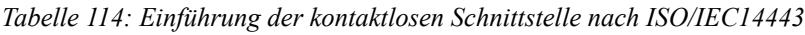

| MS4 | Kurzbezeichnung der Maßnahmen                                                                                                                                                                            | Adressierte Gefährdungen |
|-----|----------------------------------------------------------------------------------------------------------------------------------------------------------------------------------------------------------|--------------------------|
|     | Definition von Rückfalllösungen beim Ausfall von Systemschnitt stellen und Systemkomponenten                                                                                                       | GS1, GS4                 |
| 1   | Definition von geeigneten Betriebsprozessen, Offline-Fähigkeit und Datensicherung:                                                                                                                       |                          |
| 2   | Sofern die Online-Verbindung nicht oder nicht dauerhaft etabliert wird, MÜSSEN • Systemkomponenten auch ohne Hintergrundsystem bzw. bei Ausfall von System schnittstellen funktionieren können. |                          |

| MS4 | Kurzbezeichnung der Maßnahmen                                                                                                                                                                                                                                                                                                                                                                                                                                                    | Adressierte Gefährdungen                                                                                                                                                                                                                                |
|-----|----------------------------------------------------------------------------------------------------------------------------------------------------------------------------------------------------------------------------------------------------------------------------------------------------------------------------------------------------------------------------------------------------------------------------------------------------------------------------------|---------------------------------------------------------------------------------------------------------------------------------------------------------------------------------------------------------------------------------------------------------|
|     | Definition von Rückfalllösungen beim Ausfall von Systemschnitt stellen und Systemkomponenten                                                                                                                                                                                                                                                                                                                                                                               | GS1, GS4                                                                                                                                                                                                                                                |
|     | Das System MUSS regelmäßig Datensicherungen durchführen, sodass ein Totalverlust • auszuschließen ist.                                                                                                                                                                                                                                                                                                                                                                     |                                                                                                                                                                                                                                                         |
|     | Die Unterstützungsleistungen der Lieferanten zur Reparatur oder zum Austausch • defekter Komponenten MÜSSEN in einem Service Level Agreement (SLA) definiert sein.                                                                                                                                                                                                                                                                                                      |                                                                                                                                                                                                                                                         |
|     | Das System MUSS für alle Komponenten und Schnittstellen Rückfallprozesse • definieren, die operative Probleme, die nach Ausfall einer Komponente entstehen können, durch technische oder betriebliche Maßnahmen beseitigen oder mildern.                                                                                                                                                                                                                                |                                                                                                                                                                                                                                                         |
|     | Die vertraglichen Vereinbarungen zwischen Nutzern, Systemverantwortlichen und • Lieferanten MÜSSEN Rückfalllösungen benennen und deren Folgen berücksichtigen.                                                                                                                                                                                                                                                                                                             |                                                                                                                                                                                                                                                         |
|     | Das SLA MUSS die maximale Ausfallzeit definieren (Verfügbarkeit). •                                                                                                                                                                                                                                                                                                                                                                                                           |                                                                                                                                                                                                                                                         |
|     | Zum Nachweis sind die entsprechenden Teile der Systemspezifikation, die Be schreibungen der Rückfallprozesse und die Service Level Agreements beizubringen. Der Systemverantwortliche muss die Umsetzung bestätigen.                                                                                                                                                                                                                                                       |                                                                                                                                                                                                                                                         |
| 3   | Umsetzung nach Rückfallkonzept:                                                                                                                                                                                                                                                                                                                                                                                                                                                  |                                                                                                                                                                                                                                                         |
|     | Zusätzlich zu den Anforderungen aus Stufe 1 bzw. 2 gilt:                                                                                                                                                                                                                                                                                                                                                                                                                         |                                                                                                                                                                                                                                                         |
|     | Es muss ein Rückfallkonzept erstellt werden, das die Verfügbarkeit und Rückfall • lösungen mit Verfügbarkeitszeiten und Rückfallintervallen explizit festlegt.                                                                                                                                                                                                                                                                                                             |                                                                                                                                                                                                                                                         |
|     | Komponenten und Subsysteme, die für kritische Funktionen eingesetzt werden, • MÜSSEN redundant ausgelegt werden, über geeignete Mechanismen zur Erhöhung der Funktionssicherheit wie USV, RAID verfügen oder es müssen Austausch-Komponenten vorgehalten werden, die kurzfristig eingesetzt werden können (cold standby), sodass der Ausfall von Komponenten die Verfügbarkeit des Gesamtsystems nur teilweise und für eine definierte Zeit beeinträchtigt. |                                                                                                                                                                                                                                                         |
|     | Der Systemverantwortliche MUSS eine ausreichende Anzahl von Austausch-System • komponenten bereithalten.                                                                                                                                                                                                                                                                                                                                                                   |                                                                                                                                                                                                                                                         |
|     | • fach möglich sein und im Benutzerkonto vermerkt werden.                                                                                                                                                                                                                                                                                                                                                                                                                     | Im Fall von Biometrie: Über die Aufnahme eines zweiten biometrischen Merkmals hinaus MUSS der Systemverantwortliche eine weitere Rückfalllösung (z. B. die Ver wendung von Wissen anstatt Sein) anbieten. Die Änderung des Verfahrens MUSS ein |
|     | Zum Nachweis sind das Rückfallkonzept, die entsprechenden Teile der Systemspezi fikation, die Beschreibungen der Rückfallprozesse und die Service Level Agreements beizubringen. Der Systemverantwortliche muss die Umsetzung bestätigen.                                                                                                                                                                                                                                  |                                                                                                                                                                                                                                                         |

*Tabelle 115: Definition von Rückfalllösungen*

| MS5 | Kurzbezeichnung der Maßnahmen                                                                                                                                                                                                                                                                                                        | Adressierte Gefährdungen                                                                                                                                                  |
|-----|--------------------------------------------------------------------------------------------------------------------------------------------------------------------------------------------------------------------------------------------------------------------------------------------------------------------------------------|---------------------------------------------------------------------------------------------------------------------------------------------------------------------------|
|     | Sicherung der Vertraulichkeit von Daten bei der Kommunikation innerhalb des Systems                                                                                                                                                                                                                                            | GS2, GS6                                                                                                                                                                  |
| 1   | Statische Verschlüsselung bei interner Kommunikation:                                                                                                                                                                                                                                                                                |                                                                                                                                                                           |
| 2   | Das System MUSS Daten verschlüsselt übertragen. •                                                                                                                                                                                                                                                                                 |                                                                                                                                                                           |
|     | Das System MUSS für die Verschlüsselung zumindest statische Schlüssel nutzen. •                                                                                                                                                                                                                                                   |                                                                                                                                                                           |
|     | Das System KANN alternativ die Datenübertragung über dedizierte Netze (ab • geschlossene Lösung) durchführen, in denen nur berechtigte Nutzer administriert und zugelassen sind. Dieses Netz MUSS vor Zugriffen von außen geschützt und konform zu einem zu diesem Zweck erstellten Sicherheitskonzept betrieben werden. |                                                                                                                                                                           |
|     | Zum Nachweis sind die entsprechenden Teile der Systemspezifikation und der System testspezifikation und die Freigabeprotokolle, die das erfolgreiche Absolvieren der dies bezüglichen Systemtests dokumentieren, beizubringen.                                                                                                 |                                                                                                                                                                           |
|     | Systemtests müssen beigebracht werden.                                                                                                                                                                                                                                                                                               | Zum Nachweis der alternativen Lösung: Die entsprechenden Teile des Gebäudesicher heitskonzepts, der Systemspezifikation und die Ergebnisprotokolle der diesbezüglichen |
| 3   | Sicherer Kommunikationskanal:                                                                                                                                                                                                                                                                                                        |                                                                                                                                                                           |
|     | • Private Networks                                                                                                                                                                                                                                                                                                                | Die Kommunikation zwischen den Komponenten des Systems MUSS über Virtual (VPN) oder eine vergleichbare gesicherte Lösung erfolgen.                                     |
|     | • gehandelte Schlüssel wird dann zur Kommunikation verwendet.                                                                                                                                                                                                                                                                     | Das System MUSS dazu vor der Kommunikation eine Schlüsselvereinbarung mit Instanzauthentisierung zwischen Sender und Empfänger durchführen. Der aus                    |
|     | dokumentieren, beizubringen.                                                                                                                                                                                                                                                                                                         | Zum Nachweis sind die entsprechenden Teile der Systemspezifikation und die Freigabe protokolle, die das erfolgreiche Absolvieren der diesbezüglichen Systemtests       |

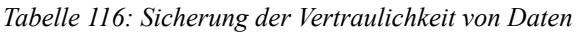

| MS6 | Kurzbezeichnung der Maßnahmen                                                                                                                                                                                                                                                           | Adressierte Gefährdungen                                                          |
|-----|-----------------------------------------------------------------------------------------------------------------------------------------------------------------------------------------------------------------------------------------------------------------------------------------|-----------------------------------------------------------------------------------|
|     | Vertrauliche Speicherung von Daten                                                                                                                                                                                                                                                   | GS2, GS3, GS6, GS7, GS8                                                           |
| 1   | Einführung eines mandantenfähigen Zugriffsschutzes:                                                                                                                                                                                                                                     |                                                                                   |
| 2   | Das System MUSS Daten (personenbezogene Daten, Verkaufsdaten, Nutzungsdaten, • Abrechnungsdaten, Sperrlisten, Freigabelisten etc.) so schützen, dass nur ein be stimmter legitimierter Personenkreis auf diese Daten zugreifen darf.                                           |                                                                                   |
|     | Das System MUSS Daten in einem gegen unbefugte Zugriffe geschützten Umfeld • speichern. Wenn kein Zugriffsschutz gewährleistet werden kann, MUSS das System die Daten auf einem verschlüsselten Datenträger speichern (Einsatz von Festplatten verschlüsselungswerkzeugen). |                                                                                   |
|     | •                                                                                                                                                                                                                                                                                       | Das System MUSS alle Mandanten und ihre Zugriffsrechte spezifizieren.             |
|     | •                                                                                                                                                                                                                                                                                       | Zur Administration der Zugriffsrechte MUSS das System alle Rollen beschreiben und |

| MS6 | Kurzbezeichnung der Maßnahmen                                                                                                                                                                                                                    | Adressierte Gefährdungen                                                                                                                                                                                                                                         |
|-----|--------------------------------------------------------------------------------------------------------------------------------------------------------------------------------------------------------------------------------------------------|------------------------------------------------------------------------------------------------------------------------------------------------------------------------------------------------------------------------------------------------------------------|
|     | Vertrauliche Speicherung von Daten                                                                                                                                                                                                            | GS2, GS3, GS6, GS7, GS8                                                                                                                                                                                                                                          |
|     | implementieren. Dabei sind die Definitionen des Rollenmodells der spezifischen An wendungsimplementierung zu verwenden,                                                                                                                       |                                                                                                                                                                                                                                                                  |
|     | Zur Verschlüsselung der Daten MUSS AES128 oder ein vergleichbares offenes Ver • fahren nach [ALGK_BSI] verwendet werden. Die Art und Stärke des Mechanismus MUSS an künftige Entwicklungen entsprechend Kapitel 8.4.1 angepasst werden. |                                                                                                                                                                                                                                                                  |
|     | Zum Nachweis sind die entsprechenden Teile der Systemspezifikation und der System testspezifikation und die Freigabeprotokolle, die das erfolgreiche Absolvieren der dies bezüglichen Systemtests dokumentieren, beizubringen.             |                                                                                                                                                                                                                                                                  |
| 3   | Zusätzlich zu den Anforderungen aus Stufe 1 bzw. 2 gilt:                                                                                                                                                                                         |                                                                                                                                                                                                                                                                  |
|     | Zugriffe SOLLEN aufgezeichnet werden. •                                                                                                                                                                                                       |                                                                                                                                                                                                                                                                  |
|     | • antwortliche muss dies durch Tests belegen.                                                                                                                                                                                                 | Das System MUSS das Rollenmodell nachweislich durchsetzen. Der Systemver                                                                                                                                                                                         |
|     | dokumentieren, beizubringen.                                                                                                                                                                                                                     | Zum Nachweis ist eine Beschreibung des Rollenmodells vorzulegen, die entsprechenden Teile der Systemspezifikation und der Systemtestspezifikation vorzulegen und die Frei gabeprotokolle, die das erfolgreiche Absolvieren der diesbezüglichen Systemtests |

*Tabelle 117: Vertrauliche Speicherung von Daten*

| MS7 | Kurzbezeichnung der Maßnahmen                                                                                                                       | Adressierte Gefährdungen                                                                                                                                                       |
|-----|-----------------------------------------------------------------------------------------------------------------------------------------------------|--------------------------------------------------------------------------------------------------------------------------------------------------------------------------------|
|     | Sicherung der Datenintegrität zum Schutz vor Manipulationen bei der Datenübertragung innerhalb des Systems                                 | GS3, GS7                                                                                                                                                                       |
| 1   | Kryptografische Integritätssicherung:                                                                                                               |                                                                                                                                                                                |
| 2   | Das System MUSS die Integrität der Datenübertragung durch MAC-Verfahren ge • währleisten. Die Algorithmen sind gemäß Kapitel 8.4.1 zu wählen. |                                                                                                                                                                                |
|     | Die Art und Stärke des Mechanismus MUSS an künftige Entwicklungen entsprechend • Kapitel 8.4.1 angepasst werden.                              |                                                                                                                                                                                |
|     | der diesbezüglichen Systemtests dokumentieren, beizubringen.                                                                                        | Zum Nachweis sind die entsprechenden Teile der Systemspezifikation und der System testspezifikation vorzulegen und die Freigabeprotokolle, die das erfolgreiche Absolvieren |
| 3   | MAC oder Signaturverfahren:                                                                                                                         |                                                                                                                                                                                |
|     | • wählen.                                                                                                                                        | Das System MUSS die Integrität der Datenübertragung durch MAC- oder durch Signaturverfahren gewährleisten. Die Algorithmen sind gemäß Kapitel 8.4.1 zu                      |
|     | • Kapitel 8.4.1 angepasst werden.                                                                                                                | Die Art und Stärke des Mechanismus MUSS an künftige Entwicklungen entsprechend                                                                                                 |

| MS7 | Kurzbezeichnung der Maßnahmen                                                                                                                                                                                                                  | Adressierte Gefährdungen |
|-----|------------------------------------------------------------------------------------------------------------------------------------------------------------------------------------------------------------------------------------------------|--------------------------|
|     | Sicherung der Datenintegrität zum Schutz vor Manipulationen bei der Datenübertragung innerhalb des Systems                                                                                                                            | GS3, GS7                 |
|     | Zum Nachweis sind die entsprechenden Teile der Systemspezifikation und der System testspezifikation vorzulegen und die Freigabeprotokolle, die das erfolgreiche Absolvieren der diesbezüglichen Systemtests dokumentieren, beizubringen. |                          |

*Tabelle 118: Sicherung der Datenintegrität bei der Datenübertragung*

| MS8 | Kurzbezeichnung der Maßnahmen                                                                                                                                                                                                                                                                   | Adressierte Gefährdungen |
|-----|-------------------------------------------------------------------------------------------------------------------------------------------------------------------------------------------------------------------------------------------------------------------------------------------------|--------------------------|
|     | Sicherung der Datenintegrität bei der Speicherung von Daten                                                                                                                                                                                                                                  | GS3, GS7                 |
| 1   | Das System MUSS die Daten gemäß MS6 zugriffsgeschützt in einem gesicherten Um • feld speichern.                                                                                                                                                                                           |                          |
| 2   |                                                                                                                                                                                                                                                                                                 |                          |
| 3   | Checksummen: Das System MUSS zum Schutz gegen technisch bedingte Integritäts • fehler eine Checksumme (z. B. CRC, Hamming Codes) verwenden, die auch vom jeweiligen Betriebssystem bereitgestellt werden kann.                                                                      |                          |
|     | Zum Nachweis sind die entsprechenden Teile der Systemspezifikation und der System testspezifikation vorzulegen und die Freigabeprotokolle, die das erfolgreiche Absolvieren der diesbezüglichen Systemtests für die relevanten Komponenten und Subsysteme dokumentieren, beizubringen. |                          |

*Tabelle 119: Sicherung der Datenintegrität bei der Datenspeicherung*

| MS9           | Kurzbezeichnung der Maßnahmen                                                                                                                                                                                                                                | Adressierte Gefährdungen                                                                                                                                                         |
|---------------|--------------------------------------------------------------------------------------------------------------------------------------------------------------------------------------------------------------------------------------------------------------|----------------------------------------------------------------------------------------------------------------------------------------------------------------------------------|
|               | Sicherung der Systemfunktionen gegen DoS-Angriffe an den Schnittstellen                                                                                                                                                                                | GS4                                                                                                                                                                              |
| Allgem ein | Das System kann durch bauliche, technische und organisatorische Maßnahmen gegen DoS-Angriffe an den Systemschnittstellen bzw. den Übertragungswegen gesichert werden. Je nach Sicherheitsstufe können hier verschiedene Maßnahmen Anwendung finden. |                                                                                                                                                                                  |
| 1             | Einfache bauliche, technische und organisatorische Maßnahmen:                                                                                                                                                                                                |                                                                                                                                                                                  |
|               | Der Systemverantwortliche MUSS ein Gebäudesicherheitskonzept erstellen. •                                                                                                                                                                                 |                                                                                                                                                                                  |
|               | •                                                                                                                                                                                                                                                            | Der Systemverantwortliche MUSS ein Konzept zur Zutrittssicherung erstellen.                                                                                                      |
|               | • gegen mutwillige Zerstörung schützen. Informativ: Dies kann z. schehen.                                                                                                                                                                              | Bauliche Maßnahmen: Der Systemverantwortliche MUSS die Übertragungswege B. durch die Ver wendung zerstörungsresistenter Materialien oder Abschirmung der Datenleitungen ge |
|               | •                                                                                                                                                                                                                                                            | Bauliche Maßnahmen: Der Systemverantwortliche MUSS gesicherte Bereiche                                                                                                           |

| MS9 | Kurzbezeichnung der Maßnahmen                                                                                                                                                                                                                                                                                                                                         | Adressierte Gefährdungen |
|-----|-----------------------------------------------------------------------------------------------------------------------------------------------------------------------------------------------------------------------------------------------------------------------------------------------------------------------------------------------------------------------|--------------------------|
|     | Sicherung der Systemfunktionen gegen DoS-Angriffe an den Schnittstellen                                                                                                                                                                                                                                                                                         | GS4                      |
|     | schaffen.                                                                                                                                                                                                                                                                                                                                                             |                          |
|     | Organisatorische Maßnahmen: Der Systemverantwortliche MUSS eine einfache Zu • trittskontrolle zu gesicherten Bereichen (Lichtbildausweis) implementieren.                                                                                                                                                                                                       |                          |
|     | Der Systemverantwortliche SOLL technische Maßnahmen vorsehen, die • Denial-of-Service-Angriffe auf die Schnittstellen und Komponenten der Systeminfrastruktur erkennen und melden. Wenn akute Gefährdungen existieren, MÜSSEN diese Maßnahmen eingeführt werden.                                                                                          |                          |
|     | Zum Nachweis sind das Gebäudesicherheits- und das Zutrittssicherungskonzept vorzu legen und die Umsetzung dieser Konzepte zuzusichern.                                                                                                                                                                                                                             |                          |
|     | Erweiterte bauliche, technische und organisatorische Maßnahmen:                                                                                                                                                                                                                                                                                                       |                          |
|     | Zusätzlich zu den Anforderungen aus Stufe 1 gilt:                                                                                                                                                                                                                                                                                                                     |                          |
| 2   | Der Systemverantwortliche MUSS ein Zugriffskonzept, das das Rollenmodell und die • definierten Rollen und Verantwortlichkeiten der Anwendungsimplementierung für die IT-Systeme umsetzt, einführen.                                                                                                                                                          |                          |
|     | Technische Absicherung: Der Systemverantwortliche MUSS Authentisierungs • mechanismen für Nutzer von Subsystemen und Komponenten und einen logischen Zugriffsschutz unterstützen.                                                                                                                                                                            |                          |
|     | Zum Nachweis sind das Gebäudesicherheits- und das Zutrittssicherungskonzept, das Zu griffskonzept, die Beschreibungen der Systemspezifikation und der Systemtestspezi fikation zum logischen Zugriffsschutz vorzulegen und die Freigabeprotokolle zu den diesbezüglichen Systemtests beizubringen.                                                           |                          |
|     | Spezifische Sicherheitskonzeption:                                                                                                                                                                                                                                                                                                                                    |                          |
|     | Zusätzlich zu den Anforderungen aus Stufe 2 gilt:                                                                                                                                                                                                                                                                                                                     |                          |
| 3   | Der Systemverantwortliche MUSS eine spezifische Gefährdungsanalyse zur Gebäude • und Zutrittssicherheit erstellen und das Gebäudesicherheits- und das Zutritts sicherungskonzept entsprechend anpassen.                                                                                                                                                      |                          |
|     | Der Systemverantwortliche MUSS den Prozess der Zutrittskontrolle technisch sichern. • Unbefugten MUSS der Zutritt durch entsprechend gesicherte Türen, Sperren, Schleusen sicher versperrt werden.                                                                                                                                                           |                          |
|     | Zusätzlich SOLL der Systemverantwortliche ein spezifisches DoS-Sicherheitskonzept • zur Vermeidung und Bekämpfung von DoS-Angriffen erstellen. Dabei werden Ge fährdungen identifiziert und angemessene Maßnahmen zugewiesen. Jeder Maßnahme wird eine verantwortliche Entität des Rollenmodells zugeordnet.                                              |                          |
|     | Zum Nachweis sind das Gebäudesicherheits- und das Zutrittssicherungskonzept, das Zu griffskonzept, die Beschreibungen der Systemspezifikation und der Systemtestspezi fikation zum logischen Zugriffsschutz vorzulegen, die Freigabeprotokolle zu den dies bezüglichen Systemtests beizubringen und gegebenenfalls das DoS-Sicherheitskonzept beizufügen. |                          |

*Tabelle 120: Sicherung der Systemfunktionen gegen DoS-Angriffe*

| MS11 | Kurzbezeichnung der Maßnahmen                                                                                                                                                                                                                                                                 | Adressierte Gefährdungen                                                                                                                                                                                                                                             |
|------|-----------------------------------------------------------------------------------------------------------------------------------------------------------------------------------------------------------------------------------------------------------------------------------------------|----------------------------------------------------------------------------------------------------------------------------------------------------------------------------------------------------------------------------------------------------------------------|
|      | Sicherung der Funktion des Systems zur Vermeidung technischer Fehler von Komponenten und Übertragungs wegen                                                                                                                                                                       | GS4, GS5                                                                                                                                                                                                                                                             |
|      | Eigenerklärung:                                                                                                                                                                                                                                                                               |                                                                                                                                                                                                                                                                      |
| 1    | Der Systemlieferant MUSS die Anforderungen an die Funktionssicherheit spezifizieren • und mithilfe der Lieferanten und Hersteller sicherstellen.                                                                                                                                        |                                                                                                                                                                                                                                                                      |
|      | Der Nachweis wird durch eine schriftliche Erklärung des Antragstellers erbracht. Dabei kann sich dieser auf Bestätigungen seiner Lieferanten beziehen.                                                                                                                                     |                                                                                                                                                                                                                                                                      |
| 2    | Detaillierter Komponenten- und Systemtest und dazugehörige Freigabe:                                                                                                                                                                                                                          |                                                                                                                                                                                                                                                                      |
|      | Der Systemverantwortliche MUSS Testspezifikationen für die einzelnen System • komponenten ausarbeiten.                                                                                                                                                                                  |                                                                                                                                                                                                                                                                      |
|      | Der Systemverantwortliche MUSS die Komponenten nach den jeweiligen Testvor • schriften überprüfen. Der Hersteller MUSS einen Freigabeprozess für die System komponenten etablieren.                                                                                                  |                                                                                                                                                                                                                                                                      |
|      | Der Systemverantwortliche MUSS eine Systemtestspezifikation erstellen und die • diesbezüglichen Tests und Freigaben von Gesamtsystem, Subsystemen und Komponenten erfolgreich durchführen.                                                                                           |                                                                                                                                                                                                                                                                      |
|      | Zum Nachweis werden die Systemtestspezifikation, die Testspezifikationen der einzelnen Subsysteme und Komponenten und die Freigabeprotokolle aller Systemkomponenten und des Gesamtsystems beigestellt.                                                                                 |                                                                                                                                                                                                                                                                      |
|      | Evaluierung durch ein unabhängiges Prüflabor und Zertifizierung:                                                                                                                                                                                                                              |                                                                                                                                                                                                                                                                      |
| 3    | Zusätzlich zu den Anforderungen der Stufe 2 gilt:                                                                                                                                                                                                                                             |                                                                                                                                                                                                                                                                      |
|      | Der Systemverantwortliche MUSS für die relevanten Systemkomponenten un • abhängige Evaluierungen und - sofern für die jeweilige Schnittstelle und Komponente verfügbar - Zertifizierungen durchführen lassen und den Evaluierungsreport bzw. das Zertifikat als Nachweis liefern. |                                                                                                                                                                                                                                                                      |
|      | systems beizubringen.                                                                                                                                                                                                                                                                         | Die spezifikationsgemäße Umsetzung ist durch die Evaluierungsberichte, Zertifikate zu belegen. Falls die Möglichkeit einer unabhängigen Prüfung und Zertifizierung nicht be steht, sind die internen Freigabeprotokolle aller Systemkomponenten und des Gesamt |

*Tabelle 121: Sicherung der Funktion des Systems gegen technische Fehler*

| MS12          | Kurzbezeichnung der Maßnahmen                                                                                                                                                                                                                                                                                                                                                                                                                                                                                                                                                                                                                                             | Adressierte Gefährdungen                                                    |  |
|---------------|---------------------------------------------------------------------------------------------------------------------------------------------------------------------------------------------------------------------------------------------------------------------------------------------------------------------------------------------------------------------------------------------------------------------------------------------------------------------------------------------------------------------------------------------------------------------------------------------------------------------------------------------------------------------------|-----------------------------------------------------------------------------|--|
|               | Spezifikation Systemkonzept und Anforderungen an die Komponenten                                                                                                                                                                                                                                                                                                                                                                                                                                                                                                                                                                                                    | GS4, GS5                                                                    |  |
| Allgem ein | Die Eigenschaften eines Systems bezüglich der wesentlichen Betriebsprozesse sind zu spezifizieren und sicherzustellen. Dabei ist zu beachten, dass oftmals existierende Komponenten integriert werden müssen. Nichtsdestoweniger müssen die wesentlichen Parameter und Eigenschaften des Gesamtsystems spezifiziert und erreicht werden. Dies gilt insbesondere für die Performanz oder die Verfügbarkeit gewisser Prozesse. Um eine diesbezügliche Integration in das Gesamtsystem zu ermöglichen, müssen die An forderungen in Bezug auf die Interaktion mit dem Gesamtsystem für jede System komponente spezifiziert sein und eingehalten werden. |                                                                             |  |
|               | Ein besonderer Schwerpunkt soll auf das Einbringen neuer Anwendungen und Produkte gelegt werden.                                                                                                                                                                                                                                                                                                                                                                                                                                                                                                                                                                       |                                                                             |  |
|               | Herstellererklärung:                                                                                                                                                                                                                                                                                                                                                                                                                                                                                                                                                                                                                                                      |                                                                             |  |
| 1             | Der Hersteller MUSS die Einhaltung der Spezifikation zusichern. •                                                                                                                                                                                                                                                                                                                                                                                                                                                                                                                                                                                                      |                                                                             |  |
|               | Der Nachweis wird durch eine schriftliche Erklärung des Antragstellers erbracht. Dabei kann sich dieser auf Erklärungen seiner Lieferanten beziehen.                                                                                                                                                                                                                                                                                                                                                                                                                                                                                                                   |                                                                             |  |
|               | Integrationstest sowie Konformitätserklärung:                                                                                                                                                                                                                                                                                                                                                                                                                                                                                                                                                                                                                             |                                                                             |  |
| 2             | Der Systemverantwortliche MUSS Integrationstests (vgl. MS11) ausarbeiten und • erfolgreich durchführen.                                                                                                                                                                                                                                                                                                                                                                                                                                                                                                                                                             |                                                                             |  |
|               | Der Systemverantwortliche MUSS einen Freigabeprozess etablieren. •                                                                                                                                                                                                                                                                                                                                                                                                                                                                                                                                                                                                     |                                                                             |  |
|               | • nachweisen.                                                                                                                                                                                                                                                                                                                                                                                                                                                                                                                                                                                                                                                          | Der Systemverantwortliche MUSS die Konformität anhand von Integrationstests |  |
|               | Zum Nachweis werden die Systemspezifikation, die Systemtestspezifikation und die Freigabeprotokolle aller Komponenten und des Gesamtsystems beigestellt.                                                                                                                                                                                                                                                                                                                                                                                                                                                                                                               |                                                                             |  |
| 3             | Kompatibilitätstests nach Testkonzeption, Evaluierung:                                                                                                                                                                                                                                                                                                                                                                                                                                                                                                                                                                                                                    |                                                                             |  |
|               | Zusätzlich zu den Anforderungen der Stufe 2 gilt: Der Systemverantwortliche MUSS unabhängige Evaluierungen und - sofern für die • jeweilige Schnittstelle und Komponente verfügbar - Zertifizierungen durchführen lassen und den Evaluierungsreport bzw. das Zertifikat als Nachweis liefern. Falls die Möglichkeit einer unabhängigen Prüfung nicht besteht, sind die internen Freigabe                                                                                                                                                                                                                                                                   |                                                                             |  |
|               |                                                                                                                                                                                                                                                                                                                                                                                                                                                                                                                                                                                                                                                                           | protokolle aller Systemkomponenten und des Gesamtsystems beizubringen.      |  |

*Tabelle 122: Spezifikation des Systems und der Komponenten*

| MS13          | Kurzbezeichnung der Maßnahmen                                                                                                                                                                                                                                                                                                                  | Adressierte Gefährdungen |
|---------------|------------------------------------------------------------------------------------------------------------------------------------------------------------------------------------------------------------------------------------------------------------------------------------------------------------------------------------------------|--------------------------|
|               | Ergonomische Benutzerführung                                                                                                                                                                                                                                                                                                                   | GS4, GR4                 |
| Allgem ein | Das Design aller Hardwarekomponenten hat ergonomischen Gesichtspunkten zu genügen. Zu den ergonomischen Anforderungen gehören neben Forderungen an die Optik (Wiedererkennbarkeit, Farbe der Tastatur, Lesbarkeit von Displays etc.) auch Forderungen an die Bedienbarkeit (auch für Schwerbehinderte) und die Verletzungssicherheit. |                          |

| MS13 | Kurzbezeichnung der Maßnahmen                                                                                                                                                                                      | Adressierte Gefährdungen                                                                                                                                                                                                                                       |
|------|--------------------------------------------------------------------------------------------------------------------------------------------------------------------------------------------------------------------|----------------------------------------------------------------------------------------------------------------------------------------------------------------------------------------------------------------------------------------------------------------|
|      | Ergonomische Benutzerführung                                                                                                                                                                                       | GS4, GR4                                                                                                                                                                                                                                                       |
|      | Herstellererklärung:                                                                                                                                                                                               |                                                                                                                                                                                                                                                                |
| 1    | • werden.                                                                                                                                                                                                       | Der Systemverantwortliche MUSS erklären, dass ergonomische Prinzipien angewendet                                                                                                                                                                               |
|      | Der Systemverantwortliche MUSS die relevanten Use Cases der generischen Be • triebsprozesse (z. B. Verkauf bzw. Ausgabe, Check-in etc.) bei der Nutzerführung für Karteninhaber und Personal abbilden. |                                                                                                                                                                                                                                                                |
|      | Der Nachweis wird durch eine schriftliche Erklärung des Antragstellers erbracht. Dabei kann sich dieser auf Erklärungen seiner Lieferanten beziehen.                                                            |                                                                                                                                                                                                                                                                |
|      | Praxistest:                                                                                                                                                                                                        |                                                                                                                                                                                                                                                                |
| 2    | Zusätzlich zu den Anforderungen aus Stufe 1 gilt:                                                                                                                                                                  |                                                                                                                                                                                                                                                                |
|      | Der Systemverantwortliche MUSS die Akzeptanz der Nutzer in einem erfolgreichen • Praxistest nachweisen.                                                                                                      |                                                                                                                                                                                                                                                                |
|      |                                                                                                                                                                                                                    | Zum Nachweis wird das Ergebnis des Praxistests dokumentiert und beigebracht.                                                                                                                                                                                   |
|      | Spezifikation, Umsetzung und Test eines Gesamtkonzepts zur Ergonomie und Nutzer führung:                                                                                                                        |                                                                                                                                                                                                                                                                |
| 3    | • triebsprozesse (z. Karteninhaber und Personal abbilden.                                                                                                                                                    | Der Systemverantwortliche MUSS die relevanten Use Cases der generischen Be B. Verkauf bzw. Ausgabe, Check-in etc.) bei der Nutzerführung für                                                                                                                |
|      | •                                                                                                                                                                                                                  | Der Systemverantwortliche MUSS systemweite Festlegungen bzgl. Ergonomie und Benutzerführung treffen. Diese sollen gewährleisten, dass alle Komponenten innerhalb des Systems denselben Standards genügen. Eine sukzessive Umsetzung ist möglich.         |
|      | • umsetzen.                                                                                                                                                                                                     | Der Systemverantwortliche MUSS eine einheitliche Benutzerführung pro Anwendung                                                                                                                                                                                 |
|      | • durchführen.                                                                                                                                                                                                  | Der Systemverantwortliche MUSS Praxistests zur Prüfung der Nutzerakzeptanz                                                                                                                                                                                     |
|      | •                                                                                                                                                                                                                  | Der Systemverantwortliche MUSS eine Freigabeprozedur zur Gesamt- und Komponentenspezifikation zu Ergonomie und Benutzerführung etablieren.                                                                                                                  |
|      | aller Systemkomponenten und des Gesamtsystems beigestellt.                                                                                                                                                         | Der Systemverantwortliche kann die Aufgaben an den Systemlieferanten delegieren. Zum Nachweis werden die Konzepte zu Ergonomie und Benutzerführung (pro Anwendung), das Ergebnis des Praxistests und Freigabeprotokolle zu Ergonomie und Benutzerführung |

*Tabelle 123: Ergonomische Benutzerführung*

| MS14 | Kurzbezeichnung der Maßnahmen                                                      | Adressierte Gefährdungen |
|------|------------------------------------------------------------------------------------|--------------------------|
|      | Support                                                                            | GS4, GS5                 |
| 1    | Herstellersupport:                                                                 |                          |
|      | Die Systemlieferanten MÜSSEN Maßnahmen ergreifen, um die Nutzer im Betrieb zu • |                          |

| MS14 | Kurzbezeichnung der Maßnahmen                                                                                                                                                                                           | Adressierte Gefährdungen                                                                                                                                                                                                                                         |  |
|------|-------------------------------------------------------------------------------------------------------------------------------------------------------------------------------------------------------------------------|------------------------------------------------------------------------------------------------------------------------------------------------------------------------------------------------------------------------------------------------------------------|--|
|      | Support                                                                                                                                                                                                                 | GS4, GS5                                                                                                                                                                                                                                                         |  |
|      | unterstützen (z. B. Helpdesk, 1st, 2nd, 3rd-Level-Support).                                                                                                                                                          |                                                                                                                                                                                                                                                                  |  |
|      | Der Systemverantwortliche MUSS SLAs mit den Systemlieferanten abschließen, die • die Supportleistungen beschreiben.                                                                                               |                                                                                                                                                                                                                                                                  |  |
|      | Zum Nachweis sind die SLAs beizubringen.                                                                                                                                                                                |                                                                                                                                                                                                                                                                  |  |
|      | Entitätsweiter Support:                                                                                                                                                                                                 |                                                                                                                                                                                                                                                                  |  |
| 2    | Zusätzlich zu den Anforderungen aus Stufe 1 gilt:                                                                                                                                                                       |                                                                                                                                                                                                                                                                  |  |
|      | Der Systemverantwortliche MUSS in Zusammenarbeit mit den Systemlieferanten • Supportkonzepte für die Systeme der Entitäten der Anwendungsimplementierung fest legen (z. B. Dienstleister, Produktanbieter). |                                                                                                                                                                                                                                                                  |  |
|      | Zum Nachweis sind die SLAs und die entitätsspezifischen Supportkonzepte beizu bringen.                                                                                                                               |                                                                                                                                                                                                                                                                  |  |
|      | Systemweiter Support:                                                                                                                                                                                                   |                                                                                                                                                                                                                                                                  |  |
| 3    | Zusätzlich zu den Anforderungen aus Stufe 2 gilt:                                                                                                                                                                       |                                                                                                                                                                                                                                                                  |  |
|      | • zwischen den Systemen der Entitäten bedient.                                                                                                                                                                       | Der Systemverantwortliche MUSS in Zusammenarbeit mit den Herstellern ein über greifendes Supportkonzept festlegen, das jeweils die Systeme der einzelnen Entitäten abdeckt (siehe Stufe 2, entitätsspezifischer Support) und zusätzlich die Schnittstellen |  |
|      | •                                                                                                                                                                                                                       | Informativ: Ziel ist es, systemweite Probleme in definierter Zeit zu lösen.                                                                                                                                                                                      |  |
|      | das übergreifende Supportkonzept vorzulegen.                                                                                                                                                                            | Zum Nachweis sind die Service Level Agreements sowie die entitätsspezifischen und                                                                                                                                                                                |  |

*Tabelle 124: Support*

| MS15 | Kurzbezeichnung der Maßnahmen                                                                                                                                                                                                              | Adressierte Gefährdungen                                                                                                                                          |
|------|--------------------------------------------------------------------------------------------------------------------------------------------------------------------------------------------------------------------------------------------|-------------------------------------------------------------------------------------------------------------------------------------------------------------------|
|      | Trennung von Anwendungen und Anwendungsdaten                                                                                                                                                                                            | GS8                                                                                                                                                               |
| 1    |                                                                                                                                                                                                                                            | Getrennte Speicherung und Verarbeitung von anwendungsspezifischen Daten:                                                                                          |
| 2    | Um Fehlfunktionen und den Missbrauch von Schlüsselmaterial und Daten zu ver • meiden, MUSS das System Funktionen und Daten, die verschiedenen Anwendungen zuzurechnen sind, in allen Komponenten des Systems voneinander trennen. |                                                                                                                                                                   |
|      | • Systemspezifikation beschreiben.                                                                                                                                                                                                      | Der Systemverantwortliche MUSS die technische und operative Umsetzung in der                                                                                      |
| 3    | Stelle betrachtet.                                                                                                                                                                                                                         | Informativ: Chipbasierte Komponenten (Trägermedien, SAM) werden an anderer                                                                                        |
|      | Komponenten, die mehrere Anwendungen unterstützen, beigebracht.                                                                                                                                                                            | Zum Nachweis werden die relevanten Abschnitte der Systemspezifikation, der System testspezifikation und die relevanten Freigabeprotokolle für alle Systeme und |

*Tabelle 125: Trennung von Anwendungen im System*

| MS17          | Kurzbezeichnung der Maßnahmen                                                                                                                                                                                                                                                                                                                                                                                | Adressierte Gefährdungen                                                                                                                                            |  |
|---------------|--------------------------------------------------------------------------------------------------------------------------------------------------------------------------------------------------------------------------------------------------------------------------------------------------------------------------------------------------------------------------------------------------------------|---------------------------------------------------------------------------------------------------------------------------------------------------------------------|--|
|               | Umsetzung des Gebots zur Daten sparsamkeit                                                                                                                                                                                                                                                                                                                                                                | GS10                                                                                                                                                                |  |
| Allgem ein | Umsetzung des Gebots zur Datensparsamkeit gemäß der jeweils gültigen gesetzlichen Grundlagen zum Datenschutz                                                                                                                                                                                                                                                                                              |                                                                                                                                                                     |  |
| 1             | Umsetzung der gesetzlichen Anforderungen:                                                                                                                                                                                                                                                                                                                                                                    |                                                                                                                                                                     |  |
| 2             | Bei der Definition der Prozesse und Systeme des Gesamtsystems MUSS das Prinzip der Datensparsamkeit entsprechend der gesetzlichen Grundlagen umgesetzt werden. Dazu gehört insbesondere auch die Festlegung von Fristen zur Löschung von Daten, die nicht mehr benötigt werden. Der Systemverantwortliche MUSS die damit verbundenen operativen Tätigkeiten in Arbeitsanweisungen dokumentieren. |                                                                                                                                                                     |  |
|               | Zum Nachweis sind die Arbeitsanweisungen an die Mitarbeiter zu Fristen und Löschung vorzulegen.                                                                                                                                                                                                                                                                                                           |                                                                                                                                                                     |  |
|               | Besondere Maßnahmen:                                                                                                                                                                                                                                                                                                                                                                                         |                                                                                                                                                                     |  |
| 3             | Zusätzlich zu den Anforderungen aus Stufe 1 bzw. 2 gilt:                                                                                                                                                                                                                                                                                                                                                     |                                                                                                                                                                     |  |
|               | Der Systemverantwortliche MUSS die zweckbezogene Definition der Dateninhalte, der • Gewinnung und Speicherung der Daten und der Zugriffs- und Verwendungs berechtigungen unter Verwendung des Rollenmodells des Gesamtsystems exakt definieren.                                                                                                                                                  |                                                                                                                                                                     |  |
|               | Der Systemverantwortliche MUSS die Nutzer von Trägermedien über die zweck • bezogene Gewinnung, Speicherung und Nutzung von personenbezogenen Daten unterrichten und den Zeitpunkt, Art und Inhalt der Information protokollieren.                                                                                                                                                                  |                                                                                                                                                                     |  |
|               |                                                                                                                                                                                                                                                                                                                                                                                                              | Zum Nachweis sind die datenschutzrelevanten Festlegungen und Definitionen zu allen Datentypen beizubringen und die Protokolle zu Nutzerinformationen vorzulegen. |  |

*Tabelle 126: Umsetzung des Gebots der Datensparsamkeit* 

| MS18          | Kurzbezeichnung der Maßnahmen                                                                                                                                                                                                                                     | Adressierte Gefährdungen |
|---------------|-------------------------------------------------------------------------------------------------------------------------------------------------------------------------------------------------------------------------------------------------------------------|--------------------------|
|               | Verhinderung der unerlaubten Verknüpfung von personen bezogenen Daten                                                                                                                                                                                       | GS11                     |
| Allgem ein | Umsetzung des Gebots zur Datensparsamkeit gemäß der jeweils gültigen gesetzlichen Grundlagen zum Datenschutz                                                                                                                                                   |                          |
| 1             | Umsetzung der gesetzlichen Anforderungen:                                                                                                                                                                                                                         |                          |
| 2             | Zum Beispiel: 1. Bei der Definition des Rollenmodells, der Prozesse und Systeme des Gesamtsystems MUSS festgelegt werden, welche personenbezogenen Daten verknüpft werden sollen. Die Art und der Zweck dieser Verknüpfungen MUSS beschrieben werden. |                          |
| 3             |                                                                                                                                                                                                                                                                   |                          |

| MS18 | Kurzbezeichnung der Maßnahmen                                                                                                                                                                                                                                                                               | Adressierte Gefährdungen |
|------|-------------------------------------------------------------------------------------------------------------------------------------------------------------------------------------------------------------------------------------------------------------------------------------------------------------|--------------------------|
|      | Verhinderung der unerlaubten Verknüpfung von personen bezogenen Daten                                                                                                                                                                                                                                 | GS11                     |
|      | 2. Die Verknüpfung von personenbezogenen Daten MUSS von der betroffenen Person und den jeweils zuständigen Stellen genehmigt werden.                                                                                                                                                                  |                          |
|      | Zum Nachweis sind die Beschreibung der Art und des Zwecks der Verknüpfung von personenbezogenen Daten, die organisationsinternen Verantwortlichkeiten, die Prozess beschreibungen, die internen Arbeitsanweisungen und die Genehmigung der betroffenen Person oder zuständigen Stellen vorzulegen. |                          |

*Tabelle 127: Schutz vor unerlaubten Verknüpfungen personenbezogener Daten*

| MS5-1         | Kurzbezeichnung der Maßnahmen                                                                                                                                                                                                                                                                   | Adressierte Gefährdungen                                                                                                       |
|---------------|-------------------------------------------------------------------------------------------------------------------------------------------------------------------------------------------------------------------------------------------------------------------------------------------------|--------------------------------------------------------------------------------------------------------------------------------|
|               | Sicherung der Datenerfassung bei der Personalisierung und/oder dem Enrolment                                                                                                                                                                                                              | GS7, GS9                                                                                                                       |
| Allgem ein | Schutz der Daten vor Manipulation und Schutz vor Fälschung                                                                                                                                                                                                                                      |                                                                                                                                |
|               | Sicherung der Datenintegrität Stufe 1:                                                                                                                                                                                                                                                          |                                                                                                                                |
| 1             | Das System MUSS die Daten gemäß MS6.1 zugriffsgeschützt in einem gesicherten • Umfeld speichern.                                                                                                                                                                                          |                                                                                                                                |
|               | Checksummen: Das System MUSS zum Schutz gegen technisch bedingte Integritäts • fehler eine Checksumme (z. B. CRC, Hamming Codes) verwenden, die auch vom jeweiligen Betriebssystem bereitgestellt werden kann.                                                                      |                                                                                                                                |
|               | Zum Nachweis sind die entsprechenden Teile der Systemspezifikation und der System testspezifikation vorzulegen und die Freigabeprotokolle, die das erfolgreiche Absolvieren der diesbezüglichen Systemtests für die relevanten Komponenten und Subsysteme dokumentieren, beizubringen. |                                                                                                                                |
|               | Sicherung der Datenintegrität Stufe 2:                                                                                                                                                                                                                                                          |                                                                                                                                |
| 2             | • Umfeld speichern.                                                                                                                                                                                                                                                                          | Das System MUSS die Daten gemäß MS6.2 zugriffsgeschützt in einem gesicherten                                                   |
|               | • fehler eine Checksumme (z. jeweiligen Betriebssystem bereitgestellt werden kann.                                                                                                                                                                                                        | Checksummen: Das System MUSS zum Schutz gegen technisch bedingte Integritäts B. CRC, Hamming Codes) verwenden, die auch vom |
|               | Zum Nachweis sind die entsprechenden Teile der Systemspezifikation und der System testspezifikation vorzulegen und die Freigabeprotokolle, die das erfolgreiche Absolvieren der diesbezüglichen Systemtests für die relevanten Komponenten und Subsysteme dokumentieren, beizubringen. |                                                                                                                                |
| 3             | Sicherung der Datenintegrität Stufe 3:                                                                                                                                                                                                                                                          |                                                                                                                                |
|               | •                                                                                                                                                                                                                                                                                               | Das System MUSS die Daten gemäß MS6.3 zugriffsgeschützt in einem gesicherten                                                   |

| MS5-1 | Kurzbezeichnung der Maßnahmen                                                                                                                                                                                                                                                                   | Adressierte Gefährdungen |
|-------|-------------------------------------------------------------------------------------------------------------------------------------------------------------------------------------------------------------------------------------------------------------------------------------------------|--------------------------|
|       | Sicherung der Datenerfassung bei der Personalisierung und/oder dem Enrolment                                                                                                                                                                                                              | GS7, GS9                 |
|       | Umfeld speichern. Checksummen: Das System MUSS zum Schutz gegen technisch bedingte Integritäts • fehler eine Checksumme (z. B. CRC, Hamming Codes) verwenden, die auch vom jeweiligen Betriebssystem bereitgestellt werden kann.                                                 |                          |
|       | Zum Nachweis sind die entsprechenden Teile der Systemspezifikation und der System testspezifikation vorzulegen und die Freigabeprotokolle, die das erfolgreiche Absolvieren der diesbezüglichen Systemtests für die relevanten Komponenten und Subsysteme dokumentieren, beizubringen. |                          |

*Tabelle 128: Sicherung der Datenerfassung*

| MS5-2                          | Kurzbezeichnung der Maßnahmen                                                                                                                                                                                                                                                                   | Adressierte Gefährdungen                                                                                                                                                                                                                                        |
|--------------------------------|-------------------------------------------------------------------------------------------------------------------------------------------------------------------------------------------------------------------------------------------------------------------------------------------------|-----------------------------------------------------------------------------------------------------------------------------------------------------------------------------------------------------------------------------------------------------------------|
|                                | Sicherung der Datenintegrität bei der Speicherung von Daten (Ge steigerte Anforderung gegenüber MS8)                                                                                                                                                                                   | GS3, GS7                                                                                                                                                                                                                                                        |
| Allgem ein                  | Schutz der Referenzdaten und Schutz vor Manipulation                                                                                                                                                                                                                                            |                                                                                                                                                                                                                                                                 |
|                                | Sicherung der Datenintegrität: Das System MUSS die Daten gemäß MS6.1 zugriffsgeschützt in einem gesicherten • Umfeld speichern.                                                                                                                                                     |                                                                                                                                                                                                                                                                 |
| 1                              | Checksummen: Das System MUSS zum Schutz gegen technisch bedingte Integritäts • fehler eine Checksumme (z. B. CRC, Hamming Codes) verwenden, die auch vom jeweiligen Betriebssystem bereitgestellt werden kann.                                                                      |                                                                                                                                                                                                                                                                 |
|                                | dokumentieren, beizubringen.                                                                                                                                                                                                                                                                    | Zum Nachweis sind die entsprechenden Teile der Systemspezifikation und der System testspezifikation vorzulegen und die Freigabeprotokolle, die das erfolgreiche Absolvieren der diesbezüglichen Systemtests für die relevanten Komponenten und Subsysteme |
| Sicherung der Datenintegrität: |                                                                                                                                                                                                                                                                                                 |                                                                                                                                                                                                                                                                 |
| 2                              | • Umfeld speichern.                                                                                                                                                                                                                                                                          | Das System MUSS die Daten gemäß MS6.2 zugriffsgeschützt in einem gesicherten                                                                                                                                                                                    |
|                                | Checksummen: Das System MUSS zum Schutz gegen technisch bedingte Integritäts • fehler eine Checksumme (z. B. CRC, Hamming Codes) verwenden, die auch vom jeweiligen Betriebssystem bereitgestellt werden kann.                                                                      |                                                                                                                                                                                                                                                                 |
|                                | Zum Nachweis sind die entsprechenden Teile der Systemspezifikation und der System testspezifikation vorzulegen und die Freigabeprotokolle, die das erfolgreiche Absolvieren der diesbezüglichen Systemtests für die relevanten Komponenten und Subsysteme dokumentieren, beizubringen. |                                                                                                                                                                                                                                                                 |

| MS5-2                          | Kurzbezeichnung der Maßnahmen                                                                                                                                                                                                                                                                   | Adressierte Gefährdungen |
|--------------------------------|-------------------------------------------------------------------------------------------------------------------------------------------------------------------------------------------------------------------------------------------------------------------------------------------------|--------------------------|
|                                | Sicherung der Datenintegrität bei der Speicherung von Daten (Ge steigerte Anforderung gegenüber MS8)                                                                                                                                                                                   | GS3, GS7                 |
| Sicherung der Datenintegrität: |                                                                                                                                                                                                                                                                                                 |                          |
|                                | Das System MUSS die Daten gemäß MS6.3 zugriffsgeschützt in einem gesicherten • Umfeld speichern.                                                                                                                                                                                          |                          |
| 3                              | Checksummen: Das System MUSS zum Schutz gegen technisch bedingte Integritäts • fehler eine Checksumme (z. B. CRC, Hamming Codes) verwenden, die auch vom jeweiligen Betriebssystem bereitgestellt werden kann.                                                                      |                          |
|                                | Zum Nachweis sind die entsprechenden Teile der Systemspezifikation und der System testspezifikation vorzulegen und die Freigabeprotokolle, die das erfolgreiche Absolvieren der diesbezüglichen Systemtests für die relevanten Komponenten und Subsysteme dokumentieren, beizubringen. |                          |

*Tabelle 129: Schutz der Datenintegrität*

| MS5-3         | Kurzbezeichnung der Maßnahmen                                                                                                                | Adressierte Gefährdungen                                                                                                                                                                                                                                     |
|---------------|----------------------------------------------------------------------------------------------------------------------------------------------|--------------------------------------------------------------------------------------------------------------------------------------------------------------------------------------------------------------------------------------------------------------|
|               | Sicherung der Funktion des Systems gegen Fehlbedienung durch Mitarbeiter und Benutzer (Gesteigerte Anforderungen gegenüber MS10) | GS4                                                                                                                                                                                                                                                          |
| Allgem ein | Schutz vor Fehlfunktionen                                                                                                                    |                                                                                                                                                                                                                                                              |
|               | Tests, Personal und Benutzerführung:                                                                                                         |                                                                                                                                                                                                                                                              |
|               | Der Systemverantwortliche MUSS Anforderungen an die Benutzerführung definieren. •                                                         |                                                                                                                                                                                                                                                              |
|               | Der Systemverantwortliche MUSS die Umsetzung der Anforderungen in • Komponenten und Subsystemen mit empirischen Tests überprüfen.      |                                                                                                                                                                                                                                                              |
| 1             | Der Systemverantwortliche MUSS fachkundiges Personal einsetzen. •                                                                         |                                                                                                                                                                                                                                                              |
|               | Nachweise zu Mitarbeiterschulungen beizubringen.                                                                                             | Zum Nachweis sind die Anforderungen an die Bedienbarkeit und Nutzerfreundlichkeit oder alternativ ein vom Systemlieferanten beigestelltes Konzept zu Bedienbarkeit und Nutzerfreundlichkeit vorzulegen sowie das Freigabeprotokoll des Systemtests und |
| 2             | Zusätzlich zu den Anforderungen aus Stufe 1 gilt:                                                                                            |                                                                                                                                                                                                                                                              |
|               | Der Systemverantwortliche MUSS ein Konzept definieren zum Schutz vor Fehl • bedienungen.                                               |                                                                                                                                                                                                                                                              |
|               |                                                                                                                                              | Zum Nachweis sind die Anforderungen an die Bedienbarkeit und Nutzerfreundlichkeit oder alternativ ein vom Systemlieferanten beigestelltes Konzept zu Bedienbarkeit und Nutzerfreundlichkeit vorzulegen sowie das Freigabeprotokoll des Systemtests und |

| MS5-3 | Kurzbezeichnung der Maßnahmen                                                                                                                                                                                                                                                                                                                                                                                                                                                               | Adressierte Gefährdungen |
|-------|---------------------------------------------------------------------------------------------------------------------------------------------------------------------------------------------------------------------------------------------------------------------------------------------------------------------------------------------------------------------------------------------------------------------------------------------------------------------------------------------|--------------------------|
|       | Sicherung der Funktion des Systems gegen Fehlbedienung durch Mitarbeiter und Benutzer (Gesteigerte Anforderungen gegenüber MS10)                                                                                                                                                                                                                                                                                                                                                | GS4                      |
|       | Nachweise zu Mitarbeiterschulungen beizubringen.                                                                                                                                                                                                                                                                                                                                                                                                                                            |                          |
| 3     | Zusätzlich zu den Anforderungen aus Stufe 1 bzw. 2 gilt: Der Systemverantwortliche MUSS durch regelmäßige Audits die Fähigkeiten der • Mitarbeiter nachweisen. Zum Nachweis sind die Anforderungen an die Bedienbarkeit und Nutzerfreundlichkeit oder alternativ ein vom Systemlieferanten beigestelltes Konzept zu Bedienbarkeit und Nutzerfreundlichkeit vorzulegen sowie das Freigabeprotokoll des Systemtests und Nachweise zu Mitarbeiterschulungen beizubringen. |                          |

*Tabelle 130: Schutz der Funktionssicherheit* 

| MS5-4                                                                                                                                                                                                                                                                                                    | Kurzbezeichnung der Maßnahmen                                                              | Adressierte Gefährdungen                                                                                                                                                   |
|----------------------------------------------------------------------------------------------------------------------------------------------------------------------------------------------------------------------------------------------------------------------------------------------------------|--------------------------------------------------------------------------------------------|----------------------------------------------------------------------------------------------------------------------------------------------------------------------------|
|                                                                                                                                                                                                                                                                                                          | Identifikation des Mitarbeiters vor Ausgabe des elektronischen Mit arbeiterausweises | GS9                                                                                                                                                                        |
| Allgem ein                                                                                                                                                                                                                                                                                            |                                                                                            |                                                                                                                                                                            |
| Bei der Ausgabe des elektronischen Mitarbeiterausweises MUSS der Systembetreiber die Identität des Mitarbeiters feststellen: Der Mitarbeiter muss sich durch ein hoheitliches Dokument wie den Personalausweis • vor der Ausgabe des Mitarbeiterausweises erfolgreich identifizieren. 1-3 |                                                                                            |                                                                                                                                                                            |
|                                                                                                                                                                                                                                                                                                          |                                                                                            |                                                                                                                                                                            |
|                                                                                                                                                                                                                                                                                                          | Der Systemverantwortliche MUSS den Vorgang der Identifikation beschreiben. •            |                                                                                                                                                                            |
|                                                                                                                                                                                                                                                                                                          | verantwortlichen zur Umsetzung beizubringen.                                               | Zum Nachweis der Identifizierung des Mitarbeiters sind das entsprechende Konzept, die Arbeitsanweisungen an das ausführende Personal und eine Eigenerklärung des System |

*Tabelle 131: Identifikation des Mitarbeiters bei der Herausgabe des Mediums*

## **15.3.2 Maßnahmen zum Schutz des Trägermediums**

| MT1 | Kurzbezeichnung der Maßnahmen                                   | Adressierte Gefährdungen                        |
|-----|-----------------------------------------------------------------|-------------------------------------------------|
|     | Hard- und Software-Zugriffsschutz (Lese- und Schreibzugriff) | GT1, GT2, GT3, GT4, GT5, GT6, GT7, GT8, GT10 |
| 1   | Schreibschutz:                                                  |                                                 |

| MT1 | Kurzbezeichnung der Maßnahmen                                                                                                                                                                                                                                                                                                                                                                                                                                                                                    | Adressierte Gefährdungen                                                                                                                                              |
|-----|------------------------------------------------------------------------------------------------------------------------------------------------------------------------------------------------------------------------------------------------------------------------------------------------------------------------------------------------------------------------------------------------------------------------------------------------------------------------------------------------------------------|-----------------------------------------------------------------------------------------------------------------------------------------------------------------------|
|     | Hard- und Software-Zugriffsschutz (Lese- und Schreibzugriff)                                                                                                                                                                                                                                                                                                                                                                                                                                                  | GT1, GT2, GT3, GT4, GT5, GT6, GT7, GT8, GT10                                                                                                                       |
|     | Nachdem der Administrator Berechtigungsdaten und Benutzerdaten auf die Karte ge • schrieben hat, MUSS das Trägermedium diese Daten irreversibel gegen Überschreiben schützen.                                                                                                                                                                                                                                                                                                                           |                                                                                                                                                                       |
|     | Alternativ oder zusätzlich KANN eine gegen Rücksetzen geschützte Zählerfunktion • verwendet werden, um z. B. eine begrenzte Anzahl von Nutzungen eines Träger mediums zu unterstützen. Informativ: Ein Leseschutz KANN umgesetzt werden. • Einfacher Zugriffsschutz: Alternativ oder zusätzlich KANN ein einfacher Zugriffsschutz verwendet werden. • Dieser MUSS mindestens aus einem einfachen Passwortschutz oder einem einfachen Instanzauthentisierungsverfahren bestehen. |                                                                                                                                                                       |
|     |                                                                                                                                                                                                                                                                                                                                                                                                                                                                                                                  |                                                                                                                                                                       |
|     |                                                                                                                                                                                                                                                                                                                                                                                                                                                                                                                  |                                                                                                                                                                       |
|     |                                                                                                                                                                                                                                                                                                                                                                                                                                                                                                                  |                                                                                                                                                                       |
|     | stätigen.                                                                                                                                                                                                                                                                                                                                                                                                                                                                                                        | Zum Nachweis sind die entsprechenden Teile der Spezifikationen der beteiligten Komponenten und der Systemspezifikation vorzulegen und die Umsetzung zu be          |
|     | Spezifischer Zugriffsschutz:                                                                                                                                                                                                                                                                                                                                                                                                                                                                                     |                                                                                                                                                                       |
|     | Wenn das System auf Daten des Trägermediums zugreift, MUSS das Trägermedium • den Zugriffsschutz durch eine gegenseitige Instanzauthentisierung sicherstellen.                                                                                                                                                                                                                                                                                                                                             |                                                                                                                                                                       |
|     | Informativ: Die gegenseitige Instanzauthentisierung KANN auf einem • Challenge-Response-Verfahren mit im Trägermedium gespeicherten geheimen Schlüsseln basieren.                                                                                                                                                                                                                                                                                                                                       |                                                                                                                                                                       |
| 2   | • Zugriffsrechte und Schlüssel verwenden.                                                                                                                                                                                                                                                                                                                                                                                                                                                                     | Für den Zugriffsschutz MUSS das System anwendungs- und berechtigungsspezifische                                                                                       |
|     | Der Zugriffsschutz MUSS diversifizierte Schlüssel nutzen. •                                                                                                                                                                                                                                                                                                                                                                                                                                                   |                                                                                                                                                                       |
|     | • anzupassen.                                                                                                                                                                                                                                                                                                                                                                                                                                                                                                 | Zur Instanzauthentisierung werden Verfahren nach [ALGK_BSI] verwendet. Die Art und Stärke des Mechanismus ist an künftige Entwicklungen entsprechend Kapitel 8.4.1 |
|     | Zum Nachweis sind die entsprechenden Teile der Spezifikationen der beteiligten Komponenten und der Systemspezifikation beizubringen. Zusätzlich sind die jeweiligen Testspezifikationen und Freigabeprotokolle der getesteten Komponenten vorzulegen.                                                                                                                                                                                                                                                      |                                                                                                                                                                       |
|     | Erweiterter Zugriffsschutz:                                                                                                                                                                                                                                                                                                                                                                                                                                                                                      |                                                                                                                                                                       |
| 3   | •                                                                                                                                                                                                                                                                                                                                                                                                                                                                                                                | Wenn das System auf Daten des Trägermediums zugreift, MUSS das Trägermedium den Zugriffsschutz durch eine gegenseitige Instanzauthentisierung schützen.            |
|     | • Schlüsseln basieren.                                                                                                                                                                                                                                                                                                                                                                                                                                                                                        | Informativ: Die gegenseitige Instanzauthentisierung KANN auf einem Challenge-Response-Verfahren mit im Trägermedium gespeicherten geheimen                         |
|     | • sowie hierarchische Zugriffsrechte und Schlüssel verwenden.                                                                                                                                                                                                                                                                                                                                                                                                                                                 | Für den Zugriffsschutz MUSS das System anwendungs- und berechtigungsspezifische                                                                                       |
|     | Der Zugriffsschutz MUSS diversifizierte Schlüssel nutzen. •                                                                                                                                                                                                                                                                                                                                                                                                                                                   |                                                                                                                                                                       |

| MT1 | Kurzbezeichnung der Maßnahmen                                                                                                                                                                                                                                                                              | Adressierte Gefährdungen                                                       |
|-----|------------------------------------------------------------------------------------------------------------------------------------------------------------------------------------------------------------------------------------------------------------------------------------------------------------|--------------------------------------------------------------------------------|
|     | Hard- und Software-Zugriffsschutz (Lese- und Schreibzugriff)                                                                                                                                                                                                                                            | GT1, GT2, GT3, GT4, GT5, GT6, GT7, GT8, GT10                                |
|     | Als Basis für die Instanzauthentisierung MUSS ein symmetrisches Verfahren wie • AES128 oder vergleichbar gemäß [ALGK_BSI] verwendet werden.                                                                                                                                                          |                                                                                |
|     | •                                                                                                                                                                                                                                                                                                          | Das Trägermedium MUSS Schutzmechanismen gegen Hardware-Attacken bieten.        |
|     | •                                                                                                                                                                                                                                                                                                          | Der Chip des Trägermediums MUSS nach [HW_PP1] oder [HW_PP2] zertifiziert sein. |
|     | Zum Nachweis sind die entsprechenden Teile der Spezifikationen der beteiligten Komponenten und der Systemspezifikation beizubringen. Zusätzlich sind die jeweiligen Testspezifikationen und die Freigabeprotokolle der beteiligten Komponenten und Zerti fikate der verwendeten Chips vorzulegen. |                                                                                |

*Tabelle 132: Zugriffsschutz*

| MT2 | Kurzbezeichnung der Maßnahmen                                                                                                                                                                                                                                          | Adressierte Gefährdungen |
|-----|------------------------------------------------------------------------------------------------------------------------------------------------------------------------------------------------------------------------------------------------------------------------|--------------------------|
|     | Schutz vor Klonen des Träger mediums inkl. Berechtigung                                                                                                                                                                                                             | GT3                      |
|     | Auslesens des Dateninhalts:                                                                                                                                                                                                                                            |                          |
| 1   | Das System MUSS eines der folgenden Verfahren unterstützen: •                                                                                                                                                                                                       |                          |
|     | Nutzung der UID des Chips zur Verhinderung von Duplikaten des Trägermediums • und der Berechtigung durch Integration der UID in die kryptografische Sicherung der Berechtigung. Informativ: Die UID ist eine eindeutige, unveränderbare Kennung des Chips. |                          |
|     | Das Trägermedium KANN eine Authentisierung auf Basis von nicht auslesbaren, • geheimen Schlüsseln verwenden.                                                                                                                                                     |                          |
|     | Auf dem Trägermedium MÜSSEN einfache optische Sicherheitsmerkmale zur Ge • staltung des Kartenkörpers (z. B. Hologramm) verwendet werden.                                                                                                                     |                          |
|     | Die Verwaltung der Trägermedien MUSS ein Zero-Balance-Verfahren für un • personalisierte, bedruckte Trägermedien nutzen.                                                                                                                                         |                          |
|     | Zum Nachweis sind die entsprechenden Teile der Spezifikationen der beteiligten Komponenten und eine Erklärung zur Umsetzung der betrieblichen Vorgaben beizu bringen.                                                                                            |                          |
|     | Schutz vor dem Klonen des Trägermediums und des Dateninhalts:                                                                                                                                                                                                          |                          |
| 2   | Zusätzlich zu den Maßnahmen aus Stufe1 gilt:                                                                                                                                                                                                                           |                          |
|     | Das Trägermedium MUSS einen Zugriffsschutz nach MT1.2 zu Verhinderung des • Auslesens der Dateninhalte nutzen.                                                                                                                                                   |                          |
|     | Zum Nachweis sind die entsprechenden Teile der Spezifikationen der beteiligten Komponenten und der Systemspezifikation beizubringen. Zusätzlich sind die jeweiligen Testspezifikationen und Freigabeprotokolle der getesteten Komponenten vorzulegen.            |                          |
| 3   | Erweiterter Schutz vor dem Klonen des Trägermediums:                                                                                                                                                                                                                   |                          |

| MT2 | Kurzbezeichnung der Maßnahmen                                                                                                                                                                                                                               | Adressierte Gefährdungen |
|-----|-------------------------------------------------------------------------------------------------------------------------------------------------------------------------------------------------------------------------------------------------------------|--------------------------|
|     | Schutz vor Klonen des Träger mediums inkl. Berechtigung                                                                                                                                                                                                  | GT3                      |
|     | Zusätzlich zu den Maßnahmen aus Stufe 2 gilt: Das Trägermedium MUSS einen Zugriffsschutz nach MT1.3 zu Verhinderung des • Auslesens der Dateninhalte nutzen.                                                                                       |                          |
|     | Zum Nachweis sind die entsprechenden Teile der Spezifikationen der beteiligten Komponenten und der Systemspezifikation beizubringen. Zusätzlich sind die jeweiligen Testspezifikationen und Freigabeprotokolle der getesteten Komponenten vorzulegen. |                          |

*Tabelle 133: Schutz vor dem Klonen des Trägermediums*

*MT3 Kurzbezeichnung der Maßnahmen Adressierte Gefährdungen Schutz vor Emulation GT4* Allgem ein Die Funktionalität des Trägermediums und der Berechtigung kann von programmierbaren Geräten (z. B. PDA) mit kontaktloser Schnittstelle nachgebildet werden. Voraussetzung für die Emulation ist die Auslesbarkeit des kompletten Dateninhalts und der vollen Funktion des Trägermediums inklusive der UID. Eine Emulation einfacher Speicherchips durch programmierbare kontaktlose Chips mit COS ist mit handelsüblichen Chips nicht möglich, da die UID nicht programmiert werden kann. Mit speziell entwickelter Hardware ist eine Emulation aber möglich. 1 Einfacher Emulationsschutz: • Das System MUSS eines der folgenden Verfahren unterstützen: • Das Trägermedium KANN einen Passwortschutz zur Verhinderung des Auslesens der Daten nutzen. • Das Trägermedium KANN eine Authentisierung auf Basis eines nicht auslesbaren geheimen Schlüssels zur Verhinderung der Emulation nutzen. Informativ: Authentisierung schlägt bei Emulation aufgrund des Fehlens des geheimen Schlüssels fehl. • Das Trägermedium KANN die eindeutige Kennung UID des Chips nutzen, um einen Transfer der Anwendungen und der Berechtigungen auf eine programmierbare Chipkarte zu verhindern. • Im Betrieb MÜSSEN Maßnahmen zur Kontrolle der eigentlichen Trägermedien umgesetzt werden. Informativ: Die Kontrolle kann durch dafür zuständiges Personal erfolgen. Lesegeräte können im Sichtbereich des Kontrollpersonals platziert werden. Dadurch können Geräte, die zur Emulation dienen, entdeckt werden. Die Maßnahme wirkt nicht, wenn das Emulationsgerät nicht durch Augenschein vom legalen Trägermedium zu unterscheiden ist (z. B. wenn ein NFC Mobile Device als reguläres Trägermedium verwendet wird). Zum Nachweis sind die entsprechenden Teile der Spezifikationen der beteiligten Komponenten und der Systemspezifikation beizubringen und die Umsetzung zu bestätigen.

| MT3 | Kurzbezeichnung der Maßnahmen                                                                                                                                                                                                                                                                                                                                                                                                                                                                                                                      | Adressierte Gefährdungen                                                                                                                                                                                                                                                                                                                   |
|-----|----------------------------------------------------------------------------------------------------------------------------------------------------------------------------------------------------------------------------------------------------------------------------------------------------------------------------------------------------------------------------------------------------------------------------------------------------------------------------------------------------------------------------------------------------|--------------------------------------------------------------------------------------------------------------------------------------------------------------------------------------------------------------------------------------------------------------------------------------------------------------------------------------------|
|     | Schutz vor Emulation                                                                                                                                                                                                                                                                                                                                                                                                                                                                                                                               | GT4                                                                                                                                                                                                                                                                                                                                        |
|     | Emulationsschutz: Das Trägermedium MUSS einen Zugriffsschutz nach MT1.2 zur Verhinderung des •                                                                                                                                                                                                                                                                                                                                                                                                                                               |                                                                                                                                                                                                                                                                                                                                            |
| 2   | Auslesens der Dateninhalte nutzen. Das Trägermedium MUSS geheime, nicht auslesbare Schlüssel zur Authentisierung • nutzen.                                                                                                                                                                                                                                                                                                                                                                                                                |                                                                                                                                                                                                                                                                                                                                            |
|     | •                                                                                                                                                                                                                                                                                                                                                                                                                                                                                                                                                  | Im Systembetrieb MUSS ein Monitoring der Trägermedien stattfinden.                                                                                                                                                                                                                                                                         |
|     | Im Betrieb MÜSSEN Maßnahmen zur Kontrolle der eigentlichen Trägermedien um • gesetzt werden. Informativ: Die Kontrolle kann durch dafür zuständiges Personal erfolgen. Lesegeräte können im Sichtbereich des Kontrollpersonals platziert werden. Dadurch können Geräte, die zur Emulation dienen, entdeckt werden. Die Maßnahme wirkt nicht, wenn das Emulationsgerät nicht durch Augenschein vom legalen Träger medium zu unterscheiden ist (z. B. wenn ein NFC Mobile Device als reguläres Trägermedium verwendet wird). |                                                                                                                                                                                                                                                                                                                                            |
|     | Zum Nachweis sind die entsprechenden Teile der Spezifikationen der beteiligten Komponenten und der Systemspezifikation beizubringen. Zusätzlich sind die jeweiligen Testspezifikationen und Freigabeprotokolle der getesteten Komponenten vorzulegen und die Umsetzung der betrieblichen Vorgaben zum Monitoring zu bestätigen.                                                                                                                                                                                                           |                                                                                                                                                                                                                                                                                                                                            |
|     | Erweiterter Emulationsschutz:                                                                                                                                                                                                                                                                                                                                                                                                                                                                                                                      |                                                                                                                                                                                                                                                                                                                                            |
| 3   | • Auslesens der Dateninhalte nutzen.                                                                                                                                                                                                                                                                                                                                                                                                                                                                                                            | Das Trägermedium MUSS einen Zugriffsschutz nach MT1.3 zur Verhinderung des                                                                                                                                                                                                                                                                 |
|     | • nutzen.                                                                                                                                                                                                                                                                                                                                                                                                                                                                                                                                       | Das Trägermedium MUSS geheime, nicht auslesbare Schlüssel zur Authentisierung                                                                                                                                                                                                                                                              |
|     | • liste) durchführen.                                                                                                                                                                                                                                                                                                                                                                                                                                                                                                                           | Das System MUSS im Systembetrieb ein Monitoring der Trägermedien (Gültigkeits                                                                                                                                                                                                                                                              |
|     | Im Betrieb MÜSSEN Maßnahmen zur Kontrolle der eigentlichen Trägermedien um • gesetzt werden. Informativ: Die Kontrolle kann durch dafür zuständiges Personal erfolgen. Lesegeräte können im Sichtbereich des Kontrollpersonals platziert werden. Dadurch können Geräte, die zur Emulation dienen, entdeckt werden. Die Maßnahme wirkt nicht, wenn das Emulationsgerät nicht durch Augenschein vom legalen Träger medium zu unterscheiden ist (z. B. wenn ein NFC Mobile Device als reguläres Trägermedium verwendet wird). |                                                                                                                                                                                                                                                                                                                                            |
|     |                                                                                                                                                                                                                                                                                                                                                                                                                                                                                                                                                    | Zum Nachweis sind die entsprechenden Teile der Spezifikationen der beteiligten Komponenten und der Systemspezifikation beizubringen. Zusätzlich sind die jeweiligen Testspezifikationen und Freigabeprotokolle der getesteten Komponenten beizubringen und die Umsetzung der betrieblichen Vorgaben zum Monitoring zu bestätigen. |

*Tabelle 134: Schutz des Trägermediums vor Emulation*

| MT4                          | Kurzbezeichnung der Maßnahmen                                                                                                                                                                                                                                                   | Adressierte Gefährdungen                                                                                                                                      |  |
|------------------------------|---------------------------------------------------------------------------------------------------------------------------------------------------------------------------------------------------------------------------------------------------------------------------------|---------------------------------------------------------------------------------------------------------------------------------------------------------------|--|
|                              | Schutz der personenbezogenen Daten gegen Auslesen und Schreiben/Manipulation                                                                                                                                                                                              | GT5, GT6                                                                                                                                                      |  |
| Personenbezogene Daten sind: |                                                                                                                                                                                                                                                                                 |                                                                                                                                                               |  |
| Allgem ein                | Informationen zur Person • Nutzdaten, z. B. Abrechnungsdaten oder Zutrittsinformationen • Andere personenbezogene Nutzungsdaten, die mithilfe des Trägermediums erzeugt und • gegebenenfalls auf dem Trägermedium oder im Gesamtsystem abgelegt werden. |                                                                                                                                                               |  |
|                              | Schutz personenbezogener Daten:                                                                                                                                                                                                                                                 |                                                                                                                                                               |  |
|                              | Das Trägermedium MUSS einen Schreibschutz oder einen Zugriffsschutz gemäß • MT1.1 nutzen.                                                                                                                                                                                 |                                                                                                                                                               |  |
|                              | Wenn das Trägermedium nur einen Schreibschutz nutzt, MUSS das Trägermedium als • Mechanismus für den Schutz der Informationen zur Person ein offenes Verfahren wie AES128 gemäß [ALGK_BSI] nutzen.                                                                     |                                                                                                                                                               |  |
| 1                            | • unterschiedlichen Schlüsseln durchgeführt werden.                                                                                                                                                                                                                          | Die Übertragung von Daten zum Chip MUSS gemäß MS2.1 Verschlüsselung nutzen und die Verschlüsselung der personenbezogenen Daten und Berechtigungen MUSS mit |  |
|                              | Die Verschlüsselung MUSS diversifizierte Schlüssel nutzen. •                                                                                                                                                                                                                 |                                                                                                                                                               |  |
|                              | Zum Nachweis sind die entsprechenden Teile der Spezifikationen der beteiligten Komponenten und der Systemspezifikation beizubringen. Zusätzlich sind die jeweiligen Testspezifikationen und Freigabeprotokolle der getesteten Komponenten beizubringen.                   |                                                                                                                                                               |  |
|                              | Spezifischer Zugriffsschutz auf personenbezogene Daten:                                                                                                                                                                                                                         |                                                                                                                                                               |  |
|                              | Das Trägermedium MUSS einen Zugriffsschutz gemäß MT1.2 nutzen. •                                                                                                                                                                                                             |                                                                                                                                                               |  |
|                              | Die Übertragung von Daten zum Chip MUSS gemäß MS2.2 Verschlüsselung nutzen • und die Verschlüsselung der personenbezogenen Daten und Berechtigungen MUSS mit unterschiedlichen Schlüsseln durchgeführt werden.                                                         |                                                                                                                                                               |  |
| 2                            | • durch MAC-Verfahren).                                                                                                                                                                                                                                                      | Das Trägermedium KANN die Daten systemseitig gegen Manipulation sichern (z. B.                                                                             |  |
|                              | Die Verschlüsselung MUSS diversifizierte Schlüssel nutzen. •                                                                                                                                                                                                                 |                                                                                                                                                               |  |
|                              | Zum Nachweis sind die entsprechenden Teile der Spezifikationen der beteiligten Komponenten und der Systemspezifikation beizubringen. Zusätzlich sind die jeweiligen Testspezifikationen und Freigabeprotokolle der getesteten Komponenten beizubringen.                   |                                                                                                                                                               |  |
| 3                            | Erweiterter Zugriffsschutz auf personenbezogene Daten, Interfunktionsfähigkeit:                                                                                                                                                                                                 |                                                                                                                                                               |  |
|                              | •                                                                                                                                                                                                                                                                               | Das Trägermedium MUSS einen Zugriffsschutz gemäß MT1.3 nutzen.                                                                                                |  |
|                              | Der Austausch von Daten mit dem Trägermedium MUSS Verschlüsselung gemäß • MS2.3 nutzen und die Verschlüsselung der personenbezogenen Daten und Be rechtigungen MUSS mit spezifischen, unterschiedlichen Schlüsseln durchgeführt werden.                             |                                                                                                                                                               |  |
|                              | Die Verschlüsselung MUSS diversifizierte Schlüssel nutzen. •                                                                                                                                                                                                                 |                                                                                                                                                               |  |
|                              |                                                                                                                                                                                                                                                                                 | Zum Nachweis sind die entsprechenden Teile der Spezifikationen der beteiligten                                                                                |  |

| MT4 | Kurzbezeichnung der Maßnahmen                                                                                                                                               | Adressierte Gefährdungen |
|-----|-----------------------------------------------------------------------------------------------------------------------------------------------------------------------------|--------------------------|
|     | Schutz der personenbezogenen Daten gegen Auslesen und Schreiben/Manipulation                                                                                          | GT5, GT6                 |
|     | Komponenten und der Systemspezifikation beizubringen. Zusätzlich sind die jeweiligen Testspezifikationen und Freigabeprotokolle der getesteten Komponenten beizubringen. |                          |

*Tabelle 135: Schutz der personenbezogenen Daten im Trägermedium*

| MT6 | Kurzbezeichnung der Maßnahmen                                                                                                                                                                                                                                 | Adressierte Gefährdungen                                                                                                                                        |
|-----|---------------------------------------------------------------------------------------------------------------------------------------------------------------------------------------------------------------------------------------------------------------|-----------------------------------------------------------------------------------------------------------------------------------------------------------------|
|     | Trennung von Anwendungen                                                                                                                                                                                                                                      | GT6, GT9                                                                                                                                                        |
| 1   | Es wird keine Trennung von Anwendungen unterstützt.                                                                                                                                                                                                           |                                                                                                                                                                 |
|     | Trennung von Anwendungen:                                                                                                                                                                                                                                     |                                                                                                                                                                 |
| 2   | Das Kartenmanagementsystem MUSS die Anwendungen in einer sicheren Umgebung • auf die Trägermedien aufbringen.                                                                                                                                           |                                                                                                                                                                 |
|     | Die Anwendungen MÜSSEN durch eine entsprechende Struktur des Trägermediums • sicher getrennt werden.                                                                                                                                                    |                                                                                                                                                                 |
|     | Das Kartenmanagementsystem MUSS ein anwendungsspezifisches Zugriffskonzept • gemäß MT1.2 mit einer Schlüssel- und Rechtevergabe entsprechend des Rollenmodells der Entitäten des Gesamtsystems unterstützen.                                         |                                                                                                                                                                 |
|     | Die Verschlüsselung MUSS diversifizierte Schlüssel nutzen. •                                                                                                                                                                                               |                                                                                                                                                                 |
|     | Zum Nachweis sind die entsprechenden Teile der Spezifikationen der beteiligten Komponenten und der Systemspezifikation beizubringen. Zusätzlich sind die jeweiligen Testspezifikationen und Freigabeprotokolle der getesteten Komponenten beizubringen. |                                                                                                                                                                 |
|     | Sichere Trennung von Anwendungen:                                                                                                                                                                                                                             |                                                                                                                                                                 |
| 3   | Die Anwendungen MÜSSEN durch eine entsprechende Struktur des Trägermediums • sicher getrennt werden.                                                                                                                                                    |                                                                                                                                                                 |
|     | • der Entitäten des Gesamtsystems nutzen.                                                                                                                                                                                                                  | Das Kartenmanagementsystem MUSS ein anwendungsspezifisches Zugriffskonzept gemäß MT1.3 mit einer Schlüssel- und Rechtevergabe entsprechend des Rollenmodells |
|     | • zum sicheren Nachladen von Anwendungen nutzen.                                                                                                                                                                                                           | Das Trägermedium MUSS die Maßnahme MT10a.3 sowie gegebenenfalls MT10b.3                                                                                         |
|     | Die Verschlüsselung MUSS diversifizierte Schlüssel nutzen. •                                                                                                                                                                                               |                                                                                                                                                                 |
|     | Zum Nachweis sind die entsprechenden Teile der Spezifikationen der beteiligten Komponenten und der Systemspezifikation beizubringen. Zusätzlich sind die jeweiligen Testspezifikationen und Freigabeprotokolle der getesteten Komponenten beizubringen. |                                                                                                                                                                 |

*Tabelle 136: Trennung von Anwendungen auf dem Trägermedium*

| MT7           | Kurzbezeichnung der Maßnahmen                                   | Adressierte Gefährdungen                                                                                                                                                                                                                                        |  |
|---------------|-----------------------------------------------------------------|-----------------------------------------------------------------------------------------------------------------------------------------------------------------------------------------------------------------------------------------------------------------|--|
|               | Spezifikation der Eigenschaften des Trägermediums            | GT10                                                                                                                                                                                                                                                            |  |
|               |                                                                 | Die Eigenschaften des Trägermediums bezüglich der zu unterstützenden Anwendungen und Betriebsprozesse sind zu spezifizieren und sicherzustellen. Dies gilt insbesondere für:                                                                                 |  |
| Allgem ein | Leistungsfähigkeit •                                         |                                                                                                                                                                                                                                                                 |  |
|               | Haltbarkeit bei mechanischer Belastung (Durability Tests) •  |                                                                                                                                                                                                                                                                 |  |
|               | Schutz gegen DoS-Angriffe •                                  |                                                                                                                                                                                                                                                                 |  |
|               | Eigenerklärung:                                                 |                                                                                                                                                                                                                                                                 |  |
| 1             | • fikationen zusichern.                                      | Der Systemlieferant MUSS die Leistungsfähigkeit, die Haltbarkeit und die Eigen schaften zum Schutz gegen DoS-Angriffe spezifizieren und die Einhaltung der Spezi                                                                                             |  |
|               | stätigen.                                                       | Zum Nachweis sind die entsprechenden Teile der Spezifikationen der beteiligten Komponenten und der Systemspezifikation beizubringen und die Umsetzung zu be                                                                                                  |  |
|               | Tests sowie Konformitätserklärung:                              |                                                                                                                                                                                                                                                                 |  |
|               | • schaften zum Schutz gegen DoS-Angriffe spezifizieren.      | Der Systemlieferant MUSS die Leistungsfähigkeit, die Haltbarkeit und die Eigen                                                                                                                                                                                  |  |
| 2             | • Tests erfolgreich durchführen.                             | Der Systemlieferant MUSS entsprechende Testspezifikationen ausarbeiten und diese                                                                                                                                                                                |  |
|               | Der Systemlieferant MUSS einen Freigabeprozess etablieren. • |                                                                                                                                                                                                                                                                 |  |
|               |                                                                 | Zum Nachweis sind die entsprechenden Teile der Spezifikationen der beteiligten Komponenten und der Systemspezifikation beizubringen. Zusätzlich sind die jeweiligen Testspezifikationen und Freigabeprotokolle der getesteten Komponenten vorzulegen.     |  |
|               | Kompatibilitätstests nach Testkonzeption, Evaluierung:          |                                                                                                                                                                                                                                                                 |  |
| 3             | • schaften zum Schutz gegen DoS-Angriffe spezifizieren.      | Der Systemlieferant MUSS die Leistungsfähigkeit, die Haltbarkeit und die Eigen                                                                                                                                                                                  |  |
|               | • Tests erfolgreich durchführen.                             | Der Systemlieferant MUSS entsprechende Testspezifikationen ausarbeiten und diese                                                                                                                                                                                |  |
|               | Der Systemlieferant MUSS einen Freigabeprozess etablieren. • |                                                                                                                                                                                                                                                                 |  |
|               | • Komponente der Teil einer Komponente (z. liefern.       | Der Systemlieferant MUSS unabhängige Evaluierungen und - sofern für die jeweilige B. Chip) verfügbar - Zertifizierungen durchführen lassen und den Evaluierungsreport bzw. das Zertifikat als Nachweis                                                    |  |
|               | Komponenten vorzulegen.                                         | Zum Nachweis sind die entsprechenden Teile der Spezifikationen der beteiligten Komponenten und der Systemspezifikation beizubringen. Zusätzlich sind die jeweiligen Testspezifikationen, Freigabeprotokolle und gegebenenfalls Zertifikate der getesteten |  |

*Tabelle 137: Spezifikation des Trägermediums*

| MT8 | Kurzbezeichnung der Maßnahmen                                                                                                                                                                                                                               | Adressierte Gefährdungen                                                       |
|-----|-------------------------------------------------------------------------------------------------------------------------------------------------------------------------------------------------------------------------------------------------------------|--------------------------------------------------------------------------------|
|     | Einführung der Nahbereichs technik nach ISO/IEC14443                                                                                                                                                                                                     | GT11                                                                           |
| 1   | Einfacher Schutz:                                                                                                                                                                                                                                           |                                                                                |
| 2   | Das Trägermedium MUSS die Nahbereichstechnik nach ISO/IEC 14443 nutzen. • Zum Nachweis sind die entsprechenden Teile der Spezifikationen der beteiligten Komponenten und der Systemspezifikation beizubringen und die Umsetzung zu be stätigen. |                                                                                |
| 3   | Erhöhter Schutz: Das Trägermedium MUSS eine zufällige Kennnummer zur Antikollision nutzen • (Random UID). Bei Verwendung von NFC Mobile Devices als Trägermedium MUSS das RF-Interface • durch den Nutzer deaktiviert werden können.      |                                                                                |
|     | Komponenten und der Systemspezifikation beizubringen.                                                                                                                                                                                                       | Zum Nachweis sind die entsprechenden Teile der Spezifikationen der beteiligten |

*Tabelle 138: Einführung der Nahbereichstechnik nach ISO/IEC14443*

| MT9    | Kurzbezeichnung der Maßnahmen                                                                                                                                                                                                                 | Adressierte Gefährdungen                                                                                                                          |
|--------|-----------------------------------------------------------------------------------------------------------------------------------------------------------------------------------------------------------------------------------------------|---------------------------------------------------------------------------------------------------------------------------------------------------|
|        | Rückfalllösung bei Fehlfunktion des Trägermediums                                                                                                                                                                                          | GT12                                                                                                                                              |
| Allgem | Im Falle von Fehlfunktionen des Trägermediums ist ein Auslesen der Chipdaten ge gebenenfalls nicht mehr möglich. Dann können die Authentizität der Karte und die ge speicherten elektronischen Berechtigungen nicht verifiziert werden. |                                                                                                                                                   |
| ein    | Um die Sicherheitsziele nicht zu gefährden, ist zunächst festzustellen, ob der Karten inhaber im Besitz einer gültigen Berechtigung ist.                                                                                                   |                                                                                                                                                   |
| 1      | Einführung von geeigneten Rückfalllösungen:                                                                                                                                                                                                   |                                                                                                                                                   |
|        | Das Trägermedium MUSS optische Sicherheitsmerkmale bieten, die im Falle eines • Chipdefekts zur Echtheitsprüfung genutzt werden können.                                                                                                 |                                                                                                                                                   |
|        | Wenn das Trägermedium personalisiert ist, MUSS das Trägermedium eine optische • Personalisierung nutzen.                                                                                                                                |                                                                                                                                                   |
|        | Das System MUSS einen operativen Rückfallprozess bereitstellen (z. • Karteninhaber)                                                                                                                                                     | B. Regelungen zur Nutzung des Dienstes bei Ausfall des Trägermediums, Service Desk für den                                                     |
|        | •                                                                                                                                                                                                                                             | Die vertraglichen Vereinbarungen zwischen Kunden, Dienstleisten und Anbietern MÜSSEN Rückfalllösungen benennen und die Folgen berücksichtigen. |
|        | • Überlastung abzuwehren.                                                                                                                                                                                                                  | Die Rückfalllösung MUSS hinreichend dimensioniert sein, um DoS-Angriffe bei                                                                       |
|        | Das System MUSS die Nutzungs- und Abrechnungsdaten speichern. •                                                                                                                                                                            |                                                                                                                                                   |

| MT9 | Kurzbezeichnung der Maßnahmen                                                                                                                                                                                                                                                                                           | Adressierte Gefährdungen                                                                                                                                                                                                                                                                                               |  |
|-----|-------------------------------------------------------------------------------------------------------------------------------------------------------------------------------------------------------------------------------------------------------------------------------------------------------------------------|------------------------------------------------------------------------------------------------------------------------------------------------------------------------------------------------------------------------------------------------------------------------------------------------------------------------|--|
|     | Rückfalllösung bei Fehlfunktion des Trägermediums                                                                                                                                                                                                                                                                    | GT12                                                                                                                                                                                                                                                                                                                   |  |
|     | Das Trägermedium MUSS die sichere Sperrung durch das System unterstützen. •                                                                                                                                                                                                                                          |                                                                                                                                                                                                                                                                                                                        |  |
|     | Das System MUSS die im Trägermedium gespeicherten Anwendungen und Be • rechtigungen (inkl. personenbezogene Daten) sichern (Backup).                                                                                                                                                                              |                                                                                                                                                                                                                                                                                                                        |  |
|     | Zum Nachweis sind die entsprechenden Teile der Spezifikationen der Trägermedien, die Beschreibungen der Rückfallprozesse und die Service Level Agreements beizubringen und die Umsetzung zu bestätigen.                                                                                                           |                                                                                                                                                                                                                                                                                                                        |  |
|     | Hohe Anforderungen an Verfügbarkeit und Sicherheit:                                                                                                                                                                                                                                                                     |                                                                                                                                                                                                                                                                                                                        |  |
| 2   | Zusätzlich zu den Maßnahmen aus Stufe 1 gilt:                                                                                                                                                                                                                                                                           |                                                                                                                                                                                                                                                                                                                        |  |
|     | Es sind diversifizierte Schlüssel zu verwenden. Ausnahmen bestehen für den Schutz • von Informationen mit normalem Schutzbedarf wie z. B. den Zugriff auf die UID.                                                                                                                                             |                                                                                                                                                                                                                                                                                                                        |  |
|     | Die Trägermedien MÜSSEN die Sperrung kompromittierter Schlüssel unterstützen. •                                                                                                                                                                                                                                      |                                                                                                                                                                                                                                                                                                                        |  |
|     | Die Trägermedien MÜSSEN die Übernahme von Ersatzschlüsseln oder das Um • schalten auf Ersatzschlüssel unterstützen.                                                                                                                                                                                               |                                                                                                                                                                                                                                                                                                                        |  |
|     | •                                                                                                                                                                                                                                                                                                                       | Die Trägermedien MÜSSEN Mechanismen aufweisen, die nach dem Austausch bzw. der Sperrung die Verwendung eines kompromittierten Schlüssel verhindern.                                                                                                                                                                 |  |
|     | Zum Nachweis sind die entsprechenden Teile der Spezifikationen und Testspezifikationen der Trägermedien, der Spezifikationen zum Subsystem Schlüsselmanagement, die Be schreibungen der Rückfallprozesse und die Service Level Agreements beizubringen und die Freigabeprotokolle der Trägermedien vorzulegen. |                                                                                                                                                                                                                                                                                                                        |  |
|     | Sicherheit:                                                                                                                                                                                                                                                                                                             | Umsetzung nach Rückfallkonzept, sehr hohe Anforderungen an Verfügbarkeit und                                                                                                                                                                                                                                           |  |
|     | Zusätzlich zu den Maßnahmen aus Stufe 1 und 2 gilt:                                                                                                                                                                                                                                                                     |                                                                                                                                                                                                                                                                                                                        |  |
| 3   | • legen.                                                                                                                                                                                                                                                                                                             | Das Systemkonzept MUSS Rückfalllösungen mit Verfügbarkeitszeiten explizit fest                                                                                                                                                                                                                                         |  |
|     | •                                                                                                                                                                                                                                                                                                                       | Der Systemverantwortliche MUSS eine ausreichende Anzahl von Austausch-Träger medien zur Verfügung stellen, sodass die geforderte Verfügbarkeit erfüllt werden kann.                                                                                                                                                 |  |
|     | Schlüsselmanagement,                                                                                                                                                                                                                                                                                                    | Zum Nachweis sind das Rückfallkonzept, die entsprechenden Teile der Spezifikationen und Testspezifikationen der Trägermedien, der Spezifikationen zum Subsystem die Beschreibungen der Rückfallprozesse und die Service Level Agreements beizubringen und die Freigabeprotokolle der Trägermedien vorzulegen. |  |

*Tabelle 139: Rückfalllösung bei Fehlfunktion des Trägermediums*

| MT10a | Kurzbezeichnung der Maß nahmen                                                                                                                                                                                                                                                                                                                          | Adressierte Gefährdungen                                                                                                                                                                                                                                  |
|-------|------------------------------------------------------------------------------------------------------------------------------------------------------------------------------------------------------------------------------------------------------------------------------------------------------------------------------------------------------------|-----------------------------------------------------------------------------------------------------------------------------------------------------------------------------------------------------------------------------------------------------------|
|       | Nachladen von Anwendungen – Sichern der Anwendungen hin sichtlich Authentizität und Integrität                                                                                                                                                                                                                                                    | GT9, GT16                                                                                                                                                                                                                                                 |
|       | Kein Nachlademechanismus gefordert:                                                                                                                                                                                                                                                                                                                        |                                                                                                                                                                                                                                                           |
|       | •                                                                                                                                                                                                                                                                                                                                                          | Das Trägermedium DARF keinen Nachlademechanismus anbieten.                                                                                                                                                                                                |
| 1     | • Anwendungen werden ausgegeben).                                                                                                                                                                                                                                                                                                                       | Das Trägermedium DARF keine Multiapplikationsfähigkeit bieten (nur einzelne                                                                                                                                                                               |
|       | Zum Nachweis sind die entsprechenden Teile der Spezifikationen der Trägermedien beizubringen und zu bestätigen, dass nur eine Anwendung unterstützt wird und ein Nachladen nicht stattfindet.                                                                                                                                                        |                                                                                                                                                                                                                                                           |
| 2     |                                                                                                                                                                                                                                                                                                                                                            | Implementieren eines Nachlademechanismus gemäß ISO 7816-13 mit Secure                                                                                                                                                                                     |
| 3     | Messaging oder gemäß Global Platform 2.2:                                                                                                                                                                                                                                                                                                                  |                                                                                                                                                                                                                                                           |
|       | 1. Beim Nachladen von Anwendungen gilt:                                                                                                                                                                                                                                                                                                                 |                                                                                                                                                                                                                                                           |
|       | • bringen.                                                                                                                                                                                                                                                                                                                                              | Der Nachlademechanismus MUSS Datenstrukturen für die Anwendungsdaten, für die Nutzerdaten und die Anwendungsschlüssel auf das Trägermedium auf                                                                                                         |
|       | Die erforderliche Trennung von Applikationen setzt Trägermedien voraus, die in der Lage sind, eine solche Trennung (security boundaries) zu ermöglichen. Hierzu MUSS das Trägermedium eine geeignete Card Management Application enthalten, die in der Lage ist, die in ISO 7816-13 oder Global Platform definierten Kommandos zu verarbeiten. |                                                                                                                                                                                                                                                           |
|       |                                                                                                                                                                                                                                                                                                                                                            | Für ein Nachladen einer Applikation MUSS diese beim Anwendungsanbieter vorliegen. Hierzu MUSS der Anwendungsanbieter diese Applikation gesichert und auf Aktualität, Integrität und Authentizität geprüft übertragen.                               |
|       | 2. Ausführung des Nachladens gemäß ISO 7816-13                                                                                                                                                                                                                                                                                                          |                                                                                                                                                                                                                                                           |
|       |                                                                                                                                                                                                                                                                                                                                                            | Zum Nachladen von Anwendungen werden Kommandosequenzen gemäß dem Standard ISO 7816-13 verwendet. Im Standard werden die folgenden Kommandos definiert:                                                                                                 |
|       | •                                                                                                                                                                                                                                                                                                                                                          | Application management request – Einleiten einer Nachladeprozedur                                                                                                                                                                                         |
|       | Load Application – Nachladen einer Anwendung •                                                                                                                                                                                                                                                                                                          |                                                                                                                                                                                                                                                           |
|       | Remove Application – Entfernen einer Anwendung •                                                                                                                                                                                                                                                                                                        |                                                                                                                                                                                                                                                           |
|       |                                                                                                                                                                                                                                                                                                                                                            | Zum Aufbringen einer Applikation MUSS das System daher die beiden Kommandos "Application management request" und "Load Application" bereitstellen.                                                                                                     |
|       | Anwendung des ISO-Standards für diesen Use case näher erläutert.                                                                                                                                                                                                                                                                                           | Die Ausführung der Kommandos aus ISO 7816-13 MUSS mit Secure Messaging ge schützt werden. Dadurch wird sichergestellt, dass die neue Applikation authentisch eingebracht und sicher betrieben werden kann. In den folgenden Abschnitten wird die |
|       | folgende Festlegungen konkret zu treffen:                                                                                                                                                                                                                                                                                                                  | Da der Standard ISO7816-13 nur den Rahmen vorgibt, in dem Applikationen auf hier für geeignete Trägermedien eingebracht werden können, sind für diesen Use Case                                                                                        |

| MT10a | Kurzbezeichnung der Maß nahmen                                                                                                                                                                                                                                                                                                                                                                                                                                                                                                                                                                                   | Adressierte Gefährdungen                                                                                                                                                                                                                                                                                                                                                                                                                                                                                                                                                                                                                                         |
|-------|---------------------------------------------------------------------------------------------------------------------------------------------------------------------------------------------------------------------------------------------------------------------------------------------------------------------------------------------------------------------------------------------------------------------------------------------------------------------------------------------------------------------------------------------------------------------------------------------------------------------|------------------------------------------------------------------------------------------------------------------------------------------------------------------------------------------------------------------------------------------------------------------------------------------------------------------------------------------------------------------------------------------------------------------------------------------------------------------------------------------------------------------------------------------------------------------------------------------------------------------------------------------------------------------|
|       | Nachladen von Anwendungen – Sichern der Anwendungen hin sichtlich Authentizität und Integrität                                                                                                                                                                                                                                                                                                                                                                                                                                                                                                             | GT9, GT16                                                                                                                                                                                                                                                                                                                                                                                                                                                                                                                                                                                                                                                        |
|       | • jeder Anwendung eine Anwendungs-ID zugeordnet werden.                                                                                                                                                                                                                                                                                                                                                                                                                                                                                                                                                          | Um eine eindeutige Trennung zwischen den Anwendungen zu gewährleisten, MUSS                                                                                                                                                                                                                                                                                                                                                                                                                                                                                                                                                                                      |
|       | • möglicht.                                                                                                                                                                                                                                                                                                                                                                                                                                                                                                                                                                                                      | Ferner MUSS allen Organisationen eine eindeutige Organisations-ID zugewiesen werden, die eine eindeutige Zuordnung von Schlüsseln und Anwendungsdaten er                                                                                                                                                                                                                                                                                                                                                                                                                                                                                                      |
|       | • also nicht von beliebigen weiteren Instanzen.                                                                                                                                                                                                                                                                                                                                                                                                                                                                                                                                                                  | Eine Anwendung DARF nur beim Anwendungsherausgeber ausgegeben werden,                                                                                                                                                                                                                                                                                                                                                                                                                                                                                                                                                                                            |
|       | Die für die Durchführung von Secure Messaging notwendigen Schlüssel MÜSSEN • bei der ersten Personalisierung des Trägermediums in diesem (applikationsüber greifend) gespeichert werden, damit die Ausführung der Kommandos möglich wird. Gleichermaßen MUSS der Anwendungsanbieter (respektive der Anwendungs herausgeber) diesen Schlüssel ebenfalls besitzen. Trägermedien, die diesen Schlüssel nicht besitzen, DÜRFEN KEINE Sitzungsschlüssel mit dem Anwendungsanbieter aushandeln und eine Übertragung von Daten im Rahmen des Kommandos "Load Application" ist nicht möglich. |                                                                                                                                                                                                                                                                                                                                                                                                                                                                                                                                                                                                                                                                  |
|       | Integrität.                                                                                                                                                                                                                                                                                                                                                                                                                                                                                                                                                                                                         | Informativ: Anmerkungen zur Sicherung der Anwendungen bzgl. Authentizität und                                                                                                                                                                                                                                                                                                                                                                                                                                                                                                                                                                                    |
|       | Die Verwendung von • die sichere Betriebsumgebung ist hierzu nicht erforderlich.                                                                                                                                                                                                                                                                                                                                                                                                                                                                                                                           | Secure Messaging setzt eine Online-Verbindung zum Applikationsanbieter (respektive Anwendungsherausgeber) bzw. zu der Stelle, die Secure Messaging-Schlüssel zum Laden der Anwendung besitzt, voraus. Eine                                                                                                                                                                                                                                                                                                                                                                                                                                                 |
|       | •                                                                                                                                                                                                                                                                                                                                                                                                                                                                                                                                                                                                                   | Im Rahmen des Schlüsselmanagements des in diesem Dokument benannten Use case MUSS sichergestellt werden, dass die gegenseitige Instanzauthentisierung zwischen Anwendungsanbieter (also der "aufspielenden Stelle") und dem Trägermedium erfolgen kann. Dies kann einerseits dadurch realisiert werden, dass die Secure Messaging-Schlüssel zum Applikationsnachladen vom Anwendungsherausgeber an den Anwendungsanbieter verteilt werden (oder beide Instanzen identisch sind) oder indem eine vertrauenswürdige dritte Instanz diesen Schlüssel erzeugt und diese im Vorfeld in Sicherheitsmodule und Trägermedien eingebracht werden. |
|       | 3. Ausführung des Nachladens gemäß Global Platform                                                                                                                                                                                                                                                                                                                                                                                                                                                                                                                                                               |                                                                                                                                                                                                                                                                                                                                                                                                                                                                                                                                                                                                                                                                  |
|       | definiert: SELECT Card Manager – Einleiten einer Nachladeprozedur •                                                                                                                                                                                                                                                                                                                                                                                                                                                                                                                                           | Zum Nachladen von Anwendungen werden Kommandosequenzen gemäß dem Standard Global Platform 2.2 verwendet. Im Standard werden die folgenden Kommandos                                                                                                                                                                                                                                                                                                                                                                                                                                                                                                           |
|       | Mutual Authentication – Aufbau eines gesicherten Kanals •                                                                                                                                                                                                                                                                                                                                                                                                                                                                                                                                                        |                                                                                                                                                                                                                                                                                                                                                                                                                                                                                                                                                                                                                                                                  |
|       | Upload package or instance - Nachladen einer Anwendung •                                                                                                                                                                                                                                                                                                                                                                                                                                                                                                                                                         |                                                                                                                                                                                                                                                                                                                                                                                                                                                                                                                                                                                                                                                                  |
|       | Delete Application – Entfernen einer Anwendung •                                                                                                                                                                                                                                                                                                                                                                                                                                                                                                                                                                 |                                                                                                                                                                                                                                                                                                                                                                                                                                                                                                                                                                                                                                                                  |

| MT10a | Kurzbezeichnung der Maß nahmen                                                                                | Adressierte Gefährdungen                                                                                                                                                                                                                                                                       |
|-------|------------------------------------------------------------------------------------------------------------------|------------------------------------------------------------------------------------------------------------------------------------------------------------------------------------------------------------------------------------------------------------------------------------------------|
|       | Nachladen von Anwendungen – Sichern der Anwendungen hin sichtlich Authentizität und Integrität          | GT9, GT16                                                                                                                                                                                                                                                                                      |
|       | LOAD bereitstellen.                                                                                              | Zum Aufbringen einer Applikation MUSS das System daher die Kommandos SELECT <CM-AID>, INITIALIZE UPDATE, EXTERNAL AUTHENTICATE, INSTALL und                                                                                                                                                 |
|       | Die Ausführung der Kommandos aus Global Platform 2.2                                                             | MUSS mit Secure Messaging gesichert werden. Dadurch wird sichergestellt, dass die neue Applikation authentisch eingebracht und sicher betrieben werden kann. In den folgenden Abschnitten wird die Anwendung des Global Platform-Standards für diesen Anwendungsfall näher erläutert. |
|       | folgende Festlegungen konkret zu treffen: • jeder Anwendung eine Anwendungs-ID zugeordnet werden.          | Da Global Platform nur den Rahmen vorgibt, in dem Applikationen auf hierfür ge eignete Trägermedien eingebracht werden können, sind für diesen Anwendungsfall Um eine eindeutige Trennung zwischen den Anwendungen zu gewährleisten, MUSS                                                |
|       | • möglicht.                                                                                                   | Ferner MUSS allen Organisationen eine eindeutige Organisations-ID zugewiesen werden, die eine eindeutige Zuordnung von Schlüsseln und Anwendungsdaten er                                                                                                                                    |
|       | • der ersten Personalisierung des Trägermediums in diesem damit die Ausführung der Kommandos möglich wird. | Der für die Durchführung von Secure Messaging notwendige Schlüssel MUSS bei (anwendungssübergreifend) in der Issuer Security Domain gespeichert werden,                                                                                                                                     |
|       | ermöglichen:                                                                                                     | Es gibt zwei gültige Verfahren laut Global Platform 2.2, die ein sicheres Nachladen                                                                                                                                                                                                            |
|       | DAP Verification                                                                                                 |                                                                                                                                                                                                                                                                                                |
|       | • Global Platform-Mediums = "Issuer") ausgegeben.                                                             | Anwendungen werden nur beim Herausgeber des Trägermediums (Herausgeber des                                                                                                                                                                                                                     |
|       | •                                                                                                                | Der Anwendungsherausgeber signiert seine Anwendung und übergibt sie dem Issuer.                                                                                                                                                                                                                |
|       | • das Trägermedium über die Issuer Security Domain.                                                           | Der Issuer überträgt die signierte Anwendung per Secure Messaging gesichert auf                                                                                                                                                                                                                |
|       | • wender-Domain installiert, wenn die Signatur korrekt ist.                                                   | Von der Issuer Security Domain wird die Anwendung in die entsprechende An                                                                                                                                                                                                                      |
|       | Application Empowerment Model                                                                                    |                                                                                                                                                                                                                                                                                                |
|       | • werden.                                                                                                     | Anwendungen können von autorisierten Anwendungsherausgebern ausgegeben                                                                                                                                                                                                                         |
|       | Der Anwendungsherausgeber signiert die Anwendung. •                                                           |                                                                                                                                                                                                                                                                                                |
|       | • cure Messaging gesichert auf das Trägermedium.                                                              | Der Anwendungsanbieter oder sein Beauftragter übertragen die Anwendung mit Se                                                                                                                                                                                                                  |

| MT10a | Kurzbezeichnung der Maß nahmen                                                                                                                                                                                                                                                                                                                                                                                                | Adressierte Gefährdungen                                                                                                                                                                                                                                                                                                                                                                                                                                                                                                                           |
|-------|----------------------------------------------------------------------------------------------------------------------------------------------------------------------------------------------------------------------------------------------------------------------------------------------------------------------------------------------------------------------------------------------------------------------------------|----------------------------------------------------------------------------------------------------------------------------------------------------------------------------------------------------------------------------------------------------------------------------------------------------------------------------------------------------------------------------------------------------------------------------------------------------------------------------------------------------------------------------------------------------|
|       | Nachladen von Anwendungen – Sichern der Anwendungen hin sichtlich Authentizität und Integrität                                                                                                                                                                                                                                                                                                                          | GT9, GT16                                                                                                                                                                                                                                                                                                                                                                                                                                                                                                                                          |
|       | • Signatur korrekt ist.                                                                                                                                                                                                                                                                                                                                                                                                       | Die Issuer Security Domain erlaubt die Installation der Anwendung, wenn die                                                                                                                                                                                                                                                                                                                                                                                                                                                                        |
|       | Anmerkungen zur Sicherung der Anwendungen bzgl. Authentizität und Integrität. Die Verwendung von Secure Messaging setzt eine Online-Verbindung zum • Applikationsanbieter (respektive Anwendungsherausgeber) oder Trägermedium herausgeber voraus bzw. zu der Stelle, die die Secure Messaging-Schlüssel zum Applikationsdownload besitzt. Eine sichere Betriebsumgebung ist hierzu nicht er forderlich. |                                                                                                                                                                                                                                                                                                                                                                                                                                                                                                                                                    |
|       | Durch die Verwendung der Signaturen müssen • können Anwendungen nachladen.                                                                                                                                                                                                                                                                                                                                                 | die Secure Messaging-Schlüssel nicht ausgetauscht werden. Nur vom Anwendungsherausgeber autorisierte Anbieter                                                                                                                                                                                                                                                                                                                                                                                                                                |
|       | 4.                                                                                                                                                                                                                                                                                                                                                                                                                               | Informatives Beispiel für eine Kommandosequenz gemäß ISO7816-13:                                                                                                                                                                                                                                                                                                                                                                                                                                                                                   |
|       | 1. Select <<card manager AID>> Selektieren der Card Manager Anwendung über die AID                                                                                                                                                                                                                                                                                                                                         |                                                                                                                                                                                                                                                                                                                                                                                                                                                                                                                                                    |
|       | 2. Get Data <<management service template>> welchen anderen Status sie übergehen kann.                                                                                                                                                                                                                                                                                                                                     | Auslesen des Card management service template, das Informationen hierüber enthält, in welchem Status des Lebenszyklus sich die Applikation befindet und in                                                                                                                                                                                                                                                                                                                                                                                      |
|       | 3. Select <<AID übergeordnete Anwendung>>                                                                                                                                                                                                                                                                                                                                                                                     |                                                                                                                                                                                                                                                                                                                                                                                                                                                                                                                                                    |
|       | 4. Authenticate Instanzauthentisierung erfolgen.                                                                                                                                                                                                                                                                                                                                                                           | Je nach Sicherheitsstufe (der Applikation) kann im Anschluss eine gegenseitige                                                                                                                                                                                                                                                                                                                                                                                                                                                                     |
|       | 5. Application Management Request Kartenherausgeber. Dabei können weitere Daten wie z.                                                                                                                                                                                                                                                                                                                                     | Mögliche Übergabe der AID der zu managenden Anwendung zusammen mit Zertifikat und Hash-Wert über die Anwendungsdaten, herausgegeben vom B. Anwendungsheraus geber-ID, Kartenherausgeber-ID etc. an die Karte gesendet werden.                                                                                                                                                                                                                                                                                                             |
|       | 6. Load Application und von der Art der einzubringenden Anwendung.                                                                                                                                                                                                                                                                                                                                                         | Mehrteiliges Kommando zum tatsächlichen Laden der Applikation. Das Kommando "Load Application" enthält im Datenfeld Kommandos zum Anlegen der Applikationsstruktur. Da die einzubringenden Anwendungen unterschiedlich definiert sein können und auch unterschiedliche Anforderungen an Sicherheit, Berechtigungen etc. haben, enthält das Kommando je nach Applikation unter schiedliche Dateninhalte (respektive Chipkartenkommandos). Die Umsetzung dieses Kommandos ist stark vom zugrunde liegenden Betriebssystem abhängig |
|       | 7. Application Management Request                                                                                                                                                                                                                                                                                                                                                                                             | Setzen des Status auf "operational activated", damit die Anwendung in Betrieb                                                                                                                                                                                                                                                                                                                                                                                                                                                                      |

| MT10a | Kurzbezeichnung der Maß nahmen                                                                            | Adressierte Gefährdungen                                                                                                                                                                                                                                        |
|-------|--------------------------------------------------------------------------------------------------------------|-----------------------------------------------------------------------------------------------------------------------------------------------------------------------------------------------------------------------------------------------------------------|
|       | Nachladen von Anwendungen – Sichern der Anwendungen hin sichtlich Authentizität und Integrität      | GT9, GT16                                                                                                                                                                                                                                                       |
|       | zustände im Trägermedium gesetzt werden. definiert, was in die oben genannten Sequenzen eingebettet wird. | genommen werden kann und die damit verbundenen spezifischen Sicherheits Für das Entfernen von Anwendungen auf bereits ausgegebenen Karten kann analog vorgegangen werden. Hierzu ist im Standard das Kommando Remove Application                          |
|       | Komponenten beizubringen.                                                                                    | Zum Nachweis sind die entsprechenden Teile der Spezifikationen der beteiligten Komponenten und der Systemspezifikation beizubringen. Zusätzlich sind die jeweiligen Testspezifikationen, Freigabeprotokolle und gegebenenfalls Zertifikate der getesteten |

*Tabelle 140: Sichern von Authentizität und Integrität beim Nachladen von Anwendungen*

| MT10b  | Kurzbezeichnung der Maß nahmen                                                                                                                                                                                                                                                                                              | Adressierte Gefährdungen |
|--------|--------------------------------------------------------------------------------------------------------------------------------------------------------------------------------------------------------------------------------------------------------------------------------------------------------------------------------|--------------------------|
|        | Nachladen von Anwendungen – Sichern der Anwendungen hin sichtlich Vertraulichkeit                                                                                                                                                                                                                                        | GT9, GT16                |
|        | Kein Nachlademechanismus:                                                                                                                                                                                                                                                                                                      |                          |
|        | Das Trägermedium DARF keinen Nachlademechanismus anbieten. •                                                                                                                                                                                                                                                                |                          |
| 1      | Das Trägermedium DARF keine Multiapplikationsfähigkeit bieten (nur einzelne • Anwendungen werden ausgegeben).                                                                                                                                                                                                            |                          |
|        | Der Nachlademechanismus MUSS in einer sicheren Umgebung erfolgen. • Informativ: Somit ist die Vertraulichkeit der Anwendungsdaten per se gegeben.                                                                                                                                                                        |                          |
|        | Zum Nachweis sind die entsprechenden Teile der Spezifikationen der Trägermedien beizubringen.                                                                                                                                                                                                                               |                          |
| 2 3 | Implementieren eines Nachlademechanismus gemäß ISO/IEC 7816-13 oder Global Platform mit Secure Messaging:                                                                                                                                                                                                                   |                          |
|        | Siehe MT10a. Im Rahmen von Secure Messaging wird nicht nur die Authentizität durch MAC-Verfahren, sondern zusätzlich auch die Vertraulichkeit durch Verschlüsselung gesichert.                                                                                                                                           |                          |
|        | Anmerkung:                                                                                                                                                                                                                                                                                                                     |                          |
|        | Beim Nachladen von Anwendungen werden neben öffentlichen Daten in der Regel auch kryptografische Geheimnisse übertragen. Daher werden üblicherweise die Maßnahmen MT10a und MT10b zusammen verwendet (Secure Messaging mit Aushandlung je eines Sitzungsschlüssels zur Datenauthentisierung und zur Verschlüsselung). |                          |
|        | Zum Nachweis sind die entsprechenden Teile der Spezifikationen der beteiligten                                                                                                                                                                                                                                                 |                          |

| MT10b | Kurzbezeichnung der Maß nahmen                                                                                                                                                                          | Adressierte Gefährdungen |
|-------|------------------------------------------------------------------------------------------------------------------------------------------------------------------------------------------------------------|--------------------------|
|       | Nachladen von Anwendungen – Sichern der Anwendungen hin sichtlich Vertraulichkeit                                                                                                                    | GT9, GT16                |
|       | Komponenten und der Systemspezifikation beizubringen. Zusätzlich sind die jeweiligen Testspezifikationen, Freigabeprotokolle und gegebenenfalls Zertifikate der getesteten Komponenten beizubringen. |                          |

| MT11a         | Kurzbezeichnung der Maß nahmen                                                                                                                                                                                                                             | Adressierte Gefährdungen                                                                                                                                                                                                                                                                                         |
|---------------|---------------------------------------------------------------------------------------------------------------------------------------------------------------------------------------------------------------------------------------------------------------|------------------------------------------------------------------------------------------------------------------------------------------------------------------------------------------------------------------------------------------------------------------------------------------------------------------|
|               | Nachladen von Berechtigung – Sichern der Berechtigungen hinsichtlich Authentizität und Integrität                                                                                                                                                    | GT2, GT9                                                                                                                                                                                                                                                                                                         |
|               | Anmerkungen zu Stufe 2 und 3:                                                                                                                                                                                                                                 |                                                                                                                                                                                                                                                                                                                  |
| Allgemei n | •                                                                                                                                                                                                                                                             | Es wird vorausgesetzt, dass die Applikation, für die Berechtigungen nachzuladen sind, bereits existiert. Existiert diese noch nicht, so lässt sich der Fall "Nachladen von Berechtigungen" auf den Fall "Nachladen von Applikationen" zurückführen.                                                        |
|               | • Trägermedium hinterlegt werden.                                                                                                                                                                                                                          | Es ist zu gewährleisten, dass Berechtigungen eindeutig referenzierbar auf dem                                                                                                                                                                                                                                    |
|               | • Fall eine Verschlüsselung der Daten erforderlich (vgl. MT11b).                                                                                                                                                                                           | Sind Berechtigungsschlüssel auf das Trägermedium aufzubringen, so ist in jedem                                                                                                                                                                                                                                   |
|               | Kein Nachlademechanismus:                                                                                                                                                                                                                                     |                                                                                                                                                                                                                                                                                                                  |
| 1             | Das Trägermedium DARF keinen Nachlademechanismus für Berechtigungen an • bieten (Berechtigungen werden nur einzeln ausgegeben).                                                                                                                         |                                                                                                                                                                                                                                                                                                                  |
|               | Zum Nachweis sind die entsprechenden Teile der Spezifikationen der Trägermedien beizubringen und zu bestätigen, dass kein Nachladen stattfindet.                                                                                                           |                                                                                                                                                                                                                                                                                                                  |
|               | Kryptografische Sicherung des Nachladens:                                                                                                                                                                                                                     |                                                                                                                                                                                                                                                                                                                  |
| 2             | Der Nachlademechanismus MUSS die Integrität der Übertragung der Be • rechtigungsdaten durch MAC- Verfahren mit statischen MAC-Schlüsseln gewähr leisten (MAC-Verfahren MÜSSEN gemäß [ALGK_BSI] gewählt werden)                                       |                                                                                                                                                                                                                                                                                                                  |
|               | Zum Nachweis sind die entsprechenden Teile der Spezifikationen der beteiligten Komponenten und der Systemspezifikation beizubringen. Zusätzlich sind die jeweiligen Testspezifikationen und Freigabeprotokolle der getesteten Komponenten beizubringen. |                                                                                                                                                                                                                                                                                                                  |
| 3             |                                                                                                                                                                                                                                                               | Symmetrisches Authentisierungskonzept mit Aushandlung der Sitzungsschlüssel:                                                                                                                                                                                                                                     |
|               | •                                                                                                                                                                                                                                                             | Der Nachlademechanismus MUSS die Integrität der Datenübertragung durch MAC-Verfahren sichern. Der für die Datenauthentisierung eingesetzte Schlüssel muss zwischen dem Nachladeterminal und dem Trägermedium mittels eines standardisierten Verfahrens zur Schlüsseleinigung mit Instanzauthentisierung |

| MT11a | Kurzbezeichnung der Maß nahmen                                                                                                                                                                                                                                                                                                                                                                                                                                                                                                        | Adressierte Gefährdungen                                                                                                                                                                                                                                        |
|-------|------------------------------------------------------------------------------------------------------------------------------------------------------------------------------------------------------------------------------------------------------------------------------------------------------------------------------------------------------------------------------------------------------------------------------------------------------------------------------------------------------------------------------------------|-----------------------------------------------------------------------------------------------------------------------------------------------------------------------------------------------------------------------------------------------------------------|
|       | Nachladen von Berechtigung – Sichern der Berechtigungen hinsichtlich Authentizität und Integrität                                                                                                                                                                                                                                                                                                                                                                                                                               | GT2, GT9                                                                                                                                                                                                                                                        |
|       | erzeugt werden. Die Kommunikation zwischen Terminal und Trägermedium KANN dabei über Standardkommandos erfolgen. Der Nachlademechanismus MUSS symmetrische Algorithmen zur Schlüsseleinigung • mit Instanzauthentisierung gemäß [ALGK_BSI] verwenden. Der Nachlademechanismus MUSS MAC-Verfahren nach [ALGK_BSI] verwenden. • Die Art und Stärke des zum Nachladen verwendeten Mechanismus MUSS an • künftige Entwicklungen entsprechend [ALGK_BSI] angepasst werden.                                         |                                                                                                                                                                                                                                                                 |
|       |                                                                                                                                                                                                                                                                                                                                                                                                                                                                                                                                          |                                                                                                                                                                                                                                                                 |
|       |                                                                                                                                                                                                                                                                                                                                                                                                                                                                                                                                          |                                                                                                                                                                                                                                                                 |
|       |                                                                                                                                                                                                                                                                                                                                                                                                                                                                                                                                          |                                                                                                                                                                                                                                                                 |
|       | Zum Nachweis sind die entsprechenden Teile der Spezifikationen der beteiligten Komponenten und der Systemspezifikation beizubringen. Zusätzlich sind die jeweiligen Testspezifikationen, Freigabeprotokolle und gegebenenfalls Zertifikate der getesteten Komponenten vorzulegen.                                                                                                                                                                                                                                               |                                                                                                                                                                                                                                                                 |
|       | Asymmetrisches Authentisierungskonzept mit Aushandlung der Sitzungsschlüssel, Einführung einer Public Key Infrastructure (PKI):                                                                                                                                                                                                                                                                                                                                                                                                       |                                                                                                                                                                                                                                                                 |
|       | Der Nachlademechanismus MUSS für jede Entität des Systems einen eigenen • asymmetrischen Authentisierungsschlüssel, der von einer Certification Authority (CA) zertifiziert wurde, bereitstellen.                                                                                                                                                                                                                                                                                                                               |                                                                                                                                                                                                                                                                 |
|       | •                                                                                                                                                                                                                                                                                                                                                                                                                                                                                                                                        | Der Nachlademechanismus MUSS der gemeinsamen Root-CA unterstehen.                                                                                                                                                                                               |
| 3+    | Vor einer Authentisierung MÜSSEN das Trägermedium auf der einen und das • Sicherheitsmodul (SAM) im System des Anwendungsanbieters auf der anderen Seite die Zertifikate ihrer öffentlichen Authentisierungsschlüssel austauschen, diese gegenseitig (z. B. mit Verify Certificate) verifizieren und damit den jeweiligen öffentlichen Schlüssel der jeweils anderen Entität einbringen. Die Authentisierung MUSS dann mittels eines standardisierten asymmetrischen Instanzauthentisierungsverfahrens erfolgen. |                                                                                                                                                                                                                                                                 |
|       | • führen.                                                                                                                                                                                                                                                                                                                                                                                                                                                                                                                             | Der Nachlademechanismus MUSS die Übertragung der Berechtigungsdaten mittels zwischen den Parteien ausgehandelten Sitzungsschlüssel MAC-gesichert durch                                                                                                       |
|       | Der Nachlademechanismus MUSS für die Schlüsseleinigung mit • Instanzauthentisierung und die Datenauthentisierung Algorithmen und Schlüssel längen gemäß [ALGK_BSI] nutzen.                                                                                                                                                                                                                                                                                                                                                      |                                                                                                                                                                                                                                                                 |
|       | •                                                                                                                                                                                                                                                                                                                                                                                                                                                                                                                                        | Die Art und Stärke des zum Nachladen verwendeten Mechanismus MUSS an künftige Entwicklungen entsprechend [ALGK_BSI] angepasst werden.                                                                                                                        |
|       | Komponenten vorzulegen.                                                                                                                                                                                                                                                                                                                                                                                                                                                                                                                  | Zum Nachweis sind die entsprechenden Teile der Spezifikationen der beteiligten Komponenten und der Systemspezifikation beizubringen. Zusätzlich sind die jeweiligen Testspezifikationen, Freigabeprotokolle und gegebenenfalls Zertifikate der getesteten |

*Tabelle 142: Sichern von Authentizität und Integrität beim Nachladen von Berechtigungen*

| MT11b         | Kurzbezeichnung der Maß nahmen                                                                                                                                                                                                                             | Adressierte Gefährdungen                                                                                                                                                                                                                                        |  |
|---------------|---------------------------------------------------------------------------------------------------------------------------------------------------------------------------------------------------------------------------------------------------------------|-----------------------------------------------------------------------------------------------------------------------------------------------------------------------------------------------------------------------------------------------------------------|--|
|               | Nachladen von Berechtigung – Sichern der Berechtigungen hinsichtlich Vertraulichkeit                                                                                                                                                                    | GT2, GT9                                                                                                                                                                                                                                                        |  |
|               | Anmerkungen zu Stufe 2 und 3:                                                                                                                                                                                                                                 |                                                                                                                                                                                                                                                                 |  |
| Allgemei n | Da beim Nachladen Berechtigungen neben öffentlichen Daten oftmals auch krypto • grafische Geheimnisse übertragen werden, MÜSSEN MT11a und MT11b in der Regel zusammen umgesetzt werden.                                                              |                                                                                                                                                                                                                                                                 |  |
|               | Kein Nachlademechanismus:                                                                                                                                                                                                                                     |                                                                                                                                                                                                                                                                 |  |
|               | •                                                                                                                                                                                                                                                             | Das Trägermedium DARF keinen Nachlademechanismus anbieten.                                                                                                                                                                                                      |  |
| 1             | Der Systemverantwortliche MUSS Berechtigungen mit dem Trägermedium aus • geben.                                                                                                                                                                         |                                                                                                                                                                                                                                                                 |  |
|               | Zum Nachweis sind die entsprechenden Teile der Spezifikationen der Trägermedien beizubringen.                                                                                                                                                              |                                                                                                                                                                                                                                                                 |  |
|               | Kryptografische Sicherung des Nachladens mit statischen Schlüsseln:                                                                                                                                                                                           |                                                                                                                                                                                                                                                                 |  |
|               | Siehe MT11a; der Nachlademechanismus MUSS bei der Kommunikation mit dem • Trägermedium sowohl die Authentizität der Daten durch MAC-Verfahren als auch die Vertraulichkeit durch Verschlüsselung sichern (Secure Messaging).                         |                                                                                                                                                                                                                                                                 |  |
| 2             | Der Nachlademechanismus MUSS für die Verschlüsselung AES128 oder vergleich • bare offene Verfahren nach [ALGK_BSI] nutzen.                                                                                                                              |                                                                                                                                                                                                                                                                 |  |
|               | Zum Nachweis sind die entsprechenden Teile der Spezifikationen der beteiligten Komponenten und der Systemspezifikation beizubringen. Zusätzlich sind die jeweiligen Testspezifikationen und Freigabeprotokolle der getesteten Komponenten beizubringen. |                                                                                                                                                                                                                                                                 |  |
|               |                                                                                                                                                                                                                                                               | Symmetrisches Authentisierungskonzept mit Aushandlung der Sitzungsschlüssel:                                                                                                                                                                                    |  |
| 3             | • Messaging).                                                                                                                                                                                                                                              | Siehe MT11a; der Nachlademechanismus MUSS im Rahmen der Instanzauthentisierung mit dem Trägermedium neben dem MAC- auch einen Ver schlüsselungsschlüssel aushandeln und damit einen sicheren Kanal aufbauen (Secure                                       |  |
|               | Der Nachlademechanismus MUSS Verfahren zur Schlüsseleinigung mit • Instanzauthentisierung, zur Datenauthentisierung und zur Verschlüsselung gemäß [ALGK_BSI] verwenden.                                                                              |                                                                                                                                                                                                                                                                 |  |
|               | •                                                                                                                                                                                                                                                             | Die Art und Stärke des zum Nachladen verwendeten Mechanismus MUSS an künftige Entwicklungen entsprechend [ALGK_BSI] angepasst sein.                                                                                                                          |  |
|               | Komponenten beizubringen.                                                                                                                                                                                                                                     | Zum Nachweis sind die entsprechenden Teile der Spezifikationen der beteiligten Komponenten und der Systemspezifikation beizubringen. Zusätzlich sind die jeweiligen Testspezifikationen, Freigabeprotokolle und gegebenenfalls Zertifikate der getesteten |  |

*Tabelle 143: Sichern von Vertraulichkeit beim Nachladen von Berechtigungen* 

| MT5-1         | Kurzbezeichnung der Maß nahmen                                                                                                                                                                                                                                                                                                                                                                                              | Adressierte Gefährdungen |
|---------------|--------------------------------------------------------------------------------------------------------------------------------------------------------------------------------------------------------------------------------------------------------------------------------------------------------------------------------------------------------------------------------------------------------------------------------|--------------------------|
|               | Schulung zur Nutzung des Trägermediums                                                                                                                                                                                                                                                                                                                                                                                      | GT13, GT14, GT15         |
| Allgemei n | MT5-1 ist gegen Gefährdungen gerichtet, die durch einen verantwortungsbewussten Umgang des Nutzers mit seinem Mitarbeiterausweis vereitelt werden können.                                                                                                                                                                                                                                                                   |                          |
|               | Nutzerinformation: Dem Mitarbeiter MUSS Folgendes zur Verfügung gestellt werden:                                                                                                                                                                                                                                                                                                                                            |                          |
|               |                                                                                                                                                                                                                                                                                                                                                                                                                                |                          |
|               | – Umfassende Informationen zu Fragen des Datenschutzes und des Schutzes der Privatsphäre.                                                                                                                                                                                                                                                                                                                                |                          |
|               | – Informationen zur Verwendung des Mitarbeiterausweises (z. B. mit Hilfe von FAQ-Listen, Webseiten).                                                                                                                                                                                                                                                                                                                  |                          |
|               | – Informationen bezüglich der Sicherheit und den Verantwortlichkeiten, z. B. in Bezug auf die PIN (Wissen) oder das biometrische Merkmal (Sein), die mit dem Einsatz des Trägermediums verbunden sind.                                                                                                                                                                                                             |                          |
| 1             | – Erklärung, welche Anwendungen und Berechtigungen mit einem Trägermedium verbunden sind.                                                                                                                                                                                                                                                                                                                                |                          |
|               | – Etablierung eines Help Desk, der Fragen im Falle von Fehlern, Defekten oder wenn das System nicht zur Verfügung steht.                                                                                                                                                                                                                                                                                                 |                          |
|               | Um den Gefährdungen entgegenzuwirken, MUSS der Nutzer sicherstellen, dass Un berechtigte den Mitarbeiterausweis nicht in die Hände bekommen oder in die direkte Nähe des Ausweises gelangen und dann z. B. mittels eines Lesegerätes Angriffe durch führen können. Dies gilt insbesondere auch außerhalb der Arbeitszeiten, wenn der Nutzer den Mitarbeiterausweis im privaten Umfeld mitführt bzw. aufbewahrt. |                          |
|               | Der Nutzer eines Mitarbeiterausweises wird durch die Organisation über die Ge fährdungen und den geeigneten Umgang mit seinem Mitarbeiterausweis informiert.                                                                                                                                                                                                                                                                |                          |
|               | Zum Nachweis ist das Informationsmaterial vorzulegen.                                                                                                                                                                                                                                                                                                                                                                          |                          |
| 2             | Nutzerverpflichtung:                                                                                                                                                                                                                                                                                                                                                                                                           |                          |
| 3             | Zusätzlich zu den Maßnahmen der Stufe 1 gilt:                                                                                                                                                                                                                                                                                                                                                                                  |                          |
|               | Jeder Nutzer wird durch die Organisation vor der Ausgabe des Mitarbeiterausweises zum verantwortungsbewussten Umgang mit seinem Mitarbeiterausweis geschult. Der Nutzer verpflichtet sich, die entsprechenden Maßnahmen einzuhalten.                                                                                                                                                                                     |                          |
|               | Zum Nachweis ist das Schulungsmaterial, eine Aufstellung der im letzten Jahr durch geführten Schulungen (z. B. Liste der geschulten Nutzer) und der Verpflichtungsnach weis zu den geschulten Nutzern vorzulegen.                                                                                                                                                                                                     |                          |

*Tabelle 144: Schulung zur Nutzung des Trägermediums*

## **15.3.3 Maßnahmen zum Schutz der Lesegeräte**

| MR1 | Kurzbezeichnung der Maßnahmen                               | Adressierte Gefährdungen |
|-----|-------------------------------------------------------------|--------------------------|
|     | Einführung von Schnittstellentests und Freigabeverfahren | GIF1                     |
| 1   | Schnittstellentest:                                         |                          |
|     | Siehe MS1 •                                              |                          |
|     | Komponentenfreigabe:                                        |                          |
| 2   |                                                             |                          |
|     | Siehe MS1 •                                              |                          |
| 3   | Zertifizierung:                                             |                          |
|     | Siehe MS1 •                                              |                          |

*Tabelle 145: Schutz der Lesegeräte durch Einführung von Schnittstellentests*

| MR2           | Kurzbezeichnung der Maßnahmen                                                                                                                                                                        | Adressierte Gefährdungen                                                                                                                           |  |
|---------------|------------------------------------------------------------------------------------------------------------------------------------------------------------------------------------------------------|----------------------------------------------------------------------------------------------------------------------------------------------------|--|
|               | Schützen der Referenzinformation gegen Auslesen, Datenfehler und Manipulationen                                                                                                                | GR1, GR2, GR6                                                                                                                                      |  |
|               | Referenzinformationen werden z. B. zur Kommunikation mit den Trägermedien, zum Aufbringen und Auswertung von Berechtigungen und zur Generierung und Speicherung von Nutzungsdaten benötigt: |                                                                                                                                                    |  |
|               | Kennungen (ID) •                                                                                                                                                                                  |                                                                                                                                                    |  |
| Allgem ein | Schlüssel •                                                                                                                                                                                       |                                                                                                                                                    |  |
|               | Sperrlisten oder White Lists •                                                                                                                                                                    |                                                                                                                                                    |  |
|               | Algorithmen zur Auswertung •                                                                                                                                                                      |                                                                                                                                                    |  |
|               | Referenzinformationen und Nutzungsdaten können sich in Abhängigkeit von An wendungen und Berechtigungen unterscheiden.                                                                            |                                                                                                                                                    |  |
| 1             | Prüfsumme und physikalischer Schutz:                                                                                                                                                                 |                                                                                                                                                    |  |
|               | Das Terminal MUSS einen angemessenen physikalischen Zugriffsschutz bieten (z. B. • gekapseltes Gehäuse, mechanischer Abtrennungsschutz von LAN-Kabeln).                                     |                                                                                                                                                    |  |
|               | Das Terminal MUSS Prüfsummen bei der Datenübernahme zur Vermeidung von Über • tragungsfehlern nutzen.                                                                                          |                                                                                                                                                    |  |
|               | •                                                                                                                                                                                                    | Informativ: Schützt nicht vor Manipulationen, da Prüfsummen durch fast jede Software automatisch berechnet werden und ohne Geheimnis auskommen. |  |
|               | • einem geschützten Bereich der Software speichern.                                                                                                                                               | Das Terminal MUSS kryptografischen Schlüssel und Algorithmen in SAM oder in                                                                        |  |
|               | • bieten.                                                                                                                                                                                         | Das Terminal MUSS einen Zugriffsschutz für Daten und Verwaltungsfunktionen                                                                         |  |
|               |                                                                                                                                                                                                      | Zum Nachweis sind die entsprechenden Teile der Spezifikation der Komponenten und der                                                               |  |

| MR2 | Kurzbezeichnung der Maßnahmen                                                                                                                                                                                                                               | Adressierte Gefährdungen                                                                                                                                             |  |
|-----|-------------------------------------------------------------------------------------------------------------------------------------------------------------------------------------------------------------------------------------------------------------|----------------------------------------------------------------------------------------------------------------------------------------------------------------------|--|
|     | Schützen der Referenzinformation gegen Auslesen, Datenfehler und Manipulationen                                                                                                                                                                       | GR1, GR2, GR6                                                                                                                                                        |  |
|     | Systemspezifikation beizubringen und die Umsetzung zu bestätigen.                                                                                                                                                                                           |                                                                                                                                                                      |  |
|     | Authentisierung, gesicherte Übertragung:                                                                                                                                                                                                                    |                                                                                                                                                                      |  |
|     | Das Terminal MUSS einen angemessenen physikalischen Zugriffsschutz bieten (z. B. gekapseltes Gehäuse, mechanischer Abtrennungsschutz von LAN-Kabeln).                                                                                                 |                                                                                                                                                                      |  |
|     | • (z. B. MAC-gesicherte Speicherung).                                                                                                                                                                                                                 | Das Terminal MUSS Mechanismen zur Erkennung von Datenmanipulationen nutzen                                                                                           |  |
|     | Das Terminal MUSS vor einer Übernahme von Daten aus Hintergrundsystemen eine • vorherige gegenseitige Instanzauthentisierung, mindestens jedoch eine einseitige Instanzauthentisierung der an das Lesegerät übertragenden Instanz durchführen.     |                                                                                                                                                                      |  |
| 2   | Das Terminal MUSS die Datenübertragung zum Trägermedium schützen. •                                                                                                                                                                                      |                                                                                                                                                                      |  |
|     | • wendungsspezifisch trennen.                                                                                                                                                                                                                            | Das Terminal MUSS Algorithmen, Referenzdaten, Nutzungsdaten und Schlüssel an                                                                                         |  |
|     | • einem geschützten Bereich der Software speichern.                                                                                                                                                                                                      | Das Terminal MUSS kryptografischen Schlüssel und Algorithmen in SAM oder in                                                                                          |  |
|     | • Verwaltungsfunktionen bieten.                                                                                                                                                                                                                          | Das Terminal MUSS einen anwendungsspezifischen Zugriffsschutz für Daten und                                                                                          |  |
|     | Zum Nachweis sind die entsprechenden Teile der Spezifikationen der beteiligten Komponenten und der Systemspezifikation beizubringen. Zusätzlich sind die jeweiligen Testspezifikationen und Freigabeprotokolle der getesteten Komponenten vorzulegen. |                                                                                                                                                                      |  |
| 3   | Erweiterter Schutz:                                                                                                                                                                                                                                         |                                                                                                                                                                      |  |
|     | Das Terminal MUSS einen angemessenen physikalischen Zugriffsschutz bieten (z. B. • gekapseltes Gehäuse, mechanischer Abtrennungsschutz von LAN-Kabeln).                                                                                            |                                                                                                                                                                      |  |
|     | • nutzen (z. B. MAC-gesicherte Speicherung).                                                                                                                                                                                                          | Das Terminal MUSS Mechanismen zur Erkennung von Datenmanipulationen im Gerät                                                                                         |  |
|     | • Instanz durchführen.                                                                                                                                                                                                                                   | Das Terminal MUSS vor einer Übernahme von Daten aus Hintergrundsystemen eine vorherige gegenseitige Instanzauthentisierung mit der an das Lesegerät übertragenden |  |
|     | •                                                                                                                                                                                                                                                           | Das Terminal MUSS die Datenübertragung zum Trägermedium schützen.                                                                                                    |  |
|     | • wendungsspezifisch trennen.                                                                                                                                                                                                                            | Das Terminal MUSS Algorithmen, Referenzdaten, Nutzungsdaten und Schlüssel an                                                                                         |  |
|     | •                                                                                                                                                                                                                                                           | Das Terminal MUSS Schlüssel im anwendungsspezifischen SAM speichern.                                                                                                 |  |
|     | • speichern und ausführen.                                                                                                                                                                                                                               | Das Terminal MUSS kryptografische Algorithmen im anwendungsspezifischen SAM                                                                                          |  |
|     | • bieten.                                                                                                                                                                                                                                                | Das Terminal MUSS einen mandantenfähigen, anwendungsspezifischen Zugriffsschutz für Daten und Verwaltungsfunktionen des Lesegeräts entsprechend dem Rollenmodell  |  |

| MR2 | Kurzbezeichnung der Maßnahmen                                                                                                                                                                                                                               | Adressierte Gefährdungen |
|-----|-------------------------------------------------------------------------------------------------------------------------------------------------------------------------------------------------------------------------------------------------------------|--------------------------|
|     | Schützen der Referenzinformation gegen Auslesen, Datenfehler und Manipulationen                                                                                                                                                                       | GR1, GR2, GR6            |
|     | Zum Nachweis sind die entsprechenden Teile der Spezifikationen der beteiligten Komponenten und der Systemspezifikation beizubringen. Zusätzlich sind die jeweiligen Testspezifikationen und Freigabeprotokolle der getesteten Komponenten vorzulegen. |                          |

*Tabelle 146: Schutz der Referenzinformation*

| MR3                                                                                                                                                                             | Kurzbezeichnung der Maßnahmen                                                                                                                                                                                                                                                                                                             | Adressierte Gefährdungen                                                                                                                              |
|---------------------------------------------------------------------------------------------------------------------------------------------------------------------------------|-------------------------------------------------------------------------------------------------------------------------------------------------------------------------------------------------------------------------------------------------------------------------------------------------------------------------------------------|-------------------------------------------------------------------------------------------------------------------------------------------------------|
|                                                                                                                                                                                 | Schutz des Lesegeräts gegen Fehl funktion                                                                                                                                                                                                                                                                                              | GR3, GR5                                                                                                                                              |
| Allgem ein                                                                                                                                                                   |                                                                                                                                                                                                                                                                                                                                           |                                                                                                                                                       |
|                                                                                                                                                                                 | Spezifikationsgemäße Umsetzung:                                                                                                                                                                                                                                                                                                           |                                                                                                                                                       |
| Das Terminal MUSS die Systemeigenschaften insbesondere hinsichtlich Performanz, • Verfügbarkeit, Ablaufsteuerung und Funktion gemäß der Systemspezifikation um setzen. |                                                                                                                                                                                                                                                                                                                                           |                                                                                                                                                       |
|                                                                                                                                                                                 | Das Terminal MUSS eine einfache Integritätssicherung der Systemsoftware bieten, um • Manipulationen an Softwaremodulen verhindern oder feststellen zu können.                                                                                                                                                                       |                                                                                                                                                       |
|                                                                                                                                                                                 | Das Terminal MUSS einen physikalischen Schutz bieten (z. B. gekapseltes Gehäuse, • mechanischer Abtrennungsschutz von LAN-Kabeln).                                                                                                                                                                                               |                                                                                                                                                       |
| 1                                                                                                                                                                               | Das Terminal MUSS einen einfachen Zugriffsschutz in Form von Passwörtern und ID • auf Lesegeräte für sensitive Aufgaben nutzen (z. B. das Einspielen neuer Software versionen). Das System MUSS ein Verfahren zum Upgrade für die Unterstützung neuer Be • rechtigungen und Trägermedien spezifizieren und umsetzen. |                                                                                                                                                       |
|                                                                                                                                                                                 |                                                                                                                                                                                                                                                                                                                                           |                                                                                                                                                       |
|                                                                                                                                                                                 | Wenn die Datenverbindung zum Hintergrundsystem nicht garantiert werden kann, • MUSS die Offline-Fähigkeit sichergestellt werden.                                                                                                                                                                                                    |                                                                                                                                                       |
|                                                                                                                                                                                 | Zum Nachweis sind die entsprechenden Teile der Spezifikation der Komponenten und der Systemspezifikation beizubringen und die Umsetzung zu bestätigen.                                                                                                                                                                                 |                                                                                                                                                       |
| 2                                                                                                                                                                               | Umsetzungsnachweis:                                                                                                                                                                                                                                                                                                                       |                                                                                                                                                       |
|                                                                                                                                                                                 | •                                                                                                                                                                                                                                                                                                                                         | Das Terminal MUSS eine Integritätssicherung der Systemsoftware bieten, um Manipulationen an Softwaremodulen verhindern oder feststellen zu können. |
|                                                                                                                                                                                 | Das Terminal MUSS einen physikalischen Schutz bieten (z. • mechanischer Abtrennungsschutz von LAN-Kabeln).                                                                                                                                                                                                                          | B. gekapseltes Gehäuse,                                                                                                                               |
|                                                                                                                                                                                 | Das Terminal MUSS einen Zugriffsschutz in Form von Passwörtern und ID für alle • administrativen Aufgaben bieten.                                                                                                                                                                                                                   |                                                                                                                                                       |
|                                                                                                                                                                                 | Das System MUSS ein Verfahren zum Upgrade für die Unterstützung neuer Be • rechtigungen und Trägermedien spezifizieren und umsetzen.                                                                                                                                                                                                |                                                                                                                                                       |

| MR3          | Kurzbezeichnung der Maßnahmen                                                                                                                                                                                                                                                                                                                                                                                                                                                                     | Adressierte Gefährdungen |
|--------------|---------------------------------------------------------------------------------------------------------------------------------------------------------------------------------------------------------------------------------------------------------------------------------------------------------------------------------------------------------------------------------------------------------------------------------------------------------------------------------------------------|--------------------------|
|              | Schutz des Lesegeräts gegen Fehl funktion                                                                                                                                                                                                                                                                                                                                                                                                                                                      | GR3, GR5                 |
|              | Der Hersteller MUSS durch Tests, die u.a. auch gezielt Fehlfunktionen oder Fehl • bedienungen provozieren, nachweisen, dass das Terminal die spezifizierten Eigen schaften hinsichtlich Performanz, Verfügbarkeit, Ablaufsteuerung, Funktion korrekt umsetzt.                                                                                                                                                                                                                         |                          |
|              | Zum Nachweis sind die entsprechenden Teile der Spezifikationen der beteiligten Komponenten und der Systemspezifikation beizubringen. Zusätzlich sind die jeweiligen Testspezifikationen und Freigabeprotokolle der getesteten Komponenten vorzulegen.                                                                                                                                                                                                                                       |                          |
| Evaluierung: |                                                                                                                                                                                                                                                                                                                                                                                                                                                                                                   |                          |
|              | Zusätzlich zu den Maßnahmen der Stufe 1 gilt:                                                                                                                                                                                                                                                                                                                                                                                                                                                     |                          |
|              | Der Systemverantwortliche MUSS Service Levels vereinbaren und den Support im • Fehlerfall sicherstellen, damit die Auswirkungen von Fehlfunktionen begrenzt werden können.                                                                                                                                                                                                                                                                                                               |                          |
|              | Das Terminal MUSS eine Integritätssicherung von Systemsoftware zum Feststellen • von Manipulationen an Softwaremodulen mit Signaturen oder MAC bieten.                                                                                                                                                                                                                                                                                                                                      |                          |
| 3            | Das Terminal MUSS einen physikalischen Schutz nutzen (z. B. gekapseltes Gehäuse, • mechanischer Abtrennungsschutz von LAN-Kabeln).                                                                                                                                                                                                                                                                                                                                                       |                          |
|              | Das Terminal DARF Zugriff auf alle Verwaltungsfunktionen des Terminals, wie z. B. • Softwareupdates, nur nach Authentisierung der anfragenden Instanz gewähren.                                                                                                                                                                                                                                                                                                                          |                          |
|              | Das System MUSS ein Verfahren zum Upgrade für die Unterstützung neuer Be • rechtigungen und Trägermedien spezifizieren und umsetzen.                                                                                                                                                                                                                                                                                                                                                        |                          |
|              | Der Hersteller MUSS das Terminal (Systemsoftware und Hardware) durch un • abhängige Prüflabore evaluieren und zertifizieren lassen, sofern derartige Tests durch unabhängige nationale Prüflabore angeboten werden.                                                                                                                                                                                                                                                                      |                          |
|              | Zum Nachweis sind die entsprechenden Teile der Spezifikationen der beteiligten Komponenten und der Systemspezifikation beizubringen. Zusätzlich sind die jeweiligen Testspezifikationen und Freigabeprotokolle der getesteten Komponenten vorzulegen. Die Evaluierungsberichte und Zertifikate zu den einzelnen Komponenten sind vorzulegen. Falls die Möglichkeit einer unabhängigen Prüfung und Zertifizierung nicht besteht, sind die internen Freigabeprotokolle beizubringen. |                          |

*Tabelle 147: Schutz des Lesegeräts gegen Fehlfunktion*

| MR5-1         | Kurzbezeichnung der Maßnahmen                                                        | Adressierte Gefährdungen |
|---------------|--------------------------------------------------------------------------------------|--------------------------|
|               | Benutzbarkeit                                                                        | GR4                      |
| Allgem ein |                                                                                      |                          |
| 1             | Herstellererklärung:                                                                 |                          |
|               | Der Systemverantwortliche MUSS erklären, dass benutzerfreundliche Prinzipien an • |                          |

| MR5-1                                                                        | Kurzbezeichnung der Maßnahmen                                                                                                                                                                                                                                 | Adressierte Gefährdungen                                                                                                                                                                                                                               |
|------------------------------------------------------------------------------|---------------------------------------------------------------------------------------------------------------------------------------------------------------------------------------------------------------------------------------------------------------|--------------------------------------------------------------------------------------------------------------------------------------------------------------------------------------------------------------------------------------------------------|
|                                                                              | Benutzbarkeit                                                                                                                                                                                                                                                 | GR4                                                                                                                                                                                                                                                    |
|                                                                              | gewendet werden.                                                                                                                                                                                                                                              |                                                                                                                                                                                                                                                        |
|                                                                              | Der Systemverantwortliche MUSS die relevanten Use Cases der generischen Be • triebsprozesse (z. B. Verkauf bzw. Ausgabe, Check-in etc.) bei der Nutzerführung für Karteninhaber und Personal abbilden.                                            |                                                                                                                                                                                                                                                        |
|                                                                              | Der Nachweis wird durch eine schriftliche Erklärung des Antragstellers erbracht. Dabei kann sich dieser auf Erklärungen seiner Lieferanten beziehen.                                                                                                       |                                                                                                                                                                                                                                                        |
|                                                                              | Praxistest:                                                                                                                                                                                                                                                   |                                                                                                                                                                                                                                                        |
|                                                                              | Zusätzlich zu den Anforderungen aus Stufe 1 gilt:                                                                                                                                                                                                             |                                                                                                                                                                                                                                                        |
| 2                                                                            | Der Systemverantwortliche MUSS die Akzeptanz der Nutzer in einem erfolgreichen • Praxistest nachweisen.                                                                                                                                                 |                                                                                                                                                                                                                                                        |
| Zum Nachweis wird das Ergebnis des Praxistests dokumentiert und beigebracht. |                                                                                                                                                                                                                                                               |                                                                                                                                                                                                                                                        |
|                                                                              | Spezifikation, Umsetzung und Test eines Gesamtkonzepts zur Ergonomie und Nutzer führung                                                                                                                                                                    |                                                                                                                                                                                                                                                        |
|                                                                              | Zusätzlich zu den Anforderungen aus Stufe 2 gilt:                                                                                                                                                                                                             |                                                                                                                                                                                                                                                        |
|                                                                              | Der Hersteller MUSS systemweite Festlegungen bzgl. Benutzerfreundlichkeit und • Benutzerführung treffen. Diese sollen gewährleisten, dass alle Komponenten innerhalb des Systems denselben Standards genügen. Eine sukzessive Umsetzung ist möglich. |                                                                                                                                                                                                                                                        |
| 3                                                                            | •                                                                                                                                                                                                                                                             | Der Hersteller MUSS eine einheitliche Benutzerführung pro Anwendung umsetzen.                                                                                                                                                                          |
|                                                                              | •                                                                                                                                                                                                                                                             | Der Hersteller MUSS Praxistests zur Prüfung der Nutzerakzeptanz durchführen.                                                                                                                                                                           |
|                                                                              | Der Hersteller MUSS eine Freigabeprozedur zur Gesamt- und •                                                                                                                                                                                                | Komponentenspezifikation zu Benutzerfreundlichkeit und Benutzerführung etablieren.                                                                                                                                                                     |
|                                                                              | beigestellt.                                                                                                                                                                                                                                                  | Zum Nachweis werden die Konzepte zu Benutzerfreundlichkeit und Benutzerführung (pro Anwendung), das Ergebnis des Praxistests und Freigabeprotokolle zu Benutzer freundlichkeit und Benutzerführung aller Systemkomponenten und des Gesamtsystems |

*Tabelle 148: Benutzbarkeit des Lesegeräts*

# **15.3.4 Maßnahmen zum Schutz des Schlüsselmanagements**

| MK1           | Kurzbezeichnung der Maßnahmen                                                                                                                                                                            | Adressierte Gefährdungen |
|---------------|----------------------------------------------------------------------------------------------------------------------------------------------------------------------------------------------------------|--------------------------|
|               | Sichere Erzeugung und Ein bringung von Schlüsseln                                                                                                                                                     | GK1                      |
| Allgem ein | Erstellung einer Spezifikation der erforderlichen Schlüssel und Schlüsseleigenschaften bezogen auf Trägermedien, Anwendungen und Berechtigungen unter Berücksichtigung des gültigen Rollenmodells. |                          |

| MK1 | Kurzbezeichnung der Maßnahmen                                                                                                                                                                                                                                                                                                                                                | Adressierte Gefährdungen                                                                                                                                         |  |
|-----|------------------------------------------------------------------------------------------------------------------------------------------------------------------------------------------------------------------------------------------------------------------------------------------------------------------------------------------------------------------------------|------------------------------------------------------------------------------------------------------------------------------------------------------------------|--|
|     | Sichere Erzeugung und Ein bringung von Schlüsseln                                                                                                                                                                                                                                                                                                                         | GK1                                                                                                                                                              |  |
|     | Schlüsselerzeugung gemäß Spezifikation, Eigenerklärung des Lieferanten:                                                                                                                                                                                                                                                                                                      |                                                                                                                                                                  |  |
| 1   | Die Schlüsselerzeugung MUSS einen geeigneten Schlüsselgenerator gemäß [GSK, M • 2.46] einsetzen.                                                                                                                                                                                                                                                                       |                                                                                                                                                                  |  |
|     | Die Schlüsselerzeugung MUSS sämtliche Schlüssel in einer sicheren Umgebung er • zeugen, kryptografisch gesichert speichern und - abgesehen von definierten Aus nahmen mit speziellen zusätzlichen Schutzmaßnahmen - in der gesicherten Umgebung auf das Trägermedium aufbringen.                                                                                 |                                                                                                                                                                  |  |
|     | Die Schlüsselerzeugung MUSS die spezifischen Schlüssel mit definierten Eigen • schaften entsprechend der Spezifikation erzeugen.                                                                                                                                                                                                                                       |                                                                                                                                                                  |  |
|     | Die Schlüsselerzeugung MUSS Schlüsseldiversifizierung für die Anwendung mit • Trägermedien und dort gespeicherten Informationen (Spezifikation, Implementierung, Prüfung und Bereitstellung der spezifischen Algorithmen) unterstützen.                                                                                                                             |                                                                                                                                                                  |  |
|     | Die Schlüsselerzeugung MUSS die Schlüssel in spezifische SAM einbringen: •                                                                                                                                                                                                                                                                                                |                                                                                                                                                                  |  |
|     | die SAM MÜSSEN auf sicherer Chip-HW nach CC EAL5+ basieren, •                                                                                                                                                                                                                                                                                                             |                                                                                                                                                                  |  |
|     | die SAM DÜRFEN NICHT auslesbar sein, •                                                                                                                                                                                                                                                                                                                                    |                                                                                                                                                                  |  |
|     | die SAM MÜSSEN zur Aktivierung eine Instanzauthentisierung nutzen. •                                                                                                                                                                                                                                                                                                      |                                                                                                                                                                  |  |
|     | Zum Nachweis sind die entsprechenden Teile der Systemspezifikation und die Sub systemspezifikation beizubringen und die Umsetzung zu bestätigen.                                                                                                                                                                                                                          |                                                                                                                                                                  |  |
|     | Detaillierter Komponenten- und Systemtest und Freigabe:                                                                                                                                                                                                                                                                                                                      |                                                                                                                                                                  |  |
|     | Zusätzlich zu den Anforderungen aus Stufe 1 gilt:                                                                                                                                                                                                                                                                                                                            |                                                                                                                                                                  |  |
| 2   | Der Systemverantwortliche oder ein Beauftragter MÜSSEN die o.g. Anforderungen an • das Subsystem Schlüsselmanagement in spezifischen Testspezifikationen bzw. der Systemtestspezifikation abbilden und die Tests entsprechend durchführen. Dabei MÜSSEN auch Tests durchgeführt werden, die gezielt Fehlfunktionen provozieren und Fehlbedienung nachstellen. |                                                                                                                                                                  |  |
|     | • werden.                                                                                                                                                                                                                                                                                                                                                                 | Die Güte des Schlüsselgenerators MUSS von einem unabhängigen Prüflabor bestätigt                                                                                 |  |
|     | Zum Nachweis sind die entsprechenden Teile der Systemspezifikation, Systemtestspezi fikation sowie die Spezifikation und die Testspezifikation für das Subsystem Schlüssel management beizubringen. Die spezifikationsgemäße Umsetzung ist durch die Freigabe protokolle zum Subsystem Schlüsselmanagement zu belegen.                                              |                                                                                                                                                                  |  |
| 3   | Evaluierung durch ein unabhängiges Prüflabor und Zertifizierung: :                                                                                                                                                                                                                                                                                                           |                                                                                                                                                                  |  |
|     | Zusätzlich zu den Anforderungen aus Stufe 2 gilt:                                                                                                                                                                                                                                                                                                                            |                                                                                                                                                                  |  |
|     | • sofern geeignete Prüf- und Zertifizierungsangebote existieren.                                                                                                                                                                                                                                                                                                          | Der Systemverantwortliche oder ein Beauftragter MUSS das Subsystem Schlüssel management von einem unabhängigen Prüflabor evaluieren und zertifizieren lassen, |  |

| MK1 | Kurzbezeichnung der Maßnahmen                                                                                                                                                                                                                                                                                                                                                                                                                                                              | Adressierte Gefährdungen |
|-----|--------------------------------------------------------------------------------------------------------------------------------------------------------------------------------------------------------------------------------------------------------------------------------------------------------------------------------------------------------------------------------------------------------------------------------------------------------------------------------------------|--------------------------|
|     | Sichere Erzeugung und Ein bringung von Schlüsseln                                                                                                                                                                                                                                                                                                                                                                                                                                       | GK1                      |
|     | Zum Nachweis sind die entsprechenden Teile der Systemspezifikation, Systemtestspezi fikation sowie die Spezifikation und die Testspezifikation für das Subsystem Schlüssel management beizubringen. Die spezifikationsgemäße Umsetzung ist durch die Evaluierungsberichte, Zertifikate zu belegen. Falls die Möglichkeit einer unabhängigen Prüfung und Zertifizierung nicht bestand, sind die internen Freigabeprotokolle zum Sub system Schlüsselmanagement beizubringen. |                          |

*Tabelle 149: Sicheres Erstellen und Einbringen von Schlüsseln*

| MK2                                                            | Kurzbezeichnung der Maßnahmen                                                                                                                                                                                                                                                | Adressierte Gefährdungen                                                                                                                                                                                                                                                                                  |
|----------------------------------------------------------------|------------------------------------------------------------------------------------------------------------------------------------------------------------------------------------------------------------------------------------------------------------------------------|-----------------------------------------------------------------------------------------------------------------------------------------------------------------------------------------------------------------------------------------------------------------------------------------------------------|
|                                                                | Einführung eines Schlüssel managements für symmetrische und asymmetrische Schlüssel mit ausreichender Schlüssellänge                                                                                                                                                | Alle GK                                                                                                                                                                                                                                                                                                   |
| Ein Schlüsselmanagement ist bestimmt durch folgende Parameter: |                                                                                                                                                                                                                                                                              |                                                                                                                                                                                                                                                                                                           |
|                                                                | Schlüssellänge •                                                                                                                                                                                                                                                          |                                                                                                                                                                                                                                                                                                           |
| Allgem ein                                                  | Verwendeter Algorithmus •                                                                                                                                                                                                                                                 |                                                                                                                                                                                                                                                                                                           |
|                                                                | Schlüsselspeicherung (siehe auch MK7) •                                                                                                                                                                                                                                   |                                                                                                                                                                                                                                                                                                           |
|                                                                | Erzeugung von Schlüsseln (siehe MK1) •                                                                                                                                                                                                                                    |                                                                                                                                                                                                                                                                                                           |
|                                                                | Schlüsselverteilung •                                                                                                                                                                                                                                                     |                                                                                                                                                                                                                                                                                                           |
|                                                                | Identifikation von Schlüsseln •                                                                                                                                                                                                                                           |                                                                                                                                                                                                                                                                                                           |
|                                                                | Technische und organisatorische Verzahnung der Maßnahmen •                                                                                                                                                                                                                |                                                                                                                                                                                                                                                                                                           |
| 1                                                              | Schlüsselmanagementkonzept:                                                                                                                                                                                                                                                  |                                                                                                                                                                                                                                                                                                           |
|                                                                | Das Schlüsselmanagement MUSS Schlüssel über ihre ID eindeutig identifizieren. •                                                                                                                                                                                           |                                                                                                                                                                                                                                                                                                           |
|                                                                | Das Schlüsselmanagement MUSS den Zweck des Schlüssels sowie dessen zugehörige • Entität eindeutig identifizieren (z. B. Produktanbieter-ID, Anwendungs-ID, Dienst leister-ID, Schlüssel zur Daten-, Instanzauthentisierung, Schlüssel zur Ver schlüsselung).  |                                                                                                                                                                                                                                                                                                           |
|                                                                | • [ALGK_BSI] nutzen.                                                                                                                                                                                                                                                      | Das Schlüsselmanagement MUSS Algorithmen zur Erzeugung von Schlüsseln gemäß                                                                                                                                                                                                                               |
|                                                                | Informativ: Statische Schlüssel können generell nur in abgegrenzten, überschaubaren • Bereichen verwendet werden, wo ein Schlüsseltausch der Hauptkomponenten einfach möglich und die Anzahl an nach dem Tausch nicht mehr verwendbaren Trägermedien gering ist. |                                                                                                                                                                                                                                                                                                           |
|                                                                | • eindeutigen Identifikationsnummern (z.                                                                                                                                                                                                                                  | Beim Einsatz von statischen Schlüsseln MUSS das Schlüsselmanagementsystem einen Nachladeprozess bieten, der den Austausch der Schlüssel auf dem Trägermedium er möglicht. Die Empfehlung ist der Einsatz abgeleiteter Schlüssel unter Verwendung von B. Chipkarten-ID, UID und einem Masterkey). |

| MK2 | Kurzbezeichnung der Maßnahmen                                                                                                                                                                                                                                                                                | Adressierte Gefährdungen                                                                                                                                                                                                                                                                                                                |
|-----|--------------------------------------------------------------------------------------------------------------------------------------------------------------------------------------------------------------------------------------------------------------------------------------------------------------|-----------------------------------------------------------------------------------------------------------------------------------------------------------------------------------------------------------------------------------------------------------------------------------------------------------------------------------------|
|     | Einführung eines Schlüssel managements für symmetrische und asymmetrische Schlüssel mit ausreichender Schlüssellänge                                                                                                                                                                                | Alle GK                                                                                                                                                                                                                                                                                                                                 |
|     | Dies erzeugt komponentenindividuelle Schlüssel.                                                                                                                                                                                                                                                              |                                                                                                                                                                                                                                                                                                                                         |
|     | Das Schlüsselmanagement MUSS die eingesetzte Schlüssellänge für die jeweiligen • Funktionen individuell gemäß [ALGK_BSI] spezifizieren.                                                                                                                                                                |                                                                                                                                                                                                                                                                                                                                         |
|     | Schlüssel SOLLEN in Lesegeräten generell in gekapselten Sicherheitsmodulen (SAM) • gespeichert werden. Dies gilt insbesondere für offlinefähige Terminals, Kontrollgeräte und Automaten. Auch für die Hintergrundsysteme empfiehlt sich eine Speicherung in Sicherheitsmodulen wie z. B. SAM. |                                                                                                                                                                                                                                                                                                                                         |
|     | Die Schlüsselverteilung KANN auf zwei Wegen erfolgen: •                                                                                                                                                                                                                                                   |                                                                                                                                                                                                                                                                                                                                         |
|     | Personalisierung von Schlüsseln in Trägermedien und Komponenten in sicherer • Umgebung und                                                                                                                                                                                                             |                                                                                                                                                                                                                                                                                                                                         |
|     | Nachladen von Schlüsseln (siehe dazu MK8 - Nachladeprozess) •                                                                                                                                                                                                                                             |                                                                                                                                                                                                                                                                                                                                         |
|     | Der Systemmanager MUSS das Schlüsselmanagement konzipieren. Die beteiligten • Entitäten setzen ein Schlüsselmanagementkonzept um. Dazu gehört auch, dass Ver antwortliche für das Schlüsselmanagement benannt werden.                                                                               |                                                                                                                                                                                                                                                                                                                                         |
|     | Zum Nachweis sind die entsprechenden Teile der Systemspezifikation und die Sub systemspezifikation beizubringen und die Umsetzung zu bestätigen.                                                                                                                                                          |                                                                                                                                                                                                                                                                                                                                         |
|     | Schlüsselmanagementkonzept und Umsetzung (hochwertigere Verfahren): Zusätzlich zu Stufe 1 gelten folgende Anforderungen:                                                                                                                                                                                  |                                                                                                                                                                                                                                                                                                                                         |
|     | Zusätzlich zur Erzeugung komponentenindividueller Schlüssel KANN das System zur • Kommunikation Sitzungsschlüssel aushandeln, die auf Basis änderbarer Daten (z. B. Zufallszahlen, Zähler) dynamisiert werden.                                                                                   |                                                                                                                                                                                                                                                                                                                                         |
| 2   | • Fehlbedienung nachstellen.                                                                                                                                                                                                                                                                              | Der Systemverantwortliche oder ein Beauftragter MUSS die o.g. Anforderungen an das Subsystem Schlüsselmanagement in spezifischen Testspezifikationen bzw. der Systemtestspezifikation abbilden und die Tests entsprechend durchführen. Dabei MÜSSEN auch Tests durchgeführt werden, die gezielt Fehlfunktionen provozieren und |
|     | protokolle zum Subsystem Schlüsselmanagement zu belegen.                                                                                                                                                                                                                                                     | Zum Nachweis sind die entsprechenden Teile der Systemspezifikation, Systemtestspezi fikation sowie die Spezifikation und die Testspezifikation für das Subsystem Schlüssel management beizubringen. Die spezifikationsgemäße Umsetzung ist durch die Freigabe                                                                     |
| 3   | Sicheres, flexibles Schlüsselmanagementkonzept: Zusätzlich zu den Anforderungen aus Stufe 2 gilt:                                                                                                                                                                                                         |                                                                                                                                                                                                                                                                                                                                         |
|     | • fahren mit einer Root-CA, mehreren Sub-CAs und zertifizierten                                                                                                                                                                                                                                           | Das Schlüsselmanagement MUSS ein asymmetrisches Schlüsselmanagement-Ver Instanzauthentisierungs-, Signatur- und Verschlüsselungsschlüsseln einsetzen.                                                                                                                                                                                |
|     | • einsetzen.                                                                                                                                                                                                                                                                                              | Das Schlüsselmanagement MUSS asymmetrischen Schlüssel gemäß [ALGK_BSI]                                                                                                                                                                                                                                                                  |

| MK2 | Kurzbezeichnung der Maßnahmen                                                                                                                                                                                                                                                                                                   | Adressierte Gefährdungen |
|-----|---------------------------------------------------------------------------------------------------------------------------------------------------------------------------------------------------------------------------------------------------------------------------------------------------------------------------------|--------------------------|
|     | Einführung eines Schlüssel managements für symmetrische und asymmetrische Schlüssel mit ausreichender Schlüssellänge                                                                                                                                                                                                   | Alle GK                  |
|     | Die Art und Stärke des zum Nachladen verwendeten Mechanismus MUSS an künftige Entwicklungen entsprechend [ALGK_BSI] angepasst werden.                                                                                                                                                                                        |                          |
|     | Zum Nachweis sind die entsprechenden Teile der Systemspezifikation, Systemtestspezi fikation sowie die Spezifikation und die Testspezifikation für das Subsystem Schlüssel management beizubringen. Die spezifikationsgemäße Umsetzung ist durch die Freigabe protokolle zum Subsystem Schlüsselmanagement zu belegen. |                          |

*Tabelle 150: Schutz durch Einführung eines Schlüsselmanagements*

| MK3           | Kurzbezeichnung der Maßnahmen                                                                                                                                                                                                                                                                                                                                              | Adressierte Gefährdungen |
|---------------|----------------------------------------------------------------------------------------------------------------------------------------------------------------------------------------------------------------------------------------------------------------------------------------------------------------------------------------------------------------------------|--------------------------|
|               | Zugriffsschutz auf kryptografische Schlüssel (Lese- und Schreib zugriff)                                                                                                                                                                                                                                                                                             | GK2, GK3                 |
| Allgem ein | Spezifikation der Erfordernisse bzgl. Zugriffsschutzes für alle Einsatzorte von Schlüsseln unter Berücksichtigung des gültigen Rollenmodells.                                                                                                                                                                                                                           |                          |
| 1             | Herstellererklärung: Schlüssel und Passwörter auf den Trägermedien MÜSSEN gegen Auslesen und • Manipulationsangriffe geschützt sein.                                                                                                                                                                                                                              |                          |
|               | Nach der Speicherung in SAM oder anderen sicheren Speichern für Schlüssel in • Systemkomponenten MUSS das Schlüsselmanagement das Auslesen von Schlüsseln durch Softwaremaßnahmen sperren.                                                                                                                                                                        |                          |
|               | Das Schlüsselmanagement KANN das Nachladen von Schlüsseln gemäß MK8 aus • führen.                                                                                                                                                                                                                                                                                    |                          |
|               | Zum Nachweis sind die entsprechenden Teile der Systemspezifikation und die Sub systemspezifikation beizubringen und die Umsetzung zu bestätigen.                                                                                                                                                                                                                        |                          |
| 2             | Detaillierter Komponenten- und Systemtest und dazugehörige Freigabe: Zusätzlich zu den Maßnahmen aus Stufe 2 gilt:                                                                                                                                                                                                                                                      |                          |
|               | Der Systemverantwortliche oder ein Beauftragter MUSS die o.g. Anforderungen an das • Subsystem Schlüsselmanagement in spezifischen Testspezifikationen bzw. der Systemtestspezifikation abbilden und die Tests entsprechend durchführen. Dabei MÜSSEN auch Tests durchgeführt werden, die gezielt Fehlfunktionen provozieren und Fehlbedienung nachstellen. |                          |
|               | Zum Nachweis sind die entsprechenden Teile der Systemspezifikation, Systemtestspezi fikation sowie die Spezifikation und die Testspezifikation für das Subsystem Schlüssel management beizubringen und die Freigabeprotokolle zum Nachweis der Umsetzung vorzulegen.                                                                                              |                          |

| MK3                                                                                                                                                                                                                                                                                                                                     | Kurzbezeichnung der Maßnahmen                                                  | Adressierte Gefährdungen                                                                                                                                                                                                                                                                                                                                                                                                                       |
|-----------------------------------------------------------------------------------------------------------------------------------------------------------------------------------------------------------------------------------------------------------------------------------------------------------------------------------------|--------------------------------------------------------------------------------|------------------------------------------------------------------------------------------------------------------------------------------------------------------------------------------------------------------------------------------------------------------------------------------------------------------------------------------------------------------------------------------------------------------------------------------------|
|                                                                                                                                                                                                                                                                                                                                         | Zugriffsschutz auf kryptografische Schlüssel (Lese- und Schreib zugriff) | GK2, GK3                                                                                                                                                                                                                                                                                                                                                                                                                                       |
| Evaluierung durch Prüflabor und Zertifizierung:                                                                                                                                                                                                                                                                                         |                                                                                |                                                                                                                                                                                                                                                                                                                                                                                                                                                |
|                                                                                                                                                                                                                                                                                                                                         | Zusätzlich zu den Anforderungen aus Stufe 2 gilt:                              |                                                                                                                                                                                                                                                                                                                                                                                                                                                |
| Das Schlüsselmanagement MUSS das Nachladen von Schlüsseln gemäß MK8 aus • führen. Der Systemverantwortliche oder ein Beauftragter MUSS das Subsystem Schlüssel • management von einem unabhängigen Prüflabor evaluieren und zertifizieren lassen, 3 sofern geeignete Prüf- und Zertifizierungsangebote existieren. |                                                                                |                                                                                                                                                                                                                                                                                                                                                                                                                                                |
|                                                                                                                                                                                                                                                                                                                                         |                                                                                |                                                                                                                                                                                                                                                                                                                                                                                                                                                |
|                                                                                                                                                                                                                                                                                                                                         | system Schlüsselmanagement beizubringen.                                       | Zum Nachweis sind die entsprechenden Teile der Systemspezifikation, Systemtestspezi fikation sowie die Spezifikation und die Testspezifikation für das Subsystem Schlüssel management beizubringen. Die spezifikationsgemäße Umsetzung ist durch die Evaluierungsberichte, Zertifikate zu belegen. Falls die Möglichkeit einer unabhängigen Prüfung und Zertifizierung nicht besteht, sind die internen Freigabeprotokolle zum Sub |

*Tabelle 151: Zugriffsschutz auf kryptografische Schlüssel*

| MK4           | Kurzbezeichnung der Maßnahmen                                                                                                                                                                                                                                                                                                                                     | Adressierte Gefährdungen                                                                                                                                                                                                                     |
|---------------|-------------------------------------------------------------------------------------------------------------------------------------------------------------------------------------------------------------------------------------------------------------------------------------------------------------------------------------------------------------------|----------------------------------------------------------------------------------------------------------------------------------------------------------------------------------------------------------------------------------------------|
|               | Sicherung der Funktion der Sicherheitskomponenten                                                                                                                                                                                                                                                                                                              | GK4                                                                                                                                                                                                                                          |
| Allgem ein | Spezifikation der Erfordernisse bzgl. des Zugriffsschutzes für alle Einsatzorte von Schlüsseln unter Berücksichtigung des gültigen Rollenmodells.                                                                                                                                                                                                              |                                                                                                                                                                                                                                              |
|               | Herstellererklärungen zum Schutz der Funktionssicherheit Der Systemverantwortliche MUSS die Anforderungen an die Verfügbarkeit, den • physischen Schutz und die Bedienbarkeit des Subsystems und der Komponenten in der Systemspezifikation definieren. Dabei sind die Einsatzbedingungen (Standorte, Nutzung) der Komponenten zu berücksichtigen. |                                                                                                                                                                                                                                              |
|               |                                                                                                                                                                                                                                                                                                                                                                   |                                                                                                                                                                                                                                              |
|               | Die Systemlieferanten MÜSSEN die spezifizierte Funktionssicherheit sicherstellen und • eine entsprechende Erklärung abgeben.                                                                                                                                                                                                                                |                                                                                                                                                                                                                                              |
| 1             | •                                                                                                                                                                                                                                                                                                                                                                 | Der Systemverantwortliche MUSS ein Zugriffskonzept erstellen, dass die Rollen und Verantwortlichkeiten des Schlüsselmanagements auf das Subsystem und die einzelnen Komponenten anwendet und so gegen Zugriff durch Unbefugte schützt. |
|               | Der Systemverantwortliche oder seine Lieferanten MÜSSEN sicherstellen, dass die • Regeln des Zugriffskonzepts im Subsystem Schlüsselmanagement und den einzelnen Komponenten durchgesetzt werden.                                                                                                                                                        |                                                                                                                                                                                                                                              |
|               |                                                                                                                                                                                                                                                                                                                                                                   | Zum Nachweis sind das Zugriffskonzept und die entsprechenden Teile der Systemspezi fikation und die Subsystemspezifikation beizubringen. Die Umsetzung ist zu bestätigen.                                                                 |
| 2             | Detaillierter Komponenten- und Systemtest und Freigabe:                                                                                                                                                                                                                                                                                                           |                                                                                                                                                                                                                                              |

| MK4 | Kurzbezeichnung der Maßnahmen                                                                                                                                                                                                                                                                                                                                                                                                                                                              | Adressierte Gefährdungen                                                                                                                                                                                                                                            |  |
|-----|--------------------------------------------------------------------------------------------------------------------------------------------------------------------------------------------------------------------------------------------------------------------------------------------------------------------------------------------------------------------------------------------------------------------------------------------------------------------------------------------|---------------------------------------------------------------------------------------------------------------------------------------------------------------------------------------------------------------------------------------------------------------------|--|
|     | Sicherung der Funktion der Sicherheitskomponenten                                                                                                                                                                                                                                                                                                                                                                                                                                       | GK4                                                                                                                                                                                                                                                                 |  |
|     | Zusätzlich zu den Anforderungen aus Stufe 1 gilt:                                                                                                                                                                                                                                                                                                                                                                                                                                          |                                                                                                                                                                                                                                                                     |  |
|     | Der Systemverantwortliche oder ein Beauftragter MÜSSEN die o.g. Anforderungen an • das Subsystem Schlüsselmanagement in spezifischen Testspezifikationen bzw. der Systemtestspezifikation abbilden und die Tests entsprechend durchführen. Dabei MÜSSEN auch Tests durchgeführt werden, die gezielt Fehlfunktionen provozieren und Fehlbedienung nachstellen.                                                                                                               |                                                                                                                                                                                                                                                                     |  |
|     | protokolle zum Subsystem Schlüsselmanagement zu belegen.                                                                                                                                                                                                                                                                                                                                                                                                                                   | Zum Nachweis sind die entsprechenden Teile der Systemspezifikation, Systemtestspezi fikation sowie die Spezifikation und die Testspezifikation für das Subsystem Schlüssel management beizubringen. Die spezifikationsgemäße Umsetzung ist durch die Freigabe |  |
|     | Evaluierung durch ein unabhängiges Prüflabor und Zertifizierung:                                                                                                                                                                                                                                                                                                                                                                                                                           |                                                                                                                                                                                                                                                                     |  |
|     | Zusätzlich zu den Anforderungen aus Stufe 2 gilt:                                                                                                                                                                                                                                                                                                                                                                                                                                          |                                                                                                                                                                                                                                                                     |  |
| 3   | Der Systemverantwortliche oder ein Beauftragter MÜSSEN das Subsystem • Schlüsselmanagement von einem unabhängigen Prüflabor evaluieren und zertifizieren lassen, sofern geeignete Prüf- und Zertifizierungsangebote existieren.                                                                                                                                                                                                                                                   |                                                                                                                                                                                                                                                                     |  |
|     | Zum Nachweis sind die entsprechenden Teile der Systemspezifikation, Systemtestspezi fikation sowie die Spezifikation und die Testspezifikation für das Subsystem Schlüssel management beizubringen. Die spezifikationsgemäße Umsetzung ist durch die Evaluierungsberichte, Zertifikate zu belegen. Falls die Möglichkeit einer unabhängigen Prüfung und Zertifizierung nicht bestand, sind die internen Freigabeprotokolle zum Sub system Schlüsselmanagement beizubringen. |                                                                                                                                                                                                                                                                     |  |

*Tabelle 152: Sicherung der Funktion der Komponenten des Schlüsselmanagements*

| MK5 | Kurzbezeichnung der Maßnahmen                                                                                                                                                                     | Adressierte Gefährdungen                                                                                                                                     |
|-----|---------------------------------------------------------------------------------------------------------------------------------------------------------------------------------------------------|--------------------------------------------------------------------------------------------------------------------------------------------------------------|
|     | Verfügbarkeit des Schlüssel managements (Rückfalllösung)                                                                                                                                       | GK4, GK5                                                                                                                                                     |
| 1   | Offlinefähigkeit und sicheres Backup:                                                                                                                                                             |                                                                                                                                                              |
| 2   | Das Schlüsselmanagement MUSS die Schlüssel prinzipiell (zumindest temporär) auch • autark ohne Hintergrundsystem bzw. bei Ausfall von Systemschnittstellen zur Ver fügung stellen.       |                                                                                                                                                              |
|     | Das Schlüsselmanagement MUSS systemweite Schlüssel an mindestens zwei ver • schiedenen Stellen (Original und Backup) räumlich getrennt voneinander in ge sicherten Umgebungen speichern. |                                                                                                                                                              |
|     | • forderungen wie das Original gewährleisten.                                                                                                                                                  | Das Schlüsselmanagement MUSS für das Backup die gleichen Sicherheitsan                                                                                       |
|     | •                                                                                                                                                                                                 | Der Systemverantwortliche oder der Lieferant des Subsystems Schlüsselmanagement MUSS Verfahren zum Austausch defekter Schlüsselkomponenten spezifizieren. |
|     |                                                                                                                                                                                                   | Zum Nachweis sind die entsprechenden Teile der Systemspezifikation und die Sub                                                                               |

| MK5                                                         | Kurzbezeichnung der Maßnahmen                                                                                                                                                                                                                                                                                                                                                                   | Adressierte Gefährdungen                                                                                                                                                                                                                                |
|-------------------------------------------------------------|-------------------------------------------------------------------------------------------------------------------------------------------------------------------------------------------------------------------------------------------------------------------------------------------------------------------------------------------------------------------------------------------------|---------------------------------------------------------------------------------------------------------------------------------------------------------------------------------------------------------------------------------------------------------|
|                                                             | Verfügbarkeit des Schlüssel managements (Rückfalllösung)                                                                                                                                                                                                                                                                                                                                     | GK4, GK5                                                                                                                                                                                                                                                |
|                                                             | systemspezifikation beizubringen. Die Umsetzung ist zu bestätigen.                                                                                                                                                                                                                                                                                                                              |                                                                                                                                                                                                                                                         |
|                                                             | Umsetzung nach Rückfallkonzept und Backup von Schlüsseln im Trust Center:                                                                                                                                                                                                                                                                                                                    |                                                                                                                                                                                                                                                         |
| Neben den Anforderungen aus Stufe 1 bzw. 2 gilt zusätzlich: |                                                                                                                                                                                                                                                                                                                                                                                                 |                                                                                                                                                                                                                                                         |
|                                                             | Das Schlüsselmanagement MUSS die Verfügbarkeit und Rückfalllösungen mit Ver • fügbarkeitszeiten sowie die Abstimmung zwischen den Entitäten explizit festlegen.                                                                                                                                                                                                                           |                                                                                                                                                                                                                                                         |
| 3                                                           | Der Systemverantwortliche oder der Lieferant des Subsystems Schlüsselmanagement • MUSS konkrete Maßnahmen für alle relevanten Komponenten des Schlüssel managements spezifizieren, die geeignet sind, die Anforderungen zur Verfügbarkeit einzuhalten. Dazu können z. B. RAID-Systeme, USV und die Bereithaltung von Aus tauschkomponenten in Cold- oder Warm-Standby dienen. |                                                                                                                                                                                                                                                         |
|                                                             | Das Backup der systemweiten Schlüssel MUSS durch ein Trust Center realisiert • werden.                                                                                                                                                                                                                                                                                                    |                                                                                                                                                                                                                                                         |
|                                                             | Umsetzung ist zu bestätigen.                                                                                                                                                                                                                                                                                                                                                                    | Zum Nachweis sind die entsprechenden Teile der Systemspezifikation und die Sub systemspezifikation beizubringen. Das Trust Center, das mit der Verwahrung der Backup-Schlüssel betraut ist, ist dessen konkrete Aufgaben sind zu beschreiben. Die |

*Tabelle 153: Schutz durch Verfügbarkeit des Schlüsselmanagements*

| MK6                                                                                                                           | Kurzbezeichnung der Maßnahmen                                           | Adressierte Gefährdungen                                                                                                                                                      |
|-------------------------------------------------------------------------------------------------------------------------------|-------------------------------------------------------------------------|-------------------------------------------------------------------------------------------------------------------------------------------------------------------------------|
|                                                                                                                               | Definition des Verhaltens im Kompromittierungsfall von Schlüsseln | GK5, allgemeines Vorgehen                                                                                                                                                     |
| Allgem ein                                                                                                                 | Kompromittierung zu sehen.                                              | Die Maßnahme ist unabhängig von möglichen Maßnahmen zur Unterbindung der                                                                                                      |
|                                                                                                                               | Normale Verfügbarkeitsanforderungen:                                    |                                                                                                                                                                               |
| Das Schlüsselmanagement MUSS die Möglichkeit bieten, die betroffenen • Komponenten (SAM, Trägermedium etc.) zu sperren. |                                                                         |                                                                                                                                                                               |
|                                                                                                                               | • etc) einziehen und sperren.                                        | Der Systemverantwortliche MUSS betroffenen Komponenten (Kundenmedium, SAM,                                                                                                    |
| 1                                                                                                                             | • wendet.                                                            | Als Rückfalllösung werden operative Maßnahmen wie Kontrolle durch Personal ver                                                                                                |
|                                                                                                                               | • beheben.                                                           | Das Schlüsselmanagement MUSS die Kompromittierung durch den Austausch der Komponenten oder das Aufbringen neuer Schlüssel in sicherer Umgebung dauerhaft                   |
|                                                                                                                               | bestätigen.                                                             | Zum Nachweis sind die relevanten Prozessbeschreibungen, die entsprechenden Teile der Systemspezifikation und die Subsystemspezifikation beizubringen. Die Umsetzung ist zu |

| MK6 | Kurzbezeichnung der Maßnahmen                                                                                                                                                                                                                                                                                                                                                      | Adressierte Gefährdungen                                                                                                                                                                                                                                                                                                                                   |  |  |
|-----|------------------------------------------------------------------------------------------------------------------------------------------------------------------------------------------------------------------------------------------------------------------------------------------------------------------------------------------------------------------------------------|------------------------------------------------------------------------------------------------------------------------------------------------------------------------------------------------------------------------------------------------------------------------------------------------------------------------------------------------------------|--|--|
|     | Definition des Verhaltens im Kompromittierungsfall von Schlüsseln                                                                                                                                                                                                                                                                                                            | GK5, allgemeines Vorgehen                                                                                                                                                                                                                                                                                                                                  |  |  |
|     | Hohe Anforderungen an Verfügbarkeit und Sicherheit:                                                                                                                                                                                                                                                                                                                                |                                                                                                                                                                                                                                                                                                                                                            |  |  |
| 2   | Das Schlüsselmanagement MUSS diversifizierte Schlüssel verwenden. Ausnahmen • bestehen für den Schutz von Informationen mit normalem Schutzbedarf wie z. B. den Zugriff auf die UID.                                                                                                                                                                                   |                                                                                                                                                                                                                                                                                                                                                            |  |  |
|     | Das Schlüsselmanagement MUSS die Möglichkeit bieten, auf den Komponenten • (SAM, Trägermedium etc.) zu jedem Schlüssel Regulär- und Notfallversionen hinter legen. Im Kompromittierungsfall MÜSSEN die Schlüssel auf den Sicherheitsmodulen umgeschaltet werden, sodass nur noch die Notfallversion verwendet werden kann. Die Regulärversion MUSS gesperrt werden. |                                                                                                                                                                                                                                                                                                                                                            |  |  |
|     | Das Schlüsselmanagement MUSS bei jeder Kommunikation eines • RFID-Trägermediums mit dem Terminal – sofern noch nicht geschehen – im Trägermedium anstelle der Regulärversion die Notfallversion aktivieren. Hierzu sind im Trägermedium geeignete Mechanismen bereitzuhalten, die eine weitere Verwendung der Regulärversion unterbinden.                           |                                                                                                                                                                                                                                                                                                                                                            |  |  |
|     | Sind die Sicherheitsmodule insgesamt kompromittiert und ist keine Notfallversion der • Schlüssel vorhanden, so MUSS das Schlüsselmanagement die betroffenen Komponenten umgehend sperren und austauschen bzw. neue Schlüssel in sicherer Umgebung aufbringen (siehe Stufe 1).                                                                                          |                                                                                                                                                                                                                                                                                                                                                            |  |  |
|     | Zum Nachweis sind die relevanten Prozessbeschreibungen, die entsprechenden Teile der Systemspezifikation, Systemtestspezifikation sowie die Spezifikation und die Testspezi fikation für das Subsystem Schlüsselmanagement beizubringen. Die spezifikationsgemäße Umsetzung ist durch die Freigabeprotokolle zum Subsystem Schlüsselmanagement zu belegen.             |                                                                                                                                                                                                                                                                                                                                                            |  |  |
|     | Sehr hohe Anforderungen an Verfügbarkeit und Sicherheit:                                                                                                                                                                                                                                                                                                                           |                                                                                                                                                                                                                                                                                                                                                            |  |  |
| 3   |                                                                                                                                                                                                                                                                                                                                                                                    | Zusätzlich zu den Anforderungen der Stufe 2 sind folgende Maßnahmen umzusetzen:                                                                                                                                                                                                                                                                            |  |  |
|     | • bringen.                                                                                                                                                                                                                                                                                                                                                                      | Das Schlüsselmanagement MUSS auf die Möglichkeit bieten, auf den Komponenten (SAM, Trägermedium etc.) im Kompromittierungsfall online neue Schlüssel aufzu                                                                                                                                                                                              |  |  |
|     | Sicherheitsmodule und andere Komponenten, die sehr hohe Anforderungen an die • Verfügbarkeit aufweisen, MÜSSEN online betrieben werden sowie die Sperrung kompromittierter Schlüssel und die Übernahme von Ersatzschlüsseln unterstützen.                                                                                                                                 |                                                                                                                                                                                                                                                                                                                                                            |  |  |
|     | belegen.                                                                                                                                                                                                                                                                                                                                                                           | Zum Nachweis sind die relevanten Prozessbeschreibungen, die entsprechenden Teile der Systemspezifikation, Systemtestspezifikation sowie die Spezifikation und die Testspezi fikation für das Subsystem Schlüsselmanagement beizubringen. Die spezifikationsgemäße Umsetzung ist durch die Freigabeprotokolle zum Subsystem Schlüsselmanagement zu |  |  |

*Tabelle 154: Definition des Verhaltens bei Kompromittierung von Schlüsseln*

| MK7 | Kurzbezeichnung der Maßnahmen Adressierte Gefährdungen                                                                                                                                                                                                                                                                       |          |  |
|-----|---------------------------------------------------------------------------------------------------------------------------------------------------------------------------------------------------------------------------------------------------------------------------------------------------------------------------------|----------|--|
|     | Trennung von Schlüsseln                                                                                                                                                                                                                                                                                                         | GK2, GK3 |  |
| 1   | Getrennte Speicherung und Verarbeitung von Schlüsseln:                                                                                                                                                                                                                                                                          |          |  |
| 2   | Um Fehlfunktionen und den Missbrauch von Schlüsselmaterial zu vermeiden, MUSS •                                                                                                                                                                                                                                              |          |  |
| 3   | das Schlüsselmanagement unterschiedliche Anwendungen in allen Komponenten des Systems voneinander trennen.                                                                                                                                                                                                                   |          |  |
|     | Die Verwaltung der Schlüssel MUSS durch angemessene Mechanismen wie z. B. die • Zugriffskontrolle gesichert werden.                                                                                                                                                                                                    |          |  |
|     | Zum Nachweis sind die entsprechenden Teile der Systemspezifikation, Systemtestspezi fikation sowie die Spezifikation und die Testspezifikation für das Subsystem Schlüssel management beizubringen. Die spezifikationsgemäße Umsetzung ist durch die Freigabe protokolle zum Subsystem Schlüsselmanagement zu belegen. |          |  |

*Tabelle 155: Schutz durch Trennung von Schlüsseln*

| MK8           | Kurzbezeichnung der Maßnahmen Adressierte Gefährdungen                                                                                                                                                                                                                                                                                                                                                                                                                                                                                                        |                                                                                                                                                          |  |  |  |
|---------------|------------------------------------------------------------------------------------------------------------------------------------------------------------------------------------------------------------------------------------------------------------------------------------------------------------------------------------------------------------------------------------------------------------------------------------------------------------------------------------------------------------------------------------------------------------------|----------------------------------------------------------------------------------------------------------------------------------------------------------|--|--|--|
|               | Nachladen von Schlüsseln – Sichern der Berechtigungen hin sichtlich Authentizität und Integri tät                                                                                                                                                                                                                                                                                                                                                                                                                                                       | GK3                                                                                                                                                      |  |  |  |
| Allgem ein | Schlüssel sollten eindeutig mit einer Anwendung oder einer Berechtigung verbunden sein und im Rahmen des Aufbringens der Anwendung bzw. Berechtigung vom SAM abgeleitet in das Trägermedium eingebracht werden. Ein autarker Nachladeprozess für Schlüssel ist insbesondere für SAMs relevant und in allen Stufen sinnvoll.                                                                                                                                                                                                                             |                                                                                                                                                          |  |  |  |
| 1             | Einfaches Authentisierungskonzept:                                                                                                                                                                                                                                                                                                                                                                                                                                                                                                                               |                                                                                                                                                          |  |  |  |
| 2             | 1. Grundlegende Maßnahmen                                                                                                                                                                                                                                                                                                                                                                                                                                                                                                                                     |                                                                                                                                                          |  |  |  |
|               | 1. Das Subsystem Schlüsselmanagement MUSS Schlüsseln eine eindeutige Kennung zugewiesen. Diese MUSS eine Information zur herausgebenden Organisation, eine eindeutige ID und eine Versionsnummer beinhalten.                                                                                                                                                                                                                                                                                                                                            |                                                                                                                                                          |  |  |  |
|               | 2. Das Subsystem Schlüsselmanagement MUSS die Möglichkeit bereitstellen, auf ein SAM aufgebrachte Schlüssel zu löschen oder zu sperren.                                                                                                                                                                                                                                                                                                                                                                                                                    |                                                                                                                                                          |  |  |  |
|               | 3. Der Systemverantwortliche oder dessen Beauftragte führen das Nachladen von Schlüsseln auf das SAM mithilfe des Subsystems Schlüsselmanagement durch 4. Schlüssel sind in jedem Fall vertraulich in das SAM einzubringen. Hierzu muss ein Entschlüsselungsschlüssel auf dem SAM vorliegen. 5. Zum Nachladen wird ein symmetrisches Verfahren verwendet. Beim Schlüssel herausgeber liegt hierzu ein symmetrischer Masterschlüssel KM_Storekey vor und in den SAMs sind hieraus abgeleitete kartenindividuelle Schlüssel hinterlegt. |                                                                                                                                                          |  |  |  |
|               | 2. Schema: 1. weiterleitet.                                                                                                                                                                                                                                                                                                                                                                                                                                                                                                                             | Allgemeine Vorgehensweise. Das Nachladen von Schlüsseln erfolgt nach folgendem Das Trägermedium sendet seine ID an das Terminal, das diese an das SAM |  |  |  |

| MK8 | Kurzbezeichnung der Maßnahmen Adressierte Gefährdungen                                                                                                                                                                                                                                                                                                                                                                                                                                                                                                                                                                                                                                                                                                                                    |                                                                                                                                                                   |  |  |  |
|-----|----------------------------------------------------------------------------------------------------------------------------------------------------------------------------------------------------------------------------------------------------------------------------------------------------------------------------------------------------------------------------------------------------------------------------------------------------------------------------------------------------------------------------------------------------------------------------------------------------------------------------------------------------------------------------------------------------------------------------------------------------------------------------------------------|-------------------------------------------------------------------------------------------------------------------------------------------------------------------|--|--|--|
|     | Nachladen von Schlüsseln – Sichern der Berechtigungen hin sichtlich Authentizität und Integri tät                                                                                                                                                                                                                                                                                                                                                                                                                                                                                                                                                                                                                                                                                   | GK3                                                                                                                                                               |  |  |  |
|     | 2. Das SAM leitet hiermit aus dem Masterschlüssel KM_Storekey den karten individuellen Schlüssel K_Storekey ab. 3. Mittels des Schlüssels K_Storekey wird eine Instanzauthentisierung zwischen SAM und Trägermedium durchgeführt. Hierbei wird ein gemeinsamer Sitzungsschlüssel vereinbart. 4. Nach erfolgreicher Instanzauthentisierung werden die Schlüssel mit dem Sitzungsschlüssel verschlüsselt in das SAM eingebracht. Zum Nachweis sind die entsprechenden Teile der Systemspezifikation, Systemtestspezi fikation sowie die Spezifikation und die Testspezifikation für das Subsystem Schlüssel management beizubringen. Die spezifikationsgemäße Umsetzung ist durch die Freigabe protokolle zum Subsystem Schlüsselmanagement zu belegen. |                                                                                                                                                                   |  |  |  |
|     |                                                                                                                                                                                                                                                                                                                                                                                                                                                                                                                                                                                                                                                                                                                                                                                              |                                                                                                                                                                   |  |  |  |
|     | Fortgeschrittenes Authentisierungskonzept:                                                                                                                                                                                                                                                                                                                                                                                                                                                                                                                                                                                                                                                                                                                                                   |                                                                                                                                                                   |  |  |  |
|     | 1. Grundlegende Maßnahmen                                                                                                                                                                                                                                                                                                                                                                                                                                                                                                                                                                                                                                                                                                                                                                 |                                                                                                                                                                   |  |  |  |
|     | 1. Schlüsseln MUSS eine eindeutige Kennung zugewiesen werden. Diese muss eine Information zur herausgebenden Organisation, eine eindeutige ID und eine Versionsnummer beinhalten.                                                                                                                                                                                                                                                                                                                                                                                                                                                                                                                                                                                                   |                                                                                                                                                                   |  |  |  |
|     | 2. Das Subsystem Schlüsselmanagement MUSS die Möglichkeit bereitstellen, auf ein SAM aufgebrachte Schlüssel zu löschen oder zu sperren.                                                                                                                                                                                                                                                                                                                                                                                                                                                                                                                                                                                                                                                |                                                                                                                                                                   |  |  |  |
|     | 3. Der Systemverantwortliche oder dessen Beauftragte führen das Nachladen von Schlüsseln auf das SAM mithilfe des Subsystems Schlüsselmanagement durch                                                                                                                                                                                                                                                                                                                                                                                                                                                                                                                                                                                                                                 |                                                                                                                                                                   |  |  |  |
| 3   | 4. Schlüssel sind in jedem Fall vertraulich einzubringen. Hierzu muss ein Ent schlüsselungsschlüssel auf dem SAM vorliegen.                                                                                                                                                                                                                                                                                                                                                                                                                                                                                                                                                                                                                                                            |                                                                                                                                                                   |  |  |  |
|     | 5. Das Nachladen von Schlüsseln in ein SAM wird ein asymmetrisches Verfahren verwendet. Hierzu ist eine PKI mit einer CA zu etablieren, durch die alle asym metrischen Schlüssel zertifiziert werden.                                                                                                                                                                                                                                                                                                                                                                                                                                                                                                                                                                               |                                                                                                                                                                   |  |  |  |
|     | 2. Allgemeine Vorgehensweise                                                                                                                                                                                                                                                                                                                                                                                                                                                                                                                                                                                                                                                                                                                                                              |                                                                                                                                                                   |  |  |  |
|     | Das Nachladen von Schlüsseln kann z.                                                                                                                                                                                                                                                                                                                                                                                                                                                                                                                                                                                                                                                                                                                                                         | B. nach folgendem Verfahren erfolgen:                                                                                                                             |  |  |  |
|     | 1. zertifizierten öffentlichen Schlüssel an das Terminal.                                                                                                                                                                                                                                                                                                                                                                                                                                                                                                                                                                                                                                                                                                                                 | Der Schlüsselherausgeber (bzw. Schlüsselmanagement) sendet seinen von einer CA                                                                                    |  |  |  |
|     | 2. Das SAM verifiziert das Zertifikat (z. öffentlichen Schlüssel des Schlüsselherausgebers temporär.                                                                                                                                                                                                                                                                                                                                                                                                                                                                                                                                                                                                                                                                                   | B. mit Verify Certificate) und speichert den                                                                                                                      |  |  |  |
|     | 3. Der Schlüsselherausgeber verschlüsselt den einzubringenden Schlüssel sowie dessen Zusatzinformationen (Schlüssel-ID, Schlüsselversion, Bedienzähler etc.) mit dem öffentlichen Verschlüsselungsschlüssel des SAM, signiert das Kryptogramm mit dem eigenen privaten Schlüssel und sendet Kryptogramm und Signatur an das SAM.                                                                                                                                                                                                                                                                                                                                                                                                                                              |                                                                                                                                                                   |  |  |  |
|     | 4.                                                                                                                                                                                                                                                                                                                                                                                                                                                                                                                                                                                                                                                                                                                                                                                           | Das SAM prüft die Signatur mit dem öffentlichen Signaturschlüssel des Schlüssel herausgebers, entschlüsselt nach erfolgreicher Signaturprüfung das Kryptogramm |  |  |  |

| MK8 | Kurzbezeichnung der Maßnahmen                                                                                                                                                                                                                                                                                                                                                                                                                           | Adressierte Gefährdungen |  |
|-----|---------------------------------------------------------------------------------------------------------------------------------------------------------------------------------------------------------------------------------------------------------------------------------------------------------------------------------------------------------------------------------------------------------------------------------------------------------|--------------------------|--|
|     | Nachladen von Schlüsseln – Sichern der Berechtigungen hin sichtlich Authentizität und Integri tät                                                                                                                                                                                                                                                                                                                                              | GK3                      |  |
|     | mit seinem privaten Entschlüsselungsschlüssel und speichert Schlüssel und Schlüsselzusatzinformationen permanent. Zum Nachweis sind die entsprechenden Teile der Systemspezifikation, Systemtestspezi fikation sowie die Spezifikation und die Testspezifikation für das Subsystem Schlüssel management beizubringen. Die spezifikationsgemäße Umsetzung ist durch die Freigabe protokolle zum Subsystem Schlüsselmanagement zu belegen. |                          |  |
|     |                                                                                                                                                                                                                                                                                                                                                                                                                                                         |                          |  |

*Tabelle 156: Sicherung der Authentizität und Integrität beim Nachladen von Schlüsseln*

# **15.4 Template zur Zuordnung der Schutzbedarfsklasse**

Die folgende Tabelle zeigt die Sicherheitsziele des Einsatzgebiets "Elektronischer Mitarbeiterausweis und die Kriterien zur Auswahl der Schutzbedarfsklasse einer spezifischen Anwendungsimplementierung.

| Sicherheitsziel |                                                            | Schutz bedarfs klasse | Kriterien zur Einordnung in Schutz bedarfsklassen / Bewertung bzw. Zuordnung für die spezifische Implementierung                                                                                                                                                     | Auswahl für das spezifische Teil system (inkl. Be gründung) |
|-----------------|------------------------------------------------------------|-----------------------------|----------------------------------------------------------------------------------------------------------------------------------------------------------------------------------------------------------------------------------------------------------------------------|----------------------------------------------------------------------|
| SS1             | Technische Kompatibili tät                           | 1                           | Alle Systemkomponenten stammen vom gleichen Lieferanten. Der Lieferant sorgt für die Kompatibilität der verschiedenen Komponenten und gewährleistet die spezifizierte Funktion des Gesamtsystems während des Betriebs.                                         |                                                                      |
|                 |                                                            | 2                           | System muss mit Komponenten von wenigen definierten Lieferanten funktionieren. Der Systemmanager oder ein Systemintegrator sorgen für Kompatibilität und gewährleisten die spezifizierte Funktion des Gesamtsystems während des Betriebs.                   |                                                                      |
|                 |                                                            | 3                           | Die Organisation betreibt ein offenes System, das mit Komponenten von verschiedenen Marktteilnehmern funktionieren soll. Diese Klasse kommt insbesondere zur Anwendung, wenn Komponenten grundsätzlich über offene Ausschreibungen beschafft werden sollen. |                                                                      |
| SS2             | Rückfalllös ung für den Fall der Fehlfunktio n | 1                           | Die Schutzbedarfsklasse 1 wird gewählt, sofern eines der folgenden Kriterien zutrifft: 1. Eine Fehlfunktion der betrachteten Komponenten und Systeme würde nur einzelne Mitarbeiter betreffen.                                                              |                                                                      |

| Sicherheitsziel |                                                                                | Schutz bedarfs klasse | Kriterien zur Einordnung in Schutz bedarfsklassen / Bewertung bzw. Zuordnung für die spezifische Implementierung                                                                                                                                                                                                                                                                                 | Auswahl für das spezifische Teil system (inkl. Be gründung) |
|-----------------|--------------------------------------------------------------------------------|-----------------------------|--------------------------------------------------------------------------------------------------------------------------------------------------------------------------------------------------------------------------------------------------------------------------------------------------------------------------------------------------------------------------------------------------------|----------------------------------------------------------------------|
|                 |                                                                                |                             | 2. Ein Ausfall der betrachteten Komponenten und Systeme würde keine oder unkritische Schäden und keine oder geringe Mehraufwände verursachen.                                                                                                                                                                                                                                              |                                                                      |
|                 |                                                                                | 2                           | Die Schutzbedarfsklasse 2 wird gewählt, sofern eines der folgenden Kriterien zutrifft: 1. Eine Fehlfunktion der betrachteten Komponenten und Systeme würde viele Mitarbeiter (5% < X < 30% der Mitarbeiter) betreffen. 2. Ein Ausfall der betrachteten Komponenten und Systeme würde begrenzte Schäden und von der Organisation handhabbare Mehraufwände verursachen. |                                                                      |
|                 |                                                                                | 3                           | Die Schutzbedarfsklasse 3 wird gewählt, sofern eines der folgenden Kriterien zutrifft: 1. Eine Fehlfunktion würde mindestens 30% der Mitarbeiter betreffen. 2. Ein Ausfall der betroffenen Komponenten und Systeme würde kritische Schäden oder für die Organisation kritische Mehraufwände verursachen.                                                                    |                                                                      |
| SS3             | Intuitive, fehlertolera nte Bedienung                                 | 1                           | Schwierigkeiten bei der Bedienung und Be dienungsfehler können maximal bei einzelnen Mitarbeitern auftreten. Die Folgen stellen keine wesentliche Beeinträchtigung dar.                                                                                                                                                                                                                       |                                                                      |
|                 |                                                                                | 2                           | Schwierigkeiten bei der Bedienung und Be dienungsfehler können bei einer erheblichen Anzahl X von Mitarbeitern (5% < X < 30%) auftreten.                                                                                                                                                                                                                                                      |                                                                      |
|                 |                                                                                | 3                           | Schwierigkeiten bei der Bedienung und Be dienungsfehler können bei einem großen Teil der Mitarbeiter (mindestens 30%) auftreten.                                                                                                                                                                                                                                                                 |                                                                      |
| SI1             | Schutz der elektronisch en Identität (Informatio nssicherheit ) | 1                           | Die elektronische Identität ist durch Angriffe oder Fehler verloren, offengelegt, fehlerhaft oder manipuliert. Dies hat maximal unkritische Schäden und maximal geringe Mehraufwände zur Folge. Beispiele wären irrtümlich herbeigeführte Fehlbuchungen bei der Zeiterfassung, die nachträglich unter mithilfe der betroffenen Mitarbeiter korrigiert werden können.           |                                                                      |
|                 |                                                                                | 2                           | Die elektronische Identität ist durch Angriffe                                                                                                                                                                                                                                                                                                                                                         |                                                                      |

| Sicherheitsziel |                                | Schutz bedarfs klasse | Kriterien zur Einordnung in Schutz bedarfsklassen / Bewertung bzw. Zuordnung für die spezifische Implementierung                                                                                                                                                                                                                                                                                                                                                             | Auswahl für das spezifische Teil system (inkl. Be gründung) |
|-----------------|--------------------------------|-----------------------------|------------------------------------------------------------------------------------------------------------------------------------------------------------------------------------------------------------------------------------------------------------------------------------------------------------------------------------------------------------------------------------------------------------------------------------------------------------------------------------|----------------------------------------------------------------------|
|                 |                                |                             | oder Fehler verloren, offengelegt, fehlerhaft oder manipuliert. Es entstehen maximal be grenzte Schäden, ein begrenzter Imageverlust der Organisation und noch handhabbare Mehraufwände. Beispiele wären absichtlich oder irrtümlich herbeigeführte Fehler bei der Zuordnung von Daten zur Identität zu Zu trittsberechtigungen bei maximal hohem Schutzbedarf.                                                                                            |                                                                      |
|                 |                                | 3                           | Die elektronische Identität ist durch Angriffe oder Fehler verloren, wird offengelegt, fehlerhaft oder manipuliert. Dies hat kritische Schäden und kritische Mehrauf wände zur Folge. Dieser Fall tritt z. B. ein, wenn sich Unberechtigte über die Manipulation personenbezogener Daten Zugang zu Bereichen mit sehr hohem Schutzbedarf verschaffen können.                                                                                            |                                                                      |
| SI2             | Schutz der Berechtigu ng | 1                           | Die Berechtigung kann fehlerhaft, kopiert oder manipuliert worden sein. Dies hat maximal unkritische Schäden und keine oder geringe Mehraufwände, Kosten, Imageschäden etc. zur Folge. Dieser Fall wird in der Praxis nur eintreten, wenn nur eine Anwendung mit einfachen Anforderungen an den Schutzbedarf (Klasse 1) betrieben wird oder Angriffe auf die Berechtigung aus klar dargelegten und nachvollziehbaren Gründen nicht zu erwarten sind. |                                                                      |
|                 |                                | 2                           | Die Berechtigung kann fehlerhaft, kopiert oder manipuliert worden sein. Dies hat begrenzte Schäden und noch handhabbare Mehraufwände, Kosten, Imageschäden etc. zur Folge. Dieser Fall wird in der Praxis nur eintreten, wenn ausschließlich Anwendungen mit maximal hohen Anforderungen an den Schutzbedarf (Klasse 2) betrieben werden.                                                                                                                     |                                                                      |
|                 |                                | 3                           | Die Berechtigung kann fehlerhaft, kopiert oder manipuliert worden sein. Die Schutz bedarfsklasse 3 wird gewählt, sofern in folgedessen kritische Schäden, kritische Mehraufwände oder kritische Imageschäden auftreten würden.                                                                                                                                                                                                                                      |                                                                      |

| Sicherheitsziel |                                                             | Schutz bedarfs klasse | Kriterien zur Einordnung in Schutz bedarfsklassen / Bewertung bzw. Zuordnung für die spezifische Implementierung                                                                                                                                                                                                                                                                                                                                                                                                                                                                                                        | Auswahl für das spezifische Teil system (inkl. Be gründung) |
|-----------------|-------------------------------------------------------------|-----------------------------|-------------------------------------------------------------------------------------------------------------------------------------------------------------------------------------------------------------------------------------------------------------------------------------------------------------------------------------------------------------------------------------------------------------------------------------------------------------------------------------------------------------------------------------------------------------------------------------------------------------------------------|----------------------------------------------------------------------|
| SI3             | Schutz der Nutzdaten (Informatio nssicherheit ) | 1                           | Die Daten sind durch Angriffe oder Fehler verloren, offengelegt, fehlerhaft oder verfälscht. Dies hat maximal unkritische Schäden und keine oder geringe Mehraufwände zur Folge. Dieser Fall ist in der Praxis nur dann zu er warten, wenn ausschließlich Anwendungen mit maximal normalen Anforderungen an den Schutzbedarf (Stufe 1) betrieben werden, personenbezogene Daten Dritten nicht zugänglich werden können, die korrekten Nutzdaten rekonstruiert werden können oder Angriffe auf die Nutzdaten aus klar dargelegten und nachvollziehbaren Gründen nicht zu erwarten sind. |                                                                      |
|                 |                                                             | 2                           | Die Daten sind durch Angriffe oder Fehler verloren, offengelegt, verfälscht oder fehlerhaft. Dies hat maximal begrenzte Schäden und noch handhabbare Mehraufwände für den Betrieb der jeweiligen Anwendung zur Folge. Dieser Fall ist in der Praxis nur dann zu er warten, wenn ausschließlich Anwendungen mit normalen oder maximal hohen Anforderungen an den Schutzbedarf betrieben werden und die korrekten Nutzdaten rekonstruiert werden können.                                                                                                                                          |                                                                      |
|                 |                                                             | 3                           | Die Daten sind durch Angriffe oder Fehler verloren, offengelegt verfälscht oder fehlerhaft. Dies hat kritische Schäden, kritische Mehraufwände für den Betrieb der jeweiligen Anwendung oder kritische Imageverluste zur Folge.                                                                                                                                                                                                                                                                                                                                                                                |                                                                      |
| SI4             | Schutz der Anwendung en und Be rechtigunge n    | 1                           | Die Schutzbedarfsklasse 1 wird gewählt, sofern eines der folgenden Kriterien zutrifft: 1. Es wird nur eine Anwendung betrieben, die von einem Anbieter verantwortet wird. 2. Es werden mehrere Anwendungen betrieben. Anwendungen und Berechtigungen werden vom selben Anbieter verantwortet.                                                                                                                                                                                                                                                                                                         |                                                                      |
|                 |                                                             | 2                           | Es werden mehrere Anwendungen betrieben. Alle Anwendungen und Berechtigungen werden von unterschiedlichen Anbietern zur Verfügung gestellt (z. B. Konzernsicherheit für Zugangskontrolle, Personalabteilung für Zeiterfassung, Kantinenpächter für Bezahl                                                                                                                                                                                                                                                                                                                                                   |                                                                      |

| Sicherheitsziel |                                                                            | Schutz bedarfs klasse | Kriterien zur Einordnung in Schutz bedarfsklassen / Bewertung bzw. Zuordnung für die spezifische Implementierung                                                                                                                                                                                                                                                                                                                                      | Auswahl für das spezifische Teil system (inkl. Be gründung) |
|-----------------|----------------------------------------------------------------------------|-----------------------------|-------------------------------------------------------------------------------------------------------------------------------------------------------------------------------------------------------------------------------------------------------------------------------------------------------------------------------------------------------------------------------------------------------------------------------------------------------------|----------------------------------------------------------------------|
|                 |                                                                            |                             | funktion). Die Berechtigungen sind den ent sprechenden Anwendungen zugeordnet. Die Parteien arbeiten innerhalb der Organisation zusammen und "vertrauen" einander grund sätzlich. Bei externen Anwendungsanbietern kann anstelle der Schutzbedarfsklasse 3 die 2 gewählt werden, wenn klare Regelungen und eine vertrauensvolle Zusammenarbeit existieren und der Schutzbedarf der Anwendung maximal in Stufe 2 angesiedelt ist. |                                                                      |
|                 |                                                                            | 3                           | Es werden mehrere Anwendungen betrieben. Einige oder alle Anwendungen werden von externen Anwendungsanbietern zur Verfügung gestellt. Die Berechtigungen sind den entsprechenden Anwendungen zugeordnet. Die verschiedenen Parteien arbeiten zusammen, "vertrauen" einander aber nicht.                                                                                                                                                   |                                                                      |
| SI5             | Schutz der Systeminfra struktur                                      | 1                           | Durch Angriffe auf die Systeminfrastruktur entstehen maximal unkritische Schäden und keine oder geringe Mehraufwände.                                                                                                                                                                                                                                                                                                                                 |                                                                      |
|                 |                                                                            | 2                           | Durch Angriffe auf die Systeminfrastruktur entstehen maximal begrenzte Schäden, kein oder geringer Imageschaden und noch handhabbare Mehraufwände und Kosten.                                                                                                                                                                                                                                                                                      |                                                                      |
|                 |                                                                            | 3                           | Die Schutzbedarfsklasse 3 wird gewählt, sofern eines der folgenden Kriterien zutrifft: 1. Angriffe auf die Systeminfrastruktur führen zu kritischen Schäden. 2. Angriffe auf die Systeminfrastruktur führen zu kritischen Imageschäden oder kritischen Mehraufwänden und Kosten.                                                                                                                                                    |                                                                      |
| SI6             | Schutz gegen DoS-Angrif fe auf RFID-Syste mkompone nten. | 1                           | Die Auswirkungen eines DoS-Angriffs können auch für längere Zeit minimiert oder hingenommen werden. Es entstehen maximal unkritische Schäden. Die Stufe 1 wird auch gewählt, wenn längere Ausfallzeiten durch DoS-Angriffe nachvollziehbar nicht zu erwarten sind.                                                                                                                                                                        |                                                                      |
|                 |                                                                            | 2                           | Die Auswirkungen eines DoS-Angriffs können durch bestehende Vorkehrungen nur für begrenzte Zeit minimiert oder hingenommen werden. Es entstehen maximal begrenzte Schäden und noch handhabbare                                                                                                                                                                                                                                                  |                                                                      |

| Sicherheitsziel |                                                                 | Schutz bedarfs klasse | Kriterien zur Einordnung in Schutz bedarfsklassen / Bewertung bzw. Zuordnung für die spezifische Implementierung                                                                                                                                                                                              | Auswahl für das spezifische Teil system (inkl. Be gründung) |
|-----------------|-----------------------------------------------------------------|-----------------------------|---------------------------------------------------------------------------------------------------------------------------------------------------------------------------------------------------------------------------------------------------------------------------------------------------------------------|----------------------------------------------------------------------|
|                 |                                                                 |                             | Aufwendungen.                                                                                                                                                                                                                                                                                                       |                                                                      |
|                 |                                                                 | 3                           | Die Auswirkungen eines DoS-Angriffs können durch bestehende Vorkehrungen nicht kompensiert werden. Es entstehen begrenzte oder kritische Schäden.                                                                                                                                                          |                                                                      |
| SI7             | Zuverlässig e Funktionsw eise der An wendungen      | 1                           | Durch Ausfälle der Anwendungen entstehen maximal unkritische Schäden und keine oder geringe Mehraufwände.                                                                                                                                                                                                     |                                                                      |
|                 |                                                                 | 2                           | Durch Ausfälle der Anwendungen entstehen begrenzte Schäden, kein oder geringer Imageschaden und noch handhabbare Mehraufwände und Kosten.                                                                                                                                                                  |                                                                      |
|                 |                                                                 | 3                           | Die Schutzbedarfsklasse 3 wird gewählt, sofern eines der folgenden Kriterien zutrifft: 1. Ausfälle der Anwendungen führen zu kritischen Schäden. 2. Ausfälle der Anwendungen führen zu kritischen Imageschäden oder kritischen Mehraufwänden und Kosten.                                    |                                                                      |
| SP1             | Schutz der elektronisch en Identität (Datenschut z) | 1                           | Maximal ist eine zeitlich begrenzte Beein trächtigung des Ansehens der betroffenen Person zu erwarten. Beispiele hierfür wären begrenzte Aus wirkungen auf die organisationsinterne Be urteilung des Nutzers z. B. durch fehlerhafte Zeitabrechnung aufgrund fehlerhafter Identitätsdaten.  |                                                                      |
|                 |                                                                 | 2                           | Maximal ist eine zeitlich begrenzte Schädigung der sozialen Existenz der betroffenen Person zu erwarten. Beispiele hierfür wären unberechtigte Vorwürfe gegen einen Nutzer, die als Folge eines erfolgreichen Cloning-Angriffs auf seine elektronische Identität und Berechtigungen entstehen. |                                                                      |
|                 |                                                                 | 3                           | Die soziale Existenz der betroffenen Person ist für lange Zeit geschädigt. Ein Beispiel hierfür wären Verfälschungen von Identitätsdaten, die einen Nutzer eines Mitarbeiterausweises diskreditieren, was zum Verlust des Arbeitsplatzes führt.                                                      |                                                                      |
| SP2             | Schutz                                                          | 1                           | Maximal ist eine zeitlich begrenzte Beein                                                                                                                                                                                                                                                                           |                                                                      |

| Sicherheitsziel |                                                                           | Schutz bedarfs klasse | Kriterien zur Einordnung in Schutz bedarfsklassen / Bewertung bzw. Zuordnung für die spezifische Implementierung                                                                                                                                                                                | Auswahl für das spezifische Teil system (inkl. Be gründung) |
|-----------------|---------------------------------------------------------------------------|-----------------------------|-------------------------------------------------------------------------------------------------------------------------------------------------------------------------------------------------------------------------------------------------------------------------------------------------------|----------------------------------------------------------------------|
|                 | gegen die Erstellung von nicht erlaubten Nutzungspr ofilen |                             | trächtigung des Ansehens der betroffenen Person zu erwarten.                                                                                                                                                                                                                                       |                                                                      |
|                 |                                                                           | 2                           | Maximal ist eine zeitlich begrenzte Schädigung der sozialen Existenz der betroffenen Person zu erwarten.                                                                                                                                                                                        |                                                                      |
|                 |                                                                           | 3                           | Die soziale Existenz der betroffenen Person ist für lange Zeit geschädigt.                                                                                                                                                                                                                         |                                                                      |
| SP3             | Schutz der personenbe zogenen Nutzdaten                          | 1                           | Maximal ist eine zeitlich begrenzte Beein trächtigung des Ansehens der betroffenen Person zu erwarten.                                                                                                                                                                                          |                                                                      |
|                 |                                                                           | 2                           | Maximal ist eine zeitlich begrenzte Schädigung der sozialen Existenz der betroffenen Person zu erwarten. Ein Beispiel hierfür wären unberechtigte Vorwürfe gegen einen Nutzer, die als Folge eines erfolgreichen Angriffs zur Manipulation seiner Zutrittsberechtigungen entstehen. |                                                                      |
|                 |                                                                           | 3                           | Die soziale Existenz der betroffenen Person ist für lange Zeit geschädigt. Ein Beispiel hierfür wären Verfälschungen von Daten, die einen Nutzer eines Mit arbeiterausweises diskreditieren, was zum Verlust des Arbeitsplatzes führt.                                                 |                                                                      |
| SP4             | Datensparsa mkeit                                                      | 1                           | Es werden keine personenbezogenen Daten verwendet.                                                                                                                                                                                                                                                 |                                                                      |
|                 |                                                                           | 2                           | Personenbezogene Daten (beinhaltet Nutzdaten) werden verwendet.                                                                                                                                                                                                                                    |                                                                      |
|                 |                                                                           | 3                           | Sensible personenbezogene Daten werden verwendet, und es werden Nutzdaten erhoben.                                                                                                                                                                                                                 |                                                                      |

|  |  |  | Tabelle 157: Template zur Zuordnung der Schutzbedarfsklassen |
|--|--|--|--------------------------------------------------------------|
|--|--|--|--------------------------------------------------------------|