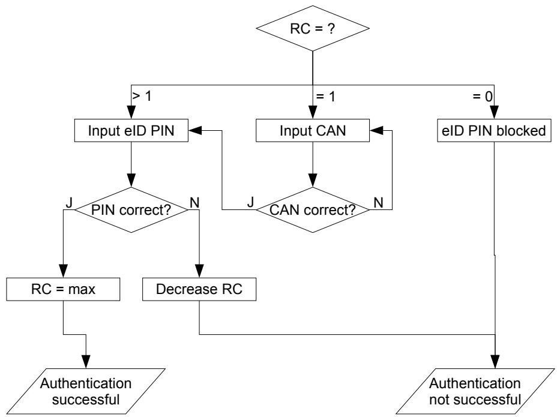
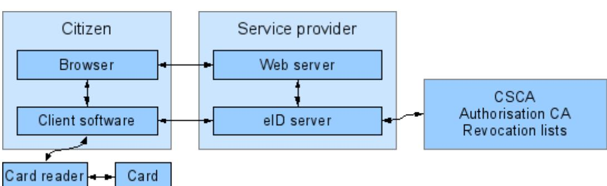
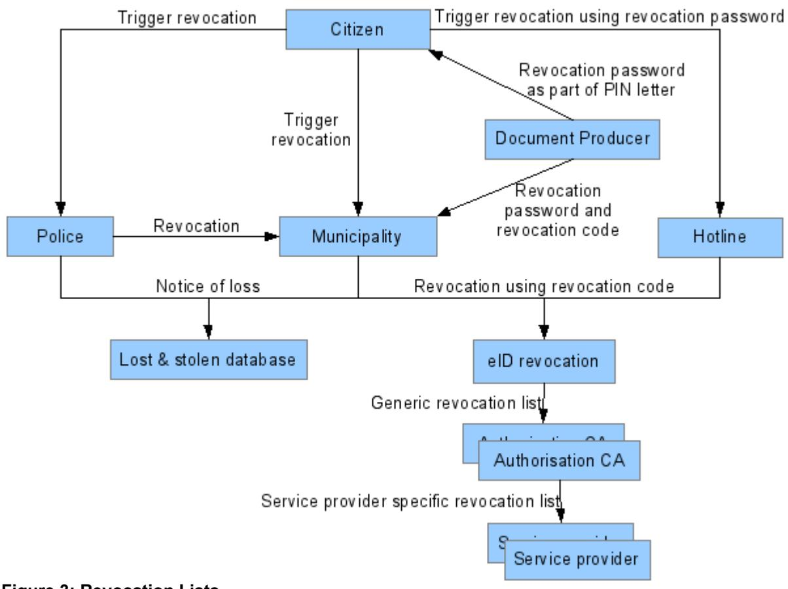

# Technical Guideline TR-03127

Architecture electronic Identity Card and electronic Resident Permit

Version 1.13 10. März 2011

> This is an informative translation of Technische Richtlinie TR-03127 "Architektur elektronischer Personalausweis und elektronischer Aufenthaltstitel"

In cases of contradictions between the German and the English version, only the German version is normative.

Bundesamt für Sicherheit in der Informationstechnik Postfach 20 03 63 53133 Bonn E-Mail: ePA@bsi.bund.de Internet: https://www.bsi.bund.de © Bundesamt für Sicherheit in der Informationstechnik 2011

| 1. Introduction  5                                       |  |
|----------------------------------------------------------|--|
| 2. Data capture and transmission  6                      |  |
| 2.1 Personal data  6                                     |  |
| 2.2 Facial image  6                                      |  |
| 2.3 Fingerprints  6                                      |  |
| 2.4 Signature  6                                         |  |
| 2.5 Data transmission  7                                 |  |
| 2.6 Communication between issuing authorities  7         |  |
| 2.7 Document number  7                                   |  |
| 3. The card  8                                           |  |
| 3.1 Authentication methods  8                            |  |
| 3.1.1 PACE  9                                            |  |
| 3.1.2 Terminal Authentication  9                         |  |
| 3.1.3 Passive Authentication  9                          |  |
| 3.1.4 Chip Authentication  10                            |  |
| 3.2 Stored data  10                                      |  |
| 3.2.1 Biometric application  11                          |  |
| 3.2.2 eID application  12                                |  |
| 3.2.3 Signature Application  14                          |  |
| 3.2.4 Master File  15                                    |  |
| 3.3 Passwords  16                                        |  |
| 3.3.1 CAN - Card Access Number  17<br>3.3.2 MRZ  17      |  |
| 3.3.3 eID-PIN  17                                        |  |
| 3.3.4 Signature PIN  18                                  |  |
| 3.3.5 Pin Unblocking Key (PUK)  19                       |  |
| 4. Access to Card Data  20                               |  |
| 4.1 General Authentication Procedure  20                 |  |
| 4.2 Standard/Advanced ePassport Inspection Procedure  20 |  |
| 4.3 Inspection System  21                                |  |
| 4.4 Authentication Terminal  22                          |  |
| 4.4.1 Document Validity Query  22                        |  |
| 4.4.2 Reading the Revocation Token  22                   |  |
| 4.4.3 Special Functions  23                              |  |
| 4.5 Confirmed Signature Terminal  24                     |  |
| 4.6 Unauthenticated Terminal  24                         |  |

| 4.6.1 Setting a new eID PIN using the currently valid eID PIN  24           |  |
|-----------------------------------------------------------------------------|--|
| 4.6.2 Resetting the retry counter of the eID PIN/signature PIN with PUK  24 |  |
| 4.7 Online Authentication  25                                               |  |
| 5. Background Systems  27                                                   |  |
| 5.1 Document PKI  27                                                        |  |
| 5.2 Authorisation PKI  27                                                   |  |
| 5.2.1 Certificate Issuance for e-Business/e-Government  28                  |  |
| 5.2.2 Confirmed Signature Terminals  29                                     |  |
| 5.2.3 Date Update Service  29                                               |  |
| 5.3 Card Revocation Lists  29                                               |  |
| 5.3.1 eID Revocation List  30                                               |  |
| 6. Card Issuance  32                                                        |  |
| 6.1 Card  32                                                                |  |
| 6.2 PIN/PUK Letter  32                                                      |  |
| 6.3 Quality Assurance and Visualisation  32                                 |  |
| 6.4 Information for the Card Holder  32                                     |  |
| 6.5 Responsibility of the Card Holder  33                                   |  |
| 7. Amendment Service/Visualisation  34                                      |  |
| Appendix A Certifications  35                                               |  |
| Appendix B Revocation Password, Revocation Key and Revocation Code  36      |  |
| Appendix C CertificateDescription  38                                       |  |

| Figure 1: Entering the eID-PIN18                                 |  |
|------------------------------------------------------------------|--|
| Figure 2: Communication relations during online authentication26 |  |
| Figure 3: Revocation Lists30                                     |  |

| Table 1: Files of the biometric application11 |  |
|-----------------------------------------------|--|
| Table 2: Files of the eID application12       |  |
| Table 3: Files in the master file15           |  |
| Table 4: Terminal Types21                     |  |
|                                               |  |

# <span id="page-4-0"></span>**1. Introduction**

The launch of the electronic ID card and electronic residence permit is creating a family of official documents featuring an integrated chip. Within the scope of the Federal Government's eCard strategy, these documents will – whenever possible – come with identical features in order to create a common infrastructure for both official applications and for use in e-government and e-business.

The features are based on the following

- for the ID card: on the Act on Identity Cards ([PAuswG]) of 18 June 2009 and the Regulation on Identity Cards
- for the residence permit: on EU regulation ([EU-RP]), the Residence Act ([AufenthG]) and the Ordinance Governing Residence,
- as well as on the "Sicherheitsrahmenkonzept für das Gesamtsystem des elektronischen Personalausweises" [Security Framework Concept for the Overall System of the Electronic ID Card]([SiKo]), which applies accordingly to the residence permit.

The chip integrated into the document is a novel security feature designed to enhance protection against forgery and enable the inclusion of biometric features in order to strengthen the link between the ID card and its holder.

Furthermore, the chip also permits a function to be added to the card that allows the holder and providers of e-business or e-government services to securely authenticate each other, for instance, in online communications. This function opens up a host of applications.

An additional function of the card is a signature application like the ones already available on separate signature cards. This function is activated by the card holder as needed.

This technical guideline presents the procedures used for electronic ID cards and electronic residence permits and refers to the related specifications. Unless explicitly stated otherwise, all statements and information refer to both documents which will hereinafter be generically referred to as *card* or *document*.

# <span id="page-5-4"></span>**2. Data capture and transmission**

When the ID card is applied for, the authority issuing the ID card or the foreigners authority (hereinafter generically called the "issuing authority") captures the necessary personal data of the applicant and subsequently transmits this data to the manufacturer of the card. The data to be captured are determined in the Act on Identity Cards or the Residence Act and the relevant ordinances. The required processes and data formats are laid down in [TR-03104], [TR-03121] and [TR-03123].

## <span id="page-5-3"></span>**2.1 Personal data**

Besides biometric data (facial image, fingerprints (ID card: optional, residence permit: mandatory), signature, colour of eyes and body height), the following personal details are captured for the card:

- first name(s), family name, name at birth, if applicable
- doctoral degree
- date and place of birth
- address (including postal code) and official municipality code number of the place of residence

Additional entries include the religious order/artistic name – if any – in the ID card as well as – in the residence permit – the gender and, if applicable, auxiliary conditions connected with the residence permit.

# <span id="page-5-2"></span>**2.2 Facial image**

The applicant submits a photo to capture the facial image that is printed onto the card body and stored electronically on the chip. [TR-03121] contains the requirements for the photo.

The issuing authority uses certified capture and quality assurance software (see [Appendix A\)](#page-33-0) to scan the photo submitted and to convert the data to JPEG2000 format [ISO 15444] which is used for the ID card.

An alternative option is to take the photo on site at the issuing authority. Quality assurance and conversion are carried out analogous to the data capture process from a photo submitted by the applicant. The requirements laid down in [TR-03104] and [TR-03121] must be observed.

# <span id="page-5-1"></span>**2.3 Fingerprints**

Two fingerprint images are stored optionally (ID card) or as a mandatory element (residence permit) on the chip. The fingerprints are scanned by certified fingerprint scanners and captured using certified capture and quality assurance software (see [Appendix A\)](#page-33-0). [TR-03104] and [TR-03121] set forth the requirements for the capture components and the capture process - both requirements concerning the quality of the data captured as well as procedures to be adopted under special circumstances, such as in the case of disabled applicants.

# <span id="page-5-0"></span>**2.4 Signature**

The applicant's signature is also captured. The signature is only printed on the card. It is not stored on the chip.

# <span id="page-6-2"></span>**2.5 Data transmission**

The transmission of data between the issuing authorities and the card manufacturer is specified in relevant profiles of [TR-03104] and [TR-03123]. Data transmission is fully electronic.

[TR-03104] describes the fundamental processes and organisational rules that apply to data capture, application for and delivery of the card. [TR-03123] specifies the XML-based data model for the application data. [TR-03132] specifies the security mechanisms (encryption and signature) which secure the confidentiality and authenticity of application data.

The encrypted and signed data takes are transmitted using a service set up for this purpose in the German Directory of Administrative Services [DVDV] in the form of an OSCI transport [OSCI]. Its functioning is laid down in a service description (as part of [TR-03132]).

## <span id="page-6-1"></span>**2.6 Communication between issuing authorities**

Different issuing authorities need to exchange information between each other under certain circumstances, including, for instance:

- application for a card at an issuing authority not responsible for this
- change of address
- blocking of a card at an authority not having the pertinent entry in the card register

This communication is not covered by this document.

### <span id="page-6-0"></span>**2.7 Document number**

The document numbers of cards are made up of an alphanumerical four-digit authority ID and an alphanumerical five-digit, pseudo-random number. [TR-03116], part 2, contains the specifications for generating the pseudo-random part.

Where the card manufacturer supplies the numbers, [TR-03104] specifies the transmission to the issuing authorities. Each card is given a new number.

# <span id="page-7-1"></span>**3. The card**

#### **Card body**

The card is an official ID document in td-1 format according to [ICAO 9303]. This guideline does not cover the design of the card or the physical security features (such as holograms).

#### **Chip**

A contactless chip is integrated into the card. This chip and the cryptographic protocols implemented in it serve as a novel security feature and enable a number of new functions for the card.

The contactless chip communicates with a matching card terminal which acts as a reading or writing device. Data communication between the two components takes place by way of inductive coupling according to [ISO 14443]. The unique identifier (UID, [ISO 14443] type A) or the pseudo-unique PICC identifier (PUPI, [ISO 14443] type B) of the chip are generated randomly each time the chip is activated.

Communication between the chip and the terminal is based on [ISO 7816].

Chapter [3.2](#page-9-0) describes the storage of personal and document-related data on the chip. The chip includes a cryptographically strong random number generator and supports elliptic curve cryptography according to [TR-03111] and AES [FIPS 197]. The card is also a secure signature creation device confirmed pursuant to the Act on Digital Signature [SigG] and the Signature Ordinance [SigV].

## <span id="page-7-0"></span>**3.1 Authentication methods**

The following cryptographic protocols are used for chip and terminal access control and authentication, and must be implemented by the chip and terminal (see also [TR-03116] part 2):

- Password Authenticated Connection Establishment PACE ([TR-03110])
- Terminal Authentication Version 2 TA2 ([TR-03110])
- Passive Authentication PA ([ICAO 9303])
- Chip Authentication Version 2 CA2 ([TR-03110])
- Residence permit only: Basic Access Control ([ICAO 9303]), PACE according to ([ICAO PACE]) as well as Terminal Authentication Version 1 and Chip Authentication Version 1 according to ([TR-03110]).

These cryptographic protocols enable access to the card data using the *General Authentication Procedure* according to [TR-03110]. In the case of the residence permit, access to the data of the biometric function (section [3.2.1\)](#page-10-1) using the *Standard ePassport Inspection Procedure* and *Advanced ePassport Inspection Procedure* according to Appendix G of [TR-03110] is additionally possible in line with EU requirements ([EU-RP]).

Active Authentication according to [ICAO 9303] is not implemented for data protection reasons (see [TR-03110], Appendix I "Challenge Semantics").

The requirements for the underlying algorithms and the key lengths to be used are laid down in [TR-03116], part 2, and [TR-02102] in the latest version. [TR-03111] is mandatory for elliptic curve cryptography methods. The requirements of [TR-02102] apply to the generation of random numbers and key material both during manufacture/personalisation and during the use of the card.

## <span id="page-8-3"></span><span id="page-8-2"></span>**3.1.1 PACE**

The PACE protocol (specified in [TR-03110]) serves to establish an encrypted and integrity-secured channel between the terminal and chip whilst at the same time proving that both the chip and the terminal possess the same password. The password to be used differs depending on the application; see section [3.3.](#page-14-0)

In as far as rights are to be subsequently proven by a *General Authentication Procedure* , the terminal already communicates its type and the desired rights to the chip through PACE.

#### <span id="page-8-1"></span>**3.1.2 Terminal Authentication**

Terminal authentication (specified in [TR-03110]) serves to prove the access rights of a terminal or service provider.

The proof of access rights via Terminal Authentication within the scope of the *General Authentication Procedure* is required for all personal and document-related data stored in the applications of the chip. In the case of the residence permit, terminal authentication is not necessary for accessing DG1 and DG2 of the biometric function (section [3.2.1\)](#page-10-1) using the *Standard ePassport Inspection Procedure*.

The terminal's access rights are linked to the session keys created during Chip Authentication, i.e., the rights of the terminals can be exercised only within the channel encrypted by Chip Authentication. Terminal Authentication can be carried out only once in each session. A new session is started by closing the encrypted channel (and hence by deleting the session keys and resetting all access rights) and by selecting the master file.

The rights of the terminal are assigned via authorisation PKI certificates. The authorisation PKI (also EAC PKI, see section [5.2\)](#page-25-4) is a three-tier PKI consisting of:

- the root authority (CVCA, Country Verifying Certification Authority) which is operated by the BSI
- several Document Verifiers (DVs)
- the certificates of the terminals and service providers

The certificates determine the maximum access rights of a terminal and distinguish between different terminal types (section 4):

- *official national inspection system*
- *official foreign inspection system*
- *official domestic authentication terminal*
- *nonofficial/foreign authentication terminal*
- *confirmed signature terminal* for qualified electronic signatures

Terminal Authentication in the *General Authentication Procedure* is successful only if the terminal type from the certificate matches the type announced in PACE and if the password used in PACE is permissible for the terminal type (see [Table 4\)](#page-19-1). Access rights are granted only if they are requested in PACE and if they were proven by the certificate chain and Terminal Authentication.

#### <span id="page-8-0"></span>**3.1.3 Passive Authentication**

Passive Authentication (specified in [ICAO 9303], [TR-03110]) serves to prove the authenticity of the data stored on the chip. For this purpose, the data stored in the biometric application (section [3.2.1\)](#page-10-1) and the public key of the chip are signed using the document PKI (section [5.1\)](#page-25-3). The data groups of the non-official eID application are not signed.

*Authentication* and *signature terminals* perform Passive Authentication for the EF.CardSecurity file only (which contains, amongst other things, the public key of the chip). *Inspection systems* additionally perform Passive Authentication for the EF.SOD file of the biometric application in order to explicitly authenticate the data of this application.

Passive Authentication proves the authenticity of the data only rather than the authenticity of the chip itself. This is only accomplished by Chip Authentication in conjunction with Passive Authentication.

The certificates of the document PKI are stored on the chip (DS certificate), or they can be obtained from the BSI (the root authority of the document PKI) or from a downstream Public Key Directory (PKD). This means that, via the document PKI, anybody with access rights can be assured of the authenticity of the data signed and (in conjunction with Chip Authentication) of the chip and the data stored on it.

#### <span id="page-9-1"></span>**3.1.4 Chip Authentication**

Chip Authentication (specified in [TR-03110]) serves to prove that the chip possesses the private key that belongs to the public key which is stored in the EF.CardSecurity/EF.ChipSecurity file in the master file (or, in the case of the residence permit, additionally in DG14 of the biometric application). The authenticity of the chip and hence also of the data stored on the chip is thus proven in conjunction with Passive Authentication.

Chip Authentication also serves to establish a secure channel between the terminal or the service provider and the chip.

Within the scope of the *General Authentication Procedure*, the terminal can access the chip in line with the access rights proven during Terminal Authentication after the encrypted channel has been established.

## <span id="page-9-0"></span>**3.2 Stored data**

The data in the chip is organised in three applications, i.e.,

- the biometrics application (data format analogous to that of the ePassport),
- the eID application,
- the signature application for generating qualified electronic signatures.

Access to any of the data stored in the applications of the card is only possible after successful authentication of the terminal by PACE, Terminal Authentication and Chip Authentication (*General Authentication Procedure,* section [4\)](#page-18-2). In the case of the residence permit, access to certain data of the biometric application (section [3.2.1\)](#page-10-1) is additionally possible by the *Standard/Advanced ePassport Inspection Procedure*.

The applications are to the maximum extent possible in line with profile 1, i.e., "eID Application with mandatory ICAO functionality and conditional digital signature functionality" of the European Citizen Card ([CEN 15480], part 4).

#### <span id="page-10-1"></span>**3.2.1 Biometric application**

The data groups defined by ICAO in [ICAO 9303] and listed in [Table 1](#page-10-2) are stored in the biometric application. The other data groups (DG4 to DG16) defined by ICAO are not used, except DG14 in the case of the residence permit.

Access to the biometric application of the ID card is granted solely to authenticated *inspection terminals* and, in the case of the residence permit, additionally to *basic* and *extended inspection systems*. Access to all data groups (ID cards) and to DG3 (residence permit) is contingent upon proof of the corresponding rights via terminal authentication.

Data cannot be written after personalisation.

#### <span id="page-10-3"></span><span id="page-10-0"></span>**3.2.2 eID application**

The card's eID application enables the holder to identify and authenticate himself/herself vis-à-vis a third person. This is also possible online (i.e., vis-à-vis e-government and e-business services).

| File                  | Contents                                                                                                                                                                                                    | Read access right                          |  |
|-----------------------|-------------------------------------------------------------------------------------------------------------------------------------------------------------------------------------------------------------|--------------------------------------------|--|
| EF.COM<br>(eRP only)  | List of the available data groups and version information accord<br>ing to [ICAO 9303] (the use of this data group is not recommen<br>ded because this data group is not signed.)                           | eRP only: BIS/EIS                          |  |
| EF.SOD                | Hash values of the data groups DG1, DG2, DG3; signature over<br>these hash values and the DS certificate (according to [ICAO<br>9303])                                                                      | IS;<br>eRP only: BIS/EIS                   |  |
| EF.CVCA<br>(eRP only) | Trust points for certificate chain of the inspection system role of<br>Terminal Authentication                                                                                                              | eRP only: BIS/EIS                          |  |
| DG1                   | Data of the machine readable zone (MRZ) as printed on the card<br>body                                                                                                                                      | IS;<br>eRP only: BIS/EIS                   |  |
| DG2                   | Digital facial image, identical to the printed image                                                                                                                                                        | IS;<br>eRP only: BIS/EIS                   |  |
| DG3                   | Two fingerprints (optional in the ID card, mandatory in the res<br>idence permit). If no fingerprints are stored, this data group con<br>tains a random value.                                              | IS + Read DG3;<br>eRP only: EIS + Read DG3 |  |
| DG14<br>(eRP only)    | Contains the following SecurityInfo ([TR-03110]):<br>ChipAuthenticationInfo<br>ChipAuthenticationPublicKeyInfo<br>TerminalAuthenticationInfo                                                                | eRP only: BIS/EIS                          |  |
|                       | The public key contained for chip authentication is identical to<br>the key from EF.ChipSecurity.                                                                                                           |                                            |  |
|                       | IS: Authenticated Inspection System (PACE with CAN or MRZ, TA2, CA2);<br>BIS: Basic Inspection System (BAC/PACE); CA1 if supported by the terminal;<br>EIS: Extended Inspection System (BAC/PACE; CA1; TA1) |                                            |  |

#### <span id="page-10-2"></span>**Table 1: Files of the biometric application**

Table [2](#page-11-0) shows the data groups of the eID application. The other data groups defined in [TR-03110] are not used.

Annotations concerning individual data groups:

- **DG1**: The document type is "ID" for the ID card, and "AR", "AS" or "AF" for the residence permit.
- **DG3**: No authorisation certificates are issued for this data group for online authentication.

| File                                                                                                                                                                        | Contents                                                               | Access Right          |                    |                                   |  |
|-----------------------------------------------------------------------------------------------------------------------------------------------------------------------------|------------------------------------------------------------------------|-----------------------|--------------------|-----------------------------------|--|
|                                                                                                                                                                             |                                                                        | Read                  | Write              | Internal use                      |  |
| DG1                                                                                                                                                                         | Document type                                                          | IS;<br>AT + Read DG1  | -                  | -                                 |  |
| DG2                                                                                                                                                                         | Issuing country<br>("D" for Germany)                                   | IS;<br>AT + Read DG2  | -                  | -                                 |  |
| DG3                                                                                                                                                                         | Expiration date<br>format: YYYYMMDD                                    | IS;<br>AT + Read DG3  | -                  | AT                                |  |
| DG4                                                                                                                                                                         | First name(s)                                                          | IS;<br>AT + Read DG4  | -                  | -                                 |  |
| DG5                                                                                                                                                                         | Family name                                                            | IS;<br>AT + Read DG5  | -                  | -                                 |  |
| DG6                                                                                                                                                                         | ePA: Religious order/artistic name<br>eRP: not used                    | IS;<br>AT + Read DG6  | -                  | -                                 |  |
| DG7                                                                                                                                                                         | Doctoral degree                                                        | IS;<br>AT + Read DG7  | -                  | -                                 |  |
| DG8                                                                                                                                                                         | Date of birth<br>format: YYYYMMDD                                      | IS;<br>AT + Read DG8  | -                  | -                                 |  |
| DG9                                                                                                                                                                         | Place of birth as unformatted text                                     | IS;<br>AT + Read DG9  | -                  | -                                 |  |
| DG10 - DG16 Not used                                                                                                                                                        |                                                                        | -                     | -                  | -                                 |  |
| DG17                                                                                                                                                                        | Address                                                                | IS;<br>AT + Read DG17 | AT +<br>Write DG17 | -                                 |  |
| DG18                                                                                                                                                                        | Community ID                                                           | IS;<br>AT + Read DG18 | AT +<br>Write DG18 | AT + Community<br>ID Verification |  |
| DG19                                                                                                                                                                        | eRP: Auxiliary Conditions I<br>ePA: not used                           | IS;<br>AT + Read DG19 | AT +<br>Write DG19 | -                                 |  |
| DG20                                                                                                                                                                        | eRP: Auxiliary Conditions II<br>ePA: not used                          | IS;<br>AT + Read DG20 | AT +<br>Write DG20 | -                                 |  |
| DG21                                                                                                                                                                        | Not used                                                               | -                     | -                  | -                                 |  |
|                                                                                                                                                                             | Reference date of birth for age verifica<br>tion                       | -                     | -                  | AT + Age Veri<br>fication         |  |
|                                                                                                                                                                             | Key for service-provider-specific revoc<br>ation token (section 4.4.2) | -                     | -                  | AT                                |  |
|                                                                                                                                                                             | Key for service and card-specific identi<br>fication (section 4.4.3.3) | -                     | -                  | AT + Restricted<br>Identification |  |
| IS: Authenticated Inspection System (PACE with CAN or MRZ, TA2, CA2);<br>AT: Authenticated Authentication Terminal (PACE with eID-PIN or CAN (with CAN allowed), TA2, CA2); |                                                                        |                       |                    |                                   |  |

#### <span id="page-11-0"></span>**Table 2: Files of the eID application**

- **DG8**: The complete date of birth is not known for all holders of ID documents. The DG8 contains the date of birth in YYYYMMDD format; unknown parts are filled with blanks. With regard to the special *age verification* function (section [4.4.3.4\)](#page-21-2), the date which is the latest possible date of birth according to the known partial dates is stored internally (for instance, 31 December of the year if only the year of birth is known). This ensures that even with an incomplete date of birth age verification will only supply a positive result if the holder is definitely of the desired age.
- **DG17**: The place of residence is usually stored as a structured address (structuredPlace according [TR-03110] consisting of the country code, street with house number, place of residence and postal code. If the holder of the ID card has his/her residence outside Germany, the text "keine Hauptwohnung in Deutschland" [No habitual place of residence in Germany] (noPlaceInfo according to [[TR-03110]) is stored instead.
- DG18: In the *Community ID* field, the official municipality key of the place of residence is stored in order to enable a query of the place of residence via the special Community ID verification function (section [4.4.3.5\)](#page-22-4). The data group usually contains a sequence of 14 decimal digits:
	- 1. Three digits for the country code according to ISO 3166-1 numeric, supplemented by a leading zero ("0276" for Germany)
	- 2. Two digits for the federal *Land* according to the official municipality key (AGS)
	- 3. One digit for the administrative region according to the official municipality key, supplemented by a leading "0"
	- 4. Two digits for the town (town not belonging to a county) or for the district, respectively, according to the official municipality key
	- 5. Three digits for the municipality, supplemented by a leading "0"

The entries referred to under 2.-5. above correspond to the official municipality key (AGS) of the Federal Statistical Office. Because of the graded residence query possibility, storage is foreseen in binary coded decimal (BCD) format with two digits per byte which may require the use of a leading "0" as a filler.

If no address is stored in DG17 (place of residence outside Germany), this data group is empty.

No authorisation certificates are issued for these data groups for online authentication.

Access to the files following successful authentication is granted to

- *authentication terminals* with read and write rights according to their authentication
- *inspection systems*

The data are not signed. This prevents a service provider from passing on any data to third parties with cryptographic proof of authenticity that the data have been read from the eID application. Instead, the integrity and authenticity of the data are implicitly secured via the encrypted, integrity-secured channel that was created during Chip Authentication.

The contents of the Address and Community ID data groups and of the Auxiliary Conditions I/II data groups of the residence permit can be changed retroactively, i.e., after the card has been issued, against proof of a corresponding certificate. This is carried out by the amendment service of the issuing authorities; see section [7.](#page-32-0)

#### <span id="page-12-0"></span>**3.2.3 Signature Application**

The signature application serves to create qualified electronic signatures pursuant to the Act on Digital Signature [SigG]. Before the signature application is used, the owner must create a signature key pair. The signature application permits the creation of one key pair for qualified electronic signatures (QES).

Before a key pair for qualified electronic signatures is created, the owner must first create a signature PIN (section [3.3.4\)](#page-16-0). A signature key pair is created by a certification service provider (section [4.4.3.1\)](#page-21-3). [TR-03117] describes the signature application, including the processes for generating key pairs and signatures. The ID card includes a *cryptographic information application* according to [ISO 7816] part 15 and [CEN 14890] in order to describe an existing signature key pair and a signature certificate.

#### <span id="page-13-0"></span>**3.2.4 Master File**

Besides the personal and document-related data described above, certain system data (such as domain parameters) that are needed to handle the access protocols, as well as the passwords for PACE, are stored in the master file (MF) of the chip (see [Table 3\)](#page-13-1).

| File            | Contents                                                                                                                   | Access Right                                              |                                                 |                                                                             |
|-----------------|----------------------------------------------------------------------------------------------------------------------------|-----------------------------------------------------------|-------------------------------------------------|-----------------------------------------------------------------------------|
|                 |                                                                                                                            | Read                                                      | Write                                           | Internal Use                                                                |
| EF.ATR          | According to [CEN 15480]<br>part 2, contains Minimal Card<br>Capabilities Descriptor (CCD)<br>according [CEN 15480] part 3 | always                                                    | -                                               | -                                                                           |
| EF.DIR          | List of card applications ([CEN<br>15480] part 2)                                                                          | always                                                    | -                                               | -                                                                           |
| EF.CardAccess   | See section 3.2.4.                                                                                                         | always                                                    | -                                               | -                                                                           |
| EF.CardSecurity | See section 3.2.4.                                                                                                         | PACE+TA2                                                  | -                                               | -                                                                           |
| EF.ChipSecurity | See section 3.2.4.                                                                                                         | PACE+TA2 as IS or<br>AT with right<br>Privileged Terminal | -                                               | -                                                                           |
|                 | MRZ password                                                                                                               | -                                                         | -                                               | For PACE                                                                    |
|                 | CAN                                                                                                                        | -                                                         | -                                               | For PACE                                                                    |
|                 | eID PIN                                                                                                                    | -                                                         | PACE with<br>eID PIN;<br>AT + PIN<br>management | For PACE                                                                    |
|                 | PUK                                                                                                                        | -                                                         | -                                               | For PACE                                                                    |
|                 | Trust points for Terminal<br>Authentication                                                                                | Returned by PACE                                          | When impor<br>ting a link<br>certificate        | -                                                                           |
|                 | Private key for Chip Authentic<br>ation whose public key is<br>included in EF.CardSecurity.                                | -                                                         | -                                               | For CA after PACE<br>+ TA2                                                  |
|                 | Private key for Chip Authentic<br>ation whose public key is<br>included in EF.ChipSecurity.                                | -                                                         | -                                               | For CA after PACE<br>+ TA2 as IS or AT<br>with right<br>Privileged Terminal |
|                 | AT: Authenticated Authentication Terminal (PACE with eID-PIN or CAN (with CAN allowed right), TA2, CA2);                   |                                                           |                                                 |                                                                             |

#### <span id="page-13-1"></span>**Table 3: Files in the master file**

In order to prevent identification of the card (and hence compromising of the pseudonym, section [4.4.3.3\)](#page-21-4) via the public key for Chip Authentication stored in the EF.CardSecurity file, this key is not chip-specific. Instead, the same key is used for each generation of cards so that this key does not permit the unambiguous identification of a particular card. Likewise, the signature for the EF.CardSecurity file is static for the cards of one generation.

The files EF.CardAccess, EF.CardSecurity and EF.ChipSecurity contain the following Security-Infos according to [TR-03110]:

- EF.CardAccess
	- PACEInfo
	- ChipAuthenticationInfo
	- ChipAuthenticationDomainParameterInfo
	- PrivilegedTerminalInfo
	- TerminalAuthenticationInfo
	- CardInfoLocator
- EF.CardSecurity
	- PACEInfo
	- ChipAuthenticationInfo
	- ChipAuthenticationDomainParameterInfo
	- ChipAuthenticationPublicKeyInfo
	- TerminalAuthenticationInfo
	- CardInfoLocator
	- RestrictedIdentificationInfo
- RestrictedIdentificationDomainParameterInfo
	- as well as the signature of this data, including the corresponding DS certificate.
- EF.ChipSecurity
	- PACEInfo
	- ChipAuthenticationInfo
	- ChipAuthenticationDomainParameterInfo
	- ChipAuthenticationPublicKeyInfo
	- PrivilegedTerminalInfo
	- TerminalAuthenticationInfo
	- CardInfoLocator
	- RestrictedIdentificationInfo
	- RestrictedIdentificationDomainParameterInfo
	- EIDSecurityInfo with hash values of data groups DG4, DG5, DG8 and DG9 of the eID application

as well as the signature of this data, including the corresponding DS certificate.

#### <span id="page-14-0"></span>**3.3 Passwords**

The password used for the PACE protocol (section [3.1.1\)](#page-8-3) differs depending on the particular application:

- a six-digit number (CAN *Card Access Number*) printed on the card body
- the hash of the document number, date of birth and date of expiration from the machine readable zone (MRZ)
- the eID PIN: this is either the five-digit eID transport PIN communicated to the card holder in the PIN letter (section [6.2\)](#page-30-5) or an operational, six-digit eID PIN known solely to the card holder
- <span id="page-15-2"></span>• a ten-digit PUK communicated to the card holder in the PIN letter (section [6.2\)](#page-30-5).

#### **3.3.1 CAN - Card Access Number**

The CAN is a six-digit decimal random number printed on the face of the card which cannot be calculated from other personal or document-related data (such as the document number). This number is used as a password for PACE if a secure channel needs to be established between the card and a terminal but if a link to the card holder is not required by entering the secret eID PIN:

- law enforcement checks (section [4.3\)](#page-19-2)
- amendment service/visualisation at issuing authorities (section [7\)](#page-32-0)
- establishing a connection to the signature application (section [4.5\)](#page-22-5)

The CAN is also used to enable the third attempt to enter the eID PIN (see below).

The CAN has no retry counter.

#### <span id="page-15-1"></span>**3.3.2 MRZ**

For *inspection systems* it is also possible to use the MRZ instead of the CAN (or, more precisely: the SHA-1 hash value of the document number, date of birth and date of expiration) as a PACE password so that the swipe card readers typically used for passports can also be used for ID cards/residence permits. It must be taken into account in this case that, according to ICAO specifications, the MRZ of the card is located on the back of the card and that it is made up of three lines (in contrast to two lines in the case of the passport).

#### <span id="page-15-0"></span>**3.3.3 eID-PIN**

The eID PIN is a six-digit decimal number known only to the card holder. It serves to give consent to accessing data stored in the eID application for uses other than law enforcement checks and to link these functions to the card holder (authentication by possession and knowledge).

The initial, randomly generated PIN which is set during the manufacturing process is a transport PIN, i.e., it can only be used to set an operational eID PIN by the holder (section [4.4.3.2\)](#page-21-5), but not for authentication purposes. This ensures that the operational eID PIN is known only to the card holder. The transport PIN is communicated to the holder in a PIN letter (section [6.2\)](#page-30-5).

The card includes a retry counter that blocks the eID PIN after three incorrect entries in order to prevent unauthorized persons from guessing the eID PIN. This leads to the risk of a denial of service (DoS) attack via the contactless interface to the eID PIN by multiple incorrect entries of the eID PIN without the holder's knowledge. In order to prevent this, the third attempt to enter the PIN is not enabled until the CAN printed on the card has been successfully entered. The enabling of the third attempt is only valid in the current secure messaging channel, i.e., the enabling ceases when the channel is closed, for example when the chip is reset. [Figure 1](#page-16-1) shows this PIN pattern.

The PIN input process described above can, in principle, remain largely hidden to the user of the card. It is, for example, possible for the local software/middleware installed on the user's own computer to request the printed CAN during the installation process and during subsequent application to automatically enable via the CAN a third input attempt which may be necessary (whilst at the same time informing the user).

The eID PIN can be changed in two ways:

- The user can first enter the currently valid eID PIN and subsequently set a new one (section [4.6\)](#page-22-0).
- In order to enable a new eID PIN to be set if the card holder has forgotten his/her currently valid eID PIN, a new eID PIN can additionally be set at an issuing authority without knowing the old eID PIN. In this case, the issuing authority proves the right to set a new eID PIN via Terminal Authentication (section [7\)](#page-32-0).

The other possibilities for setting a new eID PIN defined in [TR-03110] are not implemented.

#### <span id="page-16-0"></span>**3.3.4 Signature PIN**

The chip manages a signature PIN for creating qualified electronic signatures. This is not a PACE password; instead, the VERIFY command is used to send it to the card as is customary with signature



<span id="page-16-1"></span>**Figure 1: Entering the eID-PIN**

applications; refer to [TR-03117]. The signature PIN comes with a retry counter which blocks the PIN after three incorrect entries.

The signature PIN can

- be reset following entry of the currently valid signature PIN
- following authentication as *confirmed signature terminal* with the *"generate qualified electronic signature"* right, if no signature key pair for qualified electronic signatures exists or if this has been terminated, be terminated after PACE with eID-PIN as password and set anew

At the time the card is issued, no signature PIN is set, i.e., the holder must set a signature PIN before generating a qualified key pair.

#### <span id="page-17-0"></span>**3.3.5 Pin Unblocking Key (PUK)**

The eID PIN and the signature PIN can be unblocked after three incorrect entries via a ten-digit PUK (section [4.6\)](#page-22-0). The eID PIN and the signature PIN each come with a reset counter which enables in each case a maximum of ten reset operations of the retry counter via the PUK for the eID and signature PIN, respectively. The PUK is also randomly generated and part of the PIN letter.

# <span id="page-18-2"></span>**4. Access to Card Data**

### <span id="page-18-1"></span>**4.1** *General Authentication Procedure*

Data stored in the card are generally accessed by the following steps:

| Chip | Terminal                                                                                                                                                              |
|------|-----------------------------------------------------------------------------------------------------------------------------------------------------------------------|
|      | Reading the file EF.CardAccess                                                                                                                                        |
|      | Entering/reading the PACE password (eID PIN/CAN/MRZ)                                                                                                                  |
|      | PACE (section 3.1.1)                                                                                                                                                  |
|      | Transmitting the certificate chain<br>Terminal Authentication (section<br>3.1.2)                                                                                      |
|      | Reading the file EF.CardSecurity                                                                                                                                      |
|      | Passive Authentication EF.CardSecurity (section<br>3.1.3)                                                                                                             |
|      | Chip Authentication (section<br>3.1.4)                                                                                                                                |
|      | Authentication terminal (optional): Document validity query (section<br>4.4.1)<br>Authentication terminal (optional): Reading the revocation token (section<br>4.4.2) |
|      | Authentication terminal (optional): Revocation list query – only pos<br>sible if the card is still valid (section<br>5.3)                                             |
|      | Inspection system: reading of the EF.SOD                                                                                                                              |
|      | Inspection system: Checking the signature of the EF.SOD file (Passive<br>Authentication)                                                                              |
|      | Optional: Reading the approved data (section<br>3.2.2),<br>Exercising the special rights (section<br>4.4.3)                                                           |
|      | Inspection system: Comparing the hash values of the data groups read<br>to the values stored in the EF.SOD file                                                       |

The corresponding certificates are not issued for all combinations of the rights which are technically possible; for instance, rights to install the signature application are not granted to *official domestic authentication terminals*.

## <span id="page-18-0"></span>**4.2** *Standard/Advanced ePassport Inspection Procedure*

Access to the biometric application of the residence permit is additionally possible via the *standard ePassport inspection procedure* and the *advanced ePassport inspection procedure* according to Appendix G in [TR-03110].

# <span id="page-19-2"></span><span id="page-19-0"></span>**4.3 Inspection System**

An *inspection system* is a terminal for law enforcement checks, for example, by police or border control officers. An *inspection system* has access to the MRZ data (DG1) and to the facial image (DG2) stored in the biometric application. If the corresponding rights are proven during terminal authentication, an *inspection system* can also read the fingerprints (DG3) and the data of the eID application.

| Terminal type                                                             |                                                               | PACE password                                        | Possible terminal rights                                                                                                                                                                                                                                                                                            |  |
|---------------------------------------------------------------------------|---------------------------------------------------------------|------------------------------------------------------|---------------------------------------------------------------------------------------------------------------------------------------------------------------------------------------------------------------------------------------------------------------------------------------------------------------------|--|
| Inspection<br>system<br>(official<br>domestic/off<br>icial for<br>eign)   | General<br>Authentica<br>tion Proced<br>ure                   | CAN;<br>MRZ                                          | Read access to DG1 (MRZ), DG2 (facial<br>•<br>image) of the biometric application and data<br>of the eID application<br>Read access to DG3 (fingerprints) of the bio<br>•<br>metric application if access right proven by<br>the authentication procedure                                                           |  |
|                                                                           | eRP only:<br>Standard<br>ePassport<br>Inspection<br>Procedure | CAN;<br>MRZ                                          | Read access to DG1 (MRZ), DG2 (facial image) of<br>the biometric application                                                                                                                                                                                                                                        |  |
|                                                                           | eRP only:<br>Advanced<br>ePassport<br>Inspection<br>Procedure | CAN;<br>MRZ                                          | Read access to DG1 (MRZ), DG2 (facial image),<br>DG3 (fingerprints) of the biometric application                                                                                                                                                                                                                    |  |
| Authentication terminal<br>(official domestic or non<br>official/foreign) |                                                               | eID-PIN;<br>CAN if CAN<br>allowed right is<br>proven | Read/write access to the data groups of the eID<br>application according to authenticated rights<br>Special rights:<br>Generation of a signature key pair<br>•<br>Setting the eID PIN, activating/deactivating<br>•<br>eID application<br>Pseudonym<br>•<br>Age verification<br>•<br>Community ID verification<br>• |  |
| Confirmed Signature Ter<br>minal                                          |                                                               | CAN                                                  | Generation of qualified signatures with addi<br>•<br>tional entry of the signature PIN<br>Setting a new signature PIN with additional<br>•<br>entry of the old signature PIN                                                                                                                                        |  |
|                                                                           |                                                               | eID-PIN                                              | Creating the signature PIN<br>•<br>Terminating the key for qualified signatures<br>•<br>and of the signature PIN                                                                                                                                                                                                    |  |
| Unauthenticated terminal                                                  |                                                               | eID-PIN                                              | Setting a new eID PIN                                                                                                                                                                                                                                                                                               |  |
|                                                                           |                                                               | PUK                                                  | Resetting the retry counters of eID PIN/signature PIN                                                                                                                                                                                                                                                               |  |

#### <span id="page-19-1"></span>**Table 4: Terminal Types**

An *inspection system* can never access the signature application or write on the chip.

## <span id="page-20-5"></span><span id="page-20-2"></span>**4.4 Authentication Terminal**

An *authentication terminal* has the right to access the eID application. The rights assigned during authentication determine which data/functions are approved. Section [3.2.2](#page-10-3) contains a list of the data fields. An *authentication terminal* can also be given the right to change certain data on the chip (for instance, the current address).

A distinction is made between *official domestic authentication terminals* and *nonofficial/foreign authentication terminals*. *Nonofficial/foreign authentication terminals* usually require secret eID PIN input in order to link the reading of data to the holder's consent and at the same time to link the card to the holder. *Nonofficial/foreign authentication terminals* are, for instance, used for online authentication, see section [4.7.](#page-23-0)

Usually the right *CAN allowed* is set for *official domestic authentication terminals*, i.e., the CAN can be used as a PACE password. The use of the CAN does not enable verification that the card user and card holder are one and the same person, so that this verification must be carried out, for instance, by identifying the holder via the photo. *Official domestic authentication terminals* are used, for instance, for the amendment service at issuing authorities; see section [7.](#page-32-0)

Before an *authentication terminal* reads any data, the terminal must be able to check that the card is valid (i.e., has not expired) and has not been revoked, for instance, because it was reported lost/stolen. The *"Document validity query"* and *"Reading the revocation token"* functions are used for this purpose. Details of the implementation of these functions are specified in [TR-03110].

#### <span id="page-20-4"></span><span id="page-20-1"></span>**4.4.1 Document Validity Query**

During an authentication process, a service provider must be able to ensure that the card has not expired yet. This can, in principle, be achieved by reading the date of expiration. However, in the interest of data minimization, the validity check of the document is carried out by sending a query to the card. This means that the service provider sends a test date (usually the current date) to the card and receives a reply as to whether the card is still valid at that time. It is hence not necessary to read out the date of expiration.

The test date is sent as part of Terminal Authentication in order to prevent targeted narrowing down of the date of expiration by sending repeated queries with different test dates.

#### <span id="page-20-3"></span><span id="page-20-0"></span>**4.4.2 Reading the Revocation Token**

The card enables pseudonymous authentication, i.e., the card holder can authenticate himself/herself vis-à-vis a service provider without releasing personal data. The card generates a separate pseudonym for every service provider so that it is not possible to link pseudonyms across service provider boundaries (see also section [4.4.3.3\)](#page-21-4). On the other hand, an entry in a revocation list (for stolen cards, for example) requires a card identifier or a revocation token in order to enable revocation list queries.

In order to prevent pseudonymity from being undermined via the revocation token, the revocation token is also service-provider-specific. Service-provider-specific revocation lists are made available to the service provider for revocation list queries (section [5.3\)](#page-27-3).

Following successful authentication using the *general authentication procedure,* the service provider may read out his specific revocation token. In order to ensure that every service provider can read out his specific revocation token only, the service provider's identifier (*terminal sector*) forms part of the service provider's access certificate which is verified by the chip.

#### <span id="page-21-6"></span><span id="page-21-0"></span>**4.4.3 Special Functions**

Besides the reading of personal data, the eID application offers certain functions for which the *authentication terminal* requires special access rights which are proven by the Terminal Authentication. Details of the implementation of these functions are specified in [TR-03110].

#### **4.4.3.1 Generation of a Signature Key Pair**

As a precondition for installing the signature application, the terminal must prove the *install qualified certificate* right.

The card holder can use this function in order to generate key pairs for the signature application and to load the corresponding certificates with the help of a certificate service provider. As a precondition for generating a key pair for qualified electronic signatures, the card holder must have set a signature PIN (section [3.3.4\)](#page-16-0).

The certification service provider (CSP) authenticates itself to the card as a *nonofficial/foreign authentication terminal* and verifies the holder's identity by reading out suitable data groups (in line with the authenticated read rights) of the eID application. The CSP then starts the key generation process in the chip, the public key generated in this way is read out, and a qualified certificate is stored on the chip.

The CSP can issue a qualified certificate for a maximum term of validity no longer than that of the ID card.

<span id="page-21-3"></span>Details of the procedure are defined in [TR-03117].

#### <span id="page-21-5"></span>**4.4.3.2 Setting the eID PIN, Activating/Deactivating the eID Application**

This requires proof of the *PIN management* right by the terminal.

This function enables the card holder to set a new eID PIN at an *authentication terminal*. This may become necessary if the card holder has forgotten his/her eID PIN and is hence unable to set a new eID PIN by entering the old one; see section [3.3.3.](#page-15-0) This is implemented via the amendment service; see section [7.](#page-32-0)

Additionally this access right is used to activate and deactivate the eID application in the amendment service (section [7\)](#page-32-0). This only deactivates the use of the eID application with the eID PIN as a password, i.e., *authentication terminals* without the *CAN allowed* right are no longer able to access the eID application. *Inspection systems* and *authentication terminals* with the *CAN allowed* right can still access the eID application.

#### <span id="page-21-4"></span><span id="page-21-1"></span>**4.4.3.3 Service- and Card Specific Identifier (Pseudonym)**

As a precondition for pseudonym generation, the terminal must prove the *restricted identification* right.

The card offers the generation of a service-specific and card-specific identifier (pseudonym). For this purpose, a distinct provider identifier (*terminal sector*) is transmitted to the card with the service provider's certificate. The chip uses this identifier and a secret stored on the chip in order to generate a pseudonym which the service provider can use to identify the card in future. The pseudonym is generated in such a manner that the pseudonym for one service provider cannot be used to derive a pseudonym generated for another service provider.

#### <span id="page-21-2"></span>**4.4.3.4 Age Verification**

This requires proof of the *age verification* right by the terminal.

Reliably verifying the age of a card holder is an important function of the eID application. In order to avoid disclosing the date of birth, this is not carried out by accessing the date of birth, but via a "query" to the card as to whether the holder was born prior to a particular date.

The test date is sent as part of the Terminal Authentication operation and verified by the chip in order to prevent targeted narrowing down of the holder's age by sending repeated queries with different test dates.

#### <span id="page-22-4"></span>**4.4.3.5 Community ID Verification**

As a precondition for the community ID verification, the terminal needs the *community ID verification* right.

In order to enable localised services, the eID application enables the verification of a particular place of residence using a procedure similar to that used for verifying the card holder's age. This verification is based on the official municipality code number of the place of residence which is stored in the card during personalisation and, like the address, is updated electronically in the case of a change in address (section [7\)](#page-32-0).

The official municipality code number contains information concerning the *Land*, the administrative region, the city or district, respectively, and the municipality. Besides a query concerning a particular place of residence (municipality), the residence query also enables a query corresponding to the other structural levels (*Land*, administrative region, district); see section [3.2.2.](#page-10-0) This enables a service provider, for instance, to offer services for inhabitants of a particular *Land* only.

As in the age verification procedure, the place queried is transmitted as part of the Terminal Authentication data so that it is not possible for a service provider to narrow down the place of residence by repeated queries.

## <span id="page-22-1"></span>**4.5 Confirmed Signature Terminal**

By using the CAN as a password and additionally entering/verifying the signature PIN at a *confirmed signature terminal*,

- <span id="page-22-5"></span>• a qualified signature can be triggered if a key pair for qualified signatures was generated (see section [4.4.3.1\)](#page-21-3);
- a new signature PIN can be set.

If the eID PIN is used as a PACE password, an existing signature PIN and the key pair for qualified signatures can be deleted.

Details of the procedure are specified in [TR-03117].

## <span id="page-22-0"></span>**4.6 Unauthenticated Terminal**

No Terminal or Chip authentication is required for certain administrative operations performed locally by the card holder. When a connection using PACE as unauthorised terminal is established, no CHAT is transferred.

#### <span id="page-22-3"></span>**4.6.1 Setting a new eID PIN using the currently valid eID PIN**

In order to set a new eID PIN, the card holder first enters the currently valid, secret eID PIN in order to authenticate himself/herself. This eID PIN is proven to the chip by the PACE protocol. The new eID PIN is then sent to the chip and activated by it.

Details of the procedure are specified in [TR-03110].

#### <span id="page-22-2"></span>**4.6.2 Resetting the retry counter of the eID PIN/signature PIN with PUK**

In order to reset the retry counter of the eID PIN or of the signature PIN, PACE is carried out with the PUK as a password, followed by a reset of the retry counter(s). A reset counter is assigned to each PIN (eID PIN/signature PIN) and permits a maximum of ten reset operations via the PUK of the pertinent retry counter.

Details of the procedure are specified in [TR-03110] and [TR-03117], respectively.

## <span id="page-23-0"></span>**4.7 Online Authentication**

Online authentication, i.e., authentication vis-à-vis a service provider via a network (Internet), is a special case of access by an *authentication terminal* with the *general authentication procedure*. In this case, the role of the *authentication terminal* is split up into the local terminal (consisting of the reading device and local computer, including the necessary software) and the service provider as a remote terminal. A precondition for the actual online authentication procedure is an existing connection between the local terminal and the remote terminal (service provider), for instance, in the form of an SSL/TLS connection.

| Chip                                                                            | Local Terminal                                                                                      | Service Provider                          |
|---------------------------------------------------------------------------------|-----------------------------------------------------------------------------------------------------|-------------------------------------------|
|                                                                                 | Transmission of the service provider's certificate                                                  |                                           |
|                                                                                 | Presentation of the certificate<br>Restriction of access rights by the user<br>Entering the eID PIN |                                           |
| Reading the file EF.CardAccess<br>PACE with eID PIN as password (section 3.1.1) |                                                                                                     |                                           |
|                                                                                 | Transmitting the complete certificate chain<br>Terminal Authentication (section 3.1.2)              |                                           |
|                                                                                 | Reading the file EF.CardSecurity                                                                    |                                           |
|                                                                                 |                                                                                                     | Passive Authentication<br>(section 3.1.3) |
|                                                                                 | Chip Authentication (section 3.1.4)                                                                 |                                           |
|                                                                                 | Reading the revocation token (section 4.4.2), query of the document validity (section 4.4.1)        |                                           |
|                                                                                 |                                                                                                     | Revocation list query<br>(section 5.3)    |
|                                                                                 | Reading the approved data (section 3.2.2),<br>Exercising the special rights (section 4.4.3)         |                                           |

The online authentication process is made up of the following steps:

In the second step, the service provider's certificate, including the information concerning the service provider and the intended use (see section [5.2.1\)](#page-26-1), is presented to the user by the local software. The following must be displayed as a minimum:

- Name, address and e-mail address of the service provider
- Desired access rights
- Purpose of data transmission
- Name of the data protection authority responsible for the service provider
- Validity period of the certificate

If authenticated auxiliary data (query date for *age verification*, municipality code number for *community ID verification*) is transmitted for special functions, such data must also be displayed.

The user can impose further restrictions upon the access rights requested by the service provider via the certificate. The restricted rights are transmitted to the chip as part of the subsequent PACE protocol.

Since PACE establishes a secure channel between the chip and the local terminal, communication between the service provider and the chip in the following authentication steps (Terminal Authentication, Passive Authentication, Chip Authentication) is encrypted and integrity-protected by the local terminal, and the replies by the chip are decrypted and checked for integrity. As part of the Chip Authentication process, a secure end-to-end channel is established between the chip and the service provider so that the local terminal only forwards any following commands and replies without any changes.

The BSI recommends using certified components for online authentication (see [Figure 2\)](#page-24-0), i.e.:

- Card readers according to [TR-03119]
- Local client software ("AusweisApp") according to [TR-03112]
- Component (eID server) at the service provider for communication with the client software and the authorisation PKI (section [5.2\)](#page-25-0) according to [TR-03130]. The eID server can be operated by the service provider itself or by an eID service contractor (commissioned data processing according to the Federal Data Protection Act).

The BSI recommends designing the service provider website in such a manner that it can be used without any restrictions by users observing BSI's security requirements. The recommendations can be found at https://www.bsi-fuer-buerger.de and especially cover the following aspects:

- Use of up-to-date anti-virus software and firewall
- Avoidance of active contents
- Use of certified components (card reader, client software) for card use (see above).

Further, including on the login page a reference to the federal government's download portal for the "AusweisApp" is recommended.

See also [Appendix A](#page-33-0) concerning certification of the components.



#### <span id="page-24-0"></span>**Figure 2: Communication relations during online authentication**

# <span id="page-25-2"></span>**5. Background Systems**

# <span id="page-25-3"></span><span id="page-25-1"></span>**5.1 Document PKI**

Certain data (data of the biometric application, the EF.CardSecurity file containing, amongst other things, the public key for Chip Authentication) stored on the chip are digitally signed during personalisation at the card manufacturer. The authenticity of the signature is verified via the document PKI according to [ICAO 9303].

The document PKI consists of two tiers as follows:

- the root CA (CSCA, Country Signing Certification Authority) operated by the BSI
- the Document Signer (DS) operated by the card manufacturer

The certificates for the public keys of the document signer are stored in the EF.CardSecurity file on the chip.

The certificates of the document PKI are X.509 certificates. The exact certificate profile is defined in [ICAO 9303] and in the certificate policy [CP-CSCA] of the root CA of the document PKI (CSCA).

The certificate for the public key of the root CA as well as certificate revocation lists (CRLs) are available from the root CA. The respective authorisation CAs make these certificates and revocation lists available to the providers of e-business/e-government services..

# <span id="page-25-4"></span><span id="page-25-0"></span>**5.2 Authorisation PKI**

Within the framework of the Terminal Authentication procedure (section [3.1.2\)](#page-8-1), a certificate chain is sent to the chip. This chain determines the terminal type (*inspection system, authentication terminal, signature terminal*, section [4\)](#page-18-2) as well as the maximum rights of the terminal. This certificate chain is generated by the authorisation PKI.

The authorisation PKI consists of three tiers as follows:

- the root CA (CVCA, Country Verifying Certification Authority) which is operated by the BSI
- several Document Verifiers (DVs)
- the *inspection systems, authentication terminals* and *signature terminals*

Separate Document Verifiers are operated for different fields of application:

- quality assurance at the card manufacturer
- applications at ID card authorities amendment service/visualisation (section [7\)](#page-32-0)
- authorisation CAs for e-business/e-government service providers (section [5.2.1\)](#page-26-1)
- law enforcement checks police and border police
- certification of signature terminals confirmed signature terminals receive a certificate as proof of confirmation (section [5.2.2\)](#page-27-2)

The certificates of the authorisation PKI are CV certificates (card verifiable certificates) according to [ISO 7816], part 6, and [TR-03110]. Since the chip is unable to process certificate revocation lists, the terminal certificates – except certificates for *confirmed signature terminals* - are issued for a short term only.

The chip contains no clock because the card does not have its own power supply (battery). However, in order to enable the chip to verify the validity of the certificates, the chip stores an approximate current date which it derives from the date of issue of certain certificates which it has received. Certificates which are considered here are

- CVCA and DV certificates
- terminal certificates from *official domestic inspection systems* and *official domestic authentication terminals*.

The authorisation PKI is based on the PKI concept [TR-03128]. On the basis of this concept, the different CA operators of this PKI create their implementation concepts and certificate policies, taking the policies of the respective higher-level CAs into consideration. The protocols for communication between the entities of the authorisation PKI are specified in [TR-03129].

#### <span id="page-26-1"></span><span id="page-26-0"></span>**5.2.1 Certificate Issuance for e-Business/e-Government**

The access certificates for *nonofficial/foreign authentication terminals* (i.e., for use in e-business and e-government applications) are issued by authorisation CAs. This is contingent upon receipt of a license to this effect by the Issuing Office for Authorisation Certificates (VfB) which is located at the Federal Office of Administration (BVA).

Service providers wishing to use the eID function of the card for their business processes contact VfB for a license. Pursuant to the Act on Identity Cards [PAuswG] and the related ordinance, the details to be submitted for this purpose include, but are not limited to, the following:

- details of the identity of the service provider, as well as contact details (including the name of the data protection officer)
- details of the company and its service offering
- details concerning the data to be read out and reasons they are needed
- information concerning the use of the data read out
- if applicable, information concerning the use of an eID service for the operation of the eID server

Furthermore, the service provider must develop a security concept in which the following protection requirements are considered:

- The secure storage of the private key of the access certificate must be ensured.
- Document-related and personal data read out from cards must be protected against unauthorised access.

The requirement to protect the private key of the access certificate and the data read implies a corresponding requirement to protect the communication keys used, for instance, for communication with the authorisation CA/VfB or, if applicable, with an eID server operator.

The security concept is based on the IT baseline protection framework ([BSI 100-2], [BSI 100-3]) and the Security Framework Concept [SiKo]. A template for this security concept is included in [TR-03130] as appendix C.

If these details are complete and sufficient, the service provider is granted a licence to have an authorisation CA of his choice issue access certificates to him for a defined term (three years maximum).

The access certificate certifies, in addition to the usual details in certificates of the authorisation PKI (such as terminal type, access rights, term of validity), further details via *certificate extensions*:

- the *terminal sector* of the service provider for the service-specific and card-specific identifier (section [4.4.3.3\)](#page-21-4) and the revocation token (section [4.4.2\)](#page-20-3)
- the *certificate description* with details which are displayed to the user during online authentication (section [4.7\)](#page-23-0), including at least the following details (see also [Appendix C\)](#page-36-0):
	- the name of the service provider (*subjectName*)
	- the name of the issuing authorisation CA (*issuerName*)
	- the name and e-mail address of the service provider, the reason for the service provider's inquiry and the responsible data protection authority (*termsOfUsage*)

• in the case of certificates used for online authentication, the hash values of the service provider's (and, if applicable, the eID-service's) TLS certificates for verification by the citizen's client software are included (*commCertificates*)

The *extensions* are specified in [TR-03110]

Details of the technical and organisational procedures are defined in the certificate policies (CP) of the authorisation CAs which are in turn based on the BSI's PKI concept [TR-03128] and the certificate policy [CP-eID] of the root CA of the authorisation PKI. The communication protocols are defined in [TR-03129].

#### <span id="page-27-2"></span>**5.2.2** *Confirmed Signature Terminals*

*Confirmed signature terminals* come with their own authorisation certificates which are verified by the card as part of the Terminal Authentication. These certificates are proof of confirmation of the reading device within the meaning of the Act on Digital Signature/Signature Ordinance ([SigG], [SigV]). For this purpose, a certificate for a particular card reader design is issued as part of the confirmation procedure. The certificates are issued for a longer term in order to avoid the need for frequent certificate renewal. Details are described in [TR-03119] and [TR-03128].

#### <span id="page-27-1"></span>**5.2.3 Date Update Service**

Since the chip of the card has no clock, the chip approximates the current date by the most recent date of issue of the certificates which it receives during terminal authentication. The only certificates considered for this purpose are certificates issued by national bodies, i.e., CVCA certificates, DV certificates and certificates for the *official domestic inspection system* and *official domestic authentication terminal* types (see section [4\)](#page-18-2).

In order to enable the card holder to update the approximate date of his/her card, the date can be updated via a daily updated certificate of the *official domestic authentication terminal* type that is made available online. Terminal Authentication is not necessary to update the approximate date; transmission of the certificate chain to the chip is sufficient. Since no Terminal Authentication is carried out, no access rights are granted either.

#### <span id="page-27-0"></span>**5.3 Card Revocation Lists**

Different functions of the card can be revoked in different ways as follows:

- <span id="page-27-3"></span>• Enabling/disabling the eID function on the card for *authentication terminals* without the *CAN allowed* right via the amendment service (sections [4.4.3.2](#page-21-5) and [7\)](#page-32-0)
- Blocking the eID PIN by entering an incorrect eID PIN three times in succession (section [3.3.3\)](#page-15-0)
- Reporting the card as lost or stolen (see [Figure 3\)](#page-28-1)
	- The primary way to do this is to report the card as lost to the authority which issued the card, or to the police. The card is then entered in the police list of lost and stolen objects and in the eID revocation list which is kept by the revocation service for the eID application.
	- As a secondary path, for instance outside the opening hours of the issuing authority, the entry in the eID revocation list can be requested via a revocation hotline. The loss must also be reported to the issuing authority as soon as possible.
	- The certificates of the signature function are not revoked by the issuing authority or the police; this must be carried out by the certificate service provider who issued the certificate in question.

The police list of lost and stolen objects is intended for the exclusive use of the police and other law enforcement authorities.

#### <span id="page-28-0"></span>**5.3.1 eID Revocation List**

The eID revocation list for use by service providers which is maintained by the revocation service only serves to block the eID function of the card for e-business and e-government service providers rather than the card as an official document.

#### **5.3.1.1 Revocation**

Revocation is triggered using a revocation password which the manufacturer generates during the manufacturing process. This revocation password is communicated to the card holder in the PIN/PUK letter (section [6.2\)](#page-30-2) and stored in the card register.

The basis for revoking a card is a cryptographic revocation key generated during the manufacturing process.

When a card is revoked, the *revocation code* is generated by the hotline or issuing authority or retrieved from the card register. This value is sent to the revocation service. When the card is produced, the revocation code is generated together with the revocation key, sent to the revocation service and stored there for subsequent use when revocation is necessary. The revocation code is converted to the revocation key on the basis of the stored list (see also [Appendix B\)](#page-34-0).

The revocation report process is then as follows at the issuing authority or hotline:

1. The card holder reports the card as lost.



#### <span id="page-28-1"></span>**Figure 3: Revocation Lists**

- 2. The issuing authority or hotline retrieves the revocation code from the card register or calculates it from the revocation password and the card holder's first name, family name and date of birth.
- 3. The revocation code is sent to the operator of the revocation list.
- 4. Using the revocation code received, the operator of the revocation list then determines the revocation key relevant for revocation and uses this key to enter the card in the revocation list.

#### **5.3.1.2 Service Provider specific Revocation Lists**

In order to protect the pseudonym from being disclosed (section [4.4.3.3\)](#page-21-1) via querying the revocation list, a service-provider-specific revocation token (section [4.4.2\)](#page-20-3) is used for eID revocation list queries. The service-provider-specific revocation token is read out by the service provider during online authentication and may be used by the service provider solely for the purpose of checking against the eID revocation list.

The service-provider-specific revocation tokens are generated from the revocation key in a multi-level process as follows:

- The revocation service converts the revocation key to an "activated" revocation key.
- The authorisation CAs retrieve the list of "activated" revocation keys from the revocation service.
- The authorisation CAs convert the lists of "activated" revocation keys to service-provider-specific lists with revocation tokens.
- The service providers retrieve the lists of service**-**provider-specific revocation tokens from their authorisation CA.

The conversion processes are specified in [TR-03110], the protocols for transmission of the lists in [TR-03129].

This method ensures that the service-provider-specific revocation token – just like the pseudonym – cannot be derived by the service providers or by the revocation service.

A method for sending queries for individual, revoked cards to the revocation service (via OCSP, for example) is not implemented in order to prevent the revocation service from creating card holder profiles by recording such queries. The eID revocation list can be accessed by authorised service providers only.

#### **5.3.1.3 Reversing Revocation and Revocation Status**

A card can be removed from the revocation list and its revocation status retrieved via the issuing authority. Only the card holder is authorised to have his/her card removed from the revocation list and to query the revocation status.

# <span id="page-30-4"></span>**6. Card Issuance**

# <span id="page-30-3"></span>**6.1 Card**

The card is issued by the issuing authority. The status of the different functions of the card is as follows when the card is issued to the holder:

- The biometric application is fully activated.
- The eID application includes a transport eID PIN and can hence be read by suitably authenticated *inspection systems* and *authentication terminals* having the *CAN allowed* right. Use by *authentication terminals* without the *CAN allowed* right, i.e., for online authentication, in particular, requires the setting of an operational eID PIN by the holder. The use of the eID function with eID PIN is disabled for youths under the age of 16 or at the holder's request.
- The signature application is delivered without a signature key pair. The signature application is activated by setting a signature PIN. The key pair is generated and a certificate loaded by a certification service provider.

## <span id="page-30-2"></span>**6.2 PIN/PUK Letter**

The card holder receives a PIN/PUK letter from the card manufacturer. This letter fulfils the customary requirements for a PIN/PUK letter and contains the following data:

- the transport eID PIN (section [3.3.3\)](#page-15-0)
- the PUK (section [3.3.5\)](#page-17-0)
- <span id="page-30-5"></span>• the revocation password (section [5.3.1\)](#page-28-0).

## <span id="page-30-1"></span>**6.3 Quality Assurance and Visualisation**

Prior to issuing the card to its holder, the issuing authority must read out the data stored on the chip in order to warrant its proper functioning; see section [7.](#page-32-0) Furthermore, the card holder can request the data stored on the chip to be displayed.

## <span id="page-30-0"></span>**6.4 Information for the Card Holder**

Information is made available to the card holder concerning

- the data stored on the chip,
- the functions of the card,
- the card holder's duty to handle the card with care resulting, for instance, from the Act on Identity Cards/Residence Act and the Act on Digital Signature as well as the related ordinances,
- and the options to disable the eID function, to change the PIN, etc.

This information is available from information material distributed at the time a card is applied for, or from a hotline/website, for example.

# <span id="page-31-0"></span>**6.5 Responsibility of the Card Holder**

The card holder is obliged to take all possible/reasonable steps to prevent misuse of the card, including the eID and the signature function. Pursuant to section 1 (1), sentence 3, and section 27 of the Act on Identity Cards [PAuswG] and the corresponding provisions applicable to residence permits, the card holder is urged

- not to offer the card as a deposit and not to surrender possession of the card in order to retain "possession" as a means of securing the eID function and the signature function;
- to have a lost card immediately revoked by the issuing authority or via the hotline, respectively;
- not to disclose the eID PIN and, in the event that the eID PIN is compromised, to immediately change the PIN or to have the eID function disabled;
- to use suitable card readers and software in order to prevent unauthorised access to the eID PIN and to ensure the correct display of the access certificates.

The use of BSI-certified readers according to [TR-03119] and of BSI-certified client software ("AusweisApp") according to [TR-03112] is recommended.

The rules for handling the card and PIN which card holders should follow when using certain card reader types and software components, as well as suitable additional security measures, are explained to the card holder in a suitable format.

# <span id="page-32-0"></span>**7. Amendment Service/Visualisation**

Certain data and functionalities of the card can be changed (amendment service) after personalisation of the card during the manufacturing process:

- changing the address and the official municipality code number
- auxiliary conditions I/II in the case of the residence permit
- setting a new eID PIN
- enabling and disabling non-official uses of the eID function

Prior to issuing the card to its holder, the issuing authority must read out the data stored on the chip in order to warrant its proper functioning. Furthermore, the card holder can have the data stored on the chip displayed (visualisation).

These services are implemented using a certified module (see [Appendix A\)](#page-33-0) on the basis of an "EAC-Box" according to [TR-03131] with an integrated card reader and PIN pad which handles the cryptographic protocols and communication with the authorisation PKI (section [5.2\)](#page-25-4). In order to enable the data stored to be read out, the module authenticates itself as an *official domestic inspection system* with the *Read DG3* right. In order to enable changes, authentication is carried out as an *official domestic authentication terminal* (section [4.4\)](#page-20-5) with the *CAN allowed* right, i.e., the card holder does not have to enter the secret eID PIN.

- In the case of a change in address, an address sticker is attached to the card in addition to the electronic change.
- Residence permit only: In the case of any changes to the auxiliary conditions, a supplement sheet for the residence permit containing the auxiliary conditions is issued in addition to the electronic change.
- Since the activated/deactivated status of the eID function is also stored in the ID card register and since the changed address is stored in the civil register or in the foreigners register A, the amendment service must be integrated into the IT processes used by the issuing authorities.
- Since a card can be read out during visualisation without its holder having to prove his/her authorisation by entering a PIN, the issuing authority must ensure that reading out is possible only for the lawful owner of a card and an officer of the issuing authority for quality assurance purposes.

# <span id="page-33-0"></span>**Appendix A Certifications**

Compliance of the different components with the applicable specifications can be verified by conformity tests and confirmed by a certificate issued by the BSI. The test method is specified in the applicable guidelines.

Certain components are subjected to evaluation according to the Common Criteria [CC]. The BSI issues a certificate as proof of successful evaluation.

| Component                                                                                                      | Conformity Tests                                                  | Common Criteria                                   |
|----------------------------------------------------------------------------------------------------------------|-------------------------------------------------------------------|---------------------------------------------------|
| Fingerprint scanner according to<br>[TR-03121]                                                                 | [TR-03122]                                                        |                                                   |
| Software for capture and quality<br>assurance of facial image and finger<br>prints according to<br>[TR-03121]  | [TR-03122]                                                        |                                                   |
| Data interchange format between<br>issuing authority and document man<br>ufacturer according to<br>[TR-03123]  | [TR-03124]                                                        |                                                   |
| Module to secure the authenticity and<br>confidentiality of the application data<br>according to<br>[TR-03132] | [TR-03133]                                                        |                                                   |
| Card chip (hardware and software)                                                                              | [TR-03105], parts<br>2 and<br>3.3                                 | [PP-Chip],<br>[PP-ePA]/[PP-eAT]1                  |
| Module for the change and visualisa<br>tion service at the issuing authorities<br>according to<br>[TR-03131]   | [TR-03105], parts<br>4 and<br>5.2                                 | [PP-IS], [PP-SSCD]2                               |
| Card terminals for card holders<br>(home users) according to<br>[TR<br>03119]                                  | [TR-03105], part<br>4<br>if applicable [TR-03105],<br>part<br>5.2 | Manufacturer's security target,<br>if applicable3 |
| Client software according to<br>[TR<br>03112]                                                                  | [TR-03105], part<br>5.2<br>Tests with BSI test suite              | [PP-BC-eID], [PP-BC-SAK]                          |
| eID-Server according to [TR-03130]<br>and [TR-03112]                                                           | [TR-03105], part<br>5.2<br>Tests with BSI test suite              | [PP-SSCD]/[PP-CM]4<br>, option<br>ally<br>[PP-IS] |

<span id="page-33-1"></span>**<sup>1</sup>** The requirements from [PP-ePA]/[PP-eAT] also include the requirements for a secure signature creation device according to the protection profile [PP-SSCD]. Confirmation pursuant to the Act on Digital Signature/Signature Ordinance is required in addition to certification.

<span id="page-33-2"></span>**<sup>2</sup>** Or a protection profile with an equivalent protection level, for the key store for Terminal Authentication and communication keys.

<span id="page-33-3"></span>**<sup>3</sup>** Deluxe readers require additional confirmation pursuant to the Act on Digital Signature/Signature Ordinance.

<span id="page-33-4"></span>**<sup>4</sup>** See [CP-eID] for details of the requirements.

# <span id="page-34-0"></span>**Appendix B Revocation Password, Revocation Key and Revocation Code**

#### **Revocation Password**

The revocation password is a plain-text password which is randomly picked by the manufacturer from a list of words during card manufacture.

The revocation password

- is sent to the issuing authority and stored there in the card register, and
- printed in the PIN letter and thus communicated to the card holder.

The revocation password cannot be changed.

#### **Revocation Key**

The revocation key is the public key of a key pair which is generated during the manufacturing process. The revocation key is sent to the revocation service together with the revocation code and stored there for use should revocation become necessary later. The private key is stored on the card chip in order to enable calculation of revocation tokens by the card.

Concerning the specification of the revocation key, see [TR-03110]; the key length is specified in [TR-03116], part 2.

#### **Revocation Sector**

The revocation sector is the key pair of the revocation service. The private key of the revocation sector is used to convert the revocation key into the "activated" revocation key. The public key of the revocation sector is the basis point for the generation of the service-provider-specific terminal sectors by the authorisation CA.

#### **Terminal Sector**

The respective authorisation CA generates a key pair for every service provider. The public key of the revocation sector is the basis point for key generation.

The public key of the terminal sector forms part of the authorisation certificate via an extension and is used by the card chip to generate the revocation token and the pseudonym using the cryptographic *restricted identification* protocol. The private key of the terminal sector is used by the authorisation CA to convert the "activated" revocation keys to service-provider-specific revocation tokens.

The key length for the terminal sector is specified in [TR-03116], part 2. The requirements from [TR-03128] and [CP-eID] concerning key generation, storage and use apply accordingly.

#### **Revocation Code**

The revocation code consists of the hash of the concatenation of the date of birth, family name, first name and revocation password. The revocation code

- is generated by the manufacturer during the production process, sent to the revocation service together with the revocation key, and stored there;
- is sent by the manufacturer to the issuing authority for storage in the card register;
- is retrieved from the register or generated by the issuing authority or the hotline, respectively, and sent to the revocation service when the card is revoked; and
- is generated by the issuing authority and sent to the revocation service in the case of removal from the revocation list or in the case of a revocation status query.

In order to generate the revocation code, the input data, i.e., date of birth, first name, family name and revocation password, are converted as follows:

• All letters of the input value are converted to upper case. Blanks and special characters (such as hyphens) are removed.

- Umlauted vowels and other diacritic characters are converted according to the conversion table in [ICAO 9303] (Volume 1 Appendix 2 to Section IV). Characters which cannot be converted on the basis of this table are omitted.
- All characters are ASCII-coded; the only valid characters are Latin upper case letters, numbers, and the "+" sign as a field separator.

The data fields are defined as follows:

• Date of birth: 8 characters in YYYYMMDD format, unknown parts are identified by an "X" (corresponding to the print on the card).

```
Example: 13.07.1964 → "19640713",
```
Day unknown.03.1970 → "197003XX"

• Name: full name according to the application data record, i.e., including name parts, such as "Freiherr von und zu", but without the name at birth, religious order or artistic name. Example: "Möller" → "MOELLER",

"Freifrau zu Berg geb. Hügel" → "FREIFRAUZUBERG"

• First name: Official first names according to the application data record until the first blank. Example: "Karl Theodor" → "KARL",

"Ann-Kathrin Maria" → "ANNKATHRIN"

The field remains blank if the first name is unknown: "---" → ""

- revocation password: As printed in the PIN letter and/or stored in the register.
	- Example: "Rollmops" → "ROLLMOPS",

"Ameisenbär" → "AMEISENBAER"

The individual fields are connected by the "+" sign in the following order: date of birth, name, first name, revocation password.

Example: 19640713+MOELLER+KARL+ROLLMOPS

The revocation code is computed from these input data using a hash function H. The hash function to be used is specified in [TR-03116], part 2.

Example: Revocation code = H(19640713+MOELLER+KARL+ROLLMOPS) If SHA-256 is used as the hash function H, this data results in

Example: Revocation code =

02f96b3578f9cdb473d642037072088d37965a3019b54427beedf994974abebc

# <span id="page-36-0"></span>**Appendix C CertificateDescription**

This appendix describes the CertificateDescription structure as part of the authorisation certificates used by *nonofficial authentication terminals*.

The CertificateDescription has the following structure, as defined by [TR-03110]:

```
CertificateDescription ::= SEQUENCE {
descriptionType OBJECT IDENTIFIER,
issuerName [1] UTF8String,
issuerURL [2] PrintableString OPTIONAL,
subjectName [3] UTF8String,
subjectURL [4] PrintableString OPTIONAL,
termsOfUsage [5] ANY DEFINED BY descriptionType,
redirectURL [6] PrintableString OPTIONAL,
commCertificates[7] SET OF OCTET STRING OPTIONAL
```
}

The meaning of the elements is as follows:

- descriptionType specifies the format of termsOfUsage by an OBJECT IDENTI-FIER;
- issuerName contains the name of the authorisation CA;
- issuerURL contains a www or email address of the authorisation CA as a URL (optional);
- subjectName contains the name of the service provider;
- subjectURL contains the www address of the service provider as a URL;
- termsOfUsage contains further information on the service provider, see below;
- redirectURL is not used;
- commCertificates contains the hash values of the SSL/TLS certificates used for the connection between service provider/eID server and client software. Further information on generation and use see [TR-03112]. This element is only used for authorisation certificates for online authentication. In this case this element is mandatory.

The OBJECT IDENTIFIER that may be used as descriptionType and the corresponding specification of termsOfUsage are found in [TR-03110].

The element termsOfUsage contains the information on the service provider as mandated by [PAuswG] §18 (4), as far as they are not given by the other elements, i.e.:

- Name, postal address and email address of the service provider,
- purpose of data transmission,
- pointer to the data protection authority responsible for the service provider.

# **References**

| [DVDV]      | BIT: Deutsches Verwaltungsdiensteverzeichnis - Verfahrensbeschreibung                                                                                                                                                                                |
|-------------|------------------------------------------------------------------------------------------------------------------------------------------------------------------------------------------------------------------------------------------------------|
| [SiKo]      | BMI: Sicherheitsrahmenkonzept für das Gesamtsystem des elektronischen Personal<br>ausweises (ePA)                                                                                                                                                    |
| [BSI 100-2] | BSI: BSI-Standard 100-2, IT-Grundschutz-Vorgehensweise                                                                                                                                                                                               |
| [BSI 100-3] | BSI: BSI-Standard 100-3, Risikoanalyse auf der Basis von IT-Grundschutz                                                                                                                                                                              |
| [CP-CSCA]   | BSI: Certificate Policy - Country Signing Certification Authority                                                                                                                                                                                    |
| [CP-eID]    | BSI: Certificate Policy für die eID-Anwendung des ePA                                                                                                                                                                                                |
| [PP-BC-SAK] | BSI: Common Criteria Protection Profile Bürger-Client Signature-creation Applica<br>tion, BSI-PP-0065                                                                                                                                                |
| [PP-BC-eID] | BSI: Common Criteria Protection Profile Bürger-Client: eID Application, BSI-PP<br>0066                                                                                                                                                               |
| [PP-CM]     | BSI: Common Criteria Protection Profile Cryptographic Modules, Security Level<br>"Moderate", BSI-CC-PP-0042                                                                                                                                          |
| [PP-eAT]    | BSI: Common Criteria Protection Profile Electronic Identity Card with additional sup<br>port for Basic Access Control, BSI-CC-PP-0069                                                                                                                |
| [PP-ePA]    | BSI: Common Criteria Protection Profile Electronic Identity Card, BSI-CC-PP-0061                                                                                                                                                                     |
| [PP-IS]     | BSI: Common Criteria Protection Profile for Inspection Systems, BSI-CC-PP-0064                                                                                                                                                                       |
| [TR-02102]  | BSI: Technische Richtlinie TR-02102, Kryptographische Verfahren: Empfehlungen<br>und Schlüssellängen                                                                                                                                                 |
| [TR-03104]  | BSI: Technische Richtlinie TR-03104, Technische Richtlinie zur Produktionsdatener<br>fassung, -qualitätsprüfung und -übermittlung                                                                                                                    |
| [TR-03105]  | BSI: Technische Richtlinie TR-03105, Conformity Tests for Official Electronic ID<br>Documents                                                                                                                                                        |
| [TR-03110]  | BSI: Technische Richtlinie TR-03110, Advanced Security Mechanisms for Machine<br>Readable Travel Documents - Extended Access Control (EAC), Password Authentica<br>ted Connection Establishment (PACE) and Restricted Identification (RI), Version 2 |
| [TR-03111]  | BSI: Technische Richtlinie TR-03111, Elliptic Curve Cryptography (ECC)                                                                                                                                                                               |
| [TR-03112]  | BSI: Technische Richtlinie TR-03112, eCard-API-Framework                                                                                                                                                                                             |
| [TR-03116]  | BSI: Technische Richtlinie TR-03116, Technische Richtlinie für die eCard-Projekte<br>der Bundesregierung                                                                                                                                             |
| [TR-03117]  | BSI: Technische Richtlinie TR-03117, eCards mit kontaktloser Schnittstelle als<br>sichere Signaturerstellungseinheit                                                                                                                                 |
| [TR-03119]  | BSI: Technische Richtlinie TR-03119, Anforderungen an Chipkartenleser mit ePA<br>Unterstützung                                                                                                                                                       |
| [TR-03121]  | BSI: Technische Richtlinie TR-03121, Biometrics in public sector applications                                                                                                                                                                        |
| [TR-03122]  | BSI: Technische Richtlinie TR-03122, Conformance Test Specifications for TR<br>03121                                                                                                                                                                 |
| [TR-03123]  | BSI: Technische Richtlinie TR-03123, Datenmodell und Geschäftsprozesse zur Bean<br>tragung hoheitlicher Dokumente                                                                                                                                    |
| [TR-03124]  | BSI: Technische Richtlinie TR-03124, Prüfspezifikationen zur TR-03123                                                                                                                                                                                |
| [TR-03128]  | BSI: Technische Richtlinie TR-03128, EAC-PKI für den elektronischen Personalaus<br>weis                                                                                                                                                              |
| [TR-03129]  | BSI: Technische Richtlinie TR-03129, PKIs for Machine Readable Travel Documents<br>-- Protocols for the Management of Certificates and CRLs                                                                                                          |

| [TR-03130]  | BSI: Technische Richtlinie TR-03130, eID-Server                                                                                                                                           |
|-------------|-------------------------------------------------------------------------------------------------------------------------------------------------------------------------------------------|
| [TR-03131]  | BSI: Technische Richtlinie TR-03131, EAC-Box Architecture and Interfaces                                                                                                                  |
| [TR-03132]  | BSI: Technische Richtlinie TR-03132, Sichere Szenarien für Kommunikationspro<br>zesse im Bereich hoheitlicher Dokumente (TR SiSKo hD)                                                     |
| [TR-03133]  | BSI: Technische Richtlinie TR-03133, Prüfspezifikation zur Technischen Richtlinie<br>BSI-TR 03132 Sichere Szenarien für Kommunikationsprozesse im Bereich hoheitli<br>cher Dokumente      |
| [CC]        | CCMB: Common Criteria for Information Technology Security Evaluation                                                                                                                      |
| [CEN 14890] | CEN: EN 14890 – Application Interface for smart cards used as Secure Signature<br>Creation Devices                                                                                        |
| [PP-SSCD]   | CEN: prEN 14169-1 -- Protection Profile for Secure signature creation device -- Part<br>2: Device with key generation, BSI-CC-PP-0059                                                     |
| [CEN 15480] | CEN: TS 15480 -- Identification card systems – European Citizen Card                                                                                                                      |
| [EU-RP]     | EU-Kommission: Verordnung (EG) 380/2008: Residence Permit Specification                                                                                                                   |
| [PP-Chip]   | Eurosmart: Security IC Platform Protection Profile, BSI-PP-0035                                                                                                                           |
| [ICAO 9303] | ICAO: Doc 9303, Machine Readable Travel Documents, Part 3                                                                                                                                 |
| [ICAO PACE] | ICAO: Technical Report Supplemental Access Control                                                                                                                                        |
| [ISO 14443] | ISO/IEC: ISO 14443 - Identification cards – Contactless integrated circuit(s) cards –<br>Proximity cards                                                                                  |
| [ISO 15444] | ISO/IEC: ISO 15444 - Information technology - JPEG 2000 image coding system                                                                                                               |
| [ISO 7816]  | ISO/IEC: ISO 7816 - Identification cards – Integrated circuit cards                                                                                                                       |
| [FIPS 197]  | NIST: FIPS PUB 197, Specification for the Advanced Encryption Standard (AES)                                                                                                              |
| [OSCI]      | OSCI-Leitstelle: OSCI-Transport 1.2, Spezifikation                                                                                                                                        |
| [AufenthG]  | Aufenthaltsgesetz in der Fassung der Bekanntmachung vom 25. Februar 2008 (BGBl.<br>I S.162), zuletzt geändert durch Artikel 4 Absatz 5 des Gesetzes vom 30. Juli 2009<br>(BGBl. I S.2437) |
| [PAuswG]    | Gesetz über Personalausweise und den elektronischen Identitätsnachweis (Personal<br>ausweisgesetz - PAuswG) vom 18. Juni 2009 (BGBl. I S. 1346)                                           |
| [SigG]      | Signaturgesetz vom 16. Mai 2001 (BGBl. I S. 876), zuletzt geändert durch Artikel 4<br>des Gesetzes vom 26. Februar 2007 (BGBl. I S. 179)                                                  |
| [SigV]      | Signaturverordnung vom 16. November 2001 (BGBl. I S. 3074), zuletzt geändert<br>durch Artikel 9 Abs. 18 des Gesetzes vom 23. November 2007 (BGBl. I S. 2631)                              |