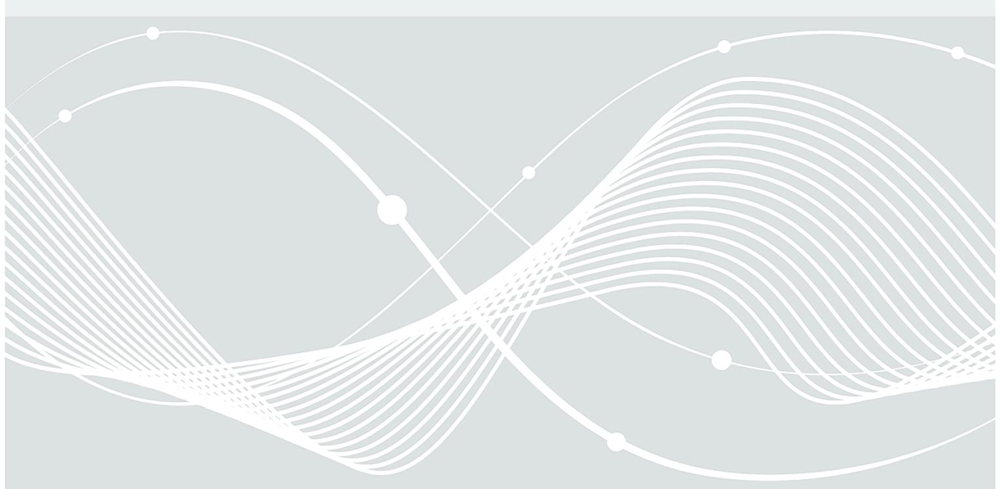
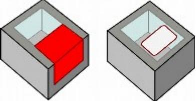
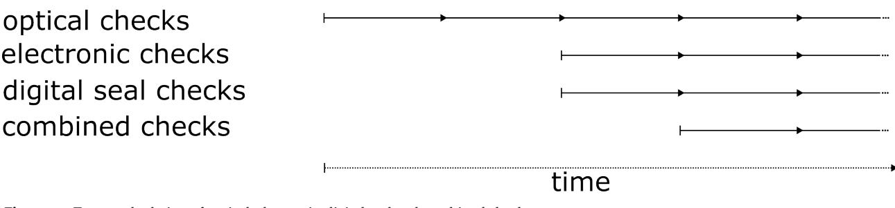
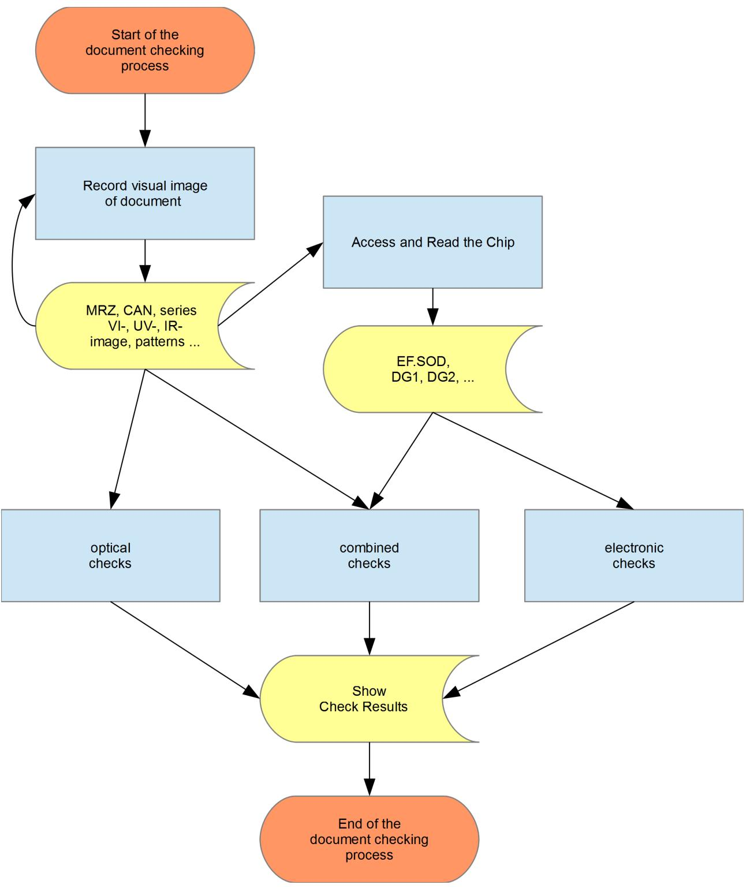
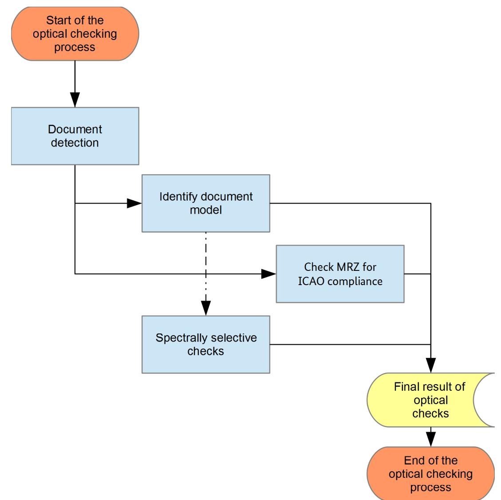
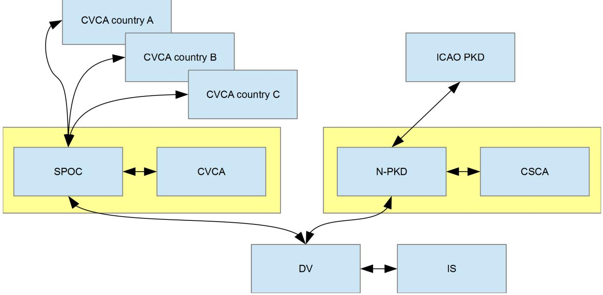
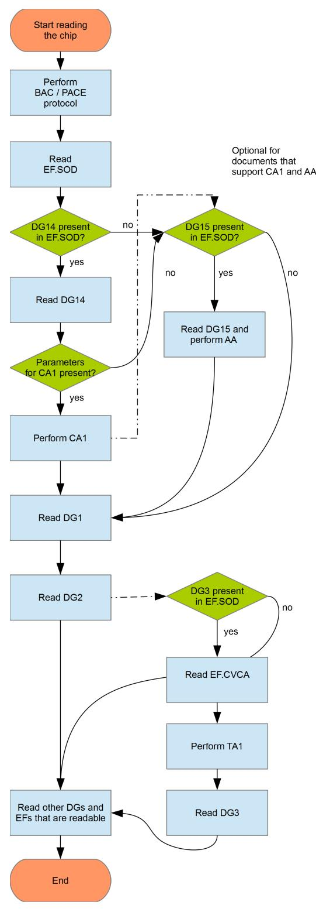
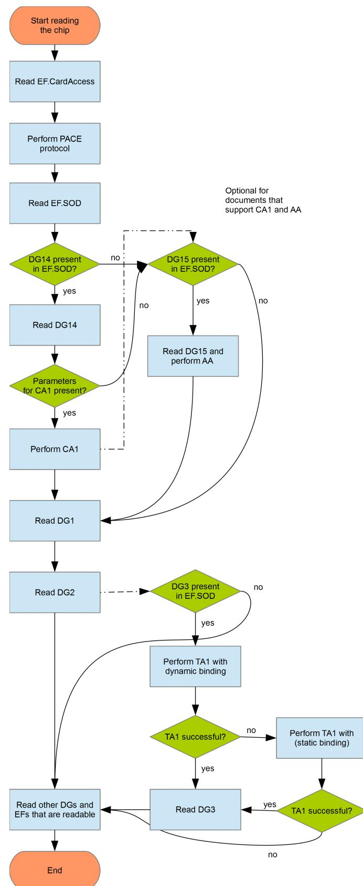
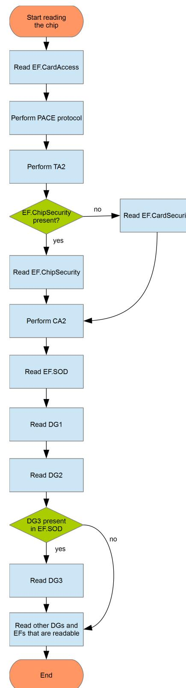
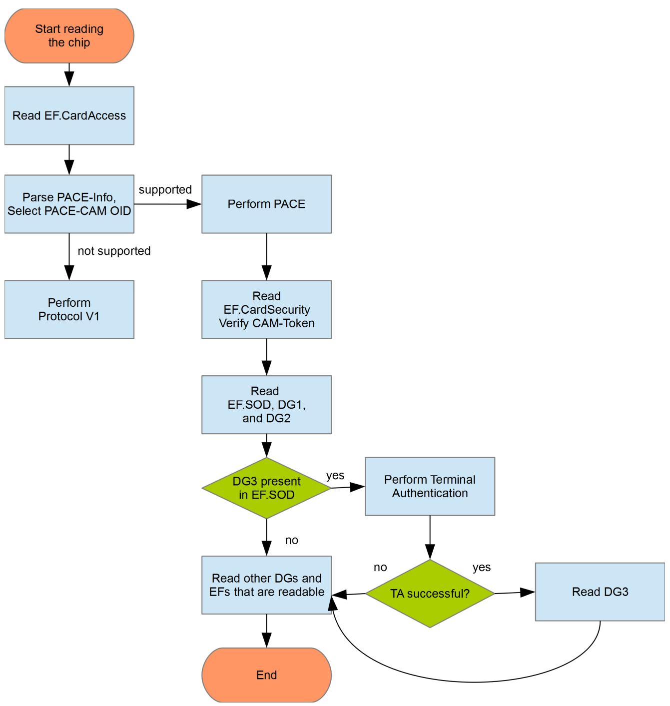

BSI Technical Guideline TR-03135-1

# Machine Authentication of MRTDs for Public Sector Applications

Part 1: Overview and Functional Requirements

Version 2.5

Federal Office for Information Security P.O. Box 20 03 63 53133 Bonn E-Mail: tr-03135@bsi.bund.de Internet: https://www.bsi.bund.de © Federal Office for Information Security

| 1.   | Changelog                                  | 1  |
|------|-----------------------------------------------|----|
| 1.1. | Changelog 2.5 Part 1                       | 1  |
| 2.   | Introduction                               | 2  |
| 2.1. | Structure of the Technical Guideline       | 2  |
| 2.2. | Technical terms                            | 2  |
| 2.3. | Terminology                                | 2  |
| 3.   | Overview                                   | 3  |
| 3.1. | MRTD features                              | 3  |
| 3.2. | Document reader component                  | 3  |
| 3.3. | Inspection Application                     | 3  |
| 3.4. | Inspection System                          | 3  |
| 3.5. | Authentication processes and their result  | 3  |
| 3.6. | Different types of checks                  | 6  |
| 3.7. | Operational profiling                      | 6  |
| 4.   | Reader requirements                        | 8  |
| 4.1. | Technical requirements                     | 8  |
| 4.2. | Performance capabilities                   | 9  |
|      |                                               |    |
| 5.   | Authentication of MRTDs                    | 10 |
| 5.1. | Process sequence of checking an MRTD       | 10 |
| 5.2. | Visualization of check results             | 12 |
| 5.3. | Error codes                                | 13 |
| 5.4. | Overall document check result              | 13 |
| 5.5. | Optical checks of MRTDs                    | 14 |
| 5.6. | Electronic checks of electronic MRTDs      | 25 |
| 5.7. | Combined checks                            | 46 |
| 5.8. | Handling and interpretation of defects     | 51 |
| 5.9. | Digital Seal Checks                        | 54 |
| 6.   | Logging scheme for operational monitoring  | 63 |
| 6.1. | Use cases                                  | 63 |
| 6.2. | XML schemas                                | 63 |
| 6.3. | Logging profiling                          | 64 |
| 7.   | Conformity                                 | 65 |
|      | List of Abbreviations                      | 66 |

# **List of Figures**

| 4.1. | Example on how to place a passport and an ID card on a typical document reader                           | 8  |
|------|-------------------------------------------------------------------------------------------------------------|----|
| 4.2. | Temporal relation of optical, electronic, digital seal and combined checks                               | 9  |
| 5.1. | Process sequence of checking MRTDs                                                                       | 11 |
| 5.2. | Example sequence of optical checks of MRTDs                                                              | 15 |
| 5.3. | Schematic representation of the architecture IS <-> DV <-> N-PKD <-> CSCA resp. DV <-> SPOC <-> CVCA  | 26 |
| 5.4. | Protocol Sequence 1, performing BAC or PACE                                                              | 28 |
| 5.5. | Protocol Sequence 2, performing PACE, CA1 or AA                                                          | 30 |
| 5.6. | Protocol Sequence 3, performing PACE, TA2, CA2                                                           | 32 |
| 5.7. | Protocol Sequence 4, support of PACE-CAM                                                                 | 33 |

# **1. Changelog**

The following tables present the changes introduced between the latest versions of this Technical Guideline. The changelog lists the changes grouped per part of this Technical Guideline, element (section, table, fi gure) and type of change, refer to [\[KeepAChangelog\]:](#page-71-1)

- **•** *Added* for new features
- **•** *Changed* for changes in existing functionality
- **•** *Deprecated* for soon-to-be removed features
- **•** *Removed* for now removed features
- **•** *Fixed* for any bug fixes
- **•** *Security* in case of vulnerabilities

# **1.1. Changelog 2.5 Part 1**

| Element Name                                  | Type of Change | Change Description                                                         |
|-----------------------------------------------|-------------------|----------------------------------------------------------------------------|
| Chapter Authentication of MRTDs            | Added             | New section "Digital Seal Checks" to support the checking of digital seals |
| Chapter Authentication of MRTDs            | Added             | New combined checks related to digital seals                               |
| Logging scheme for ope rational monitoring | Changed           | Updated schema versions                                                    |
| Logging scheme for ope rational monitoring | Added             | New dcs schema                                                             |

**Table 1.1** Changelog BSI TR-03135, Part 1

# **2. Introduction**

[Machine Readable Travel Documents \(MRTDs\)](#page-69-1) usually feature a standardized [Machine Readable Zone \(MRZ\)](#page-69-2) with biographic data and an electronic chip. In addition to typical textual areas on [MRTDs](#page-69-1), many documents also feature special optical/physical properties which can only be recognized and evaluated by record ing equipment. These properties are intended as an additional indicator for the authenticity of a document or they can be used for establishing a link between the document and its owner. Besides these features, inte grated chip contains information that is printed on the document, e. g. name, date of birth, but also biometric characteristics and cryptographic material that ensures that a given document was issued by an official entity and was not altered, cloned or forged.

The German Federal Office for Information Security ([Bundesamt für Sicherheit in der Informationstechnik](#page-69-3) [\(BSI\)](#page-69-3)) composed [\[BSI TR-03135\]](#page-71-2) (TR : Technische Richtlinie, German for Technical Guideline) in collaboration with the Federal Criminal Police Office [\(Bundeskriminalamt \(BKA\)\)](#page-69-4), the Federal Police ([Bundespolizei \(BPOL\)\)](#page-69-5), and the Federal Office of Administration ([Bundesverwaltungsamt \(BVA\)\)](#page-69-6).

This [Technical Guideline \(TR\)](#page-69-7) defines requirements for document inspection using sys tems and a normative description of the necessary procedures that are required for an exhaustive check of (electronic) machine readable identity and travel documents, to acknowledge that a checked [MRTD](#page-69-1) is au thentic, of integrity, and valid.

# **2.1. Structure of the Technical Guideline**

[Chapter 3](#page-6-6) describes the basic architecture of document inspection environments. Requirements for do cument readers are described in [Chapter 4](#page-11-3), while the coverage of such checks are specified in [Chapter 5](#page-13-2). [Chapter 6](#page-66-3) specifies the contents and the logging format of the document checking process. Conformance requirements are described in [Chapter 7.](#page-68-1)

# **2.2. Technical terms**

To improve the reading experience terms are abbreviated. The abbreviations are explained in the [glossary](#page-69-0).

# **2.3. Terminology**

Keywords used within in this document are to be interpreted as described in [\[RFC2119\].](#page-71-3)

# **3. Overview**

In the following paragraphs some basic introduction is given. It is recommended to have a look into "Machine Readable Travel Documents" [\[ICAO9303\]](#page-71-4) and "Best Practice Operational Guidelines for Automated Border Control (ABC) Systems" [\[FRONTEX\].](#page-71-5) For Identity Documents the Technical Guidelines [\[BSI TR-03127\]](#page-71-6) and [\[BSI TR-03110\]](#page-71-7) are recommended as additional reading.

# **3.1. MRTD features**

This Technical Guideline assumes that [MRTDs](#page-69-1) are equipped with a combination of

- **•** optical/physical and
- **•** electronic (digital)

features, which can be processed by machines. These are recorded some kind of document reader and pro cessed in an Inspection Application. Internationally formalized and standardized document features are spe cified in [\[ICAO9303\]](#page-71-4) for [MRTDs.](#page-69-1) In addition to standardized features, many documents also contain specific information and features which can also be used as an indicator for the authenticity and integrity of a specific [MRTD](#page-69-1). They can be cataloged, so software can rely on such information to perform a complete and reliable document authentication.

Not all features of a document have to be checked or can be checked. The scope of the check is dependant on the operational scenario, the document type and the equipment used to read and analyze the features. It is RECOMMENDED to specify mandatory checks in a profiling document with respect to this Technical Guideline.

### **3.2. Document reader component**

The document reader component, also called document reader, records the features of a given [MRTD accord](#page-69-1) ing to its type. It transmits the collected records to an Inspection Application for further processing.

# **3.3. Inspection Application**

In this Technical Guideline, the Inspection Application controls the reading process of the document reader (component) and processes the information obtained from a [MRTD](#page-69-1) depending on the profile and the type of document. The Inspection Application is able to configure the document reader (component) according to the operational requirements and type of the document to read. It actively monitors and controls the steps needed to exhaustively read and process a given travel document and its features.

# **3.4. Inspection System**

The Inspection System comprises of the Application and all background information systems in volved in the execution of a document check.

# **3.5. Authentication processes and their result**

In the context of this Technical Guideline the main focus is to determine if a given travel document is

- **•** authentic (i. e. genuine, originating from the issuer)
- **•** of integrity (without any manipulation) and

**•** valid (e. g. not expired, not reported as lost or stolen, not a fantasy document)

These checks can be applied to the entire document or just partial areas of the [MRTD and refer to the docu](#page-69-1) ment's optical/physical or its electronic features. An individual check consists of a well-defined checking pro cess. Examples for checking processes are:

- **•** Check if a given document can be read in near-infrared light ([infrared \(IR\)\)](#page-69-8) wavelength range ~900 nm.
- **•** Check if there are defined patterns that become visible or invisible under exposure by a certain light source.
- **•** Check the validity of a document (e. g. via the [MRZ](#page-69-2)'s date of expiry).
- **•** Perform a query to background systems regarding the data of the [MRZ](#page-69-2) to determine if the document is marked as lost or stolen.
- **•** Calculate the checksums of the data groups read from the chip to confirm its integrity.
- **•** Check the digitally signed checksum in the chip to prove integrity.
- **•** Do a plausibility cross-check between the optical values (e. g. [MRZ](#page-69-2)) and the corresponding values in the chip (e. g. DG1).

An individual checking process SHALL always lead to a well-defined and verifiable result. As such, an indivi dual checking process is either processed

**completely** according to its algorithm until it is terminated and delivers a well-defined check result

or

**is aborted** ahead of schedule and does not deliver a meaningful check result.

The amount of checking processes performed depends on the operational scenario defined by the profiling and the work-units specified therein which are prescribed as a complete check.

At the end of the checking processes, all individual checks are assorted to intermediate results and an overall check result for each category to build a final assessment.

### **3.5.1. The MRTD Checking Process**

Within this document, the organized and oriented sequence of a check is formally defined as checking pro cess. This sequence defines what is to be recorded, measured and controlled as part of its check and which results a process can return.

Remark: In this Technical Guideline, the checking process is just a formally variable and does not define how a check is technically implemented in hard- or software. The description of the technical design and imple mentation of a checking process, its in- and output values are out of scope.

A checking process P formally describes the sequence of causal dependence state transitions at times t1, ..., ti , ti+1 , ...., tE , i. e. the sequence of the checking events from the start t1 to the end tE. Here, a checking process is a series of deterministic state transitions Zi → Zi+1 from state Zi to state Zi+1, whereas each state depends on previous states and is explicitly derived by them.

A checking process can only be in one of the following global states:

#### 1. **Initiated**

The checking process has not started yet, there has been no activity. The process is in the state Z{} , the so called idle state.

#### 2. **Running**

At time i, the checking process is in the state Zi and is being performed at this time.

#### 3. **Terminated**

The checking process was performed until the deterministic end (time E) of its life cycle with final state ZE having been reached. It delivers a sound result that can be used to rate a given document and its checked feature(s).

#### 4. **Aborted**

The checking process was aborted prior to its defined end at time X of the life cycle with state ZX. The che cking process was not able to finish correctly and thus does not deliver a complete result[1](#page-8-0) . It is RECOM MENDED that an error code and a short description is provided.

The result of a process terminated at time E and state ZE SHALL be used for determining the authenticity, integrity and validity. Errors during the operation, hardware, software or handling errors can cause a prema ture abortion of the process in a state ZX at time X (i.e. aborted). In order to ensure constant checking quality, only check results arising from a terminated process (terminated at time E and state ZE) SHALL be used as a check result. The information of any other state (notably state aborted) MAY only be documented and used in some kind of operational monitoring; these values, however, SHALL NOT form a basis for any reasonable check result.

Only the result of a terminated process (terminated at time E and state ZE) SHALL be input for another basic checking process or any final result.

#### **3.5.2. Check results**

A check does not necessarily have to be a verification of the features, it can also successful implementa tion of communication and access protocols an Inspection Application may perform on a specific document (e. g. such as [Basic Access Control \(BAC\),](#page-69-9) [Password Authenticated Connection Establishment \(PACE\)](#page-69-10) or TA)[2](#page-8-1) .

The result of a checking process has exactly one of the following results:

1. *Successful*

The check **terminated**, the feature of the document to be checked successfully passed the check, i.e. a specific check was able to be applied to the document and assessed according to its specifications

2. *Failed*

The check **terminated**, the feature of the document to be checked did not successfully pass the check; in other words the applied check failed on the feature. The document SHOULD be subject to a further (manual) check for authenticity, integrity and validity

3. *Undetermined*

The check **terminated**, it was not possible to determine if the feature to be checked is authentic, of integrity or is valid. The document SHOULD be subject to a further (manual) check.

4. *Not supported*

The check **terminated**, but the specific document does not support the features to be checked (for example, a document without a chip, a document which does not have specific security features per definition, a specific protocol was not supported by a chip etc.)

The final result SHALL be given according to one of the values prescribed above. Besides the check result, further information MAY also be attached. The result can then be used together with its attached information in further checks.

1 Aborted occurs due to an error while executing the check process and has nothing to do with a check result.For example, if the [MRTD](#page-69-1) was removed too early, before it was completely read and checked, or if an light source is damaged, the scanner sensor does not work properly, the [radio-frequency identification \(RFID\)](#page-69-11) near field could not be established .

2 Any failure or missing support of a specific protocol lead to some initial suspicion that the given [MRTD](#page-69-1) might fail further authenticity, inte grity and validity checks. For example, if a specific document should support a specific communication protocol according to its specification, but does not. That indicates that the checked [MRTD](#page-69-1) might be manipulated and is not trustworthy.

Otherwise the check must be **aborted** and there is no meaningful result with regard to the intended document check. In those cases, the following check result shall be used:

1. *Aborted*

The check aborted prior to its defined process flow. Obtained check information and results SHOULD NOT be used as proper document check indications.

# **3.6. Different types of checks**

Checks on [MRTDs](#page-69-1) can be divided into several categories, which are:

- **•** Optical checks: These checks perform optical inspection checks on physical security features placed on a given document type (e. g. special print design properties, brightening agents' free substrate, holograms etc.)
- **•** Electronic checks: These checks read and validate the electronic security features of the [RFID-](#page-69-11)chip (e. g. access control, integrity of data and authenticity of chips).
- **•** Digital seal checks: These checks concern digital seals printed on the document.
- **•** Combined checks: These checks do some sort of comparison on the basis of the preceding three checks (e. g. comparing the optically read [MRZ](#page-69-2) from the passport's page with DG1 stored in the chip, comparing the [MRZ](#page-69-2) with biographic data from the front page or DG1).

Typically, further checks are subsequently performed, for example:

- **•** Biometric checks: Checking the identity of the document owner based on biometric characteristics (e. g. facial image, fingerprint images) initially recorded when the official document was applied for. These are checked against the live data collected on site to verify that the current document holder is the one the document was issued for.
- **•** Requests into background systems: Automated requests to background information systems on the basis of the information featured on an [MRTD](#page-69-1) (e. g. checking data printed on the [MRZ](#page-69-2) or from DG1 with official databases like INPOL, SIS, VIS, RTP, etc.).

Although the owner's identity will be determined in a complete checking process, this Technical Guideline focuses on checking the document itself. The relation between the owner of an [MRTD](#page-69-1) and the document itself is often established by comparing biometric characteristics (the facial image or fingerprints) to the characte ristics stored in the electronic chip of the [Electronic Machine Readable Travel Document \(eMRTD\)](#page-69-12). Checking the biometric characteristics can also be performed manually or by using automated systems. More details and requirements for such checks and logging formats are defined in [\[BSI TR-03121\]](#page-71-8) and are not part of this Technical Guideline.

# **3.7. Operational profiling**

This Technical Guideline contains a number of checks that could be performed on [MRTDs.](#page-69-1) The requirements on how and what to check depends on the operational scenario and SHOULD be specified by the agency responsible for checking [MRTDs](#page-69-1). As such, all necessary checks and requirements SHOULD be defined in a profiling document[3](#page-9-2) referencing this Technical Guideline. Any restrictions, deviations and specific designs of the checks which were not implemented in accordance herein SHALL be concretized accordingly in the profiling.

Document checks as defined in this Technical Guideline can be:

- **• Mandatory (m)** i.e. SHALL always be performed and SHALL be included in the final result.
- **• Optional (o)** i.e MAY be implemented and performed. If they are implemented in a checking process, the results of the checks SHALL be included in the final result.

3 For example, the German implementation is given as Part 2 of this Technical Guideline.

**• Evaluatory (e)** i.e. SHALL NOT be included in the final result and are only documented log for sub sequent evaluations and operational monitoring.

Depending on the requirement and the profiling, all data obtained during an authentication process SHALL be stored according to the monitoring log-data format. Further information and details on this can be found in [Chapter 6.](#page-66-3)

# **4. Reader requirements**

# **4.1. Technical requirements**

#### **4.1.1. Document formats**

A full-page [MRTD](#page-69-1) document reader SHALL support the sizes and formats for [MRTDs](#page-69-1) specified in [\[ICAO9303\]](#page-71-4). This includes documents in the sizes TD-1, TD-2 and TD-3 as well as machine-readable visas in the MRV-A and MRV-B formats [1](#page-11-4) .

### **4.1.2. Reading the MRZ/CAN**

The document reader SHALL support automated reading of the [MRZ](#page-69-2) according to the definition in [\[ICAO9303\]](#page-71-4). If it is a full-page reader, it SHALL be able to record the image in the near-infrared light (B900 band, 900 +/- 50 nm) and SHOULD be able to read images in the visible wavelength range. More detailed in formation can be found in [\[ISO1831\].](#page-71-9)

A full-page reader SHALL also support the automated reading of the six-digit [Card Access Number \(CAN\)](#page-69-13) that can be found on some [eMRTDs](#page-69-12) or IDs.

It is RECOMMENDED that swipe-type document readers also support reading the [CAN](#page-69-13) in addition to the [MRZ](#page-69-2).

### **4.1.3. Applying and handling the document on a full-page reader**

[MRTDs](#page-69-1) SHALL be placed on a full-page reader such, that the personalized data page can be recorded optically without any interference.

The [MRZ](#page-69-2) or the [CAN](#page-69-13) are placed in the direction of the document reader. [Figure 4.1](#page-11-2) shows an example on how an electronic passport and an identity card SHOULD be placed on a full-page reader. In the following this will be called the end position of the document.

**Figure 4.1.** Example on how to place a passport and an ID card on a typical document reader

The document reader can digitize the data page of an [MRTD and then start further checking steps. It is RE](#page-69-1) COMMENDED that the electronic reading process should start as soon as the [MRZ](#page-69-2) or the [CAN](#page-69-13) is available. It is RECOMMENDED that digitized records of the extracted [MRZ](#page-69-2) or [CAN](#page-69-13) are available to the system in less than 5 seconds after the document is in the end position (see [Section 4.1.3\)](#page-11-5).

### **4.1.4. Communication requirements for the RF-reading module**

The [radio-frequency \(RF\)](#page-69-14)-reading module SHALL communicate with a semi-conductor device embedded in the [eMRTD](#page-69-12) using radio frequency energy that meets the requirements specified in [\[ISO14443-2\]](#page-71-10).

1 The document reader SHALL be able to process documents surrounded by a cover that exceeds the data page on all sides up to 5 mm. For example, this applies to old German passports or passports in a slipcover.

The document reader SHALL be able to read [eMRTDs](#page-69-12) with an electrically conductive shielding.

Reading the electronic data [2](#page-12-2) of an [eMRTD](#page-69-12) SHALL NOT take longer than 7 seconds on a reference [eMRTD](#page-69-12), using the minimal system requirements as specified by the vendor of the inspection system. The start time for measuring this requirement is the point in time when the document is in the end position (see [Section 4.1.3\)](#page-11-5) on the reader and all information needed to process the document [\(MRZ,](#page-69-2) [CAN\)](#page-69-13) is available to the inspection system.

#### **4.1.5. Host system interface**

If the Inspection System is partitioned in several components, such as document reader, [RF-reader, and In](#page-69-14) spection Application on a computing unit, the connection interfaces between components SHOULD pre ferably be used by means of common industry standards, e. g. [Universal Serial Bus \(USB\)](#page-70-0).

#### **4.1.6. Requirements for the optical reading component**

Images from the [MRTDs](#page-69-1) data page SHALL be optically recorded and digitized under near-infrared light (in the B900 band, cf. document specification according to [\[ISO1831\]\)](#page-71-9), under [Ultraviolet \(UV\)](#page-70-1) light of a wavelength of approx. 365 nm and under white light reflecting colors of the visible spectrum in roughly equal amounts.

Ambient light can have a significantly adverse effect on the quality of scanned records; thus it is RECOM MENDED to use a document reader which is insensitive to incoming ambient light or can be shielded.

The document Inspection Application SHALL provide all records of the data page in computer readable image file formats ([Portable Network Graphics \(PNG\)](#page-69-15) or [JPEG \(JPEG\)\)](#page-69-16) with an image resolution of at least 385 [Pi](#page-69-17) [xels Per Inch \(PPI\)](#page-69-17)[3](#page-12-3) , in the sense of scale mapping the sensor size to the document size. For [JPEG](#page-69-16), the ope rator SHALL be able to configure the encoding for different compression factors and quality settings, see [\[ISO10918-1\].](#page-71-11)

### **4.2. Performance capabilities**

It is RECOMMENDED to minimize the total duration of the document inspection without reducing the quality of the result. Each inspection step SHOULD be executed as soon as the input data, which is mandatory for the step is available to the inspection system[4](#page-12-4) . By passing the [MRZ/](#page-69-2)[CAN](#page-69-13) data to the electronic check component of the inspection system at an early stage, the total time of the inspection could be reduced, since the electronic and optical check component can perform their checks simultaenously. The following diagram ( [Figure 4.2\)](#page-12-1) illustrates the temporal relation between the optical, electronic, digital seal and combined inspection of the document.

**Figure 4.2.** Temporal relation of optical, electronic, digital seal and combined checks

2 At least the data groups EF.COM, EF.SOD, DG1 and DG2.

3 A resolution of 600 [PPI](#page-69-17) is RECOMMENDED.

4 For example a digitized [MRZ](#page-69-2) or [CAN](#page-69-13) to access the chip.

# **5. Authentication of MRTDs**

# **5.1. Process sequence of checking an MRTD**

The following process steps are usually performed when checking [MRTDs:](#page-69-1)

- **•** Reading the document optically
- **•** Checking the recorded features
- **•** Reading the document electronically
- **•** Checking the electronic features
- **•** Performing combined checks

It is RECOMMENDED to follow the process sequence shown in [Figure 5.1](#page-14-0):

#### **Figure 5.1.** Process sequence of checking MRTDs

The process starts with reading the optical/physical features of an [MRTD](#page-69-1). Depending on the operational sce nario, the optical images of the data page and the [MRZ](#page-69-2) or the [CAN](#page-69-13) is read [1](#page-14-1) . Based on this data, a logical check (e. g. checking the validity of the document) as well as a check of the optical/physical security features

1 Depending on the document, several pages (e. g. data page and visa page) can be checked assorted to one result. Checking docu ments within one transaction is considered as to be several individual checks.

(including digital seals) of the document are performed. [Section 5.5](#page-17-0) specifies the optical checks on [MRTDs](#page-69-1). [Section 5.9](#page-57-1) specifies the digital seal checks on [MRTDs.](#page-69-1)

Reading the document electronically can be started as soon as the [MRZ](#page-69-2) or the [CAN](#page-69-13) of the document is available and a [RF](#page-69-14) chip is identified. The architecture and procedure required for reading [eMRTDs](#page-69-12) electronically is specified in [Section 5.6](#page-28-0).

Combined checks SHOULD be performed as soon as the data required for such checks are available, see [Sec](#page-49-1) [tion 5.7.](#page-49-1)

# **5.2. Visualization of check results**

Inspection Applications SHALL be able to provide the results of an individual check with reduced level de tail. It is RECOMMENDED to map the possible result values (defined in [Section 3.5.2\)](#page-8-2) according to [Table 5.1](#page-15-1). The mapping utilizes traffic light color symbolism.

| Result of the check | Traffic light color |
|---------------------|---------------------|
| successful          | green               |
| failed              | red                 |
| undetermined        | yellow              |
| not supported       | grey                |
| aborted             | grey                |

**Table 5.1** Assigning the results of checks using traffic light color symbolism

Another form of visualization and a higher level of detail SHOULD be possible if they are obvious due to the profiling or desired by the operator. It is RECOMMENDED to visualize the results of the following partial checks hierarchically:

- **•** Results of optical checks, see section [Section 5.5](#page-17-0)
	- **•** Document detection and capturing see [Section 5.5.2](#page-22-0)
	- **•** Check [MRZ](#page-69-2) for [International Civil Aviation Organization \(ICAO\)](#page-69-18) compliance see [Section 5.5.4.1](#page-23-0)
	- **•** Spectrally selective verification see [Section 5.5.4.2](#page-24-0)
- **•** Results of electronic checks see [Section 5.6](#page-28-0)
	- **•** Chip access protocols see [Section 5.6.3](#page-37-0)
	- **•** Checking chip authenticity [\(Active Authentication \(AA\),](#page-69-19) [Chip Authentication \(CA\),](#page-69-20) PACE-CAM) see [Section 5.6.4.1](#page-39-0)
	- **•** Verification of the security objects see [Section 5.6.4.2.1](#page-41-0)
	- **•** Checking issuer certificates see [Section 5.6.4.3](#page-43-0)
	- **•** Integrity of chip contents see [Section 5.6.4.4](#page-47-0)
	- **•** Comparison of the issuing state (EF.DG1 and [Document Signer \(DS\)](#page-69-21) certificate) see [Section 5.6.4.5](#page-48-0)
- **•** Combined checks see section [Section 5.7](#page-49-1)
- **•** Checking the expiration of the documents see [Section 5.7.1](#page-49-2)
- **•** Checking the optical biographic data against the electronic biographic data see [Section 5.7.2](#page-50-0)
- **•** Checks across document pages see [Section 5.7.3](#page-51-0)
- **•** Checks across several documents see [Section 5.7.4](#page-51-1)
- **•** Comparison of the personalization contents see [Section 5.7.5](#page-52-0)
- **•** Checking EF.DG2 against the facial image from the [Visual Zone \(VIZ\)](#page-70-2) see [Section 5.7.6](#page-53-0)
- **•** Comparing the printed MRZ against the MRZ inside the digital seal see [Section 5.7.7](#page-53-1)
- **•** Digital seal checks see [Section 5.9](#page-57-1)
	- **•** Readability (see [Section 5.9.1.1](#page-58-0))
	- **•** Integrity (see [Section 5.9.1.2\)](#page-59-0)
	- **•** Certificates (see [Section 5.9.1.3](#page-61-0))
	- **•** Authenticity (see [Section 5.9.1.4](#page-63-0))
	- **•** Country (see [Section 5.9.1.5](#page-64-0))

# **5.3. Error codes**

Each of the checks prescribed in [Section 5.5](#page-17-0), [Section 5.6,](#page-28-0) [Section 5.9](#page-57-1) and [Section 5.7](#page-49-1) SHOULD log pro cessing errors using numeric integer error codes. Each error SHALL distinguish between the class of a check (i. e. Optical checks, Electronic checks, Digital Seal checks and Combined checks).

For each defined error code in each class, the Inspection Application SHOULD also provide a short and concise error description that facilitates a subsequent analysis regarding the error. Examples of errors are program crashes, improper use and hardware failures. Errors may result in an abortion of the defined checking process.

Vendor-specific error codes SHALL be defined in the integer range of 1.000 – 999.999, error codes beyond that range are reserved for use by this Technical Guideline and are subject to be defined in the profiling document.

No error code SHALL mean that no error occurred and that a process was performed successfully. The error code value can be set to a NULL or VOID value.

# **5.4. Overall document check result**

Checks from [Section 5.5](#page-17-0), [Section 5.6](#page-28-0), [Section 5.9](#page-57-1) and [Section 5.7](#page-49-1) can be combined into an overall do cument check result. The aggregation into a single result is Inspection Application specific. The this overall document result check SHALL be mapped according to [Table 5.2.](#page-16-2)

| Result of the check | Description                                                                                                                                                                              |
|---------------------|------------------------------------------------------------------------------------------------------------------------------------------------------------------------------------------|
| successful          | The check result SHALL be set to successful if all assorted overall higher-level checks from Section 5.5, Section 5.6, Section 5.9 and Section 5.7 are successful.           |
| failed              | The check result SHALL be set to failed if at least one of the assorted higher-level checks from Section 5.5, Section 5.6, Section 5.9 and Section 5.7 was set to failed. |
| undetermined        | The check result can be undetermined depending on a Inspection Application's specific as sessment.                                                                                    |
| not supported       | The check result can be not supported depending on a Inspection Application's specific as sessment.                                                                                   |

| Result of the check | Description                                                                                                                                                                         |
|---------------------|-------------------------------------------------------------------------------------------------------------------------------------------------------------------------------------|
| aborted             | The check result SHALL be set to aborted if at least one of the assorted higher-level checks from Section 5.5, Section 5.6, Section 5.9 and Section 5.7 was aborted. |

**Table 5.2** Overall Document Check Result

# **5.5. Optical checks of MRTDs**

In the following sections optical checks are explained in more detail. The number of optical checks to perform depends on the operational scenario and individual document models, thus should be defined in a pro filing document.

### **5.5.1. Introduction to spectrally selective checks**

In this section, a base set of optical checks is described which is required for further checks. The main focus of these checks are spectrally selective check routines.

The sequence of optical checks is given in [Figure 5.2.](#page-18-0) Regarding this sequence the model identification (see section [Section 5.5.2](#page-22-0) and [Section 5.5.3](#page-22-1)) and checking the [MRZ](#page-69-2) consistency (see section [Section 5.5.4.1\)](#page-23-0) SHALL be performed for all documents, whereas most of the spectrally selective checks can only be performed after the document model was identified successfully.

**Figure 5.2.** Example sequence of optical checks of MRTDs

#### **5.5.1.1. Document model**

Each [MRTD](#page-69-1) can be assigned to a document model (sometimes also called document series). A document model is defined by means of the country code (**C**), document type (**T**), a distinct identification number (**N**), a year value (**Y**) and a PRADO code identifier (**P**):

Document Model := ( **C, T, N, Y, P** )

The country code **C** SHALL be a a three-letter code according to [\[ICAO9303\]](#page-71-4).

The first digit of the document type **T** is specified in [\[ICAO9303\]](#page-71-4).

The identification number **N** SHALL be a distinct chronological increasing integer number starting with 1.

The year **Y** refers to the year as an integer value if the year is unknown this value SHALL be omitted.

The value for **P** represents the [PRADO] code identifier. If there is no known PRADO code, this value SHALL be omitted.

#### **5.5.1.2. Spectrally selective checks**

The term "spectrally selective checks" covers checks, that record different reactions occurring on a document illuminated with visual (**VI**, white light) or non-visual (**UV** , **IR**) illumination. Based on the three records (**VI**, **UV**, **IR**), the absorbent, reflective or luminescent features of these reactions can be checked. Examples for checks are the [MRZ](#page-69-2) [IR](#page-69-8) readability, the [VIZ](#page-70-2) [IR](#page-69-8) readability, the UV brightness test and sample verifications in all images. With a few exceptions these checks can only be defined for a specific model of documents. Hence a check database is required to assist the checking process. Such a database contains model-specific spectrally selective check information about known documents. The actual characteristics of a spectrally selective check routine depend on the vendor of the inspection system.

For vendor-independent comparability check results, generic designations are necessary and will be specified in the following paragraphs. Basic check routines are individual check routines which refer to an individual feature (for example, the [IR](#page-69-8) absorption). Composite check routines are defined as logical combinations of basic check routines. Thus, an enhanced characteristic can be checked with respect to several features, such as [IR](#page-69-8) absorption and visibility in the VI.

For the check routines, the following abbreviated definitions are used:

#### **(XX, YY, ZZ)**

**XX** specifies the light source of the record on which the check routine is performed:

- **• IR** infrared light
- **• UV** ultraviolet light
- **• VI** visible (white) light

**YY** specifies the optical property of the characteristic:

- **• AB** absorbent
- **• BR** bright
- **• FR** spatial frequency property
- **• LU** luminescent
- **• TL** translucent
- **• TR** transparent

**ZZ** specifies the characteristic feature of or the position in the document [2](#page-19-0) :

- **• FI** fibres
- **• FU** full (complete) data paget
- **• IS** printed feature, which already exists on the substrate (Ink static)
- **• MR** area of the machine readable zone ([MRZ\)](#page-69-2)
- **• OM** overprinted [MRZ](#page-69-2)
- **• CA** Card Access Number ([CAN\)](#page-69-13)
- **• PD** personalized "dynamic" perforation
- **• PS** perforation which shows "static" content
- **• PH** area of the photo
- **• SP** area of the secondary photo
- **• OP** overprinted photo
- **• TH** security thread
- **• VZ** visual inspection zone (VIZ)

2 Within this nomenclature, model-specific (also document-independent) features are referred to as "static" and document-specific (individu al/personalized) features are referred to as "dynamic".

- **• WM** watermark
- **• ID** any other personalized, "dynamic" feature (ink dynamic), e. g. a secondary photograph
- **• AF** any additional feature that cannot be attributed to the items specified above

The vendor SHALL assign a unique identifier (UUID according to [\[RFC4122\]](#page-72-0)) for each generic check. For ex ample, **(IR, AB, MR)** can be assigned to UUID f81d4fae-7dec-11d0-a765- 00a0c91e6bf6 by the vendor.

The following representation provides an overview of the generic basic check routine methodology. For this purpose, the three parts of description these check routines – light source, optical property cha racteristic, feature – are provided in the form of a table. The line, column and content of a cell represent the generic routine. The list might not be complete if check routines are missing, they can be added in accordance with the operator while following the format **(XX, YY, ZZ)** as specified above (the same applies for composite check routines).

Vendor- and model-specific check routines SHALL be classified and logged according to the schema given in [Table 5.3](#page-20-0)

Properties or features of counterfeits SHOULD be incorporated by inverting the logic of check routines: e. g. a specific configuration of imitated security fibres by printing SHOULD be checked for absence of this pattern (i. e. VI, TR, IS).

| Feature / Area (ZZ)                    |    | Light Source (XX)    |                      |                      |
|----------------------------------------|----|----------------------|----------------------|----------------------|
|                                        |    | VI                   | UV                   | IR                   |
| Fibers                                 | FI |                      | LU                   |                      |
| Full data page                         | FU |                      | BR                   |                      |
| Static printed feature                 | IS | {AB, TR}             | LU                   | {AB, TR, TL}         |
| MRZ                                    | MR | AB                   | BR                   | AB                   |
| Overprinted MRZ                        | OM |                      | LU                   |                      |
| CAN                                    | CA | AB                   |                      | AB                   |
| Personalized perforati on (dynamic) | PD | AB                   | LU                   | AB                   |
| Perforation of the sub strate       | PS | AB                   | LU                   | AB                   |
| Photo                                  | PH | {AB, FR}             | {BR, FR}             | {AB, FR, TR}         |
| Secondary Photo                        | SP | {AB, TR}             | LU                   | {AB, TR}             |
| Overprinted photo                      | OP |                      | LU                   |                      |
| Security thread                        | TH | TR                   | LU                   | AB                   |
| Visual Inspection Zone (VIZ)        | VZ |                      | BR                   |                      |
| Watermark                              | WM |                      |                      | AB                   |
| Personalized dynamic feature        | ID | {AB, TR}             | LU                   | {AB, TR}             |
| Additional feature                     | AF | {AB, BR, LU, TL, TR} | {AB, BR, LU, TL, TR} | {AB, BR, LU, TL, TR} |

**Table 5.3** Representation of the generic basic check routines

In addition, there can be the following composite check routines:

**• (IR, AB, TH)** in combination with **(VI, TR, TH)**: Check that a thread visible under [IR](#page-69-8) light is invisible under white light.

- **• (IR, TR, ID)** in combination with **(VI, AB, ID)**: Check that the ink of the dynamic print image absorbent under white light is transparent under [IR](#page-69-8) light.
- **• (IR, TR, IS)** in combination with **(IR, AB, IS)**: Check that some parts of the static print image are absorbent under [IR](#page-69-8) light, whereas other parts of the characteristics are transparent.
- **• (IR, TR, IS)** in combination with **(VI, AB, IS):** Check that the ink of the static print image absorbent under white light is transparent under [IR](#page-69-8) light.
- **• (IR, TR, IS)** in combination with **(VI, AB, IS)** and **(IR, AB, ID)**: Check that the ink of the static print image absorbent under white light is transparent under [IR](#page-69-8) light and a dynamically printed characteristic becomes visible in the same position under [IR](#page-69-8) light.

#### **5.5.1.3. Catalog for spectrally selective checks**

Further information on the spectrally selective checks might be required by operator for evaluation pur poses and to update the underlying database to assure consistent and high quality authentication results over time. This information is the same for all documents of a specific document model, example, textual ex planations on the check routines, the image section from the reference database etc.

The vendor SHALL supply a catalog in machine readable form according to the defined XML schema of this Technical Guideline which summarizes all necessary information on the spectrally selective verification checks. Due to the format, the catalog can be integrated into the evaluation of the results.

In addition, the catalog SHALL include following information on each generic check routine of a docu ment model:

- **•** UUID of the check routine: This value specifies the unique id for the check.
- **•** Generic check identifier: This attribute contains the generic check routine specification name, e. g. **(UV, BR, VZ)**.
- **•** Proprietary check: This attribute contains a vendor-specific name of the spectrally selective check routine (e. g. according to the entry in the check database).
- **•** Description: This attribute contains a textual description of the check routine performed and, in particular, an explanation of the differences in the checks with multiple applications of one and the same generic specification.
- **•** Maximal range: This attribute contains the upper limit of the range of values.
- **•** Minimal range: This attribute contains the lower limit of the range of values.
- **•** Threshold: This attribute contains the threshold configured for decision spectrally selective ve rification.
- **•** Limits:
	- **•** Bounding rectangle: The bounding rectangle for the checking area if it is not a region.
	- **•** Region: This element contains the description of an alternative geometric check region if a bounding rectangle is not applicable. The type description is freely definable by the vendor, the definition SHALL be disclosed to the operator.
- **•** Reference area: This element contains the image section of the reference image region checked against the corresponding database.

For composite generic check routines, the function of which the decision is taken (so-called decision function) SHALL be specified. Any proprietary decision function SHALL be described by the vendor and disclosed to the operator. If it is not possible to describe the decision function technically, its functioning SHALL described to be comprehensible.

The catalog SHALL list all test configurations. The test configurations assort the checks into check groups and include decision functions for the given document models. The checks for a specific model SHALL be conducted according to the configuration given in the catalog. For each configuration an unique identifier (UUID according to [\[RFC4122\]](#page-72-0)) SHALL be assigned. Multiple configurations can exist for a given document model. The choice of a configuration is vendor specific.

All information contained in this catalog should be treated a confidential manner and SHALL NOT dis closed without the consent of the vendor.

#### **5.5.2. Document detection and capturing**

The correct placement of a document on the reader, as well as the detection and capturing of that document is crucial for all following steps. The inspection system SHALL provide mechanisms for automatic and manual triggering of document detection. Manual triggering is required if automatic document detection does not work properly.

Image capturing SHOULD start automatically after the complete personal data page has been placed on the capturing surface. The firm- or software SHALL be able to compensate potential rotation and realign the image automatically and SHALL crop the captured data page accordingly for further processing.

The presence of a document SHALL be detected only by using its optical properties. The detection process SHALL still be carried out optically, even if an expected chip is absent or malfunctioning.

The result of the document model detection SHALL be mapped according to [Table 5.4.](#page-22-2)

| Result of the check | Description                                                                                                                                                         |
|---------------------|---------------------------------------------------------------------------------------------------------------------------------------------------------------------|
| successful          | The check result SHALL be set to successful if the document was placed correctly onto the reader and the process leads to a complete set of valid output images. |
| failed              | Detection failed, there might be no complete set of output images that can used for docu ment checks.                                                            |
| undetermined        | This value cannot occur here.                                                                                                                                       |
| not supported       | This value cannot occur here.                                                                                                                                       |
| aborted             | The checking process was aborted prior to its defined process flow. A handling,software, or other type of error occurred.                                        |

**Table 5.4** Result of document detection

### **5.5.3. Document model identification**

The correct detection of a document model is required for all further identification and verification steps. The inspection system SHALL provide mechanisms for automatic and manual triggering of document model identification. Manual selection SHALL be performed if the automatic document model identification fails. However, manual selection is not applicable in scenarios where the Inspection System is not operated by an officer, e. g. self-service or automated border control scenarios.

The result of the document model detection SHALL be mapped according to [Table 5.5.](#page-22-3)

| Result of the check | Description                                                                                                                               |  |
|---------------------|-------------------------------------------------------------------------------------------------------------------------------------------|--|
| successful          | Document model identification SHALL be set to successful if the document model could be classified as specified in Section 5.5.1.1. |  |
| failed              | The check SHALL be set to failed if identifying the document model was not possible.                                                      |  |
| undetermined        | The document identification process ended inconclusively.                                                                                 |  |
| not supported       | This value cannot occur here.                                                                                                             |  |
| aborted             | The checking process was aborted prior to its defined process flow. A handling, software, or other type of error occurred              |  |

**Table 5.5** Result of the document model identification

The following value SHALL be logged:

**•** Document Model: The identified document model shall be provided in the format as specified in the format from section [Section 5.5.1.1](#page-18-1), i.e. (C, T, N, Y, P).

### **5.5.4. Optical check result**

The final optical result includes the results of all individual checks that were performed and SHALL be mapped according to [Table 5.6](#page-23-1).

| Result of the check | Description                                                                                                                                                                                                                                                                                                                                                                             |
|---------------------|-----------------------------------------------------------------------------------------------------------------------------------------------------------------------------------------------------------------------------------------------------------------------------------------------------------------------------------------------------------------------------------------|
| successful          | The result of the check SHALL be set to successful if all checks prescribed in the subsections for the application scenario were successfully performed. The document does not show any optical/physical signs of falsification or any manipulations. The ICAO compliance check, see Section 5.5.4.1, may result in not supported, but this SHALL not affect the final result. |
| failed              | The result of the check SHALL be set to failed if at least one of the checks prescribed in the subsections for the application scenario was rated failed. The document deviates from the state and properties as supposed to be. It is suspected that the document has been manipula ted.                                                                                      |
| undetermined        | The optical checking process ended inconclusively.                                                                                                                                                                                                                                                                                                                                      |
| not supported       | The optical checking process could not be carried out for this document.                                                                                                                                                                                                                                                                                                                |
| aborted             | One of the individual checks was aborted due to an error.                                                                                                                                                                                                                                                                                                                               |

**Table 5.6** Final result of optical checks of MRTD

#### **5.5.4.1. Check MRZ for ICAO compliance**

The Inspection Application SHALL at least check for consistency of the [MRZ](#page-69-2) check digits referring to [\[ICAO9303\]](#page-71-4), but it is recommended to also check for the correct type face and [IR](#page-69-8) visibility of the [MRZ;](#page-69-2) The checks [Section 5.5.4.1.2](#page-24-1) and [Section 5.5.4.1.3](#page-24-2) are optional, but if the checks are performed, their result SHALL be aggregated into the final result.

The final result of this check SHALL be mapped according to [Table 5.7.](#page-23-2)

| Result of the check | Description                                                                                   |
|---------------------|-----------------------------------------------------------------------------------------------|
| successful          | The result of the check SHALL be set to successful if all checks were performed successfully. |
| failed              | The result of the check SHALL be set to failed if at least one of the checks failed.          |
| undetermined        | This value cannot occur here                                                                  |
| not supported       | The check SHALL be set to not supported if the document page does not have a MRZ.             |
| aborted             | Due to an error the checking process was aborted prior to its defined process flow.           |

**Table 5.7** Final result of checking the MRZ for ICAO compliance

#### **5.5.4.1.1. Check the MRZ's consistency**

The Inspection System SHALL check the consistency of the [MRZ](#page-69-2) check digits as defined in [\[ICAO9303\].](#page-71-4) If the consistency check fails, the Inspection Application SHALL present a dialog box for manual [MRZ](#page-69-2) correction.

| The result of the last check SHALL be mapped according to |  | Table 5.8 |
|-----------------------------------------------------------|--|-----------|
|-----------------------------------------------------------|--|-----------|

| Result of the check | Description                                                                                                    |
|---------------------|----------------------------------------------------------------------------------------------------------------|
| successful          | The result of the check SHALL be set to successful if all available check digits were calculated correctly. |
| failed              | The result of the check SHALL be set to failed if at least one digit calculation has an in correct result.  |
| undetermined        | This value cannot occur here                                                                                   |

| Result of the check | Description                                                                         |
|---------------------|-------------------------------------------------------------------------------------|
| not supported       | The check SHALL be set to not supported if the document page, does not have a MRZ3  |
| aborted             | Due to an error the checking process was aborted prior to its defined process flow. |

**Table 5.8** Result of checking the MRZ check digits consistency

#### **5.5.4.1.2. Check MRZ to be readable under [IR](#page-69-8) light**

The Inspection Application SHALL check whether the [MRZ](#page-69-2) is present under an [IR](#page-69-8) lighting source.

The result of this check SHALL be mapped according to [Table 5.9](#page-24-4).

| Result of the check | Description                                                                                              |
|---------------------|----------------------------------------------------------------------------------------------------------|
| successful          | The result of the check SHALL be set to successful if the MRZ is present under an IR lighting source. |
| failed              | The result of the check SHALL be set to failed if the MRZ is not present under an IR lighting source. |
| undetermined        | This value cannot occur here                                                                             |
| not supported       | The check SHALL be set to not supported if the document page does not have a MRZ.                        |
| aborted             | Due to an error the checking process was aborted prior to its defined process flow.                      |

**Table 5.9** Result of checking the MRZ to be readable under IR light.

#### **5.5.4.1.3. Check MRZ to be printed using OCR-B type face**

The Inspection Application SHOULD check whether the [MRZ](#page-69-2) was printed using OCR-B type face according to [\[ISO/IEC 30116:2016\].](#page-71-12)

The result of this check SHALL be mapped according to [Table 5.10.](#page-24-5)

| Result of the check | Description                                                                                            |
|---------------------|--------------------------------------------------------------------------------------------------------|
| successful          | The result of the check SHALL be set to successful if the MRZ was printed using a OCR-B ty pe face. |
| failed              | The result of the check SHALL be set to failed if the MRZ was not printed using a OCR-B type face.  |
| undetermined        | This value cannot occur here                                                                           |
| not supported       | The check SHALL be set to not supported if the document page, does not have a MRZ.                     |
| aborted             | Due to an error the checking process was aborted prior to its defined process flow.                    |

**Table 5.10** Result of checking the MRZ for OCR-B type face

#### **5.5.4.2. Spectrally selective verification**

Most [MRTDs](#page-69-1) can be checked regarding their authenticity by verifying spectrally selective security fea tures. The specific spectrally selective check routines being performed depend on the document model. One exception is (IR, AB, MR) (e. a. B900), which can be parametrized independently from a specific document model. With certain restrictions on accuracy, (UV, BR, FU) can also be performed without selecting a specific document model.

If it is not possible to determine a document model, at least the check (UV, BR, FU) SHALL be performed.

If the document model can be determined and properties are present, at least one check from each of the following sub-items SHOULD be performed:

3 This is, for example, the case for the German Identity Cards or German Residence Permit Cards on their front.

- **•** (IR, TR, ZZ): one check which investigates the complementary property "transparent under [IR](#page-69-8) light" com pared to (IR, AB, MR),
- **•** (UV, LU, ZZ): one check which investigates the complementary property "luminescent under UV

light" compared to (UV, BR, FU).

For this reason, using a dedicated database tailored to the specific check is RECOMMENDED in all cases. This database SHALL be updated regularly in order to reduce false acceptance and rejection rates. It is RECOM MENDED to specify and maintain the contents of the database together with the operator; in most cases, this includes:

- **•** Definition of model identifiers in order to differentiate the document models.
- **•** Definition of search areas and their contents as well as the checks based on them including thresholds and ranges of values.
- **•** Subsequent extension, correction and readjustment of the specified checks in order to be able to take into account any experience gained with respect to the variances in the features of authentic documents to be checked (e. g. regarding aging effects, traces of usage, variability in the production process).

The specified checks, as well their associated thresholds, proprietary decision functions, etc. SHALL be do cumented and disclosed by the vendor.

**Please note:** Individual spectrally selective checks (including composite checks) are organized into groups which contain the assigned basic checks. Groups of such checks are then aggregated into the final spectrally selective verification result. The following sections specify the levels of this hierarchical arrangement.

| Result of the check | Description                                                                                                                                                                                                                |
|---------------------|----------------------------------------------------------------------------------------------------------------------------------------------------------------------------------------------------------------------------|
| successful          | The result of the check SHALL be set to successful if a particular spectrally selective security feature to be checked for the given document was successfully tested by a decision function with a positive result. |
| failed              | The result of the check SHALL be set to failed if a particular spectrally selective check fails (the decision function has a negative result).                                                                          |
| undetermined        | Otherwise the result is undetermined.                                                                                                                                                                                      |
| not supported       | This value cannot occur here4                                                                                                                                                                                              |
| aborted             | Due to an error the check was aborted prior to its defined process flow.                                                                                                                                                   |

**Table 5.11** Result of a particular (spectrally selective) basic check

For each basic check routine, the following values SHALL be logged:

- **•** UUID of the check routine: This value specifies the unique id for the check.
- **•** Generic check identifier: This attribute contains the generic check routine specification name, e. g. (UV, BR, VZ).
- **•** Proprietary check: This attribute contains a vendor-specific name of the spectrally selective check routine (e. g. according to the entry in the check database).
- **•** Result: This attribute represents the result of the current spectrally selective check. The assignment of this attribute is performed based on [Table 5.11](#page-25-0).
- **•** Margin: This attribute contains a standardized result value between -1 and +1, referring to a standardized threshold of 0. Here, a value greater or equal 0 refers to the result "successful" and a value less than 0 to the result "failed". The vendor is responsible for the detailed calculation of the margin.
- **•** Scanned area:

4 An individual check will only be performed on a document that supports the check.

- **•** Bounding rectangle: The bounding rectangle for the checking area if it is not a region.
- **•** Region: This element contains the description of an alternative geometric check region if a bounding rectangle is not applicable. The type description is freely definable by the vendor, the definition SHALL be disclosed to the operator.
- **•** Image area: This element contains the image section from the live record of the checked document area.

For each composite check routine, only the result of the corresponding composite check SHALL be logged. The log entry SHALL refer to the UUIDs of the used basic check routines.

All spectrally selective (basic or composite) checks SHALL be grouped according to [Table 5.12](#page-26-0)– even if a group only consists of one check:

| Result of the check | Description                                                                                                                                                                                           |
|---------------------|-------------------------------------------------------------------------------------------------------------------------------------------------------------------------------------------------------|
| successful          | The result of the check SHALL be set to successful if a decision function yields positive re sult incorporating all spectrally selective (or composite) checks in this particular group.           |
| failed              | The result of the check SHALL be set to failed if a decision function yields a negative result incorporating all spectrally selective (or composite) checks in this particular group.              |
| undetermined        | The result of the check SHALL be set to undetermined if a decision function yields an unde termined result incorporating all spectrally selective (or composite) checksin this particular group |
| not supported       | This value cannot occur here.                                                                                                                                                                         |
| aborted             | Due to an error building the group check result was aborted.                                                                                                                                          |

**Table 5.12** Result of a spectrally selective check group

For each spectrally selective check group, the following values SHALL be logged:

- **•** UUID of the group: This value specifies the unique id for the check group.
- **•** Group name: A textual description of what this check group represents / does. The description should be clear enough to be used by an Inspection Application to show it to an end-user.
- **•** Involved Checks: A list of UUIDs of the spectrally selective checks referenced in this group.

**Please note:** The final check result for spectrally selective checks SHALL assorted all spectrally selective check groups from [Table 5.12](#page-26-0) into the spectrally selective verification result according to [Table 5.13:](#page-26-1)

| Result of the check | Description                                                                                                                                                                      |
|---------------------|----------------------------------------------------------------------------------------------------------------------------------------------------------------------------------|
| successful          | The result of the check SHALL be set to successful if a decision function yields positive re sult incorporating all spectrally selective check groups on a specific document. |
| failed              | The result of the check SHALL be set to failed if a decision function yields a negative result incorporating all spectrally selective check groups on a specific document.    |
| undetermined        | The result of the check SHALL be set to undetermined if the decision function reaches an undetermined result.                                                                 |
| not supported       | This value cannot occur here5                                                                                                                                                    |
| aborted             | One of the individual checks was aborted due to an error.                                                                                                                        |

**Table 5.13** Final spectrally selective verification result (combining all spectrally selective check groups)

The Inspection Application SHALL log all involved check groups.

5 The checks (IR, AB, MR), (UV, BR, FU) and (IR, TR, ZZ), (UV, LU, ZZ) if the latter two are applicable on the document model, SHALL be performed in any case and thus have a check result if the document model has the corresponding properties.

### **5.5.4.3. Vendor-specific additional optical checks**

Vendor-specific additional optical checks are checks, that cannot be mapped to one of the categories from [Section 5.5.2,](#page-22-0) [Section 5.5.3,](#page-22-1) [Section 5.5.4.1](#page-23-0), or [Section 5.5.4.2](#page-24-0). The vendor SHALL provide a catalog de scribing each additional optical check. The description within this catalog SHALL include an identifier, a dis tinctive name and textual description.

The result of **a particular** vendor-specific additional optical check routine SHALL be mapped according to [Table 5.14.](#page-27-0)

| Result of the check | Description                                                                                                                                                                                                                      |
|---------------------|----------------------------------------------------------------------------------------------------------------------------------------------------------------------------------------------------------------------------------|
| successful          | The result of the check SHALL be set to successful if a particular vendor-specific additional optical check was performed on the document, and it was successfully tested by a decision function (with a positive result). |
| failed              | The result of the check SHALL be set to failed if the particular vendor-specific additional op tical checks failed.                                                                                                           |
| undetermined        | This value cannot occur here.                                                                                                                                                                                                    |
| not supported       | The result SHALL be set to not supported if the document does support this vendor-spe cific additional optical check.                                                                                                         |
| aborted             | Due to an error the check was aborted prior to its defined process flow.                                                                                                                                                         |

**Table 5.14** Result of a particular additional check

For each additional check, the following values SHALL be logged:

- **•** UUID of the check routine: This value specifies the unique id for the check.
- **•** Check name: This attribute contains a textual description of the additional check routine performed.
- **•** Result: This attribute represents the result of the additional check. The assignment for the check SHALL be disclosed to the operator.
- **•** Scanned area:
	- **•** Bounding rectangle: The bounding rectangle for the checking area if it is not a region.
	- **•** Region: This element contains the description of an alternative geometric check region if a bounding rectangle is not applicable. The type description is freely definable by the vendor, the definition SHALL be disclosed to the operator.
	- **•** Image area: This element contains the image section from the live record of the checked document area.

All vendor-specific additional optical checks SHALL be grouped according to [Table 5.15](#page-27-1) – even if a group only consists of one vendor-specific additional optical check.

| Result of the check | Description                                                                                                                                                                                            |
|---------------------|--------------------------------------------------------------------------------------------------------------------------------------------------------------------------------------------------------|
| successful          | The result of the check SHALL be set to successful if a decision function yields positive re sult incorporating all vendor-specific additional optical checks in this particular group.             |
| failed              | The result of the check SHALL be set to failed if a decision function yields a negative result incorporating all vendor-specific additional optical checks in this particular group.                |
| undetermined        | The result of the check SHALL be set to undetermined if a decision function yields an unde termined result incorporating all vendor-specific additional optical checks in this particular group. |
| not supported       | The result SHALL be set to not supported if the document does not support this check group.                                                                                                            |
| aborted             | Due to an error building the group check result was aborted.                                                                                                                                           |

**Table 5.15** Result of a vendor-specific additional optical check group

For each vendor-specific additional optical check group, the following values SHALL be logged:

- **•** UUID of the group: This value specifies the unique id for the check group.
- **•** Group Name: A textual description of what this check group stands for.
- **•** Result: This attribute represents the result of the check group.
- **•** Involved checks: The vendor-specific additional optical checks shall be listed as part of the group.

The Inspection Application SHALL generate a **final result** according to [Table 5.16:](#page-28-1)

| Result of the check | Description                                                                                                                                                   |
|---------------------|---------------------------------------------------------------------------------------------------------------------------------------------------------------|
| successful          | The result SHALL be set to successful if a decision function yields positive incorpora ting all vendor-specific additional check groups.                   |
| failed              | The result of the check SHALL be set to failed if a decision function yields a negative result incorporating all vendor-specific additional checks groups. |
| undetermined        | This value cannot occur here.                                                                                                                                 |
| not supported       | The result SHALL be set to not supported if this document model does support ven dor-specific additional checks.                                           |
| aborted             | One of the checks was aborted due to an error.                                                                                                                |

**Table 5.16** Final result for vendor-specific additional optical checks

The following information SHALL be logged:

**•** Involved check groups: A list of UUIDs of the vendor-specific additional check groups used to build the final result of the vendor specific check.

# **5.6. Electronic checks of electronic MRTDs**

The following sections describe electronic checking processes on [MRTDs](#page-69-1) containing a chip ([eMRTDs](#page-69-12)). The specific electronic checks to be performed depend on the operational scenario and SHALL be defined in a profiling document.

#### **5.6.1. Background Public Key Infrastructures**

While inspecting the electronic components and digital security features of [eMRTDs](#page-69-12) standardized protocols SHALL be performed. Most of these protocols depend on [Public Key Infrastructures \(PKIs\).](#page-69-22) These include the protocol that verifies that the data stored on the [MRTDs](#page-69-1) was not altered and is trustworthy and the protocols that detect cloned chip contents.

The [PKIs](#page-69-22) used within this document are issuer [PKIs](#page-69-22) according to [\[ICAO9303\]](#page-71-4) and [Extended Access Control](#page-69-23) [\(EAC\)](#page-69-23) [PKIs](#page-69-22) according to [\[BSI TR-03110\]](#page-71-7) who are fundamental building blocks for a chain of trust regarding [eMRTDs](#page-69-12).

In order to facilitate a complete electronic check, an Inspection System SHOULD support:

- **•** Implementation of [Terminal Authentication \(TA\)](#page-69-24) (see [Section 5.6.3.2](#page-38-0))
- **•** Master Lists handling and verification of [DS](#page-69-21) and [Country Signing Certificate Authority \(CSCA\)](#page-69-25) certificates (see [Section 5.6.4.3](#page-43-0))
- **•** Signer Lists handling and verification of Signer (see [Section 5.9.1.3](#page-61-0))
- **•** Document Signer List handling (see [Section 5.6.4.2.1](#page-41-0))
- **•** Defect Lists handling for a given [DS](#page-69-21) or [CSCA](#page-69-25) certificate (see [Section 5.8\)](#page-54-0)
- **•** Implementation of Passive Authentication by means of the [Inspection System \(IS\)](#page-69-26) (see [Section 5.6.4.2](#page-41-1))

The profiling SHALL specify what to implement and specify additional details where needed.

#### **5.6.1.1. Receiving Master Lists, Defect Lists, Document Signer Lists, Signer Lists and access authorization certificates**

The components of Inspection Systems exchange several lists. A schematic representation of this architecture is given in [Figure 5.3](#page-29-0).

**Figure 5.3.** Schematic representation of the architecture IS <-> DV <-> N-PKD <-> CSCA resp. DV <-> SPOC <-> CVCA

The [IS](#page-69-26) receives the Master Lists, Defect Lists, Document Signer Lists, Signer Lists (also see [\[BSI TR-03129-2\]\)](#page-71-13), and access authorization certificates via the DV which, in turn, is connected to the national [Country Verify](#page-69-27) [ing Certificate Authority \(CVCA\)](#page-69-27) via the [Single Point of Contact \(SPOC\)](#page-69-28). The national [CVCA](#page-69-27) is connected to other countries' [CVCAs](#page-69-27) via the [SPOC.](#page-69-28) The national PKD (N-PKD) is connected to the [ICAO PKD and the natio](#page-69-18) nal [CSCA](#page-69-25) – it manages the national and international [CSCA,](#page-69-25) [DS](#page-69-21) and Signer certificates which are distributed through Master, Document Signer and Signer Lists. Defects are distributed using Defect Lists.

An online connection between [IS](#page-69-26) and DV is not mandatory in all operational scenarios; it is, whenever the necessary certificates or defects SHALL be processed contemporary. With regard to EAC-PKI, an online con nection is RECOMMENDED.

Possible implementations for the infrastructure of Inspection Systems are specified in [\[BSI TR-03129-2\], whe](#page-71-13) reby the architecture on the basis of a distributed Inspection System according to [\[BSI TR-03129-2\]](#page-71-13) SHOULD be used in Inspection Systems for Public Sector Applications, such as border controls and for document checks of the police.

#### **5.6.2. Access and process sequences**

Accessing and inspecting the electronic data is accomplished by executing the access and security protocols defined in [\[ICAO9303\]](#page-71-4) and [\[BSI TR-03110\]](#page-71-7). It is RECOMMENDED that Inspection Systems support the follo wing protocols:

- **•** Basic Access Control ([BAC\)](#page-69-9) according to [\[ICAO9303\]](#page-71-4)
- **•** Password Authentication Connection Establishment [\(PACE](#page-69-10)) according to [\[ICAO9303\]](#page-71-4)
- **•** Passive Authentication (PA) according to [\[ICAO9303\]](#page-71-4)
- **•** Active Authentication ([AA](#page-69-19)) according to [\[ICAO9303\]](#page-71-4)
- **•** Chip Authentication Version 1 (CAv1) according to [\[BSI TR-03110\]](#page-71-7)
- **•** Chip Authentication Version 2 (CAv2) according to [\[BSI TR-03110\]](#page-71-7)
- **•** Terminal Authentication Version 1 (TAv1) according to [\[BSI TR-03110\]](#page-71-7)
- **•** Terminal Authentication Version 2 (TAv2) according to [\[BSI TR-03110\]](#page-71-7)

The profiling can specify which protocols are mandatory depending on the operational scenario.

In order to perform these protocols, an Inspection System SHOULD be able to read and process at least the following files, if available on the document according to the specifications, and if access is granted:

- **• Deprecated**: EF.COM (index indicating which data groups are stored in the chip)
- **•** EF.SOD (hash values of all data groups as well as the electronic signature over these hash values)
- **•** EF.DG14 (security information, especially Chip Authentication Public Key)
- **•** EF.DG15 (Active Authentication Public Key)
- **•** EF.CVCA (Country Verifying CA reference(s))
- **•** EF.CardAccess (security information according to [\[ICAO9303\]](#page-71-4)
- **•** EF.CardSecurity (security information according to [\[ICAO9303\]](#page-71-4))
- **•** EF.ChipSecurity (security information according to [\[BSI TR-03110\]](#page-71-7))
- **•** EF.DG1 (contains the biographic data of the document owner)
- **•** EF.DG2 (contains the biometric facial image)
- **•** EF.DG3 (contains the fingerprints)

The profiling SHOULD specify which files to read and process.

The profiling document can define the protocol sequences implemented by Inspection System. In fol lowing sections it is assumed that the information ([MRZ](#page-69-2), [CAN](#page-69-13)) required for establishing a secure communi cation channel ([BAC,](#page-69-9) [PACE\)](#page-69-10) is available, in order to perform the protocols.

The following processing sequences show how an Inspection Application can set up the process of accessing and reading the chip using different protocols and their options.

#### **5.6.2.1. Processing sequence 1**

Inspection Applications SHOULD implement and support the process sequence shown in [Figure 5.4.](#page-31-0)

**Figure 5.4.** Protocol Sequence 1, performing BAC or PACE

After [BAC](#page-69-9) or [PACE](#page-69-10) has been performed and the EF.SOD has been read, check if EF.DG14 is available. If EF.DG14 is present and the parameters required for [CA](#page-69-20) are included in this data group, [CA](#page-69-20) is performed in version 1 in order to authenticate the chip. If EF.DG14 is available, but the parameters required for [CA](#page-69-20) are not included, the information available in EF.DG14 can be evaluated as follows: If elliptic curves are used, [AA](#page-69-19) MAY be performed by using the information available in EF.DG14 as domain parameters.

If EF.DG14 is not available, check if EF.DG15 is available. If EF.DG15 is available, [AA](#page-69-19) is performed. If EF.DG15 is not available, the authenticity of the chip cannot be verified, since neither [AA](#page-69-19) nor CAv1 could be performed. If EF.DG14 and EF.DG15 are available, [AA](#page-69-19) MAY be performed in addition to CAv1.

After the authenticity check has been performed, existing and accessible data groups SHALL be read – at least EF.DG1 and EF.DG2. If fingerprints are stored in EF.DG3 and if they are protected with EAC according to [\[BSI](#page-71-7) [TR-03110\],](#page-71-7) they can be accessed only after TAv1 was performed successfully. For this purpose, the EF.CVCA file SHALL be read first in order to obtain the information required for performing TAv1.

#### **5.6.2.2. Processing sequence 2**

Inspection Applications SHOULD implement and support the process sequence shown in [Figure 5.5.](#page-33-0)

**Figure 5.5.** Protocol Sequence 2, performing PACE, CA1 or AA

First, EF.CardAccess SHALL be read in order to be able to perform [PACE](#page-69-10). After the secure messaging session has been established successfully, EF.SOD is read. Then check if EF.DG14 is present on the document. If EF.DG14 is available and the parameters required for [CA](#page-69-20) are included in this data group, [CA](#page-69-20) is performed in version 1 in order to authenticate the chip. If EF.DG14 is available, but the parameters required for [CA](#page-69-20) are not included, the information available in EF.DG14 is used as domain parameters for [AA](#page-69-19) if elliptic curves are used.

If EF.DG14 is not available, it is checked if EF.DG15 is available. If EF.DG15 is available, [AA](#page-69-19) is performed. If EF.DG15 is not available either, the authenticity of the chip cannot be verified, since neither [AA](#page-69-19) nor CA1 could be performed. If EF.DG14 and EF.DG15 are available, [AA](#page-69-19) MAY be performed in addition to CA1. The existing and accessible data groups SHALL be read – at least EF.DG1 and EF.DG2.

If fingerprints are stored in EF.DG3 and protected by EAC, they can be read if TA was performed successfully in version 1. For this purpose, TAv1 with dynamic binding, see [\[BSI TR-03110\],](#page-71-7) SHOULD be tried first. If TAv1 fails, TAv1 with static binding SHOULD be tried. The information required for implementing TA is obtained from the results of the [PACE](#page-69-10) protocol. If TA1 was performed successfully, EF.DG3 SHALL be tried first.

#### **5.6.2.3. Processing sequence 3**

Inspection Applications SHOULD implement the process sequence shown in [Figure 5.6](#page-35-0).

**Figure 5.6.** Protocol Sequence 3, performing PACE, TA2, CA2

In order to access the document, [PACE](#page-69-10) SHALL be performed. For this purpose, EF.CardAccess SHALL be read. After [PACE](#page-69-10) has been performed, TA is performed in version 2. If EF.ChipSecurity is available, it is read. If it is not available, EF.CardSecurity is read in order to obtain the data required to perform [CA](#page-69-20) in version 2.

#### **5.6.2.4. Processing sequence 4**

Inspection Applications SHOULD support [PACE](#page-69-10)-CAM and implement the process sequence shown in [Figu](#page-36-0) [re 5.7](#page-36-0).

**Figure 5.7.** Protocol Sequence 4, support of PACE-CAM

To access a document that supports PACE-CAM, the EF.CardAccess SHALL be read. Read and parse all [PACE](#page-69-10) information and select proper PACE-CAM OIDs. Perform [PACE](#page-69-10). Read EF.CardSecurity and decode PACE-CAM related parameters to verify [CA-](#page-69-20)Token. Then EF.SOD, EF.DG1 and EF.DG2 SHALL be read. If EF.DG3 is present, perform TA to obtain access to EF.DG3. Read other EF.DGs if they are present. If PACE CAM is not supported perform Sequence V1, see [Section 5.6.](#page-28-0)2.1.

### **5.6.3. Chip access protocols**

Performing access protocols is not a document check, but it is in the majority of cases a necessary step for a complete electronic document check. For certain document models a failure or unavailability of a specific access protocol can be an indicator for a manipulated or counterfeit [eMRTD.](#page-69-12)

The final result of the access protocols includes all partial described in follo wing subsections and SHALL be mapped according to [Table 5.17](#page-37-1).

| Result of the check | Description                                                                                                                                                                                                                                                                   |
|---------------------|-------------------------------------------------------------------------------------------------------------------------------------------------------------------------------------------------------------------------------------------------------------------------------|
| successful          | The result SHALL be set to successful if all access protocols from the following subsections referenced in the profiling as mandatory were performed as successful. The communication with the chip is assumed to be authentic and unaltered.                           |
| failed              | The result SHALL be set to failed if at least one of the access protocols from the following subsections that were referenced in the profiling, are rated as failed. The document was elec tronically issued improperly or either there is suspicion of a manipulation. |
| undetermined        | This value cannot occur here.                                                                                                                                                                                                                                                 |
| not supported       | The result SHALL be set to not supported if at least one of the access protocols is rated as not supported and was not rated failed                                                                                                                                        |
| aborted             | Due to an error one of the individual access protocols was aborted.                                                                                                                                                                                                           |

**Table 5.17** Final result of the chip access protocols

#### **5.6.3.1. Chip access performing BAC or PACE**

As described in [Section 5.6.2,](#page-29-1) either [BAC](#page-69-9) or [PACE](#page-69-10) SHALL be performed in order to ensure secure and confi dential chip access via the contactless communication channel, unless the document supports neither [BAC](#page-69-9) nor [PACE](#page-69-10).

The individual results of the checks can be found in the following subsections and are aggregated into the following final result. It is possible that a document supports both [PACE](#page-69-10) and [BAC](#page-69-9). In this case the Inspection Application SHOULD offer a configuration option which protocol to use in preference.

The final result SHALL be mapped according to [Table 5.18.](#page-37-2)

| Result of the check | Description                                                                                                                                                                                      |
|---------------------|--------------------------------------------------------------------------------------------------------------------------------------------------------------------------------------------------|
| successful          | The result of the check SHALL be set to successful if either BAC or PACE were able to be per formed successfully.                                                                             |
| failed              | The result of the check SHALL be set to failed if BAC or PACE were performed, but the proto col failed.                                                                                       |
| undetermined        | This value cannot occur here.                                                                                                                                                                    |
| not supported       | The result of the check SHALL be set to not supported if neither BAC nor PACE could be per formed to access the document (the can be accessed with an unencrypted com munication channel). |
| aborted             | One of the individual checks was aborted due to an error.                                                                                                                                        |

**Table 5.18** Final result of performing the access protocol BAC and PACE

#### **5.6.3.1.1. Chip access performing BAC**

The result of accessing the chip using [BAC](#page-69-9) SHALL be mapped according to [Table 5.19.](#page-37-3)

| Result of the check | Description                                                                                                                                             |
|---------------------|---------------------------------------------------------------------------------------------------------------------------------------------------------|
| successful          | The result of the check SHALL be set to successful if BAC could be performed successfully.                                                              |
| failed              | The result of the check SHALL be set to failed if BAC was performed, but failed. The secure messaging channel could not be established successfully. |

| Result of the check | Description                                                                                                                                                                                                        |
|---------------------|--------------------------------------------------------------------------------------------------------------------------------------------------------------------------------------------------------------------|
| undetermined        | This value cannot occur here.                                                                                                                                                                                      |
| not supported       | The result of the check SHALL be set to not supported if it is not necessary to perform BAC in order to access the document (the document might also be accessed with an unencrypted channel or using PACE). |
| aborted             | Due to an error the checking process was aborted prior to its defined process flow.                                                                                                                                |

**Table 5.19** Result of performing the access protocol BAC

#### **5.6.3.1.2. Chip access performing PACE**

The result of accessing the chip using [PACE](#page-69-10) SHALL be mapped according to [Table 5.20](#page-38-1).

Furthermore, the used version, mode (CAM, GM or IM), algorithms (asymmetric and symmetric) and domain parameters SHALL be logged.

| Result of the check | Description                                                                                                                                                                                                        |
|---------------------|--------------------------------------------------------------------------------------------------------------------------------------------------------------------------------------------------------------------|
| successful          | The result of the check SHALL be set to successful if PACE could be performed successfully.                                                                                                                        |
| failed              | The result of the check SHALL be set to failed if PACE was performed, but failed. The secure messaging channel could not be established successfully.                                                           |
| undetermined        | This value cannot occur here.                                                                                                                                                                                      |
| not supported       | The result of the check SHALL be set to not supported if it is not necessary to perform PACE in order to access the document (the document might also be accessed with an unencrypted channel or using BAC). |
| aborted             | Due to an error the checking process was aborted prior to its defined process flow.                                                                                                                                |

**Table 5.20** Result of performing the access protocol PACE

#### **5.6.3.2. Additional chip access performing Terminal Authentication (TA)**

In order to be able to read sensitive data (e.g. EF.DG3) from an EAC-protected document, a digital authorization token shall be provided to the [RF-](#page-69-14)chip to gain access to EAC-protected data groups. The requirements for the architecture of the PKI defined in chapter [Section 5.6.1](#page-28-2) are a mandatory precondition for this check.

| Result of the check | Description                                                                                                                                           |
|---------------------|-------------------------------------------------------------------------------------------------------------------------------------------------------|
| successful          | The result of the check SHALL be set to successful if TA could be performed and the terminal is authorized to read sensitive data from the chip.   |
| failed              | The result of the check SHALL be set to failed if the TA protocol failed.                                                                             |
| undetermined        | The result SHALL be set to undetermined if TA could not performed due missing certi ficates, e. g. the IS does not have all required certificates. |
| not supported       | The result of the check SHALL be set to not supported if TA is by docu ment.                                                                       |
| aborted             | Due to an error the checking process was aborted prior to its defined process flow.                                                                   |

The result of TA SHALL be mapped according to [Table 5.21.](#page-38-2)

**Table 5.21** Final result of the access protocol Terminal Authentication

#### **5.6.4. Checking chip content**

The following sections describe checks on the chip's content. The final result includes the results of all partial checks described in the following subsections and SHALL be mapped according to [Table 5.22.](#page-39-1)

| Result of the check | Description                                                                                                                                                                                                                                                                                |
|---------------------|--------------------------------------------------------------------------------------------------------------------------------------------------------------------------------------------------------------------------------------------------------------------------------------------|
| successful          | The result of the check SHALL be set to successful if all checks from the following subsec tions referenced in the profiling as mandatory were checked as successful. The content of the chip is assumed to be authentic and unaltered.                                              |
| failed              | The result of the check SHALL be set to failed if at least one of the checks from the following subsections that were referenced in the profiling as mandatory, are rated failed. The docu ment was electronically issued improperly or either there is suspicion of a manipulation. |
| undetermined        | The result of the check SHALL be set to undetermined if at least one of the underlying checks is rated as undetermined/not supported and none of the checks was rated failed.                                                                                                           |
| not supported       | This value cannot occur here.                                                                                                                                                                                                                                                              |
| aborted             | At least one of the individual checks was aborted due to an error.                                                                                                                                                                                                                         |

**Table 5.22** Final result of checking the chip's content

#### **5.6.4.1. Checking chip authenticity (AA, CA, PACE-CAM)**

In order to check the authenticity of the electronic chip, the protocols [AA](#page-69-19), [CA, or PACE-CAM SHALL be per](#page-69-20) formed as described in [Section 5.6.2](#page-29-1). There is no need to perform all three checks if one check was successful. The individual results for the checks [CA](#page-69-20), PACE-CAM, or [AA](#page-69-19) can be found in the following subsections and are assorted into the final result according to [Table 5.23.](#page-39-2)

| Result of the check | Description                                                                                                                                                                                                                                    |
|---------------------|------------------------------------------------------------------------------------------------------------------------------------------------------------------------------------------------------------------------------------------------|
| successful          | The result of the check SHALL be set to successful if either AA, CA or PACE-CAM could be performed successfully.                                                                                                                            |
| failed              | The result of the check SHALL be set to failed if all three protocols were performed and fai led, or all three protocols were performed and one failed and the others were not successful.                                                  |
| undetermined        | The result of the check SHALL be set to undetermined if, by means of all three protocols, checking the authenticity of the chip could not be determined with either AA or CA or PACE-CAM (e. g. missing data/information for the check). |
| not supported       | The result of the check SHALL be set to not supported if AA or CA or PACE-CAM were per formed, but could not be executed on a particular document.                                                                                          |
| aborted             | One of the individual checks was aborted due to an error.                                                                                                                                                                                      |

**Table 5.23** Final result of checking the chip authenticity (AA, CA, or PACE-CAM)

If only one of the checks from [Section 5.6.4.1.1](#page-39-3), [Section 5.6.4.1.2](#page-40-0) and [Section 5.6.4.1.3](#page-40-1) is not supported and the other one is successful or failed the final result is successful or failed respectively. If all three results are not supported the final result is also not supported.

#### **5.6.4.1.1. Checking chip authenticity with AA**

The result of checking the chip authenticity by means of [AA](#page-69-19) according to [\[ICAO9303\] SHALL be mapped ac](#page-71-4) cording to [Table 5.24](#page-39-4).

| Result of the check | Description                                                                                                                                                                        |
|---------------------|------------------------------------------------------------------------------------------------------------------------------------------------------------------------------------|
| successful          | The result of the check SHALL be set to successful if AA could be performed successfully.                                                                                          |
| failed              | The result of the check SHALL be set to failed if AA was performed, but the protocol failed, although the data and parameters required for AA are available.                    |
| undetermined        | The result of the check SHALL be set to undetermined if checking authenti city of the chip cannot be determined (for example, because of missing information for the check). |
| not supported       | The result of the check SHALL be set to not supported if AA was tried but could not be exe cuted (for example, the document does not support AA).                               |

| Result of the check | Description                                                              |
|---------------------|--------------------------------------------------------------------------|
| aborted             | Due to an error the check was aborted prior to its defined process flow. |

**Table 5.24** Result of checking chip authenticity with AA

If the defect Active Authentication Private Keys Compromised applies to the checked document, require ments specified in section [Section 5.8.2.1.4](#page-56-0) SHALL be implemented.

If the defect Authentication Protocol Failure with status code AA\_failure or CA\_AA\_failure ( [Section 5.8.2.1.5\)](#page-56-1) is detected, the check SHALL be performed, and if returned result failed, it set to un determined.

#### **5.6.4.1.2. Checking chip authenticity with CA**

The result of checking the chip authenticity by means of [CA](#page-69-20) according to [\[BSI TR-03110\]](#page-71-7) SHALL be mapped according to [Table 5.25.](#page-40-2)

| Result of the check | Description                                                                                                                                                          |
|---------------------|----------------------------------------------------------------------------------------------------------------------------------------------------------------------|
| successful          | The result of the check SHALL be set to successful if CA could be performed successfully.                                                                            |
| failed              | The result of the check SHALL be set to failed if CA was performed, but performing the pro tocol failed, although the required data and parameters are available. |
| undetermined        | The result of the check SHALL be set to undetermined if checking authenti city of the chip cannot be determined (for example, missing information for the check). |
| not supported       | The result of the check SHALL be set to not supported if CA was tried but could not be exe cuted (for example, the document does not support CA).                 |
| aborted             | CA was aborted prior to its defined process flow.                                                                                                                    |

**Table 5.25** Result of checking chip authenticity with CA

If the defect Chip Authentication Private Keys Compromised applies to the checked document, require ments specified in section [Section 5.8.2.1.3](#page-55-0) SHALL be implemented.

If the defect Authentication Protocol Failure with status code CA\_failure or CA\_AA\_failure ( [Section 5.8.2.1.5\)](#page-56-1) is detected, the check SHALL be performed, and if returned result failed, it set to un determined.

#### **5.6.4.1.3. Checking chip authenticity with PACE-CAM**

The result of checking the chip authenticity by means of PACE-CAM as specified in [\[ICAO9303\]](#page-71-4) SHALL be mapped according to [Table 5.26](#page-40-3).

| Result of the check | Description                                                                                                                                                               |
|---------------------|---------------------------------------------------------------------------------------------------------------------------------------------------------------------------|
| successful          | The result of the check SHALL be set to successful if the PACE-CAM protocol was performed successfully.                                                                |
| failed              | The result of the check SHALL be set to failed if PACE-CAM was performed, but performing the protocol failed, although the required data and parameters are available. |
| undetermined        | The result of the check SHALL be set to undetermined if checking authenti city of the chip cannot be determined (for example, missing information for the check).      |
| not supported       | The result of the check SHALL be set to not supported if PACE-CAM is not supported by the document.                                                                    |
| aborted             | PACE-CAM was aborted prior to its defined process flow.                                                                                                                   |

**Table 5.26** Result of checking chip authenticity with PACE-CAM

If the defect Chip Authentication Private Keys Compromised applies to the checked document, require ments specified in section [Section 5.8.2.1.3](#page-55-0) SHALL be implemented. If the defect Authentication Protocol Failure with status code PACE\_CAM\_failure ( [Section 5.8.2.1.5](#page-56-1)) is detec ted, the check SHALL be performed and, if the returned check result is failed, it SHALL be set to undetermined.

#### **5.6.4.2. Checking the electronic data with Passive Authentication (PA)**

After the chip has been read, the data of the document SHALL be verified. This verification process is specified through [Passive Authentication \(PA\)](#page-69-29) according to [\[ICAO9303\]](#page-71-4) and for [EAC](#page-69-23) [\[BSI TR-03110\]](#page-71-7).

The trustworthiness is only given if trusted certificates are used [\(DS](#page-69-21) or [CSCA](#page-69-25) certificates). If it cannot be en sured that [DS](#page-69-21) and [CSCA](#page-69-25) certificates were issued by an official entity, the result of an integrity check is useless and SHALL NOT be used. Therefore, Inspection Systems receive their certificates from a trusted certi ficate store like Master Lists, Document Signer Lists or Signer Lists. Checking trusted certificates is performed according to section [Section 5.6.1](#page-28-2) based on Master Lists that are provided to the Inspection System by an official [Document Verifier \(DV\)](#page-69-30).

The following sections describe all individual checks to be performed. An online connection is not manda tory in all operational scenarios; it is, whenever the necessary certificates or defects SHALL be processed in real-time.

#### **5.6.4.2.1. Verification of the security objects**

For each security object:

- **•** EF.SOD (mandatory)
- **•** EF.CardSecurity (conditional: mandatory if read)
- **•** EF.ChipSecurity (conditional: mandatory if read)

the hash and signature SHALL be verified and mapped to a specific security object's own final check result (see [Section 5.6.4.2.2](#page-41-2)). Each of these final results SHALL be mapped to an overall verification result according to [Table 5.27](#page-41-3).

| Result of the check | Description                                                                                                                                                                                                                                    |
|---------------------|------------------------------------------------------------------------------------------------------------------------------------------------------------------------------------------------------------------------------------------------|
| successful          | The result of the check SHALL be set to successful if all performed security object verifica tion checks ( Section 5.6.4.2.2) are successful, and none of the existing security objects was empty. At least EF.SOD should be present. |
| failed              | The result of the check SHALL be set to failed if at least one security verification check ( Sec tion 5.6.4.2.2) failed. The check result shall be set to failed if one of the security objects is pre sent but empty.                |
| undetermined        | Otherwise, the check SHALL be set to undetermined.                                                                                                                                                                                             |
| not supported       | This value cannot occur here.                                                                                                                                                                                                                  |
| aborted             | Building the final result or an underlying, specific check was aborted due to an error.                                                                                                                                                        |

**Table 5.27** Final result of verifying the security objects

In practice, in many [eMRTDs](#page-69-12) the corresponding [DS](#page-69-21) certificate is stored in the chip. Inspection Systems SHALL be able to process security objects with one, several or no [DS](#page-69-21) certificate(s). Inspection Systems, however, SHALL also be able to obtain the certificates from a trusted certificate store according to [Section 5.6.1. The](#page-28-2) refore an Inspection System can also provide lists of trusted document signer certificates which are distribut ed using Document Signer Lists, see [\[BSI TR-03129-2\].](#page-71-13) By using the SignerIdentifier it is possible to request the corresponding document signer, for more details see [\[BSI TR-03129-2\]](#page-71-13). The Inspection System or Inspection Application can make use of [DS](#page-69-21) certificates from such a list.

#### **5.6.4.2.2. Verification of a security object**

The verification of a specific security object consists of the verification of the hash and the verification of the digital signature (see [Table 5.29](#page-42-0) and [Table 5.30](#page-42-1)). The results of **both** checks SHALL be used according to [Table 5.28](#page-42-2) in order to determine a final result regarding the specific security object.

| Result of the check | Description                                                                                                                                                                |  |  |
|---------------------|----------------------------------------------------------------------------------------------------------------------------------------------------------------------------|--|--|
| successful          | The result of the check SHALL be set to successful if the hash value check and the signature verification were performed successfully for the security object.          |  |  |
| failed              | The result of the check SHALL be set to failed if hash or signature verification se curity object failed.                                                               |  |  |
| undetermined        | The result of the check SHALL be set to undetermined if information is missing to verify the security object (e. g. DS certificate is missing, unknown hash algorithm). |  |  |
| not supported       | This value cannot occur here.                                                                                                                                              |  |  |
| aborted             | Building the final result or an underlying, specific check was aborted due to an error.                                                                                    |  |  |

**Table 5.28** Final result of checking and verifying a specific security object

If the defect Document Security Object Malformed applies to the checked document, the requirements specified in [Section 5.8.2.2.2](#page-56-2) SHALL be implemented.

If the defect Card Security Object Malformed applies to the checked document, the requirements specified in [Section 5.8.2.3.1](#page-57-2) SHALL be implemented.

If the defect Chip Security Object Malformed applies to the checked document, the requirements specified in [Section 5.8.2.3.2](#page-57-3) SHALL be implemented.

#### **Verification of the security object's hash value**

Since the hash value is also stored in SignedData structure, it SHALL be compared to cal culated on site according to [Table 5.29,](#page-42-0) based on the security object that was read.

| Result of the check | Description                                                                                                                                   |  |
|---------------------|-----------------------------------------------------------------------------------------------------------------------------------------------|--|
| successful          | The result of the check SHALL be set to successful if hash verification specific secu rity object was performed successfully.              |  |
| failed              | The result of the check SHALL be set to failed if the hash verification of the specific security object failed.                            |  |
| undetermined        | The result of the check SHALL be set to undetermined if information is missing to perform the verification (e. g. hash algorithm unknown). |  |
| not supported       | This value cannot occur here.                                                                                                                 |  |
| aborted             | The individual generic check was aborted prior to its defined process flow.                                                                   |  |

**Table 5.29** Verification of the specific security object's hash value

#### **Verification of the security object's signature**

Inspection Systems SHALL verify the digital signature contained in the SignedData structure according to [Table 5.30:](#page-42-1)

| Result of the check | Description                                                                                                                                                |  |
|---------------------|------------------------------------------------------------------------------------------------------------------------------------------------------------|--|
| successful          | The result of the check SHALL be set to successful if the signature verification of the specific security object was performed successfully.            |  |
| failed              | The result of the check SHALL be set to failed if signature verification specific se curity object failed.                                              |  |
| undetermined        | The result of the check SHALL be set to undetermined if information is missing to perform the signature verification (e. g. DS certificate is missing). |  |
| not supported       | This value cannot occur here.                                                                                                                              |  |
| aborted             | The individual generic check was aborted prior to its defined process flow.                                                                                |  |

**Table 5.30** Verification of the specific security object's signature

#### **5.6.4.3. Checking issuer certificates**

Checking issuer certificates includes the partial checks defined in the following subsections. For each existing security object

- **•** EF.SOD (mandatory)
- **•** EF.CardSecurity (conditional: mandatory if read)
- **•** EF.ChipSecurity (conditional: mandatory if read)

the issuer certificates SHALL be checked according to [Section 5.6.4.3.2](#page-43-1) ff. For this purpose, the requirement for the architecture of the Inspection System defined in chapter [Section 5.6.1](#page-28-2) SHALL be implemented.

#### **5.6.4.3.1. Final result of the issuer certificate check**

The results of each check SHALL be combined according to [Table 5.31](#page-43-2).

| Result of the check | Description                                                                                                                                                  |  |
|---------------------|--------------------------------------------------------------------------------------------------------------------------------------------------------------|--|
| successful          | The result of the check SHALL be set to successful if all issuer certificate checks were able to be performed successfully for all the security objects.  |  |
| failed              | The result of the check SHALL be set to failed if at least one of the checks regarding issu er certificates of a security object was finished but failed. |  |
| undetermined        | Otherwise, the check SHALL be set to undetermined.                                                                                                           |  |
| not supported       | This value cannot occur here.                                                                                                                                |  |
| aborted             | Building the final result or at least an underlying, specific check was aborted.                                                                             |  |

**Table 5.31** Assorted final result of checking the issuer certificates

#### **5.6.4.3.2. Individual issuer check**

The result of checking the issuer certificates SHALL be mapped for each of the three security objects into one of the values according to [Table 5.32](#page-43-3).

| Result of the check | Description                                                                                                                                                       |  |
|---------------------|-------------------------------------------------------------------------------------------------------------------------------------------------------------------|--|
| successful          | The result of the check SHALL be set to successful if checking the issuer certificate of the particular security object was able to be performed successfully. |  |
| failed              | The result of the check SHALL be set to failed if checking the issuer certificate for the parti cular security object fails.                                   |  |
| undetermined        | The result of the check SHALL be set to undetermined if information is missing fully per form the check.                                                       |  |
| not supported       | This value cannot occur here.                                                                                                                                     |  |
| aborted             | The individual check was aborted prior to its defined process flow.                                                                                               |  |

**Table 5.32** Result of checking the issuer certificates for a security object

If the defect Document Signer Certificate Malformed applies, the requirements specified in [Section 5.8.2.1.2](#page-55-1) SHALL be implemented.

If the defect Document Signer Certificate incorrectly encoded or malformed applies, the requirements spe cified in [Section 5.8.2.3.4](#page-57-4) SHALL be implemented.

#### **5.6.4.3.3. Verification of the DS certificate signature**

Checking the certificate chain up to a trusted root is an essential step in the entire verification process of any PKI. If it cannot be verified that a [DS](#page-69-21) certificate comes from a trusted source or was issued by an official, trusted [CSCA](#page-69-25) [6](#page-44-0) , the final result of the entire security check is useless and cannot be relied on.

The following requirements SHALL be met by the Inspection System:

- **•** If the digital signature of the security object (see also [Section 5.6.4.2.1](#page-41-0)) was verified together with the [DS](#page-69-21) certificate stored on the document or comes from an untrusted source (e. g. an unauthenticated database), the Inspection System SHALL also verify the signature of the [DS](#page-69-21) certificate. The [DS](#page-69-21) certificate SHALL be checked against the associated [CSCA](#page-69-25) certificate from the currently applicable Master List.
- **•** If the [DS](#page-69-21) certificate was classified as trusted (e. g. the [DS](#page-69-21) certificate is contained in a Document Signer List, published by the NPKD service and forwarded to the DV), the verification of the [DS](#page-69-21) certificate signature MAY be skipped.
- **•** Apart from a few exceptions, [DS](#page-69-21) certificates are usually stored directly in the [MRTD](#page-69-1)'s security objects (EF.SOD, EF.CardSecurity, EF.ChipSecurity). In practice this [DS certificate is often used for checking the di](#page-69-21) gital signature in the security object and the corresponding [CSCA](#page-69-25) certificate for the verification of the [DS](#page-69-21) certificate. In order to be able to perform this, the Inspection System SHALL search for the corresponding [CSCA](#page-69-25) certificate from a number of certificates stored in a trusted certificate store. The corresponding [CSCA](#page-69-25) certificate could be searched for by the following mechanisms:
	- **•** It is RECOMMENDED that an Inspection System extracts the AuthorityKeyIdentifier extension from the [DS](#page-69-21) certificate and thus searches for the actual [CSCA](#page-69-25) certificate using the corresponding SubjectKeyIden tifier extension. The country codes of both certificates or their locality names SHALL be cross-checked.
	- **•** Although this extension is mandatory according to [\[ICAO9303\],](#page-71-4) there are countries that issue [DS certi](#page-69-21) ficates without a AuthorityKeyIdentifier or/and [CSCA](#page-69-25) certificates without a SubjectKeyIdentifier. For these special cases, and only for these, the following is RECOMMENDED:

If no corresponding [CSCA](#page-69-25) certificate can be found via the certificate extensions, the Inspection System can perform a search based on the issuer information (Issuer) of the [DS](#page-69-21) certificate. If more than one corresponding [CSCA](#page-69-25) certificate is found, checking the [DS](#page-69-21) certificate signature SHALL be set to successful if checking the digital signature using one of the [CSCA](#page-69-25) certificates found was successful and the owner (Subject) of the [CSCA](#page-69-25) certificate corresponds to the issuer (Issuer) of the [DS](#page-69-21) certificate. [7](#page-44-1)

**•** If there is only a [CSCA](#page-69-25) link certificate, the digital signature of this [CSCA](#page-69-25) link certificate SHALL NOT be verified, since the check would fail.

| The result of verifying the DS certificate signature SHALL be mapped to a result according to |  |  | Table 5.33. |
|-----------------------------------------------------------------------------------------------|--|--|-------------|
|-----------------------------------------------------------------------------------------------|--|--|-------------|

| Result of the check | Description                                                                                                                                                                                                                                             |
|---------------------|---------------------------------------------------------------------------------------------------------------------------------------------------------------------------------------------------------------------------------------------------------|
| successful          | The result of the check SHALL be set to successful if all criteria specified in this section are met and if the signature of the DS certificate can be checked successfully, or if the DS certifi cate is part of a trusted Document Signer List. |
| failed              | The result of the check SHALL be set to failed if the signature check against a found CSCA certificate was not successful.                                                                                                                           |
| undetermined        | The result of the check SHALL be set to undetermined if information are missing per form the check (e. g. unavailability of a CSCA certificate and the DS certificate is not part of a trusted Document Signer List).                             |
| not supported       | This value cannot occur here.                                                                                                                                                                                                                           |
| aborted             | Checking the DS certificate signature was aborted.                                                                                                                                                                                                      |

**Table 5.33** Result of verifying the DS certificate signature

6 For example, [CSCA](#page-69-25) certificates from a Master List published in a trusted procedure.

7 When performing the search via the issuer name, "failed" can thus not occur as result.

If the defect Wrong Signer Identifier applies, the requirements specified in section [Section 5.8.2.2.4](#page-56-3) SHALL be implemented.

#### **5.6.4.3.4. Checking the validity of CSCA and DS certificates**

Inspection Systems SHALL determine if the point in time at which this check is executed is within the validity period of the [DS](#page-69-21) certificate and within the validity period of the [CSCA](#page-69-25) certificate that is used to verify the [DS](#page-69-21) certificate. Timestamps used for this check SHALL be provided by a reliable time service.

The result of checking the validity SHALL be mapped according to [Table 5.34.](#page-45-0)

| Result of the check | Description                                                                                                                                                 |
|---------------------|-------------------------------------------------------------------------------------------------------------------------------------------------------------|
| successful          | The result of the check SHALL be set to successful if both certificates (DS and CSCA certifica te) are valid at the time of checking.                    |
| failed              | The result of the check SHALL be set to failed if one of the certificates is not valid at the time of checking.                                          |
| undetermined        | The result of the check SHALL be set to undetermined if information is missing for checking the validity (e. g. no connection to the Inspection System). |
| not supported       | This value cannot occur here.                                                                                                                               |
| aborted             | Checking the validity of the certificates was aborted.                                                                                                      |

**Table 5.34** Result of checking the validity of certificates

#### **Checking the validity of the CSCA certificate**

The result of checking the validity of a [CSCA](#page-69-25) certificate SHALL be mapped to a result according to [Table 5.35](#page-45-1).

| Result of the check | Description                                                                                                                                                 |
|---------------------|-------------------------------------------------------------------------------------------------------------------------------------------------------------|
| successful          | The result of the check SHALL be set to successful if the CSCA certificate was valid at the time of checking.                                            |
| failed              | The result of the check SHALL be set to failed if the CSCA certificate was not valid at the time of checking.                                            |
| undetermined        | The result of the check SHALL be set to undetermined if information is missing for checking the validity (e. g. no connection to the Inspection System). |
| not supported       | If there is a known defect, the check result can be not supported.                                                                                          |
| aborted             | Checking the validity of the certificates was aborted.                                                                                                      |

**Table 5.35** Result of checking the validity of a CSCA certificate

If the defect Validity Period Incorrect applies with CSCA\_validity or CSCA\_DS\_validity (see [Section 5.8.2.1.6\)](#page-56-4) the result SHALL be not supported.

#### **Checking the validity of the DS certificate**

The result of checking the validity of a [DS](#page-69-21) certificate SHALL be mapped to a result according to [Table 5.36.](#page-45-2)

| Result of the check | Description                                                                                                                                                 |
|---------------------|-------------------------------------------------------------------------------------------------------------------------------------------------------------|
| successful          | The result of the check SHALL be set to successful if the DS certificate was valid at the time of checking.                                              |
| failed              | The result of the check SHALL be set to failed if the DS certificate was not valid at the time of checking.                                              |
| undetermined        | The result of the check SHALL be set to undetermined if information is missing for checking the validity (e. g. no connection to the Inspection System). |
| not supported       | If there is a known defect, the check result can be not supported.                                                                                          |

| Result of the check | Description                                            |
|---------------------|--------------------------------------------------------|
| aborted             | Checking the validity of the certificates was aborted. |

**Table 5.36** Result of checking the validity of a DS certificate

If the defect Document Signer Certificate Malformed is included in the Defect List and can be identified, the requirements specified in [Section 5.8.2.1.2](#page-55-1) SHALL be implemented.

If the defect Validity Period Incorrect applies with parameters DS\_validity or CSCA\_DS\_validity (see [Sec](#page-56-4) [tion 5.8.2.1.6\)](#page-56-4) the result SHALL be not supported.

#### **5.6.4.3.5. Checking the revocation state of the DS certificate**

Checking the revocation state of the [DS](#page-69-21) certificate is an important step in [PA;](#page-69-29) hence the Inspection System SHALL check the revocation state based on Defect Lists or by checking CRLs as a source for revoked certifi cates.

| Result of the check | Description                                                                                                                                                                                                |
|---------------------|------------------------------------------------------------------------------------------------------------------------------------------------------------------------------------------------------------|
| successful          | The result of the check SHALL be set to successful if the certificate was not revoked.                                                                                                                     |
| failed              | The result of the check SHALL be set to failed if the certificate was revoked (see Sec tion 5.8.2.1.1 for details).                                                                                  |
| undetermined        | The result of the check SHALL be set to undetermined if information is missing for che cking the revocation status or if the trust status is set to undetermined according to Sec tion 5.8.2.1.1. |
| not supported       | This value cannot occur here.                                                                                                                                                                              |
| aborted             | Checking the revocation state was aborted prior to its defined process flow.                                                                                                                               |

The result of checking the revocation state of the [DS](#page-69-21) certificate SHALL be mapped according [Table 5.37](#page-46-0).

**Table 5.37** Result of checking the revocation status of the DS certificate

If the defect Document Signer Certificate Revoked is reported, the trust state of the [DS](#page-69-21) certificate SHALL be set according to section [Section 5.8.2.1.1](#page-55-2) and the requirements for the result of the check specified in section [Section 5.8.2.1.1](#page-55-2) SHALL also be implemented.

If the defect Document Signer Certificate Malformed is included in the Defect List and can be identified, the requirements specified in section [Section 5.8.2.1.2](#page-55-1) SHALL be implemented.

#### **5.6.4.3.6. Assessing the trust status of certificates**

The [IS](#page-69-26) SHALL perform a check for each [DS](#page-69-21) certificate used, and assign a trust status to it, acknowledging the integrity of the given certificate. The source of this trust status is given by Master and Defect Lists, or if the [DS](#page-69-21) certificate is part of a Document Signer List where it is assumed to be trusted.

The following values according to [Table 5.38](#page-46-1) are valid for the trust status.

| Result of the check | Description                                                                                                              |
|---------------------|--------------------------------------------------------------------------------------------------------------------------|
| trusted             | The certificate is rated as trusted and SHALL be used.                                                                   |
| not trusted         | The certificate is not trusted. Any result of checks in which this certificate is used SHALL NOT be rated as trusted. |
| undetermined        | The trust status of the certificate is undetermined.                                                                     |
| aborted             | Assessing the trust status was aborted.                                                                                  |

**Table 5.38** Possible values of the trust status

Even if the trust status of a given [DS](#page-69-21) certificate has not been determined in the document checking process, partial checks such as Passive Authentication SHOULD be performed, although the final result of electro nic check can then no longer be successful.

#### **5.6.4.4. Integrity of chip contents**

Checking the integrity of the chip contents includes the partial checks defined in the following sections.

|  | The result of these checks SHALL be mapped to the values according to |  |  | Table 5.39. |
|--|-----------------------------------------------------------------------|--|--|-------------|
|--|-----------------------------------------------------------------------|--|--|-------------|

| Result of the check | Description                                                                                                                              |
|---------------------|------------------------------------------------------------------------------------------------------------------------------------------|
| successful          | The result of the check SHALL be set to successful if every check described in the following sub-sections can performed successfully. |
| failed              | The result of the check SHALL be set to failed if at least one of the checks described in the following sections is failed.           |
| undetermined        | Otherwise the check is undetermined.                                                                                                     |
| not supported       | This value cannot occur here.                                                                                                            |
| aborted             | Due to an error checking the integrity was aborted prior to its defined process flow.                                                    |

**Table 5.39** Result of checking the integrity of the chip contents

#### **5.6.4.4.1. Comparing EF.SOD with EF.COM**

If the document includes the two files EF.SOD and EF.COM, the contents of the two files SHALL be checked for consistency. Since EF.SOD does not contain a hash value of EF.COM, a modification of EF.COM cannot be detected by checking the digital signature of EF.SOD. Hence, Inspection Systems SHALL check if each data group listed in EF.SOD is also included in EF.COM.

| Result of the check | Description                                                                                                                                                   |
|---------------------|---------------------------------------------------------------------------------------------------------------------------------------------------------------|
| successful          | The result of the check SHALL be set to successful if the contents of EF.COM and EF.SOD are consistent with each other.                                    |
| failed              | The result of the check SHALL be set to failed if at least one inconsistency was detected bet ween EF.COM and EF.SOD.                                      |
| undetermined        | This value cannot occur here.                                                                                                                                 |
| not supported       | The result of the check SHALL be set to not supported if comparing the contents of EF.COM and EF.SOD is not possible, e. g. because EF.COM is not present. |
| aborted             | Comparing EF.SOD and EF.COM was aborted due to an error.                                                                                                      |

The result of this check SHALL be mapped to the values according to [Table 5.40](#page-47-2).

**Table 5.40** Result of comparing the contents of EF.SOD and EF.COM

If the defect EF.COM and EF.SOD discrepancy applies to the checked document, the requirements specified in section [Section 5.8.2.2.3](#page-56-5) SHALL be implemented.

#### **5.6.4.4.2. Checking data group integrity**

For each data group which was read from the chip (at least EF.DG1 and EF.DG2), the hash value SHALL be calculated and compared to the corresponding hash value stored in EF.SOD. The Inspection Application SHOULD only rely on the contents of the data groups whose hash values are identical.

As a final check result, the results of each individual data group check SHALL be assorted to a final check result according to [Table 5.41.](#page-47-3)

| Result of the check | Description                                                                                                                             |
|---------------------|-----------------------------------------------------------------------------------------------------------------------------------------|
| successful          | The final result of the check SHALL be set to successful if all data groups were read and the calculated hash values were identical. |
| failed              | The final result of the check SHALL be set to failed if one or more data group integrity checks result is not identical.             |
| undetermined        | Otherwise the check is undetermined.                                                                                                    |

| Result of the check | Description                                                                                    |
|---------------------|------------------------------------------------------------------------------------------------|
| not supported       | This value cannot occur here.                                                                  |
| aborted             | Building the final result or an underlying, specific check was aborted for at least one check. |

**Table 5.41** Final result of checking the integrity of all data groups (EF.DG1 to EF.DG16)

#### **Individual data group integrity check**

For all data groups (EF.DG1 to EF.DG16), the result of checking the integrity SHALL be mapped to the values according to [Table 5.42.](#page-48-1)

| Result of the check | Description                                                                                                                                                                                                                                                                        |
|---------------------|------------------------------------------------------------------------------------------------------------------------------------------------------------------------------------------------------------------------------------------------------------------------------------|
| identical           | The integrity status of a data group is identical if the particular data group is available, was read successfully and the calculated hash value of data group is identical to va lue referenced in EF.SOD.                                                                  |
| not identical       | The integrity status of a data group is not identical if the particular data group is available, was read successfully, the hash algorithm was known and supported, but the calculated hash value of the data group is not identical to the hash value referenced in EF.SOD. |
| present             | The integrity status of a data group is present if the particular data group is available, but was not read.                                                                                                                                                                    |
| not present         | The integrity status of a data group is not present if the particular data group is not available in the document.                                                                                                                                                              |
| non conformance     | The data group is present, was successfully read but due to non-conformance the hash value could not be determined. For example, an unknown algorithm was used.                                                                                                                 |
| aborted             | The individual generic check was aborted prior to its defined process flow.                                                                                                                                                                                                        |

**Table 5.42** Individual results of checking the integrity data groups

If the defect Data Group Malformed is included in the Defect List and can be identified in a specific data group, the requirements specified in section [Section 5.8.2.2.1](#page-56-6) SHALL be implemented.

#### **5.6.4.5. Comparison of the issuing state (EF.DG1 and DS certificate)**

The Inspection System SHALL extract the country attribute from the issuer name (Issuer) of the [DS](#page-69-21) certificate and compare it to the information of issuing state in data group 1 (EF.DG1). This check can only be per formed if the following conditions are met:

- **•** An assignment table [8](#page-48-2) with unique assignments between [ICAO](#page-69-18) 3-letter country codes and [International](#page-69-31) [Organization for Standardization \(ISO\)](#page-69-31) 2-letter country codes SHALL be present according to [\[ISO3166-2\]](#page-71-14)[9](#page-48-3) .
- **•** The issuer name (Issuer) of the corresponding [DS](#page-69-21) certificate contains a country attribute which includes a valid ISO 2-letter country code.

The following steps SHALL be performed:

- 1. Extracting the [ICAO](#page-69-18) 3-letter country codes from EF.DG1 (in the following referred to as [ICAO](#page-69-18) country code).
- 2. Extracting the [ISO](#page-69-31) 2-letter country codes from the issuer of the [DS](#page-69-21) certificate (in the following referred to as [ISO](#page-69-31) country code).
- 3. Comparing the [ICAO](#page-69-18) country code and the [ISO](#page-69-31) country code based on the assignment table defined.

8 This assignment table is prepared in coordination between the operator and vendor according to [\[ISO3166-1\]](#page-71-15) and [\[ISO3166-2\].](#page-71-14) Here, the values according to [\[ISO3166\]](#page-71-16) ALPHA-2 and ALPHA-3 codes as well as any deviating two-letter codes of countries with territorial divisions according to [\[ISO3166-2\]](#page-71-14) are taken into consideration. The changes and other adjustments published in the [\[ISO3166-1\]](#page-71-15) newsletter SHALL be incorporated into maintenance, in coordination with the operator and vendor.

9 This assignment is not necessarily unambiguous for each country; for example, an [ISO](#page-69-31) 2-letter country code can be assigned to several [ICAO](#page-69-18) 3-letter country codes and, in turn, an [ICAO](#page-69-18) 3-letter country code can also be assigned to several ISO 2-letter country codes. Such cases SHALL be discussed between the operator and vendor, and SHOULD be specified in the corresponding profiling.

| Result of the check | Description                                                                                                                                                                                                                                     |
|---------------------|-------------------------------------------------------------------------------------------------------------------------------------------------------------------------------------------------------------------------------------------------|
| successful          | The result of the check SHALL be set to successful if the ICAO country code and the ISO country code match each other based on the information in the assignment table.                                                                      |
| failed              | The result of the check SHALL be set to failed if the ICAO country code and the ISO country code do not match each other based on the information in the assignment table.                                                                   |
| undetermined        | The result of the check SHALL be set to undetermined if information is missing to perform the check (for example, because ICAO country codes are missing in the assignment table or ISO country codes are missing in the DS certificate). |
| not supported       | This value cannot occur here.                                                                                                                                                                                                                   |
| aborted             | Comparison of the issuing states was aborted.                                                                                                                                                                                                   |

The result of this check SHALL be mapped in the values according to [Table 5.43](#page-49-3).

**Table 5.43** Result of the comparison of the issuing states

If the defect Document Signer Certificate Malformed is included in the Defect List and can be identified, the requirements specified in section [Section 5.8.2.1.2](#page-55-1) SHALL be implemented.

If the defect Issuing Country Defect applies, the requirements specified in section [Section 5.8.2.2.5](#page-56-7) SHALL be implemented.

# **5.7. Combined checks**

The number of combined checks to perform depends on the operational scenario and SHALL be defined in a profiling document.

The inspection system SHALL aggregate the overall result of performing combined checks.

The result SHALL be mapped according to [Table 5.44](#page-49-4)

| Result        | Description                                                                                                                                                                                                                                                            |
|---------------|------------------------------------------------------------------------------------------------------------------------------------------------------------------------------------------------------------------------------------------------------------------------|
| successful    | The result SHALL be set to successful if the process of aggregating the result was not aborted and none of the checks prescribed in subsections for application scenario had re sult failed, aborted or undetermined and at least one had the result successful. |
| failed        | The result SHALL be set to failed if the process of aggregating the result was not aborted and at least one of the checks prescribed in the subsections for the application scenario had the result failed.                                                      |
| undetermined  | The result SHALL be set to undetermined if the process of aggregating was not ab orted and none of the checks prescribed in the subsections for the application scenario had the result failed or aborted and at least one had the result undetermined.          |
| not supported | The result SHALL be set to not supported if the process of aggregating was ab orted and all of the checks prescribed in the subsections for the application scenario had the result not supported.                                                               |
| aborted       | The result SHALL be set to aborted if the process of aggregating was or no ne of the checks prescribed in subsections for application scenario had result fai led and at least one had the result aborted.                                                       |

**Table 5.44** overall check result

#### **5.7.1. Checking the expiration of the documents**

If no [MRZ](#page-69-2) is available but EF.DG1 is available, this test SHALL be performed using EF.DG1.

The expiration date of the document extracted from the [MRZ/](#page-69-2)EF.DG1 SHALL be compared with the current date. The check SHALL be performed to determine whether the document is still valid.

Since the year of expiration is only coded with the last two digits of the year in the [MRZ](#page-69-2)/EF.DG1, the following rules SHALL be applied to calculate the expiration date (year):

- **•** If the two digits of the year from the [MRZ/](#page-69-2)EF.DG1 are between the current year and 15 years [10](#page-50-1) in the future, the actual year SHALL be added in such a manner that the complete expiration date is in the future (e. g. extracted expiration date from the [MRZ](#page-69-2)/EF.DG1 = 150401, current date = 02.05.2012, actual expiration date = 01.04.2015).
- **•** If the two digits of the year from the [MRZ](#page-69-2)/EF.DG1 are not between the current year and 15 years in the future, it SHALL be assumed that the actual expiration date is in the past (e. g. extracted expiration date from the [MRZ](#page-69-2)/EF.DG1 = 110302, current date = 02.05.2012, actual expiration date = 02.03.2011).
- **•** By means of the valid times of the certificates stored in the chip, the actual expiration date can be precisely calculated. It is therefore RECOMMENDED to also use the validity information of the [DS](#page-69-21) certificate.

The system MAY perform an alternative check of validity if there is knowledge about model specific expiration dates. The result of this check SHALL be mapped according to [Table 5.45](#page-50-2).

| Result of the check | Description                                                                                                                                       |
|---------------------|---------------------------------------------------------------------------------------------------------------------------------------------------|
| successful          | The result of the check SHALL be set to successful if the document is not expired.                                                                |
| failed              | The result of the check SHALL be set to failed if the expiration date of the document is in the past and the document is thus no longer valid. |
| undetermined        | The result of the check SHALL be set to undetermined if the expiration date of the document cannot be extracted from the MRZ/DG1.              |
| not supported       | This value cannot occur here.                                                                                                                     |
| aborted             | Checking the validity of the documents was aborted prior to its defined process flow.                                                             |

**Table 5.45** Result of checking the expiration of the document

#### **5.7.2. Checking the optical biographic data against the electronic biographic data**

If a document requires [BAC](#page-69-9) or [PACE](#page-69-10) for access control and the [MRZ](#page-69-2) is used for access, the data of the [MRZ](#page-69-2) is implicitly checked against errors when the protocol is performed successfully. Despite this, there are parts of the [MRZ](#page-69-2) that are not used in the protocols, hence are not checked for plausibility. Thus an attacker might modify these parts of the [MRZ](#page-69-2) (e. g. first name, surname, sex). These parts could have been manipulated.

In order to be able to detect changes, the individual data group elements (first name, last name, date of birth, sex, date of expiry etc.) of the optically captured [MRZ](#page-69-2) SHALL be compared to the group elements of EF.DG1. All group elements SHALL match each other exactly. Because the integrity of EF.DG1 can be confirmed with [PA,](#page-69-29) trustworthiness is guaranteed.

The following exceptions SHALL be observed, deviating from [\[ICAO9303\]](#page-71-4):

- **•** This does not apply to the date of birth, if not all 6 characters have been filled with numbers, but with so called fill characters ("<"). The exception only refers to these fill characters.
- **•** Another exception is made for the area of optional data: if this block fails only, the result SHALL not be failed.
- **•** The check cannot be performed if a [CAN](#page-69-13) was used to access the document.

The result of this check SHALL be mapped to the values according to [Table 5.46](#page-50-3).

| Result of the check | Description                                                                                 |
|---------------------|---------------------------------------------------------------------------------------------|
| successful          | The result of the check SHALL be set to successful if the data of EF.DG1 corresponds to the |
|                     | data of the optical MRZ according to the requirements described above.                      |

10 For previously known documents with a longer period of validity, another value MAY be assumed here, e. g. the Russian national passport or the Romanian ID card. In addition to this, there might exist deviating periods during which the document is accepted for crossing the border, although it has expired, e. g. the French passport.

| Result of the check | Description                                                                                                                                                                                                                 |
|---------------------|-----------------------------------------------------------------------------------------------------------------------------------------------------------------------------------------------------------------------------|
| failed              | The result of the check SHALL be set to failed if group elements EF.DG1 do not corre spond to the data of the optical MRZ (except for the group element optional data) according to the requirements described above. |
| undetermined        | The result of the check SHALL be set to undetermined if only group element optional da ta of EF.DG1 does not correspond to the data of the optical MRZ according to the require ments described above.                |
| not supported       | The check SHALL be set to not supported if the CAN was used to access the document.                                                                                                                                         |
| aborted             | Comparison of MRZ and EF.DG1 was aborted prior to its defined process flow.                                                                                                                                                 |

**Table 5.46** Result of checking the optical MRZ against EF.DG1

#### **5.7.3. Checks across document pages**

#### **5.7.3.1. Check both sides of a TD-1 sized electronic MRTD**

If both sides of a TD-1 sized [eMRTD](#page-69-12) are to be checked for consistency, the [MRZ](#page-69-2) of the back is checked for consistency against the [VIZ of the front with respect to data: document type, issuer, optional data \(if pre](#page-70-2) sent), name, date of birth, sex, nationality, document number, date of expiry [11](#page-51-2). The check result SHALL be mapped according to [Table 5.47](#page-51-3).

| Result of the check | Description                                                                                                                       |
|---------------------|-----------------------------------------------------------------------------------------------------------------------------------|
| successful          | The result of the check SHALL be set to successful if checking for consistency between both sides was successful.              |
| failed              | The result of the check SHALL be set to failed if at least one data element of the comparison could not be verified correctly. |
| undetermined        | This value cannot occur here.                                                                                                     |
| not supported       | The check SHALL be set to not supported if the VIZ cannot be analyzed.                                                            |
| aborted             | Comparing both sides of an TD-1 sized MRTD was aborted prior to its defined process flow.                                         |

**Table 5.47** Result of checking both sides of an TD-1 sized document

### **5.7.4. Checks across several documents**

Checks across several [eMRTDs](#page-69-12) are optical checks of different documents or different data pages performed by one officer in the context of a complete document check (e. g. comparing or cross-checking the passport's data page with a visa sticker). The following checks can only be performed if it is known, that checks across several documents (e. g. passport, visa) or document pages are possible for a given model and additional other documents (e. g., visa stickers).

#### **5.7.4.1. Check an MRTD's MRZ against the visa's MRZ**

If a passport and a visa are to be checked for consistency, the [MRZ](#page-69-2) of the passport is checked for consistency against the [MRZ](#page-69-2) of the visa with respect to the data: name, date of birth, sex, nationality of the holder. The check result SHALL be mapped according to [Table 5.48.](#page-51-4)

| Result of the check | Description                                                                                                                           |
|---------------------|---------------------------------------------------------------------------------------------------------------------------------------|
| successful          | The result of the check SHALL be set to successful if checking the MRZs for consistency bet ween passport and visa was successful. |
| failed              | The result of the check SHALL be set to failed if at least one data element of the comparison could not be verified correctly.     |
| undetermined        | An undetermined result of the check cannot occur here.                                                                                |

11 For more details regarding analyzing the [VIZ](#page-70-2) see [Section 5.7.5.](#page-52-0)

| Result of the check | Description                                                                                                                                                |
|---------------------|------------------------------------------------------------------------------------------------------------------------------------------------------------|
| not supported       | The check SHALL be set to not supported if one of the pages (passport or visa) that were read, does not have a MRZ and thus does not support the check. |
| aborted             | Comparing the passport against visa was aborted.                                                                                                           |

**Table 5.48** Result of checking the MRZ of an MRTD's MRZ against the visa's MRZ

#### **5.7.4.2. Checking an eMRTD's MRZ against the residence permit's MRZ**

If a passport and a residence permit are to be checked for consistency, the [MRZ](#page-69-2) of the passport is checked for consistency against the [MRZ](#page-69-2) of the residence permit with respect to the data: name, date of birth, sex, nationality of the holder. If the [MRZ](#page-69-2) was not read optically, but is available from the [eMRTD](#page-69-12)'s chip, and it was electronically checked and verified successfully, [MRZ](#page-69-2) data from the chip can be used instead of the optically read [MRZ](#page-69-2). The check result SHALL be mapped according to [Table 5.49](#page-52-1).

| Result of the check | Description                                                                                                                                                           |
|---------------------|-----------------------------------------------------------------------------------------------------------------------------------------------------------------------|
| successful          | The result of the check SHALL be set to successful if checking for consistency between passport and residence permit was successful.                               |
| failed              | The result of the check SHALL be set to failed if at least one data element of the comparison could not be verified correctly.                                     |
| undetermined        | An undetermined result of the check cannot occur here.                                                                                                                |
| not supported       | The check SHALL be set to not supported if one of the pages (passport or residence permit) that were read, did not have a MRZ and thus does not support the check. |
| aborted             | The comparison was aborted.                                                                                                                                           |

**Table 5.49** Result of checking an MRTD's MRZ against the residence permit's MRZ

#### **5.7.4.3. Passport number comparison - passport versus visa digital seal**

The inspection system SHALL compare the passport number from the MRZ of the passport with the passport number contained inside the digital seal of the visa.

The result SHALL be mapped according to [Table 5.50](#page-52-2)

| Result        | Description                                                                                 |
|---------------|---------------------------------------------------------------------------------------------|
| successful    | The result SHALL be set to successful if the two comparands are consistent with each other. |
| failed        | The result SHALL be set to failed if the two comparands are inconsistent with each other.   |
| undetermined  | This result SHALL NOT occur here.                                                           |
| not supported | The result SHALL be set to not supported if one of the comparands is missing.               |
| aborted       | The result SHALL be set to aborted if the check was aborted due to an error.                |
|               |                                                                                             |

**Table 5.50** Passport number comparison - passport versus visa digital seal

#### **5.7.5. Comparison of the personalization contents**

The data extracted from the [MRZ](#page-69-2) MAY be compared by the Inspection Application to the data extracted from the visible personal data page ([VIZ](#page-70-2)). Since non-Latin characters MAY also be contained in the [VIZ](#page-70-2), it could be necessary to perform a transliteration suitable for the respective identity document for the comparison. The rules of transliteration and truncation SHOULD comply with [\[ICAO9303\]](#page-71-4).

[MRZ](#page-69-2) and [VIZ](#page-70-2) MAY NOT correspond to each other, although the document is valid and officially issued; there fore, the personalization contents should not only be compared to the optically read [MRZ,](#page-69-2) but also to EF.DG1 and additional EF.DGs of the chip if they contain information of the [VIZ](#page-70-2) and can be used for a comparison.

In the first attempt, the [VIZ](#page-70-2) SHOULD be analyzed by [Optical Character Recognition \(OCR\)](#page-69-32) from the [IR](#page-69-8) record. If the attempt fails to extract the data correctly, a VI image SHALL be used as basis for [OCR.](#page-69-32)

| Result of the check | Description                                                                                                   |
|---------------------|---------------------------------------------------------------------------------------------------------------|
| successful          | The result of the check SHALL be set to successful if the MRZ and VIZ data is plausible.                      |
| failed              | The result of the check SHALL be set to failed if the MRZ and VIZ data is not mutually plausi ble.         |
| undetermined        | The result of the check SHALL be set to undetermined if cannot de termined because of missing information. |
| not supported       | The result of the check SHALL be set to not supported if the data of the VIZ cannot be extrac ted.         |
| aborted             | MRZ/VIZ comparison was aborted prior to its defined process flow.                                             |

The result of this comparison SHALL be mapped according to [Table 5.51](#page-53-2)

**Table 5.51** Result of the MRZ/VIZ comparison

#### **5.7.6. Checking EF.DG2 against the facial image from the VIZ**

In this check the image from EF.DG2 should be checked against cropped facial image from the [VIZ.](#page-70-2)

The Inspection Application SHALL generate a **final result** according to [Table 5.52:](#page-53-3)

| Result of the check | Description                                                                                             |
|---------------------|---------------------------------------------------------------------------------------------------------|
| successful          | The result SHALL be set to successful if the threshold for the picture comparison yields to a match  |
| failed              | The result SHALL be set to failed if the threshold for the picture comparison yields not to a match. |
| undetermined        | This value cannot occur here.                                                                           |
| not supported       | This value cannot occur here.                                                                           |
| aborted             | One of the checks was aborted due to an error.                                                          |

**Table 5.52** Result of EF.DG2 against the facial image from the VIZ

The following information SHALL be logged:

- **•** Comparison software component information, see [Section 6.2](#page-66-2).
- **•** Comparison score and algorithm-specific threshold. Minimum and the maximum of the comparison scores are reported together with the actual reached value and the application specific decision threshold.

### **5.7.7. MRZ comparison - Printed versus digital seal**

The inspection system SHALL compare the [MRZ](#page-69-2) printed on the document with the [MRZ](#page-69-2) contained inside the digital seal.

Please note that the digital seal may only contain a partial [MRZ](#page-69-2). Therefore this check requires consistency, not an exact match.

| The result SHALL be mapped according to Table 5.53 |
|-------------------------------------------------------|
|-------------------------------------------------------|

| Result        | Description                                                                                 |
|---------------|---------------------------------------------------------------------------------------------|
| successful    | The result SHALL be set to successful if the two comparands are consistent with each other. |
| failed        | The result SHALL be set to failed if the two comparands are inconsistent with each other.   |
| undetermined  | This result SHALL NOT occur here.                                                           |
| not supported | The result SHALL be set to not supported if one of the comparands is missing.               |

**Result Description**

aborted The result SHALL be set to aborted if the check was aborted due to an error.

**Table 5.53** MRZ comparison - Printed versus digital seal MRZ

# **5.8. Handling and interpretation of defects**

During production of [MRTDs](#page-69-1) errors may occur, both in the optical/physical parts and in the electronic parts. This section defines a procedure in the event of defects that may be ignored for the final result. If a defect was detected there MAY be a hint provided to the operator as to this fact.

### **5.8.1. Optical defects**

There are documents issued that do not comply to requirements specified in [\[ICAO9303\].](#page-71-4) In such cases a check will fail, although the document was officially issued by a state. If such defects can be identified it is RECOM MENDED to provide additional information about the optical defect operator, or log such informa tion for the operational monitoring.

#### **5.8.1.1. Specimen**

There are specimen documents in the field that correspond to authentic original documents. Such documents usually contain all security-related features of a [MRTD](#page-69-1) and could be successfully checked. Such documents contain specimen labels that help to identify them as a demonstration or fake document. If possible such documents SHOULD be identified and marked as specimen.

#### **5.8.1.2. Country identifier**

E. g. visas are sometimes issued with an incorrect country naming scheme. For example, instead of D for Ger many some countries issue DEU, GER or DE. But there are also other examples for a wrong country encoding. If it is known that a wrong country code was used, a defect SHOULD be specified and can be corrected for a further check.

#### **5.8.1.3. MRZ format**

In some passports and visa stickers the [MRZ-](#page-69-2)format does not comply to [\[ICAO9303\].](#page-71-4) Regarding the individual defect, the [MRZ](#page-69-2) might be corrected. If it is not possible to do so, checks relating on a correct [MRZ-](#page-69-2) format SHOULD be skipped for such documents.

#### **5.8.1.4. MRZ font**

In some passports and visa stickers, a non-OCR-B font was used to print the [MRZ](#page-69-2). If it is known that an issuing country uses a wrong font it is RECOMMENDED to discard any optical checks relating on the exact OCR-Bfont. In case a digitized [MRZ](#page-69-2) is editable, the defect SHOULD be specified and can be corrected.

#### **5.8.1.5. MRZ check digit**

Some passports and visa stickers contain wrong [MRZ](#page-69-2) check digit values, because the issuing state missed the algorithm or set a default value, regardless of the individual document holder's [MRZ](#page-69-2) data. If it is known that the [MRZ](#page-69-2) check digit is malformed and will fail, checks relating the [MRZ](#page-69-2) check digit SHOULD be skipped or the digitized [MRZ](#page-69-2) SHOULD be corrected if possible.

#### **5.8.1.6. MRZ non-IR-readable**

In some documents the [MRZ](#page-69-2) was printed using [IR](#page-69-8) transparent ink., if it is known, that the [MRZ](#page-69-2) was printed using [IR](#page-69-8) transparent ink this defect can be corrected by reading the [MRZ](#page-69-2) using the VI image.

### **5.8.2. Electronic defects**

There are documents where information in the chip is malformed or not compliant to standards. In such cases an electronic check will fail if there is no mechanism to correct or ignore the malformed information.

Defect Lists define such errors and how to heal or move on. They SHALL only be processed according to the formats and protocols defined in [\[BSI TR-03129-2\]](#page-71-13) in order to signal production errors in documents as well as revocations of already issued and used certificates. This section defines the procedure of the Inspection System to be implemented in the event of defects. Please note that there still exist defects that cannot be corrected. This technical guideline does not specify defects for the [Electronic Identity Document \(eID\)](#page-69-33) application.

#### **5.8.2.1. Authentication defects**

#### **5.8.2.1.1. Document Signer Certificate Revoked**

If the defect Document Signer Certificate Revoked (see [\[BSI TR-03129-2\]\)](#page-71-13) is detected for a [DS](#page-69-21) certificate, the Inspection System does not have to perform any further checks on the [DS](#page-69-21) certificate. In addition, the status code of the defect affects the trust status which is returned to the Inspection Application as a response. The required trust status is defined depending on the status code of the defect according to [Table 5.54](#page-55-3).

| Status code | Description of the status code            | Trust status for the given DS certificate |
|----------------|-------------------------------------------|-------------------------------------------|
| 0              | no further details available              | not trusted                               |
| 1              | revocation is checked                     | undetermined                              |
| 2              | the certificate is used for test purposes | not trusted                               |
| 3              | revoked by the issuer                     | not trusted                               |
| 4              | revoked by the Defect List Signer         | not trusted                               |
| 5              | error known                               | undetermined                              |
| ≥32            | proprietary status codes                  | undetermined                              |

**Table 5.54** Trust status assignments for status codes of Defect Lists

A defect of this type has the effect that the certificate's trust status is included in the partial check of the [DS](#page-69-21) certificate. Accordingly, this SHALL lead to the result undetermined or failed:

- **•** For the result of the electronic data group check (see [Section 5.6.4.4](#page-47-0)),
- **•** For the result of the issuer certificate check (see [Section 5.6.4.3\)](#page-43-0) and
- **•** For the partial check of the revocation status of the [DS](#page-69-21) certificate (see [Section 5.6.4.3.5\)](#page-46-2).

#### **5.8.2.1.2. Document Signer Certificate Malformed**

If the defect Document Signer Certificate Malformed [\(\[BSI TR-03129-2\]\)](#page-71-13) is detected for a [DS](#page-69-21) certificate, the [DS](#page-69-21) certificate given to the Inspection System is no longer used. The signature check SHALL be set to valid without performing a check. The validity information of the response SHALL be taken from the replacement certificate returned for this defect. The trust status of the response of the Inspection System SHALL be set to trusted.

A defect of this type has the effect that all related cryptographic checks SHALL be performed using re placement certificate transmitted by the Inspection System. The validity check shall be performed with the information provided through the replacement certificate, the cross check of the issuing country from the [MRZ](#page-69-2) against the issuing country as specified in the [DS](#page-69-21) certificate shall also be performed using the provided replacement certificate (see checks in sections [Section 5.6.4.3.2](#page-43-1), [Section 5.6.4.3.4,](#page-45-3) [Section 5.6.4.3.5](#page-46-2), [Sec](#page-48-0) [tion 5.6.4.5\)](#page-48-0).

#### **5.8.2.1.3. Chip Authentication Private Keys Compromised**

If the defect Chip Authentication Private Keys Compromised ([\[BSI TR-03129-2\]](#page-71-13)) is detected, the Inspection System SHALL pass this defect to the Inspection Application.

The occurrence of such a defect SHALL make the Inspection Application assess the chip authenticity check [\(CA](#page-69-20) check) as failed.

#### **5.8.2.1.4. Active Authentication Private Keys Compromised**

If the defect Active Authentication Private Keys Compromised ([\[BSI TR-03129-2\]\)](#page-71-13) is detected, the Inspection System SHALL pass this defect to the Inspection Application.

The occurrence of such a defect SHALL make the Inspection Application assess the chip authenticity check (active authentication) as failed.

#### **5.8.2.1.5. Authentication Protocol Failure**

If the defect Authentication Protocol Failure [\(\[BSI TR-03129-2\]](#page-71-13)) is detected, the Inspection System SHALL pass this defect to the Inspection Application. The check SHALL be performed and if its check result is failed it SHALL be set to undetermined.

#### **5.8.2.1.6. Validity Period Incorrect**

If the defect Validity Period Incorrect ([\[BSI TR-03129-2\]](#page-71-13)) is detected, the Inspection System SHALL still per form checks on electronic documents and can also check the certificate chain with regard to cryptogra phic protocols. The Inspection Application SHALL classify the result as undetermined and SHALL NOT be classified as failed.

#### **5.8.2.2. Application Defects**

#### **5.8.2.2.1. Data Group Malformed**

If the defect Data Group Malformed [\(\[BSI TR-03129-2\]](#page-71-13)) is detected, the Inspection System SHALL pass this defect to the Inspection Application.

The Inspection Application SHOULD provide information on improperly coded data groups.

#### **5.8.2.2.2. Document Security Object Malformed**

If the defect Document Security Object Malformed [\(\[BSI TR-03129-2\]\)](#page-71-13) is detected, the Inspection System SHALL pass this defect to the Inspection Application. If parameter EF.SOD fault status is transmitted, infor mation can also be transmitted to the Inspection Application.

In the event of a failed signature verification regarding the security object (EF.SOD), the Inspection Application SHALL classify the result as undetermined and NOT as failed. In this case the result of the verification of the security object (EF.SOD) SHALL be set to undetermined.

#### **5.8.2.2.3. EF.COM and EF.SOD Discrepancy**

If the defect EF.COM and EF.SOD Discrepancy ([\[BSI TR-03129-2\]](#page-71-13)) is detected, the Inspection Application SHALL set the result of the partial check to successful for the data groups that can be verified using EF.SOD and, in all other cases, the result of the verification SHALL be set to undetermined.

#### **5.8.2.2.4. Wrong Signer Identifier**

If the defect Wrong Signer Identifier ([\[BSI TR-03129-2\]\)](#page-71-13) is detected, the Inspection Application did not find a corresponding [DS](#page-69-21) in the security object for the given Signer Identifier. If the Inspection System replies with this Defect and provides a [DS](#page-69-21) certificate for the Signer Identifier, the returned [DS](#page-69-21) certificate SHALL be used by the Inspection Application to obtain the trust status and to perform further electronic checks.

#### **5.8.2.2.5. Issuing Country Defect**

If the defect Issuing Country Defect [\(\[BSI TR-03129-2\]\)](#page-71-13) is detected, the referenced issuing Country was wrong, e. g. [ICAO](#page-69-18) 3-letter code instead of [ICAO](#page-69-18) 2-letter code, or a missing country code, or the issuer used a wrong issuing country code. This Defect provides a value which SHALL then be used to perform the elec tronic checks.

#### **5.8.2.3. Document defects**

#### **5.8.2.3.1. Card Security Object Malformed**

If the defect Card Security Object Malformed ([\[BSI TR-03129-2\]\)](#page-71-13) is detected, the Inspection System SHALL pass this defect to the Inspection Application.

In the event of a failed signature verification security object (EF.CardSecurity), Inspection Applica tion SHALL classify the result as undetermined and NOT as failed. In this case the result of the verification of the security object (EF.CardSecurity) SHALL be set to undetermined.

#### **5.8.2.3.2. Chip Security Object Malformed**

If the defect Chip Security Object Malformed ([\[BSI TR-03129-2\]\)](#page-71-13) is detected, the Inspection System SHALL pass this defect to the Inspection Application.

In the event of a failed signature verification security object (EF.ChipSecurity), Inspection Applica tion SHALL classify the result as undetermined and not as failed. In this case the result of the verification of the security object (EF.ChipSecurity) SHALL be set to undetermined.

#### **5.8.2.3.3. Requirement for switching off the chip (power down)**

There exist chips that require a power down in between processing steps, meaning switching off the [RF](#page-69-14)-based power supply. This Technical Guideline does not define or make any assumptions on switching/powering off the chip.

#### **5.8.2.3.4. Document Signer Certificate incorrectly encoded or malformed**

If the defect Document Signer Certificate incorrectly encoded or malformed [\(\[BSI TR-03129-2\]](#page-71-13)) is detected, this SHALL lead accordingly to the result undetermined.

# **5.9. Digital Seal Checks**

The following sections describe how an inspection system SHALL inspect a digital seal.

It is assumed that usually at most one digital seal is present on the document under inspection. If multiple digital seals are detected:

In all cases the inspection system SHALL log an error code indicating the presence of multiple digital seals.

- **•** If the inspection system is able to determine (based on prior knowledge) which of those digital seals ex pected to be present on the document under inspection, it SHALL inspect that digital seal.
- **•** If the inspection system expects multiple digital seals for the document in question it SHALL (based on prior knowledge) check the one with the most critical information.
- **•** In all other cases the inspection system SHALL abort the check, i.e. log the overall result aborted.

#### **5.9.1. Overall result**

The inspection system SHALL aggregate the overall result of checking a digital seal.

The result SHALL be mapped according to [Table 5.55](#page-57-5)

| Result     | Description                                                                                                                                                                                                                                                            |
|------------|------------------------------------------------------------------------------------------------------------------------------------------------------------------------------------------------------------------------------------------------------------------------|
| successful | The result SHALL be set to successful if the process of aggregating the result was not aborted and none of the checks prescribed in subsections for application scenario had re sult failed, aborted or undetermined and at least one had the result successful. |
| failed     | The result SHALL be set to failed if the process of aggregating the result was not aborted and at least one of the checks prescribed in the subsections for the application scenario had the result failed.                                                      |

| Result        | Description                                                                                                                                                                                                                                                   |
|---------------|---------------------------------------------------------------------------------------------------------------------------------------------------------------------------------------------------------------------------------------------------------------|
| undetermined  | The result SHALL be set to undetermined if the process of aggregating was not ab orted and none of the checks prescribed in the subsections for the application scenario had the result failed or aborted and at least one had the result undetermined. |
| not supported | The result SHALL be set to not supported if the process of aggregating was ab orted and all of the checks prescribed in the subsections for the application scenario had the result not supported.                                                      |
| aborted       | The result SHALL be set to aborted if the process of aggregating was or no ne of the checks prescribed in subsections for application scenario had result fai led and at least one had the result aborted.                                              |

**Table 5.55** overall check result

#### **5.9.1.1. Readability check**

The inspection system SHALL aggregate the results of all checks prescribed in subsections for appli cation scenario.

| The aggregation result SHALL be mapped according to |  | Table 5.56 |
|-----------------------------------------------------|--|------------|
|                                                     |  |            |

| Result        | Description                                                                                                                                                                                                                                                            |
|---------------|------------------------------------------------------------------------------------------------------------------------------------------------------------------------------------------------------------------------------------------------------------------------|
| successful    | The result SHALL be set to successful if the process of aggregating the result was not aborted and none of the checks prescribed in subsections for application scenario had re sult failed, aborted or undetermined and at least one had the result successful. |
| failed        | The result SHALL be set to failed if the process of aggregating the result was not aborted and at least one of the checks prescribed in the subsections for the application scenario had the result failed.                                                      |
| undetermined  | The result SHALL be set to undetermined if the process of aggregating was not ab orted and none of the checks prescribed in the subsections for the application scenario had the result failed or aborted and at least one had the result undetermined.          |
| not supported | The result SHALL be set to not supported if the process of aggregating was ab orted and all of the checks prescribed in the subsections for the application scenario had the result not supported.                                                               |
| aborted       | The result SHALL be set to aborted if the process of aggregating was or no ne of the checks prescribed in subsections for application scenario had result fai led and at least one had the result aborted.                                                       |

**Table 5.56** Readability check

#### **5.9.1.1.1. Presence Detection**

The inspection system SHALL compare the expected and actual presence of a digital seal on the document under inspection.

| Result                        | Description                                                                                                                                   |
|-------------------------------|-----------------------------------------------------------------------------------------------------------------------------------------------|
| successful                    | The result SHALL be set to successful if a digital seal was detected on the document.                                                         |
| failed                        | The result SHALL be set to failed if a digital seal was expected on the document but none could be detected.                               |
| undetermined                  | This result SHALL NOT occur here.                                                                                                             |
| not supported                 | The result SHALL be set to not supported if no digital seal was expected on the document and no digital seal was detected on the document. |
| aborted                       | The result SHALL be set to aborted if the check was aborted due to an error.                                                                  |
| Table 5.57 presence detection |                                                                                                                                               |

The result SHALL be mapped according to [Table 5.57](#page-58-2)

#### **5.9.1.1.2. Technology type conformance**

The inspection system SHALL check whether the expected and actual technology of the digital seal match.

|  | The result SHALL be mapped according to | Table 5.58 |
|--|-----------------------------------------|------------|
|--|-----------------------------------------|------------|

| Result                                 | Description                                                                                                         |  |
|----------------------------------------|---------------------------------------------------------------------------------------------------------------------|--|
| successful                             | The result SHALL be set to successful if the expected and actual technology of the digital seal are equal.       |  |
| failed                                 | The result SHALL be set to failed if the expected and actual technology of the digital seal are not equal.       |  |
| undetermined                           | This result SHALL NOT occur here.                                                                                   |  |
| not supported                          | The result SHALL be set to not supported if there is no knowledge about the expected tech nology type available. |  |
| aborted                                | The result SHALL be set to aborted if the check was aborted due to an error.                                        |  |
| Table 5.58 technology type conformance |                                                                                                                     |  |

#### **5.9.1.1.3. Visual to binary conversion**

The inspection system SHALL convert the visual representation (digital image) of the digital seal to a binary representation (encoded bytes) of it's contents.

| Result        | Description                                                                                                                        |
|---------------|------------------------------------------------------------------------------------------------------------------------------------|
| successful    | The result SHALL be set to successful if the visual representation was converted binary da ta.                                  |
| failed        | The result SHALL be set to failed if the visual representation was not converted binary da ta.                                  |
| undetermined  | This result SHALL NOT occur here.                                                                                                  |
| not supported | The result SHALL be set to not supported if the technology used for the digital seal is not supported by the inspection system. |
| aborted       | The result SHALL be set to aborted if the conversion was aborted due to an error.                                                  |

The result SHALL be mapped according to [Table 5.59](#page-59-2)

**Table 5.59** visual to binary conversion

#### **5.9.1.2. Integrity check**

The inspection system SHALL aggregate the results of all checks prescribed in subsections for appli cation scenario.

The aggregation result SHALL be mapped according to [Table 5.60](#page-59-3)

| Result       | Description                                                                                                                                                                                                                                                            |
|--------------|------------------------------------------------------------------------------------------------------------------------------------------------------------------------------------------------------------------------------------------------------------------------|
| successful   | The result SHALL be set to successful if the process of aggregating the result was not aborted and none of the checks prescribed in subsections for application scenario had re sult failed, aborted or undetermined and at least one had the result successful. |
| failed       | The result SHALL be set to failed if the process of aggregating the result was not aborted and at least one of the checks prescribed in the subsections for the application scenario had the result failed.                                                      |
| undetermined | The result SHALL be set to undetermined if the process of aggregating was not ab orted and none of the checks prescribed in the subsections for the application scenario had the result failed or aborted and at least one had the result undetermined.          |

| Result        | Description                                                                                                                                                                                                      |
|---------------|------------------------------------------------------------------------------------------------------------------------------------------------------------------------------------------------------------------|
| not supported | The result SHALL be set to not supported if the process of aggregating was ab orted and all of the checks prescribed in the subsections for the application scenario had the result not supported.         |
| aborted       | The result SHALL be set to aborted if the process of aggregating was or no ne of the checks prescribed in subsections for application scenario had result fai led and at least one had the result aborted. |

**Table 5.60** Integrity check

#### **5.9.1.2.1. Structure check**

The inspection system SHALL verify whether the expected structure of the data contained in the digital seal matches the actual structure.

| Result                     | Description                                                                                                   |
|----------------------------|---------------------------------------------------------------------------------------------------------------|
| successful                 | The result SHALL be set to successful if the actual structure matches the expected structure.                 |
| failed                     | The result SHALL be set to failed if the actual structure does not match expected structu re.              |
| undetermined               | This result SHALL NOT occur here.                                                                             |
| not supported              | The result SHALL be set to not supported if there is no knowledge about the expected struc ture available. |
| aborted                    | The result SHALL be set to aborted if the check was aborted due to an error.                                  |
| Table 5.61 Structure check |                                                                                                               |

The result SHALL be mapped according to [Table 5.61](#page-60-0)

#### **5.9.1.2.2. Semantic check**

The inspection system SHALL verify that the data contained in digital seal conforms to semantic re quirements.

| The result SHALL be mapped according to | Table 5.62 |
|-----------------------------------------|------------|
|-----------------------------------------|------------|

| Result        | Description                                                                                                                                                                                                                             |
|---------------|-----------------------------------------------------------------------------------------------------------------------------------------------------------------------------------------------------------------------------------------|
| successful    | The result SHALL be set to successful if the data contained in the digital seal conforms to the semantic requirements. Note: This does include a deliberately empty set of require ments for a specific digital seal.             |
| failed        | The result SHALL be set to failed if the data contained in the digital seal does not conform to the semantic requirements.                                                                                                           |
| undetermined  | This result SHALL NOT occur here.                                                                                                                                                                                                       |
| not supported | The result SHALL be set to not supported if there is no knowledge about the semantic requi rements available. Note: This DOES NOT include deliberately specifying an empty set of se mantic requirements (see result successful). |
| aborted       | The result SHALL be set to aborted if the check was aborted due to an error.                                                                                                                                                            |
|               |                                                                                                                                                                                                                                         |

**Table 5.62** Semantic check

#### **5.9.1.2.3. MRZ check digit validity check**

The inspection system SHALL verify that the check digits contained in an MRZ in the digital seal are valid. The result SHALL be mapped according to [Table 5.63](#page-61-1)

| Result                                    | Description                                                                                                           |
|-------------------------------------------|-----------------------------------------------------------------------------------------------------------------------|
| successful                                | The result SHALL be set to successful if all check digits inside all MRZs inside the digital seal are correct.     |
| failed                                    | The result SHALL be set to failed if at least one check digit inside one MRZ inside the digital seal is incorrect. |
| undetermined                              | This result SHALL NOT occur here.                                                                                     |
| not supported                             | The result SHALL be set to not supported if the digital seal does not contain any MRZ with a check digit.          |
| aborted                                   | The result SHALL be set to aborted if the check was aborted due to an error.                                          |
| Table 5.63 MRZ check digit validity check |                                                                                                                       |

**5.9.1.3. Issuer certificates check**

The inspection system SHALL aggregate the results of all checks prescribed in subsections for appli cation scenario.

The aggregation result SHALL be mapped according to [Table 5.64](#page-61-2)

| Result        | Description                                                                                                                                                                                                                                                            |
|---------------|------------------------------------------------------------------------------------------------------------------------------------------------------------------------------------------------------------------------------------------------------------------------|
| successful    | The result SHALL be set to successful if the process of aggregating the result was not aborted and none of the checks prescribed in subsections for application scenario had re sult failed, aborted or undetermined and at least one had the result successful. |
| failed        | The result SHALL be set to failed if the process of aggregating the result was not aborted and at least one of the checks prescribed in the subsections for the application scenario had the result failed.                                                      |
| undetermined  | The result SHALL be set to undetermined if the process of aggregating was not ab orted and none of the checks prescribed in the subsections for the application scenario had the result failed or aborted and at least one had the result undetermined.          |
| not supported | The result SHALL be set to not supported if the process of aggregating was ab orted and all of the checks prescribed in the subsections for the application scenario had the result not supported.                                                               |
| aborted       | The result SHALL be set to aborted if the process of aggregating was or no ne of the checks prescribed in subsections for application scenario had result fai led and at least one had the result aborted.                                                       |

**Table 5.64** Issuer certificates check

#### **5.9.1.3.1. Seal signer signature check**

The inspection system SHALL verify the signature of the seal signer certificate.

The result SHALL be mapped according to [Table 5.65](#page-61-3)

| Result        | Description                                                                                                                           |
|---------------|---------------------------------------------------------------------------------------------------------------------------------------|
| successful    | The result SHALL be set to successful if the signature is valid.                                                                      |
| failed        | The result SHALL be set to failed if the signature is invalid.                                                                        |
| undetermined  | The result SHALL be set to undetermined if the inspection system could not verify signa ture due to missing necessary information. |
| not supported | The result SHALL be set to not supported if the digital seal does not contain a signature, i.e. no seal signer certificate exists. |
| aborted       | The result SHALL be set to aborted if the check was aborted due to an error.                                                          |

**Table 5.65** Seal signer signature check

#### **5.9.1.3.2. Seal signer validity period check**

The inspection system SHALL check whether the time of inspection is inside the validity period of the seal signer certificate.

The result SHALL be mapped according to [Table 5.66](#page-62-0)

| Result                                       | Description                                                                                                                           |
|----------------------------------------------|---------------------------------------------------------------------------------------------------------------------------------------|
| successful                                   | The result SHALL be set to successful if the time of inspection is inside the validity period.                                        |
| failed                                       | The result SHALL be set to failed if the time of inspection is outside the validity period.                                           |
| undetermined                                 | The result SHALL be set to undetermined if the inspection system cannot determine the time of inspection.                          |
| not supported                                | The result SHALL be set to not supported if the digital seal does not contain a signature, i.e. no seal signer certificate exists. |
| aborted                                      | The result SHALL be set to aborted if the check was aborted due to an error.                                                          |
| Table 5.66 Seal signer validity period check |                                                                                                                                       |

**5.9.1.3.3. Authority signer validity period check**

The inspection system SHALL check whether the time of is inside validity period autho rity signer certificate.

| Result        | Description                                                                                                                                                                                |
|---------------|--------------------------------------------------------------------------------------------------------------------------------------------------------------------------------------------|
| successful    | The result SHALL be set to successful if the time of inspection is inside the validity period.                                                                                             |
| failed        | The result SHALL be set to failed if the time of inspection is outside the validity period.                                                                                                |
| undetermined  | The result SHALL be set to undetermined if the inspection system cannot determine the time of inspection.                                                                               |
| not supported | The result SHALL be set to not supported if the digital seal does not contain a signature, i.e. no seal signer certificate exists and therefore no authority signer certificate exists. |
| aborted       | The result SHALL be set to aborted if the check was aborted due to an error.                                                                                                               |

The result SHALL be mapped according to [Table 5.67](#page-62-1)

**Table 5.67** Authority signer validity period check

#### **5.9.1.3.4. Seal signer trust status assessment**

The inspection system SHALL assess the trust status of the signer certificate. The basis of this assessment are the seal signer list and the defect list.

The result SHALL be mapped according to [Table 5.68](#page-62-2)

| Result        | Description                                                                                                                                                       |
|---------------|-------------------------------------------------------------------------------------------------------------------------------------------------------------------|
| trusted       | The result SHALL be set to trusted if the inspection system trusts the seal signer certificate.                                                                   |
| not trusted   | The result SHALL be set to not trusted if the inspection system does not trust the seal signer certificate.                                                    |
| undetermined  | The result SHALL be set to undetermined if the inspection system cannot assess trust sta tus because it lacks necessary information to perform the assessment. |
| not supported | The result SHALL be set to not supported if the digital seal does not contain a signature, i.e. no seal signer certificate exists.                             |
| aborted       | The result SHALL be set to aborted if the assessment was aborted due to an error.                                                                                 |

**Table 5.68** Seal signer trust status assessment

#### **5.9.1.4. Authenticity check**

The inspection system SHALL aggregate the results of all checks prescribed in subsections for appli cation scenario.

The aggregation result SHALL be mapped according to [Table 5.69](#page-63-1)

| Result        | Description                                                                                                                                                                                                                                                            |
|---------------|------------------------------------------------------------------------------------------------------------------------------------------------------------------------------------------------------------------------------------------------------------------------|
| successful    | The result SHALL be set to successful if the process of aggregating the result was not aborted and none of the checks prescribed in subsections for application scenario had re sult failed, aborted or undetermined and at least one had the result successful. |
| failed        | The result SHALL be set to failed if the process of aggregating the result was not aborted and at least one of the checks prescribed in the subsections for the application scenario had the result failed.                                                      |
| undetermined  | The result SHALL be set to undetermined if the process of aggregating was not ab orted and none of the checks prescribed in the subsections for the application scenario had the result failed or aborted and at least one had the result undetermined.          |
| not supported | The result SHALL be set to not supported if the process of aggregating was ab orted and all of the checks prescribed in the subsections for the application scenario had the result not supported.                                                               |
| aborted       | The result SHALL be set to aborted if the process of aggregating was or no ne of the checks prescribed in subsections for application scenario had result fai led and at least one had the result aborted.                                                       |

**Table 5.69** Authenticity check

#### **5.9.1.4.1. Signature**

The inspection system SHALL verify the signature of the digital seal.

The result SHALL be mapped according to [Table 5.70](#page-63-2)

| Result                     | Description                                                                                                                           |
|----------------------------|---------------------------------------------------------------------------------------------------------------------------------------|
| successful                 | The result SHALL be set to successful if the signature is valid.                                                                      |
| failed                     | The result SHALL be set to failed if the signature is invalid.                                                                        |
| undetermined               | The result SHALL be set to undetermined if the inspection system could not verify signa ture due to missing necessary information. |
| not supported              | The result SHALL be set to not supported if the digital seal does not contain a signature.                                            |
| aborted                    | The result SHALL be set to aborted if the verification was aborted due to an error.                                                   |
| Table 5.70 Signature check |                                                                                                                                       |

**5.9.1.4.2. Digest**

The inspection system SHALL compare the digest contained inside the digital seal with the digest calculated by the inspection system.

| Result        | Description                                                                                                                                                          |
|---------------|----------------------------------------------------------------------------------------------------------------------------------------------------------------------|
| successful    | The result SHALL be set to successful if the two comparands are equal.                                                                                               |
| failed        | The result SHALL be set to failed if the two comparands are not equal.                                                                                               |
| undetermined  | The result SHALL be set to undetermined if the comparison could not executed. For ex ample because the hash algorithm used is not known to the inspection system. |
| not supported | The result SHALL be set to not supported if the digital seal does not contain a digest.                                                                              |

The result SHALL be mapped according to [Table 5.71](#page-63-3)

| Result | Description |
|--------|-------------|
|        |             |

aborted The result SHALL be set to aborted if the comparison was aborted due to an error.

**Table 5.71** Digest check

#### **5.9.1.5. Country comparison**

The inspection system SHALL aggregate the results of all checks prescribed in subsections for appli cation scenario.

The aggregation result SHALL be mapped according to [Table 5.72](#page-64-1)

| Result        | Description                                                                                                                                                                                                                                                            |
|---------------|------------------------------------------------------------------------------------------------------------------------------------------------------------------------------------------------------------------------------------------------------------------------|
| successful    | The result SHALL be set to successful if the process of aggregating the result was not aborted and none of the checks prescribed in subsections for application scenario had re sult failed, aborted or undetermined and at least one had the result successful. |
| failed        | The result SHALL be set to failed if the process of aggregating the result was not aborted and at least one of the checks prescribed in the subsections for the application scenario had the result failed.                                                      |
| undetermined  | The result SHALL be set to undetermined if the process of aggregating was not ab orted and none of the checks prescribed in the subsections for the application scenario had the result failed or aborted and at least one had the result undetermined.          |
| not supported | The result SHALL be set to not supported if the process of aggregating was ab orted and all of the checks prescribed in the subsections for the application scenario had the result not supported.                                                               |
| aborted       | The result SHALL be set to aborted if the process of aggregating was or no ne of the checks prescribed in subsections for application scenario had result fai led and at least one had the result aborted.                                                       |
|               |                                                                                                                                                                                                                                                                        |

**Table 5.72** Country comparison

#### **5.9.1.5.1. MRZ versus signer issuer distinguished name comparison**

The inspection system SHALL

- 1. extract the issuing country/organization code from the MRZ (ICAO 3-letter code)
- 2. extract the country code from the distinguished name of the issuer of the signer certificate (ISO-2 letter code)
- 3. compare the two values by using an equivalence relation between ICAO 3-letter codes and ISO-2 letter codes

The result SHALL be mapped according to [Table 5.73](#page-64-2)

| Result        | Description                                                                                                                                     |  |
|---------------|-------------------------------------------------------------------------------------------------------------------------------------------------|--|
| successful    | The result SHALL be set to successful if the two comparands reference same country/or ganization.                                            |  |
| failed        | The result SHALL be set to failed if the two comparands reference different countries/orga nizations.                                        |  |
| undetermined  | The result SHALL be set to undetermined if at least on of the comparands is not part of the set that the equivalence relation is defined on. |  |
| not supported | The result SHALL be set to not supported if at least one of the comparands is not present.                                                      |  |
| aborted       | The result SHALL be set to aborted if the check was aborted due to an error.                                                                    |  |
|               |                                                                                                                                                 |  |

**Table 5.73** MRZ versus signer issuer distinguished name comparison

#### **5.9.1.5.2. MRZ versus signer subject distinguished name comparison**

The inspection system SHALL

- 1. extract the issuing country/organization code from the MRZ (ICAO 3-letter code)
- 2. extract the country code from the distinguished name of the subject of the signer certificate (ISO-2 letter code)
- 3. compare the two values by using an equivalence relation between ICAO 3-letter codes and ISO-2 letter codes

The result SHALL be mapped according to [Table 5.74](#page-65-0)

| Result        | Description                                                                                                                                     |
|---------------|-------------------------------------------------------------------------------------------------------------------------------------------------|
| successful    | The result SHALL be set to successful if the two comparands reference same country/or ganization.                                            |
| failed        | The result SHALL be set to failed if the two comparands reference different countries/orga nizations.                                        |
| undetermined  | The result SHALL be set to undetermined if at least on of the comparands is not part of the set that the equivalence relation is defined on. |
| not supported | The result SHALL be set to not supported if at least one of the comparands is not present.                                                      |
| aborted       | The result SHALL be set to aborted if the comparison was aborted due to an error.                                                               |

**Table 5.74** MRZ versus signer subject distinguished name comparison

#### **5.9.1.5.3. Signer subject distinguished name versus signer issuer distinguished name comparison**

The inspection system SHALL

- 1. extract the country code from the distinguished name of the subject of the signer certificate (ISO-2 letter code)
- 2. extract the country code from the distinguished name of the issuer of the signer certificate (ISO-2 letter code)
- 3. compare the two values

The result SHALL be mapped according to [Table 5.75](#page-65-1)

| Result        | Description                                                                                              |
|---------------|----------------------------------------------------------------------------------------------------------|
| successful    | The result SHALL be set to successful if the two comparands reference same country/or ganization.     |
| failed        | The result SHALL be set to failed if the two comparands reference different countries/orga nizations. |
| undetermined  | This result SHALL NOT occur here.                                                                        |
| not supported | The result SHALL be set to not supported if at least one of the comparands is not present.               |
| aborted       | The result SHALL be set to aborted if the comparison was aborted due to an error.                        |

**Table 5.75** Signer subject distinguished name versus signer issuer distinguished name comparison

# **6. Logging scheme for operational monitoring**

# **6.1. Use cases**

This chapter specifies a logging scheme, which allows to document all technical activities performed during an inspection process. Such a logging scheme SHALL be used to measure the quality of the inspection process across different systems, regardless of the used hard- or software. This enables the possibility of an operational monitoring:

- **•** To optimize the process of machine assisted checks on [eMRTDs,](#page-69-12)
- **•** To adapt to new circumstances, and
- **•** To ensure that reliability, quality, transparency and traceability is given.

# **6.2. XML schemas**

The logging scheme is based on a transactional logging format which collects check results from the different application domains.

The logging format for [\[BSI TR-03135\]](#page-71-2) is defined in [Extensible Markup Language \(XML\)](#page-70-3) schemas. These sche mas are self-documented and aligned to the structure of guideline. The requirements included in sche ma documentation SHALL be implemented by the vendor. For each check routine as defined in this guideli ne, a corresponding [XML](#page-70-3) logging element exists in the schema. There are also additional elements to store context information of the inspection process (e. g. location and time, hardware software component in formation).

[Table 6.1](#page-66-4) lists the application domains and the corresponding schema files

Please note that the background check node will be moved to TR-03156 in future non-backwards compa tible versions of this TR. The biometric node will be contained in a separate TR-03121 log.

| Application domain          | Schemafile                                       | Namespaces                             |
|-----------------------------|--------------------------------------------------|----------------------------------------|
| Transaction layer           | ct4v3.xsd                                        | http://trdoccheck.bsi.bund.de/ct/4     |
| Document checks             | dc4v4.xsd (overall schema)                       | http://trdoccheck.bsi.bund.de/dc/4     |
|                             | dco4v3.xsd (optical checks and catalog)          | http://trdoccheck.bsi.bund.de/dco/4    |
|                             | dce4v4.xsd (electronic check)                    | http://trdoccheck.bsi.bund.de/dce/4    |
|                             | dcc4v4.xsd (combined check)                      | http://trdoccheck.bsi.bund.de/dcc/4    |
|                             | dcs1v1.xsd (digital seal check)                  | http://trdoccheck.bsi.bund.de/dcs/1    |
| Biometric checks            | Schemas from BSI-TR 03121                        | Any [BSI TR-03121] namespace           |
| Background checks           | bc4v3.xsd                                        | http://trdoccheck.bsi.bund.de/bc/4     |
| Application specific checks | Freely definable by the application sce nario | As defined by the application scenario |
| Base                        | base1v2.xsd                                      | http://trdoccheck.bsi.bund.de/base/1   |

**Table 6.1** Application domains and corresponding schema files

# **6.3. Logging profiling**

Any profiling based on the requirements of this guideline SHOULD provide one or more dedicated logging configurations to indicate which elements are to be logged under which circumstances.

The following elements SHALL be logged in any case (i.e. if they are present after the process has finished):

- **•** Transaction identifiers,
- **•** Component version information,
- **•** Timing information,
- **•** All check results,
- **•** Document data that is not related to a person,
- **•** Statistical data about users that is not related to persons.

Logging of additional elements is application specific and needs to be defined by the system operator. Speci fying the exact requirements SHOULD therefore be conducted together with the responsible Data Protection Officer.

Possible examples for use cases are:

- **•** logging of document information in the case of suspicion of document fraud for deferred analysis,
- **•** logging of document data forensic application.

# **7. Conformity**

In order to conform to this Technical Guideline, an Inspection System and Inspection Application SHALL completely implement and meet all normative requirements set out in it, as well as the profiling defined by the public agency for the scope of application.

In addition, the document readers used SHALL be certified according to [\[BSI TR-03105-4\]](#page-71-17), [\[BSI TR-03105-5.1\]](#page-71-18) and [\[BSI TR-03105-5.2\],](#page-71-19) and meet the requirements specified therein.

# **List of Abbreviations**

| Abbreviation | Description                                         |
|--------------|-----------------------------------------------------|
| AA           | Active Authentication                               |
| BAC          | Basic Access Control                                |
| BKA          | Bundeskriminalamt                                   |
| BPOL         | Bundespolizei                                       |
| BSI          | Bundesamt für Sicherheit in der Informationstechnik |
| BVA          | Bundesverwaltungsamt                                |
| CA           | Chip Authentication                                 |
| CAN          | Card Access Number                                  |
| CSCA         | Country Signing Certificate Authority               |
| CVCA         | Country Verifying Certificate Authority             |
| DS           | Document Signer                                     |
| DV           | Document Verifier                                   |
| EAC          | Extended Access Control                             |
| eID          | Electronic Identity Document                        |
| eMRTD        | Electronic Machine Readable Travel Document         |
| ICAO         | International Civil Aviation Organization           |
| IR           | infrared                                            |
| IS           | Inspection System                                   |
| ISO          | International Organization for Standardization      |
| JPEG         | JPEG                                                |
| MRTD         | Machine Readable Travel Document                    |
| MRZ          | Machine Readable Zone                               |
| OCR          | Optical Character Recognition                       |
| PA           | Passive Authentication                              |
| PACE         | Password Authenticated Connection Establishment     |
| PKI          | Public Key Infrastructure                           |
| PNG          | Portable Network Graphics                           |
| PPI          | Pixels Per Inch                                     |
| RF           | radio-frequency                                     |
| RFID         | radio-frequency identification                      |
| SPOC         | Single Point of Contact                             |
| TA           | Terminal Authentication                             |
| TR           | Technical Guideline                                 |

| Abbreviation | Description                |
|--------------|----------------------------|
| USB          | Universal Serial Bus       |
| UV           | Ultraviolet                |
| VIZ          | Visual Zone                |
| XML          | Extensible Markup Language |

#  **Bibliography**

- [BSI TR-03105-4] *Bundesamt für Sicherheit in der Informationstechnik (BSI): Technische Richtlinie TR-03105 Part 4 – Test Plan for ICAO-compliant Proximity Coupling Devices (PCD) on Layers 1-4, 2016, Version 3.0.*
- [BSI TR-03105-5.1] *Bundesamt für Sicherheit in der Informationstechnik (BSI): Technische Richtlinie BSI TR-03105 Part 5.1 – Test plan for ICAO compliant Inspection Systems with EACv1, 2016, Version 1.4.1.*
- [BSI TR-03105-5.2] *Bundesamt für Sicherheit in der Informationstechnik (BSI): Technische Richtlinie BSI TR-03105 Part 5.2 – Test plan for eID and eSign compliant smart card readers with integrated EACv2, 2013, Version 1.1.*
- [BSI TR-03110] *Bundesamt für Sicherheit in der Informationstechnik (BSI): Technische Richtlinie TR-03110 – Ad vanced Security Mechanisms for Machine Readable Travel Documents, Part 1 & 3, 2012, Version 2.10.*
- [BSI TR-03121] *Bundesamt für Sicherheit in der Informationstechnik (BSI): Technische Richtlinie TR-03121 - Bio metrics in public sector applications, Parts 1 – 3, incl. Schemes.*
- [BSI TR-03127] *BSI TR-03127 Architecture electronic Identity Card and electronic Resident Permit (informative translation version, 2011, Version 1.13.*
- [BSI TR-03129-2] *Protocols for the Management of Certificates and CRLs in Public-Key-Infrastructures (PKIs) - Part 2: Supplemental specifications for public and official authorities.*
- [BSI TR-03135] *BSI TR-03135, Technical Guideline Machine Authentication of MRTDs for Public Sector Applica tions, Version 2.5.*
- [FRONTEX] *European Agency for the Management of Operational Cooperation at the External Borders of the Member States of the European Union (FRONTEX): "Best Practice Technical Guidelines for Automated Border Control (ABC) Systems", 2012; "Best Practice Operational Guidelines for Automated Border Sys tems", 2015.*
- [ICAO9303] *ICAO Doc 9303 – Machine Readable Travel Documents, 8th Edition, 2021.*
- [ISO/IEC 30116:2016] *Information technology – Automatic identification and data capture techniques – Optical Character Recognition (OCR) quality testing, Edition 1, 2016.*
- [ISO10918-1] *ISO/IEC 10918-1: Digital compression and coding of continuous-tone still images: Requirements and guidelines, Edition 1, 1994.*
- [ISO14443-2]*ISO/IEC 14443: Identification cards -- Contactless integrated circuit cards -- Proximity cards -- Part 2: Radio frequency power and signal interface, Edition 3, 2016.*
- [ISO1831] *ISO 1831: Printing specifications for optical character recognition, Edition 1, 1980.*
- [ISO3166] *ISO 3166: Codes for the representation of names of countries and their subdivisions, Edition 3, 2013.*
- [ISO3166-1] *ISO 3166: Codes for the representation of names of countries and their subdivisions – Part 1: Country codes, Edition 3, 2013,.*
- [ISO3166-2] *ISO 3166: Codes for the representation of names of countries and their subdivisions – Part 2: Country subdivision code, Edition 3, 2013.*
- [KeepAChangelog] *Keep a Changelog – https://keepachangelog.com/en/1.0.0/.*
- [RFC2119] *Request For Comments Editor (RFC), Bradner, Scott: Key words for use in RFCs to indicate requirement levels, RFC 2119, 1997.*

[RFC4122] *Request For Comments Editor (RFC), Leach P., Mealling M., Salz R.: A Universally Unique Identifier (UUID) URN Namespace, RFC 4122, 2005.*