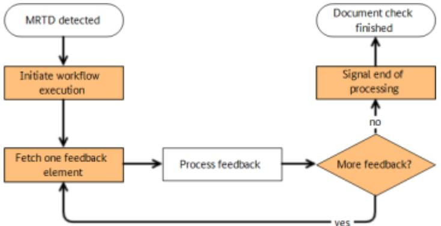
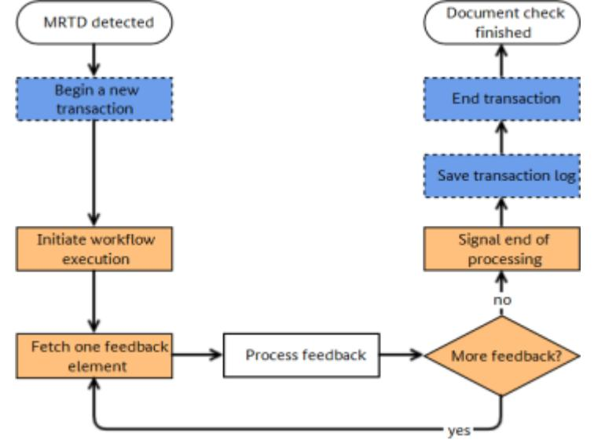
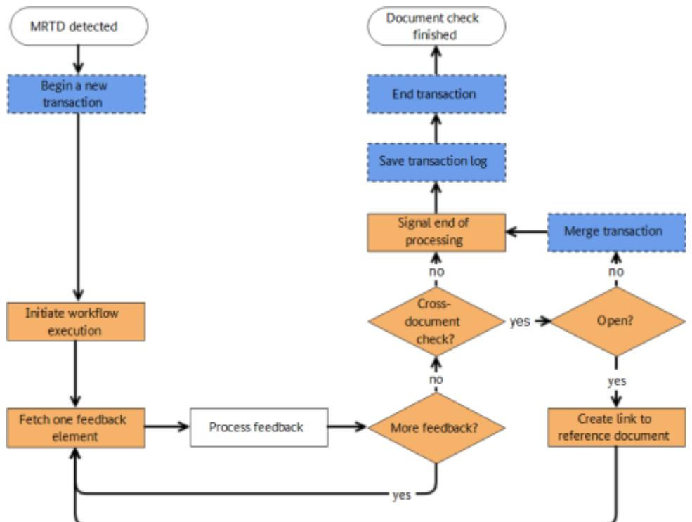

BSI Technical Guideline TR-03135-3

# Machine Authentication of MRTDs for Public Sector Applications

Part 3: High Level Document Check Interface Specification

Version 2.5


Federal Office for Information Security P.O. Box 20 03 63 53133 Bonn E-Mail: tr-03135@bsi.bund.de Internet: https://www.bsi.bund.de © Federal Office for Information Security

| 1.    | Changelog<br>                                | 1  |
|-------|----------------------------------------------|----|
| 1.1.  | Changelog 2.5 Part 3<br>                     | 1  |
| 2.    | Introduction<br>                             | 2  |
| 2.1.  | Motivation<br>                               | 2  |
|       |                                              |    |
| 3.    | Architecture for Inspection Applications<br> | 3  |
| 3.1.  | Client-Server Architecture<br>               | 3  |
| 3.2.  | Workflow-Based Document Check<br>            | 3  |
| 3.3.  | Transaction Logging<br>                      | 4  |
| 3.4.  | Cross-document combined check<br>            | 4  |
| 4.    | Document overview<br>                        | 6  |
| 4.1.  | Terminology<br>                              | 6  |
| 4.2.  | Naming conventions<br>                       | 6  |
| 4.3.  | Namespaces<br>                               | 7  |
| 4.4.  | XML Schema and Web Service Definition<br>    | 7  |
| 4.5.  | Interoperability<br>                         | 7  |
| 5.    | Interface overview<br>                       | 8  |
| 5.1.  | High-Level Document Check<br>                | 8  |
| 5.2.  | Transaction management interface<br>         | 9  |
| 5.3.  | Error handling<br>                           | 9  |
| 6.    | High Level Document Check API<br>            | 10 |
| 6.1.  | Namespaces<br>                               | 10 |
| 6.2.  | Data types<br>                               | 10 |
| 6.3.  | Fault types<br>                              | 14 |
| 6.4.  | Operations<br>                               | 16 |
| 6.5.  | Workflow definition schema<br>               | 26 |
|       |                                              |    |
| 7.    | Workflow feedback schema<br>                 | 62 |
| 7.1.  | Feedback document<br>                        | 62 |
| 7.2.  | type.feedback<br>                            | 62 |
| 7.3.  | type.feedback.dg1<br>                        | 64 |
| 7.4.  | type.feedback.dg2<br>                        | 66 |
| 7.5.  | type.feedback.dg2.template<br>               | 66 |
| 7.6.  | type.feedback.dg2.image<br>                  | 67 |
| 7.7.  | type.feedback.dg3<br>                        | 68 |
| 7.8.  | type.feedback.dg3.template<br>               | 68 |
| 7.9.  | type.feedback.dg3.image<br>                  | 68 |
| 7.10. | type.feedback.dg3.image.fingerpos<br>        | 69 |
| 7.11. | type.feedback.dg4<br>                        | 70 |

| 7.12. | type.feedback.dg4.template<br>                            | 70  |
|-------|-----------------------------------------------------------|-----|
| 7.13. | type.feedback.dg4.image<br>                               | 71  |
| 7.14. | type.feedback.dg11<br>                                    | 71  |
| 7.15. | type.feedback.dg12<br>                                    | 73  |
| 7.16. | type.feedback.optmrz<br>                                  | 74  |
| 7.17. | type.feedback.eid.placeofresidence<br>                    | 75  |
| 7.18. | type.feedback.eid.placeofresidence.structuredplace<br>    | 76  |
| 7.19. | type.feedback.defects<br>                                 | 76  |
| 7.20. | type.feedback.oid<br>                                     | 77  |
| 7.21. | type.feedback.defects.defect<br>                          | 77  |
| 7.22. | type.feedbacks.name<br>                                   | 78  |
| 7.23. | type.feedback.namelist<br>                                | 78  |
| 7.24. | type.feedback.checkresult<br>                             | 79  |
| 7.25. | type.feedback.xpathresult<br>                             | 79  |
| 7.26. | type.feedback.seal.visa<br>                               | 79  |
| 7.27. | type.feedback.seal.visa.durationofstay<br>                | 80  |
| 7.28. | type.feedback.seal.emergencytraveldocument<br>            | 81  |
| 7.29. | type.feedback.seal.arrivalattestationdocument<br>         | 81  |
| 7.30. | type.feedback.seal.socialinsurancecard<br>                | 82  |
| 7.31. | type.feedback.seal.residencepermit<br>                    | 82  |
| 7.32. | type.feedback.seal.residencepermitsupplementarysheet"<br> | 83  |
| 7.33. | type.feedback.seal.addressstickergermanidentitycard"<br>  | 83  |
| 7.34. | type.feedback.seal.unknown<br>                            | 84  |
| 7.35. | type.feedback.mrz.unfolded<br>                            | 84  |
| 7.36. | type.feedback.mrz.unfolded.shortened<br>                  | 86  |
| 7.37. | type.feedback.string.date<br>                             | 87  |
| 7.38. | type.feedback.extended<br>                                | 88  |
| 7.39. | Workflow extensions<br>                                   | 88  |
| 8.    | Transaction management<br>                                | 90  |
| 8.1.  | Namespace<br>                                             | 90  |
| 8.2.  | Data types<br>                                            | 90  |
| 8.3.  | Fault types<br>                                           | 91  |
| 8.4.  | Operations<br>                                            | 93  |
|       | List of Abbreviations<br>                                 | 105 |
|       |                                                           |     |
|       | Bibliography<br>                                          | 106 |

# **List of Figures**

| 3.1. | Client-side document check process<br>                          | 3 |
|------|-----------------------------------------------------------------|---|
| 3.2. | Extension of with -compliant logging<br>                        | 4 |
| 3.3. | Extension of accounting for cross-document combined checks.<br> | 5 |

# <span id="page-5-0"></span>**1. Changelog**

The following tables present the changes introduced between the latest versions of this Technical Guideline. The changelog lists the changes grouped per part of this Technical Guideline, element (section, table, fi gure) and type of change, refer to [\[KeepAChangelog\]:](#page-110-1)

- **•** *Added* for new features
- **•** *Changed* for changes in existing functionality
- **•** *Deprecated* for soon-to-be removed features
- **•** *Removed* for now removed features
- **•** *Fixed* for any bug fixes
- **•** *Security* in case of vulnerabilities

## <span id="page-5-1"></span>**1.1. Changelog 2.5 Part 3**

| Element Name          | Type of<br>Change | Change Description                                                |
|-----------------------|-------------------|-------------------------------------------------------------------|
| Chapter High Level Do | Added             | New workflow elements:                                            |
| cument Check API      |                   | •<br>AggregatedCheck                                              |
|                       |                   | •<br>SealCheck                                                    |
| Chapter Workflow feed | Added             | New feedback elements:                                            |
| back schema           |                   | •<br>type.feedback.seal.visa                                      |
|                       |                   | type.feedback.seal.visa.durationofstay<br>•                       |
|                       |                   | •<br>type.feedback.seal.emergencytraveldocument                   |
|                       |                   | •<br>type.feedback.seal.arrivalattestationdocument                |
|                       |                   | •<br>type.feedback.seal.socialinsurancecard                       |
|                       |                   | •<br>type.feedback.seal.socialinsurancecard.socialinsurancenumber |
|                       |                   | •<br>type.feedback.seal.residencepermit                           |
|                       |                   | type.feedback.seal.residencepermitsupplementarysheet<br>•         |
|                       |                   | type.feedback.seal.addressstickergermanidentitycard<br>•          |
|                       |                   | •<br>type.feedback.seal.unknown                                   |
|                       |                   | •<br>type.feedback.mrz.unfolded                                   |
|                       |                   | •<br>type.feedback.mrz.unfolded.shortened                         |

**Table 1.1** Changelog BSI TR-03135, Part 3

# <span id="page-6-0"></span>**2. Introduction**

This technical guideline specifies two complimentary web services that provide validation of Machine-Rea dable Travel Documents (MRTDs) according to [\[BSI TR-03135-1\].](#page-110-2) They comprise the document check process as well as the required logging of the results.

## <span id="page-6-1"></span>**2.1. Motivation**

The checking of [Machine Readable Travel Documents \(MRTDs\)](#page-109-1) according to [\[BSI TR-03135-1\]](#page-110-2) requires a large number of individual steps. Some steps require a certain order execution or may only be relevant for par ticular documents. In contrast to a fixed definition of scenario-specific check processes, the processing and visualization of results and/or document data may vary with the purpose of the Inspection Application. The complexity of the document check process causes large efforts for creation and quality control Inspec tion Applications.

The goal of this document is to provide high-level interfaces that reduces the programming effort for Inspec tion Applications by separating the document check process and standard-compliant logging from pro blem-specific processing and visualization of results.

# <span id="page-7-0"></span>**3. Architecture for Inspection Applications**

## <span id="page-7-1"></span>**3.1. Client-Server Architecture**

To ease the implementation of Inspection Applications for document checks, they are split into two parts. Frontends, or clients, are application-specific. They provide a user interface and process and visualize results depending on their particular purpose. The [\[BSI TR-03135\]](#page-110-3)-compliant document check process and the cor responding transaction logging are provided by a backend server as web services. This separation reduces the effort to implement Inspection Applications for different purposes considerably.

## <span id="page-7-2"></span>**3.2. Workflow-Based Document Check**

To further reduce the effort for client implementation, the document check process is configured based on a textual description in [Extensible Markup Language \(XML\)](#page-109-2) rather than program code. A particular configurati on is referred to as workflow, its description as workflow definition. This definition allows the customization of the application-scenario-specific document check process within the limits of [\[BSI TR-03135\]](#page-110-3).

It controls which optical, electronic and combined checks are carried out and which data are required for processing. The document data and check results are referred to as feedback. Please refer to [Section 6.5](#page-30-1) for an exhaustive specification of the workflow definition and [Chapter 7](#page-66-3) for the specification of the feedback data format.

<span id="page-7-3"></span>The workflow definition can be provided by the client or server. This allows clients to use custom work flows but also allows centralized management on the server. All workflows are managed by the server and are available to all clients. Workflows are executed on the server upon request by the client. Relevant feedback is generated on the server and can be fetched by the client individually.



**Figure 3.1.** Client-side document check process

[Figure 3.1](#page-7-3) visualizes the client side of the document check process. Workflow-related interface operations are highlighted in orange. After a new document is detected, the client requests executio of relevant work flow. In the following, the client individually fetches the feedback elements that are defined in the workflow from the server and processes them appropriately, e.g. by visualizing them to the user. After all feedback has been processed successfully, the client informs the server that client-side processing has finished. [Section 5.1](#page-12-2) provides a quick overview of the interface functions. The interface specification can be found in [Chapter 6](#page-14-3).

## <span id="page-8-0"></span>**3.3. Transaction Logging**

<span id="page-8-2"></span>[\[BSI TR-03135-1\]](#page-110-2) requires logging of all relevant check results which is provided by the interface specified in [Chapter 8.](#page-94-3) If multiple documents need to be checked, the corresponding transactions can be merged into a single transaction for consistent logging of related document checks.



**Figure 3.2.** Extension of [Figure 3.1](#page-7-3) with [\[BSI TR-03135\]](#page-110-3) -compliant logging

[Figure 3.2](#page-8-2) shows the extension of the client side of the document check process from [Figure 3.1](#page-7-3) with tran saction logging operations (highlighted in blue, dashed). The client initiates a new transaction after a [MRTD](#page-109-1) was detected and before initiating workflow execution. After the workflow execution and result processing is finished, the client requests saving of the corresponding transaction log and then ends the transaction. [Sec](#page-13-0) [tion 5.2](#page-13-0) provides a quick overview of the interface functions.

## <span id="page-8-1"></span>**3.4. Cross-document combined check**

Part 1 of this Technical Guideline specifies checks across two different documents (e.g. passport and visa) or two sides of the same document (e.a. front and rear side of ID cards).

Initially, both documents (or document sides) are checked individually. Cross-document combined checks, which are always defined for a specific document (e.g. visa), are skipped.

Its the responsibility of the client to control which documents are considered for cross-document combined checks. After linking the respective documents, the cross-document combined checks are executed.

The Inspection Application MUST merge the corresponding transaction to ensure consistent logging of the checking process.

[Figure 3.3](#page-9-0) shows the extension of the single document checking process in [Figure 3.2](#page-8-2) which accounts for potential cross-document combined checks. After finishing the initial checking of a document, the client checks if feedback elements for any cross-document combined checks are missing. If so, the client needs to link the currently checked document (e.g. visa) to relevant reference passport) and re-re quest the corresponding feedback elements. Afterwards, the corresponding transactions for both documents must be merged.

<span id="page-9-0"></span>

**Figure 3.3.** Extension of [Figure 3.2](#page-8-2) accounting for cross-document combined checks.

# <span id="page-10-0"></span>**4. Document overview**

## <span id="page-10-1"></span>**4.1. Terminology**

The key words "MUST", "MUST NOT", "REQUIRED", "SHALL", "SHALL NOT", "SHOULD", "SHOULD NOT", "RECOMMENDED", "MAY", and "OPTIONAL" in this document are to be interpreted as described in [\[RFC2119\]](#page-110-4).

## <span id="page-10-2"></span>**4.2. Naming conventions**

### **4.2.1. Multiplicity**

Generally, [XML](#page-109-2) elements and attributes listed in this document are required, i.e. the respective parent element MUST contain exactly one such element. Elements and attributes that deviate from this baseline are denoted in this document by a symbol which is appended to the element/attribute name. The symbols are listed in [Table 4.1](#page-10-3) .

<span id="page-10-3"></span>

| Appended<br>symbol | Meaning      |
|--------------------|--------------|
| ?                  | Zero or one  |
| *                  | Zero or more |
| +                  | One or more  |
|                    |              |

**Table 4.1** Multiplicity symbols

## **4.2.2. SOAP Interfaces**

All operations of this interface follow the request/response model, i.e., communication is initiated by the client by sending a [Simple Object Access Protocol \(SOAP\)](#page-109-3) message to the server (request). For each request, the server replies with a [SOAP](#page-109-3) message containing the result of the requested operation (response) or, in case of error, a fault.

The body of each [SOAP](#page-109-3) message consists of a single part which is named according to the corresponding operation. For requests, the part name is identical to the name of the operation. For responses, the part name is identical to the name of the operation plus the suffix "Response" (see [Table 4.2\)](#page-10-4).

<span id="page-10-4"></span>

| Message type | Part name                |
|--------------|--------------------------|
| Request      | <operation_name>         |
| Response     | <operation_name>Response |

**Table 4.2** Naming convention for SOAP messages

Example: Naming convention

- **•** Operation: getAllWorkflows
- **•** Request: getAllWorkflows
- **•** Response: getAllWorkflowsResponse

Both request and response elements exclusively contain zero or more child elements according to the detailed description in this guideline. They do not carry any attributes.

## <span id="page-11-0"></span>**4.3. Namespaces**

<span id="page-11-3"></span>

| Prefix | Description                                               | Description                                       |
|--------|-----------------------------------------------------------|---------------------------------------------------|
| hldc   | High Level Document Check                                 | http://trdoccheck.bsi.bund.de/hl<br>dc/wsdl/2     |
| wf     | High Level Document Check (HLDC)<br>Workflow and Feedback | http://trdoccheck.bsi.bund.de/hl<br>dc/workflow/2 |
| tl     | Transaction management                                    | http://trdoccheck.bsi.bund.de/tl/<br>wsdl/2       |
| xs     | XML Schema                                                | http://www.w3.org/2001/XMLSche<br>ma              |

The namespaces used in the schemata are given in [Table 4.3.](#page-11-3)

**Table 4.3** Namespaces

## <span id="page-11-1"></span>**4.4. XML Schema and Web Service Definition**

The [XML Schema Definition \(XSD\)](#page-109-5) (.xsd) and [Web Services Description Language \(WSDL\)](#page-109-6) (.wsdl) files given in [Table 4.4](#page-11-4) are provided with this Technical Guideline.

<span id="page-11-4"></span>

| Message type | Part name                                                     |
|--------------|---------------------------------------------------------------|
| hldc_v2.wsdl | HLDC web service definition (<br>Chapter 6)                   |
| hldc_v2.xsd  | XSD for HLDC web service                                      |
| wf_v2.xsd    | XSD for workflow definitions (<br>Section 6.5)                |
| fb_v2.xsd    | XSD for workflow feedback (<br>Chapter 7)                     |
| tl_v2.wsdl   | Transaction management web service definition (<br>Chapter 8) |
| tl_v2.xsd    | XSD for transaction managment web service                     |

**Table 4.4** Naming convention for SOAP messages

## <span id="page-11-2"></span>**4.5. Interoperability**

To ensure trouble-free interoperability between different [SOAP](#page-109-3) implementations, both client and server im plmenentations SHOULD fulfill the WS-I Basic Profile 1.1.

# <span id="page-12-0"></span>**5. Interface overview**

## <span id="page-12-2"></span><span id="page-12-1"></span>**5.1. High-Level Document Check**

## **5.1.1. Objective**

[HLDC](#page-109-4) interface provides execution of [\[BSI TR-03135\]](#page-110-3)-compliant document checks controlled by [XML](#page-109-2)-based workflow definitions.

## **5.1.2. Document detection**

The client MAY choose to be notified of a newly detected document by explicit waiting (blocking).

**•** Calling waitForNewDocument blocks client execution until a new document is detected (limited by a timeout).

### **5.1.3. Workflow management**

- **•** The client MAY publish custom workflow definitions on the server by calling addWorkflow. Identically na med workflow definitions are replaced.
- **•** The client MAY remove workflow definitions from the server by calling removeWorkflow.
- **•** The function getAllWorkflows provides a list of all workflow definitions that are available on the server.

### **5.1.4. Workflow execution**

- **•** The function beginWorkflow executes a document check workflow. If no transaction ID is provided, the ser ver MUST initiate a new transaction internally to ensure [\[BSI TR-03135\]](#page-110-3)-compliant logging. beginWorkflow provides a unique workflow ID that MUST be used in subsequent calls. In general, the ID MUST remain valid until the client calls endWorkflow. To protect against broken clients, the server MAY limit ID vali dity with a timeout.
- **•** Workflow execution MAY be cancelled by calling cancelWorkflow.
- **•** The client MUST inform the server that client-side workflow processing has finished by calling endWorkflow.

## **5.1.5. Workflow feedback**

Document and check result data are provided by the server individually referred to as workflow feed back.

- **•** The function getWorkflowFeedback provides the next available feedback element.
- **•** The client MAY request particular document and result data by calling getWorkflowFeedbackById.

### **5.1.6. Cross-document checks**

If a workflow contains definitions for cross-document combined checks, the client SHOULD call linkWorkflow in order to assign the relevant reference document. The call MUST appear after feedback processing for the current document has finished.

## <span id="page-13-0"></span>**5.2. Transaction management interface**

### **5.2.1. Objective**

The transaction management interface provides functions to link document check operations to a [\[BSI](#page-110-3) [TR-03135\]-](#page-110-3)compliant transaction and to allow logging of relevant data.

### **5.2.2. Transaction management**

- **•** Transactions are initiated by beginTransaction. In contrast to calling the HLDC function beginWorkflow wi thout a transaction ID, this function provides an ID that is REQUIRED for all the functions of this interface and MAY be used when calling beginWorkflow in order to link the workflow execution to this particular transaction.
- **•** Multiple transactions MAY be merged into a single one with mergeTransaction.
- **•** Transactions are terminated by endTransaction which invalidates the transaction ID.

## **5.2.3. Logging**

- **•** The function saveTransaction stores the currently available logged transaction data persistently on ser ver. The client MAY limit the amount of data that is stored.
- **•** The client MAY request the currently available transaction data for client-side use by calling getTransac tionXML.
- **•** Client-specific data MAY be logged by calling addLogData.
- **•** The function getAllLoggingProviders is OPTIONAL and MAY return a server-specific list of logging targets that MAY be used when calling saveTransaction.
- **•** The function saveTransactionXML allows to store client-generated [XML](#page-109-2) via available logging providers.
- **•** The client MAY publish custom logging profiles [\(Extensible Stylesheet Language Transformation \(XSLT\)\)](#page-109-7) on the server by calling addLoggingProfile. Identically named logging profiles are replaced.
- **•** The client MAY remove logging profiles from the server by calling removeLoggingProfile.

### **5.2.4. Write-protection**

In order to prevent inconsistent log data, a transaction is protected against further modification after the first read access, i.e., after calls to saveTransaction and getTransactionXML. All future write access, i.e., calls that would modify the transaction, MUST fail then with an appropriate error.

The server MAY fail read access calls with appropriate error if the transaction is currently modified (e.g., by the document check process).

## <span id="page-13-1"></span>**5.3. Error handling**

If errors occur during processing of a web service request, a [SOAP](#page-109-3) fault is generated according to the [SOAP](#page-109-3) 1.1 specification. [SOAP](#page-109-3) faults are comparable to exceptions in programming languages such as C++, C# or Java insofar as they allow reporting of errors without the need to account for error codes in function signatures.

[SOAP](#page-109-3) faults are returned in place of the [SOAP](#page-109-3) response. Depending on the type of an error, the fault message may contain additional information about the error. The faults that are specific to the web services in this document are specified in the respective chapters and listed with every function that may generate them. Faults originating from other causes such as network connection problems or validation errors are beyond the scope of this document as they depend on the specific [SOAP](#page-109-3) implementation.

# <span id="page-14-3"></span><span id="page-14-0"></span>**6. High Level Document Check API**

The [HLDC](#page-109-4) [Application Programming Interface \(API\)](#page-109-8) contains functions to perform electronic and optical document checks in conformity to part 1 of this Technical Guideline. The check processes are driven by [XML](#page-109-2) workflows and provide a very high level interface to the application. The check results contain multiple subresults which are combined to overall results according to [\[BSI TR-03135-1\].](#page-110-2) All checks can be logged in [XML](#page-109-2) format compliant to [\[BSI TR-03135-1\]](#page-110-2) using the transaction management [API](#page-109-8) in [Chapter 8](#page-94-3).

The definitions of the [HLDC](#page-109-4) [API](#page-109-8) are provided in hldc\_v2.wsdl. The schemata for the workflow definition and [XML-](#page-109-2)formatted feedback are provided in wf\_v2.xsd and fb\_v2.xsd respectively.

## <span id="page-14-1"></span>**6.1. Namespaces**

The elements of the server- and client-side APIs are member of the namespace [http://trdoccheck.bsi.bun](http://trdoccheck.bsi.bund.de/hldc/wsdl/2) [d.de/hldc/wsdl/2](http://trdoccheck.bsi.bund.de/hldc/wsdl/2), which is aliased by hldc. The workflow definition schema and the feedback sche ma use the namespace <http://trdoccheck.bsi.bund.de/hldc/workflow/2>aliased by wf.

## <span id="page-14-2"></span>**6.2. Data types**

In addition to simple [XSD](#page-109-5) types, the [SOAP interface uses custom data types, which are described in the fol](#page-109-3) lowing.

### **6.2.1. FeedbackStatus**

Represents the status of a feedback element. Derived from xs:string.

### **6.2.1.1. Values**

The values of the FeedbackStatus values are given in [Table 6.1.](#page-14-4)

<span id="page-14-4"></span>

| Value                           | Description                                                                                                     |
|---------------------------------|-----------------------------------------------------------------------------------------------------------------|
| valid                           | The feedback element contains valid data which is available in string<br>Feedback or binaryFeedback.            |
| err-invalid-conversion          | An error occured during feedback preparation. Data could not be conver<br>ted into the specified target format. |
| err-not-available               | Requested data is not available or could not be read.                                                           |
| err-reference-document-required | Requested data require access to a reference document for cross-docu<br>ment checks (see linkWorkflow).         |

**Table 6.1** FeedbackStatus - values

### **6.2.1.2. WSDL Definition**

```
<simpleType name="FeedbackStatus">
 <restriction base="xs:string"/>
 <enumeration value="valid"/>
 <enumeration value="err-invalid-conversion"/>
 <enumeration value="err-not-available"/>
 </restriction>
</simpleType>
```
### <span id="page-15-1"></span>**6.2.2. UUID**

Serves to uniquely reference various elements at runtime (e.g. currently executing workflows). Inherits xs:string.

### **6.2.2.1. Format restrictions**

The content MUST be empty or represent a universally unique identifier of 32 lower-case hexadecimal let ters that are separated into 5 groups of length 8, 4, 4, 4 and 12 letters using hyphens (e.g. 01234567-89ab-cde f-0123-456789abcdef).

### **6.2.2.2. WSDL Definition**

```
<simpleType name="UUID">
 <restriction base="xs:string">
 <pattern value="([A-Fa-f0-9]{8}-[A-Fa-f0-9]{4}-[A-Fa-f0-9]{4}-[A-Fa-f0-9]{4}-
[A-Fa-f0-9]{12})?"/>
 </restriction>
</simpleType>
```
### **6.2.3. Workflow**

Contains general workflow information.

### **6.2.3.1. Elements**

The Workflow elements are given in [Table 6.2.](#page-15-0)

<span id="page-15-0"></span>

| Element name | Description                           |
|--------------|---------------------------------------|
| name         | xs:string                             |
|              | The name of the workflow.             |
| vendor       | xs:string                             |
|              | The vendor that defined the workflow. |
| version      | xs:string                             |
|              | The version of the workflow.          |
| description  | xs:string                             |
|              | The description of the workflow.      |

**Table 6.2** Workflow - elements

### **6.2.3.2. WSDL Definition**

```
<complexType name="Workflow">
 <sequence>
 <element name="name" type="xs:string" />
 <element name="vendor" type="xs:string"/>
 <element name="version" type="xs:string"/>
 <element name="description" type="xs:string"/>
 </sequence>
</complexType>
```
### **6.2.4. WorkflowFeedback**

Represents a feedback element from a [HLDC](#page-109-4) workflow.

### **6.2.4.1. Attributes**

None.

### **6.2.4.2. Elements**

The WorkflowFeedback elements are given in [Table 6.3.](#page-16-0)

<span id="page-16-0"></span>

| Element name    | Description                                                                                                                |
|-----------------|----------------------------------------------------------------------------------------------------------------------------|
| feedbackID      | xs:string                                                                                                                  |
|                 | Reference to a feedback element. MUST be empty if status is either fi<br>nished or cancelled. MUST NOT be empty otherwise. |
| stringFeedback? | xs:string                                                                                                                  |
|                 | The feedback data as string (if possible). MUST be empty if status is diffe<br>rent from valid.                            |
| binaryFeedback? | xs:base64Binary                                                                                                            |
|                 | The feedback data as binary (if possible). MUST be empty if status is diffe<br>rent from valid.                            |
| status          | hldc:FeedbackStatus                                                                                                        |
|                 | The status code of the feedback element.                                                                                   |

**Table 6.3** WorkflowFeedback - elements

### **6.2.4.3. WSDL Definition**

```
<complexType name="WorkflowFeedback">
<sequence>
 <element name="feedbackID" type="xs:string" />
 <element name="stringFeedback" type="xs:string"
 minOccurs="0" />
 <element name="binaryFeedback" type="xs:base64Binary"
 minOccurs="0" maxOccurs="1" />
 <element name="status" type="hldc:FeedbackStatus" />
</sequence>
</complexType>
```
### **6.2.5. WorkflowParameter**

Key-value pair to configure conditions of type type.workflow.conditions.parameter in a [HLDC](#page-109-4) workflow de finition.

### **6.2.5.1. Attributes**

None.

### **6.2.5.2. Elements**

The WorkflowParameter elements are given in [Table 6.4](#page-16-1).

<span id="page-16-1"></span>

| Element name | Description                                                                     |
|--------------|---------------------------------------------------------------------------------|
| id           | xs:string                                                                       |
|              | The key.                                                                        |
| value        | xs:boolean                                                                      |
|              | Specifies whether the corresponding condition MUST be considered ful<br>filled. |

**Table 6.4** WorkflowParameter - elements

#### **6.2.5.3. WSDL Definition**

```
<complexType name="WorkflowParameter">
 <sequence>
 <element name="id" type="xs:string" />
 <element name="value" type="xs:boolean" /> 
 </sequence>
</complexType>
```
#### **6.2.6. WorkflowParameters**

List of key-value pairs.

#### **6.2.6.1. Elements**

The WorkflowParameters elements are given in [Table 6.5](#page-17-0).

<span id="page-17-0"></span>

| Element name | Description      |
|--------------|------------------|
| parameter*   | hldc:Parameter   |
|              | A key-value pair |

**Table 6.5** WorkflowParameters - elements

#### **6.2.6.2. WSDL Definition**

```
<complexType name="WorkflowParameters">
<sequence>
 <element name="parameter" type="hldc:WorkflowParameter"
 minOccurs="0" maxOccurs="unbounded"/>
</sequence>
</complexType>
```
### **6.2.7. WorkflowStatus**

Represents the execution status of a workflow. Derived from xs:string.

#### **6.2.7.1. Values**

The WorkflowParameters values are given in [Table 6.6.](#page-17-1)

<span id="page-17-1"></span>

| Value     | Description                                                                                                      |
|-----------|------------------------------------------------------------------------------------------------------------------|
| ok        | Workflow execution is still in progress.                                                                         |
| finished  | The workflow execution has finished. This is the last feedback element<br>delivered by getWorkflowFeedback.      |
| cancelled | The workflow has been cancelled by the user. This is last feedback ele<br>ment delivered by getWorkflowFeedback. |

**Table 6.6** WorkflowStatus - values

### **6.2.7.2. WSDL Definition**

```
<simpleType name="WorkflowStatus">
 <restriction base="xs:string"/>
 <enumeration value="ok"/>
 <enumeration value="finished"/>
 <enumeration value="cancelled"/>
 </restriction>
</simpleType>
```
## <span id="page-18-0"></span>**6.3. Fault types**

This section specifies the [SOAP](#page-109-3) faults that are specific to this [SOAP](#page-109-3) API. No fault has any attributes.

## **6.3.1. InvalidClientId**

Returned if a client ID does not exist on the server. The ID is either invalid or has expired.

### **6.3.1.1. Elements**

None

### **6.3.1.2. WSDL Definition**

```
<complexType name="InvalidClientId">
 <sequence>
 </sequence>
</complexType>
```
### **6.3.2. InvalidConditionId**

Returned if a condition ID is not defined in the workflow definition.

#### **6.3.2.1. Elements**

The InvalidConditionId elements are given in [Table 6.7.](#page-18-1)

<span id="page-18-1"></span>

| Element name | Description      |
|--------------|------------------|
| id           | xs:string        |
|              | The rejected ID. |

**Table 6.7** InvalidConditionId - elements

### **6.3.2.2. WSDL Definition**

```
<complexType name="InvalidConditionId">
 <sequence>
 <element name="id" type="xs:string" />
 </sequence>
</complexType>
```
### **6.3.3. InvalidFeedbackId**

Returned if the feedback ID in the request is not defined in the workflow definition.

### **6.3.3.1. Elements**

None.

### **6.3.3.2. WSDL Definition**

```
<complexType name="InvalidFeedbackId">
 <sequence>
 </sequence>
</complexType>
```
### **6.3.4. InvalidWorkflowId**

Returned if a workflow ID does not exist on the server. The ID is either invalid or has expired due to a call to endWorkflow or limited resources on the server.

#### **6.3.4.1. Elements**

The InvalidWorkflowId elements are given in [Table 6.7.](#page-18-1)

| Element name | Description                                         |
|--------------|-----------------------------------------------------|
| id?          | hldc:UUID                                           |
|              | The rejected ID. Only present in case of ambiguity. |

**Table 6.8** InvalidWorkflowId - elements

#### **6.3.4.2. WSDL Definition**

```
<complexType name="InvalidWorkflowId">
 <sequence>
 <element name="id" type="hldc:UUID" minOccurs="0" maxOccurs="1" />
 </sequence>
</complexType>
```
### **6.3.5. WorkflowLimitExceeded**

Returned in case of too many executing workflows. The client either needs to cancel a currently executing workflow or wait until it finishes.

#### **6.3.5.1. Elements**

None.

#### **6.3.5.2. WSDL Definition**

```
<complexType name="WorkflowLimitExceeded">
 <sequence>
 </sequence>
</complexType>
```
### **6.3.6. WorkflowNotFound**

Returned if the requested workflow does not exist on the server.

#### **6.3.6.1. Elements**

None.

#### **6.3.6.2. WSDL Definition**

```
<complexType name="WorkflowNotFound">
 <sequence>
 </sequence>
</complexType>
```
### **6.3.7. WorkflowParserError**

Returned if the provided workflow definition could not be parsed by the server.

#### **6.3.7.1. Elements**

None.

### **6.3.7.2. WSDL Definition**

```
<complexType name="WorkflowParserError">
 <sequence>
```
</sequence> </complexType>

## <span id="page-20-0"></span>**6.4. Operations**

### **6.4.1. addWorkflow**

Transfers a new workflow definition to the server. Input MUST be validated against the schema wf\_v2.xsd ( [Section 6.5\)](#page-30-1)and MUST be checked for consistency. The workflow MUST NOT contain invalid ID references and MUST NOT contain cyclic dependencies. If an identically named workflow exists on the server, it MUST be replaced with the newly submitted definitions.

### **6.4.1.1. Request elements**

The addWorkflow request elements are given in [Table 6.9.](#page-20-1)

<span id="page-20-1"></span>

| Element name       | Description                                                                                                |
|--------------------|------------------------------------------------------------------------------------------------------------|
| workflowDefinition | xs:base64Binary                                                                                            |
|                    | The base64-encoded XML data of the workflow definition. The XML<br>structure is defined in<br>Section 6.5. |

**Table 6.9** addWorkflow - request elements

### **6.4.1.2. Response elements**

The addWorkflow response elements are given in [Table 6.10](#page-20-2).

<span id="page-20-2"></span>

| Element name | Description                                                            |
|--------------|------------------------------------------------------------------------|
| workflowName | xs:string                                                              |
|              | The name of the workflow which is parsed from the workflow definition. |

**Table 6.10** addWorkflow - response elements

### **6.4.1.3. Faults**

The addWorkflow faults are given in [Table 6.11.](#page-20-3)

<span id="page-20-3"></span>

| Fault                    | Cause                                                                 |
|--------------------------|-----------------------------------------------------------------------|
| hldc:WorkflowParserError | xs:string                                                             |
|                          | An error occurred while parsing or validating the submitted workflow. |

**Table 6.11** addWorkflow - faults

### **6.4.1.4. WSDL Definition**

```
<!-- operation request element -->
<element name="addWorkflow">
 <complexType>
 <sequence>
 <element name="workflowDefinition" type="xs:base64Binary" />
 </sequence>
 </complexType>
</element>
<!-- operation response element -->
<element name="addWorkflowResponse">
 <complexType>
 <sequence>
 <element name="workflowName" type="xs:string" />
```

```
 </sequence>
 </complexType>
</element>
```
### **6.4.2. beginWorkflow**

Initiates workflow execution on the server to check the current document and/or read out the requested data. Check results and data MUST be queried individually by calling getWorkflowFeedback or getWorkflowFeedback ById.

### **6.4.2.1. Request elements**

<span id="page-21-0"></span>

| Element name   | Description                                                                                                                                                                                                            |
|----------------|------------------------------------------------------------------------------------------------------------------------------------------------------------------------------------------------------------------------|
| workflowName   | xs:string                                                                                                                                                                                                              |
|                | The name of the workflow to execute. MUST be a valid workflow name as<br>returned by addWorkflow or getAllWorkflows.                                                                                                   |
| transactionID? | tl:UUID                                                                                                                                                                                                                |
|                | Transaction ID returned by tl:beginTransaction (see<br>Section 8.4.3) to<br>link the workflow to the specified [BSI TR-03135] transaction. If omitted<br>or empty, the server MUST generate a new ID for internal use. |
| docIdentifier? | xs:string                                                                                                                                                                                                              |
|                | Machine Readable Zone (MRZ) or Card Access Number (CAN) to be used<br>to access the document instead of the automatically retrieved (if available)<br>MRZ/CAN.                                                         |
| parameters?    | hldc:WorkflowParameters                                                                                                                                                                                                |
|                | List of key-value pairs which override the default values of the hldc:Pa<br>rameterCondition entries in the workflow definition. The IDs MUST<br>match the workflow definition.                                        |

The beginWorkflow request elements are given in [Table 6.12](#page-21-0).

**Table 6.12** beginWorkflow - request elements

### **6.4.2.2. Response elements**

The beginWorkflow response elements are given in [Table 6.13.](#page-21-1)

<span id="page-21-1"></span>

| Element name | Description                                                                                               |
|--------------|-----------------------------------------------------------------------------------------------------------|
| workflowID   | hldc:UUID                                                                                                 |
|              | Unique ID of the workflow execution which MUST be used as a reference<br>in corresponding function calls. |

**Table 6.13** beginWorkflow - response elements

### **6.4.2.3. Faults**

The beginWorkflow faults are given in [Table 6.14](#page-21-2).

<span id="page-21-2"></span>

| Fault                      | Cause                                                                                      |
|----------------------------|--------------------------------------------------------------------------------------------|
| hldc:InvalidConditionId    | parameters contains at least on condition that does not match the work<br>flow definition. |
| hldc:WorkflowLimitExceeded | Too many workflows are currently executing on the server.                                  |
| hldc:WorkflowNotFound      | The workflow workflowName does not exist on the server.                                    |

| Fault                   | Cause                                             |
|-------------------------|---------------------------------------------------|
| tl:InvalidTransactionId | Value of transactionID is invalid or has expired. |

**Table 6.14** beginWorkflow - faults

### **6.4.2.4. WSDL Definition**

```
<!-- operation request element -->
<element name="beginWorkflow">
 <complexType>
 <sequence>
 <element name="workflowName" type="xs:string" />
 <element name="transactionID" type="tl:UUID" minOccurs="0" />
 <element name="docIdentifier" type="xs:string" minOccurs="0" />
 <element name="parameters" type="hldc:WorkflowParameters" minOccurs="0" />
 </sequence>
 </complexType>
</element>
<!-- operation response element -->
<element name="beginWorkflowResponse">
 <complexType>
 <sequence>
 <element name="workflowID" type="hldc:UUID" />
 </sequence>
 </complexType>
</element>
```
### **6.4.3. cancelWorkflow**

Cancels workflow execution. The workflow is cancelled successfully when the status cancelled is returned in the feedback loop.

### **6.4.3.1. Request elements**

The cancelWorkflow request elements are given in [Table 6.15.](#page-22-0)

<span id="page-22-0"></span>

| Element name | Description                                                          |
|--------------|----------------------------------------------------------------------|
| workflowID   | hldc:UUID                                                            |
|              | The ID of the workflow to cancel that was returned by beginWorkflow. |

**Table 6.15** cancelWorkflow - request elements

### **6.4.3.2. Response elements**

None.

#### **6.4.3.3. Faults**

The cancelWorkflow faults are given in [Table 6.16.](#page-22-1)

<span id="page-22-1"></span>

| Fault                  | Cause                                          |
|------------------------|------------------------------------------------|
| hldc:InvalidWorkflowId | Value of workflowID is invalid or has expired. |

**Table 6.16** cancelWorkflow - faults

#### **6.4.3.4. WSDL Definition**

```
<!-- operation request element -->
<element name="cancelWorkflow">
 <complexType>
```

```
 <sequence>
 <element name="workflowID" type="hldc:UUID" />
 </sequence>
 </complexType>
</element>
<!-- operation response element -->
<element name="cancelWorkflowResponse">
 <complexType>
 <sequence>
 </sequence>
 </complexType>
</element>
```
### **6.4.4. endWorkflow**

Informs the server that client-side workflow processing has finished. Invalidates the workflow ID. MUST be called by the client for each executed workflow. To protect against broken clients, the server MAY invalidate workflow IDs based on a timeout. SHOULD NOT be called concurrently to other functions that operate on the same workflow ID except cancelWorkflow.

#### **6.4.4.1. Request elements**

The endWorkflow request elements are given in [Table 6.17](#page-23-0).

<span id="page-23-0"></span>

| Element name | Description                                                                                                                     |
|--------------|---------------------------------------------------------------------------------------------------------------------------------|
| workflowID   | hldc:UUID                                                                                                                       |
|              | Reference to the workflow to end. If the workflow is still executing on the<br>server, the workflow is cancelled by the server. |

**Table 6.17** endWorkflow - request elements

#### **6.4.4.2. Response elements**

The endWorkflow response elements are given in [Table 6.18.](#page-23-1)

<span id="page-23-1"></span>

| Element name   | Description                                                                       |
|----------------|-----------------------------------------------------------------------------------|
| workflowStatus | hldc:WorkflowStatus                                                               |
|                | Final execution status of the workflow. MUST be either finished or can<br>celled. |

**Table 6.18** endWorkflow - response elements

#### **6.4.4.3. Faults**

The endWorkflow faults are given in [Table 6.19](#page-23-2).

<span id="page-23-2"></span>

| Fault                  | Cause                                          |
|------------------------|------------------------------------------------|
| hldc:InvalidWorkflowId | Value of workflowID is invalid or has expired. |

**Table 6.19** endWorkflow - faults

#### **6.4.4.4. WSDL Definition**

```
<!-- operation request element #
<element name="endWorkflow">
 <complexType>
 <sequence>
 <element name="workflowID" type="hldc:UUID" />
 </sequence>
```

```
 </complexType>
</element>
<!-- operation response element #
<element name="endWorkflowResponse">
 <complexType>
 <sequence>
 <element name="workflowStatus" type="hldc:WorkflowStatus" />
 </sequence>
 </complexType>
</element>
```
### **6.4.5. getAllWorkflows**

Returns a list of all available workflows.

#### **6.4.5.1. Request elements**

None.

#### **6.4.5.2. Response elements**

The getAllWorkflows response elements are given in [Table 6.20](#page-24-0).

<span id="page-24-0"></span>

| Element name | Description                                                                                                   |
|--------------|---------------------------------------------------------------------------------------------------------------|
| workflow*    | hldc:Workflow                                                                                                 |
|              | The list of all available workflows. getAllWorkflows returns one work<br>flow element per available workflow. |

**Table 6.20** getAllWorkflows - response elements

#### **6.4.5.3. Faults**

None.

### **6.4.5.4. WSDL Definition**

```
<!-- operation request element -->
<element name="getAllWorkflows">
 <complexType>
 <sequence>
 </sequence>
 </complexType>
</element>
<!-- operation response element -->
<element name="getAllWorkflowsResponse">
 <complexType>
 <sequence>
 <element name="workflow" type="hldc:Workflow"
 minOccurs="0" maxOccurs="unbounded" />
 </sequence>
 </complexType>
</element>
```
### **6.4.6. getWorkflowFeedback**

Returns the next available feedback element during workflow execution. Generally called in a loop until fi nished or cancelled is returned as feedback status. The order in which individual elements are retur ned may be different from the order in the workflow definition. This function MAY skip feedback elements that were previously explicitly requested by getWorkflowFeedbackById.

#### **6.4.6.1. Request elements**

<span id="page-25-0"></span>

| Element name | Description                                                                                                                                                                                                                                                                           |
|--------------|---------------------------------------------------------------------------------------------------------------------------------------------------------------------------------------------------------------------------------------------------------------------------------------|
| workflowID   | hldc:UUID                                                                                                                                                                                                                                                                             |
|              | Reference to the workflow for which next feedback element is re<br>quested.                                                                                                                                                                                                           |
| timeout-ms   | xs:int                                                                                                                                                                                                                                                                                |
|              | Timeout in milliseconds for getting the next feedback element. If no new<br>feedback element becomes available during this time, an error is returned.<br>The server MAY cap the value. Negative values are interpreted as "infini<br>ty" which is subject to a server-imposed limit. |

The getWorkflowFeedback request elements are given in [Table 6.21](#page-25-0)

**Table 6.21** getWorkflowFeedback - request elements

#### **6.4.6.2. Response elements**

<span id="page-25-1"></span>

| Element name    | Description                                                                                                                        |
|-----------------|------------------------------------------------------------------------------------------------------------------------------------|
| workflowStatus  | hldc:WorkflowStatus                                                                                                                |
|                 | Current execution status of the workflow.                                                                                          |
| timeout-expired | xs:boolean                                                                                                                         |
|                 | MUST be true if no new feedback was available before the timeout expi<br>red. MUST be false if new feedback was available in time. |
| feedback?       | hldc:WorkflowFeedback                                                                                                              |
|                 | The next available feedback element. Omitted in case of timeout.                                                                   |

The getWorkflowFeedback response elements are given in [Table 6.22.](#page-25-1)

**Table 6.22** getWorkflowFeedback - response elements

#### **6.4.6.3. Faults**

The getWorkflowFeedback response elements are given in [Table 6.23.](#page-25-2)

<span id="page-25-2"></span>

| Fault type             | Cause                                          |
|------------------------|------------------------------------------------|
| hldc:InvalidWorkflowId | Value of workflowID is invalid or has expired. |

**Table 6.23** getWorkflowFeedback - faults.

### **6.4.6.4. WSDL Definition**

```
<!-- operation request element -->
<element name="getWorkflowFeedback">
 <complexType>
 <sequence>
 <element name="workflowID" type="hldc:UUID" />
 <element name="timeout-ms" type="xs:int" />
 </sequence>
 </complexType>
</element>
<!-- operation response element -->
<element name="getWorkflowFeedbackResponse">
 <complexType>
 <sequence>
 <element name="workflowStatus" type="hldc:WorkflowStatus" />
 <element name="timeout-expired" type="xs:boolean" />
```

```
 <element name="feedback" type="hldc:WorkflowFeedback"
 minOccurs="0" />
 </sequence>
</complexType>
</element>
```
## **6.4.7. getWorkflowFeedbackById**

Returns the requested feedback element.

### **6.4.7.1. Request elements**

The getWorkflowFeedbackById requesr elements are given in [Table 6.24](#page-26-0)

<span id="page-26-0"></span>

| Element name | Description                                                                                                                                                                                                                                                                           |
|--------------|---------------------------------------------------------------------------------------------------------------------------------------------------------------------------------------------------------------------------------------------------------------------------------------|
| workflowID   | hldc:UUID                                                                                                                                                                                                                                                                             |
|              | Reference to the workflow for which next feedback element is re<br>quested.                                                                                                                                                                                                           |
| feedbackId   | xs:string                                                                                                                                                                                                                                                                             |
|              | The requested feedback ID.                                                                                                                                                                                                                                                            |
| timeout-rms  | hldc:int                                                                                                                                                                                                                                                                              |
|              | Timeout in milliseconds for getting the feedback element. If the feedback<br>element does not become available during this time, an error is returned.<br>The server MAY cap the value. Negative values are interpreted as "infini<br>ty" which is subject to a server-imposed limit. |

**Table 6.24** getWorkflowFeedbackById - request elements

### **6.4.7.2. Response elements**

The getWorkflowFeedbackById response elements are given in [Table 6.25.](#page-26-1)

<span id="page-26-1"></span>

| Element name    | Description                                                                                                                                               |
|-----------------|-----------------------------------------------------------------------------------------------------------------------------------------------------------|
| workflowStatus  | hldc:WorkflowStatus                                                                                                                                       |
|                 | Current execution status of the workflow.                                                                                                                 |
| timeout-expired | xs:boolean                                                                                                                                                |
|                 | MUST be true if the requested feedback was not available before the<br>timeout expired. MUST be false if the requested feedback was available<br>in time. |
| feedback?       | hldc:WorkflowFeedback                                                                                                                                     |
|                 | The next available feedback element. Omitted in case of timeout.                                                                                          |

**Table 6.25** getWorkflowFeedbackById - response elements

### **6.4.7.3. Faults**

The getWorkflowFeedbackById response elements are given in [Table 6.26.](#page-26-2)

<span id="page-26-2"></span>

| Fault type             | Cause                                                          |
|------------------------|----------------------------------------------------------------|
| hldc:InvalidFeedbackId | Value of feedbackId is not defined in the workflow definition. |
| hldc:InvalidWorkflowId | Value of workflowID is invalid or has expired.                 |

**Table 6.26** getWorkflowFeedbackById - faults

### **6.4.7.4. WSDL Definition**

```
<!-- operation request element -->
<element name="getWorkflowFeedbackById">
<complexType>
 <sequence>
 <element name="workflowID" type="hldc:UUID" />
 <element name="feedbackId" type="xs:string" />
 <element name="timeout-ms" type="xs:int" />
 </sequence>
</complexType>
</element>
<!-- operation response element -->
<element name="getWorkflowFeedbackByIdResponse">
<complexType>
 <sequence>
 <element name="workflowStatus" type="hldc:WorkflowStatus" />
 <element name="timeout-expired" type="xs:boolean" />
 <element name="feedback" type="hldc:WorkflowFeedback"
 minOccurs="0" />
 </sequence>
</complexType>
</element>
```
### **6.4.8. linkWorkflow**

Links two executed workflows in order to allow execution of combined checks that refer multiple docu ments or document sides. If the workflow status of the workflow checkWorkflowID is ok or finished, the work flow status is set to ok and all configured combined checks are executed. Combined that require infor mation from a different document check will fetch this information from workflow referredWorkflowID. If the workflow status of the workflow checkWorkflowID is cancelled, calling linkWorkflow has no effect. If checkWork flowID and referredWorkflowID are part of different check transactions, it is RECOMMENDED to call tl:merge Transaction (see [Section 8.4.7](#page-103-0)) for these transactions.

### **6.4.8.1. Request elements**

The linkWorkflow request elements are given in [Table 6.27.](#page-27-0)

<span id="page-27-0"></span>

| Element name       | Description                                                                                                                   |
|--------------------|-------------------------------------------------------------------------------------------------------------------------------|
| checkWorkflowID    | hldc:UUID                                                                                                                     |
|                    | Reference to the workflow that contains combined checks which refer to<br>multiple documents or multiple sides of a document. |
| referredWorkflowID | hldc:UUID                                                                                                                     |
|                    | Reference to the workflow from which additional data is fetched.                                                              |

**Table 6.27** linkWorkflow - request elements

### **6.4.8.2. Response elements**

None.

### **6.4.8.3. Faults**

The linkWorkflow faults are given in [Table 6.28.](#page-27-1)

<span id="page-27-1"></span>

| Fault type             | Cause                                                                                                                                       |
|------------------------|---------------------------------------------------------------------------------------------------------------------------------------------|
| hldc:InvalidWorkflowId | Value of checkWorkflowID or referredWorkflowID is invalid or has ex<br>pired or values of checkWorkflowID are referredWorkflowID identical. |

| Fault type  | Cause                                                                                  |
|-------------|----------------------------------------------------------------------------------------|
| tl:ReadOnly | The transaction used by checkWorkflowIDis write-protected and must<br>not be modified. |

**Table 6.28** linkWorkflow - faults

### **6.4.8.4. WSDL Definition**

```
<!-- operation request element -->
<element name="linkWorkflow">
 <complexType>
 <sequence>
 <element name="checkWorkflowID" type="hldc:UUID" />
 <element name="referredWorkflowID" type="hldc:UUID" />
 </sequence>
 </complexType>
</element>
<!-- operation response element -->
<element name="linkWorkflowResponse">
 <complexType>
 <sequence>
 </sequence>
 </complexType>
</element>
```
### **6.4.9. removeWorkflow**

Removes a workflow definition which was previously loaded with addWorkflow. The server MUST ensure that workflow removal does not affect the execution of currently running workflows.

#### **6.4.9.1. Request elements**

The removeWorkflow faults are given in [Table 6.29.](#page-28-0)

<span id="page-28-0"></span>

| Element name | Description                         |
|--------------|-------------------------------------|
| workflowName | xs:string                           |
|              | The name of the workflow to remove. |

**Table 6.29** removeWorkflow - request elements

#### **6.4.9.2. Response elements**

None.

#### **6.4.9.3. Faults**

The removeWorkflow faults are given in [Table 6.30.](#page-28-1)

<span id="page-28-1"></span>

| Fault type            | Cause                                                   |
|-----------------------|---------------------------------------------------------|
| hldc:WorkflowNotFound | The workflow workflowName does not exist on the server. |

**Table 6.30** removeWorkflow - faults

#### **6.4.9.4. WSDL Definition**

```
<!-- operation request element -->
<element name="removeWorkflow">
 <complexType>
 <sequence>
 <element name="workflowName" type="xs:string" />
```

```
 </sequence>
 </complexType>
</element>
<!-- operation response element -->
<element name="removeWorkflowResponse">
 <complexType>
 <sequence>
 </sequence>
 </complexType>
</element>
```
### **6.4.10. waitForNewDocument**

Waits for a new document to be put onto the reader. If a new document is put onto the reader between to successive calls of waitForNewDocument with the same client ID within a certain time-frame (subject to server implementation), the second of these calls to waitForNewDocument SHOULD return immediately.

#### **6.4.10.1. Request elements**

The waitForNewDocument request elements are given in [Table 6.31.](#page-29-0)

<span id="page-29-0"></span>

| Element name | Description                                                                                                                                                                                                                                                        |
|--------------|--------------------------------------------------------------------------------------------------------------------------------------------------------------------------------------------------------------------------------------------------------------------|
| client-id?   | xs:string                                                                                                                                                                                                                                                          |
|              | The client ID returned with the last call of waitForNewDocument. MUST<br>be empty or omitted on first call. If empty or omitted, the server MUST<br>generate a new client id.                                                                                      |
| timeout-ms   | xs:int                                                                                                                                                                                                                                                             |
|              | Time in milliseconds. If no new document is detected during this time pe<br>riod, the server SHALL abort waiting and return an error. The server MAY<br>cap the value. Negative values are interpreted as "infinity" subject to a li<br>mit imposed by the server. |

**Table 6.31** waitForNewDocument - request elements

#### **6.4.10.2. Response elements**

The waitForNewDocument response elements are given in [Table 6.32.](#page-29-1)

<span id="page-29-1"></span>

| Element name    | Description                                                                                                                                                                                                                             |
|-----------------|-----------------------------------------------------------------------------------------------------------------------------------------------------------------------------------------------------------------------------------------|
| client-id       | hldc:UUID                                                                                                                                                                                                                               |
|                 | Server-generated client ID. MUST be a new ID if no or an invalid client ID<br>was passed in the request. MUST be identical to the one in the request if a<br>valid client ID was passed.                                                |
| timeout-expired | xs:boolean                                                                                                                                                                                                                              |
|                 | MUST be true if no new document was detected before the timeout expi<br>red. MUST be false if a new document was detected in time (including a<br>document detected between two calls of waitForNewDocument with the<br>same client-id. |

**Table 6.32** waitForNewDocument - response elements

#### **6.4.10.3. WSDL Definition**

```
<!-- operation request element -->
<element name="waitForNewDocument">
 <complexType>
 <sequence>
 <element name="client-id" type="hldc:UUID" minOccurs="0" />
```

```
 <element name="timeout-ms" type="xs:int" />
 </sequence>
 </complexType>
</element>
<!-- operation response element -->
<element name="waitForNewDocumentResponse">
 <complexType>
 <sequence>
 <element name="client-id" type="hldc:UUID" />
 <element name="timeout-expired" type="xs:boolean" />
 </sequence>
 </complexType>
</element>
```
## <span id="page-30-1"></span><span id="page-30-0"></span>**6.5. Workflow definition schema**

This section defines all elements of a workflow definition.

### **6.5.1. Workflow document**

XML document that configures the execution workflow of the document check according to TR#03135 Part 1.

#### **6.5.1.1. Root element**

The Workflow root element is given in [Table 6.33](#page-30-2).

<span id="page-30-2"></span>

| Element name | Description                              |
|--------------|------------------------------------------|
| Workflow     | wf:type.workflow                         |
|              | Root element of the workflow definition. |

**Table 6.33** Workflow - root element

### **6.5.1.2.  [XSD](#page-109-5) Definition**

<xs:element name=**"Workflow"** type=**"wf:type.workflow"** />

### **6.5.2. type.workflow**

Root element of a [HLDC](#page-109-4) workflow definition.

#### **6.5.2.1. Attributes**

The type.workflow attributes are given in [Table 6.34](#page-30-3).

<span id="page-30-3"></span>

| Attribute name | Description                                  |
|----------------|----------------------------------------------|
| schemaVersion  | xs:decimal                                   |
|                | The schemaVersion currently has the value 1. |

**Table 6.34** type.workflow - attributes

#### **6.5.2.2. Elements**

The type.workflow elements are given in [Table 6.35.](#page-30-4)

<span id="page-30-4"></span>

| Element name | Description                           |
|--------------|---------------------------------------|
| Information  | wf:type.workflow.information          |
|              | Basic information about the workflow. |

| Element name            | Description                                                                                             |
|-------------------------|---------------------------------------------------------------------------------------------------------|
| ApplicationScenario     | wf:type.workflow.scenario                                                                               |
|                         | Information about the application scenario of the workflow.                                             |
| RequestedSchemaVersion? | wf:type.workflow.versions                                                                               |
|                         | The requested schema version of the [BSI TR-03135] XML.                                                 |
| Conditions?             | wf:type.workflow.conditions                                                                             |
|                         | Conditions for certain workflow actions.                                                                |
| AggregatedCheck?        | wf:type.workflow.aggregation                                                                            |
|                         | Defines an overall check result that agrregates the results of optical, elec<br>tronic and seal checks. |
| ElectronicCheck?        | wf:type.workflow.electronic                                                                             |
|                         | Defines which electronic data shall be read and when the electronic<br>checks should be performed.      |
| OpticalCheck?           | wf:type.workflow.optical                                                                                |
|                         | Defines which optical data shall be read and when the optical checks<br>should be performed.            |
| SealCheck?              | wf:type.workflow.seal                                                                                   |
|                         | Defines which barcode data shall be read and when the seal checks should<br>be performed.               |
| CombinedCheck?          | wf:type.workflow.combined                                                                               |
|                         | Defines which combined checks shall be performed.                                                       |
| Feedback?               | wf:type.workflow.feedback                                                                               |
|                         | Defines in which format the read data should be delivered to applica<br>tion.                           |
| Dependencies?           | wf:type.workflow.dependencies                                                                           |
|                         | Defines dependencies between workflow actions.                                                          |
| Extension?              | wf:type.workflow.extension                                                                              |
|                         | Root node for implementation-specific workflow extensions.                                              |

**Table 6.35** type.workflow - elements

### **6.5.2.3. XSD Definition**

```
<xs:complexType name="type.workflow">
<xs:sequence>
 <xs:element name="Information" 
 type="wf:type.workflow.information" />
 <xs:element name="ApplicationScenario"
 type="wf:type.workflow.scenario" />
 <xs:element name="RequestedSchemaVersions" minOccurs="0" 
 type="wf:type.workflow.versions" />
 <xs:element name="Conditions" minOccurs="0"
 type="wf:type.workflow.conditions" />
 <xs:element name="AggregatedCheck" minOccurs="0"
 type="wf:type.workflow.aggregation"/>
 <xs:element name="ElectronicCheck" minOccurs="0"
 type="wf:type.workflow.electronic" />
 <xs:element name="OpticalCheck" minOccurs="0"
 type="wf:type.workflow.optical" />
 <xs:element name="SealCheck" minOccurs="0"
 type="wf:type.workflow.seal"/>
 <xs:element name="CombinedCheck" minOccurs="0"
```

```
 type="wf:type.workflow.combined" />
 <xs:element name="Feedback" minOccurs="0"
 type="wf:type.workflow.feedback" />
 <xs:element name="Dependencies" minOccurs="0"
 type="wf:type.workflow.dependencies" />
 <xs:element name="Extension" minOccurs="0"
 type="wf:type.workflow.extension" />
</xs:sequence>
<xs:attribute name="schemaVersion" type="xs:decimal" use="required" />
</xs:complexType>
```
### **6.5.3. type.workflow.information**

Basic information about the workflow. MUST provide a workflow name and MAY contain additional infor mation about the vendor, version and a textual description of the workflow.

### **6.5.3.1. Attributes**

None.

### **6.5.3.2. Elements**

The type.workflow elements are given in [Table 6.36.](#page-32-0)

<span id="page-32-0"></span>

| Element name | Description                                                                      |
|--------------|----------------------------------------------------------------------------------|
| Vendor?      | xs:string                                                                        |
|              | Vendor of the workflow.                                                          |
| Name         | xs:string                                                                        |
|              | Name of the workflow. Serves as a reference in some calls. MUST NOT be<br>empty. |
| Version?     | xs:string                                                                        |
|              | Version of the workflow.                                                         |
| Description? | xs:string                                                                        |
|              | Textual description of the workflow.                                             |

**Table 6.36** type.workflow.information - elements

### **6.5.3.3. XSD Definition**

```
<xs:complexType name="type.workflow.information">
<xs:sequence>
 <xs:element name="Vendor" minOccurs="0" type="xs:string" />
 <xs:element name="Name" >
 <xs:simpleType>
 <xs:restriction base="xs:string">
 <xs:minLength value="1" />
 </xs:restriction>
 </xs:simpleType>
 </xs:element>
 <xs:element name="Version" minOccurs="0" type="xs:string" />
 <xs:element name="Description" minOccurs="0" type="xs:string" />
</xs:sequence>
</xs:complexType>
```
### **6.5.4. type.workflow.scenario**

Selection of the server-defined application scenario which configures which checks are executed for a given document. The scenario MAY be customized with respect to optical, electronic and combined checks.

### **6.5.4.1. Attributes**

The type.workflow.scenario attributes are given in [Table 6.37.](#page-33-0)

<span id="page-33-0"></span>

| Attribute name | Description                                                               |
|----------------|---------------------------------------------------------------------------|
| preset         | xs:string                                                                 |
|                | Selects a configuration preset. The available presets are server-defined. |

**Table 6.37** type.workflow.scenario - attributes

#### **6.5.4.2. Elements**

The type.workflow.scenario elements are given in [Table 6.38](#page-33-1).

<span id="page-33-1"></span>

| Element name        | Description                                       |
|---------------------|---------------------------------------------------|
| OpticalChecks       | wf:type.workflow.scenario.checks                  |
|                     | Configuration of optical checks.                  |
| ElectronicChecks    | wf:type.workflow.scenario.checks                  |
|                     | Configuration of electronic checks.               |
| CombinedChecks?     | wf:type.workflow.scenario.checks                  |
|                     | Configuration of single-document combined checks. |
| CrossDocumentChecks | wf:type.workflow.scenario.checks                  |
|                     | Configuration of cross-document combined checks.  |
| SealChecks          | wf:type.workflow.scenario.checks                  |
|                     | Configuration of seal checks.                     |
| AggregatedChecks    | wf:type.workflow.scenario.checks                  |
|                     | Configuration of the overall result aggregation.  |

**Table 6.38** type.workflow.scenario - elements

### **6.5.4.3.  [XSD](#page-109-5) Definition**

```
<xs:complexType name="type.workflow.scenario">
<xs:sequence>
 <xs:element name="OpticalChecks" minOccurs="0" 
 type="wf:type.workflow.scenario.checks"/>
 <xs:element name="ElectronicChecks" minOccurs="0" 
 type="wf:type.workflow.scenario.checks "/>
 <xs:element name="CombinedChecks" minOccurs="0"
 type="wf:type.workflow.scenario.checks "/>
 <xs:element name="CrossDocumentChecks" minOccurs="0"
 type="wf:type.workflow.scenario.checks "/>
 <xs:element name="SealChecks" minOccurs="0"
 type="wf:type.workflow.scenario.checks "/>
 <xs:element name="AggregatedChecks" minOccurs="0"
 type="wf:type.workflow.scenario.checks "/>
</xs:sequence>
<xs:attribute name="preset" type="xs:string" use="required"/>
</xs:complexType>
```
### **6.5.5. type.workflow.scenario.checks**

Workflow preset customization for the corresponding type of checks.

### **6.5.5.1. Attributes**

None.

### **6.5.5.2. Elements**

The type.workflow.scenario.checks elements are given in [Table 6.39](#page-34-0).

<span id="page-34-0"></span>

| Element name | Description                      |
|--------------|----------------------------------|
| Check*       | wf:type.workflow.scenario.check  |
|              | Configuration of a single check. |

**Table 6.39** type.workflow.scenario.checks - elements

### **6.5.5.3. XSD Definition**

```
<xs:complexType name="type.workflow.scenario.checks">
<xs:sequence>
 <xs:element name="Check" minOccurs="0" maxOccurs="unbounded"
 type="wf:type.workflow.scenario.check"/>
</xs:sequence>
</xs:complexType>
```
### **6.5.6. type.workflow.scenario.check**

Customization of the application scenario preset with respect to a particular check.

### **6.5.6.1. Attributes**

The type.workflow.scenario.check attributes are given in [Table 6.40.](#page-34-1)

<span id="page-34-1"></span>

| Attribute name | Description                                                                                                                                                                 |
|----------------|-----------------------------------------------------------------------------------------------------------------------------------------------------------------------------|
| id             | xs:ID                                                                                                                                                                       |
|                | The server-defined ID of the check to configure.                                                                                                                            |
| action         | wf:type.workflow.scenario.check.action                                                                                                                                      |
|                | Determines whether the check should be executed or skipped.                                                                                                                 |
| condition?     | xs:IDREF                                                                                                                                                                    |
|                | Reference to a condition. Controls under which circumstances this check<br>configuration is applicable.MUST be considered fullfilled if empty or at<br>tribute was omitted. |

**Table 6.40** type.workflow.scenario.check - attributes

### **6.5.6.2. Elements**

None.

### **6.5.6.3.  [XSD](#page-109-5) Definition**

```
<xs:complexType name="type.workflow.scenario.check">
<xs:attribute name="id" type="xs:ID" use="required" />
<xs:attribute name="action"
 type="wf:type.workflow.scenario.check.action" use="required" />
<xs:attribute name="condition" type="xs:IDREF" />
</xs:complexType>
```
### **6.5.7. type.workflow.scenario.check.action**

Determines whether a check is executed or not (subject to conditional application). Derivedfrom xs:string.

### **6.5.7.1. Values**

The type.workflow.scenario.check.action values are given in [Table 6.41.](#page-35-0)

<span id="page-35-0"></span>

| Element name | Description                                                                                                              |
|--------------|--------------------------------------------------------------------------------------------------------------------------|
| exec*        | The check MUST be performed if it is technically possible.                                                               |
| skin         | The check MUST be skipped.                                                                                               |
| eval         | The check MUST be performed if it is technically possible but the check<br>result MUST NOT influence the overall result. |

**Table 6.41** type.workflow.scenario.check.action - values

### **6.5.7.2.  [XSD](#page-109-5) Definition**

```
<xs:simpleType name="type.workflow.scenario.check.action">
 <xs:restriction base="xs:string">
 <xs:enumeration value="exec" />
 <xs:enumeration value="skip" />
 <xs:enumeration value="eval" />
 </xs:restriction>
</xs:simpleType>
```
### **6.5.8. type.workflow.versions**

List of version information for the requested [\[BSI TR-03135\]](#page-110-3) and [HLDC](#page-109-4) feedback [XML](#page-109-2) namespaces. The default values are given in [Table 6.42](#page-35-1):

<span id="page-35-1"></span>

| Namespace                                                                                                                | Schema version               |
|--------------------------------------------------------------------------------------------------------------------------|------------------------------|
| http://trdoccheck.bsi.bund.de/dc/ [http://<br>trdoccheck.bsi.bund.de/dc/3]<br>4 [http://trdoc<br>check.bsi.bund.de/dc/3] | 1                            |
| http://trdoccheck.bsi.bund.de/dce/4                                                                                      | 1                            |
| http://trdoccheck.bsi.bund.de/dco/4                                                                                      | 1                            |
| http://trdoccheck.bsi.bund.de/dcc/4                                                                                      | 1                            |
| http://trdoccheck.bsi.bund.de/hldc/work<br>flow/2                                                                        | Same as workflow definition. |

**Table 6.42** type.workflow.versions

#### **6.5.8.1. Attributes**

None.

### **6.5.8.2. Elements**

The type.workflow.versions elements are given in [Table 6.43](#page-36-0).

<span id="page-36-0"></span>

| Element name   | Description                       |
|----------------|-----------------------------------|
| SchemaVersion* | wf:type.workflow.versions.version |
|                | Default: see above                |
|                | Version information.              |

**Table 6.43** type.workflow.versions - elements

### **6.5.8.3.  [XSD](#page-109-5) Definition**

```
<xs:complexType name="type.workflow.versions">
<xs:sequence>
 <xs:element name="SchemaVersion" minOccurs="0" maxOccurs="unbounded"
 type="wf:type.workflow.versions.version" />
</xs:sequence>
</xs:complexType>
```
### **6.5.9. type.workflow.versions.version**

Requested [XML](#page-109-2) schema version for a particular namespace.

#### **6.5.9.1. Attributes**

The type.workflow.versions.version attributes are given in [Table 6.44.](#page-36-1)

<span id="page-36-1"></span>

| Attribute name | Description                                                                                                                                               |
|----------------|-----------------------------------------------------------------------------------------------------------------------------------------------------------|
| namespace      | xs:string                                                                                                                                                 |
|                | The namespace identifier e.g.<br>http://trdoccheck.bsi.bund.de/dc/<br>[http://trdoccheck.bsi.bund.de/dc/3]<br>4 [http://trdoccheck.bsi.bun<br>d.de/dc/3]. |
| schemaVersion  | xs:decimal                                                                                                                                                |
|                | The schema version of the namespace, e.g. 1                                                                                                               |

**Table 6.44** type.workflow.versions.version - attributes

#### **6.5.9.2. Elements**

None.

### **6.5.9.3. XSD Definition**

```
<xs:complexType name="type.workflow.versions.version">
 <xs:attribute name="namespace" type="xs:string" use="required" />
 <xs:attribute name="schemaVersion" type="xs:decimal" use="required" />
</xs:complexType>
```
### **6.5.10. type.workflow.conditions**

List of conditions that MAY be used in other parts of the workflow definition to control workflow execution.

#### **6.5.10.1. Attributes**

None.

#### **6.5.10.2. Elements**

The elements MAY appear in any order.

The type.workflow.conditions elements are given in [Table 6.45.](#page-37-0)

<span id="page-37-0"></span>

| Element name        | Description                                                                         |
|---------------------|-------------------------------------------------------------------------------------|
| MRZCondition*       | wf:type.workflow.conditions.mrz                                                     |
|                     | Conditions which evaluate data from the optical MRZ or, if CAN is used,<br>from DG1 |
| HasCANCondition*    | wf:type.workflow.conditions.hascan                                                  |
|                     | Conditions which evaluate if a CAN was detected.                                    |
| HasChipCondition*   | wf:type.workflow.conditions.haschip                                                 |
|                     | Conditions which evaluate if an electronic chip was detected.                       |
| ParameterCondition* | wf:type.workflow.conditions.parameter                                               |
|                     | Conditions whose fulfillment is controlled by the application.                      |
| AndCondition*       | wf:type.workflow.conditions.and                                                     |
|                     | Conditions that constitute a logical conjunction of two conditions.                 |
| OrCondition*        | wf:type.workflow.conditions.or                                                      |
|                     | Conditions that constitute a logical disjunction of two conditions.                 |
| NotCondition*       | wf:type.workflow.conditions.not                                                     |
|                     | Conditions that negate the result of another condition.                             |
| XMLCondition*       | wf:type.workflow.conditions.xml                                                     |
|                     | Conditions based on XPath expressions.                                              |

**Table 6.45** type.workflow.versions.version - elements

### **6.5.10.3. XSD Definition**

```
<xs:complexType name="type.workflow.conditions">
<xs:choice minOccurs="0" maxOccurs="unbounded">
 <xs:element name="MRZCondition"
 type="wf:type.workflow.conditions.mrz" />
 <xs:element name="HasCANCondition"
 type="wf:type.workflow.conditions.hascan" />
 <xs:element name="HasChipCondition"
 type="wf:type.workflow.conditions.haschip" />
 <xs:element name="ParameterCondition"
 type="wf:type.workflow.conditions.parameter" />
 <xs:element name="AndCondition"
 type="wf:type.workflow.conditions.and" />
 <xs:element name="OrCondition"
 type="wf:type.workflow.conditions.or" />
 <xs:element name="NotCondition"
 type="wf:type.workflow.conditions.not" />
 <xs:element name="XMLCondition"
 type="wf:type.workflow.conditions.xml" />
</xs:choice>
</xs:complexType>
```
### **6.5.11. type.workflow.conditions.mrz**

Compares data from the optical [MRZ](#page-109-9) to the specified data. The condition is fulfilled if the data match or if type,issuer and documentNumber are empty. If [Password Authenticated Connection Establishment \(PACE\)](#page-109-11) with [CAN](#page-109-10) is performed, the [MRZ](#page-109-9) data is taken from DG1.

### **6.5.11.1. Attributes**

The type.workflow.conditions.mrz attributes are given in [Table 6.46](#page-38-0).

<span id="page-38-0"></span>

| Attribute name | Description                                                                                                                                                |
|----------------|------------------------------------------------------------------------------------------------------------------------------------------------------------|
| id             | xs:ID                                                                                                                                                      |
|                | User-defined unique ID of the condition. Serves as reference.                                                                                              |
| type?          | xs:string                                                                                                                                                  |
|                | Perl-compatible regular expression (PCRE) to match the document type.<br>Fill characters MUST be ignored. MUST match if empty or attribute was<br>omitted. |
| issuer?        | xs:string                                                                                                                                                  |
|                | PCRE to match the issuer. Fill characters MUST be ignored. MUST match<br>if empty or attribute was omitted.                                                |
| issuer?        | xs:string                                                                                                                                                  |
|                | PCRE to match the document number. Fill characters MUST be ignored.<br>MUST match if empty or attribute was omitted.                                       |

**Table 6.46** type.workflow.conditions.mrz - attributes

#### **6.5.11.2. Elements**

None.

### **6.5.11.3. XSD Definition**

```
<xs:complexType name="type.workflow.conditions.mrz">
 <xs:attribute name="id" type="xs:ID" use="required" />
 <xs:attribute name="type" type="xs:string" />
 <xs:attribute name="issuer" type="xs:string" />
 <xs:attribute name="documentNumber" type="xs:string" />
</xs:complexType>
```
### **6.5.12. type.workflow.conditions.hascan**

Condition which is fulfilled if a card access number ([CAN\)](#page-109-10) is detected on the document.

#### **6.5.12.1. Attributes**

The type.workflow.conditions.hascan attributes are given in [Table 6.47.](#page-38-1)

<span id="page-38-1"></span>

| Attribute name | Description                                                   |
|----------------|---------------------------------------------------------------|
| id             | xs:ID                                                         |
|                | User-defined unique ID of the condition. Serves as reference. |

**Table 6.47** type.workflow.conditions.hascan - attributes

#### **6.5.12.2. Elements**

None.

### **6.5.12.3. [XSD](#page-109-5) Definition**

```
<xs:complexType name="type.workflow.conditions.hascan">
 <xs:attribute name="id" type="xs:ID" use="required" />
</xs:complexType>
```
### **6.5.13. type.workflow.conditions.parameter**

Condition whose fulfillment is controlled by the application. The application can override the value of the condition via beginWorkflow.

### **6.5.13.1. Attributes**

The type.workflow.conditions.parameter attributes are given in [Table 6.48](#page-39-0).

<span id="page-39-0"></span>

| Attribute name | Description                                                   |
|----------------|---------------------------------------------------------------|
| id             | xs:ID                                                         |
|                | User-defined unique ID of the condition. Serves as reference. |
| default        | xs:boolean                                                    |
|                | Default value of the condition.                               |

**Table 6.48** type.workflow.conditions.parameter - attributes

#### **6.5.13.2. Elements**

None.

### **6.5.13.3. XSD Definition**

```
<xs:complexType name="type.workflow.conditions.parameter">
 <xs:attribute name="id" type="xs:ID" use="required" />
 <xs:attribute name="default" type="xs:boolean" use="required" />
</xs:complexType>
```
### **6.5.14. type.workflow.conditions.and**

Constitutes a logical conjunction of multiple conditions. The condition is fulfilled if and only if all referenced conditions are fulfilled.

#### **6.5.14.1. Attributes**

The type.workflow.conditions.and attributes are given in [Table 6.49.](#page-39-1)

<span id="page-39-1"></span>

| Attribute name | Description                                      |
|----------------|--------------------------------------------------|
| id             | xs:ID                                            |
|                | Unique ID of the condition. Serves as reference. |

**Table 6.49** type.workflow.conditions.and - attributes

### **6.5.14.2. Elements**

The type.workflow.conditions.and elements are given in [Table 6.50.](#page-39-2)

<span id="page-39-2"></span>

| Element name | Description                                                      |
|--------------|------------------------------------------------------------------|
| c+           | xs:IDREF                                                         |
|              | Reference to a condition. MUST be considered fulfilled if empty. |

**Table 6.50** type.workflow.conditions.and - elements

### **6.5.14.3. XSD Definition**

```
<xs:complexType name="type.workflow.conditions.and">
 <xs:sequence>
 <xs:element name="c" type="xs:IDREF" maxOccurs="unbounded" />
```

```
</xs:sequence>
 <xs:attribute name="id" type="xs:ID" use="required" /> 
</xs:complexType>
```
### **6.5.15. type.workflow.conditions.or**

Constitutes a logical conjunction of multiple conditions. The condition is fulfilled if and only if all referenced conditions are fulfilled.

#### **6.5.15.1. Attributes**

The type.workflow.conditions.or attributes are given in [Table 6.51.](#page-40-0)

<span id="page-40-0"></span>

| Attribute name | Description                                                         |
|----------------|---------------------------------------------------------------------|
| id             | xs:ID                                                               |
|                | User-defined unique ID of the condition which is used as reference. |

**Table 6.51** type.workflow.conditions.or - attributes

#### **6.5.15.2. Elements**

The type.workflow.conditions.or elements are given in [Table 6.52](#page-40-1).

<span id="page-40-1"></span>

| Element name | Description                                                      |
|--------------|------------------------------------------------------------------|
| c+           | xs:IDREF                                                         |
|              | Reference to a condition. MUST be considered fulfilled if empty. |

**Table 6.52** type.workflow.conditions.or - elements

### **6.5.15.3. XSD Definition**

```
<xs:complexType name="type.workflow.conditions.or">
 <xs:sequence>
 <xs:element name="c" type="xs:IDREF" maxOccurs="unbounded" />
 </xs:sequence>
 <xs:attribute name="id" type="xs:ID" use="required" />
</xs:complexType>
```
### **6.5.16. type.workflow.conditions.not**

Constitutes a logical negation of another condition. The condition is fulfilled if and only if the referenced condition is not fulfilled

### **6.5.16.1. Attributes**

The type.workflow.conditions.not attributes are given in [Table 6.53.](#page-40-2)

<span id="page-40-2"></span>

| Attribute name | Description                                                         |
|----------------|---------------------------------------------------------------------|
| id             | xs:ID                                                               |
|                | User-defined unique ID of the condition which is used as reference. |
| c              | xs:IDREF                                                            |
|                | Reference to a condition. MUST be considered fulfilled if empty.    |

**Table 6.53** type.workflow.conditions.not - attributes

### **6.5.16.2. Elements**

None.

### **6.5.16.3. XSD Definition**

```
<xs:complexType name="type.workflow.conditions.not">
 <xs:attribute name="id" type="xs:ID" use="required" />
 <xs:attribute name="c" type="xs:IDREF" use="required" />
</xs:complexType>
```
## **6.5.17. type.workflow.conditions.xml**

Compares the result of an XPath 1.0 expression with a specified value. If XPath result text and value match, the condition is fulfilled.

### **6.5.17.1. Attributes**

The type.workflow.conditions.xml attributes are given in [Table 6.54.](#page-41-0)

<span id="page-41-0"></span>

| Attribute name | Description                                                                                                                                                                                                                                                  |
|----------------|--------------------------------------------------------------------------------------------------------------------------------------------------------------------------------------------------------------------------------------------------------------|
| id             | xs:ID                                                                                                                                                                                                                                                        |
|                | User-defined unique ID of the condition. Serves as reference.                                                                                                                                                                                                |
| from           | xs:IDREF                                                                                                                                                                                                                                                     |
|                | Reference to a data element.                                                                                                                                                                                                                                 |
| profile        | xs:string                                                                                                                                                                                                                                                    |
|                | Logging profile on which the evaluation of this condition is based.                                                                                                                                                                                          |
| path           | xs:string                                                                                                                                                                                                                                                    |
|                | XPath 1.0 expression which selects a node in the XML. If expressi<br>on matches multiple nodes, the comparison of this condition MUST con<br>sider the first matching node only. The comparison MUST only consider<br>the inner text of the respective node. |
| value          | xs:string                                                                                                                                                                                                                                                    |
|                | The comparative value.                                                                                                                                                                                                                                       |

**Table 6.54** type.workflow.conditions.xml - attributes

### **6.5.17.2. Elements**

None.

### **6.5.17.3. XSD Definition**

```
<xs:complexType name="type.workflow.conditions.xml" />
 <xs:attribute name="id" type="xs:ID" use="required" />
 <xs:attribute name="from" type="xs:IDREF" use="required" />
 <xs:attribute name="profile" type="xs:string" use="required"/>
 <xs:attribute name="path" type="xs:string" use="required" />
 <xs:attribute name="value" type="xs:string" use="required" />
</xs:complexType>
```
### **6.5.18. type.workflow.aggregation**

Configuration of check process with respect to the aggregation of check results.

#### **6.5.18.1. Attributes**

The type.workflow.aggregation attributes are given in [Table 6.55](#page-42-0).

<span id="page-42-0"></span>

| Attributes name | Description                                                                                                                                       |
|-----------------|---------------------------------------------------------------------------------------------------------------------------------------------------|
| condition?      | xs:IDREF                                                                                                                                          |
|                 | Reference to a condition. Controls whether this configuration is applica<br>ble. MUST be considered fullfilled if empty or attribute was omitted. |

**Table 6.55** type.workflow.aggregation - attributes

#### **6.5.18.2. Elements**

The type.workflow.aggregation elements are given in [Table 6.56.](#page-42-1)

<span id="page-42-1"></span>

| Element name | Description                          |
|--------------|--------------------------------------|
| ReadSequence | wf:type.workflow.aggregation.readseq |
|              | A sequence of the reading process.   |

**Table 6.56** type.workflow.aggregation- elements

### **6.5.18.3. XSD Definition**

```
<xs:complexType name="type.workflow.aggregation">
 <xs:sequence>
 <xs:element name="ReadSequence" type="wf:type.workflow.aggregation.readseq"/>
 </xs:sequence>
 <xs:attribute name="condition" type="xs:IDREF"/>
 </xs:complexType>
```
### **6.5.19. type.workflow.aggregation.readseq**

The reading sequence.

#### **6.5.19.1. Attributes**

None.

#### **6.5.19.1.1. Elements**

The type.workflow.aggregation.readseq elements are given in [Table 6.56.](#page-42-1)

| Element name                  | Description                    |
|-------------------------------|--------------------------------|
| AggregatedDocumentCheckResult | wf:type.workflow.readseq.check |
|                               | A sequence of checks.          |

**Table 6.57** type.workflow.aggregation.readseq - elements

#### **6.5.19.1.2. XSD Definition**

```
<xs:complexType name="type.workflow.aggregation.readseq">
 <xs:choice minOccurs="0" maxOccurs="unbounded">
 <xs:element name="AggregatedDocumentCheckResult" type="wf:type.workflow.readseq.check"/>
 </xs:choice>
</xs:complexType>
```
### **6.5.19.2. type.workflow.electronic**

Configuration of the electronic reading and check process with respect to access protocols and the reading sequence.

#### **6.5.19.2.1. Attributes**

<span id="page-43-0"></span>

| Attribute name | Description                                                                                                                                       |
|----------------|---------------------------------------------------------------------------------------------------------------------------------------------------|
| condition?     | xs:IDREF                                                                                                                                          |
|                | Reference to a condition. Controls whether this configuration is applica<br>ble. MUST be considered fullfilled if empty or attribute was omitted. |

The type.workflow.electronic attributes are given in [Table 6.58.](#page-43-0)

**Table 6.58** type.workflow.electronic - attributes

#### **6.5.19.2.2. Elements**

The type.workflow.electronic elements are given in [Table 6.59](#page-43-1).

<span id="page-43-1"></span>

| Element name         | Description                                                                                                                                          |
|----------------------|------------------------------------------------------------------------------------------------------------------------------------------------------|
| AccessConfiguration? | wf:type.workflow.electronic.access                                                                                                                   |
|                      | Conditional configuration of access protocols (Basic Access Control (BAC),<br>PACE, PLAIN). MAY override server-side configuration.                  |
| EACConfiguration?    | wf:type.workflow.electronic.eac                                                                                                                      |
|                      | R                                                                                                                                                    |
|                      | onditional configuration of the extended access protocols (EAC) after<br>PACE. MAY override server-side configuration.                               |
| ChipConfiguration?   | wf:type.workflow.electronic.chip                                                                                                                     |
|                      | Conditional timeouts for chip detection.                                                                                                             |
| ReadSequence?        | wf:type.workflow.electronic.readseq                                                                                                                  |
|                      | Definition of the electronic reading sequence. Determines which electro<br>nicdata is read in which order and when to perform the electronic checks. |

**Table 6.59** type.workflow.electronic - elements

#### **6.5.19.2.3. [XSD](#page-109-5) Definition**

```
<xs:complexType name="type.workflow.electronic">
<xs:sequence>
 <xs:element name="AccessConfiguration" minOccurs="0" 
 type="wf:type.workflow.electronic.access" />
 <xs:element name="EACConfiguration" minOccurs="0" 
 type="wf:type.workflow.electronic.eac" />
 <xs:element name="ChipConfiguration" minOccurs="0" 
 type="wf:type.workflow.electronic.chip" />
 <xs:element name="ReadSequence" minOccurs="0" 
 type="wf:type.workflow.electronic.readseq" />
</xs:sequence>
 <xs:attribute name="condition" type="xs:IDREF" />
</xs:complexType>
```
### **6.5.19.3. type.workflow.electronic.access**

List of conditional configurations of the access protocol order [\(BAC,](#page-109-12) [PACE,](#page-109-11) PLAIN).

#### **6.5.19.3.1. Attributes**

None.

#### **6.5.19.3.2. Elements**

The type.workflow.electronic.access elements are given in [Table 6.60.](#page-44-0)

<span id="page-44-0"></span>

| Element name   | Description                                              |
|----------------|----------------------------------------------------------|
| ProtocolOrder* | wf:type.workflow.electronic.access.order                 |
|                | Conditional configurations of the access protocol order. |

**Table 6.60** type.workflow.electronic.access - elements

#### **6.5.19.3.3. XSD Definition**

```
<xs:complexType name="type.workflow.electronic.access">
<xs:sequence>
 <xs:element name="ProtocolOrder" minOccurs="0" maxOccurs="unbounded"
 type="wf:type.workflow.electronic.access.order" />
</xs:sequence>
</xs:complexType>
```
#### **6.5.19.4. type.workflow.electronic.access.order**

Conditional configurations of the access protocol order.

#### **6.5.19.4.1. Attributes**

The type.workflow.electronic.access.order attributes are given in [Table 6.61.](#page-44-1)

<span id="page-44-1"></span>

| Attribute name | Description                                                                                                                                                                                                                                                                  |
|----------------|------------------------------------------------------------------------------------------------------------------------------------------------------------------------------------------------------------------------------------------------------------------------------|
| condition?     | xs:IDREF                                                                                                                                                                                                                                                                     |
|                | Reference to a condition. MUST be considered fullfilled if empty or attri<br>bute was omitted. If condition uses the special value DEFAULT, this proto<br>col order applies if no other condition is fulfilled. If multiple DEFAULT-or<br>ders exist, the first one is used. |
| order          | xs:string                                                                                                                                                                                                                                                                    |
|                | Comma separated (,) list of access protocol identifiers from the following<br>list:                                                                                                                                                                                          |
|                | •<br>PLAIN                                                                                                                                                                                                                                                                   |
|                | •<br>BAC                                                                                                                                                                                                                                                                     |
|                | •<br>PACE                                                                                                                                                                                                                                                                    |
|                | The access protocols MUST be executed in the specified order until the<br>first one succeeds.                                                                                                                                                                                |

**Table 6.61** type.workflow.electronic.access.order - attributes

#### **6.5.19.4.2. Elements**

None.

#### **6.5.19.4.3. XSD Definition**

```
<xs:complexType name="type.workflow.electronic.access.order">
 <xs:attribute name="condition" type="xs:IDREF" />
 <xs:attribute name="order" type="xs:string" use="required" />
</xs:complexType>
```
#### **6.5.19.5. type.workflow.electronic.eac**

List of conditionally executed extended access protocols after [PACE](#page-109-11).

#### **6.5.19.5.1. Attributes**

None.

#### **6.5.19.5.2. Elements**

The type.workflow.electronic.eac elements are given in [Table 6.62](#page-45-0).

<span id="page-45-0"></span>

| Element name             | Description                                                          |
|--------------------------|----------------------------------------------------------------------|
| AuthenticationAfterPACE* | wf:type.workflow.electronic.eac.authafterpace                        |
|                          | Conditional configuration of an extended access protocol after PACE. |

**Table 6.62** type.workflow.electronic.eac - elements

#### **6.5.19.5.3. XSD Definition**

```
<xs:complexType name="type.workflow.electronic.eac">
<xs:sequence>
 <xs:element name="AuthenticationAfterPACE" minOccurs="0"
 maxOccurs="unbounded"
 type="wf:type.workflow.electronic.eac.authafterpace" />
</xs:sequence>
</xs:complexType>
```
#### **6.5.19.6. type.workflow.electronic.eac.authafterpace**

Conditional configuration of an extended access protocol (EAC).

#### **6.5.19.6.1. Attributes**

The type.workflow.electronic.eac.authafterpace attributes are given in [Table 6.63](#page-45-1).

<span id="page-45-1"></span>

| Attribute name | Description                                                                                    |
|----------------|------------------------------------------------------------------------------------------------|
| condition?     | xs:IDREF                                                                                       |
|                | Reference to a condition. MUST be considered fullfilled if empty or attri<br>bute was omitted. |
| method         | wf:type.workflow.electronic.eac.authafterpace.method                                           |
|                | The extended access protocol after PACE.                                                       |

**Table 6.63** type.workflow.electronic.eac.authafterpace - attributes

#### **6.5.19.6.2. Elements**

None.

#### **6.5.19.6.3. XSD Definition**

```
<xs:complexType name="type.workflow.electronic.eac.authafterpace">
<xs:attribute name="condition" type="xs:IDREF" />
<xs:attribute name="method"
 type="wf:type.workflow.electronic.eac.authafterpace.method"
 use="required" />
</xs:complexType>
```
#### **6.5.19.7. type.workflow.electronic.eac.authafterpace.method**

Allowed extended access protocols after [PACE](#page-109-11). Derived from xs:string.

#### **6.5.19.7.1. Values**

The type.workflow.electronic.eac.authafterpace.method values are given in [Table 6.64.](#page-46-0)

<span id="page-46-0"></span>

| Value     | Description                                                                                                                                                                                                     |
|-----------|-----------------------------------------------------------------------------------------------------------------------------------------------------------------------------------------------------------------|
| EAC2_AUTO | EAC2-compliant Chip Authentication (CA) and Terminal Authentication<br>(TA) based on the version stored in EF.CardAccess. PACE is executed with<br>CHAT. TA is executed with public key hash derived from PACE. |
|           | Expect SAC document, if EF.CardAccess does not contain any TA/CA ver<br>sion information.                                                                                                                       |
|           | After PACE, EAC1 will be performed. For documents with CAN, the docu<br>ment number from DG1 is used for TA static binding.                                                                                     |
| EAC2_CA1  | EAC2-compliant CA v1 followed by TA v1.                                                                                                                                                                         |
|           | PACE is executed with CHAT. TA is executed with public key hash derived<br>from PACE.                                                                                                                           |
| EAC2_TA2  | EAC2-compliant TA v2 followed by CA v2.                                                                                                                                                                         |
|           | PACE is executed with CHAT. TA is executed public with key hash derived<br>from PACE.                                                                                                                           |
| EAC1_CHAT | EAC1.11-compliant CA and TA.                                                                                                                                                                                    |
|           | PACE is executed with CHAT. TA is executed with document number<br>from MRZ                                                                                                                                     |
| EAC1      | EAC1.11-compliant CA and TA.                                                                                                                                                                                    |
|           | PACE is executed without CHAT (CAR read from EV.CVCA). TA exe<br>cuted with document number from MRZ.                                                                                                           |

**Table 6.64** type.workflow.electronic.eac.authafterpace.method - values

#### **6.5.19.7.2. XSD Definition**

```
<xs:simpleType name="type.workflow.electronic.eac.authafterpace.method">
 <xs:restriction base="xs:string">
 <xs:enumeration value="EAC2_AUTO" />
 <xs:enumeration value="EAC2_CA1" />
 <xs:enumeration value="EAC2_TA2" />
 <xs:enumeration value="EAC1_CHAT" />
 <xs:enumeration value="EAC1" />
 </xs:restriction>
</xs:simpleType>
```
#### **6.5.19.8. type.workflow.electronic.chip**

List of conditional timeout configurations for chip detection.

#### **6.5.19.8.1. Attributes**

None.

#### **6.5.19.8.2. Elements**

The type.workflow.electronic.chip elements are given in [Table 6.65](#page-46-1).

<span id="page-46-1"></span>

| Element name | Description                                            |
|--------------|--------------------------------------------------------|
| WaitForChip* | wf:type.workflow.electronic.chip.waitforchip           |
|              | Configuration of a conditional chip detection timeout. |

**Table 6.65** type.workflow.electronic.chip - elements

#### **6.5.19.8.3. XSD Definition**

<xs:complexType name=**"type.workflow.electronic.chip"**>

```
<xs:sequence>
 <xs:element name="WaitForChip" minOccurs="0" maxOccurs="unbounded"
 type="wf:type.workflow.electronic.chip.waitforchip" />
</xs:sequence>
</xs:complexType>
```
### **6.5.19.9. type.workflow.electronic.chip.waitforchip**

Conditional chip detection timeout. Before starting the electronic reading process, the server MUST wait for the specified time period unless chip is detected successfully earlier. If omitted, server MAY start rea ding the chip immediately.

#### **6.5.19.9.1. Attributes**

<span id="page-47-0"></span>

| Attribute name | Description                                                                                                                                              |
|----------------|----------------------------------------------------------------------------------------------------------------------------------------------------------|
| condition?     | xs:IDREF                                                                                                                                                 |
|                | Reference to a condition. MUST be considered fullfilled if empty or attri<br>bute was omitted.                                                           |
| timeInMs       | xs:int                                                                                                                                                   |
|                | Chip detection timeout in milliseconds.                                                                                                                  |
| intervalInMs?  | xs:int                                                                                                                                                   |
|                | Default: 500                                                                                                                                             |
|                | Polling intervall in milliseconds. During timeInMs, the server SHOULD<br>wait at least intervalInMs milliseconds between attempts to detect the<br>chip. |
|                |                                                                                                                                                          |

The type.workflow.electronic.chip.waitforchip elements are given in [Table 6.66](#page-47-0).

**Table 6.66** type.workflow.electronic.chip.waitforchip - attributes

#### **6.5.19.9.2. Elements**

None.

#### **6.5.19.9.3. XSD Definition**

```
<xs:complexType name="type.workflow.electronic.chip.waitforchip">
 <xs:attribute name="condition" type="xs:IDREF" />
 <xs:attribute name="timeInMs" type="xs:int" use="required" />
 <xs:attribute name="intervalInMs" type="xs:int" default="500" />
</xs:complexType>
```
### **6.5.19.10. type.workflow.electronic.readseq**

List of read and check operations to perform. The execution order corresponds to the order of the definition.

#### **6.5.19.10.1. Attributes**

None.

#### **6.5.19.10.2. Elements**

The elements MAY appear in any order.

The type.workflow.electronic.readseq elements are given in [Table 6.67.](#page-47-1)

<span id="page-47-1"></span>

| Element name | Description                                   |
|--------------|-----------------------------------------------|
| Datagroup*   | wf:type.workflow.electronic.readseq.datagroup |
|              | Reads an electronic data group.               |

| Element name     | Description                                                                                                                                              |
|------------------|----------------------------------------------------------------------------------------------------------------------------------------------------------|
| ElectronicCheck* | wf:type.workflow.readseq.check                                                                                                                           |
|                  | Performs an electronic document check according to [BSI TR-03135].                                                                                       |
| DefectInfo*      | wf:type.workflow.electronic.readseq.defectinfo                                                                                                           |
|                  | Reads known defects for the document.                                                                                                                    |
| ChipDetection*   | wf:type.workflow.electronic.readseq.chipdetection                                                                                                        |
|                  | Checks for the presence of an radio-frequency identification (RFID) chip<br>in the reading field. The result can be acquired by a text feedback element. |

**Table 6.67** type.workflow.electronic.readseq - elements.

#### **6.5.19.10.3. XSD Definition**

```
<xs:complexType name="type.workflow.electronic.readseq">
<xs:choice minOccurs="0" maxOccurs="unbounded">
 <xs:element name="Datagroup"
 type="wf:type.workflow.electronic.readseq.datagroup" />
 <xs:element name="ElectronicCheck"
 type="wf:type.workflow.readseq.check" />
 <xs:element name="DefectInfo"
 type="wf:type.workflow.electronic.readseq.defectinfo" />
 <xs:element name="ChipDetection"
 type="wf:type.workflow.electronic.readseq.chipdetection" />
</xs:choice>
</xs:complexType>
```
#### **6.5.19.11. type.workflow.electronic.readseq.datagroup**

Configuration of conditional reading of data groups.

#### **6.5.19.11.1. Attributes**

The type.workflow.electronic.readseq.datagroup attributes are given in [Table 6.68](#page-48-0).

<span id="page-48-0"></span>

| Attribute name | Description                                                                                                                                                                                          |
|----------------|------------------------------------------------------------------------------------------------------------------------------------------------------------------------------------------------------|
| id             | xs:ID                                                                                                                                                                                                |
|                | User-defined unique ID. Serves as reference.                                                                                                                                                         |
| application    | wf:type.workflow.electronic.readseq.datagroup.application                                                                                                                                            |
|                | The document application from which the data group is to be read.                                                                                                                                    |
| number         | xs:int                                                                                                                                                                                               |
|                | The number of the data group to read.                                                                                                                                                                |
| condition?     | xs:IDREF                                                                                                                                                                                             |
|                | Reference to a condition. Controls whether this configuration is applica<br>ble. MUST be considered fulfilled if empty or omitted.                                                                   |
| required?      | xs:boolean                                                                                                                                                                                           |
|                | Default: false                                                                                                                                                                                       |
|                | Specifies whether reading this data group is imperative for the respective<br>application. If not, failure to read the data group MUST NOT negatively<br>affect corresponding data integrity checks. |

**Table 6.68** type.workflow.electronic.readseq.datagroup - attributes

#### **6.5.19.11.2. Elements**

None.

#### **6.5.19.11.3. XSD Definition**

```
<xs:complexType name="type.workflow.electronic.readseq.datagroup">
<xs:attribute name="id" type="xs:ID" use="required" />
<xs:attribute name="application"
 type="wf:type.workflow.electronic.readseq.datagroup.application"
 use="required" />
<xs:attribute name="number" type="xs:int" use="required" />
<xs:attribute name="condition" type="xs:IDREF" />
<xs:attribute name="required" type="xs:boolean" default="false" />
</xs:complexType>
```
### **6.5.19.12. type.workflow.electronic.readseq.datagroup.application**

Selects the document application for datagroup reading.

#### **6.5.19.12.1. Values**

The type.workflow.electronic.readseq.datagroup.application values are given in [Table 6.69.](#page-49-0)

<span id="page-49-0"></span>

| Value                                            | Description                                          |
|--------------------------------------------------|------------------------------------------------------|
| International Civil Aviation Organization (ICAO) | ICAO ePassport datagroups                            |
| GermanID                                         | German Electronic Identity Document (eID) datagroups |

**Table 6.69** type.workflow.electronic.readseq.datagroup.application - values

#### **6.5.19.12.2. XSD Definition**

```
<xs:simpleType name="type.workflow.electronic.readseq.datagroup.application">
 <xs:restriction base="xs:string">
 <xs:enumeration value="ICAO" />
 <xs:enumeration value="GermanID" />
 </xs:restriction>
</xs:simpleType>
```
### **6.5.19.13. type.workflow.electronic.readseq.defectinfo**

Conditional reading of the known defects regarding the current document.

#### **6.5.19.13.1. Attributes**

The type.workflow.electronic.readseq.defectinfo attributes are given in [Table 6.70.](#page-49-1)

<span id="page-49-1"></span>

| Attribute name | Description                                                                                                                                       |
|----------------|---------------------------------------------------------------------------------------------------------------------------------------------------|
| id             | xs:ID                                                                                                                                             |
|                | User-defined unique ID. Serves as reference.                                                                                                      |
| condition?     | xs:IDREF                                                                                                                                          |
|                | Reference to a condition. Controls whether this configuration is applica<br>ble. MUST be considered fullfilled if empty or attribute was omitted. |

**Table 6.70** type.workflow.electronic.readseq.defectinfo - attributes

#### **6.5.19.13.2. Elements**

None.

#### **6.5.19.13.3. XSD Definition**

```
<xs:complexType name="type.workflow.electronic.readseq.defectinfo">
 <xs:attribute name="id" type="xs:ID" use="required" />
 <xs:attribute name="condition" type="xs:IDREF" />
</xs:complexType>
```
### **6.5.19.14. type.workflow.electronic.readseq.chipdetection**

Checking for the presence of an [RFID](#page-109-15) chip in the reading field.

#### **6.5.19.14.1. Attributes**

The type.workflow.electronic.readseq.chipdetection attributes are given in [Table 6.71.](#page-50-0)

<span id="page-50-0"></span>

| Attribute name | Description                                                                                                                                       |
|----------------|---------------------------------------------------------------------------------------------------------------------------------------------------|
| id             | xs:ID                                                                                                                                             |
|                | User-defined unique ID. Serves as reference.                                                                                                      |
| condition?     | xs:IDREF                                                                                                                                          |
|                | Reference to a condition. Controls whether this configuration is applica<br>ble. MUST be considered fullfilled if empty or attribute was omitted. |

**Table 6.71** type.workflow.electronic.readseq.chipdetection - attributes

#### **6.5.19.14.2. Elements**

None.

#### **6.5.19.14.3. XSD Definition**

```
<xs:complexType name="type.workflow.electronic.readseq.chipdetection">
 <xs:attribute name="id" type="xs:ID" use="required" />
 <xs:attribute name="condition" type="xs:IDREF" />
</xs:complexType>
```
#### **6.5.19.15. type.workflow.electronic.readseq.elementaryfile**

Configuration of conditional reading of elementary files.

#### **6.5.19.15.1. Attributes**

The type.workflow.electronic.readseq.elementaryfile attributes are given in [Table 6.72](#page-50-1).

<span id="page-50-1"></span>

| Attribute name | Description                                                                                                                        |
|----------------|------------------------------------------------------------------------------------------------------------------------------------|
| id             | xs:ID                                                                                                                              |
|                | User-defined unique ID. Serves as reference.                                                                                       |
| name           | wf:type.workflow.electronic.readseq.elementaryfile.name                                                                            |
|                | The elementary file to be read.                                                                                                    |
| condition?     | xs:IDREF                                                                                                                           |
|                | Reference to a condition. Controls whether this configuration is applica<br>ble. MUST be considered fulfilled if empty or omitted. |
| required?      | xs:boolean                                                                                                                         |
|                | Default: false                                                                                                                     |
|                | Specifies whether reading this elementary file is imperative for the re<br>spective application.                                   |

**Table 6.72** type.workflow.electronic.readseq.elementaryfile - attributes

#### **6.5.19.15.2. Elements**

None.

#### **6.5.19.15.3. XSD Definition**

```
<xs:complexType name="type.workflow.electronic.readseq.elementaryfile">
<xs:attribute name="id" type="xs:ID" use="required" />
<xs:attribute name="name"
 type="wf:type.workflow.electronic.readseq.elementaryfile.name" 
 use="required" />
<xs:attribute name="condition" type="xs:IDREF" />
<xs:attribute name="required" type="xs:boolean" default="false" />
</xs:complexType>
```
### **6.5.19.16. type.workflow.electronic.readseq.elementaryfile.name**

Selects the elementary file for reading by its name.

#### **6.5.19.16.1. Values**

The type.workflow.electronic.readseq.elementaryfile.name values are given in [Table 6.73.](#page-51-0)

<span id="page-51-0"></span>

| Value            | Description     |
|------------------|-----------------|
| ef_sod           | EF.SoD          |
| ef_card_security | EF.CardSecurity |
| ef_chip_security | EF.ChipSecurity |
| ef_com           | EF.COM          |
| ef_cvca          | EF.CVCA         |
| ef_card_access   | EF.CardAccess   |
| ef_atr_info      | EF.ATR_INFO     |

**Table 6.73** type.workflow.electronic.readseq.elementaryfile.name - values

#### **6.5.19.16.2. XSD Definition**

```
<xs:simpleType name="type.workflow.electronic.readseq.elementaryfile.name">
 <xs:restriction base="xs:string">
 <xs:enumeration value="ef_sod" />
 <xs:enumeration value="ef_card_security" />
 <xs:enumeration value="ef_chip_security" />
 <xs:enumeration value="ef_com" />
 <xs:enumeration value="ef_cvca" />
 <xs:enumeration value="ef_card_access" />
 <xs:enumeration value="ef_atr_info" />
 </xs:restriction>
</xs:simpleType>
```
#### **6.5.19.17. type.workflow.optical**

Configuration of the optical reading and check process with respect to document validity definition and the optical reading sequence.

#### **6.5.19.17.1. Attributes**

The type.workflow.optical attributes are given in [Table 6.74.](#page-52-0)

<span id="page-52-0"></span>

| Attribute name | Description                                                                                                                                       |
|----------------|---------------------------------------------------------------------------------------------------------------------------------------------------|
| condition?     | xs:IDREF                                                                                                                                          |
|                | Reference to a condition. Controls whether this configuration is applica<br>ble. MUST be considered fullfilled if empty or attribute was omitted. |

**Table 6.74** type.workflow.optical - attributes

#### **6.5.19.17.2. Elements**

The type.workflow.optical elements are given in [Table 6.75](#page-52-1).

<span id="page-52-1"></span>

| Element name              | Description                                                                                                                                 |
|---------------------------|---------------------------------------------------------------------------------------------------------------------------------------------|
| DocValidityConfiguration? | wf:type.workflow.optical.validity                                                                                                           |
|                           | Document validity configuration. If omitted, a configuration with de<br>fault validity period of 10 years is used.                          |
| ReadSequence?             | wf:type.workflow.optical.readseq                                                                                                            |
|                           | Definition of the optical reading sequence. Determines which optical data<br>is read in which order and when to perform the optical checks. |

**Table 6.75** type.workflow.optical - elements

#### **6.5.19.17.3. XSD Definition**

```
<xs:complexType name="type.workflow.optical">
<xs:sequence>
 <xs:element name="DocValidityConfiguration" minOccurs="0" 
 type="wf:type.workflow.optical.validity" />
 <xs:element name="ReadSequence" minOccurs="0" 
 type="wf:type.workflow.optical.readseq" />
</xs:sequence>
 <xs:attribute name="condition" type="xs:IDREF" />
</xs:complexType>
```
#### **6.5.19.18. type.workflow.optical.validity**

List of document validity configurations.

#### **6.5.19.18.1. Attributes**

None.

#### **6.5.19.18.2. Elements**

The type.workflow.optical.validity elements are given in [Table 6.76](#page-52-2).

<span id="page-52-2"></span>

| Element name | Description                                  |
|--------------|----------------------------------------------|
| DocValidity* | wf:type.workflow.optical.validity.element    |
|              | Conditional document validity configuration. |

**Table 6.76** type.workflow.optical.validity - elements

#### **6.5.19.18.3. XSD Definition**

```
<xs:complexType name="type.workflow.optical.validity">
<xs:sequence>
 <xs:element name="DocValidity"
 type="wf:type.workflow.optical.validity.element"
 minOccurs="0" maxOccurs="unbounded" />
</xs:sequence>
```
### **6.5.19.19. type.workflow.optical.validity.element**

Conditional configuration of the document validity.

#### **6.5.19.19.1. Attributes**

The type.workflow.optical.validity.element attributes are given in [Table 6.77](#page-53-0).

<span id="page-53-0"></span>

| Attibrute name   | Description                                                                                                                                                                                                                                                                                                |
|------------------|------------------------------------------------------------------------------------------------------------------------------------------------------------------------------------------------------------------------------------------------------------------------------------------------------------|
| condition        | xs:IDREF                                                                                                                                                                                                                                                                                                   |
|                  | Reference to a condition. Controls whether this configuration is applica<br>ble. MUST be considered fulfilled if empty. If condition uses the special<br>value DEFAULT, this configuration applies if no other condition is fulfilled.<br>If multiple DEFAULT-configurations exist, the first one is used. |
| validityInYears  | xs:unsignedInt                                                                                                                                                                                                                                                                                             |
|                  | Document validity in years.                                                                                                                                                                                                                                                                                |
| toleranceInDays? | xs:int                                                                                                                                                                                                                                                                                                     |
|                  | Default: 0                                                                                                                                                                                                                                                                                                 |
|                  | Tolerance in days after document expiration for which the document is<br>still considered valid. This value is used in the optical document check.<br>This value can also be negative to indicate that a document is already con<br>sidered as invalid before its regular expiration.                      |

**Table 6.77** type.workflow.optical.validity.element - attributes

#### **6.5.19.19.2. Elements**

None.

#### **6.5.19.19.3. XSD Definition**

```
<xs:complexType name="type.workflow.optical.validity.element">
 <xs:attribute name="condition" type="xs:IDREF" use="required" />
 <xs:attribute name="validityInYears" type="xs:unsignedInt" use="required" />
 <xs:attribute name="toleranceInDays" type="xs:unsignedInt" default="0" />
</xs:complexType>
```
#### **6.5.19.20. type.workflow.optical.readseq**

List of optical read and check operations to perform. The execution order corresponds to the order of the definition.

#### **6.5.19.20.1. Attributes**

None.

#### **6.5.19.20.2. Elements**

The elements MAY appear in any order.

The type.workflow.optical.readseq elements are given in [Table 6.78.](#page-53-1)

<span id="page-53-1"></span>

| Element name | Description                              |
|--------------|------------------------------------------|
| Text*        | wf:type.workflow.optical.readseq.element |
|              | Reads a text field.                      |

| Element name  | Description                                                   |
|---------------|---------------------------------------------------------------|
| Binary*       | wf:type.workflow.optical.readseq.element                      |
|               | Reads a binary field.                                         |
| Image*        | wf:type.workflow.optical.readseq.element                      |
|               | Reads an image field.                                         |
| OpticalCheck* | wf:type.workflow.readseq.check                                |
|               | Performs optical document checks according to [BSI TR-03135]. |

**Table 6.78** type.workflow.optical.readseq - elements

#### **6.5.19.20.3. XSD Definition**

```
<xs:complexType name="type.workflow.optical.readseq">
<xs:choice minOccurs="0" maxOccurs="unbounded">
 <xs:element name="Text" type="wf:type.workflow.optical.readseq.element">
 <xs:element name="Binary" type="wf:type.workflow.optical.readseq.element">
 <xs:element name="Image" type="wf:type.workflow.optical.readseq.element">
 <xs:element name="OpticalCheck"
 type="wf:type.workflow.readseq.check">
</xs:choice>
</xs:complexType>
```
#### **6.5.19.21. type.workflow.optical.readseq.element**

Conditionally specifies which optical data is to be read.

#### **6.5.19.21.1. Attributes**

The type.workflow.optical.readseq.element attributes are given in [Table 6.79.](#page-54-0)

<span id="page-54-0"></span>

| Attributes name | Description                                                                                                                                       |
|-----------------|---------------------------------------------------------------------------------------------------------------------------------------------------|
| id              | xs:ID                                                                                                                                             |
|                 | User-defined unique ID. Serves as reference.                                                                                                      |
| field           | xs:string                                                                                                                                         |
|                 | Server-defined reference to the field to read.                                                                                                    |
| condition?      | xs:IDREF                                                                                                                                          |
|                 | Reference to a condition. Controls whether this configuration is applica<br>ble. MUST be considered fullfilled if empty or attribute was omitted. |

**Table 6.79** type.workflow.optical.readseq.element - attributes

#### **6.5.19.21.2. Elements**

None.

#### **6.5.19.21.3. XSD Definition**

```
<xs:complexType name="type.workflow.optical.readseq.element">
 <xs:attribute name="id" type="xs:ID" use="required">
 <xs:attribute name="field" type="xs:string" use="required">
 <xs:attribute name="condition" type="xs:IDREF" >
</xs:complexType>
```
### **6.5.19.22. type.workflow.combined**

Configuration of the combined reading and check process.

#### **6.5.19.22.1. Attributes**

<span id="page-55-0"></span>

| Attributes name | Description                                                                                                                                       |
|-----------------|---------------------------------------------------------------------------------------------------------------------------------------------------|
| condition?      | xs:IDREF                                                                                                                                          |
|                 | Reference to a condition. Controls whether this configuration is applica<br>ble. MUST be considered fullfilled if empty or attribute was omitted. |

The type.workflow.combined attributes are given in [Table 6.80](#page-55-0).

**Table 6.80** type.workflow.combined - attributes

#### **6.5.19.22.2. Elements**

The type.workflow.combined elements are given in [Table 6.81.](#page-55-1)

<span id="page-55-1"></span>

| Element name  | Description                                                                                                                                        |
|---------------|----------------------------------------------------------------------------------------------------------------------------------------------------|
| ReadSequence? | wf:type.workflow.combined.readseq                                                                                                                  |
|               | Definition of the combined reading sequence. Determines which com<br>bined data is read in which order and when to perform the combined<br>checks. |

**Table 6.81** type.workflow.combined - elements

#### **6.5.19.22.3. XSD Definition**

```
<xs:complexType name="type.workflow.combined">
<xs:sequence>
 <xs:element name="ReadSequence" minOccurs="0" 
 type="wf:type.workflow.combined.readseq"/>
</xs:sequence>
<xs:attribute name="condition" type="xs:IDREF" />
</xs:complexType>
```
#### **6.5.19.23. type.workflow.combined.readseq**

List of combined check operations to perform. The execution order corresponds to the order of the definition.

#### **6.5.19.23.1. Attributes**

None.

#### **6.5.19.23.2. Elements**

The elements MAY appear in any order.

The type.workflow.combined.readseq elements are given in [Table 6.82](#page-55-2).

<span id="page-55-2"></span>

| Element name   | Description                       |
|----------------|-----------------------------------|
| CombinedCheck* | wf:type.workflow.readseq.check    |
|                | A single-document combined check. |
| CrossCheck*    | wf:type.workflow.readseq.check    |
|                | A cross-document combined check.  |

**Table 6.82** type.workflow.combined.readseq - elements

#### **6.5.19.23.3. XSD Definition**

```
<xs:complexType name="type.workflow.combined.readseq">
 <xs:choice minOccurs="0" maxOccurs="unbounded">
 <xs:element name="CombinedCheck" type="wf:type.workflow.readseq.ccheck" />
```

```
 <xs:element name="CrossCheck" type="wf:type.workflow.readseq.ccheck" />
 </xs:choice>
</xs:complexType>
```
### **6.5.19.24. type.workflow.readseq.check**

Conditional execution of a particular document check according to [\[BSI TR-03135\]](#page-110-3).

#### **6.5.19.24.1. Attributes**

The type.workflow.readseq.check attributes are given in [Table 6.83](#page-56-0).

<span id="page-56-0"></span>

| Attribute name | Description                                                                                                                                       |
|----------------|---------------------------------------------------------------------------------------------------------------------------------------------------|
| id             | xs:ID                                                                                                                                             |
|                | User-defined unique ID. Serves as reference.                                                                                                      |
| condition?     | xs:IDREF                                                                                                                                          |
|                | Reference to a condition. Controls whether this configuration is applica<br>ble. MUST be considered fullfilled if empty or attribute was omitted. |

**Table 6.83** type.workflow.readseq.check - attributes

#### **6.5.19.24.2. Elements**

None.

#### **6.5.19.24.3. XSD Definition**

```
<xs:complexType name="type.workflow.readseq.check">
 <xs:attribute name="id" type="xs:ID" use="required" />
 <xs:attribute name="condition" type="xs:IDREF" />
</xs:complexType>
```
### **6.5.19.25. type.workflow.readseq.defect**

Conditional execution of a particular document defect according to [\[BSI TR-03135\].](#page-110-3)

#### **6.5.19.25.1. Attributes**

The type.workflow.readseq.defect attributes are given in [Table 6.84.](#page-56-1)

<span id="page-56-1"></span>

| Attribute name | Description                                                                                                                                       |
|----------------|---------------------------------------------------------------------------------------------------------------------------------------------------|
| id             | xs:ID                                                                                                                                             |
|                | User-defined unique ID. Serves as reference.                                                                                                      |
| condition?     | xs:IDREF                                                                                                                                          |
|                | Reference to a condition. Controls whether this configuration is applica<br>ble. MUST be considered fullfilled if empty or attribute was omitted. |

**Table 6.84** type.workflow.readseq.defect - attributes

#### **6.5.19.25.2. Elements**

None.

#### **6.5.19.25.3. XSD Definition**

```
 <xs:complexType name="type.workflow.readseq.defect"/>
 <xs:attribute name="id" type="xs:ID" use="required"/>
 <xs:attribute name="condition" type="xs:IDREF"/>
 </xs:complexType>
```
#### **6.5.19.26. type.workflow.feedback**

List of feedback elements that provide data from the elements of the electronic, optical and combined reading sequences. The feedback elements are the only data that are delivered to the application. Feedback is provided in the feedback loop.

#### **6.5.19.26.1. Attributes**

None.

#### **6.5.19.26.2. Elements**

The elements MAY appear in any order.

The type.workflow.feedback elements are given in [Table 6.85.](#page-57-0)

<span id="page-57-0"></span>

| Element name | Description                             |
|--------------|-----------------------------------------|
| Binary*      | wf:type.workflow.feedback.binary        |
|              | Returns binary data to the application. |
| Text*        | wf:type.workflow.feedback.text          |
|              | Returns text data to the application.   |
| Image*       | wf:type.workflow.feedback.image         |
|              | Returns image data to the application.  |
| XML*         | wf:type.workflow.feedback.xml           |
|              | Returns XML data to the application.    |

**Table 6.85** type.workflow.feedback - elements

#### **6.5.19.26.3. XSD Definition**

```
<xs:complexType name="type.workflow.feedback">
 <xs:choice minOccurs="0" maxOccurs="unbounded">
 <xs:element name="Binary" type="wf:type.workflow.feedback.binary" />
 <xs:element name="Text" type="wf:type.workflow.feedback.text" />
 <xs:element name="Image" type="wf:type.workflow.feedback.image" />
 <xs:element name="XML" type="wf:type.workflow.feedback.xml" />
 </xs:choice>
</xs:complexType>
```
#### **6.5.19.27. type.workflow.seal**

Configuration of the seal reading and check process with respect to document validity definition and the seal reading sequence.

#### **6.5.19.27.1. Attributes**

The type.workflow.seal are given in [Table 6.86.](#page-57-1)

<span id="page-57-1"></span>

| Attribute name | Description                                                                                                                                       |
|----------------|---------------------------------------------------------------------------------------------------------------------------------------------------|
| condition?     | xs:IDREF                                                                                                                                          |
|                | Reference to a condition. Controls whether this configuration is applica<br>ble. MUST be considered fullfilled if empty or attribute was omitted. |

**Table 6.86** type.workflow.seal - attributes

#### **6.5.19.27.2. Elements**

<span id="page-58-0"></span>

| Element name  | Description                                                                                                                    |
|---------------|--------------------------------------------------------------------------------------------------------------------------------|
| ReadSequence? | wf:type.workflow.seal.readseq                                                                                                  |
|               | Definition of the seal reading sequence. Determines which data is re<br>ad in which order and when to perform the seal checks. |

The type.workflow.seal.readseq elements are given in [Table 6.87.](#page-58-0)

**Table 6.87** type.workflow.seal - elements

#### **6.5.19.27.3. XSD Definition**

```
<xs:complexType name="type.workflow.seal">
 <xs:sequence>
 <xs:element name="ReadSequence" minOccurs="0" type="wf:type.workflow.seal.readseq"/>
 </xs:sequence>
 <xs:attribute name="condition" type="xs:IDREF"/>
 </xs:complexType>
```
### **6.5.19.28. type.workflow.electronic.readseq**

List of read and check operations to perform. The execution order corresponds to the order of the definition.

#### **6.5.19.28.1. Attributes**

None.

#### **6.5.19.28.2. Elements**

The elements MAY appear in any order.

The type.workflow.seal.readseq elements are given in [Table 6.88.](#page-58-1)

<span id="page-58-1"></span>

| Element name | Description                                                         |
|--------------|---------------------------------------------------------------------|
| Data*        | wf:type.workflow.seal.readseq.data                                  |
|              | Reads the seal data.                                                |
| Check*       | wf:type.workflow.readseq.check                                      |
|              | Performs a digital seal document check according to [BSI TR-03135]. |
| Defect       | wf:type.workflow.readseq.defect                                     |
|              | Reads known defects for the document.                               |

**Table 6.88** type.workflow.electronic.readseq - elements.

### **6.5.19.28.3. XSD Definition**

```
<xs:complexType name="type.workflow.seal.readseq">
 <xs:choice minOccurs="0" maxOccurs="unbounded">
 <xs:element name="Data" type="wf:type.workflow.seal.readseq.data"/>
 <xs:element name="Defect" type="wf:type.workflow.readseq.defect"/>
 <xs:element name="Check" type="wf:type.workflow.readseq.check"/>
 </xs:choice>
</xs:complexType>
```
### **6.5.19.29. type.workflow.seal.readseq.data"**

Configuration of conditional reading of data.

#### **6.5.19.29.1. Attributes**

<span id="page-59-0"></span>

| Attribute name | Description                                                                                                                                                                                          |
|----------------|------------------------------------------------------------------------------------------------------------------------------------------------------------------------------------------------------|
| id             | xs:ID                                                                                                                                                                                                |
|                | User-defined unique ID. Serves as reference.                                                                                                                                                         |
| profile        | wf:type.workflow.seal.readseq.data.profilen                                                                                                                                                          |
|                | The document profile from which the data is to be read.                                                                                                                                              |
| condition?     | xs:IDREF                                                                                                                                                                                             |
|                | Reference to a condition. Controls whether this configuration is applica<br>ble. MUST be considered fulfilled if empty or omitted.                                                                   |
| required?      | xs:boolean                                                                                                                                                                                           |
|                | Default: false                                                                                                                                                                                       |
|                | Specifies whether reading this data group is imperative for the respective<br>application. If not, failure to read the data group MUST NOT negatively<br>affect corresponding data integrity checks. |

The type.workflow.seal.readseq.data attributes are given in [Table 6.89.](#page-59-0)

**Table 6.89** type.workflow.seal.readseq.data - attributes

#### **6.5.19.29.2. Elements**

None.

#### **6.5.19.29.3. XSD Definition**

```
<xs:complexType name="type.workflow.seal.readseq.data">
 <xs:attribute name="id" type="xs:ID" use="required"/>
 <xs:attribute name="profile" type="wf:type.workflow.seal.readseq.data.profile" use="required"/>
 <xs:attribute name="condition" type="xs:IDREF"/>
 <xs:attribute name="required" type="xs:boolean"/>
 </xs:complexType>
```
### **6.5.19.30. type.workflow.feedback.binary**

Requests binary data feedback. Binary data is always returned in the binaryFeedback element. It is only avail able for electronic data groups.

#### **6.5.19.30.1. Attributes**

The type.workflow.feedback.binary attributes are given in [Table 6.90](#page-59-1).

<span id="page-59-1"></span>

| Attribute name | Description                                                                                                                                      |
|----------------|--------------------------------------------------------------------------------------------------------------------------------------------------|
| id             | xs:ID                                                                                                                                            |
|                | User-defined unique ID. Serves as reference.                                                                                                     |
| from           | xs:IDREF                                                                                                                                         |
|                | Reference to a data element. Referenced element MUST be of type ty<br>pe.workflow.electronic.readseq.datagroup.                                  |
| condition?     | xs:IDREF                                                                                                                                         |
|                | References a condition. Controls whether the feedback element is deliver<br>ed. MUST be considered fullfilled if empty or attribute was omitted. |

| Attribute name | Description                                                                                                                                                                      |
|----------------|----------------------------------------------------------------------------------------------------------------------------------------------------------------------------------|
| onRequestOnly? | xs:boolean                                                                                                                                                                       |
|                | Default: false                                                                                                                                                                   |
|                | Controls whether the feedback element is available as part of the general<br>feedback loop via getWorkflowFeedback or only upon explicit request<br>via getWorkflowFeedbackById. |

**Table 6.90** type.workflow.feedback.binary - attributes

#### **6.5.19.30.2. Elements**

None.

#### **6.5.19.30.3. XSD Definition**

```
<xs:complexType name="type.workflow.feedback.binary">
 <xs:attribute name="id" type="xs:ID" use="required" />
 <xs:attribute name="from" type="xs:IDREF" use="required" />
 <xs:attribute name="condition" type="xs:IDREF" />
<xs:attribute name="onRequestOnly" type="xs:boolean" default="false" />
</xs:complexType>
```
#### **6.5.19.31. type.workflow.feedback.text**

Requests text data feedback. Text data is always returned in the stringFeedback element.

#### **6.5.19.31.1. Attributes**

The type.workflow.feedback.text attributes are given in [Table 6.91.](#page-60-0)

<span id="page-60-0"></span>

| Attribute name | Description                                                                                                                                                                      |
|----------------|----------------------------------------------------------------------------------------------------------------------------------------------------------------------------------|
| id             | xs:ID                                                                                                                                                                            |
|                | User-defined unique ID. Serves as reference.                                                                                                                                     |
| from           | xs:IDREF                                                                                                                                                                         |
|                | Reference to a data element. MUST reference any of the following:                                                                                                                |
|                | •<br>ICAO data group 1                                                                                                                                                           |
|                | eID data group 19<br>•                                                                                                                                                           |
|                | eID data group 20<br>•                                                                                                                                                           |
|                | •<br>any optical text field                                                                                                                                                      |
| condition?     | xs:IDREF                                                                                                                                                                         |
|                | References a condition. Controls whether the feedback element is deliver<br>ed. MUST be considered fullfilled if empty or attribute was omitted.                                 |
| onRequestOnly? | xs:boolean                                                                                                                                                                       |
|                | Default: false                                                                                                                                                                   |
|                | Controls whether the feedback element is available as part of the general<br>feedback loop via getWorkflowFeedback or only upon explicit request<br>via getWorkflowFeedbackById. |

**Table 6.91** type.workflow.feedback.text - attributes

#### **6.5.19.31.2. Elements**

None.

#### **6.5.19.31.3. XSD Definition**

```
<xs:complexType name="type.workflow.feedback.text">
 <xs:attribute name="id" type="xs:ID" use="required" />
 <xs:attribute name="from" type="xs:IDREF" use="required" />
 <xs:attribute name="condition" type="xs:IDREF" />
 <xs:attribute name="onRequestOnly" type="wf:type.yesno" default="false" />
</xs:complexType>
```
### **6.5.19.32. type.workflow.feedback.image**

Requests image data feedback. Image data is always returned in the binaryFeedback field.

#### **6.5.19.32.1. Attributes**

<span id="page-61-0"></span>

| Attribute name       | Description                                                                                                                                                                      |
|----------------------|----------------------------------------------------------------------------------------------------------------------------------------------------------------------------------|
| id                   | xs:ID                                                                                                                                                                            |
|                      | Unique ID. Serves as reference.                                                                                                                                                  |
| from                 | xs:IDREF                                                                                                                                                                         |
|                      | Reference to a data element. MUST reference any of the following:                                                                                                                |
|                      | •<br>ICAO data group 2                                                                                                                                                           |
|                      | ICAO data group 3<br>•                                                                                                                                                           |
|                      | ICAO data group 4<br>•                                                                                                                                                           |
|                      | •<br>ICAO data group 7                                                                                                                                                           |
|                      | •<br>any optical image field                                                                                                                                                     |
| format?              | wf:type.workflow.feedback.image.format                                                                                                                                           |
|                      | Requested image format. If omitted, the image is delivered in the original<br>format.                                                                                            |
| size?                | xs:string                                                                                                                                                                        |
|                      | Requested image size in format <Width>x<Height> (e.g. 1000x800).                                                                                                                 |
|                      | If omitted, the image is delivered in the original image size.                                                                                                                   |
| preserveAspectRatio? | xs:boolean                                                                                                                                                                       |
|                      | Default: true                                                                                                                                                                    |
|                      | Controls whether the aspect ratio of the image is preserved on scaling.                                                                                                          |
| index?               | xs:unsignedInt                                                                                                                                                                   |
|                      | Requested image index for from elements that may provide more than<br>one image.                                                                                                 |
| condition?           | xs:IDREF                                                                                                                                                                         |
|                      | References a condition. Controls whether the feedback element is deliver<br>ed. MUST be considered fullfilled if empty or attribute was omitted.                                 |
| onRequestOnly?       | xs:boolean                                                                                                                                                                       |
|                      | Default: false                                                                                                                                                                   |
|                      | Controls whether the feedback element is available as part of the general<br>feedback loop via getWorkflowFeedback or only upon explicit request<br>via getWorkflowFeedbackById. |

The type.workflow.feedback.image attributes are given in [Table 6.92](#page-61-0).

**Table 6.92** type.workflow.feedback.image - attributes

#### **6.5.19.32.2. Elements**

None.

#### **6.5.19.32.3. XSD Definition**

```
<xs:complexType name="type.workflow.feedback.image">
 <xs:attribute name="id" type="xs:ID" use="required"/>
 <xs:attribute name="from" type="xs:IDREF" use="required"/>
 <xs:attribute name="format" type="wf:type.workflow.feedback.image.format" />
 <xs:attribute name="size" type="xs:string" />
 <xs:attribute name="preserveAspectRatio" type="xs:boolean" default="true"/>
 <xs:attribute name="index" type="xs:unsignedInt" />
 <xs:attribute name="condition" type="xs:IDREF" />
 <xs:attribute name="onRequestOnly" type="xs:boolean" default="false" />
</xs:complexType>
```
### **6.5.19.33. type.workflow.feedback.xml**

Requests [XML-](#page-109-2)formatted feedback. [XML](#page-109-2) data is always returned in the stringFeedback field.

#### **6.5.19.33.1. Attributes**

The type.workflow.feedback.xml attributes are given in [Table 6.93.](#page-62-0)

<span id="page-62-0"></span>

| Attribute name       | Description                                                                           |
|----------------------|---------------------------------------------------------------------------------------|
| id                   | xs:ID                                                                                 |
|                      | Unique ID. Serves as reference.                                                       |
| from                 | xs:IDREF                                                                              |
|                      | Reference to a data element. MUST reference any of the following:                     |
|                      | ICAO data group 1<br>•                                                                |
|                      | •<br>ICAO data group 2                                                                |
|                      | •<br>ICAO data group 3                                                                |
|                      | •<br>ICAO data group 4                                                                |
|                      | •<br>ICAO data group 11                                                               |
|                      | ICAO data group 12<br>•                                                               |
|                      | any field of type<br>•                                                                |
|                      | •<br>type.workflow.electronic.readseq.defectinfo                                      |
|                      | •<br>type.workflow.readseq.check                                                      |
| format?              | wf:type.workflow.feedback.image.format                                                |
|                      | Requested image format. If omitted, the image is delivered in the original<br>format. |
| size?                | xs:string                                                                             |
|                      | Requested image size in format <Width>x<Height> (e.g. 1000x800).                      |
|                      | If omitted, the image is delivered in the original image size.                        |
| preserveAspectRatio? | xs:boolean                                                                            |
|                      | Default: true                                                                         |
|                      | Controls whether the aspect ratio of the image is preserved on scaling.               |
| profile              | xs:string                                                                             |
|                      | Logging profile on which the XPath evaluation is based.                               |

| Attribute name | Description                                                                                                                                                                      |
|----------------|----------------------------------------------------------------------------------------------------------------------------------------------------------------------------------|
| path?          | xs:string                                                                                                                                                                        |
|                | XPath 1.0 expression to limit the returned XML data to matching nodes. If<br>empty or omitted, the complete XML data is delivered.                                               |
| condition?     | xs:IDREF                                                                                                                                                                         |
|                | References a condition. Controls whether the feedback element is deliver<br>ed. MUST be considered fullfilled if empty or attribute was omitted.                                 |
| onRequestOnly? | xs:boolean                                                                                                                                                                       |
|                | Default: false                                                                                                                                                                   |
|                | Controls whether the feedback element is available as part of the general<br>feedback loop via getWorkflowFeedback or only upon explicit request<br>via getWorkflowFeedbackById. |
| innerTextOnly? | xs:boolean                                                                                                                                                                       |
|                | Default: false                                                                                                                                                                   |
|                | Controls whether only the inner text of a selected node is delivered as<br>stringFeedback. If yes, path MUST NOT be empty.                                                       |

**Table 6.93** type.workflow.feedback.xml - attributes

#### **6.5.19.33.2. Elements**

None.

#### **6.5.19.33.3. XSD Definition**

```
<xs:complexType name="type.workflow.feedback.xml">
 <xs:attribute name="id" type="xs:ID" use="required">
 <xs:attribute name="from" type="xs:IDREF" use="required"/>
 <xs:attribute name="format" type="wf:type.workflow.feedback.image.format" />
 <xs:attribute name="size" type="xs:string" />
 <xs:attribute name="preserveAspectRatio" type="xs:string" />
 <xs:attribute name="profile" type="xs:string" />
 <xs:attribute name="path" type="xs:string" />
 <xs:attribute name="condition" type="xs:IDREF" />
 <xs:attribute name="onRequestOnly" type="xs:boolean" default="false" />
 <xs:attribute name="innerTextOnly" type="xs:boolean" default="false" />
</xs:complexType>
```
### **6.5.19.34. type.workflow.feedback.image.format**

Denotes the binary data format of image feedback. Derived from xs:string.

#### **6.5.19.34.1. Values**

The type.workflow.feedback.image.format values are given in [Table 6.94](#page-63-0).

<span id="page-63-0"></span>

| Value      | Description                                                 |
|------------|-------------------------------------------------------------|
| bmp        | Bitmap                                                      |
| jpeg       | JPEG                                                        |
| jpeg2000   | JPEG 2000                                                   |
| png        | Portable Network Graphics (Portable Network Graphics (PNG)) |
| wsq        | Wavelet Scalar Quantization (WSQ)                           |
| iso19794_4 | Finger image data according to ISO 19794-4                  |

| Value      | Description                              |
|------------|------------------------------------------|
| iso19794_5 | Face image data according to ISO 19794-5 |

**Table 6.94** type.workflow.feedback.image.format - values

#### **6.5.19.34.2. Elements**

None.

#### **6.5.19.34.3. XSD Definition**

```
<xs:simpleType name="type.workflow.feedback.image.format">
 <xs:restriction base="xs:string">
 <xs:enumeration value="bmp" />
 <xs:enumeration value="jpeg" />
 <xs:enumeration value="jpeg2000" />
 <xs:enumeration value="png" />
 <xs:enumeration value="wsq" />
 <xs:enumeration value="iso19794_4" />
 <xs:enumeration value="iso19794_5" />
 </xs:restriction>
</xs:simpleType>
```
### **6.5.19.35. type.workflow.dependencies**

List of dependencies between elements of the workflow. The dependencies always refer to elements from the reading sequence or the feedback definition. Cyclic dependencies MUST be detected in addWorkflow and MUST prevent the workflow from loading.

#### **6.5.19.35.1. Attributes**

None.

#### **6.5.19.35.2. Elements**

The type.workflow.dependencies elements are given in [Table 6.95.](#page-64-0)

<span id="page-64-0"></span>

| Element name   | Description                                                     |
|----------------|-----------------------------------------------------------------|
| FinishToStart* | wf:type.workflow.dependencies.finishtostart                     |
|                | A dependency where an elements has to wait for another element. |

**Table 6.95** type.workflow.dependencies - elements

#### **6.5.19.35.3. XSD Definition**

```
<xs:complexType name="type.workflow.dependencies">
<xs:choice minOccurs="0" maxOccurs="unbounded">
 <xs:element name="FinishToStart"
 type="wf:type.workflow.dependencies.finishtostart">
</xs:choice>
</xs:complexType>
```
#### **6.5.19.36. type.workflow.dependencies.finishtostart**

Declares a sequential dependency. The processing of the first element MUST be finished before the processing of the dependent element is started.

#### **6.5.19.36.1. Attributes**

The type.workflow.dependencies.finishtostart attributes are given in [Table 6.96](#page-65-0).

<span id="page-65-0"></span>

| Attribute name | Description                                                                                                                                   |
|----------------|-----------------------------------------------------------------------------------------------------------------------------------------------|
| id1*           | xs:IDREF                                                                                                                                      |
|                | Reference to a data or feedback element. Processing of this element MUST<br>be finished before processing of id2 starts.                      |
| id2*           | xs:IDREF                                                                                                                                      |
|                | Reference to a data or feedback element. Processing of this element MUST<br>NOT be started before processing of id1 finishes.                 |
| condition?     | xs:IDREF                                                                                                                                      |
|                | Reference to a condition. Controls whether this dependency is applicable.<br>MUST be considered fullfilled if empty or attribute was omitted. |

**Table 6.96** type.workflow.dependencies.finishtostart - attributes

#### **6.5.19.36.2. Elements**

None.

#### **6.5.19.36.3. XSD Definition**

```
<xs:complexType name="type.workflow.dependencies.finishtostart">
 <xs:attribute name="id1" type="xs:IDREF" use="required">
 <xs:attribute name="id2" type="xs:IDREF" use="required">
 <xs:attribute name="condition" type="xs:IDREF" >
</xs:complexType>
```
#### **6.5.19.37. type.workflow.extension**

Allows access to implementation-specific workflow extensions. The server MUST consider known extensions during validation of the workflow definition. The server MUST reject unknown extensions with an appro priate WorkflowParserError message.

#### **6.5.19.37.1. Attributes**

None.

#### **6.5.19.37.2. Elements**

MAY contain a single element of any type from a different namespace than [http://trdoccheck.bsi.bun](http://trdoccheck.bsi.bund.de/hldc/workflow/2) [d.de/hldc/workflow/2 \[http://trdoccheck.bsi.bund.de/hldc/workflow/2\]](http://trdoccheck.bsi.bund.de/hldc/workflow/2).

#### **6.5.19.37.3. XSD Definition**

```
<xs:complexType name="type.workflow.extension" >
<xs:sequence>
 <xs:any namespace="##other" minOccurs="0" 
 processContents="lax" />
</xs:sequence>
</xs:complexType>
```
# <span id="page-66-3"></span><span id="page-66-0"></span>**7. Workflow feedback schema**

Feedback requested by elements of type type.workflow.feedback.xml in the workflow definition is provided as an [XML](#page-109-2) document in the stringFeedback element of hldc:WorkflowFeedback.

The [XML](#page-109-2) schema for the [XML](#page-109-2) feedback is located in the file fb\_v2.xsd and is based on [XSD](#page-109-5) 1.0.

## <span id="page-66-1"></span>**7.1. Feedback document**

[XML](#page-109-2) document that contains feedback requested by elements of type.workflow.feedback.xml in the workflow definition.

## **7.1.1. Root element**

| Element name | Description                            |
|--------------|----------------------------------------|
| Feedback     | wf:type.feedback                       |
|              | Root element of the feedback document. |

**Table 7.1** .

### **7.1.2. XSD Definition**

<xs:element name=**"Feedback"** type=**"wf:type.feedback"** />

## <span id="page-66-2"></span>**7.2. type.feedback**

Root element of the [XML](#page-109-2) feedback document. If an XPath expression was specified in the workflow definition of the relevant feedback request, the result is always returned in XPathResult. In all other cases,

the feedback is returned in the corresponding element.

### **7.2.1. Attributes**

| Attribute name | Description                           |
|----------------|---------------------------------------|
| schemaVersion  | xs:decimal                            |
|                | Feedback schema version. MUST be "1". |

**Table 7.2** .

### **7.2.2. Elements**

type.feedback MUST contain only one of the following elements.

| Element name | Description             |
|--------------|-------------------------|
| DG1Data      | wf:type.feedback.dg1    |
|              | Data from data group 1. |
| DG2Data      | wf:type.feedback.dg2    |
|              | Data from data group 2. |

| Element name                          | Description                                                                                                                       |
|---------------------------------------|-----------------------------------------------------------------------------------------------------------------------------------|
| DG3Data                               | wf:type.feedback.dg3                                                                                                              |
|                                       | Data from data group 3.                                                                                                           |
| DG4Data                               | wf:type.feedback.dg4                                                                                                              |
|                                       | Data from data group 4.                                                                                                           |
| DG11Data                              | wf:type.feedback.dg11                                                                                                             |
|                                       | Data from data group 11.                                                                                                          |
| DG12Data                              | wf:type.feedback.dg12                                                                                                             |
|                                       | Data from data group 12.                                                                                                          |
| EIDDG17Data                           | wf:type.feedback.eid.placeofresidence                                                                                             |
|                                       | Data from eID data group 17.                                                                                                      |
| DefectInfo                            | wf:type.feedback.defects                                                                                                          |
|                                       | Defect information.                                                                                                               |
| OpticalMRZData                        | wf:type.feedback.optmrz                                                                                                           |
|                                       | Data from the optical MRZ.                                                                                                        |
| SealVisa                              | wf:type.feedback.seal.visa                                                                                                        |
|                                       | Data from the digital seal on a visa.                                                                                             |
| SealEmergencyTravelDocument           | wf:type.feedback.seal.emergencytraveldocument                                                                                     |
|                                       | Data from the digital seal on an emergency travel document.                                                                       |
| SealArrivalAttestationDocument        | wf:type.feedback.seal.arrivalattestationdocument                                                                                  |
|                                       | Data from the digital seal of an arrival attestation document.                                                                    |
| SealResidencePermit                   | wf:type.feedback.seal.residencepermit                                                                                             |
|                                       | Data from the digital seal on a residence permit.                                                                                 |
| SealResidencePermitSupplementarySheet | wf:type.feedback.seal.residencepermitsupplementarysheet                                                                           |
|                                       | Data from the digital seal on a residence permit supplementay sheet.                                                              |
| SealAddressStickerGermanIdentityCard  | wf:type.feedback.seal.addressstickergermanidentitycard                                                                            |
|                                       | Data from the digital seal on a german identity card address sticker.                                                             |
| SealUnknown                           | wf:type.feedback.seal.unknown                                                                                                     |
|                                       | Data from the digital seal of an unknown type.                                                                                    |
| ElectronicCheckResult                 | wf:type.feedback.checkresult                                                                                                      |
|                                       | Result of an electronic check. Formatted according to the relevantdocu<br>ment check namespace defined in [BSI TR-03135-1] , e.g. |
|                                       | http://trdoccheck.bsi.bund.de/dce/4.                                                                                              |
| OpticalCheckResult                    | wf:type.feedback.checkresult                                                                                                      |
|                                       | Result of an optical check. Formatted according to the relevant document<br>check namespace defined in [BSI TR-03135-1], e.g.     |
|                                       | http://trdoccheck.bsi.bund.de/dco/4.                                                                                              |
| SealCheckResult                       | wf:type.feedback.checkresult                                                                                                      |
|                                       | Result of a seal check. Formatted according to the relevant document<br>check namespace defined in [BSI TR-03135-1], e.g.         |
|                                       | http://trdoccheck.bsi.bund.de/dcs/1.                                                                                              |

| Element name                  | Description                                                                                                                    |
|-------------------------------|--------------------------------------------------------------------------------------------------------------------------------|
| CombinedCheckResult           | wf:type.feedback.checkresult                                                                                                   |
|                               | Result of a combined check. Formatted according to the relevant docu<br>ment check namespace defined in [BSI TR-03135-1], e.g. |
|                               | http://trdoccheck.bsi.bund.de/dcc/4.                                                                                           |
| AggregatedDocumentCheckResult | wf:type.feedback.checkresult                                                                                                   |
|                               | Result of an aggregation of document check results.                                                                            |
| XPathResult                   | wf:type.feedback.xpathresult                                                                                                   |
|                               | Subset of XML nodes of the original feedback (datagroup or check result).                                                      |
|                               | Used if an XPath expression is provided in the path element of ty<br>pe.workflow.feedback.xml.                                 |
| ExtensionFeedback             | wf:type.feedback.extended                                                                                                      |
|                               | Implementation-specific feedback.                                                                                              |

**Table 7.3** .

## **7.2.3. XSD Definition**

```
<xs:complexType name="type.feedback">
<xs:choice>
 <xs:element name="DG1Data" type="wf:type.feedback.dg1" />
 <xs:element name="DG2Data" type="wf:type.feedback.dg2" />
 <xs:element name="DG3Data" type="wf:type.feedback.dg3" />
 <xs:element name="DG4Data" type="wf:type.feedback.dg4" />
 <xs:element name="DG11Data" type="wf:type.feedback.dg11" />
 <xs:element name="DG12Data" type="wf:type.feedback.dg12" />
 <xs:element name="EIDDG17Data" type="wf:type.feedback.eid.placeofresidence" /> 
 <xs:element name="DefectInfo" type="wf:type.feedback.defects" />
 <xs:element name="OpticalMRZData" type="wf:type.feedback.optmrz" />
 <xs:element name="SealVisa" type="wf:type.feedback.seal.visa" />
 <xs:element name="SealEmergencyTravelDocument"
 type="wf:type.feedback.seal.emergencytraveldocument" />
 <xs:element name="SealArrivalAttestationDocument"
 type="wf:type.feedback.seal.arrivalattestationdocument" />
 <xs:element name="SealSocialInsuranceCard" type="wf:type.feedback.seal.socialinsurancecard" />
 <xs:element name="SealResidencePermit" type="wf:type.feedback.seal.residencepermit" />
 <xs:element name="SealResidencePermitSupplementarySheet"
 type="wf:type.feedback.seal.residencepermitsupplementarysheet" />
 <xs:element name="SealAddressStickerGermanIdentityCard"
 type="wf:type.feedback.seal.addressstickergermanidentitycard"/>
 <xs:element name="SealUnknown" type="wf:type.feedback.seal.unknown"/>
 <xs:element name="ElectronicCheckResult" type="wf:type.feedback.checkresult" />
 <xs:element name="OpticalCheckResult" type="wf:type.feedback.checkresult" />
 <xs:element name="SealCheckResult" type="wf:type.feedback.checkresult" />
 <xs:element name="CombinedCheckResult" type="wf:type.feedback.checkresult" />
 <xs:element name="CrossDocumentCheckResult" type="wf:type.feedback.checkresult" />
 <xs:element name="AggregatedDocumentCheckResult" type="wf:type.feedback.checkresult" />
 <xs:element name="XPathResult" type="wf:type.feedback.xpathresult" />
 <xs:element name="ExtensionFeedback" type="wf:type.feedback.extended" />
</xs:choice>
<xs:attribute name="schemaVersion" type="xs:decimal" use="required" />
</xs:complexType>
```
## <span id="page-68-0"></span>**7.3. type.feedback.dg1**

Contains the data from data group 1.

### **7.3.1. Attributes**

None

### **7.3.2. Elements**

| Element name           | Description                                                                              |
|------------------------|------------------------------------------------------------------------------------------|
| DocumentType           | xs:string                                                                                |
|                        | Type of the document.                                                                    |
| Issuer                 | xs:string                                                                                |
|                        | Issuer of the document.                                                                  |
| GivenName              | xs:string                                                                                |
|                        | Given name of the document holder.                                                       |
| Surname                | xs:string                                                                                |
|                        | Surname of the document holder.                                                          |
| DocumentNumber         | xs:string                                                                                |
|                        | Document number (without check digit).                                                   |
| Nationality            | xs:string                                                                                |
|                        | Nationality of the document holder.                                                      |
| DateOfBirth            | xs:string                                                                                |
|                        | Date of birth of the document holder, encoded in the same way as in the<br>MRZ (YYMMDD). |
| Sex                    | xs:string                                                                                |
|                        | Sex of the document holder.                                                              |
| ExpiryDate             | xs:string                                                                                |
|                        | Expiry date of the document.                                                             |
| OptionalData           | xs:string                                                                                |
|                        | Optional data stored in the MRZ.                                                         |
| ChkDigitDocumentNumber | xs:string                                                                                |
|                        | Check digit of the document number.                                                      |
| ChkDigitDateOfBirth    | xs:string                                                                                |
|                        | Check digit of the date of birth                                                         |
| ChkDigitExpiryDate     | xs:string                                                                                |
|                        | Check digit of the expiry date                                                           |
| ChkDigitOptionalData   | xs:string                                                                                |
|                        | Check digit for optional data                                                            |
| ChkDigitComposite      | xs:string                                                                                |
|                        | Check digit of the MRZ.                                                                  |
| IsoDateOfBirth?        | type.feedback.string.date                                                                |
|                        | The full date of birth.                                                                  |
| IsoExpiryDate?         | type.feedback.string.date                                                                |
|                        | The full date of expiry.                                                                 |

**Table 7.4** .

## **7.3.3. XSD Definition**

```
<xs:complexType name="type.feedback.dg1">
 <xs:sequence>
 <xs:element name="DocumentType" type="xs:string"/>
 <xs:element name="Issuer" type="xs:string"/>
 <xs:element name="GivenName" type="xs:string"/>
 <xs:element name="Surname" type="xs:string"/>
 <xs:element name="DocumentNumber" type="xs:string"/>
 <xs:element name="Nationality" type="xs:string"/>
 <xs:element name="DateOfBirth" type="xs:string"/>
 <xs:element name="Sex" type="xs:string"/>
 <xs:element name="ExpiryDate" type="xs:string"/>
 <xs:element name="OptionalData" type="xs:string"/>
 <xs:element name="ChkDgtDocumentNumber" type="xs:string"/>
 <xs:element name="ChkDgtDateOfBirth" type="xs:string"/>
 <xs:element name="ChkDgtExpiryDate" type="xs:string"/>
 <xs:element name="ChkDgtOptionalData" type="xs:string"/>
 <xs:element name="ChkDgtComposite" type="xs:string"/>
 <xs:element name="IsoDateOfBirth" type="wf:type.feedback.string.date" minOccurs="0"/>
 <xs:element name="IsoDateOfExpiry" type="wf:type.feedback.string.date" minOccurs="0"/>
 </xs:sequence>
</xs:complexType>
```
## <span id="page-70-0"></span>**7.4. type.feedback.dg2**

Contains a list of facial image templates.

### **7.4.1. Attributes**

None

### **7.4.2. Elements**

| Element name | Description                   |
|--------------|-------------------------------|
| Template*    | wf:type.feedback.dg2.template |
|              | A facial image template.      |

**Table 7.5** .

## **7.4.3. XSD Definition**

```
<xs:complexType name="type.feedback.dg2">
<xs:sequence>
 <xs:element name="Template" minOccurs="0" maxOccurs="unbounded"
 type="wf:type.feedback.dg2.template" />
</xs:sequence>
</xs:complexType>
```
## <span id="page-70-1"></span>**7.5. type.feedback.dg2.template**

Contains Base64-encoded image data of a single face. Derived from xs:base64binary.

## **7.5.1. Attributes**

None

### **7.5.2. Elements**

| Element name | Description                |
|--------------|----------------------------|
| Image*       | wf:type.feedback.dg2.image |
|              | A facial image template.   |

**Table 7.6** .

### **7.5.3. XSD Definition**

```
<xs:complexType name="type.feedback.dg2">
<xs:sequence>
 <xs:element name="Template" minOccurs="0" maxOccurs="unbounded"
 type="wf:type.feedback.dg2.template" />
</xs:sequence>
</xs:complexType>
```
## <span id="page-71-0"></span>**7.6. type.feedback.dg2.image**

Contains Base64-encoded image data of a single face. Derived from xs:base64binary.

### **7.6.1. Attributes**

| Attribute name | Description                                                                            |
|----------------|----------------------------------------------------------------------------------------|
| width          | xs:int                                                                                 |
|                | The image width.                                                                       |
| height         | xs:int                                                                                 |
|                | The image height.                                                                      |
| imageType      | xs:unsignedByte                                                                        |
|                | The type of the face image according to ISO 19794-5. Can contain fol<br>lowing values: |
|                | 0x00 – Basic<br>•                                                                      |
|                | 0x01 – Full Frontal<br>•                                                               |
|                | •<br>0x02 – Token Frontal                                                              |
|                | •<br>0x03–0xFF – Reserved / Not used in the scope of this interface                    |

**Table 7.7** .

### **7.6.2. Elements**

None

### **7.6.3. XSD Definition**

```
<xs:complexType name="type.feedback.dg2.image">
 <xs:simpleContent>
 <xs:extension base="xs:base64Binary">
 <xs:attribute name="width" type="xs:int" use="required" />
 <xs:attribute name="height" type="xs:int" use="required" />
 <xs:attribute name="imageType" type="xs:unsignedByte"use="required" />
 </xs:extension>
 </xs:simpleContent>
</xs:complexType>
```
## <span id="page-72-0"></span>**7.7. type.feedback.dg3**

Contains a list of fingerprint templates.

### **7.7.1. Attributes**

None.

### **7.7.2. Elements**

| Element name | Description                   |
|--------------|-------------------------------|
| Template*    | wf:type.feedback.dg3.template |
|              | A fingerprint template.       |

**Table 7.8** .

## **7.7.3. XSD Definition**

```
<xs:complexType name="type.feedback.dg3">
<xs:sequence>
 <xs:element name="Template" minOccurs="0" maxOccurs="unbounded"
 type="wf:type.feedback.dg3.template" />
</xs:sequence>
</xs:complexType>
```
## <span id="page-72-1"></span>**7.8. type.feedback.dg3.template**

Contains a list of fingerprint images.

### **7.8.1. Attributes**

None.

### **7.8.2. Elements**

| Element name | Description                |
|--------------|----------------------------|
| Image*       | wf:type.feedback.dg3.image |
|              | A fingerprint image.       |

**Table 7.9** .

## **7.8.3. XSD Definition**

```
<xs:complexType name="type.feedback.dg3.template">
<xs:sequence>
 <xs:element name="Image" minOccurs="0" maxOccurs="unbounded"
 type="wf:type.feedback.dg3.image" />
</xs:sequence>
</xs:complexType>
```
## <span id="page-72-2"></span>**7.9. type.feedback.dg3.image**

Contains Base64-encoded image data of a single fingerprint according to ISO 19794-4. Derived from xs:ba se64binary.

### **7.9.1. Attributes**

| Attribute name | Description                                    |
|----------------|------------------------------------------------|
| width          | xs:int                                         |
|                | The image width.                               |
| height         | xs:int                                         |
|                | The image height.                              |
| fingerPos      | type.feedback.dg3.image.fingerpos              |
|                | Finger position code according to ISO 19794-4. |

**Table 7.10** .

### **7.9.2. Elements**

None.

## **7.9.3. XSD Definition**

```
<xs:complexType name="type.feedback.dg3.image">
 <xs:simpleContent>
 <xs:extension base="xs:base64Binary">
 <xs:attribute name="width" type="xs:int" use="required" />
 <xs:attribute name="height" type="xs:int" use="required" />
 <xs:attribute name="fingerPos" type="xs:int" use="required" />
 </xs:extension>
 </xs:simpleContent>
</xs:complexType>
```
## <span id="page-73-0"></span>**7.10. type.feedback.dg3.image.fingerpos**

Represents finger position codes according to ISO 19794-4 (Table 6).

### **7.10.1. Values**

| Value | Description              |
|-------|--------------------------|
| o     | Unknown                  |
| 1     | Right thumb              |
| 2     | Right index finger       |
| 3     | Right middle finger      |
| 4     | Right ring finger        |
| 5     | Right little finger      |
| 6     | Left thumb               |
| 7     | Left index finger        |
| 8     | Left middle finger       |
| 9     | Left ring finger         |
| 10    | Left little finger       |
|       |                          |
| 13    | Plain right four fingers |
| 14    | Plain left four fingers  |

| Value | Description  |
|-------|--------------|
| 15    | Plain thumbs |

**Table 7.11** .

### **7.10.2. XSD Definition**

```
<xs:simpleType name="type.feedback.dg3.image.fingerpos">
<xs:union>
 <xs:simpleType>
 <xs:restriction base="xs:unsignedByte">
 <xs:minInclusive value="0" />
 <xs:maxInclusive value="10" />
 </xs:restriction>
 </xs:simpleType>
 <xs:simpleType>
 <xs:restriction base="xs:unsignedByte">
 <xs:minInclusive value="13" />
 <xs:maxInclusive value="15" />
 </xs:restriction>
 </xs:simpleType>
</xs:union>
</xs:simpleType>
```
## <span id="page-74-0"></span>**7.11. type.feedback.dg4**

Contains a list of iris templates.

### **7.11.1. Attributes**

None.

### **7.11.2. Elements**

| Element name | Description                   |
|--------------|-------------------------------|
| Template*    | wf:type.feedback.dg4.template |
|              | An iris template.             |

**Table 7.12** .

### **7.11.3. XSD Definition**

```
<xs:complexType name="type.feedback.dg4">
<xs:sequence>
 <xs:element name="Template" minOccurs="0" maxOccurs="unbounded"
 type="wf:type.feedback.dg4.template" />
</xs:sequence>
</xs:complexType>
```
## <span id="page-74-1"></span>**7.12. type.feedback.dg4.template**

Contains a list of iris images.

### **7.12.1. Attributes**

None.

## **7.12.2. Elements**

| Element name | Description                |
|--------------|----------------------------|
| Image*       | wf:type.feedback.dg4.image |
|              | An iris image.             |

**Table 7.13** .

### **7.12.3. XSD Definition**

```
<xs:complexType name="type.feedback.dg4.template">
<xs:sequence>
 <xs:element name="Image" minOccurs="0" maxOccurs="unbounded"
 type="wf:type.feedback.dg4.image" />
</xs:sequence>
</xs:complexType>
```
## <span id="page-75-0"></span>**7.13. type.feedback.dg4.image**

Contains Base64-encoded image data of a single iris. Derived from xs:base64binary.

### **7.13.1. Attributes**

| Attribute name | Description       |
|----------------|-------------------|
| width          | xs:int            |
|                | The image width.  |
| height         | xs:int            |
|                | The image height. |

**Table 7.14** .

### **7.13.2. Elements**

None.

### **7.13.3. XSD Definition**

```
<xs:complexType name="type.feedback.dg4.image">
 <xs:simpleContent>
 <xs:extension base="xs:base64Binary">
 <xs:attribute name="width" type="xs:int" use="required">
 <xs:attribute name="height" type="xs:int" use="required">
 </xs:extension>
 </xs:simpleContent>
</xs:complexType>
```
## <span id="page-75-1"></span>**7.14. type.feedback.dg11**

Contains the [XML](#page-109-2) feedback for datagroup 11.

### **7.14.1. Attributes**

None.

### **7.14.2. Elements**

| Element name        | Description                                                        |
|---------------------|--------------------------------------------------------------------|
| Name                | wf:type.feedback.name                                              |
|                     | The full name of the person.                                       |
| PersonalNumber      | xs:string                                                          |
|                     | Personal number.                                                   |
| FullDateOfBirth     | xs:string                                                          |
|                     | The full date of birth including the century in format DD.MM.YYYY. |
| PlaceOfBirth        | xs:string                                                          |
|                     | The place of birth.                                                |
| PermanentAddress    | xs:string                                                          |
|                     | The permanent address.                                             |
| TelephoneNumber     | xs:string                                                          |
|                     | The telephone number.                                              |
| Profession          | xs:string                                                          |
|                     | The profession.                                                    |
| Title               | xs:string                                                          |
|                     | The title of the person                                            |
| PersonalSummary     | xs:string                                                          |
|                     | Personal summary.                                                  |
| TDNumbers           | xs:string                                                          |
|                     | Additional travel document numbers.                                |
| CustodyInformation  | xs:string                                                          |
|                     | Custody information.                                               |
| OtherNames          | wf:type.feedback.namelist                                          |
|                     | List of additional names                                           |
| ProofOfCitizenship? | xs:base64Binary                                                    |
|                     | Image of the proof of citizenship.                                 |

**Table 7.15** .

### **7.14.3. XSD Definition**

```
<xs:complexType name="type.feedback.dg11">
 <xs:sequence>
 <xs:element name="Name" type="wf:type.feedback.name"/>
 <xs:element name="PersonalNumber" type="xs:string"/>
 <xs:element name="FullDateOfBirth" type="xs:string"/>
 <xs:element name="PlaceOfBirth" type="xs:string"/>
 <xs:element name="PermanentAddress" type="xs:string"/>
 <xs:element name="TelephoneNumber" type="xs:string"/>
 <xs:element name="Profession" type="xs:string"/>
 <xs:element name="Title" type="xs:string"/>
 <xs:element name="PersonalSummary" type="xs:string"/>
 <xs:element name="TDNumbers" type="xs:string"/>
 <xs:element name="CustodyInformation" type="xs:string"/>
 <xs:element name="OtherNames" type="wf:type.feedback.namelist"/>
 <xs:element name="ProofOfCitizenship" minOccurs="0" type="xs:base64Binary"/>
```
</xs:sequence> </xs:complexType>

## <span id="page-77-0"></span>**7.15. type.feedback.dg12**

Contains the [XML](#page-109-2) feedback for data group 12.

#### **7.15.1. Attributes**

None.

### **7.15.2. Elements**

| Element name        | Description                                            |
|---------------------|--------------------------------------------------------|
| IssuingAuthority    | xs:string                                              |
|                     | The issuing authority.                                 |
| DateOfIssue         | xs:string                                              |
|                     | The date of issue in format DD.MM.YYYY.                |
| Endorsements        | xs:string                                              |
|                     | Endorsements.                                          |
| TaxExitRequirements | xs:string                                              |
|                     | The tax and exit requirements                          |
| PersTime            | xs:string                                              |
|                     | Time of personalization in format DD.MM.YYYY HH:MM:SS. |
| SnrPersSystem       | xs:string                                              |
|                     | The serial number of the personalization system.       |
| OtherPeople         | wf:type.feedback.namelist                              |
|                     | List of other people.                                  |
| FrontImage?         | xs:base64Binary                                        |
|                     | Front image of the document.                           |
| RearImage?          | xs:base64Binary                                        |
|                     | Rear image of the document.                            |

**Table 7.16** .

### **7.15.3. XSD Definition**

```
<<xs:complexType name="type.feedback.dg12">
 <xs:sequence>
 <xs:element name="IssuingAuthority" type="xs:string"/>
 <xs:element name="DateOfIssue" type="xs:string"/>
 <xs:element name="Endorsements" type="xs:string"/>
 <xs:element name="TaxExitRequirements" type="xs:string"/>
 <xs:element name="PersTime" type="xs:string"/>
 <xs:element name="SnrPersSystem" type="xs:string"/>
 <xs:element name="OtherPeople" type="wf:type.feedback.namelist"/>
 <xs:element name="FrontImage" minOccurs="0" type="xs:base64Binary"/>
 <xs:element name="RearImage" minOccurs="0" type="xs:base64Binary"/>
 </xs:sequence>
</xs:complexType>
```
## <span id="page-78-0"></span>**7.16. type.feedback.optmrz**

Contains optical MRZ data.

### **7.16.1. Attributes**

None.

## **7.16.2. Elements**

| Element name           | Description                                                                              |
|------------------------|------------------------------------------------------------------------------------------|
| DocumentType           | xs:string                                                                                |
|                        | Type of the document.                                                                    |
| Issuer                 | xs:string                                                                                |
|                        | Issuer of the travel document                                                            |
| GivenName              | xs:string                                                                                |
|                        | Given name of the document holder.                                                       |
| Surname                | xs:string                                                                                |
|                        | Surname of the document holder.                                                          |
| DocumentNumber         | xs:string                                                                                |
|                        | Document number (without check digit).                                                   |
| Nationality            | xs:string                                                                                |
|                        | Nationality of the document holder.                                                      |
| DateOfBirth            | xs:string                                                                                |
|                        | Date of birth of the document holder, encoded in the same way as in the<br>MRZ (YYMMDD). |
| Sex                    | xs:string                                                                                |
|                        | Sex of the document holder.                                                              |
| ExpiryDate             | xs:string                                                                                |
|                        | Expiry date of the document.                                                             |
| OptionalData           | xs:string                                                                                |
|                        | Optional data stored in the MRZ.                                                         |
| ChkDigitDocumentNumber | xs:string                                                                                |
|                        | Check digit of the document number.                                                      |
| ChkDigitDateOfBirth    | xs:string                                                                                |
|                        | Check digit of the date of birth.                                                        |
| ChkDigitExpiryDate     | xs:string                                                                                |
|                        | Check digit of the expiry date.                                                          |
| ChkDigitOptionalData   | xs:string                                                                                |
|                        | Check digit for optional data.                                                           |
| ChkDigitComposite      | xs:string                                                                                |
|                        | Check digit of the MRZ.                                                                  |
| IsoDateOfBirth?        | xs:string                                                                                |
|                        | The full date of birth.                                                                  |

| Element name                | Description              |
|-----------------------------|--------------------------|
| IsoExpiryDate?<br>xs:string |                          |
|                             | The full date of expiry. |

**Table 7.17** .

### **7.16.3. XSD Definition**

```
<xs:complexType name="type.feedback.optmrz">
 <xs:sequence>
 <xs:element name="DocumentType" type="xs:string"/>
 <xs:element name="Issuer" type="xs:string"/>
 <xs:element name="GivenName" type="xs:string"/>
 <xs:element name="Surname" type="xs:string"/>
 <xs:element name="DocumentNumber" type="xs:string"/>
 <xs:element name="Nationality" type="xs:string"/>
 <xs:element name="DateOfBirth" type="xs:string"/>
 <xs:element name="Sex" type="xs:string"/>
 <xs:element name="ExpiryDate" type="xs:string"/>
 <xs:element name="OptionalData" type="xs:string"/>
 <xs:element name="ChkDgtDocumentNumber" type="xs:string"/>
 <xs:element name="ChkDgtDateOfBirth" type="xs:string"/>
 <xs:element name="ChkDgtExpiryDate" type="xs:string"/>
 <xs:element name="ChkDgtOptionalData" type="xs:string"/>
 <xs:element name="ChkDgtComposite" type="xs:string"/>
 <xs:element name="IsoDateOfBirth" type="wf:type.feedback.string.date" minOccurs="0"/>
 <xs:element name="IsoDateOfExpiry" type="wf:type.feedback.string.date" minOccurs="0"/>
 </xs:sequence>
</xs:complexType>
```
## <span id="page-79-0"></span>**7.17. type.feedback.eid.placeofresidence**

Type for eID data group 17 place of residence.

### **7.17.1. Attributes**

None.

### **7.17.2. Elements**

| Element name    | Description                                                     |
|-----------------|-----------------------------------------------------------------|
| StructuredPlace | wf:type.feedback.eid.placeofresidence .structuredplace          |
|                 | Contains a structured representation of the place of residence. |
| FreeTextPlace   | xs:string                                                       |
|                 | Contains a free text representation of the place.               |
| NoPlaceInfo     | xs:string                                                       |
|                 | Indicates that no place of residence is present.                |

**Table 7.18** .

### **7.17.3. XSD Definition**

```
<xs:complexType name="type.feedback.eid.placeofresidence">
<xs:choice minOccurs="0" maxOccurs="unbounded">
 <xs:element name="StructuredPlace"
 type="wf:type.feedback.eid.placeofresidence.structuredplace" />
 <xs:element name="FreeTextPlace" type="xs:string" />
 <xs:element name="NoPlaceInfo" />
```
</xs:choice> </xs:complexType>

## <span id="page-80-0"></span>**7.18. type.feedback.eid.placeofresidence.structuredplace**

Type for structured place of residence information.

### **7.18.1. Attributes**

None.

### **7.18.2. Elements**

| Element name | Description                                                     |
|--------------|-----------------------------------------------------------------|
| City         | xs:string                                                       |
|              | Contains a structured representation of the place of residence. |
| Country      | xs:string                                                       |
|              | Contains the country of the structured place.                   |
| Street?      | xs:string                                                       |
|              | Contains the street of the structured place.                    |
| State?       | xs:string                                                       |
|              | Contains the state of the structured place.                     |
| ZipCode?     | xs:string                                                       |
|              | Contains the zip code of the structured place.                  |

**Table 7.19** .

## **7.18.3. XSD Definition**

```
<xs:complexType name="type.feedback.eid.placeofresidence.structuredplace">
 <xs:sequence>
 <xs:element name="City" type="xs:string" />
 <xs:element name="Country" type="xs:string" />
 <xs:element name="Street" type="xs:string" minOccurs="0" />
 <xs:element name="State" type="xs:string" minOccurs="0" />
 <xs:element name="ZipCode" type="xs:string" minOccurs="0" />
 </xs:sequence>
</xs:complexType>
```
## <span id="page-80-1"></span>**7.19. type.feedback.defects**

Contains a list of known defects for the current document.

### **7.19.1. Attributes**

None.

### **7.19.2. Elements**

| Element name | Description                              |
|--------------|------------------------------------------|
| Defect*      | wf:type.feedback.defects.defect          |
|              | A known defect for the current document. |
|              |                                          |

**Table 7.20** .

### **7.19.3. XSD Definition**

```
<xs:complexType name="type.feedback.defects">
<xs:sequence>
 <xs:element name="Defect" minOccurs="0" maxOccurs="unbounded"
 type="wf:type.feedback.defects.defect" />
</xs:sequence>
</xs:complexType>
```
## <span id="page-81-0"></span>**7.20. type.feedback.oid**

Description of an Oid (ASN.1 object identifier).

### **7.20.1. Format restrictions**

The content MUST match the specified regular expression pattern, for example "1.2.3.4".

### **7.20.2. XSD Definition**

```
<xs:complexType name="type.feedback.oid">
 <xs:restriction base="xs:string">
 <xs:pattern value="(\d+\.)+\d+"/>
 </xs:restriction>
</xs:complexType>
```
## <span id="page-81-1"></span>**7.21. type.feedback.defects.defect**

Description of a defect.

### **7.21.1. Attributes**

None.

### **7.21.2. Elements**

| Element name   | Description                                                                                             |
|----------------|---------------------------------------------------------------------------------------------------------|
| Oid            | wf:type.feedback.oid                                                                                    |
|                | The defect OID according to TR-03129-2.                                                                 |
| ParameterInfo? | xs:string                                                                                               |
|                | Additional information about the defect which must be interpreted in the<br>context of the defect type. |

**Table 7.21** .

### **7.21.3. XSD Definition**

```
<xs:complexType name="type.feedback.defects.defect">
<xs:sequence>
 <xs:element name="Oid" 
 type="wf:type.feedback.oid" /> 
 <xs:element name="ParameterInfo" minOccurs="0"
 type="xs:string" /> 
</xs:sequence>
</xs:complexType>
```
## <span id="page-82-0"></span>**7.22. type.feedbacks.name**

Detailed name information.

### **7.22.1. Attributes**

None.

## **7.22.2. Elements**

| Element name | Description     |
|--------------|-----------------|
| FullName     | xs:string       |
|              | The full name.  |
| GivenName    | xs:string       |
|              | The given name. |
| Surname      | xs:string       |
|              | The surname.    |

**Table 7.22** .

## **7.22.3. XSD Definition**

```
<xs:complexType name="type.feedback.name">
 <xs:sequence>
 <xs:element name="FullName" type="xs:string"/>
 <xs:element name="GivenName" type="xs:string"/>
 <xs:element name="Surname" type="xs:string"/>
 </xs:sequence>
</xs:complexType>
```
## <span id="page-82-1"></span>**7.23. type.feedback.namelist**

List of names.

### **7.23.1. Attributes**

None.

### **7.23.2. Elements**

| Element name | Description           |
|--------------|-----------------------|
| Name*        | wf:type.feedback.name |
|              | The full name.        |

**Table 7.23** .

### **7.23.3. XSD Definition**

```
<xs:complexType name="type.feedback.namelist">
<xs:sequence>
 <xs:element name="Name" minOccurs="0" maxOccurs="unbounded"
 type="wf:type.feedback.name" />
</xs:sequence>
</xs:complexType>
```
## <span id="page-83-0"></span>**7.24. type.feedback.checkresult**

Contains the results of an electronic, optical or combined check. Results are formatted according to rele vant document check schemas defined in [\[BSI TR-03135-1\]](#page-110-2), e.g. document\_check\_electronic\_v2.xsd.

### **7.24.1. Attributes**

None.

### **7.24.2. Elements**

MAY contain one element of any type from a different namespace than [http://trdoccheck.bsi.bund.de/hl](http://trdoccheck.bsi.bund.de/hldc/workflow/1) [dc/workflow/1 \[http://trdoccheck.bsi.bund.de/hldc/workflow/1\],](http://trdoccheck.bsi.bund.de/hldc/workflow/1) which is the root element of the relevant document check schema.

### **7.24.3. XSD Definition**

```
<xs:complexType name="type.feedback.extended">
 <xs:sequence>
 <xs:any namespace="##other" minOccurs="0" 
 processContents="lax" />
 </xs:sequence>
</xs:complexType>
```
## <span id="page-83-1"></span>**7.25. type.feedback.xpathresult**

Contains a subset of [XML](#page-109-2) nodes of the original feedback (datagroup or check result) if an XPath expression is provided in the path element of type.workflow.feedback.xml.

### **7.25.1. Attributes**

XPath-based feedback MAY contain any number of any attributes.

### **7.25.2. Elements**

XPath-based feedback MAY contain any number of any elements.

### **7.25.3. XSD Definition**

```
<xs:complexType name="type.feedback.xpathresult">
 <xs:sequence>
 <xs:any minOccurs="0" maxOccurs="unbounded" processContents="lax" />
 </xs:sequence>
 <xs:anyAttribute processContents="lax" />
</complexType>
```
## <span id="page-83-2"></span>**7.26. type.feedback.seal.visa**

Contains the data of a digital seal on a visa.

### **7.26.1. Attributes**

None.

## **7.26.2. Elements**

| Element name    | Description                                          |
|-----------------|------------------------------------------------------|
| UnfoldedMRZ     | wf:type.feedback.mrz.unfolded.shortened              |
|                 | Truncated MRZ contained in the digital seal.         |
| DurationOfStay  | wf:type.feedback.seal.visa.durationofstay            |
|                 | Duration of stay.                                    |
| PassportNumber  | wf:type.feedback.seal.passportnumber                 |
|                 | Number of the passport corresponding to the visa.    |
| VisaType        | xs:base64Binary                                      |
|                 | Visa type encoded in the seal                        |
| NumberOfEntries | xs:unsignedByte                                      |
|                 | Number of entries permitted using the visa document. |

**Table 7.24** .

## **7.26.3. XSD Definition**

```
<xs:complexType name="type.feedback.seal.visa">
 <xs:sequence>
 <xs:element name="UnfoldedMRZ" type="wf:type.feedback.mrz.unfolded.shortened" />
 <xs:element name="DurationOfStay" type="wf:type.feedback.seal.visa.durationofstay" />
 <xs:element name="PassportNumber" type="wf:type.feedback.seal.passportnumber" />
 <xs:element name="VisaType" type="xs:base64Binary" minOccurs="0"/>
 <xs:element name="NumberOfEntries" type="xs:unsignedByte" minOccurs="0"/>
 </xs:sequence>
 </xs:complexType>
```
## <span id="page-84-0"></span>**7.27. type.feedback.seal.visa.durationofstay**

Contains the duration permitted to stay according to the visa document.

### **7.27.1. Attributes**

None.

### **7.27.2. Elements**

| Element name   | Description                         |
|----------------|-------------------------------------|
| NumberOfDays   | xs:unsignedByte                     |
|                | Amount of days permitted to stay.   |
| NumberOfMonths | xs:unsignedByte                     |
|                | Amount of months permitted to stay. |
| NumberOfYears  | xs:unsignedByte                     |
|                | Amount of years permitted to stay.  |

**Table 7.25** .

## **7.27.3. XSD Definition**

<xs:complexType name=**"type.feedback.seal.visa.durationofstay"**> <xs:sequence>

```
 <xs:element name="NumberOfDays" type="xs:unsignedByte" />
 <xs:element name="NumberOfMonths" type="xs:unsignedByte" />
 <xs:element name="NumberOfYears" type="xs:unsignedByte" />
 </xs:sequence>
</xs:complexType>
```
## <span id="page-85-0"></span>**7.28. type.feedback.seal.emergencytraveldocument**

Contains the data of a digital seal on an emergency travel document.

### **7.28.1. Attributes**

None.

### **7.28.2. Elements**

| Element name       | Description                                                    |
|--------------------|----------------------------------------------------------------|
| AdditionalFeatures | xs:string                                                      |
|                    | Features defined by the issuer.                                |
| UnfoldedMRZ        | wf:type.feedback.mrz.unfolded                                  |
|                    | Content of the MRZ contained in the emergency travel document. |

**Table 7.26** .

### **7.28.3. XSD Definition**

```
<xs:complexType name="type.feedback.seal.emergencytraveldocument">
 <xs:sequence>
 <xs:element name="AdditionalFeatures" type="xs:string"/>
 <xs:element name="UnfoldedMRZ" type="wf:type.feedback.mrz.unfolded"/>
 </xs:sequence>
</xs:complexType>
```
## <span id="page-85-1"></span>**7.29. type.feedback.seal.arrivalattestationdocument**

Contains the data of a digital seal on an arrival attestation document.

### **7.29.1. Attributes**

None.

### **7.29.2. Elements**

| Element name | Description                                                       |
|--------------|-------------------------------------------------------------------|
| AzrNumber    | wf:type.feedback.seal.arrivalattestationdocumentazrnumber         |
|              | Number of the AZR.                                                |
| UnfoldedMRZ  | wf:type.feedback.mrz.unfolded                                     |
|              | Content of the MRZ contained in the arrival attestation document. |

**Table 7.27** .

### **7.29.3. XSD Definition**

<xs:complexType name=**"type.feedback.seal.arrivalattestationdocument"**> <xs:sequence>

```
 <xs:element name="AzrNumber" type="wf:type.feedback.seal.arrivalattestationdocumentazrnumber"/
>
 <xs:element name="UnfoldedMRZ" type="wf:type.feedback.mrz.unfolded"/>
 </xs:sequence>
</xs:complexType>
```
## <span id="page-86-0"></span>**7.30. type.feedback.seal.socialinsurancecard**

Contains the data of a digital seal on a social insurance card.

### **7.30.1. Attribute**

None.

### **7.30.2. Elements**

| Element name          | Description                                                         |
|-----------------------|---------------------------------------------------------------------|
| SocialInsuranceNumber | wf:type.feedback.seal.socialinsurancecard.socialinsuran<br>cenumber |
|                       | Number of the social insurance.                                     |
| Surname               | wf:type.feedback.seal.socialinsurancecard.surname                   |
|                       | Surname contained in the document.                                  |
| Firstname             | wf:type.feedback.seal.socialinsurancecard.firstname                 |
|                       | Firstname contained in the document.                                |
| NameAtBirth           | wf:type.feedback.seal.socialinsurancecard.nameatbirth               |
|                       | Name at birth of the document holder.                               |

**Table 7.28** .

## **7.30.3. XSD Definition**

```
<xs:complexType name="type.feedback.seal.socialinsurancecard">
 <xs:sequence>
 <xs:element name="SocialInsuranceNumber"
 type="wf:type.feedback.seal.socialinsurancecard.socialinsurancenumber"/>
 <xs:element name="Surname" type="wf:type.feedback.seal.socialinsurancecard.surname"/>
 <xs:element name="Firstname" type="wf:type.feedback.seal.socialinsurancecard.firstname"/>
 <xs:element name="NameAtBirth"
 type="wf:type.feedback.seal.socialinsurancecard.nameatbirth" minOccurs="0"/>
 </xs:sequence>
</xs:complexType>
```
## <span id="page-86-1"></span>**7.31. type.feedback.seal.residencepermit**

Contains the data of a digital seal on a residence permit.

### **7.31.1. Attribute**

None.

### **7.31.2. Elements**

| Element name   | Description                           |
|----------------|---------------------------------------|
| PassportNumber | wf:type.feedback.seal.passportnumber  |
|                | Number of the corresponding passport. |

| Element name | Description                    |
|--------------|--------------------------------|
| UnfoldedMRZ  | wf:type.feedback.mrz.unfolded  |
|              | MRZ contained in the document. |

**Table 7.29** .

### **7.31.3. XSD Definition**

```
<xs:complexType name="type.feedback.seal.residencepermit">
 <xs:sequence>
 <xs:element name="PassportNumber" type="wf:type.feedback.seal.passportnumber"/>
 <xs:element name="UnfoldedMRZ" type="wf:type.feedback.mrz.unfolded"/>
 </xs:sequence>
</xs:complexType>
```
## <span id="page-87-0"></span>**7.32. type.feedback.seal.residencepermitsupplementarysheet"**

Contains the data of a residence permit supplementary sheet.

### **7.32.1. Attribute**

None.

### **7.32.2. Elements**

| Element name               | Description                                                                            |
|----------------------------|----------------------------------------------------------------------------------------|
| NumberOfSupplementarySheet | wf:type.feedback.seal.residencepermitsupplementarysheet.n<br>umberofsupplementarysheet |
|                            | Number of the supplementary sheet.                                                     |
| UnfoldedMRZ                | wf:type.feedback.mrz.unfolded                                                          |
|                            | MRZ contained in the document.                                                         |

**Table 7.30** .

## **7.32.3. XSD Definition**

```
<xs:complexType name="type.feedback.seal.residencepermitsupplementarysheet">
 <xs:sequence>
 <xs:element name="NumberOfSupplementarySheet"
 type="wf:type.feedback.seal.residencepermitsupplementarysheet.numberofsupplementarysheet"/>
 <xs:element name="UnfoldedMRZ" type="wf:type.feedback.mrz.unfolded"/>
 </xs:sequence>
</xs:complexType>
```
## <span id="page-87-1"></span>**7.33. type.feedback.seal.addressstickergermanidentitycard"**

Contains the content of an address sticker of a german identity card.

### **7.33.1. Attribute**

None.

## **7.33.2. Elements**

| Element name                   | Description                        |
|--------------------------------|------------------------------------|
| DocumentNumber                 | xs:string                          |
|                                | Number of the document.            |
| OfficialMunicipalityCodeNumber | xs:string                          |
|                                | Official municipality code number. |
| ResidentialAddress             | xs:string                          |
|                                | Residential address.               |

**Table 7.31** .

### **7.33.3. XSD Definition**

```
<xs:complexType name="type.feedback.seal.addressstickergermanidentitycard">
 <xs:sequence>
 <xs:element name="DocumentNumber" type="xs:string"/>
 <xs:element name="OfficialMunicipalityCodeNumber" type="xs:string"/>
 <xs:element name="ResidentialAddress" type="xs:string"/>
 </xs:sequence>
</xs:complexType>
```
## <span id="page-88-0"></span>**7.34. type.feedback.seal.unknown**

Contains the content of an unknown seal type.

### **7.34.1. Attribute**

None.

### **7.34.2. Elements**

| Element name  | Description                                   |
|---------------|-----------------------------------------------|
| BinaryContent | xs:base64Binary                               |
|               | Digita seal content in an unsupported format. |

**Table 7.32** .

## **7.34.3. XSD Definition**

```
 <xs:complexType name="type.feedback.seal.unknown">
 <xs:sequence>
 <xs:element name="BinaryContent" type="xs:base64Binary"/>
 </xs:sequence>
</xs:complexType>
```
## <span id="page-88-1"></span>**7.35. type.feedback.mrz.unfolded**

Contains an unfolded MRZ.

### **7.35.1. Attributes**

None.

## **7.35.2. Elements**

| Element name         | Description                                  |
|----------------------|----------------------------------------------|
| DocumentType         | xs:string                                    |
|                      | The type of the document.                    |
| Issuer               | xs:string                                    |
|                      | The issuer of the document.                  |
| GivenName            | xs:string                                    |
|                      | The given name of the document holder.       |
| Surname              | xs:string                                    |
|                      | The surname of the document holder.          |
| DocumentNumber       | xs:string                                    |
|                      | The number of the document.                  |
| Nationality          | xs:string                                    |
|                      | The nationality of the document holder.      |
| DateOfBirth          | xs:string                                    |
|                      | The date of birth of the document holder.    |
| Sex                  | xs:string                                    |
|                      | The sex of the document holder.              |
| ExpiryDate           | xs:string                                    |
|                      | The expiry date of the document.             |
| OptionalData         | xs:string                                    |
|                      | Optional data in the document.               |
| ChkDgtDocumentNumber | xs:string                                    |
|                      | The check digit of the document number.      |
| ChkDgtDateOfBirth    | xs:string                                    |
|                      | The check digit of the date of birth number. |
| ChkDgtExpiryDate     | xs:string                                    |
|                      | The check digit of the expiry date.          |
| ChkDgtOptionalData   | xs:string                                    |
|                      | The check digit of the optional data.        |
| ChkDgtComposite      | xs:string                                    |
|                      | The composite check digit.                   |
| IsoDateOfBirth       | wf:type.feedback.string.date                 |
|                      | The date of birth in ISO format.             |
| IsoDateOfExpiry      | wf:type.feedback.string.date                 |
|                      | The date of expiry in ISO format.            |

**Table 7.33** .

### **7.35.3. XSD Definition**

<xs:complexType name=**"type.feedback.mrz.unfolded"**>

```
 <xs:sequence>
 <xs:element name="DocumentType" type="xs:string" />
 <xs:element name="Issuer" type="xs:string" />
 <xs:element name="GivenName" type="xs:string" />
 <xs:element name="Surname" type="xs:string" />
 <xs:element name="DocumentNumber" type="xs:string" />
 <xs:element name="Nationality" type="xs:string" />
 <xs:element name="DateOfBirth" type="xs:string" />
 <xs:element name="Sex" type="xs:string" />
 <xs:element name="ExpiryDate" type="xs:string" />
 <xs:element name="OptionalData" type="xs:string" />
 <xs:element name="ChkDgtDocumentNumber" type="xs:string" />
 <xs:element name="ChkDgtDateOfBirth" type="xs:string" />
 <xs:element name="ChkDgtExpiryDate" type="xs:string" />
 <xs:element name="ChkDgtOptionalData" type="xs:string" />
 <xs:element name="ChkDgtComposite" type="xs:string" />
 <xs:element name="IsoDateOfBirth" type="wf:type.feedback.string.date" minOccurs="0" />
 <xs:element name="IsoDateOfExpiry" type="wf:type.feedback.string.date" minOccurs="0" />
 </xs:sequence>
</xs:complexType>
```
## <span id="page-90-0"></span>**7.36. type.feedback.mrz.unfolded.shortened**

Contains an shortened unfolded MRZ, i.e. without optional data and optional data check digit.

### **7.36.1. Attributes**

None.

### **7.36.2. Elements**

| Element name   | Description                               |
|----------------|-------------------------------------------|
| DocumentType   | xs:string                                 |
|                | The type of the document.                 |
| Issuer         | xs:string                                 |
|                | The issuer of the document.               |
| GivenName      | xs:string                                 |
|                | The given name of the document holder.    |
| Surname        | xs:string                                 |
|                | The surname of the document holder.       |
| DocumentNumber | xs:string                                 |
|                | The number of the document.               |
| Nationality    | xs:string                                 |
|                | The nationality of the document holder.   |
| DateOfBirth    | xs:string                                 |
|                | The date of birth of the document holder. |
| Sex            | xs:string                                 |
|                | The sex of the document holder.           |
| ExpiryDate     | xs:string                                 |
|                | The expiry date of the document.          |

| Element name         | Description                                  |
|----------------------|----------------------------------------------|
| ChkDgtDocumentNumber | xs:string                                    |
|                      | The check digit of the document number.      |
| ChkDgtDateOfBirth    | xs:string                                    |
|                      | The check digit of the date of birth number. |
| ChkDgtExpiryDate     | xs:string                                    |
|                      | The check digit of the expiry date.          |
| ChkDgtComposite      | xs:string                                    |
|                      | The composite check digit.                   |
| IsoDateOfBirth       | wf:type.feedback.string.date                 |
|                      | The date of birth in ISO format.             |
| IsoDateOfExpiry      | wf:type.feedback.string.date                 |
|                      | The date of expiry in ISO format.            |

**Table 7.34** .

### **7.36.3. XSD Definition**

```
 <xs:complexType name="type.feedback.mrz.unfolded.shortened">
 <xs:sequence>
 <xs:element name="DocumentType" type="xs:string" />
 <xs:element name="Issuer" type="xs:string" />
 <xs:element name="GivenName" type="xs:string" />
 <xs:element name="Surname" type="xs:string" />
 <xs:element name="DocumentNumber" type="xs:string" />
 <xs:element name="Nationality" type="xs:string" />
 <xs:element name="DateOfBirth" type="xs:string" />
 <xs:element name="Sex" type="xs:string" />
 <xs:element name="ExpiryDate" type="xs:string" />
 <xs:element name="ChkDgtDocumentNumber" type="xs:string" />
 <xs:element name="ChkDgtDateOfBirth" type="xs:string" />
 <xs:element name="ChkDgtExpiryDate" type="xs:string" />
 <xs:element name="ChkDgtComposite" type="xs:string" />
 <xs:element name="IsoDateOfBirth" type="wf:type.feedback.string.date" minOccurs="0" />
 <xs:element name="IsoDateOfExpiry" type="wf:type.feedback.string.date" minOccurs="0" />
 </xs:sequence>
</xs:complexType>
```
## <span id="page-91-0"></span>**7.37. type.feedback.string.date**

Represents a date string with full year information. Missing parts shall be encoded with "00", e.g. "1990-10-00" or "2011-00-00".

### **7.37.1. Values**

The string SHALL conform to the pattern \d{4}-\d{2}-\d{2}.

### **7.37.2. XSD Definition**

```
<xs:simpleType name="type.feedback.string.date">
 <xs:restriction base="xs:string">
 <xs:pattern value="\d{4}-\d{2}-\d{2}" />
 </xs:restriction>
</xs:simpleType>
```
## <span id="page-92-0"></span>**7.38. type.feedback.extended**

Allows the server to return implementation-specific feedback. MUST only be used if the workflow definition contains corresponding requests for custom feedback as part of an implementation-specific workflow exten sion configuration.

### **7.38.1. Attributes**

None.

## **7.38.2. Elements**

Implementation-specific feedback MAY contain one element of any type from a different namespace than http://trdoccheck.bsi.bund.de/hldc/workflow/1 [\[http://trdoccheck.bsi.bund.de/hldc/workflow/1\].](http://trdoccheck.bsi.bund.de/hldc/workflow/1)

## **7.38.3. XSD Definition**

```
<xs:complexType name="type.feedback.extended">
<xs:sequence>
 <xs:any namespace="##other" minOccurs="0" 
 processContents="lax" />
</xs:sequence>
</xs:complexType>
```
## <span id="page-92-1"></span>**7.39. Workflow extensions**

The workflow and feedback specification of the high-level document check allow for implementation-specific extensions. This section specifies the constraints for such extensions.

### **7.39.1. Workflow definition**

- 1. All server implementations MUST correctly validate all workflow definitions that conform to this docu ment.
- 2. All implementation-specific extensions MUST be placed below the hldc#wf:Extension node. To prevent conflicts between multiple extension implementations, only one extension is allowed per workflow.
- 3. A server MUST validate known extensions. Any errors MAY be reported with a regular validation error message as part of the WorkflowParserError.
- 4. A server MUST reject unknown extensions to prevent incomplete or incorrect interpretation of the work flow definition. The WorkflowParserError MUST explicitly state that the extension was rejected.
- 5. Extension elements MAY refer to IDs in the regular workflow definition and vice versa. This allows exten sions that are transparent to the client (e.g. by adding a new type of condition).

## **7.39.2. Feedback**

- 1. If the workflow extension does not define custom feedback elements, the workflow and its feedback MUST be processable by all clients that conform to this document without modification of the client.
- 2. All [XML](#page-109-2)-based feedback MUST be validatable by all conformant clients.
- 3. All feedback requests that conform to this Technical Guideline MUST be answered by corresponding con formant feedback. Custom feedback MAY only be used for implementation-specific feedback requests.
- 4. Extensions MAY provide feedback as
- **•** modifications of regular feedback
- **•** text-based feedback in the stringFeedback field of WorkflowFeedback
- **•** binary feedback in the binaryFeedback field of WorkflowFeedback
- **•** Custom [XML](#page-109-2)-based feedback using the wf:ExtensionFeedback node

# <span id="page-94-3"></span><span id="page-94-0"></span>**8. Transaction management**

The Transaction Management [API](#page-109-8) provides functions for transaction-based logging of document checks in compliance to [\[BSI TR-03135-1\]](#page-110-2).

The definitions of the Transaction Management [API](#page-109-8) are provided in tl\_v2.wsdl.

### <span id="page-94-1"></span>**8.1. Namespace**

All elements that are defined in this chapter are member of the namespace [http://trdoccheck.bsi.bun](http://trdoccheck.bsi.bund.de/tl/wsdl/2) d.de/tl/wsdl/2 [\[http://trdoccheck.bsi.bund.de/tl/wsdl/2\],](http://trdoccheck.bsi.bund.de/tl/wsdl/2) which is aliased by tl.

### <span id="page-94-2"></span>**8.2. Data types**

In addition to simple [XSD](#page-109-5) types, the [SOAP interface uses custom data types, which are described in the fol](#page-109-3) lowing.

### **8.2.1. ExternalKey**

Represents a name-value combination which will be included in the [\[BSI TR-03135\]](#page-110-3) [XML](#page-109-2) data.

#### **8.2.1.1. Attributes**

None.

#### **8.2.1.2. Elements**

| Element name | Description                |
|--------------|----------------------------|
| name         | xs:string                  |
|              | Name of the external key.  |
| value        | xs:string                  |
|              | Value of the external key. |

**Table 8.1** .

### **8.2.1.3. WSDL Definition**

```
<complexType name="ExternalKey">
 <sequence>
 <element name="name" type="xs:string" />
 <element name="value" type="xs:string" />
 </sequence>
</complexType>
```
### **8.2.2. LoggingProvider**

Represents a [\[BSI TR-03135\]](#page-110-3)-compliant logging provider which saves [\[BSI TR-03135\]](#page-110-3) [XML](#page-109-2) data persistently.

#### **8.2.2.1. Attributes**

None.

#### **8.2.2.2. Elements**

| Element name | Description                                      |
|--------------|--------------------------------------------------|
| name         | xs:string                                        |
|              | Name of the logging provider.                    |
| type         | xs:string                                        |
|              | The type of the logging provider (can be empty). |

**Table 8.2** .

### **8.2.2.3. WSDL Definition**

```
<complexType name="LoggingProvider">
 <sequence>
 <element name="name" type="xs:string"/>
 <element name="type" type="xs:string" />
 </sequence>
</complexType>
```
### **8.2.3. LogType**

Characterizes a subcategory of a [\[BSI TR-03135\]](#page-110-3) log entry. Derived from xs:string.

#### **8.2.3.1. Values**

| Value              | Description                                             |
|--------------------|---------------------------------------------------------|
| doc-check          | Document check with [BSI TR-03135]-compliant XML data.  |
| bio-check          | Biometric check with [BSI TR-03135]-compliant XML data. |
| background-check   | Background system check with arbitrary XML data.        |
| app-specific-check | Application specific check with arbitrary XML data.     |

**Table 8.3** .

### **8.2.3.2. WSDL Definition**

```
<simpleType name="LogType">
 <restriction base="xs:string">
 <enumeration value="doc-check" />
 <enumeration value="bio-check" />
 <enumeration value="background-check" />
 <enumeration value="app-specific-check"/>
 </restriction>
</simpleType>
```
### **8.2.4. UUID**

The definition of tl:UUID is identical to hldc:UUID except for the namespace. Please refer to [Section 6.2.2](#page-15-1) for the definition.

## <span id="page-95-0"></span>**8.3. Fault types**

This section specifies the [SOAP](#page-109-3) faults that are specific to this [SOAP](#page-109-3) [API.](#page-109-8) No fault has any attributes.

#### **8.3.1.**

Returned by methods that prevent further modification of a transaction (read-only) if the is cur rently written to.

#### **8.3.1.1. WSDL Definition**

```
<complexType name="InProgress">
 <sequence>
 </sequence>
</complexType>
```
### **8.3.2. InvalidLoggingProvider**

Returned if an invalid logging provider was requested or if no default logging provider is available.

#### **8.3.2.1. WSDL Definition**

```
<complexType name="InvalidLoggingProvider">
 <sequence>
 </sequence>
</complexType>
```
### **8.3.3. InvalidLoggingParameter**

Returned if the logging provider cannot interpret the provider-specific parameter.

#### **8.3.3.1. WSDL Definition**

```
<complexType name="InvalidLoggingParameter">
 <sequence>
 </sequence>
</complexType>
```
### **8.3.4. InvalidTransactionId**

Returned if a transaction ID does not exist on the server. The ID is either invalid or has expired due to a call to endTransaction or limitied ressources on the server.

#### **8.3.4.1. Elements**

| Element name | Description                                         |
|--------------|-----------------------------------------------------|
| id?          | tl:UUID                                             |
|              | The rejected ID. Only present in case of ambiguity. |

**Table 8.4** .

#### **8.3.4.2. WSDL Definition**

```
<complexType name="InvalidTransactionId">
 <sequence>
 <element name="id" type="tl:UUID" minOccurs="0" />
 </sequence>
</complexType>
```
### **8.3.5. LoggingFailed**

Returned if the server could not complete the logging procedure.

### **8.3.5.1. WSDL Definition**

```
<complexType name="InvalidTransactionId">
 <sequence>
 <element name="id" type="tl:UUID" minOccurs="0" />
 </sequence>
</complexType>
```
### **8.3.6. LoggingProfileNotFound**

Returned if the requested logging profile does not exist on the server.

### **8.3.6.1. WSDL Definition**

```
<complexType name="LoggingProfileNotFound">
 <sequence>
 </sequence>
</complexType>
```
### **8.3.7. LogParserError**

Returned if the server could not parse submitted log [XML](#page-109-2) or logging profile XSLT.

### **8.3.7.1. WSDL Definition**

```
<complexType name="LogParserError">
 <sequence>
 </sequence>
</complexType>
```
### **8.3.8. ReadOnly**

Returned if the transaction is read-only and must not be modified.

### **8.3.8.1. WSDL Definition**

```
<complexType name="ReadOnly">
 <sequence>
 </sequence>
</complexType>
```
## <span id="page-97-0"></span>**8.4. Operations**

### **8.4.1. addLogData**

Allows the client application to add custom log data to a transaction.

### **8.4.1.1. Request elements**

| Element name  | Description                                            |
|---------------|--------------------------------------------------------|
| transactionID | tl:UUID                                                |
|               | The transaction ID to which the data should be copied. |

| Element name | Description                         |
|--------------|-------------------------------------|
| logType      | tl:LogType                          |
|              | Specifies the type of the log data. |
| content      | xs:string                           |
|              | The xml-formatted log data.         |

**Table 8.5** .

### **8.4.1.2. Response elements**

None.

#### **8.4.1.3. Faults**

| Fault type              | Cause                                                        |
|-------------------------|--------------------------------------------------------------|
| tl:InvalidTransactionId | Value of transactionID is invalid or has expired.            |
| tl:LogParserError       | Value of content could not be parsed or validated.           |
| tl:ReadOnly             | The transaction is write-protected and must not be modified. |

**Table 8.6** .

### **8.4.1.4. WSDL Definition**

```
<!-- operation request element -->
<element name="addLogData">
 <complexType>
 <sequence>
 <element name="transactionID" type="tl:UUID" />
 <element name="logType" type="tl:LogType" />
 <element name="content" type="xs:string" />
 </sequence>
 </complexType>
</element>
<!-- operation response element -->
<element name="addLogDataResponse">
 <complexType>
 <sequence>
 </sequence>
 </complexType>
</element>
```
### **8.4.2. addLoggingProfile**

Transfers a new logging profile definition to the server. The profile must be a valid XSL transformation that operates on a transaction log according to Part 1 of this Technical Guideline. If an identically named workflow exists on the server, it MUST be replaced with the newly submitted definitions.

#### **8.4.2.1. Request elements**

| xs:string                                                    |
|--------------------------------------------------------------|
|                                                              |
| Reference to the profile for use with applicable SOAP calls. |
| xs:base64Binary                                              |
| The base64-encoded XSLT document.                            |
|                                                              |

**Table 8.7** .

#### **8.4.2.2. Response elements**

None.

#### **8.4.2.3. Faults**

| Fault type        | Cause                                                             |
|-------------------|-------------------------------------------------------------------|
| tl:LogParserError | An error occurred while validating the submitted logging profile. |

**Table 8.8** .

### **8.4.2.4. WSDL Definition**

```
<!-- operation request element -->
<element name="addLoggingProfile">
 <complexType>
 <sequence>
 <element name="name" type="xs:string" />
 <element name="profile" type="xs:base64Binary" />
 </sequence>
 </complexType>
</element>
<!-- operation response element -->
<element name="addLoggingProfileResponse">
 <complexType>
 <sequence>
 </sequence>
 </complexType>
</element>
```
### <span id="page-99-0"></span>**8.4.3. beginTransaction**

Opens a [\[BSI TR-03135\]](#page-110-3) transaction and returns a new transaction ID.

#### **8.4.3.1. Request elements**

| Element name           | Description                                                                                                                                                                           |
|------------------------|---------------------------------------------------------------------------------------------------------------------------------------------------------------------------------------|
| ctNamespace            | xs:string                                                                                                                                                                             |
|                        | The "Check Transaction" namespace for the logging of the [BSI TR-03135]<br>data. If empty,<br>http://trdoccheck.bsi.bund.de/ct/4 [http://trdoccheck.b<br>si.bund.de/ct/3] is assumed. |
| schemaVersion          | xs:string                                                                                                                                                                             |
|                        | The [BSI TR-03135] schema version number. If empty, 1 is assu<br>med.                                                                                                                 |
| location               | xs:string                                                                                                                                                                             |
|                        | The location of the inspection system. Copied into the [BSI TR-03135]<br>XML data.                                                                                                    |
| operationalEnvironment | xs:string                                                                                                                                                                             |
|                        | The operational environment which is copied into the TR#03135 XML da<br>ta. Examples: entry, exit, domestic, training, mobile, undefined.                                             |
| externalKeys*          | xs:string                                                                                                                                                                             |
|                        | External keys to be copied into the [BSI TR-03135] XML data.                                                                                                                          |

**Table 8.9** .

#### **8.4.3.2. Response elements**

| Element name  | Description                                                                                                            |
|---------------|------------------------------------------------------------------------------------------------------------------------|
| transactionID | tl:UUID                                                                                                                |
|               | Automatically generated unique ID for the new transaction. This ID will<br>be used as a reference to this transaction. |

**Table 8.10** .

#### **8.4.3.3. Faults**

None.

#### **8.4.3.4. WSDL Definition**

```
<!-- operation request element -->
<element name="beginTransaction">
<complexType>
 <sequence>
 <element name="ctNamespace" type="xs:string" />
 <element name="schemaVersion" type="xs:string" />
 <element name="location" type="xs:string" />
 <element name="operationalEnvironment" type="xs:string" />
 <element name="externalKeys" type="tl:ExternalKey"
 minOccurs="0" maxOccurs="unbounded"/>
 </sequence>
</complexType>
</element>
<!-- operation response element -->
<element name="beginTransactionResponse">
<complexType>
 <sequence>
 <element name="transactionID" type="tl:UUID" />
 </sequence>
</complexType>
</element>
```
### **8.4.4. endTransaction**

Closes a transaction. Invalidates the corresponding transaction ID.

#### **8.4.4.1. Request elements**

| Element name  | Description                   |
|---------------|-------------------------------|
| transactionID | tl:UUID                       |
|               | ID of the transaction to end. |

**Table 8.11** .

#### **8.4.4.2. Response elements**

None.

#### **8.4.4.3. Faults**

| Fault type              | Cause                                             |
|-------------------------|---------------------------------------------------|
| tl:InvalidTransactionId | Value of transactionID is invalid or has expired. |

**Table 8.12** .

#### **8.4.4.4. WSDL Definition**

```
<!-- operation request element -->
<element name="endTransaction">
 <complexType>
 <sequence>
 <element name="transactionID" type="tl:UUID" />
 </sequence>
 </complexType>
</element>
<!-- operation response element -->
<element name="endTransactionResponse">
 <complexType>
 <sequence>
 </sequence>
 </complexType>
</element>
```
### **8.4.5. getAllLoggingProviders**

Returns a list of all available logging providers. This function is OPTIONAL.

#### **8.4.5.1. Request elements**

None.

#### **8.4.5.2. Response elements**

| Element name     | Description                         |
|------------------|-------------------------------------|
| loggingProvider* | tl:LoggingProvider loggingProvider* |
|                  | Available logging providers.        |

**Table 8.13** .

#### **8.4.5.3. Faults**

None.

### **8.4.5.4. WSDL Definition**

```
<!-- operation request element -->
<element name="getAllLoggingProviders">
 <complexType>
 <sequence>
 </sequence>
 </complexType>
</element>
<!-- operation response element -->
<element name="getAllLoggingProvidersResponse">
 <complexType>
 <sequence>
 <element name="loggingProvider" type="tl:LoggingProvider"
 minOccurs="0" maxOccurs="unbounded"/>
 </sequence>
 </complexType>
</element>
```
### **8.4.6. getTransactionXML**

Returns the [\[BSI TR-03135\]](#page-110-3)-compliant [XML](#page-109-2) data of the corresponding transaction. If called, MUST be called between beginTransaction and endTransaction.

If the transaction is currently being modified, e.g., by the document check process, the server MAY fail the call with InProgress fault.

On success, the transaction MUST be flagged as read-only to prevent further modification, if the keepWritable is not present or has the value false, otherwise – if the keepWritable attribute has the value true, the transaction MUST be kept open for further writes.

#### **8.4.6.1. Request elements**

| Element name   | Description                                                                                                                         |
|----------------|-------------------------------------------------------------------------------------------------------------------------------------|
| transactionID  | keepWritable                                                                                                                        |
|                | A valid transaction ID.                                                                                                             |
| errorCode      | xs:int                                                                                                                              |
|                | Application-defined error code which is copied to the [BSI<br>TR-03135]-XML. If there was no error, the errorCode MUST be set to 0. |
| loggingProfile | xs:string                                                                                                                           |
|                | Name of the logging profile.                                                                                                        |
| keepWritable   | xs:boolean                                                                                                                          |
|                | Whether the transaction XML is kept open for further writes.                                                                        |

**Table 8.14** .

#### **8.4.6.2. Response elements**

| Element name | Description                                                         |
|--------------|---------------------------------------------------------------------|
| xml          | xs:string                                                           |
|              | The [BSI TR-03135]-compliant XML data of the specified transaction. |

**Table 8.15** .

#### **8.4.6.3. Faults**

| Fault type                | Cause                                                                            |
|---------------------------|----------------------------------------------------------------------------------|
| tl:InProgress             | The transaction is currently being written to and cannot be write-protec<br>ted. |
| tl:InvalidTransactionId   | Va.lue of transactionID is invalid or has expired.                               |
| tl:LoggingProfileNotFound | The requested logging profile loggingProfile does not exist on the ser<br>ver.   |

**Table 8.16** .

### **8.4.6.4. WSDL Definition**

```
<!-- operation request element -->
<element name="getTransactionXML">
 <complexType>
 <sequence>
 <element name="transactionID" type="tl:UUID" />
 <element name="errorCode" type="xs:int" />
 <element name="loggingProfile" type="xs:string" />
 <element name="keepWritable" type="xs:boolean" minOccurs="0" />
 </sequence>
 </complexType>
</element>
<!-- operation response element -->
<element name="getTransactionXMLResponse">
```

```
<complexType>
 <sequence>
 <element name="xml" type="xs:string" />
 </sequence>
 </complexType>
</element>
```
### <span id="page-103-0"></span>**8.4.7. mergeTransaction**

Merges contents of the source transaction into target and ends after wards.

#### **8.4.7.1. Request elements**

| Element name | Description                               |
|--------------|-------------------------------------------|
| targetID     | tl:UUID                                   |
| sourceID     | Transaction ID of the target transaction. |
|              | tl:UUID                                   |
|              | Transaction ID of the source transaction. |

**Table 8.17** .

#### **8.4.7.2. Response elements**

None.

#### **8.4.7.3. Faults**

| Fault type              | Cause                                                                                    |
|-------------------------|------------------------------------------------------------------------------------------|
| tl:InProgress           | The transaction sourceID is currently being written to and cannot be<br>write-protected. |
| tl:InvalidTransactionId | Either the value of targetID or sourceID is invalid or has expired                       |
| tl:ReadOnly             | The transaction targetID is write-protected and must not be modified.                    |

**Table 8.18** .

### **8.4.7.4. WSDL Definition**

```
<!-- operation request element -->
<element name="mergeTransaction">
 <complexType>
 <sequence>
 <element name="targetID" type="tl:UUID" />
 <element name="sourceID" type="tl:UUID" />
 </sequence>
 </complexType>
</element>
<!-- operation response element -->
<element name="mergeTransactionResponse">
 <complexType>
 <sequence>
 </sequence>
 </complexType>
</element
```
### **8.4.8. removeLoggingProfile**

Removes a logging profile which was previously loaded with addLoggingProfile

### **8.4.8.1. Request elements**

| Element name | Description                                |
|--------------|--------------------------------------------|
| profileName  | tl:string                                  |
|              | The name of the logging profile to remove. |

**Table 8.19** .

#### **8.4.8.2. Response elements**

None.

#### **8.4.8.3. Faults**

| Fault type                | Cause                                                        |
|---------------------------|--------------------------------------------------------------|
| tl:LoggingProfileNotFound | The logging profile profileName does not exist on the server |

**Table 8.20** .

### **8.4.8.4. WSDL Definition**

```
<!-- operation request element -->
<element name="removeLoggingProfile">
 <complexType>
 <sequence>
 <element name="profileName" type="xs:string" />
 </sequence>
 </complexType>
</element>
<!-- operation response element -->
<element name="removeLoggingProfileResponse">
 <complexType>
 <sequence>
 </sequence>
 </complexType>
</element>
```
### **8.4.9. saveTransaction**

Saves the current transaction state as [\[BSI TR-03135\]](#page-110-3)-compliant [XML](#page-109-2) data the via a logging provider. If called, MUST be called between beginTransaction and endTransaction.

In order to save log data from an HLDC workflow, it is RECOMMENDED to call saveTransaction only after workflow execution has stopped to ensure that the log data is complete with respect to the workflow.

Workflow execution has stopped if either of the following is true:

- **•** getWorkflowFeedback or getWorkflowFeedbackById return workflowStatus finished or cancelled
- **•** cancelWorkflow was called
- **•** endWorkflow was called.

Otherwise, the server MAY fail the call with InProgress fault.

On success, the transaction MUST be flagged as read-only to prevent further modification.

The server MAY log the data asynchronously and return the call of saveTransaction before the actual logging has finished.

#### **8.4.9.1. Request elements**

| Element name   | Description                                                                                                                                                                                                                                                                              |
|----------------|------------------------------------------------------------------------------------------------------------------------------------------------------------------------------------------------------------------------------------------------------------------------------------------|
| transactionID  | tl:UUID                                                                                                                                                                                                                                                                                  |
|                | A valid transaction ID.                                                                                                                                                                                                                                                                  |
| provider?      | tl:string                                                                                                                                                                                                                                                                                |
|                | The name of the logging provider which is used for the save operation. If<br>empty, the server MAY use a default logging provider. The names of the<br>logging providers are server-defined. They can be queried if the server<br>provides the optional function getAllLoggingProviders. |
| providerParam? | xs:string                                                                                                                                                                                                                                                                                |
|                | Provider-specific parameter. MAY be empty. The server MAY return an<br>error if the value of providerParam is invalid for provider. The server<br>MUST accept empty providerParam for the default logging provider. The<br>server MAY ignore providerParam if provider is empty.         |
| errorCode      | xs:int                                                                                                                                                                                                                                                                                   |
|                | Application-defined error code which is copied to the [BSI<br>TR-03135]-XML. If there was no error, the errorCode MUST be set to 0.                                                                                                                                                      |
| loggingProfile | xs:string                                                                                                                                                                                                                                                                                |
|                | Name of the logging profile to use.                                                                                                                                                                                                                                                      |

**Table 8.21** .

#### **8.4.9.2. Response elements**

None.

#### **8.4.9.3. Faults**

| Fault type                 | Cause                                                                                                                          |
|----------------------------|--------------------------------------------------------------------------------------------------------------------------------|
| tl:InProgress              | The transaction is currently being written to and cannot be write-protec<br>ted.                                               |
| tl:InvalidLoggingParameter | Value of providerParam is invalid for the selected provider.                                                                   |
| tl:InvalidLoggingProvider  | Value of provider is invalid.                                                                                                  |
| tl:InvalidTransactionId    | Value of transactionID is invalid or has expired.                                                                              |
| tl:LoggingFailed           | The server was unable to store the data. This fault MAY be omitted if the<br>server processes the logging call asynchronously. |
| tl:LoggingProfileNotFound  | The requested logging profile loggingProfile does not exist on the ser<br>ver.                                                 |

**Table 8.22** .

#### **8.4.9.4. WSDL Definition**

```
<!-- operation request element -->
<element name="saveTransaction">
<complexType>
 <sequence>
 <element name="transactionID" type="tl:UUID" />
 <element name="provider" type="xs:string" minOccurs="0" />
 <element name="providerParam" type="xs:string" minOccurs="0" />
 <element name="errorCode" type="xs:int" />
 <element name="loggingProfile" type="xs:string" />
 </sequence>
</complexType>
```

```
</element>
<!-- operation response element -->
<element name="saveTransactionResponse">
 <complexType>
 <sequence>
 </sequence>
 </complexType>
</element>
```
### **8.4.10. saveTransactionXML**

Saves a complete transaction [XML](#page-109-2) document via a logging provider.

The server MAY log the data asynchronously and return the call of saveTransactionXML before the actual log ging has finished.

| Element name          | Description                                                                                                                                                                                                                                                                              |
|-----------------------|------------------------------------------------------------------------------------------------------------------------------------------------------------------------------------------------------------------------------------------------------------------------------------------|
| transactionXML        | xs:string                                                                                                                                                                                                                                                                                |
|                       | A valid XML-formatted log file according to [BSI TR-03135-1].                                                                                                                                                                                                                            |
| containsExtendedData? | tl:boolean                                                                                                                                                                                                                                                                               |
|                       | Signifies if the XML document contains extended data according to ver<br>sion 1.x of [BSI TR-03135], if the XML complies to version 1.x of [BSI<br>TR-03135].                                                                                                                            |
| provider?             | xs:string                                                                                                                                                                                                                                                                                |
|                       | The name of the logging provider which is used for the save operation. If<br>empty, the server MAY use a default logging provider. The names of the<br>logging providers are server-defined. They can be queried if the server<br>provides the optional function getAllLoggingProviders. |
| providerParam?        | xs:string                                                                                                                                                                                                                                                                                |
|                       | Provider-specific parameter. MAY be empty. The server MAY return an<br>error if the value of providerParam is invalid for provider. The server<br>MUST accept empty providerParam for the default logging provider. The<br>server MAY ignore providerParam if provider is empty.         |

#### **8.4.10.1. Request elements**

**Table 8.23** .

#### **8.4.10.2. Response elements**

None.

#### **8.4.10.3. Faults**

| Fault type                 | Cause                                                                                                                          |
|----------------------------|--------------------------------------------------------------------------------------------------------------------------------|
| tl:InvalidLoggingParameter | Value of providerParam is invalid for the selected provider.                                                                   |
| tl:InvalidLoggingProvider  | Value of provider is invalid.                                                                                                  |
| tl:LoggingFailed           | The server was unable to store the data. This fault MAY be omitted if the<br>server processes the logging call asynchronously. |

**Table 8.24** .

#### **8.4.10.4. WSDL Definition**

```
<!-- operation request element -->
<element name="saveTransactionXML">
 <complexType>
```

```
 <sequence>
 <element name="transactionID" type="tl:UUID" />
 <element name="containsExtendedData" type="xs:boolean" minOccurs="0" />
 <element name="provider" type="xs:string" minOccurs="0" />
 <element name="providerParam" type="xs:string" minOccurs="0" />
 </sequence>
 </complexType>
</element>
<!-- operation response element -->
<element name="saveTransactionXMLResponse">
 <complexType>
 <sequence>
 </sequence>
 </complexType>
</element>
```
### **8.4.11. setSystemInformation**

Saves a complete transaction [XML](#page-109-2) document via a logging provider.

#### **8.4.11.1. Request elements**

| Element name  | Description                |
|---------------|----------------------------|
| transactionID | tl:UUID                    |
|               | A valid transaction ID.    |
| vendor        | tl:boolean                 |
|               | The vendor name to be set. |
| name          | xs:string                  |
|               | The system name to be set. |
| version       | xs:string                  |
|               | The version to be set.     |

**Table 8.25** .

### **8.4.11.2. Response elements**

None.

#### **8.4.11.3. Faults**

| Fault type              | Cause                                                        |
|-------------------------|--------------------------------------------------------------|
| tl:InvalidTransactionId | Value of transactionID is invalid or has expired.            |
| tl:ReadOnly             | The transaction is write-protected and must not be modified. |

**Table 8.26** .

### **8.4.11.4. WSDL Definition**

```
<!-- operation request element -->
<element name="setSystemInformation">
 <complexType>
 <sequence>
 <element name="transactionID" type="tl:UUID" />
 <element name="vendor" type="xs:string" />
 <element name="name" type="xs:string" />
 <element name="version" type="xs:string" />
 </sequence>
 </complexType>
</element>
```

```
<!-- operation response element -->
<element name="setSystemInformationResponse">
 <complexType>
 <sequence>
 </sequence>
 </complexType>
</element>
```
## <span id="page-109-0"></span>**List of Abbreviations**

<span id="page-109-18"></span><span id="page-109-17"></span><span id="page-109-16"></span><span id="page-109-15"></span><span id="page-109-14"></span><span id="page-109-13"></span><span id="page-109-12"></span><span id="page-109-11"></span><span id="page-109-10"></span><span id="page-109-9"></span><span id="page-109-8"></span><span id="page-109-7"></span><span id="page-109-6"></span><span id="page-109-5"></span><span id="page-109-4"></span><span id="page-109-3"></span><span id="page-109-2"></span><span id="page-109-1"></span>

| Abbreviation | Description                                     |
|--------------|-------------------------------------------------|
| API          | Application Programming Interface               |
| BAC          | Basic Access Control                            |
| CA           | Chip Authentication                             |
| CAN          | Card Access Number                              |
| eID          | Electronic Identity Document                    |
| HLDC         | High Level Document Check                       |
| ICAO         | International Civil Aviation Organization       |
| MRTD         | Machine Readable Travel Document                |
| MRZ          | Machine Readable Zone                           |
| PACE         | Password Authenticated Connection Establishment |
| PNG          | Portable Network Graphics                       |
| RFID         | radio-frequency identification                  |
| SOAP         | Simple Object Access Protocol                   |
| TA           | Terminal Authentication                         |
| WSDL         | Web Services Description Language               |
| XML          | Extensible Markup Language                      |
| XSD          | XML Schema Definition                           |
| XSLT         | Extensible Stylesheet Language Transformation   |

# <span id="page-110-0"></span> **Bibliography**

- <span id="page-110-3"></span>[BSI TR-03135] *BSI TR-03135, Technical Guideline Machine Authentication of MRTDs for Public Sector Applica tions, Version 2.5.*
- <span id="page-110-2"></span>[BSI TR-03135-1] *BSI TR-03135-1, Technical Guideline Machine Authentication of MRTDs for Public Sector Ap plications. Part 1: Overview and Functional Requirements, Version 2.5.*

<span id="page-110-1"></span>[KeepAChangelog] *Keep a Changelog – https://keepachangelog.com/en/1.0.0/.*

<span id="page-110-4"></span>[RFC2119] *Request For Comments Editor (RFC), Bradner, Scott: Key words for use in RFCs to indicate requirement levels, RFC 2119, 1997.*