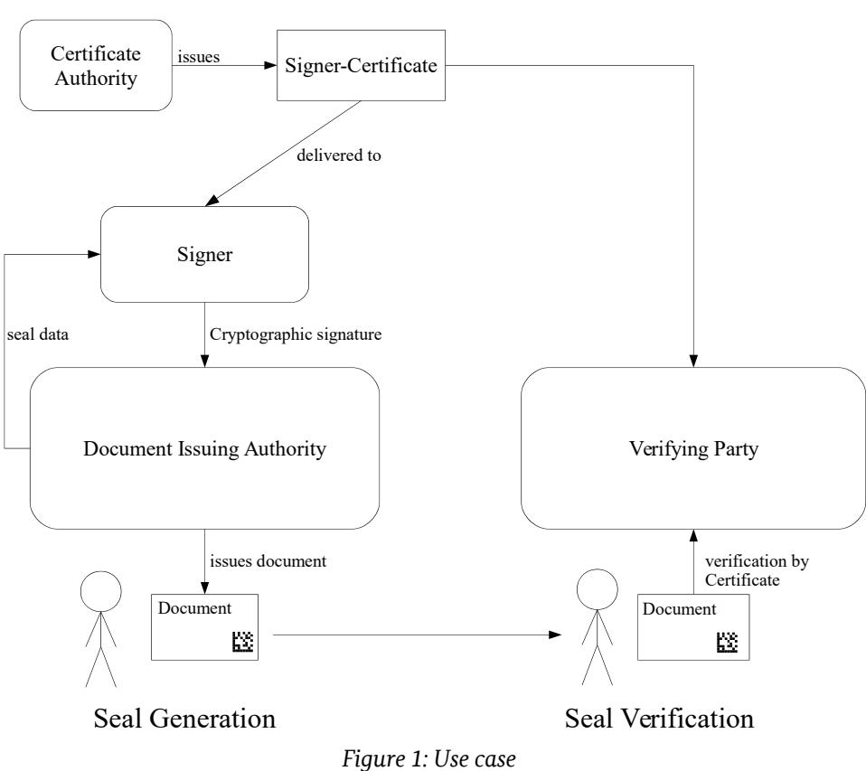
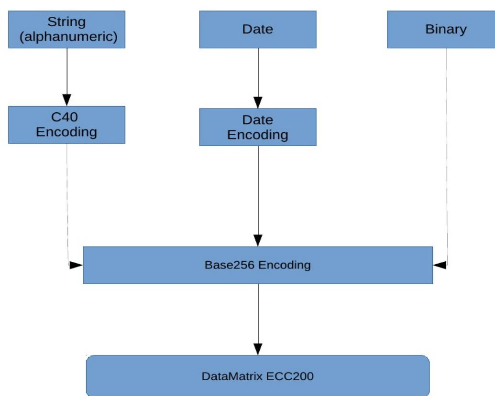
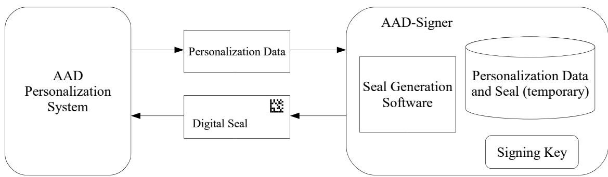
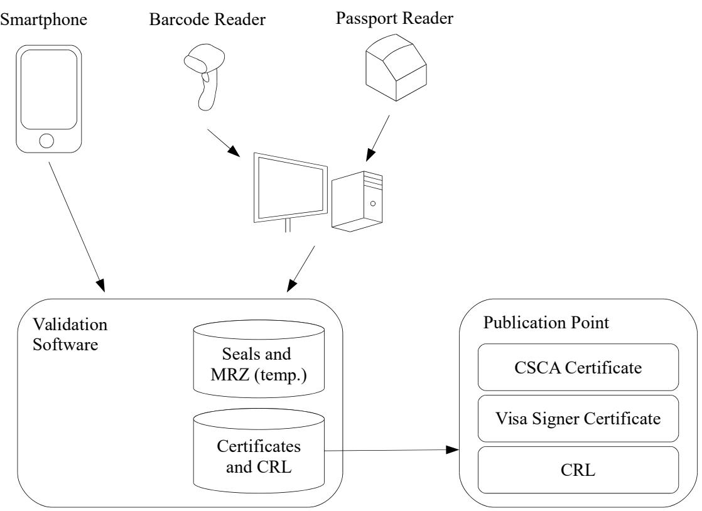
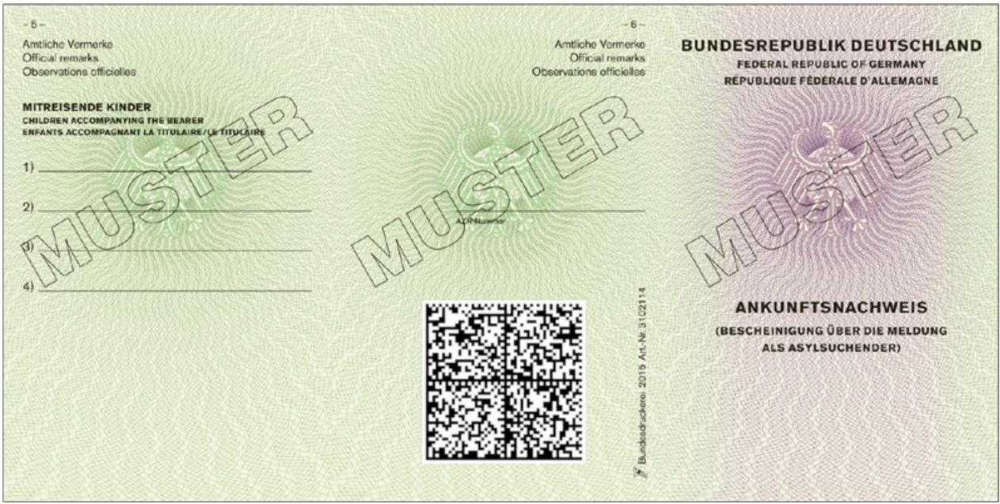
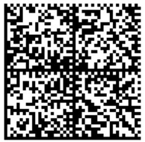
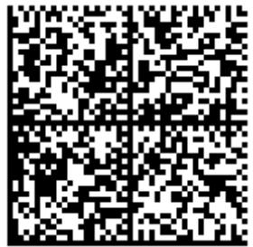
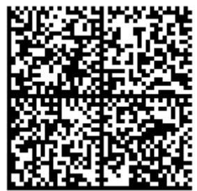
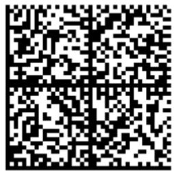
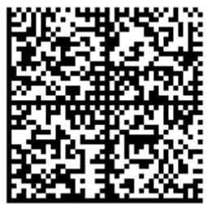

# Technical Guideline TR-03137

Optically Verifiable Cryptographic Protection of non-electronic Documents (Digital Seal)

Version 2.5

Dec 3, 2021

# <span id="page-1-0"></span>Document history

| Version | Date           | Description                                                                                                                                                                                                              |
|---------|----------------|--------------------------------------------------------------------------------------------------------------------------------------------------------------------------------------------------------------------------|
| 2.0     | Apr 15, 2016   | Merges part 1 and part 2 of BSI TR03137 v1.0 as well as the AAD profile v1.0                                                                                                                                             |
| 2.1     | Feb 13, 2017   | Integration of a Social Insurance Card Profile and adapting of length bytes in<br>the profile to increase the allowed storage of data in the seal.                                                                       |
| 2.2     | Sept 10, 2018  | Harmonization with the requirements of ICAO TR Visible Digital Seals for<br>Non-Electronic Documents Version 1.6                                                                                                         |
| 2.3     | March 10, 2020 | Integration of a residence permit document profile. The digital seal encoding<br>of this TR is now integrated into the [TR-SEAL] of the ICAO.                                                                            |
| 2.4     | Apr 09, 2021   | Integration of VISA document profile and a worked example according to [TR<br>SEAL].                                                                                                                                     |
| 2.5     | Oct 26, 2021   | Integration of address sticker profile for the German Identity card, the<br>residence sticker profile for the German passport and the worked examples.<br>Revising of References from [TR-SEAL] to ICAO Doc 9303 series. |

Federal Office for Information Security Post Box 20 03 63 D-53133 Bonn Phone: +49 22899 9582-0 E-Mail: eid@bsi.bund.de Internet: https://www.bsi.bund.de © Federal Office for Information Security 2021

|       | Document history 2                                                |  |
|-------|-------------------------------------------------------------------|--|
| 1     | Introduction 7                                                    |  |
| 1.1   | Terminology and Definitions 8                                     |  |
| 2     | General Description (Informative) 11                              |  |
| 2.1   | Signer Certificate Generation 11                                  |  |
| 2.2   | Digital Seal Generation 11                                        |  |
| 2.3   | Digital Seal Validation 12                                        |  |
| 3     | Digital Seal Encoding 14                                          |  |
| 3.1   | Symbology and Print Requirements 14                               |  |
| 3.2   | Encoding 14                                                       |  |
| 3.2.1 | Header 15                                                         |  |
| 3.2.2 | Message Zone 15                                                   |  |
| 3.2.3 | Digital Encoding of Document Features15                           |  |
| 3.2.4 | Signature Zone 16                                                 |  |
| 3.2.5 | Padding 16                                                        |  |
| 4     | Profile Definitions 17                                            |  |
| 5     | Visa Profile 18                                                   |  |
| 5.1   | Bar code Symbology 18                                             |  |
| 5.2   | Content and Encoding Rules 18                                     |  |
| 5.2.1 | Header 18                                                         |  |
| 5.2.2 | Document Features of the digital seal for VISA sticker18          |  |
| 5.2.3 | Encoding Rules for the Document Features19                        |  |
| 5.2.4 | Signature 19                                                      |  |
| 5.3   | Public Key Infrastructure 19                                      |  |
| 5.3.1 | Certificates 19                                                   |  |
| 5.3.2 | Certificate Validity Periods 21                                   |  |
| 5.3.3 | Certificate Publication 21                                        |  |
| 5.3.4 | Certificate Revocation 21                                         |  |
| 6     | Arrival Attestation Document Profile 22                           |  |
| 6.1   | Bar code Symbology 22                                             |  |
| 6.2   | Content and Encoding Rules 22                                     |  |
| 6.2.1 | Header 22                                                         |  |
| 6.2.2 | Document Features of a Seal for an Arrival Attestation Document22 |  |
| 6.2.3 | Encoding Rules for Document Features23                            |  |
| 6.2.4 | Signature 23                                                      |  |
| 6.3   | Public Key Infrastructure 23                                      |  |
| 6.4   | Seal Creation and Signing 24                                      |  |
| 6.4.1 | Architecture of the Arrival Attestation Document Signer System24  |  |
| 6.4.2 | Management of Signature Keys 24                                   |  |
| 6.4.3 | Key Requirements (Validity Period)24                              |  |
| 6.5   | Certificates 25                                                   |  |
| 6.5.1 | CSCA Certificate Profile 25                                       |  |
| 6.5.2 | Arrival Attestation Document Signer Certificate Profile25         |  |
| 6.5.3 | Certificate Publication 27                                        |  |

| 6.5.6<br>Certificate Revocation 27<br>6.6<br>Arrival Attestation Document Validation27<br>6.7<br>Validation Policy (Informative) 28<br>6.7.1<br>Policy Rules 28<br>7<br>Social Insurance Card Profile 29<br>7.1<br>Bar code Symbology 29<br>7.2<br>Content and Encoding Rules 29<br>7.2.1<br>Header 29<br>7.2.2<br>Document Features of a Seal for a National Social Insurance Card29<br>7.2.3<br>Encoding Rules for Document Features29<br>7.2.4<br>Signature 30<br>8<br>Residence Permit Profile 31<br>8.1<br>Bar code Symbology 31<br>8.2<br>Content and Encoding Rules 31<br>8.2.1<br>Header 31<br>8.2.2<br>Document Feature of the digital Seal for the Residence Permit Document31<br>8.2.3<br>Encoding Rules for Document Features of the Residence Permit Document32<br>8.2.4<br>Signature 32<br>8.3<br>Digital seal encoding for the supplementary sheet (Optional)32<br>8.4<br>Content and Encoding Rules 33<br>8.4.1<br>Header 33<br>8.4.2<br>Encoding Rules for Document Feature of supplementary sheet33<br>8.5<br>Public Key Infrastructure 33<br>8.5.1<br>Certificates 34<br>8.5.2<br>Certificate Validity Periods 35<br>8.5.3<br>Certificate Publication 35<br>8.5.4<br>Certificate Revocation 35<br>9<br>Address Sticker Profile for the German Identity Card36<br>9.1<br>Bar code Symbology 36<br>9.2<br>Content and Encoding Rules 36<br>9.2.1<br>Header 36<br>9.2.2<br>Document Features of a digital seal for the Address Sticker for the German Identity Card36<br>9.2.3<br>Encoding Rules of Document Features for the Address Sticker of German Identity Card37<br>9.2.4<br>Signature 37<br>9.3<br>Public Key Infrastructure 38<br>9.3.1<br>Certificates 38<br>9.3.2<br>Certificate Validity Periods 39<br>9.3.3<br>Certificate Publication 39<br>9.3.4<br>Certificate Generation 39<br>9.3.5<br>Certificate Revocation 40<br>10<br>Place of Residence Sticker Profile for German Passports41<br>10.1<br>Bar code Symbology 41<br>10.2<br>Content and Encoding Rules 41<br>10.2.1<br>Header 41<br>10.2.2<br>Document Features for the digital seal for place of residence stickers41 | 6.5.4<br>6.5.5 | Certificate Generation 27<br>Certificate Renewal 27 |  |
|--------------------------------------------------------------------------------------------------------------------------------------------------------------------------------------------------------------------------------------------------------------------------------------------------------------------------------------------------------------------------------------------------------------------------------------------------------------------------------------------------------------------------------------------------------------------------------------------------------------------------------------------------------------------------------------------------------------------------------------------------------------------------------------------------------------------------------------------------------------------------------------------------------------------------------------------------------------------------------------------------------------------------------------------------------------------------------------------------------------------------------------------------------------------------------------------------------------------------------------------------------------------------------------------------------------------------------------------------------------------------------------------------------------------------------------------------------------------------------------------------------------------------------------------------------------------------------------------------------------------------------------------------------------------------------------------------------------------------------------------------------------------------------------------------------------------------------------------------------------------------------------------------------------------------------------------------------------------------------------------------------------------------------------------------------------------------------------------------------------|----------------|-----------------------------------------------------|--|
|                                                                                                                                                                                                                                                                                                                                                                                                                                                                                                                                                                                                                                                                                                                                                                                                                                                                                                                                                                                                                                                                                                                                                                                                                                                                                                                                                                                                                                                                                                                                                                                                                                                                                                                                                                                                                                                                                                                                                                                                                                                                                                              |                |                                                     |  |
|                                                                                                                                                                                                                                                                                                                                                                                                                                                                                                                                                                                                                                                                                                                                                                                                                                                                                                                                                                                                                                                                                                                                                                                                                                                                                                                                                                                                                                                                                                                                                                                                                                                                                                                                                                                                                                                                                                                                                                                                                                                                                                              |                |                                                     |  |
|                                                                                                                                                                                                                                                                                                                                                                                                                                                                                                                                                                                                                                                                                                                                                                                                                                                                                                                                                                                                                                                                                                                                                                                                                                                                                                                                                                                                                                                                                                                                                                                                                                                                                                                                                                                                                                                                                                                                                                                                                                                                                                              |                |                                                     |  |
|                                                                                                                                                                                                                                                                                                                                                                                                                                                                                                                                                                                                                                                                                                                                                                                                                                                                                                                                                                                                                                                                                                                                                                                                                                                                                                                                                                                                                                                                                                                                                                                                                                                                                                                                                                                                                                                                                                                                                                                                                                                                                                              |                |                                                     |  |
|                                                                                                                                                                                                                                                                                                                                                                                                                                                                                                                                                                                                                                                                                                                                                                                                                                                                                                                                                                                                                                                                                                                                                                                                                                                                                                                                                                                                                                                                                                                                                                                                                                                                                                                                                                                                                                                                                                                                                                                                                                                                                                              |                |                                                     |  |
|                                                                                                                                                                                                                                                                                                                                                                                                                                                                                                                                                                                                                                                                                                                                                                                                                                                                                                                                                                                                                                                                                                                                                                                                                                                                                                                                                                                                                                                                                                                                                                                                                                                                                                                                                                                                                                                                                                                                                                                                                                                                                                              |                |                                                     |  |
|                                                                                                                                                                                                                                                                                                                                                                                                                                                                                                                                                                                                                                                                                                                                                                                                                                                                                                                                                                                                                                                                                                                                                                                                                                                                                                                                                                                                                                                                                                                                                                                                                                                                                                                                                                                                                                                                                                                                                                                                                                                                                                              |                |                                                     |  |
|                                                                                                                                                                                                                                                                                                                                                                                                                                                                                                                                                                                                                                                                                                                                                                                                                                                                                                                                                                                                                                                                                                                                                                                                                                                                                                                                                                                                                                                                                                                                                                                                                                                                                                                                                                                                                                                                                                                                                                                                                                                                                                              |                |                                                     |  |
|                                                                                                                                                                                                                                                                                                                                                                                                                                                                                                                                                                                                                                                                                                                                                                                                                                                                                                                                                                                                                                                                                                                                                                                                                                                                                                                                                                                                                                                                                                                                                                                                                                                                                                                                                                                                                                                                                                                                                                                                                                                                                                              |                |                                                     |  |
|                                                                                                                                                                                                                                                                                                                                                                                                                                                                                                                                                                                                                                                                                                                                                                                                                                                                                                                                                                                                                                                                                                                                                                                                                                                                                                                                                                                                                                                                                                                                                                                                                                                                                                                                                                                                                                                                                                                                                                                                                                                                                                              |                |                                                     |  |
|                                                                                                                                                                                                                                                                                                                                                                                                                                                                                                                                                                                                                                                                                                                                                                                                                                                                                                                                                                                                                                                                                                                                                                                                                                                                                                                                                                                                                                                                                                                                                                                                                                                                                                                                                                                                                                                                                                                                                                                                                                                                                                              |                |                                                     |  |
|                                                                                                                                                                                                                                                                                                                                                                                                                                                                                                                                                                                                                                                                                                                                                                                                                                                                                                                                                                                                                                                                                                                                                                                                                                                                                                                                                                                                                                                                                                                                                                                                                                                                                                                                                                                                                                                                                                                                                                                                                                                                                                              |                |                                                     |  |
|                                                                                                                                                                                                                                                                                                                                                                                                                                                                                                                                                                                                                                                                                                                                                                                                                                                                                                                                                                                                                                                                                                                                                                                                                                                                                                                                                                                                                                                                                                                                                                                                                                                                                                                                                                                                                                                                                                                                                                                                                                                                                                              |                |                                                     |  |
|                                                                                                                                                                                                                                                                                                                                                                                                                                                                                                                                                                                                                                                                                                                                                                                                                                                                                                                                                                                                                                                                                                                                                                                                                                                                                                                                                                                                                                                                                                                                                                                                                                                                                                                                                                                                                                                                                                                                                                                                                                                                                                              |                |                                                     |  |
|                                                                                                                                                                                                                                                                                                                                                                                                                                                                                                                                                                                                                                                                                                                                                                                                                                                                                                                                                                                                                                                                                                                                                                                                                                                                                                                                                                                                                                                                                                                                                                                                                                                                                                                                                                                                                                                                                                                                                                                                                                                                                                              |                |                                                     |  |
|                                                                                                                                                                                                                                                                                                                                                                                                                                                                                                                                                                                                                                                                                                                                                                                                                                                                                                                                                                                                                                                                                                                                                                                                                                                                                                                                                                                                                                                                                                                                                                                                                                                                                                                                                                                                                                                                                                                                                                                                                                                                                                              |                |                                                     |  |
|                                                                                                                                                                                                                                                                                                                                                                                                                                                                                                                                                                                                                                                                                                                                                                                                                                                                                                                                                                                                                                                                                                                                                                                                                                                                                                                                                                                                                                                                                                                                                                                                                                                                                                                                                                                                                                                                                                                                                                                                                                                                                                              |                |                                                     |  |
|                                                                                                                                                                                                                                                                                                                                                                                                                                                                                                                                                                                                                                                                                                                                                                                                                                                                                                                                                                                                                                                                                                                                                                                                                                                                                                                                                                                                                                                                                                                                                                                                                                                                                                                                                                                                                                                                                                                                                                                                                                                                                                              |                |                                                     |  |
|                                                                                                                                                                                                                                                                                                                                                                                                                                                                                                                                                                                                                                                                                                                                                                                                                                                                                                                                                                                                                                                                                                                                                                                                                                                                                                                                                                                                                                                                                                                                                                                                                                                                                                                                                                                                                                                                                                                                                                                                                                                                                                              |                |                                                     |  |
|                                                                                                                                                                                                                                                                                                                                                                                                                                                                                                                                                                                                                                                                                                                                                                                                                                                                                                                                                                                                                                                                                                                                                                                                                                                                                                                                                                                                                                                                                                                                                                                                                                                                                                                                                                                                                                                                                                                                                                                                                                                                                                              |                |                                                     |  |
|                                                                                                                                                                                                                                                                                                                                                                                                                                                                                                                                                                                                                                                                                                                                                                                                                                                                                                                                                                                                                                                                                                                                                                                                                                                                                                                                                                                                                                                                                                                                                                                                                                                                                                                                                                                                                                                                                                                                                                                                                                                                                                              |                |                                                     |  |
|                                                                                                                                                                                                                                                                                                                                                                                                                                                                                                                                                                                                                                                                                                                                                                                                                                                                                                                                                                                                                                                                                                                                                                                                                                                                                                                                                                                                                                                                                                                                                                                                                                                                                                                                                                                                                                                                                                                                                                                                                                                                                                              |                |                                                     |  |
|                                                                                                                                                                                                                                                                                                                                                                                                                                                                                                                                                                                                                                                                                                                                                                                                                                                                                                                                                                                                                                                                                                                                                                                                                                                                                                                                                                                                                                                                                                                                                                                                                                                                                                                                                                                                                                                                                                                                                                                                                                                                                                              |                |                                                     |  |
|                                                                                                                                                                                                                                                                                                                                                                                                                                                                                                                                                                                                                                                                                                                                                                                                                                                                                                                                                                                                                                                                                                                                                                                                                                                                                                                                                                                                                                                                                                                                                                                                                                                                                                                                                                                                                                                                                                                                                                                                                                                                                                              |                |                                                     |  |
|                                                                                                                                                                                                                                                                                                                                                                                                                                                                                                                                                                                                                                                                                                                                                                                                                                                                                                                                                                                                                                                                                                                                                                                                                                                                                                                                                                                                                                                                                                                                                                                                                                                                                                                                                                                                                                                                                                                                                                                                                                                                                                              |                |                                                     |  |
|                                                                                                                                                                                                                                                                                                                                                                                                                                                                                                                                                                                                                                                                                                                                                                                                                                                                                                                                                                                                                                                                                                                                                                                                                                                                                                                                                                                                                                                                                                                                                                                                                                                                                                                                                                                                                                                                                                                                                                                                                                                                                                              |                |                                                     |  |
|                                                                                                                                                                                                                                                                                                                                                                                                                                                                                                                                                                                                                                                                                                                                                                                                                                                                                                                                                                                                                                                                                                                                                                                                                                                                                                                                                                                                                                                                                                                                                                                                                                                                                                                                                                                                                                                                                                                                                                                                                                                                                                              |                |                                                     |  |
|                                                                                                                                                                                                                                                                                                                                                                                                                                                                                                                                                                                                                                                                                                                                                                                                                                                                                                                                                                                                                                                                                                                                                                                                                                                                                                                                                                                                                                                                                                                                                                                                                                                                                                                                                                                                                                                                                                                                                                                                                                                                                                              |                |                                                     |  |
|                                                                                                                                                                                                                                                                                                                                                                                                                                                                                                                                                                                                                                                                                                                                                                                                                                                                                                                                                                                                                                                                                                                                                                                                                                                                                                                                                                                                                                                                                                                                                                                                                                                                                                                                                                                                                                                                                                                                                                                                                                                                                                              |                |                                                     |  |
|                                                                                                                                                                                                                                                                                                                                                                                                                                                                                                                                                                                                                                                                                                                                                                                                                                                                                                                                                                                                                                                                                                                                                                                                                                                                                                                                                                                                                                                                                                                                                                                                                                                                                                                                                                                                                                                                                                                                                                                                                                                                                                              |                |                                                     |  |
|                                                                                                                                                                                                                                                                                                                                                                                                                                                                                                                                                                                                                                                                                                                                                                                                                                                                                                                                                                                                                                                                                                                                                                                                                                                                                                                                                                                                                                                                                                                                                                                                                                                                                                                                                                                                                                                                                                                                                                                                                                                                                                              |                |                                                     |  |
|                                                                                                                                                                                                                                                                                                                                                                                                                                                                                                                                                                                                                                                                                                                                                                                                                                                                                                                                                                                                                                                                                                                                                                                                                                                                                                                                                                                                                                                                                                                                                                                                                                                                                                                                                                                                                                                                                                                                                                                                                                                                                                              |                |                                                     |  |
|                                                                                                                                                                                                                                                                                                                                                                                                                                                                                                                                                                                                                                                                                                                                                                                                                                                                                                                                                                                                                                                                                                                                                                                                                                                                                                                                                                                                                                                                                                                                                                                                                                                                                                                                                                                                                                                                                                                                                                                                                                                                                                              |                |                                                     |  |
|                                                                                                                                                                                                                                                                                                                                                                                                                                                                                                                                                                                                                                                                                                                                                                                                                                                                                                                                                                                                                                                                                                                                                                                                                                                                                                                                                                                                                                                                                                                                                                                                                                                                                                                                                                                                                                                                                                                                                                                                                                                                                                              |                |                                                     |  |
|                                                                                                                                                                                                                                                                                                                                                                                                                                                                                                                                                                                                                                                                                                                                                                                                                                                                                                                                                                                                                                                                                                                                                                                                                                                                                                                                                                                                                                                                                                                                                                                                                                                                                                                                                                                                                                                                                                                                                                                                                                                                                                              |                |                                                     |  |
|                                                                                                                                                                                                                                                                                                                                                                                                                                                                                                                                                                                                                                                                                                                                                                                                                                                                                                                                                                                                                                                                                                                                                                                                                                                                                                                                                                                                                                                                                                                                                                                                                                                                                                                                                                                                                                                                                                                                                                                                                                                                                                              |                |                                                     |  |
|                                                                                                                                                                                                                                                                                                                                                                                                                                                                                                                                                                                                                                                                                                                                                                                                                                                                                                                                                                                                                                                                                                                                                                                                                                                                                                                                                                                                                                                                                                                                                                                                                                                                                                                                                                                                                                                                                                                                                                                                                                                                                                              |                |                                                     |  |
|                                                                                                                                                                                                                                                                                                                                                                                                                                                                                                                                                                                                                                                                                                                                                                                                                                                                                                                                                                                                                                                                                                                                                                                                                                                                                                                                                                                                                                                                                                                                                                                                                                                                                                                                                                                                                                                                                                                                                                                                                                                                                                              |                |                                                     |  |
|                                                                                                                                                                                                                                                                                                                                                                                                                                                                                                                                                                                                                                                                                                                                                                                                                                                                                                                                                                                                                                                                                                                                                                                                                                                                                                                                                                                                                                                                                                                                                                                                                                                                                                                                                                                                                                                                                                                                                                                                                                                                                                              |                |                                                     |  |

| 10.2.3 | Encoding Rules for the digital seal for the place of residence sticker41     |  |
|--------|------------------------------------------------------------------------------|--|
| 10.2.4 | Signature 42                                                                 |  |
| 10.3   | Public Key Infrastructure 42                                                 |  |
| 11     | Biometric Data in Digital Seals (Informative) 43                             |  |
| 11.1   | Introduction 43                                                              |  |
| 11.2   | Biometric Template Protection 44                                             |  |
| 12     | Further Use Cases (Informative) 45                                           |  |
| 12.1   | Document Example 1 – Temporary Passport45                                    |  |
| 12.2   | Examples for Feature Processing Methods45                                    |  |
| 12.2.1 | MRZ Verification 45                                                          |  |
| 12.2.2 | Facial Image Verification 46                                                 |  |
| 12.2.3 | Fingerprint Verification 46                                                  |  |
|        | Annex A: Conversion of ECDSA Signature Formats (Informative)48               |  |
|        | Annex B: C40 Encoding of Strings (Normative)49                               |  |
|        | Annex C: Worked Example Arrival Attestation Document (Informative)52         |  |
|        | Annex D: Worked Example of a Social Insurance Card55                         |  |
|        | Annex E: Worked Example of a Digital Seal for Residence Permit Documents58   |  |
|        | Annex F: Worked Example for Digital Seal for VISA Sticker61                  |  |
|        | Annex G: Worked Example for the Address Sticker for the German ID-Document64 |  |
|        | Annex H: Worked Example for the Residence Sticker for German Passports67     |  |
|        | References 70                                                                |  |
|        |                                                                              |  |

# Figures

| Figure 1: Use case 11                                                                                        |  |
|--------------------------------------------------------------------------------------------------------------|--|
| Figure 2: Encoding process of DataMatrix ECC 20015                                                           |  |
| Figure 3: AAD-Document personalization 24                                                                    |  |
| Figure 4: Arrival Attestation Document (AAD) validation28                                                    |  |
| Figure 5: Front side of the Arrival Attestation Document encoded in an DataMatrix bar code containing the    |  |
| MRZ, AZR number and the elliptic curve signature52                                                           |  |
| Figure 6: Digital Seal of a SIC containing: social insurance number, first name, last name, name at birth,   |  |
| issuing date and an elliptic curve signature 55                                                              |  |
| Figure 7: Digital Seal of a Residence Permit containing the MRZ and the passport number with an ECDSA        |  |
| brainpool 256 signature 58                                                                                   |  |
| Figure 8: Digital Seal for VISA sticker containing MRZ, Duration of Stay and passport number signed with     |  |
| brainpoolP224r1 curve 61                                                                                     |  |
| Figure 9: Digital Seal for address sticker containing the passport number, official municipality code number |  |
| and residential address signed with brainpoolP224r1 curve64                                                  |  |
| Figure 10: Digital seal for the residence sticker of German passports containing the passport number,        |  |
| municipality code number and the postal code signed by a brainpoolP224r1 curve67                             |  |
|                                                                                                              |  |

# Tables

| Table 1: VISA-Signer Certificate Profile 19                                                |  |
|--------------------------------------------------------------------------------------------|--|
| Table 2: Arrival Attestation Document (AAD) Signer Certificate Profile: Certificate Body25 |  |
| Table 3: Arrival Attestation Document (AAD) Signer Certificate Profile: Extensions26       |  |
| Table 4: Encoding of the Residence Permit Signer Certificate34                             |  |
|                                                                                            |  |

| Table 5 Encoding of address sticker signer certificate38          |  |
|-------------------------------------------------------------------|--|
| Table 6: Encoding/Decoding example for the string "XK<SPACE>CD"50 |  |
| Table 7: Encoding/Decoding example for the string "XKCD"50        |  |
| Table 8: C40 Encoding chart and correspondence to ASCII50         |  |

# <span id="page-6-0"></span>1 Introduction

Nowadays, many electronic documents are distributed including a cryptographic signature, which allows a reliable verification of the integrity and authenticity of the document. Even travel and ID documents are issued with embedded electronic storage media, equipped with radio-frequency (RF) chips or issued as smart cards in order to provide such a verification of their data. However, there are still non-electronic documents whose authenticity and integrity should be verifiable, such as non-electronic travel and ID documents, e.g. visas, and passports, or driver licenses, and breeder documents (i.e. documents that can serve as a basis to obtain other, more important identification documents).

The digital seal is a mechanism that allows to verify (in parts or as a whole) the authenticity and integrity of non-electronic documents automatically by cryptographic means using optical document readers only. The digital seal is a two-dimensional bar code printed on the document and comprises digitally signed data for checking the authenticity of the document and the integrity of relevant document contents, e.g. text or images, as well as optionally additional biometric features of the document holder in case of travel or identity documents. Thus, the digital seal provides a considerable security improvement for non-electronic (usually paper based) documents. Nevertheless, compared to chip based documents there are considerable limitations. Storage capacity of digital seals is usually limited to a few kByte at most and neither the data nor the cryptographic keys or schemes for the digital seal can be updated on existing documents. That is why cryptographic agility is not supported. The digital seal does not provide any protection against cloning, does not implement privacy protection functionality, and is more prone to read errors due to wear and tear than chip based documents.

Printing and optical reading of integral parts of the non-electronic documents is, of course, prone to inaccuracy. Error tolerant techniques which enable correcting tolerable deviations while reading and decoding document information, should therefore be applied in using the digital seal.

In general the generation of a digital seal encompasses the following steps:

- 1. Create digital reference data assigned to the document (and if applicable biometric data of the document holder) which shall be stored in the digital seal for enabling an automatic verification.
- 2. Add auxiliary data if needed and necessary information on signature methods and algorithms used to protect the stored data.
- 3. Digitally sign the reference data and the auxiliary data to protect the document information stored in the digital seal and to prove the integrity and authenticity of the document information.
- 4. Encode the information (reference and auxiliary data, digital signature) in a machine-readable bar code.
- 5. Attach (print) the coded information to (on) the document.

This document is structured as follows: In chapter [2,](#page-10-0) an informative introduction is given that sketches out the whole use case. In chapter [3](#page-13-0), the encoding details of a digital seal are specified. The contents of a digital seal as well as the required public key infrastructure are highly dependent on the specific use case. Each usecase can be described in a profile. The necessary contents of such a profile are defined in chapter [4.](#page-16-0) Actual profiles are defined in chapter [5](#page-17-0), [6,](#page-21-0) [7](#page-28-0) , [8](#page-30-0), [9](#page-35-0) and [10](#page-40-0). Chapter [11](#page-42-0) gives a short informative description for the use case of encoding of biometric data in the digital seal. Chapter [12](#page-44-0) gives an informative description of additional possible use-case. [Annex A: Conversion of ECDSA Signature Formats \(Informative\)](#page-47-0) gives an informal description on signature encoding for the seal. [Annex B: C40 Encoding of Strings \(Normative\)](#page-48-0) describes the encoding method of text strings defined in chapter [3](#page-13-0). [Annex C: Worked Example Arrival](#page-51-0) [Attestation Document \(Informative\)](#page-51-0) gives a worked example based on the profile defined in chapter [6.](#page-21-0) [Annex D: Worked Example of a Social Insurance Card](#page-54-0) shows an example based on the profile from chapter [7](#page-28-0). [Annex E: Worked Example of a Digital Seal for Residence Permit Documents](#page-57-0) gives an example for digital seals of paper-based Residence Permit documents according to the defined profile in section [8.](#page-30-0) [Annex F:](#page-60-0) [Worked Example for Digital Seal for VISA Sticker](#page-60-0) describes a worked example for VISA sticker. [Annex G:](#page-63-0) [Worked Example for the Address Sticker for the German ID-Document](#page-63-0) describes the worked example for the digital seal of the address sticker of the German ID card and [Annex H: Worked Example for the](#page-66-0) [Residence Sticker for German Passports](#page-66-0) describes the digital seal for residence sticker for the German passport.

# 1.1 Terminology and Definitions

The key words "MUST", "SHALL", "REQUIRED", "SHOULD", "RECOMMENDED", and "MAY" in this document are to be interpreted as described in [RFC].

- MUST This word, or the terms "REQUIRED" or "SHALL", mean that the definition is an absolute requirement of the specification.
- MUST NOT This phrase, or the phrase "SHALL NOT", mean that the definition is an absolute prohibition of the specification.
- SHOULD This word, or the adjective "RECOMMENDED", mean that there may exist valid reasons in particular circumstances to ignore a particular item, but the full implications must be understood and carefully weighed before choosing a different course.
- SHOULD NOT This phrase, or the phrase "NOT RECOMMENDED" mean that there may exist valid reasons in particular circumstances when the particular behavior is acceptable or even useful, but the full implications should be understood and the case carefully weighed before implementing any behavior described with this label.
- MAY This word, or the adjective "OPTIONAL", mean that an item is truly optional. One vendor may choose to include the item because a particular marketplace requires it or because the vendor feels that it enhances the product while another vendor may omit the same item. An implementation which does not include a particular option MUST be prepared to interoperate with another implementation which does include the option, though perhaps with reduced functionality. In the same vein an implementation which does include a particular option MUST be prepared to interoperate with another implementation which does not include the option (except, of course, for the feature the option provides.)

We identify binary values with their hexadecimal representation preceded by 0x, e.g. 0x2a. If clear from context, the prefix 0x is sometimes omitted. Sometimes binary values are identified with their decimal value, written by appending dec, i.e. 42dec. Throughout this document, we assume Big Endian encoding, i.e. byte sequences are read from left to right. Bit sequences are read from right to left, i.e. we assume the least significant bit (LSB) to be at (the rightmost) position 0.

Moreover we define the following terminology:

#### **Affine**

Two records of a biometric feature are affine, if they are from the same part of the body and thus have the same origin.

#### **Bar code**

Optical, machine-readable representation, in one or two dimensions, of data relating to the object to which it is attached.

#### **Bar code Symbology**

A mapping between messages and bar codes is called a symbology. Such mapping is defined in the specification of the bar code and includes the encoding of single digits or characters, the size of a so called quiet zone around the bar code, as well as the computation of checksums for error correction.

#### **Certificate**

Electronic file attesting that a cryptographic key pair belongs to a person or a hardware or software component as identified in the certificate. A certificate is issued by a Certification Authority. By signing the certificate, the Certification Authority approves the link between the identity of a person or component and the cryptographic key pair. The certificate may be revoked if it doesn't attest the validity of this link any more. The certificate has a limited validity period.

#### **Certificate Revocation List (CRL)**

A list of certificates that have been revoked. Documents that identify a certificate from a CRL for verification shall thus no longer be trusted.

#### **Country Signing Certificate Authority (CSCA)**

The Certification Authority of a country that signs document signer certificates. Document issuer, such as manufacturer of passports, use the private keys corresponding to the document signer certificates to sign data on electronic machine readable travel documents (eMRTDs). The CSCA of each Issuing State or organization acts as the trust point for the receiving state. The CSCA also signs SubCA-Certificates for subordinate Certification Authorities (SubCAs) below the CSCA.

#### **Cryptographic Signature**

The output generated by a signature algorithm of a signature scheme. The signature ensures integrity and authenticity of data.

#### **Cryptographic Signature Scheme**

A tuple of three algorithms. The key-generation algorithm takes as input a security parameter and outputs a key pair consisting of a private and a public key. The signature algorithm takes as input a private key, and a message, and outputs a cryptographic signature. The verification algorithm takes as input a public key, a message, and a signature, and outputs valid if the signature was generated using the signature generation algorithm with the private key of the key pair and the message as input, and invalid otherwise.

#### **(Digital) Document Feature**

A property of a document which can be used to verify the contents of the document or tie the document to its holder. Examples are textual information such as the name of the holder, or the issuing date, or a printed image of the document holder. A digital document feature is the digitized version of a document feature.

#### **Digital Seal**

A two-dimensional bar code printed on the document that contains digitally signed data for checking the authenticity and integrity of relevant document contents, e.g. text or images, as well as optionally additional biometric features of the document holder.

#### **Elliptic Curve Digital Signature Algorithm (ECDSA)**

A variant of the Digital Signature Algorithm (DSA) based on elliptic curve cryptography.

#### **False-Acceptance-Rate (FAR)**

A FAR describes the probability of non affine biometric feature which are wrongly recognized as a biometric match.

#### **False-Rejection-Rate (FRR)**

A FRR describes the probability of affine biometric features, which are wrongly not recognized as a biometric match.

#### **Machine Readable Travel Document (MRTD)**

A travel document as defined in [MRTD6].

#### **Machine Readable Zone (MRZ)**

A fixed dimensional area on the MRTD as defined in [MRTD6], consisting of textual data printed in a font designed for easy Optical Character Recognition (OCR).

#### **Physical Document Features**

Physical properties of a document that prevent forging or faking it. Examples are watermarks, holograms, or micro-printing.

#### **Signature Scheme**

See cryptographic signature scheme.

#### **Signer**

The authority that receives data from a document personalization system and that uses a certificate and the corresponding private key to encode and sign a digital seal.

#### **Signer Certificate**

A certificate containing information identifying the entity that signed a digital seal on a document, and that contains the public key corresponding to the private key with which the signature was created.

#### **(Feature) Tag**

A byte that uniquely identifies a document feature. The mapping between feature tags and features must be specified in a profile.

#### **Verifying Party**

The authority that validates a visible digital seal based on a validation policy.

# <span id="page-10-0"></span>2 General Description (Informative)

This section gives a general overview of using a digital seal to protect a non-electronic document. The general use-case is depicted in Figure [1.](#page-10-1) Technical details vary from use-case to use-case, but the same general principles apply.

The general workflow can be separated into three steps. As a prerequisite, Signer Certificates have to be generated. Next, seals are generated, and then later validated.



# Certificate Generation

# <span id="page-10-2"></span><span id="page-10-1"></span>2.1 Signer Certificate Generation

The signer is the entity that actually signs **digital seals**. The signer uses a private key to create the signature for the seals. For the corresponding public key, a certificate is issued by a certificate authority (CA), and the CA publishes the certificate. For a document containing a digital seal, the Signer Certificate can be used to check the validity of a digital seal. Note that in practice, there can be one or more subordinate CA(s) below the (root) CA, and the distribution mechanism for certificates from the CA to the verifying party can vary. The whole process of seal generation and validation is described in the next two sections.

# 2.2 Digital Seal Generation

The number and type of features included in a digital seal may differ, depending on the specific use case. Those document features stored in the digital seal enable checking that the document has not been manipulated or forged as well as the readout of feature data in cases where information printed on the document is

damaged. Additional biometric features (e.g. protected fingerprint templates) stored in the digital seal enable a reliable identification of the document holder. A digital signature of all document and additional biometric features stored in the digital seal protects the authenticity and integrity of the verification data.

A seal is generated in two steps:

- 1. An applicant applies for a document at the document issuing authority. The issuing authority records the applicant's data and checks whether the applicant meets the requirements to receive the document. If the requirements are fulfilled, the issuing authority sends a digital representation of the recorded data to the signer. The signer cryptographically signs the recorded data.
- 2. For signing, the signer uses the private key for which the corresponding public key was published by the CA as a certificate. The resulting signature is sent back to the issuing authority, printed on the document, and the document can be handed to the applicant.

# 2.3 Digital Seal Validation

Suppose the applicant's document is to be verified by a verifying party. The verifying party checks the authenticity and integrity of the digital seal on the document by validating the signature of the seal, and comparing the printed information on the document with the digital information stored in the seal. The signature of the seal is verified by identifying the corresponding signer certificate with the help of the identifier stored in the header of the seal, and then using the public key of the signer certificate.

#### **Further Information**

A digital seal is a data structure stored in a two-dimensional bar code printed on non-electronic documents (e.g. temporary identification or travel documents). It allows the verification of the authenticity and the integrity of the document contents as well as (optionally) a biometric verification of its holder. For this purpose the digital seal comprises digitally signed data by which the authenticity and integrity of features**,** which is either text printed on a document, biometric data itself (e.g. fingerprints) or a secure biometric template, can be verified. The digital seal is generated during the issuance of the document. Therefore, relevant data of the features to be covered by the seal are compiled. The issuing authority (or an entity acting on behalf it) signs the data digitally. Finally, the feature data and a digital signature are encoded and printed as a bar code on the document.

Document features and/or additional biometric features can be either read (and decoded) from the digital seal, captured by optical reading (scanning) of document elements, or be acquired by other means. These features may cover, but are not limited to, the following types:

- 1. Text printed on the document that can be read by optical means, e.g. content of the machine-readable zone (MRZ), the holder's identity information, or serial number of document.
- 2. A facial image of the document holder printed on the document.
- 3. Metadata of the document that cannot or do not need to be captured by optical reading, e.g. document type, number of pages.
- 4. Other security features specified for the document, e.g. watermarks, microprinting, holograms, UV/IRvisible patterns or substance features.
- 5. A specimen handwritten signature of the document holder printed on the document.
- 6. Additional generated biometric features of the document holder, for instance fingerprints or iris patterns.

All features which are an *integral part* of the document, e.g. printed on the document, and to be protected by cryptographic means (digital signature) against falsification are considered (and denominated) in the following as *integral document features*. Biometric information that is not an integral part of the document but allows the identification of the document holder by acquisition of a biometric pattern are called *biometric document features*.

Some of the features which are printed on the document can also be used for biometric authentication, e. g. facial images, images of a specimen signature or fingerprints, are henceforth referred to as document features too.

The digital seal is read optically, e.g. by scanning the document or using optical document readers. The authenticity and integrity of the digital seal is protected by a digital signature which can be verified using the public key of the signer (issuer of the document). The public key is referenced in the header data block of the digital seal (see section [3.2.1](#page-14-0)).

For each feature, the digital seal contains a data block, called the *document features,* which depend on the content and is either the printed text of the document, a biometric image or a biometric template. These verification data encompass the actual feature data as well as optional auxiliary data for supporting the automatic verification. The verification data, stored in the digital seal, must allow a sufficiently error tolerant verification of the document features to ensure that documents exposed to aging, wear and tear, and damages typically tolerated for that document type can still be successfully verified.

Storing biometric data can lead to capacity issues of the bar code; on the one hand due to the data volume requirements of biometric features and/or templates themselves, and on the other hand because they must be enlarged with error-correction-codes. At the same time, the digital seal must ensure that unauthorized modifications of the document features or the digital seal itself are detected at verification.

In addition, document features can also be verified by other (possibly non-automated) means; examples include non-optical features like the number of pages of the document, tactile features, or optical features like watermarks, guilloches or holograms, if no corresponding sensors are available.

# <span id="page-13-0"></span>3 Digital Seal Encoding

A digital seal is a cryptographically signed data structure containing document features, encoded as a 2D bar code and printed on a document. The encoding of the digital seal is aligned to be fully compatible with [DOC 9303-13] but defines additional requirements, for example the choice of allowed bar codes.

# <span id="page-13-1"></span>3.1 Symbology and Print Requirements

The bar code SHOULD be printed in a way so that reader equipment (i.e. off-the-shelf smartphones or scanners) are capable to reliably decode the bar code. Printing and scanning quality requirements depend on the document and application scenario, and MAY be specified in a profile that applies for the use-case. Due to the fact that the quality of printing and scanning affects error rates and influences the robustness of digital seal verification, these requirements SHOULD ensure that the bar code (e.g. QR-Code, DataMatrix ECC 200 or Aztec-Code) containing the digital seal and all mandatory document features can be reliably verified. Another important requirement addresses symbol contrast of the bar code, because the digital seal might be printed on security paper with a colored background (e.g. green).

For assessing print quality and the capability to reliably decode the bar code, [PRINT] MUST be taken into account. When using standard inkjet printers, the bar code MUST be printed with a module size (size of one block of a 2D bar code) of at least 0.3386mm width/height per module, corresponding to 4 dots per module side length (i.e. 16 dots per module) on a 300 dpi printer, or 8 dots per module side length (i.e. 64 dots per module) on a 600 dpi printer. Deviations to the aforementioned requirements are only allowed, if defined in the specific document profiles.

# 3.2 Encoding

The encoded bar code consists of a header, the message zone, and the signature zone as defined in[DOC 9303-13]

It has to be noted that the length of the message zone and signature is variable in general, but the message zone MUST contain at least one document feature element, and a valid signature MUST always be present.

Figure [2](#page-14-2) gives a general overview how a digital seal is encoded according to this specification into a DataMatrix ECC 200 code. The encoding of the input data depends on their format, and their encoding uses several ways. The input data can either be alphanumeric, a date, or binary. An alphanumeric string is first encoded with the C40 encoding to binary data, and dates are encoded in a specific date format (see section [3.2.3\)](#page-14-1) as binary data. After that, such binary data (including other raw binary data) is encoded using Base256Encoding (see [DTMX]) to DataMatrixECC 200.



<span id="page-14-2"></span>*Figure 2: Encoding process of DataMatrix ECC 200*

### <span id="page-14-0"></span>3.2.1 Header

The encoding of the header for the digital seal, which SHALL be used in all profiles of this TR, is defined in [DOC 9303-13]. In addition, the requirements defined in section 31.1 of [DOC 9303-13] applies.

### 3.2.2 Message Zone

The message zone encoding MUST be according to [DOC 9303-13].

### <span id="page-14-1"></span>3.2.3 Digital Encoding of Document Features

As building blocks to encode document features, three basic types are supported: *Alphanum* are strings of uppercase alphanumeric characters (i.e. A-Z, 0-9 and space), *Int* are positive integers, and *Date* is to store dates. These are converted to sequences of bytes as follows:

- 1. Strings of alphanumeric characters are encoded as bytes by C40 encoding (cf. [Annex B: C40 Encoding of](#page-48-0) [Strings \(Normative\)](#page-48-0)).
- 2. For positive integers, their unsigned integer representation is taken.
- 3. A date is first converted into a positive integer by concatenating the month, the days, and the (four digit) year. This positive integer is then concatenated into a sequence of three bytes.

*Binary* are sequences of bytes which are taken as they are.

If the three basic types above are unsuitable to encode the desired document feature (for example, if the document feature requires non-ASCII characters), the specific encoding of that document feature into *binary* MUST be define in the specific profile. Otherwise, the above encoding MUST be used.

#### **Example**

Consider March 25th, 1957. Concatenating the month, date and year yields the integer 03251957, resulting in the three bytes 0x31 0x9e 0xf5.

A digital document feature is a sequence of bytes. It has the structure: tag | length | value.

Here tag is a unique integer in the range 0-254 acting as an identifier of the document feature, value is a basic type converted to a sequence of bytes, and length is an integer in the range 0-254 denoting the length (the number of bytes) of the value. Note that tag 255 is reserved to denote the start of the signature.

#### **Example**

Consider a document feature that encodes the string "BSI01" with assigned tag 0x0a. The C40 encoded byte sequence (cf. Section [Annex B: C40 Encoding of Strings \(Normative\)](#page-48-0)) of length 4 is 0x62d719c9. The document feature is thus the byte sequence 0x0a0462d719c9.

Additional features, i.e. features with unknown tags MAY be present, for example for optional use of the issuing entity. Such additional features MUST NOT use the tag of the additional feature field, or the tag of any other optional or mandatory feature. The presence of features with unknown tags SHALL NOT affect the validity of the visa, if the signature is recognized as valid.

#### 3.2.4 Signature Zone

The signature zone is encoded as described in [DOC 9303-13].

### 3.2.5 Padding

If the header, message and signature together do not fill the available space of the bar code, padding characters shall be appended after the signature according to [DTMX].

# <span id="page-16-0"></span>4 Profile Definitions

A profile MUST contain definitions for the following aspects:

- restriction and formats of the bar code (i.e. size, capacity)
- the document features stored in the message zone of the seal including their tags and lengths
- the cryptographic signature format, algorithms, and key requirements
- the public key infrastructure
- certificate distribution
- certificate profiles for the signing certificates and other certificates of the public key infrastructure. The restrictions defined in Section [3.2.1](#page-14-0) (Signer Identifier and Certificate Reference) MUST be taken into account when defining the certificate profiles
- validation of digital seals the document of the specific use case
- other necessary requirements specific to the use case, including custom encodings for document features into binary sequences

Every profile MUST adhere to the seal encoding defined in Section [3](#page-13-0). The ICAO-PKI as defined for digital seals [MRTD12] SHOULD be used whenever the specific use case allows it.

# <span id="page-17-0"></span>5 Visa Profile

This chapter specifies the profile for digital seals of VISA stickers issued by the German Member State according to [C(2020) 2672]. VISAs are issued to persons entering to Germany, which are coming from a third-level country. In addition to the personal data, the digital seal is printed on the VISA to ensure the integrity and authenticity of the document and to protect the document against falsifications. Thus, the digital seal increases the security of the VISA sticker by using cryptographic means.

# 5.1 Bar code Symbology

The digital seal MUST be encoded as DataMatrix [DTMX] bar code with 44x44 modules (i.e. the maximum raw data capacity is 142 Bytes (see [DTMX])). The bar code MUST be printed with 600dpi with 7 dots per module side length (i.e. 49 dots per module). A Worked Example for digital seals for VISA stickers is given in [Annex F: Worked Example for Digital Seal for VISA Sticker.](#page-60-0)

# 5.2 Content and Encoding Rules

## 5.2.1 Header

The Version (at start position 0x01) in the header MUST be of number 4, i.e. 0x03 according to [DOC 9303- 13] and the total length of the header MUST be 18 bytes. All other parameter of the header MUST be according to section 9.1.1 of [MRZ-VISA].

## 5.2.2 Document Features of the digital seal for VISA sticker

The digital seal SHALL encode the following mandatory document features. Other document feature are not allowed:

#### **Machine Readable Zone (REQUIRED)**

The Machine Readable Zone (MRZ) of VISA SHALL contain the following information (see [MRZ-VISA]):

- **•** Type of Document
- **•** issuing state
- **•** surname and first name of the document holder
- **•** passport or visa number
- **•** nationality of the document holder
- **•** date of birth of the document holder
- **•** sex of the document holder
- **•** validity period (valid until)

The information mentioned above SHALL be encoded as MRZ of MRV-B.

#### **Duration of Stay (REQUIRED):**

This document feature specifies the number of days, month or year the VISA holder may stay in the territory for which the VISA is valid (see [MRZ-VISA]).

#### **Passport Number (REQUIRED)**

This document feature denotes the number of the passport to which the VISA is attached. The passport number is also required, if it is already part of the MRZ of the VISA.

### 5.2.3 Encoding Rules for the Document Features

This section defines the concrete digital encoding of the aforementioned document features for VISA.

#### **MRZ of Machine Readable VISA of Type B (according to [MRZ-VISA])**

The encoding for the document feature MRZ of Machine Readable VISA of Type B SHALL be according to section 9.1.3 of [MRZ-VISA].

#### **Duration of Stay**

The document feature Duration of Stay SHALL be encoded as defined in section 9.1.3 of [MRZ-VISA].

#### **Passport Number**

The passport number of the passport on which the VISA is attached SHALL be encoded as defined in section 9.1.3 of [MRZ-VISA].

### 5.2.4 Signature

Hash- and signature algorithms that SHALL be used for seal generation are defined in [KRYPT].

# 5.3 Public Key Infrastructure

For verifying the signature of the digital seal for VISA sticker a VISA-Signer certificate is required. The VISA Signer certificate SHALL be issued by the CSCA. Thus the VISA-Signer certificates are issued in a way that allows verification by the CSCA certificate (defined in [MRTD12]). This means the VISA-Signer certificate is directly issued by the CSCA without having a SubCA in between. The VISA-Signer shall only use its private key for signing the data stored in the digital seal of VISA stickers. The corresponding public key is part of the VISA-Signer certificate, which is used to verify the signature on the digital seal.

### 5.3.1 Certificates

#### **CSCA Certificate**

The profile for the CSCA certificate is defined in [MRTD12].

#### **VISA-Signer Certificate Profile**

The certificate profile for VISA-Signer Certificates is defined in the following Table [1.](#page-18-0)

Table 1: VISA-Signer Certificate Profile

<span id="page-18-0"></span>

| Certificate Body   | Presence | Remark                          |
|--------------------|----------|---------------------------------|
| Certificate        | m        |                                 |
| TBSCertificate     | m        | see below                       |
| signatureAlgorithm | m        | dependent on selected algorithm |
| signatureValue     | m        | dependent on selected algorithm |
| TBSCertificate     |          |                                 |
|                    |          |                                 |

5 Visa Profile

| Certificate Body     | Presence | Remark                                                                                                                                                                                                                                                                                                                                                                                                                                                                                                                                                 |  |
|----------------------|----------|--------------------------------------------------------------------------------------------------------------------------------------------------------------------------------------------------------------------------------------------------------------------------------------------------------------------------------------------------------------------------------------------------------------------------------------------------------------------------------------------------------------------------------------------------------|--|
| version              | m        | 2 (indicating version 3)                                                                                                                                                                                                                                                                                                                                                                                                                                                                                                                               |  |
| serialNumber         | m        | MUST be the positive integer that results from<br>interpreting the up to three character hex-string as a<br>positive integer. This integer uniquely identifies a<br>VISA-Signer Certificate for one CA and subject.<br>leading bit must be zero in DER encoding<br>(cf. [MRTD12]).                                                                                                                                                                                                                                                                     |  |
| signature            | m        | value inserted here MUST be the same as that in the<br>signatureAlgorithm component of certificate<br>sequence                                                                                                                                                                                                                                                                                                                                                                                                                                         |  |
| issuer               | m        | MUST be the value of the subject DN of the CSCA<br>certificate with which the VISA-Signer certificate<br>was signed<br>MUST terminate with Zulu (Z). The seconds<br>element must be present. Dates through 2049 must<br>be<br>in<br>UTCTime,<br>represented<br>as<br>YYMMDDHHMMSSZ. Dates in 2050 and beyond<br>must be in GeneralizedTime. GeneralizedTime<br>must not have fractional seconds, and must be<br>represented as YYYYMMDDHHMMSSZ. The<br>validity (i.e. difference between notBefore and<br>notAfter) must be according to Section 5.3.2 |  |
| validity             | m        |                                                                                                                                                                                                                                                                                                                                                                                                                                                                                                                                                        |  |
| subject              | m        | the following two MUST be present; other<br>attributes MUST NOT be present.                                                                                                                                                                                                                                                                                                                                                                                                                                                                            |  |
|                      |          | commonName:<br>MUST consist of two uppercase<br>characters,<br>printableString<br>format, that uniquely define the<br>VISA-Signer within one country,<br>and must be present in the<br>header of a VISA-Signer as the<br>Signer reference                                                                                                                                                                                                                                                                                                              |  |
|                      |          | countryName:<br>MUST consist of the ISO two<br>letter country code of the VISA<br>Signer, uppercase characters,<br>printableString format                                                                                                                                                                                                                                                                                                                                                                                                              |  |
| subjectPublicKeyInfo | m        | MUST adhere to [X509] and [MRTD12]                                                                                                                                                                                                                                                                                                                                                                                                                                                                                                                     |  |
| issuerUniqueID       | x        |                                                                                                                                                                                                                                                                                                                                                                                                                                                                                                                                                        |  |
| subjectUniqueID      | x        |                                                                                                                                                                                                                                                                                                                                                                                                                                                                                                                                                        |  |
| Extensions           | m        | All mandatory extensions according to [MRTD12]<br>SHALL be used. In addition, the DocumentType<br>extension according to [MRTD12] MUST also be<br>present.                                                                                                                                                                                                                                                                                                                                                                                             |  |

## <span id="page-20-0"></span>5.3.2 Certificate Validity Periods

#### **CSCA Certificate**

The same certificate validity period for CSCA as defined in section [6.4.3](#page-23-0) SHALL be used.

#### **VISA-Signer**

Private Key Usage Time: 1 year + 2 month (the 2 month are meant for smooth roll-over) Certificate Validity: Private Key Usage Time + VISA Sticker Validity Timeframe

### 5.3.3 Certificate Publication

The publication of the VISA-Signer certificates MUST be done as described in section [6.5.3](#page-26-0).

### 5.3.4 Certificate Revocation

If the private key of the VISA-Signer is compromised, the certificate SHALL be revoked. Requirements for the certificate revocation are described in [MRTD12].

# <span id="page-21-0"></span>6 Arrival Attestation Document Profile

This chapter specifies the profile for digital seals of the Arrival Attestation Document. The Arrival Attestation Document is a physical document which is surrendered to each refugee, who is coming to Germany. This document contains a digital seal additional to personal data to guarantee the authenticity of the document and protection against forgery. In addition to personal data, biometric data are stored in a database to guarantee that the document belongs to the correct person.

# 6.1 Bar code Symbology

The seal MUST be encoded as a DataMatrix [DTMX] bar code with 48x48 blocks (max. 172 Byte raw capacity). For a worked example, see [Annex C: Worked Example Arrival Attestation Document \(Informative\).](#page-51-0)

# 6.2 Content and Encoding Rules

## 6.2.1 Header

The *Document Feature Definition Reference* for this use case is 0xFD.

The *Document Type Category* for Arrival Attestation Documents is 0x02.

The version MUST be set to 0x02 according to [DOC 9303-13].

Otherwise, the content of the header is the same as defined in [DOC 9303-13].

## 6.2.2 Document Features of a Seal for an Arrival Attestation Document

The following document features are stored in the seal:

#### **Machine Readable Zone (REQUIRED)**

Basic Information are encoded using a Machine Readable Zone (MRZ) of a TD2-Format MROTD [MRTD6]. This MRZ contains the following information:

- document code
- issuing state
- surname and first name of the document holder
- document number
- nationality of the document holder
- date of birth of the document holder
- sex of the document holder
- date of expiry

Additionally, the following document features are stored:

#### **AZR-Number (REQUIRED)**

A string consisting of 12 alphanumeric characters.

# 6.2.3 Encoding Rules for Document Features

In the following, the digital encoding of document features of the arrival attestation document seal is defined.

#### **MRZ (TD2-Type [MRTD6])**

| Tag:         | 0x02                                                                                                                                                       |  |  |  |  |  |
|--------------|------------------------------------------------------------------------------------------------------------------------------------------------------------|--|--|--|--|--|
| Min. Length: | 48 Byte                                                                                                                                                    |  |  |  |  |  |
| Max. Length: | 48 Byte                                                                                                                                                    |  |  |  |  |  |
| Value Type:  | Alphanumeric                                                                                                                                               |  |  |  |  |  |
| Presence:    | REQUIRED                                                                                                                                                   |  |  |  |  |  |
| Content:     | The first line and second line of the MRZ of a TD2-MROTD (2*36 chars.).<br>The filler symbol < in the MRZ is replaced by <SPACE> prior to encoding by C40. |  |  |  |  |  |
| AZR-Number   |                                                                                                                                                            |  |  |  |  |  |
| Tag:         | 0x03                                                                                                                                                       |  |  |  |  |  |
| Min. Length: | 8 Byte                                                                                                                                                     |  |  |  |  |  |
| Max. Length: | 8 Byte                                                                                                                                                     |  |  |  |  |  |
| Value Type:  | Alphanumeric                                                                                                                                               |  |  |  |  |  |

Presence: REQUIRED

Content: The AZR-Number: An alphanumeric string of 12 characters, encoded by C40.

### 6.2.4 Signature

Hashing and signature algorithms defined in [KRYPT] for digital seals MUST be used.

# 6.3 Public Key Infrastructure

W.r.t. this profile for arrival attestation documents (AAD), AAD-Signer Certificates are issued in a way that allows verification by CSCA certificates. This means, there is no SubCA. Hence, there are only two entities, the AAD-Signer, and the CSCA:

The AAD-Signer is the authority that signs AADs using a secret private key. The corresponding public key is contained in an AAD-Signer Certificate.

The CSCA according to [MRTD12] self issues CSCA certificates and is the root of the PKI. The CSCA also issues AAD-Signer Certificates.

As a consequence, requirements applying to AAD-Signer Certificates are aligned w.r.t. [MRTD12]. Note that the present specification defines additional requirements.

# 6.4 Seal Creation and Signing

## 6.4.1 Architecture of the Arrival Attestation Document Signer System

The AAD-Signer receives data from an AAD-Personalization System to encode a digital seal, and uses a signing key to sign it. [Figure 3: AAD-Document personalization](#page-23-1) depicts this implementation of the AAD-Signer and its client, the AAD-Personalization System.



<span id="page-23-1"></span>Figure *3:* AAD-Document personalization

The AAD-Signer relies on the following software and data:

- The *seal generation software*, producing **digital seals** conforming to the present standard. It receives the personalization data sent by the client, signs these data with a private signing key, and encodes the personalization data and the signature to a bar code. The arrival attestation document personalization data and the seal are the input and output data of the seal generation software, and must be stored temporarily in the AAD-Signer during the generation of the seal.
- The *signature keys* (private and public key) to sign a **digital seal**. The private signing key is used by the seal generation software to sign the data of the seal. It is the most critical data of the AAD-Signer.

## 6.4.2 Management of Signature Keys

The signature keys are the most critical data of the AAD-Signer and as such SHALL be protected according to the best security practices.

## <span id="page-23-0"></span>6.4.3 Key Requirements (Validity Period)

Validity periods are as follows:

#### **CSCA Certificates (as specified in [MRTD12])**

Private Key Usage Time: 3 years Certificate Validity: Private Key Usage Time + Max. of Key Lifetime (= Certificate Validity) of Document Signer Certificates, AAD-Signer Certificates or other certificates below the CSCA – whichever is longer

#### **AAD-Signer Certificates**

Private Key Usage Time: 1 year + 2 month (the 2 month are meant for smooth roll-over)

Certificate Validity: Private Key Usage Time + AAD Validity Timeframe

The used hash function, signature algorithm and (domain) parameters must be present in the SubjectPublicKeyInfo extension of the AAD-Signer Certificate (cf. Section [6.5.2](#page-24-1)).

# 6.5 Certificates

The AAD-Signer Certificates shall be distributed using the CSCA-PKI [MRTD12]. A general outline of this procedure is briefly given in Section [2.1.](#page-10-2)

In the sections below we use the following terminology for presence requirements of each of the components/extensions in certificates:

- m mandatory the field MUST be present
- x do not use the field MUST NOT be populated
- o optional the field MAY be present

For the criticality of certificate extensions we use the following terminology:

- c critical the extension is marked critical, receiving applications must be able to process this extension
- nc the extension is marked non-critical, receiving applications that do not understand this extension must ignore it

For detailed certificate profiles, see the sections below.

### 6.5.1 CSCA Certificate Profile

The CSCA Certificate profile is defined in [MRTD12].

### <span id="page-24-1"></span>6.5.2 Arrival Attestation Document Signer Certificate Profile

In Table [2,](#page-24-0) we list the complete certificate body of an AAD-Signer certificate.

<span id="page-24-0"></span>*Table 2: Arrival Attestation Document (AAD) Signer Certificate Profile: Certificate Body*

| Certificate Body   | Presence | Remark                                                                                                                                                                                                                                                                       |
|--------------------|----------|------------------------------------------------------------------------------------------------------------------------------------------------------------------------------------------------------------------------------------------------------------------------------|
| Certificate        | m        |                                                                                                                                                                                                                                                                              |
| TBSCertificate     | m        | see below                                                                                                                                                                                                                                                                    |
| signatureAlgorithm | m        | dependent on selected algorithm                                                                                                                                                                                                                                              |
| signatureValue     | m        | dependent on selected algorithm                                                                                                                                                                                                                                              |
| TBSCertificate     |          |                                                                                                                                                                                                                                                                              |
| version            | m        | 2 (indicating version 3)                                                                                                                                                                                                                                                     |
| serialNumber       | m        | must be the positive integer that results from<br>interpreting the five character hex-string. as a<br>positive integer. This integer uniquely identifies an<br>AAD-Signer Certificate for one CA and subject.<br>leading bit must be zero in DER encoding (cf.<br>[MRTD12]). |

| Certificate Body     | Presence | Remark                                                                                                                                                                                                                                                                                                                                                                                                                                                                                                                                                                                                                                                               |                                                                                                                                                                                                                          |
|----------------------|----------|----------------------------------------------------------------------------------------------------------------------------------------------------------------------------------------------------------------------------------------------------------------------------------------------------------------------------------------------------------------------------------------------------------------------------------------------------------------------------------------------------------------------------------------------------------------------------------------------------------------------------------------------------------------------|--------------------------------------------------------------------------------------------------------------------------------------------------------------------------------------------------------------------------|
| signature            | m        | value inserted here must be the same as that in the<br>signatureAlgorithm component of certificate<br>sequence<br>must be the value of the subject DN of the CSCA<br>certificate with which the AAD-Signer certificate<br>was signed<br>must terminate with Zulu (Z). The seconds element<br>must be present. Dates through 2049 must be in<br>UTCTime, represented as YYMMDDHHMMSSZ.<br>Dates in 2050 and beyond must be in<br>GeneralizedTime. GeneralizedTime must not have<br>fractional seconds, and must be represented as<br>YYYYMMDDHHMMSSZ.<br>The<br>validity<br>(i.e.<br>difference between notBefore and notAfter) must<br>be according to Section 6.4.3 |                                                                                                                                                                                                                          |
| issuer               | m        |                                                                                                                                                                                                                                                                                                                                                                                                                                                                                                                                                                                                                                                                      |                                                                                                                                                                                                                          |
| validity             | m        |                                                                                                                                                                                                                                                                                                                                                                                                                                                                                                                                                                                                                                                                      |                                                                                                                                                                                                                          |
| subject              | m        | the following two MUST be present; other<br>attributes MUST NOT be present.                                                                                                                                                                                                                                                                                                                                                                                                                                                                                                                                                                                          |                                                                                                                                                                                                                          |
|                      |          | commonName:                                                                                                                                                                                                                                                                                                                                                                                                                                                                                                                                                                                                                                                          | must consist of two uppercase<br>characters,<br>printableString<br>format, that uniquely define the<br>AAD-Signer within one country,<br>and must be present in the<br>header of a AAD-Signer as the<br>Signer reference |
|                      |          | countryName:                                                                                                                                                                                                                                                                                                                                                                                                                                                                                                                                                                                                                                                         | must consist of the ISO two<br>letter country code of the AAD<br>Signer, uppercase characters,<br>printableString format                                                                                                 |
| subjectPublicKeyInfo | m        | must adhere to [X509] and [MRTD12]                                                                                                                                                                                                                                                                                                                                                                                                                                                                                                                                                                                                                                   |                                                                                                                                                                                                                          |
| issuerUniqueID       | x        |                                                                                                                                                                                                                                                                                                                                                                                                                                                                                                                                                                                                                                                                      |                                                                                                                                                                                                                          |
| subjectUniqueID      | x        |                                                                                                                                                                                                                                                                                                                                                                                                                                                                                                                                                                                                                                                                      |                                                                                                                                                                                                                          |
| extensions           | m        | cf. Table 3 on which extensions should be present.<br>Default values for extensions must not be encoded.                                                                                                                                                                                                                                                                                                                                                                                                                                                                                                                                                             |                                                                                                                                                                                                                          |

Extensions are depicted in Table [3](#page-25-0). No other certificate extensions must be present.

<span id="page-25-0"></span>

| Table 3: Arrival Attestation Document (AAD) Signer Certificate Profile: Extensions |  |  |  |
|------------------------------------------------------------------------------------|--|--|--|
|                                                                                    |  |  |  |

| Extension Name            | Presence | Criticality | Remark                                                         |
|---------------------------|----------|-------------|----------------------------------------------------------------|
| AuthorityKeyIdentifier    | m        | nc          |                                                                |
| keyIdentifier             | m        |             |                                                                |
| authorityCertIssuer       | o        |             |                                                                |
| authorityCertSerialNumber | o        |             |                                                                |
| ExtKeyUsage               | m        |             | the EKU extension for each AAD<br>Signer must be populated as: |

| Extension Name | Presence | Criticality | Remark                |              |     |
|----------------|----------|-------------|-----------------------|--------------|-----|
|                |          |             | AAD-Signer            | Certificate, | OID |
|                |          |             | 0.4.0.127.0.7.3.5.1.1 |              |     |

### <span id="page-26-0"></span>6.5.3 Certificate Publication

As the AAD-Signer Certificates are not contained in the digital seal itself, the CA must publish its certificates. Publication must adhere to the following principles:

- 1. As soon as a new certificate is created, it must be published within a delay of no more than 48 hours.
- 2. The certificates must remain published until their expiration.

### <span id="page-26-1"></span>6.5.4 Certificate Generation

The certificate generation process consists of the following steps:

- The signature key pair of the AAD-Signer is generated in a cryptographic module or a secure signature creation device.
- A certificate request is created by the AAD-Signer. This request contains the public key of the signature key pair of the AAD-Signer that should be certified, and is signed with the private key of the AAD-Signer.
- This certificate request is sent to the CSCA on a secure channel.
- The CSCA verifies the signature of the certificate request, and creates a certificate corresponding to the public key of the AAD-Signer.
- The CSCA returns the certificate to the AAD-Signer.
- The CSCA publishes the certificate .

## 6.5.5 Certificate Renewal

A new certificate must always contain a newly generated key pair. New certificates are regularly created when the corresponding signature keys reach the end of their signing validity period.

## 6.5.6 Certificate Revocation

An AAD-Signer certificate must be revoked in case of a security incident concerning the signature key. The certificate revocation of an AAD-Signer certificate is decided by the country that issues the AAD. Since the AAD-Signer certificate is issued by a CSCA, the revocation of a certificate is published in the CRL of that CSCA, cf. [MRTD12].

# 6.6 Arrival Attestation Document Validation

Arrival Attestation Documents with digital seals are validated by applying a validation policy. The next section specifies validation criteria and algorithms to generate a validation status in detail.

Figure [4](#page-27-0) illustrates the functional architecture for validation. The system relies on validation software which can be deployed on any computer used by the relevant authorities.

The validation software is connected with a reader that takes an image of the document to retrieve the bar code. Optionally (depending on the capabilities of the reader) the printed MRZ of the document is retrieved by using optical character recognition (OCR).

To verify the validity of the signature of the **digital seal**, the validation software SHOULD BE synchronized with the PKI publication point at least every 24 hours to retrieve the latest CRLs.



<span id="page-27-0"></span>*Figure 4: Arrival Attestation Document (AAD) validation*

The validation software decodes the digital seal, and optionally OCRs the printed MRZ of the document**,** validates the signature of the **digital seal**, and applies a validation policy to generate a validation status of the document.

The following data are processed by the validation software:

- Input data provided by readers, i.e. the image of the document, optionally the printed MRZ of the document
- Certificates and CRLs.

# 6.7 Validation Policy (Informative)

### 6.7.1 Policy Rules

The Validation Policy is a set of validation rules that allow to determine the validity of the seal on the document. The set of rules, how a seal should be verified is described in Appendix D of [DOC 9303-13].

# <span id="page-28-0"></span>7 Social Insurance Card Profile

This section specifies a profile for digital seals of a Social Insurance Card (SIC). A SIC is a physical document which proves the registration and membership of a person within a national social insurance. The digital seal on a SIC, in addition to human-readable personal data printed on the SIC, guarantees the authenticity and integrity of the document's data and protects against forgery. To verify the tie between a document and its holder, an ID document is required.

# 7.1 Bar code Symbology

The seal MUST be encoded as a DataMatrix [DTMX] bar code. The symbol size depends on the number of bytes, which are encoded in the bar code. The minimal symbol size of the DataMatrix according to table 7 of [DTMX] SHOULD be chosen in a way that the seal fits in the bar code. Given the specified content encoding rules, the maximal required symbol size is 80 x 80 with max. 453 byte raw capacity (without errorcorrection).

A worked example is shown in [Annex D: Worked Example of a Social Insurance Card](#page-54-0).

# 7.2 Content and Encoding Rules

## 7.2.1 Header

The Version of the SIC is 0x02.

The *Document Feature Definition Reference* for this use case is 0xFC

The *Document Type Category* for Social Insurance Card is 0x04.

Otherwise, the content of the header is according to [DOC 9303-13].

## 7.2.2 Document Features of a Seal for a National Social Insurance Card

This section describes the data which are stored in the digital seal of the Social Insurance Card. These data are:

- Social insurance number (required)
- Surname and first name (required)
- Name at birth (optional)

Other additional document features are not permitted for encoding of the digital seal for the SIC.

## 7.2.3 Encoding Rules for Document Features

In the following, the digital encoding of document features of a SIC seal is defined.

#### **Social Insurance Number**

Tag: 0x01 Min. Length: 8 Byte Max. length: 8 Byte Value Type: Alphanumeric

Presence: REQUIRED

Content:A unique alphanumeric string of 12 characters, encoded by C40

#### **Surname**

| Tag:         | 0x02          |
|--------------|---------------|
| Min. Length: | 1 Byte        |
| Max. length: | 90 Byte       |
| Value Type:  | Unicode utf-8 |
| Presence:    | REQUIRED      |
|              |               |

Content:A string of max. 30 characters, encoded by UTF-8 as a binary sequence.

#### **First name**

| Tag:         | 0x03          |
|--------------|---------------|
| Min. Length: | 1 Byte        |
| Max. length: | 90 Byte       |
| Value Type:  | Unicode utf-8 |
| Presence:    | REQUIRED      |
|              |               |

Content:A string of max. 30 characters, encoded by UTF-8 as a binary sequence.

#### **Name at birth**

| Tag:         | 0x04          |
|--------------|---------------|
| Min. Length: | 1 Byte        |
| Max. length: | 90 Byte       |
| Value Type:  | Unicode utf-8 |
| Presence:    | CONDITIONAL   |

Content:A string of max. 30 characters, encoded by UTF-8 as a binary sequence.

This field is REQUIRED, if the birth name differs from the surname. Otherwise, this field MUST be omitted.

### 7.2.4 Signature

Hashing and signature algorithm defined in [KRYPT] MUST be used for the digital seal.

# <span id="page-30-0"></span>8 Residence Permit Profile

This chapter specifies the profile for a digital seal on a paper based residence permit (RP) document. This RP document is issued to foreigners, which are allowed to stay for a temporary time period in Germany. It contains the digital seal in addition to the personal data, to ensure the integrity and authenticity of the data printed on the document.

# <span id="page-30-1"></span>8.1 Bar code Symbology

The digital seal MUST be encoded as a DataMatrix [DTMX] bar code, with 44x44 modules (i.e. the maximum raw data capacity is 142 Bytes (see [DTMX])). The bar code MUST be printed with 600dpi with 8 dots per module. All other requirements are according to section [3.1.](#page-13-1) A worked example of a digital seal for residence permit document is described in [Annex E: Worked Example of a Digital Seal for Residence Permit](#page-57-0) [Documents.](#page-57-0)

# 8.2 Content and Encoding Rules

## 8.2.1 Header

The Version (at start position 0x01) in the header MUST be of number 4, i.e. 0x03 according to [DOC 9303- 13].

The *Document Feature Definition Reference* for residence permit document according to [DOC 9303-13] MUST be set to *0xFB*.

The *Document Type Category* for residence permit documents is *0x06.* For all other parameter of the header [DOC 9303-13] applies.

## 8.2.2 Document Feature of the digital Seal for the Residence Permit Document

The document features listed below MUST be encoded in the bar code for the residence permit. Other document features are not allowed.

#### **Machine Readable Zone (REQUIRED)**

Basic Information are encoded using a Machine Readable Zone (MRZ) of a TD2-Format MROTD [MRTD6]. This MRZ contains the following information:

- document code
- issuing state
- surname and first name of the document holder
- document number
- nationality of the document holder
- date of birth of the document holder
- sex of the document holder
- date of expiry

#### **Passport Number (REQUIRED)**

Is a String composed of 9 alphanumeric characters

### 8.2.3 Encoding Rules for Document Features of the Residence Permit Document

The Document Features encoding for digital seals of the residence permit document is defined by the following data.

#### **MRZ (TD2-Type [MRTD6])**

| Tag:         | 0x02                                                                                                                                                       |  |  |  |  |  |
|--------------|------------------------------------------------------------------------------------------------------------------------------------------------------------|--|--|--|--|--|
| Min. Length: | 48 Byte                                                                                                                                                    |  |  |  |  |  |
| Max. Length: | 48 Byte                                                                                                                                                    |  |  |  |  |  |
| Value Type:  | Alphanumeric                                                                                                                                               |  |  |  |  |  |
| Presence:    | REQUIRED                                                                                                                                                   |  |  |  |  |  |
| Content:     | The first line and second line of the MRZ of a TD2-MROTD (2*36 chars.).<br>The filler symbol < in the MRZ is replaced by <SPACE> prior to encoding by C40. |  |  |  |  |  |

#### **Passport Number**

| Tag:         | 0x03         |
|--------------|--------------|
| Min. Length: | 6 Byte       |
| Max. Length: | 6 Byte       |
| Value Type:  | Alphanumeric |
| Presence:    | REQUIRED     |

Content: The content of the document number is encoded by C40 encoding.

### 8.2.4 Signature

For generation of digital signatures the hashing and signature algorithms according to [KRYPT] SHALL be used.

# 8.3 Digital seal encoding for the supplementary sheet (Optional)

The supplementary sheet of the residence permit document contains additional information of the document holder, like e.g. the domicile and the work permission of the document holder. The issuance of a supplementary sheet is optional in general, but if it is issued, the following data shall be encoded in the digital seal:

- **•** The MRZ of the residence permit document
- **•** Number of the supplementary sheet

For encoding the digital seal on the supplementary sheet the same bar code symbology as described in section [8.1](#page-30-1) applies.

# <span id="page-32-0"></span>8.4 Content and Encoding Rules

### 8.4.1 Header

The Version of the header MUST be *0x03* (at Position 0x01) indicating version number 4 according to [DOC 9303-13].

The *Document Feature Definition Reference* for supplementary sheet according to section [3.2.1](#page-14-0) MUST be set to 0xFA.

The *Document Type Category* for supplementary sheet is 0x06.

For all other parameter of the header [DOC 9303-13] applies.

Note: The distinction between the Residence Permit and supplementary sheet must be done by the Document Feature Definition Reference, because both have the same Document Type Category.

## 8.4.2 Encoding Rules for Document Feature of supplementary sheet

The digital seal of the supplementary sheet SHALL encode the following document features.

#### **MRZ of the Residence Permit Document (TD2-Type [MRTD6])**

| Tag:         | 0x04                                                                                                                                                       |  |  |  |  |
|--------------|------------------------------------------------------------------------------------------------------------------------------------------------------------|--|--|--|--|
| Min. Length: | 48 Byte                                                                                                                                                    |  |  |  |  |
| Max. Length: | 48 Byte                                                                                                                                                    |  |  |  |  |
| Value Type:  | Alphanumeric                                                                                                                                               |  |  |  |  |
| Presence:    | REQUIRED                                                                                                                                                   |  |  |  |  |
| Content:     | The first line and second line of the MRZ of a TD2-MROTD (2*36 chars.).<br>The filler symbol < in the MRZ is replaced by <SPACE> prior to encoding by C40. |  |  |  |  |

#### **Number of supplementary sheet**

| Tag:<br>0x05                |  |
|-----------------------------|--|
| Min. Length:<br>6 Byte      |  |
| Max. Length:<br>6 Byte      |  |
| Value Type:<br>Alphanumeric |  |
| Presence:<br>REQUIRED       |  |

Content: The content of the supplementary sheet number is encoded by C40 encoding.

# 8.5 Public Key Infrastructure

For verifying the signature of the digital seal for residence permit documents a residence permit (RP)-Signer certificate, issued by the CSCA, is required. Thus the RP-Signer certificates are issued in a way that allows verification by the CSCA certificate (defined in [MRTD12]). This means the RP-Signer certificate is directly issued by the CSCA without having a SubCA in between. The RP-Signer uses its private key for signing the data stored in the digital seal. The corresponding public key is part of the RP-Signer certificate, which is used to verify the signature on the digital seal.

### 8.5.1 Certificates

#### **CSCA certificate**

The structure of the CSCA certificate is defined in [MRTD12].

#### **Residence Permit Signer Certificate**

The encoding of the Residence Permit Signer Certificate is described in the Table below.

|  |  | Table 4: Encoding of the Residence Permit Signer Certificate |  |  |  |
|--|--|--------------------------------------------------------------|--|--|--|
|  |  |                                                              |  |  |  |

| Certificate Body   | Presence | Remark                                                                                                                                                                                                                                                                                                                                                                                                                       |  |  |
|--------------------|----------|------------------------------------------------------------------------------------------------------------------------------------------------------------------------------------------------------------------------------------------------------------------------------------------------------------------------------------------------------------------------------------------------------------------------------|--|--|
| Certificate        | m        |                                                                                                                                                                                                                                                                                                                                                                                                                              |  |  |
| TBSCertificate     | m        | see below                                                                                                                                                                                                                                                                                                                                                                                                                    |  |  |
| signatureAlgorithm | m        | dependent on selected algorithm                                                                                                                                                                                                                                                                                                                                                                                              |  |  |
| signatureValue     | m        | dependent on selected algorithm                                                                                                                                                                                                                                                                                                                                                                                              |  |  |
| TBSCertificate     |          |                                                                                                                                                                                                                                                                                                                                                                                                                              |  |  |
| version            | m        | 2 (indicating version 3)                                                                                                                                                                                                                                                                                                                                                                                                     |  |  |
| serialNumber       | m        | must be the positive integer that results from<br>interpreting the up to three character hex-string as<br>a positive integer. This integer uniquely identifies<br>an RP-Signer Certificate for one CA and subject.<br>leading bit must be zero in DER encoding<br>(cf. [MRTD12]).                                                                                                                                            |  |  |
| signature          | m        | value inserted here must be the same as that in the<br>signatureAlgorithm component of certificate<br>sequence                                                                                                                                                                                                                                                                                                               |  |  |
| issuer             | m        | must be the value of the subject DN of the CSCA<br>certificate with which the RP-Signer certificate was<br>signed                                                                                                                                                                                                                                                                                                            |  |  |
| validity           | m        | must terminate with Zulu (Z). The seconds element<br>must be present. Dates through 2049 must be in<br>UTCTime, represented as YYMMDDHHMMSSZ.<br>Dates in 2050 and beyond must be in<br>GeneralizedTime. GeneralizedTime must not have<br>fractional seconds, and must be represented as<br>YYYYMMDDHHMMSSZ.<br>The<br>validity<br>(i.e.<br>difference between notBefore and notAfter) must<br>be according to Section 6.4.3 |  |  |
| subject            | m        | the following two MUST be present; other<br>attributes MUST NOT be present.                                                                                                                                                                                                                                                                                                                                                  |  |  |
|                    |          | commonName:<br>must consist of two uppercase<br>characters,<br>printableString<br>format, that uniquely define the<br>RP-Signer within one country,<br>and must be present in the<br>header of a RP-Signer as the<br>Signer reference                                                                                                                                                                                        |  |  |

| Certificate Body     | Presence | Remark                                                                                                                             |                                                                                                                         |
|----------------------|----------|------------------------------------------------------------------------------------------------------------------------------------|-------------------------------------------------------------------------------------------------------------------------|
|                      |          | countryName:                                                                                                                       | must consist of the ISO two<br>letter country code of the RP<br>Signer, uppercase characters,<br>printableString format |
| subjectPublicKeyInfo | m        | must adhere to [X509] and [MRTD12]                                                                                                 |                                                                                                                         |
| issuerUniqueID       | x        |                                                                                                                                    |                                                                                                                         |
| subjectUniqueID      | x        |                                                                                                                                    |                                                                                                                         |
| extensions           | m        | All mandatory extensions according to [MRTD12]<br>SHALL be used. In addition, the DocumentType<br>extension SHALL also be present. |                                                                                                                         |

### 8.5.2 Certificate Validity Periods

The same certificate validity periods for the CSCA and Residence Permit Signer as described in section [6.4.3](#page-23-0) shall be used.

### 8.5.3 Certificate Publication

The RP-Signer certificates are published as described in [MRTD12].

### 8.5.4 Certificate Revocation

In case of a security incident (e.g. the private Key is compromised) the RP-Signer certificate MUST be revoked. For revocation the requirements according to [MRTD12] shall apply.

# <span id="page-35-0"></span>9 Address Sticker Profile for the German Identity Card

This chapter specifies the profile for the digital seal of the address sticker for the German Identity Card. Address stickers are issued to persons, that use online means for the compulsory report of a change of address to the municipal office. Address stickers are affixed to the German Identity Card and replace the address printed on the Identity Card. To logically secure the sticker against falsification, parts of the data that are contained on the sticker are protected by the digital seal.

# <span id="page-35-3"></span>9.1 Bar code Symbology

The digital seal MUST be encoded as DataMatrix [DTMX], with 40 x 40 modules (i.e. the maximum raw capacity is 112 bytes according to [DTMX]). The bar code MUST be printed on a surface of 13,04mm x 13,04mm (quiet zone included) with 7 dots per module side length (i.e 49 dots per module) on a 600dpi printer. All other requirements according to section [3.1](#page-13-1) apply.

# 9.2 Content and Encoding Rules

## <span id="page-35-2"></span>9.2.1 Header

The version at start position (0x01) of the header MUST be 0x03 (version 4) according to [DOC 9303-13].

The Document Feature Definition Reference, that defines the number and encoding of document features, MUST be *0xF9* according to [DOC 9303-13].

The Document Type Category MUST be 0x08. All other parameter of the header are according to section 2.2 of [DOC 9303-13].

## 9.2.2 Document Features of a digital seal for the Address Sticker for the German Identity Card

The following list of document features MUST be used for encoding the data in the digital seal.

#### **Document Number (REQUIRED)**

Is a String of 9 alphanumeric characters, that identifies the ID document the sticker is attached to.

#### **Official Municipality Code Number (REQUIRED)**

It identifies the responsible authority issuing the address sticker containing the new residential address of the applicant. It is described in [TR-03127]. The country code and leading zeros SHALL NOT be encoded. As a result it is composed of 8 numeric characters[1](#page-35-1) .

#### **Residential Address (REQUIRED)**

Is a string of maximum 26 C40 encoded characters (see [Annex B: C40 Encoding of Strings \(Normative\)](#page-48-0)) that is composed of the concatenation of postal code (only for an address in Germany), name of the street and the house number. Only residential addresses in Germany SHALL be encoded in the digital seal. The postal

<span id="page-35-1"></span>1 As defined by the Federal Statistical Office https://www.destatis.de/DE/Themen/Laender-Regionen/Regionales/Gemeindeverzeichnis/Glossar/ amtlicher-gemeindeschluessel.html

code is composed of exactly 5 numeric characters followed by the name of the street and the house number (21 C40 characters in total). Due to the limited storage capacity of the 40 x 40 bar code, the residential address MUST be converted into a reduced form following the shortening rules as described in [BMI-Letter]. Additional features MUST NOT be used.

## 9.2.3 Encoding Rules of Document Features for the Address Sticker of German Identity Card

The document features for the address sticker of German identity cards MUST be encoded as described in the following.

#### **Document Number**

| Tag:         | 0x01                                                                        |
|--------------|-----------------------------------------------------------------------------|
| Min. Length: | 6 Byte                                                                      |
| Max. Length: | 6 Byte                                                                      |
| Value Type:  | Alphanumeric                                                                |
| Presence:    | REQUIRED                                                                    |
| Content:     | The document number: An alphanumeric string of 9 characters, encoded by C40 |

#### **Official Municipality Code Number**

| Tag:         | 0x02                                                                                         |
|--------------|----------------------------------------------------------------------------------------------|
| Min. Length: | 6 Byte                                                                                       |
| Max. Length: | 6 Byte                                                                                       |
| Value Type:  | Numeric                                                                                      |
| Presence:    | REQUIRED                                                                                     |
| Content:     | The Official Municipality Code Number: An numeric string of 8 characters, encoded by<br>C40. |

#### **Residential Address**

| Tag:         | 0x03         |
|--------------|--------------|
| Min. Length: | 6 Byte       |
| Max. Length: | 18 Byte      |
| Value Type:  | Alphanumeric |
| Presence:    | REQUIRED     |

Content: The residential address is an alphanumeric string of at most 26 characters, encoded by C40. The residential address MUST be encoded by the concatenation of postal code (5 numeric characters), the name of the street and house number following the rules as defined in [BMI-Letter].

### <span id="page-36-0"></span>9.2.4 Signature

For generating the digital signature the hashing and signature algorithms according to [KRYPT] SHALL be used.

# <span id="page-37-2"></span>9.3 Public Key Infrastructure

For verifying the digital seal of the address sticker an address sticker (AS)-Signer certificate is required, that is directly issued by the CSCA. I.e, there is no SubCA in between and the CSCA certificate is used to verify the signature of the AS-Signer certificate. The private key of the AS-Signer certificate is used to generate the signature. The public key of the AS-Signer certificate is used to verify the signature of the digital seal.

## <span id="page-37-1"></span>9.3.1 Certificates

#### **CSCA Certificate**

The structure of the CSCA certificate is defined in [MRTD12].

#### **Address Sticker Signer Certificate**

The address sticker signer certificate MUST be structured as defined in Table [5](#page-37-0) below.

| Certificate Body   | Presence | Remark                                                                                                                                                                                                                                                                                                                                                                                                                       |
|--------------------|----------|------------------------------------------------------------------------------------------------------------------------------------------------------------------------------------------------------------------------------------------------------------------------------------------------------------------------------------------------------------------------------------------------------------------------------|
| Certificate        | m        |                                                                                                                                                                                                                                                                                                                                                                                                                              |
| TBSCertificate     | m        | see below                                                                                                                                                                                                                                                                                                                                                                                                                    |
| signatureAlgorithm | m        | dependent on selected algorithm                                                                                                                                                                                                                                                                                                                                                                                              |
| signatureValue     | m        | dependent on selected algorithm                                                                                                                                                                                                                                                                                                                                                                                              |
| TBSCertificate     |          |                                                                                                                                                                                                                                                                                                                                                                                                                              |
| version            | m        | 2 (indicating version 3)                                                                                                                                                                                                                                                                                                                                                                                                     |
| serialNumber       | m        | must be the positive integer that results from<br>interpreting the up to three character hex-string as<br>a positive integer. This integer uniquely identifies<br>an AS-Signer Certificate for one CA and subject.<br>leading bit must be zero in DER encoding<br>(cf. [MRTD12]).                                                                                                                                            |
| signature          | m        | value inserted here must be the same as that in the<br>signatureAlgorithm component of certificate<br>sequence                                                                                                                                                                                                                                                                                                               |
| issuer             | m        | must be the value of the subject DN of the CSCA<br>certificate with which the AS-Signer certificate was<br>signed                                                                                                                                                                                                                                                                                                            |
| validity           | m        | must terminate with Zulu (Z). The seconds element<br>must be present. Dates through 2049 must be in<br>UTCTime, represented as YYMMDDHHMMSSZ.<br>Dates in 2050 and beyond must be in<br>GeneralizedTime. GeneralizedTime must not have<br>fractional seconds, and must be represented as<br>YYYYMMDDHHMMSSZ.<br>The<br>validity<br>(i.e.<br>difference between notBefore and notAfter) must<br>be according to section 9.3.2 |

<span id="page-37-0"></span>*Table 5 Encoding of address sticker signer certificate* 

| Certificate Body     | Presence | Remark                                                                                                                                                                                                                                |  |
|----------------------|----------|---------------------------------------------------------------------------------------------------------------------------------------------------------------------------------------------------------------------------------------|--|
| subject              | m        | the following two MUST be present; other<br>attributes MUST NOT be present.                                                                                                                                                           |  |
|                      |          | commonName:<br>must consist of two uppercase<br>characters,<br>printableString<br>format, that uniquely define the<br>AS-Signer within one country,<br>and must be present in the<br>header of a AS-Signer as the<br>Signer reference |  |
|                      |          | countryName:<br>must consist of the ISO two<br>letter country code of the AS<br>Signer, uppercase characters,<br>printableString format                                                                                               |  |
| subjectPublicKeyInfo | m        | must adhere to [X509] and [MRTD12]                                                                                                                                                                                                    |  |
| issuerUniqueID       | x        |                                                                                                                                                                                                                                       |  |
| subjectUniqueID      | x        |                                                                                                                                                                                                                                       |  |
| extensions           | m        | all mandatory extensions according to [MRTD12]<br>SHALL be used. In addition, the DocumentType<br>extension SHALL be set to "ST".                                                                                                     |  |

## <span id="page-38-0"></span>9.3.2 Certificate Validity Periods

The validity periods are defined as follows:

#### **CSCA Certificate**

The same private key usage period and certificate validity period as defined in section [6.4.3](#page-23-0) SHALL be used.

#### **AS-Signer Certificate**

Private Key Usage Time: 1 year + 1 month ( the 1 month is meant for smooth roll-over)

Certificate validity period[2](#page-38-1) : Private Key Usage Time + maximum validity period of the German ID Documents.

### 9.3.3 Certificate Publication

The publication of the AS-Signer certificate MUST be done according to section [6.5.3](#page-26-0).

### 9.3.4 Certificate Generation

The generation of the AS-Signer certificate shall follow the steps as described in section [6.5.4](#page-26-1).

<span id="page-38-1"></span>2 This mean the AS-Signer Certificate has a validity period of 11 years and 1 month (for roll-over), as of August 2021

## 9.3.5 Certificate Revocation

In case of a security incident concerning the signature key the AS-Signer certificate SHALL be revoked. The requirements according to [MRTD12] SHALL apply.

# <span id="page-40-0"></span>10 Place of Residence Sticker Profile for German Passports

This chapter specifies the digital seal profile for the place of residence sticker for German passports. These stickers are issued to persons using online notifications for reporting a change of residence. All persons who are in possession of a passport in addition to the ID card will get a sticker containing a digital seal, which is to be placed inside the passport. This sticker contains the document number of the document the sticker is placed to, the place of residence of the passport holder and the issuing authority. The digital seal secures the data printed on the sticker against falsification.

# 10.1 Bar code Symbology

The same bar code symbology is used as defined in section [9.1.](#page-35-3)

# 10.2 Content and Encoding Rules

## 10.2.1 Header

The Document Feature Definition Reference MUST be *0xF8* and the Document Type Category 0x0A according to [DOC 9303-13]. All other parameter MUST be according to section [9.2.1](#page-35-2).

## 10.2.2 Document Features for the digital seal for place of residence stickers

The following list of document features MUST be used for encoding the data in the digital seal. Other features as described below MUST NOT be used.

#### **Document Number (REQUIRED)**

Is a string of 9 alphanumeric characters, that identifies the passport the sticker is attached to.

#### **Official Municipality Code Number (REQUIRED)**

It identifies the responsible authority issuing the address sticker containing the new residential address of the applicant. It is described in [TR-03127]. The country code and leading zeros SHALL NOT be encoded. As a result it is composed of 8 numeric characters.

#### **Postal Code (REQUIRED)**

Is a string of 5 numeric character identifying the place of residence of a person.

### 10.2.3 Encoding Rules for the digital seal for the place of residence sticker

#### **Document Number**

| Tag:         | 0x01         |
|--------------|--------------|
| Min. Length: | 6 Byte       |
| Max. Length: | 6 Byte       |
| Value Type:  | Alphanumeric |
| Presence:    | REQUIRED     |

Content: The document number: An alphanumeric string of 9 characters, encoded by C40

| Official Municipal Code Number |                                                                                        |
|--------------------------------|----------------------------------------------------------------------------------------|
| Tag:                           | 0x02                                                                                   |
| Min. Length:                   | 6 Byte                                                                                 |
| Max. Length:                   | 6 Byte                                                                                 |
| Value Type:                    | Numeric                                                                                |
| Presence:                      | REQUIRED                                                                               |
| Content:                       | The Official Municipal Code Number: An numeric string of 8 characters, encoded by C40. |
| Postal Code                    |                                                                                        |
| Tag:                           | 0x03                                                                                   |
| Min. Length:                   | 4 Byte                                                                                 |
| Max. Length:                   | 4 Byte                                                                                 |
| Value Type:                    | Numeric                                                                                |
| Presence:                      | REQUIRED                                                                               |
| Content:                       | The Postal Code: An numeric string of 5 characters, encoded by C40.                    |
|                                |                                                                                        |

### 10.2.4 Signature

The same requirements as defined in section [9.2.4](#page-36-0) SHALL be applied.

# 10.3 Public Key Infrastructure

The same requirements as defined in section [9.3](#page-37-2) SHALL be applied for the public key infrastructure. This implies also the use of the same bar code signer certificate as described in [9.3.1](#page-37-1).

# <span id="page-42-0"></span>11 Biometric Data in Digital Seals (Informative)

This chapter gives a general overview, which positive and negative aspects are existing for storing biometric data in a digital seal and how biometric features could be protected with biometric template protection functions. This chapter has only informative character.

# 11.1 Introduction

Today, biometric data (e.g. fingerprints, iris patterns, face, etc.) play a more and more important role for user authentication and identification in information systems and could be used with or instead of other authentication mechanisms. A major advantage of biometric data like fingerprints or iris patterns is individuality, this means that every human has an individual biometric feature. Storing biometric data in a digital seal enables to verify whether the document holder is indeed the document owner. This functionality is especially relevant in case of identity verification, like the use-case "arrival attestation" (see Chapter [6\)](#page-21-0) and travel documents, which enables detection of the document being used by an unauthorized person. Biometric data in combination with digital seals could be used to bind an object (i.e. document) to a person, which is one of the main goals in government-issued documents.

Additional to biometric data, document data have to be stored in a digital seal to reach the goal of document integrity and authenticity. Only the combination of biometric and document data guarantees the authenticity and integrity of a document and binding to its holder. One major problem when storing biometric data in digital seals is that the storage capability of a bar code is easily exceeded because storing biometric features (i.e the data itself or biometric templates) requires a comparatively large amount of storage capacity. Today there is no practical available solution to solve this problem in general, but prototypical implementations are promising. Nevertheless, it has to be stressed that the storage space of a bar code is restricted and for this reason a suitable encoding according to the selected bar code has to be chosen. The following examples are given to show how additionally the size of stored data could be decreased:

- 1. One could store the document data (or in case of a huge amount of data just a hashvalue) and additionally a link to a database, where the biometric reference data are stored (i.e. biometric data are not directly stored in the seal) in the digital seal. For example document data like an MRZ (Machine-Readable-Zone) and a unique identifier which points to the corresponding database entry is stored in the digital seal of the arrival attestation document, which is described in Chapter [6.](#page-21-0)
- 2. Biometric data could be stored as a biometric template which could be constructed with the help of Biometric Template Protection methods. The advantages of some Template Protection algorithms are that biometric data are stored in a compressed and protected way (and thus use less space than directly storing the biometric data itself) and it is resistant against linkability- and cross-matching attacks.

Storing unprotected biometric data in a digital seal may cause problems of privacy and identity theft. Thus, biometric data must be protected but cannot be hashed with a cryptographic one-way function because of measuring errors, which leads to a different hashvalue with high probability. For this reason the protected biometric data must provide an error-correction mechanism (e.g. Reed-Solomon-Codes) to correctly verify the authenticity of the biometric feature for different captures of the same biometric feature.

Techniques to generate error tolerant protected biometric reference data without the need for additional encryption and the corresponding key management are referred to as *Biometric Template Protection*. The ISO/IEC International Standard [ISO 24745] provides requirements and guidelines for the secure and privacy-compliant management and processing of biometric information. The following section describes the goal and advantages as well as attacks on biometric template protection functions.

# 11.2 Biometric Template Protection

Template Protection methods are used to save biometric data in a protected way. This means on the one hand to ensure unlinkability which guarantees that two biometric templates from the same fingerprint cannot be linked and on the other hand the protection against retrieval of the biometric feature. In case of travel documents linkability of biometric template is not a threat for digital seals, because these documents clearly carry the user`s real identity. Today there are several methods that fulfill these requirements and are suitable for use in digital seals.

The goal of applying Biometric Template Protection methods for biometric reference information stored in the digital seal is to deny any unauthorized access and disclosure of the biometric features that were used to generate the reference information. To reach these goals, the biometric feature (e.g. fingerprints) is first recorded and extracted by a scanner. Afterwards, for example the extracted feature's minutiae are used to construct the protected biometric template. Each protected biometric template consists of a secret information called pseudonymous identifier (e.g. a hashvalue over the concatenation of coefficients of a randomly chosen polynomial) and auxiliary data, which are stored in plaintext and are used to reconstruct the secret information with the help of error-correction codes. One of the biggest challenge in using errorcorrection codes in combination with biometric template protection is the ratio between FAR (False Acceptance Rate) and FRR (False Rejection Rate). FAR describes the probability of unauthorized persons who are wrongly recognized as valid and the FRR describes the probability of authorized person who are wrongly not recognized as such. Error-correction and error rates are strongly associated. If a biometric algorithm has a high error tolerance and can correct many errors (i.e. lower FRR) on the one hand, then the FAR is usually increasing. It is obvious that a high FAR could endanger the biometric authentication process and a high FRR could cause a problem of acceptance of biometric algorithms in general.

In addition to the aforementioned security requirements, biometric templates could be stored in compressed and protected ways instead of storing the hole fingerprint images, which leads to the fact that the protected template can be stored in the digital seal.

There are several attacks on biometric applications which can not be prevented with template protection functions. For example, if an attacker has a biometric fake of an authorized person then he could be able to get access to the information system. Presentation attack detection is a separate problem and is out of scope of this document. Another attack is the FAR attack. There it is assumed that an attacker has access to a large database of biometric features (e.g. fingerprints) which are used as queries. The goal is to find a match between the query template (e.g. fingerprint) and the secure part of the template.

# <span id="page-44-0"></span>12 Further Use Cases (Informative)

In this section some examples are given to illustrate possible additional deployments of the digital seal with various documents, and possible implementations of verification methods. These deployments are only possibilities and are not an actual use cases but they could give a hint in which applications, digital seals also could be used.

# 12.1 Document Example 1 – Temporary Passport

In the example of a temporary passport the digital seal protects the following elements of the passport.

- The **MRZ**, which is optically read and decoded using OCR. This feature can be either verified explicitly, by storing in the digital seal a hash value of the contents as a feature string, or implicitly. In the latter case, the MRZ has to be read by (an error-tolerant) OCR technique and hashed prior to verifying the signature.
- The **height of the document holder** printed on the second page of the passport. This text can be optically read and decoded using OCR. Since this text can be represented by only three characters, explicit verification should be used by storing in the digital seal the text as feature string and not a hash value.
- The **facial image** printed in the passport, which is optically read. The scanned image and the corresponding verification data decoded from the digital seal are processed by an error-tolerant facial image verification method.
- An **OVD (Optically variable device)** in the passport. The OVD type is specified by a corresponding data block in the digital seal. No further verification data needs to be stored. During verification of the digital seal, this identifier is decoded from the seal, and can be mapped to a human-comprehensible description of the OVD and displayed to an operator to allow verification of the OVD by other means.
- The digital seal is encoded in a 48 × 48 DataMatrix bar code having 172 bytes information capacity (bar code's error correction bits excluded). For each of the above document features, a data block containing the corresponding feature verification data is stored in the seal.

# 12.2 Examples for Feature Processing Methods

## 12.2.1 MRZ Verification

It can sometimes be challenging to store all data that are printed on the document within the bar code. An alternative is to just store the signed hash of the data within the bar code, and recreate the data by errortolerant methods (e.g. error-tolerant OCR) for verification. This is called *implicit verification*. An implicit verification method for a MRZ is given as an example here. It is based on syndrome decoding of Reed-Solomon-Codes.

Each character of the MRZ is uniquely encoded as an element of a finite field, whose size *q* must be larger than the set of possible characters (37 in the case of an MRZ) to allow unique encoding, but must also be larger than the length of the MRZ to allow Reed-Solomon-Decoding of the MRZ over this field.

Each MRZ character is uniquely encoded as a field element, resulting in a representation of the MRZ as fixed-length vector over the finite field. For error correcting coding, a (*q*, *k*, *n*)–Reed-Solomon code is chosen, so that the length *n* of the code words equals the length of the MRZ and is smaller than the field size *q.* The redundancy (*n* – *k*) is twice the number of characters that should be correctable.

During generation of the digital seal, the MRZ is encoded as vector *m* over the finite field, and the syndrome of this vector is computed for the selected Reed-Solomon-Code. The binary encoding of the syndrome is thus stored as verification data. Furthermore, the feature string is defined as the MRZ content. Both, the feature string (MRZ content string) and the feature verification data are concatenated and used as the MRZ's contribution to the signature input.

Feature String = MRZ content

Verification Data = syndrome of MRZ content

Signature input of feature = MRZ content | syndrome

During verification, the following procedure is applied to recover the vector *m* from the (potentially noisy) encoding *m* of the string returned from OCR of the scanned MRZ and the syndrome *s* decoded from the digital seal:

- 1. The syndrome *s'* of *m'* is computed.
- 2. From *v = s s'*, the error vector *e* is computed corresponding to messages *y* having syndrome *v*. The error vector of a message *y* is defined as the vector with minimum number of non-zero components (the error positions) so that *y – e* is a codeword. Many Reed-Solomon decoders use a sub-routine that computes the error vector from the syndrome.
- 3. The candidate value for *m* is computed as *m' e*.

Provided that *m* and *m'* differ at most by ⌊(*n*−*k* )/2⌋ characters, the decoding returns the original MRZ content representation *m*. The recovered vector is decoded, concatenated with the feature verification data and used as input for signature verification.

Any errors that have been corrected can be easily identified by the non-zero components of the error vector and should be displayed to a human operator for further inspection.

## 12.2.2 Facial Image Verification

The verification of a facial image must reliably detect replacement (substitutions) with an image of another person and should therefore also reliably detect replacement with a different image of the same person where the face might look different. On the other hand the process should be insensitive to wear-and-tear of the image due to normal use. Tamper detection of the face image is achieved by storing a limited number of essential features from the face image in the digital seal and later comparing them with the corresponding features extracted from the image on the document. This approach raises the question of selecting relevant features from a facial image.

For example, consider a digital representation of an image. The image can be transformed to the frequency domain by using a Fourier-transform resulting in the frequency components of the image. The frequency components with the highest magnitude represent important components for this particular image. Thus, the essential features of an image can be selected as the frequency components with the highest magnitude of the image. Comparing the most important frequency components of two images allows the verifier to decide if the frequency components (features) were generated from the same image.

### 12.2.3 Fingerprint Verification

Storing additional biometric information (e.g. fingerprint information) allows verifying the link between the document and the document holder. Since the data encoded in the digital seal is not encrypted, verification data in a digital seal for additional biometric feature should be stored as protected templates that do not reveal the biometric feature information. [FPTEMP] defines general requirements for methods to protect biometric information; an exhaustive survey of biometric template protection techniques is given in [TEMPSURV].

An eligible method is the Fuzzy Commitment Scheme (FCS). The FCS can protect biometric information if this information is presented as an ordered set of features, called a feature vector. This approach presents the question of representing a fingerprint in the form of a feature vector. A possible approach for generating

a feature vector for a fingerprint is to consider the fingerprint as a pattern of ridges. Several methods have been published to represent patterns as vectors. For example, a feature vector can be constructed containing the direction of the ridges on the points of a grid around the core of a fingerprint. Different fingerprints have different ridge directions which makes it possible to distinguish fingers based on the generated feature vector. Such a feature vector can also be used as an input to the FCS, which takes care of protecting the contents of the feature vector and thus of the biometric information stored therein.

# <span id="page-47-0"></span>Annex A: Conversion of ECDSA Signature Formats (Informative)

The Conversion of ECDSA signature between ASN.1 and the raw format (r,s) is described in Annex B of [DOC 9303-13].

# <span id="page-48-0"></span>Annex B: C40 Encoding of Strings (Normative)

In order to save space in encoding alphanumeric characters and the filler symbol <, the encoding scheme C40 is used, as defined in [DTMX]. In the following we define how these definitions are used in the current setting. The following two definitions apply for document features and their digital encoding:

- 1. Strings consist only of upper case letters, numbers, <SPACE>, and the symbol '<'. The latter is used as a filler symbol for the MRZ of travel documents. If '<' occurs in the string, all occurrences of '<' are replaced by <SPACE> before encoding. A string MUST NOT contain any other symbols.
- 2. Given a string of length L, the length (i.e. the number of bytes) of the corresponding digital encoding is the least even number, that is larger or equal to L.

In the following calculations, we implicitly convert between a byte value and the corresponding unsigned integer equivalent. For example we define the value of a byte by a formula consisting of integer arithmetic on integer values.

#### **Encoding**

Encoding a string of characters into a sequence of bytes works as follows: First, the string is grouped into tuples of three characters, and each character is replaced with the corresponding C40 value according to Table [8,](#page-49-0) resulting in a triple (U1,U2,U3). Then for each triple, the value

$$\begin{array}{rcl} \text{(\downarrow = \downarrow \in \ \uparrow \in \ \uparrow \subset \ \uparrow \in \ \uparrow \end{array} & \begin{array}{rcl} \text{(\downarrow = \downarrow \in \ \uparrow \in \ \uparrow \in \ \uparrow \in \ \uparrow \in \ \uparrow \end{array} & = & \begin{array}{rcl} \text{(\downarrow = \uparrow \in \ \uparrow \in \ \uparrow \in \ \uparrow \in \ \uparrow \in \ \uparrow \in \ \uparrow \in \ \uparrow \in \ \uparrow \in \ \uparrow \in \ \uparrow \in \ \uparrow \in \ \uparrow \end{array} & \begin{array}{rcl} \text{(\uparrow = \downarrow \in \ \uparrow \in \ \uparrow \in \ \uparrow \in \ \uparrow \in \ \uparrow \in \ \uparrow \in \ \uparrow \in \ \uparrow \in \ \uparrow \in \ \uparrow \in \ \uparrow \in \ \uparrow \in \ \uparrow \in \ \uparrow \in \ \uparrow \in \ \uparrow \in \ \uparrow \in \ \uparrow \in \ \uparrow \in \ \uparrow \in \ \uparrow \in \ \uparrow \in \ \uparrow \in \ \uparrow \in \ \uparrow \in \ \uparrow \in \ \uparrow \in \ \uparrow \in \ \uparrow \in \ \uparrow \in \ \uparrow \in \ \uparrow \in \ \uparrow \in \ \uparrow \in \ \uparrow \in \ \uparrow \in \ \uparrow \in \ \uparrow \in \ \uparrow \in \ \uparrow \in \ \uparrow \in \ \uparrow \in \ \uparrow \in \ \uparrow \in \ \uparrow \in \ \uparrow \in \ \uparrow \in \ \uparrow \text{ \downarrow \lor \uparrow \in \ \uparrow \in \ \uparrow \in \ \uparrow \notin \ \uparrow \notin \ \uparrow \text{ \downarrow \lor \downarrow} \end{array}$$

is computed. The result is in the range from 1 to 64000, giving an unsigned 16 bit integer value. This 16 bit value I16 is packed into two bytes by

$$\begin{array}{rcl} \text{Byte } 1 &=& \{\mathtt{11}\} \quad \mathtt{div} \ \mathtt{256} \\\\ \text{Byte } 2 &=& \{\mathtt{116}\} \quad \mathtt{mod} \ \mathtt{256} \end{array}$$

Here div denotes integer division (no remainder), and mod denotes the modulo operation. Note that these operations can be implemented by bit-shifting.

#### **Decoding**

The encoding can be easily inverted. Given a pair of bytes, let (I1,I2) denote their unsigned integer values. The 16 bit value I16 is recalculated as

$$\begin{array}{rcl} \text{(\upharpoonright \upharpoonright \upharpoonright \upharpoonright \upharpoonright \upharpoonright \upharpoonright \upharpoonright \upharpoonright \upharpoonright \upharpoonright \upharpoonright \upharpoonright \upharpoonright \upharpoonright \upharpoonright \upharpoonright \upharpoonright \upharpoonright \upharpoonright \upharpoonright \upharpoonright \upharpoonright \upharpoonright \upharpoonright \upharpoonright \upharpoonright \upharpoonright \upharpoonright \upharpoonright \upharpoonright \upharpoonright \upharpoonright \upharpoonright \upharpoonright \upharpoonright \upharpoonright \upharpoonright \upharpoonright \upharpoonright \upharpoonright \upharpoonright \upharpoonright \upharpoonright \upharpoonright \upharpoonright \upharpoonright \upharpoonright \upharpoonright \upharpoonright \upharpoonright \upharpoonright \upharpoonright \upharpoonright \upharpoonright \upharpoonright \upharpoonright \upharpoonright \upharpoonright \upharpoonright \upharpoonright \upharpoonright \upharpoonright \upharpoonright \upharpoonright \upharpoonright \upharpoonright \upharpoonright \upharpoonright \upharpoonright \upharpoonright \upharpoonright \upharpoonright \upharpoonright \upharpoonright \upharpoonright \upharpoonright \upharpoonright \upharpoonright \upharpoonright \upharpoonright \upharpoonright \upharpoonright \upharpoonright \upharpoonright \upharpoonright \upharpoonright \upharpoonright \upharpoonright \upharpoonright \upharpoonright \upharpoonright \upharpoonright \upharpoonright \upharpoonright \upharpoonright \upharpoonright \upharpoonright \upharpoonright \upharpoonright \upharpoonright \upharpoonright \upharpoonright \upharpoonright \upharpoonright \upharpoonright \upharpoonright \upharpoonright \upharpoonright \upharpoonright \upharpoonright \upharpoonright \upharpoonright \upharpoonright \upharpoonright \upharpoonright \upharpoonright \upharpoonright \upharpoonright \upharpoonright \upharpoonright \upharpoonright \upharpoonright \uph$$

The triple (U1,U2,U3) can be recomputed by

$$\begin{array}{rcl} \text{U1} &=& \{\text{V1} 6 \, -\, 1\} \quad \text{div} \, \text{v} \, 1600\\ \text{U2} &=& \{\text{V1} 6 \, - \, \{\text{U1} \star \text{1} 600\} \, - \, 1\} \quad \text{div} \, \text{v} \, 40\\ \text{U3} &=& \text{V1} 6 \, - \, \{\text{U1} \star \text{1} 600\} \, - \, \{\text{U2} \star 40\} \, - \, 1\} \end{array}$$

Here again, div denotes integer division. Characters can be decoded from the triple (U1, U2, U3) by simply looking up the corresponding values in Table [8](#page-49-0).

#### **Padding**

The above definition is only well defined, if the length of the string to be encoded is a multiple of three. Akin to the padding-definitions given in [DTMX], the following padding rules apply:

1.If two C40 (=two characters) values remain at the end of a string, these two C40 values are completed into a triple with the C40 value 0 (Shift 1). The triple is encoded as defined above.

2.If one C40 value (=one character) remains, then the first byte has the value 254dec (0xfe). The second byte is the value of the ASCII encoding scheme of DataMatrix of the character corresponding to the C40 value. Note that the ASCII encoding scheme in DataMatrix for an ASCII character in the range 0-127 is the ASCII character plus 1.

#### **Example 1**

Suppose the string "XK<CD" is to be encoded. By definition, all occurrences of '<' are replaced by <SPACE> before encoding. The resulting string is thus "XK CD", i.e. "XK<SPACE>CD" (one space inserted). The C40 encoding/decoding of the string "XK<SPACE>CD" is depicted in Table [6.](#page-49-2)

#### **Example 2**

Suppose the "XKCD" is to be encoded. The string solely consists of uppercase letters. Its C40 encoding/decoding is depicted in Table [7.](#page-49-1)

<span id="page-49-2"></span>

| Operation                                | Result          |              |                   |              |
|------------------------------------------|-----------------|--------------|-------------------|--------------|
| original string                          | "XK<SPACE>CD"   |              |                   |              |
| grouping into triples                    | (X, K, <SPACE>) |              | (C, D, )          |              |
| replacing with C40 values and<br>padding | (37, 24, 3)     |              | (16, 17, padding) |              |
| calculating the 16 bit integer value     | 60164           |              | 26281             |              |
|                                          | Byte 1 (div)    | Byte 2 (mod) | Byte 1 (div)      | Byte 2 (mod) |
| resulting byte sequence (decimal)        | 235             | 4            | 102               | 169          |
| resulting byte sequence (hex)            | 0xeb            | 0x04         | 0x66              | 0xa9         |

*Table 6: Encoding/Decoding example for the string "XK<SPACE>CD".*

#### *Table 7: Encoding/Decoding example for the string "XKCD".*

<span id="page-49-1"></span>

| Operation                                | Result       |              |                                      |         |  |
|------------------------------------------|--------------|--------------|--------------------------------------|---------|--|
| original string                          | "XKCD"       |              |                                      |         |  |
| grouping into triples                    | (X, K, C)    |              |                                      | (D, , ) |  |
| replacing with C40 values and<br>padding | (37, 24, 16) |              | (unlatch C40 and encode in<br>ASCII) |         |  |
| calculating the 16 bit integer value     | 60177        |              |                                      |         |  |
|                                          | Byte 1 (div) | Byte 2 (mod) | Byte 1                               | Byte 2  |  |
| resulting byte sequence (decimal)        | 235          | 11           | 254                                  | 69      |  |
| resulting byte sequence (hex)            | 0xeb         | 0x11         | 0xfe                                 | 0x45    |  |

#### *Table 8: C40 Encoding chart and correspondence to ASCII.*

<span id="page-49-0"></span>

| C40 Value | Character | ASCII Value | C40 Value | Character | ASCII Value |
|-----------|-----------|-------------|-----------|-----------|-------------|
| 0         | Shift 1   | n/a         | 20        | G         | 71          |

| C40 Value | Character | ASCII Value | C40 Value | Character | ASCII Value |
|-----------|-----------|-------------|-----------|-----------|-------------|
| 1         | Shift 2   | n/a         | 21        | H         | 72          |
| 2         | Shift 3   | n/a         | 22        | I         | 73          |
| 3         | <SPACE>   | 32          | 23        | J         | 74          |
| 4         | 0         | 48          | 24        | K         | 75          |
| 5         | 1         | 49          | 25        | L         | 76          |
| 6         | 2         | 50          | 26        | M         | 77          |
| 7         | 3         | 51          | 27        | N         | 78          |
| 8         | 4         | 52          | 28        | O         | 79          |
| 9         | 5         | 53          | 29        | P         | 80          |
| 10        | 6         | 54          | 30        | Q         | 81          |
| 11        | 7         | 55          | 31        | R         | 82          |
| 12        | 8         | 56          | 32        | S         | 83          |
| 13        | 9         | 57          | 33        | T         | 84          |
| 14        | A         | 65          | 34        | U         | 85          |
| 15        | B         | 66          | 35        | V         | 86          |
| 16        | C         | 67          | 36        | W         | 87          |
| 17        | D         | 68          | 37        | X         | 88          |
| 18        | E         | 69          | 38        | Y         | 89          |
| 19        | F         | 70          | 39        | Z         | 90          |

# <span id="page-51-0"></span>Annex C: Worked Example Arrival Attestation Document (Informative)

The following example gives an overview on how data are encoded into a digital seal according to the Arrival Attestation Document profile of Chapter [6.](#page-21-0) Figure [5](#page-51-1) shows the front side of the Arrival Attestation Document with a DataMatrix code containing MRZ, AZR and a 64 byte elliptic curve signature, which is signed by the AAD-Signer.



<span id="page-51-1"></span>*Figure 5: Front side of the Arrival Attestation Document encoded in an DataMatrix bar code containing the MRZ, AZR number and the elliptic curve signature*

First the whole input stream is given. This input stream consists of a header, message and signature zone and is now described in detail. The header starts with the magic constant 0xdc followed by the content version (0x02), the issuing country (D<<: Germany), the signer and certificate reference, where DE is signer's country and TS identifies the signer and the last 5 characters (00027) are a reference of the certificate of the signer. The document is issued on the 1th January 2020 (0x0f7134) and the signature is created on 13 th January 2020 (0x1145f4). The header ends with the document type category (0x02) in the second line of the INPUT BYTESTREAM.

The message zone contains the MRZ and AZR and begins with the Tag 0x02 which refers to the MRZ (Machine-Readable-Zone) and it`s tag-length (0x30). After that the content of the MRZ follows and consists of (see [MRTD6]) :

- 1. Document Code and Issuing country (MED)
- 2. Surname (Mustermann) and first name (Erik) of document holder
- 3. Document number (M0000000)
- 4. Nationality (ALB) of the document holder
- 5. Date of birth of the document holder (YYMMDD: 030821)
- 6. Sex of document holder (M)
- 7. Date of expiry (160412).

After that, the AZR-number is encoded. The Tag is first encoded as 0x03 (AZR) and the Tag-Length is 0x08 which describes the length of the following information (160113000085). At the end the signature is created (over header and message zone) and contains a marker 0xff (beginning of signature), the length (0x40) and the signature itself, (starts with 0x4a and ends with 0xe7).

INPUT BYTESTREAM:

| ----------------- |                                                                                                                                                                                                                                                                                                                                                                                                                                                                         |                |  |                        |  |  |  |  |  |  |  |  |  |  |  |
|-------------------|-------------------------------------------------------------------------------------------------------------------------------------------------------------------------------------------------------------------------------------------------------------------------------------------------------------------------------------------------------------------------------------------------------------------------------------------------------------------------|----------------|--|------------------------|--|--|--|--|--|--|--|--|--|--|--|
|                   | dc 02 6a bc 6d 32 c8 a5 19 fc 0f 71 34 11 45 f4<br>fd 02 02 30 a5 62 13 53 d9 a2 75 73 5b d4 13 4b<br>c5 49 13 3c 13 3c 13 3c 13 3c 13 3c a3 25 19 a5<br>19 a4 34 4a 5e 68 1a e7 20 4b 20 d5 32 cf 4b 7c<br>13 3c 13 3f 03 08 20 d5 20 10 19 a5 1a ea ff 40<br>4a 1f 21 8c a4 39 26 47 ec ff 6c 8a bf 9e 79 6a<br>78 ee be 0b 1a c8 cc 25 c4 ee 17 ee d9 61 d1 18<br>90 91 35 8d 7d 61 6f 1a 51 7a bc 74 7f 6c 44 90<br>ff 15 9d 4d cf 50 24 8b 00 b1 e3 2e 9e 78 05 e7 |                |  |                        |  |  |  |  |  |  |  |  |  |  |  |
|                   | HEADER                                                                                                                                                                                                                                                                                                                                                                                                                                                                  |                |  |                        |  |  |  |  |  |  |  |  |  |  |  |
|                   | ------                                                                                                                                                                                                                                                                                                                                                                                                                                                                  |                |  |                        |  |  |  |  |  |  |  |  |  |  |  |
|                   | Magic Constant:                                                                                                                                                                                                                                                                                                                                                                                                                                                         |                |  |                        |  |  |  |  |  |  |  |  |  |  |  |
|                   | Hex: dc                                                                                                                                                                                                                                                                                                                                                                                                                                                                 |                |  |                        |  |  |  |  |  |  |  |  |  |  |  |
|                   | Val: 220                                                                                                                                                                                                                                                                                                                                                                                                                                                                |                |  |                        |  |  |  |  |  |  |  |  |  |  |  |
|                   | Content Version:                                                                                                                                                                                                                                                                                                                                                                                                                                                        |                |  |                        |  |  |  |  |  |  |  |  |  |  |  |
|                   | Hex: 02                                                                                                                                                                                                                                                                                                                                                                                                                                                                 |                |  |                        |  |  |  |  |  |  |  |  |  |  |  |
|                   | Val: 3 (according to [DOC 9303-13])                                                                                                                                                                                                                                                                                                                                                                                                                                     |                |  |                        |  |  |  |  |  |  |  |  |  |  |  |
|                   | Issuing Country:                                                                                                                                                                                                                                                                                                                                                                                                                                                        |                |  |                        |  |  |  |  |  |  |  |  |  |  |  |
|                   | Hex: 6a bc                                                                                                                                                                                                                                                                                                                                                                                                                                                              |                |  |                        |  |  |  |  |  |  |  |  |  |  |  |
|                   | Val: D<<                                                                                                                                                                                                                                                                                                                                                                                                                                                                |                |  |                        |  |  |  |  |  |  |  |  |  |  |  |
|                   | Signer & Cert Ref:                                                                                                                                                                                                                                                                                                                                                                                                                                                      |                |  |                        |  |  |  |  |  |  |  |  |  |  |  |
|                   |                                                                                                                                                                                                                                                                                                                                                                                                                                                                         |                |  | Hex: 6d 32 c8 a5 19 fc |  |  |  |  |  |  |  |  |  |  |  |
|                   |                                                                                                                                                                                                                                                                                                                                                                                                                                                                         | Val: DETS00027 |  |                        |  |  |  |  |  |  |  |  |  |  |  |
|                   | Document Issue Date:                                                                                                                                                                                                                                                                                                                                                                                                                                                    |                |  |                        |  |  |  |  |  |  |  |  |  |  |  |
|                   |                                                                                                                                                                                                                                                                                                                                                                                                                                                                         | Hex: 0f 71 34  |  |                        |  |  |  |  |  |  |  |  |  |  |  |
|                   |                                                                                                                                                                                                                                                                                                                                                                                                                                                                         | Val: 1.1.2020  |  |                        |  |  |  |  |  |  |  |  |  |  |  |
|                   | Signature Creation Date:                                                                                                                                                                                                                                                                                                                                                                                                                                                |                |  |                        |  |  |  |  |  |  |  |  |  |  |  |
|                   |                                                                                                                                                                                                                                                                                                                                                                                                                                                                         | Hex: 11 45 f4  |  |                        |  |  |  |  |  |  |  |  |  |  |  |
|                   |                                                                                                                                                                                                                                                                                                                                                                                                                                                                         | Val: 13.1.2020 |  |                        |  |  |  |  |  |  |  |  |  |  |  |
|                   | Feature Definition Reference:                                                                                                                                                                                                                                                                                                                                                                                                                                           |                |  |                        |  |  |  |  |  |  |  |  |  |  |  |
|                   | Hex: fd                                                                                                                                                                                                                                                                                                                                                                                                                                                                 |                |  |                        |  |  |  |  |  |  |  |  |  |  |  |
|                   |                                                                                                                                                                                                                                                                                                                                                                                                                                                                         | Val: 253       |  |                        |  |  |  |  |  |  |  |  |  |  |  |

Document Type Category:

 Hex: 2 Val: 2 MESSAGE ZONE ------------ Tag: Machine Readable Zone Tag Length: 48 Hex: a5 62 13 53 d9 a2 75 73 5b d4 13 4b c5 49 13 3c 13 3c 13 3c 13 3c 13 3c a3 25 19 a5 19 a4 34 4a 5e 68 1a e7 20 4b 20 d5 32 cf 4b 7c 13 3c 13 3f Val: MED<<MUSTERMANN<<ERIK<<<<<<<<<<<<<<< M0000000<4ALB0308212M1604128<<<<<<<2 Tag: AZR Number Tag Length : 8 Hex : 20 d5 20 10 19 a5 1a ea Val : 160113000085 SIGNATURE --------- Tag: 0xff Signature Length: 64 Hex : 4a 1f 21 8c a4 39 26 47 ec ff 6c 8a bf 9e 79 6a 78 ee be 0b 1a c8 cc 25 c4 ee 17 ee d9 61 d1 18 90 91 35 8d 7d 61 6f 1a 51 7a bc 74 7f 6c 44 90 ff 15 9d 4d cf 50 24 8b 00 b1 e3 2e 9e 78 05 e7 r : 4a 1f 21 8c a4 39 26 47 ec ff 6c 8a bf 9e 79 6a 78 ee be 0b 1a c8 cc 25 c4 ee 17 ee d9 61 d1 18

s : 90 91 35 8d 7d 61 6f 1a 51 7a bc 74 7f 6c 44 90 ff 15 9d 4d cf 50 24 8b 00 b1 e3 2e 9e 78 05 e7

# <span id="page-54-0"></span>Annex D: Worked Example of a Social Insurance Card

<span id="page-54-1"></span>

*Figure 6: Digital Seal of a SIC containing: social insurance number, first name, last name, name at birth, issuing date and an elliptic curve signature* 

The following examples gives an overview how data are encoded in a digital seal according to the SIC profile of chapter [7.](#page-28-0) Figure [6](#page-54-1) shows the digital seal of a SIC containing a social insurance card number, first- and last name and name of birth of the SIC owner, the issuing date of the SIC and an elliptic curve digital signature. The whole input stream (header, message zone and signature), which is encoded in the digital seal of the SIC, is described in the following: The header begins with a magic constant 0xdc (defines a bar code which has to be used in this specification) followed by the content version 0x02 (according to [DOC 9303-13]), the issuing country (D: Germany), the signer and certificate reference (DE identifies the signing country, TS defines the signer and the following 5 digit numbers (00027) is a reference to the specific certificate of the signer), the issuing date of the SIC (01th January 2020), a 1 byte feature definition reference, which defines the data stored in the message zone. The 18 byte header ends with the document type category (0x04).

The encoding of the message zone starts with the tag 0x01refering to the 8 byte (0x08) social insurance card number (65170839J003). The tag (0x02) describes the eleven byte length surname (Perschweiß), tag 0x03 defines the five byte length first name (Oscar) and tag 0x04 defines the name of birth (Jâcobénidicturius). After that the signature is generated (over header and message zone) containing the tag 0xff (beginning of the signature) with a length (0x40) of 64 byte and the signature itself. The described encoding of the raw input stream is shown below.

Raw Input ByteStream:

| dc 02 6a bc 6d 32 c8 a5 19 fc 0f 71 34 11 6d 04 |  |  |  |  |  |  |  |
|-------------------------------------------------|--|--|--|--|--|--|--|
| fc 04 01 08 3f ee 45 6d 2d e0 19 a8 02 0b 50 65 |  |  |  |  |  |  |  |
| 72 73 63 68 77 65 69 c3 9f 03 05 4f 73 63 61 72 |  |  |  |  |  |  |  |
| 04 13 4a c3 a2 63 6f 62 c3 a9 6e 69 64 69 63 74 |  |  |  |  |  |  |  |
| 75 72 69 75 73 ff 40 58 2e d0 5c b0 50 49 b4 fe |  |  |  |  |  |  |  |
| 49 74 4d 5e 70 a1 98 2f 8b 7a fb 1e 90 25 9c e4 |  |  |  |  |  |  |  |
| 7b a9 90 7e fc f5 94 83 f0 a0 b4 21 ec 76 0d 6f |  |  |  |  |  |  |  |
| d2 28 4b ba c3 7e 13 6f 1e 3b e6 e1 4a 6f 6b c0 |  |  |  |  |  |  |  |
| 12 11 0c ff 91 9d 0f                            |  |  |  |  |  |  |  |

HEADER

------

Magic Constant:

Hex: dc

```
 Val: 220 
Content Version:
 Hex: 02 
 Val: 3 (indicating version 3 according to [DOC 9303-13])
Issuing Country:
 Hex: 6a bc 
 Val: D<<
Signer & Cert Ref:
 Hex: 6d 32 c8 a5 19 fc
 Val: DETS00027
Document Issue Date:
 Hex: 0f 71 34
 Val: 01.01.2020
Signature Creation Date:
 Hex: 11 6d 04 
 Val: 14.1.2020
Feature Definition Reference:
 Hex: fc 
 Val: 252
Document Type Category:
 Hex: 04 
 Val: 4 
MESSAGE ZONE
------------
Tag: 01 (Social Insurance Number)
Length: 08
Raw: 3f ee 45 6d 2d e0 19 a8
Val: 65170839J003
Tag: 02 (Surname)
Length: 11 
Raw: 50 65 72 73 63 68 77 65 69 c3 9f
Val: Perschweiß
Tag: 03 (First name)
Length: 05
```
Raw: 4f 73 63 61 72 Val: Oscar Tag: 04 (Name at Birth) Length: 19 Raw: 4a c3 a2 63 6f 62 c3 a9 6e 69 64 69 63 74 75 72 69 75 73 Val: Jâcobénidicturius SIGNATURE --------- Tag: 0xff Signature Length: 64 Raw: 58 2e d0 5c b0 50 49 b4 fe 49 74 4d 5e 70 a1 98 2f 8b 7a fb 1e 90 25 9c e4 7b a9 90 7e fc f5 94 83 f0 a0 b4 21 ec 76 0d 6f d2 28 4b ba c3 7e 13 6f 1e 3b e6 e1 4a 6f 6b c0 12 11 0c ff 91 9d 0f r: 58 2e d0 5c b0 50 49 b4 fe 49 74 4d 5e 70 a1 98 2f 8b 7a fb 1e 90 25 9c e4 7b a9 90 7e fc f5 94 s: 83 f0 a0 b4 21 ec 76 0d 6f d2 28 4b ba c3 7e 13

6f 1e 3b e6 e1 4a 6f 6b c0 12 11 0c ff 91 9d 0f

# <span id="page-57-0"></span>Annex E: Worked Example of a Digital Seal for Residence Permit Documents

<span id="page-57-1"></span>

*Figure 7: Digital Seal of a Residence Permit containing the MRZ and the passport number with an ECDSA brainpool 256 signature*

The following worked examples shows how the data are encoded into a digital seal for the residence permit document profile, described in section [8.4.](#page-32-0) The digital seal shown in Figure [7](#page-57-1) is composed of a header, message zone and a signature. The header starts with the magic constant (0xDC) and is followed by the version (0x03), indicating version 4 according to [DOC 9303-13], the issuing country (D), the signer and certificate reference (DETS0227), where DE is signer's country and TS identifies the signer, 02 indicates the length of the following character (27), the issuing date (01.01.2020), the signature creation date, the Document Feature Definition Reference (0xfb), indicating the stored data in the bar code and the Document Type Category (0x06). After that, the message data are encoded. The message zone contains the MRZ and passport number and begins with the Tag 0x02, which refers to the MRZ (Machine-Readable-Zone) and it`s tag-length (0x30). After that the data of MRZ follows and contains:

- 1. Document Code and Issuing Country (ARD)
- 2. Surname (Residorce) and firstname (Roland)
- 3. Document number (652584509)
- 4. Nationality (USA)
- 5. Date of birth (03 August 1970)
- 6. Sex (M)
- 7. Date of expiry (01 January 2022)

Next, the passport number is encoded. It starts with tag (0x03), followed by the length (0x06) and the encoded number (UFO001979). At the end the signature is created (over header and message zone) and contains a marker 0xff (beginning of signature), the length (0x40) and the signature itself, (starts with 0x15 and ends with 0x27). In the following, the overall binary raw data encoded in the seal are shown.

Raw data encoded in the bar code:

|  | dc 03 6a bc 6d 32 c8 a7 27 39 0f 71 34 11 45 f4 |  |  |  |  |  |  |
|--|-------------------------------------------------|--|--|--|--|--|--|
|  | fb 06 02 30 5c ba 13 58 75 97 6e c0 66 d4 17 b5 |  |  |  |  |  |  |
|  | 9e 8c 6a bc 13 3c 13 3c 13 3c 13 3c 3f ef 3a 29 |  |  |  |  |  |  |
|  | 38 ee 43 f1 59 3d 1a e5 2d bb 26 75 1f e6 4b 7c |  |  |  |  |  |  |
|  | 13 3c 13 6b 03 06 d7 95 19 a6 53 06 ff 40 15 8c |  |  |  |  |  |  |
|  | f5 b0 bb 7f bd a0 99 e8 e7 c9 4a be fc 96 77 b2 |  |  |  |  |  |  |

Annex E: Worked Example of a Digital Seal for Residence Permit Documents

| e7 1e 98 85 f5 cd 90 57 a8 bf cf 93 0a 60 46 bc<br>f8 97 65 0a f8 f9 b0 34 3c 03 4d 2f 64 ce 08 1f<br>95 fb f3 d0 12 92 d1 f8 16 5e ce 27 d3 27 |    |                                                                                                                               |    |    |    |    |    |    |  |    |    |    |  |
|-------------------------------------------------------------------------------------------------------------------------------------------------|----|-------------------------------------------------------------------------------------------------------------------------------|----|----|----|----|----|----|--|----|----|----|--|
| HEADER                                                                                                                                          |    |                                                                                                                               |    |    |    |    |    |    |  |    |    |    |  |
| ------                                                                                                                                          |    |                                                                                                                               |    |    |    |    |    |    |  |    |    |    |  |
| Magic Constant:                                                                                                                                 |    |                                                                                                                               |    |    |    |    |    |    |  |    |    |    |  |
| Hex: dc                                                                                                                                         |    |                                                                                                                               |    |    |    |    |    |    |  |    |    |    |  |
| Val: 220                                                                                                                                        |    |                                                                                                                               |    |    |    |    |    |    |  |    |    |    |  |
| Content Version:                                                                                                                                |    |                                                                                                                               |    |    |    |    |    |    |  |    |    |    |  |
| Hex: 03                                                                                                                                         |    |                                                                                                                               |    |    |    |    |    |    |  |    |    |    |  |
| Val: 4 (version 4 according to [DOC 9303-13])                                                                                                   |    |                                                                                                                               |    |    |    |    |    |    |  |    |    |    |  |
| Issuing Country:                                                                                                                                |    |                                                                                                                               |    |    |    |    |    |    |  |    |    |    |  |
| Hex: 6a bc                                                                                                                                      |    |                                                                                                                               |    |    |    |    |    |    |  |    |    |    |  |
| Val: D<<                                                                                                                                        |    |                                                                                                                               |    |    |    |    |    |    |  |    |    |    |  |
| Signer & Cert Ref:                                                                                                                              |    |                                                                                                                               |    |    |    |    |    |    |  |    |    |    |  |
|                                                                                                                                                 |    | Hex: 6d 32 c8 a7 27 39                                                                                                        |    |    |    |    |    |    |  |    |    |    |  |
| Val: DETS0227                                                                                                                                   |    |                                                                                                                               |    |    |    |    |    |    |  |    |    |    |  |
| Document Issue Date:                                                                                                                            |    |                                                                                                                               |    |    |    |    |    |    |  |    |    |    |  |
| Hex: 0f 71 34                                                                                                                                   |    |                                                                                                                               |    |    |    |    |    |    |  |    |    |    |  |
| Val: 01.01.2020                                                                                                                                 |    |                                                                                                                               |    |    |    |    |    |    |  |    |    |    |  |
| Signature Creation Date:                                                                                                                        |    |                                                                                                                               |    |    |    |    |    |    |  |    |    |    |  |
| Hex: 11 45 f4                                                                                                                                   |    |                                                                                                                               |    |    |    |    |    |    |  |    |    |    |  |
| Val: 13.01.2020                                                                                                                                 |    |                                                                                                                               |    |    |    |    |    |    |  |    |    |    |  |
| Feature Definition Reference:                                                                                                                   |    |                                                                                                                               |    |    |    |    |    |    |  |    |    |    |  |
| Hex: fb                                                                                                                                         |    |                                                                                                                               |    |    |    |    |    |    |  |    |    |    |  |
| Val: 251                                                                                                                                        |    |                                                                                                                               |    |    |    |    |    |    |  |    |    |    |  |
| Document Type Category:                                                                                                                         |    |                                                                                                                               |    |    |    |    |    |    |  |    |    |    |  |
| Hex: 06                                                                                                                                         |    |                                                                                                                               |    |    |    |    |    |    |  |    |    |    |  |
| Val: 6                                                                                                                                          |    |                                                                                                                               |    |    |    |    |    |    |  |    |    |    |  |
| MESSAGE ZONE                                                                                                                                    |    |                                                                                                                               |    |    |    |    |    |    |  |    |    |    |  |
| ------------                                                                                                                                    |    |                                                                                                                               |    |    |    |    |    |    |  |    |    |    |  |
| Tag:0x02(Machine Readable Zone)                                                                                                                 |    |                                                                                                                               |    |    |    |    |    |    |  |    |    |    |  |
| Tag Length: 48 bytes                                                                                                                            |    |                                                                                                                               |    |    |    |    |    |    |  |    |    |    |  |
| Hex:                                                                                                                                            | 5c | ba<br>13<br>9e 8c 6a bc 13 3c 13 3c 13 3c 13 3c 3f ef 3a 29<br>38 ee 43 f1 59 3d 1a e5 2d bb 26 75 1f e6 4b 7c<br>13 3c 13 6b | 58 | 75 | 97 | 6e | c0 | 66 |  | d4 | 17 | b5 |  |

Val: ARD<<RESIDORCE<<ROLAND<<<<<<<<<<<<<< 6525845096USA7008038M2201018<<<<<<06 Tag:0x03(passport number) Tag Length: 6 bytes Hex: d7 95 19 a6 53 06 Val: UFO001979 SIGNATURE --------- Tag: 0xff (Signature marker) Length: 64 bytes r: 15 8c f5 b0 bb 7f bd a0 99 e8 e7 c9 4a be fc 96 77 b2 e7 1e 98 85 f5 cd 90 57 a8 bf cf 93 0a 60 s: 46 bc f8 97 65 0a f8 f9 b0 34 3c 03 4d 2f 64 ce 08 1f 95 fb f3 d0 12 92 d1 f8 16 5e ce 27 d3 27

# <span id="page-60-0"></span>Annex F: Worked Example for Digital Seal for VISA Sticker

The following worked example demonstrates how data are encoded into the digital seal for VISA stickers as described in section [5.](#page-17-0)

<span id="page-60-1"></span>

*Figure 8: Digital Seal for VISA sticker containing MRZ, Duration of Stay and passport number signed with brainpoolP224r1 curve* 

The digital seal as shown in Figure [8](#page-60-1) is composed of a header, the message zone and the signature. The header as described in [DOC 9303-13] starts with the magic constant (0xDC) followed by the version (0x03), i.e. version 4 according to [DOC 9303-13], the issuing country the issuing country (D<<), the signer and certificate reference (DETS0232), where DE is signer's country and TS identifies the signer, 02 indicates the length of the following character (32), the issuing date (01.01.2020), the signature creation date, the Document Feature Definition Reference (0x5D), indicating the stored data in the bar code and the Document Type Category (0x01) identifying the document, the seal is printed on.

The message zone consists of the MRZ of type B, the duration of stay and the passport number, the VISA is attached to. The MRZ of type B is identified by Tag (0x02) and has a length of 44Bytes (0x2C). The MRZ data contain:

- 1. Document Code and Issuing Country (VCD)
- 2. Surname (DENT) and firstname (ARTHUR PHILIP)
- 3. Document number (1234567XY)
- 4. Nationality (GBR)
- 5. Date of birth (11.03.1952)
- 6. Sex (M)
- 7. Date of expiry (25 May 2020)

After that the encoding of duration of stay follows. It is identified by tag number (0x04) with 3 byte length (0x03) of the following data (0xA00000). The last data of the payload are encoding the passport number with tag number (0x05) with a length of (0x06) bytes and the number itself (0x33be1fed20c6=47110815P).

The generated signature starts with tag (0xff) followed by a length of (0x38) bytes and the signature itself.

Raw data encoded in the seal (see Figure [8](#page-60-1)):

| dc | 03 | 6a | bc | 6d | 32 | c8 | a7 | 2c | b1 | 0f | 71 | 34 | b7 | 98 | 15 |
|----|----|----|----|----|----|----|----|----|----|----|----|----|----|----|----|
| 5d | 01 | 02 | 2c | dd | 52 | 13 | 4a | 74 | da | 13 | 47 | c6 | fe | d9 | 5c |
| b8 | 9f | 9f | ce | 13 | 3c | 13 | 3c | 13 | 3c | 13 | 3c | 20 | 38 | 33 | 73 |

Annex F: Worked Example for Digital Seal for VISA Sticker

| 4a<br>04<br>57<br>1a<br>53 | af<br>03<br>32<br>e3<br>14 | 47<br>a0<br>47<br>16<br>02<br>1f 06 8e 8d 93 e8 b7 | f0<br>00<br>60<br>d6<br>63 | c3<br>00<br>8c<br>00<br>04 | 2f<br>05<br>9b<br>f9<br>70 | 1a<br>06<br>64<br>74<br>5c | 1e<br>33<br>ca<br>aa<br>d2 | 20<br>be<br>e0<br>c2<br>4c | eb<br>1f<br>22<br>12<br>1b | 26<br>ed<br>c1<br>9c<br>81 | 25<br>20<br>c5<br>3f<br>00 | 39<br>c6<br>24<br>09<br>71 | 3a<br>ff<br>96<br>3c<br>1b | fe<br>38<br>60<br>35<br>d4 | 31<br>d5<br>e5<br>95<br>41 |
|----------------------------|----------------------------|----------------------------------------------------|----------------------------|----------------------------|----------------------------|----------------------------|----------------------------|----------------------------|----------------------------|----------------------------|----------------------------|----------------------------|----------------------------|----------------------------|----------------------------|
|                            |                            |                                                    |                            |                            |                            |                            |                            |                            |                            |                            |                            |                            |                            |                            |                            |
|                            | HEADER                     |                                                    |                            |                            |                            |                            |                            |                            |                            |                            |                            |                            |                            |                            |                            |
|                            | ------                     |                                                    |                            |                            |                            |                            |                            |                            |                            |                            |                            |                            |                            |                            |                            |
|                            | Magic Constant:            |                                                    |                            |                            |                            |                            |                            |                            |                            |                            |                            |                            |                            |                            |                            |
|                            | Hex: dc                    |                                                    |                            |                            |                            |                            |                            |                            |                            |                            |                            |                            |                            |                            |                            |
|                            | Val: 220                   |                                                    |                            |                            |                            |                            |                            |                            |                            |                            |                            |                            |                            |                            |                            |
|                            | Content Version:           |                                                    |                            |                            |                            |                            |                            |                            |                            |                            |                            |                            |                            |                            |                            |
|                            | Hex: 03                    |                                                    |                            |                            |                            |                            |                            |                            |                            |                            |                            |                            |                            |                            |                            |
|                            |                            | Val: 4 (version 4 according to [DOC 9303-13])      |                            |                            |                            |                            |                            |                            |                            |                            |                            |                            |                            |                            |                            |
|                            |                            | Issuing Country:                                   |                            |                            |                            |                            |                            |                            |                            |                            |                            |                            |                            |                            |                            |
|                            |                            | Hex: 6a bc                                         |                            |                            |                            |                            |                            |                            |                            |                            |                            |                            |                            |                            |                            |
|                            | Val: D<<                   |                                                    |                            |                            |                            |                            |                            |                            |                            |                            |                            |                            |                            |                            |                            |
|                            |                            | Signer & Cert Ref:                                 |                            |                            |                            |                            |                            |                            |                            |                            |                            |                            |                            |                            |                            |
|                            |                            | Hex: 6d 32 c8 a7 2c b1                             |                            |                            |                            |                            |                            |                            |                            |                            |                            |                            |                            |                            |                            |
|                            |                            | Val: DETS0232                                      |                            |                            |                            |                            |                            |                            |                            |                            |                            |                            |                            |                            |                            |
|                            |                            | Document Issue Date:                               |                            |                            |                            |                            |                            |                            |                            |                            |                            |                            |                            |                            |                            |
|                            |                            | Hex: 0f 71 34                                      |                            |                            |                            |                            |                            |                            |                            |                            |                            |                            |                            |                            |                            |
|                            |                            | Val: 01.01.2020                                    |                            |                            |                            |                            |                            |                            |                            |                            |                            |                            |                            |                            |                            |
|                            |                            | Signature Creation Date:                           |                            |                            |                            |                            |                            |                            |                            |                            |                            |                            |                            |                            |                            |
|                            |                            | Hex: b7 98 15                                      |                            |                            |                            |                            |                            |                            |                            |                            |                            |                            |                            |                            |                            |
|                            |                            | Val: 03.12.2021                                    |                            |                            |                            |                            |                            |                            |                            |                            |                            |                            |                            |                            |                            |
|                            |                            | Feature Definition Reference:                      |                            |                            |                            |                            |                            |                            |                            |                            |                            |                            |                            |                            |                            |
|                            | Hex: 5d                    |                                                    |                            |                            |                            |                            |                            |                            |                            |                            |                            |                            |                            |                            |                            |
|                            | Val: 93                    |                                                    |                            |                            |                            |                            |                            |                            |                            |                            |                            |                            |                            |                            |                            |
|                            |                            | Document Type Category:                            |                            |                            |                            |                            |                            |                            |                            |                            |                            |                            |                            |                            |                            |
|                            | Hex: 01                    |                                                    |                            |                            |                            |                            |                            |                            |                            |                            |                            |                            |                            |                            |                            |
|                            | Val: 1                     |                                                    |                            |                            |                            |                            |                            |                            |                            |                            |                            |                            |                            |                            |                            |
| MESSAGE ZONE               |                            |                                                    |                            |                            |                            |                            |                            |                            |                            |                            |                            |                            |                            |                            |                            |
| ------------               |                            | Tag:0x02(Machine Readable Zone)                    |                            |                            |                            |                            |                            |                            |                            |                            |                            |                            |                            |                            |                            |

Tag Length: 44 bytes

Hex:

```
dd 52 13 4a 74 da 13 47 c6 fe d9 5c b8 9f 9f ce 13 3c 13 3c 13 3c
13 3c 20 38 33 73 4a af 47 f0 c3 2f 1a 1e 20 eb 26 25 39 3a fe 31
Val:VCD<<DENT<<ARTHUR<PHILIP<<<<<<<<<<<<
 1234567XY7GBR5203116M2005250<<<<<<<<
Tag 0x04 (Duration of stay)
      Tag length (0x03)
      Hex: a0 00 00
      Val: 160
Tag 0x05 (Passport number)
      Tag Length (0x06)
      Hex: 33 be 1f ed 20 c6
      Val: 47110815P
-----------
SIGNATURE ZONE
Tag: (0xff)
Length: (0x38)
Val: d5 57 32 47 60 8c 9b 64 ca e0 22 c1 c5 24 96 60 e5 1a e3 16 d6 00 f9 74
aa c2 12 9c 3f 09 3c 35 95 53 14 02 63 04 70 5c d2 4c 1b 81 00 71 1b d4 41
1f 06 8e 8d 93 e8 b7
```
# <span id="page-63-0"></span>Annex G: Worked Example for the Address Sticker for the German ID-Document

The following worked example demonstrates how the data for the address sticker for German ID Documents are encoded in digital seal as described in section [9](#page-35-0).



<span id="page-63-1"></span>*Figure 9: Digital Seal for address sticker containing the passport number, official municipality code number and residential address signed with brainpoolP224r1 curve*

The digital seal for the address sticker for the German ID document is composed of a header, the payload and the signature saving the data stored in a seal against manipulations. The header as described in [DOC 9303-13] starts with the magic constant (0xDC), followed by the version number (0x03), i.e. version 4 according to [DOC 9303-13], the issuing country (D<<), the signer and certificate reference (DETS0232), where DE is signer's country and TS identifies the signer, 02 indicates the length of the following character (32), the issuing date (01.01.2021), the signature creation date (03.12.2021), the Document Feature Definition Reference (0xF9) and the Document Type Category (0x08) the digital seal is printed on.

The message zone consists of the document number the sticker is attached to, the official municipality code number and the address composed of the concatenation of the postal code, the name of the street and the house number. The document number starts with the Tag (0x01) and has a length of 6 bytes (0x06). The document number is T2000AKA7 and encode as 0xcf3519af974c in C40 bytes. After the document number the official municipality code number is followed. The official municipality code number has the Tag 0x02 and is encoded in 6 byte length (0x06). The official municipality code number in the worked example is (05314000), which stands for the city "Bonn" and is encoded as 0x1a70208519a1. The residential address has the Tag 0x03 and a length of 16 bytes (0x10) and contains the following value:

53123MUSTERMANNSTRASSE21, that is encode as 0x395e26b3d9a275735bd4cd485ca17176. The generated signature starts with tag (0xff) followed by a length of (0x38) bytes and the signature itself.

The raw data encoded in the digital seal according to Figure [9](#page-63-1) is shown below:

| dc | 03 | 6a | bc | 6d | 32 | c8 | a7                                        | 2c | b1 | 0f | 71 | 35 | b7 | 98 | 15 |
|----|----|----|----|----|----|----|-------------------------------------------|----|----|----|----|----|----|----|----|
| f9 | 08 | 01 | 06 | cf | 35 | 19 | af                                        | 97 | 4c | 02 | 06 | 1a | 70 | 20 | 85 |
| 19 | a1 | 03 | 10 | 39 | 5e | 26 | b3                                        | d9 | a2 | 75 | 73 | 5b | d4 | cd | 48 |
| 5c | a1 | 71 | 76 | ff | 38 | 91 | 01                                        | f3 | 05 | c9 | aa | 04 | d2 | ab | 00 |
| 21 | 2c | 7c | f6 | 5f | ef | ca | af                                        | 56 | 5a | 54 | 53 | 8b | 24 | 98 | d6 |
| 81 | a1 | 88 | 39 | c9 | 26 | 56 | 52                                        | 6c | 40 | 59 | 4b | 0b | 1d | a1 | 2a |
|    |    |    |    |    |    |    | 27 f6 87 a3 50 12 78 dc 41 45 b6 e6 4a fc |    |    |    |    |    |    |    |    |

| ------<br>Magic Constant:<br>Hex: dc<br>Val: 220<br>Content Version:<br>Hex: 03<br>Val: 4 (version 4 according to ICAO)<br>Issuing Country:<br>Hex: 6a bc<br>Val: D<<<br>Signer & Cert Ref:<br>Hex: 6d 32 c8 a7 2c b1<br>Val: DETS0232<br>Document Issue Date:<br>Hex: 0f 71 35<br>Val: 01.01.2021<br>Signature Creation Date:<br>Hex: b7 98 15 |  |  |  |  |  |  |
|-------------------------------------------------------------------------------------------------------------------------------------------------------------------------------------------------------------------------------------------------------------------------------------------------------------------------------------------------|--|--|--|--|--|--|
|                                                                                                                                                                                                                                                                                                                                                 |  |  |  |  |  |  |
|                                                                                                                                                                                                                                                                                                                                                 |  |  |  |  |  |  |
|                                                                                                                                                                                                                                                                                                                                                 |  |  |  |  |  |  |
|                                                                                                                                                                                                                                                                                                                                                 |  |  |  |  |  |  |
|                                                                                                                                                                                                                                                                                                                                                 |  |  |  |  |  |  |
|                                                                                                                                                                                                                                                                                                                                                 |  |  |  |  |  |  |
|                                                                                                                                                                                                                                                                                                                                                 |  |  |  |  |  |  |
|                                                                                                                                                                                                                                                                                                                                                 |  |  |  |  |  |  |
|                                                                                                                                                                                                                                                                                                                                                 |  |  |  |  |  |  |
|                                                                                                                                                                                                                                                                                                                                                 |  |  |  |  |  |  |
|                                                                                                                                                                                                                                                                                                                                                 |  |  |  |  |  |  |
|                                                                                                                                                                                                                                                                                                                                                 |  |  |  |  |  |  |
|                                                                                                                                                                                                                                                                                                                                                 |  |  |  |  |  |  |
|                                                                                                                                                                                                                                                                                                                                                 |  |  |  |  |  |  |
|                                                                                                                                                                                                                                                                                                                                                 |  |  |  |  |  |  |
|                                                                                                                                                                                                                                                                                                                                                 |  |  |  |  |  |  |
|                                                                                                                                                                                                                                                                                                                                                 |  |  |  |  |  |  |
| Val: 03.12.2021                                                                                                                                                                                                                                                                                                                                 |  |  |  |  |  |  |
| Feature Definition Reference:                                                                                                                                                                                                                                                                                                                   |  |  |  |  |  |  |
| Hex: f9                                                                                                                                                                                                                                                                                                                                         |  |  |  |  |  |  |
| Val: 249                                                                                                                                                                                                                                                                                                                                        |  |  |  |  |  |  |
| Document Type Category:                                                                                                                                                                                                                                                                                                                         |  |  |  |  |  |  |
| Hex: 08                                                                                                                                                                                                                                                                                                                                         |  |  |  |  |  |  |
| Val: 8                                                                                                                                                                                                                                                                                                                                          |  |  |  |  |  |  |
|                                                                                                                                                                                                                                                                                                                                                 |  |  |  |  |  |  |
| MESSAGE ZONE                                                                                                                                                                                                                                                                                                                                    |  |  |  |  |  |  |
| ------------                                                                                                                                                                                                                                                                                                                                    |  |  |  |  |  |  |
| Tag:0x01(Document Number)<br>Tag length: 0x06                                                                                                                                                                                                                                                                                                   |  |  |  |  |  |  |
| Hex: cf 35 19 af 97 4c                                                                                                                                                                                                                                                                                                                          |  |  |  |  |  |  |
| Val: T2000AKA7                                                                                                                                                                                                                                                                                                                                  |  |  |  |  |  |  |
| Tag: 0x02 (Official Municipality Code Number)                                                                                                                                                                                                                                                                                                   |  |  |  |  |  |  |
| Tag length: 0x06                                                                                                                                                                                                                                                                                                                                |  |  |  |  |  |  |
| Hex: 1a 70 20 85 19 a1                                                                                                                                                                                                                                                                                                                          |  |  |  |  |  |  |

Val: 05314000 Tag: 0x03 (Residential Address) Tag length: 0x10 Hex: 39 5e 26 b3 d9 a2 75 73 5b d4 cd 48 5c a1 71 76 Val: 53123MUSTERMANNSTRASSE21

SIGNATURE ZONE

------------

Tag: 0xFF (Signature)

Tag length: 0x38

Val: 91 01 f3 05 c9 aa 04 d2 ab 00 21 2c 7c f6 5f ef ca af 56 5a 54 53 8b 24 98 d6 81 a1 88 39 c9 26 56 52 6c 40 59 4b 0b 1d a1 2a 27 f6 87 a3 50 12 78 dc 41 45 b6 e6 4a fc

# <span id="page-66-0"></span>Annex H: Worked Example for the Residence Sticker for German Passports

The following worked example shows how the data for the residence sticker for the German passports are encoded in the digital according to the profile described in section [10](#page-40-0).



<span id="page-66-1"></span>*Figure 10: Digital seal for the residence sticker of German passports containing the passport number, municipality code number and the postal code signed by a brainpoolP224r1 curve*

The digital seal for the residence sticker of the German passport is composed of a header, payload and the signature, saving the seal against manipulation. The header as described in [DOC 9303-13] starts with the magic constant (0xDC), followed by the version number (0x03), i.e. version 4 according to [DOC 9303-13], the issuing country (D<<), the signer and certificate reference (DETS0232), where DE is signer's country and TS identifies the signer, 02 indicates the length of the following character (32), the issuing date (01.01.2021), the signature creation date (03.12.2021), the Document Feature Definition Reference (0xF8) and the Document Type Category (0x0A) the digital seal is printed on.

After the header, the message zone is followed and is made up of the passport number the sticker is attached to, the municipality code number of the issuing authority and the postal code of the place of residence of the passport holder. The document number is starting with the Tag (0x01) with 6 bytes length (0x06) and its number PA5500K11 encoded as C40 bytes (0xb77a38e596ce). After the document number, the municipality code number is followed by Tag 0x02 with 6 bytes length (0x06) and the value (03359010) of the issuing authority, which stands for Buxtehude and is encoded as C40-Bytes (0x1a203a4d1fe1). The postal number starts with Tag 0x03 and has a length of 4 bytes. The postal code of 21614 is encoded as 0x26532081 C40 bytes. The signature zone starts with the Tag 0xff followed by a length of 56 bytes (0x38) and the signature itself.

The complete raw data of the residence sticker depicted in Figure [10](#page-66-1) is shown below:

| dc    | 03 | 6a | bc | 6d | 32 | c8 | a7 | 2c | b1 | 0f | 71 | 35 | b7 | 98 | 15 |
|-------|----|----|----|----|----|----|----|----|----|----|----|----|----|----|----|
| f8    | 0a | 01 | 06 | b7 | 7a | 38 | e5 | 96 | ce | 02 | 06 | 1a | 20 | 3a | 4d |
| 1f    | e1 | 03 | 04 | 26 | 53 | 20 | 81 | ff | 38 | 14 | 62 | bc | fe | f5 | 1a |
| d1    | b8 | d0 | 9d | e3 | 28 | b1 | 5c | 54 | 35 | e6 | 48 | 29 | ce | 54 | 86 |
| 47    | dd | 57 | 97 | 87 | 16 | 96 | 24 | a0 | 46 | 73 | 8d | c5 | 02 | 37 | 08 |
| 31    | 9a | 42 | 94 | 81 | 11 | 31 | ea | ac | 58 | d5 | 18 | cf | e9 | 8b | 43 |
| 14 37 |    |    |    |    |    |    |    |    |    |    |    |    |    |    |    |

```
HEADER
------
Magic Constant:
 Hex: dc 
 Val: 220 
Content Version:
 Hex: 03 
 Val: 4 (version 4 according to ICAO)
Issuing Country:
 Hex: 6a bc
 Val: D<<
Signer & Cert Ref:
 Hex: 6d 32 c8 a7 2c b1
 Val: DETS0232
Document Issue Date:
 Hex: 0f 71 35
 Val: 01.01.2021
Signature Creation Date:
 Hex: b7 98 15
 Val: 03.12.2021
Feature Definition Reference:
 Hex: f8 
 Val: 248
Document Type Category:
 Hex: 0a 
 Val: 10 
MESSAGE ZONE
------------
Tag:0x01(Document Number)
      Tag length: 0x06
      Hex: b7 7a 38 e5 96 ce
      Val: PA5500K11
Tag: 0x02 (Official Municipality Code Number)
      Tag length: 0x06
      Hex:1a 20 3a 4d 1f e1
      Val: 03359010
```
Tag: 0x03 (Postal Code) Tag length: 0x04 Hex: 26 53 20 81 Val: 21614 ------------ Tag: 0xFF (Signature) Tag length: 0x38

Val: 14 62 bc fe f5 1a d1 b8 d0 9d e3 28 b1 5c 54 35 e6 48 29 ce 54 86 47 dd 57 97 87 16 96 24 a0 46 73 8d c5 02 37 08 31 9a 42 94 81 11 31 ea ac 58 d5 18 cf e9 8b 43 14 37

# <span id="page-69-0"></span>References

| TR-SEAL      | ICAO: Technical Report Visible Digital Seals for non-electronic Documents                  |
|--------------|--------------------------------------------------------------------------------------------|
| RFC          | S. Bradner: RFC2119: Key words for use in RFCs to indicate Requirement Levels, 1997        |
| MRTD6        | ICAO: Doc 9303, Part 6: Specifications for TD2 Size Machine Readable Official Travel       |
|              | Documents (MROTDs), Seventh Edition                                                        |
| DOC 9303-13  | ICAO: Doc 9303 Machine Readable Travel Documents Eighth Edition Part 13: Visible           |
|              | Digital Seals                                                                              |
| PRINT        | ISO/IEC: ISO/IEC 15415:2011: Information technology – Automatic identification and         |
|              | data capture techniques -- Barcode symbol print quality test specification – Two           |
|              | dimensional symbols, 2011                                                                  |
| DTMX         | ISO/IEC: ISO/IEC 16022 Information technology -- Automatic identification and data         |
|              | capture techniques -- Data Matrix bar code symbology specification, 2006                   |
| MRTD12       | ICAO: Doc 9303, Part 12: Public Key Infrastructure for MRTDs, Eighth Edition               |
| C(2020) 2672 | European Commission: Commission Implementing Decision of 30.04.2020 introducting           |
|              | a digitale seal on the uniform format for visas                                            |
| MRZ-VISA     | ICAO: Doc 9303 Machine Readable Travel Documents Eighth Edition, Part 7: Machine           |
|              | Readable Visas                                                                             |
| KRYPT        | BSI: TR-03116-2 Kryptographische Vorgaben für Projekte der Bundesregierung Teil 2.         |
| X509         | D. Cooper, S. Santesson, S. Farrell, S. Boeyen, R. Housley, W. Polk: RFC5280: Internet     |
|              | X.509 Public Key Infrastructure Certificate and Certificate Revocation List (CRL) Profile, |
|              | 2008                                                                                       |
| TR-03127     | Bundesamt für Sicherheit in der Informationstechnik: eID-Dokumente basierend auf           |
|              | Extended Access Control Personalausweis, elektronischer Aufenthaltstitel, eID-Karte für    |
|              | Unionsbürger und Smart-eID Version 1.40                                                    |
| BMI-Letter   | Bundesministerium des Inneren, für Bau und Heimat: Regeln für die Eintragung der           |
|              | Anschrift (Personalausweis) oder des Wohnorts (Reisepass) in den 2D-Barcode im             |
|              | Rahmen der Online-Ummeldung                                                                |
| ISO 24745    | ISO/IEC: Information technology -- Security techniques -- Biometric information            |
|              | protection                                                                                 |
| FPTEMP       | ISO/IEC : ISO/IEC 24745:2011 Information technology -- Security techniques --              |
|              | Biometric information protection                                                           |
| TEMPSURV     | A. Cavoukian, A. Stoianov: Biometric Encryption: The New Breed of Untraceable              |
|              | Biometrics, in Biometrics: Theory, Methods, and Applications, pp.655 - 718.                |